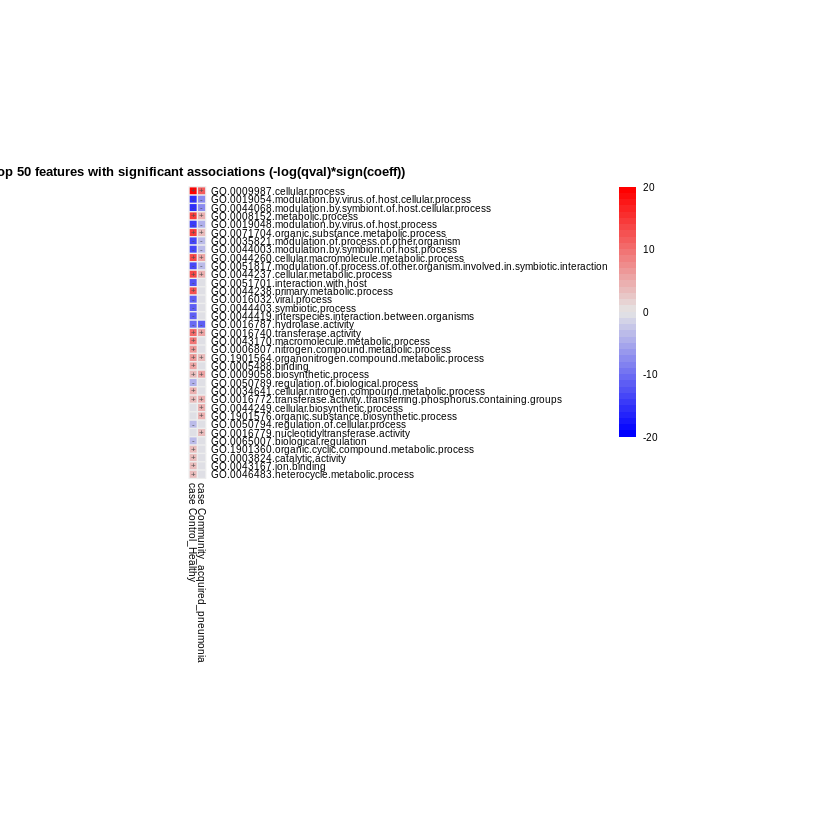
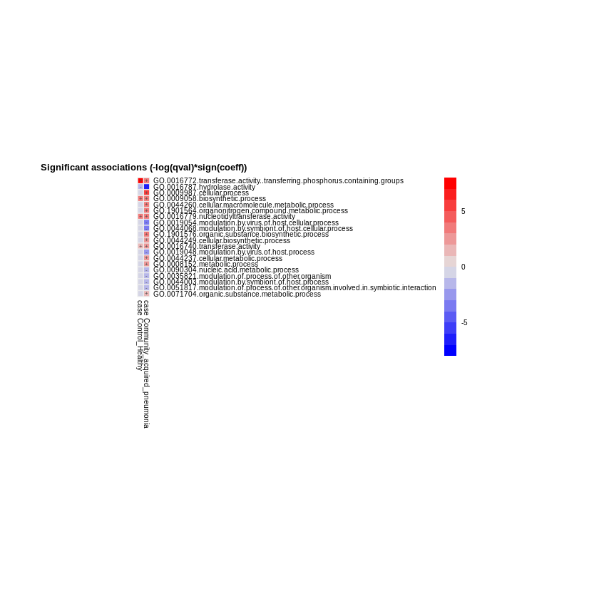
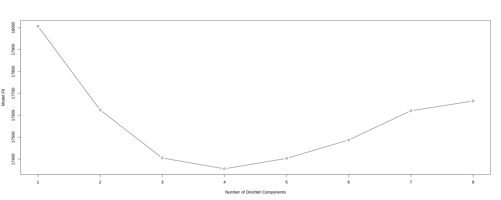
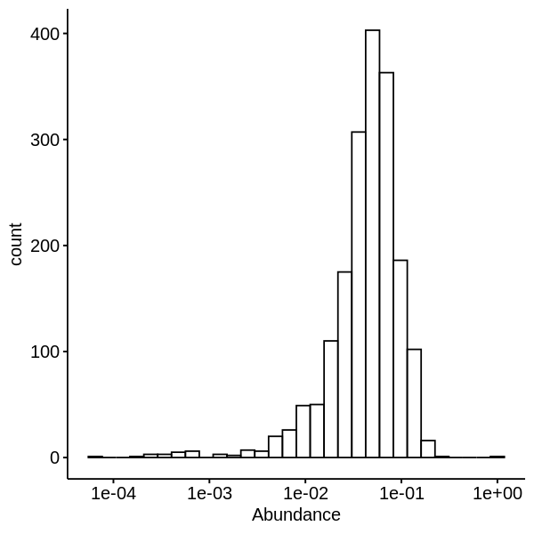
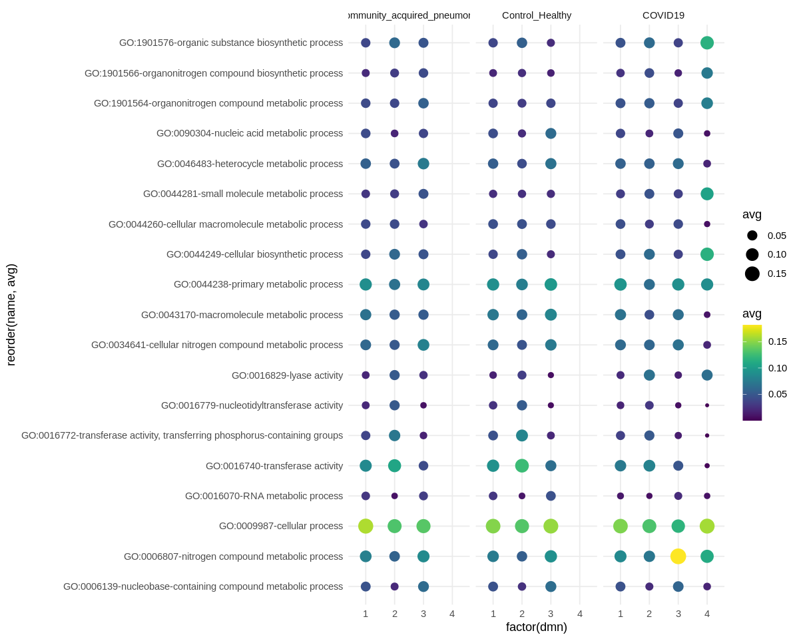
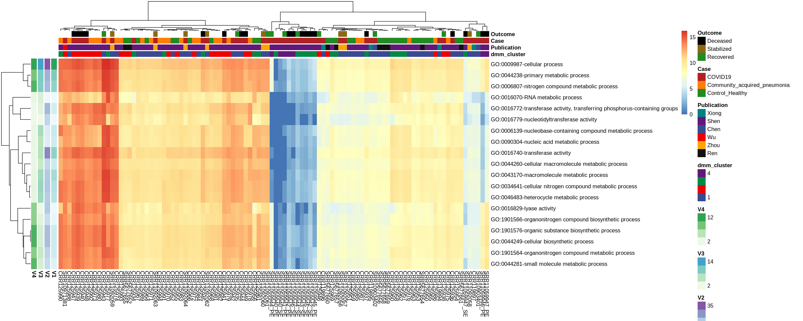
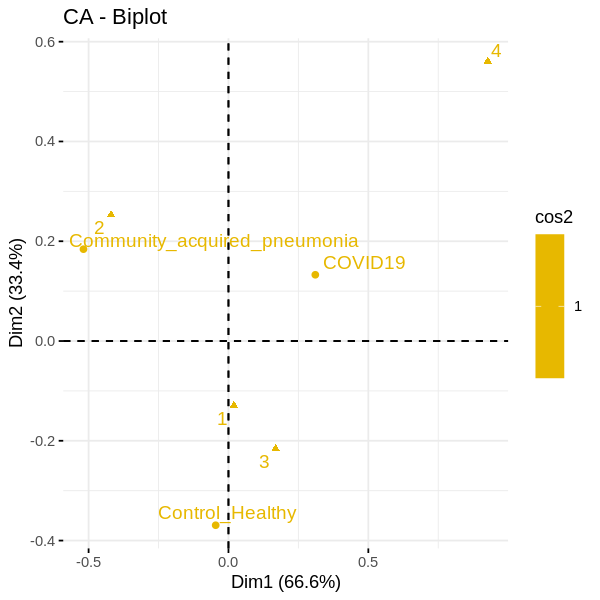

## Maaslin 2 Analysis of GO Terms for COVIRT19

 Lets install some R packages that we are gonna need to run this analysis

#if(!requireNamespace("BiocManager", quietly = TRUE))
#install.packages("BiocManager")


```R
#if (!requireNamespace("BiocManager", quietly = TRUE))
#BiocManager::install(c("Maaslin2", "DESeq2",'phyloseq','microbiome','DirichletMultinomial','GenomicRanges'))
```


```R
#install.packages("remotes")
#remotes::install_github("mikemc/speedyseq")
#install.packages(c('circlize','ggpubr','viridis','mosaic'))
```

Now lets load our libraries and set out environment


```R
library(tidyverse)
library(phyloseq)
library(microbiome)
library(DESeq2)
library(Maaslin2)
library(parallel)
library(DirichletMultinomial)
library(pheatmap)
library(ggpubr)
library(viridis)
library(mosaic)
```


```R
#setwd('/home/jovyan/work/Aagaard_Raid3/microbial/GO_term_analysis/')
setwd('/media/jochum00/Aagaard_Raid3/jupyter_notebooks/jochum00_jupyter/microbial/GO_term_analysis/')
getwd()
```

Setup your color parameters


```R
ann_colors_old = list(
  dmm_cluster=c("1"="#3B4992FF","2"="#EE0000FF","3"="#008B45FF","4"="#631879FF","5"="#008280FF","6"="#BB0021FF","7"="#5F559BFF"),
  Publication=c("Huang"="dodgerblue4","Xiong"="#008280FF", "Shen"="#631879FF","Michalovich"="#BB0021FF","Chen"="#3B4992FF","Wu"="#EE0000FF","Zhou"="orange","Ren"="#111111"),
  Sample_Type =c("COVID_19"="firebrick",
                 "Healthy"="forestgreen",
                 "Community_acquired_pneumonia"="darkorange1",
                 "Obese_Asthma"="goldenrod3",
                 "Obese_Smoker"="goldenrod4", 
                 "Obese"="goldenrod1",
                 "Asthma"= "dodgerblue2", 
                 "Asthma_Smoker"="dodgerblue4",
                 "Asthma_Ex_smoker"="dodgerblue3",
                 "Smoker"="gray27",
                 "Obese_Asthma_Smoker"="black"),
  Case=c("Control_Neg"="grey75","Control_Unknown"="grey50","COVID19"="firebrick","Community_acquired_pneumonia"="darkorange1", "Control_Healthy"="forestgreen","Control_Sick"="dodgerblue4"),
Outcome=c("Deceased"="black","Stabilized"="goldenrod4","Recovered"="forestgreen"))
ann_colors = list(
  dmm_cluster=c("1"="#3B4992FF","2"="#EE0000FF","3"="#008B45FF","4"="#631879FF"),#,"5"="#008280FF","6"="#BB0021FF","7"="#5F559BFF"),
  Publication=c("Michalovich"="#BB0021FF","Xiong"="#008280FF", "Shen"="#631879FF","Chen"="#3B4992FF","Wu"="#EE0000FF","Zhou"="orange","Ren"="#111111"),
  Case=c("COVID19"="firebrick","Community_acquired_pneumonia"="darkorange1", "Control_Healthy"="forestgreen"),
 # Sample_Type=c("COVID_19"="firebrick","Community_acquired_pneumonia"="darkorange1", "Healthy"="forestgreen"),
Outcome=c("Deceased"="black","Stabilized"="goldenrod4","Recovered"="forestgreen"))
```


```R
raw<-as_tibble(read.table("Combined_BALF_GO_Terms_parent_propagated.tsv", sep = "\t", row.names = NULL, header = T, quote = "", comment.char = ""))
```

A tibble: 47,233 x 2,020     # good so far now
do a little regex and fix some stuff


```R
colnames(raw)<-gsub("NA_tax","unclass", colnames(raw))%>%str_replace_all("NC1_SRR7796663", "NC1.SRR7796663")
```

Transform the raw table by type of count (euk, term, term, arc)


```R
df<-raw %>%
  select(GO_term,namespace,depth,name,ends_with("_counts"))%>%
  pivot_longer(cols = -c(GO_term,namespace,depth,name),
               names_to =  c("sample","type","abund"),#c("Total", "Archaea","termteria","Eukarya", "Viridae", "Unclassified"),
               names_pattern = "(.*)_(.*)_(.*)")%>%
  select(-abund)%>%
  filter(value>1)%>%
  pivot_wider(names_from = sample, values_from=value, values_fill=0)
```


```R
df$depth<-as.character(df$depth)
#SIDE NOTE:There are multiple processes and values for a single sample so you cant convert the sample to columns
```

Make individual tibbles for biological processes and molecular fxn


```R
bio<-filter(df, namespace=="biological_process")
mol<-filter(df, namespace=="molecular_function")
```

make individual tibbles for each type (term, euk, term, arc, vir, etc)

#### UPDATE 2 DEC 2020: The term counts were including everything (including NA and eukarya) so I decided to rename the file to only include term, arch, and,viral

I therefore also needed to calculate the sum of each GO_Term


```R
bio_term<-bio%>%filter(type=="term")%>%select(-type)
bio_term<-bio%>%filter(type%in%c("term","arc","vir"))%>%
    select(-type) %>%
    group_by(GO_term,namespace,depth,name)%>%
    summarise(across(.cols = where(is.numeric), sum))
```

    `summarise()` regrouping output by 'GO_term', 'namespace', 'depth' (override with `.groups` argument)
    


```R
mol_term<-mol%>%
    filter(type=="term")%>%
    select(-type)
mol_term<-mol%>%
    filter(type%in%c("term","arc","vir"))%>%
    select(-type)%>%
    group_by(GO_term,namespace,depth,name)%>%
    summarise(across(.cols = where(is.numeric), sum))
```

    `summarise()` regrouping output by 'GO_term', 'namespace', 'depth' (override with `.groups` argument)
    


```R
bio_term_counts<-bio_term%>%
    select(-c(namespace,depth,name))
bio_term_tax<-bio_term%>%
    select(GO_term,namespace,depth,name)
mol_term_counts<-mol_term%>%
    select(-c(namespace,depth,name))
mol_term_tax<-mol_term%>%
    select(GO_term,namespace,depth,name)
```

subselect tibbles for only the counts and go terminology
then get the eum of each GO_Term


```R
bio_term_counts<-bio_term%>%select(-namespace,-depth,-name)
mol_term_counts<-mol_term%>%select(-c(namespace,depth,name))
```

    Adding missing grouping variables: `namespace`, `depth`
    
    Adding missing grouping variables: `namespace`, `depth`
    


I have NO IDEA why it isnt deselecting the namespace and depth variables, but I dont have time for this so I'm hard coding some trashy stuff (sorry Mike)


```R
bio_term_counts$namespace<-NULL
bio_term_counts$depth<-NULL
mol_term_counts$namespace<-NULL
mol_term_counts$depth<-NULL
```


```R
bio_term_tax<-bio_term%>%
    select(GO_term,namespace,depth,name)
mol_term_tax<-mol_term%>%
    select(GO_term,namespace,depth,name)
```

convert them to dataframes for downstream import to phylsoeq


```R
bio_term_counts_df<-data.frame(bio_term_counts, row.names=1)
bio_term_tax_df<-data.frame(bio_term_tax, row.names=1)
mol_term_counts_df<-data.frame(mol_term_counts, row.names=1)
mol_term_tax_df<-data.frame(mol_term_tax, row.names=1)
```


```R
dim(bio_term_counts)
dim(bio_term_tax)
dim(mol_term_counts)
dim(mol_term_counts)
#mol_term_tax_phy<-tax_table(as.matrix(mol_term_tax), errorIfNULL = T)
```


<style>
.list-inline {list-style: none; margin:0; padding: 0}
.list-inline>li {display: inline-block}
.list-inline>li:not(:last-child)::after {content: "\00b7"; padding: 0 .5ex}
</style>
<ol class=list-inline><li>9724</li><li>169</li></ol>


<style>
.list-inline {list-style: none; margin:0; padding: 0}
.list-inline>li {display: inline-block}
.list-inline>li:not(:last-child)::after {content: "\00b7"; padding: 0 .5ex}
</style>
<ol class=list-inline><li>9724</li><li>4</li></ol>


<style>
.list-inline {list-style: none; margin:0; padding: 0}
.list-inline>li {display: inline-block}
.list-inline>li:not(:last-child)::after {content: "\00b7"; padding: 0 .5ex}
</style>
<ol class=list-inline><li>4857</li><li>169</li></ol>


<style>
.list-inline {list-style: none; margin:0; padding: 0}
.list-inline>li {display: inline-block}
.list-inline>li:not(:last-child)::after {content: "\00b7"; padding: 0 .5ex}
</style>
<ol class=list-inline><li>4857</li><li>169</li></ol>


convert the dataframes into phyloseq formats


```R
bio_term_counts_phy <- otu_table(bio_term_counts_df, taxa_are_rows=TRUE)
bio_term_tax_phy <- tax_table(as.matrix(bio_term_tax_df), errorIfNULL=TRUE)
mol_term_counts_phy<-otu_table(mol_term_counts_df, taxa_are_rows = T)
mol_term_tax_phy<-tax_table(as.matrix(mol_term_tax_df), errorIfNULL = T)
```

import your metadata


```R
bio_term_sam<-as.data.frame(read.table("Combined_BALF_GO_Terms_metadata2.txt",header = T, sep = "\t",row.names = 1))
```

a little regex to fix the stupid filename


```R
rownames(bio_term_sam)<-rownames(bio_term_sam)%>%str_replace_all("NC1_SRR7796663", "NC1.SRR7796663")
bio_term_sam$accession<-rownames(bio_term_sam)
```

I want to take a moment and thank the curators for all their hard work in annotation the metadata........ =)


```R
bio_term_sam$outcome<-bio_term_sam$outcome%>%
str_replace_all("recovered", "Recovered")%>%
str_replace_all("deceased","Deceased")%>%
str_replace_all('stabilized',"Stabilized")
###DONT FORGET TO DELETE THESE LINES LATER AFTER YOUR DONE PLAYING AROUND
#str_replace_all('Stabilized',"Survived")%>%
#str_replace_all("Recovered", "Survived")
###############################################
```


```R
bio_term_sam$sex<-bio_term_sam$sex%>%
str_replace_all("M", "male")%>%
str_replace_all("F", "female")%>%
str_replace_all("na", "<NA>")
```

making physeq object


```R
bio_term_pseq <- phyloseq(bio_term_counts_phy, bio_term_tax_phy, sample_data(bio_term_sam))
mol_term_pseq<-phyloseq(mol_term_counts_phy,mol_term_tax_phy, sample_data(bio_term_sam))
term_pseq<-merge_phyloseq(bio_term_pseq,mol_term_pseq)
term_pseq# [ 14581 taxa and 167 samples ]
```


    phyloseq-class experiment-level object
    otu_table()   OTU Table:         [ 14581 taxa and 167 samples ]
    sample_data() Sample Data:       [ 167 samples by 71 sample variables ]
    tax_table()   Taxonomy Table:    [ 14581 taxa by 3 taxonomic ranks ]


Filter out the top level depth 0 GO Terms "molecular function" and "biological process"


```R
filtme<-c("GO:0003674")
term_pseq <- prune_taxa(taxa=taxa_names(term_pseq)!=filtme, term_pseq)
filtme<-c("GO:0008150")
term_pseq <- prune_taxa(taxa=taxa_names(term_pseq)!=filtme, term_pseq)
term_pseq
```


    phyloseq-class experiment-level object
    otu_table()   OTU Table:         [ 14579 taxa and 167 samples ]
    sample_data() Sample Data:       [ 167 samples by 71 sample variables ]
    tax_table()   Taxonomy Table:    [ 14579 taxa by 3 taxonomic ranks ]


```R
meta<-meta(term_pseq)
meta$idsums<-sample_sums(term_pseq)
meta<-as_tibble(meta)%>%arrange(desc(idsums))
gghistogram(data = meta,
            title = "GO Term Totals by Publication",
            legend="bottom",
            x="idsums",
            y="..count..",
            color="case",
            fill="case",
            facet="publication", 
            bins = 30,
            rug=T,
            add_density=T,
            alpha=0.3,
            add = c("mean"))+
scale_x_log10()+
scale_fill_discrete(type = ann_colors_old)+
scale_color_discrete(type = ann_colors_old)
tally(publication~case,meta,"count")
```

    Warning message:
    “Groups with fewer than two data points have been dropped.”
    Warning message:
    “Groups with fewer than two data points have been dropped.”
    Warning message in max(ids, na.rm = TRUE):
    “no non-missing arguments to max; returning -Inf”
    Warning message in max(ids, na.rm = TRUE):
    “no non-missing arguments to max; returning -Inf”


                 case
    publication   Community_acquired_pneumonia Control_Healthy Control_Neg
      Chen                                   0               0           0
      Huang                                  0               0           1
      Michalovich                            0               3           0
      Ren                                    0               9           0
      Shen                                  25              20           4
      Wu                                     0               0           0
      Xiong                                  0               0           0
      Zhou                                   0               0           0
                 case
    publication   Control_Sick Control_Unknown COVID19
      Chen                   0               0       2
      Huang                  0              21       0
      Michalovich           36               0       0
      Ren                    0               0       0
      Shen                   0               0      32
      Wu                     0               0       1
      Xiong                  0               0       4
      Zhou                   0               0       9


    

    


filter out the negative control and unknown samples

#### UPDATE 2 DEC 2020 Remove the viral enriched samples from Shen et al


```R
term_pseq_no_neg<-subset_samples(term_pseq, sample_type!="neg_control")
term_pseq_no_neg# [ 14579 taxa and 162 samples ]:
term_pseq_no_neg<-subset_samples(term_pseq_no_neg, sample_type!="Unknown")
term_pseq_no_neg#  [ 14579 taxa and 141 samples ]:
term_pseq_no_neg<-subset_samples(term_pseq_no_neg, case!="Control_Sick")
term_pseq_no_neg# [ 14597 taxa and 105 samples ]
term_pseq_no_neg<-subset_samples(term_pseq_no_neg,publication!="Michalovich")
term_pseq_no_neg# [ 14597 taxa and 102 samples ]
term_pseq_no_neg<-subset_samples(term_pseq_no_neg, bioproject!="PRJNA605907")
term_pseq_no_neg# [ 14597 taxa and 86 samples ]
term_pseq_no_neg<-prune_taxa(taxa = taxa_sums(term_pseq_no_neg)>0,x = term_pseq_no_neg)
term_pseq_no_neg# [ 13534 taxa and 86 samples ]
term_pseq_no_neg<-prune_samples(samples = sample_sums(term_pseq_no_neg)>0,x = term_pseq_no_neg)
term_pseq_no_neg# [ 13534 taxa and 86 samples ]
```


    phyloseq-class experiment-level object
    otu_table()   OTU Table:         [ 14579 taxa and 162 samples ]
    sample_data() Sample Data:       [ 162 samples by 71 sample variables ]
    tax_table()   Taxonomy Table:    [ 14579 taxa by 3 taxonomic ranks ]


    phyloseq-class experiment-level object
    otu_table()   OTU Table:         [ 14579 taxa and 141 samples ]
    sample_data() Sample Data:       [ 141 samples by 71 sample variables ]
    tax_table()   Taxonomy Table:    [ 14579 taxa by 3 taxonomic ranks ]


    phyloseq-class experiment-level object
    otu_table()   OTU Table:         [ 14579 taxa and 105 samples ]
    sample_data() Sample Data:       [ 105 samples by 71 sample variables ]
    tax_table()   Taxonomy Table:    [ 14579 taxa by 3 taxonomic ranks ]


    phyloseq-class experiment-level object
    otu_table()   OTU Table:         [ 14579 taxa and 102 samples ]
    sample_data() Sample Data:       [ 102 samples by 71 sample variables ]
    tax_table()   Taxonomy Table:    [ 14579 taxa by 3 taxonomic ranks ]


    phyloseq-class experiment-level object
    otu_table()   OTU Table:         [ 14579 taxa and 86 samples ]
    sample_data() Sample Data:       [ 86 samples by 71 sample variables ]
    tax_table()   Taxonomy Table:    [ 14579 taxa by 3 taxonomic ranks ]


    phyloseq-class experiment-level object
    otu_table()   OTU Table:         [ 13534 taxa and 86 samples ]
    sample_data() Sample Data:       [ 86 samples by 71 sample variables ]
    tax_table()   Taxonomy Table:    [ 13534 taxa by 3 taxonomic ranks ]


    phyloseq-class experiment-level object
    otu_table()   OTU Table:         [ 13534 taxa and 86 samples ]
    sample_data() Sample Data:       [ 86 samples by 71 sample variables ]
    tax_table()   Taxonomy Table:    [ 13534 taxa by 3 taxonomic ranks ]


Ouch.... We are down to 25426 and86 samples total....
lets see the distro


```R
meta<-meta(term_pseq_no_neg)
tally(~case, data = meta, format ="count")
tally(~outcome, data = meta,format ="count")
tally(case~publication,data = meta,format ="count")
```


    case
    Community_acquired_pneumonia              Control_Healthy 
                              25                           29 
                         COVID19 
                              32 


    outcome
      Deceased  Recovered Stabilized       <NA> 
            10          7          8         61 


                                  publication
    case                           Chen Ren Shen Wu Xiong Zhou
      Community_acquired_pneumonia    0   0   25  0     0    0
      Control_Healthy                 0   9   20  0     0    0
      COVID19                         2   0   16  1     4    9


ok pretty even distributions overall!  lets see what happend with this...

Lets change the names of the Go Terms so we can understand the description as well as the tag

This code was causing mismatches with name and GO TAG and has since been resolved 19 NOV 2020


```R
#names<-paste(taxa_names(term_pseq_no_neg),get_taxa_unique(term_pseq_no_neg,taxonomic.rank = "name" ),sep = "-")
#taxa_names(term_pseq_no_neg)<-names
```

NEW and improved code


```R
tax<-data.frame(tax_table(term_pseq_no_neg))
names<-paste(rownames(tax),tax$name,sep="-")
length(names)
taxa_names(term_pseq_no_neg)<-names
```


13534


## Normalization Strategies
In this section of code I try to normalize the dataset for the observed differences in sampling depth


```R
meta<-meta(term_pseq_no_neg)
meta$idsums<-sample_sums(term_pseq_no_neg)
meta<-as_tibble(meta)%>%arrange(desc(idsums))
gghistogram(data = meta,
            title = "GO Term Totals by Case",
            legend="bottom",
            x="idsums",
            y="..count..",
            color="case",
            fill="case", 
            bins = 30,
            rug=T,
            add_density=T,
            alpha=0.3,
            add = c("mean"))+
scale_x_log10()+
scale_fill_discrete(type = ann_colors)+
scale_color_discrete(type = ann_colors)
```


    

    


```R
meta<-meta(term_pseq_no_neg)
meta$idsums<-sample_sums(term_pseq_no_neg)
meta<-as_tibble(meta)%>%arrange(desc(idsums))
gghistogram(data = meta,
            title = "GO Term Totals by Publication",
            legend="bottom",
            x="idsums",
            y="..count..",
            color="publication",
            fill="publication", 
            bins = 30,
            rug=T,
            add_density=T,
            alpha=0.3,
            add = c("mean"))+
scale_x_log10()+
scale_fill_discrete(type = ann_colors)+
scale_color_discrete(type = ann_colors)
```

    Warning message:
    “Groups with fewer than two data points have been dropped.”
    Warning message in max(ids, na.rm = TRUE):
    “no non-missing arguments to max; returning -Inf”


    

    


### 1. Compositional Transformation


```R
term_pseq_no_neg_comp<-microbiome::transform(x = term_pseq_no_neg,transform = "compositional")
```

### 2. DESeq2 VST transformation


```R
sample_info_tab<-sample_data(term_pseq_no_neg)
sample_info_tab_phy <- sample_data(sample_info_tab)
deseq_counts<-phyloseq_to_deseq2(physeq = term_pseq_no_neg,design = ~ 1) 
deseq_counts_vst<-varianceStabilizingTransformation(deseq_counts)
#deseq_counts_vst <- estimateSizeFactors(deseq_counts, type = "poscounts")
vst_trans_count_tab <- assay(deseq_counts_vst)
```

    converting counts to integer mode
    


```R
vst_count_phy <- otu_table(vst_trans_count_tab, taxa_are_rows=T)
vst_tax_phy <- tax_table(term_pseq_no_neg)
vst_physeq <- phyloseq(vst_count_phy, vst_tax_phy,sample_data(term_pseq_no_neg))
#vst_physeq_comp<-microbiome::transform(x = vst_physeq,transform = "compositional")
```

# MaAsLIN2


```R
#dir.create("R_Maaslin2") # Create a new directory
setwd('/media/jochum00/Aagaard_Raid3/jupyter_notebooks/jochum00_jupyter/microbial/GO_term_analysis/R_Maaslin2/ag1')
#setwd("/home/jovyan/work/Jochum_3/jupyter_lab/GO_term_analysis/R_Maaslin2/ag1") # Change the current working directory 
getwd() #check if directory has been successfully changed
```


'/media/jochum00/Aagaard_Raid3/jupyter_notebooks/jochum00_jupyter/microbial/GO_term_analysis/R_Maaslin2/ag1'


```R
df_input_data<-data.frame(t(otu_table(term_pseq_no_neg_comp)))
df_input_metadata<-data.frame(sample_data(term_pseq_no_neg_comp))
```


```R
df_input_data2<-data.frame(t(otu_table(vst_physeq)))
df_input_metadata2<-data.frame(sample_data(vst_physeq))
```

## ok so here are the parameters you want to manipulate:
min abundance= the min rel abund hits (1%) #filters out XXXX GO_terms \
min prevalence = Min samples required with min abundance for a feature not to be filtered (0.1=10%=14.1000 samples) \
max_significance = the maximinum p adjusted value to be significant \

This will filter out XXXXX GO TERMS \

#_normalization = CLR transformation_ \
##### CORRECTION dont normalize here, just use the VST transformed counts
correction = the mutliple test correction method to be done (BH=Benjamini-Hochberg)

This is what is looks like if we feed the VST normalized counts into maaslin and get log scale outputs

Ok this isnt working, I cant figure out how to not get >500 hits with the vst physeq object, and it doend tmake a lot of sense that everything is wayyy up but w/e.  

I think we could take these results and then go make boxplots of the compositionally transformed counts

Lets see what this looks like if we just let maaslin2 do the normalization (CLR) on compositionally transformed counts


```R
term_pseq_no_neg_comp#  [ 13534 taxa and 86 samples ]
```


    phyloseq-class experiment-level object
    otu_table()   OTU Table:         [ 13534 taxa and 86 samples ]
    sample_data() Sample Data:       [ 86 samples by 71 sample variables ]
    tax_table()   Taxonomy Table:    [ 13534 taxa by 3 taxonomic ranks ]


```R
num<-as.numeric(100)
case_norm<-Maaslin2(
  input_data = df_input_data,
  input_metadata = df_input_metadata,
  output="./terms_vs_case_comp_norm",
  min_abundance = 0.01, #UPDATE for more terms: lowered miminum rel. abundance 0.3%
  min_prevalence = 0.1, 
  normalization = "CLR",
  transform = "NONE",
  analysis_method = "LM",
  max_significance = 0.05,
  #random_effects = c("sample_name","publication","collection_location","sequence_type"),
  random_effects = c("sample_name","publication"),
  fixed_effects = c("case"),
  correction="BH",
  standardize = TRUE,
  cores = 48,
  plot_heatmap = TRUE,
  plot_scatter = TRUE,
  heatmap_first_n =num,
  reference=c("case,COVID19"))
```

    [1] "Warning: Deleting existing log file: ./terms_vs_case_comp_norm/maaslin2.log"
    2020-12-02 22:55:53 INFO::Writing function arguments to log file
    2020-12-02 22:55:53 INFO::Verifying options selected are valid
    2020-12-02 22:55:53 INFO::Determining format of input files
    2020-12-02 22:55:53 INFO::Input format is data samples as rows and metadata samples as rows
    2020-12-02 22:55:54 INFO::Formula for random effects: expr ~ (1 | sample_name) + (1 | publication)
    2020-12-02 22:55:54 INFO::Formula for fixed effects: expr ~  case
    2020-12-02 22:55:54 INFO::Filter data based on min abundance and min prevalence
    2020-12-02 22:55:54 INFO::Total samples in data: 86
    2020-12-02 22:55:54 INFO::Min samples required with min abundance for a feature not to be filtered: 8.600000
    2020-12-02 22:55:54 INFO::Total filtered features: 13493
    2020-12-02 22:55:54 INFO::Filtered feature names from abundance and prevalence filtering: GO.0000002.mitochondrial.genome.maintenance, GO.0000003.reproduction, GO.0000011.vacuole.inheritance, GO.0000018.regulation.of.DNA.recombination, GO.0000019.regulation.of.mitotic.recombination, GO.0000023.maltose.metabolic.process, GO.0000025.maltose.catabolic.process, GO.0000027.ribosomal.large.subunit.assembly, GO.0000028.ribosomal.small.subunit.assembly, GO.0000032.cell.wall.mannoprotein.biosynthetic.process, GO.0000038.very.long.chain.fatty.acid.metabolic.process, GO.0000041.transition.metal.ion.transport, GO.0000045.autophagosome.assembly, GO.0000050.urea.cycle, GO.0000052.citrulline.metabolic.process, GO.0000053.argininosuccinate.metabolic.process, GO.0000054.ribosomal.subunit.export.from.nucleus, GO.0000055.ribosomal.large.subunit.export.from.nucleus, GO.0000070.mitotic.sister.chromatid.segregation, GO.0000075.cell.cycle.checkpoint, GO.0000076.DNA.replication.checkpoint, GO.0000077.DNA.damage.checkpoint, GO.0000079.regulation.of.cyclin.dependent.protein.serine.threonine.kinase.activity, GO.0000082.G1.S.transition.of.mitotic.cell.cycle, GO.0000083.regulation.of.transcription.involved.in.G1.S.transition.of.mitotic.cell.cycle, GO.0000086.G2.M.transition.of.mitotic.cell.cycle, GO.0000096.sulfur.amino.acid.metabolic.process, GO.0000097.sulfur.amino.acid.biosynthetic.process, GO.0000098.sulfur.amino.acid.catabolic.process, GO.0000101.sulfur.amino.acid.transport, GO.0000103.sulfate.assimilation, GO.0000105.histidine.biosynthetic.process, GO.0000122.negative.regulation.of.transcription.by.RNA.polymerase.II, GO.0000132.establishment.of.mitotic.spindle.orientation, GO.0000147.actin.cortical.patch.assembly, GO.0000154.rRNA.modification, GO.0000160.phosphorelay.signal.transduction.system, GO.0000161.osmosensory.signaling.MAPK.cascade, GO.0000162.tryptophan.biosynthetic.process, GO.0000165.MAPK.cascade, GO.0000183.rDNA.heterochromatin.assembly, GO.0000184.nuclear.transcribed.mRNA.catabolic.process..nonsense.mediated.decay, GO.0000185.activation.of.MAPKKK.activity, GO.0000186.activation.of.MAPKK.activity, GO.0000187.activation.of.MAPK.activity, GO.0000188.inactivation.of.MAPK.activity, GO.0000209.protein.polyubiquitination, GO.0000212.meiotic.spindle.organization, GO.0000226.microtubule.cytoskeleton.organization, GO.0000244.spliceosomal.tri.snRNP.complex.assembly, GO.0000245.spliceosomal.complex.assembly, GO.0000255.allantoin.metabolic.process, GO.0000256.allantoin.catabolic.process, GO.0000266.mitochondrial.fission, GO.0000270.peptidoglycan.metabolic.process, GO.0000271.polysaccharide.biosynthetic.process, GO.0000272.polysaccharide.catabolic.process, GO.0000278.mitotic.cell.cycle, GO.0000280.nuclear.division, GO.0000281.mitotic.cytokinesis, GO.0000282.cellular.bud.site.selection, GO.0000288.nuclear.transcribed.mRNA.catabolic.process..deadenylation.dependent.decay, GO.0000289.nuclear.transcribed.mRNA.poly.A..tail.shortening, GO.0000290.deadenylation.dependent.decapping.of.nuclear.transcribed.mRNA, GO.0000291.nuclear.transcribed.mRNA.catabolic.process..exonucleolytic, GO.0000302.response.to.reactive.oxygen.species, GO.0000303.response.to.superoxide, GO.0000305.response.to.oxygen.radical, GO.0000316.sulfite.transport, GO.0000338.protein.deneddylation, GO.0000372.Group.I.intron.splicing, GO.0000375.RNA.splicing..via.transesterification.reactions, GO.0000376.RNA.splicing..via.transesterification.reactions.with.guanosine.as.nucleophile, GO.0000377.RNA.splicing..via.transesterification.reactions.with.bulged.adenosine.as.nucleophile, GO.0000378.RNA.exon.ligation, GO.0000381.regulation.of.alternative.mRNA.splicing..via.spliceosome, GO.0000387.spliceosomal.snRNP.assembly, GO.0000388.spliceosome.conformational.change.to.release.U4..or.U4atac..and.U1..or.U11., GO.0000390.spliceosomal.complex.disassembly, GO.0000393.spliceosomal.conformational.changes.to.generate.catalytic.conformation, GO.0000394.RNA.splicing..via.endonucleolytic.cleavage.and.ligation, GO.0000395.mRNA.5.splice.site.recognition, GO.0000398.mRNA.splicing..via.spliceosome, GO.0000413.protein.peptidyl.prolyl.isomerization, GO.0000414.regulation.of.histone.H3.K36.methylation, GO.0000416.positive.regulation.of.histone.H3.K36.methylation, GO.0000422.autophagy.of.mitochondrion, GO.0000429.carbon.catabolite.regulation.of.transcription.from.RNA.polymerase.II.promoter, GO.0000430.regulation.of.transcription.from.RNA.polymerase.II.promoter.by.glucose, GO.0000433.carbon.catabolite.repression.of.transcription.from.RNA.polymerase.II.promoter.by.glucose, GO.0000436.carbon.catabolite.activation.of.transcription.from.RNA.polymerase.II.promoter, GO.0000447.endonucleolytic.cleavage.in.ITS1.to.separate.SSU.rRNA.from.5.8S.rRNA.and.LSU.rRNA.from.tricistronic.rRNA.transcript..SSU.rRNA..5.8S.rRNA..LSU.rRNA., GO.0000451.rRNA.2.O.methylation, GO.0000453.enzyme.directed.rRNA.2.O.methylation, GO.0000455.enzyme.directed.rRNA.pseudouridine.synthesis, GO.0000460.maturation.of.5.8S.rRNA, GO.0000462.maturation.of.SSU.rRNA.from.tricistronic.rRNA.transcript..SSU.rRNA..5.8S.rRNA..LSU.rRNA., GO.0000463.maturation.of.LSU.rRNA.from.tricistronic.rRNA.transcript..SSU.rRNA..5.8S.rRNA..LSU.rRNA., GO.0000466.maturation.of.5.8S.rRNA.from.tricistronic.rRNA.transcript..SSU.rRNA..5.8S.rRNA..LSU.rRNA., GO.0000469.cleavage.involved.in.rRNA.processing, GO.0000470.maturation.of.LSU.rRNA, GO.0000472.endonucleolytic.cleavage.to.generate.mature.5.end.of.SSU.rRNA.from..SSU.rRNA..5.8S.rRNA..LSU.rRNA., GO.0000478.endonucleolytic.cleavage.involved.in.rRNA.processing, GO.0000479.endonucleolytic.cleavage.of.tricistronic.rRNA.transcript..SSU.rRNA..5.8S.rRNA..LSU.rRNA., GO.0000480.endonucleolytic.cleavage.in.5.ETS.of.tricistronic.rRNA.transcript..SSU.rRNA..5.8S.rRNA..LSU.rRNA., GO.0000491.small.nucleolar.ribonucleoprotein.complex.assembly, GO.0000578.embryonic.axis.specification, GO.0000706.meiotic.DNA.double.strand.break.processing, GO.0000710.meiotic.mismatch.repair, GO.0000712.resolution.of.meiotic.recombination.intermediates, GO.0000715.nucleotide.excision.repair..DNA.damage.recognition, GO.0000716.transcription.coupled.nucleotide.excision.repair..DNA.damage.recognition, GO.0000717.nucleotide.excision.repair..DNA.duplex.unwinding, GO.0000719.photoreactive.repair, GO.0000722.telomere.maintenance.via.recombination, GO.0000723.telomere.maintenance, GO.0000724.double.strand.break.repair.via.homologous.recombination, GO.0000725.recombinational.repair, GO.0000726.non.recombinational.repair, GO.0000727.double.strand.break.repair.via.break.induced.replication, GO.0000729.DNA.double.strand.break.processing, GO.0000730.DNA.recombinase.assembly, GO.0000731.DNA.synthesis.involved.in.DNA.repair, GO.0000733.DNA.strand.renaturation, GO.0000735.removal.of.nonhomologous.ends, GO.0000737.DNA.catabolic.process..endonucleolytic, GO.0000738.DNA.catabolic.process..exonucleolytic, GO.0000740.nuclear.membrane.fusion, GO.0000741.karyogamy, GO.0000742.karyogamy.involved.in.conjugation.with.cellular.fusion, GO.0000746.conjugation, GO.0000749.response.to.pheromone.triggering.conjugation.with.cellular.fusion, GO.0000768.syncytium.formation.by.plasma.membrane.fusion, GO.0000770.peptide.pheromone.export, GO.0000819.sister.chromatid.segregation, GO.0000820.regulation.of.glutamine.family.amino.acid.metabolic.process, GO.0000821.regulation.of.arginine.metabolic.process, GO.0000902.cell.morphogenesis, GO.0000904.cell.morphogenesis.involved.in.differentiation, GO.0000910.cytokinesis, GO.0000912.assembly.of.actomyosin.apparatus.involved.in.cytokinesis, GO.0000915.actomyosin.contractile.ring.assembly, GO.0000916.actomyosin.contractile.ring.contraction, GO.0000917.division.septum.assembly, GO.0000920.septum.digestion.after.cytokinesis, GO.0000921.septin.ring.assembly, GO.0000947.amino.acid.catabolic.process.to.alcohol.via.Ehrlich.pathway, GO.0000949.aromatic.amino.acid.family.catabolic.process.to.alcohol.via.Ehrlich.pathway, GO.0000955.amino.acid.catabolic.process.via.Ehrlich.pathway, GO.0000956.nuclear.transcribed.mRNA.catabolic.process, GO.0000957.mitochondrial.RNA.catabolic.process, GO.0000958.mitochondrial.mRNA.catabolic.process, GO.0000959.mitochondrial.RNA.metabolic.process, GO.0000960.regulation.of.mitochondrial.RNA.catabolic.process, GO.0000962.positive.regulation.of.mitochondrial.RNA.catabolic.process, GO.0000963.mitochondrial.RNA.processing, GO.0000964.mitochondrial.RNA.5.end.processing, GO.0000965.mitochondrial.RNA.3.end.processing, GO.0000966.RNA.5.end.processing, GO.0000967.rRNA.5.end.processing, GO.0000968.tRNA.exon.ligation, GO.0000971.tRNA.exon.ligation.utilizing.2.3.cyclic.phosphate.of.5.exon.as.source.of.linkage.phosphate, GO.0000972.transcription.dependent.tethering.of.RNA.polymerase.II.gene.DNA.at.nuclear.periphery, GO.0000973.posttranscriptional.tethering.of.RNA.polymerase.II.gene.DNA.at.nuclear.periphery, GO.0001079.nitrogen.catabolite.regulation.of.transcription.from.RNA.polymerase.II.promoter, GO.0001101.response.to.acid.chemical, GO.0001109.promoter.clearance.during.DNA.templated.transcription, GO.0001111.promoter.clearance.from.RNA.polymerase.II.promoter, GO.0001112.DNA.templated.transcription.open.complex.formation, GO.0001113.transcription.open.complex.formation.at.RNA.polymerase.II.promoter, GO.0001120.protein.DNA.complex.remodeling, GO.0001121.bacterial.transcription, GO.0001123.transcription.initiation.from.bacterial.type.RNA.polymerase.promoter, GO.0001171.reverse.transcription, GO.0001172.transcription..RNA.templated, GO.0001173.DNA.templated.transcriptional.start.site.selection, GO.0001174.transcriptional.start.site.selection.at.RNA.polymerase.II.promoter, GO.0001300.chronological.cell.aging, GO.0001302.obsolete.replicative.cell.aging, GO.0001306.age.dependent.response.to.oxidative.stress, GO.0001319.obsolete.inheritance.of.oxidatively.modified.proteins.involved.in.replicative.cell.aging, GO.0001324.age.dependent.response.to.oxidative.stress.involved.in.chronological.cell.aging, GO.0001403.invasive.growth.in.response.to.glucose.limitation, GO.0001407.glycerophosphodiester.transmembrane.transport, GO.0001501.skeletal.system.development, GO.0001502.cartilage.condensation, GO.0001503.ossification, GO.0001505.regulation.of.neurotransmitter.levels, GO.0001507.acetylcholine.catabolic.process.in.synaptic.cleft, GO.0001508.action.potential, GO.0001510.RNA.methylation, GO.0001514.selenocysteine.incorporation, GO.0001516.prostaglandin.biosynthetic.process, GO.0001519.peptide.amidation, GO.0001522.pseudouridine.synthesis, GO.0001523.retinoid.metabolic.process, GO.0001525.angiogenesis, GO.0001539.cilium.or.flagellum.dependent.cell.motility, GO.0001541.ovarian.follicle.development, GO.0001553.luteinization, GO.0001554.luteolysis, GO.0001556.oocyte.maturation, GO.0001558.regulation.of.cell.growth, GO.0001560.regulation.of.cell.growth.by.extracellular.stimulus, GO.0001561.fatty.acid.alpha.oxidation, GO.0001562.response.to.protozoan, GO.0001568.blood.vessel.development, GO.0001569.branching.involved.in.blood.vessel.morphogenesis, GO.0001570.vasculogenesis, GO.0001573.ganglioside.metabolic.process, GO.0001578.microtubule.bundle.formation, GO.0001649.osteoblast.differentiation, GO.0001654.eye.development, GO.0001656.metanephros.development, GO.0001657.ureteric.bud.development, GO.0001659.temperature.homeostasis, GO.0001666.response.to.hypoxia, GO.0001667.ameboidal.type.cell.migration, GO.0001672.regulation.of.chromatin.assembly.or.disassembly, GO.0001676.long.chain.fatty.acid.metabolic.process, GO.0001678.cellular.glucose.homeostasis, GO.0001680.tRNA.3.terminal.CCA.addition, GO.0001682.tRNA.5.leader.removal, GO.0001700.embryonic.development.via.the.syncytial.blastoderm, GO.0001701.in.utero.embryonic.development, GO.0001704.formation.of.primary.germ.layer, GO.0001707.mesoderm.formation, GO.0001708.cell.fate.specification, GO.0001709.cell.fate.determination, GO.0001731.formation.of.translation.preinitiation.complex, GO.0001732.formation.of.cytoplasmic.translation.initiation.complex, GO.0001736.establishment.of.planar.polarity, GO.0001737.establishment.of.imaginal.disc.derived.wing.hair.orientation, GO.0001738.morphogenesis.of.a.polarized.epithelium, GO.0001745.compound.eye.morphogenesis, GO.0001751.compound.eye.photoreceptor.cell.differentiation, GO.0001752.compound.eye.photoreceptor.fate.commitment, GO.0001754.eye.photoreceptor.cell.differentiation, GO.0001755.neural.crest.cell.migration, GO.0001756.somitogenesis, GO.0001763.morphogenesis.of.a.branching.structure, GO.0001764.neuron.migration, GO.0001765.membrane.raft.assembly, GO.0001773.myeloid.dendritic.cell.activation, GO.0001775.cell.activation, GO.0001776.leukocyte.homeostasis, GO.0001780.neutrophil.homeostasis, GO.0001816.cytokine.production, GO.0001817.regulation.of.cytokine.production, GO.0001818.negative.regulation.of.cytokine.production, GO.0001819.positive.regulation.of.cytokine.production, GO.0001822.kidney.development, GO.0001835.blastocyst.hatching, GO.0001837.epithelial.to.mesenchymal.transition, GO.0001838.embryonic.epithelial.tube.formation, GO.0001841.neural.tube.formation, GO.0001843.neural.tube.closure, GO.0001868.regulation.of.complement.activation..lectin.pathway, GO.0001869.negative.regulation.of.complement.activation..lectin.pathway, GO.0001878.response.to.yeast, GO.0001881.receptor.recycling, GO.0001885.endothelial.cell.development, GO.0001887.selenium.compound.metabolic.process, GO.0001889.liver.development, GO.0001890.placenta.development, GO.0001892.embryonic.placenta.development, GO.0001893.maternal.placenta.development, GO.0001894.tissue.homeostasis, GO.0001895.retina.homeostasis, GO.0001896.autolysis, GO.0001897.cytolysis.by.symbiont.of.host.cells, GO.0001906.cell.killing, GO.0001907.killing.by.symbiont.of.host.cells, GO.0001909.leukocyte.mediated.cytotoxicity, GO.0001910.regulation.of.leukocyte.mediated.cytotoxicity, GO.0001911.negative.regulation.of.leukocyte.mediated.cytotoxicity, GO.0001912.positive.regulation.of.leukocyte.mediated.cytotoxicity, GO.0001914.regulation.of.T.cell.mediated.cytotoxicity, GO.0001915.negative.regulation.of.T.cell.mediated.cytotoxicity, GO.0001916.positive.regulation.of.T.cell.mediated.cytotoxicity, GO.0001919.regulation.of.receptor.recycling, GO.0001932.regulation.of.protein.phosphorylation, GO.0001933.negative.regulation.of.protein.phosphorylation, GO.0001934.positive.regulation.of.protein.phosphorylation, GO.0001935.endothelial.cell.proliferation, GO.0001936.regulation.of.endothelial.cell.proliferation, GO.0001937.negative.regulation.of.endothelial.cell.proliferation, GO.0001941.postsynaptic.membrane.organization, GO.0001944.vasculature.development, GO.0001946.lymphangiogenesis, GO.0001947.heart.looping, GO.0001952.regulation.of.cell.matrix.adhesion, GO.0001953.negative.regulation.of.cell.matrix.adhesion, GO.0001955.blood.vessel.maturation, GO.0001958.endochondral.ossification, GO.0001959.regulation.of.cytokine.mediated.signaling.pathway, GO.0001960.negative.regulation.of.cytokine.mediated.signaling.pathway, GO.0001961.positive.regulation.of.cytokine.mediated.signaling.pathway, GO.0001964.startle.response, GO.0001966.thigmotaxis, GO.0001974.blood.vessel.remodeling, GO.0001990.regulation.of.systemic.arterial.blood.pressure.by.hormone, GO.0001994.norepinephrine.epinephrine.vasoconstriction.involved.in.regulation.of.systemic.arterial.blood.pressure, GO.0002003.angiotensin.maturation, GO.0002009.morphogenesis.of.an.epithelium, GO.0002011.morphogenesis.of.an.epithelial.sheet, GO.0002023.reduction.of.food.intake.in.response.to.dietary.excess, GO.0002026.regulation.of.the.force.of.heart.contraction, GO.0002027.regulation.of.heart.rate, GO.0002028.regulation.of.sodium.ion.transport, GO.0002042.cell.migration.involved.in.sprouting.angiogenesis, GO.0002047.phenazine.biosynthetic.process, GO.0002048.pyoverdine.metabolic.process, GO.0002049.pyoverdine.biosynthetic.process, GO.0002052.positive.regulation.of.neuroblast.proliferation, GO.0002062.chondrocyte.differentiation, GO.0002063.chondrocyte.development, GO.0002064.epithelial.cell.development, GO.0002065.columnar.cuboidal.epithelial.cell.differentiation, GO.0002066.columnar.cuboidal.epithelial.cell.development, GO.0002068.glandular.epithelial.cell.development, GO.0002070.epithelial.cell.maturation, GO.0002076.osteoblast.development, GO.0002082.regulation.of.oxidative.phosphorylation, GO.0002087.regulation.of.respiratory.gaseous.exchange.by.nervous.system.process, GO.0002089.lens.morphogenesis.in.camera.type.eye, GO.0002090.regulation.of.receptor.internalization, GO.0002091.negative.regulation.of.receptor.internalization, GO.0002097.tRNA.wobble.base.modification, GO.0002098.tRNA.wobble.uridine.modification, GO.0002099.tRNA.wobble.guanine.modification, GO.0002100.tRNA.wobble.adenosine.to.inosine.editing, GO.0002101.tRNA.wobble.cytosine.modification, GO.0002109.maturation.of.SSU.rRNA.from.tricistronic.rRNA.transcript..SSU.rRNA..LSU.rRNA.5S., GO.0002118.aggressive.behavior, GO.0002119.nematode.larval.development, GO.0002121.inter.male.aggressive.behavior, GO.0002128.tRNA.nucleoside.ribose.methylation, GO.0002130.wobble.position.ribose.methylation, GO.0002131.wobble.position.cytosine.ribose.methylation, GO.0002132.wobble.position.uridine.ribose.methylation, GO.0002136.tRNA.wobble.base.lysidine.biosynthesis, GO.0002143.tRNA.wobble.position.uridine.thiolation, GO.0002164.larval.development, GO.0002165.instar.larval.or.pupal.development, GO.0002168.instar.larval.development, GO.0002181.cytoplasmic.translation, GO.0002183.cytoplasmic.translational.initiation, GO.0002184.cytoplasmic.translational.termination, GO.0002188.translation.reinitiation, GO.0002191.cap.dependent.translational.initiation, GO.0002195.2.methylthio.N.6..cis.hydroxy.isopentenyl.adenosine.tRNA.biosynthesis, GO.0002200.somatic.diversification.of.immune.receptors, GO.0002213.defense.response.to.insect, GO.0002218.activation.of.innate.immune.response, GO.0002220.innate.immune.response.activating.cell.surface.receptor.signaling.pathway, GO.0002221.pattern.recognition.receptor.signaling.pathway, GO.0002223.stimulatory.C.type.lectin.receptor.signaling.pathway, GO.0002224.toll.like.receptor.signaling.pathway, GO.0002225.positive.regulation.of.antimicrobial.peptide.production, GO.0002228.natural.killer.cell.mediated.immunity, GO.0002230.positive.regulation.of.defense.response.to.virus.by.host, GO.0002237.response.to.molecule.of.bacterial.origin, GO.0002239.response.to.oomycetes, GO.0002244.hematopoietic.progenitor.cell.differentiation, GO.0002250.adaptive.immune.response, GO.0002252.immune.effector.process, GO.0002253.activation.of.immune.response, GO.0002260.lymphocyte.homeostasis, GO.0002262.myeloid.cell.homeostasis, GO.0002263.cell.activation.involved.in.immune.response, GO.0002274.myeloid.leukocyte.activation, GO.0002275.myeloid.cell.activation.involved.in.immune.response, GO.0002283.neutrophil.activation.involved.in.immune.response, GO.0002320.lymphoid.progenitor.cell.differentiation, GO.0002328.pro.B.cell.differentiation, GO.0002360.T.cell.lineage.commitment, GO.0002366.leukocyte.activation.involved.in.immune.response, GO.0002367.cytokine.production.involved.in.immune.response, GO.0002374.cytokine.secretion.involved.in.immune.response, GO.0002376.immune.system.process, GO.0002428.antigen.processing.and.presentation.of.peptide.antigen.via.MHC.class.Ib, GO.0002429.immune.response.activating.cell.surface.receptor.signaling.pathway, GO.0002431.Fc.receptor.mediated.stimulatory.signaling.pathway, GO.0002433.immune.response.regulating.cell.surface.receptor.signaling.pathway.involved.in.phagocytosis, GO.0002437.inflammatory.response.to.antigenic.stimulus, GO.0002439.chronic.inflammatory.response.to.antigenic.stimulus, GO.0002440.production.of.molecular.mediator.of.immune.response, GO.0002443.leukocyte.mediated.immunity, GO.0002449.lymphocyte.mediated.immunity, GO.0002456.T.cell.mediated.immunity, GO.0002460.adaptive.immune.response.based.on.somatic.recombination.of.immune.receptors.built.from.immunoglobulin.superfamily.domains, GO.0002474.antigen.processing.and.presentation.of.peptide.antigen.via.MHC.class.I, GO.0002475.antigen.processing.and.presentation.via.MHC.class.Ib, GO.0002476.antigen.processing.and.presentation.of.endogenous.peptide.antigen.via.MHC.class.Ib, GO.0002477.antigen.processing.and.presentation.of.exogenous.peptide.antigen.via.MHC.class.Ib, GO.0002478.antigen.processing.and.presentation.of.exogenous.peptide.antigen, GO.0002479.antigen.processing.and.presentation.of.exogenous.peptide.antigen.via.MHC.class.I..TAP.dependent, GO.0002481.antigen.processing.and.presentation.of.exogenous.protein.antigen.via.MHC.class.Ib..TAP.dependent, GO.0002483.antigen.processing.and.presentation.of.endogenous.peptide.antigen, GO.0002484.antigen.processing.and.presentation.of.endogenous.peptide.antigen.via.MHC.class.I.via.ER.pathway, GO.0002485.antigen.processing.and.presentation.of.endogenous.peptide.antigen.via.MHC.class.I.via.ER.pathway..TAP.dependent, GO.0002488.antigen.processing.and.presentation.of.endogenous.peptide.antigen.via.MHC.class.Ib.via.ER.pathway, GO.0002489.antigen.processing.and.presentation.of.endogenous.peptide.antigen.via.MHC.class.Ib.via.ER.pathway..TAP.dependent, GO.0002521.leukocyte.differentiation, GO.0002526.acute.inflammatory.response, GO.0002532.production.of.molecular.mediator.involved.in.inflammatory.response, GO.0002536.respiratory.burst.involved.in.inflammatory.response, GO.0002544.chronic.inflammatory.response, GO.0002548.monocyte.chemotaxis, GO.0002562.somatic.diversification.of.immune.receptors.via.germline.recombination.within.a.single.locus, GO.0002566.somatic.diversification.of.immune.receptors.via.somatic.mutation, GO.0002573.myeloid.leukocyte.differentiation, GO.0002574.thrombocyte.differentiation, GO.0002577.regulation.of.antigen.processing.and.presentation, GO.0002578.negative.regulation.of.antigen.processing.and.presentation, GO.0002580.regulation.of.antigen.processing.and.presentation.of.peptide.or.polysaccharide.antigen.via.MHC.class.II, GO.0002581.negative.regulation.of.antigen.processing.and.presentation.of.peptide.or.polysaccharide.antigen.via.MHC.class.II, GO.0002583.regulation.of.antigen.processing.and.presentation.of.peptide.antigen, GO.0002584.negative.regulation.of.antigen.processing.and.presentation.of.peptide.antigen, GO.0002586.regulation.of.antigen.processing.and.presentation.of.peptide.antigen.via.MHC.class.II, GO.0002587.negative.regulation.of.antigen.processing.and.presentation.of.peptide.antigen.via.MHC.class.II, GO.0002589.regulation.of.antigen.processing.and.presentation.of.peptide.antigen.via.MHC.class.I, GO.0002590.negative.regulation.of.antigen.processing.and.presentation.of.peptide.antigen.via.MHC.class.I, GO.0002637.regulation.of.immunoglobulin.production, GO.0002639.positive.regulation.of.immunoglobulin.production, GO.0002679.respiratory.burst.involved.in.defense.response, GO.0002682.regulation.of.immune.system.process, GO.0002683.negative.regulation.of.immune.system.process, GO.0002684.positive.regulation.of.immune.system.process, GO.0002685.regulation.of.leukocyte.migration, GO.0002686.negative.regulation.of.leukocyte.migration, GO.0002687.positive.regulation.of.leukocyte.migration, GO.0002688.regulation.of.leukocyte.chemotaxis, GO.0002689.negative.regulation.of.leukocyte.chemotaxis, GO.0002690.positive.regulation.of.leukocyte.chemotaxis, GO.0002691.regulation.of.cellular.extravasation, GO.0002692.negative.regulation.of.cellular.extravasation, GO.0002694.regulation.of.leukocyte.activation, GO.0002695.negative.regulation.of.leukocyte.activation, GO.0002696.positive.regulation.of.leukocyte.activation, GO.0002697.regulation.of.immune.effector.process, GO.0002698.negative.regulation.of.immune.effector.process, GO.0002699.positive.regulation.of.immune.effector.process, GO.0002700.regulation.of.production.of.molecular.mediator.of.immune.response, GO.0002701.negative.regulation.of.production.of.molecular.mediator.of.immune.response, GO.0002702.positive.regulation.of.production.of.molecular.mediator.of.immune.response, GO.0002703.regulation.of.leukocyte.mediated.immunity, GO.0002704.negative.regulation.of.leukocyte.mediated.immunity, GO.0002705.positive.regulation.of.leukocyte.mediated.immunity, GO.0002706.regulation.of.lymphocyte.mediated.immunity, GO.0002707.negative.regulation.of.lymphocyte.mediated.immunity, GO.0002708.positive.regulation.of.lymphocyte.mediated.immunity, GO.0002709.regulation.of.T.cell.mediated.immunity, GO.0002710.negative.regulation.of.T.cell.mediated.immunity, GO.0002711.positive.regulation.of.T.cell.mediated.immunity, GO.0002712.regulation.of.B.cell.mediated.immunity, GO.0002713.negative.regulation.of.B.cell.mediated.immunity, GO.0002714.positive.regulation.of.B.cell.mediated.immunity, GO.0002715.regulation.of.natural.killer.cell.mediated.immunity, GO.0002717.positive.regulation.of.natural.killer.cell.mediated.immunity, GO.0002718.regulation.of.cytokine.production.involved.in.immune.response, GO.0002719.negative.regulation.of.cytokine.production.involved.in.immune.response, GO.0002724.regulation.of.T.cell.cytokine.production, GO.0002725.negative.regulation.of.T.cell.cytokine.production, GO.0002753.cytoplasmic.pattern.recognition.receptor.signaling.pathway, GO.0002755.MyD88.dependent.toll.like.receptor.signaling.pathway, GO.0002756.MyD88.independent.toll.like.receptor.signaling.pathway, GO.0002757.immune.response.activating.signal.transduction, GO.0002758.innate.immune.response.activating.signal.transduction, GO.0002759.regulation.of.antimicrobial.humoral.response, GO.0002760.positive.regulation.of.antimicrobial.humoral.response, GO.0002761.regulation.of.myeloid.leukocyte.differentiation, GO.0002762.negative.regulation.of.myeloid.leukocyte.differentiation, GO.0002763.positive.regulation.of.myeloid.leukocyte.differentiation, GO.0002764.immune.response.regulating.signaling.pathway, GO.0002768.immune.response.regulating.cell.surface.receptor.signaling.pathway, GO.0002784.regulation.of.antimicrobial.peptide.production, GO.0002786.regulation.of.antibacterial.peptide.production, GO.0002790.peptide.secretion, GO.0002791.regulation.of.peptide.secretion, GO.0002792.negative.regulation.of.peptide.secretion, GO.0002793.positive.regulation.of.peptide.secretion, GO.0002803.positive.regulation.of.antibacterial.peptide.production, GO.0002805.regulation.of.antimicrobial.peptide.biosynthetic.process, GO.0002807.positive.regulation.of.antimicrobial.peptide.biosynthetic.process, GO.0002808.regulation.of.antibacterial.peptide.biosynthetic.process, GO.0002813.regulation.of.biosynthetic.process.of.antibacterial.peptides.active.against.Gram.negative.bacteria, GO.0002819.regulation.of.adaptive.immune.response, GO.0002820.negative.regulation.of.adaptive.immune.response, GO.0002821.positive.regulation.of.adaptive.immune.response, GO.0002822.regulation.of.adaptive.immune.response.based.on.somatic.recombination.of.immune.receptors.built.from.immunoglobulin.superfamily.domains, GO.0002823.negative.regulation.of.adaptive.immune.response.based.on.somatic.recombination.of.immune.receptors.built.from.immunoglobulin.superfamily.domains, GO.0002824.positive.regulation.of.adaptive.immune.response.based.on.somatic.recombination.of.immune.receptors.built.from.immunoglobulin.superfamily.domains, GO.0002828.regulation.of.type.2.immune.response, GO.0002830.positive.regulation.of.type.2.immune.response, GO.0002831.regulation.of.response.to.biotic.stimulus, GO.0002832.negative.regulation.of.response.to.biotic.stimulus, GO.0002833.positive.regulation.of.response.to.biotic.stimulus, GO.0002834.regulation.of.response.to.tumor.cell, GO.0002835.negative.regulation.of.response.to.tumor.cell, GO.0002837.regulation.of.immune.response.to.tumor.cell, GO.0002838.negative.regulation.of.immune.response.to.tumor.cell, GO.0002840.regulation.of.T.cell.mediated.immune.response.to.tumor.cell, GO.0002841.negative.regulation.of.T.cell.mediated.immune.response.to.tumor.cell, GO.0002852.regulation.of.T.cell.mediated.cytotoxicity.directed.against.tumor.cell.target, GO.0002853.negative.regulation.of.T.cell.mediated.cytotoxicity.directed.against.tumor.cell.target, GO.0002889.regulation.of.immunoglobulin.mediated.immune.response, GO.0002890.negative.regulation.of.immunoglobulin.mediated.immune.response, GO.0002891.positive.regulation.of.immunoglobulin.mediated.immune.response, GO.0002920.regulation.of.humoral.immune.response, GO.0002921.negative.regulation.of.humoral.immune.response, GO.0002922.positive.regulation.of.humoral.immune.response, GO.0002923.regulation.of.humoral.immune.response.mediated.by.circulating.immunoglobulin, GO.0002924.negative.regulation.of.humoral.immune.response.mediated.by.circulating.immunoglobulin, GO.0002926.tRNA.wobble.base.5.methoxycarbonylmethyl.2.thiouridinylation, GO.0002931.response.to.ischemia, GO.0002937.tRNA.4.thiouridine.biosynthesis, GO.0002938.tRNA.guanine.ribose.methylation, GO.0002939.tRNA.N1.guanine.methylation, GO.0002943.tRNA.dihydrouridine.synthesis, GO.0002949.tRNA.threonylcarbamoyladenosine.modification, GO.0003002.regionalization, GO.0003006.developmental.process.involved.in.reproduction, GO.0003007.heart.morphogenesis, GO.0003008.system.process, GO.0003012.muscle.system.process, GO.0003013.circulatory.system.process, GO.0003014.renal.system.process, GO.0003015.heart.process, GO.0003016.respiratory.system.process, GO.0003018.vascular.process.in.circulatory.system, GO.0003032.detection.of.oxygen, GO.0003044.regulation.of.systemic.arterial.blood.pressure.mediated.by.a.chemical.signal, GO.0003073.regulation.of.systemic.arterial.blood.pressure, GO.0003081.regulation.of.systemic.arterial.blood.pressure.by.renin.angiotensin, GO.0003096.renal.sodium.ion.transport, GO.0003100.regulation.of.systemic.arterial.blood.pressure.by.endothelin, GO.0003143.embryonic.heart.tube.morphogenesis, GO.0003146.heart.jogging, GO.0003151.outflow.tract.morphogenesis, GO.0003157.endocardium.development, GO.0003170.heart.valve.development, GO.0003179.heart.valve.morphogenesis, GO.0003181.atrioventricular.valve.morphogenesis, GO.0003183.mitral.valve.morphogenesis, GO.0003197.endocardial.cushion.development, GO.0003205.cardiac.chamber.development, GO.0003206.cardiac.chamber.morphogenesis, GO.0003207.cardiac.chamber.formation, GO.0003208.cardiac.ventricle.morphogenesis, GO.0003211.cardiac.ventricle.formation, GO.0003215.cardiac.right.ventricle.morphogenesis, GO.0003231.cardiac.ventricle.development, GO.0003256.regulation.of.transcription.from.RNA.polymerase.II.promoter.involved.in.myocardial.precursor.cell.differentiation, GO.0003257.positive.regulation.of.transcription.from.RNA.polymerase.II.promoter.involved.in.myocardial.precursor.cell.differentiation, GO.0003279.cardiac.septum.development, GO.0003281.ventricular.septum.development, GO.0003289.atrial.septum.primum.morphogenesis, GO.0003307.regulation.of.Wnt.signaling.pathway.involved.in.heart.development, GO.0003308.negative.regulation.of.Wnt.signaling.pathway.involved.in.heart.development, GO.0003323.type.B.pancreatic.cell.development, GO.0003333.amino.acid.transmembrane.transport, GO.0003334.keratinocyte.development, GO.0003341.cilium.movement, GO.0003351.epithelial.cilium.movement.involved.in.extracellular.fluid.movement, GO.0003352.regulation.of.cilium.movement, GO.0003353.positive.regulation.of.cilium.movement, GO.0003354.negative.regulation.of.cilium.movement, GO.0003357.noradrenergic.neuron.differentiation, GO.0003360.brainstem.development, GO.0003382.epithelial.cell.morphogenesis, GO.0003383.apical.constriction, GO.0003401.axis.elongation, GO.0003406.retinal.pigment.epithelium.development, GO.0003407.neural.retina.development, GO.0003414.chondrocyte.morphogenesis.involved.in.endochondral.bone.morphogenesis, GO.0003417.growth.plate.cartilage.development, GO.0003422.growth.plate.cartilage.morphogenesis, GO.0003429.growth.plate.cartilage.chondrocyte.morphogenesis, GO.0005975.carbohydrate.metabolic.process, GO.0005976.polysaccharide.metabolic.process, GO.0005977.glycogen.metabolic.process, GO.0005978.glycogen.biosynthetic.process, GO.0005979.regulation.of.glycogen.biosynthetic.process, GO.0005980.glycogen.catabolic.process, GO.0005981.regulation.of.glycogen.catabolic.process, GO.0005982.starch.metabolic.process, GO.0005983.starch.catabolic.process, GO.0005984.disaccharide.metabolic.process, GO.0005985.sucrose.metabolic.process, GO.0005986.sucrose.biosynthetic.process, GO.0005987.sucrose.catabolic.process, GO.0005988.lactose.metabolic.process, GO.0005990.lactose.catabolic.process, GO.0005991.trehalose.metabolic.process, GO.0005992.trehalose.biosynthetic.process, GO.0005993.trehalose.catabolic.process, GO.0005994.melibiose.metabolic.process, GO.0005995.melibiose.catabolic.process, GO.0005996.monosaccharide.metabolic.process, GO.0005997.xylulose.metabolic.process, GO.0005998.xylulose.catabolic.process, GO.0006000.fructose.metabolic.process, GO.0006001.fructose.catabolic.process, GO.0006002.fructose.6.phosphate.metabolic.process, GO.0006003.fructose.2.6.bisphosphate.metabolic.process, GO.0006004.fucose.metabolic.process, GO.0006005.L.fucose.biosynthetic.process, GO.0006006.glucose.metabolic.process, GO.0006007.glucose.catabolic.process, GO.0006011.UDP.glucose.metabolic.process, GO.0006012.galactose.metabolic.process, GO.0006013.mannose.metabolic.process, GO.0006014.D.ribose.metabolic.process, GO.0006015.5.phosphoribose.1.diphosphate.biosynthetic.process, GO.0006020.inositol.metabolic.process, GO.0006021.inositol.biosynthetic.process, GO.0006022.aminoglycan.metabolic.process, GO.0006023.aminoglycan.biosynthetic.process, GO.0006024.glycosaminoglycan.biosynthetic.process, GO.0006026.aminoglycan.catabolic.process, GO.0006027.glycosaminoglycan.catabolic.process, GO.0006029.proteoglycan.metabolic.process, GO.0006030.chitin.metabolic.process, GO.0006031.chitin.biosynthetic.process, GO.0006032.chitin.catabolic.process, GO.0006037.cell.wall.chitin.metabolic.process, GO.0006038.cell.wall.chitin.biosynthetic.process, GO.0006040.amino.sugar.metabolic.process, GO.0006041.glucosamine.metabolic.process, GO.0006043.glucosamine.catabolic.process, GO.0006044.N.acetylglucosamine.metabolic.process, GO.0006045.N.acetylglucosamine.biosynthetic.process, GO.0006046.N.acetylglucosamine.catabolic.process, GO.0006047.UDP.N.acetylglucosamine.metabolic.process, GO.0006048.UDP.N.acetylglucosamine.biosynthetic.process, GO.0006050.mannosamine.metabolic.process, GO.0006051.N.acetylmannosamine.metabolic.process, GO.0006053.N.acetylmannosamine.catabolic.process, GO.0006054.N.acetylneuraminate.metabolic.process, GO.0006056.mannoprotein.metabolic.process, GO.0006057.mannoprotein.biosynthetic.process, GO.0006059.hexitol.metabolic.process, GO.0006060.sorbitol.metabolic.process, GO.0006062.sorbitol.catabolic.process, GO.0006063.uronic.acid.metabolic.process, GO.0006064.glucuronate.catabolic.process, GO.0006065.UDP.glucuronate.biosynthetic.process, GO.0006066.alcohol.metabolic.process, GO.0006067.ethanol.metabolic.process, GO.0006068.ethanol.catabolic.process, GO.0006069.ethanol.oxidation, GO.0006071.glycerol.metabolic.process, GO.0006072.glycerol.3.phosphate.metabolic.process, GO.0006073.cellular.glucan.metabolic.process, GO.0006074..1..3..beta.D.glucan.metabolic.process, GO.0006075..1..3..beta.D.glucan.biosynthetic.process, GO.0006080.substituted.mannan.metabolic.process, GO.0006081.cellular.aldehyde.metabolic.process, GO.0006082.organic.acid.metabolic.process, GO.0006083.acetate.metabolic.process, GO.0006084.acetyl.CoA.metabolic.process, GO.0006085.acetyl.CoA.biosynthetic.process, GO.0006086.acetyl.CoA.biosynthetic.process.from.pyruvate, GO.0006089.lactate.metabolic.process, GO.0006090.pyruvate.metabolic.process, GO.0006091.generation.of.precursor.metabolites.and.energy, GO.0006094.gluconeogenesis, GO.0006096.glycolytic.process, GO.0006097.glyoxylate.cycle, GO.0006098.pentose.phosphate.shunt, GO.0006099.tricarboxylic.acid.cycle, GO.0006101.citrate.metabolic.process, GO.0006102.isocitrate.metabolic.process, GO.0006103.2.oxoglutarate.metabolic.process, GO.0006104.succinyl.CoA.metabolic.process, GO.0006105.succinate.metabolic.process, GO.0006106.fumarate.metabolic.process, GO.0006107.oxaloacetate.metabolic.process, GO.0006108.malate.metabolic.process, GO.0006109.regulation.of.carbohydrate.metabolic.process, GO.0006110.regulation.of.glycolytic.process, GO.0006111.regulation.of.gluconeogenesis, GO.0006112.energy.reserve.metabolic.process, GO.0006113.fermentation, GO.0006114.glycerol.biosynthetic.process, GO.0006116.NADH.oxidation, GO.0006117.acetaldehyde.metabolic.process, GO.0006119.oxidative.phosphorylation, GO.0006120.mitochondrial.electron.transport..NADH.to.ubiquinone, GO.0006121.mitochondrial.electron.transport..succinate.to.ubiquinone, GO.0006122.mitochondrial.electron.transport..ubiquinol.to.cytochrome.c, GO.0006123.mitochondrial.electron.transport..cytochrome.c.to.oxygen, GO.0006140.regulation.of.nucleotide.metabolic.process, GO.0006141.regulation.of.purine.nucleobase.metabolic.process, GO.0006142.regulation.of.pyrimidine.nucleobase.metabolic.process, GO.0006144.purine.nucleobase.metabolic.process, GO.0006145.purine.nucleobase.catabolic.process, GO.0006146.adenine.catabolic.process, GO.0006147.guanine.catabolic.process, GO.0006148.inosine.catabolic.process, GO.0006149.deoxyinosine.catabolic.process, GO.0006150.hypoxanthine.oxidation, GO.0006152.purine.nucleoside.catabolic.process, GO.0006154.adenosine.catabolic.process, GO.0006161.deoxyguanosine.catabolic.process, GO.0006163.purine.nucleotide.metabolic.process, GO.0006164.purine.nucleotide.biosynthetic.process, GO.0006165.nucleoside.diphosphate.phosphorylation, GO.0006166.purine.ribonucleoside.salvage, GO.0006167.AMP.biosynthetic.process, GO.0006168.adenine.salvage, GO.0006170.dAMP.biosynthetic.process, GO.0006171.cAMP.biosynthetic.process, GO.0006172.ADP.biosynthetic.process, GO.0006177.GMP.biosynthetic.process, GO.0006178.guanine.salvage, GO.0006182.cGMP.biosynthetic.process, GO.0006183.GTP.biosynthetic.process, GO.0006188.IMP.biosynthetic.process, GO.0006189.de.novo.IMP.biosynthetic.process, GO.0006195.purine.nucleotide.catabolic.process, GO.0006196.AMP.catabolic.process, GO.0006198.cAMP.catabolic.process, GO.0006203.dGTP.catabolic.process, GO.0006206.pyrimidine.nucleobase.metabolic.process, GO.0006207.de.novo.pyrimidine.nucleobase.biosynthetic.process, GO.0006208.pyrimidine.nucleobase.catabolic.process, GO.0006209.cytosine.catabolic.process, GO.0006210.thymine.catabolic.process, GO.0006212.uracil.catabolic.process, GO.0006213.pyrimidine.nucleoside.metabolic.process, GO.0006216.cytidine.catabolic.process, GO.0006218.uridine.catabolic.process, GO.0006220.pyrimidine.nucleotide.metabolic.process, GO.0006221.pyrimidine.nucleotide.biosynthetic.process, GO.0006222.UMP.biosynthetic.process, GO.0006223.uracil.salvage, GO.0006225.UDP.biosynthetic.process, GO.0006226.dUMP.biosynthetic.process, GO.0006227.dUDP.biosynthetic.process, GO.0006228.UTP.biosynthetic.process, GO.0006229.dUTP.biosynthetic.process, GO.0006230.TMP.biosynthetic.process, GO.0006231.dTMP.biosynthetic.process, GO.0006233.dTDP.biosynthetic.process, GO.0006235.dTTP.biosynthetic.process, GO.0006240.dCDP.biosynthetic.process, GO.0006241.CTP.biosynthetic.process, GO.0006244.pyrimidine.nucleotide.catabolic.process, GO.0006253.dCTP.catabolic.process, GO.0006259.DNA.metabolic.process, GO.0006260.DNA.replication, GO.0006261.DNA.dependent.DNA.replication, GO.0006264.mitochondrial.DNA.replication, GO.0006265.DNA.topological.change, GO.0006266.DNA.ligation, GO.0006267.pre.replicative.complex.assembly.involved.in.nuclear.cell.cycle.DNA.replication, GO.0006268.DNA.unwinding.involved.in.DNA.replication, GO.0006269.DNA.replication..synthesis.of.RNA.primer, GO.0006270.DNA.replication.initiation, GO.0006271.DNA.strand.elongation.involved.in.DNA.replication, GO.0006272.leading.strand.elongation, GO.0006273.lagging.strand.elongation, GO.0006274.DNA.replication.termination, GO.0006275.regulation.of.DNA.replication, GO.0006276.plasmid.maintenance, GO.0006278.RNA.dependent.DNA.biosynthetic.process, GO.0006281.DNA.repair, GO.0006282.regulation.of.DNA.repair, GO.0006283.transcription.coupled.nucleotide.excision.repair, GO.0006284.base.excision.repair, GO.0006285.base.excision.repair..AP.site.formation, GO.0006287.base.excision.repair..gap.filling, GO.0006288.base.excision.repair..DNA.ligation, GO.0006289.nucleotide.excision.repair, GO.0006290.pyrimidine.dimer.repair, GO.0006294.nucleotide.excision.repair..preincision.complex.assembly, GO.0006296.nucleotide.excision.repair..DNA.incision..5.to.lesion, GO.0006297.nucleotide.excision.repair..DNA.gap.filling, GO.0006298.mismatch.repair, GO.0006301.postreplication.repair, GO.0006302.double.strand.break.repair, GO.0006303.double.strand.break.repair.via.nonhomologous.end.joining, GO.0006304.DNA.modification, GO.0006305.DNA.alkylation, GO.0006306.DNA.methylation, GO.0006307.DNA.dealkylation.involved.in.DNA.repair, GO.0006308.DNA.catabolic.process, GO.0006310.DNA.recombination, GO.0006312.mitotic.recombination, GO.0006313.transposition..DNA.mediated, GO.0006314.intron.homing, GO.0006323.DNA.packaging, GO.0006325.chromatin.organization, GO.0006333.chromatin.assembly.or.disassembly, GO.0006334.nucleosome.assembly, GO.0006336.DNA.replication.independent.nucleosome.assembly, GO.0006337.nucleosome.disassembly, GO.0006338.chromatin.remodeling, GO.0006342.chromatin.silencing, GO.0006346.DNA.methylation.dependent.heterochromatin.assembly, GO.0006348.chromatin.silencing.at.telomere, GO.0006349.regulation.of.gene.expression.by.genetic.imprinting, GO.0006351.transcription..DNA.templated, GO.0006352.DNA.templated.transcription..initiation, GO.0006353.DNA.templated.transcription..termination, GO.0006354.DNA.templated.transcription..elongation, GO.0006355.regulation.of.transcription..DNA.templated, GO.0006356.regulation.of.transcription.by.RNA.polymerase.I, GO.0006357.regulation.of.transcription.by.RNA.polymerase.II, GO.0006359.regulation.of.transcription.by.RNA.polymerase.III, GO.0006360.transcription.by.RNA.polymerase.I, GO.0006364.rRNA.processing, GO.0006366.transcription.by.RNA.polymerase.II, GO.0006367.transcription.initiation.from.RNA.polymerase.II.promoter, GO.0006368.transcription.elongation.from.RNA.polymerase.II.promoter, GO.0006369.termination.of.RNA.polymerase.II.transcription, GO.0006370.7.methylguanosine.mRNA.capping, GO.0006376.mRNA.splice.site.selection, GO.0006378.mRNA.polyadenylation, GO.0006379.mRNA.cleavage, GO.0006382.adenosine.to.inosine.editing, GO.0006383.transcription.by.RNA.polymerase.III, GO.0006384.transcription.initiation.from.RNA.polymerase.III.promoter, GO.0006388.tRNA.splicing..via.endonucleolytic.cleavage.and.ligation, GO.0006390.mitochondrial.transcription, GO.0006396.RNA.processing, GO.0006397.mRNA.processing, GO.0006398.mRNA.3.end.processing.by.stem.loop.binding.and.cleavage, GO.0006399.tRNA.metabolic.process, GO.0006400.tRNA.modification, GO.0006401.RNA.catabolic.process, GO.0006402.mRNA.catabolic.process, GO.0006403.RNA.localization, GO.0006404.RNA.import.into.nucleus, GO.0006405.RNA.export.from.nucleus, GO.0006406.mRNA.export.from.nucleus, GO.0006408.snRNA.export.from.nucleus, GO.0006409.tRNA.export.from.nucleus, GO.0006412.translation, GO.0006413.translational.initiation, GO.0006414.translational.elongation, GO.0006415.translational.termination, GO.0006417.regulation.of.translation, GO.0006418.tRNA.aminoacylation.for.protein.translation, GO.0006419.alanyl.tRNA.aminoacylation, GO.0006420.arginyl.tRNA.aminoacylation, GO.0006421.asparaginyl.tRNA.aminoacylation, GO.0006422.aspartyl.tRNA.aminoacylation, GO.0006423.cysteinyl.tRNA.aminoacylation, GO.0006424.glutamyl.tRNA.aminoacylation, GO.0006425.glutaminyl.tRNA.aminoacylation, GO.0006426.glycyl.tRNA.aminoacylation, GO.0006427.histidyl.tRNA.aminoacylation, GO.0006428.isoleucyl.tRNA.aminoacylation, GO.0006429.leucyl.tRNA.aminoacylation, GO.0006430.lysyl.tRNA.aminoacylation, GO.0006431.methionyl.tRNA.aminoacylation, GO.0006432.phenylalanyl.tRNA.aminoacylation, GO.0006433.prolyl.tRNA.aminoacylation, GO.0006434.seryl.tRNA.aminoacylation, GO.0006435.threonyl.tRNA.aminoacylation, GO.0006436.tryptophanyl.tRNA.aminoacylation, GO.0006437.tyrosyl.tRNA.aminoacylation, GO.0006438.valyl.tRNA.aminoacylation, GO.0006446.regulation.of.translational.initiation, GO.0006448.regulation.of.translational.elongation, GO.0006449.regulation.of.translational.termination, GO.0006450.regulation.of.translational.fidelity, GO.0006451.translational.readthrough, GO.0006452.translational.frameshifting, GO.0006457.protein.folding, GO.0006458.de.novo.protein.folding, GO.0006464.cellular.protein.modification.process, GO.0006465.signal.peptide.processing, GO.0006468.protein.phosphorylation, GO.0006469.negative.regulation.of.protein.kinase.activity, GO.0006470.protein.dephosphorylation, GO.0006471.protein.ADP.ribosylation, GO.0006473.protein.acetylation, GO.0006474.N.terminal.protein.amino.acid.acetylation, GO.0006475.internal.protein.amino.acid.acetylation, GO.0006476.protein.deacetylation, GO.0006477.protein.sulfation, GO.0006478.peptidyl.tyrosine.sulfation, GO.0006479.protein.methylation, GO.0006480.N.terminal.protein.amino.acid.methylation, GO.0006481.C.terminal.protein.methylation, GO.0006482.protein.demethylation, GO.0006486.protein.glycosylation, GO.0006487.protein.N.linked.glycosylation, GO.0006488.dolichol.linked.oligosaccharide.biosynthetic.process, GO.0006490.oligosaccharide.lipid.intermediate.biosynthetic.process, GO.0006493.protein.O.linked.glycosylation, GO.0006497.protein.lipidation, GO.0006501.C.terminal.protein.lipidation, GO.0006505.GPI.anchor.metabolic.process, GO.0006506.GPI.anchor.biosynthetic.process, GO.0006508.proteolysis, GO.0006509.membrane.protein.ectodomain.proteolysis, GO.0006511.ubiquitin.dependent.protein.catabolic.process, GO.0006513.protein.monoubiquitination, GO.0006515.protein.quality.control.for.misfolded.or.incompletely.synthesized.proteins, GO.0006516.glycoprotein.catabolic.process, GO.0006517.protein.deglycosylation, GO.0006518.peptide.metabolic.process, GO.0006520.cellular.amino.acid.metabolic.process, GO.0006521.regulation.of.cellular.amino.acid.metabolic.process, GO.0006522.alanine.metabolic.process, GO.0006523.alanine.biosynthetic.process, GO.0006524.alanine.catabolic.process, GO.0006525.arginine.metabolic.process, GO.0006526.arginine.biosynthetic.process, GO.0006527.arginine.catabolic.process, GO.0006528.asparagine.metabolic.process, GO.0006529.asparagine.biosynthetic.process, GO.0006530.asparagine.catabolic.process, GO.0006531.aspartate.metabolic.process, GO.0006532.aspartate.biosynthetic.process, GO.0006534.cysteine.metabolic.process, GO.0006535.cysteine.biosynthetic.process.from.serine, GO.0006536.glutamate.metabolic.process, GO.0006537.glutamate.biosynthetic.process, GO.0006538.glutamate.catabolic.process, GO.0006540.glutamate.decarboxylation.to.succinate, GO.0006541.glutamine.metabolic.process, GO.0006542.glutamine.biosynthetic.process, GO.0006543.glutamine.catabolic.process, GO.0006544.glycine.metabolic.process, GO.0006545.glycine.biosynthetic.process, GO.0006546.glycine.catabolic.process, GO.0006547.histidine.metabolic.process, GO.0006548.histidine.catabolic.process, GO.0006549.isoleucine.metabolic.process, GO.0006550.isoleucine.catabolic.process, GO.0006551.leucine.metabolic.process, GO.0006552.leucine.catabolic.process, GO.0006553.lysine.metabolic.process, GO.0006554.lysine.catabolic.process, GO.0006555.methionine.metabolic.process, GO.0006556.S.adenosylmethionine.biosynthetic.process, GO.0006557.S.adenosylmethioninamine.biosynthetic.process, GO.0006558.L.phenylalanine.metabolic.process, GO.0006559.L.phenylalanine.catabolic.process, GO.0006560.proline.metabolic.process, GO.0006561.proline.biosynthetic.process, GO.0006562.proline.catabolic.process, GO.0006563.L.serine.metabolic.process, GO.0006564.L.serine.biosynthetic.process, GO.0006565.L.serine.catabolic.process, GO.0006566.threonine.metabolic.process, GO.0006567.threonine.catabolic.process, GO.0006568.tryptophan.metabolic.process, GO.0006569.tryptophan.catabolic.process, GO.0006570.tyrosine.metabolic.process, GO.0006571.tyrosine.biosynthetic.process, GO.0006572.tyrosine.catabolic.process, GO.0006573.valine.metabolic.process, GO.0006574.valine.catabolic.process, GO.0006575.cellular.modified.amino.acid.metabolic.process, GO.0006576.cellular.biogenic.amine.metabolic.process, GO.0006577.amino.acid.betaine.metabolic.process, GO.0006578.amino.acid.betaine.biosynthetic.process, GO.0006579.amino.acid.betaine.catabolic.process, GO.0006580.ethanolamine.metabolic.process, GO.0006581.acetylcholine.catabolic.process, GO.0006582.melanin.metabolic.process, GO.0006583.melanin.biosynthetic.process.from.tyrosine, GO.0006584.catecholamine.metabolic.process, GO.0006586.indolalkylamine.metabolic.process, GO.0006590.thyroid.hormone.generation, GO.0006591.ornithine.metabolic.process, GO.0006592.ornithine.biosynthetic.process, GO.0006593.ornithine.catabolic.process, GO.0006595.polyamine.metabolic.process, GO.0006596.polyamine.biosynthetic.process, GO.0006597.spermine.biosynthetic.process, GO.0006598.polyamine.catabolic.process, GO.0006600.creatine.metabolic.process, GO.0006601.creatine.biosynthetic.process, GO.0006602.creatinine.catabolic.process, GO.0006605.protein.targeting, GO.0006606.protein.import.into.nucleus, GO.0006607.NLS.bearing.protein.import.into.nucleus, GO.0006610.ribosomal.protein.import.into.nucleus, GO.0006611.protein.export.from.nucleus, GO.0006612.protein.targeting.to.membrane, GO.0006613.cotranslational.protein.targeting.to.membrane, GO.0006614.SRP.dependent.cotranslational.protein.targeting.to.membrane, GO.0006616.SRP.dependent.cotranslational.protein.targeting.to.membrane..translocation, GO.0006620.posttranslational.protein.targeting.to.endoplasmic.reticulum.membrane, GO.0006622.protein.targeting.to.lysosome, GO.0006623.protein.targeting.to.vacuole, GO.0006625.protein.targeting.to.peroxisome, GO.0006626.protein.targeting.to.mitochondrion, GO.0006627.protein.processing.involved.in.protein.targeting.to.mitochondrion, GO.0006629.lipid.metabolic.process, GO.0006631.fatty.acid.metabolic.process, GO.0006633.fatty.acid.biosynthetic.process, GO.0006635.fatty.acid.beta.oxidation, GO.0006636.unsaturated.fatty.acid.biosynthetic.process, GO.0006637.acyl.CoA.metabolic.process, GO.0006638.neutral.lipid.metabolic.process, GO.0006639.acylglycerol.metabolic.process, GO.0006641.triglyceride.metabolic.process, GO.0006642.triglyceride.mobilization, GO.0006643.membrane.lipid.metabolic.process, GO.0006644.phospholipid.metabolic.process, GO.0006646.phosphatidylethanolamine.biosynthetic.process, GO.0006650.glycerophospholipid.metabolic.process, GO.0006654.phosphatidic.acid.biosynthetic.process, GO.0006655.phosphatidylglycerol.biosynthetic.process, GO.0006656.phosphatidylcholine.biosynthetic.process, GO.0006657.CDP.choline.pathway, GO.0006661.phosphatidylinositol.biosynthetic.process, GO.0006662.glycerol.ether.metabolic.process, GO.0006664.glycolipid.metabolic.process, GO.0006665.sphingolipid.metabolic.process, GO.0006670.sphingosine.metabolic.process, GO.0006672.ceramide.metabolic.process, GO.0006673.inositol.phosphoceramide.metabolic.process, GO.0006675.mannosyl.inositol.phosphorylceramide.metabolic.process, GO.0006677.glycosylceramide.metabolic.process, GO.0006678.glucosylceramide.metabolic.process, GO.0006679.glucosylceramide.biosynthetic.process, GO.0006680.glucosylceramide.catabolic.process, GO.0006681.galactosylceramide.metabolic.process, GO.0006683.galactosylceramide.catabolic.process, GO.0006687.glycosphingolipid.metabolic.process, GO.0006688.glycosphingolipid.biosynthetic.process, GO.0006689.ganglioside.catabolic.process, GO.0006690.icosanoid.metabolic.process, GO.0006691.leukotriene.metabolic.process, GO.0006692.prostanoid.metabolic.process, GO.0006693.prostaglandin.metabolic.process, GO.0006694.steroid.biosynthetic.process, GO.0006695.cholesterol.biosynthetic.process, GO.0006696.ergosterol.biosynthetic.process, GO.0006699.bile.acid.biosynthetic.process, GO.0006700.C21.steroid.hormone.biosynthetic.process, GO.0006704.glucocorticoid.biosynthetic.process, GO.0006705.mineralocorticoid.biosynthetic.process, GO.0006706.steroid.catabolic.process, GO.0006707.cholesterol.catabolic.process, GO.0006710.androgen.catabolic.process, GO.0006714.sesquiterpenoid.metabolic.process, GO.0006720.isoprenoid.metabolic.process, GO.0006721.terpenoid.metabolic.process, GO.0006722.triterpenoid.metabolic.process, GO.0006726.eye.pigment.biosynthetic.process, GO.0006729.tetrahydrobiopterin.biosynthetic.process, GO.0006730.one.carbon.metabolic.process, GO.0006734.NADH.metabolic.process, GO.0006735.NADH.regeneration, GO.0006739.NADP.metabolic.process, GO.0006740.NADPH.regeneration, GO.0006741.NADP.biosynthetic.process, GO.0006742.NADP.catabolic.process, GO.0006743.ubiquinone.metabolic.process, GO.0006744.ubiquinone.biosynthetic.process, GO.0006747.FAD.biosynthetic.process, GO.0006749.glutathione.metabolic.process, GO.0006750.glutathione.biosynthetic.process, GO.0006751.glutathione.catabolic.process, GO.0006753.nucleoside.phosphate.metabolic.process, GO.0006754.ATP.biosynthetic.process, GO.0006757.ATP.generation.from.ADP, GO.0006760.folic.acid.containing.compound.metabolic.process, GO.0006761.dihydrofolate.biosynthetic.process, GO.0006766.vitamin.metabolic.process, GO.0006767.water.soluble.vitamin.metabolic.process, GO.0006768.biotin.metabolic.process, GO.0006771.riboflavin.metabolic.process, GO.0006772.thiamine.metabolic.process, GO.0006775.fat.soluble.vitamin.metabolic.process, GO.0006777.Mo.molybdopterin.cofactor.biosynthetic.process, GO.0006778.porphyrin.containing.compound.metabolic.process, GO.0006779.porphyrin.containing.compound.biosynthetic.process, GO.0006780.uroporphyrinogen.III.biosynthetic.process, GO.0006782.protoporphyrinogen.IX.biosynthetic.process, GO.0006783.heme.biosynthetic.process, GO.0006784.heme.A.biosynthetic.process, GO.0006787.porphyrin.containing.compound.catabolic.process, GO.0006788.heme.oxidation, GO.0006790.sulfur.compound.metabolic.process, GO.0006791.sulfur.utilization, GO.0006792.regulation.of.sulfur.utilization, GO.0006793.phosphorus.metabolic.process, GO.0006796.phosphate.containing.compound.metabolic.process, GO.0006797.polyphosphate.metabolic.process, GO.0006798.polyphosphate.catabolic.process, GO.0006799.polyphosphate.biosynthetic.process, GO.0006801.superoxide.metabolic.process, GO.0006805.xenobiotic.metabolic.process, GO.0006808.regulation.of.nitrogen.utilization, GO.0006809.nitric.oxide.biosynthetic.process, GO.0006810.transport, GO.0006811.ion.transport, GO.0006812.cation.transport, GO.0006813.potassium.ion.transport, GO.0006814.sodium.ion.transport, GO.0006816.calcium.ion.transport, GO.0006817.phosphate.ion.transport, GO.0006820.anion.transport, GO.0006821.chloride.transport, GO.0006824.cobalt.ion.transport, GO.0006825.copper.ion.transport, GO.0006826.iron.ion.transport, GO.0006828.manganese.ion.transport, GO.0006829.zinc.ion.transport, GO.0006833.water.transport, GO.0006835.dicarboxylic.acid.transport, GO.0006836.neurotransmitter.transport, GO.0006839.mitochondrial.transport, GO.0006842.tricarboxylic.acid.transport, GO.0006846.acetate.transport, GO.0006847.plasma.membrane.acetate.transport, GO.0006848.pyruvate.transport, GO.0006851.mitochondrial.calcium.ion.transmembrane.transport, GO.0006855.drug.transmembrane.transport, GO.0006857.oligopeptide.transport, GO.0006858.extracellular.transport, GO.0006862.nucleotide.transport, GO.0006863.purine.nucleobase.transport, GO.0006864.pyrimidine.nucleotide.transport, GO.0006865.amino.acid.transport, GO.0006868.glutamine.transport, GO.0006869.lipid.transport, GO.0006873.cellular.ion.homeostasis, GO.0006874.cellular.calcium.ion.homeostasis, GO.0006875.cellular.metal.ion.homeostasis, GO.0006878.cellular.copper.ion.homeostasis, GO.0006879.cellular.iron.ion.homeostasis, GO.0006880.intracellular.sequestering.of.iron.ion, GO.0006882.cellular.zinc.ion.homeostasis, GO.0006883.cellular.sodium.ion.homeostasis, GO.0006884.cell.volume.homeostasis, GO.0006885.regulation.of.pH, GO.0006886.intracellular.protein.transport, GO.0006887.exocytosis, GO.0006888.endoplasmic.reticulum.to.Golgi.vesicle.mediated.transport, GO.0006890.retrograde.vesicle.mediated.transport..Golgi.to.endoplasmic.reticulum, GO.0006891.intra.Golgi.vesicle.mediated.transport, GO.0006892.post.Golgi.vesicle.mediated.transport, GO.0006893.Golgi.to.plasma.membrane.transport, GO.0006895.Golgi.to.endosome.transport, GO.0006897.endocytosis, GO.0006898.receptor.mediated.endocytosis, GO.0006900.vesicle.budding.from.membrane, GO.0006901.vesicle.coating, GO.0006904.vesicle.docking.involved.in.exocytosis, GO.0006906.vesicle.fusion, GO.0006907.pinocytosis, GO.0006909.phagocytosis, GO.0006910.phagocytosis..recognition, GO.0006911.phagocytosis..engulfment, GO.0006913.nucleocytoplasmic.transport, GO.0006914.autophagy, GO.0006915.apoptotic.process, GO.0006919.activation.of.cysteine.type.endopeptidase.activity.involved.in.apoptotic.process, GO.0006928.movement.of.cell.or.subcellular.component, GO.0006933.negative.regulation.of.cell.adhesion.involved.in.substrate.bound.cell.migration, GO.0006935.chemotaxis, GO.0006936.muscle.contraction, GO.0006937.regulation.of.muscle.contraction, GO.0006939.smooth.muscle.contraction, GO.0006940.regulation.of.smooth.muscle.contraction, GO.0006942.regulation.of.striated.muscle.contraction, GO.0006949.syncytium.formation, GO.0006950.response.to.stress, GO.0006952.defense.response, GO.0006953.acute.phase.response, GO.0006954.inflammatory.response, GO.0006955.immune.response, GO.0006956.complement.activation, GO.0006958.complement.activation..classical.pathway, GO.0006959.humoral.immune.response, GO.0006963.positive.regulation.of.antibacterial.peptide.biosynthetic.process, GO.0006964.positive.regulation.of.biosynthetic.process.of.antibacterial.peptides.active.against.Gram.negative.bacteria, GO.0006970.response.to.osmotic.stress, GO.0006971.hypotonic.response, GO.0006972.hyperosmotic.response, GO.0006974.cellular.response.to.DNA.damage.stimulus, GO.0006977.DNA.damage.response..signal.transduction.by.p53.class.mediator.resulting.in.cell.cycle.arrest, GO.0006979.response.to.oxidative.stress, GO.0006982.response.to.lipid.hydroperoxide, GO.0006983.ER.overload.response, GO.0006984.ER.nucleus.signaling.pathway, GO.0006986.response.to.unfolded.protein, GO.0006995.cellular.response.to.nitrogen.starvation, GO.0006996.organelle.organization, GO.0006997.nucleus.organization, GO.0006998.nuclear.envelope.organization, GO.0006999.nuclear.pore.organization, GO.0007000.nucleolus.organization, GO.0007004.telomere.maintenance.via.telomerase, GO.0007005.mitochondrion.organization, GO.0007006.mitochondrial.membrane.organization, GO.0007007.inner.mitochondrial.membrane.organization, GO.0007008.outer.mitochondrial.membrane.organization, GO.0007009.plasma.membrane.organization, GO.0007010.cytoskeleton.organization, GO.0007015.actin.filament.organization, GO.0007017.microtubule.based.process, GO.0007018.microtubule.based.movement, GO.0007019.microtubule.depolymerization, GO.0007020.microtubule.nucleation, GO.0007021.tubulin.complex.assembly, GO.0007023.post.chaperonin.tubulin.folding.pathway, GO.0007026.negative.regulation.of.microtubule.depolymerization, GO.0007029.endoplasmic.reticulum.organization, GO.0007030.Golgi.organization, GO.0007031.peroxisome.organization, GO.0007032.endosome.organization, GO.0007033.vacuole.organization, GO.0007034.vacuolar.transport, GO.0007035.vacuolar.acidification, GO.0007039.protein.catabolic.process.in.the.vacuole, GO.0007040.lysosome.organization, GO.0007041.lysosomal.transport, GO.0007042.lysosomal.lumen.acidification, GO.0007043.cell.cell.junction.assembly, GO.0007044.cell.substrate.junction.assembly, GO.0007049.cell.cycle, GO.0007050.cell.cycle.arrest, GO.0007051.spindle.organization, GO.0007052.mitotic.spindle.organization, GO.0007056.spindle.assembly.involved.in.female.meiosis, GO.0007059.chromosome.segregation, GO.0007062.sister.chromatid.cohesion, GO.0007064.mitotic.sister.chromatid.cohesion, GO.0007076.mitotic.chromosome.condensation, GO.0007080.mitotic.metaphase.plate.congression, GO.0007088.regulation.of.mitotic.nuclear.division, GO.0007089.traversing.start.control.point.of.mitotic.cell.cycle, GO.0007093.mitotic.cell.cycle.checkpoint, GO.0007094.mitotic.spindle.assembly.checkpoint, GO.0007096.regulation.of.exit.from.mitosis, GO.0007097.nuclear.migration, GO.0007098.centrosome.cycle, GO.0007099.centriole.replication, GO.0007105.cytokinesis..site.selection, GO.0007114.cell.budding, GO.0007120.axial.cellular.bud.site.selection, GO.0007121.bipolar.cellular.bud.site.selection, GO.0007124.pseudohyphal.growth, GO.0007127.meiosis.I, GO.0007131.reciprocal.meiotic.recombination, GO.0007140.male.meiotic.nuclear.division, GO.0007141.male.meiosis.I, GO.0007143.female.meiotic.nuclear.division, GO.0007144.female.meiosis.I, GO.0007154.cell.communication, GO.0007155.cell.adhesion, GO.0007156.homophilic.cell.adhesion.via.plasma.membrane.adhesion.molecules, GO.0007157.heterophilic.cell.cell.adhesion.via.plasma.membrane.cell.adhesion.molecules, GO.0007159.leukocyte.cell.cell.adhesion, GO.0007160.cell.matrix.adhesion, GO.0007162.negative.regulation.of.cell.adhesion, GO.0007163.establishment.or.maintenance.of.cell.polarity, GO.0007164.establishment.of.tissue.polarity, GO.0007165.signal.transduction, GO.0007166.cell.surface.receptor.signaling.pathway, GO.0007167.enzyme.linked.receptor.protein.signaling.pathway, GO.0007168.receptor.guanylyl.cyclase.signaling.pathway, GO.0007169.transmembrane.receptor.protein.tyrosine.kinase.signaling.pathway, GO.0007172.signal.complex.assembly, GO.0007173.epidermal.growth.factor.receptor.signaling.pathway, GO.0007178.transmembrane.receptor.protein.serine.threonine.kinase.signaling.pathway, GO.0007179.transforming.growth.factor.beta.receptor.signaling.pathway, GO.0007186.G.protein.coupled.receptor.signaling.pathway, GO.0007187.G.protein.coupled.receptor.signaling.pathway..coupled.to.cyclic.nucleotide.second.messenger, GO.0007188.adenylate.cyclase.modulating.G.protein.coupled.receptor.signaling.pathway, GO.0007189.adenylate.cyclase.activating.G.protein.coupled.receptor.signaling.pathway, GO.0007191.adenylate.cyclase.activating.dopamine.receptor.signaling.pathway, GO.0007193.adenylate.cyclase.inhibiting.G.protein.coupled.receptor.signaling.pathway, GO.0007195.adenylate.cyclase.inhibiting.dopamine.receptor.signaling.pathway, GO.0007196.adenylate.cyclase.inhibiting.G.protein.coupled.glutamate.receptor.signaling.pathway, GO.0007200.phospholipase.C.activating.G.protein.coupled.receptor.signaling.pathway, GO.0007204.positive.regulation.of.cytosolic.calcium.ion.concentration, GO.0007205.protein.kinase.C.activating.G.protein.coupled.receptor.signaling.pathway, GO.0007212.dopamine.receptor.signaling.pathway, GO.0007213.G.protein.coupled.acetylcholine.receptor.signaling.pathway, GO.0007214.gamma.aminobutyric.acid.signaling.pathway, GO.0007215.glutamate.receptor.signaling.pathway, GO.0007216.G.protein.coupled.glutamate.receptor.signaling.pathway, GO.0007217.tachykinin.receptor.signaling.pathway, GO.0007218.neuropeptide.signaling.pathway, GO.0007219.Notch.signaling.pathway, GO.0007224.smoothened.signaling.pathway, GO.0007229.integrin.mediated.signaling.pathway, GO.0007231.osmosensory.signaling.pathway, GO.0007232.osmosensory.signaling.pathway.via.Sho1.osmosensor, GO.0007234.osmosensory.signaling.via.phosphorelay.pathway, GO.0007249.I.kappaB.kinase.NF.kappaB.signaling, GO.0007250.activation.of.NF.kappaB.inducing.kinase.activity, GO.0007253.cytoplasmic.sequestering.of.NF.kappaB, GO.0007254.JNK.cascade, GO.0007256.activation.of.JNKK.activity, GO.0007257.activation.of.JUN.kinase.activity, GO.0007259.receptor.signaling.pathway.via.JAK.STAT, GO.0007264.small.GTPase.mediated.signal.transduction, GO.0007265.Ras.protein.signal.transduction, GO.0007266.Rho.protein.signal.transduction, GO.0007267.cell.cell.signaling, GO.0007268.chemical.synaptic.transmission, GO.0007269.neurotransmitter.secretion, GO.0007272.ensheathment.of.neurons, GO.0007274.neuromuscular.synaptic.transmission, GO.0007275.multicellular.organism.development, GO.0007276.gamete.generation, GO.0007281.germ.cell.development, GO.0007283.spermatogenesis, GO.0007286.spermatid.development, GO.0007291.sperm.individualization, GO.0007292.female.gamete.generation, GO.0007297.ovarian.follicle.cell.migration, GO.0007298.border.follicle.cell.migration, GO.0007301.female.germline.ring.canal.formation, GO.0007305.vitelline.membrane.formation.involved.in.chorion.containing.eggshell.formation, GO.0007317.regulation.of.pole.plasm.oskar.mRNA.localization, GO.0007318.pole.plasm.protein.localization, GO.0007338.single.fertilization, GO.0007339.binding.of.sperm.to.zona.pellucida, GO.0007340.acrosome.reaction, GO.0007343.egg.activation, GO.0007344.pronuclear.fusion, GO.0007346.regulation.of.mitotic.cell.cycle, GO.0007349.cellularization, GO.0007350.blastoderm.segmentation, GO.0007368.determination.of.left.right.symmetry, GO.0007369.gastrulation, GO.0007370.ventral.furrow.formation, GO.0007379.segment.specification, GO.0007389.pattern.specification.process, GO.0007391.dorsal.closure, GO.0007395.dorsal.closure..spreading.of.leading.edge.cells, GO.0007399.nervous.system.development, GO.0007405.neuroblast.proliferation, GO.0007406.negative.regulation.of.neuroblast.proliferation, GO.0007409.axonogenesis, GO.0007411.axon.guidance, GO.0007412.axon.target.recognition, GO.0007413.axonal.fasciculation, GO.0007416.synapse.assembly, GO.0007417.central.nervous.system.development, GO.0007418.ventral.midline.development, GO.0007420.brain.development, GO.0007422.peripheral.nervous.system.development, GO.0007423.sensory.organ.development, GO.0007424.open.tracheal.system.development, GO.0007427.epithelial.cell.migration..open.tracheal.system, GO.0007435.salivary.gland.morphogenesis, GO.0007439.ectodermal.digestive.tract.development, GO.0007442.hindgut.morphogenesis, GO.0007443.Malpighian.tubule.morphogenesis, GO.0007444.imaginal.disc.development, GO.0007446.imaginal.disc.growth, GO.0007447.imaginal.disc.pattern.formation, GO.0007449.proximal.distal.pattern.formation..imaginal.disc, GO.0007450.dorsal.ventral.pattern.formation..imaginal.disc, GO.0007451.dorsal.ventral.lineage.restriction..imaginal.disc, GO.0007464.R3.R4.cell.fate.commitment, GO.0007472.wing.disc.morphogenesis, GO.0007473.wing.disc.proximal.distal.pattern.formation, GO.0007475.apposition.of.dorsal.and.ventral.imaginal.disc.derived.wing.surfaces, GO.0007476.imaginal.disc.derived.wing.morphogenesis, GO.0007480.imaginal.disc.derived.leg.morphogenesis, GO.0007482.haltere.development, GO.0007487.analia.development, GO.0007492.endoderm.development, GO.0007498.mesoderm.development, GO.0007507.heart.development, GO.0007512.adult.heart.development, GO.0007517.muscle.organ.development, GO.0007519.skeletal.muscle.tissue.development, GO.0007520.myoblast.fusion, GO.0007525.somatic.muscle.development, GO.0007528.neuromuscular.junction.development, GO.0007529.establishment.of.synaptic.specificity.at.neuromuscular.junction, GO.0007530.sex.determination, GO.0007549.dosage.compensation, GO.0007552.metamorphosis, GO.0007560.imaginal.disc.morphogenesis, GO.0007561.imaginal.disc.eversion, GO.0007563.regulation.of.eclosion, GO.0007565.female.pregnancy, GO.0007566.embryo.implantation, GO.0007568.aging, GO.0007569.cell.aging, GO.0007584.response.to.nutrient, GO.0007585.respiratory.gaseous.exchange.by.respiratory.system, GO.0007588.excretion, GO.0007589.body.fluid.secretion, GO.0007595.lactation, GO.0007596.blood.coagulation, GO.0007597.blood.coagulation..intrinsic.pathway, GO.0007599.hemostasis, GO.0007600.sensory.perception, GO.0007601.visual.perception, GO.0007602.phototransduction, GO.0007605.sensory.perception.of.sound, GO.0007606.sensory.perception.of.chemical.stimulus, GO.0007608.sensory.perception.of.smell, GO.0007610.behavior, GO.0007611.learning.or.memory, GO.0007612.learning, GO.0007613.memory, GO.0007616.long.term.memory, GO.0007617.mating.behavior, GO.0007618.mating, GO.0007619.courtship.behavior, GO.0007620.copulation, GO.0007622.rhythmic.behavior, GO.0007623.circadian.rhythm, GO.0007625.grooming.behavior, GO.0007626.locomotory.behavior, GO.0007628.adult.walking.behavior, GO.0007630.jump.response, GO.0007631.feeding.behavior, GO.0007632.visual.behavior, GO.0007634.optokinetic.behavior, GO.0007635.chemosensory.behavior, GO.0007638.mechanosensory.behavior, GO.0007639.homeostasis.of.number.of.meristem.cells, GO.0008016.regulation.of.heart.contraction, GO.0008033.tRNA.processing, GO.0008037.cell.recognition, GO.0008038.neuron.recognition, GO.0008045.motor.neuron.axon.guidance, GO.0008049.male.courtship.behavior, GO.0008053.mitochondrial.fusion, GO.0008062.eclosion.rhythm, GO.0008064.regulation.of.actin.polymerization.or.depolymerization, GO.0008088.axo.dendritic.transport, GO.0008089.anterograde.axonal.transport, GO.0008090.retrograde.axonal.transport, GO.0008104.protein.localization, GO.0008153.para.aminobenzoic.acid.biosynthetic.process, GO.0008154.actin.polymerization.or.depolymerization, GO.0008156.negative.regulation.of.DNA.replication, GO.0008202.steroid.metabolic.process, GO.0008203.cholesterol.metabolic.process, GO.0008204.ergosterol.metabolic.process, GO.0008205.ecdysone.metabolic.process, GO.0008206.bile.acid.metabolic.process, GO.0008207.C21.steroid.hormone.metabolic.process, GO.0008209.androgen.metabolic.process, GO.0008210.estrogen.metabolic.process, GO.0008211.glucocorticoid.metabolic.process, GO.0008212.mineralocorticoid.metabolic.process, GO.0008213.protein.alkylation, GO.0008214.protein.dealkylation, GO.0008215.spermine.metabolic.process, GO.0008216.spermidine.metabolic.process, GO.0008217.regulation.of.blood.pressure, GO.0008218.bioluminescence, GO.0008219.cell.death, GO.0008258.head.involution, GO.0008272.sulfate.transport, GO.0008277.regulation.of.G.protein.coupled.receptor.signaling.pathway, GO.0008283.cell.population.proliferation, GO.0008284.positive.regulation.of.cell.population.proliferation, GO.0008285.negative.regulation.of.cell.population.proliferation, GO.0008286.insulin.receptor.signaling.pathway, GO.0008291.acetylcholine.metabolic.process, GO.0008295.spermidine.biosynthetic.process, GO.0008298.intracellular.mRNA.localization, GO.0008299.isoprenoid.biosynthetic.process, GO.0008300.isoprenoid.catabolic.process, GO.0008306.associative.learning, GO.0008333.endosome.to.lysosome.transport, GO.0008334.histone.mRNA.metabolic.process, GO.0008340.determination.of.adult.lifespan, GO.0008344.adult.locomotory.behavior, GO.0008345.larval.locomotory.behavior, GO.0008354.germ.cell.migration, GO.0008355.olfactory.learning, GO.0008356.asymmetric.cell.division, GO.0008360.regulation.of.cell.shape, GO.0008361.regulation.of.cell.size, GO.0008362.chitin.based.embryonic.cuticle.biosynthetic.process, GO.0008366.axon.ensheathment, GO.0008380.RNA.splicing, GO.0008406.gonad.development, GO.0008535.respiratory.chain.complex.IV.assembly, GO.0008542.visual.learning, GO.0008543.fibroblast.growth.factor.receptor.signaling.pathway, GO.0008544.epidermis.development, GO.0008582.regulation.of.synaptic.growth.at.neuromuscular.junction, GO.0008584.male.gonad.development, GO.0008585.female.gonad.development, GO.0008589.regulation.of.smoothened.signaling.pathway, GO.0008592.regulation.of.Toll.signaling.pathway, GO.0008593.regulation.of.Notch.signaling.pathway, GO.0008595.anterior.posterior.axis.specification..embryo, GO.0008608.attachment.of.spindle.microtubules.to.kinetochore, GO.0008610.lipid.biosynthetic.process, GO.0008612.peptidyl.lysine.modification.to.peptidyl.hypusine, GO.0008614.pyridoxine.metabolic.process, GO.0008615.pyridoxine.biosynthetic.process, GO.0008616.queuosine.biosynthetic.process, GO.0008617.guanosine.metabolic.process, GO.0008625.extrinsic.apoptotic.signaling.pathway.via.death.domain.receptors, GO.0008630.intrinsic.apoptotic.signaling.pathway.in.response.to.DNA.damage, GO.0008635.activation.of.cysteine.type.endopeptidase.activity.involved.in.apoptotic.process.by.cytochrome.c, GO.0008637.apoptotic.mitochondrial.changes, GO.0008643.carbohydrate.transport, GO.0008645.hexose.transmembrane.transport, GO.0008652.cellular.amino.acid.biosynthetic.process, GO.0008653.lipopolysaccharide.metabolic.process, GO.0008654.phospholipid.biosynthetic.process, GO.0008655.pyrimidine.containing.compound.salvage, GO.0009047.dosage.compensation.by.hyperactivation.of.X.chromosome, GO.0009050.glycopeptide.catabolic.process, GO.0009051.pentose.phosphate.shunt..oxidative.branch, GO.0009052.pentose.phosphate.shunt..non.oxidative.branch, GO.0009056.catabolic.process, GO.0009057.macromolecule.catabolic.process, GO.0009059.macromolecule.biosynthetic.process, GO.0009060.aerobic.respiration, GO.0009061.anaerobic.respiration, GO.0009062.fatty.acid.catabolic.process, GO.0009063.cellular.amino.acid.catabolic.process, GO.0009064.glutamine.family.amino.acid.metabolic.process, GO.0009065.glutamine.family.amino.acid.catabolic.process, GO.0009066.aspartate.family.amino.acid.metabolic.process, GO.0009067.aspartate.family.amino.acid.biosynthetic.process, GO.0009068.aspartate.family.amino.acid.catabolic.process, GO.0009069.serine.family.amino.acid.metabolic.process, GO.0009070.serine.family.amino.acid.biosynthetic.process, GO.0009071.serine.family.amino.acid.catabolic.process, GO.0009072.aromatic.amino.acid.family.metabolic.process, GO.0009073.aromatic.amino.acid.family.biosynthetic.process, GO.0009074.aromatic.amino.acid.family.catabolic.process, GO.0009078.pyruvate.family.amino.acid.metabolic.process, GO.0009079.pyruvate.family.amino.acid.biosynthetic.process, GO.0009080.pyruvate.family.amino.acid.catabolic.process, GO.0009081.branched.chain.amino.acid.metabolic.process, GO.0009082.branched.chain.amino.acid.biosynthetic.process, GO.0009083.branched.chain.amino.acid.catabolic.process, GO.0009084.glutamine.family.amino.acid.biosynthetic.process, GO.0009085.lysine.biosynthetic.process, GO.0009086.methionine.biosynthetic.process, GO.0009087.methionine.catabolic.process, GO.0009088.threonine.biosynthetic.process, GO.0009089.lysine.biosynthetic.process.via.diaminopimelate, GO.0009090.homoserine.biosynthetic.process, GO.0009092.homoserine.metabolic.process, GO.0009093.cysteine.catabolic.process, GO.0009094.L.phenylalanine.biosynthetic.process, GO.0009095.aromatic.amino.acid.family.biosynthetic.process..prephenate.pathway, GO.0009097.isoleucine.biosynthetic.process, GO.0009098.leucine.biosynthetic.process, GO.0009099.valine.biosynthetic.process, GO.0009100.glycoprotein.metabolic.process, GO.0009101.glycoprotein.biosynthetic.process, GO.0009102.biotin.biosynthetic.process, GO.0009103.lipopolysaccharide.biosynthetic.process, GO.0009106.lipoate.metabolic.process, GO.0009107.lipoate.biosynthetic.process, GO.0009110.vitamin.biosynthetic.process, GO.0009111.vitamin.catabolic.process, GO.0009112.nucleobase.metabolic.process, GO.0009113.purine.nucleobase.biosynthetic.process, GO.0009114.hypoxanthine.catabolic.process, GO.0009115.xanthine.catabolic.process, GO.0009116.nucleoside.metabolic.process, GO.0009117.nucleotide.metabolic.process, GO.0009119.ribonucleoside.metabolic.process, GO.0009120.deoxyribonucleoside.metabolic.process, GO.0009123.nucleoside.monophosphate.metabolic.process, GO.0009124.nucleoside.monophosphate.biosynthetic.process, GO.0009125.nucleoside.monophosphate.catabolic.process, GO.0009126.purine.nucleoside.monophosphate.metabolic.process, GO.0009127.purine.nucleoside.monophosphate.biosynthetic.process, GO.0009128.purine.nucleoside.monophosphate.catabolic.process, GO.0009129.pyrimidine.nucleoside.monophosphate.metabolic.process, GO.0009130.pyrimidine.nucleoside.monophosphate.biosynthetic.process, GO.0009131.pyrimidine.nucleoside.monophosphate.catabolic.process, GO.0009132.nucleoside.diphosphate.metabolic.process, GO.0009133.nucleoside.diphosphate.biosynthetic.process, GO.0009135.purine.nucleoside.diphosphate.metabolic.process, GO.0009136.purine.nucleoside.diphosphate.biosynthetic.process, GO.0009138.pyrimidine.nucleoside.diphosphate.metabolic.process, GO.0009139.pyrimidine.nucleoside.diphosphate.biosynthetic.process, GO.0009141.nucleoside.triphosphate.metabolic.process, GO.0009142.nucleoside.triphosphate.biosynthetic.process, GO.0009143.nucleoside.triphosphate.catabolic.process, GO.0009144.purine.nucleoside.triphosphate.metabolic.process, GO.0009145.purine.nucleoside.triphosphate.biosynthetic.process, GO.0009146.purine.nucleoside.triphosphate.catabolic.process, GO.0009147.pyrimidine.nucleoside.triphosphate.metabolic.process, GO.0009148.pyrimidine.nucleoside.triphosphate.biosynthetic.process, GO.0009149.pyrimidine.nucleoside.triphosphate.catabolic.process, GO.0009150.purine.ribonucleotide.metabolic.process, GO.0009151.purine.deoxyribonucleotide.metabolic.process, GO.0009152.purine.ribonucleotide.biosynthetic.process, GO.0009153.purine.deoxyribonucleotide.biosynthetic.process, GO.0009154.purine.ribonucleotide.catabolic.process, GO.0009155.purine.deoxyribonucleotide.catabolic.process, GO.0009156.ribonucleoside.monophosphate.biosynthetic.process, GO.0009157.deoxyribonucleoside.monophosphate.biosynthetic.process, GO.0009158.ribonucleoside.monophosphate.catabolic.process, GO.0009159.deoxyribonucleoside.monophosphate.catabolic.process, GO.0009161.ribonucleoside.monophosphate.metabolic.process, GO.0009162.deoxyribonucleoside.monophosphate.metabolic.process, GO.0009163.nucleoside.biosynthetic.process, GO.0009164.nucleoside.catabolic.process, GO.0009165.nucleotide.biosynthetic.process, GO.0009166.nucleotide.catabolic.process, GO.0009167.purine.ribonucleoside.monophosphate.metabolic.process, GO.0009168.purine.ribonucleoside.monophosphate.biosynthetic.process, GO.0009169.purine.ribonucleoside.monophosphate.catabolic.process, GO.0009170.purine.deoxyribonucleoside.monophosphate.metabolic.process, GO.0009171.purine.deoxyribonucleoside.monophosphate.biosynthetic.process, GO.0009173.pyrimidine.ribonucleoside.monophosphate.metabolic.process, GO.0009174.pyrimidine.ribonucleoside.monophosphate.biosynthetic.process, GO.0009175.pyrimidine.ribonucleoside.monophosphate.catabolic.process, GO.0009176.pyrimidine.deoxyribonucleoside.monophosphate.metabolic.process, GO.0009177.pyrimidine.deoxyribonucleoside.monophosphate.biosynthetic.process, GO.0009179.purine.ribonucleoside.diphosphate.metabolic.process, GO.0009180.purine.ribonucleoside.diphosphate.biosynthetic.process, GO.0009185.ribonucleoside.diphosphate.metabolic.process, GO.0009186.deoxyribonucleoside.diphosphate.metabolic.process, GO.0009187.cyclic.nucleotide.metabolic.process, GO.0009188.ribonucleoside.diphosphate.biosynthetic.process, GO.0009189.deoxyribonucleoside.diphosphate.biosynthetic.process, GO.0009190.cyclic.nucleotide.biosynthetic.process, GO.0009193.pyrimidine.ribonucleoside.diphosphate.metabolic.process, GO.0009194.pyrimidine.ribonucleoside.diphosphate.biosynthetic.process, GO.0009196.pyrimidine.deoxyribonucleoside.diphosphate.metabolic.process, GO.0009197.pyrimidine.deoxyribonucleoside.diphosphate.biosynthetic.process, GO.0009199.ribonucleoside.triphosphate.metabolic.process, GO.0009200.deoxyribonucleoside.triphosphate.metabolic.process, GO.0009201.ribonucleoside.triphosphate.biosynthetic.process, GO.0009202.deoxyribonucleoside.triphosphate.biosynthetic.process, GO.0009203.ribonucleoside.triphosphate.catabolic.process, GO.0009204.deoxyribonucleoside.triphosphate.catabolic.process, GO.0009205.purine.ribonucleoside.triphosphate.metabolic.process, GO.0009206.purine.ribonucleoside.triphosphate.biosynthetic.process, GO.0009208.pyrimidine.ribonucleoside.triphosphate.metabolic.process, GO.0009209.pyrimidine.ribonucleoside.triphosphate.biosynthetic.process, GO.0009210.pyrimidine.ribonucleoside.triphosphate.catabolic.process, GO.0009211.pyrimidine.deoxyribonucleoside.triphosphate.metabolic.process, GO.0009212.pyrimidine.deoxyribonucleoside.triphosphate.biosynthetic.process, GO.0009213.pyrimidine.deoxyribonucleoside.triphosphate.catabolic.process, GO.0009214.cyclic.nucleotide.catabolic.process, GO.0009215.purine.deoxyribonucleoside.triphosphate.metabolic.process, GO.0009217.purine.deoxyribonucleoside.triphosphate.catabolic.process, GO.0009218.pyrimidine.ribonucleotide.metabolic.process, GO.0009219.pyrimidine.deoxyribonucleotide.metabolic.process, GO.0009220.pyrimidine.ribonucleotide.biosynthetic.process, GO.0009221.pyrimidine.deoxyribonucleotide.biosynthetic.process, GO.0009222.pyrimidine.ribonucleotide.catabolic.process, GO.0009223.pyrimidine.deoxyribonucleotide.catabolic.process, GO.0009225.nucleotide.sugar.metabolic.process, GO.0009226.nucleotide.sugar.biosynthetic.process, GO.0009228.thiamine.biosynthetic.process, GO.0009229.thiamine.diphosphate.biosynthetic.process, GO.0009231.riboflavin.biosynthetic.process, GO.0009233.menaquinone.metabolic.process, GO.0009234.menaquinone.biosynthetic.process, GO.0009235.cobalamin.metabolic.process, GO.0009236.cobalamin.biosynthetic.process, GO.0009237.siderophore.metabolic.process, GO.0009238.enterobactin.metabolic.process, GO.0009239.enterobactin.biosynthetic.process, GO.0009240.isopentenyl.diphosphate.biosynthetic.process, GO.0009242.colanic.acid.biosynthetic.process, GO.0009243.O.antigen.biosynthetic.process, GO.0009244.lipopolysaccharide.core.region.biosynthetic.process, GO.0009245.lipid.A.biosynthetic.process, GO.0009246.enterobacterial.common.antigen.biosynthetic.process, GO.0009247.glycolipid.biosynthetic.process, GO.0009249.protein.lipoylation, GO.0009250.glucan.biosynthetic.process, GO.0009251.glucan.catabolic.process, GO.0009252.peptidoglycan.biosynthetic.process, GO.0009253.peptidoglycan.catabolic.process, GO.0009254.peptidoglycan.turnover, GO.0009255.Entner.Doudoroff.pathway.through.6.phosphogluconate, GO.0009256.10.formyltetrahydrofolate.metabolic.process, GO.0009257.10.formyltetrahydrofolate.biosynthetic.process, GO.0009259.ribonucleotide.metabolic.process, GO.0009260.ribonucleotide.biosynthetic.process, GO.0009261.ribonucleotide.catabolic.process, GO.0009262.deoxyribonucleotide.metabolic.process, GO.0009263.deoxyribonucleotide.biosynthetic.process, GO.0009264.deoxyribonucleotide.catabolic.process, GO.0009265.2.deoxyribonucleotide.biosynthetic.process, GO.0009266.response.to.temperature.stimulus, GO.0009267.cellular.response.to.starvation, GO.0009268.response.to.pH, GO.0009269.response.to.desiccation, GO.0009271.phage.shock, GO.0009273.peptidoglycan.based.cell.wall.biogenesis, GO.0009290.DNA.import.into.cell.involved.in.transformation, GO.0009291.unidirectional.conjugation, GO.0009292.genetic.transfer, GO.0009294.DNA.mediated.transformation, GO.0009297.pilus.assembly, GO.0009298.GDP.mannose.biosynthetic.process, GO.0009299.mRNA.transcription, GO.0009301.snRNA.transcription, GO.0009302.snoRNA.transcription, GO.0009303.rRNA.transcription, GO.0009305.protein.biotinylation, GO.0009306.protein.secretion, GO.0009307.DNA.restriction.modification.system, GO.0009308.amine.metabolic.process, GO.0009309.amine.biosynthetic.process, GO.0009310.amine.catabolic.process, GO.0009311.oligosaccharide.metabolic.process, GO.0009312.oligosaccharide.biosynthetic.process, GO.0009313.oligosaccharide.catabolic.process, GO.0009314.response.to.radiation, GO.0009372.quorum.sensing, GO.0009394.2.deoxyribonucleotide.metabolic.process, GO.0009395.phospholipid.catabolic.process, GO.0009396.folic.acid.containing.compound.biosynthetic.process, GO.0009397.folic.acid.containing.compound.catabolic.process, GO.0009398.FMN.biosynthetic.process, GO.0009399.nitrogen.fixation, GO.0009401.phosphoenolpyruvate.dependent.sugar.phosphotransferase.system, GO.0009403.toxin.biosynthetic.process, GO.0009404.toxin.metabolic.process, GO.0009405.pathogenesis, GO.0009407.toxin.catabolic.process, GO.0009408.response.to.heat, GO.0009409.response.to.cold, GO.0009410.response.to.xenobiotic.stimulus, GO.0009411.response.to.UV, GO.0009414.response.to.water.deprivation, GO.0009415.response.to.water, GO.0009416.response.to.light.stimulus, GO.0009423.chorismate.biosynthetic.process, GO.0009432.SOS.response, GO.0009435.NAD.biosynthetic.process, GO.0009436.glyoxylate.catabolic.process, GO.0009437.carnitine.metabolic.process, GO.0009438.methylglyoxal.metabolic.process, GO.0009439.cyanate.metabolic.process, GO.0009440.cyanate.catabolic.process, GO.0009441.glycolate.metabolic.process, GO.0009442.allantoin.assimilation.pathway, GO.0009443.pyridoxal.5.phosphate.salvage, GO.0009445.putrescine.metabolic.process, GO.0009446.putrescine.biosynthetic.process, GO.0009447.putrescine.catabolic.process, GO.0009448.gamma.aminobutyric.acid.metabolic.process, GO.0009450.gamma.aminobutyric.acid.catabolic.process, GO.0009451.RNA.modification, GO.0009452.7.methylguanosine.RNA.capping, GO.0009453.energy.taxis, GO.0009454.aerotaxis, GO.0009553.embryo.sac.development, GO.0009555.pollen.development, GO.0009566.fertilization, GO.0009567.double.fertilization.forming.a.zygote.and.endosperm, GO.0009581.detection.of.external.stimulus, GO.0009582.detection.of.abiotic.stimulus, GO.0009583.detection.of.light.stimulus, GO.0009584.detection.of.visible.light, GO.0009585.red..far.red.light.phototransduction, GO.0009593.detection.of.chemical.stimulus, GO.0009595.detection.of.biotic.stimulus, GO.0009597.detection.of.virus, GO.0009605.response.to.external.stimulus, GO.0009606.tropism, GO.0009607.response.to.biotic.stimulus, GO.0009608.response.to.symbiont, GO.0009609.response.to.symbiotic.bacterium, GO.0009611.response.to.wounding, GO.0009612.response.to.mechanical.stimulus, GO.0009615.response.to.virus, GO.0009617.response.to.bacterium, GO.0009620.response.to.fungus, GO.0009624.response.to.nematode, GO.0009626.plant.type.hypersensitive.response, GO.0009627.systemic.acquired.resistance, GO.0009628.response.to.abiotic.stimulus, GO.0009629.response.to.gravity, GO.0009630.gravitropism, GO.0009631.cold.acclimation, GO.0009635.response.to.herbicide, GO.0009636.response.to.toxic.substance, GO.0009637.response.to.blue.light, GO.0009638.phototropism, GO.0009639.response.to.red.or.far.red.light, GO.0009640.photomorphogenesis, GO.0009642.response.to.light.intensity, GO.0009644.response.to.high.light.intensity, GO.0009645.response.to.low.light.intensity.stimulus, GO.0009646.response.to.absence.of.light, GO.0009648.photoperiodism, GO.0009649.entrainment.of.circadian.clock, GO.0009650.UV.protection, GO.0009651.response.to.salt.stress, GO.0009653.anatomical.structure.morphogenesis, GO.0009657.plastid.organization, GO.0009658.chloroplast.organization, GO.0009664.plant.type.cell.wall.organization, GO.0009668.plastid.membrane.organization, GO.0009687.abscisic.acid.metabolic.process, GO.0009688.abscisic.acid.biosynthetic.process, GO.0009690.cytokinin.metabolic.process, GO.0009691.cytokinin.biosynthetic.process, GO.0009692.ethylene.metabolic.process, GO.0009693.ethylene.biosynthetic.process, GO.0009694.jasmonic.acid.metabolic.process, GO.0009695.jasmonic.acid.biosynthetic.process, GO.0009696.salicylic.acid.metabolic.process, GO.0009697.salicylic.acid.biosynthetic.process, GO.0009698.phenylpropanoid.metabolic.process, GO.0009699.phenylpropanoid.biosynthetic.process, GO.0009700.indole.phytoalexin.biosynthetic.process, GO.0009704.de.etiolation, GO.0009712.catechol.containing.compound.metabolic.process, GO.0009713.catechol.containing.compound.biosynthetic.process, GO.0009719.response.to.endogenous.stimulus, GO.0009723.response.to.ethylene, GO.0009725.response.to.hormone, GO.0009730.detection.of.carbohydrate.stimulus, GO.0009731.detection.of.sucrose.stimulus, GO.0009732.detection.of.hexose.stimulus, GO.0009733.response.to.auxin, GO.0009734.auxin.activated.signaling.pathway, GO.0009735.response.to.cytokinin, GO.0009736.cytokinin.activated.signaling.pathway, GO.0009737.response.to.abscisic.acid, GO.0009738.abscisic.acid.activated.signaling.pathway, GO.0009740.gibberellic.acid.mediated.signaling.pathway, GO.0009741.response.to.brassinosteroid, GO.0009742.brassinosteroid.mediated.signaling.pathway, GO.0009743.response.to.carbohydrate, GO.0009744.response.to.sucrose, GO.0009745.sucrose.mediated.signaling, GO.0009746.response.to.hexose, GO.0009749.response.to.glucose, GO.0009750.response.to.fructose, GO.0009751.response.to.salicylic.acid, GO.0009753.response.to.jasmonic.acid, GO.0009755.hormone.mediated.signaling.pathway, GO.0009756.carbohydrate.mediated.signaling, GO.0009757.hexose.mediated.signaling, GO.0009758.carbohydrate.utilization, GO.0009765.photosynthesis..light.harvesting, GO.0009767.photosynthetic.electron.transport.chain, GO.0009772.photosynthetic.electron.transport.in.photosystem.II, GO.0009773.photosynthetic.electron.transport.in.photosystem.I, GO.0009785.blue.light.signaling.pathway, GO.0009787.regulation.of.abscisic.acid.activated.signaling.pathway, GO.0009788.negative.regulation.of.abscisic.acid.activated.signaling.pathway, GO.0009790.embryo.development, GO.0009791.post.embryonic.development, GO.0009792.embryo.development.ending.in.birth.or.egg.hatching, GO.0009793.embryo.development.ending.in.seed.dormancy, GO.0009798.axis.specification, GO.0009799.specification.of.symmetry, GO.0009804.coumarin.metabolic.process, GO.0009805.coumarin.biosynthetic.process, GO.0009808.lignin.metabolic.process, GO.0009809.lignin.biosynthetic.process, GO.0009810.stilbene.metabolic.process, GO.0009812.flavonoid.metabolic.process, GO.0009813.flavonoid.biosynthetic.process, GO.0009814.defense.response..incompatible.interaction, GO.0009816.defense.response.to.bacterium..incompatible.interaction, GO.0009817.defense.response.to.fungus..incompatible.interaction, GO.0009820.alkaloid.metabolic.process, GO.0009821.alkaloid.biosynthetic.process, GO.0009826.unidimensional.cell.growth, GO.0009832.plant.type.cell.wall.biogenesis, GO.0009834.plant.type.secondary.cell.wall.biogenesis, GO.0009838.abscission, GO.0009845.seed.germination, GO.0009846.pollen.germination, GO.0009847.spore.germination, GO.0009850.auxin.metabolic.process, GO.0009851.auxin.biosynthetic.process, GO.0009853.photorespiration, GO.0009855.determination.of.bilateral.symmetry, GO.0009860.pollen.tube.growth, GO.0009862.systemic.acquired.resistance..salicylic.acid.mediated.signaling.pathway, GO.0009863.salicylic.acid.mediated.signaling.pathway, GO.0009865.pollen.tube.adhesion, GO.0009877.nodulation, GO.0009880.embryonic.pattern.specification, GO.0009886.post.embryonic.animal.morphogenesis, GO.0009887.animal.organ.morphogenesis, GO.0009888.tissue.development, GO.0009889.regulation.of.biosynthetic.process, GO.0009890.negative.regulation.of.biosynthetic.process, GO.0009891.positive.regulation.of.biosynthetic.process, GO.0009892.negative.regulation.of.metabolic.process, GO.0009893.positive.regulation.of.metabolic.process, GO.0009894.regulation.of.catabolic.process, GO.0009895.negative.regulation.of.catabolic.process, GO.0009896.positive.regulation.of.catabolic.process, GO.0009900.dehiscence, GO.0009901.anther.dehiscence, GO.0009902.chloroplast.relocation, GO.0009908.flower.development, GO.0009909.regulation.of.flower.development, GO.0009911.positive.regulation.of.flower.development, GO.0009913.epidermal.cell.differentiation, GO.0009914.hormone.transport, GO.0009926.auxin.polar.transport, GO.0009932.cell.tip.growth, GO.0009937.regulation.of.gibberellic.acid.mediated.signaling.pathway, GO.0009938.negative.regulation.of.gibberellic.acid.mediated.signaling.pathway, GO.0009943.adaxial.abaxial.axis.specification, GO.0009948.anterior.posterior.axis.specification, GO.0009949.polarity.specification.of.anterior.posterior.axis, GO.0009950.dorsal.ventral.axis.specification, GO.0009952.anterior.posterior.pattern.specification, GO.0009953.dorsal.ventral.pattern.formation, GO.0009954.proximal.distal.pattern.formation, GO.0009958.positive.gravitropism, GO.0009966.regulation.of.signal.transduction, GO.0009967.positive.regulation.of.signal.transduction, GO.0009968.negative.regulation.of.signal.transduction, GO.0009970.cellular.response.to.sulfate.starvation, GO.0009972.cytidine.deamination, GO.0009988.cell.cell.recognition, GO.0009991.response.to.extracellular.stimulus, GO.0009992.cellular.water.homeostasis, GO.0010001.glial.cell.differentiation, GO.0010002.cardioblast.differentiation, GO.0010020.chloroplast.fission, GO.0010021.amylopectin.biosynthetic.process, GO.0010024.phytochromobilin.biosynthetic.process, GO.0010026.trichome.differentiation, GO.0010027.thylakoid.membrane.organization, GO.0010029.regulation.of.seed.germination, GO.0010032.meiotic.chromosome.condensation, GO.0010033.response.to.organic.substance, GO.0010035.response.to.inorganic.substance, GO.0010037.response.to.carbon.dioxide, GO.0010038.response.to.metal.ion, GO.0010039.response.to.iron.ion, GO.0010040.response.to.iron.II..ion, GO.0010041.response.to.iron.III..ion, GO.0010042.response.to.manganese.ion, GO.0010043.response.to.zinc.ion, GO.0010044.response.to.aluminum.ion, GO.0010045.response.to.nickel.cation, GO.0010073.meristem.maintenance, GO.0010074.maintenance.of.meristem.identity, GO.0010075.regulation.of.meristem.growth, GO.0010087.phloem.or.xylem.histogenesis, GO.0010090.trichome.morphogenesis, GO.0010092.specification.of.animal.organ.identity, GO.0010106.cellular.response.to.iron.ion.starvation, GO.0010109.regulation.of.photosynthesis, GO.0010112.regulation.of.systemic.acquired.resistance, GO.0010114.response.to.red.light, GO.0010117.photoprotection, GO.0010118.stomatal.movement, GO.0010119.regulation.of.stomatal.movement, GO.0010121.arginine.catabolic.process.to.proline.via.ornithine, GO.0010124.phenylacetate.catabolic.process, GO.0010125.mycothiol.biosynthetic.process, GO.0010126.mycothiol.metabolic.process, GO.0010127.mycothiol.dependent.detoxification, GO.0010128.benzoate.catabolic.process.via.CoA.ligation, GO.0010133.proline.catabolic.process.to.glutamate, GO.0010138.pyrimidine.ribonucleotide.salvage, GO.0010142.farnesyl.diphosphate.biosynthetic.process..mevalonate.pathway, GO.0010143.cutin.biosynthetic.process, GO.0010150.leaf.senescence, GO.0010154.fruit.development, GO.0010155.regulation.of.proton.transport, GO.0010165.response.to.X.ray, GO.0010167.response.to.nitrate, GO.0010182.sugar.mediated.signaling.pathway, GO.0010187.negative.regulation.of.seed.germination, GO.0010188.response.to.microbial.phytotoxin, GO.0010191.mucilage.metabolic.process, GO.0010193.response.to.ozone, GO.0010196.nonphotochemical.quenching, GO.0010197.polar.nucleus.fusion, GO.0010205.photoinhibition, GO.0010206.photosystem.II.repair, GO.0010207.photosystem.II.assembly, GO.0010212.response.to.ionizing.radiation, GO.0010216.maintenance.of.DNA.methylation, GO.0010218.response.to.far.red.light, GO.0010224.response.to.UV.B, GO.0010225.response.to.UV.C, GO.0010227.floral.organ.abscission, GO.0010228.vegetative.to.reproductive.phase.transition.of.meristem, GO.0010239.chloroplast.mRNA.processing, GO.0010243.response.to.organonitrogen.compound, GO.0010244.response.to.low.fluence.blue.light.stimulus.by.blue.low.fluence.system, GO.0010247.detection.of.phosphate.ion, GO.0010248.establishment.or.maintenance.of.transmembrane.electrochemical.gradient, GO.0010252.auxin.homeostasis, GO.0010255.glucose.mediated.signaling.pathway, GO.0010257.NADH.dehydrogenase.complex.assembly, GO.0010259.multicellular.organism.aging, GO.0010265.SCF.complex.assembly, GO.0010266.response.to.vitamin.B1, GO.0010269.response.to.selenium.ion, GO.0010271.regulation.of.chlorophyll.catabolic.process, GO.0010272.response.to.silver.ion, GO.0010273.detoxification.of.copper.ion, GO.0010286.heat.acclimation, GO.0010288.response.to.lead.ion, GO.0010304.PSII.associated.light.harvesting.complex.II.catabolic.process, GO.0010310.regulation.of.hydrogen.peroxide.metabolic.process, GO.0010312.detoxification.of.zinc.ion, GO.0010315.auxin.efflux, GO.0010322.regulation.of.isopentenyl.diphosphate.biosynthetic.process..methylerythritol.4.phosphate.pathway, GO.0010323.negative.regulation.of.isopentenyl.diphosphate.biosynthetic.process..methylerythritol.4.phosphate.pathway, GO.0010324.membrane.invagination, GO.0010332.response.to.gamma.radiation, GO.0010335.response.to.non.ionic.osmotic.stress, GO.0010343.singlet.oxygen.mediated.programmed.cell.death, GO.0010350.cellular.response.to.magnesium.starvation, GO.0010359.regulation.of.anion.channel.activity, GO.0010380.regulation.of.chlorophyll.biosynthetic.process, GO.0010383.cell.wall.polysaccharide.metabolic.process, GO.0010389.regulation.of.G2.M.transition.of.mitotic.cell.cycle, GO.0010391.glucomannan.metabolic.process, GO.0010393.galacturonan.metabolic.process, GO.0010410.hemicellulose.metabolic.process, GO.0010411.xyloglucan.metabolic.process, GO.0010412.mannan.metabolic.process, GO.0010413.glucuronoxylan.metabolic.process, GO.0010421.hydrogen.peroxide.mediated.programmed.cell.death, GO.0010424.DNA.methylation.on.cytosine.within.a.CG.sequence, GO.0010426.DNA.methylation.on.cytosine.within.a.CHH.sequence, GO.0010438.cellular.response.to.sulfur.starvation, GO.0010446.response.to.alkaline.pH, GO.0010447.response.to.acidic.pH, GO.0010452.histone.H3.K36.methylation, GO.0010453.regulation.of.cell.fate.commitment, GO.0010455.positive.regulation.of.cell.fate.commitment, GO.0010460.positive.regulation.of.heart.rate, GO.0010466.negative.regulation.of.peptidase.activity, GO.0010467.gene.expression, GO.0010468.regulation.of.gene.expression, GO.0010469.regulation.of.signaling.receptor.activity, GO.0010476.gibberellin.mediated.signaling.pathway, GO.0010492.maintenance.of.shoot.apical.meristem.identity, GO.0010498.proteasomal.protein.catabolic.process, GO.0010499.proteasomal.ubiquitin.independent.protein.catabolic.process, GO.0010501.RNA.secondary.structure.unwinding, GO.0010506.regulation.of.autophagy, GO.0010507.negative.regulation.of.autophagy, GO.0010508.positive.regulation.of.autophagy, GO.0010517.regulation.of.phospholipase.activity, GO.0010518.positive.regulation.of.phospholipase.activity, GO.0010519.negative.regulation.of.phospholipase.activity, GO.0010520.regulation.of.reciprocal.meiotic.recombination, GO.0010522.regulation.of.calcium.ion.transport.into.cytosol, GO.0010525.regulation.of.transposition..RNA.mediated, GO.0010528.regulation.of.transposition, GO.0010540.basipetal.auxin.transport, GO.0010541.acropetal.auxin.transport, GO.0010543.regulation.of.platelet.activation, GO.0010544.negative.regulation.of.platelet.activation, GO.0010556.regulation.of.macromolecule.biosynthetic.process, GO.0010557.positive.regulation.of.macromolecule.biosynthetic.process, GO.0010558.negative.regulation.of.macromolecule.biosynthetic.process, GO.0010559.regulation.of.glycoprotein.biosynthetic.process, GO.0010560.positive.regulation.of.glycoprotein.biosynthetic.process, GO.0010561.negative.regulation.of.glycoprotein.biosynthetic.process, GO.0010562.positive.regulation.of.phosphorus.metabolic.process, GO.0010563.negative.regulation.of.phosphorus.metabolic.process, GO.0010564.regulation.of.cell.cycle.process, GO.0010565.regulation.of.cellular.ketone.metabolic.process, GO.0010566.regulation.of.ketone.biosynthetic.process, GO.0010569.regulation.of.double.strand.break.repair.via.homologous.recombination, GO.0010570.regulation.of.filamentous.growth, GO.0010574.regulation.of.vascular.endothelial.growth.factor.production, GO.0010575.positive.regulation.of.vascular.endothelial.growth.factor.production, GO.0010591.regulation.of.lamellipodium.assembly, GO.0010592.positive.regulation.of.lamellipodium.assembly, GO.0010594.regulation.of.endothelial.cell.migration, GO.0010595.positive.regulation.of.endothelial.cell.migration, GO.0010596.negative.regulation.of.endothelial.cell.migration, GO.0010603.regulation.of.cytoplasmic.mRNA.processing.body.assembly, GO.0010604.positive.regulation.of.macromolecule.metabolic.process, GO.0010605.negative.regulation.of.macromolecule.metabolic.process, GO.0010606.positive.regulation.of.cytoplasmic.mRNA.processing.body.assembly, GO.0010608.posttranscriptional.regulation.of.gene.expression, GO.0010611.regulation.of.cardiac.muscle.hypertrophy, GO.0010613.positive.regulation.of.cardiac.muscle.hypertrophy, GO.0010614.negative.regulation.of.cardiac.muscle.hypertrophy, GO.0010617.circadian.regulation.of.calcium.ion.oscillation, GO.0010621.negative.regulation.of.transcription.by.transcription.factor.localization, GO.0010623.programmed.cell.death.involved.in.cell.development, GO.0010628.positive.regulation.of.gene.expression, GO.0010629.negative.regulation.of.gene.expression, GO.0010631.epithelial.cell.migration, GO.0010632.regulation.of.epithelial.cell.migration, GO.0010633.negative.regulation.of.epithelial.cell.migration, GO.0010634.positive.regulation.of.epithelial.cell.migration, GO.0010638.positive.regulation.of.organelle.organization, GO.0010639.negative.regulation.of.organelle.organization, GO.0010640.regulation.of.platelet.derived.growth.factor.receptor.signaling.pathway, GO.0010642.negative.regulation.of.platelet.derived.growth.factor.receptor.signaling.pathway, GO.0010646.regulation.of.cell.communication, GO.0010647.positive.regulation.of.cell.communication, GO.0010648.negative.regulation.of.cell.communication, GO.0010656.negative.regulation.of.muscle.cell.apoptotic.process, GO.0010657.muscle.cell.apoptotic.process, GO.0010658.striated.muscle.cell.apoptotic.process, GO.0010659.cardiac.muscle.cell.apoptotic.process, GO.0010660.regulation.of.muscle.cell.apoptotic.process, GO.0010662.regulation.of.striated.muscle.cell.apoptotic.process, GO.0010664.negative.regulation.of.striated.muscle.cell.apoptotic.process, GO.0010665.regulation.of.cardiac.muscle.cell.apoptotic.process, GO.0010667.negative.regulation.of.cardiac.muscle.cell.apoptotic.process, GO.0010669.epithelial.structure.maintenance, GO.0010675.regulation.of.cellular.carbohydrate.metabolic.process, GO.0010676.positive.regulation.of.cellular.carbohydrate.metabolic.process, GO.0010677.negative.regulation.of.cellular.carbohydrate.metabolic.process, GO.0010712.regulation.of.collagen.metabolic.process, GO.0010715.regulation.of.extracellular.matrix.disassembly, GO.0010717.regulation.of.epithelial.to.mesenchymal.transition, GO.0010720.positive.regulation.of.cell.development, GO.0010721.negative.regulation.of.cell.development, GO.0010726.positive.regulation.of.hydrogen.peroxide.metabolic.process, GO.0010731.protein.glutathionylation, GO.0010732.regulation.of.protein.glutathionylation, GO.0010734.negative.regulation.of.protein.glutathionylation, GO.0010738.regulation.of.protein.kinase.A.signaling, GO.0010743.regulation.of.macrophage.derived.foam.cell.differentiation, GO.0010749.regulation.of.nitric.oxide.mediated.signal.transduction, GO.0010752.regulation.of.cGMP.mediated.signaling, GO.0010754.negative.regulation.of.cGMP.mediated.signaling, GO.0010755.regulation.of.plasminogen.activation, GO.0010756.positive.regulation.of.plasminogen.activation, GO.0010757.negative.regulation.of.plasminogen.activation, GO.0010765.positive.regulation.of.sodium.ion.transport, GO.0010766.negative.regulation.of.sodium.ion.transport, GO.0010769.regulation.of.cell.morphogenesis.involved.in.differentiation, GO.0010770.positive.regulation.of.cell.morphogenesis.involved.in.differentiation, GO.0010793.regulation.of.mRNA.export.from.nucleus, GO.0010795.regulation.of.ubiquinone.biosynthetic.process, GO.0010799.regulation.of.peptidyl.threonine.phosphorylation, GO.0010800.positive.regulation.of.peptidyl.threonine.phosphorylation, GO.0010801.negative.regulation.of.peptidyl.threonine.phosphorylation, GO.0010803.regulation.of.tumor.necrosis.factor.mediated.signaling.pathway, GO.0010804.negative.regulation.of.tumor.necrosis.factor.mediated.signaling.pathway, GO.0010810.regulation.of.cell.substrate.adhesion, GO.0010811.positive.regulation.of.cell.substrate.adhesion, GO.0010812.negative.regulation.of.cell.substrate.adhesion, GO.0010815.bradykinin.catabolic.process, GO.0010817.regulation.of.hormone.levels, GO.0010819.regulation.of.T.cell.chemotaxis, GO.0010820.positive.regulation.of.T.cell.chemotaxis, GO.0010821.regulation.of.mitochondrion.organization, GO.0010822.positive.regulation.of.mitochondrion.organization, GO.0010823.negative.regulation.of.mitochondrion.organization, GO.0010824.regulation.of.centrosome.duplication, GO.0010826.negative.regulation.of.centrosome.duplication, GO.0010827.regulation.of.glucose.transmembrane.transport, GO.0010828.positive.regulation.of.glucose.transmembrane.transport, GO.0010829.negative.regulation.of.glucose.transmembrane.transport, GO.0010830.regulation.of.myotube.differentiation, GO.0010832.negative.regulation.of.myotube.differentiation, GO.0010833.telomere.maintenance.via.telomere.lengthening, GO.0010842.retina.layer.formation, GO.0010847.regulation.of.chromatin.assembly, GO.0010848.regulation.of.chromatin.disassembly, GO.0010862.positive.regulation.of.pathway.restricted.SMAD.protein.phosphorylation, GO.0010863.positive.regulation.of.phospholipase.C.activity, GO.0010866.regulation.of.triglyceride.biosynthetic.process, GO.0010867.positive.regulation.of.triglyceride.biosynthetic.process, GO.0010880.regulation.of.release.of.sequestered.calcium.ion.into.cytosol.by.sarcoplasmic.reticulum, GO.0010882.regulation.of.cardiac.muscle.contraction.by.calcium.ion.signaling, GO.0010883.regulation.of.lipid.storage, GO.0010884.positive.regulation.of.lipid.storage, GO.0010885.regulation.of.cholesterol.storage, GO.0010886.positive.regulation.of.cholesterol.storage, GO.0010888.negative.regulation.of.lipid.storage, GO.0010889.regulation.of.sequestering.of.triglyceride, GO.0010890.positive.regulation.of.sequestering.of.triglyceride, GO.0010894.negative.regulation.of.steroid.biosynthetic.process, GO.0010906.regulation.of.glucose.metabolic.process, GO.0010907.positive.regulation.of.glucose.metabolic.process, GO.0010911.regulation.of.isomerase.activity, GO.0010918.positive.regulation.of.mitochondrial.membrane.potential, GO.0010919.regulation.of.inositol.phosphate.biosynthetic.process, GO.0010921.regulation.of.phosphatase.activity, GO.0010923.negative.regulation.of.phosphatase.activity, GO.0010927.cellular.component.assembly.involved.in.morphogenesis, GO.0010928.regulation.of.auxin.mediated.signaling.pathway, GO.0010939.regulation.of.necrotic.cell.death, GO.0010940.positive.regulation.of.necrotic.cell.death, GO.0010941.regulation.of.cell.death, GO.0010942.positive.regulation.of.cell.death, GO.0010944.negative.regulation.of.transcription.by.competitive.promoter.binding, GO.0010946.regulation.of.meiotic.joint.molecule.formation, GO.0010947.negative.regulation.of.meiotic.joint.molecule.formation, GO.0010948.negative.regulation.of.cell.cycle.process, GO.0010950.positive.regulation.of.endopeptidase.activity, GO.0010951.negative.regulation.of.endopeptidase.activity, GO.0010952.positive.regulation.of.peptidase.activity, GO.0010954.positive.regulation.of.protein.processing, GO.0010955.negative.regulation.of.protein.processing, GO.0010959.regulation.of.metal.ion.transport, GO.0010962.regulation.of.glucan.biosynthetic.process, GO.0010965.regulation.of.mitotic.sister.chromatid.separation, GO.0010966.regulation.of.phosphate.transport, GO.0010967.regulation.of.polyamine.biosynthetic.process, GO.0010968.regulation.of.microtubule.nucleation, GO.0010970.transport.along.microtubule, GO.0010971.positive.regulation.of.G2.M.transition.of.mitotic.cell.cycle, GO.0010972.negative.regulation.of.G2.M.transition.of.mitotic.cell.cycle, GO.0010974.negative.regulation.of.division.septum.assembly, GO.0010975.regulation.of.neuron.projection.development, GO.0010976.positive.regulation.of.neuron.projection.development, GO.0010977.negative.regulation.of.neuron.projection.development, GO.0010998.regulation.of.translational.initiation.by.eIF2.alpha.phosphorylation, GO.0012501.programmed.cell.death, GO.0012502.induction.of.programmed.cell.death, GO.0014002.astrocyte.development, GO.0014003.oligodendrocyte.development, GO.0014009.glial.cell.proliferation, GO.0014013.regulation.of.gliogenesis, GO.0014014.negative.regulation.of.gliogenesis, GO.0014015.positive.regulation.of.gliogenesis, GO.0014029.neural.crest.formation, GO.0014031.mesenchymal.cell.development, GO.0014032.neural.crest.cell.development, GO.0014033.neural.crest.cell.differentiation, GO.0014059.regulation.of.dopamine.secretion, GO.0014065.phosphatidylinositol.3.kinase.signaling, GO.0014066.regulation.of.phosphatidylinositol.3.kinase.signaling, GO.0014067.negative.regulation.of.phosphatidylinositol.3.kinase.signaling, GO.0014068.positive.regulation.of.phosphatidylinositol.3.kinase.signaling, GO.0014070.response.to.organic.cyclic.compound, GO.0014072.response.to.isoquinoline.alkaloid, GO.0014074.response.to.purine.containing.compound, GO.0014075.response.to.amine, GO.0014706.striated.muscle.tissue.development, GO.0014735.regulation.of.muscle.atrophy, GO.0014736.negative.regulation.of.muscle.atrophy, GO.0014741.negative.regulation.of.muscle.hypertrophy, GO.0014742.positive.regulation.of.muscle.hypertrophy, GO.0014743.regulation.of.muscle.hypertrophy, GO.0014745.negative.regulation.of.muscle.adaptation, GO.0014808.release.of.sequestered.calcium.ion.into.cytosol.by.sarcoplasmic.reticulum, GO.0014820.tonic.smooth.muscle.contraction, GO.0014821.phasic.smooth.muscle.contraction, GO.0014823.response.to.activity, GO.0014824.artery.smooth.muscle.contraction, GO.0014826.vein.smooth.muscle.contraction, GO.0014829.vascular.associated.smooth.muscle.contraction, GO.0014850.response.to.muscle.activity, GO.0014854.response.to.inactivity, GO.0014855.striated.muscle.cell.proliferation, GO.0014874.response.to.stimulus.involved.in.regulation.of.muscle.adaptation, GO.0014876.response.to.injury.involved.in.regulation.of.muscle.adaptation, GO.0014888.striated.muscle.adaptation, GO.0014889.muscle.atrophy, GO.0014891.striated.muscle.atrophy, GO.0014902.myotube.differentiation, GO.0014904.myotube.cell.development, GO.0014910.regulation.of.smooth.muscle.cell.migration, GO.0014912.negative.regulation.of.smooth.muscle.cell.migration, GO.0015009.corrin.metabolic.process, GO.0015012.heparan.sulfate.proteoglycan.biosynthetic.process, GO.0015031.protein.transport, GO.0015074.DNA.integration, GO.0015628.protein.secretion.by.the.type.II.secretion.system, GO.0015669.gas.transport, GO.0015670.carbon.dioxide.transport, GO.0015671.oxygen.transport, GO.0015672.monovalent.inorganic.cation.transport, GO.0015673.silver.ion.transport, GO.0015675.nickel.cation.transport, GO.0015677.copper.ion.import, GO.0015679.plasma.membrane.copper.ion.transport, GO.0015680.protein.maturation.by.copper.ion.transfer, GO.0015682.iron.ion.transport, GO.0015684.iron.ion.transport, GO.0015685.ferric.enterobactin.import.into.cell, GO.0015687.ferric.hydroxamate.import.into.cell, GO.0015688.siderophore.dependent.iron.import.into.cell, GO.0015689.molybdate.ion.transport, GO.0015691.cadmium.ion.transport, GO.0015692.lead.ion.transport, GO.0015693.magnesium.ion.transport, GO.0015694.mercury.ion.transport, GO.0015695.organic.cation.transport, GO.0015696.ammonium.transport, GO.0015697.quaternary.ammonium.group.transport, GO.0015698.inorganic.anion.transport, GO.0015699.antimonite.transport, GO.0015700.arsenite.transport, GO.0015703.chromate.transport, GO.0015705.iodide.transport, GO.0015706.nitrate.transport, GO.0015707.nitrite.transport, GO.0015709.thiosulfate.transport, GO.0015711.organic.anion.transport, GO.0015714.phosphoenolpyruvate.transport, GO.0015716.organic.phosphonate.transport, GO.0015718.monocarboxylic.acid.transport, GO.0015721.bile.acid.and.bile.salt.transport, GO.0015723.bilirubin.transport, GO.0015724.formate.transport, GO.0015726.L.idonate.transmembrane.transport, GO.0015727.lactate.transport, GO.0015733.shikimate.transmembrane.transport, GO.0015734.taurine.transport, GO.0015735.uronic.acid.transmembrane.transport, GO.0015736.hexuronate.transmembrane.transport, GO.0015739.sialic.acid.transport, GO.0015740.C4.dicarboxylate.transport, GO.0015741.fumarate.transport, GO.0015743.malate.transport, GO.0015744.succinate.transport, GO.0015746.citrate.transport, GO.0015747.urate.transport, GO.0015748.organophosphate.ester.transport, GO.0015749.monosaccharide.transmembrane.transport, GO.0015750.pentose.transmembrane.transport, GO.0015751.arabinose.transmembrane.transport, GO.0015752.D.ribose.transmembrane.transport, GO.0015753.D.xylose.transmembrane.transport, GO.0015755.fructose.transmembrane.transport, GO.0015756.fucose.transmembrane.transport, GO.0015757.galactose.transmembrane.transport, GO.0015762.rhamnose.transmembrane.transport, GO.0015764.N.acetylglucosamine.transport, GO.0015765.methylgalactoside.transport, GO.0015766.disaccharide.transport, GO.0015767.lactose.transport, GO.0015768.maltose.transport, GO.0015769.melibiose.transport, GO.0015771.trehalose.transport, GO.0015772.oligosaccharide.transport, GO.0015774.polysaccharide.transport, GO.0015775.beta.glucan.transport, GO.0015776.capsular.polysaccharide.transport, GO.0015777.teichoic.acid.transport, GO.0015778.hexuronide.transport, GO.0015780.nucleotide.sugar.transmembrane.transport, GO.0015791.polyol.transport, GO.0015793.glycerol.transport, GO.0015794.glycerol.3.phosphate.transmembrane.transport, GO.0015796.galactitol.transport, GO.0015797.mannitol.transport, GO.0015800.acidic.amino.acid.transport, GO.0015801.aromatic.amino.acid.transport, GO.0015802.basic.amino.acid.transport, GO.0015803.branched.chain.amino.acid.transport, GO.0015804.neutral.amino.acid.transport, GO.0015806.S.methylmethionine.transport, GO.0015807.L.amino.acid.transport, GO.0015808.L.alanine.transport, GO.0015809.arginine.transport, GO.0015810.aspartate.transmembrane.transport, GO.0015811.L.cystine.transport, GO.0015812.gamma.aminobutyric.acid.transport, GO.0015813.L.glutamate.transmembrane.transport, GO.0015814.p.aminobenzoyl.glutamate.transport, GO.0015817.histidine.transport, GO.0015818.isoleucine.transport, GO.0015820.leucine.transport, GO.0015821.methionine.transport, GO.0015822.ornithine.transport, GO.0015823.phenylalanine.transport, GO.0015824.proline.transport, GO.0015826.threonine.transport, GO.0015827.tryptophan.transport, GO.0015828.tyrosine.transport, GO.0015829.valine.transport, GO.0015833.peptide.transport, GO.0015835.peptidoglycan.transport, GO.0015836.lipid.linked.peptidoglycan.transport, GO.0015837.amine.transport, GO.0015838.amino.acid.betaine.transport, GO.0015840.urea.transport, GO.0015846.polyamine.transport, GO.0015847.putrescine.transport, GO.0015848.spermidine.transport, GO.0015849.organic.acid.transport, GO.0015850.organic.hydroxy.compound.transport, GO.0015851.nucleobase.transport, GO.0015853.adenine.transport, GO.0015854.guanine.transport, GO.0015855.pyrimidine.nucleobase.transport, GO.0015856.cytosine.transport, GO.0015857.uracil.transport, GO.0015858.nucleoside.transport, GO.0015860.purine.nucleoside.transmembrane.transport, GO.0015861.cytidine.transport, GO.0015862.uridine.transport, GO.0015863.xanthosine.transport, GO.0015864.pyrimidine.nucleoside.transport, GO.0015865.purine.nucleotide.transport, GO.0015866.ADP.transport, GO.0015867.ATP.transport, GO.0015868.purine.ribonucleotide.transport, GO.0015871.choline.transport, GO.0015876.acetyl.CoA.transport, GO.0015878.biotin.transport, GO.0015879.carnitine.transport, GO.0015882.L.ascorbic.acid.transmembrane.transport, GO.0015883.FAD.transport, GO.0015886.heme.transport, GO.0015887.pantothenate.transmembrane.transport, GO.0015888.thiamine.transport, GO.0015889.cobalamin.transport, GO.0015891.siderophore.transport, GO.0015893.drug.transport, GO.0015906.sulfathiazole.transmembrane.transport, GO.0015908.fatty.acid.transport, GO.0015909.long.chain.fatty.acid.transport, GO.0015910.long.chain.fatty.acid.import.into.peroxisome, GO.0015911.long.chain.fatty.acid.import.across.plasma.membrane, GO.0015912.short.chain.fatty.acid.transport, GO.0015914.phospholipid.transport, GO.0015916.fatty.acyl.CoA.transport, GO.0015918.sterol.transport, GO.0015919.peroxisomal.membrane.transport, GO.0015920.lipopolysaccharide.transport, GO.0015921.lipopolysaccharide.export, GO.0015931.nucleobase.containing.compound.transport, GO.0015936.coenzyme.A.metabolic.process, GO.0015937.coenzyme.A.biosynthetic.process, GO.0015939.pantothenate.metabolic.process, GO.0015940.pantothenate.biosynthetic.process, GO.0015941.pantothenate.catabolic.process, GO.0015942.formate.metabolic.process, GO.0015944.formate.oxidation, GO.0015945.methanol.metabolic.process, GO.0015946.methanol.oxidation, GO.0015947.methane.metabolic.process, GO.0015948.methanogenesis, GO.0015949.nucleobase.containing.small.molecule.interconversion, GO.0015950.purine.nucleotide.interconversion, GO.0015951.purine.ribonucleotide.interconversion, GO.0015968.stringent.response, GO.0015969.guanosine.tetraphosphate.metabolic.process, GO.0015970.guanosine.tetraphosphate.biosynthetic.process, GO.0015972.guanosine.pentaphosphate.metabolic.process, GO.0015974.guanosine.pentaphosphate.catabolic.process, GO.0015975.energy.derivation.by.oxidation.of.reduced.inorganic.compounds, GO.0015976.carbon.utilization, GO.0015977.carbon.fixation, GO.0015979.photosynthesis, GO.0015980.energy.derivation.by.oxidation.of.organic.compounds, GO.0015985.energy.coupled.proton.transport..down.electrochemical.gradient, GO.0015986.ATP.synthesis.coupled.proton.transport, GO.0015988.energy.coupled.proton.transmembrane.transport..against.electrochemical.gradient, GO.0015990.electron.transport.coupled.proton.transport, GO.0015991.proton.transmembrane.transport, GO.0015994.chlorophyll.metabolic.process, GO.0015995.chlorophyll.biosynthetic.process, GO.0015996.chlorophyll.catabolic.process, GO.0016024.CDP.diacylglycerol.biosynthetic.process, GO.0016036.cellular.response.to.phosphate.starvation, GO.0016037.light.absorption, GO.0016042.lipid.catabolic.process, GO.0016043.cellular.component.organization, GO.0016045.detection.of.bacterium, GO.0016049.cell.growth, GO.0016050.vesicle.organization, GO.0016051.carbohydrate.biosynthetic.process, GO.0016052.carbohydrate.catabolic.process, GO.0016053.organic.acid.biosynthetic.process, GO.0016054.organic.acid.catabolic.process, GO.0016055.Wnt.signaling.pathway, GO.0016071.mRNA.metabolic.process, GO.0016072.rRNA.metabolic.process, GO.0016073.snRNA.metabolic.process, GO.0016074.snoRNA.metabolic.process, GO.0016075.rRNA.catabolic.process, GO.0016078.tRNA.catabolic.process, GO.0016079.synaptic.vesicle.exocytosis, GO.0016081.synaptic.vesicle.docking, GO.0016082.synaptic.vesicle.priming, GO.0016093.polyprenol.metabolic.process, GO.0016094.polyprenol.biosynthetic.process, GO.0016101.diterpenoid.metabolic.process, GO.0016104.triterpenoid.biosynthetic.process, GO.0016106.sesquiterpenoid.biosynthetic.process, GO.0016108.tetraterpenoid.metabolic.process, GO.0016109.tetraterpenoid.biosynthetic.process, GO.0016114.terpenoid.biosynthetic.process, GO.0016116.carotenoid.metabolic.process, GO.0016117.carotenoid.biosynthetic.process, GO.0016119.carotene.metabolic.process, GO.0016120.carotene.biosynthetic.process, GO.0016121.carotene.catabolic.process, GO.0016122.xanthophyll.metabolic.process, GO.0016123.xanthophyll.biosynthetic.process, GO.0016125.sterol.metabolic.process, GO.0016126.sterol.biosynthetic.process, GO.0016127.sterol.catabolic.process, GO.0016128.phytosteroid.metabolic.process, GO.0016129.phytosteroid.biosynthetic.process, GO.0016131.brassinosteroid.metabolic.process, GO.0016132.brassinosteroid.biosynthetic.process, GO.0016137.glycoside.metabolic.process, GO.0016138.glycoside.biosynthetic.process, GO.0016139.glycoside.catabolic.process, GO.0016143.S.glycoside.metabolic.process, GO.0016144.S.glycoside.biosynthetic.process, GO.0016180.snRNA.processing, GO.0016191.synaptic.vesicle.uncoating, GO.0016192.vesicle.mediated.transport, GO.0016197.endosomal.transport, GO.0016201.synaptic.target.inhibition, GO.0016202.regulation.of.striated.muscle.tissue.development, GO.0016203.muscle.attachment, GO.0016204.determination.of.muscle.attachment.site, GO.0016226.iron.sulfur.cluster.assembly, GO.0016233.telomere.capping, GO.0016236.macroautophagy, GO.0016237.lysosomal.microautophagy, GO.0016239.positive.regulation.of.macroautophagy, GO.0016241.regulation.of.macroautophagy, GO.0016242.negative.regulation.of.macroautophagy, GO.0016246.RNA.interference, GO.0016255.attachment.of.GPI.anchor.to.protein, GO.0016259.selenocysteine.metabolic.process, GO.0016260.selenocysteine.biosynthetic.process, GO.0016266.O.glycan.processing, GO.0016310.phosphorylation, GO.0016311.dephosphorylation, GO.0016318.ommatidial.rotation, GO.0016331.morphogenesis.of.embryonic.epithelium, GO.0016332.establishment.or.maintenance.of.polarity.of.embryonic.epithelium, GO.0016333.morphogenesis.of.follicular.epithelium, GO.0016334.establishment.or.maintenance.of.polarity.of.follicular.epithelium, GO.0016335.morphogenesis.of.larval.imaginal.disc.epithelium, GO.0016336.establishment.or.maintenance.of.polarity.of.larval.imaginal.disc.epithelium, GO.0016339.calcium.dependent.cell.cell.adhesion.via.plasma.membrane.cell.adhesion.molecules, GO.0016344.meiotic.chromosome.movement.towards.spindle.pole, GO.0016441.posttranscriptional.gene.silencing, GO.0016444.somatic.cell.DNA.recombination, GO.0016445.somatic.diversification.of.immunoglobulins, GO.0016446.somatic.hypermutation.of.immunoglobulin.genes, GO.0016447.somatic.recombination.of.immunoglobulin.gene.segments, GO.0016458.gene.silencing, GO.0016476.regulation.of.embryonic.cell.shape, GO.0016477.cell.migration, GO.0016482.cytosolic.transport, GO.0016485.protein.processing, GO.0016486.peptide.hormone.processing, GO.0016525.negative.regulation.of.angiogenesis, GO.0016539.intein.mediated.protein.splicing, GO.0016540.protein.autoprocessing, GO.0016553.base.conversion.or.substitution.editing, GO.0016556.mRNA.modification, GO.0016558.protein.import.into.peroxisome.matrix, GO.0016560.protein.import.into.peroxisome.matrix..docking, GO.0016562.protein.import.into.peroxisome.matrix..receptor.recycling, GO.0016567.protein.ubiquitination, GO.0016569.covalent.chromatin.modification, GO.0016570.histone.modification, GO.0016571.histone.methylation, GO.0016573.histone.acetylation, GO.0016574.histone.ubiquitination, GO.0016575.histone.deacetylation, GO.0016577.histone.demethylation, GO.0016578.histone.deubiquitination, GO.0016579.protein.deubiquitination, GO.0016584.nucleosome.positioning, GO.0016598.protein.arginylation, GO.0016601.Rac.protein.signal.transduction, GO.0016925.protein.sumoylation, GO.0016973.poly.A...mRNA.export.from.nucleus, GO.0016998.cell.wall.macromolecule.catabolic.process, GO.0016999.antibiotic.metabolic.process, GO.0017000.antibiotic.biosynthetic.process, GO.0017001.antibiotic.catabolic.process, GO.0017003.protein.heme.linkage, GO.0017004.cytochrome.complex.assembly, GO.0017006.protein.tetrapyrrole.linkage, GO.0017007.protein.bilin.linkage, GO.0017009.protein.phycocyanobilin.linkage, GO.0017013.protein.flavinylation, GO.0017014.protein.nitrosylation, GO.0017015.regulation.of.transforming.growth.factor.beta.receptor.signaling.pathway, GO.0017038.protein.import, GO.0017062.respiratory.chain.complex.III.assembly, GO.0017085.response.to.insecticide, GO.0017121.plasma.membrane.phospholipid.scrambling, GO.0017144.drug.metabolic.process, GO.0017145.stem.cell.division, GO.0017148.negative.regulation.of.translation, GO.0017156.calcium.ion.regulated.exocytosis, GO.0017157.regulation.of.exocytosis, GO.0017158.regulation.of.calcium.ion.dependent.exocytosis, GO.0017182.peptidyl.diphthamide.metabolic.process, GO.0017183.peptidyl.diphthamide.biosynthetic.process.from.peptidyl.histidine, GO.0017185.peptidyl.lysine.hydroxylation, GO.0017186.peptidyl.pyroglutamic.acid.biosynthetic.process..using.glutaminyl.peptide.cyclotransferase, GO.0017187.peptidyl.glutamic.acid.carboxylation, GO.0017189.N.terminal.peptidyl.alanine.acetylation, GO.0017196.N.terminal.peptidyl.methionine.acetylation, GO.0017198.N.terminal.peptidyl.serine.acetylation, GO.0018022.peptidyl.lysine.methylation, GO.0018023.peptidyl.lysine.trimethylation, GO.0018026.peptidyl.lysine.monomethylation, GO.0018027.peptidyl.lysine.dimethylation, GO.0018063.cytochrome.c.heme.linkage, GO.0018070.peptidyl.serine.phosphopantetheinylation, GO.0018095.protein.polyglutamylation, GO.0018101.protein.citrullination, GO.0018104.peptidoglycan.protein.cross.linking, GO.0018105.peptidyl.serine.phosphorylation, GO.0018106.peptidyl.histidine.phosphorylation, GO.0018107.peptidyl.threonine.phosphorylation, GO.0018108.peptidyl.tyrosine.phosphorylation, GO.0018117.protein.adenylylation, GO.0018119.peptidyl.cysteine.S.nitrosylation, GO.0018125.peptidyl.cysteine.methylation, GO.0018126.protein.hydroxylation, GO.0018130.heterocycle.biosynthetic.process, GO.0018131.oxazole.or.thiazole.biosynthetic.process, GO.0018142.protein.DNA.covalent.cross.linking, GO.0018143.nucleic.acid.protein.covalent.cross.linking, GO.0018144.RNA.protein.covalent.cross.linking, GO.0018149.peptide.cross.linking, GO.0018153.isopeptide.cross.linking.via.N6..L.isoglutamyl..L.lysine, GO.0018158.protein.oxidation, GO.0018160.peptidyl.pyrromethane.cofactor.linkage, GO.0018171.peptidyl.cysteine.oxidation, GO.0018175.protein.nucleotidylation, GO.0018189.pyrroloquinoline.quinone.biosynthetic.process, GO.0018192.enzyme.active.site.formation.via.cysteine.modification.to.L.cysteine.persulfide, GO.0018193.peptidyl.amino.acid.modification, GO.0018194.peptidyl.alanine.modification, GO.0018195.peptidyl.arginine.modification, GO.0018196.peptidyl.asparagine.modification, GO.0018197.peptidyl.aspartic.acid.modification, GO.0018198.peptidyl.cysteine.modification, GO.0018199.peptidyl.glutamine.modification, GO.0018200.peptidyl.glutamic.acid.modification, GO.0018202.peptidyl.histidine.modification, GO.0018205.peptidyl.lysine.modification, GO.0018206.peptidyl.methionine.modification, GO.0018208.peptidyl.proline.modification, GO.0018209.peptidyl.serine.modification, GO.0018210.peptidyl.threonine.modification, GO.0018212.peptidyl.tyrosine.modification, GO.0018214.protein.carboxylation, GO.0018215.protein.phosphopantetheinylation, GO.0018216.peptidyl.arginine.methylation, GO.0018230.peptidyl.L.cysteine.S.palmitoylation, GO.0018231.peptidyl.S.diacylglycerol.L.cysteine.biosynthetic.process.from.peptidyl.cysteine, GO.0018249.protein.dehydration, GO.0018262.isopeptide.cross.linking, GO.0018277.protein.deamination, GO.0018279.protein.N.linked.glycosylation.via.asparagine, GO.0018282.metal.incorporation.into.metallo.sulfur.cluster, GO.0018283.iron.incorporation.into.metallo.sulfur.cluster, GO.0018298.protein.chromophore.linkage, GO.0018307.enzyme.active.site.formation, GO.0018315.molybdenum.incorporation.into.molybdenum.molybdopterin.complex, GO.0018335.protein.succinylation, GO.0018339.peptidyl.L.beta.methylthioaspartic.acid.biosynthetic.process.from.peptidyl.aspartic.acid, GO.0018342.protein.prenylation, GO.0018345.protein.palmitoylation, GO.0018364.peptidyl.glutamine.methylation, GO.0018378.cytochrome.c.heme.linkage.via.heme.L.cysteine, GO.0018393.internal.peptidyl.lysine.acetylation, GO.0018394.peptidyl.lysine.acetylation, GO.0018401.peptidyl.proline.hydroxylation.to.4.hydroxy.L.proline, GO.0018410.C.terminal.protein.amino.acid.modification, GO.0018871.1.aminocyclopropane.1.carboxylate.metabolic.process, GO.0018873.atrazine.metabolic.process, GO.0018874.benzoate.metabolic.process, GO.0018875.anaerobic.benzoate.metabolic.process, GO.0018884.carbazole.metabolic.process, GO.0018899.1.2.dichloroethane.metabolic.process, GO.0018901.2.4.dichlorophenoxyacetic.acid.metabolic.process, GO.0018904.ether.metabolic.process, GO.0018909.dodecyl.sulfate.metabolic.process, GO.0018918.gallate.metabolic.process, GO.0018924.mandelate.metabolic.process, GO.0018931.naphthalene.metabolic.process, GO.0018933.nicotine.metabolic.process, GO.0018937.nitroglycerin.metabolic.process, GO.0018941.organomercury.metabolic.process, GO.0018942.organometal.metabolic.process, GO.0018958.phenol.containing.compound.metabolic.process, GO.0018959.aerobic.phenol.containing.compound.metabolic.process, GO.0018960.4.nitrophenol.metabolic.process, GO.0018962.3.phenylpropionate.metabolic.process, GO.0018963.phthalate.metabolic.process, GO.0018965.s.triazine.compound.metabolic.process, GO.0018966.styrene.metabolic.process, GO.0018970.toluene.metabolic.process, GO.0018973.trinitrotoluene.metabolic.process, GO.0018974.2.4.6.trinitrotoluene.metabolic.process, GO.0018980.2.4.5.trichlorophenoxyacetic.acid.metabolic.process, GO.0018990.ecdysis..chitin.based.cuticle, GO.0018991.oviposition, GO.0018996.molting.cycle..collagen.and.cuticulin.based.cuticle, GO.0019042.viral.latency, GO.0019043.establishment.of.viral.latency, GO.0019044.maintenance.of.viral.latency, GO.0019046.release.from.viral.latency, GO.0019049.mitigation.of.host.defenses.by.virus, GO.0019050.suppression.by.virus.of.host.apoptotic.process, GO.0019051.induction.by.virus.of.host.apoptotic.process, GO.0019055.modification.by.virus.of.host.cell.cycle.regulation, GO.0019056.modulation.by.virus.of.host.transcription, GO.0019057.modulation.by.virus.of.host.translation, GO.0019058.viral.life.cycle, GO.0019060.intracellular.transport.of.viral.protein.in.host.cell, GO.0019061.uncoating.of.virus, GO.0019062.virion.attachment.to.host.cell, GO.0019064.fusion.of.virus.membrane.with.host.plasma.membrane, GO.0019065.receptor.mediated.endocytosis.of.virus.by.host.cell, GO.0019068.virion.assembly, GO.0019069.viral.capsid.assembly, GO.0019070.viral.genome.maturation, GO.0019072.viral.genome.packaging, GO.0019073.viral.DNA.genome.packaging, GO.0019076.viral.release.from.host.cell, GO.0019079.viral.genome.replication, GO.0019081.viral.translation, GO.0019082.viral.protein.processing, GO.0019083.viral.transcription, GO.0019087.transformation.of.host.cell.by.virus, GO.0019098.reproductive.behavior, GO.0019184.nonribosomal.peptide.biosynthetic.process, GO.0019216.regulation.of.lipid.metabolic.process, GO.0019217.regulation.of.fatty.acid.metabolic.process, GO.0019218.regulation.of.steroid.metabolic.process, GO.0019219.regulation.of.nucleobase.containing.compound.metabolic.process, GO.0019220.regulation.of.phosphate.metabolic.process, GO.0019221.cytokine.mediated.signaling.pathway, GO.0019222.regulation.of.metabolic.process, GO.0019228.neuronal.action.potential, GO.0019229.regulation.of.vasoconstriction, GO.0019230.proprioception, GO.0019233.sensory.perception.of.pain, GO.0019236.response.to.pheromone, GO.0019240.citrulline.biosynthetic.process, GO.0019242.methylglyoxal.biosynthetic.process, GO.0019243.methylglyoxal.catabolic.process.to.D.lactate.via.S.lactoyl.glutathione, GO.0019249.lactate.biosynthetic.process, GO.0019251.anaerobic.cobalamin.biosynthetic.process, GO.0019252.starch.biosynthetic.process, GO.0019253.reductive.pentose.phosphate.cycle, GO.0019254.carnitine.metabolic.process..CoA.linked, GO.0019260.1.2.dichloroethane.catabolic.process, GO.0019262.N.acetylneuraminate.catabolic.process, GO.0019264.glycine.biosynthetic.process.from.serine, GO.0019265.glycine.biosynthetic.process..by.transamination.of.glyoxylate, GO.0019271.aerobactin.transport, GO.0019272.L.alanine.biosynthetic.process.from.pyruvate, GO.0019276.UDP.N.acetylgalactosamine.metabolic.process, GO.0019277.UDP.N.acetylgalactosamine.biosynthetic.process, GO.0019279.L.methionine.biosynthetic.process.from.L.homoserine.via.cystathionine, GO.0019280.L.methionine.biosynthetic.process.from.homoserine.via.O.acetyl.L.homoserine.and.cystathionine, GO.0019281.L.methionine.biosynthetic.process.from.homoserine.via.O.succinyl.L.homoserine.and.cystathionine, GO.0019284.L.methionine.salvage.from.S.adenosylmethionine, GO.0019285.glycine.betaine.biosynthetic.process.from.choline, GO.0019287.isopentenyl.diphosphate.biosynthetic.process..mevalonate.pathway, GO.0019288.isopentenyl.diphosphate.biosynthetic.process..methylerythritol.4.phosphate.pathway, GO.0019290.siderophore.biosynthetic.process, GO.0019292.tyrosine.biosynthetic.process.from.chorismate.via.4.hydroxyphenylpyruvate, GO.0019294.keto.3.deoxy.D.manno.octulosonic.acid.biosynthetic.process, GO.0019295.coenzyme.M.biosynthetic.process, GO.0019296.coenzyme.M.metabolic.process, GO.0019299.rhamnose.metabolic.process, GO.0019301.rhamnose.catabolic.process, GO.0019303.D.ribose.catabolic.process, GO.0019305.dTDP.rhamnose.biosynthetic.process, GO.0019306.GDP.D.rhamnose.biosynthetic.process, GO.0019309.mannose.catabolic.process, GO.0019310.inositol.catabolic.process, GO.0019313.allose.metabolic.process, GO.0019314.D.allose.metabolic.process, GO.0019316.D.allose.catabolic.process, GO.0019317.fucose.catabolic.process, GO.0019318.hexose.metabolic.process, GO.0019319.hexose.biosynthetic.process, GO.0019320.hexose.catabolic.process, GO.0019321.pentose.metabolic.process, GO.0019322.pentose.biosynthetic.process, GO.0019323.pentose.catabolic.process, GO.0019324.L.lyxose.metabolic.process, GO.0019326.nitrotoluene.metabolic.process, GO.0019333.denitrification.pathway, GO.0019336.phenol.containing.compound.catabolic.process, GO.0019343.cysteine.biosynthetic.process.via.cystathionine, GO.0019344.cysteine.biosynthetic.process, GO.0019346.transsulfuration, GO.0019348.dolichol.metabolic.process, GO.0019350.teichoic.acid.biosynthetic.process, GO.0019353.protoporphyrinogen.IX.biosynthetic.process.from.glutamate, GO.0019354.siroheme.biosynthetic.process, GO.0019355.nicotinamide.nucleotide.biosynthetic.process.from.aspartate, GO.0019357.nicotinate.nucleotide.biosynthetic.process, GO.0019358.nicotinate.nucleotide.salvage, GO.0019359.nicotinamide.nucleotide.biosynthetic.process, GO.0019362.pyridine.nucleotide.metabolic.process, GO.0019363.pyridine.nucleotide.biosynthetic.process, GO.0019364.pyridine.nucleotide.catabolic.process, GO.0019365.pyridine.nucleotide.salvage, GO.0019368.fatty.acid.elongation..unsaturated.fatty.acid, GO.0019369.arachidonic.acid.metabolic.process, GO.0019370.leukotriene.biosynthetic.process, GO.0019374.galactolipid.metabolic.process, GO.0019376.galactolipid.catabolic.process, GO.0019377.glycolipid.catabolic.process, GO.0019379.sulfate.assimilation..phosphoadenylyl.sulfate.reduction.by.phosphoadenylyl.sulfate.reductase..thioredoxin., GO.0019380.3.phenylpropionate.catabolic.process, GO.0019381.atrazine.catabolic.process, GO.0019385.methanogenesis..from.acetate, GO.0019386.methanogenesis..from.carbon.dioxide, GO.0019388.galactose.catabolic.process, GO.0019389.glucuronoside.metabolic.process, GO.0019391.glucuronoside.catabolic.process, GO.0019392.glucarate.metabolic.process, GO.0019394.glucarate.catabolic.process, GO.0019395.fatty.acid.oxidation, GO.0019396.gallate.catabolic.process, GO.0019400.alditol.metabolic.process, GO.0019401.alditol.biosynthetic.process, GO.0019402.galactitol.metabolic.process, GO.0019404.galactitol.catabolic.process, GO.0019405.alditol.catabolic.process, GO.0019407.hexitol.catabolic.process, GO.0019408.dolichol.biosynthetic.process, GO.0019411.aerobic.respiration..using.ferrous.ions.as.electron.donor, GO.0019413.acetate.biosynthetic.process, GO.0019417.sulfur.oxidation, GO.0019418.sulfide.oxidation, GO.0019419.sulfate.reduction, GO.0019427.acetyl.CoA.biosynthetic.process.from.acetate, GO.0019428.allantoin.biosynthetic.process, GO.0019430.removal.of.superoxide.radicals, GO.0019432.triglyceride.biosynthetic.process, GO.0019433.triglyceride.catabolic.process, GO.0019438.aromatic.compound.biosynthetic.process, GO.0019439.aromatic.compound.catabolic.process, GO.0019441.tryptophan.catabolic.process.to.kynurenine, GO.0019442.tryptophan.catabolic.process.to.acetyl.CoA, GO.0019464.glycine.decarboxylation.via.glycine.cleavage.system, GO.0019470.4.hydroxyproline.catabolic.process, GO.0019471.4.hydroxyproline.metabolic.process, GO.0019474.L.lysine.catabolic.process.to.acetyl.CoA, GO.0019475.L.lysine.catabolic.process.to.acetate, GO.0019477.L.lysine.catabolic.process, GO.0019478.D.amino.acid.catabolic.process, GO.0019482.beta.alanine.metabolic.process, GO.0019483.beta.alanine.biosynthetic.process, GO.0019489.methylgallate.metabolic.process, GO.0019491.ectoine.biosynthetic.process, GO.0019493.arginine.catabolic.process.to.proline, GO.0019499.cyanide.metabolic.process, GO.0019500.cyanide.catabolic.process, GO.0019509.L.methionine.salvage.from.methylthioadenosine, GO.0019510.S.adenosylhomocysteine.catabolic.process, GO.0019511.peptidyl.proline.hydroxylation, GO.0019512.lactose.catabolic.process.via.tagatose.6.phosphate, GO.0019516.lactate.oxidation, GO.0019518.L.threonine.catabolic.process.to.glycine, GO.0019519.pentitol.metabolic.process, GO.0019520.aldonic.acid.metabolic.process, GO.0019521.D.gluconate.metabolic.process, GO.0019523.L.idonate.metabolic.process, GO.0019529.taurine.catabolic.process, GO.0019530.taurine.metabolic.process, GO.0019532.oxalate.transport, GO.0019538.protein.metabolic.process, GO.0019539.siderophore.biosynthetic.process.from.hydroxamic.acid, GO.0019540.siderophore.biosynthetic.process.from.catechol, GO.0019541.propionate.metabolic.process, GO.0019542.propionate.biosynthetic.process, GO.0019543.propionate.catabolic.process, GO.0019544.arginine.catabolic.process.to.glutamate, GO.0019545.arginine.catabolic.process.to.succinate, GO.0019546.arginine.deiminase.pathway, GO.0019547.arginine.catabolic.process.to.ornithine, GO.0019551.glutamate.catabolic.process.to.2.oxoglutarate, GO.0019552.glutamate.catabolic.process.via.2.hydroxyglutarate, GO.0019553.glutamate.catabolic.process.via.L.citramalate, GO.0019556.histidine.catabolic.process.to.glutamate.and.formamide, GO.0019557.histidine.catabolic.process.to.glutamate.and.formate, GO.0019563.glycerol.catabolic.process, GO.0019566.arabinose.metabolic.process, GO.0019568.arabinose.catabolic.process, GO.0019569.L.arabinose.catabolic.process.to.xylulose.5.phosphate, GO.0019570.L.arabinose.catabolic.process.to.2.oxoglutarate, GO.0019571.D.arabinose.catabolic.process, GO.0019572.L.arabinose.catabolic.process, GO.0019577.aldaric.acid.metabolic.process, GO.0019579.aldaric.acid.catabolic.process, GO.0019580.galactarate.metabolic.process, GO.0019583.galactonate.metabolic.process, GO.0019584.galactonate.catabolic.process, GO.0019585.glucuronate.metabolic.process, GO.0019586.galacturonate.metabolic.process, GO.0019588.anaerobic.glycerol.catabolic.process, GO.0019594.mannitol.metabolic.process, GO.0019595.non.phosphorylated.glucose.catabolic.process, GO.0019596.mandelate.catabolic.process, GO.0019605.butyrate.metabolic.process, GO.0019607.phenylethylamine.catabolic.process, GO.0019608.nicotine.catabolic.process, GO.0019614.catechol.containing.compound.catabolic.process, GO.0019617.protocatechuate.catabolic.process..meta.cleavage, GO.0019619.3.4.dihydroxybenzoate.catabolic.process, GO.0019622.3..3.hydroxy.phenylpropionate.catabolic.process, GO.0019626.short.chain.fatty.acid.catabolic.process, GO.0019627.urea.metabolic.process, GO.0019628.urate.catabolic.process, GO.0019629.propionate.catabolic.process..2.methylcitrate.cycle, GO.0019630.quinate.metabolic.process, GO.0019632.shikimate.metabolic.process, GO.0019634.organic.phosphonate.metabolic.process, GO.0019637.organophosphate.metabolic.process, GO.0019645.anaerobic.electron.transport.chain, GO.0019646.aerobic.electron.transport.chain, GO.0019647.formaldehyde.assimilation.via.ribulose.monophosphate.cycle, GO.0019649.formaldehyde.assimilation, GO.0019652.lactate.fermentation.to.propionate.and.acetate, GO.0019657.glycolytic.fermentation.to.propionate, GO.0019660.glycolytic.fermentation, GO.0019662.non.glycolytic.fermentation, GO.0019664.mixed.acid.fermentation, GO.0019665.anaerobic.amino.acid.catabolic.process, GO.0019666.nitrogenous.compound.fermentation, GO.0019670.anaerobic.glutamate.catabolic.process, GO.0019673.GDP.mannose.metabolic.process, GO.0019674.NAD.metabolic.process, GO.0019676.ammonia.assimilation.cycle, GO.0019677.NAD.catabolic.process, GO.0019679.propionate.metabolic.process..methylcitrate.cycle, GO.0019682.glyceraldehyde.3.phosphate.metabolic.process, GO.0019684.photosynthesis..light.reaction, GO.0019685.photosynthesis..dark.reaction, GO.0019692.deoxyribose.phosphate.metabolic.process, GO.0019693.ribose.phosphate.metabolic.process, GO.0019694.alkanesulfonate.metabolic.process, GO.0019695.choline.metabolic.process, GO.0019698.D.galacturonate.catabolic.process, GO.0019700.organic.phosphonate.catabolic.process, GO.0019720.Mo.molybdopterin.cofactor.metabolic.process, GO.0019722.calcium.mediated.signaling, GO.0019725.cellular.homeostasis, GO.0019730.antimicrobial.humoral.response, GO.0019731.antibacterial.humoral.response, GO.0019740.nitrogen.utilization, GO.0019744.hopanoid.metabolic.process, GO.0019746.hopanoid.biosynthetic.process, GO.0019747.regulation.of.isoprenoid.metabolic.process, GO.0019748.secondary.metabolic.process, GO.0019750.chloroplast.localization, GO.0019751.polyol.metabolic.process, GO.0019752.carboxylic.acid.metabolic.process, GO.0019755.one.carbon.compound.transport, GO.0019757.glycosinolate.metabolic.process, GO.0019758.glycosinolate.biosynthetic.process, GO.0019760.glucosinolate.metabolic.process, GO.0019761.glucosinolate.biosynthetic.process, GO.0019800.peptide.cross.linking.via.chondroitin.4.sulfate.glycosaminoglycan, GO.0019805.quinolinate.biosynthetic.process, GO.0019827.stem.cell.population.maintenance, GO.0019835.cytolysis, GO.0019836.hemolysis.by.symbiont.of.host.erythrocytes, GO.0019852.L.ascorbic.acid.metabolic.process, GO.0019853.L.ascorbic.acid.biosynthetic.process, GO.0019854.L.ascorbic.acid.catabolic.process, GO.0019856.pyrimidine.nucleobase.biosynthetic.process, GO.0019858.cytosine.metabolic.process, GO.0019859.thymine.metabolic.process, GO.0019860.uracil.metabolic.process, GO.0019872.streptomycin.biosynthetic.process, GO.0019876.nylon.catabolic.process, GO.0019877.diaminopimelate.biosynthetic.process, GO.0019878.lysine.biosynthetic.process.via.aminoadipic.acid, GO.0019882.antigen.processing.and.presentation, GO.0019883.antigen.processing.and.presentation.of.endogenous.antigen, GO.0019884.antigen.processing.and.presentation.of.exogenous.antigen, GO.0019885.antigen.processing.and.presentation.of.endogenous.peptide.antigen.via.MHC.class.I, GO.0019915.lipid.storage, GO.0019918.peptidyl.arginine.methylation..to.symmetrical.dimethyl.arginine, GO.0019919.peptidyl.arginine.methylation..to.asymmetrical.dimethyl.arginine, GO.0019932.second.messenger.mediated.signaling, GO.0019933.cAMP.mediated.signaling, GO.0019934.cGMP.mediated.signaling, GO.0019935.cyclic.nucleotide.mediated.signaling, GO.0019941.modification.dependent.protein.catabolic.process, GO.0019953.sexual.reproduction, GO.0019954.asexual.reproduction, GO.0019985.translesion.synthesis, GO.0019988.charged.tRNA.amino.acid.modification, GO.0019991.septate.junction.assembly, GO.0020012.evasion.of.host.immune.response, GO.0020027.hemoglobin.metabolic.process, GO.0021508.floor.plate.formation, GO.0021510.spinal.cord.development, GO.0021515.cell.differentiation.in.spinal.cord, GO.0021521.ventral.spinal.cord.interneuron.specification, GO.0021522.spinal.cord.motor.neuron.differentiation, GO.0021532.neural.tube.patterning, GO.0021533.cell.differentiation.in.hindbrain, GO.0021534.cell.proliferation.in.hindbrain, GO.0021545.cranial.nerve.development, GO.0021546.rhombomere.development, GO.0021549.cerebellum.development, GO.0021559.trigeminal.nerve.development, GO.0021560.abducens.nerve.development, GO.0021561.facial.nerve.development, GO.0021563.glossopharyngeal.nerve.development, GO.0021564.vagus.nerve.development, GO.0021571.rhombomere.5.development, GO.0021572.rhombomere.6.development, GO.0021575.hindbrain.morphogenesis, GO.0021587.cerebellum.morphogenesis, GO.0021589.cerebellum.structural.organization, GO.0021591.ventricular.system.development, GO.0021592.fourth.ventricle.development, GO.0021599.abducens.nerve.formation, GO.0021602.cranial.nerve.morphogenesis, GO.0021603.cranial.nerve.formation, GO.0021604.cranial.nerve.structural.organization, GO.0021610.facial.nerve.morphogenesis, GO.0021615.glossopharyngeal.nerve.morphogenesis, GO.0021634.optic.nerve.formation, GO.0021636.trigeminal.nerve.morphogenesis, GO.0021644.vagus.nerve.morphogenesis, GO.0021670.lateral.ventricle.development, GO.0021675.nerve.development, GO.0021680.cerebellar.Purkinje.cell.layer.development, GO.0021695.cerebellar.cortex.development, GO.0021696.cerebellar.cortex.morphogenesis, GO.0021700.developmental.maturation, GO.0021731.trigeminal.motor.nucleus.development, GO.0021742.abducens.nucleus.development, GO.0021754.facial.nucleus.development, GO.0021756.striatum.development, GO.0021762.substantia.nigra.development, GO.0021766.hippocampus.development, GO.0021782.glial.cell.development, GO.0021794.thalamus.development, GO.0021847.ventricular.zone.neuroblast.division, GO.0021849.neuroblast.division.in.subventricular.zone, GO.0021860.pyramidal.neuron.development, GO.0021869.forebrain.ventricular.zone.progenitor.cell.division, GO.0021873.forebrain.neuroblast.division, GO.0021879.forebrain.neuron.differentiation, GO.0021884.forebrain.neuron.development, GO.0021885.forebrain.cell.migration, GO.0021888.hypothalamus.gonadotrophin.releasing.hormone.neuron.development, GO.0021915.neural.tube.development, GO.0021938.smoothened.signaling.pathway.involved.in.regulation.of.cerebellar.granule.cell.precursor.cell.proliferation, GO.0021953.central.nervous.system.neuron.differentiation, GO.0021954.central.nervous.system.neuron.development, GO.0021983.pituitary.gland.development, GO.0021984.adenohypophysis.development, GO.0021987.cerebral.cortex.development, GO.0022006.zona.limitans.intrathalamica.formation, GO.0022008.neurogenesis, GO.0022010.central.nervous.system.myelination, GO.0022011.myelination.in.peripheral.nervous.system, GO.0022028.tangential.migration.from.the.subventricular.zone.to.the.olfactory.bulb, GO.0022029.telencephalon.cell.migration, GO.0022402.cell.cycle.process, GO.0022404.molting.cycle.process, GO.0022405.hair.cycle.process, GO.0022406.membrane.docking, GO.0022407.regulation.of.cell.cell.adhesion, GO.0022408.negative.regulation.of.cell.cell.adhesion, GO.0022409.positive.regulation.of.cell.cell.adhesion, GO.0022411.cellular.component.disassembly, GO.0022412.cellular.process.involved.in.reproduction.in.multicellular.organism, GO.0022413.reproductive.process.in.single.celled.organism, GO.0022414.reproductive.process, GO.0022416.chaeta.development, GO.0022417.protein.maturation.by.protein.folding, GO.0022600.digestive.system.process, GO.0022602.ovulation.cycle.process, GO.0022603.regulation.of.anatomical.structure.morphogenesis, GO.0022604.regulation.of.cell.morphogenesis, GO.0022607.cellular.component.assembly, GO.0022610.biological.adhesion, GO.0022611.dormancy.process, GO.0022612.gland.morphogenesis, GO.0022613.ribonucleoprotein.complex.biogenesis, GO.0022616.DNA.strand.elongation, GO.0022617.extracellular.matrix.disassembly, GO.0022618.ribonucleoprotein.complex.assembly, GO.0022898.regulation.of.transmembrane.transporter.activity, GO.0022900.electron.transport.chain, GO.0022904.respiratory.electron.transport.chain, GO.0023014.signal.transduction.by.protein.phosphorylation, GO.0023016.signal.transduction.by.trans.phosphorylation, GO.0023051.regulation.of.signaling, GO.0023052.signaling, GO.0023056.positive.regulation.of.signaling, GO.0023057.negative.regulation.of.signaling, GO.0023061.signal.release, GO.0030001.metal.ion.transport, GO.0030002.cellular.anion.homeostasis, GO.0030003.cellular.cation.homeostasis, GO.0030004.cellular.monovalent.inorganic.cation.homeostasis, GO.0030007.cellular.potassium.ion.homeostasis, GO.0030010.establishment.of.cell.polarity, GO.0030011.maintenance.of.cell.polarity, GO.0030026.cellular.manganese.ion.homeostasis, GO.0030029.actin.filament.based.process, GO.0030030.cell.projection.organization, GO.0030031.cell.projection.assembly, GO.0030032.lamellipodium.assembly, GO.0030033.microvillus.assembly, GO.0030036.actin.cytoskeleton.organization, GO.0030041.actin.filament.polymerization, GO.0030042.actin.filament.depolymerization, GO.0030048.actin.filament.based.movement, GO.0030070.insulin.processing, GO.0030071.regulation.of.mitotic.metaphase.anaphase.transition, GO.0030072.peptide.hormone.secretion, GO.0030073.insulin.secretion, GO.0030091.protein.repair, GO.0030097.hemopoiesis, GO.0030098.lymphocyte.differentiation, GO.0030099.myeloid.cell.differentiation, GO.0030100.regulation.of.endocytosis, GO.0030101.natural.killer.cell.activation, GO.0030104.water.homeostasis, GO.0030111.regulation.of.Wnt.signaling.pathway, GO.0030148.sphingolipid.biosynthetic.process, GO.0030149.sphingolipid.catabolic.process, GO.0030150.protein.import.into.mitochondrial.matrix, GO.0030152.bacteriocin.biosynthetic.process, GO.0030153.bacteriocin.immunity, GO.0030154.cell.differentiation, GO.0030155.regulation.of.cell.adhesion, GO.0030162.regulation.of.proteolysis, GO.0030163.protein.catabolic.process, GO.0030166.proteoglycan.biosynthetic.process, GO.0030168.platelet.activation, GO.0030174.regulation.of.DNA.dependent.DNA.replication.initiation, GO.0030177.positive.regulation.of.Wnt.signaling.pathway, GO.0030178.negative.regulation.of.Wnt.signaling.pathway, GO.0030182.neuron.differentiation, GO.0030183.B.cell.differentiation, GO.0030193.regulation.of.blood.coagulation, GO.0030194.positive.regulation.of.blood.coagulation, GO.0030195.negative.regulation.of.blood.coagulation, GO.0030198.extracellular.matrix.organization, GO.0030199.collagen.fibril.organization, GO.0030201.heparan.sulfate.proteoglycan.metabolic.process, GO.0030202.heparin.metabolic.process, GO.0030203.glycosaminoglycan.metabolic.process, GO.0030204.chondroitin.sulfate.metabolic.process, GO.0030205.dermatan.sulfate.metabolic.process, GO.0030206.chondroitin.sulfate.biosynthetic.process, GO.0030209.dermatan.sulfate.catabolic.process, GO.0030211.heparin.catabolic.process, GO.0030212.hyaluronan.metabolic.process, GO.0030213.hyaluronan.biosynthetic.process, GO.0030216.keratinocyte.differentiation, GO.0030217.T.cell.differentiation, GO.0030218.erythrocyte.differentiation, GO.0030223.neutrophil.differentiation, GO.0030224.monocyte.differentiation, GO.0030237.female.sex.determination, GO.0030239.myofibril.assembly, GO.0030240.skeletal.muscle.thin.filament.assembly, GO.0030241.skeletal.muscle.myosin.thick.filament.assembly, GO.0030242.autophagy.of.peroxisome, GO.0030243.cellulose.metabolic.process, GO.0030244.cellulose.biosynthetic.process, GO.0030245.cellulose.catabolic.process, GO.0030253.protein.secretion.by.the.type.I.secretion.system, GO.0030254.protein.secretion.by.the.type.III.secretion.system, GO.0030255.protein.secretion.by.the.type.IV.secretion.system, GO.0030258.lipid.modification, GO.0030259.lipid.glycosylation, GO.0030260.entry.into.host, GO.0030261.chromosome.condensation, GO.0030277.maintenance.of.gastrointestinal.epithelium, GO.0030278.regulation.of.ossification, GO.0030279.negative.regulation.of.ossification, GO.0030282.bone.mineralization, GO.0030300.regulation.of.intestinal.cholesterol.absorption, GO.0030301.cholesterol.transport, GO.0030307.positive.regulation.of.cell.growth, GO.0030308.negative.regulation.of.cell.growth, GO.0030317.flagellated.sperm.motility, GO.0030318.melanocyte.differentiation, GO.0030320.cellular.monovalent.inorganic.anion.homeostasis, GO.0030324.lung.development, GO.0030325.adrenal.gland.development, GO.0030326.embryonic.limb.morphogenesis, GO.0030330.DNA.damage.response..signal.transduction.by.p53.class.mediator, GO.0030334.regulation.of.cell.migration, GO.0030335.positive.regulation.of.cell.migration, GO.0030336.negative.regulation.of.cell.migration, GO.0030381.chorion.containing.eggshell.pattern.formation, GO.0030388.fructose.1.6.bisphosphate.metabolic.process, GO.0030389.fructosamine.metabolic.process, GO.0030392.fructosamine.catabolic.process, GO.0030393.fructoselysine.metabolic.process, GO.0030397.membrane.disassembly, GO.0030416.methylamine.metabolic.process, GO.0030417.nicotianamine.metabolic.process, GO.0030418.nicotianamine.biosynthetic.process, GO.0030420.establishment.of.competence.for.transformation, GO.0030421.defecation, GO.0030422.production.of.siRNA.involved.in.RNA.interference, GO.0030423.targeting.of.mRNA.for.destruction.involved.in.RNA.interference, GO.0030431.sleep, GO.0030433.ubiquitin.dependent.ERAD.pathway, GO.0030435.sporulation.resulting.in.formation.of.a.cellular.spore, GO.0030436.asexual.sporulation, GO.0030437.ascospore.formation, GO.0030447.filamentous.growth, GO.0030448.hyphal.growth, GO.0030449.regulation.of.complement.activation, GO.0030450.regulation.of.complement.activation..classical.pathway, GO.0030466.silent.mating.type.cassette.heterochromatin.assembly, GO.0030473.nuclear.migration.along.microtubule, GO.0030474.spindle.pole.body.duplication, GO.0030476.ascospore.wall.assembly, GO.0030488.tRNA.methylation, GO.0030490.maturation.of.SSU.rRNA, GO.0030491.heteroduplex.formation, GO.0030493.bacteriochlorophyll.metabolic.process, GO.0030494.bacteriochlorophyll.biosynthetic.process, GO.0030497.fatty.acid.elongation, GO.0030509.BMP.signaling.pathway, GO.0030510.regulation.of.BMP.signaling.pathway, GO.0030511.positive.regulation.of.transforming.growth.factor.beta.receptor.signaling.pathway, GO.0030512.negative.regulation.of.transforming.growth.factor.beta.receptor.signaling.pathway, GO.0030514.negative.regulation.of.BMP.signaling.pathway, GO.0030516.regulation.of.axon.extension, GO.0030517.negative.regulation.of.axon.extension, GO.0030518.intracellular.steroid.hormone.receptor.signaling.pathway, GO.0030520.intracellular.estrogen.receptor.signaling.pathway, GO.0030522.intracellular.receptor.signaling.pathway, GO.0030534.adult.behavior, GO.0030536.larval.feeding.behavior, GO.0030537.larval.behavior, GO.0030541.plasmid.partitioning, GO.0030573.bile.acid.catabolic.process, GO.0030574.collagen.catabolic.process, GO.0030575.nuclear.body.organization, GO.0030576.Cajal.body.organization, GO.0030581.symbiont.intracellular.protein.transport.in.host, GO.0030587.sorocarp.development, GO.0030593.neutrophil.chemotaxis, GO.0030595.leukocyte.chemotaxis, GO.0030632.D.alanine.biosynthetic.process, GO.0030634.carbon.fixation.by.acetyl.CoA.pathway, GO.0030638.polyketide.metabolic.process, GO.0030639.polyketide.biosynthetic.process, GO.0030640.polyketide.catabolic.process, GO.0030641.regulation.of.cellular.pH, GO.0030643.cellular.phosphate.ion.homeostasis, GO.0030647.aminoglycoside.antibiotic.metabolic.process, GO.0030648.aminoglycoside.antibiotic.biosynthetic.process, GO.0030649.aminoglycoside.antibiotic.catabolic.process, GO.0030650.peptide.antibiotic.metabolic.process, GO.0030651.peptide.antibiotic.biosynthetic.process, GO.0030653.beta.lactam.antibiotic.metabolic.process, GO.0030654.beta.lactam.antibiotic.biosynthetic.process, GO.0030655.beta.lactam.antibiotic.catabolic.process, GO.0030656.regulation.of.vitamin.metabolic.process, GO.0030682.mitigation.of.host.defenses.by.symbiont, GO.0030683.mitigation.of.host.immune.response.by.virus, GO.0030704.vitelline.membrane.formation, GO.0030705.cytoskeleton.dependent.intracellular.transport, GO.0030707.ovarian.follicle.cell.development, GO.0030714.anterior.posterior.axis.specification..follicular.epithelium, GO.0030718.germ.line.stem.cell.population.maintenance, GO.0030719.P.granule.organization, GO.0030725.germline.ring.canal.formation, GO.0030808.regulation.of.nucleotide.biosynthetic.process, GO.0030832.regulation.of.actin.filament.length, GO.0030833.regulation.of.actin.filament.polymerization, GO.0030834.regulation.of.actin.filament.depolymerization, GO.0030835.negative.regulation.of.actin.filament.depolymerization, GO.0030836.positive.regulation.of.actin.filament.depolymerization, GO.0030837.negative.regulation.of.actin.filament.polymerization, GO.0030838.positive.regulation.of.actin.filament.polymerization, GO.0030846.termination.of.RNA.polymerase.II.transcription..poly.A..coupled, GO.0030847.termination.of.RNA.polymerase.II.transcription..exosome.dependent, GO.0030851.granulocyte.differentiation, GO.0030855.epithelial.cell.differentiation, GO.0030856.regulation.of.epithelial.cell.differentiation, GO.0030859.polarized.epithelial.cell.differentiation, GO.0030865.cortical.cytoskeleton.organization, GO.0030866.cortical.actin.cytoskeleton.organization, GO.0030879.mammary.gland.development, GO.0030888.regulation.of.B.cell.proliferation, GO.0030900.forebrain.development, GO.0030901.midbrain.development, GO.0030902.hindbrain.development, GO.0030903.notochord.development, GO.0030908.protein.splicing, GO.0030917.midbrain.hindbrain.boundary.development, GO.0030920.peptidyl.serine.acetylation, GO.0030947.regulation.of.vascular.endothelial.growth.factor.receptor.signaling.pathway, GO.0030949.positive.regulation.of.vascular.endothelial.growth.factor.receptor.signaling.pathway, GO.0030950.establishment.or.maintenance.of.actin.cytoskeleton.polarity, GO.0030952.establishment.or.maintenance.of.cytoskeleton.polarity, GO.0030961.peptidyl.arginine.hydroxylation, GO.0030968.endoplasmic.reticulum.unfolded.protein.response, GO.0030970.retrograde.protein.transport..ER.to.cytosol, GO.0030978.alpha.glucan.metabolic.process, GO.0030979.alpha.glucan.biosynthetic.process, GO.0030980.alpha.glucan.catabolic.process, GO.0031000.response.to.caffeine, GO.0031016.pancreas.development, GO.0031017.exocrine.pancreas.development, GO.0031018.endocrine.pancreas.development, GO.0031023.microtubule.organizing.center.organization, GO.0031029.regulation.of.septation.initiation.signaling, GO.0031030.negative.regulation.of.septation.initiation.signaling, GO.0031032.actomyosin.structure.organization, GO.0031033.myosin.filament.organization, GO.0031034.myosin.filament.assembly, GO.0031035.myosin.filament.disassembly, GO.0031037.myosin.II.filament.disassembly, GO.0031038.myosin.II.filament.organization, GO.0031047.gene.silencing.by.RNA, GO.0031050.dsRNA.processing, GO.0031055.chromatin.remodeling.at.centromere, GO.0031056.regulation.of.histone.modification, GO.0031057.negative.regulation.of.histone.modification, GO.0031058.positive.regulation.of.histone.modification, GO.0031060.regulation.of.histone.methylation, GO.0031062.positive.regulation.of.histone.methylation, GO.0031063.regulation.of.histone.deacetylation, GO.0031065.positive.regulation.of.histone.deacetylation, GO.0031077.post.embryonic.camera.type.eye.development, GO.0031087.deadenylation.independent.decapping.of.nuclear.transcribed.mRNA, GO.0031098.stress.activated.protein.kinase.signaling.cascade, GO.0031099.regeneration, GO.0031100.animal.organ.regeneration, GO.0031101.fin.regeneration, GO.0031106.septin.ring.organization, GO.0031109.microtubule.polymerization.or.depolymerization, GO.0031110.regulation.of.microtubule.polymerization.or.depolymerization, GO.0031111.negative.regulation.of.microtubule.polymerization.or.depolymerization, GO.0031112.positive.regulation.of.microtubule.polymerization.or.depolymerization, GO.0031113.regulation.of.microtubule.polymerization, GO.0031114.regulation.of.microtubule.depolymerization, GO.0031116.positive.regulation.of.microtubule.polymerization, GO.0031118.rRNA.pseudouridine.synthesis, GO.0031119.tRNA.pseudouridine.synthesis, GO.0031122.cytoplasmic.microtubule.organization, GO.0031123.RNA.3.end.processing, GO.0031124.mRNA.3.end.processing, GO.0031125.rRNA.3.end.processing, GO.0031126.snoRNA.3.end.processing, GO.0031136.positive.regulation.of.conjugation, GO.0031137.regulation.of.conjugation.with.cellular.fusion, GO.0031139.positive.regulation.of.conjugation.with.cellular.fusion, GO.0031144.proteasome.localization, GO.0031145.anaphase.promoting.complex.dependent.catabolic.process, GO.0031146.SCF.dependent.proteasomal.ubiquitin.dependent.protein.catabolic.process, GO.0031147.1..3.5.dichloro.2.6.dihydroxy.4.methoxyphenyl.hexan.1.one.metabolic.process, GO.0031148.DIF.1.biosynthetic.process, GO.0031152.aggregation.involved.in.sorocarp.development, GO.0031153.slug.development.involved.in.sorocarp.development, GO.0031154.culmination.involved.in.sorocarp.development, GO.0031156.regulation.of.sorocarp.development, GO.0031157.regulation.of.aggregate.size.involved.in.sorocarp.development, GO.0031163.metallo.sulfur.cluster.assembly, GO.0031167.rRNA.methylation, GO.0031168.ferrichrome.metabolic.process, GO.0031169.ferrichrome.biosynthetic.process, GO.0031170.ferricrocin.metabolic.process, GO.0031171.ferricrocin.biosynthetic.process, GO.0031175.neuron.projection.development, GO.0031179.peptide.modification, GO.0031204.posttranslational.protein.targeting.to.membrane..translocation, GO.0031214.biomineral.tissue.development, GO.0031221.arabinan.metabolic.process, GO.0031222.arabinan.catabolic.process, GO.0031279.regulation.of.cyclase.activity, GO.0031280.negative.regulation.of.cyclase.activity, GO.0031281.positive.regulation.of.cyclase.activity, GO.0031288.sorocarp.morphogenesis, GO.0031290.retinal.ganglion.cell.axon.guidance, GO.0031292.gene.conversion.at.mating.type.locus..DNA.double.strand.break.processing, GO.0031297.replication.fork.processing, GO.0031323.regulation.of.cellular.metabolic.process, GO.0031324.negative.regulation.of.cellular.metabolic.process, GO.0031325.positive.regulation.of.cellular.metabolic.process, GO.0031326.regulation.of.cellular.biosynthetic.process, GO.0031327.negative.regulation.of.cellular.biosynthetic.process, GO.0031328.positive.regulation.of.cellular.biosynthetic.process, GO.0031329.regulation.of.cellular.catabolic.process, GO.0031330.negative.regulation.of.cellular.catabolic.process, GO.0031331.positive.regulation.of.cellular.catabolic.process, GO.0031333.negative.regulation.of.protein.containing.complex.assembly, GO.0031334.positive.regulation.of.protein.containing.complex.assembly, GO.0031341.regulation.of.cell.killing, GO.0031342.negative.regulation.of.cell.killing, GO.0031343.positive.regulation.of.cell.killing, GO.0031344.regulation.of.cell.projection.organization, GO.0031345.negative.regulation.of.cell.projection.organization, GO.0031346.positive.regulation.of.cell.projection.organization, GO.0031347.regulation.of.defense.response, GO.0031348.negative.regulation.of.defense.response, GO.0031349.positive.regulation.of.defense.response, GO.0031365.N.terminal.protein.amino.acid.modification, GO.0031382.mating.projection.formation, GO.0031388.organic.acid.phosphorylation, GO.0031396.regulation.of.protein.ubiquitination, GO.0031397.negative.regulation.of.protein.ubiquitination, GO.0031398.positive.regulation.of.protein.ubiquitination, GO.0031399.regulation.of.protein.modification.process, GO.0031400.negative.regulation.of.protein.modification.process, GO.0031401.positive.regulation.of.protein.modification.process, GO.0031407.oxylipin.metabolic.process, GO.0031408.oxylipin.biosynthetic.process, GO.0031412.gas.vesicle.organization, GO.0031425.chloroplast.RNA.processing, GO.0031437.regulation.of.mRNA.cleavage, GO.0031439.positive.regulation.of.mRNA.cleavage, GO.0031440.regulation.of.mRNA.3.end.processing, GO.0031441.negative.regulation.of.mRNA.3.end.processing, GO.0031445.regulation.of.heterochromatin.assembly, GO.0031452.negative.regulation.of.heterochromatin.assembly, GO.0031455.glycine.betaine.metabolic.process, GO.0031456.glycine.betaine.biosynthetic.process, GO.0031457.glycine.betaine.catabolic.process, GO.0031460.glycine.betaine.transport, GO.0031494.regulation.of.mating.type.switching, GO.0031496.positive.regulation.of.mating.type.switching, GO.0031497.chromatin.assembly, GO.0031503.protein.containing.complex.localization, GO.0031505.fungal.type.cell.wall.organization, GO.0031506.cell.wall.glycoprotein.biosynthetic.process, GO.0031507.heterochromatin.assembly, GO.0031529.ruffle.organization, GO.0031532.actin.cytoskeleton.reorganization, GO.0031554.regulation.of.DNA.templated.transcription..termination, GO.0031555.transcriptional.attenuation, GO.0031556.transcriptional.attenuation.by.ribosome, GO.0031564.transcription.antitermination, GO.0031570.DNA.integrity.checkpoint, GO.0031573.intra.S.DNA.damage.checkpoint, GO.0031577.spindle.checkpoint, GO.0031579.membrane.raft.organization, GO.0031581.hemidesmosome.assembly, GO.0031589.cell.substrate.adhesion, GO.0031590.wybutosine.metabolic.process, GO.0031591.wybutosine.biosynthetic.process, GO.0031623.receptor.internalization, GO.0031638.zymogen.activation, GO.0031639.plasminogen.activation, GO.0031640.killing.of.cells.of.other.organism, GO.0031644.regulation.of.nervous.system.process, GO.0031645.negative.regulation.of.nervous.system.process, GO.0031646.positive.regulation.of.nervous.system.process, GO.0031647.regulation.of.protein.stability, GO.0031663.lipopolysaccharide.mediated.signaling.pathway, GO.0031664.regulation.of.lipopolysaccharide.mediated.signaling.pathway, GO.0031665.negative.regulation.of.lipopolysaccharide.mediated.signaling.pathway, GO.0031667.response.to.nutrient.levels, GO.0031668.cellular.response.to.extracellular.stimulus, GO.0031669.cellular.response.to.nutrient.levels, GO.0031670.cellular.response.to.nutrient, GO.0031860.telomeric.3.overhang.formation, GO.0031914.negative.regulation.of.synaptic.plasticity, GO.0031929.TOR.signaling, GO.0031930.mitochondria.nucleus.signaling.pathway, GO.0031935.regulation.of.chromatin.silencing, GO.0031936.negative.regulation.of.chromatin.silencing, GO.0031938.regulation.of.chromatin.silencing.at.telomere, GO.0031943.regulation.of.glucocorticoid.metabolic.process, GO.0031944.negative.regulation.of.glucocorticoid.metabolic.process, GO.0031946.regulation.of.glucocorticoid.biosynthetic.process, GO.0031947.negative.regulation.of.glucocorticoid.biosynthetic.process, GO.0031952.regulation.of.protein.autophosphorylation, GO.0031953.negative.regulation.of.protein.autophosphorylation, GO.0031960.response.to.corticosteroid, GO.0031991.regulation.of.actomyosin.contractile.ring.contraction, GO.0031998.regulation.of.fatty.acid.beta.oxidation, GO.0032006.regulation.of.TOR.signaling, GO.0032007.negative.regulation.of.TOR.signaling, GO.0032008.positive.regulation.of.TOR.signaling, GO.0032012.regulation.of.ARF.protein.signal.transduction, GO.0032024.positive.regulation.of.insulin.secretion, GO.0032025.response.to.cobalt.ion, GO.0032026.response.to.magnesium.ion, GO.0032042.mitochondrial.DNA.metabolic.process, GO.0032048.cardiolipin.metabolic.process, GO.0032049.cardiolipin.biosynthetic.process, GO.0032065.maintenance.of.protein.location.in.cell.cortex, GO.0032069.regulation.of.nuclease.activity, GO.0032070.regulation.of.deoxyribonuclease.activity, GO.0032071.regulation.of.endodeoxyribonuclease.activity, GO.0032074.negative.regulation.of.nuclease.activity, GO.0032075.positive.regulation.of.nuclease.activity, GO.0032076.negative.regulation.of.deoxyribonuclease.activity, GO.0032077.positive.regulation.of.deoxyribonuclease.activity, GO.0032079.positive.regulation.of.endodeoxyribonuclease.activity, GO.0032088.negative.regulation.of.NF.kappaB.transcription.factor.activity, GO.0032091.negative.regulation.of.protein.binding, GO.0032092.positive.regulation.of.protein.binding, GO.0032094.response.to.food, GO.0032101.regulation.of.response.to.external.stimulus, GO.0032102.negative.regulation.of.response.to.external.stimulus, GO.0032103.positive.regulation.of.response.to.external.stimulus, GO.0032104.regulation.of.response.to.extracellular.stimulus, GO.0032105.negative.regulation.of.response.to.extracellular.stimulus, GO.0032106.positive.regulation.of.response.to.extracellular.stimulus, GO.0032107.regulation.of.response.to.nutrient.levels, GO.0032109.positive.regulation.of.response.to.nutrient.levels, GO.0032110.regulation.of.protein.histidine.kinase.activity, GO.0032147.activation.of.protein.kinase.activity, GO.0032148.activation.of.protein.kinase.B.activity, GO.0032150.ubiquinone.biosynthetic.process.from.chorismate, GO.0032185.septin.cytoskeleton.organization, GO.0032196.transposition, GO.0032197.transposition..RNA.mediated, GO.0032199.reverse.transcription.involved.in.RNA.mediated.transposition, GO.0032200.telomere.organization, GO.0032202.telomere.assembly, GO.0032204.regulation.of.telomere.maintenance, GO.0032205.negative.regulation.of.telomere.maintenance, GO.0032206.positive.regulation.of.telomere.maintenance, GO.0032210.regulation.of.telomere.maintenance.via.telomerase, GO.0032211.negative.regulation.of.telomere.maintenance.via.telomerase, GO.0032212.positive.regulation.of.telomere.maintenance.via.telomerase, GO.0032218.riboflavin.transport, GO.0032222.regulation.of.synaptic.transmission..cholinergic, GO.0032223.negative.regulation.of.synaptic.transmission..cholinergic, GO.0032225.regulation.of.synaptic.transmission..dopaminergic, GO.0032226.positive.regulation.of.synaptic.transmission..dopaminergic, GO.0032231.regulation.of.actin.filament.bundle.assembly, GO.0032233.positive.regulation.of.actin.filament.bundle.assembly, GO.0032238.adenosine.transport, GO.0032239.regulation.of.nucleobase.containing.compound.transport, GO.0032259.methylation, GO.0032261.purine.nucleotide.salvage, GO.0032262.pyrimidine.nucleotide.salvage, GO.0032263.GMP.salvage, GO.0032264.IMP.salvage, GO.0032265.XMP.salvage, GO.0032268.regulation.of.cellular.protein.metabolic.process, GO.0032269.negative.regulation.of.cellular.protein.metabolic.process, GO.0032270.positive.regulation.of.cellular.protein.metabolic.process, GO.0032271.regulation.of.protein.polymerization, GO.0032272.negative.regulation.of.protein.polymerization, GO.0032273.positive.regulation.of.protein.polymerization, GO.0032291.axon.ensheathment.in.central.nervous.system, GO.0032292.peripheral.nervous.system.axon.ensheathment, GO.0032297.negative.regulation.of.DNA.dependent.DNA.replication.initiation, GO.0032298.positive.regulation.of.DNA.dependent.DNA.replication.initiation, GO.0032309.icosanoid.secretion, GO.0032324.molybdopterin.cofactor.biosynthetic.process, GO.0032328.alanine.transport, GO.0032329.serine.transport, GO.0032330.regulation.of.chondrocyte.differentiation, GO.0032331.negative.regulation.of.chondrocyte.differentiation, GO.0032341.aldosterone.metabolic.process, GO.0032342.aldosterone.biosynthetic.process, GO.0032344.regulation.of.aldosterone.metabolic.process, GO.0032345.negative.regulation.of.aldosterone.metabolic.process, GO.0032347.regulation.of.aldosterone.biosynthetic.process, GO.0032348.negative.regulation.of.aldosterone.biosynthetic.process, GO.0032350.regulation.of.hormone.metabolic.process, GO.0032351.negative.regulation.of.hormone.metabolic.process, GO.0032353.negative.regulation.of.hormone.biosynthetic.process, GO.0032355.response.to.estradiol, GO.0032359.provirus.excision, GO.0032364.oxygen.homeostasis, GO.0032365.intracellular.lipid.transport, GO.0032368.regulation.of.lipid.transport, GO.0032369.negative.regulation.of.lipid.transport, GO.0032370.positive.regulation.of.lipid.transport, GO.0032371.regulation.of.sterol.transport, GO.0032373.positive.regulation.of.sterol.transport, GO.0032374.regulation.of.cholesterol.transport, GO.0032376.positive.regulation.of.cholesterol.transport, GO.0032377.regulation.of.intracellular.lipid.transport, GO.0032379.positive.regulation.of.intracellular.lipid.transport, GO.0032380.regulation.of.intracellular.sterol.transport, GO.0032382.positive.regulation.of.intracellular.sterol.transport, GO.0032383.regulation.of.intracellular.cholesterol.transport, GO.0032385.positive.regulation.of.intracellular.cholesterol.transport, GO.0032386.regulation.of.intracellular.transport, GO.0032387.negative.regulation.of.intracellular.transport, GO.0032388.positive.regulation.of.intracellular.transport, GO.0032392.DNA.geometric.change, GO.0032400.melanosome.localization, GO.0032401.establishment.of.melanosome.localization, GO.0032402.melanosome.transport, GO.0032409.regulation.of.transporter.activity, GO.0032410.negative.regulation.of.transporter.activity, GO.0032411.positive.regulation.of.transporter.activity, GO.0032412.regulation.of.ion.transmembrane.transporter.activity, GO.0032413.negative.regulation.of.ion.transmembrane.transporter.activity, GO.0032414.positive.regulation.of.ion.transmembrane.transporter.activity, GO.0032415.regulation.of.sodium.proton.antiporter.activity, GO.0032416.negative.regulation.of.sodium.proton.antiporter.activity, GO.0032418.lysosome.localization, GO.0032434.regulation.of.proteasomal.ubiquitin.dependent.protein.catabolic.process, GO.0032435.negative.regulation.of.proteasomal.ubiquitin.dependent.protein.catabolic.process, GO.0032436.positive.regulation.of.proteasomal.ubiquitin.dependent.protein.catabolic.process, GO.0032438.melanosome.organization, GO.0032446.protein.modification.by.small.protein.conjugation, GO.0032447.protein.urmylation, GO.0032456.endocytic.recycling, GO.0032458.slow.endocytic.recycling, GO.0032459.regulation.of.protein.oligomerization, GO.0032462.regulation.of.protein.homooligomerization, GO.0032465.regulation.of.cytokinesis, GO.0032466.negative.regulation.of.cytokinesis, GO.0032467.positive.regulation.of.cytokinesis, GO.0032475.otolith.formation, GO.0032479.regulation.of.type.I.interferon.production, GO.0032480.negative.regulation.of.type.I.interferon.production, GO.0032481.positive.regulation.of.type.I.interferon.production, GO.0032482.Rab.protein.signal.transduction, GO.0032490.detection.of.molecule.of.bacterial.origin, GO.0032494.response.to.peptidoglycan, GO.0032495.response.to.muramyl.dipeptide, GO.0032496.response.to.lipopolysaccharide, GO.0032498.detection.of.muramyl.dipeptide, GO.0032499.detection.of.peptidoglycan, GO.0032501.multicellular.organismal.process, GO.0032502.developmental.process, GO.0032504.multicellular.organism.reproduction, GO.0032505.reproduction.of.a.single.celled.organism, GO.0032506.cytokinetic.process, GO.0032507.maintenance.of.protein.location.in.cell, GO.0032508.DNA.duplex.unwinding, GO.0032509.endosome.transport.via.multivesicular.body.sorting.pathway, GO.0032511.late.endosome.to.vacuole.transport.via.multivesicular.body.sorting.pathway, GO.0032515.negative.regulation.of.phosphoprotein.phosphatase.activity, GO.0032526.response.to.retinoic.acid, GO.0032527.protein.exit.from.endoplasmic.reticulum, GO.0032528.microvillus.organization, GO.0032529.follicle.cell.microvillus.organization, GO.0032535.regulation.of.cellular.component.size, GO.0032543.mitochondrial.translation, GO.0032544.plastid.translation, GO.0032570.response.to.progesterone, GO.0032642.regulation.of.chemokine.production, GO.0032648.regulation.of.interferon.beta.production, GO.0032649.regulation.of.interferon.gamma.production, GO.0032651.regulation.of.interleukin.1.beta.production, GO.0032652.regulation.of.interleukin.1.production, GO.0032653.regulation.of.interleukin.10.production, GO.0032655.regulation.of.interleukin.12.production, GO.0032660.regulation.of.interleukin.17.production, GO.0032675.regulation.of.interleukin.6.production, GO.0032677.regulation.of.interleukin.8.production, GO.0032680.regulation.of.tumor.necrosis.factor.production, GO.0032689.negative.regulation.of.interferon.gamma.production, GO.0032695.negative.regulation.of.interleukin.12.production, GO.0032715.negative.regulation.of.interleukin.6.production, GO.0032720.negative.regulation.of.tumor.necrosis.factor.production, GO.0032722.positive.regulation.of.chemokine.production, GO.0032728.positive.regulation.of.interferon.beta.production, GO.0032731.positive.regulation.of.interleukin.1.beta.production, GO.0032732.positive.regulation.of.interleukin.1.production, GO.0032733.positive.regulation.of.interleukin.10.production, GO.0032740.positive.regulation.of.interleukin.17.production, GO.0032755.positive.regulation.of.interleukin.6.production, GO.0032757.positive.regulation.of.interleukin.8.production, GO.0032760.positive.regulation.of.tumor.necrosis.factor.production, GO.0032774.RNA.biosynthetic.process, GO.0032775.DNA.methylation.on.adenine, GO.0032776.DNA.methylation.on.cytosine, GO.0032780.negative.regulation.of.ATPase.activity, GO.0032781.positive.regulation.of.ATPase.activity, GO.0032782.bile.acid.secretion, GO.0032784.regulation.of.DNA.templated.transcription..elongation, GO.0032785.negative.regulation.of.DNA.templated.transcription..elongation, GO.0032786.positive.regulation.of.DNA.templated.transcription..elongation, GO.0032787.monocarboxylic.acid.metabolic.process, GO.0032790.ribosome.disassembly, GO.0032801.receptor.catabolic.process, GO.0032814.regulation.of.natural.killer.cell.activation, GO.0032815.negative.regulation.of.natural.killer.cell.activation, GO.0032823.regulation.of.natural.killer.cell.differentiation, GO.0032824.negative.regulation.of.natural.killer.cell.differentiation, GO.0032826.regulation.of.natural.killer.cell.differentiation.involved.in.immune.response, GO.0032827.negative.regulation.of.natural.killer.cell.differentiation.involved.in.immune.response, GO.0032835.glomerulus.development, GO.0032836.glomerular.basement.membrane.development, GO.0032868.response.to.insulin, GO.0032869.cellular.response.to.insulin.stimulus, GO.0032870.cellular.response.to.hormone.stimulus, GO.0032872.regulation.of.stress.activated.MAPK.cascade, GO.0032874.positive.regulation.of.stress.activated.MAPK.cascade, GO.0032878.regulation.of.establishment.or.maintenance.of.cell.polarity, GO.0032879.regulation.of.localization, GO.0032880.regulation.of.protein.localization, GO.0032881.regulation.of.polysaccharide.metabolic.process, GO.0032885.regulation.of.polysaccharide.biosynthetic.process, GO.0032886.regulation.of.microtubule.based.process, GO.0032890.regulation.of.organic.acid.transport, GO.0032891.negative.regulation.of.organic.acid.transport, GO.0032892.positive.regulation.of.organic.acid.transport, GO.0032897.negative.regulation.of.viral.transcription, GO.0032917.polyamine.acetylation, GO.0032922.circadian.regulation.of.gene.expression, GO.0032923.organic.phosphonate.biosynthetic.process, GO.0032925.regulation.of.activin.receptor.signaling.pathway, GO.0032940.secretion.by.cell, GO.0032943.mononuclear.cell.proliferation, GO.0032944.regulation.of.mononuclear.cell.proliferation, GO.0032945.negative.regulation.of.mononuclear.cell.proliferation, GO.0032946.positive.regulation.of.mononuclear.cell.proliferation, GO.0032954.regulation.of.cytokinetic.process, GO.0032955.regulation.of.division.septum.assembly, GO.0032956.regulation.of.actin.cytoskeleton.organization, GO.0032958.inositol.phosphate.biosynthetic.process, GO.0032960.regulation.of.inositol.trisphosphate.biosynthetic.process, GO.0032962.positive.regulation.of.inositol.trisphosphate.biosynthetic.process, GO.0032963.collagen.metabolic.process, GO.0032964.collagen.biosynthetic.process, GO.0032965.regulation.of.collagen.biosynthetic.process, GO.0032968.positive.regulation.of.transcription.elongation.from.RNA.polymerase.II.promoter, GO.0032970.regulation.of.actin.filament.based.process, GO.0032973.amino.acid.export.across.plasma.membrane, GO.0032974.amino.acid.transmembrane.export.from.vacuole, GO.0032978.protein.insertion.into.membrane.from.inner.side, GO.0032981.mitochondrial.respiratory.chain.complex.I.assembly, GO.0032984.protein.containing.complex.disassembly, GO.0032986.protein.DNA.complex.disassembly, GO.0032988.ribonucleoprotein.complex.disassembly, GO.0032989.cellular.component.morphogenesis, GO.0032990.cell.part.morphogenesis, GO.0033002.muscle.cell.proliferation, GO.0033013.tetrapyrrole.metabolic.process, GO.0033014.tetrapyrrole.biosynthetic.process, GO.0033015.tetrapyrrole.catabolic.process, GO.0033036.macromolecule.localization, GO.0033037.polysaccharide.localization, GO.0033043.regulation.of.organelle.organization, GO.0033044.regulation.of.chromosome.organization, GO.0033045.regulation.of.sister.chromatid.segregation, GO.0033046.negative.regulation.of.sister.chromatid.segregation, GO.0033047.regulation.of.mitotic.sister.chromatid.segregation, GO.0033048.negative.regulation.of.mitotic.sister.chromatid.segregation, GO.0033067.macrolide.metabolic.process, GO.0033068.macrolide.biosynthetic.process, GO.0033077.T.cell.differentiation.in.thymus, GO.0033103.protein.secretion.by.the.type.VI.secretion.system, GO.0033108.mitochondrial.respiratory.chain.complex.assembly, GO.0033120.positive.regulation.of.RNA.splicing, GO.0033127.regulation.of.histone.phosphorylation, GO.0033129.positive.regulation.of.histone.phosphorylation, GO.0033135.regulation.of.peptidyl.serine.phosphorylation, GO.0033137.negative.regulation.of.peptidyl.serine.phosphorylation, GO.0033138.positive.regulation.of.peptidyl.serine.phosphorylation, GO.0033143.regulation.of.intracellular.steroid.hormone.receptor.signaling.pathway, GO.0033144.negative.regulation.of.intracellular.steroid.hormone.receptor.signaling.pathway, GO.0033157.regulation.of.intracellular.protein.transport, GO.0033169.histone.H3.K9.demethylation, GO.0033173.calcineurin.NFAT.signaling.cascade, GO.0033182.regulation.of.histone.ubiquitination, GO.0033183.negative.regulation.of.histone.ubiquitination, GO.0033184.positive.regulation.of.histone.ubiquitination, GO.0033189.response.to.vitamin.A, GO.0033194.response.to.hydroperoxide, GO.0033197.response.to.vitamin.E, GO.0033198.response.to.ATP, GO.0033209.tumor.necrosis.factor.mediated.signaling.pathway, GO.0033212.iron.import.into.cell, GO.0033214.siderophore.dependent.iron.import.into.cell, GO.0033217.regulation.of.transcription.from.RNA.polymerase.II.promoter.in.response.to.iron.ion.starvation, GO.0033223.2.aminoethylphosphonate.transport, GO.0033227.dsRNA.transport, GO.0033228.cysteine.export.across.plasma.membrane, GO.0033233.regulation.of.protein.sumoylation, GO.0033234.negative.regulation.of.protein.sumoylation, GO.0033238.regulation.of.cellular.amine.metabolic.process, GO.0033240.positive.regulation.of.cellular.amine.metabolic.process, GO.0033241.regulation.of.cellular.amine.catabolic.process, GO.0033243.positive.regulation.of.cellular.amine.catabolic.process, GO.0033252.regulation.of.beta.lactamase.activity, GO.0033260.nuclear.DNA.replication, GO.0033273.response.to.vitamin, GO.0033306.phytol.metabolic.process, GO.0033313.meiotic.cell.cycle.checkpoint, GO.0033314.mitotic.DNA.replication.checkpoint, GO.0033317.pantothenate.biosynthetic.process, GO.0033319.UDP.D.xylose.metabolic.process, GO.0033320.UDP.D.xylose.biosynthetic.process, GO.0033327.Leydig.cell.differentiation, GO.0033333.fin.development, GO.0033334.fin.morphogenesis, GO.0033339.pectoral.fin.development, GO.0033353.S.adenosylmethionine.cycle, GO.0033355.ascorbate.glutathione.cycle, GO.0033359.lysine.biosynthetic.process.via.diaminopimelate.and.N.succinyl.2.amino.6.ketopimelate, GO.0033362.lysine.biosynthetic.process.via.diaminopimelate..diaminopimelate.aminotransferase.pathway, GO.0033365.protein.localization.to.organelle, GO.0033383.geranyl.diphosphate.metabolic.process, GO.0033384.geranyl.diphosphate.biosynthetic.process, GO.0033385.geranylgeranyl.diphosphate.metabolic.process, GO.0033386.geranylgeranyl.diphosphate.biosynthetic.process, GO.0033387.putrescine.biosynthetic.process.from.ornithine, GO.0033388.putrescine.biosynthetic.process.from.arginine, GO.0033390.putrescine.biosynthetic.process.from.arginine.via.N.carbamoylputrescine, GO.0033467.CMP.keto.3.deoxy.D.manno.octulosonic.acid.metabolic.process, GO.0033468.CMP.keto.3.deoxy.D.manno.octulosonic.acid.biosynthetic.process, GO.0033477.S.methylmethionine.metabolic.process, GO.0033481.galacturonate.biosynthetic.process, GO.0033483.gas.homeostasis, GO.0033499.galactose.catabolic.process.via.UDP.galactose, GO.0033500.carbohydrate.homeostasis, GO.0033512.L.lysine.catabolic.process.to.acetyl.CoA.via.saccharopine, GO.0033514.L.lysine.catabolic.process.to.acetyl.CoA.via.L.pipecolate, GO.0033517.myo.inositol.hexakisphosphate.metabolic.process, GO.0033518.myo.inositol.hexakisphosphate.dephosphorylation, GO.0033522.histone.H2A.ubiquitination, GO.0033526.tetrapyrrole.biosynthetic.process.from.glutamate, GO.0033530.raffinose.metabolic.process, GO.0033531.stachyose.metabolic.process, GO.0033539.fatty.acid.beta.oxidation.using.acyl.CoA.dehydrogenase, GO.0033542.fatty.acid.beta.oxidation..unsaturated..even.number, GO.0033543.fatty.acid.beta.oxidation..unsaturated..even.number..reductase.isomerase.pathway, GO.0033554.cellular.response.to.stress, GO.0033559.unsaturated.fatty.acid.metabolic.process, GO.0033561.regulation.of.water.loss.via.skin, GO.0033566.gamma.tubulin.complex.localization, GO.0033567.DNA.replication..Okazaki.fragment.processing, GO.0033572.transferrin.transport, GO.0033574.response.to.testosterone, GO.0033585.L.phenylalanine.biosynthetic.process.from.chorismate.via.phenylpyruvate, GO.0033591.response.to.L.ascorbic.acid, GO.0033599.regulation.of.mammary.gland.epithelial.cell.proliferation, GO.0033601.positive.regulation.of.mammary.gland.epithelial.cell.proliferation, GO.0033609.oxalate.metabolic.process, GO.0033611.oxalate.catabolic.process, GO.0033615.mitochondrial.proton.transporting.ATP.synthase.complex.assembly, GO.0033617.mitochondrial.cytochrome.c.oxidase.assembly, GO.0033619.membrane.protein.proteolysis, GO.0033627.cell.adhesion.mediated.by.integrin, GO.0033628.regulation.of.cell.adhesion.mediated.by.integrin, GO.0033668.negative.regulation.by.symbiont.of.host.apoptotic.process, GO.0033673.negative.regulation.of.kinase.activity, GO.0033674.positive.regulation.of.kinase.activity, GO.0033683.nucleotide.excision.repair..DNA.incision, GO.0033692.cellular.polysaccharide.biosynthetic.process, GO.0033750.ribosome.localization, GO.0033762.response.to.glucagon, GO.0033859.furaldehyde.metabolic.process, GO.0033865.nucleoside.bisphosphate.metabolic.process, GO.0033866.nucleoside.bisphosphate.biosynthetic.process, GO.0033869.nucleoside.bisphosphate.catabolic.process, GO.0033875.ribonucleoside.bisphosphate.metabolic.process, GO.0033986.response.to.methanol, GO.0033993.response.to.lipid, GO.0034030.ribonucleoside.bisphosphate.biosynthetic.process, GO.0034031.ribonucleoside.bisphosphate.catabolic.process, GO.0034032.purine.nucleoside.bisphosphate.metabolic.process, GO.0034033.purine.nucleoside.bisphosphate.biosynthetic.process, GO.0034034.purine.nucleoside.bisphosphate.catabolic.process, GO.0034035.purine.ribonucleoside.bisphosphate.metabolic.process, GO.0034036.purine.ribonucleoside.bisphosphate.biosynthetic.process, GO.0034037.purine.ribonucleoside.bisphosphate.catabolic.process, GO.0034050.host.programmed.cell.death.induced.by.symbiont, GO.0034053.modulation.by.symbiont.of.host.defense.related.programmed.cell.death, GO.0034059.response.to.anoxia, GO.0034063.stress.granule.assembly, GO.0034077.butanediol.metabolic.process, GO.0034097.response.to.cytokine, GO.0034101.erythrocyte.homeostasis, GO.0034103.regulation.of.tissue.remodeling, GO.0034109.homotypic.cell.cell.adhesion, GO.0034113.heterotypic.cell.cell.adhesion, GO.0034114.regulation.of.heterotypic.cell.cell.adhesion, GO.0034115.negative.regulation.of.heterotypic.cell.cell.adhesion, GO.0034116.positive.regulation.of.heterotypic.cell.cell.adhesion, GO.0034121.regulation.of.toll.like.receptor.signaling.pathway, GO.0034122.negative.regulation.of.toll.like.receptor.signaling.pathway, GO.0034123.positive.regulation.of.toll.like.receptor.signaling.pathway, GO.0034124.regulation.of.MyD88.dependent.toll.like.receptor.signaling.pathway, GO.0034127.regulation.of.MyD88.independent.toll.like.receptor.signaling.pathway, GO.0034128.negative.regulation.of.MyD88.independent.toll.like.receptor.signaling.pathway, GO.0034134.toll.like.receptor.2.signaling.pathway, GO.0034135.regulation.of.toll.like.receptor.2.signaling.pathway, GO.0034136.negative.regulation.of.toll.like.receptor.2.signaling.pathway, GO.0034137.positive.regulation.of.toll.like.receptor.2.signaling.pathway, GO.0034138.toll.like.receptor.3.signaling.pathway, GO.0034139.regulation.of.toll.like.receptor.3.signaling.pathway, GO.0034141.positive.regulation.of.toll.like.receptor.3.signaling.pathway, GO.0034142.toll.like.receptor.4.signaling.pathway, GO.0034143.regulation.of.toll.like.receptor.4.signaling.pathway, GO.0034144.negative.regulation.of.toll.like.receptor.4.signaling.pathway, GO.0034192.D.galactonate.metabolic.process, GO.0034193.L.galactonate.metabolic.process, GO.0034194.D.galactonate.catabolic.process, GO.0034195.L.galactonate.catabolic.process, GO.0034198.cellular.response.to.amino.acid.starvation, GO.0034201.response.to.oleic.acid, GO.0034203.glycolipid.translocation, GO.0034204.lipid.translocation, GO.0034213.quinolinate.catabolic.process, GO.0034214.protein.hexamerization, GO.0034219.carbohydrate.transmembrane.transport, GO.0034220.ion.transmembrane.transport, GO.0034221.fungal.type.cell.wall.chitin.biosynthetic.process, GO.0034224.cellular.response.to.zinc.ion.starvation, GO.0034227.tRNA.thio.modification, GO.0034229.ethanolamine.transport, GO.0034243.regulation.of.transcription.elongation.from.RNA.polymerase.II.promoter, GO.0034244.negative.regulation.of.transcription.elongation.from.RNA.polymerase.II.promoter, GO.0034248.regulation.of.cellular.amide.metabolic.process, GO.0034249.negative.regulation.of.cellular.amide.metabolic.process, GO.0034250.positive.regulation.of.cellular.amide.metabolic.process, GO.0034251.regulation.of.cellular.amide.catabolic.process, GO.0034258.nicotinamide.riboside.transport, GO.0034260.negative.regulation.of.GTPase.activity, GO.0034284.response.to.monosaccharide, GO.0034285.response.to.disaccharide, GO.0034287.detection.of.monosaccharide.stimulus, GO.0034288.detection.of.disaccharide.stimulus, GO.0034293.sexual.sporulation, GO.0034308.primary.alcohol.metabolic.process, GO.0034309.primary.alcohol.biosynthetic.process, GO.0034310.primary.alcohol.catabolic.process, GO.0034311.diol.metabolic.process, GO.0034312.diol.biosynthetic.process, GO.0034313.diol.catabolic.process, GO.0034314.Arp2.3.complex.mediated.actin.nucleation, GO.0034315.regulation.of.Arp2.3.complex.mediated.actin.nucleation, GO.0034316.negative.regulation.of.Arp2.3.complex.mediated.actin.nucleation, GO.0034329.cell.junction.assembly, GO.0034330.cell.junction.organization, GO.0034331.cell.junction.maintenance, GO.0034332.adherens.junction.organization, GO.0034333.adherens.junction.assembly, GO.0034334.adherens.junction.maintenance, GO.0034340.response.to.type.I.interferon, GO.0034341.response.to.interferon.gamma, GO.0034349.glial.cell.apoptotic.process, GO.0034354.de.novo.NAD.biosynthetic.process.from.tryptophan, GO.0034355.NAD.salvage, GO.0034356.NAD.biosynthesis.via.nicotinamide.riboside.salvage.pathway, GO.0034367.protein.containing.complex.remodeling, GO.0034368.protein.lipid.complex.remodeling, GO.0034369.plasma.lipoprotein.particle.remodeling, GO.0034370.triglyceride.rich.lipoprotein.particle.remodeling, GO.0034372.very.low.density.lipoprotein.particle.remodeling, GO.0034389.lipid.droplet.organization, GO.0034391.regulation.of.smooth.muscle.cell.apoptotic.process, GO.0034392.negative.regulation.of.smooth.muscle.cell.apoptotic.process, GO.0034394.protein.localization.to.cell.surface, GO.0034401.chromatin.organization.involved.in.regulation.of.transcription, GO.0034404.nucleobase.containing.small.molecule.biosynthetic.process, GO.0034405.response.to.fluid.shear.stress, GO.0034406.cell.wall.beta.glucan.metabolic.process, GO.0034410.cell.wall.beta.glucan.biosynthetic.process, GO.0034414.tRNA.3.trailer.cleavage..endonucleolytic, GO.0034421.post.translational.protein.acetylation, GO.0034427.nuclear.transcribed.mRNA.catabolic.process..exonucleolytic..3.5, GO.0034440.lipid.oxidation, GO.0034446.substrate.adhesion.dependent.cell.spreading, GO.0034453.microtubule.anchoring, GO.0034454.microtubule.anchoring.at.centrosome, GO.0034462.small.subunit.processome.assembly, GO.0034470.ncRNA.processing, GO.0034471.ncRNA.5.end.processing, GO.0034478.phosphatidylglycerol.catabolic.process, GO.0034484.raffinose.catabolic.process, GO.0034486.vacuolar.transmembrane.transport, GO.0034502.protein.localization.to.chromosome, GO.0034504.protein.localization.to.nucleus, GO.0034508.centromere.complex.assembly, GO.0034514.mitochondrial.unfolded.protein.response, GO.0034551.mitochondrial.respiratory.chain.complex.III.assembly, GO.0034552.respiratory.chain.complex.II.assembly, GO.0034553.mitochondrial.respiratory.chain.complex.II.assembly, GO.0034587.piRNA.metabolic.process, GO.0034589.hydroxyproline.transport, GO.0034599.cellular.response.to.oxidative.stress, GO.0034605.cellular.response.to.heat, GO.0034612.response.to.tumor.necrosis.factor, GO.0034613.cellular.protein.localization, GO.0034614.cellular.response.to.reactive.oxygen.species, GO.0034616.response.to.laminar.fluid.shear.stress, GO.0034620.cellular.response.to.unfolded.protein, GO.0034622.cellular.protein.containing.complex.assembly, GO.0034627.de.novo.NAD.biosynthetic.process, GO.0034628.de.novo.NAD.biosynthetic.process.from.aspartate, GO.0034629.cellular.protein.containing.complex.localization, GO.0034633.retinol.transport, GO.0034635.glutathione.transport, GO.0034637.cellular.carbohydrate.biosynthetic.process, GO.0034643.establishment.of.mitochondrion.localization..microtubule.mediated, GO.0034644.cellular.response.to.UV, GO.0034645.cellular.macromolecule.biosynthetic.process, GO.0034650.cortisol.metabolic.process, GO.0034651.cortisol.biosynthetic.process, GO.0034654.nucleobase.containing.compound.biosynthetic.process, GO.0034655.nucleobase.containing.compound.catabolic.process, GO.0034656.nucleobase.containing.small.molecule.catabolic.process, GO.0034660.ncRNA.metabolic.process, GO.0034661.ncRNA.catabolic.process, GO.0034720.histone.H3.K4.demethylation, GO.0034724.DNA.replication.independent.nucleosome.organization, GO.0034727.piecemeal.microautophagy.of.the.nucleus, GO.0034728.nucleosome.organization, GO.0034729.histone.H3.K79.methylation, GO.0034754.cellular.hormone.metabolic.process, GO.0034755.iron.ion.transmembrane.transport, GO.0034756.regulation.of.iron.ion.transport, GO.0034757.negative.regulation.of.iron.ion.transport, GO.0034762.regulation.of.transmembrane.transport, GO.0034763.negative.regulation.of.transmembrane.transport, GO.0034764.positive.regulation.of.transmembrane.transport, GO.0034765.regulation.of.ion.transmembrane.transport, GO.0034766.negative.regulation.of.ion.transmembrane.transport, GO.0034767.positive.regulation.of.ion.transmembrane.transport, GO.0034769.basement.membrane.disassembly, GO.0034775.glutathione.transmembrane.transport, GO.0034968.histone.lysine.methylation, GO.0034969.histone.arginine.methylation, GO.0034975.protein.folding.in.endoplasmic.reticulum, GO.0034976.response.to.endoplasmic.reticulum.stress, GO.0034982.mitochondrial.protein.processing, GO.0034983.peptidyl.lysine.deacetylation, GO.0035002.liquid.clearance..open.tracheal.system, GO.0035006.melanization.defense.response, GO.0035007.regulation.of.melanization.defense.response, GO.0035009.negative.regulation.of.melanization.defense.response, GO.0035010.encapsulation.of.foreign.target, GO.0035011.melanotic.encapsulation.of.foreign.target, GO.0035017.cuticle.pattern.formation, GO.0035019.somatic.stem.cell.population.maintenance, GO.0035023.regulation.of.Rho.protein.signal.transduction, GO.0035036.sperm.egg.recognition, GO.0035044.sperm.aster.formation, GO.0035046.pronuclear.migration, GO.0035050.embryonic.heart.tube.development, GO.0035051.cardiocyte.differentiation, GO.0035065.regulation.of.histone.acetylation, GO.0035070.salivary.gland.histolysis, GO.0035072.ecdysone.mediated.induction.of.salivary.gland.cell.autophagic.cell.death, GO.0035075.response.to.ecdysone, GO.0035078.induction.of.programmed.cell.death.by.ecdysone, GO.0035079.polytene.chromosome.puffing, GO.0035080.heat.shock.mediated.polytene.chromosome.puffing, GO.0035081.induction.of.programmed.cell.death.by.hormones, GO.0035082.axoneme.assembly, GO.0035087.siRNA.loading.onto.RISC.involved.in.RNA.interference, GO.0035088.establishment.or.maintenance.of.apical.basal.cell.polarity, GO.0035089.establishment.of.apical.basal.cell.polarity, GO.0035094.response.to.nicotine, GO.0035096.larval.midgut.cell.programmed.cell.death, GO.0035107.appendage.morphogenesis, GO.0035108.limb.morphogenesis, GO.0035112.genitalia.morphogenesis, GO.0035113.embryonic.appendage.morphogenesis, GO.0035114.imaginal.disc.derived.appendage.morphogenesis, GO.0035115.embryonic.forelimb.morphogenesis, GO.0035118.embryonic.pectoral.fin.morphogenesis, GO.0035120.post.embryonic.appendage.morphogenesis, GO.0035126.post.embryonic.genitalia.morphogenesis, GO.0035136.forelimb.morphogenesis, GO.0035138.pectoral.fin.morphogenesis, GO.0035148.tube.formation, GO.0035149.lumen.formation..open.tracheal.system, GO.0035150.regulation.of.tube.size, GO.0035151.regulation.of.tube.size..open.tracheal.system, GO.0035152.regulation.of.tube.architecture..open.tracheal.system, GO.0035159.regulation.of.tube.length..open.tracheal.system, GO.0035161.imaginal.disc.lineage.restriction, GO.0035166.post.embryonic.hemopoiesis, GO.0035167.larval.lymph.gland.hemopoiesis, GO.0035172.hemocyte.proliferation, GO.0035176.social.behavior, GO.0035188.hatching, GO.0035194.post.transcriptional.gene.silencing.by.RNA, GO.0035195.gene.silencing.by.miRNA, GO.0035206.regulation.of.hemocyte.proliferation, GO.0035218.leg.disc.development, GO.0035220.wing.disc.development, GO.0035222.wing.disc.pattern.formation, GO.0035235.ionotropic.glutamate.receptor.signaling.pathway, GO.0035239.tube.morphogenesis, GO.0035246.peptidyl.arginine.N.methylation, GO.0035247.peptidyl.arginine.omega.N.methylation, GO.0035249.synaptic.transmission..glutamatergic, GO.0035264.multicellular.organism.growth, GO.0035265.organ.growth, GO.0035268.protein.mannosylation, GO.0035269.protein.O.linked.mannosylation, GO.0035278.miRNA.mediated.inhibition.of.translation, GO.0035282.segmentation, GO.0035284.brain.segmentation, GO.0035285.appendage.segmentation, GO.0035295.tube.development, GO.0035296.regulation.of.tube.diameter, GO.0035303.regulation.of.dephosphorylation, GO.0035304.regulation.of.protein.dephosphorylation, GO.0035305.negative.regulation.of.dephosphorylation, GO.0035306.positive.regulation.of.dephosphorylation, GO.0035307.positive.regulation.of.protein.dephosphorylation, GO.0035308.negative.regulation.of.protein.dephosphorylation, GO.0035315.hair.cell.differentiation, GO.0035329.hippo.signaling, GO.0035330.regulation.of.hippo.signaling, GO.0035331.negative.regulation.of.hippo.signaling, GO.0035332.positive.regulation.of.hippo.signaling, GO.0035335.peptidyl.tyrosine.dephosphorylation, GO.0035337.fatty.acyl.CoA.metabolic.process, GO.0035344.hypoxanthine.transport, GO.0035350.FAD.transmembrane.transport, GO.0035383.thioester.metabolic.process, GO.0035384.thioester.biosynthetic.process, GO.0035385.Roundabout.signaling.pathway, GO.0035418.protein.localization.to.synapse, GO.0035429.gluconate.transmembrane.transport, GO.0035433.acetate.transmembrane.transport, GO.0035434.copper.ion.transmembrane.transport, GO.0035435.phosphate.ion.transmembrane.transport, GO.0035437.maintenance.of.protein.localization.in.endoplasmic.reticulum, GO.0035442.dipeptide.transmembrane.transport, GO.0035443.tripeptide.transmembrane.transport, GO.0035444.nickel.cation.transmembrane.transport, GO.0035456.response.to.interferon.beta, GO.0035458.cellular.response.to.interferon.beta, GO.0035461.vitamin.transmembrane.transport, GO.0035469.determination.of.pancreatic.left.right.asymmetry, GO.0035482.gastric.motility, GO.0035483.gastric.emptying, GO.0035493.SNARE.complex.assembly, GO.0035494.SNARE.complex.disassembly, GO.0035510.DNA.dealkylation, GO.0035511.oxidative.DNA.demethylation, GO.0035513.oxidative.RNA.demethylation, GO.0035520.monoubiquitinated.protein.deubiquitination, GO.0035521.monoubiquitinated.histone.deubiquitination, GO.0035522.monoubiquitinated.histone.H2A.deubiquitination, GO.0035524.proline.transmembrane.transport, GO.0035542.regulation.of.SNARE.complex.assembly, GO.0035545.determination.of.left.right.asymmetry.in.nervous.system, GO.0035551.protein.initiator.methionine.removal.involved.in.protein.maturation, GO.0035552.oxidative.single.stranded.DNA.demethylation, GO.0035553.oxidative.single.stranded.RNA.demethylation, GO.0035556.intracellular.signal.transduction, GO.0035567.non.canonical.Wnt.signaling.pathway, GO.0035581.sequestering.of.extracellular.ligand.from.receptor, GO.0035582.sequestering.of.BMP.in.extracellular.matrix, GO.0035583.sequestering.of.TGFbeta.in.extracellular.matrix, GO.0035590.purinergic.nucleotide.receptor.signaling.pathway, GO.0035592.establishment.of.protein.localization.to.extracellular.region, GO.0035593.positive.regulation.of.Wnt.signaling.pathway.by.establishment.of.Wnt.protein.localization.to.extracellular.region, GO.0035600.tRNA.methylthiolation, GO.0035601.protein.deacylation, GO.0035606.peptidyl.cysteine.S.trans.nitrosylation, GO.0035617.stress.granule.disassembly, GO.0035624.receptor.transactivation, GO.0035626.juvenile.hormone.mediated.signaling.pathway, GO.0035635.entry.of.bacterium.into.host.cell, GO.0035637.multicellular.organismal.signaling, GO.0035666.TRIF.dependent.toll.like.receptor.signaling.pathway, GO.0035672.oligopeptide.transmembrane.transport, GO.0035674.tricarboxylic.acid.transmembrane.transport, GO.0035690.cellular.response.to.drug, GO.0035694.mitochondrial.protein.catabolic.process, GO.0035719.tRNA.import.into.nucleus, GO.0035720.intraciliary.anterograde.transport, GO.0035721.intraciliary.retrograde.transport, GO.0035722.interleukin.12.mediated.signaling.pathway, GO.0035725.sodium.ion.transmembrane.transport, GO.0035735.intraciliary.transport.involved.in.cilium.assembly, GO.0035751.regulation.of.lysosomal.lumen.pH, GO.0035753.maintenance.of.DNA.trinucleotide.repeats, GO.0035784.nickel.cation.homeostasis, GO.0035795.negative.regulation.of.mitochondrial.membrane.permeability, GO.0035803.egg.coat.formation, GO.0035825.homologous.recombination, GO.0035834.indole.alkaloid.metabolic.process, GO.0035835.indole.alkaloid.biosynthetic.process, GO.0035845.photoreceptor.cell.outer.segment.organization, GO.0035850.epithelial.cell.differentiation.involved.in.kidney.development, GO.0035860.glial.cell.derived.neurotrophic.factor.receptor.signaling.pathway, GO.0035862.dITP.metabolic.process, GO.0035863.dITP.catabolic.process, GO.0035864.response.to.potassium.ion, GO.0035865.cellular.response.to.potassium.ion, GO.0035871.protein.K11.linked.deubiquitination, GO.0035872.nucleotide.binding.domain..leucine.rich.repeat.containing.receptor.signaling.pathway, GO.0035873.lactate.transmembrane.transport, GO.0035878.nail.development, GO.0035879.plasma.membrane.lactate.transport, GO.0035886.vascular.associated.smooth.muscle.cell.differentiation, GO.0035889.otolith.tethering, GO.0035890.exit.from.host, GO.0035891.exit.from.host.cell, GO.0035902.response.to.immobilization.stress, GO.0035904.aorta.development, GO.0035909.aorta.morphogenesis, GO.0035910.ascending.aorta.morphogenesis, GO.0035914.skeletal.muscle.cell.differentiation, GO.0035915.pore.formation.in.membrane.of.other.organism, GO.0035924.cellular.response.to.vascular.endothelial.growth.factor.stimulus, GO.0035927.RNA.import.into.mitochondrion, GO.0035928.rRNA.import.into.mitochondrion, GO.0035965.cardiolipin.acyl.chain.remodeling, GO.0035966.response.to.topologically.incorrect.protein, GO.0035967.cellular.response.to.topologically.incorrect.protein, GO.0035975.carbamoyl.phosphate.catabolic.process, GO.0035987.endodermal.cell.differentiation, GO.0035989.tendon.development, GO.0035994.response.to.muscle.stretch, GO.0035998.7.8.dihydroneopterin.3.triphosphate.biosynthetic.process, GO.0035999.tetrahydrofolate.interconversion, GO.0036003.positive.regulation.of.transcription.from.RNA.polymerase.II.promoter.in.response.to.stress, GO.0036010.protein.localization.to.endosome, GO.0036011.imaginal.disc.derived.leg.segmentation, GO.0036037.CD8.positive..alpha.beta.T.cell.activation, GO.0036046.protein.demalonylation, GO.0036047.peptidyl.lysine.demalonylation, GO.0036048.protein.desuccinylation, GO.0036049.peptidyl.lysine.desuccinylation, GO.0036065.fucosylation, GO.0036068.light.independent.chlorophyll.biosynthetic.process, GO.0036070.light.independent.bacteriochlorophyll.biosynthetic.process, GO.0036075.replacement.ossification, GO.0036086.positive.regulation.of.transcription.from.RNA.polymerase.II.promoter.in.response.to.iron.ion.starvation, GO.0036088.D.serine.catabolic.process, GO.0036092.phosphatidylinositol.3.phosphate.biosynthetic.process, GO.0036099.female.germ.line.stem.cell.population.maintenance, GO.0036103.Kdo2.lipid.A.metabolic.process, GO.0036104.Kdo2.lipid.A.biosynthetic.process, GO.0036107.4.amino.4.deoxy.alpha.L.arabinopyranosyl.undecaprenyl.phosphate.metabolic.process, GO.0036108.4.amino.4.deoxy.alpha.L.arabinopyranosyl.undecaprenyl.phosphate.biosynthetic.process, GO.0036115.fatty.acyl.CoA.catabolic.process, GO.0036151.phosphatidylcholine.acyl.chain.remodeling, GO.0036158.outer.dynein.arm.assembly, GO.0036159.inner.dynein.arm.assembly, GO.0036170.filamentous.growth.of.a.population.of.unicellular.organisms.in.response.to.starvation, GO.0036176.response.to.neutral.pH, GO.0036180.filamentous.growth.of.a.population.of.unicellular.organisms.in.response.to.biotic.stimulus, GO.0036211.protein.modification.process, GO.0036213.contractile.ring.contraction, GO.0036214.contractile.ring.localization, GO.0036230.granulocyte.activation, GO.0036245.cellular.response.to.menadione, GO.0036246.phytochelatin.2.import.into.vacuole, GO.0036249.cadmium.ion.import.into.vacuole, GO.0036255.response.to.methylamine, GO.0036260.RNA.capping, GO.0036265.RNA..guanine.N7..methylation, GO.0036267.invasive.filamentous.growth, GO.0036268.swimming, GO.0036289.peptidyl.serine.autophosphorylation, GO.0036292.DNA.rewinding, GO.0036293.response.to.decreased.oxygen.levels, GO.0036294.cellular.response.to.decreased.oxygen.levels, GO.0036295.cellular.response.to.increased.oxygen.levels, GO.0036296.response.to.increased.oxygen.levels, GO.0036297.interstrand.cross.link.repair, GO.0036314.response.to.sterol, GO.0036323.vascular.endothelial.growth.factor.receptor.1.signaling.pathway, GO.0036335.intestinal.stem.cell.homeostasis, GO.0036336.dendritic.cell.migration, GO.0036376.sodium.ion.export.across.plasma.membrane, GO.0036388.pre.replicative.complex.assembly, GO.0036413.histone.H3.R26.citrullination, GO.0036414.histone.citrullination, GO.0036438.maintenance.of.lens.transparency, GO.0036444.calcium.import.into.the.mitochondrion, GO.0036447.cellular.response.to.sugar.phosphate.stress, GO.0036448.cellular.response.to.glucose.phosphate.stress, GO.0036460.cellular.response.to.cell.envelope.stress, GO.0036473.cell.death.in.response.to.oxidative.stress, GO.0036474.cell.death.in.response.to.hydrogen.peroxide, GO.0036490.regulation.of.translation.in.response.to.endoplasmic.reticulum.stress, GO.0036491.regulation.of.translation.initiation.in.response.to.endoplasmic.reticulum.stress, GO.0036492.eiF2alpha.phosphorylation.in.response.to.endoplasmic.reticulum.stress, GO.0036498.IRE1.mediated.unfolded.protein.response, GO.0036499.PERK.mediated.unfolded.protein.response, GO.0036500.ATF6.mediated.unfolded.protein.response, GO.0036503.ERAD.pathway, GO.0036507.protein.demannosylation, GO.0036508.protein.alpha.1.2.demannosylation, GO.0036525.protein.deglycation, GO.0036529.protein.deglycation..glyoxal.removal, GO.0038001.paracrine.signaling, GO.0038003.opioid.receptor.signaling.pathway, GO.0038007.netrin.activated.signaling.pathway, GO.0038034.signal.transduction.in.absence.of.ligand, GO.0038063.collagen.activated.tyrosine.kinase.receptor.signaling.pathway, GO.0038065.collagen.activated.signaling.pathway, GO.0038083.peptidyl.tyrosine.autophosphorylation, GO.0038084.vascular.endothelial.growth.factor.signaling.pathway, GO.0038093.Fc.receptor.signaling.pathway, GO.0038094.Fc.gamma.receptor.signaling.pathway, GO.0038096.Fc.gamma.receptor.signaling.pathway.involved.in.phagocytosis, GO.0038110.interleukin.2.mediated.signaling.pathway, GO.0038127.ERBB.signaling.pathway, GO.0038146.chemokine..C.X.C.motif..ligand.12.signaling.pathway, GO.0038179.neurotrophin.signaling.pathway, GO.0038180.nerve.growth.factor.signaling.pathway, GO.0038202.TORC1.signaling, GO.0038203.TORC2.signaling, GO.0039021.pronephric.glomerulus.development, GO.0039022.pronephric.duct.development, GO.0039023.pronephric.duct.morphogenesis, GO.0039501.suppression.by.virus.of.host.type.I.interferon.production, GO.0039502.suppression.by.virus.of.host.type.I.interferon.mediated.signaling.pathway, GO.0039503.suppression.by.virus.of.host.innate.immune.response, GO.0039504.suppression.by.virus.of.host.adaptive.immune.response, GO.0039505.suppression.by.virus.of.host.antigen.processing.and.presentation.of.peptide.antigen.via.MHC.class.II, GO.0039506.modulation.by.virus.of.host.molecular.function, GO.0039507.suppression.by.virus.of.host.molecular.function, GO.0039508.suppression.by.virus.of.host.receptor.activity, GO.0039509.suppression.by.virus.of.host.pattern.recognition.receptor.activity, GO.0039511.suppression.by.virus.of.host.interferon.receptor.activity, GO.0039512.suppression.by.virus.of.host.protein.tyrosine.kinase.activity, GO.0039513.suppression.by.virus.of.host.catalytic.activity, GO.0039514.suppression.by.virus.of.host.JAK.STAT.cascade, GO.0039516.modulation.by.virus.of.host.catalytic.activity, GO.0039517.modulation.by.virus.of.host.protein.serine.threonine.phosphatase.activity, GO.0039519.modulation.by.virus.of.host.autophagy, GO.0039520.induction.by.virus.of.host.autophagy, GO.0039521.suppression.by.virus.of.host.autophagy, GO.0039522.suppression.by.virus.of.host.mRNA.export.from.nucleus, GO.0039523.suppression.by.virus.of.host.RNA.polymerase.II.activity, GO.0039524.suppression.by.virus.of.host.mRNA.processing, GO.0039525.modulation.by.virus.of.host.chromatin.organization, GO.0039526.modulation.by.virus.of.host.apoptotic.process, GO.0039531.regulation.of.viral.induced.cytoplasmic.pattern.recognition.receptor.signaling.pathway, GO.0039532.negative.regulation.of.viral.induced.cytoplasmic.pattern.recognition.receptor.signaling.pathway, GO.0039533.regulation.of.MDA.5.signaling.pathway, GO.0039535.regulation.of.RIG.I.signaling.pathway, GO.0039537.suppression.by.virus.of.host.viral.induced.cytoplasmic.pattern.recognition.receptor.signaling.pathway, GO.0039538.suppression.by.virus.of.host.RIG.I.signaling.pathway, GO.0039539.suppression.by.virus.of.host.MDA.5.signaling.pathway, GO.0039540.suppression.by.virus.of.host.RIG.I.activity, GO.0039545.suppression.by.virus.of.host.MAVS.activity, GO.0039547.suppression.by.virus.of.host.TRAF.activity, GO.0039548.suppression.by.virus.of.host.IRF3.activity, GO.0039554.suppression.by.virus.of.host.MDA.5.activity, GO.0039562.suppression.by.virus.of.host.STAT.activity, GO.0039563.suppression.by.virus.of.host.STAT1.activity, GO.0039564.suppression.by.virus.of.host.STAT2.activity, GO.0039574.suppression.by.virus.of.host.TYK2.activity, GO.0039576.suppression.by.virus.of.host.JAK1.activity, GO.0039579.suppression.by.virus.of.host.ISG15.activity, GO.0039580.suppression.by.virus.of.host.PKR.activity, GO.0039584.suppression.by.virus.of.host.protein.kinase.activity, GO.0039586.modulation.by.virus.of.host.PP1.activity, GO.0039587.suppression.by.virus.of.host.tetherin.activity, GO.0039588.suppression.by.virus.of.host.antigen.processing.and.presentation, GO.0039591.suppression.by.virus.of.host.tapasin.activity, GO.0039592.suppression.by.virus.of.G2.M.transition.of.host.mitotic.cell.cycle, GO.0039593.suppression.by.virus.of.host.exit.from.mitosis, GO.0039595.induction.by.virus.of.catabolism.of.host.mRNA, GO.0039604.suppression.by.virus.of.host.translation, GO.0039606.suppression.by.virus.of.host.translation.initiation, GO.0039611.suppression.by.virus.of.host.translation.initiation.factor.activity, GO.0039612.modulation.by.virus.of.host.protein.phosphorylation, GO.0039613.suppression.by.virus.of.host.protein.phosphorylation, GO.0039633.killing.by.virus.of.host.cell, GO.0039635.suppression.by.virus.of.host.peptidoglycan.biosynthetic.process, GO.0039636.suppression.by.virus.of.host.cell.wall.biogenesis, GO.0039637.catabolism.by.virus.of.host.DNA, GO.0039638.lipopolysaccharide.mediated.virion.attachment.to.host.cell, GO.0039640.viral.release.by.cytolysis.via.suppression.of.host.peptidoglycan.biosynthetic.process, GO.0039644.suppression.by.virus.of.host.NF.kappaB.transcription.factor.activity, GO.0039645.modulation.by.virus.of.host.G1.S.transition.checkpoint, GO.0039646.modulation.by.virus.of.host.G0.G1.transition.checkpoint, GO.0039648.modulation.by.virus.of.host.protein.ubiquitination, GO.0039649.modulation.by.virus.of.host.ubiquitin.protein.ligase.activity, GO.0039650.suppression.by.virus.of.host.cysteine.type.endopeptidase.activity.involved.in.apoptotic.process, GO.0039651.induction.by.virus.of.host.cysteine.type.endopeptidase.activity.involved.in.apoptotic.process, GO.0039652.activation.by.virus.of.host.NF.kappaB.transcription.factor.activity, GO.0039653.suppression.by.virus.of.host.transcription, GO.0039654.fusion.of.virus.membrane.with.host.endosome.membrane, GO.0039656.modulation.by.virus.of.host.gene.expression, GO.0039657.suppression.by.virus.of.host.gene.expression, GO.0039663.membrane.fusion.involved.in.viral.entry.into.host.cell, GO.0039664.lysis.of.host.organelle.involved.in.viral.entry.into.host.cell, GO.0039665.permeabilization.of.host.organelle.membrane.involved.in.viral.entry.into.host.cell, GO.0039666.virion.attachment.to.host.cell.pilus, GO.0039667.viral.entry.into.host.cell.via.pilus.retraction, GO.0039671.evasion.by.virus.of.host.natural.killer.cell.activity, GO.0039674.exit.of.virus.from.host.cell.nucleus, GO.0039675.exit.of.virus.from.host.cell.nucleus.through.nuclear.pore, GO.0039678.viral.genome.ejection.through.host.cell.envelope, GO.0039682.rolling.circle.viral.DNA.replication, GO.0039684.rolling.circle.single.stranded.viral.DNA.replication, GO.0039686.bidirectional.double.stranded.viral.DNA.replication, GO.0039687.viral.DNA.strand.displacement.replication, GO.0039689.negative.stranded.viral.RNA.replication, GO.0039690.positive.stranded.viral.RNA.replication, GO.0039693.viral.DNA.genome.replication, GO.0039694.viral.RNA.genome.replication, GO.0039695.DNA.templated.viral.transcription, GO.0039696.RNA.templated.viral.transcription, GO.0039697.negative.stranded.viral.RNA.transcription, GO.0039702.viral.budding.via.host.ESCRT.complex, GO.0039704.viral.translational.shunt, GO.0039707.pore.formation.by.virus.in.membrane.of.host.cell, GO.0039708.nuclear.capsid.assembly, GO.0039712.induction.by.virus.of.host.catalytic.activity, GO.0039722.suppression.by.virus.of.host.toll.like.receptor.signaling.pathway, GO.0039723.suppression.by.virus.of.host.TBK1.activity, GO.0040001.establishment.of.mitotic.spindle.localization, GO.0040002.collagen.and.cuticulin.based.cuticle.development, GO.0040003.chitin.based.cuticle.development, GO.0040005.chitin.based.cuticle.attachment.to.epithelium, GO.0040007.growth, GO.0040008.regulation.of.growth, GO.0040009.regulation.of.growth.rate, GO.0040010.positive.regulation.of.growth.rate, GO.0040011.locomotion, GO.0040012.regulation.of.locomotion, GO.0040013.negative.regulation.of.locomotion, GO.0040014.regulation.of.multicellular.organism.growth, GO.0040015.negative.regulation.of.multicellular.organism.growth, GO.0040017.positive.regulation.of.locomotion, GO.0040018.positive.regulation.of.multicellular.organism.growth, GO.0040019.positive.regulation.of.embryonic.development, GO.0040020.regulation.of.meiotic.nuclear.division, GO.0040024.dauer.larval.development, GO.0040025.vulval.development, GO.0040029.regulation.of.gene.expression..epigenetic, GO.0040033.negative.regulation.of.translation..ncRNA.mediated, GO.0040034.regulation.of.development..heterochronic, GO.0040036.regulation.of.fibroblast.growth.factor.receptor.signaling.pathway, GO.0040039.inductive.cell.migration, GO.0042000.translocation.of.peptides.or.proteins.into.host, GO.0042026.protein.refolding, GO.0042040.metal.incorporation.into.metallo.molybdopterin.complex, GO.0042044.fluid.transport, GO.0042045.epithelial.fluid.transport, GO.0042048.olfactory.behavior, GO.0042051.compound.eye.photoreceptor.development, GO.0042058.regulation.of.epidermal.growth.factor.receptor.signaling.pathway, GO.0042059.negative.regulation.of.epidermal.growth.factor.receptor.signaling.pathway, GO.0042060.wound.healing, GO.0042067.establishment.of.ommatidial.planar.polarity, GO.0042073.intraciliary.transport, GO.0042074.cell.migration.involved.in.gastrulation, GO.0042098.T.cell.proliferation, GO.0042102.positive.regulation.of.T.cell.proliferation, GO.0042110.T.cell.activation, GO.0042113.B.cell.activation, GO.0042116.macrophage.activation, GO.0042119.neutrophil.activation, GO.0042120.alginic.acid.metabolic.process, GO.0042121.alginic.acid.biosynthetic.process, GO.0042122.alginic.acid.catabolic.process, GO.0042126.nitrate.metabolic.process, GO.0042127.regulation.of.cell.population.proliferation, GO.0042128.nitrate.assimilation, GO.0042129.regulation.of.T.cell.proliferation, GO.0042130.negative.regulation.of.T.cell.proliferation, GO.0042133.neurotransmitter.metabolic.process, GO.0042135.neurotransmitter.catabolic.process, GO.0042136.neurotransmitter.biosynthetic.process, GO.0042144.vacuole.fusion..non.autophagic, GO.0042147.retrograde.transport..endosome.to.Golgi, GO.0042149.cellular.response.to.glucose.starvation, GO.0042157.lipoprotein.metabolic.process, GO.0042158.lipoprotein.biosynthetic.process, GO.0042167.heme.catabolic.process, GO.0042168.heme.metabolic.process, GO.0042173.regulation.of.sporulation.resulting.in.formation.of.a.cellular.spore, GO.0042174.negative.regulation.of.sporulation.resulting.in.formation.of.a.cellular.spore, GO.0042176.regulation.of.protein.catabolic.process, GO.0042177.negative.regulation.of.protein.catabolic.process, GO.0042178.xenobiotic.catabolic.process, GO.0042180.cellular.ketone.metabolic.process, GO.0042181.ketone.biosynthetic.process, GO.0042182.ketone.catabolic.process, GO.0042183.formate.catabolic.process, GO.0042198.nylon.metabolic.process, GO.0042203.toluene.catabolic.process, GO.0042204.s.triazine.compound.catabolic.process, GO.0042207.styrene.catabolic.process, GO.0042212.cresol.metabolic.process, GO.0042214.terpene.metabolic.process, GO.0042215.anaerobic.phenol.containing.compound.metabolic.process, GO.0042218.1.aminocyclopropane.1.carboxylate.biosynthetic.process, GO.0042219.cellular.modified.amino.acid.catabolic.process, GO.0042220.response.to.cocaine, GO.0042221.response.to.chemical, GO.0042243.asexual.spore.wall.assembly, GO.0042244.spore.wall.assembly, GO.0042245.RNA.repair, GO.0042246.tissue.regeneration, GO.0042249.establishment.of.planar.polarity.of.embryonic.epithelium, GO.0042254.ribosome.biogenesis, GO.0042255.ribosome.assembly, GO.0042256.mature.ribosome.assembly, GO.0042262.DNA.protection, GO.0042264.peptidyl.aspartic.acid.hydroxylation, GO.0042267.natural.killer.cell.mediated.cytotoxicity, GO.0042268.regulation.of.cytolysis, GO.0042269.regulation.of.natural.killer.cell.mediated.cytotoxicity, GO.0042273.ribosomal.large.subunit.biogenesis, GO.0042274.ribosomal.small.subunit.biogenesis, GO.0042276.error.prone.translesion.synthesis, GO.0042278.purine.nucleoside.metabolic.process, GO.0042303.molting.cycle, GO.0042304.regulation.of.fatty.acid.biosynthetic.process, GO.0042310.vasoconstriction, GO.0042316.penicillin.metabolic.process, GO.0042318.penicillin.biosynthetic.process, GO.0042325.regulation.of.phosphorylation, GO.0042326.negative.regulation.of.phosphorylation, GO.0042327.positive.regulation.of.phosphorylation, GO.0042330.taxis, GO.0042331.phototaxis, GO.0042335.cuticle.development, GO.0042338.cuticle.development.involved.in.collagen.and.cuticulin.based.cuticle.molting.cycle, GO.0042350.GDP.L.fucose.biosynthetic.process, GO.0042351.de.novo.GDP.L.fucose.biosynthetic.process, GO.0042352.GDP.L.fucose.salvage, GO.0042353.fucose.biosynthetic.process, GO.0042354.L.fucose.metabolic.process, GO.0042355.L.fucose.catabolic.process, GO.0042357.thiamine.diphosphate.metabolic.process, GO.0042362.fat.soluble.vitamin.biosynthetic.process, GO.0042364.water.soluble.vitamin.biosynthetic.process, GO.0042365.water.soluble.vitamin.catabolic.process, GO.0042371.vitamin.K.biosynthetic.process, GO.0042372.phylloquinone.biosynthetic.process, GO.0042373.vitamin.K.metabolic.process, GO.0042374.phylloquinone.metabolic.process, GO.0042391.regulation.of.membrane.potential, GO.0042398.cellular.modified.amino.acid.biosynthetic.process, GO.0042399.ectoine.metabolic.process, GO.0042400.ectoine.catabolic.process, GO.0042401.cellular.biogenic.amine.biosynthetic.process, GO.0042402.cellular.biogenic.amine.catabolic.process, GO.0042403.thyroid.hormone.metabolic.process, GO.0042407.cristae.formation, GO.0042413.carnitine.catabolic.process, GO.0042415.norepinephrine.metabolic.process, GO.0042426.choline.catabolic.process, GO.0042430.indole.containing.compound.metabolic.process, GO.0042435.indole.containing.compound.biosynthetic.process, GO.0042436.indole.containing.compound.catabolic.process, GO.0042438.melanin.biosynthetic.process, GO.0042439.ethanolamine.containing.compound.metabolic.process, GO.0042440.pigment.metabolic.process, GO.0042441.eye.pigment.metabolic.process, GO.0042443.phenylethylamine.metabolic.process, GO.0042445.hormone.metabolic.process, GO.0042446.hormone.biosynthetic.process, GO.0042447.hormone.catabolic.process, GO.0042448.progesterone.metabolic.process, GO.0042450.arginine.biosynthetic.process.via.ornithine, GO.0042451.purine.nucleoside.biosynthetic.process, GO.0042453.deoxyguanosine.metabolic.process, GO.0042454.ribonucleoside.catabolic.process, GO.0042455.ribonucleoside.biosynthetic.process, GO.0042461.photoreceptor.cell.development, GO.0042462.eye.photoreceptor.cell.development, GO.0042472.inner.ear.morphogenesis, GO.0042475.odontogenesis.of.dentin.containing.tooth, GO.0042476.odontogenesis, GO.0042478.regulation.of.eye.photoreceptor.cell.development, GO.0042480.negative.regulation.of.eye.photoreceptor.cell.development, GO.0042490.mechanoreceptor.differentiation, GO.0042493.response.to.drug, GO.0042537.benzene.containing.compound.metabolic.process, GO.0042538.hyperosmotic.salinity.response, GO.0042539.hypotonic.salinity.response, GO.0042542.response.to.hydrogen.peroxide, GO.0042545.cell.wall.modification, GO.0042546.cell.wall.biogenesis, GO.0042548.regulation.of.photosynthesis..light.reaction, GO.0042549.photosystem.II.stabilization, GO.0042551.neuron.maturation, GO.0042552.myelination, GO.0042554.superoxide.anion.generation, GO.0042558.pteridine.containing.compound.metabolic.process, GO.0042559.pteridine.containing.compound.biosynthetic.process, GO.0042560.pteridine.containing.compound.catabolic.process, GO.0042572.retinol.metabolic.process, GO.0042574.retinal.metabolic.process, GO.0042590.antigen.processing.and.presentation.of.exogenous.peptide.antigen.via.MHC.class.I, GO.0042592.homeostatic.process, GO.0042593.glucose.homeostasis, GO.0042594.response.to.starvation, GO.0042618.poly.hydroxybutyrate.metabolic.process, GO.0042619.poly.hydroxybutyrate.biosynthetic.process, GO.0042620.poly.3.hydroxyalkanoate..metabolic.process, GO.0042621.poly.3.hydroxyalkanoate..biosynthetic.process, GO.0042631.cellular.response.to.water.deprivation, GO.0042632.cholesterol.homeostasis, GO.0042634.regulation.of.hair.cycle, GO.0042692.muscle.cell.differentiation, GO.0042694.muscle.cell.fate.specification, GO.0042698.ovulation.cycle, GO.0042706.eye.photoreceptor.cell.fate.commitment, GO.0042710.biofilm.formation, GO.0042723.thiamine.containing.compound.metabolic.process, GO.0042724.thiamine.containing.compound.biosynthetic.process, GO.0042726.flavin.containing.compound.metabolic.process, GO.0042727.flavin.containing.compound.biosynthetic.process, GO.0042730.fibrinolysis, GO.0042732.D.xylose.metabolic.process, GO.0042733.embryonic.digit.morphogenesis, GO.0042737.drug.catabolic.process, GO.0042742.defense.response.to.bacterium, GO.0042743.hydrogen.peroxide.metabolic.process, GO.0042744.hydrogen.peroxide.catabolic.process, GO.0042745.circadian.sleep.wake.cycle, GO.0042749.regulation.of.circadian.sleep.wake.cycle, GO.0042752.regulation.of.circadian.rhythm, GO.0042755.eating.behavior, GO.0042756.drinking.behavior, GO.0042758.long.chain.fatty.acid.catabolic.process, GO.0042759.long.chain.fatty.acid.biosynthetic.process, GO.0042761.very.long.chain.fatty.acid.biosynthetic.process, GO.0042766.nucleosome.mobilization, GO.0042769.DNA.damage.response..detection.of.DNA.damage, GO.0042770.signal.transduction.in.response.to.DNA.damage, GO.0042773.ATP.synthesis.coupled.electron.transport, GO.0042775.mitochondrial.ATP.synthesis.coupled.electron.transport, GO.0042776.mitochondrial.ATP.synthesis.coupled.proton.transport, GO.0042777.plasma.membrane.ATP.synthesis.coupled.proton.transport, GO.0042779.tRNA.3.trailer.cleavage, GO.0042780.tRNA.3.end.processing, GO.0042783.evasion.of.host.immune.response, GO.0042789.mRNA.transcription.by.RNA.polymerase.II, GO.0042790.nucleolar.large.rRNA.transcription.by.RNA.polymerase.I, GO.0042791.5S.class.rRNA.transcription.by.RNA.polymerase.III, GO.0042793.plastid.transcription, GO.0042795.snRNA.transcription.by.RNA.polymerase.II, GO.0042796.snRNA.transcription.by.RNA.polymerase.III, GO.0042810.pheromone.metabolic.process, GO.0042811.pheromone.biosynthetic.process, GO.0042816.vitamin.B6.metabolic.process, GO.0042817.pyridoxal.metabolic.process, GO.0042819.vitamin.B6.biosynthetic.process, GO.0042820.vitamin.B6.catabolic.process, GO.0042822.pyridoxal.phosphate.metabolic.process, GO.0042823.pyridoxal.phosphate.biosynthetic.process, GO.0042832.defense.response.to.protozoan, GO.0042836.D.glucarate.metabolic.process, GO.0042838.D.glucarate.catabolic.process, GO.0042839.D.glucuronate.metabolic.process, GO.0042840.D.glucuronate.catabolic.process, GO.0042843.D.xylose.catabolic.process, GO.0042844.glycol.metabolic.process, GO.0042846.glycol.catabolic.process, GO.0042851.L.alanine.metabolic.process, GO.0042852.L.alanine.biosynthetic.process, GO.0042853.L.alanine.catabolic.process, GO.0042863.pyochelin.metabolic.process, GO.0042864.pyochelin.biosynthetic.process, GO.0042866.pyruvate.biosynthetic.process, GO.0042867.pyruvate.catabolic.process, GO.0042873.aldonate.transmembrane.transport, GO.0042882.L.arabinose.transmembrane.transport, GO.0042883.cysteine.transport, GO.0042884.microcin.transport, GO.0042886.amide.transport, GO.0042906.xanthine.transport, GO.0042908.xenobiotic.transport, GO.0042914.colicin.transport, GO.0042918.alkanesulfonate.transport, GO.0042919.benzoate.transport, GO.0042928.ferrichrome.import.into.cell, GO.0042930.enterobactin.transport, GO.0042938.dipeptide.transport, GO.0042939.tripeptide.transport, GO.0042940.D.amino.acid.transport, GO.0042941.D.alanine.transport, GO.0042942.D.serine.transport, GO.0042952.beta.ketoadipate.pathway, GO.0042953.lipoprotein.transport, GO.0042956.maltodextrin.transport, GO.0042968.homoserine.transport, GO.0042969.lactone.transport, GO.0042981.regulation.of.apoptotic.process, GO.0042982.amyloid.precursor.protein.metabolic.process, GO.0042984.regulation.of.amyloid.precursor.protein.biosynthetic.process, GO.0042985.negative.regulation.of.amyloid.precursor.protein.biosynthetic.process, GO.0042994.cytoplasmic.sequestering.of.transcription.factor, GO.0043001.Golgi.to.plasma.membrane.protein.transport, GO.0043009.chordate.embryonic.development, GO.0043010.camera.type.eye.development, GO.0043011.myeloid.dendritic.cell.differentiation, GO.0043030.regulation.of.macrophage.activation, GO.0043031.negative.regulation.of.macrophage.activation, GO.0043038.amino.acid.activation, GO.0043039.tRNA.aminoacylation, GO.0043041.amino.acid.activation.for.nonribosomal.peptide.biosynthetic.process, GO.0043043.peptide.biosynthetic.process, GO.0043044.ATP.dependent.chromatin.remodeling, GO.0043046.DNA.methylation.involved.in.gamete.generation, GO.0043048.dolichyl.monophosphate.biosynthetic.process, GO.0043050.pharyngeal.pumping, GO.0043052.thermotaxis, GO.0043053.dauer.entry, GO.0043058.regulation.of.backward.locomotion, GO.0043062.extracellular.structure.organization, GO.0043063.intercellular.bridge.organization, GO.0043065.positive.regulation.of.apoptotic.process, GO.0043066.negative.regulation.of.apoptotic.process, GO.0043067.regulation.of.programmed.cell.death, GO.0043068.positive.regulation.of.programmed.cell.death, GO.0043069.negative.regulation.of.programmed.cell.death, GO.0043085.positive.regulation.of.catalytic.activity, GO.0043086.negative.regulation.of.catalytic.activity, GO.0043087.regulation.of.GTPase.activity, GO.0043090.amino.acid.import, GO.0043093.FtsZ.dependent.cytokinesis, GO.0043094.cellular.metabolic.compound.salvage, GO.0043096.purine.nucleobase.salvage, GO.0043100.pyrimidine.nucleobase.salvage, GO.0043101.purine.containing.compound.salvage, GO.0043102.amino.acid.salvage, GO.0043103.hypoxanthine.salvage, GO.0043107.type.IV.pilus.dependent.motility, GO.0043108.pilus.retraction, GO.0043111.replication.fork.arrest, GO.0043112.receptor.metabolic.process, GO.0043113.receptor.clustering, GO.0043122.regulation.of.I.kappaB.kinase.NF.kappaB.signaling, GO.0043123.positive.regulation.of.I.kappaB.kinase.NF.kappaB.signaling, GO.0043124.negative.regulation.of.I.kappaB.kinase.NF.kappaB.signaling, GO.0043137.DNA.replication..removal.of.RNA.primer, GO.0043144.snoRNA.processing, GO.0043150.DNA.synthesis.involved.in.double.strand.break.repair.via.homologous.recombination, GO.0043153.entrainment.of.circadian.clock.by.photoperiod, GO.0043154.negative.regulation.of.cysteine.type.endopeptidase.activity.involved.in.apoptotic.process, GO.0043155.negative.regulation.of.photosynthesis..light.reaction, GO.0043157.response.to.cation.stress, GO.0043158.heterocyst.differentiation, GO.0043161.proteasome.mediated.ubiquitin.dependent.protein.catabolic.process, GO.0043162.ubiquitin.dependent.protein.catabolic.process.via.the.multivesicular.body.sorting.pathway, GO.0043164.Gram.negative.bacterium.type.cell.wall.biogenesis, GO.0043165.Gram.negative.bacterium.type.cell.outer.membrane.assembly, GO.0043171.peptide.catabolic.process, GO.0043173.nucleotide.salvage, GO.0043174.nucleoside.salvage, GO.0043200.response.to.amino.acid, GO.0043201.response.to.leucine, GO.0043207.response.to.external.biotic.stimulus, GO.0043213.bacteriocin.transport, GO.0043215.daunorubicin.transport, GO.0043242.negative.regulation.of.protein.containing.complex.disassembly, GO.0043243.positive.regulation.of.protein.containing.complex.disassembly, GO.0043244.regulation.of.protein.containing.complex.disassembly, GO.0043248.proteasome.assembly, GO.0043249.erythrocyte.maturation, GO.0043252.sodium.independent.organic.anion.transport, GO.0043254.regulation.of.protein.containing.complex.assembly, GO.0043255.regulation.of.carbohydrate.biosynthetic.process, GO.0043266.regulation.of.potassium.ion.transport, GO.0043267.negative.regulation.of.potassium.ion.transport, GO.0043268.positive.regulation.of.potassium.ion.transport, GO.0043269.regulation.of.ion.transport, GO.0043270.positive.regulation.of.ion.transport, GO.0043271.negative.regulation.of.ion.transport, GO.0043276.anoikis, GO.0043277.apoptotic.cell.clearance, GO.0043278.response.to.morphine, GO.0043279.response.to.alkaloid, GO.0043280.positive.regulation.of.cysteine.type.endopeptidase.activity.involved.in.apoptotic.process, GO.0043281.regulation.of.cysteine.type.endopeptidase.activity.involved.in.apoptotic.process, GO.0043288.apocarotenoid.metabolic.process, GO.0043289.apocarotenoid.biosynthetic.process, GO.0043299.leukocyte.degranulation, GO.0043312.neutrophil.degranulation, GO.0043324.pigment.metabolic.process.involved.in.developmental.pigmentation, GO.0043326.chemotaxis.to.folate, GO.0043327.chemotaxis.to.cAMP, GO.0043328.protein.transport.to.vacuole.involved.in.ubiquitin.dependent.protein.catabolic.process.via.the.multivesicular.body.sorting.pathway, GO.0043330.response.to.exogenous.dsRNA, GO.0043331.response.to.dsRNA, GO.0043335.protein.unfolding, GO.0043370.regulation.of.CD4.positive..alpha.beta.T.cell.differentiation, GO.0043371.negative.regulation.of.CD4.positive..alpha.beta.T.cell.differentiation, GO.0043374.CD8.positive..alpha.beta.T.cell.differentiation, GO.0043385.mycotoxin.metabolic.process, GO.0043386.mycotoxin.biosynthetic.process, GO.0043388.positive.regulation.of.DNA.binding, GO.0043392.negative.regulation.of.DNA.binding, GO.0043393.regulation.of.protein.binding, GO.0043401.steroid.hormone.mediated.signaling.pathway, GO.0043405.regulation.of.MAP.kinase.activity, GO.0043406.positive.regulation.of.MAP.kinase.activity, GO.0043407.negative.regulation.of.MAP.kinase.activity, GO.0043408.regulation.of.MAPK.cascade, GO.0043409.negative.regulation.of.MAPK.cascade, GO.0043410.positive.regulation.of.MAPK.cascade, GO.0043412.macromolecule.modification, GO.0043413.macromolecule.glycosylation, GO.0043414.macromolecule.methylation, GO.0043418.homocysteine.catabolic.process, GO.0043419.urea.catabolic.process, GO.0043420.anthranilate.metabolic.process, GO.0043427.carbon.fixation.by.3.hydroxypropionate.cycle, GO.0043433.negative.regulation.of.DNA.binding.transcription.factor.activity, GO.0043434.response.to.peptide.hormone, GO.0043436.oxoacid.metabolic.process, GO.0043438.acetoacetic.acid.metabolic.process, GO.0043442.acetoacetic.acid.catabolic.process, GO.0043443.acetone.metabolic.process, GO.0043446.cellular.alkane.metabolic.process, GO.0043447.alkane.biosynthetic.process, GO.0043448.alkane.catabolic.process, GO.0043449.cellular.alkene.metabolic.process, GO.0043450.alkene.biosynthetic.process, GO.0043455.regulation.of.secondary.metabolic.process, GO.0043457.regulation.of.cellular.respiration, GO.0043461.proton.transporting.ATP.synthase.complex.assembly, GO.0043462.regulation.of.ATPase.activity, GO.0043464.malolactic.fermentation, GO.0043467.regulation.of.generation.of.precursor.metabolites.and.energy, GO.0043468.regulation.of.fucose.catabolic.process, GO.0043470.regulation.of.carbohydrate.catabolic.process, GO.0043471.regulation.of.cellular.carbohydrate.catabolic.process, GO.0043473.pigmentation, GO.0043474.pigment.metabolic.process.involved.in.pigmentation, GO.0043476.pigment.accumulation, GO.0043478.pigment.accumulation.in.response.to.UV.light, GO.0043479.pigment.accumulation.in.tissues.in.response.to.UV.light, GO.0043480.pigment.accumulation.in.tissues, GO.0043481.anthocyanin.accumulation.in.tissues.in.response.to.UV.light, GO.0043484.regulation.of.RNA.splicing, GO.0043486.histone.exchange, GO.0043487.regulation.of.RNA.stability, GO.0043488.regulation.of.mRNA.stability, GO.0043489.RNA.stabilization, GO.0043491.protein.kinase.B.signaling, GO.0043496.regulation.of.protein.homodimerization.activity, GO.0043500.muscle.adaptation, GO.0043502.regulation.of.muscle.adaptation, GO.0043504.mitochondrial.DNA.repair, GO.0043506.regulation.of.JUN.kinase.activity, GO.0043507.positive.regulation.of.JUN.kinase.activity, GO.0043523.regulation.of.neuron.apoptotic.process, GO.0043524.negative.regulation.of.neuron.apoptotic.process, GO.0043534.blood.vessel.endothelial.cell.migration, GO.0043535.regulation.of.blood.vessel.endothelial.cell.migration, GO.0043536.positive.regulation.of.blood.vessel.endothelial.cell.migration, GO.0043537.negative.regulation.of.blood.vessel.endothelial.cell.migration, GO.0043542.endothelial.cell.migration, GO.0043543.protein.acylation, GO.0043545.molybdopterin.cofactor.metabolic.process, GO.0043547.positive.regulation.of.GTPase.activity, GO.0043549.regulation.of.kinase.activity, GO.0043550.regulation.of.lipid.kinase.activity, GO.0043551.regulation.of.phosphatidylinositol.3.kinase.activity, GO.0043552.positive.regulation.of.phosphatidylinositol.3.kinase.activity, GO.0043555.regulation.of.translation.in.response.to.stress, GO.0043558.regulation.of.translational.initiation.in.response.to.stress, GO.0043562.cellular.response.to.nitrogen.levels, GO.0043567.regulation.of.insulin.like.growth.factor.receptor.signaling.pathway, GO.0043570.maintenance.of.DNA.repeat.elements, GO.0043571.maintenance.of.CRISPR.repeat.elements, GO.0043572.plastid.fission, GO.0043574.peroxisomal.transport, GO.0043576.regulation.of.respiratory.gaseous.exchange, GO.0043588.skin.development, GO.0043589.skin.morphogenesis, GO.0043603.cellular.amide.metabolic.process, GO.0043604.amide.biosynthetic.process, GO.0043605.cellular.amide.catabolic.process, GO.0043606.formamide.metabolic.process, GO.0043609.regulation.of.carbon.utilization, GO.0043618.regulation.of.transcription.from.RNA.polymerase.II.promoter.in.response.to.stress, GO.0043620.regulation.of.DNA.templated.transcription.in.response.to.stress, GO.0043624.cellular.protein.complex.disassembly, GO.0043627.response.to.estrogen, GO.0043628.ncRNA.3.end.processing, GO.0043631.RNA.polyadenylation, GO.0043632.modification.dependent.macromolecule.catabolic.process, GO.0043633.polyadenylation.dependent.RNA.catabolic.process, GO.0043639.benzoate.catabolic.process, GO.0043640.benzoate.catabolic.process.via.hydroxylation, GO.0043641.novobiocin.metabolic.process, GO.0043642.novobiocin.biosynthetic.process, GO.0043647.inositol.phosphate.metabolic.process, GO.0043648.dicarboxylic.acid.metabolic.process, GO.0043649.dicarboxylic.acid.catabolic.process, GO.0043650.dicarboxylic.acid.biosynthetic.process, GO.0043652.engulfment.of.apoptotic.cell, GO.0043666.regulation.of.phosphoprotein.phosphatase.activity, GO.0043683.type.IV.pilus.biogenesis, GO.0043686.co.translational.protein.modification, GO.0043687.post.translational.protein.modification, GO.0043708.cell.adhesion.involved.in.biofilm.formation, GO.0043709.cell.adhesion.involved.in.single.species.biofilm.formation, GO.0043711.pilus.organization, GO.0043900.regulation.of.multi.organism.process, GO.0043901.negative.regulation.of.multi.organism.process, GO.0043902.positive.regulation.of.multi.organism.process, GO.0043903.regulation.of.symbiotic.process, GO.0043922.negative.regulation.by.host.of.viral.transcription, GO.0043931.ossification.involved.in.bone.maturation, GO.0043933.protein.containing.complex.subunit.organization, GO.0043934.sporulation, GO.0043935.sexual.sporulation.resulting.in.formation.of.a.cellular.spore, GO.0043937.regulation.of.sporulation, GO.0043938.positive.regulation.of.sporulation, GO.0043939.negative.regulation.of.sporulation, GO.0043946.positive.regulation.of.catalytic.activity.in.other.organism.involved.in.symbiotic.interaction, GO.0043948.induction.by.symbiont.of.host.catalytic.activity, GO.0043949.regulation.of.cAMP.mediated.signaling, GO.0043951.negative.regulation.of.cAMP.mediated.signaling, GO.0043952.protein.transport.by.the.Sec.complex, GO.0043953.protein.transport.by.the.Tat.complex, GO.0043954.cellular.component.maintenance, GO.0043966.histone.H3.acetylation, GO.0043967.histone.H4.acetylation, GO.0043968.histone.H2A.acetylation, GO.0043970.histone.H3.K9.acetylation, GO.0043981.histone.H4.K5.acetylation, GO.0043982.histone.H4.K8.acetylation, GO.0043984.histone.H4.K16.acetylation, GO.0043985.histone.H4.R3.methylation, GO.0044000.movement.in.host, GO.0044010.single.species.biofilm.formation, GO.0044011.single.species.biofilm.formation.on.inanimate.substrate, GO.0044030.regulation.of.DNA.methylation, GO.0044036.cell.wall.macromolecule.metabolic.process, GO.0044038.cell.wall.macromolecule.biosynthetic.process, GO.0044042.glucan.metabolic.process, GO.0044053.translocation.of.peptides.or.proteins.into.host.cell.cytoplasm, GO.0044057.regulation.of.system.process, GO.0044058.regulation.of.digestive.system.process, GO.0044062.regulation.of.excretion, GO.0044065.regulation.of.respiratory.system.process, GO.0044070.regulation.of.anion.transport, GO.0044071.modulation.by.symbiont.of.host.cell.cycle, GO.0044073.modulation.by.symbiont.of.host.translation, GO.0044085.cellular.component.biogenesis, GO.0044087.regulation.of.cellular.component.biogenesis, GO.0044088.regulation.of.vacuole.organization, GO.0044089.positive.regulation.of.cellular.component.biogenesis, GO.0044090.positive.regulation.of.vacuole.organization, GO.0044092.negative.regulation.of.molecular.function, GO.0044093.positive.regulation.of.molecular.function, GO.0044097.secretion.by.the.type.IV.secretion.system, GO.0044106.cellular.amine.metabolic.process, GO.0044107.cellular.alcohol.metabolic.process, GO.0044108.cellular.alcohol.biosynthetic.process, GO.0044109.cellular.alcohol.catabolic.process, GO.0044110.growth.involved.in.symbiotic.interaction, GO.0044117.growth.of.symbiont.in.host, GO.0044119.growth.of.symbiont.in.host.cell, GO.0044121.growth.of.symbiont.in.host.vacuole, GO.0044179.hemolysis.in.other.organism, GO.0044182.filamentous.growth.of.a.population.of.unicellular.organisms, GO.0044205.de.novo.UMP.biosynthetic.process, GO.0044206.UMP.salvage, GO.0044208.de.novo.AMP.biosynthetic.process, GO.0044209.AMP.salvage, GO.0044210.de.novo.CTP.biosynthetic.process, GO.0044211.CTP.salvage, GO.0044242.cellular.lipid.catabolic.process, GO.0044247.cellular.polysaccharide.catabolic.process, GO.0044248.cellular.catabolic.process, GO.0044255.cellular.lipid.metabolic.process, GO.0044257.cellular.protein.catabolic.process, GO.0044262.cellular.carbohydrate.metabolic.process, GO.0044264.cellular.polysaccharide.metabolic.process, GO.0044265.cellular.macromolecule.catabolic.process, GO.0044267.cellular.protein.metabolic.process, GO.0044270.cellular.nitrogen.compound.catabolic.process, GO.0044271.cellular.nitrogen.compound.biosynthetic.process, GO.0044272.sulfur.compound.biosynthetic.process, GO.0044273.sulfur.compound.catabolic.process, GO.0044275.cellular.carbohydrate.catabolic.process, GO.0044281.small.molecule.metabolic.process, GO.0044282.small.molecule.catabolic.process, GO.0044283.small.molecule.biosynthetic.process, GO.0044319.wound.healing..spreading.of.cells, GO.0044341.sodium.dependent.phosphate.transport, GO.0044347.cell.wall.polysaccharide.catabolic.process, GO.0044349.DNA.excision, GO.0044355.clearance.of.foreign.intracellular.DNA, GO.0044359.modulation.of.molecular.function.in.other.organism, GO.0044362.negative.regulation.of.molecular.function.in.other.organism, GO.0044380.protein.localization.to.cytoskeleton, GO.0044396.actin.cortical.patch.organization, GO.0044406.adhesion.of.symbiont.to.host, GO.0044407.single.species.biofilm.formation.in.or.on.host.organism, GO.0044409.entry.into.host, GO.0044414.suppression.of.host.defenses.by.symbiont, GO.0044415.mitigation.of.host.defenses.by.symbiont, GO.0044416.induction.by.symbiont.of.host.defense.response, GO.0044417.translocation.of.molecules.into.host, GO.0044458.motile.cilium.assembly, GO.0044501.modulation.of.signal.transduction.in.other.organism, GO.0044528.regulation.of.mitochondrial.mRNA.stability, GO.0044531.modulation.of.programmed.cell.death.in.other.organism, GO.0044532.modulation.of.apoptotic.process.in.other.organism, GO.0044533.positive.regulation.of.apoptotic.process.in.other.organism, GO.0044539.long.chain.fatty.acid.import.into.cell, GO.0044550.secondary.metabolite.biosynthetic.process, GO.0044571..2Fe.2S..cluster.assembly, GO.0044597.daunorubicin.metabolic.process, GO.0044601.protein.denucleotidylation, GO.0044602.protein.deadenylylation, GO.0044650.adhesion.of.symbiont.to.host.cell, GO.0044651.adhesion.of.symbiont.to.host.epithelial.cell, GO.0044657.pore.formation.in.membrane.of.other.organism.during.symbiotic.interaction, GO.0044658.pore.formation.in.membrane.of.host.by.symbiont, GO.0044659.viral.release.from.host.cell.by.cytolysis, GO.0044660.viral.release.by.cytolysis.via.pore.formation.in.host.cell.membrane, GO.0044662.disruption.by.virus.of.host.cell.membrane, GO.0044694.pore.mediated.entry.of.viral.genome.into.host.cell, GO.0044696.killing.by.virus.of.host.cell.by.post.segregational.killing, GO.0044703.multi.organism.reproductive.process, GO.0044706.multi.multicellular.organism.process, GO.0044718.siderophore.transmembrane.transport, GO.0044719.regulation.of.imaginal.disc.derived.wing.size, GO.0044728.DNA.methylation.or.demethylation, GO.0044743.protein.transmembrane.import.into.intracellular.organelle, GO.0044764.multi.organism.cellular.process, GO.0044766.multi.organism.transport, GO.0044770.cell.cycle.phase.transition, GO.0044772.mitotic.cell.cycle.phase.transition, GO.0044773.mitotic.DNA.damage.checkpoint, GO.0044774.mitotic.DNA.integrity.checkpoint, GO.0044780.bacterial.type.flagellum.assembly, GO.0044781.bacterial.type.flagellum.organization, GO.0044782.cilium.organization, GO.0044786.cell.cycle.DNA.replication, GO.0044787.bacterial.type.DNA.replication, GO.0044788.modulation.by.host.of.viral.process, GO.0044794.positive.regulation.by.host.of.viral.process, GO.0044800.multi.organism.membrane.fusion, GO.0044803.multi.organism.membrane.organization, GO.0044804.autophagy.of.nucleus, GO.0044805.late.nucleophagy, GO.0044806.G.quadruplex.DNA.unwinding, GO.0044818.mitotic.G2.M.transition.checkpoint, GO.0044826.viral.genome.integration.into.host.DNA, GO.0044827.modulation.by.host.of.viral.genome.replication, GO.0044829.positive.regulation.by.host.of.viral.genome.replication, GO.0044831.modulation.by.virus.of.host.cytokine.production, GO.0044832.positive.regulation.by.virus.of.host.cytokine.production, GO.0044837.actomyosin.contractile.ring.organization, GO.0044839.cell.cycle.G2.M.phase.transition, GO.0044843.cell.cycle.G1.S.phase.transition, GO.0044849.estrous.cycle, GO.0044854.plasma.membrane.raft.assembly, GO.0044857.plasma.membrane.raft.organization, GO.0044860.protein.localization.to.plasma.membrane.raft, GO.0044872.lipoprotein.localization, GO.0044873.lipoprotein.localization.to.membrane, GO.0044874.lipoprotein.localization.to.outer.membrane, GO.0045002.double.strand.break.repair.via.single.strand.annealing, GO.0045004.DNA.replication.proofreading, GO.0045005.DNA.dependent.DNA.replication.maintenance.of.fidelity, GO.0045010.actin.nucleation, GO.0045013.carbon.catabolite.repression.of.transcription, GO.0045014.carbon.catabolite.repression.of.transcription.by.glucose, GO.0045017.glycerolipid.biosynthetic.process, GO.0045022.early.endosome.to.late.endosome.transport, GO.0045033.peroxisome.inheritance, GO.0045036.protein.targeting.to.chloroplast, GO.0045037.protein.import.into.chloroplast.stroma, GO.0045039.protein.insertion.into.mitochondrial.inner.membrane, GO.0045040.protein.insertion.into.mitochondrial.outer.membrane, GO.0045041.protein.import.into.mitochondrial.intermembrane.space, GO.0045047.protein.targeting.to.ER, GO.0045048.protein.insertion.into.ER.membrane, GO.0045053.protein.retention.in.Golgi.apparatus, GO.0045055.regulated.exocytosis, GO.0045058.T.cell.selection, GO.0045061.thymic.T.cell.selection, GO.0045069.regulation.of.viral.genome.replication, GO.0045070.positive.regulation.of.viral.genome.replication, GO.0045071.negative.regulation.of.viral.genome.replication, GO.0045075.regulation.of.interleukin.12.production, GO.0045084.positive.regulation.of.interleukin.12.production, GO.0045087.innate.immune.response, GO.0045088.regulation.of.innate.immune.response, GO.0045089.positive.regulation.of.innate.immune.response, GO.0045103.intermediate.filament.based.process, GO.0045104.intermediate.filament.cytoskeleton.organization, GO.0045113.regulation.of.integrin.biosynthetic.process, GO.0045116.protein.neddylation, GO.0045117.azole.transmembrane.transport, GO.0045122.aflatoxin.biosynthetic.process, GO.0045132.meiotic.chromosome.segregation, GO.0045143.homologous.chromosome.segregation, GO.0045144.meiotic.sister.chromatid.segregation, GO.0045149.acetoin.metabolic.process, GO.0045150.acetoin.catabolic.process, GO.0045151.acetoin.biosynthetic.process, GO.0045165.cell.fate.commitment, GO.0045168.cell.cell.signaling.involved.in.cell.fate.commitment, GO.0045175.basal.protein.localization, GO.0045176.apical.protein.localization, GO.0045184.establishment.of.protein.localization, GO.0045185.maintenance.of.protein.location, GO.0045186.zonula.adherens.assembly, GO.0045187.regulation.of.circadian.sleep.wake.cycle..sleep, GO.0045191.regulation.of.isotype.switching, GO.0045197.establishment.or.maintenance.of.epithelial.cell.apical.basal.polarity, GO.0045198.establishment.of.epithelial.cell.apical.basal.polarity, GO.0045210.FasL.biosynthetic.process, GO.0045212.obsolete.neurotransmitter.receptor.biosynthetic.process, GO.0045214.sarcomere.organization, GO.0045216.cell.cell.junction.organization, GO.0045217.cell.cell.junction.maintenance, GO.0045226.extracellular.polysaccharide.biosynthetic.process, GO.0045227.capsule.polysaccharide.biosynthetic.process, GO.0045228.slime.layer.polysaccharide.biosynthetic.process, GO.0045229.external.encapsulating.structure.organization, GO.0045230.capsule.organization, GO.0045231.slime.layer.organization, GO.0045232.S.layer.organization, GO.0045292.mRNA.cis.splicing..via.spliceosome, GO.0045299.otolith.mineralization, GO.0045304.regulation.of.establishment.of.competence.for.transformation, GO.0045312.nor.spermidine.biosynthetic.process, GO.0045314.regulation.of.compound.eye.photoreceptor.development, GO.0045316.negative.regulation.of.compound.eye.photoreceptor.development, GO.0045321.leukocyte.activation, GO.0045324.late.endosome.to.vacuole.transport, GO.0045329.carnitine.biosynthetic.process, GO.0045332.phospholipid.translocation, GO.0045333.cellular.respiration, GO.0045337.farnesyl.diphosphate.biosynthetic.process, GO.0045338.farnesyl.diphosphate.metabolic.process, GO.0045343.regulation.of.MHC.class.I.biosynthetic.process, GO.0045345.positive.regulation.of.MHC.class.I.biosynthetic.process, GO.0045381.regulation.of.interleukin.18.production, GO.0045409.negative.regulation.of.interleukin.6.production, GO.0045428.regulation.of.nitric.oxide.biosynthetic.process, GO.0045429.positive.regulation.of.nitric.oxide.biosynthetic.process, GO.0045433.male.courtship.behavior..veined.wing.generated.song.production, GO.0045444.fat.cell.differentiation, GO.0045445.myoblast.differentiation, GO.0045446.endothelial.cell.differentiation, GO.0045453.bone.resorption, GO.0045454.cell.redox.homeostasis, GO.0045455.ecdysteroid.metabolic.process, GO.0045456.ecdysteroid.biosynthetic.process, GO.0045460.sterigmatocystin.metabolic.process, GO.0045461.sterigmatocystin.biosynthetic.process, GO.0045471.response.to.ethanol, GO.0045472.response.to.ether, GO.0045475.locomotor.rhythm, GO.0045477.regulation.of.nurse.cell.apoptotic.process, GO.0045488.pectin.metabolic.process, GO.0045490.pectin.catabolic.process, GO.0045491.xylan.metabolic.process, GO.0045492.xylan.biosynthetic.process, GO.0045493.xylan.catabolic.process, GO.0045494.photoreceptor.cell.maintenance, GO.0045570.regulation.of.imaginal.disc.growth, GO.0045571.negative.regulation.of.imaginal.disc.growth, GO.0045580.regulation.of.T.cell.differentiation, GO.0045581.negative.regulation.of.T.cell.differentiation, GO.0045589.regulation.of.regulatory.T.cell.differentiation, GO.0045590.negative.regulation.of.regulatory.T.cell.differentiation, GO.0045595.regulation.of.cell.differentiation, GO.0045596.negative.regulation.of.cell.differentiation, GO.0045597.positive.regulation.of.cell.differentiation, GO.0045598.regulation.of.fat.cell.differentiation, GO.0045599.negative.regulation.of.fat.cell.differentiation, GO.0045601.regulation.of.endothelial.cell.differentiation, GO.0045619.regulation.of.lymphocyte.differentiation, GO.0045620.negative.regulation.of.lymphocyte.differentiation, GO.0045622.regulation.of.T.helper.cell.differentiation, GO.0045623.negative.regulation.of.T.helper.cell.differentiation, GO.0045637.regulation.of.myeloid.cell.differentiation, GO.0045638.negative.regulation.of.myeloid.cell.differentiation, GO.0045639.positive.regulation.of.myeloid.cell.differentiation, GO.0045646.regulation.of.erythrocyte.differentiation, GO.0045647.negative.regulation.of.erythrocyte.differentiation, GO.0045648.positive.regulation.of.erythrocyte.differentiation, GO.0045661.regulation.of.myoblast.differentiation, GO.0045664.regulation.of.neuron.differentiation, GO.0045665.negative.regulation.of.neuron.differentiation, GO.0045666.positive.regulation.of.neuron.differentiation, GO.0045667.regulation.of.osteoblast.differentiation, GO.0045670.regulation.of.osteoclast.differentiation, GO.0045671.negative.regulation.of.osteoclast.differentiation, GO.0045685.regulation.of.glial.cell.differentiation, GO.0045717.negative.regulation.of.fatty.acid.biosynthetic.process, GO.0045719.negative.regulation.of.glycogen.biosynthetic.process, GO.0045721.negative.regulation.of.gluconeogenesis, GO.0045724.positive.regulation.of.cilium.assembly, GO.0045726.positive.regulation.of.integrin.biosynthetic.process, GO.0045727.positive.regulation.of.translation, GO.0045728.respiratory.burst.after.phagocytosis, GO.0045730.respiratory.burst, GO.0045732.positive.regulation.of.protein.catabolic.process, GO.0045733.acetate.catabolic.process, GO.0045736.negative.regulation.of.cyclin.dependent.protein.serine.threonine.kinase.activity, GO.0045737.positive.regulation.of.cyclin.dependent.protein.serine.threonine.kinase.activity, GO.0045738.negative.regulation.of.DNA.repair, GO.0045739.positive.regulation.of.DNA.repair, GO.0045740.positive.regulation.of.DNA.replication, GO.0045746.negative.regulation.of.Notch.signaling.pathway, GO.0045747.positive.regulation.of.Notch.signaling.pathway, GO.0045751.negative.regulation.of.Toll.signaling.pathway, GO.0045761.regulation.of.adenylate.cyclase.activity, GO.0045762.positive.regulation.of.adenylate.cyclase.activity, GO.0045764.positive.regulation.of.cellular.amino.acid.metabolic.process, GO.0045765.regulation.of.angiogenesis, GO.0045766.positive.regulation.of.angiogenesis, GO.0045773.positive.regulation.of.axon.extension, GO.0045777.positive.regulation.of.blood.pressure, GO.0045785.positive.regulation.of.cell.adhesion, GO.0045786.negative.regulation.of.cell.cycle, GO.0045787.positive.regulation.of.cell.cycle, GO.0045792.negative.regulation.of.cell.size, GO.0045797.positive.regulation.of.intestinal.cholesterol.absorption, GO.0045798.negative.regulation.of.chromatin.assembly.or.disassembly, GO.0045806.negative.regulation.of.endocytosis, GO.0045807.positive.regulation.of.endocytosis, GO.0045808.negative.regulation.of.establishment.of.competence.for.transformation, GO.0045809.positive.regulation.of.establishment.of.competence.for.transformation, GO.0045814.negative.regulation.of.gene.expression..epigenetic, GO.0045815.positive.regulation.of.gene.expression..epigenetic, GO.0045819.positive.regulation.of.glycogen.catabolic.process, GO.0045821.positive.regulation.of.glycolytic.process, GO.0045823.positive.regulation.of.heart.contraction, GO.0045824.negative.regulation.of.innate.immune.response, GO.0045827.negative.regulation.of.isoprenoid.metabolic.process, GO.0045828.positive.regulation.of.isoprenoid.metabolic.process, GO.0045830.positive.regulation.of.isotype.switching, GO.0045833.negative.regulation.of.lipid.metabolic.process, GO.0045834.positive.regulation.of.lipid.metabolic.process, GO.0045835.negative.regulation.of.meiotic.nuclear.division, GO.0045838.positive.regulation.of.membrane.potential, GO.0045839.negative.regulation.of.mitotic.nuclear.division, GO.0045840.positive.regulation.of.mitotic.nuclear.division, GO.0045841.negative.regulation.of.mitotic.metaphase.anaphase.transition, GO.0045842.positive.regulation.of.mitotic.metaphase.anaphase.transition, GO.0045844.positive.regulation.of.striated.muscle.tissue.development, GO.0045848.positive.regulation.of.nitrogen.utilization, GO.0045851.pH.reduction, GO.0045852.pH.elevation, GO.0045859.regulation.of.protein.kinase.activity, GO.0045860.positive.regulation.of.protein.kinase.activity, GO.0045861.negative.regulation.of.proteolysis, GO.0045862.positive.regulation.of.proteolysis, GO.0045879.negative.regulation.of.smoothened.signaling.pathway, GO.0045880.positive.regulation.of.smoothened.signaling.pathway, GO.0045881.positive.regulation.of.sporulation.resulting.in.formation.of.a.cellular.spore, GO.0045883.positive.regulation.of.sulfur.utilization, GO.0045887.positive.regulation.of.synaptic.growth.at.neuromuscular.junction, GO.0045892.negative.regulation.of.transcription..DNA.templated, GO.0045893.positive.regulation.of.transcription..DNA.templated, GO.0045898.regulation.of.RNA.polymerase.II.transcription.preinitiation.complex.assembly, GO.0045899.positive.regulation.of.RNA.polymerase.II.transcription.preinitiation.complex.assembly, GO.0045900.negative.regulation.of.translational.elongation, GO.0045901.positive.regulation.of.translational.elongation, GO.0045903.positive.regulation.of.translational.fidelity, GO.0045905.positive.regulation.of.translational.termination, GO.0045907.positive.regulation.of.vasoconstriction, GO.0045910.negative.regulation.of.DNA.recombination, GO.0045911.positive.regulation.of.DNA.recombination, GO.0045912.negative.regulation.of.carbohydrate.metabolic.process, GO.0045913.positive.regulation.of.carbohydrate.metabolic.process, GO.0045916.negative.regulation.of.complement.activation, GO.0045919.positive.regulation.of.cytolysis, GO.0045920.negative.regulation.of.exocytosis, GO.0045921.positive.regulation.of.exocytosis, GO.0045922.negative.regulation.of.fatty.acid.metabolic.process, GO.0045926.negative.regulation.of.growth, GO.0045927.positive.regulation.of.growth, GO.0045930.negative.regulation.of.mitotic.cell.cycle, GO.0045931.positive.regulation.of.mitotic.cell.cycle, GO.0045933.positive.regulation.of.muscle.contraction, GO.0045934.negative.regulation.of.nucleobase.containing.compound.metabolic.process, GO.0045935.positive.regulation.of.nucleobase.containing.compound.metabolic.process, GO.0045936.negative.regulation.of.phosphate.metabolic.process, GO.0045937.positive.regulation.of.phosphate.metabolic.process, GO.0045939.negative.regulation.of.steroid.metabolic.process, GO.0045943.positive.regulation.of.transcription.by.RNA.polymerase.I, GO.0045944.positive.regulation.of.transcription.by.RNA.polymerase.II, GO.0045945.positive.regulation.of.transcription.by.RNA.polymerase.III, GO.0045947.negative.regulation.of.translational.initiation, GO.0045948.positive.regulation.of.translational.initiation, GO.0045951.positive.regulation.of.mitotic.recombination, GO.0045954.positive.regulation.of.natural.killer.cell.mediated.cytotoxicity, GO.0045956.positive.regulation.of.calcium.ion.dependent.exocytosis, GO.0045959.negative.regulation.of.complement.activation..classical.pathway, GO.0045974.regulation.of.translation..ncRNA.mediated, GO.0045981.positive.regulation.of.nucleotide.metabolic.process, GO.0045982.negative.regulation.of.purine.nucleobase.metabolic.process, GO.0045984.negative.regulation.of.pyrimidine.nucleobase.metabolic.process, GO.0045987.positive.regulation.of.smooth.muscle.contraction, GO.0045990.carbon.catabolite.regulation.of.transcription, GO.0045991.carbon.catabolite.activation.of.transcription, GO.0045995.regulation.of.embryonic.development, GO.0046015.regulation.of.transcription.by.glucose, GO.0046031.ADP.metabolic.process, GO.0046033.AMP.metabolic.process, GO.0046034.ATP.metabolic.process, GO.0046036.CTP.metabolic.process, GO.0046037.GMP.metabolic.process, GO.0046039.GTP.metabolic.process, GO.0046040.IMP.metabolic.process, GO.0046041.ITP.metabolic.process, GO.0046044.TMP.metabolic.process, GO.0046046.TTP.metabolic.process, GO.0046047.TTP.catabolic.process, GO.0046048.UDP.metabolic.process, GO.0046049.UMP.metabolic.process, GO.0046050.UMP.catabolic.process, GO.0046051.UTP.metabolic.process, GO.0046052.UTP.catabolic.process, GO.0046053.dAMP.metabolic.process, GO.0046058.cAMP.metabolic.process, GO.0046060.dATP.metabolic.process, GO.0046061.dATP.catabolic.process, GO.0046062.dCDP.metabolic.process, GO.0046065.dCTP.metabolic.process, GO.0046068.cGMP.metabolic.process, GO.0046070.dGTP.metabolic.process, GO.0046072.dTDP.metabolic.process, GO.0046073.dTMP.metabolic.process, GO.0046075.dTTP.metabolic.process, GO.0046076.dTTP.catabolic.process, GO.0046077.dUDP.metabolic.process, GO.0046078.dUMP.metabolic.process, GO.0046080.dUTP.metabolic.process, GO.0046081.dUTP.catabolic.process, GO.0046083.adenine.metabolic.process, GO.0046084.adenine.biosynthetic.process, GO.0046085.adenosine.metabolic.process, GO.0046087.cytidine.metabolic.process, GO.0046094.deoxyinosine.metabolic.process, GO.0046098.guanine.metabolic.process, GO.0046099.guanine.biosynthetic.process, GO.0046100.hypoxanthine.metabolic.process, GO.0046101.hypoxanthine.biosynthetic.process, GO.0046102.inosine.metabolic.process, GO.0046103.inosine.biosynthetic.process, GO.0046104.thymidine.metabolic.process, GO.0046107.uracil.biosynthetic.process, GO.0046108.uridine.metabolic.process, GO.0046110.xanthine.metabolic.process, GO.0046112.nucleobase.biosynthetic.process, GO.0046113.nucleobase.catabolic.process, GO.0046115.guanosine.catabolic.process, GO.0046116.queuosine.metabolic.process, GO.0046121.deoxyribonucleoside.catabolic.process, GO.0046122.purine.deoxyribonucleoside.metabolic.process, GO.0046124.purine.deoxyribonucleoside.catabolic.process, GO.0046125.pyrimidine.deoxyribonucleoside.metabolic.process, GO.0046128.purine.ribonucleoside.metabolic.process, GO.0046129.purine.ribonucleoside.biosynthetic.process, GO.0046130.purine.ribonucleoside.catabolic.process, GO.0046131.pyrimidine.ribonucleoside.metabolic.process, GO.0046133.pyrimidine.ribonucleoside.catabolic.process, GO.0046135.pyrimidine.nucleoside.catabolic.process, GO.0046140.corrin.biosynthetic.process, GO.0046144.D.alanine.family.amino.acid.metabolic.process, GO.0046145.D.alanine.family.amino.acid.biosynthetic.process, GO.0046146.tetrahydrobiopterin.metabolic.process, GO.0046148.pigment.biosynthetic.process, GO.0046149.pigment.catabolic.process, GO.0046154.rhodopsin.metabolic.process, GO.0046156.siroheme.metabolic.process, GO.0046160.heme.a.metabolic.process, GO.0046164.alcohol.catabolic.process, GO.0046165.alcohol.biosynthetic.process, GO.0046166.glyceraldehyde.3.phosphate.biosynthetic.process, GO.0046167.glycerol.3.phosphate.biosynthetic.process, GO.0046168.glycerol.3.phosphate.catabolic.process, GO.0046170.methanol.catabolic.process, GO.0046173.polyol.biosynthetic.process, GO.0046174.polyol.catabolic.process, GO.0046175.aldonic.acid.biosynthetic.process, GO.0046176.aldonic.acid.catabolic.process, GO.0046177.D.gluconate.catabolic.process, GO.0046178.D.gluconate.biosynthetic.process, GO.0046183.L.idonate.catabolic.process, GO.0046184.aldehyde.biosynthetic.process, GO.0046185.aldehyde.catabolic.process, GO.0046187.acetaldehyde.catabolic.process, GO.0046189.phenol.containing.compound.biosynthetic.process, GO.0046191.aerobic.phenol.containing.compound.catabolic.process, GO.0046193.anaerobic.phenol.containing.compound.catabolic.process, GO.0046196.4.nitrophenol.catabolic.process, GO.0046199.cresol.catabolic.process, GO.0046202.cyanide.biosynthetic.process, GO.0046204.nor.spermidine.metabolic.process, GO.0046209.nitric.oxide.metabolic.process, GO.0046210.nitric.oxide.catabolic.process, GO.0046214.enterobactin.catabolic.process, GO.0046215.siderophore.catabolic.process, GO.0046217.indole.phytoalexin.metabolic.process, GO.0046218.indolalkylamine.catabolic.process, GO.0046219.indolalkylamine.biosynthetic.process, GO.0046222.aflatoxin.metabolic.process, GO.0046224.bacteriocin.metabolic.process, GO.0046228.2.4.5.trichlorophenoxyacetic.acid.catabolic.process, GO.0046232.carbazole.catabolic.process, GO.0046239.phthalate.catabolic.process, GO.0046244.salicylic.acid.catabolic.process, GO.0046246.terpene.biosynthetic.process, GO.0046247.terpene.catabolic.process, GO.0046256.2.4.6.trinitrotoluene.catabolic.process, GO.0046260.trinitrotoluene.catabolic.process, GO.0046263.nitrotoluene.catabolic.process, GO.0046271.phenylpropanoid.catabolic.process, GO.0046272.stilbene.catabolic.process, GO.0046274.lignin.catabolic.process, GO.0046275.flavonoid.catabolic.process, GO.0046278.3.4.dihydroxybenzoate.metabolic.process, GO.0046279.3.4.dihydroxybenzoate.biosynthetic.process, GO.0046283.anthocyanin.containing.compound.metabolic.process, GO.0046292.formaldehyde.metabolic.process, GO.0046294.formaldehyde.catabolic.process, GO.0046295.glycolate.biosynthetic.process, GO.0046296.glycolate.catabolic.process, GO.0046300.2.4.dichlorophenoxyacetic.acid.catabolic.process, GO.0046306.alkanesulfonate.catabolic.process, GO.0046320.regulation.of.fatty.acid.oxidation, GO.0046322.negative.regulation.of.fatty.acid.oxidation, GO.0046323.glucose.import, GO.0046324.regulation.of.glucose.import, GO.0046325.negative.regulation.of.glucose.import, GO.0046326.positive.regulation.of.glucose.import, GO.0046327.glycerol.biosynthetic.process.from.pyruvate, GO.0046328.regulation.of.JNK.cascade, GO.0046330.positive.regulation.of.JNK.cascade, GO.0046331.lateral.inhibition, GO.0046336.ethanolamine.catabolic.process, GO.0046337.phosphatidylethanolamine.metabolic.process, GO.0046341.CDP.diacylglycerol.metabolic.process, GO.0046342.CDP.diacylglycerol.catabolic.process, GO.0046343.streptomycin.metabolic.process, GO.0046346.mannosamine.catabolic.process, GO.0046348.amino.sugar.catabolic.process, GO.0046349.amino.sugar.biosynthetic.process, GO.0046351.disaccharide.biosynthetic.process, GO.0046352.disaccharide.catabolic.process, GO.0046355.mannan.catabolic.process, GO.0046356.acetyl.CoA.catabolic.process, GO.0046359.butyrate.catabolic.process, GO.0046360.2.oxobutyrate.biosynthetic.process, GO.0046361.2.oxobutyrate.metabolic.process, GO.0046364.monosaccharide.biosynthetic.process, GO.0046365.monosaccharide.catabolic.process, GO.0046367.allose.catabolic.process, GO.0046368.GDP.L.fucose.metabolic.process, GO.0046372.D.arabinose.metabolic.process, GO.0046373.L.arabinose.metabolic.process, GO.0046374.teichoic.acid.metabolic.process, GO.0046377.colanic.acid.metabolic.process, GO.0046378.enterobacterial.common.antigen.metabolic.process, GO.0046379.extracellular.polysaccharide.metabolic.process, GO.0046382.GDP.D.rhamnose.metabolic.process, GO.0046383.dTDP.rhamnose.metabolic.process, GO.0046385.deoxyribose.phosphate.biosynthetic.process, GO.0046386.deoxyribose.phosphate.catabolic.process, GO.0046390.ribose.phosphate.biosynthetic.process, GO.0046391.5.phosphoribose.1.diphosphate.metabolic.process, GO.0046392.galactarate.catabolic.process, GO.0046394.carboxylic.acid.biosynthetic.process, GO.0046395.carboxylic.acid.catabolic.process, GO.0046396.D.galacturonate.metabolic.process, GO.0046397.galacturonate.catabolic.process, GO.0046398.UDP.glucuronate.metabolic.process, GO.0046400.keto.3.deoxy.D.manno.octulosonic.acid.metabolic.process, GO.0046401.lipopolysaccharide.core.region.metabolic.process, GO.0046402.O.antigen.metabolic.process, GO.0046411.2.keto.3.deoxygluconate.transmembrane.transport, GO.0046413.organomercury.catabolic.process, GO.0046415.urate.metabolic.process, GO.0046416.D.amino.acid.metabolic.process, GO.0046417.chorismate.metabolic.process, GO.0046425.regulation.of.receptor.signaling.pathway.via.JAK.STAT, GO.0046426.negative.regulation.of.receptor.signaling.pathway.via.JAK.STAT, GO.0046427.positive.regulation.of.receptor.signaling.pathway.via.JAK.STAT, GO.0046430.non.phosphorylated.glucose.metabolic.process, GO.0046434.organophosphate.catabolic.process, GO.0046435.3..3.hydroxy.phenylpropionate.metabolic.process, GO.0046436.D.alanine.metabolic.process, GO.0046437.D.amino.acid.biosynthetic.process, GO.0046440.L.lysine.metabolic.process, GO.0046443.FAD.metabolic.process, GO.0046444.FMN.metabolic.process, GO.0046449.creatinine.metabolic.process, GO.0046451.diaminopimelate.metabolic.process, GO.0046452.dihydrofolate.metabolic.process, GO.0046456.icosanoid.biosynthetic.process, GO.0046457.prostanoid.biosynthetic.process, GO.0046458.hexadecanal.metabolic.process, GO.0046459.short.chain.fatty.acid.metabolic.process, GO.0046460.neutral.lipid.biosynthetic.process, GO.0046461.neutral.lipid.catabolic.process, GO.0046463.acylglycerol.biosynthetic.process, GO.0046464.acylglycerol.catabolic.process, GO.0046466.membrane.lipid.catabolic.process, GO.0046467.membrane.lipid.biosynthetic.process, GO.0046470.phosphatidylcholine.metabolic.process, GO.0046471.phosphatidylglycerol.metabolic.process, GO.0046473.phosphatidic.acid.metabolic.process, GO.0046474.glycerophospholipid.biosynthetic.process, GO.0046475.glycerophospholipid.catabolic.process, GO.0046476.glycosylceramide.biosynthetic.process, GO.0046477.glycosylceramide.catabolic.process, GO.0046479.glycosphingolipid.catabolic.process, GO.0046482.para.aminobenzoic.acid.metabolic.process, GO.0046484.oxazole.or.thiazole.metabolic.process, GO.0046485.ether.lipid.metabolic.process, GO.0046486.glycerolipid.metabolic.process, GO.0046487.glyoxylate.metabolic.process, GO.0046488.phosphatidylinositol.metabolic.process, GO.0046490.isopentenyl.diphosphate.metabolic.process, GO.0046491.L.methylmalonyl.CoA.metabolic.process, GO.0046493.lipid.A.metabolic.process, GO.0046496.nicotinamide.nucleotide.metabolic.process, GO.0046497.nicotinate.nucleotide.metabolic.process, GO.0046498.S.adenosylhomocysteine.metabolic.process, GO.0046499.S.adenosylmethioninamine.metabolic.process, GO.0046500.S.adenosylmethionine.metabolic.process, GO.0046501.protoporphyrinogen.IX.metabolic.process, GO.0046502.uroporphyrinogen.III.metabolic.process, GO.0046503.glycerolipid.catabolic.process, GO.0046512.sphingosine.biosynthetic.process, GO.0046513.ceramide.biosynthetic.process, GO.0046514.ceramide.catabolic.process, GO.0046519.sphingoid.metabolic.process, GO.0046520.sphingoid.biosynthetic.process, GO.0046521.sphingoid.catabolic.process, GO.0046528.imaginal.disc.fusion, GO.0046529.imaginal.disc.fusion..thorax.closure, GO.0046530.photoreceptor.cell.differentiation, GO.0046532.regulation.of.photoreceptor.cell.differentiation, GO.0046548.retinal.rod.cell.development, GO.0046549.retinal.cone.cell.development, GO.0046552.photoreceptor.cell.fate.commitment, GO.0046578.regulation.of.Ras.protein.signal.transduction, GO.0046579.positive.regulation.of.Ras.protein.signal.transduction, GO.0046580.negative.regulation.of.Ras.protein.signal.transduction, GO.0046605.regulation.of.centrosome.cycle, GO.0046606.negative.regulation.of.centrosome.cycle, GO.0046618.drug.export, GO.0046620.regulation.of.organ.growth, GO.0046621.negative.regulation.of.organ.growth, GO.0046622.positive.regulation.of.organ.growth, GO.0046631.alpha.beta.T.cell.activation, GO.0046632.alpha.beta.T.cell.differentiation, GO.0046634.regulation.of.alpha.beta.T.cell.activation, GO.0046636.negative.regulation.of.alpha.beta.T.cell.activation, GO.0046637.regulation.of.alpha.beta.T.cell.differentiation, GO.0046639.negative.regulation.of.alpha.beta.T.cell.differentiation, GO.0046640.regulation.of.alpha.beta.T.cell.proliferation, GO.0046649.lymphocyte.activation, GO.0046651.lymphocyte.proliferation, GO.0046653.tetrahydrofolate.metabolic.process, GO.0046654.tetrahydrofolate.biosynthetic.process, GO.0046655.folic.acid.metabolic.process, GO.0046656.folic.acid.biosynthetic.process, GO.0046657.folic.acid.catabolic.process, GO.0046676.negative.regulation.of.insulin.secretion, GO.0046677.response.to.antibiotic, GO.0046678.response.to.bacteriocin, GO.0046683.response.to.organophosphorus, GO.0046685.response.to.arsenic.containing.substance, GO.0046686.response.to.cadmium.ion, GO.0046687.response.to.chromate, GO.0046688.response.to.copper.ion, GO.0046689.response.to.mercury.ion, GO.0046690.response.to.tellurium.ion, GO.0046700.heterocycle.catabolic.process, GO.0046704.CDP.metabolic.process, GO.0046710.GDP.metabolic.process, GO.0046716.muscle.cell.cellular.homeostasis, GO.0046717.acid.secretion, GO.0046718.viral.entry.into.host.cell, GO.0046732.induction.of.host.immune.response.by.virus, GO.0046739.transport.of.virus.in.multicellular.host, GO.0046740.transport.of.virus.in.host..cell.to.cell, GO.0046753.non.lytic.viral.release, GO.0046755.viral.budding, GO.0046760.viral.budding.from.Golgi.membrane, GO.0046761.viral.budding.from.plasma.membrane, GO.0046765.viral.budding.from.nuclear.membrane, GO.0046775.suppression.by.virus.of.host.cytokine.production, GO.0046776.suppression.by.virus.of.host.antigen.processing.and.presentation.of.peptide.antigen.via.MHC.class.I, GO.0046777.protein.autophosphorylation, GO.0046778.modification.by.virus.of.host.mRNA.processing, GO.0046782.regulation.of.viral.transcription, GO.0046785.microtubule.polymerization, GO.0046786.viral.replication.complex.formation.and.maintenance, GO.0046792.suppression.by.virus.of.host.cell.cycle.arrest, GO.0046794.transport.of.virus, GO.0046797.viral.procapsid.maturation, GO.0046802.exit.of.virus.from.host.cell.nucleus.by.nuclear.egress, GO.0046807.viral.scaffold.assembly.and.maintenance, GO.0046813.receptor.mediated.virion.attachment.to.host.cell, GO.0046819.protein.secretion.by.the.type.V.secretion.system, GO.0046822.regulation.of.nucleocytoplasmic.transport, GO.0046823.negative.regulation.of.nucleocytoplasmic.transport, GO.0046831.regulation.of.RNA.export.from.nucleus, GO.0046834.lipid.phosphorylation, GO.0046835.carbohydrate.phosphorylation, GO.0046836.glycolipid.transport, GO.0046838.phosphorylated.carbohydrate.dephosphorylation, GO.0046839.phospholipid.dephosphorylation, GO.0046843.dorsal.appendage.formation, GO.0046844.chorion.micropyle.formation, GO.0046854.phosphatidylinositol.phosphorylation, GO.0046855.inositol.phosphate.dephosphorylation, GO.0046856.phosphatidylinositol.dephosphorylation, GO.0046864.isoprenoid.transport, GO.0046865.terpenoid.transport, GO.0046874.quinolinate.metabolic.process, GO.0046879.hormone.secretion, GO.0046883.regulation.of.hormone.secretion, GO.0046885.regulation.of.hormone.biosynthetic.process, GO.0046887.positive.regulation.of.hormone.secretion, GO.0046888.negative.regulation.of.hormone.secretion, GO.0046889.positive.regulation.of.lipid.biosynthetic.process, GO.0046890.regulation.of.lipid.biosynthetic.process, GO.0046892.peptidyl.S.carbamoyl.L.cysteine.dehydration, GO.0046900.tetrahydrofolylpolyglutamate.metabolic.process, GO.0046901.tetrahydrofolylpolyglutamate.biosynthetic.process, GO.0046902.regulation.of.mitochondrial.membrane.permeability, GO.0046903.secretion, GO.0046907.intracellular.transport, GO.0046916.cellular.transition.metal.ion.homeostasis, GO.0046928.regulation.of.neurotransmitter.secretion, GO.0046929.negative.regulation.of.neurotransmitter.secretion, GO.0046931.pore.complex.assembly, GO.0046937.phytochelatin.metabolic.process, GO.0046938.phytochelatin.biosynthetic.process, GO.0046939.nucleotide.phosphorylation, GO.0046940.nucleoside.monophosphate.phosphorylation, GO.0046942.carboxylic.acid.transport, GO.0046944.protein.carbamoylation, GO.0046946.hydroxylysine.metabolic.process, GO.0046948.hydroxylysine.catabolic.process, GO.0046949.fatty.acyl.CoA.biosynthetic.process, GO.0046950.cellular.ketone.body.metabolic.process, GO.0046951.ketone.body.biosynthetic.process, GO.0046952.ketone.body.catabolic.process, GO.0046956.positive.phototaxis, GO.0046967.cytosol.to.endoplasmic.reticulum.transport, GO.0046999.regulation.of.conjugation, GO.0047484.regulation.of.response.to.osmotic.stress, GO.0047497.mitochondrion.transport.along.microtubule, GO.0048002.antigen.processing.and.presentation.of.peptide.antigen, GO.0048003.antigen.processing.and.presentation.of.lipid.antigen.via.MHC.class.Ib, GO.0048008.platelet.derived.growth.factor.receptor.signaling.pathway, GO.0048010.vascular.endothelial.growth.factor.receptor.signaling.pathway, GO.0048011.neurotrophin.TRK.receptor.signaling.pathway, GO.0048013.ephrin.receptor.signaling.pathway, GO.0048015.phosphatidylinositol.mediated.signaling, GO.0048016.inositol.phosphate.mediated.signaling, GO.0048017.inositol.lipid.mediated.signaling, GO.0048024.regulation.of.mRNA.splicing..via.spliceosome, GO.0048026.positive.regulation.of.mRNA.splicing..via.spliceosome, GO.0048033.heme.o.metabolic.process, GO.0048034.heme.O.biosynthetic.process, GO.0048048.embryonic.eye.morphogenesis, GO.0048050.post.embryonic.eye.morphogenesis, GO.0048066.developmental.pigmentation, GO.0048067.cuticle.pigmentation, GO.0048069.eye.pigmentation, GO.0048070.regulation.of.developmental.pigmentation, GO.0048085.adult.chitin.containing.cuticle.pigmentation, GO.0048087.positive.regulation.of.developmental.pigmentation, GO.0048096.chromatin.mediated.maintenance.of.transcription, GO.0048145.regulation.of.fibroblast.proliferation, GO.0048146.positive.regulation.of.fibroblast.proliferation, GO.0048148.behavioral.response.to.cocaine, GO.0048149.behavioral.response.to.ethanol, GO.0048167.regulation.of.synaptic.plasticity, GO.0048168.regulation.of.neuronal.synaptic.plasticity, GO.0048169.regulation.of.long.term.neuronal.synaptic.plasticity, GO.0048172.regulation.of.short.term.neuronal.synaptic.plasticity, GO.0048190.wing.disc.dorsal.ventral.pattern.formation, GO.0048193.Golgi.vesicle.transport, GO.0048194.Golgi.vesicle.budding, GO.0048208.COPII.vesicle.coating, GO.0048211.Golgi.vesicle.docking, GO.0048227.plasma.membrane.to.endosome.transport, GO.0048229.gametophyte.development, GO.0048232.male.gamete.generation, GO.0048235.pollen.sperm.cell.differentiation, GO.0048240.sperm.capacitation, GO.0048246.macrophage.chemotaxis, GO.0048250.iron.import.into.the.mitochondrion, GO.0048254.snoRNA.localization, GO.0048255.mRNA.stabilization, GO.0048259.regulation.of.receptor.mediated.endocytosis, GO.0048260.positive.regulation.of.receptor.mediated.endocytosis, GO.0048261.negative.regulation.of.receptor.mediated.endocytosis, GO.0048268.clathrin.coat.assembly, GO.0048278.vesicle.docking, GO.0048280.vesicle.fusion.with.Golgi.apparatus, GO.0048284.organelle.fusion, GO.0048285.organelle.fission, GO.0048286.lung.alveolus.development, GO.0048308.organelle.inheritance, GO.0048311.mitochondrion.distribution, GO.0048312.intracellular.distribution.of.mitochondria, GO.0048315.conidium.formation, GO.0048316.seed.development, GO.0048318.axial.mesoderm.development, GO.0048333.mesodermal.cell.differentiation, GO.0048339.paraxial.mesoderm.development, GO.0048364.root.development, GO.0048366.leaf.development, GO.0048367.shoot.system.development, GO.0048384.retinoic.acid.receptor.signaling.pathway, GO.0048385.regulation.of.retinoic.acid.receptor.signaling.pathway, GO.0048388.endosomal.lumen.acidification, GO.0048437.floral.organ.development, GO.0048440.carpel.development, GO.0048443.stamen.development, GO.0048468.cell.development, GO.0048469.cell.maturation, GO.0048473.D.methionine.transport, GO.0048477.oogenesis, GO.0048478.replication.fork.protection, GO.0048481.plant.ovule.development, GO.0048485.sympathetic.nervous.system.development, GO.0048488.synaptic.vesicle.endocytosis, GO.0048489.synaptic.vesicle.transport, GO.0048496.maintenance.of.animal.organ.identity, GO.0048507.meristem.development, GO.0048509.regulation.of.meristem.development, GO.0048511.rhythmic.process, GO.0048512.circadian.behavior, GO.0048513.animal.organ.development, GO.0048514.blood.vessel.morphogenesis, GO.0048515.spermatid.differentiation, GO.0048518.positive.regulation.of.biological.process, GO.0048519.negative.regulation.of.biological.process, GO.0048520.positive.regulation.of.behavior, GO.0048522.positive.regulation.of.cellular.process, GO.0048523.negative.regulation.of.cellular.process, GO.0048524.positive.regulation.of.viral.process, GO.0048525.negative.regulation.of.viral.process, GO.0048527.lateral.root.development, GO.0048528.post.embryonic.root.development, GO.0048532.anatomical.structure.arrangement, GO.0048534.hematopoietic.or.lymphoid.organ.development, GO.0048535.lymph.node.development, GO.0048536.spleen.development, GO.0048538.thymus.development, GO.0048544.recognition.of.pollen, GO.0048545.response.to.steroid.hormone, GO.0048546.digestive.tract.morphogenesis, GO.0048562.embryonic.organ.morphogenesis, GO.0048563.post.embryonic.animal.organ.morphogenesis, GO.0048564.photosystem.I.assembly, GO.0048565.digestive.tract.development, GO.0048567.ectodermal.digestive.tract.morphogenesis, GO.0048568.embryonic.organ.development, GO.0048569.post.embryonic.animal.organ.development, GO.0048570.notochord.morphogenesis, GO.0048571.long.day.photoperiodism, GO.0048573.photoperiodism..flowering, GO.0048574.long.day.photoperiodism..flowering, GO.0048580.regulation.of.post.embryonic.development, GO.0048581.negative.regulation.of.post.embryonic.development, GO.0048582.positive.regulation.of.post.embryonic.development, GO.0048583.regulation.of.response.to.stimulus, GO.0048584.positive.regulation.of.response.to.stimulus, GO.0048585.negative.regulation.of.response.to.stimulus, GO.0048588.developmental.cell.growth, GO.0048589.developmental.growth, GO.0048592.eye.morphogenesis, GO.0048593.camera.type.eye.morphogenesis, GO.0048596.embryonic.camera.type.eye.morphogenesis, GO.0048598.embryonic.morphogenesis, GO.0048599.oocyte.development, GO.0048608.reproductive.structure.development, GO.0048609.multicellular.organismal.reproductive.process, GO.0048634.regulation.of.muscle.organ.development, GO.0048636.positive.regulation.of.muscle.organ.development, GO.0048638.regulation.of.developmental.growth, GO.0048639.positive.regulation.of.developmental.growth, GO.0048640.negative.regulation.of.developmental.growth, GO.0048641.regulation.of.skeletal.muscle.tissue.development, GO.0048643.positive.regulation.of.skeletal.muscle.tissue.development, GO.0048646.anatomical.structure.formation.involved.in.morphogenesis, GO.0048653.anther.development, GO.0048658.anther.wall.tapetum.development, GO.0048659.smooth.muscle.cell.proliferation, GO.0048660.regulation.of.smooth.muscle.cell.proliferation, GO.0048661.positive.regulation.of.smooth.muscle.cell.proliferation, GO.0048662.negative.regulation.of.smooth.muscle.cell.proliferation, GO.0048663.neuron.fate.commitment, GO.0048665.neuron.fate.specification, GO.0048666.neuron.development, GO.0048670.regulation.of.collateral.sprouting, GO.0048675.axon.extension, GO.0048678.response.to.axon.injury, GO.0048699.generation.of.neurons, GO.0048701.embryonic.cranial.skeleton.morphogenesis, GO.0048703.embryonic.viscerocranium.morphogenesis, GO.0048704.embryonic.skeletal.system.morphogenesis, GO.0048705.skeletal.system.morphogenesis, GO.0048706.embryonic.skeletal.system.development, GO.0048708.astrocyte.differentiation, GO.0048709.oligodendrocyte.differentiation, GO.0048729.tissue.morphogenesis, GO.0048731.system.development, GO.0048732.gland.development, GO.0048736.appendage.development, GO.0048737.imaginal.disc.derived.appendage.development, GO.0048738.cardiac.muscle.tissue.development, GO.0048739.cardiac.muscle.fiber.development, GO.0048741.skeletal.muscle.fiber.development, GO.0048747.muscle.fiber.development, GO.0048749.compound.eye.development, GO.0048753.pigment.granule.organization, GO.0048754.branching.morphogenesis.of.an.epithelial.tube, GO.0048762.mesenchymal.cell.differentiation, GO.0048767.root.hair.elongation, GO.0048771.tissue.remodeling, GO.0048790.maintenance.of.presynaptic.active.zone.structure, GO.0048791.calcium.ion.regulated.exocytosis.of.neurotransmitter, GO.0048793.pronephros.development, GO.0048802.notum.morphogenesis, GO.0048803.imaginal.disc.derived.male.genitalia.morphogenesis, GO.0048805.imaginal.disc.derived.genitalia.morphogenesis, GO.0048806.genitalia.development, GO.0048808.male.genitalia.morphogenesis, GO.0048812.neuron.projection.morphogenesis, GO.0048813.dendrite.morphogenesis, GO.0048814.regulation.of.dendrite.morphogenesis, GO.0048825.cotyledon.development, GO.0048827.phyllome.development, GO.0048831.regulation.of.shoot.system.development, GO.0048839.inner.ear.development, GO.0048840.otolith.development, GO.0048844.artery.morphogenesis, GO.0048846.axon.extension.involved.in.axon.guidance, GO.0048854.brain.morphogenesis, GO.0048855.adenohypophysis.morphogenesis, GO.0048856.anatomical.structure.development, GO.0048857.neural.nucleus.development, GO.0048858.cell.projection.morphogenesis, GO.0048859.formation.of.anatomical.boundary, GO.0048863.stem.cell.differentiation, GO.0048864.stem.cell.development, GO.0048868.pollen.tube.development, GO.0048869.cellular.developmental.process, GO.0048870.cell.motility, GO.0048871.multicellular.organismal.homeostasis, GO.0048872.homeostasis.of.number.of.cells, GO.0048873.homeostasis.of.number.of.cells.within.a.tissue, GO.0048878.chemical.homeostasis, GO.0048880.sensory.system.development, GO.0048883.neuromast.primordium.migration, GO.0048884.neuromast.development, GO.0048915.posterior.lateral.line.system.development, GO.0048919.posterior.lateral.line.neuromast.development, GO.0048920.posterior.lateral.line.neuromast.primordium.migration, GO.0048925.lateral.line.system.development, GO.0050000.chromosome.localization, GO.0050427.3.phosphoadenosine.5.phosphosulfate.metabolic.process, GO.0050433.regulation.of.catecholamine.secretion, GO.0050434.positive.regulation.of.viral.transcription, GO.0050435.amyloid.beta.metabolic.process, GO.0050482.arachidonic.acid.secretion, GO.0050650.chondroitin.sulfate.proteoglycan.biosynthetic.process, GO.0050654.chondroitin.sulfate.proteoglycan.metabolic.process, GO.0050657.nucleic.acid.transport, GO.0050658.RNA.transport, GO.0050663.cytokine.secretion, GO.0050667.homocysteine.metabolic.process, GO.0050670.regulation.of.lymphocyte.proliferation, GO.0050671.positive.regulation.of.lymphocyte.proliferation, GO.0050672.negative.regulation.of.lymphocyte.proliferation, GO.0050673.epithelial.cell.proliferation, GO.0050678.regulation.of.epithelial.cell.proliferation, GO.0050679.positive.regulation.of.epithelial.cell.proliferation, GO.0050680.negative.regulation.of.epithelial.cell.proliferation, GO.0050684.regulation.of.mRNA.processing, GO.0050685.positive.regulation.of.mRNA.processing, GO.0050686.negative.regulation.of.mRNA.processing, GO.0050687.negative.regulation.of.defense.response.to.virus, GO.0050688.regulation.of.defense.response.to.virus, GO.0050690.regulation.of.defense.response.to.virus.by.virus, GO.0050691.regulation.of.defense.response.to.virus.by.host, GO.0050707.regulation.of.cytokine.secretion, GO.0050708.regulation.of.protein.secretion, GO.0050709.negative.regulation.of.protein.secretion, GO.0050710.negative.regulation.of.cytokine.secretion, GO.0050711.negative.regulation.of.interleukin.1.production, GO.0050714.positive.regulation.of.protein.secretion, GO.0050715.positive.regulation.of.cytokine.secretion, GO.0050718.positive.regulation.of.interleukin.1.beta.production, GO.0050727.regulation.of.inflammatory.response, GO.0050728.negative.regulation.of.inflammatory.response, GO.0050729.positive.regulation.of.inflammatory.response, GO.0050730.regulation.of.peptidyl.tyrosine.phosphorylation, GO.0050731.positive.regulation.of.peptidyl.tyrosine.phosphorylation, GO.0050732.negative.regulation.of.peptidyl.tyrosine.phosphorylation, GO.0050764.regulation.of.phagocytosis, GO.0050765.negative.regulation.of.phagocytosis, GO.0050766.positive.regulation.of.phagocytosis, GO.0050767.regulation.of.neurogenesis, GO.0050768.negative.regulation.of.neurogenesis, GO.0050769.positive.regulation.of.neurogenesis, GO.0050770.regulation.of.axonogenesis, GO.0050771.negative.regulation.of.axonogenesis, GO.0050772.positive.regulation.of.axonogenesis, GO.0050773.regulation.of.dendrite.development, GO.0050774.negative.regulation.of.dendrite.morphogenesis, GO.0050775.positive.regulation.of.dendrite.morphogenesis, GO.0050776.regulation.of.immune.response, GO.0050777.negative.regulation.of.immune.response, GO.0050778.positive.regulation.of.immune.response, GO.0050779.RNA.destabilization, GO.0050787.detoxification.of.mercury.ion, GO.0050790.regulation.of.catalytic.activity, GO.0050792.regulation.of.viral.process, GO.0050793.regulation.of.developmental.process, GO.0050795.regulation.of.behavior, GO.0050796.regulation.of.insulin.secretion, GO.0050801.ion.homeostasis, GO.0050803.regulation.of.synapse.structure.or.activity, GO.0050804.modulation.of.chemical.synaptic.transmission, GO.0050805.negative.regulation.of.synaptic.transmission, GO.0050806.positive.regulation.of.synaptic.transmission, GO.0050807.regulation.of.synapse.organization, GO.0050808.synapse.organization, GO.0050810.regulation.of.steroid.biosynthetic.process, GO.0050817.coagulation, GO.0050818.regulation.of.coagulation, GO.0050819.negative.regulation.of.coagulation, GO.0050820.positive.regulation.of.coagulation, GO.0050821.protein.stabilization, GO.0050829.defense.response.to.Gram.negative.bacterium, GO.0050830.defense.response.to.Gram.positive.bacterium, GO.0050832.defense.response.to.fungus, GO.0050845.teichuronic.acid.biosynthetic.process, GO.0050846.teichuronic.acid.metabolic.process, GO.0050848.regulation.of.calcium.mediated.signaling, GO.0050849.negative.regulation.of.calcium.mediated.signaling, GO.0050850.positive.regulation.of.calcium.mediated.signaling, GO.0050851.antigen.receptor.mediated.signaling.pathway, GO.0050852.T.cell.receptor.signaling.pathway, GO.0050853.B.cell.receptor.signaling.pathway, GO.0050863.regulation.of.T.cell.activation, GO.0050864.regulation.of.B.cell.activation, GO.0050865.regulation.of.cell.activation, GO.0050866.negative.regulation.of.cell.activation, GO.0050867.positive.regulation.of.cell.activation, GO.0050868.negative.regulation.of.T.cell.activation, GO.0050869.negative.regulation.of.B.cell.activation, GO.0050870.positive.regulation.of.T.cell.activation, GO.0050871.positive.regulation.of.B.cell.activation, GO.0050873.brown.fat.cell.differentiation, GO.0050877.nervous.system.process, GO.0050878.regulation.of.body.fluid.levels, GO.0050880.regulation.of.blood.vessel.diameter, GO.0050884.neuromuscular.process.controlling.posture, GO.0050886.endocrine.process, GO.0050890.cognition, GO.0050891.multicellular.organismal.water.homeostasis, GO.0050892.intestinal.absorption, GO.0050896.response.to.stimulus, GO.0050900.leukocyte.migration, GO.0050901.leukocyte.tethering.or.rolling, GO.0050905.neuromuscular.process, GO.0050906.detection.of.stimulus.involved.in.sensory.perception, GO.0050907.detection.of.chemical.stimulus.involved.in.sensory.perception, GO.0050908.detection.of.light.stimulus.involved.in.visual.perception, GO.0050909.sensory.perception.of.taste, GO.0050911.detection.of.chemical.stimulus.involved.in.sensory.perception.of.smell, GO.0050912.detection.of.chemical.stimulus.involved.in.sensory.perception.of.taste, GO.0050913.sensory.perception.of.bitter.taste, GO.0050918.positive.chemotaxis, GO.0050919.negative.chemotaxis, GO.0050920.regulation.of.chemotaxis, GO.0050921.positive.regulation.of.chemotaxis, GO.0050922.negative.regulation.of.chemotaxis, GO.0050926.regulation.of.positive.chemotaxis, GO.0050928.negative.regulation.of.positive.chemotaxis, GO.0050931.pigment.cell.differentiation, GO.0050953.sensory.perception.of.light.stimulus, GO.0050954.sensory.perception.of.mechanical.stimulus, GO.0050962.detection.of.light.stimulus.involved.in.sensory.perception, GO.0050974.detection.of.mechanical.stimulus.involved.in.sensory.perception, GO.0050976.detection.of.mechanical.stimulus.involved.in.sensory.perception.of.touch, GO.0050982.detection.of.mechanical.stimulus, GO.0050992.dimethylallyl.diphosphate.biosynthetic.process, GO.0050993.dimethylallyl.diphosphate.metabolic.process, GO.0050994.regulation.of.lipid.catabolic.process, GO.0050995.negative.regulation.of.lipid.catabolic.process, GO.0051004.regulation.of.lipoprotein.lipase.activity, GO.0051005.negative.regulation.of.lipoprotein.lipase.activity, GO.0051013.microtubule.severing, GO.0051016.barbed.end.actin.filament.capping, GO.0051017.actin.filament.bundle.assembly, GO.0051023.regulation.of.immunoglobulin.secretion, GO.0051024.positive.regulation.of.immunoglobulin.secretion, GO.0051026.chiasma.assembly, GO.0051027.DNA.transport, GO.0051028.mRNA.transport, GO.0051029.rRNA.transport, GO.0051030.snRNA.transport, GO.0051031.tRNA.transport, GO.0051046.regulation.of.secretion, GO.0051047.positive.regulation.of.secretion, GO.0051048.negative.regulation.of.secretion, GO.0051049.regulation.of.transport, GO.0051050.positive.regulation.of.transport, GO.0051051.negative.regulation.of.transport, GO.0051052.regulation.of.DNA.metabolic.process, GO.0051053.negative.regulation.of.DNA.metabolic.process, GO.0051054.positive.regulation.of.DNA.metabolic.process, GO.0051055.negative.regulation.of.lipid.biosynthetic.process, GO.0051056.regulation.of.small.GTPase.mediated.signal.transduction, GO.0051057.positive.regulation.of.small.GTPase.mediated.signal.transduction, GO.0051058.negative.regulation.of.small.GTPase.mediated.signal.transduction, GO.0051066.dihydrobiopterin.metabolic.process, GO.0051081.nuclear.envelope.disassembly, GO.0051083.de.novo.cotranslational.protein.folding, GO.0051084.de.novo.posttranslational.protein.folding, GO.0051085.chaperone.cofactor.dependent.protein.refolding, GO.0051090.regulation.of.DNA.binding.transcription.factor.activity, GO.0051091.positive.regulation.of.DNA.binding.transcription.factor.activity, GO.0051092.positive.regulation.of.NF.kappaB.transcription.factor.activity, GO.0051093.negative.regulation.of.developmental.process, GO.0051094.positive.regulation.of.developmental.process, GO.0051095.regulation.of.helicase.activity, GO.0051096.positive.regulation.of.helicase.activity, GO.0051097.negative.regulation.of.helicase.activity, GO.0051098.regulation.of.binding, GO.0051099.positive.regulation.of.binding, GO.0051100.negative.regulation.of.binding, GO.0051101.regulation.of.DNA.binding, GO.0051103.DNA.ligation.involved.in.DNA.repair, GO.0051123.RNA.polymerase.II.preinitiation.complex.assembly, GO.0051124.synaptic.growth.at.neuromuscular.junction, GO.0051125.regulation.of.actin.nucleation, GO.0051126.negative.regulation.of.actin.nucleation, GO.0051127.positive.regulation.of.actin.nucleation, GO.0051128.regulation.of.cellular.component.organization, GO.0051129.negative.regulation.of.cellular.component.organization, GO.0051130.positive.regulation.of.cellular.component.organization, GO.0051131.chaperone.mediated.protein.complex.assembly, GO.0051143.propanediol.metabolic.process, GO.0051144.propanediol.catabolic.process, GO.0051145.smooth.muscle.cell.differentiation, GO.0051146.striated.muscle.cell.differentiation, GO.0051147.regulation.of.muscle.cell.differentiation, GO.0051148.negative.regulation.of.muscle.cell.differentiation, GO.0051149.positive.regulation.of.muscle.cell.differentiation, GO.0051150.regulation.of.smooth.muscle.cell.differentiation, GO.0051151.negative.regulation.of.smooth.muscle.cell.differentiation, GO.0051152.positive.regulation.of.smooth.muscle.cell.differentiation, GO.0051153.regulation.of.striated.muscle.cell.differentiation, GO.0051154.negative.regulation.of.striated.muscle.cell.differentiation, GO.0051155.positive.regulation.of.striated.muscle.cell.differentiation, GO.0051156.glucose.6.phosphate.metabolic.process, GO.0051161.arabitol.metabolic.process, GO.0051167.xylulose.5.phosphate.metabolic.process, GO.0051168.nuclear.export, GO.0051169.nuclear.transport, GO.0051170.import.into.nucleus, GO.0051171.regulation.of.nitrogen.compound.metabolic.process, GO.0051172.negative.regulation.of.nitrogen.compound.metabolic.process, GO.0051173.positive.regulation.of.nitrogen.compound.metabolic.process, GO.0051174.regulation.of.phosphorus.metabolic.process, GO.0051177.meiotic.sister.chromatid.cohesion, GO.0051179.localization, GO.0051180.vitamin.transport, GO.0051189.prosthetic.group.metabolic.process, GO.0051191.prosthetic.group.biosynthetic.process, GO.0051202.phytochromobilin.metabolic.process, GO.0051204.protein.insertion.into.mitochondrial.membrane, GO.0051205.protein.insertion.into.membrane, GO.0051209.release.of.sequestered.calcium.ion.into.cytosol, GO.0051216.cartilage.development, GO.0051220.cytoplasmic.sequestering.of.protein, GO.0051222.positive.regulation.of.protein.transport, GO.0051223.regulation.of.protein.transport, GO.0051224.negative.regulation.of.protein.transport, GO.0051225.spindle.assembly, GO.0051228.mitotic.spindle.disassembly, GO.0051230.spindle.disassembly, GO.0051234.establishment.of.localization, GO.0051235.maintenance.of.location, GO.0051236.establishment.of.RNA.localization, GO.0051238.sequestering.of.metal.ion, GO.0051239.regulation.of.multicellular.organismal.process, GO.0051240.positive.regulation.of.multicellular.organismal.process, GO.0051241.negative.regulation.of.multicellular.organismal.process, GO.0051246.regulation.of.protein.metabolic.process, GO.0051247.positive.regulation.of.protein.metabolic.process, GO.0051248.negative.regulation.of.protein.metabolic.process, GO.0051249.regulation.of.lymphocyte.activation, GO.0051250.negative.regulation.of.lymphocyte.activation, GO.0051251.positive.regulation.of.lymphocyte.activation, GO.0051252.regulation.of.RNA.metabolic.process, GO.0051253.negative.regulation.of.RNA.metabolic.process, GO.0051254.positive.regulation.of.RNA.metabolic.process, GO.0051255.spindle.midzone.assembly, GO.0051256.mitotic.spindle.midzone.assembly, GO.0051258.protein.polymerization, GO.0051259.protein.complex.oligomerization, GO.0051260.protein.homooligomerization, GO.0051261.protein.depolymerization, GO.0051262.protein.tetramerization, GO.0051270.regulation.of.cellular.component.movement, GO.0051271.negative.regulation.of.cellular.component.movement, GO.0051272.positive.regulation.of.cellular.component.movement, GO.0051273.beta.glucan.metabolic.process, GO.0051274.beta.glucan.biosynthetic.process, GO.0051275.beta.glucan.catabolic.process, GO.0051276.chromosome.organization, GO.0051278.fungal.type.cell.wall.polysaccharide.biosynthetic.process, GO.0051279.regulation.of.release.of.sequestered.calcium.ion.into.cytosol, GO.0051282.regulation.of.sequestering.of.calcium.ion, GO.0051283.negative.regulation.of.sequestering.of.calcium.ion, GO.0051289.protein.homotetramerization, GO.0051290.protein.heterotetramerization, GO.0051291.protein.heterooligomerization, GO.0051292.nuclear.pore.complex.assembly, GO.0051293.establishment.of.spindle.localization, GO.0051294.establishment.of.spindle.orientation, GO.0051298.centrosome.duplication, GO.0051299.centrosome.separation, GO.0051300.spindle.pole.body.organization, GO.0051301.cell.division, GO.0051302.regulation.of.cell.division, GO.0051303.establishment.of.chromosome.localization, GO.0051304.chromosome.separation, GO.0051305.chromosome.movement.towards.spindle.pole, GO.0051306.mitotic.sister.chromatid.separation, GO.0051307.meiotic.chromosome.separation, GO.0051310.metaphase.plate.congression, GO.0051315.attachment.of.mitotic.spindle.microtubules.to.kinetochore, GO.0051321.meiotic.cell.cycle, GO.0051336.regulation.of.hydrolase.activity, GO.0051338.regulation.of.transferase.activity, GO.0051339.regulation.of.lyase.activity, GO.0051340.regulation.of.ligase.activity, GO.0051341.regulation.of.oxidoreductase.activity, GO.0051345.positive.regulation.of.hydrolase.activity, GO.0051346.negative.regulation.of.hydrolase.activity, GO.0051347.positive.regulation.of.transferase.activity, GO.0051348.negative.regulation.of.transferase.activity, GO.0051349.positive.regulation.of.lyase.activity, GO.0051350.negative.regulation.of.lyase.activity, GO.0051351.positive.regulation.of.ligase.activity, GO.0051353.positive.regulation.of.oxidoreductase.activity, GO.0051382.kinetochore.assembly, GO.0051383.kinetochore.organization, GO.0051384.response.to.glucocorticoid, GO.0051386.regulation.of.neurotrophin.TRK.receptor.signaling.pathway, GO.0051388.positive.regulation.of.neurotrophin.TRK.receptor.signaling.pathway, GO.0051391.tRNA.acetylation, GO.0051402.neuron.apoptotic.process, GO.0051403.stress.activated.MAPK.cascade, GO.0051409.response.to.nitrosative.stress, GO.0051414.response.to.cortisol, GO.0051418.microtubule.nucleation.by.microtubule.organizing.center, GO.0051438.regulation.of.ubiquitin.protein.transferase.activity, GO.0051443.positive.regulation.of.ubiquitin.protein.transferase.activity, GO.0051444.negative.regulation.of.ubiquitin.protein.transferase.activity, GO.0051445.regulation.of.meiotic.cell.cycle, GO.0051447.negative.regulation.of.meiotic.cell.cycle, GO.0051452.intracellular.pH.reduction, GO.0051453.regulation.of.intracellular.pH, GO.0051454.intracellular.pH.elevation, GO.0051457.maintenance.of.protein.location.in.nucleus, GO.0051470.ectoine.transport, GO.0051472.glucosylglycerol.metabolic.process, GO.0051473.glucosylglycerol.biosynthetic.process, GO.0051476.mannosylglycerate.transport, GO.0051478.mannosylglycerate.metabolic.process, GO.0051479.mannosylglycerate.biosynthetic.process, GO.0051480.regulation.of.cytosolic.calcium.ion.concentration, GO.0051481.negative.regulation.of.cytosolic.calcium.ion.concentration, GO.0051484.isopentenyl.diphosphate.biosynthetic.process..methylerythritol.4.phosphate.pathway.involved.in.terpenoid.biosynthetic.process, GO.0051489.regulation.of.filopodium.assembly, GO.0051491.positive.regulation.of.filopodium.assembly, GO.0051492.regulation.of.stress.fiber.assembly, GO.0051493.regulation.of.cytoskeleton.organization, GO.0051494.negative.regulation.of.cytoskeleton.organization, GO.0051495.positive.regulation.of.cytoskeleton.organization, GO.0051496.positive.regulation.of.stress.fiber.assembly, GO.0051503.adenine.nucleotide.transport, GO.0051510.regulation.of.unidimensional.cell.growth, GO.0051513.regulation.of.monopolar.cell.growth, GO.0051543.regulation.of.elastin.biosynthetic.process, GO.0051544.positive.regulation.of.elastin.biosynthetic.process, GO.0051547.regulation.of.keratinocyte.migration, GO.0051549.positive.regulation.of.keratinocyte.migration, GO.0051560.mitochondrial.calcium.ion.homeostasis, GO.0051562.negative.regulation.of.mitochondrial.calcium.ion.concentration, GO.0051567.histone.H3.K9.methylation, GO.0051568.histone.H3.K4.methylation, GO.0051569.regulation.of.histone.H3.K4.methylation, GO.0051570.regulation.of.histone.H3.K9.methylation, GO.0051574.positive.regulation.of.histone.H3.K9.methylation, GO.0051580.regulation.of.neurotransmitter.uptake, GO.0051588.regulation.of.neurotransmitter.transport, GO.0051589.negative.regulation.of.neurotransmitter.transport, GO.0051591.response.to.cAMP, GO.0051592.response.to.calcium.ion, GO.0051593.response.to.folic.acid, GO.0051594.detection.of.glucose, GO.0051595.response.to.methylglyoxal, GO.0051596.methylglyoxal.catabolic.process, GO.0051597.response.to.methylmercury, GO.0051598.meiotic.recombination.checkpoint, GO.0051599.response.to.hydrostatic.pressure, GO.0051602.response.to.electrical.stimulus, GO.0051603.proteolysis.involved.in.cellular.protein.catabolic.process, GO.0051604.protein.maturation, GO.0051606.detection.of.stimulus, GO.0051607.defense.response.to.virus, GO.0051621.regulation.of.norepinephrine.uptake, GO.0051639.actin.filament.network.formation, GO.0051640.organelle.localization, GO.0051641.cellular.localization, GO.0051642.centrosome.localization, GO.0051643.endoplasmic.reticulum.localization, GO.0051644.plastid.localization, GO.0051645.Golgi.localization, GO.0051646.mitochondrion.localization, GO.0051647.nucleus.localization, GO.0051648.vesicle.localization, GO.0051649.establishment.of.localization.in.cell, GO.0051650.establishment.of.vesicle.localization, GO.0051651.maintenance.of.location.in.cell, GO.0051653.spindle.localization, GO.0051654.establishment.of.mitochondrion.localization, GO.0051656.establishment.of.organelle.localization, GO.0051666.actin.cortical.patch.localization, GO.0051667.establishment.of.plastid.localization, GO.0051668.localization.within.membrane, GO.0051673.membrane.disruption.in.other.organism, GO.0051683.establishment.of.Golgi.localization, GO.0051691.cellular.oligosaccharide.metabolic.process, GO.0051692.cellular.oligosaccharide.catabolic.process, GO.0051693.actin.filament.capping, GO.0051694.pointed.end.actin.filament.capping, GO.0051702.interaction.with.symbiont, GO.0051703.intraspecies.interaction.between.organisms, GO.0051704.multi.organism.process, GO.0051707.response.to.other.organism, GO.0051709.regulation.of.killing.of.cells.of.other.organism, GO.0051710.regulation.of.cytolysis.in.other.organism, GO.0051712.positive.regulation.of.killing.of.cells.of.other.organism, GO.0051714.positive.regulation.of.cytolysis.in.other.organism, GO.0051715.cytolysis.in.other.organism, GO.0051716.cellular.response.to.stimulus, GO.0051725.protein.de.ADP.ribosylation, GO.0051726.regulation.of.cell.cycle, GO.0051775.response.to.redox.state, GO.0051781.positive.regulation.of.cell.division, GO.0051782.negative.regulation.of.cell.division, GO.0051783.regulation.of.nuclear.division, GO.0051784.negative.regulation.of.nuclear.division, GO.0051785.positive.regulation.of.nuclear.division, GO.0051788.response.to.misfolded.protein, GO.0051790.short.chain.fatty.acid.biosynthetic.process, GO.0051791.medium.chain.fatty.acid.metabolic.process, GO.0051792.medium.chain.fatty.acid.biosynthetic.process, GO.0051793.medium.chain.fatty.acid.catabolic.process, GO.0051801.cytolysis.in.other.organism.involved.in.symbiotic.interaction, GO.0051823.regulation.of.synapse.structural.plasticity, GO.0051851.modulation.by.host.of.symbiont.process, GO.0051865.protein.autoubiquitination, GO.0051872.sphingosine.catabolic.process, GO.0051873.killing.by.host.of.symbiont.cells, GO.0051875.pigment.granule.localization, GO.0051877.pigment.granule.aggregation.in.cell.center, GO.0051881.regulation.of.mitochondrial.membrane.potential, GO.0051883.killing.of.cells.in.other.organism.involved.in.symbiotic.interaction, GO.0051896.regulation.of.protein.kinase.B.signaling, GO.0051897.positive.regulation.of.protein.kinase.B.signaling, GO.0051898.negative.regulation.of.protein.kinase.B.signaling, GO.0051899.membrane.depolarization, GO.0051904.pigment.granule.transport, GO.0051905.establishment.of.pigment.granule.localization, GO.0051917.regulation.of.fibrinolysis, GO.0051919.positive.regulation.of.fibrinolysis, GO.0051923.sulfation, GO.0051924.regulation.of.calcium.ion.transport, GO.0051926.negative.regulation.of.calcium.ion.transport, GO.0051928.positive.regulation.of.calcium.ion.transport, GO.0051930.regulation.of.sensory.perception.of.pain, GO.0051931.regulation.of.sensory.perception, GO.0051932.synaptic.transmission..GABAergic, GO.0051938.L.glutamate.import, GO.0051952.regulation.of.amine.transport, GO.0051960.regulation.of.nervous.system.development, GO.0051961.negative.regulation.of.nervous.system.development, GO.0051962.positive.regulation.of.nervous.system.development, GO.0051963.regulation.of.synapse.assembly, GO.0051965.positive.regulation.of.synapse.assembly, GO.0051966.regulation.of.synaptic.transmission..glutamatergic, GO.0051968.positive.regulation.of.synaptic.transmission..glutamatergic, GO.0051969.regulation.of.transmission.of.nerve.impulse, GO.0051970.negative.regulation.of.transmission.of.nerve.impulse, GO.0051972.regulation.of.telomerase.activity, GO.0051973.positive.regulation.of.telomerase.activity, GO.0051974.negative.regulation.of.telomerase.activity, GO.0051977.lysophospholipid.transport, GO.0051979.alginic.acid.acetylation, GO.0051983.regulation.of.chromosome.segregation, GO.0051985.negative.regulation.of.chromosome.segregation, GO.0051999.mannosyl.inositol.phosphorylceramide.biosynthetic.process, GO.0052008.disruption.by.symbiont.of.host.cellular.component, GO.0052009.disruption.by.symbiont.of.host.cell.wall, GO.0052020.modification.by.symbiont.of.host.cell.wall, GO.0052025.modification.by.symbiont.of.host.cell.membrane, GO.0052026.modulation.by.symbiont.of.host.transcription, GO.0052027.modulation.by.symbiont.of.host.signal.transduction.pathway, GO.0052029.suppression.by.symbiont.of.host.signal.transduction.pathway, GO.0052031.modulation.by.symbiont.of.host.defense.response, GO.0052038.modulation.by.symbiont.of.host.intracellular.transport, GO.0052039.modification.by.symbiont.of.host.cytoskeleton, GO.0052040.modulation.by.symbiont.of.host.programmed.cell.death, GO.0052041.negative.regulation.by.symbiont.of.host.programmed.cell.death, GO.0052042.positive.regulation.by.symbiont.of.host.programmed.cell.death, GO.0052043.modification.by.symbiont.of.host.cellular.component, GO.0052053.negative.regulation.by.symbiont.of.host.catalytic.activity, GO.0052055.modulation.by.symbiont.of.host.molecular.function, GO.0052056.negative.regulation.by.symbiont.of.host.molecular.function, GO.0052067.antiphagocytosis, GO.0052111.modification.by.symbiont.of.host.structure, GO.0052126.movement.in.host.environment, GO.0052128.positive.energy.taxis, GO.0052131.positive.aerotaxis, GO.0052148.modulation.by.symbiont.of.host.catalytic.activity, GO.0052150.modulation.by.symbiont.of.host.apoptotic.process, GO.0052151.positive.regulation.by.symbiont.of.host.apoptotic.process, GO.0052167.modulation.by.symbiont.of.host.innate.immune.response, GO.0052170.suppression.by.symbiont.of.host.innate.immune.response, GO.0052173.response.to.defenses.of.other.organism, GO.0052185.modification.of.structure.of.other.organism.involved.in.symbiotic.interaction, GO.0052188.modification.of.cellular.component.in.other.organism.involved.in.symbiotic.interaction, GO.0052199.negative.regulation.of.catalytic.activity.in.other.organism.involved.in.symbiotic.interaction, GO.0052200.response.to.host.defenses, GO.0052203.modulation.of.catalytic.activity.in.other.organism.involved.in.symbiotic.interaction, GO.0052204.negative.regulation.of.molecular.function.in.other.organism.involved.in.symbiotic.interaction, GO.0052205.modulation.of.molecular.function.in.other.organism.involved.in.symbiotic.interaction, GO.0052230.modulation.of.intracellular.transport.in.other.organism.involved.in.symbiotic.interaction, GO.0052248.modulation.of.programmed.cell.death.in.other.organism.involved.in.symbiotic.interaction, GO.0052312.modulation.of.transcription.in.other.organism.involved.in.symbiotic.interaction, GO.0052314.phytoalexin.metabolic.process, GO.0052315.phytoalexin.biosynthetic.process, GO.0052330.positive.regulation.by.organism.of.programmed.cell.death.in.other.organism.involved.in.symbiotic.interaction, GO.0052331.hemolysis.in.other.organism.involved.in.symbiotic.interaction, GO.0052332.modification.by.organism.of.membrane.in.other.organism.involved.in.symbiotic.interaction, GO.0052333.modification.by.organism.of.cell.wall.of.other.organism.involved.in.symbiotic.interaction, GO.0052334.modification.by.organism.of.cytoskeleton.of.other.organism.involved.in.symbiotic.interaction, GO.0052339.disruption.by.organism.of.cell.wall.of.other.organism.involved.in.symbiotic.interaction, GO.0052368.disruption.by.organism.of.cellular.component.in.other.organism.involved.in.symbiotic.interaction, GO.0052369.induction.by.symbiont.of.defense.related.host.reactive.oxygen.species.production, GO.0052372.modulation.by.symbiont.of.entry.into.host, GO.0052386.cell.wall.thickening, GO.0052433.modulation.by.organism.of.apoptotic.process.in.other.organism.involved.in.symbiotic.interaction, GO.0052482.defense.response.by.cell.wall.thickening, GO.0052501.positive.regulation.by.organism.of.apoptotic.process.in.other.organism.involved.in.symbiotic.interaction, GO.0052509.induction.by.symbiont.of.host.defense.response, GO.0052542.defense.response.by.callose.deposition, GO.0052543.callose.deposition.in.cell.wall, GO.0052544.defense.response.by.callose.deposition.in.cell.wall, GO.0052545.callose.localization, GO.0052546.cell.wall.pectin.metabolic.process, GO.0052547.regulation.of.peptidase.activity, GO.0052548.regulation.of.endopeptidase.activity, GO.0052553.modulation.by.symbiont.of.host.immune.response, GO.0052559.induction.by.symbiont.of.host.immune.response, GO.0052562.suppression.by.symbiont.of.host.immune.response, GO.0052572.response.to.host.immune.response, GO.0052645.F420.0.metabolic.process, GO.0052646.alditol.phosphate.metabolic.process, GO.0052647.pentitol.phosphate.metabolic.process, GO.0052648.ribitol.phosphate.metabolic.process, GO.0052652.cyclic.purine.nucleotide.metabolic.process, GO.0052653.3.5.cyclic.diguanylic.acid.metabolic.process, GO.0052695.cellular.glucuronidation, GO.0052698.ergothioneine.metabolic.process, GO.0052699.ergothioneine.biosynthetic.process, GO.0052701.cellular.modified.histidine.metabolic.process, GO.0052703.cellular.modified.histidine.biosynthetic.process, GO.0052777.diacetylchitobiose.catabolic.process, GO.0052778.diacetylchitobiose.metabolic.process, GO.0052779.amino.disaccharide.metabolic.process, GO.0052782.amino.disaccharide.catabolic.process, GO.0052803.imidazole.containing.compound.metabolic.process, GO.0052805.imidazole.containing.compound.catabolic.process, GO.0052837.thiazole.biosynthetic.process, GO.0052838.thiazole.metabolic.process, GO.0052863.1.deoxy.D.xylulose.5.phosphate.metabolic.process, GO.0052865.1.deoxy.D.xylulose.5.phosphate.biosynthetic.process, GO.0052889.9.9.di.cis.zeta.carotene.desaturation.to.7.9.7.9.tetra.cis.lycopene, GO.0055001.muscle.cell.development, GO.0055002.striated.muscle.cell.development, GO.0055003.cardiac.myofibril.assembly, GO.0055006.cardiac.cell.development, GO.0055007.cardiac.muscle.cell.differentiation, GO.0055008.cardiac.muscle.tissue.morphogenesis, GO.0055010.ventricular.cardiac.muscle.tissue.morphogenesis, GO.0055012.ventricular.cardiac.muscle.cell.differentiation, GO.0055013.cardiac.muscle.cell.development, GO.0055021.regulation.of.cardiac.muscle.tissue.growth, GO.0055022.negative.regulation.of.cardiac.muscle.tissue.growth, GO.0055023.positive.regulation.of.cardiac.muscle.tissue.growth, GO.0055057.neuroblast.division, GO.0055062.phosphate.ion.homeostasis, GO.0055064.chloride.ion.homeostasis, GO.0055065.metal.ion.homeostasis, GO.0055067.monovalent.inorganic.cation.homeostasis, GO.0055069.zinc.ion.homeostasis, GO.0055070.copper.ion.homeostasis, GO.0055071.manganese.ion.homeostasis, GO.0055072.iron.ion.homeostasis, GO.0055074.calcium.ion.homeostasis, GO.0055075.potassium.ion.homeostasis, GO.0055076.transition.metal.ion.homeostasis, GO.0055078.sodium.ion.homeostasis, GO.0055080.cation.homeostasis, GO.0055081.anion.homeostasis, GO.0055082.cellular.chemical.homeostasis, GO.0055083.monovalent.inorganic.anion.homeostasis, GO.0055085.transmembrane.transport, GO.0055086.nucleobase.containing.small.molecule.metabolic.process, GO.0055088.lipid.homeostasis, GO.0055090.acylglycerol.homeostasis, GO.0055092.sterol.homeostasis, GO.0055093.response.to.hyperoxia, GO.0055095.lipoprotein.particle.mediated.signaling, GO.0055096.low.density.lipoprotein.particle.mediated.signaling, GO.0055113.epiboly.involved.in.gastrulation.with.mouth.forming.second, GO.0055114.oxidation.reduction.process, GO.0055115.entry.into.diapause, GO.0055117.regulation.of.cardiac.muscle.contraction, GO.0055123.digestive.system.development, GO.0055129.L.proline.biosynthetic.process, GO.0055130.D.alanine.catabolic.process, GO.0060003.copper.ion.export, GO.0060004.reflex, GO.0060012.synaptic.transmission..glycinergic, GO.0060013.righting.reflex, GO.0060021.roof.of.mouth.development, GO.0060026.convergent.extension, GO.0060027.convergent.extension.involved.in.gastrulation, GO.0060028.convergent.extension.involved.in.axis.elongation, GO.0060032.notochord.regression, GO.0060033.anatomical.structure.regression, GO.0060038.cardiac.muscle.cell.proliferation, GO.0060041.retina.development.in.camera.type.eye, GO.0060042.retina.morphogenesis.in.camera.type.eye, GO.0060043.regulation.of.cardiac.muscle.cell.proliferation, GO.0060045.positive.regulation.of.cardiac.muscle.cell.proliferation, GO.0060046.regulation.of.acrosome.reaction, GO.0060047.heart.contraction, GO.0060059.embryonic.retina.morphogenesis.in.camera.type.eye, GO.0060065.uterus.development, GO.0060070.canonical.Wnt.signaling.pathway, GO.0060071.Wnt.signaling.pathway..planar.cell.polarity.pathway, GO.0060078.regulation.of.postsynaptic.membrane.potential, GO.0060079.excitatory.postsynaptic.potential, GO.0060080.inhibitory.postsynaptic.potential, GO.0060086.circadian.temperature.homeostasis, GO.0060088.auditory.receptor.cell.stereocilium.organization, GO.0060099.regulation.of.phagocytosis..engulfment, GO.0060101.negative.regulation.of.phagocytosis..engulfment, GO.0060113.inner.ear.receptor.cell.differentiation, GO.0060122.inner.ear.receptor.cell.stereocilium.organization, GO.0060126.somatotropin.secreting.cell.differentiation, GO.0060133.somatotropin.secreting.cell.development, GO.0060135.maternal.process.involved.in.female.pregnancy, GO.0060139.positive.regulation.of.apoptotic.process.by.virus, GO.0060140.modulation.by.virus.of.syncytium.formation.via.plasma.membrane.fusion, GO.0060141.positive.regulation.of.syncytium.formation.by.virus, GO.0060142.regulation.of.syncytium.formation.by.plasma.membrane.fusion, GO.0060143.positive.regulation.of.syncytium.formation.by.plasma.membrane.fusion, GO.0060147.regulation.of.posttranscriptional.gene.silencing, GO.0060149.negative.regulation.of.posttranscriptional.gene.silencing, GO.0060153.modulation.by.virus.of.host.cell.cycle, GO.0060157.urinary.bladder.development, GO.0060158.phospholipase.C.activating.dopamine.receptor.signaling.pathway, GO.0060173.limb.development, GO.0060174.limb.bud.formation, GO.0060176.regulation.of.aggregation.involved.in.sorocarp.development, GO.0060179.male.mating.behavior, GO.0060191.regulation.of.lipase.activity, GO.0060192.negative.regulation.of.lipase.activity, GO.0060193.positive.regulation.of.lipase.activity, GO.0060194.regulation.of.antisense.RNA.transcription, GO.0060195.negative.regulation.of.antisense.RNA.transcription, GO.0060211.regulation.of.nuclear.transcribed.mRNA.poly.A..tail.shortening, GO.0060213.positive.regulation.of.nuclear.transcribed.mRNA.poly.A..tail.shortening, GO.0060216.definitive.hemopoiesis, GO.0060218.hematopoietic.stem.cell.differentiation, GO.0060236.regulation.of.mitotic.spindle.organization, GO.0060245.detection.of.cell.density, GO.0060249.anatomical.structure.homeostasis, GO.0060251.regulation.of.glial.cell.proliferation, GO.0060253.negative.regulation.of.glial.cell.proliferation, GO.0060255.regulation.of.macromolecule.metabolic.process, GO.0060259.regulation.of.feeding.behavior, GO.0060260.regulation.of.transcription.initiation.from.RNA.polymerase.II.promoter, GO.0060261.positive.regulation.of.transcription.initiation.from.RNA.polymerase.II.promoter, GO.0060271.cilium.assembly, GO.0060272.embryonic.skeletal.joint.morphogenesis, GO.0060274.maintenance.of.stationary.phase, GO.0060284.regulation.of.cell.development, GO.0060285.cilium.dependent.cell.motility, GO.0060287.epithelial.cilium.movement.involved.in.determination.of.left.right.asymmetry, GO.0060294.cilium.movement.involved.in.cell.motility, GO.0060295.regulation.of.cilium.movement.involved.in.cell.motility, GO.0060303.regulation.of.nucleosome.density, GO.0060306.regulation.of.membrane.repolarization, GO.0060310.regulation.of.elastin.catabolic.process, GO.0060319.primitive.erythrocyte.differentiation, GO.0060322.head.development, GO.0060325.face.morphogenesis, GO.0060326.cell.chemotaxis, GO.0060330.regulation.of.response.to.interferon.gamma, GO.0060332.positive.regulation.of.response.to.interferon.gamma, GO.0060333.interferon.gamma.mediated.signaling.pathway, GO.0060338.regulation.of.type.I.interferon.mediated.signaling.pathway, GO.0060339.negative.regulation.of.type.I.interferon.mediated.signaling.pathway, GO.0060341.regulation.of.cellular.localization, GO.0060348.bone.development, GO.0060349.bone.morphogenesis, GO.0060351.cartilage.development.involved.in.endochondral.bone.morphogenesis, GO.0060353.regulation.of.cell.adhesion.molecule.production, GO.0060355.positive.regulation.of.cell.adhesion.molecule.production, GO.0060359.response.to.ammonium.ion, GO.0060379.cardiac.muscle.cell.myoblast.differentiation, GO.0060380.regulation.of.single.stranded.telomeric.DNA.binding, GO.0060381.positive.regulation.of.single.stranded.telomeric.DNA.binding, GO.0060384.innervation, GO.0060389.pathway.restricted.SMAD.protein.phosphorylation, GO.0060393.regulation.of.pathway.restricted.SMAD.protein.phosphorylation, GO.0060394.negative.regulation.of.pathway.restricted.SMAD.protein.phosphorylation, GO.0060395.SMAD.protein.signal.transduction, GO.0060401.cytosolic.calcium.ion.transport, GO.0060402.calcium.ion.transport.into.cytosol, GO.0060411.cardiac.septum.morphogenesis, GO.0060412.ventricular.septum.morphogenesis, GO.0060413.atrial.septum.morphogenesis, GO.0060415.muscle.tissue.morphogenesis, GO.0060416.response.to.growth.hormone, GO.0060420.regulation.of.heart.growth, GO.0060421.positive.regulation.of.heart.growth, GO.0060429.epithelium.development, GO.0060439.trachea.morphogenesis, GO.0060441.epithelial.tube.branching.involved.in.lung.morphogenesis, GO.0060445.branching.involved.in.salivary.gland.morphogenesis, GO.0060456.positive.regulation.of.digestive.system.process, GO.0060457.negative.regulation.of.digestive.system.process, GO.0060465.pharynx.development, GO.0060485.mesenchyme.development, GO.0060491.regulation.of.cell.projection.assembly, GO.0060536.cartilage.morphogenesis, GO.0060537.muscle.tissue.development, GO.0060541.respiratory.system.development, GO.0060542.regulation.of.strand.invasion, GO.0060543.negative.regulation.of.strand.invasion, GO.0060547.negative.regulation.of.necrotic.cell.death, GO.0060548.negative.regulation.of.cell.death, GO.0060560.developmental.growth.involved.in.morphogenesis, GO.0060562.epithelial.tube.morphogenesis, GO.0060563.neuroepithelial.cell.differentiation, GO.0060566.positive.regulation.of.DNA.templated.transcription..termination, GO.0060567.negative.regulation.of.DNA.templated.transcription..termination, GO.0060573.cell.fate.specification.involved.in.pattern.specification, GO.0060581.cell.fate.commitment.involved.in.pattern.specification, GO.0060584.regulation.of.prostaglandin.endoperoxide.synthase.activity, GO.0060585.positive.regulation.of.prostaglandin.endoperoxide.synthase.activity, GO.0060606.tube.closure, GO.0060612.adipose.tissue.development, GO.0060613.fat.pad.development, GO.0060623.regulation.of.chromosome.condensation, GO.0060627.regulation.of.vesicle.mediated.transport, GO.0060632.regulation.of.microtubule.based.movement, GO.0060669.embryonic.placenta.morphogenesis, GO.0060674.placenta.blood.vessel.development, GO.0060696.regulation.of.phospholipid.catabolic.process, GO.0060699.regulation.of.endoribonuclease.activity, GO.0060700.regulation.of.ribonuclease.activity, GO.0060701.negative.regulation.of.ribonuclease.activity, GO.0060702.negative.regulation.of.endoribonuclease.activity, GO.0060706.cell.differentiation.involved.in.embryonic.placenta.development, GO.0060732.positive.regulation.of.inositol.phosphate.biosynthetic.process, GO.0060759.regulation.of.response.to.cytokine.stimulus, GO.0060760.positive.regulation.of.response.to.cytokine.stimulus, GO.0060761.negative.regulation.of.response.to.cytokine.stimulus, GO.0060810.intracellular.mRNA.localization.involved.in.pattern.specification.process, GO.0060811.intracellular.mRNA.localization.involved.in.anterior.posterior.axis.specification, GO.0060828.regulation.of.canonical.Wnt.signaling.pathway, GO.0060840.artery.development, GO.0060850.regulation.of.transcription.involved.in.cell.fate.commitment, GO.0060872.semicircular.canal.development, GO.0060875.lateral.semicircular.canal.development, GO.0060904.regulation.of.protein.folding.in.endoplasmic.reticulum, GO.0060918.auxin.transport, GO.0060919.auxin.influx, GO.0060962.regulation.of.ribosomal.protein.gene.transcription.by.RNA.polymerase.II, GO.0060963.positive.regulation.of.ribosomal.protein.gene.transcription.by.RNA.polymerase.II, GO.0060966.regulation.of.gene.silencing.by.RNA, GO.0060967.negative.regulation.of.gene.silencing.by.RNA, GO.0060968.regulation.of.gene.silencing, GO.0060969.negative.regulation.of.gene.silencing, GO.0060972.left.right.pattern.formation, GO.0060973.cell.migration.involved.in.heart.development, GO.0060976.coronary.vasculature.development, GO.0060993.kidney.morphogenesis, GO.0060998.regulation.of.dendritic.spine.development, GO.0060999.positive.regulation.of.dendritic.spine.development, GO.0061005.cell.differentiation.involved.in.kidney.development, GO.0061013.regulation.of.mRNA.catabolic.process, GO.0061014.positive.regulation.of.mRNA.catabolic.process, GO.0061024.membrane.organization, GO.0061025.membrane.fusion, GO.0061028.establishment.of.endothelial.barrier, GO.0061031.endodermal.digestive.tract.morphogenesis, GO.0061032.visceral.serous.pericardium.development, GO.0061034.olfactory.bulb.mitral.cell.layer.development, GO.0061035.regulation.of.cartilage.development, GO.0061037.negative.regulation.of.cartilage.development, GO.0061041.regulation.of.wound.healing, GO.0061045.negative.regulation.of.wound.healing, GO.0061050.regulation.of.cell.growth.involved.in.cardiac.muscle.cell.development, GO.0061052.negative.regulation.of.cell.growth.involved.in.cardiac.muscle.cell.development, GO.0061053.somite.development, GO.0061057.peptidoglycan.recognition.protein.signaling.pathway, GO.0061061.muscle.structure.development, GO.0061062.regulation.of.nematode.larval.development, GO.0061063.positive.regulation.of.nematode.larval.development, GO.0061072.iris.morphogenesis, GO.0061077.chaperone.mediated.protein.folding, GO.0061083.regulation.of.protein.refolding, GO.0061097.regulation.of.protein.tyrosine.kinase.activity, GO.0061117.negative.regulation.of.heart.growth, GO.0061131.pancreas.field.specification, GO.0061136.regulation.of.proteasomal.protein.catabolic.process, GO.0061138.morphogenesis.of.a.branching.epithelium, GO.0061157.mRNA.destabilization, GO.0061158.3.UTR.mediated.mRNA.destabilization, GO.0061162.establishment.of.monopolar.cell.polarity, GO.0061172.regulation.of.establishment.of.bipolar.cell.polarity, GO.0061245.establishment.or.maintenance.of.bipolar.cell.polarity, GO.0061299.retina.vasculature.morphogenesis.in.camera.type.eye, GO.0061303.cornea.development.in.camera.type.eye, GO.0061304.retinal.blood.vessel.morphogenesis, GO.0061318.renal.filtration.cell.differentiation, GO.0061326.renal.tubule.development, GO.0061327.anterior.Malpighian.tubule.development, GO.0061333.renal.tubule.morphogenesis, GO.0061337.cardiac.conduction, GO.0061339.establishment.or.maintenance.of.monopolar.cell.polarity, GO.0061351.neural.precursor.cell.proliferation, GO.0061356.regulation.of.Wnt.protein.secretion, GO.0061357.positive.regulation.of.Wnt.protein.secretion, GO.0061371.determination.of.heart.left.right.asymmetry, GO.0061380.superior.colliculus.development, GO.0061387.regulation.of.extent.of.cell.growth, GO.0061399.positive.regulation.of.transcription.from.RNA.polymerase.II.promoter.in.response.to.cobalt.ion, GO.0061408.positive.regulation.of.transcription.from.RNA.polymerase.II.promoter.in.response.to.heat.stress, GO.0061412.positive.regulation.of.transcription.from.RNA.polymerase.II.promoter.in.response.to.amino.acid.starvation, GO.0061413.regulation.of.transcription.from.RNA.polymerase.II.promoter.by.a.nonfermentable.carbon.source, GO.0061418.regulation.of.transcription.from.RNA.polymerase.II.promoter.in.response.to.hypoxia, GO.0061419.positive.regulation.of.transcription.from.RNA.polymerase.II.promoter.in.response.to.hypoxia, GO.0061436.establishment.of.skin.barrier, GO.0061448.connective.tissue.development, GO.0061462.protein.localization.to.lysosome, GO.0061469.regulation.of.type.B.pancreatic.cell.proliferation, GO.0061475.cytosolic.valyl.tRNA.aminoacylation, GO.0061504.cyclic.threonylcarbamoyladenosine.biosynthetic.process, GO.0061508.CDP.phosphorylation, GO.0061512.protein.localization.to.cilium, GO.0061572.actin.filament.bundle.organization, GO.0061588.calcium.activated.phospholipid.scrambling, GO.0061610.glycerol.to.glycerone.phosphate.metabolic.process, GO.0061615.glycolytic.process.through.fructose.6.phosphate, GO.0061620.glycolytic.process.through.glucose.6.phosphate, GO.0061621.canonical.glycolysis, GO.0061635.regulation.of.protein.complex.stability, GO.0061640.cytoskeleton.dependent.cytokinesis, GO.0061647.histone.H3.K9.modification, GO.0061678.Entner.Doudoroff.pathway, GO.0061684.chaperone.mediated.autophagy, GO.0061687.detoxification.of.inorganic.compound, GO.0061688.glycolytic.process.via.Entner.Doudoroff.Pathway, GO.0061691.detoxification.of.hydrogen.peroxide, GO.0061692.cellular.detoxification.of.hydrogen.peroxide, GO.0061718.glucose.catabolic.process.to.pyruvate, GO.0061720.6.sulfoquinovose.1...catabolic.process.to.glycerone.phosphate.and.3.sulfolactaldehyde, GO.0061723.glycophagy, GO.0061726.mitochondrion.disassembly, GO.0061727.methylglyoxal.catabolic.process.to.lactate, GO.0061737.leukotriene.signaling.pathway, GO.0061738.late.endosomal.microautophagy, GO.0061740.protein.targeting.to.lysosome.involved.in.chaperone.mediated.autophagy, GO.0061741.chaperone.mediated.protein.transport.involved.in.chaperone.mediated.autophagy, GO.0061743.motor.learning, GO.0061756.leukocyte.adhesion.to.vascular.endothelial.cell, GO.0061765.modulation.by.virus.of.host.NIK.NF.kappaB.signaling, GO.0061780.mitotic.cohesin.loading, GO.0061817.endoplasmic.reticulum.plasma.membrane.tethering, GO.0061820.telomeric.D.loop.disassembly, GO.0061842.microtubule.organizing.center.localization, GO.0061844.antimicrobial.humoral.immune.response.mediated.by.antimicrobial.peptide, GO.0061912.selective.autophagy, GO.0061919.process.utilizing.autophagic.mechanism, GO.0061951.establishment.of.protein.localization.to.plasma.membrane, GO.0061959.response.to..R..carnitine, GO.0061982.meiosis.I.cell.cycle.process, GO.0061984.catabolite.repression, GO.0061985.carbon.catabolite.repression, GO.0061986.negative.regulation.of.transcription.by.glucose, GO.0061987.negative.regulation.of.transcription.from.RNA.polymerase.II.promoter.by.glucose, GO.0062009.secondary.palate.development, GO.0062012.regulation.of.small.molecule.metabolic.process, GO.0062013.positive.regulation.of.small.molecule.metabolic.process, GO.0062014.negative.regulation.of.small.molecule.metabolic.process, GO.0062028.regulation.of.stress.granule.assembly, GO.0062030.negative.regulation.of.stress.granule.assembly, GO.0062034.L.pipecolic.acid.biosynthetic.process, GO.0062149.detection.of.stimulus.involved.in.sensory.perception.of.pain, GO.0062197.cellular.response.to.chemical.stress, GO.0062207.regulation.of.pattern.recognition.receptor.signaling.pathway, GO.0062208.positive.regulation.of.pattern.recognition.receptor.signaling.pathway, GO.0062237.protein.localization.to.postsynapse, GO.0065001.specification.of.axis.polarity, GO.0065002.intracellular.protein.transmembrane.transport, GO.0065003.protein.containing.complex.assembly, GO.0065004.protein.DNA.complex.assembly, GO.0065008.regulation.of.biological.quality, GO.0065009.regulation.of.molecular.function, GO.0070050.neuron.cellular.homeostasis, GO.0070059.intrinsic.apoptotic.signaling.pathway.in.response.to.endoplasmic.reticulum.stress, GO.0070070.proton.transporting.V.type.ATPase.complex.assembly, GO.0070071.proton.transporting.two.sector.ATPase.complex.assembly, GO.0070072.vacuolar.proton.transporting.V.type.ATPase.complex.assembly, GO.0070076.histone.lysine.demethylation, GO.0070084.protein.initiator.methionine.removal, GO.0070085.glycosylation, GO.0070086.ubiquitin.dependent.endocytosis, GO.0070096.mitochondrial.outer.membrane.translocase.complex.assembly, GO.0070098.chemokine.mediated.signaling.pathway, GO.0070099.regulation.of.chemokine.mediated.signaling.pathway, GO.0070100.negative.regulation.of.chemokine.mediated.signaling.pathway, GO.0070121.Kupffers.vesicle.development, GO.0070124.mitochondrial.translational.initiation, GO.0070125.mitochondrial.translational.elongation, GO.0070126.mitochondrial.translational.termination, GO.0070127.tRNA.aminoacylation.for.mitochondrial.protein.translation, GO.0070141.response.to.UV.A, GO.0070143.mitochondrial.alanyl.tRNA.aminoacylation, GO.0070146.mitochondrial.aspartyl.tRNA.aminoacylation, GO.0070156.mitochondrial.phenylalanyl.tRNA.aminoacylation, GO.0070178.D.serine.metabolic.process, GO.0070179.D.serine.biosynthetic.process, GO.0070189.kynurenine.metabolic.process, GO.0070192.chromosome.organization.involved.in.meiotic.cell.cycle, GO.0070193.synaptonemal.complex.organization, GO.0070194.synaptonemal.complex.disassembly, GO.0070198.protein.localization.to.chromosome..telomeric.region, GO.0070199.establishment.of.protein.localization.to.chromosome, GO.0070200.establishment.of.protein.localization.to.telomere, GO.0070201.regulation.of.establishment.of.protein.localization, GO.0070202.regulation.of.establishment.of.protein.localization.to.chromosome, GO.0070206.protein.trimerization, GO.0070207.protein.homotrimerization, GO.0070208.protein.heterotrimerization, GO.0070221.sulfide.oxidation..using.sulfide.quinone.oxidoreductase, GO.0070252.actin.mediated.cell.contraction, GO.0070262.peptidyl.serine.dephosphorylation, GO.0070265.necrotic.cell.death, GO.0070266.necroptotic.process, GO.0070286.axonemal.dynein.complex.assembly, GO.0070293.renal.absorption, GO.0070296.sarcoplasmic.reticulum.calcium.ion.transport, GO.0070297.regulation.of.phosphorelay.signal.transduction.system, GO.0070298.negative.regulation.of.phosphorelay.signal.transduction.system, GO.0070301.cellular.response.to.hydrogen.peroxide, GO.0070302.regulation.of.stress.activated.protein.kinase.signaling.cascade, GO.0070304.positive.regulation.of.stress.activated.protein.kinase.signaling.cascade, GO.0070305.response.to.cGMP, GO.0070314.G1.to.G0.transition, GO.0070316.regulation.of.G0.to.G1.transition, GO.0070317.negative.regulation.of.G0.to.G1.transition, GO.0070328.triglyceride.homeostasis, GO.0070329.tRNA.seleno.modification, GO.0070365.hepatocyte.differentiation, GO.0070370.cellular.heat.acclimation, GO.0070371.ERK1.and.ERK2.cascade, GO.0070372.regulation.of.ERK1.and.ERK2.cascade, GO.0070373.negative.regulation.of.ERK1.and.ERK2.cascade, GO.0070374.positive.regulation.of.ERK1.and.ERK2.cascade, GO.0070394.lipoteichoic.acid.metabolic.process, GO.0070395.lipoteichoic.acid.biosynthetic.process, GO.0070400.teichoic.acid.D.alanylation, GO.0070407.oxidation.dependent.protein.catabolic.process, GO.0070408.carbamoyl.phosphate.metabolic.process, GO.0070409.carbamoyl.phosphate.biosynthetic.process, GO.0070413.trehalose.metabolism.in.response.to.stress, GO.0070414.trehalose.metabolism.in.response.to.heat.stress, GO.0070415.trehalose.metabolism.in.response.to.cold.stress, GO.0070417.cellular.response.to.cold, GO.0070423.nucleotide.binding.oligomerization.domain.containing.signaling.pathway, GO.0070424.regulation.of.nucleotide.binding.oligomerization.domain.containing.signaling.pathway, GO.0070426.positive.regulation.of.nucleotide.binding.oligomerization.domain.containing.signaling.pathway, GO.0070431.nucleotide.binding.oligomerization.domain.containing.2.signaling.pathway, GO.0070432.regulation.of.nucleotide.binding.oligomerization.domain.containing.2.signaling.pathway, GO.0070434.positive.regulation.of.nucleotide.binding.oligomerization.domain.containing.2.signaling.pathway, GO.0070453.regulation.of.heme.biosynthetic.process, GO.0070475.rRNA.base.methylation, GO.0070476.rRNA..guanine.N7..methylation, GO.0070481.nuclear.transcribed.mRNA.catabolic.process..non.stop.decay, GO.0070482.response.to.oxygen.levels, GO.0070483.detection.of.hypoxia, GO.0070484.dehydro.D.arabinono.1.4.lactone.metabolic.process, GO.0070485.dehydro.D.arabinono.1.4.lactone.biosynthetic.process, GO.0070490.protein.pupylation, GO.0070498.interleukin.1.mediated.signaling.pathway, GO.0070507.regulation.of.microtubule.cytoskeleton.organization, GO.0070509.calcium.ion.import, GO.0070525.tRNA.threonylcarbamoyladenosine.metabolic.process, GO.0070527.platelet.aggregation, GO.0070528.protein.kinase.C.signaling, GO.0070534.protein.K63.linked.ubiquitination, GO.0070536.protein.K63.linked.deubiquitination, GO.0070537.histone.H2A.K63.linked.deubiquitination, GO.0070542.response.to.fatty.acid, GO.0070544.histone.H3.K36.demethylation, GO.0070555.response.to.interleukin.1, GO.0070562.regulation.of.vitamin.D.receptor.signaling.pathway, GO.0070574.cadmium.ion.transmembrane.transport, GO.0070581.rolling.circle.DNA.replication, GO.0070584.mitochondrion.morphogenesis, GO.0070585.protein.localization.to.mitochondrion, GO.0070587.regulation.of.cell.cell.adhesion.involved.in.gastrulation, GO.0070588.calcium.ion.transmembrane.transport, GO.0070589.cellular.component.macromolecule.biosynthetic.process, GO.0070592.cell.wall.polysaccharide.biosynthetic.process, GO.0070593.dendrite.self.avoidance, GO.0070613.regulation.of.protein.processing, GO.0070614.tungstate.ion.transport, GO.0070633.transepithelial.transport, GO.0070646.protein.modification.by.small.protein.removal, GO.0070647.protein.modification.by.small.protein.conjugation.or.removal, GO.0070661.leukocyte.proliferation, GO.0070663.regulation.of.leukocyte.proliferation, GO.0070664.negative.regulation.of.leukocyte.proliferation, GO.0070665.positive.regulation.of.leukocyte.proliferation, GO.0070670.response.to.interleukin.4, GO.0070681.glutaminyl.tRNAGln.biosynthesis.via.transamidation, GO.0070682.proteasome.regulatory.particle.assembly, GO.0070689.L.threonine.catabolic.process.to.propionate, GO.0070726.cell.wall.assembly, GO.0070727.cellular.macromolecule.localization, GO.0070734.histone.H3.K27.methylation, GO.0070778.L.aspartate.transmembrane.transport, GO.0070783.growth.of.unicellular.organism.as.a.thread.of.attached.cells, GO.0070784.regulation.of.growth.of.unicellular.organism.as.a.thread.of.attached.cells, GO.0070786.positive.regulation.of.growth.of.unicellular.organism.as.a.thread.of.attached.cells, GO.0070813.hydrogen.sulfide.metabolic.process, GO.0070814.hydrogen.sulfide.biosynthetic.process, GO.0070816.phosphorylation.of.RNA.polymerase.II.C.terminal.domain, GO.0070827.chromatin.maintenance, GO.0070828.heterochromatin.organization, GO.0070831.basement.membrane.assembly, GO.0070838.divalent.metal.ion.transport, GO.0070839.divalent.metal.ion.export, GO.0070843.misfolded.protein.transport, GO.0070848.response.to.growth.factor, GO.0070849.response.to.epidermal.growth.factor, GO.0070861.regulation.of.protein.exit.from.endoplasmic.reticulum, GO.0070862.negative.regulation.of.protein.exit.from.endoplasmic.reticulum, GO.0070863.positive.regulation.of.protein.exit.from.endoplasmic.reticulum, GO.0070868.heterochromatin.organization.involved.in.chromatin.silencing, GO.0070873.regulation.of.glycogen.metabolic.process, GO.0070874.negative.regulation.of.glycogen.metabolic.process, GO.0070875.positive.regulation.of.glycogen.metabolic.process, GO.0070879.fungal.type.cell.wall.beta.glucan.metabolic.process, GO.0070880.fungal.type.cell.wall.beta.glucan.biosynthetic.process, GO.0070884.regulation.of.calcineurin.NFAT.signaling.cascade, GO.0070885.negative.regulation.of.calcineurin.NFAT.signaling.cascade, GO.0070886.positive.regulation.of.calcineurin.NFAT.signaling.cascade, GO.0070887.cellular.response.to.chemical.stimulus, GO.0070894.regulation.of.transposon.integration, GO.0070897.transcription.preinitiation.complex.assembly, GO.0070898.RNA.polymerase.III.preinitiation.complex.assembly, GO.0070899.mitochondrial.tRNA.wobble.uridine.modification, GO.0070900.mitochondrial.tRNA.modification, GO.0070901.mitochondrial.tRNA.methylation, GO.0070903.mitochondrial.tRNA.thio.modification, GO.0070911.global.genome.nucleotide.excision.repair, GO.0070914.UV.damage.excision.repair, GO.0070918.production.of.small.RNA.involved.in.gene.silencing.by.RNA, GO.0070922.small.RNA.loading.onto.RISC, GO.0070924.heterochromatin.assembly.by.small.RNA, GO.0070925.organelle.assembly, GO.0070929.trans.translation, GO.0070932.histone.H3.deacetylation, GO.0070933.histone.H4.deacetylation, GO.0070936.protein.K48.linked.ubiquitination, GO.0070940.dephosphorylation.of.RNA.polymerase.II.C.terminal.domain, GO.0070941.eisosome.assembly, GO.0070966.nuclear.transcribed.mRNA.catabolic.process..no.go.decay, GO.0070972.protein.localization.to.endoplasmic.reticulum, GO.0070973.protein.localization.to.endoplasmic.reticulum.exit.site, GO.0070981.L.asparagine.biosynthetic.process, GO.0070982.L.asparagine.metabolic.process, GO.0070987.error.free.translesion.synthesis, GO.0070988.demethylation, GO.0070989.oxidative.demethylation, GO.0070994.detection.of.oxidative.stress, GO.0070995.NADPH.oxidation, GO.0070997.neuron.death, GO.0071000.response.to.magnetism, GO.0071025.RNA.surveillance, GO.0071026.cytoplasmic.RNA.surveillance, GO.0071033.nuclear.retention.of.pre.mRNA.at.the.site.of.transcription, GO.0071042.nuclear.polyadenylation.dependent.mRNA.catabolic.process, GO.0071047.polyadenylation.dependent.mRNA.catabolic.process, GO.0071071.regulation.of.phospholipid.biosynthetic.process, GO.0071072.negative.regulation.of.phospholipid.biosynthetic.process, GO.0071103.DNA.conformation.change, GO.0071107.response.to.parathyroid.hormone, GO.0071108.protein.K48.linked.deubiquitination, GO.0071139.resolution.of.recombination.intermediates, GO.0071156.regulation.of.cell.cycle.arrest, GO.0071157.negative.regulation.of.cell.cycle.arrest, GO.0071158.positive.regulation.of.cell.cycle.arrest, GO.0071168.protein.localization.to.chromatin, GO.0071173.spindle.assembly.checkpoint, GO.0071174.mitotic.spindle.checkpoint, GO.0071211.protein.targeting.to.vacuole.involved.in.autophagy, GO.0071214.cellular.response.to.abiotic.stimulus, GO.0071215.cellular.response.to.abscisic.acid.stimulus, GO.0071216.cellular.response.to.biotic.stimulus, GO.0071218.cellular.response.to.misfolded.protein, GO.0071219.cellular.response.to.molecule.of.bacterial.origin, GO.0071222.cellular.response.to.lipopolysaccharide, GO.0071225.cellular.response.to.muramyl.dipeptide, GO.0071229.cellular.response.to.acid.chemical, GO.0071230.cellular.response.to.amino.acid.stimulus, GO.0071236.cellular.response.to.antibiotic, GO.0071237.cellular.response.to.bacteriocin, GO.0071241.cellular.response.to.inorganic.substance, GO.0071243.cellular.response.to.arsenic.containing.substance, GO.0071248.cellular.response.to.metal.ion, GO.0071249.cellular.response.to.nitrate, GO.0071250.cellular.response.to.nitrite, GO.0071257.cellular.response.to.electrical.stimulus, GO.0071260.cellular.response.to.mechanical.stimulus, GO.0071265.L.methionine.biosynthetic.process, GO.0071266.de.novo.L.methionine.biosynthetic.process, GO.0071267.L.methionine.salvage, GO.0071268.homocysteine.biosynthetic.process, GO.0071270.1.butanol.metabolic.process, GO.0071271.1.butanol.biosynthetic.process, GO.0071276.cellular.response.to.cadmium.ion, GO.0071277.cellular.response.to.calcium.ion, GO.0071280.cellular.response.to.copper.ion, GO.0071281.cellular.response.to.iron.ion, GO.0071284.cellular.response.to.lead.ion, GO.0071286.cellular.response.to.magnesium.ion, GO.0071287.cellular.response.to.manganese.ion, GO.0071289.cellular.response.to.nickel.ion, GO.0071291.cellular.response.to.selenium.ion, GO.0071292.cellular.response.to.silver.ion, GO.0071294.cellular.response.to.zinc.ion, GO.0071295.cellular.response.to.vitamin, GO.0071300.cellular.response.to.retinoic.acid, GO.0071306.cellular.response.to.vitamin.E, GO.0071310.cellular.response.to.organic.substance, GO.0071312.cellular.response.to.alkaloid, GO.0071320.cellular.response.to.cAMP, GO.0071321.cellular.response.to.cGMP, GO.0071322.cellular.response.to.carbohydrate.stimulus, GO.0071324.cellular.response.to.disaccharide.stimulus, GO.0071326.cellular.response.to.monosaccharide.stimulus, GO.0071329.cellular.response.to.sucrose.stimulus, GO.0071331.cellular.response.to.hexose.stimulus, GO.0071332.cellular.response.to.fructose.stimulus, GO.0071333.cellular.response.to.glucose.stimulus, GO.0071340.skeletal.muscle.acetylcholine.gated.channel.clustering, GO.0071345.cellular.response.to.cytokine.stimulus, GO.0071346.cellular.response.to.interferon.gamma, GO.0071347.cellular.response.to.interleukin.1, GO.0071353.cellular.response.to.interleukin.4, GO.0071356.cellular.response.to.tumor.necrosis.factor, GO.0071359.cellular.response.to.dsRNA, GO.0071360.cellular.response.to.exogenous.dsRNA, GO.0071361.cellular.response.to.ethanol, GO.0071363.cellular.response.to.growth.factor.stimulus, GO.0071364.cellular.response.to.epidermal.growth.factor.stimulus, GO.0071369.cellular.response.to.ethylene.stimulus, GO.0071375.cellular.response.to.peptide.hormone.stimulus, GO.0071377.cellular.response.to.glucagon.stimulus, GO.0071383.cellular.response.to.steroid.hormone.stimulus, GO.0071384.cellular.response.to.corticosteroid.stimulus, GO.0071385.cellular.response.to.glucocorticoid.stimulus, GO.0071391.cellular.response.to.estrogen.stimulus, GO.0071396.cellular.response.to.lipid, GO.0071398.cellular.response.to.fatty.acid, GO.0071407.cellular.response.to.organic.cyclic.compound, GO.0071415.cellular.response.to.purine.containing.compound, GO.0071417.cellular.response.to.organonitrogen.compound, GO.0071421.manganese.ion.transmembrane.transport, GO.0071422.succinate.transmembrane.transport, GO.0071423.malate.transmembrane.transport, GO.0071426.ribonucleoprotein.complex.export.from.nucleus, GO.0071428.rRNA.containing.ribonucleoprotein.complex.export.from.nucleus, GO.0071444.cellular.response.to.pheromone, GO.0071453.cellular.response.to.oxygen.levels, GO.0071454.cellular.response.to.anoxia, GO.0071455.cellular.response.to.hyperoxia, GO.0071456.cellular.response.to.hypoxia, GO.0071462.cellular.response.to.water.stimulus, GO.0071465.cellular.response.to.desiccation, GO.0071466.cellular.response.to.xenobiotic.stimulus, GO.0071467.cellular.response.to.pH, GO.0071468.cellular.response.to.acidic.pH, GO.0071469.cellular.response.to.alkaline.pH, GO.0071470.cellular.response.to.osmotic.stress, GO.0071472.cellular.response.to.salt.stress, GO.0071474.cellular.hyperosmotic.response, GO.0071476.cellular.hypotonic.response, GO.0071477.cellular.hypotonic.salinity.response, GO.0071478.cellular.response.to.radiation, GO.0071479.cellular.response.to.ionizing.radiation, GO.0071480.cellular.response.to.gamma.radiation, GO.0071482.cellular.response.to.light.stimulus, GO.0071483.cellular.response.to.blue.light, GO.0071492.cellular.response.to.UV.A, GO.0071493.cellular.response.to.UV.B, GO.0071495.cellular.response.to.endogenous.stimulus, GO.0071496.cellular.response.to.external.stimulus, GO.0071498.cellular.response.to.fluid.shear.stress, GO.0071499.cellular.response.to.laminar.fluid.shear.stress, GO.0071500.cellular.response.to.nitrosative.stress, GO.0071502.cellular.response.to.temperature.stimulus, GO.0071514.genetic.imprinting, GO.0071524.pyrrolysine.biosynthetic.process, GO.0071525.pyrrolysine.metabolic.process, GO.0071526.semaphorin.plexin.signaling.pathway, GO.0071539.protein.localization.to.centrosome, GO.0071545.inositol.phosphate.catabolic.process, GO.0071548.response.to.dexamethasone, GO.0071549.cellular.response.to.dexamethasone.stimulus, GO.0071554.cell.wall.organization.or.biogenesis, GO.0071555.cell.wall.organization, GO.0071559.response.to.transforming.growth.factor.beta, GO.0071560.cellular.response.to.transforming.growth.factor.beta.stimulus, GO.0071577.zinc.ion.transmembrane.transport, GO.0071578.zinc.ion.import.across.plasma.membrane, GO.0071585.detoxification.of.cadmium.ion, GO.0071586.CAAX.box.protein.processing, GO.0071596.ubiquitin.dependent.protein.catabolic.process.via.the.N.end.rule.pathway, GO.0071599.otic.vesicle.development, GO.0071616.acyl.CoA.biosynthetic.process, GO.0071621.granulocyte.chemotaxis, GO.0071630.nuclear.protein.quality.control.by.the.ubiquitin.proteasome.system, GO.0071634.regulation.of.transforming.growth.factor.beta.production, GO.0071668.plant.type.cell.wall.assembly, GO.0071669.plant.type.cell.wall.organization.or.biogenesis, GO.0071674.mononuclear.cell.migration, GO.0071684.organism.emergence.from.protective.structure, GO.0071688.striated.muscle.myosin.thick.filament.assembly, GO.0071692.protein.localization.to.extracellular.region, GO.0071694.maintenance.of.protein.location.in.extracellular.region, GO.0071695.anatomical.structure.maturation, GO.0071702.organic.substance.transport, GO.0071705.nitrogen.compound.transport, GO.0071709.membrane.assembly, GO.0071711.basement.membrane.organization, GO.0071712.ER.associated.misfolded.protein.catabolic.process, GO.0071715.icosanoid.transport, GO.0071722.detoxification.of.arsenic.containing.substance, GO.0071731.response.to.nitric.oxide, GO.0071732.cellular.response.to.nitric.oxide, GO.0071766.Actinobacterium.type.cell.wall.biogenesis, GO.0071769.mycolate.cell.wall.layer.assembly, GO.0071770.DIM.DIP.cell.wall.layer.assembly, GO.0071772.response.to.BMP, GO.0071773.cellular.response.to.BMP.stimulus, GO.0071774.response.to.fibroblast.growth.factor, GO.0071786.endoplasmic.reticulum.tubular.network.organization, GO.0071787.endoplasmic.reticulum.tubular.network.formation, GO.0071792.bacillithiol.metabolic.process, GO.0071793.bacillithiol.biosynthetic.process, GO.0071805.potassium.ion.transmembrane.transport, GO.0071806.protein.transmembrane.transport, GO.0071816.tail.anchored.membrane.protein.insertion.into.ER.membrane, GO.0071824.protein.DNA.complex.subunit.organization, GO.0071825.protein.lipid.complex.subunit.organization, GO.0071826.ribonucleoprotein.complex.subunit.organization, GO.0071827.plasma.lipoprotein.particle.organization, GO.0071840.cellular.component.organization.or.biogenesis, GO.0071850.mitotic.cell.cycle.arrest, GO.0071852.fungal.type.cell.wall.organization.or.biogenesis, GO.0071867.response.to.monoamine, GO.0071868.cellular.response.to.monoamine.stimulus, GO.0071869.response.to.catecholamine, GO.0071870.cellular.response.to.catecholamine.stimulus, GO.0071871.response.to.epinephrine, GO.0071872.cellular.response.to.epinephrine.stimulus, GO.0071875.adrenergic.receptor.signaling.pathway, GO.0071880.adenylate.cyclase.activating.adrenergic.receptor.signaling.pathway, GO.0071896.protein.localization.to.adherens.junction, GO.0071897.DNA.biosynthetic.process, GO.0071900.regulation.of.protein.serine.threonine.kinase.activity, GO.0071901.negative.regulation.of.protein.serine.threonine.kinase.activity, GO.0071902.positive.regulation.of.protein.serine.threonine.kinase.activity, GO.0071907.determination.of.digestive.tract.left.right.asymmetry, GO.0071910.determination.of.liver.left.right.asymmetry, GO.0071915.protein.lysine.lysylation, GO.0071918.urea.transmembrane.transport, GO.0071921.cohesin.loading, GO.0071932.replication.fork.reversal, GO.0071934.thiamine.transmembrane.transport, GO.0071938.vitamin.A.transport, GO.0071939.vitamin.A.import, GO.0071940.fungal.type.cell.wall.assembly, GO.0071941.nitrogen.cycle.metabolic.process, GO.0071945.regulation.of.bacterial.type.flagellum.dependent.cell.motility.by.regulation.of.motor.speed, GO.0071951.conversion.of.methionyl.tRNA.to.N.formyl.methionyl.tRNA, GO.0071952.conversion.of.O.phosphoseryl.tRNA.to.cysteinyl.tRNA, GO.0071963.establishment.or.maintenance.of.cell.polarity.regulating.cell.shape, GO.0071966.fungal.type.cell.wall.polysaccharide.metabolic.process, GO.0071973.bacterial.type.flagellum.dependent.cell.motility, GO.0071975.cell.swimming, GO.0071976.cell.gliding, GO.0071977.bacterial.type.flagellum.dependent.swimming.motility, GO.0071978.bacterial.type.flagellum.dependent.swarming.motility, GO.0071985.multivesicular.body.sorting.pathway, GO.0071993.phytochelatin.transport, GO.0071994.phytochelatin.transmembrane.transport, GO.0071995.phytochelatin.import.into.vacuole, GO.0071996.glutathione.transmembrane.import.into.vacuole, GO.0072001.renal.system.development, GO.0072002.Malpighian.tubule.development, GO.0072009.nephron.epithelium.development, GO.0072015.glomerular.visceral.epithelial.cell.development, GO.0072044.collecting.duct.development, GO.0072073.kidney.epithelium.development, GO.0072078.nephron.tubule.morphogenesis, GO.0072080.nephron.tubule.development, GO.0072088.nephron.epithelium.morphogenesis, GO.0072089.stem.cell.proliferation, GO.0072091.regulation.of.stem.cell.proliferation, GO.0072112.glomerular.visceral.epithelial.cell.differentiation, GO.0072148.epithelial.cell.fate.commitment, GO.0072149.glomerular.visceral.epithelial.cell.fate.commitment, GO.0072163.mesonephric.epithelium.development, GO.0072164.mesonephric.tubule.development, GO.0072170.metanephric.tubule.development, GO.0072175.epithelial.tube.formation, GO.0072176.nephric.duct.development, GO.0072177.mesonephric.duct.development, GO.0072178.nephric.duct.morphogenesis, GO.0072205.metanephric.collecting.duct.development, GO.0072207.metanephric.epithelium.development, GO.0072234.metanephric.nephron.tubule.development, GO.0072243.metanephric.nephron.epithelium.development, GO.0072310.glomerular.epithelial.cell.development, GO.0072311.glomerular.epithelial.cell.differentiation, GO.0072314.glomerular.epithelial.cell.fate.commitment, GO.0072318.clathrin.coat.disassembly, GO.0072319.vesicle.uncoating, GO.0072321.chaperone.mediated.protein.transport, GO.0072329.monocarboxylic.acid.catabolic.process, GO.0072330.monocarboxylic.acid.biosynthetic.process, GO.0072331.signal.transduction.by.p53.class.mediator, GO.0072332.intrinsic.apoptotic.signaling.pathway.by.p53.class.mediator, GO.0072337.modified.amino.acid.transport, GO.0072338.cellular.lactam.metabolic.process, GO.0072339.cellular.lactam.biosynthetic.process, GO.0072340.cellular.lactam.catabolic.process, GO.0072344.rescue.of.stalled.ribosome, GO.0072347.response.to.anesthetic, GO.0072348.sulfur.compound.transport, GO.0072350.tricarboxylic.acid.metabolic.process, GO.0072351.tricarboxylic.acid.biosynthetic.process, GO.0072358.circulatory.system.development, GO.0072376.protein.activation.cascade, GO.0072384.organelle.transport.along.microtubule, GO.0072387.flavin.adenine.dinucleotide.metabolic.process, GO.0072388.flavin.adenine.dinucleotide.biosynthetic.process, GO.0072393.microtubule.anchoring.at.microtubule.organizing.center, GO.0072395.signal.transduction.involved.in.cell.cycle.checkpoint, GO.0072396.response.to.cell.cycle.checkpoint.signaling, GO.0072401.signal.transduction.involved.in.DNA.integrity.checkpoint, GO.0072402.response.to.DNA.integrity.checkpoint.signaling, GO.0072413.signal.transduction.involved.in.mitotic.cell.cycle.checkpoint, GO.0072422.signal.transduction.involved.in.DNA.damage.checkpoint, GO.0072423.response.to.DNA.damage.checkpoint.signaling, GO.0072425.signal.transduction.involved.in.G2.DNA.damage.checkpoint, GO.0072429.response.to.intra.S.DNA.damage.checkpoint.signaling, GO.0072431.signal.transduction.involved.in.mitotic.G1.DNA.damage.checkpoint, GO.0072434.signal.transduction.involved.in.mitotic.G2.DNA.damage.checkpoint, GO.0072488.ammonium.transmembrane.transport, GO.0072490.toluene.containing.compound.metabolic.process, GO.0072491.toluene.containing.compound.catabolic.process, GO.0072498.embryonic.skeletal.joint.development, GO.0072501.cellular.divalent.inorganic.anion.homeostasis, GO.0072502.cellular.trivalent.inorganic.anion.homeostasis, GO.0072503.cellular.divalent.inorganic.cation.homeostasis, GO.0072505.divalent.inorganic.anion.homeostasis, GO.0072506.trivalent.inorganic.anion.homeostasis, GO.0072507.divalent.inorganic.cation.homeostasis, GO.0072511.divalent.inorganic.cation.transport, GO.0072520.seminiferous.tubule.development, GO.0072521.purine.containing.compound.metabolic.process, GO.0072522.purine.containing.compound.biosynthetic.process, GO.0072523.purine.containing.compound.catabolic.process, GO.0072524.pyridine.containing.compound.metabolic.process, GO.0072525.pyridine.containing.compound.biosynthetic.process, GO.0072526.pyridine.containing.compound.catabolic.process, GO.0072527.pyrimidine.containing.compound.metabolic.process, GO.0072528.pyrimidine.containing.compound.biosynthetic.process, GO.0072529.pyrimidine.containing.compound.catabolic.process, GO.0072530.purine.containing.compound.transmembrane.transport, GO.0072531.pyrimidine.containing.compound.transmembrane.transport, GO.0072577.endothelial.cell.apoptotic.process, GO.0072578.neurotransmitter.gated.ion.channel.clustering, GO.0072579.glycine.receptor.clustering, GO.0072583.clathrin.dependent.endocytosis, GO.0072584.caveolin.mediated.endocytosis, GO.0072592.oxygen.metabolic.process, GO.0072593.reactive.oxygen.species.metabolic.process, GO.0072594.establishment.of.protein.localization.to.organelle, GO.0072595.maintenance.of.protein.localization.in.organelle, GO.0072596.establishment.of.protein.localization.to.chloroplast, GO.0072598.protein.localization.to.chloroplast, GO.0072599.establishment.of.protein.localization.to.endoplasmic.reticulum, GO.0072655.establishment.of.protein.localization.to.mitochondrion, GO.0072657.protein.localization.to.membrane, GO.0072659.protein.localization.to.plasma.membrane, GO.0072662.protein.localization.to.peroxisome, GO.0072663.establishment.of.protein.localization.to.peroxisome, GO.0072665.protein.localization.to.vacuole, GO.0072666.establishment.of.protein.localization.to.vacuole, GO.0072671.mitochondria.associated.ubiquitin.dependent.protein.catabolic.process, GO.0072698.protein.localization.to.microtubule.cytoskeleton, GO.0072706.response.to.sodium.dodecyl.sulfate, GO.0072707.cellular.response.to.sodium.dodecyl.sulfate, GO.0072741.protein.localization.to.cell.division.site, GO.0072747.cellular.response.to.chloramphenicol, GO.0072756.cellular.response.to.paraquat, GO.0075044.positive.regulation.by.symbiont.of.host.autophagy, GO.0075071.modulation.by.symbiont.of.host.autophagy, GO.0075109.modulation.by.symbiont.of.host.receptor.mediated.signal.transduction, GO.0075111.suppression.by.symbiont.of.host.receptor.mediated.signal.transduction, GO.0075112.modulation.by.symbiont.of.host.transmembrane.receptor.mediated.signal.transduction, GO.0075114.suppression.by.symbiont.of.host.transmembrane.receptor.mediated.signal.transduction, GO.0075136.response.to.host, GO.0075342.disruption.by.symbiont.of.host.cell.PML.body, GO.0075509.endocytosis.involved.in.viral.entry.into.host.cell, GO.0075512.clathrin.dependent.endocytosis.of.virus.by.host.cell, GO.0075513.caveolin.mediated.endocytosis.of.virus.by.host.cell, GO.0075519.microtubule.dependent.intracellular.transport.of.viral.material, GO.0075520.actin.dependent.intracellular.transport.of.virus, GO.0075521.microtubule.dependent.intracellular.transport.of.viral.material.towards.nucleus, GO.0075522.IRES.dependent.viral.translational.initiation, GO.0075525.viral.translational.termination.reinitiation, GO.0075526.cap.snatching, GO.0075528.modulation.by.virus.of.host.immune.response, GO.0075606.transport.of.viral.material.towards.nucleus, GO.0075713.establishment.of.integrated.proviral.latency, GO.0075732.viral.penetration.into.host.nucleus, GO.0075733.intracellular.transport.of.virus, GO.0080009.mRNA.methylation, GO.0080022.primary.root.development, GO.0080033.response.to.nitrite, GO.0080040.positive.regulation.of.cellular.response.to.phosphate.starvation, GO.0080090.regulation.of.primary.metabolic.process, GO.0080111.DNA.demethylation, GO.0080113.regulation.of.seed.growth, GO.0080114.positive.regulation.of.glycine.hydroxymethyltransferase.activity, GO.0080117.secondary.growth, GO.0080120.CAAX.box.protein.maturation, GO.0080134.regulation.of.response.to.stress, GO.0080135.regulation.of.cellular.response.to.stress, GO.0080144.amino.acid.homeostasis, GO.0080164.regulation.of.nitric.oxide.metabolic.process, GO.0080167.response.to.karrikin, GO.0080170.hydrogen.peroxide.transmembrane.transport, GO.0080171.lytic.vacuole.organization, GO.0080173.male.female.gamete.recognition.during.double.fertilization.forming.a.zygote.and.endosperm, GO.0080184.response.to.phenylpropanoid, GO.0080186.developmental.vegetative.growth, GO.0080190.lateral.growth, GO.0085027.entry.into.host, GO.0085029.extracellular.matrix.assembly, GO.0085030.symbiotic.process.benefiting.host, GO.0086004.regulation.of.cardiac.muscle.cell.contraction, GO.0086009.membrane.repolarization, GO.0086010.membrane.depolarization.during.action.potential, GO.0086011.membrane.repolarization.during.action.potential, GO.0086013.membrane.repolarization.during.cardiac.muscle.cell.action.potential, GO.0086036.regulation.of.cardiac.muscle.cell.membrane.potential, GO.0086092.regulation.of.the.force.of.heart.contraction.by.cardiac.conduction, GO.0089705.protein.localization.to.outer.membrane, GO.0089707.L.lysine.transmembrane.export.from.vacuole, GO.0089708.L.histidine.transmembrane.export.from.vacuole, GO.0089709.L.histidine.transmembrane.transport, GO.0089718.amino.acid.import.across.plasma.membrane, GO.0090030.regulation.of.steroid.hormone.biosynthetic.process, GO.0090032.negative.regulation.of.steroid.hormone.biosynthetic.process, GO.0090033.positive.regulation.of.filamentous.growth, GO.0090049.regulation.of.cell.migration.involved.in.sprouting.angiogenesis, GO.0090051.negative.regulation.of.cell.migration.involved.in.sprouting.angiogenesis, GO.0090056.regulation.of.chlorophyll.metabolic.process, GO.0090063.positive.regulation.of.microtubule.nucleation, GO.0090066.regulation.of.anatomical.structure.size, GO.0090068.positive.regulation.of.cell.cycle.process, GO.0090069.regulation.of.ribosome.biogenesis, GO.0090071.negative.regulation.of.ribosome.biogenesis, GO.0090073.positive.regulation.of.protein.homodimerization.activity, GO.0090074.negative.regulation.of.protein.homodimerization.activity, GO.0090083.regulation.of.inclusion.body.assembly, GO.0090084.negative.regulation.of.inclusion.body.assembly, GO.0090085.regulation.of.protein.deubiquitination, GO.0090087.regulation.of.peptide.transport, GO.0090090.negative.regulation.of.canonical.Wnt.signaling.pathway, GO.0090091.positive.regulation.of.extracellular.matrix.disassembly, GO.0090092.regulation.of.transmembrane.receptor.protein.serine.threonine.kinase.signaling.pathway, GO.0090100.positive.regulation.of.transmembrane.receptor.protein.serine.threonine.kinase.signaling.pathway, GO.0090101.negative.regulation.of.transmembrane.receptor.protein.serine.threonine.kinase.signaling.pathway, GO.0090114.COPII.coated.vesicle.budding, GO.0090116.C.5.methylation.of.cytosine, GO.0090124.N.4.methylation.of.cytosine, GO.0090128.regulation.of.synapse.maturation, GO.0090136.epithelial.cell.cell.adhesion, GO.0090140.regulation.of.mitochondrial.fission, GO.0090150.establishment.of.protein.localization.to.membrane, GO.0090151.establishment.of.protein.localization.to.mitochondrial.membrane, GO.0090162.establishment.of.epithelial.cell.polarity, GO.0090169.regulation.of.spindle.assembly, GO.0090171.chondrocyte.morphogenesis, GO.0090174.organelle.membrane.fusion, GO.0090175.regulation.of.establishment.of.planar.polarity, GO.0090181.regulation.of.cholesterol.metabolic.process, GO.0090186.regulation.of.pancreatic.juice.secretion, GO.0090188.negative.regulation.of.pancreatic.juice.secretion, GO.0090197.positive.regulation.of.chemokine.production, GO.0090199.regulation.of.release.of.cytochrome.c.from.mitochondria, GO.0090200.positive.regulation.of.release.of.cytochrome.c.from.mitochondria, GO.0090201.negative.regulation.of.release.of.cytochrome.c.from.mitochondria, GO.0090207.regulation.of.triglyceride.metabolic.process, GO.0090208.positive.regulation.of.triglyceride.metabolic.process, GO.0090218.positive.regulation.of.lipid.kinase.activity, GO.0090222.centrosome.templated.microtubule.nucleation, GO.0090224.regulation.of.spindle.organization, GO.0090239.regulation.of.histone.H4.acetylation, GO.0090244.Wnt.signaling.pathway.involved.in.somitogenesis, GO.0090245.axis.elongation.involved.in.somitogenesis, GO.0090251.protein.localization.involved.in.establishment.of.planar.polarity, GO.0090254.cell.elongation.involved.in.imaginal.disc.derived.wing.morphogenesis, GO.0090257.regulation.of.muscle.system.process, GO.0090263.positive.regulation.of.canonical.Wnt.signaling.pathway, GO.0090276.regulation.of.peptide.hormone.secretion, GO.0090277.positive.regulation.of.peptide.hormone.secretion, GO.0090278.negative.regulation.of.peptide.hormone.secretion, GO.0090287.regulation.of.cellular.response.to.growth.factor.stimulus, GO.0090288.negative.regulation.of.cellular.response.to.growth.factor.stimulus, GO.0090293.nitrogen.catabolite.regulation.of.transcription, GO.0090295.nitrogen.catabolite.repression.of.transcription, GO.0090303.positive.regulation.of.wound.healing, GO.0090305.nucleic.acid.phosphodiester.bond.hydrolysis, GO.0090306.spindle.assembly.involved.in.meiosis, GO.0090307.mitotic.spindle.assembly, GO.0090311.regulation.of.protein.deacetylation, GO.0090312.positive.regulation.of.protein.deacetylation, GO.0090313.regulation.of.protein.targeting.to.membrane, GO.0090314.positive.regulation.of.protein.targeting.to.membrane, GO.0090316.positive.regulation.of.intracellular.protein.transport, GO.0090317.negative.regulation.of.intracellular.protein.transport, GO.0090329.regulation.of.DNA.dependent.DNA.replication, GO.0090332.stomatal.closure, GO.0090333.regulation.of.stomatal.closure, GO.0090342.regulation.of.cell.aging, GO.0090344.negative.regulation.of.cell.aging, GO.0090347.regulation.of.cellular.organohalogen.metabolic.process, GO.0090351.seedling.development, GO.0090352.regulation.of.nitrate.assimilation, GO.0090368.regulation.of.ornithine.metabolic.process, GO.0090376.seed.trichome.differentiation, GO.0090377.seed.trichome.initiation, GO.0090378.seed.trichome.elongation, GO.0090379.secondary.cell.wall.biogenesis.involved.in.seed.trichome.differentiation, GO.0090382.phagosome.maturation, GO.0090398.cellular.senescence, GO.0090399.replicative.senescence, GO.0090407.organophosphate.biosynthetic.process, GO.0090410.malonate.catabolic.process, GO.0090420.naphthalene.containing.compound.metabolic.process, GO.0090463.lysine.homeostasis, GO.0090464.histidine.homeostasis, GO.0090465.arginine.homeostasis, GO.0090481.pyrimidine.nucleotide.sugar.transmembrane.transport, GO.0090487.secondary.metabolite.catabolic.process, GO.0090501.RNA.phosphodiester.bond.hydrolysis, GO.0090502.RNA.phosphodiester.bond.hydrolysis..endonucleolytic, GO.0090503.RNA.phosphodiester.bond.hydrolysis..exonucleolytic, GO.0090504.epiboly, GO.0090522.vesicle.tethering.involved.in.exocytosis, GO.0090527.actin.filament.reorganization, GO.0090529.cell.septum.assembly, GO.0090540.bacterial.cellulose.biosynthetic.process, GO.0090557.establishment.of.endothelial.intestinal.barrier, GO.0090559.regulation.of.membrane.permeability, GO.0090567.reproductive.shoot.system.development, GO.0090596.sensory.organ.morphogenesis, GO.0090598.male.anatomical.structure.morphogenesis, GO.0090605.submerged.biofilm.formation, GO.0090609.single.species.submerged.biofilm.formation, GO.0090615.mitochondrial.mRNA.processing, GO.0090616.mitochondrial.mRNA.3.end.processing, GO.0090630.activation.of.GTPase.activity, GO.0090646.mitochondrial.tRNA.processing, GO.0090657.telomeric.loop.disassembly, GO.0090659.walking.behavior, GO.0090691.formation.of.plant.organ.boundary, GO.0090693.plant.organ.senescence, GO.0090696.post.embryonic.plant.organ.development, GO.0090702.non.reproductive.fruiting.body.development, GO.0090735.DNA.repair.complex.assembly, GO.0095500.acetylcholine.receptor.signaling.pathway, GO.0097009.energy.homeostasis, GO.0097028.dendritic.cell.differentiation, GO.0097035.regulation.of.membrane.lipid.distribution, GO.0097046.replication.fork.progression.beyond.termination.site, GO.0097050.type.B.pancreatic.cell.apoptotic.process, GO.0097052.L.kynurenine.metabolic.process, GO.0097053.L.kynurenine.catabolic.process, GO.0097054.L.glutamate.biosynthetic.process, GO.0097056.selenocysteinyl.tRNA.Sec..biosynthetic.process, GO.0097064.ncRNA.export.from.nucleus, GO.0097065.anterior.head.development, GO.0097066.response.to.thyroid.hormone, GO.0097068.response.to.thyroxine, GO.0097070.ductus.arteriosus.closure, GO.0097090.presynaptic.membrane.organization, GO.0097104.postsynaptic.membrane.assembly, GO.0097105.presynaptic.membrane.assembly, GO.0097106.postsynaptic.density.organization, GO.0097112.gamma.aminobutyric.acid.receptor.clustering, GO.0097120.receptor.localization.to.synapse, GO.0097151.positive.regulation.of.inhibitory.postsynaptic.potential, GO.0097164.ammonium.ion.metabolic.process, GO.0097167.circadian.regulation.of.translation, GO.0097170.ADP.L.glycero.beta.D.manno.heptose.metabolic.process, GO.0097171.ADP.L.glycero.beta.D.manno.heptose.biosynthetic.process, GO.0097172.N.acetylmuramic.acid.metabolic.process, GO.0097173.N.acetylmuramic.acid.catabolic.process, GO.0097174.1.6.anhydro.N.acetyl.beta.muramic.acid.metabolic.process, GO.0097175.1.6.anhydro.N.acetyl.beta.muramic.acid.catabolic.process, GO.0097176.epoxide.metabolic.process, GO.0097186.amelogenesis, GO.0097190.apoptotic.signaling.pathway, GO.0097191.extrinsic.apoptotic.signaling.pathway, GO.0097192.extrinsic.apoptotic.signaling.pathway.in.absence.of.ligand, GO.0097193.intrinsic.apoptotic.signaling.pathway, GO.0097194.execution.phase.of.apoptosis, GO.0097201.negative.regulation.of.transcription.from.RNA.polymerase.II.promoter.in.response.to.stress, GO.0097212.lysosomal.membrane.organization, GO.0097213.regulation.of.lysosomal.membrane.permeability, GO.0097214.positive.regulation.of.lysosomal.membrane.permeability, GO.0097222.mitochondrial.mRNA.polyadenylation, GO.0097250.mitochondrial.respirasome.assembly, GO.0097252.oligodendrocyte.apoptotic.process, GO.0097254.renal.tubular.secretion, GO.0097264.self.proteolysis, GO.0097291.renal.phosphate.ion.absorption, GO.0097292.XMP.metabolic.process, GO.0097293.XMP.biosynthetic.process, GO.0097300.programmed.necrotic.cell.death, GO.0097305.response.to.alcohol, GO.0097306.cellular.response.to.alcohol, GO.0097307.response.to.farnesol, GO.0097308.cellular.response.to.farnesol, GO.0097320.plasma.membrane.tubulation, GO.0097325.melanocyte.proliferation, GO.0097339.glycolate.transmembrane.transport, GO.0097340.inhibition.of.cysteine.type.endopeptidase.activity, GO.0097341.zymogen.inhibition, GO.0097352.autophagosome.maturation, GO.0097354.prenylation, GO.0097359.UDP.glucosylation, GO.0097384.cellular.lipid.biosynthetic.process, GO.0097421.liver.regeneration, GO.0097428.protein.maturation.by.iron.sulfur.cluster.transfer, GO.0097435.supramolecular.fiber.organization, GO.0097468.programmed.cell.death.in.response.to.reactive.oxygen.species, GO.0097479.synaptic.vesicle.localization, GO.0097484.dendrite.extension, GO.0097485.neuron.projection.guidance, GO.0097499.protein.localization.to.non.motile.cilium, GO.0097501.stress.response.to.metal.ion, GO.0097502.mannosylation, GO.0097503.sialylation, GO.0097510.base.excision.repair..AP.site.formation.via.deaminated.base.removal, GO.0097529.myeloid.leukocyte.migration, GO.0097530.granulocyte.migration, GO.0097532.stress.response.to.acid.chemical, GO.0097533.cellular.stress.response.to.acid.chemical, GO.0097549.chromatin.organization.involved.in.negative.regulation.of.transcription, GO.0097553.calcium.ion.transmembrane.import.into.cytosol, GO.0097576.vacuole.fusion, GO.0097577.sequestering.of.iron.ion, GO.0097581.lamellipodium.organization, GO.0097588.archaeal.or.bacterial.type.flagellum.dependent.cell.motility, GO.0097638.L.arginine.import.across.plasma.membrane, GO.0097640.L.ornithine.import.across.plasma.membrane, GO.0097659.nucleic.acid.templated.transcription, GO.0097696.receptor.signaling.pathway.via.STAT, GO.0097711.ciliary.basal.body.plasma.membrane.docking, GO.0097720.calcineurin.mediated.signaling, GO.0097722.sperm.motility, GO.0097742.de.novo.centriole.assembly, GO.0097745.mitochondrial.tRNA.5.end.processing, GO.0097746.regulation.of.blood.vessel.diameter, GO.0097755.positive.regulation.of.blood.vessel.diameter, GO.0097756.negative.regulation.of.blood.vessel.diameter, GO.0098002.receptor.mediated.bacteriophage.irreversible.attachment.to.host.cell, GO.0098003.viral.tail.assembly, GO.0098004.virus.tail.fiber.assembly, GO.0098035.viral.DNA.genome.packaging.via.site.specific.sequence.recognition, GO.0098507.polynucleotide.5.dephosphorylation, GO.0098529.neuromuscular.junction.development..skeletal.muscle.fiber, GO.0098530.positive.regulation.of.strand.invasion, GO.0098534.centriole.assembly, GO.0098535.de.novo.centriole.assembly.involved.in.multi.ciliated.epithelial.cell.differentiation, GO.0098542.defense.response.to.other.organism, GO.0098543.detection.of.other.organism, GO.0098581.detection.of.external.biotic.stimulus, GO.0098586.cellular.response.to.virus, GO.0098609.cell.cell.adhesion, GO.0098630.aggregation.of.unicellular.organisms, GO.0098655.cation.transmembrane.transport, GO.0098656.anion.transmembrane.transport, GO.0098657.import.into.cell, GO.0098659.inorganic.cation.import.across.plasma.membrane, GO.0098660.inorganic.ion.transmembrane.transport, GO.0098661.inorganic.anion.transmembrane.transport, GO.0098662.inorganic.cation.transmembrane.transport, GO.0098670.entry.receptor.mediated.virion.attachment.to.host.cell, GO.0098671.adhesion.receptor.mediated.virion.attachment.to.host.cell, GO.0098678.viral.tropism.switching, GO.0098689.latency.replication.decision, GO.0098693.regulation.of.synaptic.vesicle.cycle, GO.0098704.carbohydrate.import.across.plasma.membrane, GO.0098706.iron.ion.import.across.cell.outer.membrane, GO.0098710.guanine.import.across.plasma.membrane, GO.0098713.leucine.import.across.plasma.membrane, GO.0098717.pantothenate.import.across.plasma.membrane, GO.0098719.sodium.ion.import.across.plasma.membrane, GO.0098727.maintenance.of.cell.number, GO.0098732.macromolecule.deacylation, GO.0098735.positive.regulation.of.the.force.of.heart.contraction, GO.0098739.import.across.plasma.membrane, GO.0098742.cell.cell.adhesion.via.plasma.membrane.adhesion.molecules, GO.0098743.cell.aggregation, GO.0098754.detoxification, GO.0098771.inorganic.ion.homeostasis, GO.0098776.protein.transport.across.the.cell.outer.membrane, GO.0098781.ncRNA.transcription, GO.0098787.mRNA.cleavage.involved.in.mRNA.processing, GO.0098789.pre.mRNA.cleavage.required.for.polyadenylation, GO.0098795.mRNA.cleavage.involved.in.gene.silencing, GO.0098801.regulation.of.renal.system.process, GO.0098813.nuclear.chromosome.segregation, GO.0098815.modulation.of.excitatory.postsynaptic.potential, GO.0098822.peptidyl.cysteine.modification.to.L.cysteine.persulfide, GO.0098828.modulation.of.inhibitory.postsynaptic.potential, GO.0098840.protein.transport.along.microtubule, GO.0098849.cellular.detoxification.of.cadmium.ion, GO.0098868.bone.growth, GO.0098869.cellular.oxidant.detoxification, GO.0098876.vesicle.mediated.transport.to.the.plasma.membrane, GO.0098877.neurotransmitter.receptor.transport.to.plasma.membrane, GO.0098880.maintenance.of.postsynaptic.specialization.structure, GO.0098886.modification.of.dendritic.spine, GO.0098887.neurotransmitter.receptor.transport..endosome.to.postsynaptic.membrane, GO.0098900.regulation.of.action.potential, GO.0098901.regulation.of.cardiac.muscle.cell.action.potential, GO.0098916.anterograde.trans.synaptic.signaling, GO.0098926.postsynaptic.signal.transduction, GO.0098927.vesicle.mediated.transport.between.endosomal.compartments, GO.0098928.presynaptic.signal.transduction, GO.0098930.axonal.transport, GO.0098932.disruption.by.virus.of.host.cell.wall.peptidoglycan.during.virus.entry, GO.0098933.disruption.by.symbiont.of.host.cell.envelope, GO.0098935.dendritic.transport, GO.0098937.anterograde.dendritic.transport, GO.0098953.receptor.diffusion.trapping, GO.0098968.neurotransmitter.receptor.transport.postsynaptic.membrane.to.endosome, GO.0098969.neurotransmitter.receptor.transport.to.postsynaptic.membrane, GO.0098970.postsynaptic.neurotransmitter.receptor.diffusion.trapping, GO.0098994.disruption.of.host.cell.envelope.during.viral.entry, GO.0098995.disruption.by.virus.of.host.envelope.lipopolysaccharide.during.virus.entry, GO.0098996.disruption.of.host.cell.glycocalyx.during.viral.entry, GO.0099000.viral.genome.ejection.through.host.cell.envelope..contractile.tail.mechanism, GO.0099001.viral.genome.ejection.through.host.cell.envelope..long.flexible.tail.mechanism, GO.0099002.viral.genome.ejection.through.host.cell.envelope..short.tail.mechanism, GO.0099003.vesicle.mediated.transport.in.synapse, GO.0099008.viral.entry.via.permeabilization.of.inner.membrane, GO.0099009.viral.genome.circularization, GO.0099010.modification.of.postsynaptic.structure, GO.0099011.neuronal.dense.core.vesicle.exocytosis, GO.0099015.degradation.of.host.chromosome.by.virus, GO.0099016.DNA.end.degradation.evasion.by.virus, GO.0099018.restriction.modification.system.evasion.by.virus, GO.0099022.vesicle.tethering, GO.0099024.plasma.membrane.invagination, GO.0099045.viral.extrusion, GO.0099046.clearance.of.foreign.intracellular.nucleic.acids, GO.0099072.regulation.of.postsynaptic.membrane.neurotransmitter.receptor.levels, GO.0099084.postsynaptic.specialization.organization, GO.0099093.calcium.export.from.the.mitochondrion, GO.0099111.microtubule.based.transport, GO.0099116.tRNA.5.end.processing, GO.0099118.microtubule.based.protein.transport, GO.0099120.socially.cooperative.development, GO.0099131.ion.transmembrane.transport, GO.0099132.cation.transmembrane.transport, GO.0099133.anion.transmembrane.transport, GO.0099139.cheating.during.chimeric.sorocarp.development, GO.0099159.regulation.of.modification.of.postsynaptic.structure, GO.0099162.regulation.of.neurotransmitter.loading.into.synaptic.vesicle, GO.0099170.postsynaptic.modulation.of.chemical.synaptic.transmission, GO.0099173.postsynapse.organization, GO.0099174.regulation.of.presynapse.organization, GO.0099175.regulation.of.postsynapse.organization, GO.0099177.regulation.of.trans.synaptic.signaling, GO.0099402.plant.organ.development, GO.0099504.synaptic.vesicle.cycle, GO.0099525.presynaptic.dense.core.vesicle.exocytosis, GO.0099526.presynapse.to.nucleus.signaling.pathway, GO.0099536.synaptic.signaling, GO.0099537.trans.synaptic.signaling, GO.0099547.regulation.of.translation.at.synapse..modulating.synaptic.transmission, GO.0099558.maintenance.of.synapse.structure, GO.0099563.modification.of.synaptic.structure, GO.0099566.regulation.of.postsynaptic.cytosolic.calcium.ion.concentration, GO.0099578.regulation.of.translation.at.postsynapse..modulating.synaptic.transmission, GO.0099587.inorganic.ion.import.across.plasma.membrane, GO.0099588.positive.regulation.of.postsynaptic.cytosolic.calcium.concentration, GO.0099601.regulation.of.neurotransmitter.receptor.activity, GO.0099612.protein.localization.to.axon, GO.0099622.cardiac.muscle.cell.membrane.repolarization, GO.0099628.neurotransmitter.receptor.diffusion.trapping, GO.0099633.protein.localization.to.postsynaptic.specialization.membrane, GO.0099637.neurotransmitter.receptor.transport, GO.0099638.endosome.to.plasma.membrane.protein.transport, GO.0099639.neurotransmitter.receptor.transport..endosome.to.plasma.membrane, GO.0099643.signal.release.from.synapse, GO.0099645.neurotransmitter.receptor.localization.to.postsynaptic.specialization.membrane, GO.0101030.tRNA.guanine.transglycosylation, GO.0104004.cellular.response.to.environmental.stimulus, GO.0106004.tRNA..guanine.N7..methylation, GO.0106005.RNA.5.cap..guanine.N7..methylation, GO.0106030.neuron.projection.fasciculation, GO.0106044.guanine.deglycation, GO.0106046.guanine.deglycation..glyoxal.removal, GO.0106056.regulation.of.calcineurin.mediated.signaling, GO.0106057.negative.regulation.of.calcineurin.mediated.signaling, GO.0106058.positive.regulation.of.calcineurin.mediated.signaling, GO.0106074.aminoacyl.tRNA.metabolism.involved.in.translational.fidelity, GO.0106077.histone.succinylation, GO.0110020.regulation.of.actomyosin.structure.organization, GO.0110053.regulation.of.actin.filament.organization, GO.0110095.cellular.detoxification.of.aldehyde, GO.0110148.biomineralization, GO.0110154.RNA.decapping, GO.0110156.methylguanosine.cap.decapping, GO.0120009.intermembrane.lipid.transfer, GO.0120010.intermembrane.phospholipid.transfer, GO.0120029.proton.export.across.plasma.membrane, GO.0120031.plasma.membrane.bounded.cell.projection.assembly, GO.0120032.regulation.of.plasma.membrane.bounded.cell.projection.assembly, GO.0120034.positive.regulation.of.plasma.membrane.bounded.cell.projection.assembly, GO.0120035.regulation.of.plasma.membrane.bounded.cell.projection.organization, GO.0120036.plasma.membrane.bounded.cell.projection.organization, GO.0120039.plasma.membrane.bounded.cell.projection.morphogenesis, GO.0120045.stereocilium.maintenance, GO.0120127.response.to.zinc.ion.starvation, GO.0120161.regulation.of.cold.induced.thermogenesis, GO.0120162.positive.regulation.of.cold.induced.thermogenesis, GO.0120178.steroid.hormone.biosynthetic.process, GO.0120192.tight.junction.assembly, GO.0120193.tight.junction.organization, GO.0120251.hydrocarbon.biosynthetic.process, GO.0120252.hydrocarbon.metabolic.process, GO.0120253.hydrocarbon.catabolic.process, GO.0120254.olefinic.compound.metabolic.process, GO.0120255.olefinic.compound.biosynthetic.process, GO.0120256.olefinic.compound.catabolic.process, GO.0120261.regulation.of.heterochromatin.organization, GO.0120262.negative.regulation.of.heterochromatin.organization, GO.0140013.meiotic.nuclear.division, GO.0140018.regulation.of.cytoplasmic.translational.fidelity, GO.0140029.exocytic.process, GO.0140053.mitochondrial.gene.expression, GO.0140056.organelle.localization.by.membrane.tethering, GO.0140115.export.across.plasma.membrane, GO.0140131.positive.regulation.of.lymphocyte.chemotaxis, GO.0140238.presynaptic.endocytosis, GO.0140243.regulation.of.translation.at.synapse, GO.0140245.regulation.of.translation.at.postsynapse, GO.0140253.cell.cell.fusion, GO.0140255.regulation.of.cellular.response.to.phosphate.starvation, GO.0140267.viral.entry.via.permeabilization.of.host.membrane, GO.0140321.negative.regulation.by.symbiont.of.host.autophagy, GO.0140352.export.from.cell, GO.0140354.lipid.import.into.cell, GO.0140448.signaling.receptor.ligand.precursor.processing, GO.0140467.integrated.stress.response.signaling, GO.0140527.reciprocal.homologous.recombination, GO.0150105.protein.localization.to.cell.cell.junction, GO.0150115.cell.substrate.junction.organization, GO.1900008.obsolete.negative.regulation.of.extrachromosomal.rDNA.circle.accumulation.involved.in.replicative.cell.aging, GO.1900015.regulation.of.cytokine.production.involved.in.inflammatory.response, GO.1900017.positive.regulation.of.cytokine.production.involved.in.inflammatory.response, GO.1900024.regulation.of.substrate.adhesion.dependent.cell.spreading, GO.1900026.positive.regulation.of.substrate.adhesion.dependent.cell.spreading, GO.1900027.regulation.of.ruffle.assembly, GO.1900029.positive.regulation.of.ruffle.assembly, GO.1900034.regulation.of.cellular.response.to.heat, GO.1900035.negative.regulation.of.cellular.response.to.heat, GO.1900036.positive.regulation.of.cellular.response.to.heat, GO.1900037.regulation.of.cellular.response.to.hypoxia, GO.1900038.negative.regulation.of.cellular.response.to.hypoxia, GO.1900044.regulation.of.protein.K63.linked.ubiquitination, GO.1900045.negative.regulation.of.protein.K63.linked.ubiquitination, GO.1900046.regulation.of.hemostasis, GO.1900047.negative.regulation.of.hemostasis, GO.1900048.positive.regulation.of.hemostasis, GO.1900052.regulation.of.retinoic.acid.biosynthetic.process, GO.1900065.regulation.of.ethanol.catabolic.process, GO.1900076.regulation.of.cellular.response.to.insulin.stimulus, GO.1900078.positive.regulation.of.cellular.response.to.insulin.stimulus, GO.1900079.regulation.of.arginine.biosynthetic.process, GO.1900081.regulation.of.arginine.catabolic.process, GO.1900087.positive.regulation.of.G1.S.transition.of.mitotic.cell.cycle, GO.1900101.regulation.of.endoplasmic.reticulum.unfolded.protein.response, GO.1900102.negative.regulation.of.endoplasmic.reticulum.unfolded.protein.response, GO.1900115.extracellular.regulation.of.signal.transduction, GO.1900116.extracellular.negative.regulation.of.signal.transduction, GO.1900117.regulation.of.execution.phase.of.apoptosis, GO.1900119.positive.regulation.of.execution.phase.of.apoptosis, GO.1900140.regulation.of.seedling.development, GO.1900151.regulation.of.nuclear.transcribed.mRNA.catabolic.process..deadenylation.dependent.decay, GO.1900153.positive.regulation.of.nuclear.transcribed.mRNA.catabolic.process..deadenylation.dependent.decay, GO.1900180.regulation.of.protein.localization.to.nucleus, GO.1900181.negative.regulation.of.protein.localization.to.nucleus, GO.1900182.positive.regulation.of.protein.localization.to.nucleus, GO.1900186.negative.regulation.of.clathrin.dependent.endocytosis, GO.1900187.regulation.of.cell.adhesion.involved.in.single.species.biofilm.formation, GO.1900189.positive.regulation.of.cell.adhesion.involved.in.single.species.biofilm.formation, GO.1900190.regulation.of.single.species.biofilm.formation, GO.1900191.negative.regulation.of.single.species.biofilm.formation, GO.1900192.positive.regulation.of.single.species.biofilm.formation, GO.1900211.regulation.of.mesenchymal.cell.apoptotic.process.involved.in.metanephros.development, GO.1900212.negative.regulation.of.mesenchymal.cell.apoptotic.process.involved.in.metanephros.development, GO.1900221.regulation.of.amyloid.beta.clearance, GO.1900222.negative.regulation.of.amyloid.beta.clearance, GO.1900225.regulation.of.NLRP3.inflammasome.complex.assembly, GO.1900226.negative.regulation.of.NLRP3.inflammasome.complex.assembly, GO.1900231.regulation.of.single.species.biofilm.formation.on.inanimate.substrate, GO.1900232.negative.regulation.of.single.species.biofilm.formation.on.inanimate.substrate, GO.1900233.positive.regulation.of.single.species.biofilm.formation.on.inanimate.substrate, GO.1900239.regulation.of.phenotypic.switching, GO.1900242.regulation.of.synaptic.vesicle.endocytosis, GO.1900245.positive.regulation.of.MDA.5.signaling.pathway, GO.1900246.positive.regulation.of.RIG.I.signaling.pathway, GO.1900247.regulation.of.cytoplasmic.translational.elongation, GO.1900262.regulation.of.DNA.directed.DNA.polymerase.activity, GO.1900264.positive.regulation.of.DNA.directed.DNA.polymerase.activity, GO.1900274.regulation.of.phospholipase.C.activity, GO.1900275.negative.regulation.of.phospholipase.C.activity, GO.1900363.regulation.of.mRNA.polyadenylation, GO.1900364.negative.regulation.of.mRNA.polyadenylation, GO.1900368.regulation.of.RNA.interference, GO.1900369.negative.regulation.of.RNA.interference, GO.1900376.regulation.of.secondary.metabolite.biosynthetic.process, GO.1900377.negative.regulation.of.secondary.metabolite.biosynthetic.process, GO.1900378.positive.regulation.of.secondary.metabolite.biosynthetic.process, GO.1900407.regulation.of.cellular.response.to.oxidative.stress, GO.1900424.regulation.of.defense.response.to.bacterium, GO.1900426.positive.regulation.of.defense.response.to.bacterium, GO.1900428.regulation.of.filamentous.growth.of.a.population.of.unicellular.organisms, GO.1900430.positive.regulation.of.filamentous.growth.of.a.population.of.unicellular.organisms, GO.1900443.regulation.of.filamentous.growth.of.a.population.of.unicellular.organisms.in.response.to.biotic.stimulus, GO.1900445.positive.regulation.of.filamentous.growth.of.a.population.of.unicellular.organisms.in.response.to.biotic.stimulus, GO.1900461.positive.regulation.of.pseudohyphal.growth.by.positive.regulation.of.transcription.from.RNA.polymerase.II.promoter, GO.1900542.regulation.of.purine.nucleotide.metabolic.process, GO.1900544.positive.regulation.of.purine.nucleotide.metabolic.process, GO.1900618.regulation.of.shoot.system.morphogenesis, GO.1900619.acetate.ester.metabolic.process, GO.1900673.olefin.metabolic.process, GO.1900674.olefin.biosynthetic.process, GO.1900704.regulation.of.siderophore.biosynthetic.process, GO.1900705.negative.regulation.of.siderophore.biosynthetic.process, GO.1900744.regulation.of.p38MAPK.cascade, GO.1900745.positive.regulation.of.p38MAPK.cascade, GO.1900746.regulation.of.vascular.endothelial.growth.factor.signaling.pathway, GO.1900749..R..carnitine.transport, GO.1900751.4..trimethylammonio.butanoate.transport, GO.1900752.malonic.acid.transport, GO.1900753.doxorubicin.transport, GO.1900754.4.hydroxyphenylacetate.transport, GO.1900864.mitochondrial.RNA.modification, GO.1900866.glycolate.transport, GO.1901000.regulation.of.response.to.salt.stress, GO.1901002.positive.regulation.of.response.to.salt.stress, GO.1901004.ubiquinone.6.metabolic.process, GO.1901006.ubiquinone.6.biosynthetic.process, GO.1901016.regulation.of.potassium.ion.transmembrane.transporter.activity, GO.1901017.negative.regulation.of.potassium.ion.transmembrane.transporter.activity, GO.1901018.positive.regulation.of.potassium.ion.transmembrane.transporter.activity, GO.1901019.regulation.of.calcium.ion.transmembrane.transporter.activity, GO.1901020.negative.regulation.of.calcium.ion.transmembrane.transporter.activity, GO.1901021.positive.regulation.of.calcium.ion.transmembrane.transporter.activity, GO.1901022.4.hydroxyphenylacetate.metabolic.process, GO.1901023.4.hydroxyphenylacetate.catabolic.process, GO.1901028.regulation.of.mitochondrial.outer.membrane.permeabilization.involved.in.apoptotic.signaling.pathway, GO.1901029.negative.regulation.of.mitochondrial.outer.membrane.permeabilization.involved.in.apoptotic.signaling.pathway, GO.1901030.positive.regulation.of.mitochondrial.outer.membrane.permeabilization.involved.in.apoptotic.signaling.pathway, GO.1901031.regulation.of.response.to.reactive.oxygen.species, GO.1901032.negative.regulation.of.response.to.reactive.oxygen.species, GO.1901052.sarcosine.metabolic.process, GO.1901053.sarcosine.catabolic.process, GO.1901068.guanosine.containing.compound.metabolic.process, GO.1901069.guanosine.containing.compound.catabolic.process, GO.1901070.guanosine.containing.compound.biosynthetic.process, GO.1901071.glucosamine.containing.compound.metabolic.process, GO.1901072.glucosamine.containing.compound.catabolic.process, GO.1901073.glucosamine.containing.compound.biosynthetic.process, GO.1901099.negative.regulation.of.signal.transduction.in.absence.of.ligand, GO.1901104.tetracenomycin.C.metabolic.process, GO.1901106.tetracenomycin.C.biosynthetic.process, GO.1901135.carbohydrate.derivative.metabolic.process, GO.1901136.carbohydrate.derivative.catabolic.process, GO.1901137.carbohydrate.derivative.biosynthetic.process, GO.1901142.insulin.metabolic.process, GO.1901159.xylulose.5.phosphate.biosynthetic.process, GO.1901160.primary.amino.compound.metabolic.process, GO.1901161.primary.amino.compound.catabolic.process, GO.1901170.naphthalene.catabolic.process, GO.1901178.spheroidene.metabolic.process, GO.1901180.spheroidene.biosynthetic.process, GO.1901184.regulation.of.ERBB.signaling.pathway, GO.1901185.negative.regulation.of.ERBB.signaling.pathway, GO.1901201.regulation.of.extracellular.matrix.assembly, GO.1901202.negative.regulation.of.extracellular.matrix.assembly, GO.1901203.positive.regulation.of.extracellular.matrix.assembly, GO.1901213.regulation.of.transcription.from.RNA.polymerase.II.promoter.involved.in.heart.development, GO.1901214.regulation.of.neuron.death, GO.1901215.negative.regulation.of.neuron.death, GO.1901222.regulation.of.NIK.NF.kappaB.signaling, GO.1901223.negative.regulation.of.NIK.NF.kappaB.signaling, GO.1901224.positive.regulation.of.NIK.NF.kappaB.signaling, GO.1901228.positive.regulation.of.transcription.from.RNA.polymerase.II.promoter.involved.in.heart.development, GO.1901255.nucleotide.excision.repair.involved.in.interstrand.cross.link.repair, GO.1901259.chloroplast.rRNA.processing, GO.1901260.peptidyl.lysine.hydroxylation.involved.in.bacterial.type.EF.P.lysine.modification, GO.1901261.regulation.of.sorocarp.spore.cell.differentiation, GO.1901264.carbohydrate.derivative.transport, GO.1901269.lipooligosaccharide.metabolic.process, GO.1901271.lipooligosaccharide.biosynthetic.process, GO.1901281.fructoselysine.catabolic.process, GO.1901283.5.6.7.8.tetrahydromethanopterin.metabolic.process, GO.1901285.5.6.7.8.tetrahydromethanopterin.biosynthetic.process, GO.1901289.succinyl.CoA.catabolic.process, GO.1901292.nucleoside.phosphate.catabolic.process, GO.1901293.nucleoside.phosphate.biosynthetic.process, GO.1901314.regulation.of.histone.H2A.K63.linked.ubiquitination, GO.1901315.negative.regulation.of.histone.H2A.K63.linked.ubiquitination, GO.1901317.regulation.of.flagellated.sperm.motility, GO.1901318.negative.regulation.of.flagellated.sperm.motility, GO.1901322.response.to.chloramphenicol, GO.1901332.negative.regulation.of.lateral.root.development, GO.1901334.lactone.metabolic.process, GO.1901335.lactone.catabolic.process, GO.1901336.lactone.biosynthetic.process, GO.1901337.thioester.transport, GO.1901342.regulation.of.vasculature.development, GO.1901343.negative.regulation.of.vasculature.development, GO.1901361.organic.cyclic.compound.catabolic.process, GO.1901362.organic.cyclic.compound.biosynthetic.process, GO.1901367.response.to.L.cysteine, GO.1901371.regulation.of.leaf.morphogenesis, GO.1901376.organic.heteropentacyclic.compound.metabolic.process, GO.1901378.organic.heteropentacyclic.compound.biosynthetic.process, GO.1901379.regulation.of.potassium.ion.transmembrane.transport, GO.1901380.negative.regulation.of.potassium.ion.transmembrane.transport, GO.1901381.positive.regulation.of.potassium.ion.transmembrane.transport, GO.1901385.regulation.of.voltage.gated.calcium.channel.activity, GO.1901386.negative.regulation.of.voltage.gated.calcium.channel.activity, GO.1901388.regulation.of.transforming.growth.factor.beta.activation, GO.1901401.regulation.of.tetrapyrrole.metabolic.process, GO.1901404.regulation.of.tetrapyrrole.catabolic.process, GO.1901407.regulation.of.phosphorylation.of.RNA.polymerase.II.C.terminal.domain, GO.1901409.positive.regulation.of.phosphorylation.of.RNA.polymerase.II.C.terminal.domain, GO.1901419.regulation.of.response.to.alcohol, GO.1901420.negative.regulation.of.response.to.alcohol, GO.1901422.response.to.butan.1.ol, GO.1901440.poly.hydroxyalkanoate..metabolic.process, GO.1901441.poly.hydroxyalkanoate..biosynthetic.process, GO.1901463.regulation.of.tetrapyrrole.biosynthetic.process, GO.1901475.pyruvate.transmembrane.transport, GO.1901502.ether.catabolic.process, GO.1901503.ether.biosynthetic.process, GO.1901522.positive.regulation.of.transcription.from.RNA.polymerase.II.promoter.involved.in.cellular.response.to.chemical.stimulus, GO.1901529.positive.regulation.of.anion.channel.activity, GO.1901530.response.to.hypochlorite, GO.1901532.regulation.of.hematopoietic.progenitor.cell.differentiation, GO.1901533.negative.regulation.of.hematopoietic.progenitor.cell.differentiation, GO.1901545.response.to.raffinose, GO.1901550.regulation.of.endothelial.cell.development, GO.1901552.positive.regulation.of.endothelial.cell.development, GO.1901553.malonic.acid.transmembrane.transport, GO.1901562.response.to.paraquat, GO.1901565.organonitrogen.compound.catabolic.process, GO.1901566.organonitrogen.compound.biosynthetic.process, GO.1901568.fatty.acid.derivative.metabolic.process, GO.1901569.fatty.acid.derivative.catabolic.process, GO.1901570.fatty.acid.derivative.biosynthetic.process, GO.1901571.fatty.acid.derivative.transport, GO.1901575.organic.substance.catabolic.process, GO.1901585.regulation.of.acid.sensing.ion.channel.activity, GO.1901605.alpha.amino.acid.metabolic.process, GO.1901606.alpha.amino.acid.catabolic.process, GO.1901607.alpha.amino.acid.biosynthetic.process, GO.1901615.organic.hydroxy.compound.metabolic.process, GO.1901616.organic.hydroxy.compound.catabolic.process, GO.1901617.organic.hydroxy.compound.biosynthetic.process, GO.1901623.regulation.of.lymphocyte.chemotaxis, GO.1901624.negative.regulation.of.lymphocyte.chemotaxis, GO.1901629.regulation.of.presynaptic.membrane.organization, GO.1901631.positive.regulation.of.presynaptic.membrane.organization, GO.1901642.nucleoside.transmembrane.transport, GO.1901652.response.to.peptide, GO.1901653.cellular.response.to.peptide, GO.1901654.response.to.ketone, GO.1901655.cellular.response.to.ketone, GO.1901656.glycoside.transport, GO.1901657.glycosyl.compound.metabolic.process, GO.1901658.glycosyl.compound.catabolic.process, GO.1901659.glycosyl.compound.biosynthetic.process, GO.1901660.calcium.ion.export, GO.1901661.quinone.metabolic.process, GO.1901663.quinone.biosynthetic.process, GO.1901668.regulation.of.superoxide.dismutase.activity, GO.1901671.positive.regulation.of.superoxide.dismutase.activity, GO.1901672.positive.regulation.of.systemic.acquired.resistance, GO.1901673.regulation.of.mitotic.spindle.assembly, GO.1901678.iron.coordination.entity.transport, GO.1901679.nucleotide.transmembrane.transport, GO.1901684.arsenate.ion.transmembrane.transport, GO.1901685.glutathione.derivative.metabolic.process, GO.1901687.glutathione.derivative.biosynthetic.process, GO.1901698.response.to.nitrogen.compound, GO.1901699.cellular.response.to.nitrogen.compound, GO.1901700.response.to.oxygen.containing.compound, GO.1901701.cellular.response.to.oxygen.containing.compound, GO.1901739.regulation.of.myoblast.fusion, GO.1901741.positive.regulation.of.myoblast.fusion, GO.1901767.carbapenem.metabolic.process, GO.1901768.carbapenem.catabolic.process, GO.1901771.daunorubicin.biosynthetic.process, GO.1901784.p.cresol.metabolic.process, GO.1901785.p.cresol.catabolic.process, GO.1901796.regulation.of.signal.transduction.by.p53.class.mediator, GO.1901797.negative.regulation.of.signal.transduction.by.p53.class.mediator, GO.1901798.positive.regulation.of.signal.transduction.by.p53.class.mediator, GO.1901799.negative.regulation.of.proteasomal.protein.catabolic.process, GO.1901800.positive.regulation.of.proteasomal.protein.catabolic.process, GO.1901841.regulation.of.high.voltage.gated.calcium.channel.activity, GO.1901842.negative.regulation.of.high.voltage.gated.calcium.channel.activity, GO.1901857.positive.regulation.of.cellular.respiration, GO.1901861.regulation.of.muscle.tissue.development, GO.1901863.positive.regulation.of.muscle.tissue.development, GO.1901873.regulation.of.post.translational.protein.modification, GO.1901875.positive.regulation.of.post.translational.protein.modification, GO.1901879.regulation.of.protein.depolymerization, GO.1901880.negative.regulation.of.protein.depolymerization, GO.1901881.positive.regulation.of.protein.depolymerization, GO.1901888.regulation.of.cell.junction.assembly, GO.1901890.positive.regulation.of.cell.junction.assembly, GO.1901891.regulation.of.cell.septum.assembly, GO.1901892.negative.regulation.of.cell.septum.assembly, GO.1901893.positive.regulation.of.cell.septum.assembly, GO.1901894.regulation.of.ATPase.coupled.calcium.transmembrane.transporter.activity, GO.1901896.positive.regulation.of.ATPase.coupled.calcium.transmembrane.transporter.activity, GO.1901970.positive.regulation.of.mitotic.sister.chromatid.separation, GO.1901983.regulation.of.protein.acetylation, GO.1901985.positive.regulation.of.protein.acetylation, GO.1901987.regulation.of.cell.cycle.phase.transition, GO.1901988.negative.regulation.of.cell.cycle.phase.transition, GO.1901989.positive.regulation.of.cell.cycle.phase.transition, GO.1901990.regulation.of.mitotic.cell.cycle.phase.transition, GO.1901991.negative.regulation.of.mitotic.cell.cycle.phase.transition, GO.1901992.positive.regulation.of.mitotic.cell.cycle.phase.transition, GO.1901998.toxin.transport, GO.1901999.homogentisate.metabolic.process, GO.1902000.homogentisate.catabolic.process, GO.1902001.fatty.acid.transmembrane.transport, GO.1902011.poly.ribitol.phosphate..teichoic.acid.metabolic.process, GO.1902012.poly.ribitol.phosphate..teichoic.acid.biosynthetic.process, GO.1902017.regulation.of.cilium.assembly, GO.1902019.regulation.of.cilium.dependent.cell.motility, GO.1902020.negative.regulation.of.cilium.dependent.cell.motility, GO.1902021.regulation.of.bacterial.type.flagellum.dependent.cell.motility, GO.1902022.L.lysine.transport, GO.1902023.L.arginine.transport, GO.1902024.L.histidine.transport, GO.1902025.nitrate.import, GO.1902036.regulation.of.hematopoietic.stem.cell.differentiation, GO.1902037.negative.regulation.of.hematopoietic.stem.cell.differentiation, GO.1902041.regulation.of.extrinsic.apoptotic.signaling.pathway.via.death.domain.receptors, GO.1902042.negative.regulation.of.extrinsic.apoptotic.signaling.pathway.via.death.domain.receptors, GO.1902043.positive.regulation.of.extrinsic.apoptotic.signaling.pathway.via.death.domain.receptors, GO.1902047.polyamine.transmembrane.transport, GO.1902074.response.to.salt, GO.1902075.cellular.response.to.salt, GO.1902093.positive.regulation.of.flagellated.sperm.motility, GO.1902099.regulation.of.metaphase.anaphase.transition.of.cell.cycle, GO.1902100.negative.regulation.of.metaphase.anaphase.transition.of.cell.cycle, GO.1902101.positive.regulation.of.metaphase.anaphase.transition.of.cell.cycle, GO.1902105.regulation.of.leukocyte.differentiation, GO.1902106.negative.regulation.of.leukocyte.differentiation, GO.1902107.positive.regulation.of.leukocyte.differentiation, GO.1902108.regulation.of.mitochondrial.membrane.permeability.involved.in.apoptotic.process, GO.1902109.negative.regulation.of.mitochondrial.membrane.permeability.involved.in.apoptotic.process, GO.1902115.regulation.of.organelle.assembly, GO.1902116.negative.regulation.of.organelle.assembly, GO.1902117.positive.regulation.of.organelle.assembly, GO.1902165.regulation.of.intrinsic.apoptotic.signaling.pathway.in.response.to.DNA.damage.by.p53.class.mediator, GO.1902166.negative.regulation.of.intrinsic.apoptotic.signaling.pathway.in.response.to.DNA.damage.by.p53.class.mediator, GO.1902170.cellular.response.to.reactive.nitrogen.species, GO.1902175.regulation.of.oxidative.stress.induced.intrinsic.apoptotic.signaling.pathway, GO.1902176.negative.regulation.of.oxidative.stress.induced.intrinsic.apoptotic.signaling.pathway, GO.1902177.positive.regulation.of.oxidative.stress.induced.intrinsic.apoptotic.signaling.pathway, GO.1902182.shoot.apical.meristem.development, GO.1902186.regulation.of.viral.release.from.host.cell, GO.1902187.negative.regulation.of.viral.release.from.host.cell, GO.1902195.isovaleryl.CoA.4...metabolic.process, GO.1902196.isovaleryl.CoA.4...catabolic.process, GO.1902198.3.methylbut.2.enoyl.CoA.4...metabolic.process, GO.1902201.negative.regulation.of.bacterial.type.flagellum.dependent.cell.motility, GO.1902208.regulation.of.bacterial.type.flagellum.assembly, GO.1902209.negative.regulation.of.bacterial.type.flagellum.assembly, GO.1902210.positive.regulation.of.bacterial.type.flagellum.assembly, GO.1902221.erythrose.4.phosphate.phosphoenolpyruvate.family.amino.acid.metabolic.process, GO.1902222.erythrose.4.phosphate.phosphoenolpyruvate.family.amino.acid.catabolic.process, GO.1902223.erythrose.4.phosphate.phosphoenolpyruvate.family.amino.acid.biosynthetic.process, GO.1902224.ketone.body.metabolic.process, GO.1902229.regulation.of.intrinsic.apoptotic.signaling.pathway.in.response.to.DNA.damage, GO.1902230.negative.regulation.of.intrinsic.apoptotic.signaling.pathway.in.response.to.DNA.damage, GO.1902235.regulation.of.endoplasmic.reticulum.stress.induced.intrinsic.apoptotic.signaling.pathway, GO.1902236.negative.regulation.of.endoplasmic.reticulum.stress.induced.intrinsic.apoptotic.signaling.pathway, GO.1902253.regulation.of.intrinsic.apoptotic.signaling.pathway.by.p53.class.mediator, GO.1902254.negative.regulation.of.intrinsic.apoptotic.signaling.pathway.by.p53.class.mediator, GO.1902255.positive.regulation.of.intrinsic.apoptotic.signaling.pathway.by.p53.class.mediator, GO.1902270..R..carnitine.transmembrane.transport, GO.1902275.regulation.of.chromatin.organization, GO.1902280.regulation.of.RNA.helicase.activity, GO.1902284.neuron.projection.extension.involved.in.neuron.projection.guidance, GO.1902294.cell.cycle.DNA.replication.termination, GO.1902296.DNA.strand.elongation.involved.in.cell.cycle.DNA.replication, GO.1902299.pre.replicative.complex.assembly.involved.in.cell.cycle.DNA.replication, GO.1902305.regulation.of.sodium.ion.transmembrane.transport, GO.1902306.negative.regulation.of.sodium.ion.transmembrane.transport, GO.1902307.positive.regulation.of.sodium.ion.transmembrane.transport, GO.1902317.nuclear.DNA.replication.termination, GO.1902319.DNA.strand.elongation.involved.in.nuclear.cell.cycle.DNA.replication, GO.1902340.negative.regulation.of.chromosome.condensation, GO.1902347.response.to.strigolactone, GO.1902358.sulfate.transmembrane.transport, GO.1902369.negative.regulation.of.RNA.catabolic.process, GO.1902373.negative.regulation.of.mRNA.catabolic.process, GO.1902380.positive.regulation.of.endoribonuclease.activity, GO.1902400.intracellular.signal.transduction.involved.in.G1.DNA.damage.checkpoint, GO.1902402.signal.transduction.involved.in.mitotic.DNA.damage.checkpoint, GO.1902403.signal.transduction.involved.in.mitotic.DNA.integrity.checkpoint, GO.1902407.assembly.of.actomyosin.apparatus.involved.in.mitotic.cytokinesis, GO.1902408.mitotic.cytokinesis..site.selection, GO.1902410.mitotic.cytokinetic.process, GO.1902412.regulation.of.mitotic.cytokinesis, GO.1902414.protein.localization.to.cell.junction, GO.1902415.regulation.of.mRNA.binding, GO.1902416.positive.regulation.of.mRNA.binding, GO.1902446.regulation.of.shade.avoidance, GO.1902448.positive.regulation.of.shade.avoidance, GO.1902475.L.alpha.amino.acid.transmembrane.transport, GO.1902476.chloride.transmembrane.transport, GO.1902514.regulation.of.calcium.ion.transmembrane.transport.via.high.voltage.gated.calcium.channel, GO.1902523.positive.regulation.of.protein.K63.linked.ubiquitination, GO.1902525.regulation.of.protein.monoubiquitination, GO.1902527.positive.regulation.of.protein.monoubiquitination, GO.1902531.regulation.of.intracellular.signal.transduction, GO.1902532.negative.regulation.of.intracellular.signal.transduction, GO.1902533.positive.regulation.of.intracellular.signal.transduction, GO.1902547.regulation.of.cellular.response.to.vascular.endothelial.growth.factor.stimulus, GO.1902579.multi.organism.localization, GO.1902584.positive.regulation.of.response.to.water.deprivation, GO.1902586.multi.organism.intercellular.transport, GO.1902599.sulfathiazole.transmembrane.transport, GO.1902600.proton.transmembrane.transport, GO.1902601.silver.ion.transmembrane.transport, GO.1902603.carnitine.transmembrane.transport, GO.1902604.p.aminobenzoyl.glutamate.transmembrane.transport, GO.1902617.response.to.fluoride, GO.1902644.tertiary.alcohol.metabolic.process, GO.1902645.tertiary.alcohol.biosynthetic.process, GO.1902652.secondary.alcohol.metabolic.process, GO.1902653.secondary.alcohol.biosynthetic.process, GO.1902667.regulation.of.axon.guidance, GO.1902679.negative.regulation.of.RNA.biosynthetic.process, GO.1902680.positive.regulation.of.RNA.biosynthetic.process, GO.1902692.regulation.of.neuroblast.proliferation, GO.1902743.regulation.of.lamellipodium.organization, GO.1902745.positive.regulation.of.lamellipodium.organization, GO.1902746.regulation.of.lens.fiber.cell.differentiation, GO.1902749.regulation.of.cell.cycle.G2.M.phase.transition, GO.1902750.negative.regulation.of.cell.cycle.G2.M.phase.transition, GO.1902751.positive.regulation.of.cell.cycle.G2.M.phase.transition, GO.1902757.bis.molybdopterin.guanine.dinucleotide.molybdenum.metabolic.process, GO.1902758.bis.molybdopterin.guanine.dinucleotide.molybdenum.biosynthetic.process, GO.1902759.Mo.VI..molybdopterin.cytosine.dinucleotide.metabolic.process, GO.1902760.Mo.VI..molybdopterin.cytosine.dinucleotide.biosynthetic.process, GO.1902767.isoprenoid.biosynthetic.process.via.mevalonate, GO.1902769.regulation.of.choline.O.acetyltransferase.activity, GO.1902776.6.sulfoquinovose.1...metabolic.process, GO.1902777.6.sulfoquinovose.1...catabolic.process, GO.1902806.regulation.of.cell.cycle.G1.S.phase.transition, GO.1902807.negative.regulation.of.cell.cycle.G1.S.phase.transition, GO.1902808.positive.regulation.of.cell.cycle.G1.S.phase.transition, GO.1902815.N.N.diacetylchitobiose.import, GO.1902850.microtubule.cytoskeleton.organization.involved.in.mitosis, GO.1902855.regulation.of.non.motile.cilium.assembly, GO.1902857.positive.regulation.of.non.motile.cilium.assembly, GO.1902882.regulation.of.response.to.oxidative.stress, GO.1902883.negative.regulation.of.response.to.oxidative.stress, GO.1902884.positive.regulation.of.response.to.oxidative.stress, GO.1902903.regulation.of.supramolecular.fiber.organization, GO.1902904.negative.regulation.of.supramolecular.fiber.organization, GO.1902905.positive.regulation.of.supramolecular.fiber.organization, GO.1902906.proteasome.storage.granule.assembly, GO.1902914.regulation.of.protein.polyubiquitination, GO.1902915.negative.regulation.of.protein.polyubiquitination, GO.1902916.positive.regulation.of.protein.polyubiquitination, GO.1902930.regulation.of.alcohol.biosynthetic.process, GO.1902931.negative.regulation.of.alcohol.biosynthetic.process, GO.1902932.positive.regulation.of.alcohol.biosynthetic.process, GO.1902946.protein.localization.to.early.endosome, GO.1902979.mitotic.DNA.replication.termination, GO.1902983.DNA.strand.elongation.involved.in.mitotic.DNA.replication, GO.1902991.regulation.of.amyloid.precursor.protein.catabolic.process, GO.1902992.negative.regulation.of.amyloid.precursor.protein.catabolic.process, GO.1903003.positive.regulation.of.protein.deubiquitination, GO.1903004.regulation.of.protein.K63.linked.deubiquitination, GO.1903006.positive.regulation.of.protein.K63.linked.deubiquitination, GO.1903008.organelle.disassembly, GO.1903013.response.to.differentiation.inducing.factor.1, GO.1903018.regulation.of.glycoprotein.metabolic.process, GO.1903019.negative.regulation.of.glycoprotein.metabolic.process, GO.1903020.positive.regulation.of.glycoprotein.metabolic.process, GO.1903025.regulation.of.RNA.polymerase.II.regulatory.region.sequence.specific.DNA.binding, GO.1903034.regulation.of.response.to.wounding, GO.1903035.negative.regulation.of.response.to.wounding, GO.1903036.positive.regulation.of.response.to.wounding, GO.1903037.regulation.of.leukocyte.cell.cell.adhesion, GO.1903038.negative.regulation.of.leukocyte.cell.cell.adhesion, GO.1903039.positive.regulation.of.leukocyte.cell.cell.adhesion, GO.1903044.protein.localization.to.membrane.raft, GO.1903046.meiotic.cell.cycle.process, GO.1903047.mitotic.cell.cycle.process, GO.1903050.regulation.of.proteolysis.involved.in.cellular.protein.catabolic.process, GO.1903051.negative.regulation.of.proteolysis.involved.in.cellular.protein.catabolic.process, GO.1903052.positive.regulation.of.proteolysis.involved.in.cellular.protein.catabolic.process, GO.1903053.regulation.of.extracellular.matrix.organization, GO.1903054.negative.regulation.of.extracellular.matrix.organization, GO.1903055.positive.regulation.of.extracellular.matrix.organization, GO.1903066.regulation.of.protein.localization.to.cell.tip, GO.1903067.negative.regulation.of.protein.localization.to.cell.tip, GO.1903069.regulation.of.ER.associated.ubiquitin.dependent.protein.catabolic.process, GO.1903071.positive.regulation.of.ER.associated.ubiquitin.dependent.protein.catabolic.process, GO.1903072.regulation.of.death.inducing.signaling.complex.assembly, GO.1903073.negative.regulation.of.death.inducing.signaling.complex.assembly, GO.1903076.regulation.of.protein.localization.to.plasma.membrane, GO.1903115.regulation.of.actin.filament.based.movement, GO.1903131.mononuclear.cell.differentiation, GO.1903140.regulation.of.establishment.of.endothelial.barrier, GO.1903142.positive.regulation.of.establishment.of.endothelial.barrier, GO.1903146.regulation.of.autophagy.of.mitochondrion, GO.1903147.negative.regulation.of.autophagy.of.mitochondrion, GO.1903169.regulation.of.calcium.ion.transmembrane.transport, GO.1903170.negative.regulation.of.calcium.ion.transmembrane.transport, GO.1903173.fatty.alcohol.metabolic.process, GO.1903189.glyoxal.metabolic.process, GO.1903201.regulation.of.oxidative.stress.induced.cell.death, GO.1903202.negative.regulation.of.oxidative.stress.induced.cell.death, GO.1903205.regulation.of.hydrogen.peroxide.induced.cell.death, GO.1903206.negative.regulation.of.hydrogen.peroxide.induced.cell.death, GO.1903209.positive.regulation.of.oxidative.stress.induced.cell.death, GO.1903214.regulation.of.protein.targeting.to.mitochondrion, GO.1903215.negative.regulation.of.protein.targeting.to.mitochondrion, GO.1903227.xanthosine.metabolic.process, GO.1903228.xanthosine.catabolic.process, GO.1903236.regulation.of.leukocyte.tethering.or.rolling, GO.1903237.negative.regulation.of.leukocyte.tethering.or.rolling, GO.1903265.positive.regulation.of.tumor.necrosis.factor.mediated.signaling.pathway, GO.1903279.regulation.of.calcium.sodium.antiporter.activity, GO.1903281.positive.regulation.of.calcium.sodium.antiporter.activity, GO.1903285.positive.regulation.of.hydrogen.peroxide.catabolic.process, GO.1903297.regulation.of.hypoxia.induced.intrinsic.apoptotic.signaling.pathway, GO.1903298.negative.regulation.of.hypoxia.induced.intrinsic.apoptotic.signaling.pathway, GO.1903305.regulation.of.regulated.secretory.pathway, GO.1903306.negative.regulation.of.regulated.secretory.pathway, GO.1903307.positive.regulation.of.regulated.secretory.pathway, GO.1903311.regulation.of.mRNA.metabolic.process, GO.1903312.negative.regulation.of.mRNA.metabolic.process, GO.1903313.positive.regulation.of.mRNA.metabolic.process, GO.1903314.regulation.of.nitrogen.cycle.metabolic.process, GO.1903317.regulation.of.protein.maturation, GO.1903318.negative.regulation.of.protein.maturation, GO.1903319.positive.regulation.of.protein.maturation, GO.1903320.regulation.of.protein.modification.by.small.protein.conjugation.or.removal, GO.1903321.negative.regulation.of.protein.modification.by.small.protein.conjugation.or.removal, GO.1903322.positive.regulation.of.protein.modification.by.small.protein.conjugation.or.removal, GO.1903332.regulation.of.protein.folding, GO.1903334.positive.regulation.of.protein.folding, GO.1903352.L.ornithine.transmembrane.transport, GO.1903358.regulation.of.Golgi.organization, GO.1903362.regulation.of.cellular.protein.catabolic.process, GO.1903363.negative.regulation.of.cellular.protein.catabolic.process, GO.1903364.positive.regulation.of.cellular.protein.catabolic.process, GO.1903379.regulation.of.mitotic.chromosome.condensation, GO.1903385.regulation.of.homophilic.cell.adhesion, GO.1903387.positive.regulation.of.homophilic.cell.adhesion, GO.1903391.regulation.of.adherens.junction.organization, GO.1903393.positive.regulation.of.adherens.junction.organization, GO.1903400.L.arginine.transmembrane.transport, GO.1903401.L.lysine.transmembrane.transport, GO.1903409.reactive.oxygen.species.biosynthetic.process, GO.1903421.regulation.of.synaptic.vesicle.recycling, GO.1903424.fluoride.transmembrane.transport, GO.1903426.regulation.of.reactive.oxygen.species.biosynthetic.process, GO.1903428.positive.regulation.of.reactive.oxygen.species.biosynthetic.process, GO.1903432.regulation.of.TORC1.signaling, GO.1903436.regulation.of.mitotic.cytokinetic.process, GO.1903438.positive.regulation.of.mitotic.cytokinetic.process, GO.1903442.response.to.lipoic.acid, GO.1903457.lactate.catabolic.process, GO.1903459.mitotic.DNA.replication.lagging.strand.elongation, GO.1903469.removal.of.RNA.primer.involved.in.mitotic.DNA.replication, GO.1903475.mitotic.actomyosin.contractile.ring.assembly, GO.1903479.mitotic.actomyosin.contractile.ring.assembly.actin.filament.organization, GO.1903490.positive.regulation.of.mitotic.cytokinesis, GO.1903499.regulation.of.mitotic.actomyosin.contractile.ring.assembly, GO.1903501.positive.regulation.of.mitotic.actomyosin.contractile.ring.assembly, GO.1903506.regulation.of.nucleic.acid.templated.transcription, GO.1903507.negative.regulation.of.nucleic.acid.templated.transcription, GO.1903508.positive.regulation.of.nucleic.acid.templated.transcription, GO.1903509.liposaccharide.metabolic.process, GO.1903510.mucopolysaccharide.metabolic.process, GO.1903513.endoplasmic.reticulum.to.cytosol.transport, GO.1903514.release.of.sequestered.calcium.ion.into.cytosol.by.endoplasmic.reticulum, GO.1903522.regulation.of.blood.circulation, GO.1903524.positive.regulation.of.blood.circulation, GO.1903530.regulation.of.secretion.by.cell, GO.1903531.negative.regulation.of.secretion.by.cell, GO.1903532.positive.regulation.of.secretion.by.cell, GO.1903533.regulation.of.protein.targeting, GO.1903539.protein.localization.to.postsynaptic.membrane, GO.1903540.establishment.of.protein.localization.to.postsynaptic.membrane, GO.1903546.protein.localization.to.photoreceptor.outer.segment, GO.1903555.regulation.of.tumor.necrosis.factor.superfamily.cytokine.production, GO.1903556.negative.regulation.of.tumor.necrosis.factor.superfamily.cytokine.production, GO.1903557.positive.regulation.of.tumor.necrosis.factor.superfamily.cytokine.production, GO.1903573.negative.regulation.of.response.to.endoplasmic.reticulum.stress, GO.1903576.response.to.L.arginine, GO.1903577.cellular.response.to.L.arginine, GO.1903578.regulation.of.ATP.metabolic.process, GO.1903580.positive.regulation.of.ATP.metabolic.process, GO.1903644.regulation.of.chaperone.mediated.protein.folding, GO.1903646.positive.regulation.of.chaperone.mediated.protein.folding, GO.1903649.regulation.of.cytoplasmic.transport, GO.1903651.positive.regulation.of.cytoplasmic.transport, GO.1903656.regulation.of.type.IV.pilus.biogenesis, GO.1903658.positive.regulation.of.type.IV.pilus.biogenesis, GO.1903662.L.altrarate.metabolic.process, GO.1903663.L.altrarate.catabolic.process, GO.1903670.regulation.of.sprouting.angiogenesis, GO.1903671.negative.regulation.of.sprouting.angiogenesis, GO.1903684.regulation.of.border.follicle.cell.migration, GO.1903688.positive.regulation.of.border.follicle.cell.migration, GO.1903692.methionine.import.across.plasma.membrane, GO.1903706.regulation.of.hemopoiesis, GO.1903707.negative.regulation.of.hemopoiesis, GO.1903708.positive.regulation.of.hemopoiesis, GO.1903711.spermidine.transmembrane.transport, GO.1903712.cysteine.transmembrane.transport, GO.1903714.isoleucine.transmembrane.transport, GO.1903716.guanine.transmembrane.transport, GO.1903717.response.to.ammonium.ion, GO.1903718.cellular.response.to.ammonium.ion, GO.1903725.regulation.of.phospholipid.metabolic.process, GO.1903726.negative.regulation.of.phospholipid.metabolic.process, GO.1903729.regulation.of.plasma.membrane.organization, GO.1903747.regulation.of.establishment.of.protein.localization.to.mitochondrion, GO.1903748.negative.regulation.of.establishment.of.protein.localization.to.mitochondrion, GO.1903749.positive.regulation.of.establishment.of.protein.localization.to.mitochondrion, GO.1903785.L.valine.transmembrane.transport, GO.1903791.uracil.transmembrane.transport, GO.1903792.negative.regulation.of.anion.transport, GO.1903793.positive.regulation.of.anion.transport, GO.1903795.regulation.of.inorganic.anion.transmembrane.transport, GO.1903796.negative.regulation.of.inorganic.anion.transmembrane.transport, GO.1903805.L.valine.import.across.plasma.membrane, GO.1903806.L.isoleucine.import.across.plasma.membrane, GO.1903810.L.histidine.import.across.plasma.membrane, GO.1903818.positive.regulation.of.voltage.gated.potassium.channel.activity, GO.1903825.organic.acid.transmembrane.transport, GO.1903826.arginine.transmembrane.transport, GO.1903827.regulation.of.cellular.protein.localization, GO.1903828.negative.regulation.of.cellular.protein.localization, GO.1903829.positive.regulation.of.cellular.protein.localization, GO.1903830.magnesium.ion.transmembrane.transport, GO.1903837.regulation.of.mRNA.3.UTR.binding, GO.1903839.positive.regulation.of.mRNA.3.UTR.binding, GO.1903842.response.to.arsenite.ion, GO.1903844.regulation.of.cellular.response.to.transforming.growth.factor.beta.stimulus, GO.1903846.positive.regulation.of.cellular.response.to.transforming.growth.factor.beta.stimulus, GO.1903874.iron.ion.transmembrane.transport, GO.1903891.regulation.of.ATF6.mediated.unfolded.protein.response, GO.1903894.regulation.of.IRE1.mediated.unfolded.protein.response, GO.1903895.negative.regulation.of.IRE1.mediated.unfolded.protein.response, GO.1903897.regulation.of.PERK.mediated.unfolded.protein.response, GO.1903900.regulation.of.viral.life.cycle, GO.1903903.regulation.of.establishment.of.T.cell.polarity, GO.1903905.positive.regulation.of.establishment.of.T.cell.polarity, GO.1903906.regulation.of.plasma.membrane.raft.polarization, GO.1903908.positive.regulation.of.plasma.membrane.raft.polarization, GO.1903909.regulation.of.receptor.clustering, GO.1903911.positive.regulation.of.receptor.clustering, GO.1903939.regulation.of.TORC2.signaling, GO.1903955.positive.regulation.of.protein.targeting.to.mitochondrion, GO.1903959.regulation.of.anion.transmembrane.transport, GO.1903960.negative.regulation.of.anion.transmembrane.transport, GO.1903961.positive.regulation.of.anion.transmembrane.transport, GO.1903963.arachidonate.transport, GO.1903975.regulation.of.glial.cell.migration, GO.1903976.negative.regulation.of.glial.cell.migration, GO.1903998.regulation.of.eating.behavior, GO.1904000.positive.regulation.of.eating.behavior, GO.1904018.positive.regulation.of.vasculature.development, GO.1904019.epithelial.cell.apoptotic.process, GO.1904020.regulation.of.G.protein.coupled.receptor.internalization, GO.1904021.negative.regulation.of.G.protein.coupled.receptor.internalization, GO.1904029.regulation.of.cyclin.dependent.protein.kinase.activity, GO.1904030.negative.regulation.of.cyclin.dependent.protein.kinase.activity, GO.1904031.positive.regulation.of.cyclin.dependent.protein.kinase.activity, GO.1904035.regulation.of.epithelial.cell.apoptotic.process, GO.1904036.negative.regulation.of.epithelial.cell.apoptotic.process, GO.1904037.positive.regulation.of.epithelial.cell.apoptotic.process, GO.1904059.regulation.of.locomotor.rhythm, GO.1904062.regulation.of.cation.transmembrane.transport, GO.1904063.negative.regulation.of.cation.transmembrane.transport, GO.1904064.positive.regulation.of.cation.transmembrane.transport, GO.1904069.ascaroside.metabolic.process, GO.1904070.ascaroside.biosynthetic.process, GO.1904082.pyrimidine.nucleobase.transmembrane.transport, GO.1904086.regulation.of.epiboly.involved.in.gastrulation.with.mouth.forming.second, GO.1904092.regulation.of.autophagic.cell.death, GO.1904152.regulation.of.retrograde.protein.transport..ER.to.cytosol, GO.1904153.negative.regulation.of.retrograde.protein.transport..ER.to.cytosol, GO.1904161.DNA.synthesis.involved.in.UV.damage.excision.repair, GO.1904263.positive.regulation.of.TORC1.signaling, GO.1904292.regulation.of.ERAD.pathway, GO.1904293.negative.regulation.of.ERAD.pathway, GO.1904294.positive.regulation.of.ERAD.pathway, GO.1904313.response.to.methamphetamine.hydrochloride, GO.1904356.regulation.of.telomere.maintenance.via.telomere.lengthening, GO.1904357.negative.regulation.of.telomere.maintenance.via.telomere.lengthening, GO.1904358.positive.regulation.of.telomere.maintenance.via.telomere.lengthening, GO.1904359.regulation.of.spore.germination, GO.1904375.regulation.of.protein.localization.to.cell.periphery, GO.1904377.positive.regulation.of.protein.localization.to.cell.periphery, GO.1904380.endoplasmic.reticulum.mannose.trimming, GO.1904386.response.to.L.phenylalanine.derivative, GO.1904393.regulation.of.skeletal.muscle.acetylcholine.gated.channel.clustering, GO.1904395.positive.regulation.of.skeletal.muscle.acetylcholine.gated.channel.clustering, GO.1904396.regulation.of.neuromuscular.junction.development, GO.1904398.positive.regulation.of.neuromuscular.junction.development, GO.1904407.positive.regulation.of.nitric.oxide.metabolic.process, GO.1904415.regulation.of.xenophagy, GO.1904417.positive.regulation.of.xenophagy, GO.1904427.positive.regulation.of.calcium.ion.transmembrane.transport, GO.1904464.regulation.of.matrix.metallopeptidase.secretion, GO.1904465.negative.regulation.of.matrix.metallopeptidase.secretion, GO.1904478.regulation.of.intestinal.absorption, GO.1904480.positive.regulation.of.intestinal.absorption, GO.1904481.response.to.tetrahydrofolate, GO.1904482.cellular.response.to.tetrahydrofolate, GO.1904515.positive.regulation.of.TORC2.signaling, GO.1904580.regulation.of.intracellular.mRNA.localization, GO.1904589.regulation.of.protein.import, GO.1904592.positive.regulation.of.protein.refolding, GO.1904643.response.to.curcumin, GO.1904659.glucose.transmembrane.transport, GO.1904666.regulation.of.ubiquitin.protein.ligase.activity, GO.1904668.positive.regulation.of.ubiquitin.protein.ligase.activity, GO.1904705.regulation.of.vascular.associated.smooth.muscle.cell.proliferation, GO.1904706.negative.regulation.of.vascular.associated.smooth.muscle.cell.proliferation, GO.1904729.regulation.of.intestinal.lipid.absorption, GO.1904731.positive.regulation.of.intestinal.lipid.absorption, GO.1904742.regulation.of.telomeric.DNA.binding, GO.1904744.positive.regulation.of.telomeric.DNA.binding, GO.1904746.negative.regulation.of.apoptotic.process.involved.in.development, GO.1904748.regulation.of.apoptotic.process.involved.in.development, GO.1904752.regulation.of.vascular.associated.smooth.muscle.cell.migration, GO.1904753.negative.regulation.of.vascular.associated.smooth.muscle.cell.migration, GO.1904764.chaperone.mediated.autophagy.translocation.complex.disassembly, GO.1904796.regulation.of.core.promoter.binding, GO.1904797.negative.regulation.of.core.promoter.binding, GO.1904798.positive.regulation.of.core.promoter.binding, GO.1904814.regulation.of.protein.localization.to.chromosome..telomeric.region, GO.1904816.positive.regulation.of.protein.localization.to.chromosome..telomeric.region, GO.1904823.purine.nucleobase.transmembrane.transport, GO.1904846.negative.regulation.of.establishment.of.bipolar.cell.polarity, GO.1904879.positive.regulation.of.calcium.ion.transmembrane.transport.via.high.voltage.gated.calcium.channel, GO.1904892.regulation.of.receptor.signaling.pathway.via.STAT, GO.1904893.negative.regulation.of.receptor.signaling.pathway.via.STAT, GO.1904894.positive.regulation.of.receptor.signaling.pathway.via.STAT, GO.1904950.negative.regulation.of.establishment.of.protein.localization, GO.1904951.positive.regulation.of.establishment.of.protein.localization, GO.1904994.regulation.of.leukocyte.adhesion.to.vascular.endothelial.cell, GO.1904995.negative.regulation.of.leukocyte.adhesion.to.vascular.endothelial.cell, GO.1905037.autophagosome.organization, GO.1905039.carboxylic.acid.transmembrane.transport, GO.1905063.regulation.of.vascular.associated.smooth.muscle.cell.differentiation, GO.1905064.negative.regulation.of.vascular.associated.smooth.muscle.cell.differentiation, GO.1905066.regulation.of.canonical.Wnt.signaling.pathway.involved.in.heart.development, GO.1905067.negative.regulation.of.canonical.Wnt.signaling.pathway.involved.in.heart.development, GO.1905114.cell.surface.receptor.signaling.pathway.involved.in.cell.cell.signaling, GO.1905153.regulation.of.membrane.invagination, GO.1905154.negative.regulation.of.membrane.invagination, GO.1905156.negative.regulation.of.photosynthesis, GO.1905207.regulation.of.cardiocyte.differentiation, GO.1905209.positive.regulation.of.cardiocyte.differentiation, GO.1905213.negative.regulation.of.mitotic.chromosome.condensation, GO.1905214.regulation.of.RNA.binding, GO.1905216.positive.regulation.of.RNA.binding, GO.1905242.response.to.3.3.5.triiodo.L.thyronine, GO.1905244.regulation.of.modification.of.synaptic.structure, GO.1905267.endonucleolytic.cleavage.involved.in.tRNA.processing, GO.1905268.negative.regulation.of.chromatin.organization, GO.1905269.positive.regulation.of.chromatin.organization, GO.1905274.regulation.of.modification.of.postsynaptic.actin.cytoskeleton, GO.1905330.regulation.of.morphogenesis.of.an.epithelium, GO.1905332.positive.regulation.of.morphogenesis.of.an.epithelium, GO.1905355.spine.apparatus.assembly, GO.1905392.plant.organ.morphogenesis, GO.1905407.regulation.of.creatine.transmembrane.transporter.activity, GO.1905408.negative.regulation.of.creatine.transmembrane.transporter.activity, GO.1905421.regulation.of.plant.organ.morphogenesis, GO.1905459.regulation.of.vascular.associated.smooth.muscle.cell.apoptotic.process, GO.1905460.negative.regulation.of.vascular.associated.smooth.muscle.cell.apoptotic.process, GO.1905462.regulation.of.DNA.duplex.unwinding, GO.1905463.negative.regulation.of.DNA.duplex.unwinding, GO.1905465.regulation.of.G.quadruplex.DNA.unwinding, GO.1905467.positive.regulation.of.G.quadruplex.DNA.unwinding, GO.1905475.regulation.of.protein.localization.to.membrane, GO.1905477.positive.regulation.of.protein.localization.to.membrane, GO.1905503.regulation.of.motile.cilium.assembly, GO.1905505.positive.regulation.of.motile.cilium.assembly, GO.1905508.protein.localization.to.microtubule.organizing.center, GO.1905515.non.motile.cilium.assembly, GO.1905517.macrophage.migration, GO.1905521.regulation.of.macrophage.migration, GO.1905523.positive.regulation.of.macrophage.migration, GO.1905562.regulation.of.vascular.endothelial.cell.proliferation, GO.1905563.negative.regulation.of.vascular.endothelial.cell.proliferation, GO.1905691.lipid.droplet.disassembly, GO.1905709.negative.regulation.of.membrane.permeability, GO.1905710.positive.regulation.of.membrane.permeability, GO.1905774.regulation.of.DNA.helicase.activity, GO.1905775.negative.regulation.of.DNA.helicase.activity, GO.1905787.regulation.of.detection.of.mechanical.stimulus.involved.in.sensory.perception.of.touch, GO.1905789.positive.regulation.of.detection.of.mechanical.stimulus.involved.in.sensory.perception.of.touch, GO.1905790.regulation.of.mechanosensory.behavior, GO.1905792.positive.regulation.of.mechanosensory.behavior, GO.1905818.regulation.of.chromosome.separation, GO.1905819.negative.regulation.of.chromosome.separation, GO.1905820.positive.regulation.of.chromosome.separation, GO.1905887.autoinducer.AI.2.transmembrane.transport, GO.1905897.regulation.of.response.to.endoplasmic.reticulum.stress, GO.1905898.positive.regulation.of.response.to.endoplasmic.reticulum.stress, GO.1905905.pharyngeal.gland.morphogenesis, GO.1905952.regulation.of.lipid.localization, GO.1905953.negative.regulation.of.lipid.localization, GO.1905954.positive.regulation.of.lipid.localization, GO.1905957.regulation.of.cellular.response.to.alcohol, GO.1905958.negative.regulation.of.cellular.response.to.alcohol, GO.1990000.amyloid.fibril.formation, GO.1990001.inhibition.of.cysteine.type.endopeptidase.activity.involved.in.apoptotic.process, GO.1990034.calcium.ion.export.across.plasma.membrane, GO.1990066.energy.quenching, GO.1990074.polyuridylation.dependent.mRNA.catabolic.process, GO.1990089.response.to.nerve.growth.factor, GO.1990090.cellular.response.to.nerve.growth.factor.stimulus, GO.1990116.ribosome.associated.ubiquitin.dependent.protein.catabolic.process, GO.1990126.retrograde.transport..endosome.to.plasma.membrane, GO.1990138.neuron.projection.extension, GO.1990145.maintenance.of.translational.fidelity, GO.1990169.stress.response.to.copper.ion, GO.1990170.stress.response.to.cadmium.ion, GO.1990180.mitochondrial.tRNA.3.end.processing, GO.1990260.negative.regulation.of.transcription.from.RNA.polymerase.II.promoter.by.transcription.factor.localization.involved.in.response.to.DNA.damage.checkpoint.signaling, GO.1990266.neutrophil.migration, GO.1990314.cellular.response.to.insulin.like.growth.factor.stimulus, GO.1990397.queuosine.salvage, GO.1990403.embryonic.brain.development, GO.1990414.replication.born.double.strand.break.repair.via.sister.chromatid.exchange, GO.1990440.positive.regulation.of.transcription.from.RNA.polymerase.II.promoter.in.response.to.endoplasmic.reticulum.stress, GO.1990451.cellular.stress.response.to.acidic.pH, GO.1990456.mitochondrion.endoplasmic.reticulum.membrane.tethering, GO.1990481.mRNA.pseudouridine.synthesis, GO.1990497.regulation.of.cytoplasmic.translation.in.response.to.stress, GO.1990504.dense.core.granule.exocytosis, GO.1990507.ATP.independent.chaperone.mediated.protein.folding, GO.1990542.mitochondrial.transmembrane.transport, GO.1990573.potassium.ion.import.across.plasma.membrane, GO.1990613.mitochondrial.membrane.fusion, GO.1990641.response.to.iron.ion.starvation, GO.1990709.presynaptic.active.zone.organization, GO.1990743.protein.sialylation, GO.1990748.cellular.detoxification, GO.1990778.protein.localization.to.cell.periphery, GO.1990798.pancreas.regeneration, GO.1990818.L.arginine.transmembrane.export.from.vacuole, GO.1990822.basic.amino.acid.transmembrane.transport, GO.1990823.response.to.leukemia.inhibitory.factor, GO.1990830.cellular.response.to.leukemia.inhibitory.factor, GO.1990832.slow.axonal.transport, GO.1990868.response.to.chemokine, GO.1990869.cellular.response.to.chemokine, GO.1990884.RNA.acetylation, GO.1990928.response.to.amino.acid.starvation, GO.1990937.xylan.acetylation, GO.2000023.regulation.of.lateral.root.development, GO.2000026.regulation.of.multicellular.organismal.development, GO.2000027.regulation.of.animal.organ.morphogenesis, GO.2000028.regulation.of.photoperiodism..flowering, GO.2000030.regulation.of.response.to.red.or.far.red.light, GO.2000035.regulation.of.stem.cell.division, GO.2000042.negative.regulation.of.double.strand.break.repair.via.homologous.recombination, GO.2000045.regulation.of.G1.S.transition.of.mitotic.cell.cycle, GO.2000047.regulation.of.cell.cell.adhesion.mediated.by.cadherin, GO.2000049.positive.regulation.of.cell.cell.adhesion.mediated.by.cadherin, GO.2000050.regulation.of.non.canonical.Wnt.signaling.pathway, GO.2000052.positive.regulation.of.non.canonical.Wnt.signaling.pathway, GO.2000058.regulation.of.ubiquitin.dependent.protein.catabolic.process, GO.2000059.negative.regulation.of.ubiquitin.dependent.protein.catabolic.process, GO.2000060.positive.regulation.of.ubiquitin.dependent.protein.catabolic.process, GO.2000064.regulation.of.cortisol.biosynthetic.process, GO.2000065.negative.regulation.of.cortisol.biosynthetic.process, GO.2000069.regulation.of.post.embryonic.root.development, GO.2000070.regulation.of.response.to.water.deprivation, GO.2000104.negative.regulation.of.DNA.dependent.DNA.replication, GO.2000105.positive.regulation.of.DNA.dependent.DNA.replication, GO.2000112.regulation.of.cellular.macromolecule.biosynthetic.process, GO.2000113.negative.regulation.of.cellular.macromolecule.biosynthetic.process, GO.2000114.regulation.of.establishment.of.cell.polarity, GO.2000116.regulation.of.cysteine.type.endopeptidase.activity, GO.2000117.negative.regulation.of.cysteine.type.endopeptidase.activity, GO.2000134.negative.regulation.of.G1.S.transition.of.mitotic.cell.cycle, GO.2000142.regulation.of.DNA.templated.transcription..initiation, GO.2000143.negative.regulation.of.DNA.templated.transcription..initiation, GO.2000144.positive.regulation.of.DNA.templated.transcription..initiation, GO.2000145.regulation.of.cell.motility, GO.2000146.negative.regulation.of.cell.motility, GO.2000147.positive.regulation.of.cell.motility, GO.2000155.positive.regulation.of.cilium.dependent.cell.motility, GO.2000169.regulation.of.peptidyl.cysteine.S.nitrosylation, GO.2000171.negative.regulation.of.dendrite.development, GO.2000177.regulation.of.neural.precursor.cell.proliferation, GO.2000178.negative.regulation.of.neural.precursor.cell.proliferation, GO.2000179.positive.regulation.of.neural.precursor.cell.proliferation, GO.2000181.negative.regulation.of.blood.vessel.morphogenesis, GO.2000185.regulation.of.phosphate.transmembrane.transport, GO.2000186.negative.regulation.of.phosphate.transmembrane.transport, GO.2000197.regulation.of.ribonucleoprotein.complex.localization, GO.2000211.regulation.of.glutamate.metabolic.process, GO.2000213.positive.regulation.of.glutamate.metabolic.process, GO.2000214.regulation.of.proline.metabolic.process, GO.2000216.positive.regulation.of.proline.metabolic.process, GO.2000217.regulation.of.invasive.growth.in.response.to.glucose.limitation, GO.2000219.positive.regulation.of.invasive.growth.in.response.to.glucose.limitation, GO.2000220.regulation.of.pseudohyphal.growth, GO.2000222.positive.regulation.of.pseudohyphal.growth, GO.2000232.regulation.of.rRNA.processing, GO.2000234.positive.regulation.of.rRNA.processing, GO.2000241.regulation.of.reproductive.process, GO.2000242.negative.regulation.of.reproductive.process, GO.2000243.positive.regulation.of.reproductive.process, GO.2000253.positive.regulation.of.feeding.behavior, GO.2000269.regulation.of.fibroblast.apoptotic.process, GO.2000271.positive.regulation.of.fibroblast.apoptotic.process, GO.2000273.positive.regulation.of.signaling.receptor.activity, GO.2000278.regulation.of.DNA.biosynthetic.process, GO.2000279.negative.regulation.of.DNA.biosynthetic.process, GO.2000280.regulation.of.root.development, GO.2000282.regulation.of.cellular.amino.acid.biosynthetic.process, GO.2000284.positive.regulation.of.cellular.amino.acid.biosynthetic.process, GO.2000291.regulation.of.myoblast.proliferation, GO.2000295.regulation.of.hydrogen.peroxide.catabolic.process, GO.2000300.regulation.of.synaptic.vesicle.exocytosis, GO.2000301.negative.regulation.of.synaptic.vesicle.exocytosis, GO.2000310.regulation.of.NMDA.receptor.activity, GO.2000316.regulation.of.T.helper.17.type.immune.response, GO.2000317.negative.regulation.of.T.helper.17.type.immune.response, GO.2000319.regulation.of.T.helper.17.cell.differentiation, GO.2000320.negative.regulation.of.T.helper.17.cell.differentiation, GO.2000322.regulation.of.glucocorticoid.receptor.signaling.pathway, GO.2000323.negative.regulation.of.glucocorticoid.receptor.signaling.pathway, GO.2000331.regulation.of.terminal.button.organization, GO.2000344.positive.regulation.of.acrosome.reaction, GO.2000345.regulation.of.hepatocyte.proliferation, GO.2000351.regulation.of.endothelial.cell.apoptotic.process, GO.2000352.negative.regulation.of.endothelial.cell.apoptotic.process, GO.2000353.positive.regulation.of.endothelial.cell.apoptotic.process, GO.2000369.regulation.of.clathrin.dependent.endocytosis, GO.2000371.regulation.of.DNA.topoisomerase..ATP.hydrolyzing..activity, GO.2000372.negative.regulation.of.DNA.topoisomerase..ATP.hydrolyzing..activity, GO.2000377.regulation.of.reactive.oxygen.species.metabolic.process, GO.2000378.negative.regulation.of.reactive.oxygen.species.metabolic.process, GO.2000379.positive.regulation.of.reactive.oxygen.species.metabolic.process, GO.2000401.regulation.of.lymphocyte.migration, GO.2000402.negative.regulation.of.lymphocyte.migration, GO.2000403.positive.regulation.of.lymphocyte.migration, GO.2000404.regulation.of.T.cell.migration, GO.2000406.positive.regulation.of.T.cell.migration, GO.2000431.regulation.of.cytokinesis..actomyosin.contractile.ring.assembly, GO.2000433.positive.regulation.of.cytokinesis..actomyosin.contractile.ring.assembly, GO.2000463.positive.regulation.of.excitatory.postsynaptic.potential, GO.2000468.regulation.of.peroxidase.activity, GO.2000470.positive.regulation.of.peroxidase.activity, GO.2000484.positive.regulation.of.interleukin.8.production, GO.2000514.regulation.of.CD4.positive..alpha.beta.T.cell.activation, GO.2000515.negative.regulation.of.CD4.positive..alpha.beta.T.cell.activation, GO.2000535.regulation.of.entry.of.bacterium.into.host.cell, GO.2000564.regulation.of.CD8.positive..alpha.beta.T.cell.proliferation, GO.2000573.positive.regulation.of.DNA.biosynthetic.process, GO.2000574.regulation.of.microtubule.motor.activity, GO.2000586.regulation.of.platelet.derived.growth.factor.receptor.beta.signaling.pathway, GO.2000587.negative.regulation.of.platelet.derived.growth.factor.receptor.beta.signaling.pathway, GO.2000601.positive.regulation.of.Arp2.3.complex.mediated.actin.nucleation, GO.2000621.regulation.of.DNA.replication.termination, GO.2000625.regulation.of.miRNA.catabolic.process, GO.2000627.positive.regulation.of.miRNA.catabolic.process, GO.2000628.regulation.of.miRNA.metabolic.process, GO.2000630.positive.regulation.of.miRNA.metabolic.process, GO.2000638.regulation.of.SREBP.signaling.pathway, GO.2000640.positive.regulation.of.SREBP.signaling.pathway, GO.2000641.regulation.of.early.endosome.to.late.endosome.transport, GO.2000643.positive.regulation.of.early.endosome.to.late.endosome.transport, GO.2000647.negative.regulation.of.stem.cell.proliferation, GO.2000648.positive.regulation.of.stem.cell.proliferation, GO.2000649.regulation.of.sodium.ion.transmembrane.transporter.activity, GO.2000650.negative.regulation.of.sodium.ion.transmembrane.transporter.activity, GO.2000651.positive.regulation.of.sodium.ion.transmembrane.transporter.activity, GO.2000674.regulation.of.type.B.pancreatic.cell.apoptotic.process, GO.2000676.positive.regulation.of.type.B.pancreatic.cell.apoptotic.process, GO.2000677.regulation.of.transcription.regulatory.region.DNA.binding, GO.2000678.negative.regulation.of.transcription.regulatory.region.DNA.binding, GO.2000679.positive.regulation.of.transcription.regulatory.region.DNA.binding, GO.2000689.actomyosin.contractile.ring.assembly.actin.filament.organization, GO.2000696.regulation.of.epithelial.cell.differentiation.involved.in.kidney.development, GO.2000721.positive.regulation.of.transcription.from.RNA.polymerase.II.promoter.involved.in.smooth.muscle.cell.differentiation, GO.2000725.regulation.of.cardiac.muscle.cell.differentiation, GO.2000727.positive.regulation.of.cardiac.muscle.cell.differentiation, GO.2000736.regulation.of.stem.cell.differentiation, GO.2000737.negative.regulation.of.stem.cell.differentiation, GO.2000739.regulation.of.mesenchymal.stem.cell.differentiation, GO.2000740.negative.regulation.of.mesenchymal.stem.cell.differentiation, GO.2000756.regulation.of.peptidyl.lysine.acetylation, GO.2000758.positive.regulation.of.peptidyl.lysine.acetylation, GO.2000759.regulation.of.N.terminal.peptidyl.lysine.acetylation, GO.2000761.positive.regulation.of.N.terminal.peptidyl.lysine.acetylation, GO.2000762.regulation.of.phenylpropanoid.metabolic.process, GO.2000765.regulation.of.cytoplasmic.translation, GO.2000772.regulation.of.cellular.senescence, GO.2000773.negative.regulation.of.cellular.senescence, GO.2000779.regulation.of.double.strand.break.repair, GO.2000780.negative.regulation.of.double.strand.break.repair, GO.2000781.positive.regulation.of.double.strand.break.repair, GO.2000785.regulation.of.autophagosome.assembly, GO.2000786.positive.regulation.of.autophagosome.assembly, GO.2000797.regulation.of.amniotic.stem.cell.differentiation, GO.2000798.negative.regulation.of.amniotic.stem.cell.differentiation, GO.2000812.regulation.of.barbed.end.actin.filament.capping, GO.2000813.negative.regulation.of.barbed.end.actin.filament.capping, GO.2000816.negative.regulation.of.mitotic.sister.chromatid.separation, GO.2000827.mitochondrial.RNA.surveillance, GO.2000873.regulation.of.histone.H4.acetylation.involved.in.response.to.DNA.damage.stimulus, GO.2000884.glucomannan.catabolic.process, GO.2000886.glucuronoxylan.catabolic.process, GO.2000891.cellobiose.metabolic.process, GO.2000892.cellobiose.catabolic.process, GO.2000895.hemicellulose.catabolic.process, GO.2000896.amylopectin.metabolic.process, GO.2000899.xyloglucan.catabolic.process, GO.2001014.regulation.of.skeletal.muscle.cell.differentiation, GO.2001015.negative.regulation.of.skeletal.muscle.cell.differentiation, GO.2001020.regulation.of.response.to.DNA.damage.stimulus, GO.2001021.negative.regulation.of.response.to.DNA.damage.stimulus, GO.2001022.positive.regulation.of.response.to.DNA.damage.stimulus, GO.2001026.regulation.of.endothelial.cell.chemotaxis, GO.2001027.negative.regulation.of.endothelial.cell.chemotaxis, GO.2001032.regulation.of.double.strand.break.repair.via.nonhomologous.end.joining, GO.2001053.regulation.of.mesenchymal.cell.apoptotic.process, GO.2001054.negative.regulation.of.mesenchymal.cell.apoptotic.process, GO.2001056.positive.regulation.of.cysteine.type.endopeptidase.activity, GO.2001057.reactive.nitrogen.species.metabolic.process, GO.2001058.D.tagatose.6.phosphate.metabolic.process, GO.2001059.D.tagatose.6.phosphate.catabolic.process, GO.2001060.D.glycero.D.manno.heptose.7.phosphate.metabolic.process, GO.2001061.D.glycero.D.manno.heptose.7.phosphate.biosynthetic.process, GO.2001115.methanopterin.containing.compound.metabolic.process, GO.2001116.methanopterin.containing.compound.biosynthetic.process, GO.2001117.tetrahydromethanopterin.metabolic.process, GO.2001118.tetrahydromethanopterin.biosynthetic.process, GO.2001141.regulation.of.RNA.biosynthetic.process, GO.2001156.regulation.of.proline.catabolic.process.to.glutamate, GO.2001158.positive.regulation.of.proline.catabolic.process.to.glutamate, GO.2001163.regulation.of.phosphorylation.of.RNA.polymerase.II.C.terminal.domain.serine.2.residues, GO.2001165.positive.regulation.of.phosphorylation.of.RNA.polymerase.II.C.terminal.domain.serine.2.residues, GO.2001166.regulation.of.histone.H2B.ubiquitination, GO.2001168.positive.regulation.of.histone.H2B.ubiquitination, GO.2001185.regulation.of.CD8.positive..alpha.beta.T.cell.activation, GO.2001204.regulation.of.osteoclast.development, GO.2001205.negative.regulation.of.osteoclast.development, GO.2001233.regulation.of.apoptotic.signaling.pathway, GO.2001234.negative.regulation.of.apoptotic.signaling.pathway, GO.2001235.positive.regulation.of.apoptotic.signaling.pathway, GO.2001236.regulation.of.extrinsic.apoptotic.signaling.pathway, GO.2001237.negative.regulation.of.extrinsic.apoptotic.signaling.pathway, GO.2001238.positive.regulation.of.extrinsic.apoptotic.signaling.pathway, GO.2001239.regulation.of.extrinsic.apoptotic.signaling.pathway.in.absence.of.ligand, GO.2001240.negative.regulation.of.extrinsic.apoptotic.signaling.pathway.in.absence.of.ligand, GO.2001242.regulation.of.intrinsic.apoptotic.signaling.pathway, GO.2001243.negative.regulation.of.intrinsic.apoptotic.signaling.pathway, GO.2001244.positive.regulation.of.intrinsic.apoptotic.signaling.pathway, GO.2001248.regulation.of.ammonia.assimilation.cycle, GO.2001250.positive.regulation.of.ammonia.assimilation.cycle, GO.2001251.negative.regulation.of.chromosome.organization, GO.2001252.positive.regulation.of.chromosome.organization, GO.2001253.regulation.of.histone.H3.K36.trimethylation, GO.2001255.positive.regulation.of.histone.H3.K36.trimethylation, GO.2001256.regulation.of.store.operated.calcium.entry, GO.2001257.regulation.of.cation.channel.activity, GO.2001258.negative.regulation.of.cation.channel.activity, GO.2001259.positive.regulation.of.cation.channel.activity, GO.2001293.malonyl.CoA.metabolic.process, GO.2001295.malonyl.CoA.biosynthetic.process, GO.0000006.high.affinity.zinc.transmembrane.transporter.activity, GO.0000009.alpha.1.6.mannosyltransferase.activity, GO.0000014.single.stranded.DNA.endodeoxyribonuclease.activity, GO.0000026.alpha.1.2.mannosyltransferase.activity, GO.0000030.mannosyltransferase.activity, GO.0000033.alpha.1.3.mannosyltransferase.activity, GO.0000034.adenine.deaminase.activity, GO.0000035.acyl.binding, GO.0000036.acyl.carrier.activity, GO.0000048.peptidyltransferase.activity, GO.0000049.tRNA.binding, GO.0000062.fatty.acyl.CoA.binding, GO.0000064.L.ornithine.transmembrane.transporter.activity, GO.0000099.sulfur.amino.acid.transmembrane.transporter.activity, GO.0000100.S.methylmethionine.transmembrane.transporter.activity, GO.0000102.L.methionine.secondary.active.transmembrane.transporter.activity, GO.0000104.succinate.dehydrogenase.activity, GO.0000107.imidazoleglycerol.phosphate.synthase.activity, GO.0000140.acylglycerone.phosphate.reductase.activity, GO.0000149.SNARE.binding, GO.0000150.recombinase.activity, GO.0000155.phosphorelay.sensor.kinase.activity, GO.0000156.phosphorelay.response.regulator.activity, GO.0000166.nucleotide.binding, GO.0000175.3.5.exoribonuclease.activity, GO.0000179.rRNA..adenine.N6.N6...dimethyltransferase.activity, GO.0000182.rDNA.binding, GO.0000210.NAD..diphosphatase.activity, GO.0000213.tRNA.intron.endonuclease.activity, GO.0000217.DNA.secondary.structure.binding, GO.0000224.peptide.N4..N.acetyl.beta.glucosaminyl.asparagine.amidase.activity, GO.0000225.N.acetylglucosaminylphosphatidylinositol.deacetylase.activity, GO.0000234.phosphoethanolamine.N.methyltransferase.activity, GO.0000250.lanosterol.synthase.activity, GO.0000253.3.keto.sterol.reductase.activity, GO.0000257.nitrilase.activity, GO.0000268.peroxisome.targeting.sequence.binding, GO.0000286.alanine.dehydrogenase.activity, GO.0000287.magnesium.ion.binding, GO.0000293.ferric.chelate.reductase.activity, GO.0000295.adenine.nucleotide.transmembrane.transporter.activity, GO.0000309.nicotinamide.nucleotide.adenylyltransferase.activity, GO.0000310.xanthine.phosphoribosyltransferase.activity, GO.0000319.sulfite.transmembrane.transporter.activity, GO.0000334.3.hydroxyanthranilate.3.4.dioxygenase.activity, GO.0000339.RNA.cap.binding, GO.0000400.four.way.junction.DNA.binding, GO.0000403.Y.form.DNA.binding, GO.0000404.heteroduplex.DNA.loop.binding, GO.0000405.bubble.DNA.binding, GO.0000406.double.strand.single.strand.DNA.junction.binding, GO.0000700.mismatch.base.pair.DNA.N.glycosylase.activity, GO.0000701.purine.specific.mismatch.base.pair.DNA.N.glycosylase.activity, GO.0000702.oxidized.base.lesion.DNA.N.glycosylase.activity, GO.0000703.oxidized.pyrimidine.nucleobase.lesion.DNA.N.glycosylase.activity, GO.0000721..R.R..butanediol.dehydrogenase.activity, GO.0000773.phosphatidyl.N.methylethanolamine.N.methyltransferase.activity, GO.0000774.adenyl.nucleotide.exchange.factor.activity, GO.0000810.diacylglycerol.diphosphate.phosphatase.activity, GO.0000822.inositol.hexakisphosphate.binding, GO.0000823.inositol.1.4.5.trisphosphate.6.kinase.activity, GO.0000828.inositol.hexakisphosphate.kinase.activity, GO.0000829.inositol.heptakisphosphate.kinase.activity, GO.0000900.translation.repressor.activity..mRNA.regulatory.element.binding, GO.0000906.6.7.dimethyl.8.ribityllumazine.synthase.activity, GO.0000907.sulfonate.dioxygenase.activity, GO.0000908.taurine.dioxygenase.activity, GO.0000976.transcription.regulatory.region.sequence.specific.DNA.binding, GO.0000977.RNA.polymerase.II.transcription.regulatory.region.sequence.specific.DNA.binding, GO.0000978.RNA.polymerase.II.cis.regulatory.region.sequence.specific.DNA.binding, GO.0000979.RNA.polymerase.II.core.promoter.sequence.specific.DNA.binding, GO.0000980.RNA.polymerase.II.cis.regulatory.region.sequence.specific.DNA.binding, GO.0000981.DNA.binding.transcription.factor.activity..RNA.polymerase.II.specific, GO.0000982.DNA.binding.transcription.factor.activity..RNA.polymerase.II.specific, GO.0000984.bacterial.type.RNA.polymerase.transcription.regulatory.region.sequence.specific.DNA.binding, GO.0000985.bacterial.type.RNA.polymerase.core.promoter.sequence.specific.DNA.binding, GO.0000986.bacterial.type.cis.regulatory.region.sequence.specific.DNA.binding, GO.0000987.cis.regulatory.region.sequence.specific.DNA.binding, GO.0000992.RNA.polymerase.III.cis.regulatory.region.sequence.specific.DNA.binding, GO.0000993.RNA.polymerase.II.complex.binding, GO.0000995.RNA.polymerase.III.general.transcription.initiation.factor.activity, GO.0001000.bacterial.type.RNA.polymerase.core.enzyme.binding, GO.0001002.RNA.polymerase.III.type.1.promoter.sequence.specific.DNA.binding, GO.0001003.RNA.polymerase.III.type.2.promoter.sequence.specific.DNA.binding, GO.0001012.RNA.polymerase.II.transcription.regulatory.region.sequence.specific.DNA.binding, GO.0001016.RNA.polymerase.III.transcription.regulatory.region.sequence.specific.DNA.binding, GO.0001017.bacterial.type.RNA.polymerase.transcription.regulatory.region.sequence.specific.DNA.binding, GO.0001018.mitochondrial.promoter.sequence.specific.DNA.binding, GO.0001025.RNA.polymerase.III.general.transcription.initiation.factor.binding, GO.0001046.core.promoter.sequence.specific.DNA.binding, GO.0001047.core.promoter.sequence.specific.DNA.binding, GO.0001054.RNA.polymerase.I.activity, GO.0001055.RNA.polymerase.II.activity, GO.0001056.RNA.polymerase.III.activity, GO.0001067.regulatory.region.nucleic.acid.binding, GO.0001070.RNA.binding.transcription.regulator.activity, GO.0001072.transcription.antitermination.factor.activity..RNA.binding, GO.0001073.transcription.antitermination.factor.activity..DNA.binding, GO.0001075.RNA.polymerase.II.general.transcription.initiation.factor.activity, GO.0001077.DNA.binding.transcription.activator.activity..RNA.polymerase.II.specific, GO.0001078.DNA.binding.transcription.repressor.activity..RNA.polymerase.II.specific, GO.0001085.RNA.polymerase.II.transcription.factor.binding, GO.0001091.RNA.polymerase.II.general.transcription.initiation.factor.binding, GO.0001095.TFIIE.class.transcription.factor.complex.binding, GO.0001097.TFIIH.class.transcription.factor.complex.binding, GO.0001098.basal.transcription.machinery.binding, GO.0001099.basal.RNA.polymerase.II.transcription.machinery.binding, GO.0001102.RNA.polymerase.II.activating.transcription.factor.binding, GO.0001103.RNA.polymerase.II.repressing.transcription.factor.binding, GO.0001108.bacterial.type.RNA.polymerase.holo.enzyme.binding, GO.0001130.DNA.binding.transcription.factor.activity, GO.0001131.DNA.binding.transcription.factor.activity, GO.0001140.DNA.binding.transcription.activator.activity, GO.0001141.DNA.binding.transcription.repressor.activity, GO.0001147.transcription.termination.site.sequence.specific.DNA.binding, GO.0001150.bacterial.type.cis.regulatory.region.sequence.specific.DNA.binding, GO.0001151.DNA.binding.transcription.factor.activity, GO.0001156.TFIIIC.class.transcription.factor.complex.binding, GO.0001158.cis.regulatory.region.sequence.specific.DNA.binding, GO.0001163.RNA.polymerase.I.transcription.regulatory.region.sequence.specific.DNA.binding, GO.0001165.RNA.polymerase.I.cis.regulatory.region.sequence.specific.DNA.binding, GO.0001181.RNA.polymerase.I.general.transcription.initiation.factor.activity, GO.0001204.DNA.binding.transcription.factor.activity, GO.0001205.DNA.binding.transcription.activator.activity..RNA.polymerase.II.specific, GO.0001206.DNA.binding.transcription.repressor.activity..RNA.polymerase.II.specific, GO.0001216.DNA.binding.transcription.activator.activity, GO.0001217.DNA.binding.transcription.repressor.activity, GO.0001218.DNA.binding.transcription.repressor.activity, GO.0001221.transcription.cofactor.binding, GO.0001222.transcription.corepressor.binding, GO.0001223.transcription.coactivator.binding, GO.0001227.DNA.binding.transcription.repressor.activity..RNA.polymerase.II.specific, GO.0001228.DNA.binding.transcription.activator.activity..RNA.polymerase.II.specific, GO.0001406.glycerophosphodiester.transmembrane.transporter.activity, GO.0001512.dihydronicotinamide.riboside.quinone.reductase.activity, GO.0001517.N.acetylglucosamine.6.O.sulfotransferase.activity, GO.0001530.lipopolysaccharide.binding, GO.0001540.amyloid.beta.binding, GO.0001614.purinergic.nucleotide.receptor.activity, GO.0001618.virus.receptor.activity, GO.0001632.leukotriene.B4.receptor.activity, GO.0001637.G.protein.coupled.chemoattractant.receptor.activity, GO.0001640.adenylate.cyclase.inhibiting.G.protein.coupled.glutamate.receptor.activity, GO.0001642.group.III.metabotropic.glutamate.receptor.activity, GO.0001653.peptide.receptor.activity, GO.0001664.G.protein.coupled.receptor.binding, GO.0001671.ATPase.activator.activity, GO.0001681.sialate.O.acetylesterase.activity, GO.0001691.pseudophosphatase.activity, GO.0001716.L.amino.acid.oxidase.activity, GO.0001727.lipid.kinase.activity, GO.0001758.retinal.dehydrogenase.activity, GO.0001760.aminocarboxymuconate.semialdehyde.decarboxylase.activity, GO.0001784.phosphotyrosine.residue.binding, GO.0001786.phosphatidylserine.binding, GO.0001846.opsonin.binding, GO.0001848.complement.binding, GO.0001851.complement.component.C3b.binding, GO.0001875.lipopolysaccharide.immune.receptor.activity, GO.0001882.nucleoside.binding, GO.0001883.purine.nucleoside.binding, GO.0001965.G.protein.alpha.subunit.binding, GO.0001968.fibronectin.binding, GO.0001972.retinoic.acid.binding, GO.0002020.protease.binding, GO.0002039.p53.binding, GO.0002054.nucleobase.binding, GO.0002055.adenine.binding, GO.0002058.uracil.binding, GO.0002060.purine.nucleobase.binding, GO.0002061.pyrimidine.nucleobase.binding, GO.0002083.4.hydroxybenzoate.decaprenyltransferase.activity, GO.0002094.polyprenyltransferase.activity, GO.0002134.UTP.binding, GO.0002161.aminoacyl.tRNA.editing.activity, GO.0002162.dystroglycan.binding, GO.0002196.Ser.tRNA.Ala..hydrolase.activity, GO.0002935.tRNA..adenine.C2...methyltransferase.activity, GO.0002953.5.deoxynucleotidase.activity, GO.0003676.nucleic.acid.binding, GO.0003677.DNA.binding, GO.0003678.DNA.helicase.activity, GO.0003680.minor.groove.of.adenine.thymine.rich.DNA.binding, GO.0003681.bent.DNA.binding, GO.0003682.chromatin.binding, GO.0003684.damaged.DNA.binding, GO.0003688.DNA.replication.origin.binding, GO.0003689.DNA.clamp.loader.activity, GO.0003690.double.stranded.DNA.binding, GO.0003697.single.stranded.DNA.binding, GO.0003700.DNA.binding.transcription.factor.activity, GO.0003705.DNA.binding.transcription.factor.activity..RNA.polymerase.II.specific, GO.0003707.steroid.hormone.receptor.activity, GO.0003708.nuclear.receptor.activity, GO.0003712.transcription.coregulator.activity, GO.0003713.transcription.coactivator.activity, GO.0003714.transcription.corepressor.activity, GO.0003720.telomerase.activity, GO.0003721.telomerase.RNA.reverse.transcriptase.activity, GO.0003723.RNA.binding, GO.0003724.RNA.helicase.activity, GO.0003725.double.stranded.RNA.binding, GO.0003726.double.stranded.RNA.adenosine.deaminase.activity, GO.0003727.single.stranded.RNA.binding, GO.0003729.mRNA.binding, GO.0003730.mRNA.3.UTR.binding, GO.0003735.structural.constituent.of.ribosome, GO.0003743.translation.initiation.factor.activity, GO.0003746.translation.elongation.factor.activity, GO.0003747.translation.release.factor.activity, GO.0003755.peptidyl.prolyl.cis.trans.isomerase.activity, GO.0003756.protein.disulfide.isomerase.activity, GO.0003774.motor.activity, GO.0003777.microtubule.motor.activity, GO.0003779.actin.binding, GO.0003796.lysozyme.activity, GO.0003810.protein.glutamine.gamma.glutamyltransferase.activity, GO.0003823.antigen.binding, GO.0003825.alpha.alpha.trehalose.phosphate.synthase..UDP.forming..activity, GO.0003826.alpha.ketoacid.dehydrogenase.activity, GO.0003830.beta.1.4.mannosylglycoprotein.4.beta.N.acetylglucosaminyltransferase.activity, GO.0003834.beta.carotene.15.15.monooxygenase.activity, GO.0003835.beta.galactoside.alpha.2.6.sialyltransferase.activity, GO.0003836.beta.galactoside..CMP..alpha.2.3.sialyltransferase.activity, GO.0003837.beta.ureidopropionase.activity, GO.0003838.sterol.24.C.methyltransferase.activity, GO.0003839.gamma.glutamylcyclotransferase.activity, GO.0003841.1.acylglycerol.3.phosphate.O.acyltransferase.activity, GO.0003842.1.pyrroline.5.carboxylate.dehydrogenase.activity, GO.0003843.1.3.beta.D.glucan.synthase.activity, GO.0003844.1.4.alpha.glucan.branching.enzyme.activity, GO.0003847.1.alkyl.2.acetylglycerophosphocholine.esterase.activity, GO.0003848.2.amino.4.hydroxy.6.hydroxymethyldihydropteridine.diphosphokinase.activity, GO.0003849.3.deoxy.7.phosphoheptulonate.synthase.activity, GO.0003850.2.deoxyglucose.6.phosphatase.activity, GO.0003852.2.isopropylmalate.synthase.activity, GO.0003853.2.methylacyl.CoA.dehydrogenase.activity, GO.0003854.3.beta.hydroxy.delta5.steroid.dehydrogenase.activity, GO.0003855.3.dehydroquinate.dehydratase.activity, GO.0003856.3.dehydroquinate.synthase.activity, GO.0003857.3.hydroxyacyl.CoA.dehydrogenase.activity, GO.0003858.3.hydroxybutyrate.dehydrogenase.activity, GO.0003859.3.hydroxybutyryl.CoA.dehydratase.activity, GO.0003860.3.hydroxyisobutyryl.CoA.hydrolase.activity, GO.0003861.3.isopropylmalate.dehydratase.activity, GO.0003862.3.isopropylmalate.dehydrogenase.activity, GO.0003863.3.methyl.2.oxobutanoate.dehydrogenase..2.methylpropanoyl.transferring..activity, GO.0003864.3.methyl.2.oxobutanoate.hydroxymethyltransferase.activity, GO.0003865.3.oxo.5.alpha.steroid.4.dehydrogenase.activity, GO.0003866.3.phosphoshikimate.1.carboxyvinyltransferase.activity, GO.0003867.4.aminobutyrate.transaminase.activity, GO.0003868.4.hydroxyphenylpyruvate.dioxygenase.activity, GO.0003870.5.aminolevulinate.synthase.activity, GO.0003871.5.methyltetrahydropteroyltriglutamate.homocysteine.S.methyltransferase.activity, GO.0003872.6.phosphofructokinase.activity, GO.0003873.6.phosphofructo.2.kinase.activity, GO.0003874.6.pyruvoyltetrahydropterin.synthase.activity, GO.0003875.ADP.ribosylarginine.hydrolase.activity, GO.0003876.AMP.deaminase.activity, GO.0003877.ATP.adenylyltransferase.activity, GO.0003878.ATP.citrate.synthase.activity, GO.0003879.ATP.phosphoribosyltransferase.activity, GO.0003880.protein.C.terminal.carboxyl.O.methyltransferase.activity, GO.0003881.CDP.diacylglycerol.inositol.3.phosphatidyltransferase.activity, GO.0003882.CDP.diacylglycerol.serine.O.phosphatidyltransferase.activity, GO.0003883.CTP.synthase.activity, GO.0003884.D.amino.acid.oxidase.activity, GO.0003885.D.arabinono.1.4.lactone.oxidase.activity, GO.0003886.DNA..cytosine.5...methyltransferase.activity, GO.0003887.DNA.directed.DNA.polymerase.activity, GO.0003896.DNA.primase.activity, GO.0003899.DNA.directed.5.3.RNA.polymerase.activity, GO.0003904.deoxyribodipyrimidine.photo.lyase.activity, GO.0003905.alkylbase.DNA.N.glycosylase.activity, GO.0003906.DNA..apurinic.or.apyrimidinic.site..endonuclease.activity, GO.0003908.methylated.DNA..protein..cysteine.S.methyltransferase.activity, GO.0003909.DNA.ligase.activity, GO.0003910.DNA.ligase..ATP..activity, GO.0003911.DNA.ligase..NAD...activity, GO.0003913.DNA.photolyase.activity, GO.0003914.DNA..6.4..photolyase.activity, GO.0003916.DNA.topoisomerase.activity, GO.0003917.DNA.topoisomerase.type.I..single.strand.cut..ATP.independent..activity, GO.0003918.DNA.topoisomerase.type.II..double.strand.cut..ATP.hydrolyzing..activity, GO.0003919.FMN.adenylyltransferase.activity, GO.0003920.GMP.reductase.activity, GO.0003921.GMP.synthase.activity, GO.0003922.GMP.synthase..glutamine.hydrolyzing..activity, GO.0003923.GPI.anchor.transamidase.activity, GO.0003924.GTPase.activity, GO.0003933.GTP.cyclohydrolase.activity, GO.0003934.GTP.cyclohydrolase.I.activity, GO.0003935.GTP.cyclohydrolase.II.activity, GO.0003937.IMP.cyclohydrolase.activity, GO.0003938.IMP.dehydrogenase.activity, GO.0003939.L.iditol.2.dehydrogenase.activity, GO.0003941.L.serine.ammonia.lyase.activity, GO.0003942.N.acetyl.gamma.glutamyl.phosphate.reductase.activity, GO.0003944.N.acetylglucosamine.1.phosphodiester.alpha.N.acetylglucosaminidase.activity, GO.0003948.N4..beta.N.acetylglucosaminyl..L.asparaginase.activity, GO.0003949.1..5.phosphoribosyl..5...5.phosphoribosylamino.methylideneamino.imidazole.4.carboxamide.isomerase.activity, GO.0003950.NAD..ADP.ribosyltransferase.activity, GO.0003951.NAD..kinase.activity, GO.0003952.NAD..synthase..glutamine.hydrolyzing..activity, GO.0003953.NAD..nucleosidase.activity, GO.0003954.NADH.dehydrogenase.activity, GO.0003955.NAD.P.H.dehydrogenase..quinone..activity, GO.0003956.NAD.P...protein.arginine.ADP.ribosyltransferase.activity, GO.0003957.NAD.P...transhydrogenase..B.specific..activity, GO.0003958.NADPH.hemoprotein.reductase.activity, GO.0003959.NADPH.dehydrogenase.activity, GO.0003960.NADPH.quinone.reductase.activity, GO.0003961.O.acetylhomoserine.aminocarboxypropyltransferase.activity, GO.0003962.cystathionine.gamma.synthase.activity, GO.0003963.RNA.3.phosphate.cyclase.activity, GO.0003964.RNA.directed.DNA.polymerase.activity, GO.0003968.RNA.directed.5.3.RNA.polymerase.activity, GO.0003972.RNA.ligase..ATP..activity, GO.0003973..S..2.hydroxy.acid.oxidase.activity, GO.0003974.UDP.N.acetylglucosamine.4.epimerase.activity, GO.0003975.UDP.N.acetylglucosamine.dolichyl.phosphate.N.acetylglucosaminephosphotransferase.activity, GO.0003976.UDP.N.acetylglucosamine.lysosomal.enzyme.N.acetylglucosaminephosphotransferase.activity, GO.0003977.UDP.N.acetylglucosamine.diphosphorylase.activity, GO.0003978.UDP.glucose.4.epimerase.activity, GO.0003979.UDP.glucose.6.dehydrogenase.activity, GO.0003980.UDP.glucose.glycoprotein.glucosyltransferase.activity, GO.0003983.UTP.glucose.1.phosphate.uridylyltransferase.activity, GO.0003984.acetolactate.synthase.activity, GO.0003985.acetyl.CoA.C.acetyltransferase.activity, GO.0003986.acetyl.CoA.hydrolase.activity, GO.0003987.acetate.CoA.ligase.activity, GO.0003988.acetyl.CoA.C.acyltransferase.activity, GO.0003989.acetyl.CoA.carboxylase.activity, GO.0003990.acetylcholinesterase.activity, GO.0003991.acetylglutamate.kinase.activity, GO.0003992.N2.acetyl.L.ornithine.2.oxoglutarate.5.aminotransferase.activity, GO.0003993.acid.phosphatase.activity, GO.0003994.aconitate.hydratase.activity, GO.0003995.acyl.CoA.dehydrogenase.activity, GO.0003996.acyl.CoA.ligase.activity, GO.0003997.acyl.CoA.oxidase.activity, GO.0003998.acylphosphatase.activity, GO.0003999.adenine.phosphoribosyltransferase.activity, GO.0004000.adenosine.deaminase.activity, GO.0004001.adenosine.kinase.activity, GO.0004003.DNA.helicase.activity, GO.0004004.RNA.helicase.activity, GO.0004008.copper.transmembrane.transporter.activity..phosphorylative.mechanism, GO.0004012.ATPase.coupled.intramembrane.lipid.transporter.activity, GO.0004013.adenosylhomocysteinase.activity, GO.0004014.adenosylmethionine.decarboxylase.activity, GO.0004015.adenosylmethionine.8.amino.7.oxononanoate.transaminase.activity, GO.0004016.adenylate.cyclase.activity, GO.0004017.adenylate.kinase.activity, GO.0004018.N6..1.2.dicarboxyethyl.AMP.AMP.lyase..fumarate.forming..activity, GO.0004019.adenylosuccinate.synthase.activity, GO.0004020.adenylylsulfate.kinase.activity, GO.0004021.L.alanine.2.oxoglutarate.aminotransferase.activity, GO.0004022.alcohol.dehydrogenase..NAD...activity, GO.0004024.alcohol.dehydrogenase.activity..zinc.dependent, GO.0004025.alcohol.dehydrogenase.activity..iron.dependent, GO.0004028.3.chloroallyl.aldehyde.dehydrogenase.activity, GO.0004029.aldehyde.dehydrogenase..NAD...activity, GO.0004030.aldehyde.dehydrogenase..NAD.P....activity, GO.0004031.aldehyde.oxidase.activity, GO.0004032.alditol.NADP..1.oxidoreductase.activity, GO.0004033.aldo.keto.reductase..NADP..activity, GO.0004034.aldose.1.epimerase.activity, GO.0004035.alkaline.phosphatase.activity, GO.0004037.allantoicase.activity, GO.0004038.allantoinase.activity, GO.0004039.allophanate.hydrolase.activity, GO.0004040.amidase.activity, GO.0004042.acetyl.CoA.L.glutamate.N.acetyltransferase.activity, GO.0004043.L.aminoadipate.semialdehyde.dehydrogenase.activity, GO.0004044.amidophosphoribosyltransferase.activity, GO.0004045.aminoacyl.tRNA.hydrolase.activity, GO.0004046.aminoacylase.activity, GO.0004047.aminomethyltransferase.activity, GO.0004048.anthranilate.phosphoribosyltransferase.activity, GO.0004049.anthranilate.synthase.activity, GO.0004053.arginase.activity, GO.0004054.arginine.kinase.activity, GO.0004055.argininosuccinate.synthase.activity, GO.0004056.argininosuccinate.lyase.activity, GO.0004057.arginyltransferase.activity, GO.0004058.aromatic.L.amino.acid.decarboxylase.activity, GO.0004059.aralkylamine.N.acetyltransferase.activity, GO.0004060.arylamine.N.acetyltransferase.activity, GO.0004061.arylformamidase.activity, GO.0004062.aryl.sulfotransferase.activity, GO.0004063.aryldialkylphosphatase.activity, GO.0004064.arylesterase.activity, GO.0004065.arylsulfatase.activity, GO.0004066.asparagine.synthase..glutamine.hydrolyzing..activity, GO.0004067.asparaginase.activity, GO.0004068.aspartate.1.decarboxylase.activity, GO.0004069.L.aspartate.2.oxoglutarate.aminotransferase.activity, GO.0004070.aspartate.carbamoyltransferase.activity, GO.0004071.aspartate.ammonia.ligase.activity, GO.0004072.aspartate.kinase.activity, GO.0004073.aspartate.semialdehyde.dehydrogenase.activity, GO.0004074.biliverdin.reductase..NAD.P....activity, GO.0004075.biotin.carboxylase.activity, GO.0004076.biotin.synthase.activity, GO.0004077.biotin..acetyl.CoA.carboxylase..ligase.activity, GO.0004081.bis.5.nucleosyl..tetraphosphatase..asymmetrical..activity, GO.0004082.bisphosphoglycerate.mutase.activity, GO.0004083.bisphosphoglycerate.2.phosphatase.activity, GO.0004084.branched.chain.amino.acid.transaminase.activity, GO.0004085.butyryl.CoA.dehydrogenase.activity, GO.0004087.carbamoyl.phosphate.synthase..ammonia..activity, GO.0004088.carbamoyl.phosphate.synthase..glutamine.hydrolyzing..activity, GO.0004089.carbonate.dehydratase.activity, GO.0004090.carbonyl.reductase..NADPH..activity, GO.0004096.catalase.activity, GO.0004097.catechol.oxidase.activity, GO.0004098.cerebroside.sulfatase.activity, GO.0004099.chitin.deacetylase.activity, GO.0004100.chitin.synthase.activity, GO.0004103.choline.kinase.activity, GO.0004104.cholinesterase.activity, GO.0004105.choline.phosphate.cytidylyltransferase.activity, GO.0004106.chorismate.mutase.activity, GO.0004107.chorismate.synthase.activity, GO.0004108.citrate..Si..synthase.activity, GO.0004109.coproporphyrinogen.oxidase.activity, GO.0004112.cyclic.nucleotide.phosphodiesterase.activity, GO.0004113.2.3.cyclic.nucleotide.3.phosphodiesterase.activity, GO.0004114.3.5.cyclic.nucleotide.phosphodiesterase.activity, GO.0004115.3.5.cyclic.AMP.phosphodiesterase.activity, GO.0004118.cGMP.stimulated.cyclic.nucleotide.phosphodiesterase.activity, GO.0004121.cystathionine.beta.lyase.activity, GO.0004122.cystathionine.beta.synthase.activity, GO.0004123.cystathionine.gamma.lyase.activity, GO.0004124.cysteine.synthase.activity, GO.0004125.L.seryl.tRNASec.selenium.transferase.activity, GO.0004126.cytidine.deaminase.activity, GO.0004127.cytidylate.kinase.activity, GO.0004128.cytochrome.b5.reductase.activity..acting.on.NAD.P.H, GO.0004129.cytochrome.c.oxidase.activity, GO.0004130.cytochrome.c.peroxidase.activity, GO.0004131.cytosine.deaminase.activity, GO.0004132.dCMP.deaminase.activity, GO.0004133.glycogen.debranching.enzyme.activity, GO.0004134.4.alpha.glucanotransferase.activity, GO.0004135.amylo.alpha.1.6.glucosidase.activity, GO.0004136.deoxyadenosine.kinase.activity, GO.0004137.deoxycytidine.kinase.activity, GO.0004138.deoxyguanosine.kinase.activity, GO.0004139.deoxyribose.phosphate.aldolase.activity, GO.0004140.dephospho.CoA.kinase.activity, GO.0004141.dethiobiotin.synthase.activity, GO.0004142.diacylglycerol.cholinephosphotransferase.activity, GO.0004143.diacylglycerol.kinase.activity, GO.0004144.diacylglycerol.O.acyltransferase.activity, GO.0004145.diamine.N.acetyltransferase.activity, GO.0004146.dihydrofolate.reductase.activity, GO.0004148.dihydrolipoyl.dehydrogenase.activity, GO.0004149.dihydrolipoyllysine.residue.succinyltransferase.activity, GO.0004150.dihydroneopterin.aldolase.activity, GO.0004151.dihydroorotase.activity, GO.0004152.dihydroorotate.dehydrogenase.activity, GO.0004155.6.7.dihydropteridine.reductase.activity, GO.0004156.dihydropteroate.synthase.activity, GO.0004157.dihydropyrimidinase.activity, GO.0004158.dihydroorotate.oxidase.activity, GO.0004159.dihydrouracil.dehydrogenase..NAD...activity, GO.0004160.dihydroxy.acid.dehydratase.activity, GO.0004161.dimethylallyltranstransferase.activity, GO.0004163.diphosphomevalonate.decarboxylase.activity, GO.0004164.diphthine.synthase.activity, GO.0004165.dodecenoyl.CoA.delta.isomerase.activity, GO.0004167.dopachrome.isomerase.activity, GO.0004168.dolichol.kinase.activity, GO.0004169.dolichyl.phosphate.mannose.protein.mannosyltransferase.activity, GO.0004170.dUTP.diphosphatase.activity, GO.0004174.electron.transferring.flavoprotein.dehydrogenase.activity, GO.0004175.endopeptidase.activity, GO.0004176.ATP.dependent.peptidase.activity, GO.0004177.aminopeptidase.activity, GO.0004180.carboxypeptidase.activity, GO.0004181.metallocarboxypeptidase.activity, GO.0004185.serine.type.carboxypeptidase.activity, GO.0004190.aspartic.type.endopeptidase.activity, GO.0004197.cysteine.type.endopeptidase.activity, GO.0004198.calcium.dependent.cysteine.type.endopeptidase.activity, GO.0004222.metalloendopeptidase.activity, GO.0004252.serine.type.endopeptidase.activity, GO.0004298.threonine.type.endopeptidase.activity, GO.0004300.enoyl.CoA.hydratase.activity, GO.0004301.epoxide.hydrolase.activity, GO.0004303.estradiol.17.beta.dehydrogenase.activity, GO.0004306.ethanolamine.phosphate.cytidylyltransferase.activity, GO.0004307.ethanolaminephosphotransferase.activity, GO.0004308.exo.alpha.sialidase.activity, GO.0004309.exopolyphosphatase.activity, GO.0004310.farnesyl.diphosphate.farnesyltransferase.activity, GO.0004311.farnesyltranstransferase.activity, GO.0004312.fatty.acid.synthase.activity, GO.0004313..acyl.carrier.protein..S.acetyltransferase.activity, GO.0004314..acyl.carrier.protein..S.malonyltransferase.activity, GO.0004315.3.oxoacyl..acyl.carrier.protein..synthase.activity, GO.0004316.3.oxoacyl..acyl.carrier.protein..reductase..NADPH..activity, GO.0004318.enoyl..acyl.carrier.protein..reductase..NADH..activity, GO.0004319.enoyl..acyl.carrier.protein..reductase..NADPH..B.specific..activity, GO.0004320.oleoyl..acyl.carrier.protein..hydrolase.activity, GO.0004321.fatty.acyl.CoA.synthase.activity, GO.0004322.ferroxidase.activity, GO.0004324.ferredoxin.NADP..reductase.activity, GO.0004325.ferrochelatase.activity, GO.0004326.tetrahydrofolylpolyglutamate.synthase.activity, GO.0004328.formamidase.activity, GO.0004329.formate.tetrahydrofolate.ligase.activity, GO.0004331.fructose.2.6.bisphosphate.2.phosphatase.activity, GO.0004332.fructose.bisphosphate.aldolase.activity, GO.0004333.fumarate.hydratase.activity, GO.0004334.fumarylacetoacetase.activity, GO.0004335.galactokinase.activity, GO.0004336.galactosylceramidase.activity, GO.0004337.geranyltranstransferase.activity, GO.0004338.glucan.exo.1.3.beta.glucosidase.activity, GO.0004339.glucan.1.4.alpha.glucosidase.activity, GO.0004340.glucokinase.activity, GO.0004341.gluconolactonase.activity, GO.0004342.glucosamine.6.phosphate.deaminase.activity, GO.0004343.glucosamine.6.phosphate.N.acetyltransferase.activity, GO.0004344.glucose.dehydrogenase.activity, GO.0004345.glucose.6.phosphate.dehydrogenase.activity, GO.0004346.glucose.6.phosphatase.activity, GO.0004347.glucose.6.phosphate.isomerase.activity, GO.0004348.glucosylceramidase.activity, GO.0004349.glutamate.5.kinase.activity, GO.0004350.glutamate.5.semialdehyde.dehydrogenase.activity, GO.0004351.glutamate.decarboxylase.activity, GO.0004352.glutamate.dehydrogenase..NAD...activity, GO.0004353.glutamate.dehydrogenase..NAD.P....activity, GO.0004354.glutamate.dehydrogenase..NADP...activity, GO.0004355.glutamate.synthase..NADPH..activity, GO.0004356.glutamate.ammonia.ligase.activity, GO.0004357.glutamate.cysteine.ligase.activity, GO.0004358.glutamate.N.acetyltransferase.activity, GO.0004359.glutaminase.activity, GO.0004360.glutamine.fructose.6.phosphate.transaminase..isomerizing..activity, GO.0004361.glutaryl.CoA.dehydrogenase.activity, GO.0004362.glutathione.disulfide.reductase.activity, GO.0004363.glutathione.synthase.activity, GO.0004364.glutathione.transferase.activity, GO.0004365.glyceraldehyde.3.phosphate.dehydrogenase..NAD....phosphorylating..activity, GO.0004366.glycerol.3.phosphate.O.acyltransferase.activity, GO.0004367.glycerol.3.phosphate.dehydrogenase..NAD...activity, GO.0004368.glycerol.3.phosphate.dehydrogenase..quinone..activity, GO.0004369.glycerol.3.phosphate.oxidase.activity, GO.0004370.glycerol.kinase.activity, GO.0004371.glycerone.kinase.activity, GO.0004372.glycine.hydroxymethyltransferase.activity, GO.0004373.glycogen..starch..synthase.activity, GO.0004375.glycine.dehydrogenase..decarboxylating..activity, GO.0004376.glycolipid.mannosyltransferase.activity, GO.0004377.GDP.Man.Man3GlcNAc2.PP.Dol.alpha.1.2.mannosyltransferase.activity, GO.0004378.GDP.Man.Man1GlcNAc2.PP.Dol.alpha.1.3.mannosyltransferase.activity, GO.0004379.glycylpeptide.N.tetradecanoyltransferase.activity, GO.0004380.glycoprotein.fucosylgalactoside.alpha.N.acetylgalactosaminyltransferase.activity, GO.0004383.guanylate.cyclase.activity, GO.0004385.guanylate.kinase.activity, GO.0004386.helicase.activity, GO.0004392.heme.oxygenase..decyclizing..activity, GO.0004396.hexokinase.activity, GO.0004397.histidine.ammonia.lyase.activity, GO.0004398.histidine.decarboxylase.activity, GO.0004399.histidinol.dehydrogenase.activity, GO.0004400.histidinol.phosphate.transaminase.activity, GO.0004401.histidinol.phosphatase.activity, GO.0004402.histone.acetyltransferase.activity, GO.0004407.histone.deacetylase.activity, GO.0004408.holocytochrome.c.synthase.activity, GO.0004409.homoaconitate.hydratase.activity, GO.0004410.homocitrate.synthase.activity, GO.0004411.homogentisate.1.2.dioxygenase.activity, GO.0004412.homoserine.dehydrogenase.activity, GO.0004413.homoserine.kinase.activity, GO.0004414.homoserine.O.acetyltransferase.activity, GO.0004415.hyalurononglucosaminidase.activity, GO.0004416.hydroxyacylglutathione.hydrolase.activity, GO.0004417.hydroxyethylthiazole.kinase.activity, GO.0004418.hydroxymethylbilane.synthase.activity, GO.0004419.hydroxymethylglutaryl.CoA.lyase.activity, GO.0004420.hydroxymethylglutaryl.CoA.reductase..NADPH..activity, GO.0004421.hydroxymethylglutaryl.CoA.synthase.activity, GO.0004422.hypoxanthine.phosphoribosyltransferase.activity, GO.0004423.iduronate.2.sulfatase.activity, GO.0004424.imidazoleglycerol.phosphate.dehydratase.activity, GO.0004425.indole.3.glycerol.phosphate.synthase.activity, GO.0004427.inorganic.diphosphatase.activity, GO.0004435.phosphatidylinositol.phospholipase.C.activity, GO.0004439.phosphatidylinositol.4.5.bisphosphate.5.phosphatase.activity, GO.0004445.inositol.polyphosphate.5.phosphatase.activity, GO.0004447.iodide.peroxidase.activity, GO.0004448.isocitrate.dehydrogenase.activity, GO.0004449.isocitrate.dehydrogenase..NAD...activity, GO.0004450.isocitrate.dehydrogenase..NADP...activity, GO.0004451.isocitrate.lyase.activity, GO.0004452.isopentenyl.diphosphate.delta.isomerase.activity, GO.0004455.ketol.acid.reductoisomerase.activity, GO.0004456.phosphogluconate.dehydratase.activity, GO.0004457.lactate.dehydrogenase.activity, GO.0004458.D.lactate.dehydrogenase..cytochrome..activity, GO.0004459.L.lactate.dehydrogenase.activity, GO.0004460.L.lactate.dehydrogenase..cytochrome..activity, GO.0004462.lactoylglutathione.lyase.activity, GO.0004463.leukotriene.A4.hydrolase.activity, GO.0004465.lipoprotein.lipase.activity, GO.0004466.long.chain.acyl.CoA.dehydrogenase.activity, GO.0004467.long.chain.fatty.acid.CoA.ligase.activity, GO.0004470.malic.enzyme.activity, GO.0004471.malate.dehydrogenase..decarboxylating...NAD...activity, GO.0004473.malate.dehydrogenase..decarboxylating...NADP...activity, GO.0004474.malate.synthase.activity, GO.0004475.mannose.1.phosphate.guanylyltransferase.activity, GO.0004476.mannose.6.phosphate.isomerase.activity, GO.0004477.methenyltetrahydrofolate.cyclohydrolase.activity, GO.0004478.methionine.adenosyltransferase.activity, GO.0004479.methionyl.tRNA.formyltransferase.activity, GO.0004482.mRNA..guanine.N7...methyltransferase.activity, GO.0004483.mRNA..nucleoside.2.O...methyltransferase.activity, GO.0004484.mRNA.guanylyltransferase.activity, GO.0004485.methylcrotonoyl.CoA.carboxylase.activity, GO.0004486.methylenetetrahydrofolate.dehydrogenase..NAD.P....activity, GO.0004487.methylenetetrahydrofolate.dehydrogenase..NAD...activity, GO.0004488.methylenetetrahydrofolate.dehydrogenase..NADP...activity, GO.0004489.methylenetetrahydrofolate.reductase..NAD.P.H..activity, GO.0004490.methylglutaconyl.CoA.hydratase.activity, GO.0004491.methylmalonate.semialdehyde.dehydrogenase..acylating..activity, GO.0004492.methylmalonyl.CoA.decarboxylase.activity, GO.0004493.methylmalonyl.CoA.epimerase.activity, GO.0004494.methylmalonyl.CoA.mutase.activity, GO.0004496.mevalonate.kinase.activity, GO.0004497.monooxygenase.activity, GO.0004499.N.N.dimethylaniline.monooxygenase.activity, GO.0004502.kynurenine.3.monooxygenase.activity, GO.0004503.monophenol.monooxygenase.activity, GO.0004504.peptidylglycine.monooxygenase.activity, GO.0004505.phenylalanine.4.monooxygenase.activity, GO.0004506.squalene.monooxygenase.activity, GO.0004512.inositol.3.phosphate.synthase.activity, GO.0004514.nicotinate.nucleotide.diphosphorylase..carboxylating..activity, GO.0004515.nicotinate.nucleotide.adenylyltransferase.activity, GO.0004516.nicotinate.phosphoribosyltransferase.activity, GO.0004517.nitric.oxide.synthase.activity, GO.0004518.nuclease.activity, GO.0004519.endonuclease.activity, GO.0004520.endodeoxyribonuclease.activity, GO.0004521.endoribonuclease.activity, GO.0004523.RNA.DNA.hybrid.ribonuclease.activity, GO.0004525.ribonuclease.III.activity, GO.0004526.ribonuclease.P.activity, GO.0004527.exonuclease.activity, GO.0004528.phosphodiesterase.I.activity, GO.0004529.exodeoxyribonuclease.activity, GO.0004530.deoxyribonuclease.I.activity, GO.0004531.deoxyribonuclease.II.activity, GO.0004532.exoribonuclease.activity, GO.0004533.exoribonuclease.H.activity, GO.0004534.5.3.exoribonuclease.activity, GO.0004535.poly.A..specific.ribonuclease.activity, GO.0004536.deoxyribonuclease.activity, GO.0004540.ribonuclease.activity, GO.0004549.tRNA.specific.ribonuclease.activity, GO.0004550.nucleoside.diphosphate.kinase.activity, GO.0004551.nucleotide.diphosphatase.activity, GO.0004552.octanol.dehydrogenase.activity, GO.0004553.hydrolase.activity..hydrolyzing.O.glycosyl.compounds, GO.0004555.alpha.alpha.trehalase.activity, GO.0004556.alpha.amylase.activity, GO.0004557.alpha.galactosidase.activity, GO.0004558.alpha.1.4.glucosidase.activity, GO.0004559.alpha.mannosidase.activity, GO.0004560.alpha.L.fucosidase.activity, GO.0004561.alpha.N.acetylglucosaminidase.activity, GO.0004563.beta.N.acetylhexosaminidase.activity, GO.0004564.beta.fructofuranosidase.activity, GO.0004565.beta.galactosidase.activity, GO.0004566.beta.glucuronidase.activity, GO.0004567.beta.mannosidase.activity, GO.0004568.chitinase.activity, GO.0004569.glycoprotein.endo.alpha.1.2.mannosidase.activity, GO.0004571.mannosyl.oligosaccharide.1.2.alpha.mannosidase.activity, GO.0004573.mannosyl.oligosaccharide.glucosidase.activity, GO.0004574.oligo.1.6.glucosidase.activity, GO.0004575.sucrose.alpha.glucosidase.activity, GO.0004576.oligosaccharyl.transferase.activity, GO.0004577.N.acetylglucosaminyldiphosphodolichol.N.acetylglucosaminyltransferase.activity, GO.0004581.dolichyl.phosphate.beta.glucosyltransferase.activity, GO.0004582.dolichyl.phosphate.beta.D.mannosyltransferase.activity, GO.0004585.ornithine.carbamoyltransferase.activity, GO.0004586.ornithine.decarboxylase.activity, GO.0004587.ornithine.oxo.acid.transaminase.activity, GO.0004588.orotate.phosphoribosyltransferase.activity, GO.0004589.orotate.reductase..NADH..activity, GO.0004590.orotidine.5.phosphate.decarboxylase.activity, GO.0004591.oxoglutarate.dehydrogenase..succinyl.transferring..activity, GO.0004592.pantoate.beta.alanine.ligase.activity, GO.0004594.pantothenate.kinase.activity, GO.0004595.pantetheine.phosphate.adenylyltransferase.activity, GO.0004596.peptide.alpha.N.acetyltransferase.activity, GO.0004597.peptide.aspartate.beta.dioxygenase.activity, GO.0004598.peptidylamidoglycolate.lyase.activity, GO.0004601.peroxidase.activity, GO.0004602.glutathione.peroxidase.activity, GO.0004604.phosphoadenylyl.sulfate.reductase..thioredoxin..activity, GO.0004605.phosphatidate.cytidylyltransferase.activity, GO.0004608.phosphatidylethanolamine.N.methyltransferase.activity, GO.0004609.phosphatidylserine.decarboxylase.activity, GO.0004610.phosphoacetylglucosamine.mutase.activity, GO.0004611.phosphoenolpyruvate.carboxykinase.activity, GO.0004612.phosphoenolpyruvate.carboxykinase..ATP..activity, GO.0004613.phosphoenolpyruvate.carboxykinase..GTP..activity, GO.0004614.phosphoglucomutase.activity, GO.0004615.phosphomannomutase.activity, GO.0004616.phosphogluconate.dehydrogenase..decarboxylating..activity, GO.0004617.phosphoglycerate.dehydrogenase.activity, GO.0004618.phosphoglycerate.kinase.activity, GO.0004619.phosphoglycerate.mutase.activity, GO.0004620.phospholipase.activity, GO.0004621.glycosylphosphatidylinositol.phospholipase.D.activity, GO.0004622.lysophospholipase.activity, GO.0004623.phospholipase.A2.activity, GO.0004629.phospholipase.C.activity, GO.0004630.phospholipase.D.activity, GO.0004631.phosphomevalonate.kinase.activity, GO.0004632.phosphopantothenate..cysteine.ligase.activity, GO.0004633.phosphopantothenoylcysteine.decarboxylase.activity, GO.0004634.phosphopyruvate.hydratase.activity, GO.0004635.phosphoribosyl.AMP.cyclohydrolase.activity, GO.0004636.phosphoribosyl.ATP.diphosphatase.activity, GO.0004637.phosphoribosylamine.glycine.ligase.activity, GO.0004638.phosphoribosylaminoimidazole.carboxylase.activity, GO.0004639.phosphoribosylaminoimidazolesuccinocarboxamide.synthase.activity, GO.0004640.phosphoribosylanthranilate.isomerase.activity, GO.0004641.phosphoribosylformylglycinamidine.cyclo.ligase.activity, GO.0004642.phosphoribosylformylglycinamidine.synthase.activity, GO.0004643.phosphoribosylaminoimidazolecarboxamide.formyltransferase.activity, GO.0004644.phosphoribosylglycinamide.formyltransferase.activity, GO.0004645.1.4.alpha.oligoglucan.phosphorylase.activity, GO.0004647.phosphoserine.phosphatase.activity, GO.0004648.O.phospho.L.serine.2.oxoglutarate.aminotransferase.activity, GO.0004649.poly.ADP.ribose..glycohydrolase.activity, GO.0004650.polygalacturonase.activity, GO.0004651.polynucleotide.5.phosphatase.activity, GO.0004652.polynucleotide.adenylyltransferase.activity, GO.0004653.polypeptide.N.acetylgalactosaminyltransferase.activity, GO.0004654.polyribonucleotide.nucleotidyltransferase.activity, GO.0004655.porphobilinogen.synthase.activity, GO.0004656.procollagen.proline.4.dioxygenase.activity, GO.0004657.proline.dehydrogenase.activity, GO.0004658.propionyl.CoA.carboxylase.activity, GO.0004659.prenyltransferase.activity, GO.0004661.protein.geranylgeranyltransferase.activity, GO.0004662.CAAX.protein.geranylgeranyltransferase.activity, GO.0004664.prephenate.dehydratase.activity, GO.0004665.prephenate.dehydrogenase..NADP...activity, GO.0004668.protein.arginine.deiminase.activity, GO.0004671.protein.C.terminal.S.isoprenylcysteine.carboxyl.O.methyltransferase.activity, GO.0004672.protein.kinase.activity, GO.0004673.protein.histidine.kinase.activity, GO.0004674.protein.serine.threonine.kinase.activity, GO.0004675.transmembrane.receptor.protein.serine.threonine.kinase.activity, GO.0004683.calmodulin.dependent.protein.kinase.activity, GO.0004687.myosin.light.chain.kinase.activity, GO.0004690.cyclic.nucleotide.dependent.protein.kinase.activity, GO.0004691.cAMP.dependent.protein.kinase.activity, GO.0004692.cGMP.dependent.protein.kinase.activity, GO.0004693.cyclin.dependent.protein.serine.threonine.kinase.activity, GO.0004694.eukaryotic.translation.initiation.factor.2alpha.kinase.activity, GO.0004697.protein.kinase.C.activity, GO.0004706.JUN.kinase.kinase.kinase.activity, GO.0004707.MAP.kinase.activity, GO.0004708.MAP.kinase.kinase.activity, GO.0004709.MAP.kinase.kinase.kinase.activity, GO.0004712.protein.serine.threonine.tyrosine.kinase.activity, GO.0004713.protein.tyrosine.kinase.activity, GO.0004714.transmembrane.receptor.protein.tyrosine.kinase.activity, GO.0004715.non.membrane.spanning.protein.tyrosine.kinase.activity, GO.0004719.protein.L.isoaspartate..D.aspartate..O.methyltransferase.activity, GO.0004721.phosphoprotein.phosphatase.activity, GO.0004722.protein.serine.threonine.phosphatase.activity, GO.0004725.protein.tyrosine.phosphatase.activity, GO.0004726.non.membrane.spanning.protein.tyrosine.phosphatase.activity, GO.0004729.oxygen.dependent.protoporphyrinogen.oxidase.activity, GO.0004730.pseudouridylate.synthase.activity, GO.0004731.purine.nucleoside.phosphorylase.activity, GO.0004733.pyridoxamine.phosphate.oxidase.activity, GO.0004735.pyrroline.5.carboxylate.reductase.activity, GO.0004736.pyruvate.carboxylase.activity, GO.0004737.pyruvate.decarboxylase.activity, GO.0004738.pyruvate.dehydrogenase.activity, GO.0004739.pyruvate.dehydrogenase..acetyl.transferring..activity, GO.0004742.dihydrolipoyllysine.residue.acetyltransferase.activity, GO.0004743.pyruvate.kinase.activity, GO.0004745.retinol.dehydrogenase.activity, GO.0004746.riboflavin.synthase.activity, GO.0004747.ribokinase.activity, GO.0004748.ribonucleoside.diphosphate.reductase.activity..thioredoxin.disulfide.as.acceptor, GO.0004749.ribose.phosphate.diphosphokinase.activity, GO.0004750.ribulose.phosphate.3.epimerase.activity, GO.0004751.ribose.5.phosphate.isomerase.activity, GO.0004753.saccharopine.dehydrogenase.activity, GO.0004754.saccharopine.dehydrogenase..NAD...L.lysine.forming..activity, GO.0004755.saccharopine.dehydrogenase..NADP...L.glutamate.forming..activity, GO.0004756.selenide..water.dikinase.activity, GO.0004757.sepiapterin.reductase.activity, GO.0004758.serine.C.palmitoyltransferase.activity, GO.0004760.serine.pyruvate.transaminase.activity, GO.0004764.shikimate.3.dehydrogenase..NADP...activity, GO.0004765.shikimate.kinase.activity, GO.0004766.spermidine.synthase.activity, GO.0004767.sphingomyelin.phosphodiesterase.activity, GO.0004768.stearoyl.CoA.9.desaturase.activity, GO.0004769.steroid.delta.isomerase.activity, GO.0004772.sterol.O.acyltransferase.activity, GO.0004773.steryl.sulfatase.activity, GO.0004774.succinate.CoA.ligase.activity, GO.0004775.succinate.CoA.ligase..ADP.forming..activity, GO.0004776.succinate.CoA.ligase..GDP.forming..activity, GO.0004777.succinate.semialdehyde.dehydrogenase..NAD...activity, GO.0004779.sulfate.adenylyltransferase.activity, GO.0004780.sulfate.adenylyltransferase..ADP..activity, GO.0004781.sulfate.adenylyltransferase..ATP..activity, GO.0004783.sulfite.reductase..NADPH..activity, GO.0004784.superoxide.dismutase.activity, GO.0004787.thiamine.diphosphatase.activity, GO.0004788.thiamine.diphosphokinase.activity, GO.0004789.thiamine.phosphate.diphosphorylase.activity, GO.0004791.thioredoxin.disulfide.reductase.activity, GO.0004792.thiosulfate.sulfurtransferase.activity, GO.0004793.threonine.aldolase.activity, GO.0004794.L.threonine.ammonia.lyase.activity, GO.0004795.threonine.synthase.activity, GO.0004797.thymidine.kinase.activity, GO.0004798.thymidylate.kinase.activity, GO.0004799.thymidylate.synthase.activity, GO.0004800.thyroxine.5.deiodinase.activity, GO.0004801.sedoheptulose.7.phosphate.D.glyceraldehyde.3.phosphate.glyceronetransferase.activity, GO.0004802.transketolase.activity, GO.0004803.transposase.activity, GO.0004805.trehalose.phosphatase.activity, GO.0004806.triglyceride.lipase.activity, GO.0004807.triose.phosphate.isomerase.activity, GO.0004808.tRNA..5.methylaminomethyl.2.thiouridylate..methyltransferase.activity, GO.0004809.tRNA..guanine.N2...methyltransferase.activity, GO.0004810.tRNA.adenylyltransferase.activity, GO.0004812.aminoacyl.tRNA.ligase.activity, GO.0004813.alanine.tRNA.ligase.activity, GO.0004814.arginine.tRNA.ligase.activity, GO.0004815.aspartate.tRNA.ligase.activity, GO.0004816.asparagine.tRNA.ligase.activity, GO.0004817.cysteine.tRNA.ligase.activity, GO.0004818.glutamate.tRNA.ligase.activity, GO.0004819.glutamine.tRNA.ligase.activity, GO.0004820.glycine.tRNA.ligase.activity, GO.0004821.histidine.tRNA.ligase.activity, GO.0004822.isoleucine.tRNA.ligase.activity, GO.0004823.leucine.tRNA.ligase.activity, GO.0004824.lysine.tRNA.ligase.activity, GO.0004825.methionine.tRNA.ligase.activity, GO.0004826.phenylalanine.tRNA.ligase.activity, GO.0004827.proline.tRNA.ligase.activity, GO.0004828.serine.tRNA.ligase.activity, GO.0004829.threonine.tRNA.ligase.activity, GO.0004830.tryptophan.tRNA.ligase.activity, GO.0004831.tyrosine.tRNA.ligase.activity, GO.0004832.valine.tRNA.ligase.activity, GO.0004833.tryptophan.2.3.dioxygenase.activity, GO.0004834.tryptophan.synthase.activity, GO.0004837.tyrosine.decarboxylase.activity, GO.0004838.L.tyrosine.2.oxoglutarate.aminotransferase.activity, GO.0004842.ubiquitin.protein.transferase.activity, GO.0004843.thiol.dependent.ubiquitin.specific.protease.activity, GO.0004844.uracil.DNA.N.glycosylase.activity, GO.0004845.uracil.phosphoribosyltransferase.activity, GO.0004846.urate.oxidase.activity, GO.0004847.urea.carboxylase.activity, GO.0004848.ureidoglycolate.hydrolase.activity, GO.0004849.uridine.kinase.activity, GO.0004850.uridine.phosphorylase.activity, GO.0004851.uroporphyrin.III.C.methyltransferase.activity, GO.0004852.uroporphyrinogen.III.synthase.activity, GO.0004853.uroporphyrinogen.decarboxylase.activity, GO.0004854.xanthine.dehydrogenase.activity, GO.0004855.xanthine.oxidase.activity, GO.0004856.xylulokinase.activity, GO.0004857.enzyme.inhibitor.activity, GO.0004860.protein.kinase.inhibitor.activity, GO.0004861.cyclin.dependent.protein.serine.threonine.kinase.inhibitor.activity, GO.0004862.cAMP.dependent.protein.kinase.inhibitor.activity, GO.0004864.protein.phosphatase.inhibitor.activity, GO.0004866.endopeptidase.inhibitor.activity, GO.0004867.serine.type.endopeptidase.inhibitor.activity, GO.0004869.cysteine.type.endopeptidase.inhibitor.activity, GO.0004879.nuclear.receptor.activity, GO.0004880.nuclear.receptor.activity, GO.0004888.transmembrane.signaling.receptor.activity, GO.0004890.GABA.A.receptor.activity, GO.0004896.cytokine.receptor.activity, GO.0004911.interleukin.2.receptor.activity, GO.0004930.G.protein.coupled.receptor.activity, GO.0004931.extracellularly.ATP.gated.cation.channel.activity, GO.0004932.mating.type.factor.pheromone.receptor.activity, GO.0004935.adrenergic.receptor.activity, GO.0004936.alpha.adrenergic.receptor.activity, GO.0004937.alpha1.adrenergic.receptor.activity, GO.0004938.alpha2.adrenergic.receptor.activity, GO.0004950.chemokine.receptor.activity, GO.0004952.dopamine.neurotransmitter.receptor.activity, GO.0004953.icosanoid.receptor.activity, GO.0004954.prostanoid.receptor.activity, GO.0004960.thromboxane.receptor.activity, GO.0004965.G.protein.coupled.GABA.receptor.activity, GO.0004966.galanin.receptor.activity, GO.0004967.glucagon.receptor.activity, GO.0004969.histamine.receptor.activity, GO.0004970.ionotropic.glutamate.receptor.activity, GO.0004974.leukotriene.receptor.activity, GO.0004977.melanocortin.receptor.activity, GO.0004983.neuropeptide.Y.receptor.activity, GO.0004984.olfactory.receptor.activity, GO.0004985.opioid.receptor.activity, GO.0004995.tachykinin.receptor.activity, GO.0005000.vasopressin.receptor.activity, GO.0005001.transmembrane.receptor.protein.tyrosine.phosphatase.activity, GO.0005003.ephrin.receptor.activity, GO.0005021.vascular.endothelial.growth.factor.activated.receptor.activity, GO.0005030.neurotrophin.receptor.activity, GO.0005034.osmosensor.activity, GO.0005041.low.density.lipoprotein.particle.receptor.activity, GO.0005042.netrin.receptor.activity, GO.0005044.scavenger.receptor.activity, GO.0005047.signal.recognition.particle.binding, GO.0005048.signal.sequence.binding, GO.0005049.nuclear.export.signal.receptor.activity, GO.0005052.peroxisome.matrix.targeting.signal.1.binding, GO.0005078.MAP.kinase.scaffold.activity, GO.0005080.protein.kinase.C.binding, GO.0005085.guanyl.nucleotide.exchange.factor.activity, GO.0005086.ARF.guanyl.nucleotide.exchange.factor.activity, GO.0005088.Ras.guanyl.nucleotide.exchange.factor.activity, GO.0005089.Rho.guanyl.nucleotide.exchange.factor.activity, GO.0005092.GDP.dissociation.inhibitor.activity, GO.0005096.GTPase.activator.activity, GO.0005102.signaling.receptor.binding, GO.0005109.frizzled.binding, GO.0005112.Notch.binding, GO.0005123.death.receptor.binding, GO.0005125.cytokine.activity, GO.0005126.cytokine.receptor.binding, GO.0005154.epidermal.growth.factor.receptor.binding, GO.0005158.insulin.receptor.binding, GO.0005160.transforming.growth.factor.beta.receptor.binding, GO.0005164.tumor.necrosis.factor.receptor.binding, GO.0005176.ErbB.2.class.receptor.binding, GO.0005178.integrin.binding, GO.0005179.hormone.activity, GO.0005184.neuropeptide.hormone.activity, GO.0005185.neurohypophyseal.hormone.activity, GO.0005186.pheromone.activity, GO.0005198.structural.molecule.activity, GO.0005199.structural.constituent.of.cell.wall, GO.0005200.structural.constituent.of.cytoskeleton, GO.0005201.extracellular.matrix.structural.constituent, GO.0005212.structural.constituent.of.eye.lens, GO.0005214.structural.constituent.of.chitin.based.cuticle, GO.0005215.transporter.activity, GO.0005216.ion.channel.activity, GO.0005217.intracellular.ligand.gated.ion.channel.activity, GO.0005219.ryanodine.sensitive.calcium.release.channel.activity, GO.0005220.inositol.1.4.5.trisphosphate.sensitive.calcium.release.channel.activity, GO.0005221.intracellular.cyclic.nucleotide.activated.cation.channel.activity, GO.0005222.intracellular.cAMP.activated.cation.channel.activity, GO.0005223.intracellular.cGMP.activated.cation.channel.activity, GO.0005225.volume.sensitive.anion.channel.activity, GO.0005227.calcium.activated.cation.channel.activity, GO.0005228.intracellular.sodium.activated.potassium.channel.activity, GO.0005229.intracellular.calcium.activated.chloride.channel.activity, GO.0005230.extracellular.ligand.gated.ion.channel.activity, GO.0005231.excitatory.extracellular.ligand.gated.ion.channel.activity, GO.0005237.inhibitory.extracellular.ligand.gated.ion.channel.activity, GO.0005242.inward.rectifier.potassium.channel.activity, GO.0005244.voltage.gated.ion.channel.activity, GO.0005245.voltage.gated.calcium.channel.activity, GO.0005247.voltage.gated.chloride.channel.activity, GO.0005248.voltage.gated.sodium.channel.activity, GO.0005249.voltage.gated.potassium.channel.activity, GO.0005253.anion.channel.activity, GO.0005254.chloride.channel.activity, GO.0005261.cation.channel.activity, GO.0005262.calcium.channel.activity, GO.0005267.potassium.channel.activity, GO.0005272.sodium.channel.activity, GO.0005275.amine.transmembrane.transporter.activity, GO.0005280.amino.acid.proton.symporter.activity, GO.0005283.amino.acid.sodium.symporter.activity, GO.0005287.high.affinity.basic.amino.acid.transmembrane.transporter.activity, GO.0005290.L.histidine.transmembrane.transporter.activity, GO.0005291.high.affinity.L.histidine.transmembrane.transporter.activity, GO.0005294.neutral.L.amino.acid.secondary.active.transmembrane.transporter.activity, GO.0005295.neutral.amino.acid.sodium.symporter.activity, GO.0005298.proline.sodium.symporter.activity, GO.0005300.high.affinity.tryptophan.transmembrane.transporter.activity, GO.0005302.L.tyrosine.transmembrane.transporter.activity, GO.0005304.L.valine.transmembrane.transporter.activity, GO.0005310.dicarboxylic.acid.transmembrane.transporter.activity, GO.0005313.L.glutamate.transmembrane.transporter.activity, GO.0005315.inorganic.phosphate.transmembrane.transporter.activity, GO.0005319.lipid.transporter.activity, GO.0005324.long.chain.fatty.acid.transporter.activity, GO.0005326.neurotransmitter.transmembrane.transporter.activity, GO.0005328.neurotransmitter.sodium.symporter.activity, GO.0005332.gamma.aminobutyric.acid.sodium.symporter.activity, GO.0005337.nucleoside.transmembrane.transporter.activity, GO.0005338.nucleotide.sugar.transmembrane.transporter.activity, GO.0005342.organic.acid.transmembrane.transporter.activity, GO.0005343.organic.acid.sodium.symporter.activity, GO.0005344.oxygen.carrier.activity, GO.0005345.purine.nucleobase.transmembrane.transporter.activity, GO.0005346.purine.ribonucleotide.transmembrane.transporter.activity, GO.0005347.ATP.transmembrane.transporter.activity, GO.0005350.pyrimidine.nucleobase.transmembrane.transporter.activity, GO.0005351.carbohydrate.proton.symporter.activity, GO.0005353.fructose.transmembrane.transporter.activity, GO.0005354.galactose.transmembrane.transporter.activity, GO.0005355.glucose.transmembrane.transporter.activity, GO.0005363.maltose.transmembrane.transporter.activity, GO.0005368.taurine.transmembrane.transporter.activity, GO.0005372.water.transmembrane.transporter.activity, GO.0005375.copper.ion.transmembrane.transporter.activity, GO.0005381.iron.ion.transmembrane.transporter.activity, GO.0005384.manganese.ion.transmembrane.transporter.activity, GO.0005385.zinc.ion.transmembrane.transporter.activity, GO.0005388.calcium.transmembrane.transporter.activity..phosphorylative.mechanism, GO.0005391.sodium.potassium.exchanging.ATPase.activity, GO.0005402.carbohydrate.cation.symporter.activity, GO.0005416.amino.acid.cation.symporter.activity, GO.0005432.calcium.sodium.antiporter.activity, GO.0005436.sodium.phosphate.symporter.activity, GO.0005451.monovalent.cation.proton.antiporter.activity, GO.0005452.inorganic.anion.exchanger.activity, GO.0005471.ATP.ADP.antiporter.activity, GO.0005484.SNAP.receptor.activity, GO.0005496.steroid.binding, GO.0005500.juvenile.hormone.binding, GO.0005501.retinoid.binding, GO.0005504.fatty.acid.binding, GO.0005506.iron.ion.binding, GO.0005507.copper.ion.binding, GO.0005509.calcium.ion.binding, GO.0005515.protein.binding, GO.0005516.calmodulin.binding, GO.0005518.collagen.binding, GO.0005520.insulin.like.growth.factor.binding, GO.0005521.lamin.binding, GO.0005522.profilin.binding, GO.0005523.tropomyosin.binding, GO.0005524.ATP.binding, GO.0005525.GTP.binding, GO.0005527.macrolide.binding, GO.0005528.FK506.binding, GO.0005534.galactose.binding, GO.0005536.glucose.binding, GO.0005537.mannose.binding, GO.0005539.glycosaminoglycan.binding, GO.0005540.hyaluronic.acid.binding, GO.0005542.folic.acid.binding, GO.0005543.phospholipid.binding, GO.0005544.calcium.dependent.phospholipid.binding, GO.0005545.1.phosphatidylinositol.binding, GO.0005546.phosphatidylinositol.4.5.bisphosphate.binding, GO.0005547.phosphatidylinositol.3.4.5.trisphosphate.binding, GO.0005548.phospholipid.transporter.activity, GO.0005549.odorant.binding, GO.0008010.structural.constituent.of.chitin.based.larval.cuticle, GO.0008013.beta.catenin.binding, GO.0008017.microtubule.binding, GO.0008022.protein.C.terminus.binding, GO.0008026.helicase.activity, GO.0008028.monocarboxylic.acid.transmembrane.transporter.activity, GO.0008047.enzyme.activator.activity, GO.0008061.chitin.binding, GO.0008066.glutamate.receptor.activity, GO.0008073.ornithine.decarboxylase.inhibitor.activity, GO.0008079.translation.termination.factor.activity, GO.0008080.N.acetyltransferase.activity, GO.0008081.phosphoric.diester.hydrolase.activity, GO.0008083.growth.factor.activity, GO.0008092.cytoskeletal.protein.binding, GO.0008093.cytoskeletal.anchor.activity, GO.0008094.DNA.dependent.ATPase.activity, GO.0008097.5S.rRNA.binding, GO.0008106.alcohol.dehydrogenase..NADP...activity, GO.0008107.galactoside.2.alpha.L.fucosyltransferase.activity, GO.0008108.UDP.glucose.hexose.1.phosphate.uridylyltransferase.activity, GO.0008111.alpha.methylacyl.CoA.racemase.activity, GO.0008113.peptide.methionine..S..S.oxide.reductase.activity, GO.0008114.phosphogluconate.2.dehydrogenase.activity, GO.0008115.sarcosine.oxidase.activity, GO.0008119.thiopurine.S.methyltransferase.activity, GO.0008120.ceramide.glucosyltransferase.activity, GO.0008121.ubiquinol.cytochrome.c.reductase.activity, GO.0008124.4.alpha.hydroxytetrahydrobiopterin.dehydratase.activity, GO.0008126.acetylesterase.activity, GO.0008127.quercetin.2.3.dioxygenase.activity, GO.0008131.primary.amine.oxidase.activity, GO.0008134.transcription.factor.binding, GO.0008135.translation.factor.activity..RNA.binding, GO.0008137.NADH.dehydrogenase..ubiquinone..activity, GO.0008138.protein.tyrosine.serine.threonine.phosphatase.activity, GO.0008139.nuclear.localization.sequence.binding, GO.0008143.poly.A..binding, GO.0008144.drug.binding, GO.0008146.sulfotransferase.activity, GO.0008157.protein.phosphatase.1.binding, GO.0008168.methyltransferase.activity, GO.0008169.C.methyltransferase.activity, GO.0008170.N.methyltransferase.activity, GO.0008171.O.methyltransferase.activity, GO.0008172.S.methyltransferase.activity, GO.0008173.RNA.methyltransferase.activity, GO.0008174.mRNA.methyltransferase.activity, GO.0008175.tRNA.methyltransferase.activity, GO.0008176.tRNA..guanine.N7...methyltransferase.activity, GO.0008177.succinate.dehydrogenase..ubiquinone..activity, GO.0008184.glycogen.phosphorylase.activity, GO.0008186.RNA.dependent.ATPase.activity, GO.0008187.poly.pyrimidine.tract.binding, GO.0008188.neuropeptide.receptor.activity, GO.0008191.metalloendopeptidase.inhibitor.activity, GO.0008192.RNA.guanylyltransferase.activity, GO.0008193.tRNA.guanylyltransferase.activity, GO.0008194.UDP.glycosyltransferase.activity, GO.0008195.phosphatidate.phosphatase.activity, GO.0008198.ferrous.iron.binding, GO.0008199.ferric.iron.binding, GO.0008200.ion.channel.inhibitor.activity, GO.0008201.heparin.binding, GO.0008227.G.protein.coupled.amine.receptor.activity, GO.0008233.peptidase.activity, GO.0008234.cysteine.type.peptidase.activity, GO.0008235.metalloexopeptidase.activity, GO.0008236.serine.type.peptidase.activity, GO.0008237.metallopeptidase.activity, GO.0008238.exopeptidase.activity, GO.0008239.dipeptidyl.peptidase.activity, GO.0008240.tripeptidyl.peptidase.activity, GO.0008241.peptidyl.dipeptidase.activity, GO.0008242.omega.peptidase.activity, GO.0008251.tRNA.specific.adenosine.deaminase.activity, GO.0008252.nucleotidase.activity, GO.0008253.5.nucleotidase.activity, GO.0008254.3.nucleotidase.activity, GO.0008256.protein.histidine.pros.kinase.activity, GO.0008257.protein.histidine.tele.kinase.activity, GO.0008260.3.oxoacid.CoA.transferase.activity, GO.0008263.pyrimidine.specific.mismatch.base.pair.DNA.N.glycosylase.activity, GO.0008266.poly.U..RNA.binding, GO.0008270.zinc.ion.binding, GO.0008271.secondary.active.sulfate.transmembrane.transporter.activity, GO.0008273.calcium..potassium.sodium.antiporter.activity, GO.0008276.protein.methyltransferase.activity, GO.0008289.lipid.binding, GO.0008294.calcium..and.calmodulin.responsive.adenylate.cyclase.activity, GO.0008296.3.5.exodeoxyribonuclease.activity, GO.0008297.single.stranded.DNA.exodeoxyribonuclease.activity, GO.0008301.DNA.binding..bending, GO.0008307.structural.constituent.of.muscle, GO.0008308.voltage.gated.anion.channel.activity, GO.0008309.double.stranded.DNA.exodeoxyribonuclease.activity, GO.0008310.single.stranded.DNA.3.5.exodeoxyribonuclease.activity, GO.0008311.double.stranded.DNA.3.5.exodeoxyribonuclease.activity, GO.0008312.7S.RNA.binding, GO.0008316.structural.constituent.of.vitelline.membrane, GO.0008318.protein.prenyltransferase.activity, GO.0008320.protein.transmembrane.transporter.activity, GO.0008324.cation.transmembrane.transporter.activity, GO.0008327.methyl.CpG.binding, GO.0008331.high.voltage.gated.calcium.channel.activity, GO.0008332.low.voltage.gated.calcium.channel.activity, GO.0008336.gamma.butyrobetaine.dioxygenase.activity, GO.0008349.MAP.kinase.kinase.kinase.kinase.activity, GO.0008353.RNA.polymerase.II.CTD.heptapeptide.repeat.kinase.activity, GO.0008373.sialyltransferase.activity, GO.0008374.O.acyltransferase.activity, GO.0008375.acetylglucosaminyltransferase.activity, GO.0008376.acetylgalactosaminyltransferase.activity, GO.0008378.galactosyltransferase.activity, GO.0008379.thioredoxin.peroxidase.activity, GO.0008381.mechanosensitive.ion.channel.activity, GO.0008395.steroid.hydroxylase.activity, GO.0008397.sterol.12.alpha.hydroxylase.activity, GO.0008398.sterol.14.demethylase.activity, GO.0008408.3.5.exonuclease.activity, GO.0008409.5.3.exonuclease.activity, GO.0008410.CoA.transferase.activity, GO.0008412.4.hydroxybenzoate.octaprenyltransferase.activity, GO.0008413.8.oxo.7.8.dihydroguanosine.triphosphate.pyrophosphatase.activity, GO.0008417.fucosyltransferase.activity, GO.0008418.protein.N.terminal.asparagine.amidohydrolase.activity, GO.0008419.RNA.lariat.debranching.enzyme.activity, GO.0008420.RNA.polymerase.II.CTD.heptapeptide.repeat.phosphatase.activity, GO.0008422.beta.glucosidase.activity, GO.0008425.2.polyprenyl.6.methoxy.1.4.benzoquinone.methyltransferase.activity, GO.0008428.ribonuclease.inhibitor.activity, GO.0008430.selenium.binding, GO.0008441.3.2..5.bisphosphate.nucleotidase.activity, GO.0008442.3.hydroxyisobutyrate.dehydrogenase.activity, GO.0008443.phosphofructokinase.activity, GO.0008444.CDP.diacylglycerol.glycerol.3.phosphate.3.phosphatidyltransferase.activity, GO.0008445.D.aspartate.oxidase.activity, GO.0008446.GDP.mannose.4.6.dehydratase.activity, GO.0008447.L.ascorbate.oxidase.activity, GO.0008448.N.acetylglucosamine.6.phosphate.deacetylase.activity, GO.0008449.N.acetylglucosamine.6.sulfatase.activity, GO.0008452.RNA.ligase.activity, GO.0008453.alanine.glyoxylate.transaminase.activity, GO.0008456.alpha.N.acetylgalactosaminidase.activity, GO.0008460.dTDP.glucose.4.6.dehydratase.activity, GO.0008465.glycerate.dehydrogenase.activity, GO.0008466.glycogenin.glucosyltransferase.activity, GO.0008467..heparan.sulfate..glucosamine.3.sulfotransferase.1.activity, GO.0008469.histone.arginine.N.methyltransferase.activity, GO.0008470.isovaleryl.CoA.dehydrogenase.activity, GO.0008473.ornithine.cyclodeaminase.activity, GO.0008476.protein.tyrosine.sulfotransferase.activity, GO.0008477.purine.nucleosidase.activity, GO.0008478.pyridoxal.kinase.activity, GO.0008479.queuine.tRNA.ribosyltransferase.activity, GO.0008480.sarcosine.dehydrogenase.activity, GO.0008481.sphinganine.kinase.activity, GO.0008482.sulfite.oxidase.activity, GO.0008483.transaminase.activity, GO.0008484.sulfuric.ester.hydrolase.activity, GO.0008488.gamma.glutamyl.carboxylase.activity, GO.0008490.arsenite.secondary.active.transmembrane.transporter.activity, GO.0008495.protoheme.IX.farnesyltransferase.activity, GO.0008499.UDP.galactose.beta.N.acetylglucosamine.beta.1.3.galactosyltransferase.activity, GO.0008502.melatonin.receptor.activity, GO.0008503.benzodiazepine.receptor.activity, GO.0008507.sodium.iodide.symporter.activity, GO.0008508.bile.acid.sodium.symporter.activity, GO.0008509.anion.transmembrane.transporter.activity, GO.0008511.sodium.potassium.chloride.symporter.activity, GO.0008512.sulfate.proton.symporter.activity, GO.0008514.organic.anion.transmembrane.transporter.activity, GO.0008519.ammonium.transmembrane.transporter.activity, GO.0008521.acetyl.CoA.transmembrane.transporter.activity, GO.0008525.phosphatidylcholine.transporter.activity, GO.0008526.phosphatidylinositol.transfer.activity, GO.0008527.taste.receptor.activity, GO.0008528.G.protein.coupled.peptide.receptor.activity, GO.0008531.riboflavin.kinase.activity, GO.0008534.oxidized.purine.nucleobase.lesion.DNA.N.glycosylase.activity, GO.0008536.Ran.GTPase.binding, GO.0008551.cadmium.transmembrane.transporter.activity..phosphorylative.mechanism, GO.0008553.proton.exporting.ATPase.activity..phosphorylative.mechanism, GO.0008554.sodium.transmembrane.transporter.activity..phosphorylative.mechanism, GO.0008556.potassium.transmembrane.transporter.activity..phosphorylative.mechanism, GO.0008559.ATPase.coupled.xenobiotic.transmembrane.transporter.activity, GO.0008564.protein.exporting.ATPase.activity, GO.0008568.microtubule.severing.ATPase.activity, GO.0008569.ATP.dependent.microtubule.motor.activity..minus.end.directed, GO.0008574.ATP.dependent.microtubule.motor.activity..plus.end.directed, GO.0008603.cAMP.dependent.protein.kinase.regulator.activity, GO.0008607.phosphorylase.kinase.regulator.activity, GO.0008609.alkylglycerone.phosphate.synthase.activity, GO.0008641.ubiquitin.like.modifier.activating.enzyme.activity, GO.0008649.rRNA.methyltransferase.activity, GO.0008650.rRNA..uridine.2.O...methyltransferase.activity, GO.0008656.cysteine.type.endopeptidase.activator.activity.involved.in.apoptotic.process, GO.0008657.DNA.topoisomerase.type.II..double.strand.cut..ATP.hydrolyzing..inhibitor.activity, GO.0008658.penicillin.binding, GO.0008660.1.aminocyclopropane.1.carboxylate.deaminase.activity, GO.0008661.1.deoxy.D.xylulose.5.phosphate.synthase.activity, GO.0008662.1.phosphofructokinase.activity, GO.0008663.2.3.cyclic.nucleotide.2.phosphodiesterase.activity, GO.0008664.2.5.RNA.ligase.activity, GO.0008666.2.3.4.5.tetrahydropyridine.2.6.dicarboxylate.N.succinyltransferase.activity, GO.0008667.2.3.dihydro.2.3.dihydroxybenzoate.dehydrogenase.activity, GO.0008668..2.3.dihydroxybenzoyl.adenylate.synthase.activity, GO.0008670.2.4.dienoyl.CoA.reductase..NADPH..activity, GO.0008671.2.dehydro.3.deoxygalactonokinase.activity, GO.0008672.2.dehydro.3.deoxyglucarate.aldolase.activity, GO.0008673.2.dehydro.3.deoxygluconokinase.activity, GO.0008674.2.dehydro.3.deoxy.6.phosphogalactonate.aldolase.activity, GO.0008675.2.dehydro.3.deoxy.phosphogluconate.aldolase.activity, GO.0008676.3.deoxy.8.phosphooctulonate.synthase.activity, GO.0008677.2.dehydropantoate.2.reductase.activity, GO.0008678.2.deoxy.D.gluconate.3.dehydrogenase.activity, GO.0008679.2.hydroxy.3.oxopropionate.reductase.activity, GO.0008681.2.octaprenyl.6.methoxyphenol.hydroxylase.activity, GO.0008682.2.octoprenyl.3.methyl.6.methoxy.1.4.benzoquinone.hydroxylase.activity, GO.0008683.2.oxoglutarate.decarboxylase.activity, GO.0008684.2.oxopent.4.enoate.hydratase.activity, GO.0008685.2.C.methyl.D.erythritol.2.4.cyclodiphosphate.synthase.activity, GO.0008686.3.4.dihydroxy.2.butanone.4.phosphate.synthase.activity, GO.0008687.3.4.dihydroxyphenylacetate.2.3.dioxygenase.activity, GO.0008688.3..3.hydroxyphenyl.propionate.hydroxylase.activity, GO.0008689.3.demethylubiquinone.9.3.O.methyltransferase.activity, GO.0008690.3.deoxy.manno.octulosonate.cytidylyltransferase.activity, GO.0008691.3.hydroxybutyryl.CoA.dehydrogenase.activity, GO.0008692.3.hydroxybutyryl.CoA.epimerase.activity, GO.0008693.3.hydroxydecanoyl..acyl.carrier.protein..dehydratase.activity, GO.0008694.3.octaprenyl.4.hydroxybenzoate.carboxy.lyase.activity, GO.0008695.3.phenylpropionate.dioxygenase.activity, GO.0008696.4.amino.4.deoxychorismate.lyase.activity, GO.0008697.4.deoxy.L.threo.5.hexosulose.uronate.ketol.isomerase.activity, GO.0008700.4.hydroxy.2.oxoglutarate.aldolase.activity, GO.0008701.4.hydroxy.2.oxovalerate.aldolase.activity, GO.0008703.5.amino.6..5.phosphoribosylamino.uracil.reductase.activity, GO.0008704.5.carboxymethyl.2.hydroxymuconate.delta.isomerase.activity, GO.0008705.methionine.synthase.activity, GO.0008706.6.phospho.beta.glucosidase.activity, GO.0008707.4.phytase.activity, GO.0008709.cholate.7.alpha.dehydrogenase.activity, GO.0008710.8.amino.7.oxononanoate.synthase.activity, GO.0008712.ADP.glyceromanno.heptose.6.epimerase.activity, GO.0008713.ADP.heptose.lipopolysaccharide.heptosyltransferase.activity, GO.0008714.AMP.nucleosidase.activity, GO.0008715.CDP.diacylglycerol.diphosphatase.activity, GO.0008716.D.alanine.D.alanine.ligase.activity, GO.0008718.D.amino.acid.dehydrogenase.activity, GO.0008720.D.lactate.dehydrogenase.activity, GO.0008721.D.serine.ammonia.lyase.activity, GO.0008725.DNA.3.methyladenine.glycosylase.activity, GO.0008726.alkanesulfonate.monooxygenase.activity, GO.0008727.GDP.mannose.mannosyl.hydrolase.activity, GO.0008728.GTP.diphosphokinase.activity, GO.0008730.L....tartrate.dehydratase.activity, GO.0008732.L.allo.threonine.aldolase.activity, GO.0008733.L.arabinose.isomerase.activity, GO.0008734.L.aspartate.oxidase.activity, GO.0008735.carnitine.dehydratase.activity, GO.0008736.L.fucose.isomerase.activity, GO.0008737.L.fuculokinase.activity, GO.0008738.L.fuculose.phosphate.aldolase.activity, GO.0008740.L.rhamnose.isomerase.activity, GO.0008741.ribulokinase.activity, GO.0008742.L.ribulose.phosphate.4.epimerase.activity, GO.0008743.L.threonine.3.dehydrogenase.activity, GO.0008744.L.xylulokinase.activity, GO.0008745.N.acetylmuramoyl.L.alanine.amidase.activity, GO.0008746.NAD.P...transhydrogenase.activity, GO.0008747.N.acetylneuraminate.lyase.activity, GO.0008748.N.ethylmaleimide.reductase.activity, GO.0008750.NAD.P...transhydrogenase..AB.specific..activity, GO.0008752.FMN.reductase.activity, GO.0008753.NADPH.dehydrogenase..quinone..activity, GO.0008754.O.antigen.ligase.activity, GO.0008756.o.succinylbenzoate.CoA.ligase.activity, GO.0008757.S.adenosylmethionine.dependent.methyltransferase.activity, GO.0008758.UDP.2.3.diacylglucosamine.hydrolase.activity, GO.0008759.UDP.3.O..3.hydroxymyristoyl..N.acetylglucosamine.deacetylase.activity, GO.0008760.UDP.N.acetylglucosamine.1.carboxyvinyltransferase.activity, GO.0008761.UDP.N.acetylglucosamine.2.epimerase.activity, GO.0008762.UDP.N.acetylmuramate.dehydrogenase.activity, GO.0008763.UDP.N.acetylmuramate.L.alanine.ligase.activity, GO.0008764.UDP.N.acetylmuramoylalanine.D.glutamate.ligase.activity, GO.0008765.UDP.N.acetylmuramoylalanyl.D.glutamate.2.6.diaminopimelate.ligase.activity, GO.0008766.UDP.N.acetylmuramoylalanyl.D.glutamyl.2.6.diaminopimelate.D.alanyl.D.alanine.ligase.activity, GO.0008767.UDP.galactopyranose.mutase.activity, GO.0008768.UDP.sugar.diphosphatase.activity, GO.0008770..acyl.carrier.protein..phosphodiesterase.activity, GO.0008771..citrate..pro.3S..lyase..ligase.activity, GO.0008772..isocitrate.dehydrogenase..NADP....kinase.activity, GO.0008773..protein.PII..uridylyltransferase.activity, GO.0008774.acetaldehyde.dehydrogenase..acetylating..activity, GO.0008775.acetate.CoA.transferase.activity, GO.0008776.acetate.kinase.activity, GO.0008777.acetylornithine.deacetylase.activity, GO.0008779.acyl..acyl.carrier.protein..phospholipid.O.acyltransferase.activity, GO.0008780.acyl..acyl.carrier.protein..UDP.N.acetylglucosamine.O.acyltransferase.activity, GO.0008781.N.acylneuraminate.cytidylyltransferase.activity, GO.0008782.adenosylhomocysteine.nucleosidase.activity, GO.0008783.agmatinase.activity, GO.0008784.alanine.racemase.activity, GO.0008785.alkyl.hydroperoxide.reductase.activity, GO.0008786.allose.6.phosphate.isomerase.activity, GO.0008787.allose.kinase.activity, GO.0008788.alpha.alpha.phosphotrehalase.activity, GO.0008789.altronate.dehydratase.activity, GO.0008790.arabinose.isomerase.activity, GO.0008791.arginine.N.succinyltransferase.activity, GO.0008792.arginine.decarboxylase.activity, GO.0008793.aromatic.amino.acid.2.oxoglutarate.aminotransferase.activity, GO.0008794.arsenate.reductase..glutaredoxin..activity, GO.0008795.NAD..synthase.activity, GO.0008796.bis.5.nucleosyl..tetraphosphatase.activity, GO.0008797.aspartate.ammonia.lyase.activity, GO.0008798.beta.aspartyl.peptidase.activity, GO.0008800.beta.lactamase.activity, GO.0008801.beta.phosphoglucomutase.activity, GO.0008802.betaine.aldehyde.dehydrogenase.activity, GO.0008803.bis.5.nucleosyl..tetraphosphatase..symmetrical..activity, GO.0008804.carbamate.kinase.activity, GO.0008805.carbon.monoxide.oxygenase.activity, GO.0008806.carboxymethylenebutenolidase.activity, GO.0008807.carboxyvinyl.carboxyphosphonate.phosphorylmutase.activity, GO.0008808.cardiolipin.synthase.activity, GO.0008810.cellulase.activity, GO.0008811.chloramphenicol.O.acetyltransferase.activity, GO.0008812.choline.dehydrogenase.activity, GO.0008813.chorismate.lyase.activity, GO.0008814.citrate.CoA.transferase.activity, GO.0008815.citrate..pro.3S..lyase.activity, GO.0008816.citryl.CoA.lyase.activity, GO.0008817.cob.I.yrinic.acid.a.c.diamide.adenosyltransferase.activity, GO.0008818.cobalamin.5.phosphate.synthase.activity, GO.0008820.cobinamide.phosphate.guanylyltransferase.activity, GO.0008821.crossover.junction.endodeoxyribonuclease.activity, GO.0008823.cupric.reductase.activity, GO.0008824.cyanate.hydratase.activity, GO.0008825.cyclopropane.fatty.acyl.phospholipid.synthase.activity, GO.0008827.cytochrome.o.ubiquinol.oxidase.activity, GO.0008828.dATP.pyrophosphohydrolase.activity, GO.0008829.dCTP.deaminase.activity, GO.0008830.dTDP.4.dehydrorhamnose.3.5.epimerase.activity, GO.0008831.dTDP.4.dehydrorhamnose.reductase.activity, GO.0008832.dGTPase.activity, GO.0008833.deoxyribonuclease.IV..phage.T4.induced..activity, GO.0008834.di.trans.poly.cis.decaprenylcistransferase.activity, GO.0008835.diaminohydroxyphosphoribosylaminopyrimidine.deaminase.activity, GO.0008836.diaminopimelate.decarboxylase.activity, GO.0008837.diaminopimelate.epimerase.activity, GO.0008838.diaminopropionate.ammonia.lyase.activity, GO.0008839.4.hydroxy.tetrahydrodipicolinate.reductase, GO.0008840.4.hydroxy.tetrahydrodipicolinate.synthase.activity, GO.0008841.dihydrofolate.synthase.activity, GO.0008843.endochitinase.activity, GO.0008847.Enterobacter.ribonuclease.activity, GO.0008849.enterochelin.esterase.activity, GO.0008851.ethanolamine.ammonia.lyase.activity, GO.0008852.exodeoxyribonuclease.I.activity, GO.0008853.exodeoxyribonuclease.III.activity, GO.0008854.exodeoxyribonuclease.V.activity, GO.0008855.exodeoxyribonuclease.VII.activity, GO.0008859.exoribonuclease.II.activity, GO.0008860.ferredoxin.NAD..reductase.activity, GO.0008861.formate.C.acetyltransferase.activity, GO.0008863.formate.dehydrogenase..NAD...activity, GO.0008864.formyltetrahydrofolate.deformylase.activity, GO.0008865.fructokinase.activity, GO.0008866.fructuronate.reductase.activity, GO.0008867.galactarate.dehydratase.activity, GO.0008868.galactitol.1.phosphate.5.dehydrogenase.activity, GO.0008869.galactonate.dehydratase.activity, GO.0008870.galactoside.O.acetyltransferase.activity, GO.0008871.aminoglycoside.2.nucleotidyltransferase.activity, GO.0008872.glucarate.dehydratase.activity, GO.0008873.gluconate.2.dehydrogenase.activity, GO.0008874.gluconate.5.dehydrogenase.activity, GO.0008875.gluconate.dehydrogenase.activity, GO.0008876.quinoprotein.glucose.dehydrogenase.activity, GO.0008877.glucose.1.phosphatase.activity, GO.0008878.glucose.1.phosphate.adenylyltransferase.activity, GO.0008879.glucose.1.phosphate.thymidylyltransferase.activity, GO.0008880.glucuronate.isomerase.activity, GO.0008881.glutamate.racemase.activity, GO.0008882..glutamate.ammonia.ligase..adenylyltransferase.activity, GO.0008883.glutamyl.tRNA.reductase.activity, GO.0008884.glutathionylspermidine.amidase.activity, GO.0008885.glutathionylspermidine.synthase.activity, GO.0008886.glyceraldehyde.3.phosphate.dehydrogenase..NADP....non.phosphorylating..activity, GO.0008887.glycerate.kinase.activity, GO.0008888.glycerol.dehydrogenase..NAD...activity, GO.0008889.glycerophosphodiester.phosphodiesterase.activity, GO.0008890.glycine.C.acetyltransferase.activity, GO.0008891.glycolate.oxidase.activity, GO.0008892.guanine.deaminase.activity, GO.0008893.guanosine.3.5.bis.diphosphate..3.diphosphatase.activity, GO.0008894.guanosine.5.triphosphate.3.diphosphate.diphosphatase.activity, GO.0008897.holo..acyl.carrier.protein..synthase.activity, GO.0008898.S.adenosylmethionine.homocysteine.S.methyltransferase.activity, GO.0008899.homoserine.O.succinyltransferase.activity, GO.0008900.potassium.proton.exchanging.ATPase.activity, GO.0008901.ferredoxin.hydrogenase.activity, GO.0008902.hydroxymethylpyrimidine.kinase.activity, GO.0008903.hydroxypyruvate.isomerase.activity, GO.0008904.hygromycin.B.7.O.phosphotransferase.activity, GO.0008905.mannose.phosphate.guanylyltransferase.activity, GO.0008906.inosine.kinase.activity, GO.0008907.integrase.activity, GO.0008908.isochorismatase.activity, GO.0008909.isochorismate.synthase.activity, GO.0008910.kanamycin.kinase.activity, GO.0008911.lactaldehyde.dehydrogenase.activity, GO.0008912.lactaldehyde.reductase.activity, GO.0008913.lauroyltransferase.activity, GO.0008914.leucyltransferase.activity, GO.0008915.lipid.A.disaccharide.synthase.activity, GO.0008917.lipopolysaccharide.N.acetylglucosaminyltransferase.activity, GO.0008918.lipopolysaccharide.3.alpha.galactosyltransferase.activity, GO.0008919.lipopolysaccharide.glucosyltransferase.I.activity, GO.0008920.lipopolysaccharide.heptosyltransferase.activity, GO.0008921.lipopolysaccharide.1.6.galactosyltransferase.activity, GO.0008922.long.chain.fatty.acid..acyl.carrier.protein..ligase.activity, GO.0008923.lysine.decarboxylase.activity, GO.0008924.malate.dehydrogenase..quinone..activity, GO.0008925.maltose.O.acetyltransferase.activity, GO.0008926.mannitol.1.phosphate.5.dehydrogenase.activity, GO.0008927.mannonate.dehydratase.activity, GO.0008928.mannose.1.phosphate.guanylyltransferase..GDP..activity, GO.0008929.methylglyoxal.synthase.activity, GO.0008930.methylthioadenosine.nucleosidase.activity, GO.0008932.lytic.endotransglycosylase.activity, GO.0008933.lytic.transglycosylase.activity, GO.0008934.inositol.monophosphate.1.phosphatase.activity, GO.0008935.1.4.dihydroxy.2.naphthoyl.CoA.synthase.activity, GO.0008936.nicotinamidase.activity, GO.0008937.ferredoxin.NAD.P..reductase.activity, GO.0008939.nicotinate.nucleotide.dimethylbenzimidazole.phosphoribosyltransferase.activity, GO.0008940.nitrate.reductase.activity, GO.0008941.nitric.oxide.dioxygenase.activity, GO.0008942.nitrite.reductase..NAD.P.H..activity, GO.0008946.oligonucleotidase.activity, GO.0008948.oxaloacetate.decarboxylase.activity, GO.0008949.oxalyl.CoA.decarboxylase.activity, GO.0008951.palmitoleoyl..acyl.carrier.protein..dependent.acyltransferase.activity, GO.0008953.penicillin.amidase.activity, GO.0008955.peptidoglycan.glycosyltransferase.activity, GO.0008957.phenylacetaldehyde.dehydrogenase.activity, GO.0008959.phosphate.acetyltransferase.activity, GO.0008960.phosphatidylglycerol.membrane.oligosaccharide.glycerophosphotransferase.activity, GO.0008961.phosphatidylglycerol.prolipoprotein.diacylglyceryl.transferase.activity, GO.0008962.phosphatidylglycerophosphatase.activity, GO.0008963.phospho.N.acetylmuramoyl.pentapeptide.transferase.activity, GO.0008964.phosphoenolpyruvate.carboxylase.activity, GO.0008965.phosphoenolpyruvate.protein.phosphotransferase.activity, GO.0008966.phosphoglucosamine.mutase.activity, GO.0008967.phosphoglycolate.phosphatase.activity, GO.0008968.D.sedoheptulose.7.phosphate.isomerase.activity, GO.0008970.phospholipase.A1.activity, GO.0008972.phosphomethylpyrimidine.kinase.activity, GO.0008973.phosphopentomutase.activity, GO.0008974.phosphoribulokinase.activity, GO.0008976.polyphosphate.kinase.activity, GO.0008977.prephenate.dehydrogenase..NAD...activity, GO.0008979.prophage.integrase.activity, GO.0008980.propionate.kinase.activity, GO.0008982.protein.N.PI..phosphohistidine.sugar.phosphotransferase.activity, GO.0008983.protein.glutamate.O.methyltransferase.activity, GO.0008984.protein.glutamate.methylesterase.activity, GO.0008986.pyruvate..water.dikinase.activity, GO.0008987.quinolinate.synthetase.A.activity, GO.0008988.rRNA..adenine.N6...methyltransferase.activity, GO.0008989.rRNA..guanine.N1...methyltransferase.activity, GO.0008990.rRNA..guanine.N2...methyltransferase.activity, GO.0008993.rhamnulokinase.activity, GO.0008994.rhamnulose.1.phosphate.aldolase.activity, GO.0008995.ribonuclease.E.activity, GO.0008997.ribonuclease.R.activity, GO.0008998.ribonucleoside.triphosphate.reductase.activity, GO.0008999.ribosomal.protein.alanine.N.acetyltransferase.activity, GO.0009000.selenocysteine.lyase.activity, GO.0009001.serine.O.acetyltransferase.activity, GO.0009002.serine.type.D.Ala.D.Ala.carboxypeptidase.activity, GO.0009007.site.specific.DNA.methyltransferase..adenine.specific..activity, GO.0009008.DNA.methyltransferase.activity, GO.0009009.site.specific.recombinase.activity, GO.0009010.sorbitol.6.phosphate.2.dehydrogenase.activity, GO.0009011.starch.synthase.activity, GO.0009012.aminoglycoside.3.adenylyltransferase.activity, GO.0009013.succinate.semialdehyde.dehydrogenase..NAD.P....activity, GO.0009014.succinyl.diaminopimelate.desuccinylase.activity, GO.0009015.N.succinylarginine.dihydrolase.activity, GO.0009016.succinyldiaminopimelate.transaminase.activity, GO.0009017.succinylglutamate.desuccinylase.activity, GO.0009018.sucrose.phosphorylase.activity, GO.0009019.tRNA..guanine.N1...methyltransferase.activity, GO.0009020.tRNA..guanosine.2.O...methyltransferase.activity, GO.0009022.tRNA.nucleotidyltransferase.activity, GO.0009024.tagatose.6.phosphate.kinase.activity, GO.0009025.tagatose.bisphosphate.aldolase.activity, GO.0009026.tagaturonate.reductase.activity, GO.0009027.tartrate.dehydrogenase.activity, GO.0009028.tartronate.semialdehyde.synthase.activity, GO.0009029.tetraacyldisaccharide.4.kinase.activity, GO.0009030.thiamine.phosphate.kinase.activity, GO.0009032.thymidine.phosphorylase.activity, GO.0009033.trimethylamine.N.oxide.reductase.activity, GO.0009034.tryptophanase.activity, GO.0009035.type.I.site.specific.deoxyribonuclease.activity, GO.0009036.type.II.site.specific.deoxyribonuclease.activity, GO.0009037.tyrosine.based.site.specific.recombinase.activity, GO.0009038.undecaprenol.kinase.activity, GO.0009039.urease.activity, GO.0009040.ureidoglycolate.dehydrogenase.activity, GO.0009041.uridylate.kinase.activity, GO.0009042.valine.pyruvate.transaminase.activity, GO.0009044.xylan.1.4.beta.xylosidase.activity, GO.0009045.xylose.isomerase.activity, GO.0009046.zinc.D.Ala.D.Ala.carboxypeptidase.activity, GO.0009055.electron.transfer.activity, GO.0009374.biotin.binding, GO.0009378.four.way.junction.helicase.activity, GO.0009381.excinuclease.ABC.activity, GO.0009383.rRNA..cytosine.C5...methyltransferase.activity, GO.0009384.N.acylmannosamine.kinase.activity, GO.0009389.dimethyl.sulfoxide.reductase.activity, GO.0009392.N.acetyl.anhydromuramoyl.L.alanine.amidase.activity, GO.0009486.cytochrome.bo3.ubiquinol.oxidase.activity, GO.0009496.plastoquinol..plastocyanin.reductase.activity, GO.0009540.zeaxanthin.epoxidase..overall..activity, GO.0009674.potassium.sodium.symporter.activity, GO.0009675.high.affinity.sulfate.proton.symporter.activity, GO.0009678.pyrophosphate.hydrolysis.driven.proton.transmembrane.transporter.activity, GO.0009679.hexose.proton.symporter.activity, GO.0009703.nitrate.reductase..NADH..activity, GO.0009881.photoreceptor.activity, GO.0009882.blue.light.photoreceptor.activity, GO.0009884.cytokinin.receptor.activity, GO.0009916.alternative.oxidase.activity, GO.0009927.histidine.phosphotransfer.kinase.activity, GO.0009931.calcium.dependent.protein.serine.threonine.kinase.activity, GO.0009973.adenylyl.sulfate.reductase.activity, GO.0009975.cyclase.activity, GO.0009976.tocopherol.cyclase.activity, GO.0009977.proton.motive.force.dependent.protein.transmembrane.transporter.activity, GO.0009982.pseudouridine.synthase.activity, GO.0010011.auxin.binding, GO.0010180.thioglucosidase.binding, GO.0010181.FMN.binding, GO.0010242.oxygen.evolving.activity, GO.0010277.chlorophyllide.a.oxygenase..overall..activity, GO.0010285.L.L.diaminopimelate.aminotransferase.activity, GO.0010293.abscisic.aldehyde.oxidase.activity, GO.0010303.limit.dextrinase.activity, GO.0010308.acireductone.dioxygenase..Ni2..requiring..activity, GO.0010309.acireductone.dioxygenase..iron.II..requiring..activity, GO.0010326.methionine.oxo.acid.transaminase.activity, GO.0010328.auxin.influx.transmembrane.transporter.activity, GO.0010329.auxin.efflux.transmembrane.transporter.activity, GO.0010333.terpene.synthase.activity, GO.0010334.sesquiterpene.synthase.activity, GO.0010340.carboxyl.O.methyltransferase.activity, GO.0010420.3.4.dihydroxy.5.polyprenylbenzoic.acid.O.methyltransferase.activity, GO.0010436.carotenoid.dioxygenase.activity, GO.0010461.light.activated.ion.channel.activity, GO.0010465.nerve.growth.factor.receptor.activity, GO.0010485.H4.histone.acetyltransferase.activity, GO.0010487.thermospermine.synthase.activity, GO.0010521.telomerase.inhibitor.activity, GO.0010857.calcium.dependent.protein.kinase.activity, GO.0010997.anaphase.promoting.complex.binding, GO.0015002.heme.copper.terminal.oxidase.activity, GO.0015016..heparan.sulfate..glucosamine.N.sulfotransferase.activity, GO.0015018.galactosylgalactosylxylosylprotein.3.beta.glucuronosyltransferase.activity, GO.0015019.heparan.alpha.glucosaminide.N.acetyltransferase.activity, GO.0015020.glucuronosyltransferase.activity, GO.0015026.coreceptor.activity, GO.0015035.protein.disulfide.oxidoreductase.activity, GO.0015036.disulfide.oxidoreductase.activity, GO.0015037.peptide.disulfide.oxidoreductase.activity, GO.0015038.glutathione.disulfide.oxidoreductase.activity, GO.0015039.NADPH.adrenodoxin.reductase.activity, GO.0015042.trypanothione.disulfide.reductase.activity, GO.0015043.leghemoglobin.reductase.activity, GO.0015044.rubredoxin.NAD..reductase.activity, GO.0015045.rubredoxin.NAD.P...reductase.activity, GO.0015046.rubredoxin.NADP..reductase.activity, GO.0015049.methane.monooxygenase.activity, GO.0015067.amidinotransferase.activity, GO.0015068.glycine.amidinotransferase.activity, GO.0015069.scyllo.inosamine.4.phosphate.amidinotransferase.activity, GO.0015075.ion.transmembrane.transporter.activity, GO.0015077.monovalent.inorganic.cation.transmembrane.transporter.activity, GO.0015078.proton.transmembrane.transporter.activity, GO.0015079.potassium.ion.transmembrane.transporter.activity, GO.0015080.silver.ion.transmembrane.transporter.activity, GO.0015081.sodium.ion.transmembrane.transporter.activity, GO.0015085.calcium.ion.transmembrane.transporter.activity, GO.0015086.cadmium.ion.transmembrane.transporter.activity, GO.0015087.cobalt.ion.transmembrane.transporter.activity, GO.0015091.ferric.iron.transmembrane.transporter.activity, GO.0015093.ferrous.iron.transmembrane.transporter.activity, GO.0015094.lead.ion.transmembrane.transporter.activity, GO.0015095.magnesium.ion.transmembrane.transporter.activity, GO.0015097.mercury.ion.transmembrane.transporter.activity, GO.0015098.molybdate.ion.transmembrane.transporter.activity, GO.0015099.nickel.cation.transmembrane.transporter.activity, GO.0015101.organic.cation.transmembrane.transporter.activity, GO.0015103.inorganic.anion.transmembrane.transporter.activity, GO.0015104.antimonite.transmembrane.transporter.activity, GO.0015105.arsenite.transmembrane.transporter.activity, GO.0015108.chloride.transmembrane.transporter.activity, GO.0015109.chromate.transmembrane.transporter.activity, GO.0015111.iodide.transmembrane.transporter.activity, GO.0015112.nitrate.transmembrane.transporter.activity, GO.0015113.nitrite.transmembrane.transporter.activity, GO.0015114.phosphate.ion.transmembrane.transporter.activity, GO.0015116.sulfate.transmembrane.transporter.activity, GO.0015123.acetate.transmembrane.transporter.activity, GO.0015125.bile.acid.transmembrane.transporter.activity, GO.0015127.bilirubin.transmembrane.transporter.activity, GO.0015128.gluconate.transmembrane.transporter.activity, GO.0015129.lactate.transmembrane.transporter.activity, GO.0015133.uronic.acid.transmembrane.transporter.activity, GO.0015134.hexuronate.transmembrane.transporter.activity, GO.0015136.sialic.acid.transmembrane.transporter.activity, GO.0015137.citrate.transmembrane.transporter.activity, GO.0015138.fumarate.transmembrane.transporter.activity, GO.0015140.malate.transmembrane.transporter.activity, GO.0015141.succinate.transmembrane.transporter.activity, GO.0015142.tricarboxylic.acid.transmembrane.transporter.activity, GO.0015143.urate.transmembrane.transporter.activity, GO.0015144.carbohydrate.transmembrane.transporter.activity, GO.0015145.monosaccharide.transmembrane.transporter.activity, GO.0015146.pentose.transmembrane.transporter.activity, GO.0015147.L.arabinose.transmembrane.transporter.activity, GO.0015148.D.xylose.transmembrane.transporter.activity, GO.0015149.hexose.transmembrane.transporter.activity, GO.0015150.fucose.transmembrane.transporter.activity, GO.0015153.rhamnose.transmembrane.transporter.activity, GO.0015154.disaccharide.transmembrane.transporter.activity, GO.0015155.lactose.transmembrane.transporter.activity, GO.0015156.melibiose.transmembrane.transporter.activity, GO.0015157.oligosaccharide.transmembrane.transporter.activity, GO.0015159.polysaccharide.transmembrane.transporter.activity, GO.0015160.beta.glucan.transmembrane.transporter.activity, GO.0015161.capsular.polysaccharide.transmembrane.transporter.activity, GO.0015165.pyrimidine.nucleotide.sugar.transmembrane.transporter.activity, GO.0015166.polyol.transmembrane.transporter.activity, GO.0015169.glycerol.3.phosphate.transmembrane.transporter.activity, GO.0015171.amino.acid.transmembrane.transporter.activity, GO.0015172.acidic.amino.acid.transmembrane.transporter.activity, GO.0015173.aromatic.amino.acid.transmembrane.transporter.activity, GO.0015174.basic.amino.acid.transmembrane.transporter.activity, GO.0015175.neutral.amino.acid.transmembrane.transporter.activity, GO.0015179.L.amino.acid.transmembrane.transporter.activity, GO.0015181.arginine.transmembrane.transporter.activity, GO.0015183.L.aspartate.transmembrane.transporter.activity, GO.0015184.L.cystine.transmembrane.transporter.activity, GO.0015185.gamma.aminobutyric.acid.transmembrane.transporter.activity, GO.0015188.L.isoleucine.transmembrane.transporter.activity, GO.0015189.L.lysine.transmembrane.transporter.activity, GO.0015190.L.leucine.transmembrane.transporter.activity, GO.0015191.L.methionine.transmembrane.transporter.activity, GO.0015192.L.phenylalanine.transmembrane.transporter.activity, GO.0015195.L.threonine.transmembrane.transporter.activity, GO.0015196.L.tryptophan.transmembrane.transporter.activity, GO.0015199.amino.acid.betaine.transmembrane.transporter.activity, GO.0015203.polyamine.transmembrane.transporter.activity, GO.0015204.urea.transmembrane.transporter.activity, GO.0015205.nucleobase.transmembrane.transporter.activity, GO.0015207.adenine.transmembrane.transporter.activity, GO.0015208.guanine.transmembrane.transporter.activity, GO.0015209.cytosine.transmembrane.transporter.activity, GO.0015210.uracil.transmembrane.transporter.activity, GO.0015211.purine.nucleoside.transmembrane.transporter.activity, GO.0015212.cytidine.transmembrane.transporter.activity, GO.0015213.uridine.transmembrane.transporter.activity, GO.0015214.pyrimidine.nucleoside.transmembrane.transporter.activity, GO.0015215.nucleotide.transmembrane.transporter.activity, GO.0015216.purine.nucleotide.transmembrane.transporter.activity, GO.0015217.ADP.transmembrane.transporter.activity, GO.0015218.pyrimidine.nucleotide.transmembrane.transporter.activity, GO.0015220.choline.transmembrane.transporter.activity, GO.0015221.lipopolysaccharide.transmembrane.transporter.activity, GO.0015225.biotin.transmembrane.transporter.activity, GO.0015226.carnitine.transmembrane.transporter.activity, GO.0015230.FAD.transmembrane.transporter.activity, GO.0015232.heme.transmembrane.transporter.activity, GO.0015233.pantothenate.transmembrane.transporter.activity, GO.0015234.thiamine.transmembrane.transporter.activity, GO.0015238.xenobiotic.transmembrane.transporter.activity, GO.0015245.fatty.acid.transmembrane.transporter.activity, GO.0015248.sterol.transporter.activity, GO.0015250.water.channel.activity, GO.0015252.proton.channel.activity, GO.0015267.channel.activity, GO.0015269.calcium.activated.potassium.channel.activity, GO.0015271.outward.rectifier.potassium.channel.activity, GO.0015276.ligand.gated.ion.channel.activity, GO.0015278.calcium.release.channel.activity, GO.0015279.store.operated.calcium.channel.activity, GO.0015280.ligand.gated.sodium.channel.activity, GO.0015288.porin.activity, GO.0015291.secondary.active.transmembrane.transporter.activity, GO.0015292.uniporter.activity, GO.0015293.symporter.activity, GO.0015294.solute.cation.symporter.activity, GO.0015295.solute.proton.symporter.activity, GO.0015296.anion.cation.symporter.activity, GO.0015297.antiporter.activity, GO.0015298.solute.cation.antiporter.activity, GO.0015299.solute.proton.antiporter.activity, GO.0015301.anion.anion.antiporter.activity, GO.0015315.organophosphate.inorganic.phosphate.antiporter.activity, GO.0015318.inorganic.molecular.entity.transmembrane.transporter.activity, GO.0015321.sodium.phosphate.symporter.activity, GO.0015333.peptide.proton.symporter.activity, GO.0015341.zinc.efflux.active.transmembrane.transporter.activity, GO.0015343.siderophore.transmembrane.transporter.activity, GO.0015344.siderophore.uptake.transmembrane.transporter.activity, GO.0015347.sodium.independent.organic.anion.transmembrane.transporter.activity, GO.0015355.secondary.active.monocarboxylate.transmembrane.transporter.activity, GO.0015366.malate.proton.symporter.activity, GO.0015368.calcium.cation.antiporter.activity, GO.0015369.calcium.proton.antiporter.activity, GO.0015370.solute.sodium.symporter.activity, GO.0015373.anion.sodium.symporter.activity, GO.0015377.cation.chloride.symporter.activity, GO.0015378.sodium.chloride.symporter.activity, GO.0015379.potassium.chloride.symporter.activity, GO.0015385.sodium.proton.antiporter.activity, GO.0015386.potassium.proton.antiporter.activity, GO.0015399.primary.active.transmembrane.transporter.activity, GO.0015407.ATPase.coupled.monosaccharide.transmembrane.transporter.activity, GO.0015408.ATPase.coupled.ferric.iron.transmembrane.transporter.activity, GO.0015410.manganese.transmembrane.transporter.activity..phosphorylative.mechanism, GO.0015411.ATPase.coupled.taurine.transporter.activity, GO.0015412.ATPase.coupled.molybdate.transmembrane.transporter.activity, GO.0015413.ATPase.coupled.nickel.transmembrane.transporter.activity, GO.0015415.ATPase.coupled.phosphate.ion.transmembrane.transporter.activity, GO.0015416.ATPase.coupled.organic.phosphonate.transmembrane.transporter.activity, GO.0015417.ATPase.coupled.polyamine.transmembrane.transporter.activity, GO.0015418.ATPase.coupled.quaternary.ammonium.compound.transmembrane.transporting.activity, GO.0015419.ATPase.coupled.sulfate.transmembrane.transporter.activity, GO.0015420.ATPase.coupled.vitamin.B12.transmembrane.transporter.activity, GO.0015421.ATPase.coupled.oligopeptide.transmembrane.transporter.activity, GO.0015422.ATPase.coupled.oligosaccharide.transmembrane.transporter.activity, GO.0015423.ATPase.coupled.maltose.transmembrane.transporter.activity, GO.0015424.ATPase.coupled.amino.acid.transmembrane.transporter.activity, GO.0015425.ATPase.coupled.nonpolar.amino.acid.transporter.activity, GO.0015426.ATPase.coupled.polar.amino.acid.transporter.activity, GO.0015430.ATPase.coupled.glycerol.3.phosphate.transmembrane.transporter.activity, GO.0015431.ATPase.coupled.glutathione.S.conjugate.transmembrane.transporter.activity, GO.0015433.ATPase.coupled.peptide.antigen.transmembrane.transporter.activity, GO.0015434.ATPase.coupled.cadmium.transmembrane.transporter.activity, GO.0015436.ATPase.coupled.capsular.polysaccharide.transporter.activity, GO.0015437.lipopolysaccharide.floppase.activity, GO.0015438.ATPase.coupled.teichoic.acid.transmembrane.transporter.activity, GO.0015439.ATPase.coupled.heme.transmembrane.transporter.activity, GO.0015440.ATPase.coupled.peptide.transmembrane.transporter.activity, GO.0015441.ATPase.coupled.beta.glucan.transporter.activity, GO.0015444.magnesium.transmembrane.transporter.activity..phosphorylative.mechanism, GO.0015445.silver.transmembrane.transporter.activity..phosphorylative.mechanism, GO.0015446.ATPase.coupled.arsenite.transmembrane.transporter.activity, GO.0015450.P.P.bond.hydrolysis.driven.protein.transmembrane.transporter.activity, GO.0015453.oxidoreduction.driven.active.transmembrane.transporter.activity, GO.0015459.potassium.channel.regulator.activity, GO.0015462.ATPase.coupled.protein.transmembrane.transporter.activity, GO.0015473.fimbrial.usher.porin.activity, GO.0015474.autotransporter.activity, GO.0015478.oligosaccharide.transporting.porin.activity, GO.0015481.maltose.transporting.porin.activity, GO.0015483.long.chain.fatty.acid.transporting.porin.activity, GO.0015485.cholesterol.binding, GO.0015486.glycoside.pentoside.hexuronide.cation.symporter.activity, GO.0015487.melibiose.cation.symporter.activity, GO.0015489.putrescine.transmembrane.transporter.activity, GO.0015491.cation.cation.antiporter.activity, GO.0015496.putrescine.ornithine.antiporter.activity, GO.0015499.formate.transmembrane.transporter.activity, GO.0015501.glutamate.sodium.symporter.activity, GO.0015503.glutathione.regulated.potassium.exporter.activity, GO.0015506.nucleoside.proton.symporter.activity, GO.0015513.high.affinity.secondary.active.nitrite.transmembrane.transporter.activity, GO.0015514.nitrite.efflux.transmembrane.transporter.activity, GO.0015517.galactose.proton.symporter.activity, GO.0015518.arabinose.proton.symporter.activity, GO.0015527.glycerol.phosphate.inorganic.phosphate.antiporter.activity, GO.0015528.lactose.proton.symporter.activity, GO.0015530.shikimate.transmembrane.transporter.activity, GO.0015535.fucose.proton.symporter.activity, GO.0015538.sialic.acid.proton.symporter.activity, GO.0015546.sulfathiazole.transmembrane.transporter.activity, GO.0015553.xanthosine.transmembrane.transporter.activity, GO.0015556.C4.dicarboxylate.transmembrane.transporter.activity, GO.0015558.secondary.active.p.aminobenzoyl.glutamate.transmembrane.transporter.activity, GO.0015562.efflux.transmembrane.transporter.activity, GO.0015565.threonine.efflux.transmembrane.transporter.activity, GO.0015568.L.idonate.transmembrane.transporter.activity, GO.0015572.N.acetylglucosamine.transmembrane.transporter.activity, GO.0015574.trehalose.transmembrane.transporter.activity, GO.0015575.mannitol.transmembrane.transporter.activity, GO.0015577.galactitol.transmembrane.transporter.activity, GO.0015591.D.ribose.transmembrane.transporter.activity, GO.0015592.methylgalactoside.transmembrane.transporter.activity, GO.0015594.ATPase.coupled.putrescine.transmembrane.transporter.activity, GO.0015595.ATPase.coupled.spermidine.transmembrane.transporter.activity, GO.0015603.iron.chelate.transmembrane.transporter.activity, GO.0015604.organic.phosphonate.transmembrane.transporter.activity, GO.0015605.organophosphate.ester.transmembrane.transporter.activity, GO.0015606.spermidine.transmembrane.transporter.activity, GO.0015608.carbohydrate.importing.ATPase.activity, GO.0015609.ATPase.coupled.oligosaccharide.transmembrane.transporter.activity, GO.0015611.D.ribose.importing.ATPase.activity, GO.0015612.L.arabinose.importing.ATPase.activity, GO.0015614.ATPase.coupled.D.xylose.transmembrane.transporter.activity, GO.0015616.DNA.translocase.activity, GO.0015620.ferric.enterobactin.transmembrane.transporter.activity, GO.0015623.ATPase.coupled.iron.chelate.transporter.activity, GO.0015631.tubulin.binding, GO.0015633.ATPase.coupled.zinc.transmembrane.transporter.activity, GO.0015643.toxic.substance.binding, GO.0015645.fatty.acid.ligase.activity, GO.0015647.peptidoglycan.transmembrane.transporter.activity, GO.0015648.lipid.linked.peptidoglycan.transporter.activity, GO.0015649.2.keto.3.deoxygluconate.proton.symporter.activity, GO.0015651.quaternary.ammonium.group.transmembrane.transporter.activity, GO.0015655.alanine.sodium.symporter.activity, GO.0015658.branched.chain.amino.acid.transmembrane.transporter.activity, GO.0015661.L.lysine.efflux.transmembrane.transporter.activity, GO.0015662.ion.transmembrane.transporter.activity..phosphorylative.mechanism, GO.0015665.alcohol.transmembrane.transporter.activity, GO.0015666.restriction.endodeoxyribonuclease.activity, GO.0015667.site.specific.DNA.methyltransferase..cytosine.N4.specific..activity, GO.0015668.type.III.site.specific.deoxyribonuclease.activity, GO.0015922.aspartate.oxidase.activity, GO.0015923.mannosidase.activity, GO.0015924.mannosyl.oligosaccharide.mannosidase.activity, GO.0015925.galactosidase.activity, GO.0015926.glucosidase.activity, GO.0015927.trehalase.activity, GO.0015928.fucosidase.activity, GO.0015929.hexosaminidase.activity, GO.0015930.glutamate.synthase.activity, GO.0015932.nucleobase.containing.compound.transmembrane.transporter.activity, GO.0016002.sulfite.reductase.activity, GO.0016018.cyclosporin.A.binding, GO.0016019.peptidoglycan.immune.receptor.activity, GO.0016034.maleylacetoacetate.isomerase.activity, GO.0016040.glutamate.synthase..NADH..activity, GO.0016041.glutamate.synthase..ferredoxin..activity, GO.0016149.translation.release.factor.activity..codon.specific, GO.0016150.translation.release.factor.activity..codon.nonspecific, GO.0016151.nickel.cation.binding, GO.0016152.mercury..II..reductase.activity, GO.0016153.urocanate.hydratase.activity, GO.0016154.pyrimidine.nucleoside.phosphorylase.activity, GO.0016156.fumarate.reductase..NADH..activity, GO.0016157.sucrose.synthase.activity, GO.0016158.3.phytase.activity, GO.0016159.muconolactone.delta.isomerase.activity, GO.0016160.amylase.activity, GO.0016161.beta.amylase.activity, GO.0016162.cellulose.1.4.beta.cellobiosidase.activity, GO.0016163.nitrogenase.activity, GO.0016165.linoleate.13S.lipoxygenase.activity, GO.0016166.phytoene.dehydrogenase.activity, GO.0016167.glial.cell.derived.neurotrophic.factor.receptor.activity, GO.0016168.chlorophyll.binding, GO.0016174.NAD.P.H.oxidase.H2O2.forming.activity, GO.0016175.superoxide.generating.NAD.P.H.oxidase.activity, GO.0016207.4.coumarate.CoA.ligase.activity, GO.0016208.AMP.binding, GO.0016209.antioxidant.activity, GO.0016210.naringenin.chalcone.synthase.activity, GO.0016211.ammonia.ligase.activity, GO.0016212.kynurenine.oxoglutarate.transaminase.activity, GO.0016213.linoleoyl.CoA.desaturase.activity, GO.0016215.acyl.CoA.desaturase.activity, GO.0016216.isopenicillin.N.synthase.activity, GO.0016223.beta.alanine.pyruvate.transaminase.activity, GO.0016229.steroid.dehydrogenase.activity, GO.0016231.beta.N.acetylglucosaminidase.activity, GO.0016247.channel.regulator.activity, GO.0016248.channel.inhibitor.activity, GO.0016250.N.sulfoglucosamine.sulfohydrolase.activity, GO.0016262.protein.N.acetylglucosaminyltransferase.activity, GO.0016273.arginine.N.methyltransferase.activity, GO.0016274.protein.arginine.N.methyltransferase.activity, GO.0016277..myelin.basic.protein..arginine.N.methyltransferase.activity, GO.0016278.lysine.N.methyltransferase.activity, GO.0016279.protein.lysine.N.methyltransferase.activity, GO.0016286.small.conductance.calcium.activated.potassium.channel.activity, GO.0016289.CoA.hydrolase.activity, GO.0016290.palmitoyl.CoA.hydrolase.activity, GO.0016295.myristoyl..acyl.carrier.protein..hydrolase.activity, GO.0016296.palmitoyl..acyl.carrier.protein..hydrolase.activity, GO.0016297.acyl..acyl.carrier.protein..hydrolase.activity, GO.0016298.lipase.activity, GO.0016300.tRNA..uracil..methyltransferase.activity, GO.0016301.kinase.activity, GO.0016303.1.phosphatidylinositol.3.kinase.activity, GO.0016307.phosphatidylinositol.phosphate.kinase.activity, GO.0016308.1.phosphatidylinositol.4.phosphate.5.kinase.activity, GO.0016401.palmitoyl.CoA.oxidase.activity, GO.0016403.dimethylargininase.activity, GO.0016404.15.hydroxyprostaglandin.dehydrogenase..NAD...activity, GO.0016405.CoA.ligase.activity, GO.0016407.acetyltransferase.activity, GO.0016408.C.acyltransferase.activity, GO.0016409.palmitoyltransferase.activity, GO.0016410.N.acyltransferase.activity, GO.0016411.acylglycerol.O.acyltransferase.activity, GO.0016412.serine.O.acyltransferase.activity, GO.0016413.O.acetyltransferase.activity, GO.0016415.octanoyltransferase.activity, GO.0016416.O.palmitoyltransferase.activity, GO.0016417.S.acyltransferase.activity, GO.0016418.S.acetyltransferase.activity, GO.0016419.S.malonyltransferase.activity, GO.0016420.malonyltransferase.activity, GO.0016421.CoA.carboxylase.activity, GO.0016423.tRNA..guanine..methyltransferase.activity, GO.0016426.tRNA..adenine..methyltransferase.activity, GO.0016427.tRNA..cytosine..methyltransferase.activity, GO.0016428.tRNA..cytosine.5...methyltransferase.activity, GO.0016429.tRNA..adenine.N1...methyltransferase.activity, GO.0016430.tRNA..adenine.N6...methyltransferase.activity, GO.0016433.rRNA..adenine..methyltransferase.activity, GO.0016434.rRNA..cytosine..methyltransferase.activity, GO.0016435.rRNA..guanine..methyltransferase.activity, GO.0016436.rRNA..uridine..methyltransferase.activity, GO.0016437.tRNA.cytidylyltransferase.activity, GO.0016443.bidentate.ribonuclease.III.activity, GO.0016453.C.acetyltransferase.activity, GO.0016454.C.palmitoyltransferase.activity, GO.0016462.pyrophosphatase.activity, GO.0016463.zinc.transmembrane.transporter.activity..phosphorylative.mechanism, GO.0016491.oxidoreductase.activity, GO.0016492.G.protein.coupled.neurotensin.receptor.activity, GO.0016493.C.C.chemokine.receptor.activity, GO.0016502.nucleotide.receptor.activity, GO.0016503.pheromone.receptor.activity, GO.0016504.peptidase.activator.activity, GO.0016505.peptidase.activator.activity.involved.in.apoptotic.process, GO.0016508.long.chain.enoyl.CoA.hydratase.activity, GO.0016509.long.chain.3.hydroxyacyl.CoA.dehydrogenase.activity, GO.0016530.metallochaperone.activity, GO.0016531.copper.chaperone.activity, GO.0016538.cyclin.dependent.protein.serine.threonine.kinase.regulator.activity, GO.0016594.glycine.binding, GO.0016595.glutamate.binding, GO.0016597.amino.acid.binding, GO.0016603.glutaminyl.peptide.cyclotransferase.activity, GO.0016614.oxidoreductase.activity..acting.on.CH.OH.group.of.donors, GO.0016615.malate.dehydrogenase.activity, GO.0016616.oxidoreductase.activity..acting.on.the.CH.OH.group.of.donors..NAD.or.NADP.as.acceptor, GO.0016618.hydroxypyruvate.reductase.activity, GO.0016620.oxidoreductase.activity..acting.on.the.aldehyde.or.oxo.group.of.donors..NAD.or.NADP.as.acceptor, GO.0016622.oxidoreductase.activity..acting.on.the.aldehyde.or.oxo.group.of.donors..cytochrome.as.acceptor, GO.0016623.oxidoreductase.activity..acting.on.the.aldehyde.or.oxo.group.of.donors..oxygen.as.acceptor, GO.0016624.oxidoreductase.activity..acting.on.the.aldehyde.or.oxo.group.of.donors..disulfide.as.acceptor, GO.0016625.oxidoreductase.activity..acting.on.the.aldehyde.or.oxo.group.of.donors..iron.sulfur.protein.as.acceptor, GO.0016627.oxidoreductase.activity..acting.on.the.CH.CH.group.of.donors, GO.0016628.oxidoreductase.activity..acting.on.the.CH.CH.group.of.donors..NAD.or.NADP.as.acceptor, GO.0016629.12.oxophytodienoate.reductase.activity, GO.0016630.protochlorophyllide.reductase.activity, GO.0016631.enoyl..acyl.carrier.protein..reductase.activity, GO.0016634.oxidoreductase.activity..acting.on.the.CH.CH.group.of.donors..oxygen.as.acceptor, GO.0016635.oxidoreductase.activity..acting.on.the.CH.CH.group.of.donors..quinone.or.related.compound.as.acceptor, GO.0016636.oxidoreductase.activity..acting.on.the.CH.CH.group.of.donors..iron.sulfur.protein.as.acceptor, GO.0016638.oxidoreductase.activity..acting.on.the.CH.NH2.group.of.donors, GO.0016639.oxidoreductase.activity..acting.on.the.CH.NH2.group.of.donors..NAD.or.NADP.as.acceptor, GO.0016641.oxidoreductase.activity..acting.on.the.CH.NH2.group.of.donors..oxygen.as.acceptor, GO.0016642.oxidoreductase.activity..acting.on.the.CH.NH2.group.of.donors..disulfide.as.acceptor, GO.0016643.oxidoreductase.activity..acting.on.the.CH.NH2.group.of.donors..iron.sulfur.protein.as.acceptor, GO.0016645.oxidoreductase.activity..acting.on.the.CH.NH.group.of.donors, GO.0016646.oxidoreductase.activity..acting.on.the.CH.NH.group.of.donors..NAD.or.NADP.as.acceptor, GO.0016647.oxidoreductase.activity..acting.on.the.CH.NH.group.of.donors..oxygen.as.acceptor, GO.0016649.oxidoreductase.activity..acting.on.the.CH.NH.group.of.donors..quinone.or.similar.compound.as.acceptor, GO.0016651.oxidoreductase.activity..acting.on.NAD.P.H, GO.0016652.oxidoreductase.activity..acting.on.NAD.P.H..NAD.P..as.acceptor, GO.0016653.oxidoreductase.activity..acting.on.NAD.P.H..heme.protein.as.acceptor, GO.0016655.oxidoreductase.activity..acting.on.NAD.P.H..quinone.or.similar.compound.as.acceptor, GO.0016656.monodehydroascorbate.reductase..NADH..activity, GO.0016657.oxidoreductase.activity..acting.on.NAD.P.H..nitrogenous.group.as.acceptor, GO.0016661.oxidoreductase.activity..acting.on.other.nitrogenous.compounds.as.donors, GO.0016662.oxidoreductase.activity..acting.on.other.nitrogenous.compounds.as.donors..cytochrome.as.acceptor, GO.0016663.oxidoreductase.activity..acting.on.other.nitrogenous.compounds.as.donors..oxygen.as.acceptor, GO.0016664.oxidoreductase.activity..acting.on.other.nitrogenous.compounds.as.donors..iron.sulfur.protein.as.acceptor, GO.0016667.oxidoreductase.activity..acting.on.a.sulfur.group.of.donors, GO.0016668.oxidoreductase.activity..acting.on.a.sulfur.group.of.donors..NAD.P..as.acceptor, GO.0016669.oxidoreductase.activity..acting.on.a.sulfur.group.of.donors..cytochrome.as.acceptor, GO.0016670.oxidoreductase.activity..acting.on.a.sulfur.group.of.donors..oxygen.as.acceptor, GO.0016671.oxidoreductase.activity..acting.on.a.sulfur.group.of.donors..disulfide.as.acceptor, GO.0016672.oxidoreductase.activity..acting.on.a.sulfur.group.of.donors..quinone.or.similar.compound.as.acceptor, GO.0016673.oxidoreductase.activity..acting.on.a.sulfur.group.of.donors..iron.sulfur.protein.as.acceptor, GO.0016675.oxidoreductase.activity..acting.on.a.heme.group.of.donors, GO.0016676.oxidoreductase.activity..acting.on.a.heme.group.of.donors..oxygen.as.acceptor, GO.0016677.oxidoreductase.activity..acting.on.a.heme.group.of.donors..nitrogenous.group.as.acceptor, GO.0016679.oxidoreductase.activity..acting.on.diphenols.and.related.substances.as.donors, GO.0016681.oxidoreductase.activity..acting.on.diphenols.and.related.substances.as.donors..cytochrome.as.acceptor, GO.0016682.oxidoreductase.activity..acting.on.diphenols.and.related.substances.as.donors..oxygen.as.acceptor, GO.0016684.oxidoreductase.activity..acting.on.peroxide.as.acceptor, GO.0016688.L.ascorbate.peroxidase.activity, GO.0016691.chloride.peroxidase.activity, GO.0016692.NADH.peroxidase.activity, GO.0016695.oxidoreductase.activity..acting.on.hydrogen.as.donor, GO.0016696.oxidoreductase.activity..acting.on.hydrogen.as.donor..NAD.or.NADP.as.acceptor, GO.0016697.oxidoreductase.activity..acting.on.hydrogen.as.donor..cytochrome.as.acceptor, GO.0016699.oxidoreductase.activity..acting.on.hydrogen.as.donor..iron.sulfur.protein.as.acceptor, GO.0016701.oxidoreductase.activity..acting.on.single.donors.with.incorporation.of.molecular.oxygen, GO.0016702.oxidoreductase.activity..acting.on.single.donors.with.incorporation.of.molecular.oxygen..incorporation.of.two.atoms.of.oxygen, GO.0016703.oxidoreductase.activity..acting.on.single.donors.with.incorporation.of.molecular.oxygen..incorporation.of.one.atom.of.oxygen..internal.monooxygenases.or.internal.mixed.function.oxidases., GO.0016705.oxidoreductase.activity..acting.on.paired.donors..with.incorporation.or.reduction.of.molecular.oxygen, GO.0016706.2.oxoglutarate.dependent.dioxygenase.activity, GO.0016708.oxidoreductase.activity..acting.on.paired.donors..with.incorporation.or.reduction.of.molecular.oxygen..NAD.P.H.as.one.donor..and.incorporation.of.two.atoms.of.oxygen.into.one.donor, GO.0016709.oxidoreductase.activity..acting.on.paired.donors..with.incorporation.or.reduction.of.molecular.oxygen..NAD.P.H.as.one.donor..and.incorporation.of.one.atom.of.oxygen, GO.0016712.oxidoreductase.activity..acting.on.paired.donors..with.incorporation.or.reduction.of.molecular.oxygen..reduced.flavin.or.flavoprotein.as.one.donor..and.incorporation.of.one.atom.of.oxygen, GO.0016713.oxidoreductase.activity..acting.on.paired.donors..with.incorporation.or.reduction.of.molecular.oxygen..reduced.iron.sulfur.protein.as.one.donor..and.incorporation.of.one.atom.of.oxygen, GO.0016714.oxidoreductase.activity..acting.on.paired.donors..with.incorporation.or.reduction.of.molecular.oxygen..reduced.pteridine.as.one.donor..and.incorporation.of.one.atom.of.oxygen, GO.0016715.oxidoreductase.activity..acting.on.paired.donors..with.incorporation.or.reduction.of.molecular.oxygen..reduced.ascorbate.as.one.donor..and.incorporation.of.one.atom.of.oxygen, GO.0016716.oxidoreductase.activity..acting.on.paired.donors..with.incorporation.or.reduction.of.molecular.oxygen..another.compound.as.one.donor..and.incorporation.of.one.atom.of.oxygen, GO.0016717.oxidoreductase.activity..acting.on.paired.donors..with.oxidation.of.a.pair.of.donors.resulting.in.the.reduction.of.molecular.oxygen.to.two.molecules.of.water, GO.0016719.carotene.7.8.desaturase.activity, GO.0016720.delta12.fatty.acid.dehydrogenase.activity, GO.0016721.oxidoreductase.activity..acting.on.superoxide.radicals.as.acceptor, GO.0016722.oxidoreductase.activity..oxidizing.metal.ions, GO.0016723.oxidoreductase.activity..oxidizing.metal.ions..NAD.or.NADP.as.acceptor, GO.0016724.oxidoreductase.activity..oxidizing.metal.ions..oxygen.as.acceptor, GO.0016725.oxidoreductase.activity..acting.on.CH.or.CH2.groups, GO.0016726.oxidoreductase.activity..acting.on.CH.or.CH2.groups..NAD.or.NADP.as.acceptor, GO.0016727.oxidoreductase.activity..acting.on.CH.or.CH2.groups..oxygen.as.acceptor, GO.0016728.oxidoreductase.activity..acting.on.CH.or.CH2.groups..disulfide.as.acceptor, GO.0016730.oxidoreductase.activity..acting.on.iron.sulfur.proteins.as.donors, GO.0016731.oxidoreductase.activity..acting.on.iron.sulfur.proteins.as.donors..NAD.or.NADP.as.acceptor, GO.0016732.oxidoreductase.activity..acting.on.iron.sulfur.proteins.as.donors..dinitrogen.as.acceptor, GO.0016741.transferase.activity..transferring.one.carbon.groups, GO.0016742.hydroxymethyl...formyl..and.related.transferase.activity, GO.0016743.carboxyl..or.carbamoyltransferase.activity, GO.0016744.transferase.activity..transferring.aldehyde.or.ketonic.groups, GO.0016746.transferase.activity..transferring.acyl.groups, GO.0016747.transferase.activity..transferring.acyl.groups.other.than.amino.acyl.groups, GO.0016748.succinyltransferase.activity, GO.0016749.N.succinyltransferase.activity, GO.0016750.O.succinyltransferase.activity, GO.0016751.S.succinyltransferase.activity, GO.0016752.sinapoyltransferase.activity, GO.0016753.O.sinapoyltransferase.activity, GO.0016755.transferase.activity..transferring.amino.acyl.groups, GO.0016756.glutathione.gamma.glutamylcysteinyltransferase.activity, GO.0016757.transferase.activity..transferring.glycosyl.groups, GO.0016758.transferase.activity..transferring.hexosyl.groups, GO.0016759.cellulose.synthase.activity, GO.0016760.cellulose.synthase..UDP.forming..activity, GO.0016762.xyloglucan.xyloglucosyl.transferase.activity, GO.0016763.transferase.activity..transferring.pentosyl.groups, GO.0016765.transferase.activity..transferring.alkyl.or.aryl..other.than.methyl..groups, GO.0016767.geranylgeranyl.diphosphate.geranylgeranyltransferase.activity, GO.0016769.transferase.activity..transferring.nitrogenous.groups, GO.0016773.phosphotransferase.activity..alcohol.group.as.acceptor, GO.0016774.phosphotransferase.activity..carboxyl.group.as.acceptor, GO.0016775.phosphotransferase.activity..nitrogenous.group.as.acceptor, GO.0016776.phosphotransferase.activity..phosphate.group.as.acceptor, GO.0016778.diphosphotransferase.activity, GO.0016780.phosphotransferase.activity..for.other.substituted.phosphate.groups, GO.0016781.phosphotransferase.activity..paired.acceptors, GO.0016782.transferase.activity..transferring.sulfur.containing.groups, GO.0016783.sulfurtransferase.activity, GO.0016784.3.mercaptopyruvate.sulfurtransferase.activity, GO.0016785.transferase.activity..transferring.selenium.containing.groups, GO.0016788.hydrolase.activity..acting.on.ester.bonds, GO.0016790.thiolester.hydrolase.activity, GO.0016791.phosphatase.activity, GO.0016793.triphosphoric.monoester.hydrolase.activity, GO.0016794.diphosphoric.monoester.hydrolase.activity, GO.0016795.phosphoric.triester.hydrolase.activity, GO.0016796.exonuclease.activity..active.with.either.ribo..or.deoxyribonucleic.acids.and.producing.5.phosphomonoesters, GO.0016798.hydrolase.activity..acting.on.glycosyl.bonds, GO.0016799.hydrolase.activity..hydrolyzing.N.glycosyl.compounds, GO.0016801.hydrolase.activity..acting.on.ether.bonds, GO.0016802.trialkylsulfonium.hydrolase.activity, GO.0016803.ether.hydrolase.activity, GO.0016805.dipeptidase.activity, GO.0016807.cysteine.type.carboxypeptidase.activity, GO.0016810.hydrolase.activity..acting.on.carbon.nitrogen..but.not.peptide..bonds, GO.0016811.hydrolase.activity..acting.on.carbon.nitrogen..but.not.peptide..bonds..in.linear.amides, GO.0016812.hydrolase.activity..acting.on.carbon.nitrogen..but.not.peptide..bonds..in.cyclic.amides, GO.0016813.hydrolase.activity..acting.on.carbon.nitrogen..but.not.peptide..bonds..in.linear.amidines, GO.0016814.hydrolase.activity..acting.on.carbon.nitrogen..but.not.peptide..bonds..in.cyclic.amidines, GO.0016815.hydrolase.activity..acting.on.carbon.nitrogen..but.not.peptide..bonds..in.nitriles, GO.0016817.hydrolase.activity..acting.on.acid.anhydrides, GO.0016818.hydrolase.activity..acting.on.acid.anhydrides..in.phosphorus.containing.anhydrides, GO.0016822.hydrolase.activity..acting.on.acid.carbon.carbon.bonds, GO.0016823.hydrolase.activity..acting.on.acid.carbon.carbon.bonds..in.ketonic.substances, GO.0016824.hydrolase.activity..acting.on.acid.halide.bonds, GO.0016826.hydrolase.activity..acting.on.acid.sulfur.nitrogen.bonds, GO.0016827.hydrolase.activity..acting.on.acid.carbon.phosphorus.bonds, GO.0016829.lyase.activity, GO.0016830.carbon.carbon.lyase.activity, GO.0016831.carboxy.lyase.activity, GO.0016832.aldehyde.lyase.activity, GO.0016833.oxo.acid.lyase.activity, GO.0016835.carbon.oxygen.lyase.activity, GO.0016836.hydro.lyase.activity, GO.0016837.carbon.oxygen.lyase.activity..acting.on.polysaccharides, GO.0016838.carbon.oxygen.lyase.activity..acting.on.phosphates, GO.0016840.carbon.nitrogen.lyase.activity, GO.0016841.ammonia.lyase.activity, GO.0016842.amidine.lyase.activity, GO.0016843.amine.lyase.activity, GO.0016844.strictosidine.synthase.activity, GO.0016846.carbon.sulfur.lyase.activity, GO.0016847.1.aminocyclopropane.1.carboxylate.synthase.activity, GO.0016849.phosphorus.oxygen.lyase.activity, GO.0016851.magnesium.chelatase.activity, GO.0016852.sirohydrochlorin.cobaltochelatase.activity, GO.0016853.isomerase.activity, GO.0016854.racemase.and.epimerase.activity, GO.0016855.racemase.and.epimerase.activity..acting.on.amino.acids.and.derivatives, GO.0016856.racemase.and.epimerase.activity..acting.on.hydroxy.acids.and.derivatives, GO.0016857.racemase.and.epimerase.activity..acting.on.carbohydrates.and.derivatives, GO.0016859.cis.trans.isomerase.activity, GO.0016860.intramolecular.oxidoreductase.activity, GO.0016861.intramolecular.oxidoreductase.activity..interconverting.aldoses.and.ketoses, GO.0016862.intramolecular.oxidoreductase.activity..interconverting.keto..and.enol.groups, GO.0016863.intramolecular.oxidoreductase.activity..transposing.C.C.bonds, GO.0016864.intramolecular.oxidoreductase.activity..transposing.S.S.bonds, GO.0016866.intramolecular.transferase.activity, GO.0016867.intramolecular.transferase.activity..transferring.acyl.groups, GO.0016868.intramolecular.transferase.activity..phosphotransferases, GO.0016869.intramolecular.transferase.activity..transferring.amino.groups, GO.0016872.intramolecular.lyase.activity, GO.0016874.ligase.activity, GO.0016875.ligase.activity..forming.carbon.oxygen.bonds, GO.0016877.ligase.activity..forming.carbon.sulfur.bonds, GO.0016878.acid.thiol.ligase.activity, GO.0016879.ligase.activity..forming.carbon.nitrogen.bonds, GO.0016880.acid.ammonia..or.amide..ligase.activity, GO.0016881.acid.amino.acid.ligase.activity, GO.0016882.cyclo.ligase.activity, GO.0016884.carbon.nitrogen.ligase.activity..with.glutamine.as.amido.N.donor, GO.0016885.ligase.activity..forming.carbon.carbon.bonds, GO.0016886.ligase.activity..forming.phosphoric.ester.bonds, GO.0016887.ATPase.activity, GO.0016888.endodeoxyribonuclease.activity..producing.5.phosphomonoesters, GO.0016889.endodeoxyribonuclease.activity..producing.3.phosphomonoesters, GO.0016890.site.specific.endodeoxyribonuclease.activity..specific.for.altered.base, GO.0016891.endoribonuclease.activity..producing.5.phosphomonoesters, GO.0016892.endoribonuclease.activity..producing.3.phosphomonoesters, GO.0016893.endonuclease.activity..active.with.either.ribo..or.deoxyribonucleic.acids.and.producing.5.phosphomonoesters, GO.0016894.endonuclease.activity..active.with.either.ribo..or.deoxyribonucleic.acids.and.producing.3.phosphomonoesters, GO.0016895.exodeoxyribonuclease.activity..producing.5.phosphomonoesters, GO.0016896.exoribonuclease.activity..producing.5.phosphomonoesters, GO.0016898.oxidoreductase.activity..acting.on.the.CH.OH.group.of.donors..cytochrome.as.acceptor, GO.0016899.oxidoreductase.activity..acting.on.the.CH.OH.group.of.donors..oxygen.as.acceptor, GO.0016900.oxidoreductase.activity..acting.on.the.CH.OH.group.of.donors..disulfide.as.acceptor, GO.0016901.oxidoreductase.activity..acting.on.the.CH.OH.group.of.donors..quinone.or.similar.compound.as.acceptor, GO.0016903.oxidoreductase.activity..acting.on.the.aldehyde.or.oxo.group.of.donors, GO.0016905.myosin.heavy.chain.kinase.activity, GO.0016906.sterol.3.beta.glucosyltransferase.activity, GO.0016917.GABA.receptor.activity, GO.0016920.pyroglutamyl.peptidase.activity, GO.0016922.nuclear.receptor.binding, GO.0016933.extracellularly.glycine.gated.ion.channel.activity, GO.0016934.extracellularly.glycine.gated.chloride.channel.activity, GO.0016966.nitric.oxide.reductase.activity, GO.0016971.flavin.linked.sulfhydryl.oxidase.activity, GO.0016972.thiol.oxidase.activity, GO.0016977.chitosanase.activity, GO.0016979.lipoate.protein.ligase.activity, GO.0016980.creatinase.activity, GO.0016984.ribulose.bisphosphate.carboxylase.activity, GO.0016985.mannan.endo.1.4.beta.mannosidase.activity, GO.0016987.sigma.factor.activity, GO.0016989.sigma.factor.antagonist.activity, GO.0016990.arginine.deiminase.activity, GO.0016992.lipoate.synthase.activity, GO.0016993.precorrin.8X.methylmutase.activity, GO.0016994.precorrin.6A.reductase.activity, GO.0016995.cholesterol.oxidase.activity, GO.0016996.endo.alpha..2.8..sialidase.activity, GO.0016997.alpha.sialidase.activity, GO.0017005.3.tyrosyl.DNA.phosphodiesterase.activity, GO.0017016.Ras.GTPase.binding, GO.0017017.MAP.kinase.tyrosine.serine.threonine.phosphatase.activity, GO.0017022.myosin.binding, GO.0017025.TBP.class.protein.binding, GO.0017034.Rap.guanyl.nucleotide.exchange.factor.activity, GO.0017040.N.acylsphingosine.amidohydrolase.activity, GO.0017046.peptide.hormone.binding, GO.0017048.Rho.GTPase.binding, GO.0017056.structural.constituent.of.nuclear.pore, GO.0017057.6.phosphogluconolactonase.activity, GO.0017061.S.methyl.5.thioadenosine.phosphorylase.activity, GO.0017065.single.strand.selective.uracil.DNA.N.glycosylase.activity, GO.0017069.snRNA.binding, GO.0017070.U6.snRNA.binding, GO.0017076.purine.nucleotide.binding, GO.0017081.chloride.channel.regulator.activity, GO.0017083.4.galactosyl.N.acetylglucosaminide.3.alpha.L.fucosyltransferase.activity, GO.0017089.glycolipid.transfer.activity, GO.0017091.AU.rich.element.binding, GO.0017096.acetylserotonin.O.methyltransferase.activity, GO.0017103.UTP.galactose.1.phosphate.uridylyltransferase.activity, GO.0017108.5.flap.endonuclease.activity, GO.0017110.nucleoside.diphosphatase.activity, GO.0017111.nucleoside.triphosphatase.activity, GO.0017112.Rab.guanyl.nucleotide.exchange.factor.activity, GO.0017113.dihydropyrimidine.dehydrogenase..NADP...activity, GO.0017116.single.stranded.DNA.helicase.activity, GO.0017124.SH3.domain.binding, GO.0017127.cholesterol.transfer.activity, GO.0017134.fibroblast.growth.factor.binding, GO.0017136.NAD.dependent.histone.deacetylase.activity, GO.0017137.Rab.GTPase.binding, GO.0017147.Wnt.protein.binding, GO.0017150.tRNA.dihydrouridine.synthase.activity, GO.0017151.DEAD.H.box.RNA.helicase.binding, GO.0017153.sodium.dicarboxylate.symporter.activity, GO.0017154.semaphorin.receptor.activity, GO.0017168.5.oxoprolinase..ATP.hydrolyzing..activity, GO.0017169.CDP.alcohol.phosphatidyltransferase.activity, GO.0017171.serine.hydrolase.activity, GO.0017172.cysteine.dioxygenase.activity, GO.0017174.glycine.N.methyltransferase.activity, GO.0017176.phosphatidylinositol.N.acetylglucosaminyltransferase.activity, GO.0018024.histone.lysine.N.methyltransferase.activity, GO.0018112.proline.racemase.activity, GO.0018113.lysine.racemase.activity, GO.0018114.threonine.racemase.activity, GO.0018169.ribosomal.S6.glutamic.acid.ligase.activity, GO.0018271.biotin.protein.ligase.activity, GO.0018392.glycoprotein.3.alpha.L.fucosyltransferase.activity, GO.0018452.5.exo.hydroxycamphor.dehydrogenase.activity, GO.0018454.acetoacetyl.CoA.reductase.activity, GO.0018455.alcohol.dehydrogenase..NAD.P....activity, GO.0018456.aryl.alcohol.dehydrogenase..NAD...activity, GO.0018457.perillyl.alcohol.dehydrogenase.activity, GO.0018459.carveol.dehydrogenase.activity, GO.0018462.4..hydroxymethyl.benzenesulfonate.dehydrogenase.activity, GO.0018467.formaldehyde.dehydrogenase.activity, GO.0018468.alcohol.dehydrogenase..acceptor..activity, GO.0018477.benzaldehyde.dehydrogenase..NADP...activity, GO.0018478.malonate.semialdehyde.dehydrogenase..acetylating..activity, GO.0018479.benzaldehyde.dehydrogenase..NAD...activity, GO.0018480.5.carboxymethyl.2.hydroxymuconic.semialdehyde.dehydrogenase.activity, GO.0018481.4.hydroxymuconic.semialdehyde.dehydrogenase.activity, GO.0018482.4.formylbenzenesulfonate.dehydrogenase.activity, GO.0018483.6.oxohexanoate.dehydrogenase.activity, GO.0018484.4.hydroxybenzaldehyde.dehydrogenase.activity, GO.0018485.salicylaldehyde.dehydrogenase.activity, GO.0018488.aryl.aldehyde.oxidase.activity, GO.0018489.vanillate.monooxygenase.activity, GO.0018492.carbon.monoxide.dehydrogenase..acceptor..activity, GO.0018493.formylmethanofuran.dehydrogenase.activity, GO.0018498.2.3.dihydroxy.2.3.dihydro.phenylpropionate.dehydrogenase.activity, GO.0018504.cis.1.2.dihydrobenzene.1.2.diol.dehydrogenase.activity, GO.0018506.maleylacetate.reductase.activity, GO.0018513.dibenzothiophene.dihydrodiol.dehydrogenase.activity, GO.0018515.pimeloyl.CoA.dehydrogenase.activity, GO.0018522.benzoyl.CoA.reductase.activity, GO.0018525.4.hydroxybenzoyl.CoA.reductase.activity, GO.0018529.nitrilotriacetate.monooxygenase.activity, GO.0018530..R..6.hydroxynicotine.oxidase.activity, GO.0018537.coenzyme.F420.dependent.N5.N10.methenyltetrahydromethanopterin.reductase.activity, GO.0018541.p.benzoquinone.reductase..NADPH..activity, GO.0018545.NAD.P.H.nitroreductase.activity, GO.0018548.pentaerythritol.trinitrate.reductase.activity, GO.0018551.hydrogensulfite.reductase.activity, GO.0018576.catechol.1.2.dioxygenase.activity, GO.0018577.catechol.2.3.dioxygenase.activity, GO.0018578.protocatechuate.3.4.dioxygenase.activity, GO.0018579.protocatechuate.4.5.dioxygenase.activity, GO.0018580.nitronate.monooxygenase.activity, GO.0018581.hydroxyquinol.1.2.dioxygenase.activity, GO.0018583.biphenyl.2.3.diol.1.2.dioxygenase.activity, GO.0018618.anthranilate.1.2.dioxygenase..deaminating..decarboxylating..activity, GO.0018619.benzene.1.2.dioxygenase.activity, GO.0018620.phthalate.4.5.dioxygenase.activity, GO.0018623.benzoate.1.2.dioxygenase.activity, GO.0018624.toluene.dioxygenase.activity, GO.0018625.naphthalene.1.2.dioxygenase.activity, GO.0018626.2.chlorobenzoate.1.2.dioxygenase.activity, GO.0018628.terephthalate.1.2.dioxygenase.activity, GO.0018633.dimethyl.sulfide.monooxygenase.activity, GO.0018635..R..limonene.1.2.monooxygenase.activity, GO.0018648.methanesulfonate.monooxygenase.activity, GO.0018658.salicylate.1.monooxygenase.activity, GO.0018659.4.hydroxybenzoate.3.monooxygenase.activity, GO.0018662.phenol.2.monooxygenase.activity, GO.0018665.4.hydroxyphenylacetate.1.monooxygenase.activity, GO.0018666.2.4.dichlorophenol.6.monooxygenase.activity, GO.0018667.cyclohexanone.monooxygenase.activity, GO.0018668.3.hydroxybenzoate.4.monooxygenase.activity, GO.0018669.3.hydroxybenzoate.6.monooxygenase.activity, GO.0018671.4.hydroxybenzoate.3.monooxygenase..NAD.P.H..activity, GO.0018673.anthraniloyl.CoA.monooxygenase.activity, GO.0018675..S..limonene.6.monooxygenase.activity, GO.0018676..S..limonene.7.monooxygenase.activity, GO.0018677.pentachlorophenol.monooxygenase.activity, GO.0018683.camphor.5.monooxygenase.activity, GO.0018685.alkane.1.monooxygenase.activity, GO.0018687.biphenyl.2.3.dioxygenase.activity, GO.0018695.4.cresol.dehydrogenase..hydroxylating..activity, GO.0018697.carbonyl.sulfide.nitrogenase.activity, GO.0018706.pyrogallol.hydroxytransferase.activity, GO.0018710.acetone.carboxylase.activity, GO.0018729.propionate.CoA.transferase.activity, GO.0018730.glutaconate.CoA.transferase.activity, GO.0018733.3.4.dihydrocoumarin.hydrolase.activity, GO.0018738.S.formylglutathione.hydrolase.activity, GO.0018739.4.hydroxybenzoyl.CoA.thioesterase.activity, GO.0018740.2.hydroxybiphenyl.2.sulfinate.desulfinase.activity, GO.0018741.alkyl.sulfatase.activity, GO.0018744.limonene.1.2.epoxide.hydrolase.activity, GO.0018750.biuret.amidohydrolase.activity, GO.0018753.cyanuric.acid.amidohydrolase.activity, GO.0018756.ammeline.aminohydrolase.activity, GO.0018759.methenyltetrahydromethanopterin.cyclohydrolase.activity, GO.0018762.aliphatic.nitrilase.activity, GO.0018763.hydroxydechloroatrazine.ethylaminohydrolase.activity, GO.0018764.N.isopropylammelide.isopropylaminohydrolase.activity, GO.0018771.2.hydroxy.6.oxonona.2.4.dienedioate.hydrolase.activity, GO.0018774.2.6.dioxo.6.phenylhexa.3.enoate.hydrolase.activity, GO.0018775.2.hydroxymuconate.semialdehyde.hydrolase.activity, GO.0018784..S..2.haloacid.dehalogenase.activity, GO.0018785.haloacetate.dehalogenase.activity, GO.0018786.haloalkane.dehalogenase.activity, GO.0018787.4.chlorobenzoyl.CoA.dehalogenase.activity, GO.0018788.atrazine.chlorohydrolase.activity, GO.0018796.4.5.dihydroxyphthalate.decarboxylase.activity, GO.0018798.gallate.decarboxylase.activity, GO.0018799.4.hydroxybenzoate.decarboxylase.activity, GO.0018800.5.oxopent.3.ene.1.2.5.tricarboxylate.decarboxylase.activity, GO.0018801.glutaconyl.CoA.decarboxylase.activity, GO.0018802.2.4.dihydroxyhept.2.ene.1.7.dioate.aldolase.activity, GO.0018812.3.hydroxyacyl.CoA.dehydratase.activity, GO.0018814.phenylacetaldoxime.dehydratase.activity, GO.0018817.2.oxo.hept.3.ene.1.7.dioate.hydratase.activity, GO.0018818.acetylene.hydratase.activity, GO.0018819.lactoyl.CoA.dehydratase.activity, GO.0018822.nitrile.hydratase.activity, GO.0018826.methionine.gamma.lyase.activity, GO.0018835.carbon.phosphorus.lyase.activity, GO.0018836.alkylmercury.lyase.activity, GO.0018838.mandelate.racemase.activity, GO.0018845.2.hydroxychromene.2.carboxylate.isomerase.activity, GO.0018849.muconate.cycloisomerase.activity, GO.0018850.chloromuconate.cycloisomerase.activity, GO.0018858.benzoate.CoA.ligase.activity, GO.0018859.4.hydroxybenzoate.CoA.ligase.activity, GO.0018860.anthranilate.CoA.ligase.activity, GO.0019001.guanyl.nucleotide.binding, GO.0019003.GDP.binding, GO.0019103.pyrimidine.nucleotide.binding, GO.0019104.DNA.N.glycosylase.activity, GO.0019107.myristoyltransferase.activity, GO.0019113.limonene.monooxygenase.activity, GO.0019114.catechol.dioxygenase.activity, GO.0019115.benzaldehyde.dehydrogenase..NAD.P....activity, GO.0019116.hydroxy.nicotine.oxidase.activity, GO.0019120.hydrolase.activity..acting.on.acid.halide.bonds..in.C.halide.compounds, GO.0019133.choline.monooxygenase.activity, GO.0019134.glucosamine.1.phosphate.N.acetyltransferase.activity, GO.0019135.deoxyhypusine.monooxygenase.activity, GO.0019136.deoxynucleoside.kinase.activity, GO.0019139.cytokinin.dehydrogenase.activity, GO.0019143.3.deoxy.manno.octulosonate.8.phosphatase.activity, GO.0019144.ADP.sugar.diphosphatase.activity, GO.0019145.aminobutyraldehyde.dehydrogenase.activity, GO.0019146.arabinose.5.phosphate.isomerase.activity, GO.0019148.D.cysteine.desulfhydrase.activity, GO.0019150.D.ribulokinase.activity, GO.0019151.galactose.1.dehydrogenase.activity, GO.0019152.acetoin.dehydrogenase.activity, GO.0019153.protein.disulfide.reductase..glutathione..activity, GO.0019154.glycolate.dehydrogenase.activity, GO.0019156.isoamylase.activity, GO.0019158.mannokinase.activity, GO.0019159.nicotinamide.nucleotide.amidase.activity, GO.0019161.diamine.transaminase.activity, GO.0019164.pyruvate.synthase.activity, GO.0019165.thiamine.kinase.activity, GO.0019166.trans.2.enoyl.CoA.reductase..NADPH..activity, GO.0019168.2.octaprenylphenol.hydroxylase.activity, GO.0019170.methylglyoxal.reductase..NADH.dependent..activity, GO.0019171.3.hydroxyacyl..acyl.carrier.protein..dehydratase.activity, GO.0019172.glyoxalase.III.activity, GO.0019177.dihydroneopterin.triphosphate.pyrophosphohydrolase.activity, GO.0019179.dTDP.4.amino.4.6.dideoxy.D.glucose.transaminase.activity, GO.0019180.dTDP.4.amino.4.6.dideoxygalactose.transaminase.activity, GO.0019187.beta.1.4.mannosyltransferase.activity, GO.0019198.transmembrane.receptor.protein.phosphatase.activity, GO.0019199.transmembrane.receptor.protein.kinase.activity, GO.0019200.carbohydrate.kinase.activity, GO.0019202.amino.acid.kinase.activity, GO.0019203.carbohydrate.phosphatase.activity, GO.0019205.nucleobase.containing.compound.kinase.activity, GO.0019206.nucleoside.kinase.activity, GO.0019207.kinase.regulator.activity, GO.0019208.phosphatase.regulator.activity, GO.0019209.kinase.activator.activity, GO.0019210.kinase.inhibitor.activity, GO.0019211.phosphatase.activator.activity, GO.0019212.phosphatase.inhibitor.activity, GO.0019213.deacetylase.activity, GO.0019215.intermediate.filament.binding, GO.0019238.cyclohydrolase.activity, GO.0019239.deaminase.activity, GO.0019531.oxalate.transmembrane.transporter.activity, GO.0019534.toxin.transmembrane.transporter.activity, GO.0019706.protein.cysteine.S.palmitoyltransferase.activity, GO.0019707.protein.cysteine.S.acyltransferase.activity, GO.0019778.Atg12.activating.enzyme.activity, GO.0019779.Atg8.activating.enzyme.activity, GO.0019781.NEDD8.activating.enzyme.activity, GO.0019783.ubiquitin.like.protein.specific.protease.activity, GO.0019784.NEDD8.specific.protease.activity, GO.0019787.ubiquitin.like.protein.transferase.activity, GO.0019789.SUMO.transferase.activity, GO.0019798.procollagen.proline.dioxygenase.activity, GO.0019808.polyamine.binding, GO.0019809.spermidine.binding, GO.0019810.putrescine.binding, GO.0019825.oxygen.binding, GO.0019826.oxygen.sensor.activity, GO.0019828.aspartic.type.endopeptidase.inhibitor.activity, GO.0019829.ATPase.coupled.cation.transmembrane.transporter.activity, GO.0019838.growth.factor.binding, GO.0019840.isoprenoid.binding, GO.0019842.vitamin.binding, GO.0019843.rRNA.binding, GO.0019864.IgG.binding, GO.0019865.immunoglobulin.binding, GO.0019874.6.aminohexanoate.cyclic.dimer.hydrolase.activity, GO.0019875.6.aminohexanoate.dimer.hydrolase.activity, GO.0019887.protein.kinase.regulator.activity, GO.0019888.protein.phosphatase.regulator.activity, GO.0019894.kinesin.binding, GO.0019899.enzyme.binding, GO.0019900.kinase.binding, GO.0019901.protein.kinase.binding, GO.0019902.phosphatase.binding, GO.0019903.protein.phosphatase.binding, GO.0019904.protein.domain.specific.binding, GO.0019905.syntaxin.binding, GO.0019948.SUMO.activating.enzyme.activity, GO.0019955.cytokine.binding, GO.0019956.chemokine.binding, GO.0019957.C.C.chemokine.binding, GO.0019976.interleukin.2.binding, GO.0019992.diacylglycerol.binding, GO.0020037.heme.binding, GO.0022803.passive.transmembrane.transporter.activity, GO.0022804.active.transmembrane.transporter.activity, GO.0022821.potassium.ion.antiporter.activity, GO.0022824.transmitter.gated.ion.channel.activity, GO.0022829.wide.pore.channel.activity, GO.0022832.voltage.gated.channel.activity, GO.0022834.ligand.gated.channel.activity, GO.0022835.transmitter.gated.channel.activity, GO.0022836.gated.channel.activity, GO.0022838.channel.activity, GO.0022839.ion.gated.channel.activity, GO.0022840.leak.channel.activity, GO.0022841.potassium.ion.leak.channel.activity, GO.0022842.narrow.pore.channel.activity, GO.0022843.voltage.gated.cation.channel.activity, GO.0022848.acetylcholine.gated.cation.selective.channel.activity, GO.0022851.GABA.gated.chloride.ion.channel.activity, GO.0022853.active.ion.transmembrane.transporter.activity, GO.0022857.transmembrane.transporter.activity, GO.0022858.alanine.transmembrane.transporter.activity, GO.0022869.protein.N.PI..phosphohistidine.lactose.phosphotransferase.system.transporter.activity, GO.0022872.protein.N.PI..phosphohistidine.mannitol.phosphotransferase.system.transmembrane.transporter.activity, GO.0022877.protein.N.PI..phosphohistidine.fructose.phosphotransferase.system.transporter.activity, GO.0022883.zinc.efflux.transmembrane.transporter.activity, GO.0022884.macromolecule.transmembrane.transporter.activity, GO.0022885.bacteriocin.transmembrane.transporter.activity, GO.0022889.serine.transmembrane.transporter.activity, GO.0022890.inorganic.cation.transmembrane.transporter.activity, GO.0023023.MHC.protein.complex.binding, GO.0023026.MHC.class.II.protein.complex.binding, GO.0023029.MHC.class.Ib.protein.binding, GO.0030020.extracellular.matrix.structural.constituent.conferring.tensile.strength, GO.0030023.extracellular.matrix.constituent.conferring.elasticity, GO.0030058.amine.dehydrogenase.activity, GO.0030059.aralkylamine.dehydrogenase..azurin..activity, GO.0030060.L.malate.dehydrogenase.activity, GO.0030145.manganese.ion.binding, GO.0030151.molybdenum.ion.binding, GO.0030156.benzodiazepine.receptor.binding, GO.0030159.signaling.receptor.complex.adaptor.activity, GO.0030165.PDZ.domain.binding, GO.0030169.low.density.lipoprotein.particle.binding, GO.0030170.pyridoxal.phosphate.binding, GO.0030197.extracellular.matrix.constituent..lubricant.activity, GO.0030228.lipoprotein.particle.receptor.activity, GO.0030234.enzyme.regulator.activity, GO.0030246.carbohydrate.binding, GO.0030247.polysaccharide.binding, GO.0030248.cellulose.binding, GO.0030266.quinate.3.dehydrogenase..NAD...activity, GO.0030267.glyoxylate.reductase..NADP..activity, GO.0030270.formylmethanofuran.tetrahydromethanopterin.N.formyltransferase.activity, GO.0030272.5.formyltetrahydrofolate.cyclo.ligase.activity, GO.0030276.clathrin.binding, GO.0030283.testosterone.dehydrogenase..NAD.P...activity, GO.0030291.protein.serine.threonine.kinase.inhibitor.activity, GO.0030295.protein.kinase.activator.activity, GO.0030331.estrogen.receptor.binding, GO.0030332.cyclin.binding, GO.0030337.DNA.polymerase.processivity.factor.activity, GO.0030340.hyaluronate.lyase.activity, GO.0030341.chondroitin.AC.lyase.activity, GO.0030346.protein.phosphatase.2B.binding, GO.0030350.iron.responsive.element.binding, GO.0030366.molybdopterin.synthase.activity, GO.0030368.interleukin.17.receptor.activity, GO.0030371.translation.repressor.activity, GO.0030374.nuclear.receptor.transcription.coactivator.activity, GO.0030378.serine.racemase.activity, GO.0030379.neurotensin.receptor.activity..non.G.protein.coupled, GO.0030395.lactose.binding, GO.0030407.formimidoyltransferase.activity, GO.0030409.glutamate.formimidoyltransferase.activity, GO.0030410.nicotianamine.synthase.activity, GO.0030411.scytalone.dehydratase.activity, GO.0030412.formimidoyltetrahydrofolate.cyclodeaminase.activity, GO.0030414.peptidase.inhibitor.activity, GO.0030429.kynureninase.activity, GO.0030492.hemoglobin.binding, GO.0030507.spectrin.binding, GO.0030515.snoRNA.binding, GO.0030523.dihydrolipoamide.S.acyltransferase.activity, GO.0030544.Hsp70.protein.binding, GO.0030545.receptor.regulator.activity, GO.0030546.signaling.receptor.activator.activity, GO.0030551.cyclic.nucleotide.binding, GO.0030552.cAMP.binding, GO.0030553.cGMP.binding, GO.0030554.adenyl.nucleotide.binding, GO.0030570.pectate.lyase.activity, GO.0030572.phosphatidyltransferase.activity, GO.0030580.quinone.cofactor.methyltransferase.activity, GO.0030594.neurotransmitter.receptor.activity, GO.0030596.alpha.L.rhamnosidase.activity, GO.0030597.RNA.glycosylase.activity, GO.0030598.rRNA.N.glycosylase.activity, GO.0030599.pectinesterase.activity, GO.0030600.feruloyl.esterase.activity, GO.0030604.1.deoxy.D.xylulose.5.phosphate.reductoisomerase.activity, GO.0030611.arsenate.reductase.activity, GO.0030612.arsenate.reductase..thioredoxin..activity, GO.0030613.oxidoreductase.activity..acting.on.phosphorus.or.arsenic.in.donors, GO.0030614.oxidoreductase.activity..acting.on.phosphorus.or.arsenic.in.donors..disulfide.as.acceptor, GO.0030619.U1.snRNA.binding, GO.0030623.U5.snRNA.binding, GO.0030674.protein.macromolecule.adaptor.activity, GO.0030695.GTPase.regulator.activity, GO.0030696.tRNA..m5U54..methyltransferase.activity, GO.0030697.S.adenosylmethionine.dependent.tRNA..m5U54..methyltransferase.activity, GO.0030698.5.10.methylenetetrahydrofolate.dependent.tRNA..m5U54..methyltransferase.activity, GO.0030699.glycine.reductase.activity, GO.0030701.NAD..dinitrogen.reductase.ADP.D.ribosyltransferase.activity, GO.0030729.acetoacetate.CoA.ligase.activity, GO.0030739.O.demethylpuromycin.O.methyltransferase.activity, GO.0030742.GTP.dependent.protein.binding, GO.0030743.rRNA..adenosine.2.O...methyltransferase.activity, GO.0030745.dimethylhistidine.N.methyltransferase.activity, GO.0030769.macrocin.O.methyltransferase.activity, GO.0030788.precorrin.2.C20.methyltransferase.activity, GO.0030789.precorrin.3B.C17.methyltransferase.activity, GO.0030791.arsenite.methyltransferase.activity, GO.0030798.trans.aconitate.2.methyltransferase.activity, GO.0030848.threo.3.hydroxyaspartate.ammonia.lyase.activity, GO.0030882.lipid.antigen.binding, GO.0030899.calcium.dependent.ATPase.activity, GO.0030941.chloroplast.targeting.sequence.binding, GO.0030942.endoplasmic.reticulum.signal.peptide.binding, GO.0030943.mitochondrion.targeting.sequence.binding, GO.0030955.potassium.ion.binding, GO.0030971.receptor.tyrosine.kinase.binding, GO.0030973.molybdate.ion.binding, GO.0030975.thiamine.binding, GO.0030976.thiamine.pyrophosphate.binding, GO.0030977.taurine.binding, GO.0030983.mismatched.DNA.binding, GO.0031071.cysteine.desulfurase.activity, GO.0031072.heat.shock.protein.binding, GO.0031078.histone.deacetylase.activity..H3.K14.specific., GO.0031127.alpha..1.2..fucosyltransferase.activity, GO.0031132.serine.3.dehydrogenase.activity, GO.0031151.histone.methyltransferase.activity..H3.K79.specific., GO.0031176.endo.1.4.beta.xylanase.activity, GO.0031177.phosphopantetheine.binding, GO.0031210.phosphatidylcholine.binding, GO.0031216.neopullulanase.activity, GO.0031217.glucan.1.4.beta.glucosidase.activity, GO.0031218.arabinogalactan.endo.1.4.beta.galactosidase.activity, GO.0031219.levanase.activity, GO.0031220.maltodextrin.phosphorylase.activity, GO.0031249.denatured.protein.binding, GO.0031267.small.GTPase.binding, GO.0031299.taurine.pyruvate.aminotransferase.activity, GO.0031320.hexitol.dehydrogenase.activity, GO.0031369.translation.initiation.factor.binding, GO.0031386.protein.tag, GO.0031402.sodium.ion.binding, GO.0031404.chloride.ion.binding, GO.0031405.lipoic.acid.binding, GO.0031406.carboxylic.acid.binding, GO.0031418.L.ascorbic.acid.binding, GO.0031419.cobalamin.binding, GO.0031420.alkali.metal.ion.binding, GO.0031423.hexon.binding, GO.0031435.mitogen.activated.protein.kinase.kinase.kinase.binding, GO.0031459.ATPase.coupled.glycine.betaine.transporter.activity, GO.0031490.chromatin.DNA.binding, GO.0031491.nucleosome.binding, GO.0031492.nucleosomal.DNA.binding, GO.0031543.peptidyl.proline.dioxygenase.activity, GO.0031545.peptidyl.proline.4.dioxygenase.activity, GO.0031559.oxidosqualene.cyclase.activity, GO.0031593.polyubiquitin.modification.dependent.protein.binding, GO.0031624.ubiquitin.conjugating.enzyme.binding, GO.0031625.ubiquitin.protein.ligase.binding, GO.0031683.G.protein.beta.gamma.subunit.complex.binding, GO.0031685.adenosine.receptor.binding, GO.0031686.A1.adenosine.receptor.binding, GO.0031690.adrenergic.receptor.binding, GO.0031698.beta.2.adrenergic.receptor.binding, GO.0031705.bombesin.receptor.binding, GO.0031708.endothelin.B.receptor.binding, GO.0031955.short.chain.fatty.acid.CoA.ligase.activity, GO.0031956.medium.chain.fatty.acid.CoA.ligase.activity, GO.0031957.very.long.chain.fatty.acid.CoA.ligase.activity, GO.0031992.energy.transducer.activity, GO.0031994.insulin.like.growth.factor.I.binding, GO.0032027.myosin.light.chain.binding, GO.0032036.myosin.heavy.chain.binding, GO.0032041.NAD.dependent.histone.deacetylase.activity..H3.K14.specific., GO.0032050.clathrin.heavy.chain.binding, GO.0032051.clathrin.light.chain.binding, GO.0032052.bile.acid.binding, GO.0032067.type.IV.site.specific.deoxyribonuclease.activity, GO.0032093.SAM.domain.binding, GO.0032115.sorbose.reductase.activity, GO.0032131.alkylated.DNA.binding, GO.0032135.DNA.insertion.or.deletion.binding, GO.0032136.adenine.cytosine.mispair.binding, GO.0032137.guanine.thymine.mispair.binding, GO.0032138.single.base.insertion.or.deletion.binding, GO.0032139.dinucleotide.insertion.or.deletion.binding, GO.0032143.single.thymine.insertion.binding, GO.0032182.ubiquitin.like.protein.binding, GO.0032190.acrosin.binding, GO.0032217.riboflavin.transmembrane.transporter.activity, GO.0032266.phosphatidylinositol.3.phosphate.binding, GO.0032267.tRNA.Ile..lysidine.synthase.activity, GO.0032296.double.stranded.RNA.specific.ribonuclease.activity, GO.0032356.oxidized.DNA.binding, GO.0032357.oxidized.purine.DNA.binding, GO.0032404.mismatch.repair.complex.binding, GO.0032428.beta.N.acetylgalactosaminidase.activity, GO.0032440.2.alkenal.reductase..NAD.P....activity, GO.0032450.maltose.alpha.glucosidase.activity, GO.0032451.demethylase.activity, GO.0032452.histone.demethylase.activity, GO.0032453.histone.demethylase.activity..H3.K4.specific., GO.0032454.histone.demethylase.activity..H3.K9.specific., GO.0032500.muramyl.dipeptide.binding, GO.0032542.sulfiredoxin.activity, GO.0032549.ribonucleoside.binding, GO.0032550.purine.ribonucleoside.binding, GO.0032552.deoxyribonucleotide.binding, GO.0032553.ribonucleotide.binding, GO.0032554.purine.deoxyribonucleotide.binding, GO.0032555.purine.ribonucleotide.binding, GO.0032556.pyrimidine.deoxyribonucleotide.binding, GO.0032557.pyrimidine.ribonucleotide.binding, GO.0032558.adenyl.deoxyribonucleotide.binding, GO.0032559.adenyl.ribonucleotide.binding, GO.0032560.guanyl.deoxyribonucleotide.binding, GO.0032561.guanyl.ribonucleotide.binding, GO.0032564.dATP.binding, GO.0032567.dGTP.binding, GO.0032791.lead.ion.binding, GO.0032794.GTPase.activating.protein.binding, GO.0032813.tumor.necrosis.factor.receptor.superfamily.binding, GO.0032843.hydroperoxide.reductase.activity, GO.0032934.sterol.binding, GO.0032947.molecular.adaptor.activity, GO.0032977.membrane.insertase.activity, GO.0033094.butane.1.4.diamine.2.oxoglutarate.aminotransferase.activity, GO.0033130.acetylcholine.receptor.binding, GO.0033142.progesterone.receptor.binding, GO.0033164.glycolipid.6.alpha.mannosyltransferase.activity, GO.0033170.protein.DNA.loading.ATPase.activity, GO.0033188.sphingomyelin.synthase.activity, GO.0033201.alpha.1.4.glucan.synthase.activity, GO.0033218.amide.binding, GO.0033220.ATPase.coupled.amide.transporter.activity, GO.0033229.cysteine.transmembrane.transporter.activity, GO.0033230.ATPase.coupled.cysteine.transmembrane.transporter.activity, GO.0033265.choline.binding, GO.0033283.ATPase.coupled.organic.acid.transmembrane.transporter.activity, GO.0033284.ATPase.coupled.carboxylic.acid.transmembrane.transporter.activity, GO.0033293.monocarboxylic.acid.binding, GO.0033294.ectoine.binding, GO.0033296.rhamnose.binding, GO.0033549.MAP.kinase.phosphatase.activity, GO.0033558.protein.deacetylase.activity, GO.0033592.RNA.strand.annealing.activity, GO.0033608.formyl.CoA.transferase.activity, GO.0033613.activating.transcription.factor.binding, GO.0033676.double.stranded.DNA.helicase.activity, GO.0033677.DNA.RNA.helicase.activity, GO.0033680.DNA.RNA.helicase.activity, GO.0033682.5.3.DNA.RNA.helicase.activity, GO.0033691.sialic.acid.binding, GO.0033702.....trans.carveol.dehydrogenase.activity, GO.0033705.GDP.4.dehydro.6.deoxy.D.mannose.reductase.activity, GO.0033711.4.phosphoerythronate.dehydrogenase.activity, GO.0033712.1.5.anhydro.D.fructose.reductase..1.5.anhydro.D.mannitol.forming..activity, GO.0033713.choline.oxygen.1.oxidoreductase.activity, GO.0033717.gluconate.2.dehydrogenase..acceptor..activity, GO.0033721.aldehyde.dehydrogenase..NADP...activity, GO.0033723.fluoroacetaldehyde.dehydrogenase.activity, GO.0033726.aldehyde.ferredoxin.oxidoreductase.activity, GO.0033727.aldehyde.dehydrogenase..FAD.independent..activity, GO.0033728.divinyl.chlorophyllide.a.8.vinyl.reductase.activity, GO.0033730.arogenate.dehydrogenase..NADP...activity, GO.0033731.arogenate.dehydrogenase..NAD.P....activity, GO.0033732.pyrroloquinoline.quinone.synthase.activity, GO.0033734..R..benzylsuccinyl.CoA.dehydrogenase.activity, GO.0033735.aspartate.dehydrogenase.activity, GO.0033736.L.lysine.6.oxidase.activity, GO.0033737.1.pyrroline.dehydrogenase.activity, GO.0033739.preQ1.synthase.activity, GO.0033741.adenylyl.sulfate.reductase..glutathione..activity, GO.0033743.peptide.methionine..R..S.oxide.reductase.activity, GO.0033744.L.methionine.thioredoxin.disulfide.S.oxidoreductase.activity, GO.0033745.L.methionine..R..S.oxide.reductase.activity, GO.0033748.hydrogenase..acceptor..activity, GO.0033757.glucoside.3.dehydrogenase.activity, GO.0033758.clavaminate.synthase.activity, GO.0033764.steroid.dehydrogenase.activity..acting.on.the.CH.OH.group.of.donors..NAD.or.NADP.as.acceptor, GO.0033765.steroid.dehydrogenase.activity..acting.on.the.CH.CH.group.of.donors, GO.0033767.4.hydroxyacetophenone.monooxygenase.activity, GO.0033772.flavonoid.3.5.hydroxylase.activity, GO.0033776.phenylacetone.monooxygenase.activity, GO.0033781.cholesterol.24.hydroxylase.activity, GO.0033785.heptose.7.phosphate.kinase.activity, GO.0033786.heptose.1.phosphate.adenylyltransferase.activity, GO.0033792.bile.acid.7alpha.dehydroxylase.activity, GO.0033794.sarcosine.reductase.activity, GO.0033795.betaine.reductase.activity, GO.0033797.selenate.reductase.activity, GO.0033806.fluorothreonine.transaldolase.activity, GO.0033812.3.oxoadipyl.CoA.thiolase.activity, GO.0033814.propanoyl.CoA.C.acyltransferase.activity, GO.0033816.diaminobutyrate.acetyltransferase.activity, GO.0033817.beta.ketoacyl.acyl.carrier.protein.synthase.II.activity, GO.0033818.beta.ketoacyl.acyl.carrier.protein.synthase.III.activity, GO.0033819.lipoyl.octanoyl..transferase.activity, GO.0033828.glucosylglycerol.phosphate.synthase.activity, GO.0033831.kojibiose.phosphorylase.activity, GO.0033833.hydroxymethylfurfural.reductase..NADH..activity, GO.0033842.N.acetyl.beta.glucosaminyl.glycoprotein.4.beta.N.acetylgalactosaminyltransferase.activity, GO.0033847.O.phosphoserine.sulfhydrylase.activity, GO.0033850.Z.farnesyl.diphosphate.synthase.activity, GO.0033856.pyridoxine.5.phosphate.synthase.activity, GO.0033862.UMP.kinase.activity, GO.0033863.ribose.1.5.bisphosphate.phosphokinase.activity, GO.0033877.succinyl.CoA..R..benzylsuccinate.CoA.transferase.activity, GO.0033878.hormone.sensitive.lipase.activity, GO.0033882.choloyl.CoA.hydrolase.activity, GO.0033883.pyridoxal.phosphatase.activity, GO.0033890.ribonuclease.D.activity, GO.0033892.deoxyribonuclease..pyrimidine.dimer..activity, GO.0033897.ribonuclease.T2.activity, GO.0033904.dextranase.activity, GO.0033905.xylan.endo.1.3.beta.xylosidase.activity, GO.0033910.glucan.1.4.alpha.maltotetraohydrolase.activity, GO.0033911.mycodextranase.activity, GO.0033914.xylan.1.3.beta.xylosidase.activity, GO.0033916.beta.agarase.activity, GO.0033917.exo.poly.alpha.galacturonosidase.activity, GO.0033918.kappa.carrageenase.activity, GO.0033919.glucan.1.3.alpha.glucosidase.activity, GO.0033920.6.phospho.beta.galactosidase.activity, GO.0033922.peptidoglycan.beta.N.acetylmuramidase.activity, GO.0033923.glucan.1.6.alpha.isomaltosidase.activity, GO.0033925.mannosyl.glycoprotein.endo.beta.N.acetylglucosaminidase.activity, GO.0033926.glycopeptide.alpha.N.acetylgalactosaminidase.activity, GO.0033927.glucan.1.4.alpha.maltohexaosidase.activity, GO.0033930.keratan.sulfate.endo.1.4.beta.galactosidase.activity, GO.0033931.endogalactosaminidase.activity, GO.0033934.glucan.1.4.alpha.maltotriohydrolase.activity, GO.0033939.xylan.alpha.1.2.glucuronosidase.activity, GO.0033940.glucuronoarabinoxylan.endo.1.4.beta.xylanase.activity, GO.0033942.4.alpha.D..1..4..alpha.D.glucanotrehalose.trehalohydrolase.activity, GO.0033943.galactan.1.3.beta.galactosidase.activity, GO.0033945.oligoxyloglucan.reducing.end.specific.cellobiohydrolase.activity, GO.0033946.xyloglucan.specific.endo.beta.1.4.glucanase.activity, GO.0033947.mannosylglycoprotein.endo.beta.mannosidase.activity, GO.0033951.oligosaccharide.reducing.end.xylanase.activity, GO.0033958.DNA.deoxyinosine.glycosylase.activity, GO.0033959.deoxyribodipyrimidine.endonucleosidase.activity, GO.0033961.cis.stilbene.oxide.hydrolase.activity, GO.0033966.N.substituted.formamide.deformylase.activity, GO.0033968.glutaryl.7.aminocephalosporanic.acid.acylase.activity, GO.0033969.gamma.glutamyl.gamma.aminobutyrate.hydrolase.activity, GO.0033971.hydroxyisourate.hydrolase.activity, GO.0033973.dCTP.deaminase..dUMP.forming..activity, GO.0033980.phosphonopyruvate.decarboxylase.activity, GO.0033982.3.dehydro.L.gulonate.6.phosphate.decarboxylase.activity, GO.0033983.diaminobutyrate.decarboxylase.activity, GO.0033988.bile.acid.7alpha.dehydratase.activity, GO.0033989.3alpha.7alpha.12alpha.trihydroxy.5beta.cholest.24.enoyl.CoA.hydratase.activity, GO.0033990.ectoine.synthase.activity, GO.0033994.glucuronan.lyase.activity, GO.0034000.chondroitin.sulfate.ABC.endolyase.activity, GO.0034010.sulfolactate.sulfo.lyase.activity, GO.0034013.aliphatic.aldoxime.dehydratase.activity, GO.0034015.L.ribulose.5.phosphate.3.epimerase.activity, GO.0034017.trans.2.decenoyl.acyl.carrier.protein.isomerase.activity, GO.0034020.neoxanthin.synthase.activity, GO.0034022.3..hydroxyamino.phenol.mutase.activity, GO.0034023.5..carboxyamino.imidazole.ribonucleotide.mutase.activity, GO.0034024.glutamate.putrescine.ligase.activity, GO.0034026.L.amino.acid.alpha.ligase.activity, GO.0034028.5..carboxyamino.imidazole.ribonucleotide.synthase.activity, GO.0034029.2.oxoglutarate.carboxylase.activity, GO.0034038.deoxyhypusine.synthase.activity, GO.0034039.8.oxo.7.8.dihydroguanine.DNA.N.glycosylase.activity, GO.0034040.ATPase.coupled.lipid.transmembrane.transporter.activity, GO.0034046.poly.G..binding, GO.0034056.estrogen.response.element.binding, GO.0034057.RNA.strand.exchange.activity, GO.0034061.DNA.polymerase.activity, GO.0034062.5.3.RNA.polymerase.activity, GO.0034068.aminoglycoside.nucleotidyltransferase.activity, GO.0034069.aminoglycoside.N.acetyltransferase.activity, GO.0034071.aminoglycoside.phosphotransferase.activity, GO.0034072.squalene.cyclase.activity, GO.0034185.apolipoprotein.binding, GO.0034200.D.D.heptose.1.7.bisphosphate.phosphatase.activity, GO.0034212.peptide.N.acetyltransferase.activity, GO.0034228.ethanolamine.transmembrane.transporter.activity, GO.0034237.protein.kinase.A.regulatory.subunit.binding, GO.0034257.nicotinamide.riboside.transmembrane.transporter.activity, GO.0034277.ent.cassa.12.15.diene.synthase.activity, GO.0034290.holin.activity, GO.0034291.canonical.holin.activity, GO.0034335.DNA.negative.supercoiling.activity, GO.0034338.short.chain.carboxylesterase.activity, GO.0034353.RNA.pyrophosphohydrolase.activity, GO.0034386.4.aminobutyrate.2.oxoglutarate.transaminase.activity, GO.0034416.bisphosphoglycerate.phosphatase.activity, GO.0034419.L.2.hydroxyglutarate.oxidase.activity, GO.0034450.ubiquitin.ubiquitin.ligase.activity, GO.0034452.dynactin.binding, GO.0034458.3.5.RNA.helicase.activity, GO.0034459.3.5.RNA.helicase.activity, GO.0034479.phosphatidylglycerol.phospholipase.C.activity, GO.0034480.phosphatidylcholine.phospholipase.C.activity, GO.0034483.heparan.sulfate.sulfotransferase.activity, GO.0034511.U3.snoRNA.binding, GO.0034567.chromate.reductase.activity, GO.0034593.phosphatidylinositol.bisphosphate.phosphatase.activity, GO.0034595.phosphatidylinositol.phosphate.5.phosphatase.activity, GO.0034601.oxoglutarate.dehydrogenase..NAD.P....activity, GO.0034602.oxoglutarate.dehydrogenase..NAD...activity, GO.0034603.pyruvate.dehydrogenase..NAD.P....activity, GO.0034604.pyruvate.dehydrogenase..NAD...activity, GO.0034618.arginine.binding, GO.0034634.glutathione.transmembrane.transporter.activity, GO.0034639.L.amino.acid.efflux.transmembrane.transporter.activity, GO.0034648.histone.demethylase.activity..H3.dimethyl.K4.specific., GO.0034700.allulose.6.phosphate.3.epimerase.activity, GO.0034701.tripeptidase.activity, GO.0034713.type.I.transforming.growth.factor.beta.receptor.binding, GO.0034722.gamma.glutamyl.peptidase.activity, GO.0034736.cholesterol.O.acyltransferase.activity, GO.0034739.histone.deacetylase.activity..H4.K16.specific., GO.0034784.pivalyl.CoA.mutase.activity, GO.0034979.NAD.dependent.protein.deacetylase.activity, GO.0034987.immunoglobulin.receptor.binding, GO.0035004.phosphatidylinositol.3.kinase.activity, GO.0035014.phosphatidylinositol.3.kinase.regulator.activity, GO.0035035.histone.acetyltransferase.binding, GO.0035064.methylated.histone.binding, GO.0035091.phosphatidylinositol.binding, GO.0035197.siRNA.binding, GO.0035198.miRNA.binding, GO.0035241.protein.arginine.omega.N.monomethyltransferase.activity, GO.0035242.protein.arginine.omega.N.asymmetric.methyltransferase.activity, GO.0035243.protein.arginine.omega.N.symmetric.methyltransferase.activity, GO.0035250.UDP.galactosyltransferase.activity, GO.0035251.UDP.glucosyltransferase.activity, GO.0035254.glutamate.receptor.binding, GO.0035255.ionotropic.glutamate.receptor.binding, GO.0035257.nuclear.hormone.receptor.binding, GO.0035258.steroid.hormone.receptor.binding, GO.0035312.5.3.exodeoxyribonuclease.activity, GO.0035368.selenocysteine.insertion.sequence.binding, GO.0035374.chondroitin.sulfate.binding, GO.0035375.zymogen.binding, GO.0035381.ATP.gated.ion.channel.activity, GO.0035438.cyclic.di.GMP.binding, GO.0035446.cysteine.glucosaminylinositol.ligase.activity, GO.0035447.mycothiol.synthase.activity, GO.0035460.L.ascorbate.6.phosphate.lactonase.activity, GO.0035485.adenine.guanine.mispair.binding, GO.0035497.cAMP.response.element.binding, GO.0035514.DNA.demethylase.activity, GO.0035515.oxidative.RNA.demethylase.activity, GO.0035527.3.hydroxypropionate.dehydrogenase..NADP...activity, GO.0035529.NADH.pyrophosphatase.activity, GO.0035539.8.oxo.7.8.dihydrodeoxyguanosine.triphosphate.pyrophosphatase.activity, GO.0035591.signaling.adaptor.activity, GO.0035595.N.acetylglucosaminylinositol.deacetylase.activity, GO.0035596.methylthiotransferase.activity, GO.0035597.N6.isopentenyladenosine.methylthiotransferase.activity, GO.0035598.N6.threonylcarbomyladenosine.methylthiotransferase.activity, GO.0035599.aspartic.acid.methylthiotransferase.activity, GO.0035605.peptidyl.cysteine.S.nitrosylase.activity, GO.0035613.RNA.stem.loop.binding, GO.0035614.snRNA.stem.loop.binding, GO.0035615.clathrin.adaptor.activity, GO.0035639.purine.ribonucleoside.triphosphate.binding, GO.0035671.enone.reductase.activity, GO.0035673.oligopeptide.transmembrane.transporter.activity, GO.0035731.dinitrosyl.iron.complex.binding, GO.0035755.cardiolipin.hydrolase.activity, GO.0035870.dITP.diphosphatase.activity, GO.0035877.death.effector.domain.binding, GO.0035888.isoguanine.deaminase.activity, GO.0036002.pre.mRNA.binding, GO.0036009.protein.glutamine.N.methyltransferase.activity, GO.0036041.long.chain.fatty.acid.binding, GO.0036042.long.chain.fatty.acyl.CoA.binding, GO.0036054.protein.malonyllysine.demalonylase.activity, GO.0036055.protein.succinyllysine.desuccinylase.activity, GO.0036094.small.molecule.binding, GO.0036122.BMP.binding, GO.0036131.prostaglandin.D2.11.ketoreductase.activity, GO.0036132.13.prostaglandin.reductase.activity, GO.0036137.kynurenine.aminotransferase.activity, GO.0036173.thiosulfate.binding, GO.0036199.cholest.4.en.3.one.26.monooxygenase.activity, GO.0036200.3.ketosteroid.9.alpha.monooxygenase.activity, GO.0036218.dTTP.diphosphatase.activity, GO.0036220.ITP.diphosphatase.activity, GO.0036221.UTP.diphosphatase.activity, GO.0036222.XTP.diphosphatase.activity, GO.0036307.23S.rRNA..adenine.2030..N.6...methyltransferase.activity, GO.0036310.annealing.helicase.activity, GO.0036311.chitin.disaccharide.deacetylase.activity, GO.0036312.phosphatidylinositol.3.kinase.regulatory.subunit.binding, GO.0036313.phosphatidylinositol.3.kinase.catalytic.subunit.binding, GO.0036326.VEGF.A.activated.receptor.activity, GO.0036327.VEGF.B.activated.receptor.activity, GO.0036332.placental.growth.factor.activated.receptor.activity, GO.0036348.hydantoin.racemase.activity, GO.0036354.2.desacetyl.2.hydroxyethyl.bacteriochlorophyllide.a.dehydrogenase.activity, GO.0036355.2.iminoacetate.synthase.activity, GO.0036361.racemase.activity..acting.on.amino.acids.and.derivatives, GO.0036370.D.alanyl.carrier.activity, GO.0036374.glutathione.hydrolase.activity, GO.0036380.UDP.N.acetylglucosamine.undecaprenyl.phosphate.N.acetylglucosaminephosphotransferase.activity, GO.0036381.pyridoxal.5.phosphate.synthase..glutamine.hydrolysing..activity, GO.0036382.flavin.reductase..NADH..activity, GO.0036397.formate.dehydrogenase..quinone..activity, GO.0036402.proteasome.activating.ATPase.activity, GO.0036412.acetyl.CoA.oxalate.CoA.transferase, GO.0036422.heptaprenyl.diphosphate.synthase.activity, GO.0036440.citrate.synthase.activity, GO.0036455.iron.sulfur.transferase.activity, GO.0036459.thiol.dependent.ubiquitin.specific.protease.activity, GO.0036524.protein.deglycase.activity, GO.0038023.signaling.receptor.activity, GO.0038024.cargo.receptor.activity, GO.0038132.neuregulin.binding, GO.0038187.pattern.recognition.receptor.activity, GO.0039660.structural.constituent.of.virion, GO.0042030.ATPase.inhibitor.activity, GO.0042054.histone.methyltransferase.activity, GO.0042083.5.10.methylenetetrahydrofolate.dependent.methyltransferase.activity, GO.0042084.5.methyltetrahydrofolate.dependent.methyltransferase.activity, GO.0042085.5.methyltetrahydropteroyltri.L.glutamate.dependent.methyltransferase.activity, GO.0042132.fructose.1.6.bisphosphate.1.phosphatase.activity, GO.0042162.telomeric.DNA.binding, GO.0042165.neurotransmitter.binding, GO.0042166.acetylcholine.binding, GO.0042171.lysophosphatidic.acid.acyltransferase.activity, GO.0042242.cobyrinic.acid.a.c.diamide.synthase.activity, GO.0042277.peptide.binding, GO.0042279.nitrite.reductase..cytochrome..ammonia.forming..activity, GO.0042282.hydroxymethylglutaryl.CoA.reductase.activity, GO.0042286.glutamate.1.semialdehyde.2.1.aminomutase.activity, GO.0042287.MHC.protein.binding, GO.0042288.MHC.class.I.protein.binding, GO.0042289.MHC.class.II.protein.binding, GO.0042292.URM1.activating.enzyme.activity, GO.0042301.phosphate.ion.binding, GO.0042302.structural.constituent.of.cuticle, GO.0042314.bacteriochlorophyll.binding, GO.0042393.histone.binding, GO.0042409.caffeoyl.CoA.O.methyltransferase.activity, GO.0042410.6.carboxyhexanoate.CoA.ligase.activity, GO.0042469.versicolorin.reductase.activity, GO.0042562.hormone.binding, GO.0042577.lipid.phosphatase.activity, GO.0042578.phosphoric.ester.hydrolase.activity, GO.0042586.peptide.deformylase.activity, GO.0042602.riboflavin.reductase..NADPH..activity, GO.0042608.T.cell.receptor.binding, GO.0042609.CD4.receptor.binding, GO.0042623.ATPase.activity, GO.0042625.ATPase.coupled.ion.transmembrane.transporter.activity, GO.0042626.ATPase.coupled.transmembrane.transporter.activity, GO.0042736.NADH.kinase.activity, GO.0042781.3.tRNA.processing.endoribonuclease.activity, GO.0042800.histone.methyltransferase.activity..H3.K4.specific., GO.0042802.identical.protein.binding, GO.0042803.protein.homodimerization.activity, GO.0042805.actinin.binding, GO.0042806.fucose.binding, GO.0042813.Wnt.activated.receptor.activity, GO.0042826.histone.deacetylase.binding, GO.0042834.peptidoglycan.binding, GO.0042879.aldonate.transmembrane.transporter.activity, GO.0042887.amide.transmembrane.transporter.activity, GO.0042888.molybdenum.ion.transmembrane.transporter.activity, GO.0042900.arabinose.transmembrane.transporter.activity, GO.0042907.xanthine.transmembrane.transporter.activity, GO.0042910.xenobiotic.transmembrane.transporter.activity, GO.0042912.colicin.transmembrane.transporter.activity, GO.0042925.benzoate.transmembrane.transporter.activity, GO.0042929.ferrichrome.transmembrane.transporter.activity, GO.0042931.enterobactin.transmembrane.transporter.activity, GO.0042937.tripeptide.transmembrane.transporter.activity, GO.0042943.D.amino.acid.transmembrane.transporter.activity, GO.0042945.D.serine.transmembrane.transporter.activity, GO.0042958.maltodextrin.transmembrane.transporter.activity, GO.0042959.alkanesulfonate.transmembrane.transporter.activity, GO.0042960.antimonite.secondary.active.transmembrane.transporter.activity, GO.0042970.homoserine.transmembrane.transporter.activity, GO.0042971.lactone.transmembrane.transporter.activity, GO.0042972.licheninase.activity, GO.0042973.glucan.endo.1.3.beta.D.glucosidase.activity, GO.0042975.peroxisome.proliferator.activated.receptor.binding, GO.0042979.ornithine.decarboxylase.regulator.activity, GO.0043008.ATP.dependent.protein.binding, GO.0043014.alpha.tubulin.binding, GO.0043015.gamma.tubulin.binding, GO.0043021.ribonucleoprotein.complex.binding, GO.0043022.ribosome.binding, GO.0043023.ribosomal.large.subunit.binding, GO.0043024.ribosomal.small.subunit.binding, GO.0043027.cysteine.type.endopeptidase.inhibitor.activity.involved.in.apoptotic.process, GO.0043028.cysteine.type.endopeptidase.regulator.activity.involved.in.apoptotic.process, GO.0043035.chromatin.insulator.sequence.binding, GO.0043047.single.stranded.telomeric.DNA.binding, GO.0043115.precorrin.2.dehydrogenase.activity, GO.0043121.neurotrophin.binding, GO.0043130.ubiquitin.binding, GO.0043136.glycerol.3.phosphatase.activity, GO.0043138.3.5.DNA.helicase.activity, GO.0043140.3.5.DNA.helicase.activity, GO.0043141.5.3.DNA.helicase.activity, GO.0043142.single.stranded.DNA.helicase.activity, GO.0043168.anion.binding, GO.0043169.cation.binding, GO.0043175.RNA.polymerase.core.enzyme.binding, GO.0043177.organic.acid.binding, GO.0043178.alcohol.binding, GO.0043199.sulfate.binding, GO.0043208.glycosphingolipid.binding, GO.0043210.alkanesulfonate.binding, GO.0043211.ATPase.coupled.carbohydrate.transmembrane.transporter.activity, GO.0043225.ATPase.coupled.inorganic.anion.transmembrane.transporter.activity, GO.0043236.laminin.binding, GO.0043273.CTPase.activity, GO.0043295.glutathione.binding, GO.0043325.phosphatidylinositol.3.4.bisphosphate.binding, GO.0043333.2.octaprenyl.6.methoxy.1.4.benzoquinone.methylase.activity, GO.0043364.glycyl.radical.enzyme.activating.activity, GO.0043365..formate.C.acetyltransferase..activating.enzyme.activity, GO.0043394.proteoglycan.binding, GO.0043395.heparan.sulfate.proteoglycan.binding, GO.0043424.protein.histidine.kinase.binding, GO.0043495.protein.membrane.adaptor.activity, GO.0043531.ADP.binding, GO.0043532.angiostatin.binding, GO.0043539.protein.serine.threonine.kinase.activator.activity, GO.0043546.molybdopterin.cofactor.binding, GO.0043548.phosphatidylinositol.3.kinase.binding, GO.0043565.sequence.specific.DNA.binding, GO.0043621.protein.self.association, GO.0043682.copper.transmembrane.transporter.activity..phosphorylative.mechanism, GO.0043714..R..citramalate.synthase.activity, GO.0043715.2.3.diketo.5.methylthiopentyl.1.phosphate.enolase.activity, GO.0043716.2.hydroxy.3.keto.5.methylthiopentenyl.1.phosphate.phosphatase.activity, GO.0043718.2.hydroxymethylglutarate.dehydrogenase.activity, GO.0043721.4.hydroxybutanoyl.CoA.dehydratase.activity, GO.0043722.4.hydroxyphenylacetate.decarboxylase.activity, GO.0043726.5.amino.6..5.phosphoribitylamino.uracil.phosphatase.activity, GO.0043727.5.amino.4.imidazole.carboxylate.lyase.activity, GO.0043731.6.hydroxynicotinate.3.monooxygenase.activity, GO.0043733.DNA.3.methylbase.glycosylase.activity, GO.0043734.DNA.N1.methyladenine.dioxygenase.activity, GO.0043737.deoxyribonuclease.V.activity, GO.0043740.GTP.cyclohydrolase.IIa.activity, GO.0043750.phosphatidylinositol.alpha.mannosyltransferase.activity, GO.0043751.polyphosphate.AMP.phosphotransferase.activity, GO.0043752.adenosylcobinamide.kinase.activity, GO.0043754.dihydrolipoyllysine.residue..2.methylpropanoyl.transferase.activity, GO.0043755.alpha.ribazole.phosphatase.activity, GO.0043756.adenosylcobinamide.hydrolase.activity, GO.0043757.adenosylcobinamide.phosphate.synthase.activity, GO.0043758.acetate.CoA.ligase..ADP.forming..activity, GO.0043764.UDP.3.O..R.3.hydroxymyristoyl..glucosamine.N.acyltransferase.activity, GO.0043765.T.G.mismatch.specific.endonuclease.activity, GO.0043766.Sep.tRNA.Cys.tRNA.synthase.activity, GO.0043768.S.ribosylhomocysteine.lyase.activity, GO.0043772.acyl.phosphate.glycerol.3.phosphate.acyltransferase.activity, GO.0043773.coenzyme.F420.0.gamma.glutamyl.ligase.activity, GO.0043781.cobalt.factor.II.C20.methyltransferase.activity, GO.0043783.oxidoreductase.activity..oxidizing.metal.ions.with.flavin.as.acceptor, GO.0043784.cob.II.yrinic.acid.a.c.diamide.reductase.activity, GO.0043785.cinnamoyl.CoA.phenyllactate.CoA.transferase.activity, GO.0043792.enamidase.activity, GO.0043798.glycerate.2.kinase.activity, GO.0043799.glycine.oxidase.activity, GO.0043801.hexulose.6.phosphate.synthase.activity, GO.0043802.hydrogenobyrinic.acid.a.c.diamide.synthase..glutamine.hydrolysing..activity, GO.0043805.indolepyruvate.ferredoxin.oxidoreductase.activity, GO.0043807.3.methyl.2.oxobutanoate.dehydrogenase..ferredoxin..activity, GO.0043814.phospholactate.guanylyltransferase.activity, GO.0043815.phosphoribosylglycinamide.formyltransferase.2.activity, GO.0043817.phosphosulfolactate.synthase.activity, GO.0043818.precorrin.3B.synthase.activity, GO.0043819.precorrin.6A.synthase..deacetylating..activity, GO.0043821.propionyl.CoA.succinate.CoA.transferase.activity, GO.0043822.ribonuclease.M5.activity, GO.0043824.succinylglutamate.semialdehyde.dehydrogenase.activity, GO.0043825.succinylornithine.transaminase.activity, GO.0043828.tRNA.2.selenouridine.synthase.activity, GO.0043838.phosphatidylethanolamine.Kdo2.lipid.A.phosphoethanolamine.transferase.activity, GO.0043843.ADP.specific.glucokinase.activity, GO.0043844.ADP.specific.phosphofructokinase.activity, GO.0043855.cyclic.nucleotide.gated.ion.channel.activity, GO.0043856.anti.sigma.factor.antagonist.activity, GO.0043857.N.acetylornithine.carbamoyltransferase.activity, GO.0043858.arginine.ornithine.antiporter.activity, GO.0043860.cyanophycin.synthetase.activity, GO.0043864.indoleacetamide.hydrolase.activity, GO.0043865.methionine.transmembrane.transporter.activity, GO.0043866.adenylyl.sulfate.reductase..thioredoxin..activity, GO.0043873.pyruvate.flavodoxin.oxidoreductase.activity, GO.0043874.acireductone.synthase.activity, GO.0043875.2.ketobutyrate.formate.lyase.activity, GO.0043876.D.threonine.aldolase.activity, GO.0043877.galactosamine.6.phosphate.isomerase.activity, GO.0043878.glyceraldehyde.3.phosphate.dehydrogenase..NAD....non.phosphorylating..activity, GO.0043879.glycolate.transmembrane.transporter.activity, GO.0043880.crotonyl.CoA.reductase.activity, GO.0043884.CO.methylating.acetyl.CoA.synthase.activity, GO.0043885.carbon.monoxide.dehydrogenase..ferredoxin..activity, GO.0043887.melibiose.sodium.symporter.activity, GO.0043890.N.acetylgalactosamine.6.sulfatase.activity, GO.0043891.glyceraldehyde.3.phosphate.dehydrogenase..NAD.P.....phosphorylating..activity, GO.0043892.methylglyoxal.reductase..NADPH.dependent..activity, GO.0043895.cyclomaltodextrin.glucanotransferase.activity, GO.0043896.glucan.1.6.alpha.glucosidase.activity, GO.0043897.glucan.1.4.alpha.maltohydrolase.activity, GO.0043899.phosphoserine.homoserine.phosphotransferase.activity, GO.0043904.isochorismate.pyruvate.lyase.activity, GO.0043906.Ala.tRNA.Pro..hydrolase.activity, GO.0043907.Cys.tRNA.Pro..hydrolase.activity, GO.0043908.Ser.Gly..tRNA.Ala..hydrolase.activity, GO.0043916.DNA.7.methylguanine.glycosylase.activity, GO.0043955.3.hydroxypropionyl.CoA.synthetase.activity, GO.0043957.acryloyl.CoA.reductase..NADP...activity, GO.0043958.acryloyl.CoA.reductase.activity, GO.0043995.histone.acetyltransferase.activity..H4.K5.specific., GO.0043996.histone.acetyltransferase.activity..H4.K8.specific., GO.0043998.H2A.histone.acetyltransferase.activity, GO.0044020.histone.methyltransferase.activity..H4.R3.specific., GO.0044105.L.xylulose.reductase..NAD...activity, GO.0044183.protein.folding.chaperone, GO.0044212.transcription.regulatory.region.sequence.specific.DNA.binding, GO.0044318.L.aspartate.fumarate.oxidoreductase.activity, GO.0044325.ion.channel.binding, GO.0044389.ubiquitin.like.protein.ligase.binding, GO.0044390.ubiquitin.like.protein.conjugating.enzyme.binding, GO.0044540.L.cystine.L.cysteine.lyase..deaminating., GO.0044603.protein.adenylylhydrolase.activity, GO.0044604.ATPase.coupled.phytochelatin.transmembrane.transporter.activity, GO.0044605.phosphocholine.transferase.activity, GO.0044610.FMN.transmembrane.transporter.activity, GO.0044620.ACP.phosphopantetheine.attachment.site.binding, GO.0044667..R..carnitine.4..trimethylammonio.butanoate.antiporter.activity, GO.0044668.sodium.malonate.symporter.activity, GO.0044686.cysteate.synthase.activity, GO.0044689.7.8.didemethyl.8.hydroxy.5.deazariboflavin.synthase.activity, GO.0044715.8.oxo.dGDP.phosphatase.activity, GO.0044716.8.oxo.GDP.phosphatase.activity, GO.0044769.ATPase.activity..coupled.to.transmembrane.movement.of.ions..rotational.mechanism, GO.0044824.retroviral.3.processing.activity, GO.0044877.protein.containing.complex.binding, GO.0045027.DNA.end.binding, GO.0045028.G.protein.coupled.purinergic.nucleotide.receptor.activity, GO.0045127.N.acetylglucosamine.kinase.activity, GO.0045129.NAD.independent.histone.deacetylase.activity, GO.0045135.poly.beta.D.mannuronate..lyase.activity, GO.0045140.inositol.phosphoceramide.synthase.activity, GO.0045145.single.stranded.DNA.5.3.exodeoxyribonuclease.activity, GO.0045148.tripeptide.aminopeptidase.activity, GO.0045152.antisigma.factor.binding, GO.0045154.electron.transporter..transferring.electrons.within.cytochrome.c.oxidase.complex.activity, GO.0045156.electron.transporter..transferring.electrons.within.the.cyclic.electron.transport.pathway.of.photosynthesis.activity, GO.0045158.electron.transporter..transferring.electrons.within.cytochrome.b6.f.complex.of.photosystem.II.activity, GO.0045159.myosin.II.binding, GO.0045174.glutathione.dehydrogenase..ascorbate..activity, GO.0045181.glutamate.synthase.activity..NAD.P.H.as.acceptor, GO.0045182.translation.regulator.activity, GO.0045289.luciferin.monooxygenase.activity, GO.0045294.alpha.catenin.binding, GO.0045296.cadherin.binding, GO.0045300.acyl..acyl.carrier.protein..desaturase.activity, GO.0045301.tRNA..2.methylthio.N.6..cis.hydroxy.isopentenyl.adenosine..hydroxylase.activity, GO.0045302.choloylglycine.hydrolase.activity, GO.0045303.diaminobutyrate.2.oxoglutarate.transaminase.activity, GO.0045309.protein.phosphorylated.amino.acid.binding, GO.0045322.unmethylated.CpG.binding, GO.0045330.aspartyl.esterase.activity, GO.0045340.mercury.ion.binding, GO.0045430.chalcone.isomerase.activity, GO.0045436.lycopene.beta.cyclase.activity, GO.0045437.uridine.nucleosidase.activity, GO.0045439.isopenicillin.N.epimerase.activity, GO.0045480.galactose.oxidase.activity, GO.0045484.L.lysine.6.transaminase.activity, GO.0045486.naringenin.3.dioxygenase.activity, GO.0045503.dynein.light.chain.binding, GO.0045505.dynein.intermediate.chain.binding, GO.0045547.dehydrodolichyl.diphosphate.synthase.activity, GO.0045548.phenylalanine.ammonia.lyase.activity, GO.0045550.geranylgeranyl.reductase.activity, GO.0045551.cinnamyl.alcohol.dehydrogenase.activity, GO.0045552.dihydrokaempferol.4.reductase.activity, GO.0045735.nutrient.reservoir.activity, GO.0046025.precorrin.6Y.C5.15.methyltransferase..decarboxylating..activity, GO.0046026.precorrin.4.C11.methyltransferase.activity, GO.0046027.phospholipid.diacylglycerol.acyltransferase.activity, GO.0046029.mannitol.dehydrogenase.activity, GO.0046030.inositol.trisphosphate.phosphatase.activity, GO.0046316.gluconokinase.activity, GO.0046332.SMAD.binding, GO.0046353.aminoglycoside.3.N.acetyltransferase.activity, GO.0046404.ATP.dependent.polydeoxyribonucleotide.5.hydroxyl.kinase.activity, GO.0046405.glycerol.dehydratase.activity, GO.0046406.magnesium.protoporphyrin.IX.methyltransferase.activity, GO.0046408.chlorophyll.synthetase.activity, GO.0046421.methylisocitrate.lyase.activity, GO.0046423.allene.oxide.cyclase.activity, GO.0046428.1.4.dihydroxy.2.naphthoate.octaprenyltransferase.activity, GO.0046429.4.hydroxy.3.methylbut.2.en.1.yl.diphosphate.synthase.activity, GO.0046507.UDPsulfoquinovose.synthase.activity, GO.0046508.hydrolase.activity..acting.on.carbon.sulfur.bonds, GO.0046509.1.2.diacylglycerol.3.beta.galactosyltransferase.activity, GO.0046522.S.methyl.5.thioribose.kinase.activity, GO.0046523.S.methyl.5.thioribose.1.phosphate.isomerase.activity, GO.0046524.sucrose.phosphate.synthase.activity, GO.0046526.D.xylulose.reductase.activity, GO.0046527.glucosyltransferase.activity, GO.0046537.2.3.bisphosphoglycerate.independent.phosphoglycerate.mutase.activity, GO.0046538.2.3.bisphosphoglycerate.dependent.phosphoglycerate.mutase.activity, GO.0046539.histamine.N.methyltransferase.activity, GO.0046553.D.malate.dehydrogenase..decarboxylating..activity, GO.0046554.malate.dehydrogenase..NADP...activity, GO.0046555.acetylxylan.esterase.activity, GO.0046556.alpha.L.arabinofuranosidase.activity, GO.0046557.glucan.endo.1.6.beta.glucosidase.activity, GO.0046558.arabinan.endo.1.5.alpha.L.arabinosidase.activity, GO.0046559.alpha.glucuronidase.activity, GO.0046564.oxalate.decarboxylase.activity, GO.0046566.DOPA.dioxygenase.activity, GO.0046570.methylthioribulose.1.phosphate.dehydratase.activity, GO.0046573.lactonohydrolase.activity, GO.0046577.long.chain.alcohol.oxidase.activity, GO.0046583.cation.efflux.transmembrane.transporter.activity, GO.0046589.ribonuclease.T1.activity, GO.0046592.polyamine.oxidase.activity, GO.0046593.mandelonitrile.lyase.activity, GO.0046625.sphingolipid.binding, GO.0046789.host.cell.surface.receptor.binding, GO.0046790.virion.binding, GO.0046810.host.cell.extracellular.matrix.binding, GO.0046812.host.cell.surface.binding, GO.0046820.4.amino.4.deoxychorismate.synthase.activity, GO.0046857.oxidoreductase.activity..acting.on.other.nitrogenous.compounds.as.donors..with.NAD.or.NADP.as.acceptor, GO.0046870.cadmium.ion.binding, GO.0046872.metal.ion.binding, GO.0046873.metal.ion.transmembrane.transporter.activity, GO.0046899.nucleoside.triphosphate.adenylate.kinase.activity, GO.0046906.tetrapyrrole.binding, GO.0046912.transferase.activity..transferring.acyl.groups..acyl.groups.converted.into.alkyl.on.transfer, GO.0046914.transition.metal.ion.binding, GO.0046915.transition.metal.ion.transmembrane.transporter.activity, GO.0046917.triphosphoribosyl.dephospho.CoA.synthase.activity, GO.0046920.alpha..1..3..fucosyltransferase.activity, GO.0046933.proton.transporting.ATP.synthase.activity..rotational.mechanism, GO.0046935.1.phosphatidylinositol.3.kinase.regulator.activity, GO.0046943.carboxylic.acid.transmembrane.transporter.activity, GO.0046961.proton.transporting.ATPase.activity..rotational.mechanism, GO.0046972.histone.acetyltransferase.activity..H4.K16.specific., GO.0046974.histone.methyltransferase.activity..H3.K9.specific., GO.0046975.histone.methyltransferase.activity..H3.K36.specific., GO.0046976.histone.methyltransferase.activity..H3.K27.specific., GO.0046977.TAP.binding, GO.0046978.TAP1.binding, GO.0046979.TAP2.binding, GO.0046982.protein.heterodimerization.activity, GO.0046983.protein.dimerization.activity, GO.0046990.N.hydroxyarylamine.O.acetyltransferase.activity, GO.0046992.oxidoreductase.activity..acting.on.X.H.and.Y.H.to.form.an.X.Y.bond, GO.0046993.oxidoreductase.activity..acting.on.X.H.and.Y.H.to.form.an.X.Y.bond..with.oxygen.as.acceptor, GO.0046994.oxidoreductase.activity..acting.on.hydrogen.as.donor..with.a.quinone.or.similar.compound.as.acceptor, GO.0046995.oxidoreductase.activity..acting.on.hydrogen.as.donor..with.other.known.acceptors, GO.0046996.oxidoreductase.activity..acting.on.paired.donors..with.incorporation.or.reduction.of.molecular.oxygen..with.NAD.P.H.as.one.donor..and.the.other.dehydrogenated, GO.0046997.oxidoreductase.activity..acting.on.the.CH.NH.group.of.donors..flavin.as.acceptor, GO.0047001.2.dehydro.3.deoxy.D.gluconate.5.dehydrogenase.activity, GO.0047002.L.arabinitol.2.dehydrogenase.activity, GO.0047004.UDP.N.acetylglucosamine.6.dehydrogenase.activity, GO.0047006.17.alpha.20.alpha.dihydroxypregn.4.en.3.one.dehydrogenase.activity, GO.0047009.3.alpha.hydroxy.5.beta.androstane.17.one.3.alpha.dehydrogenase.activity, GO.0047010.hydroxycyclohexanecarboxylate.dehydrogenase.activity, GO.0047012.sterol.4.alpha.carboxylate.3.dehydrogenase..decarboxylating..activity, GO.0047015.3.hydroxy.2.methylbutyryl.CoA.dehydrogenase.activity, GO.0047017.prostaglandin.F.synthase.activity, GO.0047022.7.beta.hydroxysteroid.dehydrogenase..NADP...activity, GO.0047023.androsterone.dehydrogenase.activity, GO.0047024.5alpha.androstane.3beta.17beta.diol.dehydrogenase.activity, GO.0047034.15.hydroxyicosatetraenoate.dehydrogenase.activity, GO.0047035.testosterone.dehydrogenase..NAD...activity, GO.0047038.D.arabinitol.2.dehydrogenase.activity, GO.0047039.tetrahydroxynaphthalene.reductase.activity, GO.0047040.pteridine.reductase.activity, GO.0047042.androsterone.dehydrogenase..B.specific..activity, GO.0047044.androstan.3.alpha.17.beta.diol.dehydrogenase.activity, GO.0047045.testosterone.17.beta.dehydrogenase..NADP...activity, GO.0047046.homoisocitrate.dehydrogenase.activity, GO.0047051.D.lactate.dehydrogenase..cytochrome.c.553..activity, GO.0047057.vitamin.K.epoxide.reductase..warfarin.sensitive..activity, GO.0047059.polyvinyl.alcohol.dehydrogenase..cytochrome..activity, GO.0047061.glucose.fructose.oxidoreductase.activity, GO.0047066.phospholipid.hydroperoxide.glutathione.peroxidase.activity, GO.0047067.hydrogen.quinone.oxidoreductase.activity, GO.0047068.N5.N10.methenyltetrahydromethanopterin.hydrogenase.activity, GO.0047070.3.carboxyethylcatechol.2.3.dioxygenase.activity, GO.0047072.2.3.dihydroxybenzoate.2.3.dioxygenase.activity, GO.0047073.2.4.dihydroxyacetophenone.dioxygenase.activity, GO.0047075.2.5.dihydroxypyridine.5.6.dioxygenase.activity, GO.0047077.Photinus.luciferin.4.monooxygenase..ATP.hydrolyzing..activity, GO.0047081.3.hydroxy.2.methylpyridinecarboxylate.dioxygenase.activity, GO.0047085.hydroxyphenylacetonitrile.2.monooxygenase.activity, GO.0047090.benzoyl.CoA.3.monooxygenase.activity, GO.0047091.L.lysine.6.monooxygenase..NADPH..activity, GO.0047099.CDP.4.dehydro.6.deoxyglucose.reductase.activity, GO.0047100.glyceraldehyde.3.phosphate.dehydrogenase..NADP....phosphorylating..activity, GO.0047102.aminomuconate.semialdehyde.dehydrogenase.activity, GO.0047104.hexadecanal.dehydrogenase..acylating..activity, GO.0047105.4.trimethylammoniobutyraldehyde.dehydrogenase.activity, GO.0047106.4.hydroxyphenylacetaldehyde.dehydrogenase.activity, GO.0047107.gamma.guanidinobutyraldehyde.dehydrogenase.activity, GO.0047110.phenylglyoxylate.dehydrogenase..acylating..activity, GO.0047111.formate.dehydrogenase..cytochrome.c.553..activity, GO.0047112.pyruvate.oxidase.activity, GO.0047113.aldehyde.dehydrogenase..quinone..activity, GO.0047115.trans.1.2.dihydrobenzene.1.2.diol.dehydrogenase.activity, GO.0047116.1.6.dihydroxycyclohexa.2.4.diene.1.carboxylate.dehydrogenase.activity, GO.0047121.isoquinoline.1.oxidoreductase.activity, GO.0047124.L.erythro.3.5.diaminohexanoate.dehydrogenase.activity, GO.0047125.delta1.piperideine.2.carboxylate.reductase.activity, GO.0047129.opine.dehydrogenase.activity, GO.0047130.saccharopine.dehydrogenase..NADP...L.lysine.forming..activity, GO.0047131.saccharopine.dehydrogenase..NAD...L.glutamate.forming..activity, GO.0047134.protein.disulfide.reductase.activity, GO.0047138.aquacobalamin.reductase.activity, GO.0047148.methylamine.glutamate.N.methyltransferase.activity, GO.0047150.betaine.homocysteine.S.methyltransferase.activity, GO.0047151.methylenetetrahydrofolate.tRNA..uracil.5...methyltransferase..FADH2.oxidizing..activity, GO.0047152.methanol.5.hydroxybenzimidazolylcobamide.Co.methyltransferase.activity, GO.0047153.deoxycytidylate.5.hydroxymethyltransferase.activity, GO.0047154.methylmalonyl.CoA.carboxytransferase.activity, GO.0047158.sinapoylglucose.sinapoylglucose.O.sinapoyltransferase.activity, GO.0047179.platelet.activating.factor.acetyltransferase.activity, GO.0047184.1.acylglycerophosphocholine.O.acyltransferase.activity, GO.0047189.2.3.diaminopropionate.N.oxalyltransferase.activity, GO.0047196.long.chain.alcohol.O.fatty.acyltransferase.activity, GO.0047200.tetrahydrodipicolinate.N.acetyltransferase.activity, GO.0047206.UDP.N.acetylmuramoylpentapeptide.lysine.N6.alanyltransferase.activity, GO.0047216.inositol.3.alpha.galactosyltransferase.activity, GO.0047228.1.2.diacylglycerol.3.glucosyltransferase.activity, GO.0047234.raffinose.raffinose.alpha.galactotransferase.activity, GO.0047238.glucuronosyl.N.acetylgalactosaminyl.proteoglycan.4.beta.N.acetylgalactosaminyltransferase.activity, GO.0047241.lipopolysaccharide.N.acetylmannosaminouronosyltransferase.activity, GO.0047244.N.acetylglucosaminyldiphosphoundecaprenol.N.acetyl.beta.D.mannosaminyltransferase.activity, GO.0047259.glucomannan.4.beta.mannosyltransferase.activity, GO.0047260.alpha.alpha.trehalose.phosphate.synthase..GDP.forming..activity, GO.0047265.poly.glycerol.phosphate..alpha.glucosyltransferase.activity, GO.0047270.lipopolysaccharide.glucosyltransferase.II.activity, GO.0047272.phosphopolyprenol.glucosyltransferase.activity, GO.0047280.nicotinamide.phosphoribosyltransferase.activity, GO.0047286.NAD..diphthamide.ADP.ribosyltransferase.activity, GO.0047288.monosialoganglioside.sialyltransferase.activity, GO.0047293.4.hydroxybenzoate.nonaprenyltransferase.activity, GO.0047294.phosphoglycerol.geranylgeranyltransferase.activity, GO.0047295.geranylgeranylglycerol.phosphate.geranylgeranyltransferase.activity, GO.0047296.homospermidine.synthase.activity, GO.0047298..S..3.amino.2.methylpropionate.transaminase.activity, GO.0047302.UDP.2.acetamido.4.amino.2.4.6.trideoxyglucose.transaminase.activity, GO.0047304.2.aminoethylphosphonate.pyruvate.transaminase.activity, GO.0047307.diaminobutyrate.pyruvate.transaminase.activity, GO.0047310.glutamine.scyllo.inositol.transaminase.activity, GO.0047324.phosphoenolpyruvate.glycerone.phosphotransferase.activity, GO.0047326.inositol.tetrakisphosphate.5.kinase.activity, GO.0047330.polyphosphate.glucose.phosphotransferase.activity, GO.0047334.diphosphate.fructose.6.phosphate.1.phosphotransferase.activity, GO.0047343.glucose.1.phosphate.cytidylyltransferase.activity, GO.0047348.glycerol.3.phosphate.cytidylyltransferase.activity, GO.0047349.D.ribitol.5.phosphate.cytidylyltransferase.activity, GO.0047355.CDP.glycerol.glycerophosphotransferase.activity, GO.0047360.undecaprenyl.phosphate.galactose.phosphotransferase.activity, GO.0047369.succinate.hydroxymethylglutarate.CoA.transferase.activity, GO.0047371.butyrate.acetoacetate.CoA.transferase.activity, GO.0047372.acylglycerol.lipase.activity, GO.0047374.methylumbelliferyl.acetate.deacetylase.activity, GO.0047375.N.acetylgalactosaminoglycan.deacetylase.activity, GO.0047379.ADP.dependent.short.chain.acyl.CoA.hydrolase.activity, GO.0047381.dodecanoyl..acyl.carrier.protein..hydrolase.activity, GO.0047388..glutamine.synthetase..adenylyl.L.tyrosine.phosphorylase, GO.0047389.glycerophosphocholine.phosphodiesterase.activity, GO.0047395.glycerophosphoinositol.glycerophosphodiesterase.activity, GO.0047400.phosphonoacetate.hydrolase.activity, GO.0047405.pyrimidine.5.nucleotide.nucleosidase.activity, GO.0047407.ADP.ribosyl..dinitrogen.reductase..hydrolase.activity, GO.0047408.alkenylglycerophosphocholine.hydrolase.activity, GO.0047409.alkenylglycerophosphoethanolamine.hydrolase.activity, GO.0047417.N.carbamoyl.D.amino.acid.hydrolase.activity, GO.0047418.phthalyl.amidase.activity, GO.0047419.N.acetylgalactosamine.6.phosphate.deacetylase.activity, GO.0047420.N.acyl.D.amino.acid.deacylase.activity, GO.0047421.N.acyl.D.glutamate.deacylase.activity, GO.0047422.N.acyl.D.aspartate.deacylase.activity, GO.0047423.N.methylhydantoinase..ATP.hydrolyzing..activity, GO.0047425.1.pyrroline.4.hydroxy.2.carboxylate.deaminase.activity, GO.0047429.nucleoside.triphosphate.diphosphatase.activity, GO.0047431.3.hydroxy.2.methylpyridine.4.5.dicarboxylate.4.decarboxylase.activity, GO.0047432.2.2.dialkylglycine.decarboxylase..pyruvate..activity, GO.0047433.branched.chain.2.oxoacid.decarboxylase.activity, GO.0047434.indolepyruvate.decarboxylase.activity, GO.0047435.5.guanidino.2.oxopentanoate.decarboxylase.activity, GO.0047436.arylmalonate.decarboxylase.activity, GO.0047437.4.oxalocrotonate.decarboxylase.activity, GO.0047440.2.dehydro.3.deoxy.D.pentonate.aldolase.activity, GO.0047441.5.dehydro.2.deoxyphosphogluconate.aldolase.activity, GO.0047443.4.hydroxy.4.methyl.2.oxoglutarate.aldolase.activity, GO.0047444.N.acylneuraminate.9.phosphate.synthase.activity, GO.0047445.3.hydroxy.3.isohexenylglutaryl.CoA.lyase.activity, GO.0047448.5.dehydro.4.deoxyglucarate.dehydratase.activity, GO.0047449.2.dehydro.3.deoxy.L.arabinonate.dehydratase.activity, GO.0047451.3.hydroxyoctanoyl..acyl.carrier.protein..dehydratase.activity, GO.0047453.ATP.dependent.NAD.P.H.hydrate.dehydratase.activity, GO.0047456.2.methylisocitrate.dehydratase.activity, GO.0047458.beta.pyrazolylalanine.synthase.activity, GO.0047459.3.aminobutyryl.CoA.ammonia.lyase.activity, GO.0047462.phenylalanine.racemase..ATP.hydrolyzing..activity, GO.0047464.heparosan.N.sulfate.glucuronate.5.epimerase.activity, GO.0047465.N.acylglucosamine.6.phosphate.2.epimerase.activity, GO.0047470..1.4..alpha.D.glucan.1.alpha.D.glucosylmutase.activity, GO.0047471.maltose.alpha.D.glucosyltransferase.activity, GO.0047472.3.carboxy.cis.cis.muconate.cycloisomerase.activity, GO.0047473.D.alanine..D.alanyl.carrier.protein..ligase.activity, GO.0047474.long.chain.fatty.acid.luciferin.component.ligase.activity, GO.0047475.phenylacetate.CoA.ligase.activity, GO.0047479.trypanothione.synthase.activity, GO.0047480.UDP.N.acetylmuramoyl.tripeptide.D.alanyl.D.alanine.ligase.activity, GO.0047482.UDP.N.acetylmuramoyl.L.alanyl.D.glutamate.L.lysine.ligase.activity, GO.0047485.protein.N.terminus.binding, GO.0047486.chondroitin.ABC.lyase.activity, GO.0047487.oligogalacturonide.lyase.activity, GO.0047488.heparin.lyase.activity, GO.0047489.pectate.disaccharide.lyase.activity, GO.0047490.pectin.lyase.activity, GO.0047501.....neomenthol.dehydrogenase.activity, GO.0047507..deoxy.nucleoside.phosphate.kinase.activity, GO.0047508..R..2.methylmalate.dehydratase.activity, GO.0047513.1.2.alpha.L.fucosidase.activity, GO.0047516.1.3.propanediol.dehydrogenase.activity, GO.0047519.quinate.dehydrogenase..quinone..activity, GO.0047522.15.oxoprostaglandin.13.oxidase.activity, GO.0047526.2.hydroxyisoflavone.reductase.activity, GO.0047527.2.3.dihydroxybenzoate.serine.ligase.activity, GO.0047529.2.3.dimethylmalate.lyase.activity, GO.0047530.2.4.diaminopentanoate.dehydrogenase.activity, GO.0047533.2.5.dioxovalerate.dehydrogenase..NADP...activity, GO.0047536.2.aminoadipate.transaminase.activity, GO.0047540.2.enoate.reductase.activity, GO.0047545.2.hydroxyglutarate.dehydrogenase.activity, GO.0047547.2.methylcitrate.dehydratase.activity, GO.0047548.2.methyleneglutarate.mutase.activity, GO.0047553.2.oxoglutarate.synthase.activity, GO.0047554.2.pyrone.4.6.dicarboxylate.lactonase.activity, GO.0047555.3.5.cyclic.GMP.phosphodiesterase.activity, GO.0047556.3.4.dihydroxyphthalate.decarboxylase.activity, GO.0047559.3.dehydro.L.gulonate.2.dehydrogenase.activity, GO.0047569.3.oxoadipate.CoA.transferase.activity, GO.0047570.3.oxoadipate.enol.lactonase.activity, GO.0047571.3.oxosteroid.1.dehydrogenase.activity, GO.0047575.4.carboxymuconolactone.decarboxylase.activity, GO.0047577.4.hydroxybutyrate.dehydrogenase.activity, GO.0047580.4.hydroxyproline.epimerase.activity, GO.0047584.4.oxalmesaconate.hydratase.activity, GO.0047585.4.pyridoxolactonase.activity, GO.0047586.5.acylphosphoadenosine.hydrolase.activity, GO.0047588.5.aminopentanamidase.activity, GO.0047589.5.aminovalerate.transaminase.activity, GO.0047590.5.dehydro.2.deoxygluconokinase.activity, GO.0047594.6.beta.hydroxyhyoscyamine.epoxidase.activity, GO.0047595.6.hydroxynicotinate.reductase.activity, GO.0047599.8.oxocoformycin.reductase.activity, GO.0047602.acetoacetate.decarboxylase.activity, GO.0047605.acetolactate.decarboxylase.activity, GO.0047609.acetylputrescine.deacetylase.activity, GO.0047610.acetylsalicylate.deacetylase.activity, GO.0047611.acetylspermidine.deacetylase.activity, GO.0047616.acyl.CoA.dehydrogenase..NADP...activity, GO.0047617.acyl.CoA.hydrolase.activity, GO.0047621.acylpyruvate.hydrolase.activity, GO.0047623.adenosine.phosphate.deaminase.activity, GO.0047624.adenosine.tetraphosphatase.activity, GO.0047631.ADP.ribose.diphosphatase.activity, GO.0047632.agmatine.deiminase.activity, GO.0047635.alanine.oxo.acid.transaminase.activity, GO.0047639.alcohol.oxidase.activity, GO.0047643.alginate.synthase.activity, GO.0047646.alkanal.monooxygenase..FMN.linked..activity, GO.0047651.alkylhalidase.activity, GO.0047652.allantoate.deiminase.activity, GO.0047653.allantoin.racemase.activity, GO.0047656.alpha.alpha.trehalose.phosphorylase.activity, GO.0047658.alpha.amino.acid.esterase.activity, GO.0047661.amino.acid.racemase.activity, GO.0047663.aminoglycoside.6.N.acetyltransferase.activity, GO.0047669.amylosucrase.activity, GO.0047679.arginine.racemase.activity, GO.0047681.aryl.alcohol.dehydrogenase..NADP...activity, GO.0047686.arylsulfate.sulfotransferase.activity, GO.0047688.aspartate.4.decarboxylase.activity, GO.0047689.aspartate.racemase.activity, GO.0047693.ATP.diphosphatase.activity, GO.0047694.barbiturase.activity, GO.0047695.benzoin.aldolase.activity, GO.0047699.beta.diketone.hydrolase.activity, GO.0047700.beta.glucoside.kinase.activity, GO.0047702.beta.lysine.5.6.aminomutase.activity, GO.0047705.bilirubin.oxidase.activity, GO.0047710.bis.5.adenosyl..triphosphatase.activity, GO.0047711.blasticidin.S.deaminase.activity, GO.0047714.galactolipase.activity, GO.0047724.inosine.nucleosidase.activity, GO.0047725.inulosucrase.activity, GO.0047727.isobutyryl.CoA.mutase.activity, GO.0047728.carnitine.3.dehydrogenase.activity, GO.0047732.CDP.abequose.epimerase.activity, GO.0047733.CDP.glucose.4.6.dehydratase.activity, GO.0047736.cellobiose.epimerase.activity, GO.0047738.cellobiose.phosphorylase.activity, GO.0047739.cephalosporin.C.deacetylase.activity, GO.0047745.chlorogenate.hydrolase.activity, GO.0047746.chlorophyllase.activity, GO.0047747.cholate.CoA.ligase.activity, GO.0047753.choline.sulfatase.activity, GO.0047760.butyrate.CoA.ligase.activity, GO.0047761.butyrate.kinase.activity, GO.0047768.carboxy.cis.cis.muconate.cyclase.activity, GO.0047769.arogenate.dehydratase.activity, GO.0047770.carboxylate.reductase.activity, GO.0047787.delta4.3.oxosteroid.5beta.reductase.activity, GO.0047789.creatininase.activity, GO.0047794.cyclohexadienyl.dehydrogenase.activity, GO.0047798.cyclomaltodextrinase.activity, GO.0047801.L.cysteine.2.oxoglutarate.aminotransferase.activity, GO.0047804.cysteine.S.conjugate.beta.lyase.activity, GO.0047805.cytidylate.cyclase.activity, GO.0047806.cytochrome.c3.hydrogenase.activity, GO.0047808.D....tartrate.dehydratase.activity, GO.0047809.D.2.hydroxy.acid.dehydrogenase.activity, GO.0047810.D.alanine.2.oxoglutarate.aminotransferase.activity, GO.0047813.D.arabinitol.4.dehydrogenase.activity, GO.0047817.D.arginase.activity, GO.0047826.D.lysine.5.6.aminomutase.activity, GO.0047828.D.lyxose.ketol.isomerase.activity, GO.0047829.D.nopaline.dehydrogenase.activity, GO.0047831.D.ornithine.4.5.aminomutase.activity, GO.0047833.D.sorbitol.dehydrogenase..acceptor..activity, GO.0047834.D.threo.aldose.1.dehydrogenase.activity, GO.0047837.D.xylose.1.dehydrogenase..NADP...activity, GO.0047838.D.xylose.1.dehydrogenase..NAD..activity, GO.0047840.dCTP.diphosphatase.activity, GO.0047841.dehydrogluconokinase.activity, GO.0047843.dehydrogluconate.dehydrogenase.activity, GO.0047846.deoxynucleotide.3.phosphatase.activity, GO.0047849.dextransucrase.activity, GO.0047850.diaminopimelate.dehydrogenase.activity, GO.0047856.dihydrocoumarin.hydrolase.activity, GO.0047865.dimethylglycine.dehydrogenase.activity, GO.0047866.dimethylglycine.oxidase.activity, GO.0047868.dimethylmaleate.hydratase.activity, GO.0047869.dimethylpropiothetin.dethiomethylase.activity, GO.0047874.dolichyldiphosphatase.activity, GO.0047876.endoglycosylceramidase.activity, GO.0047878.erythritol.kinase.activity, GO.0047879.erythronolide.synthase.activity, GO.0047880.erythrulose.reductase.activity, GO.0047883.ethanolamine.oxidase.activity, GO.0047889.ferredoxin.nitrate.reductase.activity, GO.0047896.formaldehyde.transketolase.activity, GO.0047898.formate.dehydrogenase..cytochrome..activity, GO.0047899.formate.dehydrogenase..NADP...activity, GO.0047904.fructose.5.dehydrogenase.activity, GO.0047905.fructose.6.phosphate.phosphoketolase.activity, GO.0047910.galactose.1.dehydrogenase..NADP...activity, GO.0047911.galacturan.1.4.alpha.galacturonidase.activity, GO.0047917.GDP.glucosidase.activity, GO.0047918.GDP.mannose.3.5.epimerase.activity, GO.0047919.GDP.mannose.6.dehydrogenase.activity, GO.0047922.gentisate.1.2.dioxygenase.activity, GO.0047925.geranoyl.CoA.carboxylase.activity, GO.0047929.gluconate.dehydratase.activity, GO.0047930.glucosaminate.ammonia.lyase.activity, GO.0047933.glucose.1.6.bisphosphate.synthase.activity, GO.0047936.glucose.1.dehydrogenase..NAD.P...activity, GO.0047937.glucose.1.phosphate.phosphodismutase.activity, GO.0047938.glucose.6.phosphate.1.epimerase.activity, GO.0047941.glucuronolactone.reductase.activity, GO.0047943.glutamate.methylamine.ligase.activity, GO.0047945.L.glutamine.pyruvate.aminotransferase.activity, GO.0047948.glutarate.CoA.ligase.activity, GO.0047949.glutarate.semialdehyde.dehydrogenase..NAD...activity, GO.0047952.glycerol.3.phosphate.dehydrogenase..NAD.P....activity, GO.0047955.glycerol.dehydrogenase..acceptor..activity, GO.0047960.glycine.dehydrogenase.activity, GO.0047961.glycine.N.acyltransferase.activity, GO.0047963.glycine.N.choloyltransferase.activity, GO.0047964.glyoxylate.reductase.activity, GO.0047969.glyoxylate.oxidase.activity, GO.0047971.guanidinobutyrase.activity, GO.0047972.guanidinopropionase.activity, GO.0047975.guanosine.phosphorylase.activity, GO.0047980.hippurate.hydrolase.activity, GO.0047982.homocysteine.desulfhydrase.activity, GO.0047985.hydrogen.dehydrogenase.activity, GO.0047989.hydroxybutyrate.dimer.hydrolase.activity, GO.0047995.hydroxyphenylpyruvate.reductase.activity, GO.0048001.erythrose.4.phosphate.dehydrogenase.activity, GO.0048018.receptor.ligand.activity, GO.0048027.mRNA.5.UTR.binding, GO.0048028.galacturonan.binding, GO.0048029.monosaccharide.binding, GO.0048030.disaccharide.binding, GO.0048038.quinone.binding, GO.0048039.ubiquinone.binding, GO.0048040.UDP.glucuronate.decarboxylase.activity, GO.0048156.tau.protein.binding, GO.0048185.activin.binding, GO.0048244.phytanoyl.CoA.dioxygenase.activity, GO.0048256.flap.endonuclease.activity, GO.0048257.3.flap.endonuclease.activity, GO.0048306.calcium.dependent.protein.binding, GO.0048307.ferredoxin.nitrite.reductase.activity, GO.0048365.Rac.GTPase.binding, GO.0048406.nerve.growth.factor.binding, GO.0048407.platelet.derived.growth.factor.binding, GO.0048472.threonine.phosphate.decarboxylase.activity, GO.0048474.D.methionine.transmembrane.transporter.activity, GO.0048487.beta.tubulin.binding, GO.0048502.ATPase.coupled.thiamine.transmembrane.transporter.activity, GO.0048529.magnesium.protoporphyrin.IX.monomethyl.ester..oxidative..cyclase.activity, GO.0048531.beta.1.3.galactosyltransferase.activity, GO.0048763.calcium.induced.calcium.release.activity, GO.0050002.D.proline.reductase..dithiol..activity, GO.0050005.isohexenylglutaconyl.CoA.hydratase.activity, GO.0050006.isomaltulose.synthase.activity, GO.0050009.isopropanol.dehydrogenase..NADP...activity, GO.0050014.ketotetrose.phosphate.aldolase.activity, GO.0050017.L.3.cyanoalanine.synthase.activity, GO.0050019.L.arabinitol.4.dehydrogenase.activity, GO.0050020.L.arabinonate.dehydratase.activity, GO.0050021.L.arabinonolactonase.activity, GO.0050022.L.arabinose.1.dehydrogenase..NAD...activity, GO.0050023.L.fuconate.dehydratase.activity, GO.0050030.L.pipecolate.dehydrogenase.activity, GO.0050031.L.pipecolate.oxidase.activity, GO.0050032.L.rhamnonate.dehydratase.activity, GO.0050034.L.rhamnose.1.dehydrogenase.activity, GO.0050038.L.xylulose.reductase..NADP...activity, GO.0050040.lactate.2.monooxygenase.activity, GO.0050043.lactate.racemase.activity, GO.0050044.galactose.6.phosphate.isomerase.activity, GO.0050045.laminaribiose.phosphorylase.activity, GO.0050046.lathosterol.oxidase.activity, GO.0050048.L.leucine.2.oxoglutarate.aminotransferase.activity, GO.0050049.leucine.dehydrogenase.activity, GO.0050053.levansucrase.activity, GO.0050056.linalool.8.monooxygenase.activity, GO.0050058.linoleate.isomerase.activity, GO.0050060.long.chain.alcohol.dehydrogenase.activity, GO.0050061.long.chain.aldehyde.dehydrogenase.activity, GO.0050062.long.chain.fatty.acyl.CoA.reductase.activity, GO.0050066.lysine.2.3.aminomutase.activity, GO.0050067.lysine.2.monooxygenase.activity, GO.0050071.lysyltransferase.activity, GO.0050074.malate.CoA.ligase.activity, GO.0050075.maleate.hydratase.activity, GO.0050076.maleate.isomerase.activity, GO.0050077.maleylpyruvate.isomerase.activity, GO.0050080.malonyl.CoA.decarboxylase.activity, GO.0050081.maltose.6.phosphate.glucosidase.activity, GO.0050082.maltose.phosphorylase.activity, GO.0050083.malyl.CoA.lyase.activity, GO.0050084.mannitol.1.phosphatase.activity, GO.0050086.mannitol.2.dehydrogenase.activity, GO.0050089.mannose.isomerase.activity, GO.0050090.mannuronate.reductase.activity, GO.0050093.methanol.dehydrogenase.activity, GO.0050096.methylaspartate.ammonia.lyase.activity, GO.0050097.methylaspartate.mutase.activity, GO.0050099.methylglutamate.dehydrogenase.activity, GO.0050100.methylitaconate.delta.isomerase.activity, GO.0050105.L.gulonolactone.oxidase.activity, GO.0050109.morphine.6.dehydrogenase.activity, GO.0050110.mucinaminylserine.mucinaminidase.activity, GO.0050111.mycocerosate.synthase.activity, GO.0050112.inositol.2.dehydrogenase.activity, GO.0050113.inositol.oxygenase.activity, GO.0050114.myo.inosose.2.dehydratase.activity, GO.0050116.N.N.dimethylformamidase.activity, GO.0050118.N.acetyldiaminopimelate.deacetylase.activity, GO.0050121.N.acylglucosamine.2.epimerase.activity, GO.0050123.N.acylmannosamine.1.dehydrogenase.activity, GO.0050124.N.acylneuraminate.9.phosphatase.activity, GO.0050126.N.carbamoylputrescine.amidase.activity, GO.0050127.N.carbamoylsarcosine.amidase.activity, GO.0050129.N.formylglutamate.deformylase.activity, GO.0050131.N.methyl.L.amino.acid.oxidase.activity, GO.0050132.N.methylalanine.dehydrogenase.activity, GO.0050133.N6.hydroxylysine.O.acetyltransferase.activity, GO.0050135.NAD.P...nucleosidase.activity, GO.0050136.NADH.dehydrogenase..quinone..activity, GO.0050138.nicotinate.dehydrogenase.activity, GO.0050140.nitrate.reductase..cytochrome..activity, GO.0050144.nucleoside.deoxyribosyltransferase.activity, GO.0050145.nucleoside.monophosphate.kinase.activity, GO.0050150.o.pyrocatechuate.decarboxylase.activity, GO.0050151.oleate.hydratase.activity, GO.0050152.omega.amidase.activity, GO.0050157.ornithine.racemase.activity, GO.0050163.oxaloacetate.tautomerase.activity, GO.0050164.oxoglutarate.dehydrogenase..NADP...activity, GO.0050174.phenylalanine.decarboxylase.activity, GO.0050176.phenylalanine.N.acetyltransferase.activity, GO.0050178.phenylpyruvate.tautomerase.activity, GO.0050179.phenylserine.aldolase.activity, GO.0050180.phloretin.hydrolase.activity, GO.0050182.phosphate.butyryltransferase.activity, GO.0050188.phosphoenolpyruvate.mutase.activity, GO.0050193.phosphoketolase.activity, GO.0050194.phosphonoacetaldehyde.hydrolase.activity, GO.0050201.fucokinase.activity, GO.0050203.oxalate.CoA.ligase.activity, GO.0050208.polysialic.acid.O.acetyltransferase.activity, GO.0050215.propanediol.dehydratase.activity, GO.0050218.propionate.CoA.ligase.activity, GO.0050220.prostaglandin.E.synthase.activity, GO.0050223.protocatechuate.decarboxylase.activity, GO.0050225.pseudouridine.kinase.activity, GO.0050228.pterin.deaminase.activity, GO.0050231.putrescine.carbamoyltransferase.activity, GO.0050232.putrescine.oxidase.activity, GO.0050234.pyrazolylalanine.synthase.activity, GO.0050235.pyridoxal.4.dehydrogenase.activity, GO.0050236.pyridoxine.NADP.4.dehydrogenase.activity, GO.0050241.pyrroline.2.carboxylate.reductase.activity, GO.0050242.pyruvate..phosphate.dikinase.activity, GO.0050243.pyruvate.dehydrogenase..NADP...activity, GO.0050255.ribitol.2.dehydrogenase.activity, GO.0050256.ribitol.5.phosphate.2.dehydrogenase.activity, GO.0050262.ribosylnicotinamide.kinase.activity, GO.0050263.ribosylpyrimidine.nucleosidase.activity, GO.0050265.RNA.uridylyltransferase.activity, GO.0050269.coniferyl.aldehyde.dehydrogenase.activity, GO.0050270.S.adenosylhomocysteine.deaminase.activity, GO.0050278.sedoheptulose.bisphosphatase.activity, GO.0050281.serine.glyoxylate.transaminase.activity, GO.0050286.sorbitol.6.phosphatase.activity, GO.0050289.spermidine.dehydrogenase.activity, GO.0050290.sphingomyelin.phosphodiesterase.D.activity, GO.0050297.stizolobate.synthase.activity, GO.0050299.streptomycin.3.kinase.activity, GO.0050300.aminoglycoside.6.kinase.activity, GO.0050302.indole.3.acetaldehyde.oxidase.activity, GO.0050304.nitrous.oxide.reductase.activity, GO.0050308.sugar.phosphatase.activity, GO.0050309.sugar.terminal.phosphatase.activity, GO.0050310.sulfite.dehydrogenase.activity, GO.0050311.sulfite.reductase..ferredoxin..activity, GO.0050313.sulfur.dioxygenase.activity, GO.0050318.tannase.activity, GO.0050319.tartrate.decarboxylase.activity, GO.0050322.taurine.2.oxoglutarate.transaminase.activity, GO.0050323.taurine.dehydrogenase.activity, GO.0050332.thiamine.pyridinylase.activity, GO.0050334.thiaminase.activity, GO.0050343.trans.2.enoyl.CoA.reductase..NAD...activity, GO.0050346.trans.L.3.hydroxyproline.dehydratase.activity, GO.0050347.trans.octaprenyltranstransferase.activity, GO.0050348.trehalose.O.mycolyltransferase.activity, GO.0050355.triphosphatase.activity, GO.0050356.tropine.dehydrogenase.activity, GO.0050357.tropinesterase.activity, GO.0050361.tryptophan.2.monooxygenase.activity, GO.0050366.tyramine.N.feruloyltransferase.activity, GO.0050371.tyrosine.phenol.lyase.activity, GO.0050373.UDP.arabinose.4.epimerase.activity, GO.0050374.UDP.galacturonate.decarboxylase.activity, GO.0050377.UDP.glucose.4.6.dehydratase.activity, GO.0050378.UDP.glucuronate.4.epimerase.activity, GO.0050379.UDP.glucuronate.5.epimerase.activity, GO.0050380.undecaprenyl.diphosphatase.activity, GO.0050385.ureidoglycolate.lyase.activity, GO.0050388.uronate.dehydrogenase.activity, GO.0050393.vinylacetyl.CoA.delta.isomerase.activity, GO.0050401.xylonate.dehydratase.activity, GO.0050402.xylono.1.4.lactonase.activity, GO.0050406..acetyl.CoA.carboxylase..phosphatase.activity, GO.0050407..glycogen.synthase.D..phosphatase.activity, GO.0050409.indolylacetylinositol.arabinosyltransferase.activity, GO.0050415.formimidoylglutamase.activity, GO.0050416.formimidoylglutamate.deiminase.activity, GO.0050417.glutamin..asparagin..ase.activity, GO.0050418.hydroxylamine.reductase.activity, GO.0050421.nitrite.reductase..NO.forming..activity, GO.0050431.transforming.growth.factor.beta.binding, GO.0050436.microfibril.binding, GO.0050439.2.hydroxy.3.oxoadipate.synthase.activity, GO.0050440.2.methylcitrate.synthase.activity, GO.0050446.azobenzene.reductase.activity, GO.0050450.citrate..Re..synthase.activity, GO.0050451.CoA.disulfide.reductase.activity, GO.0050454.coenzyme.F420.hydrogenase.activity, GO.0050459.ethanolamine.phosphate.phospho.lyase.activity, GO.0050461.L.mimosine.synthase.activity, GO.0050462.N.acetylneuraminate.synthase.activity, GO.0050463.nitrate.reductase..NAD.P.H..activity, GO.0050464.nitrate.reductase..NADPH..activity, GO.0050468.reticuline.oxidase.activity, GO.0050470.trimethylamine.dehydrogenase.activity, GO.0050473.arachidonate.15.lipoxygenase.activity, GO.0050477.acyl.lysine.deacylase.activity, GO.0050480.imidazolonepropionase.activity, GO.0050483.IMP.5.nucleotidase.activity, GO.0050484.GMP.5.nucleotidase.activity, GO.0050485.oxidoreductase.activity..acting.on.X.H.and.Y.H.to.form.an.X.Y.bond..with.a.disulfide.as.acceptor, GO.0050486.intramolecular.transferase.activity..transferring.hydroxy.groups, GO.0050487.sulfoacetaldehyde.acetyltransferase.activity, GO.0050490.1.4.lactonase.activity, GO.0050492.glycerol.1.phosphate.dehydrogenase..NAD.P....activity, GO.0050497.transferase.activity..transferring.alkylthio.groups, GO.0050499.oxidoreductase.activity..acting.on.phosphorus.or.arsenic.in.donors..with.NAD.P...as.acceptor, GO.0050500.1.3.beta.galactosyl.N.acetylhexosamine.phosphorylase.activity, GO.0050501.hyaluronan.synthase.activity, GO.0050503.trehalose.6.phosphate.phosphorylase.activity, GO.0050510.N.acetylgalactosaminyl.proteoglycan.3.beta.glucuronosyltransferase.activity, GO.0050511.undecaprenyldiphospho.muramoylpentapeptide.beta.N.acetylglucosaminyltransferase.activity, GO.0050514.homospermidine.synthase..spermidine.specific..activity, GO.0050515.4..cytidine.5.diphospho..2.C.methyl.D.erythritol.kinase.activity, GO.0050518.2.C.methyl.D.erythritol.4.phosphate.cytidylyltransferase.activity, GO.0050519.holo.citrate.lyase.synthase.activity, GO.0050520.phosphatidylcholine.synthase.activity, GO.0050524.coenzyme.B.sulfoethylthiotransferase.activity, GO.0050525.cutinase.activity, GO.0050526.poly.3.hydroxybutyrate..depolymerase.activity, GO.0050527.poly.3.hydroxyoctanoate..depolymerase.activity, GO.0050528.acyloxyacyl.hydrolase.activity, GO.0050529.polyneuridine.aldehyde.esterase.activity, GO.0050531.mannosyl.3.phosphoglycerate.phosphatase.activity, GO.0050532.2.phosphosulfolactate.phosphatase.activity, GO.0050538.N.carbamoyl.L.amino.acid.hydrolase.activity, GO.0050539.maleimide.hydrolase.activity, GO.0050540.2.aminomuconate.deaminase.activity, GO.0050542.icosanoid.binding, GO.0050545.sulfopyruvate.decarboxylase.activity, GO.0050549.cyclohexyl.isocyanide.hydratase.activity, GO.0050555.2.hydroxypropyl.CoM.lyase.activity, GO.0050558.maltose.epimerase.activity, GO.0050560.aspartate.tRNA.Asn..ligase.activity, GO.0050561.glutamate.tRNA.Gln..ligase.activity, GO.0050563.trans.feruloyl.CoA.synthase.activity, GO.0050564.N..5.amino.5.carboxypentanoyl..L.cysteinyl.D.valine.synthase.activity, GO.0050565.aerobactin.synthase.activity, GO.0050566.asparaginyl.tRNA.synthase..glutamine.hydrolyzing..activity, GO.0050567.glutaminyl.tRNA.synthase..glutamine.hydrolyzing..activity, GO.0050568.protein.glutamine.glutaminase.activity, GO.0050569.glycolaldehyde.dehydrogenase.activity, GO.0050570.4.hydroxythreonine.4.phosphate.dehydrogenase.activity, GO.0050572.L.idonate.5.dehydrogenase.activity, GO.0050574.2..R..hydroxypropyl.CoM.dehydrogenase.activity, GO.0050575.2..S..hydroxypropyl.CoM.dehydrogenase.activity, GO.0050577.GDP.L.fucose.synthase.activity, GO.0050578..R..2.hydroxyacid.dehydrogenase.activity, GO.0050580.2.5.didehydrogluconate.reductase.activity, GO.0050582.xylitol.oxidase.activity, GO.0050583.hydrogen.dehydrogenase..NADP...activity, GO.0050592.4.hydroxyphenylacetaldehyde.oxime.monooxygenase.activity, GO.0050605.superoxide.reductase.activity, GO.0050606.4.carboxy.2.hydroxymuconate.semialdehyde.hemiacetal.dehydrogenase.activity, GO.0050608.vanillin.dehydrogenase.activity, GO.0050609.phosphonate.dehydrogenase.activity, GO.0050611.arsenate.reductase..azurin..activity, GO.0050613.delta14.sterol.reductase.activity, GO.0050617.15.16.dihydrobiliverdin.ferredoxin.oxidoreductase.activity, GO.0050620.phycocyanobilin.ferredoxin.oxidoreductase.activity, GO.0050622.glycine.dehydrogenase..cyanide.forming..activity, GO.0050625.2.hydroxy.1.4.benzoquinone.reductase.activity, GO.0050626.trimethylamine.N.oxide.reductase..cytochrome.c..activity, GO.0050627.mycothione.reductase.activity, GO.0050640.isopenicillin.N.N.acyltransferase.activity, GO.0050641.6.methylsalicylic.acid.synthase.activity, GO.0050649.testosterone.6.beta.hydroxylase.activity, GO.0050660.flavin.adenine.dinucleotide.binding, GO.0050661.NADP.binding, GO.0050664.oxidoreductase.activity..acting.on.NAD.P.H..oxygen.as.acceptor, GO.0050681.androgen.receptor.binding, GO.0050695.benzoylformate.decarboxylase.activity, GO.0050699.WW.domain.binding, GO.0050700.CARD.domain.binding, GO.0050780.dopamine.receptor.binding, GO.0050781.ortho.trichlorophenol.reductive.dehalogenase.activity, GO.0050797.thymidylate.synthase..FAD..activity, GO.0050815.phosphoserine.residue.binding, GO.0050825.ice.binding, GO.0050833.pyruvate.transmembrane.transporter.activity, GO.0050839.cell.adhesion.molecule.binding, GO.0050840.extracellular.matrix.binding, GO.0050897.cobalt.ion.binding, GO.0050997.quaternary.ammonium.group.binding, GO.0051002.ligase.activity..forming.nitrogen.metal.bonds, GO.0051003.ligase.activity..forming.nitrogen.metal.bonds..forming.coordination.complexes, GO.0051007.squalene.hopene.cyclase.activity, GO.0051010.microtubule.plus.end.binding, GO.0051015.actin.filament.binding, GO.0051018.protein.kinase.A.binding, GO.0051019.mitogen.activated.protein.kinase.binding, GO.0051020.GTPase.binding, GO.0051032.nucleic.acid.transmembrane.transporter.activity, GO.0051033.RNA.transmembrane.transporter.activity, GO.0051059.NF.kappaB.binding, GO.0051060.pullulanase.activity, GO.0051063.CDP.reductase.activity, GO.0051065.CTP.reductase.activity, GO.0051073.adenosylcobinamide.GDP.ribazoletransferase.activity, GO.0051075.S.adenosylmethionine.tRNA.ribosyltransferase.isomerase.activity, GO.0051082.unfolded.protein.binding, GO.0051087.chaperone.binding, GO.0051108.carnitine.CoA.ligase.activity, GO.0051109.crotonobetaine.CoA.ligase.activity, GO.0051116.cobaltochelatase.activity, GO.0051117.ATPase.binding, GO.0051119.sugar.transmembrane.transporter.activity, GO.0051139.metal.ion.proton.antiporter.activity, GO.0051192.prosthetic.group.binding, GO.0051213.dioxygenase.activity, GO.0051219.phosphoprotein.binding, GO.0051266.sirohydrochlorin.ferrochelatase.activity, GO.0051287.NAD.binding, GO.0051371.muscle.alpha.actinin.binding, GO.0051377.mannose.ethanolamine.phosphotransferase.activity, GO.0051379.epinephrine.binding, GO.0051392.tRNA.N.acetyltransferase.activity, GO.0051393.alpha.actinin.binding, GO.0051427.hormone.receptor.binding, GO.0051428.peptide.hormone.receptor.binding, GO.0051499.D.aminoacyl.tRNA.deacylase.activity, GO.0051500.D.tyrosyl.tRNA.Tyr..deacylase.activity, GO.0051536.iron.sulfur.cluster.binding, GO.0051537.2.iron..2.sulfur.cluster.binding, GO.0051538.3.iron..4.sulfur.cluster.binding, GO.0051539.4.iron..4.sulfur.cluster.binding, GO.0051540.metal.cluster.binding, GO.0051575.5.deoxyribose.5.phosphate.lyase.activity, GO.0051669.fructan.beta.fructosidase.activity, GO.0051670.inulinase.activity, GO.0051699.proline.oxidase.activity, GO.0051721.protein.phosphatase.2A.binding, GO.0051723.protein.methylesterase.activity, GO.0051731.polynucleotide.5.hydroxyl.kinase.activity, GO.0051733.polydeoxyribonucleotide.kinase.activity, GO.0051734.ATP.dependent.polynucleotide.kinase.activity, GO.0051743.red.chlorophyll.catabolite.reductase.activity, GO.0051745.4.hydroxy.3.methylbut.2.en.1.yl.diphosphate.reductase.activity, GO.0051747.cytosine.C.5.DNA.demethylase.activity, GO.0051748.UTP.monosaccharide.1.phosphate.uridylyltransferase.activity, GO.0051750.delta3.5.delta2.4.dienoyl.CoA.isomerase.activity, GO.0051765.inositol.tetrakisphosphate.kinase.activity, GO.0051766.inositol.trisphosphate.kinase.activity, GO.0051786.all.trans.retinol.13.14.reductase.activity, GO.0051787.misfolded.protein.binding, GO.0051861.glycolipid.binding, GO.0051864.histone.demethylase.activity..H3.K36.specific., GO.0051879.Hsp90.protein.binding, GO.0051880.G.quadruplex.DNA.binding, GO.0051903.S..hydroxymethyl.glutathione.dehydrogenase.activity, GO.0051907.S..hydroxymethyl.glutathione.synthase.activity, GO.0051908.double.stranded.DNA.5.3.exodeoxyribonuclease.activity, GO.0051911.Methanosarcina.phenazine.hydrogenase.activity, GO.0051912.CoB..CoM.heterodisulfide.reductase.activity, GO.0051920.peroxiredoxin.activity, GO.0051921.adenosylcobyric.acid.synthase..glutamine.hydrolyzing..activity, GO.0051959.dynein.light.intermediate.chain.binding, GO.0051978.lysophospholipid.sodium.symporter.activity, GO.0051980.iron.nicotianamine.transmembrane.transporter.activity, GO.0051989.coproporphyrinogen.dehydrogenase.activity, GO.0051990..R..2.hydroxyglutarate.dehydrogenase.activity, GO.0051991.UDP.N.acetyl.D.glucosamine.N.acetylmuramoyl.L.alanyl.D.glutamyl.meso.2.6.diaminopimelyl.D.alanyl.D.alanine.diphosphoundecaprenol.4.beta.N.acetylglucosaminlytransferase.activity, GO.0051992.UDP.N.acetylmuramoyl.L.alanyl.D.glutamyl.meso.2.6.diaminopimelyl.D.alanyl.D.alanine.undecaprenyl.phosphate.transferase.activity, GO.0051996.squalene.synthase.activity, GO.0051998.protein.carboxyl.O.methyltransferase.activity, GO.0052381.tRNA.dimethylallyltransferase.activity, GO.0052587.diacetyl.reductase...R..acetoin.forming..activity, GO.0052588.diacetyl.reductase...S..acetoin.forming..activity, GO.0052589.malate.dehydrogenase..menaquinone..activity, GO.0052590.sn.glycerol.3.phosphate.ubiquinone.oxidoreductase.activity, GO.0052591.sn.glycerol.3.phosphate.ubiquinone.8.oxidoreductase.activity, GO.0052592.oxidoreductase.activity..acting.on.CH.or.CH2.groups..with.an.iron.sulfur.protein.as.acceptor, GO.0052593.tryptamine.oxygen.oxidoreductase..deaminating..activity, GO.0052594.aminoacetone.oxygen.oxidoreductase.deaminating..activity, GO.0052595.aliphatic.amine.oxidase.activity, GO.0052596.phenethylamine.oxygen.oxidoreductase..deaminating..activity, GO.0052601..S..limonene.1.2.monooxygenase.activity, GO.0052618.coenzyme.F420.0.L.glutamate.ligase.activity, GO.0052619.coenzyme.F420.1.gamma.L.glutamate.ligase.activity, GO.0052621.diguanylate.cyclase.activity, GO.0052624.2.phytyl.1.4.naphthoquinone.methyltransferase.activity, GO.0052636.arabinosyltransferase.activity, GO.0052650.NADP.retinol.dehydrogenase.activity, GO.0052654.L.leucine.transaminase.activity, GO.0052655.L.valine.transaminase.activity, GO.0052656.L.isoleucine.transaminase.activity, GO.0052657.guanine.phosphoribosyltransferase.activity, GO.0052658.inositol.1.4.5.trisphosphate.5.phosphatase.activity, GO.0052659.inositol.1.3.4.5.tetrakisphosphate.5.phosphatase.activity, GO.0052662.zeaxanthin.epoxidase.activity, GO.0052663.antheraxanthin.epoxidase.activity, GO.0052665.tRNA..uracil.2.O...methyltransferase.activity, GO.0052666.tRNA..cytosine.2.O...methyltransferase.activity, GO.0052684.L.serine.hydro.lyase..adding.indole..L.tryptophan.forming..activity, GO.0052689.carboxylic.ester.hydrolase.activity, GO.0052690.trichloro.p.hydroquinone.reductive.dehalogenase.activity, GO.0052691.UDP.arabinopyranose.mutase.activity, GO.0052692.raffinose.alpha.galactosidase.activity, GO.0052693.epoxyqueuosine.reductase.activity, GO.0052716.hydroquinone.oxygen.oxidoreductase.activity, GO.0052717.tRNA.specific.adenosine.34.deaminase.activity, GO.0052727.capsanthin.synthase.activity, GO.0052728.capsorubin.synthase.activity, GO.0052730.sarcosine.N.methyltransferase.activity, GO.0052731.phosphocholine.phosphatase.activity, GO.0052732.phosphoethanolamine.phosphatase.activity, GO.0052733.quinate.3.dehydrogenase..NADP...activity, GO.0052734.shikimate.3.dehydrogenase..NAD...activity, GO.0052736.beta.glucanase.activity, GO.0052737.pyruvate.dehydrogenase..quinone..activity, GO.0052738.oxidoreductase.activity..acting.on.the.aldehyde.or.oxo.group.of.donors..with.a.quinone.or.similar.compound.as.acceptor, GO.0052739.phosphatidylserine.1.acylhydrolase.activity, GO.0052740.1.acyl.2.lysophosphatidylserine.acylhydrolase.activity, GO.0052742.phosphatidylinositol.kinase.activity, GO.0052743.inositol.tetrakisphosphate.phosphatase.activity, GO.0052745.inositol.phosphate.phosphatase.activity, GO.0052747.sinapyl.alcohol.dehydrogenase.activity, GO.0052749.glucose.6.phosphate.dehydrogenase..coenzyme.F420..activity, GO.0052757.chondroitin.hydrolase.activity, GO.0052761.exo.1.4.beta.D.glucosaminidase.activity, GO.0052775.endo.1.3.alpha.L.rhamnosidase.activity, GO.0052794.exo.alpha..2..3..sialidase.activity, GO.0052795.exo.alpha..2..6..sialidase.activity, GO.0052796.exo.alpha..2..8..sialidase.activity, GO.0052811.1.phosphatidylinositol.3.phosphate.4.kinase.activity, GO.0052812.phosphatidylinositol.3.4.bisphosphate.5.kinase.activity, GO.0052813.phosphatidylinositol.bisphosphate.kinase.activity, GO.0052814.medium.chain.aldehyde.dehydrogenase.activity, GO.0052821.DNA.7.methyladenine.glycosylase.activity, GO.0052822.DNA.3.methylguanine.glycosylase.activity, GO.0052823.2.hydroxy.6.oxonona.2.4.7.trienedioate.hydrolase.activity, GO.0052832.inositol.monophosphate.3.phosphatase.activity, GO.0052833.inositol.monophosphate.4.phosphatase.activity, GO.0052834.inositol.monophosphate.phosphatase.activity, GO.0052841.inositol.bisdiphosphate.tetrakisphosphate.diphosphatase.activity, GO.0052842.inositol.diphosphate.pentakisphosphate.diphosphatase.activity, GO.0052851.ferric.chelate.reductase..NADPH..activity, GO.0052852.very.long.chain..S..2.hydroxy.acid.oxidase.activity, GO.0052853.long.chain..S..2.hydroxy.long.chain.acid.oxidase.activity, GO.0052854.medium.chain..S..2.hydroxy.acid.oxidase.activity, GO.0052855.ADP.dependent.NAD.P.H.hydrate.dehydratase.activity, GO.0052856.NADHX.epimerase.activity, GO.0052857.NADPHX.epimerase.activity, GO.0052858.peptidyl.lysine.acetyltransferase.activity, GO.0052861.glucan.endo.1.3.beta.glucanase.activity..C.3.substituted.reducing.group, GO.0052862.glucan.endo.1.4.beta.glucanase.activity..C.3.substituted.reducing.group, GO.0052866.phosphatidylinositol.phosphate.phosphatase.activity, GO.0052869.arachidonic.acid.omega.hydroxylase.activity, GO.0052873.FMN.reductase..NADPH..activity, GO.0052874.FMN.reductase..NADH..activity, GO.0052875.riboflavin.reductase..NADH..activity, GO.0052876.methylamine.dehydrogenase..amicyanin..activity, GO.0052877.oxidoreductase.activity..acting.on.the.CH.NH2.group.of.donors..with.a.copper.protein.as.acceptor, GO.0052880.oxidoreductase.activity..acting.on.diphenols.and.related.substances.as.donors..with.copper.protein.as.acceptor, GO.0052881.4.hydroxyphenylacetate.3.monooxygenase.activity, GO.0052882.oxidoreductase.activity..acting.on.phosphorus.or.arsenic.in.donors..with.a.copper.protein.as.acceptor, GO.0052883.tyrosine.ammonia.lyase.activity, GO.0052886.9.9.dicis.carotene.quinone.oxidoreductase.activity, GO.0052887.7.9.9.tricis.neurosporene.quinone.oxidoreductase.activity, GO.0052890.oxidoreductase.activity..acting.on.the.CH.CH.group.of.donors..with.a.flavin.as.acceptor, GO.0052894.norspermine.oxygen.oxidoreductase.activity, GO.0052895.N1.acetylspermine.oxygen.oxidoreductase..N1.acetylspermidine.forming..activity, GO.0052901.spermine.oxygen.oxidoreductase..spermidine.forming..activity, GO.0052906.tRNA..guanine.37..N.1...methyltransferase.activity, GO.0052907.23S.rRNA..adenine.1618..N.6...methyltransferase.activity, GO.0052908.16S.rRNA..adenine.1518..N.6..adenine.1519..N.6...dimethyltransferase.activity, GO.0052910.23S.rRNA..adenine.2085..N.6...dimethyltransferase.activity, GO.0052911.23S.rRNA..guanine.745..N.1...methyltransferase.activity, GO.0052912.23S.rRNA..guanine.748..N.1...methyltransferase.activity, GO.0052913.16S.rRNA..guanine.966..N.2...methyltransferase.activity, GO.0052914.16S.rRNA..guanine.1207..N.2...methyltransferase.activity, GO.0052915.23S.rRNA..guanine.2445..N.2...methyltransferase.activity, GO.0052916.23S.rRNA..guanine.1835..N.2...methyltransferase.activity, GO.0052923.all.trans.nonaprenyl.diphosphate.synthase..geranyl.diphosphate.specific..activity, GO.0052925.dol.P.Man.Man.5.GlcNAc.2..PP.Dol.alpha.1.3.mannosyltransferase.activity, GO.0052927.CTP.tRNA.cytidylyltransferase.activity, GO.0052928.CTP.3.cytidine.tRNA.cytidylyltransferase.activity, GO.0052929.ATP.3.cytidine.cytidine.tRNA.adenylyltransferase.activity, GO.0052930.methanol.ferricytochrome.c.oxidoreductase.activity, GO.0052931.ethanol.cytochrome.c.oxidoreductase.activity, GO.0052932.2.chloroethanol.cytochrome.c.oxidoreductase.activity, GO.0052933.alcohol.dehydrogenase..cytochrome.c.L...activity, GO.0052934.alcohol.dehydrogenase..cytochrome.c..activity, GO.0052935.ethanol.cytochrome.c.oxidoreductase.activity, GO.0052936.2.chloroethanol.cytochrome.c.oxidoreductase.activity, GO.0055041.cyclopentanol.dehydrogenase.activity, GO.0055106.ubiquitin.protein.transferase.regulator.activity, GO.0055131.C3HC4.type.RING.finger.domain.binding, GO.0060089.molecular.transducer.activity, GO.0060090.molecular.adaptor.activity, GO.0060241.lysozyme.inhibitor.activity, GO.0060589.nucleoside.triphosphatase.regulator.activity, GO.0060590.ATPase.regulator.activity, GO.0060698.endoribonuclease.inhibitor.activity, GO.0060703.deoxyribonuclease.inhibitor.activity, GO.0061134.peptidase.regulator.activity, GO.0061135.endopeptidase.regulator.activity, GO.0061459.L.arginine.transmembrane.transporter.activity, GO.0061501.cyclic.GMP.AMP.synthase.activity, GO.0061503.tRNA.threonylcarbamoyladenosine.dehydratase, GO.0061505.DNA.topoisomerase.type.II..double.strand.cut..ATP.hydrolyzing..activity, GO.0061522.1.4.dihydroxy.2.naphthoyl.CoA.thioesterase.activity, GO.0061542.3.demethylubiquinol.n.3.O.methyltransferase.activity, GO.0061547.glycogen.synthase.activity..transferring.glucose.1.phosphate, GO.0061575.cyclin.dependent.protein.serine.threonine.kinase.activator.activity, GO.0061579.N.acyl.homoserine.lactone.synthase.activity, GO.0061593.sulfoquinovose.isomerase.activity, GO.0061594.6.deoxy.6.sulfofructose.kinase.activity, GO.0061595.6.deoxy.6.sulfofructose.1.phosphate.aldolase.activity, GO.0061596.3.sulfolactaldehyde.reductase.activity, GO.0061598.molybdopterin.adenylyltransferase.activity, GO.0061599.molybdopterin.molybdotransferase.activity, GO.0061602.molybdenum.cofactor.cytidylyltransferase.activity, GO.0061603.molybdenum.cofactor.guanylyltransferase.activity, GO.0061604.molybdopterin.synthase.sulfurtransferase.activity, GO.0061605.molybdopterin.synthase.adenylyltransferase.activity, GO.0061608.nuclear.import.signal.receptor.activity, GO.0061629.RNA.polymerase.II.specific.DNA.binding.transcription.factor.binding, GO.0061630.ubiquitin.protein.ligase.activity, GO.0061631.ubiquitin.conjugating.enzyme.activity, GO.0061634.alpha.D.xyloside.xylohydrolase, GO.0061650.ubiquitin.like.protein.conjugating.enzyme.activity, GO.0061659.ubiquitin.like.protein.ligase.activity, GO.0061665.SUMO.ligase.activity, GO.0061677.2.dehydro.3.deoxy.D.gluconate.aldolase.activity, GO.0061693.alpha.D.ribose.1.methylphosphonate.5.triphosphate.synthase.activity, GO.0061710.L.threonylcarbamoyladenylate.synthase, GO.0061711.N.6..L.threonylcarbamoyladenine.synthase.activity, GO.0061712.tRNA..N.6..L.threonylcarbamoyladenosine.37..C.2...methylthiotransferase, GO.0061731.ribonucleoside.diphosphate.reductase.activity, GO.0061733.peptide.lysine.N.acetyltransferase.activity, GO.0061749.forked.DNA.dependent.helicase.activity, GO.0061778.intracellular.chloride.channel.activity, GO.0061783.peptidoglycan.muralytic.activity, GO.0061798.GTP.3.8.cyclase.activity, GO.0061799.cyclic.pyranopterin.monophosphate.synthase.activity, GO.0061810.NAD.glycohydrolase.activity, GO.0061821.telomeric.D.loop.binding, GO.0061928.glutathione.specific.gamma.glutamylcyclotransferase.activity, GO.0061929.gamma.glutamylaminecyclotransferase.activity, GO.0061980.regulatory.RNA.binding, GO.0061990.beta.ketodecanoyl..acyl.carrier.protein..synthase.activity, GO.0061994.ATP.dependent.protein.nucleic.acid.complex.displacement.activity, GO.0061995.ATP.dependent.protein.DNA.complex.displacement.activity, GO.0062037.D.loop.DNA.binding, GO.0062046.dehydropipecolic.acid.reductase, GO.0062069.GARP.complex.binding, GO.0062105.RNA.2.O.methyltransferase.activity, GO.0070001.aspartic.type.peptidase.activity, GO.0070003.threonine.type.peptidase.activity, GO.0070004.cysteine.type.exopeptidase.activity, GO.0070006.metalloaminopeptidase.activity, GO.0070008.serine.type.exopeptidase.activity, GO.0070009.serine.type.aminopeptidase.activity, GO.0070011.peptidase.activity, GO.0070012.oligopeptidase.activity, GO.0070025.carbon.monoxide.binding, GO.0070034.telomerase.RNA.binding, GO.0070037.rRNA..pseudouridine..methyltransferase.activity, GO.0070038.rRNA..pseudouridine.N3...methyltransferase.activity, GO.0070039.rRNA..guanosine.2.O...methyltransferase.activity, GO.0070040.rRNA..adenine.C2...methyltransferase.activity, GO.0070041.rRNA..uridine.C5...methyltransferase.activity, GO.0070042.rRNA..uridine.N3...methyltransferase.activity, GO.0070043.rRNA..guanine.N7...methyltransferase.activity, GO.0070051.fibrinogen.binding, GO.0070063.RNA.polymerase.binding, GO.0070064.proline.rich.region.binding, GO.0070095.fructose.6.phosphate.binding, GO.0070180.large.ribosomal.subunit.rRNA.binding, GO.0070181.small.ribosomal.subunit.rRNA.binding, GO.0070182.DNA.polymerase.binding, GO.0070191.methionine.R.sulfoxide.reductase.activity, GO.0070204.2.succinyl.5.enolpyruvyl.6.hydroxy.3.cyclohexene.1.carboxylic.acid.synthase.activity, GO.0070205.2.succinyl.6.hydroxy.2.4.cyclohexadiene.1.carboxylate.synthase.activity, GO.0070224.sulfide.quinone.oxidoreductase.activity, GO.0070259.tyrosyl.DNA.phosphodiesterase.activity, GO.0070273.phosphatidylinositol.4.phosphate.binding, GO.0070279.vitamin.B6.binding, GO.0070280.pyridoxal.binding, GO.0070290.N.acylphosphatidylethanolamine.specific.phospholipase.D.activity, GO.0070300.phosphatidic.acid.binding, GO.0070330.aromatase.activity, GO.0070335.aspartate.binding, GO.0070336.flap.structured.DNA.binding, GO.0070337.3.flap.structured.DNA.binding, GO.0070401.NADP..binding, GO.0070402.NADPH.binding, GO.0070403.NAD..binding, GO.0070404.NADH.binding, GO.0070406.glutamine.binding, GO.0070411.I.SMAD.binding, GO.0070412.R.SMAD.binding, GO.0070463.tubulin.dependent.ATPase.activity, GO.0070491.repressing.transcription.factor.binding, GO.0070492.oligosaccharide.binding, GO.0070497.6.carboxy.5.6.7.8.tetrahydropterin.synthase.activity, GO.0070530.K63.linked.polyubiquitin.modification.dependent.protein.binding, GO.0070546.L.phenylalanine.aminotransferase.activity, GO.0070547.L.tyrosine.aminotransferase.activity, GO.0070548.L.glutamine.aminotransferase.activity, GO.0070566.adenylyltransferase.activity, GO.0070567.cytidylyltransferase.activity, GO.0070568.guanylyltransferase.activity, GO.0070569.uridylyltransferase.activity, GO.0070573.metallodipeptidase.activity, GO.0070577.lysine.acetylated.histone.binding, GO.0070626..S..2..5.amino.1..5.phospho.D.ribosyl.imidazole.4.carboxamido.succinate.AMP.lyase..fumarate.forming..activity, GO.0070628.proteasome.binding, GO.0070635.nicotinamide.riboside.hydrolase.activity, GO.0070636.nicotinic.acid.riboside.hydrolase.activity, GO.0070677.rRNA..cytosine.2.O...methyltransferase.activity, GO.0070679.inositol.1.4.5.trisphosphate.binding, GO.0070694.deoxyribonucleoside.5.monophosphate.N.glycosidase.activity, GO.0070704.sterol.desaturase.activity, GO.0070717.poly.purine.tract.binding, GO.0070728.leucine.binding, GO.0070733.protein.adenylyltransferase.activity, GO.0070735.protein.glycine.ligase.activity, GO.0070739.protein.glutamic.acid.ligase.activity, GO.0070742.C2H2.zinc.finger.domain.binding, GO.0070773.protein.N.terminal.glutamine.amidohydrolase.activity, GO.0070818.protoporphyrinogen.oxidase.activity, GO.0070819.menaquinone.dependent.protoporphyrinogen.oxidase.activity, GO.0070840.dynein.complex.binding, GO.0070851.growth.factor.receptor.binding, GO.0070853.myosin.VI.binding, GO.0070856.myosin.VI.light.chain.binding, GO.0070883.pre.miRNA.binding, GO.0070888.E.box.binding, GO.0070905.serine.binding, GO.0070967.coenzyme.F420.binding, GO.0070968.pyrroloquinoline.quinone.binding, GO.0071077.adenosine.3.5.bisphosphate.transmembrane.transporter.activity, GO.0071111.cyclic.guanylate.specific.phosphodiesterase.activity, GO.0071160.cyanophycin.synthetase.activity..L.aspartate.adding., GO.0071161.cyanophycin.synthetase.activity..L.arginine.adding., GO.0071424.rRNA..cytosine.N4...methyltransferase.activity, GO.0071518.autoinducer.2.kinase.activity, GO.0071522.ureidoglycine.aminohydrolase.activity, GO.0071617.lysophospholipid.acyltransferase.activity, GO.0071667.DNA.RNA.hybrid.binding, GO.0071713.para.aminobenzoyl.glutamate.hydrolase.activity, GO.0071723.lipopeptide.binding, GO.0071771.aldehyde.decarbonylase.activity, GO.0071813.lipoprotein.particle.binding, GO.0071814.protein.lipid.complex.binding, GO.0071855.neuropeptide.receptor.binding, GO.0071889.14.3.3.protein.binding, GO.0071890.bicarbonate.binding, GO.0071916.dipeptide.transmembrane.transporter.activity, GO.0071949.FAD.binding, GO.0071967.lipopolysaccharide.core.heptosyltransferase.activity, GO.0071968.lipid.A.core.heptosyltransferase.activity, GO.0071972.peptidoglycan.L.D.transpeptidase.activity, GO.0072320.volume.sensitive.chloride.channel.activity, GO.0072341.modified.amino.acid.binding, GO.0072349.modified.amino.acid.transmembrane.transporter.activity, GO.0072509.divalent.inorganic.cation.transmembrane.transporter.activity, GO.0072510.trivalent.inorganic.cation.transmembrane.transporter.activity, GO.0072586.DNA.topoisomerase.type.II..double.strand.cut..ATP.hydrolyzing..regulator.activity, GO.0080007.S.nitrosoglutathione.reductase.activity, GO.0080019.fatty.acyl.CoA.reductase..alcohol.forming..activity, GO.0080025.phosphatidylinositol.3.5.bisphosphate.binding, GO.0080041.ADP.ribose.pyrophosphohydrolase.activity, GO.0080048.GDP.D.glucose.phosphorylase.activity, GO.0080084.5S.rDNA.binding, GO.0080100.L.glutamine.2.oxoglutarate.aminotransferase.activity, GO.0080101.phosphatidyl.N.dimethylethanolamine.N.methyltransferase.activity, GO.0080109.indole.3.acetonitrile.nitrile.hydratase.activity, GO.0080130.L.phenylalanine.2.oxoglutarate.aminotransferase.activity, GO.0080146.L.cysteine.desulfhydrase.activity, GO.0080161.auxin.transmembrane.transporter.activity, GO.0080176.xyloglucan.1.6.alpha.xylosidase.activity, GO.0086008.voltage.gated.potassium.channel.activity.involved.in.cardiac.muscle.cell.action.potential.repolarization, GO.0086038.calcium.sodium.antiporter.activity.involved.in.regulation.of.cardiac.muscle.cell.membrane.potential, GO.0089702.undecaprenyl.phosphate.glucose.phosphotransferase.activity, GO.0089714.UDP.N.acetyl.D.mannosamine.dehydrogenase.activity, GO.0089715.tRNA.m6t6A37.methyltransferase.activity, GO.0089720.caspase.binding, GO.0090079.translation.regulator.activity..nucleic.acid.binding, GO.0090409.malonyl.CoA.synthetase.activity, GO.0090482.vitamin.transmembrane.transporter.activity, GO.0090483.phosphatidylglycerol.phosphatidylethanolamine.phosphatidyltransferase.activity, GO.0090563.protein.phosphocysteine.sugar.phosphotransferase.activity, GO.0090565.protein.phosphocysteine.mannitol.phosphotransferase.system.transporter.activity, GO.0090581.protein.phosphocysteine.mannosylglycerate.phosphotransferase.system.transporter.activity, GO.0090582.protein.phosphocysteine.D.fructose.phosphotransferase.system.transporter.activity, GO.0090584.protein.phosphocysteine.galactitol.phosphotransferase.system.transporter.activity, GO.0090585.protein.phosphocysteine.L.ascorbate.phosphotransferase.system.transporter.activity, GO.0090586.protein.phosphocysteine.N.acetylglucosamine.phosphotransferase.system.transporter.activity, GO.0090588.protein.phosphocysteine.N.acetylmuramate.phosphotransferase.system.transporter.activity, GO.0090589.protein.phosphocysteine.trehalose.phosphotransferase.system.transporter.activity, GO.0090599.alpha.glucosidase.activity, GO.0090600.alpha.1.3.glucosidase.activity, GO.0090613.5.deoxyadenosine.deaminase.activity, GO.0090614.5.methylthioadenosine.deaminase.activity, GO.0090729.toxin.activity, GO.0097023.fructose.6.phosphate.aldolase.activity, GO.0097027.ubiquitin.protein.transferase.activator.activity, GO.0097063.cadmium.ion.sensor.activity, GO.0097098.DNA.RNA.hybrid.annealing.activity, GO.0097108.hedgehog.family.protein.binding, GO.0097110.scaffold.protein.binding, GO.0097153.cysteine.type.endopeptidase.activity.involved.in.apoptotic.process, GO.0097163.sulfur.carrier.activity, GO.0097266.phenylacetyl.CoA.1.2.epoxidase.activity, GO.0097322.7SK.snRNA.binding, GO.0097351.toxin.antitoxin.pair.type.II.binding, GO.0097367.carbohydrate.derivative.binding, GO.0097472.cyclin.dependent.protein.kinase.activity, GO.0097493.structural.molecule.activity.conferring.elasticity, GO.0097506.deaminated.base.DNA.N.glycosylase.activity, GO.0097573.glutathione.oxidoreductase.activity, GO.0097599.xylanase.activity, GO.0097617.annealing.activity, GO.0097677.STAT.family.protein.binding, GO.0097678.SOCS.family.protein.binding, GO.0097697.tRNA.5.carboxymethoxyuridine.methyltransferase.activity, GO.0097718.disordered.domain.specific.binding, GO.0097747.RNA.polymerase.activity, GO.0098518.polynucleotide.phosphatase.activity, GO.0098519.nucleotide.phosphatase.activity..acting.on.free.nucleotides, GO.0098531.ligand.activated.transcription.factor.activity, GO.0098599.palmitoyl.hydrolase.activity, GO.0098604.adenosylselenohomocysteinase.activity, GO.0098631.cell.adhesion.mediator.activity, GO.0098632.cell.cell.adhesion.mediator.activity, GO.0098634.cell.matrix.adhesion.mediator.activity, GO.0098640.integrin.binding.involved.in.cell.matrix.adhesion, GO.0098772.molecular.function.regulator, GO.0098808.mRNA.cap.binding, GO.0098809.nitrite.reductase.activity, GO.0098847.sequence.specific.single.stranded.DNA.binding, GO.0098848.alpha.D.ribose.1.methylphosphonate.5.phosphate.C.P.lyase.activity, GO.0098882.structural.constituent.of.presynaptic.active.zone, GO.0098918.structural.constituent.of.synapse, GO.0098960.postsynaptic.neurotransmitter.receptor.activity, GO.0098988.G.protein.coupled.glutamate.receptor.activity, GO.0099094.ligand.gated.cation.channel.activity, GO.0099095.ligand.gated.anion.channel.activity, GO.0099103.channel.activator.activity, GO.0099104.potassium.channel.activator.activity, GO.0099106.ion.channel.regulator.activity, GO.0099122.RNA.polymerase.II.C.terminal.domain.binding, GO.0099529.neurotransmitter.receptor.activity.involved.in.regulation.of.postsynaptic.membrane.potential, GO.0099604.ligand.gated.calcium.channel.activity, GO.0099618.UDP.glucuronic.acid.dehydrogenase.activity, GO.0099619.UDP.4.amino.4.deoxy.L.arabinose.formyltransferase.activity, GO.0099620.UDP.4.amino.4.deoxy.L.arabinose.aminotransferase, GO.0099621.undecaprenyl.phosphate.4.deoxy.4.formamido.L.arabinose.transferase.activity, GO.0101005.ubiquitinyl.hydrolase.activity, GO.0101006.protein.histidine.phosphatase.activity, GO.0102007.acyl.L.homoserine.lactone.lactonohydrolase.activity, GO.0102008.cytosolic.dipeptidase.activity, GO.0102009.proline.dipeptidase.activity, GO.0102023.ATPase.coupled.vitamin.B12.transmembrane.transporter.activity, GO.0102025.ATPase.coupled.thiosulfate.transmembrane.transporter.activity, GO.0102026.ATPase.coupled.iron.chelate.transporter.activity, GO.0102031.4.acetamido.4.6.dideoxy.D.galactose.transferase.activity, GO.0102040.fumarate.reductase..menaquinone., GO.0102042.dehydroquinate.synthase.activity, GO.0102067.geranylgeranyl.diphosphate.reductase.activity, GO.0102082.demethylrebeccamycin..D.glucose.O.methyltransferase.activity, GO.0102096.decaprenyl.N.acetyl.alpha.D.glucosaminyl.pyrophosphate.dTDP.alpha.L.rhamnose.rhamnosyltransferase.activity, GO.0102099.FAD.dependent.urate.hydroxylase.activity, GO.0102100.mycothiol.arsenate.ligase.activity, GO.0102121.ceramidase.activity, GO.0102127.8.oxoguanine.deaminase.activity, GO.0102130.malonyl.CoA.methyltransferase.activity, GO.0102131.3.oxo.glutaryl..acp..methyl.ester.reductase.activity, GO.0102132.3.oxo.pimeloyl..acp..methyl.ester.reductase.activity, GO.0102148.N.acetyl.beta.D.galactosaminidase.activity, GO.0102155.S.sulfolactate.dehydrogenase.activity, GO.0102164.2.heptyl.3.hydroxy.4.1H..quinolone.synthase.activity, GO.0102166..protein..3.O..N.acetyl.D.glucosaminyl..L.threonine.O.N.acetyl.alpha.D.glucosaminase.activity, GO.0102167..protein..3.O..N.acetyl.D.glucosaminyl..L.serine.O.N.acetyl.alpha.D.glucosaminase.activity, GO.0102200.N.acetylphosphatidylethanolamine.hydrolysing.phospholipase.activity, GO.0102202.soladodine.glucosyltransferase.activity, GO.0102203.brassicasterol.glucosyltransferase.activity, GO.0102205.cholesterol.alpha.glucosyltransferase.activity, GO.0102210.rhamnogalacturonan.endolyase.activity, GO.0102212.unsaturated.chondroitin.disaccharide.hydrolase.activity, GO.0102223.4.4.diapophytoene.desaturase.activity, GO.0102229.amylopectin.maltohydrolase.activity, GO.0102250.linear.malto.oligosaccharide.phosphorylase.activity, GO.0102264.tRNA.dihydrouridine20.synthase.activity, GO.0102265.tRNA.dihydrouridine47.synthase.activity, GO.0102294.cholesterol.dehydrogenase.activity, GO.0102306.benzil.reductase...S..benzoin.forming..activity, GO.0102334.N.N.diacetylbacilliosaminyl.1.phosphate.transferase.activity, GO.0102336.3.oxo.arachidoyl.CoA.synthase.activity, GO.0102337.3.oxo.cerotoyl.CoA.synthase.activity, GO.0102338.3.oxo.lignoceronyl.CoA.synthase.activity, GO.0102391.decanoate.CoA.ligase.activity, GO.0102420.sn.1.glycerol.3.phosphate.C16.0.DCA.CoA.acyl.transferase.activity, GO.0102478.beta.L.arabinofuranosidase.activity, GO.0102480.5.fluorocytosine.deaminase.activity, GO.0102481.3D..3.5.4..trihydroxycyclohexane.1.2.dione.hydrolase.activity, GO.0102482.5.deoxy.D.glucuronate.isomerase.activity, GO.0102483.scopolin.beta.glucosidase.activity, GO.0102499.SHG.alpha.glucan.phosphorylase.activity, GO.0102500.beta.maltose.4.alpha.glucanotransferase.activity, GO.0102521.tRNA.4.demethylwyosine.synthase.activity, GO.0102522.tRNA.4.demethylwyosine.alpha.amino.alpha.carboxypropyltransferase.activity, GO.0102555.octanoyl.transferase.activity..acting.on.glycine.cleavage.complex.H.protein., GO.0102559.protein..glutamine.N5..methyltransferase.activity, GO.0102566.1.acyl.dihydroxyacetone.phosphate.reductase.activity, GO.0102567.phospholipase.A2.activity..consuming.1.2.dipalmitoylphosphatidylcholine., GO.0102568.phospholipase.A2.activity.consuming.1.2.dioleoylphosphatidylethanolamine., GO.0102571..protein..3.O..N.acetyl.D.glucosaminyl..L.serine.L.threonine.O.N.acetyl.alpha.D.glucosaminase.activity, GO.0102573.aminodeoxyfutalosine.synthase.activity, GO.0102710.D.inositol.3.phosphate.glycosyltransferase.activity, GO.0102732.myo.inositol.1.2.3.4.6.heptakisphosphate.5.kinase.activity, GO.0102742.R....3.4.dihydroxyphenyllactate.NADP..oxidoreductase.activity, GO.0102751.UDP.alpha.D.glucose.glucosyl.glycogenin.alpha.D.glucosyltransferase.activity, GO.0102752.1.4.alpha.glucan.branching.enzyme.activity..using.a.glucosylated.glycogenin.as.primer.for.glycogen.synthesis., GO.0102756.very.long.chain.3.ketoacyl.CoA.synthase.activity, GO.0102769.dihydroceramide.glucosyltransferase.activity, GO.0102786.stearoyl..acp..desaturase.activity, GO.0102797.geranial.oxygen.oxidoreductase.activity, GO.0102798.heptaldehyde.oxygen.oxidoreductase.activity, GO.0102908.ATPase.coupled.quaternary.ammonium.compound.transmembrane.transporting.activity, GO.0102919.5.6.dimethylbenzimidazole.synthase.activity, GO.0102920.acyl.coenzyme.A..isopenicillin.N.acyltransferase.activity, GO.0102933.GDP.4.dehydro.6.deoxy.D.mannose.4.aminotransferase.activity, GO.0102943.trans.2.3.dihydro.3.hydroxy.anthranilate.isomerase.activity, GO.0102953.hypoglycin.A.gamma.glutamyl.transpeptidase.activity, GO.0102955.S.adenosylmethionine.2.demethylmenaquinol.7.methyltransferase.activity, GO.0102965.alcohol.forming.fatty.acyl.CoA.reductase.activity, GO.0102966.arachidoyl.CoA.1.dodecanol.O.acyltransferase.activity, GO.0102971.phosphinothricin.N.acetyltransferase.activity, GO.0102977.nitrilotriacetate.monooxygenase.activity..FMN.dependent., GO.0102986.trehalose.synthase.activity, GO.0102991.myristoyl.CoA.hydrolase.activity, GO.0103011.mannosylfructose.phosphate.synthase.activity, GO.0103015.4.amino.4.deoxy.L.arabinose.transferase.activity, GO.0103025.alpha.amylase.activity..releasing.maltohexaose., GO.0103039.protein.methylthiotransferase.activity, GO.0103043.5.phospho.alpha.D.ribosyl.1.2.cyclic.phosphate.phosphodiesterase.activity, GO.0103045.methione.N.acyltransferase.activity, GO.0103046.alanylglutamate.dipeptidase.activity, GO.0103047.methyl.beta.D.glucoside.6.phosphate.glucohydrolase.activity, GO.0103053.1.ethyladenine.demethylase.activity, GO.0103066.4alpha.carboxy.4beta.methyl.5alpha.cholesta.8.en.3beta.ol.NAD.P...3.oxidoreductase..decarboxylating..activity, GO.0103067.4alpha.carboxy.5alpha.cholesta.8.en.3beta.ol.NAD.P...3.dehydrogenase..decarboxylating..activity, GO.0103068.leukotriene.C4.gamma.glutamyl.transferase.activity, GO.0103095.long.chain.alcohol.O.fatty.acyltransferase.activity, GO.0103111.D.glucosamine.PTS.permease.activity, GO.0103115.ATPase.coupled.heme.transmembrane.transporter.activity, GO.0103117.UDP.3.O.acyl.N.acetylglucosamine.deacetylase.activity, GO.0103118.UDP.3.O..R.3.hydroxymyristoyl..glucosamine.N.acyltransferase.activity, GO.0106008.2.oxoglutaramate.amidase.activity, GO.0106019.phosphatidylinositol.4.5.bisphosphate.phosphatase.activity, GO.0106026.Gly.tRNA.Ala..hydrolase.activity, GO.0106029.tRNA.pseudouridine.synthase.activity, GO.0106050.tRNA.2.O.methyltransferase.activity, GO.0106099.2.keto.3.deoxy.L.rhamnonate.aldolase.activity, GO.0106130.purine.phosphoribosyltransferase.activity, GO.0106141.flavin.prenyltransferase.activity, GO.0120013.lipid.transfer.activity, GO.0120014.phospholipid.transfer.activity, GO.0120015.sterol.transfer.activity, GO.0120147.Formylglycine.generating.oxidase.activity, GO.0120159.rRNA.pseudouridine.synthase.activity, GO.0120227.acyl.CoA.binding, GO.0140030.modification.dependent.protein.binding, GO.0140032.glycosylation.dependent.protein.binding, GO.0140033.acetylation.dependent.protein.binding, GO.0140034.methylation.dependent.protein.binding, GO.0140078.class.I.DNA..apurinic.or.apyrimidinic.site..endonuclease.activity, GO.0140096.catalytic.activity..acting.on.a.protein, GO.0140097.catalytic.activity..acting.on.DNA, GO.0140098.catalytic.activity..acting.on.RNA, GO.0140101.catalytic.activity..acting.on.a.tRNA, GO.0140102.catalytic.activity..acting.on.a.rRNA, GO.0140103.catalytic.activity..acting.on.a.glycoprotein, GO.0140104.molecular.carrier.activity, GO.0140110.transcription.regulator.activity, GO.0140142.nucleocytoplasmic.carrier.activity, GO.0140161.monocarboxylate.sodium.symporter.activity, GO.0140223.general.transcription.initiation.factor.activity, GO.0140272.exogenous.protein.binding, GO.0140296.general.transcription.initiation.factor.binding, GO.0140297.DNA.binding.transcription.factor.binding, GO.0140299.small.molecule.sensor.activity, GO.0140303.intramembrane.lipid.transporter.activity, GO.0140312.cargo.adaptor.activity, GO.0140318.protein.transporter.activity, GO.0140323.solute.anion.antiporter.activity, GO.0140326.ATPase.coupled.intramembrane.lipid.transporter.activity, GO.0140328.floppase.activity, GO.0140375.immune.receptor.activity, GO.0140394.ATPase.coupled.azole.transmembrane.transporter.activity, GO.0140414.phosphopantetheine.dependent.carrier.activity, GO.0140457.protein.demethylase.activity, GO.1900750.oligopeptide.binding, GO.1901235..R..carnitine.transmembrane.transporter.activity, GO.1901236.4..trimethylammonio.butanoate.transmembrane.transporter.activity, GO.1901239.malonate.1...transmembrane.transporter.activity, GO.1901241.4.hydroxyphenylacetate.transmembrane.transporter.activity, GO.1901265.nucleoside.phosphate.binding, GO.1901338.catecholamine.binding, GO.1901359.tungstate.binding, GO.1901474.azole.transmembrane.transporter.activity, GO.1901505.carbohydrate.derivative.transmembrane.transporter.activity, GO.1901515.poly.beta.1.6.N.acetyl.D.glucosamine.transmembrane.transporter.activity, GO.1901567.fatty.acid.derivative.binding, GO.1901611.phosphatidylglycerol.binding, GO.1901612.cardiolipin.binding, GO.1901618.organic.hydroxy.compound.transmembrane.transporter.activity, GO.1901680.sulfur.containing.amino.acid.secondary.active.transmembrane.transporter.activity, GO.1901681.sulfur.compound.binding, GO.1901682.sulfur.compound.transmembrane.transporter.activity, GO.1901683.arsenate.ion.transmembrane.transporter.activity, GO.1901702.salt.transmembrane.transporter.activity, GO.1901981.phosphatidylinositol.phosphate.binding, GO.1902444.riboflavin.binding, GO.1902936.phosphatidylinositol.bisphosphate.binding, GO.1903135.cupric.ion.binding, GO.1903425.fluoride.transmembrane.transporter.activity, GO.1903981.enterobactin.binding, GO.1904047.S.adenosyl.L.methionine.binding, GO.1904265.ubiquitinyl.hydrolase.activity, GO.1904315.transmitter.gated.ion.channel.activity.involved.in.regulation.of.postsynaptic.membrane.potential, GO.1904593.prostaglandin.binding, GO.1904680.peptide.transmembrane.transporter.activity, GO.1905773.8.hydroxy.2.deoxyguanosine.DNA.binding, GO.1990002.methylglyoxal.reductase..NADPH.dependent..acetol.producing., GO.1990042.glycerol.dehydrogenase..NAD.P....activity, GO.1990189.peptide.serine.N.acetyltransferase.activity, GO.1990238.double.stranded.DNA.endodeoxyribonuclease.activity, GO.1990254.keratin.filament.binding, GO.1990404.protein.ADP.ribosylase.activity, GO.1990594.L.altrarate.dehydratase.activity, GO.1990663.dihydroorotate.dehydrogenase..fumarate..activity, GO.1990782.protein.tyrosine.kinase.binding, GO.1990814.DNA.DNA.annealing.activity, GO.1990817.RNA.adenylyltransferase.activity, GO.1990827.deaminase.binding, GO.1990833.clathrin.uncoating.ATPase.activity, GO.1990837.sequence.specific.double.stranded.DNA.binding, GO.1990841.promoter.specific.chromatin.binding, GO.1990929.sulfoquinovosidase.activity, GO.1990939.ATP.dependent.microtubule.motor.activity, GO.1990970.trans.activation.response.element.binding, GO.2001062.xylan.binding, GO.2001065.mannan.binding, GO.2001070.starch.binding
    2020-12-02 22:55:54 INFO::Running selected normalization method: CLR
    2020-12-02 22:55:54 INFO::Total filtered features with variance filtering: 0
    2020-12-02 22:55:54 INFO::Filtered feature names from variance filtering:
    2020-12-02 22:55:54 INFO::Applying z-score to standardize continuous metadata
    2020-12-02 22:55:54 INFO::Running selected transform method: NONE
    2020-12-02 22:55:54 INFO::Running selected analysis method: LM
    2020-12-02 22:55:54 INFO::Creating cluster of 48 R processes
    2020-12-02 22:56:40 INFO::Counting total values for each feature
    2020-12-02 22:56:40 WARNING::Deleting existing residuals file: ./terms_vs_case_comp_norm/residuals.rds
    2020-12-02 22:56:40 INFO::Writing residuals to file ./terms_vs_case_comp_norm/residuals.rds
    2020-12-02 22:56:40 INFO::Writing all results to file (ordered by increasing q-values): ./terms_vs_case_comp_norm/all_results.tsv
    2020-12-02 22:56:40 INFO::Writing the significant results (those which are less than or equal to the threshold of 0.050000 ) to file (ordered by increasing q-values): ./terms_vs_case_comp_norm/significant_results.tsv
    2020-12-02 22:56:40 INFO::Writing heatmap of significant results to file: ./terms_vs_case_comp_norm/heatmap.pdf
    2020-12-02 22:56:40 INFO::Writing association plots (one for each significant association) to output folder: ./terms_vs_case_comp_norm
    2020-12-02 22:56:40 INFO::Plotting associations from most to least significant, grouped by metadata
    2020-12-02 22:56:40 INFO::Plotting data for metadata number 1, case
    2020-12-02 22:56:40 INFO::Creating boxplot for categorical data, case vs GO.0009987.cellular.process
    2020-12-02 22:56:41 INFO::Creating boxplot for categorical data, case vs GO.0019054.modulation.by.virus.of.host.cellular.process
    2020-12-02 22:56:41 INFO::Creating boxplot for categorical data, case vs GO.0044068.modulation.by.symbiont.of.host.cellular.process
    2020-12-02 22:56:41 INFO::Creating boxplot for categorical data, case vs GO.0008152.metabolic.process
    2020-12-02 22:56:41 INFO::Creating boxplot for categorical data, case vs GO.0019048.modulation.by.virus.of.host.process
    2020-12-02 22:56:41 INFO::Creating boxplot for categorical data, case vs GO.0071704.organic.substance.metabolic.process
    2020-12-02 22:56:41 INFO::Creating boxplot for categorical data, case vs GO.0035821.modulation.of.process.of.other.organism
    2020-12-02 22:56:41 INFO::Creating boxplot for categorical data, case vs GO.0044003.modulation.by.symbiont.of.host.process
    2020-12-02 22:56:42 INFO::Creating boxplot for categorical data, case vs GO.0044260.cellular.macromolecule.metabolic.process
    2020-12-02 22:56:42 INFO::Creating boxplot for categorical data, case vs GO.0051817.modulation.of.process.of.other.organism.involved.in.symbiotic.interaction
    2020-12-02 22:56:42 INFO::Creating boxplot for categorical data, case vs GO.0044237.cellular.metabolic.process
    2020-12-02 22:56:42 INFO::Creating boxplot for categorical data, case vs GO.0051701.interaction.with.host
    2020-12-02 22:56:42 INFO::Creating boxplot for categorical data, case vs GO.0044238.primary.metabolic.process
    2020-12-02 22:56:43 INFO::Creating boxplot for categorical data, case vs GO.0016032.viral.process
    2020-12-02 22:56:43 INFO::Creating boxplot for categorical data, case vs GO.0009987.cellular.process
    2020-12-02 22:56:43 INFO::Creating boxplot for categorical data, case vs GO.0044403.symbiotic.process
    2020-12-02 22:56:43 INFO::Creating boxplot for categorical data, case vs GO.0044419.interspecies.interaction.between.organisms
    2020-12-02 22:56:43 INFO::Creating boxplot for categorical data, case vs GO.0016787.hydrolase.activity
    2020-12-02 22:56:43 INFO::Creating boxplot for categorical data, case vs GO.0016787.hydrolase.activity
    2020-12-02 22:56:43 INFO::Creating boxplot for categorical data, case vs GO.0016740.transferase.activity
    2020-12-02 22:56:44 INFO::Creating boxplot for categorical data, case vs GO.0043170.macromolecule.metabolic.process
    2020-12-02 22:56:44 INFO::Creating boxplot for categorical data, case vs GO.0019054.modulation.by.virus.of.host.cellular.process
    2020-12-02 22:56:44 INFO::Creating boxplot for categorical data, case vs GO.0044068.modulation.by.symbiont.of.host.cellular.process
    2020-12-02 22:56:44 INFO::Creating boxplot for categorical data, case vs GO.0006807.nitrogen.compound.metabolic.process
    2020-12-02 22:56:44 INFO::Creating boxplot for categorical data, case vs GO.1901564.organonitrogen.compound.metabolic.process
    2020-12-02 22:56:44 INFO::Creating boxplot for categorical data, case vs GO.0044260.cellular.macromolecule.metabolic.process
    2020-12-02 22:56:44 INFO::Creating boxplot for categorical data, case vs GO.0016740.transferase.activity
    2020-12-02 22:56:45 INFO::Creating boxplot for categorical data, case vs GO.0005488.binding
    2020-12-02 22:56:45 INFO::Creating boxplot for categorical data, case vs GO.0009058.biosynthetic.process
    2020-12-02 22:56:45 INFO::Creating boxplot for categorical data, case vs GO.0019048.modulation.by.virus.of.host.process
    2020-12-02 22:56:45 INFO::Creating boxplot for categorical data, case vs GO.0044237.cellular.metabolic.process
    2020-12-02 22:56:45 INFO::Creating boxplot for categorical data, case vs GO.0050789.regulation.of.biological.process
    2020-12-02 22:56:45 INFO::Creating boxplot for categorical data, case vs GO.0034641.cellular.nitrogen.compound.metabolic.process
    2020-12-02 22:56:45 INFO::Creating boxplot for categorical data, case vs GO.0016772.transferase.activity..transferring.phosphorus.containing.groups
    2020-12-02 22:56:46 INFO::Creating boxplot for categorical data, case vs GO.0008152.metabolic.process
    2020-12-02 22:56:46 INFO::Creating boxplot for categorical data, case vs GO.0044249.cellular.biosynthetic.process
    2020-12-02 22:56:46 INFO::Creating boxplot for categorical data, case vs GO.1901576.organic.substance.biosynthetic.process
    2020-12-02 22:56:46 INFO::Creating boxplot for categorical data, case vs GO.0035821.modulation.of.process.of.other.organism
    2020-12-02 22:56:46 INFO::Creating boxplot for categorical data, case vs GO.0044003.modulation.by.symbiont.of.host.process
    2020-12-02 22:56:46 INFO::Creating boxplot for categorical data, case vs GO.0051817.modulation.of.process.of.other.organism.involved.in.symbiotic.interaction
    2020-12-02 22:56:46 INFO::Creating boxplot for categorical data, case vs GO.0050794.regulation.of.cellular.process
    2020-12-02 22:56:46 INFO::Creating boxplot for categorical data, case vs GO.0009058.biosynthetic.process
    2020-12-02 22:56:47 INFO::Creating boxplot for categorical data, case vs GO.0016779.nucleotidyltransferase.activity
    2020-12-02 22:56:47 INFO::Creating boxplot for categorical data, case vs GO.0071704.organic.substance.metabolic.process
    2020-12-02 22:56:47 INFO::Creating boxplot for categorical data, case vs GO.0065007.biological.regulation
    2020-12-02 22:56:47 INFO::Creating boxplot for categorical data, case vs GO.1901360.organic.cyclic.compound.metabolic.process
    2020-12-02 22:56:47 INFO::Creating boxplot for categorical data, case vs GO.0003824.catalytic.activity
    2020-12-02 22:56:47 INFO::Creating boxplot for categorical data, case vs GO.0043167.ion.binding
    2020-12-02 22:56:47 INFO::Creating boxplot for categorical data, case vs GO.1901564.organonitrogen.compound.metabolic.process
    2020-12-02 22:56:48 INFO::Creating boxplot for categorical data, case vs GO.0016772.transferase.activity..transferring.phosphorus.containing.groups
    2020-12-02 22:56:48 INFO::Creating boxplot for categorical data, case vs GO.0046483.heterocycle.metabolic.process


    

    


```R
#I need to figure out how to change how to pivot wider the case colum for an age analysis
df_input_metadata$age<-as.numeric(df_input_metadata$age)
```


```R
age<-Maaslin2(
  input_data = df_input_data,
  input_metadata = df_input_metadata,
  output="./terms_vs_case_comp_norm_age_fixed",
  min_abundance = 0.01,
  min_prevalence = 0.1,
  normalization = "CLR",
  transform = "NONE",
  analysis_method = "LM",
  max_significance = 0.25,
  #random_effects = c("sample_name","publication","collection_location","sequence_type"),
  random_effects = c("sample_name","publication"),
  fixed_effects = c("age","case"),
  correction="BH",
  standardize = TRUE,
  cores = 48,
  plot_heatmap = TRUE,
  plot_scatter = TRUE,
  heatmap_first_n =num,
  reference=c("case,COVID19"))
```

    [1] "Warning: Deleting existing log file: ./terms_vs_case_comp_norm_age_fixed/maaslin2.log"
    2020-12-02 22:56:50 INFO::Writing function arguments to log file
    2020-12-02 22:56:50 INFO::Verifying options selected are valid
    2020-12-02 22:56:50 INFO::Determining format of input files
    2020-12-02 22:56:50 INFO::Input format is data samples as rows and metadata samples as rows
    2020-12-02 22:56:50 INFO::Formula for random effects: expr ~ (1 | sample_name) + (1 | publication)
    2020-12-02 22:56:50 INFO::Formula for fixed effects: expr ~  age + case
    2020-12-02 22:56:50 INFO::Filter data based on min abundance and min prevalence
    2020-12-02 22:56:50 INFO::Total samples in data: 86
    2020-12-02 22:56:50 INFO::Min samples required with min abundance for a feature not to be filtered: 8.600000
    2020-12-02 22:56:50 INFO::Total filtered features: 13493
    2020-12-02 22:56:50 INFO::Filtered feature names from abundance and prevalence filtering: GO.0000002.mitochondrial.genome.maintenance, GO.0000003.reproduction, GO.0000011.vacuole.inheritance, GO.0000018.regulation.of.DNA.recombination, GO.0000019.regulation.of.mitotic.recombination, GO.0000023.maltose.metabolic.process, GO.0000025.maltose.catabolic.process, GO.0000027.ribosomal.large.subunit.assembly, GO.0000028.ribosomal.small.subunit.assembly, GO.0000032.cell.wall.mannoprotein.biosynthetic.process, GO.0000038.very.long.chain.fatty.acid.metabolic.process, GO.0000041.transition.metal.ion.transport, GO.0000045.autophagosome.assembly, GO.0000050.urea.cycle, GO.0000052.citrulline.metabolic.process, GO.0000053.argininosuccinate.metabolic.process, GO.0000054.ribosomal.subunit.export.from.nucleus, GO.0000055.ribosomal.large.subunit.export.from.nucleus, GO.0000070.mitotic.sister.chromatid.segregation, GO.0000075.cell.cycle.checkpoint, GO.0000076.DNA.replication.checkpoint, GO.0000077.DNA.damage.checkpoint, GO.0000079.regulation.of.cyclin.dependent.protein.serine.threonine.kinase.activity, GO.0000082.G1.S.transition.of.mitotic.cell.cycle, GO.0000083.regulation.of.transcription.involved.in.G1.S.transition.of.mitotic.cell.cycle, GO.0000086.G2.M.transition.of.mitotic.cell.cycle, GO.0000096.sulfur.amino.acid.metabolic.process, GO.0000097.sulfur.amino.acid.biosynthetic.process, GO.0000098.sulfur.amino.acid.catabolic.process, GO.0000101.sulfur.amino.acid.transport, GO.0000103.sulfate.assimilation, GO.0000105.histidine.biosynthetic.process, GO.0000122.negative.regulation.of.transcription.by.RNA.polymerase.II, GO.0000132.establishment.of.mitotic.spindle.orientation, GO.0000147.actin.cortical.patch.assembly, GO.0000154.rRNA.modification, GO.0000160.phosphorelay.signal.transduction.system, GO.0000161.osmosensory.signaling.MAPK.cascade, GO.0000162.tryptophan.biosynthetic.process, GO.0000165.MAPK.cascade, GO.0000183.rDNA.heterochromatin.assembly, GO.0000184.nuclear.transcribed.mRNA.catabolic.process..nonsense.mediated.decay, GO.0000185.activation.of.MAPKKK.activity, GO.0000186.activation.of.MAPKK.activity, GO.0000187.activation.of.MAPK.activity, GO.0000188.inactivation.of.MAPK.activity, GO.0000209.protein.polyubiquitination, GO.0000212.meiotic.spindle.organization, GO.0000226.microtubule.cytoskeleton.organization, GO.0000244.spliceosomal.tri.snRNP.complex.assembly, GO.0000245.spliceosomal.complex.assembly, GO.0000255.allantoin.metabolic.process, GO.0000256.allantoin.catabolic.process, GO.0000266.mitochondrial.fission, GO.0000270.peptidoglycan.metabolic.process, GO.0000271.polysaccharide.biosynthetic.process, GO.0000272.polysaccharide.catabolic.process, GO.0000278.mitotic.cell.cycle, GO.0000280.nuclear.division, GO.0000281.mitotic.cytokinesis, GO.0000282.cellular.bud.site.selection, GO.0000288.nuclear.transcribed.mRNA.catabolic.process..deadenylation.dependent.decay, GO.0000289.nuclear.transcribed.mRNA.poly.A..tail.shortening, GO.0000290.deadenylation.dependent.decapping.of.nuclear.transcribed.mRNA, GO.0000291.nuclear.transcribed.mRNA.catabolic.process..exonucleolytic, GO.0000302.response.to.reactive.oxygen.species, GO.0000303.response.to.superoxide, GO.0000305.response.to.oxygen.radical, GO.0000316.sulfite.transport, GO.0000338.protein.deneddylation, GO.0000372.Group.I.intron.splicing, GO.0000375.RNA.splicing..via.transesterification.reactions, GO.0000376.RNA.splicing..via.transesterification.reactions.with.guanosine.as.nucleophile, GO.0000377.RNA.splicing..via.transesterification.reactions.with.bulged.adenosine.as.nucleophile, GO.0000378.RNA.exon.ligation, GO.0000381.regulation.of.alternative.mRNA.splicing..via.spliceosome, GO.0000387.spliceosomal.snRNP.assembly, GO.0000388.spliceosome.conformational.change.to.release.U4..or.U4atac..and.U1..or.U11., GO.0000390.spliceosomal.complex.disassembly, GO.0000393.spliceosomal.conformational.changes.to.generate.catalytic.conformation, GO.0000394.RNA.splicing..via.endonucleolytic.cleavage.and.ligation, GO.0000395.mRNA.5.splice.site.recognition, GO.0000398.mRNA.splicing..via.spliceosome, GO.0000413.protein.peptidyl.prolyl.isomerization, GO.0000414.regulation.of.histone.H3.K36.methylation, GO.0000416.positive.regulation.of.histone.H3.K36.methylation, GO.0000422.autophagy.of.mitochondrion, GO.0000429.carbon.catabolite.regulation.of.transcription.from.RNA.polymerase.II.promoter, GO.0000430.regulation.of.transcription.from.RNA.polymerase.II.promoter.by.glucose, GO.0000433.carbon.catabolite.repression.of.transcription.from.RNA.polymerase.II.promoter.by.glucose, GO.0000436.carbon.catabolite.activation.of.transcription.from.RNA.polymerase.II.promoter, GO.0000447.endonucleolytic.cleavage.in.ITS1.to.separate.SSU.rRNA.from.5.8S.rRNA.and.LSU.rRNA.from.tricistronic.rRNA.transcript..SSU.rRNA..5.8S.rRNA..LSU.rRNA., GO.0000451.rRNA.2.O.methylation, GO.0000453.enzyme.directed.rRNA.2.O.methylation, GO.0000455.enzyme.directed.rRNA.pseudouridine.synthesis, GO.0000460.maturation.of.5.8S.rRNA, GO.0000462.maturation.of.SSU.rRNA.from.tricistronic.rRNA.transcript..SSU.rRNA..5.8S.rRNA..LSU.rRNA., GO.0000463.maturation.of.LSU.rRNA.from.tricistronic.rRNA.transcript..SSU.rRNA..5.8S.rRNA..LSU.rRNA., GO.0000466.maturation.of.5.8S.rRNA.from.tricistronic.rRNA.transcript..SSU.rRNA..5.8S.rRNA..LSU.rRNA., GO.0000469.cleavage.involved.in.rRNA.processing, GO.0000470.maturation.of.LSU.rRNA, GO.0000472.endonucleolytic.cleavage.to.generate.mature.5.end.of.SSU.rRNA.from..SSU.rRNA..5.8S.rRNA..LSU.rRNA., GO.0000478.endonucleolytic.cleavage.involved.in.rRNA.processing, GO.0000479.endonucleolytic.cleavage.of.tricistronic.rRNA.transcript..SSU.rRNA..5.8S.rRNA..LSU.rRNA., GO.0000480.endonucleolytic.cleavage.in.5.ETS.of.tricistronic.rRNA.transcript..SSU.rRNA..5.8S.rRNA..LSU.rRNA., GO.0000491.small.nucleolar.ribonucleoprotein.complex.assembly, GO.0000578.embryonic.axis.specification, GO.0000706.meiotic.DNA.double.strand.break.processing, GO.0000710.meiotic.mismatch.repair, GO.0000712.resolution.of.meiotic.recombination.intermediates, GO.0000715.nucleotide.excision.repair..DNA.damage.recognition, GO.0000716.transcription.coupled.nucleotide.excision.repair..DNA.damage.recognition, GO.0000717.nucleotide.excision.repair..DNA.duplex.unwinding, GO.0000719.photoreactive.repair, GO.0000722.telomere.maintenance.via.recombination, GO.0000723.telomere.maintenance, GO.0000724.double.strand.break.repair.via.homologous.recombination, GO.0000725.recombinational.repair, GO.0000726.non.recombinational.repair, GO.0000727.double.strand.break.repair.via.break.induced.replication, GO.0000729.DNA.double.strand.break.processing, GO.0000730.DNA.recombinase.assembly, GO.0000731.DNA.synthesis.involved.in.DNA.repair, GO.0000733.DNA.strand.renaturation, GO.0000735.removal.of.nonhomologous.ends, GO.0000737.DNA.catabolic.process..endonucleolytic, GO.0000738.DNA.catabolic.process..exonucleolytic, GO.0000740.nuclear.membrane.fusion, GO.0000741.karyogamy, GO.0000742.karyogamy.involved.in.conjugation.with.cellular.fusion, GO.0000746.conjugation, GO.0000749.response.to.pheromone.triggering.conjugation.with.cellular.fusion, GO.0000768.syncytium.formation.by.plasma.membrane.fusion, GO.0000770.peptide.pheromone.export, GO.0000819.sister.chromatid.segregation, GO.0000820.regulation.of.glutamine.family.amino.acid.metabolic.process, GO.0000821.regulation.of.arginine.metabolic.process, GO.0000902.cell.morphogenesis, GO.0000904.cell.morphogenesis.involved.in.differentiation, GO.0000910.cytokinesis, GO.0000912.assembly.of.actomyosin.apparatus.involved.in.cytokinesis, GO.0000915.actomyosin.contractile.ring.assembly, GO.0000916.actomyosin.contractile.ring.contraction, GO.0000917.division.septum.assembly, GO.0000920.septum.digestion.after.cytokinesis, GO.0000921.septin.ring.assembly, GO.0000947.amino.acid.catabolic.process.to.alcohol.via.Ehrlich.pathway, GO.0000949.aromatic.amino.acid.family.catabolic.process.to.alcohol.via.Ehrlich.pathway, GO.0000955.amino.acid.catabolic.process.via.Ehrlich.pathway, GO.0000956.nuclear.transcribed.mRNA.catabolic.process, GO.0000957.mitochondrial.RNA.catabolic.process, GO.0000958.mitochondrial.mRNA.catabolic.process, GO.0000959.mitochondrial.RNA.metabolic.process, GO.0000960.regulation.of.mitochondrial.RNA.catabolic.process, GO.0000962.positive.regulation.of.mitochondrial.RNA.catabolic.process, GO.0000963.mitochondrial.RNA.processing, GO.0000964.mitochondrial.RNA.5.end.processing, GO.0000965.mitochondrial.RNA.3.end.processing, GO.0000966.RNA.5.end.processing, GO.0000967.rRNA.5.end.processing, GO.0000968.tRNA.exon.ligation, GO.0000971.tRNA.exon.ligation.utilizing.2.3.cyclic.phosphate.of.5.exon.as.source.of.linkage.phosphate, GO.0000972.transcription.dependent.tethering.of.RNA.polymerase.II.gene.DNA.at.nuclear.periphery, GO.0000973.posttranscriptional.tethering.of.RNA.polymerase.II.gene.DNA.at.nuclear.periphery, GO.0001079.nitrogen.catabolite.regulation.of.transcription.from.RNA.polymerase.II.promoter, GO.0001101.response.to.acid.chemical, GO.0001109.promoter.clearance.during.DNA.templated.transcription, GO.0001111.promoter.clearance.from.RNA.polymerase.II.promoter, GO.0001112.DNA.templated.transcription.open.complex.formation, GO.0001113.transcription.open.complex.formation.at.RNA.polymerase.II.promoter, GO.0001120.protein.DNA.complex.remodeling, GO.0001121.bacterial.transcription, GO.0001123.transcription.initiation.from.bacterial.type.RNA.polymerase.promoter, GO.0001171.reverse.transcription, GO.0001172.transcription..RNA.templated, GO.0001173.DNA.templated.transcriptional.start.site.selection, GO.0001174.transcriptional.start.site.selection.at.RNA.polymerase.II.promoter, GO.0001300.chronological.cell.aging, GO.0001302.obsolete.replicative.cell.aging, GO.0001306.age.dependent.response.to.oxidative.stress, GO.0001319.obsolete.inheritance.of.oxidatively.modified.proteins.involved.in.replicative.cell.aging, GO.0001324.age.dependent.response.to.oxidative.stress.involved.in.chronological.cell.aging, GO.0001403.invasive.growth.in.response.to.glucose.limitation, GO.0001407.glycerophosphodiester.transmembrane.transport, GO.0001501.skeletal.system.development, GO.0001502.cartilage.condensation, GO.0001503.ossification, GO.0001505.regulation.of.neurotransmitter.levels, GO.0001507.acetylcholine.catabolic.process.in.synaptic.cleft, GO.0001508.action.potential, GO.0001510.RNA.methylation, GO.0001514.selenocysteine.incorporation, GO.0001516.prostaglandin.biosynthetic.process, GO.0001519.peptide.amidation, GO.0001522.pseudouridine.synthesis, GO.0001523.retinoid.metabolic.process, GO.0001525.angiogenesis, GO.0001539.cilium.or.flagellum.dependent.cell.motility, GO.0001541.ovarian.follicle.development, GO.0001553.luteinization, GO.0001554.luteolysis, GO.0001556.oocyte.maturation, GO.0001558.regulation.of.cell.growth, GO.0001560.regulation.of.cell.growth.by.extracellular.stimulus, GO.0001561.fatty.acid.alpha.oxidation, GO.0001562.response.to.protozoan, GO.0001568.blood.vessel.development, GO.0001569.branching.involved.in.blood.vessel.morphogenesis, GO.0001570.vasculogenesis, GO.0001573.ganglioside.metabolic.process, GO.0001578.microtubule.bundle.formation, GO.0001649.osteoblast.differentiation, GO.0001654.eye.development, GO.0001656.metanephros.development, GO.0001657.ureteric.bud.development, GO.0001659.temperature.homeostasis, GO.0001666.response.to.hypoxia, GO.0001667.ameboidal.type.cell.migration, GO.0001672.regulation.of.chromatin.assembly.or.disassembly, GO.0001676.long.chain.fatty.acid.metabolic.process, GO.0001678.cellular.glucose.homeostasis, GO.0001680.tRNA.3.terminal.CCA.addition, GO.0001682.tRNA.5.leader.removal, GO.0001700.embryonic.development.via.the.syncytial.blastoderm, GO.0001701.in.utero.embryonic.development, GO.0001704.formation.of.primary.germ.layer, GO.0001707.mesoderm.formation, GO.0001708.cell.fate.specification, GO.0001709.cell.fate.determination, GO.0001731.formation.of.translation.preinitiation.complex, GO.0001732.formation.of.cytoplasmic.translation.initiation.complex, GO.0001736.establishment.of.planar.polarity, GO.0001737.establishment.of.imaginal.disc.derived.wing.hair.orientation, GO.0001738.morphogenesis.of.a.polarized.epithelium, GO.0001745.compound.eye.morphogenesis, GO.0001751.compound.eye.photoreceptor.cell.differentiation, GO.0001752.compound.eye.photoreceptor.fate.commitment, GO.0001754.eye.photoreceptor.cell.differentiation, GO.0001755.neural.crest.cell.migration, GO.0001756.somitogenesis, GO.0001763.morphogenesis.of.a.branching.structure, GO.0001764.neuron.migration, GO.0001765.membrane.raft.assembly, GO.0001773.myeloid.dendritic.cell.activation, GO.0001775.cell.activation, GO.0001776.leukocyte.homeostasis, GO.0001780.neutrophil.homeostasis, GO.0001816.cytokine.production, GO.0001817.regulation.of.cytokine.production, GO.0001818.negative.regulation.of.cytokine.production, GO.0001819.positive.regulation.of.cytokine.production, GO.0001822.kidney.development, GO.0001835.blastocyst.hatching, GO.0001837.epithelial.to.mesenchymal.transition, GO.0001838.embryonic.epithelial.tube.formation, GO.0001841.neural.tube.formation, GO.0001843.neural.tube.closure, GO.0001868.regulation.of.complement.activation..lectin.pathway, GO.0001869.negative.regulation.of.complement.activation..lectin.pathway, GO.0001878.response.to.yeast, GO.0001881.receptor.recycling, GO.0001885.endothelial.cell.development, GO.0001887.selenium.compound.metabolic.process, GO.0001889.liver.development, GO.0001890.placenta.development, GO.0001892.embryonic.placenta.development, GO.0001893.maternal.placenta.development, GO.0001894.tissue.homeostasis, GO.0001895.retina.homeostasis, GO.0001896.autolysis, GO.0001897.cytolysis.by.symbiont.of.host.cells, GO.0001906.cell.killing, GO.0001907.killing.by.symbiont.of.host.cells, GO.0001909.leukocyte.mediated.cytotoxicity, GO.0001910.regulation.of.leukocyte.mediated.cytotoxicity, GO.0001911.negative.regulation.of.leukocyte.mediated.cytotoxicity, GO.0001912.positive.regulation.of.leukocyte.mediated.cytotoxicity, GO.0001914.regulation.of.T.cell.mediated.cytotoxicity, GO.0001915.negative.regulation.of.T.cell.mediated.cytotoxicity, GO.0001916.positive.regulation.of.T.cell.mediated.cytotoxicity, GO.0001919.regulation.of.receptor.recycling, GO.0001932.regulation.of.protein.phosphorylation, GO.0001933.negative.regulation.of.protein.phosphorylation, GO.0001934.positive.regulation.of.protein.phosphorylation, GO.0001935.endothelial.cell.proliferation, GO.0001936.regulation.of.endothelial.cell.proliferation, GO.0001937.negative.regulation.of.endothelial.cell.proliferation, GO.0001941.postsynaptic.membrane.organization, GO.0001944.vasculature.development, GO.0001946.lymphangiogenesis, GO.0001947.heart.looping, GO.0001952.regulation.of.cell.matrix.adhesion, GO.0001953.negative.regulation.of.cell.matrix.adhesion, GO.0001955.blood.vessel.maturation, GO.0001958.endochondral.ossification, GO.0001959.regulation.of.cytokine.mediated.signaling.pathway, GO.0001960.negative.regulation.of.cytokine.mediated.signaling.pathway, GO.0001961.positive.regulation.of.cytokine.mediated.signaling.pathway, GO.0001964.startle.response, GO.0001966.thigmotaxis, GO.0001974.blood.vessel.remodeling, GO.0001990.regulation.of.systemic.arterial.blood.pressure.by.hormone, GO.0001994.norepinephrine.epinephrine.vasoconstriction.involved.in.regulation.of.systemic.arterial.blood.pressure, GO.0002003.angiotensin.maturation, GO.0002009.morphogenesis.of.an.epithelium, GO.0002011.morphogenesis.of.an.epithelial.sheet, GO.0002023.reduction.of.food.intake.in.response.to.dietary.excess, GO.0002026.regulation.of.the.force.of.heart.contraction, GO.0002027.regulation.of.heart.rate, GO.0002028.regulation.of.sodium.ion.transport, GO.0002042.cell.migration.involved.in.sprouting.angiogenesis, GO.0002047.phenazine.biosynthetic.process, GO.0002048.pyoverdine.metabolic.process, GO.0002049.pyoverdine.biosynthetic.process, GO.0002052.positive.regulation.of.neuroblast.proliferation, GO.0002062.chondrocyte.differentiation, GO.0002063.chondrocyte.development, GO.0002064.epithelial.cell.development, GO.0002065.columnar.cuboidal.epithelial.cell.differentiation, GO.0002066.columnar.cuboidal.epithelial.cell.development, GO.0002068.glandular.epithelial.cell.development, GO.0002070.epithelial.cell.maturation, GO.0002076.osteoblast.development, GO.0002082.regulation.of.oxidative.phosphorylation, GO.0002087.regulation.of.respiratory.gaseous.exchange.by.nervous.system.process, GO.0002089.lens.morphogenesis.in.camera.type.eye, GO.0002090.regulation.of.receptor.internalization, GO.0002091.negative.regulation.of.receptor.internalization, GO.0002097.tRNA.wobble.base.modification, GO.0002098.tRNA.wobble.uridine.modification, GO.0002099.tRNA.wobble.guanine.modification, GO.0002100.tRNA.wobble.adenosine.to.inosine.editing, GO.0002101.tRNA.wobble.cytosine.modification, GO.0002109.maturation.of.SSU.rRNA.from.tricistronic.rRNA.transcript..SSU.rRNA..LSU.rRNA.5S., GO.0002118.aggressive.behavior, GO.0002119.nematode.larval.development, GO.0002121.inter.male.aggressive.behavior, GO.0002128.tRNA.nucleoside.ribose.methylation, GO.0002130.wobble.position.ribose.methylation, GO.0002131.wobble.position.cytosine.ribose.methylation, GO.0002132.wobble.position.uridine.ribose.methylation, GO.0002136.tRNA.wobble.base.lysidine.biosynthesis, GO.0002143.tRNA.wobble.position.uridine.thiolation, GO.0002164.larval.development, GO.0002165.instar.larval.or.pupal.development, GO.0002168.instar.larval.development, GO.0002181.cytoplasmic.translation, GO.0002183.cytoplasmic.translational.initiation, GO.0002184.cytoplasmic.translational.termination, GO.0002188.translation.reinitiation, GO.0002191.cap.dependent.translational.initiation, GO.0002195.2.methylthio.N.6..cis.hydroxy.isopentenyl.adenosine.tRNA.biosynthesis, GO.0002200.somatic.diversification.of.immune.receptors, GO.0002213.defense.response.to.insect, GO.0002218.activation.of.innate.immune.response, GO.0002220.innate.immune.response.activating.cell.surface.receptor.signaling.pathway, GO.0002221.pattern.recognition.receptor.signaling.pathway, GO.0002223.stimulatory.C.type.lectin.receptor.signaling.pathway, GO.0002224.toll.like.receptor.signaling.pathway, GO.0002225.positive.regulation.of.antimicrobial.peptide.production, GO.0002228.natural.killer.cell.mediated.immunity, GO.0002230.positive.regulation.of.defense.response.to.virus.by.host, GO.0002237.response.to.molecule.of.bacterial.origin, GO.0002239.response.to.oomycetes, GO.0002244.hematopoietic.progenitor.cell.differentiation, GO.0002250.adaptive.immune.response, GO.0002252.immune.effector.process, GO.0002253.activation.of.immune.response, GO.0002260.lymphocyte.homeostasis, GO.0002262.myeloid.cell.homeostasis, GO.0002263.cell.activation.involved.in.immune.response, GO.0002274.myeloid.leukocyte.activation, GO.0002275.myeloid.cell.activation.involved.in.immune.response, GO.0002283.neutrophil.activation.involved.in.immune.response, GO.0002320.lymphoid.progenitor.cell.differentiation, GO.0002328.pro.B.cell.differentiation, GO.0002360.T.cell.lineage.commitment, GO.0002366.leukocyte.activation.involved.in.immune.response, GO.0002367.cytokine.production.involved.in.immune.response, GO.0002374.cytokine.secretion.involved.in.immune.response, GO.0002376.immune.system.process, GO.0002428.antigen.processing.and.presentation.of.peptide.antigen.via.MHC.class.Ib, GO.0002429.immune.response.activating.cell.surface.receptor.signaling.pathway, GO.0002431.Fc.receptor.mediated.stimulatory.signaling.pathway, GO.0002433.immune.response.regulating.cell.surface.receptor.signaling.pathway.involved.in.phagocytosis, GO.0002437.inflammatory.response.to.antigenic.stimulus, GO.0002439.chronic.inflammatory.response.to.antigenic.stimulus, GO.0002440.production.of.molecular.mediator.of.immune.response, GO.0002443.leukocyte.mediated.immunity, GO.0002449.lymphocyte.mediated.immunity, GO.0002456.T.cell.mediated.immunity, GO.0002460.adaptive.immune.response.based.on.somatic.recombination.of.immune.receptors.built.from.immunoglobulin.superfamily.domains, GO.0002474.antigen.processing.and.presentation.of.peptide.antigen.via.MHC.class.I, GO.0002475.antigen.processing.and.presentation.via.MHC.class.Ib, GO.0002476.antigen.processing.and.presentation.of.endogenous.peptide.antigen.via.MHC.class.Ib, GO.0002477.antigen.processing.and.presentation.of.exogenous.peptide.antigen.via.MHC.class.Ib, GO.0002478.antigen.processing.and.presentation.of.exogenous.peptide.antigen, GO.0002479.antigen.processing.and.presentation.of.exogenous.peptide.antigen.via.MHC.class.I..TAP.dependent, GO.0002481.antigen.processing.and.presentation.of.exogenous.protein.antigen.via.MHC.class.Ib..TAP.dependent, GO.0002483.antigen.processing.and.presentation.of.endogenous.peptide.antigen, GO.0002484.antigen.processing.and.presentation.of.endogenous.peptide.antigen.via.MHC.class.I.via.ER.pathway, GO.0002485.antigen.processing.and.presentation.of.endogenous.peptide.antigen.via.MHC.class.I.via.ER.pathway..TAP.dependent, GO.0002488.antigen.processing.and.presentation.of.endogenous.peptide.antigen.via.MHC.class.Ib.via.ER.pathway, GO.0002489.antigen.processing.and.presentation.of.endogenous.peptide.antigen.via.MHC.class.Ib.via.ER.pathway..TAP.dependent, GO.0002521.leukocyte.differentiation, GO.0002526.acute.inflammatory.response, GO.0002532.production.of.molecular.mediator.involved.in.inflammatory.response, GO.0002536.respiratory.burst.involved.in.inflammatory.response, GO.0002544.chronic.inflammatory.response, GO.0002548.monocyte.chemotaxis, GO.0002562.somatic.diversification.of.immune.receptors.via.germline.recombination.within.a.single.locus, GO.0002566.somatic.diversification.of.immune.receptors.via.somatic.mutation, GO.0002573.myeloid.leukocyte.differentiation, GO.0002574.thrombocyte.differentiation, GO.0002577.regulation.of.antigen.processing.and.presentation, GO.0002578.negative.regulation.of.antigen.processing.and.presentation, GO.0002580.regulation.of.antigen.processing.and.presentation.of.peptide.or.polysaccharide.antigen.via.MHC.class.II, GO.0002581.negative.regulation.of.antigen.processing.and.presentation.of.peptide.or.polysaccharide.antigen.via.MHC.class.II, GO.0002583.regulation.of.antigen.processing.and.presentation.of.peptide.antigen, GO.0002584.negative.regulation.of.antigen.processing.and.presentation.of.peptide.antigen, GO.0002586.regulation.of.antigen.processing.and.presentation.of.peptide.antigen.via.MHC.class.II, GO.0002587.negative.regulation.of.antigen.processing.and.presentation.of.peptide.antigen.via.MHC.class.II, GO.0002589.regulation.of.antigen.processing.and.presentation.of.peptide.antigen.via.MHC.class.I, GO.0002590.negative.regulation.of.antigen.processing.and.presentation.of.peptide.antigen.via.MHC.class.I, GO.0002637.regulation.of.immunoglobulin.production, GO.0002639.positive.regulation.of.immunoglobulin.production, GO.0002679.respiratory.burst.involved.in.defense.response, GO.0002682.regulation.of.immune.system.process, GO.0002683.negative.regulation.of.immune.system.process, GO.0002684.positive.regulation.of.immune.system.process, GO.0002685.regulation.of.leukocyte.migration, GO.0002686.negative.regulation.of.leukocyte.migration, GO.0002687.positive.regulation.of.leukocyte.migration, GO.0002688.regulation.of.leukocyte.chemotaxis, GO.0002689.negative.regulation.of.leukocyte.chemotaxis, GO.0002690.positive.regulation.of.leukocyte.chemotaxis, GO.0002691.regulation.of.cellular.extravasation, GO.0002692.negative.regulation.of.cellular.extravasation, GO.0002694.regulation.of.leukocyte.activation, GO.0002695.negative.regulation.of.leukocyte.activation, GO.0002696.positive.regulation.of.leukocyte.activation, GO.0002697.regulation.of.immune.effector.process, GO.0002698.negative.regulation.of.immune.effector.process, GO.0002699.positive.regulation.of.immune.effector.process, GO.0002700.regulation.of.production.of.molecular.mediator.of.immune.response, GO.0002701.negative.regulation.of.production.of.molecular.mediator.of.immune.response, GO.0002702.positive.regulation.of.production.of.molecular.mediator.of.immune.response, GO.0002703.regulation.of.leukocyte.mediated.immunity, GO.0002704.negative.regulation.of.leukocyte.mediated.immunity, GO.0002705.positive.regulation.of.leukocyte.mediated.immunity, GO.0002706.regulation.of.lymphocyte.mediated.immunity, GO.0002707.negative.regulation.of.lymphocyte.mediated.immunity, GO.0002708.positive.regulation.of.lymphocyte.mediated.immunity, GO.0002709.regulation.of.T.cell.mediated.immunity, GO.0002710.negative.regulation.of.T.cell.mediated.immunity, GO.0002711.positive.regulation.of.T.cell.mediated.immunity, GO.0002712.regulation.of.B.cell.mediated.immunity, GO.0002713.negative.regulation.of.B.cell.mediated.immunity, GO.0002714.positive.regulation.of.B.cell.mediated.immunity, GO.0002715.regulation.of.natural.killer.cell.mediated.immunity, GO.0002717.positive.regulation.of.natural.killer.cell.mediated.immunity, GO.0002718.regulation.of.cytokine.production.involved.in.immune.response, GO.0002719.negative.regulation.of.cytokine.production.involved.in.immune.response, GO.0002724.regulation.of.T.cell.cytokine.production, GO.0002725.negative.regulation.of.T.cell.cytokine.production, GO.0002753.cytoplasmic.pattern.recognition.receptor.signaling.pathway, GO.0002755.MyD88.dependent.toll.like.receptor.signaling.pathway, GO.0002756.MyD88.independent.toll.like.receptor.signaling.pathway, GO.0002757.immune.response.activating.signal.transduction, GO.0002758.innate.immune.response.activating.signal.transduction, GO.0002759.regulation.of.antimicrobial.humoral.response, GO.0002760.positive.regulation.of.antimicrobial.humoral.response, GO.0002761.regulation.of.myeloid.leukocyte.differentiation, GO.0002762.negative.regulation.of.myeloid.leukocyte.differentiation, GO.0002763.positive.regulation.of.myeloid.leukocyte.differentiation, GO.0002764.immune.response.regulating.signaling.pathway, GO.0002768.immune.response.regulating.cell.surface.receptor.signaling.pathway, GO.0002784.regulation.of.antimicrobial.peptide.production, GO.0002786.regulation.of.antibacterial.peptide.production, GO.0002790.peptide.secretion, GO.0002791.regulation.of.peptide.secretion, GO.0002792.negative.regulation.of.peptide.secretion, GO.0002793.positive.regulation.of.peptide.secretion, GO.0002803.positive.regulation.of.antibacterial.peptide.production, GO.0002805.regulation.of.antimicrobial.peptide.biosynthetic.process, GO.0002807.positive.regulation.of.antimicrobial.peptide.biosynthetic.process, GO.0002808.regulation.of.antibacterial.peptide.biosynthetic.process, GO.0002813.regulation.of.biosynthetic.process.of.antibacterial.peptides.active.against.Gram.negative.bacteria, GO.0002819.regulation.of.adaptive.immune.response, GO.0002820.negative.regulation.of.adaptive.immune.response, GO.0002821.positive.regulation.of.adaptive.immune.response, GO.0002822.regulation.of.adaptive.immune.response.based.on.somatic.recombination.of.immune.receptors.built.from.immunoglobulin.superfamily.domains, GO.0002823.negative.regulation.of.adaptive.immune.response.based.on.somatic.recombination.of.immune.receptors.built.from.immunoglobulin.superfamily.domains, GO.0002824.positive.regulation.of.adaptive.immune.response.based.on.somatic.recombination.of.immune.receptors.built.from.immunoglobulin.superfamily.domains, GO.0002828.regulation.of.type.2.immune.response, GO.0002830.positive.regulation.of.type.2.immune.response, GO.0002831.regulation.of.response.to.biotic.stimulus, GO.0002832.negative.regulation.of.response.to.biotic.stimulus, GO.0002833.positive.regulation.of.response.to.biotic.stimulus, GO.0002834.regulation.of.response.to.tumor.cell, GO.0002835.negative.regulation.of.response.to.tumor.cell, GO.0002837.regulation.of.immune.response.to.tumor.cell, GO.0002838.negative.regulation.of.immune.response.to.tumor.cell, GO.0002840.regulation.of.T.cell.mediated.immune.response.to.tumor.cell, GO.0002841.negative.regulation.of.T.cell.mediated.immune.response.to.tumor.cell, GO.0002852.regulation.of.T.cell.mediated.cytotoxicity.directed.against.tumor.cell.target, GO.0002853.negative.regulation.of.T.cell.mediated.cytotoxicity.directed.against.tumor.cell.target, GO.0002889.regulation.of.immunoglobulin.mediated.immune.response, GO.0002890.negative.regulation.of.immunoglobulin.mediated.immune.response, GO.0002891.positive.regulation.of.immunoglobulin.mediated.immune.response, GO.0002920.regulation.of.humoral.immune.response, GO.0002921.negative.regulation.of.humoral.immune.response, GO.0002922.positive.regulation.of.humoral.immune.response, GO.0002923.regulation.of.humoral.immune.response.mediated.by.circulating.immunoglobulin, GO.0002924.negative.regulation.of.humoral.immune.response.mediated.by.circulating.immunoglobulin, GO.0002926.tRNA.wobble.base.5.methoxycarbonylmethyl.2.thiouridinylation, GO.0002931.response.to.ischemia, GO.0002937.tRNA.4.thiouridine.biosynthesis, GO.0002938.tRNA.guanine.ribose.methylation, GO.0002939.tRNA.N1.guanine.methylation, GO.0002943.tRNA.dihydrouridine.synthesis, GO.0002949.tRNA.threonylcarbamoyladenosine.modification, GO.0003002.regionalization, GO.0003006.developmental.process.involved.in.reproduction, GO.0003007.heart.morphogenesis, GO.0003008.system.process, GO.0003012.muscle.system.process, GO.0003013.circulatory.system.process, GO.0003014.renal.system.process, GO.0003015.heart.process, GO.0003016.respiratory.system.process, GO.0003018.vascular.process.in.circulatory.system, GO.0003032.detection.of.oxygen, GO.0003044.regulation.of.systemic.arterial.blood.pressure.mediated.by.a.chemical.signal, GO.0003073.regulation.of.systemic.arterial.blood.pressure, GO.0003081.regulation.of.systemic.arterial.blood.pressure.by.renin.angiotensin, GO.0003096.renal.sodium.ion.transport, GO.0003100.regulation.of.systemic.arterial.blood.pressure.by.endothelin, GO.0003143.embryonic.heart.tube.morphogenesis, GO.0003146.heart.jogging, GO.0003151.outflow.tract.morphogenesis, GO.0003157.endocardium.development, GO.0003170.heart.valve.development, GO.0003179.heart.valve.morphogenesis, GO.0003181.atrioventricular.valve.morphogenesis, GO.0003183.mitral.valve.morphogenesis, GO.0003197.endocardial.cushion.development, GO.0003205.cardiac.chamber.development, GO.0003206.cardiac.chamber.morphogenesis, GO.0003207.cardiac.chamber.formation, GO.0003208.cardiac.ventricle.morphogenesis, GO.0003211.cardiac.ventricle.formation, GO.0003215.cardiac.right.ventricle.morphogenesis, GO.0003231.cardiac.ventricle.development, GO.0003256.regulation.of.transcription.from.RNA.polymerase.II.promoter.involved.in.myocardial.precursor.cell.differentiation, GO.0003257.positive.regulation.of.transcription.from.RNA.polymerase.II.promoter.involved.in.myocardial.precursor.cell.differentiation, GO.0003279.cardiac.septum.development, GO.0003281.ventricular.septum.development, GO.0003289.atrial.septum.primum.morphogenesis, GO.0003307.regulation.of.Wnt.signaling.pathway.involved.in.heart.development, GO.0003308.negative.regulation.of.Wnt.signaling.pathway.involved.in.heart.development, GO.0003323.type.B.pancreatic.cell.development, GO.0003333.amino.acid.transmembrane.transport, GO.0003334.keratinocyte.development, GO.0003341.cilium.movement, GO.0003351.epithelial.cilium.movement.involved.in.extracellular.fluid.movement, GO.0003352.regulation.of.cilium.movement, GO.0003353.positive.regulation.of.cilium.movement, GO.0003354.negative.regulation.of.cilium.movement, GO.0003357.noradrenergic.neuron.differentiation, GO.0003360.brainstem.development, GO.0003382.epithelial.cell.morphogenesis, GO.0003383.apical.constriction, GO.0003401.axis.elongation, GO.0003406.retinal.pigment.epithelium.development, GO.0003407.neural.retina.development, GO.0003414.chondrocyte.morphogenesis.involved.in.endochondral.bone.morphogenesis, GO.0003417.growth.plate.cartilage.development, GO.0003422.growth.plate.cartilage.morphogenesis, GO.0003429.growth.plate.cartilage.chondrocyte.morphogenesis, GO.0005975.carbohydrate.metabolic.process, GO.0005976.polysaccharide.metabolic.process, GO.0005977.glycogen.metabolic.process, GO.0005978.glycogen.biosynthetic.process, GO.0005979.regulation.of.glycogen.biosynthetic.process, GO.0005980.glycogen.catabolic.process, GO.0005981.regulation.of.glycogen.catabolic.process, GO.0005982.starch.metabolic.process, GO.0005983.starch.catabolic.process, GO.0005984.disaccharide.metabolic.process, GO.0005985.sucrose.metabolic.process, GO.0005986.sucrose.biosynthetic.process, GO.0005987.sucrose.catabolic.process, GO.0005988.lactose.metabolic.process, GO.0005990.lactose.catabolic.process, GO.0005991.trehalose.metabolic.process, GO.0005992.trehalose.biosynthetic.process, GO.0005993.trehalose.catabolic.process, GO.0005994.melibiose.metabolic.process, GO.0005995.melibiose.catabolic.process, GO.0005996.monosaccharide.metabolic.process, GO.0005997.xylulose.metabolic.process, GO.0005998.xylulose.catabolic.process, GO.0006000.fructose.metabolic.process, GO.0006001.fructose.catabolic.process, GO.0006002.fructose.6.phosphate.metabolic.process, GO.0006003.fructose.2.6.bisphosphate.metabolic.process, GO.0006004.fucose.metabolic.process, GO.0006005.L.fucose.biosynthetic.process, GO.0006006.glucose.metabolic.process, GO.0006007.glucose.catabolic.process, GO.0006011.UDP.glucose.metabolic.process, GO.0006012.galactose.metabolic.process, GO.0006013.mannose.metabolic.process, GO.0006014.D.ribose.metabolic.process, GO.0006015.5.phosphoribose.1.diphosphate.biosynthetic.process, GO.0006020.inositol.metabolic.process, GO.0006021.inositol.biosynthetic.process, GO.0006022.aminoglycan.metabolic.process, GO.0006023.aminoglycan.biosynthetic.process, GO.0006024.glycosaminoglycan.biosynthetic.process, GO.0006026.aminoglycan.catabolic.process, GO.0006027.glycosaminoglycan.catabolic.process, GO.0006029.proteoglycan.metabolic.process, GO.0006030.chitin.metabolic.process, GO.0006031.chitin.biosynthetic.process, GO.0006032.chitin.catabolic.process, GO.0006037.cell.wall.chitin.metabolic.process, GO.0006038.cell.wall.chitin.biosynthetic.process, GO.0006040.amino.sugar.metabolic.process, GO.0006041.glucosamine.metabolic.process, GO.0006043.glucosamine.catabolic.process, GO.0006044.N.acetylglucosamine.metabolic.process, GO.0006045.N.acetylglucosamine.biosynthetic.process, GO.0006046.N.acetylglucosamine.catabolic.process, GO.0006047.UDP.N.acetylglucosamine.metabolic.process, GO.0006048.UDP.N.acetylglucosamine.biosynthetic.process, GO.0006050.mannosamine.metabolic.process, GO.0006051.N.acetylmannosamine.metabolic.process, GO.0006053.N.acetylmannosamine.catabolic.process, GO.0006054.N.acetylneuraminate.metabolic.process, GO.0006056.mannoprotein.metabolic.process, GO.0006057.mannoprotein.biosynthetic.process, GO.0006059.hexitol.metabolic.process, GO.0006060.sorbitol.metabolic.process, GO.0006062.sorbitol.catabolic.process, GO.0006063.uronic.acid.metabolic.process, GO.0006064.glucuronate.catabolic.process, GO.0006065.UDP.glucuronate.biosynthetic.process, GO.0006066.alcohol.metabolic.process, GO.0006067.ethanol.metabolic.process, GO.0006068.ethanol.catabolic.process, GO.0006069.ethanol.oxidation, GO.0006071.glycerol.metabolic.process, GO.0006072.glycerol.3.phosphate.metabolic.process, GO.0006073.cellular.glucan.metabolic.process, GO.0006074..1..3..beta.D.glucan.metabolic.process, GO.0006075..1..3..beta.D.glucan.biosynthetic.process, GO.0006080.substituted.mannan.metabolic.process, GO.0006081.cellular.aldehyde.metabolic.process, GO.0006082.organic.acid.metabolic.process, GO.0006083.acetate.metabolic.process, GO.0006084.acetyl.CoA.metabolic.process, GO.0006085.acetyl.CoA.biosynthetic.process, GO.0006086.acetyl.CoA.biosynthetic.process.from.pyruvate, GO.0006089.lactate.metabolic.process, GO.0006090.pyruvate.metabolic.process, GO.0006091.generation.of.precursor.metabolites.and.energy, GO.0006094.gluconeogenesis, GO.0006096.glycolytic.process, GO.0006097.glyoxylate.cycle, GO.0006098.pentose.phosphate.shunt, GO.0006099.tricarboxylic.acid.cycle, GO.0006101.citrate.metabolic.process, GO.0006102.isocitrate.metabolic.process, GO.0006103.2.oxoglutarate.metabolic.process, GO.0006104.succinyl.CoA.metabolic.process, GO.0006105.succinate.metabolic.process, GO.0006106.fumarate.metabolic.process, GO.0006107.oxaloacetate.metabolic.process, GO.0006108.malate.metabolic.process, GO.0006109.regulation.of.carbohydrate.metabolic.process, GO.0006110.regulation.of.glycolytic.process, GO.0006111.regulation.of.gluconeogenesis, GO.0006112.energy.reserve.metabolic.process, GO.0006113.fermentation, GO.0006114.glycerol.biosynthetic.process, GO.0006116.NADH.oxidation, GO.0006117.acetaldehyde.metabolic.process, GO.0006119.oxidative.phosphorylation, GO.0006120.mitochondrial.electron.transport..NADH.to.ubiquinone, GO.0006121.mitochondrial.electron.transport..succinate.to.ubiquinone, GO.0006122.mitochondrial.electron.transport..ubiquinol.to.cytochrome.c, GO.0006123.mitochondrial.electron.transport..cytochrome.c.to.oxygen, GO.0006140.regulation.of.nucleotide.metabolic.process, GO.0006141.regulation.of.purine.nucleobase.metabolic.process, GO.0006142.regulation.of.pyrimidine.nucleobase.metabolic.process, GO.0006144.purine.nucleobase.metabolic.process, GO.0006145.purine.nucleobase.catabolic.process, GO.0006146.adenine.catabolic.process, GO.0006147.guanine.catabolic.process, GO.0006148.inosine.catabolic.process, GO.0006149.deoxyinosine.catabolic.process, GO.0006150.hypoxanthine.oxidation, GO.0006152.purine.nucleoside.catabolic.process, GO.0006154.adenosine.catabolic.process, GO.0006161.deoxyguanosine.catabolic.process, GO.0006163.purine.nucleotide.metabolic.process, GO.0006164.purine.nucleotide.biosynthetic.process, GO.0006165.nucleoside.diphosphate.phosphorylation, GO.0006166.purine.ribonucleoside.salvage, GO.0006167.AMP.biosynthetic.process, GO.0006168.adenine.salvage, GO.0006170.dAMP.biosynthetic.process, GO.0006171.cAMP.biosynthetic.process, GO.0006172.ADP.biosynthetic.process, GO.0006177.GMP.biosynthetic.process, GO.0006178.guanine.salvage, GO.0006182.cGMP.biosynthetic.process, GO.0006183.GTP.biosynthetic.process, GO.0006188.IMP.biosynthetic.process, GO.0006189.de.novo.IMP.biosynthetic.process, GO.0006195.purine.nucleotide.catabolic.process, GO.0006196.AMP.catabolic.process, GO.0006198.cAMP.catabolic.process, GO.0006203.dGTP.catabolic.process, GO.0006206.pyrimidine.nucleobase.metabolic.process, GO.0006207.de.novo.pyrimidine.nucleobase.biosynthetic.process, GO.0006208.pyrimidine.nucleobase.catabolic.process, GO.0006209.cytosine.catabolic.process, GO.0006210.thymine.catabolic.process, GO.0006212.uracil.catabolic.process, GO.0006213.pyrimidine.nucleoside.metabolic.process, GO.0006216.cytidine.catabolic.process, GO.0006218.uridine.catabolic.process, GO.0006220.pyrimidine.nucleotide.metabolic.process, GO.0006221.pyrimidine.nucleotide.biosynthetic.process, GO.0006222.UMP.biosynthetic.process, GO.0006223.uracil.salvage, GO.0006225.UDP.biosynthetic.process, GO.0006226.dUMP.biosynthetic.process, GO.0006227.dUDP.biosynthetic.process, GO.0006228.UTP.biosynthetic.process, GO.0006229.dUTP.biosynthetic.process, GO.0006230.TMP.biosynthetic.process, GO.0006231.dTMP.biosynthetic.process, GO.0006233.dTDP.biosynthetic.process, GO.0006235.dTTP.biosynthetic.process, GO.0006240.dCDP.biosynthetic.process, GO.0006241.CTP.biosynthetic.process, GO.0006244.pyrimidine.nucleotide.catabolic.process, GO.0006253.dCTP.catabolic.process, GO.0006259.DNA.metabolic.process, GO.0006260.DNA.replication, GO.0006261.DNA.dependent.DNA.replication, GO.0006264.mitochondrial.DNA.replication, GO.0006265.DNA.topological.change, GO.0006266.DNA.ligation, GO.0006267.pre.replicative.complex.assembly.involved.in.nuclear.cell.cycle.DNA.replication, GO.0006268.DNA.unwinding.involved.in.DNA.replication, GO.0006269.DNA.replication..synthesis.of.RNA.primer, GO.0006270.DNA.replication.initiation, GO.0006271.DNA.strand.elongation.involved.in.DNA.replication, GO.0006272.leading.strand.elongation, GO.0006273.lagging.strand.elongation, GO.0006274.DNA.replication.termination, GO.0006275.regulation.of.DNA.replication, GO.0006276.plasmid.maintenance, GO.0006278.RNA.dependent.DNA.biosynthetic.process, GO.0006281.DNA.repair, GO.0006282.regulation.of.DNA.repair, GO.0006283.transcription.coupled.nucleotide.excision.repair, GO.0006284.base.excision.repair, GO.0006285.base.excision.repair..AP.site.formation, GO.0006287.base.excision.repair..gap.filling, GO.0006288.base.excision.repair..DNA.ligation, GO.0006289.nucleotide.excision.repair, GO.0006290.pyrimidine.dimer.repair, GO.0006294.nucleotide.excision.repair..preincision.complex.assembly, GO.0006296.nucleotide.excision.repair..DNA.incision..5.to.lesion, GO.0006297.nucleotide.excision.repair..DNA.gap.filling, GO.0006298.mismatch.repair, GO.0006301.postreplication.repair, GO.0006302.double.strand.break.repair, GO.0006303.double.strand.break.repair.via.nonhomologous.end.joining, GO.0006304.DNA.modification, GO.0006305.DNA.alkylation, GO.0006306.DNA.methylation, GO.0006307.DNA.dealkylation.involved.in.DNA.repair, GO.0006308.DNA.catabolic.process, GO.0006310.DNA.recombination, GO.0006312.mitotic.recombination, GO.0006313.transposition..DNA.mediated, GO.0006314.intron.homing, GO.0006323.DNA.packaging, GO.0006325.chromatin.organization, GO.0006333.chromatin.assembly.or.disassembly, GO.0006334.nucleosome.assembly, GO.0006336.DNA.replication.independent.nucleosome.assembly, GO.0006337.nucleosome.disassembly, GO.0006338.chromatin.remodeling, GO.0006342.chromatin.silencing, GO.0006346.DNA.methylation.dependent.heterochromatin.assembly, GO.0006348.chromatin.silencing.at.telomere, GO.0006349.regulation.of.gene.expression.by.genetic.imprinting, GO.0006351.transcription..DNA.templated, GO.0006352.DNA.templated.transcription..initiation, GO.0006353.DNA.templated.transcription..termination, GO.0006354.DNA.templated.transcription..elongation, GO.0006355.regulation.of.transcription..DNA.templated, GO.0006356.regulation.of.transcription.by.RNA.polymerase.I, GO.0006357.regulation.of.transcription.by.RNA.polymerase.II, GO.0006359.regulation.of.transcription.by.RNA.polymerase.III, GO.0006360.transcription.by.RNA.polymerase.I, GO.0006364.rRNA.processing, GO.0006366.transcription.by.RNA.polymerase.II, GO.0006367.transcription.initiation.from.RNA.polymerase.II.promoter, GO.0006368.transcription.elongation.from.RNA.polymerase.II.promoter, GO.0006369.termination.of.RNA.polymerase.II.transcription, GO.0006370.7.methylguanosine.mRNA.capping, GO.0006376.mRNA.splice.site.selection, GO.0006378.mRNA.polyadenylation, GO.0006379.mRNA.cleavage, GO.0006382.adenosine.to.inosine.editing, GO.0006383.transcription.by.RNA.polymerase.III, GO.0006384.transcription.initiation.from.RNA.polymerase.III.promoter, GO.0006388.tRNA.splicing..via.endonucleolytic.cleavage.and.ligation, GO.0006390.mitochondrial.transcription, GO.0006396.RNA.processing, GO.0006397.mRNA.processing, GO.0006398.mRNA.3.end.processing.by.stem.loop.binding.and.cleavage, GO.0006399.tRNA.metabolic.process, GO.0006400.tRNA.modification, GO.0006401.RNA.catabolic.process, GO.0006402.mRNA.catabolic.process, GO.0006403.RNA.localization, GO.0006404.RNA.import.into.nucleus, GO.0006405.RNA.export.from.nucleus, GO.0006406.mRNA.export.from.nucleus, GO.0006408.snRNA.export.from.nucleus, GO.0006409.tRNA.export.from.nucleus, GO.0006412.translation, GO.0006413.translational.initiation, GO.0006414.translational.elongation, GO.0006415.translational.termination, GO.0006417.regulation.of.translation, GO.0006418.tRNA.aminoacylation.for.protein.translation, GO.0006419.alanyl.tRNA.aminoacylation, GO.0006420.arginyl.tRNA.aminoacylation, GO.0006421.asparaginyl.tRNA.aminoacylation, GO.0006422.aspartyl.tRNA.aminoacylation, GO.0006423.cysteinyl.tRNA.aminoacylation, GO.0006424.glutamyl.tRNA.aminoacylation, GO.0006425.glutaminyl.tRNA.aminoacylation, GO.0006426.glycyl.tRNA.aminoacylation, GO.0006427.histidyl.tRNA.aminoacylation, GO.0006428.isoleucyl.tRNA.aminoacylation, GO.0006429.leucyl.tRNA.aminoacylation, GO.0006430.lysyl.tRNA.aminoacylation, GO.0006431.methionyl.tRNA.aminoacylation, GO.0006432.phenylalanyl.tRNA.aminoacylation, GO.0006433.prolyl.tRNA.aminoacylation, GO.0006434.seryl.tRNA.aminoacylation, GO.0006435.threonyl.tRNA.aminoacylation, GO.0006436.tryptophanyl.tRNA.aminoacylation, GO.0006437.tyrosyl.tRNA.aminoacylation, GO.0006438.valyl.tRNA.aminoacylation, GO.0006446.regulation.of.translational.initiation, GO.0006448.regulation.of.translational.elongation, GO.0006449.regulation.of.translational.termination, GO.0006450.regulation.of.translational.fidelity, GO.0006451.translational.readthrough, GO.0006452.translational.frameshifting, GO.0006457.protein.folding, GO.0006458.de.novo.protein.folding, GO.0006464.cellular.protein.modification.process, GO.0006465.signal.peptide.processing, GO.0006468.protein.phosphorylation, GO.0006469.negative.regulation.of.protein.kinase.activity, GO.0006470.protein.dephosphorylation, GO.0006471.protein.ADP.ribosylation, GO.0006473.protein.acetylation, GO.0006474.N.terminal.protein.amino.acid.acetylation, GO.0006475.internal.protein.amino.acid.acetylation, GO.0006476.protein.deacetylation, GO.0006477.protein.sulfation, GO.0006478.peptidyl.tyrosine.sulfation, GO.0006479.protein.methylation, GO.0006480.N.terminal.protein.amino.acid.methylation, GO.0006481.C.terminal.protein.methylation, GO.0006482.protein.demethylation, GO.0006486.protein.glycosylation, GO.0006487.protein.N.linked.glycosylation, GO.0006488.dolichol.linked.oligosaccharide.biosynthetic.process, GO.0006490.oligosaccharide.lipid.intermediate.biosynthetic.process, GO.0006493.protein.O.linked.glycosylation, GO.0006497.protein.lipidation, GO.0006501.C.terminal.protein.lipidation, GO.0006505.GPI.anchor.metabolic.process, GO.0006506.GPI.anchor.biosynthetic.process, GO.0006508.proteolysis, GO.0006509.membrane.protein.ectodomain.proteolysis, GO.0006511.ubiquitin.dependent.protein.catabolic.process, GO.0006513.protein.monoubiquitination, GO.0006515.protein.quality.control.for.misfolded.or.incompletely.synthesized.proteins, GO.0006516.glycoprotein.catabolic.process, GO.0006517.protein.deglycosylation, GO.0006518.peptide.metabolic.process, GO.0006520.cellular.amino.acid.metabolic.process, GO.0006521.regulation.of.cellular.amino.acid.metabolic.process, GO.0006522.alanine.metabolic.process, GO.0006523.alanine.biosynthetic.process, GO.0006524.alanine.catabolic.process, GO.0006525.arginine.metabolic.process, GO.0006526.arginine.biosynthetic.process, GO.0006527.arginine.catabolic.process, GO.0006528.asparagine.metabolic.process, GO.0006529.asparagine.biosynthetic.process, GO.0006530.asparagine.catabolic.process, GO.0006531.aspartate.metabolic.process, GO.0006532.aspartate.biosynthetic.process, GO.0006534.cysteine.metabolic.process, GO.0006535.cysteine.biosynthetic.process.from.serine, GO.0006536.glutamate.metabolic.process, GO.0006537.glutamate.biosynthetic.process, GO.0006538.glutamate.catabolic.process, GO.0006540.glutamate.decarboxylation.to.succinate, GO.0006541.glutamine.metabolic.process, GO.0006542.glutamine.biosynthetic.process, GO.0006543.glutamine.catabolic.process, GO.0006544.glycine.metabolic.process, GO.0006545.glycine.biosynthetic.process, GO.0006546.glycine.catabolic.process, GO.0006547.histidine.metabolic.process, GO.0006548.histidine.catabolic.process, GO.0006549.isoleucine.metabolic.process, GO.0006550.isoleucine.catabolic.process, GO.0006551.leucine.metabolic.process, GO.0006552.leucine.catabolic.process, GO.0006553.lysine.metabolic.process, GO.0006554.lysine.catabolic.process, GO.0006555.methionine.metabolic.process, GO.0006556.S.adenosylmethionine.biosynthetic.process, GO.0006557.S.adenosylmethioninamine.biosynthetic.process, GO.0006558.L.phenylalanine.metabolic.process, GO.0006559.L.phenylalanine.catabolic.process, GO.0006560.proline.metabolic.process, GO.0006561.proline.biosynthetic.process, GO.0006562.proline.catabolic.process, GO.0006563.L.serine.metabolic.process, GO.0006564.L.serine.biosynthetic.process, GO.0006565.L.serine.catabolic.process, GO.0006566.threonine.metabolic.process, GO.0006567.threonine.catabolic.process, GO.0006568.tryptophan.metabolic.process, GO.0006569.tryptophan.catabolic.process, GO.0006570.tyrosine.metabolic.process, GO.0006571.tyrosine.biosynthetic.process, GO.0006572.tyrosine.catabolic.process, GO.0006573.valine.metabolic.process, GO.0006574.valine.catabolic.process, GO.0006575.cellular.modified.amino.acid.metabolic.process, GO.0006576.cellular.biogenic.amine.metabolic.process, GO.0006577.amino.acid.betaine.metabolic.process, GO.0006578.amino.acid.betaine.biosynthetic.process, GO.0006579.amino.acid.betaine.catabolic.process, GO.0006580.ethanolamine.metabolic.process, GO.0006581.acetylcholine.catabolic.process, GO.0006582.melanin.metabolic.process, GO.0006583.melanin.biosynthetic.process.from.tyrosine, GO.0006584.catecholamine.metabolic.process, GO.0006586.indolalkylamine.metabolic.process, GO.0006590.thyroid.hormone.generation, GO.0006591.ornithine.metabolic.process, GO.0006592.ornithine.biosynthetic.process, GO.0006593.ornithine.catabolic.process, GO.0006595.polyamine.metabolic.process, GO.0006596.polyamine.biosynthetic.process, GO.0006597.spermine.biosynthetic.process, GO.0006598.polyamine.catabolic.process, GO.0006600.creatine.metabolic.process, GO.0006601.creatine.biosynthetic.process, GO.0006602.creatinine.catabolic.process, GO.0006605.protein.targeting, GO.0006606.protein.import.into.nucleus, GO.0006607.NLS.bearing.protein.import.into.nucleus, GO.0006610.ribosomal.protein.import.into.nucleus, GO.0006611.protein.export.from.nucleus, GO.0006612.protein.targeting.to.membrane, GO.0006613.cotranslational.protein.targeting.to.membrane, GO.0006614.SRP.dependent.cotranslational.protein.targeting.to.membrane, GO.0006616.SRP.dependent.cotranslational.protein.targeting.to.membrane..translocation, GO.0006620.posttranslational.protein.targeting.to.endoplasmic.reticulum.membrane, GO.0006622.protein.targeting.to.lysosome, GO.0006623.protein.targeting.to.vacuole, GO.0006625.protein.targeting.to.peroxisome, GO.0006626.protein.targeting.to.mitochondrion, GO.0006627.protein.processing.involved.in.protein.targeting.to.mitochondrion, GO.0006629.lipid.metabolic.process, GO.0006631.fatty.acid.metabolic.process, GO.0006633.fatty.acid.biosynthetic.process, GO.0006635.fatty.acid.beta.oxidation, GO.0006636.unsaturated.fatty.acid.biosynthetic.process, GO.0006637.acyl.CoA.metabolic.process, GO.0006638.neutral.lipid.metabolic.process, GO.0006639.acylglycerol.metabolic.process, GO.0006641.triglyceride.metabolic.process, GO.0006642.triglyceride.mobilization, GO.0006643.membrane.lipid.metabolic.process, GO.0006644.phospholipid.metabolic.process, GO.0006646.phosphatidylethanolamine.biosynthetic.process, GO.0006650.glycerophospholipid.metabolic.process, GO.0006654.phosphatidic.acid.biosynthetic.process, GO.0006655.phosphatidylglycerol.biosynthetic.process, GO.0006656.phosphatidylcholine.biosynthetic.process, GO.0006657.CDP.choline.pathway, GO.0006661.phosphatidylinositol.biosynthetic.process, GO.0006662.glycerol.ether.metabolic.process, GO.0006664.glycolipid.metabolic.process, GO.0006665.sphingolipid.metabolic.process, GO.0006670.sphingosine.metabolic.process, GO.0006672.ceramide.metabolic.process, GO.0006673.inositol.phosphoceramide.metabolic.process, GO.0006675.mannosyl.inositol.phosphorylceramide.metabolic.process, GO.0006677.glycosylceramide.metabolic.process, GO.0006678.glucosylceramide.metabolic.process, GO.0006679.glucosylceramide.biosynthetic.process, GO.0006680.glucosylceramide.catabolic.process, GO.0006681.galactosylceramide.metabolic.process, GO.0006683.galactosylceramide.catabolic.process, GO.0006687.glycosphingolipid.metabolic.process, GO.0006688.glycosphingolipid.biosynthetic.process, GO.0006689.ganglioside.catabolic.process, GO.0006690.icosanoid.metabolic.process, GO.0006691.leukotriene.metabolic.process, GO.0006692.prostanoid.metabolic.process, GO.0006693.prostaglandin.metabolic.process, GO.0006694.steroid.biosynthetic.process, GO.0006695.cholesterol.biosynthetic.process, GO.0006696.ergosterol.biosynthetic.process, GO.0006699.bile.acid.biosynthetic.process, GO.0006700.C21.steroid.hormone.biosynthetic.process, GO.0006704.glucocorticoid.biosynthetic.process, GO.0006705.mineralocorticoid.biosynthetic.process, GO.0006706.steroid.catabolic.process, GO.0006707.cholesterol.catabolic.process, GO.0006710.androgen.catabolic.process, GO.0006714.sesquiterpenoid.metabolic.process, GO.0006720.isoprenoid.metabolic.process, GO.0006721.terpenoid.metabolic.process, GO.0006722.triterpenoid.metabolic.process, GO.0006726.eye.pigment.biosynthetic.process, GO.0006729.tetrahydrobiopterin.biosynthetic.process, GO.0006730.one.carbon.metabolic.process, GO.0006734.NADH.metabolic.process, GO.0006735.NADH.regeneration, GO.0006739.NADP.metabolic.process, GO.0006740.NADPH.regeneration, GO.0006741.NADP.biosynthetic.process, GO.0006742.NADP.catabolic.process, GO.0006743.ubiquinone.metabolic.process, GO.0006744.ubiquinone.biosynthetic.process, GO.0006747.FAD.biosynthetic.process, GO.0006749.glutathione.metabolic.process, GO.0006750.glutathione.biosynthetic.process, GO.0006751.glutathione.catabolic.process, GO.0006753.nucleoside.phosphate.metabolic.process, GO.0006754.ATP.biosynthetic.process, GO.0006757.ATP.generation.from.ADP, GO.0006760.folic.acid.containing.compound.metabolic.process, GO.0006761.dihydrofolate.biosynthetic.process, GO.0006766.vitamin.metabolic.process, GO.0006767.water.soluble.vitamin.metabolic.process, GO.0006768.biotin.metabolic.process, GO.0006771.riboflavin.metabolic.process, GO.0006772.thiamine.metabolic.process, GO.0006775.fat.soluble.vitamin.metabolic.process, GO.0006777.Mo.molybdopterin.cofactor.biosynthetic.process, GO.0006778.porphyrin.containing.compound.metabolic.process, GO.0006779.porphyrin.containing.compound.biosynthetic.process, GO.0006780.uroporphyrinogen.III.biosynthetic.process, GO.0006782.protoporphyrinogen.IX.biosynthetic.process, GO.0006783.heme.biosynthetic.process, GO.0006784.heme.A.biosynthetic.process, GO.0006787.porphyrin.containing.compound.catabolic.process, GO.0006788.heme.oxidation, GO.0006790.sulfur.compound.metabolic.process, GO.0006791.sulfur.utilization, GO.0006792.regulation.of.sulfur.utilization, GO.0006793.phosphorus.metabolic.process, GO.0006796.phosphate.containing.compound.metabolic.process, GO.0006797.polyphosphate.metabolic.process, GO.0006798.polyphosphate.catabolic.process, GO.0006799.polyphosphate.biosynthetic.process, GO.0006801.superoxide.metabolic.process, GO.0006805.xenobiotic.metabolic.process, GO.0006808.regulation.of.nitrogen.utilization, GO.0006809.nitric.oxide.biosynthetic.process, GO.0006810.transport, GO.0006811.ion.transport, GO.0006812.cation.transport, GO.0006813.potassium.ion.transport, GO.0006814.sodium.ion.transport, GO.0006816.calcium.ion.transport, GO.0006817.phosphate.ion.transport, GO.0006820.anion.transport, GO.0006821.chloride.transport, GO.0006824.cobalt.ion.transport, GO.0006825.copper.ion.transport, GO.0006826.iron.ion.transport, GO.0006828.manganese.ion.transport, GO.0006829.zinc.ion.transport, GO.0006833.water.transport, GO.0006835.dicarboxylic.acid.transport, GO.0006836.neurotransmitter.transport, GO.0006839.mitochondrial.transport, GO.0006842.tricarboxylic.acid.transport, GO.0006846.acetate.transport, GO.0006847.plasma.membrane.acetate.transport, GO.0006848.pyruvate.transport, GO.0006851.mitochondrial.calcium.ion.transmembrane.transport, GO.0006855.drug.transmembrane.transport, GO.0006857.oligopeptide.transport, GO.0006858.extracellular.transport, GO.0006862.nucleotide.transport, GO.0006863.purine.nucleobase.transport, GO.0006864.pyrimidine.nucleotide.transport, GO.0006865.amino.acid.transport, GO.0006868.glutamine.transport, GO.0006869.lipid.transport, GO.0006873.cellular.ion.homeostasis, GO.0006874.cellular.calcium.ion.homeostasis, GO.0006875.cellular.metal.ion.homeostasis, GO.0006878.cellular.copper.ion.homeostasis, GO.0006879.cellular.iron.ion.homeostasis, GO.0006880.intracellular.sequestering.of.iron.ion, GO.0006882.cellular.zinc.ion.homeostasis, GO.0006883.cellular.sodium.ion.homeostasis, GO.0006884.cell.volume.homeostasis, GO.0006885.regulation.of.pH, GO.0006886.intracellular.protein.transport, GO.0006887.exocytosis, GO.0006888.endoplasmic.reticulum.to.Golgi.vesicle.mediated.transport, GO.0006890.retrograde.vesicle.mediated.transport..Golgi.to.endoplasmic.reticulum, GO.0006891.intra.Golgi.vesicle.mediated.transport, GO.0006892.post.Golgi.vesicle.mediated.transport, GO.0006893.Golgi.to.plasma.membrane.transport, GO.0006895.Golgi.to.endosome.transport, GO.0006897.endocytosis, GO.0006898.receptor.mediated.endocytosis, GO.0006900.vesicle.budding.from.membrane, GO.0006901.vesicle.coating, GO.0006904.vesicle.docking.involved.in.exocytosis, GO.0006906.vesicle.fusion, GO.0006907.pinocytosis, GO.0006909.phagocytosis, GO.0006910.phagocytosis..recognition, GO.0006911.phagocytosis..engulfment, GO.0006913.nucleocytoplasmic.transport, GO.0006914.autophagy, GO.0006915.apoptotic.process, GO.0006919.activation.of.cysteine.type.endopeptidase.activity.involved.in.apoptotic.process, GO.0006928.movement.of.cell.or.subcellular.component, GO.0006933.negative.regulation.of.cell.adhesion.involved.in.substrate.bound.cell.migration, GO.0006935.chemotaxis, GO.0006936.muscle.contraction, GO.0006937.regulation.of.muscle.contraction, GO.0006939.smooth.muscle.contraction, GO.0006940.regulation.of.smooth.muscle.contraction, GO.0006942.regulation.of.striated.muscle.contraction, GO.0006949.syncytium.formation, GO.0006950.response.to.stress, GO.0006952.defense.response, GO.0006953.acute.phase.response, GO.0006954.inflammatory.response, GO.0006955.immune.response, GO.0006956.complement.activation, GO.0006958.complement.activation..classical.pathway, GO.0006959.humoral.immune.response, GO.0006963.positive.regulation.of.antibacterial.peptide.biosynthetic.process, GO.0006964.positive.regulation.of.biosynthetic.process.of.antibacterial.peptides.active.against.Gram.negative.bacteria, GO.0006970.response.to.osmotic.stress, GO.0006971.hypotonic.response, GO.0006972.hyperosmotic.response, GO.0006974.cellular.response.to.DNA.damage.stimulus, GO.0006977.DNA.damage.response..signal.transduction.by.p53.class.mediator.resulting.in.cell.cycle.arrest, GO.0006979.response.to.oxidative.stress, GO.0006982.response.to.lipid.hydroperoxide, GO.0006983.ER.overload.response, GO.0006984.ER.nucleus.signaling.pathway, GO.0006986.response.to.unfolded.protein, GO.0006995.cellular.response.to.nitrogen.starvation, GO.0006996.organelle.organization, GO.0006997.nucleus.organization, GO.0006998.nuclear.envelope.organization, GO.0006999.nuclear.pore.organization, GO.0007000.nucleolus.organization, GO.0007004.telomere.maintenance.via.telomerase, GO.0007005.mitochondrion.organization, GO.0007006.mitochondrial.membrane.organization, GO.0007007.inner.mitochondrial.membrane.organization, GO.0007008.outer.mitochondrial.membrane.organization, GO.0007009.plasma.membrane.organization, GO.0007010.cytoskeleton.organization, GO.0007015.actin.filament.organization, GO.0007017.microtubule.based.process, GO.0007018.microtubule.based.movement, GO.0007019.microtubule.depolymerization, GO.0007020.microtubule.nucleation, GO.0007021.tubulin.complex.assembly, GO.0007023.post.chaperonin.tubulin.folding.pathway, GO.0007026.negative.regulation.of.microtubule.depolymerization, GO.0007029.endoplasmic.reticulum.organization, GO.0007030.Golgi.organization, GO.0007031.peroxisome.organization, GO.0007032.endosome.organization, GO.0007033.vacuole.organization, GO.0007034.vacuolar.transport, GO.0007035.vacuolar.acidification, GO.0007039.protein.catabolic.process.in.the.vacuole, GO.0007040.lysosome.organization, GO.0007041.lysosomal.transport, GO.0007042.lysosomal.lumen.acidification, GO.0007043.cell.cell.junction.assembly, GO.0007044.cell.substrate.junction.assembly, GO.0007049.cell.cycle, GO.0007050.cell.cycle.arrest, GO.0007051.spindle.organization, GO.0007052.mitotic.spindle.organization, GO.0007056.spindle.assembly.involved.in.female.meiosis, GO.0007059.chromosome.segregation, GO.0007062.sister.chromatid.cohesion, GO.0007064.mitotic.sister.chromatid.cohesion, GO.0007076.mitotic.chromosome.condensation, GO.0007080.mitotic.metaphase.plate.congression, GO.0007088.regulation.of.mitotic.nuclear.division, GO.0007089.traversing.start.control.point.of.mitotic.cell.cycle, GO.0007093.mitotic.cell.cycle.checkpoint, GO.0007094.mitotic.spindle.assembly.checkpoint, GO.0007096.regulation.of.exit.from.mitosis, GO.0007097.nuclear.migration, GO.0007098.centrosome.cycle, GO.0007099.centriole.replication, GO.0007105.cytokinesis..site.selection, GO.0007114.cell.budding, GO.0007120.axial.cellular.bud.site.selection, GO.0007121.bipolar.cellular.bud.site.selection, GO.0007124.pseudohyphal.growth, GO.0007127.meiosis.I, GO.0007131.reciprocal.meiotic.recombination, GO.0007140.male.meiotic.nuclear.division, GO.0007141.male.meiosis.I, GO.0007143.female.meiotic.nuclear.division, GO.0007144.female.meiosis.I, GO.0007154.cell.communication, GO.0007155.cell.adhesion, GO.0007156.homophilic.cell.adhesion.via.plasma.membrane.adhesion.molecules, GO.0007157.heterophilic.cell.cell.adhesion.via.plasma.membrane.cell.adhesion.molecules, GO.0007159.leukocyte.cell.cell.adhesion, GO.0007160.cell.matrix.adhesion, GO.0007162.negative.regulation.of.cell.adhesion, GO.0007163.establishment.or.maintenance.of.cell.polarity, GO.0007164.establishment.of.tissue.polarity, GO.0007165.signal.transduction, GO.0007166.cell.surface.receptor.signaling.pathway, GO.0007167.enzyme.linked.receptor.protein.signaling.pathway, GO.0007168.receptor.guanylyl.cyclase.signaling.pathway, GO.0007169.transmembrane.receptor.protein.tyrosine.kinase.signaling.pathway, GO.0007172.signal.complex.assembly, GO.0007173.epidermal.growth.factor.receptor.signaling.pathway, GO.0007178.transmembrane.receptor.protein.serine.threonine.kinase.signaling.pathway, GO.0007179.transforming.growth.factor.beta.receptor.signaling.pathway, GO.0007186.G.protein.coupled.receptor.signaling.pathway, GO.0007187.G.protein.coupled.receptor.signaling.pathway..coupled.to.cyclic.nucleotide.second.messenger, GO.0007188.adenylate.cyclase.modulating.G.protein.coupled.receptor.signaling.pathway, GO.0007189.adenylate.cyclase.activating.G.protein.coupled.receptor.signaling.pathway, GO.0007191.adenylate.cyclase.activating.dopamine.receptor.signaling.pathway, GO.0007193.adenylate.cyclase.inhibiting.G.protein.coupled.receptor.signaling.pathway, GO.0007195.adenylate.cyclase.inhibiting.dopamine.receptor.signaling.pathway, GO.0007196.adenylate.cyclase.inhibiting.G.protein.coupled.glutamate.receptor.signaling.pathway, GO.0007200.phospholipase.C.activating.G.protein.coupled.receptor.signaling.pathway, GO.0007204.positive.regulation.of.cytosolic.calcium.ion.concentration, GO.0007205.protein.kinase.C.activating.G.protein.coupled.receptor.signaling.pathway, GO.0007212.dopamine.receptor.signaling.pathway, GO.0007213.G.protein.coupled.acetylcholine.receptor.signaling.pathway, GO.0007214.gamma.aminobutyric.acid.signaling.pathway, GO.0007215.glutamate.receptor.signaling.pathway, GO.0007216.G.protein.coupled.glutamate.receptor.signaling.pathway, GO.0007217.tachykinin.receptor.signaling.pathway, GO.0007218.neuropeptide.signaling.pathway, GO.0007219.Notch.signaling.pathway, GO.0007224.smoothened.signaling.pathway, GO.0007229.integrin.mediated.signaling.pathway, GO.0007231.osmosensory.signaling.pathway, GO.0007232.osmosensory.signaling.pathway.via.Sho1.osmosensor, GO.0007234.osmosensory.signaling.via.phosphorelay.pathway, GO.0007249.I.kappaB.kinase.NF.kappaB.signaling, GO.0007250.activation.of.NF.kappaB.inducing.kinase.activity, GO.0007253.cytoplasmic.sequestering.of.NF.kappaB, GO.0007254.JNK.cascade, GO.0007256.activation.of.JNKK.activity, GO.0007257.activation.of.JUN.kinase.activity, GO.0007259.receptor.signaling.pathway.via.JAK.STAT, GO.0007264.small.GTPase.mediated.signal.transduction, GO.0007265.Ras.protein.signal.transduction, GO.0007266.Rho.protein.signal.transduction, GO.0007267.cell.cell.signaling, GO.0007268.chemical.synaptic.transmission, GO.0007269.neurotransmitter.secretion, GO.0007272.ensheathment.of.neurons, GO.0007274.neuromuscular.synaptic.transmission, GO.0007275.multicellular.organism.development, GO.0007276.gamete.generation, GO.0007281.germ.cell.development, GO.0007283.spermatogenesis, GO.0007286.spermatid.development, GO.0007291.sperm.individualization, GO.0007292.female.gamete.generation, GO.0007297.ovarian.follicle.cell.migration, GO.0007298.border.follicle.cell.migration, GO.0007301.female.germline.ring.canal.formation, GO.0007305.vitelline.membrane.formation.involved.in.chorion.containing.eggshell.formation, GO.0007317.regulation.of.pole.plasm.oskar.mRNA.localization, GO.0007318.pole.plasm.protein.localization, GO.0007338.single.fertilization, GO.0007339.binding.of.sperm.to.zona.pellucida, GO.0007340.acrosome.reaction, GO.0007343.egg.activation, GO.0007344.pronuclear.fusion, GO.0007346.regulation.of.mitotic.cell.cycle, GO.0007349.cellularization, GO.0007350.blastoderm.segmentation, GO.0007368.determination.of.left.right.symmetry, GO.0007369.gastrulation, GO.0007370.ventral.furrow.formation, GO.0007379.segment.specification, GO.0007389.pattern.specification.process, GO.0007391.dorsal.closure, GO.0007395.dorsal.closure..spreading.of.leading.edge.cells, GO.0007399.nervous.system.development, GO.0007405.neuroblast.proliferation, GO.0007406.negative.regulation.of.neuroblast.proliferation, GO.0007409.axonogenesis, GO.0007411.axon.guidance, GO.0007412.axon.target.recognition, GO.0007413.axonal.fasciculation, GO.0007416.synapse.assembly, GO.0007417.central.nervous.system.development, GO.0007418.ventral.midline.development, GO.0007420.brain.development, GO.0007422.peripheral.nervous.system.development, GO.0007423.sensory.organ.development, GO.0007424.open.tracheal.system.development, GO.0007427.epithelial.cell.migration..open.tracheal.system, GO.0007435.salivary.gland.morphogenesis, GO.0007439.ectodermal.digestive.tract.development, GO.0007442.hindgut.morphogenesis, GO.0007443.Malpighian.tubule.morphogenesis, GO.0007444.imaginal.disc.development, GO.0007446.imaginal.disc.growth, GO.0007447.imaginal.disc.pattern.formation, GO.0007449.proximal.distal.pattern.formation..imaginal.disc, GO.0007450.dorsal.ventral.pattern.formation..imaginal.disc, GO.0007451.dorsal.ventral.lineage.restriction..imaginal.disc, GO.0007464.R3.R4.cell.fate.commitment, GO.0007472.wing.disc.morphogenesis, GO.0007473.wing.disc.proximal.distal.pattern.formation, GO.0007475.apposition.of.dorsal.and.ventral.imaginal.disc.derived.wing.surfaces, GO.0007476.imaginal.disc.derived.wing.morphogenesis, GO.0007480.imaginal.disc.derived.leg.morphogenesis, GO.0007482.haltere.development, GO.0007487.analia.development, GO.0007492.endoderm.development, GO.0007498.mesoderm.development, GO.0007507.heart.development, GO.0007512.adult.heart.development, GO.0007517.muscle.organ.development, GO.0007519.skeletal.muscle.tissue.development, GO.0007520.myoblast.fusion, GO.0007525.somatic.muscle.development, GO.0007528.neuromuscular.junction.development, GO.0007529.establishment.of.synaptic.specificity.at.neuromuscular.junction, GO.0007530.sex.determination, GO.0007549.dosage.compensation, GO.0007552.metamorphosis, GO.0007560.imaginal.disc.morphogenesis, GO.0007561.imaginal.disc.eversion, GO.0007563.regulation.of.eclosion, GO.0007565.female.pregnancy, GO.0007566.embryo.implantation, GO.0007568.aging, GO.0007569.cell.aging, GO.0007584.response.to.nutrient, GO.0007585.respiratory.gaseous.exchange.by.respiratory.system, GO.0007588.excretion, GO.0007589.body.fluid.secretion, GO.0007595.lactation, GO.0007596.blood.coagulation, GO.0007597.blood.coagulation..intrinsic.pathway, GO.0007599.hemostasis, GO.0007600.sensory.perception, GO.0007601.visual.perception, GO.0007602.phototransduction, GO.0007605.sensory.perception.of.sound, GO.0007606.sensory.perception.of.chemical.stimulus, GO.0007608.sensory.perception.of.smell, GO.0007610.behavior, GO.0007611.learning.or.memory, GO.0007612.learning, GO.0007613.memory, GO.0007616.long.term.memory, GO.0007617.mating.behavior, GO.0007618.mating, GO.0007619.courtship.behavior, GO.0007620.copulation, GO.0007622.rhythmic.behavior, GO.0007623.circadian.rhythm, GO.0007625.grooming.behavior, GO.0007626.locomotory.behavior, GO.0007628.adult.walking.behavior, GO.0007630.jump.response, GO.0007631.feeding.behavior, GO.0007632.visual.behavior, GO.0007634.optokinetic.behavior, GO.0007635.chemosensory.behavior, GO.0007638.mechanosensory.behavior, GO.0007639.homeostasis.of.number.of.meristem.cells, GO.0008016.regulation.of.heart.contraction, GO.0008033.tRNA.processing, GO.0008037.cell.recognition, GO.0008038.neuron.recognition, GO.0008045.motor.neuron.axon.guidance, GO.0008049.male.courtship.behavior, GO.0008053.mitochondrial.fusion, GO.0008062.eclosion.rhythm, GO.0008064.regulation.of.actin.polymerization.or.depolymerization, GO.0008088.axo.dendritic.transport, GO.0008089.anterograde.axonal.transport, GO.0008090.retrograde.axonal.transport, GO.0008104.protein.localization, GO.0008153.para.aminobenzoic.acid.biosynthetic.process, GO.0008154.actin.polymerization.or.depolymerization, GO.0008156.negative.regulation.of.DNA.replication, GO.0008202.steroid.metabolic.process, GO.0008203.cholesterol.metabolic.process, GO.0008204.ergosterol.metabolic.process, GO.0008205.ecdysone.metabolic.process, GO.0008206.bile.acid.metabolic.process, GO.0008207.C21.steroid.hormone.metabolic.process, GO.0008209.androgen.metabolic.process, GO.0008210.estrogen.metabolic.process, GO.0008211.glucocorticoid.metabolic.process, GO.0008212.mineralocorticoid.metabolic.process, GO.0008213.protein.alkylation, GO.0008214.protein.dealkylation, GO.0008215.spermine.metabolic.process, GO.0008216.spermidine.metabolic.process, GO.0008217.regulation.of.blood.pressure, GO.0008218.bioluminescence, GO.0008219.cell.death, GO.0008258.head.involution, GO.0008272.sulfate.transport, GO.0008277.regulation.of.G.protein.coupled.receptor.signaling.pathway, GO.0008283.cell.population.proliferation, GO.0008284.positive.regulation.of.cell.population.proliferation, GO.0008285.negative.regulation.of.cell.population.proliferation, GO.0008286.insulin.receptor.signaling.pathway, GO.0008291.acetylcholine.metabolic.process, GO.0008295.spermidine.biosynthetic.process, GO.0008298.intracellular.mRNA.localization, GO.0008299.isoprenoid.biosynthetic.process, GO.0008300.isoprenoid.catabolic.process, GO.0008306.associative.learning, GO.0008333.endosome.to.lysosome.transport, GO.0008334.histone.mRNA.metabolic.process, GO.0008340.determination.of.adult.lifespan, GO.0008344.adult.locomotory.behavior, GO.0008345.larval.locomotory.behavior, GO.0008354.germ.cell.migration, GO.0008355.olfactory.learning, GO.0008356.asymmetric.cell.division, GO.0008360.regulation.of.cell.shape, GO.0008361.regulation.of.cell.size, GO.0008362.chitin.based.embryonic.cuticle.biosynthetic.process, GO.0008366.axon.ensheathment, GO.0008380.RNA.splicing, GO.0008406.gonad.development, GO.0008535.respiratory.chain.complex.IV.assembly, GO.0008542.visual.learning, GO.0008543.fibroblast.growth.factor.receptor.signaling.pathway, GO.0008544.epidermis.development, GO.0008582.regulation.of.synaptic.growth.at.neuromuscular.junction, GO.0008584.male.gonad.development, GO.0008585.female.gonad.development, GO.0008589.regulation.of.smoothened.signaling.pathway, GO.0008592.regulation.of.Toll.signaling.pathway, GO.0008593.regulation.of.Notch.signaling.pathway, GO.0008595.anterior.posterior.axis.specification..embryo, GO.0008608.attachment.of.spindle.microtubules.to.kinetochore, GO.0008610.lipid.biosynthetic.process, GO.0008612.peptidyl.lysine.modification.to.peptidyl.hypusine, GO.0008614.pyridoxine.metabolic.process, GO.0008615.pyridoxine.biosynthetic.process, GO.0008616.queuosine.biosynthetic.process, GO.0008617.guanosine.metabolic.process, GO.0008625.extrinsic.apoptotic.signaling.pathway.via.death.domain.receptors, GO.0008630.intrinsic.apoptotic.signaling.pathway.in.response.to.DNA.damage, GO.0008635.activation.of.cysteine.type.endopeptidase.activity.involved.in.apoptotic.process.by.cytochrome.c, GO.0008637.apoptotic.mitochondrial.changes, GO.0008643.carbohydrate.transport, GO.0008645.hexose.transmembrane.transport, GO.0008652.cellular.amino.acid.biosynthetic.process, GO.0008653.lipopolysaccharide.metabolic.process, GO.0008654.phospholipid.biosynthetic.process, GO.0008655.pyrimidine.containing.compound.salvage, GO.0009047.dosage.compensation.by.hyperactivation.of.X.chromosome, GO.0009050.glycopeptide.catabolic.process, GO.0009051.pentose.phosphate.shunt..oxidative.branch, GO.0009052.pentose.phosphate.shunt..non.oxidative.branch, GO.0009056.catabolic.process, GO.0009057.macromolecule.catabolic.process, GO.0009059.macromolecule.biosynthetic.process, GO.0009060.aerobic.respiration, GO.0009061.anaerobic.respiration, GO.0009062.fatty.acid.catabolic.process, GO.0009063.cellular.amino.acid.catabolic.process, GO.0009064.glutamine.family.amino.acid.metabolic.process, GO.0009065.glutamine.family.amino.acid.catabolic.process, GO.0009066.aspartate.family.amino.acid.metabolic.process, GO.0009067.aspartate.family.amino.acid.biosynthetic.process, GO.0009068.aspartate.family.amino.acid.catabolic.process, GO.0009069.serine.family.amino.acid.metabolic.process, GO.0009070.serine.family.amino.acid.biosynthetic.process, GO.0009071.serine.family.amino.acid.catabolic.process, GO.0009072.aromatic.amino.acid.family.metabolic.process, GO.0009073.aromatic.amino.acid.family.biosynthetic.process, GO.0009074.aromatic.amino.acid.family.catabolic.process, GO.0009078.pyruvate.family.amino.acid.metabolic.process, GO.0009079.pyruvate.family.amino.acid.biosynthetic.process, GO.0009080.pyruvate.family.amino.acid.catabolic.process, GO.0009081.branched.chain.amino.acid.metabolic.process, GO.0009082.branched.chain.amino.acid.biosynthetic.process, GO.0009083.branched.chain.amino.acid.catabolic.process, GO.0009084.glutamine.family.amino.acid.biosynthetic.process, GO.0009085.lysine.biosynthetic.process, GO.0009086.methionine.biosynthetic.process, GO.0009087.methionine.catabolic.process, GO.0009088.threonine.biosynthetic.process, GO.0009089.lysine.biosynthetic.process.via.diaminopimelate, GO.0009090.homoserine.biosynthetic.process, GO.0009092.homoserine.metabolic.process, GO.0009093.cysteine.catabolic.process, GO.0009094.L.phenylalanine.biosynthetic.process, GO.0009095.aromatic.amino.acid.family.biosynthetic.process..prephenate.pathway, GO.0009097.isoleucine.biosynthetic.process, GO.0009098.leucine.biosynthetic.process, GO.0009099.valine.biosynthetic.process, GO.0009100.glycoprotein.metabolic.process, GO.0009101.glycoprotein.biosynthetic.process, GO.0009102.biotin.biosynthetic.process, GO.0009103.lipopolysaccharide.biosynthetic.process, GO.0009106.lipoate.metabolic.process, GO.0009107.lipoate.biosynthetic.process, GO.0009110.vitamin.biosynthetic.process, GO.0009111.vitamin.catabolic.process, GO.0009112.nucleobase.metabolic.process, GO.0009113.purine.nucleobase.biosynthetic.process, GO.0009114.hypoxanthine.catabolic.process, GO.0009115.xanthine.catabolic.process, GO.0009116.nucleoside.metabolic.process, GO.0009117.nucleotide.metabolic.process, GO.0009119.ribonucleoside.metabolic.process, GO.0009120.deoxyribonucleoside.metabolic.process, GO.0009123.nucleoside.monophosphate.metabolic.process, GO.0009124.nucleoside.monophosphate.biosynthetic.process, GO.0009125.nucleoside.monophosphate.catabolic.process, GO.0009126.purine.nucleoside.monophosphate.metabolic.process, GO.0009127.purine.nucleoside.monophosphate.biosynthetic.process, GO.0009128.purine.nucleoside.monophosphate.catabolic.process, GO.0009129.pyrimidine.nucleoside.monophosphate.metabolic.process, GO.0009130.pyrimidine.nucleoside.monophosphate.biosynthetic.process, GO.0009131.pyrimidine.nucleoside.monophosphate.catabolic.process, GO.0009132.nucleoside.diphosphate.metabolic.process, GO.0009133.nucleoside.diphosphate.biosynthetic.process, GO.0009135.purine.nucleoside.diphosphate.metabolic.process, GO.0009136.purine.nucleoside.diphosphate.biosynthetic.process, GO.0009138.pyrimidine.nucleoside.diphosphate.metabolic.process, GO.0009139.pyrimidine.nucleoside.diphosphate.biosynthetic.process, GO.0009141.nucleoside.triphosphate.metabolic.process, GO.0009142.nucleoside.triphosphate.biosynthetic.process, GO.0009143.nucleoside.triphosphate.catabolic.process, GO.0009144.purine.nucleoside.triphosphate.metabolic.process, GO.0009145.purine.nucleoside.triphosphate.biosynthetic.process, GO.0009146.purine.nucleoside.triphosphate.catabolic.process, GO.0009147.pyrimidine.nucleoside.triphosphate.metabolic.process, GO.0009148.pyrimidine.nucleoside.triphosphate.biosynthetic.process, GO.0009149.pyrimidine.nucleoside.triphosphate.catabolic.process, GO.0009150.purine.ribonucleotide.metabolic.process, GO.0009151.purine.deoxyribonucleotide.metabolic.process, GO.0009152.purine.ribonucleotide.biosynthetic.process, GO.0009153.purine.deoxyribonucleotide.biosynthetic.process, GO.0009154.purine.ribonucleotide.catabolic.process, GO.0009155.purine.deoxyribonucleotide.catabolic.process, GO.0009156.ribonucleoside.monophosphate.biosynthetic.process, GO.0009157.deoxyribonucleoside.monophosphate.biosynthetic.process, GO.0009158.ribonucleoside.monophosphate.catabolic.process, GO.0009159.deoxyribonucleoside.monophosphate.catabolic.process, GO.0009161.ribonucleoside.monophosphate.metabolic.process, GO.0009162.deoxyribonucleoside.monophosphate.metabolic.process, GO.0009163.nucleoside.biosynthetic.process, GO.0009164.nucleoside.catabolic.process, GO.0009165.nucleotide.biosynthetic.process, GO.0009166.nucleotide.catabolic.process, GO.0009167.purine.ribonucleoside.monophosphate.metabolic.process, GO.0009168.purine.ribonucleoside.monophosphate.biosynthetic.process, GO.0009169.purine.ribonucleoside.monophosphate.catabolic.process, GO.0009170.purine.deoxyribonucleoside.monophosphate.metabolic.process, GO.0009171.purine.deoxyribonucleoside.monophosphate.biosynthetic.process, GO.0009173.pyrimidine.ribonucleoside.monophosphate.metabolic.process, GO.0009174.pyrimidine.ribonucleoside.monophosphate.biosynthetic.process, GO.0009175.pyrimidine.ribonucleoside.monophosphate.catabolic.process, GO.0009176.pyrimidine.deoxyribonucleoside.monophosphate.metabolic.process, GO.0009177.pyrimidine.deoxyribonucleoside.monophosphate.biosynthetic.process, GO.0009179.purine.ribonucleoside.diphosphate.metabolic.process, GO.0009180.purine.ribonucleoside.diphosphate.biosynthetic.process, GO.0009185.ribonucleoside.diphosphate.metabolic.process, GO.0009186.deoxyribonucleoside.diphosphate.metabolic.process, GO.0009187.cyclic.nucleotide.metabolic.process, GO.0009188.ribonucleoside.diphosphate.biosynthetic.process, GO.0009189.deoxyribonucleoside.diphosphate.biosynthetic.process, GO.0009190.cyclic.nucleotide.biosynthetic.process, GO.0009193.pyrimidine.ribonucleoside.diphosphate.metabolic.process, GO.0009194.pyrimidine.ribonucleoside.diphosphate.biosynthetic.process, GO.0009196.pyrimidine.deoxyribonucleoside.diphosphate.metabolic.process, GO.0009197.pyrimidine.deoxyribonucleoside.diphosphate.biosynthetic.process, GO.0009199.ribonucleoside.triphosphate.metabolic.process, GO.0009200.deoxyribonucleoside.triphosphate.metabolic.process, GO.0009201.ribonucleoside.triphosphate.biosynthetic.process, GO.0009202.deoxyribonucleoside.triphosphate.biosynthetic.process, GO.0009203.ribonucleoside.triphosphate.catabolic.process, GO.0009204.deoxyribonucleoside.triphosphate.catabolic.process, GO.0009205.purine.ribonucleoside.triphosphate.metabolic.process, GO.0009206.purine.ribonucleoside.triphosphate.biosynthetic.process, GO.0009208.pyrimidine.ribonucleoside.triphosphate.metabolic.process, GO.0009209.pyrimidine.ribonucleoside.triphosphate.biosynthetic.process, GO.0009210.pyrimidine.ribonucleoside.triphosphate.catabolic.process, GO.0009211.pyrimidine.deoxyribonucleoside.triphosphate.metabolic.process, GO.0009212.pyrimidine.deoxyribonucleoside.triphosphate.biosynthetic.process, GO.0009213.pyrimidine.deoxyribonucleoside.triphosphate.catabolic.process, GO.0009214.cyclic.nucleotide.catabolic.process, GO.0009215.purine.deoxyribonucleoside.triphosphate.metabolic.process, GO.0009217.purine.deoxyribonucleoside.triphosphate.catabolic.process, GO.0009218.pyrimidine.ribonucleotide.metabolic.process, GO.0009219.pyrimidine.deoxyribonucleotide.metabolic.process, GO.0009220.pyrimidine.ribonucleotide.biosynthetic.process, GO.0009221.pyrimidine.deoxyribonucleotide.biosynthetic.process, GO.0009222.pyrimidine.ribonucleotide.catabolic.process, GO.0009223.pyrimidine.deoxyribonucleotide.catabolic.process, GO.0009225.nucleotide.sugar.metabolic.process, GO.0009226.nucleotide.sugar.biosynthetic.process, GO.0009228.thiamine.biosynthetic.process, GO.0009229.thiamine.diphosphate.biosynthetic.process, GO.0009231.riboflavin.biosynthetic.process, GO.0009233.menaquinone.metabolic.process, GO.0009234.menaquinone.biosynthetic.process, GO.0009235.cobalamin.metabolic.process, GO.0009236.cobalamin.biosynthetic.process, GO.0009237.siderophore.metabolic.process, GO.0009238.enterobactin.metabolic.process, GO.0009239.enterobactin.biosynthetic.process, GO.0009240.isopentenyl.diphosphate.biosynthetic.process, GO.0009242.colanic.acid.biosynthetic.process, GO.0009243.O.antigen.biosynthetic.process, GO.0009244.lipopolysaccharide.core.region.biosynthetic.process, GO.0009245.lipid.A.biosynthetic.process, GO.0009246.enterobacterial.common.antigen.biosynthetic.process, GO.0009247.glycolipid.biosynthetic.process, GO.0009249.protein.lipoylation, GO.0009250.glucan.biosynthetic.process, GO.0009251.glucan.catabolic.process, GO.0009252.peptidoglycan.biosynthetic.process, GO.0009253.peptidoglycan.catabolic.process, GO.0009254.peptidoglycan.turnover, GO.0009255.Entner.Doudoroff.pathway.through.6.phosphogluconate, GO.0009256.10.formyltetrahydrofolate.metabolic.process, GO.0009257.10.formyltetrahydrofolate.biosynthetic.process, GO.0009259.ribonucleotide.metabolic.process, GO.0009260.ribonucleotide.biosynthetic.process, GO.0009261.ribonucleotide.catabolic.process, GO.0009262.deoxyribonucleotide.metabolic.process, GO.0009263.deoxyribonucleotide.biosynthetic.process, GO.0009264.deoxyribonucleotide.catabolic.process, GO.0009265.2.deoxyribonucleotide.biosynthetic.process, GO.0009266.response.to.temperature.stimulus, GO.0009267.cellular.response.to.starvation, GO.0009268.response.to.pH, GO.0009269.response.to.desiccation, GO.0009271.phage.shock, GO.0009273.peptidoglycan.based.cell.wall.biogenesis, GO.0009290.DNA.import.into.cell.involved.in.transformation, GO.0009291.unidirectional.conjugation, GO.0009292.genetic.transfer, GO.0009294.DNA.mediated.transformation, GO.0009297.pilus.assembly, GO.0009298.GDP.mannose.biosynthetic.process, GO.0009299.mRNA.transcription, GO.0009301.snRNA.transcription, GO.0009302.snoRNA.transcription, GO.0009303.rRNA.transcription, GO.0009305.protein.biotinylation, GO.0009306.protein.secretion, GO.0009307.DNA.restriction.modification.system, GO.0009308.amine.metabolic.process, GO.0009309.amine.biosynthetic.process, GO.0009310.amine.catabolic.process, GO.0009311.oligosaccharide.metabolic.process, GO.0009312.oligosaccharide.biosynthetic.process, GO.0009313.oligosaccharide.catabolic.process, GO.0009314.response.to.radiation, GO.0009372.quorum.sensing, GO.0009394.2.deoxyribonucleotide.metabolic.process, GO.0009395.phospholipid.catabolic.process, GO.0009396.folic.acid.containing.compound.biosynthetic.process, GO.0009397.folic.acid.containing.compound.catabolic.process, GO.0009398.FMN.biosynthetic.process, GO.0009399.nitrogen.fixation, GO.0009401.phosphoenolpyruvate.dependent.sugar.phosphotransferase.system, GO.0009403.toxin.biosynthetic.process, GO.0009404.toxin.metabolic.process, GO.0009405.pathogenesis, GO.0009407.toxin.catabolic.process, GO.0009408.response.to.heat, GO.0009409.response.to.cold, GO.0009410.response.to.xenobiotic.stimulus, GO.0009411.response.to.UV, GO.0009414.response.to.water.deprivation, GO.0009415.response.to.water, GO.0009416.response.to.light.stimulus, GO.0009423.chorismate.biosynthetic.process, GO.0009432.SOS.response, GO.0009435.NAD.biosynthetic.process, GO.0009436.glyoxylate.catabolic.process, GO.0009437.carnitine.metabolic.process, GO.0009438.methylglyoxal.metabolic.process, GO.0009439.cyanate.metabolic.process, GO.0009440.cyanate.catabolic.process, GO.0009441.glycolate.metabolic.process, GO.0009442.allantoin.assimilation.pathway, GO.0009443.pyridoxal.5.phosphate.salvage, GO.0009445.putrescine.metabolic.process, GO.0009446.putrescine.biosynthetic.process, GO.0009447.putrescine.catabolic.process, GO.0009448.gamma.aminobutyric.acid.metabolic.process, GO.0009450.gamma.aminobutyric.acid.catabolic.process, GO.0009451.RNA.modification, GO.0009452.7.methylguanosine.RNA.capping, GO.0009453.energy.taxis, GO.0009454.aerotaxis, GO.0009553.embryo.sac.development, GO.0009555.pollen.development, GO.0009566.fertilization, GO.0009567.double.fertilization.forming.a.zygote.and.endosperm, GO.0009581.detection.of.external.stimulus, GO.0009582.detection.of.abiotic.stimulus, GO.0009583.detection.of.light.stimulus, GO.0009584.detection.of.visible.light, GO.0009585.red..far.red.light.phototransduction, GO.0009593.detection.of.chemical.stimulus, GO.0009595.detection.of.biotic.stimulus, GO.0009597.detection.of.virus, GO.0009605.response.to.external.stimulus, GO.0009606.tropism, GO.0009607.response.to.biotic.stimulus, GO.0009608.response.to.symbiont, GO.0009609.response.to.symbiotic.bacterium, GO.0009611.response.to.wounding, GO.0009612.response.to.mechanical.stimulus, GO.0009615.response.to.virus, GO.0009617.response.to.bacterium, GO.0009620.response.to.fungus, GO.0009624.response.to.nematode, GO.0009626.plant.type.hypersensitive.response, GO.0009627.systemic.acquired.resistance, GO.0009628.response.to.abiotic.stimulus, GO.0009629.response.to.gravity, GO.0009630.gravitropism, GO.0009631.cold.acclimation, GO.0009635.response.to.herbicide, GO.0009636.response.to.toxic.substance, GO.0009637.response.to.blue.light, GO.0009638.phototropism, GO.0009639.response.to.red.or.far.red.light, GO.0009640.photomorphogenesis, GO.0009642.response.to.light.intensity, GO.0009644.response.to.high.light.intensity, GO.0009645.response.to.low.light.intensity.stimulus, GO.0009646.response.to.absence.of.light, GO.0009648.photoperiodism, GO.0009649.entrainment.of.circadian.clock, GO.0009650.UV.protection, GO.0009651.response.to.salt.stress, GO.0009653.anatomical.structure.morphogenesis, GO.0009657.plastid.organization, GO.0009658.chloroplast.organization, GO.0009664.plant.type.cell.wall.organization, GO.0009668.plastid.membrane.organization, GO.0009687.abscisic.acid.metabolic.process, GO.0009688.abscisic.acid.biosynthetic.process, GO.0009690.cytokinin.metabolic.process, GO.0009691.cytokinin.biosynthetic.process, GO.0009692.ethylene.metabolic.process, GO.0009693.ethylene.biosynthetic.process, GO.0009694.jasmonic.acid.metabolic.process, GO.0009695.jasmonic.acid.biosynthetic.process, GO.0009696.salicylic.acid.metabolic.process, GO.0009697.salicylic.acid.biosynthetic.process, GO.0009698.phenylpropanoid.metabolic.process, GO.0009699.phenylpropanoid.biosynthetic.process, GO.0009700.indole.phytoalexin.biosynthetic.process, GO.0009704.de.etiolation, GO.0009712.catechol.containing.compound.metabolic.process, GO.0009713.catechol.containing.compound.biosynthetic.process, GO.0009719.response.to.endogenous.stimulus, GO.0009723.response.to.ethylene, GO.0009725.response.to.hormone, GO.0009730.detection.of.carbohydrate.stimulus, GO.0009731.detection.of.sucrose.stimulus, GO.0009732.detection.of.hexose.stimulus, GO.0009733.response.to.auxin, GO.0009734.auxin.activated.signaling.pathway, GO.0009735.response.to.cytokinin, GO.0009736.cytokinin.activated.signaling.pathway, GO.0009737.response.to.abscisic.acid, GO.0009738.abscisic.acid.activated.signaling.pathway, GO.0009740.gibberellic.acid.mediated.signaling.pathway, GO.0009741.response.to.brassinosteroid, GO.0009742.brassinosteroid.mediated.signaling.pathway, GO.0009743.response.to.carbohydrate, GO.0009744.response.to.sucrose, GO.0009745.sucrose.mediated.signaling, GO.0009746.response.to.hexose, GO.0009749.response.to.glucose, GO.0009750.response.to.fructose, GO.0009751.response.to.salicylic.acid, GO.0009753.response.to.jasmonic.acid, GO.0009755.hormone.mediated.signaling.pathway, GO.0009756.carbohydrate.mediated.signaling, GO.0009757.hexose.mediated.signaling, GO.0009758.carbohydrate.utilization, GO.0009765.photosynthesis..light.harvesting, GO.0009767.photosynthetic.electron.transport.chain, GO.0009772.photosynthetic.electron.transport.in.photosystem.II, GO.0009773.photosynthetic.electron.transport.in.photosystem.I, GO.0009785.blue.light.signaling.pathway, GO.0009787.regulation.of.abscisic.acid.activated.signaling.pathway, GO.0009788.negative.regulation.of.abscisic.acid.activated.signaling.pathway, GO.0009790.embryo.development, GO.0009791.post.embryonic.development, GO.0009792.embryo.development.ending.in.birth.or.egg.hatching, GO.0009793.embryo.development.ending.in.seed.dormancy, GO.0009798.axis.specification, GO.0009799.specification.of.symmetry, GO.0009804.coumarin.metabolic.process, GO.0009805.coumarin.biosynthetic.process, GO.0009808.lignin.metabolic.process, GO.0009809.lignin.biosynthetic.process, GO.0009810.stilbene.metabolic.process, GO.0009812.flavonoid.metabolic.process, GO.0009813.flavonoid.biosynthetic.process, GO.0009814.defense.response..incompatible.interaction, GO.0009816.defense.response.to.bacterium..incompatible.interaction, GO.0009817.defense.response.to.fungus..incompatible.interaction, GO.0009820.alkaloid.metabolic.process, GO.0009821.alkaloid.biosynthetic.process, GO.0009826.unidimensional.cell.growth, GO.0009832.plant.type.cell.wall.biogenesis, GO.0009834.plant.type.secondary.cell.wall.biogenesis, GO.0009838.abscission, GO.0009845.seed.germination, GO.0009846.pollen.germination, GO.0009847.spore.germination, GO.0009850.auxin.metabolic.process, GO.0009851.auxin.biosynthetic.process, GO.0009853.photorespiration, GO.0009855.determination.of.bilateral.symmetry, GO.0009860.pollen.tube.growth, GO.0009862.systemic.acquired.resistance..salicylic.acid.mediated.signaling.pathway, GO.0009863.salicylic.acid.mediated.signaling.pathway, GO.0009865.pollen.tube.adhesion, GO.0009877.nodulation, GO.0009880.embryonic.pattern.specification, GO.0009886.post.embryonic.animal.morphogenesis, GO.0009887.animal.organ.morphogenesis, GO.0009888.tissue.development, GO.0009889.regulation.of.biosynthetic.process, GO.0009890.negative.regulation.of.biosynthetic.process, GO.0009891.positive.regulation.of.biosynthetic.process, GO.0009892.negative.regulation.of.metabolic.process, GO.0009893.positive.regulation.of.metabolic.process, GO.0009894.regulation.of.catabolic.process, GO.0009895.negative.regulation.of.catabolic.process, GO.0009896.positive.regulation.of.catabolic.process, GO.0009900.dehiscence, GO.0009901.anther.dehiscence, GO.0009902.chloroplast.relocation, GO.0009908.flower.development, GO.0009909.regulation.of.flower.development, GO.0009911.positive.regulation.of.flower.development, GO.0009913.epidermal.cell.differentiation, GO.0009914.hormone.transport, GO.0009926.auxin.polar.transport, GO.0009932.cell.tip.growth, GO.0009937.regulation.of.gibberellic.acid.mediated.signaling.pathway, GO.0009938.negative.regulation.of.gibberellic.acid.mediated.signaling.pathway, GO.0009943.adaxial.abaxial.axis.specification, GO.0009948.anterior.posterior.axis.specification, GO.0009949.polarity.specification.of.anterior.posterior.axis, GO.0009950.dorsal.ventral.axis.specification, GO.0009952.anterior.posterior.pattern.specification, GO.0009953.dorsal.ventral.pattern.formation, GO.0009954.proximal.distal.pattern.formation, GO.0009958.positive.gravitropism, GO.0009966.regulation.of.signal.transduction, GO.0009967.positive.regulation.of.signal.transduction, GO.0009968.negative.regulation.of.signal.transduction, GO.0009970.cellular.response.to.sulfate.starvation, GO.0009972.cytidine.deamination, GO.0009988.cell.cell.recognition, GO.0009991.response.to.extracellular.stimulus, GO.0009992.cellular.water.homeostasis, GO.0010001.glial.cell.differentiation, GO.0010002.cardioblast.differentiation, GO.0010020.chloroplast.fission, GO.0010021.amylopectin.biosynthetic.process, GO.0010024.phytochromobilin.biosynthetic.process, GO.0010026.trichome.differentiation, GO.0010027.thylakoid.membrane.organization, GO.0010029.regulation.of.seed.germination, GO.0010032.meiotic.chromosome.condensation, GO.0010033.response.to.organic.substance, GO.0010035.response.to.inorganic.substance, GO.0010037.response.to.carbon.dioxide, GO.0010038.response.to.metal.ion, GO.0010039.response.to.iron.ion, GO.0010040.response.to.iron.II..ion, GO.0010041.response.to.iron.III..ion, GO.0010042.response.to.manganese.ion, GO.0010043.response.to.zinc.ion, GO.0010044.response.to.aluminum.ion, GO.0010045.response.to.nickel.cation, GO.0010073.meristem.maintenance, GO.0010074.maintenance.of.meristem.identity, GO.0010075.regulation.of.meristem.growth, GO.0010087.phloem.or.xylem.histogenesis, GO.0010090.trichome.morphogenesis, GO.0010092.specification.of.animal.organ.identity, GO.0010106.cellular.response.to.iron.ion.starvation, GO.0010109.regulation.of.photosynthesis, GO.0010112.regulation.of.systemic.acquired.resistance, GO.0010114.response.to.red.light, GO.0010117.photoprotection, GO.0010118.stomatal.movement, GO.0010119.regulation.of.stomatal.movement, GO.0010121.arginine.catabolic.process.to.proline.via.ornithine, GO.0010124.phenylacetate.catabolic.process, GO.0010125.mycothiol.biosynthetic.process, GO.0010126.mycothiol.metabolic.process, GO.0010127.mycothiol.dependent.detoxification, GO.0010128.benzoate.catabolic.process.via.CoA.ligation, GO.0010133.proline.catabolic.process.to.glutamate, GO.0010138.pyrimidine.ribonucleotide.salvage, GO.0010142.farnesyl.diphosphate.biosynthetic.process..mevalonate.pathway, GO.0010143.cutin.biosynthetic.process, GO.0010150.leaf.senescence, GO.0010154.fruit.development, GO.0010155.regulation.of.proton.transport, GO.0010165.response.to.X.ray, GO.0010167.response.to.nitrate, GO.0010182.sugar.mediated.signaling.pathway, GO.0010187.negative.regulation.of.seed.germination, GO.0010188.response.to.microbial.phytotoxin, GO.0010191.mucilage.metabolic.process, GO.0010193.response.to.ozone, GO.0010196.nonphotochemical.quenching, GO.0010197.polar.nucleus.fusion, GO.0010205.photoinhibition, GO.0010206.photosystem.II.repair, GO.0010207.photosystem.II.assembly, GO.0010212.response.to.ionizing.radiation, GO.0010216.maintenance.of.DNA.methylation, GO.0010218.response.to.far.red.light, GO.0010224.response.to.UV.B, GO.0010225.response.to.UV.C, GO.0010227.floral.organ.abscission, GO.0010228.vegetative.to.reproductive.phase.transition.of.meristem, GO.0010239.chloroplast.mRNA.processing, GO.0010243.response.to.organonitrogen.compound, GO.0010244.response.to.low.fluence.blue.light.stimulus.by.blue.low.fluence.system, GO.0010247.detection.of.phosphate.ion, GO.0010248.establishment.or.maintenance.of.transmembrane.electrochemical.gradient, GO.0010252.auxin.homeostasis, GO.0010255.glucose.mediated.signaling.pathway, GO.0010257.NADH.dehydrogenase.complex.assembly, GO.0010259.multicellular.organism.aging, GO.0010265.SCF.complex.assembly, GO.0010266.response.to.vitamin.B1, GO.0010269.response.to.selenium.ion, GO.0010271.regulation.of.chlorophyll.catabolic.process, GO.0010272.response.to.silver.ion, GO.0010273.detoxification.of.copper.ion, GO.0010286.heat.acclimation, GO.0010288.response.to.lead.ion, GO.0010304.PSII.associated.light.harvesting.complex.II.catabolic.process, GO.0010310.regulation.of.hydrogen.peroxide.metabolic.process, GO.0010312.detoxification.of.zinc.ion, GO.0010315.auxin.efflux, GO.0010322.regulation.of.isopentenyl.diphosphate.biosynthetic.process..methylerythritol.4.phosphate.pathway, GO.0010323.negative.regulation.of.isopentenyl.diphosphate.biosynthetic.process..methylerythritol.4.phosphate.pathway, GO.0010324.membrane.invagination, GO.0010332.response.to.gamma.radiation, GO.0010335.response.to.non.ionic.osmotic.stress, GO.0010343.singlet.oxygen.mediated.programmed.cell.death, GO.0010350.cellular.response.to.magnesium.starvation, GO.0010359.regulation.of.anion.channel.activity, GO.0010380.regulation.of.chlorophyll.biosynthetic.process, GO.0010383.cell.wall.polysaccharide.metabolic.process, GO.0010389.regulation.of.G2.M.transition.of.mitotic.cell.cycle, GO.0010391.glucomannan.metabolic.process, GO.0010393.galacturonan.metabolic.process, GO.0010410.hemicellulose.metabolic.process, GO.0010411.xyloglucan.metabolic.process, GO.0010412.mannan.metabolic.process, GO.0010413.glucuronoxylan.metabolic.process, GO.0010421.hydrogen.peroxide.mediated.programmed.cell.death, GO.0010424.DNA.methylation.on.cytosine.within.a.CG.sequence, GO.0010426.DNA.methylation.on.cytosine.within.a.CHH.sequence, GO.0010438.cellular.response.to.sulfur.starvation, GO.0010446.response.to.alkaline.pH, GO.0010447.response.to.acidic.pH, GO.0010452.histone.H3.K36.methylation, GO.0010453.regulation.of.cell.fate.commitment, GO.0010455.positive.regulation.of.cell.fate.commitment, GO.0010460.positive.regulation.of.heart.rate, GO.0010466.negative.regulation.of.peptidase.activity, GO.0010467.gene.expression, GO.0010468.regulation.of.gene.expression, GO.0010469.regulation.of.signaling.receptor.activity, GO.0010476.gibberellin.mediated.signaling.pathway, GO.0010492.maintenance.of.shoot.apical.meristem.identity, GO.0010498.proteasomal.protein.catabolic.process, GO.0010499.proteasomal.ubiquitin.independent.protein.catabolic.process, GO.0010501.RNA.secondary.structure.unwinding, GO.0010506.regulation.of.autophagy, GO.0010507.negative.regulation.of.autophagy, GO.0010508.positive.regulation.of.autophagy, GO.0010517.regulation.of.phospholipase.activity, GO.0010518.positive.regulation.of.phospholipase.activity, GO.0010519.negative.regulation.of.phospholipase.activity, GO.0010520.regulation.of.reciprocal.meiotic.recombination, GO.0010522.regulation.of.calcium.ion.transport.into.cytosol, GO.0010525.regulation.of.transposition..RNA.mediated, GO.0010528.regulation.of.transposition, GO.0010540.basipetal.auxin.transport, GO.0010541.acropetal.auxin.transport, GO.0010543.regulation.of.platelet.activation, GO.0010544.negative.regulation.of.platelet.activation, GO.0010556.regulation.of.macromolecule.biosynthetic.process, GO.0010557.positive.regulation.of.macromolecule.biosynthetic.process, GO.0010558.negative.regulation.of.macromolecule.biosynthetic.process, GO.0010559.regulation.of.glycoprotein.biosynthetic.process, GO.0010560.positive.regulation.of.glycoprotein.biosynthetic.process, GO.0010561.negative.regulation.of.glycoprotein.biosynthetic.process, GO.0010562.positive.regulation.of.phosphorus.metabolic.process, GO.0010563.negative.regulation.of.phosphorus.metabolic.process, GO.0010564.regulation.of.cell.cycle.process, GO.0010565.regulation.of.cellular.ketone.metabolic.process, GO.0010566.regulation.of.ketone.biosynthetic.process, GO.0010569.regulation.of.double.strand.break.repair.via.homologous.recombination, GO.0010570.regulation.of.filamentous.growth, GO.0010574.regulation.of.vascular.endothelial.growth.factor.production, GO.0010575.positive.regulation.of.vascular.endothelial.growth.factor.production, GO.0010591.regulation.of.lamellipodium.assembly, GO.0010592.positive.regulation.of.lamellipodium.assembly, GO.0010594.regulation.of.endothelial.cell.migration, GO.0010595.positive.regulation.of.endothelial.cell.migration, GO.0010596.negative.regulation.of.endothelial.cell.migration, GO.0010603.regulation.of.cytoplasmic.mRNA.processing.body.assembly, GO.0010604.positive.regulation.of.macromolecule.metabolic.process, GO.0010605.negative.regulation.of.macromolecule.metabolic.process, GO.0010606.positive.regulation.of.cytoplasmic.mRNA.processing.body.assembly, GO.0010608.posttranscriptional.regulation.of.gene.expression, GO.0010611.regulation.of.cardiac.muscle.hypertrophy, GO.0010613.positive.regulation.of.cardiac.muscle.hypertrophy, GO.0010614.negative.regulation.of.cardiac.muscle.hypertrophy, GO.0010617.circadian.regulation.of.calcium.ion.oscillation, GO.0010621.negative.regulation.of.transcription.by.transcription.factor.localization, GO.0010623.programmed.cell.death.involved.in.cell.development, GO.0010628.positive.regulation.of.gene.expression, GO.0010629.negative.regulation.of.gene.expression, GO.0010631.epithelial.cell.migration, GO.0010632.regulation.of.epithelial.cell.migration, GO.0010633.negative.regulation.of.epithelial.cell.migration, GO.0010634.positive.regulation.of.epithelial.cell.migration, GO.0010638.positive.regulation.of.organelle.organization, GO.0010639.negative.regulation.of.organelle.organization, GO.0010640.regulation.of.platelet.derived.growth.factor.receptor.signaling.pathway, GO.0010642.negative.regulation.of.platelet.derived.growth.factor.receptor.signaling.pathway, GO.0010646.regulation.of.cell.communication, GO.0010647.positive.regulation.of.cell.communication, GO.0010648.negative.regulation.of.cell.communication, GO.0010656.negative.regulation.of.muscle.cell.apoptotic.process, GO.0010657.muscle.cell.apoptotic.process, GO.0010658.striated.muscle.cell.apoptotic.process, GO.0010659.cardiac.muscle.cell.apoptotic.process, GO.0010660.regulation.of.muscle.cell.apoptotic.process, GO.0010662.regulation.of.striated.muscle.cell.apoptotic.process, GO.0010664.negative.regulation.of.striated.muscle.cell.apoptotic.process, GO.0010665.regulation.of.cardiac.muscle.cell.apoptotic.process, GO.0010667.negative.regulation.of.cardiac.muscle.cell.apoptotic.process, GO.0010669.epithelial.structure.maintenance, GO.0010675.regulation.of.cellular.carbohydrate.metabolic.process, GO.0010676.positive.regulation.of.cellular.carbohydrate.metabolic.process, GO.0010677.negative.regulation.of.cellular.carbohydrate.metabolic.process, GO.0010712.regulation.of.collagen.metabolic.process, GO.0010715.regulation.of.extracellular.matrix.disassembly, GO.0010717.regulation.of.epithelial.to.mesenchymal.transition, GO.0010720.positive.regulation.of.cell.development, GO.0010721.negative.regulation.of.cell.development, GO.0010726.positive.regulation.of.hydrogen.peroxide.metabolic.process, GO.0010731.protein.glutathionylation, GO.0010732.regulation.of.protein.glutathionylation, GO.0010734.negative.regulation.of.protein.glutathionylation, GO.0010738.regulation.of.protein.kinase.A.signaling, GO.0010743.regulation.of.macrophage.derived.foam.cell.differentiation, GO.0010749.regulation.of.nitric.oxide.mediated.signal.transduction, GO.0010752.regulation.of.cGMP.mediated.signaling, GO.0010754.negative.regulation.of.cGMP.mediated.signaling, GO.0010755.regulation.of.plasminogen.activation, GO.0010756.positive.regulation.of.plasminogen.activation, GO.0010757.negative.regulation.of.plasminogen.activation, GO.0010765.positive.regulation.of.sodium.ion.transport, GO.0010766.negative.regulation.of.sodium.ion.transport, GO.0010769.regulation.of.cell.morphogenesis.involved.in.differentiation, GO.0010770.positive.regulation.of.cell.morphogenesis.involved.in.differentiation, GO.0010793.regulation.of.mRNA.export.from.nucleus, GO.0010795.regulation.of.ubiquinone.biosynthetic.process, GO.0010799.regulation.of.peptidyl.threonine.phosphorylation, GO.0010800.positive.regulation.of.peptidyl.threonine.phosphorylation, GO.0010801.negative.regulation.of.peptidyl.threonine.phosphorylation, GO.0010803.regulation.of.tumor.necrosis.factor.mediated.signaling.pathway, GO.0010804.negative.regulation.of.tumor.necrosis.factor.mediated.signaling.pathway, GO.0010810.regulation.of.cell.substrate.adhesion, GO.0010811.positive.regulation.of.cell.substrate.adhesion, GO.0010812.negative.regulation.of.cell.substrate.adhesion, GO.0010815.bradykinin.catabolic.process, GO.0010817.regulation.of.hormone.levels, GO.0010819.regulation.of.T.cell.chemotaxis, GO.0010820.positive.regulation.of.T.cell.chemotaxis, GO.0010821.regulation.of.mitochondrion.organization, GO.0010822.positive.regulation.of.mitochondrion.organization, GO.0010823.negative.regulation.of.mitochondrion.organization, GO.0010824.regulation.of.centrosome.duplication, GO.0010826.negative.regulation.of.centrosome.duplication, GO.0010827.regulation.of.glucose.transmembrane.transport, GO.0010828.positive.regulation.of.glucose.transmembrane.transport, GO.0010829.negative.regulation.of.glucose.transmembrane.transport, GO.0010830.regulation.of.myotube.differentiation, GO.0010832.negative.regulation.of.myotube.differentiation, GO.0010833.telomere.maintenance.via.telomere.lengthening, GO.0010842.retina.layer.formation, GO.0010847.regulation.of.chromatin.assembly, GO.0010848.regulation.of.chromatin.disassembly, GO.0010862.positive.regulation.of.pathway.restricted.SMAD.protein.phosphorylation, GO.0010863.positive.regulation.of.phospholipase.C.activity, GO.0010866.regulation.of.triglyceride.biosynthetic.process, GO.0010867.positive.regulation.of.triglyceride.biosynthetic.process, GO.0010880.regulation.of.release.of.sequestered.calcium.ion.into.cytosol.by.sarcoplasmic.reticulum, GO.0010882.regulation.of.cardiac.muscle.contraction.by.calcium.ion.signaling, GO.0010883.regulation.of.lipid.storage, GO.0010884.positive.regulation.of.lipid.storage, GO.0010885.regulation.of.cholesterol.storage, GO.0010886.positive.regulation.of.cholesterol.storage, GO.0010888.negative.regulation.of.lipid.storage, GO.0010889.regulation.of.sequestering.of.triglyceride, GO.0010890.positive.regulation.of.sequestering.of.triglyceride, GO.0010894.negative.regulation.of.steroid.biosynthetic.process, GO.0010906.regulation.of.glucose.metabolic.process, GO.0010907.positive.regulation.of.glucose.metabolic.process, GO.0010911.regulation.of.isomerase.activity, GO.0010918.positive.regulation.of.mitochondrial.membrane.potential, GO.0010919.regulation.of.inositol.phosphate.biosynthetic.process, GO.0010921.regulation.of.phosphatase.activity, GO.0010923.negative.regulation.of.phosphatase.activity, GO.0010927.cellular.component.assembly.involved.in.morphogenesis, GO.0010928.regulation.of.auxin.mediated.signaling.pathway, GO.0010939.regulation.of.necrotic.cell.death, GO.0010940.positive.regulation.of.necrotic.cell.death, GO.0010941.regulation.of.cell.death, GO.0010942.positive.regulation.of.cell.death, GO.0010944.negative.regulation.of.transcription.by.competitive.promoter.binding, GO.0010946.regulation.of.meiotic.joint.molecule.formation, GO.0010947.negative.regulation.of.meiotic.joint.molecule.formation, GO.0010948.negative.regulation.of.cell.cycle.process, GO.0010950.positive.regulation.of.endopeptidase.activity, GO.0010951.negative.regulation.of.endopeptidase.activity, GO.0010952.positive.regulation.of.peptidase.activity, GO.0010954.positive.regulation.of.protein.processing, GO.0010955.negative.regulation.of.protein.processing, GO.0010959.regulation.of.metal.ion.transport, GO.0010962.regulation.of.glucan.biosynthetic.process, GO.0010965.regulation.of.mitotic.sister.chromatid.separation, GO.0010966.regulation.of.phosphate.transport, GO.0010967.regulation.of.polyamine.biosynthetic.process, GO.0010968.regulation.of.microtubule.nucleation, GO.0010970.transport.along.microtubule, GO.0010971.positive.regulation.of.G2.M.transition.of.mitotic.cell.cycle, GO.0010972.negative.regulation.of.G2.M.transition.of.mitotic.cell.cycle, GO.0010974.negative.regulation.of.division.septum.assembly, GO.0010975.regulation.of.neuron.projection.development, GO.0010976.positive.regulation.of.neuron.projection.development, GO.0010977.negative.regulation.of.neuron.projection.development, GO.0010998.regulation.of.translational.initiation.by.eIF2.alpha.phosphorylation, GO.0012501.programmed.cell.death, GO.0012502.induction.of.programmed.cell.death, GO.0014002.astrocyte.development, GO.0014003.oligodendrocyte.development, GO.0014009.glial.cell.proliferation, GO.0014013.regulation.of.gliogenesis, GO.0014014.negative.regulation.of.gliogenesis, GO.0014015.positive.regulation.of.gliogenesis, GO.0014029.neural.crest.formation, GO.0014031.mesenchymal.cell.development, GO.0014032.neural.crest.cell.development, GO.0014033.neural.crest.cell.differentiation, GO.0014059.regulation.of.dopamine.secretion, GO.0014065.phosphatidylinositol.3.kinase.signaling, GO.0014066.regulation.of.phosphatidylinositol.3.kinase.signaling, GO.0014067.negative.regulation.of.phosphatidylinositol.3.kinase.signaling, GO.0014068.positive.regulation.of.phosphatidylinositol.3.kinase.signaling, GO.0014070.response.to.organic.cyclic.compound, GO.0014072.response.to.isoquinoline.alkaloid, GO.0014074.response.to.purine.containing.compound, GO.0014075.response.to.amine, GO.0014706.striated.muscle.tissue.development, GO.0014735.regulation.of.muscle.atrophy, GO.0014736.negative.regulation.of.muscle.atrophy, GO.0014741.negative.regulation.of.muscle.hypertrophy, GO.0014742.positive.regulation.of.muscle.hypertrophy, GO.0014743.regulation.of.muscle.hypertrophy, GO.0014745.negative.regulation.of.muscle.adaptation, GO.0014808.release.of.sequestered.calcium.ion.into.cytosol.by.sarcoplasmic.reticulum, GO.0014820.tonic.smooth.muscle.contraction, GO.0014821.phasic.smooth.muscle.contraction, GO.0014823.response.to.activity, GO.0014824.artery.smooth.muscle.contraction, GO.0014826.vein.smooth.muscle.contraction, GO.0014829.vascular.associated.smooth.muscle.contraction, GO.0014850.response.to.muscle.activity, GO.0014854.response.to.inactivity, GO.0014855.striated.muscle.cell.proliferation, GO.0014874.response.to.stimulus.involved.in.regulation.of.muscle.adaptation, GO.0014876.response.to.injury.involved.in.regulation.of.muscle.adaptation, GO.0014888.striated.muscle.adaptation, GO.0014889.muscle.atrophy, GO.0014891.striated.muscle.atrophy, GO.0014902.myotube.differentiation, GO.0014904.myotube.cell.development, GO.0014910.regulation.of.smooth.muscle.cell.migration, GO.0014912.negative.regulation.of.smooth.muscle.cell.migration, GO.0015009.corrin.metabolic.process, GO.0015012.heparan.sulfate.proteoglycan.biosynthetic.process, GO.0015031.protein.transport, GO.0015074.DNA.integration, GO.0015628.protein.secretion.by.the.type.II.secretion.system, GO.0015669.gas.transport, GO.0015670.carbon.dioxide.transport, GO.0015671.oxygen.transport, GO.0015672.monovalent.inorganic.cation.transport, GO.0015673.silver.ion.transport, GO.0015675.nickel.cation.transport, GO.0015677.copper.ion.import, GO.0015679.plasma.membrane.copper.ion.transport, GO.0015680.protein.maturation.by.copper.ion.transfer, GO.0015682.iron.ion.transport, GO.0015684.iron.ion.transport, GO.0015685.ferric.enterobactin.import.into.cell, GO.0015687.ferric.hydroxamate.import.into.cell, GO.0015688.siderophore.dependent.iron.import.into.cell, GO.0015689.molybdate.ion.transport, GO.0015691.cadmium.ion.transport, GO.0015692.lead.ion.transport, GO.0015693.magnesium.ion.transport, GO.0015694.mercury.ion.transport, GO.0015695.organic.cation.transport, GO.0015696.ammonium.transport, GO.0015697.quaternary.ammonium.group.transport, GO.0015698.inorganic.anion.transport, GO.0015699.antimonite.transport, GO.0015700.arsenite.transport, GO.0015703.chromate.transport, GO.0015705.iodide.transport, GO.0015706.nitrate.transport, GO.0015707.nitrite.transport, GO.0015709.thiosulfate.transport, GO.0015711.organic.anion.transport, GO.0015714.phosphoenolpyruvate.transport, GO.0015716.organic.phosphonate.transport, GO.0015718.monocarboxylic.acid.transport, GO.0015721.bile.acid.and.bile.salt.transport, GO.0015723.bilirubin.transport, GO.0015724.formate.transport, GO.0015726.L.idonate.transmembrane.transport, GO.0015727.lactate.transport, GO.0015733.shikimate.transmembrane.transport, GO.0015734.taurine.transport, GO.0015735.uronic.acid.transmembrane.transport, GO.0015736.hexuronate.transmembrane.transport, GO.0015739.sialic.acid.transport, GO.0015740.C4.dicarboxylate.transport, GO.0015741.fumarate.transport, GO.0015743.malate.transport, GO.0015744.succinate.transport, GO.0015746.citrate.transport, GO.0015747.urate.transport, GO.0015748.organophosphate.ester.transport, GO.0015749.monosaccharide.transmembrane.transport, GO.0015750.pentose.transmembrane.transport, GO.0015751.arabinose.transmembrane.transport, GO.0015752.D.ribose.transmembrane.transport, GO.0015753.D.xylose.transmembrane.transport, GO.0015755.fructose.transmembrane.transport, GO.0015756.fucose.transmembrane.transport, GO.0015757.galactose.transmembrane.transport, GO.0015762.rhamnose.transmembrane.transport, GO.0015764.N.acetylglucosamine.transport, GO.0015765.methylgalactoside.transport, GO.0015766.disaccharide.transport, GO.0015767.lactose.transport, GO.0015768.maltose.transport, GO.0015769.melibiose.transport, GO.0015771.trehalose.transport, GO.0015772.oligosaccharide.transport, GO.0015774.polysaccharide.transport, GO.0015775.beta.glucan.transport, GO.0015776.capsular.polysaccharide.transport, GO.0015777.teichoic.acid.transport, GO.0015778.hexuronide.transport, GO.0015780.nucleotide.sugar.transmembrane.transport, GO.0015791.polyol.transport, GO.0015793.glycerol.transport, GO.0015794.glycerol.3.phosphate.transmembrane.transport, GO.0015796.galactitol.transport, GO.0015797.mannitol.transport, GO.0015800.acidic.amino.acid.transport, GO.0015801.aromatic.amino.acid.transport, GO.0015802.basic.amino.acid.transport, GO.0015803.branched.chain.amino.acid.transport, GO.0015804.neutral.amino.acid.transport, GO.0015806.S.methylmethionine.transport, GO.0015807.L.amino.acid.transport, GO.0015808.L.alanine.transport, GO.0015809.arginine.transport, GO.0015810.aspartate.transmembrane.transport, GO.0015811.L.cystine.transport, GO.0015812.gamma.aminobutyric.acid.transport, GO.0015813.L.glutamate.transmembrane.transport, GO.0015814.p.aminobenzoyl.glutamate.transport, GO.0015817.histidine.transport, GO.0015818.isoleucine.transport, GO.0015820.leucine.transport, GO.0015821.methionine.transport, GO.0015822.ornithine.transport, GO.0015823.phenylalanine.transport, GO.0015824.proline.transport, GO.0015826.threonine.transport, GO.0015827.tryptophan.transport, GO.0015828.tyrosine.transport, GO.0015829.valine.transport, GO.0015833.peptide.transport, GO.0015835.peptidoglycan.transport, GO.0015836.lipid.linked.peptidoglycan.transport, GO.0015837.amine.transport, GO.0015838.amino.acid.betaine.transport, GO.0015840.urea.transport, GO.0015846.polyamine.transport, GO.0015847.putrescine.transport, GO.0015848.spermidine.transport, GO.0015849.organic.acid.transport, GO.0015850.organic.hydroxy.compound.transport, GO.0015851.nucleobase.transport, GO.0015853.adenine.transport, GO.0015854.guanine.transport, GO.0015855.pyrimidine.nucleobase.transport, GO.0015856.cytosine.transport, GO.0015857.uracil.transport, GO.0015858.nucleoside.transport, GO.0015860.purine.nucleoside.transmembrane.transport, GO.0015861.cytidine.transport, GO.0015862.uridine.transport, GO.0015863.xanthosine.transport, GO.0015864.pyrimidine.nucleoside.transport, GO.0015865.purine.nucleotide.transport, GO.0015866.ADP.transport, GO.0015867.ATP.transport, GO.0015868.purine.ribonucleotide.transport, GO.0015871.choline.transport, GO.0015876.acetyl.CoA.transport, GO.0015878.biotin.transport, GO.0015879.carnitine.transport, GO.0015882.L.ascorbic.acid.transmembrane.transport, GO.0015883.FAD.transport, GO.0015886.heme.transport, GO.0015887.pantothenate.transmembrane.transport, GO.0015888.thiamine.transport, GO.0015889.cobalamin.transport, GO.0015891.siderophore.transport, GO.0015893.drug.transport, GO.0015906.sulfathiazole.transmembrane.transport, GO.0015908.fatty.acid.transport, GO.0015909.long.chain.fatty.acid.transport, GO.0015910.long.chain.fatty.acid.import.into.peroxisome, GO.0015911.long.chain.fatty.acid.import.across.plasma.membrane, GO.0015912.short.chain.fatty.acid.transport, GO.0015914.phospholipid.transport, GO.0015916.fatty.acyl.CoA.transport, GO.0015918.sterol.transport, GO.0015919.peroxisomal.membrane.transport, GO.0015920.lipopolysaccharide.transport, GO.0015921.lipopolysaccharide.export, GO.0015931.nucleobase.containing.compound.transport, GO.0015936.coenzyme.A.metabolic.process, GO.0015937.coenzyme.A.biosynthetic.process, GO.0015939.pantothenate.metabolic.process, GO.0015940.pantothenate.biosynthetic.process, GO.0015941.pantothenate.catabolic.process, GO.0015942.formate.metabolic.process, GO.0015944.formate.oxidation, GO.0015945.methanol.metabolic.process, GO.0015946.methanol.oxidation, GO.0015947.methane.metabolic.process, GO.0015948.methanogenesis, GO.0015949.nucleobase.containing.small.molecule.interconversion, GO.0015950.purine.nucleotide.interconversion, GO.0015951.purine.ribonucleotide.interconversion, GO.0015968.stringent.response, GO.0015969.guanosine.tetraphosphate.metabolic.process, GO.0015970.guanosine.tetraphosphate.biosynthetic.process, GO.0015972.guanosine.pentaphosphate.metabolic.process, GO.0015974.guanosine.pentaphosphate.catabolic.process, GO.0015975.energy.derivation.by.oxidation.of.reduced.inorganic.compounds, GO.0015976.carbon.utilization, GO.0015977.carbon.fixation, GO.0015979.photosynthesis, GO.0015980.energy.derivation.by.oxidation.of.organic.compounds, GO.0015985.energy.coupled.proton.transport..down.electrochemical.gradient, GO.0015986.ATP.synthesis.coupled.proton.transport, GO.0015988.energy.coupled.proton.transmembrane.transport..against.electrochemical.gradient, GO.0015990.electron.transport.coupled.proton.transport, GO.0015991.proton.transmembrane.transport, GO.0015994.chlorophyll.metabolic.process, GO.0015995.chlorophyll.biosynthetic.process, GO.0015996.chlorophyll.catabolic.process, GO.0016024.CDP.diacylglycerol.biosynthetic.process, GO.0016036.cellular.response.to.phosphate.starvation, GO.0016037.light.absorption, GO.0016042.lipid.catabolic.process, GO.0016043.cellular.component.organization, GO.0016045.detection.of.bacterium, GO.0016049.cell.growth, GO.0016050.vesicle.organization, GO.0016051.carbohydrate.biosynthetic.process, GO.0016052.carbohydrate.catabolic.process, GO.0016053.organic.acid.biosynthetic.process, GO.0016054.organic.acid.catabolic.process, GO.0016055.Wnt.signaling.pathway, GO.0016071.mRNA.metabolic.process, GO.0016072.rRNA.metabolic.process, GO.0016073.snRNA.metabolic.process, GO.0016074.snoRNA.metabolic.process, GO.0016075.rRNA.catabolic.process, GO.0016078.tRNA.catabolic.process, GO.0016079.synaptic.vesicle.exocytosis, GO.0016081.synaptic.vesicle.docking, GO.0016082.synaptic.vesicle.priming, GO.0016093.polyprenol.metabolic.process, GO.0016094.polyprenol.biosynthetic.process, GO.0016101.diterpenoid.metabolic.process, GO.0016104.triterpenoid.biosynthetic.process, GO.0016106.sesquiterpenoid.biosynthetic.process, GO.0016108.tetraterpenoid.metabolic.process, GO.0016109.tetraterpenoid.biosynthetic.process, GO.0016114.terpenoid.biosynthetic.process, GO.0016116.carotenoid.metabolic.process, GO.0016117.carotenoid.biosynthetic.process, GO.0016119.carotene.metabolic.process, GO.0016120.carotene.biosynthetic.process, GO.0016121.carotene.catabolic.process, GO.0016122.xanthophyll.metabolic.process, GO.0016123.xanthophyll.biosynthetic.process, GO.0016125.sterol.metabolic.process, GO.0016126.sterol.biosynthetic.process, GO.0016127.sterol.catabolic.process, GO.0016128.phytosteroid.metabolic.process, GO.0016129.phytosteroid.biosynthetic.process, GO.0016131.brassinosteroid.metabolic.process, GO.0016132.brassinosteroid.biosynthetic.process, GO.0016137.glycoside.metabolic.process, GO.0016138.glycoside.biosynthetic.process, GO.0016139.glycoside.catabolic.process, GO.0016143.S.glycoside.metabolic.process, GO.0016144.S.glycoside.biosynthetic.process, GO.0016180.snRNA.processing, GO.0016191.synaptic.vesicle.uncoating, GO.0016192.vesicle.mediated.transport, GO.0016197.endosomal.transport, GO.0016201.synaptic.target.inhibition, GO.0016202.regulation.of.striated.muscle.tissue.development, GO.0016203.muscle.attachment, GO.0016204.determination.of.muscle.attachment.site, GO.0016226.iron.sulfur.cluster.assembly, GO.0016233.telomere.capping, GO.0016236.macroautophagy, GO.0016237.lysosomal.microautophagy, GO.0016239.positive.regulation.of.macroautophagy, GO.0016241.regulation.of.macroautophagy, GO.0016242.negative.regulation.of.macroautophagy, GO.0016246.RNA.interference, GO.0016255.attachment.of.GPI.anchor.to.protein, GO.0016259.selenocysteine.metabolic.process, GO.0016260.selenocysteine.biosynthetic.process, GO.0016266.O.glycan.processing, GO.0016310.phosphorylation, GO.0016311.dephosphorylation, GO.0016318.ommatidial.rotation, GO.0016331.morphogenesis.of.embryonic.epithelium, GO.0016332.establishment.or.maintenance.of.polarity.of.embryonic.epithelium, GO.0016333.morphogenesis.of.follicular.epithelium, GO.0016334.establishment.or.maintenance.of.polarity.of.follicular.epithelium, GO.0016335.morphogenesis.of.larval.imaginal.disc.epithelium, GO.0016336.establishment.or.maintenance.of.polarity.of.larval.imaginal.disc.epithelium, GO.0016339.calcium.dependent.cell.cell.adhesion.via.plasma.membrane.cell.adhesion.molecules, GO.0016344.meiotic.chromosome.movement.towards.spindle.pole, GO.0016441.posttranscriptional.gene.silencing, GO.0016444.somatic.cell.DNA.recombination, GO.0016445.somatic.diversification.of.immunoglobulins, GO.0016446.somatic.hypermutation.of.immunoglobulin.genes, GO.0016447.somatic.recombination.of.immunoglobulin.gene.segments, GO.0016458.gene.silencing, GO.0016476.regulation.of.embryonic.cell.shape, GO.0016477.cell.migration, GO.0016482.cytosolic.transport, GO.0016485.protein.processing, GO.0016486.peptide.hormone.processing, GO.0016525.negative.regulation.of.angiogenesis, GO.0016539.intein.mediated.protein.splicing, GO.0016540.protein.autoprocessing, GO.0016553.base.conversion.or.substitution.editing, GO.0016556.mRNA.modification, GO.0016558.protein.import.into.peroxisome.matrix, GO.0016560.protein.import.into.peroxisome.matrix..docking, GO.0016562.protein.import.into.peroxisome.matrix..receptor.recycling, GO.0016567.protein.ubiquitination, GO.0016569.covalent.chromatin.modification, GO.0016570.histone.modification, GO.0016571.histone.methylation, GO.0016573.histone.acetylation, GO.0016574.histone.ubiquitination, GO.0016575.histone.deacetylation, GO.0016577.histone.demethylation, GO.0016578.histone.deubiquitination, GO.0016579.protein.deubiquitination, GO.0016584.nucleosome.positioning, GO.0016598.protein.arginylation, GO.0016601.Rac.protein.signal.transduction, GO.0016925.protein.sumoylation, GO.0016973.poly.A...mRNA.export.from.nucleus, GO.0016998.cell.wall.macromolecule.catabolic.process, GO.0016999.antibiotic.metabolic.process, GO.0017000.antibiotic.biosynthetic.process, GO.0017001.antibiotic.catabolic.process, GO.0017003.protein.heme.linkage, GO.0017004.cytochrome.complex.assembly, GO.0017006.protein.tetrapyrrole.linkage, GO.0017007.protein.bilin.linkage, GO.0017009.protein.phycocyanobilin.linkage, GO.0017013.protein.flavinylation, GO.0017014.protein.nitrosylation, GO.0017015.regulation.of.transforming.growth.factor.beta.receptor.signaling.pathway, GO.0017038.protein.import, GO.0017062.respiratory.chain.complex.III.assembly, GO.0017085.response.to.insecticide, GO.0017121.plasma.membrane.phospholipid.scrambling, GO.0017144.drug.metabolic.process, GO.0017145.stem.cell.division, GO.0017148.negative.regulation.of.translation, GO.0017156.calcium.ion.regulated.exocytosis, GO.0017157.regulation.of.exocytosis, GO.0017158.regulation.of.calcium.ion.dependent.exocytosis, GO.0017182.peptidyl.diphthamide.metabolic.process, GO.0017183.peptidyl.diphthamide.biosynthetic.process.from.peptidyl.histidine, GO.0017185.peptidyl.lysine.hydroxylation, GO.0017186.peptidyl.pyroglutamic.acid.biosynthetic.process..using.glutaminyl.peptide.cyclotransferase, GO.0017187.peptidyl.glutamic.acid.carboxylation, GO.0017189.N.terminal.peptidyl.alanine.acetylation, GO.0017196.N.terminal.peptidyl.methionine.acetylation, GO.0017198.N.terminal.peptidyl.serine.acetylation, GO.0018022.peptidyl.lysine.methylation, GO.0018023.peptidyl.lysine.trimethylation, GO.0018026.peptidyl.lysine.monomethylation, GO.0018027.peptidyl.lysine.dimethylation, GO.0018063.cytochrome.c.heme.linkage, GO.0018070.peptidyl.serine.phosphopantetheinylation, GO.0018095.protein.polyglutamylation, GO.0018101.protein.citrullination, GO.0018104.peptidoglycan.protein.cross.linking, GO.0018105.peptidyl.serine.phosphorylation, GO.0018106.peptidyl.histidine.phosphorylation, GO.0018107.peptidyl.threonine.phosphorylation, GO.0018108.peptidyl.tyrosine.phosphorylation, GO.0018117.protein.adenylylation, GO.0018119.peptidyl.cysteine.S.nitrosylation, GO.0018125.peptidyl.cysteine.methylation, GO.0018126.protein.hydroxylation, GO.0018130.heterocycle.biosynthetic.process, GO.0018131.oxazole.or.thiazole.biosynthetic.process, GO.0018142.protein.DNA.covalent.cross.linking, GO.0018143.nucleic.acid.protein.covalent.cross.linking, GO.0018144.RNA.protein.covalent.cross.linking, GO.0018149.peptide.cross.linking, GO.0018153.isopeptide.cross.linking.via.N6..L.isoglutamyl..L.lysine, GO.0018158.protein.oxidation, GO.0018160.peptidyl.pyrromethane.cofactor.linkage, GO.0018171.peptidyl.cysteine.oxidation, GO.0018175.protein.nucleotidylation, GO.0018189.pyrroloquinoline.quinone.biosynthetic.process, GO.0018192.enzyme.active.site.formation.via.cysteine.modification.to.L.cysteine.persulfide, GO.0018193.peptidyl.amino.acid.modification, GO.0018194.peptidyl.alanine.modification, GO.0018195.peptidyl.arginine.modification, GO.0018196.peptidyl.asparagine.modification, GO.0018197.peptidyl.aspartic.acid.modification, GO.0018198.peptidyl.cysteine.modification, GO.0018199.peptidyl.glutamine.modification, GO.0018200.peptidyl.glutamic.acid.modification, GO.0018202.peptidyl.histidine.modification, GO.0018205.peptidyl.lysine.modification, GO.0018206.peptidyl.methionine.modification, GO.0018208.peptidyl.proline.modification, GO.0018209.peptidyl.serine.modification, GO.0018210.peptidyl.threonine.modification, GO.0018212.peptidyl.tyrosine.modification, GO.0018214.protein.carboxylation, GO.0018215.protein.phosphopantetheinylation, GO.0018216.peptidyl.arginine.methylation, GO.0018230.peptidyl.L.cysteine.S.palmitoylation, GO.0018231.peptidyl.S.diacylglycerol.L.cysteine.biosynthetic.process.from.peptidyl.cysteine, GO.0018249.protein.dehydration, GO.0018262.isopeptide.cross.linking, GO.0018277.protein.deamination, GO.0018279.protein.N.linked.glycosylation.via.asparagine, GO.0018282.metal.incorporation.into.metallo.sulfur.cluster, GO.0018283.iron.incorporation.into.metallo.sulfur.cluster, GO.0018298.protein.chromophore.linkage, GO.0018307.enzyme.active.site.formation, GO.0018315.molybdenum.incorporation.into.molybdenum.molybdopterin.complex, GO.0018335.protein.succinylation, GO.0018339.peptidyl.L.beta.methylthioaspartic.acid.biosynthetic.process.from.peptidyl.aspartic.acid, GO.0018342.protein.prenylation, GO.0018345.protein.palmitoylation, GO.0018364.peptidyl.glutamine.methylation, GO.0018378.cytochrome.c.heme.linkage.via.heme.L.cysteine, GO.0018393.internal.peptidyl.lysine.acetylation, GO.0018394.peptidyl.lysine.acetylation, GO.0018401.peptidyl.proline.hydroxylation.to.4.hydroxy.L.proline, GO.0018410.C.terminal.protein.amino.acid.modification, GO.0018871.1.aminocyclopropane.1.carboxylate.metabolic.process, GO.0018873.atrazine.metabolic.process, GO.0018874.benzoate.metabolic.process, GO.0018875.anaerobic.benzoate.metabolic.process, GO.0018884.carbazole.metabolic.process, GO.0018899.1.2.dichloroethane.metabolic.process, GO.0018901.2.4.dichlorophenoxyacetic.acid.metabolic.process, GO.0018904.ether.metabolic.process, GO.0018909.dodecyl.sulfate.metabolic.process, GO.0018918.gallate.metabolic.process, GO.0018924.mandelate.metabolic.process, GO.0018931.naphthalene.metabolic.process, GO.0018933.nicotine.metabolic.process, GO.0018937.nitroglycerin.metabolic.process, GO.0018941.organomercury.metabolic.process, GO.0018942.organometal.metabolic.process, GO.0018958.phenol.containing.compound.metabolic.process, GO.0018959.aerobic.phenol.containing.compound.metabolic.process, GO.0018960.4.nitrophenol.metabolic.process, GO.0018962.3.phenylpropionate.metabolic.process, GO.0018963.phthalate.metabolic.process, GO.0018965.s.triazine.compound.metabolic.process, GO.0018966.styrene.metabolic.process, GO.0018970.toluene.metabolic.process, GO.0018973.trinitrotoluene.metabolic.process, GO.0018974.2.4.6.trinitrotoluene.metabolic.process, GO.0018980.2.4.5.trichlorophenoxyacetic.acid.metabolic.process, GO.0018990.ecdysis..chitin.based.cuticle, GO.0018991.oviposition, GO.0018996.molting.cycle..collagen.and.cuticulin.based.cuticle, GO.0019042.viral.latency, GO.0019043.establishment.of.viral.latency, GO.0019044.maintenance.of.viral.latency, GO.0019046.release.from.viral.latency, GO.0019049.mitigation.of.host.defenses.by.virus, GO.0019050.suppression.by.virus.of.host.apoptotic.process, GO.0019051.induction.by.virus.of.host.apoptotic.process, GO.0019055.modification.by.virus.of.host.cell.cycle.regulation, GO.0019056.modulation.by.virus.of.host.transcription, GO.0019057.modulation.by.virus.of.host.translation, GO.0019058.viral.life.cycle, GO.0019060.intracellular.transport.of.viral.protein.in.host.cell, GO.0019061.uncoating.of.virus, GO.0019062.virion.attachment.to.host.cell, GO.0019064.fusion.of.virus.membrane.with.host.plasma.membrane, GO.0019065.receptor.mediated.endocytosis.of.virus.by.host.cell, GO.0019068.virion.assembly, GO.0019069.viral.capsid.assembly, GO.0019070.viral.genome.maturation, GO.0019072.viral.genome.packaging, GO.0019073.viral.DNA.genome.packaging, GO.0019076.viral.release.from.host.cell, GO.0019079.viral.genome.replication, GO.0019081.viral.translation, GO.0019082.viral.protein.processing, GO.0019083.viral.transcription, GO.0019087.transformation.of.host.cell.by.virus, GO.0019098.reproductive.behavior, GO.0019184.nonribosomal.peptide.biosynthetic.process, GO.0019216.regulation.of.lipid.metabolic.process, GO.0019217.regulation.of.fatty.acid.metabolic.process, GO.0019218.regulation.of.steroid.metabolic.process, GO.0019219.regulation.of.nucleobase.containing.compound.metabolic.process, GO.0019220.regulation.of.phosphate.metabolic.process, GO.0019221.cytokine.mediated.signaling.pathway, GO.0019222.regulation.of.metabolic.process, GO.0019228.neuronal.action.potential, GO.0019229.regulation.of.vasoconstriction, GO.0019230.proprioception, GO.0019233.sensory.perception.of.pain, GO.0019236.response.to.pheromone, GO.0019240.citrulline.biosynthetic.process, GO.0019242.methylglyoxal.biosynthetic.process, GO.0019243.methylglyoxal.catabolic.process.to.D.lactate.via.S.lactoyl.glutathione, GO.0019249.lactate.biosynthetic.process, GO.0019251.anaerobic.cobalamin.biosynthetic.process, GO.0019252.starch.biosynthetic.process, GO.0019253.reductive.pentose.phosphate.cycle, GO.0019254.carnitine.metabolic.process..CoA.linked, GO.0019260.1.2.dichloroethane.catabolic.process, GO.0019262.N.acetylneuraminate.catabolic.process, GO.0019264.glycine.biosynthetic.process.from.serine, GO.0019265.glycine.biosynthetic.process..by.transamination.of.glyoxylate, GO.0019271.aerobactin.transport, GO.0019272.L.alanine.biosynthetic.process.from.pyruvate, GO.0019276.UDP.N.acetylgalactosamine.metabolic.process, GO.0019277.UDP.N.acetylgalactosamine.biosynthetic.process, GO.0019279.L.methionine.biosynthetic.process.from.L.homoserine.via.cystathionine, GO.0019280.L.methionine.biosynthetic.process.from.homoserine.via.O.acetyl.L.homoserine.and.cystathionine, GO.0019281.L.methionine.biosynthetic.process.from.homoserine.via.O.succinyl.L.homoserine.and.cystathionine, GO.0019284.L.methionine.salvage.from.S.adenosylmethionine, GO.0019285.glycine.betaine.biosynthetic.process.from.choline, GO.0019287.isopentenyl.diphosphate.biosynthetic.process..mevalonate.pathway, GO.0019288.isopentenyl.diphosphate.biosynthetic.process..methylerythritol.4.phosphate.pathway, GO.0019290.siderophore.biosynthetic.process, GO.0019292.tyrosine.biosynthetic.process.from.chorismate.via.4.hydroxyphenylpyruvate, GO.0019294.keto.3.deoxy.D.manno.octulosonic.acid.biosynthetic.process, GO.0019295.coenzyme.M.biosynthetic.process, GO.0019296.coenzyme.M.metabolic.process, GO.0019299.rhamnose.metabolic.process, GO.0019301.rhamnose.catabolic.process, GO.0019303.D.ribose.catabolic.process, GO.0019305.dTDP.rhamnose.biosynthetic.process, GO.0019306.GDP.D.rhamnose.biosynthetic.process, GO.0019309.mannose.catabolic.process, GO.0019310.inositol.catabolic.process, GO.0019313.allose.metabolic.process, GO.0019314.D.allose.metabolic.process, GO.0019316.D.allose.catabolic.process, GO.0019317.fucose.catabolic.process, GO.0019318.hexose.metabolic.process, GO.0019319.hexose.biosynthetic.process, GO.0019320.hexose.catabolic.process, GO.0019321.pentose.metabolic.process, GO.0019322.pentose.biosynthetic.process, GO.0019323.pentose.catabolic.process, GO.0019324.L.lyxose.metabolic.process, GO.0019326.nitrotoluene.metabolic.process, GO.0019333.denitrification.pathway, GO.0019336.phenol.containing.compound.catabolic.process, GO.0019343.cysteine.biosynthetic.process.via.cystathionine, GO.0019344.cysteine.biosynthetic.process, GO.0019346.transsulfuration, GO.0019348.dolichol.metabolic.process, GO.0019350.teichoic.acid.biosynthetic.process, GO.0019353.protoporphyrinogen.IX.biosynthetic.process.from.glutamate, GO.0019354.siroheme.biosynthetic.process, GO.0019355.nicotinamide.nucleotide.biosynthetic.process.from.aspartate, GO.0019357.nicotinate.nucleotide.biosynthetic.process, GO.0019358.nicotinate.nucleotide.salvage, GO.0019359.nicotinamide.nucleotide.biosynthetic.process, GO.0019362.pyridine.nucleotide.metabolic.process, GO.0019363.pyridine.nucleotide.biosynthetic.process, GO.0019364.pyridine.nucleotide.catabolic.process, GO.0019365.pyridine.nucleotide.salvage, GO.0019368.fatty.acid.elongation..unsaturated.fatty.acid, GO.0019369.arachidonic.acid.metabolic.process, GO.0019370.leukotriene.biosynthetic.process, GO.0019374.galactolipid.metabolic.process, GO.0019376.galactolipid.catabolic.process, GO.0019377.glycolipid.catabolic.process, GO.0019379.sulfate.assimilation..phosphoadenylyl.sulfate.reduction.by.phosphoadenylyl.sulfate.reductase..thioredoxin., GO.0019380.3.phenylpropionate.catabolic.process, GO.0019381.atrazine.catabolic.process, GO.0019385.methanogenesis..from.acetate, GO.0019386.methanogenesis..from.carbon.dioxide, GO.0019388.galactose.catabolic.process, GO.0019389.glucuronoside.metabolic.process, GO.0019391.glucuronoside.catabolic.process, GO.0019392.glucarate.metabolic.process, GO.0019394.glucarate.catabolic.process, GO.0019395.fatty.acid.oxidation, GO.0019396.gallate.catabolic.process, GO.0019400.alditol.metabolic.process, GO.0019401.alditol.biosynthetic.process, GO.0019402.galactitol.metabolic.process, GO.0019404.galactitol.catabolic.process, GO.0019405.alditol.catabolic.process, GO.0019407.hexitol.catabolic.process, GO.0019408.dolichol.biosynthetic.process, GO.0019411.aerobic.respiration..using.ferrous.ions.as.electron.donor, GO.0019413.acetate.biosynthetic.process, GO.0019417.sulfur.oxidation, GO.0019418.sulfide.oxidation, GO.0019419.sulfate.reduction, GO.0019427.acetyl.CoA.biosynthetic.process.from.acetate, GO.0019428.allantoin.biosynthetic.process, GO.0019430.removal.of.superoxide.radicals, GO.0019432.triglyceride.biosynthetic.process, GO.0019433.triglyceride.catabolic.process, GO.0019438.aromatic.compound.biosynthetic.process, GO.0019439.aromatic.compound.catabolic.process, GO.0019441.tryptophan.catabolic.process.to.kynurenine, GO.0019442.tryptophan.catabolic.process.to.acetyl.CoA, GO.0019464.glycine.decarboxylation.via.glycine.cleavage.system, GO.0019470.4.hydroxyproline.catabolic.process, GO.0019471.4.hydroxyproline.metabolic.process, GO.0019474.L.lysine.catabolic.process.to.acetyl.CoA, GO.0019475.L.lysine.catabolic.process.to.acetate, GO.0019477.L.lysine.catabolic.process, GO.0019478.D.amino.acid.catabolic.process, GO.0019482.beta.alanine.metabolic.process, GO.0019483.beta.alanine.biosynthetic.process, GO.0019489.methylgallate.metabolic.process, GO.0019491.ectoine.biosynthetic.process, GO.0019493.arginine.catabolic.process.to.proline, GO.0019499.cyanide.metabolic.process, GO.0019500.cyanide.catabolic.process, GO.0019509.L.methionine.salvage.from.methylthioadenosine, GO.0019510.S.adenosylhomocysteine.catabolic.process, GO.0019511.peptidyl.proline.hydroxylation, GO.0019512.lactose.catabolic.process.via.tagatose.6.phosphate, GO.0019516.lactate.oxidation, GO.0019518.L.threonine.catabolic.process.to.glycine, GO.0019519.pentitol.metabolic.process, GO.0019520.aldonic.acid.metabolic.process, GO.0019521.D.gluconate.metabolic.process, GO.0019523.L.idonate.metabolic.process, GO.0019529.taurine.catabolic.process, GO.0019530.taurine.metabolic.process, GO.0019532.oxalate.transport, GO.0019538.protein.metabolic.process, GO.0019539.siderophore.biosynthetic.process.from.hydroxamic.acid, GO.0019540.siderophore.biosynthetic.process.from.catechol, GO.0019541.propionate.metabolic.process, GO.0019542.propionate.biosynthetic.process, GO.0019543.propionate.catabolic.process, GO.0019544.arginine.catabolic.process.to.glutamate, GO.0019545.arginine.catabolic.process.to.succinate, GO.0019546.arginine.deiminase.pathway, GO.0019547.arginine.catabolic.process.to.ornithine, GO.0019551.glutamate.catabolic.process.to.2.oxoglutarate, GO.0019552.glutamate.catabolic.process.via.2.hydroxyglutarate, GO.0019553.glutamate.catabolic.process.via.L.citramalate, GO.0019556.histidine.catabolic.process.to.glutamate.and.formamide, GO.0019557.histidine.catabolic.process.to.glutamate.and.formate, GO.0019563.glycerol.catabolic.process, GO.0019566.arabinose.metabolic.process, GO.0019568.arabinose.catabolic.process, GO.0019569.L.arabinose.catabolic.process.to.xylulose.5.phosphate, GO.0019570.L.arabinose.catabolic.process.to.2.oxoglutarate, GO.0019571.D.arabinose.catabolic.process, GO.0019572.L.arabinose.catabolic.process, GO.0019577.aldaric.acid.metabolic.process, GO.0019579.aldaric.acid.catabolic.process, GO.0019580.galactarate.metabolic.process, GO.0019583.galactonate.metabolic.process, GO.0019584.galactonate.catabolic.process, GO.0019585.glucuronate.metabolic.process, GO.0019586.galacturonate.metabolic.process, GO.0019588.anaerobic.glycerol.catabolic.process, GO.0019594.mannitol.metabolic.process, GO.0019595.non.phosphorylated.glucose.catabolic.process, GO.0019596.mandelate.catabolic.process, GO.0019605.butyrate.metabolic.process, GO.0019607.phenylethylamine.catabolic.process, GO.0019608.nicotine.catabolic.process, GO.0019614.catechol.containing.compound.catabolic.process, GO.0019617.protocatechuate.catabolic.process..meta.cleavage, GO.0019619.3.4.dihydroxybenzoate.catabolic.process, GO.0019622.3..3.hydroxy.phenylpropionate.catabolic.process, GO.0019626.short.chain.fatty.acid.catabolic.process, GO.0019627.urea.metabolic.process, GO.0019628.urate.catabolic.process, GO.0019629.propionate.catabolic.process..2.methylcitrate.cycle, GO.0019630.quinate.metabolic.process, GO.0019632.shikimate.metabolic.process, GO.0019634.organic.phosphonate.metabolic.process, GO.0019637.organophosphate.metabolic.process, GO.0019645.anaerobic.electron.transport.chain, GO.0019646.aerobic.electron.transport.chain, GO.0019647.formaldehyde.assimilation.via.ribulose.monophosphate.cycle, GO.0019649.formaldehyde.assimilation, GO.0019652.lactate.fermentation.to.propionate.and.acetate, GO.0019657.glycolytic.fermentation.to.propionate, GO.0019660.glycolytic.fermentation, GO.0019662.non.glycolytic.fermentation, GO.0019664.mixed.acid.fermentation, GO.0019665.anaerobic.amino.acid.catabolic.process, GO.0019666.nitrogenous.compound.fermentation, GO.0019670.anaerobic.glutamate.catabolic.process, GO.0019673.GDP.mannose.metabolic.process, GO.0019674.NAD.metabolic.process, GO.0019676.ammonia.assimilation.cycle, GO.0019677.NAD.catabolic.process, GO.0019679.propionate.metabolic.process..methylcitrate.cycle, GO.0019682.glyceraldehyde.3.phosphate.metabolic.process, GO.0019684.photosynthesis..light.reaction, GO.0019685.photosynthesis..dark.reaction, GO.0019692.deoxyribose.phosphate.metabolic.process, GO.0019693.ribose.phosphate.metabolic.process, GO.0019694.alkanesulfonate.metabolic.process, GO.0019695.choline.metabolic.process, GO.0019698.D.galacturonate.catabolic.process, GO.0019700.organic.phosphonate.catabolic.process, GO.0019720.Mo.molybdopterin.cofactor.metabolic.process, GO.0019722.calcium.mediated.signaling, GO.0019725.cellular.homeostasis, GO.0019730.antimicrobial.humoral.response, GO.0019731.antibacterial.humoral.response, GO.0019740.nitrogen.utilization, GO.0019744.hopanoid.metabolic.process, GO.0019746.hopanoid.biosynthetic.process, GO.0019747.regulation.of.isoprenoid.metabolic.process, GO.0019748.secondary.metabolic.process, GO.0019750.chloroplast.localization, GO.0019751.polyol.metabolic.process, GO.0019752.carboxylic.acid.metabolic.process, GO.0019755.one.carbon.compound.transport, GO.0019757.glycosinolate.metabolic.process, GO.0019758.glycosinolate.biosynthetic.process, GO.0019760.glucosinolate.metabolic.process, GO.0019761.glucosinolate.biosynthetic.process, GO.0019800.peptide.cross.linking.via.chondroitin.4.sulfate.glycosaminoglycan, GO.0019805.quinolinate.biosynthetic.process, GO.0019827.stem.cell.population.maintenance, GO.0019835.cytolysis, GO.0019836.hemolysis.by.symbiont.of.host.erythrocytes, GO.0019852.L.ascorbic.acid.metabolic.process, GO.0019853.L.ascorbic.acid.biosynthetic.process, GO.0019854.L.ascorbic.acid.catabolic.process, GO.0019856.pyrimidine.nucleobase.biosynthetic.process, GO.0019858.cytosine.metabolic.process, GO.0019859.thymine.metabolic.process, GO.0019860.uracil.metabolic.process, GO.0019872.streptomycin.biosynthetic.process, GO.0019876.nylon.catabolic.process, GO.0019877.diaminopimelate.biosynthetic.process, GO.0019878.lysine.biosynthetic.process.via.aminoadipic.acid, GO.0019882.antigen.processing.and.presentation, GO.0019883.antigen.processing.and.presentation.of.endogenous.antigen, GO.0019884.antigen.processing.and.presentation.of.exogenous.antigen, GO.0019885.antigen.processing.and.presentation.of.endogenous.peptide.antigen.via.MHC.class.I, GO.0019915.lipid.storage, GO.0019918.peptidyl.arginine.methylation..to.symmetrical.dimethyl.arginine, GO.0019919.peptidyl.arginine.methylation..to.asymmetrical.dimethyl.arginine, GO.0019932.second.messenger.mediated.signaling, GO.0019933.cAMP.mediated.signaling, GO.0019934.cGMP.mediated.signaling, GO.0019935.cyclic.nucleotide.mediated.signaling, GO.0019941.modification.dependent.protein.catabolic.process, GO.0019953.sexual.reproduction, GO.0019954.asexual.reproduction, GO.0019985.translesion.synthesis, GO.0019988.charged.tRNA.amino.acid.modification, GO.0019991.septate.junction.assembly, GO.0020012.evasion.of.host.immune.response, GO.0020027.hemoglobin.metabolic.process, GO.0021508.floor.plate.formation, GO.0021510.spinal.cord.development, GO.0021515.cell.differentiation.in.spinal.cord, GO.0021521.ventral.spinal.cord.interneuron.specification, GO.0021522.spinal.cord.motor.neuron.differentiation, GO.0021532.neural.tube.patterning, GO.0021533.cell.differentiation.in.hindbrain, GO.0021534.cell.proliferation.in.hindbrain, GO.0021545.cranial.nerve.development, GO.0021546.rhombomere.development, GO.0021549.cerebellum.development, GO.0021559.trigeminal.nerve.development, GO.0021560.abducens.nerve.development, GO.0021561.facial.nerve.development, GO.0021563.glossopharyngeal.nerve.development, GO.0021564.vagus.nerve.development, GO.0021571.rhombomere.5.development, GO.0021572.rhombomere.6.development, GO.0021575.hindbrain.morphogenesis, GO.0021587.cerebellum.morphogenesis, GO.0021589.cerebellum.structural.organization, GO.0021591.ventricular.system.development, GO.0021592.fourth.ventricle.development, GO.0021599.abducens.nerve.formation, GO.0021602.cranial.nerve.morphogenesis, GO.0021603.cranial.nerve.formation, GO.0021604.cranial.nerve.structural.organization, GO.0021610.facial.nerve.morphogenesis, GO.0021615.glossopharyngeal.nerve.morphogenesis, GO.0021634.optic.nerve.formation, GO.0021636.trigeminal.nerve.morphogenesis, GO.0021644.vagus.nerve.morphogenesis, GO.0021670.lateral.ventricle.development, GO.0021675.nerve.development, GO.0021680.cerebellar.Purkinje.cell.layer.development, GO.0021695.cerebellar.cortex.development, GO.0021696.cerebellar.cortex.morphogenesis, GO.0021700.developmental.maturation, GO.0021731.trigeminal.motor.nucleus.development, GO.0021742.abducens.nucleus.development, GO.0021754.facial.nucleus.development, GO.0021756.striatum.development, GO.0021762.substantia.nigra.development, GO.0021766.hippocampus.development, GO.0021782.glial.cell.development, GO.0021794.thalamus.development, GO.0021847.ventricular.zone.neuroblast.division, GO.0021849.neuroblast.division.in.subventricular.zone, GO.0021860.pyramidal.neuron.development, GO.0021869.forebrain.ventricular.zone.progenitor.cell.division, GO.0021873.forebrain.neuroblast.division, GO.0021879.forebrain.neuron.differentiation, GO.0021884.forebrain.neuron.development, GO.0021885.forebrain.cell.migration, GO.0021888.hypothalamus.gonadotrophin.releasing.hormone.neuron.development, GO.0021915.neural.tube.development, GO.0021938.smoothened.signaling.pathway.involved.in.regulation.of.cerebellar.granule.cell.precursor.cell.proliferation, GO.0021953.central.nervous.system.neuron.differentiation, GO.0021954.central.nervous.system.neuron.development, GO.0021983.pituitary.gland.development, GO.0021984.adenohypophysis.development, GO.0021987.cerebral.cortex.development, GO.0022006.zona.limitans.intrathalamica.formation, GO.0022008.neurogenesis, GO.0022010.central.nervous.system.myelination, GO.0022011.myelination.in.peripheral.nervous.system, GO.0022028.tangential.migration.from.the.subventricular.zone.to.the.olfactory.bulb, GO.0022029.telencephalon.cell.migration, GO.0022402.cell.cycle.process, GO.0022404.molting.cycle.process, GO.0022405.hair.cycle.process, GO.0022406.membrane.docking, GO.0022407.regulation.of.cell.cell.adhesion, GO.0022408.negative.regulation.of.cell.cell.adhesion, GO.0022409.positive.regulation.of.cell.cell.adhesion, GO.0022411.cellular.component.disassembly, GO.0022412.cellular.process.involved.in.reproduction.in.multicellular.organism, GO.0022413.reproductive.process.in.single.celled.organism, GO.0022414.reproductive.process, GO.0022416.chaeta.development, GO.0022417.protein.maturation.by.protein.folding, GO.0022600.digestive.system.process, GO.0022602.ovulation.cycle.process, GO.0022603.regulation.of.anatomical.structure.morphogenesis, GO.0022604.regulation.of.cell.morphogenesis, GO.0022607.cellular.component.assembly, GO.0022610.biological.adhesion, GO.0022611.dormancy.process, GO.0022612.gland.morphogenesis, GO.0022613.ribonucleoprotein.complex.biogenesis, GO.0022616.DNA.strand.elongation, GO.0022617.extracellular.matrix.disassembly, GO.0022618.ribonucleoprotein.complex.assembly, GO.0022898.regulation.of.transmembrane.transporter.activity, GO.0022900.electron.transport.chain, GO.0022904.respiratory.electron.transport.chain, GO.0023014.signal.transduction.by.protein.phosphorylation, GO.0023016.signal.transduction.by.trans.phosphorylation, GO.0023051.regulation.of.signaling, GO.0023052.signaling, GO.0023056.positive.regulation.of.signaling, GO.0023057.negative.regulation.of.signaling, GO.0023061.signal.release, GO.0030001.metal.ion.transport, GO.0030002.cellular.anion.homeostasis, GO.0030003.cellular.cation.homeostasis, GO.0030004.cellular.monovalent.inorganic.cation.homeostasis, GO.0030007.cellular.potassium.ion.homeostasis, GO.0030010.establishment.of.cell.polarity, GO.0030011.maintenance.of.cell.polarity, GO.0030026.cellular.manganese.ion.homeostasis, GO.0030029.actin.filament.based.process, GO.0030030.cell.projection.organization, GO.0030031.cell.projection.assembly, GO.0030032.lamellipodium.assembly, GO.0030033.microvillus.assembly, GO.0030036.actin.cytoskeleton.organization, GO.0030041.actin.filament.polymerization, GO.0030042.actin.filament.depolymerization, GO.0030048.actin.filament.based.movement, GO.0030070.insulin.processing, GO.0030071.regulation.of.mitotic.metaphase.anaphase.transition, GO.0030072.peptide.hormone.secretion, GO.0030073.insulin.secretion, GO.0030091.protein.repair, GO.0030097.hemopoiesis, GO.0030098.lymphocyte.differentiation, GO.0030099.myeloid.cell.differentiation, GO.0030100.regulation.of.endocytosis, GO.0030101.natural.killer.cell.activation, GO.0030104.water.homeostasis, GO.0030111.regulation.of.Wnt.signaling.pathway, GO.0030148.sphingolipid.biosynthetic.process, GO.0030149.sphingolipid.catabolic.process, GO.0030150.protein.import.into.mitochondrial.matrix, GO.0030152.bacteriocin.biosynthetic.process, GO.0030153.bacteriocin.immunity, GO.0030154.cell.differentiation, GO.0030155.regulation.of.cell.adhesion, GO.0030162.regulation.of.proteolysis, GO.0030163.protein.catabolic.process, GO.0030166.proteoglycan.biosynthetic.process, GO.0030168.platelet.activation, GO.0030174.regulation.of.DNA.dependent.DNA.replication.initiation, GO.0030177.positive.regulation.of.Wnt.signaling.pathway, GO.0030178.negative.regulation.of.Wnt.signaling.pathway, GO.0030182.neuron.differentiation, GO.0030183.B.cell.differentiation, GO.0030193.regulation.of.blood.coagulation, GO.0030194.positive.regulation.of.blood.coagulation, GO.0030195.negative.regulation.of.blood.coagulation, GO.0030198.extracellular.matrix.organization, GO.0030199.collagen.fibril.organization, GO.0030201.heparan.sulfate.proteoglycan.metabolic.process, GO.0030202.heparin.metabolic.process, GO.0030203.glycosaminoglycan.metabolic.process, GO.0030204.chondroitin.sulfate.metabolic.process, GO.0030205.dermatan.sulfate.metabolic.process, GO.0030206.chondroitin.sulfate.biosynthetic.process, GO.0030209.dermatan.sulfate.catabolic.process, GO.0030211.heparin.catabolic.process, GO.0030212.hyaluronan.metabolic.process, GO.0030213.hyaluronan.biosynthetic.process, GO.0030216.keratinocyte.differentiation, GO.0030217.T.cell.differentiation, GO.0030218.erythrocyte.differentiation, GO.0030223.neutrophil.differentiation, GO.0030224.monocyte.differentiation, GO.0030237.female.sex.determination, GO.0030239.myofibril.assembly, GO.0030240.skeletal.muscle.thin.filament.assembly, GO.0030241.skeletal.muscle.myosin.thick.filament.assembly, GO.0030242.autophagy.of.peroxisome, GO.0030243.cellulose.metabolic.process, GO.0030244.cellulose.biosynthetic.process, GO.0030245.cellulose.catabolic.process, GO.0030253.protein.secretion.by.the.type.I.secretion.system, GO.0030254.protein.secretion.by.the.type.III.secretion.system, GO.0030255.protein.secretion.by.the.type.IV.secretion.system, GO.0030258.lipid.modification, GO.0030259.lipid.glycosylation, GO.0030260.entry.into.host, GO.0030261.chromosome.condensation, GO.0030277.maintenance.of.gastrointestinal.epithelium, GO.0030278.regulation.of.ossification, GO.0030279.negative.regulation.of.ossification, GO.0030282.bone.mineralization, GO.0030300.regulation.of.intestinal.cholesterol.absorption, GO.0030301.cholesterol.transport, GO.0030307.positive.regulation.of.cell.growth, GO.0030308.negative.regulation.of.cell.growth, GO.0030317.flagellated.sperm.motility, GO.0030318.melanocyte.differentiation, GO.0030320.cellular.monovalent.inorganic.anion.homeostasis, GO.0030324.lung.development, GO.0030325.adrenal.gland.development, GO.0030326.embryonic.limb.morphogenesis, GO.0030330.DNA.damage.response..signal.transduction.by.p53.class.mediator, GO.0030334.regulation.of.cell.migration, GO.0030335.positive.regulation.of.cell.migration, GO.0030336.negative.regulation.of.cell.migration, GO.0030381.chorion.containing.eggshell.pattern.formation, GO.0030388.fructose.1.6.bisphosphate.metabolic.process, GO.0030389.fructosamine.metabolic.process, GO.0030392.fructosamine.catabolic.process, GO.0030393.fructoselysine.metabolic.process, GO.0030397.membrane.disassembly, GO.0030416.methylamine.metabolic.process, GO.0030417.nicotianamine.metabolic.process, GO.0030418.nicotianamine.biosynthetic.process, GO.0030420.establishment.of.competence.for.transformation, GO.0030421.defecation, GO.0030422.production.of.siRNA.involved.in.RNA.interference, GO.0030423.targeting.of.mRNA.for.destruction.involved.in.RNA.interference, GO.0030431.sleep, GO.0030433.ubiquitin.dependent.ERAD.pathway, GO.0030435.sporulation.resulting.in.formation.of.a.cellular.spore, GO.0030436.asexual.sporulation, GO.0030437.ascospore.formation, GO.0030447.filamentous.growth, GO.0030448.hyphal.growth, GO.0030449.regulation.of.complement.activation, GO.0030450.regulation.of.complement.activation..classical.pathway, GO.0030466.silent.mating.type.cassette.heterochromatin.assembly, GO.0030473.nuclear.migration.along.microtubule, GO.0030474.spindle.pole.body.duplication, GO.0030476.ascospore.wall.assembly, GO.0030488.tRNA.methylation, GO.0030490.maturation.of.SSU.rRNA, GO.0030491.heteroduplex.formation, GO.0030493.bacteriochlorophyll.metabolic.process, GO.0030494.bacteriochlorophyll.biosynthetic.process, GO.0030497.fatty.acid.elongation, GO.0030509.BMP.signaling.pathway, GO.0030510.regulation.of.BMP.signaling.pathway, GO.0030511.positive.regulation.of.transforming.growth.factor.beta.receptor.signaling.pathway, GO.0030512.negative.regulation.of.transforming.growth.factor.beta.receptor.signaling.pathway, GO.0030514.negative.regulation.of.BMP.signaling.pathway, GO.0030516.regulation.of.axon.extension, GO.0030517.negative.regulation.of.axon.extension, GO.0030518.intracellular.steroid.hormone.receptor.signaling.pathway, GO.0030520.intracellular.estrogen.receptor.signaling.pathway, GO.0030522.intracellular.receptor.signaling.pathway, GO.0030534.adult.behavior, GO.0030536.larval.feeding.behavior, GO.0030537.larval.behavior, GO.0030541.plasmid.partitioning, GO.0030573.bile.acid.catabolic.process, GO.0030574.collagen.catabolic.process, GO.0030575.nuclear.body.organization, GO.0030576.Cajal.body.organization, GO.0030581.symbiont.intracellular.protein.transport.in.host, GO.0030587.sorocarp.development, GO.0030593.neutrophil.chemotaxis, GO.0030595.leukocyte.chemotaxis, GO.0030632.D.alanine.biosynthetic.process, GO.0030634.carbon.fixation.by.acetyl.CoA.pathway, GO.0030638.polyketide.metabolic.process, GO.0030639.polyketide.biosynthetic.process, GO.0030640.polyketide.catabolic.process, GO.0030641.regulation.of.cellular.pH, GO.0030643.cellular.phosphate.ion.homeostasis, GO.0030647.aminoglycoside.antibiotic.metabolic.process, GO.0030648.aminoglycoside.antibiotic.biosynthetic.process, GO.0030649.aminoglycoside.antibiotic.catabolic.process, GO.0030650.peptide.antibiotic.metabolic.process, GO.0030651.peptide.antibiotic.biosynthetic.process, GO.0030653.beta.lactam.antibiotic.metabolic.process, GO.0030654.beta.lactam.antibiotic.biosynthetic.process, GO.0030655.beta.lactam.antibiotic.catabolic.process, GO.0030656.regulation.of.vitamin.metabolic.process, GO.0030682.mitigation.of.host.defenses.by.symbiont, GO.0030683.mitigation.of.host.immune.response.by.virus, GO.0030704.vitelline.membrane.formation, GO.0030705.cytoskeleton.dependent.intracellular.transport, GO.0030707.ovarian.follicle.cell.development, GO.0030714.anterior.posterior.axis.specification..follicular.epithelium, GO.0030718.germ.line.stem.cell.population.maintenance, GO.0030719.P.granule.organization, GO.0030725.germline.ring.canal.formation, GO.0030808.regulation.of.nucleotide.biosynthetic.process, GO.0030832.regulation.of.actin.filament.length, GO.0030833.regulation.of.actin.filament.polymerization, GO.0030834.regulation.of.actin.filament.depolymerization, GO.0030835.negative.regulation.of.actin.filament.depolymerization, GO.0030836.positive.regulation.of.actin.filament.depolymerization, GO.0030837.negative.regulation.of.actin.filament.polymerization, GO.0030838.positive.regulation.of.actin.filament.polymerization, GO.0030846.termination.of.RNA.polymerase.II.transcription..poly.A..coupled, GO.0030847.termination.of.RNA.polymerase.II.transcription..exosome.dependent, GO.0030851.granulocyte.differentiation, GO.0030855.epithelial.cell.differentiation, GO.0030856.regulation.of.epithelial.cell.differentiation, GO.0030859.polarized.epithelial.cell.differentiation, GO.0030865.cortical.cytoskeleton.organization, GO.0030866.cortical.actin.cytoskeleton.organization, GO.0030879.mammary.gland.development, GO.0030888.regulation.of.B.cell.proliferation, GO.0030900.forebrain.development, GO.0030901.midbrain.development, GO.0030902.hindbrain.development, GO.0030903.notochord.development, GO.0030908.protein.splicing, GO.0030917.midbrain.hindbrain.boundary.development, GO.0030920.peptidyl.serine.acetylation, GO.0030947.regulation.of.vascular.endothelial.growth.factor.receptor.signaling.pathway, GO.0030949.positive.regulation.of.vascular.endothelial.growth.factor.receptor.signaling.pathway, GO.0030950.establishment.or.maintenance.of.actin.cytoskeleton.polarity, GO.0030952.establishment.or.maintenance.of.cytoskeleton.polarity, GO.0030961.peptidyl.arginine.hydroxylation, GO.0030968.endoplasmic.reticulum.unfolded.protein.response, GO.0030970.retrograde.protein.transport..ER.to.cytosol, GO.0030978.alpha.glucan.metabolic.process, GO.0030979.alpha.glucan.biosynthetic.process, GO.0030980.alpha.glucan.catabolic.process, GO.0031000.response.to.caffeine, GO.0031016.pancreas.development, GO.0031017.exocrine.pancreas.development, GO.0031018.endocrine.pancreas.development, GO.0031023.microtubule.organizing.center.organization, GO.0031029.regulation.of.septation.initiation.signaling, GO.0031030.negative.regulation.of.septation.initiation.signaling, GO.0031032.actomyosin.structure.organization, GO.0031033.myosin.filament.organization, GO.0031034.myosin.filament.assembly, GO.0031035.myosin.filament.disassembly, GO.0031037.myosin.II.filament.disassembly, GO.0031038.myosin.II.filament.organization, GO.0031047.gene.silencing.by.RNA, GO.0031050.dsRNA.processing, GO.0031055.chromatin.remodeling.at.centromere, GO.0031056.regulation.of.histone.modification, GO.0031057.negative.regulation.of.histone.modification, GO.0031058.positive.regulation.of.histone.modification, GO.0031060.regulation.of.histone.methylation, GO.0031062.positive.regulation.of.histone.methylation, GO.0031063.regulation.of.histone.deacetylation, GO.0031065.positive.regulation.of.histone.deacetylation, GO.0031077.post.embryonic.camera.type.eye.development, GO.0031087.deadenylation.independent.decapping.of.nuclear.transcribed.mRNA, GO.0031098.stress.activated.protein.kinase.signaling.cascade, GO.0031099.regeneration, GO.0031100.animal.organ.regeneration, GO.0031101.fin.regeneration, GO.0031106.septin.ring.organization, GO.0031109.microtubule.polymerization.or.depolymerization, GO.0031110.regulation.of.microtubule.polymerization.or.depolymerization, GO.0031111.negative.regulation.of.microtubule.polymerization.or.depolymerization, GO.0031112.positive.regulation.of.microtubule.polymerization.or.depolymerization, GO.0031113.regulation.of.microtubule.polymerization, GO.0031114.regulation.of.microtubule.depolymerization, GO.0031116.positive.regulation.of.microtubule.polymerization, GO.0031118.rRNA.pseudouridine.synthesis, GO.0031119.tRNA.pseudouridine.synthesis, GO.0031122.cytoplasmic.microtubule.organization, GO.0031123.RNA.3.end.processing, GO.0031124.mRNA.3.end.processing, GO.0031125.rRNA.3.end.processing, GO.0031126.snoRNA.3.end.processing, GO.0031136.positive.regulation.of.conjugation, GO.0031137.regulation.of.conjugation.with.cellular.fusion, GO.0031139.positive.regulation.of.conjugation.with.cellular.fusion, GO.0031144.proteasome.localization, GO.0031145.anaphase.promoting.complex.dependent.catabolic.process, GO.0031146.SCF.dependent.proteasomal.ubiquitin.dependent.protein.catabolic.process, GO.0031147.1..3.5.dichloro.2.6.dihydroxy.4.methoxyphenyl.hexan.1.one.metabolic.process, GO.0031148.DIF.1.biosynthetic.process, GO.0031152.aggregation.involved.in.sorocarp.development, GO.0031153.slug.development.involved.in.sorocarp.development, GO.0031154.culmination.involved.in.sorocarp.development, GO.0031156.regulation.of.sorocarp.development, GO.0031157.regulation.of.aggregate.size.involved.in.sorocarp.development, GO.0031163.metallo.sulfur.cluster.assembly, GO.0031167.rRNA.methylation, GO.0031168.ferrichrome.metabolic.process, GO.0031169.ferrichrome.biosynthetic.process, GO.0031170.ferricrocin.metabolic.process, GO.0031171.ferricrocin.biosynthetic.process, GO.0031175.neuron.projection.development, GO.0031179.peptide.modification, GO.0031204.posttranslational.protein.targeting.to.membrane..translocation, GO.0031214.biomineral.tissue.development, GO.0031221.arabinan.metabolic.process, GO.0031222.arabinan.catabolic.process, GO.0031279.regulation.of.cyclase.activity, GO.0031280.negative.regulation.of.cyclase.activity, GO.0031281.positive.regulation.of.cyclase.activity, GO.0031288.sorocarp.morphogenesis, GO.0031290.retinal.ganglion.cell.axon.guidance, GO.0031292.gene.conversion.at.mating.type.locus..DNA.double.strand.break.processing, GO.0031297.replication.fork.processing, GO.0031323.regulation.of.cellular.metabolic.process, GO.0031324.negative.regulation.of.cellular.metabolic.process, GO.0031325.positive.regulation.of.cellular.metabolic.process, GO.0031326.regulation.of.cellular.biosynthetic.process, GO.0031327.negative.regulation.of.cellular.biosynthetic.process, GO.0031328.positive.regulation.of.cellular.biosynthetic.process, GO.0031329.regulation.of.cellular.catabolic.process, GO.0031330.negative.regulation.of.cellular.catabolic.process, GO.0031331.positive.regulation.of.cellular.catabolic.process, GO.0031333.negative.regulation.of.protein.containing.complex.assembly, GO.0031334.positive.regulation.of.protein.containing.complex.assembly, GO.0031341.regulation.of.cell.killing, GO.0031342.negative.regulation.of.cell.killing, GO.0031343.positive.regulation.of.cell.killing, GO.0031344.regulation.of.cell.projection.organization, GO.0031345.negative.regulation.of.cell.projection.organization, GO.0031346.positive.regulation.of.cell.projection.organization, GO.0031347.regulation.of.defense.response, GO.0031348.negative.regulation.of.defense.response, GO.0031349.positive.regulation.of.defense.response, GO.0031365.N.terminal.protein.amino.acid.modification, GO.0031382.mating.projection.formation, GO.0031388.organic.acid.phosphorylation, GO.0031396.regulation.of.protein.ubiquitination, GO.0031397.negative.regulation.of.protein.ubiquitination, GO.0031398.positive.regulation.of.protein.ubiquitination, GO.0031399.regulation.of.protein.modification.process, GO.0031400.negative.regulation.of.protein.modification.process, GO.0031401.positive.regulation.of.protein.modification.process, GO.0031407.oxylipin.metabolic.process, GO.0031408.oxylipin.biosynthetic.process, GO.0031412.gas.vesicle.organization, GO.0031425.chloroplast.RNA.processing, GO.0031437.regulation.of.mRNA.cleavage, GO.0031439.positive.regulation.of.mRNA.cleavage, GO.0031440.regulation.of.mRNA.3.end.processing, GO.0031441.negative.regulation.of.mRNA.3.end.processing, GO.0031445.regulation.of.heterochromatin.assembly, GO.0031452.negative.regulation.of.heterochromatin.assembly, GO.0031455.glycine.betaine.metabolic.process, GO.0031456.glycine.betaine.biosynthetic.process, GO.0031457.glycine.betaine.catabolic.process, GO.0031460.glycine.betaine.transport, GO.0031494.regulation.of.mating.type.switching, GO.0031496.positive.regulation.of.mating.type.switching, GO.0031497.chromatin.assembly, GO.0031503.protein.containing.complex.localization, GO.0031505.fungal.type.cell.wall.organization, GO.0031506.cell.wall.glycoprotein.biosynthetic.process, GO.0031507.heterochromatin.assembly, GO.0031529.ruffle.organization, GO.0031532.actin.cytoskeleton.reorganization, GO.0031554.regulation.of.DNA.templated.transcription..termination, GO.0031555.transcriptional.attenuation, GO.0031556.transcriptional.attenuation.by.ribosome, GO.0031564.transcription.antitermination, GO.0031570.DNA.integrity.checkpoint, GO.0031573.intra.S.DNA.damage.checkpoint, GO.0031577.spindle.checkpoint, GO.0031579.membrane.raft.organization, GO.0031581.hemidesmosome.assembly, GO.0031589.cell.substrate.adhesion, GO.0031590.wybutosine.metabolic.process, GO.0031591.wybutosine.biosynthetic.process, GO.0031623.receptor.internalization, GO.0031638.zymogen.activation, GO.0031639.plasminogen.activation, GO.0031640.killing.of.cells.of.other.organism, GO.0031644.regulation.of.nervous.system.process, GO.0031645.negative.regulation.of.nervous.system.process, GO.0031646.positive.regulation.of.nervous.system.process, GO.0031647.regulation.of.protein.stability, GO.0031663.lipopolysaccharide.mediated.signaling.pathway, GO.0031664.regulation.of.lipopolysaccharide.mediated.signaling.pathway, GO.0031665.negative.regulation.of.lipopolysaccharide.mediated.signaling.pathway, GO.0031667.response.to.nutrient.levels, GO.0031668.cellular.response.to.extracellular.stimulus, GO.0031669.cellular.response.to.nutrient.levels, GO.0031670.cellular.response.to.nutrient, GO.0031860.telomeric.3.overhang.formation, GO.0031914.negative.regulation.of.synaptic.plasticity, GO.0031929.TOR.signaling, GO.0031930.mitochondria.nucleus.signaling.pathway, GO.0031935.regulation.of.chromatin.silencing, GO.0031936.negative.regulation.of.chromatin.silencing, GO.0031938.regulation.of.chromatin.silencing.at.telomere, GO.0031943.regulation.of.glucocorticoid.metabolic.process, GO.0031944.negative.regulation.of.glucocorticoid.metabolic.process, GO.0031946.regulation.of.glucocorticoid.biosynthetic.process, GO.0031947.negative.regulation.of.glucocorticoid.biosynthetic.process, GO.0031952.regulation.of.protein.autophosphorylation, GO.0031953.negative.regulation.of.protein.autophosphorylation, GO.0031960.response.to.corticosteroid, GO.0031991.regulation.of.actomyosin.contractile.ring.contraction, GO.0031998.regulation.of.fatty.acid.beta.oxidation, GO.0032006.regulation.of.TOR.signaling, GO.0032007.negative.regulation.of.TOR.signaling, GO.0032008.positive.regulation.of.TOR.signaling, GO.0032012.regulation.of.ARF.protein.signal.transduction, GO.0032024.positive.regulation.of.insulin.secretion, GO.0032025.response.to.cobalt.ion, GO.0032026.response.to.magnesium.ion, GO.0032042.mitochondrial.DNA.metabolic.process, GO.0032048.cardiolipin.metabolic.process, GO.0032049.cardiolipin.biosynthetic.process, GO.0032065.maintenance.of.protein.location.in.cell.cortex, GO.0032069.regulation.of.nuclease.activity, GO.0032070.regulation.of.deoxyribonuclease.activity, GO.0032071.regulation.of.endodeoxyribonuclease.activity, GO.0032074.negative.regulation.of.nuclease.activity, GO.0032075.positive.regulation.of.nuclease.activity, GO.0032076.negative.regulation.of.deoxyribonuclease.activity, GO.0032077.positive.regulation.of.deoxyribonuclease.activity, GO.0032079.positive.regulation.of.endodeoxyribonuclease.activity, GO.0032088.negative.regulation.of.NF.kappaB.transcription.factor.activity, GO.0032091.negative.regulation.of.protein.binding, GO.0032092.positive.regulation.of.protein.binding, GO.0032094.response.to.food, GO.0032101.regulation.of.response.to.external.stimulus, GO.0032102.negative.regulation.of.response.to.external.stimulus, GO.0032103.positive.regulation.of.response.to.external.stimulus, GO.0032104.regulation.of.response.to.extracellular.stimulus, GO.0032105.negative.regulation.of.response.to.extracellular.stimulus, GO.0032106.positive.regulation.of.response.to.extracellular.stimulus, GO.0032107.regulation.of.response.to.nutrient.levels, GO.0032109.positive.regulation.of.response.to.nutrient.levels, GO.0032110.regulation.of.protein.histidine.kinase.activity, GO.0032147.activation.of.protein.kinase.activity, GO.0032148.activation.of.protein.kinase.B.activity, GO.0032150.ubiquinone.biosynthetic.process.from.chorismate, GO.0032185.septin.cytoskeleton.organization, GO.0032196.transposition, GO.0032197.transposition..RNA.mediated, GO.0032199.reverse.transcription.involved.in.RNA.mediated.transposition, GO.0032200.telomere.organization, GO.0032202.telomere.assembly, GO.0032204.regulation.of.telomere.maintenance, GO.0032205.negative.regulation.of.telomere.maintenance, GO.0032206.positive.regulation.of.telomere.maintenance, GO.0032210.regulation.of.telomere.maintenance.via.telomerase, GO.0032211.negative.regulation.of.telomere.maintenance.via.telomerase, GO.0032212.positive.regulation.of.telomere.maintenance.via.telomerase, GO.0032218.riboflavin.transport, GO.0032222.regulation.of.synaptic.transmission..cholinergic, GO.0032223.negative.regulation.of.synaptic.transmission..cholinergic, GO.0032225.regulation.of.synaptic.transmission..dopaminergic, GO.0032226.positive.regulation.of.synaptic.transmission..dopaminergic, GO.0032231.regulation.of.actin.filament.bundle.assembly, GO.0032233.positive.regulation.of.actin.filament.bundle.assembly, GO.0032238.adenosine.transport, GO.0032239.regulation.of.nucleobase.containing.compound.transport, GO.0032259.methylation, GO.0032261.purine.nucleotide.salvage, GO.0032262.pyrimidine.nucleotide.salvage, GO.0032263.GMP.salvage, GO.0032264.IMP.salvage, GO.0032265.XMP.salvage, GO.0032268.regulation.of.cellular.protein.metabolic.process, GO.0032269.negative.regulation.of.cellular.protein.metabolic.process, GO.0032270.positive.regulation.of.cellular.protein.metabolic.process, GO.0032271.regulation.of.protein.polymerization, GO.0032272.negative.regulation.of.protein.polymerization, GO.0032273.positive.regulation.of.protein.polymerization, GO.0032291.axon.ensheathment.in.central.nervous.system, GO.0032292.peripheral.nervous.system.axon.ensheathment, GO.0032297.negative.regulation.of.DNA.dependent.DNA.replication.initiation, GO.0032298.positive.regulation.of.DNA.dependent.DNA.replication.initiation, GO.0032309.icosanoid.secretion, GO.0032324.molybdopterin.cofactor.biosynthetic.process, GO.0032328.alanine.transport, GO.0032329.serine.transport, GO.0032330.regulation.of.chondrocyte.differentiation, GO.0032331.negative.regulation.of.chondrocyte.differentiation, GO.0032341.aldosterone.metabolic.process, GO.0032342.aldosterone.biosynthetic.process, GO.0032344.regulation.of.aldosterone.metabolic.process, GO.0032345.negative.regulation.of.aldosterone.metabolic.process, GO.0032347.regulation.of.aldosterone.biosynthetic.process, GO.0032348.negative.regulation.of.aldosterone.biosynthetic.process, GO.0032350.regulation.of.hormone.metabolic.process, GO.0032351.negative.regulation.of.hormone.metabolic.process, GO.0032353.negative.regulation.of.hormone.biosynthetic.process, GO.0032355.response.to.estradiol, GO.0032359.provirus.excision, GO.0032364.oxygen.homeostasis, GO.0032365.intracellular.lipid.transport, GO.0032368.regulation.of.lipid.transport, GO.0032369.negative.regulation.of.lipid.transport, GO.0032370.positive.regulation.of.lipid.transport, GO.0032371.regulation.of.sterol.transport, GO.0032373.positive.regulation.of.sterol.transport, GO.0032374.regulation.of.cholesterol.transport, GO.0032376.positive.regulation.of.cholesterol.transport, GO.0032377.regulation.of.intracellular.lipid.transport, GO.0032379.positive.regulation.of.intracellular.lipid.transport, GO.0032380.regulation.of.intracellular.sterol.transport, GO.0032382.positive.regulation.of.intracellular.sterol.transport, GO.0032383.regulation.of.intracellular.cholesterol.transport, GO.0032385.positive.regulation.of.intracellular.cholesterol.transport, GO.0032386.regulation.of.intracellular.transport, GO.0032387.negative.regulation.of.intracellular.transport, GO.0032388.positive.regulation.of.intracellular.transport, GO.0032392.DNA.geometric.change, GO.0032400.melanosome.localization, GO.0032401.establishment.of.melanosome.localization, GO.0032402.melanosome.transport, GO.0032409.regulation.of.transporter.activity, GO.0032410.negative.regulation.of.transporter.activity, GO.0032411.positive.regulation.of.transporter.activity, GO.0032412.regulation.of.ion.transmembrane.transporter.activity, GO.0032413.negative.regulation.of.ion.transmembrane.transporter.activity, GO.0032414.positive.regulation.of.ion.transmembrane.transporter.activity, GO.0032415.regulation.of.sodium.proton.antiporter.activity, GO.0032416.negative.regulation.of.sodium.proton.antiporter.activity, GO.0032418.lysosome.localization, GO.0032434.regulation.of.proteasomal.ubiquitin.dependent.protein.catabolic.process, GO.0032435.negative.regulation.of.proteasomal.ubiquitin.dependent.protein.catabolic.process, GO.0032436.positive.regulation.of.proteasomal.ubiquitin.dependent.protein.catabolic.process, GO.0032438.melanosome.organization, GO.0032446.protein.modification.by.small.protein.conjugation, GO.0032447.protein.urmylation, GO.0032456.endocytic.recycling, GO.0032458.slow.endocytic.recycling, GO.0032459.regulation.of.protein.oligomerization, GO.0032462.regulation.of.protein.homooligomerization, GO.0032465.regulation.of.cytokinesis, GO.0032466.negative.regulation.of.cytokinesis, GO.0032467.positive.regulation.of.cytokinesis, GO.0032475.otolith.formation, GO.0032479.regulation.of.type.I.interferon.production, GO.0032480.negative.regulation.of.type.I.interferon.production, GO.0032481.positive.regulation.of.type.I.interferon.production, GO.0032482.Rab.protein.signal.transduction, GO.0032490.detection.of.molecule.of.bacterial.origin, GO.0032494.response.to.peptidoglycan, GO.0032495.response.to.muramyl.dipeptide, GO.0032496.response.to.lipopolysaccharide, GO.0032498.detection.of.muramyl.dipeptide, GO.0032499.detection.of.peptidoglycan, GO.0032501.multicellular.organismal.process, GO.0032502.developmental.process, GO.0032504.multicellular.organism.reproduction, GO.0032505.reproduction.of.a.single.celled.organism, GO.0032506.cytokinetic.process, GO.0032507.maintenance.of.protein.location.in.cell, GO.0032508.DNA.duplex.unwinding, GO.0032509.endosome.transport.via.multivesicular.body.sorting.pathway, GO.0032511.late.endosome.to.vacuole.transport.via.multivesicular.body.sorting.pathway, GO.0032515.negative.regulation.of.phosphoprotein.phosphatase.activity, GO.0032526.response.to.retinoic.acid, GO.0032527.protein.exit.from.endoplasmic.reticulum, GO.0032528.microvillus.organization, GO.0032529.follicle.cell.microvillus.organization, GO.0032535.regulation.of.cellular.component.size, GO.0032543.mitochondrial.translation, GO.0032544.plastid.translation, GO.0032570.response.to.progesterone, GO.0032642.regulation.of.chemokine.production, GO.0032648.regulation.of.interferon.beta.production, GO.0032649.regulation.of.interferon.gamma.production, GO.0032651.regulation.of.interleukin.1.beta.production, GO.0032652.regulation.of.interleukin.1.production, GO.0032653.regulation.of.interleukin.10.production, GO.0032655.regulation.of.interleukin.12.production, GO.0032660.regulation.of.interleukin.17.production, GO.0032675.regulation.of.interleukin.6.production, GO.0032677.regulation.of.interleukin.8.production, GO.0032680.regulation.of.tumor.necrosis.factor.production, GO.0032689.negative.regulation.of.interferon.gamma.production, GO.0032695.negative.regulation.of.interleukin.12.production, GO.0032715.negative.regulation.of.interleukin.6.production, GO.0032720.negative.regulation.of.tumor.necrosis.factor.production, GO.0032722.positive.regulation.of.chemokine.production, GO.0032728.positive.regulation.of.interferon.beta.production, GO.0032731.positive.regulation.of.interleukin.1.beta.production, GO.0032732.positive.regulation.of.interleukin.1.production, GO.0032733.positive.regulation.of.interleukin.10.production, GO.0032740.positive.regulation.of.interleukin.17.production, GO.0032755.positive.regulation.of.interleukin.6.production, GO.0032757.positive.regulation.of.interleukin.8.production, GO.0032760.positive.regulation.of.tumor.necrosis.factor.production, GO.0032774.RNA.biosynthetic.process, GO.0032775.DNA.methylation.on.adenine, GO.0032776.DNA.methylation.on.cytosine, GO.0032780.negative.regulation.of.ATPase.activity, GO.0032781.positive.regulation.of.ATPase.activity, GO.0032782.bile.acid.secretion, GO.0032784.regulation.of.DNA.templated.transcription..elongation, GO.0032785.negative.regulation.of.DNA.templated.transcription..elongation, GO.0032786.positive.regulation.of.DNA.templated.transcription..elongation, GO.0032787.monocarboxylic.acid.metabolic.process, GO.0032790.ribosome.disassembly, GO.0032801.receptor.catabolic.process, GO.0032814.regulation.of.natural.killer.cell.activation, GO.0032815.negative.regulation.of.natural.killer.cell.activation, GO.0032823.regulation.of.natural.killer.cell.differentiation, GO.0032824.negative.regulation.of.natural.killer.cell.differentiation, GO.0032826.regulation.of.natural.killer.cell.differentiation.involved.in.immune.response, GO.0032827.negative.regulation.of.natural.killer.cell.differentiation.involved.in.immune.response, GO.0032835.glomerulus.development, GO.0032836.glomerular.basement.membrane.development, GO.0032868.response.to.insulin, GO.0032869.cellular.response.to.insulin.stimulus, GO.0032870.cellular.response.to.hormone.stimulus, GO.0032872.regulation.of.stress.activated.MAPK.cascade, GO.0032874.positive.regulation.of.stress.activated.MAPK.cascade, GO.0032878.regulation.of.establishment.or.maintenance.of.cell.polarity, GO.0032879.regulation.of.localization, GO.0032880.regulation.of.protein.localization, GO.0032881.regulation.of.polysaccharide.metabolic.process, GO.0032885.regulation.of.polysaccharide.biosynthetic.process, GO.0032886.regulation.of.microtubule.based.process, GO.0032890.regulation.of.organic.acid.transport, GO.0032891.negative.regulation.of.organic.acid.transport, GO.0032892.positive.regulation.of.organic.acid.transport, GO.0032897.negative.regulation.of.viral.transcription, GO.0032917.polyamine.acetylation, GO.0032922.circadian.regulation.of.gene.expression, GO.0032923.organic.phosphonate.biosynthetic.process, GO.0032925.regulation.of.activin.receptor.signaling.pathway, GO.0032940.secretion.by.cell, GO.0032943.mononuclear.cell.proliferation, GO.0032944.regulation.of.mononuclear.cell.proliferation, GO.0032945.negative.regulation.of.mononuclear.cell.proliferation, GO.0032946.positive.regulation.of.mononuclear.cell.proliferation, GO.0032954.regulation.of.cytokinetic.process, GO.0032955.regulation.of.division.septum.assembly, GO.0032956.regulation.of.actin.cytoskeleton.organization, GO.0032958.inositol.phosphate.biosynthetic.process, GO.0032960.regulation.of.inositol.trisphosphate.biosynthetic.process, GO.0032962.positive.regulation.of.inositol.trisphosphate.biosynthetic.process, GO.0032963.collagen.metabolic.process, GO.0032964.collagen.biosynthetic.process, GO.0032965.regulation.of.collagen.biosynthetic.process, GO.0032968.positive.regulation.of.transcription.elongation.from.RNA.polymerase.II.promoter, GO.0032970.regulation.of.actin.filament.based.process, GO.0032973.amino.acid.export.across.plasma.membrane, GO.0032974.amino.acid.transmembrane.export.from.vacuole, GO.0032978.protein.insertion.into.membrane.from.inner.side, GO.0032981.mitochondrial.respiratory.chain.complex.I.assembly, GO.0032984.protein.containing.complex.disassembly, GO.0032986.protein.DNA.complex.disassembly, GO.0032988.ribonucleoprotein.complex.disassembly, GO.0032989.cellular.component.morphogenesis, GO.0032990.cell.part.morphogenesis, GO.0033002.muscle.cell.proliferation, GO.0033013.tetrapyrrole.metabolic.process, GO.0033014.tetrapyrrole.biosynthetic.process, GO.0033015.tetrapyrrole.catabolic.process, GO.0033036.macromolecule.localization, GO.0033037.polysaccharide.localization, GO.0033043.regulation.of.organelle.organization, GO.0033044.regulation.of.chromosome.organization, GO.0033045.regulation.of.sister.chromatid.segregation, GO.0033046.negative.regulation.of.sister.chromatid.segregation, GO.0033047.regulation.of.mitotic.sister.chromatid.segregation, GO.0033048.negative.regulation.of.mitotic.sister.chromatid.segregation, GO.0033067.macrolide.metabolic.process, GO.0033068.macrolide.biosynthetic.process, GO.0033077.T.cell.differentiation.in.thymus, GO.0033103.protein.secretion.by.the.type.VI.secretion.system, GO.0033108.mitochondrial.respiratory.chain.complex.assembly, GO.0033120.positive.regulation.of.RNA.splicing, GO.0033127.regulation.of.histone.phosphorylation, GO.0033129.positive.regulation.of.histone.phosphorylation, GO.0033135.regulation.of.peptidyl.serine.phosphorylation, GO.0033137.negative.regulation.of.peptidyl.serine.phosphorylation, GO.0033138.positive.regulation.of.peptidyl.serine.phosphorylation, GO.0033143.regulation.of.intracellular.steroid.hormone.receptor.signaling.pathway, GO.0033144.negative.regulation.of.intracellular.steroid.hormone.receptor.signaling.pathway, GO.0033157.regulation.of.intracellular.protein.transport, GO.0033169.histone.H3.K9.demethylation, GO.0033173.calcineurin.NFAT.signaling.cascade, GO.0033182.regulation.of.histone.ubiquitination, GO.0033183.negative.regulation.of.histone.ubiquitination, GO.0033184.positive.regulation.of.histone.ubiquitination, GO.0033189.response.to.vitamin.A, GO.0033194.response.to.hydroperoxide, GO.0033197.response.to.vitamin.E, GO.0033198.response.to.ATP, GO.0033209.tumor.necrosis.factor.mediated.signaling.pathway, GO.0033212.iron.import.into.cell, GO.0033214.siderophore.dependent.iron.import.into.cell, GO.0033217.regulation.of.transcription.from.RNA.polymerase.II.promoter.in.response.to.iron.ion.starvation, GO.0033223.2.aminoethylphosphonate.transport, GO.0033227.dsRNA.transport, GO.0033228.cysteine.export.across.plasma.membrane, GO.0033233.regulation.of.protein.sumoylation, GO.0033234.negative.regulation.of.protein.sumoylation, GO.0033238.regulation.of.cellular.amine.metabolic.process, GO.0033240.positive.regulation.of.cellular.amine.metabolic.process, GO.0033241.regulation.of.cellular.amine.catabolic.process, GO.0033243.positive.regulation.of.cellular.amine.catabolic.process, GO.0033252.regulation.of.beta.lactamase.activity, GO.0033260.nuclear.DNA.replication, GO.0033273.response.to.vitamin, GO.0033306.phytol.metabolic.process, GO.0033313.meiotic.cell.cycle.checkpoint, GO.0033314.mitotic.DNA.replication.checkpoint, GO.0033317.pantothenate.biosynthetic.process, GO.0033319.UDP.D.xylose.metabolic.process, GO.0033320.UDP.D.xylose.biosynthetic.process, GO.0033327.Leydig.cell.differentiation, GO.0033333.fin.development, GO.0033334.fin.morphogenesis, GO.0033339.pectoral.fin.development, GO.0033353.S.adenosylmethionine.cycle, GO.0033355.ascorbate.glutathione.cycle, GO.0033359.lysine.biosynthetic.process.via.diaminopimelate.and.N.succinyl.2.amino.6.ketopimelate, GO.0033362.lysine.biosynthetic.process.via.diaminopimelate..diaminopimelate.aminotransferase.pathway, GO.0033365.protein.localization.to.organelle, GO.0033383.geranyl.diphosphate.metabolic.process, GO.0033384.geranyl.diphosphate.biosynthetic.process, GO.0033385.geranylgeranyl.diphosphate.metabolic.process, GO.0033386.geranylgeranyl.diphosphate.biosynthetic.process, GO.0033387.putrescine.biosynthetic.process.from.ornithine, GO.0033388.putrescine.biosynthetic.process.from.arginine, GO.0033390.putrescine.biosynthetic.process.from.arginine.via.N.carbamoylputrescine, GO.0033467.CMP.keto.3.deoxy.D.manno.octulosonic.acid.metabolic.process, GO.0033468.CMP.keto.3.deoxy.D.manno.octulosonic.acid.biosynthetic.process, GO.0033477.S.methylmethionine.metabolic.process, GO.0033481.galacturonate.biosynthetic.process, GO.0033483.gas.homeostasis, GO.0033499.galactose.catabolic.process.via.UDP.galactose, GO.0033500.carbohydrate.homeostasis, GO.0033512.L.lysine.catabolic.process.to.acetyl.CoA.via.saccharopine, GO.0033514.L.lysine.catabolic.process.to.acetyl.CoA.via.L.pipecolate, GO.0033517.myo.inositol.hexakisphosphate.metabolic.process, GO.0033518.myo.inositol.hexakisphosphate.dephosphorylation, GO.0033522.histone.H2A.ubiquitination, GO.0033526.tetrapyrrole.biosynthetic.process.from.glutamate, GO.0033530.raffinose.metabolic.process, GO.0033531.stachyose.metabolic.process, GO.0033539.fatty.acid.beta.oxidation.using.acyl.CoA.dehydrogenase, GO.0033542.fatty.acid.beta.oxidation..unsaturated..even.number, GO.0033543.fatty.acid.beta.oxidation..unsaturated..even.number..reductase.isomerase.pathway, GO.0033554.cellular.response.to.stress, GO.0033559.unsaturated.fatty.acid.metabolic.process, GO.0033561.regulation.of.water.loss.via.skin, GO.0033566.gamma.tubulin.complex.localization, GO.0033567.DNA.replication..Okazaki.fragment.processing, GO.0033572.transferrin.transport, GO.0033574.response.to.testosterone, GO.0033585.L.phenylalanine.biosynthetic.process.from.chorismate.via.phenylpyruvate, GO.0033591.response.to.L.ascorbic.acid, GO.0033599.regulation.of.mammary.gland.epithelial.cell.proliferation, GO.0033601.positive.regulation.of.mammary.gland.epithelial.cell.proliferation, GO.0033609.oxalate.metabolic.process, GO.0033611.oxalate.catabolic.process, GO.0033615.mitochondrial.proton.transporting.ATP.synthase.complex.assembly, GO.0033617.mitochondrial.cytochrome.c.oxidase.assembly, GO.0033619.membrane.protein.proteolysis, GO.0033627.cell.adhesion.mediated.by.integrin, GO.0033628.regulation.of.cell.adhesion.mediated.by.integrin, GO.0033668.negative.regulation.by.symbiont.of.host.apoptotic.process, GO.0033673.negative.regulation.of.kinase.activity, GO.0033674.positive.regulation.of.kinase.activity, GO.0033683.nucleotide.excision.repair..DNA.incision, GO.0033692.cellular.polysaccharide.biosynthetic.process, GO.0033750.ribosome.localization, GO.0033762.response.to.glucagon, GO.0033859.furaldehyde.metabolic.process, GO.0033865.nucleoside.bisphosphate.metabolic.process, GO.0033866.nucleoside.bisphosphate.biosynthetic.process, GO.0033869.nucleoside.bisphosphate.catabolic.process, GO.0033875.ribonucleoside.bisphosphate.metabolic.process, GO.0033986.response.to.methanol, GO.0033993.response.to.lipid, GO.0034030.ribonucleoside.bisphosphate.biosynthetic.process, GO.0034031.ribonucleoside.bisphosphate.catabolic.process, GO.0034032.purine.nucleoside.bisphosphate.metabolic.process, GO.0034033.purine.nucleoside.bisphosphate.biosynthetic.process, GO.0034034.purine.nucleoside.bisphosphate.catabolic.process, GO.0034035.purine.ribonucleoside.bisphosphate.metabolic.process, GO.0034036.purine.ribonucleoside.bisphosphate.biosynthetic.process, GO.0034037.purine.ribonucleoside.bisphosphate.catabolic.process, GO.0034050.host.programmed.cell.death.induced.by.symbiont, GO.0034053.modulation.by.symbiont.of.host.defense.related.programmed.cell.death, GO.0034059.response.to.anoxia, GO.0034063.stress.granule.assembly, GO.0034077.butanediol.metabolic.process, GO.0034097.response.to.cytokine, GO.0034101.erythrocyte.homeostasis, GO.0034103.regulation.of.tissue.remodeling, GO.0034109.homotypic.cell.cell.adhesion, GO.0034113.heterotypic.cell.cell.adhesion, GO.0034114.regulation.of.heterotypic.cell.cell.adhesion, GO.0034115.negative.regulation.of.heterotypic.cell.cell.adhesion, GO.0034116.positive.regulation.of.heterotypic.cell.cell.adhesion, GO.0034121.regulation.of.toll.like.receptor.signaling.pathway, GO.0034122.negative.regulation.of.toll.like.receptor.signaling.pathway, GO.0034123.positive.regulation.of.toll.like.receptor.signaling.pathway, GO.0034124.regulation.of.MyD88.dependent.toll.like.receptor.signaling.pathway, GO.0034127.regulation.of.MyD88.independent.toll.like.receptor.signaling.pathway, GO.0034128.negative.regulation.of.MyD88.independent.toll.like.receptor.signaling.pathway, GO.0034134.toll.like.receptor.2.signaling.pathway, GO.0034135.regulation.of.toll.like.receptor.2.signaling.pathway, GO.0034136.negative.regulation.of.toll.like.receptor.2.signaling.pathway, GO.0034137.positive.regulation.of.toll.like.receptor.2.signaling.pathway, GO.0034138.toll.like.receptor.3.signaling.pathway, GO.0034139.regulation.of.toll.like.receptor.3.signaling.pathway, GO.0034141.positive.regulation.of.toll.like.receptor.3.signaling.pathway, GO.0034142.toll.like.receptor.4.signaling.pathway, GO.0034143.regulation.of.toll.like.receptor.4.signaling.pathway, GO.0034144.negative.regulation.of.toll.like.receptor.4.signaling.pathway, GO.0034192.D.galactonate.metabolic.process, GO.0034193.L.galactonate.metabolic.process, GO.0034194.D.galactonate.catabolic.process, GO.0034195.L.galactonate.catabolic.process, GO.0034198.cellular.response.to.amino.acid.starvation, GO.0034201.response.to.oleic.acid, GO.0034203.glycolipid.translocation, GO.0034204.lipid.translocation, GO.0034213.quinolinate.catabolic.process, GO.0034214.protein.hexamerization, GO.0034219.carbohydrate.transmembrane.transport, GO.0034220.ion.transmembrane.transport, GO.0034221.fungal.type.cell.wall.chitin.biosynthetic.process, GO.0034224.cellular.response.to.zinc.ion.starvation, GO.0034227.tRNA.thio.modification, GO.0034229.ethanolamine.transport, GO.0034243.regulation.of.transcription.elongation.from.RNA.polymerase.II.promoter, GO.0034244.negative.regulation.of.transcription.elongation.from.RNA.polymerase.II.promoter, GO.0034248.regulation.of.cellular.amide.metabolic.process, GO.0034249.negative.regulation.of.cellular.amide.metabolic.process, GO.0034250.positive.regulation.of.cellular.amide.metabolic.process, GO.0034251.regulation.of.cellular.amide.catabolic.process, GO.0034258.nicotinamide.riboside.transport, GO.0034260.negative.regulation.of.GTPase.activity, GO.0034284.response.to.monosaccharide, GO.0034285.response.to.disaccharide, GO.0034287.detection.of.monosaccharide.stimulus, GO.0034288.detection.of.disaccharide.stimulus, GO.0034293.sexual.sporulation, GO.0034308.primary.alcohol.metabolic.process, GO.0034309.primary.alcohol.biosynthetic.process, GO.0034310.primary.alcohol.catabolic.process, GO.0034311.diol.metabolic.process, GO.0034312.diol.biosynthetic.process, GO.0034313.diol.catabolic.process, GO.0034314.Arp2.3.complex.mediated.actin.nucleation, GO.0034315.regulation.of.Arp2.3.complex.mediated.actin.nucleation, GO.0034316.negative.regulation.of.Arp2.3.complex.mediated.actin.nucleation, GO.0034329.cell.junction.assembly, GO.0034330.cell.junction.organization, GO.0034331.cell.junction.maintenance, GO.0034332.adherens.junction.organization, GO.0034333.adherens.junction.assembly, GO.0034334.adherens.junction.maintenance, GO.0034340.response.to.type.I.interferon, GO.0034341.response.to.interferon.gamma, GO.0034349.glial.cell.apoptotic.process, GO.0034354.de.novo.NAD.biosynthetic.process.from.tryptophan, GO.0034355.NAD.salvage, GO.0034356.NAD.biosynthesis.via.nicotinamide.riboside.salvage.pathway, GO.0034367.protein.containing.complex.remodeling, GO.0034368.protein.lipid.complex.remodeling, GO.0034369.plasma.lipoprotein.particle.remodeling, GO.0034370.triglyceride.rich.lipoprotein.particle.remodeling, GO.0034372.very.low.density.lipoprotein.particle.remodeling, GO.0034389.lipid.droplet.organization, GO.0034391.regulation.of.smooth.muscle.cell.apoptotic.process, GO.0034392.negative.regulation.of.smooth.muscle.cell.apoptotic.process, GO.0034394.protein.localization.to.cell.surface, GO.0034401.chromatin.organization.involved.in.regulation.of.transcription, GO.0034404.nucleobase.containing.small.molecule.biosynthetic.process, GO.0034405.response.to.fluid.shear.stress, GO.0034406.cell.wall.beta.glucan.metabolic.process, GO.0034410.cell.wall.beta.glucan.biosynthetic.process, GO.0034414.tRNA.3.trailer.cleavage..endonucleolytic, GO.0034421.post.translational.protein.acetylation, GO.0034427.nuclear.transcribed.mRNA.catabolic.process..exonucleolytic..3.5, GO.0034440.lipid.oxidation, GO.0034446.substrate.adhesion.dependent.cell.spreading, GO.0034453.microtubule.anchoring, GO.0034454.microtubule.anchoring.at.centrosome, GO.0034462.small.subunit.processome.assembly, GO.0034470.ncRNA.processing, GO.0034471.ncRNA.5.end.processing, GO.0034478.phosphatidylglycerol.catabolic.process, GO.0034484.raffinose.catabolic.process, GO.0034486.vacuolar.transmembrane.transport, GO.0034502.protein.localization.to.chromosome, GO.0034504.protein.localization.to.nucleus, GO.0034508.centromere.complex.assembly, GO.0034514.mitochondrial.unfolded.protein.response, GO.0034551.mitochondrial.respiratory.chain.complex.III.assembly, GO.0034552.respiratory.chain.complex.II.assembly, GO.0034553.mitochondrial.respiratory.chain.complex.II.assembly, GO.0034587.piRNA.metabolic.process, GO.0034589.hydroxyproline.transport, GO.0034599.cellular.response.to.oxidative.stress, GO.0034605.cellular.response.to.heat, GO.0034612.response.to.tumor.necrosis.factor, GO.0034613.cellular.protein.localization, GO.0034614.cellular.response.to.reactive.oxygen.species, GO.0034616.response.to.laminar.fluid.shear.stress, GO.0034620.cellular.response.to.unfolded.protein, GO.0034622.cellular.protein.containing.complex.assembly, GO.0034627.de.novo.NAD.biosynthetic.process, GO.0034628.de.novo.NAD.biosynthetic.process.from.aspartate, GO.0034629.cellular.protein.containing.complex.localization, GO.0034633.retinol.transport, GO.0034635.glutathione.transport, GO.0034637.cellular.carbohydrate.biosynthetic.process, GO.0034643.establishment.of.mitochondrion.localization..microtubule.mediated, GO.0034644.cellular.response.to.UV, GO.0034645.cellular.macromolecule.biosynthetic.process, GO.0034650.cortisol.metabolic.process, GO.0034651.cortisol.biosynthetic.process, GO.0034654.nucleobase.containing.compound.biosynthetic.process, GO.0034655.nucleobase.containing.compound.catabolic.process, GO.0034656.nucleobase.containing.small.molecule.catabolic.process, GO.0034660.ncRNA.metabolic.process, GO.0034661.ncRNA.catabolic.process, GO.0034720.histone.H3.K4.demethylation, GO.0034724.DNA.replication.independent.nucleosome.organization, GO.0034727.piecemeal.microautophagy.of.the.nucleus, GO.0034728.nucleosome.organization, GO.0034729.histone.H3.K79.methylation, GO.0034754.cellular.hormone.metabolic.process, GO.0034755.iron.ion.transmembrane.transport, GO.0034756.regulation.of.iron.ion.transport, GO.0034757.negative.regulation.of.iron.ion.transport, GO.0034762.regulation.of.transmembrane.transport, GO.0034763.negative.regulation.of.transmembrane.transport, GO.0034764.positive.regulation.of.transmembrane.transport, GO.0034765.regulation.of.ion.transmembrane.transport, GO.0034766.negative.regulation.of.ion.transmembrane.transport, GO.0034767.positive.regulation.of.ion.transmembrane.transport, GO.0034769.basement.membrane.disassembly, GO.0034775.glutathione.transmembrane.transport, GO.0034968.histone.lysine.methylation, GO.0034969.histone.arginine.methylation, GO.0034975.protein.folding.in.endoplasmic.reticulum, GO.0034976.response.to.endoplasmic.reticulum.stress, GO.0034982.mitochondrial.protein.processing, GO.0034983.peptidyl.lysine.deacetylation, GO.0035002.liquid.clearance..open.tracheal.system, GO.0035006.melanization.defense.response, GO.0035007.regulation.of.melanization.defense.response, GO.0035009.negative.regulation.of.melanization.defense.response, GO.0035010.encapsulation.of.foreign.target, GO.0035011.melanotic.encapsulation.of.foreign.target, GO.0035017.cuticle.pattern.formation, GO.0035019.somatic.stem.cell.population.maintenance, GO.0035023.regulation.of.Rho.protein.signal.transduction, GO.0035036.sperm.egg.recognition, GO.0035044.sperm.aster.formation, GO.0035046.pronuclear.migration, GO.0035050.embryonic.heart.tube.development, GO.0035051.cardiocyte.differentiation, GO.0035065.regulation.of.histone.acetylation, GO.0035070.salivary.gland.histolysis, GO.0035072.ecdysone.mediated.induction.of.salivary.gland.cell.autophagic.cell.death, GO.0035075.response.to.ecdysone, GO.0035078.induction.of.programmed.cell.death.by.ecdysone, GO.0035079.polytene.chromosome.puffing, GO.0035080.heat.shock.mediated.polytene.chromosome.puffing, GO.0035081.induction.of.programmed.cell.death.by.hormones, GO.0035082.axoneme.assembly, GO.0035087.siRNA.loading.onto.RISC.involved.in.RNA.interference, GO.0035088.establishment.or.maintenance.of.apical.basal.cell.polarity, GO.0035089.establishment.of.apical.basal.cell.polarity, GO.0035094.response.to.nicotine, GO.0035096.larval.midgut.cell.programmed.cell.death, GO.0035107.appendage.morphogenesis, GO.0035108.limb.morphogenesis, GO.0035112.genitalia.morphogenesis, GO.0035113.embryonic.appendage.morphogenesis, GO.0035114.imaginal.disc.derived.appendage.morphogenesis, GO.0035115.embryonic.forelimb.morphogenesis, GO.0035118.embryonic.pectoral.fin.morphogenesis, GO.0035120.post.embryonic.appendage.morphogenesis, GO.0035126.post.embryonic.genitalia.morphogenesis, GO.0035136.forelimb.morphogenesis, GO.0035138.pectoral.fin.morphogenesis, GO.0035148.tube.formation, GO.0035149.lumen.formation..open.tracheal.system, GO.0035150.regulation.of.tube.size, GO.0035151.regulation.of.tube.size..open.tracheal.system, GO.0035152.regulation.of.tube.architecture..open.tracheal.system, GO.0035159.regulation.of.tube.length..open.tracheal.system, GO.0035161.imaginal.disc.lineage.restriction, GO.0035166.post.embryonic.hemopoiesis, GO.0035167.larval.lymph.gland.hemopoiesis, GO.0035172.hemocyte.proliferation, GO.0035176.social.behavior, GO.0035188.hatching, GO.0035194.post.transcriptional.gene.silencing.by.RNA, GO.0035195.gene.silencing.by.miRNA, GO.0035206.regulation.of.hemocyte.proliferation, GO.0035218.leg.disc.development, GO.0035220.wing.disc.development, GO.0035222.wing.disc.pattern.formation, GO.0035235.ionotropic.glutamate.receptor.signaling.pathway, GO.0035239.tube.morphogenesis, GO.0035246.peptidyl.arginine.N.methylation, GO.0035247.peptidyl.arginine.omega.N.methylation, GO.0035249.synaptic.transmission..glutamatergic, GO.0035264.multicellular.organism.growth, GO.0035265.organ.growth, GO.0035268.protein.mannosylation, GO.0035269.protein.O.linked.mannosylation, GO.0035278.miRNA.mediated.inhibition.of.translation, GO.0035282.segmentation, GO.0035284.brain.segmentation, GO.0035285.appendage.segmentation, GO.0035295.tube.development, GO.0035296.regulation.of.tube.diameter, GO.0035303.regulation.of.dephosphorylation, GO.0035304.regulation.of.protein.dephosphorylation, GO.0035305.negative.regulation.of.dephosphorylation, GO.0035306.positive.regulation.of.dephosphorylation, GO.0035307.positive.regulation.of.protein.dephosphorylation, GO.0035308.negative.regulation.of.protein.dephosphorylation, GO.0035315.hair.cell.differentiation, GO.0035329.hippo.signaling, GO.0035330.regulation.of.hippo.signaling, GO.0035331.negative.regulation.of.hippo.signaling, GO.0035332.positive.regulation.of.hippo.signaling, GO.0035335.peptidyl.tyrosine.dephosphorylation, GO.0035337.fatty.acyl.CoA.metabolic.process, GO.0035344.hypoxanthine.transport, GO.0035350.FAD.transmembrane.transport, GO.0035383.thioester.metabolic.process, GO.0035384.thioester.biosynthetic.process, GO.0035385.Roundabout.signaling.pathway, GO.0035418.protein.localization.to.synapse, GO.0035429.gluconate.transmembrane.transport, GO.0035433.acetate.transmembrane.transport, GO.0035434.copper.ion.transmembrane.transport, GO.0035435.phosphate.ion.transmembrane.transport, GO.0035437.maintenance.of.protein.localization.in.endoplasmic.reticulum, GO.0035442.dipeptide.transmembrane.transport, GO.0035443.tripeptide.transmembrane.transport, GO.0035444.nickel.cation.transmembrane.transport, GO.0035456.response.to.interferon.beta, GO.0035458.cellular.response.to.interferon.beta, GO.0035461.vitamin.transmembrane.transport, GO.0035469.determination.of.pancreatic.left.right.asymmetry, GO.0035482.gastric.motility, GO.0035483.gastric.emptying, GO.0035493.SNARE.complex.assembly, GO.0035494.SNARE.complex.disassembly, GO.0035510.DNA.dealkylation, GO.0035511.oxidative.DNA.demethylation, GO.0035513.oxidative.RNA.demethylation, GO.0035520.monoubiquitinated.protein.deubiquitination, GO.0035521.monoubiquitinated.histone.deubiquitination, GO.0035522.monoubiquitinated.histone.H2A.deubiquitination, GO.0035524.proline.transmembrane.transport, GO.0035542.regulation.of.SNARE.complex.assembly, GO.0035545.determination.of.left.right.asymmetry.in.nervous.system, GO.0035551.protein.initiator.methionine.removal.involved.in.protein.maturation, GO.0035552.oxidative.single.stranded.DNA.demethylation, GO.0035553.oxidative.single.stranded.RNA.demethylation, GO.0035556.intracellular.signal.transduction, GO.0035567.non.canonical.Wnt.signaling.pathway, GO.0035581.sequestering.of.extracellular.ligand.from.receptor, GO.0035582.sequestering.of.BMP.in.extracellular.matrix, GO.0035583.sequestering.of.TGFbeta.in.extracellular.matrix, GO.0035590.purinergic.nucleotide.receptor.signaling.pathway, GO.0035592.establishment.of.protein.localization.to.extracellular.region, GO.0035593.positive.regulation.of.Wnt.signaling.pathway.by.establishment.of.Wnt.protein.localization.to.extracellular.region, GO.0035600.tRNA.methylthiolation, GO.0035601.protein.deacylation, GO.0035606.peptidyl.cysteine.S.trans.nitrosylation, GO.0035617.stress.granule.disassembly, GO.0035624.receptor.transactivation, GO.0035626.juvenile.hormone.mediated.signaling.pathway, GO.0035635.entry.of.bacterium.into.host.cell, GO.0035637.multicellular.organismal.signaling, GO.0035666.TRIF.dependent.toll.like.receptor.signaling.pathway, GO.0035672.oligopeptide.transmembrane.transport, GO.0035674.tricarboxylic.acid.transmembrane.transport, GO.0035690.cellular.response.to.drug, GO.0035694.mitochondrial.protein.catabolic.process, GO.0035719.tRNA.import.into.nucleus, GO.0035720.intraciliary.anterograde.transport, GO.0035721.intraciliary.retrograde.transport, GO.0035722.interleukin.12.mediated.signaling.pathway, GO.0035725.sodium.ion.transmembrane.transport, GO.0035735.intraciliary.transport.involved.in.cilium.assembly, GO.0035751.regulation.of.lysosomal.lumen.pH, GO.0035753.maintenance.of.DNA.trinucleotide.repeats, GO.0035784.nickel.cation.homeostasis, GO.0035795.negative.regulation.of.mitochondrial.membrane.permeability, GO.0035803.egg.coat.formation, GO.0035825.homologous.recombination, GO.0035834.indole.alkaloid.metabolic.process, GO.0035835.indole.alkaloid.biosynthetic.process, GO.0035845.photoreceptor.cell.outer.segment.organization, GO.0035850.epithelial.cell.differentiation.involved.in.kidney.development, GO.0035860.glial.cell.derived.neurotrophic.factor.receptor.signaling.pathway, GO.0035862.dITP.metabolic.process, GO.0035863.dITP.catabolic.process, GO.0035864.response.to.potassium.ion, GO.0035865.cellular.response.to.potassium.ion, GO.0035871.protein.K11.linked.deubiquitination, GO.0035872.nucleotide.binding.domain..leucine.rich.repeat.containing.receptor.signaling.pathway, GO.0035873.lactate.transmembrane.transport, GO.0035878.nail.development, GO.0035879.plasma.membrane.lactate.transport, GO.0035886.vascular.associated.smooth.muscle.cell.differentiation, GO.0035889.otolith.tethering, GO.0035890.exit.from.host, GO.0035891.exit.from.host.cell, GO.0035902.response.to.immobilization.stress, GO.0035904.aorta.development, GO.0035909.aorta.morphogenesis, GO.0035910.ascending.aorta.morphogenesis, GO.0035914.skeletal.muscle.cell.differentiation, GO.0035915.pore.formation.in.membrane.of.other.organism, GO.0035924.cellular.response.to.vascular.endothelial.growth.factor.stimulus, GO.0035927.RNA.import.into.mitochondrion, GO.0035928.rRNA.import.into.mitochondrion, GO.0035965.cardiolipin.acyl.chain.remodeling, GO.0035966.response.to.topologically.incorrect.protein, GO.0035967.cellular.response.to.topologically.incorrect.protein, GO.0035975.carbamoyl.phosphate.catabolic.process, GO.0035987.endodermal.cell.differentiation, GO.0035989.tendon.development, GO.0035994.response.to.muscle.stretch, GO.0035998.7.8.dihydroneopterin.3.triphosphate.biosynthetic.process, GO.0035999.tetrahydrofolate.interconversion, GO.0036003.positive.regulation.of.transcription.from.RNA.polymerase.II.promoter.in.response.to.stress, GO.0036010.protein.localization.to.endosome, GO.0036011.imaginal.disc.derived.leg.segmentation, GO.0036037.CD8.positive..alpha.beta.T.cell.activation, GO.0036046.protein.demalonylation, GO.0036047.peptidyl.lysine.demalonylation, GO.0036048.protein.desuccinylation, GO.0036049.peptidyl.lysine.desuccinylation, GO.0036065.fucosylation, GO.0036068.light.independent.chlorophyll.biosynthetic.process, GO.0036070.light.independent.bacteriochlorophyll.biosynthetic.process, GO.0036075.replacement.ossification, GO.0036086.positive.regulation.of.transcription.from.RNA.polymerase.II.promoter.in.response.to.iron.ion.starvation, GO.0036088.D.serine.catabolic.process, GO.0036092.phosphatidylinositol.3.phosphate.biosynthetic.process, GO.0036099.female.germ.line.stem.cell.population.maintenance, GO.0036103.Kdo2.lipid.A.metabolic.process, GO.0036104.Kdo2.lipid.A.biosynthetic.process, GO.0036107.4.amino.4.deoxy.alpha.L.arabinopyranosyl.undecaprenyl.phosphate.metabolic.process, GO.0036108.4.amino.4.deoxy.alpha.L.arabinopyranosyl.undecaprenyl.phosphate.biosynthetic.process, GO.0036115.fatty.acyl.CoA.catabolic.process, GO.0036151.phosphatidylcholine.acyl.chain.remodeling, GO.0036158.outer.dynein.arm.assembly, GO.0036159.inner.dynein.arm.assembly, GO.0036170.filamentous.growth.of.a.population.of.unicellular.organisms.in.response.to.starvation, GO.0036176.response.to.neutral.pH, GO.0036180.filamentous.growth.of.a.population.of.unicellular.organisms.in.response.to.biotic.stimulus, GO.0036211.protein.modification.process, GO.0036213.contractile.ring.contraction, GO.0036214.contractile.ring.localization, GO.0036230.granulocyte.activation, GO.0036245.cellular.response.to.menadione, GO.0036246.phytochelatin.2.import.into.vacuole, GO.0036249.cadmium.ion.import.into.vacuole, GO.0036255.response.to.methylamine, GO.0036260.RNA.capping, GO.0036265.RNA..guanine.N7..methylation, GO.0036267.invasive.filamentous.growth, GO.0036268.swimming, GO.0036289.peptidyl.serine.autophosphorylation, GO.0036292.DNA.rewinding, GO.0036293.response.to.decreased.oxygen.levels, GO.0036294.cellular.response.to.decreased.oxygen.levels, GO.0036295.cellular.response.to.increased.oxygen.levels, GO.0036296.response.to.increased.oxygen.levels, GO.0036297.interstrand.cross.link.repair, GO.0036314.response.to.sterol, GO.0036323.vascular.endothelial.growth.factor.receptor.1.signaling.pathway, GO.0036335.intestinal.stem.cell.homeostasis, GO.0036336.dendritic.cell.migration, GO.0036376.sodium.ion.export.across.plasma.membrane, GO.0036388.pre.replicative.complex.assembly, GO.0036413.histone.H3.R26.citrullination, GO.0036414.histone.citrullination, GO.0036438.maintenance.of.lens.transparency, GO.0036444.calcium.import.into.the.mitochondrion, GO.0036447.cellular.response.to.sugar.phosphate.stress, GO.0036448.cellular.response.to.glucose.phosphate.stress, GO.0036460.cellular.response.to.cell.envelope.stress, GO.0036473.cell.death.in.response.to.oxidative.stress, GO.0036474.cell.death.in.response.to.hydrogen.peroxide, GO.0036490.regulation.of.translation.in.response.to.endoplasmic.reticulum.stress, GO.0036491.regulation.of.translation.initiation.in.response.to.endoplasmic.reticulum.stress, GO.0036492.eiF2alpha.phosphorylation.in.response.to.endoplasmic.reticulum.stress, GO.0036498.IRE1.mediated.unfolded.protein.response, GO.0036499.PERK.mediated.unfolded.protein.response, GO.0036500.ATF6.mediated.unfolded.protein.response, GO.0036503.ERAD.pathway, GO.0036507.protein.demannosylation, GO.0036508.protein.alpha.1.2.demannosylation, GO.0036525.protein.deglycation, GO.0036529.protein.deglycation..glyoxal.removal, GO.0038001.paracrine.signaling, GO.0038003.opioid.receptor.signaling.pathway, GO.0038007.netrin.activated.signaling.pathway, GO.0038034.signal.transduction.in.absence.of.ligand, GO.0038063.collagen.activated.tyrosine.kinase.receptor.signaling.pathway, GO.0038065.collagen.activated.signaling.pathway, GO.0038083.peptidyl.tyrosine.autophosphorylation, GO.0038084.vascular.endothelial.growth.factor.signaling.pathway, GO.0038093.Fc.receptor.signaling.pathway, GO.0038094.Fc.gamma.receptor.signaling.pathway, GO.0038096.Fc.gamma.receptor.signaling.pathway.involved.in.phagocytosis, GO.0038110.interleukin.2.mediated.signaling.pathway, GO.0038127.ERBB.signaling.pathway, GO.0038146.chemokine..C.X.C.motif..ligand.12.signaling.pathway, GO.0038179.neurotrophin.signaling.pathway, GO.0038180.nerve.growth.factor.signaling.pathway, GO.0038202.TORC1.signaling, GO.0038203.TORC2.signaling, GO.0039021.pronephric.glomerulus.development, GO.0039022.pronephric.duct.development, GO.0039023.pronephric.duct.morphogenesis, GO.0039501.suppression.by.virus.of.host.type.I.interferon.production, GO.0039502.suppression.by.virus.of.host.type.I.interferon.mediated.signaling.pathway, GO.0039503.suppression.by.virus.of.host.innate.immune.response, GO.0039504.suppression.by.virus.of.host.adaptive.immune.response, GO.0039505.suppression.by.virus.of.host.antigen.processing.and.presentation.of.peptide.antigen.via.MHC.class.II, GO.0039506.modulation.by.virus.of.host.molecular.function, GO.0039507.suppression.by.virus.of.host.molecular.function, GO.0039508.suppression.by.virus.of.host.receptor.activity, GO.0039509.suppression.by.virus.of.host.pattern.recognition.receptor.activity, GO.0039511.suppression.by.virus.of.host.interferon.receptor.activity, GO.0039512.suppression.by.virus.of.host.protein.tyrosine.kinase.activity, GO.0039513.suppression.by.virus.of.host.catalytic.activity, GO.0039514.suppression.by.virus.of.host.JAK.STAT.cascade, GO.0039516.modulation.by.virus.of.host.catalytic.activity, GO.0039517.modulation.by.virus.of.host.protein.serine.threonine.phosphatase.activity, GO.0039519.modulation.by.virus.of.host.autophagy, GO.0039520.induction.by.virus.of.host.autophagy, GO.0039521.suppression.by.virus.of.host.autophagy, GO.0039522.suppression.by.virus.of.host.mRNA.export.from.nucleus, GO.0039523.suppression.by.virus.of.host.RNA.polymerase.II.activity, GO.0039524.suppression.by.virus.of.host.mRNA.processing, GO.0039525.modulation.by.virus.of.host.chromatin.organization, GO.0039526.modulation.by.virus.of.host.apoptotic.process, GO.0039531.regulation.of.viral.induced.cytoplasmic.pattern.recognition.receptor.signaling.pathway, GO.0039532.negative.regulation.of.viral.induced.cytoplasmic.pattern.recognition.receptor.signaling.pathway, GO.0039533.regulation.of.MDA.5.signaling.pathway, GO.0039535.regulation.of.RIG.I.signaling.pathway, GO.0039537.suppression.by.virus.of.host.viral.induced.cytoplasmic.pattern.recognition.receptor.signaling.pathway, GO.0039538.suppression.by.virus.of.host.RIG.I.signaling.pathway, GO.0039539.suppression.by.virus.of.host.MDA.5.signaling.pathway, GO.0039540.suppression.by.virus.of.host.RIG.I.activity, GO.0039545.suppression.by.virus.of.host.MAVS.activity, GO.0039547.suppression.by.virus.of.host.TRAF.activity, GO.0039548.suppression.by.virus.of.host.IRF3.activity, GO.0039554.suppression.by.virus.of.host.MDA.5.activity, GO.0039562.suppression.by.virus.of.host.STAT.activity, GO.0039563.suppression.by.virus.of.host.STAT1.activity, GO.0039564.suppression.by.virus.of.host.STAT2.activity, GO.0039574.suppression.by.virus.of.host.TYK2.activity, GO.0039576.suppression.by.virus.of.host.JAK1.activity, GO.0039579.suppression.by.virus.of.host.ISG15.activity, GO.0039580.suppression.by.virus.of.host.PKR.activity, GO.0039584.suppression.by.virus.of.host.protein.kinase.activity, GO.0039586.modulation.by.virus.of.host.PP1.activity, GO.0039587.suppression.by.virus.of.host.tetherin.activity, GO.0039588.suppression.by.virus.of.host.antigen.processing.and.presentation, GO.0039591.suppression.by.virus.of.host.tapasin.activity, GO.0039592.suppression.by.virus.of.G2.M.transition.of.host.mitotic.cell.cycle, GO.0039593.suppression.by.virus.of.host.exit.from.mitosis, GO.0039595.induction.by.virus.of.catabolism.of.host.mRNA, GO.0039604.suppression.by.virus.of.host.translation, GO.0039606.suppression.by.virus.of.host.translation.initiation, GO.0039611.suppression.by.virus.of.host.translation.initiation.factor.activity, GO.0039612.modulation.by.virus.of.host.protein.phosphorylation, GO.0039613.suppression.by.virus.of.host.protein.phosphorylation, GO.0039633.killing.by.virus.of.host.cell, GO.0039635.suppression.by.virus.of.host.peptidoglycan.biosynthetic.process, GO.0039636.suppression.by.virus.of.host.cell.wall.biogenesis, GO.0039637.catabolism.by.virus.of.host.DNA, GO.0039638.lipopolysaccharide.mediated.virion.attachment.to.host.cell, GO.0039640.viral.release.by.cytolysis.via.suppression.of.host.peptidoglycan.biosynthetic.process, GO.0039644.suppression.by.virus.of.host.NF.kappaB.transcription.factor.activity, GO.0039645.modulation.by.virus.of.host.G1.S.transition.checkpoint, GO.0039646.modulation.by.virus.of.host.G0.G1.transition.checkpoint, GO.0039648.modulation.by.virus.of.host.protein.ubiquitination, GO.0039649.modulation.by.virus.of.host.ubiquitin.protein.ligase.activity, GO.0039650.suppression.by.virus.of.host.cysteine.type.endopeptidase.activity.involved.in.apoptotic.process, GO.0039651.induction.by.virus.of.host.cysteine.type.endopeptidase.activity.involved.in.apoptotic.process, GO.0039652.activation.by.virus.of.host.NF.kappaB.transcription.factor.activity, GO.0039653.suppression.by.virus.of.host.transcription, GO.0039654.fusion.of.virus.membrane.with.host.endosome.membrane, GO.0039656.modulation.by.virus.of.host.gene.expression, GO.0039657.suppression.by.virus.of.host.gene.expression, GO.0039663.membrane.fusion.involved.in.viral.entry.into.host.cell, GO.0039664.lysis.of.host.organelle.involved.in.viral.entry.into.host.cell, GO.0039665.permeabilization.of.host.organelle.membrane.involved.in.viral.entry.into.host.cell, GO.0039666.virion.attachment.to.host.cell.pilus, GO.0039667.viral.entry.into.host.cell.via.pilus.retraction, GO.0039671.evasion.by.virus.of.host.natural.killer.cell.activity, GO.0039674.exit.of.virus.from.host.cell.nucleus, GO.0039675.exit.of.virus.from.host.cell.nucleus.through.nuclear.pore, GO.0039678.viral.genome.ejection.through.host.cell.envelope, GO.0039682.rolling.circle.viral.DNA.replication, GO.0039684.rolling.circle.single.stranded.viral.DNA.replication, GO.0039686.bidirectional.double.stranded.viral.DNA.replication, GO.0039687.viral.DNA.strand.displacement.replication, GO.0039689.negative.stranded.viral.RNA.replication, GO.0039690.positive.stranded.viral.RNA.replication, GO.0039693.viral.DNA.genome.replication, GO.0039694.viral.RNA.genome.replication, GO.0039695.DNA.templated.viral.transcription, GO.0039696.RNA.templated.viral.transcription, GO.0039697.negative.stranded.viral.RNA.transcription, GO.0039702.viral.budding.via.host.ESCRT.complex, GO.0039704.viral.translational.shunt, GO.0039707.pore.formation.by.virus.in.membrane.of.host.cell, GO.0039708.nuclear.capsid.assembly, GO.0039712.induction.by.virus.of.host.catalytic.activity, GO.0039722.suppression.by.virus.of.host.toll.like.receptor.signaling.pathway, GO.0039723.suppression.by.virus.of.host.TBK1.activity, GO.0040001.establishment.of.mitotic.spindle.localization, GO.0040002.collagen.and.cuticulin.based.cuticle.development, GO.0040003.chitin.based.cuticle.development, GO.0040005.chitin.based.cuticle.attachment.to.epithelium, GO.0040007.growth, GO.0040008.regulation.of.growth, GO.0040009.regulation.of.growth.rate, GO.0040010.positive.regulation.of.growth.rate, GO.0040011.locomotion, GO.0040012.regulation.of.locomotion, GO.0040013.negative.regulation.of.locomotion, GO.0040014.regulation.of.multicellular.organism.growth, GO.0040015.negative.regulation.of.multicellular.organism.growth, GO.0040017.positive.regulation.of.locomotion, GO.0040018.positive.regulation.of.multicellular.organism.growth, GO.0040019.positive.regulation.of.embryonic.development, GO.0040020.regulation.of.meiotic.nuclear.division, GO.0040024.dauer.larval.development, GO.0040025.vulval.development, GO.0040029.regulation.of.gene.expression..epigenetic, GO.0040033.negative.regulation.of.translation..ncRNA.mediated, GO.0040034.regulation.of.development..heterochronic, GO.0040036.regulation.of.fibroblast.growth.factor.receptor.signaling.pathway, GO.0040039.inductive.cell.migration, GO.0042000.translocation.of.peptides.or.proteins.into.host, GO.0042026.protein.refolding, GO.0042040.metal.incorporation.into.metallo.molybdopterin.complex, GO.0042044.fluid.transport, GO.0042045.epithelial.fluid.transport, GO.0042048.olfactory.behavior, GO.0042051.compound.eye.photoreceptor.development, GO.0042058.regulation.of.epidermal.growth.factor.receptor.signaling.pathway, GO.0042059.negative.regulation.of.epidermal.growth.factor.receptor.signaling.pathway, GO.0042060.wound.healing, GO.0042067.establishment.of.ommatidial.planar.polarity, GO.0042073.intraciliary.transport, GO.0042074.cell.migration.involved.in.gastrulation, GO.0042098.T.cell.proliferation, GO.0042102.positive.regulation.of.T.cell.proliferation, GO.0042110.T.cell.activation, GO.0042113.B.cell.activation, GO.0042116.macrophage.activation, GO.0042119.neutrophil.activation, GO.0042120.alginic.acid.metabolic.process, GO.0042121.alginic.acid.biosynthetic.process, GO.0042122.alginic.acid.catabolic.process, GO.0042126.nitrate.metabolic.process, GO.0042127.regulation.of.cell.population.proliferation, GO.0042128.nitrate.assimilation, GO.0042129.regulation.of.T.cell.proliferation, GO.0042130.negative.regulation.of.T.cell.proliferation, GO.0042133.neurotransmitter.metabolic.process, GO.0042135.neurotransmitter.catabolic.process, GO.0042136.neurotransmitter.biosynthetic.process, GO.0042144.vacuole.fusion..non.autophagic, GO.0042147.retrograde.transport..endosome.to.Golgi, GO.0042149.cellular.response.to.glucose.starvation, GO.0042157.lipoprotein.metabolic.process, GO.0042158.lipoprotein.biosynthetic.process, GO.0042167.heme.catabolic.process, GO.0042168.heme.metabolic.process, GO.0042173.regulation.of.sporulation.resulting.in.formation.of.a.cellular.spore, GO.0042174.negative.regulation.of.sporulation.resulting.in.formation.of.a.cellular.spore, GO.0042176.regulation.of.protein.catabolic.process, GO.0042177.negative.regulation.of.protein.catabolic.process, GO.0042178.xenobiotic.catabolic.process, GO.0042180.cellular.ketone.metabolic.process, GO.0042181.ketone.biosynthetic.process, GO.0042182.ketone.catabolic.process, GO.0042183.formate.catabolic.process, GO.0042198.nylon.metabolic.process, GO.0042203.toluene.catabolic.process, GO.0042204.s.triazine.compound.catabolic.process, GO.0042207.styrene.catabolic.process, GO.0042212.cresol.metabolic.process, GO.0042214.terpene.metabolic.process, GO.0042215.anaerobic.phenol.containing.compound.metabolic.process, GO.0042218.1.aminocyclopropane.1.carboxylate.biosynthetic.process, GO.0042219.cellular.modified.amino.acid.catabolic.process, GO.0042220.response.to.cocaine, GO.0042221.response.to.chemical, GO.0042243.asexual.spore.wall.assembly, GO.0042244.spore.wall.assembly, GO.0042245.RNA.repair, GO.0042246.tissue.regeneration, GO.0042249.establishment.of.planar.polarity.of.embryonic.epithelium, GO.0042254.ribosome.biogenesis, GO.0042255.ribosome.assembly, GO.0042256.mature.ribosome.assembly, GO.0042262.DNA.protection, GO.0042264.peptidyl.aspartic.acid.hydroxylation, GO.0042267.natural.killer.cell.mediated.cytotoxicity, GO.0042268.regulation.of.cytolysis, GO.0042269.regulation.of.natural.killer.cell.mediated.cytotoxicity, GO.0042273.ribosomal.large.subunit.biogenesis, GO.0042274.ribosomal.small.subunit.biogenesis, GO.0042276.error.prone.translesion.synthesis, GO.0042278.purine.nucleoside.metabolic.process, GO.0042303.molting.cycle, GO.0042304.regulation.of.fatty.acid.biosynthetic.process, GO.0042310.vasoconstriction, GO.0042316.penicillin.metabolic.process, GO.0042318.penicillin.biosynthetic.process, GO.0042325.regulation.of.phosphorylation, GO.0042326.negative.regulation.of.phosphorylation, GO.0042327.positive.regulation.of.phosphorylation, GO.0042330.taxis, GO.0042331.phototaxis, GO.0042335.cuticle.development, GO.0042338.cuticle.development.involved.in.collagen.and.cuticulin.based.cuticle.molting.cycle, GO.0042350.GDP.L.fucose.biosynthetic.process, GO.0042351.de.novo.GDP.L.fucose.biosynthetic.process, GO.0042352.GDP.L.fucose.salvage, GO.0042353.fucose.biosynthetic.process, GO.0042354.L.fucose.metabolic.process, GO.0042355.L.fucose.catabolic.process, GO.0042357.thiamine.diphosphate.metabolic.process, GO.0042362.fat.soluble.vitamin.biosynthetic.process, GO.0042364.water.soluble.vitamin.biosynthetic.process, GO.0042365.water.soluble.vitamin.catabolic.process, GO.0042371.vitamin.K.biosynthetic.process, GO.0042372.phylloquinone.biosynthetic.process, GO.0042373.vitamin.K.metabolic.process, GO.0042374.phylloquinone.metabolic.process, GO.0042391.regulation.of.membrane.potential, GO.0042398.cellular.modified.amino.acid.biosynthetic.process, GO.0042399.ectoine.metabolic.process, GO.0042400.ectoine.catabolic.process, GO.0042401.cellular.biogenic.amine.biosynthetic.process, GO.0042402.cellular.biogenic.amine.catabolic.process, GO.0042403.thyroid.hormone.metabolic.process, GO.0042407.cristae.formation, GO.0042413.carnitine.catabolic.process, GO.0042415.norepinephrine.metabolic.process, GO.0042426.choline.catabolic.process, GO.0042430.indole.containing.compound.metabolic.process, GO.0042435.indole.containing.compound.biosynthetic.process, GO.0042436.indole.containing.compound.catabolic.process, GO.0042438.melanin.biosynthetic.process, GO.0042439.ethanolamine.containing.compound.metabolic.process, GO.0042440.pigment.metabolic.process, GO.0042441.eye.pigment.metabolic.process, GO.0042443.phenylethylamine.metabolic.process, GO.0042445.hormone.metabolic.process, GO.0042446.hormone.biosynthetic.process, GO.0042447.hormone.catabolic.process, GO.0042448.progesterone.metabolic.process, GO.0042450.arginine.biosynthetic.process.via.ornithine, GO.0042451.purine.nucleoside.biosynthetic.process, GO.0042453.deoxyguanosine.metabolic.process, GO.0042454.ribonucleoside.catabolic.process, GO.0042455.ribonucleoside.biosynthetic.process, GO.0042461.photoreceptor.cell.development, GO.0042462.eye.photoreceptor.cell.development, GO.0042472.inner.ear.morphogenesis, GO.0042475.odontogenesis.of.dentin.containing.tooth, GO.0042476.odontogenesis, GO.0042478.regulation.of.eye.photoreceptor.cell.development, GO.0042480.negative.regulation.of.eye.photoreceptor.cell.development, GO.0042490.mechanoreceptor.differentiation, GO.0042493.response.to.drug, GO.0042537.benzene.containing.compound.metabolic.process, GO.0042538.hyperosmotic.salinity.response, GO.0042539.hypotonic.salinity.response, GO.0042542.response.to.hydrogen.peroxide, GO.0042545.cell.wall.modification, GO.0042546.cell.wall.biogenesis, GO.0042548.regulation.of.photosynthesis..light.reaction, GO.0042549.photosystem.II.stabilization, GO.0042551.neuron.maturation, GO.0042552.myelination, GO.0042554.superoxide.anion.generation, GO.0042558.pteridine.containing.compound.metabolic.process, GO.0042559.pteridine.containing.compound.biosynthetic.process, GO.0042560.pteridine.containing.compound.catabolic.process, GO.0042572.retinol.metabolic.process, GO.0042574.retinal.metabolic.process, GO.0042590.antigen.processing.and.presentation.of.exogenous.peptide.antigen.via.MHC.class.I, GO.0042592.homeostatic.process, GO.0042593.glucose.homeostasis, GO.0042594.response.to.starvation, GO.0042618.poly.hydroxybutyrate.metabolic.process, GO.0042619.poly.hydroxybutyrate.biosynthetic.process, GO.0042620.poly.3.hydroxyalkanoate..metabolic.process, GO.0042621.poly.3.hydroxyalkanoate..biosynthetic.process, GO.0042631.cellular.response.to.water.deprivation, GO.0042632.cholesterol.homeostasis, GO.0042634.regulation.of.hair.cycle, GO.0042692.muscle.cell.differentiation, GO.0042694.muscle.cell.fate.specification, GO.0042698.ovulation.cycle, GO.0042706.eye.photoreceptor.cell.fate.commitment, GO.0042710.biofilm.formation, GO.0042723.thiamine.containing.compound.metabolic.process, GO.0042724.thiamine.containing.compound.biosynthetic.process, GO.0042726.flavin.containing.compound.metabolic.process, GO.0042727.flavin.containing.compound.biosynthetic.process, GO.0042730.fibrinolysis, GO.0042732.D.xylose.metabolic.process, GO.0042733.embryonic.digit.morphogenesis, GO.0042737.drug.catabolic.process, GO.0042742.defense.response.to.bacterium, GO.0042743.hydrogen.peroxide.metabolic.process, GO.0042744.hydrogen.peroxide.catabolic.process, GO.0042745.circadian.sleep.wake.cycle, GO.0042749.regulation.of.circadian.sleep.wake.cycle, GO.0042752.regulation.of.circadian.rhythm, GO.0042755.eating.behavior, GO.0042756.drinking.behavior, GO.0042758.long.chain.fatty.acid.catabolic.process, GO.0042759.long.chain.fatty.acid.biosynthetic.process, GO.0042761.very.long.chain.fatty.acid.biosynthetic.process, GO.0042766.nucleosome.mobilization, GO.0042769.DNA.damage.response..detection.of.DNA.damage, GO.0042770.signal.transduction.in.response.to.DNA.damage, GO.0042773.ATP.synthesis.coupled.electron.transport, GO.0042775.mitochondrial.ATP.synthesis.coupled.electron.transport, GO.0042776.mitochondrial.ATP.synthesis.coupled.proton.transport, GO.0042777.plasma.membrane.ATP.synthesis.coupled.proton.transport, GO.0042779.tRNA.3.trailer.cleavage, GO.0042780.tRNA.3.end.processing, GO.0042783.evasion.of.host.immune.response, GO.0042789.mRNA.transcription.by.RNA.polymerase.II, GO.0042790.nucleolar.large.rRNA.transcription.by.RNA.polymerase.I, GO.0042791.5S.class.rRNA.transcription.by.RNA.polymerase.III, GO.0042793.plastid.transcription, GO.0042795.snRNA.transcription.by.RNA.polymerase.II, GO.0042796.snRNA.transcription.by.RNA.polymerase.III, GO.0042810.pheromone.metabolic.process, GO.0042811.pheromone.biosynthetic.process, GO.0042816.vitamin.B6.metabolic.process, GO.0042817.pyridoxal.metabolic.process, GO.0042819.vitamin.B6.biosynthetic.process, GO.0042820.vitamin.B6.catabolic.process, GO.0042822.pyridoxal.phosphate.metabolic.process, GO.0042823.pyridoxal.phosphate.biosynthetic.process, GO.0042832.defense.response.to.protozoan, GO.0042836.D.glucarate.metabolic.process, GO.0042838.D.glucarate.catabolic.process, GO.0042839.D.glucuronate.metabolic.process, GO.0042840.D.glucuronate.catabolic.process, GO.0042843.D.xylose.catabolic.process, GO.0042844.glycol.metabolic.process, GO.0042846.glycol.catabolic.process, GO.0042851.L.alanine.metabolic.process, GO.0042852.L.alanine.biosynthetic.process, GO.0042853.L.alanine.catabolic.process, GO.0042863.pyochelin.metabolic.process, GO.0042864.pyochelin.biosynthetic.process, GO.0042866.pyruvate.biosynthetic.process, GO.0042867.pyruvate.catabolic.process, GO.0042873.aldonate.transmembrane.transport, GO.0042882.L.arabinose.transmembrane.transport, GO.0042883.cysteine.transport, GO.0042884.microcin.transport, GO.0042886.amide.transport, GO.0042906.xanthine.transport, GO.0042908.xenobiotic.transport, GO.0042914.colicin.transport, GO.0042918.alkanesulfonate.transport, GO.0042919.benzoate.transport, GO.0042928.ferrichrome.import.into.cell, GO.0042930.enterobactin.transport, GO.0042938.dipeptide.transport, GO.0042939.tripeptide.transport, GO.0042940.D.amino.acid.transport, GO.0042941.D.alanine.transport, GO.0042942.D.serine.transport, GO.0042952.beta.ketoadipate.pathway, GO.0042953.lipoprotein.transport, GO.0042956.maltodextrin.transport, GO.0042968.homoserine.transport, GO.0042969.lactone.transport, GO.0042981.regulation.of.apoptotic.process, GO.0042982.amyloid.precursor.protein.metabolic.process, GO.0042984.regulation.of.amyloid.precursor.protein.biosynthetic.process, GO.0042985.negative.regulation.of.amyloid.precursor.protein.biosynthetic.process, GO.0042994.cytoplasmic.sequestering.of.transcription.factor, GO.0043001.Golgi.to.plasma.membrane.protein.transport, GO.0043009.chordate.embryonic.development, GO.0043010.camera.type.eye.development, GO.0043011.myeloid.dendritic.cell.differentiation, GO.0043030.regulation.of.macrophage.activation, GO.0043031.negative.regulation.of.macrophage.activation, GO.0043038.amino.acid.activation, GO.0043039.tRNA.aminoacylation, GO.0043041.amino.acid.activation.for.nonribosomal.peptide.biosynthetic.process, GO.0043043.peptide.biosynthetic.process, GO.0043044.ATP.dependent.chromatin.remodeling, GO.0043046.DNA.methylation.involved.in.gamete.generation, GO.0043048.dolichyl.monophosphate.biosynthetic.process, GO.0043050.pharyngeal.pumping, GO.0043052.thermotaxis, GO.0043053.dauer.entry, GO.0043058.regulation.of.backward.locomotion, GO.0043062.extracellular.structure.organization, GO.0043063.intercellular.bridge.organization, GO.0043065.positive.regulation.of.apoptotic.process, GO.0043066.negative.regulation.of.apoptotic.process, GO.0043067.regulation.of.programmed.cell.death, GO.0043068.positive.regulation.of.programmed.cell.death, GO.0043069.negative.regulation.of.programmed.cell.death, GO.0043085.positive.regulation.of.catalytic.activity, GO.0043086.negative.regulation.of.catalytic.activity, GO.0043087.regulation.of.GTPase.activity, GO.0043090.amino.acid.import, GO.0043093.FtsZ.dependent.cytokinesis, GO.0043094.cellular.metabolic.compound.salvage, GO.0043096.purine.nucleobase.salvage, GO.0043100.pyrimidine.nucleobase.salvage, GO.0043101.purine.containing.compound.salvage, GO.0043102.amino.acid.salvage, GO.0043103.hypoxanthine.salvage, GO.0043107.type.IV.pilus.dependent.motility, GO.0043108.pilus.retraction, GO.0043111.replication.fork.arrest, GO.0043112.receptor.metabolic.process, GO.0043113.receptor.clustering, GO.0043122.regulation.of.I.kappaB.kinase.NF.kappaB.signaling, GO.0043123.positive.regulation.of.I.kappaB.kinase.NF.kappaB.signaling, GO.0043124.negative.regulation.of.I.kappaB.kinase.NF.kappaB.signaling, GO.0043137.DNA.replication..removal.of.RNA.primer, GO.0043144.snoRNA.processing, GO.0043150.DNA.synthesis.involved.in.double.strand.break.repair.via.homologous.recombination, GO.0043153.entrainment.of.circadian.clock.by.photoperiod, GO.0043154.negative.regulation.of.cysteine.type.endopeptidase.activity.involved.in.apoptotic.process, GO.0043155.negative.regulation.of.photosynthesis..light.reaction, GO.0043157.response.to.cation.stress, GO.0043158.heterocyst.differentiation, GO.0043161.proteasome.mediated.ubiquitin.dependent.protein.catabolic.process, GO.0043162.ubiquitin.dependent.protein.catabolic.process.via.the.multivesicular.body.sorting.pathway, GO.0043164.Gram.negative.bacterium.type.cell.wall.biogenesis, GO.0043165.Gram.negative.bacterium.type.cell.outer.membrane.assembly, GO.0043171.peptide.catabolic.process, GO.0043173.nucleotide.salvage, GO.0043174.nucleoside.salvage, GO.0043200.response.to.amino.acid, GO.0043201.response.to.leucine, GO.0043207.response.to.external.biotic.stimulus, GO.0043213.bacteriocin.transport, GO.0043215.daunorubicin.transport, GO.0043242.negative.regulation.of.protein.containing.complex.disassembly, GO.0043243.positive.regulation.of.protein.containing.complex.disassembly, GO.0043244.regulation.of.protein.containing.complex.disassembly, GO.0043248.proteasome.assembly, GO.0043249.erythrocyte.maturation, GO.0043252.sodium.independent.organic.anion.transport, GO.0043254.regulation.of.protein.containing.complex.assembly, GO.0043255.regulation.of.carbohydrate.biosynthetic.process, GO.0043266.regulation.of.potassium.ion.transport, GO.0043267.negative.regulation.of.potassium.ion.transport, GO.0043268.positive.regulation.of.potassium.ion.transport, GO.0043269.regulation.of.ion.transport, GO.0043270.positive.regulation.of.ion.transport, GO.0043271.negative.regulation.of.ion.transport, GO.0043276.anoikis, GO.0043277.apoptotic.cell.clearance, GO.0043278.response.to.morphine, GO.0043279.response.to.alkaloid, GO.0043280.positive.regulation.of.cysteine.type.endopeptidase.activity.involved.in.apoptotic.process, GO.0043281.regulation.of.cysteine.type.endopeptidase.activity.involved.in.apoptotic.process, GO.0043288.apocarotenoid.metabolic.process, GO.0043289.apocarotenoid.biosynthetic.process, GO.0043299.leukocyte.degranulation, GO.0043312.neutrophil.degranulation, GO.0043324.pigment.metabolic.process.involved.in.developmental.pigmentation, GO.0043326.chemotaxis.to.folate, GO.0043327.chemotaxis.to.cAMP, GO.0043328.protein.transport.to.vacuole.involved.in.ubiquitin.dependent.protein.catabolic.process.via.the.multivesicular.body.sorting.pathway, GO.0043330.response.to.exogenous.dsRNA, GO.0043331.response.to.dsRNA, GO.0043335.protein.unfolding, GO.0043370.regulation.of.CD4.positive..alpha.beta.T.cell.differentiation, GO.0043371.negative.regulation.of.CD4.positive..alpha.beta.T.cell.differentiation, GO.0043374.CD8.positive..alpha.beta.T.cell.differentiation, GO.0043385.mycotoxin.metabolic.process, GO.0043386.mycotoxin.biosynthetic.process, GO.0043388.positive.regulation.of.DNA.binding, GO.0043392.negative.regulation.of.DNA.binding, GO.0043393.regulation.of.protein.binding, GO.0043401.steroid.hormone.mediated.signaling.pathway, GO.0043405.regulation.of.MAP.kinase.activity, GO.0043406.positive.regulation.of.MAP.kinase.activity, GO.0043407.negative.regulation.of.MAP.kinase.activity, GO.0043408.regulation.of.MAPK.cascade, GO.0043409.negative.regulation.of.MAPK.cascade, GO.0043410.positive.regulation.of.MAPK.cascade, GO.0043412.macromolecule.modification, GO.0043413.macromolecule.glycosylation, GO.0043414.macromolecule.methylation, GO.0043418.homocysteine.catabolic.process, GO.0043419.urea.catabolic.process, GO.0043420.anthranilate.metabolic.process, GO.0043427.carbon.fixation.by.3.hydroxypropionate.cycle, GO.0043433.negative.regulation.of.DNA.binding.transcription.factor.activity, GO.0043434.response.to.peptide.hormone, GO.0043436.oxoacid.metabolic.process, GO.0043438.acetoacetic.acid.metabolic.process, GO.0043442.acetoacetic.acid.catabolic.process, GO.0043443.acetone.metabolic.process, GO.0043446.cellular.alkane.metabolic.process, GO.0043447.alkane.biosynthetic.process, GO.0043448.alkane.catabolic.process, GO.0043449.cellular.alkene.metabolic.process, GO.0043450.alkene.biosynthetic.process, GO.0043455.regulation.of.secondary.metabolic.process, GO.0043457.regulation.of.cellular.respiration, GO.0043461.proton.transporting.ATP.synthase.complex.assembly, GO.0043462.regulation.of.ATPase.activity, GO.0043464.malolactic.fermentation, GO.0043467.regulation.of.generation.of.precursor.metabolites.and.energy, GO.0043468.regulation.of.fucose.catabolic.process, GO.0043470.regulation.of.carbohydrate.catabolic.process, GO.0043471.regulation.of.cellular.carbohydrate.catabolic.process, GO.0043473.pigmentation, GO.0043474.pigment.metabolic.process.involved.in.pigmentation, GO.0043476.pigment.accumulation, GO.0043478.pigment.accumulation.in.response.to.UV.light, GO.0043479.pigment.accumulation.in.tissues.in.response.to.UV.light, GO.0043480.pigment.accumulation.in.tissues, GO.0043481.anthocyanin.accumulation.in.tissues.in.response.to.UV.light, GO.0043484.regulation.of.RNA.splicing, GO.0043486.histone.exchange, GO.0043487.regulation.of.RNA.stability, GO.0043488.regulation.of.mRNA.stability, GO.0043489.RNA.stabilization, GO.0043491.protein.kinase.B.signaling, GO.0043496.regulation.of.protein.homodimerization.activity, GO.0043500.muscle.adaptation, GO.0043502.regulation.of.muscle.adaptation, GO.0043504.mitochondrial.DNA.repair, GO.0043506.regulation.of.JUN.kinase.activity, GO.0043507.positive.regulation.of.JUN.kinase.activity, GO.0043523.regulation.of.neuron.apoptotic.process, GO.0043524.negative.regulation.of.neuron.apoptotic.process, GO.0043534.blood.vessel.endothelial.cell.migration, GO.0043535.regulation.of.blood.vessel.endothelial.cell.migration, GO.0043536.positive.regulation.of.blood.vessel.endothelial.cell.migration, GO.0043537.negative.regulation.of.blood.vessel.endothelial.cell.migration, GO.0043542.endothelial.cell.migration, GO.0043543.protein.acylation, GO.0043545.molybdopterin.cofactor.metabolic.process, GO.0043547.positive.regulation.of.GTPase.activity, GO.0043549.regulation.of.kinase.activity, GO.0043550.regulation.of.lipid.kinase.activity, GO.0043551.regulation.of.phosphatidylinositol.3.kinase.activity, GO.0043552.positive.regulation.of.phosphatidylinositol.3.kinase.activity, GO.0043555.regulation.of.translation.in.response.to.stress, GO.0043558.regulation.of.translational.initiation.in.response.to.stress, GO.0043562.cellular.response.to.nitrogen.levels, GO.0043567.regulation.of.insulin.like.growth.factor.receptor.signaling.pathway, GO.0043570.maintenance.of.DNA.repeat.elements, GO.0043571.maintenance.of.CRISPR.repeat.elements, GO.0043572.plastid.fission, GO.0043574.peroxisomal.transport, GO.0043576.regulation.of.respiratory.gaseous.exchange, GO.0043588.skin.development, GO.0043589.skin.morphogenesis, GO.0043603.cellular.amide.metabolic.process, GO.0043604.amide.biosynthetic.process, GO.0043605.cellular.amide.catabolic.process, GO.0043606.formamide.metabolic.process, GO.0043609.regulation.of.carbon.utilization, GO.0043618.regulation.of.transcription.from.RNA.polymerase.II.promoter.in.response.to.stress, GO.0043620.regulation.of.DNA.templated.transcription.in.response.to.stress, GO.0043624.cellular.protein.complex.disassembly, GO.0043627.response.to.estrogen, GO.0043628.ncRNA.3.end.processing, GO.0043631.RNA.polyadenylation, GO.0043632.modification.dependent.macromolecule.catabolic.process, GO.0043633.polyadenylation.dependent.RNA.catabolic.process, GO.0043639.benzoate.catabolic.process, GO.0043640.benzoate.catabolic.process.via.hydroxylation, GO.0043641.novobiocin.metabolic.process, GO.0043642.novobiocin.biosynthetic.process, GO.0043647.inositol.phosphate.metabolic.process, GO.0043648.dicarboxylic.acid.metabolic.process, GO.0043649.dicarboxylic.acid.catabolic.process, GO.0043650.dicarboxylic.acid.biosynthetic.process, GO.0043652.engulfment.of.apoptotic.cell, GO.0043666.regulation.of.phosphoprotein.phosphatase.activity, GO.0043683.type.IV.pilus.biogenesis, GO.0043686.co.translational.protein.modification, GO.0043687.post.translational.protein.modification, GO.0043708.cell.adhesion.involved.in.biofilm.formation, GO.0043709.cell.adhesion.involved.in.single.species.biofilm.formation, GO.0043711.pilus.organization, GO.0043900.regulation.of.multi.organism.process, GO.0043901.negative.regulation.of.multi.organism.process, GO.0043902.positive.regulation.of.multi.organism.process, GO.0043903.regulation.of.symbiotic.process, GO.0043922.negative.regulation.by.host.of.viral.transcription, GO.0043931.ossification.involved.in.bone.maturation, GO.0043933.protein.containing.complex.subunit.organization, GO.0043934.sporulation, GO.0043935.sexual.sporulation.resulting.in.formation.of.a.cellular.spore, GO.0043937.regulation.of.sporulation, GO.0043938.positive.regulation.of.sporulation, GO.0043939.negative.regulation.of.sporulation, GO.0043946.positive.regulation.of.catalytic.activity.in.other.organism.involved.in.symbiotic.interaction, GO.0043948.induction.by.symbiont.of.host.catalytic.activity, GO.0043949.regulation.of.cAMP.mediated.signaling, GO.0043951.negative.regulation.of.cAMP.mediated.signaling, GO.0043952.protein.transport.by.the.Sec.complex, GO.0043953.protein.transport.by.the.Tat.complex, GO.0043954.cellular.component.maintenance, GO.0043966.histone.H3.acetylation, GO.0043967.histone.H4.acetylation, GO.0043968.histone.H2A.acetylation, GO.0043970.histone.H3.K9.acetylation, GO.0043981.histone.H4.K5.acetylation, GO.0043982.histone.H4.K8.acetylation, GO.0043984.histone.H4.K16.acetylation, GO.0043985.histone.H4.R3.methylation, GO.0044000.movement.in.host, GO.0044010.single.species.biofilm.formation, GO.0044011.single.species.biofilm.formation.on.inanimate.substrate, GO.0044030.regulation.of.DNA.methylation, GO.0044036.cell.wall.macromolecule.metabolic.process, GO.0044038.cell.wall.macromolecule.biosynthetic.process, GO.0044042.glucan.metabolic.process, GO.0044053.translocation.of.peptides.or.proteins.into.host.cell.cytoplasm, GO.0044057.regulation.of.system.process, GO.0044058.regulation.of.digestive.system.process, GO.0044062.regulation.of.excretion, GO.0044065.regulation.of.respiratory.system.process, GO.0044070.regulation.of.anion.transport, GO.0044071.modulation.by.symbiont.of.host.cell.cycle, GO.0044073.modulation.by.symbiont.of.host.translation, GO.0044085.cellular.component.biogenesis, GO.0044087.regulation.of.cellular.component.biogenesis, GO.0044088.regulation.of.vacuole.organization, GO.0044089.positive.regulation.of.cellular.component.biogenesis, GO.0044090.positive.regulation.of.vacuole.organization, GO.0044092.negative.regulation.of.molecular.function, GO.0044093.positive.regulation.of.molecular.function, GO.0044097.secretion.by.the.type.IV.secretion.system, GO.0044106.cellular.amine.metabolic.process, GO.0044107.cellular.alcohol.metabolic.process, GO.0044108.cellular.alcohol.biosynthetic.process, GO.0044109.cellular.alcohol.catabolic.process, GO.0044110.growth.involved.in.symbiotic.interaction, GO.0044117.growth.of.symbiont.in.host, GO.0044119.growth.of.symbiont.in.host.cell, GO.0044121.growth.of.symbiont.in.host.vacuole, GO.0044179.hemolysis.in.other.organism, GO.0044182.filamentous.growth.of.a.population.of.unicellular.organisms, GO.0044205.de.novo.UMP.biosynthetic.process, GO.0044206.UMP.salvage, GO.0044208.de.novo.AMP.biosynthetic.process, GO.0044209.AMP.salvage, GO.0044210.de.novo.CTP.biosynthetic.process, GO.0044211.CTP.salvage, GO.0044242.cellular.lipid.catabolic.process, GO.0044247.cellular.polysaccharide.catabolic.process, GO.0044248.cellular.catabolic.process, GO.0044255.cellular.lipid.metabolic.process, GO.0044257.cellular.protein.catabolic.process, GO.0044262.cellular.carbohydrate.metabolic.process, GO.0044264.cellular.polysaccharide.metabolic.process, GO.0044265.cellular.macromolecule.catabolic.process, GO.0044267.cellular.protein.metabolic.process, GO.0044270.cellular.nitrogen.compound.catabolic.process, GO.0044271.cellular.nitrogen.compound.biosynthetic.process, GO.0044272.sulfur.compound.biosynthetic.process, GO.0044273.sulfur.compound.catabolic.process, GO.0044275.cellular.carbohydrate.catabolic.process, GO.0044281.small.molecule.metabolic.process, GO.0044282.small.molecule.catabolic.process, GO.0044283.small.molecule.biosynthetic.process, GO.0044319.wound.healing..spreading.of.cells, GO.0044341.sodium.dependent.phosphate.transport, GO.0044347.cell.wall.polysaccharide.catabolic.process, GO.0044349.DNA.excision, GO.0044355.clearance.of.foreign.intracellular.DNA, GO.0044359.modulation.of.molecular.function.in.other.organism, GO.0044362.negative.regulation.of.molecular.function.in.other.organism, GO.0044380.protein.localization.to.cytoskeleton, GO.0044396.actin.cortical.patch.organization, GO.0044406.adhesion.of.symbiont.to.host, GO.0044407.single.species.biofilm.formation.in.or.on.host.organism, GO.0044409.entry.into.host, GO.0044414.suppression.of.host.defenses.by.symbiont, GO.0044415.mitigation.of.host.defenses.by.symbiont, GO.0044416.induction.by.symbiont.of.host.defense.response, GO.0044417.translocation.of.molecules.into.host, GO.0044458.motile.cilium.assembly, GO.0044501.modulation.of.signal.transduction.in.other.organism, GO.0044528.regulation.of.mitochondrial.mRNA.stability, GO.0044531.modulation.of.programmed.cell.death.in.other.organism, GO.0044532.modulation.of.apoptotic.process.in.other.organism, GO.0044533.positive.regulation.of.apoptotic.process.in.other.organism, GO.0044539.long.chain.fatty.acid.import.into.cell, GO.0044550.secondary.metabolite.biosynthetic.process, GO.0044571..2Fe.2S..cluster.assembly, GO.0044597.daunorubicin.metabolic.process, GO.0044601.protein.denucleotidylation, GO.0044602.protein.deadenylylation, GO.0044650.adhesion.of.symbiont.to.host.cell, GO.0044651.adhesion.of.symbiont.to.host.epithelial.cell, GO.0044657.pore.formation.in.membrane.of.other.organism.during.symbiotic.interaction, GO.0044658.pore.formation.in.membrane.of.host.by.symbiont, GO.0044659.viral.release.from.host.cell.by.cytolysis, GO.0044660.viral.release.by.cytolysis.via.pore.formation.in.host.cell.membrane, GO.0044662.disruption.by.virus.of.host.cell.membrane, GO.0044694.pore.mediated.entry.of.viral.genome.into.host.cell, GO.0044696.killing.by.virus.of.host.cell.by.post.segregational.killing, GO.0044703.multi.organism.reproductive.process, GO.0044706.multi.multicellular.organism.process, GO.0044718.siderophore.transmembrane.transport, GO.0044719.regulation.of.imaginal.disc.derived.wing.size, GO.0044728.DNA.methylation.or.demethylation, GO.0044743.protein.transmembrane.import.into.intracellular.organelle, GO.0044764.multi.organism.cellular.process, GO.0044766.multi.organism.transport, GO.0044770.cell.cycle.phase.transition, GO.0044772.mitotic.cell.cycle.phase.transition, GO.0044773.mitotic.DNA.damage.checkpoint, GO.0044774.mitotic.DNA.integrity.checkpoint, GO.0044780.bacterial.type.flagellum.assembly, GO.0044781.bacterial.type.flagellum.organization, GO.0044782.cilium.organization, GO.0044786.cell.cycle.DNA.replication, GO.0044787.bacterial.type.DNA.replication, GO.0044788.modulation.by.host.of.viral.process, GO.0044794.positive.regulation.by.host.of.viral.process, GO.0044800.multi.organism.membrane.fusion, GO.0044803.multi.organism.membrane.organization, GO.0044804.autophagy.of.nucleus, GO.0044805.late.nucleophagy, GO.0044806.G.quadruplex.DNA.unwinding, GO.0044818.mitotic.G2.M.transition.checkpoint, GO.0044826.viral.genome.integration.into.host.DNA, GO.0044827.modulation.by.host.of.viral.genome.replication, GO.0044829.positive.regulation.by.host.of.viral.genome.replication, GO.0044831.modulation.by.virus.of.host.cytokine.production, GO.0044832.positive.regulation.by.virus.of.host.cytokine.production, GO.0044837.actomyosin.contractile.ring.organization, GO.0044839.cell.cycle.G2.M.phase.transition, GO.0044843.cell.cycle.G1.S.phase.transition, GO.0044849.estrous.cycle, GO.0044854.plasma.membrane.raft.assembly, GO.0044857.plasma.membrane.raft.organization, GO.0044860.protein.localization.to.plasma.membrane.raft, GO.0044872.lipoprotein.localization, GO.0044873.lipoprotein.localization.to.membrane, GO.0044874.lipoprotein.localization.to.outer.membrane, GO.0045002.double.strand.break.repair.via.single.strand.annealing, GO.0045004.DNA.replication.proofreading, GO.0045005.DNA.dependent.DNA.replication.maintenance.of.fidelity, GO.0045010.actin.nucleation, GO.0045013.carbon.catabolite.repression.of.transcription, GO.0045014.carbon.catabolite.repression.of.transcription.by.glucose, GO.0045017.glycerolipid.biosynthetic.process, GO.0045022.early.endosome.to.late.endosome.transport, GO.0045033.peroxisome.inheritance, GO.0045036.protein.targeting.to.chloroplast, GO.0045037.protein.import.into.chloroplast.stroma, GO.0045039.protein.insertion.into.mitochondrial.inner.membrane, GO.0045040.protein.insertion.into.mitochondrial.outer.membrane, GO.0045041.protein.import.into.mitochondrial.intermembrane.space, GO.0045047.protein.targeting.to.ER, GO.0045048.protein.insertion.into.ER.membrane, GO.0045053.protein.retention.in.Golgi.apparatus, GO.0045055.regulated.exocytosis, GO.0045058.T.cell.selection, GO.0045061.thymic.T.cell.selection, GO.0045069.regulation.of.viral.genome.replication, GO.0045070.positive.regulation.of.viral.genome.replication, GO.0045071.negative.regulation.of.viral.genome.replication, GO.0045075.regulation.of.interleukin.12.production, GO.0045084.positive.regulation.of.interleukin.12.production, GO.0045087.innate.immune.response, GO.0045088.regulation.of.innate.immune.response, GO.0045089.positive.regulation.of.innate.immune.response, GO.0045103.intermediate.filament.based.process, GO.0045104.intermediate.filament.cytoskeleton.organization, GO.0045113.regulation.of.integrin.biosynthetic.process, GO.0045116.protein.neddylation, GO.0045117.azole.transmembrane.transport, GO.0045122.aflatoxin.biosynthetic.process, GO.0045132.meiotic.chromosome.segregation, GO.0045143.homologous.chromosome.segregation, GO.0045144.meiotic.sister.chromatid.segregation, GO.0045149.acetoin.metabolic.process, GO.0045150.acetoin.catabolic.process, GO.0045151.acetoin.biosynthetic.process, GO.0045165.cell.fate.commitment, GO.0045168.cell.cell.signaling.involved.in.cell.fate.commitment, GO.0045175.basal.protein.localization, GO.0045176.apical.protein.localization, GO.0045184.establishment.of.protein.localization, GO.0045185.maintenance.of.protein.location, GO.0045186.zonula.adherens.assembly, GO.0045187.regulation.of.circadian.sleep.wake.cycle..sleep, GO.0045191.regulation.of.isotype.switching, GO.0045197.establishment.or.maintenance.of.epithelial.cell.apical.basal.polarity, GO.0045198.establishment.of.epithelial.cell.apical.basal.polarity, GO.0045210.FasL.biosynthetic.process, GO.0045212.obsolete.neurotransmitter.receptor.biosynthetic.process, GO.0045214.sarcomere.organization, GO.0045216.cell.cell.junction.organization, GO.0045217.cell.cell.junction.maintenance, GO.0045226.extracellular.polysaccharide.biosynthetic.process, GO.0045227.capsule.polysaccharide.biosynthetic.process, GO.0045228.slime.layer.polysaccharide.biosynthetic.process, GO.0045229.external.encapsulating.structure.organization, GO.0045230.capsule.organization, GO.0045231.slime.layer.organization, GO.0045232.S.layer.organization, GO.0045292.mRNA.cis.splicing..via.spliceosome, GO.0045299.otolith.mineralization, GO.0045304.regulation.of.establishment.of.competence.for.transformation, GO.0045312.nor.spermidine.biosynthetic.process, GO.0045314.regulation.of.compound.eye.photoreceptor.development, GO.0045316.negative.regulation.of.compound.eye.photoreceptor.development, GO.0045321.leukocyte.activation, GO.0045324.late.endosome.to.vacuole.transport, GO.0045329.carnitine.biosynthetic.process, GO.0045332.phospholipid.translocation, GO.0045333.cellular.respiration, GO.0045337.farnesyl.diphosphate.biosynthetic.process, GO.0045338.farnesyl.diphosphate.metabolic.process, GO.0045343.regulation.of.MHC.class.I.biosynthetic.process, GO.0045345.positive.regulation.of.MHC.class.I.biosynthetic.process, GO.0045381.regulation.of.interleukin.18.production, GO.0045409.negative.regulation.of.interleukin.6.production, GO.0045428.regulation.of.nitric.oxide.biosynthetic.process, GO.0045429.positive.regulation.of.nitric.oxide.biosynthetic.process, GO.0045433.male.courtship.behavior..veined.wing.generated.song.production, GO.0045444.fat.cell.differentiation, GO.0045445.myoblast.differentiation, GO.0045446.endothelial.cell.differentiation, GO.0045453.bone.resorption, GO.0045454.cell.redox.homeostasis, GO.0045455.ecdysteroid.metabolic.process, GO.0045456.ecdysteroid.biosynthetic.process, GO.0045460.sterigmatocystin.metabolic.process, GO.0045461.sterigmatocystin.biosynthetic.process, GO.0045471.response.to.ethanol, GO.0045472.response.to.ether, GO.0045475.locomotor.rhythm, GO.0045477.regulation.of.nurse.cell.apoptotic.process, GO.0045488.pectin.metabolic.process, GO.0045490.pectin.catabolic.process, GO.0045491.xylan.metabolic.process, GO.0045492.xylan.biosynthetic.process, GO.0045493.xylan.catabolic.process, GO.0045494.photoreceptor.cell.maintenance, GO.0045570.regulation.of.imaginal.disc.growth, GO.0045571.negative.regulation.of.imaginal.disc.growth, GO.0045580.regulation.of.T.cell.differentiation, GO.0045581.negative.regulation.of.T.cell.differentiation, GO.0045589.regulation.of.regulatory.T.cell.differentiation, GO.0045590.negative.regulation.of.regulatory.T.cell.differentiation, GO.0045595.regulation.of.cell.differentiation, GO.0045596.negative.regulation.of.cell.differentiation, GO.0045597.positive.regulation.of.cell.differentiation, GO.0045598.regulation.of.fat.cell.differentiation, GO.0045599.negative.regulation.of.fat.cell.differentiation, GO.0045601.regulation.of.endothelial.cell.differentiation, GO.0045619.regulation.of.lymphocyte.differentiation, GO.0045620.negative.regulation.of.lymphocyte.differentiation, GO.0045622.regulation.of.T.helper.cell.differentiation, GO.0045623.negative.regulation.of.T.helper.cell.differentiation, GO.0045637.regulation.of.myeloid.cell.differentiation, GO.0045638.negative.regulation.of.myeloid.cell.differentiation, GO.0045639.positive.regulation.of.myeloid.cell.differentiation, GO.0045646.regulation.of.erythrocyte.differentiation, GO.0045647.negative.regulation.of.erythrocyte.differentiation, GO.0045648.positive.regulation.of.erythrocyte.differentiation, GO.0045661.regulation.of.myoblast.differentiation, GO.0045664.regulation.of.neuron.differentiation, GO.0045665.negative.regulation.of.neuron.differentiation, GO.0045666.positive.regulation.of.neuron.differentiation, GO.0045667.regulation.of.osteoblast.differentiation, GO.0045670.regulation.of.osteoclast.differentiation, GO.0045671.negative.regulation.of.osteoclast.differentiation, GO.0045685.regulation.of.glial.cell.differentiation, GO.0045717.negative.regulation.of.fatty.acid.biosynthetic.process, GO.0045719.negative.regulation.of.glycogen.biosynthetic.process, GO.0045721.negative.regulation.of.gluconeogenesis, GO.0045724.positive.regulation.of.cilium.assembly, GO.0045726.positive.regulation.of.integrin.biosynthetic.process, GO.0045727.positive.regulation.of.translation, GO.0045728.respiratory.burst.after.phagocytosis, GO.0045730.respiratory.burst, GO.0045732.positive.regulation.of.protein.catabolic.process, GO.0045733.acetate.catabolic.process, GO.0045736.negative.regulation.of.cyclin.dependent.protein.serine.threonine.kinase.activity, GO.0045737.positive.regulation.of.cyclin.dependent.protein.serine.threonine.kinase.activity, GO.0045738.negative.regulation.of.DNA.repair, GO.0045739.positive.regulation.of.DNA.repair, GO.0045740.positive.regulation.of.DNA.replication, GO.0045746.negative.regulation.of.Notch.signaling.pathway, GO.0045747.positive.regulation.of.Notch.signaling.pathway, GO.0045751.negative.regulation.of.Toll.signaling.pathway, GO.0045761.regulation.of.adenylate.cyclase.activity, GO.0045762.positive.regulation.of.adenylate.cyclase.activity, GO.0045764.positive.regulation.of.cellular.amino.acid.metabolic.process, GO.0045765.regulation.of.angiogenesis, GO.0045766.positive.regulation.of.angiogenesis, GO.0045773.positive.regulation.of.axon.extension, GO.0045777.positive.regulation.of.blood.pressure, GO.0045785.positive.regulation.of.cell.adhesion, GO.0045786.negative.regulation.of.cell.cycle, GO.0045787.positive.regulation.of.cell.cycle, GO.0045792.negative.regulation.of.cell.size, GO.0045797.positive.regulation.of.intestinal.cholesterol.absorption, GO.0045798.negative.regulation.of.chromatin.assembly.or.disassembly, GO.0045806.negative.regulation.of.endocytosis, GO.0045807.positive.regulation.of.endocytosis, GO.0045808.negative.regulation.of.establishment.of.competence.for.transformation, GO.0045809.positive.regulation.of.establishment.of.competence.for.transformation, GO.0045814.negative.regulation.of.gene.expression..epigenetic, GO.0045815.positive.regulation.of.gene.expression..epigenetic, GO.0045819.positive.regulation.of.glycogen.catabolic.process, GO.0045821.positive.regulation.of.glycolytic.process, GO.0045823.positive.regulation.of.heart.contraction, GO.0045824.negative.regulation.of.innate.immune.response, GO.0045827.negative.regulation.of.isoprenoid.metabolic.process, GO.0045828.positive.regulation.of.isoprenoid.metabolic.process, GO.0045830.positive.regulation.of.isotype.switching, GO.0045833.negative.regulation.of.lipid.metabolic.process, GO.0045834.positive.regulation.of.lipid.metabolic.process, GO.0045835.negative.regulation.of.meiotic.nuclear.division, GO.0045838.positive.regulation.of.membrane.potential, GO.0045839.negative.regulation.of.mitotic.nuclear.division, GO.0045840.positive.regulation.of.mitotic.nuclear.division, GO.0045841.negative.regulation.of.mitotic.metaphase.anaphase.transition, GO.0045842.positive.regulation.of.mitotic.metaphase.anaphase.transition, GO.0045844.positive.regulation.of.striated.muscle.tissue.development, GO.0045848.positive.regulation.of.nitrogen.utilization, GO.0045851.pH.reduction, GO.0045852.pH.elevation, GO.0045859.regulation.of.protein.kinase.activity, GO.0045860.positive.regulation.of.protein.kinase.activity, GO.0045861.negative.regulation.of.proteolysis, GO.0045862.positive.regulation.of.proteolysis, GO.0045879.negative.regulation.of.smoothened.signaling.pathway, GO.0045880.positive.regulation.of.smoothened.signaling.pathway, GO.0045881.positive.regulation.of.sporulation.resulting.in.formation.of.a.cellular.spore, GO.0045883.positive.regulation.of.sulfur.utilization, GO.0045887.positive.regulation.of.synaptic.growth.at.neuromuscular.junction, GO.0045892.negative.regulation.of.transcription..DNA.templated, GO.0045893.positive.regulation.of.transcription..DNA.templated, GO.0045898.regulation.of.RNA.polymerase.II.transcription.preinitiation.complex.assembly, GO.0045899.positive.regulation.of.RNA.polymerase.II.transcription.preinitiation.complex.assembly, GO.0045900.negative.regulation.of.translational.elongation, GO.0045901.positive.regulation.of.translational.elongation, GO.0045903.positive.regulation.of.translational.fidelity, GO.0045905.positive.regulation.of.translational.termination, GO.0045907.positive.regulation.of.vasoconstriction, GO.0045910.negative.regulation.of.DNA.recombination, GO.0045911.positive.regulation.of.DNA.recombination, GO.0045912.negative.regulation.of.carbohydrate.metabolic.process, GO.0045913.positive.regulation.of.carbohydrate.metabolic.process, GO.0045916.negative.regulation.of.complement.activation, GO.0045919.positive.regulation.of.cytolysis, GO.0045920.negative.regulation.of.exocytosis, GO.0045921.positive.regulation.of.exocytosis, GO.0045922.negative.regulation.of.fatty.acid.metabolic.process, GO.0045926.negative.regulation.of.growth, GO.0045927.positive.regulation.of.growth, GO.0045930.negative.regulation.of.mitotic.cell.cycle, GO.0045931.positive.regulation.of.mitotic.cell.cycle, GO.0045933.positive.regulation.of.muscle.contraction, GO.0045934.negative.regulation.of.nucleobase.containing.compound.metabolic.process, GO.0045935.positive.regulation.of.nucleobase.containing.compound.metabolic.process, GO.0045936.negative.regulation.of.phosphate.metabolic.process, GO.0045937.positive.regulation.of.phosphate.metabolic.process, GO.0045939.negative.regulation.of.steroid.metabolic.process, GO.0045943.positive.regulation.of.transcription.by.RNA.polymerase.I, GO.0045944.positive.regulation.of.transcription.by.RNA.polymerase.II, GO.0045945.positive.regulation.of.transcription.by.RNA.polymerase.III, GO.0045947.negative.regulation.of.translational.initiation, GO.0045948.positive.regulation.of.translational.initiation, GO.0045951.positive.regulation.of.mitotic.recombination, GO.0045954.positive.regulation.of.natural.killer.cell.mediated.cytotoxicity, GO.0045956.positive.regulation.of.calcium.ion.dependent.exocytosis, GO.0045959.negative.regulation.of.complement.activation..classical.pathway, GO.0045974.regulation.of.translation..ncRNA.mediated, GO.0045981.positive.regulation.of.nucleotide.metabolic.process, GO.0045982.negative.regulation.of.purine.nucleobase.metabolic.process, GO.0045984.negative.regulation.of.pyrimidine.nucleobase.metabolic.process, GO.0045987.positive.regulation.of.smooth.muscle.contraction, GO.0045990.carbon.catabolite.regulation.of.transcription, GO.0045991.carbon.catabolite.activation.of.transcription, GO.0045995.regulation.of.embryonic.development, GO.0046015.regulation.of.transcription.by.glucose, GO.0046031.ADP.metabolic.process, GO.0046033.AMP.metabolic.process, GO.0046034.ATP.metabolic.process, GO.0046036.CTP.metabolic.process, GO.0046037.GMP.metabolic.process, GO.0046039.GTP.metabolic.process, GO.0046040.IMP.metabolic.process, GO.0046041.ITP.metabolic.process, GO.0046044.TMP.metabolic.process, GO.0046046.TTP.metabolic.process, GO.0046047.TTP.catabolic.process, GO.0046048.UDP.metabolic.process, GO.0046049.UMP.metabolic.process, GO.0046050.UMP.catabolic.process, GO.0046051.UTP.metabolic.process, GO.0046052.UTP.catabolic.process, GO.0046053.dAMP.metabolic.process, GO.0046058.cAMP.metabolic.process, GO.0046060.dATP.metabolic.process, GO.0046061.dATP.catabolic.process, GO.0046062.dCDP.metabolic.process, GO.0046065.dCTP.metabolic.process, GO.0046068.cGMP.metabolic.process, GO.0046070.dGTP.metabolic.process, GO.0046072.dTDP.metabolic.process, GO.0046073.dTMP.metabolic.process, GO.0046075.dTTP.metabolic.process, GO.0046076.dTTP.catabolic.process, GO.0046077.dUDP.metabolic.process, GO.0046078.dUMP.metabolic.process, GO.0046080.dUTP.metabolic.process, GO.0046081.dUTP.catabolic.process, GO.0046083.adenine.metabolic.process, GO.0046084.adenine.biosynthetic.process, GO.0046085.adenosine.metabolic.process, GO.0046087.cytidine.metabolic.process, GO.0046094.deoxyinosine.metabolic.process, GO.0046098.guanine.metabolic.process, GO.0046099.guanine.biosynthetic.process, GO.0046100.hypoxanthine.metabolic.process, GO.0046101.hypoxanthine.biosynthetic.process, GO.0046102.inosine.metabolic.process, GO.0046103.inosine.biosynthetic.process, GO.0046104.thymidine.metabolic.process, GO.0046107.uracil.biosynthetic.process, GO.0046108.uridine.metabolic.process, GO.0046110.xanthine.metabolic.process, GO.0046112.nucleobase.biosynthetic.process, GO.0046113.nucleobase.catabolic.process, GO.0046115.guanosine.catabolic.process, GO.0046116.queuosine.metabolic.process, GO.0046121.deoxyribonucleoside.catabolic.process, GO.0046122.purine.deoxyribonucleoside.metabolic.process, GO.0046124.purine.deoxyribonucleoside.catabolic.process, GO.0046125.pyrimidine.deoxyribonucleoside.metabolic.process, GO.0046128.purine.ribonucleoside.metabolic.process, GO.0046129.purine.ribonucleoside.biosynthetic.process, GO.0046130.purine.ribonucleoside.catabolic.process, GO.0046131.pyrimidine.ribonucleoside.metabolic.process, GO.0046133.pyrimidine.ribonucleoside.catabolic.process, GO.0046135.pyrimidine.nucleoside.catabolic.process, GO.0046140.corrin.biosynthetic.process, GO.0046144.D.alanine.family.amino.acid.metabolic.process, GO.0046145.D.alanine.family.amino.acid.biosynthetic.process, GO.0046146.tetrahydrobiopterin.metabolic.process, GO.0046148.pigment.biosynthetic.process, GO.0046149.pigment.catabolic.process, GO.0046154.rhodopsin.metabolic.process, GO.0046156.siroheme.metabolic.process, GO.0046160.heme.a.metabolic.process, GO.0046164.alcohol.catabolic.process, GO.0046165.alcohol.biosynthetic.process, GO.0046166.glyceraldehyde.3.phosphate.biosynthetic.process, GO.0046167.glycerol.3.phosphate.biosynthetic.process, GO.0046168.glycerol.3.phosphate.catabolic.process, GO.0046170.methanol.catabolic.process, GO.0046173.polyol.biosynthetic.process, GO.0046174.polyol.catabolic.process, GO.0046175.aldonic.acid.biosynthetic.process, GO.0046176.aldonic.acid.catabolic.process, GO.0046177.D.gluconate.catabolic.process, GO.0046178.D.gluconate.biosynthetic.process, GO.0046183.L.idonate.catabolic.process, GO.0046184.aldehyde.biosynthetic.process, GO.0046185.aldehyde.catabolic.process, GO.0046187.acetaldehyde.catabolic.process, GO.0046189.phenol.containing.compound.biosynthetic.process, GO.0046191.aerobic.phenol.containing.compound.catabolic.process, GO.0046193.anaerobic.phenol.containing.compound.catabolic.process, GO.0046196.4.nitrophenol.catabolic.process, GO.0046199.cresol.catabolic.process, GO.0046202.cyanide.biosynthetic.process, GO.0046204.nor.spermidine.metabolic.process, GO.0046209.nitric.oxide.metabolic.process, GO.0046210.nitric.oxide.catabolic.process, GO.0046214.enterobactin.catabolic.process, GO.0046215.siderophore.catabolic.process, GO.0046217.indole.phytoalexin.metabolic.process, GO.0046218.indolalkylamine.catabolic.process, GO.0046219.indolalkylamine.biosynthetic.process, GO.0046222.aflatoxin.metabolic.process, GO.0046224.bacteriocin.metabolic.process, GO.0046228.2.4.5.trichlorophenoxyacetic.acid.catabolic.process, GO.0046232.carbazole.catabolic.process, GO.0046239.phthalate.catabolic.process, GO.0046244.salicylic.acid.catabolic.process, GO.0046246.terpene.biosynthetic.process, GO.0046247.terpene.catabolic.process, GO.0046256.2.4.6.trinitrotoluene.catabolic.process, GO.0046260.trinitrotoluene.catabolic.process, GO.0046263.nitrotoluene.catabolic.process, GO.0046271.phenylpropanoid.catabolic.process, GO.0046272.stilbene.catabolic.process, GO.0046274.lignin.catabolic.process, GO.0046275.flavonoid.catabolic.process, GO.0046278.3.4.dihydroxybenzoate.metabolic.process, GO.0046279.3.4.dihydroxybenzoate.biosynthetic.process, GO.0046283.anthocyanin.containing.compound.metabolic.process, GO.0046292.formaldehyde.metabolic.process, GO.0046294.formaldehyde.catabolic.process, GO.0046295.glycolate.biosynthetic.process, GO.0046296.glycolate.catabolic.process, GO.0046300.2.4.dichlorophenoxyacetic.acid.catabolic.process, GO.0046306.alkanesulfonate.catabolic.process, GO.0046320.regulation.of.fatty.acid.oxidation, GO.0046322.negative.regulation.of.fatty.acid.oxidation, GO.0046323.glucose.import, GO.0046324.regulation.of.glucose.import, GO.0046325.negative.regulation.of.glucose.import, GO.0046326.positive.regulation.of.glucose.import, GO.0046327.glycerol.biosynthetic.process.from.pyruvate, GO.0046328.regulation.of.JNK.cascade, GO.0046330.positive.regulation.of.JNK.cascade, GO.0046331.lateral.inhibition, GO.0046336.ethanolamine.catabolic.process, GO.0046337.phosphatidylethanolamine.metabolic.process, GO.0046341.CDP.diacylglycerol.metabolic.process, GO.0046342.CDP.diacylglycerol.catabolic.process, GO.0046343.streptomycin.metabolic.process, GO.0046346.mannosamine.catabolic.process, GO.0046348.amino.sugar.catabolic.process, GO.0046349.amino.sugar.biosynthetic.process, GO.0046351.disaccharide.biosynthetic.process, GO.0046352.disaccharide.catabolic.process, GO.0046355.mannan.catabolic.process, GO.0046356.acetyl.CoA.catabolic.process, GO.0046359.butyrate.catabolic.process, GO.0046360.2.oxobutyrate.biosynthetic.process, GO.0046361.2.oxobutyrate.metabolic.process, GO.0046364.monosaccharide.biosynthetic.process, GO.0046365.monosaccharide.catabolic.process, GO.0046367.allose.catabolic.process, GO.0046368.GDP.L.fucose.metabolic.process, GO.0046372.D.arabinose.metabolic.process, GO.0046373.L.arabinose.metabolic.process, GO.0046374.teichoic.acid.metabolic.process, GO.0046377.colanic.acid.metabolic.process, GO.0046378.enterobacterial.common.antigen.metabolic.process, GO.0046379.extracellular.polysaccharide.metabolic.process, GO.0046382.GDP.D.rhamnose.metabolic.process, GO.0046383.dTDP.rhamnose.metabolic.process, GO.0046385.deoxyribose.phosphate.biosynthetic.process, GO.0046386.deoxyribose.phosphate.catabolic.process, GO.0046390.ribose.phosphate.biosynthetic.process, GO.0046391.5.phosphoribose.1.diphosphate.metabolic.process, GO.0046392.galactarate.catabolic.process, GO.0046394.carboxylic.acid.biosynthetic.process, GO.0046395.carboxylic.acid.catabolic.process, GO.0046396.D.galacturonate.metabolic.process, GO.0046397.galacturonate.catabolic.process, GO.0046398.UDP.glucuronate.metabolic.process, GO.0046400.keto.3.deoxy.D.manno.octulosonic.acid.metabolic.process, GO.0046401.lipopolysaccharide.core.region.metabolic.process, GO.0046402.O.antigen.metabolic.process, GO.0046411.2.keto.3.deoxygluconate.transmembrane.transport, GO.0046413.organomercury.catabolic.process, GO.0046415.urate.metabolic.process, GO.0046416.D.amino.acid.metabolic.process, GO.0046417.chorismate.metabolic.process, GO.0046425.regulation.of.receptor.signaling.pathway.via.JAK.STAT, GO.0046426.negative.regulation.of.receptor.signaling.pathway.via.JAK.STAT, GO.0046427.positive.regulation.of.receptor.signaling.pathway.via.JAK.STAT, GO.0046430.non.phosphorylated.glucose.metabolic.process, GO.0046434.organophosphate.catabolic.process, GO.0046435.3..3.hydroxy.phenylpropionate.metabolic.process, GO.0046436.D.alanine.metabolic.process, GO.0046437.D.amino.acid.biosynthetic.process, GO.0046440.L.lysine.metabolic.process, GO.0046443.FAD.metabolic.process, GO.0046444.FMN.metabolic.process, GO.0046449.creatinine.metabolic.process, GO.0046451.diaminopimelate.metabolic.process, GO.0046452.dihydrofolate.metabolic.process, GO.0046456.icosanoid.biosynthetic.process, GO.0046457.prostanoid.biosynthetic.process, GO.0046458.hexadecanal.metabolic.process, GO.0046459.short.chain.fatty.acid.metabolic.process, GO.0046460.neutral.lipid.biosynthetic.process, GO.0046461.neutral.lipid.catabolic.process, GO.0046463.acylglycerol.biosynthetic.process, GO.0046464.acylglycerol.catabolic.process, GO.0046466.membrane.lipid.catabolic.process, GO.0046467.membrane.lipid.biosynthetic.process, GO.0046470.phosphatidylcholine.metabolic.process, GO.0046471.phosphatidylglycerol.metabolic.process, GO.0046473.phosphatidic.acid.metabolic.process, GO.0046474.glycerophospholipid.biosynthetic.process, GO.0046475.glycerophospholipid.catabolic.process, GO.0046476.glycosylceramide.biosynthetic.process, GO.0046477.glycosylceramide.catabolic.process, GO.0046479.glycosphingolipid.catabolic.process, GO.0046482.para.aminobenzoic.acid.metabolic.process, GO.0046484.oxazole.or.thiazole.metabolic.process, GO.0046485.ether.lipid.metabolic.process, GO.0046486.glycerolipid.metabolic.process, GO.0046487.glyoxylate.metabolic.process, GO.0046488.phosphatidylinositol.metabolic.process, GO.0046490.isopentenyl.diphosphate.metabolic.process, GO.0046491.L.methylmalonyl.CoA.metabolic.process, GO.0046493.lipid.A.metabolic.process, GO.0046496.nicotinamide.nucleotide.metabolic.process, GO.0046497.nicotinate.nucleotide.metabolic.process, GO.0046498.S.adenosylhomocysteine.metabolic.process, GO.0046499.S.adenosylmethioninamine.metabolic.process, GO.0046500.S.adenosylmethionine.metabolic.process, GO.0046501.protoporphyrinogen.IX.metabolic.process, GO.0046502.uroporphyrinogen.III.metabolic.process, GO.0046503.glycerolipid.catabolic.process, GO.0046512.sphingosine.biosynthetic.process, GO.0046513.ceramide.biosynthetic.process, GO.0046514.ceramide.catabolic.process, GO.0046519.sphingoid.metabolic.process, GO.0046520.sphingoid.biosynthetic.process, GO.0046521.sphingoid.catabolic.process, GO.0046528.imaginal.disc.fusion, GO.0046529.imaginal.disc.fusion..thorax.closure, GO.0046530.photoreceptor.cell.differentiation, GO.0046532.regulation.of.photoreceptor.cell.differentiation, GO.0046548.retinal.rod.cell.development, GO.0046549.retinal.cone.cell.development, GO.0046552.photoreceptor.cell.fate.commitment, GO.0046578.regulation.of.Ras.protein.signal.transduction, GO.0046579.positive.regulation.of.Ras.protein.signal.transduction, GO.0046580.negative.regulation.of.Ras.protein.signal.transduction, GO.0046605.regulation.of.centrosome.cycle, GO.0046606.negative.regulation.of.centrosome.cycle, GO.0046618.drug.export, GO.0046620.regulation.of.organ.growth, GO.0046621.negative.regulation.of.organ.growth, GO.0046622.positive.regulation.of.organ.growth, GO.0046631.alpha.beta.T.cell.activation, GO.0046632.alpha.beta.T.cell.differentiation, GO.0046634.regulation.of.alpha.beta.T.cell.activation, GO.0046636.negative.regulation.of.alpha.beta.T.cell.activation, GO.0046637.regulation.of.alpha.beta.T.cell.differentiation, GO.0046639.negative.regulation.of.alpha.beta.T.cell.differentiation, GO.0046640.regulation.of.alpha.beta.T.cell.proliferation, GO.0046649.lymphocyte.activation, GO.0046651.lymphocyte.proliferation, GO.0046653.tetrahydrofolate.metabolic.process, GO.0046654.tetrahydrofolate.biosynthetic.process, GO.0046655.folic.acid.metabolic.process, GO.0046656.folic.acid.biosynthetic.process, GO.0046657.folic.acid.catabolic.process, GO.0046676.negative.regulation.of.insulin.secretion, GO.0046677.response.to.antibiotic, GO.0046678.response.to.bacteriocin, GO.0046683.response.to.organophosphorus, GO.0046685.response.to.arsenic.containing.substance, GO.0046686.response.to.cadmium.ion, GO.0046687.response.to.chromate, GO.0046688.response.to.copper.ion, GO.0046689.response.to.mercury.ion, GO.0046690.response.to.tellurium.ion, GO.0046700.heterocycle.catabolic.process, GO.0046704.CDP.metabolic.process, GO.0046710.GDP.metabolic.process, GO.0046716.muscle.cell.cellular.homeostasis, GO.0046717.acid.secretion, GO.0046718.viral.entry.into.host.cell, GO.0046732.induction.of.host.immune.response.by.virus, GO.0046739.transport.of.virus.in.multicellular.host, GO.0046740.transport.of.virus.in.host..cell.to.cell, GO.0046753.non.lytic.viral.release, GO.0046755.viral.budding, GO.0046760.viral.budding.from.Golgi.membrane, GO.0046761.viral.budding.from.plasma.membrane, GO.0046765.viral.budding.from.nuclear.membrane, GO.0046775.suppression.by.virus.of.host.cytokine.production, GO.0046776.suppression.by.virus.of.host.antigen.processing.and.presentation.of.peptide.antigen.via.MHC.class.I, GO.0046777.protein.autophosphorylation, GO.0046778.modification.by.virus.of.host.mRNA.processing, GO.0046782.regulation.of.viral.transcription, GO.0046785.microtubule.polymerization, GO.0046786.viral.replication.complex.formation.and.maintenance, GO.0046792.suppression.by.virus.of.host.cell.cycle.arrest, GO.0046794.transport.of.virus, GO.0046797.viral.procapsid.maturation, GO.0046802.exit.of.virus.from.host.cell.nucleus.by.nuclear.egress, GO.0046807.viral.scaffold.assembly.and.maintenance, GO.0046813.receptor.mediated.virion.attachment.to.host.cell, GO.0046819.protein.secretion.by.the.type.V.secretion.system, GO.0046822.regulation.of.nucleocytoplasmic.transport, GO.0046823.negative.regulation.of.nucleocytoplasmic.transport, GO.0046831.regulation.of.RNA.export.from.nucleus, GO.0046834.lipid.phosphorylation, GO.0046835.carbohydrate.phosphorylation, GO.0046836.glycolipid.transport, GO.0046838.phosphorylated.carbohydrate.dephosphorylation, GO.0046839.phospholipid.dephosphorylation, GO.0046843.dorsal.appendage.formation, GO.0046844.chorion.micropyle.formation, GO.0046854.phosphatidylinositol.phosphorylation, GO.0046855.inositol.phosphate.dephosphorylation, GO.0046856.phosphatidylinositol.dephosphorylation, GO.0046864.isoprenoid.transport, GO.0046865.terpenoid.transport, GO.0046874.quinolinate.metabolic.process, GO.0046879.hormone.secretion, GO.0046883.regulation.of.hormone.secretion, GO.0046885.regulation.of.hormone.biosynthetic.process, GO.0046887.positive.regulation.of.hormone.secretion, GO.0046888.negative.regulation.of.hormone.secretion, GO.0046889.positive.regulation.of.lipid.biosynthetic.process, GO.0046890.regulation.of.lipid.biosynthetic.process, GO.0046892.peptidyl.S.carbamoyl.L.cysteine.dehydration, GO.0046900.tetrahydrofolylpolyglutamate.metabolic.process, GO.0046901.tetrahydrofolylpolyglutamate.biosynthetic.process, GO.0046902.regulation.of.mitochondrial.membrane.permeability, GO.0046903.secretion, GO.0046907.intracellular.transport, GO.0046916.cellular.transition.metal.ion.homeostasis, GO.0046928.regulation.of.neurotransmitter.secretion, GO.0046929.negative.regulation.of.neurotransmitter.secretion, GO.0046931.pore.complex.assembly, GO.0046937.phytochelatin.metabolic.process, GO.0046938.phytochelatin.biosynthetic.process, GO.0046939.nucleotide.phosphorylation, GO.0046940.nucleoside.monophosphate.phosphorylation, GO.0046942.carboxylic.acid.transport, GO.0046944.protein.carbamoylation, GO.0046946.hydroxylysine.metabolic.process, GO.0046948.hydroxylysine.catabolic.process, GO.0046949.fatty.acyl.CoA.biosynthetic.process, GO.0046950.cellular.ketone.body.metabolic.process, GO.0046951.ketone.body.biosynthetic.process, GO.0046952.ketone.body.catabolic.process, GO.0046956.positive.phototaxis, GO.0046967.cytosol.to.endoplasmic.reticulum.transport, GO.0046999.regulation.of.conjugation, GO.0047484.regulation.of.response.to.osmotic.stress, GO.0047497.mitochondrion.transport.along.microtubule, GO.0048002.antigen.processing.and.presentation.of.peptide.antigen, GO.0048003.antigen.processing.and.presentation.of.lipid.antigen.via.MHC.class.Ib, GO.0048008.platelet.derived.growth.factor.receptor.signaling.pathway, GO.0048010.vascular.endothelial.growth.factor.receptor.signaling.pathway, GO.0048011.neurotrophin.TRK.receptor.signaling.pathway, GO.0048013.ephrin.receptor.signaling.pathway, GO.0048015.phosphatidylinositol.mediated.signaling, GO.0048016.inositol.phosphate.mediated.signaling, GO.0048017.inositol.lipid.mediated.signaling, GO.0048024.regulation.of.mRNA.splicing..via.spliceosome, GO.0048026.positive.regulation.of.mRNA.splicing..via.spliceosome, GO.0048033.heme.o.metabolic.process, GO.0048034.heme.O.biosynthetic.process, GO.0048048.embryonic.eye.morphogenesis, GO.0048050.post.embryonic.eye.morphogenesis, GO.0048066.developmental.pigmentation, GO.0048067.cuticle.pigmentation, GO.0048069.eye.pigmentation, GO.0048070.regulation.of.developmental.pigmentation, GO.0048085.adult.chitin.containing.cuticle.pigmentation, GO.0048087.positive.regulation.of.developmental.pigmentation, GO.0048096.chromatin.mediated.maintenance.of.transcription, GO.0048145.regulation.of.fibroblast.proliferation, GO.0048146.positive.regulation.of.fibroblast.proliferation, GO.0048148.behavioral.response.to.cocaine, GO.0048149.behavioral.response.to.ethanol, GO.0048167.regulation.of.synaptic.plasticity, GO.0048168.regulation.of.neuronal.synaptic.plasticity, GO.0048169.regulation.of.long.term.neuronal.synaptic.plasticity, GO.0048172.regulation.of.short.term.neuronal.synaptic.plasticity, GO.0048190.wing.disc.dorsal.ventral.pattern.formation, GO.0048193.Golgi.vesicle.transport, GO.0048194.Golgi.vesicle.budding, GO.0048208.COPII.vesicle.coating, GO.0048211.Golgi.vesicle.docking, GO.0048227.plasma.membrane.to.endosome.transport, GO.0048229.gametophyte.development, GO.0048232.male.gamete.generation, GO.0048235.pollen.sperm.cell.differentiation, GO.0048240.sperm.capacitation, GO.0048246.macrophage.chemotaxis, GO.0048250.iron.import.into.the.mitochondrion, GO.0048254.snoRNA.localization, GO.0048255.mRNA.stabilization, GO.0048259.regulation.of.receptor.mediated.endocytosis, GO.0048260.positive.regulation.of.receptor.mediated.endocytosis, GO.0048261.negative.regulation.of.receptor.mediated.endocytosis, GO.0048268.clathrin.coat.assembly, GO.0048278.vesicle.docking, GO.0048280.vesicle.fusion.with.Golgi.apparatus, GO.0048284.organelle.fusion, GO.0048285.organelle.fission, GO.0048286.lung.alveolus.development, GO.0048308.organelle.inheritance, GO.0048311.mitochondrion.distribution, GO.0048312.intracellular.distribution.of.mitochondria, GO.0048315.conidium.formation, GO.0048316.seed.development, GO.0048318.axial.mesoderm.development, GO.0048333.mesodermal.cell.differentiation, GO.0048339.paraxial.mesoderm.development, GO.0048364.root.development, GO.0048366.leaf.development, GO.0048367.shoot.system.development, GO.0048384.retinoic.acid.receptor.signaling.pathway, GO.0048385.regulation.of.retinoic.acid.receptor.signaling.pathway, GO.0048388.endosomal.lumen.acidification, GO.0048437.floral.organ.development, GO.0048440.carpel.development, GO.0048443.stamen.development, GO.0048468.cell.development, GO.0048469.cell.maturation, GO.0048473.D.methionine.transport, GO.0048477.oogenesis, GO.0048478.replication.fork.protection, GO.0048481.plant.ovule.development, GO.0048485.sympathetic.nervous.system.development, GO.0048488.synaptic.vesicle.endocytosis, GO.0048489.synaptic.vesicle.transport, GO.0048496.maintenance.of.animal.organ.identity, GO.0048507.meristem.development, GO.0048509.regulation.of.meristem.development, GO.0048511.rhythmic.process, GO.0048512.circadian.behavior, GO.0048513.animal.organ.development, GO.0048514.blood.vessel.morphogenesis, GO.0048515.spermatid.differentiation, GO.0048518.positive.regulation.of.biological.process, GO.0048519.negative.regulation.of.biological.process, GO.0048520.positive.regulation.of.behavior, GO.0048522.positive.regulation.of.cellular.process, GO.0048523.negative.regulation.of.cellular.process, GO.0048524.positive.regulation.of.viral.process, GO.0048525.negative.regulation.of.viral.process, GO.0048527.lateral.root.development, GO.0048528.post.embryonic.root.development, GO.0048532.anatomical.structure.arrangement, GO.0048534.hematopoietic.or.lymphoid.organ.development, GO.0048535.lymph.node.development, GO.0048536.spleen.development, GO.0048538.thymus.development, GO.0048544.recognition.of.pollen, GO.0048545.response.to.steroid.hormone, GO.0048546.digestive.tract.morphogenesis, GO.0048562.embryonic.organ.morphogenesis, GO.0048563.post.embryonic.animal.organ.morphogenesis, GO.0048564.photosystem.I.assembly, GO.0048565.digestive.tract.development, GO.0048567.ectodermal.digestive.tract.morphogenesis, GO.0048568.embryonic.organ.development, GO.0048569.post.embryonic.animal.organ.development, GO.0048570.notochord.morphogenesis, GO.0048571.long.day.photoperiodism, GO.0048573.photoperiodism..flowering, GO.0048574.long.day.photoperiodism..flowering, GO.0048580.regulation.of.post.embryonic.development, GO.0048581.negative.regulation.of.post.embryonic.development, GO.0048582.positive.regulation.of.post.embryonic.development, GO.0048583.regulation.of.response.to.stimulus, GO.0048584.positive.regulation.of.response.to.stimulus, GO.0048585.negative.regulation.of.response.to.stimulus, GO.0048588.developmental.cell.growth, GO.0048589.developmental.growth, GO.0048592.eye.morphogenesis, GO.0048593.camera.type.eye.morphogenesis, GO.0048596.embryonic.camera.type.eye.morphogenesis, GO.0048598.embryonic.morphogenesis, GO.0048599.oocyte.development, GO.0048608.reproductive.structure.development, GO.0048609.multicellular.organismal.reproductive.process, GO.0048634.regulation.of.muscle.organ.development, GO.0048636.positive.regulation.of.muscle.organ.development, GO.0048638.regulation.of.developmental.growth, GO.0048639.positive.regulation.of.developmental.growth, GO.0048640.negative.regulation.of.developmental.growth, GO.0048641.regulation.of.skeletal.muscle.tissue.development, GO.0048643.positive.regulation.of.skeletal.muscle.tissue.development, GO.0048646.anatomical.structure.formation.involved.in.morphogenesis, GO.0048653.anther.development, GO.0048658.anther.wall.tapetum.development, GO.0048659.smooth.muscle.cell.proliferation, GO.0048660.regulation.of.smooth.muscle.cell.proliferation, GO.0048661.positive.regulation.of.smooth.muscle.cell.proliferation, GO.0048662.negative.regulation.of.smooth.muscle.cell.proliferation, GO.0048663.neuron.fate.commitment, GO.0048665.neuron.fate.specification, GO.0048666.neuron.development, GO.0048670.regulation.of.collateral.sprouting, GO.0048675.axon.extension, GO.0048678.response.to.axon.injury, GO.0048699.generation.of.neurons, GO.0048701.embryonic.cranial.skeleton.morphogenesis, GO.0048703.embryonic.viscerocranium.morphogenesis, GO.0048704.embryonic.skeletal.system.morphogenesis, GO.0048705.skeletal.system.morphogenesis, GO.0048706.embryonic.skeletal.system.development, GO.0048708.astrocyte.differentiation, GO.0048709.oligodendrocyte.differentiation, GO.0048729.tissue.morphogenesis, GO.0048731.system.development, GO.0048732.gland.development, GO.0048736.appendage.development, GO.0048737.imaginal.disc.derived.appendage.development, GO.0048738.cardiac.muscle.tissue.development, GO.0048739.cardiac.muscle.fiber.development, GO.0048741.skeletal.muscle.fiber.development, GO.0048747.muscle.fiber.development, GO.0048749.compound.eye.development, GO.0048753.pigment.granule.organization, GO.0048754.branching.morphogenesis.of.an.epithelial.tube, GO.0048762.mesenchymal.cell.differentiation, GO.0048767.root.hair.elongation, GO.0048771.tissue.remodeling, GO.0048790.maintenance.of.presynaptic.active.zone.structure, GO.0048791.calcium.ion.regulated.exocytosis.of.neurotransmitter, GO.0048793.pronephros.development, GO.0048802.notum.morphogenesis, GO.0048803.imaginal.disc.derived.male.genitalia.morphogenesis, GO.0048805.imaginal.disc.derived.genitalia.morphogenesis, GO.0048806.genitalia.development, GO.0048808.male.genitalia.morphogenesis, GO.0048812.neuron.projection.morphogenesis, GO.0048813.dendrite.morphogenesis, GO.0048814.regulation.of.dendrite.morphogenesis, GO.0048825.cotyledon.development, GO.0048827.phyllome.development, GO.0048831.regulation.of.shoot.system.development, GO.0048839.inner.ear.development, GO.0048840.otolith.development, GO.0048844.artery.morphogenesis, GO.0048846.axon.extension.involved.in.axon.guidance, GO.0048854.brain.morphogenesis, GO.0048855.adenohypophysis.morphogenesis, GO.0048856.anatomical.structure.development, GO.0048857.neural.nucleus.development, GO.0048858.cell.projection.morphogenesis, GO.0048859.formation.of.anatomical.boundary, GO.0048863.stem.cell.differentiation, GO.0048864.stem.cell.development, GO.0048868.pollen.tube.development, GO.0048869.cellular.developmental.process, GO.0048870.cell.motility, GO.0048871.multicellular.organismal.homeostasis, GO.0048872.homeostasis.of.number.of.cells, GO.0048873.homeostasis.of.number.of.cells.within.a.tissue, GO.0048878.chemical.homeostasis, GO.0048880.sensory.system.development, GO.0048883.neuromast.primordium.migration, GO.0048884.neuromast.development, GO.0048915.posterior.lateral.line.system.development, GO.0048919.posterior.lateral.line.neuromast.development, GO.0048920.posterior.lateral.line.neuromast.primordium.migration, GO.0048925.lateral.line.system.development, GO.0050000.chromosome.localization, GO.0050427.3.phosphoadenosine.5.phosphosulfate.metabolic.process, GO.0050433.regulation.of.catecholamine.secretion, GO.0050434.positive.regulation.of.viral.transcription, GO.0050435.amyloid.beta.metabolic.process, GO.0050482.arachidonic.acid.secretion, GO.0050650.chondroitin.sulfate.proteoglycan.biosynthetic.process, GO.0050654.chondroitin.sulfate.proteoglycan.metabolic.process, GO.0050657.nucleic.acid.transport, GO.0050658.RNA.transport, GO.0050663.cytokine.secretion, GO.0050667.homocysteine.metabolic.process, GO.0050670.regulation.of.lymphocyte.proliferation, GO.0050671.positive.regulation.of.lymphocyte.proliferation, GO.0050672.negative.regulation.of.lymphocyte.proliferation, GO.0050673.epithelial.cell.proliferation, GO.0050678.regulation.of.epithelial.cell.proliferation, GO.0050679.positive.regulation.of.epithelial.cell.proliferation, GO.0050680.negative.regulation.of.epithelial.cell.proliferation, GO.0050684.regulation.of.mRNA.processing, GO.0050685.positive.regulation.of.mRNA.processing, GO.0050686.negative.regulation.of.mRNA.processing, GO.0050687.negative.regulation.of.defense.response.to.virus, GO.0050688.regulation.of.defense.response.to.virus, GO.0050690.regulation.of.defense.response.to.virus.by.virus, GO.0050691.regulation.of.defense.response.to.virus.by.host, GO.0050707.regulation.of.cytokine.secretion, GO.0050708.regulation.of.protein.secretion, GO.0050709.negative.regulation.of.protein.secretion, GO.0050710.negative.regulation.of.cytokine.secretion, GO.0050711.negative.regulation.of.interleukin.1.production, GO.0050714.positive.regulation.of.protein.secretion, GO.0050715.positive.regulation.of.cytokine.secretion, GO.0050718.positive.regulation.of.interleukin.1.beta.production, GO.0050727.regulation.of.inflammatory.response, GO.0050728.negative.regulation.of.inflammatory.response, GO.0050729.positive.regulation.of.inflammatory.response, GO.0050730.regulation.of.peptidyl.tyrosine.phosphorylation, GO.0050731.positive.regulation.of.peptidyl.tyrosine.phosphorylation, GO.0050732.negative.regulation.of.peptidyl.tyrosine.phosphorylation, GO.0050764.regulation.of.phagocytosis, GO.0050765.negative.regulation.of.phagocytosis, GO.0050766.positive.regulation.of.phagocytosis, GO.0050767.regulation.of.neurogenesis, GO.0050768.negative.regulation.of.neurogenesis, GO.0050769.positive.regulation.of.neurogenesis, GO.0050770.regulation.of.axonogenesis, GO.0050771.negative.regulation.of.axonogenesis, GO.0050772.positive.regulation.of.axonogenesis, GO.0050773.regulation.of.dendrite.development, GO.0050774.negative.regulation.of.dendrite.morphogenesis, GO.0050775.positive.regulation.of.dendrite.morphogenesis, GO.0050776.regulation.of.immune.response, GO.0050777.negative.regulation.of.immune.response, GO.0050778.positive.regulation.of.immune.response, GO.0050779.RNA.destabilization, GO.0050787.detoxification.of.mercury.ion, GO.0050790.regulation.of.catalytic.activity, GO.0050792.regulation.of.viral.process, GO.0050793.regulation.of.developmental.process, GO.0050795.regulation.of.behavior, GO.0050796.regulation.of.insulin.secretion, GO.0050801.ion.homeostasis, GO.0050803.regulation.of.synapse.structure.or.activity, GO.0050804.modulation.of.chemical.synaptic.transmission, GO.0050805.negative.regulation.of.synaptic.transmission, GO.0050806.positive.regulation.of.synaptic.transmission, GO.0050807.regulation.of.synapse.organization, GO.0050808.synapse.organization, GO.0050810.regulation.of.steroid.biosynthetic.process, GO.0050817.coagulation, GO.0050818.regulation.of.coagulation, GO.0050819.negative.regulation.of.coagulation, GO.0050820.positive.regulation.of.coagulation, GO.0050821.protein.stabilization, GO.0050829.defense.response.to.Gram.negative.bacterium, GO.0050830.defense.response.to.Gram.positive.bacterium, GO.0050832.defense.response.to.fungus, GO.0050845.teichuronic.acid.biosynthetic.process, GO.0050846.teichuronic.acid.metabolic.process, GO.0050848.regulation.of.calcium.mediated.signaling, GO.0050849.negative.regulation.of.calcium.mediated.signaling, GO.0050850.positive.regulation.of.calcium.mediated.signaling, GO.0050851.antigen.receptor.mediated.signaling.pathway, GO.0050852.T.cell.receptor.signaling.pathway, GO.0050853.B.cell.receptor.signaling.pathway, GO.0050863.regulation.of.T.cell.activation, GO.0050864.regulation.of.B.cell.activation, GO.0050865.regulation.of.cell.activation, GO.0050866.negative.regulation.of.cell.activation, GO.0050867.positive.regulation.of.cell.activation, GO.0050868.negative.regulation.of.T.cell.activation, GO.0050869.negative.regulation.of.B.cell.activation, GO.0050870.positive.regulation.of.T.cell.activation, GO.0050871.positive.regulation.of.B.cell.activation, GO.0050873.brown.fat.cell.differentiation, GO.0050877.nervous.system.process, GO.0050878.regulation.of.body.fluid.levels, GO.0050880.regulation.of.blood.vessel.diameter, GO.0050884.neuromuscular.process.controlling.posture, GO.0050886.endocrine.process, GO.0050890.cognition, GO.0050891.multicellular.organismal.water.homeostasis, GO.0050892.intestinal.absorption, GO.0050896.response.to.stimulus, GO.0050900.leukocyte.migration, GO.0050901.leukocyte.tethering.or.rolling, GO.0050905.neuromuscular.process, GO.0050906.detection.of.stimulus.involved.in.sensory.perception, GO.0050907.detection.of.chemical.stimulus.involved.in.sensory.perception, GO.0050908.detection.of.light.stimulus.involved.in.visual.perception, GO.0050909.sensory.perception.of.taste, GO.0050911.detection.of.chemical.stimulus.involved.in.sensory.perception.of.smell, GO.0050912.detection.of.chemical.stimulus.involved.in.sensory.perception.of.taste, GO.0050913.sensory.perception.of.bitter.taste, GO.0050918.positive.chemotaxis, GO.0050919.negative.chemotaxis, GO.0050920.regulation.of.chemotaxis, GO.0050921.positive.regulation.of.chemotaxis, GO.0050922.negative.regulation.of.chemotaxis, GO.0050926.regulation.of.positive.chemotaxis, GO.0050928.negative.regulation.of.positive.chemotaxis, GO.0050931.pigment.cell.differentiation, GO.0050953.sensory.perception.of.light.stimulus, GO.0050954.sensory.perception.of.mechanical.stimulus, GO.0050962.detection.of.light.stimulus.involved.in.sensory.perception, GO.0050974.detection.of.mechanical.stimulus.involved.in.sensory.perception, GO.0050976.detection.of.mechanical.stimulus.involved.in.sensory.perception.of.touch, GO.0050982.detection.of.mechanical.stimulus, GO.0050992.dimethylallyl.diphosphate.biosynthetic.process, GO.0050993.dimethylallyl.diphosphate.metabolic.process, GO.0050994.regulation.of.lipid.catabolic.process, GO.0050995.negative.regulation.of.lipid.catabolic.process, GO.0051004.regulation.of.lipoprotein.lipase.activity, GO.0051005.negative.regulation.of.lipoprotein.lipase.activity, GO.0051013.microtubule.severing, GO.0051016.barbed.end.actin.filament.capping, GO.0051017.actin.filament.bundle.assembly, GO.0051023.regulation.of.immunoglobulin.secretion, GO.0051024.positive.regulation.of.immunoglobulin.secretion, GO.0051026.chiasma.assembly, GO.0051027.DNA.transport, GO.0051028.mRNA.transport, GO.0051029.rRNA.transport, GO.0051030.snRNA.transport, GO.0051031.tRNA.transport, GO.0051046.regulation.of.secretion, GO.0051047.positive.regulation.of.secretion, GO.0051048.negative.regulation.of.secretion, GO.0051049.regulation.of.transport, GO.0051050.positive.regulation.of.transport, GO.0051051.negative.regulation.of.transport, GO.0051052.regulation.of.DNA.metabolic.process, GO.0051053.negative.regulation.of.DNA.metabolic.process, GO.0051054.positive.regulation.of.DNA.metabolic.process, GO.0051055.negative.regulation.of.lipid.biosynthetic.process, GO.0051056.regulation.of.small.GTPase.mediated.signal.transduction, GO.0051057.positive.regulation.of.small.GTPase.mediated.signal.transduction, GO.0051058.negative.regulation.of.small.GTPase.mediated.signal.transduction, GO.0051066.dihydrobiopterin.metabolic.process, GO.0051081.nuclear.envelope.disassembly, GO.0051083.de.novo.cotranslational.protein.folding, GO.0051084.de.novo.posttranslational.protein.folding, GO.0051085.chaperone.cofactor.dependent.protein.refolding, GO.0051090.regulation.of.DNA.binding.transcription.factor.activity, GO.0051091.positive.regulation.of.DNA.binding.transcription.factor.activity, GO.0051092.positive.regulation.of.NF.kappaB.transcription.factor.activity, GO.0051093.negative.regulation.of.developmental.process, GO.0051094.positive.regulation.of.developmental.process, GO.0051095.regulation.of.helicase.activity, GO.0051096.positive.regulation.of.helicase.activity, GO.0051097.negative.regulation.of.helicase.activity, GO.0051098.regulation.of.binding, GO.0051099.positive.regulation.of.binding, GO.0051100.negative.regulation.of.binding, GO.0051101.regulation.of.DNA.binding, GO.0051103.DNA.ligation.involved.in.DNA.repair, GO.0051123.RNA.polymerase.II.preinitiation.complex.assembly, GO.0051124.synaptic.growth.at.neuromuscular.junction, GO.0051125.regulation.of.actin.nucleation, GO.0051126.negative.regulation.of.actin.nucleation, GO.0051127.positive.regulation.of.actin.nucleation, GO.0051128.regulation.of.cellular.component.organization, GO.0051129.negative.regulation.of.cellular.component.organization, GO.0051130.positive.regulation.of.cellular.component.organization, GO.0051131.chaperone.mediated.protein.complex.assembly, GO.0051143.propanediol.metabolic.process, GO.0051144.propanediol.catabolic.process, GO.0051145.smooth.muscle.cell.differentiation, GO.0051146.striated.muscle.cell.differentiation, GO.0051147.regulation.of.muscle.cell.differentiation, GO.0051148.negative.regulation.of.muscle.cell.differentiation, GO.0051149.positive.regulation.of.muscle.cell.differentiation, GO.0051150.regulation.of.smooth.muscle.cell.differentiation, GO.0051151.negative.regulation.of.smooth.muscle.cell.differentiation, GO.0051152.positive.regulation.of.smooth.muscle.cell.differentiation, GO.0051153.regulation.of.striated.muscle.cell.differentiation, GO.0051154.negative.regulation.of.striated.muscle.cell.differentiation, GO.0051155.positive.regulation.of.striated.muscle.cell.differentiation, GO.0051156.glucose.6.phosphate.metabolic.process, GO.0051161.arabitol.metabolic.process, GO.0051167.xylulose.5.phosphate.metabolic.process, GO.0051168.nuclear.export, GO.0051169.nuclear.transport, GO.0051170.import.into.nucleus, GO.0051171.regulation.of.nitrogen.compound.metabolic.process, GO.0051172.negative.regulation.of.nitrogen.compound.metabolic.process, GO.0051173.positive.regulation.of.nitrogen.compound.metabolic.process, GO.0051174.regulation.of.phosphorus.metabolic.process, GO.0051177.meiotic.sister.chromatid.cohesion, GO.0051179.localization, GO.0051180.vitamin.transport, GO.0051189.prosthetic.group.metabolic.process, GO.0051191.prosthetic.group.biosynthetic.process, GO.0051202.phytochromobilin.metabolic.process, GO.0051204.protein.insertion.into.mitochondrial.membrane, GO.0051205.protein.insertion.into.membrane, GO.0051209.release.of.sequestered.calcium.ion.into.cytosol, GO.0051216.cartilage.development, GO.0051220.cytoplasmic.sequestering.of.protein, GO.0051222.positive.regulation.of.protein.transport, GO.0051223.regulation.of.protein.transport, GO.0051224.negative.regulation.of.protein.transport, GO.0051225.spindle.assembly, GO.0051228.mitotic.spindle.disassembly, GO.0051230.spindle.disassembly, GO.0051234.establishment.of.localization, GO.0051235.maintenance.of.location, GO.0051236.establishment.of.RNA.localization, GO.0051238.sequestering.of.metal.ion, GO.0051239.regulation.of.multicellular.organismal.process, GO.0051240.positive.regulation.of.multicellular.organismal.process, GO.0051241.negative.regulation.of.multicellular.organismal.process, GO.0051246.regulation.of.protein.metabolic.process, GO.0051247.positive.regulation.of.protein.metabolic.process, GO.0051248.negative.regulation.of.protein.metabolic.process, GO.0051249.regulation.of.lymphocyte.activation, GO.0051250.negative.regulation.of.lymphocyte.activation, GO.0051251.positive.regulation.of.lymphocyte.activation, GO.0051252.regulation.of.RNA.metabolic.process, GO.0051253.negative.regulation.of.RNA.metabolic.process, GO.0051254.positive.regulation.of.RNA.metabolic.process, GO.0051255.spindle.midzone.assembly, GO.0051256.mitotic.spindle.midzone.assembly, GO.0051258.protein.polymerization, GO.0051259.protein.complex.oligomerization, GO.0051260.protein.homooligomerization, GO.0051261.protein.depolymerization, GO.0051262.protein.tetramerization, GO.0051270.regulation.of.cellular.component.movement, GO.0051271.negative.regulation.of.cellular.component.movement, GO.0051272.positive.regulation.of.cellular.component.movement, GO.0051273.beta.glucan.metabolic.process, GO.0051274.beta.glucan.biosynthetic.process, GO.0051275.beta.glucan.catabolic.process, GO.0051276.chromosome.organization, GO.0051278.fungal.type.cell.wall.polysaccharide.biosynthetic.process, GO.0051279.regulation.of.release.of.sequestered.calcium.ion.into.cytosol, GO.0051282.regulation.of.sequestering.of.calcium.ion, GO.0051283.negative.regulation.of.sequestering.of.calcium.ion, GO.0051289.protein.homotetramerization, GO.0051290.protein.heterotetramerization, GO.0051291.protein.heterooligomerization, GO.0051292.nuclear.pore.complex.assembly, GO.0051293.establishment.of.spindle.localization, GO.0051294.establishment.of.spindle.orientation, GO.0051298.centrosome.duplication, GO.0051299.centrosome.separation, GO.0051300.spindle.pole.body.organization, GO.0051301.cell.division, GO.0051302.regulation.of.cell.division, GO.0051303.establishment.of.chromosome.localization, GO.0051304.chromosome.separation, GO.0051305.chromosome.movement.towards.spindle.pole, GO.0051306.mitotic.sister.chromatid.separation, GO.0051307.meiotic.chromosome.separation, GO.0051310.metaphase.plate.congression, GO.0051315.attachment.of.mitotic.spindle.microtubules.to.kinetochore, GO.0051321.meiotic.cell.cycle, GO.0051336.regulation.of.hydrolase.activity, GO.0051338.regulation.of.transferase.activity, GO.0051339.regulation.of.lyase.activity, GO.0051340.regulation.of.ligase.activity, GO.0051341.regulation.of.oxidoreductase.activity, GO.0051345.positive.regulation.of.hydrolase.activity, GO.0051346.negative.regulation.of.hydrolase.activity, GO.0051347.positive.regulation.of.transferase.activity, GO.0051348.negative.regulation.of.transferase.activity, GO.0051349.positive.regulation.of.lyase.activity, GO.0051350.negative.regulation.of.lyase.activity, GO.0051351.positive.regulation.of.ligase.activity, GO.0051353.positive.regulation.of.oxidoreductase.activity, GO.0051382.kinetochore.assembly, GO.0051383.kinetochore.organization, GO.0051384.response.to.glucocorticoid, GO.0051386.regulation.of.neurotrophin.TRK.receptor.signaling.pathway, GO.0051388.positive.regulation.of.neurotrophin.TRK.receptor.signaling.pathway, GO.0051391.tRNA.acetylation, GO.0051402.neuron.apoptotic.process, GO.0051403.stress.activated.MAPK.cascade, GO.0051409.response.to.nitrosative.stress, GO.0051414.response.to.cortisol, GO.0051418.microtubule.nucleation.by.microtubule.organizing.center, GO.0051438.regulation.of.ubiquitin.protein.transferase.activity, GO.0051443.positive.regulation.of.ubiquitin.protein.transferase.activity, GO.0051444.negative.regulation.of.ubiquitin.protein.transferase.activity, GO.0051445.regulation.of.meiotic.cell.cycle, GO.0051447.negative.regulation.of.meiotic.cell.cycle, GO.0051452.intracellular.pH.reduction, GO.0051453.regulation.of.intracellular.pH, GO.0051454.intracellular.pH.elevation, GO.0051457.maintenance.of.protein.location.in.nucleus, GO.0051470.ectoine.transport, GO.0051472.glucosylglycerol.metabolic.process, GO.0051473.glucosylglycerol.biosynthetic.process, GO.0051476.mannosylglycerate.transport, GO.0051478.mannosylglycerate.metabolic.process, GO.0051479.mannosylglycerate.biosynthetic.process, GO.0051480.regulation.of.cytosolic.calcium.ion.concentration, GO.0051481.negative.regulation.of.cytosolic.calcium.ion.concentration, GO.0051484.isopentenyl.diphosphate.biosynthetic.process..methylerythritol.4.phosphate.pathway.involved.in.terpenoid.biosynthetic.process, GO.0051489.regulation.of.filopodium.assembly, GO.0051491.positive.regulation.of.filopodium.assembly, GO.0051492.regulation.of.stress.fiber.assembly, GO.0051493.regulation.of.cytoskeleton.organization, GO.0051494.negative.regulation.of.cytoskeleton.organization, GO.0051495.positive.regulation.of.cytoskeleton.organization, GO.0051496.positive.regulation.of.stress.fiber.assembly, GO.0051503.adenine.nucleotide.transport, GO.0051510.regulation.of.unidimensional.cell.growth, GO.0051513.regulation.of.monopolar.cell.growth, GO.0051543.regulation.of.elastin.biosynthetic.process, GO.0051544.positive.regulation.of.elastin.biosynthetic.process, GO.0051547.regulation.of.keratinocyte.migration, GO.0051549.positive.regulation.of.keratinocyte.migration, GO.0051560.mitochondrial.calcium.ion.homeostasis, GO.0051562.negative.regulation.of.mitochondrial.calcium.ion.concentration, GO.0051567.histone.H3.K9.methylation, GO.0051568.histone.H3.K4.methylation, GO.0051569.regulation.of.histone.H3.K4.methylation, GO.0051570.regulation.of.histone.H3.K9.methylation, GO.0051574.positive.regulation.of.histone.H3.K9.methylation, GO.0051580.regulation.of.neurotransmitter.uptake, GO.0051588.regulation.of.neurotransmitter.transport, GO.0051589.negative.regulation.of.neurotransmitter.transport, GO.0051591.response.to.cAMP, GO.0051592.response.to.calcium.ion, GO.0051593.response.to.folic.acid, GO.0051594.detection.of.glucose, GO.0051595.response.to.methylglyoxal, GO.0051596.methylglyoxal.catabolic.process, GO.0051597.response.to.methylmercury, GO.0051598.meiotic.recombination.checkpoint, GO.0051599.response.to.hydrostatic.pressure, GO.0051602.response.to.electrical.stimulus, GO.0051603.proteolysis.involved.in.cellular.protein.catabolic.process, GO.0051604.protein.maturation, GO.0051606.detection.of.stimulus, GO.0051607.defense.response.to.virus, GO.0051621.regulation.of.norepinephrine.uptake, GO.0051639.actin.filament.network.formation, GO.0051640.organelle.localization, GO.0051641.cellular.localization, GO.0051642.centrosome.localization, GO.0051643.endoplasmic.reticulum.localization, GO.0051644.plastid.localization, GO.0051645.Golgi.localization, GO.0051646.mitochondrion.localization, GO.0051647.nucleus.localization, GO.0051648.vesicle.localization, GO.0051649.establishment.of.localization.in.cell, GO.0051650.establishment.of.vesicle.localization, GO.0051651.maintenance.of.location.in.cell, GO.0051653.spindle.localization, GO.0051654.establishment.of.mitochondrion.localization, GO.0051656.establishment.of.organelle.localization, GO.0051666.actin.cortical.patch.localization, GO.0051667.establishment.of.plastid.localization, GO.0051668.localization.within.membrane, GO.0051673.membrane.disruption.in.other.organism, GO.0051683.establishment.of.Golgi.localization, GO.0051691.cellular.oligosaccharide.metabolic.process, GO.0051692.cellular.oligosaccharide.catabolic.process, GO.0051693.actin.filament.capping, GO.0051694.pointed.end.actin.filament.capping, GO.0051702.interaction.with.symbiont, GO.0051703.intraspecies.interaction.between.organisms, GO.0051704.multi.organism.process, GO.0051707.response.to.other.organism, GO.0051709.regulation.of.killing.of.cells.of.other.organism, GO.0051710.regulation.of.cytolysis.in.other.organism, GO.0051712.positive.regulation.of.killing.of.cells.of.other.organism, GO.0051714.positive.regulation.of.cytolysis.in.other.organism, GO.0051715.cytolysis.in.other.organism, GO.0051716.cellular.response.to.stimulus, GO.0051725.protein.de.ADP.ribosylation, GO.0051726.regulation.of.cell.cycle, GO.0051775.response.to.redox.state, GO.0051781.positive.regulation.of.cell.division, GO.0051782.negative.regulation.of.cell.division, GO.0051783.regulation.of.nuclear.division, GO.0051784.negative.regulation.of.nuclear.division, GO.0051785.positive.regulation.of.nuclear.division, GO.0051788.response.to.misfolded.protein, GO.0051790.short.chain.fatty.acid.biosynthetic.process, GO.0051791.medium.chain.fatty.acid.metabolic.process, GO.0051792.medium.chain.fatty.acid.biosynthetic.process, GO.0051793.medium.chain.fatty.acid.catabolic.process, GO.0051801.cytolysis.in.other.organism.involved.in.symbiotic.interaction, GO.0051823.regulation.of.synapse.structural.plasticity, GO.0051851.modulation.by.host.of.symbiont.process, GO.0051865.protein.autoubiquitination, GO.0051872.sphingosine.catabolic.process, GO.0051873.killing.by.host.of.symbiont.cells, GO.0051875.pigment.granule.localization, GO.0051877.pigment.granule.aggregation.in.cell.center, GO.0051881.regulation.of.mitochondrial.membrane.potential, GO.0051883.killing.of.cells.in.other.organism.involved.in.symbiotic.interaction, GO.0051896.regulation.of.protein.kinase.B.signaling, GO.0051897.positive.regulation.of.protein.kinase.B.signaling, GO.0051898.negative.regulation.of.protein.kinase.B.signaling, GO.0051899.membrane.depolarization, GO.0051904.pigment.granule.transport, GO.0051905.establishment.of.pigment.granule.localization, GO.0051917.regulation.of.fibrinolysis, GO.0051919.positive.regulation.of.fibrinolysis, GO.0051923.sulfation, GO.0051924.regulation.of.calcium.ion.transport, GO.0051926.negative.regulation.of.calcium.ion.transport, GO.0051928.positive.regulation.of.calcium.ion.transport, GO.0051930.regulation.of.sensory.perception.of.pain, GO.0051931.regulation.of.sensory.perception, GO.0051932.synaptic.transmission..GABAergic, GO.0051938.L.glutamate.import, GO.0051952.regulation.of.amine.transport, GO.0051960.regulation.of.nervous.system.development, GO.0051961.negative.regulation.of.nervous.system.development, GO.0051962.positive.regulation.of.nervous.system.development, GO.0051963.regulation.of.synapse.assembly, GO.0051965.positive.regulation.of.synapse.assembly, GO.0051966.regulation.of.synaptic.transmission..glutamatergic, GO.0051968.positive.regulation.of.synaptic.transmission..glutamatergic, GO.0051969.regulation.of.transmission.of.nerve.impulse, GO.0051970.negative.regulation.of.transmission.of.nerve.impulse, GO.0051972.regulation.of.telomerase.activity, GO.0051973.positive.regulation.of.telomerase.activity, GO.0051974.negative.regulation.of.telomerase.activity, GO.0051977.lysophospholipid.transport, GO.0051979.alginic.acid.acetylation, GO.0051983.regulation.of.chromosome.segregation, GO.0051985.negative.regulation.of.chromosome.segregation, GO.0051999.mannosyl.inositol.phosphorylceramide.biosynthetic.process, GO.0052008.disruption.by.symbiont.of.host.cellular.component, GO.0052009.disruption.by.symbiont.of.host.cell.wall, GO.0052020.modification.by.symbiont.of.host.cell.wall, GO.0052025.modification.by.symbiont.of.host.cell.membrane, GO.0052026.modulation.by.symbiont.of.host.transcription, GO.0052027.modulation.by.symbiont.of.host.signal.transduction.pathway, GO.0052029.suppression.by.symbiont.of.host.signal.transduction.pathway, GO.0052031.modulation.by.symbiont.of.host.defense.response, GO.0052038.modulation.by.symbiont.of.host.intracellular.transport, GO.0052039.modification.by.symbiont.of.host.cytoskeleton, GO.0052040.modulation.by.symbiont.of.host.programmed.cell.death, GO.0052041.negative.regulation.by.symbiont.of.host.programmed.cell.death, GO.0052042.positive.regulation.by.symbiont.of.host.programmed.cell.death, GO.0052043.modification.by.symbiont.of.host.cellular.component, GO.0052053.negative.regulation.by.symbiont.of.host.catalytic.activity, GO.0052055.modulation.by.symbiont.of.host.molecular.function, GO.0052056.negative.regulation.by.symbiont.of.host.molecular.function, GO.0052067.antiphagocytosis, GO.0052111.modification.by.symbiont.of.host.structure, GO.0052126.movement.in.host.environment, GO.0052128.positive.energy.taxis, GO.0052131.positive.aerotaxis, GO.0052148.modulation.by.symbiont.of.host.catalytic.activity, GO.0052150.modulation.by.symbiont.of.host.apoptotic.process, GO.0052151.positive.regulation.by.symbiont.of.host.apoptotic.process, GO.0052167.modulation.by.symbiont.of.host.innate.immune.response, GO.0052170.suppression.by.symbiont.of.host.innate.immune.response, GO.0052173.response.to.defenses.of.other.organism, GO.0052185.modification.of.structure.of.other.organism.involved.in.symbiotic.interaction, GO.0052188.modification.of.cellular.component.in.other.organism.involved.in.symbiotic.interaction, GO.0052199.negative.regulation.of.catalytic.activity.in.other.organism.involved.in.symbiotic.interaction, GO.0052200.response.to.host.defenses, GO.0052203.modulation.of.catalytic.activity.in.other.organism.involved.in.symbiotic.interaction, GO.0052204.negative.regulation.of.molecular.function.in.other.organism.involved.in.symbiotic.interaction, GO.0052205.modulation.of.molecular.function.in.other.organism.involved.in.symbiotic.interaction, GO.0052230.modulation.of.intracellular.transport.in.other.organism.involved.in.symbiotic.interaction, GO.0052248.modulation.of.programmed.cell.death.in.other.organism.involved.in.symbiotic.interaction, GO.0052312.modulation.of.transcription.in.other.organism.involved.in.symbiotic.interaction, GO.0052314.phytoalexin.metabolic.process, GO.0052315.phytoalexin.biosynthetic.process, GO.0052330.positive.regulation.by.organism.of.programmed.cell.death.in.other.organism.involved.in.symbiotic.interaction, GO.0052331.hemolysis.in.other.organism.involved.in.symbiotic.interaction, GO.0052332.modification.by.organism.of.membrane.in.other.organism.involved.in.symbiotic.interaction, GO.0052333.modification.by.organism.of.cell.wall.of.other.organism.involved.in.symbiotic.interaction, GO.0052334.modification.by.organism.of.cytoskeleton.of.other.organism.involved.in.symbiotic.interaction, GO.0052339.disruption.by.organism.of.cell.wall.of.other.organism.involved.in.symbiotic.interaction, GO.0052368.disruption.by.organism.of.cellular.component.in.other.organism.involved.in.symbiotic.interaction, GO.0052369.induction.by.symbiont.of.defense.related.host.reactive.oxygen.species.production, GO.0052372.modulation.by.symbiont.of.entry.into.host, GO.0052386.cell.wall.thickening, GO.0052433.modulation.by.organism.of.apoptotic.process.in.other.organism.involved.in.symbiotic.interaction, GO.0052482.defense.response.by.cell.wall.thickening, GO.0052501.positive.regulation.by.organism.of.apoptotic.process.in.other.organism.involved.in.symbiotic.interaction, GO.0052509.induction.by.symbiont.of.host.defense.response, GO.0052542.defense.response.by.callose.deposition, GO.0052543.callose.deposition.in.cell.wall, GO.0052544.defense.response.by.callose.deposition.in.cell.wall, GO.0052545.callose.localization, GO.0052546.cell.wall.pectin.metabolic.process, GO.0052547.regulation.of.peptidase.activity, GO.0052548.regulation.of.endopeptidase.activity, GO.0052553.modulation.by.symbiont.of.host.immune.response, GO.0052559.induction.by.symbiont.of.host.immune.response, GO.0052562.suppression.by.symbiont.of.host.immune.response, GO.0052572.response.to.host.immune.response, GO.0052645.F420.0.metabolic.process, GO.0052646.alditol.phosphate.metabolic.process, GO.0052647.pentitol.phosphate.metabolic.process, GO.0052648.ribitol.phosphate.metabolic.process, GO.0052652.cyclic.purine.nucleotide.metabolic.process, GO.0052653.3.5.cyclic.diguanylic.acid.metabolic.process, GO.0052695.cellular.glucuronidation, GO.0052698.ergothioneine.metabolic.process, GO.0052699.ergothioneine.biosynthetic.process, GO.0052701.cellular.modified.histidine.metabolic.process, GO.0052703.cellular.modified.histidine.biosynthetic.process, GO.0052777.diacetylchitobiose.catabolic.process, GO.0052778.diacetylchitobiose.metabolic.process, GO.0052779.amino.disaccharide.metabolic.process, GO.0052782.amino.disaccharide.catabolic.process, GO.0052803.imidazole.containing.compound.metabolic.process, GO.0052805.imidazole.containing.compound.catabolic.process, GO.0052837.thiazole.biosynthetic.process, GO.0052838.thiazole.metabolic.process, GO.0052863.1.deoxy.D.xylulose.5.phosphate.metabolic.process, GO.0052865.1.deoxy.D.xylulose.5.phosphate.biosynthetic.process, GO.0052889.9.9.di.cis.zeta.carotene.desaturation.to.7.9.7.9.tetra.cis.lycopene, GO.0055001.muscle.cell.development, GO.0055002.striated.muscle.cell.development, GO.0055003.cardiac.myofibril.assembly, GO.0055006.cardiac.cell.development, GO.0055007.cardiac.muscle.cell.differentiation, GO.0055008.cardiac.muscle.tissue.morphogenesis, GO.0055010.ventricular.cardiac.muscle.tissue.morphogenesis, GO.0055012.ventricular.cardiac.muscle.cell.differentiation, GO.0055013.cardiac.muscle.cell.development, GO.0055021.regulation.of.cardiac.muscle.tissue.growth, GO.0055022.negative.regulation.of.cardiac.muscle.tissue.growth, GO.0055023.positive.regulation.of.cardiac.muscle.tissue.growth, GO.0055057.neuroblast.division, GO.0055062.phosphate.ion.homeostasis, GO.0055064.chloride.ion.homeostasis, GO.0055065.metal.ion.homeostasis, GO.0055067.monovalent.inorganic.cation.homeostasis, GO.0055069.zinc.ion.homeostasis, GO.0055070.copper.ion.homeostasis, GO.0055071.manganese.ion.homeostasis, GO.0055072.iron.ion.homeostasis, GO.0055074.calcium.ion.homeostasis, GO.0055075.potassium.ion.homeostasis, GO.0055076.transition.metal.ion.homeostasis, GO.0055078.sodium.ion.homeostasis, GO.0055080.cation.homeostasis, GO.0055081.anion.homeostasis, GO.0055082.cellular.chemical.homeostasis, GO.0055083.monovalent.inorganic.anion.homeostasis, GO.0055085.transmembrane.transport, GO.0055086.nucleobase.containing.small.molecule.metabolic.process, GO.0055088.lipid.homeostasis, GO.0055090.acylglycerol.homeostasis, GO.0055092.sterol.homeostasis, GO.0055093.response.to.hyperoxia, GO.0055095.lipoprotein.particle.mediated.signaling, GO.0055096.low.density.lipoprotein.particle.mediated.signaling, GO.0055113.epiboly.involved.in.gastrulation.with.mouth.forming.second, GO.0055114.oxidation.reduction.process, GO.0055115.entry.into.diapause, GO.0055117.regulation.of.cardiac.muscle.contraction, GO.0055123.digestive.system.development, GO.0055129.L.proline.biosynthetic.process, GO.0055130.D.alanine.catabolic.process, GO.0060003.copper.ion.export, GO.0060004.reflex, GO.0060012.synaptic.transmission..glycinergic, GO.0060013.righting.reflex, GO.0060021.roof.of.mouth.development, GO.0060026.convergent.extension, GO.0060027.convergent.extension.involved.in.gastrulation, GO.0060028.convergent.extension.involved.in.axis.elongation, GO.0060032.notochord.regression, GO.0060033.anatomical.structure.regression, GO.0060038.cardiac.muscle.cell.proliferation, GO.0060041.retina.development.in.camera.type.eye, GO.0060042.retina.morphogenesis.in.camera.type.eye, GO.0060043.regulation.of.cardiac.muscle.cell.proliferation, GO.0060045.positive.regulation.of.cardiac.muscle.cell.proliferation, GO.0060046.regulation.of.acrosome.reaction, GO.0060047.heart.contraction, GO.0060059.embryonic.retina.morphogenesis.in.camera.type.eye, GO.0060065.uterus.development, GO.0060070.canonical.Wnt.signaling.pathway, GO.0060071.Wnt.signaling.pathway..planar.cell.polarity.pathway, GO.0060078.regulation.of.postsynaptic.membrane.potential, GO.0060079.excitatory.postsynaptic.potential, GO.0060080.inhibitory.postsynaptic.potential, GO.0060086.circadian.temperature.homeostasis, GO.0060088.auditory.receptor.cell.stereocilium.organization, GO.0060099.regulation.of.phagocytosis..engulfment, GO.0060101.negative.regulation.of.phagocytosis..engulfment, GO.0060113.inner.ear.receptor.cell.differentiation, GO.0060122.inner.ear.receptor.cell.stereocilium.organization, GO.0060126.somatotropin.secreting.cell.differentiation, GO.0060133.somatotropin.secreting.cell.development, GO.0060135.maternal.process.involved.in.female.pregnancy, GO.0060139.positive.regulation.of.apoptotic.process.by.virus, GO.0060140.modulation.by.virus.of.syncytium.formation.via.plasma.membrane.fusion, GO.0060141.positive.regulation.of.syncytium.formation.by.virus, GO.0060142.regulation.of.syncytium.formation.by.plasma.membrane.fusion, GO.0060143.positive.regulation.of.syncytium.formation.by.plasma.membrane.fusion, GO.0060147.regulation.of.posttranscriptional.gene.silencing, GO.0060149.negative.regulation.of.posttranscriptional.gene.silencing, GO.0060153.modulation.by.virus.of.host.cell.cycle, GO.0060157.urinary.bladder.development, GO.0060158.phospholipase.C.activating.dopamine.receptor.signaling.pathway, GO.0060173.limb.development, GO.0060174.limb.bud.formation, GO.0060176.regulation.of.aggregation.involved.in.sorocarp.development, GO.0060179.male.mating.behavior, GO.0060191.regulation.of.lipase.activity, GO.0060192.negative.regulation.of.lipase.activity, GO.0060193.positive.regulation.of.lipase.activity, GO.0060194.regulation.of.antisense.RNA.transcription, GO.0060195.negative.regulation.of.antisense.RNA.transcription, GO.0060211.regulation.of.nuclear.transcribed.mRNA.poly.A..tail.shortening, GO.0060213.positive.regulation.of.nuclear.transcribed.mRNA.poly.A..tail.shortening, GO.0060216.definitive.hemopoiesis, GO.0060218.hematopoietic.stem.cell.differentiation, GO.0060236.regulation.of.mitotic.spindle.organization, GO.0060245.detection.of.cell.density, GO.0060249.anatomical.structure.homeostasis, GO.0060251.regulation.of.glial.cell.proliferation, GO.0060253.negative.regulation.of.glial.cell.proliferation, GO.0060255.regulation.of.macromolecule.metabolic.process, GO.0060259.regulation.of.feeding.behavior, GO.0060260.regulation.of.transcription.initiation.from.RNA.polymerase.II.promoter, GO.0060261.positive.regulation.of.transcription.initiation.from.RNA.polymerase.II.promoter, GO.0060271.cilium.assembly, GO.0060272.embryonic.skeletal.joint.morphogenesis, GO.0060274.maintenance.of.stationary.phase, GO.0060284.regulation.of.cell.development, GO.0060285.cilium.dependent.cell.motility, GO.0060287.epithelial.cilium.movement.involved.in.determination.of.left.right.asymmetry, GO.0060294.cilium.movement.involved.in.cell.motility, GO.0060295.regulation.of.cilium.movement.involved.in.cell.motility, GO.0060303.regulation.of.nucleosome.density, GO.0060306.regulation.of.membrane.repolarization, GO.0060310.regulation.of.elastin.catabolic.process, GO.0060319.primitive.erythrocyte.differentiation, GO.0060322.head.development, GO.0060325.face.morphogenesis, GO.0060326.cell.chemotaxis, GO.0060330.regulation.of.response.to.interferon.gamma, GO.0060332.positive.regulation.of.response.to.interferon.gamma, GO.0060333.interferon.gamma.mediated.signaling.pathway, GO.0060338.regulation.of.type.I.interferon.mediated.signaling.pathway, GO.0060339.negative.regulation.of.type.I.interferon.mediated.signaling.pathway, GO.0060341.regulation.of.cellular.localization, GO.0060348.bone.development, GO.0060349.bone.morphogenesis, GO.0060351.cartilage.development.involved.in.endochondral.bone.morphogenesis, GO.0060353.regulation.of.cell.adhesion.molecule.production, GO.0060355.positive.regulation.of.cell.adhesion.molecule.production, GO.0060359.response.to.ammonium.ion, GO.0060379.cardiac.muscle.cell.myoblast.differentiation, GO.0060380.regulation.of.single.stranded.telomeric.DNA.binding, GO.0060381.positive.regulation.of.single.stranded.telomeric.DNA.binding, GO.0060384.innervation, GO.0060389.pathway.restricted.SMAD.protein.phosphorylation, GO.0060393.regulation.of.pathway.restricted.SMAD.protein.phosphorylation, GO.0060394.negative.regulation.of.pathway.restricted.SMAD.protein.phosphorylation, GO.0060395.SMAD.protein.signal.transduction, GO.0060401.cytosolic.calcium.ion.transport, GO.0060402.calcium.ion.transport.into.cytosol, GO.0060411.cardiac.septum.morphogenesis, GO.0060412.ventricular.septum.morphogenesis, GO.0060413.atrial.septum.morphogenesis, GO.0060415.muscle.tissue.morphogenesis, GO.0060416.response.to.growth.hormone, GO.0060420.regulation.of.heart.growth, GO.0060421.positive.regulation.of.heart.growth, GO.0060429.epithelium.development, GO.0060439.trachea.morphogenesis, GO.0060441.epithelial.tube.branching.involved.in.lung.morphogenesis, GO.0060445.branching.involved.in.salivary.gland.morphogenesis, GO.0060456.positive.regulation.of.digestive.system.process, GO.0060457.negative.regulation.of.digestive.system.process, GO.0060465.pharynx.development, GO.0060485.mesenchyme.development, GO.0060491.regulation.of.cell.projection.assembly, GO.0060536.cartilage.morphogenesis, GO.0060537.muscle.tissue.development, GO.0060541.respiratory.system.development, GO.0060542.regulation.of.strand.invasion, GO.0060543.negative.regulation.of.strand.invasion, GO.0060547.negative.regulation.of.necrotic.cell.death, GO.0060548.negative.regulation.of.cell.death, GO.0060560.developmental.growth.involved.in.morphogenesis, GO.0060562.epithelial.tube.morphogenesis, GO.0060563.neuroepithelial.cell.differentiation, GO.0060566.positive.regulation.of.DNA.templated.transcription..termination, GO.0060567.negative.regulation.of.DNA.templated.transcription..termination, GO.0060573.cell.fate.specification.involved.in.pattern.specification, GO.0060581.cell.fate.commitment.involved.in.pattern.specification, GO.0060584.regulation.of.prostaglandin.endoperoxide.synthase.activity, GO.0060585.positive.regulation.of.prostaglandin.endoperoxide.synthase.activity, GO.0060606.tube.closure, GO.0060612.adipose.tissue.development, GO.0060613.fat.pad.development, GO.0060623.regulation.of.chromosome.condensation, GO.0060627.regulation.of.vesicle.mediated.transport, GO.0060632.regulation.of.microtubule.based.movement, GO.0060669.embryonic.placenta.morphogenesis, GO.0060674.placenta.blood.vessel.development, GO.0060696.regulation.of.phospholipid.catabolic.process, GO.0060699.regulation.of.endoribonuclease.activity, GO.0060700.regulation.of.ribonuclease.activity, GO.0060701.negative.regulation.of.ribonuclease.activity, GO.0060702.negative.regulation.of.endoribonuclease.activity, GO.0060706.cell.differentiation.involved.in.embryonic.placenta.development, GO.0060732.positive.regulation.of.inositol.phosphate.biosynthetic.process, GO.0060759.regulation.of.response.to.cytokine.stimulus, GO.0060760.positive.regulation.of.response.to.cytokine.stimulus, GO.0060761.negative.regulation.of.response.to.cytokine.stimulus, GO.0060810.intracellular.mRNA.localization.involved.in.pattern.specification.process, GO.0060811.intracellular.mRNA.localization.involved.in.anterior.posterior.axis.specification, GO.0060828.regulation.of.canonical.Wnt.signaling.pathway, GO.0060840.artery.development, GO.0060850.regulation.of.transcription.involved.in.cell.fate.commitment, GO.0060872.semicircular.canal.development, GO.0060875.lateral.semicircular.canal.development, GO.0060904.regulation.of.protein.folding.in.endoplasmic.reticulum, GO.0060918.auxin.transport, GO.0060919.auxin.influx, GO.0060962.regulation.of.ribosomal.protein.gene.transcription.by.RNA.polymerase.II, GO.0060963.positive.regulation.of.ribosomal.protein.gene.transcription.by.RNA.polymerase.II, GO.0060966.regulation.of.gene.silencing.by.RNA, GO.0060967.negative.regulation.of.gene.silencing.by.RNA, GO.0060968.regulation.of.gene.silencing, GO.0060969.negative.regulation.of.gene.silencing, GO.0060972.left.right.pattern.formation, GO.0060973.cell.migration.involved.in.heart.development, GO.0060976.coronary.vasculature.development, GO.0060993.kidney.morphogenesis, GO.0060998.regulation.of.dendritic.spine.development, GO.0060999.positive.regulation.of.dendritic.spine.development, GO.0061005.cell.differentiation.involved.in.kidney.development, GO.0061013.regulation.of.mRNA.catabolic.process, GO.0061014.positive.regulation.of.mRNA.catabolic.process, GO.0061024.membrane.organization, GO.0061025.membrane.fusion, GO.0061028.establishment.of.endothelial.barrier, GO.0061031.endodermal.digestive.tract.morphogenesis, GO.0061032.visceral.serous.pericardium.development, GO.0061034.olfactory.bulb.mitral.cell.layer.development, GO.0061035.regulation.of.cartilage.development, GO.0061037.negative.regulation.of.cartilage.development, GO.0061041.regulation.of.wound.healing, GO.0061045.negative.regulation.of.wound.healing, GO.0061050.regulation.of.cell.growth.involved.in.cardiac.muscle.cell.development, GO.0061052.negative.regulation.of.cell.growth.involved.in.cardiac.muscle.cell.development, GO.0061053.somite.development, GO.0061057.peptidoglycan.recognition.protein.signaling.pathway, GO.0061061.muscle.structure.development, GO.0061062.regulation.of.nematode.larval.development, GO.0061063.positive.regulation.of.nematode.larval.development, GO.0061072.iris.morphogenesis, GO.0061077.chaperone.mediated.protein.folding, GO.0061083.regulation.of.protein.refolding, GO.0061097.regulation.of.protein.tyrosine.kinase.activity, GO.0061117.negative.regulation.of.heart.growth, GO.0061131.pancreas.field.specification, GO.0061136.regulation.of.proteasomal.protein.catabolic.process, GO.0061138.morphogenesis.of.a.branching.epithelium, GO.0061157.mRNA.destabilization, GO.0061158.3.UTR.mediated.mRNA.destabilization, GO.0061162.establishment.of.monopolar.cell.polarity, GO.0061172.regulation.of.establishment.of.bipolar.cell.polarity, GO.0061245.establishment.or.maintenance.of.bipolar.cell.polarity, GO.0061299.retina.vasculature.morphogenesis.in.camera.type.eye, GO.0061303.cornea.development.in.camera.type.eye, GO.0061304.retinal.blood.vessel.morphogenesis, GO.0061318.renal.filtration.cell.differentiation, GO.0061326.renal.tubule.development, GO.0061327.anterior.Malpighian.tubule.development, GO.0061333.renal.tubule.morphogenesis, GO.0061337.cardiac.conduction, GO.0061339.establishment.or.maintenance.of.monopolar.cell.polarity, GO.0061351.neural.precursor.cell.proliferation, GO.0061356.regulation.of.Wnt.protein.secretion, GO.0061357.positive.regulation.of.Wnt.protein.secretion, GO.0061371.determination.of.heart.left.right.asymmetry, GO.0061380.superior.colliculus.development, GO.0061387.regulation.of.extent.of.cell.growth, GO.0061399.positive.regulation.of.transcription.from.RNA.polymerase.II.promoter.in.response.to.cobalt.ion, GO.0061408.positive.regulation.of.transcription.from.RNA.polymerase.II.promoter.in.response.to.heat.stress, GO.0061412.positive.regulation.of.transcription.from.RNA.polymerase.II.promoter.in.response.to.amino.acid.starvation, GO.0061413.regulation.of.transcription.from.RNA.polymerase.II.promoter.by.a.nonfermentable.carbon.source, GO.0061418.regulation.of.transcription.from.RNA.polymerase.II.promoter.in.response.to.hypoxia, GO.0061419.positive.regulation.of.transcription.from.RNA.polymerase.II.promoter.in.response.to.hypoxia, GO.0061436.establishment.of.skin.barrier, GO.0061448.connective.tissue.development, GO.0061462.protein.localization.to.lysosome, GO.0061469.regulation.of.type.B.pancreatic.cell.proliferation, GO.0061475.cytosolic.valyl.tRNA.aminoacylation, GO.0061504.cyclic.threonylcarbamoyladenosine.biosynthetic.process, GO.0061508.CDP.phosphorylation, GO.0061512.protein.localization.to.cilium, GO.0061572.actin.filament.bundle.organization, GO.0061588.calcium.activated.phospholipid.scrambling, GO.0061610.glycerol.to.glycerone.phosphate.metabolic.process, GO.0061615.glycolytic.process.through.fructose.6.phosphate, GO.0061620.glycolytic.process.through.glucose.6.phosphate, GO.0061621.canonical.glycolysis, GO.0061635.regulation.of.protein.complex.stability, GO.0061640.cytoskeleton.dependent.cytokinesis, GO.0061647.histone.H3.K9.modification, GO.0061678.Entner.Doudoroff.pathway, GO.0061684.chaperone.mediated.autophagy, GO.0061687.detoxification.of.inorganic.compound, GO.0061688.glycolytic.process.via.Entner.Doudoroff.Pathway, GO.0061691.detoxification.of.hydrogen.peroxide, GO.0061692.cellular.detoxification.of.hydrogen.peroxide, GO.0061718.glucose.catabolic.process.to.pyruvate, GO.0061720.6.sulfoquinovose.1...catabolic.process.to.glycerone.phosphate.and.3.sulfolactaldehyde, GO.0061723.glycophagy, GO.0061726.mitochondrion.disassembly, GO.0061727.methylglyoxal.catabolic.process.to.lactate, GO.0061737.leukotriene.signaling.pathway, GO.0061738.late.endosomal.microautophagy, GO.0061740.protein.targeting.to.lysosome.involved.in.chaperone.mediated.autophagy, GO.0061741.chaperone.mediated.protein.transport.involved.in.chaperone.mediated.autophagy, GO.0061743.motor.learning, GO.0061756.leukocyte.adhesion.to.vascular.endothelial.cell, GO.0061765.modulation.by.virus.of.host.NIK.NF.kappaB.signaling, GO.0061780.mitotic.cohesin.loading, GO.0061817.endoplasmic.reticulum.plasma.membrane.tethering, GO.0061820.telomeric.D.loop.disassembly, GO.0061842.microtubule.organizing.center.localization, GO.0061844.antimicrobial.humoral.immune.response.mediated.by.antimicrobial.peptide, GO.0061912.selective.autophagy, GO.0061919.process.utilizing.autophagic.mechanism, GO.0061951.establishment.of.protein.localization.to.plasma.membrane, GO.0061959.response.to..R..carnitine, GO.0061982.meiosis.I.cell.cycle.process, GO.0061984.catabolite.repression, GO.0061985.carbon.catabolite.repression, GO.0061986.negative.regulation.of.transcription.by.glucose, GO.0061987.negative.regulation.of.transcription.from.RNA.polymerase.II.promoter.by.glucose, GO.0062009.secondary.palate.development, GO.0062012.regulation.of.small.molecule.metabolic.process, GO.0062013.positive.regulation.of.small.molecule.metabolic.process, GO.0062014.negative.regulation.of.small.molecule.metabolic.process, GO.0062028.regulation.of.stress.granule.assembly, GO.0062030.negative.regulation.of.stress.granule.assembly, GO.0062034.L.pipecolic.acid.biosynthetic.process, GO.0062149.detection.of.stimulus.involved.in.sensory.perception.of.pain, GO.0062197.cellular.response.to.chemical.stress, GO.0062207.regulation.of.pattern.recognition.receptor.signaling.pathway, GO.0062208.positive.regulation.of.pattern.recognition.receptor.signaling.pathway, GO.0062237.protein.localization.to.postsynapse, GO.0065001.specification.of.axis.polarity, GO.0065002.intracellular.protein.transmembrane.transport, GO.0065003.protein.containing.complex.assembly, GO.0065004.protein.DNA.complex.assembly, GO.0065008.regulation.of.biological.quality, GO.0065009.regulation.of.molecular.function, GO.0070050.neuron.cellular.homeostasis, GO.0070059.intrinsic.apoptotic.signaling.pathway.in.response.to.endoplasmic.reticulum.stress, GO.0070070.proton.transporting.V.type.ATPase.complex.assembly, GO.0070071.proton.transporting.two.sector.ATPase.complex.assembly, GO.0070072.vacuolar.proton.transporting.V.type.ATPase.complex.assembly, GO.0070076.histone.lysine.demethylation, GO.0070084.protein.initiator.methionine.removal, GO.0070085.glycosylation, GO.0070086.ubiquitin.dependent.endocytosis, GO.0070096.mitochondrial.outer.membrane.translocase.complex.assembly, GO.0070098.chemokine.mediated.signaling.pathway, GO.0070099.regulation.of.chemokine.mediated.signaling.pathway, GO.0070100.negative.regulation.of.chemokine.mediated.signaling.pathway, GO.0070121.Kupffers.vesicle.development, GO.0070124.mitochondrial.translational.initiation, GO.0070125.mitochondrial.translational.elongation, GO.0070126.mitochondrial.translational.termination, GO.0070127.tRNA.aminoacylation.for.mitochondrial.protein.translation, GO.0070141.response.to.UV.A, GO.0070143.mitochondrial.alanyl.tRNA.aminoacylation, GO.0070146.mitochondrial.aspartyl.tRNA.aminoacylation, GO.0070156.mitochondrial.phenylalanyl.tRNA.aminoacylation, GO.0070178.D.serine.metabolic.process, GO.0070179.D.serine.biosynthetic.process, GO.0070189.kynurenine.metabolic.process, GO.0070192.chromosome.organization.involved.in.meiotic.cell.cycle, GO.0070193.synaptonemal.complex.organization, GO.0070194.synaptonemal.complex.disassembly, GO.0070198.protein.localization.to.chromosome..telomeric.region, GO.0070199.establishment.of.protein.localization.to.chromosome, GO.0070200.establishment.of.protein.localization.to.telomere, GO.0070201.regulation.of.establishment.of.protein.localization, GO.0070202.regulation.of.establishment.of.protein.localization.to.chromosome, GO.0070206.protein.trimerization, GO.0070207.protein.homotrimerization, GO.0070208.protein.heterotrimerization, GO.0070221.sulfide.oxidation..using.sulfide.quinone.oxidoreductase, GO.0070252.actin.mediated.cell.contraction, GO.0070262.peptidyl.serine.dephosphorylation, GO.0070265.necrotic.cell.death, GO.0070266.necroptotic.process, GO.0070286.axonemal.dynein.complex.assembly, GO.0070293.renal.absorption, GO.0070296.sarcoplasmic.reticulum.calcium.ion.transport, GO.0070297.regulation.of.phosphorelay.signal.transduction.system, GO.0070298.negative.regulation.of.phosphorelay.signal.transduction.system, GO.0070301.cellular.response.to.hydrogen.peroxide, GO.0070302.regulation.of.stress.activated.protein.kinase.signaling.cascade, GO.0070304.positive.regulation.of.stress.activated.protein.kinase.signaling.cascade, GO.0070305.response.to.cGMP, GO.0070314.G1.to.G0.transition, GO.0070316.regulation.of.G0.to.G1.transition, GO.0070317.negative.regulation.of.G0.to.G1.transition, GO.0070328.triglyceride.homeostasis, GO.0070329.tRNA.seleno.modification, GO.0070365.hepatocyte.differentiation, GO.0070370.cellular.heat.acclimation, GO.0070371.ERK1.and.ERK2.cascade, GO.0070372.regulation.of.ERK1.and.ERK2.cascade, GO.0070373.negative.regulation.of.ERK1.and.ERK2.cascade, GO.0070374.positive.regulation.of.ERK1.and.ERK2.cascade, GO.0070394.lipoteichoic.acid.metabolic.process, GO.0070395.lipoteichoic.acid.biosynthetic.process, GO.0070400.teichoic.acid.D.alanylation, GO.0070407.oxidation.dependent.protein.catabolic.process, GO.0070408.carbamoyl.phosphate.metabolic.process, GO.0070409.carbamoyl.phosphate.biosynthetic.process, GO.0070413.trehalose.metabolism.in.response.to.stress, GO.0070414.trehalose.metabolism.in.response.to.heat.stress, GO.0070415.trehalose.metabolism.in.response.to.cold.stress, GO.0070417.cellular.response.to.cold, GO.0070423.nucleotide.binding.oligomerization.domain.containing.signaling.pathway, GO.0070424.regulation.of.nucleotide.binding.oligomerization.domain.containing.signaling.pathway, GO.0070426.positive.regulation.of.nucleotide.binding.oligomerization.domain.containing.signaling.pathway, GO.0070431.nucleotide.binding.oligomerization.domain.containing.2.signaling.pathway, GO.0070432.regulation.of.nucleotide.binding.oligomerization.domain.containing.2.signaling.pathway, GO.0070434.positive.regulation.of.nucleotide.binding.oligomerization.domain.containing.2.signaling.pathway, GO.0070453.regulation.of.heme.biosynthetic.process, GO.0070475.rRNA.base.methylation, GO.0070476.rRNA..guanine.N7..methylation, GO.0070481.nuclear.transcribed.mRNA.catabolic.process..non.stop.decay, GO.0070482.response.to.oxygen.levels, GO.0070483.detection.of.hypoxia, GO.0070484.dehydro.D.arabinono.1.4.lactone.metabolic.process, GO.0070485.dehydro.D.arabinono.1.4.lactone.biosynthetic.process, GO.0070490.protein.pupylation, GO.0070498.interleukin.1.mediated.signaling.pathway, GO.0070507.regulation.of.microtubule.cytoskeleton.organization, GO.0070509.calcium.ion.import, GO.0070525.tRNA.threonylcarbamoyladenosine.metabolic.process, GO.0070527.platelet.aggregation, GO.0070528.protein.kinase.C.signaling, GO.0070534.protein.K63.linked.ubiquitination, GO.0070536.protein.K63.linked.deubiquitination, GO.0070537.histone.H2A.K63.linked.deubiquitination, GO.0070542.response.to.fatty.acid, GO.0070544.histone.H3.K36.demethylation, GO.0070555.response.to.interleukin.1, GO.0070562.regulation.of.vitamin.D.receptor.signaling.pathway, GO.0070574.cadmium.ion.transmembrane.transport, GO.0070581.rolling.circle.DNA.replication, GO.0070584.mitochondrion.morphogenesis, GO.0070585.protein.localization.to.mitochondrion, GO.0070587.regulation.of.cell.cell.adhesion.involved.in.gastrulation, GO.0070588.calcium.ion.transmembrane.transport, GO.0070589.cellular.component.macromolecule.biosynthetic.process, GO.0070592.cell.wall.polysaccharide.biosynthetic.process, GO.0070593.dendrite.self.avoidance, GO.0070613.regulation.of.protein.processing, GO.0070614.tungstate.ion.transport, GO.0070633.transepithelial.transport, GO.0070646.protein.modification.by.small.protein.removal, GO.0070647.protein.modification.by.small.protein.conjugation.or.removal, GO.0070661.leukocyte.proliferation, GO.0070663.regulation.of.leukocyte.proliferation, GO.0070664.negative.regulation.of.leukocyte.proliferation, GO.0070665.positive.regulation.of.leukocyte.proliferation, GO.0070670.response.to.interleukin.4, GO.0070681.glutaminyl.tRNAGln.biosynthesis.via.transamidation, GO.0070682.proteasome.regulatory.particle.assembly, GO.0070689.L.threonine.catabolic.process.to.propionate, GO.0070726.cell.wall.assembly, GO.0070727.cellular.macromolecule.localization, GO.0070734.histone.H3.K27.methylation, GO.0070778.L.aspartate.transmembrane.transport, GO.0070783.growth.of.unicellular.organism.as.a.thread.of.attached.cells, GO.0070784.regulation.of.growth.of.unicellular.organism.as.a.thread.of.attached.cells, GO.0070786.positive.regulation.of.growth.of.unicellular.organism.as.a.thread.of.attached.cells, GO.0070813.hydrogen.sulfide.metabolic.process, GO.0070814.hydrogen.sulfide.biosynthetic.process, GO.0070816.phosphorylation.of.RNA.polymerase.II.C.terminal.domain, GO.0070827.chromatin.maintenance, GO.0070828.heterochromatin.organization, GO.0070831.basement.membrane.assembly, GO.0070838.divalent.metal.ion.transport, GO.0070839.divalent.metal.ion.export, GO.0070843.misfolded.protein.transport, GO.0070848.response.to.growth.factor, GO.0070849.response.to.epidermal.growth.factor, GO.0070861.regulation.of.protein.exit.from.endoplasmic.reticulum, GO.0070862.negative.regulation.of.protein.exit.from.endoplasmic.reticulum, GO.0070863.positive.regulation.of.protein.exit.from.endoplasmic.reticulum, GO.0070868.heterochromatin.organization.involved.in.chromatin.silencing, GO.0070873.regulation.of.glycogen.metabolic.process, GO.0070874.negative.regulation.of.glycogen.metabolic.process, GO.0070875.positive.regulation.of.glycogen.metabolic.process, GO.0070879.fungal.type.cell.wall.beta.glucan.metabolic.process, GO.0070880.fungal.type.cell.wall.beta.glucan.biosynthetic.process, GO.0070884.regulation.of.calcineurin.NFAT.signaling.cascade, GO.0070885.negative.regulation.of.calcineurin.NFAT.signaling.cascade, GO.0070886.positive.regulation.of.calcineurin.NFAT.signaling.cascade, GO.0070887.cellular.response.to.chemical.stimulus, GO.0070894.regulation.of.transposon.integration, GO.0070897.transcription.preinitiation.complex.assembly, GO.0070898.RNA.polymerase.III.preinitiation.complex.assembly, GO.0070899.mitochondrial.tRNA.wobble.uridine.modification, GO.0070900.mitochondrial.tRNA.modification, GO.0070901.mitochondrial.tRNA.methylation, GO.0070903.mitochondrial.tRNA.thio.modification, GO.0070911.global.genome.nucleotide.excision.repair, GO.0070914.UV.damage.excision.repair, GO.0070918.production.of.small.RNA.involved.in.gene.silencing.by.RNA, GO.0070922.small.RNA.loading.onto.RISC, GO.0070924.heterochromatin.assembly.by.small.RNA, GO.0070925.organelle.assembly, GO.0070929.trans.translation, GO.0070932.histone.H3.deacetylation, GO.0070933.histone.H4.deacetylation, GO.0070936.protein.K48.linked.ubiquitination, GO.0070940.dephosphorylation.of.RNA.polymerase.II.C.terminal.domain, GO.0070941.eisosome.assembly, GO.0070966.nuclear.transcribed.mRNA.catabolic.process..no.go.decay, GO.0070972.protein.localization.to.endoplasmic.reticulum, GO.0070973.protein.localization.to.endoplasmic.reticulum.exit.site, GO.0070981.L.asparagine.biosynthetic.process, GO.0070982.L.asparagine.metabolic.process, GO.0070987.error.free.translesion.synthesis, GO.0070988.demethylation, GO.0070989.oxidative.demethylation, GO.0070994.detection.of.oxidative.stress, GO.0070995.NADPH.oxidation, GO.0070997.neuron.death, GO.0071000.response.to.magnetism, GO.0071025.RNA.surveillance, GO.0071026.cytoplasmic.RNA.surveillance, GO.0071033.nuclear.retention.of.pre.mRNA.at.the.site.of.transcription, GO.0071042.nuclear.polyadenylation.dependent.mRNA.catabolic.process, GO.0071047.polyadenylation.dependent.mRNA.catabolic.process, GO.0071071.regulation.of.phospholipid.biosynthetic.process, GO.0071072.negative.regulation.of.phospholipid.biosynthetic.process, GO.0071103.DNA.conformation.change, GO.0071107.response.to.parathyroid.hormone, GO.0071108.protein.K48.linked.deubiquitination, GO.0071139.resolution.of.recombination.intermediates, GO.0071156.regulation.of.cell.cycle.arrest, GO.0071157.negative.regulation.of.cell.cycle.arrest, GO.0071158.positive.regulation.of.cell.cycle.arrest, GO.0071168.protein.localization.to.chromatin, GO.0071173.spindle.assembly.checkpoint, GO.0071174.mitotic.spindle.checkpoint, GO.0071211.protein.targeting.to.vacuole.involved.in.autophagy, GO.0071214.cellular.response.to.abiotic.stimulus, GO.0071215.cellular.response.to.abscisic.acid.stimulus, GO.0071216.cellular.response.to.biotic.stimulus, GO.0071218.cellular.response.to.misfolded.protein, GO.0071219.cellular.response.to.molecule.of.bacterial.origin, GO.0071222.cellular.response.to.lipopolysaccharide, GO.0071225.cellular.response.to.muramyl.dipeptide, GO.0071229.cellular.response.to.acid.chemical, GO.0071230.cellular.response.to.amino.acid.stimulus, GO.0071236.cellular.response.to.antibiotic, GO.0071237.cellular.response.to.bacteriocin, GO.0071241.cellular.response.to.inorganic.substance, GO.0071243.cellular.response.to.arsenic.containing.substance, GO.0071248.cellular.response.to.metal.ion, GO.0071249.cellular.response.to.nitrate, GO.0071250.cellular.response.to.nitrite, GO.0071257.cellular.response.to.electrical.stimulus, GO.0071260.cellular.response.to.mechanical.stimulus, GO.0071265.L.methionine.biosynthetic.process, GO.0071266.de.novo.L.methionine.biosynthetic.process, GO.0071267.L.methionine.salvage, GO.0071268.homocysteine.biosynthetic.process, GO.0071270.1.butanol.metabolic.process, GO.0071271.1.butanol.biosynthetic.process, GO.0071276.cellular.response.to.cadmium.ion, GO.0071277.cellular.response.to.calcium.ion, GO.0071280.cellular.response.to.copper.ion, GO.0071281.cellular.response.to.iron.ion, GO.0071284.cellular.response.to.lead.ion, GO.0071286.cellular.response.to.magnesium.ion, GO.0071287.cellular.response.to.manganese.ion, GO.0071289.cellular.response.to.nickel.ion, GO.0071291.cellular.response.to.selenium.ion, GO.0071292.cellular.response.to.silver.ion, GO.0071294.cellular.response.to.zinc.ion, GO.0071295.cellular.response.to.vitamin, GO.0071300.cellular.response.to.retinoic.acid, GO.0071306.cellular.response.to.vitamin.E, GO.0071310.cellular.response.to.organic.substance, GO.0071312.cellular.response.to.alkaloid, GO.0071320.cellular.response.to.cAMP, GO.0071321.cellular.response.to.cGMP, GO.0071322.cellular.response.to.carbohydrate.stimulus, GO.0071324.cellular.response.to.disaccharide.stimulus, GO.0071326.cellular.response.to.monosaccharide.stimulus, GO.0071329.cellular.response.to.sucrose.stimulus, GO.0071331.cellular.response.to.hexose.stimulus, GO.0071332.cellular.response.to.fructose.stimulus, GO.0071333.cellular.response.to.glucose.stimulus, GO.0071340.skeletal.muscle.acetylcholine.gated.channel.clustering, GO.0071345.cellular.response.to.cytokine.stimulus, GO.0071346.cellular.response.to.interferon.gamma, GO.0071347.cellular.response.to.interleukin.1, GO.0071353.cellular.response.to.interleukin.4, GO.0071356.cellular.response.to.tumor.necrosis.factor, GO.0071359.cellular.response.to.dsRNA, GO.0071360.cellular.response.to.exogenous.dsRNA, GO.0071361.cellular.response.to.ethanol, GO.0071363.cellular.response.to.growth.factor.stimulus, GO.0071364.cellular.response.to.epidermal.growth.factor.stimulus, GO.0071369.cellular.response.to.ethylene.stimulus, GO.0071375.cellular.response.to.peptide.hormone.stimulus, GO.0071377.cellular.response.to.glucagon.stimulus, GO.0071383.cellular.response.to.steroid.hormone.stimulus, GO.0071384.cellular.response.to.corticosteroid.stimulus, GO.0071385.cellular.response.to.glucocorticoid.stimulus, GO.0071391.cellular.response.to.estrogen.stimulus, GO.0071396.cellular.response.to.lipid, GO.0071398.cellular.response.to.fatty.acid, GO.0071407.cellular.response.to.organic.cyclic.compound, GO.0071415.cellular.response.to.purine.containing.compound, GO.0071417.cellular.response.to.organonitrogen.compound, GO.0071421.manganese.ion.transmembrane.transport, GO.0071422.succinate.transmembrane.transport, GO.0071423.malate.transmembrane.transport, GO.0071426.ribonucleoprotein.complex.export.from.nucleus, GO.0071428.rRNA.containing.ribonucleoprotein.complex.export.from.nucleus, GO.0071444.cellular.response.to.pheromone, GO.0071453.cellular.response.to.oxygen.levels, GO.0071454.cellular.response.to.anoxia, GO.0071455.cellular.response.to.hyperoxia, GO.0071456.cellular.response.to.hypoxia, GO.0071462.cellular.response.to.water.stimulus, GO.0071465.cellular.response.to.desiccation, GO.0071466.cellular.response.to.xenobiotic.stimulus, GO.0071467.cellular.response.to.pH, GO.0071468.cellular.response.to.acidic.pH, GO.0071469.cellular.response.to.alkaline.pH, GO.0071470.cellular.response.to.osmotic.stress, GO.0071472.cellular.response.to.salt.stress, GO.0071474.cellular.hyperosmotic.response, GO.0071476.cellular.hypotonic.response, GO.0071477.cellular.hypotonic.salinity.response, GO.0071478.cellular.response.to.radiation, GO.0071479.cellular.response.to.ionizing.radiation, GO.0071480.cellular.response.to.gamma.radiation, GO.0071482.cellular.response.to.light.stimulus, GO.0071483.cellular.response.to.blue.light, GO.0071492.cellular.response.to.UV.A, GO.0071493.cellular.response.to.UV.B, GO.0071495.cellular.response.to.endogenous.stimulus, GO.0071496.cellular.response.to.external.stimulus, GO.0071498.cellular.response.to.fluid.shear.stress, GO.0071499.cellular.response.to.laminar.fluid.shear.stress, GO.0071500.cellular.response.to.nitrosative.stress, GO.0071502.cellular.response.to.temperature.stimulus, GO.0071514.genetic.imprinting, GO.0071524.pyrrolysine.biosynthetic.process, GO.0071525.pyrrolysine.metabolic.process, GO.0071526.semaphorin.plexin.signaling.pathway, GO.0071539.protein.localization.to.centrosome, GO.0071545.inositol.phosphate.catabolic.process, GO.0071548.response.to.dexamethasone, GO.0071549.cellular.response.to.dexamethasone.stimulus, GO.0071554.cell.wall.organization.or.biogenesis, GO.0071555.cell.wall.organization, GO.0071559.response.to.transforming.growth.factor.beta, GO.0071560.cellular.response.to.transforming.growth.factor.beta.stimulus, GO.0071577.zinc.ion.transmembrane.transport, GO.0071578.zinc.ion.import.across.plasma.membrane, GO.0071585.detoxification.of.cadmium.ion, GO.0071586.CAAX.box.protein.processing, GO.0071596.ubiquitin.dependent.protein.catabolic.process.via.the.N.end.rule.pathway, GO.0071599.otic.vesicle.development, GO.0071616.acyl.CoA.biosynthetic.process, GO.0071621.granulocyte.chemotaxis, GO.0071630.nuclear.protein.quality.control.by.the.ubiquitin.proteasome.system, GO.0071634.regulation.of.transforming.growth.factor.beta.production, GO.0071668.plant.type.cell.wall.assembly, GO.0071669.plant.type.cell.wall.organization.or.biogenesis, GO.0071674.mononuclear.cell.migration, GO.0071684.organism.emergence.from.protective.structure, GO.0071688.striated.muscle.myosin.thick.filament.assembly, GO.0071692.protein.localization.to.extracellular.region, GO.0071694.maintenance.of.protein.location.in.extracellular.region, GO.0071695.anatomical.structure.maturation, GO.0071702.organic.substance.transport, GO.0071705.nitrogen.compound.transport, GO.0071709.membrane.assembly, GO.0071711.basement.membrane.organization, GO.0071712.ER.associated.misfolded.protein.catabolic.process, GO.0071715.icosanoid.transport, GO.0071722.detoxification.of.arsenic.containing.substance, GO.0071731.response.to.nitric.oxide, GO.0071732.cellular.response.to.nitric.oxide, GO.0071766.Actinobacterium.type.cell.wall.biogenesis, GO.0071769.mycolate.cell.wall.layer.assembly, GO.0071770.DIM.DIP.cell.wall.layer.assembly, GO.0071772.response.to.BMP, GO.0071773.cellular.response.to.BMP.stimulus, GO.0071774.response.to.fibroblast.growth.factor, GO.0071786.endoplasmic.reticulum.tubular.network.organization, GO.0071787.endoplasmic.reticulum.tubular.network.formation, GO.0071792.bacillithiol.metabolic.process, GO.0071793.bacillithiol.biosynthetic.process, GO.0071805.potassium.ion.transmembrane.transport, GO.0071806.protein.transmembrane.transport, GO.0071816.tail.anchored.membrane.protein.insertion.into.ER.membrane, GO.0071824.protein.DNA.complex.subunit.organization, GO.0071825.protein.lipid.complex.subunit.organization, GO.0071826.ribonucleoprotein.complex.subunit.organization, GO.0071827.plasma.lipoprotein.particle.organization, GO.0071840.cellular.component.organization.or.biogenesis, GO.0071850.mitotic.cell.cycle.arrest, GO.0071852.fungal.type.cell.wall.organization.or.biogenesis, GO.0071867.response.to.monoamine, GO.0071868.cellular.response.to.monoamine.stimulus, GO.0071869.response.to.catecholamine, GO.0071870.cellular.response.to.catecholamine.stimulus, GO.0071871.response.to.epinephrine, GO.0071872.cellular.response.to.epinephrine.stimulus, GO.0071875.adrenergic.receptor.signaling.pathway, GO.0071880.adenylate.cyclase.activating.adrenergic.receptor.signaling.pathway, GO.0071896.protein.localization.to.adherens.junction, GO.0071897.DNA.biosynthetic.process, GO.0071900.regulation.of.protein.serine.threonine.kinase.activity, GO.0071901.negative.regulation.of.protein.serine.threonine.kinase.activity, GO.0071902.positive.regulation.of.protein.serine.threonine.kinase.activity, GO.0071907.determination.of.digestive.tract.left.right.asymmetry, GO.0071910.determination.of.liver.left.right.asymmetry, GO.0071915.protein.lysine.lysylation, GO.0071918.urea.transmembrane.transport, GO.0071921.cohesin.loading, GO.0071932.replication.fork.reversal, GO.0071934.thiamine.transmembrane.transport, GO.0071938.vitamin.A.transport, GO.0071939.vitamin.A.import, GO.0071940.fungal.type.cell.wall.assembly, GO.0071941.nitrogen.cycle.metabolic.process, GO.0071945.regulation.of.bacterial.type.flagellum.dependent.cell.motility.by.regulation.of.motor.speed, GO.0071951.conversion.of.methionyl.tRNA.to.N.formyl.methionyl.tRNA, GO.0071952.conversion.of.O.phosphoseryl.tRNA.to.cysteinyl.tRNA, GO.0071963.establishment.or.maintenance.of.cell.polarity.regulating.cell.shape, GO.0071966.fungal.type.cell.wall.polysaccharide.metabolic.process, GO.0071973.bacterial.type.flagellum.dependent.cell.motility, GO.0071975.cell.swimming, GO.0071976.cell.gliding, GO.0071977.bacterial.type.flagellum.dependent.swimming.motility, GO.0071978.bacterial.type.flagellum.dependent.swarming.motility, GO.0071985.multivesicular.body.sorting.pathway, GO.0071993.phytochelatin.transport, GO.0071994.phytochelatin.transmembrane.transport, GO.0071995.phytochelatin.import.into.vacuole, GO.0071996.glutathione.transmembrane.import.into.vacuole, GO.0072001.renal.system.development, GO.0072002.Malpighian.tubule.development, GO.0072009.nephron.epithelium.development, GO.0072015.glomerular.visceral.epithelial.cell.development, GO.0072044.collecting.duct.development, GO.0072073.kidney.epithelium.development, GO.0072078.nephron.tubule.morphogenesis, GO.0072080.nephron.tubule.development, GO.0072088.nephron.epithelium.morphogenesis, GO.0072089.stem.cell.proliferation, GO.0072091.regulation.of.stem.cell.proliferation, GO.0072112.glomerular.visceral.epithelial.cell.differentiation, GO.0072148.epithelial.cell.fate.commitment, GO.0072149.glomerular.visceral.epithelial.cell.fate.commitment, GO.0072163.mesonephric.epithelium.development, GO.0072164.mesonephric.tubule.development, GO.0072170.metanephric.tubule.development, GO.0072175.epithelial.tube.formation, GO.0072176.nephric.duct.development, GO.0072177.mesonephric.duct.development, GO.0072178.nephric.duct.morphogenesis, GO.0072205.metanephric.collecting.duct.development, GO.0072207.metanephric.epithelium.development, GO.0072234.metanephric.nephron.tubule.development, GO.0072243.metanephric.nephron.epithelium.development, GO.0072310.glomerular.epithelial.cell.development, GO.0072311.glomerular.epithelial.cell.differentiation, GO.0072314.glomerular.epithelial.cell.fate.commitment, GO.0072318.clathrin.coat.disassembly, GO.0072319.vesicle.uncoating, GO.0072321.chaperone.mediated.protein.transport, GO.0072329.monocarboxylic.acid.catabolic.process, GO.0072330.monocarboxylic.acid.biosynthetic.process, GO.0072331.signal.transduction.by.p53.class.mediator, GO.0072332.intrinsic.apoptotic.signaling.pathway.by.p53.class.mediator, GO.0072337.modified.amino.acid.transport, GO.0072338.cellular.lactam.metabolic.process, GO.0072339.cellular.lactam.biosynthetic.process, GO.0072340.cellular.lactam.catabolic.process, GO.0072344.rescue.of.stalled.ribosome, GO.0072347.response.to.anesthetic, GO.0072348.sulfur.compound.transport, GO.0072350.tricarboxylic.acid.metabolic.process, GO.0072351.tricarboxylic.acid.biosynthetic.process, GO.0072358.circulatory.system.development, GO.0072376.protein.activation.cascade, GO.0072384.organelle.transport.along.microtubule, GO.0072387.flavin.adenine.dinucleotide.metabolic.process, GO.0072388.flavin.adenine.dinucleotide.biosynthetic.process, GO.0072393.microtubule.anchoring.at.microtubule.organizing.center, GO.0072395.signal.transduction.involved.in.cell.cycle.checkpoint, GO.0072396.response.to.cell.cycle.checkpoint.signaling, GO.0072401.signal.transduction.involved.in.DNA.integrity.checkpoint, GO.0072402.response.to.DNA.integrity.checkpoint.signaling, GO.0072413.signal.transduction.involved.in.mitotic.cell.cycle.checkpoint, GO.0072422.signal.transduction.involved.in.DNA.damage.checkpoint, GO.0072423.response.to.DNA.damage.checkpoint.signaling, GO.0072425.signal.transduction.involved.in.G2.DNA.damage.checkpoint, GO.0072429.response.to.intra.S.DNA.damage.checkpoint.signaling, GO.0072431.signal.transduction.involved.in.mitotic.G1.DNA.damage.checkpoint, GO.0072434.signal.transduction.involved.in.mitotic.G2.DNA.damage.checkpoint, GO.0072488.ammonium.transmembrane.transport, GO.0072490.toluene.containing.compound.metabolic.process, GO.0072491.toluene.containing.compound.catabolic.process, GO.0072498.embryonic.skeletal.joint.development, GO.0072501.cellular.divalent.inorganic.anion.homeostasis, GO.0072502.cellular.trivalent.inorganic.anion.homeostasis, GO.0072503.cellular.divalent.inorganic.cation.homeostasis, GO.0072505.divalent.inorganic.anion.homeostasis, GO.0072506.trivalent.inorganic.anion.homeostasis, GO.0072507.divalent.inorganic.cation.homeostasis, GO.0072511.divalent.inorganic.cation.transport, GO.0072520.seminiferous.tubule.development, GO.0072521.purine.containing.compound.metabolic.process, GO.0072522.purine.containing.compound.biosynthetic.process, GO.0072523.purine.containing.compound.catabolic.process, GO.0072524.pyridine.containing.compound.metabolic.process, GO.0072525.pyridine.containing.compound.biosynthetic.process, GO.0072526.pyridine.containing.compound.catabolic.process, GO.0072527.pyrimidine.containing.compound.metabolic.process, GO.0072528.pyrimidine.containing.compound.biosynthetic.process, GO.0072529.pyrimidine.containing.compound.catabolic.process, GO.0072530.purine.containing.compound.transmembrane.transport, GO.0072531.pyrimidine.containing.compound.transmembrane.transport, GO.0072577.endothelial.cell.apoptotic.process, GO.0072578.neurotransmitter.gated.ion.channel.clustering, GO.0072579.glycine.receptor.clustering, GO.0072583.clathrin.dependent.endocytosis, GO.0072584.caveolin.mediated.endocytosis, GO.0072592.oxygen.metabolic.process, GO.0072593.reactive.oxygen.species.metabolic.process, GO.0072594.establishment.of.protein.localization.to.organelle, GO.0072595.maintenance.of.protein.localization.in.organelle, GO.0072596.establishment.of.protein.localization.to.chloroplast, GO.0072598.protein.localization.to.chloroplast, GO.0072599.establishment.of.protein.localization.to.endoplasmic.reticulum, GO.0072655.establishment.of.protein.localization.to.mitochondrion, GO.0072657.protein.localization.to.membrane, GO.0072659.protein.localization.to.plasma.membrane, GO.0072662.protein.localization.to.peroxisome, GO.0072663.establishment.of.protein.localization.to.peroxisome, GO.0072665.protein.localization.to.vacuole, GO.0072666.establishment.of.protein.localization.to.vacuole, GO.0072671.mitochondria.associated.ubiquitin.dependent.protein.catabolic.process, GO.0072698.protein.localization.to.microtubule.cytoskeleton, GO.0072706.response.to.sodium.dodecyl.sulfate, GO.0072707.cellular.response.to.sodium.dodecyl.sulfate, GO.0072741.protein.localization.to.cell.division.site, GO.0072747.cellular.response.to.chloramphenicol, GO.0072756.cellular.response.to.paraquat, GO.0075044.positive.regulation.by.symbiont.of.host.autophagy, GO.0075071.modulation.by.symbiont.of.host.autophagy, GO.0075109.modulation.by.symbiont.of.host.receptor.mediated.signal.transduction, GO.0075111.suppression.by.symbiont.of.host.receptor.mediated.signal.transduction, GO.0075112.modulation.by.symbiont.of.host.transmembrane.receptor.mediated.signal.transduction, GO.0075114.suppression.by.symbiont.of.host.transmembrane.receptor.mediated.signal.transduction, GO.0075136.response.to.host, GO.0075342.disruption.by.symbiont.of.host.cell.PML.body, GO.0075509.endocytosis.involved.in.viral.entry.into.host.cell, GO.0075512.clathrin.dependent.endocytosis.of.virus.by.host.cell, GO.0075513.caveolin.mediated.endocytosis.of.virus.by.host.cell, GO.0075519.microtubule.dependent.intracellular.transport.of.viral.material, GO.0075520.actin.dependent.intracellular.transport.of.virus, GO.0075521.microtubule.dependent.intracellular.transport.of.viral.material.towards.nucleus, GO.0075522.IRES.dependent.viral.translational.initiation, GO.0075525.viral.translational.termination.reinitiation, GO.0075526.cap.snatching, GO.0075528.modulation.by.virus.of.host.immune.response, GO.0075606.transport.of.viral.material.towards.nucleus, GO.0075713.establishment.of.integrated.proviral.latency, GO.0075732.viral.penetration.into.host.nucleus, GO.0075733.intracellular.transport.of.virus, GO.0080009.mRNA.methylation, GO.0080022.primary.root.development, GO.0080033.response.to.nitrite, GO.0080040.positive.regulation.of.cellular.response.to.phosphate.starvation, GO.0080090.regulation.of.primary.metabolic.process, GO.0080111.DNA.demethylation, GO.0080113.regulation.of.seed.growth, GO.0080114.positive.regulation.of.glycine.hydroxymethyltransferase.activity, GO.0080117.secondary.growth, GO.0080120.CAAX.box.protein.maturation, GO.0080134.regulation.of.response.to.stress, GO.0080135.regulation.of.cellular.response.to.stress, GO.0080144.amino.acid.homeostasis, GO.0080164.regulation.of.nitric.oxide.metabolic.process, GO.0080167.response.to.karrikin, GO.0080170.hydrogen.peroxide.transmembrane.transport, GO.0080171.lytic.vacuole.organization, GO.0080173.male.female.gamete.recognition.during.double.fertilization.forming.a.zygote.and.endosperm, GO.0080184.response.to.phenylpropanoid, GO.0080186.developmental.vegetative.growth, GO.0080190.lateral.growth, GO.0085027.entry.into.host, GO.0085029.extracellular.matrix.assembly, GO.0085030.symbiotic.process.benefiting.host, GO.0086004.regulation.of.cardiac.muscle.cell.contraction, GO.0086009.membrane.repolarization, GO.0086010.membrane.depolarization.during.action.potential, GO.0086011.membrane.repolarization.during.action.potential, GO.0086013.membrane.repolarization.during.cardiac.muscle.cell.action.potential, GO.0086036.regulation.of.cardiac.muscle.cell.membrane.potential, GO.0086092.regulation.of.the.force.of.heart.contraction.by.cardiac.conduction, GO.0089705.protein.localization.to.outer.membrane, GO.0089707.L.lysine.transmembrane.export.from.vacuole, GO.0089708.L.histidine.transmembrane.export.from.vacuole, GO.0089709.L.histidine.transmembrane.transport, GO.0089718.amino.acid.import.across.plasma.membrane, GO.0090030.regulation.of.steroid.hormone.biosynthetic.process, GO.0090032.negative.regulation.of.steroid.hormone.biosynthetic.process, GO.0090033.positive.regulation.of.filamentous.growth, GO.0090049.regulation.of.cell.migration.involved.in.sprouting.angiogenesis, GO.0090051.negative.regulation.of.cell.migration.involved.in.sprouting.angiogenesis, GO.0090056.regulation.of.chlorophyll.metabolic.process, GO.0090063.positive.regulation.of.microtubule.nucleation, GO.0090066.regulation.of.anatomical.structure.size, GO.0090068.positive.regulation.of.cell.cycle.process, GO.0090069.regulation.of.ribosome.biogenesis, GO.0090071.negative.regulation.of.ribosome.biogenesis, GO.0090073.positive.regulation.of.protein.homodimerization.activity, GO.0090074.negative.regulation.of.protein.homodimerization.activity, GO.0090083.regulation.of.inclusion.body.assembly, GO.0090084.negative.regulation.of.inclusion.body.assembly, GO.0090085.regulation.of.protein.deubiquitination, GO.0090087.regulation.of.peptide.transport, GO.0090090.negative.regulation.of.canonical.Wnt.signaling.pathway, GO.0090091.positive.regulation.of.extracellular.matrix.disassembly, GO.0090092.regulation.of.transmembrane.receptor.protein.serine.threonine.kinase.signaling.pathway, GO.0090100.positive.regulation.of.transmembrane.receptor.protein.serine.threonine.kinase.signaling.pathway, GO.0090101.negative.regulation.of.transmembrane.receptor.protein.serine.threonine.kinase.signaling.pathway, GO.0090114.COPII.coated.vesicle.budding, GO.0090116.C.5.methylation.of.cytosine, GO.0090124.N.4.methylation.of.cytosine, GO.0090128.regulation.of.synapse.maturation, GO.0090136.epithelial.cell.cell.adhesion, GO.0090140.regulation.of.mitochondrial.fission, GO.0090150.establishment.of.protein.localization.to.membrane, GO.0090151.establishment.of.protein.localization.to.mitochondrial.membrane, GO.0090162.establishment.of.epithelial.cell.polarity, GO.0090169.regulation.of.spindle.assembly, GO.0090171.chondrocyte.morphogenesis, GO.0090174.organelle.membrane.fusion, GO.0090175.regulation.of.establishment.of.planar.polarity, GO.0090181.regulation.of.cholesterol.metabolic.process, GO.0090186.regulation.of.pancreatic.juice.secretion, GO.0090188.negative.regulation.of.pancreatic.juice.secretion, GO.0090197.positive.regulation.of.chemokine.production, GO.0090199.regulation.of.release.of.cytochrome.c.from.mitochondria, GO.0090200.positive.regulation.of.release.of.cytochrome.c.from.mitochondria, GO.0090201.negative.regulation.of.release.of.cytochrome.c.from.mitochondria, GO.0090207.regulation.of.triglyceride.metabolic.process, GO.0090208.positive.regulation.of.triglyceride.metabolic.process, GO.0090218.positive.regulation.of.lipid.kinase.activity, GO.0090222.centrosome.templated.microtubule.nucleation, GO.0090224.regulation.of.spindle.organization, GO.0090239.regulation.of.histone.H4.acetylation, GO.0090244.Wnt.signaling.pathway.involved.in.somitogenesis, GO.0090245.axis.elongation.involved.in.somitogenesis, GO.0090251.protein.localization.involved.in.establishment.of.planar.polarity, GO.0090254.cell.elongation.involved.in.imaginal.disc.derived.wing.morphogenesis, GO.0090257.regulation.of.muscle.system.process, GO.0090263.positive.regulation.of.canonical.Wnt.signaling.pathway, GO.0090276.regulation.of.peptide.hormone.secretion, GO.0090277.positive.regulation.of.peptide.hormone.secretion, GO.0090278.negative.regulation.of.peptide.hormone.secretion, GO.0090287.regulation.of.cellular.response.to.growth.factor.stimulus, GO.0090288.negative.regulation.of.cellular.response.to.growth.factor.stimulus, GO.0090293.nitrogen.catabolite.regulation.of.transcription, GO.0090295.nitrogen.catabolite.repression.of.transcription, GO.0090303.positive.regulation.of.wound.healing, GO.0090305.nucleic.acid.phosphodiester.bond.hydrolysis, GO.0090306.spindle.assembly.involved.in.meiosis, GO.0090307.mitotic.spindle.assembly, GO.0090311.regulation.of.protein.deacetylation, GO.0090312.positive.regulation.of.protein.deacetylation, GO.0090313.regulation.of.protein.targeting.to.membrane, GO.0090314.positive.regulation.of.protein.targeting.to.membrane, GO.0090316.positive.regulation.of.intracellular.protein.transport, GO.0090317.negative.regulation.of.intracellular.protein.transport, GO.0090329.regulation.of.DNA.dependent.DNA.replication, GO.0090332.stomatal.closure, GO.0090333.regulation.of.stomatal.closure, GO.0090342.regulation.of.cell.aging, GO.0090344.negative.regulation.of.cell.aging, GO.0090347.regulation.of.cellular.organohalogen.metabolic.process, GO.0090351.seedling.development, GO.0090352.regulation.of.nitrate.assimilation, GO.0090368.regulation.of.ornithine.metabolic.process, GO.0090376.seed.trichome.differentiation, GO.0090377.seed.trichome.initiation, GO.0090378.seed.trichome.elongation, GO.0090379.secondary.cell.wall.biogenesis.involved.in.seed.trichome.differentiation, GO.0090382.phagosome.maturation, GO.0090398.cellular.senescence, GO.0090399.replicative.senescence, GO.0090407.organophosphate.biosynthetic.process, GO.0090410.malonate.catabolic.process, GO.0090420.naphthalene.containing.compound.metabolic.process, GO.0090463.lysine.homeostasis, GO.0090464.histidine.homeostasis, GO.0090465.arginine.homeostasis, GO.0090481.pyrimidine.nucleotide.sugar.transmembrane.transport, GO.0090487.secondary.metabolite.catabolic.process, GO.0090501.RNA.phosphodiester.bond.hydrolysis, GO.0090502.RNA.phosphodiester.bond.hydrolysis..endonucleolytic, GO.0090503.RNA.phosphodiester.bond.hydrolysis..exonucleolytic, GO.0090504.epiboly, GO.0090522.vesicle.tethering.involved.in.exocytosis, GO.0090527.actin.filament.reorganization, GO.0090529.cell.septum.assembly, GO.0090540.bacterial.cellulose.biosynthetic.process, GO.0090557.establishment.of.endothelial.intestinal.barrier, GO.0090559.regulation.of.membrane.permeability, GO.0090567.reproductive.shoot.system.development, GO.0090596.sensory.organ.morphogenesis, GO.0090598.male.anatomical.structure.morphogenesis, GO.0090605.submerged.biofilm.formation, GO.0090609.single.species.submerged.biofilm.formation, GO.0090615.mitochondrial.mRNA.processing, GO.0090616.mitochondrial.mRNA.3.end.processing, GO.0090630.activation.of.GTPase.activity, GO.0090646.mitochondrial.tRNA.processing, GO.0090657.telomeric.loop.disassembly, GO.0090659.walking.behavior, GO.0090691.formation.of.plant.organ.boundary, GO.0090693.plant.organ.senescence, GO.0090696.post.embryonic.plant.organ.development, GO.0090702.non.reproductive.fruiting.body.development, GO.0090735.DNA.repair.complex.assembly, GO.0095500.acetylcholine.receptor.signaling.pathway, GO.0097009.energy.homeostasis, GO.0097028.dendritic.cell.differentiation, GO.0097035.regulation.of.membrane.lipid.distribution, GO.0097046.replication.fork.progression.beyond.termination.site, GO.0097050.type.B.pancreatic.cell.apoptotic.process, GO.0097052.L.kynurenine.metabolic.process, GO.0097053.L.kynurenine.catabolic.process, GO.0097054.L.glutamate.biosynthetic.process, GO.0097056.selenocysteinyl.tRNA.Sec..biosynthetic.process, GO.0097064.ncRNA.export.from.nucleus, GO.0097065.anterior.head.development, GO.0097066.response.to.thyroid.hormone, GO.0097068.response.to.thyroxine, GO.0097070.ductus.arteriosus.closure, GO.0097090.presynaptic.membrane.organization, GO.0097104.postsynaptic.membrane.assembly, GO.0097105.presynaptic.membrane.assembly, GO.0097106.postsynaptic.density.organization, GO.0097112.gamma.aminobutyric.acid.receptor.clustering, GO.0097120.receptor.localization.to.synapse, GO.0097151.positive.regulation.of.inhibitory.postsynaptic.potential, GO.0097164.ammonium.ion.metabolic.process, GO.0097167.circadian.regulation.of.translation, GO.0097170.ADP.L.glycero.beta.D.manno.heptose.metabolic.process, GO.0097171.ADP.L.glycero.beta.D.manno.heptose.biosynthetic.process, GO.0097172.N.acetylmuramic.acid.metabolic.process, GO.0097173.N.acetylmuramic.acid.catabolic.process, GO.0097174.1.6.anhydro.N.acetyl.beta.muramic.acid.metabolic.process, GO.0097175.1.6.anhydro.N.acetyl.beta.muramic.acid.catabolic.process, GO.0097176.epoxide.metabolic.process, GO.0097186.amelogenesis, GO.0097190.apoptotic.signaling.pathway, GO.0097191.extrinsic.apoptotic.signaling.pathway, GO.0097192.extrinsic.apoptotic.signaling.pathway.in.absence.of.ligand, GO.0097193.intrinsic.apoptotic.signaling.pathway, GO.0097194.execution.phase.of.apoptosis, GO.0097201.negative.regulation.of.transcription.from.RNA.polymerase.II.promoter.in.response.to.stress, GO.0097212.lysosomal.membrane.organization, GO.0097213.regulation.of.lysosomal.membrane.permeability, GO.0097214.positive.regulation.of.lysosomal.membrane.permeability, GO.0097222.mitochondrial.mRNA.polyadenylation, GO.0097250.mitochondrial.respirasome.assembly, GO.0097252.oligodendrocyte.apoptotic.process, GO.0097254.renal.tubular.secretion, GO.0097264.self.proteolysis, GO.0097291.renal.phosphate.ion.absorption, GO.0097292.XMP.metabolic.process, GO.0097293.XMP.biosynthetic.process, GO.0097300.programmed.necrotic.cell.death, GO.0097305.response.to.alcohol, GO.0097306.cellular.response.to.alcohol, GO.0097307.response.to.farnesol, GO.0097308.cellular.response.to.farnesol, GO.0097320.plasma.membrane.tubulation, GO.0097325.melanocyte.proliferation, GO.0097339.glycolate.transmembrane.transport, GO.0097340.inhibition.of.cysteine.type.endopeptidase.activity, GO.0097341.zymogen.inhibition, GO.0097352.autophagosome.maturation, GO.0097354.prenylation, GO.0097359.UDP.glucosylation, GO.0097384.cellular.lipid.biosynthetic.process, GO.0097421.liver.regeneration, GO.0097428.protein.maturation.by.iron.sulfur.cluster.transfer, GO.0097435.supramolecular.fiber.organization, GO.0097468.programmed.cell.death.in.response.to.reactive.oxygen.species, GO.0097479.synaptic.vesicle.localization, GO.0097484.dendrite.extension, GO.0097485.neuron.projection.guidance, GO.0097499.protein.localization.to.non.motile.cilium, GO.0097501.stress.response.to.metal.ion, GO.0097502.mannosylation, GO.0097503.sialylation, GO.0097510.base.excision.repair..AP.site.formation.via.deaminated.base.removal, GO.0097529.myeloid.leukocyte.migration, GO.0097530.granulocyte.migration, GO.0097532.stress.response.to.acid.chemical, GO.0097533.cellular.stress.response.to.acid.chemical, GO.0097549.chromatin.organization.involved.in.negative.regulation.of.transcription, GO.0097553.calcium.ion.transmembrane.import.into.cytosol, GO.0097576.vacuole.fusion, GO.0097577.sequestering.of.iron.ion, GO.0097581.lamellipodium.organization, GO.0097588.archaeal.or.bacterial.type.flagellum.dependent.cell.motility, GO.0097638.L.arginine.import.across.plasma.membrane, GO.0097640.L.ornithine.import.across.plasma.membrane, GO.0097659.nucleic.acid.templated.transcription, GO.0097696.receptor.signaling.pathway.via.STAT, GO.0097711.ciliary.basal.body.plasma.membrane.docking, GO.0097720.calcineurin.mediated.signaling, GO.0097722.sperm.motility, GO.0097742.de.novo.centriole.assembly, GO.0097745.mitochondrial.tRNA.5.end.processing, GO.0097746.regulation.of.blood.vessel.diameter, GO.0097755.positive.regulation.of.blood.vessel.diameter, GO.0097756.negative.regulation.of.blood.vessel.diameter, GO.0098002.receptor.mediated.bacteriophage.irreversible.attachment.to.host.cell, GO.0098003.viral.tail.assembly, GO.0098004.virus.tail.fiber.assembly, GO.0098035.viral.DNA.genome.packaging.via.site.specific.sequence.recognition, GO.0098507.polynucleotide.5.dephosphorylation, GO.0098529.neuromuscular.junction.development..skeletal.muscle.fiber, GO.0098530.positive.regulation.of.strand.invasion, GO.0098534.centriole.assembly, GO.0098535.de.novo.centriole.assembly.involved.in.multi.ciliated.epithelial.cell.differentiation, GO.0098542.defense.response.to.other.organism, GO.0098543.detection.of.other.organism, GO.0098581.detection.of.external.biotic.stimulus, GO.0098586.cellular.response.to.virus, GO.0098609.cell.cell.adhesion, GO.0098630.aggregation.of.unicellular.organisms, GO.0098655.cation.transmembrane.transport, GO.0098656.anion.transmembrane.transport, GO.0098657.import.into.cell, GO.0098659.inorganic.cation.import.across.plasma.membrane, GO.0098660.inorganic.ion.transmembrane.transport, GO.0098661.inorganic.anion.transmembrane.transport, GO.0098662.inorganic.cation.transmembrane.transport, GO.0098670.entry.receptor.mediated.virion.attachment.to.host.cell, GO.0098671.adhesion.receptor.mediated.virion.attachment.to.host.cell, GO.0098678.viral.tropism.switching, GO.0098689.latency.replication.decision, GO.0098693.regulation.of.synaptic.vesicle.cycle, GO.0098704.carbohydrate.import.across.plasma.membrane, GO.0098706.iron.ion.import.across.cell.outer.membrane, GO.0098710.guanine.import.across.plasma.membrane, GO.0098713.leucine.import.across.plasma.membrane, GO.0098717.pantothenate.import.across.plasma.membrane, GO.0098719.sodium.ion.import.across.plasma.membrane, GO.0098727.maintenance.of.cell.number, GO.0098732.macromolecule.deacylation, GO.0098735.positive.regulation.of.the.force.of.heart.contraction, GO.0098739.import.across.plasma.membrane, GO.0098742.cell.cell.adhesion.via.plasma.membrane.adhesion.molecules, GO.0098743.cell.aggregation, GO.0098754.detoxification, GO.0098771.inorganic.ion.homeostasis, GO.0098776.protein.transport.across.the.cell.outer.membrane, GO.0098781.ncRNA.transcription, GO.0098787.mRNA.cleavage.involved.in.mRNA.processing, GO.0098789.pre.mRNA.cleavage.required.for.polyadenylation, GO.0098795.mRNA.cleavage.involved.in.gene.silencing, GO.0098801.regulation.of.renal.system.process, GO.0098813.nuclear.chromosome.segregation, GO.0098815.modulation.of.excitatory.postsynaptic.potential, GO.0098822.peptidyl.cysteine.modification.to.L.cysteine.persulfide, GO.0098828.modulation.of.inhibitory.postsynaptic.potential, GO.0098840.protein.transport.along.microtubule, GO.0098849.cellular.detoxification.of.cadmium.ion, GO.0098868.bone.growth, GO.0098869.cellular.oxidant.detoxification, GO.0098876.vesicle.mediated.transport.to.the.plasma.membrane, GO.0098877.neurotransmitter.receptor.transport.to.plasma.membrane, GO.0098880.maintenance.of.postsynaptic.specialization.structure, GO.0098886.modification.of.dendritic.spine, GO.0098887.neurotransmitter.receptor.transport..endosome.to.postsynaptic.membrane, GO.0098900.regulation.of.action.potential, GO.0098901.regulation.of.cardiac.muscle.cell.action.potential, GO.0098916.anterograde.trans.synaptic.signaling, GO.0098926.postsynaptic.signal.transduction, GO.0098927.vesicle.mediated.transport.between.endosomal.compartments, GO.0098928.presynaptic.signal.transduction, GO.0098930.axonal.transport, GO.0098932.disruption.by.virus.of.host.cell.wall.peptidoglycan.during.virus.entry, GO.0098933.disruption.by.symbiont.of.host.cell.envelope, GO.0098935.dendritic.transport, GO.0098937.anterograde.dendritic.transport, GO.0098953.receptor.diffusion.trapping, GO.0098968.neurotransmitter.receptor.transport.postsynaptic.membrane.to.endosome, GO.0098969.neurotransmitter.receptor.transport.to.postsynaptic.membrane, GO.0098970.postsynaptic.neurotransmitter.receptor.diffusion.trapping, GO.0098994.disruption.of.host.cell.envelope.during.viral.entry, GO.0098995.disruption.by.virus.of.host.envelope.lipopolysaccharide.during.virus.entry, GO.0098996.disruption.of.host.cell.glycocalyx.during.viral.entry, GO.0099000.viral.genome.ejection.through.host.cell.envelope..contractile.tail.mechanism, GO.0099001.viral.genome.ejection.through.host.cell.envelope..long.flexible.tail.mechanism, GO.0099002.viral.genome.ejection.through.host.cell.envelope..short.tail.mechanism, GO.0099003.vesicle.mediated.transport.in.synapse, GO.0099008.viral.entry.via.permeabilization.of.inner.membrane, GO.0099009.viral.genome.circularization, GO.0099010.modification.of.postsynaptic.structure, GO.0099011.neuronal.dense.core.vesicle.exocytosis, GO.0099015.degradation.of.host.chromosome.by.virus, GO.0099016.DNA.end.degradation.evasion.by.virus, GO.0099018.restriction.modification.system.evasion.by.virus, GO.0099022.vesicle.tethering, GO.0099024.plasma.membrane.invagination, GO.0099045.viral.extrusion, GO.0099046.clearance.of.foreign.intracellular.nucleic.acids, GO.0099072.regulation.of.postsynaptic.membrane.neurotransmitter.receptor.levels, GO.0099084.postsynaptic.specialization.organization, GO.0099093.calcium.export.from.the.mitochondrion, GO.0099111.microtubule.based.transport, GO.0099116.tRNA.5.end.processing, GO.0099118.microtubule.based.protein.transport, GO.0099120.socially.cooperative.development, GO.0099131.ion.transmembrane.transport, GO.0099132.cation.transmembrane.transport, GO.0099133.anion.transmembrane.transport, GO.0099139.cheating.during.chimeric.sorocarp.development, GO.0099159.regulation.of.modification.of.postsynaptic.structure, GO.0099162.regulation.of.neurotransmitter.loading.into.synaptic.vesicle, GO.0099170.postsynaptic.modulation.of.chemical.synaptic.transmission, GO.0099173.postsynapse.organization, GO.0099174.regulation.of.presynapse.organization, GO.0099175.regulation.of.postsynapse.organization, GO.0099177.regulation.of.trans.synaptic.signaling, GO.0099402.plant.organ.development, GO.0099504.synaptic.vesicle.cycle, GO.0099525.presynaptic.dense.core.vesicle.exocytosis, GO.0099526.presynapse.to.nucleus.signaling.pathway, GO.0099536.synaptic.signaling, GO.0099537.trans.synaptic.signaling, GO.0099547.regulation.of.translation.at.synapse..modulating.synaptic.transmission, GO.0099558.maintenance.of.synapse.structure, GO.0099563.modification.of.synaptic.structure, GO.0099566.regulation.of.postsynaptic.cytosolic.calcium.ion.concentration, GO.0099578.regulation.of.translation.at.postsynapse..modulating.synaptic.transmission, GO.0099587.inorganic.ion.import.across.plasma.membrane, GO.0099588.positive.regulation.of.postsynaptic.cytosolic.calcium.concentration, GO.0099601.regulation.of.neurotransmitter.receptor.activity, GO.0099612.protein.localization.to.axon, GO.0099622.cardiac.muscle.cell.membrane.repolarization, GO.0099628.neurotransmitter.receptor.diffusion.trapping, GO.0099633.protein.localization.to.postsynaptic.specialization.membrane, GO.0099637.neurotransmitter.receptor.transport, GO.0099638.endosome.to.plasma.membrane.protein.transport, GO.0099639.neurotransmitter.receptor.transport..endosome.to.plasma.membrane, GO.0099643.signal.release.from.synapse, GO.0099645.neurotransmitter.receptor.localization.to.postsynaptic.specialization.membrane, GO.0101030.tRNA.guanine.transglycosylation, GO.0104004.cellular.response.to.environmental.stimulus, GO.0106004.tRNA..guanine.N7..methylation, GO.0106005.RNA.5.cap..guanine.N7..methylation, GO.0106030.neuron.projection.fasciculation, GO.0106044.guanine.deglycation, GO.0106046.guanine.deglycation..glyoxal.removal, GO.0106056.regulation.of.calcineurin.mediated.signaling, GO.0106057.negative.regulation.of.calcineurin.mediated.signaling, GO.0106058.positive.regulation.of.calcineurin.mediated.signaling, GO.0106074.aminoacyl.tRNA.metabolism.involved.in.translational.fidelity, GO.0106077.histone.succinylation, GO.0110020.regulation.of.actomyosin.structure.organization, GO.0110053.regulation.of.actin.filament.organization, GO.0110095.cellular.detoxification.of.aldehyde, GO.0110148.biomineralization, GO.0110154.RNA.decapping, GO.0110156.methylguanosine.cap.decapping, GO.0120009.intermembrane.lipid.transfer, GO.0120010.intermembrane.phospholipid.transfer, GO.0120029.proton.export.across.plasma.membrane, GO.0120031.plasma.membrane.bounded.cell.projection.assembly, GO.0120032.regulation.of.plasma.membrane.bounded.cell.projection.assembly, GO.0120034.positive.regulation.of.plasma.membrane.bounded.cell.projection.assembly, GO.0120035.regulation.of.plasma.membrane.bounded.cell.projection.organization, GO.0120036.plasma.membrane.bounded.cell.projection.organization, GO.0120039.plasma.membrane.bounded.cell.projection.morphogenesis, GO.0120045.stereocilium.maintenance, GO.0120127.response.to.zinc.ion.starvation, GO.0120161.regulation.of.cold.induced.thermogenesis, GO.0120162.positive.regulation.of.cold.induced.thermogenesis, GO.0120178.steroid.hormone.biosynthetic.process, GO.0120192.tight.junction.assembly, GO.0120193.tight.junction.organization, GO.0120251.hydrocarbon.biosynthetic.process, GO.0120252.hydrocarbon.metabolic.process, GO.0120253.hydrocarbon.catabolic.process, GO.0120254.olefinic.compound.metabolic.process, GO.0120255.olefinic.compound.biosynthetic.process, GO.0120256.olefinic.compound.catabolic.process, GO.0120261.regulation.of.heterochromatin.organization, GO.0120262.negative.regulation.of.heterochromatin.organization, GO.0140013.meiotic.nuclear.division, GO.0140018.regulation.of.cytoplasmic.translational.fidelity, GO.0140029.exocytic.process, GO.0140053.mitochondrial.gene.expression, GO.0140056.organelle.localization.by.membrane.tethering, GO.0140115.export.across.plasma.membrane, GO.0140131.positive.regulation.of.lymphocyte.chemotaxis, GO.0140238.presynaptic.endocytosis, GO.0140243.regulation.of.translation.at.synapse, GO.0140245.regulation.of.translation.at.postsynapse, GO.0140253.cell.cell.fusion, GO.0140255.regulation.of.cellular.response.to.phosphate.starvation, GO.0140267.viral.entry.via.permeabilization.of.host.membrane, GO.0140321.negative.regulation.by.symbiont.of.host.autophagy, GO.0140352.export.from.cell, GO.0140354.lipid.import.into.cell, GO.0140448.signaling.receptor.ligand.precursor.processing, GO.0140467.integrated.stress.response.signaling, GO.0140527.reciprocal.homologous.recombination, GO.0150105.protein.localization.to.cell.cell.junction, GO.0150115.cell.substrate.junction.organization, GO.1900008.obsolete.negative.regulation.of.extrachromosomal.rDNA.circle.accumulation.involved.in.replicative.cell.aging, GO.1900015.regulation.of.cytokine.production.involved.in.inflammatory.response, GO.1900017.positive.regulation.of.cytokine.production.involved.in.inflammatory.response, GO.1900024.regulation.of.substrate.adhesion.dependent.cell.spreading, GO.1900026.positive.regulation.of.substrate.adhesion.dependent.cell.spreading, GO.1900027.regulation.of.ruffle.assembly, GO.1900029.positive.regulation.of.ruffle.assembly, GO.1900034.regulation.of.cellular.response.to.heat, GO.1900035.negative.regulation.of.cellular.response.to.heat, GO.1900036.positive.regulation.of.cellular.response.to.heat, GO.1900037.regulation.of.cellular.response.to.hypoxia, GO.1900038.negative.regulation.of.cellular.response.to.hypoxia, GO.1900044.regulation.of.protein.K63.linked.ubiquitination, GO.1900045.negative.regulation.of.protein.K63.linked.ubiquitination, GO.1900046.regulation.of.hemostasis, GO.1900047.negative.regulation.of.hemostasis, GO.1900048.positive.regulation.of.hemostasis, GO.1900052.regulation.of.retinoic.acid.biosynthetic.process, GO.1900065.regulation.of.ethanol.catabolic.process, GO.1900076.regulation.of.cellular.response.to.insulin.stimulus, GO.1900078.positive.regulation.of.cellular.response.to.insulin.stimulus, GO.1900079.regulation.of.arginine.biosynthetic.process, GO.1900081.regulation.of.arginine.catabolic.process, GO.1900087.positive.regulation.of.G1.S.transition.of.mitotic.cell.cycle, GO.1900101.regulation.of.endoplasmic.reticulum.unfolded.protein.response, GO.1900102.negative.regulation.of.endoplasmic.reticulum.unfolded.protein.response, GO.1900115.extracellular.regulation.of.signal.transduction, GO.1900116.extracellular.negative.regulation.of.signal.transduction, GO.1900117.regulation.of.execution.phase.of.apoptosis, GO.1900119.positive.regulation.of.execution.phase.of.apoptosis, GO.1900140.regulation.of.seedling.development, GO.1900151.regulation.of.nuclear.transcribed.mRNA.catabolic.process..deadenylation.dependent.decay, GO.1900153.positive.regulation.of.nuclear.transcribed.mRNA.catabolic.process..deadenylation.dependent.decay, GO.1900180.regulation.of.protein.localization.to.nucleus, GO.1900181.negative.regulation.of.protein.localization.to.nucleus, GO.1900182.positive.regulation.of.protein.localization.to.nucleus, GO.1900186.negative.regulation.of.clathrin.dependent.endocytosis, GO.1900187.regulation.of.cell.adhesion.involved.in.single.species.biofilm.formation, GO.1900189.positive.regulation.of.cell.adhesion.involved.in.single.species.biofilm.formation, GO.1900190.regulation.of.single.species.biofilm.formation, GO.1900191.negative.regulation.of.single.species.biofilm.formation, GO.1900192.positive.regulation.of.single.species.biofilm.formation, GO.1900211.regulation.of.mesenchymal.cell.apoptotic.process.involved.in.metanephros.development, GO.1900212.negative.regulation.of.mesenchymal.cell.apoptotic.process.involved.in.metanephros.development, GO.1900221.regulation.of.amyloid.beta.clearance, GO.1900222.negative.regulation.of.amyloid.beta.clearance, GO.1900225.regulation.of.NLRP3.inflammasome.complex.assembly, GO.1900226.negative.regulation.of.NLRP3.inflammasome.complex.assembly, GO.1900231.regulation.of.single.species.biofilm.formation.on.inanimate.substrate, GO.1900232.negative.regulation.of.single.species.biofilm.formation.on.inanimate.substrate, GO.1900233.positive.regulation.of.single.species.biofilm.formation.on.inanimate.substrate, GO.1900239.regulation.of.phenotypic.switching, GO.1900242.regulation.of.synaptic.vesicle.endocytosis, GO.1900245.positive.regulation.of.MDA.5.signaling.pathway, GO.1900246.positive.regulation.of.RIG.I.signaling.pathway, GO.1900247.regulation.of.cytoplasmic.translational.elongation, GO.1900262.regulation.of.DNA.directed.DNA.polymerase.activity, GO.1900264.positive.regulation.of.DNA.directed.DNA.polymerase.activity, GO.1900274.regulation.of.phospholipase.C.activity, GO.1900275.negative.regulation.of.phospholipase.C.activity, GO.1900363.regulation.of.mRNA.polyadenylation, GO.1900364.negative.regulation.of.mRNA.polyadenylation, GO.1900368.regulation.of.RNA.interference, GO.1900369.negative.regulation.of.RNA.interference, GO.1900376.regulation.of.secondary.metabolite.biosynthetic.process, GO.1900377.negative.regulation.of.secondary.metabolite.biosynthetic.process, GO.1900378.positive.regulation.of.secondary.metabolite.biosynthetic.process, GO.1900407.regulation.of.cellular.response.to.oxidative.stress, GO.1900424.regulation.of.defense.response.to.bacterium, GO.1900426.positive.regulation.of.defense.response.to.bacterium, GO.1900428.regulation.of.filamentous.growth.of.a.population.of.unicellular.organisms, GO.1900430.positive.regulation.of.filamentous.growth.of.a.population.of.unicellular.organisms, GO.1900443.regulation.of.filamentous.growth.of.a.population.of.unicellular.organisms.in.response.to.biotic.stimulus, GO.1900445.positive.regulation.of.filamentous.growth.of.a.population.of.unicellular.organisms.in.response.to.biotic.stimulus, GO.1900461.positive.regulation.of.pseudohyphal.growth.by.positive.regulation.of.transcription.from.RNA.polymerase.II.promoter, GO.1900542.regulation.of.purine.nucleotide.metabolic.process, GO.1900544.positive.regulation.of.purine.nucleotide.metabolic.process, GO.1900618.regulation.of.shoot.system.morphogenesis, GO.1900619.acetate.ester.metabolic.process, GO.1900673.olefin.metabolic.process, GO.1900674.olefin.biosynthetic.process, GO.1900704.regulation.of.siderophore.biosynthetic.process, GO.1900705.negative.regulation.of.siderophore.biosynthetic.process, GO.1900744.regulation.of.p38MAPK.cascade, GO.1900745.positive.regulation.of.p38MAPK.cascade, GO.1900746.regulation.of.vascular.endothelial.growth.factor.signaling.pathway, GO.1900749..R..carnitine.transport, GO.1900751.4..trimethylammonio.butanoate.transport, GO.1900752.malonic.acid.transport, GO.1900753.doxorubicin.transport, GO.1900754.4.hydroxyphenylacetate.transport, GO.1900864.mitochondrial.RNA.modification, GO.1900866.glycolate.transport, GO.1901000.regulation.of.response.to.salt.stress, GO.1901002.positive.regulation.of.response.to.salt.stress, GO.1901004.ubiquinone.6.metabolic.process, GO.1901006.ubiquinone.6.biosynthetic.process, GO.1901016.regulation.of.potassium.ion.transmembrane.transporter.activity, GO.1901017.negative.regulation.of.potassium.ion.transmembrane.transporter.activity, GO.1901018.positive.regulation.of.potassium.ion.transmembrane.transporter.activity, GO.1901019.regulation.of.calcium.ion.transmembrane.transporter.activity, GO.1901020.negative.regulation.of.calcium.ion.transmembrane.transporter.activity, GO.1901021.positive.regulation.of.calcium.ion.transmembrane.transporter.activity, GO.1901022.4.hydroxyphenylacetate.metabolic.process, GO.1901023.4.hydroxyphenylacetate.catabolic.process, GO.1901028.regulation.of.mitochondrial.outer.membrane.permeabilization.involved.in.apoptotic.signaling.pathway, GO.1901029.negative.regulation.of.mitochondrial.outer.membrane.permeabilization.involved.in.apoptotic.signaling.pathway, GO.1901030.positive.regulation.of.mitochondrial.outer.membrane.permeabilization.involved.in.apoptotic.signaling.pathway, GO.1901031.regulation.of.response.to.reactive.oxygen.species, GO.1901032.negative.regulation.of.response.to.reactive.oxygen.species, GO.1901052.sarcosine.metabolic.process, GO.1901053.sarcosine.catabolic.process, GO.1901068.guanosine.containing.compound.metabolic.process, GO.1901069.guanosine.containing.compound.catabolic.process, GO.1901070.guanosine.containing.compound.biosynthetic.process, GO.1901071.glucosamine.containing.compound.metabolic.process, GO.1901072.glucosamine.containing.compound.catabolic.process, GO.1901073.glucosamine.containing.compound.biosynthetic.process, GO.1901099.negative.regulation.of.signal.transduction.in.absence.of.ligand, GO.1901104.tetracenomycin.C.metabolic.process, GO.1901106.tetracenomycin.C.biosynthetic.process, GO.1901135.carbohydrate.derivative.metabolic.process, GO.1901136.carbohydrate.derivative.catabolic.process, GO.1901137.carbohydrate.derivative.biosynthetic.process, GO.1901142.insulin.metabolic.process, GO.1901159.xylulose.5.phosphate.biosynthetic.process, GO.1901160.primary.amino.compound.metabolic.process, GO.1901161.primary.amino.compound.catabolic.process, GO.1901170.naphthalene.catabolic.process, GO.1901178.spheroidene.metabolic.process, GO.1901180.spheroidene.biosynthetic.process, GO.1901184.regulation.of.ERBB.signaling.pathway, GO.1901185.negative.regulation.of.ERBB.signaling.pathway, GO.1901201.regulation.of.extracellular.matrix.assembly, GO.1901202.negative.regulation.of.extracellular.matrix.assembly, GO.1901203.positive.regulation.of.extracellular.matrix.assembly, GO.1901213.regulation.of.transcription.from.RNA.polymerase.II.promoter.involved.in.heart.development, GO.1901214.regulation.of.neuron.death, GO.1901215.negative.regulation.of.neuron.death, GO.1901222.regulation.of.NIK.NF.kappaB.signaling, GO.1901223.negative.regulation.of.NIK.NF.kappaB.signaling, GO.1901224.positive.regulation.of.NIK.NF.kappaB.signaling, GO.1901228.positive.regulation.of.transcription.from.RNA.polymerase.II.promoter.involved.in.heart.development, GO.1901255.nucleotide.excision.repair.involved.in.interstrand.cross.link.repair, GO.1901259.chloroplast.rRNA.processing, GO.1901260.peptidyl.lysine.hydroxylation.involved.in.bacterial.type.EF.P.lysine.modification, GO.1901261.regulation.of.sorocarp.spore.cell.differentiation, GO.1901264.carbohydrate.derivative.transport, GO.1901269.lipooligosaccharide.metabolic.process, GO.1901271.lipooligosaccharide.biosynthetic.process, GO.1901281.fructoselysine.catabolic.process, GO.1901283.5.6.7.8.tetrahydromethanopterin.metabolic.process, GO.1901285.5.6.7.8.tetrahydromethanopterin.biosynthetic.process, GO.1901289.succinyl.CoA.catabolic.process, GO.1901292.nucleoside.phosphate.catabolic.process, GO.1901293.nucleoside.phosphate.biosynthetic.process, GO.1901314.regulation.of.histone.H2A.K63.linked.ubiquitination, GO.1901315.negative.regulation.of.histone.H2A.K63.linked.ubiquitination, GO.1901317.regulation.of.flagellated.sperm.motility, GO.1901318.negative.regulation.of.flagellated.sperm.motility, GO.1901322.response.to.chloramphenicol, GO.1901332.negative.regulation.of.lateral.root.development, GO.1901334.lactone.metabolic.process, GO.1901335.lactone.catabolic.process, GO.1901336.lactone.biosynthetic.process, GO.1901337.thioester.transport, GO.1901342.regulation.of.vasculature.development, GO.1901343.negative.regulation.of.vasculature.development, GO.1901361.organic.cyclic.compound.catabolic.process, GO.1901362.organic.cyclic.compound.biosynthetic.process, GO.1901367.response.to.L.cysteine, GO.1901371.regulation.of.leaf.morphogenesis, GO.1901376.organic.heteropentacyclic.compound.metabolic.process, GO.1901378.organic.heteropentacyclic.compound.biosynthetic.process, GO.1901379.regulation.of.potassium.ion.transmembrane.transport, GO.1901380.negative.regulation.of.potassium.ion.transmembrane.transport, GO.1901381.positive.regulation.of.potassium.ion.transmembrane.transport, GO.1901385.regulation.of.voltage.gated.calcium.channel.activity, GO.1901386.negative.regulation.of.voltage.gated.calcium.channel.activity, GO.1901388.regulation.of.transforming.growth.factor.beta.activation, GO.1901401.regulation.of.tetrapyrrole.metabolic.process, GO.1901404.regulation.of.tetrapyrrole.catabolic.process, GO.1901407.regulation.of.phosphorylation.of.RNA.polymerase.II.C.terminal.domain, GO.1901409.positive.regulation.of.phosphorylation.of.RNA.polymerase.II.C.terminal.domain, GO.1901419.regulation.of.response.to.alcohol, GO.1901420.negative.regulation.of.response.to.alcohol, GO.1901422.response.to.butan.1.ol, GO.1901440.poly.hydroxyalkanoate..metabolic.process, GO.1901441.poly.hydroxyalkanoate..biosynthetic.process, GO.1901463.regulation.of.tetrapyrrole.biosynthetic.process, GO.1901475.pyruvate.transmembrane.transport, GO.1901502.ether.catabolic.process, GO.1901503.ether.biosynthetic.process, GO.1901522.positive.regulation.of.transcription.from.RNA.polymerase.II.promoter.involved.in.cellular.response.to.chemical.stimulus, GO.1901529.positive.regulation.of.anion.channel.activity, GO.1901530.response.to.hypochlorite, GO.1901532.regulation.of.hematopoietic.progenitor.cell.differentiation, GO.1901533.negative.regulation.of.hematopoietic.progenitor.cell.differentiation, GO.1901545.response.to.raffinose, GO.1901550.regulation.of.endothelial.cell.development, GO.1901552.positive.regulation.of.endothelial.cell.development, GO.1901553.malonic.acid.transmembrane.transport, GO.1901562.response.to.paraquat, GO.1901565.organonitrogen.compound.catabolic.process, GO.1901566.organonitrogen.compound.biosynthetic.process, GO.1901568.fatty.acid.derivative.metabolic.process, GO.1901569.fatty.acid.derivative.catabolic.process, GO.1901570.fatty.acid.derivative.biosynthetic.process, GO.1901571.fatty.acid.derivative.transport, GO.1901575.organic.substance.catabolic.process, GO.1901585.regulation.of.acid.sensing.ion.channel.activity, GO.1901605.alpha.amino.acid.metabolic.process, GO.1901606.alpha.amino.acid.catabolic.process, GO.1901607.alpha.amino.acid.biosynthetic.process, GO.1901615.organic.hydroxy.compound.metabolic.process, GO.1901616.organic.hydroxy.compound.catabolic.process, GO.1901617.organic.hydroxy.compound.biosynthetic.process, GO.1901623.regulation.of.lymphocyte.chemotaxis, GO.1901624.negative.regulation.of.lymphocyte.chemotaxis, GO.1901629.regulation.of.presynaptic.membrane.organization, GO.1901631.positive.regulation.of.presynaptic.membrane.organization, GO.1901642.nucleoside.transmembrane.transport, GO.1901652.response.to.peptide, GO.1901653.cellular.response.to.peptide, GO.1901654.response.to.ketone, GO.1901655.cellular.response.to.ketone, GO.1901656.glycoside.transport, GO.1901657.glycosyl.compound.metabolic.process, GO.1901658.glycosyl.compound.catabolic.process, GO.1901659.glycosyl.compound.biosynthetic.process, GO.1901660.calcium.ion.export, GO.1901661.quinone.metabolic.process, GO.1901663.quinone.biosynthetic.process, GO.1901668.regulation.of.superoxide.dismutase.activity, GO.1901671.positive.regulation.of.superoxide.dismutase.activity, GO.1901672.positive.regulation.of.systemic.acquired.resistance, GO.1901673.regulation.of.mitotic.spindle.assembly, GO.1901678.iron.coordination.entity.transport, GO.1901679.nucleotide.transmembrane.transport, GO.1901684.arsenate.ion.transmembrane.transport, GO.1901685.glutathione.derivative.metabolic.process, GO.1901687.glutathione.derivative.biosynthetic.process, GO.1901698.response.to.nitrogen.compound, GO.1901699.cellular.response.to.nitrogen.compound, GO.1901700.response.to.oxygen.containing.compound, GO.1901701.cellular.response.to.oxygen.containing.compound, GO.1901739.regulation.of.myoblast.fusion, GO.1901741.positive.regulation.of.myoblast.fusion, GO.1901767.carbapenem.metabolic.process, GO.1901768.carbapenem.catabolic.process, GO.1901771.daunorubicin.biosynthetic.process, GO.1901784.p.cresol.metabolic.process, GO.1901785.p.cresol.catabolic.process, GO.1901796.regulation.of.signal.transduction.by.p53.class.mediator, GO.1901797.negative.regulation.of.signal.transduction.by.p53.class.mediator, GO.1901798.positive.regulation.of.signal.transduction.by.p53.class.mediator, GO.1901799.negative.regulation.of.proteasomal.protein.catabolic.process, GO.1901800.positive.regulation.of.proteasomal.protein.catabolic.process, GO.1901841.regulation.of.high.voltage.gated.calcium.channel.activity, GO.1901842.negative.regulation.of.high.voltage.gated.calcium.channel.activity, GO.1901857.positive.regulation.of.cellular.respiration, GO.1901861.regulation.of.muscle.tissue.development, GO.1901863.positive.regulation.of.muscle.tissue.development, GO.1901873.regulation.of.post.translational.protein.modification, GO.1901875.positive.regulation.of.post.translational.protein.modification, GO.1901879.regulation.of.protein.depolymerization, GO.1901880.negative.regulation.of.protein.depolymerization, GO.1901881.positive.regulation.of.protein.depolymerization, GO.1901888.regulation.of.cell.junction.assembly, GO.1901890.positive.regulation.of.cell.junction.assembly, GO.1901891.regulation.of.cell.septum.assembly, GO.1901892.negative.regulation.of.cell.septum.assembly, GO.1901893.positive.regulation.of.cell.septum.assembly, GO.1901894.regulation.of.ATPase.coupled.calcium.transmembrane.transporter.activity, GO.1901896.positive.regulation.of.ATPase.coupled.calcium.transmembrane.transporter.activity, GO.1901970.positive.regulation.of.mitotic.sister.chromatid.separation, GO.1901983.regulation.of.protein.acetylation, GO.1901985.positive.regulation.of.protein.acetylation, GO.1901987.regulation.of.cell.cycle.phase.transition, GO.1901988.negative.regulation.of.cell.cycle.phase.transition, GO.1901989.positive.regulation.of.cell.cycle.phase.transition, GO.1901990.regulation.of.mitotic.cell.cycle.phase.transition, GO.1901991.negative.regulation.of.mitotic.cell.cycle.phase.transition, GO.1901992.positive.regulation.of.mitotic.cell.cycle.phase.transition, GO.1901998.toxin.transport, GO.1901999.homogentisate.metabolic.process, GO.1902000.homogentisate.catabolic.process, GO.1902001.fatty.acid.transmembrane.transport, GO.1902011.poly.ribitol.phosphate..teichoic.acid.metabolic.process, GO.1902012.poly.ribitol.phosphate..teichoic.acid.biosynthetic.process, GO.1902017.regulation.of.cilium.assembly, GO.1902019.regulation.of.cilium.dependent.cell.motility, GO.1902020.negative.regulation.of.cilium.dependent.cell.motility, GO.1902021.regulation.of.bacterial.type.flagellum.dependent.cell.motility, GO.1902022.L.lysine.transport, GO.1902023.L.arginine.transport, GO.1902024.L.histidine.transport, GO.1902025.nitrate.import, GO.1902036.regulation.of.hematopoietic.stem.cell.differentiation, GO.1902037.negative.regulation.of.hematopoietic.stem.cell.differentiation, GO.1902041.regulation.of.extrinsic.apoptotic.signaling.pathway.via.death.domain.receptors, GO.1902042.negative.regulation.of.extrinsic.apoptotic.signaling.pathway.via.death.domain.receptors, GO.1902043.positive.regulation.of.extrinsic.apoptotic.signaling.pathway.via.death.domain.receptors, GO.1902047.polyamine.transmembrane.transport, GO.1902074.response.to.salt, GO.1902075.cellular.response.to.salt, GO.1902093.positive.regulation.of.flagellated.sperm.motility, GO.1902099.regulation.of.metaphase.anaphase.transition.of.cell.cycle, GO.1902100.negative.regulation.of.metaphase.anaphase.transition.of.cell.cycle, GO.1902101.positive.regulation.of.metaphase.anaphase.transition.of.cell.cycle, GO.1902105.regulation.of.leukocyte.differentiation, GO.1902106.negative.regulation.of.leukocyte.differentiation, GO.1902107.positive.regulation.of.leukocyte.differentiation, GO.1902108.regulation.of.mitochondrial.membrane.permeability.involved.in.apoptotic.process, GO.1902109.negative.regulation.of.mitochondrial.membrane.permeability.involved.in.apoptotic.process, GO.1902115.regulation.of.organelle.assembly, GO.1902116.negative.regulation.of.organelle.assembly, GO.1902117.positive.regulation.of.organelle.assembly, GO.1902165.regulation.of.intrinsic.apoptotic.signaling.pathway.in.response.to.DNA.damage.by.p53.class.mediator, GO.1902166.negative.regulation.of.intrinsic.apoptotic.signaling.pathway.in.response.to.DNA.damage.by.p53.class.mediator, GO.1902170.cellular.response.to.reactive.nitrogen.species, GO.1902175.regulation.of.oxidative.stress.induced.intrinsic.apoptotic.signaling.pathway, GO.1902176.negative.regulation.of.oxidative.stress.induced.intrinsic.apoptotic.signaling.pathway, GO.1902177.positive.regulation.of.oxidative.stress.induced.intrinsic.apoptotic.signaling.pathway, GO.1902182.shoot.apical.meristem.development, GO.1902186.regulation.of.viral.release.from.host.cell, GO.1902187.negative.regulation.of.viral.release.from.host.cell, GO.1902195.isovaleryl.CoA.4...metabolic.process, GO.1902196.isovaleryl.CoA.4...catabolic.process, GO.1902198.3.methylbut.2.enoyl.CoA.4...metabolic.process, GO.1902201.negative.regulation.of.bacterial.type.flagellum.dependent.cell.motility, GO.1902208.regulation.of.bacterial.type.flagellum.assembly, GO.1902209.negative.regulation.of.bacterial.type.flagellum.assembly, GO.1902210.positive.regulation.of.bacterial.type.flagellum.assembly, GO.1902221.erythrose.4.phosphate.phosphoenolpyruvate.family.amino.acid.metabolic.process, GO.1902222.erythrose.4.phosphate.phosphoenolpyruvate.family.amino.acid.catabolic.process, GO.1902223.erythrose.4.phosphate.phosphoenolpyruvate.family.amino.acid.biosynthetic.process, GO.1902224.ketone.body.metabolic.process, GO.1902229.regulation.of.intrinsic.apoptotic.signaling.pathway.in.response.to.DNA.damage, GO.1902230.negative.regulation.of.intrinsic.apoptotic.signaling.pathway.in.response.to.DNA.damage, GO.1902235.regulation.of.endoplasmic.reticulum.stress.induced.intrinsic.apoptotic.signaling.pathway, GO.1902236.negative.regulation.of.endoplasmic.reticulum.stress.induced.intrinsic.apoptotic.signaling.pathway, GO.1902253.regulation.of.intrinsic.apoptotic.signaling.pathway.by.p53.class.mediator, GO.1902254.negative.regulation.of.intrinsic.apoptotic.signaling.pathway.by.p53.class.mediator, GO.1902255.positive.regulation.of.intrinsic.apoptotic.signaling.pathway.by.p53.class.mediator, GO.1902270..R..carnitine.transmembrane.transport, GO.1902275.regulation.of.chromatin.organization, GO.1902280.regulation.of.RNA.helicase.activity, GO.1902284.neuron.projection.extension.involved.in.neuron.projection.guidance, GO.1902294.cell.cycle.DNA.replication.termination, GO.1902296.DNA.strand.elongation.involved.in.cell.cycle.DNA.replication, GO.1902299.pre.replicative.complex.assembly.involved.in.cell.cycle.DNA.replication, GO.1902305.regulation.of.sodium.ion.transmembrane.transport, GO.1902306.negative.regulation.of.sodium.ion.transmembrane.transport, GO.1902307.positive.regulation.of.sodium.ion.transmembrane.transport, GO.1902317.nuclear.DNA.replication.termination, GO.1902319.DNA.strand.elongation.involved.in.nuclear.cell.cycle.DNA.replication, GO.1902340.negative.regulation.of.chromosome.condensation, GO.1902347.response.to.strigolactone, GO.1902358.sulfate.transmembrane.transport, GO.1902369.negative.regulation.of.RNA.catabolic.process, GO.1902373.negative.regulation.of.mRNA.catabolic.process, GO.1902380.positive.regulation.of.endoribonuclease.activity, GO.1902400.intracellular.signal.transduction.involved.in.G1.DNA.damage.checkpoint, GO.1902402.signal.transduction.involved.in.mitotic.DNA.damage.checkpoint, GO.1902403.signal.transduction.involved.in.mitotic.DNA.integrity.checkpoint, GO.1902407.assembly.of.actomyosin.apparatus.involved.in.mitotic.cytokinesis, GO.1902408.mitotic.cytokinesis..site.selection, GO.1902410.mitotic.cytokinetic.process, GO.1902412.regulation.of.mitotic.cytokinesis, GO.1902414.protein.localization.to.cell.junction, GO.1902415.regulation.of.mRNA.binding, GO.1902416.positive.regulation.of.mRNA.binding, GO.1902446.regulation.of.shade.avoidance, GO.1902448.positive.regulation.of.shade.avoidance, GO.1902475.L.alpha.amino.acid.transmembrane.transport, GO.1902476.chloride.transmembrane.transport, GO.1902514.regulation.of.calcium.ion.transmembrane.transport.via.high.voltage.gated.calcium.channel, GO.1902523.positive.regulation.of.protein.K63.linked.ubiquitination, GO.1902525.regulation.of.protein.monoubiquitination, GO.1902527.positive.regulation.of.protein.monoubiquitination, GO.1902531.regulation.of.intracellular.signal.transduction, GO.1902532.negative.regulation.of.intracellular.signal.transduction, GO.1902533.positive.regulation.of.intracellular.signal.transduction, GO.1902547.regulation.of.cellular.response.to.vascular.endothelial.growth.factor.stimulus, GO.1902579.multi.organism.localization, GO.1902584.positive.regulation.of.response.to.water.deprivation, GO.1902586.multi.organism.intercellular.transport, GO.1902599.sulfathiazole.transmembrane.transport, GO.1902600.proton.transmembrane.transport, GO.1902601.silver.ion.transmembrane.transport, GO.1902603.carnitine.transmembrane.transport, GO.1902604.p.aminobenzoyl.glutamate.transmembrane.transport, GO.1902617.response.to.fluoride, GO.1902644.tertiary.alcohol.metabolic.process, GO.1902645.tertiary.alcohol.biosynthetic.process, GO.1902652.secondary.alcohol.metabolic.process, GO.1902653.secondary.alcohol.biosynthetic.process, GO.1902667.regulation.of.axon.guidance, GO.1902679.negative.regulation.of.RNA.biosynthetic.process, GO.1902680.positive.regulation.of.RNA.biosynthetic.process, GO.1902692.regulation.of.neuroblast.proliferation, GO.1902743.regulation.of.lamellipodium.organization, GO.1902745.positive.regulation.of.lamellipodium.organization, GO.1902746.regulation.of.lens.fiber.cell.differentiation, GO.1902749.regulation.of.cell.cycle.G2.M.phase.transition, GO.1902750.negative.regulation.of.cell.cycle.G2.M.phase.transition, GO.1902751.positive.regulation.of.cell.cycle.G2.M.phase.transition, GO.1902757.bis.molybdopterin.guanine.dinucleotide.molybdenum.metabolic.process, GO.1902758.bis.molybdopterin.guanine.dinucleotide.molybdenum.biosynthetic.process, GO.1902759.Mo.VI..molybdopterin.cytosine.dinucleotide.metabolic.process, GO.1902760.Mo.VI..molybdopterin.cytosine.dinucleotide.biosynthetic.process, GO.1902767.isoprenoid.biosynthetic.process.via.mevalonate, GO.1902769.regulation.of.choline.O.acetyltransferase.activity, GO.1902776.6.sulfoquinovose.1...metabolic.process, GO.1902777.6.sulfoquinovose.1...catabolic.process, GO.1902806.regulation.of.cell.cycle.G1.S.phase.transition, GO.1902807.negative.regulation.of.cell.cycle.G1.S.phase.transition, GO.1902808.positive.regulation.of.cell.cycle.G1.S.phase.transition, GO.1902815.N.N.diacetylchitobiose.import, GO.1902850.microtubule.cytoskeleton.organization.involved.in.mitosis, GO.1902855.regulation.of.non.motile.cilium.assembly, GO.1902857.positive.regulation.of.non.motile.cilium.assembly, GO.1902882.regulation.of.response.to.oxidative.stress, GO.1902883.negative.regulation.of.response.to.oxidative.stress, GO.1902884.positive.regulation.of.response.to.oxidative.stress, GO.1902903.regulation.of.supramolecular.fiber.organization, GO.1902904.negative.regulation.of.supramolecular.fiber.organization, GO.1902905.positive.regulation.of.supramolecular.fiber.organization, GO.1902906.proteasome.storage.granule.assembly, GO.1902914.regulation.of.protein.polyubiquitination, GO.1902915.negative.regulation.of.protein.polyubiquitination, GO.1902916.positive.regulation.of.protein.polyubiquitination, GO.1902930.regulation.of.alcohol.biosynthetic.process, GO.1902931.negative.regulation.of.alcohol.biosynthetic.process, GO.1902932.positive.regulation.of.alcohol.biosynthetic.process, GO.1902946.protein.localization.to.early.endosome, GO.1902979.mitotic.DNA.replication.termination, GO.1902983.DNA.strand.elongation.involved.in.mitotic.DNA.replication, GO.1902991.regulation.of.amyloid.precursor.protein.catabolic.process, GO.1902992.negative.regulation.of.amyloid.precursor.protein.catabolic.process, GO.1903003.positive.regulation.of.protein.deubiquitination, GO.1903004.regulation.of.protein.K63.linked.deubiquitination, GO.1903006.positive.regulation.of.protein.K63.linked.deubiquitination, GO.1903008.organelle.disassembly, GO.1903013.response.to.differentiation.inducing.factor.1, GO.1903018.regulation.of.glycoprotein.metabolic.process, GO.1903019.negative.regulation.of.glycoprotein.metabolic.process, GO.1903020.positive.regulation.of.glycoprotein.metabolic.process, GO.1903025.regulation.of.RNA.polymerase.II.regulatory.region.sequence.specific.DNA.binding, GO.1903034.regulation.of.response.to.wounding, GO.1903035.negative.regulation.of.response.to.wounding, GO.1903036.positive.regulation.of.response.to.wounding, GO.1903037.regulation.of.leukocyte.cell.cell.adhesion, GO.1903038.negative.regulation.of.leukocyte.cell.cell.adhesion, GO.1903039.positive.regulation.of.leukocyte.cell.cell.adhesion, GO.1903044.protein.localization.to.membrane.raft, GO.1903046.meiotic.cell.cycle.process, GO.1903047.mitotic.cell.cycle.process, GO.1903050.regulation.of.proteolysis.involved.in.cellular.protein.catabolic.process, GO.1903051.negative.regulation.of.proteolysis.involved.in.cellular.protein.catabolic.process, GO.1903052.positive.regulation.of.proteolysis.involved.in.cellular.protein.catabolic.process, GO.1903053.regulation.of.extracellular.matrix.organization, GO.1903054.negative.regulation.of.extracellular.matrix.organization, GO.1903055.positive.regulation.of.extracellular.matrix.organization, GO.1903066.regulation.of.protein.localization.to.cell.tip, GO.1903067.negative.regulation.of.protein.localization.to.cell.tip, GO.1903069.regulation.of.ER.associated.ubiquitin.dependent.protein.catabolic.process, GO.1903071.positive.regulation.of.ER.associated.ubiquitin.dependent.protein.catabolic.process, GO.1903072.regulation.of.death.inducing.signaling.complex.assembly, GO.1903073.negative.regulation.of.death.inducing.signaling.complex.assembly, GO.1903076.regulation.of.protein.localization.to.plasma.membrane, GO.1903115.regulation.of.actin.filament.based.movement, GO.1903131.mononuclear.cell.differentiation, GO.1903140.regulation.of.establishment.of.endothelial.barrier, GO.1903142.positive.regulation.of.establishment.of.endothelial.barrier, GO.1903146.regulation.of.autophagy.of.mitochondrion, GO.1903147.negative.regulation.of.autophagy.of.mitochondrion, GO.1903169.regulation.of.calcium.ion.transmembrane.transport, GO.1903170.negative.regulation.of.calcium.ion.transmembrane.transport, GO.1903173.fatty.alcohol.metabolic.process, GO.1903189.glyoxal.metabolic.process, GO.1903201.regulation.of.oxidative.stress.induced.cell.death, GO.1903202.negative.regulation.of.oxidative.stress.induced.cell.death, GO.1903205.regulation.of.hydrogen.peroxide.induced.cell.death, GO.1903206.negative.regulation.of.hydrogen.peroxide.induced.cell.death, GO.1903209.positive.regulation.of.oxidative.stress.induced.cell.death, GO.1903214.regulation.of.protein.targeting.to.mitochondrion, GO.1903215.negative.regulation.of.protein.targeting.to.mitochondrion, GO.1903227.xanthosine.metabolic.process, GO.1903228.xanthosine.catabolic.process, GO.1903236.regulation.of.leukocyte.tethering.or.rolling, GO.1903237.negative.regulation.of.leukocyte.tethering.or.rolling, GO.1903265.positive.regulation.of.tumor.necrosis.factor.mediated.signaling.pathway, GO.1903279.regulation.of.calcium.sodium.antiporter.activity, GO.1903281.positive.regulation.of.calcium.sodium.antiporter.activity, GO.1903285.positive.regulation.of.hydrogen.peroxide.catabolic.process, GO.1903297.regulation.of.hypoxia.induced.intrinsic.apoptotic.signaling.pathway, GO.1903298.negative.regulation.of.hypoxia.induced.intrinsic.apoptotic.signaling.pathway, GO.1903305.regulation.of.regulated.secretory.pathway, GO.1903306.negative.regulation.of.regulated.secretory.pathway, GO.1903307.positive.regulation.of.regulated.secretory.pathway, GO.1903311.regulation.of.mRNA.metabolic.process, GO.1903312.negative.regulation.of.mRNA.metabolic.process, GO.1903313.positive.regulation.of.mRNA.metabolic.process, GO.1903314.regulation.of.nitrogen.cycle.metabolic.process, GO.1903317.regulation.of.protein.maturation, GO.1903318.negative.regulation.of.protein.maturation, GO.1903319.positive.regulation.of.protein.maturation, GO.1903320.regulation.of.protein.modification.by.small.protein.conjugation.or.removal, GO.1903321.negative.regulation.of.protein.modification.by.small.protein.conjugation.or.removal, GO.1903322.positive.regulation.of.protein.modification.by.small.protein.conjugation.or.removal, GO.1903332.regulation.of.protein.folding, GO.1903334.positive.regulation.of.protein.folding, GO.1903352.L.ornithine.transmembrane.transport, GO.1903358.regulation.of.Golgi.organization, GO.1903362.regulation.of.cellular.protein.catabolic.process, GO.1903363.negative.regulation.of.cellular.protein.catabolic.process, GO.1903364.positive.regulation.of.cellular.protein.catabolic.process, GO.1903379.regulation.of.mitotic.chromosome.condensation, GO.1903385.regulation.of.homophilic.cell.adhesion, GO.1903387.positive.regulation.of.homophilic.cell.adhesion, GO.1903391.regulation.of.adherens.junction.organization, GO.1903393.positive.regulation.of.adherens.junction.organization, GO.1903400.L.arginine.transmembrane.transport, GO.1903401.L.lysine.transmembrane.transport, GO.1903409.reactive.oxygen.species.biosynthetic.process, GO.1903421.regulation.of.synaptic.vesicle.recycling, GO.1903424.fluoride.transmembrane.transport, GO.1903426.regulation.of.reactive.oxygen.species.biosynthetic.process, GO.1903428.positive.regulation.of.reactive.oxygen.species.biosynthetic.process, GO.1903432.regulation.of.TORC1.signaling, GO.1903436.regulation.of.mitotic.cytokinetic.process, GO.1903438.positive.regulation.of.mitotic.cytokinetic.process, GO.1903442.response.to.lipoic.acid, GO.1903457.lactate.catabolic.process, GO.1903459.mitotic.DNA.replication.lagging.strand.elongation, GO.1903469.removal.of.RNA.primer.involved.in.mitotic.DNA.replication, GO.1903475.mitotic.actomyosin.contractile.ring.assembly, GO.1903479.mitotic.actomyosin.contractile.ring.assembly.actin.filament.organization, GO.1903490.positive.regulation.of.mitotic.cytokinesis, GO.1903499.regulation.of.mitotic.actomyosin.contractile.ring.assembly, GO.1903501.positive.regulation.of.mitotic.actomyosin.contractile.ring.assembly, GO.1903506.regulation.of.nucleic.acid.templated.transcription, GO.1903507.negative.regulation.of.nucleic.acid.templated.transcription, GO.1903508.positive.regulation.of.nucleic.acid.templated.transcription, GO.1903509.liposaccharide.metabolic.process, GO.1903510.mucopolysaccharide.metabolic.process, GO.1903513.endoplasmic.reticulum.to.cytosol.transport, GO.1903514.release.of.sequestered.calcium.ion.into.cytosol.by.endoplasmic.reticulum, GO.1903522.regulation.of.blood.circulation, GO.1903524.positive.regulation.of.blood.circulation, GO.1903530.regulation.of.secretion.by.cell, GO.1903531.negative.regulation.of.secretion.by.cell, GO.1903532.positive.regulation.of.secretion.by.cell, GO.1903533.regulation.of.protein.targeting, GO.1903539.protein.localization.to.postsynaptic.membrane, GO.1903540.establishment.of.protein.localization.to.postsynaptic.membrane, GO.1903546.protein.localization.to.photoreceptor.outer.segment, GO.1903555.regulation.of.tumor.necrosis.factor.superfamily.cytokine.production, GO.1903556.negative.regulation.of.tumor.necrosis.factor.superfamily.cytokine.production, GO.1903557.positive.regulation.of.tumor.necrosis.factor.superfamily.cytokine.production, GO.1903573.negative.regulation.of.response.to.endoplasmic.reticulum.stress, GO.1903576.response.to.L.arginine, GO.1903577.cellular.response.to.L.arginine, GO.1903578.regulation.of.ATP.metabolic.process, GO.1903580.positive.regulation.of.ATP.metabolic.process, GO.1903644.regulation.of.chaperone.mediated.protein.folding, GO.1903646.positive.regulation.of.chaperone.mediated.protein.folding, GO.1903649.regulation.of.cytoplasmic.transport, GO.1903651.positive.regulation.of.cytoplasmic.transport, GO.1903656.regulation.of.type.IV.pilus.biogenesis, GO.1903658.positive.regulation.of.type.IV.pilus.biogenesis, GO.1903662.L.altrarate.metabolic.process, GO.1903663.L.altrarate.catabolic.process, GO.1903670.regulation.of.sprouting.angiogenesis, GO.1903671.negative.regulation.of.sprouting.angiogenesis, GO.1903684.regulation.of.border.follicle.cell.migration, GO.1903688.positive.regulation.of.border.follicle.cell.migration, GO.1903692.methionine.import.across.plasma.membrane, GO.1903706.regulation.of.hemopoiesis, GO.1903707.negative.regulation.of.hemopoiesis, GO.1903708.positive.regulation.of.hemopoiesis, GO.1903711.spermidine.transmembrane.transport, GO.1903712.cysteine.transmembrane.transport, GO.1903714.isoleucine.transmembrane.transport, GO.1903716.guanine.transmembrane.transport, GO.1903717.response.to.ammonium.ion, GO.1903718.cellular.response.to.ammonium.ion, GO.1903725.regulation.of.phospholipid.metabolic.process, GO.1903726.negative.regulation.of.phospholipid.metabolic.process, GO.1903729.regulation.of.plasma.membrane.organization, GO.1903747.regulation.of.establishment.of.protein.localization.to.mitochondrion, GO.1903748.negative.regulation.of.establishment.of.protein.localization.to.mitochondrion, GO.1903749.positive.regulation.of.establishment.of.protein.localization.to.mitochondrion, GO.1903785.L.valine.transmembrane.transport, GO.1903791.uracil.transmembrane.transport, GO.1903792.negative.regulation.of.anion.transport, GO.1903793.positive.regulation.of.anion.transport, GO.1903795.regulation.of.inorganic.anion.transmembrane.transport, GO.1903796.negative.regulation.of.inorganic.anion.transmembrane.transport, GO.1903805.L.valine.import.across.plasma.membrane, GO.1903806.L.isoleucine.import.across.plasma.membrane, GO.1903810.L.histidine.import.across.plasma.membrane, GO.1903818.positive.regulation.of.voltage.gated.potassium.channel.activity, GO.1903825.organic.acid.transmembrane.transport, GO.1903826.arginine.transmembrane.transport, GO.1903827.regulation.of.cellular.protein.localization, GO.1903828.negative.regulation.of.cellular.protein.localization, GO.1903829.positive.regulation.of.cellular.protein.localization, GO.1903830.magnesium.ion.transmembrane.transport, GO.1903837.regulation.of.mRNA.3.UTR.binding, GO.1903839.positive.regulation.of.mRNA.3.UTR.binding, GO.1903842.response.to.arsenite.ion, GO.1903844.regulation.of.cellular.response.to.transforming.growth.factor.beta.stimulus, GO.1903846.positive.regulation.of.cellular.response.to.transforming.growth.factor.beta.stimulus, GO.1903874.iron.ion.transmembrane.transport, GO.1903891.regulation.of.ATF6.mediated.unfolded.protein.response, GO.1903894.regulation.of.IRE1.mediated.unfolded.protein.response, GO.1903895.negative.regulation.of.IRE1.mediated.unfolded.protein.response, GO.1903897.regulation.of.PERK.mediated.unfolded.protein.response, GO.1903900.regulation.of.viral.life.cycle, GO.1903903.regulation.of.establishment.of.T.cell.polarity, GO.1903905.positive.regulation.of.establishment.of.T.cell.polarity, GO.1903906.regulation.of.plasma.membrane.raft.polarization, GO.1903908.positive.regulation.of.plasma.membrane.raft.polarization, GO.1903909.regulation.of.receptor.clustering, GO.1903911.positive.regulation.of.receptor.clustering, GO.1903939.regulation.of.TORC2.signaling, GO.1903955.positive.regulation.of.protein.targeting.to.mitochondrion, GO.1903959.regulation.of.anion.transmembrane.transport, GO.1903960.negative.regulation.of.anion.transmembrane.transport, GO.1903961.positive.regulation.of.anion.transmembrane.transport, GO.1903963.arachidonate.transport, GO.1903975.regulation.of.glial.cell.migration, GO.1903976.negative.regulation.of.glial.cell.migration, GO.1903998.regulation.of.eating.behavior, GO.1904000.positive.regulation.of.eating.behavior, GO.1904018.positive.regulation.of.vasculature.development, GO.1904019.epithelial.cell.apoptotic.process, GO.1904020.regulation.of.G.protein.coupled.receptor.internalization, GO.1904021.negative.regulation.of.G.protein.coupled.receptor.internalization, GO.1904029.regulation.of.cyclin.dependent.protein.kinase.activity, GO.1904030.negative.regulation.of.cyclin.dependent.protein.kinase.activity, GO.1904031.positive.regulation.of.cyclin.dependent.protein.kinase.activity, GO.1904035.regulation.of.epithelial.cell.apoptotic.process, GO.1904036.negative.regulation.of.epithelial.cell.apoptotic.process, GO.1904037.positive.regulation.of.epithelial.cell.apoptotic.process, GO.1904059.regulation.of.locomotor.rhythm, GO.1904062.regulation.of.cation.transmembrane.transport, GO.1904063.negative.regulation.of.cation.transmembrane.transport, GO.1904064.positive.regulation.of.cation.transmembrane.transport, GO.1904069.ascaroside.metabolic.process, GO.1904070.ascaroside.biosynthetic.process, GO.1904082.pyrimidine.nucleobase.transmembrane.transport, GO.1904086.regulation.of.epiboly.involved.in.gastrulation.with.mouth.forming.second, GO.1904092.regulation.of.autophagic.cell.death, GO.1904152.regulation.of.retrograde.protein.transport..ER.to.cytosol, GO.1904153.negative.regulation.of.retrograde.protein.transport..ER.to.cytosol, GO.1904161.DNA.synthesis.involved.in.UV.damage.excision.repair, GO.1904263.positive.regulation.of.TORC1.signaling, GO.1904292.regulation.of.ERAD.pathway, GO.1904293.negative.regulation.of.ERAD.pathway, GO.1904294.positive.regulation.of.ERAD.pathway, GO.1904313.response.to.methamphetamine.hydrochloride, GO.1904356.regulation.of.telomere.maintenance.via.telomere.lengthening, GO.1904357.negative.regulation.of.telomere.maintenance.via.telomere.lengthening, GO.1904358.positive.regulation.of.telomere.maintenance.via.telomere.lengthening, GO.1904359.regulation.of.spore.germination, GO.1904375.regulation.of.protein.localization.to.cell.periphery, GO.1904377.positive.regulation.of.protein.localization.to.cell.periphery, GO.1904380.endoplasmic.reticulum.mannose.trimming, GO.1904386.response.to.L.phenylalanine.derivative, GO.1904393.regulation.of.skeletal.muscle.acetylcholine.gated.channel.clustering, GO.1904395.positive.regulation.of.skeletal.muscle.acetylcholine.gated.channel.clustering, GO.1904396.regulation.of.neuromuscular.junction.development, GO.1904398.positive.regulation.of.neuromuscular.junction.development, GO.1904407.positive.regulation.of.nitric.oxide.metabolic.process, GO.1904415.regulation.of.xenophagy, GO.1904417.positive.regulation.of.xenophagy, GO.1904427.positive.regulation.of.calcium.ion.transmembrane.transport, GO.1904464.regulation.of.matrix.metallopeptidase.secretion, GO.1904465.negative.regulation.of.matrix.metallopeptidase.secretion, GO.1904478.regulation.of.intestinal.absorption, GO.1904480.positive.regulation.of.intestinal.absorption, GO.1904481.response.to.tetrahydrofolate, GO.1904482.cellular.response.to.tetrahydrofolate, GO.1904515.positive.regulation.of.TORC2.signaling, GO.1904580.regulation.of.intracellular.mRNA.localization, GO.1904589.regulation.of.protein.import, GO.1904592.positive.regulation.of.protein.refolding, GO.1904643.response.to.curcumin, GO.1904659.glucose.transmembrane.transport, GO.1904666.regulation.of.ubiquitin.protein.ligase.activity, GO.1904668.positive.regulation.of.ubiquitin.protein.ligase.activity, GO.1904705.regulation.of.vascular.associated.smooth.muscle.cell.proliferation, GO.1904706.negative.regulation.of.vascular.associated.smooth.muscle.cell.proliferation, GO.1904729.regulation.of.intestinal.lipid.absorption, GO.1904731.positive.regulation.of.intestinal.lipid.absorption, GO.1904742.regulation.of.telomeric.DNA.binding, GO.1904744.positive.regulation.of.telomeric.DNA.binding, GO.1904746.negative.regulation.of.apoptotic.process.involved.in.development, GO.1904748.regulation.of.apoptotic.process.involved.in.development, GO.1904752.regulation.of.vascular.associated.smooth.muscle.cell.migration, GO.1904753.negative.regulation.of.vascular.associated.smooth.muscle.cell.migration, GO.1904764.chaperone.mediated.autophagy.translocation.complex.disassembly, GO.1904796.regulation.of.core.promoter.binding, GO.1904797.negative.regulation.of.core.promoter.binding, GO.1904798.positive.regulation.of.core.promoter.binding, GO.1904814.regulation.of.protein.localization.to.chromosome..telomeric.region, GO.1904816.positive.regulation.of.protein.localization.to.chromosome..telomeric.region, GO.1904823.purine.nucleobase.transmembrane.transport, GO.1904846.negative.regulation.of.establishment.of.bipolar.cell.polarity, GO.1904879.positive.regulation.of.calcium.ion.transmembrane.transport.via.high.voltage.gated.calcium.channel, GO.1904892.regulation.of.receptor.signaling.pathway.via.STAT, GO.1904893.negative.regulation.of.receptor.signaling.pathway.via.STAT, GO.1904894.positive.regulation.of.receptor.signaling.pathway.via.STAT, GO.1904950.negative.regulation.of.establishment.of.protein.localization, GO.1904951.positive.regulation.of.establishment.of.protein.localization, GO.1904994.regulation.of.leukocyte.adhesion.to.vascular.endothelial.cell, GO.1904995.negative.regulation.of.leukocyte.adhesion.to.vascular.endothelial.cell, GO.1905037.autophagosome.organization, GO.1905039.carboxylic.acid.transmembrane.transport, GO.1905063.regulation.of.vascular.associated.smooth.muscle.cell.differentiation, GO.1905064.negative.regulation.of.vascular.associated.smooth.muscle.cell.differentiation, GO.1905066.regulation.of.canonical.Wnt.signaling.pathway.involved.in.heart.development, GO.1905067.negative.regulation.of.canonical.Wnt.signaling.pathway.involved.in.heart.development, GO.1905114.cell.surface.receptor.signaling.pathway.involved.in.cell.cell.signaling, GO.1905153.regulation.of.membrane.invagination, GO.1905154.negative.regulation.of.membrane.invagination, GO.1905156.negative.regulation.of.photosynthesis, GO.1905207.regulation.of.cardiocyte.differentiation, GO.1905209.positive.regulation.of.cardiocyte.differentiation, GO.1905213.negative.regulation.of.mitotic.chromosome.condensation, GO.1905214.regulation.of.RNA.binding, GO.1905216.positive.regulation.of.RNA.binding, GO.1905242.response.to.3.3.5.triiodo.L.thyronine, GO.1905244.regulation.of.modification.of.synaptic.structure, GO.1905267.endonucleolytic.cleavage.involved.in.tRNA.processing, GO.1905268.negative.regulation.of.chromatin.organization, GO.1905269.positive.regulation.of.chromatin.organization, GO.1905274.regulation.of.modification.of.postsynaptic.actin.cytoskeleton, GO.1905330.regulation.of.morphogenesis.of.an.epithelium, GO.1905332.positive.regulation.of.morphogenesis.of.an.epithelium, GO.1905355.spine.apparatus.assembly, GO.1905392.plant.organ.morphogenesis, GO.1905407.regulation.of.creatine.transmembrane.transporter.activity, GO.1905408.negative.regulation.of.creatine.transmembrane.transporter.activity, GO.1905421.regulation.of.plant.organ.morphogenesis, GO.1905459.regulation.of.vascular.associated.smooth.muscle.cell.apoptotic.process, GO.1905460.negative.regulation.of.vascular.associated.smooth.muscle.cell.apoptotic.process, GO.1905462.regulation.of.DNA.duplex.unwinding, GO.1905463.negative.regulation.of.DNA.duplex.unwinding, GO.1905465.regulation.of.G.quadruplex.DNA.unwinding, GO.1905467.positive.regulation.of.G.quadruplex.DNA.unwinding, GO.1905475.regulation.of.protein.localization.to.membrane, GO.1905477.positive.regulation.of.protein.localization.to.membrane, GO.1905503.regulation.of.motile.cilium.assembly, GO.1905505.positive.regulation.of.motile.cilium.assembly, GO.1905508.protein.localization.to.microtubule.organizing.center, GO.1905515.non.motile.cilium.assembly, GO.1905517.macrophage.migration, GO.1905521.regulation.of.macrophage.migration, GO.1905523.positive.regulation.of.macrophage.migration, GO.1905562.regulation.of.vascular.endothelial.cell.proliferation, GO.1905563.negative.regulation.of.vascular.endothelial.cell.proliferation, GO.1905691.lipid.droplet.disassembly, GO.1905709.negative.regulation.of.membrane.permeability, GO.1905710.positive.regulation.of.membrane.permeability, GO.1905774.regulation.of.DNA.helicase.activity, GO.1905775.negative.regulation.of.DNA.helicase.activity, GO.1905787.regulation.of.detection.of.mechanical.stimulus.involved.in.sensory.perception.of.touch, GO.1905789.positive.regulation.of.detection.of.mechanical.stimulus.involved.in.sensory.perception.of.touch, GO.1905790.regulation.of.mechanosensory.behavior, GO.1905792.positive.regulation.of.mechanosensory.behavior, GO.1905818.regulation.of.chromosome.separation, GO.1905819.negative.regulation.of.chromosome.separation, GO.1905820.positive.regulation.of.chromosome.separation, GO.1905887.autoinducer.AI.2.transmembrane.transport, GO.1905897.regulation.of.response.to.endoplasmic.reticulum.stress, GO.1905898.positive.regulation.of.response.to.endoplasmic.reticulum.stress, GO.1905905.pharyngeal.gland.morphogenesis, GO.1905952.regulation.of.lipid.localization, GO.1905953.negative.regulation.of.lipid.localization, GO.1905954.positive.regulation.of.lipid.localization, GO.1905957.regulation.of.cellular.response.to.alcohol, GO.1905958.negative.regulation.of.cellular.response.to.alcohol, GO.1990000.amyloid.fibril.formation, GO.1990001.inhibition.of.cysteine.type.endopeptidase.activity.involved.in.apoptotic.process, GO.1990034.calcium.ion.export.across.plasma.membrane, GO.1990066.energy.quenching, GO.1990074.polyuridylation.dependent.mRNA.catabolic.process, GO.1990089.response.to.nerve.growth.factor, GO.1990090.cellular.response.to.nerve.growth.factor.stimulus, GO.1990116.ribosome.associated.ubiquitin.dependent.protein.catabolic.process, GO.1990126.retrograde.transport..endosome.to.plasma.membrane, GO.1990138.neuron.projection.extension, GO.1990145.maintenance.of.translational.fidelity, GO.1990169.stress.response.to.copper.ion, GO.1990170.stress.response.to.cadmium.ion, GO.1990180.mitochondrial.tRNA.3.end.processing, GO.1990260.negative.regulation.of.transcription.from.RNA.polymerase.II.promoter.by.transcription.factor.localization.involved.in.response.to.DNA.damage.checkpoint.signaling, GO.1990266.neutrophil.migration, GO.1990314.cellular.response.to.insulin.like.growth.factor.stimulus, GO.1990397.queuosine.salvage, GO.1990403.embryonic.brain.development, GO.1990414.replication.born.double.strand.break.repair.via.sister.chromatid.exchange, GO.1990440.positive.regulation.of.transcription.from.RNA.polymerase.II.promoter.in.response.to.endoplasmic.reticulum.stress, GO.1990451.cellular.stress.response.to.acidic.pH, GO.1990456.mitochondrion.endoplasmic.reticulum.membrane.tethering, GO.1990481.mRNA.pseudouridine.synthesis, GO.1990497.regulation.of.cytoplasmic.translation.in.response.to.stress, GO.1990504.dense.core.granule.exocytosis, GO.1990507.ATP.independent.chaperone.mediated.protein.folding, GO.1990542.mitochondrial.transmembrane.transport, GO.1990573.potassium.ion.import.across.plasma.membrane, GO.1990613.mitochondrial.membrane.fusion, GO.1990641.response.to.iron.ion.starvation, GO.1990709.presynaptic.active.zone.organization, GO.1990743.protein.sialylation, GO.1990748.cellular.detoxification, GO.1990778.protein.localization.to.cell.periphery, GO.1990798.pancreas.regeneration, GO.1990818.L.arginine.transmembrane.export.from.vacuole, GO.1990822.basic.amino.acid.transmembrane.transport, GO.1990823.response.to.leukemia.inhibitory.factor, GO.1990830.cellular.response.to.leukemia.inhibitory.factor, GO.1990832.slow.axonal.transport, GO.1990868.response.to.chemokine, GO.1990869.cellular.response.to.chemokine, GO.1990884.RNA.acetylation, GO.1990928.response.to.amino.acid.starvation, GO.1990937.xylan.acetylation, GO.2000023.regulation.of.lateral.root.development, GO.2000026.regulation.of.multicellular.organismal.development, GO.2000027.regulation.of.animal.organ.morphogenesis, GO.2000028.regulation.of.photoperiodism..flowering, GO.2000030.regulation.of.response.to.red.or.far.red.light, GO.2000035.regulation.of.stem.cell.division, GO.2000042.negative.regulation.of.double.strand.break.repair.via.homologous.recombination, GO.2000045.regulation.of.G1.S.transition.of.mitotic.cell.cycle, GO.2000047.regulation.of.cell.cell.adhesion.mediated.by.cadherin, GO.2000049.positive.regulation.of.cell.cell.adhesion.mediated.by.cadherin, GO.2000050.regulation.of.non.canonical.Wnt.signaling.pathway, GO.2000052.positive.regulation.of.non.canonical.Wnt.signaling.pathway, GO.2000058.regulation.of.ubiquitin.dependent.protein.catabolic.process, GO.2000059.negative.regulation.of.ubiquitin.dependent.protein.catabolic.process, GO.2000060.positive.regulation.of.ubiquitin.dependent.protein.catabolic.process, GO.2000064.regulation.of.cortisol.biosynthetic.process, GO.2000065.negative.regulation.of.cortisol.biosynthetic.process, GO.2000069.regulation.of.post.embryonic.root.development, GO.2000070.regulation.of.response.to.water.deprivation, GO.2000104.negative.regulation.of.DNA.dependent.DNA.replication, GO.2000105.positive.regulation.of.DNA.dependent.DNA.replication, GO.2000112.regulation.of.cellular.macromolecule.biosynthetic.process, GO.2000113.negative.regulation.of.cellular.macromolecule.biosynthetic.process, GO.2000114.regulation.of.establishment.of.cell.polarity, GO.2000116.regulation.of.cysteine.type.endopeptidase.activity, GO.2000117.negative.regulation.of.cysteine.type.endopeptidase.activity, GO.2000134.negative.regulation.of.G1.S.transition.of.mitotic.cell.cycle, GO.2000142.regulation.of.DNA.templated.transcription..initiation, GO.2000143.negative.regulation.of.DNA.templated.transcription..initiation, GO.2000144.positive.regulation.of.DNA.templated.transcription..initiation, GO.2000145.regulation.of.cell.motility, GO.2000146.negative.regulation.of.cell.motility, GO.2000147.positive.regulation.of.cell.motility, GO.2000155.positive.regulation.of.cilium.dependent.cell.motility, GO.2000169.regulation.of.peptidyl.cysteine.S.nitrosylation, GO.2000171.negative.regulation.of.dendrite.development, GO.2000177.regulation.of.neural.precursor.cell.proliferation, GO.2000178.negative.regulation.of.neural.precursor.cell.proliferation, GO.2000179.positive.regulation.of.neural.precursor.cell.proliferation, GO.2000181.negative.regulation.of.blood.vessel.morphogenesis, GO.2000185.regulation.of.phosphate.transmembrane.transport, GO.2000186.negative.regulation.of.phosphate.transmembrane.transport, GO.2000197.regulation.of.ribonucleoprotein.complex.localization, GO.2000211.regulation.of.glutamate.metabolic.process, GO.2000213.positive.regulation.of.glutamate.metabolic.process, GO.2000214.regulation.of.proline.metabolic.process, GO.2000216.positive.regulation.of.proline.metabolic.process, GO.2000217.regulation.of.invasive.growth.in.response.to.glucose.limitation, GO.2000219.positive.regulation.of.invasive.growth.in.response.to.glucose.limitation, GO.2000220.regulation.of.pseudohyphal.growth, GO.2000222.positive.regulation.of.pseudohyphal.growth, GO.2000232.regulation.of.rRNA.processing, GO.2000234.positive.regulation.of.rRNA.processing, GO.2000241.regulation.of.reproductive.process, GO.2000242.negative.regulation.of.reproductive.process, GO.2000243.positive.regulation.of.reproductive.process, GO.2000253.positive.regulation.of.feeding.behavior, GO.2000269.regulation.of.fibroblast.apoptotic.process, GO.2000271.positive.regulation.of.fibroblast.apoptotic.process, GO.2000273.positive.regulation.of.signaling.receptor.activity, GO.2000278.regulation.of.DNA.biosynthetic.process, GO.2000279.negative.regulation.of.DNA.biosynthetic.process, GO.2000280.regulation.of.root.development, GO.2000282.regulation.of.cellular.amino.acid.biosynthetic.process, GO.2000284.positive.regulation.of.cellular.amino.acid.biosynthetic.process, GO.2000291.regulation.of.myoblast.proliferation, GO.2000295.regulation.of.hydrogen.peroxide.catabolic.process, GO.2000300.regulation.of.synaptic.vesicle.exocytosis, GO.2000301.negative.regulation.of.synaptic.vesicle.exocytosis, GO.2000310.regulation.of.NMDA.receptor.activity, GO.2000316.regulation.of.T.helper.17.type.immune.response, GO.2000317.negative.regulation.of.T.helper.17.type.immune.response, GO.2000319.regulation.of.T.helper.17.cell.differentiation, GO.2000320.negative.regulation.of.T.helper.17.cell.differentiation, GO.2000322.regulation.of.glucocorticoid.receptor.signaling.pathway, GO.2000323.negative.regulation.of.glucocorticoid.receptor.signaling.pathway, GO.2000331.regulation.of.terminal.button.organization, GO.2000344.positive.regulation.of.acrosome.reaction, GO.2000345.regulation.of.hepatocyte.proliferation, GO.2000351.regulation.of.endothelial.cell.apoptotic.process, GO.2000352.negative.regulation.of.endothelial.cell.apoptotic.process, GO.2000353.positive.regulation.of.endothelial.cell.apoptotic.process, GO.2000369.regulation.of.clathrin.dependent.endocytosis, GO.2000371.regulation.of.DNA.topoisomerase..ATP.hydrolyzing..activity, GO.2000372.negative.regulation.of.DNA.topoisomerase..ATP.hydrolyzing..activity, GO.2000377.regulation.of.reactive.oxygen.species.metabolic.process, GO.2000378.negative.regulation.of.reactive.oxygen.species.metabolic.process, GO.2000379.positive.regulation.of.reactive.oxygen.species.metabolic.process, GO.2000401.regulation.of.lymphocyte.migration, GO.2000402.negative.regulation.of.lymphocyte.migration, GO.2000403.positive.regulation.of.lymphocyte.migration, GO.2000404.regulation.of.T.cell.migration, GO.2000406.positive.regulation.of.T.cell.migration, GO.2000431.regulation.of.cytokinesis..actomyosin.contractile.ring.assembly, GO.2000433.positive.regulation.of.cytokinesis..actomyosin.contractile.ring.assembly, GO.2000463.positive.regulation.of.excitatory.postsynaptic.potential, GO.2000468.regulation.of.peroxidase.activity, GO.2000470.positive.regulation.of.peroxidase.activity, GO.2000484.positive.regulation.of.interleukin.8.production, GO.2000514.regulation.of.CD4.positive..alpha.beta.T.cell.activation, GO.2000515.negative.regulation.of.CD4.positive..alpha.beta.T.cell.activation, GO.2000535.regulation.of.entry.of.bacterium.into.host.cell, GO.2000564.regulation.of.CD8.positive..alpha.beta.T.cell.proliferation, GO.2000573.positive.regulation.of.DNA.biosynthetic.process, GO.2000574.regulation.of.microtubule.motor.activity, GO.2000586.regulation.of.platelet.derived.growth.factor.receptor.beta.signaling.pathway, GO.2000587.negative.regulation.of.platelet.derived.growth.factor.receptor.beta.signaling.pathway, GO.2000601.positive.regulation.of.Arp2.3.complex.mediated.actin.nucleation, GO.2000621.regulation.of.DNA.replication.termination, GO.2000625.regulation.of.miRNA.catabolic.process, GO.2000627.positive.regulation.of.miRNA.catabolic.process, GO.2000628.regulation.of.miRNA.metabolic.process, GO.2000630.positive.regulation.of.miRNA.metabolic.process, GO.2000638.regulation.of.SREBP.signaling.pathway, GO.2000640.positive.regulation.of.SREBP.signaling.pathway, GO.2000641.regulation.of.early.endosome.to.late.endosome.transport, GO.2000643.positive.regulation.of.early.endosome.to.late.endosome.transport, GO.2000647.negative.regulation.of.stem.cell.proliferation, GO.2000648.positive.regulation.of.stem.cell.proliferation, GO.2000649.regulation.of.sodium.ion.transmembrane.transporter.activity, GO.2000650.negative.regulation.of.sodium.ion.transmembrane.transporter.activity, GO.2000651.positive.regulation.of.sodium.ion.transmembrane.transporter.activity, GO.2000674.regulation.of.type.B.pancreatic.cell.apoptotic.process, GO.2000676.positive.regulation.of.type.B.pancreatic.cell.apoptotic.process, GO.2000677.regulation.of.transcription.regulatory.region.DNA.binding, GO.2000678.negative.regulation.of.transcription.regulatory.region.DNA.binding, GO.2000679.positive.regulation.of.transcription.regulatory.region.DNA.binding, GO.2000689.actomyosin.contractile.ring.assembly.actin.filament.organization, GO.2000696.regulation.of.epithelial.cell.differentiation.involved.in.kidney.development, GO.2000721.positive.regulation.of.transcription.from.RNA.polymerase.II.promoter.involved.in.smooth.muscle.cell.differentiation, GO.2000725.regulation.of.cardiac.muscle.cell.differentiation, GO.2000727.positive.regulation.of.cardiac.muscle.cell.differentiation, GO.2000736.regulation.of.stem.cell.differentiation, GO.2000737.negative.regulation.of.stem.cell.differentiation, GO.2000739.regulation.of.mesenchymal.stem.cell.differentiation, GO.2000740.negative.regulation.of.mesenchymal.stem.cell.differentiation, GO.2000756.regulation.of.peptidyl.lysine.acetylation, GO.2000758.positive.regulation.of.peptidyl.lysine.acetylation, GO.2000759.regulation.of.N.terminal.peptidyl.lysine.acetylation, GO.2000761.positive.regulation.of.N.terminal.peptidyl.lysine.acetylation, GO.2000762.regulation.of.phenylpropanoid.metabolic.process, GO.2000765.regulation.of.cytoplasmic.translation, GO.2000772.regulation.of.cellular.senescence, GO.2000773.negative.regulation.of.cellular.senescence, GO.2000779.regulation.of.double.strand.break.repair, GO.2000780.negative.regulation.of.double.strand.break.repair, GO.2000781.positive.regulation.of.double.strand.break.repair, GO.2000785.regulation.of.autophagosome.assembly, GO.2000786.positive.regulation.of.autophagosome.assembly, GO.2000797.regulation.of.amniotic.stem.cell.differentiation, GO.2000798.negative.regulation.of.amniotic.stem.cell.differentiation, GO.2000812.regulation.of.barbed.end.actin.filament.capping, GO.2000813.negative.regulation.of.barbed.end.actin.filament.capping, GO.2000816.negative.regulation.of.mitotic.sister.chromatid.separation, GO.2000827.mitochondrial.RNA.surveillance, GO.2000873.regulation.of.histone.H4.acetylation.involved.in.response.to.DNA.damage.stimulus, GO.2000884.glucomannan.catabolic.process, GO.2000886.glucuronoxylan.catabolic.process, GO.2000891.cellobiose.metabolic.process, GO.2000892.cellobiose.catabolic.process, GO.2000895.hemicellulose.catabolic.process, GO.2000896.amylopectin.metabolic.process, GO.2000899.xyloglucan.catabolic.process, GO.2001014.regulation.of.skeletal.muscle.cell.differentiation, GO.2001015.negative.regulation.of.skeletal.muscle.cell.differentiation, GO.2001020.regulation.of.response.to.DNA.damage.stimulus, GO.2001021.negative.regulation.of.response.to.DNA.damage.stimulus, GO.2001022.positive.regulation.of.response.to.DNA.damage.stimulus, GO.2001026.regulation.of.endothelial.cell.chemotaxis, GO.2001027.negative.regulation.of.endothelial.cell.chemotaxis, GO.2001032.regulation.of.double.strand.break.repair.via.nonhomologous.end.joining, GO.2001053.regulation.of.mesenchymal.cell.apoptotic.process, GO.2001054.negative.regulation.of.mesenchymal.cell.apoptotic.process, GO.2001056.positive.regulation.of.cysteine.type.endopeptidase.activity, GO.2001057.reactive.nitrogen.species.metabolic.process, GO.2001058.D.tagatose.6.phosphate.metabolic.process, GO.2001059.D.tagatose.6.phosphate.catabolic.process, GO.2001060.D.glycero.D.manno.heptose.7.phosphate.metabolic.process, GO.2001061.D.glycero.D.manno.heptose.7.phosphate.biosynthetic.process, GO.2001115.methanopterin.containing.compound.metabolic.process, GO.2001116.methanopterin.containing.compound.biosynthetic.process, GO.2001117.tetrahydromethanopterin.metabolic.process, GO.2001118.tetrahydromethanopterin.biosynthetic.process, GO.2001141.regulation.of.RNA.biosynthetic.process, GO.2001156.regulation.of.proline.catabolic.process.to.glutamate, GO.2001158.positive.regulation.of.proline.catabolic.process.to.glutamate, GO.2001163.regulation.of.phosphorylation.of.RNA.polymerase.II.C.terminal.domain.serine.2.residues, GO.2001165.positive.regulation.of.phosphorylation.of.RNA.polymerase.II.C.terminal.domain.serine.2.residues, GO.2001166.regulation.of.histone.H2B.ubiquitination, GO.2001168.positive.regulation.of.histone.H2B.ubiquitination, GO.2001185.regulation.of.CD8.positive..alpha.beta.T.cell.activation, GO.2001204.regulation.of.osteoclast.development, GO.2001205.negative.regulation.of.osteoclast.development, GO.2001233.regulation.of.apoptotic.signaling.pathway, GO.2001234.negative.regulation.of.apoptotic.signaling.pathway, GO.2001235.positive.regulation.of.apoptotic.signaling.pathway, GO.2001236.regulation.of.extrinsic.apoptotic.signaling.pathway, GO.2001237.negative.regulation.of.extrinsic.apoptotic.signaling.pathway, GO.2001238.positive.regulation.of.extrinsic.apoptotic.signaling.pathway, GO.2001239.regulation.of.extrinsic.apoptotic.signaling.pathway.in.absence.of.ligand, GO.2001240.negative.regulation.of.extrinsic.apoptotic.signaling.pathway.in.absence.of.ligand, GO.2001242.regulation.of.intrinsic.apoptotic.signaling.pathway, GO.2001243.negative.regulation.of.intrinsic.apoptotic.signaling.pathway, GO.2001244.positive.regulation.of.intrinsic.apoptotic.signaling.pathway, GO.2001248.regulation.of.ammonia.assimilation.cycle, GO.2001250.positive.regulation.of.ammonia.assimilation.cycle, GO.2001251.negative.regulation.of.chromosome.organization, GO.2001252.positive.regulation.of.chromosome.organization, GO.2001253.regulation.of.histone.H3.K36.trimethylation, GO.2001255.positive.regulation.of.histone.H3.K36.trimethylation, GO.2001256.regulation.of.store.operated.calcium.entry, GO.2001257.regulation.of.cation.channel.activity, GO.2001258.negative.regulation.of.cation.channel.activity, GO.2001259.positive.regulation.of.cation.channel.activity, GO.2001293.malonyl.CoA.metabolic.process, GO.2001295.malonyl.CoA.biosynthetic.process, GO.0000006.high.affinity.zinc.transmembrane.transporter.activity, GO.0000009.alpha.1.6.mannosyltransferase.activity, GO.0000014.single.stranded.DNA.endodeoxyribonuclease.activity, GO.0000026.alpha.1.2.mannosyltransferase.activity, GO.0000030.mannosyltransferase.activity, GO.0000033.alpha.1.3.mannosyltransferase.activity, GO.0000034.adenine.deaminase.activity, GO.0000035.acyl.binding, GO.0000036.acyl.carrier.activity, GO.0000048.peptidyltransferase.activity, GO.0000049.tRNA.binding, GO.0000062.fatty.acyl.CoA.binding, GO.0000064.L.ornithine.transmembrane.transporter.activity, GO.0000099.sulfur.amino.acid.transmembrane.transporter.activity, GO.0000100.S.methylmethionine.transmembrane.transporter.activity, GO.0000102.L.methionine.secondary.active.transmembrane.transporter.activity, GO.0000104.succinate.dehydrogenase.activity, GO.0000107.imidazoleglycerol.phosphate.synthase.activity, GO.0000140.acylglycerone.phosphate.reductase.activity, GO.0000149.SNARE.binding, GO.0000150.recombinase.activity, GO.0000155.phosphorelay.sensor.kinase.activity, GO.0000156.phosphorelay.response.regulator.activity, GO.0000166.nucleotide.binding, GO.0000175.3.5.exoribonuclease.activity, GO.0000179.rRNA..adenine.N6.N6...dimethyltransferase.activity, GO.0000182.rDNA.binding, GO.0000210.NAD..diphosphatase.activity, GO.0000213.tRNA.intron.endonuclease.activity, GO.0000217.DNA.secondary.structure.binding, GO.0000224.peptide.N4..N.acetyl.beta.glucosaminyl.asparagine.amidase.activity, GO.0000225.N.acetylglucosaminylphosphatidylinositol.deacetylase.activity, GO.0000234.phosphoethanolamine.N.methyltransferase.activity, GO.0000250.lanosterol.synthase.activity, GO.0000253.3.keto.sterol.reductase.activity, GO.0000257.nitrilase.activity, GO.0000268.peroxisome.targeting.sequence.binding, GO.0000286.alanine.dehydrogenase.activity, GO.0000287.magnesium.ion.binding, GO.0000293.ferric.chelate.reductase.activity, GO.0000295.adenine.nucleotide.transmembrane.transporter.activity, GO.0000309.nicotinamide.nucleotide.adenylyltransferase.activity, GO.0000310.xanthine.phosphoribosyltransferase.activity, GO.0000319.sulfite.transmembrane.transporter.activity, GO.0000334.3.hydroxyanthranilate.3.4.dioxygenase.activity, GO.0000339.RNA.cap.binding, GO.0000400.four.way.junction.DNA.binding, GO.0000403.Y.form.DNA.binding, GO.0000404.heteroduplex.DNA.loop.binding, GO.0000405.bubble.DNA.binding, GO.0000406.double.strand.single.strand.DNA.junction.binding, GO.0000700.mismatch.base.pair.DNA.N.glycosylase.activity, GO.0000701.purine.specific.mismatch.base.pair.DNA.N.glycosylase.activity, GO.0000702.oxidized.base.lesion.DNA.N.glycosylase.activity, GO.0000703.oxidized.pyrimidine.nucleobase.lesion.DNA.N.glycosylase.activity, GO.0000721..R.R..butanediol.dehydrogenase.activity, GO.0000773.phosphatidyl.N.methylethanolamine.N.methyltransferase.activity, GO.0000774.adenyl.nucleotide.exchange.factor.activity, GO.0000810.diacylglycerol.diphosphate.phosphatase.activity, GO.0000822.inositol.hexakisphosphate.binding, GO.0000823.inositol.1.4.5.trisphosphate.6.kinase.activity, GO.0000828.inositol.hexakisphosphate.kinase.activity, GO.0000829.inositol.heptakisphosphate.kinase.activity, GO.0000900.translation.repressor.activity..mRNA.regulatory.element.binding, GO.0000906.6.7.dimethyl.8.ribityllumazine.synthase.activity, GO.0000907.sulfonate.dioxygenase.activity, GO.0000908.taurine.dioxygenase.activity, GO.0000976.transcription.regulatory.region.sequence.specific.DNA.binding, GO.0000977.RNA.polymerase.II.transcription.regulatory.region.sequence.specific.DNA.binding, GO.0000978.RNA.polymerase.II.cis.regulatory.region.sequence.specific.DNA.binding, GO.0000979.RNA.polymerase.II.core.promoter.sequence.specific.DNA.binding, GO.0000980.RNA.polymerase.II.cis.regulatory.region.sequence.specific.DNA.binding, GO.0000981.DNA.binding.transcription.factor.activity..RNA.polymerase.II.specific, GO.0000982.DNA.binding.transcription.factor.activity..RNA.polymerase.II.specific, GO.0000984.bacterial.type.RNA.polymerase.transcription.regulatory.region.sequence.specific.DNA.binding, GO.0000985.bacterial.type.RNA.polymerase.core.promoter.sequence.specific.DNA.binding, GO.0000986.bacterial.type.cis.regulatory.region.sequence.specific.DNA.binding, GO.0000987.cis.regulatory.region.sequence.specific.DNA.binding, GO.0000992.RNA.polymerase.III.cis.regulatory.region.sequence.specific.DNA.binding, GO.0000993.RNA.polymerase.II.complex.binding, GO.0000995.RNA.polymerase.III.general.transcription.initiation.factor.activity, GO.0001000.bacterial.type.RNA.polymerase.core.enzyme.binding, GO.0001002.RNA.polymerase.III.type.1.promoter.sequence.specific.DNA.binding, GO.0001003.RNA.polymerase.III.type.2.promoter.sequence.specific.DNA.binding, GO.0001012.RNA.polymerase.II.transcription.regulatory.region.sequence.specific.DNA.binding, GO.0001016.RNA.polymerase.III.transcription.regulatory.region.sequence.specific.DNA.binding, GO.0001017.bacterial.type.RNA.polymerase.transcription.regulatory.region.sequence.specific.DNA.binding, GO.0001018.mitochondrial.promoter.sequence.specific.DNA.binding, GO.0001025.RNA.polymerase.III.general.transcription.initiation.factor.binding, GO.0001046.core.promoter.sequence.specific.DNA.binding, GO.0001047.core.promoter.sequence.specific.DNA.binding, GO.0001054.RNA.polymerase.I.activity, GO.0001055.RNA.polymerase.II.activity, GO.0001056.RNA.polymerase.III.activity, GO.0001067.regulatory.region.nucleic.acid.binding, GO.0001070.RNA.binding.transcription.regulator.activity, GO.0001072.transcription.antitermination.factor.activity..RNA.binding, GO.0001073.transcription.antitermination.factor.activity..DNA.binding, GO.0001075.RNA.polymerase.II.general.transcription.initiation.factor.activity, GO.0001077.DNA.binding.transcription.activator.activity..RNA.polymerase.II.specific, GO.0001078.DNA.binding.transcription.repressor.activity..RNA.polymerase.II.specific, GO.0001085.RNA.polymerase.II.transcription.factor.binding, GO.0001091.RNA.polymerase.II.general.transcription.initiation.factor.binding, GO.0001095.TFIIE.class.transcription.factor.complex.binding, GO.0001097.TFIIH.class.transcription.factor.complex.binding, GO.0001098.basal.transcription.machinery.binding, GO.0001099.basal.RNA.polymerase.II.transcription.machinery.binding, GO.0001102.RNA.polymerase.II.activating.transcription.factor.binding, GO.0001103.RNA.polymerase.II.repressing.transcription.factor.binding, GO.0001108.bacterial.type.RNA.polymerase.holo.enzyme.binding, GO.0001130.DNA.binding.transcription.factor.activity, GO.0001131.DNA.binding.transcription.factor.activity, GO.0001140.DNA.binding.transcription.activator.activity, GO.0001141.DNA.binding.transcription.repressor.activity, GO.0001147.transcription.termination.site.sequence.specific.DNA.binding, GO.0001150.bacterial.type.cis.regulatory.region.sequence.specific.DNA.binding, GO.0001151.DNA.binding.transcription.factor.activity, GO.0001156.TFIIIC.class.transcription.factor.complex.binding, GO.0001158.cis.regulatory.region.sequence.specific.DNA.binding, GO.0001163.RNA.polymerase.I.transcription.regulatory.region.sequence.specific.DNA.binding, GO.0001165.RNA.polymerase.I.cis.regulatory.region.sequence.specific.DNA.binding, GO.0001181.RNA.polymerase.I.general.transcription.initiation.factor.activity, GO.0001204.DNA.binding.transcription.factor.activity, GO.0001205.DNA.binding.transcription.activator.activity..RNA.polymerase.II.specific, GO.0001206.DNA.binding.transcription.repressor.activity..RNA.polymerase.II.specific, GO.0001216.DNA.binding.transcription.activator.activity, GO.0001217.DNA.binding.transcription.repressor.activity, GO.0001218.DNA.binding.transcription.repressor.activity, GO.0001221.transcription.cofactor.binding, GO.0001222.transcription.corepressor.binding, GO.0001223.transcription.coactivator.binding, GO.0001227.DNA.binding.transcription.repressor.activity..RNA.polymerase.II.specific, GO.0001228.DNA.binding.transcription.activator.activity..RNA.polymerase.II.specific, GO.0001406.glycerophosphodiester.transmembrane.transporter.activity, GO.0001512.dihydronicotinamide.riboside.quinone.reductase.activity, GO.0001517.N.acetylglucosamine.6.O.sulfotransferase.activity, GO.0001530.lipopolysaccharide.binding, GO.0001540.amyloid.beta.binding, GO.0001614.purinergic.nucleotide.receptor.activity, GO.0001618.virus.receptor.activity, GO.0001632.leukotriene.B4.receptor.activity, GO.0001637.G.protein.coupled.chemoattractant.receptor.activity, GO.0001640.adenylate.cyclase.inhibiting.G.protein.coupled.glutamate.receptor.activity, GO.0001642.group.III.metabotropic.glutamate.receptor.activity, GO.0001653.peptide.receptor.activity, GO.0001664.G.protein.coupled.receptor.binding, GO.0001671.ATPase.activator.activity, GO.0001681.sialate.O.acetylesterase.activity, GO.0001691.pseudophosphatase.activity, GO.0001716.L.amino.acid.oxidase.activity, GO.0001727.lipid.kinase.activity, GO.0001758.retinal.dehydrogenase.activity, GO.0001760.aminocarboxymuconate.semialdehyde.decarboxylase.activity, GO.0001784.phosphotyrosine.residue.binding, GO.0001786.phosphatidylserine.binding, GO.0001846.opsonin.binding, GO.0001848.complement.binding, GO.0001851.complement.component.C3b.binding, GO.0001875.lipopolysaccharide.immune.receptor.activity, GO.0001882.nucleoside.binding, GO.0001883.purine.nucleoside.binding, GO.0001965.G.protein.alpha.subunit.binding, GO.0001968.fibronectin.binding, GO.0001972.retinoic.acid.binding, GO.0002020.protease.binding, GO.0002039.p53.binding, GO.0002054.nucleobase.binding, GO.0002055.adenine.binding, GO.0002058.uracil.binding, GO.0002060.purine.nucleobase.binding, GO.0002061.pyrimidine.nucleobase.binding, GO.0002083.4.hydroxybenzoate.decaprenyltransferase.activity, GO.0002094.polyprenyltransferase.activity, GO.0002134.UTP.binding, GO.0002161.aminoacyl.tRNA.editing.activity, GO.0002162.dystroglycan.binding, GO.0002196.Ser.tRNA.Ala..hydrolase.activity, GO.0002935.tRNA..adenine.C2...methyltransferase.activity, GO.0002953.5.deoxynucleotidase.activity, GO.0003676.nucleic.acid.binding, GO.0003677.DNA.binding, GO.0003678.DNA.helicase.activity, GO.0003680.minor.groove.of.adenine.thymine.rich.DNA.binding, GO.0003681.bent.DNA.binding, GO.0003682.chromatin.binding, GO.0003684.damaged.DNA.binding, GO.0003688.DNA.replication.origin.binding, GO.0003689.DNA.clamp.loader.activity, GO.0003690.double.stranded.DNA.binding, GO.0003697.single.stranded.DNA.binding, GO.0003700.DNA.binding.transcription.factor.activity, GO.0003705.DNA.binding.transcription.factor.activity..RNA.polymerase.II.specific, GO.0003707.steroid.hormone.receptor.activity, GO.0003708.nuclear.receptor.activity, GO.0003712.transcription.coregulator.activity, GO.0003713.transcription.coactivator.activity, GO.0003714.transcription.corepressor.activity, GO.0003720.telomerase.activity, GO.0003721.telomerase.RNA.reverse.transcriptase.activity, GO.0003723.RNA.binding, GO.0003724.RNA.helicase.activity, GO.0003725.double.stranded.RNA.binding, GO.0003726.double.stranded.RNA.adenosine.deaminase.activity, GO.0003727.single.stranded.RNA.binding, GO.0003729.mRNA.binding, GO.0003730.mRNA.3.UTR.binding, GO.0003735.structural.constituent.of.ribosome, GO.0003743.translation.initiation.factor.activity, GO.0003746.translation.elongation.factor.activity, GO.0003747.translation.release.factor.activity, GO.0003755.peptidyl.prolyl.cis.trans.isomerase.activity, GO.0003756.protein.disulfide.isomerase.activity, GO.0003774.motor.activity, GO.0003777.microtubule.motor.activity, GO.0003779.actin.binding, GO.0003796.lysozyme.activity, GO.0003810.protein.glutamine.gamma.glutamyltransferase.activity, GO.0003823.antigen.binding, GO.0003825.alpha.alpha.trehalose.phosphate.synthase..UDP.forming..activity, GO.0003826.alpha.ketoacid.dehydrogenase.activity, GO.0003830.beta.1.4.mannosylglycoprotein.4.beta.N.acetylglucosaminyltransferase.activity, GO.0003834.beta.carotene.15.15.monooxygenase.activity, GO.0003835.beta.galactoside.alpha.2.6.sialyltransferase.activity, GO.0003836.beta.galactoside..CMP..alpha.2.3.sialyltransferase.activity, GO.0003837.beta.ureidopropionase.activity, GO.0003838.sterol.24.C.methyltransferase.activity, GO.0003839.gamma.glutamylcyclotransferase.activity, GO.0003841.1.acylglycerol.3.phosphate.O.acyltransferase.activity, GO.0003842.1.pyrroline.5.carboxylate.dehydrogenase.activity, GO.0003843.1.3.beta.D.glucan.synthase.activity, GO.0003844.1.4.alpha.glucan.branching.enzyme.activity, GO.0003847.1.alkyl.2.acetylglycerophosphocholine.esterase.activity, GO.0003848.2.amino.4.hydroxy.6.hydroxymethyldihydropteridine.diphosphokinase.activity, GO.0003849.3.deoxy.7.phosphoheptulonate.synthase.activity, GO.0003850.2.deoxyglucose.6.phosphatase.activity, GO.0003852.2.isopropylmalate.synthase.activity, GO.0003853.2.methylacyl.CoA.dehydrogenase.activity, GO.0003854.3.beta.hydroxy.delta5.steroid.dehydrogenase.activity, GO.0003855.3.dehydroquinate.dehydratase.activity, GO.0003856.3.dehydroquinate.synthase.activity, GO.0003857.3.hydroxyacyl.CoA.dehydrogenase.activity, GO.0003858.3.hydroxybutyrate.dehydrogenase.activity, GO.0003859.3.hydroxybutyryl.CoA.dehydratase.activity, GO.0003860.3.hydroxyisobutyryl.CoA.hydrolase.activity, GO.0003861.3.isopropylmalate.dehydratase.activity, GO.0003862.3.isopropylmalate.dehydrogenase.activity, GO.0003863.3.methyl.2.oxobutanoate.dehydrogenase..2.methylpropanoyl.transferring..activity, GO.0003864.3.methyl.2.oxobutanoate.hydroxymethyltransferase.activity, GO.0003865.3.oxo.5.alpha.steroid.4.dehydrogenase.activity, GO.0003866.3.phosphoshikimate.1.carboxyvinyltransferase.activity, GO.0003867.4.aminobutyrate.transaminase.activity, GO.0003868.4.hydroxyphenylpyruvate.dioxygenase.activity, GO.0003870.5.aminolevulinate.synthase.activity, GO.0003871.5.methyltetrahydropteroyltriglutamate.homocysteine.S.methyltransferase.activity, GO.0003872.6.phosphofructokinase.activity, GO.0003873.6.phosphofructo.2.kinase.activity, GO.0003874.6.pyruvoyltetrahydropterin.synthase.activity, GO.0003875.ADP.ribosylarginine.hydrolase.activity, GO.0003876.AMP.deaminase.activity, GO.0003877.ATP.adenylyltransferase.activity, GO.0003878.ATP.citrate.synthase.activity, GO.0003879.ATP.phosphoribosyltransferase.activity, GO.0003880.protein.C.terminal.carboxyl.O.methyltransferase.activity, GO.0003881.CDP.diacylglycerol.inositol.3.phosphatidyltransferase.activity, GO.0003882.CDP.diacylglycerol.serine.O.phosphatidyltransferase.activity, GO.0003883.CTP.synthase.activity, GO.0003884.D.amino.acid.oxidase.activity, GO.0003885.D.arabinono.1.4.lactone.oxidase.activity, GO.0003886.DNA..cytosine.5...methyltransferase.activity, GO.0003887.DNA.directed.DNA.polymerase.activity, GO.0003896.DNA.primase.activity, GO.0003899.DNA.directed.5.3.RNA.polymerase.activity, GO.0003904.deoxyribodipyrimidine.photo.lyase.activity, GO.0003905.alkylbase.DNA.N.glycosylase.activity, GO.0003906.DNA..apurinic.or.apyrimidinic.site..endonuclease.activity, GO.0003908.methylated.DNA..protein..cysteine.S.methyltransferase.activity, GO.0003909.DNA.ligase.activity, GO.0003910.DNA.ligase..ATP..activity, GO.0003911.DNA.ligase..NAD...activity, GO.0003913.DNA.photolyase.activity, GO.0003914.DNA..6.4..photolyase.activity, GO.0003916.DNA.topoisomerase.activity, GO.0003917.DNA.topoisomerase.type.I..single.strand.cut..ATP.independent..activity, GO.0003918.DNA.topoisomerase.type.II..double.strand.cut..ATP.hydrolyzing..activity, GO.0003919.FMN.adenylyltransferase.activity, GO.0003920.GMP.reductase.activity, GO.0003921.GMP.synthase.activity, GO.0003922.GMP.synthase..glutamine.hydrolyzing..activity, GO.0003923.GPI.anchor.transamidase.activity, GO.0003924.GTPase.activity, GO.0003933.GTP.cyclohydrolase.activity, GO.0003934.GTP.cyclohydrolase.I.activity, GO.0003935.GTP.cyclohydrolase.II.activity, GO.0003937.IMP.cyclohydrolase.activity, GO.0003938.IMP.dehydrogenase.activity, GO.0003939.L.iditol.2.dehydrogenase.activity, GO.0003941.L.serine.ammonia.lyase.activity, GO.0003942.N.acetyl.gamma.glutamyl.phosphate.reductase.activity, GO.0003944.N.acetylglucosamine.1.phosphodiester.alpha.N.acetylglucosaminidase.activity, GO.0003948.N4..beta.N.acetylglucosaminyl..L.asparaginase.activity, GO.0003949.1..5.phosphoribosyl..5...5.phosphoribosylamino.methylideneamino.imidazole.4.carboxamide.isomerase.activity, GO.0003950.NAD..ADP.ribosyltransferase.activity, GO.0003951.NAD..kinase.activity, GO.0003952.NAD..synthase..glutamine.hydrolyzing..activity, GO.0003953.NAD..nucleosidase.activity, GO.0003954.NADH.dehydrogenase.activity, GO.0003955.NAD.P.H.dehydrogenase..quinone..activity, GO.0003956.NAD.P...protein.arginine.ADP.ribosyltransferase.activity, GO.0003957.NAD.P...transhydrogenase..B.specific..activity, GO.0003958.NADPH.hemoprotein.reductase.activity, GO.0003959.NADPH.dehydrogenase.activity, GO.0003960.NADPH.quinone.reductase.activity, GO.0003961.O.acetylhomoserine.aminocarboxypropyltransferase.activity, GO.0003962.cystathionine.gamma.synthase.activity, GO.0003963.RNA.3.phosphate.cyclase.activity, GO.0003964.RNA.directed.DNA.polymerase.activity, GO.0003968.RNA.directed.5.3.RNA.polymerase.activity, GO.0003972.RNA.ligase..ATP..activity, GO.0003973..S..2.hydroxy.acid.oxidase.activity, GO.0003974.UDP.N.acetylglucosamine.4.epimerase.activity, GO.0003975.UDP.N.acetylglucosamine.dolichyl.phosphate.N.acetylglucosaminephosphotransferase.activity, GO.0003976.UDP.N.acetylglucosamine.lysosomal.enzyme.N.acetylglucosaminephosphotransferase.activity, GO.0003977.UDP.N.acetylglucosamine.diphosphorylase.activity, GO.0003978.UDP.glucose.4.epimerase.activity, GO.0003979.UDP.glucose.6.dehydrogenase.activity, GO.0003980.UDP.glucose.glycoprotein.glucosyltransferase.activity, GO.0003983.UTP.glucose.1.phosphate.uridylyltransferase.activity, GO.0003984.acetolactate.synthase.activity, GO.0003985.acetyl.CoA.C.acetyltransferase.activity, GO.0003986.acetyl.CoA.hydrolase.activity, GO.0003987.acetate.CoA.ligase.activity, GO.0003988.acetyl.CoA.C.acyltransferase.activity, GO.0003989.acetyl.CoA.carboxylase.activity, GO.0003990.acetylcholinesterase.activity, GO.0003991.acetylglutamate.kinase.activity, GO.0003992.N2.acetyl.L.ornithine.2.oxoglutarate.5.aminotransferase.activity, GO.0003993.acid.phosphatase.activity, GO.0003994.aconitate.hydratase.activity, GO.0003995.acyl.CoA.dehydrogenase.activity, GO.0003996.acyl.CoA.ligase.activity, GO.0003997.acyl.CoA.oxidase.activity, GO.0003998.acylphosphatase.activity, GO.0003999.adenine.phosphoribosyltransferase.activity, GO.0004000.adenosine.deaminase.activity, GO.0004001.adenosine.kinase.activity, GO.0004003.DNA.helicase.activity, GO.0004004.RNA.helicase.activity, GO.0004008.copper.transmembrane.transporter.activity..phosphorylative.mechanism, GO.0004012.ATPase.coupled.intramembrane.lipid.transporter.activity, GO.0004013.adenosylhomocysteinase.activity, GO.0004014.adenosylmethionine.decarboxylase.activity, GO.0004015.adenosylmethionine.8.amino.7.oxononanoate.transaminase.activity, GO.0004016.adenylate.cyclase.activity, GO.0004017.adenylate.kinase.activity, GO.0004018.N6..1.2.dicarboxyethyl.AMP.AMP.lyase..fumarate.forming..activity, GO.0004019.adenylosuccinate.synthase.activity, GO.0004020.adenylylsulfate.kinase.activity, GO.0004021.L.alanine.2.oxoglutarate.aminotransferase.activity, GO.0004022.alcohol.dehydrogenase..NAD...activity, GO.0004024.alcohol.dehydrogenase.activity..zinc.dependent, GO.0004025.alcohol.dehydrogenase.activity..iron.dependent, GO.0004028.3.chloroallyl.aldehyde.dehydrogenase.activity, GO.0004029.aldehyde.dehydrogenase..NAD...activity, GO.0004030.aldehyde.dehydrogenase..NAD.P....activity, GO.0004031.aldehyde.oxidase.activity, GO.0004032.alditol.NADP..1.oxidoreductase.activity, GO.0004033.aldo.keto.reductase..NADP..activity, GO.0004034.aldose.1.epimerase.activity, GO.0004035.alkaline.phosphatase.activity, GO.0004037.allantoicase.activity, GO.0004038.allantoinase.activity, GO.0004039.allophanate.hydrolase.activity, GO.0004040.amidase.activity, GO.0004042.acetyl.CoA.L.glutamate.N.acetyltransferase.activity, GO.0004043.L.aminoadipate.semialdehyde.dehydrogenase.activity, GO.0004044.amidophosphoribosyltransferase.activity, GO.0004045.aminoacyl.tRNA.hydrolase.activity, GO.0004046.aminoacylase.activity, GO.0004047.aminomethyltransferase.activity, GO.0004048.anthranilate.phosphoribosyltransferase.activity, GO.0004049.anthranilate.synthase.activity, GO.0004053.arginase.activity, GO.0004054.arginine.kinase.activity, GO.0004055.argininosuccinate.synthase.activity, GO.0004056.argininosuccinate.lyase.activity, GO.0004057.arginyltransferase.activity, GO.0004058.aromatic.L.amino.acid.decarboxylase.activity, GO.0004059.aralkylamine.N.acetyltransferase.activity, GO.0004060.arylamine.N.acetyltransferase.activity, GO.0004061.arylformamidase.activity, GO.0004062.aryl.sulfotransferase.activity, GO.0004063.aryldialkylphosphatase.activity, GO.0004064.arylesterase.activity, GO.0004065.arylsulfatase.activity, GO.0004066.asparagine.synthase..glutamine.hydrolyzing..activity, GO.0004067.asparaginase.activity, GO.0004068.aspartate.1.decarboxylase.activity, GO.0004069.L.aspartate.2.oxoglutarate.aminotransferase.activity, GO.0004070.aspartate.carbamoyltransferase.activity, GO.0004071.aspartate.ammonia.ligase.activity, GO.0004072.aspartate.kinase.activity, GO.0004073.aspartate.semialdehyde.dehydrogenase.activity, GO.0004074.biliverdin.reductase..NAD.P....activity, GO.0004075.biotin.carboxylase.activity, GO.0004076.biotin.synthase.activity, GO.0004077.biotin..acetyl.CoA.carboxylase..ligase.activity, GO.0004081.bis.5.nucleosyl..tetraphosphatase..asymmetrical..activity, GO.0004082.bisphosphoglycerate.mutase.activity, GO.0004083.bisphosphoglycerate.2.phosphatase.activity, GO.0004084.branched.chain.amino.acid.transaminase.activity, GO.0004085.butyryl.CoA.dehydrogenase.activity, GO.0004087.carbamoyl.phosphate.synthase..ammonia..activity, GO.0004088.carbamoyl.phosphate.synthase..glutamine.hydrolyzing..activity, GO.0004089.carbonate.dehydratase.activity, GO.0004090.carbonyl.reductase..NADPH..activity, GO.0004096.catalase.activity, GO.0004097.catechol.oxidase.activity, GO.0004098.cerebroside.sulfatase.activity, GO.0004099.chitin.deacetylase.activity, GO.0004100.chitin.synthase.activity, GO.0004103.choline.kinase.activity, GO.0004104.cholinesterase.activity, GO.0004105.choline.phosphate.cytidylyltransferase.activity, GO.0004106.chorismate.mutase.activity, GO.0004107.chorismate.synthase.activity, GO.0004108.citrate..Si..synthase.activity, GO.0004109.coproporphyrinogen.oxidase.activity, GO.0004112.cyclic.nucleotide.phosphodiesterase.activity, GO.0004113.2.3.cyclic.nucleotide.3.phosphodiesterase.activity, GO.0004114.3.5.cyclic.nucleotide.phosphodiesterase.activity, GO.0004115.3.5.cyclic.AMP.phosphodiesterase.activity, GO.0004118.cGMP.stimulated.cyclic.nucleotide.phosphodiesterase.activity, GO.0004121.cystathionine.beta.lyase.activity, GO.0004122.cystathionine.beta.synthase.activity, GO.0004123.cystathionine.gamma.lyase.activity, GO.0004124.cysteine.synthase.activity, GO.0004125.L.seryl.tRNASec.selenium.transferase.activity, GO.0004126.cytidine.deaminase.activity, GO.0004127.cytidylate.kinase.activity, GO.0004128.cytochrome.b5.reductase.activity..acting.on.NAD.P.H, GO.0004129.cytochrome.c.oxidase.activity, GO.0004130.cytochrome.c.peroxidase.activity, GO.0004131.cytosine.deaminase.activity, GO.0004132.dCMP.deaminase.activity, GO.0004133.glycogen.debranching.enzyme.activity, GO.0004134.4.alpha.glucanotransferase.activity, GO.0004135.amylo.alpha.1.6.glucosidase.activity, GO.0004136.deoxyadenosine.kinase.activity, GO.0004137.deoxycytidine.kinase.activity, GO.0004138.deoxyguanosine.kinase.activity, GO.0004139.deoxyribose.phosphate.aldolase.activity, GO.0004140.dephospho.CoA.kinase.activity, GO.0004141.dethiobiotin.synthase.activity, GO.0004142.diacylglycerol.cholinephosphotransferase.activity, GO.0004143.diacylglycerol.kinase.activity, GO.0004144.diacylglycerol.O.acyltransferase.activity, GO.0004145.diamine.N.acetyltransferase.activity, GO.0004146.dihydrofolate.reductase.activity, GO.0004148.dihydrolipoyl.dehydrogenase.activity, GO.0004149.dihydrolipoyllysine.residue.succinyltransferase.activity, GO.0004150.dihydroneopterin.aldolase.activity, GO.0004151.dihydroorotase.activity, GO.0004152.dihydroorotate.dehydrogenase.activity, GO.0004155.6.7.dihydropteridine.reductase.activity, GO.0004156.dihydropteroate.synthase.activity, GO.0004157.dihydropyrimidinase.activity, GO.0004158.dihydroorotate.oxidase.activity, GO.0004159.dihydrouracil.dehydrogenase..NAD...activity, GO.0004160.dihydroxy.acid.dehydratase.activity, GO.0004161.dimethylallyltranstransferase.activity, GO.0004163.diphosphomevalonate.decarboxylase.activity, GO.0004164.diphthine.synthase.activity, GO.0004165.dodecenoyl.CoA.delta.isomerase.activity, GO.0004167.dopachrome.isomerase.activity, GO.0004168.dolichol.kinase.activity, GO.0004169.dolichyl.phosphate.mannose.protein.mannosyltransferase.activity, GO.0004170.dUTP.diphosphatase.activity, GO.0004174.electron.transferring.flavoprotein.dehydrogenase.activity, GO.0004175.endopeptidase.activity, GO.0004176.ATP.dependent.peptidase.activity, GO.0004177.aminopeptidase.activity, GO.0004180.carboxypeptidase.activity, GO.0004181.metallocarboxypeptidase.activity, GO.0004185.serine.type.carboxypeptidase.activity, GO.0004190.aspartic.type.endopeptidase.activity, GO.0004197.cysteine.type.endopeptidase.activity, GO.0004198.calcium.dependent.cysteine.type.endopeptidase.activity, GO.0004222.metalloendopeptidase.activity, GO.0004252.serine.type.endopeptidase.activity, GO.0004298.threonine.type.endopeptidase.activity, GO.0004300.enoyl.CoA.hydratase.activity, GO.0004301.epoxide.hydrolase.activity, GO.0004303.estradiol.17.beta.dehydrogenase.activity, GO.0004306.ethanolamine.phosphate.cytidylyltransferase.activity, GO.0004307.ethanolaminephosphotransferase.activity, GO.0004308.exo.alpha.sialidase.activity, GO.0004309.exopolyphosphatase.activity, GO.0004310.farnesyl.diphosphate.farnesyltransferase.activity, GO.0004311.farnesyltranstransferase.activity, GO.0004312.fatty.acid.synthase.activity, GO.0004313..acyl.carrier.protein..S.acetyltransferase.activity, GO.0004314..acyl.carrier.protein..S.malonyltransferase.activity, GO.0004315.3.oxoacyl..acyl.carrier.protein..synthase.activity, GO.0004316.3.oxoacyl..acyl.carrier.protein..reductase..NADPH..activity, GO.0004318.enoyl..acyl.carrier.protein..reductase..NADH..activity, GO.0004319.enoyl..acyl.carrier.protein..reductase..NADPH..B.specific..activity, GO.0004320.oleoyl..acyl.carrier.protein..hydrolase.activity, GO.0004321.fatty.acyl.CoA.synthase.activity, GO.0004322.ferroxidase.activity, GO.0004324.ferredoxin.NADP..reductase.activity, GO.0004325.ferrochelatase.activity, GO.0004326.tetrahydrofolylpolyglutamate.synthase.activity, GO.0004328.formamidase.activity, GO.0004329.formate.tetrahydrofolate.ligase.activity, GO.0004331.fructose.2.6.bisphosphate.2.phosphatase.activity, GO.0004332.fructose.bisphosphate.aldolase.activity, GO.0004333.fumarate.hydratase.activity, GO.0004334.fumarylacetoacetase.activity, GO.0004335.galactokinase.activity, GO.0004336.galactosylceramidase.activity, GO.0004337.geranyltranstransferase.activity, GO.0004338.glucan.exo.1.3.beta.glucosidase.activity, GO.0004339.glucan.1.4.alpha.glucosidase.activity, GO.0004340.glucokinase.activity, GO.0004341.gluconolactonase.activity, GO.0004342.glucosamine.6.phosphate.deaminase.activity, GO.0004343.glucosamine.6.phosphate.N.acetyltransferase.activity, GO.0004344.glucose.dehydrogenase.activity, GO.0004345.glucose.6.phosphate.dehydrogenase.activity, GO.0004346.glucose.6.phosphatase.activity, GO.0004347.glucose.6.phosphate.isomerase.activity, GO.0004348.glucosylceramidase.activity, GO.0004349.glutamate.5.kinase.activity, GO.0004350.glutamate.5.semialdehyde.dehydrogenase.activity, GO.0004351.glutamate.decarboxylase.activity, GO.0004352.glutamate.dehydrogenase..NAD...activity, GO.0004353.glutamate.dehydrogenase..NAD.P....activity, GO.0004354.glutamate.dehydrogenase..NADP...activity, GO.0004355.glutamate.synthase..NADPH..activity, GO.0004356.glutamate.ammonia.ligase.activity, GO.0004357.glutamate.cysteine.ligase.activity, GO.0004358.glutamate.N.acetyltransferase.activity, GO.0004359.glutaminase.activity, GO.0004360.glutamine.fructose.6.phosphate.transaminase..isomerizing..activity, GO.0004361.glutaryl.CoA.dehydrogenase.activity, GO.0004362.glutathione.disulfide.reductase.activity, GO.0004363.glutathione.synthase.activity, GO.0004364.glutathione.transferase.activity, GO.0004365.glyceraldehyde.3.phosphate.dehydrogenase..NAD....phosphorylating..activity, GO.0004366.glycerol.3.phosphate.O.acyltransferase.activity, GO.0004367.glycerol.3.phosphate.dehydrogenase..NAD...activity, GO.0004368.glycerol.3.phosphate.dehydrogenase..quinone..activity, GO.0004369.glycerol.3.phosphate.oxidase.activity, GO.0004370.glycerol.kinase.activity, GO.0004371.glycerone.kinase.activity, GO.0004372.glycine.hydroxymethyltransferase.activity, GO.0004373.glycogen..starch..synthase.activity, GO.0004375.glycine.dehydrogenase..decarboxylating..activity, GO.0004376.glycolipid.mannosyltransferase.activity, GO.0004377.GDP.Man.Man3GlcNAc2.PP.Dol.alpha.1.2.mannosyltransferase.activity, GO.0004378.GDP.Man.Man1GlcNAc2.PP.Dol.alpha.1.3.mannosyltransferase.activity, GO.0004379.glycylpeptide.N.tetradecanoyltransferase.activity, GO.0004380.glycoprotein.fucosylgalactoside.alpha.N.acetylgalactosaminyltransferase.activity, GO.0004383.guanylate.cyclase.activity, GO.0004385.guanylate.kinase.activity, GO.0004386.helicase.activity, GO.0004392.heme.oxygenase..decyclizing..activity, GO.0004396.hexokinase.activity, GO.0004397.histidine.ammonia.lyase.activity, GO.0004398.histidine.decarboxylase.activity, GO.0004399.histidinol.dehydrogenase.activity, GO.0004400.histidinol.phosphate.transaminase.activity, GO.0004401.histidinol.phosphatase.activity, GO.0004402.histone.acetyltransferase.activity, GO.0004407.histone.deacetylase.activity, GO.0004408.holocytochrome.c.synthase.activity, GO.0004409.homoaconitate.hydratase.activity, GO.0004410.homocitrate.synthase.activity, GO.0004411.homogentisate.1.2.dioxygenase.activity, GO.0004412.homoserine.dehydrogenase.activity, GO.0004413.homoserine.kinase.activity, GO.0004414.homoserine.O.acetyltransferase.activity, GO.0004415.hyalurononglucosaminidase.activity, GO.0004416.hydroxyacylglutathione.hydrolase.activity, GO.0004417.hydroxyethylthiazole.kinase.activity, GO.0004418.hydroxymethylbilane.synthase.activity, GO.0004419.hydroxymethylglutaryl.CoA.lyase.activity, GO.0004420.hydroxymethylglutaryl.CoA.reductase..NADPH..activity, GO.0004421.hydroxymethylglutaryl.CoA.synthase.activity, GO.0004422.hypoxanthine.phosphoribosyltransferase.activity, GO.0004423.iduronate.2.sulfatase.activity, GO.0004424.imidazoleglycerol.phosphate.dehydratase.activity, GO.0004425.indole.3.glycerol.phosphate.synthase.activity, GO.0004427.inorganic.diphosphatase.activity, GO.0004435.phosphatidylinositol.phospholipase.C.activity, GO.0004439.phosphatidylinositol.4.5.bisphosphate.5.phosphatase.activity, GO.0004445.inositol.polyphosphate.5.phosphatase.activity, GO.0004447.iodide.peroxidase.activity, GO.0004448.isocitrate.dehydrogenase.activity, GO.0004449.isocitrate.dehydrogenase..NAD...activity, GO.0004450.isocitrate.dehydrogenase..NADP...activity, GO.0004451.isocitrate.lyase.activity, GO.0004452.isopentenyl.diphosphate.delta.isomerase.activity, GO.0004455.ketol.acid.reductoisomerase.activity, GO.0004456.phosphogluconate.dehydratase.activity, GO.0004457.lactate.dehydrogenase.activity, GO.0004458.D.lactate.dehydrogenase..cytochrome..activity, GO.0004459.L.lactate.dehydrogenase.activity, GO.0004460.L.lactate.dehydrogenase..cytochrome..activity, GO.0004462.lactoylglutathione.lyase.activity, GO.0004463.leukotriene.A4.hydrolase.activity, GO.0004465.lipoprotein.lipase.activity, GO.0004466.long.chain.acyl.CoA.dehydrogenase.activity, GO.0004467.long.chain.fatty.acid.CoA.ligase.activity, GO.0004470.malic.enzyme.activity, GO.0004471.malate.dehydrogenase..decarboxylating...NAD...activity, GO.0004473.malate.dehydrogenase..decarboxylating...NADP...activity, GO.0004474.malate.synthase.activity, GO.0004475.mannose.1.phosphate.guanylyltransferase.activity, GO.0004476.mannose.6.phosphate.isomerase.activity, GO.0004477.methenyltetrahydrofolate.cyclohydrolase.activity, GO.0004478.methionine.adenosyltransferase.activity, GO.0004479.methionyl.tRNA.formyltransferase.activity, GO.0004482.mRNA..guanine.N7...methyltransferase.activity, GO.0004483.mRNA..nucleoside.2.O...methyltransferase.activity, GO.0004484.mRNA.guanylyltransferase.activity, GO.0004485.methylcrotonoyl.CoA.carboxylase.activity, GO.0004486.methylenetetrahydrofolate.dehydrogenase..NAD.P....activity, GO.0004487.methylenetetrahydrofolate.dehydrogenase..NAD...activity, GO.0004488.methylenetetrahydrofolate.dehydrogenase..NADP...activity, GO.0004489.methylenetetrahydrofolate.reductase..NAD.P.H..activity, GO.0004490.methylglutaconyl.CoA.hydratase.activity, GO.0004491.methylmalonate.semialdehyde.dehydrogenase..acylating..activity, GO.0004492.methylmalonyl.CoA.decarboxylase.activity, GO.0004493.methylmalonyl.CoA.epimerase.activity, GO.0004494.methylmalonyl.CoA.mutase.activity, GO.0004496.mevalonate.kinase.activity, GO.0004497.monooxygenase.activity, GO.0004499.N.N.dimethylaniline.monooxygenase.activity, GO.0004502.kynurenine.3.monooxygenase.activity, GO.0004503.monophenol.monooxygenase.activity, GO.0004504.peptidylglycine.monooxygenase.activity, GO.0004505.phenylalanine.4.monooxygenase.activity, GO.0004506.squalene.monooxygenase.activity, GO.0004512.inositol.3.phosphate.synthase.activity, GO.0004514.nicotinate.nucleotide.diphosphorylase..carboxylating..activity, GO.0004515.nicotinate.nucleotide.adenylyltransferase.activity, GO.0004516.nicotinate.phosphoribosyltransferase.activity, GO.0004517.nitric.oxide.synthase.activity, GO.0004518.nuclease.activity, GO.0004519.endonuclease.activity, GO.0004520.endodeoxyribonuclease.activity, GO.0004521.endoribonuclease.activity, GO.0004523.RNA.DNA.hybrid.ribonuclease.activity, GO.0004525.ribonuclease.III.activity, GO.0004526.ribonuclease.P.activity, GO.0004527.exonuclease.activity, GO.0004528.phosphodiesterase.I.activity, GO.0004529.exodeoxyribonuclease.activity, GO.0004530.deoxyribonuclease.I.activity, GO.0004531.deoxyribonuclease.II.activity, GO.0004532.exoribonuclease.activity, GO.0004533.exoribonuclease.H.activity, GO.0004534.5.3.exoribonuclease.activity, GO.0004535.poly.A..specific.ribonuclease.activity, GO.0004536.deoxyribonuclease.activity, GO.0004540.ribonuclease.activity, GO.0004549.tRNA.specific.ribonuclease.activity, GO.0004550.nucleoside.diphosphate.kinase.activity, GO.0004551.nucleotide.diphosphatase.activity, GO.0004552.octanol.dehydrogenase.activity, GO.0004553.hydrolase.activity..hydrolyzing.O.glycosyl.compounds, GO.0004555.alpha.alpha.trehalase.activity, GO.0004556.alpha.amylase.activity, GO.0004557.alpha.galactosidase.activity, GO.0004558.alpha.1.4.glucosidase.activity, GO.0004559.alpha.mannosidase.activity, GO.0004560.alpha.L.fucosidase.activity, GO.0004561.alpha.N.acetylglucosaminidase.activity, GO.0004563.beta.N.acetylhexosaminidase.activity, GO.0004564.beta.fructofuranosidase.activity, GO.0004565.beta.galactosidase.activity, GO.0004566.beta.glucuronidase.activity, GO.0004567.beta.mannosidase.activity, GO.0004568.chitinase.activity, GO.0004569.glycoprotein.endo.alpha.1.2.mannosidase.activity, GO.0004571.mannosyl.oligosaccharide.1.2.alpha.mannosidase.activity, GO.0004573.mannosyl.oligosaccharide.glucosidase.activity, GO.0004574.oligo.1.6.glucosidase.activity, GO.0004575.sucrose.alpha.glucosidase.activity, GO.0004576.oligosaccharyl.transferase.activity, GO.0004577.N.acetylglucosaminyldiphosphodolichol.N.acetylglucosaminyltransferase.activity, GO.0004581.dolichyl.phosphate.beta.glucosyltransferase.activity, GO.0004582.dolichyl.phosphate.beta.D.mannosyltransferase.activity, GO.0004585.ornithine.carbamoyltransferase.activity, GO.0004586.ornithine.decarboxylase.activity, GO.0004587.ornithine.oxo.acid.transaminase.activity, GO.0004588.orotate.phosphoribosyltransferase.activity, GO.0004589.orotate.reductase..NADH..activity, GO.0004590.orotidine.5.phosphate.decarboxylase.activity, GO.0004591.oxoglutarate.dehydrogenase..succinyl.transferring..activity, GO.0004592.pantoate.beta.alanine.ligase.activity, GO.0004594.pantothenate.kinase.activity, GO.0004595.pantetheine.phosphate.adenylyltransferase.activity, GO.0004596.peptide.alpha.N.acetyltransferase.activity, GO.0004597.peptide.aspartate.beta.dioxygenase.activity, GO.0004598.peptidylamidoglycolate.lyase.activity, GO.0004601.peroxidase.activity, GO.0004602.glutathione.peroxidase.activity, GO.0004604.phosphoadenylyl.sulfate.reductase..thioredoxin..activity, GO.0004605.phosphatidate.cytidylyltransferase.activity, GO.0004608.phosphatidylethanolamine.N.methyltransferase.activity, GO.0004609.phosphatidylserine.decarboxylase.activity, GO.0004610.phosphoacetylglucosamine.mutase.activity, GO.0004611.phosphoenolpyruvate.carboxykinase.activity, GO.0004612.phosphoenolpyruvate.carboxykinase..ATP..activity, GO.0004613.phosphoenolpyruvate.carboxykinase..GTP..activity, GO.0004614.phosphoglucomutase.activity, GO.0004615.phosphomannomutase.activity, GO.0004616.phosphogluconate.dehydrogenase..decarboxylating..activity, GO.0004617.phosphoglycerate.dehydrogenase.activity, GO.0004618.phosphoglycerate.kinase.activity, GO.0004619.phosphoglycerate.mutase.activity, GO.0004620.phospholipase.activity, GO.0004621.glycosylphosphatidylinositol.phospholipase.D.activity, GO.0004622.lysophospholipase.activity, GO.0004623.phospholipase.A2.activity, GO.0004629.phospholipase.C.activity, GO.0004630.phospholipase.D.activity, GO.0004631.phosphomevalonate.kinase.activity, GO.0004632.phosphopantothenate..cysteine.ligase.activity, GO.0004633.phosphopantothenoylcysteine.decarboxylase.activity, GO.0004634.phosphopyruvate.hydratase.activity, GO.0004635.phosphoribosyl.AMP.cyclohydrolase.activity, GO.0004636.phosphoribosyl.ATP.diphosphatase.activity, GO.0004637.phosphoribosylamine.glycine.ligase.activity, GO.0004638.phosphoribosylaminoimidazole.carboxylase.activity, GO.0004639.phosphoribosylaminoimidazolesuccinocarboxamide.synthase.activity, GO.0004640.phosphoribosylanthranilate.isomerase.activity, GO.0004641.phosphoribosylformylglycinamidine.cyclo.ligase.activity, GO.0004642.phosphoribosylformylglycinamidine.synthase.activity, GO.0004643.phosphoribosylaminoimidazolecarboxamide.formyltransferase.activity, GO.0004644.phosphoribosylglycinamide.formyltransferase.activity, GO.0004645.1.4.alpha.oligoglucan.phosphorylase.activity, GO.0004647.phosphoserine.phosphatase.activity, GO.0004648.O.phospho.L.serine.2.oxoglutarate.aminotransferase.activity, GO.0004649.poly.ADP.ribose..glycohydrolase.activity, GO.0004650.polygalacturonase.activity, GO.0004651.polynucleotide.5.phosphatase.activity, GO.0004652.polynucleotide.adenylyltransferase.activity, GO.0004653.polypeptide.N.acetylgalactosaminyltransferase.activity, GO.0004654.polyribonucleotide.nucleotidyltransferase.activity, GO.0004655.porphobilinogen.synthase.activity, GO.0004656.procollagen.proline.4.dioxygenase.activity, GO.0004657.proline.dehydrogenase.activity, GO.0004658.propionyl.CoA.carboxylase.activity, GO.0004659.prenyltransferase.activity, GO.0004661.protein.geranylgeranyltransferase.activity, GO.0004662.CAAX.protein.geranylgeranyltransferase.activity, GO.0004664.prephenate.dehydratase.activity, GO.0004665.prephenate.dehydrogenase..NADP...activity, GO.0004668.protein.arginine.deiminase.activity, GO.0004671.protein.C.terminal.S.isoprenylcysteine.carboxyl.O.methyltransferase.activity, GO.0004672.protein.kinase.activity, GO.0004673.protein.histidine.kinase.activity, GO.0004674.protein.serine.threonine.kinase.activity, GO.0004675.transmembrane.receptor.protein.serine.threonine.kinase.activity, GO.0004683.calmodulin.dependent.protein.kinase.activity, GO.0004687.myosin.light.chain.kinase.activity, GO.0004690.cyclic.nucleotide.dependent.protein.kinase.activity, GO.0004691.cAMP.dependent.protein.kinase.activity, GO.0004692.cGMP.dependent.protein.kinase.activity, GO.0004693.cyclin.dependent.protein.serine.threonine.kinase.activity, GO.0004694.eukaryotic.translation.initiation.factor.2alpha.kinase.activity, GO.0004697.protein.kinase.C.activity, GO.0004706.JUN.kinase.kinase.kinase.activity, GO.0004707.MAP.kinase.activity, GO.0004708.MAP.kinase.kinase.activity, GO.0004709.MAP.kinase.kinase.kinase.activity, GO.0004712.protein.serine.threonine.tyrosine.kinase.activity, GO.0004713.protein.tyrosine.kinase.activity, GO.0004714.transmembrane.receptor.protein.tyrosine.kinase.activity, GO.0004715.non.membrane.spanning.protein.tyrosine.kinase.activity, GO.0004719.protein.L.isoaspartate..D.aspartate..O.methyltransferase.activity, GO.0004721.phosphoprotein.phosphatase.activity, GO.0004722.protein.serine.threonine.phosphatase.activity, GO.0004725.protein.tyrosine.phosphatase.activity, GO.0004726.non.membrane.spanning.protein.tyrosine.phosphatase.activity, GO.0004729.oxygen.dependent.protoporphyrinogen.oxidase.activity, GO.0004730.pseudouridylate.synthase.activity, GO.0004731.purine.nucleoside.phosphorylase.activity, GO.0004733.pyridoxamine.phosphate.oxidase.activity, GO.0004735.pyrroline.5.carboxylate.reductase.activity, GO.0004736.pyruvate.carboxylase.activity, GO.0004737.pyruvate.decarboxylase.activity, GO.0004738.pyruvate.dehydrogenase.activity, GO.0004739.pyruvate.dehydrogenase..acetyl.transferring..activity, GO.0004742.dihydrolipoyllysine.residue.acetyltransferase.activity, GO.0004743.pyruvate.kinase.activity, GO.0004745.retinol.dehydrogenase.activity, GO.0004746.riboflavin.synthase.activity, GO.0004747.ribokinase.activity, GO.0004748.ribonucleoside.diphosphate.reductase.activity..thioredoxin.disulfide.as.acceptor, GO.0004749.ribose.phosphate.diphosphokinase.activity, GO.0004750.ribulose.phosphate.3.epimerase.activity, GO.0004751.ribose.5.phosphate.isomerase.activity, GO.0004753.saccharopine.dehydrogenase.activity, GO.0004754.saccharopine.dehydrogenase..NAD...L.lysine.forming..activity, GO.0004755.saccharopine.dehydrogenase..NADP...L.glutamate.forming..activity, GO.0004756.selenide..water.dikinase.activity, GO.0004757.sepiapterin.reductase.activity, GO.0004758.serine.C.palmitoyltransferase.activity, GO.0004760.serine.pyruvate.transaminase.activity, GO.0004764.shikimate.3.dehydrogenase..NADP...activity, GO.0004765.shikimate.kinase.activity, GO.0004766.spermidine.synthase.activity, GO.0004767.sphingomyelin.phosphodiesterase.activity, GO.0004768.stearoyl.CoA.9.desaturase.activity, GO.0004769.steroid.delta.isomerase.activity, GO.0004772.sterol.O.acyltransferase.activity, GO.0004773.steryl.sulfatase.activity, GO.0004774.succinate.CoA.ligase.activity, GO.0004775.succinate.CoA.ligase..ADP.forming..activity, GO.0004776.succinate.CoA.ligase..GDP.forming..activity, GO.0004777.succinate.semialdehyde.dehydrogenase..NAD...activity, GO.0004779.sulfate.adenylyltransferase.activity, GO.0004780.sulfate.adenylyltransferase..ADP..activity, GO.0004781.sulfate.adenylyltransferase..ATP..activity, GO.0004783.sulfite.reductase..NADPH..activity, GO.0004784.superoxide.dismutase.activity, GO.0004787.thiamine.diphosphatase.activity, GO.0004788.thiamine.diphosphokinase.activity, GO.0004789.thiamine.phosphate.diphosphorylase.activity, GO.0004791.thioredoxin.disulfide.reductase.activity, GO.0004792.thiosulfate.sulfurtransferase.activity, GO.0004793.threonine.aldolase.activity, GO.0004794.L.threonine.ammonia.lyase.activity, GO.0004795.threonine.synthase.activity, GO.0004797.thymidine.kinase.activity, GO.0004798.thymidylate.kinase.activity, GO.0004799.thymidylate.synthase.activity, GO.0004800.thyroxine.5.deiodinase.activity, GO.0004801.sedoheptulose.7.phosphate.D.glyceraldehyde.3.phosphate.glyceronetransferase.activity, GO.0004802.transketolase.activity, GO.0004803.transposase.activity, GO.0004805.trehalose.phosphatase.activity, GO.0004806.triglyceride.lipase.activity, GO.0004807.triose.phosphate.isomerase.activity, GO.0004808.tRNA..5.methylaminomethyl.2.thiouridylate..methyltransferase.activity, GO.0004809.tRNA..guanine.N2...methyltransferase.activity, GO.0004810.tRNA.adenylyltransferase.activity, GO.0004812.aminoacyl.tRNA.ligase.activity, GO.0004813.alanine.tRNA.ligase.activity, GO.0004814.arginine.tRNA.ligase.activity, GO.0004815.aspartate.tRNA.ligase.activity, GO.0004816.asparagine.tRNA.ligase.activity, GO.0004817.cysteine.tRNA.ligase.activity, GO.0004818.glutamate.tRNA.ligase.activity, GO.0004819.glutamine.tRNA.ligase.activity, GO.0004820.glycine.tRNA.ligase.activity, GO.0004821.histidine.tRNA.ligase.activity, GO.0004822.isoleucine.tRNA.ligase.activity, GO.0004823.leucine.tRNA.ligase.activity, GO.0004824.lysine.tRNA.ligase.activity, GO.0004825.methionine.tRNA.ligase.activity, GO.0004826.phenylalanine.tRNA.ligase.activity, GO.0004827.proline.tRNA.ligase.activity, GO.0004828.serine.tRNA.ligase.activity, GO.0004829.threonine.tRNA.ligase.activity, GO.0004830.tryptophan.tRNA.ligase.activity, GO.0004831.tyrosine.tRNA.ligase.activity, GO.0004832.valine.tRNA.ligase.activity, GO.0004833.tryptophan.2.3.dioxygenase.activity, GO.0004834.tryptophan.synthase.activity, GO.0004837.tyrosine.decarboxylase.activity, GO.0004838.L.tyrosine.2.oxoglutarate.aminotransferase.activity, GO.0004842.ubiquitin.protein.transferase.activity, GO.0004843.thiol.dependent.ubiquitin.specific.protease.activity, GO.0004844.uracil.DNA.N.glycosylase.activity, GO.0004845.uracil.phosphoribosyltransferase.activity, GO.0004846.urate.oxidase.activity, GO.0004847.urea.carboxylase.activity, GO.0004848.ureidoglycolate.hydrolase.activity, GO.0004849.uridine.kinase.activity, GO.0004850.uridine.phosphorylase.activity, GO.0004851.uroporphyrin.III.C.methyltransferase.activity, GO.0004852.uroporphyrinogen.III.synthase.activity, GO.0004853.uroporphyrinogen.decarboxylase.activity, GO.0004854.xanthine.dehydrogenase.activity, GO.0004855.xanthine.oxidase.activity, GO.0004856.xylulokinase.activity, GO.0004857.enzyme.inhibitor.activity, GO.0004860.protein.kinase.inhibitor.activity, GO.0004861.cyclin.dependent.protein.serine.threonine.kinase.inhibitor.activity, GO.0004862.cAMP.dependent.protein.kinase.inhibitor.activity, GO.0004864.protein.phosphatase.inhibitor.activity, GO.0004866.endopeptidase.inhibitor.activity, GO.0004867.serine.type.endopeptidase.inhibitor.activity, GO.0004869.cysteine.type.endopeptidase.inhibitor.activity, GO.0004879.nuclear.receptor.activity, GO.0004880.nuclear.receptor.activity, GO.0004888.transmembrane.signaling.receptor.activity, GO.0004890.GABA.A.receptor.activity, GO.0004896.cytokine.receptor.activity, GO.0004911.interleukin.2.receptor.activity, GO.0004930.G.protein.coupled.receptor.activity, GO.0004931.extracellularly.ATP.gated.cation.channel.activity, GO.0004932.mating.type.factor.pheromone.receptor.activity, GO.0004935.adrenergic.receptor.activity, GO.0004936.alpha.adrenergic.receptor.activity, GO.0004937.alpha1.adrenergic.receptor.activity, GO.0004938.alpha2.adrenergic.receptor.activity, GO.0004950.chemokine.receptor.activity, GO.0004952.dopamine.neurotransmitter.receptor.activity, GO.0004953.icosanoid.receptor.activity, GO.0004954.prostanoid.receptor.activity, GO.0004960.thromboxane.receptor.activity, GO.0004965.G.protein.coupled.GABA.receptor.activity, GO.0004966.galanin.receptor.activity, GO.0004967.glucagon.receptor.activity, GO.0004969.histamine.receptor.activity, GO.0004970.ionotropic.glutamate.receptor.activity, GO.0004974.leukotriene.receptor.activity, GO.0004977.melanocortin.receptor.activity, GO.0004983.neuropeptide.Y.receptor.activity, GO.0004984.olfactory.receptor.activity, GO.0004985.opioid.receptor.activity, GO.0004995.tachykinin.receptor.activity, GO.0005000.vasopressin.receptor.activity, GO.0005001.transmembrane.receptor.protein.tyrosine.phosphatase.activity, GO.0005003.ephrin.receptor.activity, GO.0005021.vascular.endothelial.growth.factor.activated.receptor.activity, GO.0005030.neurotrophin.receptor.activity, GO.0005034.osmosensor.activity, GO.0005041.low.density.lipoprotein.particle.receptor.activity, GO.0005042.netrin.receptor.activity, GO.0005044.scavenger.receptor.activity, GO.0005047.signal.recognition.particle.binding, GO.0005048.signal.sequence.binding, GO.0005049.nuclear.export.signal.receptor.activity, GO.0005052.peroxisome.matrix.targeting.signal.1.binding, GO.0005078.MAP.kinase.scaffold.activity, GO.0005080.protein.kinase.C.binding, GO.0005085.guanyl.nucleotide.exchange.factor.activity, GO.0005086.ARF.guanyl.nucleotide.exchange.factor.activity, GO.0005088.Ras.guanyl.nucleotide.exchange.factor.activity, GO.0005089.Rho.guanyl.nucleotide.exchange.factor.activity, GO.0005092.GDP.dissociation.inhibitor.activity, GO.0005096.GTPase.activator.activity, GO.0005102.signaling.receptor.binding, GO.0005109.frizzled.binding, GO.0005112.Notch.binding, GO.0005123.death.receptor.binding, GO.0005125.cytokine.activity, GO.0005126.cytokine.receptor.binding, GO.0005154.epidermal.growth.factor.receptor.binding, GO.0005158.insulin.receptor.binding, GO.0005160.transforming.growth.factor.beta.receptor.binding, GO.0005164.tumor.necrosis.factor.receptor.binding, GO.0005176.ErbB.2.class.receptor.binding, GO.0005178.integrin.binding, GO.0005179.hormone.activity, GO.0005184.neuropeptide.hormone.activity, GO.0005185.neurohypophyseal.hormone.activity, GO.0005186.pheromone.activity, GO.0005198.structural.molecule.activity, GO.0005199.structural.constituent.of.cell.wall, GO.0005200.structural.constituent.of.cytoskeleton, GO.0005201.extracellular.matrix.structural.constituent, GO.0005212.structural.constituent.of.eye.lens, GO.0005214.structural.constituent.of.chitin.based.cuticle, GO.0005215.transporter.activity, GO.0005216.ion.channel.activity, GO.0005217.intracellular.ligand.gated.ion.channel.activity, GO.0005219.ryanodine.sensitive.calcium.release.channel.activity, GO.0005220.inositol.1.4.5.trisphosphate.sensitive.calcium.release.channel.activity, GO.0005221.intracellular.cyclic.nucleotide.activated.cation.channel.activity, GO.0005222.intracellular.cAMP.activated.cation.channel.activity, GO.0005223.intracellular.cGMP.activated.cation.channel.activity, GO.0005225.volume.sensitive.anion.channel.activity, GO.0005227.calcium.activated.cation.channel.activity, GO.0005228.intracellular.sodium.activated.potassium.channel.activity, GO.0005229.intracellular.calcium.activated.chloride.channel.activity, GO.0005230.extracellular.ligand.gated.ion.channel.activity, GO.0005231.excitatory.extracellular.ligand.gated.ion.channel.activity, GO.0005237.inhibitory.extracellular.ligand.gated.ion.channel.activity, GO.0005242.inward.rectifier.potassium.channel.activity, GO.0005244.voltage.gated.ion.channel.activity, GO.0005245.voltage.gated.calcium.channel.activity, GO.0005247.voltage.gated.chloride.channel.activity, GO.0005248.voltage.gated.sodium.channel.activity, GO.0005249.voltage.gated.potassium.channel.activity, GO.0005253.anion.channel.activity, GO.0005254.chloride.channel.activity, GO.0005261.cation.channel.activity, GO.0005262.calcium.channel.activity, GO.0005267.potassium.channel.activity, GO.0005272.sodium.channel.activity, GO.0005275.amine.transmembrane.transporter.activity, GO.0005280.amino.acid.proton.symporter.activity, GO.0005283.amino.acid.sodium.symporter.activity, GO.0005287.high.affinity.basic.amino.acid.transmembrane.transporter.activity, GO.0005290.L.histidine.transmembrane.transporter.activity, GO.0005291.high.affinity.L.histidine.transmembrane.transporter.activity, GO.0005294.neutral.L.amino.acid.secondary.active.transmembrane.transporter.activity, GO.0005295.neutral.amino.acid.sodium.symporter.activity, GO.0005298.proline.sodium.symporter.activity, GO.0005300.high.affinity.tryptophan.transmembrane.transporter.activity, GO.0005302.L.tyrosine.transmembrane.transporter.activity, GO.0005304.L.valine.transmembrane.transporter.activity, GO.0005310.dicarboxylic.acid.transmembrane.transporter.activity, GO.0005313.L.glutamate.transmembrane.transporter.activity, GO.0005315.inorganic.phosphate.transmembrane.transporter.activity, GO.0005319.lipid.transporter.activity, GO.0005324.long.chain.fatty.acid.transporter.activity, GO.0005326.neurotransmitter.transmembrane.transporter.activity, GO.0005328.neurotransmitter.sodium.symporter.activity, GO.0005332.gamma.aminobutyric.acid.sodium.symporter.activity, GO.0005337.nucleoside.transmembrane.transporter.activity, GO.0005338.nucleotide.sugar.transmembrane.transporter.activity, GO.0005342.organic.acid.transmembrane.transporter.activity, GO.0005343.organic.acid.sodium.symporter.activity, GO.0005344.oxygen.carrier.activity, GO.0005345.purine.nucleobase.transmembrane.transporter.activity, GO.0005346.purine.ribonucleotide.transmembrane.transporter.activity, GO.0005347.ATP.transmembrane.transporter.activity, GO.0005350.pyrimidine.nucleobase.transmembrane.transporter.activity, GO.0005351.carbohydrate.proton.symporter.activity, GO.0005353.fructose.transmembrane.transporter.activity, GO.0005354.galactose.transmembrane.transporter.activity, GO.0005355.glucose.transmembrane.transporter.activity, GO.0005363.maltose.transmembrane.transporter.activity, GO.0005368.taurine.transmembrane.transporter.activity, GO.0005372.water.transmembrane.transporter.activity, GO.0005375.copper.ion.transmembrane.transporter.activity, GO.0005381.iron.ion.transmembrane.transporter.activity, GO.0005384.manganese.ion.transmembrane.transporter.activity, GO.0005385.zinc.ion.transmembrane.transporter.activity, GO.0005388.calcium.transmembrane.transporter.activity..phosphorylative.mechanism, GO.0005391.sodium.potassium.exchanging.ATPase.activity, GO.0005402.carbohydrate.cation.symporter.activity, GO.0005416.amino.acid.cation.symporter.activity, GO.0005432.calcium.sodium.antiporter.activity, GO.0005436.sodium.phosphate.symporter.activity, GO.0005451.monovalent.cation.proton.antiporter.activity, GO.0005452.inorganic.anion.exchanger.activity, GO.0005471.ATP.ADP.antiporter.activity, GO.0005484.SNAP.receptor.activity, GO.0005496.steroid.binding, GO.0005500.juvenile.hormone.binding, GO.0005501.retinoid.binding, GO.0005504.fatty.acid.binding, GO.0005506.iron.ion.binding, GO.0005507.copper.ion.binding, GO.0005509.calcium.ion.binding, GO.0005515.protein.binding, GO.0005516.calmodulin.binding, GO.0005518.collagen.binding, GO.0005520.insulin.like.growth.factor.binding, GO.0005521.lamin.binding, GO.0005522.profilin.binding, GO.0005523.tropomyosin.binding, GO.0005524.ATP.binding, GO.0005525.GTP.binding, GO.0005527.macrolide.binding, GO.0005528.FK506.binding, GO.0005534.galactose.binding, GO.0005536.glucose.binding, GO.0005537.mannose.binding, GO.0005539.glycosaminoglycan.binding, GO.0005540.hyaluronic.acid.binding, GO.0005542.folic.acid.binding, GO.0005543.phospholipid.binding, GO.0005544.calcium.dependent.phospholipid.binding, GO.0005545.1.phosphatidylinositol.binding, GO.0005546.phosphatidylinositol.4.5.bisphosphate.binding, GO.0005547.phosphatidylinositol.3.4.5.trisphosphate.binding, GO.0005548.phospholipid.transporter.activity, GO.0005549.odorant.binding, GO.0008010.structural.constituent.of.chitin.based.larval.cuticle, GO.0008013.beta.catenin.binding, GO.0008017.microtubule.binding, GO.0008022.protein.C.terminus.binding, GO.0008026.helicase.activity, GO.0008028.monocarboxylic.acid.transmembrane.transporter.activity, GO.0008047.enzyme.activator.activity, GO.0008061.chitin.binding, GO.0008066.glutamate.receptor.activity, GO.0008073.ornithine.decarboxylase.inhibitor.activity, GO.0008079.translation.termination.factor.activity, GO.0008080.N.acetyltransferase.activity, GO.0008081.phosphoric.diester.hydrolase.activity, GO.0008083.growth.factor.activity, GO.0008092.cytoskeletal.protein.binding, GO.0008093.cytoskeletal.anchor.activity, GO.0008094.DNA.dependent.ATPase.activity, GO.0008097.5S.rRNA.binding, GO.0008106.alcohol.dehydrogenase..NADP...activity, GO.0008107.galactoside.2.alpha.L.fucosyltransferase.activity, GO.0008108.UDP.glucose.hexose.1.phosphate.uridylyltransferase.activity, GO.0008111.alpha.methylacyl.CoA.racemase.activity, GO.0008113.peptide.methionine..S..S.oxide.reductase.activity, GO.0008114.phosphogluconate.2.dehydrogenase.activity, GO.0008115.sarcosine.oxidase.activity, GO.0008119.thiopurine.S.methyltransferase.activity, GO.0008120.ceramide.glucosyltransferase.activity, GO.0008121.ubiquinol.cytochrome.c.reductase.activity, GO.0008124.4.alpha.hydroxytetrahydrobiopterin.dehydratase.activity, GO.0008126.acetylesterase.activity, GO.0008127.quercetin.2.3.dioxygenase.activity, GO.0008131.primary.amine.oxidase.activity, GO.0008134.transcription.factor.binding, GO.0008135.translation.factor.activity..RNA.binding, GO.0008137.NADH.dehydrogenase..ubiquinone..activity, GO.0008138.protein.tyrosine.serine.threonine.phosphatase.activity, GO.0008139.nuclear.localization.sequence.binding, GO.0008143.poly.A..binding, GO.0008144.drug.binding, GO.0008146.sulfotransferase.activity, GO.0008157.protein.phosphatase.1.binding, GO.0008168.methyltransferase.activity, GO.0008169.C.methyltransferase.activity, GO.0008170.N.methyltransferase.activity, GO.0008171.O.methyltransferase.activity, GO.0008172.S.methyltransferase.activity, GO.0008173.RNA.methyltransferase.activity, GO.0008174.mRNA.methyltransferase.activity, GO.0008175.tRNA.methyltransferase.activity, GO.0008176.tRNA..guanine.N7...methyltransferase.activity, GO.0008177.succinate.dehydrogenase..ubiquinone..activity, GO.0008184.glycogen.phosphorylase.activity, GO.0008186.RNA.dependent.ATPase.activity, GO.0008187.poly.pyrimidine.tract.binding, GO.0008188.neuropeptide.receptor.activity, GO.0008191.metalloendopeptidase.inhibitor.activity, GO.0008192.RNA.guanylyltransferase.activity, GO.0008193.tRNA.guanylyltransferase.activity, GO.0008194.UDP.glycosyltransferase.activity, GO.0008195.phosphatidate.phosphatase.activity, GO.0008198.ferrous.iron.binding, GO.0008199.ferric.iron.binding, GO.0008200.ion.channel.inhibitor.activity, GO.0008201.heparin.binding, GO.0008227.G.protein.coupled.amine.receptor.activity, GO.0008233.peptidase.activity, GO.0008234.cysteine.type.peptidase.activity, GO.0008235.metalloexopeptidase.activity, GO.0008236.serine.type.peptidase.activity, GO.0008237.metallopeptidase.activity, GO.0008238.exopeptidase.activity, GO.0008239.dipeptidyl.peptidase.activity, GO.0008240.tripeptidyl.peptidase.activity, GO.0008241.peptidyl.dipeptidase.activity, GO.0008242.omega.peptidase.activity, GO.0008251.tRNA.specific.adenosine.deaminase.activity, GO.0008252.nucleotidase.activity, GO.0008253.5.nucleotidase.activity, GO.0008254.3.nucleotidase.activity, GO.0008256.protein.histidine.pros.kinase.activity, GO.0008257.protein.histidine.tele.kinase.activity, GO.0008260.3.oxoacid.CoA.transferase.activity, GO.0008263.pyrimidine.specific.mismatch.base.pair.DNA.N.glycosylase.activity, GO.0008266.poly.U..RNA.binding, GO.0008270.zinc.ion.binding, GO.0008271.secondary.active.sulfate.transmembrane.transporter.activity, GO.0008273.calcium..potassium.sodium.antiporter.activity, GO.0008276.protein.methyltransferase.activity, GO.0008289.lipid.binding, GO.0008294.calcium..and.calmodulin.responsive.adenylate.cyclase.activity, GO.0008296.3.5.exodeoxyribonuclease.activity, GO.0008297.single.stranded.DNA.exodeoxyribonuclease.activity, GO.0008301.DNA.binding..bending, GO.0008307.structural.constituent.of.muscle, GO.0008308.voltage.gated.anion.channel.activity, GO.0008309.double.stranded.DNA.exodeoxyribonuclease.activity, GO.0008310.single.stranded.DNA.3.5.exodeoxyribonuclease.activity, GO.0008311.double.stranded.DNA.3.5.exodeoxyribonuclease.activity, GO.0008312.7S.RNA.binding, GO.0008316.structural.constituent.of.vitelline.membrane, GO.0008318.protein.prenyltransferase.activity, GO.0008320.protein.transmembrane.transporter.activity, GO.0008324.cation.transmembrane.transporter.activity, GO.0008327.methyl.CpG.binding, GO.0008331.high.voltage.gated.calcium.channel.activity, GO.0008332.low.voltage.gated.calcium.channel.activity, GO.0008336.gamma.butyrobetaine.dioxygenase.activity, GO.0008349.MAP.kinase.kinase.kinase.kinase.activity, GO.0008353.RNA.polymerase.II.CTD.heptapeptide.repeat.kinase.activity, GO.0008373.sialyltransferase.activity, GO.0008374.O.acyltransferase.activity, GO.0008375.acetylglucosaminyltransferase.activity, GO.0008376.acetylgalactosaminyltransferase.activity, GO.0008378.galactosyltransferase.activity, GO.0008379.thioredoxin.peroxidase.activity, GO.0008381.mechanosensitive.ion.channel.activity, GO.0008395.steroid.hydroxylase.activity, GO.0008397.sterol.12.alpha.hydroxylase.activity, GO.0008398.sterol.14.demethylase.activity, GO.0008408.3.5.exonuclease.activity, GO.0008409.5.3.exonuclease.activity, GO.0008410.CoA.transferase.activity, GO.0008412.4.hydroxybenzoate.octaprenyltransferase.activity, GO.0008413.8.oxo.7.8.dihydroguanosine.triphosphate.pyrophosphatase.activity, GO.0008417.fucosyltransferase.activity, GO.0008418.protein.N.terminal.asparagine.amidohydrolase.activity, GO.0008419.RNA.lariat.debranching.enzyme.activity, GO.0008420.RNA.polymerase.II.CTD.heptapeptide.repeat.phosphatase.activity, GO.0008422.beta.glucosidase.activity, GO.0008425.2.polyprenyl.6.methoxy.1.4.benzoquinone.methyltransferase.activity, GO.0008428.ribonuclease.inhibitor.activity, GO.0008430.selenium.binding, GO.0008441.3.2..5.bisphosphate.nucleotidase.activity, GO.0008442.3.hydroxyisobutyrate.dehydrogenase.activity, GO.0008443.phosphofructokinase.activity, GO.0008444.CDP.diacylglycerol.glycerol.3.phosphate.3.phosphatidyltransferase.activity, GO.0008445.D.aspartate.oxidase.activity, GO.0008446.GDP.mannose.4.6.dehydratase.activity, GO.0008447.L.ascorbate.oxidase.activity, GO.0008448.N.acetylglucosamine.6.phosphate.deacetylase.activity, GO.0008449.N.acetylglucosamine.6.sulfatase.activity, GO.0008452.RNA.ligase.activity, GO.0008453.alanine.glyoxylate.transaminase.activity, GO.0008456.alpha.N.acetylgalactosaminidase.activity, GO.0008460.dTDP.glucose.4.6.dehydratase.activity, GO.0008465.glycerate.dehydrogenase.activity, GO.0008466.glycogenin.glucosyltransferase.activity, GO.0008467..heparan.sulfate..glucosamine.3.sulfotransferase.1.activity, GO.0008469.histone.arginine.N.methyltransferase.activity, GO.0008470.isovaleryl.CoA.dehydrogenase.activity, GO.0008473.ornithine.cyclodeaminase.activity, GO.0008476.protein.tyrosine.sulfotransferase.activity, GO.0008477.purine.nucleosidase.activity, GO.0008478.pyridoxal.kinase.activity, GO.0008479.queuine.tRNA.ribosyltransferase.activity, GO.0008480.sarcosine.dehydrogenase.activity, GO.0008481.sphinganine.kinase.activity, GO.0008482.sulfite.oxidase.activity, GO.0008483.transaminase.activity, GO.0008484.sulfuric.ester.hydrolase.activity, GO.0008488.gamma.glutamyl.carboxylase.activity, GO.0008490.arsenite.secondary.active.transmembrane.transporter.activity, GO.0008495.protoheme.IX.farnesyltransferase.activity, GO.0008499.UDP.galactose.beta.N.acetylglucosamine.beta.1.3.galactosyltransferase.activity, GO.0008502.melatonin.receptor.activity, GO.0008503.benzodiazepine.receptor.activity, GO.0008507.sodium.iodide.symporter.activity, GO.0008508.bile.acid.sodium.symporter.activity, GO.0008509.anion.transmembrane.transporter.activity, GO.0008511.sodium.potassium.chloride.symporter.activity, GO.0008512.sulfate.proton.symporter.activity, GO.0008514.organic.anion.transmembrane.transporter.activity, GO.0008519.ammonium.transmembrane.transporter.activity, GO.0008521.acetyl.CoA.transmembrane.transporter.activity, GO.0008525.phosphatidylcholine.transporter.activity, GO.0008526.phosphatidylinositol.transfer.activity, GO.0008527.taste.receptor.activity, GO.0008528.G.protein.coupled.peptide.receptor.activity, GO.0008531.riboflavin.kinase.activity, GO.0008534.oxidized.purine.nucleobase.lesion.DNA.N.glycosylase.activity, GO.0008536.Ran.GTPase.binding, GO.0008551.cadmium.transmembrane.transporter.activity..phosphorylative.mechanism, GO.0008553.proton.exporting.ATPase.activity..phosphorylative.mechanism, GO.0008554.sodium.transmembrane.transporter.activity..phosphorylative.mechanism, GO.0008556.potassium.transmembrane.transporter.activity..phosphorylative.mechanism, GO.0008559.ATPase.coupled.xenobiotic.transmembrane.transporter.activity, GO.0008564.protein.exporting.ATPase.activity, GO.0008568.microtubule.severing.ATPase.activity, GO.0008569.ATP.dependent.microtubule.motor.activity..minus.end.directed, GO.0008574.ATP.dependent.microtubule.motor.activity..plus.end.directed, GO.0008603.cAMP.dependent.protein.kinase.regulator.activity, GO.0008607.phosphorylase.kinase.regulator.activity, GO.0008609.alkylglycerone.phosphate.synthase.activity, GO.0008641.ubiquitin.like.modifier.activating.enzyme.activity, GO.0008649.rRNA.methyltransferase.activity, GO.0008650.rRNA..uridine.2.O...methyltransferase.activity, GO.0008656.cysteine.type.endopeptidase.activator.activity.involved.in.apoptotic.process, GO.0008657.DNA.topoisomerase.type.II..double.strand.cut..ATP.hydrolyzing..inhibitor.activity, GO.0008658.penicillin.binding, GO.0008660.1.aminocyclopropane.1.carboxylate.deaminase.activity, GO.0008661.1.deoxy.D.xylulose.5.phosphate.synthase.activity, GO.0008662.1.phosphofructokinase.activity, GO.0008663.2.3.cyclic.nucleotide.2.phosphodiesterase.activity, GO.0008664.2.5.RNA.ligase.activity, GO.0008666.2.3.4.5.tetrahydropyridine.2.6.dicarboxylate.N.succinyltransferase.activity, GO.0008667.2.3.dihydro.2.3.dihydroxybenzoate.dehydrogenase.activity, GO.0008668..2.3.dihydroxybenzoyl.adenylate.synthase.activity, GO.0008670.2.4.dienoyl.CoA.reductase..NADPH..activity, GO.0008671.2.dehydro.3.deoxygalactonokinase.activity, GO.0008672.2.dehydro.3.deoxyglucarate.aldolase.activity, GO.0008673.2.dehydro.3.deoxygluconokinase.activity, GO.0008674.2.dehydro.3.deoxy.6.phosphogalactonate.aldolase.activity, GO.0008675.2.dehydro.3.deoxy.phosphogluconate.aldolase.activity, GO.0008676.3.deoxy.8.phosphooctulonate.synthase.activity, GO.0008677.2.dehydropantoate.2.reductase.activity, GO.0008678.2.deoxy.D.gluconate.3.dehydrogenase.activity, GO.0008679.2.hydroxy.3.oxopropionate.reductase.activity, GO.0008681.2.octaprenyl.6.methoxyphenol.hydroxylase.activity, GO.0008682.2.octoprenyl.3.methyl.6.methoxy.1.4.benzoquinone.hydroxylase.activity, GO.0008683.2.oxoglutarate.decarboxylase.activity, GO.0008684.2.oxopent.4.enoate.hydratase.activity, GO.0008685.2.C.methyl.D.erythritol.2.4.cyclodiphosphate.synthase.activity, GO.0008686.3.4.dihydroxy.2.butanone.4.phosphate.synthase.activity, GO.0008687.3.4.dihydroxyphenylacetate.2.3.dioxygenase.activity, GO.0008688.3..3.hydroxyphenyl.propionate.hydroxylase.activity, GO.0008689.3.demethylubiquinone.9.3.O.methyltransferase.activity, GO.0008690.3.deoxy.manno.octulosonate.cytidylyltransferase.activity, GO.0008691.3.hydroxybutyryl.CoA.dehydrogenase.activity, GO.0008692.3.hydroxybutyryl.CoA.epimerase.activity, GO.0008693.3.hydroxydecanoyl..acyl.carrier.protein..dehydratase.activity, GO.0008694.3.octaprenyl.4.hydroxybenzoate.carboxy.lyase.activity, GO.0008695.3.phenylpropionate.dioxygenase.activity, GO.0008696.4.amino.4.deoxychorismate.lyase.activity, GO.0008697.4.deoxy.L.threo.5.hexosulose.uronate.ketol.isomerase.activity, GO.0008700.4.hydroxy.2.oxoglutarate.aldolase.activity, GO.0008701.4.hydroxy.2.oxovalerate.aldolase.activity, GO.0008703.5.amino.6..5.phosphoribosylamino.uracil.reductase.activity, GO.0008704.5.carboxymethyl.2.hydroxymuconate.delta.isomerase.activity, GO.0008705.methionine.synthase.activity, GO.0008706.6.phospho.beta.glucosidase.activity, GO.0008707.4.phytase.activity, GO.0008709.cholate.7.alpha.dehydrogenase.activity, GO.0008710.8.amino.7.oxononanoate.synthase.activity, GO.0008712.ADP.glyceromanno.heptose.6.epimerase.activity, GO.0008713.ADP.heptose.lipopolysaccharide.heptosyltransferase.activity, GO.0008714.AMP.nucleosidase.activity, GO.0008715.CDP.diacylglycerol.diphosphatase.activity, GO.0008716.D.alanine.D.alanine.ligase.activity, GO.0008718.D.amino.acid.dehydrogenase.activity, GO.0008720.D.lactate.dehydrogenase.activity, GO.0008721.D.serine.ammonia.lyase.activity, GO.0008725.DNA.3.methyladenine.glycosylase.activity, GO.0008726.alkanesulfonate.monooxygenase.activity, GO.0008727.GDP.mannose.mannosyl.hydrolase.activity, GO.0008728.GTP.diphosphokinase.activity, GO.0008730.L....tartrate.dehydratase.activity, GO.0008732.L.allo.threonine.aldolase.activity, GO.0008733.L.arabinose.isomerase.activity, GO.0008734.L.aspartate.oxidase.activity, GO.0008735.carnitine.dehydratase.activity, GO.0008736.L.fucose.isomerase.activity, GO.0008737.L.fuculokinase.activity, GO.0008738.L.fuculose.phosphate.aldolase.activity, GO.0008740.L.rhamnose.isomerase.activity, GO.0008741.ribulokinase.activity, GO.0008742.L.ribulose.phosphate.4.epimerase.activity, GO.0008743.L.threonine.3.dehydrogenase.activity, GO.0008744.L.xylulokinase.activity, GO.0008745.N.acetylmuramoyl.L.alanine.amidase.activity, GO.0008746.NAD.P...transhydrogenase.activity, GO.0008747.N.acetylneuraminate.lyase.activity, GO.0008748.N.ethylmaleimide.reductase.activity, GO.0008750.NAD.P...transhydrogenase..AB.specific..activity, GO.0008752.FMN.reductase.activity, GO.0008753.NADPH.dehydrogenase..quinone..activity, GO.0008754.O.antigen.ligase.activity, GO.0008756.o.succinylbenzoate.CoA.ligase.activity, GO.0008757.S.adenosylmethionine.dependent.methyltransferase.activity, GO.0008758.UDP.2.3.diacylglucosamine.hydrolase.activity, GO.0008759.UDP.3.O..3.hydroxymyristoyl..N.acetylglucosamine.deacetylase.activity, GO.0008760.UDP.N.acetylglucosamine.1.carboxyvinyltransferase.activity, GO.0008761.UDP.N.acetylglucosamine.2.epimerase.activity, GO.0008762.UDP.N.acetylmuramate.dehydrogenase.activity, GO.0008763.UDP.N.acetylmuramate.L.alanine.ligase.activity, GO.0008764.UDP.N.acetylmuramoylalanine.D.glutamate.ligase.activity, GO.0008765.UDP.N.acetylmuramoylalanyl.D.glutamate.2.6.diaminopimelate.ligase.activity, GO.0008766.UDP.N.acetylmuramoylalanyl.D.glutamyl.2.6.diaminopimelate.D.alanyl.D.alanine.ligase.activity, GO.0008767.UDP.galactopyranose.mutase.activity, GO.0008768.UDP.sugar.diphosphatase.activity, GO.0008770..acyl.carrier.protein..phosphodiesterase.activity, GO.0008771..citrate..pro.3S..lyase..ligase.activity, GO.0008772..isocitrate.dehydrogenase..NADP....kinase.activity, GO.0008773..protein.PII..uridylyltransferase.activity, GO.0008774.acetaldehyde.dehydrogenase..acetylating..activity, GO.0008775.acetate.CoA.transferase.activity, GO.0008776.acetate.kinase.activity, GO.0008777.acetylornithine.deacetylase.activity, GO.0008779.acyl..acyl.carrier.protein..phospholipid.O.acyltransferase.activity, GO.0008780.acyl..acyl.carrier.protein..UDP.N.acetylglucosamine.O.acyltransferase.activity, GO.0008781.N.acylneuraminate.cytidylyltransferase.activity, GO.0008782.adenosylhomocysteine.nucleosidase.activity, GO.0008783.agmatinase.activity, GO.0008784.alanine.racemase.activity, GO.0008785.alkyl.hydroperoxide.reductase.activity, GO.0008786.allose.6.phosphate.isomerase.activity, GO.0008787.allose.kinase.activity, GO.0008788.alpha.alpha.phosphotrehalase.activity, GO.0008789.altronate.dehydratase.activity, GO.0008790.arabinose.isomerase.activity, GO.0008791.arginine.N.succinyltransferase.activity, GO.0008792.arginine.decarboxylase.activity, GO.0008793.aromatic.amino.acid.2.oxoglutarate.aminotransferase.activity, GO.0008794.arsenate.reductase..glutaredoxin..activity, GO.0008795.NAD..synthase.activity, GO.0008796.bis.5.nucleosyl..tetraphosphatase.activity, GO.0008797.aspartate.ammonia.lyase.activity, GO.0008798.beta.aspartyl.peptidase.activity, GO.0008800.beta.lactamase.activity, GO.0008801.beta.phosphoglucomutase.activity, GO.0008802.betaine.aldehyde.dehydrogenase.activity, GO.0008803.bis.5.nucleosyl..tetraphosphatase..symmetrical..activity, GO.0008804.carbamate.kinase.activity, GO.0008805.carbon.monoxide.oxygenase.activity, GO.0008806.carboxymethylenebutenolidase.activity, GO.0008807.carboxyvinyl.carboxyphosphonate.phosphorylmutase.activity, GO.0008808.cardiolipin.synthase.activity, GO.0008810.cellulase.activity, GO.0008811.chloramphenicol.O.acetyltransferase.activity, GO.0008812.choline.dehydrogenase.activity, GO.0008813.chorismate.lyase.activity, GO.0008814.citrate.CoA.transferase.activity, GO.0008815.citrate..pro.3S..lyase.activity, GO.0008816.citryl.CoA.lyase.activity, GO.0008817.cob.I.yrinic.acid.a.c.diamide.adenosyltransferase.activity, GO.0008818.cobalamin.5.phosphate.synthase.activity, GO.0008820.cobinamide.phosphate.guanylyltransferase.activity, GO.0008821.crossover.junction.endodeoxyribonuclease.activity, GO.0008823.cupric.reductase.activity, GO.0008824.cyanate.hydratase.activity, GO.0008825.cyclopropane.fatty.acyl.phospholipid.synthase.activity, GO.0008827.cytochrome.o.ubiquinol.oxidase.activity, GO.0008828.dATP.pyrophosphohydrolase.activity, GO.0008829.dCTP.deaminase.activity, GO.0008830.dTDP.4.dehydrorhamnose.3.5.epimerase.activity, GO.0008831.dTDP.4.dehydrorhamnose.reductase.activity, GO.0008832.dGTPase.activity, GO.0008833.deoxyribonuclease.IV..phage.T4.induced..activity, GO.0008834.di.trans.poly.cis.decaprenylcistransferase.activity, GO.0008835.diaminohydroxyphosphoribosylaminopyrimidine.deaminase.activity, GO.0008836.diaminopimelate.decarboxylase.activity, GO.0008837.diaminopimelate.epimerase.activity, GO.0008838.diaminopropionate.ammonia.lyase.activity, GO.0008839.4.hydroxy.tetrahydrodipicolinate.reductase, GO.0008840.4.hydroxy.tetrahydrodipicolinate.synthase.activity, GO.0008841.dihydrofolate.synthase.activity, GO.0008843.endochitinase.activity, GO.0008847.Enterobacter.ribonuclease.activity, GO.0008849.enterochelin.esterase.activity, GO.0008851.ethanolamine.ammonia.lyase.activity, GO.0008852.exodeoxyribonuclease.I.activity, GO.0008853.exodeoxyribonuclease.III.activity, GO.0008854.exodeoxyribonuclease.V.activity, GO.0008855.exodeoxyribonuclease.VII.activity, GO.0008859.exoribonuclease.II.activity, GO.0008860.ferredoxin.NAD..reductase.activity, GO.0008861.formate.C.acetyltransferase.activity, GO.0008863.formate.dehydrogenase..NAD...activity, GO.0008864.formyltetrahydrofolate.deformylase.activity, GO.0008865.fructokinase.activity, GO.0008866.fructuronate.reductase.activity, GO.0008867.galactarate.dehydratase.activity, GO.0008868.galactitol.1.phosphate.5.dehydrogenase.activity, GO.0008869.galactonate.dehydratase.activity, GO.0008870.galactoside.O.acetyltransferase.activity, GO.0008871.aminoglycoside.2.nucleotidyltransferase.activity, GO.0008872.glucarate.dehydratase.activity, GO.0008873.gluconate.2.dehydrogenase.activity, GO.0008874.gluconate.5.dehydrogenase.activity, GO.0008875.gluconate.dehydrogenase.activity, GO.0008876.quinoprotein.glucose.dehydrogenase.activity, GO.0008877.glucose.1.phosphatase.activity, GO.0008878.glucose.1.phosphate.adenylyltransferase.activity, GO.0008879.glucose.1.phosphate.thymidylyltransferase.activity, GO.0008880.glucuronate.isomerase.activity, GO.0008881.glutamate.racemase.activity, GO.0008882..glutamate.ammonia.ligase..adenylyltransferase.activity, GO.0008883.glutamyl.tRNA.reductase.activity, GO.0008884.glutathionylspermidine.amidase.activity, GO.0008885.glutathionylspermidine.synthase.activity, GO.0008886.glyceraldehyde.3.phosphate.dehydrogenase..NADP....non.phosphorylating..activity, GO.0008887.glycerate.kinase.activity, GO.0008888.glycerol.dehydrogenase..NAD...activity, GO.0008889.glycerophosphodiester.phosphodiesterase.activity, GO.0008890.glycine.C.acetyltransferase.activity, GO.0008891.glycolate.oxidase.activity, GO.0008892.guanine.deaminase.activity, GO.0008893.guanosine.3.5.bis.diphosphate..3.diphosphatase.activity, GO.0008894.guanosine.5.triphosphate.3.diphosphate.diphosphatase.activity, GO.0008897.holo..acyl.carrier.protein..synthase.activity, GO.0008898.S.adenosylmethionine.homocysteine.S.methyltransferase.activity, GO.0008899.homoserine.O.succinyltransferase.activity, GO.0008900.potassium.proton.exchanging.ATPase.activity, GO.0008901.ferredoxin.hydrogenase.activity, GO.0008902.hydroxymethylpyrimidine.kinase.activity, GO.0008903.hydroxypyruvate.isomerase.activity, GO.0008904.hygromycin.B.7.O.phosphotransferase.activity, GO.0008905.mannose.phosphate.guanylyltransferase.activity, GO.0008906.inosine.kinase.activity, GO.0008907.integrase.activity, GO.0008908.isochorismatase.activity, GO.0008909.isochorismate.synthase.activity, GO.0008910.kanamycin.kinase.activity, GO.0008911.lactaldehyde.dehydrogenase.activity, GO.0008912.lactaldehyde.reductase.activity, GO.0008913.lauroyltransferase.activity, GO.0008914.leucyltransferase.activity, GO.0008915.lipid.A.disaccharide.synthase.activity, GO.0008917.lipopolysaccharide.N.acetylglucosaminyltransferase.activity, GO.0008918.lipopolysaccharide.3.alpha.galactosyltransferase.activity, GO.0008919.lipopolysaccharide.glucosyltransferase.I.activity, GO.0008920.lipopolysaccharide.heptosyltransferase.activity, GO.0008921.lipopolysaccharide.1.6.galactosyltransferase.activity, GO.0008922.long.chain.fatty.acid..acyl.carrier.protein..ligase.activity, GO.0008923.lysine.decarboxylase.activity, GO.0008924.malate.dehydrogenase..quinone..activity, GO.0008925.maltose.O.acetyltransferase.activity, GO.0008926.mannitol.1.phosphate.5.dehydrogenase.activity, GO.0008927.mannonate.dehydratase.activity, GO.0008928.mannose.1.phosphate.guanylyltransferase..GDP..activity, GO.0008929.methylglyoxal.synthase.activity, GO.0008930.methylthioadenosine.nucleosidase.activity, GO.0008932.lytic.endotransglycosylase.activity, GO.0008933.lytic.transglycosylase.activity, GO.0008934.inositol.monophosphate.1.phosphatase.activity, GO.0008935.1.4.dihydroxy.2.naphthoyl.CoA.synthase.activity, GO.0008936.nicotinamidase.activity, GO.0008937.ferredoxin.NAD.P..reductase.activity, GO.0008939.nicotinate.nucleotide.dimethylbenzimidazole.phosphoribosyltransferase.activity, GO.0008940.nitrate.reductase.activity, GO.0008941.nitric.oxide.dioxygenase.activity, GO.0008942.nitrite.reductase..NAD.P.H..activity, GO.0008946.oligonucleotidase.activity, GO.0008948.oxaloacetate.decarboxylase.activity, GO.0008949.oxalyl.CoA.decarboxylase.activity, GO.0008951.palmitoleoyl..acyl.carrier.protein..dependent.acyltransferase.activity, GO.0008953.penicillin.amidase.activity, GO.0008955.peptidoglycan.glycosyltransferase.activity, GO.0008957.phenylacetaldehyde.dehydrogenase.activity, GO.0008959.phosphate.acetyltransferase.activity, GO.0008960.phosphatidylglycerol.membrane.oligosaccharide.glycerophosphotransferase.activity, GO.0008961.phosphatidylglycerol.prolipoprotein.diacylglyceryl.transferase.activity, GO.0008962.phosphatidylglycerophosphatase.activity, GO.0008963.phospho.N.acetylmuramoyl.pentapeptide.transferase.activity, GO.0008964.phosphoenolpyruvate.carboxylase.activity, GO.0008965.phosphoenolpyruvate.protein.phosphotransferase.activity, GO.0008966.phosphoglucosamine.mutase.activity, GO.0008967.phosphoglycolate.phosphatase.activity, GO.0008968.D.sedoheptulose.7.phosphate.isomerase.activity, GO.0008970.phospholipase.A1.activity, GO.0008972.phosphomethylpyrimidine.kinase.activity, GO.0008973.phosphopentomutase.activity, GO.0008974.phosphoribulokinase.activity, GO.0008976.polyphosphate.kinase.activity, GO.0008977.prephenate.dehydrogenase..NAD...activity, GO.0008979.prophage.integrase.activity, GO.0008980.propionate.kinase.activity, GO.0008982.protein.N.PI..phosphohistidine.sugar.phosphotransferase.activity, GO.0008983.protein.glutamate.O.methyltransferase.activity, GO.0008984.protein.glutamate.methylesterase.activity, GO.0008986.pyruvate..water.dikinase.activity, GO.0008987.quinolinate.synthetase.A.activity, GO.0008988.rRNA..adenine.N6...methyltransferase.activity, GO.0008989.rRNA..guanine.N1...methyltransferase.activity, GO.0008990.rRNA..guanine.N2...methyltransferase.activity, GO.0008993.rhamnulokinase.activity, GO.0008994.rhamnulose.1.phosphate.aldolase.activity, GO.0008995.ribonuclease.E.activity, GO.0008997.ribonuclease.R.activity, GO.0008998.ribonucleoside.triphosphate.reductase.activity, GO.0008999.ribosomal.protein.alanine.N.acetyltransferase.activity, GO.0009000.selenocysteine.lyase.activity, GO.0009001.serine.O.acetyltransferase.activity, GO.0009002.serine.type.D.Ala.D.Ala.carboxypeptidase.activity, GO.0009007.site.specific.DNA.methyltransferase..adenine.specific..activity, GO.0009008.DNA.methyltransferase.activity, GO.0009009.site.specific.recombinase.activity, GO.0009010.sorbitol.6.phosphate.2.dehydrogenase.activity, GO.0009011.starch.synthase.activity, GO.0009012.aminoglycoside.3.adenylyltransferase.activity, GO.0009013.succinate.semialdehyde.dehydrogenase..NAD.P....activity, GO.0009014.succinyl.diaminopimelate.desuccinylase.activity, GO.0009015.N.succinylarginine.dihydrolase.activity, GO.0009016.succinyldiaminopimelate.transaminase.activity, GO.0009017.succinylglutamate.desuccinylase.activity, GO.0009018.sucrose.phosphorylase.activity, GO.0009019.tRNA..guanine.N1...methyltransferase.activity, GO.0009020.tRNA..guanosine.2.O...methyltransferase.activity, GO.0009022.tRNA.nucleotidyltransferase.activity, GO.0009024.tagatose.6.phosphate.kinase.activity, GO.0009025.tagatose.bisphosphate.aldolase.activity, GO.0009026.tagaturonate.reductase.activity, GO.0009027.tartrate.dehydrogenase.activity, GO.0009028.tartronate.semialdehyde.synthase.activity, GO.0009029.tetraacyldisaccharide.4.kinase.activity, GO.0009030.thiamine.phosphate.kinase.activity, GO.0009032.thymidine.phosphorylase.activity, GO.0009033.trimethylamine.N.oxide.reductase.activity, GO.0009034.tryptophanase.activity, GO.0009035.type.I.site.specific.deoxyribonuclease.activity, GO.0009036.type.II.site.specific.deoxyribonuclease.activity, GO.0009037.tyrosine.based.site.specific.recombinase.activity, GO.0009038.undecaprenol.kinase.activity, GO.0009039.urease.activity, GO.0009040.ureidoglycolate.dehydrogenase.activity, GO.0009041.uridylate.kinase.activity, GO.0009042.valine.pyruvate.transaminase.activity, GO.0009044.xylan.1.4.beta.xylosidase.activity, GO.0009045.xylose.isomerase.activity, GO.0009046.zinc.D.Ala.D.Ala.carboxypeptidase.activity, GO.0009055.electron.transfer.activity, GO.0009374.biotin.binding, GO.0009378.four.way.junction.helicase.activity, GO.0009381.excinuclease.ABC.activity, GO.0009383.rRNA..cytosine.C5...methyltransferase.activity, GO.0009384.N.acylmannosamine.kinase.activity, GO.0009389.dimethyl.sulfoxide.reductase.activity, GO.0009392.N.acetyl.anhydromuramoyl.L.alanine.amidase.activity, GO.0009486.cytochrome.bo3.ubiquinol.oxidase.activity, GO.0009496.plastoquinol..plastocyanin.reductase.activity, GO.0009540.zeaxanthin.epoxidase..overall..activity, GO.0009674.potassium.sodium.symporter.activity, GO.0009675.high.affinity.sulfate.proton.symporter.activity, GO.0009678.pyrophosphate.hydrolysis.driven.proton.transmembrane.transporter.activity, GO.0009679.hexose.proton.symporter.activity, GO.0009703.nitrate.reductase..NADH..activity, GO.0009881.photoreceptor.activity, GO.0009882.blue.light.photoreceptor.activity, GO.0009884.cytokinin.receptor.activity, GO.0009916.alternative.oxidase.activity, GO.0009927.histidine.phosphotransfer.kinase.activity, GO.0009931.calcium.dependent.protein.serine.threonine.kinase.activity, GO.0009973.adenylyl.sulfate.reductase.activity, GO.0009975.cyclase.activity, GO.0009976.tocopherol.cyclase.activity, GO.0009977.proton.motive.force.dependent.protein.transmembrane.transporter.activity, GO.0009982.pseudouridine.synthase.activity, GO.0010011.auxin.binding, GO.0010180.thioglucosidase.binding, GO.0010181.FMN.binding, GO.0010242.oxygen.evolving.activity, GO.0010277.chlorophyllide.a.oxygenase..overall..activity, GO.0010285.L.L.diaminopimelate.aminotransferase.activity, GO.0010293.abscisic.aldehyde.oxidase.activity, GO.0010303.limit.dextrinase.activity, GO.0010308.acireductone.dioxygenase..Ni2..requiring..activity, GO.0010309.acireductone.dioxygenase..iron.II..requiring..activity, GO.0010326.methionine.oxo.acid.transaminase.activity, GO.0010328.auxin.influx.transmembrane.transporter.activity, GO.0010329.auxin.efflux.transmembrane.transporter.activity, GO.0010333.terpene.synthase.activity, GO.0010334.sesquiterpene.synthase.activity, GO.0010340.carboxyl.O.methyltransferase.activity, GO.0010420.3.4.dihydroxy.5.polyprenylbenzoic.acid.O.methyltransferase.activity, GO.0010436.carotenoid.dioxygenase.activity, GO.0010461.light.activated.ion.channel.activity, GO.0010465.nerve.growth.factor.receptor.activity, GO.0010485.H4.histone.acetyltransferase.activity, GO.0010487.thermospermine.synthase.activity, GO.0010521.telomerase.inhibitor.activity, GO.0010857.calcium.dependent.protein.kinase.activity, GO.0010997.anaphase.promoting.complex.binding, GO.0015002.heme.copper.terminal.oxidase.activity, GO.0015016..heparan.sulfate..glucosamine.N.sulfotransferase.activity, GO.0015018.galactosylgalactosylxylosylprotein.3.beta.glucuronosyltransferase.activity, GO.0015019.heparan.alpha.glucosaminide.N.acetyltransferase.activity, GO.0015020.glucuronosyltransferase.activity, GO.0015026.coreceptor.activity, GO.0015035.protein.disulfide.oxidoreductase.activity, GO.0015036.disulfide.oxidoreductase.activity, GO.0015037.peptide.disulfide.oxidoreductase.activity, GO.0015038.glutathione.disulfide.oxidoreductase.activity, GO.0015039.NADPH.adrenodoxin.reductase.activity, GO.0015042.trypanothione.disulfide.reductase.activity, GO.0015043.leghemoglobin.reductase.activity, GO.0015044.rubredoxin.NAD..reductase.activity, GO.0015045.rubredoxin.NAD.P...reductase.activity, GO.0015046.rubredoxin.NADP..reductase.activity, GO.0015049.methane.monooxygenase.activity, GO.0015067.amidinotransferase.activity, GO.0015068.glycine.amidinotransferase.activity, GO.0015069.scyllo.inosamine.4.phosphate.amidinotransferase.activity, GO.0015075.ion.transmembrane.transporter.activity, GO.0015077.monovalent.inorganic.cation.transmembrane.transporter.activity, GO.0015078.proton.transmembrane.transporter.activity, GO.0015079.potassium.ion.transmembrane.transporter.activity, GO.0015080.silver.ion.transmembrane.transporter.activity, GO.0015081.sodium.ion.transmembrane.transporter.activity, GO.0015085.calcium.ion.transmembrane.transporter.activity, GO.0015086.cadmium.ion.transmembrane.transporter.activity, GO.0015087.cobalt.ion.transmembrane.transporter.activity, GO.0015091.ferric.iron.transmembrane.transporter.activity, GO.0015093.ferrous.iron.transmembrane.transporter.activity, GO.0015094.lead.ion.transmembrane.transporter.activity, GO.0015095.magnesium.ion.transmembrane.transporter.activity, GO.0015097.mercury.ion.transmembrane.transporter.activity, GO.0015098.molybdate.ion.transmembrane.transporter.activity, GO.0015099.nickel.cation.transmembrane.transporter.activity, GO.0015101.organic.cation.transmembrane.transporter.activity, GO.0015103.inorganic.anion.transmembrane.transporter.activity, GO.0015104.antimonite.transmembrane.transporter.activity, GO.0015105.arsenite.transmembrane.transporter.activity, GO.0015108.chloride.transmembrane.transporter.activity, GO.0015109.chromate.transmembrane.transporter.activity, GO.0015111.iodide.transmembrane.transporter.activity, GO.0015112.nitrate.transmembrane.transporter.activity, GO.0015113.nitrite.transmembrane.transporter.activity, GO.0015114.phosphate.ion.transmembrane.transporter.activity, GO.0015116.sulfate.transmembrane.transporter.activity, GO.0015123.acetate.transmembrane.transporter.activity, GO.0015125.bile.acid.transmembrane.transporter.activity, GO.0015127.bilirubin.transmembrane.transporter.activity, GO.0015128.gluconate.transmembrane.transporter.activity, GO.0015129.lactate.transmembrane.transporter.activity, GO.0015133.uronic.acid.transmembrane.transporter.activity, GO.0015134.hexuronate.transmembrane.transporter.activity, GO.0015136.sialic.acid.transmembrane.transporter.activity, GO.0015137.citrate.transmembrane.transporter.activity, GO.0015138.fumarate.transmembrane.transporter.activity, GO.0015140.malate.transmembrane.transporter.activity, GO.0015141.succinate.transmembrane.transporter.activity, GO.0015142.tricarboxylic.acid.transmembrane.transporter.activity, GO.0015143.urate.transmembrane.transporter.activity, GO.0015144.carbohydrate.transmembrane.transporter.activity, GO.0015145.monosaccharide.transmembrane.transporter.activity, GO.0015146.pentose.transmembrane.transporter.activity, GO.0015147.L.arabinose.transmembrane.transporter.activity, GO.0015148.D.xylose.transmembrane.transporter.activity, GO.0015149.hexose.transmembrane.transporter.activity, GO.0015150.fucose.transmembrane.transporter.activity, GO.0015153.rhamnose.transmembrane.transporter.activity, GO.0015154.disaccharide.transmembrane.transporter.activity, GO.0015155.lactose.transmembrane.transporter.activity, GO.0015156.melibiose.transmembrane.transporter.activity, GO.0015157.oligosaccharide.transmembrane.transporter.activity, GO.0015159.polysaccharide.transmembrane.transporter.activity, GO.0015160.beta.glucan.transmembrane.transporter.activity, GO.0015161.capsular.polysaccharide.transmembrane.transporter.activity, GO.0015165.pyrimidine.nucleotide.sugar.transmembrane.transporter.activity, GO.0015166.polyol.transmembrane.transporter.activity, GO.0015169.glycerol.3.phosphate.transmembrane.transporter.activity, GO.0015171.amino.acid.transmembrane.transporter.activity, GO.0015172.acidic.amino.acid.transmembrane.transporter.activity, GO.0015173.aromatic.amino.acid.transmembrane.transporter.activity, GO.0015174.basic.amino.acid.transmembrane.transporter.activity, GO.0015175.neutral.amino.acid.transmembrane.transporter.activity, GO.0015179.L.amino.acid.transmembrane.transporter.activity, GO.0015181.arginine.transmembrane.transporter.activity, GO.0015183.L.aspartate.transmembrane.transporter.activity, GO.0015184.L.cystine.transmembrane.transporter.activity, GO.0015185.gamma.aminobutyric.acid.transmembrane.transporter.activity, GO.0015188.L.isoleucine.transmembrane.transporter.activity, GO.0015189.L.lysine.transmembrane.transporter.activity, GO.0015190.L.leucine.transmembrane.transporter.activity, GO.0015191.L.methionine.transmembrane.transporter.activity, GO.0015192.L.phenylalanine.transmembrane.transporter.activity, GO.0015195.L.threonine.transmembrane.transporter.activity, GO.0015196.L.tryptophan.transmembrane.transporter.activity, GO.0015199.amino.acid.betaine.transmembrane.transporter.activity, GO.0015203.polyamine.transmembrane.transporter.activity, GO.0015204.urea.transmembrane.transporter.activity, GO.0015205.nucleobase.transmembrane.transporter.activity, GO.0015207.adenine.transmembrane.transporter.activity, GO.0015208.guanine.transmembrane.transporter.activity, GO.0015209.cytosine.transmembrane.transporter.activity, GO.0015210.uracil.transmembrane.transporter.activity, GO.0015211.purine.nucleoside.transmembrane.transporter.activity, GO.0015212.cytidine.transmembrane.transporter.activity, GO.0015213.uridine.transmembrane.transporter.activity, GO.0015214.pyrimidine.nucleoside.transmembrane.transporter.activity, GO.0015215.nucleotide.transmembrane.transporter.activity, GO.0015216.purine.nucleotide.transmembrane.transporter.activity, GO.0015217.ADP.transmembrane.transporter.activity, GO.0015218.pyrimidine.nucleotide.transmembrane.transporter.activity, GO.0015220.choline.transmembrane.transporter.activity, GO.0015221.lipopolysaccharide.transmembrane.transporter.activity, GO.0015225.biotin.transmembrane.transporter.activity, GO.0015226.carnitine.transmembrane.transporter.activity, GO.0015230.FAD.transmembrane.transporter.activity, GO.0015232.heme.transmembrane.transporter.activity, GO.0015233.pantothenate.transmembrane.transporter.activity, GO.0015234.thiamine.transmembrane.transporter.activity, GO.0015238.xenobiotic.transmembrane.transporter.activity, GO.0015245.fatty.acid.transmembrane.transporter.activity, GO.0015248.sterol.transporter.activity, GO.0015250.water.channel.activity, GO.0015252.proton.channel.activity, GO.0015267.channel.activity, GO.0015269.calcium.activated.potassium.channel.activity, GO.0015271.outward.rectifier.potassium.channel.activity, GO.0015276.ligand.gated.ion.channel.activity, GO.0015278.calcium.release.channel.activity, GO.0015279.store.operated.calcium.channel.activity, GO.0015280.ligand.gated.sodium.channel.activity, GO.0015288.porin.activity, GO.0015291.secondary.active.transmembrane.transporter.activity, GO.0015292.uniporter.activity, GO.0015293.symporter.activity, GO.0015294.solute.cation.symporter.activity, GO.0015295.solute.proton.symporter.activity, GO.0015296.anion.cation.symporter.activity, GO.0015297.antiporter.activity, GO.0015298.solute.cation.antiporter.activity, GO.0015299.solute.proton.antiporter.activity, GO.0015301.anion.anion.antiporter.activity, GO.0015315.organophosphate.inorganic.phosphate.antiporter.activity, GO.0015318.inorganic.molecular.entity.transmembrane.transporter.activity, GO.0015321.sodium.phosphate.symporter.activity, GO.0015333.peptide.proton.symporter.activity, GO.0015341.zinc.efflux.active.transmembrane.transporter.activity, GO.0015343.siderophore.transmembrane.transporter.activity, GO.0015344.siderophore.uptake.transmembrane.transporter.activity, GO.0015347.sodium.independent.organic.anion.transmembrane.transporter.activity, GO.0015355.secondary.active.monocarboxylate.transmembrane.transporter.activity, GO.0015366.malate.proton.symporter.activity, GO.0015368.calcium.cation.antiporter.activity, GO.0015369.calcium.proton.antiporter.activity, GO.0015370.solute.sodium.symporter.activity, GO.0015373.anion.sodium.symporter.activity, GO.0015377.cation.chloride.symporter.activity, GO.0015378.sodium.chloride.symporter.activity, GO.0015379.potassium.chloride.symporter.activity, GO.0015385.sodium.proton.antiporter.activity, GO.0015386.potassium.proton.antiporter.activity, GO.0015399.primary.active.transmembrane.transporter.activity, GO.0015407.ATPase.coupled.monosaccharide.transmembrane.transporter.activity, GO.0015408.ATPase.coupled.ferric.iron.transmembrane.transporter.activity, GO.0015410.manganese.transmembrane.transporter.activity..phosphorylative.mechanism, GO.0015411.ATPase.coupled.taurine.transporter.activity, GO.0015412.ATPase.coupled.molybdate.transmembrane.transporter.activity, GO.0015413.ATPase.coupled.nickel.transmembrane.transporter.activity, GO.0015415.ATPase.coupled.phosphate.ion.transmembrane.transporter.activity, GO.0015416.ATPase.coupled.organic.phosphonate.transmembrane.transporter.activity, GO.0015417.ATPase.coupled.polyamine.transmembrane.transporter.activity, GO.0015418.ATPase.coupled.quaternary.ammonium.compound.transmembrane.transporting.activity, GO.0015419.ATPase.coupled.sulfate.transmembrane.transporter.activity, GO.0015420.ATPase.coupled.vitamin.B12.transmembrane.transporter.activity, GO.0015421.ATPase.coupled.oligopeptide.transmembrane.transporter.activity, GO.0015422.ATPase.coupled.oligosaccharide.transmembrane.transporter.activity, GO.0015423.ATPase.coupled.maltose.transmembrane.transporter.activity, GO.0015424.ATPase.coupled.amino.acid.transmembrane.transporter.activity, GO.0015425.ATPase.coupled.nonpolar.amino.acid.transporter.activity, GO.0015426.ATPase.coupled.polar.amino.acid.transporter.activity, GO.0015430.ATPase.coupled.glycerol.3.phosphate.transmembrane.transporter.activity, GO.0015431.ATPase.coupled.glutathione.S.conjugate.transmembrane.transporter.activity, GO.0015433.ATPase.coupled.peptide.antigen.transmembrane.transporter.activity, GO.0015434.ATPase.coupled.cadmium.transmembrane.transporter.activity, GO.0015436.ATPase.coupled.capsular.polysaccharide.transporter.activity, GO.0015437.lipopolysaccharide.floppase.activity, GO.0015438.ATPase.coupled.teichoic.acid.transmembrane.transporter.activity, GO.0015439.ATPase.coupled.heme.transmembrane.transporter.activity, GO.0015440.ATPase.coupled.peptide.transmembrane.transporter.activity, GO.0015441.ATPase.coupled.beta.glucan.transporter.activity, GO.0015444.magnesium.transmembrane.transporter.activity..phosphorylative.mechanism, GO.0015445.silver.transmembrane.transporter.activity..phosphorylative.mechanism, GO.0015446.ATPase.coupled.arsenite.transmembrane.transporter.activity, GO.0015450.P.P.bond.hydrolysis.driven.protein.transmembrane.transporter.activity, GO.0015453.oxidoreduction.driven.active.transmembrane.transporter.activity, GO.0015459.potassium.channel.regulator.activity, GO.0015462.ATPase.coupled.protein.transmembrane.transporter.activity, GO.0015473.fimbrial.usher.porin.activity, GO.0015474.autotransporter.activity, GO.0015478.oligosaccharide.transporting.porin.activity, GO.0015481.maltose.transporting.porin.activity, GO.0015483.long.chain.fatty.acid.transporting.porin.activity, GO.0015485.cholesterol.binding, GO.0015486.glycoside.pentoside.hexuronide.cation.symporter.activity, GO.0015487.melibiose.cation.symporter.activity, GO.0015489.putrescine.transmembrane.transporter.activity, GO.0015491.cation.cation.antiporter.activity, GO.0015496.putrescine.ornithine.antiporter.activity, GO.0015499.formate.transmembrane.transporter.activity, GO.0015501.glutamate.sodium.symporter.activity, GO.0015503.glutathione.regulated.potassium.exporter.activity, GO.0015506.nucleoside.proton.symporter.activity, GO.0015513.high.affinity.secondary.active.nitrite.transmembrane.transporter.activity, GO.0015514.nitrite.efflux.transmembrane.transporter.activity, GO.0015517.galactose.proton.symporter.activity, GO.0015518.arabinose.proton.symporter.activity, GO.0015527.glycerol.phosphate.inorganic.phosphate.antiporter.activity, GO.0015528.lactose.proton.symporter.activity, GO.0015530.shikimate.transmembrane.transporter.activity, GO.0015535.fucose.proton.symporter.activity, GO.0015538.sialic.acid.proton.symporter.activity, GO.0015546.sulfathiazole.transmembrane.transporter.activity, GO.0015553.xanthosine.transmembrane.transporter.activity, GO.0015556.C4.dicarboxylate.transmembrane.transporter.activity, GO.0015558.secondary.active.p.aminobenzoyl.glutamate.transmembrane.transporter.activity, GO.0015562.efflux.transmembrane.transporter.activity, GO.0015565.threonine.efflux.transmembrane.transporter.activity, GO.0015568.L.idonate.transmembrane.transporter.activity, GO.0015572.N.acetylglucosamine.transmembrane.transporter.activity, GO.0015574.trehalose.transmembrane.transporter.activity, GO.0015575.mannitol.transmembrane.transporter.activity, GO.0015577.galactitol.transmembrane.transporter.activity, GO.0015591.D.ribose.transmembrane.transporter.activity, GO.0015592.methylgalactoside.transmembrane.transporter.activity, GO.0015594.ATPase.coupled.putrescine.transmembrane.transporter.activity, GO.0015595.ATPase.coupled.spermidine.transmembrane.transporter.activity, GO.0015603.iron.chelate.transmembrane.transporter.activity, GO.0015604.organic.phosphonate.transmembrane.transporter.activity, GO.0015605.organophosphate.ester.transmembrane.transporter.activity, GO.0015606.spermidine.transmembrane.transporter.activity, GO.0015608.carbohydrate.importing.ATPase.activity, GO.0015609.ATPase.coupled.oligosaccharide.transmembrane.transporter.activity, GO.0015611.D.ribose.importing.ATPase.activity, GO.0015612.L.arabinose.importing.ATPase.activity, GO.0015614.ATPase.coupled.D.xylose.transmembrane.transporter.activity, GO.0015616.DNA.translocase.activity, GO.0015620.ferric.enterobactin.transmembrane.transporter.activity, GO.0015623.ATPase.coupled.iron.chelate.transporter.activity, GO.0015631.tubulin.binding, GO.0015633.ATPase.coupled.zinc.transmembrane.transporter.activity, GO.0015643.toxic.substance.binding, GO.0015645.fatty.acid.ligase.activity, GO.0015647.peptidoglycan.transmembrane.transporter.activity, GO.0015648.lipid.linked.peptidoglycan.transporter.activity, GO.0015649.2.keto.3.deoxygluconate.proton.symporter.activity, GO.0015651.quaternary.ammonium.group.transmembrane.transporter.activity, GO.0015655.alanine.sodium.symporter.activity, GO.0015658.branched.chain.amino.acid.transmembrane.transporter.activity, GO.0015661.L.lysine.efflux.transmembrane.transporter.activity, GO.0015662.ion.transmembrane.transporter.activity..phosphorylative.mechanism, GO.0015665.alcohol.transmembrane.transporter.activity, GO.0015666.restriction.endodeoxyribonuclease.activity, GO.0015667.site.specific.DNA.methyltransferase..cytosine.N4.specific..activity, GO.0015668.type.III.site.specific.deoxyribonuclease.activity, GO.0015922.aspartate.oxidase.activity, GO.0015923.mannosidase.activity, GO.0015924.mannosyl.oligosaccharide.mannosidase.activity, GO.0015925.galactosidase.activity, GO.0015926.glucosidase.activity, GO.0015927.trehalase.activity, GO.0015928.fucosidase.activity, GO.0015929.hexosaminidase.activity, GO.0015930.glutamate.synthase.activity, GO.0015932.nucleobase.containing.compound.transmembrane.transporter.activity, GO.0016002.sulfite.reductase.activity, GO.0016018.cyclosporin.A.binding, GO.0016019.peptidoglycan.immune.receptor.activity, GO.0016034.maleylacetoacetate.isomerase.activity, GO.0016040.glutamate.synthase..NADH..activity, GO.0016041.glutamate.synthase..ferredoxin..activity, GO.0016149.translation.release.factor.activity..codon.specific, GO.0016150.translation.release.factor.activity..codon.nonspecific, GO.0016151.nickel.cation.binding, GO.0016152.mercury..II..reductase.activity, GO.0016153.urocanate.hydratase.activity, GO.0016154.pyrimidine.nucleoside.phosphorylase.activity, GO.0016156.fumarate.reductase..NADH..activity, GO.0016157.sucrose.synthase.activity, GO.0016158.3.phytase.activity, GO.0016159.muconolactone.delta.isomerase.activity, GO.0016160.amylase.activity, GO.0016161.beta.amylase.activity, GO.0016162.cellulose.1.4.beta.cellobiosidase.activity, GO.0016163.nitrogenase.activity, GO.0016165.linoleate.13S.lipoxygenase.activity, GO.0016166.phytoene.dehydrogenase.activity, GO.0016167.glial.cell.derived.neurotrophic.factor.receptor.activity, GO.0016168.chlorophyll.binding, GO.0016174.NAD.P.H.oxidase.H2O2.forming.activity, GO.0016175.superoxide.generating.NAD.P.H.oxidase.activity, GO.0016207.4.coumarate.CoA.ligase.activity, GO.0016208.AMP.binding, GO.0016209.antioxidant.activity, GO.0016210.naringenin.chalcone.synthase.activity, GO.0016211.ammonia.ligase.activity, GO.0016212.kynurenine.oxoglutarate.transaminase.activity, GO.0016213.linoleoyl.CoA.desaturase.activity, GO.0016215.acyl.CoA.desaturase.activity, GO.0016216.isopenicillin.N.synthase.activity, GO.0016223.beta.alanine.pyruvate.transaminase.activity, GO.0016229.steroid.dehydrogenase.activity, GO.0016231.beta.N.acetylglucosaminidase.activity, GO.0016247.channel.regulator.activity, GO.0016248.channel.inhibitor.activity, GO.0016250.N.sulfoglucosamine.sulfohydrolase.activity, GO.0016262.protein.N.acetylglucosaminyltransferase.activity, GO.0016273.arginine.N.methyltransferase.activity, GO.0016274.protein.arginine.N.methyltransferase.activity, GO.0016277..myelin.basic.protein..arginine.N.methyltransferase.activity, GO.0016278.lysine.N.methyltransferase.activity, GO.0016279.protein.lysine.N.methyltransferase.activity, GO.0016286.small.conductance.calcium.activated.potassium.channel.activity, GO.0016289.CoA.hydrolase.activity, GO.0016290.palmitoyl.CoA.hydrolase.activity, GO.0016295.myristoyl..acyl.carrier.protein..hydrolase.activity, GO.0016296.palmitoyl..acyl.carrier.protein..hydrolase.activity, GO.0016297.acyl..acyl.carrier.protein..hydrolase.activity, GO.0016298.lipase.activity, GO.0016300.tRNA..uracil..methyltransferase.activity, GO.0016301.kinase.activity, GO.0016303.1.phosphatidylinositol.3.kinase.activity, GO.0016307.phosphatidylinositol.phosphate.kinase.activity, GO.0016308.1.phosphatidylinositol.4.phosphate.5.kinase.activity, GO.0016401.palmitoyl.CoA.oxidase.activity, GO.0016403.dimethylargininase.activity, GO.0016404.15.hydroxyprostaglandin.dehydrogenase..NAD...activity, GO.0016405.CoA.ligase.activity, GO.0016407.acetyltransferase.activity, GO.0016408.C.acyltransferase.activity, GO.0016409.palmitoyltransferase.activity, GO.0016410.N.acyltransferase.activity, GO.0016411.acylglycerol.O.acyltransferase.activity, GO.0016412.serine.O.acyltransferase.activity, GO.0016413.O.acetyltransferase.activity, GO.0016415.octanoyltransferase.activity, GO.0016416.O.palmitoyltransferase.activity, GO.0016417.S.acyltransferase.activity, GO.0016418.S.acetyltransferase.activity, GO.0016419.S.malonyltransferase.activity, GO.0016420.malonyltransferase.activity, GO.0016421.CoA.carboxylase.activity, GO.0016423.tRNA..guanine..methyltransferase.activity, GO.0016426.tRNA..adenine..methyltransferase.activity, GO.0016427.tRNA..cytosine..methyltransferase.activity, GO.0016428.tRNA..cytosine.5...methyltransferase.activity, GO.0016429.tRNA..adenine.N1...methyltransferase.activity, GO.0016430.tRNA..adenine.N6...methyltransferase.activity, GO.0016433.rRNA..adenine..methyltransferase.activity, GO.0016434.rRNA..cytosine..methyltransferase.activity, GO.0016435.rRNA..guanine..methyltransferase.activity, GO.0016436.rRNA..uridine..methyltransferase.activity, GO.0016437.tRNA.cytidylyltransferase.activity, GO.0016443.bidentate.ribonuclease.III.activity, GO.0016453.C.acetyltransferase.activity, GO.0016454.C.palmitoyltransferase.activity, GO.0016462.pyrophosphatase.activity, GO.0016463.zinc.transmembrane.transporter.activity..phosphorylative.mechanism, GO.0016491.oxidoreductase.activity, GO.0016492.G.protein.coupled.neurotensin.receptor.activity, GO.0016493.C.C.chemokine.receptor.activity, GO.0016502.nucleotide.receptor.activity, GO.0016503.pheromone.receptor.activity, GO.0016504.peptidase.activator.activity, GO.0016505.peptidase.activator.activity.involved.in.apoptotic.process, GO.0016508.long.chain.enoyl.CoA.hydratase.activity, GO.0016509.long.chain.3.hydroxyacyl.CoA.dehydrogenase.activity, GO.0016530.metallochaperone.activity, GO.0016531.copper.chaperone.activity, GO.0016538.cyclin.dependent.protein.serine.threonine.kinase.regulator.activity, GO.0016594.glycine.binding, GO.0016595.glutamate.binding, GO.0016597.amino.acid.binding, GO.0016603.glutaminyl.peptide.cyclotransferase.activity, GO.0016614.oxidoreductase.activity..acting.on.CH.OH.group.of.donors, GO.0016615.malate.dehydrogenase.activity, GO.0016616.oxidoreductase.activity..acting.on.the.CH.OH.group.of.donors..NAD.or.NADP.as.acceptor, GO.0016618.hydroxypyruvate.reductase.activity, GO.0016620.oxidoreductase.activity..acting.on.the.aldehyde.or.oxo.group.of.donors..NAD.or.NADP.as.acceptor, GO.0016622.oxidoreductase.activity..acting.on.the.aldehyde.or.oxo.group.of.donors..cytochrome.as.acceptor, GO.0016623.oxidoreductase.activity..acting.on.the.aldehyde.or.oxo.group.of.donors..oxygen.as.acceptor, GO.0016624.oxidoreductase.activity..acting.on.the.aldehyde.or.oxo.group.of.donors..disulfide.as.acceptor, GO.0016625.oxidoreductase.activity..acting.on.the.aldehyde.or.oxo.group.of.donors..iron.sulfur.protein.as.acceptor, GO.0016627.oxidoreductase.activity..acting.on.the.CH.CH.group.of.donors, GO.0016628.oxidoreductase.activity..acting.on.the.CH.CH.group.of.donors..NAD.or.NADP.as.acceptor, GO.0016629.12.oxophytodienoate.reductase.activity, GO.0016630.protochlorophyllide.reductase.activity, GO.0016631.enoyl..acyl.carrier.protein..reductase.activity, GO.0016634.oxidoreductase.activity..acting.on.the.CH.CH.group.of.donors..oxygen.as.acceptor, GO.0016635.oxidoreductase.activity..acting.on.the.CH.CH.group.of.donors..quinone.or.related.compound.as.acceptor, GO.0016636.oxidoreductase.activity..acting.on.the.CH.CH.group.of.donors..iron.sulfur.protein.as.acceptor, GO.0016638.oxidoreductase.activity..acting.on.the.CH.NH2.group.of.donors, GO.0016639.oxidoreductase.activity..acting.on.the.CH.NH2.group.of.donors..NAD.or.NADP.as.acceptor, GO.0016641.oxidoreductase.activity..acting.on.the.CH.NH2.group.of.donors..oxygen.as.acceptor, GO.0016642.oxidoreductase.activity..acting.on.the.CH.NH2.group.of.donors..disulfide.as.acceptor, GO.0016643.oxidoreductase.activity..acting.on.the.CH.NH2.group.of.donors..iron.sulfur.protein.as.acceptor, GO.0016645.oxidoreductase.activity..acting.on.the.CH.NH.group.of.donors, GO.0016646.oxidoreductase.activity..acting.on.the.CH.NH.group.of.donors..NAD.or.NADP.as.acceptor, GO.0016647.oxidoreductase.activity..acting.on.the.CH.NH.group.of.donors..oxygen.as.acceptor, GO.0016649.oxidoreductase.activity..acting.on.the.CH.NH.group.of.donors..quinone.or.similar.compound.as.acceptor, GO.0016651.oxidoreductase.activity..acting.on.NAD.P.H, GO.0016652.oxidoreductase.activity..acting.on.NAD.P.H..NAD.P..as.acceptor, GO.0016653.oxidoreductase.activity..acting.on.NAD.P.H..heme.protein.as.acceptor, GO.0016655.oxidoreductase.activity..acting.on.NAD.P.H..quinone.or.similar.compound.as.acceptor, GO.0016656.monodehydroascorbate.reductase..NADH..activity, GO.0016657.oxidoreductase.activity..acting.on.NAD.P.H..nitrogenous.group.as.acceptor, GO.0016661.oxidoreductase.activity..acting.on.other.nitrogenous.compounds.as.donors, GO.0016662.oxidoreductase.activity..acting.on.other.nitrogenous.compounds.as.donors..cytochrome.as.acceptor, GO.0016663.oxidoreductase.activity..acting.on.other.nitrogenous.compounds.as.donors..oxygen.as.acceptor, GO.0016664.oxidoreductase.activity..acting.on.other.nitrogenous.compounds.as.donors..iron.sulfur.protein.as.acceptor, GO.0016667.oxidoreductase.activity..acting.on.a.sulfur.group.of.donors, GO.0016668.oxidoreductase.activity..acting.on.a.sulfur.group.of.donors..NAD.P..as.acceptor, GO.0016669.oxidoreductase.activity..acting.on.a.sulfur.group.of.donors..cytochrome.as.acceptor, GO.0016670.oxidoreductase.activity..acting.on.a.sulfur.group.of.donors..oxygen.as.acceptor, GO.0016671.oxidoreductase.activity..acting.on.a.sulfur.group.of.donors..disulfide.as.acceptor, GO.0016672.oxidoreductase.activity..acting.on.a.sulfur.group.of.donors..quinone.or.similar.compound.as.acceptor, GO.0016673.oxidoreductase.activity..acting.on.a.sulfur.group.of.donors..iron.sulfur.protein.as.acceptor, GO.0016675.oxidoreductase.activity..acting.on.a.heme.group.of.donors, GO.0016676.oxidoreductase.activity..acting.on.a.heme.group.of.donors..oxygen.as.acceptor, GO.0016677.oxidoreductase.activity..acting.on.a.heme.group.of.donors..nitrogenous.group.as.acceptor, GO.0016679.oxidoreductase.activity..acting.on.diphenols.and.related.substances.as.donors, GO.0016681.oxidoreductase.activity..acting.on.diphenols.and.related.substances.as.donors..cytochrome.as.acceptor, GO.0016682.oxidoreductase.activity..acting.on.diphenols.and.related.substances.as.donors..oxygen.as.acceptor, GO.0016684.oxidoreductase.activity..acting.on.peroxide.as.acceptor, GO.0016688.L.ascorbate.peroxidase.activity, GO.0016691.chloride.peroxidase.activity, GO.0016692.NADH.peroxidase.activity, GO.0016695.oxidoreductase.activity..acting.on.hydrogen.as.donor, GO.0016696.oxidoreductase.activity..acting.on.hydrogen.as.donor..NAD.or.NADP.as.acceptor, GO.0016697.oxidoreductase.activity..acting.on.hydrogen.as.donor..cytochrome.as.acceptor, GO.0016699.oxidoreductase.activity..acting.on.hydrogen.as.donor..iron.sulfur.protein.as.acceptor, GO.0016701.oxidoreductase.activity..acting.on.single.donors.with.incorporation.of.molecular.oxygen, GO.0016702.oxidoreductase.activity..acting.on.single.donors.with.incorporation.of.molecular.oxygen..incorporation.of.two.atoms.of.oxygen, GO.0016703.oxidoreductase.activity..acting.on.single.donors.with.incorporation.of.molecular.oxygen..incorporation.of.one.atom.of.oxygen..internal.monooxygenases.or.internal.mixed.function.oxidases., GO.0016705.oxidoreductase.activity..acting.on.paired.donors..with.incorporation.or.reduction.of.molecular.oxygen, GO.0016706.2.oxoglutarate.dependent.dioxygenase.activity, GO.0016708.oxidoreductase.activity..acting.on.paired.donors..with.incorporation.or.reduction.of.molecular.oxygen..NAD.P.H.as.one.donor..and.incorporation.of.two.atoms.of.oxygen.into.one.donor, GO.0016709.oxidoreductase.activity..acting.on.paired.donors..with.incorporation.or.reduction.of.molecular.oxygen..NAD.P.H.as.one.donor..and.incorporation.of.one.atom.of.oxygen, GO.0016712.oxidoreductase.activity..acting.on.paired.donors..with.incorporation.or.reduction.of.molecular.oxygen..reduced.flavin.or.flavoprotein.as.one.donor..and.incorporation.of.one.atom.of.oxygen, GO.0016713.oxidoreductase.activity..acting.on.paired.donors..with.incorporation.or.reduction.of.molecular.oxygen..reduced.iron.sulfur.protein.as.one.donor..and.incorporation.of.one.atom.of.oxygen, GO.0016714.oxidoreductase.activity..acting.on.paired.donors..with.incorporation.or.reduction.of.molecular.oxygen..reduced.pteridine.as.one.donor..and.incorporation.of.one.atom.of.oxygen, GO.0016715.oxidoreductase.activity..acting.on.paired.donors..with.incorporation.or.reduction.of.molecular.oxygen..reduced.ascorbate.as.one.donor..and.incorporation.of.one.atom.of.oxygen, GO.0016716.oxidoreductase.activity..acting.on.paired.donors..with.incorporation.or.reduction.of.molecular.oxygen..another.compound.as.one.donor..and.incorporation.of.one.atom.of.oxygen, GO.0016717.oxidoreductase.activity..acting.on.paired.donors..with.oxidation.of.a.pair.of.donors.resulting.in.the.reduction.of.molecular.oxygen.to.two.molecules.of.water, GO.0016719.carotene.7.8.desaturase.activity, GO.0016720.delta12.fatty.acid.dehydrogenase.activity, GO.0016721.oxidoreductase.activity..acting.on.superoxide.radicals.as.acceptor, GO.0016722.oxidoreductase.activity..oxidizing.metal.ions, GO.0016723.oxidoreductase.activity..oxidizing.metal.ions..NAD.or.NADP.as.acceptor, GO.0016724.oxidoreductase.activity..oxidizing.metal.ions..oxygen.as.acceptor, GO.0016725.oxidoreductase.activity..acting.on.CH.or.CH2.groups, GO.0016726.oxidoreductase.activity..acting.on.CH.or.CH2.groups..NAD.or.NADP.as.acceptor, GO.0016727.oxidoreductase.activity..acting.on.CH.or.CH2.groups..oxygen.as.acceptor, GO.0016728.oxidoreductase.activity..acting.on.CH.or.CH2.groups..disulfide.as.acceptor, GO.0016730.oxidoreductase.activity..acting.on.iron.sulfur.proteins.as.donors, GO.0016731.oxidoreductase.activity..acting.on.iron.sulfur.proteins.as.donors..NAD.or.NADP.as.acceptor, GO.0016732.oxidoreductase.activity..acting.on.iron.sulfur.proteins.as.donors..dinitrogen.as.acceptor, GO.0016741.transferase.activity..transferring.one.carbon.groups, GO.0016742.hydroxymethyl...formyl..and.related.transferase.activity, GO.0016743.carboxyl..or.carbamoyltransferase.activity, GO.0016744.transferase.activity..transferring.aldehyde.or.ketonic.groups, GO.0016746.transferase.activity..transferring.acyl.groups, GO.0016747.transferase.activity..transferring.acyl.groups.other.than.amino.acyl.groups, GO.0016748.succinyltransferase.activity, GO.0016749.N.succinyltransferase.activity, GO.0016750.O.succinyltransferase.activity, GO.0016751.S.succinyltransferase.activity, GO.0016752.sinapoyltransferase.activity, GO.0016753.O.sinapoyltransferase.activity, GO.0016755.transferase.activity..transferring.amino.acyl.groups, GO.0016756.glutathione.gamma.glutamylcysteinyltransferase.activity, GO.0016757.transferase.activity..transferring.glycosyl.groups, GO.0016758.transferase.activity..transferring.hexosyl.groups, GO.0016759.cellulose.synthase.activity, GO.0016760.cellulose.synthase..UDP.forming..activity, GO.0016762.xyloglucan.xyloglucosyl.transferase.activity, GO.0016763.transferase.activity..transferring.pentosyl.groups, GO.0016765.transferase.activity..transferring.alkyl.or.aryl..other.than.methyl..groups, GO.0016767.geranylgeranyl.diphosphate.geranylgeranyltransferase.activity, GO.0016769.transferase.activity..transferring.nitrogenous.groups, GO.0016773.phosphotransferase.activity..alcohol.group.as.acceptor, GO.0016774.phosphotransferase.activity..carboxyl.group.as.acceptor, GO.0016775.phosphotransferase.activity..nitrogenous.group.as.acceptor, GO.0016776.phosphotransferase.activity..phosphate.group.as.acceptor, GO.0016778.diphosphotransferase.activity, GO.0016780.phosphotransferase.activity..for.other.substituted.phosphate.groups, GO.0016781.phosphotransferase.activity..paired.acceptors, GO.0016782.transferase.activity..transferring.sulfur.containing.groups, GO.0016783.sulfurtransferase.activity, GO.0016784.3.mercaptopyruvate.sulfurtransferase.activity, GO.0016785.transferase.activity..transferring.selenium.containing.groups, GO.0016788.hydrolase.activity..acting.on.ester.bonds, GO.0016790.thiolester.hydrolase.activity, GO.0016791.phosphatase.activity, GO.0016793.triphosphoric.monoester.hydrolase.activity, GO.0016794.diphosphoric.monoester.hydrolase.activity, GO.0016795.phosphoric.triester.hydrolase.activity, GO.0016796.exonuclease.activity..active.with.either.ribo..or.deoxyribonucleic.acids.and.producing.5.phosphomonoesters, GO.0016798.hydrolase.activity..acting.on.glycosyl.bonds, GO.0016799.hydrolase.activity..hydrolyzing.N.glycosyl.compounds, GO.0016801.hydrolase.activity..acting.on.ether.bonds, GO.0016802.trialkylsulfonium.hydrolase.activity, GO.0016803.ether.hydrolase.activity, GO.0016805.dipeptidase.activity, GO.0016807.cysteine.type.carboxypeptidase.activity, GO.0016810.hydrolase.activity..acting.on.carbon.nitrogen..but.not.peptide..bonds, GO.0016811.hydrolase.activity..acting.on.carbon.nitrogen..but.not.peptide..bonds..in.linear.amides, GO.0016812.hydrolase.activity..acting.on.carbon.nitrogen..but.not.peptide..bonds..in.cyclic.amides, GO.0016813.hydrolase.activity..acting.on.carbon.nitrogen..but.not.peptide..bonds..in.linear.amidines, GO.0016814.hydrolase.activity..acting.on.carbon.nitrogen..but.not.peptide..bonds..in.cyclic.amidines, GO.0016815.hydrolase.activity..acting.on.carbon.nitrogen..but.not.peptide..bonds..in.nitriles, GO.0016817.hydrolase.activity..acting.on.acid.anhydrides, GO.0016818.hydrolase.activity..acting.on.acid.anhydrides..in.phosphorus.containing.anhydrides, GO.0016822.hydrolase.activity..acting.on.acid.carbon.carbon.bonds, GO.0016823.hydrolase.activity..acting.on.acid.carbon.carbon.bonds..in.ketonic.substances, GO.0016824.hydrolase.activity..acting.on.acid.halide.bonds, GO.0016826.hydrolase.activity..acting.on.acid.sulfur.nitrogen.bonds, GO.0016827.hydrolase.activity..acting.on.acid.carbon.phosphorus.bonds, GO.0016829.lyase.activity, GO.0016830.carbon.carbon.lyase.activity, GO.0016831.carboxy.lyase.activity, GO.0016832.aldehyde.lyase.activity, GO.0016833.oxo.acid.lyase.activity, GO.0016835.carbon.oxygen.lyase.activity, GO.0016836.hydro.lyase.activity, GO.0016837.carbon.oxygen.lyase.activity..acting.on.polysaccharides, GO.0016838.carbon.oxygen.lyase.activity..acting.on.phosphates, GO.0016840.carbon.nitrogen.lyase.activity, GO.0016841.ammonia.lyase.activity, GO.0016842.amidine.lyase.activity, GO.0016843.amine.lyase.activity, GO.0016844.strictosidine.synthase.activity, GO.0016846.carbon.sulfur.lyase.activity, GO.0016847.1.aminocyclopropane.1.carboxylate.synthase.activity, GO.0016849.phosphorus.oxygen.lyase.activity, GO.0016851.magnesium.chelatase.activity, GO.0016852.sirohydrochlorin.cobaltochelatase.activity, GO.0016853.isomerase.activity, GO.0016854.racemase.and.epimerase.activity, GO.0016855.racemase.and.epimerase.activity..acting.on.amino.acids.and.derivatives, GO.0016856.racemase.and.epimerase.activity..acting.on.hydroxy.acids.and.derivatives, GO.0016857.racemase.and.epimerase.activity..acting.on.carbohydrates.and.derivatives, GO.0016859.cis.trans.isomerase.activity, GO.0016860.intramolecular.oxidoreductase.activity, GO.0016861.intramolecular.oxidoreductase.activity..interconverting.aldoses.and.ketoses, GO.0016862.intramolecular.oxidoreductase.activity..interconverting.keto..and.enol.groups, GO.0016863.intramolecular.oxidoreductase.activity..transposing.C.C.bonds, GO.0016864.intramolecular.oxidoreductase.activity..transposing.S.S.bonds, GO.0016866.intramolecular.transferase.activity, GO.0016867.intramolecular.transferase.activity..transferring.acyl.groups, GO.0016868.intramolecular.transferase.activity..phosphotransferases, GO.0016869.intramolecular.transferase.activity..transferring.amino.groups, GO.0016872.intramolecular.lyase.activity, GO.0016874.ligase.activity, GO.0016875.ligase.activity..forming.carbon.oxygen.bonds, GO.0016877.ligase.activity..forming.carbon.sulfur.bonds, GO.0016878.acid.thiol.ligase.activity, GO.0016879.ligase.activity..forming.carbon.nitrogen.bonds, GO.0016880.acid.ammonia..or.amide..ligase.activity, GO.0016881.acid.amino.acid.ligase.activity, GO.0016882.cyclo.ligase.activity, GO.0016884.carbon.nitrogen.ligase.activity..with.glutamine.as.amido.N.donor, GO.0016885.ligase.activity..forming.carbon.carbon.bonds, GO.0016886.ligase.activity..forming.phosphoric.ester.bonds, GO.0016887.ATPase.activity, GO.0016888.endodeoxyribonuclease.activity..producing.5.phosphomonoesters, GO.0016889.endodeoxyribonuclease.activity..producing.3.phosphomonoesters, GO.0016890.site.specific.endodeoxyribonuclease.activity..specific.for.altered.base, GO.0016891.endoribonuclease.activity..producing.5.phosphomonoesters, GO.0016892.endoribonuclease.activity..producing.3.phosphomonoesters, GO.0016893.endonuclease.activity..active.with.either.ribo..or.deoxyribonucleic.acids.and.producing.5.phosphomonoesters, GO.0016894.endonuclease.activity..active.with.either.ribo..or.deoxyribonucleic.acids.and.producing.3.phosphomonoesters, GO.0016895.exodeoxyribonuclease.activity..producing.5.phosphomonoesters, GO.0016896.exoribonuclease.activity..producing.5.phosphomonoesters, GO.0016898.oxidoreductase.activity..acting.on.the.CH.OH.group.of.donors..cytochrome.as.acceptor, GO.0016899.oxidoreductase.activity..acting.on.the.CH.OH.group.of.donors..oxygen.as.acceptor, GO.0016900.oxidoreductase.activity..acting.on.the.CH.OH.group.of.donors..disulfide.as.acceptor, GO.0016901.oxidoreductase.activity..acting.on.the.CH.OH.group.of.donors..quinone.or.similar.compound.as.acceptor, GO.0016903.oxidoreductase.activity..acting.on.the.aldehyde.or.oxo.group.of.donors, GO.0016905.myosin.heavy.chain.kinase.activity, GO.0016906.sterol.3.beta.glucosyltransferase.activity, GO.0016917.GABA.receptor.activity, GO.0016920.pyroglutamyl.peptidase.activity, GO.0016922.nuclear.receptor.binding, GO.0016933.extracellularly.glycine.gated.ion.channel.activity, GO.0016934.extracellularly.glycine.gated.chloride.channel.activity, GO.0016966.nitric.oxide.reductase.activity, GO.0016971.flavin.linked.sulfhydryl.oxidase.activity, GO.0016972.thiol.oxidase.activity, GO.0016977.chitosanase.activity, GO.0016979.lipoate.protein.ligase.activity, GO.0016980.creatinase.activity, GO.0016984.ribulose.bisphosphate.carboxylase.activity, GO.0016985.mannan.endo.1.4.beta.mannosidase.activity, GO.0016987.sigma.factor.activity, GO.0016989.sigma.factor.antagonist.activity, GO.0016990.arginine.deiminase.activity, GO.0016992.lipoate.synthase.activity, GO.0016993.precorrin.8X.methylmutase.activity, GO.0016994.precorrin.6A.reductase.activity, GO.0016995.cholesterol.oxidase.activity, GO.0016996.endo.alpha..2.8..sialidase.activity, GO.0016997.alpha.sialidase.activity, GO.0017005.3.tyrosyl.DNA.phosphodiesterase.activity, GO.0017016.Ras.GTPase.binding, GO.0017017.MAP.kinase.tyrosine.serine.threonine.phosphatase.activity, GO.0017022.myosin.binding, GO.0017025.TBP.class.protein.binding, GO.0017034.Rap.guanyl.nucleotide.exchange.factor.activity, GO.0017040.N.acylsphingosine.amidohydrolase.activity, GO.0017046.peptide.hormone.binding, GO.0017048.Rho.GTPase.binding, GO.0017056.structural.constituent.of.nuclear.pore, GO.0017057.6.phosphogluconolactonase.activity, GO.0017061.S.methyl.5.thioadenosine.phosphorylase.activity, GO.0017065.single.strand.selective.uracil.DNA.N.glycosylase.activity, GO.0017069.snRNA.binding, GO.0017070.U6.snRNA.binding, GO.0017076.purine.nucleotide.binding, GO.0017081.chloride.channel.regulator.activity, GO.0017083.4.galactosyl.N.acetylglucosaminide.3.alpha.L.fucosyltransferase.activity, GO.0017089.glycolipid.transfer.activity, GO.0017091.AU.rich.element.binding, GO.0017096.acetylserotonin.O.methyltransferase.activity, GO.0017103.UTP.galactose.1.phosphate.uridylyltransferase.activity, GO.0017108.5.flap.endonuclease.activity, GO.0017110.nucleoside.diphosphatase.activity, GO.0017111.nucleoside.triphosphatase.activity, GO.0017112.Rab.guanyl.nucleotide.exchange.factor.activity, GO.0017113.dihydropyrimidine.dehydrogenase..NADP...activity, GO.0017116.single.stranded.DNA.helicase.activity, GO.0017124.SH3.domain.binding, GO.0017127.cholesterol.transfer.activity, GO.0017134.fibroblast.growth.factor.binding, GO.0017136.NAD.dependent.histone.deacetylase.activity, GO.0017137.Rab.GTPase.binding, GO.0017147.Wnt.protein.binding, GO.0017150.tRNA.dihydrouridine.synthase.activity, GO.0017151.DEAD.H.box.RNA.helicase.binding, GO.0017153.sodium.dicarboxylate.symporter.activity, GO.0017154.semaphorin.receptor.activity, GO.0017168.5.oxoprolinase..ATP.hydrolyzing..activity, GO.0017169.CDP.alcohol.phosphatidyltransferase.activity, GO.0017171.serine.hydrolase.activity, GO.0017172.cysteine.dioxygenase.activity, GO.0017174.glycine.N.methyltransferase.activity, GO.0017176.phosphatidylinositol.N.acetylglucosaminyltransferase.activity, GO.0018024.histone.lysine.N.methyltransferase.activity, GO.0018112.proline.racemase.activity, GO.0018113.lysine.racemase.activity, GO.0018114.threonine.racemase.activity, GO.0018169.ribosomal.S6.glutamic.acid.ligase.activity, GO.0018271.biotin.protein.ligase.activity, GO.0018392.glycoprotein.3.alpha.L.fucosyltransferase.activity, GO.0018452.5.exo.hydroxycamphor.dehydrogenase.activity, GO.0018454.acetoacetyl.CoA.reductase.activity, GO.0018455.alcohol.dehydrogenase..NAD.P....activity, GO.0018456.aryl.alcohol.dehydrogenase..NAD...activity, GO.0018457.perillyl.alcohol.dehydrogenase.activity, GO.0018459.carveol.dehydrogenase.activity, GO.0018462.4..hydroxymethyl.benzenesulfonate.dehydrogenase.activity, GO.0018467.formaldehyde.dehydrogenase.activity, GO.0018468.alcohol.dehydrogenase..acceptor..activity, GO.0018477.benzaldehyde.dehydrogenase..NADP...activity, GO.0018478.malonate.semialdehyde.dehydrogenase..acetylating..activity, GO.0018479.benzaldehyde.dehydrogenase..NAD...activity, GO.0018480.5.carboxymethyl.2.hydroxymuconic.semialdehyde.dehydrogenase.activity, GO.0018481.4.hydroxymuconic.semialdehyde.dehydrogenase.activity, GO.0018482.4.formylbenzenesulfonate.dehydrogenase.activity, GO.0018483.6.oxohexanoate.dehydrogenase.activity, GO.0018484.4.hydroxybenzaldehyde.dehydrogenase.activity, GO.0018485.salicylaldehyde.dehydrogenase.activity, GO.0018488.aryl.aldehyde.oxidase.activity, GO.0018489.vanillate.monooxygenase.activity, GO.0018492.carbon.monoxide.dehydrogenase..acceptor..activity, GO.0018493.formylmethanofuran.dehydrogenase.activity, GO.0018498.2.3.dihydroxy.2.3.dihydro.phenylpropionate.dehydrogenase.activity, GO.0018504.cis.1.2.dihydrobenzene.1.2.diol.dehydrogenase.activity, GO.0018506.maleylacetate.reductase.activity, GO.0018513.dibenzothiophene.dihydrodiol.dehydrogenase.activity, GO.0018515.pimeloyl.CoA.dehydrogenase.activity, GO.0018522.benzoyl.CoA.reductase.activity, GO.0018525.4.hydroxybenzoyl.CoA.reductase.activity, GO.0018529.nitrilotriacetate.monooxygenase.activity, GO.0018530..R..6.hydroxynicotine.oxidase.activity, GO.0018537.coenzyme.F420.dependent.N5.N10.methenyltetrahydromethanopterin.reductase.activity, GO.0018541.p.benzoquinone.reductase..NADPH..activity, GO.0018545.NAD.P.H.nitroreductase.activity, GO.0018548.pentaerythritol.trinitrate.reductase.activity, GO.0018551.hydrogensulfite.reductase.activity, GO.0018576.catechol.1.2.dioxygenase.activity, GO.0018577.catechol.2.3.dioxygenase.activity, GO.0018578.protocatechuate.3.4.dioxygenase.activity, GO.0018579.protocatechuate.4.5.dioxygenase.activity, GO.0018580.nitronate.monooxygenase.activity, GO.0018581.hydroxyquinol.1.2.dioxygenase.activity, GO.0018583.biphenyl.2.3.diol.1.2.dioxygenase.activity, GO.0018618.anthranilate.1.2.dioxygenase..deaminating..decarboxylating..activity, GO.0018619.benzene.1.2.dioxygenase.activity, GO.0018620.phthalate.4.5.dioxygenase.activity, GO.0018623.benzoate.1.2.dioxygenase.activity, GO.0018624.toluene.dioxygenase.activity, GO.0018625.naphthalene.1.2.dioxygenase.activity, GO.0018626.2.chlorobenzoate.1.2.dioxygenase.activity, GO.0018628.terephthalate.1.2.dioxygenase.activity, GO.0018633.dimethyl.sulfide.monooxygenase.activity, GO.0018635..R..limonene.1.2.monooxygenase.activity, GO.0018648.methanesulfonate.monooxygenase.activity, GO.0018658.salicylate.1.monooxygenase.activity, GO.0018659.4.hydroxybenzoate.3.monooxygenase.activity, GO.0018662.phenol.2.monooxygenase.activity, GO.0018665.4.hydroxyphenylacetate.1.monooxygenase.activity, GO.0018666.2.4.dichlorophenol.6.monooxygenase.activity, GO.0018667.cyclohexanone.monooxygenase.activity, GO.0018668.3.hydroxybenzoate.4.monooxygenase.activity, GO.0018669.3.hydroxybenzoate.6.monooxygenase.activity, GO.0018671.4.hydroxybenzoate.3.monooxygenase..NAD.P.H..activity, GO.0018673.anthraniloyl.CoA.monooxygenase.activity, GO.0018675..S..limonene.6.monooxygenase.activity, GO.0018676..S..limonene.7.monooxygenase.activity, GO.0018677.pentachlorophenol.monooxygenase.activity, GO.0018683.camphor.5.monooxygenase.activity, GO.0018685.alkane.1.monooxygenase.activity, GO.0018687.biphenyl.2.3.dioxygenase.activity, GO.0018695.4.cresol.dehydrogenase..hydroxylating..activity, GO.0018697.carbonyl.sulfide.nitrogenase.activity, GO.0018706.pyrogallol.hydroxytransferase.activity, GO.0018710.acetone.carboxylase.activity, GO.0018729.propionate.CoA.transferase.activity, GO.0018730.glutaconate.CoA.transferase.activity, GO.0018733.3.4.dihydrocoumarin.hydrolase.activity, GO.0018738.S.formylglutathione.hydrolase.activity, GO.0018739.4.hydroxybenzoyl.CoA.thioesterase.activity, GO.0018740.2.hydroxybiphenyl.2.sulfinate.desulfinase.activity, GO.0018741.alkyl.sulfatase.activity, GO.0018744.limonene.1.2.epoxide.hydrolase.activity, GO.0018750.biuret.amidohydrolase.activity, GO.0018753.cyanuric.acid.amidohydrolase.activity, GO.0018756.ammeline.aminohydrolase.activity, GO.0018759.methenyltetrahydromethanopterin.cyclohydrolase.activity, GO.0018762.aliphatic.nitrilase.activity, GO.0018763.hydroxydechloroatrazine.ethylaminohydrolase.activity, GO.0018764.N.isopropylammelide.isopropylaminohydrolase.activity, GO.0018771.2.hydroxy.6.oxonona.2.4.dienedioate.hydrolase.activity, GO.0018774.2.6.dioxo.6.phenylhexa.3.enoate.hydrolase.activity, GO.0018775.2.hydroxymuconate.semialdehyde.hydrolase.activity, GO.0018784..S..2.haloacid.dehalogenase.activity, GO.0018785.haloacetate.dehalogenase.activity, GO.0018786.haloalkane.dehalogenase.activity, GO.0018787.4.chlorobenzoyl.CoA.dehalogenase.activity, GO.0018788.atrazine.chlorohydrolase.activity, GO.0018796.4.5.dihydroxyphthalate.decarboxylase.activity, GO.0018798.gallate.decarboxylase.activity, GO.0018799.4.hydroxybenzoate.decarboxylase.activity, GO.0018800.5.oxopent.3.ene.1.2.5.tricarboxylate.decarboxylase.activity, GO.0018801.glutaconyl.CoA.decarboxylase.activity, GO.0018802.2.4.dihydroxyhept.2.ene.1.7.dioate.aldolase.activity, GO.0018812.3.hydroxyacyl.CoA.dehydratase.activity, GO.0018814.phenylacetaldoxime.dehydratase.activity, GO.0018817.2.oxo.hept.3.ene.1.7.dioate.hydratase.activity, GO.0018818.acetylene.hydratase.activity, GO.0018819.lactoyl.CoA.dehydratase.activity, GO.0018822.nitrile.hydratase.activity, GO.0018826.methionine.gamma.lyase.activity, GO.0018835.carbon.phosphorus.lyase.activity, GO.0018836.alkylmercury.lyase.activity, GO.0018838.mandelate.racemase.activity, GO.0018845.2.hydroxychromene.2.carboxylate.isomerase.activity, GO.0018849.muconate.cycloisomerase.activity, GO.0018850.chloromuconate.cycloisomerase.activity, GO.0018858.benzoate.CoA.ligase.activity, GO.0018859.4.hydroxybenzoate.CoA.ligase.activity, GO.0018860.anthranilate.CoA.ligase.activity, GO.0019001.guanyl.nucleotide.binding, GO.0019003.GDP.binding, GO.0019103.pyrimidine.nucleotide.binding, GO.0019104.DNA.N.glycosylase.activity, GO.0019107.myristoyltransferase.activity, GO.0019113.limonene.monooxygenase.activity, GO.0019114.catechol.dioxygenase.activity, GO.0019115.benzaldehyde.dehydrogenase..NAD.P....activity, GO.0019116.hydroxy.nicotine.oxidase.activity, GO.0019120.hydrolase.activity..acting.on.acid.halide.bonds..in.C.halide.compounds, GO.0019133.choline.monooxygenase.activity, GO.0019134.glucosamine.1.phosphate.N.acetyltransferase.activity, GO.0019135.deoxyhypusine.monooxygenase.activity, GO.0019136.deoxynucleoside.kinase.activity, GO.0019139.cytokinin.dehydrogenase.activity, GO.0019143.3.deoxy.manno.octulosonate.8.phosphatase.activity, GO.0019144.ADP.sugar.diphosphatase.activity, GO.0019145.aminobutyraldehyde.dehydrogenase.activity, GO.0019146.arabinose.5.phosphate.isomerase.activity, GO.0019148.D.cysteine.desulfhydrase.activity, GO.0019150.D.ribulokinase.activity, GO.0019151.galactose.1.dehydrogenase.activity, GO.0019152.acetoin.dehydrogenase.activity, GO.0019153.protein.disulfide.reductase..glutathione..activity, GO.0019154.glycolate.dehydrogenase.activity, GO.0019156.isoamylase.activity, GO.0019158.mannokinase.activity, GO.0019159.nicotinamide.nucleotide.amidase.activity, GO.0019161.diamine.transaminase.activity, GO.0019164.pyruvate.synthase.activity, GO.0019165.thiamine.kinase.activity, GO.0019166.trans.2.enoyl.CoA.reductase..NADPH..activity, GO.0019168.2.octaprenylphenol.hydroxylase.activity, GO.0019170.methylglyoxal.reductase..NADH.dependent..activity, GO.0019171.3.hydroxyacyl..acyl.carrier.protein..dehydratase.activity, GO.0019172.glyoxalase.III.activity, GO.0019177.dihydroneopterin.triphosphate.pyrophosphohydrolase.activity, GO.0019179.dTDP.4.amino.4.6.dideoxy.D.glucose.transaminase.activity, GO.0019180.dTDP.4.amino.4.6.dideoxygalactose.transaminase.activity, GO.0019187.beta.1.4.mannosyltransferase.activity, GO.0019198.transmembrane.receptor.protein.phosphatase.activity, GO.0019199.transmembrane.receptor.protein.kinase.activity, GO.0019200.carbohydrate.kinase.activity, GO.0019202.amino.acid.kinase.activity, GO.0019203.carbohydrate.phosphatase.activity, GO.0019205.nucleobase.containing.compound.kinase.activity, GO.0019206.nucleoside.kinase.activity, GO.0019207.kinase.regulator.activity, GO.0019208.phosphatase.regulator.activity, GO.0019209.kinase.activator.activity, GO.0019210.kinase.inhibitor.activity, GO.0019211.phosphatase.activator.activity, GO.0019212.phosphatase.inhibitor.activity, GO.0019213.deacetylase.activity, GO.0019215.intermediate.filament.binding, GO.0019238.cyclohydrolase.activity, GO.0019239.deaminase.activity, GO.0019531.oxalate.transmembrane.transporter.activity, GO.0019534.toxin.transmembrane.transporter.activity, GO.0019706.protein.cysteine.S.palmitoyltransferase.activity, GO.0019707.protein.cysteine.S.acyltransferase.activity, GO.0019778.Atg12.activating.enzyme.activity, GO.0019779.Atg8.activating.enzyme.activity, GO.0019781.NEDD8.activating.enzyme.activity, GO.0019783.ubiquitin.like.protein.specific.protease.activity, GO.0019784.NEDD8.specific.protease.activity, GO.0019787.ubiquitin.like.protein.transferase.activity, GO.0019789.SUMO.transferase.activity, GO.0019798.procollagen.proline.dioxygenase.activity, GO.0019808.polyamine.binding, GO.0019809.spermidine.binding, GO.0019810.putrescine.binding, GO.0019825.oxygen.binding, GO.0019826.oxygen.sensor.activity, GO.0019828.aspartic.type.endopeptidase.inhibitor.activity, GO.0019829.ATPase.coupled.cation.transmembrane.transporter.activity, GO.0019838.growth.factor.binding, GO.0019840.isoprenoid.binding, GO.0019842.vitamin.binding, GO.0019843.rRNA.binding, GO.0019864.IgG.binding, GO.0019865.immunoglobulin.binding, GO.0019874.6.aminohexanoate.cyclic.dimer.hydrolase.activity, GO.0019875.6.aminohexanoate.dimer.hydrolase.activity, GO.0019887.protein.kinase.regulator.activity, GO.0019888.protein.phosphatase.regulator.activity, GO.0019894.kinesin.binding, GO.0019899.enzyme.binding, GO.0019900.kinase.binding, GO.0019901.protein.kinase.binding, GO.0019902.phosphatase.binding, GO.0019903.protein.phosphatase.binding, GO.0019904.protein.domain.specific.binding, GO.0019905.syntaxin.binding, GO.0019948.SUMO.activating.enzyme.activity, GO.0019955.cytokine.binding, GO.0019956.chemokine.binding, GO.0019957.C.C.chemokine.binding, GO.0019976.interleukin.2.binding, GO.0019992.diacylglycerol.binding, GO.0020037.heme.binding, GO.0022803.passive.transmembrane.transporter.activity, GO.0022804.active.transmembrane.transporter.activity, GO.0022821.potassium.ion.antiporter.activity, GO.0022824.transmitter.gated.ion.channel.activity, GO.0022829.wide.pore.channel.activity, GO.0022832.voltage.gated.channel.activity, GO.0022834.ligand.gated.channel.activity, GO.0022835.transmitter.gated.channel.activity, GO.0022836.gated.channel.activity, GO.0022838.channel.activity, GO.0022839.ion.gated.channel.activity, GO.0022840.leak.channel.activity, GO.0022841.potassium.ion.leak.channel.activity, GO.0022842.narrow.pore.channel.activity, GO.0022843.voltage.gated.cation.channel.activity, GO.0022848.acetylcholine.gated.cation.selective.channel.activity, GO.0022851.GABA.gated.chloride.ion.channel.activity, GO.0022853.active.ion.transmembrane.transporter.activity, GO.0022857.transmembrane.transporter.activity, GO.0022858.alanine.transmembrane.transporter.activity, GO.0022869.protein.N.PI..phosphohistidine.lactose.phosphotransferase.system.transporter.activity, GO.0022872.protein.N.PI..phosphohistidine.mannitol.phosphotransferase.system.transmembrane.transporter.activity, GO.0022877.protein.N.PI..phosphohistidine.fructose.phosphotransferase.system.transporter.activity, GO.0022883.zinc.efflux.transmembrane.transporter.activity, GO.0022884.macromolecule.transmembrane.transporter.activity, GO.0022885.bacteriocin.transmembrane.transporter.activity, GO.0022889.serine.transmembrane.transporter.activity, GO.0022890.inorganic.cation.transmembrane.transporter.activity, GO.0023023.MHC.protein.complex.binding, GO.0023026.MHC.class.II.protein.complex.binding, GO.0023029.MHC.class.Ib.protein.binding, GO.0030020.extracellular.matrix.structural.constituent.conferring.tensile.strength, GO.0030023.extracellular.matrix.constituent.conferring.elasticity, GO.0030058.amine.dehydrogenase.activity, GO.0030059.aralkylamine.dehydrogenase..azurin..activity, GO.0030060.L.malate.dehydrogenase.activity, GO.0030145.manganese.ion.binding, GO.0030151.molybdenum.ion.binding, GO.0030156.benzodiazepine.receptor.binding, GO.0030159.signaling.receptor.complex.adaptor.activity, GO.0030165.PDZ.domain.binding, GO.0030169.low.density.lipoprotein.particle.binding, GO.0030170.pyridoxal.phosphate.binding, GO.0030197.extracellular.matrix.constituent..lubricant.activity, GO.0030228.lipoprotein.particle.receptor.activity, GO.0030234.enzyme.regulator.activity, GO.0030246.carbohydrate.binding, GO.0030247.polysaccharide.binding, GO.0030248.cellulose.binding, GO.0030266.quinate.3.dehydrogenase..NAD...activity, GO.0030267.glyoxylate.reductase..NADP..activity, GO.0030270.formylmethanofuran.tetrahydromethanopterin.N.formyltransferase.activity, GO.0030272.5.formyltetrahydrofolate.cyclo.ligase.activity, GO.0030276.clathrin.binding, GO.0030283.testosterone.dehydrogenase..NAD.P...activity, GO.0030291.protein.serine.threonine.kinase.inhibitor.activity, GO.0030295.protein.kinase.activator.activity, GO.0030331.estrogen.receptor.binding, GO.0030332.cyclin.binding, GO.0030337.DNA.polymerase.processivity.factor.activity, GO.0030340.hyaluronate.lyase.activity, GO.0030341.chondroitin.AC.lyase.activity, GO.0030346.protein.phosphatase.2B.binding, GO.0030350.iron.responsive.element.binding, GO.0030366.molybdopterin.synthase.activity, GO.0030368.interleukin.17.receptor.activity, GO.0030371.translation.repressor.activity, GO.0030374.nuclear.receptor.transcription.coactivator.activity, GO.0030378.serine.racemase.activity, GO.0030379.neurotensin.receptor.activity..non.G.protein.coupled, GO.0030395.lactose.binding, GO.0030407.formimidoyltransferase.activity, GO.0030409.glutamate.formimidoyltransferase.activity, GO.0030410.nicotianamine.synthase.activity, GO.0030411.scytalone.dehydratase.activity, GO.0030412.formimidoyltetrahydrofolate.cyclodeaminase.activity, GO.0030414.peptidase.inhibitor.activity, GO.0030429.kynureninase.activity, GO.0030492.hemoglobin.binding, GO.0030507.spectrin.binding, GO.0030515.snoRNA.binding, GO.0030523.dihydrolipoamide.S.acyltransferase.activity, GO.0030544.Hsp70.protein.binding, GO.0030545.receptor.regulator.activity, GO.0030546.signaling.receptor.activator.activity, GO.0030551.cyclic.nucleotide.binding, GO.0030552.cAMP.binding, GO.0030553.cGMP.binding, GO.0030554.adenyl.nucleotide.binding, GO.0030570.pectate.lyase.activity, GO.0030572.phosphatidyltransferase.activity, GO.0030580.quinone.cofactor.methyltransferase.activity, GO.0030594.neurotransmitter.receptor.activity, GO.0030596.alpha.L.rhamnosidase.activity, GO.0030597.RNA.glycosylase.activity, GO.0030598.rRNA.N.glycosylase.activity, GO.0030599.pectinesterase.activity, GO.0030600.feruloyl.esterase.activity, GO.0030604.1.deoxy.D.xylulose.5.phosphate.reductoisomerase.activity, GO.0030611.arsenate.reductase.activity, GO.0030612.arsenate.reductase..thioredoxin..activity, GO.0030613.oxidoreductase.activity..acting.on.phosphorus.or.arsenic.in.donors, GO.0030614.oxidoreductase.activity..acting.on.phosphorus.or.arsenic.in.donors..disulfide.as.acceptor, GO.0030619.U1.snRNA.binding, GO.0030623.U5.snRNA.binding, GO.0030674.protein.macromolecule.adaptor.activity, GO.0030695.GTPase.regulator.activity, GO.0030696.tRNA..m5U54..methyltransferase.activity, GO.0030697.S.adenosylmethionine.dependent.tRNA..m5U54..methyltransferase.activity, GO.0030698.5.10.methylenetetrahydrofolate.dependent.tRNA..m5U54..methyltransferase.activity, GO.0030699.glycine.reductase.activity, GO.0030701.NAD..dinitrogen.reductase.ADP.D.ribosyltransferase.activity, GO.0030729.acetoacetate.CoA.ligase.activity, GO.0030739.O.demethylpuromycin.O.methyltransferase.activity, GO.0030742.GTP.dependent.protein.binding, GO.0030743.rRNA..adenosine.2.O...methyltransferase.activity, GO.0030745.dimethylhistidine.N.methyltransferase.activity, GO.0030769.macrocin.O.methyltransferase.activity, GO.0030788.precorrin.2.C20.methyltransferase.activity, GO.0030789.precorrin.3B.C17.methyltransferase.activity, GO.0030791.arsenite.methyltransferase.activity, GO.0030798.trans.aconitate.2.methyltransferase.activity, GO.0030848.threo.3.hydroxyaspartate.ammonia.lyase.activity, GO.0030882.lipid.antigen.binding, GO.0030899.calcium.dependent.ATPase.activity, GO.0030941.chloroplast.targeting.sequence.binding, GO.0030942.endoplasmic.reticulum.signal.peptide.binding, GO.0030943.mitochondrion.targeting.sequence.binding, GO.0030955.potassium.ion.binding, GO.0030971.receptor.tyrosine.kinase.binding, GO.0030973.molybdate.ion.binding, GO.0030975.thiamine.binding, GO.0030976.thiamine.pyrophosphate.binding, GO.0030977.taurine.binding, GO.0030983.mismatched.DNA.binding, GO.0031071.cysteine.desulfurase.activity, GO.0031072.heat.shock.protein.binding, GO.0031078.histone.deacetylase.activity..H3.K14.specific., GO.0031127.alpha..1.2..fucosyltransferase.activity, GO.0031132.serine.3.dehydrogenase.activity, GO.0031151.histone.methyltransferase.activity..H3.K79.specific., GO.0031176.endo.1.4.beta.xylanase.activity, GO.0031177.phosphopantetheine.binding, GO.0031210.phosphatidylcholine.binding, GO.0031216.neopullulanase.activity, GO.0031217.glucan.1.4.beta.glucosidase.activity, GO.0031218.arabinogalactan.endo.1.4.beta.galactosidase.activity, GO.0031219.levanase.activity, GO.0031220.maltodextrin.phosphorylase.activity, GO.0031249.denatured.protein.binding, GO.0031267.small.GTPase.binding, GO.0031299.taurine.pyruvate.aminotransferase.activity, GO.0031320.hexitol.dehydrogenase.activity, GO.0031369.translation.initiation.factor.binding, GO.0031386.protein.tag, GO.0031402.sodium.ion.binding, GO.0031404.chloride.ion.binding, GO.0031405.lipoic.acid.binding, GO.0031406.carboxylic.acid.binding, GO.0031418.L.ascorbic.acid.binding, GO.0031419.cobalamin.binding, GO.0031420.alkali.metal.ion.binding, GO.0031423.hexon.binding, GO.0031435.mitogen.activated.protein.kinase.kinase.kinase.binding, GO.0031459.ATPase.coupled.glycine.betaine.transporter.activity, GO.0031490.chromatin.DNA.binding, GO.0031491.nucleosome.binding, GO.0031492.nucleosomal.DNA.binding, GO.0031543.peptidyl.proline.dioxygenase.activity, GO.0031545.peptidyl.proline.4.dioxygenase.activity, GO.0031559.oxidosqualene.cyclase.activity, GO.0031593.polyubiquitin.modification.dependent.protein.binding, GO.0031624.ubiquitin.conjugating.enzyme.binding, GO.0031625.ubiquitin.protein.ligase.binding, GO.0031683.G.protein.beta.gamma.subunit.complex.binding, GO.0031685.adenosine.receptor.binding, GO.0031686.A1.adenosine.receptor.binding, GO.0031690.adrenergic.receptor.binding, GO.0031698.beta.2.adrenergic.receptor.binding, GO.0031705.bombesin.receptor.binding, GO.0031708.endothelin.B.receptor.binding, GO.0031955.short.chain.fatty.acid.CoA.ligase.activity, GO.0031956.medium.chain.fatty.acid.CoA.ligase.activity, GO.0031957.very.long.chain.fatty.acid.CoA.ligase.activity, GO.0031992.energy.transducer.activity, GO.0031994.insulin.like.growth.factor.I.binding, GO.0032027.myosin.light.chain.binding, GO.0032036.myosin.heavy.chain.binding, GO.0032041.NAD.dependent.histone.deacetylase.activity..H3.K14.specific., GO.0032050.clathrin.heavy.chain.binding, GO.0032051.clathrin.light.chain.binding, GO.0032052.bile.acid.binding, GO.0032067.type.IV.site.specific.deoxyribonuclease.activity, GO.0032093.SAM.domain.binding, GO.0032115.sorbose.reductase.activity, GO.0032131.alkylated.DNA.binding, GO.0032135.DNA.insertion.or.deletion.binding, GO.0032136.adenine.cytosine.mispair.binding, GO.0032137.guanine.thymine.mispair.binding, GO.0032138.single.base.insertion.or.deletion.binding, GO.0032139.dinucleotide.insertion.or.deletion.binding, GO.0032143.single.thymine.insertion.binding, GO.0032182.ubiquitin.like.protein.binding, GO.0032190.acrosin.binding, GO.0032217.riboflavin.transmembrane.transporter.activity, GO.0032266.phosphatidylinositol.3.phosphate.binding, GO.0032267.tRNA.Ile..lysidine.synthase.activity, GO.0032296.double.stranded.RNA.specific.ribonuclease.activity, GO.0032356.oxidized.DNA.binding, GO.0032357.oxidized.purine.DNA.binding, GO.0032404.mismatch.repair.complex.binding, GO.0032428.beta.N.acetylgalactosaminidase.activity, GO.0032440.2.alkenal.reductase..NAD.P....activity, GO.0032450.maltose.alpha.glucosidase.activity, GO.0032451.demethylase.activity, GO.0032452.histone.demethylase.activity, GO.0032453.histone.demethylase.activity..H3.K4.specific., GO.0032454.histone.demethylase.activity..H3.K9.specific., GO.0032500.muramyl.dipeptide.binding, GO.0032542.sulfiredoxin.activity, GO.0032549.ribonucleoside.binding, GO.0032550.purine.ribonucleoside.binding, GO.0032552.deoxyribonucleotide.binding, GO.0032553.ribonucleotide.binding, GO.0032554.purine.deoxyribonucleotide.binding, GO.0032555.purine.ribonucleotide.binding, GO.0032556.pyrimidine.deoxyribonucleotide.binding, GO.0032557.pyrimidine.ribonucleotide.binding, GO.0032558.adenyl.deoxyribonucleotide.binding, GO.0032559.adenyl.ribonucleotide.binding, GO.0032560.guanyl.deoxyribonucleotide.binding, GO.0032561.guanyl.ribonucleotide.binding, GO.0032564.dATP.binding, GO.0032567.dGTP.binding, GO.0032791.lead.ion.binding, GO.0032794.GTPase.activating.protein.binding, GO.0032813.tumor.necrosis.factor.receptor.superfamily.binding, GO.0032843.hydroperoxide.reductase.activity, GO.0032934.sterol.binding, GO.0032947.molecular.adaptor.activity, GO.0032977.membrane.insertase.activity, GO.0033094.butane.1.4.diamine.2.oxoglutarate.aminotransferase.activity, GO.0033130.acetylcholine.receptor.binding, GO.0033142.progesterone.receptor.binding, GO.0033164.glycolipid.6.alpha.mannosyltransferase.activity, GO.0033170.protein.DNA.loading.ATPase.activity, GO.0033188.sphingomyelin.synthase.activity, GO.0033201.alpha.1.4.glucan.synthase.activity, GO.0033218.amide.binding, GO.0033220.ATPase.coupled.amide.transporter.activity, GO.0033229.cysteine.transmembrane.transporter.activity, GO.0033230.ATPase.coupled.cysteine.transmembrane.transporter.activity, GO.0033265.choline.binding, GO.0033283.ATPase.coupled.organic.acid.transmembrane.transporter.activity, GO.0033284.ATPase.coupled.carboxylic.acid.transmembrane.transporter.activity, GO.0033293.monocarboxylic.acid.binding, GO.0033294.ectoine.binding, GO.0033296.rhamnose.binding, GO.0033549.MAP.kinase.phosphatase.activity, GO.0033558.protein.deacetylase.activity, GO.0033592.RNA.strand.annealing.activity, GO.0033608.formyl.CoA.transferase.activity, GO.0033613.activating.transcription.factor.binding, GO.0033676.double.stranded.DNA.helicase.activity, GO.0033677.DNA.RNA.helicase.activity, GO.0033680.DNA.RNA.helicase.activity, GO.0033682.5.3.DNA.RNA.helicase.activity, GO.0033691.sialic.acid.binding, GO.0033702.....trans.carveol.dehydrogenase.activity, GO.0033705.GDP.4.dehydro.6.deoxy.D.mannose.reductase.activity, GO.0033711.4.phosphoerythronate.dehydrogenase.activity, GO.0033712.1.5.anhydro.D.fructose.reductase..1.5.anhydro.D.mannitol.forming..activity, GO.0033713.choline.oxygen.1.oxidoreductase.activity, GO.0033717.gluconate.2.dehydrogenase..acceptor..activity, GO.0033721.aldehyde.dehydrogenase..NADP...activity, GO.0033723.fluoroacetaldehyde.dehydrogenase.activity, GO.0033726.aldehyde.ferredoxin.oxidoreductase.activity, GO.0033727.aldehyde.dehydrogenase..FAD.independent..activity, GO.0033728.divinyl.chlorophyllide.a.8.vinyl.reductase.activity, GO.0033730.arogenate.dehydrogenase..NADP...activity, GO.0033731.arogenate.dehydrogenase..NAD.P....activity, GO.0033732.pyrroloquinoline.quinone.synthase.activity, GO.0033734..R..benzylsuccinyl.CoA.dehydrogenase.activity, GO.0033735.aspartate.dehydrogenase.activity, GO.0033736.L.lysine.6.oxidase.activity, GO.0033737.1.pyrroline.dehydrogenase.activity, GO.0033739.preQ1.synthase.activity, GO.0033741.adenylyl.sulfate.reductase..glutathione..activity, GO.0033743.peptide.methionine..R..S.oxide.reductase.activity, GO.0033744.L.methionine.thioredoxin.disulfide.S.oxidoreductase.activity, GO.0033745.L.methionine..R..S.oxide.reductase.activity, GO.0033748.hydrogenase..acceptor..activity, GO.0033757.glucoside.3.dehydrogenase.activity, GO.0033758.clavaminate.synthase.activity, GO.0033764.steroid.dehydrogenase.activity..acting.on.the.CH.OH.group.of.donors..NAD.or.NADP.as.acceptor, GO.0033765.steroid.dehydrogenase.activity..acting.on.the.CH.CH.group.of.donors, GO.0033767.4.hydroxyacetophenone.monooxygenase.activity, GO.0033772.flavonoid.3.5.hydroxylase.activity, GO.0033776.phenylacetone.monooxygenase.activity, GO.0033781.cholesterol.24.hydroxylase.activity, GO.0033785.heptose.7.phosphate.kinase.activity, GO.0033786.heptose.1.phosphate.adenylyltransferase.activity, GO.0033792.bile.acid.7alpha.dehydroxylase.activity, GO.0033794.sarcosine.reductase.activity, GO.0033795.betaine.reductase.activity, GO.0033797.selenate.reductase.activity, GO.0033806.fluorothreonine.transaldolase.activity, GO.0033812.3.oxoadipyl.CoA.thiolase.activity, GO.0033814.propanoyl.CoA.C.acyltransferase.activity, GO.0033816.diaminobutyrate.acetyltransferase.activity, GO.0033817.beta.ketoacyl.acyl.carrier.protein.synthase.II.activity, GO.0033818.beta.ketoacyl.acyl.carrier.protein.synthase.III.activity, GO.0033819.lipoyl.octanoyl..transferase.activity, GO.0033828.glucosylglycerol.phosphate.synthase.activity, GO.0033831.kojibiose.phosphorylase.activity, GO.0033833.hydroxymethylfurfural.reductase..NADH..activity, GO.0033842.N.acetyl.beta.glucosaminyl.glycoprotein.4.beta.N.acetylgalactosaminyltransferase.activity, GO.0033847.O.phosphoserine.sulfhydrylase.activity, GO.0033850.Z.farnesyl.diphosphate.synthase.activity, GO.0033856.pyridoxine.5.phosphate.synthase.activity, GO.0033862.UMP.kinase.activity, GO.0033863.ribose.1.5.bisphosphate.phosphokinase.activity, GO.0033877.succinyl.CoA..R..benzylsuccinate.CoA.transferase.activity, GO.0033878.hormone.sensitive.lipase.activity, GO.0033882.choloyl.CoA.hydrolase.activity, GO.0033883.pyridoxal.phosphatase.activity, GO.0033890.ribonuclease.D.activity, GO.0033892.deoxyribonuclease..pyrimidine.dimer..activity, GO.0033897.ribonuclease.T2.activity, GO.0033904.dextranase.activity, GO.0033905.xylan.endo.1.3.beta.xylosidase.activity, GO.0033910.glucan.1.4.alpha.maltotetraohydrolase.activity, GO.0033911.mycodextranase.activity, GO.0033914.xylan.1.3.beta.xylosidase.activity, GO.0033916.beta.agarase.activity, GO.0033917.exo.poly.alpha.galacturonosidase.activity, GO.0033918.kappa.carrageenase.activity, GO.0033919.glucan.1.3.alpha.glucosidase.activity, GO.0033920.6.phospho.beta.galactosidase.activity, GO.0033922.peptidoglycan.beta.N.acetylmuramidase.activity, GO.0033923.glucan.1.6.alpha.isomaltosidase.activity, GO.0033925.mannosyl.glycoprotein.endo.beta.N.acetylglucosaminidase.activity, GO.0033926.glycopeptide.alpha.N.acetylgalactosaminidase.activity, GO.0033927.glucan.1.4.alpha.maltohexaosidase.activity, GO.0033930.keratan.sulfate.endo.1.4.beta.galactosidase.activity, GO.0033931.endogalactosaminidase.activity, GO.0033934.glucan.1.4.alpha.maltotriohydrolase.activity, GO.0033939.xylan.alpha.1.2.glucuronosidase.activity, GO.0033940.glucuronoarabinoxylan.endo.1.4.beta.xylanase.activity, GO.0033942.4.alpha.D..1..4..alpha.D.glucanotrehalose.trehalohydrolase.activity, GO.0033943.galactan.1.3.beta.galactosidase.activity, GO.0033945.oligoxyloglucan.reducing.end.specific.cellobiohydrolase.activity, GO.0033946.xyloglucan.specific.endo.beta.1.4.glucanase.activity, GO.0033947.mannosylglycoprotein.endo.beta.mannosidase.activity, GO.0033951.oligosaccharide.reducing.end.xylanase.activity, GO.0033958.DNA.deoxyinosine.glycosylase.activity, GO.0033959.deoxyribodipyrimidine.endonucleosidase.activity, GO.0033961.cis.stilbene.oxide.hydrolase.activity, GO.0033966.N.substituted.formamide.deformylase.activity, GO.0033968.glutaryl.7.aminocephalosporanic.acid.acylase.activity, GO.0033969.gamma.glutamyl.gamma.aminobutyrate.hydrolase.activity, GO.0033971.hydroxyisourate.hydrolase.activity, GO.0033973.dCTP.deaminase..dUMP.forming..activity, GO.0033980.phosphonopyruvate.decarboxylase.activity, GO.0033982.3.dehydro.L.gulonate.6.phosphate.decarboxylase.activity, GO.0033983.diaminobutyrate.decarboxylase.activity, GO.0033988.bile.acid.7alpha.dehydratase.activity, GO.0033989.3alpha.7alpha.12alpha.trihydroxy.5beta.cholest.24.enoyl.CoA.hydratase.activity, GO.0033990.ectoine.synthase.activity, GO.0033994.glucuronan.lyase.activity, GO.0034000.chondroitin.sulfate.ABC.endolyase.activity, GO.0034010.sulfolactate.sulfo.lyase.activity, GO.0034013.aliphatic.aldoxime.dehydratase.activity, GO.0034015.L.ribulose.5.phosphate.3.epimerase.activity, GO.0034017.trans.2.decenoyl.acyl.carrier.protein.isomerase.activity, GO.0034020.neoxanthin.synthase.activity, GO.0034022.3..hydroxyamino.phenol.mutase.activity, GO.0034023.5..carboxyamino.imidazole.ribonucleotide.mutase.activity, GO.0034024.glutamate.putrescine.ligase.activity, GO.0034026.L.amino.acid.alpha.ligase.activity, GO.0034028.5..carboxyamino.imidazole.ribonucleotide.synthase.activity, GO.0034029.2.oxoglutarate.carboxylase.activity, GO.0034038.deoxyhypusine.synthase.activity, GO.0034039.8.oxo.7.8.dihydroguanine.DNA.N.glycosylase.activity, GO.0034040.ATPase.coupled.lipid.transmembrane.transporter.activity, GO.0034046.poly.G..binding, GO.0034056.estrogen.response.element.binding, GO.0034057.RNA.strand.exchange.activity, GO.0034061.DNA.polymerase.activity, GO.0034062.5.3.RNA.polymerase.activity, GO.0034068.aminoglycoside.nucleotidyltransferase.activity, GO.0034069.aminoglycoside.N.acetyltransferase.activity, GO.0034071.aminoglycoside.phosphotransferase.activity, GO.0034072.squalene.cyclase.activity, GO.0034185.apolipoprotein.binding, GO.0034200.D.D.heptose.1.7.bisphosphate.phosphatase.activity, GO.0034212.peptide.N.acetyltransferase.activity, GO.0034228.ethanolamine.transmembrane.transporter.activity, GO.0034237.protein.kinase.A.regulatory.subunit.binding, GO.0034257.nicotinamide.riboside.transmembrane.transporter.activity, GO.0034277.ent.cassa.12.15.diene.synthase.activity, GO.0034290.holin.activity, GO.0034291.canonical.holin.activity, GO.0034335.DNA.negative.supercoiling.activity, GO.0034338.short.chain.carboxylesterase.activity, GO.0034353.RNA.pyrophosphohydrolase.activity, GO.0034386.4.aminobutyrate.2.oxoglutarate.transaminase.activity, GO.0034416.bisphosphoglycerate.phosphatase.activity, GO.0034419.L.2.hydroxyglutarate.oxidase.activity, GO.0034450.ubiquitin.ubiquitin.ligase.activity, GO.0034452.dynactin.binding, GO.0034458.3.5.RNA.helicase.activity, GO.0034459.3.5.RNA.helicase.activity, GO.0034479.phosphatidylglycerol.phospholipase.C.activity, GO.0034480.phosphatidylcholine.phospholipase.C.activity, GO.0034483.heparan.sulfate.sulfotransferase.activity, GO.0034511.U3.snoRNA.binding, GO.0034567.chromate.reductase.activity, GO.0034593.phosphatidylinositol.bisphosphate.phosphatase.activity, GO.0034595.phosphatidylinositol.phosphate.5.phosphatase.activity, GO.0034601.oxoglutarate.dehydrogenase..NAD.P....activity, GO.0034602.oxoglutarate.dehydrogenase..NAD...activity, GO.0034603.pyruvate.dehydrogenase..NAD.P....activity, GO.0034604.pyruvate.dehydrogenase..NAD...activity, GO.0034618.arginine.binding, GO.0034634.glutathione.transmembrane.transporter.activity, GO.0034639.L.amino.acid.efflux.transmembrane.transporter.activity, GO.0034648.histone.demethylase.activity..H3.dimethyl.K4.specific., GO.0034700.allulose.6.phosphate.3.epimerase.activity, GO.0034701.tripeptidase.activity, GO.0034713.type.I.transforming.growth.factor.beta.receptor.binding, GO.0034722.gamma.glutamyl.peptidase.activity, GO.0034736.cholesterol.O.acyltransferase.activity, GO.0034739.histone.deacetylase.activity..H4.K16.specific., GO.0034784.pivalyl.CoA.mutase.activity, GO.0034979.NAD.dependent.protein.deacetylase.activity, GO.0034987.immunoglobulin.receptor.binding, GO.0035004.phosphatidylinositol.3.kinase.activity, GO.0035014.phosphatidylinositol.3.kinase.regulator.activity, GO.0035035.histone.acetyltransferase.binding, GO.0035064.methylated.histone.binding, GO.0035091.phosphatidylinositol.binding, GO.0035197.siRNA.binding, GO.0035198.miRNA.binding, GO.0035241.protein.arginine.omega.N.monomethyltransferase.activity, GO.0035242.protein.arginine.omega.N.asymmetric.methyltransferase.activity, GO.0035243.protein.arginine.omega.N.symmetric.methyltransferase.activity, GO.0035250.UDP.galactosyltransferase.activity, GO.0035251.UDP.glucosyltransferase.activity, GO.0035254.glutamate.receptor.binding, GO.0035255.ionotropic.glutamate.receptor.binding, GO.0035257.nuclear.hormone.receptor.binding, GO.0035258.steroid.hormone.receptor.binding, GO.0035312.5.3.exodeoxyribonuclease.activity, GO.0035368.selenocysteine.insertion.sequence.binding, GO.0035374.chondroitin.sulfate.binding, GO.0035375.zymogen.binding, GO.0035381.ATP.gated.ion.channel.activity, GO.0035438.cyclic.di.GMP.binding, GO.0035446.cysteine.glucosaminylinositol.ligase.activity, GO.0035447.mycothiol.synthase.activity, GO.0035460.L.ascorbate.6.phosphate.lactonase.activity, GO.0035485.adenine.guanine.mispair.binding, GO.0035497.cAMP.response.element.binding, GO.0035514.DNA.demethylase.activity, GO.0035515.oxidative.RNA.demethylase.activity, GO.0035527.3.hydroxypropionate.dehydrogenase..NADP...activity, GO.0035529.NADH.pyrophosphatase.activity, GO.0035539.8.oxo.7.8.dihydrodeoxyguanosine.triphosphate.pyrophosphatase.activity, GO.0035591.signaling.adaptor.activity, GO.0035595.N.acetylglucosaminylinositol.deacetylase.activity, GO.0035596.methylthiotransferase.activity, GO.0035597.N6.isopentenyladenosine.methylthiotransferase.activity, GO.0035598.N6.threonylcarbomyladenosine.methylthiotransferase.activity, GO.0035599.aspartic.acid.methylthiotransferase.activity, GO.0035605.peptidyl.cysteine.S.nitrosylase.activity, GO.0035613.RNA.stem.loop.binding, GO.0035614.snRNA.stem.loop.binding, GO.0035615.clathrin.adaptor.activity, GO.0035639.purine.ribonucleoside.triphosphate.binding, GO.0035671.enone.reductase.activity, GO.0035673.oligopeptide.transmembrane.transporter.activity, GO.0035731.dinitrosyl.iron.complex.binding, GO.0035755.cardiolipin.hydrolase.activity, GO.0035870.dITP.diphosphatase.activity, GO.0035877.death.effector.domain.binding, GO.0035888.isoguanine.deaminase.activity, GO.0036002.pre.mRNA.binding, GO.0036009.protein.glutamine.N.methyltransferase.activity, GO.0036041.long.chain.fatty.acid.binding, GO.0036042.long.chain.fatty.acyl.CoA.binding, GO.0036054.protein.malonyllysine.demalonylase.activity, GO.0036055.protein.succinyllysine.desuccinylase.activity, GO.0036094.small.molecule.binding, GO.0036122.BMP.binding, GO.0036131.prostaglandin.D2.11.ketoreductase.activity, GO.0036132.13.prostaglandin.reductase.activity, GO.0036137.kynurenine.aminotransferase.activity, GO.0036173.thiosulfate.binding, GO.0036199.cholest.4.en.3.one.26.monooxygenase.activity, GO.0036200.3.ketosteroid.9.alpha.monooxygenase.activity, GO.0036218.dTTP.diphosphatase.activity, GO.0036220.ITP.diphosphatase.activity, GO.0036221.UTP.diphosphatase.activity, GO.0036222.XTP.diphosphatase.activity, GO.0036307.23S.rRNA..adenine.2030..N.6...methyltransferase.activity, GO.0036310.annealing.helicase.activity, GO.0036311.chitin.disaccharide.deacetylase.activity, GO.0036312.phosphatidylinositol.3.kinase.regulatory.subunit.binding, GO.0036313.phosphatidylinositol.3.kinase.catalytic.subunit.binding, GO.0036326.VEGF.A.activated.receptor.activity, GO.0036327.VEGF.B.activated.receptor.activity, GO.0036332.placental.growth.factor.activated.receptor.activity, GO.0036348.hydantoin.racemase.activity, GO.0036354.2.desacetyl.2.hydroxyethyl.bacteriochlorophyllide.a.dehydrogenase.activity, GO.0036355.2.iminoacetate.synthase.activity, GO.0036361.racemase.activity..acting.on.amino.acids.and.derivatives, GO.0036370.D.alanyl.carrier.activity, GO.0036374.glutathione.hydrolase.activity, GO.0036380.UDP.N.acetylglucosamine.undecaprenyl.phosphate.N.acetylglucosaminephosphotransferase.activity, GO.0036381.pyridoxal.5.phosphate.synthase..glutamine.hydrolysing..activity, GO.0036382.flavin.reductase..NADH..activity, GO.0036397.formate.dehydrogenase..quinone..activity, GO.0036402.proteasome.activating.ATPase.activity, GO.0036412.acetyl.CoA.oxalate.CoA.transferase, GO.0036422.heptaprenyl.diphosphate.synthase.activity, GO.0036440.citrate.synthase.activity, GO.0036455.iron.sulfur.transferase.activity, GO.0036459.thiol.dependent.ubiquitin.specific.protease.activity, GO.0036524.protein.deglycase.activity, GO.0038023.signaling.receptor.activity, GO.0038024.cargo.receptor.activity, GO.0038132.neuregulin.binding, GO.0038187.pattern.recognition.receptor.activity, GO.0039660.structural.constituent.of.virion, GO.0042030.ATPase.inhibitor.activity, GO.0042054.histone.methyltransferase.activity, GO.0042083.5.10.methylenetetrahydrofolate.dependent.methyltransferase.activity, GO.0042084.5.methyltetrahydrofolate.dependent.methyltransferase.activity, GO.0042085.5.methyltetrahydropteroyltri.L.glutamate.dependent.methyltransferase.activity, GO.0042132.fructose.1.6.bisphosphate.1.phosphatase.activity, GO.0042162.telomeric.DNA.binding, GO.0042165.neurotransmitter.binding, GO.0042166.acetylcholine.binding, GO.0042171.lysophosphatidic.acid.acyltransferase.activity, GO.0042242.cobyrinic.acid.a.c.diamide.synthase.activity, GO.0042277.peptide.binding, GO.0042279.nitrite.reductase..cytochrome..ammonia.forming..activity, GO.0042282.hydroxymethylglutaryl.CoA.reductase.activity, GO.0042286.glutamate.1.semialdehyde.2.1.aminomutase.activity, GO.0042287.MHC.protein.binding, GO.0042288.MHC.class.I.protein.binding, GO.0042289.MHC.class.II.protein.binding, GO.0042292.URM1.activating.enzyme.activity, GO.0042301.phosphate.ion.binding, GO.0042302.structural.constituent.of.cuticle, GO.0042314.bacteriochlorophyll.binding, GO.0042393.histone.binding, GO.0042409.caffeoyl.CoA.O.methyltransferase.activity, GO.0042410.6.carboxyhexanoate.CoA.ligase.activity, GO.0042469.versicolorin.reductase.activity, GO.0042562.hormone.binding, GO.0042577.lipid.phosphatase.activity, GO.0042578.phosphoric.ester.hydrolase.activity, GO.0042586.peptide.deformylase.activity, GO.0042602.riboflavin.reductase..NADPH..activity, GO.0042608.T.cell.receptor.binding, GO.0042609.CD4.receptor.binding, GO.0042623.ATPase.activity, GO.0042625.ATPase.coupled.ion.transmembrane.transporter.activity, GO.0042626.ATPase.coupled.transmembrane.transporter.activity, GO.0042736.NADH.kinase.activity, GO.0042781.3.tRNA.processing.endoribonuclease.activity, GO.0042800.histone.methyltransferase.activity..H3.K4.specific., GO.0042802.identical.protein.binding, GO.0042803.protein.homodimerization.activity, GO.0042805.actinin.binding, GO.0042806.fucose.binding, GO.0042813.Wnt.activated.receptor.activity, GO.0042826.histone.deacetylase.binding, GO.0042834.peptidoglycan.binding, GO.0042879.aldonate.transmembrane.transporter.activity, GO.0042887.amide.transmembrane.transporter.activity, GO.0042888.molybdenum.ion.transmembrane.transporter.activity, GO.0042900.arabinose.transmembrane.transporter.activity, GO.0042907.xanthine.transmembrane.transporter.activity, GO.0042910.xenobiotic.transmembrane.transporter.activity, GO.0042912.colicin.transmembrane.transporter.activity, GO.0042925.benzoate.transmembrane.transporter.activity, GO.0042929.ferrichrome.transmembrane.transporter.activity, GO.0042931.enterobactin.transmembrane.transporter.activity, GO.0042937.tripeptide.transmembrane.transporter.activity, GO.0042943.D.amino.acid.transmembrane.transporter.activity, GO.0042945.D.serine.transmembrane.transporter.activity, GO.0042958.maltodextrin.transmembrane.transporter.activity, GO.0042959.alkanesulfonate.transmembrane.transporter.activity, GO.0042960.antimonite.secondary.active.transmembrane.transporter.activity, GO.0042970.homoserine.transmembrane.transporter.activity, GO.0042971.lactone.transmembrane.transporter.activity, GO.0042972.licheninase.activity, GO.0042973.glucan.endo.1.3.beta.D.glucosidase.activity, GO.0042975.peroxisome.proliferator.activated.receptor.binding, GO.0042979.ornithine.decarboxylase.regulator.activity, GO.0043008.ATP.dependent.protein.binding, GO.0043014.alpha.tubulin.binding, GO.0043015.gamma.tubulin.binding, GO.0043021.ribonucleoprotein.complex.binding, GO.0043022.ribosome.binding, GO.0043023.ribosomal.large.subunit.binding, GO.0043024.ribosomal.small.subunit.binding, GO.0043027.cysteine.type.endopeptidase.inhibitor.activity.involved.in.apoptotic.process, GO.0043028.cysteine.type.endopeptidase.regulator.activity.involved.in.apoptotic.process, GO.0043035.chromatin.insulator.sequence.binding, GO.0043047.single.stranded.telomeric.DNA.binding, GO.0043115.precorrin.2.dehydrogenase.activity, GO.0043121.neurotrophin.binding, GO.0043130.ubiquitin.binding, GO.0043136.glycerol.3.phosphatase.activity, GO.0043138.3.5.DNA.helicase.activity, GO.0043140.3.5.DNA.helicase.activity, GO.0043141.5.3.DNA.helicase.activity, GO.0043142.single.stranded.DNA.helicase.activity, GO.0043168.anion.binding, GO.0043169.cation.binding, GO.0043175.RNA.polymerase.core.enzyme.binding, GO.0043177.organic.acid.binding, GO.0043178.alcohol.binding, GO.0043199.sulfate.binding, GO.0043208.glycosphingolipid.binding, GO.0043210.alkanesulfonate.binding, GO.0043211.ATPase.coupled.carbohydrate.transmembrane.transporter.activity, GO.0043225.ATPase.coupled.inorganic.anion.transmembrane.transporter.activity, GO.0043236.laminin.binding, GO.0043273.CTPase.activity, GO.0043295.glutathione.binding, GO.0043325.phosphatidylinositol.3.4.bisphosphate.binding, GO.0043333.2.octaprenyl.6.methoxy.1.4.benzoquinone.methylase.activity, GO.0043364.glycyl.radical.enzyme.activating.activity, GO.0043365..formate.C.acetyltransferase..activating.enzyme.activity, GO.0043394.proteoglycan.binding, GO.0043395.heparan.sulfate.proteoglycan.binding, GO.0043424.protein.histidine.kinase.binding, GO.0043495.protein.membrane.adaptor.activity, GO.0043531.ADP.binding, GO.0043532.angiostatin.binding, GO.0043539.protein.serine.threonine.kinase.activator.activity, GO.0043546.molybdopterin.cofactor.binding, GO.0043548.phosphatidylinositol.3.kinase.binding, GO.0043565.sequence.specific.DNA.binding, GO.0043621.protein.self.association, GO.0043682.copper.transmembrane.transporter.activity..phosphorylative.mechanism, GO.0043714..R..citramalate.synthase.activity, GO.0043715.2.3.diketo.5.methylthiopentyl.1.phosphate.enolase.activity, GO.0043716.2.hydroxy.3.keto.5.methylthiopentenyl.1.phosphate.phosphatase.activity, GO.0043718.2.hydroxymethylglutarate.dehydrogenase.activity, GO.0043721.4.hydroxybutanoyl.CoA.dehydratase.activity, GO.0043722.4.hydroxyphenylacetate.decarboxylase.activity, GO.0043726.5.amino.6..5.phosphoribitylamino.uracil.phosphatase.activity, GO.0043727.5.amino.4.imidazole.carboxylate.lyase.activity, GO.0043731.6.hydroxynicotinate.3.monooxygenase.activity, GO.0043733.DNA.3.methylbase.glycosylase.activity, GO.0043734.DNA.N1.methyladenine.dioxygenase.activity, GO.0043737.deoxyribonuclease.V.activity, GO.0043740.GTP.cyclohydrolase.IIa.activity, GO.0043750.phosphatidylinositol.alpha.mannosyltransferase.activity, GO.0043751.polyphosphate.AMP.phosphotransferase.activity, GO.0043752.adenosylcobinamide.kinase.activity, GO.0043754.dihydrolipoyllysine.residue..2.methylpropanoyl.transferase.activity, GO.0043755.alpha.ribazole.phosphatase.activity, GO.0043756.adenosylcobinamide.hydrolase.activity, GO.0043757.adenosylcobinamide.phosphate.synthase.activity, GO.0043758.acetate.CoA.ligase..ADP.forming..activity, GO.0043764.UDP.3.O..R.3.hydroxymyristoyl..glucosamine.N.acyltransferase.activity, GO.0043765.T.G.mismatch.specific.endonuclease.activity, GO.0043766.Sep.tRNA.Cys.tRNA.synthase.activity, GO.0043768.S.ribosylhomocysteine.lyase.activity, GO.0043772.acyl.phosphate.glycerol.3.phosphate.acyltransferase.activity, GO.0043773.coenzyme.F420.0.gamma.glutamyl.ligase.activity, GO.0043781.cobalt.factor.II.C20.methyltransferase.activity, GO.0043783.oxidoreductase.activity..oxidizing.metal.ions.with.flavin.as.acceptor, GO.0043784.cob.II.yrinic.acid.a.c.diamide.reductase.activity, GO.0043785.cinnamoyl.CoA.phenyllactate.CoA.transferase.activity, GO.0043792.enamidase.activity, GO.0043798.glycerate.2.kinase.activity, GO.0043799.glycine.oxidase.activity, GO.0043801.hexulose.6.phosphate.synthase.activity, GO.0043802.hydrogenobyrinic.acid.a.c.diamide.synthase..glutamine.hydrolysing..activity, GO.0043805.indolepyruvate.ferredoxin.oxidoreductase.activity, GO.0043807.3.methyl.2.oxobutanoate.dehydrogenase..ferredoxin..activity, GO.0043814.phospholactate.guanylyltransferase.activity, GO.0043815.phosphoribosylglycinamide.formyltransferase.2.activity, GO.0043817.phosphosulfolactate.synthase.activity, GO.0043818.precorrin.3B.synthase.activity, GO.0043819.precorrin.6A.synthase..deacetylating..activity, GO.0043821.propionyl.CoA.succinate.CoA.transferase.activity, GO.0043822.ribonuclease.M5.activity, GO.0043824.succinylglutamate.semialdehyde.dehydrogenase.activity, GO.0043825.succinylornithine.transaminase.activity, GO.0043828.tRNA.2.selenouridine.synthase.activity, GO.0043838.phosphatidylethanolamine.Kdo2.lipid.A.phosphoethanolamine.transferase.activity, GO.0043843.ADP.specific.glucokinase.activity, GO.0043844.ADP.specific.phosphofructokinase.activity, GO.0043855.cyclic.nucleotide.gated.ion.channel.activity, GO.0043856.anti.sigma.factor.antagonist.activity, GO.0043857.N.acetylornithine.carbamoyltransferase.activity, GO.0043858.arginine.ornithine.antiporter.activity, GO.0043860.cyanophycin.synthetase.activity, GO.0043864.indoleacetamide.hydrolase.activity, GO.0043865.methionine.transmembrane.transporter.activity, GO.0043866.adenylyl.sulfate.reductase..thioredoxin..activity, GO.0043873.pyruvate.flavodoxin.oxidoreductase.activity, GO.0043874.acireductone.synthase.activity, GO.0043875.2.ketobutyrate.formate.lyase.activity, GO.0043876.D.threonine.aldolase.activity, GO.0043877.galactosamine.6.phosphate.isomerase.activity, GO.0043878.glyceraldehyde.3.phosphate.dehydrogenase..NAD....non.phosphorylating..activity, GO.0043879.glycolate.transmembrane.transporter.activity, GO.0043880.crotonyl.CoA.reductase.activity, GO.0043884.CO.methylating.acetyl.CoA.synthase.activity, GO.0043885.carbon.monoxide.dehydrogenase..ferredoxin..activity, GO.0043887.melibiose.sodium.symporter.activity, GO.0043890.N.acetylgalactosamine.6.sulfatase.activity, GO.0043891.glyceraldehyde.3.phosphate.dehydrogenase..NAD.P.....phosphorylating..activity, GO.0043892.methylglyoxal.reductase..NADPH.dependent..activity, GO.0043895.cyclomaltodextrin.glucanotransferase.activity, GO.0043896.glucan.1.6.alpha.glucosidase.activity, GO.0043897.glucan.1.4.alpha.maltohydrolase.activity, GO.0043899.phosphoserine.homoserine.phosphotransferase.activity, GO.0043904.isochorismate.pyruvate.lyase.activity, GO.0043906.Ala.tRNA.Pro..hydrolase.activity, GO.0043907.Cys.tRNA.Pro..hydrolase.activity, GO.0043908.Ser.Gly..tRNA.Ala..hydrolase.activity, GO.0043916.DNA.7.methylguanine.glycosylase.activity, GO.0043955.3.hydroxypropionyl.CoA.synthetase.activity, GO.0043957.acryloyl.CoA.reductase..NADP...activity, GO.0043958.acryloyl.CoA.reductase.activity, GO.0043995.histone.acetyltransferase.activity..H4.K5.specific., GO.0043996.histone.acetyltransferase.activity..H4.K8.specific., GO.0043998.H2A.histone.acetyltransferase.activity, GO.0044020.histone.methyltransferase.activity..H4.R3.specific., GO.0044105.L.xylulose.reductase..NAD...activity, GO.0044183.protein.folding.chaperone, GO.0044212.transcription.regulatory.region.sequence.specific.DNA.binding, GO.0044318.L.aspartate.fumarate.oxidoreductase.activity, GO.0044325.ion.channel.binding, GO.0044389.ubiquitin.like.protein.ligase.binding, GO.0044390.ubiquitin.like.protein.conjugating.enzyme.binding, GO.0044540.L.cystine.L.cysteine.lyase..deaminating., GO.0044603.protein.adenylylhydrolase.activity, GO.0044604.ATPase.coupled.phytochelatin.transmembrane.transporter.activity, GO.0044605.phosphocholine.transferase.activity, GO.0044610.FMN.transmembrane.transporter.activity, GO.0044620.ACP.phosphopantetheine.attachment.site.binding, GO.0044667..R..carnitine.4..trimethylammonio.butanoate.antiporter.activity, GO.0044668.sodium.malonate.symporter.activity, GO.0044686.cysteate.synthase.activity, GO.0044689.7.8.didemethyl.8.hydroxy.5.deazariboflavin.synthase.activity, GO.0044715.8.oxo.dGDP.phosphatase.activity, GO.0044716.8.oxo.GDP.phosphatase.activity, GO.0044769.ATPase.activity..coupled.to.transmembrane.movement.of.ions..rotational.mechanism, GO.0044824.retroviral.3.processing.activity, GO.0044877.protein.containing.complex.binding, GO.0045027.DNA.end.binding, GO.0045028.G.protein.coupled.purinergic.nucleotide.receptor.activity, GO.0045127.N.acetylglucosamine.kinase.activity, GO.0045129.NAD.independent.histone.deacetylase.activity, GO.0045135.poly.beta.D.mannuronate..lyase.activity, GO.0045140.inositol.phosphoceramide.synthase.activity, GO.0045145.single.stranded.DNA.5.3.exodeoxyribonuclease.activity, GO.0045148.tripeptide.aminopeptidase.activity, GO.0045152.antisigma.factor.binding, GO.0045154.electron.transporter..transferring.electrons.within.cytochrome.c.oxidase.complex.activity, GO.0045156.electron.transporter..transferring.electrons.within.the.cyclic.electron.transport.pathway.of.photosynthesis.activity, GO.0045158.electron.transporter..transferring.electrons.within.cytochrome.b6.f.complex.of.photosystem.II.activity, GO.0045159.myosin.II.binding, GO.0045174.glutathione.dehydrogenase..ascorbate..activity, GO.0045181.glutamate.synthase.activity..NAD.P.H.as.acceptor, GO.0045182.translation.regulator.activity, GO.0045289.luciferin.monooxygenase.activity, GO.0045294.alpha.catenin.binding, GO.0045296.cadherin.binding, GO.0045300.acyl..acyl.carrier.protein..desaturase.activity, GO.0045301.tRNA..2.methylthio.N.6..cis.hydroxy.isopentenyl.adenosine..hydroxylase.activity, GO.0045302.choloylglycine.hydrolase.activity, GO.0045303.diaminobutyrate.2.oxoglutarate.transaminase.activity, GO.0045309.protein.phosphorylated.amino.acid.binding, GO.0045322.unmethylated.CpG.binding, GO.0045330.aspartyl.esterase.activity, GO.0045340.mercury.ion.binding, GO.0045430.chalcone.isomerase.activity, GO.0045436.lycopene.beta.cyclase.activity, GO.0045437.uridine.nucleosidase.activity, GO.0045439.isopenicillin.N.epimerase.activity, GO.0045480.galactose.oxidase.activity, GO.0045484.L.lysine.6.transaminase.activity, GO.0045486.naringenin.3.dioxygenase.activity, GO.0045503.dynein.light.chain.binding, GO.0045505.dynein.intermediate.chain.binding, GO.0045547.dehydrodolichyl.diphosphate.synthase.activity, GO.0045548.phenylalanine.ammonia.lyase.activity, GO.0045550.geranylgeranyl.reductase.activity, GO.0045551.cinnamyl.alcohol.dehydrogenase.activity, GO.0045552.dihydrokaempferol.4.reductase.activity, GO.0045735.nutrient.reservoir.activity, GO.0046025.precorrin.6Y.C5.15.methyltransferase..decarboxylating..activity, GO.0046026.precorrin.4.C11.methyltransferase.activity, GO.0046027.phospholipid.diacylglycerol.acyltransferase.activity, GO.0046029.mannitol.dehydrogenase.activity, GO.0046030.inositol.trisphosphate.phosphatase.activity, GO.0046316.gluconokinase.activity, GO.0046332.SMAD.binding, GO.0046353.aminoglycoside.3.N.acetyltransferase.activity, GO.0046404.ATP.dependent.polydeoxyribonucleotide.5.hydroxyl.kinase.activity, GO.0046405.glycerol.dehydratase.activity, GO.0046406.magnesium.protoporphyrin.IX.methyltransferase.activity, GO.0046408.chlorophyll.synthetase.activity, GO.0046421.methylisocitrate.lyase.activity, GO.0046423.allene.oxide.cyclase.activity, GO.0046428.1.4.dihydroxy.2.naphthoate.octaprenyltransferase.activity, GO.0046429.4.hydroxy.3.methylbut.2.en.1.yl.diphosphate.synthase.activity, GO.0046507.UDPsulfoquinovose.synthase.activity, GO.0046508.hydrolase.activity..acting.on.carbon.sulfur.bonds, GO.0046509.1.2.diacylglycerol.3.beta.galactosyltransferase.activity, GO.0046522.S.methyl.5.thioribose.kinase.activity, GO.0046523.S.methyl.5.thioribose.1.phosphate.isomerase.activity, GO.0046524.sucrose.phosphate.synthase.activity, GO.0046526.D.xylulose.reductase.activity, GO.0046527.glucosyltransferase.activity, GO.0046537.2.3.bisphosphoglycerate.independent.phosphoglycerate.mutase.activity, GO.0046538.2.3.bisphosphoglycerate.dependent.phosphoglycerate.mutase.activity, GO.0046539.histamine.N.methyltransferase.activity, GO.0046553.D.malate.dehydrogenase..decarboxylating..activity, GO.0046554.malate.dehydrogenase..NADP...activity, GO.0046555.acetylxylan.esterase.activity, GO.0046556.alpha.L.arabinofuranosidase.activity, GO.0046557.glucan.endo.1.6.beta.glucosidase.activity, GO.0046558.arabinan.endo.1.5.alpha.L.arabinosidase.activity, GO.0046559.alpha.glucuronidase.activity, GO.0046564.oxalate.decarboxylase.activity, GO.0046566.DOPA.dioxygenase.activity, GO.0046570.methylthioribulose.1.phosphate.dehydratase.activity, GO.0046573.lactonohydrolase.activity, GO.0046577.long.chain.alcohol.oxidase.activity, GO.0046583.cation.efflux.transmembrane.transporter.activity, GO.0046589.ribonuclease.T1.activity, GO.0046592.polyamine.oxidase.activity, GO.0046593.mandelonitrile.lyase.activity, GO.0046625.sphingolipid.binding, GO.0046789.host.cell.surface.receptor.binding, GO.0046790.virion.binding, GO.0046810.host.cell.extracellular.matrix.binding, GO.0046812.host.cell.surface.binding, GO.0046820.4.amino.4.deoxychorismate.synthase.activity, GO.0046857.oxidoreductase.activity..acting.on.other.nitrogenous.compounds.as.donors..with.NAD.or.NADP.as.acceptor, GO.0046870.cadmium.ion.binding, GO.0046872.metal.ion.binding, GO.0046873.metal.ion.transmembrane.transporter.activity, GO.0046899.nucleoside.triphosphate.adenylate.kinase.activity, GO.0046906.tetrapyrrole.binding, GO.0046912.transferase.activity..transferring.acyl.groups..acyl.groups.converted.into.alkyl.on.transfer, GO.0046914.transition.metal.ion.binding, GO.0046915.transition.metal.ion.transmembrane.transporter.activity, GO.0046917.triphosphoribosyl.dephospho.CoA.synthase.activity, GO.0046920.alpha..1..3..fucosyltransferase.activity, GO.0046933.proton.transporting.ATP.synthase.activity..rotational.mechanism, GO.0046935.1.phosphatidylinositol.3.kinase.regulator.activity, GO.0046943.carboxylic.acid.transmembrane.transporter.activity, GO.0046961.proton.transporting.ATPase.activity..rotational.mechanism, GO.0046972.histone.acetyltransferase.activity..H4.K16.specific., GO.0046974.histone.methyltransferase.activity..H3.K9.specific., GO.0046975.histone.methyltransferase.activity..H3.K36.specific., GO.0046976.histone.methyltransferase.activity..H3.K27.specific., GO.0046977.TAP.binding, GO.0046978.TAP1.binding, GO.0046979.TAP2.binding, GO.0046982.protein.heterodimerization.activity, GO.0046983.protein.dimerization.activity, GO.0046990.N.hydroxyarylamine.O.acetyltransferase.activity, GO.0046992.oxidoreductase.activity..acting.on.X.H.and.Y.H.to.form.an.X.Y.bond, GO.0046993.oxidoreductase.activity..acting.on.X.H.and.Y.H.to.form.an.X.Y.bond..with.oxygen.as.acceptor, GO.0046994.oxidoreductase.activity..acting.on.hydrogen.as.donor..with.a.quinone.or.similar.compound.as.acceptor, GO.0046995.oxidoreductase.activity..acting.on.hydrogen.as.donor..with.other.known.acceptors, GO.0046996.oxidoreductase.activity..acting.on.paired.donors..with.incorporation.or.reduction.of.molecular.oxygen..with.NAD.P.H.as.one.donor..and.the.other.dehydrogenated, GO.0046997.oxidoreductase.activity..acting.on.the.CH.NH.group.of.donors..flavin.as.acceptor, GO.0047001.2.dehydro.3.deoxy.D.gluconate.5.dehydrogenase.activity, GO.0047002.L.arabinitol.2.dehydrogenase.activity, GO.0047004.UDP.N.acetylglucosamine.6.dehydrogenase.activity, GO.0047006.17.alpha.20.alpha.dihydroxypregn.4.en.3.one.dehydrogenase.activity, GO.0047009.3.alpha.hydroxy.5.beta.androstane.17.one.3.alpha.dehydrogenase.activity, GO.0047010.hydroxycyclohexanecarboxylate.dehydrogenase.activity, GO.0047012.sterol.4.alpha.carboxylate.3.dehydrogenase..decarboxylating..activity, GO.0047015.3.hydroxy.2.methylbutyryl.CoA.dehydrogenase.activity, GO.0047017.prostaglandin.F.synthase.activity, GO.0047022.7.beta.hydroxysteroid.dehydrogenase..NADP...activity, GO.0047023.androsterone.dehydrogenase.activity, GO.0047024.5alpha.androstane.3beta.17beta.diol.dehydrogenase.activity, GO.0047034.15.hydroxyicosatetraenoate.dehydrogenase.activity, GO.0047035.testosterone.dehydrogenase..NAD...activity, GO.0047038.D.arabinitol.2.dehydrogenase.activity, GO.0047039.tetrahydroxynaphthalene.reductase.activity, GO.0047040.pteridine.reductase.activity, GO.0047042.androsterone.dehydrogenase..B.specific..activity, GO.0047044.androstan.3.alpha.17.beta.diol.dehydrogenase.activity, GO.0047045.testosterone.17.beta.dehydrogenase..NADP...activity, GO.0047046.homoisocitrate.dehydrogenase.activity, GO.0047051.D.lactate.dehydrogenase..cytochrome.c.553..activity, GO.0047057.vitamin.K.epoxide.reductase..warfarin.sensitive..activity, GO.0047059.polyvinyl.alcohol.dehydrogenase..cytochrome..activity, GO.0047061.glucose.fructose.oxidoreductase.activity, GO.0047066.phospholipid.hydroperoxide.glutathione.peroxidase.activity, GO.0047067.hydrogen.quinone.oxidoreductase.activity, GO.0047068.N5.N10.methenyltetrahydromethanopterin.hydrogenase.activity, GO.0047070.3.carboxyethylcatechol.2.3.dioxygenase.activity, GO.0047072.2.3.dihydroxybenzoate.2.3.dioxygenase.activity, GO.0047073.2.4.dihydroxyacetophenone.dioxygenase.activity, GO.0047075.2.5.dihydroxypyridine.5.6.dioxygenase.activity, GO.0047077.Photinus.luciferin.4.monooxygenase..ATP.hydrolyzing..activity, GO.0047081.3.hydroxy.2.methylpyridinecarboxylate.dioxygenase.activity, GO.0047085.hydroxyphenylacetonitrile.2.monooxygenase.activity, GO.0047090.benzoyl.CoA.3.monooxygenase.activity, GO.0047091.L.lysine.6.monooxygenase..NADPH..activity, GO.0047099.CDP.4.dehydro.6.deoxyglucose.reductase.activity, GO.0047100.glyceraldehyde.3.phosphate.dehydrogenase..NADP....phosphorylating..activity, GO.0047102.aminomuconate.semialdehyde.dehydrogenase.activity, GO.0047104.hexadecanal.dehydrogenase..acylating..activity, GO.0047105.4.trimethylammoniobutyraldehyde.dehydrogenase.activity, GO.0047106.4.hydroxyphenylacetaldehyde.dehydrogenase.activity, GO.0047107.gamma.guanidinobutyraldehyde.dehydrogenase.activity, GO.0047110.phenylglyoxylate.dehydrogenase..acylating..activity, GO.0047111.formate.dehydrogenase..cytochrome.c.553..activity, GO.0047112.pyruvate.oxidase.activity, GO.0047113.aldehyde.dehydrogenase..quinone..activity, GO.0047115.trans.1.2.dihydrobenzene.1.2.diol.dehydrogenase.activity, GO.0047116.1.6.dihydroxycyclohexa.2.4.diene.1.carboxylate.dehydrogenase.activity, GO.0047121.isoquinoline.1.oxidoreductase.activity, GO.0047124.L.erythro.3.5.diaminohexanoate.dehydrogenase.activity, GO.0047125.delta1.piperideine.2.carboxylate.reductase.activity, GO.0047129.opine.dehydrogenase.activity, GO.0047130.saccharopine.dehydrogenase..NADP...L.lysine.forming..activity, GO.0047131.saccharopine.dehydrogenase..NAD...L.glutamate.forming..activity, GO.0047134.protein.disulfide.reductase.activity, GO.0047138.aquacobalamin.reductase.activity, GO.0047148.methylamine.glutamate.N.methyltransferase.activity, GO.0047150.betaine.homocysteine.S.methyltransferase.activity, GO.0047151.methylenetetrahydrofolate.tRNA..uracil.5...methyltransferase..FADH2.oxidizing..activity, GO.0047152.methanol.5.hydroxybenzimidazolylcobamide.Co.methyltransferase.activity, GO.0047153.deoxycytidylate.5.hydroxymethyltransferase.activity, GO.0047154.methylmalonyl.CoA.carboxytransferase.activity, GO.0047158.sinapoylglucose.sinapoylglucose.O.sinapoyltransferase.activity, GO.0047179.platelet.activating.factor.acetyltransferase.activity, GO.0047184.1.acylglycerophosphocholine.O.acyltransferase.activity, GO.0047189.2.3.diaminopropionate.N.oxalyltransferase.activity, GO.0047196.long.chain.alcohol.O.fatty.acyltransferase.activity, GO.0047200.tetrahydrodipicolinate.N.acetyltransferase.activity, GO.0047206.UDP.N.acetylmuramoylpentapeptide.lysine.N6.alanyltransferase.activity, GO.0047216.inositol.3.alpha.galactosyltransferase.activity, GO.0047228.1.2.diacylglycerol.3.glucosyltransferase.activity, GO.0047234.raffinose.raffinose.alpha.galactotransferase.activity, GO.0047238.glucuronosyl.N.acetylgalactosaminyl.proteoglycan.4.beta.N.acetylgalactosaminyltransferase.activity, GO.0047241.lipopolysaccharide.N.acetylmannosaminouronosyltransferase.activity, GO.0047244.N.acetylglucosaminyldiphosphoundecaprenol.N.acetyl.beta.D.mannosaminyltransferase.activity, GO.0047259.glucomannan.4.beta.mannosyltransferase.activity, GO.0047260.alpha.alpha.trehalose.phosphate.synthase..GDP.forming..activity, GO.0047265.poly.glycerol.phosphate..alpha.glucosyltransferase.activity, GO.0047270.lipopolysaccharide.glucosyltransferase.II.activity, GO.0047272.phosphopolyprenol.glucosyltransferase.activity, GO.0047280.nicotinamide.phosphoribosyltransferase.activity, GO.0047286.NAD..diphthamide.ADP.ribosyltransferase.activity, GO.0047288.monosialoganglioside.sialyltransferase.activity, GO.0047293.4.hydroxybenzoate.nonaprenyltransferase.activity, GO.0047294.phosphoglycerol.geranylgeranyltransferase.activity, GO.0047295.geranylgeranylglycerol.phosphate.geranylgeranyltransferase.activity, GO.0047296.homospermidine.synthase.activity, GO.0047298..S..3.amino.2.methylpropionate.transaminase.activity, GO.0047302.UDP.2.acetamido.4.amino.2.4.6.trideoxyglucose.transaminase.activity, GO.0047304.2.aminoethylphosphonate.pyruvate.transaminase.activity, GO.0047307.diaminobutyrate.pyruvate.transaminase.activity, GO.0047310.glutamine.scyllo.inositol.transaminase.activity, GO.0047324.phosphoenolpyruvate.glycerone.phosphotransferase.activity, GO.0047326.inositol.tetrakisphosphate.5.kinase.activity, GO.0047330.polyphosphate.glucose.phosphotransferase.activity, GO.0047334.diphosphate.fructose.6.phosphate.1.phosphotransferase.activity, GO.0047343.glucose.1.phosphate.cytidylyltransferase.activity, GO.0047348.glycerol.3.phosphate.cytidylyltransferase.activity, GO.0047349.D.ribitol.5.phosphate.cytidylyltransferase.activity, GO.0047355.CDP.glycerol.glycerophosphotransferase.activity, GO.0047360.undecaprenyl.phosphate.galactose.phosphotransferase.activity, GO.0047369.succinate.hydroxymethylglutarate.CoA.transferase.activity, GO.0047371.butyrate.acetoacetate.CoA.transferase.activity, GO.0047372.acylglycerol.lipase.activity, GO.0047374.methylumbelliferyl.acetate.deacetylase.activity, GO.0047375.N.acetylgalactosaminoglycan.deacetylase.activity, GO.0047379.ADP.dependent.short.chain.acyl.CoA.hydrolase.activity, GO.0047381.dodecanoyl..acyl.carrier.protein..hydrolase.activity, GO.0047388..glutamine.synthetase..adenylyl.L.tyrosine.phosphorylase, GO.0047389.glycerophosphocholine.phosphodiesterase.activity, GO.0047395.glycerophosphoinositol.glycerophosphodiesterase.activity, GO.0047400.phosphonoacetate.hydrolase.activity, GO.0047405.pyrimidine.5.nucleotide.nucleosidase.activity, GO.0047407.ADP.ribosyl..dinitrogen.reductase..hydrolase.activity, GO.0047408.alkenylglycerophosphocholine.hydrolase.activity, GO.0047409.alkenylglycerophosphoethanolamine.hydrolase.activity, GO.0047417.N.carbamoyl.D.amino.acid.hydrolase.activity, GO.0047418.phthalyl.amidase.activity, GO.0047419.N.acetylgalactosamine.6.phosphate.deacetylase.activity, GO.0047420.N.acyl.D.amino.acid.deacylase.activity, GO.0047421.N.acyl.D.glutamate.deacylase.activity, GO.0047422.N.acyl.D.aspartate.deacylase.activity, GO.0047423.N.methylhydantoinase..ATP.hydrolyzing..activity, GO.0047425.1.pyrroline.4.hydroxy.2.carboxylate.deaminase.activity, GO.0047429.nucleoside.triphosphate.diphosphatase.activity, GO.0047431.3.hydroxy.2.methylpyridine.4.5.dicarboxylate.4.decarboxylase.activity, GO.0047432.2.2.dialkylglycine.decarboxylase..pyruvate..activity, GO.0047433.branched.chain.2.oxoacid.decarboxylase.activity, GO.0047434.indolepyruvate.decarboxylase.activity, GO.0047435.5.guanidino.2.oxopentanoate.decarboxylase.activity, GO.0047436.arylmalonate.decarboxylase.activity, GO.0047437.4.oxalocrotonate.decarboxylase.activity, GO.0047440.2.dehydro.3.deoxy.D.pentonate.aldolase.activity, GO.0047441.5.dehydro.2.deoxyphosphogluconate.aldolase.activity, GO.0047443.4.hydroxy.4.methyl.2.oxoglutarate.aldolase.activity, GO.0047444.N.acylneuraminate.9.phosphate.synthase.activity, GO.0047445.3.hydroxy.3.isohexenylglutaryl.CoA.lyase.activity, GO.0047448.5.dehydro.4.deoxyglucarate.dehydratase.activity, GO.0047449.2.dehydro.3.deoxy.L.arabinonate.dehydratase.activity, GO.0047451.3.hydroxyoctanoyl..acyl.carrier.protein..dehydratase.activity, GO.0047453.ATP.dependent.NAD.P.H.hydrate.dehydratase.activity, GO.0047456.2.methylisocitrate.dehydratase.activity, GO.0047458.beta.pyrazolylalanine.synthase.activity, GO.0047459.3.aminobutyryl.CoA.ammonia.lyase.activity, GO.0047462.phenylalanine.racemase..ATP.hydrolyzing..activity, GO.0047464.heparosan.N.sulfate.glucuronate.5.epimerase.activity, GO.0047465.N.acylglucosamine.6.phosphate.2.epimerase.activity, GO.0047470..1.4..alpha.D.glucan.1.alpha.D.glucosylmutase.activity, GO.0047471.maltose.alpha.D.glucosyltransferase.activity, GO.0047472.3.carboxy.cis.cis.muconate.cycloisomerase.activity, GO.0047473.D.alanine..D.alanyl.carrier.protein..ligase.activity, GO.0047474.long.chain.fatty.acid.luciferin.component.ligase.activity, GO.0047475.phenylacetate.CoA.ligase.activity, GO.0047479.trypanothione.synthase.activity, GO.0047480.UDP.N.acetylmuramoyl.tripeptide.D.alanyl.D.alanine.ligase.activity, GO.0047482.UDP.N.acetylmuramoyl.L.alanyl.D.glutamate.L.lysine.ligase.activity, GO.0047485.protein.N.terminus.binding, GO.0047486.chondroitin.ABC.lyase.activity, GO.0047487.oligogalacturonide.lyase.activity, GO.0047488.heparin.lyase.activity, GO.0047489.pectate.disaccharide.lyase.activity, GO.0047490.pectin.lyase.activity, GO.0047501.....neomenthol.dehydrogenase.activity, GO.0047507..deoxy.nucleoside.phosphate.kinase.activity, GO.0047508..R..2.methylmalate.dehydratase.activity, GO.0047513.1.2.alpha.L.fucosidase.activity, GO.0047516.1.3.propanediol.dehydrogenase.activity, GO.0047519.quinate.dehydrogenase..quinone..activity, GO.0047522.15.oxoprostaglandin.13.oxidase.activity, GO.0047526.2.hydroxyisoflavone.reductase.activity, GO.0047527.2.3.dihydroxybenzoate.serine.ligase.activity, GO.0047529.2.3.dimethylmalate.lyase.activity, GO.0047530.2.4.diaminopentanoate.dehydrogenase.activity, GO.0047533.2.5.dioxovalerate.dehydrogenase..NADP...activity, GO.0047536.2.aminoadipate.transaminase.activity, GO.0047540.2.enoate.reductase.activity, GO.0047545.2.hydroxyglutarate.dehydrogenase.activity, GO.0047547.2.methylcitrate.dehydratase.activity, GO.0047548.2.methyleneglutarate.mutase.activity, GO.0047553.2.oxoglutarate.synthase.activity, GO.0047554.2.pyrone.4.6.dicarboxylate.lactonase.activity, GO.0047555.3.5.cyclic.GMP.phosphodiesterase.activity, GO.0047556.3.4.dihydroxyphthalate.decarboxylase.activity, GO.0047559.3.dehydro.L.gulonate.2.dehydrogenase.activity, GO.0047569.3.oxoadipate.CoA.transferase.activity, GO.0047570.3.oxoadipate.enol.lactonase.activity, GO.0047571.3.oxosteroid.1.dehydrogenase.activity, GO.0047575.4.carboxymuconolactone.decarboxylase.activity, GO.0047577.4.hydroxybutyrate.dehydrogenase.activity, GO.0047580.4.hydroxyproline.epimerase.activity, GO.0047584.4.oxalmesaconate.hydratase.activity, GO.0047585.4.pyridoxolactonase.activity, GO.0047586.5.acylphosphoadenosine.hydrolase.activity, GO.0047588.5.aminopentanamidase.activity, GO.0047589.5.aminovalerate.transaminase.activity, GO.0047590.5.dehydro.2.deoxygluconokinase.activity, GO.0047594.6.beta.hydroxyhyoscyamine.epoxidase.activity, GO.0047595.6.hydroxynicotinate.reductase.activity, GO.0047599.8.oxocoformycin.reductase.activity, GO.0047602.acetoacetate.decarboxylase.activity, GO.0047605.acetolactate.decarboxylase.activity, GO.0047609.acetylputrescine.deacetylase.activity, GO.0047610.acetylsalicylate.deacetylase.activity, GO.0047611.acetylspermidine.deacetylase.activity, GO.0047616.acyl.CoA.dehydrogenase..NADP...activity, GO.0047617.acyl.CoA.hydrolase.activity, GO.0047621.acylpyruvate.hydrolase.activity, GO.0047623.adenosine.phosphate.deaminase.activity, GO.0047624.adenosine.tetraphosphatase.activity, GO.0047631.ADP.ribose.diphosphatase.activity, GO.0047632.agmatine.deiminase.activity, GO.0047635.alanine.oxo.acid.transaminase.activity, GO.0047639.alcohol.oxidase.activity, GO.0047643.alginate.synthase.activity, GO.0047646.alkanal.monooxygenase..FMN.linked..activity, GO.0047651.alkylhalidase.activity, GO.0047652.allantoate.deiminase.activity, GO.0047653.allantoin.racemase.activity, GO.0047656.alpha.alpha.trehalose.phosphorylase.activity, GO.0047658.alpha.amino.acid.esterase.activity, GO.0047661.amino.acid.racemase.activity, GO.0047663.aminoglycoside.6.N.acetyltransferase.activity, GO.0047669.amylosucrase.activity, GO.0047679.arginine.racemase.activity, GO.0047681.aryl.alcohol.dehydrogenase..NADP...activity, GO.0047686.arylsulfate.sulfotransferase.activity, GO.0047688.aspartate.4.decarboxylase.activity, GO.0047689.aspartate.racemase.activity, GO.0047693.ATP.diphosphatase.activity, GO.0047694.barbiturase.activity, GO.0047695.benzoin.aldolase.activity, GO.0047699.beta.diketone.hydrolase.activity, GO.0047700.beta.glucoside.kinase.activity, GO.0047702.beta.lysine.5.6.aminomutase.activity, GO.0047705.bilirubin.oxidase.activity, GO.0047710.bis.5.adenosyl..triphosphatase.activity, GO.0047711.blasticidin.S.deaminase.activity, GO.0047714.galactolipase.activity, GO.0047724.inosine.nucleosidase.activity, GO.0047725.inulosucrase.activity, GO.0047727.isobutyryl.CoA.mutase.activity, GO.0047728.carnitine.3.dehydrogenase.activity, GO.0047732.CDP.abequose.epimerase.activity, GO.0047733.CDP.glucose.4.6.dehydratase.activity, GO.0047736.cellobiose.epimerase.activity, GO.0047738.cellobiose.phosphorylase.activity, GO.0047739.cephalosporin.C.deacetylase.activity, GO.0047745.chlorogenate.hydrolase.activity, GO.0047746.chlorophyllase.activity, GO.0047747.cholate.CoA.ligase.activity, GO.0047753.choline.sulfatase.activity, GO.0047760.butyrate.CoA.ligase.activity, GO.0047761.butyrate.kinase.activity, GO.0047768.carboxy.cis.cis.muconate.cyclase.activity, GO.0047769.arogenate.dehydratase.activity, GO.0047770.carboxylate.reductase.activity, GO.0047787.delta4.3.oxosteroid.5beta.reductase.activity, GO.0047789.creatininase.activity, GO.0047794.cyclohexadienyl.dehydrogenase.activity, GO.0047798.cyclomaltodextrinase.activity, GO.0047801.L.cysteine.2.oxoglutarate.aminotransferase.activity, GO.0047804.cysteine.S.conjugate.beta.lyase.activity, GO.0047805.cytidylate.cyclase.activity, GO.0047806.cytochrome.c3.hydrogenase.activity, GO.0047808.D....tartrate.dehydratase.activity, GO.0047809.D.2.hydroxy.acid.dehydrogenase.activity, GO.0047810.D.alanine.2.oxoglutarate.aminotransferase.activity, GO.0047813.D.arabinitol.4.dehydrogenase.activity, GO.0047817.D.arginase.activity, GO.0047826.D.lysine.5.6.aminomutase.activity, GO.0047828.D.lyxose.ketol.isomerase.activity, GO.0047829.D.nopaline.dehydrogenase.activity, GO.0047831.D.ornithine.4.5.aminomutase.activity, GO.0047833.D.sorbitol.dehydrogenase..acceptor..activity, GO.0047834.D.threo.aldose.1.dehydrogenase.activity, GO.0047837.D.xylose.1.dehydrogenase..NADP...activity, GO.0047838.D.xylose.1.dehydrogenase..NAD..activity, GO.0047840.dCTP.diphosphatase.activity, GO.0047841.dehydrogluconokinase.activity, GO.0047843.dehydrogluconate.dehydrogenase.activity, GO.0047846.deoxynucleotide.3.phosphatase.activity, GO.0047849.dextransucrase.activity, GO.0047850.diaminopimelate.dehydrogenase.activity, GO.0047856.dihydrocoumarin.hydrolase.activity, GO.0047865.dimethylglycine.dehydrogenase.activity, GO.0047866.dimethylglycine.oxidase.activity, GO.0047868.dimethylmaleate.hydratase.activity, GO.0047869.dimethylpropiothetin.dethiomethylase.activity, GO.0047874.dolichyldiphosphatase.activity, GO.0047876.endoglycosylceramidase.activity, GO.0047878.erythritol.kinase.activity, GO.0047879.erythronolide.synthase.activity, GO.0047880.erythrulose.reductase.activity, GO.0047883.ethanolamine.oxidase.activity, GO.0047889.ferredoxin.nitrate.reductase.activity, GO.0047896.formaldehyde.transketolase.activity, GO.0047898.formate.dehydrogenase..cytochrome..activity, GO.0047899.formate.dehydrogenase..NADP...activity, GO.0047904.fructose.5.dehydrogenase.activity, GO.0047905.fructose.6.phosphate.phosphoketolase.activity, GO.0047910.galactose.1.dehydrogenase..NADP...activity, GO.0047911.galacturan.1.4.alpha.galacturonidase.activity, GO.0047917.GDP.glucosidase.activity, GO.0047918.GDP.mannose.3.5.epimerase.activity, GO.0047919.GDP.mannose.6.dehydrogenase.activity, GO.0047922.gentisate.1.2.dioxygenase.activity, GO.0047925.geranoyl.CoA.carboxylase.activity, GO.0047929.gluconate.dehydratase.activity, GO.0047930.glucosaminate.ammonia.lyase.activity, GO.0047933.glucose.1.6.bisphosphate.synthase.activity, GO.0047936.glucose.1.dehydrogenase..NAD.P...activity, GO.0047937.glucose.1.phosphate.phosphodismutase.activity, GO.0047938.glucose.6.phosphate.1.epimerase.activity, GO.0047941.glucuronolactone.reductase.activity, GO.0047943.glutamate.methylamine.ligase.activity, GO.0047945.L.glutamine.pyruvate.aminotransferase.activity, GO.0047948.glutarate.CoA.ligase.activity, GO.0047949.glutarate.semialdehyde.dehydrogenase..NAD...activity, GO.0047952.glycerol.3.phosphate.dehydrogenase..NAD.P....activity, GO.0047955.glycerol.dehydrogenase..acceptor..activity, GO.0047960.glycine.dehydrogenase.activity, GO.0047961.glycine.N.acyltransferase.activity, GO.0047963.glycine.N.choloyltransferase.activity, GO.0047964.glyoxylate.reductase.activity, GO.0047969.glyoxylate.oxidase.activity, GO.0047971.guanidinobutyrase.activity, GO.0047972.guanidinopropionase.activity, GO.0047975.guanosine.phosphorylase.activity, GO.0047980.hippurate.hydrolase.activity, GO.0047982.homocysteine.desulfhydrase.activity, GO.0047985.hydrogen.dehydrogenase.activity, GO.0047989.hydroxybutyrate.dimer.hydrolase.activity, GO.0047995.hydroxyphenylpyruvate.reductase.activity, GO.0048001.erythrose.4.phosphate.dehydrogenase.activity, GO.0048018.receptor.ligand.activity, GO.0048027.mRNA.5.UTR.binding, GO.0048028.galacturonan.binding, GO.0048029.monosaccharide.binding, GO.0048030.disaccharide.binding, GO.0048038.quinone.binding, GO.0048039.ubiquinone.binding, GO.0048040.UDP.glucuronate.decarboxylase.activity, GO.0048156.tau.protein.binding, GO.0048185.activin.binding, GO.0048244.phytanoyl.CoA.dioxygenase.activity, GO.0048256.flap.endonuclease.activity, GO.0048257.3.flap.endonuclease.activity, GO.0048306.calcium.dependent.protein.binding, GO.0048307.ferredoxin.nitrite.reductase.activity, GO.0048365.Rac.GTPase.binding, GO.0048406.nerve.growth.factor.binding, GO.0048407.platelet.derived.growth.factor.binding, GO.0048472.threonine.phosphate.decarboxylase.activity, GO.0048474.D.methionine.transmembrane.transporter.activity, GO.0048487.beta.tubulin.binding, GO.0048502.ATPase.coupled.thiamine.transmembrane.transporter.activity, GO.0048529.magnesium.protoporphyrin.IX.monomethyl.ester..oxidative..cyclase.activity, GO.0048531.beta.1.3.galactosyltransferase.activity, GO.0048763.calcium.induced.calcium.release.activity, GO.0050002.D.proline.reductase..dithiol..activity, GO.0050005.isohexenylglutaconyl.CoA.hydratase.activity, GO.0050006.isomaltulose.synthase.activity, GO.0050009.isopropanol.dehydrogenase..NADP...activity, GO.0050014.ketotetrose.phosphate.aldolase.activity, GO.0050017.L.3.cyanoalanine.synthase.activity, GO.0050019.L.arabinitol.4.dehydrogenase.activity, GO.0050020.L.arabinonate.dehydratase.activity, GO.0050021.L.arabinonolactonase.activity, GO.0050022.L.arabinose.1.dehydrogenase..NAD...activity, GO.0050023.L.fuconate.dehydratase.activity, GO.0050030.L.pipecolate.dehydrogenase.activity, GO.0050031.L.pipecolate.oxidase.activity, GO.0050032.L.rhamnonate.dehydratase.activity, GO.0050034.L.rhamnose.1.dehydrogenase.activity, GO.0050038.L.xylulose.reductase..NADP...activity, GO.0050040.lactate.2.monooxygenase.activity, GO.0050043.lactate.racemase.activity, GO.0050044.galactose.6.phosphate.isomerase.activity, GO.0050045.laminaribiose.phosphorylase.activity, GO.0050046.lathosterol.oxidase.activity, GO.0050048.L.leucine.2.oxoglutarate.aminotransferase.activity, GO.0050049.leucine.dehydrogenase.activity, GO.0050053.levansucrase.activity, GO.0050056.linalool.8.monooxygenase.activity, GO.0050058.linoleate.isomerase.activity, GO.0050060.long.chain.alcohol.dehydrogenase.activity, GO.0050061.long.chain.aldehyde.dehydrogenase.activity, GO.0050062.long.chain.fatty.acyl.CoA.reductase.activity, GO.0050066.lysine.2.3.aminomutase.activity, GO.0050067.lysine.2.monooxygenase.activity, GO.0050071.lysyltransferase.activity, GO.0050074.malate.CoA.ligase.activity, GO.0050075.maleate.hydratase.activity, GO.0050076.maleate.isomerase.activity, GO.0050077.maleylpyruvate.isomerase.activity, GO.0050080.malonyl.CoA.decarboxylase.activity, GO.0050081.maltose.6.phosphate.glucosidase.activity, GO.0050082.maltose.phosphorylase.activity, GO.0050083.malyl.CoA.lyase.activity, GO.0050084.mannitol.1.phosphatase.activity, GO.0050086.mannitol.2.dehydrogenase.activity, GO.0050089.mannose.isomerase.activity, GO.0050090.mannuronate.reductase.activity, GO.0050093.methanol.dehydrogenase.activity, GO.0050096.methylaspartate.ammonia.lyase.activity, GO.0050097.methylaspartate.mutase.activity, GO.0050099.methylglutamate.dehydrogenase.activity, GO.0050100.methylitaconate.delta.isomerase.activity, GO.0050105.L.gulonolactone.oxidase.activity, GO.0050109.morphine.6.dehydrogenase.activity, GO.0050110.mucinaminylserine.mucinaminidase.activity, GO.0050111.mycocerosate.synthase.activity, GO.0050112.inositol.2.dehydrogenase.activity, GO.0050113.inositol.oxygenase.activity, GO.0050114.myo.inosose.2.dehydratase.activity, GO.0050116.N.N.dimethylformamidase.activity, GO.0050118.N.acetyldiaminopimelate.deacetylase.activity, GO.0050121.N.acylglucosamine.2.epimerase.activity, GO.0050123.N.acylmannosamine.1.dehydrogenase.activity, GO.0050124.N.acylneuraminate.9.phosphatase.activity, GO.0050126.N.carbamoylputrescine.amidase.activity, GO.0050127.N.carbamoylsarcosine.amidase.activity, GO.0050129.N.formylglutamate.deformylase.activity, GO.0050131.N.methyl.L.amino.acid.oxidase.activity, GO.0050132.N.methylalanine.dehydrogenase.activity, GO.0050133.N6.hydroxylysine.O.acetyltransferase.activity, GO.0050135.NAD.P...nucleosidase.activity, GO.0050136.NADH.dehydrogenase..quinone..activity, GO.0050138.nicotinate.dehydrogenase.activity, GO.0050140.nitrate.reductase..cytochrome..activity, GO.0050144.nucleoside.deoxyribosyltransferase.activity, GO.0050145.nucleoside.monophosphate.kinase.activity, GO.0050150.o.pyrocatechuate.decarboxylase.activity, GO.0050151.oleate.hydratase.activity, GO.0050152.omega.amidase.activity, GO.0050157.ornithine.racemase.activity, GO.0050163.oxaloacetate.tautomerase.activity, GO.0050164.oxoglutarate.dehydrogenase..NADP...activity, GO.0050174.phenylalanine.decarboxylase.activity, GO.0050176.phenylalanine.N.acetyltransferase.activity, GO.0050178.phenylpyruvate.tautomerase.activity, GO.0050179.phenylserine.aldolase.activity, GO.0050180.phloretin.hydrolase.activity, GO.0050182.phosphate.butyryltransferase.activity, GO.0050188.phosphoenolpyruvate.mutase.activity, GO.0050193.phosphoketolase.activity, GO.0050194.phosphonoacetaldehyde.hydrolase.activity, GO.0050201.fucokinase.activity, GO.0050203.oxalate.CoA.ligase.activity, GO.0050208.polysialic.acid.O.acetyltransferase.activity, GO.0050215.propanediol.dehydratase.activity, GO.0050218.propionate.CoA.ligase.activity, GO.0050220.prostaglandin.E.synthase.activity, GO.0050223.protocatechuate.decarboxylase.activity, GO.0050225.pseudouridine.kinase.activity, GO.0050228.pterin.deaminase.activity, GO.0050231.putrescine.carbamoyltransferase.activity, GO.0050232.putrescine.oxidase.activity, GO.0050234.pyrazolylalanine.synthase.activity, GO.0050235.pyridoxal.4.dehydrogenase.activity, GO.0050236.pyridoxine.NADP.4.dehydrogenase.activity, GO.0050241.pyrroline.2.carboxylate.reductase.activity, GO.0050242.pyruvate..phosphate.dikinase.activity, GO.0050243.pyruvate.dehydrogenase..NADP...activity, GO.0050255.ribitol.2.dehydrogenase.activity, GO.0050256.ribitol.5.phosphate.2.dehydrogenase.activity, GO.0050262.ribosylnicotinamide.kinase.activity, GO.0050263.ribosylpyrimidine.nucleosidase.activity, GO.0050265.RNA.uridylyltransferase.activity, GO.0050269.coniferyl.aldehyde.dehydrogenase.activity, GO.0050270.S.adenosylhomocysteine.deaminase.activity, GO.0050278.sedoheptulose.bisphosphatase.activity, GO.0050281.serine.glyoxylate.transaminase.activity, GO.0050286.sorbitol.6.phosphatase.activity, GO.0050289.spermidine.dehydrogenase.activity, GO.0050290.sphingomyelin.phosphodiesterase.D.activity, GO.0050297.stizolobate.synthase.activity, GO.0050299.streptomycin.3.kinase.activity, GO.0050300.aminoglycoside.6.kinase.activity, GO.0050302.indole.3.acetaldehyde.oxidase.activity, GO.0050304.nitrous.oxide.reductase.activity, GO.0050308.sugar.phosphatase.activity, GO.0050309.sugar.terminal.phosphatase.activity, GO.0050310.sulfite.dehydrogenase.activity, GO.0050311.sulfite.reductase..ferredoxin..activity, GO.0050313.sulfur.dioxygenase.activity, GO.0050318.tannase.activity, GO.0050319.tartrate.decarboxylase.activity, GO.0050322.taurine.2.oxoglutarate.transaminase.activity, GO.0050323.taurine.dehydrogenase.activity, GO.0050332.thiamine.pyridinylase.activity, GO.0050334.thiaminase.activity, GO.0050343.trans.2.enoyl.CoA.reductase..NAD...activity, GO.0050346.trans.L.3.hydroxyproline.dehydratase.activity, GO.0050347.trans.octaprenyltranstransferase.activity, GO.0050348.trehalose.O.mycolyltransferase.activity, GO.0050355.triphosphatase.activity, GO.0050356.tropine.dehydrogenase.activity, GO.0050357.tropinesterase.activity, GO.0050361.tryptophan.2.monooxygenase.activity, GO.0050366.tyramine.N.feruloyltransferase.activity, GO.0050371.tyrosine.phenol.lyase.activity, GO.0050373.UDP.arabinose.4.epimerase.activity, GO.0050374.UDP.galacturonate.decarboxylase.activity, GO.0050377.UDP.glucose.4.6.dehydratase.activity, GO.0050378.UDP.glucuronate.4.epimerase.activity, GO.0050379.UDP.glucuronate.5.epimerase.activity, GO.0050380.undecaprenyl.diphosphatase.activity, GO.0050385.ureidoglycolate.lyase.activity, GO.0050388.uronate.dehydrogenase.activity, GO.0050393.vinylacetyl.CoA.delta.isomerase.activity, GO.0050401.xylonate.dehydratase.activity, GO.0050402.xylono.1.4.lactonase.activity, GO.0050406..acetyl.CoA.carboxylase..phosphatase.activity, GO.0050407..glycogen.synthase.D..phosphatase.activity, GO.0050409.indolylacetylinositol.arabinosyltransferase.activity, GO.0050415.formimidoylglutamase.activity, GO.0050416.formimidoylglutamate.deiminase.activity, GO.0050417.glutamin..asparagin..ase.activity, GO.0050418.hydroxylamine.reductase.activity, GO.0050421.nitrite.reductase..NO.forming..activity, GO.0050431.transforming.growth.factor.beta.binding, GO.0050436.microfibril.binding, GO.0050439.2.hydroxy.3.oxoadipate.synthase.activity, GO.0050440.2.methylcitrate.synthase.activity, GO.0050446.azobenzene.reductase.activity, GO.0050450.citrate..Re..synthase.activity, GO.0050451.CoA.disulfide.reductase.activity, GO.0050454.coenzyme.F420.hydrogenase.activity, GO.0050459.ethanolamine.phosphate.phospho.lyase.activity, GO.0050461.L.mimosine.synthase.activity, GO.0050462.N.acetylneuraminate.synthase.activity, GO.0050463.nitrate.reductase..NAD.P.H..activity, GO.0050464.nitrate.reductase..NADPH..activity, GO.0050468.reticuline.oxidase.activity, GO.0050470.trimethylamine.dehydrogenase.activity, GO.0050473.arachidonate.15.lipoxygenase.activity, GO.0050477.acyl.lysine.deacylase.activity, GO.0050480.imidazolonepropionase.activity, GO.0050483.IMP.5.nucleotidase.activity, GO.0050484.GMP.5.nucleotidase.activity, GO.0050485.oxidoreductase.activity..acting.on.X.H.and.Y.H.to.form.an.X.Y.bond..with.a.disulfide.as.acceptor, GO.0050486.intramolecular.transferase.activity..transferring.hydroxy.groups, GO.0050487.sulfoacetaldehyde.acetyltransferase.activity, GO.0050490.1.4.lactonase.activity, GO.0050492.glycerol.1.phosphate.dehydrogenase..NAD.P....activity, GO.0050497.transferase.activity..transferring.alkylthio.groups, GO.0050499.oxidoreductase.activity..acting.on.phosphorus.or.arsenic.in.donors..with.NAD.P...as.acceptor, GO.0050500.1.3.beta.galactosyl.N.acetylhexosamine.phosphorylase.activity, GO.0050501.hyaluronan.synthase.activity, GO.0050503.trehalose.6.phosphate.phosphorylase.activity, GO.0050510.N.acetylgalactosaminyl.proteoglycan.3.beta.glucuronosyltransferase.activity, GO.0050511.undecaprenyldiphospho.muramoylpentapeptide.beta.N.acetylglucosaminyltransferase.activity, GO.0050514.homospermidine.synthase..spermidine.specific..activity, GO.0050515.4..cytidine.5.diphospho..2.C.methyl.D.erythritol.kinase.activity, GO.0050518.2.C.methyl.D.erythritol.4.phosphate.cytidylyltransferase.activity, GO.0050519.holo.citrate.lyase.synthase.activity, GO.0050520.phosphatidylcholine.synthase.activity, GO.0050524.coenzyme.B.sulfoethylthiotransferase.activity, GO.0050525.cutinase.activity, GO.0050526.poly.3.hydroxybutyrate..depolymerase.activity, GO.0050527.poly.3.hydroxyoctanoate..depolymerase.activity, GO.0050528.acyloxyacyl.hydrolase.activity, GO.0050529.polyneuridine.aldehyde.esterase.activity, GO.0050531.mannosyl.3.phosphoglycerate.phosphatase.activity, GO.0050532.2.phosphosulfolactate.phosphatase.activity, GO.0050538.N.carbamoyl.L.amino.acid.hydrolase.activity, GO.0050539.maleimide.hydrolase.activity, GO.0050540.2.aminomuconate.deaminase.activity, GO.0050542.icosanoid.binding, GO.0050545.sulfopyruvate.decarboxylase.activity, GO.0050549.cyclohexyl.isocyanide.hydratase.activity, GO.0050555.2.hydroxypropyl.CoM.lyase.activity, GO.0050558.maltose.epimerase.activity, GO.0050560.aspartate.tRNA.Asn..ligase.activity, GO.0050561.glutamate.tRNA.Gln..ligase.activity, GO.0050563.trans.feruloyl.CoA.synthase.activity, GO.0050564.N..5.amino.5.carboxypentanoyl..L.cysteinyl.D.valine.synthase.activity, GO.0050565.aerobactin.synthase.activity, GO.0050566.asparaginyl.tRNA.synthase..glutamine.hydrolyzing..activity, GO.0050567.glutaminyl.tRNA.synthase..glutamine.hydrolyzing..activity, GO.0050568.protein.glutamine.glutaminase.activity, GO.0050569.glycolaldehyde.dehydrogenase.activity, GO.0050570.4.hydroxythreonine.4.phosphate.dehydrogenase.activity, GO.0050572.L.idonate.5.dehydrogenase.activity, GO.0050574.2..R..hydroxypropyl.CoM.dehydrogenase.activity, GO.0050575.2..S..hydroxypropyl.CoM.dehydrogenase.activity, GO.0050577.GDP.L.fucose.synthase.activity, GO.0050578..R..2.hydroxyacid.dehydrogenase.activity, GO.0050580.2.5.didehydrogluconate.reductase.activity, GO.0050582.xylitol.oxidase.activity, GO.0050583.hydrogen.dehydrogenase..NADP...activity, GO.0050592.4.hydroxyphenylacetaldehyde.oxime.monooxygenase.activity, GO.0050605.superoxide.reductase.activity, GO.0050606.4.carboxy.2.hydroxymuconate.semialdehyde.hemiacetal.dehydrogenase.activity, GO.0050608.vanillin.dehydrogenase.activity, GO.0050609.phosphonate.dehydrogenase.activity, GO.0050611.arsenate.reductase..azurin..activity, GO.0050613.delta14.sterol.reductase.activity, GO.0050617.15.16.dihydrobiliverdin.ferredoxin.oxidoreductase.activity, GO.0050620.phycocyanobilin.ferredoxin.oxidoreductase.activity, GO.0050622.glycine.dehydrogenase..cyanide.forming..activity, GO.0050625.2.hydroxy.1.4.benzoquinone.reductase.activity, GO.0050626.trimethylamine.N.oxide.reductase..cytochrome.c..activity, GO.0050627.mycothione.reductase.activity, GO.0050640.isopenicillin.N.N.acyltransferase.activity, GO.0050641.6.methylsalicylic.acid.synthase.activity, GO.0050649.testosterone.6.beta.hydroxylase.activity, GO.0050660.flavin.adenine.dinucleotide.binding, GO.0050661.NADP.binding, GO.0050664.oxidoreductase.activity..acting.on.NAD.P.H..oxygen.as.acceptor, GO.0050681.androgen.receptor.binding, GO.0050695.benzoylformate.decarboxylase.activity, GO.0050699.WW.domain.binding, GO.0050700.CARD.domain.binding, GO.0050780.dopamine.receptor.binding, GO.0050781.ortho.trichlorophenol.reductive.dehalogenase.activity, GO.0050797.thymidylate.synthase..FAD..activity, GO.0050815.phosphoserine.residue.binding, GO.0050825.ice.binding, GO.0050833.pyruvate.transmembrane.transporter.activity, GO.0050839.cell.adhesion.molecule.binding, GO.0050840.extracellular.matrix.binding, GO.0050897.cobalt.ion.binding, GO.0050997.quaternary.ammonium.group.binding, GO.0051002.ligase.activity..forming.nitrogen.metal.bonds, GO.0051003.ligase.activity..forming.nitrogen.metal.bonds..forming.coordination.complexes, GO.0051007.squalene.hopene.cyclase.activity, GO.0051010.microtubule.plus.end.binding, GO.0051015.actin.filament.binding, GO.0051018.protein.kinase.A.binding, GO.0051019.mitogen.activated.protein.kinase.binding, GO.0051020.GTPase.binding, GO.0051032.nucleic.acid.transmembrane.transporter.activity, GO.0051033.RNA.transmembrane.transporter.activity, GO.0051059.NF.kappaB.binding, GO.0051060.pullulanase.activity, GO.0051063.CDP.reductase.activity, GO.0051065.CTP.reductase.activity, GO.0051073.adenosylcobinamide.GDP.ribazoletransferase.activity, GO.0051075.S.adenosylmethionine.tRNA.ribosyltransferase.isomerase.activity, GO.0051082.unfolded.protein.binding, GO.0051087.chaperone.binding, GO.0051108.carnitine.CoA.ligase.activity, GO.0051109.crotonobetaine.CoA.ligase.activity, GO.0051116.cobaltochelatase.activity, GO.0051117.ATPase.binding, GO.0051119.sugar.transmembrane.transporter.activity, GO.0051139.metal.ion.proton.antiporter.activity, GO.0051192.prosthetic.group.binding, GO.0051213.dioxygenase.activity, GO.0051219.phosphoprotein.binding, GO.0051266.sirohydrochlorin.ferrochelatase.activity, GO.0051287.NAD.binding, GO.0051371.muscle.alpha.actinin.binding, GO.0051377.mannose.ethanolamine.phosphotransferase.activity, GO.0051379.epinephrine.binding, GO.0051392.tRNA.N.acetyltransferase.activity, GO.0051393.alpha.actinin.binding, GO.0051427.hormone.receptor.binding, GO.0051428.peptide.hormone.receptor.binding, GO.0051499.D.aminoacyl.tRNA.deacylase.activity, GO.0051500.D.tyrosyl.tRNA.Tyr..deacylase.activity, GO.0051536.iron.sulfur.cluster.binding, GO.0051537.2.iron..2.sulfur.cluster.binding, GO.0051538.3.iron..4.sulfur.cluster.binding, GO.0051539.4.iron..4.sulfur.cluster.binding, GO.0051540.metal.cluster.binding, GO.0051575.5.deoxyribose.5.phosphate.lyase.activity, GO.0051669.fructan.beta.fructosidase.activity, GO.0051670.inulinase.activity, GO.0051699.proline.oxidase.activity, GO.0051721.protein.phosphatase.2A.binding, GO.0051723.protein.methylesterase.activity, GO.0051731.polynucleotide.5.hydroxyl.kinase.activity, GO.0051733.polydeoxyribonucleotide.kinase.activity, GO.0051734.ATP.dependent.polynucleotide.kinase.activity, GO.0051743.red.chlorophyll.catabolite.reductase.activity, GO.0051745.4.hydroxy.3.methylbut.2.en.1.yl.diphosphate.reductase.activity, GO.0051747.cytosine.C.5.DNA.demethylase.activity, GO.0051748.UTP.monosaccharide.1.phosphate.uridylyltransferase.activity, GO.0051750.delta3.5.delta2.4.dienoyl.CoA.isomerase.activity, GO.0051765.inositol.tetrakisphosphate.kinase.activity, GO.0051766.inositol.trisphosphate.kinase.activity, GO.0051786.all.trans.retinol.13.14.reductase.activity, GO.0051787.misfolded.protein.binding, GO.0051861.glycolipid.binding, GO.0051864.histone.demethylase.activity..H3.K36.specific., GO.0051879.Hsp90.protein.binding, GO.0051880.G.quadruplex.DNA.binding, GO.0051903.S..hydroxymethyl.glutathione.dehydrogenase.activity, GO.0051907.S..hydroxymethyl.glutathione.synthase.activity, GO.0051908.double.stranded.DNA.5.3.exodeoxyribonuclease.activity, GO.0051911.Methanosarcina.phenazine.hydrogenase.activity, GO.0051912.CoB..CoM.heterodisulfide.reductase.activity, GO.0051920.peroxiredoxin.activity, GO.0051921.adenosylcobyric.acid.synthase..glutamine.hydrolyzing..activity, GO.0051959.dynein.light.intermediate.chain.binding, GO.0051978.lysophospholipid.sodium.symporter.activity, GO.0051980.iron.nicotianamine.transmembrane.transporter.activity, GO.0051989.coproporphyrinogen.dehydrogenase.activity, GO.0051990..R..2.hydroxyglutarate.dehydrogenase.activity, GO.0051991.UDP.N.acetyl.D.glucosamine.N.acetylmuramoyl.L.alanyl.D.glutamyl.meso.2.6.diaminopimelyl.D.alanyl.D.alanine.diphosphoundecaprenol.4.beta.N.acetylglucosaminlytransferase.activity, GO.0051992.UDP.N.acetylmuramoyl.L.alanyl.D.glutamyl.meso.2.6.diaminopimelyl.D.alanyl.D.alanine.undecaprenyl.phosphate.transferase.activity, GO.0051996.squalene.synthase.activity, GO.0051998.protein.carboxyl.O.methyltransferase.activity, GO.0052381.tRNA.dimethylallyltransferase.activity, GO.0052587.diacetyl.reductase...R..acetoin.forming..activity, GO.0052588.diacetyl.reductase...S..acetoin.forming..activity, GO.0052589.malate.dehydrogenase..menaquinone..activity, GO.0052590.sn.glycerol.3.phosphate.ubiquinone.oxidoreductase.activity, GO.0052591.sn.glycerol.3.phosphate.ubiquinone.8.oxidoreductase.activity, GO.0052592.oxidoreductase.activity..acting.on.CH.or.CH2.groups..with.an.iron.sulfur.protein.as.acceptor, GO.0052593.tryptamine.oxygen.oxidoreductase..deaminating..activity, GO.0052594.aminoacetone.oxygen.oxidoreductase.deaminating..activity, GO.0052595.aliphatic.amine.oxidase.activity, GO.0052596.phenethylamine.oxygen.oxidoreductase..deaminating..activity, GO.0052601..S..limonene.1.2.monooxygenase.activity, GO.0052618.coenzyme.F420.0.L.glutamate.ligase.activity, GO.0052619.coenzyme.F420.1.gamma.L.glutamate.ligase.activity, GO.0052621.diguanylate.cyclase.activity, GO.0052624.2.phytyl.1.4.naphthoquinone.methyltransferase.activity, GO.0052636.arabinosyltransferase.activity, GO.0052650.NADP.retinol.dehydrogenase.activity, GO.0052654.L.leucine.transaminase.activity, GO.0052655.L.valine.transaminase.activity, GO.0052656.L.isoleucine.transaminase.activity, GO.0052657.guanine.phosphoribosyltransferase.activity, GO.0052658.inositol.1.4.5.trisphosphate.5.phosphatase.activity, GO.0052659.inositol.1.3.4.5.tetrakisphosphate.5.phosphatase.activity, GO.0052662.zeaxanthin.epoxidase.activity, GO.0052663.antheraxanthin.epoxidase.activity, GO.0052665.tRNA..uracil.2.O...methyltransferase.activity, GO.0052666.tRNA..cytosine.2.O...methyltransferase.activity, GO.0052684.L.serine.hydro.lyase..adding.indole..L.tryptophan.forming..activity, GO.0052689.carboxylic.ester.hydrolase.activity, GO.0052690.trichloro.p.hydroquinone.reductive.dehalogenase.activity, GO.0052691.UDP.arabinopyranose.mutase.activity, GO.0052692.raffinose.alpha.galactosidase.activity, GO.0052693.epoxyqueuosine.reductase.activity, GO.0052716.hydroquinone.oxygen.oxidoreductase.activity, GO.0052717.tRNA.specific.adenosine.34.deaminase.activity, GO.0052727.capsanthin.synthase.activity, GO.0052728.capsorubin.synthase.activity, GO.0052730.sarcosine.N.methyltransferase.activity, GO.0052731.phosphocholine.phosphatase.activity, GO.0052732.phosphoethanolamine.phosphatase.activity, GO.0052733.quinate.3.dehydrogenase..NADP...activity, GO.0052734.shikimate.3.dehydrogenase..NAD...activity, GO.0052736.beta.glucanase.activity, GO.0052737.pyruvate.dehydrogenase..quinone..activity, GO.0052738.oxidoreductase.activity..acting.on.the.aldehyde.or.oxo.group.of.donors..with.a.quinone.or.similar.compound.as.acceptor, GO.0052739.phosphatidylserine.1.acylhydrolase.activity, GO.0052740.1.acyl.2.lysophosphatidylserine.acylhydrolase.activity, GO.0052742.phosphatidylinositol.kinase.activity, GO.0052743.inositol.tetrakisphosphate.phosphatase.activity, GO.0052745.inositol.phosphate.phosphatase.activity, GO.0052747.sinapyl.alcohol.dehydrogenase.activity, GO.0052749.glucose.6.phosphate.dehydrogenase..coenzyme.F420..activity, GO.0052757.chondroitin.hydrolase.activity, GO.0052761.exo.1.4.beta.D.glucosaminidase.activity, GO.0052775.endo.1.3.alpha.L.rhamnosidase.activity, GO.0052794.exo.alpha..2..3..sialidase.activity, GO.0052795.exo.alpha..2..6..sialidase.activity, GO.0052796.exo.alpha..2..8..sialidase.activity, GO.0052811.1.phosphatidylinositol.3.phosphate.4.kinase.activity, GO.0052812.phosphatidylinositol.3.4.bisphosphate.5.kinase.activity, GO.0052813.phosphatidylinositol.bisphosphate.kinase.activity, GO.0052814.medium.chain.aldehyde.dehydrogenase.activity, GO.0052821.DNA.7.methyladenine.glycosylase.activity, GO.0052822.DNA.3.methylguanine.glycosylase.activity, GO.0052823.2.hydroxy.6.oxonona.2.4.7.trienedioate.hydrolase.activity, GO.0052832.inositol.monophosphate.3.phosphatase.activity, GO.0052833.inositol.monophosphate.4.phosphatase.activity, GO.0052834.inositol.monophosphate.phosphatase.activity, GO.0052841.inositol.bisdiphosphate.tetrakisphosphate.diphosphatase.activity, GO.0052842.inositol.diphosphate.pentakisphosphate.diphosphatase.activity, GO.0052851.ferric.chelate.reductase..NADPH..activity, GO.0052852.very.long.chain..S..2.hydroxy.acid.oxidase.activity, GO.0052853.long.chain..S..2.hydroxy.long.chain.acid.oxidase.activity, GO.0052854.medium.chain..S..2.hydroxy.acid.oxidase.activity, GO.0052855.ADP.dependent.NAD.P.H.hydrate.dehydratase.activity, GO.0052856.NADHX.epimerase.activity, GO.0052857.NADPHX.epimerase.activity, GO.0052858.peptidyl.lysine.acetyltransferase.activity, GO.0052861.glucan.endo.1.3.beta.glucanase.activity..C.3.substituted.reducing.group, GO.0052862.glucan.endo.1.4.beta.glucanase.activity..C.3.substituted.reducing.group, GO.0052866.phosphatidylinositol.phosphate.phosphatase.activity, GO.0052869.arachidonic.acid.omega.hydroxylase.activity, GO.0052873.FMN.reductase..NADPH..activity, GO.0052874.FMN.reductase..NADH..activity, GO.0052875.riboflavin.reductase..NADH..activity, GO.0052876.methylamine.dehydrogenase..amicyanin..activity, GO.0052877.oxidoreductase.activity..acting.on.the.CH.NH2.group.of.donors..with.a.copper.protein.as.acceptor, GO.0052880.oxidoreductase.activity..acting.on.diphenols.and.related.substances.as.donors..with.copper.protein.as.acceptor, GO.0052881.4.hydroxyphenylacetate.3.monooxygenase.activity, GO.0052882.oxidoreductase.activity..acting.on.phosphorus.or.arsenic.in.donors..with.a.copper.protein.as.acceptor, GO.0052883.tyrosine.ammonia.lyase.activity, GO.0052886.9.9.dicis.carotene.quinone.oxidoreductase.activity, GO.0052887.7.9.9.tricis.neurosporene.quinone.oxidoreductase.activity, GO.0052890.oxidoreductase.activity..acting.on.the.CH.CH.group.of.donors..with.a.flavin.as.acceptor, GO.0052894.norspermine.oxygen.oxidoreductase.activity, GO.0052895.N1.acetylspermine.oxygen.oxidoreductase..N1.acetylspermidine.forming..activity, GO.0052901.spermine.oxygen.oxidoreductase..spermidine.forming..activity, GO.0052906.tRNA..guanine.37..N.1...methyltransferase.activity, GO.0052907.23S.rRNA..adenine.1618..N.6...methyltransferase.activity, GO.0052908.16S.rRNA..adenine.1518..N.6..adenine.1519..N.6...dimethyltransferase.activity, GO.0052910.23S.rRNA..adenine.2085..N.6...dimethyltransferase.activity, GO.0052911.23S.rRNA..guanine.745..N.1...methyltransferase.activity, GO.0052912.23S.rRNA..guanine.748..N.1...methyltransferase.activity, GO.0052913.16S.rRNA..guanine.966..N.2...methyltransferase.activity, GO.0052914.16S.rRNA..guanine.1207..N.2...methyltransferase.activity, GO.0052915.23S.rRNA..guanine.2445..N.2...methyltransferase.activity, GO.0052916.23S.rRNA..guanine.1835..N.2...methyltransferase.activity, GO.0052923.all.trans.nonaprenyl.diphosphate.synthase..geranyl.diphosphate.specific..activity, GO.0052925.dol.P.Man.Man.5.GlcNAc.2..PP.Dol.alpha.1.3.mannosyltransferase.activity, GO.0052927.CTP.tRNA.cytidylyltransferase.activity, GO.0052928.CTP.3.cytidine.tRNA.cytidylyltransferase.activity, GO.0052929.ATP.3.cytidine.cytidine.tRNA.adenylyltransferase.activity, GO.0052930.methanol.ferricytochrome.c.oxidoreductase.activity, GO.0052931.ethanol.cytochrome.c.oxidoreductase.activity, GO.0052932.2.chloroethanol.cytochrome.c.oxidoreductase.activity, GO.0052933.alcohol.dehydrogenase..cytochrome.c.L...activity, GO.0052934.alcohol.dehydrogenase..cytochrome.c..activity, GO.0052935.ethanol.cytochrome.c.oxidoreductase.activity, GO.0052936.2.chloroethanol.cytochrome.c.oxidoreductase.activity, GO.0055041.cyclopentanol.dehydrogenase.activity, GO.0055106.ubiquitin.protein.transferase.regulator.activity, GO.0055131.C3HC4.type.RING.finger.domain.binding, GO.0060089.molecular.transducer.activity, GO.0060090.molecular.adaptor.activity, GO.0060241.lysozyme.inhibitor.activity, GO.0060589.nucleoside.triphosphatase.regulator.activity, GO.0060590.ATPase.regulator.activity, GO.0060698.endoribonuclease.inhibitor.activity, GO.0060703.deoxyribonuclease.inhibitor.activity, GO.0061134.peptidase.regulator.activity, GO.0061135.endopeptidase.regulator.activity, GO.0061459.L.arginine.transmembrane.transporter.activity, GO.0061501.cyclic.GMP.AMP.synthase.activity, GO.0061503.tRNA.threonylcarbamoyladenosine.dehydratase, GO.0061505.DNA.topoisomerase.type.II..double.strand.cut..ATP.hydrolyzing..activity, GO.0061522.1.4.dihydroxy.2.naphthoyl.CoA.thioesterase.activity, GO.0061542.3.demethylubiquinol.n.3.O.methyltransferase.activity, GO.0061547.glycogen.synthase.activity..transferring.glucose.1.phosphate, GO.0061575.cyclin.dependent.protein.serine.threonine.kinase.activator.activity, GO.0061579.N.acyl.homoserine.lactone.synthase.activity, GO.0061593.sulfoquinovose.isomerase.activity, GO.0061594.6.deoxy.6.sulfofructose.kinase.activity, GO.0061595.6.deoxy.6.sulfofructose.1.phosphate.aldolase.activity, GO.0061596.3.sulfolactaldehyde.reductase.activity, GO.0061598.molybdopterin.adenylyltransferase.activity, GO.0061599.molybdopterin.molybdotransferase.activity, GO.0061602.molybdenum.cofactor.cytidylyltransferase.activity, GO.0061603.molybdenum.cofactor.guanylyltransferase.activity, GO.0061604.molybdopterin.synthase.sulfurtransferase.activity, GO.0061605.molybdopterin.synthase.adenylyltransferase.activity, GO.0061608.nuclear.import.signal.receptor.activity, GO.0061629.RNA.polymerase.II.specific.DNA.binding.transcription.factor.binding, GO.0061630.ubiquitin.protein.ligase.activity, GO.0061631.ubiquitin.conjugating.enzyme.activity, GO.0061634.alpha.D.xyloside.xylohydrolase, GO.0061650.ubiquitin.like.protein.conjugating.enzyme.activity, GO.0061659.ubiquitin.like.protein.ligase.activity, GO.0061665.SUMO.ligase.activity, GO.0061677.2.dehydro.3.deoxy.D.gluconate.aldolase.activity, GO.0061693.alpha.D.ribose.1.methylphosphonate.5.triphosphate.synthase.activity, GO.0061710.L.threonylcarbamoyladenylate.synthase, GO.0061711.N.6..L.threonylcarbamoyladenine.synthase.activity, GO.0061712.tRNA..N.6..L.threonylcarbamoyladenosine.37..C.2...methylthiotransferase, GO.0061731.ribonucleoside.diphosphate.reductase.activity, GO.0061733.peptide.lysine.N.acetyltransferase.activity, GO.0061749.forked.DNA.dependent.helicase.activity, GO.0061778.intracellular.chloride.channel.activity, GO.0061783.peptidoglycan.muralytic.activity, GO.0061798.GTP.3.8.cyclase.activity, GO.0061799.cyclic.pyranopterin.monophosphate.synthase.activity, GO.0061810.NAD.glycohydrolase.activity, GO.0061821.telomeric.D.loop.binding, GO.0061928.glutathione.specific.gamma.glutamylcyclotransferase.activity, GO.0061929.gamma.glutamylaminecyclotransferase.activity, GO.0061980.regulatory.RNA.binding, GO.0061990.beta.ketodecanoyl..acyl.carrier.protein..synthase.activity, GO.0061994.ATP.dependent.protein.nucleic.acid.complex.displacement.activity, GO.0061995.ATP.dependent.protein.DNA.complex.displacement.activity, GO.0062037.D.loop.DNA.binding, GO.0062046.dehydropipecolic.acid.reductase, GO.0062069.GARP.complex.binding, GO.0062105.RNA.2.O.methyltransferase.activity, GO.0070001.aspartic.type.peptidase.activity, GO.0070003.threonine.type.peptidase.activity, GO.0070004.cysteine.type.exopeptidase.activity, GO.0070006.metalloaminopeptidase.activity, GO.0070008.serine.type.exopeptidase.activity, GO.0070009.serine.type.aminopeptidase.activity, GO.0070011.peptidase.activity, GO.0070012.oligopeptidase.activity, GO.0070025.carbon.monoxide.binding, GO.0070034.telomerase.RNA.binding, GO.0070037.rRNA..pseudouridine..methyltransferase.activity, GO.0070038.rRNA..pseudouridine.N3...methyltransferase.activity, GO.0070039.rRNA..guanosine.2.O...methyltransferase.activity, GO.0070040.rRNA..adenine.C2...methyltransferase.activity, GO.0070041.rRNA..uridine.C5...methyltransferase.activity, GO.0070042.rRNA..uridine.N3...methyltransferase.activity, GO.0070043.rRNA..guanine.N7...methyltransferase.activity, GO.0070051.fibrinogen.binding, GO.0070063.RNA.polymerase.binding, GO.0070064.proline.rich.region.binding, GO.0070095.fructose.6.phosphate.binding, GO.0070180.large.ribosomal.subunit.rRNA.binding, GO.0070181.small.ribosomal.subunit.rRNA.binding, GO.0070182.DNA.polymerase.binding, GO.0070191.methionine.R.sulfoxide.reductase.activity, GO.0070204.2.succinyl.5.enolpyruvyl.6.hydroxy.3.cyclohexene.1.carboxylic.acid.synthase.activity, GO.0070205.2.succinyl.6.hydroxy.2.4.cyclohexadiene.1.carboxylate.synthase.activity, GO.0070224.sulfide.quinone.oxidoreductase.activity, GO.0070259.tyrosyl.DNA.phosphodiesterase.activity, GO.0070273.phosphatidylinositol.4.phosphate.binding, GO.0070279.vitamin.B6.binding, GO.0070280.pyridoxal.binding, GO.0070290.N.acylphosphatidylethanolamine.specific.phospholipase.D.activity, GO.0070300.phosphatidic.acid.binding, GO.0070330.aromatase.activity, GO.0070335.aspartate.binding, GO.0070336.flap.structured.DNA.binding, GO.0070337.3.flap.structured.DNA.binding, GO.0070401.NADP..binding, GO.0070402.NADPH.binding, GO.0070403.NAD..binding, GO.0070404.NADH.binding, GO.0070406.glutamine.binding, GO.0070411.I.SMAD.binding, GO.0070412.R.SMAD.binding, GO.0070463.tubulin.dependent.ATPase.activity, GO.0070491.repressing.transcription.factor.binding, GO.0070492.oligosaccharide.binding, GO.0070497.6.carboxy.5.6.7.8.tetrahydropterin.synthase.activity, GO.0070530.K63.linked.polyubiquitin.modification.dependent.protein.binding, GO.0070546.L.phenylalanine.aminotransferase.activity, GO.0070547.L.tyrosine.aminotransferase.activity, GO.0070548.L.glutamine.aminotransferase.activity, GO.0070566.adenylyltransferase.activity, GO.0070567.cytidylyltransferase.activity, GO.0070568.guanylyltransferase.activity, GO.0070569.uridylyltransferase.activity, GO.0070573.metallodipeptidase.activity, GO.0070577.lysine.acetylated.histone.binding, GO.0070626..S..2..5.amino.1..5.phospho.D.ribosyl.imidazole.4.carboxamido.succinate.AMP.lyase..fumarate.forming..activity, GO.0070628.proteasome.binding, GO.0070635.nicotinamide.riboside.hydrolase.activity, GO.0070636.nicotinic.acid.riboside.hydrolase.activity, GO.0070677.rRNA..cytosine.2.O...methyltransferase.activity, GO.0070679.inositol.1.4.5.trisphosphate.binding, GO.0070694.deoxyribonucleoside.5.monophosphate.N.glycosidase.activity, GO.0070704.sterol.desaturase.activity, GO.0070717.poly.purine.tract.binding, GO.0070728.leucine.binding, GO.0070733.protein.adenylyltransferase.activity, GO.0070735.protein.glycine.ligase.activity, GO.0070739.protein.glutamic.acid.ligase.activity, GO.0070742.C2H2.zinc.finger.domain.binding, GO.0070773.protein.N.terminal.glutamine.amidohydrolase.activity, GO.0070818.protoporphyrinogen.oxidase.activity, GO.0070819.menaquinone.dependent.protoporphyrinogen.oxidase.activity, GO.0070840.dynein.complex.binding, GO.0070851.growth.factor.receptor.binding, GO.0070853.myosin.VI.binding, GO.0070856.myosin.VI.light.chain.binding, GO.0070883.pre.miRNA.binding, GO.0070888.E.box.binding, GO.0070905.serine.binding, GO.0070967.coenzyme.F420.binding, GO.0070968.pyrroloquinoline.quinone.binding, GO.0071077.adenosine.3.5.bisphosphate.transmembrane.transporter.activity, GO.0071111.cyclic.guanylate.specific.phosphodiesterase.activity, GO.0071160.cyanophycin.synthetase.activity..L.aspartate.adding., GO.0071161.cyanophycin.synthetase.activity..L.arginine.adding., GO.0071424.rRNA..cytosine.N4...methyltransferase.activity, GO.0071518.autoinducer.2.kinase.activity, GO.0071522.ureidoglycine.aminohydrolase.activity, GO.0071617.lysophospholipid.acyltransferase.activity, GO.0071667.DNA.RNA.hybrid.binding, GO.0071713.para.aminobenzoyl.glutamate.hydrolase.activity, GO.0071723.lipopeptide.binding, GO.0071771.aldehyde.decarbonylase.activity, GO.0071813.lipoprotein.particle.binding, GO.0071814.protein.lipid.complex.binding, GO.0071855.neuropeptide.receptor.binding, GO.0071889.14.3.3.protein.binding, GO.0071890.bicarbonate.binding, GO.0071916.dipeptide.transmembrane.transporter.activity, GO.0071949.FAD.binding, GO.0071967.lipopolysaccharide.core.heptosyltransferase.activity, GO.0071968.lipid.A.core.heptosyltransferase.activity, GO.0071972.peptidoglycan.L.D.transpeptidase.activity, GO.0072320.volume.sensitive.chloride.channel.activity, GO.0072341.modified.amino.acid.binding, GO.0072349.modified.amino.acid.transmembrane.transporter.activity, GO.0072509.divalent.inorganic.cation.transmembrane.transporter.activity, GO.0072510.trivalent.inorganic.cation.transmembrane.transporter.activity, GO.0072586.DNA.topoisomerase.type.II..double.strand.cut..ATP.hydrolyzing..regulator.activity, GO.0080007.S.nitrosoglutathione.reductase.activity, GO.0080019.fatty.acyl.CoA.reductase..alcohol.forming..activity, GO.0080025.phosphatidylinositol.3.5.bisphosphate.binding, GO.0080041.ADP.ribose.pyrophosphohydrolase.activity, GO.0080048.GDP.D.glucose.phosphorylase.activity, GO.0080084.5S.rDNA.binding, GO.0080100.L.glutamine.2.oxoglutarate.aminotransferase.activity, GO.0080101.phosphatidyl.N.dimethylethanolamine.N.methyltransferase.activity, GO.0080109.indole.3.acetonitrile.nitrile.hydratase.activity, GO.0080130.L.phenylalanine.2.oxoglutarate.aminotransferase.activity, GO.0080146.L.cysteine.desulfhydrase.activity, GO.0080161.auxin.transmembrane.transporter.activity, GO.0080176.xyloglucan.1.6.alpha.xylosidase.activity, GO.0086008.voltage.gated.potassium.channel.activity.involved.in.cardiac.muscle.cell.action.potential.repolarization, GO.0086038.calcium.sodium.antiporter.activity.involved.in.regulation.of.cardiac.muscle.cell.membrane.potential, GO.0089702.undecaprenyl.phosphate.glucose.phosphotransferase.activity, GO.0089714.UDP.N.acetyl.D.mannosamine.dehydrogenase.activity, GO.0089715.tRNA.m6t6A37.methyltransferase.activity, GO.0089720.caspase.binding, GO.0090079.translation.regulator.activity..nucleic.acid.binding, GO.0090409.malonyl.CoA.synthetase.activity, GO.0090482.vitamin.transmembrane.transporter.activity, GO.0090483.phosphatidylglycerol.phosphatidylethanolamine.phosphatidyltransferase.activity, GO.0090563.protein.phosphocysteine.sugar.phosphotransferase.activity, GO.0090565.protein.phosphocysteine.mannitol.phosphotransferase.system.transporter.activity, GO.0090581.protein.phosphocysteine.mannosylglycerate.phosphotransferase.system.transporter.activity, GO.0090582.protein.phosphocysteine.D.fructose.phosphotransferase.system.transporter.activity, GO.0090584.protein.phosphocysteine.galactitol.phosphotransferase.system.transporter.activity, GO.0090585.protein.phosphocysteine.L.ascorbate.phosphotransferase.system.transporter.activity, GO.0090586.protein.phosphocysteine.N.acetylglucosamine.phosphotransferase.system.transporter.activity, GO.0090588.protein.phosphocysteine.N.acetylmuramate.phosphotransferase.system.transporter.activity, GO.0090589.protein.phosphocysteine.trehalose.phosphotransferase.system.transporter.activity, GO.0090599.alpha.glucosidase.activity, GO.0090600.alpha.1.3.glucosidase.activity, GO.0090613.5.deoxyadenosine.deaminase.activity, GO.0090614.5.methylthioadenosine.deaminase.activity, GO.0090729.toxin.activity, GO.0097023.fructose.6.phosphate.aldolase.activity, GO.0097027.ubiquitin.protein.transferase.activator.activity, GO.0097063.cadmium.ion.sensor.activity, GO.0097098.DNA.RNA.hybrid.annealing.activity, GO.0097108.hedgehog.family.protein.binding, GO.0097110.scaffold.protein.binding, GO.0097153.cysteine.type.endopeptidase.activity.involved.in.apoptotic.process, GO.0097163.sulfur.carrier.activity, GO.0097266.phenylacetyl.CoA.1.2.epoxidase.activity, GO.0097322.7SK.snRNA.binding, GO.0097351.toxin.antitoxin.pair.type.II.binding, GO.0097367.carbohydrate.derivative.binding, GO.0097472.cyclin.dependent.protein.kinase.activity, GO.0097493.structural.molecule.activity.conferring.elasticity, GO.0097506.deaminated.base.DNA.N.glycosylase.activity, GO.0097573.glutathione.oxidoreductase.activity, GO.0097599.xylanase.activity, GO.0097617.annealing.activity, GO.0097677.STAT.family.protein.binding, GO.0097678.SOCS.family.protein.binding, GO.0097697.tRNA.5.carboxymethoxyuridine.methyltransferase.activity, GO.0097718.disordered.domain.specific.binding, GO.0097747.RNA.polymerase.activity, GO.0098518.polynucleotide.phosphatase.activity, GO.0098519.nucleotide.phosphatase.activity..acting.on.free.nucleotides, GO.0098531.ligand.activated.transcription.factor.activity, GO.0098599.palmitoyl.hydrolase.activity, GO.0098604.adenosylselenohomocysteinase.activity, GO.0098631.cell.adhesion.mediator.activity, GO.0098632.cell.cell.adhesion.mediator.activity, GO.0098634.cell.matrix.adhesion.mediator.activity, GO.0098640.integrin.binding.involved.in.cell.matrix.adhesion, GO.0098772.molecular.function.regulator, GO.0098808.mRNA.cap.binding, GO.0098809.nitrite.reductase.activity, GO.0098847.sequence.specific.single.stranded.DNA.binding, GO.0098848.alpha.D.ribose.1.methylphosphonate.5.phosphate.C.P.lyase.activity, GO.0098882.structural.constituent.of.presynaptic.active.zone, GO.0098918.structural.constituent.of.synapse, GO.0098960.postsynaptic.neurotransmitter.receptor.activity, GO.0098988.G.protein.coupled.glutamate.receptor.activity, GO.0099094.ligand.gated.cation.channel.activity, GO.0099095.ligand.gated.anion.channel.activity, GO.0099103.channel.activator.activity, GO.0099104.potassium.channel.activator.activity, GO.0099106.ion.channel.regulator.activity, GO.0099122.RNA.polymerase.II.C.terminal.domain.binding, GO.0099529.neurotransmitter.receptor.activity.involved.in.regulation.of.postsynaptic.membrane.potential, GO.0099604.ligand.gated.calcium.channel.activity, GO.0099618.UDP.glucuronic.acid.dehydrogenase.activity, GO.0099619.UDP.4.amino.4.deoxy.L.arabinose.formyltransferase.activity, GO.0099620.UDP.4.amino.4.deoxy.L.arabinose.aminotransferase, GO.0099621.undecaprenyl.phosphate.4.deoxy.4.formamido.L.arabinose.transferase.activity, GO.0101005.ubiquitinyl.hydrolase.activity, GO.0101006.protein.histidine.phosphatase.activity, GO.0102007.acyl.L.homoserine.lactone.lactonohydrolase.activity, GO.0102008.cytosolic.dipeptidase.activity, GO.0102009.proline.dipeptidase.activity, GO.0102023.ATPase.coupled.vitamin.B12.transmembrane.transporter.activity, GO.0102025.ATPase.coupled.thiosulfate.transmembrane.transporter.activity, GO.0102026.ATPase.coupled.iron.chelate.transporter.activity, GO.0102031.4.acetamido.4.6.dideoxy.D.galactose.transferase.activity, GO.0102040.fumarate.reductase..menaquinone., GO.0102042.dehydroquinate.synthase.activity, GO.0102067.geranylgeranyl.diphosphate.reductase.activity, GO.0102082.demethylrebeccamycin..D.glucose.O.methyltransferase.activity, GO.0102096.decaprenyl.N.acetyl.alpha.D.glucosaminyl.pyrophosphate.dTDP.alpha.L.rhamnose.rhamnosyltransferase.activity, GO.0102099.FAD.dependent.urate.hydroxylase.activity, GO.0102100.mycothiol.arsenate.ligase.activity, GO.0102121.ceramidase.activity, GO.0102127.8.oxoguanine.deaminase.activity, GO.0102130.malonyl.CoA.methyltransferase.activity, GO.0102131.3.oxo.glutaryl..acp..methyl.ester.reductase.activity, GO.0102132.3.oxo.pimeloyl..acp..methyl.ester.reductase.activity, GO.0102148.N.acetyl.beta.D.galactosaminidase.activity, GO.0102155.S.sulfolactate.dehydrogenase.activity, GO.0102164.2.heptyl.3.hydroxy.4.1H..quinolone.synthase.activity, GO.0102166..protein..3.O..N.acetyl.D.glucosaminyl..L.threonine.O.N.acetyl.alpha.D.glucosaminase.activity, GO.0102167..protein..3.O..N.acetyl.D.glucosaminyl..L.serine.O.N.acetyl.alpha.D.glucosaminase.activity, GO.0102200.N.acetylphosphatidylethanolamine.hydrolysing.phospholipase.activity, GO.0102202.soladodine.glucosyltransferase.activity, GO.0102203.brassicasterol.glucosyltransferase.activity, GO.0102205.cholesterol.alpha.glucosyltransferase.activity, GO.0102210.rhamnogalacturonan.endolyase.activity, GO.0102212.unsaturated.chondroitin.disaccharide.hydrolase.activity, GO.0102223.4.4.diapophytoene.desaturase.activity, GO.0102229.amylopectin.maltohydrolase.activity, GO.0102250.linear.malto.oligosaccharide.phosphorylase.activity, GO.0102264.tRNA.dihydrouridine20.synthase.activity, GO.0102265.tRNA.dihydrouridine47.synthase.activity, GO.0102294.cholesterol.dehydrogenase.activity, GO.0102306.benzil.reductase...S..benzoin.forming..activity, GO.0102334.N.N.diacetylbacilliosaminyl.1.phosphate.transferase.activity, GO.0102336.3.oxo.arachidoyl.CoA.synthase.activity, GO.0102337.3.oxo.cerotoyl.CoA.synthase.activity, GO.0102338.3.oxo.lignoceronyl.CoA.synthase.activity, GO.0102391.decanoate.CoA.ligase.activity, GO.0102420.sn.1.glycerol.3.phosphate.C16.0.DCA.CoA.acyl.transferase.activity, GO.0102478.beta.L.arabinofuranosidase.activity, GO.0102480.5.fluorocytosine.deaminase.activity, GO.0102481.3D..3.5.4..trihydroxycyclohexane.1.2.dione.hydrolase.activity, GO.0102482.5.deoxy.D.glucuronate.isomerase.activity, GO.0102483.scopolin.beta.glucosidase.activity, GO.0102499.SHG.alpha.glucan.phosphorylase.activity, GO.0102500.beta.maltose.4.alpha.glucanotransferase.activity, GO.0102521.tRNA.4.demethylwyosine.synthase.activity, GO.0102522.tRNA.4.demethylwyosine.alpha.amino.alpha.carboxypropyltransferase.activity, GO.0102555.octanoyl.transferase.activity..acting.on.glycine.cleavage.complex.H.protein., GO.0102559.protein..glutamine.N5..methyltransferase.activity, GO.0102566.1.acyl.dihydroxyacetone.phosphate.reductase.activity, GO.0102567.phospholipase.A2.activity..consuming.1.2.dipalmitoylphosphatidylcholine., GO.0102568.phospholipase.A2.activity.consuming.1.2.dioleoylphosphatidylethanolamine., GO.0102571..protein..3.O..N.acetyl.D.glucosaminyl..L.serine.L.threonine.O.N.acetyl.alpha.D.glucosaminase.activity, GO.0102573.aminodeoxyfutalosine.synthase.activity, GO.0102710.D.inositol.3.phosphate.glycosyltransferase.activity, GO.0102732.myo.inositol.1.2.3.4.6.heptakisphosphate.5.kinase.activity, GO.0102742.R....3.4.dihydroxyphenyllactate.NADP..oxidoreductase.activity, GO.0102751.UDP.alpha.D.glucose.glucosyl.glycogenin.alpha.D.glucosyltransferase.activity, GO.0102752.1.4.alpha.glucan.branching.enzyme.activity..using.a.glucosylated.glycogenin.as.primer.for.glycogen.synthesis., GO.0102756.very.long.chain.3.ketoacyl.CoA.synthase.activity, GO.0102769.dihydroceramide.glucosyltransferase.activity, GO.0102786.stearoyl..acp..desaturase.activity, GO.0102797.geranial.oxygen.oxidoreductase.activity, GO.0102798.heptaldehyde.oxygen.oxidoreductase.activity, GO.0102908.ATPase.coupled.quaternary.ammonium.compound.transmembrane.transporting.activity, GO.0102919.5.6.dimethylbenzimidazole.synthase.activity, GO.0102920.acyl.coenzyme.A..isopenicillin.N.acyltransferase.activity, GO.0102933.GDP.4.dehydro.6.deoxy.D.mannose.4.aminotransferase.activity, GO.0102943.trans.2.3.dihydro.3.hydroxy.anthranilate.isomerase.activity, GO.0102953.hypoglycin.A.gamma.glutamyl.transpeptidase.activity, GO.0102955.S.adenosylmethionine.2.demethylmenaquinol.7.methyltransferase.activity, GO.0102965.alcohol.forming.fatty.acyl.CoA.reductase.activity, GO.0102966.arachidoyl.CoA.1.dodecanol.O.acyltransferase.activity, GO.0102971.phosphinothricin.N.acetyltransferase.activity, GO.0102977.nitrilotriacetate.monooxygenase.activity..FMN.dependent., GO.0102986.trehalose.synthase.activity, GO.0102991.myristoyl.CoA.hydrolase.activity, GO.0103011.mannosylfructose.phosphate.synthase.activity, GO.0103015.4.amino.4.deoxy.L.arabinose.transferase.activity, GO.0103025.alpha.amylase.activity..releasing.maltohexaose., GO.0103039.protein.methylthiotransferase.activity, GO.0103043.5.phospho.alpha.D.ribosyl.1.2.cyclic.phosphate.phosphodiesterase.activity, GO.0103045.methione.N.acyltransferase.activity, GO.0103046.alanylglutamate.dipeptidase.activity, GO.0103047.methyl.beta.D.glucoside.6.phosphate.glucohydrolase.activity, GO.0103053.1.ethyladenine.demethylase.activity, GO.0103066.4alpha.carboxy.4beta.methyl.5alpha.cholesta.8.en.3beta.ol.NAD.P...3.oxidoreductase..decarboxylating..activity, GO.0103067.4alpha.carboxy.5alpha.cholesta.8.en.3beta.ol.NAD.P...3.dehydrogenase..decarboxylating..activity, GO.0103068.leukotriene.C4.gamma.glutamyl.transferase.activity, GO.0103095.long.chain.alcohol.O.fatty.acyltransferase.activity, GO.0103111.D.glucosamine.PTS.permease.activity, GO.0103115.ATPase.coupled.heme.transmembrane.transporter.activity, GO.0103117.UDP.3.O.acyl.N.acetylglucosamine.deacetylase.activity, GO.0103118.UDP.3.O..R.3.hydroxymyristoyl..glucosamine.N.acyltransferase.activity, GO.0106008.2.oxoglutaramate.amidase.activity, GO.0106019.phosphatidylinositol.4.5.bisphosphate.phosphatase.activity, GO.0106026.Gly.tRNA.Ala..hydrolase.activity, GO.0106029.tRNA.pseudouridine.synthase.activity, GO.0106050.tRNA.2.O.methyltransferase.activity, GO.0106099.2.keto.3.deoxy.L.rhamnonate.aldolase.activity, GO.0106130.purine.phosphoribosyltransferase.activity, GO.0106141.flavin.prenyltransferase.activity, GO.0120013.lipid.transfer.activity, GO.0120014.phospholipid.transfer.activity, GO.0120015.sterol.transfer.activity, GO.0120147.Formylglycine.generating.oxidase.activity, GO.0120159.rRNA.pseudouridine.synthase.activity, GO.0120227.acyl.CoA.binding, GO.0140030.modification.dependent.protein.binding, GO.0140032.glycosylation.dependent.protein.binding, GO.0140033.acetylation.dependent.protein.binding, GO.0140034.methylation.dependent.protein.binding, GO.0140078.class.I.DNA..apurinic.or.apyrimidinic.site..endonuclease.activity, GO.0140096.catalytic.activity..acting.on.a.protein, GO.0140097.catalytic.activity..acting.on.DNA, GO.0140098.catalytic.activity..acting.on.RNA, GO.0140101.catalytic.activity..acting.on.a.tRNA, GO.0140102.catalytic.activity..acting.on.a.rRNA, GO.0140103.catalytic.activity..acting.on.a.glycoprotein, GO.0140104.molecular.carrier.activity, GO.0140110.transcription.regulator.activity, GO.0140142.nucleocytoplasmic.carrier.activity, GO.0140161.monocarboxylate.sodium.symporter.activity, GO.0140223.general.transcription.initiation.factor.activity, GO.0140272.exogenous.protein.binding, GO.0140296.general.transcription.initiation.factor.binding, GO.0140297.DNA.binding.transcription.factor.binding, GO.0140299.small.molecule.sensor.activity, GO.0140303.intramembrane.lipid.transporter.activity, GO.0140312.cargo.adaptor.activity, GO.0140318.protein.transporter.activity, GO.0140323.solute.anion.antiporter.activity, GO.0140326.ATPase.coupled.intramembrane.lipid.transporter.activity, GO.0140328.floppase.activity, GO.0140375.immune.receptor.activity, GO.0140394.ATPase.coupled.azole.transmembrane.transporter.activity, GO.0140414.phosphopantetheine.dependent.carrier.activity, GO.0140457.protein.demethylase.activity, GO.1900750.oligopeptide.binding, GO.1901235..R..carnitine.transmembrane.transporter.activity, GO.1901236.4..trimethylammonio.butanoate.transmembrane.transporter.activity, GO.1901239.malonate.1...transmembrane.transporter.activity, GO.1901241.4.hydroxyphenylacetate.transmembrane.transporter.activity, GO.1901265.nucleoside.phosphate.binding, GO.1901338.catecholamine.binding, GO.1901359.tungstate.binding, GO.1901474.azole.transmembrane.transporter.activity, GO.1901505.carbohydrate.derivative.transmembrane.transporter.activity, GO.1901515.poly.beta.1.6.N.acetyl.D.glucosamine.transmembrane.transporter.activity, GO.1901567.fatty.acid.derivative.binding, GO.1901611.phosphatidylglycerol.binding, GO.1901612.cardiolipin.binding, GO.1901618.organic.hydroxy.compound.transmembrane.transporter.activity, GO.1901680.sulfur.containing.amino.acid.secondary.active.transmembrane.transporter.activity, GO.1901681.sulfur.compound.binding, GO.1901682.sulfur.compound.transmembrane.transporter.activity, GO.1901683.arsenate.ion.transmembrane.transporter.activity, GO.1901702.salt.transmembrane.transporter.activity, GO.1901981.phosphatidylinositol.phosphate.binding, GO.1902444.riboflavin.binding, GO.1902936.phosphatidylinositol.bisphosphate.binding, GO.1903135.cupric.ion.binding, GO.1903425.fluoride.transmembrane.transporter.activity, GO.1903981.enterobactin.binding, GO.1904047.S.adenosyl.L.methionine.binding, GO.1904265.ubiquitinyl.hydrolase.activity, GO.1904315.transmitter.gated.ion.channel.activity.involved.in.regulation.of.postsynaptic.membrane.potential, GO.1904593.prostaglandin.binding, GO.1904680.peptide.transmembrane.transporter.activity, GO.1905773.8.hydroxy.2.deoxyguanosine.DNA.binding, GO.1990002.methylglyoxal.reductase..NADPH.dependent..acetol.producing., GO.1990042.glycerol.dehydrogenase..NAD.P....activity, GO.1990189.peptide.serine.N.acetyltransferase.activity, GO.1990238.double.stranded.DNA.endodeoxyribonuclease.activity, GO.1990254.keratin.filament.binding, GO.1990404.protein.ADP.ribosylase.activity, GO.1990594.L.altrarate.dehydratase.activity, GO.1990663.dihydroorotate.dehydrogenase..fumarate..activity, GO.1990782.protein.tyrosine.kinase.binding, GO.1990814.DNA.DNA.annealing.activity, GO.1990817.RNA.adenylyltransferase.activity, GO.1990827.deaminase.binding, GO.1990833.clathrin.uncoating.ATPase.activity, GO.1990837.sequence.specific.double.stranded.DNA.binding, GO.1990841.promoter.specific.chromatin.binding, GO.1990929.sulfoquinovosidase.activity, GO.1990939.ATP.dependent.microtubule.motor.activity, GO.1990970.trans.activation.response.element.binding, GO.2001062.xylan.binding, GO.2001065.mannan.binding, GO.2001070.starch.binding
    2020-12-02 22:56:50 INFO::Running selected normalization method: CLR
    2020-12-02 22:56:50 INFO::Total filtered features with variance filtering: 0
    2020-12-02 22:56:50 INFO::Filtered feature names from variance filtering:
    2020-12-02 22:56:50 INFO::Applying z-score to standardize continuous metadata
    2020-12-02 22:56:50 INFO::Running selected transform method: NONE
    2020-12-02 22:56:50 INFO::Running selected analysis method: LM
    2020-12-02 22:56:50 INFO::Creating cluster of 48 R processes
    2020-12-02 22:57:37 INFO::Counting total values for each feature
    2020-12-02 22:57:37 WARNING::Deleting existing residuals file: ./terms_vs_case_comp_norm_age_fixed/residuals.rds
    2020-12-02 22:57:37 INFO::Writing residuals to file ./terms_vs_case_comp_norm_age_fixed/residuals.rds
    2020-12-02 22:57:37 INFO::Writing all results to file (ordered by increasing q-values): ./terms_vs_case_comp_norm_age_fixed/all_results.tsv
    2020-12-02 22:57:37 INFO::Writing the significant results (those which are less than or equal to the threshold of 0.250000 ) to file (ordered by increasing q-values): ./terms_vs_case_comp_norm_age_fixed/significant_results.tsv
    2020-12-02 22:57:37 INFO::Writing heatmap of significant results to file: ./terms_vs_case_comp_norm_age_fixed/heatmap.pdf
    2020-12-02 22:57:37 INFO::Writing association plots (one for each significant association) to output folder: ./terms_vs_case_comp_norm_age_fixed
    2020-12-02 22:57:37 INFO::Plotting associations from most to least significant, grouped by metadata
    2020-12-02 22:57:37 INFO::Plotting data for metadata number 1, case
    2020-12-02 22:57:37 INFO::Creating boxplot for categorical data, case vs GO.0016772.transferase.activity..transferring.phosphorus.containing.groups
    2020-12-02 22:57:37 INFO::Creating boxplot for categorical data, case vs GO.0016787.hydrolase.activity
    2020-12-02 22:57:37 INFO::Creating boxplot for categorical data, case vs GO.0009987.cellular.process
    2020-12-02 22:57:37 INFO::Creating boxplot for categorical data, case vs GO.0009058.biosynthetic.process
    2020-12-02 22:57:37 INFO::Creating boxplot for categorical data, case vs GO.0009058.biosynthetic.process
    2020-12-02 22:57:38 INFO::Creating boxplot for categorical data, case vs GO.0044260.cellular.macromolecule.metabolic.process
    2020-12-02 22:57:38 INFO::Creating boxplot for categorical data, case vs GO.1901564.organonitrogen.compound.metabolic.process
    2020-12-02 22:57:38 INFO::Creating boxplot for categorical data, case vs GO.0016772.transferase.activity..transferring.phosphorus.containing.groups
    2020-12-02 22:57:38 INFO::Creating boxplot for categorical data, case vs GO.0016779.nucleotidyltransferase.activity
    2020-12-02 22:57:38 INFO::Creating boxplot for categorical data, case vs GO.0016779.nucleotidyltransferase.activity
    2020-12-02 22:57:38 INFO::Creating boxplot for categorical data, case vs GO.0019054.modulation.by.virus.of.host.cellular.process
    2020-12-02 22:57:39 INFO::Creating boxplot for categorical data, case vs GO.0044068.modulation.by.symbiont.of.host.cellular.process
    2020-12-02 22:57:39 INFO::Creating boxplot for categorical data, case vs GO.1901576.organic.substance.biosynthetic.process
    2020-12-02 22:57:39 INFO::Creating boxplot for categorical data, case vs GO.0044249.cellular.biosynthetic.process
    2020-12-02 22:57:39 INFO::Creating boxplot for categorical data, case vs GO.0016740.transferase.activity
    2020-12-02 22:57:39 INFO::Creating boxplot for categorical data, case vs GO.0019048.modulation.by.virus.of.host.process
    2020-12-02 22:57:39 INFO::Creating boxplot for categorical data, case vs GO.0044237.cellular.metabolic.process
    2020-12-02 22:57:39 INFO::Creating boxplot for categorical data, case vs GO.0008152.metabolic.process
    2020-12-02 22:57:40 INFO::Creating boxplot for categorical data, case vs GO.0016740.transferase.activity
    2020-12-02 22:57:40 INFO::Creating boxplot for categorical data, case vs GO.0090304.nucleic.acid.metabolic.process
    2020-12-02 22:57:40 INFO::Creating boxplot for categorical data, case vs GO.0035821.modulation.of.process.of.other.organism
    2020-12-02 22:57:40 INFO::Creating boxplot for categorical data, case vs GO.0044003.modulation.by.symbiont.of.host.process
    2020-12-02 22:57:40 INFO::Creating boxplot for categorical data, case vs GO.0051817.modulation.of.process.of.other.organism.involved.in.symbiotic.interaction
    2020-12-02 22:57:40 INFO::Creating boxplot for categorical data, case vs GO.0071704.organic.substance.metabolic.process
    2020-12-02 22:57:41 INFO::Creating boxplot for categorical data, case vs GO.0016787.hydrolase.activity


    

    


## MaAsLin2 outcome analyisis (pruned_samples)


```R
term_pseq_outcome<-subset_samples(physeq = term_pseq_no_neg,outcome!="NA")
#term_pseq_outcome<-subset_samples(physeq = term_pseq_no_neg, case=="COVID19")
term_pseq_outcome# [ 13534 taxa and 25 samples ]
sample_info_tab<-sample_data(term_pseq_outcome)
sample_info_tab_phy <- sample_data(sample_info_tab)
deseq_counts<-phyloseq_to_deseq2(physeq = term_pseq_outcome,design = ~ 1)
deseq_counts_vst<-varianceStabilizingTransformation(deseq_counts)
#deseq_counts_vst <- estimateSizeFactors(deseq_counts, type = "poscounts")
vst_trans_count_tab <- assay(deseq_counts_vst)
vst_count_phy <- otu_table(vst_trans_count_tab, taxa_are_rows=T)
vst_tax_phy <- tax_table(term_pseq_no_neg)
vst_physeq <- phyloseq(vst_count_phy, vst_tax_phy,sample_data(term_pseq_outcome))
vst_physeq_comp<-microbiome::transform(x = vst_physeq,transform = "compositional")
#df_input_data<-data.frame(t(otu_table(vst_physeq_comp)))
#df_input_metadata<-data.frame(sample_data(vst_physeq_comp))
term_pseq_outcome_comp<-microbiome::transform(x = term_pseq_outcome,transform = "compositional")
df_input_data<-data.frame(t(otu_table(term_pseq_outcome_comp)))
df_input_metadata<-data.frame(sample_data(term_pseq_outcome_comp))
```


    phyloseq-class experiment-level object
    otu_table()   OTU Table:         [ 13534 taxa and 25 samples ]
    sample_data() Sample Data:       [ 25 samples by 71 sample variables ]
    tax_table()   Taxonomy Table:    [ 13534 taxa by 3 taxonomic ranks ]


    converting counts to integer mode
    


#### ok thats interesting it looks like it just through everything else into NA regardless of case... I guess lets trying it again with only covid cases and also look at age


```R
df_input_metadata$age<-as.numeric(df_input_metadata$age)

subset_outcome<-Maaslin2(
  input_data = df_input_data,
  input_metadata = df_input_metadata,
  output="./subset_outcome_age_fixed",
  min_abundance = 0.001,
  min_prevalence = 0.05,
  normalization = "CLR",
  transform = "NONE",
  analysis_method = "LM",
  max_significance = 0.5,
  random_effects = c("sample_name","publication"),
  fixed_effects = c("age","outcome"),
  correction="BH",
  standardize = TRUE,
  cores = 48,
  plot_heatmap = TRUE,
  plot_scatter = TRUE,
  heatmap_first_n = num,
  reference="outcome,Deceased")
```

    [1] "Warning: Deleting existing log file: ./subset_outcome_age_fixed/maaslin2.log"
    2020-12-02 22:58:10 INFO::Writing function arguments to log file
    2020-12-02 22:58:10 INFO::Verifying options selected are valid
    2020-12-02 22:58:10 INFO::Determining format of input files
    2020-12-02 22:58:10 INFO::Input format is data samples as rows and metadata samples as rows
    2020-12-02 22:58:11 INFO::Formula for random effects: expr ~ (1 | sample_name) + (1 | publication)
    2020-12-02 22:58:11 INFO::Formula for fixed effects: expr ~  age + outcome
    2020-12-02 22:58:11 INFO::Filter data based on min abundance and min prevalence
    2020-12-02 22:58:11 INFO::Total samples in data: 25
    2020-12-02 22:58:11 INFO::Min samples required with min abundance for a feature not to be filtered: 1.250000
    2020-12-02 22:58:11 INFO::Total filtered features: 13102
    2020-12-02 22:58:11 INFO::Filtered feature names from abundance and prevalence filtering: GO.0000002.mitochondrial.genome.maintenance, GO.0000003.reproduction, GO.0000011.vacuole.inheritance, GO.0000018.regulation.of.DNA.recombination, GO.0000019.regulation.of.mitotic.recombination, GO.0000023.maltose.metabolic.process, GO.0000025.maltose.catabolic.process, GO.0000027.ribosomal.large.subunit.assembly, GO.0000028.ribosomal.small.subunit.assembly, GO.0000032.cell.wall.mannoprotein.biosynthetic.process, GO.0000038.very.long.chain.fatty.acid.metabolic.process, GO.0000041.transition.metal.ion.transport, GO.0000045.autophagosome.assembly, GO.0000050.urea.cycle, GO.0000052.citrulline.metabolic.process, GO.0000053.argininosuccinate.metabolic.process, GO.0000054.ribosomal.subunit.export.from.nucleus, GO.0000055.ribosomal.large.subunit.export.from.nucleus, GO.0000070.mitotic.sister.chromatid.segregation, GO.0000075.cell.cycle.checkpoint, GO.0000076.DNA.replication.checkpoint, GO.0000077.DNA.damage.checkpoint, GO.0000079.regulation.of.cyclin.dependent.protein.serine.threonine.kinase.activity, GO.0000082.G1.S.transition.of.mitotic.cell.cycle, GO.0000083.regulation.of.transcription.involved.in.G1.S.transition.of.mitotic.cell.cycle, GO.0000086.G2.M.transition.of.mitotic.cell.cycle, GO.0000096.sulfur.amino.acid.metabolic.process, GO.0000097.sulfur.amino.acid.biosynthetic.process, GO.0000098.sulfur.amino.acid.catabolic.process, GO.0000101.sulfur.amino.acid.transport, GO.0000103.sulfate.assimilation, GO.0000105.histidine.biosynthetic.process, GO.0000122.negative.regulation.of.transcription.by.RNA.polymerase.II, GO.0000132.establishment.of.mitotic.spindle.orientation, GO.0000147.actin.cortical.patch.assembly, GO.0000154.rRNA.modification, GO.0000161.osmosensory.signaling.MAPK.cascade, GO.0000162.tryptophan.biosynthetic.process, GO.0000165.MAPK.cascade, GO.0000183.rDNA.heterochromatin.assembly, GO.0000184.nuclear.transcribed.mRNA.catabolic.process..nonsense.mediated.decay, GO.0000185.activation.of.MAPKKK.activity, GO.0000186.activation.of.MAPKK.activity, GO.0000187.activation.of.MAPK.activity, GO.0000188.inactivation.of.MAPK.activity, GO.0000209.protein.polyubiquitination, GO.0000212.meiotic.spindle.organization, GO.0000226.microtubule.cytoskeleton.organization, GO.0000244.spliceosomal.tri.snRNP.complex.assembly, GO.0000245.spliceosomal.complex.assembly, GO.0000255.allantoin.metabolic.process, GO.0000256.allantoin.catabolic.process, GO.0000266.mitochondrial.fission, GO.0000270.peptidoglycan.metabolic.process, GO.0000272.polysaccharide.catabolic.process, GO.0000278.mitotic.cell.cycle, GO.0000280.nuclear.division, GO.0000281.mitotic.cytokinesis, GO.0000282.cellular.bud.site.selection, GO.0000288.nuclear.transcribed.mRNA.catabolic.process..deadenylation.dependent.decay, GO.0000289.nuclear.transcribed.mRNA.poly.A..tail.shortening, GO.0000290.deadenylation.dependent.decapping.of.nuclear.transcribed.mRNA, GO.0000291.nuclear.transcribed.mRNA.catabolic.process..exonucleolytic, GO.0000302.response.to.reactive.oxygen.species, GO.0000303.response.to.superoxide, GO.0000305.response.to.oxygen.radical, GO.0000316.sulfite.transport, GO.0000338.protein.deneddylation, GO.0000372.Group.I.intron.splicing, GO.0000375.RNA.splicing..via.transesterification.reactions, GO.0000376.RNA.splicing..via.transesterification.reactions.with.guanosine.as.nucleophile, GO.0000377.RNA.splicing..via.transesterification.reactions.with.bulged.adenosine.as.nucleophile, GO.0000378.RNA.exon.ligation, GO.0000381.regulation.of.alternative.mRNA.splicing..via.spliceosome, GO.0000387.spliceosomal.snRNP.assembly, GO.0000388.spliceosome.conformational.change.to.release.U4..or.U4atac..and.U1..or.U11., GO.0000390.spliceosomal.complex.disassembly, GO.0000393.spliceosomal.conformational.changes.to.generate.catalytic.conformation, GO.0000394.RNA.splicing..via.endonucleolytic.cleavage.and.ligation, GO.0000395.mRNA.5.splice.site.recognition, GO.0000398.mRNA.splicing..via.spliceosome, GO.0000413.protein.peptidyl.prolyl.isomerization, GO.0000414.regulation.of.histone.H3.K36.methylation, GO.0000416.positive.regulation.of.histone.H3.K36.methylation, GO.0000422.autophagy.of.mitochondrion, GO.0000429.carbon.catabolite.regulation.of.transcription.from.RNA.polymerase.II.promoter, GO.0000430.regulation.of.transcription.from.RNA.polymerase.II.promoter.by.glucose, GO.0000433.carbon.catabolite.repression.of.transcription.from.RNA.polymerase.II.promoter.by.glucose, GO.0000436.carbon.catabolite.activation.of.transcription.from.RNA.polymerase.II.promoter, GO.0000447.endonucleolytic.cleavage.in.ITS1.to.separate.SSU.rRNA.from.5.8S.rRNA.and.LSU.rRNA.from.tricistronic.rRNA.transcript..SSU.rRNA..5.8S.rRNA..LSU.rRNA., GO.0000451.rRNA.2.O.methylation, GO.0000453.enzyme.directed.rRNA.2.O.methylation, GO.0000455.enzyme.directed.rRNA.pseudouridine.synthesis, GO.0000460.maturation.of.5.8S.rRNA, GO.0000462.maturation.of.SSU.rRNA.from.tricistronic.rRNA.transcript..SSU.rRNA..5.8S.rRNA..LSU.rRNA., GO.0000463.maturation.of.LSU.rRNA.from.tricistronic.rRNA.transcript..SSU.rRNA..5.8S.rRNA..LSU.rRNA., GO.0000466.maturation.of.5.8S.rRNA.from.tricistronic.rRNA.transcript..SSU.rRNA..5.8S.rRNA..LSU.rRNA., GO.0000469.cleavage.involved.in.rRNA.processing, GO.0000470.maturation.of.LSU.rRNA, GO.0000472.endonucleolytic.cleavage.to.generate.mature.5.end.of.SSU.rRNA.from..SSU.rRNA..5.8S.rRNA..LSU.rRNA., GO.0000478.endonucleolytic.cleavage.involved.in.rRNA.processing, GO.0000479.endonucleolytic.cleavage.of.tricistronic.rRNA.transcript..SSU.rRNA..5.8S.rRNA..LSU.rRNA., GO.0000480.endonucleolytic.cleavage.in.5.ETS.of.tricistronic.rRNA.transcript..SSU.rRNA..5.8S.rRNA..LSU.rRNA., GO.0000491.small.nucleolar.ribonucleoprotein.complex.assembly, GO.0000578.embryonic.axis.specification, GO.0000706.meiotic.DNA.double.strand.break.processing, GO.0000710.meiotic.mismatch.repair, GO.0000712.resolution.of.meiotic.recombination.intermediates, GO.0000715.nucleotide.excision.repair..DNA.damage.recognition, GO.0000716.transcription.coupled.nucleotide.excision.repair..DNA.damage.recognition, GO.0000717.nucleotide.excision.repair..DNA.duplex.unwinding, GO.0000719.photoreactive.repair, GO.0000722.telomere.maintenance.via.recombination, GO.0000723.telomere.maintenance, GO.0000724.double.strand.break.repair.via.homologous.recombination, GO.0000725.recombinational.repair, GO.0000726.non.recombinational.repair, GO.0000727.double.strand.break.repair.via.break.induced.replication, GO.0000729.DNA.double.strand.break.processing, GO.0000730.DNA.recombinase.assembly, GO.0000731.DNA.synthesis.involved.in.DNA.repair, GO.0000733.DNA.strand.renaturation, GO.0000735.removal.of.nonhomologous.ends, GO.0000737.DNA.catabolic.process..endonucleolytic, GO.0000738.DNA.catabolic.process..exonucleolytic, GO.0000740.nuclear.membrane.fusion, GO.0000741.karyogamy, GO.0000742.karyogamy.involved.in.conjugation.with.cellular.fusion, GO.0000746.conjugation, GO.0000749.response.to.pheromone.triggering.conjugation.with.cellular.fusion, GO.0000768.syncytium.formation.by.plasma.membrane.fusion, GO.0000770.peptide.pheromone.export, GO.0000819.sister.chromatid.segregation, GO.0000820.regulation.of.glutamine.family.amino.acid.metabolic.process, GO.0000821.regulation.of.arginine.metabolic.process, GO.0000902.cell.morphogenesis, GO.0000904.cell.morphogenesis.involved.in.differentiation, GO.0000910.cytokinesis, GO.0000912.assembly.of.actomyosin.apparatus.involved.in.cytokinesis, GO.0000915.actomyosin.contractile.ring.assembly, GO.0000916.actomyosin.contractile.ring.contraction, GO.0000917.division.septum.assembly, GO.0000920.septum.digestion.after.cytokinesis, GO.0000921.septin.ring.assembly, GO.0000947.amino.acid.catabolic.process.to.alcohol.via.Ehrlich.pathway, GO.0000949.aromatic.amino.acid.family.catabolic.process.to.alcohol.via.Ehrlich.pathway, GO.0000955.amino.acid.catabolic.process.via.Ehrlich.pathway, GO.0000956.nuclear.transcribed.mRNA.catabolic.process, GO.0000957.mitochondrial.RNA.catabolic.process, GO.0000958.mitochondrial.mRNA.catabolic.process, GO.0000959.mitochondrial.RNA.metabolic.process, GO.0000960.regulation.of.mitochondrial.RNA.catabolic.process, GO.0000962.positive.regulation.of.mitochondrial.RNA.catabolic.process, GO.0000963.mitochondrial.RNA.processing, GO.0000964.mitochondrial.RNA.5.end.processing, GO.0000965.mitochondrial.RNA.3.end.processing, GO.0000966.RNA.5.end.processing, GO.0000967.rRNA.5.end.processing, GO.0000968.tRNA.exon.ligation, GO.0000971.tRNA.exon.ligation.utilizing.2.3.cyclic.phosphate.of.5.exon.as.source.of.linkage.phosphate, GO.0000972.transcription.dependent.tethering.of.RNA.polymerase.II.gene.DNA.at.nuclear.periphery, GO.0000973.posttranscriptional.tethering.of.RNA.polymerase.II.gene.DNA.at.nuclear.periphery, GO.0001079.nitrogen.catabolite.regulation.of.transcription.from.RNA.polymerase.II.promoter, GO.0001101.response.to.acid.chemical, GO.0001109.promoter.clearance.during.DNA.templated.transcription, GO.0001111.promoter.clearance.from.RNA.polymerase.II.promoter, GO.0001112.DNA.templated.transcription.open.complex.formation, GO.0001113.transcription.open.complex.formation.at.RNA.polymerase.II.promoter, GO.0001120.protein.DNA.complex.remodeling, GO.0001121.bacterial.transcription, GO.0001123.transcription.initiation.from.bacterial.type.RNA.polymerase.promoter, GO.0001171.reverse.transcription, GO.0001173.DNA.templated.transcriptional.start.site.selection, GO.0001174.transcriptional.start.site.selection.at.RNA.polymerase.II.promoter, GO.0001300.chronological.cell.aging, GO.0001302.obsolete.replicative.cell.aging, GO.0001306.age.dependent.response.to.oxidative.stress, GO.0001319.obsolete.inheritance.of.oxidatively.modified.proteins.involved.in.replicative.cell.aging, GO.0001324.age.dependent.response.to.oxidative.stress.involved.in.chronological.cell.aging, GO.0001403.invasive.growth.in.response.to.glucose.limitation, GO.0001407.glycerophosphodiester.transmembrane.transport, GO.0001501.skeletal.system.development, GO.0001502.cartilage.condensation, GO.0001503.ossification, GO.0001505.regulation.of.neurotransmitter.levels, GO.0001507.acetylcholine.catabolic.process.in.synaptic.cleft, GO.0001508.action.potential, GO.0001510.RNA.methylation, GO.0001514.selenocysteine.incorporation, GO.0001516.prostaglandin.biosynthetic.process, GO.0001519.peptide.amidation, GO.0001522.pseudouridine.synthesis, GO.0001523.retinoid.metabolic.process, GO.0001525.angiogenesis, GO.0001539.cilium.or.flagellum.dependent.cell.motility, GO.0001541.ovarian.follicle.development, GO.0001553.luteinization, GO.0001554.luteolysis, GO.0001556.oocyte.maturation, GO.0001558.regulation.of.cell.growth, GO.0001560.regulation.of.cell.growth.by.extracellular.stimulus, GO.0001561.fatty.acid.alpha.oxidation, GO.0001562.response.to.protozoan, GO.0001568.blood.vessel.development, GO.0001569.branching.involved.in.blood.vessel.morphogenesis, GO.0001570.vasculogenesis, GO.0001573.ganglioside.metabolic.process, GO.0001578.microtubule.bundle.formation, GO.0001649.osteoblast.differentiation, GO.0001654.eye.development, GO.0001656.metanephros.development, GO.0001657.ureteric.bud.development, GO.0001659.temperature.homeostasis, GO.0001666.response.to.hypoxia, GO.0001667.ameboidal.type.cell.migration, GO.0001672.regulation.of.chromatin.assembly.or.disassembly, GO.0001676.long.chain.fatty.acid.metabolic.process, GO.0001678.cellular.glucose.homeostasis, GO.0001680.tRNA.3.terminal.CCA.addition, GO.0001682.tRNA.5.leader.removal, GO.0001700.embryonic.development.via.the.syncytial.blastoderm, GO.0001701.in.utero.embryonic.development, GO.0001704.formation.of.primary.germ.layer, GO.0001707.mesoderm.formation, GO.0001708.cell.fate.specification, GO.0001709.cell.fate.determination, GO.0001731.formation.of.translation.preinitiation.complex, GO.0001732.formation.of.cytoplasmic.translation.initiation.complex, GO.0001736.establishment.of.planar.polarity, GO.0001737.establishment.of.imaginal.disc.derived.wing.hair.orientation, GO.0001738.morphogenesis.of.a.polarized.epithelium, GO.0001745.compound.eye.morphogenesis, GO.0001751.compound.eye.photoreceptor.cell.differentiation, GO.0001752.compound.eye.photoreceptor.fate.commitment, GO.0001754.eye.photoreceptor.cell.differentiation, GO.0001755.neural.crest.cell.migration, GO.0001756.somitogenesis, GO.0001763.morphogenesis.of.a.branching.structure, GO.0001764.neuron.migration, GO.0001765.membrane.raft.assembly, GO.0001773.myeloid.dendritic.cell.activation, GO.0001775.cell.activation, GO.0001776.leukocyte.homeostasis, GO.0001780.neutrophil.homeostasis, GO.0001816.cytokine.production, GO.0001817.regulation.of.cytokine.production, GO.0001818.negative.regulation.of.cytokine.production, GO.0001819.positive.regulation.of.cytokine.production, GO.0001822.kidney.development, GO.0001835.blastocyst.hatching, GO.0001837.epithelial.to.mesenchymal.transition, GO.0001838.embryonic.epithelial.tube.formation, GO.0001841.neural.tube.formation, GO.0001843.neural.tube.closure, GO.0001868.regulation.of.complement.activation..lectin.pathway, GO.0001869.negative.regulation.of.complement.activation..lectin.pathway, GO.0001878.response.to.yeast, GO.0001881.receptor.recycling, GO.0001885.endothelial.cell.development, GO.0001887.selenium.compound.metabolic.process, GO.0001889.liver.development, GO.0001890.placenta.development, GO.0001892.embryonic.placenta.development, GO.0001893.maternal.placenta.development, GO.0001894.tissue.homeostasis, GO.0001895.retina.homeostasis, GO.0001896.autolysis, GO.0001897.cytolysis.by.symbiont.of.host.cells, GO.0001906.cell.killing, GO.0001907.killing.by.symbiont.of.host.cells, GO.0001909.leukocyte.mediated.cytotoxicity, GO.0001910.regulation.of.leukocyte.mediated.cytotoxicity, GO.0001911.negative.regulation.of.leukocyte.mediated.cytotoxicity, GO.0001912.positive.regulation.of.leukocyte.mediated.cytotoxicity, GO.0001914.regulation.of.T.cell.mediated.cytotoxicity, GO.0001915.negative.regulation.of.T.cell.mediated.cytotoxicity, GO.0001916.positive.regulation.of.T.cell.mediated.cytotoxicity, GO.0001919.regulation.of.receptor.recycling, GO.0001932.regulation.of.protein.phosphorylation, GO.0001933.negative.regulation.of.protein.phosphorylation, GO.0001934.positive.regulation.of.protein.phosphorylation, GO.0001935.endothelial.cell.proliferation, GO.0001936.regulation.of.endothelial.cell.proliferation, GO.0001937.negative.regulation.of.endothelial.cell.proliferation, GO.0001941.postsynaptic.membrane.organization, GO.0001944.vasculature.development, GO.0001946.lymphangiogenesis, GO.0001947.heart.looping, GO.0001952.regulation.of.cell.matrix.adhesion, GO.0001953.negative.regulation.of.cell.matrix.adhesion, GO.0001955.blood.vessel.maturation, GO.0001958.endochondral.ossification, GO.0001961.positive.regulation.of.cytokine.mediated.signaling.pathway, GO.0001964.startle.response, GO.0001966.thigmotaxis, GO.0001974.blood.vessel.remodeling, GO.0001990.regulation.of.systemic.arterial.blood.pressure.by.hormone, GO.0001994.norepinephrine.epinephrine.vasoconstriction.involved.in.regulation.of.systemic.arterial.blood.pressure, GO.0002003.angiotensin.maturation, GO.0002009.morphogenesis.of.an.epithelium, GO.0002011.morphogenesis.of.an.epithelial.sheet, GO.0002023.reduction.of.food.intake.in.response.to.dietary.excess, GO.0002026.regulation.of.the.force.of.heart.contraction, GO.0002027.regulation.of.heart.rate, GO.0002028.regulation.of.sodium.ion.transport, GO.0002042.cell.migration.involved.in.sprouting.angiogenesis, GO.0002047.phenazine.biosynthetic.process, GO.0002048.pyoverdine.metabolic.process, GO.0002049.pyoverdine.biosynthetic.process, GO.0002052.positive.regulation.of.neuroblast.proliferation, GO.0002062.chondrocyte.differentiation, GO.0002063.chondrocyte.development, GO.0002064.epithelial.cell.development, GO.0002065.columnar.cuboidal.epithelial.cell.differentiation, GO.0002066.columnar.cuboidal.epithelial.cell.development, GO.0002068.glandular.epithelial.cell.development, GO.0002070.epithelial.cell.maturation, GO.0002076.osteoblast.development, GO.0002082.regulation.of.oxidative.phosphorylation, GO.0002087.regulation.of.respiratory.gaseous.exchange.by.nervous.system.process, GO.0002089.lens.morphogenesis.in.camera.type.eye, GO.0002090.regulation.of.receptor.internalization, GO.0002091.negative.regulation.of.receptor.internalization, GO.0002097.tRNA.wobble.base.modification, GO.0002098.tRNA.wobble.uridine.modification, GO.0002099.tRNA.wobble.guanine.modification, GO.0002100.tRNA.wobble.adenosine.to.inosine.editing, GO.0002101.tRNA.wobble.cytosine.modification, GO.0002109.maturation.of.SSU.rRNA.from.tricistronic.rRNA.transcript..SSU.rRNA..LSU.rRNA.5S., GO.0002118.aggressive.behavior, GO.0002119.nematode.larval.development, GO.0002121.inter.male.aggressive.behavior, GO.0002128.tRNA.nucleoside.ribose.methylation, GO.0002130.wobble.position.ribose.methylation, GO.0002131.wobble.position.cytosine.ribose.methylation, GO.0002132.wobble.position.uridine.ribose.methylation, GO.0002136.tRNA.wobble.base.lysidine.biosynthesis, GO.0002143.tRNA.wobble.position.uridine.thiolation, GO.0002164.larval.development, GO.0002165.instar.larval.or.pupal.development, GO.0002168.instar.larval.development, GO.0002181.cytoplasmic.translation, GO.0002183.cytoplasmic.translational.initiation, GO.0002184.cytoplasmic.translational.termination, GO.0002188.translation.reinitiation, GO.0002191.cap.dependent.translational.initiation, GO.0002195.2.methylthio.N.6..cis.hydroxy.isopentenyl.adenosine.tRNA.biosynthesis, GO.0002200.somatic.diversification.of.immune.receptors, GO.0002213.defense.response.to.insect, GO.0002218.activation.of.innate.immune.response, GO.0002220.innate.immune.response.activating.cell.surface.receptor.signaling.pathway, GO.0002221.pattern.recognition.receptor.signaling.pathway, GO.0002223.stimulatory.C.type.lectin.receptor.signaling.pathway, GO.0002224.toll.like.receptor.signaling.pathway, GO.0002225.positive.regulation.of.antimicrobial.peptide.production, GO.0002228.natural.killer.cell.mediated.immunity, GO.0002230.positive.regulation.of.defense.response.to.virus.by.host, GO.0002237.response.to.molecule.of.bacterial.origin, GO.0002239.response.to.oomycetes, GO.0002244.hematopoietic.progenitor.cell.differentiation, GO.0002250.adaptive.immune.response, GO.0002252.immune.effector.process, GO.0002253.activation.of.immune.response, GO.0002260.lymphocyte.homeostasis, GO.0002262.myeloid.cell.homeostasis, GO.0002263.cell.activation.involved.in.immune.response, GO.0002274.myeloid.leukocyte.activation, GO.0002275.myeloid.cell.activation.involved.in.immune.response, GO.0002283.neutrophil.activation.involved.in.immune.response, GO.0002320.lymphoid.progenitor.cell.differentiation, GO.0002328.pro.B.cell.differentiation, GO.0002360.T.cell.lineage.commitment, GO.0002366.leukocyte.activation.involved.in.immune.response, GO.0002367.cytokine.production.involved.in.immune.response, GO.0002374.cytokine.secretion.involved.in.immune.response, GO.0002376.immune.system.process, GO.0002428.antigen.processing.and.presentation.of.peptide.antigen.via.MHC.class.Ib, GO.0002429.immune.response.activating.cell.surface.receptor.signaling.pathway, GO.0002431.Fc.receptor.mediated.stimulatory.signaling.pathway, GO.0002433.immune.response.regulating.cell.surface.receptor.signaling.pathway.involved.in.phagocytosis, GO.0002437.inflammatory.response.to.antigenic.stimulus, GO.0002439.chronic.inflammatory.response.to.antigenic.stimulus, GO.0002440.production.of.molecular.mediator.of.immune.response, GO.0002443.leukocyte.mediated.immunity, GO.0002449.lymphocyte.mediated.immunity, GO.0002456.T.cell.mediated.immunity, GO.0002460.adaptive.immune.response.based.on.somatic.recombination.of.immune.receptors.built.from.immunoglobulin.superfamily.domains, GO.0002474.antigen.processing.and.presentation.of.peptide.antigen.via.MHC.class.I, GO.0002475.antigen.processing.and.presentation.via.MHC.class.Ib, GO.0002476.antigen.processing.and.presentation.of.endogenous.peptide.antigen.via.MHC.class.Ib, GO.0002477.antigen.processing.and.presentation.of.exogenous.peptide.antigen.via.MHC.class.Ib, GO.0002478.antigen.processing.and.presentation.of.exogenous.peptide.antigen, GO.0002479.antigen.processing.and.presentation.of.exogenous.peptide.antigen.via.MHC.class.I..TAP.dependent, GO.0002481.antigen.processing.and.presentation.of.exogenous.protein.antigen.via.MHC.class.Ib..TAP.dependent, GO.0002483.antigen.processing.and.presentation.of.endogenous.peptide.antigen, GO.0002484.antigen.processing.and.presentation.of.endogenous.peptide.antigen.via.MHC.class.I.via.ER.pathway, GO.0002485.antigen.processing.and.presentation.of.endogenous.peptide.antigen.via.MHC.class.I.via.ER.pathway..TAP.dependent, GO.0002488.antigen.processing.and.presentation.of.endogenous.peptide.antigen.via.MHC.class.Ib.via.ER.pathway, GO.0002489.antigen.processing.and.presentation.of.endogenous.peptide.antigen.via.MHC.class.Ib.via.ER.pathway..TAP.dependent, GO.0002521.leukocyte.differentiation, GO.0002526.acute.inflammatory.response, GO.0002532.production.of.molecular.mediator.involved.in.inflammatory.response, GO.0002536.respiratory.burst.involved.in.inflammatory.response, GO.0002544.chronic.inflammatory.response, GO.0002548.monocyte.chemotaxis, GO.0002562.somatic.diversification.of.immune.receptors.via.germline.recombination.within.a.single.locus, GO.0002566.somatic.diversification.of.immune.receptors.via.somatic.mutation, GO.0002573.myeloid.leukocyte.differentiation, GO.0002574.thrombocyte.differentiation, GO.0002577.regulation.of.antigen.processing.and.presentation, GO.0002578.negative.regulation.of.antigen.processing.and.presentation, GO.0002580.regulation.of.antigen.processing.and.presentation.of.peptide.or.polysaccharide.antigen.via.MHC.class.II, GO.0002581.negative.regulation.of.antigen.processing.and.presentation.of.peptide.or.polysaccharide.antigen.via.MHC.class.II, GO.0002583.regulation.of.antigen.processing.and.presentation.of.peptide.antigen, GO.0002584.negative.regulation.of.antigen.processing.and.presentation.of.peptide.antigen, GO.0002586.regulation.of.antigen.processing.and.presentation.of.peptide.antigen.via.MHC.class.II, GO.0002587.negative.regulation.of.antigen.processing.and.presentation.of.peptide.antigen.via.MHC.class.II, GO.0002589.regulation.of.antigen.processing.and.presentation.of.peptide.antigen.via.MHC.class.I, GO.0002590.negative.regulation.of.antigen.processing.and.presentation.of.peptide.antigen.via.MHC.class.I, GO.0002637.regulation.of.immunoglobulin.production, GO.0002639.positive.regulation.of.immunoglobulin.production, GO.0002679.respiratory.burst.involved.in.defense.response, GO.0002684.positive.regulation.of.immune.system.process, GO.0002685.regulation.of.leukocyte.migration, GO.0002686.negative.regulation.of.leukocyte.migration, GO.0002687.positive.regulation.of.leukocyte.migration, GO.0002688.regulation.of.leukocyte.chemotaxis, GO.0002689.negative.regulation.of.leukocyte.chemotaxis, GO.0002690.positive.regulation.of.leukocyte.chemotaxis, GO.0002691.regulation.of.cellular.extravasation, GO.0002692.negative.regulation.of.cellular.extravasation, GO.0002694.regulation.of.leukocyte.activation, GO.0002695.negative.regulation.of.leukocyte.activation, GO.0002696.positive.regulation.of.leukocyte.activation, GO.0002697.regulation.of.immune.effector.process, GO.0002698.negative.regulation.of.immune.effector.process, GO.0002699.positive.regulation.of.immune.effector.process, GO.0002700.regulation.of.production.of.molecular.mediator.of.immune.response, GO.0002701.negative.regulation.of.production.of.molecular.mediator.of.immune.response, GO.0002702.positive.regulation.of.production.of.molecular.mediator.of.immune.response, GO.0002703.regulation.of.leukocyte.mediated.immunity, GO.0002704.negative.regulation.of.leukocyte.mediated.immunity, GO.0002705.positive.regulation.of.leukocyte.mediated.immunity, GO.0002706.regulation.of.lymphocyte.mediated.immunity, GO.0002707.negative.regulation.of.lymphocyte.mediated.immunity, GO.0002708.positive.regulation.of.lymphocyte.mediated.immunity, GO.0002709.regulation.of.T.cell.mediated.immunity, GO.0002710.negative.regulation.of.T.cell.mediated.immunity, GO.0002711.positive.regulation.of.T.cell.mediated.immunity, GO.0002712.regulation.of.B.cell.mediated.immunity, GO.0002713.negative.regulation.of.B.cell.mediated.immunity, GO.0002714.positive.regulation.of.B.cell.mediated.immunity, GO.0002715.regulation.of.natural.killer.cell.mediated.immunity, GO.0002717.positive.regulation.of.natural.killer.cell.mediated.immunity, GO.0002718.regulation.of.cytokine.production.involved.in.immune.response, GO.0002719.negative.regulation.of.cytokine.production.involved.in.immune.response, GO.0002724.regulation.of.T.cell.cytokine.production, GO.0002725.negative.regulation.of.T.cell.cytokine.production, GO.0002753.cytoplasmic.pattern.recognition.receptor.signaling.pathway, GO.0002755.MyD88.dependent.toll.like.receptor.signaling.pathway, GO.0002756.MyD88.independent.toll.like.receptor.signaling.pathway, GO.0002757.immune.response.activating.signal.transduction, GO.0002758.innate.immune.response.activating.signal.transduction, GO.0002759.regulation.of.antimicrobial.humoral.response, GO.0002760.positive.regulation.of.antimicrobial.humoral.response, GO.0002761.regulation.of.myeloid.leukocyte.differentiation, GO.0002762.negative.regulation.of.myeloid.leukocyte.differentiation, GO.0002763.positive.regulation.of.myeloid.leukocyte.differentiation, GO.0002764.immune.response.regulating.signaling.pathway, GO.0002768.immune.response.regulating.cell.surface.receptor.signaling.pathway, GO.0002784.regulation.of.antimicrobial.peptide.production, GO.0002786.regulation.of.antibacterial.peptide.production, GO.0002790.peptide.secretion, GO.0002791.regulation.of.peptide.secretion, GO.0002792.negative.regulation.of.peptide.secretion, GO.0002793.positive.regulation.of.peptide.secretion, GO.0002803.positive.regulation.of.antibacterial.peptide.production, GO.0002805.regulation.of.antimicrobial.peptide.biosynthetic.process, GO.0002807.positive.regulation.of.antimicrobial.peptide.biosynthetic.process, GO.0002808.regulation.of.antibacterial.peptide.biosynthetic.process, GO.0002813.regulation.of.biosynthetic.process.of.antibacterial.peptides.active.against.Gram.negative.bacteria, GO.0002819.regulation.of.adaptive.immune.response, GO.0002820.negative.regulation.of.adaptive.immune.response, GO.0002821.positive.regulation.of.adaptive.immune.response, GO.0002822.regulation.of.adaptive.immune.response.based.on.somatic.recombination.of.immune.receptors.built.from.immunoglobulin.superfamily.domains, GO.0002823.negative.regulation.of.adaptive.immune.response.based.on.somatic.recombination.of.immune.receptors.built.from.immunoglobulin.superfamily.domains, GO.0002824.positive.regulation.of.adaptive.immune.response.based.on.somatic.recombination.of.immune.receptors.built.from.immunoglobulin.superfamily.domains, GO.0002828.regulation.of.type.2.immune.response, GO.0002830.positive.regulation.of.type.2.immune.response, GO.0002833.positive.regulation.of.response.to.biotic.stimulus, GO.0002834.regulation.of.response.to.tumor.cell, GO.0002835.negative.regulation.of.response.to.tumor.cell, GO.0002837.regulation.of.immune.response.to.tumor.cell, GO.0002838.negative.regulation.of.immune.response.to.tumor.cell, GO.0002840.regulation.of.T.cell.mediated.immune.response.to.tumor.cell, GO.0002841.negative.regulation.of.T.cell.mediated.immune.response.to.tumor.cell, GO.0002852.regulation.of.T.cell.mediated.cytotoxicity.directed.against.tumor.cell.target, GO.0002853.negative.regulation.of.T.cell.mediated.cytotoxicity.directed.against.tumor.cell.target, GO.0002889.regulation.of.immunoglobulin.mediated.immune.response, GO.0002890.negative.regulation.of.immunoglobulin.mediated.immune.response, GO.0002891.positive.regulation.of.immunoglobulin.mediated.immune.response, GO.0002920.regulation.of.humoral.immune.response, GO.0002921.negative.regulation.of.humoral.immune.response, GO.0002922.positive.regulation.of.humoral.immune.response, GO.0002923.regulation.of.humoral.immune.response.mediated.by.circulating.immunoglobulin, GO.0002924.negative.regulation.of.humoral.immune.response.mediated.by.circulating.immunoglobulin, GO.0002926.tRNA.wobble.base.5.methoxycarbonylmethyl.2.thiouridinylation, GO.0002931.response.to.ischemia, GO.0002937.tRNA.4.thiouridine.biosynthesis, GO.0002938.tRNA.guanine.ribose.methylation, GO.0002939.tRNA.N1.guanine.methylation, GO.0002943.tRNA.dihydrouridine.synthesis, GO.0002949.tRNA.threonylcarbamoyladenosine.modification, GO.0003002.regionalization, GO.0003006.developmental.process.involved.in.reproduction, GO.0003007.heart.morphogenesis, GO.0003008.system.process, GO.0003012.muscle.system.process, GO.0003013.circulatory.system.process, GO.0003014.renal.system.process, GO.0003015.heart.process, GO.0003016.respiratory.system.process, GO.0003018.vascular.process.in.circulatory.system, GO.0003032.detection.of.oxygen, GO.0003044.regulation.of.systemic.arterial.blood.pressure.mediated.by.a.chemical.signal, GO.0003073.regulation.of.systemic.arterial.blood.pressure, GO.0003081.regulation.of.systemic.arterial.blood.pressure.by.renin.angiotensin, GO.0003096.renal.sodium.ion.transport, GO.0003100.regulation.of.systemic.arterial.blood.pressure.by.endothelin, GO.0003143.embryonic.heart.tube.morphogenesis, GO.0003146.heart.jogging, GO.0003151.outflow.tract.morphogenesis, GO.0003157.endocardium.development, GO.0003170.heart.valve.development, GO.0003179.heart.valve.morphogenesis, GO.0003181.atrioventricular.valve.morphogenesis, GO.0003183.mitral.valve.morphogenesis, GO.0003197.endocardial.cushion.development, GO.0003205.cardiac.chamber.development, GO.0003206.cardiac.chamber.morphogenesis, GO.0003207.cardiac.chamber.formation, GO.0003208.cardiac.ventricle.morphogenesis, GO.0003211.cardiac.ventricle.formation, GO.0003215.cardiac.right.ventricle.morphogenesis, GO.0003231.cardiac.ventricle.development, GO.0003256.regulation.of.transcription.from.RNA.polymerase.II.promoter.involved.in.myocardial.precursor.cell.differentiation, GO.0003257.positive.regulation.of.transcription.from.RNA.polymerase.II.promoter.involved.in.myocardial.precursor.cell.differentiation, GO.0003279.cardiac.septum.development, GO.0003281.ventricular.septum.development, GO.0003289.atrial.septum.primum.morphogenesis, GO.0003307.regulation.of.Wnt.signaling.pathway.involved.in.heart.development, GO.0003308.negative.regulation.of.Wnt.signaling.pathway.involved.in.heart.development, GO.0003323.type.B.pancreatic.cell.development, GO.0003333.amino.acid.transmembrane.transport, GO.0003334.keratinocyte.development, GO.0003341.cilium.movement, GO.0003351.epithelial.cilium.movement.involved.in.extracellular.fluid.movement, GO.0003352.regulation.of.cilium.movement, GO.0003353.positive.regulation.of.cilium.movement, GO.0003354.negative.regulation.of.cilium.movement, GO.0003357.noradrenergic.neuron.differentiation, GO.0003360.brainstem.development, GO.0003382.epithelial.cell.morphogenesis, GO.0003383.apical.constriction, GO.0003401.axis.elongation, GO.0003406.retinal.pigment.epithelium.development, GO.0003407.neural.retina.development, GO.0003414.chondrocyte.morphogenesis.involved.in.endochondral.bone.morphogenesis, GO.0003417.growth.plate.cartilage.development, GO.0003422.growth.plate.cartilage.morphogenesis, GO.0003429.growth.plate.cartilage.chondrocyte.morphogenesis, GO.0005977.glycogen.metabolic.process, GO.0005978.glycogen.biosynthetic.process, GO.0005979.regulation.of.glycogen.biosynthetic.process, GO.0005980.glycogen.catabolic.process, GO.0005981.regulation.of.glycogen.catabolic.process, GO.0005982.starch.metabolic.process, GO.0005983.starch.catabolic.process, GO.0005984.disaccharide.metabolic.process, GO.0005985.sucrose.metabolic.process, GO.0005986.sucrose.biosynthetic.process, GO.0005987.sucrose.catabolic.process, GO.0005988.lactose.metabolic.process, GO.0005990.lactose.catabolic.process, GO.0005991.trehalose.metabolic.process, GO.0005992.trehalose.biosynthetic.process, GO.0005993.trehalose.catabolic.process, GO.0005994.melibiose.metabolic.process, GO.0005995.melibiose.catabolic.process, GO.0005996.monosaccharide.metabolic.process, GO.0005997.xylulose.metabolic.process, GO.0005998.xylulose.catabolic.process, GO.0006000.fructose.metabolic.process, GO.0006001.fructose.catabolic.process, GO.0006002.fructose.6.phosphate.metabolic.process, GO.0006003.fructose.2.6.bisphosphate.metabolic.process, GO.0006004.fucose.metabolic.process, GO.0006005.L.fucose.biosynthetic.process, GO.0006006.glucose.metabolic.process, GO.0006007.glucose.catabolic.process, GO.0006011.UDP.glucose.metabolic.process, GO.0006012.galactose.metabolic.process, GO.0006013.mannose.metabolic.process, GO.0006014.D.ribose.metabolic.process, GO.0006015.5.phosphoribose.1.diphosphate.biosynthetic.process, GO.0006020.inositol.metabolic.process, GO.0006021.inositol.biosynthetic.process, GO.0006022.aminoglycan.metabolic.process, GO.0006023.aminoglycan.biosynthetic.process, GO.0006024.glycosaminoglycan.biosynthetic.process, GO.0006026.aminoglycan.catabolic.process, GO.0006027.glycosaminoglycan.catabolic.process, GO.0006029.proteoglycan.metabolic.process, GO.0006030.chitin.metabolic.process, GO.0006031.chitin.biosynthetic.process, GO.0006032.chitin.catabolic.process, GO.0006037.cell.wall.chitin.metabolic.process, GO.0006038.cell.wall.chitin.biosynthetic.process, GO.0006040.amino.sugar.metabolic.process, GO.0006041.glucosamine.metabolic.process, GO.0006043.glucosamine.catabolic.process, GO.0006044.N.acetylglucosamine.metabolic.process, GO.0006045.N.acetylglucosamine.biosynthetic.process, GO.0006046.N.acetylglucosamine.catabolic.process, GO.0006047.UDP.N.acetylglucosamine.metabolic.process, GO.0006048.UDP.N.acetylglucosamine.biosynthetic.process, GO.0006050.mannosamine.metabolic.process, GO.0006051.N.acetylmannosamine.metabolic.process, GO.0006053.N.acetylmannosamine.catabolic.process, GO.0006054.N.acetylneuraminate.metabolic.process, GO.0006056.mannoprotein.metabolic.process, GO.0006057.mannoprotein.biosynthetic.process, GO.0006059.hexitol.metabolic.process, GO.0006060.sorbitol.metabolic.process, GO.0006062.sorbitol.catabolic.process, GO.0006063.uronic.acid.metabolic.process, GO.0006064.glucuronate.catabolic.process, GO.0006065.UDP.glucuronate.biosynthetic.process, GO.0006066.alcohol.metabolic.process, GO.0006067.ethanol.metabolic.process, GO.0006068.ethanol.catabolic.process, GO.0006069.ethanol.oxidation, GO.0006071.glycerol.metabolic.process, GO.0006072.glycerol.3.phosphate.metabolic.process, GO.0006073.cellular.glucan.metabolic.process, GO.0006074..1..3..beta.D.glucan.metabolic.process, GO.0006075..1..3..beta.D.glucan.biosynthetic.process, GO.0006080.substituted.mannan.metabolic.process, GO.0006081.cellular.aldehyde.metabolic.process, GO.0006083.acetate.metabolic.process, GO.0006084.acetyl.CoA.metabolic.process, GO.0006085.acetyl.CoA.biosynthetic.process, GO.0006086.acetyl.CoA.biosynthetic.process.from.pyruvate, GO.0006089.lactate.metabolic.process, GO.0006090.pyruvate.metabolic.process, GO.0006091.generation.of.precursor.metabolites.and.energy, GO.0006094.gluconeogenesis, GO.0006096.glycolytic.process, GO.0006097.glyoxylate.cycle, GO.0006098.pentose.phosphate.shunt, GO.0006099.tricarboxylic.acid.cycle, GO.0006101.citrate.metabolic.process, GO.0006102.isocitrate.metabolic.process, GO.0006103.2.oxoglutarate.metabolic.process, GO.0006104.succinyl.CoA.metabolic.process, GO.0006105.succinate.metabolic.process, GO.0006106.fumarate.metabolic.process, GO.0006107.oxaloacetate.metabolic.process, GO.0006108.malate.metabolic.process, GO.0006109.regulation.of.carbohydrate.metabolic.process, GO.0006110.regulation.of.glycolytic.process, GO.0006111.regulation.of.gluconeogenesis, GO.0006112.energy.reserve.metabolic.process, GO.0006113.fermentation, GO.0006114.glycerol.biosynthetic.process, GO.0006116.NADH.oxidation, GO.0006117.acetaldehyde.metabolic.process, GO.0006119.oxidative.phosphorylation, GO.0006120.mitochondrial.electron.transport..NADH.to.ubiquinone, GO.0006121.mitochondrial.electron.transport..succinate.to.ubiquinone, GO.0006122.mitochondrial.electron.transport..ubiquinol.to.cytochrome.c, GO.0006123.mitochondrial.electron.transport..cytochrome.c.to.oxygen, GO.0006140.regulation.of.nucleotide.metabolic.process, GO.0006141.regulation.of.purine.nucleobase.metabolic.process, GO.0006142.regulation.of.pyrimidine.nucleobase.metabolic.process, GO.0006144.purine.nucleobase.metabolic.process, GO.0006145.purine.nucleobase.catabolic.process, GO.0006146.adenine.catabolic.process, GO.0006147.guanine.catabolic.process, GO.0006148.inosine.catabolic.process, GO.0006149.deoxyinosine.catabolic.process, GO.0006150.hypoxanthine.oxidation, GO.0006152.purine.nucleoside.catabolic.process, GO.0006154.adenosine.catabolic.process, GO.0006161.deoxyguanosine.catabolic.process, GO.0006163.purine.nucleotide.metabolic.process, GO.0006164.purine.nucleotide.biosynthetic.process, GO.0006165.nucleoside.diphosphate.phosphorylation, GO.0006166.purine.ribonucleoside.salvage, GO.0006167.AMP.biosynthetic.process, GO.0006168.adenine.salvage, GO.0006170.dAMP.biosynthetic.process, GO.0006171.cAMP.biosynthetic.process, GO.0006172.ADP.biosynthetic.process, GO.0006177.GMP.biosynthetic.process, GO.0006178.guanine.salvage, GO.0006182.cGMP.biosynthetic.process, GO.0006183.GTP.biosynthetic.process, GO.0006188.IMP.biosynthetic.process, GO.0006189.de.novo.IMP.biosynthetic.process, GO.0006195.purine.nucleotide.catabolic.process, GO.0006196.AMP.catabolic.process, GO.0006198.cAMP.catabolic.process, GO.0006203.dGTP.catabolic.process, GO.0006206.pyrimidine.nucleobase.metabolic.process, GO.0006207.de.novo.pyrimidine.nucleobase.biosynthetic.process, GO.0006208.pyrimidine.nucleobase.catabolic.process, GO.0006209.cytosine.catabolic.process, GO.0006210.thymine.catabolic.process, GO.0006212.uracil.catabolic.process, GO.0006213.pyrimidine.nucleoside.metabolic.process, GO.0006216.cytidine.catabolic.process, GO.0006218.uridine.catabolic.process, GO.0006222.UMP.biosynthetic.process, GO.0006223.uracil.salvage, GO.0006225.UDP.biosynthetic.process, GO.0006227.dUDP.biosynthetic.process, GO.0006228.UTP.biosynthetic.process, GO.0006229.dUTP.biosynthetic.process, GO.0006230.TMP.biosynthetic.process, GO.0006231.dTMP.biosynthetic.process, GO.0006233.dTDP.biosynthetic.process, GO.0006235.dTTP.biosynthetic.process, GO.0006240.dCDP.biosynthetic.process, GO.0006241.CTP.biosynthetic.process, GO.0006253.dCTP.catabolic.process, GO.0006260.DNA.replication, GO.0006261.DNA.dependent.DNA.replication, GO.0006264.mitochondrial.DNA.replication, GO.0006265.DNA.topological.change, GO.0006266.DNA.ligation, GO.0006267.pre.replicative.complex.assembly.involved.in.nuclear.cell.cycle.DNA.replication, GO.0006268.DNA.unwinding.involved.in.DNA.replication, GO.0006269.DNA.replication..synthesis.of.RNA.primer, GO.0006270.DNA.replication.initiation, GO.0006271.DNA.strand.elongation.involved.in.DNA.replication, GO.0006272.leading.strand.elongation, GO.0006273.lagging.strand.elongation, GO.0006274.DNA.replication.termination, GO.0006275.regulation.of.DNA.replication, GO.0006276.plasmid.maintenance, GO.0006282.regulation.of.DNA.repair, GO.0006283.transcription.coupled.nucleotide.excision.repair, GO.0006284.base.excision.repair, GO.0006285.base.excision.repair..AP.site.formation, GO.0006287.base.excision.repair..gap.filling, GO.0006288.base.excision.repair..DNA.ligation, GO.0006289.nucleotide.excision.repair, GO.0006290.pyrimidine.dimer.repair, GO.0006294.nucleotide.excision.repair..preincision.complex.assembly, GO.0006296.nucleotide.excision.repair..DNA.incision..5.to.lesion, GO.0006297.nucleotide.excision.repair..DNA.gap.filling, GO.0006298.mismatch.repair, GO.0006301.postreplication.repair, GO.0006302.double.strand.break.repair, GO.0006303.double.strand.break.repair.via.nonhomologous.end.joining, GO.0006304.DNA.modification, GO.0006305.DNA.alkylation, GO.0006306.DNA.methylation, GO.0006307.DNA.dealkylation.involved.in.DNA.repair, GO.0006308.DNA.catabolic.process, GO.0006312.mitotic.recombination, GO.0006313.transposition..DNA.mediated, GO.0006314.intron.homing, GO.0006323.DNA.packaging, GO.0006325.chromatin.organization, GO.0006333.chromatin.assembly.or.disassembly, GO.0006334.nucleosome.assembly, GO.0006336.DNA.replication.independent.nucleosome.assembly, GO.0006337.nucleosome.disassembly, GO.0006338.chromatin.remodeling, GO.0006342.chromatin.silencing, GO.0006346.DNA.methylation.dependent.heterochromatin.assembly, GO.0006348.chromatin.silencing.at.telomere, GO.0006349.regulation.of.gene.expression.by.genetic.imprinting, GO.0006352.DNA.templated.transcription..initiation, GO.0006353.DNA.templated.transcription..termination, GO.0006354.DNA.templated.transcription..elongation, GO.0006356.regulation.of.transcription.by.RNA.polymerase.I, GO.0006357.regulation.of.transcription.by.RNA.polymerase.II, GO.0006359.regulation.of.transcription.by.RNA.polymerase.III, GO.0006360.transcription.by.RNA.polymerase.I, GO.0006364.rRNA.processing, GO.0006366.transcription.by.RNA.polymerase.II, GO.0006367.transcription.initiation.from.RNA.polymerase.II.promoter, GO.0006368.transcription.elongation.from.RNA.polymerase.II.promoter, GO.0006369.termination.of.RNA.polymerase.II.transcription, GO.0006370.7.methylguanosine.mRNA.capping, GO.0006376.mRNA.splice.site.selection, GO.0006378.mRNA.polyadenylation, GO.0006379.mRNA.cleavage, GO.0006382.adenosine.to.inosine.editing, GO.0006383.transcription.by.RNA.polymerase.III, GO.0006384.transcription.initiation.from.RNA.polymerase.III.promoter, GO.0006388.tRNA.splicing..via.endonucleolytic.cleavage.and.ligation, GO.0006390.mitochondrial.transcription, GO.0006396.RNA.processing, GO.0006397.mRNA.processing, GO.0006398.mRNA.3.end.processing.by.stem.loop.binding.and.cleavage, GO.0006400.tRNA.modification, GO.0006401.RNA.catabolic.process, GO.0006402.mRNA.catabolic.process, GO.0006403.RNA.localization, GO.0006404.RNA.import.into.nucleus, GO.0006405.RNA.export.from.nucleus, GO.0006406.mRNA.export.from.nucleus, GO.0006408.snRNA.export.from.nucleus, GO.0006409.tRNA.export.from.nucleus, GO.0006413.translational.initiation, GO.0006414.translational.elongation, GO.0006415.translational.termination, GO.0006417.regulation.of.translation, GO.0006418.tRNA.aminoacylation.for.protein.translation, GO.0006419.alanyl.tRNA.aminoacylation, GO.0006420.arginyl.tRNA.aminoacylation, GO.0006421.asparaginyl.tRNA.aminoacylation, GO.0006422.aspartyl.tRNA.aminoacylation, GO.0006423.cysteinyl.tRNA.aminoacylation, GO.0006424.glutamyl.tRNA.aminoacylation, GO.0006425.glutaminyl.tRNA.aminoacylation, GO.0006426.glycyl.tRNA.aminoacylation, GO.0006427.histidyl.tRNA.aminoacylation, GO.0006428.isoleucyl.tRNA.aminoacylation, GO.0006429.leucyl.tRNA.aminoacylation, GO.0006430.lysyl.tRNA.aminoacylation, GO.0006431.methionyl.tRNA.aminoacylation, GO.0006432.phenylalanyl.tRNA.aminoacylation, GO.0006433.prolyl.tRNA.aminoacylation, GO.0006434.seryl.tRNA.aminoacylation, GO.0006435.threonyl.tRNA.aminoacylation, GO.0006436.tryptophanyl.tRNA.aminoacylation, GO.0006437.tyrosyl.tRNA.aminoacylation, GO.0006438.valyl.tRNA.aminoacylation, GO.0006446.regulation.of.translational.initiation, GO.0006448.regulation.of.translational.elongation, GO.0006449.regulation.of.translational.termination, GO.0006450.regulation.of.translational.fidelity, GO.0006451.translational.readthrough, GO.0006452.translational.frameshifting, GO.0006457.protein.folding, GO.0006458.de.novo.protein.folding, GO.0006465.signal.peptide.processing, GO.0006469.negative.regulation.of.protein.kinase.activity, GO.0006470.protein.dephosphorylation, GO.0006471.protein.ADP.ribosylation, GO.0006473.protein.acetylation, GO.0006474.N.terminal.protein.amino.acid.acetylation, GO.0006475.internal.protein.amino.acid.acetylation, GO.0006476.protein.deacetylation, GO.0006477.protein.sulfation, GO.0006478.peptidyl.tyrosine.sulfation, GO.0006479.protein.methylation, GO.0006480.N.terminal.protein.amino.acid.methylation, GO.0006481.C.terminal.protein.methylation, GO.0006482.protein.demethylation, GO.0006486.protein.glycosylation, GO.0006487.protein.N.linked.glycosylation, GO.0006488.dolichol.linked.oligosaccharide.biosynthetic.process, GO.0006490.oligosaccharide.lipid.intermediate.biosynthetic.process, GO.0006493.protein.O.linked.glycosylation, GO.0006497.protein.lipidation, GO.0006501.C.terminal.protein.lipidation, GO.0006505.GPI.anchor.metabolic.process, GO.0006506.GPI.anchor.biosynthetic.process, GO.0006509.membrane.protein.ectodomain.proteolysis, GO.0006511.ubiquitin.dependent.protein.catabolic.process, GO.0006513.protein.monoubiquitination, GO.0006515.protein.quality.control.for.misfolded.or.incompletely.synthesized.proteins, GO.0006516.glycoprotein.catabolic.process, GO.0006517.protein.deglycosylation, GO.0006521.regulation.of.cellular.amino.acid.metabolic.process, GO.0006522.alanine.metabolic.process, GO.0006523.alanine.biosynthetic.process, GO.0006524.alanine.catabolic.process, GO.0006525.arginine.metabolic.process, GO.0006526.arginine.biosynthetic.process, GO.0006527.arginine.catabolic.process, GO.0006528.asparagine.metabolic.process, GO.0006529.asparagine.biosynthetic.process, GO.0006530.asparagine.catabolic.process, GO.0006531.aspartate.metabolic.process, GO.0006532.aspartate.biosynthetic.process, GO.0006534.cysteine.metabolic.process, GO.0006535.cysteine.biosynthetic.process.from.serine, GO.0006536.glutamate.metabolic.process, GO.0006537.glutamate.biosynthetic.process, GO.0006538.glutamate.catabolic.process, GO.0006540.glutamate.decarboxylation.to.succinate, GO.0006541.glutamine.metabolic.process, GO.0006542.glutamine.biosynthetic.process, GO.0006543.glutamine.catabolic.process, GO.0006544.glycine.metabolic.process, GO.0006545.glycine.biosynthetic.process, GO.0006546.glycine.catabolic.process, GO.0006547.histidine.metabolic.process, GO.0006548.histidine.catabolic.process, GO.0006549.isoleucine.metabolic.process, GO.0006550.isoleucine.catabolic.process, GO.0006551.leucine.metabolic.process, GO.0006552.leucine.catabolic.process, GO.0006553.lysine.metabolic.process, GO.0006554.lysine.catabolic.process, GO.0006555.methionine.metabolic.process, GO.0006556.S.adenosylmethionine.biosynthetic.process, GO.0006557.S.adenosylmethioninamine.biosynthetic.process, GO.0006558.L.phenylalanine.metabolic.process, GO.0006559.L.phenylalanine.catabolic.process, GO.0006560.proline.metabolic.process, GO.0006561.proline.biosynthetic.process, GO.0006562.proline.catabolic.process, GO.0006563.L.serine.metabolic.process, GO.0006564.L.serine.biosynthetic.process, GO.0006565.L.serine.catabolic.process, GO.0006566.threonine.metabolic.process, GO.0006567.threonine.catabolic.process, GO.0006568.tryptophan.metabolic.process, GO.0006569.tryptophan.catabolic.process, GO.0006570.tyrosine.metabolic.process, GO.0006571.tyrosine.biosynthetic.process, GO.0006572.tyrosine.catabolic.process, GO.0006573.valine.metabolic.process, GO.0006574.valine.catabolic.process, GO.0006575.cellular.modified.amino.acid.metabolic.process, GO.0006576.cellular.biogenic.amine.metabolic.process, GO.0006577.amino.acid.betaine.metabolic.process, GO.0006578.amino.acid.betaine.biosynthetic.process, GO.0006579.amino.acid.betaine.catabolic.process, GO.0006580.ethanolamine.metabolic.process, GO.0006581.acetylcholine.catabolic.process, GO.0006582.melanin.metabolic.process, GO.0006583.melanin.biosynthetic.process.from.tyrosine, GO.0006584.catecholamine.metabolic.process, GO.0006586.indolalkylamine.metabolic.process, GO.0006590.thyroid.hormone.generation, GO.0006591.ornithine.metabolic.process, GO.0006592.ornithine.biosynthetic.process, GO.0006593.ornithine.catabolic.process, GO.0006595.polyamine.metabolic.process, GO.0006596.polyamine.biosynthetic.process, GO.0006597.spermine.biosynthetic.process, GO.0006598.polyamine.catabolic.process, GO.0006600.creatine.metabolic.process, GO.0006601.creatine.biosynthetic.process, GO.0006602.creatinine.catabolic.process, GO.0006605.protein.targeting, GO.0006606.protein.import.into.nucleus, GO.0006607.NLS.bearing.protein.import.into.nucleus, GO.0006610.ribosomal.protein.import.into.nucleus, GO.0006611.protein.export.from.nucleus, GO.0006612.protein.targeting.to.membrane, GO.0006613.cotranslational.protein.targeting.to.membrane, GO.0006614.SRP.dependent.cotranslational.protein.targeting.to.membrane, GO.0006616.SRP.dependent.cotranslational.protein.targeting.to.membrane..translocation, GO.0006620.posttranslational.protein.targeting.to.endoplasmic.reticulum.membrane, GO.0006622.protein.targeting.to.lysosome, GO.0006623.protein.targeting.to.vacuole, GO.0006625.protein.targeting.to.peroxisome, GO.0006626.protein.targeting.to.mitochondrion, GO.0006627.protein.processing.involved.in.protein.targeting.to.mitochondrion, GO.0006631.fatty.acid.metabolic.process, GO.0006633.fatty.acid.biosynthetic.process, GO.0006635.fatty.acid.beta.oxidation, GO.0006636.unsaturated.fatty.acid.biosynthetic.process, GO.0006637.acyl.CoA.metabolic.process, GO.0006638.neutral.lipid.metabolic.process, GO.0006639.acylglycerol.metabolic.process, GO.0006641.triglyceride.metabolic.process, GO.0006642.triglyceride.mobilization, GO.0006643.membrane.lipid.metabolic.process, GO.0006644.phospholipid.metabolic.process, GO.0006646.phosphatidylethanolamine.biosynthetic.process, GO.0006650.glycerophospholipid.metabolic.process, GO.0006654.phosphatidic.acid.biosynthetic.process, GO.0006655.phosphatidylglycerol.biosynthetic.process, GO.0006656.phosphatidylcholine.biosynthetic.process, GO.0006657.CDP.choline.pathway, GO.0006661.phosphatidylinositol.biosynthetic.process, GO.0006662.glycerol.ether.metabolic.process, GO.0006664.glycolipid.metabolic.process, GO.0006665.sphingolipid.metabolic.process, GO.0006670.sphingosine.metabolic.process, GO.0006672.ceramide.metabolic.process, GO.0006673.inositol.phosphoceramide.metabolic.process, GO.0006675.mannosyl.inositol.phosphorylceramide.metabolic.process, GO.0006677.glycosylceramide.metabolic.process, GO.0006678.glucosylceramide.metabolic.process, GO.0006679.glucosylceramide.biosynthetic.process, GO.0006680.glucosylceramide.catabolic.process, GO.0006681.galactosylceramide.metabolic.process, GO.0006683.galactosylceramide.catabolic.process, GO.0006687.glycosphingolipid.metabolic.process, GO.0006688.glycosphingolipid.biosynthetic.process, GO.0006689.ganglioside.catabolic.process, GO.0006690.icosanoid.metabolic.process, GO.0006691.leukotriene.metabolic.process, GO.0006692.prostanoid.metabolic.process, GO.0006693.prostaglandin.metabolic.process, GO.0006694.steroid.biosynthetic.process, GO.0006695.cholesterol.biosynthetic.process, GO.0006696.ergosterol.biosynthetic.process, GO.0006699.bile.acid.biosynthetic.process, GO.0006700.C21.steroid.hormone.biosynthetic.process, GO.0006704.glucocorticoid.biosynthetic.process, GO.0006705.mineralocorticoid.biosynthetic.process, GO.0006706.steroid.catabolic.process, GO.0006707.cholesterol.catabolic.process, GO.0006710.androgen.catabolic.process, GO.0006714.sesquiterpenoid.metabolic.process, GO.0006720.isoprenoid.metabolic.process, GO.0006721.terpenoid.metabolic.process, GO.0006722.triterpenoid.metabolic.process, GO.0006726.eye.pigment.biosynthetic.process, GO.0006729.tetrahydrobiopterin.biosynthetic.process, GO.0006730.one.carbon.metabolic.process, GO.0006734.NADH.metabolic.process, GO.0006735.NADH.regeneration, GO.0006739.NADP.metabolic.process, GO.0006740.NADPH.regeneration, GO.0006741.NADP.biosynthetic.process, GO.0006742.NADP.catabolic.process, GO.0006743.ubiquinone.metabolic.process, GO.0006744.ubiquinone.biosynthetic.process, GO.0006747.FAD.biosynthetic.process, GO.0006749.glutathione.metabolic.process, GO.0006750.glutathione.biosynthetic.process, GO.0006751.glutathione.catabolic.process, GO.0006754.ATP.biosynthetic.process, GO.0006757.ATP.generation.from.ADP, GO.0006760.folic.acid.containing.compound.metabolic.process, GO.0006761.dihydrofolate.biosynthetic.process, GO.0006768.biotin.metabolic.process, GO.0006772.thiamine.metabolic.process, GO.0006775.fat.soluble.vitamin.metabolic.process, GO.0006777.Mo.molybdopterin.cofactor.biosynthetic.process, GO.0006778.porphyrin.containing.compound.metabolic.process, GO.0006779.porphyrin.containing.compound.biosynthetic.process, GO.0006780.uroporphyrinogen.III.biosynthetic.process, GO.0006782.protoporphyrinogen.IX.biosynthetic.process, GO.0006783.heme.biosynthetic.process, GO.0006784.heme.A.biosynthetic.process, GO.0006787.porphyrin.containing.compound.catabolic.process, GO.0006788.heme.oxidation, GO.0006790.sulfur.compound.metabolic.process, GO.0006791.sulfur.utilization, GO.0006792.regulation.of.sulfur.utilization, GO.0006797.polyphosphate.metabolic.process, GO.0006798.polyphosphate.catabolic.process, GO.0006799.polyphosphate.biosynthetic.process, GO.0006801.superoxide.metabolic.process, GO.0006805.xenobiotic.metabolic.process, GO.0006808.regulation.of.nitrogen.utilization, GO.0006809.nitric.oxide.biosynthetic.process, GO.0006813.potassium.ion.transport, GO.0006814.sodium.ion.transport, GO.0006816.calcium.ion.transport, GO.0006817.phosphate.ion.transport, GO.0006820.anion.transport, GO.0006821.chloride.transport, GO.0006824.cobalt.ion.transport, GO.0006825.copper.ion.transport, GO.0006826.iron.ion.transport, GO.0006828.manganese.ion.transport, GO.0006829.zinc.ion.transport, GO.0006833.water.transport, GO.0006835.dicarboxylic.acid.transport, GO.0006836.neurotransmitter.transport, GO.0006839.mitochondrial.transport, GO.0006842.tricarboxylic.acid.transport, GO.0006846.acetate.transport, GO.0006847.plasma.membrane.acetate.transport, GO.0006848.pyruvate.transport, GO.0006851.mitochondrial.calcium.ion.transmembrane.transport, GO.0006855.drug.transmembrane.transport, GO.0006857.oligopeptide.transport, GO.0006858.extracellular.transport, GO.0006862.nucleotide.transport, GO.0006863.purine.nucleobase.transport, GO.0006864.pyrimidine.nucleotide.transport, GO.0006865.amino.acid.transport, GO.0006868.glutamine.transport, GO.0006869.lipid.transport, GO.0006873.cellular.ion.homeostasis, GO.0006874.cellular.calcium.ion.homeostasis, GO.0006875.cellular.metal.ion.homeostasis, GO.0006878.cellular.copper.ion.homeostasis, GO.0006879.cellular.iron.ion.homeostasis, GO.0006880.intracellular.sequestering.of.iron.ion, GO.0006882.cellular.zinc.ion.homeostasis, GO.0006883.cellular.sodium.ion.homeostasis, GO.0006884.cell.volume.homeostasis, GO.0006885.regulation.of.pH, GO.0006886.intracellular.protein.transport, GO.0006887.exocytosis, GO.0006888.endoplasmic.reticulum.to.Golgi.vesicle.mediated.transport, GO.0006890.retrograde.vesicle.mediated.transport..Golgi.to.endoplasmic.reticulum, GO.0006891.intra.Golgi.vesicle.mediated.transport, GO.0006892.post.Golgi.vesicle.mediated.transport, GO.0006893.Golgi.to.plasma.membrane.transport, GO.0006895.Golgi.to.endosome.transport, GO.0006897.endocytosis, GO.0006898.receptor.mediated.endocytosis, GO.0006900.vesicle.budding.from.membrane, GO.0006901.vesicle.coating, GO.0006904.vesicle.docking.involved.in.exocytosis, GO.0006906.vesicle.fusion, GO.0006907.pinocytosis, GO.0006909.phagocytosis, GO.0006910.phagocytosis..recognition, GO.0006911.phagocytosis..engulfment, GO.0006913.nucleocytoplasmic.transport, GO.0006914.autophagy, GO.0006915.apoptotic.process, GO.0006919.activation.of.cysteine.type.endopeptidase.activity.involved.in.apoptotic.process, GO.0006928.movement.of.cell.or.subcellular.component, GO.0006933.negative.regulation.of.cell.adhesion.involved.in.substrate.bound.cell.migration, GO.0006935.chemotaxis, GO.0006936.muscle.contraction, GO.0006937.regulation.of.muscle.contraction, GO.0006939.smooth.muscle.contraction, GO.0006940.regulation.of.smooth.muscle.contraction, GO.0006942.regulation.of.striated.muscle.contraction, GO.0006949.syncytium.formation, GO.0006952.defense.response, GO.0006953.acute.phase.response, GO.0006954.inflammatory.response, GO.0006955.immune.response, GO.0006956.complement.activation, GO.0006958.complement.activation..classical.pathway, GO.0006959.humoral.immune.response, GO.0006963.positive.regulation.of.antibacterial.peptide.biosynthetic.process, GO.0006964.positive.regulation.of.biosynthetic.process.of.antibacterial.peptides.active.against.Gram.negative.bacteria, GO.0006970.response.to.osmotic.stress, GO.0006971.hypotonic.response, GO.0006972.hyperosmotic.response, GO.0006977.DNA.damage.response..signal.transduction.by.p53.class.mediator.resulting.in.cell.cycle.arrest, GO.0006979.response.to.oxidative.stress, GO.0006982.response.to.lipid.hydroperoxide, GO.0006983.ER.overload.response, GO.0006984.ER.nucleus.signaling.pathway, GO.0006986.response.to.unfolded.protein, GO.0006995.cellular.response.to.nitrogen.starvation, GO.0006996.organelle.organization, GO.0006997.nucleus.organization, GO.0006998.nuclear.envelope.organization, GO.0006999.nuclear.pore.organization, GO.0007000.nucleolus.organization, GO.0007004.telomere.maintenance.via.telomerase, GO.0007005.mitochondrion.organization, GO.0007006.mitochondrial.membrane.organization, GO.0007007.inner.mitochondrial.membrane.organization, GO.0007008.outer.mitochondrial.membrane.organization, GO.0007009.plasma.membrane.organization, GO.0007010.cytoskeleton.organization, GO.0007015.actin.filament.organization, GO.0007017.microtubule.based.process, GO.0007018.microtubule.based.movement, GO.0007019.microtubule.depolymerization, GO.0007020.microtubule.nucleation, GO.0007021.tubulin.complex.assembly, GO.0007023.post.chaperonin.tubulin.folding.pathway, GO.0007026.negative.regulation.of.microtubule.depolymerization, GO.0007029.endoplasmic.reticulum.organization, GO.0007030.Golgi.organization, GO.0007031.peroxisome.organization, GO.0007032.endosome.organization, GO.0007033.vacuole.organization, GO.0007034.vacuolar.transport, GO.0007035.vacuolar.acidification, GO.0007039.protein.catabolic.process.in.the.vacuole, GO.0007040.lysosome.organization, GO.0007041.lysosomal.transport, GO.0007042.lysosomal.lumen.acidification, GO.0007043.cell.cell.junction.assembly, GO.0007044.cell.substrate.junction.assembly, GO.0007049.cell.cycle, GO.0007050.cell.cycle.arrest, GO.0007051.spindle.organization, GO.0007052.mitotic.spindle.organization, GO.0007056.spindle.assembly.involved.in.female.meiosis, GO.0007059.chromosome.segregation, GO.0007062.sister.chromatid.cohesion, GO.0007064.mitotic.sister.chromatid.cohesion, GO.0007076.mitotic.chromosome.condensation, GO.0007080.mitotic.metaphase.plate.congression, GO.0007088.regulation.of.mitotic.nuclear.division, GO.0007089.traversing.start.control.point.of.mitotic.cell.cycle, GO.0007093.mitotic.cell.cycle.checkpoint, GO.0007094.mitotic.spindle.assembly.checkpoint, GO.0007096.regulation.of.exit.from.mitosis, GO.0007097.nuclear.migration, GO.0007098.centrosome.cycle, GO.0007099.centriole.replication, GO.0007105.cytokinesis..site.selection, GO.0007114.cell.budding, GO.0007120.axial.cellular.bud.site.selection, GO.0007121.bipolar.cellular.bud.site.selection, GO.0007124.pseudohyphal.growth, GO.0007127.meiosis.I, GO.0007131.reciprocal.meiotic.recombination, GO.0007140.male.meiotic.nuclear.division, GO.0007141.male.meiosis.I, GO.0007143.female.meiotic.nuclear.division, GO.0007144.female.meiosis.I, GO.0007154.cell.communication, GO.0007155.cell.adhesion, GO.0007156.homophilic.cell.adhesion.via.plasma.membrane.adhesion.molecules, GO.0007157.heterophilic.cell.cell.adhesion.via.plasma.membrane.cell.adhesion.molecules, GO.0007159.leukocyte.cell.cell.adhesion, GO.0007160.cell.matrix.adhesion, GO.0007162.negative.regulation.of.cell.adhesion, GO.0007163.establishment.or.maintenance.of.cell.polarity, GO.0007164.establishment.of.tissue.polarity, GO.0007166.cell.surface.receptor.signaling.pathway, GO.0007167.enzyme.linked.receptor.protein.signaling.pathway, GO.0007168.receptor.guanylyl.cyclase.signaling.pathway, GO.0007169.transmembrane.receptor.protein.tyrosine.kinase.signaling.pathway, GO.0007172.signal.complex.assembly, GO.0007173.epidermal.growth.factor.receptor.signaling.pathway, GO.0007178.transmembrane.receptor.protein.serine.threonine.kinase.signaling.pathway, GO.0007179.transforming.growth.factor.beta.receptor.signaling.pathway, GO.0007186.G.protein.coupled.receptor.signaling.pathway, GO.0007187.G.protein.coupled.receptor.signaling.pathway..coupled.to.cyclic.nucleotide.second.messenger, GO.0007188.adenylate.cyclase.modulating.G.protein.coupled.receptor.signaling.pathway, GO.0007189.adenylate.cyclase.activating.G.protein.coupled.receptor.signaling.pathway, GO.0007191.adenylate.cyclase.activating.dopamine.receptor.signaling.pathway, GO.0007193.adenylate.cyclase.inhibiting.G.protein.coupled.receptor.signaling.pathway, GO.0007195.adenylate.cyclase.inhibiting.dopamine.receptor.signaling.pathway, GO.0007196.adenylate.cyclase.inhibiting.G.protein.coupled.glutamate.receptor.signaling.pathway, GO.0007200.phospholipase.C.activating.G.protein.coupled.receptor.signaling.pathway, GO.0007204.positive.regulation.of.cytosolic.calcium.ion.concentration, GO.0007205.protein.kinase.C.activating.G.protein.coupled.receptor.signaling.pathway, GO.0007212.dopamine.receptor.signaling.pathway, GO.0007213.G.protein.coupled.acetylcholine.receptor.signaling.pathway, GO.0007214.gamma.aminobutyric.acid.signaling.pathway, GO.0007215.glutamate.receptor.signaling.pathway, GO.0007216.G.protein.coupled.glutamate.receptor.signaling.pathway, GO.0007217.tachykinin.receptor.signaling.pathway, GO.0007218.neuropeptide.signaling.pathway, GO.0007219.Notch.signaling.pathway, GO.0007224.smoothened.signaling.pathway, GO.0007229.integrin.mediated.signaling.pathway, GO.0007231.osmosensory.signaling.pathway, GO.0007232.osmosensory.signaling.pathway.via.Sho1.osmosensor, GO.0007234.osmosensory.signaling.via.phosphorelay.pathway, GO.0007249.I.kappaB.kinase.NF.kappaB.signaling, GO.0007250.activation.of.NF.kappaB.inducing.kinase.activity, GO.0007253.cytoplasmic.sequestering.of.NF.kappaB, GO.0007254.JNK.cascade, GO.0007256.activation.of.JNKK.activity, GO.0007257.activation.of.JUN.kinase.activity, GO.0007259.receptor.signaling.pathway.via.JAK.STAT, GO.0007264.small.GTPase.mediated.signal.transduction, GO.0007265.Ras.protein.signal.transduction, GO.0007266.Rho.protein.signal.transduction, GO.0007267.cell.cell.signaling, GO.0007268.chemical.synaptic.transmission, GO.0007269.neurotransmitter.secretion, GO.0007272.ensheathment.of.neurons, GO.0007274.neuromuscular.synaptic.transmission, GO.0007275.multicellular.organism.development, GO.0007276.gamete.generation, GO.0007281.germ.cell.development, GO.0007283.spermatogenesis, GO.0007286.spermatid.development, GO.0007291.sperm.individualization, GO.0007292.female.gamete.generation, GO.0007297.ovarian.follicle.cell.migration, GO.0007298.border.follicle.cell.migration, GO.0007301.female.germline.ring.canal.formation, GO.0007305.vitelline.membrane.formation.involved.in.chorion.containing.eggshell.formation, GO.0007317.regulation.of.pole.plasm.oskar.mRNA.localization, GO.0007318.pole.plasm.protein.localization, GO.0007338.single.fertilization, GO.0007339.binding.of.sperm.to.zona.pellucida, GO.0007340.acrosome.reaction, GO.0007343.egg.activation, GO.0007344.pronuclear.fusion, GO.0007346.regulation.of.mitotic.cell.cycle, GO.0007349.cellularization, GO.0007350.blastoderm.segmentation, GO.0007368.determination.of.left.right.symmetry, GO.0007369.gastrulation, GO.0007370.ventral.furrow.formation, GO.0007379.segment.specification, GO.0007389.pattern.specification.process, GO.0007391.dorsal.closure, GO.0007395.dorsal.closure..spreading.of.leading.edge.cells, GO.0007399.nervous.system.development, GO.0007405.neuroblast.proliferation, GO.0007406.negative.regulation.of.neuroblast.proliferation, GO.0007409.axonogenesis, GO.0007411.axon.guidance, GO.0007412.axon.target.recognition, GO.0007413.axonal.fasciculation, GO.0007416.synapse.assembly, GO.0007417.central.nervous.system.development, GO.0007418.ventral.midline.development, GO.0007420.brain.development, GO.0007422.peripheral.nervous.system.development, GO.0007423.sensory.organ.development, GO.0007424.open.tracheal.system.development, GO.0007427.epithelial.cell.migration..open.tracheal.system, GO.0007435.salivary.gland.morphogenesis, GO.0007439.ectodermal.digestive.tract.development, GO.0007442.hindgut.morphogenesis, GO.0007443.Malpighian.tubule.morphogenesis, GO.0007444.imaginal.disc.development, GO.0007446.imaginal.disc.growth, GO.0007447.imaginal.disc.pattern.formation, GO.0007449.proximal.distal.pattern.formation..imaginal.disc, GO.0007450.dorsal.ventral.pattern.formation..imaginal.disc, GO.0007451.dorsal.ventral.lineage.restriction..imaginal.disc, GO.0007464.R3.R4.cell.fate.commitment, GO.0007472.wing.disc.morphogenesis, GO.0007473.wing.disc.proximal.distal.pattern.formation, GO.0007475.apposition.of.dorsal.and.ventral.imaginal.disc.derived.wing.surfaces, GO.0007476.imaginal.disc.derived.wing.morphogenesis, GO.0007480.imaginal.disc.derived.leg.morphogenesis, GO.0007482.haltere.development, GO.0007487.analia.development, GO.0007492.endoderm.development, GO.0007498.mesoderm.development, GO.0007507.heart.development, GO.0007512.adult.heart.development, GO.0007517.muscle.organ.development, GO.0007519.skeletal.muscle.tissue.development, GO.0007520.myoblast.fusion, GO.0007525.somatic.muscle.development, GO.0007528.neuromuscular.junction.development, GO.0007529.establishment.of.synaptic.specificity.at.neuromuscular.junction, GO.0007530.sex.determination, GO.0007549.dosage.compensation, GO.0007552.metamorphosis, GO.0007560.imaginal.disc.morphogenesis, GO.0007561.imaginal.disc.eversion, GO.0007563.regulation.of.eclosion, GO.0007565.female.pregnancy, GO.0007566.embryo.implantation, GO.0007568.aging, GO.0007569.cell.aging, GO.0007584.response.to.nutrient, GO.0007585.respiratory.gaseous.exchange.by.respiratory.system, GO.0007588.excretion, GO.0007589.body.fluid.secretion, GO.0007595.lactation, GO.0007596.blood.coagulation, GO.0007597.blood.coagulation..intrinsic.pathway, GO.0007599.hemostasis, GO.0007600.sensory.perception, GO.0007601.visual.perception, GO.0007602.phototransduction, GO.0007605.sensory.perception.of.sound, GO.0007606.sensory.perception.of.chemical.stimulus, GO.0007608.sensory.perception.of.smell, GO.0007610.behavior, GO.0007611.learning.or.memory, GO.0007612.learning, GO.0007613.memory, GO.0007616.long.term.memory, GO.0007617.mating.behavior, GO.0007618.mating, GO.0007619.courtship.behavior, GO.0007620.copulation, GO.0007622.rhythmic.behavior, GO.0007623.circadian.rhythm, GO.0007625.grooming.behavior, GO.0007626.locomotory.behavior, GO.0007628.adult.walking.behavior, GO.0007630.jump.response, GO.0007631.feeding.behavior, GO.0007632.visual.behavior, GO.0007634.optokinetic.behavior, GO.0007635.chemosensory.behavior, GO.0007638.mechanosensory.behavior, GO.0007639.homeostasis.of.number.of.meristem.cells, GO.0008016.regulation.of.heart.contraction, GO.0008033.tRNA.processing, GO.0008037.cell.recognition, GO.0008038.neuron.recognition, GO.0008045.motor.neuron.axon.guidance, GO.0008049.male.courtship.behavior, GO.0008053.mitochondrial.fusion, GO.0008062.eclosion.rhythm, GO.0008064.regulation.of.actin.polymerization.or.depolymerization, GO.0008088.axo.dendritic.transport, GO.0008089.anterograde.axonal.transport, GO.0008090.retrograde.axonal.transport, GO.0008104.protein.localization, GO.0008153.para.aminobenzoic.acid.biosynthetic.process, GO.0008154.actin.polymerization.or.depolymerization, GO.0008156.negative.regulation.of.DNA.replication, GO.0008202.steroid.metabolic.process, GO.0008203.cholesterol.metabolic.process, GO.0008204.ergosterol.metabolic.process, GO.0008205.ecdysone.metabolic.process, GO.0008206.bile.acid.metabolic.process, GO.0008207.C21.steroid.hormone.metabolic.process, GO.0008209.androgen.metabolic.process, GO.0008210.estrogen.metabolic.process, GO.0008211.glucocorticoid.metabolic.process, GO.0008212.mineralocorticoid.metabolic.process, GO.0008213.protein.alkylation, GO.0008214.protein.dealkylation, GO.0008215.spermine.metabolic.process, GO.0008216.spermidine.metabolic.process, GO.0008217.regulation.of.blood.pressure, GO.0008218.bioluminescence, GO.0008219.cell.death, GO.0008258.head.involution, GO.0008272.sulfate.transport, GO.0008277.regulation.of.G.protein.coupled.receptor.signaling.pathway, GO.0008283.cell.population.proliferation, GO.0008284.positive.regulation.of.cell.population.proliferation, GO.0008285.negative.regulation.of.cell.population.proliferation, GO.0008286.insulin.receptor.signaling.pathway, GO.0008291.acetylcholine.metabolic.process, GO.0008295.spermidine.biosynthetic.process, GO.0008298.intracellular.mRNA.localization, GO.0008299.isoprenoid.biosynthetic.process, GO.0008300.isoprenoid.catabolic.process, GO.0008306.associative.learning, GO.0008333.endosome.to.lysosome.transport, GO.0008334.histone.mRNA.metabolic.process, GO.0008340.determination.of.adult.lifespan, GO.0008344.adult.locomotory.behavior, GO.0008345.larval.locomotory.behavior, GO.0008354.germ.cell.migration, GO.0008355.olfactory.learning, GO.0008356.asymmetric.cell.division, GO.0008360.regulation.of.cell.shape, GO.0008361.regulation.of.cell.size, GO.0008362.chitin.based.embryonic.cuticle.biosynthetic.process, GO.0008366.axon.ensheathment, GO.0008380.RNA.splicing, GO.0008406.gonad.development, GO.0008535.respiratory.chain.complex.IV.assembly, GO.0008542.visual.learning, GO.0008543.fibroblast.growth.factor.receptor.signaling.pathway, GO.0008544.epidermis.development, GO.0008582.regulation.of.synaptic.growth.at.neuromuscular.junction, GO.0008584.male.gonad.development, GO.0008585.female.gonad.development, GO.0008589.regulation.of.smoothened.signaling.pathway, GO.0008592.regulation.of.Toll.signaling.pathway, GO.0008593.regulation.of.Notch.signaling.pathway, GO.0008595.anterior.posterior.axis.specification..embryo, GO.0008608.attachment.of.spindle.microtubules.to.kinetochore, GO.0008610.lipid.biosynthetic.process, GO.0008612.peptidyl.lysine.modification.to.peptidyl.hypusine, GO.0008614.pyridoxine.metabolic.process, GO.0008615.pyridoxine.biosynthetic.process, GO.0008616.queuosine.biosynthetic.process, GO.0008617.guanosine.metabolic.process, GO.0008625.extrinsic.apoptotic.signaling.pathway.via.death.domain.receptors, GO.0008630.intrinsic.apoptotic.signaling.pathway.in.response.to.DNA.damage, GO.0008635.activation.of.cysteine.type.endopeptidase.activity.involved.in.apoptotic.process.by.cytochrome.c, GO.0008637.apoptotic.mitochondrial.changes, GO.0008643.carbohydrate.transport, GO.0008645.hexose.transmembrane.transport, GO.0008653.lipopolysaccharide.metabolic.process, GO.0008654.phospholipid.biosynthetic.process, GO.0008655.pyrimidine.containing.compound.salvage, GO.0009047.dosage.compensation.by.hyperactivation.of.X.chromosome, GO.0009050.glycopeptide.catabolic.process, GO.0009051.pentose.phosphate.shunt..oxidative.branch, GO.0009052.pentose.phosphate.shunt..non.oxidative.branch, GO.0009057.macromolecule.catabolic.process, GO.0009060.aerobic.respiration, GO.0009061.anaerobic.respiration, GO.0009062.fatty.acid.catabolic.process, GO.0009063.cellular.amino.acid.catabolic.process, GO.0009064.glutamine.family.amino.acid.metabolic.process, GO.0009065.glutamine.family.amino.acid.catabolic.process, GO.0009066.aspartate.family.amino.acid.metabolic.process, GO.0009067.aspartate.family.amino.acid.biosynthetic.process, GO.0009068.aspartate.family.amino.acid.catabolic.process, GO.0009069.serine.family.amino.acid.metabolic.process, GO.0009070.serine.family.amino.acid.biosynthetic.process, GO.0009071.serine.family.amino.acid.catabolic.process, GO.0009072.aromatic.amino.acid.family.metabolic.process, GO.0009073.aromatic.amino.acid.family.biosynthetic.process, GO.0009074.aromatic.amino.acid.family.catabolic.process, GO.0009078.pyruvate.family.amino.acid.metabolic.process, GO.0009079.pyruvate.family.amino.acid.biosynthetic.process, GO.0009080.pyruvate.family.amino.acid.catabolic.process, GO.0009081.branched.chain.amino.acid.metabolic.process, GO.0009082.branched.chain.amino.acid.biosynthetic.process, GO.0009083.branched.chain.amino.acid.catabolic.process, GO.0009084.glutamine.family.amino.acid.biosynthetic.process, GO.0009085.lysine.biosynthetic.process, GO.0009086.methionine.biosynthetic.process, GO.0009087.methionine.catabolic.process, GO.0009088.threonine.biosynthetic.process, GO.0009089.lysine.biosynthetic.process.via.diaminopimelate, GO.0009090.homoserine.biosynthetic.process, GO.0009092.homoserine.metabolic.process, GO.0009093.cysteine.catabolic.process, GO.0009094.L.phenylalanine.biosynthetic.process, GO.0009095.aromatic.amino.acid.family.biosynthetic.process..prephenate.pathway, GO.0009097.isoleucine.biosynthetic.process, GO.0009098.leucine.biosynthetic.process, GO.0009099.valine.biosynthetic.process, GO.0009100.glycoprotein.metabolic.process, GO.0009101.glycoprotein.biosynthetic.process, GO.0009102.biotin.biosynthetic.process, GO.0009103.lipopolysaccharide.biosynthetic.process, GO.0009106.lipoate.metabolic.process, GO.0009107.lipoate.biosynthetic.process, GO.0009111.vitamin.catabolic.process, GO.0009112.nucleobase.metabolic.process, GO.0009113.purine.nucleobase.biosynthetic.process, GO.0009114.hypoxanthine.catabolic.process, GO.0009115.xanthine.catabolic.process, GO.0009116.nucleoside.metabolic.process, GO.0009119.ribonucleoside.metabolic.process, GO.0009120.deoxyribonucleoside.metabolic.process, GO.0009125.nucleoside.monophosphate.catabolic.process, GO.0009126.purine.nucleoside.monophosphate.metabolic.process, GO.0009127.purine.nucleoside.monophosphate.biosynthetic.process, GO.0009128.purine.nucleoside.monophosphate.catabolic.process, GO.0009131.pyrimidine.nucleoside.monophosphate.catabolic.process, GO.0009132.nucleoside.diphosphate.metabolic.process, GO.0009133.nucleoside.diphosphate.biosynthetic.process, GO.0009135.purine.nucleoside.diphosphate.metabolic.process, GO.0009136.purine.nucleoside.diphosphate.biosynthetic.process, GO.0009138.pyrimidine.nucleoside.diphosphate.metabolic.process, GO.0009139.pyrimidine.nucleoside.diphosphate.biosynthetic.process, GO.0009142.nucleoside.triphosphate.biosynthetic.process, GO.0009144.purine.nucleoside.triphosphate.metabolic.process, GO.0009145.purine.nucleoside.triphosphate.biosynthetic.process, GO.0009146.purine.nucleoside.triphosphate.catabolic.process, GO.0009148.pyrimidine.nucleoside.triphosphate.biosynthetic.process, GO.0009150.purine.ribonucleotide.metabolic.process, GO.0009151.purine.deoxyribonucleotide.metabolic.process, GO.0009152.purine.ribonucleotide.biosynthetic.process, GO.0009153.purine.deoxyribonucleotide.biosynthetic.process, GO.0009154.purine.ribonucleotide.catabolic.process, GO.0009155.purine.deoxyribonucleotide.catabolic.process, GO.0009156.ribonucleoside.monophosphate.biosynthetic.process, GO.0009158.ribonucleoside.monophosphate.catabolic.process, GO.0009159.deoxyribonucleoside.monophosphate.catabolic.process, GO.0009161.ribonucleoside.monophosphate.metabolic.process, GO.0009163.nucleoside.biosynthetic.process, GO.0009164.nucleoside.catabolic.process, GO.0009167.purine.ribonucleoside.monophosphate.metabolic.process, GO.0009168.purine.ribonucleoside.monophosphate.biosynthetic.process, GO.0009169.purine.ribonucleoside.monophosphate.catabolic.process, GO.0009170.purine.deoxyribonucleoside.monophosphate.metabolic.process, GO.0009171.purine.deoxyribonucleoside.monophosphate.biosynthetic.process, GO.0009173.pyrimidine.ribonucleoside.monophosphate.metabolic.process, GO.0009174.pyrimidine.ribonucleoside.monophosphate.biosynthetic.process, GO.0009175.pyrimidine.ribonucleoside.monophosphate.catabolic.process, GO.0009179.purine.ribonucleoside.diphosphate.metabolic.process, GO.0009180.purine.ribonucleoside.diphosphate.biosynthetic.process, GO.0009185.ribonucleoside.diphosphate.metabolic.process, GO.0009186.deoxyribonucleoside.diphosphate.metabolic.process, GO.0009187.cyclic.nucleotide.metabolic.process, GO.0009188.ribonucleoside.diphosphate.biosynthetic.process, GO.0009189.deoxyribonucleoside.diphosphate.biosynthetic.process, GO.0009190.cyclic.nucleotide.biosynthetic.process, GO.0009193.pyrimidine.ribonucleoside.diphosphate.metabolic.process, GO.0009194.pyrimidine.ribonucleoside.diphosphate.biosynthetic.process, GO.0009196.pyrimidine.deoxyribonucleoside.diphosphate.metabolic.process, GO.0009197.pyrimidine.deoxyribonucleoside.diphosphate.biosynthetic.process, GO.0009199.ribonucleoside.triphosphate.metabolic.process, GO.0009201.ribonucleoside.triphosphate.biosynthetic.process, GO.0009202.deoxyribonucleoside.triphosphate.biosynthetic.process, GO.0009203.ribonucleoside.triphosphate.catabolic.process, GO.0009205.purine.ribonucleoside.triphosphate.metabolic.process, GO.0009206.purine.ribonucleoside.triphosphate.biosynthetic.process, GO.0009208.pyrimidine.ribonucleoside.triphosphate.metabolic.process, GO.0009209.pyrimidine.ribonucleoside.triphosphate.biosynthetic.process, GO.0009210.pyrimidine.ribonucleoside.triphosphate.catabolic.process, GO.0009212.pyrimidine.deoxyribonucleoside.triphosphate.biosynthetic.process, GO.0009214.cyclic.nucleotide.catabolic.process, GO.0009215.purine.deoxyribonucleoside.triphosphate.metabolic.process, GO.0009217.purine.deoxyribonucleoside.triphosphate.catabolic.process, GO.0009218.pyrimidine.ribonucleotide.metabolic.process, GO.0009220.pyrimidine.ribonucleotide.biosynthetic.process, GO.0009222.pyrimidine.ribonucleotide.catabolic.process, GO.0009225.nucleotide.sugar.metabolic.process, GO.0009226.nucleotide.sugar.biosynthetic.process, GO.0009228.thiamine.biosynthetic.process, GO.0009229.thiamine.diphosphate.biosynthetic.process, GO.0009233.menaquinone.metabolic.process, GO.0009234.menaquinone.biosynthetic.process, GO.0009235.cobalamin.metabolic.process, GO.0009236.cobalamin.biosynthetic.process, GO.0009237.siderophore.metabolic.process, GO.0009238.enterobactin.metabolic.process, GO.0009239.enterobactin.biosynthetic.process, GO.0009240.isopentenyl.diphosphate.biosynthetic.process, GO.0009242.colanic.acid.biosynthetic.process, GO.0009243.O.antigen.biosynthetic.process, GO.0009244.lipopolysaccharide.core.region.biosynthetic.process, GO.0009245.lipid.A.biosynthetic.process, GO.0009246.enterobacterial.common.antigen.biosynthetic.process, GO.0009247.glycolipid.biosynthetic.process, GO.0009249.protein.lipoylation, GO.0009250.glucan.biosynthetic.process, GO.0009251.glucan.catabolic.process, GO.0009252.peptidoglycan.biosynthetic.process, GO.0009253.peptidoglycan.catabolic.process, GO.0009254.peptidoglycan.turnover, GO.0009255.Entner.Doudoroff.pathway.through.6.phosphogluconate, GO.0009256.10.formyltetrahydrofolate.metabolic.process, GO.0009257.10.formyltetrahydrofolate.biosynthetic.process, GO.0009259.ribonucleotide.metabolic.process, GO.0009260.ribonucleotide.biosynthetic.process, GO.0009261.ribonucleotide.catabolic.process, GO.0009266.response.to.temperature.stimulus, GO.0009267.cellular.response.to.starvation, GO.0009268.response.to.pH, GO.0009269.response.to.desiccation, GO.0009271.phage.shock, GO.0009273.peptidoglycan.based.cell.wall.biogenesis, GO.0009290.DNA.import.into.cell.involved.in.transformation, GO.0009291.unidirectional.conjugation, GO.0009292.genetic.transfer, GO.0009294.DNA.mediated.transformation, GO.0009297.pilus.assembly, GO.0009298.GDP.mannose.biosynthetic.process, GO.0009299.mRNA.transcription, GO.0009301.snRNA.transcription, GO.0009302.snoRNA.transcription, GO.0009303.rRNA.transcription, GO.0009305.protein.biotinylation, GO.0009306.protein.secretion, GO.0009307.DNA.restriction.modification.system, GO.0009308.amine.metabolic.process, GO.0009309.amine.biosynthetic.process, GO.0009310.amine.catabolic.process, GO.0009311.oligosaccharide.metabolic.process, GO.0009312.oligosaccharide.biosynthetic.process, GO.0009313.oligosaccharide.catabolic.process, GO.0009314.response.to.radiation, GO.0009372.quorum.sensing, GO.0009395.phospholipid.catabolic.process, GO.0009396.folic.acid.containing.compound.biosynthetic.process, GO.0009397.folic.acid.containing.compound.catabolic.process, GO.0009398.FMN.biosynthetic.process, GO.0009399.nitrogen.fixation, GO.0009401.phosphoenolpyruvate.dependent.sugar.phosphotransferase.system, GO.0009403.toxin.biosynthetic.process, GO.0009404.toxin.metabolic.process, GO.0009405.pathogenesis, GO.0009407.toxin.catabolic.process, GO.0009408.response.to.heat, GO.0009409.response.to.cold, GO.0009410.response.to.xenobiotic.stimulus, GO.0009411.response.to.UV, GO.0009414.response.to.water.deprivation, GO.0009415.response.to.water, GO.0009416.response.to.light.stimulus, GO.0009423.chorismate.biosynthetic.process, GO.0009432.SOS.response, GO.0009435.NAD.biosynthetic.process, GO.0009436.glyoxylate.catabolic.process, GO.0009437.carnitine.metabolic.process, GO.0009438.methylglyoxal.metabolic.process, GO.0009439.cyanate.metabolic.process, GO.0009440.cyanate.catabolic.process, GO.0009441.glycolate.metabolic.process, GO.0009442.allantoin.assimilation.pathway, GO.0009443.pyridoxal.5.phosphate.salvage, GO.0009445.putrescine.metabolic.process, GO.0009446.putrescine.biosynthetic.process, GO.0009447.putrescine.catabolic.process, GO.0009448.gamma.aminobutyric.acid.metabolic.process, GO.0009450.gamma.aminobutyric.acid.catabolic.process, GO.0009451.RNA.modification, GO.0009452.7.methylguanosine.RNA.capping, GO.0009453.energy.taxis, GO.0009454.aerotaxis, GO.0009553.embryo.sac.development, GO.0009555.pollen.development, GO.0009566.fertilization, GO.0009567.double.fertilization.forming.a.zygote.and.endosperm, GO.0009581.detection.of.external.stimulus, GO.0009582.detection.of.abiotic.stimulus, GO.0009583.detection.of.light.stimulus, GO.0009584.detection.of.visible.light, GO.0009585.red..far.red.light.phototransduction, GO.0009593.detection.of.chemical.stimulus, GO.0009595.detection.of.biotic.stimulus, GO.0009597.detection.of.virus, GO.0009606.tropism, GO.0009608.response.to.symbiont, GO.0009609.response.to.symbiotic.bacterium, GO.0009611.response.to.wounding, GO.0009612.response.to.mechanical.stimulus, GO.0009615.response.to.virus, GO.0009617.response.to.bacterium, GO.0009620.response.to.fungus, GO.0009624.response.to.nematode, GO.0009626.plant.type.hypersensitive.response, GO.0009627.systemic.acquired.resistance, GO.0009628.response.to.abiotic.stimulus, GO.0009629.response.to.gravity, GO.0009630.gravitropism, GO.0009631.cold.acclimation, GO.0009635.response.to.herbicide, GO.0009636.response.to.toxic.substance, GO.0009637.response.to.blue.light, GO.0009638.phototropism, GO.0009639.response.to.red.or.far.red.light, GO.0009640.photomorphogenesis, GO.0009642.response.to.light.intensity, GO.0009644.response.to.high.light.intensity, GO.0009645.response.to.low.light.intensity.stimulus, GO.0009646.response.to.absence.of.light, GO.0009648.photoperiodism, GO.0009649.entrainment.of.circadian.clock, GO.0009650.UV.protection, GO.0009651.response.to.salt.stress, GO.0009653.anatomical.structure.morphogenesis, GO.0009657.plastid.organization, GO.0009658.chloroplast.organization, GO.0009664.plant.type.cell.wall.organization, GO.0009668.plastid.membrane.organization, GO.0009687.abscisic.acid.metabolic.process, GO.0009688.abscisic.acid.biosynthetic.process, GO.0009690.cytokinin.metabolic.process, GO.0009691.cytokinin.biosynthetic.process, GO.0009692.ethylene.metabolic.process, GO.0009693.ethylene.biosynthetic.process, GO.0009694.jasmonic.acid.metabolic.process, GO.0009695.jasmonic.acid.biosynthetic.process, GO.0009696.salicylic.acid.metabolic.process, GO.0009697.salicylic.acid.biosynthetic.process, GO.0009698.phenylpropanoid.metabolic.process, GO.0009699.phenylpropanoid.biosynthetic.process, GO.0009700.indole.phytoalexin.biosynthetic.process, GO.0009704.de.etiolation, GO.0009712.catechol.containing.compound.metabolic.process, GO.0009713.catechol.containing.compound.biosynthetic.process, GO.0009719.response.to.endogenous.stimulus, GO.0009723.response.to.ethylene, GO.0009725.response.to.hormone, GO.0009730.detection.of.carbohydrate.stimulus, GO.0009731.detection.of.sucrose.stimulus, GO.0009732.detection.of.hexose.stimulus, GO.0009733.response.to.auxin, GO.0009734.auxin.activated.signaling.pathway, GO.0009735.response.to.cytokinin, GO.0009736.cytokinin.activated.signaling.pathway, GO.0009737.response.to.abscisic.acid, GO.0009738.abscisic.acid.activated.signaling.pathway, GO.0009740.gibberellic.acid.mediated.signaling.pathway, GO.0009741.response.to.brassinosteroid, GO.0009742.brassinosteroid.mediated.signaling.pathway, GO.0009743.response.to.carbohydrate, GO.0009744.response.to.sucrose, GO.0009745.sucrose.mediated.signaling, GO.0009746.response.to.hexose, GO.0009749.response.to.glucose, GO.0009750.response.to.fructose, GO.0009751.response.to.salicylic.acid, GO.0009753.response.to.jasmonic.acid, GO.0009755.hormone.mediated.signaling.pathway, GO.0009756.carbohydrate.mediated.signaling, GO.0009757.hexose.mediated.signaling, GO.0009758.carbohydrate.utilization, GO.0009765.photosynthesis..light.harvesting, GO.0009767.photosynthetic.electron.transport.chain, GO.0009772.photosynthetic.electron.transport.in.photosystem.II, GO.0009773.photosynthetic.electron.transport.in.photosystem.I, GO.0009785.blue.light.signaling.pathway, GO.0009787.regulation.of.abscisic.acid.activated.signaling.pathway, GO.0009788.negative.regulation.of.abscisic.acid.activated.signaling.pathway, GO.0009790.embryo.development, GO.0009791.post.embryonic.development, GO.0009792.embryo.development.ending.in.birth.or.egg.hatching, GO.0009793.embryo.development.ending.in.seed.dormancy, GO.0009798.axis.specification, GO.0009799.specification.of.symmetry, GO.0009804.coumarin.metabolic.process, GO.0009805.coumarin.biosynthetic.process, GO.0009808.lignin.metabolic.process, GO.0009809.lignin.biosynthetic.process, GO.0009810.stilbene.metabolic.process, GO.0009812.flavonoid.metabolic.process, GO.0009813.flavonoid.biosynthetic.process, GO.0009814.defense.response..incompatible.interaction, GO.0009816.defense.response.to.bacterium..incompatible.interaction, GO.0009817.defense.response.to.fungus..incompatible.interaction, GO.0009820.alkaloid.metabolic.process, GO.0009821.alkaloid.biosynthetic.process, GO.0009826.unidimensional.cell.growth, GO.0009832.plant.type.cell.wall.biogenesis, GO.0009834.plant.type.secondary.cell.wall.biogenesis, GO.0009838.abscission, GO.0009845.seed.germination, GO.0009846.pollen.germination, GO.0009847.spore.germination, GO.0009850.auxin.metabolic.process, GO.0009851.auxin.biosynthetic.process, GO.0009853.photorespiration, GO.0009855.determination.of.bilateral.symmetry, GO.0009860.pollen.tube.growth, GO.0009862.systemic.acquired.resistance..salicylic.acid.mediated.signaling.pathway, GO.0009863.salicylic.acid.mediated.signaling.pathway, GO.0009865.pollen.tube.adhesion, GO.0009877.nodulation, GO.0009880.embryonic.pattern.specification, GO.0009886.post.embryonic.animal.morphogenesis, GO.0009887.animal.organ.morphogenesis, GO.0009888.tissue.development, GO.0009890.negative.regulation.of.biosynthetic.process, GO.0009891.positive.regulation.of.biosynthetic.process, GO.0009895.negative.regulation.of.catabolic.process, GO.0009900.dehiscence, GO.0009901.anther.dehiscence, GO.0009902.chloroplast.relocation, GO.0009908.flower.development, GO.0009909.regulation.of.flower.development, GO.0009911.positive.regulation.of.flower.development, GO.0009913.epidermal.cell.differentiation, GO.0009914.hormone.transport, GO.0009926.auxin.polar.transport, GO.0009932.cell.tip.growth, GO.0009937.regulation.of.gibberellic.acid.mediated.signaling.pathway, GO.0009938.negative.regulation.of.gibberellic.acid.mediated.signaling.pathway, GO.0009943.adaxial.abaxial.axis.specification, GO.0009948.anterior.posterior.axis.specification, GO.0009949.polarity.specification.of.anterior.posterior.axis, GO.0009950.dorsal.ventral.axis.specification, GO.0009952.anterior.posterior.pattern.specification, GO.0009953.dorsal.ventral.pattern.formation, GO.0009954.proximal.distal.pattern.formation, GO.0009958.positive.gravitropism, GO.0009967.positive.regulation.of.signal.transduction, GO.0009970.cellular.response.to.sulfate.starvation, GO.0009972.cytidine.deamination, GO.0009988.cell.cell.recognition, GO.0009991.response.to.extracellular.stimulus, GO.0009992.cellular.water.homeostasis, GO.0010001.glial.cell.differentiation, GO.0010002.cardioblast.differentiation, GO.0010020.chloroplast.fission, GO.0010021.amylopectin.biosynthetic.process, GO.0010024.phytochromobilin.biosynthetic.process, GO.0010026.trichome.differentiation, GO.0010027.thylakoid.membrane.organization, GO.0010029.regulation.of.seed.germination, GO.0010032.meiotic.chromosome.condensation, GO.0010033.response.to.organic.substance, GO.0010035.response.to.inorganic.substance, GO.0010037.response.to.carbon.dioxide, GO.0010038.response.to.metal.ion, GO.0010039.response.to.iron.ion, GO.0010040.response.to.iron.II..ion, GO.0010041.response.to.iron.III..ion, GO.0010042.response.to.manganese.ion, GO.0010043.response.to.zinc.ion, GO.0010044.response.to.aluminum.ion, GO.0010045.response.to.nickel.cation, GO.0010073.meristem.maintenance, GO.0010074.maintenance.of.meristem.identity, GO.0010075.regulation.of.meristem.growth, GO.0010087.phloem.or.xylem.histogenesis, GO.0010090.trichome.morphogenesis, GO.0010092.specification.of.animal.organ.identity, GO.0010106.cellular.response.to.iron.ion.starvation, GO.0010109.regulation.of.photosynthesis, GO.0010112.regulation.of.systemic.acquired.resistance, GO.0010114.response.to.red.light, GO.0010117.photoprotection, GO.0010118.stomatal.movement, GO.0010119.regulation.of.stomatal.movement, GO.0010121.arginine.catabolic.process.to.proline.via.ornithine, GO.0010124.phenylacetate.catabolic.process, GO.0010125.mycothiol.biosynthetic.process, GO.0010126.mycothiol.metabolic.process, GO.0010127.mycothiol.dependent.detoxification, GO.0010128.benzoate.catabolic.process.via.CoA.ligation, GO.0010133.proline.catabolic.process.to.glutamate, GO.0010138.pyrimidine.ribonucleotide.salvage, GO.0010142.farnesyl.diphosphate.biosynthetic.process..mevalonate.pathway, GO.0010143.cutin.biosynthetic.process, GO.0010150.leaf.senescence, GO.0010154.fruit.development, GO.0010155.regulation.of.proton.transport, GO.0010165.response.to.X.ray, GO.0010167.response.to.nitrate, GO.0010182.sugar.mediated.signaling.pathway, GO.0010187.negative.regulation.of.seed.germination, GO.0010188.response.to.microbial.phytotoxin, GO.0010191.mucilage.metabolic.process, GO.0010193.response.to.ozone, GO.0010196.nonphotochemical.quenching, GO.0010197.polar.nucleus.fusion, GO.0010205.photoinhibition, GO.0010206.photosystem.II.repair, GO.0010207.photosystem.II.assembly, GO.0010212.response.to.ionizing.radiation, GO.0010216.maintenance.of.DNA.methylation, GO.0010218.response.to.far.red.light, GO.0010224.response.to.UV.B, GO.0010225.response.to.UV.C, GO.0010227.floral.organ.abscission, GO.0010228.vegetative.to.reproductive.phase.transition.of.meristem, GO.0010239.chloroplast.mRNA.processing, GO.0010243.response.to.organonitrogen.compound, GO.0010244.response.to.low.fluence.blue.light.stimulus.by.blue.low.fluence.system, GO.0010247.detection.of.phosphate.ion, GO.0010248.establishment.or.maintenance.of.transmembrane.electrochemical.gradient, GO.0010252.auxin.homeostasis, GO.0010255.glucose.mediated.signaling.pathway, GO.0010257.NADH.dehydrogenase.complex.assembly, GO.0010259.multicellular.organism.aging, GO.0010265.SCF.complex.assembly, GO.0010266.response.to.vitamin.B1, GO.0010269.response.to.selenium.ion, GO.0010271.regulation.of.chlorophyll.catabolic.process, GO.0010272.response.to.silver.ion, GO.0010273.detoxification.of.copper.ion, GO.0010286.heat.acclimation, GO.0010288.response.to.lead.ion, GO.0010304.PSII.associated.light.harvesting.complex.II.catabolic.process, GO.0010310.regulation.of.hydrogen.peroxide.metabolic.process, GO.0010312.detoxification.of.zinc.ion, GO.0010315.auxin.efflux, GO.0010322.regulation.of.isopentenyl.diphosphate.biosynthetic.process..methylerythritol.4.phosphate.pathway, GO.0010323.negative.regulation.of.isopentenyl.diphosphate.biosynthetic.process..methylerythritol.4.phosphate.pathway, GO.0010324.membrane.invagination, GO.0010332.response.to.gamma.radiation, GO.0010335.response.to.non.ionic.osmotic.stress, GO.0010343.singlet.oxygen.mediated.programmed.cell.death, GO.0010350.cellular.response.to.magnesium.starvation, GO.0010359.regulation.of.anion.channel.activity, GO.0010380.regulation.of.chlorophyll.biosynthetic.process, GO.0010383.cell.wall.polysaccharide.metabolic.process, GO.0010389.regulation.of.G2.M.transition.of.mitotic.cell.cycle, GO.0010391.glucomannan.metabolic.process, GO.0010393.galacturonan.metabolic.process, GO.0010410.hemicellulose.metabolic.process, GO.0010411.xyloglucan.metabolic.process, GO.0010412.mannan.metabolic.process, GO.0010413.glucuronoxylan.metabolic.process, GO.0010421.hydrogen.peroxide.mediated.programmed.cell.death, GO.0010424.DNA.methylation.on.cytosine.within.a.CG.sequence, GO.0010426.DNA.methylation.on.cytosine.within.a.CHH.sequence, GO.0010438.cellular.response.to.sulfur.starvation, GO.0010446.response.to.alkaline.pH, GO.0010447.response.to.acidic.pH, GO.0010452.histone.H3.K36.methylation, GO.0010453.regulation.of.cell.fate.commitment, GO.0010455.positive.regulation.of.cell.fate.commitment, GO.0010460.positive.regulation.of.heart.rate, GO.0010466.negative.regulation.of.peptidase.activity, GO.0010467.gene.expression, GO.0010469.regulation.of.signaling.receptor.activity, GO.0010476.gibberellin.mediated.signaling.pathway, GO.0010492.maintenance.of.shoot.apical.meristem.identity, GO.0010498.proteasomal.protein.catabolic.process, GO.0010499.proteasomal.ubiquitin.independent.protein.catabolic.process, GO.0010501.RNA.secondary.structure.unwinding, GO.0010507.negative.regulation.of.autophagy, GO.0010517.regulation.of.phospholipase.activity, GO.0010518.positive.regulation.of.phospholipase.activity, GO.0010519.negative.regulation.of.phospholipase.activity, GO.0010520.regulation.of.reciprocal.meiotic.recombination, GO.0010522.regulation.of.calcium.ion.transport.into.cytosol, GO.0010525.regulation.of.transposition..RNA.mediated, GO.0010528.regulation.of.transposition, GO.0010540.basipetal.auxin.transport, GO.0010541.acropetal.auxin.transport, GO.0010543.regulation.of.platelet.activation, GO.0010544.negative.regulation.of.platelet.activation, GO.0010557.positive.regulation.of.macromolecule.biosynthetic.process, GO.0010558.negative.regulation.of.macromolecule.biosynthetic.process, GO.0010559.regulation.of.glycoprotein.biosynthetic.process, GO.0010560.positive.regulation.of.glycoprotein.biosynthetic.process, GO.0010561.negative.regulation.of.glycoprotein.biosynthetic.process, GO.0010562.positive.regulation.of.phosphorus.metabolic.process, GO.0010563.negative.regulation.of.phosphorus.metabolic.process, GO.0010564.regulation.of.cell.cycle.process, GO.0010565.regulation.of.cellular.ketone.metabolic.process, GO.0010566.regulation.of.ketone.biosynthetic.process, GO.0010569.regulation.of.double.strand.break.repair.via.homologous.recombination, GO.0010570.regulation.of.filamentous.growth, GO.0010574.regulation.of.vascular.endothelial.growth.factor.production, GO.0010575.positive.regulation.of.vascular.endothelial.growth.factor.production, GO.0010591.regulation.of.lamellipodium.assembly, GO.0010592.positive.regulation.of.lamellipodium.assembly, GO.0010594.regulation.of.endothelial.cell.migration, GO.0010595.positive.regulation.of.endothelial.cell.migration, GO.0010596.negative.regulation.of.endothelial.cell.migration, GO.0010603.regulation.of.cytoplasmic.mRNA.processing.body.assembly, GO.0010606.positive.regulation.of.cytoplasmic.mRNA.processing.body.assembly, GO.0010608.posttranscriptional.regulation.of.gene.expression, GO.0010611.regulation.of.cardiac.muscle.hypertrophy, GO.0010613.positive.regulation.of.cardiac.muscle.hypertrophy, GO.0010614.negative.regulation.of.cardiac.muscle.hypertrophy, GO.0010617.circadian.regulation.of.calcium.ion.oscillation, GO.0010621.negative.regulation.of.transcription.by.transcription.factor.localization, GO.0010623.programmed.cell.death.involved.in.cell.development, GO.0010628.positive.regulation.of.gene.expression, GO.0010631.epithelial.cell.migration, GO.0010632.regulation.of.epithelial.cell.migration, GO.0010633.negative.regulation.of.epithelial.cell.migration, GO.0010634.positive.regulation.of.epithelial.cell.migration, GO.0010638.positive.regulation.of.organelle.organization, GO.0010639.negative.regulation.of.organelle.organization, GO.0010640.regulation.of.platelet.derived.growth.factor.receptor.signaling.pathway, GO.0010642.negative.regulation.of.platelet.derived.growth.factor.receptor.signaling.pathway, GO.0010647.positive.regulation.of.cell.communication, GO.0010656.negative.regulation.of.muscle.cell.apoptotic.process, GO.0010657.muscle.cell.apoptotic.process, GO.0010658.striated.muscle.cell.apoptotic.process, GO.0010659.cardiac.muscle.cell.apoptotic.process, GO.0010660.regulation.of.muscle.cell.apoptotic.process, GO.0010662.regulation.of.striated.muscle.cell.apoptotic.process, GO.0010664.negative.regulation.of.striated.muscle.cell.apoptotic.process, GO.0010665.regulation.of.cardiac.muscle.cell.apoptotic.process, GO.0010667.negative.regulation.of.cardiac.muscle.cell.apoptotic.process, GO.0010669.epithelial.structure.maintenance, GO.0010675.regulation.of.cellular.carbohydrate.metabolic.process, GO.0010676.positive.regulation.of.cellular.carbohydrate.metabolic.process, GO.0010677.negative.regulation.of.cellular.carbohydrate.metabolic.process, GO.0010712.regulation.of.collagen.metabolic.process, GO.0010715.regulation.of.extracellular.matrix.disassembly, GO.0010717.regulation.of.epithelial.to.mesenchymal.transition, GO.0010720.positive.regulation.of.cell.development, GO.0010721.negative.regulation.of.cell.development, GO.0010726.positive.regulation.of.hydrogen.peroxide.metabolic.process, GO.0010731.protein.glutathionylation, GO.0010732.regulation.of.protein.glutathionylation, GO.0010734.negative.regulation.of.protein.glutathionylation, GO.0010738.regulation.of.protein.kinase.A.signaling, GO.0010743.regulation.of.macrophage.derived.foam.cell.differentiation, GO.0010749.regulation.of.nitric.oxide.mediated.signal.transduction, GO.0010752.regulation.of.cGMP.mediated.signaling, GO.0010754.negative.regulation.of.cGMP.mediated.signaling, GO.0010755.regulation.of.plasminogen.activation, GO.0010756.positive.regulation.of.plasminogen.activation, GO.0010757.negative.regulation.of.plasminogen.activation, GO.0010765.positive.regulation.of.sodium.ion.transport, GO.0010766.negative.regulation.of.sodium.ion.transport, GO.0010769.regulation.of.cell.morphogenesis.involved.in.differentiation, GO.0010770.positive.regulation.of.cell.morphogenesis.involved.in.differentiation, GO.0010793.regulation.of.mRNA.export.from.nucleus, GO.0010795.regulation.of.ubiquinone.biosynthetic.process, GO.0010799.regulation.of.peptidyl.threonine.phosphorylation, GO.0010800.positive.regulation.of.peptidyl.threonine.phosphorylation, GO.0010801.negative.regulation.of.peptidyl.threonine.phosphorylation, GO.0010803.regulation.of.tumor.necrosis.factor.mediated.signaling.pathway, GO.0010804.negative.regulation.of.tumor.necrosis.factor.mediated.signaling.pathway, GO.0010810.regulation.of.cell.substrate.adhesion, GO.0010811.positive.regulation.of.cell.substrate.adhesion, GO.0010812.negative.regulation.of.cell.substrate.adhesion, GO.0010815.bradykinin.catabolic.process, GO.0010817.regulation.of.hormone.levels, GO.0010819.regulation.of.T.cell.chemotaxis, GO.0010820.positive.regulation.of.T.cell.chemotaxis, GO.0010821.regulation.of.mitochondrion.organization, GO.0010822.positive.regulation.of.mitochondrion.organization, GO.0010823.negative.regulation.of.mitochondrion.organization, GO.0010824.regulation.of.centrosome.duplication, GO.0010826.negative.regulation.of.centrosome.duplication, GO.0010827.regulation.of.glucose.transmembrane.transport, GO.0010828.positive.regulation.of.glucose.transmembrane.transport, GO.0010829.negative.regulation.of.glucose.transmembrane.transport, GO.0010830.regulation.of.myotube.differentiation, GO.0010832.negative.regulation.of.myotube.differentiation, GO.0010833.telomere.maintenance.via.telomere.lengthening, GO.0010842.retina.layer.formation, GO.0010847.regulation.of.chromatin.assembly, GO.0010848.regulation.of.chromatin.disassembly, GO.0010862.positive.regulation.of.pathway.restricted.SMAD.protein.phosphorylation, GO.0010863.positive.regulation.of.phospholipase.C.activity, GO.0010866.regulation.of.triglyceride.biosynthetic.process, GO.0010867.positive.regulation.of.triglyceride.biosynthetic.process, GO.0010880.regulation.of.release.of.sequestered.calcium.ion.into.cytosol.by.sarcoplasmic.reticulum, GO.0010882.regulation.of.cardiac.muscle.contraction.by.calcium.ion.signaling, GO.0010883.regulation.of.lipid.storage, GO.0010884.positive.regulation.of.lipid.storage, GO.0010885.regulation.of.cholesterol.storage, GO.0010886.positive.regulation.of.cholesterol.storage, GO.0010888.negative.regulation.of.lipid.storage, GO.0010889.regulation.of.sequestering.of.triglyceride, GO.0010890.positive.regulation.of.sequestering.of.triglyceride, GO.0010894.negative.regulation.of.steroid.biosynthetic.process, GO.0010906.regulation.of.glucose.metabolic.process, GO.0010907.positive.regulation.of.glucose.metabolic.process, GO.0010911.regulation.of.isomerase.activity, GO.0010918.positive.regulation.of.mitochondrial.membrane.potential, GO.0010919.regulation.of.inositol.phosphate.biosynthetic.process, GO.0010921.regulation.of.phosphatase.activity, GO.0010923.negative.regulation.of.phosphatase.activity, GO.0010927.cellular.component.assembly.involved.in.morphogenesis, GO.0010928.regulation.of.auxin.mediated.signaling.pathway, GO.0010939.regulation.of.necrotic.cell.death, GO.0010940.positive.regulation.of.necrotic.cell.death, GO.0010942.positive.regulation.of.cell.death, GO.0010944.negative.regulation.of.transcription.by.competitive.promoter.binding, GO.0010946.regulation.of.meiotic.joint.molecule.formation, GO.0010947.negative.regulation.of.meiotic.joint.molecule.formation, GO.0010948.negative.regulation.of.cell.cycle.process, GO.0010950.positive.regulation.of.endopeptidase.activity, GO.0010951.negative.regulation.of.endopeptidase.activity, GO.0010952.positive.regulation.of.peptidase.activity, GO.0010954.positive.regulation.of.protein.processing, GO.0010955.negative.regulation.of.protein.processing, GO.0010959.regulation.of.metal.ion.transport, GO.0010962.regulation.of.glucan.biosynthetic.process, GO.0010965.regulation.of.mitotic.sister.chromatid.separation, GO.0010966.regulation.of.phosphate.transport, GO.0010967.regulation.of.polyamine.biosynthetic.process, GO.0010968.regulation.of.microtubule.nucleation, GO.0010970.transport.along.microtubule, GO.0010971.positive.regulation.of.G2.M.transition.of.mitotic.cell.cycle, GO.0010972.negative.regulation.of.G2.M.transition.of.mitotic.cell.cycle, GO.0010974.negative.regulation.of.division.septum.assembly, GO.0010975.regulation.of.neuron.projection.development, GO.0010976.positive.regulation.of.neuron.projection.development, GO.0010977.negative.regulation.of.neuron.projection.development, GO.0010998.regulation.of.translational.initiation.by.eIF2.alpha.phosphorylation, GO.0012501.programmed.cell.death, GO.0012502.induction.of.programmed.cell.death, GO.0014002.astrocyte.development, GO.0014003.oligodendrocyte.development, GO.0014009.glial.cell.proliferation, GO.0014013.regulation.of.gliogenesis, GO.0014014.negative.regulation.of.gliogenesis, GO.0014015.positive.regulation.of.gliogenesis, GO.0014029.neural.crest.formation, GO.0014031.mesenchymal.cell.development, GO.0014032.neural.crest.cell.development, GO.0014033.neural.crest.cell.differentiation, GO.0014059.regulation.of.dopamine.secretion, GO.0014065.phosphatidylinositol.3.kinase.signaling, GO.0014066.regulation.of.phosphatidylinositol.3.kinase.signaling, GO.0014067.negative.regulation.of.phosphatidylinositol.3.kinase.signaling, GO.0014068.positive.regulation.of.phosphatidylinositol.3.kinase.signaling, GO.0014070.response.to.organic.cyclic.compound, GO.0014072.response.to.isoquinoline.alkaloid, GO.0014074.response.to.purine.containing.compound, GO.0014075.response.to.amine, GO.0014706.striated.muscle.tissue.development, GO.0014735.regulation.of.muscle.atrophy, GO.0014736.negative.regulation.of.muscle.atrophy, GO.0014741.negative.regulation.of.muscle.hypertrophy, GO.0014742.positive.regulation.of.muscle.hypertrophy, GO.0014743.regulation.of.muscle.hypertrophy, GO.0014745.negative.regulation.of.muscle.adaptation, GO.0014808.release.of.sequestered.calcium.ion.into.cytosol.by.sarcoplasmic.reticulum, GO.0014820.tonic.smooth.muscle.contraction, GO.0014821.phasic.smooth.muscle.contraction, GO.0014823.response.to.activity, GO.0014824.artery.smooth.muscle.contraction, GO.0014826.vein.smooth.muscle.contraction, GO.0014829.vascular.associated.smooth.muscle.contraction, GO.0014850.response.to.muscle.activity, GO.0014854.response.to.inactivity, GO.0014855.striated.muscle.cell.proliferation, GO.0014874.response.to.stimulus.involved.in.regulation.of.muscle.adaptation, GO.0014876.response.to.injury.involved.in.regulation.of.muscle.adaptation, GO.0014888.striated.muscle.adaptation, GO.0014889.muscle.atrophy, GO.0014891.striated.muscle.atrophy, GO.0014902.myotube.differentiation, GO.0014904.myotube.cell.development, GO.0014910.regulation.of.smooth.muscle.cell.migration, GO.0014912.negative.regulation.of.smooth.muscle.cell.migration, GO.0015009.corrin.metabolic.process, GO.0015012.heparan.sulfate.proteoglycan.biosynthetic.process, GO.0015031.protein.transport, GO.0015628.protein.secretion.by.the.type.II.secretion.system, GO.0015669.gas.transport, GO.0015670.carbon.dioxide.transport, GO.0015671.oxygen.transport, GO.0015672.monovalent.inorganic.cation.transport, GO.0015673.silver.ion.transport, GO.0015675.nickel.cation.transport, GO.0015677.copper.ion.import, GO.0015679.plasma.membrane.copper.ion.transport, GO.0015680.protein.maturation.by.copper.ion.transfer, GO.0015682.iron.ion.transport, GO.0015684.iron.ion.transport, GO.0015685.ferric.enterobactin.import.into.cell, GO.0015687.ferric.hydroxamate.import.into.cell, GO.0015688.siderophore.dependent.iron.import.into.cell, GO.0015689.molybdate.ion.transport, GO.0015691.cadmium.ion.transport, GO.0015692.lead.ion.transport, GO.0015693.magnesium.ion.transport, GO.0015694.mercury.ion.transport, GO.0015695.organic.cation.transport, GO.0015696.ammonium.transport, GO.0015697.quaternary.ammonium.group.transport, GO.0015698.inorganic.anion.transport, GO.0015699.antimonite.transport, GO.0015700.arsenite.transport, GO.0015703.chromate.transport, GO.0015705.iodide.transport, GO.0015706.nitrate.transport, GO.0015707.nitrite.transport, GO.0015709.thiosulfate.transport, GO.0015711.organic.anion.transport, GO.0015714.phosphoenolpyruvate.transport, GO.0015716.organic.phosphonate.transport, GO.0015718.monocarboxylic.acid.transport, GO.0015721.bile.acid.and.bile.salt.transport, GO.0015723.bilirubin.transport, GO.0015724.formate.transport, GO.0015726.L.idonate.transmembrane.transport, GO.0015727.lactate.transport, GO.0015733.shikimate.transmembrane.transport, GO.0015734.taurine.transport, GO.0015735.uronic.acid.transmembrane.transport, GO.0015736.hexuronate.transmembrane.transport, GO.0015739.sialic.acid.transport, GO.0015740.C4.dicarboxylate.transport, GO.0015741.fumarate.transport, GO.0015743.malate.transport, GO.0015744.succinate.transport, GO.0015746.citrate.transport, GO.0015747.urate.transport, GO.0015748.organophosphate.ester.transport, GO.0015749.monosaccharide.transmembrane.transport, GO.0015750.pentose.transmembrane.transport, GO.0015751.arabinose.transmembrane.transport, GO.0015752.D.ribose.transmembrane.transport, GO.0015753.D.xylose.transmembrane.transport, GO.0015755.fructose.transmembrane.transport, GO.0015756.fucose.transmembrane.transport, GO.0015757.galactose.transmembrane.transport, GO.0015762.rhamnose.transmembrane.transport, GO.0015764.N.acetylglucosamine.transport, GO.0015765.methylgalactoside.transport, GO.0015766.disaccharide.transport, GO.0015767.lactose.transport, GO.0015768.maltose.transport, GO.0015769.melibiose.transport, GO.0015771.trehalose.transport, GO.0015772.oligosaccharide.transport, GO.0015774.polysaccharide.transport, GO.0015775.beta.glucan.transport, GO.0015776.capsular.polysaccharide.transport, GO.0015777.teichoic.acid.transport, GO.0015778.hexuronide.transport, GO.0015780.nucleotide.sugar.transmembrane.transport, GO.0015791.polyol.transport, GO.0015793.glycerol.transport, GO.0015794.glycerol.3.phosphate.transmembrane.transport, GO.0015796.galactitol.transport, GO.0015797.mannitol.transport, GO.0015800.acidic.amino.acid.transport, GO.0015801.aromatic.amino.acid.transport, GO.0015802.basic.amino.acid.transport, GO.0015803.branched.chain.amino.acid.transport, GO.0015804.neutral.amino.acid.transport, GO.0015806.S.methylmethionine.transport, GO.0015807.L.amino.acid.transport, GO.0015808.L.alanine.transport, GO.0015809.arginine.transport, GO.0015810.aspartate.transmembrane.transport, GO.0015811.L.cystine.transport, GO.0015812.gamma.aminobutyric.acid.transport, GO.0015813.L.glutamate.transmembrane.transport, GO.0015814.p.aminobenzoyl.glutamate.transport, GO.0015817.histidine.transport, GO.0015818.isoleucine.transport, GO.0015820.leucine.transport, GO.0015821.methionine.transport, GO.0015822.ornithine.transport, GO.0015823.phenylalanine.transport, GO.0015824.proline.transport, GO.0015826.threonine.transport, GO.0015827.tryptophan.transport, GO.0015828.tyrosine.transport, GO.0015829.valine.transport, GO.0015833.peptide.transport, GO.0015835.peptidoglycan.transport, GO.0015836.lipid.linked.peptidoglycan.transport, GO.0015837.amine.transport, GO.0015838.amino.acid.betaine.transport, GO.0015840.urea.transport, GO.0015846.polyamine.transport, GO.0015847.putrescine.transport, GO.0015848.spermidine.transport, GO.0015849.organic.acid.transport, GO.0015850.organic.hydroxy.compound.transport, GO.0015851.nucleobase.transport, GO.0015853.adenine.transport, GO.0015854.guanine.transport, GO.0015855.pyrimidine.nucleobase.transport, GO.0015856.cytosine.transport, GO.0015857.uracil.transport, GO.0015858.nucleoside.transport, GO.0015860.purine.nucleoside.transmembrane.transport, GO.0015861.cytidine.transport, GO.0015862.uridine.transport, GO.0015863.xanthosine.transport, GO.0015864.pyrimidine.nucleoside.transport, GO.0015865.purine.nucleotide.transport, GO.0015866.ADP.transport, GO.0015867.ATP.transport, GO.0015868.purine.ribonucleotide.transport, GO.0015871.choline.transport, GO.0015876.acetyl.CoA.transport, GO.0015878.biotin.transport, GO.0015879.carnitine.transport, GO.0015882.L.ascorbic.acid.transmembrane.transport, GO.0015883.FAD.transport, GO.0015886.heme.transport, GO.0015887.pantothenate.transmembrane.transport, GO.0015888.thiamine.transport, GO.0015889.cobalamin.transport, GO.0015891.siderophore.transport, GO.0015893.drug.transport, GO.0015906.sulfathiazole.transmembrane.transport, GO.0015908.fatty.acid.transport, GO.0015909.long.chain.fatty.acid.transport, GO.0015910.long.chain.fatty.acid.import.into.peroxisome, GO.0015911.long.chain.fatty.acid.import.across.plasma.membrane, GO.0015912.short.chain.fatty.acid.transport, GO.0015914.phospholipid.transport, GO.0015916.fatty.acyl.CoA.transport, GO.0015918.sterol.transport, GO.0015919.peroxisomal.membrane.transport, GO.0015920.lipopolysaccharide.transport, GO.0015921.lipopolysaccharide.export, GO.0015931.nucleobase.containing.compound.transport, GO.0015936.coenzyme.A.metabolic.process, GO.0015937.coenzyme.A.biosynthetic.process, GO.0015939.pantothenate.metabolic.process, GO.0015940.pantothenate.biosynthetic.process, GO.0015941.pantothenate.catabolic.process, GO.0015942.formate.metabolic.process, GO.0015944.formate.oxidation, GO.0015945.methanol.metabolic.process, GO.0015946.methanol.oxidation, GO.0015947.methane.metabolic.process, GO.0015948.methanogenesis, GO.0015949.nucleobase.containing.small.molecule.interconversion, GO.0015950.purine.nucleotide.interconversion, GO.0015951.purine.ribonucleotide.interconversion, GO.0015968.stringent.response, GO.0015969.guanosine.tetraphosphate.metabolic.process, GO.0015970.guanosine.tetraphosphate.biosynthetic.process, GO.0015972.guanosine.pentaphosphate.metabolic.process, GO.0015974.guanosine.pentaphosphate.catabolic.process, GO.0015975.energy.derivation.by.oxidation.of.reduced.inorganic.compounds, GO.0015976.carbon.utilization, GO.0015977.carbon.fixation, GO.0015979.photosynthesis, GO.0015980.energy.derivation.by.oxidation.of.organic.compounds, GO.0015985.energy.coupled.proton.transport..down.electrochemical.gradient, GO.0015986.ATP.synthesis.coupled.proton.transport, GO.0015988.energy.coupled.proton.transmembrane.transport..against.electrochemical.gradient, GO.0015990.electron.transport.coupled.proton.transport, GO.0015991.proton.transmembrane.transport, GO.0015994.chlorophyll.metabolic.process, GO.0015995.chlorophyll.biosynthetic.process, GO.0015996.chlorophyll.catabolic.process, GO.0016024.CDP.diacylglycerol.biosynthetic.process, GO.0016036.cellular.response.to.phosphate.starvation, GO.0016037.light.absorption, GO.0016042.lipid.catabolic.process, GO.0016045.detection.of.bacterium, GO.0016049.cell.growth, GO.0016050.vesicle.organization, GO.0016052.carbohydrate.catabolic.process, GO.0016054.organic.acid.catabolic.process, GO.0016055.Wnt.signaling.pathway, GO.0016071.mRNA.metabolic.process, GO.0016072.rRNA.metabolic.process, GO.0016073.snRNA.metabolic.process, GO.0016074.snoRNA.metabolic.process, GO.0016075.rRNA.catabolic.process, GO.0016078.tRNA.catabolic.process, GO.0016079.synaptic.vesicle.exocytosis, GO.0016081.synaptic.vesicle.docking, GO.0016082.synaptic.vesicle.priming, GO.0016093.polyprenol.metabolic.process, GO.0016094.polyprenol.biosynthetic.process, GO.0016101.diterpenoid.metabolic.process, GO.0016104.triterpenoid.biosynthetic.process, GO.0016106.sesquiterpenoid.biosynthetic.process, GO.0016108.tetraterpenoid.metabolic.process, GO.0016109.tetraterpenoid.biosynthetic.process, GO.0016114.terpenoid.biosynthetic.process, GO.0016116.carotenoid.metabolic.process, GO.0016117.carotenoid.biosynthetic.process, GO.0016119.carotene.metabolic.process, GO.0016120.carotene.biosynthetic.process, GO.0016121.carotene.catabolic.process, GO.0016122.xanthophyll.metabolic.process, GO.0016123.xanthophyll.biosynthetic.process, GO.0016125.sterol.metabolic.process, GO.0016126.sterol.biosynthetic.process, GO.0016127.sterol.catabolic.process, GO.0016128.phytosteroid.metabolic.process, GO.0016129.phytosteroid.biosynthetic.process, GO.0016131.brassinosteroid.metabolic.process, GO.0016132.brassinosteroid.biosynthetic.process, GO.0016137.glycoside.metabolic.process, GO.0016138.glycoside.biosynthetic.process, GO.0016139.glycoside.catabolic.process, GO.0016143.S.glycoside.metabolic.process, GO.0016144.S.glycoside.biosynthetic.process, GO.0016180.snRNA.processing, GO.0016191.synaptic.vesicle.uncoating, GO.0016192.vesicle.mediated.transport, GO.0016197.endosomal.transport, GO.0016201.synaptic.target.inhibition, GO.0016202.regulation.of.striated.muscle.tissue.development, GO.0016203.muscle.attachment, GO.0016204.determination.of.muscle.attachment.site, GO.0016226.iron.sulfur.cluster.assembly, GO.0016233.telomere.capping, GO.0016236.macroautophagy, GO.0016237.lysosomal.microautophagy, GO.0016239.positive.regulation.of.macroautophagy, GO.0016241.regulation.of.macroautophagy, GO.0016242.negative.regulation.of.macroautophagy, GO.0016246.RNA.interference, GO.0016255.attachment.of.GPI.anchor.to.protein, GO.0016259.selenocysteine.metabolic.process, GO.0016260.selenocysteine.biosynthetic.process, GO.0016266.O.glycan.processing, GO.0016311.dephosphorylation, GO.0016318.ommatidial.rotation, GO.0016331.morphogenesis.of.embryonic.epithelium, GO.0016332.establishment.or.maintenance.of.polarity.of.embryonic.epithelium, GO.0016333.morphogenesis.of.follicular.epithelium, GO.0016334.establishment.or.maintenance.of.polarity.of.follicular.epithelium, GO.0016335.morphogenesis.of.larval.imaginal.disc.epithelium, GO.0016336.establishment.or.maintenance.of.polarity.of.larval.imaginal.disc.epithelium, GO.0016339.calcium.dependent.cell.cell.adhesion.via.plasma.membrane.cell.adhesion.molecules, GO.0016344.meiotic.chromosome.movement.towards.spindle.pole, GO.0016441.posttranscriptional.gene.silencing, GO.0016444.somatic.cell.DNA.recombination, GO.0016445.somatic.diversification.of.immunoglobulins, GO.0016446.somatic.hypermutation.of.immunoglobulin.genes, GO.0016447.somatic.recombination.of.immunoglobulin.gene.segments, GO.0016458.gene.silencing, GO.0016476.regulation.of.embryonic.cell.shape, GO.0016477.cell.migration, GO.0016482.cytosolic.transport, GO.0016485.protein.processing, GO.0016486.peptide.hormone.processing, GO.0016525.negative.regulation.of.angiogenesis, GO.0016539.intein.mediated.protein.splicing, GO.0016540.protein.autoprocessing, GO.0016553.base.conversion.or.substitution.editing, GO.0016556.mRNA.modification, GO.0016558.protein.import.into.peroxisome.matrix, GO.0016560.protein.import.into.peroxisome.matrix..docking, GO.0016562.protein.import.into.peroxisome.matrix..receptor.recycling, GO.0016567.protein.ubiquitination, GO.0016569.covalent.chromatin.modification, GO.0016570.histone.modification, GO.0016571.histone.methylation, GO.0016573.histone.acetylation, GO.0016574.histone.ubiquitination, GO.0016575.histone.deacetylation, GO.0016577.histone.demethylation, GO.0016578.histone.deubiquitination, GO.0016579.protein.deubiquitination, GO.0016584.nucleosome.positioning, GO.0016598.protein.arginylation, GO.0016601.Rac.protein.signal.transduction, GO.0016925.protein.sumoylation, GO.0016973.poly.A...mRNA.export.from.nucleus, GO.0016998.cell.wall.macromolecule.catabolic.process, GO.0016999.antibiotic.metabolic.process, GO.0017000.antibiotic.biosynthetic.process, GO.0017001.antibiotic.catabolic.process, GO.0017003.protein.heme.linkage, GO.0017004.cytochrome.complex.assembly, GO.0017006.protein.tetrapyrrole.linkage, GO.0017007.protein.bilin.linkage, GO.0017009.protein.phycocyanobilin.linkage, GO.0017013.protein.flavinylation, GO.0017014.protein.nitrosylation, GO.0017015.regulation.of.transforming.growth.factor.beta.receptor.signaling.pathway, GO.0017038.protein.import, GO.0017062.respiratory.chain.complex.III.assembly, GO.0017085.response.to.insecticide, GO.0017121.plasma.membrane.phospholipid.scrambling, GO.0017144.drug.metabolic.process, GO.0017145.stem.cell.division, GO.0017148.negative.regulation.of.translation, GO.0017156.calcium.ion.regulated.exocytosis, GO.0017157.regulation.of.exocytosis, GO.0017158.regulation.of.calcium.ion.dependent.exocytosis, GO.0017182.peptidyl.diphthamide.metabolic.process, GO.0017183.peptidyl.diphthamide.biosynthetic.process.from.peptidyl.histidine, GO.0017185.peptidyl.lysine.hydroxylation, GO.0017186.peptidyl.pyroglutamic.acid.biosynthetic.process..using.glutaminyl.peptide.cyclotransferase, GO.0017187.peptidyl.glutamic.acid.carboxylation, GO.0017189.N.terminal.peptidyl.alanine.acetylation, GO.0017196.N.terminal.peptidyl.methionine.acetylation, GO.0017198.N.terminal.peptidyl.serine.acetylation, GO.0018022.peptidyl.lysine.methylation, GO.0018023.peptidyl.lysine.trimethylation, GO.0018026.peptidyl.lysine.monomethylation, GO.0018027.peptidyl.lysine.dimethylation, GO.0018063.cytochrome.c.heme.linkage, GO.0018070.peptidyl.serine.phosphopantetheinylation, GO.0018095.protein.polyglutamylation, GO.0018101.protein.citrullination, GO.0018104.peptidoglycan.protein.cross.linking, GO.0018105.peptidyl.serine.phosphorylation, GO.0018106.peptidyl.histidine.phosphorylation, GO.0018107.peptidyl.threonine.phosphorylation, GO.0018108.peptidyl.tyrosine.phosphorylation, GO.0018117.protein.adenylylation, GO.0018119.peptidyl.cysteine.S.nitrosylation, GO.0018125.peptidyl.cysteine.methylation, GO.0018126.protein.hydroxylation, GO.0018131.oxazole.or.thiazole.biosynthetic.process, GO.0018142.protein.DNA.covalent.cross.linking, GO.0018143.nucleic.acid.protein.covalent.cross.linking, GO.0018144.RNA.protein.covalent.cross.linking, GO.0018149.peptide.cross.linking, GO.0018153.isopeptide.cross.linking.via.N6..L.isoglutamyl..L.lysine, GO.0018158.protein.oxidation, GO.0018160.peptidyl.pyrromethane.cofactor.linkage, GO.0018171.peptidyl.cysteine.oxidation, GO.0018175.protein.nucleotidylation, GO.0018189.pyrroloquinoline.quinone.biosynthetic.process, GO.0018192.enzyme.active.site.formation.via.cysteine.modification.to.L.cysteine.persulfide, GO.0018193.peptidyl.amino.acid.modification, GO.0018194.peptidyl.alanine.modification, GO.0018195.peptidyl.arginine.modification, GO.0018196.peptidyl.asparagine.modification, GO.0018197.peptidyl.aspartic.acid.modification, GO.0018198.peptidyl.cysteine.modification, GO.0018199.peptidyl.glutamine.modification, GO.0018200.peptidyl.glutamic.acid.modification, GO.0018202.peptidyl.histidine.modification, GO.0018205.peptidyl.lysine.modification, GO.0018206.peptidyl.methionine.modification, GO.0018208.peptidyl.proline.modification, GO.0018209.peptidyl.serine.modification, GO.0018210.peptidyl.threonine.modification, GO.0018212.peptidyl.tyrosine.modification, GO.0018214.protein.carboxylation, GO.0018215.protein.phosphopantetheinylation, GO.0018216.peptidyl.arginine.methylation, GO.0018230.peptidyl.L.cysteine.S.palmitoylation, GO.0018231.peptidyl.S.diacylglycerol.L.cysteine.biosynthetic.process.from.peptidyl.cysteine, GO.0018249.protein.dehydration, GO.0018262.isopeptide.cross.linking, GO.0018277.protein.deamination, GO.0018279.protein.N.linked.glycosylation.via.asparagine, GO.0018282.metal.incorporation.into.metallo.sulfur.cluster, GO.0018283.iron.incorporation.into.metallo.sulfur.cluster, GO.0018298.protein.chromophore.linkage, GO.0018307.enzyme.active.site.formation, GO.0018315.molybdenum.incorporation.into.molybdenum.molybdopterin.complex, GO.0018335.protein.succinylation, GO.0018339.peptidyl.L.beta.methylthioaspartic.acid.biosynthetic.process.from.peptidyl.aspartic.acid, GO.0018342.protein.prenylation, GO.0018345.protein.palmitoylation, GO.0018364.peptidyl.glutamine.methylation, GO.0018378.cytochrome.c.heme.linkage.via.heme.L.cysteine, GO.0018393.internal.peptidyl.lysine.acetylation, GO.0018394.peptidyl.lysine.acetylation, GO.0018401.peptidyl.proline.hydroxylation.to.4.hydroxy.L.proline, GO.0018410.C.terminal.protein.amino.acid.modification, GO.0018871.1.aminocyclopropane.1.carboxylate.metabolic.process, GO.0018873.atrazine.metabolic.process, GO.0018874.benzoate.metabolic.process, GO.0018875.anaerobic.benzoate.metabolic.process, GO.0018884.carbazole.metabolic.process, GO.0018899.1.2.dichloroethane.metabolic.process, GO.0018901.2.4.dichlorophenoxyacetic.acid.metabolic.process, GO.0018904.ether.metabolic.process, GO.0018909.dodecyl.sulfate.metabolic.process, GO.0018918.gallate.metabolic.process, GO.0018924.mandelate.metabolic.process, GO.0018931.naphthalene.metabolic.process, GO.0018933.nicotine.metabolic.process, GO.0018937.nitroglycerin.metabolic.process, GO.0018941.organomercury.metabolic.process, GO.0018942.organometal.metabolic.process, GO.0018958.phenol.containing.compound.metabolic.process, GO.0018959.aerobic.phenol.containing.compound.metabolic.process, GO.0018960.4.nitrophenol.metabolic.process, GO.0018962.3.phenylpropionate.metabolic.process, GO.0018963.phthalate.metabolic.process, GO.0018965.s.triazine.compound.metabolic.process, GO.0018966.styrene.metabolic.process, GO.0018970.toluene.metabolic.process, GO.0018973.trinitrotoluene.metabolic.process, GO.0018974.2.4.6.trinitrotoluene.metabolic.process, GO.0018980.2.4.5.trichlorophenoxyacetic.acid.metabolic.process, GO.0018990.ecdysis..chitin.based.cuticle, GO.0018991.oviposition, GO.0018996.molting.cycle..collagen.and.cuticulin.based.cuticle, GO.0019042.viral.latency, GO.0019044.maintenance.of.viral.latency, GO.0019046.release.from.viral.latency, GO.0019050.suppression.by.virus.of.host.apoptotic.process, GO.0019051.induction.by.virus.of.host.apoptotic.process, GO.0019055.modification.by.virus.of.host.cell.cycle.regulation, GO.0019057.modulation.by.virus.of.host.translation, GO.0019058.viral.life.cycle, GO.0019060.intracellular.transport.of.viral.protein.in.host.cell, GO.0019061.uncoating.of.virus, GO.0019062.virion.attachment.to.host.cell, GO.0019064.fusion.of.virus.membrane.with.host.plasma.membrane, GO.0019065.receptor.mediated.endocytosis.of.virus.by.host.cell, GO.0019068.virion.assembly, GO.0019069.viral.capsid.assembly, GO.0019070.viral.genome.maturation, GO.0019072.viral.genome.packaging, GO.0019073.viral.DNA.genome.packaging, GO.0019076.viral.release.from.host.cell, GO.0019081.viral.translation, GO.0019087.transformation.of.host.cell.by.virus, GO.0019098.reproductive.behavior, GO.0019184.nonribosomal.peptide.biosynthetic.process, GO.0019216.regulation.of.lipid.metabolic.process, GO.0019217.regulation.of.fatty.acid.metabolic.process, GO.0019218.regulation.of.steroid.metabolic.process, GO.0019220.regulation.of.phosphate.metabolic.process, GO.0019221.cytokine.mediated.signaling.pathway, GO.0019228.neuronal.action.potential, GO.0019229.regulation.of.vasoconstriction, GO.0019230.proprioception, GO.0019233.sensory.perception.of.pain, GO.0019236.response.to.pheromone, GO.0019240.citrulline.biosynthetic.process, GO.0019242.methylglyoxal.biosynthetic.process, GO.0019243.methylglyoxal.catabolic.process.to.D.lactate.via.S.lactoyl.glutathione, GO.0019249.lactate.biosynthetic.process, GO.0019251.anaerobic.cobalamin.biosynthetic.process, GO.0019252.starch.biosynthetic.process, GO.0019253.reductive.pentose.phosphate.cycle, GO.0019254.carnitine.metabolic.process..CoA.linked, GO.0019260.1.2.dichloroethane.catabolic.process, GO.0019262.N.acetylneuraminate.catabolic.process, GO.0019264.glycine.biosynthetic.process.from.serine, GO.0019265.glycine.biosynthetic.process..by.transamination.of.glyoxylate, GO.0019271.aerobactin.transport, GO.0019272.L.alanine.biosynthetic.process.from.pyruvate, GO.0019276.UDP.N.acetylgalactosamine.metabolic.process, GO.0019277.UDP.N.acetylgalactosamine.biosynthetic.process, GO.0019279.L.methionine.biosynthetic.process.from.L.homoserine.via.cystathionine, GO.0019280.L.methionine.biosynthetic.process.from.homoserine.via.O.acetyl.L.homoserine.and.cystathionine, GO.0019281.L.methionine.biosynthetic.process.from.homoserine.via.O.succinyl.L.homoserine.and.cystathionine, GO.0019284.L.methionine.salvage.from.S.adenosylmethionine, GO.0019285.glycine.betaine.biosynthetic.process.from.choline, GO.0019287.isopentenyl.diphosphate.biosynthetic.process..mevalonate.pathway, GO.0019288.isopentenyl.diphosphate.biosynthetic.process..methylerythritol.4.phosphate.pathway, GO.0019290.siderophore.biosynthetic.process, GO.0019292.tyrosine.biosynthetic.process.from.chorismate.via.4.hydroxyphenylpyruvate, GO.0019294.keto.3.deoxy.D.manno.octulosonic.acid.biosynthetic.process, GO.0019295.coenzyme.M.biosynthetic.process, GO.0019296.coenzyme.M.metabolic.process, GO.0019299.rhamnose.metabolic.process, GO.0019301.rhamnose.catabolic.process, GO.0019303.D.ribose.catabolic.process, GO.0019305.dTDP.rhamnose.biosynthetic.process, GO.0019306.GDP.D.rhamnose.biosynthetic.process, GO.0019309.mannose.catabolic.process, GO.0019310.inositol.catabolic.process, GO.0019313.allose.metabolic.process, GO.0019314.D.allose.metabolic.process, GO.0019316.D.allose.catabolic.process, GO.0019317.fucose.catabolic.process, GO.0019318.hexose.metabolic.process, GO.0019319.hexose.biosynthetic.process, GO.0019320.hexose.catabolic.process, GO.0019321.pentose.metabolic.process, GO.0019322.pentose.biosynthetic.process, GO.0019323.pentose.catabolic.process, GO.0019324.L.lyxose.metabolic.process, GO.0019326.nitrotoluene.metabolic.process, GO.0019333.denitrification.pathway, GO.0019336.phenol.containing.compound.catabolic.process, GO.0019343.cysteine.biosynthetic.process.via.cystathionine, GO.0019344.cysteine.biosynthetic.process, GO.0019346.transsulfuration, GO.0019348.dolichol.metabolic.process, GO.0019350.teichoic.acid.biosynthetic.process, GO.0019353.protoporphyrinogen.IX.biosynthetic.process.from.glutamate, GO.0019354.siroheme.biosynthetic.process, GO.0019355.nicotinamide.nucleotide.biosynthetic.process.from.aspartate, GO.0019357.nicotinate.nucleotide.biosynthetic.process, GO.0019358.nicotinate.nucleotide.salvage, GO.0019359.nicotinamide.nucleotide.biosynthetic.process, GO.0019362.pyridine.nucleotide.metabolic.process, GO.0019363.pyridine.nucleotide.biosynthetic.process, GO.0019364.pyridine.nucleotide.catabolic.process, GO.0019365.pyridine.nucleotide.salvage, GO.0019368.fatty.acid.elongation..unsaturated.fatty.acid, GO.0019369.arachidonic.acid.metabolic.process, GO.0019370.leukotriene.biosynthetic.process, GO.0019374.galactolipid.metabolic.process, GO.0019376.galactolipid.catabolic.process, GO.0019377.glycolipid.catabolic.process, GO.0019379.sulfate.assimilation..phosphoadenylyl.sulfate.reduction.by.phosphoadenylyl.sulfate.reductase..thioredoxin., GO.0019380.3.phenylpropionate.catabolic.process, GO.0019381.atrazine.catabolic.process, GO.0019385.methanogenesis..from.acetate, GO.0019386.methanogenesis..from.carbon.dioxide, GO.0019388.galactose.catabolic.process, GO.0019389.glucuronoside.metabolic.process, GO.0019391.glucuronoside.catabolic.process, GO.0019392.glucarate.metabolic.process, GO.0019394.glucarate.catabolic.process, GO.0019395.fatty.acid.oxidation, GO.0019396.gallate.catabolic.process, GO.0019400.alditol.metabolic.process, GO.0019401.alditol.biosynthetic.process, GO.0019402.galactitol.metabolic.process, GO.0019404.galactitol.catabolic.process, GO.0019405.alditol.catabolic.process, GO.0019407.hexitol.catabolic.process, GO.0019408.dolichol.biosynthetic.process, GO.0019411.aerobic.respiration..using.ferrous.ions.as.electron.donor, GO.0019413.acetate.biosynthetic.process, GO.0019417.sulfur.oxidation, GO.0019418.sulfide.oxidation, GO.0019419.sulfate.reduction, GO.0019427.acetyl.CoA.biosynthetic.process.from.acetate, GO.0019428.allantoin.biosynthetic.process, GO.0019430.removal.of.superoxide.radicals, GO.0019432.triglyceride.biosynthetic.process, GO.0019433.triglyceride.catabolic.process, GO.0019441.tryptophan.catabolic.process.to.kynurenine, GO.0019442.tryptophan.catabolic.process.to.acetyl.CoA, GO.0019464.glycine.decarboxylation.via.glycine.cleavage.system, GO.0019470.4.hydroxyproline.catabolic.process, GO.0019471.4.hydroxyproline.metabolic.process, GO.0019474.L.lysine.catabolic.process.to.acetyl.CoA, GO.0019475.L.lysine.catabolic.process.to.acetate, GO.0019477.L.lysine.catabolic.process, GO.0019478.D.amino.acid.catabolic.process, GO.0019482.beta.alanine.metabolic.process, GO.0019483.beta.alanine.biosynthetic.process, GO.0019489.methylgallate.metabolic.process, GO.0019491.ectoine.biosynthetic.process, GO.0019493.arginine.catabolic.process.to.proline, GO.0019499.cyanide.metabolic.process, GO.0019500.cyanide.catabolic.process, GO.0019509.L.methionine.salvage.from.methylthioadenosine, GO.0019510.S.adenosylhomocysteine.catabolic.process, GO.0019511.peptidyl.proline.hydroxylation, GO.0019512.lactose.catabolic.process.via.tagatose.6.phosphate, GO.0019516.lactate.oxidation, GO.0019518.L.threonine.catabolic.process.to.glycine, GO.0019519.pentitol.metabolic.process, GO.0019520.aldonic.acid.metabolic.process, GO.0019521.D.gluconate.metabolic.process, GO.0019523.L.idonate.metabolic.process, GO.0019529.taurine.catabolic.process, GO.0019530.taurine.metabolic.process, GO.0019532.oxalate.transport, GO.0019539.siderophore.biosynthetic.process.from.hydroxamic.acid, GO.0019540.siderophore.biosynthetic.process.from.catechol, GO.0019541.propionate.metabolic.process, GO.0019542.propionate.biosynthetic.process, GO.0019543.propionate.catabolic.process, GO.0019544.arginine.catabolic.process.to.glutamate, GO.0019545.arginine.catabolic.process.to.succinate, GO.0019546.arginine.deiminase.pathway, GO.0019547.arginine.catabolic.process.to.ornithine, GO.0019551.glutamate.catabolic.process.to.2.oxoglutarate, GO.0019552.glutamate.catabolic.process.via.2.hydroxyglutarate, GO.0019553.glutamate.catabolic.process.via.L.citramalate, GO.0019556.histidine.catabolic.process.to.glutamate.and.formamide, GO.0019557.histidine.catabolic.process.to.glutamate.and.formate, GO.0019563.glycerol.catabolic.process, GO.0019566.arabinose.metabolic.process, GO.0019568.arabinose.catabolic.process, GO.0019569.L.arabinose.catabolic.process.to.xylulose.5.phosphate, GO.0019570.L.arabinose.catabolic.process.to.2.oxoglutarate, GO.0019571.D.arabinose.catabolic.process, GO.0019572.L.arabinose.catabolic.process, GO.0019577.aldaric.acid.metabolic.process, GO.0019579.aldaric.acid.catabolic.process, GO.0019580.galactarate.metabolic.process, GO.0019583.galactonate.metabolic.process, GO.0019584.galactonate.catabolic.process, GO.0019585.glucuronate.metabolic.process, GO.0019586.galacturonate.metabolic.process, GO.0019588.anaerobic.glycerol.catabolic.process, GO.0019594.mannitol.metabolic.process, GO.0019595.non.phosphorylated.glucose.catabolic.process, GO.0019596.mandelate.catabolic.process, GO.0019605.butyrate.metabolic.process, GO.0019607.phenylethylamine.catabolic.process, GO.0019608.nicotine.catabolic.process, GO.0019614.catechol.containing.compound.catabolic.process, GO.0019617.protocatechuate.catabolic.process..meta.cleavage, GO.0019619.3.4.dihydroxybenzoate.catabolic.process, GO.0019622.3..3.hydroxy.phenylpropionate.catabolic.process, GO.0019626.short.chain.fatty.acid.catabolic.process, GO.0019627.urea.metabolic.process, GO.0019628.urate.catabolic.process, GO.0019629.propionate.catabolic.process..2.methylcitrate.cycle, GO.0019630.quinate.metabolic.process, GO.0019632.shikimate.metabolic.process, GO.0019634.organic.phosphonate.metabolic.process, GO.0019645.anaerobic.electron.transport.chain, GO.0019646.aerobic.electron.transport.chain, GO.0019647.formaldehyde.assimilation.via.ribulose.monophosphate.cycle, GO.0019649.formaldehyde.assimilation, GO.0019652.lactate.fermentation.to.propionate.and.acetate, GO.0019657.glycolytic.fermentation.to.propionate, GO.0019660.glycolytic.fermentation, GO.0019662.non.glycolytic.fermentation, GO.0019664.mixed.acid.fermentation, GO.0019665.anaerobic.amino.acid.catabolic.process, GO.0019666.nitrogenous.compound.fermentation, GO.0019670.anaerobic.glutamate.catabolic.process, GO.0019673.GDP.mannose.metabolic.process, GO.0019674.NAD.metabolic.process, GO.0019676.ammonia.assimilation.cycle, GO.0019677.NAD.catabolic.process, GO.0019679.propionate.metabolic.process..methylcitrate.cycle, GO.0019682.glyceraldehyde.3.phosphate.metabolic.process, GO.0019684.photosynthesis..light.reaction, GO.0019685.photosynthesis..dark.reaction, GO.0019693.ribose.phosphate.metabolic.process, GO.0019694.alkanesulfonate.metabolic.process, GO.0019695.choline.metabolic.process, GO.0019698.D.galacturonate.catabolic.process, GO.0019700.organic.phosphonate.catabolic.process, GO.0019720.Mo.molybdopterin.cofactor.metabolic.process, GO.0019722.calcium.mediated.signaling, GO.0019725.cellular.homeostasis, GO.0019730.antimicrobial.humoral.response, GO.0019731.antibacterial.humoral.response, GO.0019740.nitrogen.utilization, GO.0019744.hopanoid.metabolic.process, GO.0019746.hopanoid.biosynthetic.process, GO.0019747.regulation.of.isoprenoid.metabolic.process, GO.0019748.secondary.metabolic.process, GO.0019750.chloroplast.localization, GO.0019751.polyol.metabolic.process, GO.0019755.one.carbon.compound.transport, GO.0019757.glycosinolate.metabolic.process, GO.0019758.glycosinolate.biosynthetic.process, GO.0019760.glucosinolate.metabolic.process, GO.0019761.glucosinolate.biosynthetic.process, GO.0019800.peptide.cross.linking.via.chondroitin.4.sulfate.glycosaminoglycan, GO.0019805.quinolinate.biosynthetic.process, GO.0019827.stem.cell.population.maintenance, GO.0019835.cytolysis, GO.0019836.hemolysis.by.symbiont.of.host.erythrocytes, GO.0019852.L.ascorbic.acid.metabolic.process, GO.0019853.L.ascorbic.acid.biosynthetic.process, GO.0019854.L.ascorbic.acid.catabolic.process, GO.0019856.pyrimidine.nucleobase.biosynthetic.process, GO.0019858.cytosine.metabolic.process, GO.0019859.thymine.metabolic.process, GO.0019860.uracil.metabolic.process, GO.0019872.streptomycin.biosynthetic.process, GO.0019876.nylon.catabolic.process, GO.0019877.diaminopimelate.biosynthetic.process, GO.0019878.lysine.biosynthetic.process.via.aminoadipic.acid, GO.0019882.antigen.processing.and.presentation, GO.0019883.antigen.processing.and.presentation.of.endogenous.antigen, GO.0019884.antigen.processing.and.presentation.of.exogenous.antigen, GO.0019885.antigen.processing.and.presentation.of.endogenous.peptide.antigen.via.MHC.class.I, GO.0019915.lipid.storage, GO.0019918.peptidyl.arginine.methylation..to.symmetrical.dimethyl.arginine, GO.0019919.peptidyl.arginine.methylation..to.asymmetrical.dimethyl.arginine, GO.0019932.second.messenger.mediated.signaling, GO.0019933.cAMP.mediated.signaling, GO.0019934.cGMP.mediated.signaling, GO.0019935.cyclic.nucleotide.mediated.signaling, GO.0019941.modification.dependent.protein.catabolic.process, GO.0019953.sexual.reproduction, GO.0019954.asexual.reproduction, GO.0019985.translesion.synthesis, GO.0019988.charged.tRNA.amino.acid.modification, GO.0019991.septate.junction.assembly, GO.0020012.evasion.of.host.immune.response, GO.0020027.hemoglobin.metabolic.process, GO.0021508.floor.plate.formation, GO.0021510.spinal.cord.development, GO.0021515.cell.differentiation.in.spinal.cord, GO.0021521.ventral.spinal.cord.interneuron.specification, GO.0021522.spinal.cord.motor.neuron.differentiation, GO.0021532.neural.tube.patterning, GO.0021533.cell.differentiation.in.hindbrain, GO.0021534.cell.proliferation.in.hindbrain, GO.0021545.cranial.nerve.development, GO.0021546.rhombomere.development, GO.0021549.cerebellum.development, GO.0021559.trigeminal.nerve.development, GO.0021560.abducens.nerve.development, GO.0021561.facial.nerve.development, GO.0021563.glossopharyngeal.nerve.development, GO.0021564.vagus.nerve.development, GO.0021571.rhombomere.5.development, GO.0021572.rhombomere.6.development, GO.0021575.hindbrain.morphogenesis, GO.0021587.cerebellum.morphogenesis, GO.0021589.cerebellum.structural.organization, GO.0021591.ventricular.system.development, GO.0021592.fourth.ventricle.development, GO.0021599.abducens.nerve.formation, GO.0021602.cranial.nerve.morphogenesis, GO.0021603.cranial.nerve.formation, GO.0021604.cranial.nerve.structural.organization, GO.0021610.facial.nerve.morphogenesis, GO.0021615.glossopharyngeal.nerve.morphogenesis, GO.0021634.optic.nerve.formation, GO.0021636.trigeminal.nerve.morphogenesis, GO.0021644.vagus.nerve.morphogenesis, GO.0021670.lateral.ventricle.development, GO.0021675.nerve.development, GO.0021680.cerebellar.Purkinje.cell.layer.development, GO.0021695.cerebellar.cortex.development, GO.0021696.cerebellar.cortex.morphogenesis, GO.0021700.developmental.maturation, GO.0021731.trigeminal.motor.nucleus.development, GO.0021742.abducens.nucleus.development, GO.0021754.facial.nucleus.development, GO.0021756.striatum.development, GO.0021762.substantia.nigra.development, GO.0021766.hippocampus.development, GO.0021782.glial.cell.development, GO.0021794.thalamus.development, GO.0021847.ventricular.zone.neuroblast.division, GO.0021849.neuroblast.division.in.subventricular.zone, GO.0021860.pyramidal.neuron.development, GO.0021869.forebrain.ventricular.zone.progenitor.cell.division, GO.0021873.forebrain.neuroblast.division, GO.0021879.forebrain.neuron.differentiation, GO.0021884.forebrain.neuron.development, GO.0021885.forebrain.cell.migration, GO.0021888.hypothalamus.gonadotrophin.releasing.hormone.neuron.development, GO.0021915.neural.tube.development, GO.0021938.smoothened.signaling.pathway.involved.in.regulation.of.cerebellar.granule.cell.precursor.cell.proliferation, GO.0021953.central.nervous.system.neuron.differentiation, GO.0021954.central.nervous.system.neuron.development, GO.0021983.pituitary.gland.development, GO.0021984.adenohypophysis.development, GO.0021987.cerebral.cortex.development, GO.0022006.zona.limitans.intrathalamica.formation, GO.0022008.neurogenesis, GO.0022010.central.nervous.system.myelination, GO.0022011.myelination.in.peripheral.nervous.system, GO.0022028.tangential.migration.from.the.subventricular.zone.to.the.olfactory.bulb, GO.0022029.telencephalon.cell.migration, GO.0022402.cell.cycle.process, GO.0022404.molting.cycle.process, GO.0022405.hair.cycle.process, GO.0022406.membrane.docking, GO.0022407.regulation.of.cell.cell.adhesion, GO.0022408.negative.regulation.of.cell.cell.adhesion, GO.0022409.positive.regulation.of.cell.cell.adhesion, GO.0022411.cellular.component.disassembly, GO.0022412.cellular.process.involved.in.reproduction.in.multicellular.organism, GO.0022413.reproductive.process.in.single.celled.organism, GO.0022414.reproductive.process, GO.0022416.chaeta.development, GO.0022417.protein.maturation.by.protein.folding, GO.0022600.digestive.system.process, GO.0022602.ovulation.cycle.process, GO.0022603.regulation.of.anatomical.structure.morphogenesis, GO.0022604.regulation.of.cell.morphogenesis, GO.0022607.cellular.component.assembly, GO.0022610.biological.adhesion, GO.0022611.dormancy.process, GO.0022612.gland.morphogenesis, GO.0022613.ribonucleoprotein.complex.biogenesis, GO.0022616.DNA.strand.elongation, GO.0022617.extracellular.matrix.disassembly, GO.0022618.ribonucleoprotein.complex.assembly, GO.0022898.regulation.of.transmembrane.transporter.activity, GO.0022900.electron.transport.chain, GO.0022904.respiratory.electron.transport.chain, GO.0023014.signal.transduction.by.protein.phosphorylation, GO.0023016.signal.transduction.by.trans.phosphorylation, GO.0023052.signaling, GO.0023056.positive.regulation.of.signaling, GO.0023061.signal.release, GO.0030001.metal.ion.transport, GO.0030002.cellular.anion.homeostasis, GO.0030003.cellular.cation.homeostasis, GO.0030004.cellular.monovalent.inorganic.cation.homeostasis, GO.0030007.cellular.potassium.ion.homeostasis, GO.0030010.establishment.of.cell.polarity, GO.0030011.maintenance.of.cell.polarity, GO.0030026.cellular.manganese.ion.homeostasis, GO.0030029.actin.filament.based.process, GO.0030030.cell.projection.organization, GO.0030031.cell.projection.assembly, GO.0030032.lamellipodium.assembly, GO.0030033.microvillus.assembly, GO.0030036.actin.cytoskeleton.organization, GO.0030041.actin.filament.polymerization, GO.0030042.actin.filament.depolymerization, GO.0030048.actin.filament.based.movement, GO.0030070.insulin.processing, GO.0030071.regulation.of.mitotic.metaphase.anaphase.transition, GO.0030072.peptide.hormone.secretion, GO.0030073.insulin.secretion, GO.0030091.protein.repair, GO.0030097.hemopoiesis, GO.0030098.lymphocyte.differentiation, GO.0030099.myeloid.cell.differentiation, GO.0030100.regulation.of.endocytosis, GO.0030101.natural.killer.cell.activation, GO.0030104.water.homeostasis, GO.0030111.regulation.of.Wnt.signaling.pathway, GO.0030148.sphingolipid.biosynthetic.process, GO.0030149.sphingolipid.catabolic.process, GO.0030150.protein.import.into.mitochondrial.matrix, GO.0030152.bacteriocin.biosynthetic.process, GO.0030153.bacteriocin.immunity, GO.0030154.cell.differentiation, GO.0030155.regulation.of.cell.adhesion, GO.0030162.regulation.of.proteolysis, GO.0030163.protein.catabolic.process, GO.0030166.proteoglycan.biosynthetic.process, GO.0030168.platelet.activation, GO.0030174.regulation.of.DNA.dependent.DNA.replication.initiation, GO.0030177.positive.regulation.of.Wnt.signaling.pathway, GO.0030178.negative.regulation.of.Wnt.signaling.pathway, GO.0030182.neuron.differentiation, GO.0030183.B.cell.differentiation, GO.0030193.regulation.of.blood.coagulation, GO.0030194.positive.regulation.of.blood.coagulation, GO.0030195.negative.regulation.of.blood.coagulation, GO.0030198.extracellular.matrix.organization, GO.0030199.collagen.fibril.organization, GO.0030201.heparan.sulfate.proteoglycan.metabolic.process, GO.0030202.heparin.metabolic.process, GO.0030203.glycosaminoglycan.metabolic.process, GO.0030204.chondroitin.sulfate.metabolic.process, GO.0030205.dermatan.sulfate.metabolic.process, GO.0030206.chondroitin.sulfate.biosynthetic.process, GO.0030209.dermatan.sulfate.catabolic.process, GO.0030211.heparin.catabolic.process, GO.0030212.hyaluronan.metabolic.process, GO.0030213.hyaluronan.biosynthetic.process, GO.0030216.keratinocyte.differentiation, GO.0030217.T.cell.differentiation, GO.0030218.erythrocyte.differentiation, GO.0030223.neutrophil.differentiation, GO.0030224.monocyte.differentiation, GO.0030237.female.sex.determination, GO.0030239.myofibril.assembly, GO.0030240.skeletal.muscle.thin.filament.assembly, GO.0030241.skeletal.muscle.myosin.thick.filament.assembly, GO.0030242.autophagy.of.peroxisome, GO.0030243.cellulose.metabolic.process, GO.0030244.cellulose.biosynthetic.process, GO.0030245.cellulose.catabolic.process, GO.0030253.protein.secretion.by.the.type.I.secretion.system, GO.0030254.protein.secretion.by.the.type.III.secretion.system, GO.0030255.protein.secretion.by.the.type.IV.secretion.system, GO.0030258.lipid.modification, GO.0030259.lipid.glycosylation, GO.0030260.entry.into.host, GO.0030261.chromosome.condensation, GO.0030277.maintenance.of.gastrointestinal.epithelium, GO.0030278.regulation.of.ossification, GO.0030279.negative.regulation.of.ossification, GO.0030282.bone.mineralization, GO.0030300.regulation.of.intestinal.cholesterol.absorption, GO.0030301.cholesterol.transport, GO.0030307.positive.regulation.of.cell.growth, GO.0030308.negative.regulation.of.cell.growth, GO.0030317.flagellated.sperm.motility, GO.0030318.melanocyte.differentiation, GO.0030320.cellular.monovalent.inorganic.anion.homeostasis, GO.0030324.lung.development, GO.0030325.adrenal.gland.development, GO.0030326.embryonic.limb.morphogenesis, GO.0030330.DNA.damage.response..signal.transduction.by.p53.class.mediator, GO.0030334.regulation.of.cell.migration, GO.0030335.positive.regulation.of.cell.migration, GO.0030336.negative.regulation.of.cell.migration, GO.0030381.chorion.containing.eggshell.pattern.formation, GO.0030388.fructose.1.6.bisphosphate.metabolic.process, GO.0030389.fructosamine.metabolic.process, GO.0030392.fructosamine.catabolic.process, GO.0030393.fructoselysine.metabolic.process, GO.0030397.membrane.disassembly, GO.0030416.methylamine.metabolic.process, GO.0030417.nicotianamine.metabolic.process, GO.0030418.nicotianamine.biosynthetic.process, GO.0030420.establishment.of.competence.for.transformation, GO.0030421.defecation, GO.0030422.production.of.siRNA.involved.in.RNA.interference, GO.0030423.targeting.of.mRNA.for.destruction.involved.in.RNA.interference, GO.0030431.sleep, GO.0030433.ubiquitin.dependent.ERAD.pathway, GO.0030435.sporulation.resulting.in.formation.of.a.cellular.spore, GO.0030436.asexual.sporulation, GO.0030437.ascospore.formation, GO.0030447.filamentous.growth, GO.0030448.hyphal.growth, GO.0030449.regulation.of.complement.activation, GO.0030450.regulation.of.complement.activation..classical.pathway, GO.0030466.silent.mating.type.cassette.heterochromatin.assembly, GO.0030473.nuclear.migration.along.microtubule, GO.0030474.spindle.pole.body.duplication, GO.0030476.ascospore.wall.assembly, GO.0030488.tRNA.methylation, GO.0030490.maturation.of.SSU.rRNA, GO.0030491.heteroduplex.formation, GO.0030493.bacteriochlorophyll.metabolic.process, GO.0030494.bacteriochlorophyll.biosynthetic.process, GO.0030497.fatty.acid.elongation, GO.0030509.BMP.signaling.pathway, GO.0030510.regulation.of.BMP.signaling.pathway, GO.0030511.positive.regulation.of.transforming.growth.factor.beta.receptor.signaling.pathway, GO.0030512.negative.regulation.of.transforming.growth.factor.beta.receptor.signaling.pathway, GO.0030514.negative.regulation.of.BMP.signaling.pathway, GO.0030516.regulation.of.axon.extension, GO.0030517.negative.regulation.of.axon.extension, GO.0030518.intracellular.steroid.hormone.receptor.signaling.pathway, GO.0030520.intracellular.estrogen.receptor.signaling.pathway, GO.0030522.intracellular.receptor.signaling.pathway, GO.0030534.adult.behavior, GO.0030536.larval.feeding.behavior, GO.0030537.larval.behavior, GO.0030541.plasmid.partitioning, GO.0030573.bile.acid.catabolic.process, GO.0030574.collagen.catabolic.process, GO.0030575.nuclear.body.organization, GO.0030576.Cajal.body.organization, GO.0030581.symbiont.intracellular.protein.transport.in.host, GO.0030587.sorocarp.development, GO.0030593.neutrophil.chemotaxis, GO.0030595.leukocyte.chemotaxis, GO.0030632.D.alanine.biosynthetic.process, GO.0030634.carbon.fixation.by.acetyl.CoA.pathway, GO.0030638.polyketide.metabolic.process, GO.0030639.polyketide.biosynthetic.process, GO.0030640.polyketide.catabolic.process, GO.0030641.regulation.of.cellular.pH, GO.0030643.cellular.phosphate.ion.homeostasis, GO.0030647.aminoglycoside.antibiotic.metabolic.process, GO.0030648.aminoglycoside.antibiotic.biosynthetic.process, GO.0030649.aminoglycoside.antibiotic.catabolic.process, GO.0030650.peptide.antibiotic.metabolic.process, GO.0030651.peptide.antibiotic.biosynthetic.process, GO.0030653.beta.lactam.antibiotic.metabolic.process, GO.0030654.beta.lactam.antibiotic.biosynthetic.process, GO.0030655.beta.lactam.antibiotic.catabolic.process, GO.0030656.regulation.of.vitamin.metabolic.process, GO.0030704.vitelline.membrane.formation, GO.0030705.cytoskeleton.dependent.intracellular.transport, GO.0030707.ovarian.follicle.cell.development, GO.0030714.anterior.posterior.axis.specification..follicular.epithelium, GO.0030718.germ.line.stem.cell.population.maintenance, GO.0030719.P.granule.organization, GO.0030725.germline.ring.canal.formation, GO.0030808.regulation.of.nucleotide.biosynthetic.process, GO.0030832.regulation.of.actin.filament.length, GO.0030833.regulation.of.actin.filament.polymerization, GO.0030834.regulation.of.actin.filament.depolymerization, GO.0030835.negative.regulation.of.actin.filament.depolymerization, GO.0030836.positive.regulation.of.actin.filament.depolymerization, GO.0030837.negative.regulation.of.actin.filament.polymerization, GO.0030838.positive.regulation.of.actin.filament.polymerization, GO.0030846.termination.of.RNA.polymerase.II.transcription..poly.A..coupled, GO.0030847.termination.of.RNA.polymerase.II.transcription..exosome.dependent, GO.0030851.granulocyte.differentiation, GO.0030855.epithelial.cell.differentiation, GO.0030856.regulation.of.epithelial.cell.differentiation, GO.0030859.polarized.epithelial.cell.differentiation, GO.0030865.cortical.cytoskeleton.organization, GO.0030866.cortical.actin.cytoskeleton.organization, GO.0030879.mammary.gland.development, GO.0030888.regulation.of.B.cell.proliferation, GO.0030900.forebrain.development, GO.0030901.midbrain.development, GO.0030902.hindbrain.development, GO.0030903.notochord.development, GO.0030908.protein.splicing, GO.0030917.midbrain.hindbrain.boundary.development, GO.0030920.peptidyl.serine.acetylation, GO.0030947.regulation.of.vascular.endothelial.growth.factor.receptor.signaling.pathway, GO.0030949.positive.regulation.of.vascular.endothelial.growth.factor.receptor.signaling.pathway, GO.0030950.establishment.or.maintenance.of.actin.cytoskeleton.polarity, GO.0030952.establishment.or.maintenance.of.cytoskeleton.polarity, GO.0030961.peptidyl.arginine.hydroxylation, GO.0030968.endoplasmic.reticulum.unfolded.protein.response, GO.0030970.retrograde.protein.transport..ER.to.cytosol, GO.0030978.alpha.glucan.metabolic.process, GO.0030979.alpha.glucan.biosynthetic.process, GO.0030980.alpha.glucan.catabolic.process, GO.0031000.response.to.caffeine, GO.0031016.pancreas.development, GO.0031017.exocrine.pancreas.development, GO.0031018.endocrine.pancreas.development, GO.0031023.microtubule.organizing.center.organization, GO.0031029.regulation.of.septation.initiation.signaling, GO.0031030.negative.regulation.of.septation.initiation.signaling, GO.0031032.actomyosin.structure.organization, GO.0031033.myosin.filament.organization, GO.0031034.myosin.filament.assembly, GO.0031035.myosin.filament.disassembly, GO.0031037.myosin.II.filament.disassembly, GO.0031038.myosin.II.filament.organization, GO.0031047.gene.silencing.by.RNA, GO.0031050.dsRNA.processing, GO.0031055.chromatin.remodeling.at.centromere, GO.0031056.regulation.of.histone.modification, GO.0031057.negative.regulation.of.histone.modification, GO.0031058.positive.regulation.of.histone.modification, GO.0031060.regulation.of.histone.methylation, GO.0031062.positive.regulation.of.histone.methylation, GO.0031063.regulation.of.histone.deacetylation, GO.0031065.positive.regulation.of.histone.deacetylation, GO.0031077.post.embryonic.camera.type.eye.development, GO.0031087.deadenylation.independent.decapping.of.nuclear.transcribed.mRNA, GO.0031098.stress.activated.protein.kinase.signaling.cascade, GO.0031099.regeneration, GO.0031100.animal.organ.regeneration, GO.0031101.fin.regeneration, GO.0031106.septin.ring.organization, GO.0031109.microtubule.polymerization.or.depolymerization, GO.0031110.regulation.of.microtubule.polymerization.or.depolymerization, GO.0031111.negative.regulation.of.microtubule.polymerization.or.depolymerization, GO.0031112.positive.regulation.of.microtubule.polymerization.or.depolymerization, GO.0031113.regulation.of.microtubule.polymerization, GO.0031114.regulation.of.microtubule.depolymerization, GO.0031116.positive.regulation.of.microtubule.polymerization, GO.0031118.rRNA.pseudouridine.synthesis, GO.0031119.tRNA.pseudouridine.synthesis, GO.0031122.cytoplasmic.microtubule.organization, GO.0031123.RNA.3.end.processing, GO.0031124.mRNA.3.end.processing, GO.0031125.rRNA.3.end.processing, GO.0031126.snoRNA.3.end.processing, GO.0031136.positive.regulation.of.conjugation, GO.0031137.regulation.of.conjugation.with.cellular.fusion, GO.0031139.positive.regulation.of.conjugation.with.cellular.fusion, GO.0031144.proteasome.localization, GO.0031145.anaphase.promoting.complex.dependent.catabolic.process, GO.0031146.SCF.dependent.proteasomal.ubiquitin.dependent.protein.catabolic.process, GO.0031147.1..3.5.dichloro.2.6.dihydroxy.4.methoxyphenyl.hexan.1.one.metabolic.process, GO.0031148.DIF.1.biosynthetic.process, GO.0031152.aggregation.involved.in.sorocarp.development, GO.0031153.slug.development.involved.in.sorocarp.development, GO.0031154.culmination.involved.in.sorocarp.development, GO.0031156.regulation.of.sorocarp.development, GO.0031157.regulation.of.aggregate.size.involved.in.sorocarp.development, GO.0031163.metallo.sulfur.cluster.assembly, GO.0031167.rRNA.methylation, GO.0031168.ferrichrome.metabolic.process, GO.0031169.ferrichrome.biosynthetic.process, GO.0031170.ferricrocin.metabolic.process, GO.0031171.ferricrocin.biosynthetic.process, GO.0031175.neuron.projection.development, GO.0031179.peptide.modification, GO.0031204.posttranslational.protein.targeting.to.membrane..translocation, GO.0031214.biomineral.tissue.development, GO.0031221.arabinan.metabolic.process, GO.0031222.arabinan.catabolic.process, GO.0031279.regulation.of.cyclase.activity, GO.0031280.negative.regulation.of.cyclase.activity, GO.0031281.positive.regulation.of.cyclase.activity, GO.0031288.sorocarp.morphogenesis, GO.0031290.retinal.ganglion.cell.axon.guidance, GO.0031292.gene.conversion.at.mating.type.locus..DNA.double.strand.break.processing, GO.0031297.replication.fork.processing, GO.0031324.negative.regulation.of.cellular.metabolic.process, GO.0031327.negative.regulation.of.cellular.biosynthetic.process, GO.0031328.positive.regulation.of.cellular.biosynthetic.process, GO.0031330.negative.regulation.of.cellular.catabolic.process, GO.0031333.negative.regulation.of.protein.containing.complex.assembly, GO.0031334.positive.regulation.of.protein.containing.complex.assembly, GO.0031341.regulation.of.cell.killing, GO.0031342.negative.regulation.of.cell.killing, GO.0031343.positive.regulation.of.cell.killing, GO.0031344.regulation.of.cell.projection.organization, GO.0031345.negative.regulation.of.cell.projection.organization, GO.0031346.positive.regulation.of.cell.projection.organization, GO.0031349.positive.regulation.of.defense.response, GO.0031365.N.terminal.protein.amino.acid.modification, GO.0031382.mating.projection.formation, GO.0031388.organic.acid.phosphorylation, GO.0031397.negative.regulation.of.protein.ubiquitination, GO.0031398.positive.regulation.of.protein.ubiquitination, GO.0031400.negative.regulation.of.protein.modification.process, GO.0031401.positive.regulation.of.protein.modification.process, GO.0031407.oxylipin.metabolic.process, GO.0031408.oxylipin.biosynthetic.process, GO.0031412.gas.vesicle.organization, GO.0031425.chloroplast.RNA.processing, GO.0031437.regulation.of.mRNA.cleavage, GO.0031439.positive.regulation.of.mRNA.cleavage, GO.0031440.regulation.of.mRNA.3.end.processing, GO.0031441.negative.regulation.of.mRNA.3.end.processing, GO.0031445.regulation.of.heterochromatin.assembly, GO.0031452.negative.regulation.of.heterochromatin.assembly, GO.0031455.glycine.betaine.metabolic.process, GO.0031456.glycine.betaine.biosynthetic.process, GO.0031457.glycine.betaine.catabolic.process, GO.0031460.glycine.betaine.transport, GO.0031494.regulation.of.mating.type.switching, GO.0031496.positive.regulation.of.mating.type.switching, GO.0031497.chromatin.assembly, GO.0031503.protein.containing.complex.localization, GO.0031505.fungal.type.cell.wall.organization, GO.0031506.cell.wall.glycoprotein.biosynthetic.process, GO.0031507.heterochromatin.assembly, GO.0031529.ruffle.organization, GO.0031532.actin.cytoskeleton.reorganization, GO.0031554.regulation.of.DNA.templated.transcription..termination, GO.0031555.transcriptional.attenuation, GO.0031556.transcriptional.attenuation.by.ribosome, GO.0031564.transcription.antitermination, GO.0031570.DNA.integrity.checkpoint, GO.0031573.intra.S.DNA.damage.checkpoint, GO.0031577.spindle.checkpoint, GO.0031579.membrane.raft.organization, GO.0031581.hemidesmosome.assembly, GO.0031589.cell.substrate.adhesion, GO.0031590.wybutosine.metabolic.process, GO.0031591.wybutosine.biosynthetic.process, GO.0031623.receptor.internalization, GO.0031638.zymogen.activation, GO.0031639.plasminogen.activation, GO.0031640.killing.of.cells.of.other.organism, GO.0031644.regulation.of.nervous.system.process, GO.0031645.negative.regulation.of.nervous.system.process, GO.0031646.positive.regulation.of.nervous.system.process, GO.0031647.regulation.of.protein.stability, GO.0031663.lipopolysaccharide.mediated.signaling.pathway, GO.0031664.regulation.of.lipopolysaccharide.mediated.signaling.pathway, GO.0031665.negative.regulation.of.lipopolysaccharide.mediated.signaling.pathway, GO.0031667.response.to.nutrient.levels, GO.0031668.cellular.response.to.extracellular.stimulus, GO.0031669.cellular.response.to.nutrient.levels, GO.0031670.cellular.response.to.nutrient, GO.0031860.telomeric.3.overhang.formation, GO.0031914.negative.regulation.of.synaptic.plasticity, GO.0031929.TOR.signaling, GO.0031930.mitochondria.nucleus.signaling.pathway, GO.0031935.regulation.of.chromatin.silencing, GO.0031936.negative.regulation.of.chromatin.silencing, GO.0031938.regulation.of.chromatin.silencing.at.telomere, GO.0031943.regulation.of.glucocorticoid.metabolic.process, GO.0031944.negative.regulation.of.glucocorticoid.metabolic.process, GO.0031946.regulation.of.glucocorticoid.biosynthetic.process, GO.0031947.negative.regulation.of.glucocorticoid.biosynthetic.process, GO.0031952.regulation.of.protein.autophosphorylation, GO.0031953.negative.regulation.of.protein.autophosphorylation, GO.0031960.response.to.corticosteroid, GO.0031991.regulation.of.actomyosin.contractile.ring.contraction, GO.0031998.regulation.of.fatty.acid.beta.oxidation, GO.0032006.regulation.of.TOR.signaling, GO.0032007.negative.regulation.of.TOR.signaling, GO.0032008.positive.regulation.of.TOR.signaling, GO.0032012.regulation.of.ARF.protein.signal.transduction, GO.0032024.positive.regulation.of.insulin.secretion, GO.0032025.response.to.cobalt.ion, GO.0032026.response.to.magnesium.ion, GO.0032042.mitochondrial.DNA.metabolic.process, GO.0032048.cardiolipin.metabolic.process, GO.0032049.cardiolipin.biosynthetic.process, GO.0032065.maintenance.of.protein.location.in.cell.cortex, GO.0032069.regulation.of.nuclease.activity, GO.0032070.regulation.of.deoxyribonuclease.activity, GO.0032071.regulation.of.endodeoxyribonuclease.activity, GO.0032074.negative.regulation.of.nuclease.activity, GO.0032075.positive.regulation.of.nuclease.activity, GO.0032076.negative.regulation.of.deoxyribonuclease.activity, GO.0032077.positive.regulation.of.deoxyribonuclease.activity, GO.0032079.positive.regulation.of.endodeoxyribonuclease.activity, GO.0032088.negative.regulation.of.NF.kappaB.transcription.factor.activity, GO.0032091.negative.regulation.of.protein.binding, GO.0032092.positive.regulation.of.protein.binding, GO.0032094.response.to.food, GO.0032103.positive.regulation.of.response.to.external.stimulus, GO.0032104.regulation.of.response.to.extracellular.stimulus, GO.0032105.negative.regulation.of.response.to.extracellular.stimulus, GO.0032106.positive.regulation.of.response.to.extracellular.stimulus, GO.0032107.regulation.of.response.to.nutrient.levels, GO.0032109.positive.regulation.of.response.to.nutrient.levels, GO.0032110.regulation.of.protein.histidine.kinase.activity, GO.0032147.activation.of.protein.kinase.activity, GO.0032148.activation.of.protein.kinase.B.activity, GO.0032150.ubiquinone.biosynthetic.process.from.chorismate, GO.0032185.septin.cytoskeleton.organization, GO.0032196.transposition, GO.0032197.transposition..RNA.mediated, GO.0032199.reverse.transcription.involved.in.RNA.mediated.transposition, GO.0032200.telomere.organization, GO.0032202.telomere.assembly, GO.0032204.regulation.of.telomere.maintenance, GO.0032205.negative.regulation.of.telomere.maintenance, GO.0032206.positive.regulation.of.telomere.maintenance, GO.0032210.regulation.of.telomere.maintenance.via.telomerase, GO.0032211.negative.regulation.of.telomere.maintenance.via.telomerase, GO.0032212.positive.regulation.of.telomere.maintenance.via.telomerase, GO.0032218.riboflavin.transport, GO.0032222.regulation.of.synaptic.transmission..cholinergic, GO.0032223.negative.regulation.of.synaptic.transmission..cholinergic, GO.0032225.regulation.of.synaptic.transmission..dopaminergic, GO.0032226.positive.regulation.of.synaptic.transmission..dopaminergic, GO.0032231.regulation.of.actin.filament.bundle.assembly, GO.0032233.positive.regulation.of.actin.filament.bundle.assembly, GO.0032238.adenosine.transport, GO.0032239.regulation.of.nucleobase.containing.compound.transport, GO.0032261.purine.nucleotide.salvage, GO.0032262.pyrimidine.nucleotide.salvage, GO.0032263.GMP.salvage, GO.0032264.IMP.salvage, GO.0032265.XMP.salvage, GO.0032269.negative.regulation.of.cellular.protein.metabolic.process, GO.0032270.positive.regulation.of.cellular.protein.metabolic.process, GO.0032271.regulation.of.protein.polymerization, GO.0032272.negative.regulation.of.protein.polymerization, GO.0032273.positive.regulation.of.protein.polymerization, GO.0032291.axon.ensheathment.in.central.nervous.system, GO.0032292.peripheral.nervous.system.axon.ensheathment, GO.0032297.negative.regulation.of.DNA.dependent.DNA.replication.initiation, GO.0032298.positive.regulation.of.DNA.dependent.DNA.replication.initiation, GO.0032309.icosanoid.secretion, GO.0032324.molybdopterin.cofactor.biosynthetic.process, GO.0032328.alanine.transport, GO.0032329.serine.transport, GO.0032330.regulation.of.chondrocyte.differentiation, GO.0032331.negative.regulation.of.chondrocyte.differentiation, GO.0032341.aldosterone.metabolic.process, GO.0032342.aldosterone.biosynthetic.process, GO.0032344.regulation.of.aldosterone.metabolic.process, GO.0032345.negative.regulation.of.aldosterone.metabolic.process, GO.0032347.regulation.of.aldosterone.biosynthetic.process, GO.0032348.negative.regulation.of.aldosterone.biosynthetic.process, GO.0032350.regulation.of.hormone.metabolic.process, GO.0032351.negative.regulation.of.hormone.metabolic.process, GO.0032353.negative.regulation.of.hormone.biosynthetic.process, GO.0032355.response.to.estradiol, GO.0032359.provirus.excision, GO.0032364.oxygen.homeostasis, GO.0032365.intracellular.lipid.transport, GO.0032368.regulation.of.lipid.transport, GO.0032369.negative.regulation.of.lipid.transport, GO.0032370.positive.regulation.of.lipid.transport, GO.0032371.regulation.of.sterol.transport, GO.0032373.positive.regulation.of.sterol.transport, GO.0032374.regulation.of.cholesterol.transport, GO.0032376.positive.regulation.of.cholesterol.transport, GO.0032377.regulation.of.intracellular.lipid.transport, GO.0032379.positive.regulation.of.intracellular.lipid.transport, GO.0032380.regulation.of.intracellular.sterol.transport, GO.0032382.positive.regulation.of.intracellular.sterol.transport, GO.0032383.regulation.of.intracellular.cholesterol.transport, GO.0032385.positive.regulation.of.intracellular.cholesterol.transport, GO.0032386.regulation.of.intracellular.transport, GO.0032387.negative.regulation.of.intracellular.transport, GO.0032388.positive.regulation.of.intracellular.transport, GO.0032392.DNA.geometric.change, GO.0032400.melanosome.localization, GO.0032401.establishment.of.melanosome.localization, GO.0032402.melanosome.transport, GO.0032409.regulation.of.transporter.activity, GO.0032410.negative.regulation.of.transporter.activity, GO.0032411.positive.regulation.of.transporter.activity, GO.0032412.regulation.of.ion.transmembrane.transporter.activity, GO.0032413.negative.regulation.of.ion.transmembrane.transporter.activity, GO.0032414.positive.regulation.of.ion.transmembrane.transporter.activity, GO.0032415.regulation.of.sodium.proton.antiporter.activity, GO.0032416.negative.regulation.of.sodium.proton.antiporter.activity, GO.0032418.lysosome.localization, GO.0032434.regulation.of.proteasomal.ubiquitin.dependent.protein.catabolic.process, GO.0032435.negative.regulation.of.proteasomal.ubiquitin.dependent.protein.catabolic.process, GO.0032436.positive.regulation.of.proteasomal.ubiquitin.dependent.protein.catabolic.process, GO.0032438.melanosome.organization, GO.0032446.protein.modification.by.small.protein.conjugation, GO.0032447.protein.urmylation, GO.0032456.endocytic.recycling, GO.0032458.slow.endocytic.recycling, GO.0032459.regulation.of.protein.oligomerization, GO.0032462.regulation.of.protein.homooligomerization, GO.0032465.regulation.of.cytokinesis, GO.0032466.negative.regulation.of.cytokinesis, GO.0032467.positive.regulation.of.cytokinesis, GO.0032475.otolith.formation, GO.0032479.regulation.of.type.I.interferon.production, GO.0032480.negative.regulation.of.type.I.interferon.production, GO.0032481.positive.regulation.of.type.I.interferon.production, GO.0032482.Rab.protein.signal.transduction, GO.0032490.detection.of.molecule.of.bacterial.origin, GO.0032494.response.to.peptidoglycan, GO.0032495.response.to.muramyl.dipeptide, GO.0032496.response.to.lipopolysaccharide, GO.0032498.detection.of.muramyl.dipeptide, GO.0032499.detection.of.peptidoglycan, GO.0032501.multicellular.organismal.process, GO.0032502.developmental.process, GO.0032504.multicellular.organism.reproduction, GO.0032505.reproduction.of.a.single.celled.organism, GO.0032506.cytokinetic.process, GO.0032507.maintenance.of.protein.location.in.cell, GO.0032508.DNA.duplex.unwinding, GO.0032509.endosome.transport.via.multivesicular.body.sorting.pathway, GO.0032511.late.endosome.to.vacuole.transport.via.multivesicular.body.sorting.pathway, GO.0032515.negative.regulation.of.phosphoprotein.phosphatase.activity, GO.0032526.response.to.retinoic.acid, GO.0032527.protein.exit.from.endoplasmic.reticulum, GO.0032528.microvillus.organization, GO.0032529.follicle.cell.microvillus.organization, GO.0032535.regulation.of.cellular.component.size, GO.0032543.mitochondrial.translation, GO.0032544.plastid.translation, GO.0032570.response.to.progesterone, GO.0032642.regulation.of.chemokine.production, GO.0032648.regulation.of.interferon.beta.production, GO.0032649.regulation.of.interferon.gamma.production, GO.0032651.regulation.of.interleukin.1.beta.production, GO.0032652.regulation.of.interleukin.1.production, GO.0032653.regulation.of.interleukin.10.production, GO.0032655.regulation.of.interleukin.12.production, GO.0032660.regulation.of.interleukin.17.production, GO.0032675.regulation.of.interleukin.6.production, GO.0032677.regulation.of.interleukin.8.production, GO.0032680.regulation.of.tumor.necrosis.factor.production, GO.0032689.negative.regulation.of.interferon.gamma.production, GO.0032695.negative.regulation.of.interleukin.12.production, GO.0032715.negative.regulation.of.interleukin.6.production, GO.0032720.negative.regulation.of.tumor.necrosis.factor.production, GO.0032722.positive.regulation.of.chemokine.production, GO.0032728.positive.regulation.of.interferon.beta.production, GO.0032731.positive.regulation.of.interleukin.1.beta.production, GO.0032732.positive.regulation.of.interleukin.1.production, GO.0032733.positive.regulation.of.interleukin.10.production, GO.0032740.positive.regulation.of.interleukin.17.production, GO.0032755.positive.regulation.of.interleukin.6.production, GO.0032757.positive.regulation.of.interleukin.8.production, GO.0032760.positive.regulation.of.tumor.necrosis.factor.production, GO.0032775.DNA.methylation.on.adenine, GO.0032776.DNA.methylation.on.cytosine, GO.0032780.negative.regulation.of.ATPase.activity, GO.0032781.positive.regulation.of.ATPase.activity, GO.0032782.bile.acid.secretion, GO.0032784.regulation.of.DNA.templated.transcription..elongation, GO.0032785.negative.regulation.of.DNA.templated.transcription..elongation, GO.0032786.positive.regulation.of.DNA.templated.transcription..elongation, GO.0032787.monocarboxylic.acid.metabolic.process, GO.0032790.ribosome.disassembly, GO.0032801.receptor.catabolic.process, GO.0032814.regulation.of.natural.killer.cell.activation, GO.0032815.negative.regulation.of.natural.killer.cell.activation, GO.0032823.regulation.of.natural.killer.cell.differentiation, GO.0032824.negative.regulation.of.natural.killer.cell.differentiation, GO.0032826.regulation.of.natural.killer.cell.differentiation.involved.in.immune.response, GO.0032827.negative.regulation.of.natural.killer.cell.differentiation.involved.in.immune.response, GO.0032835.glomerulus.development, GO.0032836.glomerular.basement.membrane.development, GO.0032868.response.to.insulin, GO.0032869.cellular.response.to.insulin.stimulus, GO.0032870.cellular.response.to.hormone.stimulus, GO.0032872.regulation.of.stress.activated.MAPK.cascade, GO.0032874.positive.regulation.of.stress.activated.MAPK.cascade, GO.0032878.regulation.of.establishment.or.maintenance.of.cell.polarity, GO.0032879.regulation.of.localization, GO.0032880.regulation.of.protein.localization, GO.0032881.regulation.of.polysaccharide.metabolic.process, GO.0032885.regulation.of.polysaccharide.biosynthetic.process, GO.0032886.regulation.of.microtubule.based.process, GO.0032890.regulation.of.organic.acid.transport, GO.0032891.negative.regulation.of.organic.acid.transport, GO.0032892.positive.regulation.of.organic.acid.transport, GO.0032897.negative.regulation.of.viral.transcription, GO.0032917.polyamine.acetylation, GO.0032922.circadian.regulation.of.gene.expression, GO.0032923.organic.phosphonate.biosynthetic.process, GO.0032925.regulation.of.activin.receptor.signaling.pathway, GO.0032940.secretion.by.cell, GO.0032943.mononuclear.cell.proliferation, GO.0032944.regulation.of.mononuclear.cell.proliferation, GO.0032945.negative.regulation.of.mononuclear.cell.proliferation, GO.0032946.positive.regulation.of.mononuclear.cell.proliferation, GO.0032954.regulation.of.cytokinetic.process, GO.0032955.regulation.of.division.septum.assembly, GO.0032956.regulation.of.actin.cytoskeleton.organization, GO.0032958.inositol.phosphate.biosynthetic.process, GO.0032960.regulation.of.inositol.trisphosphate.biosynthetic.process, GO.0032962.positive.regulation.of.inositol.trisphosphate.biosynthetic.process, GO.0032963.collagen.metabolic.process, GO.0032964.collagen.biosynthetic.process, GO.0032965.regulation.of.collagen.biosynthetic.process, GO.0032968.positive.regulation.of.transcription.elongation.from.RNA.polymerase.II.promoter, GO.0032970.regulation.of.actin.filament.based.process, GO.0032973.amino.acid.export.across.plasma.membrane, GO.0032974.amino.acid.transmembrane.export.from.vacuole, GO.0032978.protein.insertion.into.membrane.from.inner.side, GO.0032981.mitochondrial.respiratory.chain.complex.I.assembly, GO.0032984.protein.containing.complex.disassembly, GO.0032986.protein.DNA.complex.disassembly, GO.0032988.ribonucleoprotein.complex.disassembly, GO.0032989.cellular.component.morphogenesis, GO.0032990.cell.part.morphogenesis, GO.0033002.muscle.cell.proliferation, GO.0033013.tetrapyrrole.metabolic.process, GO.0033014.tetrapyrrole.biosynthetic.process, GO.0033015.tetrapyrrole.catabolic.process, GO.0033036.macromolecule.localization, GO.0033037.polysaccharide.localization, GO.0033043.regulation.of.organelle.organization, GO.0033044.regulation.of.chromosome.organization, GO.0033045.regulation.of.sister.chromatid.segregation, GO.0033046.negative.regulation.of.sister.chromatid.segregation, GO.0033047.regulation.of.mitotic.sister.chromatid.segregation, GO.0033048.negative.regulation.of.mitotic.sister.chromatid.segregation, GO.0033067.macrolide.metabolic.process, GO.0033068.macrolide.biosynthetic.process, GO.0033077.T.cell.differentiation.in.thymus, GO.0033103.protein.secretion.by.the.type.VI.secretion.system, GO.0033108.mitochondrial.respiratory.chain.complex.assembly, GO.0033120.positive.regulation.of.RNA.splicing, GO.0033127.regulation.of.histone.phosphorylation, GO.0033129.positive.regulation.of.histone.phosphorylation, GO.0033135.regulation.of.peptidyl.serine.phosphorylation, GO.0033137.negative.regulation.of.peptidyl.serine.phosphorylation, GO.0033138.positive.regulation.of.peptidyl.serine.phosphorylation, GO.0033143.regulation.of.intracellular.steroid.hormone.receptor.signaling.pathway, GO.0033144.negative.regulation.of.intracellular.steroid.hormone.receptor.signaling.pathway, GO.0033157.regulation.of.intracellular.protein.transport, GO.0033169.histone.H3.K9.demethylation, GO.0033173.calcineurin.NFAT.signaling.cascade, GO.0033182.regulation.of.histone.ubiquitination, GO.0033183.negative.regulation.of.histone.ubiquitination, GO.0033184.positive.regulation.of.histone.ubiquitination, GO.0033189.response.to.vitamin.A, GO.0033194.response.to.hydroperoxide, GO.0033197.response.to.vitamin.E, GO.0033198.response.to.ATP, GO.0033209.tumor.necrosis.factor.mediated.signaling.pathway, GO.0033212.iron.import.into.cell, GO.0033214.siderophore.dependent.iron.import.into.cell, GO.0033217.regulation.of.transcription.from.RNA.polymerase.II.promoter.in.response.to.iron.ion.starvation, GO.0033223.2.aminoethylphosphonate.transport, GO.0033227.dsRNA.transport, GO.0033228.cysteine.export.across.plasma.membrane, GO.0033233.regulation.of.protein.sumoylation, GO.0033234.negative.regulation.of.protein.sumoylation, GO.0033238.regulation.of.cellular.amine.metabolic.process, GO.0033240.positive.regulation.of.cellular.amine.metabolic.process, GO.0033241.regulation.of.cellular.amine.catabolic.process, GO.0033243.positive.regulation.of.cellular.amine.catabolic.process, GO.0033252.regulation.of.beta.lactamase.activity, GO.0033260.nuclear.DNA.replication, GO.0033273.response.to.vitamin, GO.0033306.phytol.metabolic.process, GO.0033313.meiotic.cell.cycle.checkpoint, GO.0033314.mitotic.DNA.replication.checkpoint, GO.0033317.pantothenate.biosynthetic.process, GO.0033319.UDP.D.xylose.metabolic.process, GO.0033320.UDP.D.xylose.biosynthetic.process, GO.0033327.Leydig.cell.differentiation, GO.0033333.fin.development, GO.0033334.fin.morphogenesis, GO.0033339.pectoral.fin.development, GO.0033353.S.adenosylmethionine.cycle, GO.0033355.ascorbate.glutathione.cycle, GO.0033359.lysine.biosynthetic.process.via.diaminopimelate.and.N.succinyl.2.amino.6.ketopimelate, GO.0033362.lysine.biosynthetic.process.via.diaminopimelate..diaminopimelate.aminotransferase.pathway, GO.0033365.protein.localization.to.organelle, GO.0033383.geranyl.diphosphate.metabolic.process, GO.0033384.geranyl.diphosphate.biosynthetic.process, GO.0033385.geranylgeranyl.diphosphate.metabolic.process, GO.0033386.geranylgeranyl.diphosphate.biosynthetic.process, GO.0033387.putrescine.biosynthetic.process.from.ornithine, GO.0033388.putrescine.biosynthetic.process.from.arginine, GO.0033390.putrescine.biosynthetic.process.from.arginine.via.N.carbamoylputrescine, GO.0033467.CMP.keto.3.deoxy.D.manno.octulosonic.acid.metabolic.process, GO.0033468.CMP.keto.3.deoxy.D.manno.octulosonic.acid.biosynthetic.process, GO.0033477.S.methylmethionine.metabolic.process, GO.0033481.galacturonate.biosynthetic.process, GO.0033483.gas.homeostasis, GO.0033499.galactose.catabolic.process.via.UDP.galactose, GO.0033500.carbohydrate.homeostasis, GO.0033512.L.lysine.catabolic.process.to.acetyl.CoA.via.saccharopine, GO.0033514.L.lysine.catabolic.process.to.acetyl.CoA.via.L.pipecolate, GO.0033517.myo.inositol.hexakisphosphate.metabolic.process, GO.0033518.myo.inositol.hexakisphosphate.dephosphorylation, GO.0033522.histone.H2A.ubiquitination, GO.0033526.tetrapyrrole.biosynthetic.process.from.glutamate, GO.0033530.raffinose.metabolic.process, GO.0033531.stachyose.metabolic.process, GO.0033539.fatty.acid.beta.oxidation.using.acyl.CoA.dehydrogenase, GO.0033542.fatty.acid.beta.oxidation..unsaturated..even.number, GO.0033543.fatty.acid.beta.oxidation..unsaturated..even.number..reductase.isomerase.pathway, GO.0033559.unsaturated.fatty.acid.metabolic.process, GO.0033561.regulation.of.water.loss.via.skin, GO.0033566.gamma.tubulin.complex.localization, GO.0033567.DNA.replication..Okazaki.fragment.processing, GO.0033572.transferrin.transport, GO.0033574.response.to.testosterone, GO.0033585.L.phenylalanine.biosynthetic.process.from.chorismate.via.phenylpyruvate, GO.0033591.response.to.L.ascorbic.acid, GO.0033599.regulation.of.mammary.gland.epithelial.cell.proliferation, GO.0033601.positive.regulation.of.mammary.gland.epithelial.cell.proliferation, GO.0033609.oxalate.metabolic.process, GO.0033611.oxalate.catabolic.process, GO.0033615.mitochondrial.proton.transporting.ATP.synthase.complex.assembly, GO.0033617.mitochondrial.cytochrome.c.oxidase.assembly, GO.0033619.membrane.protein.proteolysis, GO.0033627.cell.adhesion.mediated.by.integrin, GO.0033628.regulation.of.cell.adhesion.mediated.by.integrin, GO.0033668.negative.regulation.by.symbiont.of.host.apoptotic.process, GO.0033673.negative.regulation.of.kinase.activity, GO.0033674.positive.regulation.of.kinase.activity, GO.0033683.nucleotide.excision.repair..DNA.incision, GO.0033750.ribosome.localization, GO.0033762.response.to.glucagon, GO.0033859.furaldehyde.metabolic.process, GO.0033865.nucleoside.bisphosphate.metabolic.process, GO.0033866.nucleoside.bisphosphate.biosynthetic.process, GO.0033869.nucleoside.bisphosphate.catabolic.process, GO.0033875.ribonucleoside.bisphosphate.metabolic.process, GO.0033986.response.to.methanol, GO.0033993.response.to.lipid, GO.0034030.ribonucleoside.bisphosphate.biosynthetic.process, GO.0034031.ribonucleoside.bisphosphate.catabolic.process, GO.0034032.purine.nucleoside.bisphosphate.metabolic.process, GO.0034033.purine.nucleoside.bisphosphate.biosynthetic.process, GO.0034034.purine.nucleoside.bisphosphate.catabolic.process, GO.0034035.purine.ribonucleoside.bisphosphate.metabolic.process, GO.0034036.purine.ribonucleoside.bisphosphate.biosynthetic.process, GO.0034037.purine.ribonucleoside.bisphosphate.catabolic.process, GO.0034050.host.programmed.cell.death.induced.by.symbiont, GO.0034053.modulation.by.symbiont.of.host.defense.related.programmed.cell.death, GO.0034059.response.to.anoxia, GO.0034063.stress.granule.assembly, GO.0034077.butanediol.metabolic.process, GO.0034097.response.to.cytokine, GO.0034101.erythrocyte.homeostasis, GO.0034103.regulation.of.tissue.remodeling, GO.0034109.homotypic.cell.cell.adhesion, GO.0034113.heterotypic.cell.cell.adhesion, GO.0034114.regulation.of.heterotypic.cell.cell.adhesion, GO.0034115.negative.regulation.of.heterotypic.cell.cell.adhesion, GO.0034116.positive.regulation.of.heterotypic.cell.cell.adhesion, GO.0034121.regulation.of.toll.like.receptor.signaling.pathway, GO.0034122.negative.regulation.of.toll.like.receptor.signaling.pathway, GO.0034123.positive.regulation.of.toll.like.receptor.signaling.pathway, GO.0034124.regulation.of.MyD88.dependent.toll.like.receptor.signaling.pathway, GO.0034127.regulation.of.MyD88.independent.toll.like.receptor.signaling.pathway, GO.0034128.negative.regulation.of.MyD88.independent.toll.like.receptor.signaling.pathway, GO.0034134.toll.like.receptor.2.signaling.pathway, GO.0034135.regulation.of.toll.like.receptor.2.signaling.pathway, GO.0034136.negative.regulation.of.toll.like.receptor.2.signaling.pathway, GO.0034137.positive.regulation.of.toll.like.receptor.2.signaling.pathway, GO.0034138.toll.like.receptor.3.signaling.pathway, GO.0034139.regulation.of.toll.like.receptor.3.signaling.pathway, GO.0034141.positive.regulation.of.toll.like.receptor.3.signaling.pathway, GO.0034142.toll.like.receptor.4.signaling.pathway, GO.0034143.regulation.of.toll.like.receptor.4.signaling.pathway, GO.0034144.negative.regulation.of.toll.like.receptor.4.signaling.pathway, GO.0034192.D.galactonate.metabolic.process, GO.0034193.L.galactonate.metabolic.process, GO.0034194.D.galactonate.catabolic.process, GO.0034195.L.galactonate.catabolic.process, GO.0034198.cellular.response.to.amino.acid.starvation, GO.0034201.response.to.oleic.acid, GO.0034203.glycolipid.translocation, GO.0034204.lipid.translocation, GO.0034213.quinolinate.catabolic.process, GO.0034214.protein.hexamerization, GO.0034219.carbohydrate.transmembrane.transport, GO.0034221.fungal.type.cell.wall.chitin.biosynthetic.process, GO.0034224.cellular.response.to.zinc.ion.starvation, GO.0034227.tRNA.thio.modification, GO.0034229.ethanolamine.transport, GO.0034243.regulation.of.transcription.elongation.from.RNA.polymerase.II.promoter, GO.0034244.negative.regulation.of.transcription.elongation.from.RNA.polymerase.II.promoter, GO.0034248.regulation.of.cellular.amide.metabolic.process, GO.0034249.negative.regulation.of.cellular.amide.metabolic.process, GO.0034250.positive.regulation.of.cellular.amide.metabolic.process, GO.0034251.regulation.of.cellular.amide.catabolic.process, GO.0034258.nicotinamide.riboside.transport, GO.0034260.negative.regulation.of.GTPase.activity, GO.0034284.response.to.monosaccharide, GO.0034285.response.to.disaccharide, GO.0034287.detection.of.monosaccharide.stimulus, GO.0034288.detection.of.disaccharide.stimulus, GO.0034293.sexual.sporulation, GO.0034308.primary.alcohol.metabolic.process, GO.0034309.primary.alcohol.biosynthetic.process, GO.0034310.primary.alcohol.catabolic.process, GO.0034311.diol.metabolic.process, GO.0034312.diol.biosynthetic.process, GO.0034313.diol.catabolic.process, GO.0034314.Arp2.3.complex.mediated.actin.nucleation, GO.0034315.regulation.of.Arp2.3.complex.mediated.actin.nucleation, GO.0034316.negative.regulation.of.Arp2.3.complex.mediated.actin.nucleation, GO.0034329.cell.junction.assembly, GO.0034330.cell.junction.organization, GO.0034331.cell.junction.maintenance, GO.0034332.adherens.junction.organization, GO.0034333.adherens.junction.assembly, GO.0034334.adherens.junction.maintenance, GO.0034340.response.to.type.I.interferon, GO.0034341.response.to.interferon.gamma, GO.0034349.glial.cell.apoptotic.process, GO.0034354.de.novo.NAD.biosynthetic.process.from.tryptophan, GO.0034355.NAD.salvage, GO.0034356.NAD.biosynthesis.via.nicotinamide.riboside.salvage.pathway, GO.0034367.protein.containing.complex.remodeling, GO.0034368.protein.lipid.complex.remodeling, GO.0034369.plasma.lipoprotein.particle.remodeling, GO.0034370.triglyceride.rich.lipoprotein.particle.remodeling, GO.0034372.very.low.density.lipoprotein.particle.remodeling, GO.0034389.lipid.droplet.organization, GO.0034391.regulation.of.smooth.muscle.cell.apoptotic.process, GO.0034392.negative.regulation.of.smooth.muscle.cell.apoptotic.process, GO.0034394.protein.localization.to.cell.surface, GO.0034401.chromatin.organization.involved.in.regulation.of.transcription, GO.0034405.response.to.fluid.shear.stress, GO.0034406.cell.wall.beta.glucan.metabolic.process, GO.0034410.cell.wall.beta.glucan.biosynthetic.process, GO.0034414.tRNA.3.trailer.cleavage..endonucleolytic, GO.0034421.post.translational.protein.acetylation, GO.0034427.nuclear.transcribed.mRNA.catabolic.process..exonucleolytic..3.5, GO.0034440.lipid.oxidation, GO.0034446.substrate.adhesion.dependent.cell.spreading, GO.0034453.microtubule.anchoring, GO.0034454.microtubule.anchoring.at.centrosome, GO.0034462.small.subunit.processome.assembly, GO.0034470.ncRNA.processing, GO.0034471.ncRNA.5.end.processing, GO.0034478.phosphatidylglycerol.catabolic.process, GO.0034484.raffinose.catabolic.process, GO.0034486.vacuolar.transmembrane.transport, GO.0034502.protein.localization.to.chromosome, GO.0034504.protein.localization.to.nucleus, GO.0034508.centromere.complex.assembly, GO.0034514.mitochondrial.unfolded.protein.response, GO.0034551.mitochondrial.respiratory.chain.complex.III.assembly, GO.0034552.respiratory.chain.complex.II.assembly, GO.0034553.mitochondrial.respiratory.chain.complex.II.assembly, GO.0034587.piRNA.metabolic.process, GO.0034589.hydroxyproline.transport, GO.0034599.cellular.response.to.oxidative.stress, GO.0034605.cellular.response.to.heat, GO.0034612.response.to.tumor.necrosis.factor, GO.0034613.cellular.protein.localization, GO.0034614.cellular.response.to.reactive.oxygen.species, GO.0034616.response.to.laminar.fluid.shear.stress, GO.0034620.cellular.response.to.unfolded.protein, GO.0034622.cellular.protein.containing.complex.assembly, GO.0034627.de.novo.NAD.biosynthetic.process, GO.0034628.de.novo.NAD.biosynthetic.process.from.aspartate, GO.0034629.cellular.protein.containing.complex.localization, GO.0034633.retinol.transport, GO.0034635.glutathione.transport, GO.0034643.establishment.of.mitochondrion.localization..microtubule.mediated, GO.0034644.cellular.response.to.UV, GO.0034650.cortisol.metabolic.process, GO.0034651.cortisol.biosynthetic.process, GO.0034656.nucleobase.containing.small.molecule.catabolic.process, GO.0034661.ncRNA.catabolic.process, GO.0034720.histone.H3.K4.demethylation, GO.0034724.DNA.replication.independent.nucleosome.organization, GO.0034727.piecemeal.microautophagy.of.the.nucleus, GO.0034728.nucleosome.organization, GO.0034729.histone.H3.K79.methylation, GO.0034754.cellular.hormone.metabolic.process, GO.0034755.iron.ion.transmembrane.transport, GO.0034756.regulation.of.iron.ion.transport, GO.0034757.negative.regulation.of.iron.ion.transport, GO.0034762.regulation.of.transmembrane.transport, GO.0034763.negative.regulation.of.transmembrane.transport, GO.0034764.positive.regulation.of.transmembrane.transport, GO.0034765.regulation.of.ion.transmembrane.transport, GO.0034766.negative.regulation.of.ion.transmembrane.transport, GO.0034767.positive.regulation.of.ion.transmembrane.transport, GO.0034769.basement.membrane.disassembly, GO.0034775.glutathione.transmembrane.transport, GO.0034968.histone.lysine.methylation, GO.0034969.histone.arginine.methylation, GO.0034975.protein.folding.in.endoplasmic.reticulum, GO.0034976.response.to.endoplasmic.reticulum.stress, GO.0034982.mitochondrial.protein.processing, GO.0034983.peptidyl.lysine.deacetylation, GO.0035002.liquid.clearance..open.tracheal.system, GO.0035006.melanization.defense.response, GO.0035007.regulation.of.melanization.defense.response, GO.0035009.negative.regulation.of.melanization.defense.response, GO.0035010.encapsulation.of.foreign.target, GO.0035011.melanotic.encapsulation.of.foreign.target, GO.0035017.cuticle.pattern.formation, GO.0035019.somatic.stem.cell.population.maintenance, GO.0035023.regulation.of.Rho.protein.signal.transduction, GO.0035036.sperm.egg.recognition, GO.0035044.sperm.aster.formation, GO.0035046.pronuclear.migration, GO.0035050.embryonic.heart.tube.development, GO.0035051.cardiocyte.differentiation, GO.0035065.regulation.of.histone.acetylation, GO.0035070.salivary.gland.histolysis, GO.0035072.ecdysone.mediated.induction.of.salivary.gland.cell.autophagic.cell.death, GO.0035075.response.to.ecdysone, GO.0035078.induction.of.programmed.cell.death.by.ecdysone, GO.0035079.polytene.chromosome.puffing, GO.0035080.heat.shock.mediated.polytene.chromosome.puffing, GO.0035081.induction.of.programmed.cell.death.by.hormones, GO.0035082.axoneme.assembly, GO.0035087.siRNA.loading.onto.RISC.involved.in.RNA.interference, GO.0035088.establishment.or.maintenance.of.apical.basal.cell.polarity, GO.0035089.establishment.of.apical.basal.cell.polarity, GO.0035094.response.to.nicotine, GO.0035096.larval.midgut.cell.programmed.cell.death, GO.0035107.appendage.morphogenesis, GO.0035108.limb.morphogenesis, GO.0035112.genitalia.morphogenesis, GO.0035113.embryonic.appendage.morphogenesis, GO.0035114.imaginal.disc.derived.appendage.morphogenesis, GO.0035115.embryonic.forelimb.morphogenesis, GO.0035118.embryonic.pectoral.fin.morphogenesis, GO.0035120.post.embryonic.appendage.morphogenesis, GO.0035126.post.embryonic.genitalia.morphogenesis, GO.0035136.forelimb.morphogenesis, GO.0035138.pectoral.fin.morphogenesis, GO.0035148.tube.formation, GO.0035149.lumen.formation..open.tracheal.system, GO.0035150.regulation.of.tube.size, GO.0035151.regulation.of.tube.size..open.tracheal.system, GO.0035152.regulation.of.tube.architecture..open.tracheal.system, GO.0035159.regulation.of.tube.length..open.tracheal.system, GO.0035161.imaginal.disc.lineage.restriction, GO.0035166.post.embryonic.hemopoiesis, GO.0035167.larval.lymph.gland.hemopoiesis, GO.0035172.hemocyte.proliferation, GO.0035176.social.behavior, GO.0035188.hatching, GO.0035194.post.transcriptional.gene.silencing.by.RNA, GO.0035195.gene.silencing.by.miRNA, GO.0035206.regulation.of.hemocyte.proliferation, GO.0035218.leg.disc.development, GO.0035220.wing.disc.development, GO.0035222.wing.disc.pattern.formation, GO.0035235.ionotropic.glutamate.receptor.signaling.pathway, GO.0035239.tube.morphogenesis, GO.0035246.peptidyl.arginine.N.methylation, GO.0035247.peptidyl.arginine.omega.N.methylation, GO.0035249.synaptic.transmission..glutamatergic, GO.0035264.multicellular.organism.growth, GO.0035265.organ.growth, GO.0035268.protein.mannosylation, GO.0035269.protein.O.linked.mannosylation, GO.0035278.miRNA.mediated.inhibition.of.translation, GO.0035282.segmentation, GO.0035284.brain.segmentation, GO.0035285.appendage.segmentation, GO.0035295.tube.development, GO.0035296.regulation.of.tube.diameter, GO.0035303.regulation.of.dephosphorylation, GO.0035304.regulation.of.protein.dephosphorylation, GO.0035305.negative.regulation.of.dephosphorylation, GO.0035306.positive.regulation.of.dephosphorylation, GO.0035307.positive.regulation.of.protein.dephosphorylation, GO.0035308.negative.regulation.of.protein.dephosphorylation, GO.0035315.hair.cell.differentiation, GO.0035329.hippo.signaling, GO.0035330.regulation.of.hippo.signaling, GO.0035331.negative.regulation.of.hippo.signaling, GO.0035332.positive.regulation.of.hippo.signaling, GO.0035335.peptidyl.tyrosine.dephosphorylation, GO.0035337.fatty.acyl.CoA.metabolic.process, GO.0035344.hypoxanthine.transport, GO.0035350.FAD.transmembrane.transport, GO.0035383.thioester.metabolic.process, GO.0035384.thioester.biosynthetic.process, GO.0035385.Roundabout.signaling.pathway, GO.0035418.protein.localization.to.synapse, GO.0035429.gluconate.transmembrane.transport, GO.0035433.acetate.transmembrane.transport, GO.0035434.copper.ion.transmembrane.transport, GO.0035435.phosphate.ion.transmembrane.transport, GO.0035437.maintenance.of.protein.localization.in.endoplasmic.reticulum, GO.0035442.dipeptide.transmembrane.transport, GO.0035443.tripeptide.transmembrane.transport, GO.0035444.nickel.cation.transmembrane.transport, GO.0035456.response.to.interferon.beta, GO.0035458.cellular.response.to.interferon.beta, GO.0035461.vitamin.transmembrane.transport, GO.0035469.determination.of.pancreatic.left.right.asymmetry, GO.0035482.gastric.motility, GO.0035483.gastric.emptying, GO.0035493.SNARE.complex.assembly, GO.0035494.SNARE.complex.disassembly, GO.0035510.DNA.dealkylation, GO.0035511.oxidative.DNA.demethylation, GO.0035513.oxidative.RNA.demethylation, GO.0035520.monoubiquitinated.protein.deubiquitination, GO.0035521.monoubiquitinated.histone.deubiquitination, GO.0035522.monoubiquitinated.histone.H2A.deubiquitination, GO.0035524.proline.transmembrane.transport, GO.0035542.regulation.of.SNARE.complex.assembly, GO.0035545.determination.of.left.right.asymmetry.in.nervous.system, GO.0035551.protein.initiator.methionine.removal.involved.in.protein.maturation, GO.0035552.oxidative.single.stranded.DNA.demethylation, GO.0035553.oxidative.single.stranded.RNA.demethylation, GO.0035567.non.canonical.Wnt.signaling.pathway, GO.0035581.sequestering.of.extracellular.ligand.from.receptor, GO.0035582.sequestering.of.BMP.in.extracellular.matrix, GO.0035583.sequestering.of.TGFbeta.in.extracellular.matrix, GO.0035590.purinergic.nucleotide.receptor.signaling.pathway, GO.0035592.establishment.of.protein.localization.to.extracellular.region, GO.0035593.positive.regulation.of.Wnt.signaling.pathway.by.establishment.of.Wnt.protein.localization.to.extracellular.region, GO.0035600.tRNA.methylthiolation, GO.0035601.protein.deacylation, GO.0035606.peptidyl.cysteine.S.trans.nitrosylation, GO.0035617.stress.granule.disassembly, GO.0035624.receptor.transactivation, GO.0035626.juvenile.hormone.mediated.signaling.pathway, GO.0035635.entry.of.bacterium.into.host.cell, GO.0035637.multicellular.organismal.signaling, GO.0035666.TRIF.dependent.toll.like.receptor.signaling.pathway, GO.0035672.oligopeptide.transmembrane.transport, GO.0035674.tricarboxylic.acid.transmembrane.transport, GO.0035690.cellular.response.to.drug, GO.0035694.mitochondrial.protein.catabolic.process, GO.0035719.tRNA.import.into.nucleus, GO.0035720.intraciliary.anterograde.transport, GO.0035721.intraciliary.retrograde.transport, GO.0035722.interleukin.12.mediated.signaling.pathway, GO.0035725.sodium.ion.transmembrane.transport, GO.0035735.intraciliary.transport.involved.in.cilium.assembly, GO.0035751.regulation.of.lysosomal.lumen.pH, GO.0035753.maintenance.of.DNA.trinucleotide.repeats, GO.0035784.nickel.cation.homeostasis, GO.0035795.negative.regulation.of.mitochondrial.membrane.permeability, GO.0035803.egg.coat.formation, GO.0035825.homologous.recombination, GO.0035834.indole.alkaloid.metabolic.process, GO.0035835.indole.alkaloid.biosynthetic.process, GO.0035845.photoreceptor.cell.outer.segment.organization, GO.0035850.epithelial.cell.differentiation.involved.in.kidney.development, GO.0035860.glial.cell.derived.neurotrophic.factor.receptor.signaling.pathway, GO.0035862.dITP.metabolic.process, GO.0035863.dITP.catabolic.process, GO.0035864.response.to.potassium.ion, GO.0035865.cellular.response.to.potassium.ion, GO.0035871.protein.K11.linked.deubiquitination, GO.0035872.nucleotide.binding.domain..leucine.rich.repeat.containing.receptor.signaling.pathway, GO.0035873.lactate.transmembrane.transport, GO.0035878.nail.development, GO.0035879.plasma.membrane.lactate.transport, GO.0035886.vascular.associated.smooth.muscle.cell.differentiation, GO.0035889.otolith.tethering, GO.0035890.exit.from.host, GO.0035891.exit.from.host.cell, GO.0035902.response.to.immobilization.stress, GO.0035904.aorta.development, GO.0035909.aorta.morphogenesis, GO.0035910.ascending.aorta.morphogenesis, GO.0035914.skeletal.muscle.cell.differentiation, GO.0035915.pore.formation.in.membrane.of.other.organism, GO.0035924.cellular.response.to.vascular.endothelial.growth.factor.stimulus, GO.0035927.RNA.import.into.mitochondrion, GO.0035928.rRNA.import.into.mitochondrion, GO.0035965.cardiolipin.acyl.chain.remodeling, GO.0035966.response.to.topologically.incorrect.protein, GO.0035967.cellular.response.to.topologically.incorrect.protein, GO.0035975.carbamoyl.phosphate.catabolic.process, GO.0035987.endodermal.cell.differentiation, GO.0035989.tendon.development, GO.0035994.response.to.muscle.stretch, GO.0035998.7.8.dihydroneopterin.3.triphosphate.biosynthetic.process, GO.0035999.tetrahydrofolate.interconversion, GO.0036003.positive.regulation.of.transcription.from.RNA.polymerase.II.promoter.in.response.to.stress, GO.0036010.protein.localization.to.endosome, GO.0036011.imaginal.disc.derived.leg.segmentation, GO.0036037.CD8.positive..alpha.beta.T.cell.activation, GO.0036046.protein.demalonylation, GO.0036047.peptidyl.lysine.demalonylation, GO.0036048.protein.desuccinylation, GO.0036049.peptidyl.lysine.desuccinylation, GO.0036065.fucosylation, GO.0036068.light.independent.chlorophyll.biosynthetic.process, GO.0036070.light.independent.bacteriochlorophyll.biosynthetic.process, GO.0036075.replacement.ossification, GO.0036086.positive.regulation.of.transcription.from.RNA.polymerase.II.promoter.in.response.to.iron.ion.starvation, GO.0036088.D.serine.catabolic.process, GO.0036092.phosphatidylinositol.3.phosphate.biosynthetic.process, GO.0036099.female.germ.line.stem.cell.population.maintenance, GO.0036103.Kdo2.lipid.A.metabolic.process, GO.0036104.Kdo2.lipid.A.biosynthetic.process, GO.0036107.4.amino.4.deoxy.alpha.L.arabinopyranosyl.undecaprenyl.phosphate.metabolic.process, GO.0036108.4.amino.4.deoxy.alpha.L.arabinopyranosyl.undecaprenyl.phosphate.biosynthetic.process, GO.0036115.fatty.acyl.CoA.catabolic.process, GO.0036151.phosphatidylcholine.acyl.chain.remodeling, GO.0036158.outer.dynein.arm.assembly, GO.0036159.inner.dynein.arm.assembly, GO.0036170.filamentous.growth.of.a.population.of.unicellular.organisms.in.response.to.starvation, GO.0036176.response.to.neutral.pH, GO.0036180.filamentous.growth.of.a.population.of.unicellular.organisms.in.response.to.biotic.stimulus, GO.0036213.contractile.ring.contraction, GO.0036214.contractile.ring.localization, GO.0036230.granulocyte.activation, GO.0036245.cellular.response.to.menadione, GO.0036246.phytochelatin.2.import.into.vacuole, GO.0036249.cadmium.ion.import.into.vacuole, GO.0036255.response.to.methylamine, GO.0036260.RNA.capping, GO.0036265.RNA..guanine.N7..methylation, GO.0036267.invasive.filamentous.growth, GO.0036268.swimming, GO.0036289.peptidyl.serine.autophosphorylation, GO.0036292.DNA.rewinding, GO.0036293.response.to.decreased.oxygen.levels, GO.0036294.cellular.response.to.decreased.oxygen.levels, GO.0036295.cellular.response.to.increased.oxygen.levels, GO.0036296.response.to.increased.oxygen.levels, GO.0036297.interstrand.cross.link.repair, GO.0036314.response.to.sterol, GO.0036323.vascular.endothelial.growth.factor.receptor.1.signaling.pathway, GO.0036335.intestinal.stem.cell.homeostasis, GO.0036336.dendritic.cell.migration, GO.0036376.sodium.ion.export.across.plasma.membrane, GO.0036388.pre.replicative.complex.assembly, GO.0036413.histone.H3.R26.citrullination, GO.0036414.histone.citrullination, GO.0036438.maintenance.of.lens.transparency, GO.0036444.calcium.import.into.the.mitochondrion, GO.0036447.cellular.response.to.sugar.phosphate.stress, GO.0036448.cellular.response.to.glucose.phosphate.stress, GO.0036460.cellular.response.to.cell.envelope.stress, GO.0036473.cell.death.in.response.to.oxidative.stress, GO.0036474.cell.death.in.response.to.hydrogen.peroxide, GO.0036490.regulation.of.translation.in.response.to.endoplasmic.reticulum.stress, GO.0036491.regulation.of.translation.initiation.in.response.to.endoplasmic.reticulum.stress, GO.0036492.eiF2alpha.phosphorylation.in.response.to.endoplasmic.reticulum.stress, GO.0036498.IRE1.mediated.unfolded.protein.response, GO.0036499.PERK.mediated.unfolded.protein.response, GO.0036500.ATF6.mediated.unfolded.protein.response, GO.0036503.ERAD.pathway, GO.0036507.protein.demannosylation, GO.0036508.protein.alpha.1.2.demannosylation, GO.0036525.protein.deglycation, GO.0036529.protein.deglycation..glyoxal.removal, GO.0038001.paracrine.signaling, GO.0038003.opioid.receptor.signaling.pathway, GO.0038007.netrin.activated.signaling.pathway, GO.0038034.signal.transduction.in.absence.of.ligand, GO.0038063.collagen.activated.tyrosine.kinase.receptor.signaling.pathway, GO.0038065.collagen.activated.signaling.pathway, GO.0038083.peptidyl.tyrosine.autophosphorylation, GO.0038084.vascular.endothelial.growth.factor.signaling.pathway, GO.0038093.Fc.receptor.signaling.pathway, GO.0038094.Fc.gamma.receptor.signaling.pathway, GO.0038096.Fc.gamma.receptor.signaling.pathway.involved.in.phagocytosis, GO.0038110.interleukin.2.mediated.signaling.pathway, GO.0038127.ERBB.signaling.pathway, GO.0038146.chemokine..C.X.C.motif..ligand.12.signaling.pathway, GO.0038179.neurotrophin.signaling.pathway, GO.0038180.nerve.growth.factor.signaling.pathway, GO.0038202.TORC1.signaling, GO.0038203.TORC2.signaling, GO.0039021.pronephric.glomerulus.development, GO.0039022.pronephric.duct.development, GO.0039023.pronephric.duct.morphogenesis, GO.0039501.suppression.by.virus.of.host.type.I.interferon.production, GO.0039504.suppression.by.virus.of.host.adaptive.immune.response, GO.0039505.suppression.by.virus.of.host.antigen.processing.and.presentation.of.peptide.antigen.via.MHC.class.II, GO.0039508.suppression.by.virus.of.host.receptor.activity, GO.0039509.suppression.by.virus.of.host.pattern.recognition.receptor.activity, GO.0039511.suppression.by.virus.of.host.interferon.receptor.activity, GO.0039512.suppression.by.virus.of.host.protein.tyrosine.kinase.activity, GO.0039513.suppression.by.virus.of.host.catalytic.activity, GO.0039514.suppression.by.virus.of.host.JAK.STAT.cascade, GO.0039516.modulation.by.virus.of.host.catalytic.activity, GO.0039517.modulation.by.virus.of.host.protein.serine.threonine.phosphatase.activity, GO.0039521.suppression.by.virus.of.host.autophagy, GO.0039522.suppression.by.virus.of.host.mRNA.export.from.nucleus, GO.0039523.suppression.by.virus.of.host.RNA.polymerase.II.activity, GO.0039524.suppression.by.virus.of.host.mRNA.processing, GO.0039525.modulation.by.virus.of.host.chromatin.organization, GO.0039526.modulation.by.virus.of.host.apoptotic.process, GO.0039531.regulation.of.viral.induced.cytoplasmic.pattern.recognition.receptor.signaling.pathway, GO.0039532.negative.regulation.of.viral.induced.cytoplasmic.pattern.recognition.receptor.signaling.pathway, GO.0039533.regulation.of.MDA.5.signaling.pathway, GO.0039535.regulation.of.RIG.I.signaling.pathway, GO.0039537.suppression.by.virus.of.host.viral.induced.cytoplasmic.pattern.recognition.receptor.signaling.pathway, GO.0039538.suppression.by.virus.of.host.RIG.I.signaling.pathway, GO.0039539.suppression.by.virus.of.host.MDA.5.signaling.pathway, GO.0039540.suppression.by.virus.of.host.RIG.I.activity, GO.0039545.suppression.by.virus.of.host.MAVS.activity, GO.0039547.suppression.by.virus.of.host.TRAF.activity, GO.0039548.suppression.by.virus.of.host.IRF3.activity, GO.0039554.suppression.by.virus.of.host.MDA.5.activity, GO.0039562.suppression.by.virus.of.host.STAT.activity, GO.0039563.suppression.by.virus.of.host.STAT1.activity, GO.0039564.suppression.by.virus.of.host.STAT2.activity, GO.0039574.suppression.by.virus.of.host.TYK2.activity, GO.0039576.suppression.by.virus.of.host.JAK1.activity, GO.0039580.suppression.by.virus.of.host.PKR.activity, GO.0039584.suppression.by.virus.of.host.protein.kinase.activity, GO.0039586.modulation.by.virus.of.host.PP1.activity, GO.0039587.suppression.by.virus.of.host.tetherin.activity, GO.0039588.suppression.by.virus.of.host.antigen.processing.and.presentation, GO.0039591.suppression.by.virus.of.host.tapasin.activity, GO.0039592.suppression.by.virus.of.G2.M.transition.of.host.mitotic.cell.cycle, GO.0039593.suppression.by.virus.of.host.exit.from.mitosis, GO.0039604.suppression.by.virus.of.host.translation, GO.0039606.suppression.by.virus.of.host.translation.initiation, GO.0039611.suppression.by.virus.of.host.translation.initiation.factor.activity, GO.0039612.modulation.by.virus.of.host.protein.phosphorylation, GO.0039613.suppression.by.virus.of.host.protein.phosphorylation, GO.0039633.killing.by.virus.of.host.cell, GO.0039635.suppression.by.virus.of.host.peptidoglycan.biosynthetic.process, GO.0039636.suppression.by.virus.of.host.cell.wall.biogenesis, GO.0039637.catabolism.by.virus.of.host.DNA, GO.0039638.lipopolysaccharide.mediated.virion.attachment.to.host.cell, GO.0039640.viral.release.by.cytolysis.via.suppression.of.host.peptidoglycan.biosynthetic.process, GO.0039645.modulation.by.virus.of.host.G1.S.transition.checkpoint, GO.0039646.modulation.by.virus.of.host.G0.G1.transition.checkpoint, GO.0039649.modulation.by.virus.of.host.ubiquitin.protein.ligase.activity, GO.0039650.suppression.by.virus.of.host.cysteine.type.endopeptidase.activity.involved.in.apoptotic.process, GO.0039651.induction.by.virus.of.host.cysteine.type.endopeptidase.activity.involved.in.apoptotic.process, GO.0039652.activation.by.virus.of.host.NF.kappaB.transcription.factor.activity, GO.0039654.fusion.of.virus.membrane.with.host.endosome.membrane, GO.0039663.membrane.fusion.involved.in.viral.entry.into.host.cell, GO.0039664.lysis.of.host.organelle.involved.in.viral.entry.into.host.cell, GO.0039665.permeabilization.of.host.organelle.membrane.involved.in.viral.entry.into.host.cell, GO.0039666.virion.attachment.to.host.cell.pilus, GO.0039667.viral.entry.into.host.cell.via.pilus.retraction, GO.0039671.evasion.by.virus.of.host.natural.killer.cell.activity, GO.0039674.exit.of.virus.from.host.cell.nucleus, GO.0039675.exit.of.virus.from.host.cell.nucleus.through.nuclear.pore, GO.0039678.viral.genome.ejection.through.host.cell.envelope, GO.0039682.rolling.circle.viral.DNA.replication, GO.0039684.rolling.circle.single.stranded.viral.DNA.replication, GO.0039686.bidirectional.double.stranded.viral.DNA.replication, GO.0039687.viral.DNA.strand.displacement.replication, GO.0039689.negative.stranded.viral.RNA.replication, GO.0039690.positive.stranded.viral.RNA.replication, GO.0039695.DNA.templated.viral.transcription, GO.0039696.RNA.templated.viral.transcription, GO.0039697.negative.stranded.viral.RNA.transcription, GO.0039702.viral.budding.via.host.ESCRT.complex, GO.0039704.viral.translational.shunt, GO.0039707.pore.formation.by.virus.in.membrane.of.host.cell, GO.0039708.nuclear.capsid.assembly, GO.0039712.induction.by.virus.of.host.catalytic.activity, GO.0039722.suppression.by.virus.of.host.toll.like.receptor.signaling.pathway, GO.0039723.suppression.by.virus.of.host.TBK1.activity, GO.0040001.establishment.of.mitotic.spindle.localization, GO.0040002.collagen.and.cuticulin.based.cuticle.development, GO.0040003.chitin.based.cuticle.development, GO.0040005.chitin.based.cuticle.attachment.to.epithelium, GO.0040007.growth, GO.0040008.regulation.of.growth, GO.0040009.regulation.of.growth.rate, GO.0040010.positive.regulation.of.growth.rate, GO.0040011.locomotion, GO.0040012.regulation.of.locomotion, GO.0040013.negative.regulation.of.locomotion, GO.0040014.regulation.of.multicellular.organism.growth, GO.0040015.negative.regulation.of.multicellular.organism.growth, GO.0040017.positive.regulation.of.locomotion, GO.0040018.positive.regulation.of.multicellular.organism.growth, GO.0040019.positive.regulation.of.embryonic.development, GO.0040020.regulation.of.meiotic.nuclear.division, GO.0040024.dauer.larval.development, GO.0040025.vulval.development, GO.0040029.regulation.of.gene.expression..epigenetic, GO.0040033.negative.regulation.of.translation..ncRNA.mediated, GO.0040034.regulation.of.development..heterochronic, GO.0040036.regulation.of.fibroblast.growth.factor.receptor.signaling.pathway, GO.0040039.inductive.cell.migration, GO.0042000.translocation.of.peptides.or.proteins.into.host, GO.0042026.protein.refolding, GO.0042040.metal.incorporation.into.metallo.molybdopterin.complex, GO.0042044.fluid.transport, GO.0042045.epithelial.fluid.transport, GO.0042048.olfactory.behavior, GO.0042051.compound.eye.photoreceptor.development, GO.0042058.regulation.of.epidermal.growth.factor.receptor.signaling.pathway, GO.0042059.negative.regulation.of.epidermal.growth.factor.receptor.signaling.pathway, GO.0042060.wound.healing, GO.0042067.establishment.of.ommatidial.planar.polarity, GO.0042073.intraciliary.transport, GO.0042074.cell.migration.involved.in.gastrulation, GO.0042098.T.cell.proliferation, GO.0042102.positive.regulation.of.T.cell.proliferation, GO.0042110.T.cell.activation, GO.0042113.B.cell.activation, GO.0042116.macrophage.activation, GO.0042119.neutrophil.activation, GO.0042120.alginic.acid.metabolic.process, GO.0042121.alginic.acid.biosynthetic.process, GO.0042122.alginic.acid.catabolic.process, GO.0042126.nitrate.metabolic.process, GO.0042127.regulation.of.cell.population.proliferation, GO.0042128.nitrate.assimilation, GO.0042129.regulation.of.T.cell.proliferation, GO.0042130.negative.regulation.of.T.cell.proliferation, GO.0042133.neurotransmitter.metabolic.process, GO.0042135.neurotransmitter.catabolic.process, GO.0042136.neurotransmitter.biosynthetic.process, GO.0042144.vacuole.fusion..non.autophagic, GO.0042147.retrograde.transport..endosome.to.Golgi, GO.0042149.cellular.response.to.glucose.starvation, GO.0042157.lipoprotein.metabolic.process, GO.0042158.lipoprotein.biosynthetic.process, GO.0042167.heme.catabolic.process, GO.0042168.heme.metabolic.process, GO.0042173.regulation.of.sporulation.resulting.in.formation.of.a.cellular.spore, GO.0042174.negative.regulation.of.sporulation.resulting.in.formation.of.a.cellular.spore, GO.0042176.regulation.of.protein.catabolic.process, GO.0042177.negative.regulation.of.protein.catabolic.process, GO.0042178.xenobiotic.catabolic.process, GO.0042180.cellular.ketone.metabolic.process, GO.0042181.ketone.biosynthetic.process, GO.0042182.ketone.catabolic.process, GO.0042183.formate.catabolic.process, GO.0042198.nylon.metabolic.process, GO.0042203.toluene.catabolic.process, GO.0042204.s.triazine.compound.catabolic.process, GO.0042207.styrene.catabolic.process, GO.0042212.cresol.metabolic.process, GO.0042214.terpene.metabolic.process, GO.0042215.anaerobic.phenol.containing.compound.metabolic.process, GO.0042218.1.aminocyclopropane.1.carboxylate.biosynthetic.process, GO.0042219.cellular.modified.amino.acid.catabolic.process, GO.0042220.response.to.cocaine, GO.0042221.response.to.chemical, GO.0042243.asexual.spore.wall.assembly, GO.0042244.spore.wall.assembly, GO.0042245.RNA.repair, GO.0042246.tissue.regeneration, GO.0042249.establishment.of.planar.polarity.of.embryonic.epithelium, GO.0042254.ribosome.biogenesis, GO.0042255.ribosome.assembly, GO.0042256.mature.ribosome.assembly, GO.0042262.DNA.protection, GO.0042264.peptidyl.aspartic.acid.hydroxylation, GO.0042267.natural.killer.cell.mediated.cytotoxicity, GO.0042268.regulation.of.cytolysis, GO.0042269.regulation.of.natural.killer.cell.mediated.cytotoxicity, GO.0042273.ribosomal.large.subunit.biogenesis, GO.0042274.ribosomal.small.subunit.biogenesis, GO.0042276.error.prone.translesion.synthesis, GO.0042278.purine.nucleoside.metabolic.process, GO.0042303.molting.cycle, GO.0042304.regulation.of.fatty.acid.biosynthetic.process, GO.0042310.vasoconstriction, GO.0042316.penicillin.metabolic.process, GO.0042318.penicillin.biosynthetic.process, GO.0042325.regulation.of.phosphorylation, GO.0042326.negative.regulation.of.phosphorylation, GO.0042327.positive.regulation.of.phosphorylation, GO.0042330.taxis, GO.0042331.phototaxis, GO.0042335.cuticle.development, GO.0042338.cuticle.development.involved.in.collagen.and.cuticulin.based.cuticle.molting.cycle, GO.0042350.GDP.L.fucose.biosynthetic.process, GO.0042351.de.novo.GDP.L.fucose.biosynthetic.process, GO.0042352.GDP.L.fucose.salvage, GO.0042353.fucose.biosynthetic.process, GO.0042354.L.fucose.metabolic.process, GO.0042355.L.fucose.catabolic.process, GO.0042357.thiamine.diphosphate.metabolic.process, GO.0042362.fat.soluble.vitamin.biosynthetic.process, GO.0042365.water.soluble.vitamin.catabolic.process, GO.0042371.vitamin.K.biosynthetic.process, GO.0042372.phylloquinone.biosynthetic.process, GO.0042373.vitamin.K.metabolic.process, GO.0042374.phylloquinone.metabolic.process, GO.0042391.regulation.of.membrane.potential, GO.0042398.cellular.modified.amino.acid.biosynthetic.process, GO.0042399.ectoine.metabolic.process, GO.0042400.ectoine.catabolic.process, GO.0042401.cellular.biogenic.amine.biosynthetic.process, GO.0042402.cellular.biogenic.amine.catabolic.process, GO.0042403.thyroid.hormone.metabolic.process, GO.0042407.cristae.formation, GO.0042413.carnitine.catabolic.process, GO.0042415.norepinephrine.metabolic.process, GO.0042426.choline.catabolic.process, GO.0042430.indole.containing.compound.metabolic.process, GO.0042435.indole.containing.compound.biosynthetic.process, GO.0042436.indole.containing.compound.catabolic.process, GO.0042438.melanin.biosynthetic.process, GO.0042439.ethanolamine.containing.compound.metabolic.process, GO.0042440.pigment.metabolic.process, GO.0042441.eye.pigment.metabolic.process, GO.0042443.phenylethylamine.metabolic.process, GO.0042445.hormone.metabolic.process, GO.0042446.hormone.biosynthetic.process, GO.0042447.hormone.catabolic.process, GO.0042448.progesterone.metabolic.process, GO.0042450.arginine.biosynthetic.process.via.ornithine, GO.0042451.purine.nucleoside.biosynthetic.process, GO.0042453.deoxyguanosine.metabolic.process, GO.0042454.ribonucleoside.catabolic.process, GO.0042455.ribonucleoside.biosynthetic.process, GO.0042461.photoreceptor.cell.development, GO.0042462.eye.photoreceptor.cell.development, GO.0042472.inner.ear.morphogenesis, GO.0042475.odontogenesis.of.dentin.containing.tooth, GO.0042476.odontogenesis, GO.0042478.regulation.of.eye.photoreceptor.cell.development, GO.0042480.negative.regulation.of.eye.photoreceptor.cell.development, GO.0042490.mechanoreceptor.differentiation, GO.0042493.response.to.drug, GO.0042537.benzene.containing.compound.metabolic.process, GO.0042538.hyperosmotic.salinity.response, GO.0042539.hypotonic.salinity.response, GO.0042542.response.to.hydrogen.peroxide, GO.0042545.cell.wall.modification, GO.0042546.cell.wall.biogenesis, GO.0042548.regulation.of.photosynthesis..light.reaction, GO.0042549.photosystem.II.stabilization, GO.0042551.neuron.maturation, GO.0042552.myelination, GO.0042554.superoxide.anion.generation, GO.0042558.pteridine.containing.compound.metabolic.process, GO.0042559.pteridine.containing.compound.biosynthetic.process, GO.0042560.pteridine.containing.compound.catabolic.process, GO.0042572.retinol.metabolic.process, GO.0042574.retinal.metabolic.process, GO.0042590.antigen.processing.and.presentation.of.exogenous.peptide.antigen.via.MHC.class.I, GO.0042592.homeostatic.process, GO.0042593.glucose.homeostasis, GO.0042594.response.to.starvation, GO.0042618.poly.hydroxybutyrate.metabolic.process, GO.0042619.poly.hydroxybutyrate.biosynthetic.process, GO.0042620.poly.3.hydroxyalkanoate..metabolic.process, GO.0042621.poly.3.hydroxyalkanoate..biosynthetic.process, GO.0042631.cellular.response.to.water.deprivation, GO.0042632.cholesterol.homeostasis, GO.0042634.regulation.of.hair.cycle, GO.0042692.muscle.cell.differentiation, GO.0042694.muscle.cell.fate.specification, GO.0042698.ovulation.cycle, GO.0042706.eye.photoreceptor.cell.fate.commitment, GO.0042710.biofilm.formation, GO.0042723.thiamine.containing.compound.metabolic.process, GO.0042724.thiamine.containing.compound.biosynthetic.process, GO.0042730.fibrinolysis, GO.0042732.D.xylose.metabolic.process, GO.0042733.embryonic.digit.morphogenesis, GO.0042737.drug.catabolic.process, GO.0042742.defense.response.to.bacterium, GO.0042743.hydrogen.peroxide.metabolic.process, GO.0042744.hydrogen.peroxide.catabolic.process, GO.0042745.circadian.sleep.wake.cycle, GO.0042749.regulation.of.circadian.sleep.wake.cycle, GO.0042752.regulation.of.circadian.rhythm, GO.0042755.eating.behavior, GO.0042756.drinking.behavior, GO.0042758.long.chain.fatty.acid.catabolic.process, GO.0042759.long.chain.fatty.acid.biosynthetic.process, GO.0042761.very.long.chain.fatty.acid.biosynthetic.process, GO.0042766.nucleosome.mobilization, GO.0042769.DNA.damage.response..detection.of.DNA.damage, GO.0042770.signal.transduction.in.response.to.DNA.damage, GO.0042773.ATP.synthesis.coupled.electron.transport, GO.0042775.mitochondrial.ATP.synthesis.coupled.electron.transport, GO.0042776.mitochondrial.ATP.synthesis.coupled.proton.transport, GO.0042777.plasma.membrane.ATP.synthesis.coupled.proton.transport, GO.0042779.tRNA.3.trailer.cleavage, GO.0042780.tRNA.3.end.processing, GO.0042783.evasion.of.host.immune.response, GO.0042789.mRNA.transcription.by.RNA.polymerase.II, GO.0042790.nucleolar.large.rRNA.transcription.by.RNA.polymerase.I, GO.0042791.5S.class.rRNA.transcription.by.RNA.polymerase.III, GO.0042793.plastid.transcription, GO.0042795.snRNA.transcription.by.RNA.polymerase.II, GO.0042796.snRNA.transcription.by.RNA.polymerase.III, GO.0042810.pheromone.metabolic.process, GO.0042811.pheromone.biosynthetic.process, GO.0042816.vitamin.B6.metabolic.process, GO.0042817.pyridoxal.metabolic.process, GO.0042819.vitamin.B6.biosynthetic.process, GO.0042820.vitamin.B6.catabolic.process, GO.0042822.pyridoxal.phosphate.metabolic.process, GO.0042823.pyridoxal.phosphate.biosynthetic.process, GO.0042832.defense.response.to.protozoan, GO.0042836.D.glucarate.metabolic.process, GO.0042838.D.glucarate.catabolic.process, GO.0042839.D.glucuronate.metabolic.process, GO.0042840.D.glucuronate.catabolic.process, GO.0042843.D.xylose.catabolic.process, GO.0042844.glycol.metabolic.process, GO.0042846.glycol.catabolic.process, GO.0042851.L.alanine.metabolic.process, GO.0042852.L.alanine.biosynthetic.process, GO.0042853.L.alanine.catabolic.process, GO.0042863.pyochelin.metabolic.process, GO.0042864.pyochelin.biosynthetic.process, GO.0042866.pyruvate.biosynthetic.process, GO.0042867.pyruvate.catabolic.process, GO.0042873.aldonate.transmembrane.transport, GO.0042882.L.arabinose.transmembrane.transport, GO.0042883.cysteine.transport, GO.0042884.microcin.transport, GO.0042886.amide.transport, GO.0042906.xanthine.transport, GO.0042908.xenobiotic.transport, GO.0042914.colicin.transport, GO.0042918.alkanesulfonate.transport, GO.0042919.benzoate.transport, GO.0042928.ferrichrome.import.into.cell, GO.0042930.enterobactin.transport, GO.0042938.dipeptide.transport, GO.0042939.tripeptide.transport, GO.0042940.D.amino.acid.transport, GO.0042941.D.alanine.transport, GO.0042942.D.serine.transport, GO.0042952.beta.ketoadipate.pathway, GO.0042953.lipoprotein.transport, GO.0042956.maltodextrin.transport, GO.0042968.homoserine.transport, GO.0042969.lactone.transport, GO.0042981.regulation.of.apoptotic.process, GO.0042982.amyloid.precursor.protein.metabolic.process, GO.0042984.regulation.of.amyloid.precursor.protein.biosynthetic.process, GO.0042985.negative.regulation.of.amyloid.precursor.protein.biosynthetic.process, GO.0042994.cytoplasmic.sequestering.of.transcription.factor, GO.0043001.Golgi.to.plasma.membrane.protein.transport, GO.0043009.chordate.embryonic.development, GO.0043010.camera.type.eye.development, GO.0043011.myeloid.dendritic.cell.differentiation, GO.0043030.regulation.of.macrophage.activation, GO.0043031.negative.regulation.of.macrophage.activation, GO.0043038.amino.acid.activation, GO.0043039.tRNA.aminoacylation, GO.0043041.amino.acid.activation.for.nonribosomal.peptide.biosynthetic.process, GO.0043044.ATP.dependent.chromatin.remodeling, GO.0043046.DNA.methylation.involved.in.gamete.generation, GO.0043048.dolichyl.monophosphate.biosynthetic.process, GO.0043050.pharyngeal.pumping, GO.0043052.thermotaxis, GO.0043053.dauer.entry, GO.0043058.regulation.of.backward.locomotion, GO.0043062.extracellular.structure.organization, GO.0043063.intercellular.bridge.organization, GO.0043065.positive.regulation.of.apoptotic.process, GO.0043066.negative.regulation.of.apoptotic.process, GO.0043068.positive.regulation.of.programmed.cell.death, GO.0043069.negative.regulation.of.programmed.cell.death, GO.0043085.positive.regulation.of.catalytic.activity, GO.0043086.negative.regulation.of.catalytic.activity, GO.0043087.regulation.of.GTPase.activity, GO.0043090.amino.acid.import, GO.0043093.FtsZ.dependent.cytokinesis, GO.0043094.cellular.metabolic.compound.salvage, GO.0043096.purine.nucleobase.salvage, GO.0043100.pyrimidine.nucleobase.salvage, GO.0043101.purine.containing.compound.salvage, GO.0043102.amino.acid.salvage, GO.0043103.hypoxanthine.salvage, GO.0043107.type.IV.pilus.dependent.motility, GO.0043108.pilus.retraction, GO.0043111.replication.fork.arrest, GO.0043112.receptor.metabolic.process, GO.0043113.receptor.clustering, GO.0043122.regulation.of.I.kappaB.kinase.NF.kappaB.signaling, GO.0043123.positive.regulation.of.I.kappaB.kinase.NF.kappaB.signaling, GO.0043124.negative.regulation.of.I.kappaB.kinase.NF.kappaB.signaling, GO.0043137.DNA.replication..removal.of.RNA.primer, GO.0043144.snoRNA.processing, GO.0043150.DNA.synthesis.involved.in.double.strand.break.repair.via.homologous.recombination, GO.0043153.entrainment.of.circadian.clock.by.photoperiod, GO.0043154.negative.regulation.of.cysteine.type.endopeptidase.activity.involved.in.apoptotic.process, GO.0043155.negative.regulation.of.photosynthesis..light.reaction, GO.0043157.response.to.cation.stress, GO.0043158.heterocyst.differentiation, GO.0043161.proteasome.mediated.ubiquitin.dependent.protein.catabolic.process, GO.0043162.ubiquitin.dependent.protein.catabolic.process.via.the.multivesicular.body.sorting.pathway, GO.0043164.Gram.negative.bacterium.type.cell.wall.biogenesis, GO.0043165.Gram.negative.bacterium.type.cell.outer.membrane.assembly, GO.0043171.peptide.catabolic.process, GO.0043173.nucleotide.salvage, GO.0043174.nucleoside.salvage, GO.0043200.response.to.amino.acid, GO.0043201.response.to.leucine, GO.0043213.bacteriocin.transport, GO.0043215.daunorubicin.transport, GO.0043242.negative.regulation.of.protein.containing.complex.disassembly, GO.0043243.positive.regulation.of.protein.containing.complex.disassembly, GO.0043244.regulation.of.protein.containing.complex.disassembly, GO.0043248.proteasome.assembly, GO.0043249.erythrocyte.maturation, GO.0043252.sodium.independent.organic.anion.transport, GO.0043254.regulation.of.protein.containing.complex.assembly, GO.0043255.regulation.of.carbohydrate.biosynthetic.process, GO.0043266.regulation.of.potassium.ion.transport, GO.0043267.negative.regulation.of.potassium.ion.transport, GO.0043268.positive.regulation.of.potassium.ion.transport, GO.0043269.regulation.of.ion.transport, GO.0043270.positive.regulation.of.ion.transport, GO.0043271.negative.regulation.of.ion.transport, GO.0043276.anoikis, GO.0043277.apoptotic.cell.clearance, GO.0043278.response.to.morphine, GO.0043279.response.to.alkaloid, GO.0043280.positive.regulation.of.cysteine.type.endopeptidase.activity.involved.in.apoptotic.process, GO.0043281.regulation.of.cysteine.type.endopeptidase.activity.involved.in.apoptotic.process, GO.0043288.apocarotenoid.metabolic.process, GO.0043289.apocarotenoid.biosynthetic.process, GO.0043299.leukocyte.degranulation, GO.0043312.neutrophil.degranulation, GO.0043324.pigment.metabolic.process.involved.in.developmental.pigmentation, GO.0043326.chemotaxis.to.folate, GO.0043327.chemotaxis.to.cAMP, GO.0043328.protein.transport.to.vacuole.involved.in.ubiquitin.dependent.protein.catabolic.process.via.the.multivesicular.body.sorting.pathway, GO.0043330.response.to.exogenous.dsRNA, GO.0043331.response.to.dsRNA, GO.0043335.protein.unfolding, GO.0043370.regulation.of.CD4.positive..alpha.beta.T.cell.differentiation, GO.0043371.negative.regulation.of.CD4.positive..alpha.beta.T.cell.differentiation, GO.0043374.CD8.positive..alpha.beta.T.cell.differentiation, GO.0043385.mycotoxin.metabolic.process, GO.0043386.mycotoxin.biosynthetic.process, GO.0043388.positive.regulation.of.DNA.binding, GO.0043392.negative.regulation.of.DNA.binding, GO.0043393.regulation.of.protein.binding, GO.0043401.steroid.hormone.mediated.signaling.pathway, GO.0043405.regulation.of.MAP.kinase.activity, GO.0043406.positive.regulation.of.MAP.kinase.activity, GO.0043407.negative.regulation.of.MAP.kinase.activity, GO.0043408.regulation.of.MAPK.cascade, GO.0043409.negative.regulation.of.MAPK.cascade, GO.0043410.positive.regulation.of.MAPK.cascade, GO.0043413.macromolecule.glycosylation, GO.0043414.macromolecule.methylation, GO.0043418.homocysteine.catabolic.process, GO.0043419.urea.catabolic.process, GO.0043420.anthranilate.metabolic.process, GO.0043427.carbon.fixation.by.3.hydroxypropionate.cycle, GO.0043433.negative.regulation.of.DNA.binding.transcription.factor.activity, GO.0043434.response.to.peptide.hormone, GO.0043438.acetoacetic.acid.metabolic.process, GO.0043442.acetoacetic.acid.catabolic.process, GO.0043443.acetone.metabolic.process, GO.0043446.cellular.alkane.metabolic.process, GO.0043447.alkane.biosynthetic.process, GO.0043448.alkane.catabolic.process, GO.0043449.cellular.alkene.metabolic.process, GO.0043450.alkene.biosynthetic.process, GO.0043455.regulation.of.secondary.metabolic.process, GO.0043457.regulation.of.cellular.respiration, GO.0043461.proton.transporting.ATP.synthase.complex.assembly, GO.0043462.regulation.of.ATPase.activity, GO.0043464.malolactic.fermentation, GO.0043467.regulation.of.generation.of.precursor.metabolites.and.energy, GO.0043468.regulation.of.fucose.catabolic.process, GO.0043470.regulation.of.carbohydrate.catabolic.process, GO.0043471.regulation.of.cellular.carbohydrate.catabolic.process, GO.0043473.pigmentation, GO.0043474.pigment.metabolic.process.involved.in.pigmentation, GO.0043476.pigment.accumulation, GO.0043478.pigment.accumulation.in.response.to.UV.light, GO.0043479.pigment.accumulation.in.tissues.in.response.to.UV.light, GO.0043480.pigment.accumulation.in.tissues, GO.0043481.anthocyanin.accumulation.in.tissues.in.response.to.UV.light, GO.0043484.regulation.of.RNA.splicing, GO.0043486.histone.exchange, GO.0043487.regulation.of.RNA.stability, GO.0043488.regulation.of.mRNA.stability, GO.0043489.RNA.stabilization, GO.0043491.protein.kinase.B.signaling, GO.0043496.regulation.of.protein.homodimerization.activity, GO.0043500.muscle.adaptation, GO.0043502.regulation.of.muscle.adaptation, GO.0043504.mitochondrial.DNA.repair, GO.0043506.regulation.of.JUN.kinase.activity, GO.0043507.positive.regulation.of.JUN.kinase.activity, GO.0043523.regulation.of.neuron.apoptotic.process, GO.0043524.negative.regulation.of.neuron.apoptotic.process, GO.0043534.blood.vessel.endothelial.cell.migration, GO.0043535.regulation.of.blood.vessel.endothelial.cell.migration, GO.0043536.positive.regulation.of.blood.vessel.endothelial.cell.migration, GO.0043537.negative.regulation.of.blood.vessel.endothelial.cell.migration, GO.0043542.endothelial.cell.migration, GO.0043543.protein.acylation, GO.0043545.molybdopterin.cofactor.metabolic.process, GO.0043547.positive.regulation.of.GTPase.activity, GO.0043549.regulation.of.kinase.activity, GO.0043550.regulation.of.lipid.kinase.activity, GO.0043551.regulation.of.phosphatidylinositol.3.kinase.activity, GO.0043552.positive.regulation.of.phosphatidylinositol.3.kinase.activity, GO.0043555.regulation.of.translation.in.response.to.stress, GO.0043558.regulation.of.translational.initiation.in.response.to.stress, GO.0043562.cellular.response.to.nitrogen.levels, GO.0043567.regulation.of.insulin.like.growth.factor.receptor.signaling.pathway, GO.0043570.maintenance.of.DNA.repeat.elements, GO.0043571.maintenance.of.CRISPR.repeat.elements, GO.0043572.plastid.fission, GO.0043574.peroxisomal.transport, GO.0043576.regulation.of.respiratory.gaseous.exchange, GO.0043588.skin.development, GO.0043589.skin.morphogenesis, GO.0043605.cellular.amide.catabolic.process, GO.0043606.formamide.metabolic.process, GO.0043609.regulation.of.carbon.utilization, GO.0043618.regulation.of.transcription.from.RNA.polymerase.II.promoter.in.response.to.stress, GO.0043620.regulation.of.DNA.templated.transcription.in.response.to.stress, GO.0043624.cellular.protein.complex.disassembly, GO.0043627.response.to.estrogen, GO.0043628.ncRNA.3.end.processing, GO.0043631.RNA.polyadenylation, GO.0043632.modification.dependent.macromolecule.catabolic.process, GO.0043633.polyadenylation.dependent.RNA.catabolic.process, GO.0043639.benzoate.catabolic.process, GO.0043640.benzoate.catabolic.process.via.hydroxylation, GO.0043641.novobiocin.metabolic.process, GO.0043642.novobiocin.biosynthetic.process, GO.0043647.inositol.phosphate.metabolic.process, GO.0043648.dicarboxylic.acid.metabolic.process, GO.0043649.dicarboxylic.acid.catabolic.process, GO.0043650.dicarboxylic.acid.biosynthetic.process, GO.0043652.engulfment.of.apoptotic.cell, GO.0043666.regulation.of.phosphoprotein.phosphatase.activity, GO.0043683.type.IV.pilus.biogenesis, GO.0043686.co.translational.protein.modification, GO.0043687.post.translational.protein.modification, GO.0043708.cell.adhesion.involved.in.biofilm.formation, GO.0043709.cell.adhesion.involved.in.single.species.biofilm.formation, GO.0043711.pilus.organization, GO.0043900.regulation.of.multi.organism.process, GO.0043901.negative.regulation.of.multi.organism.process, GO.0043902.positive.regulation.of.multi.organism.process, GO.0043903.regulation.of.symbiotic.process, GO.0043922.negative.regulation.by.host.of.viral.transcription, GO.0043931.ossification.involved.in.bone.maturation, GO.0043933.protein.containing.complex.subunit.organization, GO.0043934.sporulation, GO.0043935.sexual.sporulation.resulting.in.formation.of.a.cellular.spore, GO.0043937.regulation.of.sporulation, GO.0043938.positive.regulation.of.sporulation, GO.0043939.negative.regulation.of.sporulation, GO.0043946.positive.regulation.of.catalytic.activity.in.other.organism.involved.in.symbiotic.interaction, GO.0043948.induction.by.symbiont.of.host.catalytic.activity, GO.0043949.regulation.of.cAMP.mediated.signaling, GO.0043951.negative.regulation.of.cAMP.mediated.signaling, GO.0043952.protein.transport.by.the.Sec.complex, GO.0043953.protein.transport.by.the.Tat.complex, GO.0043954.cellular.component.maintenance, GO.0043966.histone.H3.acetylation, GO.0043967.histone.H4.acetylation, GO.0043968.histone.H2A.acetylation, GO.0043970.histone.H3.K9.acetylation, GO.0043981.histone.H4.K5.acetylation, GO.0043982.histone.H4.K8.acetylation, GO.0043984.histone.H4.K16.acetylation, GO.0043985.histone.H4.R3.methylation, GO.0044000.movement.in.host, GO.0044010.single.species.biofilm.formation, GO.0044011.single.species.biofilm.formation.on.inanimate.substrate, GO.0044030.regulation.of.DNA.methylation, GO.0044036.cell.wall.macromolecule.metabolic.process, GO.0044038.cell.wall.macromolecule.biosynthetic.process, GO.0044042.glucan.metabolic.process, GO.0044053.translocation.of.peptides.or.proteins.into.host.cell.cytoplasm, GO.0044057.regulation.of.system.process, GO.0044058.regulation.of.digestive.system.process, GO.0044062.regulation.of.excretion, GO.0044065.regulation.of.respiratory.system.process, GO.0044070.regulation.of.anion.transport, GO.0044071.modulation.by.symbiont.of.host.cell.cycle, GO.0044073.modulation.by.symbiont.of.host.translation, GO.0044085.cellular.component.biogenesis, GO.0044087.regulation.of.cellular.component.biogenesis, GO.0044088.regulation.of.vacuole.organization, GO.0044089.positive.regulation.of.cellular.component.biogenesis, GO.0044090.positive.regulation.of.vacuole.organization, GO.0044093.positive.regulation.of.molecular.function, GO.0044097.secretion.by.the.type.IV.secretion.system, GO.0044106.cellular.amine.metabolic.process, GO.0044107.cellular.alcohol.metabolic.process, GO.0044108.cellular.alcohol.biosynthetic.process, GO.0044109.cellular.alcohol.catabolic.process, GO.0044110.growth.involved.in.symbiotic.interaction, GO.0044117.growth.of.symbiont.in.host, GO.0044119.growth.of.symbiont.in.host.cell, GO.0044121.growth.of.symbiont.in.host.vacuole, GO.0044179.hemolysis.in.other.organism, GO.0044182.filamentous.growth.of.a.population.of.unicellular.organisms, GO.0044205.de.novo.UMP.biosynthetic.process, GO.0044206.UMP.salvage, GO.0044208.de.novo.AMP.biosynthetic.process, GO.0044209.AMP.salvage, GO.0044210.de.novo.CTP.biosynthetic.process, GO.0044211.CTP.salvage, GO.0044242.cellular.lipid.catabolic.process, GO.0044247.cellular.polysaccharide.catabolic.process, GO.0044255.cellular.lipid.metabolic.process, GO.0044257.cellular.protein.catabolic.process, GO.0044265.cellular.macromolecule.catabolic.process, GO.0044272.sulfur.compound.biosynthetic.process, GO.0044273.sulfur.compound.catabolic.process, GO.0044275.cellular.carbohydrate.catabolic.process, GO.0044282.small.molecule.catabolic.process, GO.0044319.wound.healing..spreading.of.cells, GO.0044341.sodium.dependent.phosphate.transport, GO.0044347.cell.wall.polysaccharide.catabolic.process, GO.0044349.DNA.excision, GO.0044355.clearance.of.foreign.intracellular.DNA, GO.0044380.protein.localization.to.cytoskeleton, GO.0044396.actin.cortical.patch.organization, GO.0044406.adhesion.of.symbiont.to.host, GO.0044407.single.species.biofilm.formation.in.or.on.host.organism, GO.0044415.mitigation.of.host.defenses.by.symbiont, GO.0044416.induction.by.symbiont.of.host.defense.response, GO.0044417.translocation.of.molecules.into.host, GO.0044458.motile.cilium.assembly, GO.0044528.regulation.of.mitochondrial.mRNA.stability, GO.0044531.modulation.of.programmed.cell.death.in.other.organism, GO.0044532.modulation.of.apoptotic.process.in.other.organism, GO.0044533.positive.regulation.of.apoptotic.process.in.other.organism, GO.0044539.long.chain.fatty.acid.import.into.cell, GO.0044550.secondary.metabolite.biosynthetic.process, GO.0044571..2Fe.2S..cluster.assembly, GO.0044597.daunorubicin.metabolic.process, GO.0044601.protein.denucleotidylation, GO.0044602.protein.deadenylylation, GO.0044650.adhesion.of.symbiont.to.host.cell, GO.0044651.adhesion.of.symbiont.to.host.epithelial.cell, GO.0044657.pore.formation.in.membrane.of.other.organism.during.symbiotic.interaction, GO.0044658.pore.formation.in.membrane.of.host.by.symbiont, GO.0044659.viral.release.from.host.cell.by.cytolysis, GO.0044660.viral.release.by.cytolysis.via.pore.formation.in.host.cell.membrane, GO.0044662.disruption.by.virus.of.host.cell.membrane, GO.0044694.pore.mediated.entry.of.viral.genome.into.host.cell, GO.0044696.killing.by.virus.of.host.cell.by.post.segregational.killing, GO.0044703.multi.organism.reproductive.process, GO.0044706.multi.multicellular.organism.process, GO.0044718.siderophore.transmembrane.transport, GO.0044719.regulation.of.imaginal.disc.derived.wing.size, GO.0044728.DNA.methylation.or.demethylation, GO.0044743.protein.transmembrane.import.into.intracellular.organelle, GO.0044764.multi.organism.cellular.process, GO.0044766.multi.organism.transport, GO.0044770.cell.cycle.phase.transition, GO.0044772.mitotic.cell.cycle.phase.transition, GO.0044773.mitotic.DNA.damage.checkpoint, GO.0044774.mitotic.DNA.integrity.checkpoint, GO.0044780.bacterial.type.flagellum.assembly, GO.0044781.bacterial.type.flagellum.organization, GO.0044782.cilium.organization, GO.0044786.cell.cycle.DNA.replication, GO.0044787.bacterial.type.DNA.replication, GO.0044788.modulation.by.host.of.viral.process, GO.0044794.positive.regulation.by.host.of.viral.process, GO.0044800.multi.organism.membrane.fusion, GO.0044803.multi.organism.membrane.organization, GO.0044804.autophagy.of.nucleus, GO.0044805.late.nucleophagy, GO.0044806.G.quadruplex.DNA.unwinding, GO.0044818.mitotic.G2.M.transition.checkpoint, GO.0044827.modulation.by.host.of.viral.genome.replication, GO.0044829.positive.regulation.by.host.of.viral.genome.replication, GO.0044831.modulation.by.virus.of.host.cytokine.production, GO.0044832.positive.regulation.by.virus.of.host.cytokine.production, GO.0044837.actomyosin.contractile.ring.organization, GO.0044839.cell.cycle.G2.M.phase.transition, GO.0044843.cell.cycle.G1.S.phase.transition, GO.0044849.estrous.cycle, GO.0044854.plasma.membrane.raft.assembly, GO.0044857.plasma.membrane.raft.organization, GO.0044860.protein.localization.to.plasma.membrane.raft, GO.0044872.lipoprotein.localization, GO.0044873.lipoprotein.localization.to.membrane, GO.0044874.lipoprotein.localization.to.outer.membrane, GO.0045002.double.strand.break.repair.via.single.strand.annealing, GO.0045004.DNA.replication.proofreading, GO.0045005.DNA.dependent.DNA.replication.maintenance.of.fidelity, GO.0045010.actin.nucleation, GO.0045013.carbon.catabolite.repression.of.transcription, GO.0045014.carbon.catabolite.repression.of.transcription.by.glucose, GO.0045017.glycerolipid.biosynthetic.process, GO.0045022.early.endosome.to.late.endosome.transport, GO.0045033.peroxisome.inheritance, GO.0045036.protein.targeting.to.chloroplast, GO.0045037.protein.import.into.chloroplast.stroma, GO.0045039.protein.insertion.into.mitochondrial.inner.membrane, GO.0045040.protein.insertion.into.mitochondrial.outer.membrane, GO.0045041.protein.import.into.mitochondrial.intermembrane.space, GO.0045047.protein.targeting.to.ER, GO.0045048.protein.insertion.into.ER.membrane, GO.0045053.protein.retention.in.Golgi.apparatus, GO.0045055.regulated.exocytosis, GO.0045058.T.cell.selection, GO.0045061.thymic.T.cell.selection, GO.0045069.regulation.of.viral.genome.replication, GO.0045070.positive.regulation.of.viral.genome.replication, GO.0045071.negative.regulation.of.viral.genome.replication, GO.0045075.regulation.of.interleukin.12.production, GO.0045084.positive.regulation.of.interleukin.12.production, GO.0045087.innate.immune.response, GO.0045089.positive.regulation.of.innate.immune.response, GO.0045103.intermediate.filament.based.process, GO.0045104.intermediate.filament.cytoskeleton.organization, GO.0045113.regulation.of.integrin.biosynthetic.process, GO.0045116.protein.neddylation, GO.0045117.azole.transmembrane.transport, GO.0045122.aflatoxin.biosynthetic.process, GO.0045132.meiotic.chromosome.segregation, GO.0045143.homologous.chromosome.segregation, GO.0045144.meiotic.sister.chromatid.segregation, GO.0045149.acetoin.metabolic.process, GO.0045150.acetoin.catabolic.process, GO.0045151.acetoin.biosynthetic.process, GO.0045165.cell.fate.commitment, GO.0045168.cell.cell.signaling.involved.in.cell.fate.commitment, GO.0045175.basal.protein.localization, GO.0045176.apical.protein.localization, GO.0045184.establishment.of.protein.localization, GO.0045185.maintenance.of.protein.location, GO.0045186.zonula.adherens.assembly, GO.0045187.regulation.of.circadian.sleep.wake.cycle..sleep, GO.0045191.regulation.of.isotype.switching, GO.0045197.establishment.or.maintenance.of.epithelial.cell.apical.basal.polarity, GO.0045198.establishment.of.epithelial.cell.apical.basal.polarity, GO.0045210.FasL.biosynthetic.process, GO.0045212.obsolete.neurotransmitter.receptor.biosynthetic.process, GO.0045214.sarcomere.organization, GO.0045216.cell.cell.junction.organization, GO.0045217.cell.cell.junction.maintenance, GO.0045227.capsule.polysaccharide.biosynthetic.process, GO.0045228.slime.layer.polysaccharide.biosynthetic.process, GO.0045229.external.encapsulating.structure.organization, GO.0045230.capsule.organization, GO.0045231.slime.layer.organization, GO.0045232.S.layer.organization, GO.0045292.mRNA.cis.splicing..via.spliceosome, GO.0045299.otolith.mineralization, GO.0045304.regulation.of.establishment.of.competence.for.transformation, GO.0045312.nor.spermidine.biosynthetic.process, GO.0045314.regulation.of.compound.eye.photoreceptor.development, GO.0045316.negative.regulation.of.compound.eye.photoreceptor.development, GO.0045321.leukocyte.activation, GO.0045324.late.endosome.to.vacuole.transport, GO.0045329.carnitine.biosynthetic.process, GO.0045332.phospholipid.translocation, GO.0045333.cellular.respiration, GO.0045337.farnesyl.diphosphate.biosynthetic.process, GO.0045338.farnesyl.diphosphate.metabolic.process, GO.0045343.regulation.of.MHC.class.I.biosynthetic.process, GO.0045345.positive.regulation.of.MHC.class.I.biosynthetic.process, GO.0045381.regulation.of.interleukin.18.production, GO.0045409.negative.regulation.of.interleukin.6.production, GO.0045428.regulation.of.nitric.oxide.biosynthetic.process, GO.0045429.positive.regulation.of.nitric.oxide.biosynthetic.process, GO.0045433.male.courtship.behavior..veined.wing.generated.song.production, GO.0045444.fat.cell.differentiation, GO.0045445.myoblast.differentiation, GO.0045446.endothelial.cell.differentiation, GO.0045453.bone.resorption, GO.0045454.cell.redox.homeostasis, GO.0045455.ecdysteroid.metabolic.process, GO.0045456.ecdysteroid.biosynthetic.process, GO.0045460.sterigmatocystin.metabolic.process, GO.0045461.sterigmatocystin.biosynthetic.process, GO.0045471.response.to.ethanol, GO.0045472.response.to.ether, GO.0045475.locomotor.rhythm, GO.0045477.regulation.of.nurse.cell.apoptotic.process, GO.0045488.pectin.metabolic.process, GO.0045490.pectin.catabolic.process, GO.0045491.xylan.metabolic.process, GO.0045492.xylan.biosynthetic.process, GO.0045493.xylan.catabolic.process, GO.0045494.photoreceptor.cell.maintenance, GO.0045570.regulation.of.imaginal.disc.growth, GO.0045571.negative.regulation.of.imaginal.disc.growth, GO.0045580.regulation.of.T.cell.differentiation, GO.0045581.negative.regulation.of.T.cell.differentiation, GO.0045589.regulation.of.regulatory.T.cell.differentiation, GO.0045590.negative.regulation.of.regulatory.T.cell.differentiation, GO.0045595.regulation.of.cell.differentiation, GO.0045596.negative.regulation.of.cell.differentiation, GO.0045597.positive.regulation.of.cell.differentiation, GO.0045598.regulation.of.fat.cell.differentiation, GO.0045599.negative.regulation.of.fat.cell.differentiation, GO.0045601.regulation.of.endothelial.cell.differentiation, GO.0045619.regulation.of.lymphocyte.differentiation, GO.0045620.negative.regulation.of.lymphocyte.differentiation, GO.0045622.regulation.of.T.helper.cell.differentiation, GO.0045623.negative.regulation.of.T.helper.cell.differentiation, GO.0045637.regulation.of.myeloid.cell.differentiation, GO.0045638.negative.regulation.of.myeloid.cell.differentiation, GO.0045639.positive.regulation.of.myeloid.cell.differentiation, GO.0045646.regulation.of.erythrocyte.differentiation, GO.0045647.negative.regulation.of.erythrocyte.differentiation, GO.0045648.positive.regulation.of.erythrocyte.differentiation, GO.0045661.regulation.of.myoblast.differentiation, GO.0045664.regulation.of.neuron.differentiation, GO.0045665.negative.regulation.of.neuron.differentiation, GO.0045666.positive.regulation.of.neuron.differentiation, GO.0045667.regulation.of.osteoblast.differentiation, GO.0045670.regulation.of.osteoclast.differentiation, GO.0045671.negative.regulation.of.osteoclast.differentiation, GO.0045685.regulation.of.glial.cell.differentiation, GO.0045717.negative.regulation.of.fatty.acid.biosynthetic.process, GO.0045719.negative.regulation.of.glycogen.biosynthetic.process, GO.0045721.negative.regulation.of.gluconeogenesis, GO.0045724.positive.regulation.of.cilium.assembly, GO.0045726.positive.regulation.of.integrin.biosynthetic.process, GO.0045727.positive.regulation.of.translation, GO.0045728.respiratory.burst.after.phagocytosis, GO.0045730.respiratory.burst, GO.0045732.positive.regulation.of.protein.catabolic.process, GO.0045733.acetate.catabolic.process, GO.0045736.negative.regulation.of.cyclin.dependent.protein.serine.threonine.kinase.activity, GO.0045737.positive.regulation.of.cyclin.dependent.protein.serine.threonine.kinase.activity, GO.0045738.negative.regulation.of.DNA.repair, GO.0045739.positive.regulation.of.DNA.repair, GO.0045740.positive.regulation.of.DNA.replication, GO.0045746.negative.regulation.of.Notch.signaling.pathway, GO.0045747.positive.regulation.of.Notch.signaling.pathway, GO.0045751.negative.regulation.of.Toll.signaling.pathway, GO.0045761.regulation.of.adenylate.cyclase.activity, GO.0045762.positive.regulation.of.adenylate.cyclase.activity, GO.0045764.positive.regulation.of.cellular.amino.acid.metabolic.process, GO.0045765.regulation.of.angiogenesis, GO.0045766.positive.regulation.of.angiogenesis, GO.0045773.positive.regulation.of.axon.extension, GO.0045777.positive.regulation.of.blood.pressure, GO.0045785.positive.regulation.of.cell.adhesion, GO.0045786.negative.regulation.of.cell.cycle, GO.0045787.positive.regulation.of.cell.cycle, GO.0045792.negative.regulation.of.cell.size, GO.0045797.positive.regulation.of.intestinal.cholesterol.absorption, GO.0045798.negative.regulation.of.chromatin.assembly.or.disassembly, GO.0045806.negative.regulation.of.endocytosis, GO.0045807.positive.regulation.of.endocytosis, GO.0045808.negative.regulation.of.establishment.of.competence.for.transformation, GO.0045809.positive.regulation.of.establishment.of.competence.for.transformation, GO.0045814.negative.regulation.of.gene.expression..epigenetic, GO.0045815.positive.regulation.of.gene.expression..epigenetic, GO.0045819.positive.regulation.of.glycogen.catabolic.process, GO.0045821.positive.regulation.of.glycolytic.process, GO.0045823.positive.regulation.of.heart.contraction, GO.0045827.negative.regulation.of.isoprenoid.metabolic.process, GO.0045828.positive.regulation.of.isoprenoid.metabolic.process, GO.0045830.positive.regulation.of.isotype.switching, GO.0045833.negative.regulation.of.lipid.metabolic.process, GO.0045834.positive.regulation.of.lipid.metabolic.process, GO.0045835.negative.regulation.of.meiotic.nuclear.division, GO.0045838.positive.regulation.of.membrane.potential, GO.0045839.negative.regulation.of.mitotic.nuclear.division, GO.0045840.positive.regulation.of.mitotic.nuclear.division, GO.0045841.negative.regulation.of.mitotic.metaphase.anaphase.transition, GO.0045842.positive.regulation.of.mitotic.metaphase.anaphase.transition, GO.0045844.positive.regulation.of.striated.muscle.tissue.development, GO.0045848.positive.regulation.of.nitrogen.utilization, GO.0045851.pH.reduction, GO.0045852.pH.elevation, GO.0045859.regulation.of.protein.kinase.activity, GO.0045860.positive.regulation.of.protein.kinase.activity, GO.0045861.negative.regulation.of.proteolysis, GO.0045862.positive.regulation.of.proteolysis, GO.0045879.negative.regulation.of.smoothened.signaling.pathway, GO.0045880.positive.regulation.of.smoothened.signaling.pathway, GO.0045881.positive.regulation.of.sporulation.resulting.in.formation.of.a.cellular.spore, GO.0045883.positive.regulation.of.sulfur.utilization, GO.0045887.positive.regulation.of.synaptic.growth.at.neuromuscular.junction, GO.0045892.negative.regulation.of.transcription..DNA.templated, GO.0045893.positive.regulation.of.transcription..DNA.templated, GO.0045898.regulation.of.RNA.polymerase.II.transcription.preinitiation.complex.assembly, GO.0045899.positive.regulation.of.RNA.polymerase.II.transcription.preinitiation.complex.assembly, GO.0045900.negative.regulation.of.translational.elongation, GO.0045901.positive.regulation.of.translational.elongation, GO.0045903.positive.regulation.of.translational.fidelity, GO.0045905.positive.regulation.of.translational.termination, GO.0045907.positive.regulation.of.vasoconstriction, GO.0045910.negative.regulation.of.DNA.recombination, GO.0045911.positive.regulation.of.DNA.recombination, GO.0045912.negative.regulation.of.carbohydrate.metabolic.process, GO.0045913.positive.regulation.of.carbohydrate.metabolic.process, GO.0045916.negative.regulation.of.complement.activation, GO.0045919.positive.regulation.of.cytolysis, GO.0045920.negative.regulation.of.exocytosis, GO.0045921.positive.regulation.of.exocytosis, GO.0045922.negative.regulation.of.fatty.acid.metabolic.process, GO.0045926.negative.regulation.of.growth, GO.0045927.positive.regulation.of.growth, GO.0045930.negative.regulation.of.mitotic.cell.cycle, GO.0045931.positive.regulation.of.mitotic.cell.cycle, GO.0045933.positive.regulation.of.muscle.contraction, GO.0045934.negative.regulation.of.nucleobase.containing.compound.metabolic.process, GO.0045936.negative.regulation.of.phosphate.metabolic.process, GO.0045937.positive.regulation.of.phosphate.metabolic.process, GO.0045939.negative.regulation.of.steroid.metabolic.process, GO.0045943.positive.regulation.of.transcription.by.RNA.polymerase.I, GO.0045944.positive.regulation.of.transcription.by.RNA.polymerase.II, GO.0045945.positive.regulation.of.transcription.by.RNA.polymerase.III, GO.0045947.negative.regulation.of.translational.initiation, GO.0045948.positive.regulation.of.translational.initiation, GO.0045951.positive.regulation.of.mitotic.recombination, GO.0045954.positive.regulation.of.natural.killer.cell.mediated.cytotoxicity, GO.0045956.positive.regulation.of.calcium.ion.dependent.exocytosis, GO.0045959.negative.regulation.of.complement.activation..classical.pathway, GO.0045974.regulation.of.translation..ncRNA.mediated, GO.0045981.positive.regulation.of.nucleotide.metabolic.process, GO.0045982.negative.regulation.of.purine.nucleobase.metabolic.process, GO.0045984.negative.regulation.of.pyrimidine.nucleobase.metabolic.process, GO.0045987.positive.regulation.of.smooth.muscle.contraction, GO.0045990.carbon.catabolite.regulation.of.transcription, GO.0045991.carbon.catabolite.activation.of.transcription, GO.0045995.regulation.of.embryonic.development, GO.0046015.regulation.of.transcription.by.glucose, GO.0046031.ADP.metabolic.process, GO.0046033.AMP.metabolic.process, GO.0046034.ATP.metabolic.process, GO.0046036.CTP.metabolic.process, GO.0046037.GMP.metabolic.process, GO.0046039.GTP.metabolic.process, GO.0046040.IMP.metabolic.process, GO.0046041.ITP.metabolic.process, GO.0046044.TMP.metabolic.process, GO.0046046.TTP.metabolic.process, GO.0046047.TTP.catabolic.process, GO.0046048.UDP.metabolic.process, GO.0046049.UMP.metabolic.process, GO.0046050.UMP.catabolic.process, GO.0046051.UTP.metabolic.process, GO.0046052.UTP.catabolic.process, GO.0046053.dAMP.metabolic.process, GO.0046058.cAMP.metabolic.process, GO.0046060.dATP.metabolic.process, GO.0046061.dATP.catabolic.process, GO.0046062.dCDP.metabolic.process, GO.0046065.dCTP.metabolic.process, GO.0046068.cGMP.metabolic.process, GO.0046070.dGTP.metabolic.process, GO.0046072.dTDP.metabolic.process, GO.0046073.dTMP.metabolic.process, GO.0046075.dTTP.metabolic.process, GO.0046076.dTTP.catabolic.process, GO.0046077.dUDP.metabolic.process, GO.0046083.adenine.metabolic.process, GO.0046084.adenine.biosynthetic.process, GO.0046085.adenosine.metabolic.process, GO.0046087.cytidine.metabolic.process, GO.0046094.deoxyinosine.metabolic.process, GO.0046098.guanine.metabolic.process, GO.0046099.guanine.biosynthetic.process, GO.0046100.hypoxanthine.metabolic.process, GO.0046101.hypoxanthine.biosynthetic.process, GO.0046102.inosine.metabolic.process, GO.0046103.inosine.biosynthetic.process, GO.0046104.thymidine.metabolic.process, GO.0046107.uracil.biosynthetic.process, GO.0046108.uridine.metabolic.process, GO.0046110.xanthine.metabolic.process, GO.0046112.nucleobase.biosynthetic.process, GO.0046113.nucleobase.catabolic.process, GO.0046115.guanosine.catabolic.process, GO.0046116.queuosine.metabolic.process, GO.0046121.deoxyribonucleoside.catabolic.process, GO.0046122.purine.deoxyribonucleoside.metabolic.process, GO.0046124.purine.deoxyribonucleoside.catabolic.process, GO.0046125.pyrimidine.deoxyribonucleoside.metabolic.process, GO.0046128.purine.ribonucleoside.metabolic.process, GO.0046129.purine.ribonucleoside.biosynthetic.process, GO.0046130.purine.ribonucleoside.catabolic.process, GO.0046131.pyrimidine.ribonucleoside.metabolic.process, GO.0046133.pyrimidine.ribonucleoside.catabolic.process, GO.0046135.pyrimidine.nucleoside.catabolic.process, GO.0046140.corrin.biosynthetic.process, GO.0046144.D.alanine.family.amino.acid.metabolic.process, GO.0046145.D.alanine.family.amino.acid.biosynthetic.process, GO.0046146.tetrahydrobiopterin.metabolic.process, GO.0046148.pigment.biosynthetic.process, GO.0046149.pigment.catabolic.process, GO.0046154.rhodopsin.metabolic.process, GO.0046156.siroheme.metabolic.process, GO.0046160.heme.a.metabolic.process, GO.0046164.alcohol.catabolic.process, GO.0046165.alcohol.biosynthetic.process, GO.0046166.glyceraldehyde.3.phosphate.biosynthetic.process, GO.0046167.glycerol.3.phosphate.biosynthetic.process, GO.0046168.glycerol.3.phosphate.catabolic.process, GO.0046170.methanol.catabolic.process, GO.0046173.polyol.biosynthetic.process, GO.0046174.polyol.catabolic.process, GO.0046175.aldonic.acid.biosynthetic.process, GO.0046176.aldonic.acid.catabolic.process, GO.0046177.D.gluconate.catabolic.process, GO.0046178.D.gluconate.biosynthetic.process, GO.0046183.L.idonate.catabolic.process, GO.0046184.aldehyde.biosynthetic.process, GO.0046185.aldehyde.catabolic.process, GO.0046187.acetaldehyde.catabolic.process, GO.0046189.phenol.containing.compound.biosynthetic.process, GO.0046191.aerobic.phenol.containing.compound.catabolic.process, GO.0046193.anaerobic.phenol.containing.compound.catabolic.process, GO.0046196.4.nitrophenol.catabolic.process, GO.0046199.cresol.catabolic.process, GO.0046202.cyanide.biosynthetic.process, GO.0046204.nor.spermidine.metabolic.process, GO.0046209.nitric.oxide.metabolic.process, GO.0046210.nitric.oxide.catabolic.process, GO.0046214.enterobactin.catabolic.process, GO.0046215.siderophore.catabolic.process, GO.0046217.indole.phytoalexin.metabolic.process, GO.0046218.indolalkylamine.catabolic.process, GO.0046219.indolalkylamine.biosynthetic.process, GO.0046222.aflatoxin.metabolic.process, GO.0046224.bacteriocin.metabolic.process, GO.0046228.2.4.5.trichlorophenoxyacetic.acid.catabolic.process, GO.0046232.carbazole.catabolic.process, GO.0046239.phthalate.catabolic.process, GO.0046244.salicylic.acid.catabolic.process, GO.0046246.terpene.biosynthetic.process, GO.0046247.terpene.catabolic.process, GO.0046256.2.4.6.trinitrotoluene.catabolic.process, GO.0046260.trinitrotoluene.catabolic.process, GO.0046263.nitrotoluene.catabolic.process, GO.0046271.phenylpropanoid.catabolic.process, GO.0046272.stilbene.catabolic.process, GO.0046274.lignin.catabolic.process, GO.0046275.flavonoid.catabolic.process, GO.0046278.3.4.dihydroxybenzoate.metabolic.process, GO.0046279.3.4.dihydroxybenzoate.biosynthetic.process, GO.0046283.anthocyanin.containing.compound.metabolic.process, GO.0046292.formaldehyde.metabolic.process, GO.0046294.formaldehyde.catabolic.process, GO.0046295.glycolate.biosynthetic.process, GO.0046296.glycolate.catabolic.process, GO.0046300.2.4.dichlorophenoxyacetic.acid.catabolic.process, GO.0046306.alkanesulfonate.catabolic.process, GO.0046320.regulation.of.fatty.acid.oxidation, GO.0046322.negative.regulation.of.fatty.acid.oxidation, GO.0046323.glucose.import, GO.0046324.regulation.of.glucose.import, GO.0046325.negative.regulation.of.glucose.import, GO.0046326.positive.regulation.of.glucose.import, GO.0046327.glycerol.biosynthetic.process.from.pyruvate, GO.0046328.regulation.of.JNK.cascade, GO.0046330.positive.regulation.of.JNK.cascade, GO.0046331.lateral.inhibition, GO.0046336.ethanolamine.catabolic.process, GO.0046337.phosphatidylethanolamine.metabolic.process, GO.0046341.CDP.diacylglycerol.metabolic.process, GO.0046342.CDP.diacylglycerol.catabolic.process, GO.0046343.streptomycin.metabolic.process, GO.0046346.mannosamine.catabolic.process, GO.0046348.amino.sugar.catabolic.process, GO.0046349.amino.sugar.biosynthetic.process, GO.0046351.disaccharide.biosynthetic.process, GO.0046352.disaccharide.catabolic.process, GO.0046355.mannan.catabolic.process, GO.0046356.acetyl.CoA.catabolic.process, GO.0046359.butyrate.catabolic.process, GO.0046360.2.oxobutyrate.biosynthetic.process, GO.0046361.2.oxobutyrate.metabolic.process, GO.0046364.monosaccharide.biosynthetic.process, GO.0046365.monosaccharide.catabolic.process, GO.0046367.allose.catabolic.process, GO.0046368.GDP.L.fucose.metabolic.process, GO.0046372.D.arabinose.metabolic.process, GO.0046373.L.arabinose.metabolic.process, GO.0046374.teichoic.acid.metabolic.process, GO.0046377.colanic.acid.metabolic.process, GO.0046378.enterobacterial.common.antigen.metabolic.process, GO.0046382.GDP.D.rhamnose.metabolic.process, GO.0046383.dTDP.rhamnose.metabolic.process, GO.0046390.ribose.phosphate.biosynthetic.process, GO.0046391.5.phosphoribose.1.diphosphate.metabolic.process, GO.0046392.galactarate.catabolic.process, GO.0046395.carboxylic.acid.catabolic.process, GO.0046396.D.galacturonate.metabolic.process, GO.0046397.galacturonate.catabolic.process, GO.0046398.UDP.glucuronate.metabolic.process, GO.0046400.keto.3.deoxy.D.manno.octulosonic.acid.metabolic.process, GO.0046401.lipopolysaccharide.core.region.metabolic.process, GO.0046402.O.antigen.metabolic.process, GO.0046411.2.keto.3.deoxygluconate.transmembrane.transport, GO.0046413.organomercury.catabolic.process, GO.0046415.urate.metabolic.process, GO.0046416.D.amino.acid.metabolic.process, GO.0046417.chorismate.metabolic.process, GO.0046425.regulation.of.receptor.signaling.pathway.via.JAK.STAT, GO.0046426.negative.regulation.of.receptor.signaling.pathway.via.JAK.STAT, GO.0046427.positive.regulation.of.receptor.signaling.pathway.via.JAK.STAT, GO.0046430.non.phosphorylated.glucose.metabolic.process, GO.0046435.3..3.hydroxy.phenylpropionate.metabolic.process, GO.0046436.D.alanine.metabolic.process, GO.0046437.D.amino.acid.biosynthetic.process, GO.0046440.L.lysine.metabolic.process, GO.0046443.FAD.metabolic.process, GO.0046444.FMN.metabolic.process, GO.0046449.creatinine.metabolic.process, GO.0046451.diaminopimelate.metabolic.process, GO.0046452.dihydrofolate.metabolic.process, GO.0046456.icosanoid.biosynthetic.process, GO.0046457.prostanoid.biosynthetic.process, GO.0046458.hexadecanal.metabolic.process, GO.0046459.short.chain.fatty.acid.metabolic.process, GO.0046460.neutral.lipid.biosynthetic.process, GO.0046461.neutral.lipid.catabolic.process, GO.0046463.acylglycerol.biosynthetic.process, GO.0046464.acylglycerol.catabolic.process, GO.0046466.membrane.lipid.catabolic.process, GO.0046467.membrane.lipid.biosynthetic.process, GO.0046470.phosphatidylcholine.metabolic.process, GO.0046471.phosphatidylglycerol.metabolic.process, GO.0046473.phosphatidic.acid.metabolic.process, GO.0046474.glycerophospholipid.biosynthetic.process, GO.0046475.glycerophospholipid.catabolic.process, GO.0046476.glycosylceramide.biosynthetic.process, GO.0046477.glycosylceramide.catabolic.process, GO.0046479.glycosphingolipid.catabolic.process, GO.0046482.para.aminobenzoic.acid.metabolic.process, GO.0046484.oxazole.or.thiazole.metabolic.process, GO.0046485.ether.lipid.metabolic.process, GO.0046486.glycerolipid.metabolic.process, GO.0046487.glyoxylate.metabolic.process, GO.0046488.phosphatidylinositol.metabolic.process, GO.0046490.isopentenyl.diphosphate.metabolic.process, GO.0046491.L.methylmalonyl.CoA.metabolic.process, GO.0046493.lipid.A.metabolic.process, GO.0046496.nicotinamide.nucleotide.metabolic.process, GO.0046497.nicotinate.nucleotide.metabolic.process, GO.0046498.S.adenosylhomocysteine.metabolic.process, GO.0046499.S.adenosylmethioninamine.metabolic.process, GO.0046500.S.adenosylmethionine.metabolic.process, GO.0046501.protoporphyrinogen.IX.metabolic.process, GO.0046502.uroporphyrinogen.III.metabolic.process, GO.0046503.glycerolipid.catabolic.process, GO.0046512.sphingosine.biosynthetic.process, GO.0046513.ceramide.biosynthetic.process, GO.0046514.ceramide.catabolic.process, GO.0046519.sphingoid.metabolic.process, GO.0046520.sphingoid.biosynthetic.process, GO.0046521.sphingoid.catabolic.process, GO.0046528.imaginal.disc.fusion, GO.0046529.imaginal.disc.fusion..thorax.closure, GO.0046530.photoreceptor.cell.differentiation, GO.0046532.regulation.of.photoreceptor.cell.differentiation, GO.0046548.retinal.rod.cell.development, GO.0046549.retinal.cone.cell.development, GO.0046552.photoreceptor.cell.fate.commitment, GO.0046578.regulation.of.Ras.protein.signal.transduction, GO.0046579.positive.regulation.of.Ras.protein.signal.transduction, GO.0046580.negative.regulation.of.Ras.protein.signal.transduction, GO.0046605.regulation.of.centrosome.cycle, GO.0046606.negative.regulation.of.centrosome.cycle, GO.0046618.drug.export, GO.0046620.regulation.of.organ.growth, GO.0046621.negative.regulation.of.organ.growth, GO.0046622.positive.regulation.of.organ.growth, GO.0046631.alpha.beta.T.cell.activation, GO.0046632.alpha.beta.T.cell.differentiation, GO.0046634.regulation.of.alpha.beta.T.cell.activation, GO.0046636.negative.regulation.of.alpha.beta.T.cell.activation, GO.0046637.regulation.of.alpha.beta.T.cell.differentiation, GO.0046639.negative.regulation.of.alpha.beta.T.cell.differentiation, GO.0046640.regulation.of.alpha.beta.T.cell.proliferation, GO.0046649.lymphocyte.activation, GO.0046651.lymphocyte.proliferation, GO.0046653.tetrahydrofolate.metabolic.process, GO.0046654.tetrahydrofolate.biosynthetic.process, GO.0046655.folic.acid.metabolic.process, GO.0046656.folic.acid.biosynthetic.process, GO.0046657.folic.acid.catabolic.process, GO.0046676.negative.regulation.of.insulin.secretion, GO.0046677.response.to.antibiotic, GO.0046678.response.to.bacteriocin, GO.0046683.response.to.organophosphorus, GO.0046685.response.to.arsenic.containing.substance, GO.0046686.response.to.cadmium.ion, GO.0046687.response.to.chromate, GO.0046688.response.to.copper.ion, GO.0046689.response.to.mercury.ion, GO.0046690.response.to.tellurium.ion, GO.0046704.CDP.metabolic.process, GO.0046710.GDP.metabolic.process, GO.0046716.muscle.cell.cellular.homeostasis, GO.0046717.acid.secretion, GO.0046732.induction.of.host.immune.response.by.virus, GO.0046739.transport.of.virus.in.multicellular.host, GO.0046740.transport.of.virus.in.host..cell.to.cell, GO.0046753.non.lytic.viral.release, GO.0046755.viral.budding, GO.0046760.viral.budding.from.Golgi.membrane, GO.0046761.viral.budding.from.plasma.membrane, GO.0046765.viral.budding.from.nuclear.membrane, GO.0046775.suppression.by.virus.of.host.cytokine.production, GO.0046776.suppression.by.virus.of.host.antigen.processing.and.presentation.of.peptide.antigen.via.MHC.class.I, GO.0046777.protein.autophosphorylation, GO.0046778.modification.by.virus.of.host.mRNA.processing, GO.0046782.regulation.of.viral.transcription, GO.0046785.microtubule.polymerization, GO.0046786.viral.replication.complex.formation.and.maintenance, GO.0046792.suppression.by.virus.of.host.cell.cycle.arrest, GO.0046794.transport.of.virus, GO.0046797.viral.procapsid.maturation, GO.0046802.exit.of.virus.from.host.cell.nucleus.by.nuclear.egress, GO.0046807.viral.scaffold.assembly.and.maintenance, GO.0046813.receptor.mediated.virion.attachment.to.host.cell, GO.0046819.protein.secretion.by.the.type.V.secretion.system, GO.0046822.regulation.of.nucleocytoplasmic.transport, GO.0046823.negative.regulation.of.nucleocytoplasmic.transport, GO.0046831.regulation.of.RNA.export.from.nucleus, GO.0046834.lipid.phosphorylation, GO.0046836.glycolipid.transport, GO.0046838.phosphorylated.carbohydrate.dephosphorylation, GO.0046839.phospholipid.dephosphorylation, GO.0046843.dorsal.appendage.formation, GO.0046844.chorion.micropyle.formation, GO.0046854.phosphatidylinositol.phosphorylation, GO.0046855.inositol.phosphate.dephosphorylation, GO.0046856.phosphatidylinositol.dephosphorylation, GO.0046864.isoprenoid.transport, GO.0046865.terpenoid.transport, GO.0046874.quinolinate.metabolic.process, GO.0046879.hormone.secretion, GO.0046883.regulation.of.hormone.secretion, GO.0046885.regulation.of.hormone.biosynthetic.process, GO.0046887.positive.regulation.of.hormone.secretion, GO.0046888.negative.regulation.of.hormone.secretion, GO.0046889.positive.regulation.of.lipid.biosynthetic.process, GO.0046890.regulation.of.lipid.biosynthetic.process, GO.0046892.peptidyl.S.carbamoyl.L.cysteine.dehydration, GO.0046900.tetrahydrofolylpolyglutamate.metabolic.process, GO.0046901.tetrahydrofolylpolyglutamate.biosynthetic.process, GO.0046902.regulation.of.mitochondrial.membrane.permeability, GO.0046903.secretion, GO.0046907.intracellular.transport, GO.0046916.cellular.transition.metal.ion.homeostasis, GO.0046928.regulation.of.neurotransmitter.secretion, GO.0046929.negative.regulation.of.neurotransmitter.secretion, GO.0046931.pore.complex.assembly, GO.0046937.phytochelatin.metabolic.process, GO.0046938.phytochelatin.biosynthetic.process, GO.0046939.nucleotide.phosphorylation, GO.0046940.nucleoside.monophosphate.phosphorylation, GO.0046942.carboxylic.acid.transport, GO.0046944.protein.carbamoylation, GO.0046946.hydroxylysine.metabolic.process, GO.0046948.hydroxylysine.catabolic.process, GO.0046949.fatty.acyl.CoA.biosynthetic.process, GO.0046950.cellular.ketone.body.metabolic.process, GO.0046951.ketone.body.biosynthetic.process, GO.0046952.ketone.body.catabolic.process, GO.0046956.positive.phototaxis, GO.0046967.cytosol.to.endoplasmic.reticulum.transport, GO.0046999.regulation.of.conjugation, GO.0047484.regulation.of.response.to.osmotic.stress, GO.0047497.mitochondrion.transport.along.microtubule, GO.0048002.antigen.processing.and.presentation.of.peptide.antigen, GO.0048003.antigen.processing.and.presentation.of.lipid.antigen.via.MHC.class.Ib, GO.0048008.platelet.derived.growth.factor.receptor.signaling.pathway, GO.0048010.vascular.endothelial.growth.factor.receptor.signaling.pathway, GO.0048011.neurotrophin.TRK.receptor.signaling.pathway, GO.0048013.ephrin.receptor.signaling.pathway, GO.0048015.phosphatidylinositol.mediated.signaling, GO.0048016.inositol.phosphate.mediated.signaling, GO.0048017.inositol.lipid.mediated.signaling, GO.0048024.regulation.of.mRNA.splicing..via.spliceosome, GO.0048026.positive.regulation.of.mRNA.splicing..via.spliceosome, GO.0048033.heme.o.metabolic.process, GO.0048034.heme.O.biosynthetic.process, GO.0048048.embryonic.eye.morphogenesis, GO.0048050.post.embryonic.eye.morphogenesis, GO.0048066.developmental.pigmentation, GO.0048067.cuticle.pigmentation, GO.0048069.eye.pigmentation, GO.0048070.regulation.of.developmental.pigmentation, GO.0048085.adult.chitin.containing.cuticle.pigmentation, GO.0048087.positive.regulation.of.developmental.pigmentation, GO.0048096.chromatin.mediated.maintenance.of.transcription, GO.0048145.regulation.of.fibroblast.proliferation, GO.0048146.positive.regulation.of.fibroblast.proliferation, GO.0048148.behavioral.response.to.cocaine, GO.0048149.behavioral.response.to.ethanol, GO.0048167.regulation.of.synaptic.plasticity, GO.0048168.regulation.of.neuronal.synaptic.plasticity, GO.0048169.regulation.of.long.term.neuronal.synaptic.plasticity, GO.0048172.regulation.of.short.term.neuronal.synaptic.plasticity, GO.0048190.wing.disc.dorsal.ventral.pattern.formation, GO.0048193.Golgi.vesicle.transport, GO.0048194.Golgi.vesicle.budding, GO.0048208.COPII.vesicle.coating, GO.0048211.Golgi.vesicle.docking, GO.0048227.plasma.membrane.to.endosome.transport, GO.0048229.gametophyte.development, GO.0048232.male.gamete.generation, GO.0048235.pollen.sperm.cell.differentiation, GO.0048240.sperm.capacitation, GO.0048246.macrophage.chemotaxis, GO.0048250.iron.import.into.the.mitochondrion, GO.0048254.snoRNA.localization, GO.0048255.mRNA.stabilization, GO.0048259.regulation.of.receptor.mediated.endocytosis, GO.0048260.positive.regulation.of.receptor.mediated.endocytosis, GO.0048261.negative.regulation.of.receptor.mediated.endocytosis, GO.0048268.clathrin.coat.assembly, GO.0048278.vesicle.docking, GO.0048280.vesicle.fusion.with.Golgi.apparatus, GO.0048284.organelle.fusion, GO.0048285.organelle.fission, GO.0048286.lung.alveolus.development, GO.0048308.organelle.inheritance, GO.0048311.mitochondrion.distribution, GO.0048312.intracellular.distribution.of.mitochondria, GO.0048315.conidium.formation, GO.0048316.seed.development, GO.0048318.axial.mesoderm.development, GO.0048333.mesodermal.cell.differentiation, GO.0048339.paraxial.mesoderm.development, GO.0048364.root.development, GO.0048366.leaf.development, GO.0048367.shoot.system.development, GO.0048384.retinoic.acid.receptor.signaling.pathway, GO.0048385.regulation.of.retinoic.acid.receptor.signaling.pathway, GO.0048388.endosomal.lumen.acidification, GO.0048437.floral.organ.development, GO.0048440.carpel.development, GO.0048443.stamen.development, GO.0048468.cell.development, GO.0048469.cell.maturation, GO.0048473.D.methionine.transport, GO.0048477.oogenesis, GO.0048478.replication.fork.protection, GO.0048481.plant.ovule.development, GO.0048485.sympathetic.nervous.system.development, GO.0048488.synaptic.vesicle.endocytosis, GO.0048489.synaptic.vesicle.transport, GO.0048496.maintenance.of.animal.organ.identity, GO.0048507.meristem.development, GO.0048509.regulation.of.meristem.development, GO.0048511.rhythmic.process, GO.0048512.circadian.behavior, GO.0048513.animal.organ.development, GO.0048514.blood.vessel.morphogenesis, GO.0048515.spermatid.differentiation, GO.0048520.positive.regulation.of.behavior, GO.0048524.positive.regulation.of.viral.process, GO.0048525.negative.regulation.of.viral.process, GO.0048527.lateral.root.development, GO.0048528.post.embryonic.root.development, GO.0048532.anatomical.structure.arrangement, GO.0048534.hematopoietic.or.lymphoid.organ.development, GO.0048535.lymph.node.development, GO.0048536.spleen.development, GO.0048538.thymus.development, GO.0048544.recognition.of.pollen, GO.0048545.response.to.steroid.hormone, GO.0048546.digestive.tract.morphogenesis, GO.0048562.embryonic.organ.morphogenesis, GO.0048563.post.embryonic.animal.organ.morphogenesis, GO.0048564.photosystem.I.assembly, GO.0048565.digestive.tract.development, GO.0048567.ectodermal.digestive.tract.morphogenesis, GO.0048568.embryonic.organ.development, GO.0048569.post.embryonic.animal.organ.development, GO.0048570.notochord.morphogenesis, GO.0048571.long.day.photoperiodism, GO.0048573.photoperiodism..flowering, GO.0048574.long.day.photoperiodism..flowering, GO.0048580.regulation.of.post.embryonic.development, GO.0048581.negative.regulation.of.post.embryonic.development, GO.0048582.positive.regulation.of.post.embryonic.development, GO.0048584.positive.regulation.of.response.to.stimulus, GO.0048588.developmental.cell.growth, GO.0048589.developmental.growth, GO.0048592.eye.morphogenesis, GO.0048593.camera.type.eye.morphogenesis, GO.0048596.embryonic.camera.type.eye.morphogenesis, GO.0048598.embryonic.morphogenesis, GO.0048599.oocyte.development, GO.0048608.reproductive.structure.development, GO.0048609.multicellular.organismal.reproductive.process, GO.0048634.regulation.of.muscle.organ.development, GO.0048636.positive.regulation.of.muscle.organ.development, GO.0048638.regulation.of.developmental.growth, GO.0048639.positive.regulation.of.developmental.growth, GO.0048640.negative.regulation.of.developmental.growth, GO.0048641.regulation.of.skeletal.muscle.tissue.development, GO.0048643.positive.regulation.of.skeletal.muscle.tissue.development, GO.0048646.anatomical.structure.formation.involved.in.morphogenesis, GO.0048653.anther.development, GO.0048658.anther.wall.tapetum.development, GO.0048659.smooth.muscle.cell.proliferation, GO.0048660.regulation.of.smooth.muscle.cell.proliferation, GO.0048661.positive.regulation.of.smooth.muscle.cell.proliferation, GO.0048662.negative.regulation.of.smooth.muscle.cell.proliferation, GO.0048663.neuron.fate.commitment, GO.0048665.neuron.fate.specification, GO.0048666.neuron.development, GO.0048670.regulation.of.collateral.sprouting, GO.0048675.axon.extension, GO.0048678.response.to.axon.injury, GO.0048699.generation.of.neurons, GO.0048701.embryonic.cranial.skeleton.morphogenesis, GO.0048703.embryonic.viscerocranium.morphogenesis, GO.0048704.embryonic.skeletal.system.morphogenesis, GO.0048705.skeletal.system.morphogenesis, GO.0048706.embryonic.skeletal.system.development, GO.0048708.astrocyte.differentiation, GO.0048709.oligodendrocyte.differentiation, GO.0048729.tissue.morphogenesis, GO.0048731.system.development, GO.0048732.gland.development, GO.0048736.appendage.development, GO.0048737.imaginal.disc.derived.appendage.development, GO.0048738.cardiac.muscle.tissue.development, GO.0048739.cardiac.muscle.fiber.development, GO.0048741.skeletal.muscle.fiber.development, GO.0048747.muscle.fiber.development, GO.0048749.compound.eye.development, GO.0048753.pigment.granule.organization, GO.0048754.branching.morphogenesis.of.an.epithelial.tube, GO.0048762.mesenchymal.cell.differentiation, GO.0048767.root.hair.elongation, GO.0048771.tissue.remodeling, GO.0048790.maintenance.of.presynaptic.active.zone.structure, GO.0048791.calcium.ion.regulated.exocytosis.of.neurotransmitter, GO.0048793.pronephros.development, GO.0048802.notum.morphogenesis, GO.0048803.imaginal.disc.derived.male.genitalia.morphogenesis, GO.0048805.imaginal.disc.derived.genitalia.morphogenesis, GO.0048806.genitalia.development, GO.0048808.male.genitalia.morphogenesis, GO.0048812.neuron.projection.morphogenesis, GO.0048813.dendrite.morphogenesis, GO.0048814.regulation.of.dendrite.morphogenesis, GO.0048825.cotyledon.development, GO.0048827.phyllome.development, GO.0048831.regulation.of.shoot.system.development, GO.0048839.inner.ear.development, GO.0048840.otolith.development, GO.0048844.artery.morphogenesis, GO.0048846.axon.extension.involved.in.axon.guidance, GO.0048854.brain.morphogenesis, GO.0048855.adenohypophysis.morphogenesis, GO.0048856.anatomical.structure.development, GO.0048857.neural.nucleus.development, GO.0048858.cell.projection.morphogenesis, GO.0048859.formation.of.anatomical.boundary, GO.0048863.stem.cell.differentiation, GO.0048864.stem.cell.development, GO.0048868.pollen.tube.development, GO.0048869.cellular.developmental.process, GO.0048870.cell.motility, GO.0048871.multicellular.organismal.homeostasis, GO.0048872.homeostasis.of.number.of.cells, GO.0048873.homeostasis.of.number.of.cells.within.a.tissue, GO.0048878.chemical.homeostasis, GO.0048880.sensory.system.development, GO.0048883.neuromast.primordium.migration, GO.0048884.neuromast.development, GO.0048915.posterior.lateral.line.system.development, GO.0048919.posterior.lateral.line.neuromast.development, GO.0048920.posterior.lateral.line.neuromast.primordium.migration, GO.0048925.lateral.line.system.development, GO.0050000.chromosome.localization, GO.0050427.3.phosphoadenosine.5.phosphosulfate.metabolic.process, GO.0050433.regulation.of.catecholamine.secretion, GO.0050434.positive.regulation.of.viral.transcription, GO.0050435.amyloid.beta.metabolic.process, GO.0050482.arachidonic.acid.secretion, GO.0050650.chondroitin.sulfate.proteoglycan.biosynthetic.process, GO.0050654.chondroitin.sulfate.proteoglycan.metabolic.process, GO.0050657.nucleic.acid.transport, GO.0050658.RNA.transport, GO.0050663.cytokine.secretion, GO.0050667.homocysteine.metabolic.process, GO.0050670.regulation.of.lymphocyte.proliferation, GO.0050671.positive.regulation.of.lymphocyte.proliferation, GO.0050672.negative.regulation.of.lymphocyte.proliferation, GO.0050673.epithelial.cell.proliferation, GO.0050678.regulation.of.epithelial.cell.proliferation, GO.0050679.positive.regulation.of.epithelial.cell.proliferation, GO.0050680.negative.regulation.of.epithelial.cell.proliferation, GO.0050684.regulation.of.mRNA.processing, GO.0050685.positive.regulation.of.mRNA.processing, GO.0050686.negative.regulation.of.mRNA.processing, GO.0050687.negative.regulation.of.defense.response.to.virus, GO.0050688.regulation.of.defense.response.to.virus, GO.0050691.regulation.of.defense.response.to.virus.by.host, GO.0050707.regulation.of.cytokine.secretion, GO.0050708.regulation.of.protein.secretion, GO.0050709.negative.regulation.of.protein.secretion, GO.0050710.negative.regulation.of.cytokine.secretion, GO.0050711.negative.regulation.of.interleukin.1.production, GO.0050714.positive.regulation.of.protein.secretion, GO.0050715.positive.regulation.of.cytokine.secretion, GO.0050718.positive.regulation.of.interleukin.1.beta.production, GO.0050727.regulation.of.inflammatory.response, GO.0050728.negative.regulation.of.inflammatory.response, GO.0050729.positive.regulation.of.inflammatory.response, GO.0050730.regulation.of.peptidyl.tyrosine.phosphorylation, GO.0050731.positive.regulation.of.peptidyl.tyrosine.phosphorylation, GO.0050732.negative.regulation.of.peptidyl.tyrosine.phosphorylation, GO.0050764.regulation.of.phagocytosis, GO.0050765.negative.regulation.of.phagocytosis, GO.0050766.positive.regulation.of.phagocytosis, GO.0050767.regulation.of.neurogenesis, GO.0050768.negative.regulation.of.neurogenesis, GO.0050769.positive.regulation.of.neurogenesis, GO.0050770.regulation.of.axonogenesis, GO.0050771.negative.regulation.of.axonogenesis, GO.0050772.positive.regulation.of.axonogenesis, GO.0050773.regulation.of.dendrite.development, GO.0050774.negative.regulation.of.dendrite.morphogenesis, GO.0050775.positive.regulation.of.dendrite.morphogenesis, GO.0050778.positive.regulation.of.immune.response, GO.0050779.RNA.destabilization, GO.0050787.detoxification.of.mercury.ion, GO.0050790.regulation.of.catalytic.activity, GO.0050792.regulation.of.viral.process, GO.0050793.regulation.of.developmental.process, GO.0050795.regulation.of.behavior, GO.0050796.regulation.of.insulin.secretion, GO.0050801.ion.homeostasis, GO.0050803.regulation.of.synapse.structure.or.activity, GO.0050804.modulation.of.chemical.synaptic.transmission, GO.0050805.negative.regulation.of.synaptic.transmission, GO.0050806.positive.regulation.of.synaptic.transmission, GO.0050807.regulation.of.synapse.organization, GO.0050808.synapse.organization, GO.0050810.regulation.of.steroid.biosynthetic.process, GO.0050817.coagulation, GO.0050818.regulation.of.coagulation, GO.0050819.negative.regulation.of.coagulation, GO.0050820.positive.regulation.of.coagulation, GO.0050821.protein.stabilization, GO.0050829.defense.response.to.Gram.negative.bacterium, GO.0050830.defense.response.to.Gram.positive.bacterium, GO.0050832.defense.response.to.fungus, GO.0050845.teichuronic.acid.biosynthetic.process, GO.0050846.teichuronic.acid.metabolic.process, GO.0050848.regulation.of.calcium.mediated.signaling, GO.0050849.negative.regulation.of.calcium.mediated.signaling, GO.0050850.positive.regulation.of.calcium.mediated.signaling, GO.0050851.antigen.receptor.mediated.signaling.pathway, GO.0050852.T.cell.receptor.signaling.pathway, GO.0050853.B.cell.receptor.signaling.pathway, GO.0050863.regulation.of.T.cell.activation, GO.0050864.regulation.of.B.cell.activation, GO.0050865.regulation.of.cell.activation, GO.0050866.negative.regulation.of.cell.activation, GO.0050867.positive.regulation.of.cell.activation, GO.0050868.negative.regulation.of.T.cell.activation, GO.0050869.negative.regulation.of.B.cell.activation, GO.0050870.positive.regulation.of.T.cell.activation, GO.0050871.positive.regulation.of.B.cell.activation, GO.0050873.brown.fat.cell.differentiation, GO.0050877.nervous.system.process, GO.0050878.regulation.of.body.fluid.levels, GO.0050880.regulation.of.blood.vessel.diameter, GO.0050884.neuromuscular.process.controlling.posture, GO.0050886.endocrine.process, GO.0050890.cognition, GO.0050891.multicellular.organismal.water.homeostasis, GO.0050892.intestinal.absorption, GO.0050900.leukocyte.migration, GO.0050901.leukocyte.tethering.or.rolling, GO.0050905.neuromuscular.process, GO.0050906.detection.of.stimulus.involved.in.sensory.perception, GO.0050907.detection.of.chemical.stimulus.involved.in.sensory.perception, GO.0050908.detection.of.light.stimulus.involved.in.visual.perception, GO.0050909.sensory.perception.of.taste, GO.0050911.detection.of.chemical.stimulus.involved.in.sensory.perception.of.smell, GO.0050912.detection.of.chemical.stimulus.involved.in.sensory.perception.of.taste, GO.0050913.sensory.perception.of.bitter.taste, GO.0050918.positive.chemotaxis, GO.0050919.negative.chemotaxis, GO.0050920.regulation.of.chemotaxis, GO.0050921.positive.regulation.of.chemotaxis, GO.0050922.negative.regulation.of.chemotaxis, GO.0050926.regulation.of.positive.chemotaxis, GO.0050928.negative.regulation.of.positive.chemotaxis, GO.0050931.pigment.cell.differentiation, GO.0050953.sensory.perception.of.light.stimulus, GO.0050954.sensory.perception.of.mechanical.stimulus, GO.0050962.detection.of.light.stimulus.involved.in.sensory.perception, GO.0050974.detection.of.mechanical.stimulus.involved.in.sensory.perception, GO.0050976.detection.of.mechanical.stimulus.involved.in.sensory.perception.of.touch, GO.0050982.detection.of.mechanical.stimulus, GO.0050992.dimethylallyl.diphosphate.biosynthetic.process, GO.0050993.dimethylallyl.diphosphate.metabolic.process, GO.0050994.regulation.of.lipid.catabolic.process, GO.0050995.negative.regulation.of.lipid.catabolic.process, GO.0051004.regulation.of.lipoprotein.lipase.activity, GO.0051005.negative.regulation.of.lipoprotein.lipase.activity, GO.0051013.microtubule.severing, GO.0051016.barbed.end.actin.filament.capping, GO.0051017.actin.filament.bundle.assembly, GO.0051023.regulation.of.immunoglobulin.secretion, GO.0051024.positive.regulation.of.immunoglobulin.secretion, GO.0051026.chiasma.assembly, GO.0051027.DNA.transport, GO.0051028.mRNA.transport, GO.0051029.rRNA.transport, GO.0051030.snRNA.transport, GO.0051031.tRNA.transport, GO.0051046.regulation.of.secretion, GO.0051047.positive.regulation.of.secretion, GO.0051048.negative.regulation.of.secretion, GO.0051049.regulation.of.transport, GO.0051050.positive.regulation.of.transport, GO.0051051.negative.regulation.of.transport, GO.0051052.regulation.of.DNA.metabolic.process, GO.0051053.negative.regulation.of.DNA.metabolic.process, GO.0051054.positive.regulation.of.DNA.metabolic.process, GO.0051055.negative.regulation.of.lipid.biosynthetic.process, GO.0051056.regulation.of.small.GTPase.mediated.signal.transduction, GO.0051057.positive.regulation.of.small.GTPase.mediated.signal.transduction, GO.0051058.negative.regulation.of.small.GTPase.mediated.signal.transduction, GO.0051066.dihydrobiopterin.metabolic.process, GO.0051081.nuclear.envelope.disassembly, GO.0051083.de.novo.cotranslational.protein.folding, GO.0051084.de.novo.posttranslational.protein.folding, GO.0051085.chaperone.cofactor.dependent.protein.refolding, GO.0051090.regulation.of.DNA.binding.transcription.factor.activity, GO.0051091.positive.regulation.of.DNA.binding.transcription.factor.activity, GO.0051092.positive.regulation.of.NF.kappaB.transcription.factor.activity, GO.0051093.negative.regulation.of.developmental.process, GO.0051094.positive.regulation.of.developmental.process, GO.0051095.regulation.of.helicase.activity, GO.0051096.positive.regulation.of.helicase.activity, GO.0051097.negative.regulation.of.helicase.activity, GO.0051098.regulation.of.binding, GO.0051099.positive.regulation.of.binding, GO.0051100.negative.regulation.of.binding, GO.0051101.regulation.of.DNA.binding, GO.0051103.DNA.ligation.involved.in.DNA.repair, GO.0051123.RNA.polymerase.II.preinitiation.complex.assembly, GO.0051124.synaptic.growth.at.neuromuscular.junction, GO.0051125.regulation.of.actin.nucleation, GO.0051126.negative.regulation.of.actin.nucleation, GO.0051127.positive.regulation.of.actin.nucleation, GO.0051128.regulation.of.cellular.component.organization, GO.0051129.negative.regulation.of.cellular.component.organization, GO.0051130.positive.regulation.of.cellular.component.organization, GO.0051131.chaperone.mediated.protein.complex.assembly, GO.0051143.propanediol.metabolic.process, GO.0051144.propanediol.catabolic.process, GO.0051145.smooth.muscle.cell.differentiation, GO.0051146.striated.muscle.cell.differentiation, GO.0051147.regulation.of.muscle.cell.differentiation, GO.0051148.negative.regulation.of.muscle.cell.differentiation, GO.0051149.positive.regulation.of.muscle.cell.differentiation, GO.0051150.regulation.of.smooth.muscle.cell.differentiation, GO.0051151.negative.regulation.of.smooth.muscle.cell.differentiation, GO.0051152.positive.regulation.of.smooth.muscle.cell.differentiation, GO.0051153.regulation.of.striated.muscle.cell.differentiation, GO.0051154.negative.regulation.of.striated.muscle.cell.differentiation, GO.0051155.positive.regulation.of.striated.muscle.cell.differentiation, GO.0051156.glucose.6.phosphate.metabolic.process, GO.0051161.arabitol.metabolic.process, GO.0051167.xylulose.5.phosphate.metabolic.process, GO.0051168.nuclear.export, GO.0051169.nuclear.transport, GO.0051170.import.into.nucleus, GO.0051172.negative.regulation.of.nitrogen.compound.metabolic.process, GO.0051174.regulation.of.phosphorus.metabolic.process, GO.0051177.meiotic.sister.chromatid.cohesion, GO.0051180.vitamin.transport, GO.0051189.prosthetic.group.metabolic.process, GO.0051191.prosthetic.group.biosynthetic.process, GO.0051202.phytochromobilin.metabolic.process, GO.0051204.protein.insertion.into.mitochondrial.membrane, GO.0051205.protein.insertion.into.membrane, GO.0051209.release.of.sequestered.calcium.ion.into.cytosol, GO.0051216.cartilage.development, GO.0051220.cytoplasmic.sequestering.of.protein, GO.0051222.positive.regulation.of.protein.transport, GO.0051223.regulation.of.protein.transport, GO.0051224.negative.regulation.of.protein.transport, GO.0051225.spindle.assembly, GO.0051228.mitotic.spindle.disassembly, GO.0051230.spindle.disassembly, GO.0051235.maintenance.of.location, GO.0051236.establishment.of.RNA.localization, GO.0051238.sequestering.of.metal.ion, GO.0051239.regulation.of.multicellular.organismal.process, GO.0051240.positive.regulation.of.multicellular.organismal.process, GO.0051241.negative.regulation.of.multicellular.organismal.process, GO.0051247.positive.regulation.of.protein.metabolic.process, GO.0051248.negative.regulation.of.protein.metabolic.process, GO.0051249.regulation.of.lymphocyte.activation, GO.0051250.negative.regulation.of.lymphocyte.activation, GO.0051251.positive.regulation.of.lymphocyte.activation, GO.0051253.negative.regulation.of.RNA.metabolic.process, GO.0051255.spindle.midzone.assembly, GO.0051256.mitotic.spindle.midzone.assembly, GO.0051258.protein.polymerization, GO.0051259.protein.complex.oligomerization, GO.0051260.protein.homooligomerization, GO.0051261.protein.depolymerization, GO.0051262.protein.tetramerization, GO.0051270.regulation.of.cellular.component.movement, GO.0051271.negative.regulation.of.cellular.component.movement, GO.0051272.positive.regulation.of.cellular.component.movement, GO.0051273.beta.glucan.metabolic.process, GO.0051274.beta.glucan.biosynthetic.process, GO.0051275.beta.glucan.catabolic.process, GO.0051276.chromosome.organization, GO.0051278.fungal.type.cell.wall.polysaccharide.biosynthetic.process, GO.0051279.regulation.of.release.of.sequestered.calcium.ion.into.cytosol, GO.0051282.regulation.of.sequestering.of.calcium.ion, GO.0051283.negative.regulation.of.sequestering.of.calcium.ion, GO.0051289.protein.homotetramerization, GO.0051290.protein.heterotetramerization, GO.0051291.protein.heterooligomerization, GO.0051292.nuclear.pore.complex.assembly, GO.0051293.establishment.of.spindle.localization, GO.0051294.establishment.of.spindle.orientation, GO.0051298.centrosome.duplication, GO.0051299.centrosome.separation, GO.0051300.spindle.pole.body.organization, GO.0051301.cell.division, GO.0051302.regulation.of.cell.division, GO.0051303.establishment.of.chromosome.localization, GO.0051304.chromosome.separation, GO.0051305.chromosome.movement.towards.spindle.pole, GO.0051306.mitotic.sister.chromatid.separation, GO.0051307.meiotic.chromosome.separation, GO.0051310.metaphase.plate.congression, GO.0051315.attachment.of.mitotic.spindle.microtubules.to.kinetochore, GO.0051321.meiotic.cell.cycle, GO.0051336.regulation.of.hydrolase.activity, GO.0051338.regulation.of.transferase.activity, GO.0051339.regulation.of.lyase.activity, GO.0051340.regulation.of.ligase.activity, GO.0051341.regulation.of.oxidoreductase.activity, GO.0051345.positive.regulation.of.hydrolase.activity, GO.0051346.negative.regulation.of.hydrolase.activity, GO.0051347.positive.regulation.of.transferase.activity, GO.0051348.negative.regulation.of.transferase.activity, GO.0051349.positive.regulation.of.lyase.activity, GO.0051350.negative.regulation.of.lyase.activity, GO.0051351.positive.regulation.of.ligase.activity, GO.0051353.positive.regulation.of.oxidoreductase.activity, GO.0051382.kinetochore.assembly, GO.0051383.kinetochore.organization, GO.0051384.response.to.glucocorticoid, GO.0051386.regulation.of.neurotrophin.TRK.receptor.signaling.pathway, GO.0051388.positive.regulation.of.neurotrophin.TRK.receptor.signaling.pathway, GO.0051391.tRNA.acetylation, GO.0051402.neuron.apoptotic.process, GO.0051403.stress.activated.MAPK.cascade, GO.0051409.response.to.nitrosative.stress, GO.0051414.response.to.cortisol, GO.0051418.microtubule.nucleation.by.microtubule.organizing.center, GO.0051438.regulation.of.ubiquitin.protein.transferase.activity, GO.0051443.positive.regulation.of.ubiquitin.protein.transferase.activity, GO.0051444.negative.regulation.of.ubiquitin.protein.transferase.activity, GO.0051445.regulation.of.meiotic.cell.cycle, GO.0051447.negative.regulation.of.meiotic.cell.cycle, GO.0051452.intracellular.pH.reduction, GO.0051453.regulation.of.intracellular.pH, GO.0051454.intracellular.pH.elevation, GO.0051457.maintenance.of.protein.location.in.nucleus, GO.0051470.ectoine.transport, GO.0051472.glucosylglycerol.metabolic.process, GO.0051473.glucosylglycerol.biosynthetic.process, GO.0051476.mannosylglycerate.transport, GO.0051478.mannosylglycerate.metabolic.process, GO.0051479.mannosylglycerate.biosynthetic.process, GO.0051480.regulation.of.cytosolic.calcium.ion.concentration, GO.0051481.negative.regulation.of.cytosolic.calcium.ion.concentration, GO.0051484.isopentenyl.diphosphate.biosynthetic.process..methylerythritol.4.phosphate.pathway.involved.in.terpenoid.biosynthetic.process, GO.0051489.regulation.of.filopodium.assembly, GO.0051491.positive.regulation.of.filopodium.assembly, GO.0051492.regulation.of.stress.fiber.assembly, GO.0051493.regulation.of.cytoskeleton.organization, GO.0051494.negative.regulation.of.cytoskeleton.organization, GO.0051495.positive.regulation.of.cytoskeleton.organization, GO.0051496.positive.regulation.of.stress.fiber.assembly, GO.0051503.adenine.nucleotide.transport, GO.0051510.regulation.of.unidimensional.cell.growth, GO.0051513.regulation.of.monopolar.cell.growth, GO.0051543.regulation.of.elastin.biosynthetic.process, GO.0051544.positive.regulation.of.elastin.biosynthetic.process, GO.0051547.regulation.of.keratinocyte.migration, GO.0051549.positive.regulation.of.keratinocyte.migration, GO.0051560.mitochondrial.calcium.ion.homeostasis, GO.0051562.negative.regulation.of.mitochondrial.calcium.ion.concentration, GO.0051567.histone.H3.K9.methylation, GO.0051568.histone.H3.K4.methylation, GO.0051569.regulation.of.histone.H3.K4.methylation, GO.0051570.regulation.of.histone.H3.K9.methylation, GO.0051574.positive.regulation.of.histone.H3.K9.methylation, GO.0051580.regulation.of.neurotransmitter.uptake, GO.0051588.regulation.of.neurotransmitter.transport, GO.0051589.negative.regulation.of.neurotransmitter.transport, GO.0051591.response.to.cAMP, GO.0051592.response.to.calcium.ion, GO.0051593.response.to.folic.acid, GO.0051594.detection.of.glucose, GO.0051595.response.to.methylglyoxal, GO.0051596.methylglyoxal.catabolic.process, GO.0051597.response.to.methylmercury, GO.0051598.meiotic.recombination.checkpoint, GO.0051599.response.to.hydrostatic.pressure, GO.0051602.response.to.electrical.stimulus, GO.0051603.proteolysis.involved.in.cellular.protein.catabolic.process, GO.0051604.protein.maturation, GO.0051606.detection.of.stimulus, GO.0051607.defense.response.to.virus, GO.0051621.regulation.of.norepinephrine.uptake, GO.0051639.actin.filament.network.formation, GO.0051640.organelle.localization, GO.0051641.cellular.localization, GO.0051642.centrosome.localization, GO.0051643.endoplasmic.reticulum.localization, GO.0051644.plastid.localization, GO.0051645.Golgi.localization, GO.0051646.mitochondrion.localization, GO.0051647.nucleus.localization, GO.0051648.vesicle.localization, GO.0051649.establishment.of.localization.in.cell, GO.0051650.establishment.of.vesicle.localization, GO.0051651.maintenance.of.location.in.cell, GO.0051653.spindle.localization, GO.0051654.establishment.of.mitochondrion.localization, GO.0051656.establishment.of.organelle.localization, GO.0051666.actin.cortical.patch.localization, GO.0051667.establishment.of.plastid.localization, GO.0051668.localization.within.membrane, GO.0051673.membrane.disruption.in.other.organism, GO.0051683.establishment.of.Golgi.localization, GO.0051691.cellular.oligosaccharide.metabolic.process, GO.0051692.cellular.oligosaccharide.catabolic.process, GO.0051693.actin.filament.capping, GO.0051694.pointed.end.actin.filament.capping, GO.0051702.interaction.with.symbiont, GO.0051703.intraspecies.interaction.between.organisms, GO.0051704.multi.organism.process, GO.0051709.regulation.of.killing.of.cells.of.other.organism, GO.0051710.regulation.of.cytolysis.in.other.organism, GO.0051712.positive.regulation.of.killing.of.cells.of.other.organism, GO.0051714.positive.regulation.of.cytolysis.in.other.organism, GO.0051715.cytolysis.in.other.organism, GO.0051725.protein.de.ADP.ribosylation, GO.0051726.regulation.of.cell.cycle, GO.0051775.response.to.redox.state, GO.0051781.positive.regulation.of.cell.division, GO.0051782.negative.regulation.of.cell.division, GO.0051783.regulation.of.nuclear.division, GO.0051784.negative.regulation.of.nuclear.division, GO.0051785.positive.regulation.of.nuclear.division, GO.0051788.response.to.misfolded.protein, GO.0051790.short.chain.fatty.acid.biosynthetic.process, GO.0051791.medium.chain.fatty.acid.metabolic.process, GO.0051792.medium.chain.fatty.acid.biosynthetic.process, GO.0051793.medium.chain.fatty.acid.catabolic.process, GO.0051801.cytolysis.in.other.organism.involved.in.symbiotic.interaction, GO.0051823.regulation.of.synapse.structural.plasticity, GO.0051851.modulation.by.host.of.symbiont.process, GO.0051865.protein.autoubiquitination, GO.0051872.sphingosine.catabolic.process, GO.0051873.killing.by.host.of.symbiont.cells, GO.0051875.pigment.granule.localization, GO.0051877.pigment.granule.aggregation.in.cell.center, GO.0051881.regulation.of.mitochondrial.membrane.potential, GO.0051883.killing.of.cells.in.other.organism.involved.in.symbiotic.interaction, GO.0051896.regulation.of.protein.kinase.B.signaling, GO.0051897.positive.regulation.of.protein.kinase.B.signaling, GO.0051898.negative.regulation.of.protein.kinase.B.signaling, GO.0051899.membrane.depolarization, GO.0051904.pigment.granule.transport, GO.0051905.establishment.of.pigment.granule.localization, GO.0051917.regulation.of.fibrinolysis, GO.0051919.positive.regulation.of.fibrinolysis, GO.0051923.sulfation, GO.0051924.regulation.of.calcium.ion.transport, GO.0051926.negative.regulation.of.calcium.ion.transport, GO.0051928.positive.regulation.of.calcium.ion.transport, GO.0051930.regulation.of.sensory.perception.of.pain, GO.0051931.regulation.of.sensory.perception, GO.0051932.synaptic.transmission..GABAergic, GO.0051938.L.glutamate.import, GO.0051952.regulation.of.amine.transport, GO.0051960.regulation.of.nervous.system.development, GO.0051961.negative.regulation.of.nervous.system.development, GO.0051962.positive.regulation.of.nervous.system.development, GO.0051963.regulation.of.synapse.assembly, GO.0051965.positive.regulation.of.synapse.assembly, GO.0051966.regulation.of.synaptic.transmission..glutamatergic, GO.0051968.positive.regulation.of.synaptic.transmission..glutamatergic, GO.0051969.regulation.of.transmission.of.nerve.impulse, GO.0051970.negative.regulation.of.transmission.of.nerve.impulse, GO.0051972.regulation.of.telomerase.activity, GO.0051973.positive.regulation.of.telomerase.activity, GO.0051974.negative.regulation.of.telomerase.activity, GO.0051977.lysophospholipid.transport, GO.0051979.alginic.acid.acetylation, GO.0051983.regulation.of.chromosome.segregation, GO.0051985.negative.regulation.of.chromosome.segregation, GO.0051999.mannosyl.inositol.phosphorylceramide.biosynthetic.process, GO.0052008.disruption.by.symbiont.of.host.cellular.component, GO.0052009.disruption.by.symbiont.of.host.cell.wall, GO.0052020.modification.by.symbiont.of.host.cell.wall, GO.0052025.modification.by.symbiont.of.host.cell.membrane, GO.0052038.modulation.by.symbiont.of.host.intracellular.transport, GO.0052039.modification.by.symbiont.of.host.cytoskeleton, GO.0052041.negative.regulation.by.symbiont.of.host.programmed.cell.death, GO.0052042.positive.regulation.by.symbiont.of.host.programmed.cell.death, GO.0052043.modification.by.symbiont.of.host.cellular.component, GO.0052053.negative.regulation.by.symbiont.of.host.catalytic.activity, GO.0052067.antiphagocytosis, GO.0052111.modification.by.symbiont.of.host.structure, GO.0052128.positive.energy.taxis, GO.0052131.positive.aerotaxis, GO.0052148.modulation.by.symbiont.of.host.catalytic.activity, GO.0052150.modulation.by.symbiont.of.host.apoptotic.process, GO.0052151.positive.regulation.by.symbiont.of.host.apoptotic.process, GO.0052185.modification.of.structure.of.other.organism.involved.in.symbiotic.interaction, GO.0052188.modification.of.cellular.component.in.other.organism.involved.in.symbiotic.interaction, GO.0052199.negative.regulation.of.catalytic.activity.in.other.organism.involved.in.symbiotic.interaction, GO.0052203.modulation.of.catalytic.activity.in.other.organism.involved.in.symbiotic.interaction, GO.0052230.modulation.of.intracellular.transport.in.other.organism.involved.in.symbiotic.interaction, GO.0052248.modulation.of.programmed.cell.death.in.other.organism.involved.in.symbiotic.interaction, GO.0052314.phytoalexin.metabolic.process, GO.0052315.phytoalexin.biosynthetic.process, GO.0052330.positive.regulation.by.organism.of.programmed.cell.death.in.other.organism.involved.in.symbiotic.interaction, GO.0052331.hemolysis.in.other.organism.involved.in.symbiotic.interaction, GO.0052332.modification.by.organism.of.membrane.in.other.organism.involved.in.symbiotic.interaction, GO.0052333.modification.by.organism.of.cell.wall.of.other.organism.involved.in.symbiotic.interaction, GO.0052334.modification.by.organism.of.cytoskeleton.of.other.organism.involved.in.symbiotic.interaction, GO.0052339.disruption.by.organism.of.cell.wall.of.other.organism.involved.in.symbiotic.interaction, GO.0052368.disruption.by.organism.of.cellular.component.in.other.organism.involved.in.symbiotic.interaction, GO.0052369.induction.by.symbiont.of.defense.related.host.reactive.oxygen.species.production, GO.0052372.modulation.by.symbiont.of.entry.into.host, GO.0052386.cell.wall.thickening, GO.0052433.modulation.by.organism.of.apoptotic.process.in.other.organism.involved.in.symbiotic.interaction, GO.0052482.defense.response.by.cell.wall.thickening, GO.0052501.positive.regulation.by.organism.of.apoptotic.process.in.other.organism.involved.in.symbiotic.interaction, GO.0052509.induction.by.symbiont.of.host.defense.response, GO.0052542.defense.response.by.callose.deposition, GO.0052543.callose.deposition.in.cell.wall, GO.0052544.defense.response.by.callose.deposition.in.cell.wall, GO.0052545.callose.localization, GO.0052546.cell.wall.pectin.metabolic.process, GO.0052547.regulation.of.peptidase.activity, GO.0052548.regulation.of.endopeptidase.activity, GO.0052559.induction.by.symbiont.of.host.immune.response, GO.0052645.F420.0.metabolic.process, GO.0052646.alditol.phosphate.metabolic.process, GO.0052647.pentitol.phosphate.metabolic.process, GO.0052648.ribitol.phosphate.metabolic.process, GO.0052652.cyclic.purine.nucleotide.metabolic.process, GO.0052653.3.5.cyclic.diguanylic.acid.metabolic.process, GO.0052695.cellular.glucuronidation, GO.0052698.ergothioneine.metabolic.process, GO.0052699.ergothioneine.biosynthetic.process, GO.0052701.cellular.modified.histidine.metabolic.process, GO.0052703.cellular.modified.histidine.biosynthetic.process, GO.0052777.diacetylchitobiose.catabolic.process, GO.0052778.diacetylchitobiose.metabolic.process, GO.0052779.amino.disaccharide.metabolic.process, GO.0052782.amino.disaccharide.catabolic.process, GO.0052803.imidazole.containing.compound.metabolic.process, GO.0052805.imidazole.containing.compound.catabolic.process, GO.0052837.thiazole.biosynthetic.process, GO.0052838.thiazole.metabolic.process, GO.0052863.1.deoxy.D.xylulose.5.phosphate.metabolic.process, GO.0052865.1.deoxy.D.xylulose.5.phosphate.biosynthetic.process, GO.0052889.9.9.di.cis.zeta.carotene.desaturation.to.7.9.7.9.tetra.cis.lycopene, GO.0055001.muscle.cell.development, GO.0055002.striated.muscle.cell.development, GO.0055003.cardiac.myofibril.assembly, GO.0055006.cardiac.cell.development, GO.0055007.cardiac.muscle.cell.differentiation, GO.0055008.cardiac.muscle.tissue.morphogenesis, GO.0055010.ventricular.cardiac.muscle.tissue.morphogenesis, GO.0055012.ventricular.cardiac.muscle.cell.differentiation, GO.0055013.cardiac.muscle.cell.development, GO.0055021.regulation.of.cardiac.muscle.tissue.growth, GO.0055022.negative.regulation.of.cardiac.muscle.tissue.growth, GO.0055023.positive.regulation.of.cardiac.muscle.tissue.growth, GO.0055057.neuroblast.division, GO.0055062.phosphate.ion.homeostasis, GO.0055064.chloride.ion.homeostasis, GO.0055065.metal.ion.homeostasis, GO.0055067.monovalent.inorganic.cation.homeostasis, GO.0055069.zinc.ion.homeostasis, GO.0055070.copper.ion.homeostasis, GO.0055071.manganese.ion.homeostasis, GO.0055072.iron.ion.homeostasis, GO.0055074.calcium.ion.homeostasis, GO.0055075.potassium.ion.homeostasis, GO.0055076.transition.metal.ion.homeostasis, GO.0055078.sodium.ion.homeostasis, GO.0055080.cation.homeostasis, GO.0055081.anion.homeostasis, GO.0055082.cellular.chemical.homeostasis, GO.0055083.monovalent.inorganic.anion.homeostasis, GO.0055088.lipid.homeostasis, GO.0055090.acylglycerol.homeostasis, GO.0055092.sterol.homeostasis, GO.0055093.response.to.hyperoxia, GO.0055095.lipoprotein.particle.mediated.signaling, GO.0055096.low.density.lipoprotein.particle.mediated.signaling, GO.0055113.epiboly.involved.in.gastrulation.with.mouth.forming.second, GO.0055115.entry.into.diapause, GO.0055117.regulation.of.cardiac.muscle.contraction, GO.0055123.digestive.system.development, GO.0055129.L.proline.biosynthetic.process, GO.0055130.D.alanine.catabolic.process, GO.0060003.copper.ion.export, GO.0060004.reflex, GO.0060012.synaptic.transmission..glycinergic, GO.0060013.righting.reflex, GO.0060021.roof.of.mouth.development, GO.0060026.convergent.extension, GO.0060027.convergent.extension.involved.in.gastrulation, GO.0060028.convergent.extension.involved.in.axis.elongation, GO.0060032.notochord.regression, GO.0060033.anatomical.structure.regression, GO.0060038.cardiac.muscle.cell.proliferation, GO.0060041.retina.development.in.camera.type.eye, GO.0060042.retina.morphogenesis.in.camera.type.eye, GO.0060043.regulation.of.cardiac.muscle.cell.proliferation, GO.0060045.positive.regulation.of.cardiac.muscle.cell.proliferation, GO.0060046.regulation.of.acrosome.reaction, GO.0060047.heart.contraction, GO.0060059.embryonic.retina.morphogenesis.in.camera.type.eye, GO.0060065.uterus.development, GO.0060070.canonical.Wnt.signaling.pathway, GO.0060071.Wnt.signaling.pathway..planar.cell.polarity.pathway, GO.0060078.regulation.of.postsynaptic.membrane.potential, GO.0060079.excitatory.postsynaptic.potential, GO.0060080.inhibitory.postsynaptic.potential, GO.0060086.circadian.temperature.homeostasis, GO.0060088.auditory.receptor.cell.stereocilium.organization, GO.0060099.regulation.of.phagocytosis..engulfment, GO.0060101.negative.regulation.of.phagocytosis..engulfment, GO.0060113.inner.ear.receptor.cell.differentiation, GO.0060122.inner.ear.receptor.cell.stereocilium.organization, GO.0060126.somatotropin.secreting.cell.differentiation, GO.0060133.somatotropin.secreting.cell.development, GO.0060135.maternal.process.involved.in.female.pregnancy, GO.0060139.positive.regulation.of.apoptotic.process.by.virus, GO.0060140.modulation.by.virus.of.syncytium.formation.via.plasma.membrane.fusion, GO.0060141.positive.regulation.of.syncytium.formation.by.virus, GO.0060142.regulation.of.syncytium.formation.by.plasma.membrane.fusion, GO.0060143.positive.regulation.of.syncytium.formation.by.plasma.membrane.fusion, GO.0060147.regulation.of.posttranscriptional.gene.silencing, GO.0060149.negative.regulation.of.posttranscriptional.gene.silencing, GO.0060153.modulation.by.virus.of.host.cell.cycle, GO.0060157.urinary.bladder.development, GO.0060158.phospholipase.C.activating.dopamine.receptor.signaling.pathway, GO.0060173.limb.development, GO.0060174.limb.bud.formation, GO.0060176.regulation.of.aggregation.involved.in.sorocarp.development, GO.0060179.male.mating.behavior, GO.0060191.regulation.of.lipase.activity, GO.0060192.negative.regulation.of.lipase.activity, GO.0060193.positive.regulation.of.lipase.activity, GO.0060194.regulation.of.antisense.RNA.transcription, GO.0060195.negative.regulation.of.antisense.RNA.transcription, GO.0060211.regulation.of.nuclear.transcribed.mRNA.poly.A..tail.shortening, GO.0060213.positive.regulation.of.nuclear.transcribed.mRNA.poly.A..tail.shortening, GO.0060216.definitive.hemopoiesis, GO.0060218.hematopoietic.stem.cell.differentiation, GO.0060236.regulation.of.mitotic.spindle.organization, GO.0060245.detection.of.cell.density, GO.0060249.anatomical.structure.homeostasis, GO.0060251.regulation.of.glial.cell.proliferation, GO.0060253.negative.regulation.of.glial.cell.proliferation, GO.0060259.regulation.of.feeding.behavior, GO.0060260.regulation.of.transcription.initiation.from.RNA.polymerase.II.promoter, GO.0060261.positive.regulation.of.transcription.initiation.from.RNA.polymerase.II.promoter, GO.0060271.cilium.assembly, GO.0060272.embryonic.skeletal.joint.morphogenesis, GO.0060274.maintenance.of.stationary.phase, GO.0060284.regulation.of.cell.development, GO.0060285.cilium.dependent.cell.motility, GO.0060287.epithelial.cilium.movement.involved.in.determination.of.left.right.asymmetry, GO.0060294.cilium.movement.involved.in.cell.motility, GO.0060295.regulation.of.cilium.movement.involved.in.cell.motility, GO.0060303.regulation.of.nucleosome.density, GO.0060306.regulation.of.membrane.repolarization, GO.0060310.regulation.of.elastin.catabolic.process, GO.0060319.primitive.erythrocyte.differentiation, GO.0060322.head.development, GO.0060325.face.morphogenesis, GO.0060326.cell.chemotaxis, GO.0060330.regulation.of.response.to.interferon.gamma, GO.0060332.positive.regulation.of.response.to.interferon.gamma, GO.0060333.interferon.gamma.mediated.signaling.pathway, GO.0060341.regulation.of.cellular.localization, GO.0060348.bone.development, GO.0060349.bone.morphogenesis, GO.0060351.cartilage.development.involved.in.endochondral.bone.morphogenesis, GO.0060353.regulation.of.cell.adhesion.molecule.production, GO.0060355.positive.regulation.of.cell.adhesion.molecule.production, GO.0060359.response.to.ammonium.ion, GO.0060379.cardiac.muscle.cell.myoblast.differentiation, GO.0060380.regulation.of.single.stranded.telomeric.DNA.binding, GO.0060381.positive.regulation.of.single.stranded.telomeric.DNA.binding, GO.0060384.innervation, GO.0060389.pathway.restricted.SMAD.protein.phosphorylation, GO.0060393.regulation.of.pathway.restricted.SMAD.protein.phosphorylation, GO.0060394.negative.regulation.of.pathway.restricted.SMAD.protein.phosphorylation, GO.0060395.SMAD.protein.signal.transduction, GO.0060401.cytosolic.calcium.ion.transport, GO.0060402.calcium.ion.transport.into.cytosol, GO.0060411.cardiac.septum.morphogenesis, GO.0060412.ventricular.septum.morphogenesis, GO.0060413.atrial.septum.morphogenesis, GO.0060415.muscle.tissue.morphogenesis, GO.0060416.response.to.growth.hormone, GO.0060420.regulation.of.heart.growth, GO.0060421.positive.regulation.of.heart.growth, GO.0060429.epithelium.development, GO.0060439.trachea.morphogenesis, GO.0060441.epithelial.tube.branching.involved.in.lung.morphogenesis, GO.0060445.branching.involved.in.salivary.gland.morphogenesis, GO.0060456.positive.regulation.of.digestive.system.process, GO.0060457.negative.regulation.of.digestive.system.process, GO.0060465.pharynx.development, GO.0060485.mesenchyme.development, GO.0060491.regulation.of.cell.projection.assembly, GO.0060536.cartilage.morphogenesis, GO.0060537.muscle.tissue.development, GO.0060541.respiratory.system.development, GO.0060542.regulation.of.strand.invasion, GO.0060543.negative.regulation.of.strand.invasion, GO.0060547.negative.regulation.of.necrotic.cell.death, GO.0060548.negative.regulation.of.cell.death, GO.0060560.developmental.growth.involved.in.morphogenesis, GO.0060562.epithelial.tube.morphogenesis, GO.0060563.neuroepithelial.cell.differentiation, GO.0060566.positive.regulation.of.DNA.templated.transcription..termination, GO.0060567.negative.regulation.of.DNA.templated.transcription..termination, GO.0060573.cell.fate.specification.involved.in.pattern.specification, GO.0060581.cell.fate.commitment.involved.in.pattern.specification, GO.0060584.regulation.of.prostaglandin.endoperoxide.synthase.activity, GO.0060585.positive.regulation.of.prostaglandin.endoperoxide.synthase.activity, GO.0060606.tube.closure, GO.0060612.adipose.tissue.development, GO.0060613.fat.pad.development, GO.0060623.regulation.of.chromosome.condensation, GO.0060627.regulation.of.vesicle.mediated.transport, GO.0060632.regulation.of.microtubule.based.movement, GO.0060669.embryonic.placenta.morphogenesis, GO.0060674.placenta.blood.vessel.development, GO.0060696.regulation.of.phospholipid.catabolic.process, GO.0060699.regulation.of.endoribonuclease.activity, GO.0060700.regulation.of.ribonuclease.activity, GO.0060701.negative.regulation.of.ribonuclease.activity, GO.0060702.negative.regulation.of.endoribonuclease.activity, GO.0060706.cell.differentiation.involved.in.embryonic.placenta.development, GO.0060732.positive.regulation.of.inositol.phosphate.biosynthetic.process, GO.0060760.positive.regulation.of.response.to.cytokine.stimulus, GO.0060810.intracellular.mRNA.localization.involved.in.pattern.specification.process, GO.0060811.intracellular.mRNA.localization.involved.in.anterior.posterior.axis.specification, GO.0060828.regulation.of.canonical.Wnt.signaling.pathway, GO.0060840.artery.development, GO.0060850.regulation.of.transcription.involved.in.cell.fate.commitment, GO.0060872.semicircular.canal.development, GO.0060875.lateral.semicircular.canal.development, GO.0060904.regulation.of.protein.folding.in.endoplasmic.reticulum, GO.0060918.auxin.transport, GO.0060919.auxin.influx, GO.0060962.regulation.of.ribosomal.protein.gene.transcription.by.RNA.polymerase.II, GO.0060963.positive.regulation.of.ribosomal.protein.gene.transcription.by.RNA.polymerase.II, GO.0060966.regulation.of.gene.silencing.by.RNA, GO.0060967.negative.regulation.of.gene.silencing.by.RNA, GO.0060968.regulation.of.gene.silencing, GO.0060969.negative.regulation.of.gene.silencing, GO.0060972.left.right.pattern.formation, GO.0060973.cell.migration.involved.in.heart.development, GO.0060976.coronary.vasculature.development, GO.0060993.kidney.morphogenesis, GO.0060998.regulation.of.dendritic.spine.development, GO.0060999.positive.regulation.of.dendritic.spine.development, GO.0061005.cell.differentiation.involved.in.kidney.development, GO.0061028.establishment.of.endothelial.barrier, GO.0061031.endodermal.digestive.tract.morphogenesis, GO.0061032.visceral.serous.pericardium.development, GO.0061034.olfactory.bulb.mitral.cell.layer.development, GO.0061035.regulation.of.cartilage.development, GO.0061037.negative.regulation.of.cartilage.development, GO.0061041.regulation.of.wound.healing, GO.0061045.negative.regulation.of.wound.healing, GO.0061050.regulation.of.cell.growth.involved.in.cardiac.muscle.cell.development, GO.0061052.negative.regulation.of.cell.growth.involved.in.cardiac.muscle.cell.development, GO.0061053.somite.development, GO.0061057.peptidoglycan.recognition.protein.signaling.pathway, GO.0061061.muscle.structure.development, GO.0061062.regulation.of.nematode.larval.development, GO.0061063.positive.regulation.of.nematode.larval.development, GO.0061072.iris.morphogenesis, GO.0061077.chaperone.mediated.protein.folding, GO.0061083.regulation.of.protein.refolding, GO.0061097.regulation.of.protein.tyrosine.kinase.activity, GO.0061117.negative.regulation.of.heart.growth, GO.0061131.pancreas.field.specification, GO.0061136.regulation.of.proteasomal.protein.catabolic.process, GO.0061138.morphogenesis.of.a.branching.epithelium, GO.0061157.mRNA.destabilization, GO.0061158.3.UTR.mediated.mRNA.destabilization, GO.0061162.establishment.of.monopolar.cell.polarity, GO.0061172.regulation.of.establishment.of.bipolar.cell.polarity, GO.0061245.establishment.or.maintenance.of.bipolar.cell.polarity, GO.0061299.retina.vasculature.morphogenesis.in.camera.type.eye, GO.0061303.cornea.development.in.camera.type.eye, GO.0061304.retinal.blood.vessel.morphogenesis, GO.0061318.renal.filtration.cell.differentiation, GO.0061326.renal.tubule.development, GO.0061327.anterior.Malpighian.tubule.development, GO.0061333.renal.tubule.morphogenesis, GO.0061337.cardiac.conduction, GO.0061339.establishment.or.maintenance.of.monopolar.cell.polarity, GO.0061351.neural.precursor.cell.proliferation, GO.0061356.regulation.of.Wnt.protein.secretion, GO.0061357.positive.regulation.of.Wnt.protein.secretion, GO.0061371.determination.of.heart.left.right.asymmetry, GO.0061380.superior.colliculus.development, GO.0061387.regulation.of.extent.of.cell.growth, GO.0061399.positive.regulation.of.transcription.from.RNA.polymerase.II.promoter.in.response.to.cobalt.ion, GO.0061408.positive.regulation.of.transcription.from.RNA.polymerase.II.promoter.in.response.to.heat.stress, GO.0061412.positive.regulation.of.transcription.from.RNA.polymerase.II.promoter.in.response.to.amino.acid.starvation, GO.0061413.regulation.of.transcription.from.RNA.polymerase.II.promoter.by.a.nonfermentable.carbon.source, GO.0061418.regulation.of.transcription.from.RNA.polymerase.II.promoter.in.response.to.hypoxia, GO.0061419.positive.regulation.of.transcription.from.RNA.polymerase.II.promoter.in.response.to.hypoxia, GO.0061436.establishment.of.skin.barrier, GO.0061448.connective.tissue.development, GO.0061462.protein.localization.to.lysosome, GO.0061469.regulation.of.type.B.pancreatic.cell.proliferation, GO.0061475.cytosolic.valyl.tRNA.aminoacylation, GO.0061504.cyclic.threonylcarbamoyladenosine.biosynthetic.process, GO.0061508.CDP.phosphorylation, GO.0061512.protein.localization.to.cilium, GO.0061572.actin.filament.bundle.organization, GO.0061588.calcium.activated.phospholipid.scrambling, GO.0061610.glycerol.to.glycerone.phosphate.metabolic.process, GO.0061615.glycolytic.process.through.fructose.6.phosphate, GO.0061620.glycolytic.process.through.glucose.6.phosphate, GO.0061621.canonical.glycolysis, GO.0061635.regulation.of.protein.complex.stability, GO.0061640.cytoskeleton.dependent.cytokinesis, GO.0061647.histone.H3.K9.modification, GO.0061678.Entner.Doudoroff.pathway, GO.0061684.chaperone.mediated.autophagy, GO.0061687.detoxification.of.inorganic.compound, GO.0061688.glycolytic.process.via.Entner.Doudoroff.Pathway, GO.0061691.detoxification.of.hydrogen.peroxide, GO.0061692.cellular.detoxification.of.hydrogen.peroxide, GO.0061718.glucose.catabolic.process.to.pyruvate, GO.0061720.6.sulfoquinovose.1...catabolic.process.to.glycerone.phosphate.and.3.sulfolactaldehyde, GO.0061723.glycophagy, GO.0061726.mitochondrion.disassembly, GO.0061727.methylglyoxal.catabolic.process.to.lactate, GO.0061737.leukotriene.signaling.pathway, GO.0061738.late.endosomal.microautophagy, GO.0061740.protein.targeting.to.lysosome.involved.in.chaperone.mediated.autophagy, GO.0061741.chaperone.mediated.protein.transport.involved.in.chaperone.mediated.autophagy, GO.0061743.motor.learning, GO.0061756.leukocyte.adhesion.to.vascular.endothelial.cell, GO.0061765.modulation.by.virus.of.host.NIK.NF.kappaB.signaling, GO.0061780.mitotic.cohesin.loading, GO.0061817.endoplasmic.reticulum.plasma.membrane.tethering, GO.0061820.telomeric.D.loop.disassembly, GO.0061842.microtubule.organizing.center.localization, GO.0061844.antimicrobial.humoral.immune.response.mediated.by.antimicrobial.peptide, GO.0061912.selective.autophagy, GO.0061919.process.utilizing.autophagic.mechanism, GO.0061951.establishment.of.protein.localization.to.plasma.membrane, GO.0061959.response.to..R..carnitine, GO.0061982.meiosis.I.cell.cycle.process, GO.0061984.catabolite.repression, GO.0061985.carbon.catabolite.repression, GO.0061986.negative.regulation.of.transcription.by.glucose, GO.0061987.negative.regulation.of.transcription.from.RNA.polymerase.II.promoter.by.glucose, GO.0062009.secondary.palate.development, GO.0062012.regulation.of.small.molecule.metabolic.process, GO.0062013.positive.regulation.of.small.molecule.metabolic.process, GO.0062014.negative.regulation.of.small.molecule.metabolic.process, GO.0062028.regulation.of.stress.granule.assembly, GO.0062030.negative.regulation.of.stress.granule.assembly, GO.0062034.L.pipecolic.acid.biosynthetic.process, GO.0062149.detection.of.stimulus.involved.in.sensory.perception.of.pain, GO.0062197.cellular.response.to.chemical.stress, GO.0062207.regulation.of.pattern.recognition.receptor.signaling.pathway, GO.0062208.positive.regulation.of.pattern.recognition.receptor.signaling.pathway, GO.0062237.protein.localization.to.postsynapse, GO.0065001.specification.of.axis.polarity, GO.0065002.intracellular.protein.transmembrane.transport, GO.0065003.protein.containing.complex.assembly, GO.0065004.protein.DNA.complex.assembly, GO.0065008.regulation.of.biological.quality, GO.0070050.neuron.cellular.homeostasis, GO.0070059.intrinsic.apoptotic.signaling.pathway.in.response.to.endoplasmic.reticulum.stress, GO.0070070.proton.transporting.V.type.ATPase.complex.assembly, GO.0070071.proton.transporting.two.sector.ATPase.complex.assembly, GO.0070072.vacuolar.proton.transporting.V.type.ATPase.complex.assembly, GO.0070076.histone.lysine.demethylation, GO.0070084.protein.initiator.methionine.removal, GO.0070085.glycosylation, GO.0070086.ubiquitin.dependent.endocytosis, GO.0070096.mitochondrial.outer.membrane.translocase.complex.assembly, GO.0070098.chemokine.mediated.signaling.pathway, GO.0070099.regulation.of.chemokine.mediated.signaling.pathway, GO.0070100.negative.regulation.of.chemokine.mediated.signaling.pathway, GO.0070121.Kupffers.vesicle.development, GO.0070124.mitochondrial.translational.initiation, GO.0070125.mitochondrial.translational.elongation, GO.0070126.mitochondrial.translational.termination, GO.0070127.tRNA.aminoacylation.for.mitochondrial.protein.translation, GO.0070141.response.to.UV.A, GO.0070143.mitochondrial.alanyl.tRNA.aminoacylation, GO.0070146.mitochondrial.aspartyl.tRNA.aminoacylation, GO.0070156.mitochondrial.phenylalanyl.tRNA.aminoacylation, GO.0070178.D.serine.metabolic.process, GO.0070179.D.serine.biosynthetic.process, GO.0070189.kynurenine.metabolic.process, GO.0070192.chromosome.organization.involved.in.meiotic.cell.cycle, GO.0070193.synaptonemal.complex.organization, GO.0070194.synaptonemal.complex.disassembly, GO.0070198.protein.localization.to.chromosome..telomeric.region, GO.0070199.establishment.of.protein.localization.to.chromosome, GO.0070200.establishment.of.protein.localization.to.telomere, GO.0070201.regulation.of.establishment.of.protein.localization, GO.0070202.regulation.of.establishment.of.protein.localization.to.chromosome, GO.0070206.protein.trimerization, GO.0070207.protein.homotrimerization, GO.0070208.protein.heterotrimerization, GO.0070221.sulfide.oxidation..using.sulfide.quinone.oxidoreductase, GO.0070252.actin.mediated.cell.contraction, GO.0070262.peptidyl.serine.dephosphorylation, GO.0070265.necrotic.cell.death, GO.0070266.necroptotic.process, GO.0070286.axonemal.dynein.complex.assembly, GO.0070293.renal.absorption, GO.0070296.sarcoplasmic.reticulum.calcium.ion.transport, GO.0070297.regulation.of.phosphorelay.signal.transduction.system, GO.0070298.negative.regulation.of.phosphorelay.signal.transduction.system, GO.0070301.cellular.response.to.hydrogen.peroxide, GO.0070302.regulation.of.stress.activated.protein.kinase.signaling.cascade, GO.0070304.positive.regulation.of.stress.activated.protein.kinase.signaling.cascade, GO.0070305.response.to.cGMP, GO.0070314.G1.to.G0.transition, GO.0070316.regulation.of.G0.to.G1.transition, GO.0070317.negative.regulation.of.G0.to.G1.transition, GO.0070328.triglyceride.homeostasis, GO.0070329.tRNA.seleno.modification, GO.0070365.hepatocyte.differentiation, GO.0070370.cellular.heat.acclimation, GO.0070371.ERK1.and.ERK2.cascade, GO.0070372.regulation.of.ERK1.and.ERK2.cascade, GO.0070373.negative.regulation.of.ERK1.and.ERK2.cascade, GO.0070374.positive.regulation.of.ERK1.and.ERK2.cascade, GO.0070394.lipoteichoic.acid.metabolic.process, GO.0070395.lipoteichoic.acid.biosynthetic.process, GO.0070400.teichoic.acid.D.alanylation, GO.0070407.oxidation.dependent.protein.catabolic.process, GO.0070408.carbamoyl.phosphate.metabolic.process, GO.0070409.carbamoyl.phosphate.biosynthetic.process, GO.0070413.trehalose.metabolism.in.response.to.stress, GO.0070414.trehalose.metabolism.in.response.to.heat.stress, GO.0070415.trehalose.metabolism.in.response.to.cold.stress, GO.0070417.cellular.response.to.cold, GO.0070423.nucleotide.binding.oligomerization.domain.containing.signaling.pathway, GO.0070424.regulation.of.nucleotide.binding.oligomerization.domain.containing.signaling.pathway, GO.0070426.positive.regulation.of.nucleotide.binding.oligomerization.domain.containing.signaling.pathway, GO.0070431.nucleotide.binding.oligomerization.domain.containing.2.signaling.pathway, GO.0070432.regulation.of.nucleotide.binding.oligomerization.domain.containing.2.signaling.pathway, GO.0070434.positive.regulation.of.nucleotide.binding.oligomerization.domain.containing.2.signaling.pathway, GO.0070453.regulation.of.heme.biosynthetic.process, GO.0070475.rRNA.base.methylation, GO.0070476.rRNA..guanine.N7..methylation, GO.0070481.nuclear.transcribed.mRNA.catabolic.process..non.stop.decay, GO.0070482.response.to.oxygen.levels, GO.0070483.detection.of.hypoxia, GO.0070484.dehydro.D.arabinono.1.4.lactone.metabolic.process, GO.0070485.dehydro.D.arabinono.1.4.lactone.biosynthetic.process, GO.0070490.protein.pupylation, GO.0070498.interleukin.1.mediated.signaling.pathway, GO.0070507.regulation.of.microtubule.cytoskeleton.organization, GO.0070509.calcium.ion.import, GO.0070525.tRNA.threonylcarbamoyladenosine.metabolic.process, GO.0070527.platelet.aggregation, GO.0070528.protein.kinase.C.signaling, GO.0070534.protein.K63.linked.ubiquitination, GO.0070536.protein.K63.linked.deubiquitination, GO.0070537.histone.H2A.K63.linked.deubiquitination, GO.0070542.response.to.fatty.acid, GO.0070544.histone.H3.K36.demethylation, GO.0070555.response.to.interleukin.1, GO.0070562.regulation.of.vitamin.D.receptor.signaling.pathway, GO.0070574.cadmium.ion.transmembrane.transport, GO.0070581.rolling.circle.DNA.replication, GO.0070584.mitochondrion.morphogenesis, GO.0070585.protein.localization.to.mitochondrion, GO.0070587.regulation.of.cell.cell.adhesion.involved.in.gastrulation, GO.0070588.calcium.ion.transmembrane.transport, GO.0070589.cellular.component.macromolecule.biosynthetic.process, GO.0070592.cell.wall.polysaccharide.biosynthetic.process, GO.0070593.dendrite.self.avoidance, GO.0070613.regulation.of.protein.processing, GO.0070614.tungstate.ion.transport, GO.0070633.transepithelial.transport, GO.0070646.protein.modification.by.small.protein.removal, GO.0070647.protein.modification.by.small.protein.conjugation.or.removal, GO.0070661.leukocyte.proliferation, GO.0070663.regulation.of.leukocyte.proliferation, GO.0070664.negative.regulation.of.leukocyte.proliferation, GO.0070665.positive.regulation.of.leukocyte.proliferation, GO.0070670.response.to.interleukin.4, GO.0070681.glutaminyl.tRNAGln.biosynthesis.via.transamidation, GO.0070682.proteasome.regulatory.particle.assembly, GO.0070689.L.threonine.catabolic.process.to.propionate, GO.0070726.cell.wall.assembly, GO.0070727.cellular.macromolecule.localization, GO.0070734.histone.H3.K27.methylation, GO.0070778.L.aspartate.transmembrane.transport, GO.0070783.growth.of.unicellular.organism.as.a.thread.of.attached.cells, GO.0070784.regulation.of.growth.of.unicellular.organism.as.a.thread.of.attached.cells, GO.0070786.positive.regulation.of.growth.of.unicellular.organism.as.a.thread.of.attached.cells, GO.0070813.hydrogen.sulfide.metabolic.process, GO.0070814.hydrogen.sulfide.biosynthetic.process, GO.0070816.phosphorylation.of.RNA.polymerase.II.C.terminal.domain, GO.0070827.chromatin.maintenance, GO.0070828.heterochromatin.organization, GO.0070831.basement.membrane.assembly, GO.0070838.divalent.metal.ion.transport, GO.0070839.divalent.metal.ion.export, GO.0070843.misfolded.protein.transport, GO.0070848.response.to.growth.factor, GO.0070849.response.to.epidermal.growth.factor, GO.0070861.regulation.of.protein.exit.from.endoplasmic.reticulum, GO.0070862.negative.regulation.of.protein.exit.from.endoplasmic.reticulum, GO.0070863.positive.regulation.of.protein.exit.from.endoplasmic.reticulum, GO.0070868.heterochromatin.organization.involved.in.chromatin.silencing, GO.0070873.regulation.of.glycogen.metabolic.process, GO.0070874.negative.regulation.of.glycogen.metabolic.process, GO.0070875.positive.regulation.of.glycogen.metabolic.process, GO.0070879.fungal.type.cell.wall.beta.glucan.metabolic.process, GO.0070880.fungal.type.cell.wall.beta.glucan.biosynthetic.process, GO.0070884.regulation.of.calcineurin.NFAT.signaling.cascade, GO.0070885.negative.regulation.of.calcineurin.NFAT.signaling.cascade, GO.0070886.positive.regulation.of.calcineurin.NFAT.signaling.cascade, GO.0070887.cellular.response.to.chemical.stimulus, GO.0070894.regulation.of.transposon.integration, GO.0070897.transcription.preinitiation.complex.assembly, GO.0070898.RNA.polymerase.III.preinitiation.complex.assembly, GO.0070899.mitochondrial.tRNA.wobble.uridine.modification, GO.0070900.mitochondrial.tRNA.modification, GO.0070901.mitochondrial.tRNA.methylation, GO.0070903.mitochondrial.tRNA.thio.modification, GO.0070911.global.genome.nucleotide.excision.repair, GO.0070914.UV.damage.excision.repair, GO.0070918.production.of.small.RNA.involved.in.gene.silencing.by.RNA, GO.0070922.small.RNA.loading.onto.RISC, GO.0070924.heterochromatin.assembly.by.small.RNA, GO.0070925.organelle.assembly, GO.0070929.trans.translation, GO.0070932.histone.H3.deacetylation, GO.0070933.histone.H4.deacetylation, GO.0070936.protein.K48.linked.ubiquitination, GO.0070940.dephosphorylation.of.RNA.polymerase.II.C.terminal.domain, GO.0070941.eisosome.assembly, GO.0070966.nuclear.transcribed.mRNA.catabolic.process..no.go.decay, GO.0070972.protein.localization.to.endoplasmic.reticulum, GO.0070973.protein.localization.to.endoplasmic.reticulum.exit.site, GO.0070981.L.asparagine.biosynthetic.process, GO.0070982.L.asparagine.metabolic.process, GO.0070987.error.free.translesion.synthesis, GO.0070988.demethylation, GO.0070989.oxidative.demethylation, GO.0070994.detection.of.oxidative.stress, GO.0070995.NADPH.oxidation, GO.0070997.neuron.death, GO.0071000.response.to.magnetism, GO.0071025.RNA.surveillance, GO.0071026.cytoplasmic.RNA.surveillance, GO.0071033.nuclear.retention.of.pre.mRNA.at.the.site.of.transcription, GO.0071042.nuclear.polyadenylation.dependent.mRNA.catabolic.process, GO.0071047.polyadenylation.dependent.mRNA.catabolic.process, GO.0071071.regulation.of.phospholipid.biosynthetic.process, GO.0071072.negative.regulation.of.phospholipid.biosynthetic.process, GO.0071103.DNA.conformation.change, GO.0071107.response.to.parathyroid.hormone, GO.0071108.protein.K48.linked.deubiquitination, GO.0071139.resolution.of.recombination.intermediates, GO.0071156.regulation.of.cell.cycle.arrest, GO.0071157.negative.regulation.of.cell.cycle.arrest, GO.0071158.positive.regulation.of.cell.cycle.arrest, GO.0071168.protein.localization.to.chromatin, GO.0071173.spindle.assembly.checkpoint, GO.0071174.mitotic.spindle.checkpoint, GO.0071211.protein.targeting.to.vacuole.involved.in.autophagy, GO.0071214.cellular.response.to.abiotic.stimulus, GO.0071215.cellular.response.to.abscisic.acid.stimulus, GO.0071216.cellular.response.to.biotic.stimulus, GO.0071218.cellular.response.to.misfolded.protein, GO.0071219.cellular.response.to.molecule.of.bacterial.origin, GO.0071222.cellular.response.to.lipopolysaccharide, GO.0071225.cellular.response.to.muramyl.dipeptide, GO.0071229.cellular.response.to.acid.chemical, GO.0071230.cellular.response.to.amino.acid.stimulus, GO.0071236.cellular.response.to.antibiotic, GO.0071237.cellular.response.to.bacteriocin, GO.0071241.cellular.response.to.inorganic.substance, GO.0071243.cellular.response.to.arsenic.containing.substance, GO.0071248.cellular.response.to.metal.ion, GO.0071249.cellular.response.to.nitrate, GO.0071250.cellular.response.to.nitrite, GO.0071257.cellular.response.to.electrical.stimulus, GO.0071260.cellular.response.to.mechanical.stimulus, GO.0071265.L.methionine.biosynthetic.process, GO.0071266.de.novo.L.methionine.biosynthetic.process, GO.0071267.L.methionine.salvage, GO.0071268.homocysteine.biosynthetic.process, GO.0071270.1.butanol.metabolic.process, GO.0071271.1.butanol.biosynthetic.process, GO.0071276.cellular.response.to.cadmium.ion, GO.0071277.cellular.response.to.calcium.ion, GO.0071280.cellular.response.to.copper.ion, GO.0071281.cellular.response.to.iron.ion, GO.0071284.cellular.response.to.lead.ion, GO.0071286.cellular.response.to.magnesium.ion, GO.0071287.cellular.response.to.manganese.ion, GO.0071289.cellular.response.to.nickel.ion, GO.0071291.cellular.response.to.selenium.ion, GO.0071292.cellular.response.to.silver.ion, GO.0071294.cellular.response.to.zinc.ion, GO.0071295.cellular.response.to.vitamin, GO.0071300.cellular.response.to.retinoic.acid, GO.0071306.cellular.response.to.vitamin.E, GO.0071310.cellular.response.to.organic.substance, GO.0071312.cellular.response.to.alkaloid, GO.0071320.cellular.response.to.cAMP, GO.0071321.cellular.response.to.cGMP, GO.0071322.cellular.response.to.carbohydrate.stimulus, GO.0071324.cellular.response.to.disaccharide.stimulus, GO.0071326.cellular.response.to.monosaccharide.stimulus, GO.0071329.cellular.response.to.sucrose.stimulus, GO.0071331.cellular.response.to.hexose.stimulus, GO.0071332.cellular.response.to.fructose.stimulus, GO.0071333.cellular.response.to.glucose.stimulus, GO.0071340.skeletal.muscle.acetylcholine.gated.channel.clustering, GO.0071345.cellular.response.to.cytokine.stimulus, GO.0071346.cellular.response.to.interferon.gamma, GO.0071347.cellular.response.to.interleukin.1, GO.0071353.cellular.response.to.interleukin.4, GO.0071356.cellular.response.to.tumor.necrosis.factor, GO.0071359.cellular.response.to.dsRNA, GO.0071360.cellular.response.to.exogenous.dsRNA, GO.0071361.cellular.response.to.ethanol, GO.0071363.cellular.response.to.growth.factor.stimulus, GO.0071364.cellular.response.to.epidermal.growth.factor.stimulus, GO.0071369.cellular.response.to.ethylene.stimulus, GO.0071375.cellular.response.to.peptide.hormone.stimulus, GO.0071377.cellular.response.to.glucagon.stimulus, GO.0071383.cellular.response.to.steroid.hormone.stimulus, GO.0071384.cellular.response.to.corticosteroid.stimulus, GO.0071385.cellular.response.to.glucocorticoid.stimulus, GO.0071391.cellular.response.to.estrogen.stimulus, GO.0071396.cellular.response.to.lipid, GO.0071398.cellular.response.to.fatty.acid, GO.0071407.cellular.response.to.organic.cyclic.compound, GO.0071415.cellular.response.to.purine.containing.compound, GO.0071417.cellular.response.to.organonitrogen.compound, GO.0071421.manganese.ion.transmembrane.transport, GO.0071422.succinate.transmembrane.transport, GO.0071423.malate.transmembrane.transport, GO.0071426.ribonucleoprotein.complex.export.from.nucleus, GO.0071428.rRNA.containing.ribonucleoprotein.complex.export.from.nucleus, GO.0071444.cellular.response.to.pheromone, GO.0071453.cellular.response.to.oxygen.levels, GO.0071454.cellular.response.to.anoxia, GO.0071455.cellular.response.to.hyperoxia, GO.0071456.cellular.response.to.hypoxia, GO.0071462.cellular.response.to.water.stimulus, GO.0071465.cellular.response.to.desiccation, GO.0071466.cellular.response.to.xenobiotic.stimulus, GO.0071467.cellular.response.to.pH, GO.0071468.cellular.response.to.acidic.pH, GO.0071469.cellular.response.to.alkaline.pH, GO.0071470.cellular.response.to.osmotic.stress, GO.0071472.cellular.response.to.salt.stress, GO.0071474.cellular.hyperosmotic.response, GO.0071476.cellular.hypotonic.response, GO.0071477.cellular.hypotonic.salinity.response, GO.0071478.cellular.response.to.radiation, GO.0071479.cellular.response.to.ionizing.radiation, GO.0071480.cellular.response.to.gamma.radiation, GO.0071482.cellular.response.to.light.stimulus, GO.0071483.cellular.response.to.blue.light, GO.0071492.cellular.response.to.UV.A, GO.0071493.cellular.response.to.UV.B, GO.0071495.cellular.response.to.endogenous.stimulus, GO.0071496.cellular.response.to.external.stimulus, GO.0071498.cellular.response.to.fluid.shear.stress, GO.0071499.cellular.response.to.laminar.fluid.shear.stress, GO.0071500.cellular.response.to.nitrosative.stress, GO.0071502.cellular.response.to.temperature.stimulus, GO.0071514.genetic.imprinting, GO.0071524.pyrrolysine.biosynthetic.process, GO.0071525.pyrrolysine.metabolic.process, GO.0071526.semaphorin.plexin.signaling.pathway, GO.0071539.protein.localization.to.centrosome, GO.0071545.inositol.phosphate.catabolic.process, GO.0071548.response.to.dexamethasone, GO.0071549.cellular.response.to.dexamethasone.stimulus, GO.0071554.cell.wall.organization.or.biogenesis, GO.0071555.cell.wall.organization, GO.0071559.response.to.transforming.growth.factor.beta, GO.0071560.cellular.response.to.transforming.growth.factor.beta.stimulus, GO.0071577.zinc.ion.transmembrane.transport, GO.0071578.zinc.ion.import.across.plasma.membrane, GO.0071585.detoxification.of.cadmium.ion, GO.0071586.CAAX.box.protein.processing, GO.0071596.ubiquitin.dependent.protein.catabolic.process.via.the.N.end.rule.pathway, GO.0071599.otic.vesicle.development, GO.0071616.acyl.CoA.biosynthetic.process, GO.0071621.granulocyte.chemotaxis, GO.0071630.nuclear.protein.quality.control.by.the.ubiquitin.proteasome.system, GO.0071634.regulation.of.transforming.growth.factor.beta.production, GO.0071668.plant.type.cell.wall.assembly, GO.0071669.plant.type.cell.wall.organization.or.biogenesis, GO.0071674.mononuclear.cell.migration, GO.0071684.organism.emergence.from.protective.structure, GO.0071688.striated.muscle.myosin.thick.filament.assembly, GO.0071692.protein.localization.to.extracellular.region, GO.0071694.maintenance.of.protein.location.in.extracellular.region, GO.0071695.anatomical.structure.maturation, GO.0071709.membrane.assembly, GO.0071711.basement.membrane.organization, GO.0071712.ER.associated.misfolded.protein.catabolic.process, GO.0071715.icosanoid.transport, GO.0071722.detoxification.of.arsenic.containing.substance, GO.0071731.response.to.nitric.oxide, GO.0071732.cellular.response.to.nitric.oxide, GO.0071766.Actinobacterium.type.cell.wall.biogenesis, GO.0071769.mycolate.cell.wall.layer.assembly, GO.0071770.DIM.DIP.cell.wall.layer.assembly, GO.0071772.response.to.BMP, GO.0071773.cellular.response.to.BMP.stimulus, GO.0071774.response.to.fibroblast.growth.factor, GO.0071786.endoplasmic.reticulum.tubular.network.organization, GO.0071787.endoplasmic.reticulum.tubular.network.formation, GO.0071792.bacillithiol.metabolic.process, GO.0071793.bacillithiol.biosynthetic.process, GO.0071805.potassium.ion.transmembrane.transport, GO.0071806.protein.transmembrane.transport, GO.0071816.tail.anchored.membrane.protein.insertion.into.ER.membrane, GO.0071824.protein.DNA.complex.subunit.organization, GO.0071825.protein.lipid.complex.subunit.organization, GO.0071826.ribonucleoprotein.complex.subunit.organization, GO.0071827.plasma.lipoprotein.particle.organization, GO.0071850.mitotic.cell.cycle.arrest, GO.0071852.fungal.type.cell.wall.organization.or.biogenesis, GO.0071867.response.to.monoamine, GO.0071868.cellular.response.to.monoamine.stimulus, GO.0071869.response.to.catecholamine, GO.0071870.cellular.response.to.catecholamine.stimulus, GO.0071871.response.to.epinephrine, GO.0071872.cellular.response.to.epinephrine.stimulus, GO.0071875.adrenergic.receptor.signaling.pathway, GO.0071880.adenylate.cyclase.activating.adrenergic.receptor.signaling.pathway, GO.0071896.protein.localization.to.adherens.junction, GO.0071900.regulation.of.protein.serine.threonine.kinase.activity, GO.0071901.negative.regulation.of.protein.serine.threonine.kinase.activity, GO.0071902.positive.regulation.of.protein.serine.threonine.kinase.activity, GO.0071907.determination.of.digestive.tract.left.right.asymmetry, GO.0071910.determination.of.liver.left.right.asymmetry, GO.0071915.protein.lysine.lysylation, GO.0071918.urea.transmembrane.transport, GO.0071921.cohesin.loading, GO.0071932.replication.fork.reversal, GO.0071934.thiamine.transmembrane.transport, GO.0071938.vitamin.A.transport, GO.0071939.vitamin.A.import, GO.0071940.fungal.type.cell.wall.assembly, GO.0071941.nitrogen.cycle.metabolic.process, GO.0071945.regulation.of.bacterial.type.flagellum.dependent.cell.motility.by.regulation.of.motor.speed, GO.0071951.conversion.of.methionyl.tRNA.to.N.formyl.methionyl.tRNA, GO.0071952.conversion.of.O.phosphoseryl.tRNA.to.cysteinyl.tRNA, GO.0071963.establishment.or.maintenance.of.cell.polarity.regulating.cell.shape, GO.0071966.fungal.type.cell.wall.polysaccharide.metabolic.process, GO.0071973.bacterial.type.flagellum.dependent.cell.motility, GO.0071975.cell.swimming, GO.0071976.cell.gliding, GO.0071977.bacterial.type.flagellum.dependent.swimming.motility, GO.0071978.bacterial.type.flagellum.dependent.swarming.motility, GO.0071985.multivesicular.body.sorting.pathway, GO.0071993.phytochelatin.transport, GO.0071994.phytochelatin.transmembrane.transport, GO.0071995.phytochelatin.import.into.vacuole, GO.0071996.glutathione.transmembrane.import.into.vacuole, GO.0072001.renal.system.development, GO.0072002.Malpighian.tubule.development, GO.0072009.nephron.epithelium.development, GO.0072015.glomerular.visceral.epithelial.cell.development, GO.0072044.collecting.duct.development, GO.0072073.kidney.epithelium.development, GO.0072078.nephron.tubule.morphogenesis, GO.0072080.nephron.tubule.development, GO.0072088.nephron.epithelium.morphogenesis, GO.0072089.stem.cell.proliferation, GO.0072091.regulation.of.stem.cell.proliferation, GO.0072112.glomerular.visceral.epithelial.cell.differentiation, GO.0072148.epithelial.cell.fate.commitment, GO.0072149.glomerular.visceral.epithelial.cell.fate.commitment, GO.0072163.mesonephric.epithelium.development, GO.0072164.mesonephric.tubule.development, GO.0072170.metanephric.tubule.development, GO.0072175.epithelial.tube.formation, GO.0072176.nephric.duct.development, GO.0072177.mesonephric.duct.development, GO.0072178.nephric.duct.morphogenesis, GO.0072205.metanephric.collecting.duct.development, GO.0072207.metanephric.epithelium.development, GO.0072234.metanephric.nephron.tubule.development, GO.0072243.metanephric.nephron.epithelium.development, GO.0072310.glomerular.epithelial.cell.development, GO.0072311.glomerular.epithelial.cell.differentiation, GO.0072314.glomerular.epithelial.cell.fate.commitment, GO.0072318.clathrin.coat.disassembly, GO.0072319.vesicle.uncoating, GO.0072321.chaperone.mediated.protein.transport, GO.0072329.monocarboxylic.acid.catabolic.process, GO.0072330.monocarboxylic.acid.biosynthetic.process, GO.0072331.signal.transduction.by.p53.class.mediator, GO.0072332.intrinsic.apoptotic.signaling.pathway.by.p53.class.mediator, GO.0072337.modified.amino.acid.transport, GO.0072338.cellular.lactam.metabolic.process, GO.0072339.cellular.lactam.biosynthetic.process, GO.0072340.cellular.lactam.catabolic.process, GO.0072344.rescue.of.stalled.ribosome, GO.0072347.response.to.anesthetic, GO.0072348.sulfur.compound.transport, GO.0072350.tricarboxylic.acid.metabolic.process, GO.0072351.tricarboxylic.acid.biosynthetic.process, GO.0072358.circulatory.system.development, GO.0072376.protein.activation.cascade, GO.0072384.organelle.transport.along.microtubule, GO.0072387.flavin.adenine.dinucleotide.metabolic.process, GO.0072388.flavin.adenine.dinucleotide.biosynthetic.process, GO.0072393.microtubule.anchoring.at.microtubule.organizing.center, GO.0072395.signal.transduction.involved.in.cell.cycle.checkpoint, GO.0072396.response.to.cell.cycle.checkpoint.signaling, GO.0072401.signal.transduction.involved.in.DNA.integrity.checkpoint, GO.0072402.response.to.DNA.integrity.checkpoint.signaling, GO.0072413.signal.transduction.involved.in.mitotic.cell.cycle.checkpoint, GO.0072422.signal.transduction.involved.in.DNA.damage.checkpoint, GO.0072423.response.to.DNA.damage.checkpoint.signaling, GO.0072425.signal.transduction.involved.in.G2.DNA.damage.checkpoint, GO.0072429.response.to.intra.S.DNA.damage.checkpoint.signaling, GO.0072431.signal.transduction.involved.in.mitotic.G1.DNA.damage.checkpoint, GO.0072434.signal.transduction.involved.in.mitotic.G2.DNA.damage.checkpoint, GO.0072488.ammonium.transmembrane.transport, GO.0072490.toluene.containing.compound.metabolic.process, GO.0072491.toluene.containing.compound.catabolic.process, GO.0072498.embryonic.skeletal.joint.development, GO.0072501.cellular.divalent.inorganic.anion.homeostasis, GO.0072502.cellular.trivalent.inorganic.anion.homeostasis, GO.0072503.cellular.divalent.inorganic.cation.homeostasis, GO.0072505.divalent.inorganic.anion.homeostasis, GO.0072506.trivalent.inorganic.anion.homeostasis, GO.0072507.divalent.inorganic.cation.homeostasis, GO.0072511.divalent.inorganic.cation.transport, GO.0072520.seminiferous.tubule.development, GO.0072521.purine.containing.compound.metabolic.process, GO.0072522.purine.containing.compound.biosynthetic.process, GO.0072523.purine.containing.compound.catabolic.process, GO.0072524.pyridine.containing.compound.metabolic.process, GO.0072525.pyridine.containing.compound.biosynthetic.process, GO.0072526.pyridine.containing.compound.catabolic.process, GO.0072530.purine.containing.compound.transmembrane.transport, GO.0072531.pyrimidine.containing.compound.transmembrane.transport, GO.0072577.endothelial.cell.apoptotic.process, GO.0072578.neurotransmitter.gated.ion.channel.clustering, GO.0072579.glycine.receptor.clustering, GO.0072583.clathrin.dependent.endocytosis, GO.0072584.caveolin.mediated.endocytosis, GO.0072592.oxygen.metabolic.process, GO.0072593.reactive.oxygen.species.metabolic.process, GO.0072594.establishment.of.protein.localization.to.organelle, GO.0072595.maintenance.of.protein.localization.in.organelle, GO.0072596.establishment.of.protein.localization.to.chloroplast, GO.0072598.protein.localization.to.chloroplast, GO.0072599.establishment.of.protein.localization.to.endoplasmic.reticulum, GO.0072655.establishment.of.protein.localization.to.mitochondrion, GO.0072657.protein.localization.to.membrane, GO.0072659.protein.localization.to.plasma.membrane, GO.0072662.protein.localization.to.peroxisome, GO.0072663.establishment.of.protein.localization.to.peroxisome, GO.0072665.protein.localization.to.vacuole, GO.0072666.establishment.of.protein.localization.to.vacuole, GO.0072671.mitochondria.associated.ubiquitin.dependent.protein.catabolic.process, GO.0072698.protein.localization.to.microtubule.cytoskeleton, GO.0072706.response.to.sodium.dodecyl.sulfate, GO.0072707.cellular.response.to.sodium.dodecyl.sulfate, GO.0072741.protein.localization.to.cell.division.site, GO.0072747.cellular.response.to.chloramphenicol, GO.0072756.cellular.response.to.paraquat, GO.0075342.disruption.by.symbiont.of.host.cell.PML.body, GO.0075509.endocytosis.involved.in.viral.entry.into.host.cell, GO.0075512.clathrin.dependent.endocytosis.of.virus.by.host.cell, GO.0075513.caveolin.mediated.endocytosis.of.virus.by.host.cell, GO.0075519.microtubule.dependent.intracellular.transport.of.viral.material, GO.0075520.actin.dependent.intracellular.transport.of.virus, GO.0075521.microtubule.dependent.intracellular.transport.of.viral.material.towards.nucleus, GO.0075522.IRES.dependent.viral.translational.initiation, GO.0075525.viral.translational.termination.reinitiation, GO.0075526.cap.snatching, GO.0075606.transport.of.viral.material.towards.nucleus, GO.0075732.viral.penetration.into.host.nucleus, GO.0075733.intracellular.transport.of.virus, GO.0080009.mRNA.methylation, GO.0080022.primary.root.development, GO.0080033.response.to.nitrite, GO.0080040.positive.regulation.of.cellular.response.to.phosphate.starvation, GO.0080111.DNA.demethylation, GO.0080113.regulation.of.seed.growth, GO.0080114.positive.regulation.of.glycine.hydroxymethyltransferase.activity, GO.0080117.secondary.growth, GO.0080120.CAAX.box.protein.maturation, GO.0080135.regulation.of.cellular.response.to.stress, GO.0080144.amino.acid.homeostasis, GO.0080164.regulation.of.nitric.oxide.metabolic.process, GO.0080167.response.to.karrikin, GO.0080170.hydrogen.peroxide.transmembrane.transport, GO.0080171.lytic.vacuole.organization, GO.0080173.male.female.gamete.recognition.during.double.fertilization.forming.a.zygote.and.endosperm, GO.0080184.response.to.phenylpropanoid, GO.0080186.developmental.vegetative.growth, GO.0080190.lateral.growth, GO.0085027.entry.into.host, GO.0085029.extracellular.matrix.assembly, GO.0085030.symbiotic.process.benefiting.host, GO.0086004.regulation.of.cardiac.muscle.cell.contraction, GO.0086009.membrane.repolarization, GO.0086010.membrane.depolarization.during.action.potential, GO.0086011.membrane.repolarization.during.action.potential, GO.0086013.membrane.repolarization.during.cardiac.muscle.cell.action.potential, GO.0086036.regulation.of.cardiac.muscle.cell.membrane.potential, GO.0086092.regulation.of.the.force.of.heart.contraction.by.cardiac.conduction, GO.0089705.protein.localization.to.outer.membrane, GO.0089707.L.lysine.transmembrane.export.from.vacuole, GO.0089708.L.histidine.transmembrane.export.from.vacuole, GO.0089709.L.histidine.transmembrane.transport, GO.0089718.amino.acid.import.across.plasma.membrane, GO.0090030.regulation.of.steroid.hormone.biosynthetic.process, GO.0090032.negative.regulation.of.steroid.hormone.biosynthetic.process, GO.0090033.positive.regulation.of.filamentous.growth, GO.0090049.regulation.of.cell.migration.involved.in.sprouting.angiogenesis, GO.0090051.negative.regulation.of.cell.migration.involved.in.sprouting.angiogenesis, GO.0090056.regulation.of.chlorophyll.metabolic.process, GO.0090063.positive.regulation.of.microtubule.nucleation, GO.0090066.regulation.of.anatomical.structure.size, GO.0090068.positive.regulation.of.cell.cycle.process, GO.0090069.regulation.of.ribosome.biogenesis, GO.0090071.negative.regulation.of.ribosome.biogenesis, GO.0090073.positive.regulation.of.protein.homodimerization.activity, GO.0090074.negative.regulation.of.protein.homodimerization.activity, GO.0090083.regulation.of.inclusion.body.assembly, GO.0090084.negative.regulation.of.inclusion.body.assembly, GO.0090085.regulation.of.protein.deubiquitination, GO.0090087.regulation.of.peptide.transport, GO.0090090.negative.regulation.of.canonical.Wnt.signaling.pathway, GO.0090091.positive.regulation.of.extracellular.matrix.disassembly, GO.0090092.regulation.of.transmembrane.receptor.protein.serine.threonine.kinase.signaling.pathway, GO.0090100.positive.regulation.of.transmembrane.receptor.protein.serine.threonine.kinase.signaling.pathway, GO.0090101.negative.regulation.of.transmembrane.receptor.protein.serine.threonine.kinase.signaling.pathway, GO.0090114.COPII.coated.vesicle.budding, GO.0090116.C.5.methylation.of.cytosine, GO.0090124.N.4.methylation.of.cytosine, GO.0090128.regulation.of.synapse.maturation, GO.0090136.epithelial.cell.cell.adhesion, GO.0090140.regulation.of.mitochondrial.fission, GO.0090150.establishment.of.protein.localization.to.membrane, GO.0090151.establishment.of.protein.localization.to.mitochondrial.membrane, GO.0090162.establishment.of.epithelial.cell.polarity, GO.0090169.regulation.of.spindle.assembly, GO.0090171.chondrocyte.morphogenesis, GO.0090174.organelle.membrane.fusion, GO.0090175.regulation.of.establishment.of.planar.polarity, GO.0090181.regulation.of.cholesterol.metabolic.process, GO.0090186.regulation.of.pancreatic.juice.secretion, GO.0090188.negative.regulation.of.pancreatic.juice.secretion, GO.0090197.positive.regulation.of.chemokine.production, GO.0090199.regulation.of.release.of.cytochrome.c.from.mitochondria, GO.0090200.positive.regulation.of.release.of.cytochrome.c.from.mitochondria, GO.0090201.negative.regulation.of.release.of.cytochrome.c.from.mitochondria, GO.0090207.regulation.of.triglyceride.metabolic.process, GO.0090208.positive.regulation.of.triglyceride.metabolic.process, GO.0090218.positive.regulation.of.lipid.kinase.activity, GO.0090222.centrosome.templated.microtubule.nucleation, GO.0090224.regulation.of.spindle.organization, GO.0090239.regulation.of.histone.H4.acetylation, GO.0090244.Wnt.signaling.pathway.involved.in.somitogenesis, GO.0090245.axis.elongation.involved.in.somitogenesis, GO.0090251.protein.localization.involved.in.establishment.of.planar.polarity, GO.0090254.cell.elongation.involved.in.imaginal.disc.derived.wing.morphogenesis, GO.0090257.regulation.of.muscle.system.process, GO.0090263.positive.regulation.of.canonical.Wnt.signaling.pathway, GO.0090276.regulation.of.peptide.hormone.secretion, GO.0090277.positive.regulation.of.peptide.hormone.secretion, GO.0090278.negative.regulation.of.peptide.hormone.secretion, GO.0090287.regulation.of.cellular.response.to.growth.factor.stimulus, GO.0090288.negative.regulation.of.cellular.response.to.growth.factor.stimulus, GO.0090293.nitrogen.catabolite.regulation.of.transcription, GO.0090295.nitrogen.catabolite.repression.of.transcription, GO.0090303.positive.regulation.of.wound.healing, GO.0090306.spindle.assembly.involved.in.meiosis, GO.0090307.mitotic.spindle.assembly, GO.0090311.regulation.of.protein.deacetylation, GO.0090312.positive.regulation.of.protein.deacetylation, GO.0090313.regulation.of.protein.targeting.to.membrane, GO.0090314.positive.regulation.of.protein.targeting.to.membrane, GO.0090316.positive.regulation.of.intracellular.protein.transport, GO.0090317.negative.regulation.of.intracellular.protein.transport, GO.0090329.regulation.of.DNA.dependent.DNA.replication, GO.0090332.stomatal.closure, GO.0090333.regulation.of.stomatal.closure, GO.0090342.regulation.of.cell.aging, GO.0090344.negative.regulation.of.cell.aging, GO.0090347.regulation.of.cellular.organohalogen.metabolic.process, GO.0090351.seedling.development, GO.0090352.regulation.of.nitrate.assimilation, GO.0090368.regulation.of.ornithine.metabolic.process, GO.0090376.seed.trichome.differentiation, GO.0090377.seed.trichome.initiation, GO.0090378.seed.trichome.elongation, GO.0090379.secondary.cell.wall.biogenesis.involved.in.seed.trichome.differentiation, GO.0090382.phagosome.maturation, GO.0090398.cellular.senescence, GO.0090399.replicative.senescence, GO.0090410.malonate.catabolic.process, GO.0090420.naphthalene.containing.compound.metabolic.process, GO.0090463.lysine.homeostasis, GO.0090464.histidine.homeostasis, GO.0090465.arginine.homeostasis, GO.0090481.pyrimidine.nucleotide.sugar.transmembrane.transport, GO.0090487.secondary.metabolite.catabolic.process, GO.0090504.epiboly, GO.0090522.vesicle.tethering.involved.in.exocytosis, GO.0090527.actin.filament.reorganization, GO.0090529.cell.septum.assembly, GO.0090540.bacterial.cellulose.biosynthetic.process, GO.0090557.establishment.of.endothelial.intestinal.barrier, GO.0090559.regulation.of.membrane.permeability, GO.0090567.reproductive.shoot.system.development, GO.0090596.sensory.organ.morphogenesis, GO.0090598.male.anatomical.structure.morphogenesis, GO.0090605.submerged.biofilm.formation, GO.0090609.single.species.submerged.biofilm.formation, GO.0090615.mitochondrial.mRNA.processing, GO.0090616.mitochondrial.mRNA.3.end.processing, GO.0090630.activation.of.GTPase.activity, GO.0090646.mitochondrial.tRNA.processing, GO.0090657.telomeric.loop.disassembly, GO.0090659.walking.behavior, GO.0090691.formation.of.plant.organ.boundary, GO.0090693.plant.organ.senescence, GO.0090696.post.embryonic.plant.organ.development, GO.0090702.non.reproductive.fruiting.body.development, GO.0090735.DNA.repair.complex.assembly, GO.0095500.acetylcholine.receptor.signaling.pathway, GO.0097009.energy.homeostasis, GO.0097028.dendritic.cell.differentiation, GO.0097035.regulation.of.membrane.lipid.distribution, GO.0097046.replication.fork.progression.beyond.termination.site, GO.0097050.type.B.pancreatic.cell.apoptotic.process, GO.0097052.L.kynurenine.metabolic.process, GO.0097053.L.kynurenine.catabolic.process, GO.0097054.L.glutamate.biosynthetic.process, GO.0097056.selenocysteinyl.tRNA.Sec..biosynthetic.process, GO.0097064.ncRNA.export.from.nucleus, GO.0097065.anterior.head.development, GO.0097066.response.to.thyroid.hormone, GO.0097068.response.to.thyroxine, GO.0097070.ductus.arteriosus.closure, GO.0097090.presynaptic.membrane.organization, GO.0097104.postsynaptic.membrane.assembly, GO.0097105.presynaptic.membrane.assembly, GO.0097106.postsynaptic.density.organization, GO.0097112.gamma.aminobutyric.acid.receptor.clustering, GO.0097120.receptor.localization.to.synapse, GO.0097151.positive.regulation.of.inhibitory.postsynaptic.potential, GO.0097164.ammonium.ion.metabolic.process, GO.0097167.circadian.regulation.of.translation, GO.0097170.ADP.L.glycero.beta.D.manno.heptose.metabolic.process, GO.0097171.ADP.L.glycero.beta.D.manno.heptose.biosynthetic.process, GO.0097172.N.acetylmuramic.acid.metabolic.process, GO.0097173.N.acetylmuramic.acid.catabolic.process, GO.0097174.1.6.anhydro.N.acetyl.beta.muramic.acid.metabolic.process, GO.0097175.1.6.anhydro.N.acetyl.beta.muramic.acid.catabolic.process, GO.0097176.epoxide.metabolic.process, GO.0097186.amelogenesis, GO.0097190.apoptotic.signaling.pathway, GO.0097191.extrinsic.apoptotic.signaling.pathway, GO.0097192.extrinsic.apoptotic.signaling.pathway.in.absence.of.ligand, GO.0097193.intrinsic.apoptotic.signaling.pathway, GO.0097194.execution.phase.of.apoptosis, GO.0097201.negative.regulation.of.transcription.from.RNA.polymerase.II.promoter.in.response.to.stress, GO.0097212.lysosomal.membrane.organization, GO.0097213.regulation.of.lysosomal.membrane.permeability, GO.0097214.positive.regulation.of.lysosomal.membrane.permeability, GO.0097222.mitochondrial.mRNA.polyadenylation, GO.0097250.mitochondrial.respirasome.assembly, GO.0097252.oligodendrocyte.apoptotic.process, GO.0097254.renal.tubular.secretion, GO.0097264.self.proteolysis, GO.0097291.renal.phosphate.ion.absorption, GO.0097292.XMP.metabolic.process, GO.0097293.XMP.biosynthetic.process, GO.0097300.programmed.necrotic.cell.death, GO.0097305.response.to.alcohol, GO.0097306.cellular.response.to.alcohol, GO.0097307.response.to.farnesol, GO.0097308.cellular.response.to.farnesol, GO.0097320.plasma.membrane.tubulation, GO.0097325.melanocyte.proliferation, GO.0097339.glycolate.transmembrane.transport, GO.0097340.inhibition.of.cysteine.type.endopeptidase.activity, GO.0097341.zymogen.inhibition, GO.0097352.autophagosome.maturation, GO.0097354.prenylation, GO.0097359.UDP.glucosylation, GO.0097384.cellular.lipid.biosynthetic.process, GO.0097421.liver.regeneration, GO.0097428.protein.maturation.by.iron.sulfur.cluster.transfer, GO.0097435.supramolecular.fiber.organization, GO.0097468.programmed.cell.death.in.response.to.reactive.oxygen.species, GO.0097479.synaptic.vesicle.localization, GO.0097484.dendrite.extension, GO.0097485.neuron.projection.guidance, GO.0097499.protein.localization.to.non.motile.cilium, GO.0097501.stress.response.to.metal.ion, GO.0097502.mannosylation, GO.0097503.sialylation, GO.0097510.base.excision.repair..AP.site.formation.via.deaminated.base.removal, GO.0097529.myeloid.leukocyte.migration, GO.0097530.granulocyte.migration, GO.0097532.stress.response.to.acid.chemical, GO.0097533.cellular.stress.response.to.acid.chemical, GO.0097549.chromatin.organization.involved.in.negative.regulation.of.transcription, GO.0097553.calcium.ion.transmembrane.import.into.cytosol, GO.0097576.vacuole.fusion, GO.0097577.sequestering.of.iron.ion, GO.0097581.lamellipodium.organization, GO.0097588.archaeal.or.bacterial.type.flagellum.dependent.cell.motility, GO.0097638.L.arginine.import.across.plasma.membrane, GO.0097640.L.ornithine.import.across.plasma.membrane, GO.0097696.receptor.signaling.pathway.via.STAT, GO.0097711.ciliary.basal.body.plasma.membrane.docking, GO.0097720.calcineurin.mediated.signaling, GO.0097722.sperm.motility, GO.0097742.de.novo.centriole.assembly, GO.0097745.mitochondrial.tRNA.5.end.processing, GO.0097746.regulation.of.blood.vessel.diameter, GO.0097755.positive.regulation.of.blood.vessel.diameter, GO.0097756.negative.regulation.of.blood.vessel.diameter, GO.0098002.receptor.mediated.bacteriophage.irreversible.attachment.to.host.cell, GO.0098003.viral.tail.assembly, GO.0098004.virus.tail.fiber.assembly, GO.0098035.viral.DNA.genome.packaging.via.site.specific.sequence.recognition, GO.0098507.polynucleotide.5.dephosphorylation, GO.0098529.neuromuscular.junction.development..skeletal.muscle.fiber, GO.0098530.positive.regulation.of.strand.invasion, GO.0098534.centriole.assembly, GO.0098535.de.novo.centriole.assembly.involved.in.multi.ciliated.epithelial.cell.differentiation, GO.0098542.defense.response.to.other.organism, GO.0098543.detection.of.other.organism, GO.0098581.detection.of.external.biotic.stimulus, GO.0098586.cellular.response.to.virus, GO.0098609.cell.cell.adhesion, GO.0098630.aggregation.of.unicellular.organisms, GO.0098655.cation.transmembrane.transport, GO.0098656.anion.transmembrane.transport, GO.0098657.import.into.cell, GO.0098659.inorganic.cation.import.across.plasma.membrane, GO.0098660.inorganic.ion.transmembrane.transport, GO.0098661.inorganic.anion.transmembrane.transport, GO.0098662.inorganic.cation.transmembrane.transport, GO.0098670.entry.receptor.mediated.virion.attachment.to.host.cell, GO.0098671.adhesion.receptor.mediated.virion.attachment.to.host.cell, GO.0098678.viral.tropism.switching, GO.0098689.latency.replication.decision, GO.0098693.regulation.of.synaptic.vesicle.cycle, GO.0098704.carbohydrate.import.across.plasma.membrane, GO.0098706.iron.ion.import.across.cell.outer.membrane, GO.0098710.guanine.import.across.plasma.membrane, GO.0098713.leucine.import.across.plasma.membrane, GO.0098717.pantothenate.import.across.plasma.membrane, GO.0098719.sodium.ion.import.across.plasma.membrane, GO.0098727.maintenance.of.cell.number, GO.0098732.macromolecule.deacylation, GO.0098735.positive.regulation.of.the.force.of.heart.contraction, GO.0098739.import.across.plasma.membrane, GO.0098742.cell.cell.adhesion.via.plasma.membrane.adhesion.molecules, GO.0098743.cell.aggregation, GO.0098754.detoxification, GO.0098771.inorganic.ion.homeostasis, GO.0098776.protein.transport.across.the.cell.outer.membrane, GO.0098781.ncRNA.transcription, GO.0098787.mRNA.cleavage.involved.in.mRNA.processing, GO.0098789.pre.mRNA.cleavage.required.for.polyadenylation, GO.0098795.mRNA.cleavage.involved.in.gene.silencing, GO.0098801.regulation.of.renal.system.process, GO.0098813.nuclear.chromosome.segregation, GO.0098815.modulation.of.excitatory.postsynaptic.potential, GO.0098822.peptidyl.cysteine.modification.to.L.cysteine.persulfide, GO.0098828.modulation.of.inhibitory.postsynaptic.potential, GO.0098840.protein.transport.along.microtubule, GO.0098849.cellular.detoxification.of.cadmium.ion, GO.0098868.bone.growth, GO.0098869.cellular.oxidant.detoxification, GO.0098876.vesicle.mediated.transport.to.the.plasma.membrane, GO.0098877.neurotransmitter.receptor.transport.to.plasma.membrane, GO.0098880.maintenance.of.postsynaptic.specialization.structure, GO.0098886.modification.of.dendritic.spine, GO.0098887.neurotransmitter.receptor.transport..endosome.to.postsynaptic.membrane, GO.0098900.regulation.of.action.potential, GO.0098901.regulation.of.cardiac.muscle.cell.action.potential, GO.0098916.anterograde.trans.synaptic.signaling, GO.0098926.postsynaptic.signal.transduction, GO.0098927.vesicle.mediated.transport.between.endosomal.compartments, GO.0098928.presynaptic.signal.transduction, GO.0098930.axonal.transport, GO.0098932.disruption.by.virus.of.host.cell.wall.peptidoglycan.during.virus.entry, GO.0098933.disruption.by.symbiont.of.host.cell.envelope, GO.0098935.dendritic.transport, GO.0098937.anterograde.dendritic.transport, GO.0098953.receptor.diffusion.trapping, GO.0098968.neurotransmitter.receptor.transport.postsynaptic.membrane.to.endosome, GO.0098969.neurotransmitter.receptor.transport.to.postsynaptic.membrane, GO.0098970.postsynaptic.neurotransmitter.receptor.diffusion.trapping, GO.0098994.disruption.of.host.cell.envelope.during.viral.entry, GO.0098995.disruption.by.virus.of.host.envelope.lipopolysaccharide.during.virus.entry, GO.0098996.disruption.of.host.cell.glycocalyx.during.viral.entry, GO.0099000.viral.genome.ejection.through.host.cell.envelope..contractile.tail.mechanism, GO.0099001.viral.genome.ejection.through.host.cell.envelope..long.flexible.tail.mechanism, GO.0099002.viral.genome.ejection.through.host.cell.envelope..short.tail.mechanism, GO.0099003.vesicle.mediated.transport.in.synapse, GO.0099008.viral.entry.via.permeabilization.of.inner.membrane, GO.0099009.viral.genome.circularization, GO.0099010.modification.of.postsynaptic.structure, GO.0099011.neuronal.dense.core.vesicle.exocytosis, GO.0099015.degradation.of.host.chromosome.by.virus, GO.0099016.DNA.end.degradation.evasion.by.virus, GO.0099018.restriction.modification.system.evasion.by.virus, GO.0099022.vesicle.tethering, GO.0099024.plasma.membrane.invagination, GO.0099045.viral.extrusion, GO.0099046.clearance.of.foreign.intracellular.nucleic.acids, GO.0099072.regulation.of.postsynaptic.membrane.neurotransmitter.receptor.levels, GO.0099084.postsynaptic.specialization.organization, GO.0099093.calcium.export.from.the.mitochondrion, GO.0099111.microtubule.based.transport, GO.0099116.tRNA.5.end.processing, GO.0099118.microtubule.based.protein.transport, GO.0099120.socially.cooperative.development, GO.0099131.ion.transmembrane.transport, GO.0099132.cation.transmembrane.transport, GO.0099133.anion.transmembrane.transport, GO.0099139.cheating.during.chimeric.sorocarp.development, GO.0099159.regulation.of.modification.of.postsynaptic.structure, GO.0099162.regulation.of.neurotransmitter.loading.into.synaptic.vesicle, GO.0099170.postsynaptic.modulation.of.chemical.synaptic.transmission, GO.0099173.postsynapse.organization, GO.0099174.regulation.of.presynapse.organization, GO.0099175.regulation.of.postsynapse.organization, GO.0099177.regulation.of.trans.synaptic.signaling, GO.0099402.plant.organ.development, GO.0099504.synaptic.vesicle.cycle, GO.0099525.presynaptic.dense.core.vesicle.exocytosis, GO.0099526.presynapse.to.nucleus.signaling.pathway, GO.0099536.synaptic.signaling, GO.0099537.trans.synaptic.signaling, GO.0099547.regulation.of.translation.at.synapse..modulating.synaptic.transmission, GO.0099558.maintenance.of.synapse.structure, GO.0099563.modification.of.synaptic.structure, GO.0099566.regulation.of.postsynaptic.cytosolic.calcium.ion.concentration, GO.0099578.regulation.of.translation.at.postsynapse..modulating.synaptic.transmission, GO.0099587.inorganic.ion.import.across.plasma.membrane, GO.0099588.positive.regulation.of.postsynaptic.cytosolic.calcium.concentration, GO.0099601.regulation.of.neurotransmitter.receptor.activity, GO.0099612.protein.localization.to.axon, GO.0099622.cardiac.muscle.cell.membrane.repolarization, GO.0099628.neurotransmitter.receptor.diffusion.trapping, GO.0099633.protein.localization.to.postsynaptic.specialization.membrane, GO.0099637.neurotransmitter.receptor.transport, GO.0099638.endosome.to.plasma.membrane.protein.transport, GO.0099639.neurotransmitter.receptor.transport..endosome.to.plasma.membrane, GO.0099643.signal.release.from.synapse, GO.0099645.neurotransmitter.receptor.localization.to.postsynaptic.specialization.membrane, GO.0101030.tRNA.guanine.transglycosylation, GO.0104004.cellular.response.to.environmental.stimulus, GO.0106004.tRNA..guanine.N7..methylation, GO.0106005.RNA.5.cap..guanine.N7..methylation, GO.0106030.neuron.projection.fasciculation, GO.0106044.guanine.deglycation, GO.0106046.guanine.deglycation..glyoxal.removal, GO.0106056.regulation.of.calcineurin.mediated.signaling, GO.0106057.negative.regulation.of.calcineurin.mediated.signaling, GO.0106058.positive.regulation.of.calcineurin.mediated.signaling, GO.0106074.aminoacyl.tRNA.metabolism.involved.in.translational.fidelity, GO.0106077.histone.succinylation, GO.0110020.regulation.of.actomyosin.structure.organization, GO.0110053.regulation.of.actin.filament.organization, GO.0110095.cellular.detoxification.of.aldehyde, GO.0110148.biomineralization, GO.0110154.RNA.decapping, GO.0110156.methylguanosine.cap.decapping, GO.0120009.intermembrane.lipid.transfer, GO.0120010.intermembrane.phospholipid.transfer, GO.0120029.proton.export.across.plasma.membrane, GO.0120031.plasma.membrane.bounded.cell.projection.assembly, GO.0120032.regulation.of.plasma.membrane.bounded.cell.projection.assembly, GO.0120034.positive.regulation.of.plasma.membrane.bounded.cell.projection.assembly, GO.0120035.regulation.of.plasma.membrane.bounded.cell.projection.organization, GO.0120036.plasma.membrane.bounded.cell.projection.organization, GO.0120039.plasma.membrane.bounded.cell.projection.morphogenesis, GO.0120045.stereocilium.maintenance, GO.0120127.response.to.zinc.ion.starvation, GO.0120161.regulation.of.cold.induced.thermogenesis, GO.0120162.positive.regulation.of.cold.induced.thermogenesis, GO.0120178.steroid.hormone.biosynthetic.process, GO.0120192.tight.junction.assembly, GO.0120193.tight.junction.organization, GO.0120251.hydrocarbon.biosynthetic.process, GO.0120252.hydrocarbon.metabolic.process, GO.0120253.hydrocarbon.catabolic.process, GO.0120254.olefinic.compound.metabolic.process, GO.0120255.olefinic.compound.biosynthetic.process, GO.0120256.olefinic.compound.catabolic.process, GO.0120261.regulation.of.heterochromatin.organization, GO.0120262.negative.regulation.of.heterochromatin.organization, GO.0140013.meiotic.nuclear.division, GO.0140018.regulation.of.cytoplasmic.translational.fidelity, GO.0140029.exocytic.process, GO.0140053.mitochondrial.gene.expression, GO.0140056.organelle.localization.by.membrane.tethering, GO.0140115.export.across.plasma.membrane, GO.0140131.positive.regulation.of.lymphocyte.chemotaxis, GO.0140238.presynaptic.endocytosis, GO.0140243.regulation.of.translation.at.synapse, GO.0140245.regulation.of.translation.at.postsynapse, GO.0140253.cell.cell.fusion, GO.0140255.regulation.of.cellular.response.to.phosphate.starvation, GO.0140267.viral.entry.via.permeabilization.of.host.membrane, GO.0140321.negative.regulation.by.symbiont.of.host.autophagy, GO.0140352.export.from.cell, GO.0140354.lipid.import.into.cell, GO.0140448.signaling.receptor.ligand.precursor.processing, GO.0140467.integrated.stress.response.signaling, GO.0140527.reciprocal.homologous.recombination, GO.0150105.protein.localization.to.cell.cell.junction, GO.0150115.cell.substrate.junction.organization, GO.1900008.obsolete.negative.regulation.of.extrachromosomal.rDNA.circle.accumulation.involved.in.replicative.cell.aging, GO.1900015.regulation.of.cytokine.production.involved.in.inflammatory.response, GO.1900017.positive.regulation.of.cytokine.production.involved.in.inflammatory.response, GO.1900024.regulation.of.substrate.adhesion.dependent.cell.spreading, GO.1900026.positive.regulation.of.substrate.adhesion.dependent.cell.spreading, GO.1900027.regulation.of.ruffle.assembly, GO.1900029.positive.regulation.of.ruffle.assembly, GO.1900034.regulation.of.cellular.response.to.heat, GO.1900035.negative.regulation.of.cellular.response.to.heat, GO.1900036.positive.regulation.of.cellular.response.to.heat, GO.1900037.regulation.of.cellular.response.to.hypoxia, GO.1900038.negative.regulation.of.cellular.response.to.hypoxia, GO.1900044.regulation.of.protein.K63.linked.ubiquitination, GO.1900045.negative.regulation.of.protein.K63.linked.ubiquitination, GO.1900046.regulation.of.hemostasis, GO.1900047.negative.regulation.of.hemostasis, GO.1900048.positive.regulation.of.hemostasis, GO.1900052.regulation.of.retinoic.acid.biosynthetic.process, GO.1900065.regulation.of.ethanol.catabolic.process, GO.1900076.regulation.of.cellular.response.to.insulin.stimulus, GO.1900078.positive.regulation.of.cellular.response.to.insulin.stimulus, GO.1900079.regulation.of.arginine.biosynthetic.process, GO.1900081.regulation.of.arginine.catabolic.process, GO.1900087.positive.regulation.of.G1.S.transition.of.mitotic.cell.cycle, GO.1900101.regulation.of.endoplasmic.reticulum.unfolded.protein.response, GO.1900102.negative.regulation.of.endoplasmic.reticulum.unfolded.protein.response, GO.1900115.extracellular.regulation.of.signal.transduction, GO.1900116.extracellular.negative.regulation.of.signal.transduction, GO.1900117.regulation.of.execution.phase.of.apoptosis, GO.1900119.positive.regulation.of.execution.phase.of.apoptosis, GO.1900140.regulation.of.seedling.development, GO.1900151.regulation.of.nuclear.transcribed.mRNA.catabolic.process..deadenylation.dependent.decay, GO.1900153.positive.regulation.of.nuclear.transcribed.mRNA.catabolic.process..deadenylation.dependent.decay, GO.1900180.regulation.of.protein.localization.to.nucleus, GO.1900181.negative.regulation.of.protein.localization.to.nucleus, GO.1900182.positive.regulation.of.protein.localization.to.nucleus, GO.1900186.negative.regulation.of.clathrin.dependent.endocytosis, GO.1900187.regulation.of.cell.adhesion.involved.in.single.species.biofilm.formation, GO.1900189.positive.regulation.of.cell.adhesion.involved.in.single.species.biofilm.formation, GO.1900190.regulation.of.single.species.biofilm.formation, GO.1900191.negative.regulation.of.single.species.biofilm.formation, GO.1900192.positive.regulation.of.single.species.biofilm.formation, GO.1900211.regulation.of.mesenchymal.cell.apoptotic.process.involved.in.metanephros.development, GO.1900212.negative.regulation.of.mesenchymal.cell.apoptotic.process.involved.in.metanephros.development, GO.1900221.regulation.of.amyloid.beta.clearance, GO.1900222.negative.regulation.of.amyloid.beta.clearance, GO.1900225.regulation.of.NLRP3.inflammasome.complex.assembly, GO.1900226.negative.regulation.of.NLRP3.inflammasome.complex.assembly, GO.1900231.regulation.of.single.species.biofilm.formation.on.inanimate.substrate, GO.1900232.negative.regulation.of.single.species.biofilm.formation.on.inanimate.substrate, GO.1900233.positive.regulation.of.single.species.biofilm.formation.on.inanimate.substrate, GO.1900239.regulation.of.phenotypic.switching, GO.1900242.regulation.of.synaptic.vesicle.endocytosis, GO.1900245.positive.regulation.of.MDA.5.signaling.pathway, GO.1900246.positive.regulation.of.RIG.I.signaling.pathway, GO.1900247.regulation.of.cytoplasmic.translational.elongation, GO.1900262.regulation.of.DNA.directed.DNA.polymerase.activity, GO.1900264.positive.regulation.of.DNA.directed.DNA.polymerase.activity, GO.1900274.regulation.of.phospholipase.C.activity, GO.1900275.negative.regulation.of.phospholipase.C.activity, GO.1900363.regulation.of.mRNA.polyadenylation, GO.1900364.negative.regulation.of.mRNA.polyadenylation, GO.1900368.regulation.of.RNA.interference, GO.1900369.negative.regulation.of.RNA.interference, GO.1900376.regulation.of.secondary.metabolite.biosynthetic.process, GO.1900377.negative.regulation.of.secondary.metabolite.biosynthetic.process, GO.1900378.positive.regulation.of.secondary.metabolite.biosynthetic.process, GO.1900407.regulation.of.cellular.response.to.oxidative.stress, GO.1900424.regulation.of.defense.response.to.bacterium, GO.1900426.positive.regulation.of.defense.response.to.bacterium, GO.1900428.regulation.of.filamentous.growth.of.a.population.of.unicellular.organisms, GO.1900430.positive.regulation.of.filamentous.growth.of.a.population.of.unicellular.organisms, GO.1900443.regulation.of.filamentous.growth.of.a.population.of.unicellular.organisms.in.response.to.biotic.stimulus, GO.1900445.positive.regulation.of.filamentous.growth.of.a.population.of.unicellular.organisms.in.response.to.biotic.stimulus, GO.1900461.positive.regulation.of.pseudohyphal.growth.by.positive.regulation.of.transcription.from.RNA.polymerase.II.promoter, GO.1900542.regulation.of.purine.nucleotide.metabolic.process, GO.1900544.positive.regulation.of.purine.nucleotide.metabolic.process, GO.1900618.regulation.of.shoot.system.morphogenesis, GO.1900619.acetate.ester.metabolic.process, GO.1900673.olefin.metabolic.process, GO.1900674.olefin.biosynthetic.process, GO.1900704.regulation.of.siderophore.biosynthetic.process, GO.1900705.negative.regulation.of.siderophore.biosynthetic.process, GO.1900744.regulation.of.p38MAPK.cascade, GO.1900745.positive.regulation.of.p38MAPK.cascade, GO.1900746.regulation.of.vascular.endothelial.growth.factor.signaling.pathway, GO.1900749..R..carnitine.transport, GO.1900751.4..trimethylammonio.butanoate.transport, GO.1900752.malonic.acid.transport, GO.1900753.doxorubicin.transport, GO.1900754.4.hydroxyphenylacetate.transport, GO.1900864.mitochondrial.RNA.modification, GO.1900866.glycolate.transport, GO.1901000.regulation.of.response.to.salt.stress, GO.1901002.positive.regulation.of.response.to.salt.stress, GO.1901004.ubiquinone.6.metabolic.process, GO.1901006.ubiquinone.6.biosynthetic.process, GO.1901016.regulation.of.potassium.ion.transmembrane.transporter.activity, GO.1901017.negative.regulation.of.potassium.ion.transmembrane.transporter.activity, GO.1901018.positive.regulation.of.potassium.ion.transmembrane.transporter.activity, GO.1901019.regulation.of.calcium.ion.transmembrane.transporter.activity, GO.1901020.negative.regulation.of.calcium.ion.transmembrane.transporter.activity, GO.1901021.positive.regulation.of.calcium.ion.transmembrane.transporter.activity, GO.1901022.4.hydroxyphenylacetate.metabolic.process, GO.1901023.4.hydroxyphenylacetate.catabolic.process, GO.1901028.regulation.of.mitochondrial.outer.membrane.permeabilization.involved.in.apoptotic.signaling.pathway, GO.1901029.negative.regulation.of.mitochondrial.outer.membrane.permeabilization.involved.in.apoptotic.signaling.pathway, GO.1901030.positive.regulation.of.mitochondrial.outer.membrane.permeabilization.involved.in.apoptotic.signaling.pathway, GO.1901031.regulation.of.response.to.reactive.oxygen.species, GO.1901032.negative.regulation.of.response.to.reactive.oxygen.species, GO.1901052.sarcosine.metabolic.process, GO.1901053.sarcosine.catabolic.process, GO.1901068.guanosine.containing.compound.metabolic.process, GO.1901069.guanosine.containing.compound.catabolic.process, GO.1901070.guanosine.containing.compound.biosynthetic.process, GO.1901071.glucosamine.containing.compound.metabolic.process, GO.1901072.glucosamine.containing.compound.catabolic.process, GO.1901073.glucosamine.containing.compound.biosynthetic.process, GO.1901099.negative.regulation.of.signal.transduction.in.absence.of.ligand, GO.1901104.tetracenomycin.C.metabolic.process, GO.1901106.tetracenomycin.C.biosynthetic.process, GO.1901142.insulin.metabolic.process, GO.1901159.xylulose.5.phosphate.biosynthetic.process, GO.1901160.primary.amino.compound.metabolic.process, GO.1901161.primary.amino.compound.catabolic.process, GO.1901170.naphthalene.catabolic.process, GO.1901178.spheroidene.metabolic.process, GO.1901180.spheroidene.biosynthetic.process, GO.1901184.regulation.of.ERBB.signaling.pathway, GO.1901185.negative.regulation.of.ERBB.signaling.pathway, GO.1901201.regulation.of.extracellular.matrix.assembly, GO.1901202.negative.regulation.of.extracellular.matrix.assembly, GO.1901203.positive.regulation.of.extracellular.matrix.assembly, GO.1901213.regulation.of.transcription.from.RNA.polymerase.II.promoter.involved.in.heart.development, GO.1901214.regulation.of.neuron.death, GO.1901215.negative.regulation.of.neuron.death, GO.1901222.regulation.of.NIK.NF.kappaB.signaling, GO.1901223.negative.regulation.of.NIK.NF.kappaB.signaling, GO.1901224.positive.regulation.of.NIK.NF.kappaB.signaling, GO.1901228.positive.regulation.of.transcription.from.RNA.polymerase.II.promoter.involved.in.heart.development, GO.1901255.nucleotide.excision.repair.involved.in.interstrand.cross.link.repair, GO.1901259.chloroplast.rRNA.processing, GO.1901260.peptidyl.lysine.hydroxylation.involved.in.bacterial.type.EF.P.lysine.modification, GO.1901261.regulation.of.sorocarp.spore.cell.differentiation, GO.1901264.carbohydrate.derivative.transport, GO.1901269.lipooligosaccharide.metabolic.process, GO.1901271.lipooligosaccharide.biosynthetic.process, GO.1901281.fructoselysine.catabolic.process, GO.1901283.5.6.7.8.tetrahydromethanopterin.metabolic.process, GO.1901285.5.6.7.8.tetrahydromethanopterin.biosynthetic.process, GO.1901289.succinyl.CoA.catabolic.process, GO.1901314.regulation.of.histone.H2A.K63.linked.ubiquitination, GO.1901315.negative.regulation.of.histone.H2A.K63.linked.ubiquitination, GO.1901317.regulation.of.flagellated.sperm.motility, GO.1901318.negative.regulation.of.flagellated.sperm.motility, GO.1901322.response.to.chloramphenicol, GO.1901332.negative.regulation.of.lateral.root.development, GO.1901334.lactone.metabolic.process, GO.1901335.lactone.catabolic.process, GO.1901336.lactone.biosynthetic.process, GO.1901337.thioester.transport, GO.1901342.regulation.of.vasculature.development, GO.1901343.negative.regulation.of.vasculature.development, GO.1901367.response.to.L.cysteine, GO.1901371.regulation.of.leaf.morphogenesis, GO.1901376.organic.heteropentacyclic.compound.metabolic.process, GO.1901378.organic.heteropentacyclic.compound.biosynthetic.process, GO.1901379.regulation.of.potassium.ion.transmembrane.transport, GO.1901380.negative.regulation.of.potassium.ion.transmembrane.transport, GO.1901381.positive.regulation.of.potassium.ion.transmembrane.transport, GO.1901385.regulation.of.voltage.gated.calcium.channel.activity, GO.1901386.negative.regulation.of.voltage.gated.calcium.channel.activity, GO.1901388.regulation.of.transforming.growth.factor.beta.activation, GO.1901401.regulation.of.tetrapyrrole.metabolic.process, GO.1901404.regulation.of.tetrapyrrole.catabolic.process, GO.1901407.regulation.of.phosphorylation.of.RNA.polymerase.II.C.terminal.domain, GO.1901409.positive.regulation.of.phosphorylation.of.RNA.polymerase.II.C.terminal.domain, GO.1901419.regulation.of.response.to.alcohol, GO.1901420.negative.regulation.of.response.to.alcohol, GO.1901422.response.to.butan.1.ol, GO.1901440.poly.hydroxyalkanoate..metabolic.process, GO.1901441.poly.hydroxyalkanoate..biosynthetic.process, GO.1901463.regulation.of.tetrapyrrole.biosynthetic.process, GO.1901475.pyruvate.transmembrane.transport, GO.1901502.ether.catabolic.process, GO.1901503.ether.biosynthetic.process, GO.1901522.positive.regulation.of.transcription.from.RNA.polymerase.II.promoter.involved.in.cellular.response.to.chemical.stimulus, GO.1901529.positive.regulation.of.anion.channel.activity, GO.1901530.response.to.hypochlorite, GO.1901532.regulation.of.hematopoietic.progenitor.cell.differentiation, GO.1901533.negative.regulation.of.hematopoietic.progenitor.cell.differentiation, GO.1901545.response.to.raffinose, GO.1901550.regulation.of.endothelial.cell.development, GO.1901552.positive.regulation.of.endothelial.cell.development, GO.1901553.malonic.acid.transmembrane.transport, GO.1901562.response.to.paraquat, GO.1901568.fatty.acid.derivative.metabolic.process, GO.1901569.fatty.acid.derivative.catabolic.process, GO.1901570.fatty.acid.derivative.biosynthetic.process, GO.1901571.fatty.acid.derivative.transport, GO.1901585.regulation.of.acid.sensing.ion.channel.activity, GO.1901606.alpha.amino.acid.catabolic.process, GO.1901615.organic.hydroxy.compound.metabolic.process, GO.1901616.organic.hydroxy.compound.catabolic.process, GO.1901617.organic.hydroxy.compound.biosynthetic.process, GO.1901623.regulation.of.lymphocyte.chemotaxis, GO.1901624.negative.regulation.of.lymphocyte.chemotaxis, GO.1901629.regulation.of.presynaptic.membrane.organization, GO.1901631.positive.regulation.of.presynaptic.membrane.organization, GO.1901642.nucleoside.transmembrane.transport, GO.1901652.response.to.peptide, GO.1901653.cellular.response.to.peptide, GO.1901654.response.to.ketone, GO.1901655.cellular.response.to.ketone, GO.1901656.glycoside.transport, GO.1901657.glycosyl.compound.metabolic.process, GO.1901658.glycosyl.compound.catabolic.process, GO.1901659.glycosyl.compound.biosynthetic.process, GO.1901660.calcium.ion.export, GO.1901661.quinone.metabolic.process, GO.1901663.quinone.biosynthetic.process, GO.1901668.regulation.of.superoxide.dismutase.activity, GO.1901671.positive.regulation.of.superoxide.dismutase.activity, GO.1901672.positive.regulation.of.systemic.acquired.resistance, GO.1901673.regulation.of.mitotic.spindle.assembly, GO.1901678.iron.coordination.entity.transport, GO.1901679.nucleotide.transmembrane.transport, GO.1901684.arsenate.ion.transmembrane.transport, GO.1901685.glutathione.derivative.metabolic.process, GO.1901687.glutathione.derivative.biosynthetic.process, GO.1901698.response.to.nitrogen.compound, GO.1901699.cellular.response.to.nitrogen.compound, GO.1901700.response.to.oxygen.containing.compound, GO.1901701.cellular.response.to.oxygen.containing.compound, GO.1901739.regulation.of.myoblast.fusion, GO.1901741.positive.regulation.of.myoblast.fusion, GO.1901767.carbapenem.metabolic.process, GO.1901768.carbapenem.catabolic.process, GO.1901771.daunorubicin.biosynthetic.process, GO.1901784.p.cresol.metabolic.process, GO.1901785.p.cresol.catabolic.process, GO.1901796.regulation.of.signal.transduction.by.p53.class.mediator, GO.1901797.negative.regulation.of.signal.transduction.by.p53.class.mediator, GO.1901798.positive.regulation.of.signal.transduction.by.p53.class.mediator, GO.1901799.negative.regulation.of.proteasomal.protein.catabolic.process, GO.1901800.positive.regulation.of.proteasomal.protein.catabolic.process, GO.1901841.regulation.of.high.voltage.gated.calcium.channel.activity, GO.1901842.negative.regulation.of.high.voltage.gated.calcium.channel.activity, GO.1901857.positive.regulation.of.cellular.respiration, GO.1901861.regulation.of.muscle.tissue.development, GO.1901863.positive.regulation.of.muscle.tissue.development, GO.1901873.regulation.of.post.translational.protein.modification, GO.1901875.positive.regulation.of.post.translational.protein.modification, GO.1901879.regulation.of.protein.depolymerization, GO.1901880.negative.regulation.of.protein.depolymerization, GO.1901881.positive.regulation.of.protein.depolymerization, GO.1901888.regulation.of.cell.junction.assembly, GO.1901890.positive.regulation.of.cell.junction.assembly, GO.1901891.regulation.of.cell.septum.assembly, GO.1901892.negative.regulation.of.cell.septum.assembly, GO.1901893.positive.regulation.of.cell.septum.assembly, GO.1901894.regulation.of.ATPase.coupled.calcium.transmembrane.transporter.activity, GO.1901896.positive.regulation.of.ATPase.coupled.calcium.transmembrane.transporter.activity, GO.1901970.positive.regulation.of.mitotic.sister.chromatid.separation, GO.1901983.regulation.of.protein.acetylation, GO.1901985.positive.regulation.of.protein.acetylation, GO.1901987.regulation.of.cell.cycle.phase.transition, GO.1901988.negative.regulation.of.cell.cycle.phase.transition, GO.1901989.positive.regulation.of.cell.cycle.phase.transition, GO.1901990.regulation.of.mitotic.cell.cycle.phase.transition, GO.1901991.negative.regulation.of.mitotic.cell.cycle.phase.transition, GO.1901992.positive.regulation.of.mitotic.cell.cycle.phase.transition, GO.1901998.toxin.transport, GO.1901999.homogentisate.metabolic.process, GO.1902000.homogentisate.catabolic.process, GO.1902001.fatty.acid.transmembrane.transport, GO.1902011.poly.ribitol.phosphate..teichoic.acid.metabolic.process, GO.1902012.poly.ribitol.phosphate..teichoic.acid.biosynthetic.process, GO.1902017.regulation.of.cilium.assembly, GO.1902019.regulation.of.cilium.dependent.cell.motility, GO.1902020.negative.regulation.of.cilium.dependent.cell.motility, GO.1902021.regulation.of.bacterial.type.flagellum.dependent.cell.motility, GO.1902022.L.lysine.transport, GO.1902023.L.arginine.transport, GO.1902024.L.histidine.transport, GO.1902025.nitrate.import, GO.1902036.regulation.of.hematopoietic.stem.cell.differentiation, GO.1902037.negative.regulation.of.hematopoietic.stem.cell.differentiation, GO.1902041.regulation.of.extrinsic.apoptotic.signaling.pathway.via.death.domain.receptors, GO.1902042.negative.regulation.of.extrinsic.apoptotic.signaling.pathway.via.death.domain.receptors, GO.1902043.positive.regulation.of.extrinsic.apoptotic.signaling.pathway.via.death.domain.receptors, GO.1902047.polyamine.transmembrane.transport, GO.1902074.response.to.salt, GO.1902075.cellular.response.to.salt, GO.1902093.positive.regulation.of.flagellated.sperm.motility, GO.1902099.regulation.of.metaphase.anaphase.transition.of.cell.cycle, GO.1902100.negative.regulation.of.metaphase.anaphase.transition.of.cell.cycle, GO.1902101.positive.regulation.of.metaphase.anaphase.transition.of.cell.cycle, GO.1902105.regulation.of.leukocyte.differentiation, GO.1902106.negative.regulation.of.leukocyte.differentiation, GO.1902107.positive.regulation.of.leukocyte.differentiation, GO.1902108.regulation.of.mitochondrial.membrane.permeability.involved.in.apoptotic.process, GO.1902109.negative.regulation.of.mitochondrial.membrane.permeability.involved.in.apoptotic.process, GO.1902115.regulation.of.organelle.assembly, GO.1902116.negative.regulation.of.organelle.assembly, GO.1902117.positive.regulation.of.organelle.assembly, GO.1902165.regulation.of.intrinsic.apoptotic.signaling.pathway.in.response.to.DNA.damage.by.p53.class.mediator, GO.1902166.negative.regulation.of.intrinsic.apoptotic.signaling.pathway.in.response.to.DNA.damage.by.p53.class.mediator, GO.1902170.cellular.response.to.reactive.nitrogen.species, GO.1902175.regulation.of.oxidative.stress.induced.intrinsic.apoptotic.signaling.pathway, GO.1902176.negative.regulation.of.oxidative.stress.induced.intrinsic.apoptotic.signaling.pathway, GO.1902177.positive.regulation.of.oxidative.stress.induced.intrinsic.apoptotic.signaling.pathway, GO.1902182.shoot.apical.meristem.development, GO.1902186.regulation.of.viral.release.from.host.cell, GO.1902187.negative.regulation.of.viral.release.from.host.cell, GO.1902195.isovaleryl.CoA.4...metabolic.process, GO.1902196.isovaleryl.CoA.4...catabolic.process, GO.1902198.3.methylbut.2.enoyl.CoA.4...metabolic.process, GO.1902201.negative.regulation.of.bacterial.type.flagellum.dependent.cell.motility, GO.1902208.regulation.of.bacterial.type.flagellum.assembly, GO.1902209.negative.regulation.of.bacterial.type.flagellum.assembly, GO.1902210.positive.regulation.of.bacterial.type.flagellum.assembly, GO.1902221.erythrose.4.phosphate.phosphoenolpyruvate.family.amino.acid.metabolic.process, GO.1902222.erythrose.4.phosphate.phosphoenolpyruvate.family.amino.acid.catabolic.process, GO.1902223.erythrose.4.phosphate.phosphoenolpyruvate.family.amino.acid.biosynthetic.process, GO.1902224.ketone.body.metabolic.process, GO.1902229.regulation.of.intrinsic.apoptotic.signaling.pathway.in.response.to.DNA.damage, GO.1902230.negative.regulation.of.intrinsic.apoptotic.signaling.pathway.in.response.to.DNA.damage, GO.1902235.regulation.of.endoplasmic.reticulum.stress.induced.intrinsic.apoptotic.signaling.pathway, GO.1902236.negative.regulation.of.endoplasmic.reticulum.stress.induced.intrinsic.apoptotic.signaling.pathway, GO.1902253.regulation.of.intrinsic.apoptotic.signaling.pathway.by.p53.class.mediator, GO.1902254.negative.regulation.of.intrinsic.apoptotic.signaling.pathway.by.p53.class.mediator, GO.1902255.positive.regulation.of.intrinsic.apoptotic.signaling.pathway.by.p53.class.mediator, GO.1902270..R..carnitine.transmembrane.transport, GO.1902275.regulation.of.chromatin.organization, GO.1902280.regulation.of.RNA.helicase.activity, GO.1902284.neuron.projection.extension.involved.in.neuron.projection.guidance, GO.1902294.cell.cycle.DNA.replication.termination, GO.1902296.DNA.strand.elongation.involved.in.cell.cycle.DNA.replication, GO.1902299.pre.replicative.complex.assembly.involved.in.cell.cycle.DNA.replication, GO.1902305.regulation.of.sodium.ion.transmembrane.transport, GO.1902306.negative.regulation.of.sodium.ion.transmembrane.transport, GO.1902307.positive.regulation.of.sodium.ion.transmembrane.transport, GO.1902317.nuclear.DNA.replication.termination, GO.1902319.DNA.strand.elongation.involved.in.nuclear.cell.cycle.DNA.replication, GO.1902340.negative.regulation.of.chromosome.condensation, GO.1902347.response.to.strigolactone, GO.1902358.sulfate.transmembrane.transport, GO.1902369.negative.regulation.of.RNA.catabolic.process, GO.1902373.negative.regulation.of.mRNA.catabolic.process, GO.1902380.positive.regulation.of.endoribonuclease.activity, GO.1902400.intracellular.signal.transduction.involved.in.G1.DNA.damage.checkpoint, GO.1902402.signal.transduction.involved.in.mitotic.DNA.damage.checkpoint, GO.1902403.signal.transduction.involved.in.mitotic.DNA.integrity.checkpoint, GO.1902407.assembly.of.actomyosin.apparatus.involved.in.mitotic.cytokinesis, GO.1902408.mitotic.cytokinesis..site.selection, GO.1902410.mitotic.cytokinetic.process, GO.1902412.regulation.of.mitotic.cytokinesis, GO.1902414.protein.localization.to.cell.junction, GO.1902415.regulation.of.mRNA.binding, GO.1902416.positive.regulation.of.mRNA.binding, GO.1902446.regulation.of.shade.avoidance, GO.1902448.positive.regulation.of.shade.avoidance, GO.1902475.L.alpha.amino.acid.transmembrane.transport, GO.1902476.chloride.transmembrane.transport, GO.1902514.regulation.of.calcium.ion.transmembrane.transport.via.high.voltage.gated.calcium.channel, GO.1902523.positive.regulation.of.protein.K63.linked.ubiquitination, GO.1902525.regulation.of.protein.monoubiquitination, GO.1902527.positive.regulation.of.protein.monoubiquitination, GO.1902531.regulation.of.intracellular.signal.transduction, GO.1902532.negative.regulation.of.intracellular.signal.transduction, GO.1902533.positive.regulation.of.intracellular.signal.transduction, GO.1902547.regulation.of.cellular.response.to.vascular.endothelial.growth.factor.stimulus, GO.1902579.multi.organism.localization, GO.1902584.positive.regulation.of.response.to.water.deprivation, GO.1902586.multi.organism.intercellular.transport, GO.1902599.sulfathiazole.transmembrane.transport, GO.1902600.proton.transmembrane.transport, GO.1902601.silver.ion.transmembrane.transport, GO.1902603.carnitine.transmembrane.transport, GO.1902604.p.aminobenzoyl.glutamate.transmembrane.transport, GO.1902617.response.to.fluoride, GO.1902644.tertiary.alcohol.metabolic.process, GO.1902645.tertiary.alcohol.biosynthetic.process, GO.1902652.secondary.alcohol.metabolic.process, GO.1902653.secondary.alcohol.biosynthetic.process, GO.1902667.regulation.of.axon.guidance, GO.1902679.negative.regulation.of.RNA.biosynthetic.process, GO.1902680.positive.regulation.of.RNA.biosynthetic.process, GO.1902692.regulation.of.neuroblast.proliferation, GO.1902743.regulation.of.lamellipodium.organization, GO.1902745.positive.regulation.of.lamellipodium.organization, GO.1902746.regulation.of.lens.fiber.cell.differentiation, GO.1902749.regulation.of.cell.cycle.G2.M.phase.transition, GO.1902750.negative.regulation.of.cell.cycle.G2.M.phase.transition, GO.1902751.positive.regulation.of.cell.cycle.G2.M.phase.transition, GO.1902757.bis.molybdopterin.guanine.dinucleotide.molybdenum.metabolic.process, GO.1902758.bis.molybdopterin.guanine.dinucleotide.molybdenum.biosynthetic.process, GO.1902759.Mo.VI..molybdopterin.cytosine.dinucleotide.metabolic.process, GO.1902760.Mo.VI..molybdopterin.cytosine.dinucleotide.biosynthetic.process, GO.1902767.isoprenoid.biosynthetic.process.via.mevalonate, GO.1902769.regulation.of.choline.O.acetyltransferase.activity, GO.1902776.6.sulfoquinovose.1...metabolic.process, GO.1902777.6.sulfoquinovose.1...catabolic.process, GO.1902806.regulation.of.cell.cycle.G1.S.phase.transition, GO.1902807.negative.regulation.of.cell.cycle.G1.S.phase.transition, GO.1902808.positive.regulation.of.cell.cycle.G1.S.phase.transition, GO.1902815.N.N.diacetylchitobiose.import, GO.1902850.microtubule.cytoskeleton.organization.involved.in.mitosis, GO.1902855.regulation.of.non.motile.cilium.assembly, GO.1902857.positive.regulation.of.non.motile.cilium.assembly, GO.1902882.regulation.of.response.to.oxidative.stress, GO.1902883.negative.regulation.of.response.to.oxidative.stress, GO.1902884.positive.regulation.of.response.to.oxidative.stress, GO.1902903.regulation.of.supramolecular.fiber.organization, GO.1902904.negative.regulation.of.supramolecular.fiber.organization, GO.1902905.positive.regulation.of.supramolecular.fiber.organization, GO.1902906.proteasome.storage.granule.assembly, GO.1902914.regulation.of.protein.polyubiquitination, GO.1902915.negative.regulation.of.protein.polyubiquitination, GO.1902916.positive.regulation.of.protein.polyubiquitination, GO.1902930.regulation.of.alcohol.biosynthetic.process, GO.1902931.negative.regulation.of.alcohol.biosynthetic.process, GO.1902932.positive.regulation.of.alcohol.biosynthetic.process, GO.1902946.protein.localization.to.early.endosome, GO.1902979.mitotic.DNA.replication.termination, GO.1902983.DNA.strand.elongation.involved.in.mitotic.DNA.replication, GO.1902991.regulation.of.amyloid.precursor.protein.catabolic.process, GO.1902992.negative.regulation.of.amyloid.precursor.protein.catabolic.process, GO.1903003.positive.regulation.of.protein.deubiquitination, GO.1903004.regulation.of.protein.K63.linked.deubiquitination, GO.1903006.positive.regulation.of.protein.K63.linked.deubiquitination, GO.1903008.organelle.disassembly, GO.1903013.response.to.differentiation.inducing.factor.1, GO.1903018.regulation.of.glycoprotein.metabolic.process, GO.1903019.negative.regulation.of.glycoprotein.metabolic.process, GO.1903020.positive.regulation.of.glycoprotein.metabolic.process, GO.1903025.regulation.of.RNA.polymerase.II.regulatory.region.sequence.specific.DNA.binding, GO.1903034.regulation.of.response.to.wounding, GO.1903035.negative.regulation.of.response.to.wounding, GO.1903036.positive.regulation.of.response.to.wounding, GO.1903037.regulation.of.leukocyte.cell.cell.adhesion, GO.1903038.negative.regulation.of.leukocyte.cell.cell.adhesion, GO.1903039.positive.regulation.of.leukocyte.cell.cell.adhesion, GO.1903044.protein.localization.to.membrane.raft, GO.1903046.meiotic.cell.cycle.process, GO.1903047.mitotic.cell.cycle.process, GO.1903050.regulation.of.proteolysis.involved.in.cellular.protein.catabolic.process, GO.1903051.negative.regulation.of.proteolysis.involved.in.cellular.protein.catabolic.process, GO.1903052.positive.regulation.of.proteolysis.involved.in.cellular.protein.catabolic.process, GO.1903053.regulation.of.extracellular.matrix.organization, GO.1903054.negative.regulation.of.extracellular.matrix.organization, GO.1903055.positive.regulation.of.extracellular.matrix.organization, GO.1903066.regulation.of.protein.localization.to.cell.tip, GO.1903067.negative.regulation.of.protein.localization.to.cell.tip, GO.1903069.regulation.of.ER.associated.ubiquitin.dependent.protein.catabolic.process, GO.1903071.positive.regulation.of.ER.associated.ubiquitin.dependent.protein.catabolic.process, GO.1903072.regulation.of.death.inducing.signaling.complex.assembly, GO.1903073.negative.regulation.of.death.inducing.signaling.complex.assembly, GO.1903076.regulation.of.protein.localization.to.plasma.membrane, GO.1903115.regulation.of.actin.filament.based.movement, GO.1903131.mononuclear.cell.differentiation, GO.1903140.regulation.of.establishment.of.endothelial.barrier, GO.1903142.positive.regulation.of.establishment.of.endothelial.barrier, GO.1903146.regulation.of.autophagy.of.mitochondrion, GO.1903147.negative.regulation.of.autophagy.of.mitochondrion, GO.1903169.regulation.of.calcium.ion.transmembrane.transport, GO.1903170.negative.regulation.of.calcium.ion.transmembrane.transport, GO.1903173.fatty.alcohol.metabolic.process, GO.1903189.glyoxal.metabolic.process, GO.1903201.regulation.of.oxidative.stress.induced.cell.death, GO.1903202.negative.regulation.of.oxidative.stress.induced.cell.death, GO.1903205.regulation.of.hydrogen.peroxide.induced.cell.death, GO.1903206.negative.regulation.of.hydrogen.peroxide.induced.cell.death, GO.1903209.positive.regulation.of.oxidative.stress.induced.cell.death, GO.1903214.regulation.of.protein.targeting.to.mitochondrion, GO.1903215.negative.regulation.of.protein.targeting.to.mitochondrion, GO.1903227.xanthosine.metabolic.process, GO.1903228.xanthosine.catabolic.process, GO.1903236.regulation.of.leukocyte.tethering.or.rolling, GO.1903237.negative.regulation.of.leukocyte.tethering.or.rolling, GO.1903265.positive.regulation.of.tumor.necrosis.factor.mediated.signaling.pathway, GO.1903279.regulation.of.calcium.sodium.antiporter.activity, GO.1903281.positive.regulation.of.calcium.sodium.antiporter.activity, GO.1903285.positive.regulation.of.hydrogen.peroxide.catabolic.process, GO.1903297.regulation.of.hypoxia.induced.intrinsic.apoptotic.signaling.pathway, GO.1903298.negative.regulation.of.hypoxia.induced.intrinsic.apoptotic.signaling.pathway, GO.1903305.regulation.of.regulated.secretory.pathway, GO.1903306.negative.regulation.of.regulated.secretory.pathway, GO.1903307.positive.regulation.of.regulated.secretory.pathway, GO.1903312.negative.regulation.of.mRNA.metabolic.process, GO.1903314.regulation.of.nitrogen.cycle.metabolic.process, GO.1903317.regulation.of.protein.maturation, GO.1903318.negative.regulation.of.protein.maturation, GO.1903319.positive.regulation.of.protein.maturation, GO.1903321.negative.regulation.of.protein.modification.by.small.protein.conjugation.or.removal, GO.1903322.positive.regulation.of.protein.modification.by.small.protein.conjugation.or.removal, GO.1903332.regulation.of.protein.folding, GO.1903334.positive.regulation.of.protein.folding, GO.1903352.L.ornithine.transmembrane.transport, GO.1903358.regulation.of.Golgi.organization, GO.1903362.regulation.of.cellular.protein.catabolic.process, GO.1903363.negative.regulation.of.cellular.protein.catabolic.process, GO.1903364.positive.regulation.of.cellular.protein.catabolic.process, GO.1903379.regulation.of.mitotic.chromosome.condensation, GO.1903385.regulation.of.homophilic.cell.adhesion, GO.1903387.positive.regulation.of.homophilic.cell.adhesion, GO.1903391.regulation.of.adherens.junction.organization, GO.1903393.positive.regulation.of.adherens.junction.organization, GO.1903400.L.arginine.transmembrane.transport, GO.1903401.L.lysine.transmembrane.transport, GO.1903409.reactive.oxygen.species.biosynthetic.process, GO.1903421.regulation.of.synaptic.vesicle.recycling, GO.1903424.fluoride.transmembrane.transport, GO.1903426.regulation.of.reactive.oxygen.species.biosynthetic.process, GO.1903428.positive.regulation.of.reactive.oxygen.species.biosynthetic.process, GO.1903432.regulation.of.TORC1.signaling, GO.1903436.regulation.of.mitotic.cytokinetic.process, GO.1903438.positive.regulation.of.mitotic.cytokinetic.process, GO.1903442.response.to.lipoic.acid, GO.1903457.lactate.catabolic.process, GO.1903459.mitotic.DNA.replication.lagging.strand.elongation, GO.1903469.removal.of.RNA.primer.involved.in.mitotic.DNA.replication, GO.1903475.mitotic.actomyosin.contractile.ring.assembly, GO.1903479.mitotic.actomyosin.contractile.ring.assembly.actin.filament.organization, GO.1903490.positive.regulation.of.mitotic.cytokinesis, GO.1903499.regulation.of.mitotic.actomyosin.contractile.ring.assembly, GO.1903501.positive.regulation.of.mitotic.actomyosin.contractile.ring.assembly, GO.1903507.negative.regulation.of.nucleic.acid.templated.transcription, GO.1903508.positive.regulation.of.nucleic.acid.templated.transcription, GO.1903509.liposaccharide.metabolic.process, GO.1903510.mucopolysaccharide.metabolic.process, GO.1903513.endoplasmic.reticulum.to.cytosol.transport, GO.1903514.release.of.sequestered.calcium.ion.into.cytosol.by.endoplasmic.reticulum, GO.1903522.regulation.of.blood.circulation, GO.1903524.positive.regulation.of.blood.circulation, GO.1903530.regulation.of.secretion.by.cell, GO.1903531.negative.regulation.of.secretion.by.cell, GO.1903532.positive.regulation.of.secretion.by.cell, GO.1903533.regulation.of.protein.targeting, GO.1903539.protein.localization.to.postsynaptic.membrane, GO.1903540.establishment.of.protein.localization.to.postsynaptic.membrane, GO.1903546.protein.localization.to.photoreceptor.outer.segment, GO.1903555.regulation.of.tumor.necrosis.factor.superfamily.cytokine.production, GO.1903556.negative.regulation.of.tumor.necrosis.factor.superfamily.cytokine.production, GO.1903557.positive.regulation.of.tumor.necrosis.factor.superfamily.cytokine.production, GO.1903573.negative.regulation.of.response.to.endoplasmic.reticulum.stress, GO.1903576.response.to.L.arginine, GO.1903577.cellular.response.to.L.arginine, GO.1903578.regulation.of.ATP.metabolic.process, GO.1903580.positive.regulation.of.ATP.metabolic.process, GO.1903644.regulation.of.chaperone.mediated.protein.folding, GO.1903646.positive.regulation.of.chaperone.mediated.protein.folding, GO.1903649.regulation.of.cytoplasmic.transport, GO.1903651.positive.regulation.of.cytoplasmic.transport, GO.1903656.regulation.of.type.IV.pilus.biogenesis, GO.1903658.positive.regulation.of.type.IV.pilus.biogenesis, GO.1903662.L.altrarate.metabolic.process, GO.1903663.L.altrarate.catabolic.process, GO.1903670.regulation.of.sprouting.angiogenesis, GO.1903671.negative.regulation.of.sprouting.angiogenesis, GO.1903684.regulation.of.border.follicle.cell.migration, GO.1903688.positive.regulation.of.border.follicle.cell.migration, GO.1903692.methionine.import.across.plasma.membrane, GO.1903706.regulation.of.hemopoiesis, GO.1903707.negative.regulation.of.hemopoiesis, GO.1903708.positive.regulation.of.hemopoiesis, GO.1903711.spermidine.transmembrane.transport, GO.1903712.cysteine.transmembrane.transport, GO.1903714.isoleucine.transmembrane.transport, GO.1903716.guanine.transmembrane.transport, GO.1903717.response.to.ammonium.ion, GO.1903718.cellular.response.to.ammonium.ion, GO.1903725.regulation.of.phospholipid.metabolic.process, GO.1903726.negative.regulation.of.phospholipid.metabolic.process, GO.1903729.regulation.of.plasma.membrane.organization, GO.1903747.regulation.of.establishment.of.protein.localization.to.mitochondrion, GO.1903748.negative.regulation.of.establishment.of.protein.localization.to.mitochondrion, GO.1903749.positive.regulation.of.establishment.of.protein.localization.to.mitochondrion, GO.1903785.L.valine.transmembrane.transport, GO.1903791.uracil.transmembrane.transport, GO.1903792.negative.regulation.of.anion.transport, GO.1903793.positive.regulation.of.anion.transport, GO.1903795.regulation.of.inorganic.anion.transmembrane.transport, GO.1903796.negative.regulation.of.inorganic.anion.transmembrane.transport, GO.1903805.L.valine.import.across.plasma.membrane, GO.1903806.L.isoleucine.import.across.plasma.membrane, GO.1903810.L.histidine.import.across.plasma.membrane, GO.1903818.positive.regulation.of.voltage.gated.potassium.channel.activity, GO.1903825.organic.acid.transmembrane.transport, GO.1903826.arginine.transmembrane.transport, GO.1903827.regulation.of.cellular.protein.localization, GO.1903828.negative.regulation.of.cellular.protein.localization, GO.1903829.positive.regulation.of.cellular.protein.localization, GO.1903830.magnesium.ion.transmembrane.transport, GO.1903837.regulation.of.mRNA.3.UTR.binding, GO.1903839.positive.regulation.of.mRNA.3.UTR.binding, GO.1903842.response.to.arsenite.ion, GO.1903844.regulation.of.cellular.response.to.transforming.growth.factor.beta.stimulus, GO.1903846.positive.regulation.of.cellular.response.to.transforming.growth.factor.beta.stimulus, GO.1903874.iron.ion.transmembrane.transport, GO.1903891.regulation.of.ATF6.mediated.unfolded.protein.response, GO.1903894.regulation.of.IRE1.mediated.unfolded.protein.response, GO.1903895.negative.regulation.of.IRE1.mediated.unfolded.protein.response, GO.1903897.regulation.of.PERK.mediated.unfolded.protein.response, GO.1903900.regulation.of.viral.life.cycle, GO.1903903.regulation.of.establishment.of.T.cell.polarity, GO.1903905.positive.regulation.of.establishment.of.T.cell.polarity, GO.1903906.regulation.of.plasma.membrane.raft.polarization, GO.1903908.positive.regulation.of.plasma.membrane.raft.polarization, GO.1903909.regulation.of.receptor.clustering, GO.1903911.positive.regulation.of.receptor.clustering, GO.1903939.regulation.of.TORC2.signaling, GO.1903955.positive.regulation.of.protein.targeting.to.mitochondrion, GO.1903959.regulation.of.anion.transmembrane.transport, GO.1903960.negative.regulation.of.anion.transmembrane.transport, GO.1903961.positive.regulation.of.anion.transmembrane.transport, GO.1903963.arachidonate.transport, GO.1903975.regulation.of.glial.cell.migration, GO.1903976.negative.regulation.of.glial.cell.migration, GO.1903998.regulation.of.eating.behavior, GO.1904000.positive.regulation.of.eating.behavior, GO.1904018.positive.regulation.of.vasculature.development, GO.1904019.epithelial.cell.apoptotic.process, GO.1904020.regulation.of.G.protein.coupled.receptor.internalization, GO.1904021.negative.regulation.of.G.protein.coupled.receptor.internalization, GO.1904029.regulation.of.cyclin.dependent.protein.kinase.activity, GO.1904030.negative.regulation.of.cyclin.dependent.protein.kinase.activity, GO.1904031.positive.regulation.of.cyclin.dependent.protein.kinase.activity, GO.1904035.regulation.of.epithelial.cell.apoptotic.process, GO.1904036.negative.regulation.of.epithelial.cell.apoptotic.process, GO.1904037.positive.regulation.of.epithelial.cell.apoptotic.process, GO.1904059.regulation.of.locomotor.rhythm, GO.1904062.regulation.of.cation.transmembrane.transport, GO.1904063.negative.regulation.of.cation.transmembrane.transport, GO.1904064.positive.regulation.of.cation.transmembrane.transport, GO.1904069.ascaroside.metabolic.process, GO.1904070.ascaroside.biosynthetic.process, GO.1904082.pyrimidine.nucleobase.transmembrane.transport, GO.1904086.regulation.of.epiboly.involved.in.gastrulation.with.mouth.forming.second, GO.1904152.regulation.of.retrograde.protein.transport..ER.to.cytosol, GO.1904153.negative.regulation.of.retrograde.protein.transport..ER.to.cytosol, GO.1904161.DNA.synthesis.involved.in.UV.damage.excision.repair, GO.1904263.positive.regulation.of.TORC1.signaling, GO.1904292.regulation.of.ERAD.pathway, GO.1904293.negative.regulation.of.ERAD.pathway, GO.1904294.positive.regulation.of.ERAD.pathway, GO.1904313.response.to.methamphetamine.hydrochloride, GO.1904356.regulation.of.telomere.maintenance.via.telomere.lengthening, GO.1904357.negative.regulation.of.telomere.maintenance.via.telomere.lengthening, GO.1904358.positive.regulation.of.telomere.maintenance.via.telomere.lengthening, GO.1904359.regulation.of.spore.germination, GO.1904375.regulation.of.protein.localization.to.cell.periphery, GO.1904377.positive.regulation.of.protein.localization.to.cell.periphery, GO.1904380.endoplasmic.reticulum.mannose.trimming, GO.1904386.response.to.L.phenylalanine.derivative, GO.1904393.regulation.of.skeletal.muscle.acetylcholine.gated.channel.clustering, GO.1904395.positive.regulation.of.skeletal.muscle.acetylcholine.gated.channel.clustering, GO.1904396.regulation.of.neuromuscular.junction.development, GO.1904398.positive.regulation.of.neuromuscular.junction.development, GO.1904407.positive.regulation.of.nitric.oxide.metabolic.process, GO.1904415.regulation.of.xenophagy, GO.1904417.positive.regulation.of.xenophagy, GO.1904427.positive.regulation.of.calcium.ion.transmembrane.transport, GO.1904464.regulation.of.matrix.metallopeptidase.secretion, GO.1904465.negative.regulation.of.matrix.metallopeptidase.secretion, GO.1904478.regulation.of.intestinal.absorption, GO.1904480.positive.regulation.of.intestinal.absorption, GO.1904481.response.to.tetrahydrofolate, GO.1904482.cellular.response.to.tetrahydrofolate, GO.1904515.positive.regulation.of.TORC2.signaling, GO.1904580.regulation.of.intracellular.mRNA.localization, GO.1904589.regulation.of.protein.import, GO.1904592.positive.regulation.of.protein.refolding, GO.1904643.response.to.curcumin, GO.1904659.glucose.transmembrane.transport, GO.1904666.regulation.of.ubiquitin.protein.ligase.activity, GO.1904668.positive.regulation.of.ubiquitin.protein.ligase.activity, GO.1904705.regulation.of.vascular.associated.smooth.muscle.cell.proliferation, GO.1904706.negative.regulation.of.vascular.associated.smooth.muscle.cell.proliferation, GO.1904729.regulation.of.intestinal.lipid.absorption, GO.1904731.positive.regulation.of.intestinal.lipid.absorption, GO.1904742.regulation.of.telomeric.DNA.binding, GO.1904744.positive.regulation.of.telomeric.DNA.binding, GO.1904746.negative.regulation.of.apoptotic.process.involved.in.development, GO.1904748.regulation.of.apoptotic.process.involved.in.development, GO.1904752.regulation.of.vascular.associated.smooth.muscle.cell.migration, GO.1904753.negative.regulation.of.vascular.associated.smooth.muscle.cell.migration, GO.1904764.chaperone.mediated.autophagy.translocation.complex.disassembly, GO.1904796.regulation.of.core.promoter.binding, GO.1904797.negative.regulation.of.core.promoter.binding, GO.1904798.positive.regulation.of.core.promoter.binding, GO.1904814.regulation.of.protein.localization.to.chromosome..telomeric.region, GO.1904816.positive.regulation.of.protein.localization.to.chromosome..telomeric.region, GO.1904823.purine.nucleobase.transmembrane.transport, GO.1904846.negative.regulation.of.establishment.of.bipolar.cell.polarity, GO.1904879.positive.regulation.of.calcium.ion.transmembrane.transport.via.high.voltage.gated.calcium.channel, GO.1904892.regulation.of.receptor.signaling.pathway.via.STAT, GO.1904893.negative.regulation.of.receptor.signaling.pathway.via.STAT, GO.1904894.positive.regulation.of.receptor.signaling.pathway.via.STAT, GO.1904950.negative.regulation.of.establishment.of.protein.localization, GO.1904951.positive.regulation.of.establishment.of.protein.localization, GO.1904994.regulation.of.leukocyte.adhesion.to.vascular.endothelial.cell, GO.1904995.negative.regulation.of.leukocyte.adhesion.to.vascular.endothelial.cell, GO.1905037.autophagosome.organization, GO.1905039.carboxylic.acid.transmembrane.transport, GO.1905063.regulation.of.vascular.associated.smooth.muscle.cell.differentiation, GO.1905064.negative.regulation.of.vascular.associated.smooth.muscle.cell.differentiation, GO.1905066.regulation.of.canonical.Wnt.signaling.pathway.involved.in.heart.development, GO.1905067.negative.regulation.of.canonical.Wnt.signaling.pathway.involved.in.heart.development, GO.1905114.cell.surface.receptor.signaling.pathway.involved.in.cell.cell.signaling, GO.1905153.regulation.of.membrane.invagination, GO.1905154.negative.regulation.of.membrane.invagination, GO.1905156.negative.regulation.of.photosynthesis, GO.1905207.regulation.of.cardiocyte.differentiation, GO.1905209.positive.regulation.of.cardiocyte.differentiation, GO.1905213.negative.regulation.of.mitotic.chromosome.condensation, GO.1905214.regulation.of.RNA.binding, GO.1905216.positive.regulation.of.RNA.binding, GO.1905242.response.to.3.3.5.triiodo.L.thyronine, GO.1905244.regulation.of.modification.of.synaptic.structure, GO.1905267.endonucleolytic.cleavage.involved.in.tRNA.processing, GO.1905268.negative.regulation.of.chromatin.organization, GO.1905269.positive.regulation.of.chromatin.organization, GO.1905274.regulation.of.modification.of.postsynaptic.actin.cytoskeleton, GO.1905330.regulation.of.morphogenesis.of.an.epithelium, GO.1905332.positive.regulation.of.morphogenesis.of.an.epithelium, GO.1905355.spine.apparatus.assembly, GO.1905392.plant.organ.morphogenesis, GO.1905407.regulation.of.creatine.transmembrane.transporter.activity, GO.1905408.negative.regulation.of.creatine.transmembrane.transporter.activity, GO.1905421.regulation.of.plant.organ.morphogenesis, GO.1905459.regulation.of.vascular.associated.smooth.muscle.cell.apoptotic.process, GO.1905460.negative.regulation.of.vascular.associated.smooth.muscle.cell.apoptotic.process, GO.1905462.regulation.of.DNA.duplex.unwinding, GO.1905463.negative.regulation.of.DNA.duplex.unwinding, GO.1905465.regulation.of.G.quadruplex.DNA.unwinding, GO.1905467.positive.regulation.of.G.quadruplex.DNA.unwinding, GO.1905475.regulation.of.protein.localization.to.membrane, GO.1905477.positive.regulation.of.protein.localization.to.membrane, GO.1905503.regulation.of.motile.cilium.assembly, GO.1905505.positive.regulation.of.motile.cilium.assembly, GO.1905508.protein.localization.to.microtubule.organizing.center, GO.1905515.non.motile.cilium.assembly, GO.1905517.macrophage.migration, GO.1905521.regulation.of.macrophage.migration, GO.1905523.positive.regulation.of.macrophage.migration, GO.1905562.regulation.of.vascular.endothelial.cell.proliferation, GO.1905563.negative.regulation.of.vascular.endothelial.cell.proliferation, GO.1905691.lipid.droplet.disassembly, GO.1905709.negative.regulation.of.membrane.permeability, GO.1905710.positive.regulation.of.membrane.permeability, GO.1905774.regulation.of.DNA.helicase.activity, GO.1905775.negative.regulation.of.DNA.helicase.activity, GO.1905787.regulation.of.detection.of.mechanical.stimulus.involved.in.sensory.perception.of.touch, GO.1905789.positive.regulation.of.detection.of.mechanical.stimulus.involved.in.sensory.perception.of.touch, GO.1905790.regulation.of.mechanosensory.behavior, GO.1905792.positive.regulation.of.mechanosensory.behavior, GO.1905818.regulation.of.chromosome.separation, GO.1905819.negative.regulation.of.chromosome.separation, GO.1905820.positive.regulation.of.chromosome.separation, GO.1905887.autoinducer.AI.2.transmembrane.transport, GO.1905897.regulation.of.response.to.endoplasmic.reticulum.stress, GO.1905898.positive.regulation.of.response.to.endoplasmic.reticulum.stress, GO.1905905.pharyngeal.gland.morphogenesis, GO.1905952.regulation.of.lipid.localization, GO.1905953.negative.regulation.of.lipid.localization, GO.1905954.positive.regulation.of.lipid.localization, GO.1905957.regulation.of.cellular.response.to.alcohol, GO.1905958.negative.regulation.of.cellular.response.to.alcohol, GO.1990000.amyloid.fibril.formation, GO.1990001.inhibition.of.cysteine.type.endopeptidase.activity.involved.in.apoptotic.process, GO.1990034.calcium.ion.export.across.plasma.membrane, GO.1990066.energy.quenching, GO.1990074.polyuridylation.dependent.mRNA.catabolic.process, GO.1990089.response.to.nerve.growth.factor, GO.1990090.cellular.response.to.nerve.growth.factor.stimulus, GO.1990116.ribosome.associated.ubiquitin.dependent.protein.catabolic.process, GO.1990126.retrograde.transport..endosome.to.plasma.membrane, GO.1990138.neuron.projection.extension, GO.1990145.maintenance.of.translational.fidelity, GO.1990169.stress.response.to.copper.ion, GO.1990170.stress.response.to.cadmium.ion, GO.1990180.mitochondrial.tRNA.3.end.processing, GO.1990260.negative.regulation.of.transcription.from.RNA.polymerase.II.promoter.by.transcription.factor.localization.involved.in.response.to.DNA.damage.checkpoint.signaling, GO.1990266.neutrophil.migration, GO.1990314.cellular.response.to.insulin.like.growth.factor.stimulus, GO.1990397.queuosine.salvage, GO.1990403.embryonic.brain.development, GO.1990414.replication.born.double.strand.break.repair.via.sister.chromatid.exchange, GO.1990440.positive.regulation.of.transcription.from.RNA.polymerase.II.promoter.in.response.to.endoplasmic.reticulum.stress, GO.1990451.cellular.stress.response.to.acidic.pH, GO.1990456.mitochondrion.endoplasmic.reticulum.membrane.tethering, GO.1990481.mRNA.pseudouridine.synthesis, GO.1990497.regulation.of.cytoplasmic.translation.in.response.to.stress, GO.1990504.dense.core.granule.exocytosis, GO.1990507.ATP.independent.chaperone.mediated.protein.folding, GO.1990542.mitochondrial.transmembrane.transport, GO.1990573.potassium.ion.import.across.plasma.membrane, GO.1990613.mitochondrial.membrane.fusion, GO.1990641.response.to.iron.ion.starvation, GO.1990709.presynaptic.active.zone.organization, GO.1990743.protein.sialylation, GO.1990748.cellular.detoxification, GO.1990778.protein.localization.to.cell.periphery, GO.1990798.pancreas.regeneration, GO.1990818.L.arginine.transmembrane.export.from.vacuole, GO.1990822.basic.amino.acid.transmembrane.transport, GO.1990823.response.to.leukemia.inhibitory.factor, GO.1990830.cellular.response.to.leukemia.inhibitory.factor, GO.1990832.slow.axonal.transport, GO.1990868.response.to.chemokine, GO.1990869.cellular.response.to.chemokine, GO.1990884.RNA.acetylation, GO.1990928.response.to.amino.acid.starvation, GO.1990937.xylan.acetylation, GO.2000023.regulation.of.lateral.root.development, GO.2000026.regulation.of.multicellular.organismal.development, GO.2000027.regulation.of.animal.organ.morphogenesis, GO.2000028.regulation.of.photoperiodism..flowering, GO.2000030.regulation.of.response.to.red.or.far.red.light, GO.2000035.regulation.of.stem.cell.division, GO.2000042.negative.regulation.of.double.strand.break.repair.via.homologous.recombination, GO.2000045.regulation.of.G1.S.transition.of.mitotic.cell.cycle, GO.2000047.regulation.of.cell.cell.adhesion.mediated.by.cadherin, GO.2000049.positive.regulation.of.cell.cell.adhesion.mediated.by.cadherin, GO.2000050.regulation.of.non.canonical.Wnt.signaling.pathway, GO.2000052.positive.regulation.of.non.canonical.Wnt.signaling.pathway, GO.2000058.regulation.of.ubiquitin.dependent.protein.catabolic.process, GO.2000059.negative.regulation.of.ubiquitin.dependent.protein.catabolic.process, GO.2000060.positive.regulation.of.ubiquitin.dependent.protein.catabolic.process, GO.2000064.regulation.of.cortisol.biosynthetic.process, GO.2000065.negative.regulation.of.cortisol.biosynthetic.process, GO.2000069.regulation.of.post.embryonic.root.development, GO.2000070.regulation.of.response.to.water.deprivation, GO.2000104.negative.regulation.of.DNA.dependent.DNA.replication, GO.2000105.positive.regulation.of.DNA.dependent.DNA.replication, GO.2000113.negative.regulation.of.cellular.macromolecule.biosynthetic.process, GO.2000114.regulation.of.establishment.of.cell.polarity, GO.2000116.regulation.of.cysteine.type.endopeptidase.activity, GO.2000117.negative.regulation.of.cysteine.type.endopeptidase.activity, GO.2000134.negative.regulation.of.G1.S.transition.of.mitotic.cell.cycle, GO.2000142.regulation.of.DNA.templated.transcription..initiation, GO.2000143.negative.regulation.of.DNA.templated.transcription..initiation, GO.2000144.positive.regulation.of.DNA.templated.transcription..initiation, GO.2000145.regulation.of.cell.motility, GO.2000146.negative.regulation.of.cell.motility, GO.2000147.positive.regulation.of.cell.motility, GO.2000155.positive.regulation.of.cilium.dependent.cell.motility, GO.2000169.regulation.of.peptidyl.cysteine.S.nitrosylation, GO.2000171.negative.regulation.of.dendrite.development, GO.2000177.regulation.of.neural.precursor.cell.proliferation, GO.2000178.negative.regulation.of.neural.precursor.cell.proliferation, GO.2000179.positive.regulation.of.neural.precursor.cell.proliferation, GO.2000181.negative.regulation.of.blood.vessel.morphogenesis, GO.2000185.regulation.of.phosphate.transmembrane.transport, GO.2000186.negative.regulation.of.phosphate.transmembrane.transport, GO.2000197.regulation.of.ribonucleoprotein.complex.localization, GO.2000211.regulation.of.glutamate.metabolic.process, GO.2000213.positive.regulation.of.glutamate.metabolic.process, GO.2000214.regulation.of.proline.metabolic.process, GO.2000216.positive.regulation.of.proline.metabolic.process, GO.2000217.regulation.of.invasive.growth.in.response.to.glucose.limitation, GO.2000219.positive.regulation.of.invasive.growth.in.response.to.glucose.limitation, GO.2000220.regulation.of.pseudohyphal.growth, GO.2000222.positive.regulation.of.pseudohyphal.growth, GO.2000232.regulation.of.rRNA.processing, GO.2000234.positive.regulation.of.rRNA.processing, GO.2000241.regulation.of.reproductive.process, GO.2000242.negative.regulation.of.reproductive.process, GO.2000243.positive.regulation.of.reproductive.process, GO.2000253.positive.regulation.of.feeding.behavior, GO.2000269.regulation.of.fibroblast.apoptotic.process, GO.2000271.positive.regulation.of.fibroblast.apoptotic.process, GO.2000273.positive.regulation.of.signaling.receptor.activity, GO.2000278.regulation.of.DNA.biosynthetic.process, GO.2000279.negative.regulation.of.DNA.biosynthetic.process, GO.2000280.regulation.of.root.development, GO.2000282.regulation.of.cellular.amino.acid.biosynthetic.process, GO.2000284.positive.regulation.of.cellular.amino.acid.biosynthetic.process, GO.2000291.regulation.of.myoblast.proliferation, GO.2000295.regulation.of.hydrogen.peroxide.catabolic.process, GO.2000300.regulation.of.synaptic.vesicle.exocytosis, GO.2000301.negative.regulation.of.synaptic.vesicle.exocytosis, GO.2000310.regulation.of.NMDA.receptor.activity, GO.2000316.regulation.of.T.helper.17.type.immune.response, GO.2000317.negative.regulation.of.T.helper.17.type.immune.response, GO.2000319.regulation.of.T.helper.17.cell.differentiation, GO.2000320.negative.regulation.of.T.helper.17.cell.differentiation, GO.2000322.regulation.of.glucocorticoid.receptor.signaling.pathway, GO.2000323.negative.regulation.of.glucocorticoid.receptor.signaling.pathway, GO.2000331.regulation.of.terminal.button.organization, GO.2000344.positive.regulation.of.acrosome.reaction, GO.2000345.regulation.of.hepatocyte.proliferation, GO.2000351.regulation.of.endothelial.cell.apoptotic.process, GO.2000352.negative.regulation.of.endothelial.cell.apoptotic.process, GO.2000353.positive.regulation.of.endothelial.cell.apoptotic.process, GO.2000369.regulation.of.clathrin.dependent.endocytosis, GO.2000371.regulation.of.DNA.topoisomerase..ATP.hydrolyzing..activity, GO.2000372.negative.regulation.of.DNA.topoisomerase..ATP.hydrolyzing..activity, GO.2000377.regulation.of.reactive.oxygen.species.metabolic.process, GO.2000378.negative.regulation.of.reactive.oxygen.species.metabolic.process, GO.2000379.positive.regulation.of.reactive.oxygen.species.metabolic.process, GO.2000401.regulation.of.lymphocyte.migration, GO.2000402.negative.regulation.of.lymphocyte.migration, GO.2000403.positive.regulation.of.lymphocyte.migration, GO.2000404.regulation.of.T.cell.migration, GO.2000406.positive.regulation.of.T.cell.migration, GO.2000431.regulation.of.cytokinesis..actomyosin.contractile.ring.assembly, GO.2000433.positive.regulation.of.cytokinesis..actomyosin.contractile.ring.assembly, GO.2000463.positive.regulation.of.excitatory.postsynaptic.potential, GO.2000468.regulation.of.peroxidase.activity, GO.2000470.positive.regulation.of.peroxidase.activity, GO.2000484.positive.regulation.of.interleukin.8.production, GO.2000514.regulation.of.CD4.positive..alpha.beta.T.cell.activation, GO.2000515.negative.regulation.of.CD4.positive..alpha.beta.T.cell.activation, GO.2000535.regulation.of.entry.of.bacterium.into.host.cell, GO.2000564.regulation.of.CD8.positive..alpha.beta.T.cell.proliferation, GO.2000573.positive.regulation.of.DNA.biosynthetic.process, GO.2000574.regulation.of.microtubule.motor.activity, GO.2000586.regulation.of.platelet.derived.growth.factor.receptor.beta.signaling.pathway, GO.2000587.negative.regulation.of.platelet.derived.growth.factor.receptor.beta.signaling.pathway, GO.2000601.positive.regulation.of.Arp2.3.complex.mediated.actin.nucleation, GO.2000621.regulation.of.DNA.replication.termination, GO.2000625.regulation.of.miRNA.catabolic.process, GO.2000627.positive.regulation.of.miRNA.catabolic.process, GO.2000628.regulation.of.miRNA.metabolic.process, GO.2000630.positive.regulation.of.miRNA.metabolic.process, GO.2000638.regulation.of.SREBP.signaling.pathway, GO.2000640.positive.regulation.of.SREBP.signaling.pathway, GO.2000641.regulation.of.early.endosome.to.late.endosome.transport, GO.2000643.positive.regulation.of.early.endosome.to.late.endosome.transport, GO.2000647.negative.regulation.of.stem.cell.proliferation, GO.2000648.positive.regulation.of.stem.cell.proliferation, GO.2000649.regulation.of.sodium.ion.transmembrane.transporter.activity, GO.2000650.negative.regulation.of.sodium.ion.transmembrane.transporter.activity, GO.2000651.positive.regulation.of.sodium.ion.transmembrane.transporter.activity, GO.2000674.regulation.of.type.B.pancreatic.cell.apoptotic.process, GO.2000676.positive.regulation.of.type.B.pancreatic.cell.apoptotic.process, GO.2000677.regulation.of.transcription.regulatory.region.DNA.binding, GO.2000678.negative.regulation.of.transcription.regulatory.region.DNA.binding, GO.2000679.positive.regulation.of.transcription.regulatory.region.DNA.binding, GO.2000689.actomyosin.contractile.ring.assembly.actin.filament.organization, GO.2000696.regulation.of.epithelial.cell.differentiation.involved.in.kidney.development, GO.2000721.positive.regulation.of.transcription.from.RNA.polymerase.II.promoter.involved.in.smooth.muscle.cell.differentiation, GO.2000725.regulation.of.cardiac.muscle.cell.differentiation, GO.2000727.positive.regulation.of.cardiac.muscle.cell.differentiation, GO.2000736.regulation.of.stem.cell.differentiation, GO.2000737.negative.regulation.of.stem.cell.differentiation, GO.2000739.regulation.of.mesenchymal.stem.cell.differentiation, GO.2000740.negative.regulation.of.mesenchymal.stem.cell.differentiation, GO.2000756.regulation.of.peptidyl.lysine.acetylation, GO.2000758.positive.regulation.of.peptidyl.lysine.acetylation, GO.2000759.regulation.of.N.terminal.peptidyl.lysine.acetylation, GO.2000761.positive.regulation.of.N.terminal.peptidyl.lysine.acetylation, GO.2000762.regulation.of.phenylpropanoid.metabolic.process, GO.2000765.regulation.of.cytoplasmic.translation, GO.2000772.regulation.of.cellular.senescence, GO.2000773.negative.regulation.of.cellular.senescence, GO.2000779.regulation.of.double.strand.break.repair, GO.2000780.negative.regulation.of.double.strand.break.repair, GO.2000781.positive.regulation.of.double.strand.break.repair, GO.2000785.regulation.of.autophagosome.assembly, GO.2000786.positive.regulation.of.autophagosome.assembly, GO.2000797.regulation.of.amniotic.stem.cell.differentiation, GO.2000798.negative.regulation.of.amniotic.stem.cell.differentiation, GO.2000812.regulation.of.barbed.end.actin.filament.capping, GO.2000813.negative.regulation.of.barbed.end.actin.filament.capping, GO.2000816.negative.regulation.of.mitotic.sister.chromatid.separation, GO.2000827.mitochondrial.RNA.surveillance, GO.2000873.regulation.of.histone.H4.acetylation.involved.in.response.to.DNA.damage.stimulus, GO.2000884.glucomannan.catabolic.process, GO.2000886.glucuronoxylan.catabolic.process, GO.2000891.cellobiose.metabolic.process, GO.2000892.cellobiose.catabolic.process, GO.2000895.hemicellulose.catabolic.process, GO.2000896.amylopectin.metabolic.process, GO.2000899.xyloglucan.catabolic.process, GO.2001014.regulation.of.skeletal.muscle.cell.differentiation, GO.2001015.negative.regulation.of.skeletal.muscle.cell.differentiation, GO.2001020.regulation.of.response.to.DNA.damage.stimulus, GO.2001021.negative.regulation.of.response.to.DNA.damage.stimulus, GO.2001022.positive.regulation.of.response.to.DNA.damage.stimulus, GO.2001026.regulation.of.endothelial.cell.chemotaxis, GO.2001027.negative.regulation.of.endothelial.cell.chemotaxis, GO.2001032.regulation.of.double.strand.break.repair.via.nonhomologous.end.joining, GO.2001053.regulation.of.mesenchymal.cell.apoptotic.process, GO.2001054.negative.regulation.of.mesenchymal.cell.apoptotic.process, GO.2001056.positive.regulation.of.cysteine.type.endopeptidase.activity, GO.2001057.reactive.nitrogen.species.metabolic.process, GO.2001058.D.tagatose.6.phosphate.metabolic.process, GO.2001059.D.tagatose.6.phosphate.catabolic.process, GO.2001060.D.glycero.D.manno.heptose.7.phosphate.metabolic.process, GO.2001061.D.glycero.D.manno.heptose.7.phosphate.biosynthetic.process, GO.2001115.methanopterin.containing.compound.metabolic.process, GO.2001116.methanopterin.containing.compound.biosynthetic.process, GO.2001117.tetrahydromethanopterin.metabolic.process, GO.2001118.tetrahydromethanopterin.biosynthetic.process, GO.2001156.regulation.of.proline.catabolic.process.to.glutamate, GO.2001158.positive.regulation.of.proline.catabolic.process.to.glutamate, GO.2001163.regulation.of.phosphorylation.of.RNA.polymerase.II.C.terminal.domain.serine.2.residues, GO.2001165.positive.regulation.of.phosphorylation.of.RNA.polymerase.II.C.terminal.domain.serine.2.residues, GO.2001166.regulation.of.histone.H2B.ubiquitination, GO.2001168.positive.regulation.of.histone.H2B.ubiquitination, GO.2001185.regulation.of.CD8.positive..alpha.beta.T.cell.activation, GO.2001204.regulation.of.osteoclast.development, GO.2001205.negative.regulation.of.osteoclast.development, GO.2001233.regulation.of.apoptotic.signaling.pathway, GO.2001234.negative.regulation.of.apoptotic.signaling.pathway, GO.2001235.positive.regulation.of.apoptotic.signaling.pathway, GO.2001236.regulation.of.extrinsic.apoptotic.signaling.pathway, GO.2001237.negative.regulation.of.extrinsic.apoptotic.signaling.pathway, GO.2001238.positive.regulation.of.extrinsic.apoptotic.signaling.pathway, GO.2001239.regulation.of.extrinsic.apoptotic.signaling.pathway.in.absence.of.ligand, GO.2001240.negative.regulation.of.extrinsic.apoptotic.signaling.pathway.in.absence.of.ligand, GO.2001242.regulation.of.intrinsic.apoptotic.signaling.pathway, GO.2001243.negative.regulation.of.intrinsic.apoptotic.signaling.pathway, GO.2001244.positive.regulation.of.intrinsic.apoptotic.signaling.pathway, GO.2001248.regulation.of.ammonia.assimilation.cycle, GO.2001250.positive.regulation.of.ammonia.assimilation.cycle, GO.2001251.negative.regulation.of.chromosome.organization, GO.2001252.positive.regulation.of.chromosome.organization, GO.2001253.regulation.of.histone.H3.K36.trimethylation, GO.2001255.positive.regulation.of.histone.H3.K36.trimethylation, GO.2001256.regulation.of.store.operated.calcium.entry, GO.2001257.regulation.of.cation.channel.activity, GO.2001258.negative.regulation.of.cation.channel.activity, GO.2001259.positive.regulation.of.cation.channel.activity, GO.2001293.malonyl.CoA.metabolic.process, GO.2001295.malonyl.CoA.biosynthetic.process, GO.0000006.high.affinity.zinc.transmembrane.transporter.activity, GO.0000009.alpha.1.6.mannosyltransferase.activity, GO.0000014.single.stranded.DNA.endodeoxyribonuclease.activity, GO.0000026.alpha.1.2.mannosyltransferase.activity, GO.0000030.mannosyltransferase.activity, GO.0000033.alpha.1.3.mannosyltransferase.activity, GO.0000034.adenine.deaminase.activity, GO.0000035.acyl.binding, GO.0000036.acyl.carrier.activity, GO.0000048.peptidyltransferase.activity, GO.0000049.tRNA.binding, GO.0000062.fatty.acyl.CoA.binding, GO.0000064.L.ornithine.transmembrane.transporter.activity, GO.0000099.sulfur.amino.acid.transmembrane.transporter.activity, GO.0000100.S.methylmethionine.transmembrane.transporter.activity, GO.0000102.L.methionine.secondary.active.transmembrane.transporter.activity, GO.0000104.succinate.dehydrogenase.activity, GO.0000107.imidazoleglycerol.phosphate.synthase.activity, GO.0000140.acylglycerone.phosphate.reductase.activity, GO.0000149.SNARE.binding, GO.0000150.recombinase.activity, GO.0000155.phosphorelay.sensor.kinase.activity, GO.0000156.phosphorelay.response.regulator.activity, GO.0000179.rRNA..adenine.N6.N6...dimethyltransferase.activity, GO.0000182.rDNA.binding, GO.0000210.NAD..diphosphatase.activity, GO.0000213.tRNA.intron.endonuclease.activity, GO.0000217.DNA.secondary.structure.binding, GO.0000224.peptide.N4..N.acetyl.beta.glucosaminyl.asparagine.amidase.activity, GO.0000225.N.acetylglucosaminylphosphatidylinositol.deacetylase.activity, GO.0000234.phosphoethanolamine.N.methyltransferase.activity, GO.0000250.lanosterol.synthase.activity, GO.0000253.3.keto.sterol.reductase.activity, GO.0000257.nitrilase.activity, GO.0000268.peroxisome.targeting.sequence.binding, GO.0000286.alanine.dehydrogenase.activity, GO.0000293.ferric.chelate.reductase.activity, GO.0000295.adenine.nucleotide.transmembrane.transporter.activity, GO.0000309.nicotinamide.nucleotide.adenylyltransferase.activity, GO.0000310.xanthine.phosphoribosyltransferase.activity, GO.0000319.sulfite.transmembrane.transporter.activity, GO.0000334.3.hydroxyanthranilate.3.4.dioxygenase.activity, GO.0000339.RNA.cap.binding, GO.0000400.four.way.junction.DNA.binding, GO.0000403.Y.form.DNA.binding, GO.0000404.heteroduplex.DNA.loop.binding, GO.0000405.bubble.DNA.binding, GO.0000406.double.strand.single.strand.DNA.junction.binding, GO.0000700.mismatch.base.pair.DNA.N.glycosylase.activity, GO.0000701.purine.specific.mismatch.base.pair.DNA.N.glycosylase.activity, GO.0000702.oxidized.base.lesion.DNA.N.glycosylase.activity, GO.0000703.oxidized.pyrimidine.nucleobase.lesion.DNA.N.glycosylase.activity, GO.0000721..R.R..butanediol.dehydrogenase.activity, GO.0000773.phosphatidyl.N.methylethanolamine.N.methyltransferase.activity, GO.0000774.adenyl.nucleotide.exchange.factor.activity, GO.0000810.diacylglycerol.diphosphate.phosphatase.activity, GO.0000822.inositol.hexakisphosphate.binding, GO.0000823.inositol.1.4.5.trisphosphate.6.kinase.activity, GO.0000828.inositol.hexakisphosphate.kinase.activity, GO.0000829.inositol.heptakisphosphate.kinase.activity, GO.0000900.translation.repressor.activity..mRNA.regulatory.element.binding, GO.0000906.6.7.dimethyl.8.ribityllumazine.synthase.activity, GO.0000907.sulfonate.dioxygenase.activity, GO.0000908.taurine.dioxygenase.activity, GO.0000976.transcription.regulatory.region.sequence.specific.DNA.binding, GO.0000977.RNA.polymerase.II.transcription.regulatory.region.sequence.specific.DNA.binding, GO.0000978.RNA.polymerase.II.cis.regulatory.region.sequence.specific.DNA.binding, GO.0000979.RNA.polymerase.II.core.promoter.sequence.specific.DNA.binding, GO.0000980.RNA.polymerase.II.cis.regulatory.region.sequence.specific.DNA.binding, GO.0000981.DNA.binding.transcription.factor.activity..RNA.polymerase.II.specific, GO.0000982.DNA.binding.transcription.factor.activity..RNA.polymerase.II.specific, GO.0000984.bacterial.type.RNA.polymerase.transcription.regulatory.region.sequence.specific.DNA.binding, GO.0000985.bacterial.type.RNA.polymerase.core.promoter.sequence.specific.DNA.binding, GO.0000986.bacterial.type.cis.regulatory.region.sequence.specific.DNA.binding, GO.0000987.cis.regulatory.region.sequence.specific.DNA.binding, GO.0000992.RNA.polymerase.III.cis.regulatory.region.sequence.specific.DNA.binding, GO.0000993.RNA.polymerase.II.complex.binding, GO.0000995.RNA.polymerase.III.general.transcription.initiation.factor.activity, GO.0001000.bacterial.type.RNA.polymerase.core.enzyme.binding, GO.0001002.RNA.polymerase.III.type.1.promoter.sequence.specific.DNA.binding, GO.0001003.RNA.polymerase.III.type.2.promoter.sequence.specific.DNA.binding, GO.0001012.RNA.polymerase.II.transcription.regulatory.region.sequence.specific.DNA.binding, GO.0001016.RNA.polymerase.III.transcription.regulatory.region.sequence.specific.DNA.binding, GO.0001017.bacterial.type.RNA.polymerase.transcription.regulatory.region.sequence.specific.DNA.binding, GO.0001018.mitochondrial.promoter.sequence.specific.DNA.binding, GO.0001025.RNA.polymerase.III.general.transcription.initiation.factor.binding, GO.0001046.core.promoter.sequence.specific.DNA.binding, GO.0001047.core.promoter.sequence.specific.DNA.binding, GO.0001054.RNA.polymerase.I.activity, GO.0001055.RNA.polymerase.II.activity, GO.0001056.RNA.polymerase.III.activity, GO.0001067.regulatory.region.nucleic.acid.binding, GO.0001070.RNA.binding.transcription.regulator.activity, GO.0001072.transcription.antitermination.factor.activity..RNA.binding, GO.0001073.transcription.antitermination.factor.activity..DNA.binding, GO.0001075.RNA.polymerase.II.general.transcription.initiation.factor.activity, GO.0001077.DNA.binding.transcription.activator.activity..RNA.polymerase.II.specific, GO.0001078.DNA.binding.transcription.repressor.activity..RNA.polymerase.II.specific, GO.0001085.RNA.polymerase.II.transcription.factor.binding, GO.0001091.RNA.polymerase.II.general.transcription.initiation.factor.binding, GO.0001095.TFIIE.class.transcription.factor.complex.binding, GO.0001097.TFIIH.class.transcription.factor.complex.binding, GO.0001098.basal.transcription.machinery.binding, GO.0001099.basal.RNA.polymerase.II.transcription.machinery.binding, GO.0001102.RNA.polymerase.II.activating.transcription.factor.binding, GO.0001103.RNA.polymerase.II.repressing.transcription.factor.binding, GO.0001108.bacterial.type.RNA.polymerase.holo.enzyme.binding, GO.0001130.DNA.binding.transcription.factor.activity, GO.0001131.DNA.binding.transcription.factor.activity, GO.0001140.DNA.binding.transcription.activator.activity, GO.0001141.DNA.binding.transcription.repressor.activity, GO.0001147.transcription.termination.site.sequence.specific.DNA.binding, GO.0001150.bacterial.type.cis.regulatory.region.sequence.specific.DNA.binding, GO.0001151.DNA.binding.transcription.factor.activity, GO.0001156.TFIIIC.class.transcription.factor.complex.binding, GO.0001158.cis.regulatory.region.sequence.specific.DNA.binding, GO.0001163.RNA.polymerase.I.transcription.regulatory.region.sequence.specific.DNA.binding, GO.0001165.RNA.polymerase.I.cis.regulatory.region.sequence.specific.DNA.binding, GO.0001181.RNA.polymerase.I.general.transcription.initiation.factor.activity, GO.0001204.DNA.binding.transcription.factor.activity, GO.0001205.DNA.binding.transcription.activator.activity..RNA.polymerase.II.specific, GO.0001206.DNA.binding.transcription.repressor.activity..RNA.polymerase.II.specific, GO.0001216.DNA.binding.transcription.activator.activity, GO.0001217.DNA.binding.transcription.repressor.activity, GO.0001218.DNA.binding.transcription.repressor.activity, GO.0001221.transcription.cofactor.binding, GO.0001222.transcription.corepressor.binding, GO.0001223.transcription.coactivator.binding, GO.0001227.DNA.binding.transcription.repressor.activity..RNA.polymerase.II.specific, GO.0001228.DNA.binding.transcription.activator.activity..RNA.polymerase.II.specific, GO.0001406.glycerophosphodiester.transmembrane.transporter.activity, GO.0001512.dihydronicotinamide.riboside.quinone.reductase.activity, GO.0001517.N.acetylglucosamine.6.O.sulfotransferase.activity, GO.0001530.lipopolysaccharide.binding, GO.0001540.amyloid.beta.binding, GO.0001614.purinergic.nucleotide.receptor.activity, GO.0001618.virus.receptor.activity, GO.0001632.leukotriene.B4.receptor.activity, GO.0001637.G.protein.coupled.chemoattractant.receptor.activity, GO.0001640.adenylate.cyclase.inhibiting.G.protein.coupled.glutamate.receptor.activity, GO.0001642.group.III.metabotropic.glutamate.receptor.activity, GO.0001653.peptide.receptor.activity, GO.0001664.G.protein.coupled.receptor.binding, GO.0001671.ATPase.activator.activity, GO.0001681.sialate.O.acetylesterase.activity, GO.0001691.pseudophosphatase.activity, GO.0001716.L.amino.acid.oxidase.activity, GO.0001727.lipid.kinase.activity, GO.0001758.retinal.dehydrogenase.activity, GO.0001760.aminocarboxymuconate.semialdehyde.decarboxylase.activity, GO.0001784.phosphotyrosine.residue.binding, GO.0001786.phosphatidylserine.binding, GO.0001846.opsonin.binding, GO.0001848.complement.binding, GO.0001851.complement.component.C3b.binding, GO.0001875.lipopolysaccharide.immune.receptor.activity, GO.0001882.nucleoside.binding, GO.0001883.purine.nucleoside.binding, GO.0001965.G.protein.alpha.subunit.binding, GO.0001968.fibronectin.binding, GO.0001972.retinoic.acid.binding, GO.0002020.protease.binding, GO.0002039.p53.binding, GO.0002054.nucleobase.binding, GO.0002055.adenine.binding, GO.0002058.uracil.binding, GO.0002060.purine.nucleobase.binding, GO.0002061.pyrimidine.nucleobase.binding, GO.0002083.4.hydroxybenzoate.decaprenyltransferase.activity, GO.0002094.polyprenyltransferase.activity, GO.0002161.aminoacyl.tRNA.editing.activity, GO.0002162.dystroglycan.binding, GO.0002196.Ser.tRNA.Ala..hydrolase.activity, GO.0002935.tRNA..adenine.C2...methyltransferase.activity, GO.0002953.5.deoxynucleotidase.activity, GO.0003678.DNA.helicase.activity, GO.0003680.minor.groove.of.adenine.thymine.rich.DNA.binding, GO.0003681.bent.DNA.binding, GO.0003682.chromatin.binding, GO.0003684.damaged.DNA.binding, GO.0003688.DNA.replication.origin.binding, GO.0003689.DNA.clamp.loader.activity, GO.0003690.double.stranded.DNA.binding, GO.0003697.single.stranded.DNA.binding, GO.0003705.DNA.binding.transcription.factor.activity..RNA.polymerase.II.specific, GO.0003707.steroid.hormone.receptor.activity, GO.0003708.nuclear.receptor.activity, GO.0003712.transcription.coregulator.activity, GO.0003713.transcription.coactivator.activity, GO.0003714.transcription.corepressor.activity, GO.0003720.telomerase.activity, GO.0003721.telomerase.RNA.reverse.transcriptase.activity, GO.0003724.RNA.helicase.activity, GO.0003725.double.stranded.RNA.binding, GO.0003726.double.stranded.RNA.adenosine.deaminase.activity, GO.0003727.single.stranded.RNA.binding, GO.0003729.mRNA.binding, GO.0003730.mRNA.3.UTR.binding, GO.0003743.translation.initiation.factor.activity, GO.0003746.translation.elongation.factor.activity, GO.0003747.translation.release.factor.activity, GO.0003755.peptidyl.prolyl.cis.trans.isomerase.activity, GO.0003756.protein.disulfide.isomerase.activity, GO.0003774.motor.activity, GO.0003777.microtubule.motor.activity, GO.0003779.actin.binding, GO.0003796.lysozyme.activity, GO.0003810.protein.glutamine.gamma.glutamyltransferase.activity, GO.0003823.antigen.binding, GO.0003825.alpha.alpha.trehalose.phosphate.synthase..UDP.forming..activity, GO.0003826.alpha.ketoacid.dehydrogenase.activity, GO.0003830.beta.1.4.mannosylglycoprotein.4.beta.N.acetylglucosaminyltransferase.activity, GO.0003834.beta.carotene.15.15.monooxygenase.activity, GO.0003835.beta.galactoside.alpha.2.6.sialyltransferase.activity, GO.0003836.beta.galactoside..CMP..alpha.2.3.sialyltransferase.activity, GO.0003837.beta.ureidopropionase.activity, GO.0003838.sterol.24.C.methyltransferase.activity, GO.0003839.gamma.glutamylcyclotransferase.activity, GO.0003841.1.acylglycerol.3.phosphate.O.acyltransferase.activity, GO.0003842.1.pyrroline.5.carboxylate.dehydrogenase.activity, GO.0003843.1.3.beta.D.glucan.synthase.activity, GO.0003844.1.4.alpha.glucan.branching.enzyme.activity, GO.0003847.1.alkyl.2.acetylglycerophosphocholine.esterase.activity, GO.0003848.2.amino.4.hydroxy.6.hydroxymethyldihydropteridine.diphosphokinase.activity, GO.0003849.3.deoxy.7.phosphoheptulonate.synthase.activity, GO.0003850.2.deoxyglucose.6.phosphatase.activity, GO.0003852.2.isopropylmalate.synthase.activity, GO.0003853.2.methylacyl.CoA.dehydrogenase.activity, GO.0003854.3.beta.hydroxy.delta5.steroid.dehydrogenase.activity, GO.0003855.3.dehydroquinate.dehydratase.activity, GO.0003856.3.dehydroquinate.synthase.activity, GO.0003857.3.hydroxyacyl.CoA.dehydrogenase.activity, GO.0003858.3.hydroxybutyrate.dehydrogenase.activity, GO.0003859.3.hydroxybutyryl.CoA.dehydratase.activity, GO.0003860.3.hydroxyisobutyryl.CoA.hydrolase.activity, GO.0003861.3.isopropylmalate.dehydratase.activity, GO.0003862.3.isopropylmalate.dehydrogenase.activity, GO.0003863.3.methyl.2.oxobutanoate.dehydrogenase..2.methylpropanoyl.transferring..activity, GO.0003864.3.methyl.2.oxobutanoate.hydroxymethyltransferase.activity, GO.0003865.3.oxo.5.alpha.steroid.4.dehydrogenase.activity, GO.0003866.3.phosphoshikimate.1.carboxyvinyltransferase.activity, GO.0003867.4.aminobutyrate.transaminase.activity, GO.0003868.4.hydroxyphenylpyruvate.dioxygenase.activity, GO.0003870.5.aminolevulinate.synthase.activity, GO.0003871.5.methyltetrahydropteroyltriglutamate.homocysteine.S.methyltransferase.activity, GO.0003872.6.phosphofructokinase.activity, GO.0003873.6.phosphofructo.2.kinase.activity, GO.0003874.6.pyruvoyltetrahydropterin.synthase.activity, GO.0003875.ADP.ribosylarginine.hydrolase.activity, GO.0003876.AMP.deaminase.activity, GO.0003877.ATP.adenylyltransferase.activity, GO.0003878.ATP.citrate.synthase.activity, GO.0003879.ATP.phosphoribosyltransferase.activity, GO.0003880.protein.C.terminal.carboxyl.O.methyltransferase.activity, GO.0003881.CDP.diacylglycerol.inositol.3.phosphatidyltransferase.activity, GO.0003882.CDP.diacylglycerol.serine.O.phosphatidyltransferase.activity, GO.0003883.CTP.synthase.activity, GO.0003884.D.amino.acid.oxidase.activity, GO.0003885.D.arabinono.1.4.lactone.oxidase.activity, GO.0003886.DNA..cytosine.5...methyltransferase.activity, GO.0003887.DNA.directed.DNA.polymerase.activity, GO.0003896.DNA.primase.activity, GO.0003899.DNA.directed.5.3.RNA.polymerase.activity, GO.0003904.deoxyribodipyrimidine.photo.lyase.activity, GO.0003905.alkylbase.DNA.N.glycosylase.activity, GO.0003906.DNA..apurinic.or.apyrimidinic.site..endonuclease.activity, GO.0003908.methylated.DNA..protein..cysteine.S.methyltransferase.activity, GO.0003909.DNA.ligase.activity, GO.0003910.DNA.ligase..ATP..activity, GO.0003911.DNA.ligase..NAD...activity, GO.0003913.DNA.photolyase.activity, GO.0003914.DNA..6.4..photolyase.activity, GO.0003916.DNA.topoisomerase.activity, GO.0003917.DNA.topoisomerase.type.I..single.strand.cut..ATP.independent..activity, GO.0003918.DNA.topoisomerase.type.II..double.strand.cut..ATP.hydrolyzing..activity, GO.0003919.FMN.adenylyltransferase.activity, GO.0003920.GMP.reductase.activity, GO.0003921.GMP.synthase.activity, GO.0003922.GMP.synthase..glutamine.hydrolyzing..activity, GO.0003923.GPI.anchor.transamidase.activity, GO.0003924.GTPase.activity, GO.0003933.GTP.cyclohydrolase.activity, GO.0003934.GTP.cyclohydrolase.I.activity, GO.0003935.GTP.cyclohydrolase.II.activity, GO.0003937.IMP.cyclohydrolase.activity, GO.0003938.IMP.dehydrogenase.activity, GO.0003939.L.iditol.2.dehydrogenase.activity, GO.0003941.L.serine.ammonia.lyase.activity, GO.0003942.N.acetyl.gamma.glutamyl.phosphate.reductase.activity, GO.0003944.N.acetylglucosamine.1.phosphodiester.alpha.N.acetylglucosaminidase.activity, GO.0003948.N4..beta.N.acetylglucosaminyl..L.asparaginase.activity, GO.0003949.1..5.phosphoribosyl..5...5.phosphoribosylamino.methylideneamino.imidazole.4.carboxamide.isomerase.activity, GO.0003950.NAD..ADP.ribosyltransferase.activity, GO.0003951.NAD..kinase.activity, GO.0003952.NAD..synthase..glutamine.hydrolyzing..activity, GO.0003953.NAD..nucleosidase.activity, GO.0003954.NADH.dehydrogenase.activity, GO.0003955.NAD.P.H.dehydrogenase..quinone..activity, GO.0003956.NAD.P...protein.arginine.ADP.ribosyltransferase.activity, GO.0003957.NAD.P...transhydrogenase..B.specific..activity, GO.0003958.NADPH.hemoprotein.reductase.activity, GO.0003959.NADPH.dehydrogenase.activity, GO.0003961.O.acetylhomoserine.aminocarboxypropyltransferase.activity, GO.0003962.cystathionine.gamma.synthase.activity, GO.0003963.RNA.3.phosphate.cyclase.activity, GO.0003972.RNA.ligase..ATP..activity, GO.0003973..S..2.hydroxy.acid.oxidase.activity, GO.0003974.UDP.N.acetylglucosamine.4.epimerase.activity, GO.0003975.UDP.N.acetylglucosamine.dolichyl.phosphate.N.acetylglucosaminephosphotransferase.activity, GO.0003976.UDP.N.acetylglucosamine.lysosomal.enzyme.N.acetylglucosaminephosphotransferase.activity, GO.0003977.UDP.N.acetylglucosamine.diphosphorylase.activity, GO.0003978.UDP.glucose.4.epimerase.activity, GO.0003979.UDP.glucose.6.dehydrogenase.activity, GO.0003980.UDP.glucose.glycoprotein.glucosyltransferase.activity, GO.0003983.UTP.glucose.1.phosphate.uridylyltransferase.activity, GO.0003984.acetolactate.synthase.activity, GO.0003985.acetyl.CoA.C.acetyltransferase.activity, GO.0003986.acetyl.CoA.hydrolase.activity, GO.0003987.acetate.CoA.ligase.activity, GO.0003988.acetyl.CoA.C.acyltransferase.activity, GO.0003989.acetyl.CoA.carboxylase.activity, GO.0003990.acetylcholinesterase.activity, GO.0003991.acetylglutamate.kinase.activity, GO.0003992.N2.acetyl.L.ornithine.2.oxoglutarate.5.aminotransferase.activity, GO.0003993.acid.phosphatase.activity, GO.0003994.aconitate.hydratase.activity, GO.0003995.acyl.CoA.dehydrogenase.activity, GO.0003996.acyl.CoA.ligase.activity, GO.0003997.acyl.CoA.oxidase.activity, GO.0003998.acylphosphatase.activity, GO.0003999.adenine.phosphoribosyltransferase.activity, GO.0004000.adenosine.deaminase.activity, GO.0004001.adenosine.kinase.activity, GO.0004003.DNA.helicase.activity, GO.0004004.RNA.helicase.activity, GO.0004008.copper.transmembrane.transporter.activity..phosphorylative.mechanism, GO.0004012.ATPase.coupled.intramembrane.lipid.transporter.activity, GO.0004013.adenosylhomocysteinase.activity, GO.0004014.adenosylmethionine.decarboxylase.activity, GO.0004015.adenosylmethionine.8.amino.7.oxononanoate.transaminase.activity, GO.0004016.adenylate.cyclase.activity, GO.0004017.adenylate.kinase.activity, GO.0004018.N6..1.2.dicarboxyethyl.AMP.AMP.lyase..fumarate.forming..activity, GO.0004019.adenylosuccinate.synthase.activity, GO.0004020.adenylylsulfate.kinase.activity, GO.0004021.L.alanine.2.oxoglutarate.aminotransferase.activity, GO.0004022.alcohol.dehydrogenase..NAD...activity, GO.0004024.alcohol.dehydrogenase.activity..zinc.dependent, GO.0004025.alcohol.dehydrogenase.activity..iron.dependent, GO.0004028.3.chloroallyl.aldehyde.dehydrogenase.activity, GO.0004029.aldehyde.dehydrogenase..NAD...activity, GO.0004030.aldehyde.dehydrogenase..NAD.P....activity, GO.0004031.aldehyde.oxidase.activity, GO.0004032.alditol.NADP..1.oxidoreductase.activity, GO.0004033.aldo.keto.reductase..NADP..activity, GO.0004034.aldose.1.epimerase.activity, GO.0004035.alkaline.phosphatase.activity, GO.0004037.allantoicase.activity, GO.0004038.allantoinase.activity, GO.0004039.allophanate.hydrolase.activity, GO.0004040.amidase.activity, GO.0004042.acetyl.CoA.L.glutamate.N.acetyltransferase.activity, GO.0004043.L.aminoadipate.semialdehyde.dehydrogenase.activity, GO.0004044.amidophosphoribosyltransferase.activity, GO.0004045.aminoacyl.tRNA.hydrolase.activity, GO.0004046.aminoacylase.activity, GO.0004047.aminomethyltransferase.activity, GO.0004048.anthranilate.phosphoribosyltransferase.activity, GO.0004049.anthranilate.synthase.activity, GO.0004053.arginase.activity, GO.0004054.arginine.kinase.activity, GO.0004055.argininosuccinate.synthase.activity, GO.0004056.argininosuccinate.lyase.activity, GO.0004057.arginyltransferase.activity, GO.0004058.aromatic.L.amino.acid.decarboxylase.activity, GO.0004059.aralkylamine.N.acetyltransferase.activity, GO.0004060.arylamine.N.acetyltransferase.activity, GO.0004061.arylformamidase.activity, GO.0004062.aryl.sulfotransferase.activity, GO.0004063.aryldialkylphosphatase.activity, GO.0004064.arylesterase.activity, GO.0004065.arylsulfatase.activity, GO.0004066.asparagine.synthase..glutamine.hydrolyzing..activity, GO.0004067.asparaginase.activity, GO.0004068.aspartate.1.decarboxylase.activity, GO.0004069.L.aspartate.2.oxoglutarate.aminotransferase.activity, GO.0004070.aspartate.carbamoyltransferase.activity, GO.0004071.aspartate.ammonia.ligase.activity, GO.0004072.aspartate.kinase.activity, GO.0004073.aspartate.semialdehyde.dehydrogenase.activity, GO.0004074.biliverdin.reductase..NAD.P....activity, GO.0004075.biotin.carboxylase.activity, GO.0004076.biotin.synthase.activity, GO.0004077.biotin..acetyl.CoA.carboxylase..ligase.activity, GO.0004081.bis.5.nucleosyl..tetraphosphatase..asymmetrical..activity, GO.0004082.bisphosphoglycerate.mutase.activity, GO.0004083.bisphosphoglycerate.2.phosphatase.activity, GO.0004084.branched.chain.amino.acid.transaminase.activity, GO.0004085.butyryl.CoA.dehydrogenase.activity, GO.0004087.carbamoyl.phosphate.synthase..ammonia..activity, GO.0004088.carbamoyl.phosphate.synthase..glutamine.hydrolyzing..activity, GO.0004089.carbonate.dehydratase.activity, GO.0004090.carbonyl.reductase..NADPH..activity, GO.0004096.catalase.activity, GO.0004097.catechol.oxidase.activity, GO.0004098.cerebroside.sulfatase.activity, GO.0004099.chitin.deacetylase.activity, GO.0004100.chitin.synthase.activity, GO.0004103.choline.kinase.activity, GO.0004104.cholinesterase.activity, GO.0004105.choline.phosphate.cytidylyltransferase.activity, GO.0004106.chorismate.mutase.activity, GO.0004107.chorismate.synthase.activity, GO.0004108.citrate..Si..synthase.activity, GO.0004109.coproporphyrinogen.oxidase.activity, GO.0004112.cyclic.nucleotide.phosphodiesterase.activity, GO.0004113.2.3.cyclic.nucleotide.3.phosphodiesterase.activity, GO.0004114.3.5.cyclic.nucleotide.phosphodiesterase.activity, GO.0004115.3.5.cyclic.AMP.phosphodiesterase.activity, GO.0004118.cGMP.stimulated.cyclic.nucleotide.phosphodiesterase.activity, GO.0004121.cystathionine.beta.lyase.activity, GO.0004122.cystathionine.beta.synthase.activity, GO.0004123.cystathionine.gamma.lyase.activity, GO.0004124.cysteine.synthase.activity, GO.0004125.L.seryl.tRNASec.selenium.transferase.activity, GO.0004126.cytidine.deaminase.activity, GO.0004127.cytidylate.kinase.activity, GO.0004128.cytochrome.b5.reductase.activity..acting.on.NAD.P.H, GO.0004129.cytochrome.c.oxidase.activity, GO.0004130.cytochrome.c.peroxidase.activity, GO.0004131.cytosine.deaminase.activity, GO.0004132.dCMP.deaminase.activity, GO.0004133.glycogen.debranching.enzyme.activity, GO.0004134.4.alpha.glucanotransferase.activity, GO.0004135.amylo.alpha.1.6.glucosidase.activity, GO.0004136.deoxyadenosine.kinase.activity, GO.0004137.deoxycytidine.kinase.activity, GO.0004138.deoxyguanosine.kinase.activity, GO.0004139.deoxyribose.phosphate.aldolase.activity, GO.0004140.dephospho.CoA.kinase.activity, GO.0004141.dethiobiotin.synthase.activity, GO.0004142.diacylglycerol.cholinephosphotransferase.activity, GO.0004143.diacylglycerol.kinase.activity, GO.0004144.diacylglycerol.O.acyltransferase.activity, GO.0004145.diamine.N.acetyltransferase.activity, GO.0004146.dihydrofolate.reductase.activity, GO.0004148.dihydrolipoyl.dehydrogenase.activity, GO.0004149.dihydrolipoyllysine.residue.succinyltransferase.activity, GO.0004150.dihydroneopterin.aldolase.activity, GO.0004151.dihydroorotase.activity, GO.0004152.dihydroorotate.dehydrogenase.activity, GO.0004155.6.7.dihydropteridine.reductase.activity, GO.0004156.dihydropteroate.synthase.activity, GO.0004157.dihydropyrimidinase.activity, GO.0004158.dihydroorotate.oxidase.activity, GO.0004159.dihydrouracil.dehydrogenase..NAD...activity, GO.0004160.dihydroxy.acid.dehydratase.activity, GO.0004161.dimethylallyltranstransferase.activity, GO.0004163.diphosphomevalonate.decarboxylase.activity, GO.0004164.diphthine.synthase.activity, GO.0004165.dodecenoyl.CoA.delta.isomerase.activity, GO.0004167.dopachrome.isomerase.activity, GO.0004168.dolichol.kinase.activity, GO.0004169.dolichyl.phosphate.mannose.protein.mannosyltransferase.activity, GO.0004174.electron.transferring.flavoprotein.dehydrogenase.activity, GO.0004176.ATP.dependent.peptidase.activity, GO.0004177.aminopeptidase.activity, GO.0004180.carboxypeptidase.activity, GO.0004181.metallocarboxypeptidase.activity, GO.0004185.serine.type.carboxypeptidase.activity, GO.0004198.calcium.dependent.cysteine.type.endopeptidase.activity, GO.0004222.metalloendopeptidase.activity, GO.0004252.serine.type.endopeptidase.activity, GO.0004298.threonine.type.endopeptidase.activity, GO.0004300.enoyl.CoA.hydratase.activity, GO.0004301.epoxide.hydrolase.activity, GO.0004303.estradiol.17.beta.dehydrogenase.activity, GO.0004306.ethanolamine.phosphate.cytidylyltransferase.activity, GO.0004307.ethanolaminephosphotransferase.activity, GO.0004308.exo.alpha.sialidase.activity, GO.0004309.exopolyphosphatase.activity, GO.0004310.farnesyl.diphosphate.farnesyltransferase.activity, GO.0004311.farnesyltranstransferase.activity, GO.0004312.fatty.acid.synthase.activity, GO.0004313..acyl.carrier.protein..S.acetyltransferase.activity, GO.0004314..acyl.carrier.protein..S.malonyltransferase.activity, GO.0004315.3.oxoacyl..acyl.carrier.protein..synthase.activity, GO.0004316.3.oxoacyl..acyl.carrier.protein..reductase..NADPH..activity, GO.0004318.enoyl..acyl.carrier.protein..reductase..NADH..activity, GO.0004319.enoyl..acyl.carrier.protein..reductase..NADPH..B.specific..activity, GO.0004320.oleoyl..acyl.carrier.protein..hydrolase.activity, GO.0004321.fatty.acyl.CoA.synthase.activity, GO.0004322.ferroxidase.activity, GO.0004324.ferredoxin.NADP..reductase.activity, GO.0004325.ferrochelatase.activity, GO.0004326.tetrahydrofolylpolyglutamate.synthase.activity, GO.0004328.formamidase.activity, GO.0004329.formate.tetrahydrofolate.ligase.activity, GO.0004331.fructose.2.6.bisphosphate.2.phosphatase.activity, GO.0004332.fructose.bisphosphate.aldolase.activity, GO.0004333.fumarate.hydratase.activity, GO.0004334.fumarylacetoacetase.activity, GO.0004335.galactokinase.activity, GO.0004336.galactosylceramidase.activity, GO.0004337.geranyltranstransferase.activity, GO.0004338.glucan.exo.1.3.beta.glucosidase.activity, GO.0004339.glucan.1.4.alpha.glucosidase.activity, GO.0004340.glucokinase.activity, GO.0004341.gluconolactonase.activity, GO.0004342.glucosamine.6.phosphate.deaminase.activity, GO.0004343.glucosamine.6.phosphate.N.acetyltransferase.activity, GO.0004344.glucose.dehydrogenase.activity, GO.0004345.glucose.6.phosphate.dehydrogenase.activity, GO.0004346.glucose.6.phosphatase.activity, GO.0004347.glucose.6.phosphate.isomerase.activity, GO.0004348.glucosylceramidase.activity, GO.0004349.glutamate.5.kinase.activity, GO.0004350.glutamate.5.semialdehyde.dehydrogenase.activity, GO.0004351.glutamate.decarboxylase.activity, GO.0004352.glutamate.dehydrogenase..NAD...activity, GO.0004353.glutamate.dehydrogenase..NAD.P....activity, GO.0004354.glutamate.dehydrogenase..NADP...activity, GO.0004355.glutamate.synthase..NADPH..activity, GO.0004356.glutamate.ammonia.ligase.activity, GO.0004357.glutamate.cysteine.ligase.activity, GO.0004358.glutamate.N.acetyltransferase.activity, GO.0004359.glutaminase.activity, GO.0004360.glutamine.fructose.6.phosphate.transaminase..isomerizing..activity, GO.0004361.glutaryl.CoA.dehydrogenase.activity, GO.0004362.glutathione.disulfide.reductase.activity, GO.0004363.glutathione.synthase.activity, GO.0004364.glutathione.transferase.activity, GO.0004365.glyceraldehyde.3.phosphate.dehydrogenase..NAD....phosphorylating..activity, GO.0004366.glycerol.3.phosphate.O.acyltransferase.activity, GO.0004367.glycerol.3.phosphate.dehydrogenase..NAD...activity, GO.0004368.glycerol.3.phosphate.dehydrogenase..quinone..activity, GO.0004369.glycerol.3.phosphate.oxidase.activity, GO.0004370.glycerol.kinase.activity, GO.0004371.glycerone.kinase.activity, GO.0004372.glycine.hydroxymethyltransferase.activity, GO.0004373.glycogen..starch..synthase.activity, GO.0004375.glycine.dehydrogenase..decarboxylating..activity, GO.0004376.glycolipid.mannosyltransferase.activity, GO.0004377.GDP.Man.Man3GlcNAc2.PP.Dol.alpha.1.2.mannosyltransferase.activity, GO.0004378.GDP.Man.Man1GlcNAc2.PP.Dol.alpha.1.3.mannosyltransferase.activity, GO.0004379.glycylpeptide.N.tetradecanoyltransferase.activity, GO.0004380.glycoprotein.fucosylgalactoside.alpha.N.acetylgalactosaminyltransferase.activity, GO.0004383.guanylate.cyclase.activity, GO.0004385.guanylate.kinase.activity, GO.0004392.heme.oxygenase..decyclizing..activity, GO.0004396.hexokinase.activity, GO.0004397.histidine.ammonia.lyase.activity, GO.0004398.histidine.decarboxylase.activity, GO.0004399.histidinol.dehydrogenase.activity, GO.0004400.histidinol.phosphate.transaminase.activity, GO.0004401.histidinol.phosphatase.activity, GO.0004402.histone.acetyltransferase.activity, GO.0004407.histone.deacetylase.activity, GO.0004408.holocytochrome.c.synthase.activity, GO.0004409.homoaconitate.hydratase.activity, GO.0004410.homocitrate.synthase.activity, GO.0004411.homogentisate.1.2.dioxygenase.activity, GO.0004412.homoserine.dehydrogenase.activity, GO.0004413.homoserine.kinase.activity, GO.0004414.homoserine.O.acetyltransferase.activity, GO.0004415.hyalurononglucosaminidase.activity, GO.0004416.hydroxyacylglutathione.hydrolase.activity, GO.0004417.hydroxyethylthiazole.kinase.activity, GO.0004418.hydroxymethylbilane.synthase.activity, GO.0004419.hydroxymethylglutaryl.CoA.lyase.activity, GO.0004420.hydroxymethylglutaryl.CoA.reductase..NADPH..activity, GO.0004421.hydroxymethylglutaryl.CoA.synthase.activity, GO.0004422.hypoxanthine.phosphoribosyltransferase.activity, GO.0004423.iduronate.2.sulfatase.activity, GO.0004424.imidazoleglycerol.phosphate.dehydratase.activity, GO.0004425.indole.3.glycerol.phosphate.synthase.activity, GO.0004427.inorganic.diphosphatase.activity, GO.0004435.phosphatidylinositol.phospholipase.C.activity, GO.0004439.phosphatidylinositol.4.5.bisphosphate.5.phosphatase.activity, GO.0004445.inositol.polyphosphate.5.phosphatase.activity, GO.0004447.iodide.peroxidase.activity, GO.0004448.isocitrate.dehydrogenase.activity, GO.0004449.isocitrate.dehydrogenase..NAD...activity, GO.0004450.isocitrate.dehydrogenase..NADP...activity, GO.0004451.isocitrate.lyase.activity, GO.0004452.isopentenyl.diphosphate.delta.isomerase.activity, GO.0004455.ketol.acid.reductoisomerase.activity, GO.0004456.phosphogluconate.dehydratase.activity, GO.0004457.lactate.dehydrogenase.activity, GO.0004458.D.lactate.dehydrogenase..cytochrome..activity, GO.0004459.L.lactate.dehydrogenase.activity, GO.0004460.L.lactate.dehydrogenase..cytochrome..activity, GO.0004462.lactoylglutathione.lyase.activity, GO.0004463.leukotriene.A4.hydrolase.activity, GO.0004465.lipoprotein.lipase.activity, GO.0004466.long.chain.acyl.CoA.dehydrogenase.activity, GO.0004467.long.chain.fatty.acid.CoA.ligase.activity, GO.0004470.malic.enzyme.activity, GO.0004471.malate.dehydrogenase..decarboxylating...NAD...activity, GO.0004473.malate.dehydrogenase..decarboxylating...NADP...activity, GO.0004474.malate.synthase.activity, GO.0004475.mannose.1.phosphate.guanylyltransferase.activity, GO.0004476.mannose.6.phosphate.isomerase.activity, GO.0004477.methenyltetrahydrofolate.cyclohydrolase.activity, GO.0004478.methionine.adenosyltransferase.activity, GO.0004479.methionyl.tRNA.formyltransferase.activity, GO.0004482.mRNA..guanine.N7...methyltransferase.activity, GO.0004483.mRNA..nucleoside.2.O...methyltransferase.activity, GO.0004484.mRNA.guanylyltransferase.activity, GO.0004485.methylcrotonoyl.CoA.carboxylase.activity, GO.0004486.methylenetetrahydrofolate.dehydrogenase..NAD.P....activity, GO.0004487.methylenetetrahydrofolate.dehydrogenase..NAD...activity, GO.0004488.methylenetetrahydrofolate.dehydrogenase..NADP...activity, GO.0004489.methylenetetrahydrofolate.reductase..NAD.P.H..activity, GO.0004490.methylglutaconyl.CoA.hydratase.activity, GO.0004491.methylmalonate.semialdehyde.dehydrogenase..acylating..activity, GO.0004492.methylmalonyl.CoA.decarboxylase.activity, GO.0004493.methylmalonyl.CoA.epimerase.activity, GO.0004494.methylmalonyl.CoA.mutase.activity, GO.0004496.mevalonate.kinase.activity, GO.0004497.monooxygenase.activity, GO.0004499.N.N.dimethylaniline.monooxygenase.activity, GO.0004502.kynurenine.3.monooxygenase.activity, GO.0004503.monophenol.monooxygenase.activity, GO.0004504.peptidylglycine.monooxygenase.activity, GO.0004505.phenylalanine.4.monooxygenase.activity, GO.0004506.squalene.monooxygenase.activity, GO.0004512.inositol.3.phosphate.synthase.activity, GO.0004514.nicotinate.nucleotide.diphosphorylase..carboxylating..activity, GO.0004515.nicotinate.nucleotide.adenylyltransferase.activity, GO.0004516.nicotinate.phosphoribosyltransferase.activity, GO.0004517.nitric.oxide.synthase.activity, GO.0004520.endodeoxyribonuclease.activity, GO.0004525.ribonuclease.III.activity, GO.0004526.ribonuclease.P.activity, GO.0004528.phosphodiesterase.I.activity, GO.0004529.exodeoxyribonuclease.activity, GO.0004530.deoxyribonuclease.I.activity, GO.0004531.deoxyribonuclease.II.activity, GO.0004534.5.3.exoribonuclease.activity, GO.0004535.poly.A..specific.ribonuclease.activity, GO.0004536.deoxyribonuclease.activity, GO.0004549.tRNA.specific.ribonuclease.activity, GO.0004550.nucleoside.diphosphate.kinase.activity, GO.0004551.nucleotide.diphosphatase.activity, GO.0004552.octanol.dehydrogenase.activity, GO.0004553.hydrolase.activity..hydrolyzing.O.glycosyl.compounds, GO.0004555.alpha.alpha.trehalase.activity, GO.0004556.alpha.amylase.activity, GO.0004557.alpha.galactosidase.activity, GO.0004558.alpha.1.4.glucosidase.activity, GO.0004559.alpha.mannosidase.activity, GO.0004560.alpha.L.fucosidase.activity, GO.0004561.alpha.N.acetylglucosaminidase.activity, GO.0004563.beta.N.acetylhexosaminidase.activity, GO.0004564.beta.fructofuranosidase.activity, GO.0004565.beta.galactosidase.activity, GO.0004566.beta.glucuronidase.activity, GO.0004567.beta.mannosidase.activity, GO.0004568.chitinase.activity, GO.0004569.glycoprotein.endo.alpha.1.2.mannosidase.activity, GO.0004571.mannosyl.oligosaccharide.1.2.alpha.mannosidase.activity, GO.0004573.mannosyl.oligosaccharide.glucosidase.activity, GO.0004574.oligo.1.6.glucosidase.activity, GO.0004575.sucrose.alpha.glucosidase.activity, GO.0004576.oligosaccharyl.transferase.activity, GO.0004577.N.acetylglucosaminyldiphosphodolichol.N.acetylglucosaminyltransferase.activity, GO.0004581.dolichyl.phosphate.beta.glucosyltransferase.activity, GO.0004582.dolichyl.phosphate.beta.D.mannosyltransferase.activity, GO.0004585.ornithine.carbamoyltransferase.activity, GO.0004586.ornithine.decarboxylase.activity, GO.0004587.ornithine.oxo.acid.transaminase.activity, GO.0004588.orotate.phosphoribosyltransferase.activity, GO.0004589.orotate.reductase..NADH..activity, GO.0004590.orotidine.5.phosphate.decarboxylase.activity, GO.0004591.oxoglutarate.dehydrogenase..succinyl.transferring..activity, GO.0004592.pantoate.beta.alanine.ligase.activity, GO.0004594.pantothenate.kinase.activity, GO.0004595.pantetheine.phosphate.adenylyltransferase.activity, GO.0004596.peptide.alpha.N.acetyltransferase.activity, GO.0004597.peptide.aspartate.beta.dioxygenase.activity, GO.0004598.peptidylamidoglycolate.lyase.activity, GO.0004601.peroxidase.activity, GO.0004602.glutathione.peroxidase.activity, GO.0004604.phosphoadenylyl.sulfate.reductase..thioredoxin..activity, GO.0004605.phosphatidate.cytidylyltransferase.activity, GO.0004608.phosphatidylethanolamine.N.methyltransferase.activity, GO.0004609.phosphatidylserine.decarboxylase.activity, GO.0004610.phosphoacetylglucosamine.mutase.activity, GO.0004611.phosphoenolpyruvate.carboxykinase.activity, GO.0004612.phosphoenolpyruvate.carboxykinase..ATP..activity, GO.0004613.phosphoenolpyruvate.carboxykinase..GTP..activity, GO.0004614.phosphoglucomutase.activity, GO.0004615.phosphomannomutase.activity, GO.0004616.phosphogluconate.dehydrogenase..decarboxylating..activity, GO.0004617.phosphoglycerate.dehydrogenase.activity, GO.0004618.phosphoglycerate.kinase.activity, GO.0004619.phosphoglycerate.mutase.activity, GO.0004620.phospholipase.activity, GO.0004621.glycosylphosphatidylinositol.phospholipase.D.activity, GO.0004622.lysophospholipase.activity, GO.0004623.phospholipase.A2.activity, GO.0004629.phospholipase.C.activity, GO.0004630.phospholipase.D.activity, GO.0004631.phosphomevalonate.kinase.activity, GO.0004632.phosphopantothenate..cysteine.ligase.activity, GO.0004633.phosphopantothenoylcysteine.decarboxylase.activity, GO.0004634.phosphopyruvate.hydratase.activity, GO.0004635.phosphoribosyl.AMP.cyclohydrolase.activity, GO.0004636.phosphoribosyl.ATP.diphosphatase.activity, GO.0004637.phosphoribosylamine.glycine.ligase.activity, GO.0004638.phosphoribosylaminoimidazole.carboxylase.activity, GO.0004639.phosphoribosylaminoimidazolesuccinocarboxamide.synthase.activity, GO.0004640.phosphoribosylanthranilate.isomerase.activity, GO.0004641.phosphoribosylformylglycinamidine.cyclo.ligase.activity, GO.0004642.phosphoribosylformylglycinamidine.synthase.activity, GO.0004643.phosphoribosylaminoimidazolecarboxamide.formyltransferase.activity, GO.0004644.phosphoribosylglycinamide.formyltransferase.activity, GO.0004645.1.4.alpha.oligoglucan.phosphorylase.activity, GO.0004647.phosphoserine.phosphatase.activity, GO.0004648.O.phospho.L.serine.2.oxoglutarate.aminotransferase.activity, GO.0004649.poly.ADP.ribose..glycohydrolase.activity, GO.0004650.polygalacturonase.activity, GO.0004651.polynucleotide.5.phosphatase.activity, GO.0004652.polynucleotide.adenylyltransferase.activity, GO.0004653.polypeptide.N.acetylgalactosaminyltransferase.activity, GO.0004654.polyribonucleotide.nucleotidyltransferase.activity, GO.0004655.porphobilinogen.synthase.activity, GO.0004656.procollagen.proline.4.dioxygenase.activity, GO.0004657.proline.dehydrogenase.activity, GO.0004658.propionyl.CoA.carboxylase.activity, GO.0004659.prenyltransferase.activity, GO.0004661.protein.geranylgeranyltransferase.activity, GO.0004662.CAAX.protein.geranylgeranyltransferase.activity, GO.0004664.prephenate.dehydratase.activity, GO.0004665.prephenate.dehydrogenase..NADP...activity, GO.0004668.protein.arginine.deiminase.activity, GO.0004671.protein.C.terminal.S.isoprenylcysteine.carboxyl.O.methyltransferase.activity, GO.0004674.protein.serine.threonine.kinase.activity, GO.0004675.transmembrane.receptor.protein.serine.threonine.kinase.activity, GO.0004683.calmodulin.dependent.protein.kinase.activity, GO.0004687.myosin.light.chain.kinase.activity, GO.0004690.cyclic.nucleotide.dependent.protein.kinase.activity, GO.0004691.cAMP.dependent.protein.kinase.activity, GO.0004692.cGMP.dependent.protein.kinase.activity, GO.0004693.cyclin.dependent.protein.serine.threonine.kinase.activity, GO.0004694.eukaryotic.translation.initiation.factor.2alpha.kinase.activity, GO.0004697.protein.kinase.C.activity, GO.0004706.JUN.kinase.kinase.kinase.activity, GO.0004707.MAP.kinase.activity, GO.0004708.MAP.kinase.kinase.activity, GO.0004709.MAP.kinase.kinase.kinase.activity, GO.0004712.protein.serine.threonine.tyrosine.kinase.activity, GO.0004713.protein.tyrosine.kinase.activity, GO.0004714.transmembrane.receptor.protein.tyrosine.kinase.activity, GO.0004715.non.membrane.spanning.protein.tyrosine.kinase.activity, GO.0004719.protein.L.isoaspartate..D.aspartate..O.methyltransferase.activity, GO.0004721.phosphoprotein.phosphatase.activity, GO.0004722.protein.serine.threonine.phosphatase.activity, GO.0004725.protein.tyrosine.phosphatase.activity, GO.0004726.non.membrane.spanning.protein.tyrosine.phosphatase.activity, GO.0004729.oxygen.dependent.protoporphyrinogen.oxidase.activity, GO.0004730.pseudouridylate.synthase.activity, GO.0004731.purine.nucleoside.phosphorylase.activity, GO.0004733.pyridoxamine.phosphate.oxidase.activity, GO.0004735.pyrroline.5.carboxylate.reductase.activity, GO.0004736.pyruvate.carboxylase.activity, GO.0004737.pyruvate.decarboxylase.activity, GO.0004738.pyruvate.dehydrogenase.activity, GO.0004739.pyruvate.dehydrogenase..acetyl.transferring..activity, GO.0004742.dihydrolipoyllysine.residue.acetyltransferase.activity, GO.0004743.pyruvate.kinase.activity, GO.0004745.retinol.dehydrogenase.activity, GO.0004746.riboflavin.synthase.activity, GO.0004748.ribonucleoside.diphosphate.reductase.activity..thioredoxin.disulfide.as.acceptor, GO.0004749.ribose.phosphate.diphosphokinase.activity, GO.0004750.ribulose.phosphate.3.epimerase.activity, GO.0004751.ribose.5.phosphate.isomerase.activity, GO.0004753.saccharopine.dehydrogenase.activity, GO.0004754.saccharopine.dehydrogenase..NAD...L.lysine.forming..activity, GO.0004755.saccharopine.dehydrogenase..NADP...L.glutamate.forming..activity, GO.0004756.selenide..water.dikinase.activity, GO.0004757.sepiapterin.reductase.activity, GO.0004758.serine.C.palmitoyltransferase.activity, GO.0004760.serine.pyruvate.transaminase.activity, GO.0004764.shikimate.3.dehydrogenase..NADP...activity, GO.0004765.shikimate.kinase.activity, GO.0004766.spermidine.synthase.activity, GO.0004767.sphingomyelin.phosphodiesterase.activity, GO.0004768.stearoyl.CoA.9.desaturase.activity, GO.0004769.steroid.delta.isomerase.activity, GO.0004772.sterol.O.acyltransferase.activity, GO.0004773.steryl.sulfatase.activity, GO.0004774.succinate.CoA.ligase.activity, GO.0004775.succinate.CoA.ligase..ADP.forming..activity, GO.0004776.succinate.CoA.ligase..GDP.forming..activity, GO.0004777.succinate.semialdehyde.dehydrogenase..NAD...activity, GO.0004779.sulfate.adenylyltransferase.activity, GO.0004780.sulfate.adenylyltransferase..ADP..activity, GO.0004781.sulfate.adenylyltransferase..ATP..activity, GO.0004783.sulfite.reductase..NADPH..activity, GO.0004784.superoxide.dismutase.activity, GO.0004787.thiamine.diphosphatase.activity, GO.0004788.thiamine.diphosphokinase.activity, GO.0004789.thiamine.phosphate.diphosphorylase.activity, GO.0004791.thioredoxin.disulfide.reductase.activity, GO.0004792.thiosulfate.sulfurtransferase.activity, GO.0004793.threonine.aldolase.activity, GO.0004794.L.threonine.ammonia.lyase.activity, GO.0004795.threonine.synthase.activity, GO.0004797.thymidine.kinase.activity, GO.0004798.thymidylate.kinase.activity, GO.0004799.thymidylate.synthase.activity, GO.0004800.thyroxine.5.deiodinase.activity, GO.0004801.sedoheptulose.7.phosphate.D.glyceraldehyde.3.phosphate.glyceronetransferase.activity, GO.0004802.transketolase.activity, GO.0004803.transposase.activity, GO.0004805.trehalose.phosphatase.activity, GO.0004806.triglyceride.lipase.activity, GO.0004807.triose.phosphate.isomerase.activity, GO.0004808.tRNA..5.methylaminomethyl.2.thiouridylate..methyltransferase.activity, GO.0004809.tRNA..guanine.N2...methyltransferase.activity, GO.0004810.tRNA.adenylyltransferase.activity, GO.0004812.aminoacyl.tRNA.ligase.activity, GO.0004813.alanine.tRNA.ligase.activity, GO.0004814.arginine.tRNA.ligase.activity, GO.0004815.aspartate.tRNA.ligase.activity, GO.0004816.asparagine.tRNA.ligase.activity, GO.0004817.cysteine.tRNA.ligase.activity, GO.0004818.glutamate.tRNA.ligase.activity, GO.0004819.glutamine.tRNA.ligase.activity, GO.0004820.glycine.tRNA.ligase.activity, GO.0004821.histidine.tRNA.ligase.activity, GO.0004822.isoleucine.tRNA.ligase.activity, GO.0004823.leucine.tRNA.ligase.activity, GO.0004824.lysine.tRNA.ligase.activity, GO.0004825.methionine.tRNA.ligase.activity, GO.0004826.phenylalanine.tRNA.ligase.activity, GO.0004827.proline.tRNA.ligase.activity, GO.0004828.serine.tRNA.ligase.activity, GO.0004829.threonine.tRNA.ligase.activity, GO.0004830.tryptophan.tRNA.ligase.activity, GO.0004831.tyrosine.tRNA.ligase.activity, GO.0004832.valine.tRNA.ligase.activity, GO.0004833.tryptophan.2.3.dioxygenase.activity, GO.0004834.tryptophan.synthase.activity, GO.0004837.tyrosine.decarboxylase.activity, GO.0004838.L.tyrosine.2.oxoglutarate.aminotransferase.activity, GO.0004842.ubiquitin.protein.transferase.activity, GO.0004843.thiol.dependent.ubiquitin.specific.protease.activity, GO.0004844.uracil.DNA.N.glycosylase.activity, GO.0004845.uracil.phosphoribosyltransferase.activity, GO.0004846.urate.oxidase.activity, GO.0004847.urea.carboxylase.activity, GO.0004848.ureidoglycolate.hydrolase.activity, GO.0004849.uridine.kinase.activity, GO.0004850.uridine.phosphorylase.activity, GO.0004851.uroporphyrin.III.C.methyltransferase.activity, GO.0004852.uroporphyrinogen.III.synthase.activity, GO.0004853.uroporphyrinogen.decarboxylase.activity, GO.0004854.xanthine.dehydrogenase.activity, GO.0004855.xanthine.oxidase.activity, GO.0004856.xylulokinase.activity, GO.0004857.enzyme.inhibitor.activity, GO.0004860.protein.kinase.inhibitor.activity, GO.0004861.cyclin.dependent.protein.serine.threonine.kinase.inhibitor.activity, GO.0004862.cAMP.dependent.protein.kinase.inhibitor.activity, GO.0004864.protein.phosphatase.inhibitor.activity, GO.0004866.endopeptidase.inhibitor.activity, GO.0004867.serine.type.endopeptidase.inhibitor.activity, GO.0004869.cysteine.type.endopeptidase.inhibitor.activity, GO.0004879.nuclear.receptor.activity, GO.0004880.nuclear.receptor.activity, GO.0004888.transmembrane.signaling.receptor.activity, GO.0004890.GABA.A.receptor.activity, GO.0004896.cytokine.receptor.activity, GO.0004911.interleukin.2.receptor.activity, GO.0004930.G.protein.coupled.receptor.activity, GO.0004931.extracellularly.ATP.gated.cation.channel.activity, GO.0004932.mating.type.factor.pheromone.receptor.activity, GO.0004935.adrenergic.receptor.activity, GO.0004936.alpha.adrenergic.receptor.activity, GO.0004937.alpha1.adrenergic.receptor.activity, GO.0004938.alpha2.adrenergic.receptor.activity, GO.0004950.chemokine.receptor.activity, GO.0004952.dopamine.neurotransmitter.receptor.activity, GO.0004953.icosanoid.receptor.activity, GO.0004954.prostanoid.receptor.activity, GO.0004960.thromboxane.receptor.activity, GO.0004965.G.protein.coupled.GABA.receptor.activity, GO.0004966.galanin.receptor.activity, GO.0004967.glucagon.receptor.activity, GO.0004969.histamine.receptor.activity, GO.0004970.ionotropic.glutamate.receptor.activity, GO.0004974.leukotriene.receptor.activity, GO.0004977.melanocortin.receptor.activity, GO.0004983.neuropeptide.Y.receptor.activity, GO.0004984.olfactory.receptor.activity, GO.0004985.opioid.receptor.activity, GO.0004995.tachykinin.receptor.activity, GO.0005000.vasopressin.receptor.activity, GO.0005001.transmembrane.receptor.protein.tyrosine.phosphatase.activity, GO.0005003.ephrin.receptor.activity, GO.0005021.vascular.endothelial.growth.factor.activated.receptor.activity, GO.0005030.neurotrophin.receptor.activity, GO.0005034.osmosensor.activity, GO.0005041.low.density.lipoprotein.particle.receptor.activity, GO.0005042.netrin.receptor.activity, GO.0005044.scavenger.receptor.activity, GO.0005047.signal.recognition.particle.binding, GO.0005048.signal.sequence.binding, GO.0005049.nuclear.export.signal.receptor.activity, GO.0005052.peroxisome.matrix.targeting.signal.1.binding, GO.0005078.MAP.kinase.scaffold.activity, GO.0005080.protein.kinase.C.binding, GO.0005085.guanyl.nucleotide.exchange.factor.activity, GO.0005086.ARF.guanyl.nucleotide.exchange.factor.activity, GO.0005088.Ras.guanyl.nucleotide.exchange.factor.activity, GO.0005089.Rho.guanyl.nucleotide.exchange.factor.activity, GO.0005092.GDP.dissociation.inhibitor.activity, GO.0005096.GTPase.activator.activity, GO.0005102.signaling.receptor.binding, GO.0005109.frizzled.binding, GO.0005112.Notch.binding, GO.0005123.death.receptor.binding, GO.0005125.cytokine.activity, GO.0005126.cytokine.receptor.binding, GO.0005154.epidermal.growth.factor.receptor.binding, GO.0005158.insulin.receptor.binding, GO.0005160.transforming.growth.factor.beta.receptor.binding, GO.0005164.tumor.necrosis.factor.receptor.binding, GO.0005176.ErbB.2.class.receptor.binding, GO.0005178.integrin.binding, GO.0005179.hormone.activity, GO.0005184.neuropeptide.hormone.activity, GO.0005185.neurohypophyseal.hormone.activity, GO.0005186.pheromone.activity, GO.0005199.structural.constituent.of.cell.wall, GO.0005200.structural.constituent.of.cytoskeleton, GO.0005201.extracellular.matrix.structural.constituent, GO.0005212.structural.constituent.of.eye.lens, GO.0005214.structural.constituent.of.chitin.based.cuticle, GO.0005216.ion.channel.activity, GO.0005217.intracellular.ligand.gated.ion.channel.activity, GO.0005219.ryanodine.sensitive.calcium.release.channel.activity, GO.0005220.inositol.1.4.5.trisphosphate.sensitive.calcium.release.channel.activity, GO.0005221.intracellular.cyclic.nucleotide.activated.cation.channel.activity, GO.0005222.intracellular.cAMP.activated.cation.channel.activity, GO.0005223.intracellular.cGMP.activated.cation.channel.activity, GO.0005225.volume.sensitive.anion.channel.activity, GO.0005227.calcium.activated.cation.channel.activity, GO.0005228.intracellular.sodium.activated.potassium.channel.activity, GO.0005229.intracellular.calcium.activated.chloride.channel.activity, GO.0005230.extracellular.ligand.gated.ion.channel.activity, GO.0005231.excitatory.extracellular.ligand.gated.ion.channel.activity, GO.0005237.inhibitory.extracellular.ligand.gated.ion.channel.activity, GO.0005242.inward.rectifier.potassium.channel.activity, GO.0005244.voltage.gated.ion.channel.activity, GO.0005245.voltage.gated.calcium.channel.activity, GO.0005247.voltage.gated.chloride.channel.activity, GO.0005248.voltage.gated.sodium.channel.activity, GO.0005249.voltage.gated.potassium.channel.activity, GO.0005253.anion.channel.activity, GO.0005254.chloride.channel.activity, GO.0005261.cation.channel.activity, GO.0005262.calcium.channel.activity, GO.0005267.potassium.channel.activity, GO.0005272.sodium.channel.activity, GO.0005275.amine.transmembrane.transporter.activity, GO.0005280.amino.acid.proton.symporter.activity, GO.0005283.amino.acid.sodium.symporter.activity, GO.0005287.high.affinity.basic.amino.acid.transmembrane.transporter.activity, GO.0005290.L.histidine.transmembrane.transporter.activity, GO.0005291.high.affinity.L.histidine.transmembrane.transporter.activity, GO.0005294.neutral.L.amino.acid.secondary.active.transmembrane.transporter.activity, GO.0005295.neutral.amino.acid.sodium.symporter.activity, GO.0005298.proline.sodium.symporter.activity, GO.0005300.high.affinity.tryptophan.transmembrane.transporter.activity, GO.0005302.L.tyrosine.transmembrane.transporter.activity, GO.0005304.L.valine.transmembrane.transporter.activity, GO.0005310.dicarboxylic.acid.transmembrane.transporter.activity, GO.0005313.L.glutamate.transmembrane.transporter.activity, GO.0005315.inorganic.phosphate.transmembrane.transporter.activity, GO.0005319.lipid.transporter.activity, GO.0005324.long.chain.fatty.acid.transporter.activity, GO.0005326.neurotransmitter.transmembrane.transporter.activity, GO.0005328.neurotransmitter.sodium.symporter.activity, GO.0005332.gamma.aminobutyric.acid.sodium.symporter.activity, GO.0005337.nucleoside.transmembrane.transporter.activity, GO.0005338.nucleotide.sugar.transmembrane.transporter.activity, GO.0005342.organic.acid.transmembrane.transporter.activity, GO.0005343.organic.acid.sodium.symporter.activity, GO.0005344.oxygen.carrier.activity, GO.0005345.purine.nucleobase.transmembrane.transporter.activity, GO.0005346.purine.ribonucleotide.transmembrane.transporter.activity, GO.0005347.ATP.transmembrane.transporter.activity, GO.0005350.pyrimidine.nucleobase.transmembrane.transporter.activity, GO.0005351.carbohydrate.proton.symporter.activity, GO.0005353.fructose.transmembrane.transporter.activity, GO.0005354.galactose.transmembrane.transporter.activity, GO.0005355.glucose.transmembrane.transporter.activity, GO.0005363.maltose.transmembrane.transporter.activity, GO.0005368.taurine.transmembrane.transporter.activity, GO.0005372.water.transmembrane.transporter.activity, GO.0005375.copper.ion.transmembrane.transporter.activity, GO.0005381.iron.ion.transmembrane.transporter.activity, GO.0005384.manganese.ion.transmembrane.transporter.activity, GO.0005385.zinc.ion.transmembrane.transporter.activity, GO.0005388.calcium.transmembrane.transporter.activity..phosphorylative.mechanism, GO.0005391.sodium.potassium.exchanging.ATPase.activity, GO.0005402.carbohydrate.cation.symporter.activity, GO.0005416.amino.acid.cation.symporter.activity, GO.0005432.calcium.sodium.antiporter.activity, GO.0005436.sodium.phosphate.symporter.activity, GO.0005451.monovalent.cation.proton.antiporter.activity, GO.0005452.inorganic.anion.exchanger.activity, GO.0005471.ATP.ADP.antiporter.activity, GO.0005484.SNAP.receptor.activity, GO.0005496.steroid.binding, GO.0005500.juvenile.hormone.binding, GO.0005501.retinoid.binding, GO.0005504.fatty.acid.binding, GO.0005506.iron.ion.binding, GO.0005507.copper.ion.binding, GO.0005509.calcium.ion.binding, GO.0005516.calmodulin.binding, GO.0005518.collagen.binding, GO.0005520.insulin.like.growth.factor.binding, GO.0005521.lamin.binding, GO.0005522.profilin.binding, GO.0005523.tropomyosin.binding, GO.0005525.GTP.binding, GO.0005527.macrolide.binding, GO.0005528.FK506.binding, GO.0005534.galactose.binding, GO.0005536.glucose.binding, GO.0005537.mannose.binding, GO.0005539.glycosaminoglycan.binding, GO.0005540.hyaluronic.acid.binding, GO.0005542.folic.acid.binding, GO.0005543.phospholipid.binding, GO.0005544.calcium.dependent.phospholipid.binding, GO.0005545.1.phosphatidylinositol.binding, GO.0005546.phosphatidylinositol.4.5.bisphosphate.binding, GO.0005547.phosphatidylinositol.3.4.5.trisphosphate.binding, GO.0005548.phospholipid.transporter.activity, GO.0005549.odorant.binding, GO.0008010.structural.constituent.of.chitin.based.larval.cuticle, GO.0008013.beta.catenin.binding, GO.0008017.microtubule.binding, GO.0008022.protein.C.terminus.binding, GO.0008026.helicase.activity, GO.0008028.monocarboxylic.acid.transmembrane.transporter.activity, GO.0008047.enzyme.activator.activity, GO.0008061.chitin.binding, GO.0008066.glutamate.receptor.activity, GO.0008073.ornithine.decarboxylase.inhibitor.activity, GO.0008079.translation.termination.factor.activity, GO.0008080.N.acetyltransferase.activity, GO.0008081.phosphoric.diester.hydrolase.activity, GO.0008083.growth.factor.activity, GO.0008092.cytoskeletal.protein.binding, GO.0008093.cytoskeletal.anchor.activity, GO.0008094.DNA.dependent.ATPase.activity, GO.0008097.5S.rRNA.binding, GO.0008106.alcohol.dehydrogenase..NADP...activity, GO.0008107.galactoside.2.alpha.L.fucosyltransferase.activity, GO.0008108.UDP.glucose.hexose.1.phosphate.uridylyltransferase.activity, GO.0008111.alpha.methylacyl.CoA.racemase.activity, GO.0008113.peptide.methionine..S..S.oxide.reductase.activity, GO.0008114.phosphogluconate.2.dehydrogenase.activity, GO.0008115.sarcosine.oxidase.activity, GO.0008119.thiopurine.S.methyltransferase.activity, GO.0008120.ceramide.glucosyltransferase.activity, GO.0008121.ubiquinol.cytochrome.c.reductase.activity, GO.0008124.4.alpha.hydroxytetrahydrobiopterin.dehydratase.activity, GO.0008126.acetylesterase.activity, GO.0008127.quercetin.2.3.dioxygenase.activity, GO.0008131.primary.amine.oxidase.activity, GO.0008134.transcription.factor.binding, GO.0008135.translation.factor.activity..RNA.binding, GO.0008137.NADH.dehydrogenase..ubiquinone..activity, GO.0008138.protein.tyrosine.serine.threonine.phosphatase.activity, GO.0008139.nuclear.localization.sequence.binding, GO.0008143.poly.A..binding, GO.0008144.drug.binding, GO.0008146.sulfotransferase.activity, GO.0008157.protein.phosphatase.1.binding, GO.0008169.C.methyltransferase.activity, GO.0008170.N.methyltransferase.activity, GO.0008171.O.methyltransferase.activity, GO.0008172.S.methyltransferase.activity, GO.0008173.RNA.methyltransferase.activity, GO.0008174.mRNA.methyltransferase.activity, GO.0008175.tRNA.methyltransferase.activity, GO.0008176.tRNA..guanine.N7...methyltransferase.activity, GO.0008177.succinate.dehydrogenase..ubiquinone..activity, GO.0008184.glycogen.phosphorylase.activity, GO.0008186.RNA.dependent.ATPase.activity, GO.0008187.poly.pyrimidine.tract.binding, GO.0008188.neuropeptide.receptor.activity, GO.0008191.metalloendopeptidase.inhibitor.activity, GO.0008192.RNA.guanylyltransferase.activity, GO.0008193.tRNA.guanylyltransferase.activity, GO.0008194.UDP.glycosyltransferase.activity, GO.0008195.phosphatidate.phosphatase.activity, GO.0008198.ferrous.iron.binding, GO.0008199.ferric.iron.binding, GO.0008200.ion.channel.inhibitor.activity, GO.0008201.heparin.binding, GO.0008227.G.protein.coupled.amine.receptor.activity, GO.0008235.metalloexopeptidase.activity, GO.0008236.serine.type.peptidase.activity, GO.0008237.metallopeptidase.activity, GO.0008238.exopeptidase.activity, GO.0008239.dipeptidyl.peptidase.activity, GO.0008240.tripeptidyl.peptidase.activity, GO.0008241.peptidyl.dipeptidase.activity, GO.0008251.tRNA.specific.adenosine.deaminase.activity, GO.0008252.nucleotidase.activity, GO.0008253.5.nucleotidase.activity, GO.0008254.3.nucleotidase.activity, GO.0008256.protein.histidine.pros.kinase.activity, GO.0008257.protein.histidine.tele.kinase.activity, GO.0008260.3.oxoacid.CoA.transferase.activity, GO.0008263.pyrimidine.specific.mismatch.base.pair.DNA.N.glycosylase.activity, GO.0008266.poly.U..RNA.binding, GO.0008271.secondary.active.sulfate.transmembrane.transporter.activity, GO.0008273.calcium..potassium.sodium.antiporter.activity, GO.0008276.protein.methyltransferase.activity, GO.0008289.lipid.binding, GO.0008294.calcium..and.calmodulin.responsive.adenylate.cyclase.activity, GO.0008296.3.5.exodeoxyribonuclease.activity, GO.0008297.single.stranded.DNA.exodeoxyribonuclease.activity, GO.0008301.DNA.binding..bending, GO.0008307.structural.constituent.of.muscle, GO.0008308.voltage.gated.anion.channel.activity, GO.0008309.double.stranded.DNA.exodeoxyribonuclease.activity, GO.0008310.single.stranded.DNA.3.5.exodeoxyribonuclease.activity, GO.0008311.double.stranded.DNA.3.5.exodeoxyribonuclease.activity, GO.0008312.7S.RNA.binding, GO.0008316.structural.constituent.of.vitelline.membrane, GO.0008318.protein.prenyltransferase.activity, GO.0008320.protein.transmembrane.transporter.activity, GO.0008324.cation.transmembrane.transporter.activity, GO.0008327.methyl.CpG.binding, GO.0008331.high.voltage.gated.calcium.channel.activity, GO.0008332.low.voltage.gated.calcium.channel.activity, GO.0008336.gamma.butyrobetaine.dioxygenase.activity, GO.0008349.MAP.kinase.kinase.kinase.kinase.activity, GO.0008353.RNA.polymerase.II.CTD.heptapeptide.repeat.kinase.activity, GO.0008373.sialyltransferase.activity, GO.0008374.O.acyltransferase.activity, GO.0008375.acetylglucosaminyltransferase.activity, GO.0008376.acetylgalactosaminyltransferase.activity, GO.0008378.galactosyltransferase.activity, GO.0008379.thioredoxin.peroxidase.activity, GO.0008381.mechanosensitive.ion.channel.activity, GO.0008395.steroid.hydroxylase.activity, GO.0008397.sterol.12.alpha.hydroxylase.activity, GO.0008398.sterol.14.demethylase.activity, GO.0008409.5.3.exonuclease.activity, GO.0008410.CoA.transferase.activity, GO.0008412.4.hydroxybenzoate.octaprenyltransferase.activity, GO.0008413.8.oxo.7.8.dihydroguanosine.triphosphate.pyrophosphatase.activity, GO.0008417.fucosyltransferase.activity, GO.0008418.protein.N.terminal.asparagine.amidohydrolase.activity, GO.0008419.RNA.lariat.debranching.enzyme.activity, GO.0008420.RNA.polymerase.II.CTD.heptapeptide.repeat.phosphatase.activity, GO.0008422.beta.glucosidase.activity, GO.0008425.2.polyprenyl.6.methoxy.1.4.benzoquinone.methyltransferase.activity, GO.0008428.ribonuclease.inhibitor.activity, GO.0008430.selenium.binding, GO.0008441.3.2..5.bisphosphate.nucleotidase.activity, GO.0008442.3.hydroxyisobutyrate.dehydrogenase.activity, GO.0008443.phosphofructokinase.activity, GO.0008444.CDP.diacylglycerol.glycerol.3.phosphate.3.phosphatidyltransferase.activity, GO.0008445.D.aspartate.oxidase.activity, GO.0008446.GDP.mannose.4.6.dehydratase.activity, GO.0008447.L.ascorbate.oxidase.activity, GO.0008448.N.acetylglucosamine.6.phosphate.deacetylase.activity, GO.0008449.N.acetylglucosamine.6.sulfatase.activity, GO.0008452.RNA.ligase.activity, GO.0008453.alanine.glyoxylate.transaminase.activity, GO.0008456.alpha.N.acetylgalactosaminidase.activity, GO.0008460.dTDP.glucose.4.6.dehydratase.activity, GO.0008465.glycerate.dehydrogenase.activity, GO.0008466.glycogenin.glucosyltransferase.activity, GO.0008467..heparan.sulfate..glucosamine.3.sulfotransferase.1.activity, GO.0008469.histone.arginine.N.methyltransferase.activity, GO.0008470.isovaleryl.CoA.dehydrogenase.activity, GO.0008473.ornithine.cyclodeaminase.activity, GO.0008476.protein.tyrosine.sulfotransferase.activity, GO.0008477.purine.nucleosidase.activity, GO.0008478.pyridoxal.kinase.activity, GO.0008479.queuine.tRNA.ribosyltransferase.activity, GO.0008480.sarcosine.dehydrogenase.activity, GO.0008481.sphinganine.kinase.activity, GO.0008482.sulfite.oxidase.activity, GO.0008483.transaminase.activity, GO.0008484.sulfuric.ester.hydrolase.activity, GO.0008488.gamma.glutamyl.carboxylase.activity, GO.0008490.arsenite.secondary.active.transmembrane.transporter.activity, GO.0008495.protoheme.IX.farnesyltransferase.activity, GO.0008499.UDP.galactose.beta.N.acetylglucosamine.beta.1.3.galactosyltransferase.activity, GO.0008502.melatonin.receptor.activity, GO.0008503.benzodiazepine.receptor.activity, GO.0008507.sodium.iodide.symporter.activity, GO.0008508.bile.acid.sodium.symporter.activity, GO.0008509.anion.transmembrane.transporter.activity, GO.0008511.sodium.potassium.chloride.symporter.activity, GO.0008512.sulfate.proton.symporter.activity, GO.0008514.organic.anion.transmembrane.transporter.activity, GO.0008519.ammonium.transmembrane.transporter.activity, GO.0008521.acetyl.CoA.transmembrane.transporter.activity, GO.0008525.phosphatidylcholine.transporter.activity, GO.0008526.phosphatidylinositol.transfer.activity, GO.0008527.taste.receptor.activity, GO.0008528.G.protein.coupled.peptide.receptor.activity, GO.0008531.riboflavin.kinase.activity, GO.0008534.oxidized.purine.nucleobase.lesion.DNA.N.glycosylase.activity, GO.0008536.Ran.GTPase.binding, GO.0008551.cadmium.transmembrane.transporter.activity..phosphorylative.mechanism, GO.0008553.proton.exporting.ATPase.activity..phosphorylative.mechanism, GO.0008554.sodium.transmembrane.transporter.activity..phosphorylative.mechanism, GO.0008556.potassium.transmembrane.transporter.activity..phosphorylative.mechanism, GO.0008559.ATPase.coupled.xenobiotic.transmembrane.transporter.activity, GO.0008564.protein.exporting.ATPase.activity, GO.0008568.microtubule.severing.ATPase.activity, GO.0008569.ATP.dependent.microtubule.motor.activity..minus.end.directed, GO.0008574.ATP.dependent.microtubule.motor.activity..plus.end.directed, GO.0008603.cAMP.dependent.protein.kinase.regulator.activity, GO.0008607.phosphorylase.kinase.regulator.activity, GO.0008609.alkylglycerone.phosphate.synthase.activity, GO.0008641.ubiquitin.like.modifier.activating.enzyme.activity, GO.0008649.rRNA.methyltransferase.activity, GO.0008650.rRNA..uridine.2.O...methyltransferase.activity, GO.0008656.cysteine.type.endopeptidase.activator.activity.involved.in.apoptotic.process, GO.0008657.DNA.topoisomerase.type.II..double.strand.cut..ATP.hydrolyzing..inhibitor.activity, GO.0008658.penicillin.binding, GO.0008660.1.aminocyclopropane.1.carboxylate.deaminase.activity, GO.0008661.1.deoxy.D.xylulose.5.phosphate.synthase.activity, GO.0008662.1.phosphofructokinase.activity, GO.0008663.2.3.cyclic.nucleotide.2.phosphodiesterase.activity, GO.0008664.2.5.RNA.ligase.activity, GO.0008666.2.3.4.5.tetrahydropyridine.2.6.dicarboxylate.N.succinyltransferase.activity, GO.0008667.2.3.dihydro.2.3.dihydroxybenzoate.dehydrogenase.activity, GO.0008668..2.3.dihydroxybenzoyl.adenylate.synthase.activity, GO.0008670.2.4.dienoyl.CoA.reductase..NADPH..activity, GO.0008671.2.dehydro.3.deoxygalactonokinase.activity, GO.0008672.2.dehydro.3.deoxyglucarate.aldolase.activity, GO.0008673.2.dehydro.3.deoxygluconokinase.activity, GO.0008674.2.dehydro.3.deoxy.6.phosphogalactonate.aldolase.activity, GO.0008675.2.dehydro.3.deoxy.phosphogluconate.aldolase.activity, GO.0008676.3.deoxy.8.phosphooctulonate.synthase.activity, GO.0008677.2.dehydropantoate.2.reductase.activity, GO.0008678.2.deoxy.D.gluconate.3.dehydrogenase.activity, GO.0008679.2.hydroxy.3.oxopropionate.reductase.activity, GO.0008681.2.octaprenyl.6.methoxyphenol.hydroxylase.activity, GO.0008682.2.octoprenyl.3.methyl.6.methoxy.1.4.benzoquinone.hydroxylase.activity, GO.0008683.2.oxoglutarate.decarboxylase.activity, GO.0008684.2.oxopent.4.enoate.hydratase.activity, GO.0008685.2.C.methyl.D.erythritol.2.4.cyclodiphosphate.synthase.activity, GO.0008687.3.4.dihydroxyphenylacetate.2.3.dioxygenase.activity, GO.0008688.3..3.hydroxyphenyl.propionate.hydroxylase.activity, GO.0008689.3.demethylubiquinone.9.3.O.methyltransferase.activity, GO.0008690.3.deoxy.manno.octulosonate.cytidylyltransferase.activity, GO.0008691.3.hydroxybutyryl.CoA.dehydrogenase.activity, GO.0008692.3.hydroxybutyryl.CoA.epimerase.activity, GO.0008693.3.hydroxydecanoyl..acyl.carrier.protein..dehydratase.activity, GO.0008694.3.octaprenyl.4.hydroxybenzoate.carboxy.lyase.activity, GO.0008695.3.phenylpropionate.dioxygenase.activity, GO.0008696.4.amino.4.deoxychorismate.lyase.activity, GO.0008697.4.deoxy.L.threo.5.hexosulose.uronate.ketol.isomerase.activity, GO.0008700.4.hydroxy.2.oxoglutarate.aldolase.activity, GO.0008701.4.hydroxy.2.oxovalerate.aldolase.activity, GO.0008703.5.amino.6..5.phosphoribosylamino.uracil.reductase.activity, GO.0008704.5.carboxymethyl.2.hydroxymuconate.delta.isomerase.activity, GO.0008705.methionine.synthase.activity, GO.0008706.6.phospho.beta.glucosidase.activity, GO.0008707.4.phytase.activity, GO.0008709.cholate.7.alpha.dehydrogenase.activity, GO.0008710.8.amino.7.oxononanoate.synthase.activity, GO.0008712.ADP.glyceromanno.heptose.6.epimerase.activity, GO.0008713.ADP.heptose.lipopolysaccharide.heptosyltransferase.activity, GO.0008714.AMP.nucleosidase.activity, GO.0008715.CDP.diacylglycerol.diphosphatase.activity, GO.0008716.D.alanine.D.alanine.ligase.activity, GO.0008718.D.amino.acid.dehydrogenase.activity, GO.0008720.D.lactate.dehydrogenase.activity, GO.0008721.D.serine.ammonia.lyase.activity, GO.0008725.DNA.3.methyladenine.glycosylase.activity, GO.0008726.alkanesulfonate.monooxygenase.activity, GO.0008727.GDP.mannose.mannosyl.hydrolase.activity, GO.0008728.GTP.diphosphokinase.activity, GO.0008730.L....tartrate.dehydratase.activity, GO.0008732.L.allo.threonine.aldolase.activity, GO.0008733.L.arabinose.isomerase.activity, GO.0008734.L.aspartate.oxidase.activity, GO.0008735.carnitine.dehydratase.activity, GO.0008736.L.fucose.isomerase.activity, GO.0008737.L.fuculokinase.activity, GO.0008738.L.fuculose.phosphate.aldolase.activity, GO.0008740.L.rhamnose.isomerase.activity, GO.0008741.ribulokinase.activity, GO.0008742.L.ribulose.phosphate.4.epimerase.activity, GO.0008743.L.threonine.3.dehydrogenase.activity, GO.0008744.L.xylulokinase.activity, GO.0008745.N.acetylmuramoyl.L.alanine.amidase.activity, GO.0008746.NAD.P...transhydrogenase.activity, GO.0008747.N.acetylneuraminate.lyase.activity, GO.0008748.N.ethylmaleimide.reductase.activity, GO.0008750.NAD.P...transhydrogenase..AB.specific..activity, GO.0008752.FMN.reductase.activity, GO.0008753.NADPH.dehydrogenase..quinone..activity, GO.0008754.O.antigen.ligase.activity, GO.0008756.o.succinylbenzoate.CoA.ligase.activity, GO.0008757.S.adenosylmethionine.dependent.methyltransferase.activity, GO.0008758.UDP.2.3.diacylglucosamine.hydrolase.activity, GO.0008759.UDP.3.O..3.hydroxymyristoyl..N.acetylglucosamine.deacetylase.activity, GO.0008760.UDP.N.acetylglucosamine.1.carboxyvinyltransferase.activity, GO.0008761.UDP.N.acetylglucosamine.2.epimerase.activity, GO.0008762.UDP.N.acetylmuramate.dehydrogenase.activity, GO.0008763.UDP.N.acetylmuramate.L.alanine.ligase.activity, GO.0008764.UDP.N.acetylmuramoylalanine.D.glutamate.ligase.activity, GO.0008765.UDP.N.acetylmuramoylalanyl.D.glutamate.2.6.diaminopimelate.ligase.activity, GO.0008766.UDP.N.acetylmuramoylalanyl.D.glutamyl.2.6.diaminopimelate.D.alanyl.D.alanine.ligase.activity, GO.0008767.UDP.galactopyranose.mutase.activity, GO.0008768.UDP.sugar.diphosphatase.activity, GO.0008770..acyl.carrier.protein..phosphodiesterase.activity, GO.0008771..citrate..pro.3S..lyase..ligase.activity, GO.0008772..isocitrate.dehydrogenase..NADP....kinase.activity, GO.0008773..protein.PII..uridylyltransferase.activity, GO.0008774.acetaldehyde.dehydrogenase..acetylating..activity, GO.0008775.acetate.CoA.transferase.activity, GO.0008776.acetate.kinase.activity, GO.0008777.acetylornithine.deacetylase.activity, GO.0008779.acyl..acyl.carrier.protein..phospholipid.O.acyltransferase.activity, GO.0008780.acyl..acyl.carrier.protein..UDP.N.acetylglucosamine.O.acyltransferase.activity, GO.0008781.N.acylneuraminate.cytidylyltransferase.activity, GO.0008782.adenosylhomocysteine.nucleosidase.activity, GO.0008783.agmatinase.activity, GO.0008784.alanine.racemase.activity, GO.0008785.alkyl.hydroperoxide.reductase.activity, GO.0008786.allose.6.phosphate.isomerase.activity, GO.0008787.allose.kinase.activity, GO.0008788.alpha.alpha.phosphotrehalase.activity, GO.0008789.altronate.dehydratase.activity, GO.0008790.arabinose.isomerase.activity, GO.0008791.arginine.N.succinyltransferase.activity, GO.0008792.arginine.decarboxylase.activity, GO.0008793.aromatic.amino.acid.2.oxoglutarate.aminotransferase.activity, GO.0008794.arsenate.reductase..glutaredoxin..activity, GO.0008795.NAD..synthase.activity, GO.0008796.bis.5.nucleosyl..tetraphosphatase.activity, GO.0008797.aspartate.ammonia.lyase.activity, GO.0008798.beta.aspartyl.peptidase.activity, GO.0008800.beta.lactamase.activity, GO.0008801.beta.phosphoglucomutase.activity, GO.0008802.betaine.aldehyde.dehydrogenase.activity, GO.0008803.bis.5.nucleosyl..tetraphosphatase..symmetrical..activity, GO.0008804.carbamate.kinase.activity, GO.0008805.carbon.monoxide.oxygenase.activity, GO.0008806.carboxymethylenebutenolidase.activity, GO.0008807.carboxyvinyl.carboxyphosphonate.phosphorylmutase.activity, GO.0008808.cardiolipin.synthase.activity, GO.0008810.cellulase.activity, GO.0008811.chloramphenicol.O.acetyltransferase.activity, GO.0008812.choline.dehydrogenase.activity, GO.0008813.chorismate.lyase.activity, GO.0008814.citrate.CoA.transferase.activity, GO.0008815.citrate..pro.3S..lyase.activity, GO.0008816.citryl.CoA.lyase.activity, GO.0008817.cob.I.yrinic.acid.a.c.diamide.adenosyltransferase.activity, GO.0008818.cobalamin.5.phosphate.synthase.activity, GO.0008820.cobinamide.phosphate.guanylyltransferase.activity, GO.0008821.crossover.junction.endodeoxyribonuclease.activity, GO.0008823.cupric.reductase.activity, GO.0008824.cyanate.hydratase.activity, GO.0008825.cyclopropane.fatty.acyl.phospholipid.synthase.activity, GO.0008827.cytochrome.o.ubiquinol.oxidase.activity, GO.0008828.dATP.pyrophosphohydrolase.activity, GO.0008829.dCTP.deaminase.activity, GO.0008830.dTDP.4.dehydrorhamnose.3.5.epimerase.activity, GO.0008831.dTDP.4.dehydrorhamnose.reductase.activity, GO.0008832.dGTPase.activity, GO.0008833.deoxyribonuclease.IV..phage.T4.induced..activity, GO.0008834.di.trans.poly.cis.decaprenylcistransferase.activity, GO.0008835.diaminohydroxyphosphoribosylaminopyrimidine.deaminase.activity, GO.0008836.diaminopimelate.decarboxylase.activity, GO.0008837.diaminopimelate.epimerase.activity, GO.0008838.diaminopropionate.ammonia.lyase.activity, GO.0008839.4.hydroxy.tetrahydrodipicolinate.reductase, GO.0008840.4.hydroxy.tetrahydrodipicolinate.synthase.activity, GO.0008841.dihydrofolate.synthase.activity, GO.0008843.endochitinase.activity, GO.0008847.Enterobacter.ribonuclease.activity, GO.0008849.enterochelin.esterase.activity, GO.0008851.ethanolamine.ammonia.lyase.activity, GO.0008852.exodeoxyribonuclease.I.activity, GO.0008853.exodeoxyribonuclease.III.activity, GO.0008854.exodeoxyribonuclease.V.activity, GO.0008855.exodeoxyribonuclease.VII.activity, GO.0008859.exoribonuclease.II.activity, GO.0008860.ferredoxin.NAD..reductase.activity, GO.0008861.formate.C.acetyltransferase.activity, GO.0008863.formate.dehydrogenase..NAD...activity, GO.0008864.formyltetrahydrofolate.deformylase.activity, GO.0008865.fructokinase.activity, GO.0008866.fructuronate.reductase.activity, GO.0008867.galactarate.dehydratase.activity, GO.0008868.galactitol.1.phosphate.5.dehydrogenase.activity, GO.0008869.galactonate.dehydratase.activity, GO.0008870.galactoside.O.acetyltransferase.activity, GO.0008871.aminoglycoside.2.nucleotidyltransferase.activity, GO.0008872.glucarate.dehydratase.activity, GO.0008873.gluconate.2.dehydrogenase.activity, GO.0008874.gluconate.5.dehydrogenase.activity, GO.0008875.gluconate.dehydrogenase.activity, GO.0008876.quinoprotein.glucose.dehydrogenase.activity, GO.0008877.glucose.1.phosphatase.activity, GO.0008878.glucose.1.phosphate.adenylyltransferase.activity, GO.0008880.glucuronate.isomerase.activity, GO.0008881.glutamate.racemase.activity, GO.0008882..glutamate.ammonia.ligase..adenylyltransferase.activity, GO.0008883.glutamyl.tRNA.reductase.activity, GO.0008884.glutathionylspermidine.amidase.activity, GO.0008885.glutathionylspermidine.synthase.activity, GO.0008886.glyceraldehyde.3.phosphate.dehydrogenase..NADP....non.phosphorylating..activity, GO.0008887.glycerate.kinase.activity, GO.0008888.glycerol.dehydrogenase..NAD...activity, GO.0008889.glycerophosphodiester.phosphodiesterase.activity, GO.0008890.glycine.C.acetyltransferase.activity, GO.0008891.glycolate.oxidase.activity, GO.0008892.guanine.deaminase.activity, GO.0008893.guanosine.3.5.bis.diphosphate..3.diphosphatase.activity, GO.0008894.guanosine.5.triphosphate.3.diphosphate.diphosphatase.activity, GO.0008897.holo..acyl.carrier.protein..synthase.activity, GO.0008898.S.adenosylmethionine.homocysteine.S.methyltransferase.activity, GO.0008899.homoserine.O.succinyltransferase.activity, GO.0008900.potassium.proton.exchanging.ATPase.activity, GO.0008901.ferredoxin.hydrogenase.activity, GO.0008902.hydroxymethylpyrimidine.kinase.activity, GO.0008903.hydroxypyruvate.isomerase.activity, GO.0008904.hygromycin.B.7.O.phosphotransferase.activity, GO.0008905.mannose.phosphate.guanylyltransferase.activity, GO.0008906.inosine.kinase.activity, GO.0008907.integrase.activity, GO.0008908.isochorismatase.activity, GO.0008909.isochorismate.synthase.activity, GO.0008910.kanamycin.kinase.activity, GO.0008911.lactaldehyde.dehydrogenase.activity, GO.0008912.lactaldehyde.reductase.activity, GO.0008913.lauroyltransferase.activity, GO.0008914.leucyltransferase.activity, GO.0008915.lipid.A.disaccharide.synthase.activity, GO.0008917.lipopolysaccharide.N.acetylglucosaminyltransferase.activity, GO.0008918.lipopolysaccharide.3.alpha.galactosyltransferase.activity, GO.0008919.lipopolysaccharide.glucosyltransferase.I.activity, GO.0008920.lipopolysaccharide.heptosyltransferase.activity, GO.0008921.lipopolysaccharide.1.6.galactosyltransferase.activity, GO.0008922.long.chain.fatty.acid..acyl.carrier.protein..ligase.activity, GO.0008923.lysine.decarboxylase.activity, GO.0008924.malate.dehydrogenase..quinone..activity, GO.0008925.maltose.O.acetyltransferase.activity, GO.0008926.mannitol.1.phosphate.5.dehydrogenase.activity, GO.0008927.mannonate.dehydratase.activity, GO.0008928.mannose.1.phosphate.guanylyltransferase..GDP..activity, GO.0008929.methylglyoxal.synthase.activity, GO.0008930.methylthioadenosine.nucleosidase.activity, GO.0008932.lytic.endotransglycosylase.activity, GO.0008933.lytic.transglycosylase.activity, GO.0008934.inositol.monophosphate.1.phosphatase.activity, GO.0008935.1.4.dihydroxy.2.naphthoyl.CoA.synthase.activity, GO.0008936.nicotinamidase.activity, GO.0008937.ferredoxin.NAD.P..reductase.activity, GO.0008939.nicotinate.nucleotide.dimethylbenzimidazole.phosphoribosyltransferase.activity, GO.0008940.nitrate.reductase.activity, GO.0008941.nitric.oxide.dioxygenase.activity, GO.0008942.nitrite.reductase..NAD.P.H..activity, GO.0008946.oligonucleotidase.activity, GO.0008948.oxaloacetate.decarboxylase.activity, GO.0008949.oxalyl.CoA.decarboxylase.activity, GO.0008951.palmitoleoyl..acyl.carrier.protein..dependent.acyltransferase.activity, GO.0008953.penicillin.amidase.activity, GO.0008955.peptidoglycan.glycosyltransferase.activity, GO.0008957.phenylacetaldehyde.dehydrogenase.activity, GO.0008959.phosphate.acetyltransferase.activity, GO.0008960.phosphatidylglycerol.membrane.oligosaccharide.glycerophosphotransferase.activity, GO.0008961.phosphatidylglycerol.prolipoprotein.diacylglyceryl.transferase.activity, GO.0008962.phosphatidylglycerophosphatase.activity, GO.0008963.phospho.N.acetylmuramoyl.pentapeptide.transferase.activity, GO.0008964.phosphoenolpyruvate.carboxylase.activity, GO.0008965.phosphoenolpyruvate.protein.phosphotransferase.activity, GO.0008966.phosphoglucosamine.mutase.activity, GO.0008967.phosphoglycolate.phosphatase.activity, GO.0008968.D.sedoheptulose.7.phosphate.isomerase.activity, GO.0008970.phospholipase.A1.activity, GO.0008972.phosphomethylpyrimidine.kinase.activity, GO.0008973.phosphopentomutase.activity, GO.0008974.phosphoribulokinase.activity, GO.0008976.polyphosphate.kinase.activity, GO.0008977.prephenate.dehydrogenase..NAD...activity, GO.0008979.prophage.integrase.activity, GO.0008980.propionate.kinase.activity, GO.0008982.protein.N.PI..phosphohistidine.sugar.phosphotransferase.activity, GO.0008983.protein.glutamate.O.methyltransferase.activity, GO.0008984.protein.glutamate.methylesterase.activity, GO.0008986.pyruvate..water.dikinase.activity, GO.0008987.quinolinate.synthetase.A.activity, GO.0008988.rRNA..adenine.N6...methyltransferase.activity, GO.0008989.rRNA..guanine.N1...methyltransferase.activity, GO.0008990.rRNA..guanine.N2...methyltransferase.activity, GO.0008993.rhamnulokinase.activity, GO.0008994.rhamnulose.1.phosphate.aldolase.activity, GO.0008995.ribonuclease.E.activity, GO.0008997.ribonuclease.R.activity, GO.0008998.ribonucleoside.triphosphate.reductase.activity, GO.0008999.ribosomal.protein.alanine.N.acetyltransferase.activity, GO.0009000.selenocysteine.lyase.activity, GO.0009001.serine.O.acetyltransferase.activity, GO.0009002.serine.type.D.Ala.D.Ala.carboxypeptidase.activity, GO.0009007.site.specific.DNA.methyltransferase..adenine.specific..activity, GO.0009008.DNA.methyltransferase.activity, GO.0009009.site.specific.recombinase.activity, GO.0009010.sorbitol.6.phosphate.2.dehydrogenase.activity, GO.0009011.starch.synthase.activity, GO.0009012.aminoglycoside.3.adenylyltransferase.activity, GO.0009013.succinate.semialdehyde.dehydrogenase..NAD.P....activity, GO.0009014.succinyl.diaminopimelate.desuccinylase.activity, GO.0009015.N.succinylarginine.dihydrolase.activity, GO.0009016.succinyldiaminopimelate.transaminase.activity, GO.0009017.succinylglutamate.desuccinylase.activity, GO.0009018.sucrose.phosphorylase.activity, GO.0009019.tRNA..guanine.N1...methyltransferase.activity, GO.0009020.tRNA..guanosine.2.O...methyltransferase.activity, GO.0009022.tRNA.nucleotidyltransferase.activity, GO.0009024.tagatose.6.phosphate.kinase.activity, GO.0009025.tagatose.bisphosphate.aldolase.activity, GO.0009026.tagaturonate.reductase.activity, GO.0009027.tartrate.dehydrogenase.activity, GO.0009028.tartronate.semialdehyde.synthase.activity, GO.0009029.tetraacyldisaccharide.4.kinase.activity, GO.0009030.thiamine.phosphate.kinase.activity, GO.0009032.thymidine.phosphorylase.activity, GO.0009033.trimethylamine.N.oxide.reductase.activity, GO.0009034.tryptophanase.activity, GO.0009035.type.I.site.specific.deoxyribonuclease.activity, GO.0009036.type.II.site.specific.deoxyribonuclease.activity, GO.0009037.tyrosine.based.site.specific.recombinase.activity, GO.0009038.undecaprenol.kinase.activity, GO.0009039.urease.activity, GO.0009040.ureidoglycolate.dehydrogenase.activity, GO.0009041.uridylate.kinase.activity, GO.0009042.valine.pyruvate.transaminase.activity, GO.0009044.xylan.1.4.beta.xylosidase.activity, GO.0009045.xylose.isomerase.activity, GO.0009046.zinc.D.Ala.D.Ala.carboxypeptidase.activity, GO.0009055.electron.transfer.activity, GO.0009374.biotin.binding, GO.0009378.four.way.junction.helicase.activity, GO.0009381.excinuclease.ABC.activity, GO.0009383.rRNA..cytosine.C5...methyltransferase.activity, GO.0009384.N.acylmannosamine.kinase.activity, GO.0009389.dimethyl.sulfoxide.reductase.activity, GO.0009392.N.acetyl.anhydromuramoyl.L.alanine.amidase.activity, GO.0009486.cytochrome.bo3.ubiquinol.oxidase.activity, GO.0009496.plastoquinol..plastocyanin.reductase.activity, GO.0009540.zeaxanthin.epoxidase..overall..activity, GO.0009674.potassium.sodium.symporter.activity, GO.0009675.high.affinity.sulfate.proton.symporter.activity, GO.0009678.pyrophosphate.hydrolysis.driven.proton.transmembrane.transporter.activity, GO.0009679.hexose.proton.symporter.activity, GO.0009703.nitrate.reductase..NADH..activity, GO.0009881.photoreceptor.activity, GO.0009882.blue.light.photoreceptor.activity, GO.0009884.cytokinin.receptor.activity, GO.0009916.alternative.oxidase.activity, GO.0009927.histidine.phosphotransfer.kinase.activity, GO.0009931.calcium.dependent.protein.serine.threonine.kinase.activity, GO.0009973.adenylyl.sulfate.reductase.activity, GO.0009975.cyclase.activity, GO.0009976.tocopherol.cyclase.activity, GO.0009977.proton.motive.force.dependent.protein.transmembrane.transporter.activity, GO.0009982.pseudouridine.synthase.activity, GO.0010011.auxin.binding, GO.0010180.thioglucosidase.binding, GO.0010181.FMN.binding, GO.0010242.oxygen.evolving.activity, GO.0010277.chlorophyllide.a.oxygenase..overall..activity, GO.0010285.L.L.diaminopimelate.aminotransferase.activity, GO.0010293.abscisic.aldehyde.oxidase.activity, GO.0010303.limit.dextrinase.activity, GO.0010308.acireductone.dioxygenase..Ni2..requiring..activity, GO.0010309.acireductone.dioxygenase..iron.II..requiring..activity, GO.0010326.methionine.oxo.acid.transaminase.activity, GO.0010328.auxin.influx.transmembrane.transporter.activity, GO.0010329.auxin.efflux.transmembrane.transporter.activity, GO.0010333.terpene.synthase.activity, GO.0010334.sesquiterpene.synthase.activity, GO.0010340.carboxyl.O.methyltransferase.activity, GO.0010420.3.4.dihydroxy.5.polyprenylbenzoic.acid.O.methyltransferase.activity, GO.0010436.carotenoid.dioxygenase.activity, GO.0010461.light.activated.ion.channel.activity, GO.0010465.nerve.growth.factor.receptor.activity, GO.0010485.H4.histone.acetyltransferase.activity, GO.0010487.thermospermine.synthase.activity, GO.0010521.telomerase.inhibitor.activity, GO.0010857.calcium.dependent.protein.kinase.activity, GO.0010997.anaphase.promoting.complex.binding, GO.0015002.heme.copper.terminal.oxidase.activity, GO.0015016..heparan.sulfate..glucosamine.N.sulfotransferase.activity, GO.0015018.galactosylgalactosylxylosylprotein.3.beta.glucuronosyltransferase.activity, GO.0015019.heparan.alpha.glucosaminide.N.acetyltransferase.activity, GO.0015020.glucuronosyltransferase.activity, GO.0015026.coreceptor.activity, GO.0015035.protein.disulfide.oxidoreductase.activity, GO.0015036.disulfide.oxidoreductase.activity, GO.0015037.peptide.disulfide.oxidoreductase.activity, GO.0015038.glutathione.disulfide.oxidoreductase.activity, GO.0015039.NADPH.adrenodoxin.reductase.activity, GO.0015042.trypanothione.disulfide.reductase.activity, GO.0015043.leghemoglobin.reductase.activity, GO.0015044.rubredoxin.NAD..reductase.activity, GO.0015045.rubredoxin.NAD.P...reductase.activity, GO.0015046.rubredoxin.NADP..reductase.activity, GO.0015049.methane.monooxygenase.activity, GO.0015067.amidinotransferase.activity, GO.0015068.glycine.amidinotransferase.activity, GO.0015069.scyllo.inosamine.4.phosphate.amidinotransferase.activity, GO.0015077.monovalent.inorganic.cation.transmembrane.transporter.activity, GO.0015078.proton.transmembrane.transporter.activity, GO.0015079.potassium.ion.transmembrane.transporter.activity, GO.0015080.silver.ion.transmembrane.transporter.activity, GO.0015081.sodium.ion.transmembrane.transporter.activity, GO.0015085.calcium.ion.transmembrane.transporter.activity, GO.0015086.cadmium.ion.transmembrane.transporter.activity, GO.0015087.cobalt.ion.transmembrane.transporter.activity, GO.0015091.ferric.iron.transmembrane.transporter.activity, GO.0015093.ferrous.iron.transmembrane.transporter.activity, GO.0015094.lead.ion.transmembrane.transporter.activity, GO.0015095.magnesium.ion.transmembrane.transporter.activity, GO.0015097.mercury.ion.transmembrane.transporter.activity, GO.0015098.molybdate.ion.transmembrane.transporter.activity, GO.0015099.nickel.cation.transmembrane.transporter.activity, GO.0015101.organic.cation.transmembrane.transporter.activity, GO.0015103.inorganic.anion.transmembrane.transporter.activity, GO.0015104.antimonite.transmembrane.transporter.activity, GO.0015105.arsenite.transmembrane.transporter.activity, GO.0015108.chloride.transmembrane.transporter.activity, GO.0015109.chromate.transmembrane.transporter.activity, GO.0015111.iodide.transmembrane.transporter.activity, GO.0015112.nitrate.transmembrane.transporter.activity, GO.0015113.nitrite.transmembrane.transporter.activity, GO.0015114.phosphate.ion.transmembrane.transporter.activity, GO.0015116.sulfate.transmembrane.transporter.activity, GO.0015123.acetate.transmembrane.transporter.activity, GO.0015125.bile.acid.transmembrane.transporter.activity, GO.0015127.bilirubin.transmembrane.transporter.activity, GO.0015128.gluconate.transmembrane.transporter.activity, GO.0015129.lactate.transmembrane.transporter.activity, GO.0015133.uronic.acid.transmembrane.transporter.activity, GO.0015134.hexuronate.transmembrane.transporter.activity, GO.0015136.sialic.acid.transmembrane.transporter.activity, GO.0015137.citrate.transmembrane.transporter.activity, GO.0015138.fumarate.transmembrane.transporter.activity, GO.0015140.malate.transmembrane.transporter.activity, GO.0015141.succinate.transmembrane.transporter.activity, GO.0015142.tricarboxylic.acid.transmembrane.transporter.activity, GO.0015143.urate.transmembrane.transporter.activity, GO.0015144.carbohydrate.transmembrane.transporter.activity, GO.0015145.monosaccharide.transmembrane.transporter.activity, GO.0015146.pentose.transmembrane.transporter.activity, GO.0015147.L.arabinose.transmembrane.transporter.activity, GO.0015148.D.xylose.transmembrane.transporter.activity, GO.0015149.hexose.transmembrane.transporter.activity, GO.0015150.fucose.transmembrane.transporter.activity, GO.0015153.rhamnose.transmembrane.transporter.activity, GO.0015154.disaccharide.transmembrane.transporter.activity, GO.0015155.lactose.transmembrane.transporter.activity, GO.0015156.melibiose.transmembrane.transporter.activity, GO.0015157.oligosaccharide.transmembrane.transporter.activity, GO.0015159.polysaccharide.transmembrane.transporter.activity, GO.0015160.beta.glucan.transmembrane.transporter.activity, GO.0015161.capsular.polysaccharide.transmembrane.transporter.activity, GO.0015165.pyrimidine.nucleotide.sugar.transmembrane.transporter.activity, GO.0015166.polyol.transmembrane.transporter.activity, GO.0015169.glycerol.3.phosphate.transmembrane.transporter.activity, GO.0015171.amino.acid.transmembrane.transporter.activity, GO.0015172.acidic.amino.acid.transmembrane.transporter.activity, GO.0015173.aromatic.amino.acid.transmembrane.transporter.activity, GO.0015174.basic.amino.acid.transmembrane.transporter.activity, GO.0015175.neutral.amino.acid.transmembrane.transporter.activity, GO.0015179.L.amino.acid.transmembrane.transporter.activity, GO.0015181.arginine.transmembrane.transporter.activity, GO.0015183.L.aspartate.transmembrane.transporter.activity, GO.0015184.L.cystine.transmembrane.transporter.activity, GO.0015185.gamma.aminobutyric.acid.transmembrane.transporter.activity, GO.0015188.L.isoleucine.transmembrane.transporter.activity, GO.0015189.L.lysine.transmembrane.transporter.activity, GO.0015190.L.leucine.transmembrane.transporter.activity, GO.0015191.L.methionine.transmembrane.transporter.activity, GO.0015192.L.phenylalanine.transmembrane.transporter.activity, GO.0015195.L.threonine.transmembrane.transporter.activity, GO.0015196.L.tryptophan.transmembrane.transporter.activity, GO.0015199.amino.acid.betaine.transmembrane.transporter.activity, GO.0015203.polyamine.transmembrane.transporter.activity, GO.0015204.urea.transmembrane.transporter.activity, GO.0015205.nucleobase.transmembrane.transporter.activity, GO.0015207.adenine.transmembrane.transporter.activity, GO.0015208.guanine.transmembrane.transporter.activity, GO.0015209.cytosine.transmembrane.transporter.activity, GO.0015210.uracil.transmembrane.transporter.activity, GO.0015211.purine.nucleoside.transmembrane.transporter.activity, GO.0015212.cytidine.transmembrane.transporter.activity, GO.0015213.uridine.transmembrane.transporter.activity, GO.0015214.pyrimidine.nucleoside.transmembrane.transporter.activity, GO.0015215.nucleotide.transmembrane.transporter.activity, GO.0015216.purine.nucleotide.transmembrane.transporter.activity, GO.0015217.ADP.transmembrane.transporter.activity, GO.0015218.pyrimidine.nucleotide.transmembrane.transporter.activity, GO.0015220.choline.transmembrane.transporter.activity, GO.0015221.lipopolysaccharide.transmembrane.transporter.activity, GO.0015225.biotin.transmembrane.transporter.activity, GO.0015226.carnitine.transmembrane.transporter.activity, GO.0015230.FAD.transmembrane.transporter.activity, GO.0015232.heme.transmembrane.transporter.activity, GO.0015233.pantothenate.transmembrane.transporter.activity, GO.0015234.thiamine.transmembrane.transporter.activity, GO.0015238.xenobiotic.transmembrane.transporter.activity, GO.0015245.fatty.acid.transmembrane.transporter.activity, GO.0015248.sterol.transporter.activity, GO.0015250.water.channel.activity, GO.0015252.proton.channel.activity, GO.0015267.channel.activity, GO.0015269.calcium.activated.potassium.channel.activity, GO.0015271.outward.rectifier.potassium.channel.activity, GO.0015276.ligand.gated.ion.channel.activity, GO.0015278.calcium.release.channel.activity, GO.0015279.store.operated.calcium.channel.activity, GO.0015280.ligand.gated.sodium.channel.activity, GO.0015288.porin.activity, GO.0015291.secondary.active.transmembrane.transporter.activity, GO.0015292.uniporter.activity, GO.0015293.symporter.activity, GO.0015294.solute.cation.symporter.activity, GO.0015295.solute.proton.symporter.activity, GO.0015296.anion.cation.symporter.activity, GO.0015297.antiporter.activity, GO.0015298.solute.cation.antiporter.activity, GO.0015299.solute.proton.antiporter.activity, GO.0015301.anion.anion.antiporter.activity, GO.0015315.organophosphate.inorganic.phosphate.antiporter.activity, GO.0015321.sodium.phosphate.symporter.activity, GO.0015333.peptide.proton.symporter.activity, GO.0015341.zinc.efflux.active.transmembrane.transporter.activity, GO.0015343.siderophore.transmembrane.transporter.activity, GO.0015344.siderophore.uptake.transmembrane.transporter.activity, GO.0015347.sodium.independent.organic.anion.transmembrane.transporter.activity, GO.0015355.secondary.active.monocarboxylate.transmembrane.transporter.activity, GO.0015366.malate.proton.symporter.activity, GO.0015368.calcium.cation.antiporter.activity, GO.0015369.calcium.proton.antiporter.activity, GO.0015370.solute.sodium.symporter.activity, GO.0015373.anion.sodium.symporter.activity, GO.0015377.cation.chloride.symporter.activity, GO.0015378.sodium.chloride.symporter.activity, GO.0015379.potassium.chloride.symporter.activity, GO.0015385.sodium.proton.antiporter.activity, GO.0015386.potassium.proton.antiporter.activity, GO.0015399.primary.active.transmembrane.transporter.activity, GO.0015407.ATPase.coupled.monosaccharide.transmembrane.transporter.activity, GO.0015408.ATPase.coupled.ferric.iron.transmembrane.transporter.activity, GO.0015410.manganese.transmembrane.transporter.activity..phosphorylative.mechanism, GO.0015411.ATPase.coupled.taurine.transporter.activity, GO.0015412.ATPase.coupled.molybdate.transmembrane.transporter.activity, GO.0015413.ATPase.coupled.nickel.transmembrane.transporter.activity, GO.0015415.ATPase.coupled.phosphate.ion.transmembrane.transporter.activity, GO.0015416.ATPase.coupled.organic.phosphonate.transmembrane.transporter.activity, GO.0015417.ATPase.coupled.polyamine.transmembrane.transporter.activity, GO.0015418.ATPase.coupled.quaternary.ammonium.compound.transmembrane.transporting.activity, GO.0015419.ATPase.coupled.sulfate.transmembrane.transporter.activity, GO.0015420.ATPase.coupled.vitamin.B12.transmembrane.transporter.activity, GO.0015421.ATPase.coupled.oligopeptide.transmembrane.transporter.activity, GO.0015422.ATPase.coupled.oligosaccharide.transmembrane.transporter.activity, GO.0015423.ATPase.coupled.maltose.transmembrane.transporter.activity, GO.0015424.ATPase.coupled.amino.acid.transmembrane.transporter.activity, GO.0015425.ATPase.coupled.nonpolar.amino.acid.transporter.activity, GO.0015426.ATPase.coupled.polar.amino.acid.transporter.activity, GO.0015430.ATPase.coupled.glycerol.3.phosphate.transmembrane.transporter.activity, GO.0015431.ATPase.coupled.glutathione.S.conjugate.transmembrane.transporter.activity, GO.0015433.ATPase.coupled.peptide.antigen.transmembrane.transporter.activity, GO.0015434.ATPase.coupled.cadmium.transmembrane.transporter.activity, GO.0015436.ATPase.coupled.capsular.polysaccharide.transporter.activity, GO.0015437.lipopolysaccharide.floppase.activity, GO.0015438.ATPase.coupled.teichoic.acid.transmembrane.transporter.activity, GO.0015439.ATPase.coupled.heme.transmembrane.transporter.activity, GO.0015440.ATPase.coupled.peptide.transmembrane.transporter.activity, GO.0015441.ATPase.coupled.beta.glucan.transporter.activity, GO.0015444.magnesium.transmembrane.transporter.activity..phosphorylative.mechanism, GO.0015445.silver.transmembrane.transporter.activity..phosphorylative.mechanism, GO.0015446.ATPase.coupled.arsenite.transmembrane.transporter.activity, GO.0015450.P.P.bond.hydrolysis.driven.protein.transmembrane.transporter.activity, GO.0015453.oxidoreduction.driven.active.transmembrane.transporter.activity, GO.0015459.potassium.channel.regulator.activity, GO.0015462.ATPase.coupled.protein.transmembrane.transporter.activity, GO.0015473.fimbrial.usher.porin.activity, GO.0015474.autotransporter.activity, GO.0015478.oligosaccharide.transporting.porin.activity, GO.0015481.maltose.transporting.porin.activity, GO.0015483.long.chain.fatty.acid.transporting.porin.activity, GO.0015485.cholesterol.binding, GO.0015486.glycoside.pentoside.hexuronide.cation.symporter.activity, GO.0015487.melibiose.cation.symporter.activity, GO.0015489.putrescine.transmembrane.transporter.activity, GO.0015491.cation.cation.antiporter.activity, GO.0015496.putrescine.ornithine.antiporter.activity, GO.0015499.formate.transmembrane.transporter.activity, GO.0015501.glutamate.sodium.symporter.activity, GO.0015503.glutathione.regulated.potassium.exporter.activity, GO.0015506.nucleoside.proton.symporter.activity, GO.0015513.high.affinity.secondary.active.nitrite.transmembrane.transporter.activity, GO.0015514.nitrite.efflux.transmembrane.transporter.activity, GO.0015517.galactose.proton.symporter.activity, GO.0015518.arabinose.proton.symporter.activity, GO.0015527.glycerol.phosphate.inorganic.phosphate.antiporter.activity, GO.0015528.lactose.proton.symporter.activity, GO.0015530.shikimate.transmembrane.transporter.activity, GO.0015535.fucose.proton.symporter.activity, GO.0015538.sialic.acid.proton.symporter.activity, GO.0015546.sulfathiazole.transmembrane.transporter.activity, GO.0015553.xanthosine.transmembrane.transporter.activity, GO.0015556.C4.dicarboxylate.transmembrane.transporter.activity, GO.0015558.secondary.active.p.aminobenzoyl.glutamate.transmembrane.transporter.activity, GO.0015562.efflux.transmembrane.transporter.activity, GO.0015565.threonine.efflux.transmembrane.transporter.activity, GO.0015568.L.idonate.transmembrane.transporter.activity, GO.0015572.N.acetylglucosamine.transmembrane.transporter.activity, GO.0015574.trehalose.transmembrane.transporter.activity, GO.0015575.mannitol.transmembrane.transporter.activity, GO.0015577.galactitol.transmembrane.transporter.activity, GO.0015591.D.ribose.transmembrane.transporter.activity, GO.0015592.methylgalactoside.transmembrane.transporter.activity, GO.0015594.ATPase.coupled.putrescine.transmembrane.transporter.activity, GO.0015595.ATPase.coupled.spermidine.transmembrane.transporter.activity, GO.0015603.iron.chelate.transmembrane.transporter.activity, GO.0015604.organic.phosphonate.transmembrane.transporter.activity, GO.0015605.organophosphate.ester.transmembrane.transporter.activity, GO.0015606.spermidine.transmembrane.transporter.activity, GO.0015608.carbohydrate.importing.ATPase.activity, GO.0015609.ATPase.coupled.oligosaccharide.transmembrane.transporter.activity, GO.0015611.D.ribose.importing.ATPase.activity, GO.0015612.L.arabinose.importing.ATPase.activity, GO.0015614.ATPase.coupled.D.xylose.transmembrane.transporter.activity, GO.0015616.DNA.translocase.activity, GO.0015620.ferric.enterobactin.transmembrane.transporter.activity, GO.0015623.ATPase.coupled.iron.chelate.transporter.activity, GO.0015631.tubulin.binding, GO.0015633.ATPase.coupled.zinc.transmembrane.transporter.activity, GO.0015643.toxic.substance.binding, GO.0015645.fatty.acid.ligase.activity, GO.0015647.peptidoglycan.transmembrane.transporter.activity, GO.0015648.lipid.linked.peptidoglycan.transporter.activity, GO.0015649.2.keto.3.deoxygluconate.proton.symporter.activity, GO.0015651.quaternary.ammonium.group.transmembrane.transporter.activity, GO.0015655.alanine.sodium.symporter.activity, GO.0015658.branched.chain.amino.acid.transmembrane.transporter.activity, GO.0015661.L.lysine.efflux.transmembrane.transporter.activity, GO.0015662.ion.transmembrane.transporter.activity..phosphorylative.mechanism, GO.0015665.alcohol.transmembrane.transporter.activity, GO.0015666.restriction.endodeoxyribonuclease.activity, GO.0015667.site.specific.DNA.methyltransferase..cytosine.N4.specific..activity, GO.0015668.type.III.site.specific.deoxyribonuclease.activity, GO.0015922.aspartate.oxidase.activity, GO.0015923.mannosidase.activity, GO.0015924.mannosyl.oligosaccharide.mannosidase.activity, GO.0015925.galactosidase.activity, GO.0015926.glucosidase.activity, GO.0015927.trehalase.activity, GO.0015928.fucosidase.activity, GO.0015929.hexosaminidase.activity, GO.0015930.glutamate.synthase.activity, GO.0015932.nucleobase.containing.compound.transmembrane.transporter.activity, GO.0016002.sulfite.reductase.activity, GO.0016018.cyclosporin.A.binding, GO.0016019.peptidoglycan.immune.receptor.activity, GO.0016034.maleylacetoacetate.isomerase.activity, GO.0016040.glutamate.synthase..NADH..activity, GO.0016041.glutamate.synthase..ferredoxin..activity, GO.0016149.translation.release.factor.activity..codon.specific, GO.0016150.translation.release.factor.activity..codon.nonspecific, GO.0016151.nickel.cation.binding, GO.0016152.mercury..II..reductase.activity, GO.0016153.urocanate.hydratase.activity, GO.0016154.pyrimidine.nucleoside.phosphorylase.activity, GO.0016156.fumarate.reductase..NADH..activity, GO.0016157.sucrose.synthase.activity, GO.0016158.3.phytase.activity, GO.0016159.muconolactone.delta.isomerase.activity, GO.0016160.amylase.activity, GO.0016161.beta.amylase.activity, GO.0016162.cellulose.1.4.beta.cellobiosidase.activity, GO.0016163.nitrogenase.activity, GO.0016165.linoleate.13S.lipoxygenase.activity, GO.0016166.phytoene.dehydrogenase.activity, GO.0016167.glial.cell.derived.neurotrophic.factor.receptor.activity, GO.0016168.chlorophyll.binding, GO.0016174.NAD.P.H.oxidase.H2O2.forming.activity, GO.0016175.superoxide.generating.NAD.P.H.oxidase.activity, GO.0016207.4.coumarate.CoA.ligase.activity, GO.0016208.AMP.binding, GO.0016209.antioxidant.activity, GO.0016210.naringenin.chalcone.synthase.activity, GO.0016211.ammonia.ligase.activity, GO.0016212.kynurenine.oxoglutarate.transaminase.activity, GO.0016213.linoleoyl.CoA.desaturase.activity, GO.0016215.acyl.CoA.desaturase.activity, GO.0016216.isopenicillin.N.synthase.activity, GO.0016223.beta.alanine.pyruvate.transaminase.activity, GO.0016229.steroid.dehydrogenase.activity, GO.0016231.beta.N.acetylglucosaminidase.activity, GO.0016247.channel.regulator.activity, GO.0016248.channel.inhibitor.activity, GO.0016250.N.sulfoglucosamine.sulfohydrolase.activity, GO.0016262.protein.N.acetylglucosaminyltransferase.activity, GO.0016273.arginine.N.methyltransferase.activity, GO.0016274.protein.arginine.N.methyltransferase.activity, GO.0016277..myelin.basic.protein..arginine.N.methyltransferase.activity, GO.0016278.lysine.N.methyltransferase.activity, GO.0016279.protein.lysine.N.methyltransferase.activity, GO.0016286.small.conductance.calcium.activated.potassium.channel.activity, GO.0016289.CoA.hydrolase.activity, GO.0016290.palmitoyl.CoA.hydrolase.activity, GO.0016295.myristoyl..acyl.carrier.protein..hydrolase.activity, GO.0016296.palmitoyl..acyl.carrier.protein..hydrolase.activity, GO.0016297.acyl..acyl.carrier.protein..hydrolase.activity, GO.0016298.lipase.activity, GO.0016300.tRNA..uracil..methyltransferase.activity, GO.0016303.1.phosphatidylinositol.3.kinase.activity, GO.0016307.phosphatidylinositol.phosphate.kinase.activity, GO.0016308.1.phosphatidylinositol.4.phosphate.5.kinase.activity, GO.0016401.palmitoyl.CoA.oxidase.activity, GO.0016403.dimethylargininase.activity, GO.0016404.15.hydroxyprostaglandin.dehydrogenase..NAD...activity, GO.0016405.CoA.ligase.activity, GO.0016407.acetyltransferase.activity, GO.0016408.C.acyltransferase.activity, GO.0016409.palmitoyltransferase.activity, GO.0016410.N.acyltransferase.activity, GO.0016411.acylglycerol.O.acyltransferase.activity, GO.0016412.serine.O.acyltransferase.activity, GO.0016413.O.acetyltransferase.activity, GO.0016415.octanoyltransferase.activity, GO.0016416.O.palmitoyltransferase.activity, GO.0016417.S.acyltransferase.activity, GO.0016418.S.acetyltransferase.activity, GO.0016419.S.malonyltransferase.activity, GO.0016420.malonyltransferase.activity, GO.0016421.CoA.carboxylase.activity, GO.0016423.tRNA..guanine..methyltransferase.activity, GO.0016426.tRNA..adenine..methyltransferase.activity, GO.0016427.tRNA..cytosine..methyltransferase.activity, GO.0016428.tRNA..cytosine.5...methyltransferase.activity, GO.0016429.tRNA..adenine.N1...methyltransferase.activity, GO.0016430.tRNA..adenine.N6...methyltransferase.activity, GO.0016433.rRNA..adenine..methyltransferase.activity, GO.0016434.rRNA..cytosine..methyltransferase.activity, GO.0016435.rRNA..guanine..methyltransferase.activity, GO.0016436.rRNA..uridine..methyltransferase.activity, GO.0016437.tRNA.cytidylyltransferase.activity, GO.0016443.bidentate.ribonuclease.III.activity, GO.0016453.C.acetyltransferase.activity, GO.0016454.C.palmitoyltransferase.activity, GO.0016463.zinc.transmembrane.transporter.activity..phosphorylative.mechanism, GO.0016492.G.protein.coupled.neurotensin.receptor.activity, GO.0016493.C.C.chemokine.receptor.activity, GO.0016502.nucleotide.receptor.activity, GO.0016503.pheromone.receptor.activity, GO.0016504.peptidase.activator.activity, GO.0016505.peptidase.activator.activity.involved.in.apoptotic.process, GO.0016508.long.chain.enoyl.CoA.hydratase.activity, GO.0016509.long.chain.3.hydroxyacyl.CoA.dehydrogenase.activity, GO.0016530.metallochaperone.activity, GO.0016531.copper.chaperone.activity, GO.0016538.cyclin.dependent.protein.serine.threonine.kinase.regulator.activity, GO.0016594.glycine.binding, GO.0016595.glutamate.binding, GO.0016597.amino.acid.binding, GO.0016603.glutaminyl.peptide.cyclotransferase.activity, GO.0016614.oxidoreductase.activity..acting.on.CH.OH.group.of.donors, GO.0016615.malate.dehydrogenase.activity, GO.0016616.oxidoreductase.activity..acting.on.the.CH.OH.group.of.donors..NAD.or.NADP.as.acceptor, GO.0016618.hydroxypyruvate.reductase.activity, GO.0016620.oxidoreductase.activity..acting.on.the.aldehyde.or.oxo.group.of.donors..NAD.or.NADP.as.acceptor, GO.0016622.oxidoreductase.activity..acting.on.the.aldehyde.or.oxo.group.of.donors..cytochrome.as.acceptor, GO.0016623.oxidoreductase.activity..acting.on.the.aldehyde.or.oxo.group.of.donors..oxygen.as.acceptor, GO.0016624.oxidoreductase.activity..acting.on.the.aldehyde.or.oxo.group.of.donors..disulfide.as.acceptor, GO.0016625.oxidoreductase.activity..acting.on.the.aldehyde.or.oxo.group.of.donors..iron.sulfur.protein.as.acceptor, GO.0016627.oxidoreductase.activity..acting.on.the.CH.CH.group.of.donors, GO.0016628.oxidoreductase.activity..acting.on.the.CH.CH.group.of.donors..NAD.or.NADP.as.acceptor, GO.0016629.12.oxophytodienoate.reductase.activity, GO.0016630.protochlorophyllide.reductase.activity, GO.0016631.enoyl..acyl.carrier.protein..reductase.activity, GO.0016634.oxidoreductase.activity..acting.on.the.CH.CH.group.of.donors..oxygen.as.acceptor, GO.0016635.oxidoreductase.activity..acting.on.the.CH.CH.group.of.donors..quinone.or.related.compound.as.acceptor, GO.0016636.oxidoreductase.activity..acting.on.the.CH.CH.group.of.donors..iron.sulfur.protein.as.acceptor, GO.0016638.oxidoreductase.activity..acting.on.the.CH.NH2.group.of.donors, GO.0016639.oxidoreductase.activity..acting.on.the.CH.NH2.group.of.donors..NAD.or.NADP.as.acceptor, GO.0016641.oxidoreductase.activity..acting.on.the.CH.NH2.group.of.donors..oxygen.as.acceptor, GO.0016642.oxidoreductase.activity..acting.on.the.CH.NH2.group.of.donors..disulfide.as.acceptor, GO.0016643.oxidoreductase.activity..acting.on.the.CH.NH2.group.of.donors..iron.sulfur.protein.as.acceptor, GO.0016645.oxidoreductase.activity..acting.on.the.CH.NH.group.of.donors, GO.0016646.oxidoreductase.activity..acting.on.the.CH.NH.group.of.donors..NAD.or.NADP.as.acceptor, GO.0016647.oxidoreductase.activity..acting.on.the.CH.NH.group.of.donors..oxygen.as.acceptor, GO.0016649.oxidoreductase.activity..acting.on.the.CH.NH.group.of.donors..quinone.or.similar.compound.as.acceptor, GO.0016652.oxidoreductase.activity..acting.on.NAD.P.H..NAD.P..as.acceptor, GO.0016653.oxidoreductase.activity..acting.on.NAD.P.H..heme.protein.as.acceptor, GO.0016656.monodehydroascorbate.reductase..NADH..activity, GO.0016657.oxidoreductase.activity..acting.on.NAD.P.H..nitrogenous.group.as.acceptor, GO.0016661.oxidoreductase.activity..acting.on.other.nitrogenous.compounds.as.donors, GO.0016662.oxidoreductase.activity..acting.on.other.nitrogenous.compounds.as.donors..cytochrome.as.acceptor, GO.0016663.oxidoreductase.activity..acting.on.other.nitrogenous.compounds.as.donors..oxygen.as.acceptor, GO.0016664.oxidoreductase.activity..acting.on.other.nitrogenous.compounds.as.donors..iron.sulfur.protein.as.acceptor, GO.0016667.oxidoreductase.activity..acting.on.a.sulfur.group.of.donors, GO.0016668.oxidoreductase.activity..acting.on.a.sulfur.group.of.donors..NAD.P..as.acceptor, GO.0016669.oxidoreductase.activity..acting.on.a.sulfur.group.of.donors..cytochrome.as.acceptor, GO.0016670.oxidoreductase.activity..acting.on.a.sulfur.group.of.donors..oxygen.as.acceptor, GO.0016671.oxidoreductase.activity..acting.on.a.sulfur.group.of.donors..disulfide.as.acceptor, GO.0016672.oxidoreductase.activity..acting.on.a.sulfur.group.of.donors..quinone.or.similar.compound.as.acceptor, GO.0016673.oxidoreductase.activity..acting.on.a.sulfur.group.of.donors..iron.sulfur.protein.as.acceptor, GO.0016675.oxidoreductase.activity..acting.on.a.heme.group.of.donors, GO.0016676.oxidoreductase.activity..acting.on.a.heme.group.of.donors..oxygen.as.acceptor, GO.0016677.oxidoreductase.activity..acting.on.a.heme.group.of.donors..nitrogenous.group.as.acceptor, GO.0016679.oxidoreductase.activity..acting.on.diphenols.and.related.substances.as.donors, GO.0016681.oxidoreductase.activity..acting.on.diphenols.and.related.substances.as.donors..cytochrome.as.acceptor, GO.0016682.oxidoreductase.activity..acting.on.diphenols.and.related.substances.as.donors..oxygen.as.acceptor, GO.0016684.oxidoreductase.activity..acting.on.peroxide.as.acceptor, GO.0016688.L.ascorbate.peroxidase.activity, GO.0016691.chloride.peroxidase.activity, GO.0016692.NADH.peroxidase.activity, GO.0016695.oxidoreductase.activity..acting.on.hydrogen.as.donor, GO.0016696.oxidoreductase.activity..acting.on.hydrogen.as.donor..NAD.or.NADP.as.acceptor, GO.0016697.oxidoreductase.activity..acting.on.hydrogen.as.donor..cytochrome.as.acceptor, GO.0016699.oxidoreductase.activity..acting.on.hydrogen.as.donor..iron.sulfur.protein.as.acceptor, GO.0016701.oxidoreductase.activity..acting.on.single.donors.with.incorporation.of.molecular.oxygen, GO.0016702.oxidoreductase.activity..acting.on.single.donors.with.incorporation.of.molecular.oxygen..incorporation.of.two.atoms.of.oxygen, GO.0016703.oxidoreductase.activity..acting.on.single.donors.with.incorporation.of.molecular.oxygen..incorporation.of.one.atom.of.oxygen..internal.monooxygenases.or.internal.mixed.function.oxidases., GO.0016705.oxidoreductase.activity..acting.on.paired.donors..with.incorporation.or.reduction.of.molecular.oxygen, GO.0016706.2.oxoglutarate.dependent.dioxygenase.activity, GO.0016708.oxidoreductase.activity..acting.on.paired.donors..with.incorporation.or.reduction.of.molecular.oxygen..NAD.P.H.as.one.donor..and.incorporation.of.two.atoms.of.oxygen.into.one.donor, GO.0016709.oxidoreductase.activity..acting.on.paired.donors..with.incorporation.or.reduction.of.molecular.oxygen..NAD.P.H.as.one.donor..and.incorporation.of.one.atom.of.oxygen, GO.0016712.oxidoreductase.activity..acting.on.paired.donors..with.incorporation.or.reduction.of.molecular.oxygen..reduced.flavin.or.flavoprotein.as.one.donor..and.incorporation.of.one.atom.of.oxygen, GO.0016713.oxidoreductase.activity..acting.on.paired.donors..with.incorporation.or.reduction.of.molecular.oxygen..reduced.iron.sulfur.protein.as.one.donor..and.incorporation.of.one.atom.of.oxygen, GO.0016714.oxidoreductase.activity..acting.on.paired.donors..with.incorporation.or.reduction.of.molecular.oxygen..reduced.pteridine.as.one.donor..and.incorporation.of.one.atom.of.oxygen, GO.0016715.oxidoreductase.activity..acting.on.paired.donors..with.incorporation.or.reduction.of.molecular.oxygen..reduced.ascorbate.as.one.donor..and.incorporation.of.one.atom.of.oxygen, GO.0016716.oxidoreductase.activity..acting.on.paired.donors..with.incorporation.or.reduction.of.molecular.oxygen..another.compound.as.one.donor..and.incorporation.of.one.atom.of.oxygen, GO.0016717.oxidoreductase.activity..acting.on.paired.donors..with.oxidation.of.a.pair.of.donors.resulting.in.the.reduction.of.molecular.oxygen.to.two.molecules.of.water, GO.0016719.carotene.7.8.desaturase.activity, GO.0016720.delta12.fatty.acid.dehydrogenase.activity, GO.0016721.oxidoreductase.activity..acting.on.superoxide.radicals.as.acceptor, GO.0016722.oxidoreductase.activity..oxidizing.metal.ions, GO.0016723.oxidoreductase.activity..oxidizing.metal.ions..NAD.or.NADP.as.acceptor, GO.0016724.oxidoreductase.activity..oxidizing.metal.ions..oxygen.as.acceptor, GO.0016725.oxidoreductase.activity..acting.on.CH.or.CH2.groups, GO.0016726.oxidoreductase.activity..acting.on.CH.or.CH2.groups..NAD.or.NADP.as.acceptor, GO.0016727.oxidoreductase.activity..acting.on.CH.or.CH2.groups..oxygen.as.acceptor, GO.0016728.oxidoreductase.activity..acting.on.CH.or.CH2.groups..disulfide.as.acceptor, GO.0016730.oxidoreductase.activity..acting.on.iron.sulfur.proteins.as.donors, GO.0016731.oxidoreductase.activity..acting.on.iron.sulfur.proteins.as.donors..NAD.or.NADP.as.acceptor, GO.0016732.oxidoreductase.activity..acting.on.iron.sulfur.proteins.as.donors..dinitrogen.as.acceptor, GO.0016742.hydroxymethyl...formyl..and.related.transferase.activity, GO.0016743.carboxyl..or.carbamoyltransferase.activity, GO.0016744.transferase.activity..transferring.aldehyde.or.ketonic.groups, GO.0016747.transferase.activity..transferring.acyl.groups.other.than.amino.acyl.groups, GO.0016748.succinyltransferase.activity, GO.0016749.N.succinyltransferase.activity, GO.0016750.O.succinyltransferase.activity, GO.0016751.S.succinyltransferase.activity, GO.0016752.sinapoyltransferase.activity, GO.0016753.O.sinapoyltransferase.activity, GO.0016755.transferase.activity..transferring.amino.acyl.groups, GO.0016756.glutathione.gamma.glutamylcysteinyltransferase.activity, GO.0016757.transferase.activity..transferring.glycosyl.groups, GO.0016758.transferase.activity..transferring.hexosyl.groups, GO.0016759.cellulose.synthase.activity, GO.0016760.cellulose.synthase..UDP.forming..activity, GO.0016762.xyloglucan.xyloglucosyl.transferase.activity, GO.0016763.transferase.activity..transferring.pentosyl.groups, GO.0016765.transferase.activity..transferring.alkyl.or.aryl..other.than.methyl..groups, GO.0016767.geranylgeranyl.diphosphate.geranylgeranyltransferase.activity, GO.0016769.transferase.activity..transferring.nitrogenous.groups, GO.0016774.phosphotransferase.activity..carboxyl.group.as.acceptor, GO.0016776.phosphotransferase.activity..phosphate.group.as.acceptor, GO.0016778.diphosphotransferase.activity, GO.0016780.phosphotransferase.activity..for.other.substituted.phosphate.groups, GO.0016781.phosphotransferase.activity..paired.acceptors, GO.0016782.transferase.activity..transferring.sulfur.containing.groups, GO.0016783.sulfurtransferase.activity, GO.0016784.3.mercaptopyruvate.sulfurtransferase.activity, GO.0016785.transferase.activity..transferring.selenium.containing.groups, GO.0016790.thiolester.hydrolase.activity, GO.0016791.phosphatase.activity, GO.0016793.triphosphoric.monoester.hydrolase.activity, GO.0016794.diphosphoric.monoester.hydrolase.activity, GO.0016795.phosphoric.triester.hydrolase.activity, GO.0016799.hydrolase.activity..hydrolyzing.N.glycosyl.compounds, GO.0016801.hydrolase.activity..acting.on.ether.bonds, GO.0016802.trialkylsulfonium.hydrolase.activity, GO.0016803.ether.hydrolase.activity, GO.0016805.dipeptidase.activity, GO.0016807.cysteine.type.carboxypeptidase.activity, GO.0016810.hydrolase.activity..acting.on.carbon.nitrogen..but.not.peptide..bonds, GO.0016811.hydrolase.activity..acting.on.carbon.nitrogen..but.not.peptide..bonds..in.linear.amides, GO.0016812.hydrolase.activity..acting.on.carbon.nitrogen..but.not.peptide..bonds..in.cyclic.amides, GO.0016813.hydrolase.activity..acting.on.carbon.nitrogen..but.not.peptide..bonds..in.linear.amidines, GO.0016814.hydrolase.activity..acting.on.carbon.nitrogen..but.not.peptide..bonds..in.cyclic.amidines, GO.0016815.hydrolase.activity..acting.on.carbon.nitrogen..but.not.peptide..bonds..in.nitriles, GO.0016822.hydrolase.activity..acting.on.acid.carbon.carbon.bonds, GO.0016823.hydrolase.activity..acting.on.acid.carbon.carbon.bonds..in.ketonic.substances, GO.0016824.hydrolase.activity..acting.on.acid.halide.bonds, GO.0016826.hydrolase.activity..acting.on.acid.sulfur.nitrogen.bonds, GO.0016827.hydrolase.activity..acting.on.acid.carbon.phosphorus.bonds, GO.0016831.carboxy.lyase.activity, GO.0016832.aldehyde.lyase.activity, GO.0016833.oxo.acid.lyase.activity, GO.0016835.carbon.oxygen.lyase.activity, GO.0016836.hydro.lyase.activity, GO.0016837.carbon.oxygen.lyase.activity..acting.on.polysaccharides, GO.0016838.carbon.oxygen.lyase.activity..acting.on.phosphates, GO.0016840.carbon.nitrogen.lyase.activity, GO.0016841.ammonia.lyase.activity, GO.0016842.amidine.lyase.activity, GO.0016843.amine.lyase.activity, GO.0016844.strictosidine.synthase.activity, GO.0016846.carbon.sulfur.lyase.activity, GO.0016847.1.aminocyclopropane.1.carboxylate.synthase.activity, GO.0016849.phosphorus.oxygen.lyase.activity, GO.0016851.magnesium.chelatase.activity, GO.0016852.sirohydrochlorin.cobaltochelatase.activity, GO.0016854.racemase.and.epimerase.activity, GO.0016855.racemase.and.epimerase.activity..acting.on.amino.acids.and.derivatives, GO.0016856.racemase.and.epimerase.activity..acting.on.hydroxy.acids.and.derivatives, GO.0016857.racemase.and.epimerase.activity..acting.on.carbohydrates.and.derivatives, GO.0016859.cis.trans.isomerase.activity, GO.0016860.intramolecular.oxidoreductase.activity, GO.0016861.intramolecular.oxidoreductase.activity..interconverting.aldoses.and.ketoses, GO.0016862.intramolecular.oxidoreductase.activity..interconverting.keto..and.enol.groups, GO.0016863.intramolecular.oxidoreductase.activity..transposing.C.C.bonds, GO.0016864.intramolecular.oxidoreductase.activity..transposing.S.S.bonds, GO.0016866.intramolecular.transferase.activity, GO.0016867.intramolecular.transferase.activity..transferring.acyl.groups, GO.0016868.intramolecular.transferase.activity..phosphotransferases, GO.0016869.intramolecular.transferase.activity..transferring.amino.groups, GO.0016872.intramolecular.lyase.activity, GO.0016875.ligase.activity..forming.carbon.oxygen.bonds, GO.0016877.ligase.activity..forming.carbon.sulfur.bonds, GO.0016878.acid.thiol.ligase.activity, GO.0016879.ligase.activity..forming.carbon.nitrogen.bonds, GO.0016880.acid.ammonia..or.amide..ligase.activity, GO.0016881.acid.amino.acid.ligase.activity, GO.0016882.cyclo.ligase.activity, GO.0016884.carbon.nitrogen.ligase.activity..with.glutamine.as.amido.N.donor, GO.0016885.ligase.activity..forming.carbon.carbon.bonds, GO.0016886.ligase.activity..forming.phosphoric.ester.bonds, GO.0016888.endodeoxyribonuclease.activity..producing.5.phosphomonoesters, GO.0016889.endodeoxyribonuclease.activity..producing.3.phosphomonoesters, GO.0016890.site.specific.endodeoxyribonuclease.activity..specific.for.altered.base, GO.0016892.endoribonuclease.activity..producing.3.phosphomonoesters, GO.0016894.endonuclease.activity..active.with.either.ribo..or.deoxyribonucleic.acids.and.producing.3.phosphomonoesters, GO.0016895.exodeoxyribonuclease.activity..producing.5.phosphomonoesters, GO.0016898.oxidoreductase.activity..acting.on.the.CH.OH.group.of.donors..cytochrome.as.acceptor, GO.0016899.oxidoreductase.activity..acting.on.the.CH.OH.group.of.donors..oxygen.as.acceptor, GO.0016900.oxidoreductase.activity..acting.on.the.CH.OH.group.of.donors..disulfide.as.acceptor, GO.0016901.oxidoreductase.activity..acting.on.the.CH.OH.group.of.donors..quinone.or.similar.compound.as.acceptor, GO.0016903.oxidoreductase.activity..acting.on.the.aldehyde.or.oxo.group.of.donors, GO.0016905.myosin.heavy.chain.kinase.activity, GO.0016906.sterol.3.beta.glucosyltransferase.activity, GO.0016917.GABA.receptor.activity, GO.0016920.pyroglutamyl.peptidase.activity, GO.0016922.nuclear.receptor.binding, GO.0016933.extracellularly.glycine.gated.ion.channel.activity, GO.0016934.extracellularly.glycine.gated.chloride.channel.activity, GO.0016966.nitric.oxide.reductase.activity, GO.0016971.flavin.linked.sulfhydryl.oxidase.activity, GO.0016972.thiol.oxidase.activity, GO.0016977.chitosanase.activity, GO.0016979.lipoate.protein.ligase.activity, GO.0016980.creatinase.activity, GO.0016984.ribulose.bisphosphate.carboxylase.activity, GO.0016985.mannan.endo.1.4.beta.mannosidase.activity, GO.0016987.sigma.factor.activity, GO.0016989.sigma.factor.antagonist.activity, GO.0016990.arginine.deiminase.activity, GO.0016992.lipoate.synthase.activity, GO.0016993.precorrin.8X.methylmutase.activity, GO.0016994.precorrin.6A.reductase.activity, GO.0016995.cholesterol.oxidase.activity, GO.0016996.endo.alpha..2.8..sialidase.activity, GO.0016997.alpha.sialidase.activity, GO.0017005.3.tyrosyl.DNA.phosphodiesterase.activity, GO.0017016.Ras.GTPase.binding, GO.0017017.MAP.kinase.tyrosine.serine.threonine.phosphatase.activity, GO.0017022.myosin.binding, GO.0017025.TBP.class.protein.binding, GO.0017034.Rap.guanyl.nucleotide.exchange.factor.activity, GO.0017040.N.acylsphingosine.amidohydrolase.activity, GO.0017046.peptide.hormone.binding, GO.0017048.Rho.GTPase.binding, GO.0017056.structural.constituent.of.nuclear.pore, GO.0017057.6.phosphogluconolactonase.activity, GO.0017061.S.methyl.5.thioadenosine.phosphorylase.activity, GO.0017065.single.strand.selective.uracil.DNA.N.glycosylase.activity, GO.0017069.snRNA.binding, GO.0017070.U6.snRNA.binding, GO.0017081.chloride.channel.regulator.activity, GO.0017083.4.galactosyl.N.acetylglucosaminide.3.alpha.L.fucosyltransferase.activity, GO.0017089.glycolipid.transfer.activity, GO.0017091.AU.rich.element.binding, GO.0017096.acetylserotonin.O.methyltransferase.activity, GO.0017103.UTP.galactose.1.phosphate.uridylyltransferase.activity, GO.0017108.5.flap.endonuclease.activity, GO.0017110.nucleoside.diphosphatase.activity, GO.0017112.Rab.guanyl.nucleotide.exchange.factor.activity, GO.0017113.dihydropyrimidine.dehydrogenase..NADP...activity, GO.0017116.single.stranded.DNA.helicase.activity, GO.0017124.SH3.domain.binding, GO.0017127.cholesterol.transfer.activity, GO.0017134.fibroblast.growth.factor.binding, GO.0017136.NAD.dependent.histone.deacetylase.activity, GO.0017137.Rab.GTPase.binding, GO.0017147.Wnt.protein.binding, GO.0017150.tRNA.dihydrouridine.synthase.activity, GO.0017151.DEAD.H.box.RNA.helicase.binding, GO.0017153.sodium.dicarboxylate.symporter.activity, GO.0017154.semaphorin.receptor.activity, GO.0017168.5.oxoprolinase..ATP.hydrolyzing..activity, GO.0017169.CDP.alcohol.phosphatidyltransferase.activity, GO.0017171.serine.hydrolase.activity, GO.0017172.cysteine.dioxygenase.activity, GO.0017174.glycine.N.methyltransferase.activity, GO.0017176.phosphatidylinositol.N.acetylglucosaminyltransferase.activity, GO.0018024.histone.lysine.N.methyltransferase.activity, GO.0018112.proline.racemase.activity, GO.0018113.lysine.racemase.activity, GO.0018114.threonine.racemase.activity, GO.0018169.ribosomal.S6.glutamic.acid.ligase.activity, GO.0018271.biotin.protein.ligase.activity, GO.0018392.glycoprotein.3.alpha.L.fucosyltransferase.activity, GO.0018452.5.exo.hydroxycamphor.dehydrogenase.activity, GO.0018454.acetoacetyl.CoA.reductase.activity, GO.0018455.alcohol.dehydrogenase..NAD.P....activity, GO.0018456.aryl.alcohol.dehydrogenase..NAD...activity, GO.0018457.perillyl.alcohol.dehydrogenase.activity, GO.0018459.carveol.dehydrogenase.activity, GO.0018462.4..hydroxymethyl.benzenesulfonate.dehydrogenase.activity, GO.0018467.formaldehyde.dehydrogenase.activity, GO.0018468.alcohol.dehydrogenase..acceptor..activity, GO.0018477.benzaldehyde.dehydrogenase..NADP...activity, GO.0018478.malonate.semialdehyde.dehydrogenase..acetylating..activity, GO.0018479.benzaldehyde.dehydrogenase..NAD...activity, GO.0018480.5.carboxymethyl.2.hydroxymuconic.semialdehyde.dehydrogenase.activity, GO.0018481.4.hydroxymuconic.semialdehyde.dehydrogenase.activity, GO.0018482.4.formylbenzenesulfonate.dehydrogenase.activity, GO.0018483.6.oxohexanoate.dehydrogenase.activity, GO.0018484.4.hydroxybenzaldehyde.dehydrogenase.activity, GO.0018485.salicylaldehyde.dehydrogenase.activity, GO.0018488.aryl.aldehyde.oxidase.activity, GO.0018489.vanillate.monooxygenase.activity, GO.0018492.carbon.monoxide.dehydrogenase..acceptor..activity, GO.0018493.formylmethanofuran.dehydrogenase.activity, GO.0018498.2.3.dihydroxy.2.3.dihydro.phenylpropionate.dehydrogenase.activity, GO.0018504.cis.1.2.dihydrobenzene.1.2.diol.dehydrogenase.activity, GO.0018506.maleylacetate.reductase.activity, GO.0018513.dibenzothiophene.dihydrodiol.dehydrogenase.activity, GO.0018515.pimeloyl.CoA.dehydrogenase.activity, GO.0018522.benzoyl.CoA.reductase.activity, GO.0018525.4.hydroxybenzoyl.CoA.reductase.activity, GO.0018529.nitrilotriacetate.monooxygenase.activity, GO.0018530..R..6.hydroxynicotine.oxidase.activity, GO.0018537.coenzyme.F420.dependent.N5.N10.methenyltetrahydromethanopterin.reductase.activity, GO.0018541.p.benzoquinone.reductase..NADPH..activity, GO.0018545.NAD.P.H.nitroreductase.activity, GO.0018548.pentaerythritol.trinitrate.reductase.activity, GO.0018551.hydrogensulfite.reductase.activity, GO.0018576.catechol.1.2.dioxygenase.activity, GO.0018577.catechol.2.3.dioxygenase.activity, GO.0018578.protocatechuate.3.4.dioxygenase.activity, GO.0018579.protocatechuate.4.5.dioxygenase.activity, GO.0018580.nitronate.monooxygenase.activity, GO.0018581.hydroxyquinol.1.2.dioxygenase.activity, GO.0018583.biphenyl.2.3.diol.1.2.dioxygenase.activity, GO.0018618.anthranilate.1.2.dioxygenase..deaminating..decarboxylating..activity, GO.0018619.benzene.1.2.dioxygenase.activity, GO.0018620.phthalate.4.5.dioxygenase.activity, GO.0018623.benzoate.1.2.dioxygenase.activity, GO.0018624.toluene.dioxygenase.activity, GO.0018625.naphthalene.1.2.dioxygenase.activity, GO.0018626.2.chlorobenzoate.1.2.dioxygenase.activity, GO.0018628.terephthalate.1.2.dioxygenase.activity, GO.0018633.dimethyl.sulfide.monooxygenase.activity, GO.0018635..R..limonene.1.2.monooxygenase.activity, GO.0018648.methanesulfonate.monooxygenase.activity, GO.0018658.salicylate.1.monooxygenase.activity, GO.0018659.4.hydroxybenzoate.3.monooxygenase.activity, GO.0018662.phenol.2.monooxygenase.activity, GO.0018665.4.hydroxyphenylacetate.1.monooxygenase.activity, GO.0018666.2.4.dichlorophenol.6.monooxygenase.activity, GO.0018667.cyclohexanone.monooxygenase.activity, GO.0018668.3.hydroxybenzoate.4.monooxygenase.activity, GO.0018669.3.hydroxybenzoate.6.monooxygenase.activity, GO.0018671.4.hydroxybenzoate.3.monooxygenase..NAD.P.H..activity, GO.0018673.anthraniloyl.CoA.monooxygenase.activity, GO.0018675..S..limonene.6.monooxygenase.activity, GO.0018676..S..limonene.7.monooxygenase.activity, GO.0018677.pentachlorophenol.monooxygenase.activity, GO.0018683.camphor.5.monooxygenase.activity, GO.0018685.alkane.1.monooxygenase.activity, GO.0018687.biphenyl.2.3.dioxygenase.activity, GO.0018695.4.cresol.dehydrogenase..hydroxylating..activity, GO.0018697.carbonyl.sulfide.nitrogenase.activity, GO.0018706.pyrogallol.hydroxytransferase.activity, GO.0018710.acetone.carboxylase.activity, GO.0018729.propionate.CoA.transferase.activity, GO.0018730.glutaconate.CoA.transferase.activity, GO.0018733.3.4.dihydrocoumarin.hydrolase.activity, GO.0018738.S.formylglutathione.hydrolase.activity, GO.0018739.4.hydroxybenzoyl.CoA.thioesterase.activity, GO.0018740.2.hydroxybiphenyl.2.sulfinate.desulfinase.activity, GO.0018741.alkyl.sulfatase.activity, GO.0018744.limonene.1.2.epoxide.hydrolase.activity, GO.0018750.biuret.amidohydrolase.activity, GO.0018753.cyanuric.acid.amidohydrolase.activity, GO.0018756.ammeline.aminohydrolase.activity, GO.0018759.methenyltetrahydromethanopterin.cyclohydrolase.activity, GO.0018762.aliphatic.nitrilase.activity, GO.0018763.hydroxydechloroatrazine.ethylaminohydrolase.activity, GO.0018764.N.isopropylammelide.isopropylaminohydrolase.activity, GO.0018771.2.hydroxy.6.oxonona.2.4.dienedioate.hydrolase.activity, GO.0018774.2.6.dioxo.6.phenylhexa.3.enoate.hydrolase.activity, GO.0018775.2.hydroxymuconate.semialdehyde.hydrolase.activity, GO.0018784..S..2.haloacid.dehalogenase.activity, GO.0018785.haloacetate.dehalogenase.activity, GO.0018786.haloalkane.dehalogenase.activity, GO.0018787.4.chlorobenzoyl.CoA.dehalogenase.activity, GO.0018788.atrazine.chlorohydrolase.activity, GO.0018796.4.5.dihydroxyphthalate.decarboxylase.activity, GO.0018798.gallate.decarboxylase.activity, GO.0018799.4.hydroxybenzoate.decarboxylase.activity, GO.0018800.5.oxopent.3.ene.1.2.5.tricarboxylate.decarboxylase.activity, GO.0018801.glutaconyl.CoA.decarboxylase.activity, GO.0018802.2.4.dihydroxyhept.2.ene.1.7.dioate.aldolase.activity, GO.0018812.3.hydroxyacyl.CoA.dehydratase.activity, GO.0018814.phenylacetaldoxime.dehydratase.activity, GO.0018817.2.oxo.hept.3.ene.1.7.dioate.hydratase.activity, GO.0018818.acetylene.hydratase.activity, GO.0018819.lactoyl.CoA.dehydratase.activity, GO.0018822.nitrile.hydratase.activity, GO.0018826.methionine.gamma.lyase.activity, GO.0018835.carbon.phosphorus.lyase.activity, GO.0018836.alkylmercury.lyase.activity, GO.0018838.mandelate.racemase.activity, GO.0018845.2.hydroxychromene.2.carboxylate.isomerase.activity, GO.0018849.muconate.cycloisomerase.activity, GO.0018850.chloromuconate.cycloisomerase.activity, GO.0018858.benzoate.CoA.ligase.activity, GO.0018859.4.hydroxybenzoate.CoA.ligase.activity, GO.0018860.anthranilate.CoA.ligase.activity, GO.0019001.guanyl.nucleotide.binding, GO.0019003.GDP.binding, GO.0019104.DNA.N.glycosylase.activity, GO.0019107.myristoyltransferase.activity, GO.0019113.limonene.monooxygenase.activity, GO.0019114.catechol.dioxygenase.activity, GO.0019115.benzaldehyde.dehydrogenase..NAD.P....activity, GO.0019116.hydroxy.nicotine.oxidase.activity, GO.0019120.hydrolase.activity..acting.on.acid.halide.bonds..in.C.halide.compounds, GO.0019133.choline.monooxygenase.activity, GO.0019134.glucosamine.1.phosphate.N.acetyltransferase.activity, GO.0019135.deoxyhypusine.monooxygenase.activity, GO.0019136.deoxynucleoside.kinase.activity, GO.0019139.cytokinin.dehydrogenase.activity, GO.0019143.3.deoxy.manno.octulosonate.8.phosphatase.activity, GO.0019144.ADP.sugar.diphosphatase.activity, GO.0019145.aminobutyraldehyde.dehydrogenase.activity, GO.0019146.arabinose.5.phosphate.isomerase.activity, GO.0019148.D.cysteine.desulfhydrase.activity, GO.0019150.D.ribulokinase.activity, GO.0019151.galactose.1.dehydrogenase.activity, GO.0019152.acetoin.dehydrogenase.activity, GO.0019153.protein.disulfide.reductase..glutathione..activity, GO.0019154.glycolate.dehydrogenase.activity, GO.0019156.isoamylase.activity, GO.0019158.mannokinase.activity, GO.0019159.nicotinamide.nucleotide.amidase.activity, GO.0019161.diamine.transaminase.activity, GO.0019164.pyruvate.synthase.activity, GO.0019165.thiamine.kinase.activity, GO.0019166.trans.2.enoyl.CoA.reductase..NADPH..activity, GO.0019168.2.octaprenylphenol.hydroxylase.activity, GO.0019170.methylglyoxal.reductase..NADH.dependent..activity, GO.0019171.3.hydroxyacyl..acyl.carrier.protein..dehydratase.activity, GO.0019172.glyoxalase.III.activity, GO.0019177.dihydroneopterin.triphosphate.pyrophosphohydrolase.activity, GO.0019179.dTDP.4.amino.4.6.dideoxy.D.glucose.transaminase.activity, GO.0019180.dTDP.4.amino.4.6.dideoxygalactose.transaminase.activity, GO.0019187.beta.1.4.mannosyltransferase.activity, GO.0019198.transmembrane.receptor.protein.phosphatase.activity, GO.0019199.transmembrane.receptor.protein.kinase.activity, GO.0019202.amino.acid.kinase.activity, GO.0019203.carbohydrate.phosphatase.activity, GO.0019205.nucleobase.containing.compound.kinase.activity, GO.0019206.nucleoside.kinase.activity, GO.0019207.kinase.regulator.activity, GO.0019208.phosphatase.regulator.activity, GO.0019209.kinase.activator.activity, GO.0019210.kinase.inhibitor.activity, GO.0019211.phosphatase.activator.activity, GO.0019212.phosphatase.inhibitor.activity, GO.0019213.deacetylase.activity, GO.0019215.intermediate.filament.binding, GO.0019238.cyclohydrolase.activity, GO.0019239.deaminase.activity, GO.0019531.oxalate.transmembrane.transporter.activity, GO.0019534.toxin.transmembrane.transporter.activity, GO.0019706.protein.cysteine.S.palmitoyltransferase.activity, GO.0019707.protein.cysteine.S.acyltransferase.activity, GO.0019778.Atg12.activating.enzyme.activity, GO.0019779.Atg8.activating.enzyme.activity, GO.0019781.NEDD8.activating.enzyme.activity, GO.0019787.ubiquitin.like.protein.transferase.activity, GO.0019789.SUMO.transferase.activity, GO.0019798.procollagen.proline.dioxygenase.activity, GO.0019808.polyamine.binding, GO.0019809.spermidine.binding, GO.0019810.putrescine.binding, GO.0019825.oxygen.binding, GO.0019826.oxygen.sensor.activity, GO.0019828.aspartic.type.endopeptidase.inhibitor.activity, GO.0019829.ATPase.coupled.cation.transmembrane.transporter.activity, GO.0019838.growth.factor.binding, GO.0019840.isoprenoid.binding, GO.0019842.vitamin.binding, GO.0019864.IgG.binding, GO.0019865.immunoglobulin.binding, GO.0019874.6.aminohexanoate.cyclic.dimer.hydrolase.activity, GO.0019875.6.aminohexanoate.dimer.hydrolase.activity, GO.0019887.protein.kinase.regulator.activity, GO.0019888.protein.phosphatase.regulator.activity, GO.0019894.kinesin.binding, GO.0019899.enzyme.binding, GO.0019900.kinase.binding, GO.0019901.protein.kinase.binding, GO.0019902.phosphatase.binding, GO.0019903.protein.phosphatase.binding, GO.0019904.protein.domain.specific.binding, GO.0019905.syntaxin.binding, GO.0019948.SUMO.activating.enzyme.activity, GO.0019955.cytokine.binding, GO.0019956.chemokine.binding, GO.0019957.C.C.chemokine.binding, GO.0019976.interleukin.2.binding, GO.0019992.diacylglycerol.binding, GO.0020037.heme.binding, GO.0022803.passive.transmembrane.transporter.activity, GO.0022821.potassium.ion.antiporter.activity, GO.0022824.transmitter.gated.ion.channel.activity, GO.0022829.wide.pore.channel.activity, GO.0022832.voltage.gated.channel.activity, GO.0022834.ligand.gated.channel.activity, GO.0022835.transmitter.gated.channel.activity, GO.0022836.gated.channel.activity, GO.0022838.channel.activity, GO.0022839.ion.gated.channel.activity, GO.0022840.leak.channel.activity, GO.0022841.potassium.ion.leak.channel.activity, GO.0022842.narrow.pore.channel.activity, GO.0022843.voltage.gated.cation.channel.activity, GO.0022848.acetylcholine.gated.cation.selective.channel.activity, GO.0022851.GABA.gated.chloride.ion.channel.activity, GO.0022853.active.ion.transmembrane.transporter.activity, GO.0022858.alanine.transmembrane.transporter.activity, GO.0022869.protein.N.PI..phosphohistidine.lactose.phosphotransferase.system.transporter.activity, GO.0022872.protein.N.PI..phosphohistidine.mannitol.phosphotransferase.system.transmembrane.transporter.activity, GO.0022877.protein.N.PI..phosphohistidine.fructose.phosphotransferase.system.transporter.activity, GO.0022883.zinc.efflux.transmembrane.transporter.activity, GO.0022884.macromolecule.transmembrane.transporter.activity, GO.0022885.bacteriocin.transmembrane.transporter.activity, GO.0022889.serine.transmembrane.transporter.activity, GO.0022890.inorganic.cation.transmembrane.transporter.activity, GO.0023023.MHC.protein.complex.binding, GO.0023026.MHC.class.II.protein.complex.binding, GO.0023029.MHC.class.Ib.protein.binding, GO.0030020.extracellular.matrix.structural.constituent.conferring.tensile.strength, GO.0030023.extracellular.matrix.constituent.conferring.elasticity, GO.0030058.amine.dehydrogenase.activity, GO.0030059.aralkylamine.dehydrogenase..azurin..activity, GO.0030060.L.malate.dehydrogenase.activity, GO.0030145.manganese.ion.binding, GO.0030151.molybdenum.ion.binding, GO.0030156.benzodiazepine.receptor.binding, GO.0030159.signaling.receptor.complex.adaptor.activity, GO.0030165.PDZ.domain.binding, GO.0030169.low.density.lipoprotein.particle.binding, GO.0030170.pyridoxal.phosphate.binding, GO.0030197.extracellular.matrix.constituent..lubricant.activity, GO.0030228.lipoprotein.particle.receptor.activity, GO.0030234.enzyme.regulator.activity, GO.0030246.carbohydrate.binding, GO.0030247.polysaccharide.binding, GO.0030248.cellulose.binding, GO.0030266.quinate.3.dehydrogenase..NAD...activity, GO.0030267.glyoxylate.reductase..NADP..activity, GO.0030270.formylmethanofuran.tetrahydromethanopterin.N.formyltransferase.activity, GO.0030272.5.formyltetrahydrofolate.cyclo.ligase.activity, GO.0030276.clathrin.binding, GO.0030283.testosterone.dehydrogenase..NAD.P...activity, GO.0030291.protein.serine.threonine.kinase.inhibitor.activity, GO.0030295.protein.kinase.activator.activity, GO.0030331.estrogen.receptor.binding, GO.0030332.cyclin.binding, GO.0030337.DNA.polymerase.processivity.factor.activity, GO.0030340.hyaluronate.lyase.activity, GO.0030341.chondroitin.AC.lyase.activity, GO.0030346.protein.phosphatase.2B.binding, GO.0030350.iron.responsive.element.binding, GO.0030366.molybdopterin.synthase.activity, GO.0030368.interleukin.17.receptor.activity, GO.0030371.translation.repressor.activity, GO.0030374.nuclear.receptor.transcription.coactivator.activity, GO.0030378.serine.racemase.activity, GO.0030379.neurotensin.receptor.activity..non.G.protein.coupled, GO.0030395.lactose.binding, GO.0030407.formimidoyltransferase.activity, GO.0030409.glutamate.formimidoyltransferase.activity, GO.0030410.nicotianamine.synthase.activity, GO.0030411.scytalone.dehydratase.activity, GO.0030412.formimidoyltetrahydrofolate.cyclodeaminase.activity, GO.0030414.peptidase.inhibitor.activity, GO.0030429.kynureninase.activity, GO.0030492.hemoglobin.binding, GO.0030507.spectrin.binding, GO.0030515.snoRNA.binding, GO.0030523.dihydrolipoamide.S.acyltransferase.activity, GO.0030544.Hsp70.protein.binding, GO.0030545.receptor.regulator.activity, GO.0030546.signaling.receptor.activator.activity, GO.0030551.cyclic.nucleotide.binding, GO.0030552.cAMP.binding, GO.0030553.cGMP.binding, GO.0030570.pectate.lyase.activity, GO.0030572.phosphatidyltransferase.activity, GO.0030580.quinone.cofactor.methyltransferase.activity, GO.0030594.neurotransmitter.receptor.activity, GO.0030596.alpha.L.rhamnosidase.activity, GO.0030597.RNA.glycosylase.activity, GO.0030598.rRNA.N.glycosylase.activity, GO.0030599.pectinesterase.activity, GO.0030600.feruloyl.esterase.activity, GO.0030604.1.deoxy.D.xylulose.5.phosphate.reductoisomerase.activity, GO.0030611.arsenate.reductase.activity, GO.0030612.arsenate.reductase..thioredoxin..activity, GO.0030613.oxidoreductase.activity..acting.on.phosphorus.or.arsenic.in.donors, GO.0030614.oxidoreductase.activity..acting.on.phosphorus.or.arsenic.in.donors..disulfide.as.acceptor, GO.0030619.U1.snRNA.binding, GO.0030623.U5.snRNA.binding, GO.0030674.protein.macromolecule.adaptor.activity, GO.0030695.GTPase.regulator.activity, GO.0030696.tRNA..m5U54..methyltransferase.activity, GO.0030697.S.adenosylmethionine.dependent.tRNA..m5U54..methyltransferase.activity, GO.0030698.5.10.methylenetetrahydrofolate.dependent.tRNA..m5U54..methyltransferase.activity, GO.0030699.glycine.reductase.activity, GO.0030701.NAD..dinitrogen.reductase.ADP.D.ribosyltransferase.activity, GO.0030729.acetoacetate.CoA.ligase.activity, GO.0030739.O.demethylpuromycin.O.methyltransferase.activity, GO.0030742.GTP.dependent.protein.binding, GO.0030743.rRNA..adenosine.2.O...methyltransferase.activity, GO.0030745.dimethylhistidine.N.methyltransferase.activity, GO.0030769.macrocin.O.methyltransferase.activity, GO.0030788.precorrin.2.C20.methyltransferase.activity, GO.0030789.precorrin.3B.C17.methyltransferase.activity, GO.0030791.arsenite.methyltransferase.activity, GO.0030798.trans.aconitate.2.methyltransferase.activity, GO.0030848.threo.3.hydroxyaspartate.ammonia.lyase.activity, GO.0030882.lipid.antigen.binding, GO.0030899.calcium.dependent.ATPase.activity, GO.0030941.chloroplast.targeting.sequence.binding, GO.0030942.endoplasmic.reticulum.signal.peptide.binding, GO.0030943.mitochondrion.targeting.sequence.binding, GO.0030955.potassium.ion.binding, GO.0030971.receptor.tyrosine.kinase.binding, GO.0030973.molybdate.ion.binding, GO.0030975.thiamine.binding, GO.0030976.thiamine.pyrophosphate.binding, GO.0030977.taurine.binding, GO.0030983.mismatched.DNA.binding, GO.0031071.cysteine.desulfurase.activity, GO.0031072.heat.shock.protein.binding, GO.0031078.histone.deacetylase.activity..H3.K14.specific., GO.0031127.alpha..1.2..fucosyltransferase.activity, GO.0031132.serine.3.dehydrogenase.activity, GO.0031151.histone.methyltransferase.activity..H3.K79.specific., GO.0031176.endo.1.4.beta.xylanase.activity, GO.0031177.phosphopantetheine.binding, GO.0031210.phosphatidylcholine.binding, GO.0031216.neopullulanase.activity, GO.0031217.glucan.1.4.beta.glucosidase.activity, GO.0031218.arabinogalactan.endo.1.4.beta.galactosidase.activity, GO.0031219.levanase.activity, GO.0031220.maltodextrin.phosphorylase.activity, GO.0031249.denatured.protein.binding, GO.0031267.small.GTPase.binding, GO.0031299.taurine.pyruvate.aminotransferase.activity, GO.0031320.hexitol.dehydrogenase.activity, GO.0031369.translation.initiation.factor.binding, GO.0031386.protein.tag, GO.0031402.sodium.ion.binding, GO.0031404.chloride.ion.binding, GO.0031405.lipoic.acid.binding, GO.0031406.carboxylic.acid.binding, GO.0031418.L.ascorbic.acid.binding, GO.0031419.cobalamin.binding, GO.0031420.alkali.metal.ion.binding, GO.0031423.hexon.binding, GO.0031435.mitogen.activated.protein.kinase.kinase.kinase.binding, GO.0031459.ATPase.coupled.glycine.betaine.transporter.activity, GO.0031490.chromatin.DNA.binding, GO.0031491.nucleosome.binding, GO.0031492.nucleosomal.DNA.binding, GO.0031543.peptidyl.proline.dioxygenase.activity, GO.0031545.peptidyl.proline.4.dioxygenase.activity, GO.0031559.oxidosqualene.cyclase.activity, GO.0031593.polyubiquitin.modification.dependent.protein.binding, GO.0031624.ubiquitin.conjugating.enzyme.binding, GO.0031625.ubiquitin.protein.ligase.binding, GO.0031683.G.protein.beta.gamma.subunit.complex.binding, GO.0031685.adenosine.receptor.binding, GO.0031686.A1.adenosine.receptor.binding, GO.0031690.adrenergic.receptor.binding, GO.0031698.beta.2.adrenergic.receptor.binding, GO.0031705.bombesin.receptor.binding, GO.0031708.endothelin.B.receptor.binding, GO.0031955.short.chain.fatty.acid.CoA.ligase.activity, GO.0031956.medium.chain.fatty.acid.CoA.ligase.activity, GO.0031957.very.long.chain.fatty.acid.CoA.ligase.activity, GO.0031992.energy.transducer.activity, GO.0031994.insulin.like.growth.factor.I.binding, GO.0032027.myosin.light.chain.binding, GO.0032036.myosin.heavy.chain.binding, GO.0032041.NAD.dependent.histone.deacetylase.activity..H3.K14.specific., GO.0032050.clathrin.heavy.chain.binding, GO.0032051.clathrin.light.chain.binding, GO.0032052.bile.acid.binding, GO.0032067.type.IV.site.specific.deoxyribonuclease.activity, GO.0032093.SAM.domain.binding, GO.0032115.sorbose.reductase.activity, GO.0032131.alkylated.DNA.binding, GO.0032135.DNA.insertion.or.deletion.binding, GO.0032136.adenine.cytosine.mispair.binding, GO.0032137.guanine.thymine.mispair.binding, GO.0032138.single.base.insertion.or.deletion.binding, GO.0032139.dinucleotide.insertion.or.deletion.binding, GO.0032143.single.thymine.insertion.binding, GO.0032182.ubiquitin.like.protein.binding, GO.0032190.acrosin.binding, GO.0032217.riboflavin.transmembrane.transporter.activity, GO.0032266.phosphatidylinositol.3.phosphate.binding, GO.0032267.tRNA.Ile..lysidine.synthase.activity, GO.0032296.double.stranded.RNA.specific.ribonuclease.activity, GO.0032356.oxidized.DNA.binding, GO.0032357.oxidized.purine.DNA.binding, GO.0032404.mismatch.repair.complex.binding, GO.0032428.beta.N.acetylgalactosaminidase.activity, GO.0032440.2.alkenal.reductase..NAD.P....activity, GO.0032450.maltose.alpha.glucosidase.activity, GO.0032451.demethylase.activity, GO.0032452.histone.demethylase.activity, GO.0032453.histone.demethylase.activity..H3.K4.specific., GO.0032454.histone.demethylase.activity..H3.K9.specific., GO.0032500.muramyl.dipeptide.binding, GO.0032542.sulfiredoxin.activity, GO.0032549.ribonucleoside.binding, GO.0032550.purine.ribonucleoside.binding, GO.0032552.deoxyribonucleotide.binding, GO.0032554.purine.deoxyribonucleotide.binding, GO.0032556.pyrimidine.deoxyribonucleotide.binding, GO.0032558.adenyl.deoxyribonucleotide.binding, GO.0032560.guanyl.deoxyribonucleotide.binding, GO.0032561.guanyl.ribonucleotide.binding, GO.0032564.dATP.binding, GO.0032567.dGTP.binding, GO.0032791.lead.ion.binding, GO.0032794.GTPase.activating.protein.binding, GO.0032813.tumor.necrosis.factor.receptor.superfamily.binding, GO.0032843.hydroperoxide.reductase.activity, GO.0032934.sterol.binding, GO.0032947.molecular.adaptor.activity, GO.0032977.membrane.insertase.activity, GO.0033094.butane.1.4.diamine.2.oxoglutarate.aminotransferase.activity, GO.0033130.acetylcholine.receptor.binding, GO.0033142.progesterone.receptor.binding, GO.0033164.glycolipid.6.alpha.mannosyltransferase.activity, GO.0033170.protein.DNA.loading.ATPase.activity, GO.0033188.sphingomyelin.synthase.activity, GO.0033201.alpha.1.4.glucan.synthase.activity, GO.0033218.amide.binding, GO.0033220.ATPase.coupled.amide.transporter.activity, GO.0033229.cysteine.transmembrane.transporter.activity, GO.0033230.ATPase.coupled.cysteine.transmembrane.transporter.activity, GO.0033265.choline.binding, GO.0033283.ATPase.coupled.organic.acid.transmembrane.transporter.activity, GO.0033284.ATPase.coupled.carboxylic.acid.transmembrane.transporter.activity, GO.0033293.monocarboxylic.acid.binding, GO.0033294.ectoine.binding, GO.0033296.rhamnose.binding, GO.0033549.MAP.kinase.phosphatase.activity, GO.0033558.protein.deacetylase.activity, GO.0033592.RNA.strand.annealing.activity, GO.0033608.formyl.CoA.transferase.activity, GO.0033613.activating.transcription.factor.binding, GO.0033676.double.stranded.DNA.helicase.activity, GO.0033677.DNA.RNA.helicase.activity, GO.0033680.DNA.RNA.helicase.activity, GO.0033682.5.3.DNA.RNA.helicase.activity, GO.0033691.sialic.acid.binding, GO.0033702.....trans.carveol.dehydrogenase.activity, GO.0033705.GDP.4.dehydro.6.deoxy.D.mannose.reductase.activity, GO.0033711.4.phosphoerythronate.dehydrogenase.activity, GO.0033712.1.5.anhydro.D.fructose.reductase..1.5.anhydro.D.mannitol.forming..activity, GO.0033713.choline.oxygen.1.oxidoreductase.activity, GO.0033717.gluconate.2.dehydrogenase..acceptor..activity, GO.0033721.aldehyde.dehydrogenase..NADP...activity, GO.0033723.fluoroacetaldehyde.dehydrogenase.activity, GO.0033726.aldehyde.ferredoxin.oxidoreductase.activity, GO.0033727.aldehyde.dehydrogenase..FAD.independent..activity, GO.0033728.divinyl.chlorophyllide.a.8.vinyl.reductase.activity, GO.0033730.arogenate.dehydrogenase..NADP...activity, GO.0033731.arogenate.dehydrogenase..NAD.P....activity, GO.0033732.pyrroloquinoline.quinone.synthase.activity, GO.0033734..R..benzylsuccinyl.CoA.dehydrogenase.activity, GO.0033735.aspartate.dehydrogenase.activity, GO.0033736.L.lysine.6.oxidase.activity, GO.0033737.1.pyrroline.dehydrogenase.activity, GO.0033739.preQ1.synthase.activity, GO.0033741.adenylyl.sulfate.reductase..glutathione..activity, GO.0033743.peptide.methionine..R..S.oxide.reductase.activity, GO.0033744.L.methionine.thioredoxin.disulfide.S.oxidoreductase.activity, GO.0033745.L.methionine..R..S.oxide.reductase.activity, GO.0033748.hydrogenase..acceptor..activity, GO.0033757.glucoside.3.dehydrogenase.activity, GO.0033758.clavaminate.synthase.activity, GO.0033764.steroid.dehydrogenase.activity..acting.on.the.CH.OH.group.of.donors..NAD.or.NADP.as.acceptor, GO.0033765.steroid.dehydrogenase.activity..acting.on.the.CH.CH.group.of.donors, GO.0033767.4.hydroxyacetophenone.monooxygenase.activity, GO.0033772.flavonoid.3.5.hydroxylase.activity, GO.0033776.phenylacetone.monooxygenase.activity, GO.0033781.cholesterol.24.hydroxylase.activity, GO.0033785.heptose.7.phosphate.kinase.activity, GO.0033786.heptose.1.phosphate.adenylyltransferase.activity, GO.0033792.bile.acid.7alpha.dehydroxylase.activity, GO.0033794.sarcosine.reductase.activity, GO.0033795.betaine.reductase.activity, GO.0033797.selenate.reductase.activity, GO.0033806.fluorothreonine.transaldolase.activity, GO.0033812.3.oxoadipyl.CoA.thiolase.activity, GO.0033814.propanoyl.CoA.C.acyltransferase.activity, GO.0033816.diaminobutyrate.acetyltransferase.activity, GO.0033817.beta.ketoacyl.acyl.carrier.protein.synthase.II.activity, GO.0033818.beta.ketoacyl.acyl.carrier.protein.synthase.III.activity, GO.0033819.lipoyl.octanoyl..transferase.activity, GO.0033828.glucosylglycerol.phosphate.synthase.activity, GO.0033831.kojibiose.phosphorylase.activity, GO.0033833.hydroxymethylfurfural.reductase..NADH..activity, GO.0033842.N.acetyl.beta.glucosaminyl.glycoprotein.4.beta.N.acetylgalactosaminyltransferase.activity, GO.0033847.O.phosphoserine.sulfhydrylase.activity, GO.0033850.Z.farnesyl.diphosphate.synthase.activity, GO.0033856.pyridoxine.5.phosphate.synthase.activity, GO.0033862.UMP.kinase.activity, GO.0033863.ribose.1.5.bisphosphate.phosphokinase.activity, GO.0033877.succinyl.CoA..R..benzylsuccinate.CoA.transferase.activity, GO.0033878.hormone.sensitive.lipase.activity, GO.0033882.choloyl.CoA.hydrolase.activity, GO.0033883.pyridoxal.phosphatase.activity, GO.0033890.ribonuclease.D.activity, GO.0033892.deoxyribonuclease..pyrimidine.dimer..activity, GO.0033897.ribonuclease.T2.activity, GO.0033904.dextranase.activity, GO.0033905.xylan.endo.1.3.beta.xylosidase.activity, GO.0033910.glucan.1.4.alpha.maltotetraohydrolase.activity, GO.0033911.mycodextranase.activity, GO.0033914.xylan.1.3.beta.xylosidase.activity, GO.0033916.beta.agarase.activity, GO.0033917.exo.poly.alpha.galacturonosidase.activity, GO.0033918.kappa.carrageenase.activity, GO.0033919.glucan.1.3.alpha.glucosidase.activity, GO.0033920.6.phospho.beta.galactosidase.activity, GO.0033922.peptidoglycan.beta.N.acetylmuramidase.activity, GO.0033923.glucan.1.6.alpha.isomaltosidase.activity, GO.0033925.mannosyl.glycoprotein.endo.beta.N.acetylglucosaminidase.activity, GO.0033926.glycopeptide.alpha.N.acetylgalactosaminidase.activity, GO.0033927.glucan.1.4.alpha.maltohexaosidase.activity, GO.0033930.keratan.sulfate.endo.1.4.beta.galactosidase.activity, GO.0033931.endogalactosaminidase.activity, GO.0033934.glucan.1.4.alpha.maltotriohydrolase.activity, GO.0033939.xylan.alpha.1.2.glucuronosidase.activity, GO.0033940.glucuronoarabinoxylan.endo.1.4.beta.xylanase.activity, GO.0033942.4.alpha.D..1..4..alpha.D.glucanotrehalose.trehalohydrolase.activity, GO.0033943.galactan.1.3.beta.galactosidase.activity, GO.0033945.oligoxyloglucan.reducing.end.specific.cellobiohydrolase.activity, GO.0033946.xyloglucan.specific.endo.beta.1.4.glucanase.activity, GO.0033947.mannosylglycoprotein.endo.beta.mannosidase.activity, GO.0033951.oligosaccharide.reducing.end.xylanase.activity, GO.0033958.DNA.deoxyinosine.glycosylase.activity, GO.0033959.deoxyribodipyrimidine.endonucleosidase.activity, GO.0033961.cis.stilbene.oxide.hydrolase.activity, GO.0033966.N.substituted.formamide.deformylase.activity, GO.0033968.glutaryl.7.aminocephalosporanic.acid.acylase.activity, GO.0033969.gamma.glutamyl.gamma.aminobutyrate.hydrolase.activity, GO.0033971.hydroxyisourate.hydrolase.activity, GO.0033973.dCTP.deaminase..dUMP.forming..activity, GO.0033980.phosphonopyruvate.decarboxylase.activity, GO.0033982.3.dehydro.L.gulonate.6.phosphate.decarboxylase.activity, GO.0033983.diaminobutyrate.decarboxylase.activity, GO.0033988.bile.acid.7alpha.dehydratase.activity, GO.0033989.3alpha.7alpha.12alpha.trihydroxy.5beta.cholest.24.enoyl.CoA.hydratase.activity, GO.0033990.ectoine.synthase.activity, GO.0033994.glucuronan.lyase.activity, GO.0034000.chondroitin.sulfate.ABC.endolyase.activity, GO.0034010.sulfolactate.sulfo.lyase.activity, GO.0034013.aliphatic.aldoxime.dehydratase.activity, GO.0034015.L.ribulose.5.phosphate.3.epimerase.activity, GO.0034017.trans.2.decenoyl.acyl.carrier.protein.isomerase.activity, GO.0034020.neoxanthin.synthase.activity, GO.0034022.3..hydroxyamino.phenol.mutase.activity, GO.0034023.5..carboxyamino.imidazole.ribonucleotide.mutase.activity, GO.0034024.glutamate.putrescine.ligase.activity, GO.0034026.L.amino.acid.alpha.ligase.activity, GO.0034028.5..carboxyamino.imidazole.ribonucleotide.synthase.activity, GO.0034029.2.oxoglutarate.carboxylase.activity, GO.0034038.deoxyhypusine.synthase.activity, GO.0034039.8.oxo.7.8.dihydroguanine.DNA.N.glycosylase.activity, GO.0034040.ATPase.coupled.lipid.transmembrane.transporter.activity, GO.0034046.poly.G..binding, GO.0034056.estrogen.response.element.binding, GO.0034057.RNA.strand.exchange.activity, GO.0034068.aminoglycoside.nucleotidyltransferase.activity, GO.0034069.aminoglycoside.N.acetyltransferase.activity, GO.0034071.aminoglycoside.phosphotransferase.activity, GO.0034072.squalene.cyclase.activity, GO.0034185.apolipoprotein.binding, GO.0034200.D.D.heptose.1.7.bisphosphate.phosphatase.activity, GO.0034212.peptide.N.acetyltransferase.activity, GO.0034228.ethanolamine.transmembrane.transporter.activity, GO.0034237.protein.kinase.A.regulatory.subunit.binding, GO.0034257.nicotinamide.riboside.transmembrane.transporter.activity, GO.0034277.ent.cassa.12.15.diene.synthase.activity, GO.0034290.holin.activity, GO.0034291.canonical.holin.activity, GO.0034335.DNA.negative.supercoiling.activity, GO.0034338.short.chain.carboxylesterase.activity, GO.0034353.RNA.pyrophosphohydrolase.activity, GO.0034386.4.aminobutyrate.2.oxoglutarate.transaminase.activity, GO.0034416.bisphosphoglycerate.phosphatase.activity, GO.0034419.L.2.hydroxyglutarate.oxidase.activity, GO.0034450.ubiquitin.ubiquitin.ligase.activity, GO.0034452.dynactin.binding, GO.0034458.3.5.RNA.helicase.activity, GO.0034459.3.5.RNA.helicase.activity, GO.0034479.phosphatidylglycerol.phospholipase.C.activity, GO.0034480.phosphatidylcholine.phospholipase.C.activity, GO.0034483.heparan.sulfate.sulfotransferase.activity, GO.0034511.U3.snoRNA.binding, GO.0034567.chromate.reductase.activity, GO.0034593.phosphatidylinositol.bisphosphate.phosphatase.activity, GO.0034595.phosphatidylinositol.phosphate.5.phosphatase.activity, GO.0034601.oxoglutarate.dehydrogenase..NAD.P....activity, GO.0034602.oxoglutarate.dehydrogenase..NAD...activity, GO.0034603.pyruvate.dehydrogenase..NAD.P....activity, GO.0034604.pyruvate.dehydrogenase..NAD...activity, GO.0034618.arginine.binding, GO.0034634.glutathione.transmembrane.transporter.activity, GO.0034639.L.amino.acid.efflux.transmembrane.transporter.activity, GO.0034648.histone.demethylase.activity..H3.dimethyl.K4.specific., GO.0034700.allulose.6.phosphate.3.epimerase.activity, GO.0034701.tripeptidase.activity, GO.0034713.type.I.transforming.growth.factor.beta.receptor.binding, GO.0034722.gamma.glutamyl.peptidase.activity, GO.0034736.cholesterol.O.acyltransferase.activity, GO.0034739.histone.deacetylase.activity..H4.K16.specific., GO.0034784.pivalyl.CoA.mutase.activity, GO.0034979.NAD.dependent.protein.deacetylase.activity, GO.0034987.immunoglobulin.receptor.binding, GO.0035004.phosphatidylinositol.3.kinase.activity, GO.0035014.phosphatidylinositol.3.kinase.regulator.activity, GO.0035035.histone.acetyltransferase.binding, GO.0035064.methylated.histone.binding, GO.0035091.phosphatidylinositol.binding, GO.0035197.siRNA.binding, GO.0035198.miRNA.binding, GO.0035241.protein.arginine.omega.N.monomethyltransferase.activity, GO.0035242.protein.arginine.omega.N.asymmetric.methyltransferase.activity, GO.0035243.protein.arginine.omega.N.symmetric.methyltransferase.activity, GO.0035250.UDP.galactosyltransferase.activity, GO.0035251.UDP.glucosyltransferase.activity, GO.0035254.glutamate.receptor.binding, GO.0035255.ionotropic.glutamate.receptor.binding, GO.0035257.nuclear.hormone.receptor.binding, GO.0035258.steroid.hormone.receptor.binding, GO.0035312.5.3.exodeoxyribonuclease.activity, GO.0035368.selenocysteine.insertion.sequence.binding, GO.0035374.chondroitin.sulfate.binding, GO.0035375.zymogen.binding, GO.0035381.ATP.gated.ion.channel.activity, GO.0035438.cyclic.di.GMP.binding, GO.0035446.cysteine.glucosaminylinositol.ligase.activity, GO.0035447.mycothiol.synthase.activity, GO.0035460.L.ascorbate.6.phosphate.lactonase.activity, GO.0035485.adenine.guanine.mispair.binding, GO.0035497.cAMP.response.element.binding, GO.0035514.DNA.demethylase.activity, GO.0035515.oxidative.RNA.demethylase.activity, GO.0035527.3.hydroxypropionate.dehydrogenase..NADP...activity, GO.0035529.NADH.pyrophosphatase.activity, GO.0035539.8.oxo.7.8.dihydrodeoxyguanosine.triphosphate.pyrophosphatase.activity, GO.0035591.signaling.adaptor.activity, GO.0035595.N.acetylglucosaminylinositol.deacetylase.activity, GO.0035596.methylthiotransferase.activity, GO.0035597.N6.isopentenyladenosine.methylthiotransferase.activity, GO.0035598.N6.threonylcarbomyladenosine.methylthiotransferase.activity, GO.0035599.aspartic.acid.methylthiotransferase.activity, GO.0035605.peptidyl.cysteine.S.nitrosylase.activity, GO.0035613.RNA.stem.loop.binding, GO.0035614.snRNA.stem.loop.binding, GO.0035615.clathrin.adaptor.activity, GO.0035671.enone.reductase.activity, GO.0035673.oligopeptide.transmembrane.transporter.activity, GO.0035731.dinitrosyl.iron.complex.binding, GO.0035755.cardiolipin.hydrolase.activity, GO.0035870.dITP.diphosphatase.activity, GO.0035877.death.effector.domain.binding, GO.0035888.isoguanine.deaminase.activity, GO.0036002.pre.mRNA.binding, GO.0036009.protein.glutamine.N.methyltransferase.activity, GO.0036041.long.chain.fatty.acid.binding, GO.0036042.long.chain.fatty.acyl.CoA.binding, GO.0036054.protein.malonyllysine.demalonylase.activity, GO.0036055.protein.succinyllysine.desuccinylase.activity, GO.0036122.BMP.binding, GO.0036131.prostaglandin.D2.11.ketoreductase.activity, GO.0036132.13.prostaglandin.reductase.activity, GO.0036137.kynurenine.aminotransferase.activity, GO.0036173.thiosulfate.binding, GO.0036199.cholest.4.en.3.one.26.monooxygenase.activity, GO.0036200.3.ketosteroid.9.alpha.monooxygenase.activity, GO.0036218.dTTP.diphosphatase.activity, GO.0036220.ITP.diphosphatase.activity, GO.0036221.UTP.diphosphatase.activity, GO.0036222.XTP.diphosphatase.activity, GO.0036307.23S.rRNA..adenine.2030..N.6...methyltransferase.activity, GO.0036310.annealing.helicase.activity, GO.0036311.chitin.disaccharide.deacetylase.activity, GO.0036312.phosphatidylinositol.3.kinase.regulatory.subunit.binding, GO.0036313.phosphatidylinositol.3.kinase.catalytic.subunit.binding, GO.0036326.VEGF.A.activated.receptor.activity, GO.0036327.VEGF.B.activated.receptor.activity, GO.0036332.placental.growth.factor.activated.receptor.activity, GO.0036348.hydantoin.racemase.activity, GO.0036354.2.desacetyl.2.hydroxyethyl.bacteriochlorophyllide.a.dehydrogenase.activity, GO.0036355.2.iminoacetate.synthase.activity, GO.0036361.racemase.activity..acting.on.amino.acids.and.derivatives, GO.0036370.D.alanyl.carrier.activity, GO.0036374.glutathione.hydrolase.activity, GO.0036380.UDP.N.acetylglucosamine.undecaprenyl.phosphate.N.acetylglucosaminephosphotransferase.activity, GO.0036381.pyridoxal.5.phosphate.synthase..glutamine.hydrolysing..activity, GO.0036382.flavin.reductase..NADH..activity, GO.0036397.formate.dehydrogenase..quinone..activity, GO.0036402.proteasome.activating.ATPase.activity, GO.0036412.acetyl.CoA.oxalate.CoA.transferase, GO.0036422.heptaprenyl.diphosphate.synthase.activity, GO.0036440.citrate.synthase.activity, GO.0036455.iron.sulfur.transferase.activity, GO.0036524.protein.deglycase.activity, GO.0038023.signaling.receptor.activity, GO.0038024.cargo.receptor.activity, GO.0038132.neuregulin.binding, GO.0038187.pattern.recognition.receptor.activity, GO.0039660.structural.constituent.of.virion, GO.0042030.ATPase.inhibitor.activity, GO.0042054.histone.methyltransferase.activity, GO.0042083.5.10.methylenetetrahydrofolate.dependent.methyltransferase.activity, GO.0042084.5.methyltetrahydrofolate.dependent.methyltransferase.activity, GO.0042085.5.methyltetrahydropteroyltri.L.glutamate.dependent.methyltransferase.activity, GO.0042132.fructose.1.6.bisphosphate.1.phosphatase.activity, GO.0042162.telomeric.DNA.binding, GO.0042165.neurotransmitter.binding, GO.0042166.acetylcholine.binding, GO.0042171.lysophosphatidic.acid.acyltransferase.activity, GO.0042242.cobyrinic.acid.a.c.diamide.synthase.activity, GO.0042277.peptide.binding, GO.0042279.nitrite.reductase..cytochrome..ammonia.forming..activity, GO.0042282.hydroxymethylglutaryl.CoA.reductase.activity, GO.0042286.glutamate.1.semialdehyde.2.1.aminomutase.activity, GO.0042287.MHC.protein.binding, GO.0042288.MHC.class.I.protein.binding, GO.0042289.MHC.class.II.protein.binding, GO.0042292.URM1.activating.enzyme.activity, GO.0042301.phosphate.ion.binding, GO.0042302.structural.constituent.of.cuticle, GO.0042314.bacteriochlorophyll.binding, GO.0042393.histone.binding, GO.0042409.caffeoyl.CoA.O.methyltransferase.activity, GO.0042410.6.carboxyhexanoate.CoA.ligase.activity, GO.0042469.versicolorin.reductase.activity, GO.0042562.hormone.binding, GO.0042577.lipid.phosphatase.activity, GO.0042578.phosphoric.ester.hydrolase.activity, GO.0042586.peptide.deformylase.activity, GO.0042602.riboflavin.reductase..NADPH..activity, GO.0042608.T.cell.receptor.binding, GO.0042609.CD4.receptor.binding, GO.0042623.ATPase.activity, GO.0042625.ATPase.coupled.ion.transmembrane.transporter.activity, GO.0042626.ATPase.coupled.transmembrane.transporter.activity, GO.0042736.NADH.kinase.activity, GO.0042781.3.tRNA.processing.endoribonuclease.activity, GO.0042800.histone.methyltransferase.activity..H3.K4.specific., GO.0042803.protein.homodimerization.activity, GO.0042805.actinin.binding, GO.0042806.fucose.binding, GO.0042813.Wnt.activated.receptor.activity, GO.0042826.histone.deacetylase.binding, GO.0042834.peptidoglycan.binding, GO.0042879.aldonate.transmembrane.transporter.activity, GO.0042887.amide.transmembrane.transporter.activity, GO.0042888.molybdenum.ion.transmembrane.transporter.activity, GO.0042900.arabinose.transmembrane.transporter.activity, GO.0042907.xanthine.transmembrane.transporter.activity, GO.0042910.xenobiotic.transmembrane.transporter.activity, GO.0042912.colicin.transmembrane.transporter.activity, GO.0042925.benzoate.transmembrane.transporter.activity, GO.0042929.ferrichrome.transmembrane.transporter.activity, GO.0042931.enterobactin.transmembrane.transporter.activity, GO.0042937.tripeptide.transmembrane.transporter.activity, GO.0042943.D.amino.acid.transmembrane.transporter.activity, GO.0042945.D.serine.transmembrane.transporter.activity, GO.0042958.maltodextrin.transmembrane.transporter.activity, GO.0042959.alkanesulfonate.transmembrane.transporter.activity, GO.0042960.antimonite.secondary.active.transmembrane.transporter.activity, GO.0042970.homoserine.transmembrane.transporter.activity, GO.0042971.lactone.transmembrane.transporter.activity, GO.0042972.licheninase.activity, GO.0042973.glucan.endo.1.3.beta.D.glucosidase.activity, GO.0042975.peroxisome.proliferator.activated.receptor.binding, GO.0042979.ornithine.decarboxylase.regulator.activity, GO.0043008.ATP.dependent.protein.binding, GO.0043014.alpha.tubulin.binding, GO.0043015.gamma.tubulin.binding, GO.0043021.ribonucleoprotein.complex.binding, GO.0043022.ribosome.binding, GO.0043023.ribosomal.large.subunit.binding, GO.0043024.ribosomal.small.subunit.binding, GO.0043027.cysteine.type.endopeptidase.inhibitor.activity.involved.in.apoptotic.process, GO.0043028.cysteine.type.endopeptidase.regulator.activity.involved.in.apoptotic.process, GO.0043035.chromatin.insulator.sequence.binding, GO.0043047.single.stranded.telomeric.DNA.binding, GO.0043115.precorrin.2.dehydrogenase.activity, GO.0043121.neurotrophin.binding, GO.0043130.ubiquitin.binding, GO.0043136.glycerol.3.phosphatase.activity, GO.0043138.3.5.DNA.helicase.activity, GO.0043140.3.5.DNA.helicase.activity, GO.0043141.5.3.DNA.helicase.activity, GO.0043142.single.stranded.DNA.helicase.activity, GO.0043175.RNA.polymerase.core.enzyme.binding, GO.0043177.organic.acid.binding, GO.0043178.alcohol.binding, GO.0043199.sulfate.binding, GO.0043208.glycosphingolipid.binding, GO.0043210.alkanesulfonate.binding, GO.0043211.ATPase.coupled.carbohydrate.transmembrane.transporter.activity, GO.0043225.ATPase.coupled.inorganic.anion.transmembrane.transporter.activity, GO.0043236.laminin.binding, GO.0043273.CTPase.activity, GO.0043295.glutathione.binding, GO.0043325.phosphatidylinositol.3.4.bisphosphate.binding, GO.0043333.2.octaprenyl.6.methoxy.1.4.benzoquinone.methylase.activity, GO.0043364.glycyl.radical.enzyme.activating.activity, GO.0043365..formate.C.acetyltransferase..activating.enzyme.activity, GO.0043394.proteoglycan.binding, GO.0043395.heparan.sulfate.proteoglycan.binding, GO.0043424.protein.histidine.kinase.binding, GO.0043495.protein.membrane.adaptor.activity, GO.0043531.ADP.binding, GO.0043532.angiostatin.binding, GO.0043539.protein.serine.threonine.kinase.activator.activity, GO.0043546.molybdopterin.cofactor.binding, GO.0043548.phosphatidylinositol.3.kinase.binding, GO.0043565.sequence.specific.DNA.binding, GO.0043621.protein.self.association, GO.0043682.copper.transmembrane.transporter.activity..phosphorylative.mechanism, GO.0043714..R..citramalate.synthase.activity, GO.0043715.2.3.diketo.5.methylthiopentyl.1.phosphate.enolase.activity, GO.0043716.2.hydroxy.3.keto.5.methylthiopentenyl.1.phosphate.phosphatase.activity, GO.0043718.2.hydroxymethylglutarate.dehydrogenase.activity, GO.0043721.4.hydroxybutanoyl.CoA.dehydratase.activity, GO.0043722.4.hydroxyphenylacetate.decarboxylase.activity, GO.0043726.5.amino.6..5.phosphoribitylamino.uracil.phosphatase.activity, GO.0043727.5.amino.4.imidazole.carboxylate.lyase.activity, GO.0043731.6.hydroxynicotinate.3.monooxygenase.activity, GO.0043733.DNA.3.methylbase.glycosylase.activity, GO.0043734.DNA.N1.methyladenine.dioxygenase.activity, GO.0043737.deoxyribonuclease.V.activity, GO.0043740.GTP.cyclohydrolase.IIa.activity, GO.0043750.phosphatidylinositol.alpha.mannosyltransferase.activity, GO.0043751.polyphosphate.AMP.phosphotransferase.activity, GO.0043752.adenosylcobinamide.kinase.activity, GO.0043754.dihydrolipoyllysine.residue..2.methylpropanoyl.transferase.activity, GO.0043755.alpha.ribazole.phosphatase.activity, GO.0043756.adenosylcobinamide.hydrolase.activity, GO.0043757.adenosylcobinamide.phosphate.synthase.activity, GO.0043758.acetate.CoA.ligase..ADP.forming..activity, GO.0043764.UDP.3.O..R.3.hydroxymyristoyl..glucosamine.N.acyltransferase.activity, GO.0043765.T.G.mismatch.specific.endonuclease.activity, GO.0043766.Sep.tRNA.Cys.tRNA.synthase.activity, GO.0043768.S.ribosylhomocysteine.lyase.activity, GO.0043772.acyl.phosphate.glycerol.3.phosphate.acyltransferase.activity, GO.0043773.coenzyme.F420.0.gamma.glutamyl.ligase.activity, GO.0043781.cobalt.factor.II.C20.methyltransferase.activity, GO.0043783.oxidoreductase.activity..oxidizing.metal.ions.with.flavin.as.acceptor, GO.0043784.cob.II.yrinic.acid.a.c.diamide.reductase.activity, GO.0043785.cinnamoyl.CoA.phenyllactate.CoA.transferase.activity, GO.0043792.enamidase.activity, GO.0043798.glycerate.2.kinase.activity, GO.0043799.glycine.oxidase.activity, GO.0043801.hexulose.6.phosphate.synthase.activity, GO.0043802.hydrogenobyrinic.acid.a.c.diamide.synthase..glutamine.hydrolysing..activity, GO.0043805.indolepyruvate.ferredoxin.oxidoreductase.activity, GO.0043807.3.methyl.2.oxobutanoate.dehydrogenase..ferredoxin..activity, GO.0043814.phospholactate.guanylyltransferase.activity, GO.0043815.phosphoribosylglycinamide.formyltransferase.2.activity, GO.0043817.phosphosulfolactate.synthase.activity, GO.0043818.precorrin.3B.synthase.activity, GO.0043819.precorrin.6A.synthase..deacetylating..activity, GO.0043821.propionyl.CoA.succinate.CoA.transferase.activity, GO.0043822.ribonuclease.M5.activity, GO.0043824.succinylglutamate.semialdehyde.dehydrogenase.activity, GO.0043825.succinylornithine.transaminase.activity, GO.0043828.tRNA.2.selenouridine.synthase.activity, GO.0043838.phosphatidylethanolamine.Kdo2.lipid.A.phosphoethanolamine.transferase.activity, GO.0043843.ADP.specific.glucokinase.activity, GO.0043844.ADP.specific.phosphofructokinase.activity, GO.0043855.cyclic.nucleotide.gated.ion.channel.activity, GO.0043856.anti.sigma.factor.antagonist.activity, GO.0043857.N.acetylornithine.carbamoyltransferase.activity, GO.0043858.arginine.ornithine.antiporter.activity, GO.0043860.cyanophycin.synthetase.activity, GO.0043864.indoleacetamide.hydrolase.activity, GO.0043865.methionine.transmembrane.transporter.activity, GO.0043866.adenylyl.sulfate.reductase..thioredoxin..activity, GO.0043873.pyruvate.flavodoxin.oxidoreductase.activity, GO.0043874.acireductone.synthase.activity, GO.0043875.2.ketobutyrate.formate.lyase.activity, GO.0043876.D.threonine.aldolase.activity, GO.0043877.galactosamine.6.phosphate.isomerase.activity, GO.0043878.glyceraldehyde.3.phosphate.dehydrogenase..NAD....non.phosphorylating..activity, GO.0043879.glycolate.transmembrane.transporter.activity, GO.0043880.crotonyl.CoA.reductase.activity, GO.0043884.CO.methylating.acetyl.CoA.synthase.activity, GO.0043885.carbon.monoxide.dehydrogenase..ferredoxin..activity, GO.0043887.melibiose.sodium.symporter.activity, GO.0043890.N.acetylgalactosamine.6.sulfatase.activity, GO.0043891.glyceraldehyde.3.phosphate.dehydrogenase..NAD.P.....phosphorylating..activity, GO.0043892.methylglyoxal.reductase..NADPH.dependent..activity, GO.0043895.cyclomaltodextrin.glucanotransferase.activity, GO.0043896.glucan.1.6.alpha.glucosidase.activity, GO.0043897.glucan.1.4.alpha.maltohydrolase.activity, GO.0043899.phosphoserine.homoserine.phosphotransferase.activity, GO.0043904.isochorismate.pyruvate.lyase.activity, GO.0043906.Ala.tRNA.Pro..hydrolase.activity, GO.0043907.Cys.tRNA.Pro..hydrolase.activity, GO.0043908.Ser.Gly..tRNA.Ala..hydrolase.activity, GO.0043916.DNA.7.methylguanine.glycosylase.activity, GO.0043955.3.hydroxypropionyl.CoA.synthetase.activity, GO.0043957.acryloyl.CoA.reductase..NADP...activity, GO.0043958.acryloyl.CoA.reductase.activity, GO.0043995.histone.acetyltransferase.activity..H4.K5.specific., GO.0043996.histone.acetyltransferase.activity..H4.K8.specific., GO.0043998.H2A.histone.acetyltransferase.activity, GO.0044020.histone.methyltransferase.activity..H4.R3.specific., GO.0044105.L.xylulose.reductase..NAD...activity, GO.0044183.protein.folding.chaperone, GO.0044212.transcription.regulatory.region.sequence.specific.DNA.binding, GO.0044318.L.aspartate.fumarate.oxidoreductase.activity, GO.0044325.ion.channel.binding, GO.0044389.ubiquitin.like.protein.ligase.binding, GO.0044390.ubiquitin.like.protein.conjugating.enzyme.binding, GO.0044540.L.cystine.L.cysteine.lyase..deaminating., GO.0044603.protein.adenylylhydrolase.activity, GO.0044604.ATPase.coupled.phytochelatin.transmembrane.transporter.activity, GO.0044605.phosphocholine.transferase.activity, GO.0044610.FMN.transmembrane.transporter.activity, GO.0044620.ACP.phosphopantetheine.attachment.site.binding, GO.0044667..R..carnitine.4..trimethylammonio.butanoate.antiporter.activity, GO.0044668.sodium.malonate.symporter.activity, GO.0044686.cysteate.synthase.activity, GO.0044689.7.8.didemethyl.8.hydroxy.5.deazariboflavin.synthase.activity, GO.0044715.8.oxo.dGDP.phosphatase.activity, GO.0044716.8.oxo.GDP.phosphatase.activity, GO.0044769.ATPase.activity..coupled.to.transmembrane.movement.of.ions..rotational.mechanism, GO.0044824.retroviral.3.processing.activity, GO.0044877.protein.containing.complex.binding, GO.0045027.DNA.end.binding, GO.0045028.G.protein.coupled.purinergic.nucleotide.receptor.activity, GO.0045127.N.acetylglucosamine.kinase.activity, GO.0045129.NAD.independent.histone.deacetylase.activity, GO.0045135.poly.beta.D.mannuronate..lyase.activity, GO.0045140.inositol.phosphoceramide.synthase.activity, GO.0045145.single.stranded.DNA.5.3.exodeoxyribonuclease.activity, GO.0045148.tripeptide.aminopeptidase.activity, GO.0045152.antisigma.factor.binding, GO.0045154.electron.transporter..transferring.electrons.within.cytochrome.c.oxidase.complex.activity, GO.0045156.electron.transporter..transferring.electrons.within.the.cyclic.electron.transport.pathway.of.photosynthesis.activity, GO.0045158.electron.transporter..transferring.electrons.within.cytochrome.b6.f.complex.of.photosystem.II.activity, GO.0045159.myosin.II.binding, GO.0045174.glutathione.dehydrogenase..ascorbate..activity, GO.0045181.glutamate.synthase.activity..NAD.P.H.as.acceptor, GO.0045182.translation.regulator.activity, GO.0045289.luciferin.monooxygenase.activity, GO.0045294.alpha.catenin.binding, GO.0045296.cadherin.binding, GO.0045300.acyl..acyl.carrier.protein..desaturase.activity, GO.0045301.tRNA..2.methylthio.N.6..cis.hydroxy.isopentenyl.adenosine..hydroxylase.activity, GO.0045302.choloylglycine.hydrolase.activity, GO.0045303.diaminobutyrate.2.oxoglutarate.transaminase.activity, GO.0045309.protein.phosphorylated.amino.acid.binding, GO.0045322.unmethylated.CpG.binding, GO.0045330.aspartyl.esterase.activity, GO.0045340.mercury.ion.binding, GO.0045430.chalcone.isomerase.activity, GO.0045436.lycopene.beta.cyclase.activity, GO.0045437.uridine.nucleosidase.activity, GO.0045439.isopenicillin.N.epimerase.activity, GO.0045480.galactose.oxidase.activity, GO.0045484.L.lysine.6.transaminase.activity, GO.0045486.naringenin.3.dioxygenase.activity, GO.0045503.dynein.light.chain.binding, GO.0045505.dynein.intermediate.chain.binding, GO.0045547.dehydrodolichyl.diphosphate.synthase.activity, GO.0045548.phenylalanine.ammonia.lyase.activity, GO.0045550.geranylgeranyl.reductase.activity, GO.0045551.cinnamyl.alcohol.dehydrogenase.activity, GO.0045552.dihydrokaempferol.4.reductase.activity, GO.0045735.nutrient.reservoir.activity, GO.0046025.precorrin.6Y.C5.15.methyltransferase..decarboxylating..activity, GO.0046026.precorrin.4.C11.methyltransferase.activity, GO.0046027.phospholipid.diacylglycerol.acyltransferase.activity, GO.0046029.mannitol.dehydrogenase.activity, GO.0046030.inositol.trisphosphate.phosphatase.activity, GO.0046316.gluconokinase.activity, GO.0046332.SMAD.binding, GO.0046353.aminoglycoside.3.N.acetyltransferase.activity, GO.0046404.ATP.dependent.polydeoxyribonucleotide.5.hydroxyl.kinase.activity, GO.0046405.glycerol.dehydratase.activity, GO.0046406.magnesium.protoporphyrin.IX.methyltransferase.activity, GO.0046408.chlorophyll.synthetase.activity, GO.0046421.methylisocitrate.lyase.activity, GO.0046423.allene.oxide.cyclase.activity, GO.0046428.1.4.dihydroxy.2.naphthoate.octaprenyltransferase.activity, GO.0046429.4.hydroxy.3.methylbut.2.en.1.yl.diphosphate.synthase.activity, GO.0046507.UDPsulfoquinovose.synthase.activity, GO.0046508.hydrolase.activity..acting.on.carbon.sulfur.bonds, GO.0046509.1.2.diacylglycerol.3.beta.galactosyltransferase.activity, GO.0046522.S.methyl.5.thioribose.kinase.activity, GO.0046523.S.methyl.5.thioribose.1.phosphate.isomerase.activity, GO.0046524.sucrose.phosphate.synthase.activity, GO.0046526.D.xylulose.reductase.activity, GO.0046527.glucosyltransferase.activity, GO.0046537.2.3.bisphosphoglycerate.independent.phosphoglycerate.mutase.activity, GO.0046538.2.3.bisphosphoglycerate.dependent.phosphoglycerate.mutase.activity, GO.0046539.histamine.N.methyltransferase.activity, GO.0046553.D.malate.dehydrogenase..decarboxylating..activity, GO.0046554.malate.dehydrogenase..NADP...activity, GO.0046555.acetylxylan.esterase.activity, GO.0046556.alpha.L.arabinofuranosidase.activity, GO.0046557.glucan.endo.1.6.beta.glucosidase.activity, GO.0046558.arabinan.endo.1.5.alpha.L.arabinosidase.activity, GO.0046559.alpha.glucuronidase.activity, GO.0046564.oxalate.decarboxylase.activity, GO.0046566.DOPA.dioxygenase.activity, GO.0046570.methylthioribulose.1.phosphate.dehydratase.activity, GO.0046573.lactonohydrolase.activity, GO.0046577.long.chain.alcohol.oxidase.activity, GO.0046583.cation.efflux.transmembrane.transporter.activity, GO.0046589.ribonuclease.T1.activity, GO.0046592.polyamine.oxidase.activity, GO.0046593.mandelonitrile.lyase.activity, GO.0046625.sphingolipid.binding, GO.0046789.host.cell.surface.receptor.binding, GO.0046790.virion.binding, GO.0046810.host.cell.extracellular.matrix.binding, GO.0046812.host.cell.surface.binding, GO.0046820.4.amino.4.deoxychorismate.synthase.activity, GO.0046857.oxidoreductase.activity..acting.on.other.nitrogenous.compounds.as.donors..with.NAD.or.NADP.as.acceptor, GO.0046870.cadmium.ion.binding, GO.0046873.metal.ion.transmembrane.transporter.activity, GO.0046899.nucleoside.triphosphate.adenylate.kinase.activity, GO.0046906.tetrapyrrole.binding, GO.0046912.transferase.activity..transferring.acyl.groups..acyl.groups.converted.into.alkyl.on.transfer, GO.0046915.transition.metal.ion.transmembrane.transporter.activity, GO.0046917.triphosphoribosyl.dephospho.CoA.synthase.activity, GO.0046920.alpha..1..3..fucosyltransferase.activity, GO.0046933.proton.transporting.ATP.synthase.activity..rotational.mechanism, GO.0046935.1.phosphatidylinositol.3.kinase.regulator.activity, GO.0046943.carboxylic.acid.transmembrane.transporter.activity, GO.0046961.proton.transporting.ATPase.activity..rotational.mechanism, GO.0046972.histone.acetyltransferase.activity..H4.K16.specific., GO.0046974.histone.methyltransferase.activity..H3.K9.specific., GO.0046975.histone.methyltransferase.activity..H3.K36.specific., GO.0046976.histone.methyltransferase.activity..H3.K27.specific., GO.0046977.TAP.binding, GO.0046978.TAP1.binding, GO.0046979.TAP2.binding, GO.0046982.protein.heterodimerization.activity, GO.0046983.protein.dimerization.activity, GO.0046990.N.hydroxyarylamine.O.acetyltransferase.activity, GO.0046992.oxidoreductase.activity..acting.on.X.H.and.Y.H.to.form.an.X.Y.bond, GO.0046993.oxidoreductase.activity..acting.on.X.H.and.Y.H.to.form.an.X.Y.bond..with.oxygen.as.acceptor, GO.0046994.oxidoreductase.activity..acting.on.hydrogen.as.donor..with.a.quinone.or.similar.compound.as.acceptor, GO.0046995.oxidoreductase.activity..acting.on.hydrogen.as.donor..with.other.known.acceptors, GO.0046996.oxidoreductase.activity..acting.on.paired.donors..with.incorporation.or.reduction.of.molecular.oxygen..with.NAD.P.H.as.one.donor..and.the.other.dehydrogenated, GO.0046997.oxidoreductase.activity..acting.on.the.CH.NH.group.of.donors..flavin.as.acceptor, GO.0047001.2.dehydro.3.deoxy.D.gluconate.5.dehydrogenase.activity, GO.0047002.L.arabinitol.2.dehydrogenase.activity, GO.0047004.UDP.N.acetylglucosamine.6.dehydrogenase.activity, GO.0047006.17.alpha.20.alpha.dihydroxypregn.4.en.3.one.dehydrogenase.activity, GO.0047009.3.alpha.hydroxy.5.beta.androstane.17.one.3.alpha.dehydrogenase.activity, GO.0047010.hydroxycyclohexanecarboxylate.dehydrogenase.activity, GO.0047012.sterol.4.alpha.carboxylate.3.dehydrogenase..decarboxylating..activity, GO.0047015.3.hydroxy.2.methylbutyryl.CoA.dehydrogenase.activity, GO.0047017.prostaglandin.F.synthase.activity, GO.0047022.7.beta.hydroxysteroid.dehydrogenase..NADP...activity, GO.0047023.androsterone.dehydrogenase.activity, GO.0047024.5alpha.androstane.3beta.17beta.diol.dehydrogenase.activity, GO.0047034.15.hydroxyicosatetraenoate.dehydrogenase.activity, GO.0047035.testosterone.dehydrogenase..NAD...activity, GO.0047038.D.arabinitol.2.dehydrogenase.activity, GO.0047039.tetrahydroxynaphthalene.reductase.activity, GO.0047040.pteridine.reductase.activity, GO.0047042.androsterone.dehydrogenase..B.specific..activity, GO.0047044.androstan.3.alpha.17.beta.diol.dehydrogenase.activity, GO.0047045.testosterone.17.beta.dehydrogenase..NADP...activity, GO.0047046.homoisocitrate.dehydrogenase.activity, GO.0047051.D.lactate.dehydrogenase..cytochrome.c.553..activity, GO.0047057.vitamin.K.epoxide.reductase..warfarin.sensitive..activity, GO.0047059.polyvinyl.alcohol.dehydrogenase..cytochrome..activity, GO.0047061.glucose.fructose.oxidoreductase.activity, GO.0047066.phospholipid.hydroperoxide.glutathione.peroxidase.activity, GO.0047067.hydrogen.quinone.oxidoreductase.activity, GO.0047068.N5.N10.methenyltetrahydromethanopterin.hydrogenase.activity, GO.0047070.3.carboxyethylcatechol.2.3.dioxygenase.activity, GO.0047072.2.3.dihydroxybenzoate.2.3.dioxygenase.activity, GO.0047073.2.4.dihydroxyacetophenone.dioxygenase.activity, GO.0047075.2.5.dihydroxypyridine.5.6.dioxygenase.activity, GO.0047077.Photinus.luciferin.4.monooxygenase..ATP.hydrolyzing..activity, GO.0047081.3.hydroxy.2.methylpyridinecarboxylate.dioxygenase.activity, GO.0047085.hydroxyphenylacetonitrile.2.monooxygenase.activity, GO.0047090.benzoyl.CoA.3.monooxygenase.activity, GO.0047091.L.lysine.6.monooxygenase..NADPH..activity, GO.0047099.CDP.4.dehydro.6.deoxyglucose.reductase.activity, GO.0047100.glyceraldehyde.3.phosphate.dehydrogenase..NADP....phosphorylating..activity, GO.0047102.aminomuconate.semialdehyde.dehydrogenase.activity, GO.0047104.hexadecanal.dehydrogenase..acylating..activity, GO.0047105.4.trimethylammoniobutyraldehyde.dehydrogenase.activity, GO.0047106.4.hydroxyphenylacetaldehyde.dehydrogenase.activity, GO.0047107.gamma.guanidinobutyraldehyde.dehydrogenase.activity, GO.0047110.phenylglyoxylate.dehydrogenase..acylating..activity, GO.0047111.formate.dehydrogenase..cytochrome.c.553..activity, GO.0047112.pyruvate.oxidase.activity, GO.0047113.aldehyde.dehydrogenase..quinone..activity, GO.0047115.trans.1.2.dihydrobenzene.1.2.diol.dehydrogenase.activity, GO.0047116.1.6.dihydroxycyclohexa.2.4.diene.1.carboxylate.dehydrogenase.activity, GO.0047121.isoquinoline.1.oxidoreductase.activity, GO.0047124.L.erythro.3.5.diaminohexanoate.dehydrogenase.activity, GO.0047125.delta1.piperideine.2.carboxylate.reductase.activity, GO.0047129.opine.dehydrogenase.activity, GO.0047130.saccharopine.dehydrogenase..NADP...L.lysine.forming..activity, GO.0047131.saccharopine.dehydrogenase..NAD...L.glutamate.forming..activity, GO.0047134.protein.disulfide.reductase.activity, GO.0047138.aquacobalamin.reductase.activity, GO.0047148.methylamine.glutamate.N.methyltransferase.activity, GO.0047150.betaine.homocysteine.S.methyltransferase.activity, GO.0047151.methylenetetrahydrofolate.tRNA..uracil.5...methyltransferase..FADH2.oxidizing..activity, GO.0047152.methanol.5.hydroxybenzimidazolylcobamide.Co.methyltransferase.activity, GO.0047153.deoxycytidylate.5.hydroxymethyltransferase.activity, GO.0047154.methylmalonyl.CoA.carboxytransferase.activity, GO.0047158.sinapoylglucose.sinapoylglucose.O.sinapoyltransferase.activity, GO.0047179.platelet.activating.factor.acetyltransferase.activity, GO.0047184.1.acylglycerophosphocholine.O.acyltransferase.activity, GO.0047189.2.3.diaminopropionate.N.oxalyltransferase.activity, GO.0047196.long.chain.alcohol.O.fatty.acyltransferase.activity, GO.0047200.tetrahydrodipicolinate.N.acetyltransferase.activity, GO.0047206.UDP.N.acetylmuramoylpentapeptide.lysine.N6.alanyltransferase.activity, GO.0047216.inositol.3.alpha.galactosyltransferase.activity, GO.0047228.1.2.diacylglycerol.3.glucosyltransferase.activity, GO.0047234.raffinose.raffinose.alpha.galactotransferase.activity, GO.0047238.glucuronosyl.N.acetylgalactosaminyl.proteoglycan.4.beta.N.acetylgalactosaminyltransferase.activity, GO.0047241.lipopolysaccharide.N.acetylmannosaminouronosyltransferase.activity, GO.0047244.N.acetylglucosaminyldiphosphoundecaprenol.N.acetyl.beta.D.mannosaminyltransferase.activity, GO.0047259.glucomannan.4.beta.mannosyltransferase.activity, GO.0047260.alpha.alpha.trehalose.phosphate.synthase..GDP.forming..activity, GO.0047265.poly.glycerol.phosphate..alpha.glucosyltransferase.activity, GO.0047270.lipopolysaccharide.glucosyltransferase.II.activity, GO.0047272.phosphopolyprenol.glucosyltransferase.activity, GO.0047280.nicotinamide.phosphoribosyltransferase.activity, GO.0047286.NAD..diphthamide.ADP.ribosyltransferase.activity, GO.0047288.monosialoganglioside.sialyltransferase.activity, GO.0047293.4.hydroxybenzoate.nonaprenyltransferase.activity, GO.0047294.phosphoglycerol.geranylgeranyltransferase.activity, GO.0047295.geranylgeranylglycerol.phosphate.geranylgeranyltransferase.activity, GO.0047296.homospermidine.synthase.activity, GO.0047298..S..3.amino.2.methylpropionate.transaminase.activity, GO.0047302.UDP.2.acetamido.4.amino.2.4.6.trideoxyglucose.transaminase.activity, GO.0047304.2.aminoethylphosphonate.pyruvate.transaminase.activity, GO.0047307.diaminobutyrate.pyruvate.transaminase.activity, GO.0047310.glutamine.scyllo.inositol.transaminase.activity, GO.0047324.phosphoenolpyruvate.glycerone.phosphotransferase.activity, GO.0047326.inositol.tetrakisphosphate.5.kinase.activity, GO.0047330.polyphosphate.glucose.phosphotransferase.activity, GO.0047334.diphosphate.fructose.6.phosphate.1.phosphotransferase.activity, GO.0047343.glucose.1.phosphate.cytidylyltransferase.activity, GO.0047348.glycerol.3.phosphate.cytidylyltransferase.activity, GO.0047349.D.ribitol.5.phosphate.cytidylyltransferase.activity, GO.0047355.CDP.glycerol.glycerophosphotransferase.activity, GO.0047360.undecaprenyl.phosphate.galactose.phosphotransferase.activity, GO.0047369.succinate.hydroxymethylglutarate.CoA.transferase.activity, GO.0047371.butyrate.acetoacetate.CoA.transferase.activity, GO.0047372.acylglycerol.lipase.activity, GO.0047374.methylumbelliferyl.acetate.deacetylase.activity, GO.0047375.N.acetylgalactosaminoglycan.deacetylase.activity, GO.0047379.ADP.dependent.short.chain.acyl.CoA.hydrolase.activity, GO.0047381.dodecanoyl..acyl.carrier.protein..hydrolase.activity, GO.0047388..glutamine.synthetase..adenylyl.L.tyrosine.phosphorylase, GO.0047389.glycerophosphocholine.phosphodiesterase.activity, GO.0047395.glycerophosphoinositol.glycerophosphodiesterase.activity, GO.0047400.phosphonoacetate.hydrolase.activity, GO.0047405.pyrimidine.5.nucleotide.nucleosidase.activity, GO.0047407.ADP.ribosyl..dinitrogen.reductase..hydrolase.activity, GO.0047408.alkenylglycerophosphocholine.hydrolase.activity, GO.0047409.alkenylglycerophosphoethanolamine.hydrolase.activity, GO.0047417.N.carbamoyl.D.amino.acid.hydrolase.activity, GO.0047418.phthalyl.amidase.activity, GO.0047419.N.acetylgalactosamine.6.phosphate.deacetylase.activity, GO.0047420.N.acyl.D.amino.acid.deacylase.activity, GO.0047421.N.acyl.D.glutamate.deacylase.activity, GO.0047422.N.acyl.D.aspartate.deacylase.activity, GO.0047423.N.methylhydantoinase..ATP.hydrolyzing..activity, GO.0047425.1.pyrroline.4.hydroxy.2.carboxylate.deaminase.activity, GO.0047431.3.hydroxy.2.methylpyridine.4.5.dicarboxylate.4.decarboxylase.activity, GO.0047432.2.2.dialkylglycine.decarboxylase..pyruvate..activity, GO.0047433.branched.chain.2.oxoacid.decarboxylase.activity, GO.0047434.indolepyruvate.decarboxylase.activity, GO.0047435.5.guanidino.2.oxopentanoate.decarboxylase.activity, GO.0047436.arylmalonate.decarboxylase.activity, GO.0047437.4.oxalocrotonate.decarboxylase.activity, GO.0047440.2.dehydro.3.deoxy.D.pentonate.aldolase.activity, GO.0047441.5.dehydro.2.deoxyphosphogluconate.aldolase.activity, GO.0047443.4.hydroxy.4.methyl.2.oxoglutarate.aldolase.activity, GO.0047444.N.acylneuraminate.9.phosphate.synthase.activity, GO.0047445.3.hydroxy.3.isohexenylglutaryl.CoA.lyase.activity, GO.0047448.5.dehydro.4.deoxyglucarate.dehydratase.activity, GO.0047449.2.dehydro.3.deoxy.L.arabinonate.dehydratase.activity, GO.0047451.3.hydroxyoctanoyl..acyl.carrier.protein..dehydratase.activity, GO.0047453.ATP.dependent.NAD.P.H.hydrate.dehydratase.activity, GO.0047456.2.methylisocitrate.dehydratase.activity, GO.0047458.beta.pyrazolylalanine.synthase.activity, GO.0047459.3.aminobutyryl.CoA.ammonia.lyase.activity, GO.0047462.phenylalanine.racemase..ATP.hydrolyzing..activity, GO.0047464.heparosan.N.sulfate.glucuronate.5.epimerase.activity, GO.0047465.N.acylglucosamine.6.phosphate.2.epimerase.activity, GO.0047470..1.4..alpha.D.glucan.1.alpha.D.glucosylmutase.activity, GO.0047471.maltose.alpha.D.glucosyltransferase.activity, GO.0047472.3.carboxy.cis.cis.muconate.cycloisomerase.activity, GO.0047473.D.alanine..D.alanyl.carrier.protein..ligase.activity, GO.0047474.long.chain.fatty.acid.luciferin.component.ligase.activity, GO.0047475.phenylacetate.CoA.ligase.activity, GO.0047479.trypanothione.synthase.activity, GO.0047480.UDP.N.acetylmuramoyl.tripeptide.D.alanyl.D.alanine.ligase.activity, GO.0047482.UDP.N.acetylmuramoyl.L.alanyl.D.glutamate.L.lysine.ligase.activity, GO.0047485.protein.N.terminus.binding, GO.0047486.chondroitin.ABC.lyase.activity, GO.0047487.oligogalacturonide.lyase.activity, GO.0047488.heparin.lyase.activity, GO.0047489.pectate.disaccharide.lyase.activity, GO.0047490.pectin.lyase.activity, GO.0047501.....neomenthol.dehydrogenase.activity, GO.0047507..deoxy.nucleoside.phosphate.kinase.activity, GO.0047508..R..2.methylmalate.dehydratase.activity, GO.0047513.1.2.alpha.L.fucosidase.activity, GO.0047516.1.3.propanediol.dehydrogenase.activity, GO.0047519.quinate.dehydrogenase..quinone..activity, GO.0047522.15.oxoprostaglandin.13.oxidase.activity, GO.0047526.2.hydroxyisoflavone.reductase.activity, GO.0047527.2.3.dihydroxybenzoate.serine.ligase.activity, GO.0047529.2.3.dimethylmalate.lyase.activity, GO.0047530.2.4.diaminopentanoate.dehydrogenase.activity, GO.0047533.2.5.dioxovalerate.dehydrogenase..NADP...activity, GO.0047536.2.aminoadipate.transaminase.activity, GO.0047540.2.enoate.reductase.activity, GO.0047545.2.hydroxyglutarate.dehydrogenase.activity, GO.0047547.2.methylcitrate.dehydratase.activity, GO.0047548.2.methyleneglutarate.mutase.activity, GO.0047553.2.oxoglutarate.synthase.activity, GO.0047554.2.pyrone.4.6.dicarboxylate.lactonase.activity, GO.0047555.3.5.cyclic.GMP.phosphodiesterase.activity, GO.0047556.3.4.dihydroxyphthalate.decarboxylase.activity, GO.0047559.3.dehydro.L.gulonate.2.dehydrogenase.activity, GO.0047569.3.oxoadipate.CoA.transferase.activity, GO.0047570.3.oxoadipate.enol.lactonase.activity, GO.0047571.3.oxosteroid.1.dehydrogenase.activity, GO.0047575.4.carboxymuconolactone.decarboxylase.activity, GO.0047577.4.hydroxybutyrate.dehydrogenase.activity, GO.0047580.4.hydroxyproline.epimerase.activity, GO.0047584.4.oxalmesaconate.hydratase.activity, GO.0047585.4.pyridoxolactonase.activity, GO.0047586.5.acylphosphoadenosine.hydrolase.activity, GO.0047588.5.aminopentanamidase.activity, GO.0047589.5.aminovalerate.transaminase.activity, GO.0047590.5.dehydro.2.deoxygluconokinase.activity, GO.0047594.6.beta.hydroxyhyoscyamine.epoxidase.activity, GO.0047595.6.hydroxynicotinate.reductase.activity, GO.0047599.8.oxocoformycin.reductase.activity, GO.0047602.acetoacetate.decarboxylase.activity, GO.0047605.acetolactate.decarboxylase.activity, GO.0047609.acetylputrescine.deacetylase.activity, GO.0047610.acetylsalicylate.deacetylase.activity, GO.0047611.acetylspermidine.deacetylase.activity, GO.0047616.acyl.CoA.dehydrogenase..NADP...activity, GO.0047617.acyl.CoA.hydrolase.activity, GO.0047621.acylpyruvate.hydrolase.activity, GO.0047623.adenosine.phosphate.deaminase.activity, GO.0047624.adenosine.tetraphosphatase.activity, GO.0047631.ADP.ribose.diphosphatase.activity, GO.0047632.agmatine.deiminase.activity, GO.0047635.alanine.oxo.acid.transaminase.activity, GO.0047639.alcohol.oxidase.activity, GO.0047643.alginate.synthase.activity, GO.0047646.alkanal.monooxygenase..FMN.linked..activity, GO.0047651.alkylhalidase.activity, GO.0047652.allantoate.deiminase.activity, GO.0047653.allantoin.racemase.activity, GO.0047656.alpha.alpha.trehalose.phosphorylase.activity, GO.0047658.alpha.amino.acid.esterase.activity, GO.0047661.amino.acid.racemase.activity, GO.0047663.aminoglycoside.6.N.acetyltransferase.activity, GO.0047669.amylosucrase.activity, GO.0047679.arginine.racemase.activity, GO.0047681.aryl.alcohol.dehydrogenase..NADP...activity, GO.0047686.arylsulfate.sulfotransferase.activity, GO.0047688.aspartate.4.decarboxylase.activity, GO.0047689.aspartate.racemase.activity, GO.0047693.ATP.diphosphatase.activity, GO.0047694.barbiturase.activity, GO.0047695.benzoin.aldolase.activity, GO.0047699.beta.diketone.hydrolase.activity, GO.0047700.beta.glucoside.kinase.activity, GO.0047702.beta.lysine.5.6.aminomutase.activity, GO.0047705.bilirubin.oxidase.activity, GO.0047710.bis.5.adenosyl..triphosphatase.activity, GO.0047711.blasticidin.S.deaminase.activity, GO.0047714.galactolipase.activity, GO.0047724.inosine.nucleosidase.activity, GO.0047725.inulosucrase.activity, GO.0047727.isobutyryl.CoA.mutase.activity, GO.0047728.carnitine.3.dehydrogenase.activity, GO.0047732.CDP.abequose.epimerase.activity, GO.0047733.CDP.glucose.4.6.dehydratase.activity, GO.0047736.cellobiose.epimerase.activity, GO.0047738.cellobiose.phosphorylase.activity, GO.0047739.cephalosporin.C.deacetylase.activity, GO.0047745.chlorogenate.hydrolase.activity, GO.0047746.chlorophyllase.activity, GO.0047747.cholate.CoA.ligase.activity, GO.0047753.choline.sulfatase.activity, GO.0047760.butyrate.CoA.ligase.activity, GO.0047761.butyrate.kinase.activity, GO.0047768.carboxy.cis.cis.muconate.cyclase.activity, GO.0047769.arogenate.dehydratase.activity, GO.0047770.carboxylate.reductase.activity, GO.0047787.delta4.3.oxosteroid.5beta.reductase.activity, GO.0047789.creatininase.activity, GO.0047794.cyclohexadienyl.dehydrogenase.activity, GO.0047798.cyclomaltodextrinase.activity, GO.0047801.L.cysteine.2.oxoglutarate.aminotransferase.activity, GO.0047804.cysteine.S.conjugate.beta.lyase.activity, GO.0047805.cytidylate.cyclase.activity, GO.0047806.cytochrome.c3.hydrogenase.activity, GO.0047808.D....tartrate.dehydratase.activity, GO.0047809.D.2.hydroxy.acid.dehydrogenase.activity, GO.0047810.D.alanine.2.oxoglutarate.aminotransferase.activity, GO.0047813.D.arabinitol.4.dehydrogenase.activity, GO.0047817.D.arginase.activity, GO.0047826.D.lysine.5.6.aminomutase.activity, GO.0047828.D.lyxose.ketol.isomerase.activity, GO.0047829.D.nopaline.dehydrogenase.activity, GO.0047831.D.ornithine.4.5.aminomutase.activity, GO.0047833.D.sorbitol.dehydrogenase..acceptor..activity, GO.0047834.D.threo.aldose.1.dehydrogenase.activity, GO.0047837.D.xylose.1.dehydrogenase..NADP...activity, GO.0047838.D.xylose.1.dehydrogenase..NAD..activity, GO.0047840.dCTP.diphosphatase.activity, GO.0047841.dehydrogluconokinase.activity, GO.0047843.dehydrogluconate.dehydrogenase.activity, GO.0047846.deoxynucleotide.3.phosphatase.activity, GO.0047849.dextransucrase.activity, GO.0047850.diaminopimelate.dehydrogenase.activity, GO.0047856.dihydrocoumarin.hydrolase.activity, GO.0047865.dimethylglycine.dehydrogenase.activity, GO.0047866.dimethylglycine.oxidase.activity, GO.0047868.dimethylmaleate.hydratase.activity, GO.0047869.dimethylpropiothetin.dethiomethylase.activity, GO.0047874.dolichyldiphosphatase.activity, GO.0047876.endoglycosylceramidase.activity, GO.0047878.erythritol.kinase.activity, GO.0047879.erythronolide.synthase.activity, GO.0047880.erythrulose.reductase.activity, GO.0047883.ethanolamine.oxidase.activity, GO.0047889.ferredoxin.nitrate.reductase.activity, GO.0047896.formaldehyde.transketolase.activity, GO.0047898.formate.dehydrogenase..cytochrome..activity, GO.0047899.formate.dehydrogenase..NADP...activity, GO.0047904.fructose.5.dehydrogenase.activity, GO.0047905.fructose.6.phosphate.phosphoketolase.activity, GO.0047910.galactose.1.dehydrogenase..NADP...activity, GO.0047911.galacturan.1.4.alpha.galacturonidase.activity, GO.0047917.GDP.glucosidase.activity, GO.0047918.GDP.mannose.3.5.epimerase.activity, GO.0047919.GDP.mannose.6.dehydrogenase.activity, GO.0047922.gentisate.1.2.dioxygenase.activity, GO.0047925.geranoyl.CoA.carboxylase.activity, GO.0047929.gluconate.dehydratase.activity, GO.0047930.glucosaminate.ammonia.lyase.activity, GO.0047933.glucose.1.6.bisphosphate.synthase.activity, GO.0047936.glucose.1.dehydrogenase..NAD.P...activity, GO.0047937.glucose.1.phosphate.phosphodismutase.activity, GO.0047938.glucose.6.phosphate.1.epimerase.activity, GO.0047941.glucuronolactone.reductase.activity, GO.0047943.glutamate.methylamine.ligase.activity, GO.0047945.L.glutamine.pyruvate.aminotransferase.activity, GO.0047948.glutarate.CoA.ligase.activity, GO.0047949.glutarate.semialdehyde.dehydrogenase..NAD...activity, GO.0047952.glycerol.3.phosphate.dehydrogenase..NAD.P....activity, GO.0047955.glycerol.dehydrogenase..acceptor..activity, GO.0047960.glycine.dehydrogenase.activity, GO.0047961.glycine.N.acyltransferase.activity, GO.0047963.glycine.N.choloyltransferase.activity, GO.0047964.glyoxylate.reductase.activity, GO.0047969.glyoxylate.oxidase.activity, GO.0047971.guanidinobutyrase.activity, GO.0047972.guanidinopropionase.activity, GO.0047975.guanosine.phosphorylase.activity, GO.0047980.hippurate.hydrolase.activity, GO.0047982.homocysteine.desulfhydrase.activity, GO.0047985.hydrogen.dehydrogenase.activity, GO.0047989.hydroxybutyrate.dimer.hydrolase.activity, GO.0047995.hydroxyphenylpyruvate.reductase.activity, GO.0048001.erythrose.4.phosphate.dehydrogenase.activity, GO.0048018.receptor.ligand.activity, GO.0048027.mRNA.5.UTR.binding, GO.0048028.galacturonan.binding, GO.0048029.monosaccharide.binding, GO.0048030.disaccharide.binding, GO.0048038.quinone.binding, GO.0048039.ubiquinone.binding, GO.0048040.UDP.glucuronate.decarboxylase.activity, GO.0048156.tau.protein.binding, GO.0048185.activin.binding, GO.0048244.phytanoyl.CoA.dioxygenase.activity, GO.0048256.flap.endonuclease.activity, GO.0048257.3.flap.endonuclease.activity, GO.0048306.calcium.dependent.protein.binding, GO.0048307.ferredoxin.nitrite.reductase.activity, GO.0048365.Rac.GTPase.binding, GO.0048406.nerve.growth.factor.binding, GO.0048407.platelet.derived.growth.factor.binding, GO.0048472.threonine.phosphate.decarboxylase.activity, GO.0048474.D.methionine.transmembrane.transporter.activity, GO.0048487.beta.tubulin.binding, GO.0048502.ATPase.coupled.thiamine.transmembrane.transporter.activity, GO.0048529.magnesium.protoporphyrin.IX.monomethyl.ester..oxidative..cyclase.activity, GO.0048531.beta.1.3.galactosyltransferase.activity, GO.0048763.calcium.induced.calcium.release.activity, GO.0050002.D.proline.reductase..dithiol..activity, GO.0050005.isohexenylglutaconyl.CoA.hydratase.activity, GO.0050006.isomaltulose.synthase.activity, GO.0050009.isopropanol.dehydrogenase..NADP...activity, GO.0050014.ketotetrose.phosphate.aldolase.activity, GO.0050017.L.3.cyanoalanine.synthase.activity, GO.0050019.L.arabinitol.4.dehydrogenase.activity, GO.0050020.L.arabinonate.dehydratase.activity, GO.0050021.L.arabinonolactonase.activity, GO.0050022.L.arabinose.1.dehydrogenase..NAD...activity, GO.0050023.L.fuconate.dehydratase.activity, GO.0050030.L.pipecolate.dehydrogenase.activity, GO.0050031.L.pipecolate.oxidase.activity, GO.0050032.L.rhamnonate.dehydratase.activity, GO.0050034.L.rhamnose.1.dehydrogenase.activity, GO.0050038.L.xylulose.reductase..NADP...activity, GO.0050040.lactate.2.monooxygenase.activity, GO.0050043.lactate.racemase.activity, GO.0050044.galactose.6.phosphate.isomerase.activity, GO.0050045.laminaribiose.phosphorylase.activity, GO.0050046.lathosterol.oxidase.activity, GO.0050048.L.leucine.2.oxoglutarate.aminotransferase.activity, GO.0050049.leucine.dehydrogenase.activity, GO.0050053.levansucrase.activity, GO.0050056.linalool.8.monooxygenase.activity, GO.0050058.linoleate.isomerase.activity, GO.0050060.long.chain.alcohol.dehydrogenase.activity, GO.0050061.long.chain.aldehyde.dehydrogenase.activity, GO.0050062.long.chain.fatty.acyl.CoA.reductase.activity, GO.0050066.lysine.2.3.aminomutase.activity, GO.0050067.lysine.2.monooxygenase.activity, GO.0050071.lysyltransferase.activity, GO.0050074.malate.CoA.ligase.activity, GO.0050075.maleate.hydratase.activity, GO.0050076.maleate.isomerase.activity, GO.0050077.maleylpyruvate.isomerase.activity, GO.0050080.malonyl.CoA.decarboxylase.activity, GO.0050081.maltose.6.phosphate.glucosidase.activity, GO.0050082.maltose.phosphorylase.activity, GO.0050083.malyl.CoA.lyase.activity, GO.0050084.mannitol.1.phosphatase.activity, GO.0050086.mannitol.2.dehydrogenase.activity, GO.0050089.mannose.isomerase.activity, GO.0050090.mannuronate.reductase.activity, GO.0050093.methanol.dehydrogenase.activity, GO.0050096.methylaspartate.ammonia.lyase.activity, GO.0050097.methylaspartate.mutase.activity, GO.0050099.methylglutamate.dehydrogenase.activity, GO.0050100.methylitaconate.delta.isomerase.activity, GO.0050105.L.gulonolactone.oxidase.activity, GO.0050109.morphine.6.dehydrogenase.activity, GO.0050110.mucinaminylserine.mucinaminidase.activity, GO.0050111.mycocerosate.synthase.activity, GO.0050112.inositol.2.dehydrogenase.activity, GO.0050113.inositol.oxygenase.activity, GO.0050114.myo.inosose.2.dehydratase.activity, GO.0050116.N.N.dimethylformamidase.activity, GO.0050118.N.acetyldiaminopimelate.deacetylase.activity, GO.0050121.N.acylglucosamine.2.epimerase.activity, GO.0050123.N.acylmannosamine.1.dehydrogenase.activity, GO.0050124.N.acylneuraminate.9.phosphatase.activity, GO.0050126.N.carbamoylputrescine.amidase.activity, GO.0050127.N.carbamoylsarcosine.amidase.activity, GO.0050129.N.formylglutamate.deformylase.activity, GO.0050131.N.methyl.L.amino.acid.oxidase.activity, GO.0050132.N.methylalanine.dehydrogenase.activity, GO.0050133.N6.hydroxylysine.O.acetyltransferase.activity, GO.0050135.NAD.P...nucleosidase.activity, GO.0050136.NADH.dehydrogenase..quinone..activity, GO.0050138.nicotinate.dehydrogenase.activity, GO.0050140.nitrate.reductase..cytochrome..activity, GO.0050144.nucleoside.deoxyribosyltransferase.activity, GO.0050145.nucleoside.monophosphate.kinase.activity, GO.0050150.o.pyrocatechuate.decarboxylase.activity, GO.0050151.oleate.hydratase.activity, GO.0050152.omega.amidase.activity, GO.0050157.ornithine.racemase.activity, GO.0050163.oxaloacetate.tautomerase.activity, GO.0050164.oxoglutarate.dehydrogenase..NADP...activity, GO.0050174.phenylalanine.decarboxylase.activity, GO.0050176.phenylalanine.N.acetyltransferase.activity, GO.0050178.phenylpyruvate.tautomerase.activity, GO.0050179.phenylserine.aldolase.activity, GO.0050180.phloretin.hydrolase.activity, GO.0050182.phosphate.butyryltransferase.activity, GO.0050188.phosphoenolpyruvate.mutase.activity, GO.0050193.phosphoketolase.activity, GO.0050194.phosphonoacetaldehyde.hydrolase.activity, GO.0050201.fucokinase.activity, GO.0050203.oxalate.CoA.ligase.activity, GO.0050208.polysialic.acid.O.acetyltransferase.activity, GO.0050215.propanediol.dehydratase.activity, GO.0050218.propionate.CoA.ligase.activity, GO.0050220.prostaglandin.E.synthase.activity, GO.0050223.protocatechuate.decarboxylase.activity, GO.0050225.pseudouridine.kinase.activity, GO.0050228.pterin.deaminase.activity, GO.0050231.putrescine.carbamoyltransferase.activity, GO.0050232.putrescine.oxidase.activity, GO.0050234.pyrazolylalanine.synthase.activity, GO.0050235.pyridoxal.4.dehydrogenase.activity, GO.0050236.pyridoxine.NADP.4.dehydrogenase.activity, GO.0050241.pyrroline.2.carboxylate.reductase.activity, GO.0050242.pyruvate..phosphate.dikinase.activity, GO.0050243.pyruvate.dehydrogenase..NADP...activity, GO.0050255.ribitol.2.dehydrogenase.activity, GO.0050256.ribitol.5.phosphate.2.dehydrogenase.activity, GO.0050262.ribosylnicotinamide.kinase.activity, GO.0050263.ribosylpyrimidine.nucleosidase.activity, GO.0050265.RNA.uridylyltransferase.activity, GO.0050269.coniferyl.aldehyde.dehydrogenase.activity, GO.0050270.S.adenosylhomocysteine.deaminase.activity, GO.0050278.sedoheptulose.bisphosphatase.activity, GO.0050281.serine.glyoxylate.transaminase.activity, GO.0050286.sorbitol.6.phosphatase.activity, GO.0050289.spermidine.dehydrogenase.activity, GO.0050290.sphingomyelin.phosphodiesterase.D.activity, GO.0050297.stizolobate.synthase.activity, GO.0050299.streptomycin.3.kinase.activity, GO.0050300.aminoglycoside.6.kinase.activity, GO.0050302.indole.3.acetaldehyde.oxidase.activity, GO.0050304.nitrous.oxide.reductase.activity, GO.0050308.sugar.phosphatase.activity, GO.0050309.sugar.terminal.phosphatase.activity, GO.0050310.sulfite.dehydrogenase.activity, GO.0050311.sulfite.reductase..ferredoxin..activity, GO.0050313.sulfur.dioxygenase.activity, GO.0050318.tannase.activity, GO.0050319.tartrate.decarboxylase.activity, GO.0050322.taurine.2.oxoglutarate.transaminase.activity, GO.0050323.taurine.dehydrogenase.activity, GO.0050332.thiamine.pyridinylase.activity, GO.0050334.thiaminase.activity, GO.0050343.trans.2.enoyl.CoA.reductase..NAD...activity, GO.0050346.trans.L.3.hydroxyproline.dehydratase.activity, GO.0050347.trans.octaprenyltranstransferase.activity, GO.0050348.trehalose.O.mycolyltransferase.activity, GO.0050355.triphosphatase.activity, GO.0050356.tropine.dehydrogenase.activity, GO.0050357.tropinesterase.activity, GO.0050361.tryptophan.2.monooxygenase.activity, GO.0050366.tyramine.N.feruloyltransferase.activity, GO.0050371.tyrosine.phenol.lyase.activity, GO.0050373.UDP.arabinose.4.epimerase.activity, GO.0050374.UDP.galacturonate.decarboxylase.activity, GO.0050377.UDP.glucose.4.6.dehydratase.activity, GO.0050378.UDP.glucuronate.4.epimerase.activity, GO.0050379.UDP.glucuronate.5.epimerase.activity, GO.0050380.undecaprenyl.diphosphatase.activity, GO.0050385.ureidoglycolate.lyase.activity, GO.0050388.uronate.dehydrogenase.activity, GO.0050393.vinylacetyl.CoA.delta.isomerase.activity, GO.0050401.xylonate.dehydratase.activity, GO.0050402.xylono.1.4.lactonase.activity, GO.0050406..acetyl.CoA.carboxylase..phosphatase.activity, GO.0050407..glycogen.synthase.D..phosphatase.activity, GO.0050409.indolylacetylinositol.arabinosyltransferase.activity, GO.0050415.formimidoylglutamase.activity, GO.0050416.formimidoylglutamate.deiminase.activity, GO.0050417.glutamin..asparagin..ase.activity, GO.0050418.hydroxylamine.reductase.activity, GO.0050421.nitrite.reductase..NO.forming..activity, GO.0050431.transforming.growth.factor.beta.binding, GO.0050436.microfibril.binding, GO.0050439.2.hydroxy.3.oxoadipate.synthase.activity, GO.0050440.2.methylcitrate.synthase.activity, GO.0050446.azobenzene.reductase.activity, GO.0050450.citrate..Re..synthase.activity, GO.0050451.CoA.disulfide.reductase.activity, GO.0050454.coenzyme.F420.hydrogenase.activity, GO.0050459.ethanolamine.phosphate.phospho.lyase.activity, GO.0050461.L.mimosine.synthase.activity, GO.0050462.N.acetylneuraminate.synthase.activity, GO.0050463.nitrate.reductase..NAD.P.H..activity, GO.0050464.nitrate.reductase..NADPH..activity, GO.0050468.reticuline.oxidase.activity, GO.0050470.trimethylamine.dehydrogenase.activity, GO.0050473.arachidonate.15.lipoxygenase.activity, GO.0050477.acyl.lysine.deacylase.activity, GO.0050480.imidazolonepropionase.activity, GO.0050483.IMP.5.nucleotidase.activity, GO.0050484.GMP.5.nucleotidase.activity, GO.0050485.oxidoreductase.activity..acting.on.X.H.and.Y.H.to.form.an.X.Y.bond..with.a.disulfide.as.acceptor, GO.0050486.intramolecular.transferase.activity..transferring.hydroxy.groups, GO.0050487.sulfoacetaldehyde.acetyltransferase.activity, GO.0050490.1.4.lactonase.activity, GO.0050492.glycerol.1.phosphate.dehydrogenase..NAD.P....activity, GO.0050497.transferase.activity..transferring.alkylthio.groups, GO.0050499.oxidoreductase.activity..acting.on.phosphorus.or.arsenic.in.donors..with.NAD.P...as.acceptor, GO.0050500.1.3.beta.galactosyl.N.acetylhexosamine.phosphorylase.activity, GO.0050501.hyaluronan.synthase.activity, GO.0050503.trehalose.6.phosphate.phosphorylase.activity, GO.0050510.N.acetylgalactosaminyl.proteoglycan.3.beta.glucuronosyltransferase.activity, GO.0050511.undecaprenyldiphospho.muramoylpentapeptide.beta.N.acetylglucosaminyltransferase.activity, GO.0050514.homospermidine.synthase..spermidine.specific..activity, GO.0050515.4..cytidine.5.diphospho..2.C.methyl.D.erythritol.kinase.activity, GO.0050518.2.C.methyl.D.erythritol.4.phosphate.cytidylyltransferase.activity, GO.0050519.holo.citrate.lyase.synthase.activity, GO.0050520.phosphatidylcholine.synthase.activity, GO.0050524.coenzyme.B.sulfoethylthiotransferase.activity, GO.0050525.cutinase.activity, GO.0050526.poly.3.hydroxybutyrate..depolymerase.activity, GO.0050527.poly.3.hydroxyoctanoate..depolymerase.activity, GO.0050528.acyloxyacyl.hydrolase.activity, GO.0050529.polyneuridine.aldehyde.esterase.activity, GO.0050531.mannosyl.3.phosphoglycerate.phosphatase.activity, GO.0050532.2.phosphosulfolactate.phosphatase.activity, GO.0050538.N.carbamoyl.L.amino.acid.hydrolase.activity, GO.0050539.maleimide.hydrolase.activity, GO.0050540.2.aminomuconate.deaminase.activity, GO.0050542.icosanoid.binding, GO.0050545.sulfopyruvate.decarboxylase.activity, GO.0050549.cyclohexyl.isocyanide.hydratase.activity, GO.0050555.2.hydroxypropyl.CoM.lyase.activity, GO.0050558.maltose.epimerase.activity, GO.0050560.aspartate.tRNA.Asn..ligase.activity, GO.0050561.glutamate.tRNA.Gln..ligase.activity, GO.0050563.trans.feruloyl.CoA.synthase.activity, GO.0050564.N..5.amino.5.carboxypentanoyl..L.cysteinyl.D.valine.synthase.activity, GO.0050565.aerobactin.synthase.activity, GO.0050566.asparaginyl.tRNA.synthase..glutamine.hydrolyzing..activity, GO.0050567.glutaminyl.tRNA.synthase..glutamine.hydrolyzing..activity, GO.0050568.protein.glutamine.glutaminase.activity, GO.0050569.glycolaldehyde.dehydrogenase.activity, GO.0050570.4.hydroxythreonine.4.phosphate.dehydrogenase.activity, GO.0050572.L.idonate.5.dehydrogenase.activity, GO.0050574.2..R..hydroxypropyl.CoM.dehydrogenase.activity, GO.0050575.2..S..hydroxypropyl.CoM.dehydrogenase.activity, GO.0050577.GDP.L.fucose.synthase.activity, GO.0050578..R..2.hydroxyacid.dehydrogenase.activity, GO.0050580.2.5.didehydrogluconate.reductase.activity, GO.0050582.xylitol.oxidase.activity, GO.0050583.hydrogen.dehydrogenase..NADP...activity, GO.0050592.4.hydroxyphenylacetaldehyde.oxime.monooxygenase.activity, GO.0050605.superoxide.reductase.activity, GO.0050606.4.carboxy.2.hydroxymuconate.semialdehyde.hemiacetal.dehydrogenase.activity, GO.0050608.vanillin.dehydrogenase.activity, GO.0050609.phosphonate.dehydrogenase.activity, GO.0050611.arsenate.reductase..azurin..activity, GO.0050613.delta14.sterol.reductase.activity, GO.0050617.15.16.dihydrobiliverdin.ferredoxin.oxidoreductase.activity, GO.0050620.phycocyanobilin.ferredoxin.oxidoreductase.activity, GO.0050622.glycine.dehydrogenase..cyanide.forming..activity, GO.0050625.2.hydroxy.1.4.benzoquinone.reductase.activity, GO.0050626.trimethylamine.N.oxide.reductase..cytochrome.c..activity, GO.0050627.mycothione.reductase.activity, GO.0050640.isopenicillin.N.N.acyltransferase.activity, GO.0050641.6.methylsalicylic.acid.synthase.activity, GO.0050649.testosterone.6.beta.hydroxylase.activity, GO.0050660.flavin.adenine.dinucleotide.binding, GO.0050661.NADP.binding, GO.0050664.oxidoreductase.activity..acting.on.NAD.P.H..oxygen.as.acceptor, GO.0050681.androgen.receptor.binding, GO.0050695.benzoylformate.decarboxylase.activity, GO.0050699.WW.domain.binding, GO.0050700.CARD.domain.binding, GO.0050780.dopamine.receptor.binding, GO.0050781.ortho.trichlorophenol.reductive.dehalogenase.activity, GO.0050797.thymidylate.synthase..FAD..activity, GO.0050815.phosphoserine.residue.binding, GO.0050825.ice.binding, GO.0050833.pyruvate.transmembrane.transporter.activity, GO.0050839.cell.adhesion.molecule.binding, GO.0050840.extracellular.matrix.binding, GO.0050897.cobalt.ion.binding, GO.0050997.quaternary.ammonium.group.binding, GO.0051002.ligase.activity..forming.nitrogen.metal.bonds, GO.0051003.ligase.activity..forming.nitrogen.metal.bonds..forming.coordination.complexes, GO.0051007.squalene.hopene.cyclase.activity, GO.0051010.microtubule.plus.end.binding, GO.0051015.actin.filament.binding, GO.0051018.protein.kinase.A.binding, GO.0051019.mitogen.activated.protein.kinase.binding, GO.0051020.GTPase.binding, GO.0051032.nucleic.acid.transmembrane.transporter.activity, GO.0051033.RNA.transmembrane.transporter.activity, GO.0051059.NF.kappaB.binding, GO.0051060.pullulanase.activity, GO.0051063.CDP.reductase.activity, GO.0051065.CTP.reductase.activity, GO.0051073.adenosylcobinamide.GDP.ribazoletransferase.activity, GO.0051075.S.adenosylmethionine.tRNA.ribosyltransferase.isomerase.activity, GO.0051082.unfolded.protein.binding, GO.0051087.chaperone.binding, GO.0051108.carnitine.CoA.ligase.activity, GO.0051109.crotonobetaine.CoA.ligase.activity, GO.0051116.cobaltochelatase.activity, GO.0051117.ATPase.binding, GO.0051119.sugar.transmembrane.transporter.activity, GO.0051139.metal.ion.proton.antiporter.activity, GO.0051192.prosthetic.group.binding, GO.0051213.dioxygenase.activity, GO.0051219.phosphoprotein.binding, GO.0051266.sirohydrochlorin.ferrochelatase.activity, GO.0051287.NAD.binding, GO.0051371.muscle.alpha.actinin.binding, GO.0051377.mannose.ethanolamine.phosphotransferase.activity, GO.0051379.epinephrine.binding, GO.0051392.tRNA.N.acetyltransferase.activity, GO.0051393.alpha.actinin.binding, GO.0051427.hormone.receptor.binding, GO.0051428.peptide.hormone.receptor.binding, GO.0051499.D.aminoacyl.tRNA.deacylase.activity, GO.0051500.D.tyrosyl.tRNA.Tyr..deacylase.activity, GO.0051537.2.iron..2.sulfur.cluster.binding, GO.0051538.3.iron..4.sulfur.cluster.binding, GO.0051539.4.iron..4.sulfur.cluster.binding, GO.0051575.5.deoxyribose.5.phosphate.lyase.activity, GO.0051669.fructan.beta.fructosidase.activity, GO.0051670.inulinase.activity, GO.0051699.proline.oxidase.activity, GO.0051721.protein.phosphatase.2A.binding, GO.0051723.protein.methylesterase.activity, GO.0051731.polynucleotide.5.hydroxyl.kinase.activity, GO.0051733.polydeoxyribonucleotide.kinase.activity, GO.0051734.ATP.dependent.polynucleotide.kinase.activity, GO.0051743.red.chlorophyll.catabolite.reductase.activity, GO.0051745.4.hydroxy.3.methylbut.2.en.1.yl.diphosphate.reductase.activity, GO.0051747.cytosine.C.5.DNA.demethylase.activity, GO.0051748.UTP.monosaccharide.1.phosphate.uridylyltransferase.activity, GO.0051750.delta3.5.delta2.4.dienoyl.CoA.isomerase.activity, GO.0051765.inositol.tetrakisphosphate.kinase.activity, GO.0051766.inositol.trisphosphate.kinase.activity, GO.0051786.all.trans.retinol.13.14.reductase.activity, GO.0051787.misfolded.protein.binding, GO.0051861.glycolipid.binding, GO.0051864.histone.demethylase.activity..H3.K36.specific., GO.0051879.Hsp90.protein.binding, GO.0051880.G.quadruplex.DNA.binding, GO.0051903.S..hydroxymethyl.glutathione.dehydrogenase.activity, GO.0051907.S..hydroxymethyl.glutathione.synthase.activity, GO.0051908.double.stranded.DNA.5.3.exodeoxyribonuclease.activity, GO.0051911.Methanosarcina.phenazine.hydrogenase.activity, GO.0051912.CoB..CoM.heterodisulfide.reductase.activity, GO.0051920.peroxiredoxin.activity, GO.0051921.adenosylcobyric.acid.synthase..glutamine.hydrolyzing..activity, GO.0051959.dynein.light.intermediate.chain.binding, GO.0051978.lysophospholipid.sodium.symporter.activity, GO.0051980.iron.nicotianamine.transmembrane.transporter.activity, GO.0051989.coproporphyrinogen.dehydrogenase.activity, GO.0051990..R..2.hydroxyglutarate.dehydrogenase.activity, GO.0051991.UDP.N.acetyl.D.glucosamine.N.acetylmuramoyl.L.alanyl.D.glutamyl.meso.2.6.diaminopimelyl.D.alanyl.D.alanine.diphosphoundecaprenol.4.beta.N.acetylglucosaminlytransferase.activity, GO.0051992.UDP.N.acetylmuramoyl.L.alanyl.D.glutamyl.meso.2.6.diaminopimelyl.D.alanyl.D.alanine.undecaprenyl.phosphate.transferase.activity, GO.0051996.squalene.synthase.activity, GO.0051998.protein.carboxyl.O.methyltransferase.activity, GO.0052381.tRNA.dimethylallyltransferase.activity, GO.0052587.diacetyl.reductase...R..acetoin.forming..activity, GO.0052588.diacetyl.reductase...S..acetoin.forming..activity, GO.0052589.malate.dehydrogenase..menaquinone..activity, GO.0052590.sn.glycerol.3.phosphate.ubiquinone.oxidoreductase.activity, GO.0052591.sn.glycerol.3.phosphate.ubiquinone.8.oxidoreductase.activity, GO.0052592.oxidoreductase.activity..acting.on.CH.or.CH2.groups..with.an.iron.sulfur.protein.as.acceptor, GO.0052593.tryptamine.oxygen.oxidoreductase..deaminating..activity, GO.0052594.aminoacetone.oxygen.oxidoreductase.deaminating..activity, GO.0052595.aliphatic.amine.oxidase.activity, GO.0052596.phenethylamine.oxygen.oxidoreductase..deaminating..activity, GO.0052601..S..limonene.1.2.monooxygenase.activity, GO.0052618.coenzyme.F420.0.L.glutamate.ligase.activity, GO.0052619.coenzyme.F420.1.gamma.L.glutamate.ligase.activity, GO.0052621.diguanylate.cyclase.activity, GO.0052624.2.phytyl.1.4.naphthoquinone.methyltransferase.activity, GO.0052636.arabinosyltransferase.activity, GO.0052650.NADP.retinol.dehydrogenase.activity, GO.0052654.L.leucine.transaminase.activity, GO.0052655.L.valine.transaminase.activity, GO.0052656.L.isoleucine.transaminase.activity, GO.0052657.guanine.phosphoribosyltransferase.activity, GO.0052658.inositol.1.4.5.trisphosphate.5.phosphatase.activity, GO.0052659.inositol.1.3.4.5.tetrakisphosphate.5.phosphatase.activity, GO.0052662.zeaxanthin.epoxidase.activity, GO.0052663.antheraxanthin.epoxidase.activity, GO.0052665.tRNA..uracil.2.O...methyltransferase.activity, GO.0052666.tRNA..cytosine.2.O...methyltransferase.activity, GO.0052684.L.serine.hydro.lyase..adding.indole..L.tryptophan.forming..activity, GO.0052689.carboxylic.ester.hydrolase.activity, GO.0052690.trichloro.p.hydroquinone.reductive.dehalogenase.activity, GO.0052691.UDP.arabinopyranose.mutase.activity, GO.0052692.raffinose.alpha.galactosidase.activity, GO.0052693.epoxyqueuosine.reductase.activity, GO.0052716.hydroquinone.oxygen.oxidoreductase.activity, GO.0052717.tRNA.specific.adenosine.34.deaminase.activity, GO.0052727.capsanthin.synthase.activity, GO.0052728.capsorubin.synthase.activity, GO.0052730.sarcosine.N.methyltransferase.activity, GO.0052731.phosphocholine.phosphatase.activity, GO.0052732.phosphoethanolamine.phosphatase.activity, GO.0052733.quinate.3.dehydrogenase..NADP...activity, GO.0052734.shikimate.3.dehydrogenase..NAD...activity, GO.0052736.beta.glucanase.activity, GO.0052737.pyruvate.dehydrogenase..quinone..activity, GO.0052738.oxidoreductase.activity..acting.on.the.aldehyde.or.oxo.group.of.donors..with.a.quinone.or.similar.compound.as.acceptor, GO.0052739.phosphatidylserine.1.acylhydrolase.activity, GO.0052740.1.acyl.2.lysophosphatidylserine.acylhydrolase.activity, GO.0052742.phosphatidylinositol.kinase.activity, GO.0052743.inositol.tetrakisphosphate.phosphatase.activity, GO.0052745.inositol.phosphate.phosphatase.activity, GO.0052747.sinapyl.alcohol.dehydrogenase.activity, GO.0052749.glucose.6.phosphate.dehydrogenase..coenzyme.F420..activity, GO.0052757.chondroitin.hydrolase.activity, GO.0052761.exo.1.4.beta.D.glucosaminidase.activity, GO.0052775.endo.1.3.alpha.L.rhamnosidase.activity, GO.0052794.exo.alpha..2..3..sialidase.activity, GO.0052795.exo.alpha..2..6..sialidase.activity, GO.0052796.exo.alpha..2..8..sialidase.activity, GO.0052811.1.phosphatidylinositol.3.phosphate.4.kinase.activity, GO.0052812.phosphatidylinositol.3.4.bisphosphate.5.kinase.activity, GO.0052813.phosphatidylinositol.bisphosphate.kinase.activity, GO.0052814.medium.chain.aldehyde.dehydrogenase.activity, GO.0052821.DNA.7.methyladenine.glycosylase.activity, GO.0052822.DNA.3.methylguanine.glycosylase.activity, GO.0052823.2.hydroxy.6.oxonona.2.4.7.trienedioate.hydrolase.activity, GO.0052832.inositol.monophosphate.3.phosphatase.activity, GO.0052833.inositol.monophosphate.4.phosphatase.activity, GO.0052834.inositol.monophosphate.phosphatase.activity, GO.0052841.inositol.bisdiphosphate.tetrakisphosphate.diphosphatase.activity, GO.0052842.inositol.diphosphate.pentakisphosphate.diphosphatase.activity, GO.0052851.ferric.chelate.reductase..NADPH..activity, GO.0052852.very.long.chain..S..2.hydroxy.acid.oxidase.activity, GO.0052853.long.chain..S..2.hydroxy.long.chain.acid.oxidase.activity, GO.0052854.medium.chain..S..2.hydroxy.acid.oxidase.activity, GO.0052855.ADP.dependent.NAD.P.H.hydrate.dehydratase.activity, GO.0052856.NADHX.epimerase.activity, GO.0052857.NADPHX.epimerase.activity, GO.0052858.peptidyl.lysine.acetyltransferase.activity, GO.0052861.glucan.endo.1.3.beta.glucanase.activity..C.3.substituted.reducing.group, GO.0052862.glucan.endo.1.4.beta.glucanase.activity..C.3.substituted.reducing.group, GO.0052866.phosphatidylinositol.phosphate.phosphatase.activity, GO.0052869.arachidonic.acid.omega.hydroxylase.activity, GO.0052873.FMN.reductase..NADPH..activity, GO.0052874.FMN.reductase..NADH..activity, GO.0052875.riboflavin.reductase..NADH..activity, GO.0052876.methylamine.dehydrogenase..amicyanin..activity, GO.0052877.oxidoreductase.activity..acting.on.the.CH.NH2.group.of.donors..with.a.copper.protein.as.acceptor, GO.0052880.oxidoreductase.activity..acting.on.diphenols.and.related.substances.as.donors..with.copper.protein.as.acceptor, GO.0052881.4.hydroxyphenylacetate.3.monooxygenase.activity, GO.0052882.oxidoreductase.activity..acting.on.phosphorus.or.arsenic.in.donors..with.a.copper.protein.as.acceptor, GO.0052883.tyrosine.ammonia.lyase.activity, GO.0052886.9.9.dicis.carotene.quinone.oxidoreductase.activity, GO.0052887.7.9.9.tricis.neurosporene.quinone.oxidoreductase.activity, GO.0052890.oxidoreductase.activity..acting.on.the.CH.CH.group.of.donors..with.a.flavin.as.acceptor, GO.0052894.norspermine.oxygen.oxidoreductase.activity, GO.0052895.N1.acetylspermine.oxygen.oxidoreductase..N1.acetylspermidine.forming..activity, GO.0052901.spermine.oxygen.oxidoreductase..spermidine.forming..activity, GO.0052906.tRNA..guanine.37..N.1...methyltransferase.activity, GO.0052907.23S.rRNA..adenine.1618..N.6...methyltransferase.activity, GO.0052908.16S.rRNA..adenine.1518..N.6..adenine.1519..N.6...dimethyltransferase.activity, GO.0052910.23S.rRNA..adenine.2085..N.6...dimethyltransferase.activity, GO.0052911.23S.rRNA..guanine.745..N.1...methyltransferase.activity, GO.0052912.23S.rRNA..guanine.748..N.1...methyltransferase.activity, GO.0052913.16S.rRNA..guanine.966..N.2...methyltransferase.activity, GO.0052914.16S.rRNA..guanine.1207..N.2...methyltransferase.activity, GO.0052915.23S.rRNA..guanine.2445..N.2...methyltransferase.activity, GO.0052916.23S.rRNA..guanine.1835..N.2...methyltransferase.activity, GO.0052923.all.trans.nonaprenyl.diphosphate.synthase..geranyl.diphosphate.specific..activity, GO.0052925.dol.P.Man.Man.5.GlcNAc.2..PP.Dol.alpha.1.3.mannosyltransferase.activity, GO.0052927.CTP.tRNA.cytidylyltransferase.activity, GO.0052928.CTP.3.cytidine.tRNA.cytidylyltransferase.activity, GO.0052929.ATP.3.cytidine.cytidine.tRNA.adenylyltransferase.activity, GO.0052930.methanol.ferricytochrome.c.oxidoreductase.activity, GO.0052931.ethanol.cytochrome.c.oxidoreductase.activity, GO.0052932.2.chloroethanol.cytochrome.c.oxidoreductase.activity, GO.0052933.alcohol.dehydrogenase..cytochrome.c.L...activity, GO.0052934.alcohol.dehydrogenase..cytochrome.c..activity, GO.0052935.ethanol.cytochrome.c.oxidoreductase.activity, GO.0052936.2.chloroethanol.cytochrome.c.oxidoreductase.activity, GO.0055041.cyclopentanol.dehydrogenase.activity, GO.0055106.ubiquitin.protein.transferase.regulator.activity, GO.0055131.C3HC4.type.RING.finger.domain.binding, GO.0060089.molecular.transducer.activity, GO.0060090.molecular.adaptor.activity, GO.0060241.lysozyme.inhibitor.activity, GO.0060589.nucleoside.triphosphatase.regulator.activity, GO.0060590.ATPase.regulator.activity, GO.0060698.endoribonuclease.inhibitor.activity, GO.0060703.deoxyribonuclease.inhibitor.activity, GO.0061134.peptidase.regulator.activity, GO.0061135.endopeptidase.regulator.activity, GO.0061459.L.arginine.transmembrane.transporter.activity, GO.0061501.cyclic.GMP.AMP.synthase.activity, GO.0061503.tRNA.threonylcarbamoyladenosine.dehydratase, GO.0061505.DNA.topoisomerase.type.II..double.strand.cut..ATP.hydrolyzing..activity, GO.0061522.1.4.dihydroxy.2.naphthoyl.CoA.thioesterase.activity, GO.0061542.3.demethylubiquinol.n.3.O.methyltransferase.activity, GO.0061547.glycogen.synthase.activity..transferring.glucose.1.phosphate, GO.0061575.cyclin.dependent.protein.serine.threonine.kinase.activator.activity, GO.0061579.N.acyl.homoserine.lactone.synthase.activity, GO.0061593.sulfoquinovose.isomerase.activity, GO.0061594.6.deoxy.6.sulfofructose.kinase.activity, GO.0061595.6.deoxy.6.sulfofructose.1.phosphate.aldolase.activity, GO.0061596.3.sulfolactaldehyde.reductase.activity, GO.0061598.molybdopterin.adenylyltransferase.activity, GO.0061599.molybdopterin.molybdotransferase.activity, GO.0061602.molybdenum.cofactor.cytidylyltransferase.activity, GO.0061603.molybdenum.cofactor.guanylyltransferase.activity, GO.0061604.molybdopterin.synthase.sulfurtransferase.activity, GO.0061605.molybdopterin.synthase.adenylyltransferase.activity, GO.0061608.nuclear.import.signal.receptor.activity, GO.0061629.RNA.polymerase.II.specific.DNA.binding.transcription.factor.binding, GO.0061630.ubiquitin.protein.ligase.activity, GO.0061631.ubiquitin.conjugating.enzyme.activity, GO.0061634.alpha.D.xyloside.xylohydrolase, GO.0061650.ubiquitin.like.protein.conjugating.enzyme.activity, GO.0061659.ubiquitin.like.protein.ligase.activity, GO.0061665.SUMO.ligase.activity, GO.0061677.2.dehydro.3.deoxy.D.gluconate.aldolase.activity, GO.0061693.alpha.D.ribose.1.methylphosphonate.5.triphosphate.synthase.activity, GO.0061710.L.threonylcarbamoyladenylate.synthase, GO.0061711.N.6..L.threonylcarbamoyladenine.synthase.activity, GO.0061712.tRNA..N.6..L.threonylcarbamoyladenosine.37..C.2...methylthiotransferase, GO.0061731.ribonucleoside.diphosphate.reductase.activity, GO.0061733.peptide.lysine.N.acetyltransferase.activity, GO.0061749.forked.DNA.dependent.helicase.activity, GO.0061778.intracellular.chloride.channel.activity, GO.0061783.peptidoglycan.muralytic.activity, GO.0061798.GTP.3.8.cyclase.activity, GO.0061799.cyclic.pyranopterin.monophosphate.synthase.activity, GO.0061810.NAD.glycohydrolase.activity, GO.0061821.telomeric.D.loop.binding, GO.0061928.glutathione.specific.gamma.glutamylcyclotransferase.activity, GO.0061929.gamma.glutamylaminecyclotransferase.activity, GO.0061980.regulatory.RNA.binding, GO.0061990.beta.ketodecanoyl..acyl.carrier.protein..synthase.activity, GO.0061994.ATP.dependent.protein.nucleic.acid.complex.displacement.activity, GO.0061995.ATP.dependent.protein.DNA.complex.displacement.activity, GO.0062037.D.loop.DNA.binding, GO.0062046.dehydropipecolic.acid.reductase, GO.0062069.GARP.complex.binding, GO.0062105.RNA.2.O.methyltransferase.activity, GO.0070003.threonine.type.peptidase.activity, GO.0070004.cysteine.type.exopeptidase.activity, GO.0070006.metalloaminopeptidase.activity, GO.0070008.serine.type.exopeptidase.activity, GO.0070009.serine.type.aminopeptidase.activity, GO.0070011.peptidase.activity, GO.0070012.oligopeptidase.activity, GO.0070025.carbon.monoxide.binding, GO.0070034.telomerase.RNA.binding, GO.0070037.rRNA..pseudouridine..methyltransferase.activity, GO.0070038.rRNA..pseudouridine.N3...methyltransferase.activity, GO.0070039.rRNA..guanosine.2.O...methyltransferase.activity, GO.0070040.rRNA..adenine.C2...methyltransferase.activity, GO.0070041.rRNA..uridine.C5...methyltransferase.activity, GO.0070042.rRNA..uridine.N3...methyltransferase.activity, GO.0070043.rRNA..guanine.N7...methyltransferase.activity, GO.0070051.fibrinogen.binding, GO.0070063.RNA.polymerase.binding, GO.0070064.proline.rich.region.binding, GO.0070095.fructose.6.phosphate.binding, GO.0070180.large.ribosomal.subunit.rRNA.binding, GO.0070181.small.ribosomal.subunit.rRNA.binding, GO.0070182.DNA.polymerase.binding, GO.0070191.methionine.R.sulfoxide.reductase.activity, GO.0070204.2.succinyl.5.enolpyruvyl.6.hydroxy.3.cyclohexene.1.carboxylic.acid.synthase.activity, GO.0070205.2.succinyl.6.hydroxy.2.4.cyclohexadiene.1.carboxylate.synthase.activity, GO.0070224.sulfide.quinone.oxidoreductase.activity, GO.0070259.tyrosyl.DNA.phosphodiesterase.activity, GO.0070273.phosphatidylinositol.4.phosphate.binding, GO.0070279.vitamin.B6.binding, GO.0070280.pyridoxal.binding, GO.0070290.N.acylphosphatidylethanolamine.specific.phospholipase.D.activity, GO.0070300.phosphatidic.acid.binding, GO.0070330.aromatase.activity, GO.0070335.aspartate.binding, GO.0070336.flap.structured.DNA.binding, GO.0070337.3.flap.structured.DNA.binding, GO.0070401.NADP..binding, GO.0070402.NADPH.binding, GO.0070403.NAD..binding, GO.0070404.NADH.binding, GO.0070406.glutamine.binding, GO.0070411.I.SMAD.binding, GO.0070412.R.SMAD.binding, GO.0070463.tubulin.dependent.ATPase.activity, GO.0070491.repressing.transcription.factor.binding, GO.0070492.oligosaccharide.binding, GO.0070497.6.carboxy.5.6.7.8.tetrahydropterin.synthase.activity, GO.0070530.K63.linked.polyubiquitin.modification.dependent.protein.binding, GO.0070546.L.phenylalanine.aminotransferase.activity, GO.0070547.L.tyrosine.aminotransferase.activity, GO.0070548.L.glutamine.aminotransferase.activity, GO.0070566.adenylyltransferase.activity, GO.0070567.cytidylyltransferase.activity, GO.0070568.guanylyltransferase.activity, GO.0070569.uridylyltransferase.activity, GO.0070573.metallodipeptidase.activity, GO.0070577.lysine.acetylated.histone.binding, GO.0070626..S..2..5.amino.1..5.phospho.D.ribosyl.imidazole.4.carboxamido.succinate.AMP.lyase..fumarate.forming..activity, GO.0070628.proteasome.binding, GO.0070635.nicotinamide.riboside.hydrolase.activity, GO.0070636.nicotinic.acid.riboside.hydrolase.activity, GO.0070677.rRNA..cytosine.2.O...methyltransferase.activity, GO.0070679.inositol.1.4.5.trisphosphate.binding, GO.0070694.deoxyribonucleoside.5.monophosphate.N.glycosidase.activity, GO.0070704.sterol.desaturase.activity, GO.0070717.poly.purine.tract.binding, GO.0070728.leucine.binding, GO.0070733.protein.adenylyltransferase.activity, GO.0070735.protein.glycine.ligase.activity, GO.0070739.protein.glutamic.acid.ligase.activity, GO.0070742.C2H2.zinc.finger.domain.binding, GO.0070773.protein.N.terminal.glutamine.amidohydrolase.activity, GO.0070818.protoporphyrinogen.oxidase.activity, GO.0070819.menaquinone.dependent.protoporphyrinogen.oxidase.activity, GO.0070840.dynein.complex.binding, GO.0070851.growth.factor.receptor.binding, GO.0070853.myosin.VI.binding, GO.0070856.myosin.VI.light.chain.binding, GO.0070883.pre.miRNA.binding, GO.0070888.E.box.binding, GO.0070905.serine.binding, GO.0070967.coenzyme.F420.binding, GO.0070968.pyrroloquinoline.quinone.binding, GO.0071077.adenosine.3.5.bisphosphate.transmembrane.transporter.activity, GO.0071111.cyclic.guanylate.specific.phosphodiesterase.activity, GO.0071160.cyanophycin.synthetase.activity..L.aspartate.adding., GO.0071161.cyanophycin.synthetase.activity..L.arginine.adding., GO.0071424.rRNA..cytosine.N4...methyltransferase.activity, GO.0071518.autoinducer.2.kinase.activity, GO.0071522.ureidoglycine.aminohydrolase.activity, GO.0071617.lysophospholipid.acyltransferase.activity, GO.0071667.DNA.RNA.hybrid.binding, GO.0071713.para.aminobenzoyl.glutamate.hydrolase.activity, GO.0071723.lipopeptide.binding, GO.0071771.aldehyde.decarbonylase.activity, GO.0071813.lipoprotein.particle.binding, GO.0071814.protein.lipid.complex.binding, GO.0071855.neuropeptide.receptor.binding, GO.0071889.14.3.3.protein.binding, GO.0071890.bicarbonate.binding, GO.0071916.dipeptide.transmembrane.transporter.activity, GO.0071949.FAD.binding, GO.0071967.lipopolysaccharide.core.heptosyltransferase.activity, GO.0071968.lipid.A.core.heptosyltransferase.activity, GO.0071972.peptidoglycan.L.D.transpeptidase.activity, GO.0072320.volume.sensitive.chloride.channel.activity, GO.0072341.modified.amino.acid.binding, GO.0072349.modified.amino.acid.transmembrane.transporter.activity, GO.0072509.divalent.inorganic.cation.transmembrane.transporter.activity, GO.0072510.trivalent.inorganic.cation.transmembrane.transporter.activity, GO.0072586.DNA.topoisomerase.type.II..double.strand.cut..ATP.hydrolyzing..regulator.activity, GO.0080007.S.nitrosoglutathione.reductase.activity, GO.0080019.fatty.acyl.CoA.reductase..alcohol.forming..activity, GO.0080025.phosphatidylinositol.3.5.bisphosphate.binding, GO.0080041.ADP.ribose.pyrophosphohydrolase.activity, GO.0080048.GDP.D.glucose.phosphorylase.activity, GO.0080084.5S.rDNA.binding, GO.0080100.L.glutamine.2.oxoglutarate.aminotransferase.activity, GO.0080101.phosphatidyl.N.dimethylethanolamine.N.methyltransferase.activity, GO.0080109.indole.3.acetonitrile.nitrile.hydratase.activity, GO.0080130.L.phenylalanine.2.oxoglutarate.aminotransferase.activity, GO.0080146.L.cysteine.desulfhydrase.activity, GO.0080161.auxin.transmembrane.transporter.activity, GO.0080176.xyloglucan.1.6.alpha.xylosidase.activity, GO.0086008.voltage.gated.potassium.channel.activity.involved.in.cardiac.muscle.cell.action.potential.repolarization, GO.0086038.calcium.sodium.antiporter.activity.involved.in.regulation.of.cardiac.muscle.cell.membrane.potential, GO.0089702.undecaprenyl.phosphate.glucose.phosphotransferase.activity, GO.0089714.UDP.N.acetyl.D.mannosamine.dehydrogenase.activity, GO.0089715.tRNA.m6t6A37.methyltransferase.activity, GO.0089720.caspase.binding, GO.0090079.translation.regulator.activity..nucleic.acid.binding, GO.0090409.malonyl.CoA.synthetase.activity, GO.0090482.vitamin.transmembrane.transporter.activity, GO.0090483.phosphatidylglycerol.phosphatidylethanolamine.phosphatidyltransferase.activity, GO.0090563.protein.phosphocysteine.sugar.phosphotransferase.activity, GO.0090565.protein.phosphocysteine.mannitol.phosphotransferase.system.transporter.activity, GO.0090581.protein.phosphocysteine.mannosylglycerate.phosphotransferase.system.transporter.activity, GO.0090582.protein.phosphocysteine.D.fructose.phosphotransferase.system.transporter.activity, GO.0090584.protein.phosphocysteine.galactitol.phosphotransferase.system.transporter.activity, GO.0090585.protein.phosphocysteine.L.ascorbate.phosphotransferase.system.transporter.activity, GO.0090586.protein.phosphocysteine.N.acetylglucosamine.phosphotransferase.system.transporter.activity, GO.0090588.protein.phosphocysteine.N.acetylmuramate.phosphotransferase.system.transporter.activity, GO.0090589.protein.phosphocysteine.trehalose.phosphotransferase.system.transporter.activity, GO.0090599.alpha.glucosidase.activity, GO.0090600.alpha.1.3.glucosidase.activity, GO.0090613.5.deoxyadenosine.deaminase.activity, GO.0090614.5.methylthioadenosine.deaminase.activity, GO.0090729.toxin.activity, GO.0097023.fructose.6.phosphate.aldolase.activity, GO.0097027.ubiquitin.protein.transferase.activator.activity, GO.0097063.cadmium.ion.sensor.activity, GO.0097098.DNA.RNA.hybrid.annealing.activity, GO.0097108.hedgehog.family.protein.binding, GO.0097110.scaffold.protein.binding, GO.0097153.cysteine.type.endopeptidase.activity.involved.in.apoptotic.process, GO.0097163.sulfur.carrier.activity, GO.0097266.phenylacetyl.CoA.1.2.epoxidase.activity, GO.0097322.7SK.snRNA.binding, GO.0097351.toxin.antitoxin.pair.type.II.binding, GO.0097472.cyclin.dependent.protein.kinase.activity, GO.0097493.structural.molecule.activity.conferring.elasticity, GO.0097506.deaminated.base.DNA.N.glycosylase.activity, GO.0097573.glutathione.oxidoreductase.activity, GO.0097599.xylanase.activity, GO.0097617.annealing.activity, GO.0097677.STAT.family.protein.binding, GO.0097678.SOCS.family.protein.binding, GO.0097697.tRNA.5.carboxymethoxyuridine.methyltransferase.activity, GO.0097718.disordered.domain.specific.binding, GO.0098518.polynucleotide.phosphatase.activity, GO.0098519.nucleotide.phosphatase.activity..acting.on.free.nucleotides, GO.0098531.ligand.activated.transcription.factor.activity, GO.0098599.palmitoyl.hydrolase.activity, GO.0098604.adenosylselenohomocysteinase.activity, GO.0098631.cell.adhesion.mediator.activity, GO.0098632.cell.cell.adhesion.mediator.activity, GO.0098634.cell.matrix.adhesion.mediator.activity, GO.0098640.integrin.binding.involved.in.cell.matrix.adhesion, GO.0098808.mRNA.cap.binding, GO.0098809.nitrite.reductase.activity, GO.0098847.sequence.specific.single.stranded.DNA.binding, GO.0098848.alpha.D.ribose.1.methylphosphonate.5.phosphate.C.P.lyase.activity, GO.0098882.structural.constituent.of.presynaptic.active.zone, GO.0098918.structural.constituent.of.synapse, GO.0098960.postsynaptic.neurotransmitter.receptor.activity, GO.0098988.G.protein.coupled.glutamate.receptor.activity, GO.0099094.ligand.gated.cation.channel.activity, GO.0099095.ligand.gated.anion.channel.activity, GO.0099103.channel.activator.activity, GO.0099104.potassium.channel.activator.activity, GO.0099106.ion.channel.regulator.activity, GO.0099122.RNA.polymerase.II.C.terminal.domain.binding, GO.0099529.neurotransmitter.receptor.activity.involved.in.regulation.of.postsynaptic.membrane.potential, GO.0099604.ligand.gated.calcium.channel.activity, GO.0099618.UDP.glucuronic.acid.dehydrogenase.activity, GO.0099619.UDP.4.amino.4.deoxy.L.arabinose.formyltransferase.activity, GO.0099620.UDP.4.amino.4.deoxy.L.arabinose.aminotransferase, GO.0099621.undecaprenyl.phosphate.4.deoxy.4.formamido.L.arabinose.transferase.activity, GO.0101006.protein.histidine.phosphatase.activity, GO.0102007.acyl.L.homoserine.lactone.lactonohydrolase.activity, GO.0102008.cytosolic.dipeptidase.activity, GO.0102009.proline.dipeptidase.activity, GO.0102023.ATPase.coupled.vitamin.B12.transmembrane.transporter.activity, GO.0102025.ATPase.coupled.thiosulfate.transmembrane.transporter.activity, GO.0102026.ATPase.coupled.iron.chelate.transporter.activity, GO.0102031.4.acetamido.4.6.dideoxy.D.galactose.transferase.activity, GO.0102040.fumarate.reductase..menaquinone., GO.0102042.dehydroquinate.synthase.activity, GO.0102067.geranylgeranyl.diphosphate.reductase.activity, GO.0102082.demethylrebeccamycin..D.glucose.O.methyltransferase.activity, GO.0102096.decaprenyl.N.acetyl.alpha.D.glucosaminyl.pyrophosphate.dTDP.alpha.L.rhamnose.rhamnosyltransferase.activity, GO.0102099.FAD.dependent.urate.hydroxylase.activity, GO.0102100.mycothiol.arsenate.ligase.activity, GO.0102121.ceramidase.activity, GO.0102127.8.oxoguanine.deaminase.activity, GO.0102130.malonyl.CoA.methyltransferase.activity, GO.0102131.3.oxo.glutaryl..acp..methyl.ester.reductase.activity, GO.0102132.3.oxo.pimeloyl..acp..methyl.ester.reductase.activity, GO.0102148.N.acetyl.beta.D.galactosaminidase.activity, GO.0102155.S.sulfolactate.dehydrogenase.activity, GO.0102164.2.heptyl.3.hydroxy.4.1H..quinolone.synthase.activity, GO.0102166..protein..3.O..N.acetyl.D.glucosaminyl..L.threonine.O.N.acetyl.alpha.D.glucosaminase.activity, GO.0102167..protein..3.O..N.acetyl.D.glucosaminyl..L.serine.O.N.acetyl.alpha.D.glucosaminase.activity, GO.0102200.N.acetylphosphatidylethanolamine.hydrolysing.phospholipase.activity, GO.0102202.soladodine.glucosyltransferase.activity, GO.0102203.brassicasterol.glucosyltransferase.activity, GO.0102205.cholesterol.alpha.glucosyltransferase.activity, GO.0102210.rhamnogalacturonan.endolyase.activity, GO.0102212.unsaturated.chondroitin.disaccharide.hydrolase.activity, GO.0102223.4.4.diapophytoene.desaturase.activity, GO.0102229.amylopectin.maltohydrolase.activity, GO.0102250.linear.malto.oligosaccharide.phosphorylase.activity, GO.0102264.tRNA.dihydrouridine20.synthase.activity, GO.0102265.tRNA.dihydrouridine47.synthase.activity, GO.0102294.cholesterol.dehydrogenase.activity, GO.0102306.benzil.reductase...S..benzoin.forming..activity, GO.0102334.N.N.diacetylbacilliosaminyl.1.phosphate.transferase.activity, GO.0102336.3.oxo.arachidoyl.CoA.synthase.activity, GO.0102337.3.oxo.cerotoyl.CoA.synthase.activity, GO.0102338.3.oxo.lignoceronyl.CoA.synthase.activity, GO.0102391.decanoate.CoA.ligase.activity, GO.0102420.sn.1.glycerol.3.phosphate.C16.0.DCA.CoA.acyl.transferase.activity, GO.0102478.beta.L.arabinofuranosidase.activity, GO.0102480.5.fluorocytosine.deaminase.activity, GO.0102481.3D..3.5.4..trihydroxycyclohexane.1.2.dione.hydrolase.activity, GO.0102482.5.deoxy.D.glucuronate.isomerase.activity, GO.0102483.scopolin.beta.glucosidase.activity, GO.0102499.SHG.alpha.glucan.phosphorylase.activity, GO.0102500.beta.maltose.4.alpha.glucanotransferase.activity, GO.0102521.tRNA.4.demethylwyosine.synthase.activity, GO.0102522.tRNA.4.demethylwyosine.alpha.amino.alpha.carboxypropyltransferase.activity, GO.0102555.octanoyl.transferase.activity..acting.on.glycine.cleavage.complex.H.protein., GO.0102559.protein..glutamine.N5..methyltransferase.activity, GO.0102566.1.acyl.dihydroxyacetone.phosphate.reductase.activity, GO.0102567.phospholipase.A2.activity..consuming.1.2.dipalmitoylphosphatidylcholine., GO.0102568.phospholipase.A2.activity.consuming.1.2.dioleoylphosphatidylethanolamine., GO.0102571..protein..3.O..N.acetyl.D.glucosaminyl..L.serine.L.threonine.O.N.acetyl.alpha.D.glucosaminase.activity, GO.0102573.aminodeoxyfutalosine.synthase.activity, GO.0102710.D.inositol.3.phosphate.glycosyltransferase.activity, GO.0102732.myo.inositol.1.2.3.4.6.heptakisphosphate.5.kinase.activity, GO.0102742.R....3.4.dihydroxyphenyllactate.NADP..oxidoreductase.activity, GO.0102751.UDP.alpha.D.glucose.glucosyl.glycogenin.alpha.D.glucosyltransferase.activity, GO.0102752.1.4.alpha.glucan.branching.enzyme.activity..using.a.glucosylated.glycogenin.as.primer.for.glycogen.synthesis., GO.0102756.very.long.chain.3.ketoacyl.CoA.synthase.activity, GO.0102769.dihydroceramide.glucosyltransferase.activity, GO.0102786.stearoyl..acp..desaturase.activity, GO.0102797.geranial.oxygen.oxidoreductase.activity, GO.0102798.heptaldehyde.oxygen.oxidoreductase.activity, GO.0102908.ATPase.coupled.quaternary.ammonium.compound.transmembrane.transporting.activity, GO.0102919.5.6.dimethylbenzimidazole.synthase.activity, GO.0102920.acyl.coenzyme.A..isopenicillin.N.acyltransferase.activity, GO.0102933.GDP.4.dehydro.6.deoxy.D.mannose.4.aminotransferase.activity, GO.0102943.trans.2.3.dihydro.3.hydroxy.anthranilate.isomerase.activity, GO.0102953.hypoglycin.A.gamma.glutamyl.transpeptidase.activity, GO.0102955.S.adenosylmethionine.2.demethylmenaquinol.7.methyltransferase.activity, GO.0102965.alcohol.forming.fatty.acyl.CoA.reductase.activity, GO.0102966.arachidoyl.CoA.1.dodecanol.O.acyltransferase.activity, GO.0102971.phosphinothricin.N.acetyltransferase.activity, GO.0102977.nitrilotriacetate.monooxygenase.activity..FMN.dependent., GO.0102986.trehalose.synthase.activity, GO.0102991.myristoyl.CoA.hydrolase.activity, GO.0103011.mannosylfructose.phosphate.synthase.activity, GO.0103015.4.amino.4.deoxy.L.arabinose.transferase.activity, GO.0103025.alpha.amylase.activity..releasing.maltohexaose., GO.0103039.protein.methylthiotransferase.activity, GO.0103043.5.phospho.alpha.D.ribosyl.1.2.cyclic.phosphate.phosphodiesterase.activity, GO.0103045.methione.N.acyltransferase.activity, GO.0103046.alanylglutamate.dipeptidase.activity, GO.0103047.methyl.beta.D.glucoside.6.phosphate.glucohydrolase.activity, GO.0103053.1.ethyladenine.demethylase.activity, GO.0103066.4alpha.carboxy.4beta.methyl.5alpha.cholesta.8.en.3beta.ol.NAD.P...3.oxidoreductase..decarboxylating..activity, GO.0103067.4alpha.carboxy.5alpha.cholesta.8.en.3beta.ol.NAD.P...3.dehydrogenase..decarboxylating..activity, GO.0103068.leukotriene.C4.gamma.glutamyl.transferase.activity, GO.0103095.long.chain.alcohol.O.fatty.acyltransferase.activity, GO.0103111.D.glucosamine.PTS.permease.activity, GO.0103115.ATPase.coupled.heme.transmembrane.transporter.activity, GO.0103117.UDP.3.O.acyl.N.acetylglucosamine.deacetylase.activity, GO.0103118.UDP.3.O..R.3.hydroxymyristoyl..glucosamine.N.acyltransferase.activity, GO.0106008.2.oxoglutaramate.amidase.activity, GO.0106019.phosphatidylinositol.4.5.bisphosphate.phosphatase.activity, GO.0106026.Gly.tRNA.Ala..hydrolase.activity, GO.0106029.tRNA.pseudouridine.synthase.activity, GO.0106050.tRNA.2.O.methyltransferase.activity, GO.0106099.2.keto.3.deoxy.L.rhamnonate.aldolase.activity, GO.0106130.purine.phosphoribosyltransferase.activity, GO.0106141.flavin.prenyltransferase.activity, GO.0120013.lipid.transfer.activity, GO.0120014.phospholipid.transfer.activity, GO.0120015.sterol.transfer.activity, GO.0120147.Formylglycine.generating.oxidase.activity, GO.0120159.rRNA.pseudouridine.synthase.activity, GO.0120227.acyl.CoA.binding, GO.0140030.modification.dependent.protein.binding, GO.0140032.glycosylation.dependent.protein.binding, GO.0140033.acetylation.dependent.protein.binding, GO.0140034.methylation.dependent.protein.binding, GO.0140078.class.I.DNA..apurinic.or.apyrimidinic.site..endonuclease.activity, GO.0140101.catalytic.activity..acting.on.a.tRNA, GO.0140102.catalytic.activity..acting.on.a.rRNA, GO.0140103.catalytic.activity..acting.on.a.glycoprotein, GO.0140104.molecular.carrier.activity, GO.0140142.nucleocytoplasmic.carrier.activity, GO.0140161.monocarboxylate.sodium.symporter.activity, GO.0140223.general.transcription.initiation.factor.activity, GO.0140272.exogenous.protein.binding, GO.0140296.general.transcription.initiation.factor.binding, GO.0140297.DNA.binding.transcription.factor.binding, GO.0140299.small.molecule.sensor.activity, GO.0140303.intramembrane.lipid.transporter.activity, GO.0140312.cargo.adaptor.activity, GO.0140318.protein.transporter.activity, GO.0140323.solute.anion.antiporter.activity, GO.0140326.ATPase.coupled.intramembrane.lipid.transporter.activity, GO.0140328.floppase.activity, GO.0140375.immune.receptor.activity, GO.0140394.ATPase.coupled.azole.transmembrane.transporter.activity, GO.0140414.phosphopantetheine.dependent.carrier.activity, GO.0140457.protein.demethylase.activity, GO.1900750.oligopeptide.binding, GO.1901235..R..carnitine.transmembrane.transporter.activity, GO.1901236.4..trimethylammonio.butanoate.transmembrane.transporter.activity, GO.1901239.malonate.1...transmembrane.transporter.activity, GO.1901241.4.hydroxyphenylacetate.transmembrane.transporter.activity, GO.1901338.catecholamine.binding, GO.1901359.tungstate.binding, GO.1901474.azole.transmembrane.transporter.activity, GO.1901505.carbohydrate.derivative.transmembrane.transporter.activity, GO.1901515.poly.beta.1.6.N.acetyl.D.glucosamine.transmembrane.transporter.activity, GO.1901567.fatty.acid.derivative.binding, GO.1901611.phosphatidylglycerol.binding, GO.1901612.cardiolipin.binding, GO.1901618.organic.hydroxy.compound.transmembrane.transporter.activity, GO.1901680.sulfur.containing.amino.acid.secondary.active.transmembrane.transporter.activity, GO.1901681.sulfur.compound.binding, GO.1901682.sulfur.compound.transmembrane.transporter.activity, GO.1901683.arsenate.ion.transmembrane.transporter.activity, GO.1901702.salt.transmembrane.transporter.activity, GO.1901981.phosphatidylinositol.phosphate.binding, GO.1902444.riboflavin.binding, GO.1902936.phosphatidylinositol.bisphosphate.binding, GO.1903135.cupric.ion.binding, GO.1903425.fluoride.transmembrane.transporter.activity, GO.1903981.enterobactin.binding, GO.1904047.S.adenosyl.L.methionine.binding, GO.1904265.ubiquitinyl.hydrolase.activity, GO.1904315.transmitter.gated.ion.channel.activity.involved.in.regulation.of.postsynaptic.membrane.potential, GO.1904593.prostaglandin.binding, GO.1904680.peptide.transmembrane.transporter.activity, GO.1905773.8.hydroxy.2.deoxyguanosine.DNA.binding, GO.1990002.methylglyoxal.reductase..NADPH.dependent..acetol.producing., GO.1990042.glycerol.dehydrogenase..NAD.P....activity, GO.1990189.peptide.serine.N.acetyltransferase.activity, GO.1990238.double.stranded.DNA.endodeoxyribonuclease.activity, GO.1990254.keratin.filament.binding, GO.1990404.protein.ADP.ribosylase.activity, GO.1990594.L.altrarate.dehydratase.activity, GO.1990663.dihydroorotate.dehydrogenase..fumarate..activity, GO.1990782.protein.tyrosine.kinase.binding, GO.1990814.DNA.DNA.annealing.activity, GO.1990817.RNA.adenylyltransferase.activity, GO.1990827.deaminase.binding, GO.1990833.clathrin.uncoating.ATPase.activity, GO.1990837.sequence.specific.double.stranded.DNA.binding, GO.1990841.promoter.specific.chromatin.binding, GO.1990929.sulfoquinovosidase.activity, GO.1990939.ATP.dependent.microtubule.motor.activity, GO.1990970.trans.activation.response.element.binding, GO.2001062.xylan.binding, GO.2001065.mannan.binding, GO.2001070.starch.binding
    2020-12-02 22:58:11 INFO::Running selected normalization method: CLR
    2020-12-02 22:58:11 INFO::Total filtered features with variance filtering: 0
    2020-12-02 22:58:11 INFO::Filtered feature names from variance filtering:
    2020-12-02 22:58:11 INFO::Applying z-score to standardize continuous metadata
    2020-12-02 22:58:11 INFO::Running selected transform method: NONE
    2020-12-02 22:58:11 INFO::Running selected analysis method: LM
    2020-12-02 22:58:11 INFO::Creating cluster of 48 R processes
    2020-12-02 22:58:38 INFO::Counting total values for each feature
    2020-12-02 22:58:38 WARNING::Deleting existing residuals file: ./subset_outcome_age_fixed/residuals.rds
    2020-12-02 22:58:38 INFO::Writing residuals to file ./subset_outcome_age_fixed/residuals.rds
    2020-12-02 22:58:38 INFO::Writing all results to file (ordered by increasing q-values): ./subset_outcome_age_fixed/all_results.tsv
    2020-12-02 22:58:38 INFO::Writing the significant results (those which are less than or equal to the threshold of 0.500000 ) to file (ordered by increasing q-values): ./subset_outcome_age_fixed/significant_results.tsv
    2020-12-02 22:58:38 INFO::Writing heatmap of significant results to file: ./subset_outcome_age_fixed/heatmap.pdf
    [1] "There is not enough metadata in the associations to create a heatmap plot. Please review the associations in text output file."
    2020-12-02 22:58:38 INFO::Writing association plots (one for each significant association) to output folder: ./subset_outcome_age_fixed
    2020-12-02 22:58:38 INFO::Plotting associations from most to least significant, grouped by metadata
    2020-12-02 22:58:38 INFO::Plotting data for metadata number 1, outcome
    2020-12-02 22:58:38 INFO::Creating boxplot for categorical data, outcome vs GO.0090501.RNA.phosphodiester.bond.hydrolysis
    2020-12-02 22:58:39 INFO::Creating boxplot for categorical data, outcome vs GO.0008270.zinc.ion.binding
    2020-12-02 22:58:39 INFO::Creating boxplot for categorical data, outcome vs GO.0004175.endopeptidase.activity


```R
#df_input_metadata$age<-as.numeric(df_input_metadata$age)
subset_outcome<-Maaslin2(
  input_data = df_input_data,
  input_metadata = df_input_metadata,
  output="./subset_outcome",
  min_abundance = 0.001,
  min_prevalence = 0.05,
  normalization = "CLR",
  transform = "NONE",
  analysis_method = "LM",
  max_significance = 0.5,
  random_effects = c("sample_name","publication"),
  fixed_effects = c("outcome"),
  correction="BH",
  standardize = TRUE,
  cores = 48,
  plot_heatmap = TRUE,
  plot_scatter = TRUE,
  heatmap_first_n = num,
  reference="outcome,Deceased")
```

    [1] "Warning: Deleting existing log file: ./subset_outcome/maaslin2.log"
    2020-12-02 22:58:39 INFO::Writing function arguments to log file
    2020-12-02 22:58:39 INFO::Verifying options selected are valid
    2020-12-02 22:58:39 INFO::Determining format of input files
    2020-12-02 22:58:39 INFO::Input format is data samples as rows and metadata samples as rows
    2020-12-02 22:58:40 INFO::Formula for random effects: expr ~ (1 | sample_name) + (1 | publication)
    2020-12-02 22:58:40 INFO::Formula for fixed effects: expr ~  outcome
    2020-12-02 22:58:40 INFO::Filter data based on min abundance and min prevalence
    2020-12-02 22:58:40 INFO::Total samples in data: 25
    2020-12-02 22:58:40 INFO::Min samples required with min abundance for a feature not to be filtered: 1.250000
    2020-12-02 22:58:40 INFO::Total filtered features: 13102
    2020-12-02 22:58:40 INFO::Filtered feature names from abundance and prevalence filtering: GO.0000002.mitochondrial.genome.maintenance, GO.0000003.reproduction, GO.0000011.vacuole.inheritance, GO.0000018.regulation.of.DNA.recombination, GO.0000019.regulation.of.mitotic.recombination, GO.0000023.maltose.metabolic.process, GO.0000025.maltose.catabolic.process, GO.0000027.ribosomal.large.subunit.assembly, GO.0000028.ribosomal.small.subunit.assembly, GO.0000032.cell.wall.mannoprotein.biosynthetic.process, GO.0000038.very.long.chain.fatty.acid.metabolic.process, GO.0000041.transition.metal.ion.transport, GO.0000045.autophagosome.assembly, GO.0000050.urea.cycle, GO.0000052.citrulline.metabolic.process, GO.0000053.argininosuccinate.metabolic.process, GO.0000054.ribosomal.subunit.export.from.nucleus, GO.0000055.ribosomal.large.subunit.export.from.nucleus, GO.0000070.mitotic.sister.chromatid.segregation, GO.0000075.cell.cycle.checkpoint, GO.0000076.DNA.replication.checkpoint, GO.0000077.DNA.damage.checkpoint, GO.0000079.regulation.of.cyclin.dependent.protein.serine.threonine.kinase.activity, GO.0000082.G1.S.transition.of.mitotic.cell.cycle, GO.0000083.regulation.of.transcription.involved.in.G1.S.transition.of.mitotic.cell.cycle, GO.0000086.G2.M.transition.of.mitotic.cell.cycle, GO.0000096.sulfur.amino.acid.metabolic.process, GO.0000097.sulfur.amino.acid.biosynthetic.process, GO.0000098.sulfur.amino.acid.catabolic.process, GO.0000101.sulfur.amino.acid.transport, GO.0000103.sulfate.assimilation, GO.0000105.histidine.biosynthetic.process, GO.0000122.negative.regulation.of.transcription.by.RNA.polymerase.II, GO.0000132.establishment.of.mitotic.spindle.orientation, GO.0000147.actin.cortical.patch.assembly, GO.0000154.rRNA.modification, GO.0000161.osmosensory.signaling.MAPK.cascade, GO.0000162.tryptophan.biosynthetic.process, GO.0000165.MAPK.cascade, GO.0000183.rDNA.heterochromatin.assembly, GO.0000184.nuclear.transcribed.mRNA.catabolic.process..nonsense.mediated.decay, GO.0000185.activation.of.MAPKKK.activity, GO.0000186.activation.of.MAPKK.activity, GO.0000187.activation.of.MAPK.activity, GO.0000188.inactivation.of.MAPK.activity, GO.0000209.protein.polyubiquitination, GO.0000212.meiotic.spindle.organization, GO.0000226.microtubule.cytoskeleton.organization, GO.0000244.spliceosomal.tri.snRNP.complex.assembly, GO.0000245.spliceosomal.complex.assembly, GO.0000255.allantoin.metabolic.process, GO.0000256.allantoin.catabolic.process, GO.0000266.mitochondrial.fission, GO.0000270.peptidoglycan.metabolic.process, GO.0000272.polysaccharide.catabolic.process, GO.0000278.mitotic.cell.cycle, GO.0000280.nuclear.division, GO.0000281.mitotic.cytokinesis, GO.0000282.cellular.bud.site.selection, GO.0000288.nuclear.transcribed.mRNA.catabolic.process..deadenylation.dependent.decay, GO.0000289.nuclear.transcribed.mRNA.poly.A..tail.shortening, GO.0000290.deadenylation.dependent.decapping.of.nuclear.transcribed.mRNA, GO.0000291.nuclear.transcribed.mRNA.catabolic.process..exonucleolytic, GO.0000302.response.to.reactive.oxygen.species, GO.0000303.response.to.superoxide, GO.0000305.response.to.oxygen.radical, GO.0000316.sulfite.transport, GO.0000338.protein.deneddylation, GO.0000372.Group.I.intron.splicing, GO.0000375.RNA.splicing..via.transesterification.reactions, GO.0000376.RNA.splicing..via.transesterification.reactions.with.guanosine.as.nucleophile, GO.0000377.RNA.splicing..via.transesterification.reactions.with.bulged.adenosine.as.nucleophile, GO.0000378.RNA.exon.ligation, GO.0000381.regulation.of.alternative.mRNA.splicing..via.spliceosome, GO.0000387.spliceosomal.snRNP.assembly, GO.0000388.spliceosome.conformational.change.to.release.U4..or.U4atac..and.U1..or.U11., GO.0000390.spliceosomal.complex.disassembly, GO.0000393.spliceosomal.conformational.changes.to.generate.catalytic.conformation, GO.0000394.RNA.splicing..via.endonucleolytic.cleavage.and.ligation, GO.0000395.mRNA.5.splice.site.recognition, GO.0000398.mRNA.splicing..via.spliceosome, GO.0000413.protein.peptidyl.prolyl.isomerization, GO.0000414.regulation.of.histone.H3.K36.methylation, GO.0000416.positive.regulation.of.histone.H3.K36.methylation, GO.0000422.autophagy.of.mitochondrion, GO.0000429.carbon.catabolite.regulation.of.transcription.from.RNA.polymerase.II.promoter, GO.0000430.regulation.of.transcription.from.RNA.polymerase.II.promoter.by.glucose, GO.0000433.carbon.catabolite.repression.of.transcription.from.RNA.polymerase.II.promoter.by.glucose, GO.0000436.carbon.catabolite.activation.of.transcription.from.RNA.polymerase.II.promoter, GO.0000447.endonucleolytic.cleavage.in.ITS1.to.separate.SSU.rRNA.from.5.8S.rRNA.and.LSU.rRNA.from.tricistronic.rRNA.transcript..SSU.rRNA..5.8S.rRNA..LSU.rRNA., GO.0000451.rRNA.2.O.methylation, GO.0000453.enzyme.directed.rRNA.2.O.methylation, GO.0000455.enzyme.directed.rRNA.pseudouridine.synthesis, GO.0000460.maturation.of.5.8S.rRNA, GO.0000462.maturation.of.SSU.rRNA.from.tricistronic.rRNA.transcript..SSU.rRNA..5.8S.rRNA..LSU.rRNA., GO.0000463.maturation.of.LSU.rRNA.from.tricistronic.rRNA.transcript..SSU.rRNA..5.8S.rRNA..LSU.rRNA., GO.0000466.maturation.of.5.8S.rRNA.from.tricistronic.rRNA.transcript..SSU.rRNA..5.8S.rRNA..LSU.rRNA., GO.0000469.cleavage.involved.in.rRNA.processing, GO.0000470.maturation.of.LSU.rRNA, GO.0000472.endonucleolytic.cleavage.to.generate.mature.5.end.of.SSU.rRNA.from..SSU.rRNA..5.8S.rRNA..LSU.rRNA., GO.0000478.endonucleolytic.cleavage.involved.in.rRNA.processing, GO.0000479.endonucleolytic.cleavage.of.tricistronic.rRNA.transcript..SSU.rRNA..5.8S.rRNA..LSU.rRNA., GO.0000480.endonucleolytic.cleavage.in.5.ETS.of.tricistronic.rRNA.transcript..SSU.rRNA..5.8S.rRNA..LSU.rRNA., GO.0000491.small.nucleolar.ribonucleoprotein.complex.assembly, GO.0000578.embryonic.axis.specification, GO.0000706.meiotic.DNA.double.strand.break.processing, GO.0000710.meiotic.mismatch.repair, GO.0000712.resolution.of.meiotic.recombination.intermediates, GO.0000715.nucleotide.excision.repair..DNA.damage.recognition, GO.0000716.transcription.coupled.nucleotide.excision.repair..DNA.damage.recognition, GO.0000717.nucleotide.excision.repair..DNA.duplex.unwinding, GO.0000719.photoreactive.repair, GO.0000722.telomere.maintenance.via.recombination, GO.0000723.telomere.maintenance, GO.0000724.double.strand.break.repair.via.homologous.recombination, GO.0000725.recombinational.repair, GO.0000726.non.recombinational.repair, GO.0000727.double.strand.break.repair.via.break.induced.replication, GO.0000729.DNA.double.strand.break.processing, GO.0000730.DNA.recombinase.assembly, GO.0000731.DNA.synthesis.involved.in.DNA.repair, GO.0000733.DNA.strand.renaturation, GO.0000735.removal.of.nonhomologous.ends, GO.0000737.DNA.catabolic.process..endonucleolytic, GO.0000738.DNA.catabolic.process..exonucleolytic, GO.0000740.nuclear.membrane.fusion, GO.0000741.karyogamy, GO.0000742.karyogamy.involved.in.conjugation.with.cellular.fusion, GO.0000746.conjugation, GO.0000749.response.to.pheromone.triggering.conjugation.with.cellular.fusion, GO.0000768.syncytium.formation.by.plasma.membrane.fusion, GO.0000770.peptide.pheromone.export, GO.0000819.sister.chromatid.segregation, GO.0000820.regulation.of.glutamine.family.amino.acid.metabolic.process, GO.0000821.regulation.of.arginine.metabolic.process, GO.0000902.cell.morphogenesis, GO.0000904.cell.morphogenesis.involved.in.differentiation, GO.0000910.cytokinesis, GO.0000912.assembly.of.actomyosin.apparatus.involved.in.cytokinesis, GO.0000915.actomyosin.contractile.ring.assembly, GO.0000916.actomyosin.contractile.ring.contraction, GO.0000917.division.septum.assembly, GO.0000920.septum.digestion.after.cytokinesis, GO.0000921.septin.ring.assembly, GO.0000947.amino.acid.catabolic.process.to.alcohol.via.Ehrlich.pathway, GO.0000949.aromatic.amino.acid.family.catabolic.process.to.alcohol.via.Ehrlich.pathway, GO.0000955.amino.acid.catabolic.process.via.Ehrlich.pathway, GO.0000956.nuclear.transcribed.mRNA.catabolic.process, GO.0000957.mitochondrial.RNA.catabolic.process, GO.0000958.mitochondrial.mRNA.catabolic.process, GO.0000959.mitochondrial.RNA.metabolic.process, GO.0000960.regulation.of.mitochondrial.RNA.catabolic.process, GO.0000962.positive.regulation.of.mitochondrial.RNA.catabolic.process, GO.0000963.mitochondrial.RNA.processing, GO.0000964.mitochondrial.RNA.5.end.processing, GO.0000965.mitochondrial.RNA.3.end.processing, GO.0000966.RNA.5.end.processing, GO.0000967.rRNA.5.end.processing, GO.0000968.tRNA.exon.ligation, GO.0000971.tRNA.exon.ligation.utilizing.2.3.cyclic.phosphate.of.5.exon.as.source.of.linkage.phosphate, GO.0000972.transcription.dependent.tethering.of.RNA.polymerase.II.gene.DNA.at.nuclear.periphery, GO.0000973.posttranscriptional.tethering.of.RNA.polymerase.II.gene.DNA.at.nuclear.periphery, GO.0001079.nitrogen.catabolite.regulation.of.transcription.from.RNA.polymerase.II.promoter, GO.0001101.response.to.acid.chemical, GO.0001109.promoter.clearance.during.DNA.templated.transcription, GO.0001111.promoter.clearance.from.RNA.polymerase.II.promoter, GO.0001112.DNA.templated.transcription.open.complex.formation, GO.0001113.transcription.open.complex.formation.at.RNA.polymerase.II.promoter, GO.0001120.protein.DNA.complex.remodeling, GO.0001121.bacterial.transcription, GO.0001123.transcription.initiation.from.bacterial.type.RNA.polymerase.promoter, GO.0001171.reverse.transcription, GO.0001173.DNA.templated.transcriptional.start.site.selection, GO.0001174.transcriptional.start.site.selection.at.RNA.polymerase.II.promoter, GO.0001300.chronological.cell.aging, GO.0001302.obsolete.replicative.cell.aging, GO.0001306.age.dependent.response.to.oxidative.stress, GO.0001319.obsolete.inheritance.of.oxidatively.modified.proteins.involved.in.replicative.cell.aging, GO.0001324.age.dependent.response.to.oxidative.stress.involved.in.chronological.cell.aging, GO.0001403.invasive.growth.in.response.to.glucose.limitation, GO.0001407.glycerophosphodiester.transmembrane.transport, GO.0001501.skeletal.system.development, GO.0001502.cartilage.condensation, GO.0001503.ossification, GO.0001505.regulation.of.neurotransmitter.levels, GO.0001507.acetylcholine.catabolic.process.in.synaptic.cleft, GO.0001508.action.potential, GO.0001510.RNA.methylation, GO.0001514.selenocysteine.incorporation, GO.0001516.prostaglandin.biosynthetic.process, GO.0001519.peptide.amidation, GO.0001522.pseudouridine.synthesis, GO.0001523.retinoid.metabolic.process, GO.0001525.angiogenesis, GO.0001539.cilium.or.flagellum.dependent.cell.motility, GO.0001541.ovarian.follicle.development, GO.0001553.luteinization, GO.0001554.luteolysis, GO.0001556.oocyte.maturation, GO.0001558.regulation.of.cell.growth, GO.0001560.regulation.of.cell.growth.by.extracellular.stimulus, GO.0001561.fatty.acid.alpha.oxidation, GO.0001562.response.to.protozoan, GO.0001568.blood.vessel.development, GO.0001569.branching.involved.in.blood.vessel.morphogenesis, GO.0001570.vasculogenesis, GO.0001573.ganglioside.metabolic.process, GO.0001578.microtubule.bundle.formation, GO.0001649.osteoblast.differentiation, GO.0001654.eye.development, GO.0001656.metanephros.development, GO.0001657.ureteric.bud.development, GO.0001659.temperature.homeostasis, GO.0001666.response.to.hypoxia, GO.0001667.ameboidal.type.cell.migration, GO.0001672.regulation.of.chromatin.assembly.or.disassembly, GO.0001676.long.chain.fatty.acid.metabolic.process, GO.0001678.cellular.glucose.homeostasis, GO.0001680.tRNA.3.terminal.CCA.addition, GO.0001682.tRNA.5.leader.removal, GO.0001700.embryonic.development.via.the.syncytial.blastoderm, GO.0001701.in.utero.embryonic.development, GO.0001704.formation.of.primary.germ.layer, GO.0001707.mesoderm.formation, GO.0001708.cell.fate.specification, GO.0001709.cell.fate.determination, GO.0001731.formation.of.translation.preinitiation.complex, GO.0001732.formation.of.cytoplasmic.translation.initiation.complex, GO.0001736.establishment.of.planar.polarity, GO.0001737.establishment.of.imaginal.disc.derived.wing.hair.orientation, GO.0001738.morphogenesis.of.a.polarized.epithelium, GO.0001745.compound.eye.morphogenesis, GO.0001751.compound.eye.photoreceptor.cell.differentiation, GO.0001752.compound.eye.photoreceptor.fate.commitment, GO.0001754.eye.photoreceptor.cell.differentiation, GO.0001755.neural.crest.cell.migration, GO.0001756.somitogenesis, GO.0001763.morphogenesis.of.a.branching.structure, GO.0001764.neuron.migration, GO.0001765.membrane.raft.assembly, GO.0001773.myeloid.dendritic.cell.activation, GO.0001775.cell.activation, GO.0001776.leukocyte.homeostasis, GO.0001780.neutrophil.homeostasis, GO.0001816.cytokine.production, GO.0001817.regulation.of.cytokine.production, GO.0001818.negative.regulation.of.cytokine.production, GO.0001819.positive.regulation.of.cytokine.production, GO.0001822.kidney.development, GO.0001835.blastocyst.hatching, GO.0001837.epithelial.to.mesenchymal.transition, GO.0001838.embryonic.epithelial.tube.formation, GO.0001841.neural.tube.formation, GO.0001843.neural.tube.closure, GO.0001868.regulation.of.complement.activation..lectin.pathway, GO.0001869.negative.regulation.of.complement.activation..lectin.pathway, GO.0001878.response.to.yeast, GO.0001881.receptor.recycling, GO.0001885.endothelial.cell.development, GO.0001887.selenium.compound.metabolic.process, GO.0001889.liver.development, GO.0001890.placenta.development, GO.0001892.embryonic.placenta.development, GO.0001893.maternal.placenta.development, GO.0001894.tissue.homeostasis, GO.0001895.retina.homeostasis, GO.0001896.autolysis, GO.0001897.cytolysis.by.symbiont.of.host.cells, GO.0001906.cell.killing, GO.0001907.killing.by.symbiont.of.host.cells, GO.0001909.leukocyte.mediated.cytotoxicity, GO.0001910.regulation.of.leukocyte.mediated.cytotoxicity, GO.0001911.negative.regulation.of.leukocyte.mediated.cytotoxicity, GO.0001912.positive.regulation.of.leukocyte.mediated.cytotoxicity, GO.0001914.regulation.of.T.cell.mediated.cytotoxicity, GO.0001915.negative.regulation.of.T.cell.mediated.cytotoxicity, GO.0001916.positive.regulation.of.T.cell.mediated.cytotoxicity, GO.0001919.regulation.of.receptor.recycling, GO.0001932.regulation.of.protein.phosphorylation, GO.0001933.negative.regulation.of.protein.phosphorylation, GO.0001934.positive.regulation.of.protein.phosphorylation, GO.0001935.endothelial.cell.proliferation, GO.0001936.regulation.of.endothelial.cell.proliferation, GO.0001937.negative.regulation.of.endothelial.cell.proliferation, GO.0001941.postsynaptic.membrane.organization, GO.0001944.vasculature.development, GO.0001946.lymphangiogenesis, GO.0001947.heart.looping, GO.0001952.regulation.of.cell.matrix.adhesion, GO.0001953.negative.regulation.of.cell.matrix.adhesion, GO.0001955.blood.vessel.maturation, GO.0001958.endochondral.ossification, GO.0001961.positive.regulation.of.cytokine.mediated.signaling.pathway, GO.0001964.startle.response, GO.0001966.thigmotaxis, GO.0001974.blood.vessel.remodeling, GO.0001990.regulation.of.systemic.arterial.blood.pressure.by.hormone, GO.0001994.norepinephrine.epinephrine.vasoconstriction.involved.in.regulation.of.systemic.arterial.blood.pressure, GO.0002003.angiotensin.maturation, GO.0002009.morphogenesis.of.an.epithelium, GO.0002011.morphogenesis.of.an.epithelial.sheet, GO.0002023.reduction.of.food.intake.in.response.to.dietary.excess, GO.0002026.regulation.of.the.force.of.heart.contraction, GO.0002027.regulation.of.heart.rate, GO.0002028.regulation.of.sodium.ion.transport, GO.0002042.cell.migration.involved.in.sprouting.angiogenesis, GO.0002047.phenazine.biosynthetic.process, GO.0002048.pyoverdine.metabolic.process, GO.0002049.pyoverdine.biosynthetic.process, GO.0002052.positive.regulation.of.neuroblast.proliferation, GO.0002062.chondrocyte.differentiation, GO.0002063.chondrocyte.development, GO.0002064.epithelial.cell.development, GO.0002065.columnar.cuboidal.epithelial.cell.differentiation, GO.0002066.columnar.cuboidal.epithelial.cell.development, GO.0002068.glandular.epithelial.cell.development, GO.0002070.epithelial.cell.maturation, GO.0002076.osteoblast.development, GO.0002082.regulation.of.oxidative.phosphorylation, GO.0002087.regulation.of.respiratory.gaseous.exchange.by.nervous.system.process, GO.0002089.lens.morphogenesis.in.camera.type.eye, GO.0002090.regulation.of.receptor.internalization, GO.0002091.negative.regulation.of.receptor.internalization, GO.0002097.tRNA.wobble.base.modification, GO.0002098.tRNA.wobble.uridine.modification, GO.0002099.tRNA.wobble.guanine.modification, GO.0002100.tRNA.wobble.adenosine.to.inosine.editing, GO.0002101.tRNA.wobble.cytosine.modification, GO.0002109.maturation.of.SSU.rRNA.from.tricistronic.rRNA.transcript..SSU.rRNA..LSU.rRNA.5S., GO.0002118.aggressive.behavior, GO.0002119.nematode.larval.development, GO.0002121.inter.male.aggressive.behavior, GO.0002128.tRNA.nucleoside.ribose.methylation, GO.0002130.wobble.position.ribose.methylation, GO.0002131.wobble.position.cytosine.ribose.methylation, GO.0002132.wobble.position.uridine.ribose.methylation, GO.0002136.tRNA.wobble.base.lysidine.biosynthesis, GO.0002143.tRNA.wobble.position.uridine.thiolation, GO.0002164.larval.development, GO.0002165.instar.larval.or.pupal.development, GO.0002168.instar.larval.development, GO.0002181.cytoplasmic.translation, GO.0002183.cytoplasmic.translational.initiation, GO.0002184.cytoplasmic.translational.termination, GO.0002188.translation.reinitiation, GO.0002191.cap.dependent.translational.initiation, GO.0002195.2.methylthio.N.6..cis.hydroxy.isopentenyl.adenosine.tRNA.biosynthesis, GO.0002200.somatic.diversification.of.immune.receptors, GO.0002213.defense.response.to.insect, GO.0002218.activation.of.innate.immune.response, GO.0002220.innate.immune.response.activating.cell.surface.receptor.signaling.pathway, GO.0002221.pattern.recognition.receptor.signaling.pathway, GO.0002223.stimulatory.C.type.lectin.receptor.signaling.pathway, GO.0002224.toll.like.receptor.signaling.pathway, GO.0002225.positive.regulation.of.antimicrobial.peptide.production, GO.0002228.natural.killer.cell.mediated.immunity, GO.0002230.positive.regulation.of.defense.response.to.virus.by.host, GO.0002237.response.to.molecule.of.bacterial.origin, GO.0002239.response.to.oomycetes, GO.0002244.hematopoietic.progenitor.cell.differentiation, GO.0002250.adaptive.immune.response, GO.0002252.immune.effector.process, GO.0002253.activation.of.immune.response, GO.0002260.lymphocyte.homeostasis, GO.0002262.myeloid.cell.homeostasis, GO.0002263.cell.activation.involved.in.immune.response, GO.0002274.myeloid.leukocyte.activation, GO.0002275.myeloid.cell.activation.involved.in.immune.response, GO.0002283.neutrophil.activation.involved.in.immune.response, GO.0002320.lymphoid.progenitor.cell.differentiation, GO.0002328.pro.B.cell.differentiation, GO.0002360.T.cell.lineage.commitment, GO.0002366.leukocyte.activation.involved.in.immune.response, GO.0002367.cytokine.production.involved.in.immune.response, GO.0002374.cytokine.secretion.involved.in.immune.response, GO.0002376.immune.system.process, GO.0002428.antigen.processing.and.presentation.of.peptide.antigen.via.MHC.class.Ib, GO.0002429.immune.response.activating.cell.surface.receptor.signaling.pathway, GO.0002431.Fc.receptor.mediated.stimulatory.signaling.pathway, GO.0002433.immune.response.regulating.cell.surface.receptor.signaling.pathway.involved.in.phagocytosis, GO.0002437.inflammatory.response.to.antigenic.stimulus, GO.0002439.chronic.inflammatory.response.to.antigenic.stimulus, GO.0002440.production.of.molecular.mediator.of.immune.response, GO.0002443.leukocyte.mediated.immunity, GO.0002449.lymphocyte.mediated.immunity, GO.0002456.T.cell.mediated.immunity, GO.0002460.adaptive.immune.response.based.on.somatic.recombination.of.immune.receptors.built.from.immunoglobulin.superfamily.domains, GO.0002474.antigen.processing.and.presentation.of.peptide.antigen.via.MHC.class.I, GO.0002475.antigen.processing.and.presentation.via.MHC.class.Ib, GO.0002476.antigen.processing.and.presentation.of.endogenous.peptide.antigen.via.MHC.class.Ib, GO.0002477.antigen.processing.and.presentation.of.exogenous.peptide.antigen.via.MHC.class.Ib, GO.0002478.antigen.processing.and.presentation.of.exogenous.peptide.antigen, GO.0002479.antigen.processing.and.presentation.of.exogenous.peptide.antigen.via.MHC.class.I..TAP.dependent, GO.0002481.antigen.processing.and.presentation.of.exogenous.protein.antigen.via.MHC.class.Ib..TAP.dependent, GO.0002483.antigen.processing.and.presentation.of.endogenous.peptide.antigen, GO.0002484.antigen.processing.and.presentation.of.endogenous.peptide.antigen.via.MHC.class.I.via.ER.pathway, GO.0002485.antigen.processing.and.presentation.of.endogenous.peptide.antigen.via.MHC.class.I.via.ER.pathway..TAP.dependent, GO.0002488.antigen.processing.and.presentation.of.endogenous.peptide.antigen.via.MHC.class.Ib.via.ER.pathway, GO.0002489.antigen.processing.and.presentation.of.endogenous.peptide.antigen.via.MHC.class.Ib.via.ER.pathway..TAP.dependent, GO.0002521.leukocyte.differentiation, GO.0002526.acute.inflammatory.response, GO.0002532.production.of.molecular.mediator.involved.in.inflammatory.response, GO.0002536.respiratory.burst.involved.in.inflammatory.response, GO.0002544.chronic.inflammatory.response, GO.0002548.monocyte.chemotaxis, GO.0002562.somatic.diversification.of.immune.receptors.via.germline.recombination.within.a.single.locus, GO.0002566.somatic.diversification.of.immune.receptors.via.somatic.mutation, GO.0002573.myeloid.leukocyte.differentiation, GO.0002574.thrombocyte.differentiation, GO.0002577.regulation.of.antigen.processing.and.presentation, GO.0002578.negative.regulation.of.antigen.processing.and.presentation, GO.0002580.regulation.of.antigen.processing.and.presentation.of.peptide.or.polysaccharide.antigen.via.MHC.class.II, GO.0002581.negative.regulation.of.antigen.processing.and.presentation.of.peptide.or.polysaccharide.antigen.via.MHC.class.II, GO.0002583.regulation.of.antigen.processing.and.presentation.of.peptide.antigen, GO.0002584.negative.regulation.of.antigen.processing.and.presentation.of.peptide.antigen, GO.0002586.regulation.of.antigen.processing.and.presentation.of.peptide.antigen.via.MHC.class.II, GO.0002587.negative.regulation.of.antigen.processing.and.presentation.of.peptide.antigen.via.MHC.class.II, GO.0002589.regulation.of.antigen.processing.and.presentation.of.peptide.antigen.via.MHC.class.I, GO.0002590.negative.regulation.of.antigen.processing.and.presentation.of.peptide.antigen.via.MHC.class.I, GO.0002637.regulation.of.immunoglobulin.production, GO.0002639.positive.regulation.of.immunoglobulin.production, GO.0002679.respiratory.burst.involved.in.defense.response, GO.0002684.positive.regulation.of.immune.system.process, GO.0002685.regulation.of.leukocyte.migration, GO.0002686.negative.regulation.of.leukocyte.migration, GO.0002687.positive.regulation.of.leukocyte.migration, GO.0002688.regulation.of.leukocyte.chemotaxis, GO.0002689.negative.regulation.of.leukocyte.chemotaxis, GO.0002690.positive.regulation.of.leukocyte.chemotaxis, GO.0002691.regulation.of.cellular.extravasation, GO.0002692.negative.regulation.of.cellular.extravasation, GO.0002694.regulation.of.leukocyte.activation, GO.0002695.negative.regulation.of.leukocyte.activation, GO.0002696.positive.regulation.of.leukocyte.activation, GO.0002697.regulation.of.immune.effector.process, GO.0002698.negative.regulation.of.immune.effector.process, GO.0002699.positive.regulation.of.immune.effector.process, GO.0002700.regulation.of.production.of.molecular.mediator.of.immune.response, GO.0002701.negative.regulation.of.production.of.molecular.mediator.of.immune.response, GO.0002702.positive.regulation.of.production.of.molecular.mediator.of.immune.response, GO.0002703.regulation.of.leukocyte.mediated.immunity, GO.0002704.negative.regulation.of.leukocyte.mediated.immunity, GO.0002705.positive.regulation.of.leukocyte.mediated.immunity, GO.0002706.regulation.of.lymphocyte.mediated.immunity, GO.0002707.negative.regulation.of.lymphocyte.mediated.immunity, GO.0002708.positive.regulation.of.lymphocyte.mediated.immunity, GO.0002709.regulation.of.T.cell.mediated.immunity, GO.0002710.negative.regulation.of.T.cell.mediated.immunity, GO.0002711.positive.regulation.of.T.cell.mediated.immunity, GO.0002712.regulation.of.B.cell.mediated.immunity, GO.0002713.negative.regulation.of.B.cell.mediated.immunity, GO.0002714.positive.regulation.of.B.cell.mediated.immunity, GO.0002715.regulation.of.natural.killer.cell.mediated.immunity, GO.0002717.positive.regulation.of.natural.killer.cell.mediated.immunity, GO.0002718.regulation.of.cytokine.production.involved.in.immune.response, GO.0002719.negative.regulation.of.cytokine.production.involved.in.immune.response, GO.0002724.regulation.of.T.cell.cytokine.production, GO.0002725.negative.regulation.of.T.cell.cytokine.production, GO.0002753.cytoplasmic.pattern.recognition.receptor.signaling.pathway, GO.0002755.MyD88.dependent.toll.like.receptor.signaling.pathway, GO.0002756.MyD88.independent.toll.like.receptor.signaling.pathway, GO.0002757.immune.response.activating.signal.transduction, GO.0002758.innate.immune.response.activating.signal.transduction, GO.0002759.regulation.of.antimicrobial.humoral.response, GO.0002760.positive.regulation.of.antimicrobial.humoral.response, GO.0002761.regulation.of.myeloid.leukocyte.differentiation, GO.0002762.negative.regulation.of.myeloid.leukocyte.differentiation, GO.0002763.positive.regulation.of.myeloid.leukocyte.differentiation, GO.0002764.immune.response.regulating.signaling.pathway, GO.0002768.immune.response.regulating.cell.surface.receptor.signaling.pathway, GO.0002784.regulation.of.antimicrobial.peptide.production, GO.0002786.regulation.of.antibacterial.peptide.production, GO.0002790.peptide.secretion, GO.0002791.regulation.of.peptide.secretion, GO.0002792.negative.regulation.of.peptide.secretion, GO.0002793.positive.regulation.of.peptide.secretion, GO.0002803.positive.regulation.of.antibacterial.peptide.production, GO.0002805.regulation.of.antimicrobial.peptide.biosynthetic.process, GO.0002807.positive.regulation.of.antimicrobial.peptide.biosynthetic.process, GO.0002808.regulation.of.antibacterial.peptide.biosynthetic.process, GO.0002813.regulation.of.biosynthetic.process.of.antibacterial.peptides.active.against.Gram.negative.bacteria, GO.0002819.regulation.of.adaptive.immune.response, GO.0002820.negative.regulation.of.adaptive.immune.response, GO.0002821.positive.regulation.of.adaptive.immune.response, GO.0002822.regulation.of.adaptive.immune.response.based.on.somatic.recombination.of.immune.receptors.built.from.immunoglobulin.superfamily.domains, GO.0002823.negative.regulation.of.adaptive.immune.response.based.on.somatic.recombination.of.immune.receptors.built.from.immunoglobulin.superfamily.domains, GO.0002824.positive.regulation.of.adaptive.immune.response.based.on.somatic.recombination.of.immune.receptors.built.from.immunoglobulin.superfamily.domains, GO.0002828.regulation.of.type.2.immune.response, GO.0002830.positive.regulation.of.type.2.immune.response, GO.0002833.positive.regulation.of.response.to.biotic.stimulus, GO.0002834.regulation.of.response.to.tumor.cell, GO.0002835.negative.regulation.of.response.to.tumor.cell, GO.0002837.regulation.of.immune.response.to.tumor.cell, GO.0002838.negative.regulation.of.immune.response.to.tumor.cell, GO.0002840.regulation.of.T.cell.mediated.immune.response.to.tumor.cell, GO.0002841.negative.regulation.of.T.cell.mediated.immune.response.to.tumor.cell, GO.0002852.regulation.of.T.cell.mediated.cytotoxicity.directed.against.tumor.cell.target, GO.0002853.negative.regulation.of.T.cell.mediated.cytotoxicity.directed.against.tumor.cell.target, GO.0002889.regulation.of.immunoglobulin.mediated.immune.response, GO.0002890.negative.regulation.of.immunoglobulin.mediated.immune.response, GO.0002891.positive.regulation.of.immunoglobulin.mediated.immune.response, GO.0002920.regulation.of.humoral.immune.response, GO.0002921.negative.regulation.of.humoral.immune.response, GO.0002922.positive.regulation.of.humoral.immune.response, GO.0002923.regulation.of.humoral.immune.response.mediated.by.circulating.immunoglobulin, GO.0002924.negative.regulation.of.humoral.immune.response.mediated.by.circulating.immunoglobulin, GO.0002926.tRNA.wobble.base.5.methoxycarbonylmethyl.2.thiouridinylation, GO.0002931.response.to.ischemia, GO.0002937.tRNA.4.thiouridine.biosynthesis, GO.0002938.tRNA.guanine.ribose.methylation, GO.0002939.tRNA.N1.guanine.methylation, GO.0002943.tRNA.dihydrouridine.synthesis, GO.0002949.tRNA.threonylcarbamoyladenosine.modification, GO.0003002.regionalization, GO.0003006.developmental.process.involved.in.reproduction, GO.0003007.heart.morphogenesis, GO.0003008.system.process, GO.0003012.muscle.system.process, GO.0003013.circulatory.system.process, GO.0003014.renal.system.process, GO.0003015.heart.process, GO.0003016.respiratory.system.process, GO.0003018.vascular.process.in.circulatory.system, GO.0003032.detection.of.oxygen, GO.0003044.regulation.of.systemic.arterial.blood.pressure.mediated.by.a.chemical.signal, GO.0003073.regulation.of.systemic.arterial.blood.pressure, GO.0003081.regulation.of.systemic.arterial.blood.pressure.by.renin.angiotensin, GO.0003096.renal.sodium.ion.transport, GO.0003100.regulation.of.systemic.arterial.blood.pressure.by.endothelin, GO.0003143.embryonic.heart.tube.morphogenesis, GO.0003146.heart.jogging, GO.0003151.outflow.tract.morphogenesis, GO.0003157.endocardium.development, GO.0003170.heart.valve.development, GO.0003179.heart.valve.morphogenesis, GO.0003181.atrioventricular.valve.morphogenesis, GO.0003183.mitral.valve.morphogenesis, GO.0003197.endocardial.cushion.development, GO.0003205.cardiac.chamber.development, GO.0003206.cardiac.chamber.morphogenesis, GO.0003207.cardiac.chamber.formation, GO.0003208.cardiac.ventricle.morphogenesis, GO.0003211.cardiac.ventricle.formation, GO.0003215.cardiac.right.ventricle.morphogenesis, GO.0003231.cardiac.ventricle.development, GO.0003256.regulation.of.transcription.from.RNA.polymerase.II.promoter.involved.in.myocardial.precursor.cell.differentiation, GO.0003257.positive.regulation.of.transcription.from.RNA.polymerase.II.promoter.involved.in.myocardial.precursor.cell.differentiation, GO.0003279.cardiac.septum.development, GO.0003281.ventricular.septum.development, GO.0003289.atrial.septum.primum.morphogenesis, GO.0003307.regulation.of.Wnt.signaling.pathway.involved.in.heart.development, GO.0003308.negative.regulation.of.Wnt.signaling.pathway.involved.in.heart.development, GO.0003323.type.B.pancreatic.cell.development, GO.0003333.amino.acid.transmembrane.transport, GO.0003334.keratinocyte.development, GO.0003341.cilium.movement, GO.0003351.epithelial.cilium.movement.involved.in.extracellular.fluid.movement, GO.0003352.regulation.of.cilium.movement, GO.0003353.positive.regulation.of.cilium.movement, GO.0003354.negative.regulation.of.cilium.movement, GO.0003357.noradrenergic.neuron.differentiation, GO.0003360.brainstem.development, GO.0003382.epithelial.cell.morphogenesis, GO.0003383.apical.constriction, GO.0003401.axis.elongation, GO.0003406.retinal.pigment.epithelium.development, GO.0003407.neural.retina.development, GO.0003414.chondrocyte.morphogenesis.involved.in.endochondral.bone.morphogenesis, GO.0003417.growth.plate.cartilage.development, GO.0003422.growth.plate.cartilage.morphogenesis, GO.0003429.growth.plate.cartilage.chondrocyte.morphogenesis, GO.0005977.glycogen.metabolic.process, GO.0005978.glycogen.biosynthetic.process, GO.0005979.regulation.of.glycogen.biosynthetic.process, GO.0005980.glycogen.catabolic.process, GO.0005981.regulation.of.glycogen.catabolic.process, GO.0005982.starch.metabolic.process, GO.0005983.starch.catabolic.process, GO.0005984.disaccharide.metabolic.process, GO.0005985.sucrose.metabolic.process, GO.0005986.sucrose.biosynthetic.process, GO.0005987.sucrose.catabolic.process, GO.0005988.lactose.metabolic.process, GO.0005990.lactose.catabolic.process, GO.0005991.trehalose.metabolic.process, GO.0005992.trehalose.biosynthetic.process, GO.0005993.trehalose.catabolic.process, GO.0005994.melibiose.metabolic.process, GO.0005995.melibiose.catabolic.process, GO.0005996.monosaccharide.metabolic.process, GO.0005997.xylulose.metabolic.process, GO.0005998.xylulose.catabolic.process, GO.0006000.fructose.metabolic.process, GO.0006001.fructose.catabolic.process, GO.0006002.fructose.6.phosphate.metabolic.process, GO.0006003.fructose.2.6.bisphosphate.metabolic.process, GO.0006004.fucose.metabolic.process, GO.0006005.L.fucose.biosynthetic.process, GO.0006006.glucose.metabolic.process, GO.0006007.glucose.catabolic.process, GO.0006011.UDP.glucose.metabolic.process, GO.0006012.galactose.metabolic.process, GO.0006013.mannose.metabolic.process, GO.0006014.D.ribose.metabolic.process, GO.0006015.5.phosphoribose.1.diphosphate.biosynthetic.process, GO.0006020.inositol.metabolic.process, GO.0006021.inositol.biosynthetic.process, GO.0006022.aminoglycan.metabolic.process, GO.0006023.aminoglycan.biosynthetic.process, GO.0006024.glycosaminoglycan.biosynthetic.process, GO.0006026.aminoglycan.catabolic.process, GO.0006027.glycosaminoglycan.catabolic.process, GO.0006029.proteoglycan.metabolic.process, GO.0006030.chitin.metabolic.process, GO.0006031.chitin.biosynthetic.process, GO.0006032.chitin.catabolic.process, GO.0006037.cell.wall.chitin.metabolic.process, GO.0006038.cell.wall.chitin.biosynthetic.process, GO.0006040.amino.sugar.metabolic.process, GO.0006041.glucosamine.metabolic.process, GO.0006043.glucosamine.catabolic.process, GO.0006044.N.acetylglucosamine.metabolic.process, GO.0006045.N.acetylglucosamine.biosynthetic.process, GO.0006046.N.acetylglucosamine.catabolic.process, GO.0006047.UDP.N.acetylglucosamine.metabolic.process, GO.0006048.UDP.N.acetylglucosamine.biosynthetic.process, GO.0006050.mannosamine.metabolic.process, GO.0006051.N.acetylmannosamine.metabolic.process, GO.0006053.N.acetylmannosamine.catabolic.process, GO.0006054.N.acetylneuraminate.metabolic.process, GO.0006056.mannoprotein.metabolic.process, GO.0006057.mannoprotein.biosynthetic.process, GO.0006059.hexitol.metabolic.process, GO.0006060.sorbitol.metabolic.process, GO.0006062.sorbitol.catabolic.process, GO.0006063.uronic.acid.metabolic.process, GO.0006064.glucuronate.catabolic.process, GO.0006065.UDP.glucuronate.biosynthetic.process, GO.0006066.alcohol.metabolic.process, GO.0006067.ethanol.metabolic.process, GO.0006068.ethanol.catabolic.process, GO.0006069.ethanol.oxidation, GO.0006071.glycerol.metabolic.process, GO.0006072.glycerol.3.phosphate.metabolic.process, GO.0006073.cellular.glucan.metabolic.process, GO.0006074..1..3..beta.D.glucan.metabolic.process, GO.0006075..1..3..beta.D.glucan.biosynthetic.process, GO.0006080.substituted.mannan.metabolic.process, GO.0006081.cellular.aldehyde.metabolic.process, GO.0006083.acetate.metabolic.process, GO.0006084.acetyl.CoA.metabolic.process, GO.0006085.acetyl.CoA.biosynthetic.process, GO.0006086.acetyl.CoA.biosynthetic.process.from.pyruvate, GO.0006089.lactate.metabolic.process, GO.0006090.pyruvate.metabolic.process, GO.0006091.generation.of.precursor.metabolites.and.energy, GO.0006094.gluconeogenesis, GO.0006096.glycolytic.process, GO.0006097.glyoxylate.cycle, GO.0006098.pentose.phosphate.shunt, GO.0006099.tricarboxylic.acid.cycle, GO.0006101.citrate.metabolic.process, GO.0006102.isocitrate.metabolic.process, GO.0006103.2.oxoglutarate.metabolic.process, GO.0006104.succinyl.CoA.metabolic.process, GO.0006105.succinate.metabolic.process, GO.0006106.fumarate.metabolic.process, GO.0006107.oxaloacetate.metabolic.process, GO.0006108.malate.metabolic.process, GO.0006109.regulation.of.carbohydrate.metabolic.process, GO.0006110.regulation.of.glycolytic.process, GO.0006111.regulation.of.gluconeogenesis, GO.0006112.energy.reserve.metabolic.process, GO.0006113.fermentation, GO.0006114.glycerol.biosynthetic.process, GO.0006116.NADH.oxidation, GO.0006117.acetaldehyde.metabolic.process, GO.0006119.oxidative.phosphorylation, GO.0006120.mitochondrial.electron.transport..NADH.to.ubiquinone, GO.0006121.mitochondrial.electron.transport..succinate.to.ubiquinone, GO.0006122.mitochondrial.electron.transport..ubiquinol.to.cytochrome.c, GO.0006123.mitochondrial.electron.transport..cytochrome.c.to.oxygen, GO.0006140.regulation.of.nucleotide.metabolic.process, GO.0006141.regulation.of.purine.nucleobase.metabolic.process, GO.0006142.regulation.of.pyrimidine.nucleobase.metabolic.process, GO.0006144.purine.nucleobase.metabolic.process, GO.0006145.purine.nucleobase.catabolic.process, GO.0006146.adenine.catabolic.process, GO.0006147.guanine.catabolic.process, GO.0006148.inosine.catabolic.process, GO.0006149.deoxyinosine.catabolic.process, GO.0006150.hypoxanthine.oxidation, GO.0006152.purine.nucleoside.catabolic.process, GO.0006154.adenosine.catabolic.process, GO.0006161.deoxyguanosine.catabolic.process, GO.0006163.purine.nucleotide.metabolic.process, GO.0006164.purine.nucleotide.biosynthetic.process, GO.0006165.nucleoside.diphosphate.phosphorylation, GO.0006166.purine.ribonucleoside.salvage, GO.0006167.AMP.biosynthetic.process, GO.0006168.adenine.salvage, GO.0006170.dAMP.biosynthetic.process, GO.0006171.cAMP.biosynthetic.process, GO.0006172.ADP.biosynthetic.process, GO.0006177.GMP.biosynthetic.process, GO.0006178.guanine.salvage, GO.0006182.cGMP.biosynthetic.process, GO.0006183.GTP.biosynthetic.process, GO.0006188.IMP.biosynthetic.process, GO.0006189.de.novo.IMP.biosynthetic.process, GO.0006195.purine.nucleotide.catabolic.process, GO.0006196.AMP.catabolic.process, GO.0006198.cAMP.catabolic.process, GO.0006203.dGTP.catabolic.process, GO.0006206.pyrimidine.nucleobase.metabolic.process, GO.0006207.de.novo.pyrimidine.nucleobase.biosynthetic.process, GO.0006208.pyrimidine.nucleobase.catabolic.process, GO.0006209.cytosine.catabolic.process, GO.0006210.thymine.catabolic.process, GO.0006212.uracil.catabolic.process, GO.0006213.pyrimidine.nucleoside.metabolic.process, GO.0006216.cytidine.catabolic.process, GO.0006218.uridine.catabolic.process, GO.0006222.UMP.biosynthetic.process, GO.0006223.uracil.salvage, GO.0006225.UDP.biosynthetic.process, GO.0006227.dUDP.biosynthetic.process, GO.0006228.UTP.biosynthetic.process, GO.0006229.dUTP.biosynthetic.process, GO.0006230.TMP.biosynthetic.process, GO.0006231.dTMP.biosynthetic.process, GO.0006233.dTDP.biosynthetic.process, GO.0006235.dTTP.biosynthetic.process, GO.0006240.dCDP.biosynthetic.process, GO.0006241.CTP.biosynthetic.process, GO.0006253.dCTP.catabolic.process, GO.0006260.DNA.replication, GO.0006261.DNA.dependent.DNA.replication, GO.0006264.mitochondrial.DNA.replication, GO.0006265.DNA.topological.change, GO.0006266.DNA.ligation, GO.0006267.pre.replicative.complex.assembly.involved.in.nuclear.cell.cycle.DNA.replication, GO.0006268.DNA.unwinding.involved.in.DNA.replication, GO.0006269.DNA.replication..synthesis.of.RNA.primer, GO.0006270.DNA.replication.initiation, GO.0006271.DNA.strand.elongation.involved.in.DNA.replication, GO.0006272.leading.strand.elongation, GO.0006273.lagging.strand.elongation, GO.0006274.DNA.replication.termination, GO.0006275.regulation.of.DNA.replication, GO.0006276.plasmid.maintenance, GO.0006282.regulation.of.DNA.repair, GO.0006283.transcription.coupled.nucleotide.excision.repair, GO.0006284.base.excision.repair, GO.0006285.base.excision.repair..AP.site.formation, GO.0006287.base.excision.repair..gap.filling, GO.0006288.base.excision.repair..DNA.ligation, GO.0006289.nucleotide.excision.repair, GO.0006290.pyrimidine.dimer.repair, GO.0006294.nucleotide.excision.repair..preincision.complex.assembly, GO.0006296.nucleotide.excision.repair..DNA.incision..5.to.lesion, GO.0006297.nucleotide.excision.repair..DNA.gap.filling, GO.0006298.mismatch.repair, GO.0006301.postreplication.repair, GO.0006302.double.strand.break.repair, GO.0006303.double.strand.break.repair.via.nonhomologous.end.joining, GO.0006304.DNA.modification, GO.0006305.DNA.alkylation, GO.0006306.DNA.methylation, GO.0006307.DNA.dealkylation.involved.in.DNA.repair, GO.0006308.DNA.catabolic.process, GO.0006312.mitotic.recombination, GO.0006313.transposition..DNA.mediated, GO.0006314.intron.homing, GO.0006323.DNA.packaging, GO.0006325.chromatin.organization, GO.0006333.chromatin.assembly.or.disassembly, GO.0006334.nucleosome.assembly, GO.0006336.DNA.replication.independent.nucleosome.assembly, GO.0006337.nucleosome.disassembly, GO.0006338.chromatin.remodeling, GO.0006342.chromatin.silencing, GO.0006346.DNA.methylation.dependent.heterochromatin.assembly, GO.0006348.chromatin.silencing.at.telomere, GO.0006349.regulation.of.gene.expression.by.genetic.imprinting, GO.0006352.DNA.templated.transcription..initiation, GO.0006353.DNA.templated.transcription..termination, GO.0006354.DNA.templated.transcription..elongation, GO.0006356.regulation.of.transcription.by.RNA.polymerase.I, GO.0006357.regulation.of.transcription.by.RNA.polymerase.II, GO.0006359.regulation.of.transcription.by.RNA.polymerase.III, GO.0006360.transcription.by.RNA.polymerase.I, GO.0006364.rRNA.processing, GO.0006366.transcription.by.RNA.polymerase.II, GO.0006367.transcription.initiation.from.RNA.polymerase.II.promoter, GO.0006368.transcription.elongation.from.RNA.polymerase.II.promoter, GO.0006369.termination.of.RNA.polymerase.II.transcription, GO.0006370.7.methylguanosine.mRNA.capping, GO.0006376.mRNA.splice.site.selection, GO.0006378.mRNA.polyadenylation, GO.0006379.mRNA.cleavage, GO.0006382.adenosine.to.inosine.editing, GO.0006383.transcription.by.RNA.polymerase.III, GO.0006384.transcription.initiation.from.RNA.polymerase.III.promoter, GO.0006388.tRNA.splicing..via.endonucleolytic.cleavage.and.ligation, GO.0006390.mitochondrial.transcription, GO.0006396.RNA.processing, GO.0006397.mRNA.processing, GO.0006398.mRNA.3.end.processing.by.stem.loop.binding.and.cleavage, GO.0006400.tRNA.modification, GO.0006401.RNA.catabolic.process, GO.0006402.mRNA.catabolic.process, GO.0006403.RNA.localization, GO.0006404.RNA.import.into.nucleus, GO.0006405.RNA.export.from.nucleus, GO.0006406.mRNA.export.from.nucleus, GO.0006408.snRNA.export.from.nucleus, GO.0006409.tRNA.export.from.nucleus, GO.0006413.translational.initiation, GO.0006414.translational.elongation, GO.0006415.translational.termination, GO.0006417.regulation.of.translation, GO.0006418.tRNA.aminoacylation.for.protein.translation, GO.0006419.alanyl.tRNA.aminoacylation, GO.0006420.arginyl.tRNA.aminoacylation, GO.0006421.asparaginyl.tRNA.aminoacylation, GO.0006422.aspartyl.tRNA.aminoacylation, GO.0006423.cysteinyl.tRNA.aminoacylation, GO.0006424.glutamyl.tRNA.aminoacylation, GO.0006425.glutaminyl.tRNA.aminoacylation, GO.0006426.glycyl.tRNA.aminoacylation, GO.0006427.histidyl.tRNA.aminoacylation, GO.0006428.isoleucyl.tRNA.aminoacylation, GO.0006429.leucyl.tRNA.aminoacylation, GO.0006430.lysyl.tRNA.aminoacylation, GO.0006431.methionyl.tRNA.aminoacylation, GO.0006432.phenylalanyl.tRNA.aminoacylation, GO.0006433.prolyl.tRNA.aminoacylation, GO.0006434.seryl.tRNA.aminoacylation, GO.0006435.threonyl.tRNA.aminoacylation, GO.0006436.tryptophanyl.tRNA.aminoacylation, GO.0006437.tyrosyl.tRNA.aminoacylation, GO.0006438.valyl.tRNA.aminoacylation, GO.0006446.regulation.of.translational.initiation, GO.0006448.regulation.of.translational.elongation, GO.0006449.regulation.of.translational.termination, GO.0006450.regulation.of.translational.fidelity, GO.0006451.translational.readthrough, GO.0006452.translational.frameshifting, GO.0006457.protein.folding, GO.0006458.de.novo.protein.folding, GO.0006465.signal.peptide.processing, GO.0006469.negative.regulation.of.protein.kinase.activity, GO.0006470.protein.dephosphorylation, GO.0006471.protein.ADP.ribosylation, GO.0006473.protein.acetylation, GO.0006474.N.terminal.protein.amino.acid.acetylation, GO.0006475.internal.protein.amino.acid.acetylation, GO.0006476.protein.deacetylation, GO.0006477.protein.sulfation, GO.0006478.peptidyl.tyrosine.sulfation, GO.0006479.protein.methylation, GO.0006480.N.terminal.protein.amino.acid.methylation, GO.0006481.C.terminal.protein.methylation, GO.0006482.protein.demethylation, GO.0006486.protein.glycosylation, GO.0006487.protein.N.linked.glycosylation, GO.0006488.dolichol.linked.oligosaccharide.biosynthetic.process, GO.0006490.oligosaccharide.lipid.intermediate.biosynthetic.process, GO.0006493.protein.O.linked.glycosylation, GO.0006497.protein.lipidation, GO.0006501.C.terminal.protein.lipidation, GO.0006505.GPI.anchor.metabolic.process, GO.0006506.GPI.anchor.biosynthetic.process, GO.0006509.membrane.protein.ectodomain.proteolysis, GO.0006511.ubiquitin.dependent.protein.catabolic.process, GO.0006513.protein.monoubiquitination, GO.0006515.protein.quality.control.for.misfolded.or.incompletely.synthesized.proteins, GO.0006516.glycoprotein.catabolic.process, GO.0006517.protein.deglycosylation, GO.0006521.regulation.of.cellular.amino.acid.metabolic.process, GO.0006522.alanine.metabolic.process, GO.0006523.alanine.biosynthetic.process, GO.0006524.alanine.catabolic.process, GO.0006525.arginine.metabolic.process, GO.0006526.arginine.biosynthetic.process, GO.0006527.arginine.catabolic.process, GO.0006528.asparagine.metabolic.process, GO.0006529.asparagine.biosynthetic.process, GO.0006530.asparagine.catabolic.process, GO.0006531.aspartate.metabolic.process, GO.0006532.aspartate.biosynthetic.process, GO.0006534.cysteine.metabolic.process, GO.0006535.cysteine.biosynthetic.process.from.serine, GO.0006536.glutamate.metabolic.process, GO.0006537.glutamate.biosynthetic.process, GO.0006538.glutamate.catabolic.process, GO.0006540.glutamate.decarboxylation.to.succinate, GO.0006541.glutamine.metabolic.process, GO.0006542.glutamine.biosynthetic.process, GO.0006543.glutamine.catabolic.process, GO.0006544.glycine.metabolic.process, GO.0006545.glycine.biosynthetic.process, GO.0006546.glycine.catabolic.process, GO.0006547.histidine.metabolic.process, GO.0006548.histidine.catabolic.process, GO.0006549.isoleucine.metabolic.process, GO.0006550.isoleucine.catabolic.process, GO.0006551.leucine.metabolic.process, GO.0006552.leucine.catabolic.process, GO.0006553.lysine.metabolic.process, GO.0006554.lysine.catabolic.process, GO.0006555.methionine.metabolic.process, GO.0006556.S.adenosylmethionine.biosynthetic.process, GO.0006557.S.adenosylmethioninamine.biosynthetic.process, GO.0006558.L.phenylalanine.metabolic.process, GO.0006559.L.phenylalanine.catabolic.process, GO.0006560.proline.metabolic.process, GO.0006561.proline.biosynthetic.process, GO.0006562.proline.catabolic.process, GO.0006563.L.serine.metabolic.process, GO.0006564.L.serine.biosynthetic.process, GO.0006565.L.serine.catabolic.process, GO.0006566.threonine.metabolic.process, GO.0006567.threonine.catabolic.process, GO.0006568.tryptophan.metabolic.process, GO.0006569.tryptophan.catabolic.process, GO.0006570.tyrosine.metabolic.process, GO.0006571.tyrosine.biosynthetic.process, GO.0006572.tyrosine.catabolic.process, GO.0006573.valine.metabolic.process, GO.0006574.valine.catabolic.process, GO.0006575.cellular.modified.amino.acid.metabolic.process, GO.0006576.cellular.biogenic.amine.metabolic.process, GO.0006577.amino.acid.betaine.metabolic.process, GO.0006578.amino.acid.betaine.biosynthetic.process, GO.0006579.amino.acid.betaine.catabolic.process, GO.0006580.ethanolamine.metabolic.process, GO.0006581.acetylcholine.catabolic.process, GO.0006582.melanin.metabolic.process, GO.0006583.melanin.biosynthetic.process.from.tyrosine, GO.0006584.catecholamine.metabolic.process, GO.0006586.indolalkylamine.metabolic.process, GO.0006590.thyroid.hormone.generation, GO.0006591.ornithine.metabolic.process, GO.0006592.ornithine.biosynthetic.process, GO.0006593.ornithine.catabolic.process, GO.0006595.polyamine.metabolic.process, GO.0006596.polyamine.biosynthetic.process, GO.0006597.spermine.biosynthetic.process, GO.0006598.polyamine.catabolic.process, GO.0006600.creatine.metabolic.process, GO.0006601.creatine.biosynthetic.process, GO.0006602.creatinine.catabolic.process, GO.0006605.protein.targeting, GO.0006606.protein.import.into.nucleus, GO.0006607.NLS.bearing.protein.import.into.nucleus, GO.0006610.ribosomal.protein.import.into.nucleus, GO.0006611.protein.export.from.nucleus, GO.0006612.protein.targeting.to.membrane, GO.0006613.cotranslational.protein.targeting.to.membrane, GO.0006614.SRP.dependent.cotranslational.protein.targeting.to.membrane, GO.0006616.SRP.dependent.cotranslational.protein.targeting.to.membrane..translocation, GO.0006620.posttranslational.protein.targeting.to.endoplasmic.reticulum.membrane, GO.0006622.protein.targeting.to.lysosome, GO.0006623.protein.targeting.to.vacuole, GO.0006625.protein.targeting.to.peroxisome, GO.0006626.protein.targeting.to.mitochondrion, GO.0006627.protein.processing.involved.in.protein.targeting.to.mitochondrion, GO.0006631.fatty.acid.metabolic.process, GO.0006633.fatty.acid.biosynthetic.process, GO.0006635.fatty.acid.beta.oxidation, GO.0006636.unsaturated.fatty.acid.biosynthetic.process, GO.0006637.acyl.CoA.metabolic.process, GO.0006638.neutral.lipid.metabolic.process, GO.0006639.acylglycerol.metabolic.process, GO.0006641.triglyceride.metabolic.process, GO.0006642.triglyceride.mobilization, GO.0006643.membrane.lipid.metabolic.process, GO.0006644.phospholipid.metabolic.process, GO.0006646.phosphatidylethanolamine.biosynthetic.process, GO.0006650.glycerophospholipid.metabolic.process, GO.0006654.phosphatidic.acid.biosynthetic.process, GO.0006655.phosphatidylglycerol.biosynthetic.process, GO.0006656.phosphatidylcholine.biosynthetic.process, GO.0006657.CDP.choline.pathway, GO.0006661.phosphatidylinositol.biosynthetic.process, GO.0006662.glycerol.ether.metabolic.process, GO.0006664.glycolipid.metabolic.process, GO.0006665.sphingolipid.metabolic.process, GO.0006670.sphingosine.metabolic.process, GO.0006672.ceramide.metabolic.process, GO.0006673.inositol.phosphoceramide.metabolic.process, GO.0006675.mannosyl.inositol.phosphorylceramide.metabolic.process, GO.0006677.glycosylceramide.metabolic.process, GO.0006678.glucosylceramide.metabolic.process, GO.0006679.glucosylceramide.biosynthetic.process, GO.0006680.glucosylceramide.catabolic.process, GO.0006681.galactosylceramide.metabolic.process, GO.0006683.galactosylceramide.catabolic.process, GO.0006687.glycosphingolipid.metabolic.process, GO.0006688.glycosphingolipid.biosynthetic.process, GO.0006689.ganglioside.catabolic.process, GO.0006690.icosanoid.metabolic.process, GO.0006691.leukotriene.metabolic.process, GO.0006692.prostanoid.metabolic.process, GO.0006693.prostaglandin.metabolic.process, GO.0006694.steroid.biosynthetic.process, GO.0006695.cholesterol.biosynthetic.process, GO.0006696.ergosterol.biosynthetic.process, GO.0006699.bile.acid.biosynthetic.process, GO.0006700.C21.steroid.hormone.biosynthetic.process, GO.0006704.glucocorticoid.biosynthetic.process, GO.0006705.mineralocorticoid.biosynthetic.process, GO.0006706.steroid.catabolic.process, GO.0006707.cholesterol.catabolic.process, GO.0006710.androgen.catabolic.process, GO.0006714.sesquiterpenoid.metabolic.process, GO.0006720.isoprenoid.metabolic.process, GO.0006721.terpenoid.metabolic.process, GO.0006722.triterpenoid.metabolic.process, GO.0006726.eye.pigment.biosynthetic.process, GO.0006729.tetrahydrobiopterin.biosynthetic.process, GO.0006730.one.carbon.metabolic.process, GO.0006734.NADH.metabolic.process, GO.0006735.NADH.regeneration, GO.0006739.NADP.metabolic.process, GO.0006740.NADPH.regeneration, GO.0006741.NADP.biosynthetic.process, GO.0006742.NADP.catabolic.process, GO.0006743.ubiquinone.metabolic.process, GO.0006744.ubiquinone.biosynthetic.process, GO.0006747.FAD.biosynthetic.process, GO.0006749.glutathione.metabolic.process, GO.0006750.glutathione.biosynthetic.process, GO.0006751.glutathione.catabolic.process, GO.0006754.ATP.biosynthetic.process, GO.0006757.ATP.generation.from.ADP, GO.0006760.folic.acid.containing.compound.metabolic.process, GO.0006761.dihydrofolate.biosynthetic.process, GO.0006768.biotin.metabolic.process, GO.0006772.thiamine.metabolic.process, GO.0006775.fat.soluble.vitamin.metabolic.process, GO.0006777.Mo.molybdopterin.cofactor.biosynthetic.process, GO.0006778.porphyrin.containing.compound.metabolic.process, GO.0006779.porphyrin.containing.compound.biosynthetic.process, GO.0006780.uroporphyrinogen.III.biosynthetic.process, GO.0006782.protoporphyrinogen.IX.biosynthetic.process, GO.0006783.heme.biosynthetic.process, GO.0006784.heme.A.biosynthetic.process, GO.0006787.porphyrin.containing.compound.catabolic.process, GO.0006788.heme.oxidation, GO.0006790.sulfur.compound.metabolic.process, GO.0006791.sulfur.utilization, GO.0006792.regulation.of.sulfur.utilization, GO.0006797.polyphosphate.metabolic.process, GO.0006798.polyphosphate.catabolic.process, GO.0006799.polyphosphate.biosynthetic.process, GO.0006801.superoxide.metabolic.process, GO.0006805.xenobiotic.metabolic.process, GO.0006808.regulation.of.nitrogen.utilization, GO.0006809.nitric.oxide.biosynthetic.process, GO.0006813.potassium.ion.transport, GO.0006814.sodium.ion.transport, GO.0006816.calcium.ion.transport, GO.0006817.phosphate.ion.transport, GO.0006820.anion.transport, GO.0006821.chloride.transport, GO.0006824.cobalt.ion.transport, GO.0006825.copper.ion.transport, GO.0006826.iron.ion.transport, GO.0006828.manganese.ion.transport, GO.0006829.zinc.ion.transport, GO.0006833.water.transport, GO.0006835.dicarboxylic.acid.transport, GO.0006836.neurotransmitter.transport, GO.0006839.mitochondrial.transport, GO.0006842.tricarboxylic.acid.transport, GO.0006846.acetate.transport, GO.0006847.plasma.membrane.acetate.transport, GO.0006848.pyruvate.transport, GO.0006851.mitochondrial.calcium.ion.transmembrane.transport, GO.0006855.drug.transmembrane.transport, GO.0006857.oligopeptide.transport, GO.0006858.extracellular.transport, GO.0006862.nucleotide.transport, GO.0006863.purine.nucleobase.transport, GO.0006864.pyrimidine.nucleotide.transport, GO.0006865.amino.acid.transport, GO.0006868.glutamine.transport, GO.0006869.lipid.transport, GO.0006873.cellular.ion.homeostasis, GO.0006874.cellular.calcium.ion.homeostasis, GO.0006875.cellular.metal.ion.homeostasis, GO.0006878.cellular.copper.ion.homeostasis, GO.0006879.cellular.iron.ion.homeostasis, GO.0006880.intracellular.sequestering.of.iron.ion, GO.0006882.cellular.zinc.ion.homeostasis, GO.0006883.cellular.sodium.ion.homeostasis, GO.0006884.cell.volume.homeostasis, GO.0006885.regulation.of.pH, GO.0006886.intracellular.protein.transport, GO.0006887.exocytosis, GO.0006888.endoplasmic.reticulum.to.Golgi.vesicle.mediated.transport, GO.0006890.retrograde.vesicle.mediated.transport..Golgi.to.endoplasmic.reticulum, GO.0006891.intra.Golgi.vesicle.mediated.transport, GO.0006892.post.Golgi.vesicle.mediated.transport, GO.0006893.Golgi.to.plasma.membrane.transport, GO.0006895.Golgi.to.endosome.transport, GO.0006897.endocytosis, GO.0006898.receptor.mediated.endocytosis, GO.0006900.vesicle.budding.from.membrane, GO.0006901.vesicle.coating, GO.0006904.vesicle.docking.involved.in.exocytosis, GO.0006906.vesicle.fusion, GO.0006907.pinocytosis, GO.0006909.phagocytosis, GO.0006910.phagocytosis..recognition, GO.0006911.phagocytosis..engulfment, GO.0006913.nucleocytoplasmic.transport, GO.0006914.autophagy, GO.0006915.apoptotic.process, GO.0006919.activation.of.cysteine.type.endopeptidase.activity.involved.in.apoptotic.process, GO.0006928.movement.of.cell.or.subcellular.component, GO.0006933.negative.regulation.of.cell.adhesion.involved.in.substrate.bound.cell.migration, GO.0006935.chemotaxis, GO.0006936.muscle.contraction, GO.0006937.regulation.of.muscle.contraction, GO.0006939.smooth.muscle.contraction, GO.0006940.regulation.of.smooth.muscle.contraction, GO.0006942.regulation.of.striated.muscle.contraction, GO.0006949.syncytium.formation, GO.0006952.defense.response, GO.0006953.acute.phase.response, GO.0006954.inflammatory.response, GO.0006955.immune.response, GO.0006956.complement.activation, GO.0006958.complement.activation..classical.pathway, GO.0006959.humoral.immune.response, GO.0006963.positive.regulation.of.antibacterial.peptide.biosynthetic.process, GO.0006964.positive.regulation.of.biosynthetic.process.of.antibacterial.peptides.active.against.Gram.negative.bacteria, GO.0006970.response.to.osmotic.stress, GO.0006971.hypotonic.response, GO.0006972.hyperosmotic.response, GO.0006977.DNA.damage.response..signal.transduction.by.p53.class.mediator.resulting.in.cell.cycle.arrest, GO.0006979.response.to.oxidative.stress, GO.0006982.response.to.lipid.hydroperoxide, GO.0006983.ER.overload.response, GO.0006984.ER.nucleus.signaling.pathway, GO.0006986.response.to.unfolded.protein, GO.0006995.cellular.response.to.nitrogen.starvation, GO.0006996.organelle.organization, GO.0006997.nucleus.organization, GO.0006998.nuclear.envelope.organization, GO.0006999.nuclear.pore.organization, GO.0007000.nucleolus.organization, GO.0007004.telomere.maintenance.via.telomerase, GO.0007005.mitochondrion.organization, GO.0007006.mitochondrial.membrane.organization, GO.0007007.inner.mitochondrial.membrane.organization, GO.0007008.outer.mitochondrial.membrane.organization, GO.0007009.plasma.membrane.organization, GO.0007010.cytoskeleton.organization, GO.0007015.actin.filament.organization, GO.0007017.microtubule.based.process, GO.0007018.microtubule.based.movement, GO.0007019.microtubule.depolymerization, GO.0007020.microtubule.nucleation, GO.0007021.tubulin.complex.assembly, GO.0007023.post.chaperonin.tubulin.folding.pathway, GO.0007026.negative.regulation.of.microtubule.depolymerization, GO.0007029.endoplasmic.reticulum.organization, GO.0007030.Golgi.organization, GO.0007031.peroxisome.organization, GO.0007032.endosome.organization, GO.0007033.vacuole.organization, GO.0007034.vacuolar.transport, GO.0007035.vacuolar.acidification, GO.0007039.protein.catabolic.process.in.the.vacuole, GO.0007040.lysosome.organization, GO.0007041.lysosomal.transport, GO.0007042.lysosomal.lumen.acidification, GO.0007043.cell.cell.junction.assembly, GO.0007044.cell.substrate.junction.assembly, GO.0007049.cell.cycle, GO.0007050.cell.cycle.arrest, GO.0007051.spindle.organization, GO.0007052.mitotic.spindle.organization, GO.0007056.spindle.assembly.involved.in.female.meiosis, GO.0007059.chromosome.segregation, GO.0007062.sister.chromatid.cohesion, GO.0007064.mitotic.sister.chromatid.cohesion, GO.0007076.mitotic.chromosome.condensation, GO.0007080.mitotic.metaphase.plate.congression, GO.0007088.regulation.of.mitotic.nuclear.division, GO.0007089.traversing.start.control.point.of.mitotic.cell.cycle, GO.0007093.mitotic.cell.cycle.checkpoint, GO.0007094.mitotic.spindle.assembly.checkpoint, GO.0007096.regulation.of.exit.from.mitosis, GO.0007097.nuclear.migration, GO.0007098.centrosome.cycle, GO.0007099.centriole.replication, GO.0007105.cytokinesis..site.selection, GO.0007114.cell.budding, GO.0007120.axial.cellular.bud.site.selection, GO.0007121.bipolar.cellular.bud.site.selection, GO.0007124.pseudohyphal.growth, GO.0007127.meiosis.I, GO.0007131.reciprocal.meiotic.recombination, GO.0007140.male.meiotic.nuclear.division, GO.0007141.male.meiosis.I, GO.0007143.female.meiotic.nuclear.division, GO.0007144.female.meiosis.I, GO.0007154.cell.communication, GO.0007155.cell.adhesion, GO.0007156.homophilic.cell.adhesion.via.plasma.membrane.adhesion.molecules, GO.0007157.heterophilic.cell.cell.adhesion.via.plasma.membrane.cell.adhesion.molecules, GO.0007159.leukocyte.cell.cell.adhesion, GO.0007160.cell.matrix.adhesion, GO.0007162.negative.regulation.of.cell.adhesion, GO.0007163.establishment.or.maintenance.of.cell.polarity, GO.0007164.establishment.of.tissue.polarity, GO.0007166.cell.surface.receptor.signaling.pathway, GO.0007167.enzyme.linked.receptor.protein.signaling.pathway, GO.0007168.receptor.guanylyl.cyclase.signaling.pathway, GO.0007169.transmembrane.receptor.protein.tyrosine.kinase.signaling.pathway, GO.0007172.signal.complex.assembly, GO.0007173.epidermal.growth.factor.receptor.signaling.pathway, GO.0007178.transmembrane.receptor.protein.serine.threonine.kinase.signaling.pathway, GO.0007179.transforming.growth.factor.beta.receptor.signaling.pathway, GO.0007186.G.protein.coupled.receptor.signaling.pathway, GO.0007187.G.protein.coupled.receptor.signaling.pathway..coupled.to.cyclic.nucleotide.second.messenger, GO.0007188.adenylate.cyclase.modulating.G.protein.coupled.receptor.signaling.pathway, GO.0007189.adenylate.cyclase.activating.G.protein.coupled.receptor.signaling.pathway, GO.0007191.adenylate.cyclase.activating.dopamine.receptor.signaling.pathway, GO.0007193.adenylate.cyclase.inhibiting.G.protein.coupled.receptor.signaling.pathway, GO.0007195.adenylate.cyclase.inhibiting.dopamine.receptor.signaling.pathway, GO.0007196.adenylate.cyclase.inhibiting.G.protein.coupled.glutamate.receptor.signaling.pathway, GO.0007200.phospholipase.C.activating.G.protein.coupled.receptor.signaling.pathway, GO.0007204.positive.regulation.of.cytosolic.calcium.ion.concentration, GO.0007205.protein.kinase.C.activating.G.protein.coupled.receptor.signaling.pathway, GO.0007212.dopamine.receptor.signaling.pathway, GO.0007213.G.protein.coupled.acetylcholine.receptor.signaling.pathway, GO.0007214.gamma.aminobutyric.acid.signaling.pathway, GO.0007215.glutamate.receptor.signaling.pathway, GO.0007216.G.protein.coupled.glutamate.receptor.signaling.pathway, GO.0007217.tachykinin.receptor.signaling.pathway, GO.0007218.neuropeptide.signaling.pathway, GO.0007219.Notch.signaling.pathway, GO.0007224.smoothened.signaling.pathway, GO.0007229.integrin.mediated.signaling.pathway, GO.0007231.osmosensory.signaling.pathway, GO.0007232.osmosensory.signaling.pathway.via.Sho1.osmosensor, GO.0007234.osmosensory.signaling.via.phosphorelay.pathway, GO.0007249.I.kappaB.kinase.NF.kappaB.signaling, GO.0007250.activation.of.NF.kappaB.inducing.kinase.activity, GO.0007253.cytoplasmic.sequestering.of.NF.kappaB, GO.0007254.JNK.cascade, GO.0007256.activation.of.JNKK.activity, GO.0007257.activation.of.JUN.kinase.activity, GO.0007259.receptor.signaling.pathway.via.JAK.STAT, GO.0007264.small.GTPase.mediated.signal.transduction, GO.0007265.Ras.protein.signal.transduction, GO.0007266.Rho.protein.signal.transduction, GO.0007267.cell.cell.signaling, GO.0007268.chemical.synaptic.transmission, GO.0007269.neurotransmitter.secretion, GO.0007272.ensheathment.of.neurons, GO.0007274.neuromuscular.synaptic.transmission, GO.0007275.multicellular.organism.development, GO.0007276.gamete.generation, GO.0007281.germ.cell.development, GO.0007283.spermatogenesis, GO.0007286.spermatid.development, GO.0007291.sperm.individualization, GO.0007292.female.gamete.generation, GO.0007297.ovarian.follicle.cell.migration, GO.0007298.border.follicle.cell.migration, GO.0007301.female.germline.ring.canal.formation, GO.0007305.vitelline.membrane.formation.involved.in.chorion.containing.eggshell.formation, GO.0007317.regulation.of.pole.plasm.oskar.mRNA.localization, GO.0007318.pole.plasm.protein.localization, GO.0007338.single.fertilization, GO.0007339.binding.of.sperm.to.zona.pellucida, GO.0007340.acrosome.reaction, GO.0007343.egg.activation, GO.0007344.pronuclear.fusion, GO.0007346.regulation.of.mitotic.cell.cycle, GO.0007349.cellularization, GO.0007350.blastoderm.segmentation, GO.0007368.determination.of.left.right.symmetry, GO.0007369.gastrulation, GO.0007370.ventral.furrow.formation, GO.0007379.segment.specification, GO.0007389.pattern.specification.process, GO.0007391.dorsal.closure, GO.0007395.dorsal.closure..spreading.of.leading.edge.cells, GO.0007399.nervous.system.development, GO.0007405.neuroblast.proliferation, GO.0007406.negative.regulation.of.neuroblast.proliferation, GO.0007409.axonogenesis, GO.0007411.axon.guidance, GO.0007412.axon.target.recognition, GO.0007413.axonal.fasciculation, GO.0007416.synapse.assembly, GO.0007417.central.nervous.system.development, GO.0007418.ventral.midline.development, GO.0007420.brain.development, GO.0007422.peripheral.nervous.system.development, GO.0007423.sensory.organ.development, GO.0007424.open.tracheal.system.development, GO.0007427.epithelial.cell.migration..open.tracheal.system, GO.0007435.salivary.gland.morphogenesis, GO.0007439.ectodermal.digestive.tract.development, GO.0007442.hindgut.morphogenesis, GO.0007443.Malpighian.tubule.morphogenesis, GO.0007444.imaginal.disc.development, GO.0007446.imaginal.disc.growth, GO.0007447.imaginal.disc.pattern.formation, GO.0007449.proximal.distal.pattern.formation..imaginal.disc, GO.0007450.dorsal.ventral.pattern.formation..imaginal.disc, GO.0007451.dorsal.ventral.lineage.restriction..imaginal.disc, GO.0007464.R3.R4.cell.fate.commitment, GO.0007472.wing.disc.morphogenesis, GO.0007473.wing.disc.proximal.distal.pattern.formation, GO.0007475.apposition.of.dorsal.and.ventral.imaginal.disc.derived.wing.surfaces, GO.0007476.imaginal.disc.derived.wing.morphogenesis, GO.0007480.imaginal.disc.derived.leg.morphogenesis, GO.0007482.haltere.development, GO.0007487.analia.development, GO.0007492.endoderm.development, GO.0007498.mesoderm.development, GO.0007507.heart.development, GO.0007512.adult.heart.development, GO.0007517.muscle.organ.development, GO.0007519.skeletal.muscle.tissue.development, GO.0007520.myoblast.fusion, GO.0007525.somatic.muscle.development, GO.0007528.neuromuscular.junction.development, GO.0007529.establishment.of.synaptic.specificity.at.neuromuscular.junction, GO.0007530.sex.determination, GO.0007549.dosage.compensation, GO.0007552.metamorphosis, GO.0007560.imaginal.disc.morphogenesis, GO.0007561.imaginal.disc.eversion, GO.0007563.regulation.of.eclosion, GO.0007565.female.pregnancy, GO.0007566.embryo.implantation, GO.0007568.aging, GO.0007569.cell.aging, GO.0007584.response.to.nutrient, GO.0007585.respiratory.gaseous.exchange.by.respiratory.system, GO.0007588.excretion, GO.0007589.body.fluid.secretion, GO.0007595.lactation, GO.0007596.blood.coagulation, GO.0007597.blood.coagulation..intrinsic.pathway, GO.0007599.hemostasis, GO.0007600.sensory.perception, GO.0007601.visual.perception, GO.0007602.phototransduction, GO.0007605.sensory.perception.of.sound, GO.0007606.sensory.perception.of.chemical.stimulus, GO.0007608.sensory.perception.of.smell, GO.0007610.behavior, GO.0007611.learning.or.memory, GO.0007612.learning, GO.0007613.memory, GO.0007616.long.term.memory, GO.0007617.mating.behavior, GO.0007618.mating, GO.0007619.courtship.behavior, GO.0007620.copulation, GO.0007622.rhythmic.behavior, GO.0007623.circadian.rhythm, GO.0007625.grooming.behavior, GO.0007626.locomotory.behavior, GO.0007628.adult.walking.behavior, GO.0007630.jump.response, GO.0007631.feeding.behavior, GO.0007632.visual.behavior, GO.0007634.optokinetic.behavior, GO.0007635.chemosensory.behavior, GO.0007638.mechanosensory.behavior, GO.0007639.homeostasis.of.number.of.meristem.cells, GO.0008016.regulation.of.heart.contraction, GO.0008033.tRNA.processing, GO.0008037.cell.recognition, GO.0008038.neuron.recognition, GO.0008045.motor.neuron.axon.guidance, GO.0008049.male.courtship.behavior, GO.0008053.mitochondrial.fusion, GO.0008062.eclosion.rhythm, GO.0008064.regulation.of.actin.polymerization.or.depolymerization, GO.0008088.axo.dendritic.transport, GO.0008089.anterograde.axonal.transport, GO.0008090.retrograde.axonal.transport, GO.0008104.protein.localization, GO.0008153.para.aminobenzoic.acid.biosynthetic.process, GO.0008154.actin.polymerization.or.depolymerization, GO.0008156.negative.regulation.of.DNA.replication, GO.0008202.steroid.metabolic.process, GO.0008203.cholesterol.metabolic.process, GO.0008204.ergosterol.metabolic.process, GO.0008205.ecdysone.metabolic.process, GO.0008206.bile.acid.metabolic.process, GO.0008207.C21.steroid.hormone.metabolic.process, GO.0008209.androgen.metabolic.process, GO.0008210.estrogen.metabolic.process, GO.0008211.glucocorticoid.metabolic.process, GO.0008212.mineralocorticoid.metabolic.process, GO.0008213.protein.alkylation, GO.0008214.protein.dealkylation, GO.0008215.spermine.metabolic.process, GO.0008216.spermidine.metabolic.process, GO.0008217.regulation.of.blood.pressure, GO.0008218.bioluminescence, GO.0008219.cell.death, GO.0008258.head.involution, GO.0008272.sulfate.transport, GO.0008277.regulation.of.G.protein.coupled.receptor.signaling.pathway, GO.0008283.cell.population.proliferation, GO.0008284.positive.regulation.of.cell.population.proliferation, GO.0008285.negative.regulation.of.cell.population.proliferation, GO.0008286.insulin.receptor.signaling.pathway, GO.0008291.acetylcholine.metabolic.process, GO.0008295.spermidine.biosynthetic.process, GO.0008298.intracellular.mRNA.localization, GO.0008299.isoprenoid.biosynthetic.process, GO.0008300.isoprenoid.catabolic.process, GO.0008306.associative.learning, GO.0008333.endosome.to.lysosome.transport, GO.0008334.histone.mRNA.metabolic.process, GO.0008340.determination.of.adult.lifespan, GO.0008344.adult.locomotory.behavior, GO.0008345.larval.locomotory.behavior, GO.0008354.germ.cell.migration, GO.0008355.olfactory.learning, GO.0008356.asymmetric.cell.division, GO.0008360.regulation.of.cell.shape, GO.0008361.regulation.of.cell.size, GO.0008362.chitin.based.embryonic.cuticle.biosynthetic.process, GO.0008366.axon.ensheathment, GO.0008380.RNA.splicing, GO.0008406.gonad.development, GO.0008535.respiratory.chain.complex.IV.assembly, GO.0008542.visual.learning, GO.0008543.fibroblast.growth.factor.receptor.signaling.pathway, GO.0008544.epidermis.development, GO.0008582.regulation.of.synaptic.growth.at.neuromuscular.junction, GO.0008584.male.gonad.development, GO.0008585.female.gonad.development, GO.0008589.regulation.of.smoothened.signaling.pathway, GO.0008592.regulation.of.Toll.signaling.pathway, GO.0008593.regulation.of.Notch.signaling.pathway, GO.0008595.anterior.posterior.axis.specification..embryo, GO.0008608.attachment.of.spindle.microtubules.to.kinetochore, GO.0008610.lipid.biosynthetic.process, GO.0008612.peptidyl.lysine.modification.to.peptidyl.hypusine, GO.0008614.pyridoxine.metabolic.process, GO.0008615.pyridoxine.biosynthetic.process, GO.0008616.queuosine.biosynthetic.process, GO.0008617.guanosine.metabolic.process, GO.0008625.extrinsic.apoptotic.signaling.pathway.via.death.domain.receptors, GO.0008630.intrinsic.apoptotic.signaling.pathway.in.response.to.DNA.damage, GO.0008635.activation.of.cysteine.type.endopeptidase.activity.involved.in.apoptotic.process.by.cytochrome.c, GO.0008637.apoptotic.mitochondrial.changes, GO.0008643.carbohydrate.transport, GO.0008645.hexose.transmembrane.transport, GO.0008653.lipopolysaccharide.metabolic.process, GO.0008654.phospholipid.biosynthetic.process, GO.0008655.pyrimidine.containing.compound.salvage, GO.0009047.dosage.compensation.by.hyperactivation.of.X.chromosome, GO.0009050.glycopeptide.catabolic.process, GO.0009051.pentose.phosphate.shunt..oxidative.branch, GO.0009052.pentose.phosphate.shunt..non.oxidative.branch, GO.0009057.macromolecule.catabolic.process, GO.0009060.aerobic.respiration, GO.0009061.anaerobic.respiration, GO.0009062.fatty.acid.catabolic.process, GO.0009063.cellular.amino.acid.catabolic.process, GO.0009064.glutamine.family.amino.acid.metabolic.process, GO.0009065.glutamine.family.amino.acid.catabolic.process, GO.0009066.aspartate.family.amino.acid.metabolic.process, GO.0009067.aspartate.family.amino.acid.biosynthetic.process, GO.0009068.aspartate.family.amino.acid.catabolic.process, GO.0009069.serine.family.amino.acid.metabolic.process, GO.0009070.serine.family.amino.acid.biosynthetic.process, GO.0009071.serine.family.amino.acid.catabolic.process, GO.0009072.aromatic.amino.acid.family.metabolic.process, GO.0009073.aromatic.amino.acid.family.biosynthetic.process, GO.0009074.aromatic.amino.acid.family.catabolic.process, GO.0009078.pyruvate.family.amino.acid.metabolic.process, GO.0009079.pyruvate.family.amino.acid.biosynthetic.process, GO.0009080.pyruvate.family.amino.acid.catabolic.process, GO.0009081.branched.chain.amino.acid.metabolic.process, GO.0009082.branched.chain.amino.acid.biosynthetic.process, GO.0009083.branched.chain.amino.acid.catabolic.process, GO.0009084.glutamine.family.amino.acid.biosynthetic.process, GO.0009085.lysine.biosynthetic.process, GO.0009086.methionine.biosynthetic.process, GO.0009087.methionine.catabolic.process, GO.0009088.threonine.biosynthetic.process, GO.0009089.lysine.biosynthetic.process.via.diaminopimelate, GO.0009090.homoserine.biosynthetic.process, GO.0009092.homoserine.metabolic.process, GO.0009093.cysteine.catabolic.process, GO.0009094.L.phenylalanine.biosynthetic.process, GO.0009095.aromatic.amino.acid.family.biosynthetic.process..prephenate.pathway, GO.0009097.isoleucine.biosynthetic.process, GO.0009098.leucine.biosynthetic.process, GO.0009099.valine.biosynthetic.process, GO.0009100.glycoprotein.metabolic.process, GO.0009101.glycoprotein.biosynthetic.process, GO.0009102.biotin.biosynthetic.process, GO.0009103.lipopolysaccharide.biosynthetic.process, GO.0009106.lipoate.metabolic.process, GO.0009107.lipoate.biosynthetic.process, GO.0009111.vitamin.catabolic.process, GO.0009112.nucleobase.metabolic.process, GO.0009113.purine.nucleobase.biosynthetic.process, GO.0009114.hypoxanthine.catabolic.process, GO.0009115.xanthine.catabolic.process, GO.0009116.nucleoside.metabolic.process, GO.0009119.ribonucleoside.metabolic.process, GO.0009120.deoxyribonucleoside.metabolic.process, GO.0009125.nucleoside.monophosphate.catabolic.process, GO.0009126.purine.nucleoside.monophosphate.metabolic.process, GO.0009127.purine.nucleoside.monophosphate.biosynthetic.process, GO.0009128.purine.nucleoside.monophosphate.catabolic.process, GO.0009131.pyrimidine.nucleoside.monophosphate.catabolic.process, GO.0009132.nucleoside.diphosphate.metabolic.process, GO.0009133.nucleoside.diphosphate.biosynthetic.process, GO.0009135.purine.nucleoside.diphosphate.metabolic.process, GO.0009136.purine.nucleoside.diphosphate.biosynthetic.process, GO.0009138.pyrimidine.nucleoside.diphosphate.metabolic.process, GO.0009139.pyrimidine.nucleoside.diphosphate.biosynthetic.process, GO.0009142.nucleoside.triphosphate.biosynthetic.process, GO.0009144.purine.nucleoside.triphosphate.metabolic.process, GO.0009145.purine.nucleoside.triphosphate.biosynthetic.process, GO.0009146.purine.nucleoside.triphosphate.catabolic.process, GO.0009148.pyrimidine.nucleoside.triphosphate.biosynthetic.process, GO.0009150.purine.ribonucleotide.metabolic.process, GO.0009151.purine.deoxyribonucleotide.metabolic.process, GO.0009152.purine.ribonucleotide.biosynthetic.process, GO.0009153.purine.deoxyribonucleotide.biosynthetic.process, GO.0009154.purine.ribonucleotide.catabolic.process, GO.0009155.purine.deoxyribonucleotide.catabolic.process, GO.0009156.ribonucleoside.monophosphate.biosynthetic.process, GO.0009158.ribonucleoside.monophosphate.catabolic.process, GO.0009159.deoxyribonucleoside.monophosphate.catabolic.process, GO.0009161.ribonucleoside.monophosphate.metabolic.process, GO.0009163.nucleoside.biosynthetic.process, GO.0009164.nucleoside.catabolic.process, GO.0009167.purine.ribonucleoside.monophosphate.metabolic.process, GO.0009168.purine.ribonucleoside.monophosphate.biosynthetic.process, GO.0009169.purine.ribonucleoside.monophosphate.catabolic.process, GO.0009170.purine.deoxyribonucleoside.monophosphate.metabolic.process, GO.0009171.purine.deoxyribonucleoside.monophosphate.biosynthetic.process, GO.0009173.pyrimidine.ribonucleoside.monophosphate.metabolic.process, GO.0009174.pyrimidine.ribonucleoside.monophosphate.biosynthetic.process, GO.0009175.pyrimidine.ribonucleoside.monophosphate.catabolic.process, GO.0009179.purine.ribonucleoside.diphosphate.metabolic.process, GO.0009180.purine.ribonucleoside.diphosphate.biosynthetic.process, GO.0009185.ribonucleoside.diphosphate.metabolic.process, GO.0009186.deoxyribonucleoside.diphosphate.metabolic.process, GO.0009187.cyclic.nucleotide.metabolic.process, GO.0009188.ribonucleoside.diphosphate.biosynthetic.process, GO.0009189.deoxyribonucleoside.diphosphate.biosynthetic.process, GO.0009190.cyclic.nucleotide.biosynthetic.process, GO.0009193.pyrimidine.ribonucleoside.diphosphate.metabolic.process, GO.0009194.pyrimidine.ribonucleoside.diphosphate.biosynthetic.process, GO.0009196.pyrimidine.deoxyribonucleoside.diphosphate.metabolic.process, GO.0009197.pyrimidine.deoxyribonucleoside.diphosphate.biosynthetic.process, GO.0009199.ribonucleoside.triphosphate.metabolic.process, GO.0009201.ribonucleoside.triphosphate.biosynthetic.process, GO.0009202.deoxyribonucleoside.triphosphate.biosynthetic.process, GO.0009203.ribonucleoside.triphosphate.catabolic.process, GO.0009205.purine.ribonucleoside.triphosphate.metabolic.process, GO.0009206.purine.ribonucleoside.triphosphate.biosynthetic.process, GO.0009208.pyrimidine.ribonucleoside.triphosphate.metabolic.process, GO.0009209.pyrimidine.ribonucleoside.triphosphate.biosynthetic.process, GO.0009210.pyrimidine.ribonucleoside.triphosphate.catabolic.process, GO.0009212.pyrimidine.deoxyribonucleoside.triphosphate.biosynthetic.process, GO.0009214.cyclic.nucleotide.catabolic.process, GO.0009215.purine.deoxyribonucleoside.triphosphate.metabolic.process, GO.0009217.purine.deoxyribonucleoside.triphosphate.catabolic.process, GO.0009218.pyrimidine.ribonucleotide.metabolic.process, GO.0009220.pyrimidine.ribonucleotide.biosynthetic.process, GO.0009222.pyrimidine.ribonucleotide.catabolic.process, GO.0009225.nucleotide.sugar.metabolic.process, GO.0009226.nucleotide.sugar.biosynthetic.process, GO.0009228.thiamine.biosynthetic.process, GO.0009229.thiamine.diphosphate.biosynthetic.process, GO.0009233.menaquinone.metabolic.process, GO.0009234.menaquinone.biosynthetic.process, GO.0009235.cobalamin.metabolic.process, GO.0009236.cobalamin.biosynthetic.process, GO.0009237.siderophore.metabolic.process, GO.0009238.enterobactin.metabolic.process, GO.0009239.enterobactin.biosynthetic.process, GO.0009240.isopentenyl.diphosphate.biosynthetic.process, GO.0009242.colanic.acid.biosynthetic.process, GO.0009243.O.antigen.biosynthetic.process, GO.0009244.lipopolysaccharide.core.region.biosynthetic.process, GO.0009245.lipid.A.biosynthetic.process, GO.0009246.enterobacterial.common.antigen.biosynthetic.process, GO.0009247.glycolipid.biosynthetic.process, GO.0009249.protein.lipoylation, GO.0009250.glucan.biosynthetic.process, GO.0009251.glucan.catabolic.process, GO.0009252.peptidoglycan.biosynthetic.process, GO.0009253.peptidoglycan.catabolic.process, GO.0009254.peptidoglycan.turnover, GO.0009255.Entner.Doudoroff.pathway.through.6.phosphogluconate, GO.0009256.10.formyltetrahydrofolate.metabolic.process, GO.0009257.10.formyltetrahydrofolate.biosynthetic.process, GO.0009259.ribonucleotide.metabolic.process, GO.0009260.ribonucleotide.biosynthetic.process, GO.0009261.ribonucleotide.catabolic.process, GO.0009266.response.to.temperature.stimulus, GO.0009267.cellular.response.to.starvation, GO.0009268.response.to.pH, GO.0009269.response.to.desiccation, GO.0009271.phage.shock, GO.0009273.peptidoglycan.based.cell.wall.biogenesis, GO.0009290.DNA.import.into.cell.involved.in.transformation, GO.0009291.unidirectional.conjugation, GO.0009292.genetic.transfer, GO.0009294.DNA.mediated.transformation, GO.0009297.pilus.assembly, GO.0009298.GDP.mannose.biosynthetic.process, GO.0009299.mRNA.transcription, GO.0009301.snRNA.transcription, GO.0009302.snoRNA.transcription, GO.0009303.rRNA.transcription, GO.0009305.protein.biotinylation, GO.0009306.protein.secretion, GO.0009307.DNA.restriction.modification.system, GO.0009308.amine.metabolic.process, GO.0009309.amine.biosynthetic.process, GO.0009310.amine.catabolic.process, GO.0009311.oligosaccharide.metabolic.process, GO.0009312.oligosaccharide.biosynthetic.process, GO.0009313.oligosaccharide.catabolic.process, GO.0009314.response.to.radiation, GO.0009372.quorum.sensing, GO.0009395.phospholipid.catabolic.process, GO.0009396.folic.acid.containing.compound.biosynthetic.process, GO.0009397.folic.acid.containing.compound.catabolic.process, GO.0009398.FMN.biosynthetic.process, GO.0009399.nitrogen.fixation, GO.0009401.phosphoenolpyruvate.dependent.sugar.phosphotransferase.system, GO.0009403.toxin.biosynthetic.process, GO.0009404.toxin.metabolic.process, GO.0009405.pathogenesis, GO.0009407.toxin.catabolic.process, GO.0009408.response.to.heat, GO.0009409.response.to.cold, GO.0009410.response.to.xenobiotic.stimulus, GO.0009411.response.to.UV, GO.0009414.response.to.water.deprivation, GO.0009415.response.to.water, GO.0009416.response.to.light.stimulus, GO.0009423.chorismate.biosynthetic.process, GO.0009432.SOS.response, GO.0009435.NAD.biosynthetic.process, GO.0009436.glyoxylate.catabolic.process, GO.0009437.carnitine.metabolic.process, GO.0009438.methylglyoxal.metabolic.process, GO.0009439.cyanate.metabolic.process, GO.0009440.cyanate.catabolic.process, GO.0009441.glycolate.metabolic.process, GO.0009442.allantoin.assimilation.pathway, GO.0009443.pyridoxal.5.phosphate.salvage, GO.0009445.putrescine.metabolic.process, GO.0009446.putrescine.biosynthetic.process, GO.0009447.putrescine.catabolic.process, GO.0009448.gamma.aminobutyric.acid.metabolic.process, GO.0009450.gamma.aminobutyric.acid.catabolic.process, GO.0009451.RNA.modification, GO.0009452.7.methylguanosine.RNA.capping, GO.0009453.energy.taxis, GO.0009454.aerotaxis, GO.0009553.embryo.sac.development, GO.0009555.pollen.development, GO.0009566.fertilization, GO.0009567.double.fertilization.forming.a.zygote.and.endosperm, GO.0009581.detection.of.external.stimulus, GO.0009582.detection.of.abiotic.stimulus, GO.0009583.detection.of.light.stimulus, GO.0009584.detection.of.visible.light, GO.0009585.red..far.red.light.phototransduction, GO.0009593.detection.of.chemical.stimulus, GO.0009595.detection.of.biotic.stimulus, GO.0009597.detection.of.virus, GO.0009606.tropism, GO.0009608.response.to.symbiont, GO.0009609.response.to.symbiotic.bacterium, GO.0009611.response.to.wounding, GO.0009612.response.to.mechanical.stimulus, GO.0009615.response.to.virus, GO.0009617.response.to.bacterium, GO.0009620.response.to.fungus, GO.0009624.response.to.nematode, GO.0009626.plant.type.hypersensitive.response, GO.0009627.systemic.acquired.resistance, GO.0009628.response.to.abiotic.stimulus, GO.0009629.response.to.gravity, GO.0009630.gravitropism, GO.0009631.cold.acclimation, GO.0009635.response.to.herbicide, GO.0009636.response.to.toxic.substance, GO.0009637.response.to.blue.light, GO.0009638.phototropism, GO.0009639.response.to.red.or.far.red.light, GO.0009640.photomorphogenesis, GO.0009642.response.to.light.intensity, GO.0009644.response.to.high.light.intensity, GO.0009645.response.to.low.light.intensity.stimulus, GO.0009646.response.to.absence.of.light, GO.0009648.photoperiodism, GO.0009649.entrainment.of.circadian.clock, GO.0009650.UV.protection, GO.0009651.response.to.salt.stress, GO.0009653.anatomical.structure.morphogenesis, GO.0009657.plastid.organization, GO.0009658.chloroplast.organization, GO.0009664.plant.type.cell.wall.organization, GO.0009668.plastid.membrane.organization, GO.0009687.abscisic.acid.metabolic.process, GO.0009688.abscisic.acid.biosynthetic.process, GO.0009690.cytokinin.metabolic.process, GO.0009691.cytokinin.biosynthetic.process, GO.0009692.ethylene.metabolic.process, GO.0009693.ethylene.biosynthetic.process, GO.0009694.jasmonic.acid.metabolic.process, GO.0009695.jasmonic.acid.biosynthetic.process, GO.0009696.salicylic.acid.metabolic.process, GO.0009697.salicylic.acid.biosynthetic.process, GO.0009698.phenylpropanoid.metabolic.process, GO.0009699.phenylpropanoid.biosynthetic.process, GO.0009700.indole.phytoalexin.biosynthetic.process, GO.0009704.de.etiolation, GO.0009712.catechol.containing.compound.metabolic.process, GO.0009713.catechol.containing.compound.biosynthetic.process, GO.0009719.response.to.endogenous.stimulus, GO.0009723.response.to.ethylene, GO.0009725.response.to.hormone, GO.0009730.detection.of.carbohydrate.stimulus, GO.0009731.detection.of.sucrose.stimulus, GO.0009732.detection.of.hexose.stimulus, GO.0009733.response.to.auxin, GO.0009734.auxin.activated.signaling.pathway, GO.0009735.response.to.cytokinin, GO.0009736.cytokinin.activated.signaling.pathway, GO.0009737.response.to.abscisic.acid, GO.0009738.abscisic.acid.activated.signaling.pathway, GO.0009740.gibberellic.acid.mediated.signaling.pathway, GO.0009741.response.to.brassinosteroid, GO.0009742.brassinosteroid.mediated.signaling.pathway, GO.0009743.response.to.carbohydrate, GO.0009744.response.to.sucrose, GO.0009745.sucrose.mediated.signaling, GO.0009746.response.to.hexose, GO.0009749.response.to.glucose, GO.0009750.response.to.fructose, GO.0009751.response.to.salicylic.acid, GO.0009753.response.to.jasmonic.acid, GO.0009755.hormone.mediated.signaling.pathway, GO.0009756.carbohydrate.mediated.signaling, GO.0009757.hexose.mediated.signaling, GO.0009758.carbohydrate.utilization, GO.0009765.photosynthesis..light.harvesting, GO.0009767.photosynthetic.electron.transport.chain, GO.0009772.photosynthetic.electron.transport.in.photosystem.II, GO.0009773.photosynthetic.electron.transport.in.photosystem.I, GO.0009785.blue.light.signaling.pathway, GO.0009787.regulation.of.abscisic.acid.activated.signaling.pathway, GO.0009788.negative.regulation.of.abscisic.acid.activated.signaling.pathway, GO.0009790.embryo.development, GO.0009791.post.embryonic.development, GO.0009792.embryo.development.ending.in.birth.or.egg.hatching, GO.0009793.embryo.development.ending.in.seed.dormancy, GO.0009798.axis.specification, GO.0009799.specification.of.symmetry, GO.0009804.coumarin.metabolic.process, GO.0009805.coumarin.biosynthetic.process, GO.0009808.lignin.metabolic.process, GO.0009809.lignin.biosynthetic.process, GO.0009810.stilbene.metabolic.process, GO.0009812.flavonoid.metabolic.process, GO.0009813.flavonoid.biosynthetic.process, GO.0009814.defense.response..incompatible.interaction, GO.0009816.defense.response.to.bacterium..incompatible.interaction, GO.0009817.defense.response.to.fungus..incompatible.interaction, GO.0009820.alkaloid.metabolic.process, GO.0009821.alkaloid.biosynthetic.process, GO.0009826.unidimensional.cell.growth, GO.0009832.plant.type.cell.wall.biogenesis, GO.0009834.plant.type.secondary.cell.wall.biogenesis, GO.0009838.abscission, GO.0009845.seed.germination, GO.0009846.pollen.germination, GO.0009847.spore.germination, GO.0009850.auxin.metabolic.process, GO.0009851.auxin.biosynthetic.process, GO.0009853.photorespiration, GO.0009855.determination.of.bilateral.symmetry, GO.0009860.pollen.tube.growth, GO.0009862.systemic.acquired.resistance..salicylic.acid.mediated.signaling.pathway, GO.0009863.salicylic.acid.mediated.signaling.pathway, GO.0009865.pollen.tube.adhesion, GO.0009877.nodulation, GO.0009880.embryonic.pattern.specification, GO.0009886.post.embryonic.animal.morphogenesis, GO.0009887.animal.organ.morphogenesis, GO.0009888.tissue.development, GO.0009890.negative.regulation.of.biosynthetic.process, GO.0009891.positive.regulation.of.biosynthetic.process, GO.0009895.negative.regulation.of.catabolic.process, GO.0009900.dehiscence, GO.0009901.anther.dehiscence, GO.0009902.chloroplast.relocation, GO.0009908.flower.development, GO.0009909.regulation.of.flower.development, GO.0009911.positive.regulation.of.flower.development, GO.0009913.epidermal.cell.differentiation, GO.0009914.hormone.transport, GO.0009926.auxin.polar.transport, GO.0009932.cell.tip.growth, GO.0009937.regulation.of.gibberellic.acid.mediated.signaling.pathway, GO.0009938.negative.regulation.of.gibberellic.acid.mediated.signaling.pathway, GO.0009943.adaxial.abaxial.axis.specification, GO.0009948.anterior.posterior.axis.specification, GO.0009949.polarity.specification.of.anterior.posterior.axis, GO.0009950.dorsal.ventral.axis.specification, GO.0009952.anterior.posterior.pattern.specification, GO.0009953.dorsal.ventral.pattern.formation, GO.0009954.proximal.distal.pattern.formation, GO.0009958.positive.gravitropism, GO.0009967.positive.regulation.of.signal.transduction, GO.0009970.cellular.response.to.sulfate.starvation, GO.0009972.cytidine.deamination, GO.0009988.cell.cell.recognition, GO.0009991.response.to.extracellular.stimulus, GO.0009992.cellular.water.homeostasis, GO.0010001.glial.cell.differentiation, GO.0010002.cardioblast.differentiation, GO.0010020.chloroplast.fission, GO.0010021.amylopectin.biosynthetic.process, GO.0010024.phytochromobilin.biosynthetic.process, GO.0010026.trichome.differentiation, GO.0010027.thylakoid.membrane.organization, GO.0010029.regulation.of.seed.germination, GO.0010032.meiotic.chromosome.condensation, GO.0010033.response.to.organic.substance, GO.0010035.response.to.inorganic.substance, GO.0010037.response.to.carbon.dioxide, GO.0010038.response.to.metal.ion, GO.0010039.response.to.iron.ion, GO.0010040.response.to.iron.II..ion, GO.0010041.response.to.iron.III..ion, GO.0010042.response.to.manganese.ion, GO.0010043.response.to.zinc.ion, GO.0010044.response.to.aluminum.ion, GO.0010045.response.to.nickel.cation, GO.0010073.meristem.maintenance, GO.0010074.maintenance.of.meristem.identity, GO.0010075.regulation.of.meristem.growth, GO.0010087.phloem.or.xylem.histogenesis, GO.0010090.trichome.morphogenesis, GO.0010092.specification.of.animal.organ.identity, GO.0010106.cellular.response.to.iron.ion.starvation, GO.0010109.regulation.of.photosynthesis, GO.0010112.regulation.of.systemic.acquired.resistance, GO.0010114.response.to.red.light, GO.0010117.photoprotection, GO.0010118.stomatal.movement, GO.0010119.regulation.of.stomatal.movement, GO.0010121.arginine.catabolic.process.to.proline.via.ornithine, GO.0010124.phenylacetate.catabolic.process, GO.0010125.mycothiol.biosynthetic.process, GO.0010126.mycothiol.metabolic.process, GO.0010127.mycothiol.dependent.detoxification, GO.0010128.benzoate.catabolic.process.via.CoA.ligation, GO.0010133.proline.catabolic.process.to.glutamate, GO.0010138.pyrimidine.ribonucleotide.salvage, GO.0010142.farnesyl.diphosphate.biosynthetic.process..mevalonate.pathway, GO.0010143.cutin.biosynthetic.process, GO.0010150.leaf.senescence, GO.0010154.fruit.development, GO.0010155.regulation.of.proton.transport, GO.0010165.response.to.X.ray, GO.0010167.response.to.nitrate, GO.0010182.sugar.mediated.signaling.pathway, GO.0010187.negative.regulation.of.seed.germination, GO.0010188.response.to.microbial.phytotoxin, GO.0010191.mucilage.metabolic.process, GO.0010193.response.to.ozone, GO.0010196.nonphotochemical.quenching, GO.0010197.polar.nucleus.fusion, GO.0010205.photoinhibition, GO.0010206.photosystem.II.repair, GO.0010207.photosystem.II.assembly, GO.0010212.response.to.ionizing.radiation, GO.0010216.maintenance.of.DNA.methylation, GO.0010218.response.to.far.red.light, GO.0010224.response.to.UV.B, GO.0010225.response.to.UV.C, GO.0010227.floral.organ.abscission, GO.0010228.vegetative.to.reproductive.phase.transition.of.meristem, GO.0010239.chloroplast.mRNA.processing, GO.0010243.response.to.organonitrogen.compound, GO.0010244.response.to.low.fluence.blue.light.stimulus.by.blue.low.fluence.system, GO.0010247.detection.of.phosphate.ion, GO.0010248.establishment.or.maintenance.of.transmembrane.electrochemical.gradient, GO.0010252.auxin.homeostasis, GO.0010255.glucose.mediated.signaling.pathway, GO.0010257.NADH.dehydrogenase.complex.assembly, GO.0010259.multicellular.organism.aging, GO.0010265.SCF.complex.assembly, GO.0010266.response.to.vitamin.B1, GO.0010269.response.to.selenium.ion, GO.0010271.regulation.of.chlorophyll.catabolic.process, GO.0010272.response.to.silver.ion, GO.0010273.detoxification.of.copper.ion, GO.0010286.heat.acclimation, GO.0010288.response.to.lead.ion, GO.0010304.PSII.associated.light.harvesting.complex.II.catabolic.process, GO.0010310.regulation.of.hydrogen.peroxide.metabolic.process, GO.0010312.detoxification.of.zinc.ion, GO.0010315.auxin.efflux, GO.0010322.regulation.of.isopentenyl.diphosphate.biosynthetic.process..methylerythritol.4.phosphate.pathway, GO.0010323.negative.regulation.of.isopentenyl.diphosphate.biosynthetic.process..methylerythritol.4.phosphate.pathway, GO.0010324.membrane.invagination, GO.0010332.response.to.gamma.radiation, GO.0010335.response.to.non.ionic.osmotic.stress, GO.0010343.singlet.oxygen.mediated.programmed.cell.death, GO.0010350.cellular.response.to.magnesium.starvation, GO.0010359.regulation.of.anion.channel.activity, GO.0010380.regulation.of.chlorophyll.biosynthetic.process, GO.0010383.cell.wall.polysaccharide.metabolic.process, GO.0010389.regulation.of.G2.M.transition.of.mitotic.cell.cycle, GO.0010391.glucomannan.metabolic.process, GO.0010393.galacturonan.metabolic.process, GO.0010410.hemicellulose.metabolic.process, GO.0010411.xyloglucan.metabolic.process, GO.0010412.mannan.metabolic.process, GO.0010413.glucuronoxylan.metabolic.process, GO.0010421.hydrogen.peroxide.mediated.programmed.cell.death, GO.0010424.DNA.methylation.on.cytosine.within.a.CG.sequence, GO.0010426.DNA.methylation.on.cytosine.within.a.CHH.sequence, GO.0010438.cellular.response.to.sulfur.starvation, GO.0010446.response.to.alkaline.pH, GO.0010447.response.to.acidic.pH, GO.0010452.histone.H3.K36.methylation, GO.0010453.regulation.of.cell.fate.commitment, GO.0010455.positive.regulation.of.cell.fate.commitment, GO.0010460.positive.regulation.of.heart.rate, GO.0010466.negative.regulation.of.peptidase.activity, GO.0010467.gene.expression, GO.0010469.regulation.of.signaling.receptor.activity, GO.0010476.gibberellin.mediated.signaling.pathway, GO.0010492.maintenance.of.shoot.apical.meristem.identity, GO.0010498.proteasomal.protein.catabolic.process, GO.0010499.proteasomal.ubiquitin.independent.protein.catabolic.process, GO.0010501.RNA.secondary.structure.unwinding, GO.0010507.negative.regulation.of.autophagy, GO.0010517.regulation.of.phospholipase.activity, GO.0010518.positive.regulation.of.phospholipase.activity, GO.0010519.negative.regulation.of.phospholipase.activity, GO.0010520.regulation.of.reciprocal.meiotic.recombination, GO.0010522.regulation.of.calcium.ion.transport.into.cytosol, GO.0010525.regulation.of.transposition..RNA.mediated, GO.0010528.regulation.of.transposition, GO.0010540.basipetal.auxin.transport, GO.0010541.acropetal.auxin.transport, GO.0010543.regulation.of.platelet.activation, GO.0010544.negative.regulation.of.platelet.activation, GO.0010557.positive.regulation.of.macromolecule.biosynthetic.process, GO.0010558.negative.regulation.of.macromolecule.biosynthetic.process, GO.0010559.regulation.of.glycoprotein.biosynthetic.process, GO.0010560.positive.regulation.of.glycoprotein.biosynthetic.process, GO.0010561.negative.regulation.of.glycoprotein.biosynthetic.process, GO.0010562.positive.regulation.of.phosphorus.metabolic.process, GO.0010563.negative.regulation.of.phosphorus.metabolic.process, GO.0010564.regulation.of.cell.cycle.process, GO.0010565.regulation.of.cellular.ketone.metabolic.process, GO.0010566.regulation.of.ketone.biosynthetic.process, GO.0010569.regulation.of.double.strand.break.repair.via.homologous.recombination, GO.0010570.regulation.of.filamentous.growth, GO.0010574.regulation.of.vascular.endothelial.growth.factor.production, GO.0010575.positive.regulation.of.vascular.endothelial.growth.factor.production, GO.0010591.regulation.of.lamellipodium.assembly, GO.0010592.positive.regulation.of.lamellipodium.assembly, GO.0010594.regulation.of.endothelial.cell.migration, GO.0010595.positive.regulation.of.endothelial.cell.migration, GO.0010596.negative.regulation.of.endothelial.cell.migration, GO.0010603.regulation.of.cytoplasmic.mRNA.processing.body.assembly, GO.0010606.positive.regulation.of.cytoplasmic.mRNA.processing.body.assembly, GO.0010608.posttranscriptional.regulation.of.gene.expression, GO.0010611.regulation.of.cardiac.muscle.hypertrophy, GO.0010613.positive.regulation.of.cardiac.muscle.hypertrophy, GO.0010614.negative.regulation.of.cardiac.muscle.hypertrophy, GO.0010617.circadian.regulation.of.calcium.ion.oscillation, GO.0010621.negative.regulation.of.transcription.by.transcription.factor.localization, GO.0010623.programmed.cell.death.involved.in.cell.development, GO.0010628.positive.regulation.of.gene.expression, GO.0010631.epithelial.cell.migration, GO.0010632.regulation.of.epithelial.cell.migration, GO.0010633.negative.regulation.of.epithelial.cell.migration, GO.0010634.positive.regulation.of.epithelial.cell.migration, GO.0010638.positive.regulation.of.organelle.organization, GO.0010639.negative.regulation.of.organelle.organization, GO.0010640.regulation.of.platelet.derived.growth.factor.receptor.signaling.pathway, GO.0010642.negative.regulation.of.platelet.derived.growth.factor.receptor.signaling.pathway, GO.0010647.positive.regulation.of.cell.communication, GO.0010656.negative.regulation.of.muscle.cell.apoptotic.process, GO.0010657.muscle.cell.apoptotic.process, GO.0010658.striated.muscle.cell.apoptotic.process, GO.0010659.cardiac.muscle.cell.apoptotic.process, GO.0010660.regulation.of.muscle.cell.apoptotic.process, GO.0010662.regulation.of.striated.muscle.cell.apoptotic.process, GO.0010664.negative.regulation.of.striated.muscle.cell.apoptotic.process, GO.0010665.regulation.of.cardiac.muscle.cell.apoptotic.process, GO.0010667.negative.regulation.of.cardiac.muscle.cell.apoptotic.process, GO.0010669.epithelial.structure.maintenance, GO.0010675.regulation.of.cellular.carbohydrate.metabolic.process, GO.0010676.positive.regulation.of.cellular.carbohydrate.metabolic.process, GO.0010677.negative.regulation.of.cellular.carbohydrate.metabolic.process, GO.0010712.regulation.of.collagen.metabolic.process, GO.0010715.regulation.of.extracellular.matrix.disassembly, GO.0010717.regulation.of.epithelial.to.mesenchymal.transition, GO.0010720.positive.regulation.of.cell.development, GO.0010721.negative.regulation.of.cell.development, GO.0010726.positive.regulation.of.hydrogen.peroxide.metabolic.process, GO.0010731.protein.glutathionylation, GO.0010732.regulation.of.protein.glutathionylation, GO.0010734.negative.regulation.of.protein.glutathionylation, GO.0010738.regulation.of.protein.kinase.A.signaling, GO.0010743.regulation.of.macrophage.derived.foam.cell.differentiation, GO.0010749.regulation.of.nitric.oxide.mediated.signal.transduction, GO.0010752.regulation.of.cGMP.mediated.signaling, GO.0010754.negative.regulation.of.cGMP.mediated.signaling, GO.0010755.regulation.of.plasminogen.activation, GO.0010756.positive.regulation.of.plasminogen.activation, GO.0010757.negative.regulation.of.plasminogen.activation, GO.0010765.positive.regulation.of.sodium.ion.transport, GO.0010766.negative.regulation.of.sodium.ion.transport, GO.0010769.regulation.of.cell.morphogenesis.involved.in.differentiation, GO.0010770.positive.regulation.of.cell.morphogenesis.involved.in.differentiation, GO.0010793.regulation.of.mRNA.export.from.nucleus, GO.0010795.regulation.of.ubiquinone.biosynthetic.process, GO.0010799.regulation.of.peptidyl.threonine.phosphorylation, GO.0010800.positive.regulation.of.peptidyl.threonine.phosphorylation, GO.0010801.negative.regulation.of.peptidyl.threonine.phosphorylation, GO.0010803.regulation.of.tumor.necrosis.factor.mediated.signaling.pathway, GO.0010804.negative.regulation.of.tumor.necrosis.factor.mediated.signaling.pathway, GO.0010810.regulation.of.cell.substrate.adhesion, GO.0010811.positive.regulation.of.cell.substrate.adhesion, GO.0010812.negative.regulation.of.cell.substrate.adhesion, GO.0010815.bradykinin.catabolic.process, GO.0010817.regulation.of.hormone.levels, GO.0010819.regulation.of.T.cell.chemotaxis, GO.0010820.positive.regulation.of.T.cell.chemotaxis, GO.0010821.regulation.of.mitochondrion.organization, GO.0010822.positive.regulation.of.mitochondrion.organization, GO.0010823.negative.regulation.of.mitochondrion.organization, GO.0010824.regulation.of.centrosome.duplication, GO.0010826.negative.regulation.of.centrosome.duplication, GO.0010827.regulation.of.glucose.transmembrane.transport, GO.0010828.positive.regulation.of.glucose.transmembrane.transport, GO.0010829.negative.regulation.of.glucose.transmembrane.transport, GO.0010830.regulation.of.myotube.differentiation, GO.0010832.negative.regulation.of.myotube.differentiation, GO.0010833.telomere.maintenance.via.telomere.lengthening, GO.0010842.retina.layer.formation, GO.0010847.regulation.of.chromatin.assembly, GO.0010848.regulation.of.chromatin.disassembly, GO.0010862.positive.regulation.of.pathway.restricted.SMAD.protein.phosphorylation, GO.0010863.positive.regulation.of.phospholipase.C.activity, GO.0010866.regulation.of.triglyceride.biosynthetic.process, GO.0010867.positive.regulation.of.triglyceride.biosynthetic.process, GO.0010880.regulation.of.release.of.sequestered.calcium.ion.into.cytosol.by.sarcoplasmic.reticulum, GO.0010882.regulation.of.cardiac.muscle.contraction.by.calcium.ion.signaling, GO.0010883.regulation.of.lipid.storage, GO.0010884.positive.regulation.of.lipid.storage, GO.0010885.regulation.of.cholesterol.storage, GO.0010886.positive.regulation.of.cholesterol.storage, GO.0010888.negative.regulation.of.lipid.storage, GO.0010889.regulation.of.sequestering.of.triglyceride, GO.0010890.positive.regulation.of.sequestering.of.triglyceride, GO.0010894.negative.regulation.of.steroid.biosynthetic.process, GO.0010906.regulation.of.glucose.metabolic.process, GO.0010907.positive.regulation.of.glucose.metabolic.process, GO.0010911.regulation.of.isomerase.activity, GO.0010918.positive.regulation.of.mitochondrial.membrane.potential, GO.0010919.regulation.of.inositol.phosphate.biosynthetic.process, GO.0010921.regulation.of.phosphatase.activity, GO.0010923.negative.regulation.of.phosphatase.activity, GO.0010927.cellular.component.assembly.involved.in.morphogenesis, GO.0010928.regulation.of.auxin.mediated.signaling.pathway, GO.0010939.regulation.of.necrotic.cell.death, GO.0010940.positive.regulation.of.necrotic.cell.death, GO.0010942.positive.regulation.of.cell.death, GO.0010944.negative.regulation.of.transcription.by.competitive.promoter.binding, GO.0010946.regulation.of.meiotic.joint.molecule.formation, GO.0010947.negative.regulation.of.meiotic.joint.molecule.formation, GO.0010948.negative.regulation.of.cell.cycle.process, GO.0010950.positive.regulation.of.endopeptidase.activity, GO.0010951.negative.regulation.of.endopeptidase.activity, GO.0010952.positive.regulation.of.peptidase.activity, GO.0010954.positive.regulation.of.protein.processing, GO.0010955.negative.regulation.of.protein.processing, GO.0010959.regulation.of.metal.ion.transport, GO.0010962.regulation.of.glucan.biosynthetic.process, GO.0010965.regulation.of.mitotic.sister.chromatid.separation, GO.0010966.regulation.of.phosphate.transport, GO.0010967.regulation.of.polyamine.biosynthetic.process, GO.0010968.regulation.of.microtubule.nucleation, GO.0010970.transport.along.microtubule, GO.0010971.positive.regulation.of.G2.M.transition.of.mitotic.cell.cycle, GO.0010972.negative.regulation.of.G2.M.transition.of.mitotic.cell.cycle, GO.0010974.negative.regulation.of.division.septum.assembly, GO.0010975.regulation.of.neuron.projection.development, GO.0010976.positive.regulation.of.neuron.projection.development, GO.0010977.negative.regulation.of.neuron.projection.development, GO.0010998.regulation.of.translational.initiation.by.eIF2.alpha.phosphorylation, GO.0012501.programmed.cell.death, GO.0012502.induction.of.programmed.cell.death, GO.0014002.astrocyte.development, GO.0014003.oligodendrocyte.development, GO.0014009.glial.cell.proliferation, GO.0014013.regulation.of.gliogenesis, GO.0014014.negative.regulation.of.gliogenesis, GO.0014015.positive.regulation.of.gliogenesis, GO.0014029.neural.crest.formation, GO.0014031.mesenchymal.cell.development, GO.0014032.neural.crest.cell.development, GO.0014033.neural.crest.cell.differentiation, GO.0014059.regulation.of.dopamine.secretion, GO.0014065.phosphatidylinositol.3.kinase.signaling, GO.0014066.regulation.of.phosphatidylinositol.3.kinase.signaling, GO.0014067.negative.regulation.of.phosphatidylinositol.3.kinase.signaling, GO.0014068.positive.regulation.of.phosphatidylinositol.3.kinase.signaling, GO.0014070.response.to.organic.cyclic.compound, GO.0014072.response.to.isoquinoline.alkaloid, GO.0014074.response.to.purine.containing.compound, GO.0014075.response.to.amine, GO.0014706.striated.muscle.tissue.development, GO.0014735.regulation.of.muscle.atrophy, GO.0014736.negative.regulation.of.muscle.atrophy, GO.0014741.negative.regulation.of.muscle.hypertrophy, GO.0014742.positive.regulation.of.muscle.hypertrophy, GO.0014743.regulation.of.muscle.hypertrophy, GO.0014745.negative.regulation.of.muscle.adaptation, GO.0014808.release.of.sequestered.calcium.ion.into.cytosol.by.sarcoplasmic.reticulum, GO.0014820.tonic.smooth.muscle.contraction, GO.0014821.phasic.smooth.muscle.contraction, GO.0014823.response.to.activity, GO.0014824.artery.smooth.muscle.contraction, GO.0014826.vein.smooth.muscle.contraction, GO.0014829.vascular.associated.smooth.muscle.contraction, GO.0014850.response.to.muscle.activity, GO.0014854.response.to.inactivity, GO.0014855.striated.muscle.cell.proliferation, GO.0014874.response.to.stimulus.involved.in.regulation.of.muscle.adaptation, GO.0014876.response.to.injury.involved.in.regulation.of.muscle.adaptation, GO.0014888.striated.muscle.adaptation, GO.0014889.muscle.atrophy, GO.0014891.striated.muscle.atrophy, GO.0014902.myotube.differentiation, GO.0014904.myotube.cell.development, GO.0014910.regulation.of.smooth.muscle.cell.migration, GO.0014912.negative.regulation.of.smooth.muscle.cell.migration, GO.0015009.corrin.metabolic.process, GO.0015012.heparan.sulfate.proteoglycan.biosynthetic.process, GO.0015031.protein.transport, GO.0015628.protein.secretion.by.the.type.II.secretion.system, GO.0015669.gas.transport, GO.0015670.carbon.dioxide.transport, GO.0015671.oxygen.transport, GO.0015672.monovalent.inorganic.cation.transport, GO.0015673.silver.ion.transport, GO.0015675.nickel.cation.transport, GO.0015677.copper.ion.import, GO.0015679.plasma.membrane.copper.ion.transport, GO.0015680.protein.maturation.by.copper.ion.transfer, GO.0015682.iron.ion.transport, GO.0015684.iron.ion.transport, GO.0015685.ferric.enterobactin.import.into.cell, GO.0015687.ferric.hydroxamate.import.into.cell, GO.0015688.siderophore.dependent.iron.import.into.cell, GO.0015689.molybdate.ion.transport, GO.0015691.cadmium.ion.transport, GO.0015692.lead.ion.transport, GO.0015693.magnesium.ion.transport, GO.0015694.mercury.ion.transport, GO.0015695.organic.cation.transport, GO.0015696.ammonium.transport, GO.0015697.quaternary.ammonium.group.transport, GO.0015698.inorganic.anion.transport, GO.0015699.antimonite.transport, GO.0015700.arsenite.transport, GO.0015703.chromate.transport, GO.0015705.iodide.transport, GO.0015706.nitrate.transport, GO.0015707.nitrite.transport, GO.0015709.thiosulfate.transport, GO.0015711.organic.anion.transport, GO.0015714.phosphoenolpyruvate.transport, GO.0015716.organic.phosphonate.transport, GO.0015718.monocarboxylic.acid.transport, GO.0015721.bile.acid.and.bile.salt.transport, GO.0015723.bilirubin.transport, GO.0015724.formate.transport, GO.0015726.L.idonate.transmembrane.transport, GO.0015727.lactate.transport, GO.0015733.shikimate.transmembrane.transport, GO.0015734.taurine.transport, GO.0015735.uronic.acid.transmembrane.transport, GO.0015736.hexuronate.transmembrane.transport, GO.0015739.sialic.acid.transport, GO.0015740.C4.dicarboxylate.transport, GO.0015741.fumarate.transport, GO.0015743.malate.transport, GO.0015744.succinate.transport, GO.0015746.citrate.transport, GO.0015747.urate.transport, GO.0015748.organophosphate.ester.transport, GO.0015749.monosaccharide.transmembrane.transport, GO.0015750.pentose.transmembrane.transport, GO.0015751.arabinose.transmembrane.transport, GO.0015752.D.ribose.transmembrane.transport, GO.0015753.D.xylose.transmembrane.transport, GO.0015755.fructose.transmembrane.transport, GO.0015756.fucose.transmembrane.transport, GO.0015757.galactose.transmembrane.transport, GO.0015762.rhamnose.transmembrane.transport, GO.0015764.N.acetylglucosamine.transport, GO.0015765.methylgalactoside.transport, GO.0015766.disaccharide.transport, GO.0015767.lactose.transport, GO.0015768.maltose.transport, GO.0015769.melibiose.transport, GO.0015771.trehalose.transport, GO.0015772.oligosaccharide.transport, GO.0015774.polysaccharide.transport, GO.0015775.beta.glucan.transport, GO.0015776.capsular.polysaccharide.transport, GO.0015777.teichoic.acid.transport, GO.0015778.hexuronide.transport, GO.0015780.nucleotide.sugar.transmembrane.transport, GO.0015791.polyol.transport, GO.0015793.glycerol.transport, GO.0015794.glycerol.3.phosphate.transmembrane.transport, GO.0015796.galactitol.transport, GO.0015797.mannitol.transport, GO.0015800.acidic.amino.acid.transport, GO.0015801.aromatic.amino.acid.transport, GO.0015802.basic.amino.acid.transport, GO.0015803.branched.chain.amino.acid.transport, GO.0015804.neutral.amino.acid.transport, GO.0015806.S.methylmethionine.transport, GO.0015807.L.amino.acid.transport, GO.0015808.L.alanine.transport, GO.0015809.arginine.transport, GO.0015810.aspartate.transmembrane.transport, GO.0015811.L.cystine.transport, GO.0015812.gamma.aminobutyric.acid.transport, GO.0015813.L.glutamate.transmembrane.transport, GO.0015814.p.aminobenzoyl.glutamate.transport, GO.0015817.histidine.transport, GO.0015818.isoleucine.transport, GO.0015820.leucine.transport, GO.0015821.methionine.transport, GO.0015822.ornithine.transport, GO.0015823.phenylalanine.transport, GO.0015824.proline.transport, GO.0015826.threonine.transport, GO.0015827.tryptophan.transport, GO.0015828.tyrosine.transport, GO.0015829.valine.transport, GO.0015833.peptide.transport, GO.0015835.peptidoglycan.transport, GO.0015836.lipid.linked.peptidoglycan.transport, GO.0015837.amine.transport, GO.0015838.amino.acid.betaine.transport, GO.0015840.urea.transport, GO.0015846.polyamine.transport, GO.0015847.putrescine.transport, GO.0015848.spermidine.transport, GO.0015849.organic.acid.transport, GO.0015850.organic.hydroxy.compound.transport, GO.0015851.nucleobase.transport, GO.0015853.adenine.transport, GO.0015854.guanine.transport, GO.0015855.pyrimidine.nucleobase.transport, GO.0015856.cytosine.transport, GO.0015857.uracil.transport, GO.0015858.nucleoside.transport, GO.0015860.purine.nucleoside.transmembrane.transport, GO.0015861.cytidine.transport, GO.0015862.uridine.transport, GO.0015863.xanthosine.transport, GO.0015864.pyrimidine.nucleoside.transport, GO.0015865.purine.nucleotide.transport, GO.0015866.ADP.transport, GO.0015867.ATP.transport, GO.0015868.purine.ribonucleotide.transport, GO.0015871.choline.transport, GO.0015876.acetyl.CoA.transport, GO.0015878.biotin.transport, GO.0015879.carnitine.transport, GO.0015882.L.ascorbic.acid.transmembrane.transport, GO.0015883.FAD.transport, GO.0015886.heme.transport, GO.0015887.pantothenate.transmembrane.transport, GO.0015888.thiamine.transport, GO.0015889.cobalamin.transport, GO.0015891.siderophore.transport, GO.0015893.drug.transport, GO.0015906.sulfathiazole.transmembrane.transport, GO.0015908.fatty.acid.transport, GO.0015909.long.chain.fatty.acid.transport, GO.0015910.long.chain.fatty.acid.import.into.peroxisome, GO.0015911.long.chain.fatty.acid.import.across.plasma.membrane, GO.0015912.short.chain.fatty.acid.transport, GO.0015914.phospholipid.transport, GO.0015916.fatty.acyl.CoA.transport, GO.0015918.sterol.transport, GO.0015919.peroxisomal.membrane.transport, GO.0015920.lipopolysaccharide.transport, GO.0015921.lipopolysaccharide.export, GO.0015931.nucleobase.containing.compound.transport, GO.0015936.coenzyme.A.metabolic.process, GO.0015937.coenzyme.A.biosynthetic.process, GO.0015939.pantothenate.metabolic.process, GO.0015940.pantothenate.biosynthetic.process, GO.0015941.pantothenate.catabolic.process, GO.0015942.formate.metabolic.process, GO.0015944.formate.oxidation, GO.0015945.methanol.metabolic.process, GO.0015946.methanol.oxidation, GO.0015947.methane.metabolic.process, GO.0015948.methanogenesis, GO.0015949.nucleobase.containing.small.molecule.interconversion, GO.0015950.purine.nucleotide.interconversion, GO.0015951.purine.ribonucleotide.interconversion, GO.0015968.stringent.response, GO.0015969.guanosine.tetraphosphate.metabolic.process, GO.0015970.guanosine.tetraphosphate.biosynthetic.process, GO.0015972.guanosine.pentaphosphate.metabolic.process, GO.0015974.guanosine.pentaphosphate.catabolic.process, GO.0015975.energy.derivation.by.oxidation.of.reduced.inorganic.compounds, GO.0015976.carbon.utilization, GO.0015977.carbon.fixation, GO.0015979.photosynthesis, GO.0015980.energy.derivation.by.oxidation.of.organic.compounds, GO.0015985.energy.coupled.proton.transport..down.electrochemical.gradient, GO.0015986.ATP.synthesis.coupled.proton.transport, GO.0015988.energy.coupled.proton.transmembrane.transport..against.electrochemical.gradient, GO.0015990.electron.transport.coupled.proton.transport, GO.0015991.proton.transmembrane.transport, GO.0015994.chlorophyll.metabolic.process, GO.0015995.chlorophyll.biosynthetic.process, GO.0015996.chlorophyll.catabolic.process, GO.0016024.CDP.diacylglycerol.biosynthetic.process, GO.0016036.cellular.response.to.phosphate.starvation, GO.0016037.light.absorption, GO.0016042.lipid.catabolic.process, GO.0016045.detection.of.bacterium, GO.0016049.cell.growth, GO.0016050.vesicle.organization, GO.0016052.carbohydrate.catabolic.process, GO.0016054.organic.acid.catabolic.process, GO.0016055.Wnt.signaling.pathway, GO.0016071.mRNA.metabolic.process, GO.0016072.rRNA.metabolic.process, GO.0016073.snRNA.metabolic.process, GO.0016074.snoRNA.metabolic.process, GO.0016075.rRNA.catabolic.process, GO.0016078.tRNA.catabolic.process, GO.0016079.synaptic.vesicle.exocytosis, GO.0016081.synaptic.vesicle.docking, GO.0016082.synaptic.vesicle.priming, GO.0016093.polyprenol.metabolic.process, GO.0016094.polyprenol.biosynthetic.process, GO.0016101.diterpenoid.metabolic.process, GO.0016104.triterpenoid.biosynthetic.process, GO.0016106.sesquiterpenoid.biosynthetic.process, GO.0016108.tetraterpenoid.metabolic.process, GO.0016109.tetraterpenoid.biosynthetic.process, GO.0016114.terpenoid.biosynthetic.process, GO.0016116.carotenoid.metabolic.process, GO.0016117.carotenoid.biosynthetic.process, GO.0016119.carotene.metabolic.process, GO.0016120.carotene.biosynthetic.process, GO.0016121.carotene.catabolic.process, GO.0016122.xanthophyll.metabolic.process, GO.0016123.xanthophyll.biosynthetic.process, GO.0016125.sterol.metabolic.process, GO.0016126.sterol.biosynthetic.process, GO.0016127.sterol.catabolic.process, GO.0016128.phytosteroid.metabolic.process, GO.0016129.phytosteroid.biosynthetic.process, GO.0016131.brassinosteroid.metabolic.process, GO.0016132.brassinosteroid.biosynthetic.process, GO.0016137.glycoside.metabolic.process, GO.0016138.glycoside.biosynthetic.process, GO.0016139.glycoside.catabolic.process, GO.0016143.S.glycoside.metabolic.process, GO.0016144.S.glycoside.biosynthetic.process, GO.0016180.snRNA.processing, GO.0016191.synaptic.vesicle.uncoating, GO.0016192.vesicle.mediated.transport, GO.0016197.endosomal.transport, GO.0016201.synaptic.target.inhibition, GO.0016202.regulation.of.striated.muscle.tissue.development, GO.0016203.muscle.attachment, GO.0016204.determination.of.muscle.attachment.site, GO.0016226.iron.sulfur.cluster.assembly, GO.0016233.telomere.capping, GO.0016236.macroautophagy, GO.0016237.lysosomal.microautophagy, GO.0016239.positive.regulation.of.macroautophagy, GO.0016241.regulation.of.macroautophagy, GO.0016242.negative.regulation.of.macroautophagy, GO.0016246.RNA.interference, GO.0016255.attachment.of.GPI.anchor.to.protein, GO.0016259.selenocysteine.metabolic.process, GO.0016260.selenocysteine.biosynthetic.process, GO.0016266.O.glycan.processing, GO.0016311.dephosphorylation, GO.0016318.ommatidial.rotation, GO.0016331.morphogenesis.of.embryonic.epithelium, GO.0016332.establishment.or.maintenance.of.polarity.of.embryonic.epithelium, GO.0016333.morphogenesis.of.follicular.epithelium, GO.0016334.establishment.or.maintenance.of.polarity.of.follicular.epithelium, GO.0016335.morphogenesis.of.larval.imaginal.disc.epithelium, GO.0016336.establishment.or.maintenance.of.polarity.of.larval.imaginal.disc.epithelium, GO.0016339.calcium.dependent.cell.cell.adhesion.via.plasma.membrane.cell.adhesion.molecules, GO.0016344.meiotic.chromosome.movement.towards.spindle.pole, GO.0016441.posttranscriptional.gene.silencing, GO.0016444.somatic.cell.DNA.recombination, GO.0016445.somatic.diversification.of.immunoglobulins, GO.0016446.somatic.hypermutation.of.immunoglobulin.genes, GO.0016447.somatic.recombination.of.immunoglobulin.gene.segments, GO.0016458.gene.silencing, GO.0016476.regulation.of.embryonic.cell.shape, GO.0016477.cell.migration, GO.0016482.cytosolic.transport, GO.0016485.protein.processing, GO.0016486.peptide.hormone.processing, GO.0016525.negative.regulation.of.angiogenesis, GO.0016539.intein.mediated.protein.splicing, GO.0016540.protein.autoprocessing, GO.0016553.base.conversion.or.substitution.editing, GO.0016556.mRNA.modification, GO.0016558.protein.import.into.peroxisome.matrix, GO.0016560.protein.import.into.peroxisome.matrix..docking, GO.0016562.protein.import.into.peroxisome.matrix..receptor.recycling, GO.0016567.protein.ubiquitination, GO.0016569.covalent.chromatin.modification, GO.0016570.histone.modification, GO.0016571.histone.methylation, GO.0016573.histone.acetylation, GO.0016574.histone.ubiquitination, GO.0016575.histone.deacetylation, GO.0016577.histone.demethylation, GO.0016578.histone.deubiquitination, GO.0016579.protein.deubiquitination, GO.0016584.nucleosome.positioning, GO.0016598.protein.arginylation, GO.0016601.Rac.protein.signal.transduction, GO.0016925.protein.sumoylation, GO.0016973.poly.A...mRNA.export.from.nucleus, GO.0016998.cell.wall.macromolecule.catabolic.process, GO.0016999.antibiotic.metabolic.process, GO.0017000.antibiotic.biosynthetic.process, GO.0017001.antibiotic.catabolic.process, GO.0017003.protein.heme.linkage, GO.0017004.cytochrome.complex.assembly, GO.0017006.protein.tetrapyrrole.linkage, GO.0017007.protein.bilin.linkage, GO.0017009.protein.phycocyanobilin.linkage, GO.0017013.protein.flavinylation, GO.0017014.protein.nitrosylation, GO.0017015.regulation.of.transforming.growth.factor.beta.receptor.signaling.pathway, GO.0017038.protein.import, GO.0017062.respiratory.chain.complex.III.assembly, GO.0017085.response.to.insecticide, GO.0017121.plasma.membrane.phospholipid.scrambling, GO.0017144.drug.metabolic.process, GO.0017145.stem.cell.division, GO.0017148.negative.regulation.of.translation, GO.0017156.calcium.ion.regulated.exocytosis, GO.0017157.regulation.of.exocytosis, GO.0017158.regulation.of.calcium.ion.dependent.exocytosis, GO.0017182.peptidyl.diphthamide.metabolic.process, GO.0017183.peptidyl.diphthamide.biosynthetic.process.from.peptidyl.histidine, GO.0017185.peptidyl.lysine.hydroxylation, GO.0017186.peptidyl.pyroglutamic.acid.biosynthetic.process..using.glutaminyl.peptide.cyclotransferase, GO.0017187.peptidyl.glutamic.acid.carboxylation, GO.0017189.N.terminal.peptidyl.alanine.acetylation, GO.0017196.N.terminal.peptidyl.methionine.acetylation, GO.0017198.N.terminal.peptidyl.serine.acetylation, GO.0018022.peptidyl.lysine.methylation, GO.0018023.peptidyl.lysine.trimethylation, GO.0018026.peptidyl.lysine.monomethylation, GO.0018027.peptidyl.lysine.dimethylation, GO.0018063.cytochrome.c.heme.linkage, GO.0018070.peptidyl.serine.phosphopantetheinylation, GO.0018095.protein.polyglutamylation, GO.0018101.protein.citrullination, GO.0018104.peptidoglycan.protein.cross.linking, GO.0018105.peptidyl.serine.phosphorylation, GO.0018106.peptidyl.histidine.phosphorylation, GO.0018107.peptidyl.threonine.phosphorylation, GO.0018108.peptidyl.tyrosine.phosphorylation, GO.0018117.protein.adenylylation, GO.0018119.peptidyl.cysteine.S.nitrosylation, GO.0018125.peptidyl.cysteine.methylation, GO.0018126.protein.hydroxylation, GO.0018131.oxazole.or.thiazole.biosynthetic.process, GO.0018142.protein.DNA.covalent.cross.linking, GO.0018143.nucleic.acid.protein.covalent.cross.linking, GO.0018144.RNA.protein.covalent.cross.linking, GO.0018149.peptide.cross.linking, GO.0018153.isopeptide.cross.linking.via.N6..L.isoglutamyl..L.lysine, GO.0018158.protein.oxidation, GO.0018160.peptidyl.pyrromethane.cofactor.linkage, GO.0018171.peptidyl.cysteine.oxidation, GO.0018175.protein.nucleotidylation, GO.0018189.pyrroloquinoline.quinone.biosynthetic.process, GO.0018192.enzyme.active.site.formation.via.cysteine.modification.to.L.cysteine.persulfide, GO.0018193.peptidyl.amino.acid.modification, GO.0018194.peptidyl.alanine.modification, GO.0018195.peptidyl.arginine.modification, GO.0018196.peptidyl.asparagine.modification, GO.0018197.peptidyl.aspartic.acid.modification, GO.0018198.peptidyl.cysteine.modification, GO.0018199.peptidyl.glutamine.modification, GO.0018200.peptidyl.glutamic.acid.modification, GO.0018202.peptidyl.histidine.modification, GO.0018205.peptidyl.lysine.modification, GO.0018206.peptidyl.methionine.modification, GO.0018208.peptidyl.proline.modification, GO.0018209.peptidyl.serine.modification, GO.0018210.peptidyl.threonine.modification, GO.0018212.peptidyl.tyrosine.modification, GO.0018214.protein.carboxylation, GO.0018215.protein.phosphopantetheinylation, GO.0018216.peptidyl.arginine.methylation, GO.0018230.peptidyl.L.cysteine.S.palmitoylation, GO.0018231.peptidyl.S.diacylglycerol.L.cysteine.biosynthetic.process.from.peptidyl.cysteine, GO.0018249.protein.dehydration, GO.0018262.isopeptide.cross.linking, GO.0018277.protein.deamination, GO.0018279.protein.N.linked.glycosylation.via.asparagine, GO.0018282.metal.incorporation.into.metallo.sulfur.cluster, GO.0018283.iron.incorporation.into.metallo.sulfur.cluster, GO.0018298.protein.chromophore.linkage, GO.0018307.enzyme.active.site.formation, GO.0018315.molybdenum.incorporation.into.molybdenum.molybdopterin.complex, GO.0018335.protein.succinylation, GO.0018339.peptidyl.L.beta.methylthioaspartic.acid.biosynthetic.process.from.peptidyl.aspartic.acid, GO.0018342.protein.prenylation, GO.0018345.protein.palmitoylation, GO.0018364.peptidyl.glutamine.methylation, GO.0018378.cytochrome.c.heme.linkage.via.heme.L.cysteine, GO.0018393.internal.peptidyl.lysine.acetylation, GO.0018394.peptidyl.lysine.acetylation, GO.0018401.peptidyl.proline.hydroxylation.to.4.hydroxy.L.proline, GO.0018410.C.terminal.protein.amino.acid.modification, GO.0018871.1.aminocyclopropane.1.carboxylate.metabolic.process, GO.0018873.atrazine.metabolic.process, GO.0018874.benzoate.metabolic.process, GO.0018875.anaerobic.benzoate.metabolic.process, GO.0018884.carbazole.metabolic.process, GO.0018899.1.2.dichloroethane.metabolic.process, GO.0018901.2.4.dichlorophenoxyacetic.acid.metabolic.process, GO.0018904.ether.metabolic.process, GO.0018909.dodecyl.sulfate.metabolic.process, GO.0018918.gallate.metabolic.process, GO.0018924.mandelate.metabolic.process, GO.0018931.naphthalene.metabolic.process, GO.0018933.nicotine.metabolic.process, GO.0018937.nitroglycerin.metabolic.process, GO.0018941.organomercury.metabolic.process, GO.0018942.organometal.metabolic.process, GO.0018958.phenol.containing.compound.metabolic.process, GO.0018959.aerobic.phenol.containing.compound.metabolic.process, GO.0018960.4.nitrophenol.metabolic.process, GO.0018962.3.phenylpropionate.metabolic.process, GO.0018963.phthalate.metabolic.process, GO.0018965.s.triazine.compound.metabolic.process, GO.0018966.styrene.metabolic.process, GO.0018970.toluene.metabolic.process, GO.0018973.trinitrotoluene.metabolic.process, GO.0018974.2.4.6.trinitrotoluene.metabolic.process, GO.0018980.2.4.5.trichlorophenoxyacetic.acid.metabolic.process, GO.0018990.ecdysis..chitin.based.cuticle, GO.0018991.oviposition, GO.0018996.molting.cycle..collagen.and.cuticulin.based.cuticle, GO.0019042.viral.latency, GO.0019044.maintenance.of.viral.latency, GO.0019046.release.from.viral.latency, GO.0019050.suppression.by.virus.of.host.apoptotic.process, GO.0019051.induction.by.virus.of.host.apoptotic.process, GO.0019055.modification.by.virus.of.host.cell.cycle.regulation, GO.0019057.modulation.by.virus.of.host.translation, GO.0019058.viral.life.cycle, GO.0019060.intracellular.transport.of.viral.protein.in.host.cell, GO.0019061.uncoating.of.virus, GO.0019062.virion.attachment.to.host.cell, GO.0019064.fusion.of.virus.membrane.with.host.plasma.membrane, GO.0019065.receptor.mediated.endocytosis.of.virus.by.host.cell, GO.0019068.virion.assembly, GO.0019069.viral.capsid.assembly, GO.0019070.viral.genome.maturation, GO.0019072.viral.genome.packaging, GO.0019073.viral.DNA.genome.packaging, GO.0019076.viral.release.from.host.cell, GO.0019081.viral.translation, GO.0019087.transformation.of.host.cell.by.virus, GO.0019098.reproductive.behavior, GO.0019184.nonribosomal.peptide.biosynthetic.process, GO.0019216.regulation.of.lipid.metabolic.process, GO.0019217.regulation.of.fatty.acid.metabolic.process, GO.0019218.regulation.of.steroid.metabolic.process, GO.0019220.regulation.of.phosphate.metabolic.process, GO.0019221.cytokine.mediated.signaling.pathway, GO.0019228.neuronal.action.potential, GO.0019229.regulation.of.vasoconstriction, GO.0019230.proprioception, GO.0019233.sensory.perception.of.pain, GO.0019236.response.to.pheromone, GO.0019240.citrulline.biosynthetic.process, GO.0019242.methylglyoxal.biosynthetic.process, GO.0019243.methylglyoxal.catabolic.process.to.D.lactate.via.S.lactoyl.glutathione, GO.0019249.lactate.biosynthetic.process, GO.0019251.anaerobic.cobalamin.biosynthetic.process, GO.0019252.starch.biosynthetic.process, GO.0019253.reductive.pentose.phosphate.cycle, GO.0019254.carnitine.metabolic.process..CoA.linked, GO.0019260.1.2.dichloroethane.catabolic.process, GO.0019262.N.acetylneuraminate.catabolic.process, GO.0019264.glycine.biosynthetic.process.from.serine, GO.0019265.glycine.biosynthetic.process..by.transamination.of.glyoxylate, GO.0019271.aerobactin.transport, GO.0019272.L.alanine.biosynthetic.process.from.pyruvate, GO.0019276.UDP.N.acetylgalactosamine.metabolic.process, GO.0019277.UDP.N.acetylgalactosamine.biosynthetic.process, GO.0019279.L.methionine.biosynthetic.process.from.L.homoserine.via.cystathionine, GO.0019280.L.methionine.biosynthetic.process.from.homoserine.via.O.acetyl.L.homoserine.and.cystathionine, GO.0019281.L.methionine.biosynthetic.process.from.homoserine.via.O.succinyl.L.homoserine.and.cystathionine, GO.0019284.L.methionine.salvage.from.S.adenosylmethionine, GO.0019285.glycine.betaine.biosynthetic.process.from.choline, GO.0019287.isopentenyl.diphosphate.biosynthetic.process..mevalonate.pathway, GO.0019288.isopentenyl.diphosphate.biosynthetic.process..methylerythritol.4.phosphate.pathway, GO.0019290.siderophore.biosynthetic.process, GO.0019292.tyrosine.biosynthetic.process.from.chorismate.via.4.hydroxyphenylpyruvate, GO.0019294.keto.3.deoxy.D.manno.octulosonic.acid.biosynthetic.process, GO.0019295.coenzyme.M.biosynthetic.process, GO.0019296.coenzyme.M.metabolic.process, GO.0019299.rhamnose.metabolic.process, GO.0019301.rhamnose.catabolic.process, GO.0019303.D.ribose.catabolic.process, GO.0019305.dTDP.rhamnose.biosynthetic.process, GO.0019306.GDP.D.rhamnose.biosynthetic.process, GO.0019309.mannose.catabolic.process, GO.0019310.inositol.catabolic.process, GO.0019313.allose.metabolic.process, GO.0019314.D.allose.metabolic.process, GO.0019316.D.allose.catabolic.process, GO.0019317.fucose.catabolic.process, GO.0019318.hexose.metabolic.process, GO.0019319.hexose.biosynthetic.process, GO.0019320.hexose.catabolic.process, GO.0019321.pentose.metabolic.process, GO.0019322.pentose.biosynthetic.process, GO.0019323.pentose.catabolic.process, GO.0019324.L.lyxose.metabolic.process, GO.0019326.nitrotoluene.metabolic.process, GO.0019333.denitrification.pathway, GO.0019336.phenol.containing.compound.catabolic.process, GO.0019343.cysteine.biosynthetic.process.via.cystathionine, GO.0019344.cysteine.biosynthetic.process, GO.0019346.transsulfuration, GO.0019348.dolichol.metabolic.process, GO.0019350.teichoic.acid.biosynthetic.process, GO.0019353.protoporphyrinogen.IX.biosynthetic.process.from.glutamate, GO.0019354.siroheme.biosynthetic.process, GO.0019355.nicotinamide.nucleotide.biosynthetic.process.from.aspartate, GO.0019357.nicotinate.nucleotide.biosynthetic.process, GO.0019358.nicotinate.nucleotide.salvage, GO.0019359.nicotinamide.nucleotide.biosynthetic.process, GO.0019362.pyridine.nucleotide.metabolic.process, GO.0019363.pyridine.nucleotide.biosynthetic.process, GO.0019364.pyridine.nucleotide.catabolic.process, GO.0019365.pyridine.nucleotide.salvage, GO.0019368.fatty.acid.elongation..unsaturated.fatty.acid, GO.0019369.arachidonic.acid.metabolic.process, GO.0019370.leukotriene.biosynthetic.process, GO.0019374.galactolipid.metabolic.process, GO.0019376.galactolipid.catabolic.process, GO.0019377.glycolipid.catabolic.process, GO.0019379.sulfate.assimilation..phosphoadenylyl.sulfate.reduction.by.phosphoadenylyl.sulfate.reductase..thioredoxin., GO.0019380.3.phenylpropionate.catabolic.process, GO.0019381.atrazine.catabolic.process, GO.0019385.methanogenesis..from.acetate, GO.0019386.methanogenesis..from.carbon.dioxide, GO.0019388.galactose.catabolic.process, GO.0019389.glucuronoside.metabolic.process, GO.0019391.glucuronoside.catabolic.process, GO.0019392.glucarate.metabolic.process, GO.0019394.glucarate.catabolic.process, GO.0019395.fatty.acid.oxidation, GO.0019396.gallate.catabolic.process, GO.0019400.alditol.metabolic.process, GO.0019401.alditol.biosynthetic.process, GO.0019402.galactitol.metabolic.process, GO.0019404.galactitol.catabolic.process, GO.0019405.alditol.catabolic.process, GO.0019407.hexitol.catabolic.process, GO.0019408.dolichol.biosynthetic.process, GO.0019411.aerobic.respiration..using.ferrous.ions.as.electron.donor, GO.0019413.acetate.biosynthetic.process, GO.0019417.sulfur.oxidation, GO.0019418.sulfide.oxidation, GO.0019419.sulfate.reduction, GO.0019427.acetyl.CoA.biosynthetic.process.from.acetate, GO.0019428.allantoin.biosynthetic.process, GO.0019430.removal.of.superoxide.radicals, GO.0019432.triglyceride.biosynthetic.process, GO.0019433.triglyceride.catabolic.process, GO.0019441.tryptophan.catabolic.process.to.kynurenine, GO.0019442.tryptophan.catabolic.process.to.acetyl.CoA, GO.0019464.glycine.decarboxylation.via.glycine.cleavage.system, GO.0019470.4.hydroxyproline.catabolic.process, GO.0019471.4.hydroxyproline.metabolic.process, GO.0019474.L.lysine.catabolic.process.to.acetyl.CoA, GO.0019475.L.lysine.catabolic.process.to.acetate, GO.0019477.L.lysine.catabolic.process, GO.0019478.D.amino.acid.catabolic.process, GO.0019482.beta.alanine.metabolic.process, GO.0019483.beta.alanine.biosynthetic.process, GO.0019489.methylgallate.metabolic.process, GO.0019491.ectoine.biosynthetic.process, GO.0019493.arginine.catabolic.process.to.proline, GO.0019499.cyanide.metabolic.process, GO.0019500.cyanide.catabolic.process, GO.0019509.L.methionine.salvage.from.methylthioadenosine, GO.0019510.S.adenosylhomocysteine.catabolic.process, GO.0019511.peptidyl.proline.hydroxylation, GO.0019512.lactose.catabolic.process.via.tagatose.6.phosphate, GO.0019516.lactate.oxidation, GO.0019518.L.threonine.catabolic.process.to.glycine, GO.0019519.pentitol.metabolic.process, GO.0019520.aldonic.acid.metabolic.process, GO.0019521.D.gluconate.metabolic.process, GO.0019523.L.idonate.metabolic.process, GO.0019529.taurine.catabolic.process, GO.0019530.taurine.metabolic.process, GO.0019532.oxalate.transport, GO.0019539.siderophore.biosynthetic.process.from.hydroxamic.acid, GO.0019540.siderophore.biosynthetic.process.from.catechol, GO.0019541.propionate.metabolic.process, GO.0019542.propionate.biosynthetic.process, GO.0019543.propionate.catabolic.process, GO.0019544.arginine.catabolic.process.to.glutamate, GO.0019545.arginine.catabolic.process.to.succinate, GO.0019546.arginine.deiminase.pathway, GO.0019547.arginine.catabolic.process.to.ornithine, GO.0019551.glutamate.catabolic.process.to.2.oxoglutarate, GO.0019552.glutamate.catabolic.process.via.2.hydroxyglutarate, GO.0019553.glutamate.catabolic.process.via.L.citramalate, GO.0019556.histidine.catabolic.process.to.glutamate.and.formamide, GO.0019557.histidine.catabolic.process.to.glutamate.and.formate, GO.0019563.glycerol.catabolic.process, GO.0019566.arabinose.metabolic.process, GO.0019568.arabinose.catabolic.process, GO.0019569.L.arabinose.catabolic.process.to.xylulose.5.phosphate, GO.0019570.L.arabinose.catabolic.process.to.2.oxoglutarate, GO.0019571.D.arabinose.catabolic.process, GO.0019572.L.arabinose.catabolic.process, GO.0019577.aldaric.acid.metabolic.process, GO.0019579.aldaric.acid.catabolic.process, GO.0019580.galactarate.metabolic.process, GO.0019583.galactonate.metabolic.process, GO.0019584.galactonate.catabolic.process, GO.0019585.glucuronate.metabolic.process, GO.0019586.galacturonate.metabolic.process, GO.0019588.anaerobic.glycerol.catabolic.process, GO.0019594.mannitol.metabolic.process, GO.0019595.non.phosphorylated.glucose.catabolic.process, GO.0019596.mandelate.catabolic.process, GO.0019605.butyrate.metabolic.process, GO.0019607.phenylethylamine.catabolic.process, GO.0019608.nicotine.catabolic.process, GO.0019614.catechol.containing.compound.catabolic.process, GO.0019617.protocatechuate.catabolic.process..meta.cleavage, GO.0019619.3.4.dihydroxybenzoate.catabolic.process, GO.0019622.3..3.hydroxy.phenylpropionate.catabolic.process, GO.0019626.short.chain.fatty.acid.catabolic.process, GO.0019627.urea.metabolic.process, GO.0019628.urate.catabolic.process, GO.0019629.propionate.catabolic.process..2.methylcitrate.cycle, GO.0019630.quinate.metabolic.process, GO.0019632.shikimate.metabolic.process, GO.0019634.organic.phosphonate.metabolic.process, GO.0019645.anaerobic.electron.transport.chain, GO.0019646.aerobic.electron.transport.chain, GO.0019647.formaldehyde.assimilation.via.ribulose.monophosphate.cycle, GO.0019649.formaldehyde.assimilation, GO.0019652.lactate.fermentation.to.propionate.and.acetate, GO.0019657.glycolytic.fermentation.to.propionate, GO.0019660.glycolytic.fermentation, GO.0019662.non.glycolytic.fermentation, GO.0019664.mixed.acid.fermentation, GO.0019665.anaerobic.amino.acid.catabolic.process, GO.0019666.nitrogenous.compound.fermentation, GO.0019670.anaerobic.glutamate.catabolic.process, GO.0019673.GDP.mannose.metabolic.process, GO.0019674.NAD.metabolic.process, GO.0019676.ammonia.assimilation.cycle, GO.0019677.NAD.catabolic.process, GO.0019679.propionate.metabolic.process..methylcitrate.cycle, GO.0019682.glyceraldehyde.3.phosphate.metabolic.process, GO.0019684.photosynthesis..light.reaction, GO.0019685.photosynthesis..dark.reaction, GO.0019693.ribose.phosphate.metabolic.process, GO.0019694.alkanesulfonate.metabolic.process, GO.0019695.choline.metabolic.process, GO.0019698.D.galacturonate.catabolic.process, GO.0019700.organic.phosphonate.catabolic.process, GO.0019720.Mo.molybdopterin.cofactor.metabolic.process, GO.0019722.calcium.mediated.signaling, GO.0019725.cellular.homeostasis, GO.0019730.antimicrobial.humoral.response, GO.0019731.antibacterial.humoral.response, GO.0019740.nitrogen.utilization, GO.0019744.hopanoid.metabolic.process, GO.0019746.hopanoid.biosynthetic.process, GO.0019747.regulation.of.isoprenoid.metabolic.process, GO.0019748.secondary.metabolic.process, GO.0019750.chloroplast.localization, GO.0019751.polyol.metabolic.process, GO.0019755.one.carbon.compound.transport, GO.0019757.glycosinolate.metabolic.process, GO.0019758.glycosinolate.biosynthetic.process, GO.0019760.glucosinolate.metabolic.process, GO.0019761.glucosinolate.biosynthetic.process, GO.0019800.peptide.cross.linking.via.chondroitin.4.sulfate.glycosaminoglycan, GO.0019805.quinolinate.biosynthetic.process, GO.0019827.stem.cell.population.maintenance, GO.0019835.cytolysis, GO.0019836.hemolysis.by.symbiont.of.host.erythrocytes, GO.0019852.L.ascorbic.acid.metabolic.process, GO.0019853.L.ascorbic.acid.biosynthetic.process, GO.0019854.L.ascorbic.acid.catabolic.process, GO.0019856.pyrimidine.nucleobase.biosynthetic.process, GO.0019858.cytosine.metabolic.process, GO.0019859.thymine.metabolic.process, GO.0019860.uracil.metabolic.process, GO.0019872.streptomycin.biosynthetic.process, GO.0019876.nylon.catabolic.process, GO.0019877.diaminopimelate.biosynthetic.process, GO.0019878.lysine.biosynthetic.process.via.aminoadipic.acid, GO.0019882.antigen.processing.and.presentation, GO.0019883.antigen.processing.and.presentation.of.endogenous.antigen, GO.0019884.antigen.processing.and.presentation.of.exogenous.antigen, GO.0019885.antigen.processing.and.presentation.of.endogenous.peptide.antigen.via.MHC.class.I, GO.0019915.lipid.storage, GO.0019918.peptidyl.arginine.methylation..to.symmetrical.dimethyl.arginine, GO.0019919.peptidyl.arginine.methylation..to.asymmetrical.dimethyl.arginine, GO.0019932.second.messenger.mediated.signaling, GO.0019933.cAMP.mediated.signaling, GO.0019934.cGMP.mediated.signaling, GO.0019935.cyclic.nucleotide.mediated.signaling, GO.0019941.modification.dependent.protein.catabolic.process, GO.0019953.sexual.reproduction, GO.0019954.asexual.reproduction, GO.0019985.translesion.synthesis, GO.0019988.charged.tRNA.amino.acid.modification, GO.0019991.septate.junction.assembly, GO.0020012.evasion.of.host.immune.response, GO.0020027.hemoglobin.metabolic.process, GO.0021508.floor.plate.formation, GO.0021510.spinal.cord.development, GO.0021515.cell.differentiation.in.spinal.cord, GO.0021521.ventral.spinal.cord.interneuron.specification, GO.0021522.spinal.cord.motor.neuron.differentiation, GO.0021532.neural.tube.patterning, GO.0021533.cell.differentiation.in.hindbrain, GO.0021534.cell.proliferation.in.hindbrain, GO.0021545.cranial.nerve.development, GO.0021546.rhombomere.development, GO.0021549.cerebellum.development, GO.0021559.trigeminal.nerve.development, GO.0021560.abducens.nerve.development, GO.0021561.facial.nerve.development, GO.0021563.glossopharyngeal.nerve.development, GO.0021564.vagus.nerve.development, GO.0021571.rhombomere.5.development, GO.0021572.rhombomere.6.development, GO.0021575.hindbrain.morphogenesis, GO.0021587.cerebellum.morphogenesis, GO.0021589.cerebellum.structural.organization, GO.0021591.ventricular.system.development, GO.0021592.fourth.ventricle.development, GO.0021599.abducens.nerve.formation, GO.0021602.cranial.nerve.morphogenesis, GO.0021603.cranial.nerve.formation, GO.0021604.cranial.nerve.structural.organization, GO.0021610.facial.nerve.morphogenesis, GO.0021615.glossopharyngeal.nerve.morphogenesis, GO.0021634.optic.nerve.formation, GO.0021636.trigeminal.nerve.morphogenesis, GO.0021644.vagus.nerve.morphogenesis, GO.0021670.lateral.ventricle.development, GO.0021675.nerve.development, GO.0021680.cerebellar.Purkinje.cell.layer.development, GO.0021695.cerebellar.cortex.development, GO.0021696.cerebellar.cortex.morphogenesis, GO.0021700.developmental.maturation, GO.0021731.trigeminal.motor.nucleus.development, GO.0021742.abducens.nucleus.development, GO.0021754.facial.nucleus.development, GO.0021756.striatum.development, GO.0021762.substantia.nigra.development, GO.0021766.hippocampus.development, GO.0021782.glial.cell.development, GO.0021794.thalamus.development, GO.0021847.ventricular.zone.neuroblast.division, GO.0021849.neuroblast.division.in.subventricular.zone, GO.0021860.pyramidal.neuron.development, GO.0021869.forebrain.ventricular.zone.progenitor.cell.division, GO.0021873.forebrain.neuroblast.division, GO.0021879.forebrain.neuron.differentiation, GO.0021884.forebrain.neuron.development, GO.0021885.forebrain.cell.migration, GO.0021888.hypothalamus.gonadotrophin.releasing.hormone.neuron.development, GO.0021915.neural.tube.development, GO.0021938.smoothened.signaling.pathway.involved.in.regulation.of.cerebellar.granule.cell.precursor.cell.proliferation, GO.0021953.central.nervous.system.neuron.differentiation, GO.0021954.central.nervous.system.neuron.development, GO.0021983.pituitary.gland.development, GO.0021984.adenohypophysis.development, GO.0021987.cerebral.cortex.development, GO.0022006.zona.limitans.intrathalamica.formation, GO.0022008.neurogenesis, GO.0022010.central.nervous.system.myelination, GO.0022011.myelination.in.peripheral.nervous.system, GO.0022028.tangential.migration.from.the.subventricular.zone.to.the.olfactory.bulb, GO.0022029.telencephalon.cell.migration, GO.0022402.cell.cycle.process, GO.0022404.molting.cycle.process, GO.0022405.hair.cycle.process, GO.0022406.membrane.docking, GO.0022407.regulation.of.cell.cell.adhesion, GO.0022408.negative.regulation.of.cell.cell.adhesion, GO.0022409.positive.regulation.of.cell.cell.adhesion, GO.0022411.cellular.component.disassembly, GO.0022412.cellular.process.involved.in.reproduction.in.multicellular.organism, GO.0022413.reproductive.process.in.single.celled.organism, GO.0022414.reproductive.process, GO.0022416.chaeta.development, GO.0022417.protein.maturation.by.protein.folding, GO.0022600.digestive.system.process, GO.0022602.ovulation.cycle.process, GO.0022603.regulation.of.anatomical.structure.morphogenesis, GO.0022604.regulation.of.cell.morphogenesis, GO.0022607.cellular.component.assembly, GO.0022610.biological.adhesion, GO.0022611.dormancy.process, GO.0022612.gland.morphogenesis, GO.0022613.ribonucleoprotein.complex.biogenesis, GO.0022616.DNA.strand.elongation, GO.0022617.extracellular.matrix.disassembly, GO.0022618.ribonucleoprotein.complex.assembly, GO.0022898.regulation.of.transmembrane.transporter.activity, GO.0022900.electron.transport.chain, GO.0022904.respiratory.electron.transport.chain, GO.0023014.signal.transduction.by.protein.phosphorylation, GO.0023016.signal.transduction.by.trans.phosphorylation, GO.0023052.signaling, GO.0023056.positive.regulation.of.signaling, GO.0023061.signal.release, GO.0030001.metal.ion.transport, GO.0030002.cellular.anion.homeostasis, GO.0030003.cellular.cation.homeostasis, GO.0030004.cellular.monovalent.inorganic.cation.homeostasis, GO.0030007.cellular.potassium.ion.homeostasis, GO.0030010.establishment.of.cell.polarity, GO.0030011.maintenance.of.cell.polarity, GO.0030026.cellular.manganese.ion.homeostasis, GO.0030029.actin.filament.based.process, GO.0030030.cell.projection.organization, GO.0030031.cell.projection.assembly, GO.0030032.lamellipodium.assembly, GO.0030033.microvillus.assembly, GO.0030036.actin.cytoskeleton.organization, GO.0030041.actin.filament.polymerization, GO.0030042.actin.filament.depolymerization, GO.0030048.actin.filament.based.movement, GO.0030070.insulin.processing, GO.0030071.regulation.of.mitotic.metaphase.anaphase.transition, GO.0030072.peptide.hormone.secretion, GO.0030073.insulin.secretion, GO.0030091.protein.repair, GO.0030097.hemopoiesis, GO.0030098.lymphocyte.differentiation, GO.0030099.myeloid.cell.differentiation, GO.0030100.regulation.of.endocytosis, GO.0030101.natural.killer.cell.activation, GO.0030104.water.homeostasis, GO.0030111.regulation.of.Wnt.signaling.pathway, GO.0030148.sphingolipid.biosynthetic.process, GO.0030149.sphingolipid.catabolic.process, GO.0030150.protein.import.into.mitochondrial.matrix, GO.0030152.bacteriocin.biosynthetic.process, GO.0030153.bacteriocin.immunity, GO.0030154.cell.differentiation, GO.0030155.regulation.of.cell.adhesion, GO.0030162.regulation.of.proteolysis, GO.0030163.protein.catabolic.process, GO.0030166.proteoglycan.biosynthetic.process, GO.0030168.platelet.activation, GO.0030174.regulation.of.DNA.dependent.DNA.replication.initiation, GO.0030177.positive.regulation.of.Wnt.signaling.pathway, GO.0030178.negative.regulation.of.Wnt.signaling.pathway, GO.0030182.neuron.differentiation, GO.0030183.B.cell.differentiation, GO.0030193.regulation.of.blood.coagulation, GO.0030194.positive.regulation.of.blood.coagulation, GO.0030195.negative.regulation.of.blood.coagulation, GO.0030198.extracellular.matrix.organization, GO.0030199.collagen.fibril.organization, GO.0030201.heparan.sulfate.proteoglycan.metabolic.process, GO.0030202.heparin.metabolic.process, GO.0030203.glycosaminoglycan.metabolic.process, GO.0030204.chondroitin.sulfate.metabolic.process, GO.0030205.dermatan.sulfate.metabolic.process, GO.0030206.chondroitin.sulfate.biosynthetic.process, GO.0030209.dermatan.sulfate.catabolic.process, GO.0030211.heparin.catabolic.process, GO.0030212.hyaluronan.metabolic.process, GO.0030213.hyaluronan.biosynthetic.process, GO.0030216.keratinocyte.differentiation, GO.0030217.T.cell.differentiation, GO.0030218.erythrocyte.differentiation, GO.0030223.neutrophil.differentiation, GO.0030224.monocyte.differentiation, GO.0030237.female.sex.determination, GO.0030239.myofibril.assembly, GO.0030240.skeletal.muscle.thin.filament.assembly, GO.0030241.skeletal.muscle.myosin.thick.filament.assembly, GO.0030242.autophagy.of.peroxisome, GO.0030243.cellulose.metabolic.process, GO.0030244.cellulose.biosynthetic.process, GO.0030245.cellulose.catabolic.process, GO.0030253.protein.secretion.by.the.type.I.secretion.system, GO.0030254.protein.secretion.by.the.type.III.secretion.system, GO.0030255.protein.secretion.by.the.type.IV.secretion.system, GO.0030258.lipid.modification, GO.0030259.lipid.glycosylation, GO.0030260.entry.into.host, GO.0030261.chromosome.condensation, GO.0030277.maintenance.of.gastrointestinal.epithelium, GO.0030278.regulation.of.ossification, GO.0030279.negative.regulation.of.ossification, GO.0030282.bone.mineralization, GO.0030300.regulation.of.intestinal.cholesterol.absorption, GO.0030301.cholesterol.transport, GO.0030307.positive.regulation.of.cell.growth, GO.0030308.negative.regulation.of.cell.growth, GO.0030317.flagellated.sperm.motility, GO.0030318.melanocyte.differentiation, GO.0030320.cellular.monovalent.inorganic.anion.homeostasis, GO.0030324.lung.development, GO.0030325.adrenal.gland.development, GO.0030326.embryonic.limb.morphogenesis, GO.0030330.DNA.damage.response..signal.transduction.by.p53.class.mediator, GO.0030334.regulation.of.cell.migration, GO.0030335.positive.regulation.of.cell.migration, GO.0030336.negative.regulation.of.cell.migration, GO.0030381.chorion.containing.eggshell.pattern.formation, GO.0030388.fructose.1.6.bisphosphate.metabolic.process, GO.0030389.fructosamine.metabolic.process, GO.0030392.fructosamine.catabolic.process, GO.0030393.fructoselysine.metabolic.process, GO.0030397.membrane.disassembly, GO.0030416.methylamine.metabolic.process, GO.0030417.nicotianamine.metabolic.process, GO.0030418.nicotianamine.biosynthetic.process, GO.0030420.establishment.of.competence.for.transformation, GO.0030421.defecation, GO.0030422.production.of.siRNA.involved.in.RNA.interference, GO.0030423.targeting.of.mRNA.for.destruction.involved.in.RNA.interference, GO.0030431.sleep, GO.0030433.ubiquitin.dependent.ERAD.pathway, GO.0030435.sporulation.resulting.in.formation.of.a.cellular.spore, GO.0030436.asexual.sporulation, GO.0030437.ascospore.formation, GO.0030447.filamentous.growth, GO.0030448.hyphal.growth, GO.0030449.regulation.of.complement.activation, GO.0030450.regulation.of.complement.activation..classical.pathway, GO.0030466.silent.mating.type.cassette.heterochromatin.assembly, GO.0030473.nuclear.migration.along.microtubule, GO.0030474.spindle.pole.body.duplication, GO.0030476.ascospore.wall.assembly, GO.0030488.tRNA.methylation, GO.0030490.maturation.of.SSU.rRNA, GO.0030491.heteroduplex.formation, GO.0030493.bacteriochlorophyll.metabolic.process, GO.0030494.bacteriochlorophyll.biosynthetic.process, GO.0030497.fatty.acid.elongation, GO.0030509.BMP.signaling.pathway, GO.0030510.regulation.of.BMP.signaling.pathway, GO.0030511.positive.regulation.of.transforming.growth.factor.beta.receptor.signaling.pathway, GO.0030512.negative.regulation.of.transforming.growth.factor.beta.receptor.signaling.pathway, GO.0030514.negative.regulation.of.BMP.signaling.pathway, GO.0030516.regulation.of.axon.extension, GO.0030517.negative.regulation.of.axon.extension, GO.0030518.intracellular.steroid.hormone.receptor.signaling.pathway, GO.0030520.intracellular.estrogen.receptor.signaling.pathway, GO.0030522.intracellular.receptor.signaling.pathway, GO.0030534.adult.behavior, GO.0030536.larval.feeding.behavior, GO.0030537.larval.behavior, GO.0030541.plasmid.partitioning, GO.0030573.bile.acid.catabolic.process, GO.0030574.collagen.catabolic.process, GO.0030575.nuclear.body.organization, GO.0030576.Cajal.body.organization, GO.0030581.symbiont.intracellular.protein.transport.in.host, GO.0030587.sorocarp.development, GO.0030593.neutrophil.chemotaxis, GO.0030595.leukocyte.chemotaxis, GO.0030632.D.alanine.biosynthetic.process, GO.0030634.carbon.fixation.by.acetyl.CoA.pathway, GO.0030638.polyketide.metabolic.process, GO.0030639.polyketide.biosynthetic.process, GO.0030640.polyketide.catabolic.process, GO.0030641.regulation.of.cellular.pH, GO.0030643.cellular.phosphate.ion.homeostasis, GO.0030647.aminoglycoside.antibiotic.metabolic.process, GO.0030648.aminoglycoside.antibiotic.biosynthetic.process, GO.0030649.aminoglycoside.antibiotic.catabolic.process, GO.0030650.peptide.antibiotic.metabolic.process, GO.0030651.peptide.antibiotic.biosynthetic.process, GO.0030653.beta.lactam.antibiotic.metabolic.process, GO.0030654.beta.lactam.antibiotic.biosynthetic.process, GO.0030655.beta.lactam.antibiotic.catabolic.process, GO.0030656.regulation.of.vitamin.metabolic.process, GO.0030704.vitelline.membrane.formation, GO.0030705.cytoskeleton.dependent.intracellular.transport, GO.0030707.ovarian.follicle.cell.development, GO.0030714.anterior.posterior.axis.specification..follicular.epithelium, GO.0030718.germ.line.stem.cell.population.maintenance, GO.0030719.P.granule.organization, GO.0030725.germline.ring.canal.formation, GO.0030808.regulation.of.nucleotide.biosynthetic.process, GO.0030832.regulation.of.actin.filament.length, GO.0030833.regulation.of.actin.filament.polymerization, GO.0030834.regulation.of.actin.filament.depolymerization, GO.0030835.negative.regulation.of.actin.filament.depolymerization, GO.0030836.positive.regulation.of.actin.filament.depolymerization, GO.0030837.negative.regulation.of.actin.filament.polymerization, GO.0030838.positive.regulation.of.actin.filament.polymerization, GO.0030846.termination.of.RNA.polymerase.II.transcription..poly.A..coupled, GO.0030847.termination.of.RNA.polymerase.II.transcription..exosome.dependent, GO.0030851.granulocyte.differentiation, GO.0030855.epithelial.cell.differentiation, GO.0030856.regulation.of.epithelial.cell.differentiation, GO.0030859.polarized.epithelial.cell.differentiation, GO.0030865.cortical.cytoskeleton.organization, GO.0030866.cortical.actin.cytoskeleton.organization, GO.0030879.mammary.gland.development, GO.0030888.regulation.of.B.cell.proliferation, GO.0030900.forebrain.development, GO.0030901.midbrain.development, GO.0030902.hindbrain.development, GO.0030903.notochord.development, GO.0030908.protein.splicing, GO.0030917.midbrain.hindbrain.boundary.development, GO.0030920.peptidyl.serine.acetylation, GO.0030947.regulation.of.vascular.endothelial.growth.factor.receptor.signaling.pathway, GO.0030949.positive.regulation.of.vascular.endothelial.growth.factor.receptor.signaling.pathway, GO.0030950.establishment.or.maintenance.of.actin.cytoskeleton.polarity, GO.0030952.establishment.or.maintenance.of.cytoskeleton.polarity, GO.0030961.peptidyl.arginine.hydroxylation, GO.0030968.endoplasmic.reticulum.unfolded.protein.response, GO.0030970.retrograde.protein.transport..ER.to.cytosol, GO.0030978.alpha.glucan.metabolic.process, GO.0030979.alpha.glucan.biosynthetic.process, GO.0030980.alpha.glucan.catabolic.process, GO.0031000.response.to.caffeine, GO.0031016.pancreas.development, GO.0031017.exocrine.pancreas.development, GO.0031018.endocrine.pancreas.development, GO.0031023.microtubule.organizing.center.organization, GO.0031029.regulation.of.septation.initiation.signaling, GO.0031030.negative.regulation.of.septation.initiation.signaling, GO.0031032.actomyosin.structure.organization, GO.0031033.myosin.filament.organization, GO.0031034.myosin.filament.assembly, GO.0031035.myosin.filament.disassembly, GO.0031037.myosin.II.filament.disassembly, GO.0031038.myosin.II.filament.organization, GO.0031047.gene.silencing.by.RNA, GO.0031050.dsRNA.processing, GO.0031055.chromatin.remodeling.at.centromere, GO.0031056.regulation.of.histone.modification, GO.0031057.negative.regulation.of.histone.modification, GO.0031058.positive.regulation.of.histone.modification, GO.0031060.regulation.of.histone.methylation, GO.0031062.positive.regulation.of.histone.methylation, GO.0031063.regulation.of.histone.deacetylation, GO.0031065.positive.regulation.of.histone.deacetylation, GO.0031077.post.embryonic.camera.type.eye.development, GO.0031087.deadenylation.independent.decapping.of.nuclear.transcribed.mRNA, GO.0031098.stress.activated.protein.kinase.signaling.cascade, GO.0031099.regeneration, GO.0031100.animal.organ.regeneration, GO.0031101.fin.regeneration, GO.0031106.septin.ring.organization, GO.0031109.microtubule.polymerization.or.depolymerization, GO.0031110.regulation.of.microtubule.polymerization.or.depolymerization, GO.0031111.negative.regulation.of.microtubule.polymerization.or.depolymerization, GO.0031112.positive.regulation.of.microtubule.polymerization.or.depolymerization, GO.0031113.regulation.of.microtubule.polymerization, GO.0031114.regulation.of.microtubule.depolymerization, GO.0031116.positive.regulation.of.microtubule.polymerization, GO.0031118.rRNA.pseudouridine.synthesis, GO.0031119.tRNA.pseudouridine.synthesis, GO.0031122.cytoplasmic.microtubule.organization, GO.0031123.RNA.3.end.processing, GO.0031124.mRNA.3.end.processing, GO.0031125.rRNA.3.end.processing, GO.0031126.snoRNA.3.end.processing, GO.0031136.positive.regulation.of.conjugation, GO.0031137.regulation.of.conjugation.with.cellular.fusion, GO.0031139.positive.regulation.of.conjugation.with.cellular.fusion, GO.0031144.proteasome.localization, GO.0031145.anaphase.promoting.complex.dependent.catabolic.process, GO.0031146.SCF.dependent.proteasomal.ubiquitin.dependent.protein.catabolic.process, GO.0031147.1..3.5.dichloro.2.6.dihydroxy.4.methoxyphenyl.hexan.1.one.metabolic.process, GO.0031148.DIF.1.biosynthetic.process, GO.0031152.aggregation.involved.in.sorocarp.development, GO.0031153.slug.development.involved.in.sorocarp.development, GO.0031154.culmination.involved.in.sorocarp.development, GO.0031156.regulation.of.sorocarp.development, GO.0031157.regulation.of.aggregate.size.involved.in.sorocarp.development, GO.0031163.metallo.sulfur.cluster.assembly, GO.0031167.rRNA.methylation, GO.0031168.ferrichrome.metabolic.process, GO.0031169.ferrichrome.biosynthetic.process, GO.0031170.ferricrocin.metabolic.process, GO.0031171.ferricrocin.biosynthetic.process, GO.0031175.neuron.projection.development, GO.0031179.peptide.modification, GO.0031204.posttranslational.protein.targeting.to.membrane..translocation, GO.0031214.biomineral.tissue.development, GO.0031221.arabinan.metabolic.process, GO.0031222.arabinan.catabolic.process, GO.0031279.regulation.of.cyclase.activity, GO.0031280.negative.regulation.of.cyclase.activity, GO.0031281.positive.regulation.of.cyclase.activity, GO.0031288.sorocarp.morphogenesis, GO.0031290.retinal.ganglion.cell.axon.guidance, GO.0031292.gene.conversion.at.mating.type.locus..DNA.double.strand.break.processing, GO.0031297.replication.fork.processing, GO.0031324.negative.regulation.of.cellular.metabolic.process, GO.0031327.negative.regulation.of.cellular.biosynthetic.process, GO.0031328.positive.regulation.of.cellular.biosynthetic.process, GO.0031330.negative.regulation.of.cellular.catabolic.process, GO.0031333.negative.regulation.of.protein.containing.complex.assembly, GO.0031334.positive.regulation.of.protein.containing.complex.assembly, GO.0031341.regulation.of.cell.killing, GO.0031342.negative.regulation.of.cell.killing, GO.0031343.positive.regulation.of.cell.killing, GO.0031344.regulation.of.cell.projection.organization, GO.0031345.negative.regulation.of.cell.projection.organization, GO.0031346.positive.regulation.of.cell.projection.organization, GO.0031349.positive.regulation.of.defense.response, GO.0031365.N.terminal.protein.amino.acid.modification, GO.0031382.mating.projection.formation, GO.0031388.organic.acid.phosphorylation, GO.0031397.negative.regulation.of.protein.ubiquitination, GO.0031398.positive.regulation.of.protein.ubiquitination, GO.0031400.negative.regulation.of.protein.modification.process, GO.0031401.positive.regulation.of.protein.modification.process, GO.0031407.oxylipin.metabolic.process, GO.0031408.oxylipin.biosynthetic.process, GO.0031412.gas.vesicle.organization, GO.0031425.chloroplast.RNA.processing, GO.0031437.regulation.of.mRNA.cleavage, GO.0031439.positive.regulation.of.mRNA.cleavage, GO.0031440.regulation.of.mRNA.3.end.processing, GO.0031441.negative.regulation.of.mRNA.3.end.processing, GO.0031445.regulation.of.heterochromatin.assembly, GO.0031452.negative.regulation.of.heterochromatin.assembly, GO.0031455.glycine.betaine.metabolic.process, GO.0031456.glycine.betaine.biosynthetic.process, GO.0031457.glycine.betaine.catabolic.process, GO.0031460.glycine.betaine.transport, GO.0031494.regulation.of.mating.type.switching, GO.0031496.positive.regulation.of.mating.type.switching, GO.0031497.chromatin.assembly, GO.0031503.protein.containing.complex.localization, GO.0031505.fungal.type.cell.wall.organization, GO.0031506.cell.wall.glycoprotein.biosynthetic.process, GO.0031507.heterochromatin.assembly, GO.0031529.ruffle.organization, GO.0031532.actin.cytoskeleton.reorganization, GO.0031554.regulation.of.DNA.templated.transcription..termination, GO.0031555.transcriptional.attenuation, GO.0031556.transcriptional.attenuation.by.ribosome, GO.0031564.transcription.antitermination, GO.0031570.DNA.integrity.checkpoint, GO.0031573.intra.S.DNA.damage.checkpoint, GO.0031577.spindle.checkpoint, GO.0031579.membrane.raft.organization, GO.0031581.hemidesmosome.assembly, GO.0031589.cell.substrate.adhesion, GO.0031590.wybutosine.metabolic.process, GO.0031591.wybutosine.biosynthetic.process, GO.0031623.receptor.internalization, GO.0031638.zymogen.activation, GO.0031639.plasminogen.activation, GO.0031640.killing.of.cells.of.other.organism, GO.0031644.regulation.of.nervous.system.process, GO.0031645.negative.regulation.of.nervous.system.process, GO.0031646.positive.regulation.of.nervous.system.process, GO.0031647.regulation.of.protein.stability, GO.0031663.lipopolysaccharide.mediated.signaling.pathway, GO.0031664.regulation.of.lipopolysaccharide.mediated.signaling.pathway, GO.0031665.negative.regulation.of.lipopolysaccharide.mediated.signaling.pathway, GO.0031667.response.to.nutrient.levels, GO.0031668.cellular.response.to.extracellular.stimulus, GO.0031669.cellular.response.to.nutrient.levels, GO.0031670.cellular.response.to.nutrient, GO.0031860.telomeric.3.overhang.formation, GO.0031914.negative.regulation.of.synaptic.plasticity, GO.0031929.TOR.signaling, GO.0031930.mitochondria.nucleus.signaling.pathway, GO.0031935.regulation.of.chromatin.silencing, GO.0031936.negative.regulation.of.chromatin.silencing, GO.0031938.regulation.of.chromatin.silencing.at.telomere, GO.0031943.regulation.of.glucocorticoid.metabolic.process, GO.0031944.negative.regulation.of.glucocorticoid.metabolic.process, GO.0031946.regulation.of.glucocorticoid.biosynthetic.process, GO.0031947.negative.regulation.of.glucocorticoid.biosynthetic.process, GO.0031952.regulation.of.protein.autophosphorylation, GO.0031953.negative.regulation.of.protein.autophosphorylation, GO.0031960.response.to.corticosteroid, GO.0031991.regulation.of.actomyosin.contractile.ring.contraction, GO.0031998.regulation.of.fatty.acid.beta.oxidation, GO.0032006.regulation.of.TOR.signaling, GO.0032007.negative.regulation.of.TOR.signaling, GO.0032008.positive.regulation.of.TOR.signaling, GO.0032012.regulation.of.ARF.protein.signal.transduction, GO.0032024.positive.regulation.of.insulin.secretion, GO.0032025.response.to.cobalt.ion, GO.0032026.response.to.magnesium.ion, GO.0032042.mitochondrial.DNA.metabolic.process, GO.0032048.cardiolipin.metabolic.process, GO.0032049.cardiolipin.biosynthetic.process, GO.0032065.maintenance.of.protein.location.in.cell.cortex, GO.0032069.regulation.of.nuclease.activity, GO.0032070.regulation.of.deoxyribonuclease.activity, GO.0032071.regulation.of.endodeoxyribonuclease.activity, GO.0032074.negative.regulation.of.nuclease.activity, GO.0032075.positive.regulation.of.nuclease.activity, GO.0032076.negative.regulation.of.deoxyribonuclease.activity, GO.0032077.positive.regulation.of.deoxyribonuclease.activity, GO.0032079.positive.regulation.of.endodeoxyribonuclease.activity, GO.0032088.negative.regulation.of.NF.kappaB.transcription.factor.activity, GO.0032091.negative.regulation.of.protein.binding, GO.0032092.positive.regulation.of.protein.binding, GO.0032094.response.to.food, GO.0032103.positive.regulation.of.response.to.external.stimulus, GO.0032104.regulation.of.response.to.extracellular.stimulus, GO.0032105.negative.regulation.of.response.to.extracellular.stimulus, GO.0032106.positive.regulation.of.response.to.extracellular.stimulus, GO.0032107.regulation.of.response.to.nutrient.levels, GO.0032109.positive.regulation.of.response.to.nutrient.levels, GO.0032110.regulation.of.protein.histidine.kinase.activity, GO.0032147.activation.of.protein.kinase.activity, GO.0032148.activation.of.protein.kinase.B.activity, GO.0032150.ubiquinone.biosynthetic.process.from.chorismate, GO.0032185.septin.cytoskeleton.organization, GO.0032196.transposition, GO.0032197.transposition..RNA.mediated, GO.0032199.reverse.transcription.involved.in.RNA.mediated.transposition, GO.0032200.telomere.organization, GO.0032202.telomere.assembly, GO.0032204.regulation.of.telomere.maintenance, GO.0032205.negative.regulation.of.telomere.maintenance, GO.0032206.positive.regulation.of.telomere.maintenance, GO.0032210.regulation.of.telomere.maintenance.via.telomerase, GO.0032211.negative.regulation.of.telomere.maintenance.via.telomerase, GO.0032212.positive.regulation.of.telomere.maintenance.via.telomerase, GO.0032218.riboflavin.transport, GO.0032222.regulation.of.synaptic.transmission..cholinergic, GO.0032223.negative.regulation.of.synaptic.transmission..cholinergic, GO.0032225.regulation.of.synaptic.transmission..dopaminergic, GO.0032226.positive.regulation.of.synaptic.transmission..dopaminergic, GO.0032231.regulation.of.actin.filament.bundle.assembly, GO.0032233.positive.regulation.of.actin.filament.bundle.assembly, GO.0032238.adenosine.transport, GO.0032239.regulation.of.nucleobase.containing.compound.transport, GO.0032261.purine.nucleotide.salvage, GO.0032262.pyrimidine.nucleotide.salvage, GO.0032263.GMP.salvage, GO.0032264.IMP.salvage, GO.0032265.XMP.salvage, GO.0032269.negative.regulation.of.cellular.protein.metabolic.process, GO.0032270.positive.regulation.of.cellular.protein.metabolic.process, GO.0032271.regulation.of.protein.polymerization, GO.0032272.negative.regulation.of.protein.polymerization, GO.0032273.positive.regulation.of.protein.polymerization, GO.0032291.axon.ensheathment.in.central.nervous.system, GO.0032292.peripheral.nervous.system.axon.ensheathment, GO.0032297.negative.regulation.of.DNA.dependent.DNA.replication.initiation, GO.0032298.positive.regulation.of.DNA.dependent.DNA.replication.initiation, GO.0032309.icosanoid.secretion, GO.0032324.molybdopterin.cofactor.biosynthetic.process, GO.0032328.alanine.transport, GO.0032329.serine.transport, GO.0032330.regulation.of.chondrocyte.differentiation, GO.0032331.negative.regulation.of.chondrocyte.differentiation, GO.0032341.aldosterone.metabolic.process, GO.0032342.aldosterone.biosynthetic.process, GO.0032344.regulation.of.aldosterone.metabolic.process, GO.0032345.negative.regulation.of.aldosterone.metabolic.process, GO.0032347.regulation.of.aldosterone.biosynthetic.process, GO.0032348.negative.regulation.of.aldosterone.biosynthetic.process, GO.0032350.regulation.of.hormone.metabolic.process, GO.0032351.negative.regulation.of.hormone.metabolic.process, GO.0032353.negative.regulation.of.hormone.biosynthetic.process, GO.0032355.response.to.estradiol, GO.0032359.provirus.excision, GO.0032364.oxygen.homeostasis, GO.0032365.intracellular.lipid.transport, GO.0032368.regulation.of.lipid.transport, GO.0032369.negative.regulation.of.lipid.transport, GO.0032370.positive.regulation.of.lipid.transport, GO.0032371.regulation.of.sterol.transport, GO.0032373.positive.regulation.of.sterol.transport, GO.0032374.regulation.of.cholesterol.transport, GO.0032376.positive.regulation.of.cholesterol.transport, GO.0032377.regulation.of.intracellular.lipid.transport, GO.0032379.positive.regulation.of.intracellular.lipid.transport, GO.0032380.regulation.of.intracellular.sterol.transport, GO.0032382.positive.regulation.of.intracellular.sterol.transport, GO.0032383.regulation.of.intracellular.cholesterol.transport, GO.0032385.positive.regulation.of.intracellular.cholesterol.transport, GO.0032386.regulation.of.intracellular.transport, GO.0032387.negative.regulation.of.intracellular.transport, GO.0032388.positive.regulation.of.intracellular.transport, GO.0032392.DNA.geometric.change, GO.0032400.melanosome.localization, GO.0032401.establishment.of.melanosome.localization, GO.0032402.melanosome.transport, GO.0032409.regulation.of.transporter.activity, GO.0032410.negative.regulation.of.transporter.activity, GO.0032411.positive.regulation.of.transporter.activity, GO.0032412.regulation.of.ion.transmembrane.transporter.activity, GO.0032413.negative.regulation.of.ion.transmembrane.transporter.activity, GO.0032414.positive.regulation.of.ion.transmembrane.transporter.activity, GO.0032415.regulation.of.sodium.proton.antiporter.activity, GO.0032416.negative.regulation.of.sodium.proton.antiporter.activity, GO.0032418.lysosome.localization, GO.0032434.regulation.of.proteasomal.ubiquitin.dependent.protein.catabolic.process, GO.0032435.negative.regulation.of.proteasomal.ubiquitin.dependent.protein.catabolic.process, GO.0032436.positive.regulation.of.proteasomal.ubiquitin.dependent.protein.catabolic.process, GO.0032438.melanosome.organization, GO.0032446.protein.modification.by.small.protein.conjugation, GO.0032447.protein.urmylation, GO.0032456.endocytic.recycling, GO.0032458.slow.endocytic.recycling, GO.0032459.regulation.of.protein.oligomerization, GO.0032462.regulation.of.protein.homooligomerization, GO.0032465.regulation.of.cytokinesis, GO.0032466.negative.regulation.of.cytokinesis, GO.0032467.positive.regulation.of.cytokinesis, GO.0032475.otolith.formation, GO.0032479.regulation.of.type.I.interferon.production, GO.0032480.negative.regulation.of.type.I.interferon.production, GO.0032481.positive.regulation.of.type.I.interferon.production, GO.0032482.Rab.protein.signal.transduction, GO.0032490.detection.of.molecule.of.bacterial.origin, GO.0032494.response.to.peptidoglycan, GO.0032495.response.to.muramyl.dipeptide, GO.0032496.response.to.lipopolysaccharide, GO.0032498.detection.of.muramyl.dipeptide, GO.0032499.detection.of.peptidoglycan, GO.0032501.multicellular.organismal.process, GO.0032502.developmental.process, GO.0032504.multicellular.organism.reproduction, GO.0032505.reproduction.of.a.single.celled.organism, GO.0032506.cytokinetic.process, GO.0032507.maintenance.of.protein.location.in.cell, GO.0032508.DNA.duplex.unwinding, GO.0032509.endosome.transport.via.multivesicular.body.sorting.pathway, GO.0032511.late.endosome.to.vacuole.transport.via.multivesicular.body.sorting.pathway, GO.0032515.negative.regulation.of.phosphoprotein.phosphatase.activity, GO.0032526.response.to.retinoic.acid, GO.0032527.protein.exit.from.endoplasmic.reticulum, GO.0032528.microvillus.organization, GO.0032529.follicle.cell.microvillus.organization, GO.0032535.regulation.of.cellular.component.size, GO.0032543.mitochondrial.translation, GO.0032544.plastid.translation, GO.0032570.response.to.progesterone, GO.0032642.regulation.of.chemokine.production, GO.0032648.regulation.of.interferon.beta.production, GO.0032649.regulation.of.interferon.gamma.production, GO.0032651.regulation.of.interleukin.1.beta.production, GO.0032652.regulation.of.interleukin.1.production, GO.0032653.regulation.of.interleukin.10.production, GO.0032655.regulation.of.interleukin.12.production, GO.0032660.regulation.of.interleukin.17.production, GO.0032675.regulation.of.interleukin.6.production, GO.0032677.regulation.of.interleukin.8.production, GO.0032680.regulation.of.tumor.necrosis.factor.production, GO.0032689.negative.regulation.of.interferon.gamma.production, GO.0032695.negative.regulation.of.interleukin.12.production, GO.0032715.negative.regulation.of.interleukin.6.production, GO.0032720.negative.regulation.of.tumor.necrosis.factor.production, GO.0032722.positive.regulation.of.chemokine.production, GO.0032728.positive.regulation.of.interferon.beta.production, GO.0032731.positive.regulation.of.interleukin.1.beta.production, GO.0032732.positive.regulation.of.interleukin.1.production, GO.0032733.positive.regulation.of.interleukin.10.production, GO.0032740.positive.regulation.of.interleukin.17.production, GO.0032755.positive.regulation.of.interleukin.6.production, GO.0032757.positive.regulation.of.interleukin.8.production, GO.0032760.positive.regulation.of.tumor.necrosis.factor.production, GO.0032775.DNA.methylation.on.adenine, GO.0032776.DNA.methylation.on.cytosine, GO.0032780.negative.regulation.of.ATPase.activity, GO.0032781.positive.regulation.of.ATPase.activity, GO.0032782.bile.acid.secretion, GO.0032784.regulation.of.DNA.templated.transcription..elongation, GO.0032785.negative.regulation.of.DNA.templated.transcription..elongation, GO.0032786.positive.regulation.of.DNA.templated.transcription..elongation, GO.0032787.monocarboxylic.acid.metabolic.process, GO.0032790.ribosome.disassembly, GO.0032801.receptor.catabolic.process, GO.0032814.regulation.of.natural.killer.cell.activation, GO.0032815.negative.regulation.of.natural.killer.cell.activation, GO.0032823.regulation.of.natural.killer.cell.differentiation, GO.0032824.negative.regulation.of.natural.killer.cell.differentiation, GO.0032826.regulation.of.natural.killer.cell.differentiation.involved.in.immune.response, GO.0032827.negative.regulation.of.natural.killer.cell.differentiation.involved.in.immune.response, GO.0032835.glomerulus.development, GO.0032836.glomerular.basement.membrane.development, GO.0032868.response.to.insulin, GO.0032869.cellular.response.to.insulin.stimulus, GO.0032870.cellular.response.to.hormone.stimulus, GO.0032872.regulation.of.stress.activated.MAPK.cascade, GO.0032874.positive.regulation.of.stress.activated.MAPK.cascade, GO.0032878.regulation.of.establishment.or.maintenance.of.cell.polarity, GO.0032879.regulation.of.localization, GO.0032880.regulation.of.protein.localization, GO.0032881.regulation.of.polysaccharide.metabolic.process, GO.0032885.regulation.of.polysaccharide.biosynthetic.process, GO.0032886.regulation.of.microtubule.based.process, GO.0032890.regulation.of.organic.acid.transport, GO.0032891.negative.regulation.of.organic.acid.transport, GO.0032892.positive.regulation.of.organic.acid.transport, GO.0032897.negative.regulation.of.viral.transcription, GO.0032917.polyamine.acetylation, GO.0032922.circadian.regulation.of.gene.expression, GO.0032923.organic.phosphonate.biosynthetic.process, GO.0032925.regulation.of.activin.receptor.signaling.pathway, GO.0032940.secretion.by.cell, GO.0032943.mononuclear.cell.proliferation, GO.0032944.regulation.of.mononuclear.cell.proliferation, GO.0032945.negative.regulation.of.mononuclear.cell.proliferation, GO.0032946.positive.regulation.of.mononuclear.cell.proliferation, GO.0032954.regulation.of.cytokinetic.process, GO.0032955.regulation.of.division.septum.assembly, GO.0032956.regulation.of.actin.cytoskeleton.organization, GO.0032958.inositol.phosphate.biosynthetic.process, GO.0032960.regulation.of.inositol.trisphosphate.biosynthetic.process, GO.0032962.positive.regulation.of.inositol.trisphosphate.biosynthetic.process, GO.0032963.collagen.metabolic.process, GO.0032964.collagen.biosynthetic.process, GO.0032965.regulation.of.collagen.biosynthetic.process, GO.0032968.positive.regulation.of.transcription.elongation.from.RNA.polymerase.II.promoter, GO.0032970.regulation.of.actin.filament.based.process, GO.0032973.amino.acid.export.across.plasma.membrane, GO.0032974.amino.acid.transmembrane.export.from.vacuole, GO.0032978.protein.insertion.into.membrane.from.inner.side, GO.0032981.mitochondrial.respiratory.chain.complex.I.assembly, GO.0032984.protein.containing.complex.disassembly, GO.0032986.protein.DNA.complex.disassembly, GO.0032988.ribonucleoprotein.complex.disassembly, GO.0032989.cellular.component.morphogenesis, GO.0032990.cell.part.morphogenesis, GO.0033002.muscle.cell.proliferation, GO.0033013.tetrapyrrole.metabolic.process, GO.0033014.tetrapyrrole.biosynthetic.process, GO.0033015.tetrapyrrole.catabolic.process, GO.0033036.macromolecule.localization, GO.0033037.polysaccharide.localization, GO.0033043.regulation.of.organelle.organization, GO.0033044.regulation.of.chromosome.organization, GO.0033045.regulation.of.sister.chromatid.segregation, GO.0033046.negative.regulation.of.sister.chromatid.segregation, GO.0033047.regulation.of.mitotic.sister.chromatid.segregation, GO.0033048.negative.regulation.of.mitotic.sister.chromatid.segregation, GO.0033067.macrolide.metabolic.process, GO.0033068.macrolide.biosynthetic.process, GO.0033077.T.cell.differentiation.in.thymus, GO.0033103.protein.secretion.by.the.type.VI.secretion.system, GO.0033108.mitochondrial.respiratory.chain.complex.assembly, GO.0033120.positive.regulation.of.RNA.splicing, GO.0033127.regulation.of.histone.phosphorylation, GO.0033129.positive.regulation.of.histone.phosphorylation, GO.0033135.regulation.of.peptidyl.serine.phosphorylation, GO.0033137.negative.regulation.of.peptidyl.serine.phosphorylation, GO.0033138.positive.regulation.of.peptidyl.serine.phosphorylation, GO.0033143.regulation.of.intracellular.steroid.hormone.receptor.signaling.pathway, GO.0033144.negative.regulation.of.intracellular.steroid.hormone.receptor.signaling.pathway, GO.0033157.regulation.of.intracellular.protein.transport, GO.0033169.histone.H3.K9.demethylation, GO.0033173.calcineurin.NFAT.signaling.cascade, GO.0033182.regulation.of.histone.ubiquitination, GO.0033183.negative.regulation.of.histone.ubiquitination, GO.0033184.positive.regulation.of.histone.ubiquitination, GO.0033189.response.to.vitamin.A, GO.0033194.response.to.hydroperoxide, GO.0033197.response.to.vitamin.E, GO.0033198.response.to.ATP, GO.0033209.tumor.necrosis.factor.mediated.signaling.pathway, GO.0033212.iron.import.into.cell, GO.0033214.siderophore.dependent.iron.import.into.cell, GO.0033217.regulation.of.transcription.from.RNA.polymerase.II.promoter.in.response.to.iron.ion.starvation, GO.0033223.2.aminoethylphosphonate.transport, GO.0033227.dsRNA.transport, GO.0033228.cysteine.export.across.plasma.membrane, GO.0033233.regulation.of.protein.sumoylation, GO.0033234.negative.regulation.of.protein.sumoylation, GO.0033238.regulation.of.cellular.amine.metabolic.process, GO.0033240.positive.regulation.of.cellular.amine.metabolic.process, GO.0033241.regulation.of.cellular.amine.catabolic.process, GO.0033243.positive.regulation.of.cellular.amine.catabolic.process, GO.0033252.regulation.of.beta.lactamase.activity, GO.0033260.nuclear.DNA.replication, GO.0033273.response.to.vitamin, GO.0033306.phytol.metabolic.process, GO.0033313.meiotic.cell.cycle.checkpoint, GO.0033314.mitotic.DNA.replication.checkpoint, GO.0033317.pantothenate.biosynthetic.process, GO.0033319.UDP.D.xylose.metabolic.process, GO.0033320.UDP.D.xylose.biosynthetic.process, GO.0033327.Leydig.cell.differentiation, GO.0033333.fin.development, GO.0033334.fin.morphogenesis, GO.0033339.pectoral.fin.development, GO.0033353.S.adenosylmethionine.cycle, GO.0033355.ascorbate.glutathione.cycle, GO.0033359.lysine.biosynthetic.process.via.diaminopimelate.and.N.succinyl.2.amino.6.ketopimelate, GO.0033362.lysine.biosynthetic.process.via.diaminopimelate..diaminopimelate.aminotransferase.pathway, GO.0033365.protein.localization.to.organelle, GO.0033383.geranyl.diphosphate.metabolic.process, GO.0033384.geranyl.diphosphate.biosynthetic.process, GO.0033385.geranylgeranyl.diphosphate.metabolic.process, GO.0033386.geranylgeranyl.diphosphate.biosynthetic.process, GO.0033387.putrescine.biosynthetic.process.from.ornithine, GO.0033388.putrescine.biosynthetic.process.from.arginine, GO.0033390.putrescine.biosynthetic.process.from.arginine.via.N.carbamoylputrescine, GO.0033467.CMP.keto.3.deoxy.D.manno.octulosonic.acid.metabolic.process, GO.0033468.CMP.keto.3.deoxy.D.manno.octulosonic.acid.biosynthetic.process, GO.0033477.S.methylmethionine.metabolic.process, GO.0033481.galacturonate.biosynthetic.process, GO.0033483.gas.homeostasis, GO.0033499.galactose.catabolic.process.via.UDP.galactose, GO.0033500.carbohydrate.homeostasis, GO.0033512.L.lysine.catabolic.process.to.acetyl.CoA.via.saccharopine, GO.0033514.L.lysine.catabolic.process.to.acetyl.CoA.via.L.pipecolate, GO.0033517.myo.inositol.hexakisphosphate.metabolic.process, GO.0033518.myo.inositol.hexakisphosphate.dephosphorylation, GO.0033522.histone.H2A.ubiquitination, GO.0033526.tetrapyrrole.biosynthetic.process.from.glutamate, GO.0033530.raffinose.metabolic.process, GO.0033531.stachyose.metabolic.process, GO.0033539.fatty.acid.beta.oxidation.using.acyl.CoA.dehydrogenase, GO.0033542.fatty.acid.beta.oxidation..unsaturated..even.number, GO.0033543.fatty.acid.beta.oxidation..unsaturated..even.number..reductase.isomerase.pathway, GO.0033559.unsaturated.fatty.acid.metabolic.process, GO.0033561.regulation.of.water.loss.via.skin, GO.0033566.gamma.tubulin.complex.localization, GO.0033567.DNA.replication..Okazaki.fragment.processing, GO.0033572.transferrin.transport, GO.0033574.response.to.testosterone, GO.0033585.L.phenylalanine.biosynthetic.process.from.chorismate.via.phenylpyruvate, GO.0033591.response.to.L.ascorbic.acid, GO.0033599.regulation.of.mammary.gland.epithelial.cell.proliferation, GO.0033601.positive.regulation.of.mammary.gland.epithelial.cell.proliferation, GO.0033609.oxalate.metabolic.process, GO.0033611.oxalate.catabolic.process, GO.0033615.mitochondrial.proton.transporting.ATP.synthase.complex.assembly, GO.0033617.mitochondrial.cytochrome.c.oxidase.assembly, GO.0033619.membrane.protein.proteolysis, GO.0033627.cell.adhesion.mediated.by.integrin, GO.0033628.regulation.of.cell.adhesion.mediated.by.integrin, GO.0033668.negative.regulation.by.symbiont.of.host.apoptotic.process, GO.0033673.negative.regulation.of.kinase.activity, GO.0033674.positive.regulation.of.kinase.activity, GO.0033683.nucleotide.excision.repair..DNA.incision, GO.0033750.ribosome.localization, GO.0033762.response.to.glucagon, GO.0033859.furaldehyde.metabolic.process, GO.0033865.nucleoside.bisphosphate.metabolic.process, GO.0033866.nucleoside.bisphosphate.biosynthetic.process, GO.0033869.nucleoside.bisphosphate.catabolic.process, GO.0033875.ribonucleoside.bisphosphate.metabolic.process, GO.0033986.response.to.methanol, GO.0033993.response.to.lipid, GO.0034030.ribonucleoside.bisphosphate.biosynthetic.process, GO.0034031.ribonucleoside.bisphosphate.catabolic.process, GO.0034032.purine.nucleoside.bisphosphate.metabolic.process, GO.0034033.purine.nucleoside.bisphosphate.biosynthetic.process, GO.0034034.purine.nucleoside.bisphosphate.catabolic.process, GO.0034035.purine.ribonucleoside.bisphosphate.metabolic.process, GO.0034036.purine.ribonucleoside.bisphosphate.biosynthetic.process, GO.0034037.purine.ribonucleoside.bisphosphate.catabolic.process, GO.0034050.host.programmed.cell.death.induced.by.symbiont, GO.0034053.modulation.by.symbiont.of.host.defense.related.programmed.cell.death, GO.0034059.response.to.anoxia, GO.0034063.stress.granule.assembly, GO.0034077.butanediol.metabolic.process, GO.0034097.response.to.cytokine, GO.0034101.erythrocyte.homeostasis, GO.0034103.regulation.of.tissue.remodeling, GO.0034109.homotypic.cell.cell.adhesion, GO.0034113.heterotypic.cell.cell.adhesion, GO.0034114.regulation.of.heterotypic.cell.cell.adhesion, GO.0034115.negative.regulation.of.heterotypic.cell.cell.adhesion, GO.0034116.positive.regulation.of.heterotypic.cell.cell.adhesion, GO.0034121.regulation.of.toll.like.receptor.signaling.pathway, GO.0034122.negative.regulation.of.toll.like.receptor.signaling.pathway, GO.0034123.positive.regulation.of.toll.like.receptor.signaling.pathway, GO.0034124.regulation.of.MyD88.dependent.toll.like.receptor.signaling.pathway, GO.0034127.regulation.of.MyD88.independent.toll.like.receptor.signaling.pathway, GO.0034128.negative.regulation.of.MyD88.independent.toll.like.receptor.signaling.pathway, GO.0034134.toll.like.receptor.2.signaling.pathway, GO.0034135.regulation.of.toll.like.receptor.2.signaling.pathway, GO.0034136.negative.regulation.of.toll.like.receptor.2.signaling.pathway, GO.0034137.positive.regulation.of.toll.like.receptor.2.signaling.pathway, GO.0034138.toll.like.receptor.3.signaling.pathway, GO.0034139.regulation.of.toll.like.receptor.3.signaling.pathway, GO.0034141.positive.regulation.of.toll.like.receptor.3.signaling.pathway, GO.0034142.toll.like.receptor.4.signaling.pathway, GO.0034143.regulation.of.toll.like.receptor.4.signaling.pathway, GO.0034144.negative.regulation.of.toll.like.receptor.4.signaling.pathway, GO.0034192.D.galactonate.metabolic.process, GO.0034193.L.galactonate.metabolic.process, GO.0034194.D.galactonate.catabolic.process, GO.0034195.L.galactonate.catabolic.process, GO.0034198.cellular.response.to.amino.acid.starvation, GO.0034201.response.to.oleic.acid, GO.0034203.glycolipid.translocation, GO.0034204.lipid.translocation, GO.0034213.quinolinate.catabolic.process, GO.0034214.protein.hexamerization, GO.0034219.carbohydrate.transmembrane.transport, GO.0034221.fungal.type.cell.wall.chitin.biosynthetic.process, GO.0034224.cellular.response.to.zinc.ion.starvation, GO.0034227.tRNA.thio.modification, GO.0034229.ethanolamine.transport, GO.0034243.regulation.of.transcription.elongation.from.RNA.polymerase.II.promoter, GO.0034244.negative.regulation.of.transcription.elongation.from.RNA.polymerase.II.promoter, GO.0034248.regulation.of.cellular.amide.metabolic.process, GO.0034249.negative.regulation.of.cellular.amide.metabolic.process, GO.0034250.positive.regulation.of.cellular.amide.metabolic.process, GO.0034251.regulation.of.cellular.amide.catabolic.process, GO.0034258.nicotinamide.riboside.transport, GO.0034260.negative.regulation.of.GTPase.activity, GO.0034284.response.to.monosaccharide, GO.0034285.response.to.disaccharide, GO.0034287.detection.of.monosaccharide.stimulus, GO.0034288.detection.of.disaccharide.stimulus, GO.0034293.sexual.sporulation, GO.0034308.primary.alcohol.metabolic.process, GO.0034309.primary.alcohol.biosynthetic.process, GO.0034310.primary.alcohol.catabolic.process, GO.0034311.diol.metabolic.process, GO.0034312.diol.biosynthetic.process, GO.0034313.diol.catabolic.process, GO.0034314.Arp2.3.complex.mediated.actin.nucleation, GO.0034315.regulation.of.Arp2.3.complex.mediated.actin.nucleation, GO.0034316.negative.regulation.of.Arp2.3.complex.mediated.actin.nucleation, GO.0034329.cell.junction.assembly, GO.0034330.cell.junction.organization, GO.0034331.cell.junction.maintenance, GO.0034332.adherens.junction.organization, GO.0034333.adherens.junction.assembly, GO.0034334.adherens.junction.maintenance, GO.0034340.response.to.type.I.interferon, GO.0034341.response.to.interferon.gamma, GO.0034349.glial.cell.apoptotic.process, GO.0034354.de.novo.NAD.biosynthetic.process.from.tryptophan, GO.0034355.NAD.salvage, GO.0034356.NAD.biosynthesis.via.nicotinamide.riboside.salvage.pathway, GO.0034367.protein.containing.complex.remodeling, GO.0034368.protein.lipid.complex.remodeling, GO.0034369.plasma.lipoprotein.particle.remodeling, GO.0034370.triglyceride.rich.lipoprotein.particle.remodeling, GO.0034372.very.low.density.lipoprotein.particle.remodeling, GO.0034389.lipid.droplet.organization, GO.0034391.regulation.of.smooth.muscle.cell.apoptotic.process, GO.0034392.negative.regulation.of.smooth.muscle.cell.apoptotic.process, GO.0034394.protein.localization.to.cell.surface, GO.0034401.chromatin.organization.involved.in.regulation.of.transcription, GO.0034405.response.to.fluid.shear.stress, GO.0034406.cell.wall.beta.glucan.metabolic.process, GO.0034410.cell.wall.beta.glucan.biosynthetic.process, GO.0034414.tRNA.3.trailer.cleavage..endonucleolytic, GO.0034421.post.translational.protein.acetylation, GO.0034427.nuclear.transcribed.mRNA.catabolic.process..exonucleolytic..3.5, GO.0034440.lipid.oxidation, GO.0034446.substrate.adhesion.dependent.cell.spreading, GO.0034453.microtubule.anchoring, GO.0034454.microtubule.anchoring.at.centrosome, GO.0034462.small.subunit.processome.assembly, GO.0034470.ncRNA.processing, GO.0034471.ncRNA.5.end.processing, GO.0034478.phosphatidylglycerol.catabolic.process, GO.0034484.raffinose.catabolic.process, GO.0034486.vacuolar.transmembrane.transport, GO.0034502.protein.localization.to.chromosome, GO.0034504.protein.localization.to.nucleus, GO.0034508.centromere.complex.assembly, GO.0034514.mitochondrial.unfolded.protein.response, GO.0034551.mitochondrial.respiratory.chain.complex.III.assembly, GO.0034552.respiratory.chain.complex.II.assembly, GO.0034553.mitochondrial.respiratory.chain.complex.II.assembly, GO.0034587.piRNA.metabolic.process, GO.0034589.hydroxyproline.transport, GO.0034599.cellular.response.to.oxidative.stress, GO.0034605.cellular.response.to.heat, GO.0034612.response.to.tumor.necrosis.factor, GO.0034613.cellular.protein.localization, GO.0034614.cellular.response.to.reactive.oxygen.species, GO.0034616.response.to.laminar.fluid.shear.stress, GO.0034620.cellular.response.to.unfolded.protein, GO.0034622.cellular.protein.containing.complex.assembly, GO.0034627.de.novo.NAD.biosynthetic.process, GO.0034628.de.novo.NAD.biosynthetic.process.from.aspartate, GO.0034629.cellular.protein.containing.complex.localization, GO.0034633.retinol.transport, GO.0034635.glutathione.transport, GO.0034643.establishment.of.mitochondrion.localization..microtubule.mediated, GO.0034644.cellular.response.to.UV, GO.0034650.cortisol.metabolic.process, GO.0034651.cortisol.biosynthetic.process, GO.0034656.nucleobase.containing.small.molecule.catabolic.process, GO.0034661.ncRNA.catabolic.process, GO.0034720.histone.H3.K4.demethylation, GO.0034724.DNA.replication.independent.nucleosome.organization, GO.0034727.piecemeal.microautophagy.of.the.nucleus, GO.0034728.nucleosome.organization, GO.0034729.histone.H3.K79.methylation, GO.0034754.cellular.hormone.metabolic.process, GO.0034755.iron.ion.transmembrane.transport, GO.0034756.regulation.of.iron.ion.transport, GO.0034757.negative.regulation.of.iron.ion.transport, GO.0034762.regulation.of.transmembrane.transport, GO.0034763.negative.regulation.of.transmembrane.transport, GO.0034764.positive.regulation.of.transmembrane.transport, GO.0034765.regulation.of.ion.transmembrane.transport, GO.0034766.negative.regulation.of.ion.transmembrane.transport, GO.0034767.positive.regulation.of.ion.transmembrane.transport, GO.0034769.basement.membrane.disassembly, GO.0034775.glutathione.transmembrane.transport, GO.0034968.histone.lysine.methylation, GO.0034969.histone.arginine.methylation, GO.0034975.protein.folding.in.endoplasmic.reticulum, GO.0034976.response.to.endoplasmic.reticulum.stress, GO.0034982.mitochondrial.protein.processing, GO.0034983.peptidyl.lysine.deacetylation, GO.0035002.liquid.clearance..open.tracheal.system, GO.0035006.melanization.defense.response, GO.0035007.regulation.of.melanization.defense.response, GO.0035009.negative.regulation.of.melanization.defense.response, GO.0035010.encapsulation.of.foreign.target, GO.0035011.melanotic.encapsulation.of.foreign.target, GO.0035017.cuticle.pattern.formation, GO.0035019.somatic.stem.cell.population.maintenance, GO.0035023.regulation.of.Rho.protein.signal.transduction, GO.0035036.sperm.egg.recognition, GO.0035044.sperm.aster.formation, GO.0035046.pronuclear.migration, GO.0035050.embryonic.heart.tube.development, GO.0035051.cardiocyte.differentiation, GO.0035065.regulation.of.histone.acetylation, GO.0035070.salivary.gland.histolysis, GO.0035072.ecdysone.mediated.induction.of.salivary.gland.cell.autophagic.cell.death, GO.0035075.response.to.ecdysone, GO.0035078.induction.of.programmed.cell.death.by.ecdysone, GO.0035079.polytene.chromosome.puffing, GO.0035080.heat.shock.mediated.polytene.chromosome.puffing, GO.0035081.induction.of.programmed.cell.death.by.hormones, GO.0035082.axoneme.assembly, GO.0035087.siRNA.loading.onto.RISC.involved.in.RNA.interference, GO.0035088.establishment.or.maintenance.of.apical.basal.cell.polarity, GO.0035089.establishment.of.apical.basal.cell.polarity, GO.0035094.response.to.nicotine, GO.0035096.larval.midgut.cell.programmed.cell.death, GO.0035107.appendage.morphogenesis, GO.0035108.limb.morphogenesis, GO.0035112.genitalia.morphogenesis, GO.0035113.embryonic.appendage.morphogenesis, GO.0035114.imaginal.disc.derived.appendage.morphogenesis, GO.0035115.embryonic.forelimb.morphogenesis, GO.0035118.embryonic.pectoral.fin.morphogenesis, GO.0035120.post.embryonic.appendage.morphogenesis, GO.0035126.post.embryonic.genitalia.morphogenesis, GO.0035136.forelimb.morphogenesis, GO.0035138.pectoral.fin.morphogenesis, GO.0035148.tube.formation, GO.0035149.lumen.formation..open.tracheal.system, GO.0035150.regulation.of.tube.size, GO.0035151.regulation.of.tube.size..open.tracheal.system, GO.0035152.regulation.of.tube.architecture..open.tracheal.system, GO.0035159.regulation.of.tube.length..open.tracheal.system, GO.0035161.imaginal.disc.lineage.restriction, GO.0035166.post.embryonic.hemopoiesis, GO.0035167.larval.lymph.gland.hemopoiesis, GO.0035172.hemocyte.proliferation, GO.0035176.social.behavior, GO.0035188.hatching, GO.0035194.post.transcriptional.gene.silencing.by.RNA, GO.0035195.gene.silencing.by.miRNA, GO.0035206.regulation.of.hemocyte.proliferation, GO.0035218.leg.disc.development, GO.0035220.wing.disc.development, GO.0035222.wing.disc.pattern.formation, GO.0035235.ionotropic.glutamate.receptor.signaling.pathway, GO.0035239.tube.morphogenesis, GO.0035246.peptidyl.arginine.N.methylation, GO.0035247.peptidyl.arginine.omega.N.methylation, GO.0035249.synaptic.transmission..glutamatergic, GO.0035264.multicellular.organism.growth, GO.0035265.organ.growth, GO.0035268.protein.mannosylation, GO.0035269.protein.O.linked.mannosylation, GO.0035278.miRNA.mediated.inhibition.of.translation, GO.0035282.segmentation, GO.0035284.brain.segmentation, GO.0035285.appendage.segmentation, GO.0035295.tube.development, GO.0035296.regulation.of.tube.diameter, GO.0035303.regulation.of.dephosphorylation, GO.0035304.regulation.of.protein.dephosphorylation, GO.0035305.negative.regulation.of.dephosphorylation, GO.0035306.positive.regulation.of.dephosphorylation, GO.0035307.positive.regulation.of.protein.dephosphorylation, GO.0035308.negative.regulation.of.protein.dephosphorylation, GO.0035315.hair.cell.differentiation, GO.0035329.hippo.signaling, GO.0035330.regulation.of.hippo.signaling, GO.0035331.negative.regulation.of.hippo.signaling, GO.0035332.positive.regulation.of.hippo.signaling, GO.0035335.peptidyl.tyrosine.dephosphorylation, GO.0035337.fatty.acyl.CoA.metabolic.process, GO.0035344.hypoxanthine.transport, GO.0035350.FAD.transmembrane.transport, GO.0035383.thioester.metabolic.process, GO.0035384.thioester.biosynthetic.process, GO.0035385.Roundabout.signaling.pathway, GO.0035418.protein.localization.to.synapse, GO.0035429.gluconate.transmembrane.transport, GO.0035433.acetate.transmembrane.transport, GO.0035434.copper.ion.transmembrane.transport, GO.0035435.phosphate.ion.transmembrane.transport, GO.0035437.maintenance.of.protein.localization.in.endoplasmic.reticulum, GO.0035442.dipeptide.transmembrane.transport, GO.0035443.tripeptide.transmembrane.transport, GO.0035444.nickel.cation.transmembrane.transport, GO.0035456.response.to.interferon.beta, GO.0035458.cellular.response.to.interferon.beta, GO.0035461.vitamin.transmembrane.transport, GO.0035469.determination.of.pancreatic.left.right.asymmetry, GO.0035482.gastric.motility, GO.0035483.gastric.emptying, GO.0035493.SNARE.complex.assembly, GO.0035494.SNARE.complex.disassembly, GO.0035510.DNA.dealkylation, GO.0035511.oxidative.DNA.demethylation, GO.0035513.oxidative.RNA.demethylation, GO.0035520.monoubiquitinated.protein.deubiquitination, GO.0035521.monoubiquitinated.histone.deubiquitination, GO.0035522.monoubiquitinated.histone.H2A.deubiquitination, GO.0035524.proline.transmembrane.transport, GO.0035542.regulation.of.SNARE.complex.assembly, GO.0035545.determination.of.left.right.asymmetry.in.nervous.system, GO.0035551.protein.initiator.methionine.removal.involved.in.protein.maturation, GO.0035552.oxidative.single.stranded.DNA.demethylation, GO.0035553.oxidative.single.stranded.RNA.demethylation, GO.0035567.non.canonical.Wnt.signaling.pathway, GO.0035581.sequestering.of.extracellular.ligand.from.receptor, GO.0035582.sequestering.of.BMP.in.extracellular.matrix, GO.0035583.sequestering.of.TGFbeta.in.extracellular.matrix, GO.0035590.purinergic.nucleotide.receptor.signaling.pathway, GO.0035592.establishment.of.protein.localization.to.extracellular.region, GO.0035593.positive.regulation.of.Wnt.signaling.pathway.by.establishment.of.Wnt.protein.localization.to.extracellular.region, GO.0035600.tRNA.methylthiolation, GO.0035601.protein.deacylation, GO.0035606.peptidyl.cysteine.S.trans.nitrosylation, GO.0035617.stress.granule.disassembly, GO.0035624.receptor.transactivation, GO.0035626.juvenile.hormone.mediated.signaling.pathway, GO.0035635.entry.of.bacterium.into.host.cell, GO.0035637.multicellular.organismal.signaling, GO.0035666.TRIF.dependent.toll.like.receptor.signaling.pathway, GO.0035672.oligopeptide.transmembrane.transport, GO.0035674.tricarboxylic.acid.transmembrane.transport, GO.0035690.cellular.response.to.drug, GO.0035694.mitochondrial.protein.catabolic.process, GO.0035719.tRNA.import.into.nucleus, GO.0035720.intraciliary.anterograde.transport, GO.0035721.intraciliary.retrograde.transport, GO.0035722.interleukin.12.mediated.signaling.pathway, GO.0035725.sodium.ion.transmembrane.transport, GO.0035735.intraciliary.transport.involved.in.cilium.assembly, GO.0035751.regulation.of.lysosomal.lumen.pH, GO.0035753.maintenance.of.DNA.trinucleotide.repeats, GO.0035784.nickel.cation.homeostasis, GO.0035795.negative.regulation.of.mitochondrial.membrane.permeability, GO.0035803.egg.coat.formation, GO.0035825.homologous.recombination, GO.0035834.indole.alkaloid.metabolic.process, GO.0035835.indole.alkaloid.biosynthetic.process, GO.0035845.photoreceptor.cell.outer.segment.organization, GO.0035850.epithelial.cell.differentiation.involved.in.kidney.development, GO.0035860.glial.cell.derived.neurotrophic.factor.receptor.signaling.pathway, GO.0035862.dITP.metabolic.process, GO.0035863.dITP.catabolic.process, GO.0035864.response.to.potassium.ion, GO.0035865.cellular.response.to.potassium.ion, GO.0035871.protein.K11.linked.deubiquitination, GO.0035872.nucleotide.binding.domain..leucine.rich.repeat.containing.receptor.signaling.pathway, GO.0035873.lactate.transmembrane.transport, GO.0035878.nail.development, GO.0035879.plasma.membrane.lactate.transport, GO.0035886.vascular.associated.smooth.muscle.cell.differentiation, GO.0035889.otolith.tethering, GO.0035890.exit.from.host, GO.0035891.exit.from.host.cell, GO.0035902.response.to.immobilization.stress, GO.0035904.aorta.development, GO.0035909.aorta.morphogenesis, GO.0035910.ascending.aorta.morphogenesis, GO.0035914.skeletal.muscle.cell.differentiation, GO.0035915.pore.formation.in.membrane.of.other.organism, GO.0035924.cellular.response.to.vascular.endothelial.growth.factor.stimulus, GO.0035927.RNA.import.into.mitochondrion, GO.0035928.rRNA.import.into.mitochondrion, GO.0035965.cardiolipin.acyl.chain.remodeling, GO.0035966.response.to.topologically.incorrect.protein, GO.0035967.cellular.response.to.topologically.incorrect.protein, GO.0035975.carbamoyl.phosphate.catabolic.process, GO.0035987.endodermal.cell.differentiation, GO.0035989.tendon.development, GO.0035994.response.to.muscle.stretch, GO.0035998.7.8.dihydroneopterin.3.triphosphate.biosynthetic.process, GO.0035999.tetrahydrofolate.interconversion, GO.0036003.positive.regulation.of.transcription.from.RNA.polymerase.II.promoter.in.response.to.stress, GO.0036010.protein.localization.to.endosome, GO.0036011.imaginal.disc.derived.leg.segmentation, GO.0036037.CD8.positive..alpha.beta.T.cell.activation, GO.0036046.protein.demalonylation, GO.0036047.peptidyl.lysine.demalonylation, GO.0036048.protein.desuccinylation, GO.0036049.peptidyl.lysine.desuccinylation, GO.0036065.fucosylation, GO.0036068.light.independent.chlorophyll.biosynthetic.process, GO.0036070.light.independent.bacteriochlorophyll.biosynthetic.process, GO.0036075.replacement.ossification, GO.0036086.positive.regulation.of.transcription.from.RNA.polymerase.II.promoter.in.response.to.iron.ion.starvation, GO.0036088.D.serine.catabolic.process, GO.0036092.phosphatidylinositol.3.phosphate.biosynthetic.process, GO.0036099.female.germ.line.stem.cell.population.maintenance, GO.0036103.Kdo2.lipid.A.metabolic.process, GO.0036104.Kdo2.lipid.A.biosynthetic.process, GO.0036107.4.amino.4.deoxy.alpha.L.arabinopyranosyl.undecaprenyl.phosphate.metabolic.process, GO.0036108.4.amino.4.deoxy.alpha.L.arabinopyranosyl.undecaprenyl.phosphate.biosynthetic.process, GO.0036115.fatty.acyl.CoA.catabolic.process, GO.0036151.phosphatidylcholine.acyl.chain.remodeling, GO.0036158.outer.dynein.arm.assembly, GO.0036159.inner.dynein.arm.assembly, GO.0036170.filamentous.growth.of.a.population.of.unicellular.organisms.in.response.to.starvation, GO.0036176.response.to.neutral.pH, GO.0036180.filamentous.growth.of.a.population.of.unicellular.organisms.in.response.to.biotic.stimulus, GO.0036213.contractile.ring.contraction, GO.0036214.contractile.ring.localization, GO.0036230.granulocyte.activation, GO.0036245.cellular.response.to.menadione, GO.0036246.phytochelatin.2.import.into.vacuole, GO.0036249.cadmium.ion.import.into.vacuole, GO.0036255.response.to.methylamine, GO.0036260.RNA.capping, GO.0036265.RNA..guanine.N7..methylation, GO.0036267.invasive.filamentous.growth, GO.0036268.swimming, GO.0036289.peptidyl.serine.autophosphorylation, GO.0036292.DNA.rewinding, GO.0036293.response.to.decreased.oxygen.levels, GO.0036294.cellular.response.to.decreased.oxygen.levels, GO.0036295.cellular.response.to.increased.oxygen.levels, GO.0036296.response.to.increased.oxygen.levels, GO.0036297.interstrand.cross.link.repair, GO.0036314.response.to.sterol, GO.0036323.vascular.endothelial.growth.factor.receptor.1.signaling.pathway, GO.0036335.intestinal.stem.cell.homeostasis, GO.0036336.dendritic.cell.migration, GO.0036376.sodium.ion.export.across.plasma.membrane, GO.0036388.pre.replicative.complex.assembly, GO.0036413.histone.H3.R26.citrullination, GO.0036414.histone.citrullination, GO.0036438.maintenance.of.lens.transparency, GO.0036444.calcium.import.into.the.mitochondrion, GO.0036447.cellular.response.to.sugar.phosphate.stress, GO.0036448.cellular.response.to.glucose.phosphate.stress, GO.0036460.cellular.response.to.cell.envelope.stress, GO.0036473.cell.death.in.response.to.oxidative.stress, GO.0036474.cell.death.in.response.to.hydrogen.peroxide, GO.0036490.regulation.of.translation.in.response.to.endoplasmic.reticulum.stress, GO.0036491.regulation.of.translation.initiation.in.response.to.endoplasmic.reticulum.stress, GO.0036492.eiF2alpha.phosphorylation.in.response.to.endoplasmic.reticulum.stress, GO.0036498.IRE1.mediated.unfolded.protein.response, GO.0036499.PERK.mediated.unfolded.protein.response, GO.0036500.ATF6.mediated.unfolded.protein.response, GO.0036503.ERAD.pathway, GO.0036507.protein.demannosylation, GO.0036508.protein.alpha.1.2.demannosylation, GO.0036525.protein.deglycation, GO.0036529.protein.deglycation..glyoxal.removal, GO.0038001.paracrine.signaling, GO.0038003.opioid.receptor.signaling.pathway, GO.0038007.netrin.activated.signaling.pathway, GO.0038034.signal.transduction.in.absence.of.ligand, GO.0038063.collagen.activated.tyrosine.kinase.receptor.signaling.pathway, GO.0038065.collagen.activated.signaling.pathway, GO.0038083.peptidyl.tyrosine.autophosphorylation, GO.0038084.vascular.endothelial.growth.factor.signaling.pathway, GO.0038093.Fc.receptor.signaling.pathway, GO.0038094.Fc.gamma.receptor.signaling.pathway, GO.0038096.Fc.gamma.receptor.signaling.pathway.involved.in.phagocytosis, GO.0038110.interleukin.2.mediated.signaling.pathway, GO.0038127.ERBB.signaling.pathway, GO.0038146.chemokine..C.X.C.motif..ligand.12.signaling.pathway, GO.0038179.neurotrophin.signaling.pathway, GO.0038180.nerve.growth.factor.signaling.pathway, GO.0038202.TORC1.signaling, GO.0038203.TORC2.signaling, GO.0039021.pronephric.glomerulus.development, GO.0039022.pronephric.duct.development, GO.0039023.pronephric.duct.morphogenesis, GO.0039501.suppression.by.virus.of.host.type.I.interferon.production, GO.0039504.suppression.by.virus.of.host.adaptive.immune.response, GO.0039505.suppression.by.virus.of.host.antigen.processing.and.presentation.of.peptide.antigen.via.MHC.class.II, GO.0039508.suppression.by.virus.of.host.receptor.activity, GO.0039509.suppression.by.virus.of.host.pattern.recognition.receptor.activity, GO.0039511.suppression.by.virus.of.host.interferon.receptor.activity, GO.0039512.suppression.by.virus.of.host.protein.tyrosine.kinase.activity, GO.0039513.suppression.by.virus.of.host.catalytic.activity, GO.0039514.suppression.by.virus.of.host.JAK.STAT.cascade, GO.0039516.modulation.by.virus.of.host.catalytic.activity, GO.0039517.modulation.by.virus.of.host.protein.serine.threonine.phosphatase.activity, GO.0039521.suppression.by.virus.of.host.autophagy, GO.0039522.suppression.by.virus.of.host.mRNA.export.from.nucleus, GO.0039523.suppression.by.virus.of.host.RNA.polymerase.II.activity, GO.0039524.suppression.by.virus.of.host.mRNA.processing, GO.0039525.modulation.by.virus.of.host.chromatin.organization, GO.0039526.modulation.by.virus.of.host.apoptotic.process, GO.0039531.regulation.of.viral.induced.cytoplasmic.pattern.recognition.receptor.signaling.pathway, GO.0039532.negative.regulation.of.viral.induced.cytoplasmic.pattern.recognition.receptor.signaling.pathway, GO.0039533.regulation.of.MDA.5.signaling.pathway, GO.0039535.regulation.of.RIG.I.signaling.pathway, GO.0039537.suppression.by.virus.of.host.viral.induced.cytoplasmic.pattern.recognition.receptor.signaling.pathway, GO.0039538.suppression.by.virus.of.host.RIG.I.signaling.pathway, GO.0039539.suppression.by.virus.of.host.MDA.5.signaling.pathway, GO.0039540.suppression.by.virus.of.host.RIG.I.activity, GO.0039545.suppression.by.virus.of.host.MAVS.activity, GO.0039547.suppression.by.virus.of.host.TRAF.activity, GO.0039548.suppression.by.virus.of.host.IRF3.activity, GO.0039554.suppression.by.virus.of.host.MDA.5.activity, GO.0039562.suppression.by.virus.of.host.STAT.activity, GO.0039563.suppression.by.virus.of.host.STAT1.activity, GO.0039564.suppression.by.virus.of.host.STAT2.activity, GO.0039574.suppression.by.virus.of.host.TYK2.activity, GO.0039576.suppression.by.virus.of.host.JAK1.activity, GO.0039580.suppression.by.virus.of.host.PKR.activity, GO.0039584.suppression.by.virus.of.host.protein.kinase.activity, GO.0039586.modulation.by.virus.of.host.PP1.activity, GO.0039587.suppression.by.virus.of.host.tetherin.activity, GO.0039588.suppression.by.virus.of.host.antigen.processing.and.presentation, GO.0039591.suppression.by.virus.of.host.tapasin.activity, GO.0039592.suppression.by.virus.of.G2.M.transition.of.host.mitotic.cell.cycle, GO.0039593.suppression.by.virus.of.host.exit.from.mitosis, GO.0039604.suppression.by.virus.of.host.translation, GO.0039606.suppression.by.virus.of.host.translation.initiation, GO.0039611.suppression.by.virus.of.host.translation.initiation.factor.activity, GO.0039612.modulation.by.virus.of.host.protein.phosphorylation, GO.0039613.suppression.by.virus.of.host.protein.phosphorylation, GO.0039633.killing.by.virus.of.host.cell, GO.0039635.suppression.by.virus.of.host.peptidoglycan.biosynthetic.process, GO.0039636.suppression.by.virus.of.host.cell.wall.biogenesis, GO.0039637.catabolism.by.virus.of.host.DNA, GO.0039638.lipopolysaccharide.mediated.virion.attachment.to.host.cell, GO.0039640.viral.release.by.cytolysis.via.suppression.of.host.peptidoglycan.biosynthetic.process, GO.0039645.modulation.by.virus.of.host.G1.S.transition.checkpoint, GO.0039646.modulation.by.virus.of.host.G0.G1.transition.checkpoint, GO.0039649.modulation.by.virus.of.host.ubiquitin.protein.ligase.activity, GO.0039650.suppression.by.virus.of.host.cysteine.type.endopeptidase.activity.involved.in.apoptotic.process, GO.0039651.induction.by.virus.of.host.cysteine.type.endopeptidase.activity.involved.in.apoptotic.process, GO.0039652.activation.by.virus.of.host.NF.kappaB.transcription.factor.activity, GO.0039654.fusion.of.virus.membrane.with.host.endosome.membrane, GO.0039663.membrane.fusion.involved.in.viral.entry.into.host.cell, GO.0039664.lysis.of.host.organelle.involved.in.viral.entry.into.host.cell, GO.0039665.permeabilization.of.host.organelle.membrane.involved.in.viral.entry.into.host.cell, GO.0039666.virion.attachment.to.host.cell.pilus, GO.0039667.viral.entry.into.host.cell.via.pilus.retraction, GO.0039671.evasion.by.virus.of.host.natural.killer.cell.activity, GO.0039674.exit.of.virus.from.host.cell.nucleus, GO.0039675.exit.of.virus.from.host.cell.nucleus.through.nuclear.pore, GO.0039678.viral.genome.ejection.through.host.cell.envelope, GO.0039682.rolling.circle.viral.DNA.replication, GO.0039684.rolling.circle.single.stranded.viral.DNA.replication, GO.0039686.bidirectional.double.stranded.viral.DNA.replication, GO.0039687.viral.DNA.strand.displacement.replication, GO.0039689.negative.stranded.viral.RNA.replication, GO.0039690.positive.stranded.viral.RNA.replication, GO.0039695.DNA.templated.viral.transcription, GO.0039696.RNA.templated.viral.transcription, GO.0039697.negative.stranded.viral.RNA.transcription, GO.0039702.viral.budding.via.host.ESCRT.complex, GO.0039704.viral.translational.shunt, GO.0039707.pore.formation.by.virus.in.membrane.of.host.cell, GO.0039708.nuclear.capsid.assembly, GO.0039712.induction.by.virus.of.host.catalytic.activity, GO.0039722.suppression.by.virus.of.host.toll.like.receptor.signaling.pathway, GO.0039723.suppression.by.virus.of.host.TBK1.activity, GO.0040001.establishment.of.mitotic.spindle.localization, GO.0040002.collagen.and.cuticulin.based.cuticle.development, GO.0040003.chitin.based.cuticle.development, GO.0040005.chitin.based.cuticle.attachment.to.epithelium, GO.0040007.growth, GO.0040008.regulation.of.growth, GO.0040009.regulation.of.growth.rate, GO.0040010.positive.regulation.of.growth.rate, GO.0040011.locomotion, GO.0040012.regulation.of.locomotion, GO.0040013.negative.regulation.of.locomotion, GO.0040014.regulation.of.multicellular.organism.growth, GO.0040015.negative.regulation.of.multicellular.organism.growth, GO.0040017.positive.regulation.of.locomotion, GO.0040018.positive.regulation.of.multicellular.organism.growth, GO.0040019.positive.regulation.of.embryonic.development, GO.0040020.regulation.of.meiotic.nuclear.division, GO.0040024.dauer.larval.development, GO.0040025.vulval.development, GO.0040029.regulation.of.gene.expression..epigenetic, GO.0040033.negative.regulation.of.translation..ncRNA.mediated, GO.0040034.regulation.of.development..heterochronic, GO.0040036.regulation.of.fibroblast.growth.factor.receptor.signaling.pathway, GO.0040039.inductive.cell.migration, GO.0042000.translocation.of.peptides.or.proteins.into.host, GO.0042026.protein.refolding, GO.0042040.metal.incorporation.into.metallo.molybdopterin.complex, GO.0042044.fluid.transport, GO.0042045.epithelial.fluid.transport, GO.0042048.olfactory.behavior, GO.0042051.compound.eye.photoreceptor.development, GO.0042058.regulation.of.epidermal.growth.factor.receptor.signaling.pathway, GO.0042059.negative.regulation.of.epidermal.growth.factor.receptor.signaling.pathway, GO.0042060.wound.healing, GO.0042067.establishment.of.ommatidial.planar.polarity, GO.0042073.intraciliary.transport, GO.0042074.cell.migration.involved.in.gastrulation, GO.0042098.T.cell.proliferation, GO.0042102.positive.regulation.of.T.cell.proliferation, GO.0042110.T.cell.activation, GO.0042113.B.cell.activation, GO.0042116.macrophage.activation, GO.0042119.neutrophil.activation, GO.0042120.alginic.acid.metabolic.process, GO.0042121.alginic.acid.biosynthetic.process, GO.0042122.alginic.acid.catabolic.process, GO.0042126.nitrate.metabolic.process, GO.0042127.regulation.of.cell.population.proliferation, GO.0042128.nitrate.assimilation, GO.0042129.regulation.of.T.cell.proliferation, GO.0042130.negative.regulation.of.T.cell.proliferation, GO.0042133.neurotransmitter.metabolic.process, GO.0042135.neurotransmitter.catabolic.process, GO.0042136.neurotransmitter.biosynthetic.process, GO.0042144.vacuole.fusion..non.autophagic, GO.0042147.retrograde.transport..endosome.to.Golgi, GO.0042149.cellular.response.to.glucose.starvation, GO.0042157.lipoprotein.metabolic.process, GO.0042158.lipoprotein.biosynthetic.process, GO.0042167.heme.catabolic.process, GO.0042168.heme.metabolic.process, GO.0042173.regulation.of.sporulation.resulting.in.formation.of.a.cellular.spore, GO.0042174.negative.regulation.of.sporulation.resulting.in.formation.of.a.cellular.spore, GO.0042176.regulation.of.protein.catabolic.process, GO.0042177.negative.regulation.of.protein.catabolic.process, GO.0042178.xenobiotic.catabolic.process, GO.0042180.cellular.ketone.metabolic.process, GO.0042181.ketone.biosynthetic.process, GO.0042182.ketone.catabolic.process, GO.0042183.formate.catabolic.process, GO.0042198.nylon.metabolic.process, GO.0042203.toluene.catabolic.process, GO.0042204.s.triazine.compound.catabolic.process, GO.0042207.styrene.catabolic.process, GO.0042212.cresol.metabolic.process, GO.0042214.terpene.metabolic.process, GO.0042215.anaerobic.phenol.containing.compound.metabolic.process, GO.0042218.1.aminocyclopropane.1.carboxylate.biosynthetic.process, GO.0042219.cellular.modified.amino.acid.catabolic.process, GO.0042220.response.to.cocaine, GO.0042221.response.to.chemical, GO.0042243.asexual.spore.wall.assembly, GO.0042244.spore.wall.assembly, GO.0042245.RNA.repair, GO.0042246.tissue.regeneration, GO.0042249.establishment.of.planar.polarity.of.embryonic.epithelium, GO.0042254.ribosome.biogenesis, GO.0042255.ribosome.assembly, GO.0042256.mature.ribosome.assembly, GO.0042262.DNA.protection, GO.0042264.peptidyl.aspartic.acid.hydroxylation, GO.0042267.natural.killer.cell.mediated.cytotoxicity, GO.0042268.regulation.of.cytolysis, GO.0042269.regulation.of.natural.killer.cell.mediated.cytotoxicity, GO.0042273.ribosomal.large.subunit.biogenesis, GO.0042274.ribosomal.small.subunit.biogenesis, GO.0042276.error.prone.translesion.synthesis, GO.0042278.purine.nucleoside.metabolic.process, GO.0042303.molting.cycle, GO.0042304.regulation.of.fatty.acid.biosynthetic.process, GO.0042310.vasoconstriction, GO.0042316.penicillin.metabolic.process, GO.0042318.penicillin.biosynthetic.process, GO.0042325.regulation.of.phosphorylation, GO.0042326.negative.regulation.of.phosphorylation, GO.0042327.positive.regulation.of.phosphorylation, GO.0042330.taxis, GO.0042331.phototaxis, GO.0042335.cuticle.development, GO.0042338.cuticle.development.involved.in.collagen.and.cuticulin.based.cuticle.molting.cycle, GO.0042350.GDP.L.fucose.biosynthetic.process, GO.0042351.de.novo.GDP.L.fucose.biosynthetic.process, GO.0042352.GDP.L.fucose.salvage, GO.0042353.fucose.biosynthetic.process, GO.0042354.L.fucose.metabolic.process, GO.0042355.L.fucose.catabolic.process, GO.0042357.thiamine.diphosphate.metabolic.process, GO.0042362.fat.soluble.vitamin.biosynthetic.process, GO.0042365.water.soluble.vitamin.catabolic.process, GO.0042371.vitamin.K.biosynthetic.process, GO.0042372.phylloquinone.biosynthetic.process, GO.0042373.vitamin.K.metabolic.process, GO.0042374.phylloquinone.metabolic.process, GO.0042391.regulation.of.membrane.potential, GO.0042398.cellular.modified.amino.acid.biosynthetic.process, GO.0042399.ectoine.metabolic.process, GO.0042400.ectoine.catabolic.process, GO.0042401.cellular.biogenic.amine.biosynthetic.process, GO.0042402.cellular.biogenic.amine.catabolic.process, GO.0042403.thyroid.hormone.metabolic.process, GO.0042407.cristae.formation, GO.0042413.carnitine.catabolic.process, GO.0042415.norepinephrine.metabolic.process, GO.0042426.choline.catabolic.process, GO.0042430.indole.containing.compound.metabolic.process, GO.0042435.indole.containing.compound.biosynthetic.process, GO.0042436.indole.containing.compound.catabolic.process, GO.0042438.melanin.biosynthetic.process, GO.0042439.ethanolamine.containing.compound.metabolic.process, GO.0042440.pigment.metabolic.process, GO.0042441.eye.pigment.metabolic.process, GO.0042443.phenylethylamine.metabolic.process, GO.0042445.hormone.metabolic.process, GO.0042446.hormone.biosynthetic.process, GO.0042447.hormone.catabolic.process, GO.0042448.progesterone.metabolic.process, GO.0042450.arginine.biosynthetic.process.via.ornithine, GO.0042451.purine.nucleoside.biosynthetic.process, GO.0042453.deoxyguanosine.metabolic.process, GO.0042454.ribonucleoside.catabolic.process, GO.0042455.ribonucleoside.biosynthetic.process, GO.0042461.photoreceptor.cell.development, GO.0042462.eye.photoreceptor.cell.development, GO.0042472.inner.ear.morphogenesis, GO.0042475.odontogenesis.of.dentin.containing.tooth, GO.0042476.odontogenesis, GO.0042478.regulation.of.eye.photoreceptor.cell.development, GO.0042480.negative.regulation.of.eye.photoreceptor.cell.development, GO.0042490.mechanoreceptor.differentiation, GO.0042493.response.to.drug, GO.0042537.benzene.containing.compound.metabolic.process, GO.0042538.hyperosmotic.salinity.response, GO.0042539.hypotonic.salinity.response, GO.0042542.response.to.hydrogen.peroxide, GO.0042545.cell.wall.modification, GO.0042546.cell.wall.biogenesis, GO.0042548.regulation.of.photosynthesis..light.reaction, GO.0042549.photosystem.II.stabilization, GO.0042551.neuron.maturation, GO.0042552.myelination, GO.0042554.superoxide.anion.generation, GO.0042558.pteridine.containing.compound.metabolic.process, GO.0042559.pteridine.containing.compound.biosynthetic.process, GO.0042560.pteridine.containing.compound.catabolic.process, GO.0042572.retinol.metabolic.process, GO.0042574.retinal.metabolic.process, GO.0042590.antigen.processing.and.presentation.of.exogenous.peptide.antigen.via.MHC.class.I, GO.0042592.homeostatic.process, GO.0042593.glucose.homeostasis, GO.0042594.response.to.starvation, GO.0042618.poly.hydroxybutyrate.metabolic.process, GO.0042619.poly.hydroxybutyrate.biosynthetic.process, GO.0042620.poly.3.hydroxyalkanoate..metabolic.process, GO.0042621.poly.3.hydroxyalkanoate..biosynthetic.process, GO.0042631.cellular.response.to.water.deprivation, GO.0042632.cholesterol.homeostasis, GO.0042634.regulation.of.hair.cycle, GO.0042692.muscle.cell.differentiation, GO.0042694.muscle.cell.fate.specification, GO.0042698.ovulation.cycle, GO.0042706.eye.photoreceptor.cell.fate.commitment, GO.0042710.biofilm.formation, GO.0042723.thiamine.containing.compound.metabolic.process, GO.0042724.thiamine.containing.compound.biosynthetic.process, GO.0042730.fibrinolysis, GO.0042732.D.xylose.metabolic.process, GO.0042733.embryonic.digit.morphogenesis, GO.0042737.drug.catabolic.process, GO.0042742.defense.response.to.bacterium, GO.0042743.hydrogen.peroxide.metabolic.process, GO.0042744.hydrogen.peroxide.catabolic.process, GO.0042745.circadian.sleep.wake.cycle, GO.0042749.regulation.of.circadian.sleep.wake.cycle, GO.0042752.regulation.of.circadian.rhythm, GO.0042755.eating.behavior, GO.0042756.drinking.behavior, GO.0042758.long.chain.fatty.acid.catabolic.process, GO.0042759.long.chain.fatty.acid.biosynthetic.process, GO.0042761.very.long.chain.fatty.acid.biosynthetic.process, GO.0042766.nucleosome.mobilization, GO.0042769.DNA.damage.response..detection.of.DNA.damage, GO.0042770.signal.transduction.in.response.to.DNA.damage, GO.0042773.ATP.synthesis.coupled.electron.transport, GO.0042775.mitochondrial.ATP.synthesis.coupled.electron.transport, GO.0042776.mitochondrial.ATP.synthesis.coupled.proton.transport, GO.0042777.plasma.membrane.ATP.synthesis.coupled.proton.transport, GO.0042779.tRNA.3.trailer.cleavage, GO.0042780.tRNA.3.end.processing, GO.0042783.evasion.of.host.immune.response, GO.0042789.mRNA.transcription.by.RNA.polymerase.II, GO.0042790.nucleolar.large.rRNA.transcription.by.RNA.polymerase.I, GO.0042791.5S.class.rRNA.transcription.by.RNA.polymerase.III, GO.0042793.plastid.transcription, GO.0042795.snRNA.transcription.by.RNA.polymerase.II, GO.0042796.snRNA.transcription.by.RNA.polymerase.III, GO.0042810.pheromone.metabolic.process, GO.0042811.pheromone.biosynthetic.process, GO.0042816.vitamin.B6.metabolic.process, GO.0042817.pyridoxal.metabolic.process, GO.0042819.vitamin.B6.biosynthetic.process, GO.0042820.vitamin.B6.catabolic.process, GO.0042822.pyridoxal.phosphate.metabolic.process, GO.0042823.pyridoxal.phosphate.biosynthetic.process, GO.0042832.defense.response.to.protozoan, GO.0042836.D.glucarate.metabolic.process, GO.0042838.D.glucarate.catabolic.process, GO.0042839.D.glucuronate.metabolic.process, GO.0042840.D.glucuronate.catabolic.process, GO.0042843.D.xylose.catabolic.process, GO.0042844.glycol.metabolic.process, GO.0042846.glycol.catabolic.process, GO.0042851.L.alanine.metabolic.process, GO.0042852.L.alanine.biosynthetic.process, GO.0042853.L.alanine.catabolic.process, GO.0042863.pyochelin.metabolic.process, GO.0042864.pyochelin.biosynthetic.process, GO.0042866.pyruvate.biosynthetic.process, GO.0042867.pyruvate.catabolic.process, GO.0042873.aldonate.transmembrane.transport, GO.0042882.L.arabinose.transmembrane.transport, GO.0042883.cysteine.transport, GO.0042884.microcin.transport, GO.0042886.amide.transport, GO.0042906.xanthine.transport, GO.0042908.xenobiotic.transport, GO.0042914.colicin.transport, GO.0042918.alkanesulfonate.transport, GO.0042919.benzoate.transport, GO.0042928.ferrichrome.import.into.cell, GO.0042930.enterobactin.transport, GO.0042938.dipeptide.transport, GO.0042939.tripeptide.transport, GO.0042940.D.amino.acid.transport, GO.0042941.D.alanine.transport, GO.0042942.D.serine.transport, GO.0042952.beta.ketoadipate.pathway, GO.0042953.lipoprotein.transport, GO.0042956.maltodextrin.transport, GO.0042968.homoserine.transport, GO.0042969.lactone.transport, GO.0042981.regulation.of.apoptotic.process, GO.0042982.amyloid.precursor.protein.metabolic.process, GO.0042984.regulation.of.amyloid.precursor.protein.biosynthetic.process, GO.0042985.negative.regulation.of.amyloid.precursor.protein.biosynthetic.process, GO.0042994.cytoplasmic.sequestering.of.transcription.factor, GO.0043001.Golgi.to.plasma.membrane.protein.transport, GO.0043009.chordate.embryonic.development, GO.0043010.camera.type.eye.development, GO.0043011.myeloid.dendritic.cell.differentiation, GO.0043030.regulation.of.macrophage.activation, GO.0043031.negative.regulation.of.macrophage.activation, GO.0043038.amino.acid.activation, GO.0043039.tRNA.aminoacylation, GO.0043041.amino.acid.activation.for.nonribosomal.peptide.biosynthetic.process, GO.0043044.ATP.dependent.chromatin.remodeling, GO.0043046.DNA.methylation.involved.in.gamete.generation, GO.0043048.dolichyl.monophosphate.biosynthetic.process, GO.0043050.pharyngeal.pumping, GO.0043052.thermotaxis, GO.0043053.dauer.entry, GO.0043058.regulation.of.backward.locomotion, GO.0043062.extracellular.structure.organization, GO.0043063.intercellular.bridge.organization, GO.0043065.positive.regulation.of.apoptotic.process, GO.0043066.negative.regulation.of.apoptotic.process, GO.0043068.positive.regulation.of.programmed.cell.death, GO.0043069.negative.regulation.of.programmed.cell.death, GO.0043085.positive.regulation.of.catalytic.activity, GO.0043086.negative.regulation.of.catalytic.activity, GO.0043087.regulation.of.GTPase.activity, GO.0043090.amino.acid.import, GO.0043093.FtsZ.dependent.cytokinesis, GO.0043094.cellular.metabolic.compound.salvage, GO.0043096.purine.nucleobase.salvage, GO.0043100.pyrimidine.nucleobase.salvage, GO.0043101.purine.containing.compound.salvage, GO.0043102.amino.acid.salvage, GO.0043103.hypoxanthine.salvage, GO.0043107.type.IV.pilus.dependent.motility, GO.0043108.pilus.retraction, GO.0043111.replication.fork.arrest, GO.0043112.receptor.metabolic.process, GO.0043113.receptor.clustering, GO.0043122.regulation.of.I.kappaB.kinase.NF.kappaB.signaling, GO.0043123.positive.regulation.of.I.kappaB.kinase.NF.kappaB.signaling, GO.0043124.negative.regulation.of.I.kappaB.kinase.NF.kappaB.signaling, GO.0043137.DNA.replication..removal.of.RNA.primer, GO.0043144.snoRNA.processing, GO.0043150.DNA.synthesis.involved.in.double.strand.break.repair.via.homologous.recombination, GO.0043153.entrainment.of.circadian.clock.by.photoperiod, GO.0043154.negative.regulation.of.cysteine.type.endopeptidase.activity.involved.in.apoptotic.process, GO.0043155.negative.regulation.of.photosynthesis..light.reaction, GO.0043157.response.to.cation.stress, GO.0043158.heterocyst.differentiation, GO.0043161.proteasome.mediated.ubiquitin.dependent.protein.catabolic.process, GO.0043162.ubiquitin.dependent.protein.catabolic.process.via.the.multivesicular.body.sorting.pathway, GO.0043164.Gram.negative.bacterium.type.cell.wall.biogenesis, GO.0043165.Gram.negative.bacterium.type.cell.outer.membrane.assembly, GO.0043171.peptide.catabolic.process, GO.0043173.nucleotide.salvage, GO.0043174.nucleoside.salvage, GO.0043200.response.to.amino.acid, GO.0043201.response.to.leucine, GO.0043213.bacteriocin.transport, GO.0043215.daunorubicin.transport, GO.0043242.negative.regulation.of.protein.containing.complex.disassembly, GO.0043243.positive.regulation.of.protein.containing.complex.disassembly, GO.0043244.regulation.of.protein.containing.complex.disassembly, GO.0043248.proteasome.assembly, GO.0043249.erythrocyte.maturation, GO.0043252.sodium.independent.organic.anion.transport, GO.0043254.regulation.of.protein.containing.complex.assembly, GO.0043255.regulation.of.carbohydrate.biosynthetic.process, GO.0043266.regulation.of.potassium.ion.transport, GO.0043267.negative.regulation.of.potassium.ion.transport, GO.0043268.positive.regulation.of.potassium.ion.transport, GO.0043269.regulation.of.ion.transport, GO.0043270.positive.regulation.of.ion.transport, GO.0043271.negative.regulation.of.ion.transport, GO.0043276.anoikis, GO.0043277.apoptotic.cell.clearance, GO.0043278.response.to.morphine, GO.0043279.response.to.alkaloid, GO.0043280.positive.regulation.of.cysteine.type.endopeptidase.activity.involved.in.apoptotic.process, GO.0043281.regulation.of.cysteine.type.endopeptidase.activity.involved.in.apoptotic.process, GO.0043288.apocarotenoid.metabolic.process, GO.0043289.apocarotenoid.biosynthetic.process, GO.0043299.leukocyte.degranulation, GO.0043312.neutrophil.degranulation, GO.0043324.pigment.metabolic.process.involved.in.developmental.pigmentation, GO.0043326.chemotaxis.to.folate, GO.0043327.chemotaxis.to.cAMP, GO.0043328.protein.transport.to.vacuole.involved.in.ubiquitin.dependent.protein.catabolic.process.via.the.multivesicular.body.sorting.pathway, GO.0043330.response.to.exogenous.dsRNA, GO.0043331.response.to.dsRNA, GO.0043335.protein.unfolding, GO.0043370.regulation.of.CD4.positive..alpha.beta.T.cell.differentiation, GO.0043371.negative.regulation.of.CD4.positive..alpha.beta.T.cell.differentiation, GO.0043374.CD8.positive..alpha.beta.T.cell.differentiation, GO.0043385.mycotoxin.metabolic.process, GO.0043386.mycotoxin.biosynthetic.process, GO.0043388.positive.regulation.of.DNA.binding, GO.0043392.negative.regulation.of.DNA.binding, GO.0043393.regulation.of.protein.binding, GO.0043401.steroid.hormone.mediated.signaling.pathway, GO.0043405.regulation.of.MAP.kinase.activity, GO.0043406.positive.regulation.of.MAP.kinase.activity, GO.0043407.negative.regulation.of.MAP.kinase.activity, GO.0043408.regulation.of.MAPK.cascade, GO.0043409.negative.regulation.of.MAPK.cascade, GO.0043410.positive.regulation.of.MAPK.cascade, GO.0043413.macromolecule.glycosylation, GO.0043414.macromolecule.methylation, GO.0043418.homocysteine.catabolic.process, GO.0043419.urea.catabolic.process, GO.0043420.anthranilate.metabolic.process, GO.0043427.carbon.fixation.by.3.hydroxypropionate.cycle, GO.0043433.negative.regulation.of.DNA.binding.transcription.factor.activity, GO.0043434.response.to.peptide.hormone, GO.0043438.acetoacetic.acid.metabolic.process, GO.0043442.acetoacetic.acid.catabolic.process, GO.0043443.acetone.metabolic.process, GO.0043446.cellular.alkane.metabolic.process, GO.0043447.alkane.biosynthetic.process, GO.0043448.alkane.catabolic.process, GO.0043449.cellular.alkene.metabolic.process, GO.0043450.alkene.biosynthetic.process, GO.0043455.regulation.of.secondary.metabolic.process, GO.0043457.regulation.of.cellular.respiration, GO.0043461.proton.transporting.ATP.synthase.complex.assembly, GO.0043462.regulation.of.ATPase.activity, GO.0043464.malolactic.fermentation, GO.0043467.regulation.of.generation.of.precursor.metabolites.and.energy, GO.0043468.regulation.of.fucose.catabolic.process, GO.0043470.regulation.of.carbohydrate.catabolic.process, GO.0043471.regulation.of.cellular.carbohydrate.catabolic.process, GO.0043473.pigmentation, GO.0043474.pigment.metabolic.process.involved.in.pigmentation, GO.0043476.pigment.accumulation, GO.0043478.pigment.accumulation.in.response.to.UV.light, GO.0043479.pigment.accumulation.in.tissues.in.response.to.UV.light, GO.0043480.pigment.accumulation.in.tissues, GO.0043481.anthocyanin.accumulation.in.tissues.in.response.to.UV.light, GO.0043484.regulation.of.RNA.splicing, GO.0043486.histone.exchange, GO.0043487.regulation.of.RNA.stability, GO.0043488.regulation.of.mRNA.stability, GO.0043489.RNA.stabilization, GO.0043491.protein.kinase.B.signaling, GO.0043496.regulation.of.protein.homodimerization.activity, GO.0043500.muscle.adaptation, GO.0043502.regulation.of.muscle.adaptation, GO.0043504.mitochondrial.DNA.repair, GO.0043506.regulation.of.JUN.kinase.activity, GO.0043507.positive.regulation.of.JUN.kinase.activity, GO.0043523.regulation.of.neuron.apoptotic.process, GO.0043524.negative.regulation.of.neuron.apoptotic.process, GO.0043534.blood.vessel.endothelial.cell.migration, GO.0043535.regulation.of.blood.vessel.endothelial.cell.migration, GO.0043536.positive.regulation.of.blood.vessel.endothelial.cell.migration, GO.0043537.negative.regulation.of.blood.vessel.endothelial.cell.migration, GO.0043542.endothelial.cell.migration, GO.0043543.protein.acylation, GO.0043545.molybdopterin.cofactor.metabolic.process, GO.0043547.positive.regulation.of.GTPase.activity, GO.0043549.regulation.of.kinase.activity, GO.0043550.regulation.of.lipid.kinase.activity, GO.0043551.regulation.of.phosphatidylinositol.3.kinase.activity, GO.0043552.positive.regulation.of.phosphatidylinositol.3.kinase.activity, GO.0043555.regulation.of.translation.in.response.to.stress, GO.0043558.regulation.of.translational.initiation.in.response.to.stress, GO.0043562.cellular.response.to.nitrogen.levels, GO.0043567.regulation.of.insulin.like.growth.factor.receptor.signaling.pathway, GO.0043570.maintenance.of.DNA.repeat.elements, GO.0043571.maintenance.of.CRISPR.repeat.elements, GO.0043572.plastid.fission, GO.0043574.peroxisomal.transport, GO.0043576.regulation.of.respiratory.gaseous.exchange, GO.0043588.skin.development, GO.0043589.skin.morphogenesis, GO.0043605.cellular.amide.catabolic.process, GO.0043606.formamide.metabolic.process, GO.0043609.regulation.of.carbon.utilization, GO.0043618.regulation.of.transcription.from.RNA.polymerase.II.promoter.in.response.to.stress, GO.0043620.regulation.of.DNA.templated.transcription.in.response.to.stress, GO.0043624.cellular.protein.complex.disassembly, GO.0043627.response.to.estrogen, GO.0043628.ncRNA.3.end.processing, GO.0043631.RNA.polyadenylation, GO.0043632.modification.dependent.macromolecule.catabolic.process, GO.0043633.polyadenylation.dependent.RNA.catabolic.process, GO.0043639.benzoate.catabolic.process, GO.0043640.benzoate.catabolic.process.via.hydroxylation, GO.0043641.novobiocin.metabolic.process, GO.0043642.novobiocin.biosynthetic.process, GO.0043647.inositol.phosphate.metabolic.process, GO.0043648.dicarboxylic.acid.metabolic.process, GO.0043649.dicarboxylic.acid.catabolic.process, GO.0043650.dicarboxylic.acid.biosynthetic.process, GO.0043652.engulfment.of.apoptotic.cell, GO.0043666.regulation.of.phosphoprotein.phosphatase.activity, GO.0043683.type.IV.pilus.biogenesis, GO.0043686.co.translational.protein.modification, GO.0043687.post.translational.protein.modification, GO.0043708.cell.adhesion.involved.in.biofilm.formation, GO.0043709.cell.adhesion.involved.in.single.species.biofilm.formation, GO.0043711.pilus.organization, GO.0043900.regulation.of.multi.organism.process, GO.0043901.negative.regulation.of.multi.organism.process, GO.0043902.positive.regulation.of.multi.organism.process, GO.0043903.regulation.of.symbiotic.process, GO.0043922.negative.regulation.by.host.of.viral.transcription, GO.0043931.ossification.involved.in.bone.maturation, GO.0043933.protein.containing.complex.subunit.organization, GO.0043934.sporulation, GO.0043935.sexual.sporulation.resulting.in.formation.of.a.cellular.spore, GO.0043937.regulation.of.sporulation, GO.0043938.positive.regulation.of.sporulation, GO.0043939.negative.regulation.of.sporulation, GO.0043946.positive.regulation.of.catalytic.activity.in.other.organism.involved.in.symbiotic.interaction, GO.0043948.induction.by.symbiont.of.host.catalytic.activity, GO.0043949.regulation.of.cAMP.mediated.signaling, GO.0043951.negative.regulation.of.cAMP.mediated.signaling, GO.0043952.protein.transport.by.the.Sec.complex, GO.0043953.protein.transport.by.the.Tat.complex, GO.0043954.cellular.component.maintenance, GO.0043966.histone.H3.acetylation, GO.0043967.histone.H4.acetylation, GO.0043968.histone.H2A.acetylation, GO.0043970.histone.H3.K9.acetylation, GO.0043981.histone.H4.K5.acetylation, GO.0043982.histone.H4.K8.acetylation, GO.0043984.histone.H4.K16.acetylation, GO.0043985.histone.H4.R3.methylation, GO.0044000.movement.in.host, GO.0044010.single.species.biofilm.formation, GO.0044011.single.species.biofilm.formation.on.inanimate.substrate, GO.0044030.regulation.of.DNA.methylation, GO.0044036.cell.wall.macromolecule.metabolic.process, GO.0044038.cell.wall.macromolecule.biosynthetic.process, GO.0044042.glucan.metabolic.process, GO.0044053.translocation.of.peptides.or.proteins.into.host.cell.cytoplasm, GO.0044057.regulation.of.system.process, GO.0044058.regulation.of.digestive.system.process, GO.0044062.regulation.of.excretion, GO.0044065.regulation.of.respiratory.system.process, GO.0044070.regulation.of.anion.transport, GO.0044071.modulation.by.symbiont.of.host.cell.cycle, GO.0044073.modulation.by.symbiont.of.host.translation, GO.0044085.cellular.component.biogenesis, GO.0044087.regulation.of.cellular.component.biogenesis, GO.0044088.regulation.of.vacuole.organization, GO.0044089.positive.regulation.of.cellular.component.biogenesis, GO.0044090.positive.regulation.of.vacuole.organization, GO.0044093.positive.regulation.of.molecular.function, GO.0044097.secretion.by.the.type.IV.secretion.system, GO.0044106.cellular.amine.metabolic.process, GO.0044107.cellular.alcohol.metabolic.process, GO.0044108.cellular.alcohol.biosynthetic.process, GO.0044109.cellular.alcohol.catabolic.process, GO.0044110.growth.involved.in.symbiotic.interaction, GO.0044117.growth.of.symbiont.in.host, GO.0044119.growth.of.symbiont.in.host.cell, GO.0044121.growth.of.symbiont.in.host.vacuole, GO.0044179.hemolysis.in.other.organism, GO.0044182.filamentous.growth.of.a.population.of.unicellular.organisms, GO.0044205.de.novo.UMP.biosynthetic.process, GO.0044206.UMP.salvage, GO.0044208.de.novo.AMP.biosynthetic.process, GO.0044209.AMP.salvage, GO.0044210.de.novo.CTP.biosynthetic.process, GO.0044211.CTP.salvage, GO.0044242.cellular.lipid.catabolic.process, GO.0044247.cellular.polysaccharide.catabolic.process, GO.0044255.cellular.lipid.metabolic.process, GO.0044257.cellular.protein.catabolic.process, GO.0044265.cellular.macromolecule.catabolic.process, GO.0044272.sulfur.compound.biosynthetic.process, GO.0044273.sulfur.compound.catabolic.process, GO.0044275.cellular.carbohydrate.catabolic.process, GO.0044282.small.molecule.catabolic.process, GO.0044319.wound.healing..spreading.of.cells, GO.0044341.sodium.dependent.phosphate.transport, GO.0044347.cell.wall.polysaccharide.catabolic.process, GO.0044349.DNA.excision, GO.0044355.clearance.of.foreign.intracellular.DNA, GO.0044380.protein.localization.to.cytoskeleton, GO.0044396.actin.cortical.patch.organization, GO.0044406.adhesion.of.symbiont.to.host, GO.0044407.single.species.biofilm.formation.in.or.on.host.organism, GO.0044415.mitigation.of.host.defenses.by.symbiont, GO.0044416.induction.by.symbiont.of.host.defense.response, GO.0044417.translocation.of.molecules.into.host, GO.0044458.motile.cilium.assembly, GO.0044528.regulation.of.mitochondrial.mRNA.stability, GO.0044531.modulation.of.programmed.cell.death.in.other.organism, GO.0044532.modulation.of.apoptotic.process.in.other.organism, GO.0044533.positive.regulation.of.apoptotic.process.in.other.organism, GO.0044539.long.chain.fatty.acid.import.into.cell, GO.0044550.secondary.metabolite.biosynthetic.process, GO.0044571..2Fe.2S..cluster.assembly, GO.0044597.daunorubicin.metabolic.process, GO.0044601.protein.denucleotidylation, GO.0044602.protein.deadenylylation, GO.0044650.adhesion.of.symbiont.to.host.cell, GO.0044651.adhesion.of.symbiont.to.host.epithelial.cell, GO.0044657.pore.formation.in.membrane.of.other.organism.during.symbiotic.interaction, GO.0044658.pore.formation.in.membrane.of.host.by.symbiont, GO.0044659.viral.release.from.host.cell.by.cytolysis, GO.0044660.viral.release.by.cytolysis.via.pore.formation.in.host.cell.membrane, GO.0044662.disruption.by.virus.of.host.cell.membrane, GO.0044694.pore.mediated.entry.of.viral.genome.into.host.cell, GO.0044696.killing.by.virus.of.host.cell.by.post.segregational.killing, GO.0044703.multi.organism.reproductive.process, GO.0044706.multi.multicellular.organism.process, GO.0044718.siderophore.transmembrane.transport, GO.0044719.regulation.of.imaginal.disc.derived.wing.size, GO.0044728.DNA.methylation.or.demethylation, GO.0044743.protein.transmembrane.import.into.intracellular.organelle, GO.0044764.multi.organism.cellular.process, GO.0044766.multi.organism.transport, GO.0044770.cell.cycle.phase.transition, GO.0044772.mitotic.cell.cycle.phase.transition, GO.0044773.mitotic.DNA.damage.checkpoint, GO.0044774.mitotic.DNA.integrity.checkpoint, GO.0044780.bacterial.type.flagellum.assembly, GO.0044781.bacterial.type.flagellum.organization, GO.0044782.cilium.organization, GO.0044786.cell.cycle.DNA.replication, GO.0044787.bacterial.type.DNA.replication, GO.0044788.modulation.by.host.of.viral.process, GO.0044794.positive.regulation.by.host.of.viral.process, GO.0044800.multi.organism.membrane.fusion, GO.0044803.multi.organism.membrane.organization, GO.0044804.autophagy.of.nucleus, GO.0044805.late.nucleophagy, GO.0044806.G.quadruplex.DNA.unwinding, GO.0044818.mitotic.G2.M.transition.checkpoint, GO.0044827.modulation.by.host.of.viral.genome.replication, GO.0044829.positive.regulation.by.host.of.viral.genome.replication, GO.0044831.modulation.by.virus.of.host.cytokine.production, GO.0044832.positive.regulation.by.virus.of.host.cytokine.production, GO.0044837.actomyosin.contractile.ring.organization, GO.0044839.cell.cycle.G2.M.phase.transition, GO.0044843.cell.cycle.G1.S.phase.transition, GO.0044849.estrous.cycle, GO.0044854.plasma.membrane.raft.assembly, GO.0044857.plasma.membrane.raft.organization, GO.0044860.protein.localization.to.plasma.membrane.raft, GO.0044872.lipoprotein.localization, GO.0044873.lipoprotein.localization.to.membrane, GO.0044874.lipoprotein.localization.to.outer.membrane, GO.0045002.double.strand.break.repair.via.single.strand.annealing, GO.0045004.DNA.replication.proofreading, GO.0045005.DNA.dependent.DNA.replication.maintenance.of.fidelity, GO.0045010.actin.nucleation, GO.0045013.carbon.catabolite.repression.of.transcription, GO.0045014.carbon.catabolite.repression.of.transcription.by.glucose, GO.0045017.glycerolipid.biosynthetic.process, GO.0045022.early.endosome.to.late.endosome.transport, GO.0045033.peroxisome.inheritance, GO.0045036.protein.targeting.to.chloroplast, GO.0045037.protein.import.into.chloroplast.stroma, GO.0045039.protein.insertion.into.mitochondrial.inner.membrane, GO.0045040.protein.insertion.into.mitochondrial.outer.membrane, GO.0045041.protein.import.into.mitochondrial.intermembrane.space, GO.0045047.protein.targeting.to.ER, GO.0045048.protein.insertion.into.ER.membrane, GO.0045053.protein.retention.in.Golgi.apparatus, GO.0045055.regulated.exocytosis, GO.0045058.T.cell.selection, GO.0045061.thymic.T.cell.selection, GO.0045069.regulation.of.viral.genome.replication, GO.0045070.positive.regulation.of.viral.genome.replication, GO.0045071.negative.regulation.of.viral.genome.replication, GO.0045075.regulation.of.interleukin.12.production, GO.0045084.positive.regulation.of.interleukin.12.production, GO.0045087.innate.immune.response, GO.0045089.positive.regulation.of.innate.immune.response, GO.0045103.intermediate.filament.based.process, GO.0045104.intermediate.filament.cytoskeleton.organization, GO.0045113.regulation.of.integrin.biosynthetic.process, GO.0045116.protein.neddylation, GO.0045117.azole.transmembrane.transport, GO.0045122.aflatoxin.biosynthetic.process, GO.0045132.meiotic.chromosome.segregation, GO.0045143.homologous.chromosome.segregation, GO.0045144.meiotic.sister.chromatid.segregation, GO.0045149.acetoin.metabolic.process, GO.0045150.acetoin.catabolic.process, GO.0045151.acetoin.biosynthetic.process, GO.0045165.cell.fate.commitment, GO.0045168.cell.cell.signaling.involved.in.cell.fate.commitment, GO.0045175.basal.protein.localization, GO.0045176.apical.protein.localization, GO.0045184.establishment.of.protein.localization, GO.0045185.maintenance.of.protein.location, GO.0045186.zonula.adherens.assembly, GO.0045187.regulation.of.circadian.sleep.wake.cycle..sleep, GO.0045191.regulation.of.isotype.switching, GO.0045197.establishment.or.maintenance.of.epithelial.cell.apical.basal.polarity, GO.0045198.establishment.of.epithelial.cell.apical.basal.polarity, GO.0045210.FasL.biosynthetic.process, GO.0045212.obsolete.neurotransmitter.receptor.biosynthetic.process, GO.0045214.sarcomere.organization, GO.0045216.cell.cell.junction.organization, GO.0045217.cell.cell.junction.maintenance, GO.0045227.capsule.polysaccharide.biosynthetic.process, GO.0045228.slime.layer.polysaccharide.biosynthetic.process, GO.0045229.external.encapsulating.structure.organization, GO.0045230.capsule.organization, GO.0045231.slime.layer.organization, GO.0045232.S.layer.organization, GO.0045292.mRNA.cis.splicing..via.spliceosome, GO.0045299.otolith.mineralization, GO.0045304.regulation.of.establishment.of.competence.for.transformation, GO.0045312.nor.spermidine.biosynthetic.process, GO.0045314.regulation.of.compound.eye.photoreceptor.development, GO.0045316.negative.regulation.of.compound.eye.photoreceptor.development, GO.0045321.leukocyte.activation, GO.0045324.late.endosome.to.vacuole.transport, GO.0045329.carnitine.biosynthetic.process, GO.0045332.phospholipid.translocation, GO.0045333.cellular.respiration, GO.0045337.farnesyl.diphosphate.biosynthetic.process, GO.0045338.farnesyl.diphosphate.metabolic.process, GO.0045343.regulation.of.MHC.class.I.biosynthetic.process, GO.0045345.positive.regulation.of.MHC.class.I.biosynthetic.process, GO.0045381.regulation.of.interleukin.18.production, GO.0045409.negative.regulation.of.interleukin.6.production, GO.0045428.regulation.of.nitric.oxide.biosynthetic.process, GO.0045429.positive.regulation.of.nitric.oxide.biosynthetic.process, GO.0045433.male.courtship.behavior..veined.wing.generated.song.production, GO.0045444.fat.cell.differentiation, GO.0045445.myoblast.differentiation, GO.0045446.endothelial.cell.differentiation, GO.0045453.bone.resorption, GO.0045454.cell.redox.homeostasis, GO.0045455.ecdysteroid.metabolic.process, GO.0045456.ecdysteroid.biosynthetic.process, GO.0045460.sterigmatocystin.metabolic.process, GO.0045461.sterigmatocystin.biosynthetic.process, GO.0045471.response.to.ethanol, GO.0045472.response.to.ether, GO.0045475.locomotor.rhythm, GO.0045477.regulation.of.nurse.cell.apoptotic.process, GO.0045488.pectin.metabolic.process, GO.0045490.pectin.catabolic.process, GO.0045491.xylan.metabolic.process, GO.0045492.xylan.biosynthetic.process, GO.0045493.xylan.catabolic.process, GO.0045494.photoreceptor.cell.maintenance, GO.0045570.regulation.of.imaginal.disc.growth, GO.0045571.negative.regulation.of.imaginal.disc.growth, GO.0045580.regulation.of.T.cell.differentiation, GO.0045581.negative.regulation.of.T.cell.differentiation, GO.0045589.regulation.of.regulatory.T.cell.differentiation, GO.0045590.negative.regulation.of.regulatory.T.cell.differentiation, GO.0045595.regulation.of.cell.differentiation, GO.0045596.negative.regulation.of.cell.differentiation, GO.0045597.positive.regulation.of.cell.differentiation, GO.0045598.regulation.of.fat.cell.differentiation, GO.0045599.negative.regulation.of.fat.cell.differentiation, GO.0045601.regulation.of.endothelial.cell.differentiation, GO.0045619.regulation.of.lymphocyte.differentiation, GO.0045620.negative.regulation.of.lymphocyte.differentiation, GO.0045622.regulation.of.T.helper.cell.differentiation, GO.0045623.negative.regulation.of.T.helper.cell.differentiation, GO.0045637.regulation.of.myeloid.cell.differentiation, GO.0045638.negative.regulation.of.myeloid.cell.differentiation, GO.0045639.positive.regulation.of.myeloid.cell.differentiation, GO.0045646.regulation.of.erythrocyte.differentiation, GO.0045647.negative.regulation.of.erythrocyte.differentiation, GO.0045648.positive.regulation.of.erythrocyte.differentiation, GO.0045661.regulation.of.myoblast.differentiation, GO.0045664.regulation.of.neuron.differentiation, GO.0045665.negative.regulation.of.neuron.differentiation, GO.0045666.positive.regulation.of.neuron.differentiation, GO.0045667.regulation.of.osteoblast.differentiation, GO.0045670.regulation.of.osteoclast.differentiation, GO.0045671.negative.regulation.of.osteoclast.differentiation, GO.0045685.regulation.of.glial.cell.differentiation, GO.0045717.negative.regulation.of.fatty.acid.biosynthetic.process, GO.0045719.negative.regulation.of.glycogen.biosynthetic.process, GO.0045721.negative.regulation.of.gluconeogenesis, GO.0045724.positive.regulation.of.cilium.assembly, GO.0045726.positive.regulation.of.integrin.biosynthetic.process, GO.0045727.positive.regulation.of.translation, GO.0045728.respiratory.burst.after.phagocytosis, GO.0045730.respiratory.burst, GO.0045732.positive.regulation.of.protein.catabolic.process, GO.0045733.acetate.catabolic.process, GO.0045736.negative.regulation.of.cyclin.dependent.protein.serine.threonine.kinase.activity, GO.0045737.positive.regulation.of.cyclin.dependent.protein.serine.threonine.kinase.activity, GO.0045738.negative.regulation.of.DNA.repair, GO.0045739.positive.regulation.of.DNA.repair, GO.0045740.positive.regulation.of.DNA.replication, GO.0045746.negative.regulation.of.Notch.signaling.pathway, GO.0045747.positive.regulation.of.Notch.signaling.pathway, GO.0045751.negative.regulation.of.Toll.signaling.pathway, GO.0045761.regulation.of.adenylate.cyclase.activity, GO.0045762.positive.regulation.of.adenylate.cyclase.activity, GO.0045764.positive.regulation.of.cellular.amino.acid.metabolic.process, GO.0045765.regulation.of.angiogenesis, GO.0045766.positive.regulation.of.angiogenesis, GO.0045773.positive.regulation.of.axon.extension, GO.0045777.positive.regulation.of.blood.pressure, GO.0045785.positive.regulation.of.cell.adhesion, GO.0045786.negative.regulation.of.cell.cycle, GO.0045787.positive.regulation.of.cell.cycle, GO.0045792.negative.regulation.of.cell.size, GO.0045797.positive.regulation.of.intestinal.cholesterol.absorption, GO.0045798.negative.regulation.of.chromatin.assembly.or.disassembly, GO.0045806.negative.regulation.of.endocytosis, GO.0045807.positive.regulation.of.endocytosis, GO.0045808.negative.regulation.of.establishment.of.competence.for.transformation, GO.0045809.positive.regulation.of.establishment.of.competence.for.transformation, GO.0045814.negative.regulation.of.gene.expression..epigenetic, GO.0045815.positive.regulation.of.gene.expression..epigenetic, GO.0045819.positive.regulation.of.glycogen.catabolic.process, GO.0045821.positive.regulation.of.glycolytic.process, GO.0045823.positive.regulation.of.heart.contraction, GO.0045827.negative.regulation.of.isoprenoid.metabolic.process, GO.0045828.positive.regulation.of.isoprenoid.metabolic.process, GO.0045830.positive.regulation.of.isotype.switching, GO.0045833.negative.regulation.of.lipid.metabolic.process, GO.0045834.positive.regulation.of.lipid.metabolic.process, GO.0045835.negative.regulation.of.meiotic.nuclear.division, GO.0045838.positive.regulation.of.membrane.potential, GO.0045839.negative.regulation.of.mitotic.nuclear.division, GO.0045840.positive.regulation.of.mitotic.nuclear.division, GO.0045841.negative.regulation.of.mitotic.metaphase.anaphase.transition, GO.0045842.positive.regulation.of.mitotic.metaphase.anaphase.transition, GO.0045844.positive.regulation.of.striated.muscle.tissue.development, GO.0045848.positive.regulation.of.nitrogen.utilization, GO.0045851.pH.reduction, GO.0045852.pH.elevation, GO.0045859.regulation.of.protein.kinase.activity, GO.0045860.positive.regulation.of.protein.kinase.activity, GO.0045861.negative.regulation.of.proteolysis, GO.0045862.positive.regulation.of.proteolysis, GO.0045879.negative.regulation.of.smoothened.signaling.pathway, GO.0045880.positive.regulation.of.smoothened.signaling.pathway, GO.0045881.positive.regulation.of.sporulation.resulting.in.formation.of.a.cellular.spore, GO.0045883.positive.regulation.of.sulfur.utilization, GO.0045887.positive.regulation.of.synaptic.growth.at.neuromuscular.junction, GO.0045892.negative.regulation.of.transcription..DNA.templated, GO.0045893.positive.regulation.of.transcription..DNA.templated, GO.0045898.regulation.of.RNA.polymerase.II.transcription.preinitiation.complex.assembly, GO.0045899.positive.regulation.of.RNA.polymerase.II.transcription.preinitiation.complex.assembly, GO.0045900.negative.regulation.of.translational.elongation, GO.0045901.positive.regulation.of.translational.elongation, GO.0045903.positive.regulation.of.translational.fidelity, GO.0045905.positive.regulation.of.translational.termination, GO.0045907.positive.regulation.of.vasoconstriction, GO.0045910.negative.regulation.of.DNA.recombination, GO.0045911.positive.regulation.of.DNA.recombination, GO.0045912.negative.regulation.of.carbohydrate.metabolic.process, GO.0045913.positive.regulation.of.carbohydrate.metabolic.process, GO.0045916.negative.regulation.of.complement.activation, GO.0045919.positive.regulation.of.cytolysis, GO.0045920.negative.regulation.of.exocytosis, GO.0045921.positive.regulation.of.exocytosis, GO.0045922.negative.regulation.of.fatty.acid.metabolic.process, GO.0045926.negative.regulation.of.growth, GO.0045927.positive.regulation.of.growth, GO.0045930.negative.regulation.of.mitotic.cell.cycle, GO.0045931.positive.regulation.of.mitotic.cell.cycle, GO.0045933.positive.regulation.of.muscle.contraction, GO.0045934.negative.regulation.of.nucleobase.containing.compound.metabolic.process, GO.0045936.negative.regulation.of.phosphate.metabolic.process, GO.0045937.positive.regulation.of.phosphate.metabolic.process, GO.0045939.negative.regulation.of.steroid.metabolic.process, GO.0045943.positive.regulation.of.transcription.by.RNA.polymerase.I, GO.0045944.positive.regulation.of.transcription.by.RNA.polymerase.II, GO.0045945.positive.regulation.of.transcription.by.RNA.polymerase.III, GO.0045947.negative.regulation.of.translational.initiation, GO.0045948.positive.regulation.of.translational.initiation, GO.0045951.positive.regulation.of.mitotic.recombination, GO.0045954.positive.regulation.of.natural.killer.cell.mediated.cytotoxicity, GO.0045956.positive.regulation.of.calcium.ion.dependent.exocytosis, GO.0045959.negative.regulation.of.complement.activation..classical.pathway, GO.0045974.regulation.of.translation..ncRNA.mediated, GO.0045981.positive.regulation.of.nucleotide.metabolic.process, GO.0045982.negative.regulation.of.purine.nucleobase.metabolic.process, GO.0045984.negative.regulation.of.pyrimidine.nucleobase.metabolic.process, GO.0045987.positive.regulation.of.smooth.muscle.contraction, GO.0045990.carbon.catabolite.regulation.of.transcription, GO.0045991.carbon.catabolite.activation.of.transcription, GO.0045995.regulation.of.embryonic.development, GO.0046015.regulation.of.transcription.by.glucose, GO.0046031.ADP.metabolic.process, GO.0046033.AMP.metabolic.process, GO.0046034.ATP.metabolic.process, GO.0046036.CTP.metabolic.process, GO.0046037.GMP.metabolic.process, GO.0046039.GTP.metabolic.process, GO.0046040.IMP.metabolic.process, GO.0046041.ITP.metabolic.process, GO.0046044.TMP.metabolic.process, GO.0046046.TTP.metabolic.process, GO.0046047.TTP.catabolic.process, GO.0046048.UDP.metabolic.process, GO.0046049.UMP.metabolic.process, GO.0046050.UMP.catabolic.process, GO.0046051.UTP.metabolic.process, GO.0046052.UTP.catabolic.process, GO.0046053.dAMP.metabolic.process, GO.0046058.cAMP.metabolic.process, GO.0046060.dATP.metabolic.process, GO.0046061.dATP.catabolic.process, GO.0046062.dCDP.metabolic.process, GO.0046065.dCTP.metabolic.process, GO.0046068.cGMP.metabolic.process, GO.0046070.dGTP.metabolic.process, GO.0046072.dTDP.metabolic.process, GO.0046073.dTMP.metabolic.process, GO.0046075.dTTP.metabolic.process, GO.0046076.dTTP.catabolic.process, GO.0046077.dUDP.metabolic.process, GO.0046083.adenine.metabolic.process, GO.0046084.adenine.biosynthetic.process, GO.0046085.adenosine.metabolic.process, GO.0046087.cytidine.metabolic.process, GO.0046094.deoxyinosine.metabolic.process, GO.0046098.guanine.metabolic.process, GO.0046099.guanine.biosynthetic.process, GO.0046100.hypoxanthine.metabolic.process, GO.0046101.hypoxanthine.biosynthetic.process, GO.0046102.inosine.metabolic.process, GO.0046103.inosine.biosynthetic.process, GO.0046104.thymidine.metabolic.process, GO.0046107.uracil.biosynthetic.process, GO.0046108.uridine.metabolic.process, GO.0046110.xanthine.metabolic.process, GO.0046112.nucleobase.biosynthetic.process, GO.0046113.nucleobase.catabolic.process, GO.0046115.guanosine.catabolic.process, GO.0046116.queuosine.metabolic.process, GO.0046121.deoxyribonucleoside.catabolic.process, GO.0046122.purine.deoxyribonucleoside.metabolic.process, GO.0046124.purine.deoxyribonucleoside.catabolic.process, GO.0046125.pyrimidine.deoxyribonucleoside.metabolic.process, GO.0046128.purine.ribonucleoside.metabolic.process, GO.0046129.purine.ribonucleoside.biosynthetic.process, GO.0046130.purine.ribonucleoside.catabolic.process, GO.0046131.pyrimidine.ribonucleoside.metabolic.process, GO.0046133.pyrimidine.ribonucleoside.catabolic.process, GO.0046135.pyrimidine.nucleoside.catabolic.process, GO.0046140.corrin.biosynthetic.process, GO.0046144.D.alanine.family.amino.acid.metabolic.process, GO.0046145.D.alanine.family.amino.acid.biosynthetic.process, GO.0046146.tetrahydrobiopterin.metabolic.process, GO.0046148.pigment.biosynthetic.process, GO.0046149.pigment.catabolic.process, GO.0046154.rhodopsin.metabolic.process, GO.0046156.siroheme.metabolic.process, GO.0046160.heme.a.metabolic.process, GO.0046164.alcohol.catabolic.process, GO.0046165.alcohol.biosynthetic.process, GO.0046166.glyceraldehyde.3.phosphate.biosynthetic.process, GO.0046167.glycerol.3.phosphate.biosynthetic.process, GO.0046168.glycerol.3.phosphate.catabolic.process, GO.0046170.methanol.catabolic.process, GO.0046173.polyol.biosynthetic.process, GO.0046174.polyol.catabolic.process, GO.0046175.aldonic.acid.biosynthetic.process, GO.0046176.aldonic.acid.catabolic.process, GO.0046177.D.gluconate.catabolic.process, GO.0046178.D.gluconate.biosynthetic.process, GO.0046183.L.idonate.catabolic.process, GO.0046184.aldehyde.biosynthetic.process, GO.0046185.aldehyde.catabolic.process, GO.0046187.acetaldehyde.catabolic.process, GO.0046189.phenol.containing.compound.biosynthetic.process, GO.0046191.aerobic.phenol.containing.compound.catabolic.process, GO.0046193.anaerobic.phenol.containing.compound.catabolic.process, GO.0046196.4.nitrophenol.catabolic.process, GO.0046199.cresol.catabolic.process, GO.0046202.cyanide.biosynthetic.process, GO.0046204.nor.spermidine.metabolic.process, GO.0046209.nitric.oxide.metabolic.process, GO.0046210.nitric.oxide.catabolic.process, GO.0046214.enterobactin.catabolic.process, GO.0046215.siderophore.catabolic.process, GO.0046217.indole.phytoalexin.metabolic.process, GO.0046218.indolalkylamine.catabolic.process, GO.0046219.indolalkylamine.biosynthetic.process, GO.0046222.aflatoxin.metabolic.process, GO.0046224.bacteriocin.metabolic.process, GO.0046228.2.4.5.trichlorophenoxyacetic.acid.catabolic.process, GO.0046232.carbazole.catabolic.process, GO.0046239.phthalate.catabolic.process, GO.0046244.salicylic.acid.catabolic.process, GO.0046246.terpene.biosynthetic.process, GO.0046247.terpene.catabolic.process, GO.0046256.2.4.6.trinitrotoluene.catabolic.process, GO.0046260.trinitrotoluene.catabolic.process, GO.0046263.nitrotoluene.catabolic.process, GO.0046271.phenylpropanoid.catabolic.process, GO.0046272.stilbene.catabolic.process, GO.0046274.lignin.catabolic.process, GO.0046275.flavonoid.catabolic.process, GO.0046278.3.4.dihydroxybenzoate.metabolic.process, GO.0046279.3.4.dihydroxybenzoate.biosynthetic.process, GO.0046283.anthocyanin.containing.compound.metabolic.process, GO.0046292.formaldehyde.metabolic.process, GO.0046294.formaldehyde.catabolic.process, GO.0046295.glycolate.biosynthetic.process, GO.0046296.glycolate.catabolic.process, GO.0046300.2.4.dichlorophenoxyacetic.acid.catabolic.process, GO.0046306.alkanesulfonate.catabolic.process, GO.0046320.regulation.of.fatty.acid.oxidation, GO.0046322.negative.regulation.of.fatty.acid.oxidation, GO.0046323.glucose.import, GO.0046324.regulation.of.glucose.import, GO.0046325.negative.regulation.of.glucose.import, GO.0046326.positive.regulation.of.glucose.import, GO.0046327.glycerol.biosynthetic.process.from.pyruvate, GO.0046328.regulation.of.JNK.cascade, GO.0046330.positive.regulation.of.JNK.cascade, GO.0046331.lateral.inhibition, GO.0046336.ethanolamine.catabolic.process, GO.0046337.phosphatidylethanolamine.metabolic.process, GO.0046341.CDP.diacylglycerol.metabolic.process, GO.0046342.CDP.diacylglycerol.catabolic.process, GO.0046343.streptomycin.metabolic.process, GO.0046346.mannosamine.catabolic.process, GO.0046348.amino.sugar.catabolic.process, GO.0046349.amino.sugar.biosynthetic.process, GO.0046351.disaccharide.biosynthetic.process, GO.0046352.disaccharide.catabolic.process, GO.0046355.mannan.catabolic.process, GO.0046356.acetyl.CoA.catabolic.process, GO.0046359.butyrate.catabolic.process, GO.0046360.2.oxobutyrate.biosynthetic.process, GO.0046361.2.oxobutyrate.metabolic.process, GO.0046364.monosaccharide.biosynthetic.process, GO.0046365.monosaccharide.catabolic.process, GO.0046367.allose.catabolic.process, GO.0046368.GDP.L.fucose.metabolic.process, GO.0046372.D.arabinose.metabolic.process, GO.0046373.L.arabinose.metabolic.process, GO.0046374.teichoic.acid.metabolic.process, GO.0046377.colanic.acid.metabolic.process, GO.0046378.enterobacterial.common.antigen.metabolic.process, GO.0046382.GDP.D.rhamnose.metabolic.process, GO.0046383.dTDP.rhamnose.metabolic.process, GO.0046390.ribose.phosphate.biosynthetic.process, GO.0046391.5.phosphoribose.1.diphosphate.metabolic.process, GO.0046392.galactarate.catabolic.process, GO.0046395.carboxylic.acid.catabolic.process, GO.0046396.D.galacturonate.metabolic.process, GO.0046397.galacturonate.catabolic.process, GO.0046398.UDP.glucuronate.metabolic.process, GO.0046400.keto.3.deoxy.D.manno.octulosonic.acid.metabolic.process, GO.0046401.lipopolysaccharide.core.region.metabolic.process, GO.0046402.O.antigen.metabolic.process, GO.0046411.2.keto.3.deoxygluconate.transmembrane.transport, GO.0046413.organomercury.catabolic.process, GO.0046415.urate.metabolic.process, GO.0046416.D.amino.acid.metabolic.process, GO.0046417.chorismate.metabolic.process, GO.0046425.regulation.of.receptor.signaling.pathway.via.JAK.STAT, GO.0046426.negative.regulation.of.receptor.signaling.pathway.via.JAK.STAT, GO.0046427.positive.regulation.of.receptor.signaling.pathway.via.JAK.STAT, GO.0046430.non.phosphorylated.glucose.metabolic.process, GO.0046435.3..3.hydroxy.phenylpropionate.metabolic.process, GO.0046436.D.alanine.metabolic.process, GO.0046437.D.amino.acid.biosynthetic.process, GO.0046440.L.lysine.metabolic.process, GO.0046443.FAD.metabolic.process, GO.0046444.FMN.metabolic.process, GO.0046449.creatinine.metabolic.process, GO.0046451.diaminopimelate.metabolic.process, GO.0046452.dihydrofolate.metabolic.process, GO.0046456.icosanoid.biosynthetic.process, GO.0046457.prostanoid.biosynthetic.process, GO.0046458.hexadecanal.metabolic.process, GO.0046459.short.chain.fatty.acid.metabolic.process, GO.0046460.neutral.lipid.biosynthetic.process, GO.0046461.neutral.lipid.catabolic.process, GO.0046463.acylglycerol.biosynthetic.process, GO.0046464.acylglycerol.catabolic.process, GO.0046466.membrane.lipid.catabolic.process, GO.0046467.membrane.lipid.biosynthetic.process, GO.0046470.phosphatidylcholine.metabolic.process, GO.0046471.phosphatidylglycerol.metabolic.process, GO.0046473.phosphatidic.acid.metabolic.process, GO.0046474.glycerophospholipid.biosynthetic.process, GO.0046475.glycerophospholipid.catabolic.process, GO.0046476.glycosylceramide.biosynthetic.process, GO.0046477.glycosylceramide.catabolic.process, GO.0046479.glycosphingolipid.catabolic.process, GO.0046482.para.aminobenzoic.acid.metabolic.process, GO.0046484.oxazole.or.thiazole.metabolic.process, GO.0046485.ether.lipid.metabolic.process, GO.0046486.glycerolipid.metabolic.process, GO.0046487.glyoxylate.metabolic.process, GO.0046488.phosphatidylinositol.metabolic.process, GO.0046490.isopentenyl.diphosphate.metabolic.process, GO.0046491.L.methylmalonyl.CoA.metabolic.process, GO.0046493.lipid.A.metabolic.process, GO.0046496.nicotinamide.nucleotide.metabolic.process, GO.0046497.nicotinate.nucleotide.metabolic.process, GO.0046498.S.adenosylhomocysteine.metabolic.process, GO.0046499.S.adenosylmethioninamine.metabolic.process, GO.0046500.S.adenosylmethionine.metabolic.process, GO.0046501.protoporphyrinogen.IX.metabolic.process, GO.0046502.uroporphyrinogen.III.metabolic.process, GO.0046503.glycerolipid.catabolic.process, GO.0046512.sphingosine.biosynthetic.process, GO.0046513.ceramide.biosynthetic.process, GO.0046514.ceramide.catabolic.process, GO.0046519.sphingoid.metabolic.process, GO.0046520.sphingoid.biosynthetic.process, GO.0046521.sphingoid.catabolic.process, GO.0046528.imaginal.disc.fusion, GO.0046529.imaginal.disc.fusion..thorax.closure, GO.0046530.photoreceptor.cell.differentiation, GO.0046532.regulation.of.photoreceptor.cell.differentiation, GO.0046548.retinal.rod.cell.development, GO.0046549.retinal.cone.cell.development, GO.0046552.photoreceptor.cell.fate.commitment, GO.0046578.regulation.of.Ras.protein.signal.transduction, GO.0046579.positive.regulation.of.Ras.protein.signal.transduction, GO.0046580.negative.regulation.of.Ras.protein.signal.transduction, GO.0046605.regulation.of.centrosome.cycle, GO.0046606.negative.regulation.of.centrosome.cycle, GO.0046618.drug.export, GO.0046620.regulation.of.organ.growth, GO.0046621.negative.regulation.of.organ.growth, GO.0046622.positive.regulation.of.organ.growth, GO.0046631.alpha.beta.T.cell.activation, GO.0046632.alpha.beta.T.cell.differentiation, GO.0046634.regulation.of.alpha.beta.T.cell.activation, GO.0046636.negative.regulation.of.alpha.beta.T.cell.activation, GO.0046637.regulation.of.alpha.beta.T.cell.differentiation, GO.0046639.negative.regulation.of.alpha.beta.T.cell.differentiation, GO.0046640.regulation.of.alpha.beta.T.cell.proliferation, GO.0046649.lymphocyte.activation, GO.0046651.lymphocyte.proliferation, GO.0046653.tetrahydrofolate.metabolic.process, GO.0046654.tetrahydrofolate.biosynthetic.process, GO.0046655.folic.acid.metabolic.process, GO.0046656.folic.acid.biosynthetic.process, GO.0046657.folic.acid.catabolic.process, GO.0046676.negative.regulation.of.insulin.secretion, GO.0046677.response.to.antibiotic, GO.0046678.response.to.bacteriocin, GO.0046683.response.to.organophosphorus, GO.0046685.response.to.arsenic.containing.substance, GO.0046686.response.to.cadmium.ion, GO.0046687.response.to.chromate, GO.0046688.response.to.copper.ion, GO.0046689.response.to.mercury.ion, GO.0046690.response.to.tellurium.ion, GO.0046704.CDP.metabolic.process, GO.0046710.GDP.metabolic.process, GO.0046716.muscle.cell.cellular.homeostasis, GO.0046717.acid.secretion, GO.0046732.induction.of.host.immune.response.by.virus, GO.0046739.transport.of.virus.in.multicellular.host, GO.0046740.transport.of.virus.in.host..cell.to.cell, GO.0046753.non.lytic.viral.release, GO.0046755.viral.budding, GO.0046760.viral.budding.from.Golgi.membrane, GO.0046761.viral.budding.from.plasma.membrane, GO.0046765.viral.budding.from.nuclear.membrane, GO.0046775.suppression.by.virus.of.host.cytokine.production, GO.0046776.suppression.by.virus.of.host.antigen.processing.and.presentation.of.peptide.antigen.via.MHC.class.I, GO.0046777.protein.autophosphorylation, GO.0046778.modification.by.virus.of.host.mRNA.processing, GO.0046782.regulation.of.viral.transcription, GO.0046785.microtubule.polymerization, GO.0046786.viral.replication.complex.formation.and.maintenance, GO.0046792.suppression.by.virus.of.host.cell.cycle.arrest, GO.0046794.transport.of.virus, GO.0046797.viral.procapsid.maturation, GO.0046802.exit.of.virus.from.host.cell.nucleus.by.nuclear.egress, GO.0046807.viral.scaffold.assembly.and.maintenance, GO.0046813.receptor.mediated.virion.attachment.to.host.cell, GO.0046819.protein.secretion.by.the.type.V.secretion.system, GO.0046822.regulation.of.nucleocytoplasmic.transport, GO.0046823.negative.regulation.of.nucleocytoplasmic.transport, GO.0046831.regulation.of.RNA.export.from.nucleus, GO.0046834.lipid.phosphorylation, GO.0046836.glycolipid.transport, GO.0046838.phosphorylated.carbohydrate.dephosphorylation, GO.0046839.phospholipid.dephosphorylation, GO.0046843.dorsal.appendage.formation, GO.0046844.chorion.micropyle.formation, GO.0046854.phosphatidylinositol.phosphorylation, GO.0046855.inositol.phosphate.dephosphorylation, GO.0046856.phosphatidylinositol.dephosphorylation, GO.0046864.isoprenoid.transport, GO.0046865.terpenoid.transport, GO.0046874.quinolinate.metabolic.process, GO.0046879.hormone.secretion, GO.0046883.regulation.of.hormone.secretion, GO.0046885.regulation.of.hormone.biosynthetic.process, GO.0046887.positive.regulation.of.hormone.secretion, GO.0046888.negative.regulation.of.hormone.secretion, GO.0046889.positive.regulation.of.lipid.biosynthetic.process, GO.0046890.regulation.of.lipid.biosynthetic.process, GO.0046892.peptidyl.S.carbamoyl.L.cysteine.dehydration, GO.0046900.tetrahydrofolylpolyglutamate.metabolic.process, GO.0046901.tetrahydrofolylpolyglutamate.biosynthetic.process, GO.0046902.regulation.of.mitochondrial.membrane.permeability, GO.0046903.secretion, GO.0046907.intracellular.transport, GO.0046916.cellular.transition.metal.ion.homeostasis, GO.0046928.regulation.of.neurotransmitter.secretion, GO.0046929.negative.regulation.of.neurotransmitter.secretion, GO.0046931.pore.complex.assembly, GO.0046937.phytochelatin.metabolic.process, GO.0046938.phytochelatin.biosynthetic.process, GO.0046939.nucleotide.phosphorylation, GO.0046940.nucleoside.monophosphate.phosphorylation, GO.0046942.carboxylic.acid.transport, GO.0046944.protein.carbamoylation, GO.0046946.hydroxylysine.metabolic.process, GO.0046948.hydroxylysine.catabolic.process, GO.0046949.fatty.acyl.CoA.biosynthetic.process, GO.0046950.cellular.ketone.body.metabolic.process, GO.0046951.ketone.body.biosynthetic.process, GO.0046952.ketone.body.catabolic.process, GO.0046956.positive.phototaxis, GO.0046967.cytosol.to.endoplasmic.reticulum.transport, GO.0046999.regulation.of.conjugation, GO.0047484.regulation.of.response.to.osmotic.stress, GO.0047497.mitochondrion.transport.along.microtubule, GO.0048002.antigen.processing.and.presentation.of.peptide.antigen, GO.0048003.antigen.processing.and.presentation.of.lipid.antigen.via.MHC.class.Ib, GO.0048008.platelet.derived.growth.factor.receptor.signaling.pathway, GO.0048010.vascular.endothelial.growth.factor.receptor.signaling.pathway, GO.0048011.neurotrophin.TRK.receptor.signaling.pathway, GO.0048013.ephrin.receptor.signaling.pathway, GO.0048015.phosphatidylinositol.mediated.signaling, GO.0048016.inositol.phosphate.mediated.signaling, GO.0048017.inositol.lipid.mediated.signaling, GO.0048024.regulation.of.mRNA.splicing..via.spliceosome, GO.0048026.positive.regulation.of.mRNA.splicing..via.spliceosome, GO.0048033.heme.o.metabolic.process, GO.0048034.heme.O.biosynthetic.process, GO.0048048.embryonic.eye.morphogenesis, GO.0048050.post.embryonic.eye.morphogenesis, GO.0048066.developmental.pigmentation, GO.0048067.cuticle.pigmentation, GO.0048069.eye.pigmentation, GO.0048070.regulation.of.developmental.pigmentation, GO.0048085.adult.chitin.containing.cuticle.pigmentation, GO.0048087.positive.regulation.of.developmental.pigmentation, GO.0048096.chromatin.mediated.maintenance.of.transcription, GO.0048145.regulation.of.fibroblast.proliferation, GO.0048146.positive.regulation.of.fibroblast.proliferation, GO.0048148.behavioral.response.to.cocaine, GO.0048149.behavioral.response.to.ethanol, GO.0048167.regulation.of.synaptic.plasticity, GO.0048168.regulation.of.neuronal.synaptic.plasticity, GO.0048169.regulation.of.long.term.neuronal.synaptic.plasticity, GO.0048172.regulation.of.short.term.neuronal.synaptic.plasticity, GO.0048190.wing.disc.dorsal.ventral.pattern.formation, GO.0048193.Golgi.vesicle.transport, GO.0048194.Golgi.vesicle.budding, GO.0048208.COPII.vesicle.coating, GO.0048211.Golgi.vesicle.docking, GO.0048227.plasma.membrane.to.endosome.transport, GO.0048229.gametophyte.development, GO.0048232.male.gamete.generation, GO.0048235.pollen.sperm.cell.differentiation, GO.0048240.sperm.capacitation, GO.0048246.macrophage.chemotaxis, GO.0048250.iron.import.into.the.mitochondrion, GO.0048254.snoRNA.localization, GO.0048255.mRNA.stabilization, GO.0048259.regulation.of.receptor.mediated.endocytosis, GO.0048260.positive.regulation.of.receptor.mediated.endocytosis, GO.0048261.negative.regulation.of.receptor.mediated.endocytosis, GO.0048268.clathrin.coat.assembly, GO.0048278.vesicle.docking, GO.0048280.vesicle.fusion.with.Golgi.apparatus, GO.0048284.organelle.fusion, GO.0048285.organelle.fission, GO.0048286.lung.alveolus.development, GO.0048308.organelle.inheritance, GO.0048311.mitochondrion.distribution, GO.0048312.intracellular.distribution.of.mitochondria, GO.0048315.conidium.formation, GO.0048316.seed.development, GO.0048318.axial.mesoderm.development, GO.0048333.mesodermal.cell.differentiation, GO.0048339.paraxial.mesoderm.development, GO.0048364.root.development, GO.0048366.leaf.development, GO.0048367.shoot.system.development, GO.0048384.retinoic.acid.receptor.signaling.pathway, GO.0048385.regulation.of.retinoic.acid.receptor.signaling.pathway, GO.0048388.endosomal.lumen.acidification, GO.0048437.floral.organ.development, GO.0048440.carpel.development, GO.0048443.stamen.development, GO.0048468.cell.development, GO.0048469.cell.maturation, GO.0048473.D.methionine.transport, GO.0048477.oogenesis, GO.0048478.replication.fork.protection, GO.0048481.plant.ovule.development, GO.0048485.sympathetic.nervous.system.development, GO.0048488.synaptic.vesicle.endocytosis, GO.0048489.synaptic.vesicle.transport, GO.0048496.maintenance.of.animal.organ.identity, GO.0048507.meristem.development, GO.0048509.regulation.of.meristem.development, GO.0048511.rhythmic.process, GO.0048512.circadian.behavior, GO.0048513.animal.organ.development, GO.0048514.blood.vessel.morphogenesis, GO.0048515.spermatid.differentiation, GO.0048520.positive.regulation.of.behavior, GO.0048524.positive.regulation.of.viral.process, GO.0048525.negative.regulation.of.viral.process, GO.0048527.lateral.root.development, GO.0048528.post.embryonic.root.development, GO.0048532.anatomical.structure.arrangement, GO.0048534.hematopoietic.or.lymphoid.organ.development, GO.0048535.lymph.node.development, GO.0048536.spleen.development, GO.0048538.thymus.development, GO.0048544.recognition.of.pollen, GO.0048545.response.to.steroid.hormone, GO.0048546.digestive.tract.morphogenesis, GO.0048562.embryonic.organ.morphogenesis, GO.0048563.post.embryonic.animal.organ.morphogenesis, GO.0048564.photosystem.I.assembly, GO.0048565.digestive.tract.development, GO.0048567.ectodermal.digestive.tract.morphogenesis, GO.0048568.embryonic.organ.development, GO.0048569.post.embryonic.animal.organ.development, GO.0048570.notochord.morphogenesis, GO.0048571.long.day.photoperiodism, GO.0048573.photoperiodism..flowering, GO.0048574.long.day.photoperiodism..flowering, GO.0048580.regulation.of.post.embryonic.development, GO.0048581.negative.regulation.of.post.embryonic.development, GO.0048582.positive.regulation.of.post.embryonic.development, GO.0048584.positive.regulation.of.response.to.stimulus, GO.0048588.developmental.cell.growth, GO.0048589.developmental.growth, GO.0048592.eye.morphogenesis, GO.0048593.camera.type.eye.morphogenesis, GO.0048596.embryonic.camera.type.eye.morphogenesis, GO.0048598.embryonic.morphogenesis, GO.0048599.oocyte.development, GO.0048608.reproductive.structure.development, GO.0048609.multicellular.organismal.reproductive.process, GO.0048634.regulation.of.muscle.organ.development, GO.0048636.positive.regulation.of.muscle.organ.development, GO.0048638.regulation.of.developmental.growth, GO.0048639.positive.regulation.of.developmental.growth, GO.0048640.negative.regulation.of.developmental.growth, GO.0048641.regulation.of.skeletal.muscle.tissue.development, GO.0048643.positive.regulation.of.skeletal.muscle.tissue.development, GO.0048646.anatomical.structure.formation.involved.in.morphogenesis, GO.0048653.anther.development, GO.0048658.anther.wall.tapetum.development, GO.0048659.smooth.muscle.cell.proliferation, GO.0048660.regulation.of.smooth.muscle.cell.proliferation, GO.0048661.positive.regulation.of.smooth.muscle.cell.proliferation, GO.0048662.negative.regulation.of.smooth.muscle.cell.proliferation, GO.0048663.neuron.fate.commitment, GO.0048665.neuron.fate.specification, GO.0048666.neuron.development, GO.0048670.regulation.of.collateral.sprouting, GO.0048675.axon.extension, GO.0048678.response.to.axon.injury, GO.0048699.generation.of.neurons, GO.0048701.embryonic.cranial.skeleton.morphogenesis, GO.0048703.embryonic.viscerocranium.morphogenesis, GO.0048704.embryonic.skeletal.system.morphogenesis, GO.0048705.skeletal.system.morphogenesis, GO.0048706.embryonic.skeletal.system.development, GO.0048708.astrocyte.differentiation, GO.0048709.oligodendrocyte.differentiation, GO.0048729.tissue.morphogenesis, GO.0048731.system.development, GO.0048732.gland.development, GO.0048736.appendage.development, GO.0048737.imaginal.disc.derived.appendage.development, GO.0048738.cardiac.muscle.tissue.development, GO.0048739.cardiac.muscle.fiber.development, GO.0048741.skeletal.muscle.fiber.development, GO.0048747.muscle.fiber.development, GO.0048749.compound.eye.development, GO.0048753.pigment.granule.organization, GO.0048754.branching.morphogenesis.of.an.epithelial.tube, GO.0048762.mesenchymal.cell.differentiation, GO.0048767.root.hair.elongation, GO.0048771.tissue.remodeling, GO.0048790.maintenance.of.presynaptic.active.zone.structure, GO.0048791.calcium.ion.regulated.exocytosis.of.neurotransmitter, GO.0048793.pronephros.development, GO.0048802.notum.morphogenesis, GO.0048803.imaginal.disc.derived.male.genitalia.morphogenesis, GO.0048805.imaginal.disc.derived.genitalia.morphogenesis, GO.0048806.genitalia.development, GO.0048808.male.genitalia.morphogenesis, GO.0048812.neuron.projection.morphogenesis, GO.0048813.dendrite.morphogenesis, GO.0048814.regulation.of.dendrite.morphogenesis, GO.0048825.cotyledon.development, GO.0048827.phyllome.development, GO.0048831.regulation.of.shoot.system.development, GO.0048839.inner.ear.development, GO.0048840.otolith.development, GO.0048844.artery.morphogenesis, GO.0048846.axon.extension.involved.in.axon.guidance, GO.0048854.brain.morphogenesis, GO.0048855.adenohypophysis.morphogenesis, GO.0048856.anatomical.structure.development, GO.0048857.neural.nucleus.development, GO.0048858.cell.projection.morphogenesis, GO.0048859.formation.of.anatomical.boundary, GO.0048863.stem.cell.differentiation, GO.0048864.stem.cell.development, GO.0048868.pollen.tube.development, GO.0048869.cellular.developmental.process, GO.0048870.cell.motility, GO.0048871.multicellular.organismal.homeostasis, GO.0048872.homeostasis.of.number.of.cells, GO.0048873.homeostasis.of.number.of.cells.within.a.tissue, GO.0048878.chemical.homeostasis, GO.0048880.sensory.system.development, GO.0048883.neuromast.primordium.migration, GO.0048884.neuromast.development, GO.0048915.posterior.lateral.line.system.development, GO.0048919.posterior.lateral.line.neuromast.development, GO.0048920.posterior.lateral.line.neuromast.primordium.migration, GO.0048925.lateral.line.system.development, GO.0050000.chromosome.localization, GO.0050427.3.phosphoadenosine.5.phosphosulfate.metabolic.process, GO.0050433.regulation.of.catecholamine.secretion, GO.0050434.positive.regulation.of.viral.transcription, GO.0050435.amyloid.beta.metabolic.process, GO.0050482.arachidonic.acid.secretion, GO.0050650.chondroitin.sulfate.proteoglycan.biosynthetic.process, GO.0050654.chondroitin.sulfate.proteoglycan.metabolic.process, GO.0050657.nucleic.acid.transport, GO.0050658.RNA.transport, GO.0050663.cytokine.secretion, GO.0050667.homocysteine.metabolic.process, GO.0050670.regulation.of.lymphocyte.proliferation, GO.0050671.positive.regulation.of.lymphocyte.proliferation, GO.0050672.negative.regulation.of.lymphocyte.proliferation, GO.0050673.epithelial.cell.proliferation, GO.0050678.regulation.of.epithelial.cell.proliferation, GO.0050679.positive.regulation.of.epithelial.cell.proliferation, GO.0050680.negative.regulation.of.epithelial.cell.proliferation, GO.0050684.regulation.of.mRNA.processing, GO.0050685.positive.regulation.of.mRNA.processing, GO.0050686.negative.regulation.of.mRNA.processing, GO.0050687.negative.regulation.of.defense.response.to.virus, GO.0050688.regulation.of.defense.response.to.virus, GO.0050691.regulation.of.defense.response.to.virus.by.host, GO.0050707.regulation.of.cytokine.secretion, GO.0050708.regulation.of.protein.secretion, GO.0050709.negative.regulation.of.protein.secretion, GO.0050710.negative.regulation.of.cytokine.secretion, GO.0050711.negative.regulation.of.interleukin.1.production, GO.0050714.positive.regulation.of.protein.secretion, GO.0050715.positive.regulation.of.cytokine.secretion, GO.0050718.positive.regulation.of.interleukin.1.beta.production, GO.0050727.regulation.of.inflammatory.response, GO.0050728.negative.regulation.of.inflammatory.response, GO.0050729.positive.regulation.of.inflammatory.response, GO.0050730.regulation.of.peptidyl.tyrosine.phosphorylation, GO.0050731.positive.regulation.of.peptidyl.tyrosine.phosphorylation, GO.0050732.negative.regulation.of.peptidyl.tyrosine.phosphorylation, GO.0050764.regulation.of.phagocytosis, GO.0050765.negative.regulation.of.phagocytosis, GO.0050766.positive.regulation.of.phagocytosis, GO.0050767.regulation.of.neurogenesis, GO.0050768.negative.regulation.of.neurogenesis, GO.0050769.positive.regulation.of.neurogenesis, GO.0050770.regulation.of.axonogenesis, GO.0050771.negative.regulation.of.axonogenesis, GO.0050772.positive.regulation.of.axonogenesis, GO.0050773.regulation.of.dendrite.development, GO.0050774.negative.regulation.of.dendrite.morphogenesis, GO.0050775.positive.regulation.of.dendrite.morphogenesis, GO.0050778.positive.regulation.of.immune.response, GO.0050779.RNA.destabilization, GO.0050787.detoxification.of.mercury.ion, GO.0050790.regulation.of.catalytic.activity, GO.0050792.regulation.of.viral.process, GO.0050793.regulation.of.developmental.process, GO.0050795.regulation.of.behavior, GO.0050796.regulation.of.insulin.secretion, GO.0050801.ion.homeostasis, GO.0050803.regulation.of.synapse.structure.or.activity, GO.0050804.modulation.of.chemical.synaptic.transmission, GO.0050805.negative.regulation.of.synaptic.transmission, GO.0050806.positive.regulation.of.synaptic.transmission, GO.0050807.regulation.of.synapse.organization, GO.0050808.synapse.organization, GO.0050810.regulation.of.steroid.biosynthetic.process, GO.0050817.coagulation, GO.0050818.regulation.of.coagulation, GO.0050819.negative.regulation.of.coagulation, GO.0050820.positive.regulation.of.coagulation, GO.0050821.protein.stabilization, GO.0050829.defense.response.to.Gram.negative.bacterium, GO.0050830.defense.response.to.Gram.positive.bacterium, GO.0050832.defense.response.to.fungus, GO.0050845.teichuronic.acid.biosynthetic.process, GO.0050846.teichuronic.acid.metabolic.process, GO.0050848.regulation.of.calcium.mediated.signaling, GO.0050849.negative.regulation.of.calcium.mediated.signaling, GO.0050850.positive.regulation.of.calcium.mediated.signaling, GO.0050851.antigen.receptor.mediated.signaling.pathway, GO.0050852.T.cell.receptor.signaling.pathway, GO.0050853.B.cell.receptor.signaling.pathway, GO.0050863.regulation.of.T.cell.activation, GO.0050864.regulation.of.B.cell.activation, GO.0050865.regulation.of.cell.activation, GO.0050866.negative.regulation.of.cell.activation, GO.0050867.positive.regulation.of.cell.activation, GO.0050868.negative.regulation.of.T.cell.activation, GO.0050869.negative.regulation.of.B.cell.activation, GO.0050870.positive.regulation.of.T.cell.activation, GO.0050871.positive.regulation.of.B.cell.activation, GO.0050873.brown.fat.cell.differentiation, GO.0050877.nervous.system.process, GO.0050878.regulation.of.body.fluid.levels, GO.0050880.regulation.of.blood.vessel.diameter, GO.0050884.neuromuscular.process.controlling.posture, GO.0050886.endocrine.process, GO.0050890.cognition, GO.0050891.multicellular.organismal.water.homeostasis, GO.0050892.intestinal.absorption, GO.0050900.leukocyte.migration, GO.0050901.leukocyte.tethering.or.rolling, GO.0050905.neuromuscular.process, GO.0050906.detection.of.stimulus.involved.in.sensory.perception, GO.0050907.detection.of.chemical.stimulus.involved.in.sensory.perception, GO.0050908.detection.of.light.stimulus.involved.in.visual.perception, GO.0050909.sensory.perception.of.taste, GO.0050911.detection.of.chemical.stimulus.involved.in.sensory.perception.of.smell, GO.0050912.detection.of.chemical.stimulus.involved.in.sensory.perception.of.taste, GO.0050913.sensory.perception.of.bitter.taste, GO.0050918.positive.chemotaxis, GO.0050919.negative.chemotaxis, GO.0050920.regulation.of.chemotaxis, GO.0050921.positive.regulation.of.chemotaxis, GO.0050922.negative.regulation.of.chemotaxis, GO.0050926.regulation.of.positive.chemotaxis, GO.0050928.negative.regulation.of.positive.chemotaxis, GO.0050931.pigment.cell.differentiation, GO.0050953.sensory.perception.of.light.stimulus, GO.0050954.sensory.perception.of.mechanical.stimulus, GO.0050962.detection.of.light.stimulus.involved.in.sensory.perception, GO.0050974.detection.of.mechanical.stimulus.involved.in.sensory.perception, GO.0050976.detection.of.mechanical.stimulus.involved.in.sensory.perception.of.touch, GO.0050982.detection.of.mechanical.stimulus, GO.0050992.dimethylallyl.diphosphate.biosynthetic.process, GO.0050993.dimethylallyl.diphosphate.metabolic.process, GO.0050994.regulation.of.lipid.catabolic.process, GO.0050995.negative.regulation.of.lipid.catabolic.process, GO.0051004.regulation.of.lipoprotein.lipase.activity, GO.0051005.negative.regulation.of.lipoprotein.lipase.activity, GO.0051013.microtubule.severing, GO.0051016.barbed.end.actin.filament.capping, GO.0051017.actin.filament.bundle.assembly, GO.0051023.regulation.of.immunoglobulin.secretion, GO.0051024.positive.regulation.of.immunoglobulin.secretion, GO.0051026.chiasma.assembly, GO.0051027.DNA.transport, GO.0051028.mRNA.transport, GO.0051029.rRNA.transport, GO.0051030.snRNA.transport, GO.0051031.tRNA.transport, GO.0051046.regulation.of.secretion, GO.0051047.positive.regulation.of.secretion, GO.0051048.negative.regulation.of.secretion, GO.0051049.regulation.of.transport, GO.0051050.positive.regulation.of.transport, GO.0051051.negative.regulation.of.transport, GO.0051052.regulation.of.DNA.metabolic.process, GO.0051053.negative.regulation.of.DNA.metabolic.process, GO.0051054.positive.regulation.of.DNA.metabolic.process, GO.0051055.negative.regulation.of.lipid.biosynthetic.process, GO.0051056.regulation.of.small.GTPase.mediated.signal.transduction, GO.0051057.positive.regulation.of.small.GTPase.mediated.signal.transduction, GO.0051058.negative.regulation.of.small.GTPase.mediated.signal.transduction, GO.0051066.dihydrobiopterin.metabolic.process, GO.0051081.nuclear.envelope.disassembly, GO.0051083.de.novo.cotranslational.protein.folding, GO.0051084.de.novo.posttranslational.protein.folding, GO.0051085.chaperone.cofactor.dependent.protein.refolding, GO.0051090.regulation.of.DNA.binding.transcription.factor.activity, GO.0051091.positive.regulation.of.DNA.binding.transcription.factor.activity, GO.0051092.positive.regulation.of.NF.kappaB.transcription.factor.activity, GO.0051093.negative.regulation.of.developmental.process, GO.0051094.positive.regulation.of.developmental.process, GO.0051095.regulation.of.helicase.activity, GO.0051096.positive.regulation.of.helicase.activity, GO.0051097.negative.regulation.of.helicase.activity, GO.0051098.regulation.of.binding, GO.0051099.positive.regulation.of.binding, GO.0051100.negative.regulation.of.binding, GO.0051101.regulation.of.DNA.binding, GO.0051103.DNA.ligation.involved.in.DNA.repair, GO.0051123.RNA.polymerase.II.preinitiation.complex.assembly, GO.0051124.synaptic.growth.at.neuromuscular.junction, GO.0051125.regulation.of.actin.nucleation, GO.0051126.negative.regulation.of.actin.nucleation, GO.0051127.positive.regulation.of.actin.nucleation, GO.0051128.regulation.of.cellular.component.organization, GO.0051129.negative.regulation.of.cellular.component.organization, GO.0051130.positive.regulation.of.cellular.component.organization, GO.0051131.chaperone.mediated.protein.complex.assembly, GO.0051143.propanediol.metabolic.process, GO.0051144.propanediol.catabolic.process, GO.0051145.smooth.muscle.cell.differentiation, GO.0051146.striated.muscle.cell.differentiation, GO.0051147.regulation.of.muscle.cell.differentiation, GO.0051148.negative.regulation.of.muscle.cell.differentiation, GO.0051149.positive.regulation.of.muscle.cell.differentiation, GO.0051150.regulation.of.smooth.muscle.cell.differentiation, GO.0051151.negative.regulation.of.smooth.muscle.cell.differentiation, GO.0051152.positive.regulation.of.smooth.muscle.cell.differentiation, GO.0051153.regulation.of.striated.muscle.cell.differentiation, GO.0051154.negative.regulation.of.striated.muscle.cell.differentiation, GO.0051155.positive.regulation.of.striated.muscle.cell.differentiation, GO.0051156.glucose.6.phosphate.metabolic.process, GO.0051161.arabitol.metabolic.process, GO.0051167.xylulose.5.phosphate.metabolic.process, GO.0051168.nuclear.export, GO.0051169.nuclear.transport, GO.0051170.import.into.nucleus, GO.0051172.negative.regulation.of.nitrogen.compound.metabolic.process, GO.0051174.regulation.of.phosphorus.metabolic.process, GO.0051177.meiotic.sister.chromatid.cohesion, GO.0051180.vitamin.transport, GO.0051189.prosthetic.group.metabolic.process, GO.0051191.prosthetic.group.biosynthetic.process, GO.0051202.phytochromobilin.metabolic.process, GO.0051204.protein.insertion.into.mitochondrial.membrane, GO.0051205.protein.insertion.into.membrane, GO.0051209.release.of.sequestered.calcium.ion.into.cytosol, GO.0051216.cartilage.development, GO.0051220.cytoplasmic.sequestering.of.protein, GO.0051222.positive.regulation.of.protein.transport, GO.0051223.regulation.of.protein.transport, GO.0051224.negative.regulation.of.protein.transport, GO.0051225.spindle.assembly, GO.0051228.mitotic.spindle.disassembly, GO.0051230.spindle.disassembly, GO.0051235.maintenance.of.location, GO.0051236.establishment.of.RNA.localization, GO.0051238.sequestering.of.metal.ion, GO.0051239.regulation.of.multicellular.organismal.process, GO.0051240.positive.regulation.of.multicellular.organismal.process, GO.0051241.negative.regulation.of.multicellular.organismal.process, GO.0051247.positive.regulation.of.protein.metabolic.process, GO.0051248.negative.regulation.of.protein.metabolic.process, GO.0051249.regulation.of.lymphocyte.activation, GO.0051250.negative.regulation.of.lymphocyte.activation, GO.0051251.positive.regulation.of.lymphocyte.activation, GO.0051253.negative.regulation.of.RNA.metabolic.process, GO.0051255.spindle.midzone.assembly, GO.0051256.mitotic.spindle.midzone.assembly, GO.0051258.protein.polymerization, GO.0051259.protein.complex.oligomerization, GO.0051260.protein.homooligomerization, GO.0051261.protein.depolymerization, GO.0051262.protein.tetramerization, GO.0051270.regulation.of.cellular.component.movement, GO.0051271.negative.regulation.of.cellular.component.movement, GO.0051272.positive.regulation.of.cellular.component.movement, GO.0051273.beta.glucan.metabolic.process, GO.0051274.beta.glucan.biosynthetic.process, GO.0051275.beta.glucan.catabolic.process, GO.0051276.chromosome.organization, GO.0051278.fungal.type.cell.wall.polysaccharide.biosynthetic.process, GO.0051279.regulation.of.release.of.sequestered.calcium.ion.into.cytosol, GO.0051282.regulation.of.sequestering.of.calcium.ion, GO.0051283.negative.regulation.of.sequestering.of.calcium.ion, GO.0051289.protein.homotetramerization, GO.0051290.protein.heterotetramerization, GO.0051291.protein.heterooligomerization, GO.0051292.nuclear.pore.complex.assembly, GO.0051293.establishment.of.spindle.localization, GO.0051294.establishment.of.spindle.orientation, GO.0051298.centrosome.duplication, GO.0051299.centrosome.separation, GO.0051300.spindle.pole.body.organization, GO.0051301.cell.division, GO.0051302.regulation.of.cell.division, GO.0051303.establishment.of.chromosome.localization, GO.0051304.chromosome.separation, GO.0051305.chromosome.movement.towards.spindle.pole, GO.0051306.mitotic.sister.chromatid.separation, GO.0051307.meiotic.chromosome.separation, GO.0051310.metaphase.plate.congression, GO.0051315.attachment.of.mitotic.spindle.microtubules.to.kinetochore, GO.0051321.meiotic.cell.cycle, GO.0051336.regulation.of.hydrolase.activity, GO.0051338.regulation.of.transferase.activity, GO.0051339.regulation.of.lyase.activity, GO.0051340.regulation.of.ligase.activity, GO.0051341.regulation.of.oxidoreductase.activity, GO.0051345.positive.regulation.of.hydrolase.activity, GO.0051346.negative.regulation.of.hydrolase.activity, GO.0051347.positive.regulation.of.transferase.activity, GO.0051348.negative.regulation.of.transferase.activity, GO.0051349.positive.regulation.of.lyase.activity, GO.0051350.negative.regulation.of.lyase.activity, GO.0051351.positive.regulation.of.ligase.activity, GO.0051353.positive.regulation.of.oxidoreductase.activity, GO.0051382.kinetochore.assembly, GO.0051383.kinetochore.organization, GO.0051384.response.to.glucocorticoid, GO.0051386.regulation.of.neurotrophin.TRK.receptor.signaling.pathway, GO.0051388.positive.regulation.of.neurotrophin.TRK.receptor.signaling.pathway, GO.0051391.tRNA.acetylation, GO.0051402.neuron.apoptotic.process, GO.0051403.stress.activated.MAPK.cascade, GO.0051409.response.to.nitrosative.stress, GO.0051414.response.to.cortisol, GO.0051418.microtubule.nucleation.by.microtubule.organizing.center, GO.0051438.regulation.of.ubiquitin.protein.transferase.activity, GO.0051443.positive.regulation.of.ubiquitin.protein.transferase.activity, GO.0051444.negative.regulation.of.ubiquitin.protein.transferase.activity, GO.0051445.regulation.of.meiotic.cell.cycle, GO.0051447.negative.regulation.of.meiotic.cell.cycle, GO.0051452.intracellular.pH.reduction, GO.0051453.regulation.of.intracellular.pH, GO.0051454.intracellular.pH.elevation, GO.0051457.maintenance.of.protein.location.in.nucleus, GO.0051470.ectoine.transport, GO.0051472.glucosylglycerol.metabolic.process, GO.0051473.glucosylglycerol.biosynthetic.process, GO.0051476.mannosylglycerate.transport, GO.0051478.mannosylglycerate.metabolic.process, GO.0051479.mannosylglycerate.biosynthetic.process, GO.0051480.regulation.of.cytosolic.calcium.ion.concentration, GO.0051481.negative.regulation.of.cytosolic.calcium.ion.concentration, GO.0051484.isopentenyl.diphosphate.biosynthetic.process..methylerythritol.4.phosphate.pathway.involved.in.terpenoid.biosynthetic.process, GO.0051489.regulation.of.filopodium.assembly, GO.0051491.positive.regulation.of.filopodium.assembly, GO.0051492.regulation.of.stress.fiber.assembly, GO.0051493.regulation.of.cytoskeleton.organization, GO.0051494.negative.regulation.of.cytoskeleton.organization, GO.0051495.positive.regulation.of.cytoskeleton.organization, GO.0051496.positive.regulation.of.stress.fiber.assembly, GO.0051503.adenine.nucleotide.transport, GO.0051510.regulation.of.unidimensional.cell.growth, GO.0051513.regulation.of.monopolar.cell.growth, GO.0051543.regulation.of.elastin.biosynthetic.process, GO.0051544.positive.regulation.of.elastin.biosynthetic.process, GO.0051547.regulation.of.keratinocyte.migration, GO.0051549.positive.regulation.of.keratinocyte.migration, GO.0051560.mitochondrial.calcium.ion.homeostasis, GO.0051562.negative.regulation.of.mitochondrial.calcium.ion.concentration, GO.0051567.histone.H3.K9.methylation, GO.0051568.histone.H3.K4.methylation, GO.0051569.regulation.of.histone.H3.K4.methylation, GO.0051570.regulation.of.histone.H3.K9.methylation, GO.0051574.positive.regulation.of.histone.H3.K9.methylation, GO.0051580.regulation.of.neurotransmitter.uptake, GO.0051588.regulation.of.neurotransmitter.transport, GO.0051589.negative.regulation.of.neurotransmitter.transport, GO.0051591.response.to.cAMP, GO.0051592.response.to.calcium.ion, GO.0051593.response.to.folic.acid, GO.0051594.detection.of.glucose, GO.0051595.response.to.methylglyoxal, GO.0051596.methylglyoxal.catabolic.process, GO.0051597.response.to.methylmercury, GO.0051598.meiotic.recombination.checkpoint, GO.0051599.response.to.hydrostatic.pressure, GO.0051602.response.to.electrical.stimulus, GO.0051603.proteolysis.involved.in.cellular.protein.catabolic.process, GO.0051604.protein.maturation, GO.0051606.detection.of.stimulus, GO.0051607.defense.response.to.virus, GO.0051621.regulation.of.norepinephrine.uptake, GO.0051639.actin.filament.network.formation, GO.0051640.organelle.localization, GO.0051641.cellular.localization, GO.0051642.centrosome.localization, GO.0051643.endoplasmic.reticulum.localization, GO.0051644.plastid.localization, GO.0051645.Golgi.localization, GO.0051646.mitochondrion.localization, GO.0051647.nucleus.localization, GO.0051648.vesicle.localization, GO.0051649.establishment.of.localization.in.cell, GO.0051650.establishment.of.vesicle.localization, GO.0051651.maintenance.of.location.in.cell, GO.0051653.spindle.localization, GO.0051654.establishment.of.mitochondrion.localization, GO.0051656.establishment.of.organelle.localization, GO.0051666.actin.cortical.patch.localization, GO.0051667.establishment.of.plastid.localization, GO.0051668.localization.within.membrane, GO.0051673.membrane.disruption.in.other.organism, GO.0051683.establishment.of.Golgi.localization, GO.0051691.cellular.oligosaccharide.metabolic.process, GO.0051692.cellular.oligosaccharide.catabolic.process, GO.0051693.actin.filament.capping, GO.0051694.pointed.end.actin.filament.capping, GO.0051702.interaction.with.symbiont, GO.0051703.intraspecies.interaction.between.organisms, GO.0051704.multi.organism.process, GO.0051709.regulation.of.killing.of.cells.of.other.organism, GO.0051710.regulation.of.cytolysis.in.other.organism, GO.0051712.positive.regulation.of.killing.of.cells.of.other.organism, GO.0051714.positive.regulation.of.cytolysis.in.other.organism, GO.0051715.cytolysis.in.other.organism, GO.0051725.protein.de.ADP.ribosylation, GO.0051726.regulation.of.cell.cycle, GO.0051775.response.to.redox.state, GO.0051781.positive.regulation.of.cell.division, GO.0051782.negative.regulation.of.cell.division, GO.0051783.regulation.of.nuclear.division, GO.0051784.negative.regulation.of.nuclear.division, GO.0051785.positive.regulation.of.nuclear.division, GO.0051788.response.to.misfolded.protein, GO.0051790.short.chain.fatty.acid.biosynthetic.process, GO.0051791.medium.chain.fatty.acid.metabolic.process, GO.0051792.medium.chain.fatty.acid.biosynthetic.process, GO.0051793.medium.chain.fatty.acid.catabolic.process, GO.0051801.cytolysis.in.other.organism.involved.in.symbiotic.interaction, GO.0051823.regulation.of.synapse.structural.plasticity, GO.0051851.modulation.by.host.of.symbiont.process, GO.0051865.protein.autoubiquitination, GO.0051872.sphingosine.catabolic.process, GO.0051873.killing.by.host.of.symbiont.cells, GO.0051875.pigment.granule.localization, GO.0051877.pigment.granule.aggregation.in.cell.center, GO.0051881.regulation.of.mitochondrial.membrane.potential, GO.0051883.killing.of.cells.in.other.organism.involved.in.symbiotic.interaction, GO.0051896.regulation.of.protein.kinase.B.signaling, GO.0051897.positive.regulation.of.protein.kinase.B.signaling, GO.0051898.negative.regulation.of.protein.kinase.B.signaling, GO.0051899.membrane.depolarization, GO.0051904.pigment.granule.transport, GO.0051905.establishment.of.pigment.granule.localization, GO.0051917.regulation.of.fibrinolysis, GO.0051919.positive.regulation.of.fibrinolysis, GO.0051923.sulfation, GO.0051924.regulation.of.calcium.ion.transport, GO.0051926.negative.regulation.of.calcium.ion.transport, GO.0051928.positive.regulation.of.calcium.ion.transport, GO.0051930.regulation.of.sensory.perception.of.pain, GO.0051931.regulation.of.sensory.perception, GO.0051932.synaptic.transmission..GABAergic, GO.0051938.L.glutamate.import, GO.0051952.regulation.of.amine.transport, GO.0051960.regulation.of.nervous.system.development, GO.0051961.negative.regulation.of.nervous.system.development, GO.0051962.positive.regulation.of.nervous.system.development, GO.0051963.regulation.of.synapse.assembly, GO.0051965.positive.regulation.of.synapse.assembly, GO.0051966.regulation.of.synaptic.transmission..glutamatergic, GO.0051968.positive.regulation.of.synaptic.transmission..glutamatergic, GO.0051969.regulation.of.transmission.of.nerve.impulse, GO.0051970.negative.regulation.of.transmission.of.nerve.impulse, GO.0051972.regulation.of.telomerase.activity, GO.0051973.positive.regulation.of.telomerase.activity, GO.0051974.negative.regulation.of.telomerase.activity, GO.0051977.lysophospholipid.transport, GO.0051979.alginic.acid.acetylation, GO.0051983.regulation.of.chromosome.segregation, GO.0051985.negative.regulation.of.chromosome.segregation, GO.0051999.mannosyl.inositol.phosphorylceramide.biosynthetic.process, GO.0052008.disruption.by.symbiont.of.host.cellular.component, GO.0052009.disruption.by.symbiont.of.host.cell.wall, GO.0052020.modification.by.symbiont.of.host.cell.wall, GO.0052025.modification.by.symbiont.of.host.cell.membrane, GO.0052038.modulation.by.symbiont.of.host.intracellular.transport, GO.0052039.modification.by.symbiont.of.host.cytoskeleton, GO.0052041.negative.regulation.by.symbiont.of.host.programmed.cell.death, GO.0052042.positive.regulation.by.symbiont.of.host.programmed.cell.death, GO.0052043.modification.by.symbiont.of.host.cellular.component, GO.0052053.negative.regulation.by.symbiont.of.host.catalytic.activity, GO.0052067.antiphagocytosis, GO.0052111.modification.by.symbiont.of.host.structure, GO.0052128.positive.energy.taxis, GO.0052131.positive.aerotaxis, GO.0052148.modulation.by.symbiont.of.host.catalytic.activity, GO.0052150.modulation.by.symbiont.of.host.apoptotic.process, GO.0052151.positive.regulation.by.symbiont.of.host.apoptotic.process, GO.0052185.modification.of.structure.of.other.organism.involved.in.symbiotic.interaction, GO.0052188.modification.of.cellular.component.in.other.organism.involved.in.symbiotic.interaction, GO.0052199.negative.regulation.of.catalytic.activity.in.other.organism.involved.in.symbiotic.interaction, GO.0052203.modulation.of.catalytic.activity.in.other.organism.involved.in.symbiotic.interaction, GO.0052230.modulation.of.intracellular.transport.in.other.organism.involved.in.symbiotic.interaction, GO.0052248.modulation.of.programmed.cell.death.in.other.organism.involved.in.symbiotic.interaction, GO.0052314.phytoalexin.metabolic.process, GO.0052315.phytoalexin.biosynthetic.process, GO.0052330.positive.regulation.by.organism.of.programmed.cell.death.in.other.organism.involved.in.symbiotic.interaction, GO.0052331.hemolysis.in.other.organism.involved.in.symbiotic.interaction, GO.0052332.modification.by.organism.of.membrane.in.other.organism.involved.in.symbiotic.interaction, GO.0052333.modification.by.organism.of.cell.wall.of.other.organism.involved.in.symbiotic.interaction, GO.0052334.modification.by.organism.of.cytoskeleton.of.other.organism.involved.in.symbiotic.interaction, GO.0052339.disruption.by.organism.of.cell.wall.of.other.organism.involved.in.symbiotic.interaction, GO.0052368.disruption.by.organism.of.cellular.component.in.other.organism.involved.in.symbiotic.interaction, GO.0052369.induction.by.symbiont.of.defense.related.host.reactive.oxygen.species.production, GO.0052372.modulation.by.symbiont.of.entry.into.host, GO.0052386.cell.wall.thickening, GO.0052433.modulation.by.organism.of.apoptotic.process.in.other.organism.involved.in.symbiotic.interaction, GO.0052482.defense.response.by.cell.wall.thickening, GO.0052501.positive.regulation.by.organism.of.apoptotic.process.in.other.organism.involved.in.symbiotic.interaction, GO.0052509.induction.by.symbiont.of.host.defense.response, GO.0052542.defense.response.by.callose.deposition, GO.0052543.callose.deposition.in.cell.wall, GO.0052544.defense.response.by.callose.deposition.in.cell.wall, GO.0052545.callose.localization, GO.0052546.cell.wall.pectin.metabolic.process, GO.0052547.regulation.of.peptidase.activity, GO.0052548.regulation.of.endopeptidase.activity, GO.0052559.induction.by.symbiont.of.host.immune.response, GO.0052645.F420.0.metabolic.process, GO.0052646.alditol.phosphate.metabolic.process, GO.0052647.pentitol.phosphate.metabolic.process, GO.0052648.ribitol.phosphate.metabolic.process, GO.0052652.cyclic.purine.nucleotide.metabolic.process, GO.0052653.3.5.cyclic.diguanylic.acid.metabolic.process, GO.0052695.cellular.glucuronidation, GO.0052698.ergothioneine.metabolic.process, GO.0052699.ergothioneine.biosynthetic.process, GO.0052701.cellular.modified.histidine.metabolic.process, GO.0052703.cellular.modified.histidine.biosynthetic.process, GO.0052777.diacetylchitobiose.catabolic.process, GO.0052778.diacetylchitobiose.metabolic.process, GO.0052779.amino.disaccharide.metabolic.process, GO.0052782.amino.disaccharide.catabolic.process, GO.0052803.imidazole.containing.compound.metabolic.process, GO.0052805.imidazole.containing.compound.catabolic.process, GO.0052837.thiazole.biosynthetic.process, GO.0052838.thiazole.metabolic.process, GO.0052863.1.deoxy.D.xylulose.5.phosphate.metabolic.process, GO.0052865.1.deoxy.D.xylulose.5.phosphate.biosynthetic.process, GO.0052889.9.9.di.cis.zeta.carotene.desaturation.to.7.9.7.9.tetra.cis.lycopene, GO.0055001.muscle.cell.development, GO.0055002.striated.muscle.cell.development, GO.0055003.cardiac.myofibril.assembly, GO.0055006.cardiac.cell.development, GO.0055007.cardiac.muscle.cell.differentiation, GO.0055008.cardiac.muscle.tissue.morphogenesis, GO.0055010.ventricular.cardiac.muscle.tissue.morphogenesis, GO.0055012.ventricular.cardiac.muscle.cell.differentiation, GO.0055013.cardiac.muscle.cell.development, GO.0055021.regulation.of.cardiac.muscle.tissue.growth, GO.0055022.negative.regulation.of.cardiac.muscle.tissue.growth, GO.0055023.positive.regulation.of.cardiac.muscle.tissue.growth, GO.0055057.neuroblast.division, GO.0055062.phosphate.ion.homeostasis, GO.0055064.chloride.ion.homeostasis, GO.0055065.metal.ion.homeostasis, GO.0055067.monovalent.inorganic.cation.homeostasis, GO.0055069.zinc.ion.homeostasis, GO.0055070.copper.ion.homeostasis, GO.0055071.manganese.ion.homeostasis, GO.0055072.iron.ion.homeostasis, GO.0055074.calcium.ion.homeostasis, GO.0055075.potassium.ion.homeostasis, GO.0055076.transition.metal.ion.homeostasis, GO.0055078.sodium.ion.homeostasis, GO.0055080.cation.homeostasis, GO.0055081.anion.homeostasis, GO.0055082.cellular.chemical.homeostasis, GO.0055083.monovalent.inorganic.anion.homeostasis, GO.0055088.lipid.homeostasis, GO.0055090.acylglycerol.homeostasis, GO.0055092.sterol.homeostasis, GO.0055093.response.to.hyperoxia, GO.0055095.lipoprotein.particle.mediated.signaling, GO.0055096.low.density.lipoprotein.particle.mediated.signaling, GO.0055113.epiboly.involved.in.gastrulation.with.mouth.forming.second, GO.0055115.entry.into.diapause, GO.0055117.regulation.of.cardiac.muscle.contraction, GO.0055123.digestive.system.development, GO.0055129.L.proline.biosynthetic.process, GO.0055130.D.alanine.catabolic.process, GO.0060003.copper.ion.export, GO.0060004.reflex, GO.0060012.synaptic.transmission..glycinergic, GO.0060013.righting.reflex, GO.0060021.roof.of.mouth.development, GO.0060026.convergent.extension, GO.0060027.convergent.extension.involved.in.gastrulation, GO.0060028.convergent.extension.involved.in.axis.elongation, GO.0060032.notochord.regression, GO.0060033.anatomical.structure.regression, GO.0060038.cardiac.muscle.cell.proliferation, GO.0060041.retina.development.in.camera.type.eye, GO.0060042.retina.morphogenesis.in.camera.type.eye, GO.0060043.regulation.of.cardiac.muscle.cell.proliferation, GO.0060045.positive.regulation.of.cardiac.muscle.cell.proliferation, GO.0060046.regulation.of.acrosome.reaction, GO.0060047.heart.contraction, GO.0060059.embryonic.retina.morphogenesis.in.camera.type.eye, GO.0060065.uterus.development, GO.0060070.canonical.Wnt.signaling.pathway, GO.0060071.Wnt.signaling.pathway..planar.cell.polarity.pathway, GO.0060078.regulation.of.postsynaptic.membrane.potential, GO.0060079.excitatory.postsynaptic.potential, GO.0060080.inhibitory.postsynaptic.potential, GO.0060086.circadian.temperature.homeostasis, GO.0060088.auditory.receptor.cell.stereocilium.organization, GO.0060099.regulation.of.phagocytosis..engulfment, GO.0060101.negative.regulation.of.phagocytosis..engulfment, GO.0060113.inner.ear.receptor.cell.differentiation, GO.0060122.inner.ear.receptor.cell.stereocilium.organization, GO.0060126.somatotropin.secreting.cell.differentiation, GO.0060133.somatotropin.secreting.cell.development, GO.0060135.maternal.process.involved.in.female.pregnancy, GO.0060139.positive.regulation.of.apoptotic.process.by.virus, GO.0060140.modulation.by.virus.of.syncytium.formation.via.plasma.membrane.fusion, GO.0060141.positive.regulation.of.syncytium.formation.by.virus, GO.0060142.regulation.of.syncytium.formation.by.plasma.membrane.fusion, GO.0060143.positive.regulation.of.syncytium.formation.by.plasma.membrane.fusion, GO.0060147.regulation.of.posttranscriptional.gene.silencing, GO.0060149.negative.regulation.of.posttranscriptional.gene.silencing, GO.0060153.modulation.by.virus.of.host.cell.cycle, GO.0060157.urinary.bladder.development, GO.0060158.phospholipase.C.activating.dopamine.receptor.signaling.pathway, GO.0060173.limb.development, GO.0060174.limb.bud.formation, GO.0060176.regulation.of.aggregation.involved.in.sorocarp.development, GO.0060179.male.mating.behavior, GO.0060191.regulation.of.lipase.activity, GO.0060192.negative.regulation.of.lipase.activity, GO.0060193.positive.regulation.of.lipase.activity, GO.0060194.regulation.of.antisense.RNA.transcription, GO.0060195.negative.regulation.of.antisense.RNA.transcription, GO.0060211.regulation.of.nuclear.transcribed.mRNA.poly.A..tail.shortening, GO.0060213.positive.regulation.of.nuclear.transcribed.mRNA.poly.A..tail.shortening, GO.0060216.definitive.hemopoiesis, GO.0060218.hematopoietic.stem.cell.differentiation, GO.0060236.regulation.of.mitotic.spindle.organization, GO.0060245.detection.of.cell.density, GO.0060249.anatomical.structure.homeostasis, GO.0060251.regulation.of.glial.cell.proliferation, GO.0060253.negative.regulation.of.glial.cell.proliferation, GO.0060259.regulation.of.feeding.behavior, GO.0060260.regulation.of.transcription.initiation.from.RNA.polymerase.II.promoter, GO.0060261.positive.regulation.of.transcription.initiation.from.RNA.polymerase.II.promoter, GO.0060271.cilium.assembly, GO.0060272.embryonic.skeletal.joint.morphogenesis, GO.0060274.maintenance.of.stationary.phase, GO.0060284.regulation.of.cell.development, GO.0060285.cilium.dependent.cell.motility, GO.0060287.epithelial.cilium.movement.involved.in.determination.of.left.right.asymmetry, GO.0060294.cilium.movement.involved.in.cell.motility, GO.0060295.regulation.of.cilium.movement.involved.in.cell.motility, GO.0060303.regulation.of.nucleosome.density, GO.0060306.regulation.of.membrane.repolarization, GO.0060310.regulation.of.elastin.catabolic.process, GO.0060319.primitive.erythrocyte.differentiation, GO.0060322.head.development, GO.0060325.face.morphogenesis, GO.0060326.cell.chemotaxis, GO.0060330.regulation.of.response.to.interferon.gamma, GO.0060332.positive.regulation.of.response.to.interferon.gamma, GO.0060333.interferon.gamma.mediated.signaling.pathway, GO.0060341.regulation.of.cellular.localization, GO.0060348.bone.development, GO.0060349.bone.morphogenesis, GO.0060351.cartilage.development.involved.in.endochondral.bone.morphogenesis, GO.0060353.regulation.of.cell.adhesion.molecule.production, GO.0060355.positive.regulation.of.cell.adhesion.molecule.production, GO.0060359.response.to.ammonium.ion, GO.0060379.cardiac.muscle.cell.myoblast.differentiation, GO.0060380.regulation.of.single.stranded.telomeric.DNA.binding, GO.0060381.positive.regulation.of.single.stranded.telomeric.DNA.binding, GO.0060384.innervation, GO.0060389.pathway.restricted.SMAD.protein.phosphorylation, GO.0060393.regulation.of.pathway.restricted.SMAD.protein.phosphorylation, GO.0060394.negative.regulation.of.pathway.restricted.SMAD.protein.phosphorylation, GO.0060395.SMAD.protein.signal.transduction, GO.0060401.cytosolic.calcium.ion.transport, GO.0060402.calcium.ion.transport.into.cytosol, GO.0060411.cardiac.septum.morphogenesis, GO.0060412.ventricular.septum.morphogenesis, GO.0060413.atrial.septum.morphogenesis, GO.0060415.muscle.tissue.morphogenesis, GO.0060416.response.to.growth.hormone, GO.0060420.regulation.of.heart.growth, GO.0060421.positive.regulation.of.heart.growth, GO.0060429.epithelium.development, GO.0060439.trachea.morphogenesis, GO.0060441.epithelial.tube.branching.involved.in.lung.morphogenesis, GO.0060445.branching.involved.in.salivary.gland.morphogenesis, GO.0060456.positive.regulation.of.digestive.system.process, GO.0060457.negative.regulation.of.digestive.system.process, GO.0060465.pharynx.development, GO.0060485.mesenchyme.development, GO.0060491.regulation.of.cell.projection.assembly, GO.0060536.cartilage.morphogenesis, GO.0060537.muscle.tissue.development, GO.0060541.respiratory.system.development, GO.0060542.regulation.of.strand.invasion, GO.0060543.negative.regulation.of.strand.invasion, GO.0060547.negative.regulation.of.necrotic.cell.death, GO.0060548.negative.regulation.of.cell.death, GO.0060560.developmental.growth.involved.in.morphogenesis, GO.0060562.epithelial.tube.morphogenesis, GO.0060563.neuroepithelial.cell.differentiation, GO.0060566.positive.regulation.of.DNA.templated.transcription..termination, GO.0060567.negative.regulation.of.DNA.templated.transcription..termination, GO.0060573.cell.fate.specification.involved.in.pattern.specification, GO.0060581.cell.fate.commitment.involved.in.pattern.specification, GO.0060584.regulation.of.prostaglandin.endoperoxide.synthase.activity, GO.0060585.positive.regulation.of.prostaglandin.endoperoxide.synthase.activity, GO.0060606.tube.closure, GO.0060612.adipose.tissue.development, GO.0060613.fat.pad.development, GO.0060623.regulation.of.chromosome.condensation, GO.0060627.regulation.of.vesicle.mediated.transport, GO.0060632.regulation.of.microtubule.based.movement, GO.0060669.embryonic.placenta.morphogenesis, GO.0060674.placenta.blood.vessel.development, GO.0060696.regulation.of.phospholipid.catabolic.process, GO.0060699.regulation.of.endoribonuclease.activity, GO.0060700.regulation.of.ribonuclease.activity, GO.0060701.negative.regulation.of.ribonuclease.activity, GO.0060702.negative.regulation.of.endoribonuclease.activity, GO.0060706.cell.differentiation.involved.in.embryonic.placenta.development, GO.0060732.positive.regulation.of.inositol.phosphate.biosynthetic.process, GO.0060760.positive.regulation.of.response.to.cytokine.stimulus, GO.0060810.intracellular.mRNA.localization.involved.in.pattern.specification.process, GO.0060811.intracellular.mRNA.localization.involved.in.anterior.posterior.axis.specification, GO.0060828.regulation.of.canonical.Wnt.signaling.pathway, GO.0060840.artery.development, GO.0060850.regulation.of.transcription.involved.in.cell.fate.commitment, GO.0060872.semicircular.canal.development, GO.0060875.lateral.semicircular.canal.development, GO.0060904.regulation.of.protein.folding.in.endoplasmic.reticulum, GO.0060918.auxin.transport, GO.0060919.auxin.influx, GO.0060962.regulation.of.ribosomal.protein.gene.transcription.by.RNA.polymerase.II, GO.0060963.positive.regulation.of.ribosomal.protein.gene.transcription.by.RNA.polymerase.II, GO.0060966.regulation.of.gene.silencing.by.RNA, GO.0060967.negative.regulation.of.gene.silencing.by.RNA, GO.0060968.regulation.of.gene.silencing, GO.0060969.negative.regulation.of.gene.silencing, GO.0060972.left.right.pattern.formation, GO.0060973.cell.migration.involved.in.heart.development, GO.0060976.coronary.vasculature.development, GO.0060993.kidney.morphogenesis, GO.0060998.regulation.of.dendritic.spine.development, GO.0060999.positive.regulation.of.dendritic.spine.development, GO.0061005.cell.differentiation.involved.in.kidney.development, GO.0061028.establishment.of.endothelial.barrier, GO.0061031.endodermal.digestive.tract.morphogenesis, GO.0061032.visceral.serous.pericardium.development, GO.0061034.olfactory.bulb.mitral.cell.layer.development, GO.0061035.regulation.of.cartilage.development, GO.0061037.negative.regulation.of.cartilage.development, GO.0061041.regulation.of.wound.healing, GO.0061045.negative.regulation.of.wound.healing, GO.0061050.regulation.of.cell.growth.involved.in.cardiac.muscle.cell.development, GO.0061052.negative.regulation.of.cell.growth.involved.in.cardiac.muscle.cell.development, GO.0061053.somite.development, GO.0061057.peptidoglycan.recognition.protein.signaling.pathway, GO.0061061.muscle.structure.development, GO.0061062.regulation.of.nematode.larval.development, GO.0061063.positive.regulation.of.nematode.larval.development, GO.0061072.iris.morphogenesis, GO.0061077.chaperone.mediated.protein.folding, GO.0061083.regulation.of.protein.refolding, GO.0061097.regulation.of.protein.tyrosine.kinase.activity, GO.0061117.negative.regulation.of.heart.growth, GO.0061131.pancreas.field.specification, GO.0061136.regulation.of.proteasomal.protein.catabolic.process, GO.0061138.morphogenesis.of.a.branching.epithelium, GO.0061157.mRNA.destabilization, GO.0061158.3.UTR.mediated.mRNA.destabilization, GO.0061162.establishment.of.monopolar.cell.polarity, GO.0061172.regulation.of.establishment.of.bipolar.cell.polarity, GO.0061245.establishment.or.maintenance.of.bipolar.cell.polarity, GO.0061299.retina.vasculature.morphogenesis.in.camera.type.eye, GO.0061303.cornea.development.in.camera.type.eye, GO.0061304.retinal.blood.vessel.morphogenesis, GO.0061318.renal.filtration.cell.differentiation, GO.0061326.renal.tubule.development, GO.0061327.anterior.Malpighian.tubule.development, GO.0061333.renal.tubule.morphogenesis, GO.0061337.cardiac.conduction, GO.0061339.establishment.or.maintenance.of.monopolar.cell.polarity, GO.0061351.neural.precursor.cell.proliferation, GO.0061356.regulation.of.Wnt.protein.secretion, GO.0061357.positive.regulation.of.Wnt.protein.secretion, GO.0061371.determination.of.heart.left.right.asymmetry, GO.0061380.superior.colliculus.development, GO.0061387.regulation.of.extent.of.cell.growth, GO.0061399.positive.regulation.of.transcription.from.RNA.polymerase.II.promoter.in.response.to.cobalt.ion, GO.0061408.positive.regulation.of.transcription.from.RNA.polymerase.II.promoter.in.response.to.heat.stress, GO.0061412.positive.regulation.of.transcription.from.RNA.polymerase.II.promoter.in.response.to.amino.acid.starvation, GO.0061413.regulation.of.transcription.from.RNA.polymerase.II.promoter.by.a.nonfermentable.carbon.source, GO.0061418.regulation.of.transcription.from.RNA.polymerase.II.promoter.in.response.to.hypoxia, GO.0061419.positive.regulation.of.transcription.from.RNA.polymerase.II.promoter.in.response.to.hypoxia, GO.0061436.establishment.of.skin.barrier, GO.0061448.connective.tissue.development, GO.0061462.protein.localization.to.lysosome, GO.0061469.regulation.of.type.B.pancreatic.cell.proliferation, GO.0061475.cytosolic.valyl.tRNA.aminoacylation, GO.0061504.cyclic.threonylcarbamoyladenosine.biosynthetic.process, GO.0061508.CDP.phosphorylation, GO.0061512.protein.localization.to.cilium, GO.0061572.actin.filament.bundle.organization, GO.0061588.calcium.activated.phospholipid.scrambling, GO.0061610.glycerol.to.glycerone.phosphate.metabolic.process, GO.0061615.glycolytic.process.through.fructose.6.phosphate, GO.0061620.glycolytic.process.through.glucose.6.phosphate, GO.0061621.canonical.glycolysis, GO.0061635.regulation.of.protein.complex.stability, GO.0061640.cytoskeleton.dependent.cytokinesis, GO.0061647.histone.H3.K9.modification, GO.0061678.Entner.Doudoroff.pathway, GO.0061684.chaperone.mediated.autophagy, GO.0061687.detoxification.of.inorganic.compound, GO.0061688.glycolytic.process.via.Entner.Doudoroff.Pathway, GO.0061691.detoxification.of.hydrogen.peroxide, GO.0061692.cellular.detoxification.of.hydrogen.peroxide, GO.0061718.glucose.catabolic.process.to.pyruvate, GO.0061720.6.sulfoquinovose.1...catabolic.process.to.glycerone.phosphate.and.3.sulfolactaldehyde, GO.0061723.glycophagy, GO.0061726.mitochondrion.disassembly, GO.0061727.methylglyoxal.catabolic.process.to.lactate, GO.0061737.leukotriene.signaling.pathway, GO.0061738.late.endosomal.microautophagy, GO.0061740.protein.targeting.to.lysosome.involved.in.chaperone.mediated.autophagy, GO.0061741.chaperone.mediated.protein.transport.involved.in.chaperone.mediated.autophagy, GO.0061743.motor.learning, GO.0061756.leukocyte.adhesion.to.vascular.endothelial.cell, GO.0061765.modulation.by.virus.of.host.NIK.NF.kappaB.signaling, GO.0061780.mitotic.cohesin.loading, GO.0061817.endoplasmic.reticulum.plasma.membrane.tethering, GO.0061820.telomeric.D.loop.disassembly, GO.0061842.microtubule.organizing.center.localization, GO.0061844.antimicrobial.humoral.immune.response.mediated.by.antimicrobial.peptide, GO.0061912.selective.autophagy, GO.0061919.process.utilizing.autophagic.mechanism, GO.0061951.establishment.of.protein.localization.to.plasma.membrane, GO.0061959.response.to..R..carnitine, GO.0061982.meiosis.I.cell.cycle.process, GO.0061984.catabolite.repression, GO.0061985.carbon.catabolite.repression, GO.0061986.negative.regulation.of.transcription.by.glucose, GO.0061987.negative.regulation.of.transcription.from.RNA.polymerase.II.promoter.by.glucose, GO.0062009.secondary.palate.development, GO.0062012.regulation.of.small.molecule.metabolic.process, GO.0062013.positive.regulation.of.small.molecule.metabolic.process, GO.0062014.negative.regulation.of.small.molecule.metabolic.process, GO.0062028.regulation.of.stress.granule.assembly, GO.0062030.negative.regulation.of.stress.granule.assembly, GO.0062034.L.pipecolic.acid.biosynthetic.process, GO.0062149.detection.of.stimulus.involved.in.sensory.perception.of.pain, GO.0062197.cellular.response.to.chemical.stress, GO.0062207.regulation.of.pattern.recognition.receptor.signaling.pathway, GO.0062208.positive.regulation.of.pattern.recognition.receptor.signaling.pathway, GO.0062237.protein.localization.to.postsynapse, GO.0065001.specification.of.axis.polarity, GO.0065002.intracellular.protein.transmembrane.transport, GO.0065003.protein.containing.complex.assembly, GO.0065004.protein.DNA.complex.assembly, GO.0065008.regulation.of.biological.quality, GO.0070050.neuron.cellular.homeostasis, GO.0070059.intrinsic.apoptotic.signaling.pathway.in.response.to.endoplasmic.reticulum.stress, GO.0070070.proton.transporting.V.type.ATPase.complex.assembly, GO.0070071.proton.transporting.two.sector.ATPase.complex.assembly, GO.0070072.vacuolar.proton.transporting.V.type.ATPase.complex.assembly, GO.0070076.histone.lysine.demethylation, GO.0070084.protein.initiator.methionine.removal, GO.0070085.glycosylation, GO.0070086.ubiquitin.dependent.endocytosis, GO.0070096.mitochondrial.outer.membrane.translocase.complex.assembly, GO.0070098.chemokine.mediated.signaling.pathway, GO.0070099.regulation.of.chemokine.mediated.signaling.pathway, GO.0070100.negative.regulation.of.chemokine.mediated.signaling.pathway, GO.0070121.Kupffers.vesicle.development, GO.0070124.mitochondrial.translational.initiation, GO.0070125.mitochondrial.translational.elongation, GO.0070126.mitochondrial.translational.termination, GO.0070127.tRNA.aminoacylation.for.mitochondrial.protein.translation, GO.0070141.response.to.UV.A, GO.0070143.mitochondrial.alanyl.tRNA.aminoacylation, GO.0070146.mitochondrial.aspartyl.tRNA.aminoacylation, GO.0070156.mitochondrial.phenylalanyl.tRNA.aminoacylation, GO.0070178.D.serine.metabolic.process, GO.0070179.D.serine.biosynthetic.process, GO.0070189.kynurenine.metabolic.process, GO.0070192.chromosome.organization.involved.in.meiotic.cell.cycle, GO.0070193.synaptonemal.complex.organization, GO.0070194.synaptonemal.complex.disassembly, GO.0070198.protein.localization.to.chromosome..telomeric.region, GO.0070199.establishment.of.protein.localization.to.chromosome, GO.0070200.establishment.of.protein.localization.to.telomere, GO.0070201.regulation.of.establishment.of.protein.localization, GO.0070202.regulation.of.establishment.of.protein.localization.to.chromosome, GO.0070206.protein.trimerization, GO.0070207.protein.homotrimerization, GO.0070208.protein.heterotrimerization, GO.0070221.sulfide.oxidation..using.sulfide.quinone.oxidoreductase, GO.0070252.actin.mediated.cell.contraction, GO.0070262.peptidyl.serine.dephosphorylation, GO.0070265.necrotic.cell.death, GO.0070266.necroptotic.process, GO.0070286.axonemal.dynein.complex.assembly, GO.0070293.renal.absorption, GO.0070296.sarcoplasmic.reticulum.calcium.ion.transport, GO.0070297.regulation.of.phosphorelay.signal.transduction.system, GO.0070298.negative.regulation.of.phosphorelay.signal.transduction.system, GO.0070301.cellular.response.to.hydrogen.peroxide, GO.0070302.regulation.of.stress.activated.protein.kinase.signaling.cascade, GO.0070304.positive.regulation.of.stress.activated.protein.kinase.signaling.cascade, GO.0070305.response.to.cGMP, GO.0070314.G1.to.G0.transition, GO.0070316.regulation.of.G0.to.G1.transition, GO.0070317.negative.regulation.of.G0.to.G1.transition, GO.0070328.triglyceride.homeostasis, GO.0070329.tRNA.seleno.modification, GO.0070365.hepatocyte.differentiation, GO.0070370.cellular.heat.acclimation, GO.0070371.ERK1.and.ERK2.cascade, GO.0070372.regulation.of.ERK1.and.ERK2.cascade, GO.0070373.negative.regulation.of.ERK1.and.ERK2.cascade, GO.0070374.positive.regulation.of.ERK1.and.ERK2.cascade, GO.0070394.lipoteichoic.acid.metabolic.process, GO.0070395.lipoteichoic.acid.biosynthetic.process, GO.0070400.teichoic.acid.D.alanylation, GO.0070407.oxidation.dependent.protein.catabolic.process, GO.0070408.carbamoyl.phosphate.metabolic.process, GO.0070409.carbamoyl.phosphate.biosynthetic.process, GO.0070413.trehalose.metabolism.in.response.to.stress, GO.0070414.trehalose.metabolism.in.response.to.heat.stress, GO.0070415.trehalose.metabolism.in.response.to.cold.stress, GO.0070417.cellular.response.to.cold, GO.0070423.nucleotide.binding.oligomerization.domain.containing.signaling.pathway, GO.0070424.regulation.of.nucleotide.binding.oligomerization.domain.containing.signaling.pathway, GO.0070426.positive.regulation.of.nucleotide.binding.oligomerization.domain.containing.signaling.pathway, GO.0070431.nucleotide.binding.oligomerization.domain.containing.2.signaling.pathway, GO.0070432.regulation.of.nucleotide.binding.oligomerization.domain.containing.2.signaling.pathway, GO.0070434.positive.regulation.of.nucleotide.binding.oligomerization.domain.containing.2.signaling.pathway, GO.0070453.regulation.of.heme.biosynthetic.process, GO.0070475.rRNA.base.methylation, GO.0070476.rRNA..guanine.N7..methylation, GO.0070481.nuclear.transcribed.mRNA.catabolic.process..non.stop.decay, GO.0070482.response.to.oxygen.levels, GO.0070483.detection.of.hypoxia, GO.0070484.dehydro.D.arabinono.1.4.lactone.metabolic.process, GO.0070485.dehydro.D.arabinono.1.4.lactone.biosynthetic.process, GO.0070490.protein.pupylation, GO.0070498.interleukin.1.mediated.signaling.pathway, GO.0070507.regulation.of.microtubule.cytoskeleton.organization, GO.0070509.calcium.ion.import, GO.0070525.tRNA.threonylcarbamoyladenosine.metabolic.process, GO.0070527.platelet.aggregation, GO.0070528.protein.kinase.C.signaling, GO.0070534.protein.K63.linked.ubiquitination, GO.0070536.protein.K63.linked.deubiquitination, GO.0070537.histone.H2A.K63.linked.deubiquitination, GO.0070542.response.to.fatty.acid, GO.0070544.histone.H3.K36.demethylation, GO.0070555.response.to.interleukin.1, GO.0070562.regulation.of.vitamin.D.receptor.signaling.pathway, GO.0070574.cadmium.ion.transmembrane.transport, GO.0070581.rolling.circle.DNA.replication, GO.0070584.mitochondrion.morphogenesis, GO.0070585.protein.localization.to.mitochondrion, GO.0070587.regulation.of.cell.cell.adhesion.involved.in.gastrulation, GO.0070588.calcium.ion.transmembrane.transport, GO.0070589.cellular.component.macromolecule.biosynthetic.process, GO.0070592.cell.wall.polysaccharide.biosynthetic.process, GO.0070593.dendrite.self.avoidance, GO.0070613.regulation.of.protein.processing, GO.0070614.tungstate.ion.transport, GO.0070633.transepithelial.transport, GO.0070646.protein.modification.by.small.protein.removal, GO.0070647.protein.modification.by.small.protein.conjugation.or.removal, GO.0070661.leukocyte.proliferation, GO.0070663.regulation.of.leukocyte.proliferation, GO.0070664.negative.regulation.of.leukocyte.proliferation, GO.0070665.positive.regulation.of.leukocyte.proliferation, GO.0070670.response.to.interleukin.4, GO.0070681.glutaminyl.tRNAGln.biosynthesis.via.transamidation, GO.0070682.proteasome.regulatory.particle.assembly, GO.0070689.L.threonine.catabolic.process.to.propionate, GO.0070726.cell.wall.assembly, GO.0070727.cellular.macromolecule.localization, GO.0070734.histone.H3.K27.methylation, GO.0070778.L.aspartate.transmembrane.transport, GO.0070783.growth.of.unicellular.organism.as.a.thread.of.attached.cells, GO.0070784.regulation.of.growth.of.unicellular.organism.as.a.thread.of.attached.cells, GO.0070786.positive.regulation.of.growth.of.unicellular.organism.as.a.thread.of.attached.cells, GO.0070813.hydrogen.sulfide.metabolic.process, GO.0070814.hydrogen.sulfide.biosynthetic.process, GO.0070816.phosphorylation.of.RNA.polymerase.II.C.terminal.domain, GO.0070827.chromatin.maintenance, GO.0070828.heterochromatin.organization, GO.0070831.basement.membrane.assembly, GO.0070838.divalent.metal.ion.transport, GO.0070839.divalent.metal.ion.export, GO.0070843.misfolded.protein.transport, GO.0070848.response.to.growth.factor, GO.0070849.response.to.epidermal.growth.factor, GO.0070861.regulation.of.protein.exit.from.endoplasmic.reticulum, GO.0070862.negative.regulation.of.protein.exit.from.endoplasmic.reticulum, GO.0070863.positive.regulation.of.protein.exit.from.endoplasmic.reticulum, GO.0070868.heterochromatin.organization.involved.in.chromatin.silencing, GO.0070873.regulation.of.glycogen.metabolic.process, GO.0070874.negative.regulation.of.glycogen.metabolic.process, GO.0070875.positive.regulation.of.glycogen.metabolic.process, GO.0070879.fungal.type.cell.wall.beta.glucan.metabolic.process, GO.0070880.fungal.type.cell.wall.beta.glucan.biosynthetic.process, GO.0070884.regulation.of.calcineurin.NFAT.signaling.cascade, GO.0070885.negative.regulation.of.calcineurin.NFAT.signaling.cascade, GO.0070886.positive.regulation.of.calcineurin.NFAT.signaling.cascade, GO.0070887.cellular.response.to.chemical.stimulus, GO.0070894.regulation.of.transposon.integration, GO.0070897.transcription.preinitiation.complex.assembly, GO.0070898.RNA.polymerase.III.preinitiation.complex.assembly, GO.0070899.mitochondrial.tRNA.wobble.uridine.modification, GO.0070900.mitochondrial.tRNA.modification, GO.0070901.mitochondrial.tRNA.methylation, GO.0070903.mitochondrial.tRNA.thio.modification, GO.0070911.global.genome.nucleotide.excision.repair, GO.0070914.UV.damage.excision.repair, GO.0070918.production.of.small.RNA.involved.in.gene.silencing.by.RNA, GO.0070922.small.RNA.loading.onto.RISC, GO.0070924.heterochromatin.assembly.by.small.RNA, GO.0070925.organelle.assembly, GO.0070929.trans.translation, GO.0070932.histone.H3.deacetylation, GO.0070933.histone.H4.deacetylation, GO.0070936.protein.K48.linked.ubiquitination, GO.0070940.dephosphorylation.of.RNA.polymerase.II.C.terminal.domain, GO.0070941.eisosome.assembly, GO.0070966.nuclear.transcribed.mRNA.catabolic.process..no.go.decay, GO.0070972.protein.localization.to.endoplasmic.reticulum, GO.0070973.protein.localization.to.endoplasmic.reticulum.exit.site, GO.0070981.L.asparagine.biosynthetic.process, GO.0070982.L.asparagine.metabolic.process, GO.0070987.error.free.translesion.synthesis, GO.0070988.demethylation, GO.0070989.oxidative.demethylation, GO.0070994.detection.of.oxidative.stress, GO.0070995.NADPH.oxidation, GO.0070997.neuron.death, GO.0071000.response.to.magnetism, GO.0071025.RNA.surveillance, GO.0071026.cytoplasmic.RNA.surveillance, GO.0071033.nuclear.retention.of.pre.mRNA.at.the.site.of.transcription, GO.0071042.nuclear.polyadenylation.dependent.mRNA.catabolic.process, GO.0071047.polyadenylation.dependent.mRNA.catabolic.process, GO.0071071.regulation.of.phospholipid.biosynthetic.process, GO.0071072.negative.regulation.of.phospholipid.biosynthetic.process, GO.0071103.DNA.conformation.change, GO.0071107.response.to.parathyroid.hormone, GO.0071108.protein.K48.linked.deubiquitination, GO.0071139.resolution.of.recombination.intermediates, GO.0071156.regulation.of.cell.cycle.arrest, GO.0071157.negative.regulation.of.cell.cycle.arrest, GO.0071158.positive.regulation.of.cell.cycle.arrest, GO.0071168.protein.localization.to.chromatin, GO.0071173.spindle.assembly.checkpoint, GO.0071174.mitotic.spindle.checkpoint, GO.0071211.protein.targeting.to.vacuole.involved.in.autophagy, GO.0071214.cellular.response.to.abiotic.stimulus, GO.0071215.cellular.response.to.abscisic.acid.stimulus, GO.0071216.cellular.response.to.biotic.stimulus, GO.0071218.cellular.response.to.misfolded.protein, GO.0071219.cellular.response.to.molecule.of.bacterial.origin, GO.0071222.cellular.response.to.lipopolysaccharide, GO.0071225.cellular.response.to.muramyl.dipeptide, GO.0071229.cellular.response.to.acid.chemical, GO.0071230.cellular.response.to.amino.acid.stimulus, GO.0071236.cellular.response.to.antibiotic, GO.0071237.cellular.response.to.bacteriocin, GO.0071241.cellular.response.to.inorganic.substance, GO.0071243.cellular.response.to.arsenic.containing.substance, GO.0071248.cellular.response.to.metal.ion, GO.0071249.cellular.response.to.nitrate, GO.0071250.cellular.response.to.nitrite, GO.0071257.cellular.response.to.electrical.stimulus, GO.0071260.cellular.response.to.mechanical.stimulus, GO.0071265.L.methionine.biosynthetic.process, GO.0071266.de.novo.L.methionine.biosynthetic.process, GO.0071267.L.methionine.salvage, GO.0071268.homocysteine.biosynthetic.process, GO.0071270.1.butanol.metabolic.process, GO.0071271.1.butanol.biosynthetic.process, GO.0071276.cellular.response.to.cadmium.ion, GO.0071277.cellular.response.to.calcium.ion, GO.0071280.cellular.response.to.copper.ion, GO.0071281.cellular.response.to.iron.ion, GO.0071284.cellular.response.to.lead.ion, GO.0071286.cellular.response.to.magnesium.ion, GO.0071287.cellular.response.to.manganese.ion, GO.0071289.cellular.response.to.nickel.ion, GO.0071291.cellular.response.to.selenium.ion, GO.0071292.cellular.response.to.silver.ion, GO.0071294.cellular.response.to.zinc.ion, GO.0071295.cellular.response.to.vitamin, GO.0071300.cellular.response.to.retinoic.acid, GO.0071306.cellular.response.to.vitamin.E, GO.0071310.cellular.response.to.organic.substance, GO.0071312.cellular.response.to.alkaloid, GO.0071320.cellular.response.to.cAMP, GO.0071321.cellular.response.to.cGMP, GO.0071322.cellular.response.to.carbohydrate.stimulus, GO.0071324.cellular.response.to.disaccharide.stimulus, GO.0071326.cellular.response.to.monosaccharide.stimulus, GO.0071329.cellular.response.to.sucrose.stimulus, GO.0071331.cellular.response.to.hexose.stimulus, GO.0071332.cellular.response.to.fructose.stimulus, GO.0071333.cellular.response.to.glucose.stimulus, GO.0071340.skeletal.muscle.acetylcholine.gated.channel.clustering, GO.0071345.cellular.response.to.cytokine.stimulus, GO.0071346.cellular.response.to.interferon.gamma, GO.0071347.cellular.response.to.interleukin.1, GO.0071353.cellular.response.to.interleukin.4, GO.0071356.cellular.response.to.tumor.necrosis.factor, GO.0071359.cellular.response.to.dsRNA, GO.0071360.cellular.response.to.exogenous.dsRNA, GO.0071361.cellular.response.to.ethanol, GO.0071363.cellular.response.to.growth.factor.stimulus, GO.0071364.cellular.response.to.epidermal.growth.factor.stimulus, GO.0071369.cellular.response.to.ethylene.stimulus, GO.0071375.cellular.response.to.peptide.hormone.stimulus, GO.0071377.cellular.response.to.glucagon.stimulus, GO.0071383.cellular.response.to.steroid.hormone.stimulus, GO.0071384.cellular.response.to.corticosteroid.stimulus, GO.0071385.cellular.response.to.glucocorticoid.stimulus, GO.0071391.cellular.response.to.estrogen.stimulus, GO.0071396.cellular.response.to.lipid, GO.0071398.cellular.response.to.fatty.acid, GO.0071407.cellular.response.to.organic.cyclic.compound, GO.0071415.cellular.response.to.purine.containing.compound, GO.0071417.cellular.response.to.organonitrogen.compound, GO.0071421.manganese.ion.transmembrane.transport, GO.0071422.succinate.transmembrane.transport, GO.0071423.malate.transmembrane.transport, GO.0071426.ribonucleoprotein.complex.export.from.nucleus, GO.0071428.rRNA.containing.ribonucleoprotein.complex.export.from.nucleus, GO.0071444.cellular.response.to.pheromone, GO.0071453.cellular.response.to.oxygen.levels, GO.0071454.cellular.response.to.anoxia, GO.0071455.cellular.response.to.hyperoxia, GO.0071456.cellular.response.to.hypoxia, GO.0071462.cellular.response.to.water.stimulus, GO.0071465.cellular.response.to.desiccation, GO.0071466.cellular.response.to.xenobiotic.stimulus, GO.0071467.cellular.response.to.pH, GO.0071468.cellular.response.to.acidic.pH, GO.0071469.cellular.response.to.alkaline.pH, GO.0071470.cellular.response.to.osmotic.stress, GO.0071472.cellular.response.to.salt.stress, GO.0071474.cellular.hyperosmotic.response, GO.0071476.cellular.hypotonic.response, GO.0071477.cellular.hypotonic.salinity.response, GO.0071478.cellular.response.to.radiation, GO.0071479.cellular.response.to.ionizing.radiation, GO.0071480.cellular.response.to.gamma.radiation, GO.0071482.cellular.response.to.light.stimulus, GO.0071483.cellular.response.to.blue.light, GO.0071492.cellular.response.to.UV.A, GO.0071493.cellular.response.to.UV.B, GO.0071495.cellular.response.to.endogenous.stimulus, GO.0071496.cellular.response.to.external.stimulus, GO.0071498.cellular.response.to.fluid.shear.stress, GO.0071499.cellular.response.to.laminar.fluid.shear.stress, GO.0071500.cellular.response.to.nitrosative.stress, GO.0071502.cellular.response.to.temperature.stimulus, GO.0071514.genetic.imprinting, GO.0071524.pyrrolysine.biosynthetic.process, GO.0071525.pyrrolysine.metabolic.process, GO.0071526.semaphorin.plexin.signaling.pathway, GO.0071539.protein.localization.to.centrosome, GO.0071545.inositol.phosphate.catabolic.process, GO.0071548.response.to.dexamethasone, GO.0071549.cellular.response.to.dexamethasone.stimulus, GO.0071554.cell.wall.organization.or.biogenesis, GO.0071555.cell.wall.organization, GO.0071559.response.to.transforming.growth.factor.beta, GO.0071560.cellular.response.to.transforming.growth.factor.beta.stimulus, GO.0071577.zinc.ion.transmembrane.transport, GO.0071578.zinc.ion.import.across.plasma.membrane, GO.0071585.detoxification.of.cadmium.ion, GO.0071586.CAAX.box.protein.processing, GO.0071596.ubiquitin.dependent.protein.catabolic.process.via.the.N.end.rule.pathway, GO.0071599.otic.vesicle.development, GO.0071616.acyl.CoA.biosynthetic.process, GO.0071621.granulocyte.chemotaxis, GO.0071630.nuclear.protein.quality.control.by.the.ubiquitin.proteasome.system, GO.0071634.regulation.of.transforming.growth.factor.beta.production, GO.0071668.plant.type.cell.wall.assembly, GO.0071669.plant.type.cell.wall.organization.or.biogenesis, GO.0071674.mononuclear.cell.migration, GO.0071684.organism.emergence.from.protective.structure, GO.0071688.striated.muscle.myosin.thick.filament.assembly, GO.0071692.protein.localization.to.extracellular.region, GO.0071694.maintenance.of.protein.location.in.extracellular.region, GO.0071695.anatomical.structure.maturation, GO.0071709.membrane.assembly, GO.0071711.basement.membrane.organization, GO.0071712.ER.associated.misfolded.protein.catabolic.process, GO.0071715.icosanoid.transport, GO.0071722.detoxification.of.arsenic.containing.substance, GO.0071731.response.to.nitric.oxide, GO.0071732.cellular.response.to.nitric.oxide, GO.0071766.Actinobacterium.type.cell.wall.biogenesis, GO.0071769.mycolate.cell.wall.layer.assembly, GO.0071770.DIM.DIP.cell.wall.layer.assembly, GO.0071772.response.to.BMP, GO.0071773.cellular.response.to.BMP.stimulus, GO.0071774.response.to.fibroblast.growth.factor, GO.0071786.endoplasmic.reticulum.tubular.network.organization, GO.0071787.endoplasmic.reticulum.tubular.network.formation, GO.0071792.bacillithiol.metabolic.process, GO.0071793.bacillithiol.biosynthetic.process, GO.0071805.potassium.ion.transmembrane.transport, GO.0071806.protein.transmembrane.transport, GO.0071816.tail.anchored.membrane.protein.insertion.into.ER.membrane, GO.0071824.protein.DNA.complex.subunit.organization, GO.0071825.protein.lipid.complex.subunit.organization, GO.0071826.ribonucleoprotein.complex.subunit.organization, GO.0071827.plasma.lipoprotein.particle.organization, GO.0071850.mitotic.cell.cycle.arrest, GO.0071852.fungal.type.cell.wall.organization.or.biogenesis, GO.0071867.response.to.monoamine, GO.0071868.cellular.response.to.monoamine.stimulus, GO.0071869.response.to.catecholamine, GO.0071870.cellular.response.to.catecholamine.stimulus, GO.0071871.response.to.epinephrine, GO.0071872.cellular.response.to.epinephrine.stimulus, GO.0071875.adrenergic.receptor.signaling.pathway, GO.0071880.adenylate.cyclase.activating.adrenergic.receptor.signaling.pathway, GO.0071896.protein.localization.to.adherens.junction, GO.0071900.regulation.of.protein.serine.threonine.kinase.activity, GO.0071901.negative.regulation.of.protein.serine.threonine.kinase.activity, GO.0071902.positive.regulation.of.protein.serine.threonine.kinase.activity, GO.0071907.determination.of.digestive.tract.left.right.asymmetry, GO.0071910.determination.of.liver.left.right.asymmetry, GO.0071915.protein.lysine.lysylation, GO.0071918.urea.transmembrane.transport, GO.0071921.cohesin.loading, GO.0071932.replication.fork.reversal, GO.0071934.thiamine.transmembrane.transport, GO.0071938.vitamin.A.transport, GO.0071939.vitamin.A.import, GO.0071940.fungal.type.cell.wall.assembly, GO.0071941.nitrogen.cycle.metabolic.process, GO.0071945.regulation.of.bacterial.type.flagellum.dependent.cell.motility.by.regulation.of.motor.speed, GO.0071951.conversion.of.methionyl.tRNA.to.N.formyl.methionyl.tRNA, GO.0071952.conversion.of.O.phosphoseryl.tRNA.to.cysteinyl.tRNA, GO.0071963.establishment.or.maintenance.of.cell.polarity.regulating.cell.shape, GO.0071966.fungal.type.cell.wall.polysaccharide.metabolic.process, GO.0071973.bacterial.type.flagellum.dependent.cell.motility, GO.0071975.cell.swimming, GO.0071976.cell.gliding, GO.0071977.bacterial.type.flagellum.dependent.swimming.motility, GO.0071978.bacterial.type.flagellum.dependent.swarming.motility, GO.0071985.multivesicular.body.sorting.pathway, GO.0071993.phytochelatin.transport, GO.0071994.phytochelatin.transmembrane.transport, GO.0071995.phytochelatin.import.into.vacuole, GO.0071996.glutathione.transmembrane.import.into.vacuole, GO.0072001.renal.system.development, GO.0072002.Malpighian.tubule.development, GO.0072009.nephron.epithelium.development, GO.0072015.glomerular.visceral.epithelial.cell.development, GO.0072044.collecting.duct.development, GO.0072073.kidney.epithelium.development, GO.0072078.nephron.tubule.morphogenesis, GO.0072080.nephron.tubule.development, GO.0072088.nephron.epithelium.morphogenesis, GO.0072089.stem.cell.proliferation, GO.0072091.regulation.of.stem.cell.proliferation, GO.0072112.glomerular.visceral.epithelial.cell.differentiation, GO.0072148.epithelial.cell.fate.commitment, GO.0072149.glomerular.visceral.epithelial.cell.fate.commitment, GO.0072163.mesonephric.epithelium.development, GO.0072164.mesonephric.tubule.development, GO.0072170.metanephric.tubule.development, GO.0072175.epithelial.tube.formation, GO.0072176.nephric.duct.development, GO.0072177.mesonephric.duct.development, GO.0072178.nephric.duct.morphogenesis, GO.0072205.metanephric.collecting.duct.development, GO.0072207.metanephric.epithelium.development, GO.0072234.metanephric.nephron.tubule.development, GO.0072243.metanephric.nephron.epithelium.development, GO.0072310.glomerular.epithelial.cell.development, GO.0072311.glomerular.epithelial.cell.differentiation, GO.0072314.glomerular.epithelial.cell.fate.commitment, GO.0072318.clathrin.coat.disassembly, GO.0072319.vesicle.uncoating, GO.0072321.chaperone.mediated.protein.transport, GO.0072329.monocarboxylic.acid.catabolic.process, GO.0072330.monocarboxylic.acid.biosynthetic.process, GO.0072331.signal.transduction.by.p53.class.mediator, GO.0072332.intrinsic.apoptotic.signaling.pathway.by.p53.class.mediator, GO.0072337.modified.amino.acid.transport, GO.0072338.cellular.lactam.metabolic.process, GO.0072339.cellular.lactam.biosynthetic.process, GO.0072340.cellular.lactam.catabolic.process, GO.0072344.rescue.of.stalled.ribosome, GO.0072347.response.to.anesthetic, GO.0072348.sulfur.compound.transport, GO.0072350.tricarboxylic.acid.metabolic.process, GO.0072351.tricarboxylic.acid.biosynthetic.process, GO.0072358.circulatory.system.development, GO.0072376.protein.activation.cascade, GO.0072384.organelle.transport.along.microtubule, GO.0072387.flavin.adenine.dinucleotide.metabolic.process, GO.0072388.flavin.adenine.dinucleotide.biosynthetic.process, GO.0072393.microtubule.anchoring.at.microtubule.organizing.center, GO.0072395.signal.transduction.involved.in.cell.cycle.checkpoint, GO.0072396.response.to.cell.cycle.checkpoint.signaling, GO.0072401.signal.transduction.involved.in.DNA.integrity.checkpoint, GO.0072402.response.to.DNA.integrity.checkpoint.signaling, GO.0072413.signal.transduction.involved.in.mitotic.cell.cycle.checkpoint, GO.0072422.signal.transduction.involved.in.DNA.damage.checkpoint, GO.0072423.response.to.DNA.damage.checkpoint.signaling, GO.0072425.signal.transduction.involved.in.G2.DNA.damage.checkpoint, GO.0072429.response.to.intra.S.DNA.damage.checkpoint.signaling, GO.0072431.signal.transduction.involved.in.mitotic.G1.DNA.damage.checkpoint, GO.0072434.signal.transduction.involved.in.mitotic.G2.DNA.damage.checkpoint, GO.0072488.ammonium.transmembrane.transport, GO.0072490.toluene.containing.compound.metabolic.process, GO.0072491.toluene.containing.compound.catabolic.process, GO.0072498.embryonic.skeletal.joint.development, GO.0072501.cellular.divalent.inorganic.anion.homeostasis, GO.0072502.cellular.trivalent.inorganic.anion.homeostasis, GO.0072503.cellular.divalent.inorganic.cation.homeostasis, GO.0072505.divalent.inorganic.anion.homeostasis, GO.0072506.trivalent.inorganic.anion.homeostasis, GO.0072507.divalent.inorganic.cation.homeostasis, GO.0072511.divalent.inorganic.cation.transport, GO.0072520.seminiferous.tubule.development, GO.0072521.purine.containing.compound.metabolic.process, GO.0072522.purine.containing.compound.biosynthetic.process, GO.0072523.purine.containing.compound.catabolic.process, GO.0072524.pyridine.containing.compound.metabolic.process, GO.0072525.pyridine.containing.compound.biosynthetic.process, GO.0072526.pyridine.containing.compound.catabolic.process, GO.0072530.purine.containing.compound.transmembrane.transport, GO.0072531.pyrimidine.containing.compound.transmembrane.transport, GO.0072577.endothelial.cell.apoptotic.process, GO.0072578.neurotransmitter.gated.ion.channel.clustering, GO.0072579.glycine.receptor.clustering, GO.0072583.clathrin.dependent.endocytosis, GO.0072584.caveolin.mediated.endocytosis, GO.0072592.oxygen.metabolic.process, GO.0072593.reactive.oxygen.species.metabolic.process, GO.0072594.establishment.of.protein.localization.to.organelle, GO.0072595.maintenance.of.protein.localization.in.organelle, GO.0072596.establishment.of.protein.localization.to.chloroplast, GO.0072598.protein.localization.to.chloroplast, GO.0072599.establishment.of.protein.localization.to.endoplasmic.reticulum, GO.0072655.establishment.of.protein.localization.to.mitochondrion, GO.0072657.protein.localization.to.membrane, GO.0072659.protein.localization.to.plasma.membrane, GO.0072662.protein.localization.to.peroxisome, GO.0072663.establishment.of.protein.localization.to.peroxisome, GO.0072665.protein.localization.to.vacuole, GO.0072666.establishment.of.protein.localization.to.vacuole, GO.0072671.mitochondria.associated.ubiquitin.dependent.protein.catabolic.process, GO.0072698.protein.localization.to.microtubule.cytoskeleton, GO.0072706.response.to.sodium.dodecyl.sulfate, GO.0072707.cellular.response.to.sodium.dodecyl.sulfate, GO.0072741.protein.localization.to.cell.division.site, GO.0072747.cellular.response.to.chloramphenicol, GO.0072756.cellular.response.to.paraquat, GO.0075342.disruption.by.symbiont.of.host.cell.PML.body, GO.0075509.endocytosis.involved.in.viral.entry.into.host.cell, GO.0075512.clathrin.dependent.endocytosis.of.virus.by.host.cell, GO.0075513.caveolin.mediated.endocytosis.of.virus.by.host.cell, GO.0075519.microtubule.dependent.intracellular.transport.of.viral.material, GO.0075520.actin.dependent.intracellular.transport.of.virus, GO.0075521.microtubule.dependent.intracellular.transport.of.viral.material.towards.nucleus, GO.0075522.IRES.dependent.viral.translational.initiation, GO.0075525.viral.translational.termination.reinitiation, GO.0075526.cap.snatching, GO.0075606.transport.of.viral.material.towards.nucleus, GO.0075732.viral.penetration.into.host.nucleus, GO.0075733.intracellular.transport.of.virus, GO.0080009.mRNA.methylation, GO.0080022.primary.root.development, GO.0080033.response.to.nitrite, GO.0080040.positive.regulation.of.cellular.response.to.phosphate.starvation, GO.0080111.DNA.demethylation, GO.0080113.regulation.of.seed.growth, GO.0080114.positive.regulation.of.glycine.hydroxymethyltransferase.activity, GO.0080117.secondary.growth, GO.0080120.CAAX.box.protein.maturation, GO.0080135.regulation.of.cellular.response.to.stress, GO.0080144.amino.acid.homeostasis, GO.0080164.regulation.of.nitric.oxide.metabolic.process, GO.0080167.response.to.karrikin, GO.0080170.hydrogen.peroxide.transmembrane.transport, GO.0080171.lytic.vacuole.organization, GO.0080173.male.female.gamete.recognition.during.double.fertilization.forming.a.zygote.and.endosperm, GO.0080184.response.to.phenylpropanoid, GO.0080186.developmental.vegetative.growth, GO.0080190.lateral.growth, GO.0085027.entry.into.host, GO.0085029.extracellular.matrix.assembly, GO.0085030.symbiotic.process.benefiting.host, GO.0086004.regulation.of.cardiac.muscle.cell.contraction, GO.0086009.membrane.repolarization, GO.0086010.membrane.depolarization.during.action.potential, GO.0086011.membrane.repolarization.during.action.potential, GO.0086013.membrane.repolarization.during.cardiac.muscle.cell.action.potential, GO.0086036.regulation.of.cardiac.muscle.cell.membrane.potential, GO.0086092.regulation.of.the.force.of.heart.contraction.by.cardiac.conduction, GO.0089705.protein.localization.to.outer.membrane, GO.0089707.L.lysine.transmembrane.export.from.vacuole, GO.0089708.L.histidine.transmembrane.export.from.vacuole, GO.0089709.L.histidine.transmembrane.transport, GO.0089718.amino.acid.import.across.plasma.membrane, GO.0090030.regulation.of.steroid.hormone.biosynthetic.process, GO.0090032.negative.regulation.of.steroid.hormone.biosynthetic.process, GO.0090033.positive.regulation.of.filamentous.growth, GO.0090049.regulation.of.cell.migration.involved.in.sprouting.angiogenesis, GO.0090051.negative.regulation.of.cell.migration.involved.in.sprouting.angiogenesis, GO.0090056.regulation.of.chlorophyll.metabolic.process, GO.0090063.positive.regulation.of.microtubule.nucleation, GO.0090066.regulation.of.anatomical.structure.size, GO.0090068.positive.regulation.of.cell.cycle.process, GO.0090069.regulation.of.ribosome.biogenesis, GO.0090071.negative.regulation.of.ribosome.biogenesis, GO.0090073.positive.regulation.of.protein.homodimerization.activity, GO.0090074.negative.regulation.of.protein.homodimerization.activity, GO.0090083.regulation.of.inclusion.body.assembly, GO.0090084.negative.regulation.of.inclusion.body.assembly, GO.0090085.regulation.of.protein.deubiquitination, GO.0090087.regulation.of.peptide.transport, GO.0090090.negative.regulation.of.canonical.Wnt.signaling.pathway, GO.0090091.positive.regulation.of.extracellular.matrix.disassembly, GO.0090092.regulation.of.transmembrane.receptor.protein.serine.threonine.kinase.signaling.pathway, GO.0090100.positive.regulation.of.transmembrane.receptor.protein.serine.threonine.kinase.signaling.pathway, GO.0090101.negative.regulation.of.transmembrane.receptor.protein.serine.threonine.kinase.signaling.pathway, GO.0090114.COPII.coated.vesicle.budding, GO.0090116.C.5.methylation.of.cytosine, GO.0090124.N.4.methylation.of.cytosine, GO.0090128.regulation.of.synapse.maturation, GO.0090136.epithelial.cell.cell.adhesion, GO.0090140.regulation.of.mitochondrial.fission, GO.0090150.establishment.of.protein.localization.to.membrane, GO.0090151.establishment.of.protein.localization.to.mitochondrial.membrane, GO.0090162.establishment.of.epithelial.cell.polarity, GO.0090169.regulation.of.spindle.assembly, GO.0090171.chondrocyte.morphogenesis, GO.0090174.organelle.membrane.fusion, GO.0090175.regulation.of.establishment.of.planar.polarity, GO.0090181.regulation.of.cholesterol.metabolic.process, GO.0090186.regulation.of.pancreatic.juice.secretion, GO.0090188.negative.regulation.of.pancreatic.juice.secretion, GO.0090197.positive.regulation.of.chemokine.production, GO.0090199.regulation.of.release.of.cytochrome.c.from.mitochondria, GO.0090200.positive.regulation.of.release.of.cytochrome.c.from.mitochondria, GO.0090201.negative.regulation.of.release.of.cytochrome.c.from.mitochondria, GO.0090207.regulation.of.triglyceride.metabolic.process, GO.0090208.positive.regulation.of.triglyceride.metabolic.process, GO.0090218.positive.regulation.of.lipid.kinase.activity, GO.0090222.centrosome.templated.microtubule.nucleation, GO.0090224.regulation.of.spindle.organization, GO.0090239.regulation.of.histone.H4.acetylation, GO.0090244.Wnt.signaling.pathway.involved.in.somitogenesis, GO.0090245.axis.elongation.involved.in.somitogenesis, GO.0090251.protein.localization.involved.in.establishment.of.planar.polarity, GO.0090254.cell.elongation.involved.in.imaginal.disc.derived.wing.morphogenesis, GO.0090257.regulation.of.muscle.system.process, GO.0090263.positive.regulation.of.canonical.Wnt.signaling.pathway, GO.0090276.regulation.of.peptide.hormone.secretion, GO.0090277.positive.regulation.of.peptide.hormone.secretion, GO.0090278.negative.regulation.of.peptide.hormone.secretion, GO.0090287.regulation.of.cellular.response.to.growth.factor.stimulus, GO.0090288.negative.regulation.of.cellular.response.to.growth.factor.stimulus, GO.0090293.nitrogen.catabolite.regulation.of.transcription, GO.0090295.nitrogen.catabolite.repression.of.transcription, GO.0090303.positive.regulation.of.wound.healing, GO.0090306.spindle.assembly.involved.in.meiosis, GO.0090307.mitotic.spindle.assembly, GO.0090311.regulation.of.protein.deacetylation, GO.0090312.positive.regulation.of.protein.deacetylation, GO.0090313.regulation.of.protein.targeting.to.membrane, GO.0090314.positive.regulation.of.protein.targeting.to.membrane, GO.0090316.positive.regulation.of.intracellular.protein.transport, GO.0090317.negative.regulation.of.intracellular.protein.transport, GO.0090329.regulation.of.DNA.dependent.DNA.replication, GO.0090332.stomatal.closure, GO.0090333.regulation.of.stomatal.closure, GO.0090342.regulation.of.cell.aging, GO.0090344.negative.regulation.of.cell.aging, GO.0090347.regulation.of.cellular.organohalogen.metabolic.process, GO.0090351.seedling.development, GO.0090352.regulation.of.nitrate.assimilation, GO.0090368.regulation.of.ornithine.metabolic.process, GO.0090376.seed.trichome.differentiation, GO.0090377.seed.trichome.initiation, GO.0090378.seed.trichome.elongation, GO.0090379.secondary.cell.wall.biogenesis.involved.in.seed.trichome.differentiation, GO.0090382.phagosome.maturation, GO.0090398.cellular.senescence, GO.0090399.replicative.senescence, GO.0090410.malonate.catabolic.process, GO.0090420.naphthalene.containing.compound.metabolic.process, GO.0090463.lysine.homeostasis, GO.0090464.histidine.homeostasis, GO.0090465.arginine.homeostasis, GO.0090481.pyrimidine.nucleotide.sugar.transmembrane.transport, GO.0090487.secondary.metabolite.catabolic.process, GO.0090504.epiboly, GO.0090522.vesicle.tethering.involved.in.exocytosis, GO.0090527.actin.filament.reorganization, GO.0090529.cell.septum.assembly, GO.0090540.bacterial.cellulose.biosynthetic.process, GO.0090557.establishment.of.endothelial.intestinal.barrier, GO.0090559.regulation.of.membrane.permeability, GO.0090567.reproductive.shoot.system.development, GO.0090596.sensory.organ.morphogenesis, GO.0090598.male.anatomical.structure.morphogenesis, GO.0090605.submerged.biofilm.formation, GO.0090609.single.species.submerged.biofilm.formation, GO.0090615.mitochondrial.mRNA.processing, GO.0090616.mitochondrial.mRNA.3.end.processing, GO.0090630.activation.of.GTPase.activity, GO.0090646.mitochondrial.tRNA.processing, GO.0090657.telomeric.loop.disassembly, GO.0090659.walking.behavior, GO.0090691.formation.of.plant.organ.boundary, GO.0090693.plant.organ.senescence, GO.0090696.post.embryonic.plant.organ.development, GO.0090702.non.reproductive.fruiting.body.development, GO.0090735.DNA.repair.complex.assembly, GO.0095500.acetylcholine.receptor.signaling.pathway, GO.0097009.energy.homeostasis, GO.0097028.dendritic.cell.differentiation, GO.0097035.regulation.of.membrane.lipid.distribution, GO.0097046.replication.fork.progression.beyond.termination.site, GO.0097050.type.B.pancreatic.cell.apoptotic.process, GO.0097052.L.kynurenine.metabolic.process, GO.0097053.L.kynurenine.catabolic.process, GO.0097054.L.glutamate.biosynthetic.process, GO.0097056.selenocysteinyl.tRNA.Sec..biosynthetic.process, GO.0097064.ncRNA.export.from.nucleus, GO.0097065.anterior.head.development, GO.0097066.response.to.thyroid.hormone, GO.0097068.response.to.thyroxine, GO.0097070.ductus.arteriosus.closure, GO.0097090.presynaptic.membrane.organization, GO.0097104.postsynaptic.membrane.assembly, GO.0097105.presynaptic.membrane.assembly, GO.0097106.postsynaptic.density.organization, GO.0097112.gamma.aminobutyric.acid.receptor.clustering, GO.0097120.receptor.localization.to.synapse, GO.0097151.positive.regulation.of.inhibitory.postsynaptic.potential, GO.0097164.ammonium.ion.metabolic.process, GO.0097167.circadian.regulation.of.translation, GO.0097170.ADP.L.glycero.beta.D.manno.heptose.metabolic.process, GO.0097171.ADP.L.glycero.beta.D.manno.heptose.biosynthetic.process, GO.0097172.N.acetylmuramic.acid.metabolic.process, GO.0097173.N.acetylmuramic.acid.catabolic.process, GO.0097174.1.6.anhydro.N.acetyl.beta.muramic.acid.metabolic.process, GO.0097175.1.6.anhydro.N.acetyl.beta.muramic.acid.catabolic.process, GO.0097176.epoxide.metabolic.process, GO.0097186.amelogenesis, GO.0097190.apoptotic.signaling.pathway, GO.0097191.extrinsic.apoptotic.signaling.pathway, GO.0097192.extrinsic.apoptotic.signaling.pathway.in.absence.of.ligand, GO.0097193.intrinsic.apoptotic.signaling.pathway, GO.0097194.execution.phase.of.apoptosis, GO.0097201.negative.regulation.of.transcription.from.RNA.polymerase.II.promoter.in.response.to.stress, GO.0097212.lysosomal.membrane.organization, GO.0097213.regulation.of.lysosomal.membrane.permeability, GO.0097214.positive.regulation.of.lysosomal.membrane.permeability, GO.0097222.mitochondrial.mRNA.polyadenylation, GO.0097250.mitochondrial.respirasome.assembly, GO.0097252.oligodendrocyte.apoptotic.process, GO.0097254.renal.tubular.secretion, GO.0097264.self.proteolysis, GO.0097291.renal.phosphate.ion.absorption, GO.0097292.XMP.metabolic.process, GO.0097293.XMP.biosynthetic.process, GO.0097300.programmed.necrotic.cell.death, GO.0097305.response.to.alcohol, GO.0097306.cellular.response.to.alcohol, GO.0097307.response.to.farnesol, GO.0097308.cellular.response.to.farnesol, GO.0097320.plasma.membrane.tubulation, GO.0097325.melanocyte.proliferation, GO.0097339.glycolate.transmembrane.transport, GO.0097340.inhibition.of.cysteine.type.endopeptidase.activity, GO.0097341.zymogen.inhibition, GO.0097352.autophagosome.maturation, GO.0097354.prenylation, GO.0097359.UDP.glucosylation, GO.0097384.cellular.lipid.biosynthetic.process, GO.0097421.liver.regeneration, GO.0097428.protein.maturation.by.iron.sulfur.cluster.transfer, GO.0097435.supramolecular.fiber.organization, GO.0097468.programmed.cell.death.in.response.to.reactive.oxygen.species, GO.0097479.synaptic.vesicle.localization, GO.0097484.dendrite.extension, GO.0097485.neuron.projection.guidance, GO.0097499.protein.localization.to.non.motile.cilium, GO.0097501.stress.response.to.metal.ion, GO.0097502.mannosylation, GO.0097503.sialylation, GO.0097510.base.excision.repair..AP.site.formation.via.deaminated.base.removal, GO.0097529.myeloid.leukocyte.migration, GO.0097530.granulocyte.migration, GO.0097532.stress.response.to.acid.chemical, GO.0097533.cellular.stress.response.to.acid.chemical, GO.0097549.chromatin.organization.involved.in.negative.regulation.of.transcription, GO.0097553.calcium.ion.transmembrane.import.into.cytosol, GO.0097576.vacuole.fusion, GO.0097577.sequestering.of.iron.ion, GO.0097581.lamellipodium.organization, GO.0097588.archaeal.or.bacterial.type.flagellum.dependent.cell.motility, GO.0097638.L.arginine.import.across.plasma.membrane, GO.0097640.L.ornithine.import.across.plasma.membrane, GO.0097696.receptor.signaling.pathway.via.STAT, GO.0097711.ciliary.basal.body.plasma.membrane.docking, GO.0097720.calcineurin.mediated.signaling, GO.0097722.sperm.motility, GO.0097742.de.novo.centriole.assembly, GO.0097745.mitochondrial.tRNA.5.end.processing, GO.0097746.regulation.of.blood.vessel.diameter, GO.0097755.positive.regulation.of.blood.vessel.diameter, GO.0097756.negative.regulation.of.blood.vessel.diameter, GO.0098002.receptor.mediated.bacteriophage.irreversible.attachment.to.host.cell, GO.0098003.viral.tail.assembly, GO.0098004.virus.tail.fiber.assembly, GO.0098035.viral.DNA.genome.packaging.via.site.specific.sequence.recognition, GO.0098507.polynucleotide.5.dephosphorylation, GO.0098529.neuromuscular.junction.development..skeletal.muscle.fiber, GO.0098530.positive.regulation.of.strand.invasion, GO.0098534.centriole.assembly, GO.0098535.de.novo.centriole.assembly.involved.in.multi.ciliated.epithelial.cell.differentiation, GO.0098542.defense.response.to.other.organism, GO.0098543.detection.of.other.organism, GO.0098581.detection.of.external.biotic.stimulus, GO.0098586.cellular.response.to.virus, GO.0098609.cell.cell.adhesion, GO.0098630.aggregation.of.unicellular.organisms, GO.0098655.cation.transmembrane.transport, GO.0098656.anion.transmembrane.transport, GO.0098657.import.into.cell, GO.0098659.inorganic.cation.import.across.plasma.membrane, GO.0098660.inorganic.ion.transmembrane.transport, GO.0098661.inorganic.anion.transmembrane.transport, GO.0098662.inorganic.cation.transmembrane.transport, GO.0098670.entry.receptor.mediated.virion.attachment.to.host.cell, GO.0098671.adhesion.receptor.mediated.virion.attachment.to.host.cell, GO.0098678.viral.tropism.switching, GO.0098689.latency.replication.decision, GO.0098693.regulation.of.synaptic.vesicle.cycle, GO.0098704.carbohydrate.import.across.plasma.membrane, GO.0098706.iron.ion.import.across.cell.outer.membrane, GO.0098710.guanine.import.across.plasma.membrane, GO.0098713.leucine.import.across.plasma.membrane, GO.0098717.pantothenate.import.across.plasma.membrane, GO.0098719.sodium.ion.import.across.plasma.membrane, GO.0098727.maintenance.of.cell.number, GO.0098732.macromolecule.deacylation, GO.0098735.positive.regulation.of.the.force.of.heart.contraction, GO.0098739.import.across.plasma.membrane, GO.0098742.cell.cell.adhesion.via.plasma.membrane.adhesion.molecules, GO.0098743.cell.aggregation, GO.0098754.detoxification, GO.0098771.inorganic.ion.homeostasis, GO.0098776.protein.transport.across.the.cell.outer.membrane, GO.0098781.ncRNA.transcription, GO.0098787.mRNA.cleavage.involved.in.mRNA.processing, GO.0098789.pre.mRNA.cleavage.required.for.polyadenylation, GO.0098795.mRNA.cleavage.involved.in.gene.silencing, GO.0098801.regulation.of.renal.system.process, GO.0098813.nuclear.chromosome.segregation, GO.0098815.modulation.of.excitatory.postsynaptic.potential, GO.0098822.peptidyl.cysteine.modification.to.L.cysteine.persulfide, GO.0098828.modulation.of.inhibitory.postsynaptic.potential, GO.0098840.protein.transport.along.microtubule, GO.0098849.cellular.detoxification.of.cadmium.ion, GO.0098868.bone.growth, GO.0098869.cellular.oxidant.detoxification, GO.0098876.vesicle.mediated.transport.to.the.plasma.membrane, GO.0098877.neurotransmitter.receptor.transport.to.plasma.membrane, GO.0098880.maintenance.of.postsynaptic.specialization.structure, GO.0098886.modification.of.dendritic.spine, GO.0098887.neurotransmitter.receptor.transport..endosome.to.postsynaptic.membrane, GO.0098900.regulation.of.action.potential, GO.0098901.regulation.of.cardiac.muscle.cell.action.potential, GO.0098916.anterograde.trans.synaptic.signaling, GO.0098926.postsynaptic.signal.transduction, GO.0098927.vesicle.mediated.transport.between.endosomal.compartments, GO.0098928.presynaptic.signal.transduction, GO.0098930.axonal.transport, GO.0098932.disruption.by.virus.of.host.cell.wall.peptidoglycan.during.virus.entry, GO.0098933.disruption.by.symbiont.of.host.cell.envelope, GO.0098935.dendritic.transport, GO.0098937.anterograde.dendritic.transport, GO.0098953.receptor.diffusion.trapping, GO.0098968.neurotransmitter.receptor.transport.postsynaptic.membrane.to.endosome, GO.0098969.neurotransmitter.receptor.transport.to.postsynaptic.membrane, GO.0098970.postsynaptic.neurotransmitter.receptor.diffusion.trapping, GO.0098994.disruption.of.host.cell.envelope.during.viral.entry, GO.0098995.disruption.by.virus.of.host.envelope.lipopolysaccharide.during.virus.entry, GO.0098996.disruption.of.host.cell.glycocalyx.during.viral.entry, GO.0099000.viral.genome.ejection.through.host.cell.envelope..contractile.tail.mechanism, GO.0099001.viral.genome.ejection.through.host.cell.envelope..long.flexible.tail.mechanism, GO.0099002.viral.genome.ejection.through.host.cell.envelope..short.tail.mechanism, GO.0099003.vesicle.mediated.transport.in.synapse, GO.0099008.viral.entry.via.permeabilization.of.inner.membrane, GO.0099009.viral.genome.circularization, GO.0099010.modification.of.postsynaptic.structure, GO.0099011.neuronal.dense.core.vesicle.exocytosis, GO.0099015.degradation.of.host.chromosome.by.virus, GO.0099016.DNA.end.degradation.evasion.by.virus, GO.0099018.restriction.modification.system.evasion.by.virus, GO.0099022.vesicle.tethering, GO.0099024.plasma.membrane.invagination, GO.0099045.viral.extrusion, GO.0099046.clearance.of.foreign.intracellular.nucleic.acids, GO.0099072.regulation.of.postsynaptic.membrane.neurotransmitter.receptor.levels, GO.0099084.postsynaptic.specialization.organization, GO.0099093.calcium.export.from.the.mitochondrion, GO.0099111.microtubule.based.transport, GO.0099116.tRNA.5.end.processing, GO.0099118.microtubule.based.protein.transport, GO.0099120.socially.cooperative.development, GO.0099131.ion.transmembrane.transport, GO.0099132.cation.transmembrane.transport, GO.0099133.anion.transmembrane.transport, GO.0099139.cheating.during.chimeric.sorocarp.development, GO.0099159.regulation.of.modification.of.postsynaptic.structure, GO.0099162.regulation.of.neurotransmitter.loading.into.synaptic.vesicle, GO.0099170.postsynaptic.modulation.of.chemical.synaptic.transmission, GO.0099173.postsynapse.organization, GO.0099174.regulation.of.presynapse.organization, GO.0099175.regulation.of.postsynapse.organization, GO.0099177.regulation.of.trans.synaptic.signaling, GO.0099402.plant.organ.development, GO.0099504.synaptic.vesicle.cycle, GO.0099525.presynaptic.dense.core.vesicle.exocytosis, GO.0099526.presynapse.to.nucleus.signaling.pathway, GO.0099536.synaptic.signaling, GO.0099537.trans.synaptic.signaling, GO.0099547.regulation.of.translation.at.synapse..modulating.synaptic.transmission, GO.0099558.maintenance.of.synapse.structure, GO.0099563.modification.of.synaptic.structure, GO.0099566.regulation.of.postsynaptic.cytosolic.calcium.ion.concentration, GO.0099578.regulation.of.translation.at.postsynapse..modulating.synaptic.transmission, GO.0099587.inorganic.ion.import.across.plasma.membrane, GO.0099588.positive.regulation.of.postsynaptic.cytosolic.calcium.concentration, GO.0099601.regulation.of.neurotransmitter.receptor.activity, GO.0099612.protein.localization.to.axon, GO.0099622.cardiac.muscle.cell.membrane.repolarization, GO.0099628.neurotransmitter.receptor.diffusion.trapping, GO.0099633.protein.localization.to.postsynaptic.specialization.membrane, GO.0099637.neurotransmitter.receptor.transport, GO.0099638.endosome.to.plasma.membrane.protein.transport, GO.0099639.neurotransmitter.receptor.transport..endosome.to.plasma.membrane, GO.0099643.signal.release.from.synapse, GO.0099645.neurotransmitter.receptor.localization.to.postsynaptic.specialization.membrane, GO.0101030.tRNA.guanine.transglycosylation, GO.0104004.cellular.response.to.environmental.stimulus, GO.0106004.tRNA..guanine.N7..methylation, GO.0106005.RNA.5.cap..guanine.N7..methylation, GO.0106030.neuron.projection.fasciculation, GO.0106044.guanine.deglycation, GO.0106046.guanine.deglycation..glyoxal.removal, GO.0106056.regulation.of.calcineurin.mediated.signaling, GO.0106057.negative.regulation.of.calcineurin.mediated.signaling, GO.0106058.positive.regulation.of.calcineurin.mediated.signaling, GO.0106074.aminoacyl.tRNA.metabolism.involved.in.translational.fidelity, GO.0106077.histone.succinylation, GO.0110020.regulation.of.actomyosin.structure.organization, GO.0110053.regulation.of.actin.filament.organization, GO.0110095.cellular.detoxification.of.aldehyde, GO.0110148.biomineralization, GO.0110154.RNA.decapping, GO.0110156.methylguanosine.cap.decapping, GO.0120009.intermembrane.lipid.transfer, GO.0120010.intermembrane.phospholipid.transfer, GO.0120029.proton.export.across.plasma.membrane, GO.0120031.plasma.membrane.bounded.cell.projection.assembly, GO.0120032.regulation.of.plasma.membrane.bounded.cell.projection.assembly, GO.0120034.positive.regulation.of.plasma.membrane.bounded.cell.projection.assembly, GO.0120035.regulation.of.plasma.membrane.bounded.cell.projection.organization, GO.0120036.plasma.membrane.bounded.cell.projection.organization, GO.0120039.plasma.membrane.bounded.cell.projection.morphogenesis, GO.0120045.stereocilium.maintenance, GO.0120127.response.to.zinc.ion.starvation, GO.0120161.regulation.of.cold.induced.thermogenesis, GO.0120162.positive.regulation.of.cold.induced.thermogenesis, GO.0120178.steroid.hormone.biosynthetic.process, GO.0120192.tight.junction.assembly, GO.0120193.tight.junction.organization, GO.0120251.hydrocarbon.biosynthetic.process, GO.0120252.hydrocarbon.metabolic.process, GO.0120253.hydrocarbon.catabolic.process, GO.0120254.olefinic.compound.metabolic.process, GO.0120255.olefinic.compound.biosynthetic.process, GO.0120256.olefinic.compound.catabolic.process, GO.0120261.regulation.of.heterochromatin.organization, GO.0120262.negative.regulation.of.heterochromatin.organization, GO.0140013.meiotic.nuclear.division, GO.0140018.regulation.of.cytoplasmic.translational.fidelity, GO.0140029.exocytic.process, GO.0140053.mitochondrial.gene.expression, GO.0140056.organelle.localization.by.membrane.tethering, GO.0140115.export.across.plasma.membrane, GO.0140131.positive.regulation.of.lymphocyte.chemotaxis, GO.0140238.presynaptic.endocytosis, GO.0140243.regulation.of.translation.at.synapse, GO.0140245.regulation.of.translation.at.postsynapse, GO.0140253.cell.cell.fusion, GO.0140255.regulation.of.cellular.response.to.phosphate.starvation, GO.0140267.viral.entry.via.permeabilization.of.host.membrane, GO.0140321.negative.regulation.by.symbiont.of.host.autophagy, GO.0140352.export.from.cell, GO.0140354.lipid.import.into.cell, GO.0140448.signaling.receptor.ligand.precursor.processing, GO.0140467.integrated.stress.response.signaling, GO.0140527.reciprocal.homologous.recombination, GO.0150105.protein.localization.to.cell.cell.junction, GO.0150115.cell.substrate.junction.organization, GO.1900008.obsolete.negative.regulation.of.extrachromosomal.rDNA.circle.accumulation.involved.in.replicative.cell.aging, GO.1900015.regulation.of.cytokine.production.involved.in.inflammatory.response, GO.1900017.positive.regulation.of.cytokine.production.involved.in.inflammatory.response, GO.1900024.regulation.of.substrate.adhesion.dependent.cell.spreading, GO.1900026.positive.regulation.of.substrate.adhesion.dependent.cell.spreading, GO.1900027.regulation.of.ruffle.assembly, GO.1900029.positive.regulation.of.ruffle.assembly, GO.1900034.regulation.of.cellular.response.to.heat, GO.1900035.negative.regulation.of.cellular.response.to.heat, GO.1900036.positive.regulation.of.cellular.response.to.heat, GO.1900037.regulation.of.cellular.response.to.hypoxia, GO.1900038.negative.regulation.of.cellular.response.to.hypoxia, GO.1900044.regulation.of.protein.K63.linked.ubiquitination, GO.1900045.negative.regulation.of.protein.K63.linked.ubiquitination, GO.1900046.regulation.of.hemostasis, GO.1900047.negative.regulation.of.hemostasis, GO.1900048.positive.regulation.of.hemostasis, GO.1900052.regulation.of.retinoic.acid.biosynthetic.process, GO.1900065.regulation.of.ethanol.catabolic.process, GO.1900076.regulation.of.cellular.response.to.insulin.stimulus, GO.1900078.positive.regulation.of.cellular.response.to.insulin.stimulus, GO.1900079.regulation.of.arginine.biosynthetic.process, GO.1900081.regulation.of.arginine.catabolic.process, GO.1900087.positive.regulation.of.G1.S.transition.of.mitotic.cell.cycle, GO.1900101.regulation.of.endoplasmic.reticulum.unfolded.protein.response, GO.1900102.negative.regulation.of.endoplasmic.reticulum.unfolded.protein.response, GO.1900115.extracellular.regulation.of.signal.transduction, GO.1900116.extracellular.negative.regulation.of.signal.transduction, GO.1900117.regulation.of.execution.phase.of.apoptosis, GO.1900119.positive.regulation.of.execution.phase.of.apoptosis, GO.1900140.regulation.of.seedling.development, GO.1900151.regulation.of.nuclear.transcribed.mRNA.catabolic.process..deadenylation.dependent.decay, GO.1900153.positive.regulation.of.nuclear.transcribed.mRNA.catabolic.process..deadenylation.dependent.decay, GO.1900180.regulation.of.protein.localization.to.nucleus, GO.1900181.negative.regulation.of.protein.localization.to.nucleus, GO.1900182.positive.regulation.of.protein.localization.to.nucleus, GO.1900186.negative.regulation.of.clathrin.dependent.endocytosis, GO.1900187.regulation.of.cell.adhesion.involved.in.single.species.biofilm.formation, GO.1900189.positive.regulation.of.cell.adhesion.involved.in.single.species.biofilm.formation, GO.1900190.regulation.of.single.species.biofilm.formation, GO.1900191.negative.regulation.of.single.species.biofilm.formation, GO.1900192.positive.regulation.of.single.species.biofilm.formation, GO.1900211.regulation.of.mesenchymal.cell.apoptotic.process.involved.in.metanephros.development, GO.1900212.negative.regulation.of.mesenchymal.cell.apoptotic.process.involved.in.metanephros.development, GO.1900221.regulation.of.amyloid.beta.clearance, GO.1900222.negative.regulation.of.amyloid.beta.clearance, GO.1900225.regulation.of.NLRP3.inflammasome.complex.assembly, GO.1900226.negative.regulation.of.NLRP3.inflammasome.complex.assembly, GO.1900231.regulation.of.single.species.biofilm.formation.on.inanimate.substrate, GO.1900232.negative.regulation.of.single.species.biofilm.formation.on.inanimate.substrate, GO.1900233.positive.regulation.of.single.species.biofilm.formation.on.inanimate.substrate, GO.1900239.regulation.of.phenotypic.switching, GO.1900242.regulation.of.synaptic.vesicle.endocytosis, GO.1900245.positive.regulation.of.MDA.5.signaling.pathway, GO.1900246.positive.regulation.of.RIG.I.signaling.pathway, GO.1900247.regulation.of.cytoplasmic.translational.elongation, GO.1900262.regulation.of.DNA.directed.DNA.polymerase.activity, GO.1900264.positive.regulation.of.DNA.directed.DNA.polymerase.activity, GO.1900274.regulation.of.phospholipase.C.activity, GO.1900275.negative.regulation.of.phospholipase.C.activity, GO.1900363.regulation.of.mRNA.polyadenylation, GO.1900364.negative.regulation.of.mRNA.polyadenylation, GO.1900368.regulation.of.RNA.interference, GO.1900369.negative.regulation.of.RNA.interference, GO.1900376.regulation.of.secondary.metabolite.biosynthetic.process, GO.1900377.negative.regulation.of.secondary.metabolite.biosynthetic.process, GO.1900378.positive.regulation.of.secondary.metabolite.biosynthetic.process, GO.1900407.regulation.of.cellular.response.to.oxidative.stress, GO.1900424.regulation.of.defense.response.to.bacterium, GO.1900426.positive.regulation.of.defense.response.to.bacterium, GO.1900428.regulation.of.filamentous.growth.of.a.population.of.unicellular.organisms, GO.1900430.positive.regulation.of.filamentous.growth.of.a.population.of.unicellular.organisms, GO.1900443.regulation.of.filamentous.growth.of.a.population.of.unicellular.organisms.in.response.to.biotic.stimulus, GO.1900445.positive.regulation.of.filamentous.growth.of.a.population.of.unicellular.organisms.in.response.to.biotic.stimulus, GO.1900461.positive.regulation.of.pseudohyphal.growth.by.positive.regulation.of.transcription.from.RNA.polymerase.II.promoter, GO.1900542.regulation.of.purine.nucleotide.metabolic.process, GO.1900544.positive.regulation.of.purine.nucleotide.metabolic.process, GO.1900618.regulation.of.shoot.system.morphogenesis, GO.1900619.acetate.ester.metabolic.process, GO.1900673.olefin.metabolic.process, GO.1900674.olefin.biosynthetic.process, GO.1900704.regulation.of.siderophore.biosynthetic.process, GO.1900705.negative.regulation.of.siderophore.biosynthetic.process, GO.1900744.regulation.of.p38MAPK.cascade, GO.1900745.positive.regulation.of.p38MAPK.cascade, GO.1900746.regulation.of.vascular.endothelial.growth.factor.signaling.pathway, GO.1900749..R..carnitine.transport, GO.1900751.4..trimethylammonio.butanoate.transport, GO.1900752.malonic.acid.transport, GO.1900753.doxorubicin.transport, GO.1900754.4.hydroxyphenylacetate.transport, GO.1900864.mitochondrial.RNA.modification, GO.1900866.glycolate.transport, GO.1901000.regulation.of.response.to.salt.stress, GO.1901002.positive.regulation.of.response.to.salt.stress, GO.1901004.ubiquinone.6.metabolic.process, GO.1901006.ubiquinone.6.biosynthetic.process, GO.1901016.regulation.of.potassium.ion.transmembrane.transporter.activity, GO.1901017.negative.regulation.of.potassium.ion.transmembrane.transporter.activity, GO.1901018.positive.regulation.of.potassium.ion.transmembrane.transporter.activity, GO.1901019.regulation.of.calcium.ion.transmembrane.transporter.activity, GO.1901020.negative.regulation.of.calcium.ion.transmembrane.transporter.activity, GO.1901021.positive.regulation.of.calcium.ion.transmembrane.transporter.activity, GO.1901022.4.hydroxyphenylacetate.metabolic.process, GO.1901023.4.hydroxyphenylacetate.catabolic.process, GO.1901028.regulation.of.mitochondrial.outer.membrane.permeabilization.involved.in.apoptotic.signaling.pathway, GO.1901029.negative.regulation.of.mitochondrial.outer.membrane.permeabilization.involved.in.apoptotic.signaling.pathway, GO.1901030.positive.regulation.of.mitochondrial.outer.membrane.permeabilization.involved.in.apoptotic.signaling.pathway, GO.1901031.regulation.of.response.to.reactive.oxygen.species, GO.1901032.negative.regulation.of.response.to.reactive.oxygen.species, GO.1901052.sarcosine.metabolic.process, GO.1901053.sarcosine.catabolic.process, GO.1901068.guanosine.containing.compound.metabolic.process, GO.1901069.guanosine.containing.compound.catabolic.process, GO.1901070.guanosine.containing.compound.biosynthetic.process, GO.1901071.glucosamine.containing.compound.metabolic.process, GO.1901072.glucosamine.containing.compound.catabolic.process, GO.1901073.glucosamine.containing.compound.biosynthetic.process, GO.1901099.negative.regulation.of.signal.transduction.in.absence.of.ligand, GO.1901104.tetracenomycin.C.metabolic.process, GO.1901106.tetracenomycin.C.biosynthetic.process, GO.1901142.insulin.metabolic.process, GO.1901159.xylulose.5.phosphate.biosynthetic.process, GO.1901160.primary.amino.compound.metabolic.process, GO.1901161.primary.amino.compound.catabolic.process, GO.1901170.naphthalene.catabolic.process, GO.1901178.spheroidene.metabolic.process, GO.1901180.spheroidene.biosynthetic.process, GO.1901184.regulation.of.ERBB.signaling.pathway, GO.1901185.negative.regulation.of.ERBB.signaling.pathway, GO.1901201.regulation.of.extracellular.matrix.assembly, GO.1901202.negative.regulation.of.extracellular.matrix.assembly, GO.1901203.positive.regulation.of.extracellular.matrix.assembly, GO.1901213.regulation.of.transcription.from.RNA.polymerase.II.promoter.involved.in.heart.development, GO.1901214.regulation.of.neuron.death, GO.1901215.negative.regulation.of.neuron.death, GO.1901222.regulation.of.NIK.NF.kappaB.signaling, GO.1901223.negative.regulation.of.NIK.NF.kappaB.signaling, GO.1901224.positive.regulation.of.NIK.NF.kappaB.signaling, GO.1901228.positive.regulation.of.transcription.from.RNA.polymerase.II.promoter.involved.in.heart.development, GO.1901255.nucleotide.excision.repair.involved.in.interstrand.cross.link.repair, GO.1901259.chloroplast.rRNA.processing, GO.1901260.peptidyl.lysine.hydroxylation.involved.in.bacterial.type.EF.P.lysine.modification, GO.1901261.regulation.of.sorocarp.spore.cell.differentiation, GO.1901264.carbohydrate.derivative.transport, GO.1901269.lipooligosaccharide.metabolic.process, GO.1901271.lipooligosaccharide.biosynthetic.process, GO.1901281.fructoselysine.catabolic.process, GO.1901283.5.6.7.8.tetrahydromethanopterin.metabolic.process, GO.1901285.5.6.7.8.tetrahydromethanopterin.biosynthetic.process, GO.1901289.succinyl.CoA.catabolic.process, GO.1901314.regulation.of.histone.H2A.K63.linked.ubiquitination, GO.1901315.negative.regulation.of.histone.H2A.K63.linked.ubiquitination, GO.1901317.regulation.of.flagellated.sperm.motility, GO.1901318.negative.regulation.of.flagellated.sperm.motility, GO.1901322.response.to.chloramphenicol, GO.1901332.negative.regulation.of.lateral.root.development, GO.1901334.lactone.metabolic.process, GO.1901335.lactone.catabolic.process, GO.1901336.lactone.biosynthetic.process, GO.1901337.thioester.transport, GO.1901342.regulation.of.vasculature.development, GO.1901343.negative.regulation.of.vasculature.development, GO.1901367.response.to.L.cysteine, GO.1901371.regulation.of.leaf.morphogenesis, GO.1901376.organic.heteropentacyclic.compound.metabolic.process, GO.1901378.organic.heteropentacyclic.compound.biosynthetic.process, GO.1901379.regulation.of.potassium.ion.transmembrane.transport, GO.1901380.negative.regulation.of.potassium.ion.transmembrane.transport, GO.1901381.positive.regulation.of.potassium.ion.transmembrane.transport, GO.1901385.regulation.of.voltage.gated.calcium.channel.activity, GO.1901386.negative.regulation.of.voltage.gated.calcium.channel.activity, GO.1901388.regulation.of.transforming.growth.factor.beta.activation, GO.1901401.regulation.of.tetrapyrrole.metabolic.process, GO.1901404.regulation.of.tetrapyrrole.catabolic.process, GO.1901407.regulation.of.phosphorylation.of.RNA.polymerase.II.C.terminal.domain, GO.1901409.positive.regulation.of.phosphorylation.of.RNA.polymerase.II.C.terminal.domain, GO.1901419.regulation.of.response.to.alcohol, GO.1901420.negative.regulation.of.response.to.alcohol, GO.1901422.response.to.butan.1.ol, GO.1901440.poly.hydroxyalkanoate..metabolic.process, GO.1901441.poly.hydroxyalkanoate..biosynthetic.process, GO.1901463.regulation.of.tetrapyrrole.biosynthetic.process, GO.1901475.pyruvate.transmembrane.transport, GO.1901502.ether.catabolic.process, GO.1901503.ether.biosynthetic.process, GO.1901522.positive.regulation.of.transcription.from.RNA.polymerase.II.promoter.involved.in.cellular.response.to.chemical.stimulus, GO.1901529.positive.regulation.of.anion.channel.activity, GO.1901530.response.to.hypochlorite, GO.1901532.regulation.of.hematopoietic.progenitor.cell.differentiation, GO.1901533.negative.regulation.of.hematopoietic.progenitor.cell.differentiation, GO.1901545.response.to.raffinose, GO.1901550.regulation.of.endothelial.cell.development, GO.1901552.positive.regulation.of.endothelial.cell.development, GO.1901553.malonic.acid.transmembrane.transport, GO.1901562.response.to.paraquat, GO.1901568.fatty.acid.derivative.metabolic.process, GO.1901569.fatty.acid.derivative.catabolic.process, GO.1901570.fatty.acid.derivative.biosynthetic.process, GO.1901571.fatty.acid.derivative.transport, GO.1901585.regulation.of.acid.sensing.ion.channel.activity, GO.1901606.alpha.amino.acid.catabolic.process, GO.1901615.organic.hydroxy.compound.metabolic.process, GO.1901616.organic.hydroxy.compound.catabolic.process, GO.1901617.organic.hydroxy.compound.biosynthetic.process, GO.1901623.regulation.of.lymphocyte.chemotaxis, GO.1901624.negative.regulation.of.lymphocyte.chemotaxis, GO.1901629.regulation.of.presynaptic.membrane.organization, GO.1901631.positive.regulation.of.presynaptic.membrane.organization, GO.1901642.nucleoside.transmembrane.transport, GO.1901652.response.to.peptide, GO.1901653.cellular.response.to.peptide, GO.1901654.response.to.ketone, GO.1901655.cellular.response.to.ketone, GO.1901656.glycoside.transport, GO.1901657.glycosyl.compound.metabolic.process, GO.1901658.glycosyl.compound.catabolic.process, GO.1901659.glycosyl.compound.biosynthetic.process, GO.1901660.calcium.ion.export, GO.1901661.quinone.metabolic.process, GO.1901663.quinone.biosynthetic.process, GO.1901668.regulation.of.superoxide.dismutase.activity, GO.1901671.positive.regulation.of.superoxide.dismutase.activity, GO.1901672.positive.regulation.of.systemic.acquired.resistance, GO.1901673.regulation.of.mitotic.spindle.assembly, GO.1901678.iron.coordination.entity.transport, GO.1901679.nucleotide.transmembrane.transport, GO.1901684.arsenate.ion.transmembrane.transport, GO.1901685.glutathione.derivative.metabolic.process, GO.1901687.glutathione.derivative.biosynthetic.process, GO.1901698.response.to.nitrogen.compound, GO.1901699.cellular.response.to.nitrogen.compound, GO.1901700.response.to.oxygen.containing.compound, GO.1901701.cellular.response.to.oxygen.containing.compound, GO.1901739.regulation.of.myoblast.fusion, GO.1901741.positive.regulation.of.myoblast.fusion, GO.1901767.carbapenem.metabolic.process, GO.1901768.carbapenem.catabolic.process, GO.1901771.daunorubicin.biosynthetic.process, GO.1901784.p.cresol.metabolic.process, GO.1901785.p.cresol.catabolic.process, GO.1901796.regulation.of.signal.transduction.by.p53.class.mediator, GO.1901797.negative.regulation.of.signal.transduction.by.p53.class.mediator, GO.1901798.positive.regulation.of.signal.transduction.by.p53.class.mediator, GO.1901799.negative.regulation.of.proteasomal.protein.catabolic.process, GO.1901800.positive.regulation.of.proteasomal.protein.catabolic.process, GO.1901841.regulation.of.high.voltage.gated.calcium.channel.activity, GO.1901842.negative.regulation.of.high.voltage.gated.calcium.channel.activity, GO.1901857.positive.regulation.of.cellular.respiration, GO.1901861.regulation.of.muscle.tissue.development, GO.1901863.positive.regulation.of.muscle.tissue.development, GO.1901873.regulation.of.post.translational.protein.modification, GO.1901875.positive.regulation.of.post.translational.protein.modification, GO.1901879.regulation.of.protein.depolymerization, GO.1901880.negative.regulation.of.protein.depolymerization, GO.1901881.positive.regulation.of.protein.depolymerization, GO.1901888.regulation.of.cell.junction.assembly, GO.1901890.positive.regulation.of.cell.junction.assembly, GO.1901891.regulation.of.cell.septum.assembly, GO.1901892.negative.regulation.of.cell.septum.assembly, GO.1901893.positive.regulation.of.cell.septum.assembly, GO.1901894.regulation.of.ATPase.coupled.calcium.transmembrane.transporter.activity, GO.1901896.positive.regulation.of.ATPase.coupled.calcium.transmembrane.transporter.activity, GO.1901970.positive.regulation.of.mitotic.sister.chromatid.separation, GO.1901983.regulation.of.protein.acetylation, GO.1901985.positive.regulation.of.protein.acetylation, GO.1901987.regulation.of.cell.cycle.phase.transition, GO.1901988.negative.regulation.of.cell.cycle.phase.transition, GO.1901989.positive.regulation.of.cell.cycle.phase.transition, GO.1901990.regulation.of.mitotic.cell.cycle.phase.transition, GO.1901991.negative.regulation.of.mitotic.cell.cycle.phase.transition, GO.1901992.positive.regulation.of.mitotic.cell.cycle.phase.transition, GO.1901998.toxin.transport, GO.1901999.homogentisate.metabolic.process, GO.1902000.homogentisate.catabolic.process, GO.1902001.fatty.acid.transmembrane.transport, GO.1902011.poly.ribitol.phosphate..teichoic.acid.metabolic.process, GO.1902012.poly.ribitol.phosphate..teichoic.acid.biosynthetic.process, GO.1902017.regulation.of.cilium.assembly, GO.1902019.regulation.of.cilium.dependent.cell.motility, GO.1902020.negative.regulation.of.cilium.dependent.cell.motility, GO.1902021.regulation.of.bacterial.type.flagellum.dependent.cell.motility, GO.1902022.L.lysine.transport, GO.1902023.L.arginine.transport, GO.1902024.L.histidine.transport, GO.1902025.nitrate.import, GO.1902036.regulation.of.hematopoietic.stem.cell.differentiation, GO.1902037.negative.regulation.of.hematopoietic.stem.cell.differentiation, GO.1902041.regulation.of.extrinsic.apoptotic.signaling.pathway.via.death.domain.receptors, GO.1902042.negative.regulation.of.extrinsic.apoptotic.signaling.pathway.via.death.domain.receptors, GO.1902043.positive.regulation.of.extrinsic.apoptotic.signaling.pathway.via.death.domain.receptors, GO.1902047.polyamine.transmembrane.transport, GO.1902074.response.to.salt, GO.1902075.cellular.response.to.salt, GO.1902093.positive.regulation.of.flagellated.sperm.motility, GO.1902099.regulation.of.metaphase.anaphase.transition.of.cell.cycle, GO.1902100.negative.regulation.of.metaphase.anaphase.transition.of.cell.cycle, GO.1902101.positive.regulation.of.metaphase.anaphase.transition.of.cell.cycle, GO.1902105.regulation.of.leukocyte.differentiation, GO.1902106.negative.regulation.of.leukocyte.differentiation, GO.1902107.positive.regulation.of.leukocyte.differentiation, GO.1902108.regulation.of.mitochondrial.membrane.permeability.involved.in.apoptotic.process, GO.1902109.negative.regulation.of.mitochondrial.membrane.permeability.involved.in.apoptotic.process, GO.1902115.regulation.of.organelle.assembly, GO.1902116.negative.regulation.of.organelle.assembly, GO.1902117.positive.regulation.of.organelle.assembly, GO.1902165.regulation.of.intrinsic.apoptotic.signaling.pathway.in.response.to.DNA.damage.by.p53.class.mediator, GO.1902166.negative.regulation.of.intrinsic.apoptotic.signaling.pathway.in.response.to.DNA.damage.by.p53.class.mediator, GO.1902170.cellular.response.to.reactive.nitrogen.species, GO.1902175.regulation.of.oxidative.stress.induced.intrinsic.apoptotic.signaling.pathway, GO.1902176.negative.regulation.of.oxidative.stress.induced.intrinsic.apoptotic.signaling.pathway, GO.1902177.positive.regulation.of.oxidative.stress.induced.intrinsic.apoptotic.signaling.pathway, GO.1902182.shoot.apical.meristem.development, GO.1902186.regulation.of.viral.release.from.host.cell, GO.1902187.negative.regulation.of.viral.release.from.host.cell, GO.1902195.isovaleryl.CoA.4...metabolic.process, GO.1902196.isovaleryl.CoA.4...catabolic.process, GO.1902198.3.methylbut.2.enoyl.CoA.4...metabolic.process, GO.1902201.negative.regulation.of.bacterial.type.flagellum.dependent.cell.motility, GO.1902208.regulation.of.bacterial.type.flagellum.assembly, GO.1902209.negative.regulation.of.bacterial.type.flagellum.assembly, GO.1902210.positive.regulation.of.bacterial.type.flagellum.assembly, GO.1902221.erythrose.4.phosphate.phosphoenolpyruvate.family.amino.acid.metabolic.process, GO.1902222.erythrose.4.phosphate.phosphoenolpyruvate.family.amino.acid.catabolic.process, GO.1902223.erythrose.4.phosphate.phosphoenolpyruvate.family.amino.acid.biosynthetic.process, GO.1902224.ketone.body.metabolic.process, GO.1902229.regulation.of.intrinsic.apoptotic.signaling.pathway.in.response.to.DNA.damage, GO.1902230.negative.regulation.of.intrinsic.apoptotic.signaling.pathway.in.response.to.DNA.damage, GO.1902235.regulation.of.endoplasmic.reticulum.stress.induced.intrinsic.apoptotic.signaling.pathway, GO.1902236.negative.regulation.of.endoplasmic.reticulum.stress.induced.intrinsic.apoptotic.signaling.pathway, GO.1902253.regulation.of.intrinsic.apoptotic.signaling.pathway.by.p53.class.mediator, GO.1902254.negative.regulation.of.intrinsic.apoptotic.signaling.pathway.by.p53.class.mediator, GO.1902255.positive.regulation.of.intrinsic.apoptotic.signaling.pathway.by.p53.class.mediator, GO.1902270..R..carnitine.transmembrane.transport, GO.1902275.regulation.of.chromatin.organization, GO.1902280.regulation.of.RNA.helicase.activity, GO.1902284.neuron.projection.extension.involved.in.neuron.projection.guidance, GO.1902294.cell.cycle.DNA.replication.termination, GO.1902296.DNA.strand.elongation.involved.in.cell.cycle.DNA.replication, GO.1902299.pre.replicative.complex.assembly.involved.in.cell.cycle.DNA.replication, GO.1902305.regulation.of.sodium.ion.transmembrane.transport, GO.1902306.negative.regulation.of.sodium.ion.transmembrane.transport, GO.1902307.positive.regulation.of.sodium.ion.transmembrane.transport, GO.1902317.nuclear.DNA.replication.termination, GO.1902319.DNA.strand.elongation.involved.in.nuclear.cell.cycle.DNA.replication, GO.1902340.negative.regulation.of.chromosome.condensation, GO.1902347.response.to.strigolactone, GO.1902358.sulfate.transmembrane.transport, GO.1902369.negative.regulation.of.RNA.catabolic.process, GO.1902373.negative.regulation.of.mRNA.catabolic.process, GO.1902380.positive.regulation.of.endoribonuclease.activity, GO.1902400.intracellular.signal.transduction.involved.in.G1.DNA.damage.checkpoint, GO.1902402.signal.transduction.involved.in.mitotic.DNA.damage.checkpoint, GO.1902403.signal.transduction.involved.in.mitotic.DNA.integrity.checkpoint, GO.1902407.assembly.of.actomyosin.apparatus.involved.in.mitotic.cytokinesis, GO.1902408.mitotic.cytokinesis..site.selection, GO.1902410.mitotic.cytokinetic.process, GO.1902412.regulation.of.mitotic.cytokinesis, GO.1902414.protein.localization.to.cell.junction, GO.1902415.regulation.of.mRNA.binding, GO.1902416.positive.regulation.of.mRNA.binding, GO.1902446.regulation.of.shade.avoidance, GO.1902448.positive.regulation.of.shade.avoidance, GO.1902475.L.alpha.amino.acid.transmembrane.transport, GO.1902476.chloride.transmembrane.transport, GO.1902514.regulation.of.calcium.ion.transmembrane.transport.via.high.voltage.gated.calcium.channel, GO.1902523.positive.regulation.of.protein.K63.linked.ubiquitination, GO.1902525.regulation.of.protein.monoubiquitination, GO.1902527.positive.regulation.of.protein.monoubiquitination, GO.1902531.regulation.of.intracellular.signal.transduction, GO.1902532.negative.regulation.of.intracellular.signal.transduction, GO.1902533.positive.regulation.of.intracellular.signal.transduction, GO.1902547.regulation.of.cellular.response.to.vascular.endothelial.growth.factor.stimulus, GO.1902579.multi.organism.localization, GO.1902584.positive.regulation.of.response.to.water.deprivation, GO.1902586.multi.organism.intercellular.transport, GO.1902599.sulfathiazole.transmembrane.transport, GO.1902600.proton.transmembrane.transport, GO.1902601.silver.ion.transmembrane.transport, GO.1902603.carnitine.transmembrane.transport, GO.1902604.p.aminobenzoyl.glutamate.transmembrane.transport, GO.1902617.response.to.fluoride, GO.1902644.tertiary.alcohol.metabolic.process, GO.1902645.tertiary.alcohol.biosynthetic.process, GO.1902652.secondary.alcohol.metabolic.process, GO.1902653.secondary.alcohol.biosynthetic.process, GO.1902667.regulation.of.axon.guidance, GO.1902679.negative.regulation.of.RNA.biosynthetic.process, GO.1902680.positive.regulation.of.RNA.biosynthetic.process, GO.1902692.regulation.of.neuroblast.proliferation, GO.1902743.regulation.of.lamellipodium.organization, GO.1902745.positive.regulation.of.lamellipodium.organization, GO.1902746.regulation.of.lens.fiber.cell.differentiation, GO.1902749.regulation.of.cell.cycle.G2.M.phase.transition, GO.1902750.negative.regulation.of.cell.cycle.G2.M.phase.transition, GO.1902751.positive.regulation.of.cell.cycle.G2.M.phase.transition, GO.1902757.bis.molybdopterin.guanine.dinucleotide.molybdenum.metabolic.process, GO.1902758.bis.molybdopterin.guanine.dinucleotide.molybdenum.biosynthetic.process, GO.1902759.Mo.VI..molybdopterin.cytosine.dinucleotide.metabolic.process, GO.1902760.Mo.VI..molybdopterin.cytosine.dinucleotide.biosynthetic.process, GO.1902767.isoprenoid.biosynthetic.process.via.mevalonate, GO.1902769.regulation.of.choline.O.acetyltransferase.activity, GO.1902776.6.sulfoquinovose.1...metabolic.process, GO.1902777.6.sulfoquinovose.1...catabolic.process, GO.1902806.regulation.of.cell.cycle.G1.S.phase.transition, GO.1902807.negative.regulation.of.cell.cycle.G1.S.phase.transition, GO.1902808.positive.regulation.of.cell.cycle.G1.S.phase.transition, GO.1902815.N.N.diacetylchitobiose.import, GO.1902850.microtubule.cytoskeleton.organization.involved.in.mitosis, GO.1902855.regulation.of.non.motile.cilium.assembly, GO.1902857.positive.regulation.of.non.motile.cilium.assembly, GO.1902882.regulation.of.response.to.oxidative.stress, GO.1902883.negative.regulation.of.response.to.oxidative.stress, GO.1902884.positive.regulation.of.response.to.oxidative.stress, GO.1902903.regulation.of.supramolecular.fiber.organization, GO.1902904.negative.regulation.of.supramolecular.fiber.organization, GO.1902905.positive.regulation.of.supramolecular.fiber.organization, GO.1902906.proteasome.storage.granule.assembly, GO.1902914.regulation.of.protein.polyubiquitination, GO.1902915.negative.regulation.of.protein.polyubiquitination, GO.1902916.positive.regulation.of.protein.polyubiquitination, GO.1902930.regulation.of.alcohol.biosynthetic.process, GO.1902931.negative.regulation.of.alcohol.biosynthetic.process, GO.1902932.positive.regulation.of.alcohol.biosynthetic.process, GO.1902946.protein.localization.to.early.endosome, GO.1902979.mitotic.DNA.replication.termination, GO.1902983.DNA.strand.elongation.involved.in.mitotic.DNA.replication, GO.1902991.regulation.of.amyloid.precursor.protein.catabolic.process, GO.1902992.negative.regulation.of.amyloid.precursor.protein.catabolic.process, GO.1903003.positive.regulation.of.protein.deubiquitination, GO.1903004.regulation.of.protein.K63.linked.deubiquitination, GO.1903006.positive.regulation.of.protein.K63.linked.deubiquitination, GO.1903008.organelle.disassembly, GO.1903013.response.to.differentiation.inducing.factor.1, GO.1903018.regulation.of.glycoprotein.metabolic.process, GO.1903019.negative.regulation.of.glycoprotein.metabolic.process, GO.1903020.positive.regulation.of.glycoprotein.metabolic.process, GO.1903025.regulation.of.RNA.polymerase.II.regulatory.region.sequence.specific.DNA.binding, GO.1903034.regulation.of.response.to.wounding, GO.1903035.negative.regulation.of.response.to.wounding, GO.1903036.positive.regulation.of.response.to.wounding, GO.1903037.regulation.of.leukocyte.cell.cell.adhesion, GO.1903038.negative.regulation.of.leukocyte.cell.cell.adhesion, GO.1903039.positive.regulation.of.leukocyte.cell.cell.adhesion, GO.1903044.protein.localization.to.membrane.raft, GO.1903046.meiotic.cell.cycle.process, GO.1903047.mitotic.cell.cycle.process, GO.1903050.regulation.of.proteolysis.involved.in.cellular.protein.catabolic.process, GO.1903051.negative.regulation.of.proteolysis.involved.in.cellular.protein.catabolic.process, GO.1903052.positive.regulation.of.proteolysis.involved.in.cellular.protein.catabolic.process, GO.1903053.regulation.of.extracellular.matrix.organization, GO.1903054.negative.regulation.of.extracellular.matrix.organization, GO.1903055.positive.regulation.of.extracellular.matrix.organization, GO.1903066.regulation.of.protein.localization.to.cell.tip, GO.1903067.negative.regulation.of.protein.localization.to.cell.tip, GO.1903069.regulation.of.ER.associated.ubiquitin.dependent.protein.catabolic.process, GO.1903071.positive.regulation.of.ER.associated.ubiquitin.dependent.protein.catabolic.process, GO.1903072.regulation.of.death.inducing.signaling.complex.assembly, GO.1903073.negative.regulation.of.death.inducing.signaling.complex.assembly, GO.1903076.regulation.of.protein.localization.to.plasma.membrane, GO.1903115.regulation.of.actin.filament.based.movement, GO.1903131.mononuclear.cell.differentiation, GO.1903140.regulation.of.establishment.of.endothelial.barrier, GO.1903142.positive.regulation.of.establishment.of.endothelial.barrier, GO.1903146.regulation.of.autophagy.of.mitochondrion, GO.1903147.negative.regulation.of.autophagy.of.mitochondrion, GO.1903169.regulation.of.calcium.ion.transmembrane.transport, GO.1903170.negative.regulation.of.calcium.ion.transmembrane.transport, GO.1903173.fatty.alcohol.metabolic.process, GO.1903189.glyoxal.metabolic.process, GO.1903201.regulation.of.oxidative.stress.induced.cell.death, GO.1903202.negative.regulation.of.oxidative.stress.induced.cell.death, GO.1903205.regulation.of.hydrogen.peroxide.induced.cell.death, GO.1903206.negative.regulation.of.hydrogen.peroxide.induced.cell.death, GO.1903209.positive.regulation.of.oxidative.stress.induced.cell.death, GO.1903214.regulation.of.protein.targeting.to.mitochondrion, GO.1903215.negative.regulation.of.protein.targeting.to.mitochondrion, GO.1903227.xanthosine.metabolic.process, GO.1903228.xanthosine.catabolic.process, GO.1903236.regulation.of.leukocyte.tethering.or.rolling, GO.1903237.negative.regulation.of.leukocyte.tethering.or.rolling, GO.1903265.positive.regulation.of.tumor.necrosis.factor.mediated.signaling.pathway, GO.1903279.regulation.of.calcium.sodium.antiporter.activity, GO.1903281.positive.regulation.of.calcium.sodium.antiporter.activity, GO.1903285.positive.regulation.of.hydrogen.peroxide.catabolic.process, GO.1903297.regulation.of.hypoxia.induced.intrinsic.apoptotic.signaling.pathway, GO.1903298.negative.regulation.of.hypoxia.induced.intrinsic.apoptotic.signaling.pathway, GO.1903305.regulation.of.regulated.secretory.pathway, GO.1903306.negative.regulation.of.regulated.secretory.pathway, GO.1903307.positive.regulation.of.regulated.secretory.pathway, GO.1903312.negative.regulation.of.mRNA.metabolic.process, GO.1903314.regulation.of.nitrogen.cycle.metabolic.process, GO.1903317.regulation.of.protein.maturation, GO.1903318.negative.regulation.of.protein.maturation, GO.1903319.positive.regulation.of.protein.maturation, GO.1903321.negative.regulation.of.protein.modification.by.small.protein.conjugation.or.removal, GO.1903322.positive.regulation.of.protein.modification.by.small.protein.conjugation.or.removal, GO.1903332.regulation.of.protein.folding, GO.1903334.positive.regulation.of.protein.folding, GO.1903352.L.ornithine.transmembrane.transport, GO.1903358.regulation.of.Golgi.organization, GO.1903362.regulation.of.cellular.protein.catabolic.process, GO.1903363.negative.regulation.of.cellular.protein.catabolic.process, GO.1903364.positive.regulation.of.cellular.protein.catabolic.process, GO.1903379.regulation.of.mitotic.chromosome.condensation, GO.1903385.regulation.of.homophilic.cell.adhesion, GO.1903387.positive.regulation.of.homophilic.cell.adhesion, GO.1903391.regulation.of.adherens.junction.organization, GO.1903393.positive.regulation.of.adherens.junction.organization, GO.1903400.L.arginine.transmembrane.transport, GO.1903401.L.lysine.transmembrane.transport, GO.1903409.reactive.oxygen.species.biosynthetic.process, GO.1903421.regulation.of.synaptic.vesicle.recycling, GO.1903424.fluoride.transmembrane.transport, GO.1903426.regulation.of.reactive.oxygen.species.biosynthetic.process, GO.1903428.positive.regulation.of.reactive.oxygen.species.biosynthetic.process, GO.1903432.regulation.of.TORC1.signaling, GO.1903436.regulation.of.mitotic.cytokinetic.process, GO.1903438.positive.regulation.of.mitotic.cytokinetic.process, GO.1903442.response.to.lipoic.acid, GO.1903457.lactate.catabolic.process, GO.1903459.mitotic.DNA.replication.lagging.strand.elongation, GO.1903469.removal.of.RNA.primer.involved.in.mitotic.DNA.replication, GO.1903475.mitotic.actomyosin.contractile.ring.assembly, GO.1903479.mitotic.actomyosin.contractile.ring.assembly.actin.filament.organization, GO.1903490.positive.regulation.of.mitotic.cytokinesis, GO.1903499.regulation.of.mitotic.actomyosin.contractile.ring.assembly, GO.1903501.positive.regulation.of.mitotic.actomyosin.contractile.ring.assembly, GO.1903507.negative.regulation.of.nucleic.acid.templated.transcription, GO.1903508.positive.regulation.of.nucleic.acid.templated.transcription, GO.1903509.liposaccharide.metabolic.process, GO.1903510.mucopolysaccharide.metabolic.process, GO.1903513.endoplasmic.reticulum.to.cytosol.transport, GO.1903514.release.of.sequestered.calcium.ion.into.cytosol.by.endoplasmic.reticulum, GO.1903522.regulation.of.blood.circulation, GO.1903524.positive.regulation.of.blood.circulation, GO.1903530.regulation.of.secretion.by.cell, GO.1903531.negative.regulation.of.secretion.by.cell, GO.1903532.positive.regulation.of.secretion.by.cell, GO.1903533.regulation.of.protein.targeting, GO.1903539.protein.localization.to.postsynaptic.membrane, GO.1903540.establishment.of.protein.localization.to.postsynaptic.membrane, GO.1903546.protein.localization.to.photoreceptor.outer.segment, GO.1903555.regulation.of.tumor.necrosis.factor.superfamily.cytokine.production, GO.1903556.negative.regulation.of.tumor.necrosis.factor.superfamily.cytokine.production, GO.1903557.positive.regulation.of.tumor.necrosis.factor.superfamily.cytokine.production, GO.1903573.negative.regulation.of.response.to.endoplasmic.reticulum.stress, GO.1903576.response.to.L.arginine, GO.1903577.cellular.response.to.L.arginine, GO.1903578.regulation.of.ATP.metabolic.process, GO.1903580.positive.regulation.of.ATP.metabolic.process, GO.1903644.regulation.of.chaperone.mediated.protein.folding, GO.1903646.positive.regulation.of.chaperone.mediated.protein.folding, GO.1903649.regulation.of.cytoplasmic.transport, GO.1903651.positive.regulation.of.cytoplasmic.transport, GO.1903656.regulation.of.type.IV.pilus.biogenesis, GO.1903658.positive.regulation.of.type.IV.pilus.biogenesis, GO.1903662.L.altrarate.metabolic.process, GO.1903663.L.altrarate.catabolic.process, GO.1903670.regulation.of.sprouting.angiogenesis, GO.1903671.negative.regulation.of.sprouting.angiogenesis, GO.1903684.regulation.of.border.follicle.cell.migration, GO.1903688.positive.regulation.of.border.follicle.cell.migration, GO.1903692.methionine.import.across.plasma.membrane, GO.1903706.regulation.of.hemopoiesis, GO.1903707.negative.regulation.of.hemopoiesis, GO.1903708.positive.regulation.of.hemopoiesis, GO.1903711.spermidine.transmembrane.transport, GO.1903712.cysteine.transmembrane.transport, GO.1903714.isoleucine.transmembrane.transport, GO.1903716.guanine.transmembrane.transport, GO.1903717.response.to.ammonium.ion, GO.1903718.cellular.response.to.ammonium.ion, GO.1903725.regulation.of.phospholipid.metabolic.process, GO.1903726.negative.regulation.of.phospholipid.metabolic.process, GO.1903729.regulation.of.plasma.membrane.organization, GO.1903747.regulation.of.establishment.of.protein.localization.to.mitochondrion, GO.1903748.negative.regulation.of.establishment.of.protein.localization.to.mitochondrion, GO.1903749.positive.regulation.of.establishment.of.protein.localization.to.mitochondrion, GO.1903785.L.valine.transmembrane.transport, GO.1903791.uracil.transmembrane.transport, GO.1903792.negative.regulation.of.anion.transport, GO.1903793.positive.regulation.of.anion.transport, GO.1903795.regulation.of.inorganic.anion.transmembrane.transport, GO.1903796.negative.regulation.of.inorganic.anion.transmembrane.transport, GO.1903805.L.valine.import.across.plasma.membrane, GO.1903806.L.isoleucine.import.across.plasma.membrane, GO.1903810.L.histidine.import.across.plasma.membrane, GO.1903818.positive.regulation.of.voltage.gated.potassium.channel.activity, GO.1903825.organic.acid.transmembrane.transport, GO.1903826.arginine.transmembrane.transport, GO.1903827.regulation.of.cellular.protein.localization, GO.1903828.negative.regulation.of.cellular.protein.localization, GO.1903829.positive.regulation.of.cellular.protein.localization, GO.1903830.magnesium.ion.transmembrane.transport, GO.1903837.regulation.of.mRNA.3.UTR.binding, GO.1903839.positive.regulation.of.mRNA.3.UTR.binding, GO.1903842.response.to.arsenite.ion, GO.1903844.regulation.of.cellular.response.to.transforming.growth.factor.beta.stimulus, GO.1903846.positive.regulation.of.cellular.response.to.transforming.growth.factor.beta.stimulus, GO.1903874.iron.ion.transmembrane.transport, GO.1903891.regulation.of.ATF6.mediated.unfolded.protein.response, GO.1903894.regulation.of.IRE1.mediated.unfolded.protein.response, GO.1903895.negative.regulation.of.IRE1.mediated.unfolded.protein.response, GO.1903897.regulation.of.PERK.mediated.unfolded.protein.response, GO.1903900.regulation.of.viral.life.cycle, GO.1903903.regulation.of.establishment.of.T.cell.polarity, GO.1903905.positive.regulation.of.establishment.of.T.cell.polarity, GO.1903906.regulation.of.plasma.membrane.raft.polarization, GO.1903908.positive.regulation.of.plasma.membrane.raft.polarization, GO.1903909.regulation.of.receptor.clustering, GO.1903911.positive.regulation.of.receptor.clustering, GO.1903939.regulation.of.TORC2.signaling, GO.1903955.positive.regulation.of.protein.targeting.to.mitochondrion, GO.1903959.regulation.of.anion.transmembrane.transport, GO.1903960.negative.regulation.of.anion.transmembrane.transport, GO.1903961.positive.regulation.of.anion.transmembrane.transport, GO.1903963.arachidonate.transport, GO.1903975.regulation.of.glial.cell.migration, GO.1903976.negative.regulation.of.glial.cell.migration, GO.1903998.regulation.of.eating.behavior, GO.1904000.positive.regulation.of.eating.behavior, GO.1904018.positive.regulation.of.vasculature.development, GO.1904019.epithelial.cell.apoptotic.process, GO.1904020.regulation.of.G.protein.coupled.receptor.internalization, GO.1904021.negative.regulation.of.G.protein.coupled.receptor.internalization, GO.1904029.regulation.of.cyclin.dependent.protein.kinase.activity, GO.1904030.negative.regulation.of.cyclin.dependent.protein.kinase.activity, GO.1904031.positive.regulation.of.cyclin.dependent.protein.kinase.activity, GO.1904035.regulation.of.epithelial.cell.apoptotic.process, GO.1904036.negative.regulation.of.epithelial.cell.apoptotic.process, GO.1904037.positive.regulation.of.epithelial.cell.apoptotic.process, GO.1904059.regulation.of.locomotor.rhythm, GO.1904062.regulation.of.cation.transmembrane.transport, GO.1904063.negative.regulation.of.cation.transmembrane.transport, GO.1904064.positive.regulation.of.cation.transmembrane.transport, GO.1904069.ascaroside.metabolic.process, GO.1904070.ascaroside.biosynthetic.process, GO.1904082.pyrimidine.nucleobase.transmembrane.transport, GO.1904086.regulation.of.epiboly.involved.in.gastrulation.with.mouth.forming.second, GO.1904152.regulation.of.retrograde.protein.transport..ER.to.cytosol, GO.1904153.negative.regulation.of.retrograde.protein.transport..ER.to.cytosol, GO.1904161.DNA.synthesis.involved.in.UV.damage.excision.repair, GO.1904263.positive.regulation.of.TORC1.signaling, GO.1904292.regulation.of.ERAD.pathway, GO.1904293.negative.regulation.of.ERAD.pathway, GO.1904294.positive.regulation.of.ERAD.pathway, GO.1904313.response.to.methamphetamine.hydrochloride, GO.1904356.regulation.of.telomere.maintenance.via.telomere.lengthening, GO.1904357.negative.regulation.of.telomere.maintenance.via.telomere.lengthening, GO.1904358.positive.regulation.of.telomere.maintenance.via.telomere.lengthening, GO.1904359.regulation.of.spore.germination, GO.1904375.regulation.of.protein.localization.to.cell.periphery, GO.1904377.positive.regulation.of.protein.localization.to.cell.periphery, GO.1904380.endoplasmic.reticulum.mannose.trimming, GO.1904386.response.to.L.phenylalanine.derivative, GO.1904393.regulation.of.skeletal.muscle.acetylcholine.gated.channel.clustering, GO.1904395.positive.regulation.of.skeletal.muscle.acetylcholine.gated.channel.clustering, GO.1904396.regulation.of.neuromuscular.junction.development, GO.1904398.positive.regulation.of.neuromuscular.junction.development, GO.1904407.positive.regulation.of.nitric.oxide.metabolic.process, GO.1904415.regulation.of.xenophagy, GO.1904417.positive.regulation.of.xenophagy, GO.1904427.positive.regulation.of.calcium.ion.transmembrane.transport, GO.1904464.regulation.of.matrix.metallopeptidase.secretion, GO.1904465.negative.regulation.of.matrix.metallopeptidase.secretion, GO.1904478.regulation.of.intestinal.absorption, GO.1904480.positive.regulation.of.intestinal.absorption, GO.1904481.response.to.tetrahydrofolate, GO.1904482.cellular.response.to.tetrahydrofolate, GO.1904515.positive.regulation.of.TORC2.signaling, GO.1904580.regulation.of.intracellular.mRNA.localization, GO.1904589.regulation.of.protein.import, GO.1904592.positive.regulation.of.protein.refolding, GO.1904643.response.to.curcumin, GO.1904659.glucose.transmembrane.transport, GO.1904666.regulation.of.ubiquitin.protein.ligase.activity, GO.1904668.positive.regulation.of.ubiquitin.protein.ligase.activity, GO.1904705.regulation.of.vascular.associated.smooth.muscle.cell.proliferation, GO.1904706.negative.regulation.of.vascular.associated.smooth.muscle.cell.proliferation, GO.1904729.regulation.of.intestinal.lipid.absorption, GO.1904731.positive.regulation.of.intestinal.lipid.absorption, GO.1904742.regulation.of.telomeric.DNA.binding, GO.1904744.positive.regulation.of.telomeric.DNA.binding, GO.1904746.negative.regulation.of.apoptotic.process.involved.in.development, GO.1904748.regulation.of.apoptotic.process.involved.in.development, GO.1904752.regulation.of.vascular.associated.smooth.muscle.cell.migration, GO.1904753.negative.regulation.of.vascular.associated.smooth.muscle.cell.migration, GO.1904764.chaperone.mediated.autophagy.translocation.complex.disassembly, GO.1904796.regulation.of.core.promoter.binding, GO.1904797.negative.regulation.of.core.promoter.binding, GO.1904798.positive.regulation.of.core.promoter.binding, GO.1904814.regulation.of.protein.localization.to.chromosome..telomeric.region, GO.1904816.positive.regulation.of.protein.localization.to.chromosome..telomeric.region, GO.1904823.purine.nucleobase.transmembrane.transport, GO.1904846.negative.regulation.of.establishment.of.bipolar.cell.polarity, GO.1904879.positive.regulation.of.calcium.ion.transmembrane.transport.via.high.voltage.gated.calcium.channel, GO.1904892.regulation.of.receptor.signaling.pathway.via.STAT, GO.1904893.negative.regulation.of.receptor.signaling.pathway.via.STAT, GO.1904894.positive.regulation.of.receptor.signaling.pathway.via.STAT, GO.1904950.negative.regulation.of.establishment.of.protein.localization, GO.1904951.positive.regulation.of.establishment.of.protein.localization, GO.1904994.regulation.of.leukocyte.adhesion.to.vascular.endothelial.cell, GO.1904995.negative.regulation.of.leukocyte.adhesion.to.vascular.endothelial.cell, GO.1905037.autophagosome.organization, GO.1905039.carboxylic.acid.transmembrane.transport, GO.1905063.regulation.of.vascular.associated.smooth.muscle.cell.differentiation, GO.1905064.negative.regulation.of.vascular.associated.smooth.muscle.cell.differentiation, GO.1905066.regulation.of.canonical.Wnt.signaling.pathway.involved.in.heart.development, GO.1905067.negative.regulation.of.canonical.Wnt.signaling.pathway.involved.in.heart.development, GO.1905114.cell.surface.receptor.signaling.pathway.involved.in.cell.cell.signaling, GO.1905153.regulation.of.membrane.invagination, GO.1905154.negative.regulation.of.membrane.invagination, GO.1905156.negative.regulation.of.photosynthesis, GO.1905207.regulation.of.cardiocyte.differentiation, GO.1905209.positive.regulation.of.cardiocyte.differentiation, GO.1905213.negative.regulation.of.mitotic.chromosome.condensation, GO.1905214.regulation.of.RNA.binding, GO.1905216.positive.regulation.of.RNA.binding, GO.1905242.response.to.3.3.5.triiodo.L.thyronine, GO.1905244.regulation.of.modification.of.synaptic.structure, GO.1905267.endonucleolytic.cleavage.involved.in.tRNA.processing, GO.1905268.negative.regulation.of.chromatin.organization, GO.1905269.positive.regulation.of.chromatin.organization, GO.1905274.regulation.of.modification.of.postsynaptic.actin.cytoskeleton, GO.1905330.regulation.of.morphogenesis.of.an.epithelium, GO.1905332.positive.regulation.of.morphogenesis.of.an.epithelium, GO.1905355.spine.apparatus.assembly, GO.1905392.plant.organ.morphogenesis, GO.1905407.regulation.of.creatine.transmembrane.transporter.activity, GO.1905408.negative.regulation.of.creatine.transmembrane.transporter.activity, GO.1905421.regulation.of.plant.organ.morphogenesis, GO.1905459.regulation.of.vascular.associated.smooth.muscle.cell.apoptotic.process, GO.1905460.negative.regulation.of.vascular.associated.smooth.muscle.cell.apoptotic.process, GO.1905462.regulation.of.DNA.duplex.unwinding, GO.1905463.negative.regulation.of.DNA.duplex.unwinding, GO.1905465.regulation.of.G.quadruplex.DNA.unwinding, GO.1905467.positive.regulation.of.G.quadruplex.DNA.unwinding, GO.1905475.regulation.of.protein.localization.to.membrane, GO.1905477.positive.regulation.of.protein.localization.to.membrane, GO.1905503.regulation.of.motile.cilium.assembly, GO.1905505.positive.regulation.of.motile.cilium.assembly, GO.1905508.protein.localization.to.microtubule.organizing.center, GO.1905515.non.motile.cilium.assembly, GO.1905517.macrophage.migration, GO.1905521.regulation.of.macrophage.migration, GO.1905523.positive.regulation.of.macrophage.migration, GO.1905562.regulation.of.vascular.endothelial.cell.proliferation, GO.1905563.negative.regulation.of.vascular.endothelial.cell.proliferation, GO.1905691.lipid.droplet.disassembly, GO.1905709.negative.regulation.of.membrane.permeability, GO.1905710.positive.regulation.of.membrane.permeability, GO.1905774.regulation.of.DNA.helicase.activity, GO.1905775.negative.regulation.of.DNA.helicase.activity, GO.1905787.regulation.of.detection.of.mechanical.stimulus.involved.in.sensory.perception.of.touch, GO.1905789.positive.regulation.of.detection.of.mechanical.stimulus.involved.in.sensory.perception.of.touch, GO.1905790.regulation.of.mechanosensory.behavior, GO.1905792.positive.regulation.of.mechanosensory.behavior, GO.1905818.regulation.of.chromosome.separation, GO.1905819.negative.regulation.of.chromosome.separation, GO.1905820.positive.regulation.of.chromosome.separation, GO.1905887.autoinducer.AI.2.transmembrane.transport, GO.1905897.regulation.of.response.to.endoplasmic.reticulum.stress, GO.1905898.positive.regulation.of.response.to.endoplasmic.reticulum.stress, GO.1905905.pharyngeal.gland.morphogenesis, GO.1905952.regulation.of.lipid.localization, GO.1905953.negative.regulation.of.lipid.localization, GO.1905954.positive.regulation.of.lipid.localization, GO.1905957.regulation.of.cellular.response.to.alcohol, GO.1905958.negative.regulation.of.cellular.response.to.alcohol, GO.1990000.amyloid.fibril.formation, GO.1990001.inhibition.of.cysteine.type.endopeptidase.activity.involved.in.apoptotic.process, GO.1990034.calcium.ion.export.across.plasma.membrane, GO.1990066.energy.quenching, GO.1990074.polyuridylation.dependent.mRNA.catabolic.process, GO.1990089.response.to.nerve.growth.factor, GO.1990090.cellular.response.to.nerve.growth.factor.stimulus, GO.1990116.ribosome.associated.ubiquitin.dependent.protein.catabolic.process, GO.1990126.retrograde.transport..endosome.to.plasma.membrane, GO.1990138.neuron.projection.extension, GO.1990145.maintenance.of.translational.fidelity, GO.1990169.stress.response.to.copper.ion, GO.1990170.stress.response.to.cadmium.ion, GO.1990180.mitochondrial.tRNA.3.end.processing, GO.1990260.negative.regulation.of.transcription.from.RNA.polymerase.II.promoter.by.transcription.factor.localization.involved.in.response.to.DNA.damage.checkpoint.signaling, GO.1990266.neutrophil.migration, GO.1990314.cellular.response.to.insulin.like.growth.factor.stimulus, GO.1990397.queuosine.salvage, GO.1990403.embryonic.brain.development, GO.1990414.replication.born.double.strand.break.repair.via.sister.chromatid.exchange, GO.1990440.positive.regulation.of.transcription.from.RNA.polymerase.II.promoter.in.response.to.endoplasmic.reticulum.stress, GO.1990451.cellular.stress.response.to.acidic.pH, GO.1990456.mitochondrion.endoplasmic.reticulum.membrane.tethering, GO.1990481.mRNA.pseudouridine.synthesis, GO.1990497.regulation.of.cytoplasmic.translation.in.response.to.stress, GO.1990504.dense.core.granule.exocytosis, GO.1990507.ATP.independent.chaperone.mediated.protein.folding, GO.1990542.mitochondrial.transmembrane.transport, GO.1990573.potassium.ion.import.across.plasma.membrane, GO.1990613.mitochondrial.membrane.fusion, GO.1990641.response.to.iron.ion.starvation, GO.1990709.presynaptic.active.zone.organization, GO.1990743.protein.sialylation, GO.1990748.cellular.detoxification, GO.1990778.protein.localization.to.cell.periphery, GO.1990798.pancreas.regeneration, GO.1990818.L.arginine.transmembrane.export.from.vacuole, GO.1990822.basic.amino.acid.transmembrane.transport, GO.1990823.response.to.leukemia.inhibitory.factor, GO.1990830.cellular.response.to.leukemia.inhibitory.factor, GO.1990832.slow.axonal.transport, GO.1990868.response.to.chemokine, GO.1990869.cellular.response.to.chemokine, GO.1990884.RNA.acetylation, GO.1990928.response.to.amino.acid.starvation, GO.1990937.xylan.acetylation, GO.2000023.regulation.of.lateral.root.development, GO.2000026.regulation.of.multicellular.organismal.development, GO.2000027.regulation.of.animal.organ.morphogenesis, GO.2000028.regulation.of.photoperiodism..flowering, GO.2000030.regulation.of.response.to.red.or.far.red.light, GO.2000035.regulation.of.stem.cell.division, GO.2000042.negative.regulation.of.double.strand.break.repair.via.homologous.recombination, GO.2000045.regulation.of.G1.S.transition.of.mitotic.cell.cycle, GO.2000047.regulation.of.cell.cell.adhesion.mediated.by.cadherin, GO.2000049.positive.regulation.of.cell.cell.adhesion.mediated.by.cadherin, GO.2000050.regulation.of.non.canonical.Wnt.signaling.pathway, GO.2000052.positive.regulation.of.non.canonical.Wnt.signaling.pathway, GO.2000058.regulation.of.ubiquitin.dependent.protein.catabolic.process, GO.2000059.negative.regulation.of.ubiquitin.dependent.protein.catabolic.process, GO.2000060.positive.regulation.of.ubiquitin.dependent.protein.catabolic.process, GO.2000064.regulation.of.cortisol.biosynthetic.process, GO.2000065.negative.regulation.of.cortisol.biosynthetic.process, GO.2000069.regulation.of.post.embryonic.root.development, GO.2000070.regulation.of.response.to.water.deprivation, GO.2000104.negative.regulation.of.DNA.dependent.DNA.replication, GO.2000105.positive.regulation.of.DNA.dependent.DNA.replication, GO.2000113.negative.regulation.of.cellular.macromolecule.biosynthetic.process, GO.2000114.regulation.of.establishment.of.cell.polarity, GO.2000116.regulation.of.cysteine.type.endopeptidase.activity, GO.2000117.negative.regulation.of.cysteine.type.endopeptidase.activity, GO.2000134.negative.regulation.of.G1.S.transition.of.mitotic.cell.cycle, GO.2000142.regulation.of.DNA.templated.transcription..initiation, GO.2000143.negative.regulation.of.DNA.templated.transcription..initiation, GO.2000144.positive.regulation.of.DNA.templated.transcription..initiation, GO.2000145.regulation.of.cell.motility, GO.2000146.negative.regulation.of.cell.motility, GO.2000147.positive.regulation.of.cell.motility, GO.2000155.positive.regulation.of.cilium.dependent.cell.motility, GO.2000169.regulation.of.peptidyl.cysteine.S.nitrosylation, GO.2000171.negative.regulation.of.dendrite.development, GO.2000177.regulation.of.neural.precursor.cell.proliferation, GO.2000178.negative.regulation.of.neural.precursor.cell.proliferation, GO.2000179.positive.regulation.of.neural.precursor.cell.proliferation, GO.2000181.negative.regulation.of.blood.vessel.morphogenesis, GO.2000185.regulation.of.phosphate.transmembrane.transport, GO.2000186.negative.regulation.of.phosphate.transmembrane.transport, GO.2000197.regulation.of.ribonucleoprotein.complex.localization, GO.2000211.regulation.of.glutamate.metabolic.process, GO.2000213.positive.regulation.of.glutamate.metabolic.process, GO.2000214.regulation.of.proline.metabolic.process, GO.2000216.positive.regulation.of.proline.metabolic.process, GO.2000217.regulation.of.invasive.growth.in.response.to.glucose.limitation, GO.2000219.positive.regulation.of.invasive.growth.in.response.to.glucose.limitation, GO.2000220.regulation.of.pseudohyphal.growth, GO.2000222.positive.regulation.of.pseudohyphal.growth, GO.2000232.regulation.of.rRNA.processing, GO.2000234.positive.regulation.of.rRNA.processing, GO.2000241.regulation.of.reproductive.process, GO.2000242.negative.regulation.of.reproductive.process, GO.2000243.positive.regulation.of.reproductive.process, GO.2000253.positive.regulation.of.feeding.behavior, GO.2000269.regulation.of.fibroblast.apoptotic.process, GO.2000271.positive.regulation.of.fibroblast.apoptotic.process, GO.2000273.positive.regulation.of.signaling.receptor.activity, GO.2000278.regulation.of.DNA.biosynthetic.process, GO.2000279.negative.regulation.of.DNA.biosynthetic.process, GO.2000280.regulation.of.root.development, GO.2000282.regulation.of.cellular.amino.acid.biosynthetic.process, GO.2000284.positive.regulation.of.cellular.amino.acid.biosynthetic.process, GO.2000291.regulation.of.myoblast.proliferation, GO.2000295.regulation.of.hydrogen.peroxide.catabolic.process, GO.2000300.regulation.of.synaptic.vesicle.exocytosis, GO.2000301.negative.regulation.of.synaptic.vesicle.exocytosis, GO.2000310.regulation.of.NMDA.receptor.activity, GO.2000316.regulation.of.T.helper.17.type.immune.response, GO.2000317.negative.regulation.of.T.helper.17.type.immune.response, GO.2000319.regulation.of.T.helper.17.cell.differentiation, GO.2000320.negative.regulation.of.T.helper.17.cell.differentiation, GO.2000322.regulation.of.glucocorticoid.receptor.signaling.pathway, GO.2000323.negative.regulation.of.glucocorticoid.receptor.signaling.pathway, GO.2000331.regulation.of.terminal.button.organization, GO.2000344.positive.regulation.of.acrosome.reaction, GO.2000345.regulation.of.hepatocyte.proliferation, GO.2000351.regulation.of.endothelial.cell.apoptotic.process, GO.2000352.negative.regulation.of.endothelial.cell.apoptotic.process, GO.2000353.positive.regulation.of.endothelial.cell.apoptotic.process, GO.2000369.regulation.of.clathrin.dependent.endocytosis, GO.2000371.regulation.of.DNA.topoisomerase..ATP.hydrolyzing..activity, GO.2000372.negative.regulation.of.DNA.topoisomerase..ATP.hydrolyzing..activity, GO.2000377.regulation.of.reactive.oxygen.species.metabolic.process, GO.2000378.negative.regulation.of.reactive.oxygen.species.metabolic.process, GO.2000379.positive.regulation.of.reactive.oxygen.species.metabolic.process, GO.2000401.regulation.of.lymphocyte.migration, GO.2000402.negative.regulation.of.lymphocyte.migration, GO.2000403.positive.regulation.of.lymphocyte.migration, GO.2000404.regulation.of.T.cell.migration, GO.2000406.positive.regulation.of.T.cell.migration, GO.2000431.regulation.of.cytokinesis..actomyosin.contractile.ring.assembly, GO.2000433.positive.regulation.of.cytokinesis..actomyosin.contractile.ring.assembly, GO.2000463.positive.regulation.of.excitatory.postsynaptic.potential, GO.2000468.regulation.of.peroxidase.activity, GO.2000470.positive.regulation.of.peroxidase.activity, GO.2000484.positive.regulation.of.interleukin.8.production, GO.2000514.regulation.of.CD4.positive..alpha.beta.T.cell.activation, GO.2000515.negative.regulation.of.CD4.positive..alpha.beta.T.cell.activation, GO.2000535.regulation.of.entry.of.bacterium.into.host.cell, GO.2000564.regulation.of.CD8.positive..alpha.beta.T.cell.proliferation, GO.2000573.positive.regulation.of.DNA.biosynthetic.process, GO.2000574.regulation.of.microtubule.motor.activity, GO.2000586.regulation.of.platelet.derived.growth.factor.receptor.beta.signaling.pathway, GO.2000587.negative.regulation.of.platelet.derived.growth.factor.receptor.beta.signaling.pathway, GO.2000601.positive.regulation.of.Arp2.3.complex.mediated.actin.nucleation, GO.2000621.regulation.of.DNA.replication.termination, GO.2000625.regulation.of.miRNA.catabolic.process, GO.2000627.positive.regulation.of.miRNA.catabolic.process, GO.2000628.regulation.of.miRNA.metabolic.process, GO.2000630.positive.regulation.of.miRNA.metabolic.process, GO.2000638.regulation.of.SREBP.signaling.pathway, GO.2000640.positive.regulation.of.SREBP.signaling.pathway, GO.2000641.regulation.of.early.endosome.to.late.endosome.transport, GO.2000643.positive.regulation.of.early.endosome.to.late.endosome.transport, GO.2000647.negative.regulation.of.stem.cell.proliferation, GO.2000648.positive.regulation.of.stem.cell.proliferation, GO.2000649.regulation.of.sodium.ion.transmembrane.transporter.activity, GO.2000650.negative.regulation.of.sodium.ion.transmembrane.transporter.activity, GO.2000651.positive.regulation.of.sodium.ion.transmembrane.transporter.activity, GO.2000674.regulation.of.type.B.pancreatic.cell.apoptotic.process, GO.2000676.positive.regulation.of.type.B.pancreatic.cell.apoptotic.process, GO.2000677.regulation.of.transcription.regulatory.region.DNA.binding, GO.2000678.negative.regulation.of.transcription.regulatory.region.DNA.binding, GO.2000679.positive.regulation.of.transcription.regulatory.region.DNA.binding, GO.2000689.actomyosin.contractile.ring.assembly.actin.filament.organization, GO.2000696.regulation.of.epithelial.cell.differentiation.involved.in.kidney.development, GO.2000721.positive.regulation.of.transcription.from.RNA.polymerase.II.promoter.involved.in.smooth.muscle.cell.differentiation, GO.2000725.regulation.of.cardiac.muscle.cell.differentiation, GO.2000727.positive.regulation.of.cardiac.muscle.cell.differentiation, GO.2000736.regulation.of.stem.cell.differentiation, GO.2000737.negative.regulation.of.stem.cell.differentiation, GO.2000739.regulation.of.mesenchymal.stem.cell.differentiation, GO.2000740.negative.regulation.of.mesenchymal.stem.cell.differentiation, GO.2000756.regulation.of.peptidyl.lysine.acetylation, GO.2000758.positive.regulation.of.peptidyl.lysine.acetylation, GO.2000759.regulation.of.N.terminal.peptidyl.lysine.acetylation, GO.2000761.positive.regulation.of.N.terminal.peptidyl.lysine.acetylation, GO.2000762.regulation.of.phenylpropanoid.metabolic.process, GO.2000765.regulation.of.cytoplasmic.translation, GO.2000772.regulation.of.cellular.senescence, GO.2000773.negative.regulation.of.cellular.senescence, GO.2000779.regulation.of.double.strand.break.repair, GO.2000780.negative.regulation.of.double.strand.break.repair, GO.2000781.positive.regulation.of.double.strand.break.repair, GO.2000785.regulation.of.autophagosome.assembly, GO.2000786.positive.regulation.of.autophagosome.assembly, GO.2000797.regulation.of.amniotic.stem.cell.differentiation, GO.2000798.negative.regulation.of.amniotic.stem.cell.differentiation, GO.2000812.regulation.of.barbed.end.actin.filament.capping, GO.2000813.negative.regulation.of.barbed.end.actin.filament.capping, GO.2000816.negative.regulation.of.mitotic.sister.chromatid.separation, GO.2000827.mitochondrial.RNA.surveillance, GO.2000873.regulation.of.histone.H4.acetylation.involved.in.response.to.DNA.damage.stimulus, GO.2000884.glucomannan.catabolic.process, GO.2000886.glucuronoxylan.catabolic.process, GO.2000891.cellobiose.metabolic.process, GO.2000892.cellobiose.catabolic.process, GO.2000895.hemicellulose.catabolic.process, GO.2000896.amylopectin.metabolic.process, GO.2000899.xyloglucan.catabolic.process, GO.2001014.regulation.of.skeletal.muscle.cell.differentiation, GO.2001015.negative.regulation.of.skeletal.muscle.cell.differentiation, GO.2001020.regulation.of.response.to.DNA.damage.stimulus, GO.2001021.negative.regulation.of.response.to.DNA.damage.stimulus, GO.2001022.positive.regulation.of.response.to.DNA.damage.stimulus, GO.2001026.regulation.of.endothelial.cell.chemotaxis, GO.2001027.negative.regulation.of.endothelial.cell.chemotaxis, GO.2001032.regulation.of.double.strand.break.repair.via.nonhomologous.end.joining, GO.2001053.regulation.of.mesenchymal.cell.apoptotic.process, GO.2001054.negative.regulation.of.mesenchymal.cell.apoptotic.process, GO.2001056.positive.regulation.of.cysteine.type.endopeptidase.activity, GO.2001057.reactive.nitrogen.species.metabolic.process, GO.2001058.D.tagatose.6.phosphate.metabolic.process, GO.2001059.D.tagatose.6.phosphate.catabolic.process, GO.2001060.D.glycero.D.manno.heptose.7.phosphate.metabolic.process, GO.2001061.D.glycero.D.manno.heptose.7.phosphate.biosynthetic.process, GO.2001115.methanopterin.containing.compound.metabolic.process, GO.2001116.methanopterin.containing.compound.biosynthetic.process, GO.2001117.tetrahydromethanopterin.metabolic.process, GO.2001118.tetrahydromethanopterin.biosynthetic.process, GO.2001156.regulation.of.proline.catabolic.process.to.glutamate, GO.2001158.positive.regulation.of.proline.catabolic.process.to.glutamate, GO.2001163.regulation.of.phosphorylation.of.RNA.polymerase.II.C.terminal.domain.serine.2.residues, GO.2001165.positive.regulation.of.phosphorylation.of.RNA.polymerase.II.C.terminal.domain.serine.2.residues, GO.2001166.regulation.of.histone.H2B.ubiquitination, GO.2001168.positive.regulation.of.histone.H2B.ubiquitination, GO.2001185.regulation.of.CD8.positive..alpha.beta.T.cell.activation, GO.2001204.regulation.of.osteoclast.development, GO.2001205.negative.regulation.of.osteoclast.development, GO.2001233.regulation.of.apoptotic.signaling.pathway, GO.2001234.negative.regulation.of.apoptotic.signaling.pathway, GO.2001235.positive.regulation.of.apoptotic.signaling.pathway, GO.2001236.regulation.of.extrinsic.apoptotic.signaling.pathway, GO.2001237.negative.regulation.of.extrinsic.apoptotic.signaling.pathway, GO.2001238.positive.regulation.of.extrinsic.apoptotic.signaling.pathway, GO.2001239.regulation.of.extrinsic.apoptotic.signaling.pathway.in.absence.of.ligand, GO.2001240.negative.regulation.of.extrinsic.apoptotic.signaling.pathway.in.absence.of.ligand, GO.2001242.regulation.of.intrinsic.apoptotic.signaling.pathway, GO.2001243.negative.regulation.of.intrinsic.apoptotic.signaling.pathway, GO.2001244.positive.regulation.of.intrinsic.apoptotic.signaling.pathway, GO.2001248.regulation.of.ammonia.assimilation.cycle, GO.2001250.positive.regulation.of.ammonia.assimilation.cycle, GO.2001251.negative.regulation.of.chromosome.organization, GO.2001252.positive.regulation.of.chromosome.organization, GO.2001253.regulation.of.histone.H3.K36.trimethylation, GO.2001255.positive.regulation.of.histone.H3.K36.trimethylation, GO.2001256.regulation.of.store.operated.calcium.entry, GO.2001257.regulation.of.cation.channel.activity, GO.2001258.negative.regulation.of.cation.channel.activity, GO.2001259.positive.regulation.of.cation.channel.activity, GO.2001293.malonyl.CoA.metabolic.process, GO.2001295.malonyl.CoA.biosynthetic.process, GO.0000006.high.affinity.zinc.transmembrane.transporter.activity, GO.0000009.alpha.1.6.mannosyltransferase.activity, GO.0000014.single.stranded.DNA.endodeoxyribonuclease.activity, GO.0000026.alpha.1.2.mannosyltransferase.activity, GO.0000030.mannosyltransferase.activity, GO.0000033.alpha.1.3.mannosyltransferase.activity, GO.0000034.adenine.deaminase.activity, GO.0000035.acyl.binding, GO.0000036.acyl.carrier.activity, GO.0000048.peptidyltransferase.activity, GO.0000049.tRNA.binding, GO.0000062.fatty.acyl.CoA.binding, GO.0000064.L.ornithine.transmembrane.transporter.activity, GO.0000099.sulfur.amino.acid.transmembrane.transporter.activity, GO.0000100.S.methylmethionine.transmembrane.transporter.activity, GO.0000102.L.methionine.secondary.active.transmembrane.transporter.activity, GO.0000104.succinate.dehydrogenase.activity, GO.0000107.imidazoleglycerol.phosphate.synthase.activity, GO.0000140.acylglycerone.phosphate.reductase.activity, GO.0000149.SNARE.binding, GO.0000150.recombinase.activity, GO.0000155.phosphorelay.sensor.kinase.activity, GO.0000156.phosphorelay.response.regulator.activity, GO.0000179.rRNA..adenine.N6.N6...dimethyltransferase.activity, GO.0000182.rDNA.binding, GO.0000210.NAD..diphosphatase.activity, GO.0000213.tRNA.intron.endonuclease.activity, GO.0000217.DNA.secondary.structure.binding, GO.0000224.peptide.N4..N.acetyl.beta.glucosaminyl.asparagine.amidase.activity, GO.0000225.N.acetylglucosaminylphosphatidylinositol.deacetylase.activity, GO.0000234.phosphoethanolamine.N.methyltransferase.activity, GO.0000250.lanosterol.synthase.activity, GO.0000253.3.keto.sterol.reductase.activity, GO.0000257.nitrilase.activity, GO.0000268.peroxisome.targeting.sequence.binding, GO.0000286.alanine.dehydrogenase.activity, GO.0000293.ferric.chelate.reductase.activity, GO.0000295.adenine.nucleotide.transmembrane.transporter.activity, GO.0000309.nicotinamide.nucleotide.adenylyltransferase.activity, GO.0000310.xanthine.phosphoribosyltransferase.activity, GO.0000319.sulfite.transmembrane.transporter.activity, GO.0000334.3.hydroxyanthranilate.3.4.dioxygenase.activity, GO.0000339.RNA.cap.binding, GO.0000400.four.way.junction.DNA.binding, GO.0000403.Y.form.DNA.binding, GO.0000404.heteroduplex.DNA.loop.binding, GO.0000405.bubble.DNA.binding, GO.0000406.double.strand.single.strand.DNA.junction.binding, GO.0000700.mismatch.base.pair.DNA.N.glycosylase.activity, GO.0000701.purine.specific.mismatch.base.pair.DNA.N.glycosylase.activity, GO.0000702.oxidized.base.lesion.DNA.N.glycosylase.activity, GO.0000703.oxidized.pyrimidine.nucleobase.lesion.DNA.N.glycosylase.activity, GO.0000721..R.R..butanediol.dehydrogenase.activity, GO.0000773.phosphatidyl.N.methylethanolamine.N.methyltransferase.activity, GO.0000774.adenyl.nucleotide.exchange.factor.activity, GO.0000810.diacylglycerol.diphosphate.phosphatase.activity, GO.0000822.inositol.hexakisphosphate.binding, GO.0000823.inositol.1.4.5.trisphosphate.6.kinase.activity, GO.0000828.inositol.hexakisphosphate.kinase.activity, GO.0000829.inositol.heptakisphosphate.kinase.activity, GO.0000900.translation.repressor.activity..mRNA.regulatory.element.binding, GO.0000906.6.7.dimethyl.8.ribityllumazine.synthase.activity, GO.0000907.sulfonate.dioxygenase.activity, GO.0000908.taurine.dioxygenase.activity, GO.0000976.transcription.regulatory.region.sequence.specific.DNA.binding, GO.0000977.RNA.polymerase.II.transcription.regulatory.region.sequence.specific.DNA.binding, GO.0000978.RNA.polymerase.II.cis.regulatory.region.sequence.specific.DNA.binding, GO.0000979.RNA.polymerase.II.core.promoter.sequence.specific.DNA.binding, GO.0000980.RNA.polymerase.II.cis.regulatory.region.sequence.specific.DNA.binding, GO.0000981.DNA.binding.transcription.factor.activity..RNA.polymerase.II.specific, GO.0000982.DNA.binding.transcription.factor.activity..RNA.polymerase.II.specific, GO.0000984.bacterial.type.RNA.polymerase.transcription.regulatory.region.sequence.specific.DNA.binding, GO.0000985.bacterial.type.RNA.polymerase.core.promoter.sequence.specific.DNA.binding, GO.0000986.bacterial.type.cis.regulatory.region.sequence.specific.DNA.binding, GO.0000987.cis.regulatory.region.sequence.specific.DNA.binding, GO.0000992.RNA.polymerase.III.cis.regulatory.region.sequence.specific.DNA.binding, GO.0000993.RNA.polymerase.II.complex.binding, GO.0000995.RNA.polymerase.III.general.transcription.initiation.factor.activity, GO.0001000.bacterial.type.RNA.polymerase.core.enzyme.binding, GO.0001002.RNA.polymerase.III.type.1.promoter.sequence.specific.DNA.binding, GO.0001003.RNA.polymerase.III.type.2.promoter.sequence.specific.DNA.binding, GO.0001012.RNA.polymerase.II.transcription.regulatory.region.sequence.specific.DNA.binding, GO.0001016.RNA.polymerase.III.transcription.regulatory.region.sequence.specific.DNA.binding, GO.0001017.bacterial.type.RNA.polymerase.transcription.regulatory.region.sequence.specific.DNA.binding, GO.0001018.mitochondrial.promoter.sequence.specific.DNA.binding, GO.0001025.RNA.polymerase.III.general.transcription.initiation.factor.binding, GO.0001046.core.promoter.sequence.specific.DNA.binding, GO.0001047.core.promoter.sequence.specific.DNA.binding, GO.0001054.RNA.polymerase.I.activity, GO.0001055.RNA.polymerase.II.activity, GO.0001056.RNA.polymerase.III.activity, GO.0001067.regulatory.region.nucleic.acid.binding, GO.0001070.RNA.binding.transcription.regulator.activity, GO.0001072.transcription.antitermination.factor.activity..RNA.binding, GO.0001073.transcription.antitermination.factor.activity..DNA.binding, GO.0001075.RNA.polymerase.II.general.transcription.initiation.factor.activity, GO.0001077.DNA.binding.transcription.activator.activity..RNA.polymerase.II.specific, GO.0001078.DNA.binding.transcription.repressor.activity..RNA.polymerase.II.specific, GO.0001085.RNA.polymerase.II.transcription.factor.binding, GO.0001091.RNA.polymerase.II.general.transcription.initiation.factor.binding, GO.0001095.TFIIE.class.transcription.factor.complex.binding, GO.0001097.TFIIH.class.transcription.factor.complex.binding, GO.0001098.basal.transcription.machinery.binding, GO.0001099.basal.RNA.polymerase.II.transcription.machinery.binding, GO.0001102.RNA.polymerase.II.activating.transcription.factor.binding, GO.0001103.RNA.polymerase.II.repressing.transcription.factor.binding, GO.0001108.bacterial.type.RNA.polymerase.holo.enzyme.binding, GO.0001130.DNA.binding.transcription.factor.activity, GO.0001131.DNA.binding.transcription.factor.activity, GO.0001140.DNA.binding.transcription.activator.activity, GO.0001141.DNA.binding.transcription.repressor.activity, GO.0001147.transcription.termination.site.sequence.specific.DNA.binding, GO.0001150.bacterial.type.cis.regulatory.region.sequence.specific.DNA.binding, GO.0001151.DNA.binding.transcription.factor.activity, GO.0001156.TFIIIC.class.transcription.factor.complex.binding, GO.0001158.cis.regulatory.region.sequence.specific.DNA.binding, GO.0001163.RNA.polymerase.I.transcription.regulatory.region.sequence.specific.DNA.binding, GO.0001165.RNA.polymerase.I.cis.regulatory.region.sequence.specific.DNA.binding, GO.0001181.RNA.polymerase.I.general.transcription.initiation.factor.activity, GO.0001204.DNA.binding.transcription.factor.activity, GO.0001205.DNA.binding.transcription.activator.activity..RNA.polymerase.II.specific, GO.0001206.DNA.binding.transcription.repressor.activity..RNA.polymerase.II.specific, GO.0001216.DNA.binding.transcription.activator.activity, GO.0001217.DNA.binding.transcription.repressor.activity, GO.0001218.DNA.binding.transcription.repressor.activity, GO.0001221.transcription.cofactor.binding, GO.0001222.transcription.corepressor.binding, GO.0001223.transcription.coactivator.binding, GO.0001227.DNA.binding.transcription.repressor.activity..RNA.polymerase.II.specific, GO.0001228.DNA.binding.transcription.activator.activity..RNA.polymerase.II.specific, GO.0001406.glycerophosphodiester.transmembrane.transporter.activity, GO.0001512.dihydronicotinamide.riboside.quinone.reductase.activity, GO.0001517.N.acetylglucosamine.6.O.sulfotransferase.activity, GO.0001530.lipopolysaccharide.binding, GO.0001540.amyloid.beta.binding, GO.0001614.purinergic.nucleotide.receptor.activity, GO.0001618.virus.receptor.activity, GO.0001632.leukotriene.B4.receptor.activity, GO.0001637.G.protein.coupled.chemoattractant.receptor.activity, GO.0001640.adenylate.cyclase.inhibiting.G.protein.coupled.glutamate.receptor.activity, GO.0001642.group.III.metabotropic.glutamate.receptor.activity, GO.0001653.peptide.receptor.activity, GO.0001664.G.protein.coupled.receptor.binding, GO.0001671.ATPase.activator.activity, GO.0001681.sialate.O.acetylesterase.activity, GO.0001691.pseudophosphatase.activity, GO.0001716.L.amino.acid.oxidase.activity, GO.0001727.lipid.kinase.activity, GO.0001758.retinal.dehydrogenase.activity, GO.0001760.aminocarboxymuconate.semialdehyde.decarboxylase.activity, GO.0001784.phosphotyrosine.residue.binding, GO.0001786.phosphatidylserine.binding, GO.0001846.opsonin.binding, GO.0001848.complement.binding, GO.0001851.complement.component.C3b.binding, GO.0001875.lipopolysaccharide.immune.receptor.activity, GO.0001882.nucleoside.binding, GO.0001883.purine.nucleoside.binding, GO.0001965.G.protein.alpha.subunit.binding, GO.0001968.fibronectin.binding, GO.0001972.retinoic.acid.binding, GO.0002020.protease.binding, GO.0002039.p53.binding, GO.0002054.nucleobase.binding, GO.0002055.adenine.binding, GO.0002058.uracil.binding, GO.0002060.purine.nucleobase.binding, GO.0002061.pyrimidine.nucleobase.binding, GO.0002083.4.hydroxybenzoate.decaprenyltransferase.activity, GO.0002094.polyprenyltransferase.activity, GO.0002161.aminoacyl.tRNA.editing.activity, GO.0002162.dystroglycan.binding, GO.0002196.Ser.tRNA.Ala..hydrolase.activity, GO.0002935.tRNA..adenine.C2...methyltransferase.activity, GO.0002953.5.deoxynucleotidase.activity, GO.0003678.DNA.helicase.activity, GO.0003680.minor.groove.of.adenine.thymine.rich.DNA.binding, GO.0003681.bent.DNA.binding, GO.0003682.chromatin.binding, GO.0003684.damaged.DNA.binding, GO.0003688.DNA.replication.origin.binding, GO.0003689.DNA.clamp.loader.activity, GO.0003690.double.stranded.DNA.binding, GO.0003697.single.stranded.DNA.binding, GO.0003705.DNA.binding.transcription.factor.activity..RNA.polymerase.II.specific, GO.0003707.steroid.hormone.receptor.activity, GO.0003708.nuclear.receptor.activity, GO.0003712.transcription.coregulator.activity, GO.0003713.transcription.coactivator.activity, GO.0003714.transcription.corepressor.activity, GO.0003720.telomerase.activity, GO.0003721.telomerase.RNA.reverse.transcriptase.activity, GO.0003724.RNA.helicase.activity, GO.0003725.double.stranded.RNA.binding, GO.0003726.double.stranded.RNA.adenosine.deaminase.activity, GO.0003727.single.stranded.RNA.binding, GO.0003729.mRNA.binding, GO.0003730.mRNA.3.UTR.binding, GO.0003743.translation.initiation.factor.activity, GO.0003746.translation.elongation.factor.activity, GO.0003747.translation.release.factor.activity, GO.0003755.peptidyl.prolyl.cis.trans.isomerase.activity, GO.0003756.protein.disulfide.isomerase.activity, GO.0003774.motor.activity, GO.0003777.microtubule.motor.activity, GO.0003779.actin.binding, GO.0003796.lysozyme.activity, GO.0003810.protein.glutamine.gamma.glutamyltransferase.activity, GO.0003823.antigen.binding, GO.0003825.alpha.alpha.trehalose.phosphate.synthase..UDP.forming..activity, GO.0003826.alpha.ketoacid.dehydrogenase.activity, GO.0003830.beta.1.4.mannosylglycoprotein.4.beta.N.acetylglucosaminyltransferase.activity, GO.0003834.beta.carotene.15.15.monooxygenase.activity, GO.0003835.beta.galactoside.alpha.2.6.sialyltransferase.activity, GO.0003836.beta.galactoside..CMP..alpha.2.3.sialyltransferase.activity, GO.0003837.beta.ureidopropionase.activity, GO.0003838.sterol.24.C.methyltransferase.activity, GO.0003839.gamma.glutamylcyclotransferase.activity, GO.0003841.1.acylglycerol.3.phosphate.O.acyltransferase.activity, GO.0003842.1.pyrroline.5.carboxylate.dehydrogenase.activity, GO.0003843.1.3.beta.D.glucan.synthase.activity, GO.0003844.1.4.alpha.glucan.branching.enzyme.activity, GO.0003847.1.alkyl.2.acetylglycerophosphocholine.esterase.activity, GO.0003848.2.amino.4.hydroxy.6.hydroxymethyldihydropteridine.diphosphokinase.activity, GO.0003849.3.deoxy.7.phosphoheptulonate.synthase.activity, GO.0003850.2.deoxyglucose.6.phosphatase.activity, GO.0003852.2.isopropylmalate.synthase.activity, GO.0003853.2.methylacyl.CoA.dehydrogenase.activity, GO.0003854.3.beta.hydroxy.delta5.steroid.dehydrogenase.activity, GO.0003855.3.dehydroquinate.dehydratase.activity, GO.0003856.3.dehydroquinate.synthase.activity, GO.0003857.3.hydroxyacyl.CoA.dehydrogenase.activity, GO.0003858.3.hydroxybutyrate.dehydrogenase.activity, GO.0003859.3.hydroxybutyryl.CoA.dehydratase.activity, GO.0003860.3.hydroxyisobutyryl.CoA.hydrolase.activity, GO.0003861.3.isopropylmalate.dehydratase.activity, GO.0003862.3.isopropylmalate.dehydrogenase.activity, GO.0003863.3.methyl.2.oxobutanoate.dehydrogenase..2.methylpropanoyl.transferring..activity, GO.0003864.3.methyl.2.oxobutanoate.hydroxymethyltransferase.activity, GO.0003865.3.oxo.5.alpha.steroid.4.dehydrogenase.activity, GO.0003866.3.phosphoshikimate.1.carboxyvinyltransferase.activity, GO.0003867.4.aminobutyrate.transaminase.activity, GO.0003868.4.hydroxyphenylpyruvate.dioxygenase.activity, GO.0003870.5.aminolevulinate.synthase.activity, GO.0003871.5.methyltetrahydropteroyltriglutamate.homocysteine.S.methyltransferase.activity, GO.0003872.6.phosphofructokinase.activity, GO.0003873.6.phosphofructo.2.kinase.activity, GO.0003874.6.pyruvoyltetrahydropterin.synthase.activity, GO.0003875.ADP.ribosylarginine.hydrolase.activity, GO.0003876.AMP.deaminase.activity, GO.0003877.ATP.adenylyltransferase.activity, GO.0003878.ATP.citrate.synthase.activity, GO.0003879.ATP.phosphoribosyltransferase.activity, GO.0003880.protein.C.terminal.carboxyl.O.methyltransferase.activity, GO.0003881.CDP.diacylglycerol.inositol.3.phosphatidyltransferase.activity, GO.0003882.CDP.diacylglycerol.serine.O.phosphatidyltransferase.activity, GO.0003883.CTP.synthase.activity, GO.0003884.D.amino.acid.oxidase.activity, GO.0003885.D.arabinono.1.4.lactone.oxidase.activity, GO.0003886.DNA..cytosine.5...methyltransferase.activity, GO.0003887.DNA.directed.DNA.polymerase.activity, GO.0003896.DNA.primase.activity, GO.0003899.DNA.directed.5.3.RNA.polymerase.activity, GO.0003904.deoxyribodipyrimidine.photo.lyase.activity, GO.0003905.alkylbase.DNA.N.glycosylase.activity, GO.0003906.DNA..apurinic.or.apyrimidinic.site..endonuclease.activity, GO.0003908.methylated.DNA..protein..cysteine.S.methyltransferase.activity, GO.0003909.DNA.ligase.activity, GO.0003910.DNA.ligase..ATP..activity, GO.0003911.DNA.ligase..NAD...activity, GO.0003913.DNA.photolyase.activity, GO.0003914.DNA..6.4..photolyase.activity, GO.0003916.DNA.topoisomerase.activity, GO.0003917.DNA.topoisomerase.type.I..single.strand.cut..ATP.independent..activity, GO.0003918.DNA.topoisomerase.type.II..double.strand.cut..ATP.hydrolyzing..activity, GO.0003919.FMN.adenylyltransferase.activity, GO.0003920.GMP.reductase.activity, GO.0003921.GMP.synthase.activity, GO.0003922.GMP.synthase..glutamine.hydrolyzing..activity, GO.0003923.GPI.anchor.transamidase.activity, GO.0003924.GTPase.activity, GO.0003933.GTP.cyclohydrolase.activity, GO.0003934.GTP.cyclohydrolase.I.activity, GO.0003935.GTP.cyclohydrolase.II.activity, GO.0003937.IMP.cyclohydrolase.activity, GO.0003938.IMP.dehydrogenase.activity, GO.0003939.L.iditol.2.dehydrogenase.activity, GO.0003941.L.serine.ammonia.lyase.activity, GO.0003942.N.acetyl.gamma.glutamyl.phosphate.reductase.activity, GO.0003944.N.acetylglucosamine.1.phosphodiester.alpha.N.acetylglucosaminidase.activity, GO.0003948.N4..beta.N.acetylglucosaminyl..L.asparaginase.activity, GO.0003949.1..5.phosphoribosyl..5...5.phosphoribosylamino.methylideneamino.imidazole.4.carboxamide.isomerase.activity, GO.0003950.NAD..ADP.ribosyltransferase.activity, GO.0003951.NAD..kinase.activity, GO.0003952.NAD..synthase..glutamine.hydrolyzing..activity, GO.0003953.NAD..nucleosidase.activity, GO.0003954.NADH.dehydrogenase.activity, GO.0003955.NAD.P.H.dehydrogenase..quinone..activity, GO.0003956.NAD.P...protein.arginine.ADP.ribosyltransferase.activity, GO.0003957.NAD.P...transhydrogenase..B.specific..activity, GO.0003958.NADPH.hemoprotein.reductase.activity, GO.0003959.NADPH.dehydrogenase.activity, GO.0003961.O.acetylhomoserine.aminocarboxypropyltransferase.activity, GO.0003962.cystathionine.gamma.synthase.activity, GO.0003963.RNA.3.phosphate.cyclase.activity, GO.0003972.RNA.ligase..ATP..activity, GO.0003973..S..2.hydroxy.acid.oxidase.activity, GO.0003974.UDP.N.acetylglucosamine.4.epimerase.activity, GO.0003975.UDP.N.acetylglucosamine.dolichyl.phosphate.N.acetylglucosaminephosphotransferase.activity, GO.0003976.UDP.N.acetylglucosamine.lysosomal.enzyme.N.acetylglucosaminephosphotransferase.activity, GO.0003977.UDP.N.acetylglucosamine.diphosphorylase.activity, GO.0003978.UDP.glucose.4.epimerase.activity, GO.0003979.UDP.glucose.6.dehydrogenase.activity, GO.0003980.UDP.glucose.glycoprotein.glucosyltransferase.activity, GO.0003983.UTP.glucose.1.phosphate.uridylyltransferase.activity, GO.0003984.acetolactate.synthase.activity, GO.0003985.acetyl.CoA.C.acetyltransferase.activity, GO.0003986.acetyl.CoA.hydrolase.activity, GO.0003987.acetate.CoA.ligase.activity, GO.0003988.acetyl.CoA.C.acyltransferase.activity, GO.0003989.acetyl.CoA.carboxylase.activity, GO.0003990.acetylcholinesterase.activity, GO.0003991.acetylglutamate.kinase.activity, GO.0003992.N2.acetyl.L.ornithine.2.oxoglutarate.5.aminotransferase.activity, GO.0003993.acid.phosphatase.activity, GO.0003994.aconitate.hydratase.activity, GO.0003995.acyl.CoA.dehydrogenase.activity, GO.0003996.acyl.CoA.ligase.activity, GO.0003997.acyl.CoA.oxidase.activity, GO.0003998.acylphosphatase.activity, GO.0003999.adenine.phosphoribosyltransferase.activity, GO.0004000.adenosine.deaminase.activity, GO.0004001.adenosine.kinase.activity, GO.0004003.DNA.helicase.activity, GO.0004004.RNA.helicase.activity, GO.0004008.copper.transmembrane.transporter.activity..phosphorylative.mechanism, GO.0004012.ATPase.coupled.intramembrane.lipid.transporter.activity, GO.0004013.adenosylhomocysteinase.activity, GO.0004014.adenosylmethionine.decarboxylase.activity, GO.0004015.adenosylmethionine.8.amino.7.oxononanoate.transaminase.activity, GO.0004016.adenylate.cyclase.activity, GO.0004017.adenylate.kinase.activity, GO.0004018.N6..1.2.dicarboxyethyl.AMP.AMP.lyase..fumarate.forming..activity, GO.0004019.adenylosuccinate.synthase.activity, GO.0004020.adenylylsulfate.kinase.activity, GO.0004021.L.alanine.2.oxoglutarate.aminotransferase.activity, GO.0004022.alcohol.dehydrogenase..NAD...activity, GO.0004024.alcohol.dehydrogenase.activity..zinc.dependent, GO.0004025.alcohol.dehydrogenase.activity..iron.dependent, GO.0004028.3.chloroallyl.aldehyde.dehydrogenase.activity, GO.0004029.aldehyde.dehydrogenase..NAD...activity, GO.0004030.aldehyde.dehydrogenase..NAD.P....activity, GO.0004031.aldehyde.oxidase.activity, GO.0004032.alditol.NADP..1.oxidoreductase.activity, GO.0004033.aldo.keto.reductase..NADP..activity, GO.0004034.aldose.1.epimerase.activity, GO.0004035.alkaline.phosphatase.activity, GO.0004037.allantoicase.activity, GO.0004038.allantoinase.activity, GO.0004039.allophanate.hydrolase.activity, GO.0004040.amidase.activity, GO.0004042.acetyl.CoA.L.glutamate.N.acetyltransferase.activity, GO.0004043.L.aminoadipate.semialdehyde.dehydrogenase.activity, GO.0004044.amidophosphoribosyltransferase.activity, GO.0004045.aminoacyl.tRNA.hydrolase.activity, GO.0004046.aminoacylase.activity, GO.0004047.aminomethyltransferase.activity, GO.0004048.anthranilate.phosphoribosyltransferase.activity, GO.0004049.anthranilate.synthase.activity, GO.0004053.arginase.activity, GO.0004054.arginine.kinase.activity, GO.0004055.argininosuccinate.synthase.activity, GO.0004056.argininosuccinate.lyase.activity, GO.0004057.arginyltransferase.activity, GO.0004058.aromatic.L.amino.acid.decarboxylase.activity, GO.0004059.aralkylamine.N.acetyltransferase.activity, GO.0004060.arylamine.N.acetyltransferase.activity, GO.0004061.arylformamidase.activity, GO.0004062.aryl.sulfotransferase.activity, GO.0004063.aryldialkylphosphatase.activity, GO.0004064.arylesterase.activity, GO.0004065.arylsulfatase.activity, GO.0004066.asparagine.synthase..glutamine.hydrolyzing..activity, GO.0004067.asparaginase.activity, GO.0004068.aspartate.1.decarboxylase.activity, GO.0004069.L.aspartate.2.oxoglutarate.aminotransferase.activity, GO.0004070.aspartate.carbamoyltransferase.activity, GO.0004071.aspartate.ammonia.ligase.activity, GO.0004072.aspartate.kinase.activity, GO.0004073.aspartate.semialdehyde.dehydrogenase.activity, GO.0004074.biliverdin.reductase..NAD.P....activity, GO.0004075.biotin.carboxylase.activity, GO.0004076.biotin.synthase.activity, GO.0004077.biotin..acetyl.CoA.carboxylase..ligase.activity, GO.0004081.bis.5.nucleosyl..tetraphosphatase..asymmetrical..activity, GO.0004082.bisphosphoglycerate.mutase.activity, GO.0004083.bisphosphoglycerate.2.phosphatase.activity, GO.0004084.branched.chain.amino.acid.transaminase.activity, GO.0004085.butyryl.CoA.dehydrogenase.activity, GO.0004087.carbamoyl.phosphate.synthase..ammonia..activity, GO.0004088.carbamoyl.phosphate.synthase..glutamine.hydrolyzing..activity, GO.0004089.carbonate.dehydratase.activity, GO.0004090.carbonyl.reductase..NADPH..activity, GO.0004096.catalase.activity, GO.0004097.catechol.oxidase.activity, GO.0004098.cerebroside.sulfatase.activity, GO.0004099.chitin.deacetylase.activity, GO.0004100.chitin.synthase.activity, GO.0004103.choline.kinase.activity, GO.0004104.cholinesterase.activity, GO.0004105.choline.phosphate.cytidylyltransferase.activity, GO.0004106.chorismate.mutase.activity, GO.0004107.chorismate.synthase.activity, GO.0004108.citrate..Si..synthase.activity, GO.0004109.coproporphyrinogen.oxidase.activity, GO.0004112.cyclic.nucleotide.phosphodiesterase.activity, GO.0004113.2.3.cyclic.nucleotide.3.phosphodiesterase.activity, GO.0004114.3.5.cyclic.nucleotide.phosphodiesterase.activity, GO.0004115.3.5.cyclic.AMP.phosphodiesterase.activity, GO.0004118.cGMP.stimulated.cyclic.nucleotide.phosphodiesterase.activity, GO.0004121.cystathionine.beta.lyase.activity, GO.0004122.cystathionine.beta.synthase.activity, GO.0004123.cystathionine.gamma.lyase.activity, GO.0004124.cysteine.synthase.activity, GO.0004125.L.seryl.tRNASec.selenium.transferase.activity, GO.0004126.cytidine.deaminase.activity, GO.0004127.cytidylate.kinase.activity, GO.0004128.cytochrome.b5.reductase.activity..acting.on.NAD.P.H, GO.0004129.cytochrome.c.oxidase.activity, GO.0004130.cytochrome.c.peroxidase.activity, GO.0004131.cytosine.deaminase.activity, GO.0004132.dCMP.deaminase.activity, GO.0004133.glycogen.debranching.enzyme.activity, GO.0004134.4.alpha.glucanotransferase.activity, GO.0004135.amylo.alpha.1.6.glucosidase.activity, GO.0004136.deoxyadenosine.kinase.activity, GO.0004137.deoxycytidine.kinase.activity, GO.0004138.deoxyguanosine.kinase.activity, GO.0004139.deoxyribose.phosphate.aldolase.activity, GO.0004140.dephospho.CoA.kinase.activity, GO.0004141.dethiobiotin.synthase.activity, GO.0004142.diacylglycerol.cholinephosphotransferase.activity, GO.0004143.diacylglycerol.kinase.activity, GO.0004144.diacylglycerol.O.acyltransferase.activity, GO.0004145.diamine.N.acetyltransferase.activity, GO.0004146.dihydrofolate.reductase.activity, GO.0004148.dihydrolipoyl.dehydrogenase.activity, GO.0004149.dihydrolipoyllysine.residue.succinyltransferase.activity, GO.0004150.dihydroneopterin.aldolase.activity, GO.0004151.dihydroorotase.activity, GO.0004152.dihydroorotate.dehydrogenase.activity, GO.0004155.6.7.dihydropteridine.reductase.activity, GO.0004156.dihydropteroate.synthase.activity, GO.0004157.dihydropyrimidinase.activity, GO.0004158.dihydroorotate.oxidase.activity, GO.0004159.dihydrouracil.dehydrogenase..NAD...activity, GO.0004160.dihydroxy.acid.dehydratase.activity, GO.0004161.dimethylallyltranstransferase.activity, GO.0004163.diphosphomevalonate.decarboxylase.activity, GO.0004164.diphthine.synthase.activity, GO.0004165.dodecenoyl.CoA.delta.isomerase.activity, GO.0004167.dopachrome.isomerase.activity, GO.0004168.dolichol.kinase.activity, GO.0004169.dolichyl.phosphate.mannose.protein.mannosyltransferase.activity, GO.0004174.electron.transferring.flavoprotein.dehydrogenase.activity, GO.0004176.ATP.dependent.peptidase.activity, GO.0004177.aminopeptidase.activity, GO.0004180.carboxypeptidase.activity, GO.0004181.metallocarboxypeptidase.activity, GO.0004185.serine.type.carboxypeptidase.activity, GO.0004198.calcium.dependent.cysteine.type.endopeptidase.activity, GO.0004222.metalloendopeptidase.activity, GO.0004252.serine.type.endopeptidase.activity, GO.0004298.threonine.type.endopeptidase.activity, GO.0004300.enoyl.CoA.hydratase.activity, GO.0004301.epoxide.hydrolase.activity, GO.0004303.estradiol.17.beta.dehydrogenase.activity, GO.0004306.ethanolamine.phosphate.cytidylyltransferase.activity, GO.0004307.ethanolaminephosphotransferase.activity, GO.0004308.exo.alpha.sialidase.activity, GO.0004309.exopolyphosphatase.activity, GO.0004310.farnesyl.diphosphate.farnesyltransferase.activity, GO.0004311.farnesyltranstransferase.activity, GO.0004312.fatty.acid.synthase.activity, GO.0004313..acyl.carrier.protein..S.acetyltransferase.activity, GO.0004314..acyl.carrier.protein..S.malonyltransferase.activity, GO.0004315.3.oxoacyl..acyl.carrier.protein..synthase.activity, GO.0004316.3.oxoacyl..acyl.carrier.protein..reductase..NADPH..activity, GO.0004318.enoyl..acyl.carrier.protein..reductase..NADH..activity, GO.0004319.enoyl..acyl.carrier.protein..reductase..NADPH..B.specific..activity, GO.0004320.oleoyl..acyl.carrier.protein..hydrolase.activity, GO.0004321.fatty.acyl.CoA.synthase.activity, GO.0004322.ferroxidase.activity, GO.0004324.ferredoxin.NADP..reductase.activity, GO.0004325.ferrochelatase.activity, GO.0004326.tetrahydrofolylpolyglutamate.synthase.activity, GO.0004328.formamidase.activity, GO.0004329.formate.tetrahydrofolate.ligase.activity, GO.0004331.fructose.2.6.bisphosphate.2.phosphatase.activity, GO.0004332.fructose.bisphosphate.aldolase.activity, GO.0004333.fumarate.hydratase.activity, GO.0004334.fumarylacetoacetase.activity, GO.0004335.galactokinase.activity, GO.0004336.galactosylceramidase.activity, GO.0004337.geranyltranstransferase.activity, GO.0004338.glucan.exo.1.3.beta.glucosidase.activity, GO.0004339.glucan.1.4.alpha.glucosidase.activity, GO.0004340.glucokinase.activity, GO.0004341.gluconolactonase.activity, GO.0004342.glucosamine.6.phosphate.deaminase.activity, GO.0004343.glucosamine.6.phosphate.N.acetyltransferase.activity, GO.0004344.glucose.dehydrogenase.activity, GO.0004345.glucose.6.phosphate.dehydrogenase.activity, GO.0004346.glucose.6.phosphatase.activity, GO.0004347.glucose.6.phosphate.isomerase.activity, GO.0004348.glucosylceramidase.activity, GO.0004349.glutamate.5.kinase.activity, GO.0004350.glutamate.5.semialdehyde.dehydrogenase.activity, GO.0004351.glutamate.decarboxylase.activity, GO.0004352.glutamate.dehydrogenase..NAD...activity, GO.0004353.glutamate.dehydrogenase..NAD.P....activity, GO.0004354.glutamate.dehydrogenase..NADP...activity, GO.0004355.glutamate.synthase..NADPH..activity, GO.0004356.glutamate.ammonia.ligase.activity, GO.0004357.glutamate.cysteine.ligase.activity, GO.0004358.glutamate.N.acetyltransferase.activity, GO.0004359.glutaminase.activity, GO.0004360.glutamine.fructose.6.phosphate.transaminase..isomerizing..activity, GO.0004361.glutaryl.CoA.dehydrogenase.activity, GO.0004362.glutathione.disulfide.reductase.activity, GO.0004363.glutathione.synthase.activity, GO.0004364.glutathione.transferase.activity, GO.0004365.glyceraldehyde.3.phosphate.dehydrogenase..NAD....phosphorylating..activity, GO.0004366.glycerol.3.phosphate.O.acyltransferase.activity, GO.0004367.glycerol.3.phosphate.dehydrogenase..NAD...activity, GO.0004368.glycerol.3.phosphate.dehydrogenase..quinone..activity, GO.0004369.glycerol.3.phosphate.oxidase.activity, GO.0004370.glycerol.kinase.activity, GO.0004371.glycerone.kinase.activity, GO.0004372.glycine.hydroxymethyltransferase.activity, GO.0004373.glycogen..starch..synthase.activity, GO.0004375.glycine.dehydrogenase..decarboxylating..activity, GO.0004376.glycolipid.mannosyltransferase.activity, GO.0004377.GDP.Man.Man3GlcNAc2.PP.Dol.alpha.1.2.mannosyltransferase.activity, GO.0004378.GDP.Man.Man1GlcNAc2.PP.Dol.alpha.1.3.mannosyltransferase.activity, GO.0004379.glycylpeptide.N.tetradecanoyltransferase.activity, GO.0004380.glycoprotein.fucosylgalactoside.alpha.N.acetylgalactosaminyltransferase.activity, GO.0004383.guanylate.cyclase.activity, GO.0004385.guanylate.kinase.activity, GO.0004392.heme.oxygenase..decyclizing..activity, GO.0004396.hexokinase.activity, GO.0004397.histidine.ammonia.lyase.activity, GO.0004398.histidine.decarboxylase.activity, GO.0004399.histidinol.dehydrogenase.activity, GO.0004400.histidinol.phosphate.transaminase.activity, GO.0004401.histidinol.phosphatase.activity, GO.0004402.histone.acetyltransferase.activity, GO.0004407.histone.deacetylase.activity, GO.0004408.holocytochrome.c.synthase.activity, GO.0004409.homoaconitate.hydratase.activity, GO.0004410.homocitrate.synthase.activity, GO.0004411.homogentisate.1.2.dioxygenase.activity, GO.0004412.homoserine.dehydrogenase.activity, GO.0004413.homoserine.kinase.activity, GO.0004414.homoserine.O.acetyltransferase.activity, GO.0004415.hyalurononglucosaminidase.activity, GO.0004416.hydroxyacylglutathione.hydrolase.activity, GO.0004417.hydroxyethylthiazole.kinase.activity, GO.0004418.hydroxymethylbilane.synthase.activity, GO.0004419.hydroxymethylglutaryl.CoA.lyase.activity, GO.0004420.hydroxymethylglutaryl.CoA.reductase..NADPH..activity, GO.0004421.hydroxymethylglutaryl.CoA.synthase.activity, GO.0004422.hypoxanthine.phosphoribosyltransferase.activity, GO.0004423.iduronate.2.sulfatase.activity, GO.0004424.imidazoleglycerol.phosphate.dehydratase.activity, GO.0004425.indole.3.glycerol.phosphate.synthase.activity, GO.0004427.inorganic.diphosphatase.activity, GO.0004435.phosphatidylinositol.phospholipase.C.activity, GO.0004439.phosphatidylinositol.4.5.bisphosphate.5.phosphatase.activity, GO.0004445.inositol.polyphosphate.5.phosphatase.activity, GO.0004447.iodide.peroxidase.activity, GO.0004448.isocitrate.dehydrogenase.activity, GO.0004449.isocitrate.dehydrogenase..NAD...activity, GO.0004450.isocitrate.dehydrogenase..NADP...activity, GO.0004451.isocitrate.lyase.activity, GO.0004452.isopentenyl.diphosphate.delta.isomerase.activity, GO.0004455.ketol.acid.reductoisomerase.activity, GO.0004456.phosphogluconate.dehydratase.activity, GO.0004457.lactate.dehydrogenase.activity, GO.0004458.D.lactate.dehydrogenase..cytochrome..activity, GO.0004459.L.lactate.dehydrogenase.activity, GO.0004460.L.lactate.dehydrogenase..cytochrome..activity, GO.0004462.lactoylglutathione.lyase.activity, GO.0004463.leukotriene.A4.hydrolase.activity, GO.0004465.lipoprotein.lipase.activity, GO.0004466.long.chain.acyl.CoA.dehydrogenase.activity, GO.0004467.long.chain.fatty.acid.CoA.ligase.activity, GO.0004470.malic.enzyme.activity, GO.0004471.malate.dehydrogenase..decarboxylating...NAD...activity, GO.0004473.malate.dehydrogenase..decarboxylating...NADP...activity, GO.0004474.malate.synthase.activity, GO.0004475.mannose.1.phosphate.guanylyltransferase.activity, GO.0004476.mannose.6.phosphate.isomerase.activity, GO.0004477.methenyltetrahydrofolate.cyclohydrolase.activity, GO.0004478.methionine.adenosyltransferase.activity, GO.0004479.methionyl.tRNA.formyltransferase.activity, GO.0004482.mRNA..guanine.N7...methyltransferase.activity, GO.0004483.mRNA..nucleoside.2.O...methyltransferase.activity, GO.0004484.mRNA.guanylyltransferase.activity, GO.0004485.methylcrotonoyl.CoA.carboxylase.activity, GO.0004486.methylenetetrahydrofolate.dehydrogenase..NAD.P....activity, GO.0004487.methylenetetrahydrofolate.dehydrogenase..NAD...activity, GO.0004488.methylenetetrahydrofolate.dehydrogenase..NADP...activity, GO.0004489.methylenetetrahydrofolate.reductase..NAD.P.H..activity, GO.0004490.methylglutaconyl.CoA.hydratase.activity, GO.0004491.methylmalonate.semialdehyde.dehydrogenase..acylating..activity, GO.0004492.methylmalonyl.CoA.decarboxylase.activity, GO.0004493.methylmalonyl.CoA.epimerase.activity, GO.0004494.methylmalonyl.CoA.mutase.activity, GO.0004496.mevalonate.kinase.activity, GO.0004497.monooxygenase.activity, GO.0004499.N.N.dimethylaniline.monooxygenase.activity, GO.0004502.kynurenine.3.monooxygenase.activity, GO.0004503.monophenol.monooxygenase.activity, GO.0004504.peptidylglycine.monooxygenase.activity, GO.0004505.phenylalanine.4.monooxygenase.activity, GO.0004506.squalene.monooxygenase.activity, GO.0004512.inositol.3.phosphate.synthase.activity, GO.0004514.nicotinate.nucleotide.diphosphorylase..carboxylating..activity, GO.0004515.nicotinate.nucleotide.adenylyltransferase.activity, GO.0004516.nicotinate.phosphoribosyltransferase.activity, GO.0004517.nitric.oxide.synthase.activity, GO.0004520.endodeoxyribonuclease.activity, GO.0004525.ribonuclease.III.activity, GO.0004526.ribonuclease.P.activity, GO.0004528.phosphodiesterase.I.activity, GO.0004529.exodeoxyribonuclease.activity, GO.0004530.deoxyribonuclease.I.activity, GO.0004531.deoxyribonuclease.II.activity, GO.0004534.5.3.exoribonuclease.activity, GO.0004535.poly.A..specific.ribonuclease.activity, GO.0004536.deoxyribonuclease.activity, GO.0004549.tRNA.specific.ribonuclease.activity, GO.0004550.nucleoside.diphosphate.kinase.activity, GO.0004551.nucleotide.diphosphatase.activity, GO.0004552.octanol.dehydrogenase.activity, GO.0004553.hydrolase.activity..hydrolyzing.O.glycosyl.compounds, GO.0004555.alpha.alpha.trehalase.activity, GO.0004556.alpha.amylase.activity, GO.0004557.alpha.galactosidase.activity, GO.0004558.alpha.1.4.glucosidase.activity, GO.0004559.alpha.mannosidase.activity, GO.0004560.alpha.L.fucosidase.activity, GO.0004561.alpha.N.acetylglucosaminidase.activity, GO.0004563.beta.N.acetylhexosaminidase.activity, GO.0004564.beta.fructofuranosidase.activity, GO.0004565.beta.galactosidase.activity, GO.0004566.beta.glucuronidase.activity, GO.0004567.beta.mannosidase.activity, GO.0004568.chitinase.activity, GO.0004569.glycoprotein.endo.alpha.1.2.mannosidase.activity, GO.0004571.mannosyl.oligosaccharide.1.2.alpha.mannosidase.activity, GO.0004573.mannosyl.oligosaccharide.glucosidase.activity, GO.0004574.oligo.1.6.glucosidase.activity, GO.0004575.sucrose.alpha.glucosidase.activity, GO.0004576.oligosaccharyl.transferase.activity, GO.0004577.N.acetylglucosaminyldiphosphodolichol.N.acetylglucosaminyltransferase.activity, GO.0004581.dolichyl.phosphate.beta.glucosyltransferase.activity, GO.0004582.dolichyl.phosphate.beta.D.mannosyltransferase.activity, GO.0004585.ornithine.carbamoyltransferase.activity, GO.0004586.ornithine.decarboxylase.activity, GO.0004587.ornithine.oxo.acid.transaminase.activity, GO.0004588.orotate.phosphoribosyltransferase.activity, GO.0004589.orotate.reductase..NADH..activity, GO.0004590.orotidine.5.phosphate.decarboxylase.activity, GO.0004591.oxoglutarate.dehydrogenase..succinyl.transferring..activity, GO.0004592.pantoate.beta.alanine.ligase.activity, GO.0004594.pantothenate.kinase.activity, GO.0004595.pantetheine.phosphate.adenylyltransferase.activity, GO.0004596.peptide.alpha.N.acetyltransferase.activity, GO.0004597.peptide.aspartate.beta.dioxygenase.activity, GO.0004598.peptidylamidoglycolate.lyase.activity, GO.0004601.peroxidase.activity, GO.0004602.glutathione.peroxidase.activity, GO.0004604.phosphoadenylyl.sulfate.reductase..thioredoxin..activity, GO.0004605.phosphatidate.cytidylyltransferase.activity, GO.0004608.phosphatidylethanolamine.N.methyltransferase.activity, GO.0004609.phosphatidylserine.decarboxylase.activity, GO.0004610.phosphoacetylglucosamine.mutase.activity, GO.0004611.phosphoenolpyruvate.carboxykinase.activity, GO.0004612.phosphoenolpyruvate.carboxykinase..ATP..activity, GO.0004613.phosphoenolpyruvate.carboxykinase..GTP..activity, GO.0004614.phosphoglucomutase.activity, GO.0004615.phosphomannomutase.activity, GO.0004616.phosphogluconate.dehydrogenase..decarboxylating..activity, GO.0004617.phosphoglycerate.dehydrogenase.activity, GO.0004618.phosphoglycerate.kinase.activity, GO.0004619.phosphoglycerate.mutase.activity, GO.0004620.phospholipase.activity, GO.0004621.glycosylphosphatidylinositol.phospholipase.D.activity, GO.0004622.lysophospholipase.activity, GO.0004623.phospholipase.A2.activity, GO.0004629.phospholipase.C.activity, GO.0004630.phospholipase.D.activity, GO.0004631.phosphomevalonate.kinase.activity, GO.0004632.phosphopantothenate..cysteine.ligase.activity, GO.0004633.phosphopantothenoylcysteine.decarboxylase.activity, GO.0004634.phosphopyruvate.hydratase.activity, GO.0004635.phosphoribosyl.AMP.cyclohydrolase.activity, GO.0004636.phosphoribosyl.ATP.diphosphatase.activity, GO.0004637.phosphoribosylamine.glycine.ligase.activity, GO.0004638.phosphoribosylaminoimidazole.carboxylase.activity, GO.0004639.phosphoribosylaminoimidazolesuccinocarboxamide.synthase.activity, GO.0004640.phosphoribosylanthranilate.isomerase.activity, GO.0004641.phosphoribosylformylglycinamidine.cyclo.ligase.activity, GO.0004642.phosphoribosylformylglycinamidine.synthase.activity, GO.0004643.phosphoribosylaminoimidazolecarboxamide.formyltransferase.activity, GO.0004644.phosphoribosylglycinamide.formyltransferase.activity, GO.0004645.1.4.alpha.oligoglucan.phosphorylase.activity, GO.0004647.phosphoserine.phosphatase.activity, GO.0004648.O.phospho.L.serine.2.oxoglutarate.aminotransferase.activity, GO.0004649.poly.ADP.ribose..glycohydrolase.activity, GO.0004650.polygalacturonase.activity, GO.0004651.polynucleotide.5.phosphatase.activity, GO.0004652.polynucleotide.adenylyltransferase.activity, GO.0004653.polypeptide.N.acetylgalactosaminyltransferase.activity, GO.0004654.polyribonucleotide.nucleotidyltransferase.activity, GO.0004655.porphobilinogen.synthase.activity, GO.0004656.procollagen.proline.4.dioxygenase.activity, GO.0004657.proline.dehydrogenase.activity, GO.0004658.propionyl.CoA.carboxylase.activity, GO.0004659.prenyltransferase.activity, GO.0004661.protein.geranylgeranyltransferase.activity, GO.0004662.CAAX.protein.geranylgeranyltransferase.activity, GO.0004664.prephenate.dehydratase.activity, GO.0004665.prephenate.dehydrogenase..NADP...activity, GO.0004668.protein.arginine.deiminase.activity, GO.0004671.protein.C.terminal.S.isoprenylcysteine.carboxyl.O.methyltransferase.activity, GO.0004674.protein.serine.threonine.kinase.activity, GO.0004675.transmembrane.receptor.protein.serine.threonine.kinase.activity, GO.0004683.calmodulin.dependent.protein.kinase.activity, GO.0004687.myosin.light.chain.kinase.activity, GO.0004690.cyclic.nucleotide.dependent.protein.kinase.activity, GO.0004691.cAMP.dependent.protein.kinase.activity, GO.0004692.cGMP.dependent.protein.kinase.activity, GO.0004693.cyclin.dependent.protein.serine.threonine.kinase.activity, GO.0004694.eukaryotic.translation.initiation.factor.2alpha.kinase.activity, GO.0004697.protein.kinase.C.activity, GO.0004706.JUN.kinase.kinase.kinase.activity, GO.0004707.MAP.kinase.activity, GO.0004708.MAP.kinase.kinase.activity, GO.0004709.MAP.kinase.kinase.kinase.activity, GO.0004712.protein.serine.threonine.tyrosine.kinase.activity, GO.0004713.protein.tyrosine.kinase.activity, GO.0004714.transmembrane.receptor.protein.tyrosine.kinase.activity, GO.0004715.non.membrane.spanning.protein.tyrosine.kinase.activity, GO.0004719.protein.L.isoaspartate..D.aspartate..O.methyltransferase.activity, GO.0004721.phosphoprotein.phosphatase.activity, GO.0004722.protein.serine.threonine.phosphatase.activity, GO.0004725.protein.tyrosine.phosphatase.activity, GO.0004726.non.membrane.spanning.protein.tyrosine.phosphatase.activity, GO.0004729.oxygen.dependent.protoporphyrinogen.oxidase.activity, GO.0004730.pseudouridylate.synthase.activity, GO.0004731.purine.nucleoside.phosphorylase.activity, GO.0004733.pyridoxamine.phosphate.oxidase.activity, GO.0004735.pyrroline.5.carboxylate.reductase.activity, GO.0004736.pyruvate.carboxylase.activity, GO.0004737.pyruvate.decarboxylase.activity, GO.0004738.pyruvate.dehydrogenase.activity, GO.0004739.pyruvate.dehydrogenase..acetyl.transferring..activity, GO.0004742.dihydrolipoyllysine.residue.acetyltransferase.activity, GO.0004743.pyruvate.kinase.activity, GO.0004745.retinol.dehydrogenase.activity, GO.0004746.riboflavin.synthase.activity, GO.0004748.ribonucleoside.diphosphate.reductase.activity..thioredoxin.disulfide.as.acceptor, GO.0004749.ribose.phosphate.diphosphokinase.activity, GO.0004750.ribulose.phosphate.3.epimerase.activity, GO.0004751.ribose.5.phosphate.isomerase.activity, GO.0004753.saccharopine.dehydrogenase.activity, GO.0004754.saccharopine.dehydrogenase..NAD...L.lysine.forming..activity, GO.0004755.saccharopine.dehydrogenase..NADP...L.glutamate.forming..activity, GO.0004756.selenide..water.dikinase.activity, GO.0004757.sepiapterin.reductase.activity, GO.0004758.serine.C.palmitoyltransferase.activity, GO.0004760.serine.pyruvate.transaminase.activity, GO.0004764.shikimate.3.dehydrogenase..NADP...activity, GO.0004765.shikimate.kinase.activity, GO.0004766.spermidine.synthase.activity, GO.0004767.sphingomyelin.phosphodiesterase.activity, GO.0004768.stearoyl.CoA.9.desaturase.activity, GO.0004769.steroid.delta.isomerase.activity, GO.0004772.sterol.O.acyltransferase.activity, GO.0004773.steryl.sulfatase.activity, GO.0004774.succinate.CoA.ligase.activity, GO.0004775.succinate.CoA.ligase..ADP.forming..activity, GO.0004776.succinate.CoA.ligase..GDP.forming..activity, GO.0004777.succinate.semialdehyde.dehydrogenase..NAD...activity, GO.0004779.sulfate.adenylyltransferase.activity, GO.0004780.sulfate.adenylyltransferase..ADP..activity, GO.0004781.sulfate.adenylyltransferase..ATP..activity, GO.0004783.sulfite.reductase..NADPH..activity, GO.0004784.superoxide.dismutase.activity, GO.0004787.thiamine.diphosphatase.activity, GO.0004788.thiamine.diphosphokinase.activity, GO.0004789.thiamine.phosphate.diphosphorylase.activity, GO.0004791.thioredoxin.disulfide.reductase.activity, GO.0004792.thiosulfate.sulfurtransferase.activity, GO.0004793.threonine.aldolase.activity, GO.0004794.L.threonine.ammonia.lyase.activity, GO.0004795.threonine.synthase.activity, GO.0004797.thymidine.kinase.activity, GO.0004798.thymidylate.kinase.activity, GO.0004799.thymidylate.synthase.activity, GO.0004800.thyroxine.5.deiodinase.activity, GO.0004801.sedoheptulose.7.phosphate.D.glyceraldehyde.3.phosphate.glyceronetransferase.activity, GO.0004802.transketolase.activity, GO.0004803.transposase.activity, GO.0004805.trehalose.phosphatase.activity, GO.0004806.triglyceride.lipase.activity, GO.0004807.triose.phosphate.isomerase.activity, GO.0004808.tRNA..5.methylaminomethyl.2.thiouridylate..methyltransferase.activity, GO.0004809.tRNA..guanine.N2...methyltransferase.activity, GO.0004810.tRNA.adenylyltransferase.activity, GO.0004812.aminoacyl.tRNA.ligase.activity, GO.0004813.alanine.tRNA.ligase.activity, GO.0004814.arginine.tRNA.ligase.activity, GO.0004815.aspartate.tRNA.ligase.activity, GO.0004816.asparagine.tRNA.ligase.activity, GO.0004817.cysteine.tRNA.ligase.activity, GO.0004818.glutamate.tRNA.ligase.activity, GO.0004819.glutamine.tRNA.ligase.activity, GO.0004820.glycine.tRNA.ligase.activity, GO.0004821.histidine.tRNA.ligase.activity, GO.0004822.isoleucine.tRNA.ligase.activity, GO.0004823.leucine.tRNA.ligase.activity, GO.0004824.lysine.tRNA.ligase.activity, GO.0004825.methionine.tRNA.ligase.activity, GO.0004826.phenylalanine.tRNA.ligase.activity, GO.0004827.proline.tRNA.ligase.activity, GO.0004828.serine.tRNA.ligase.activity, GO.0004829.threonine.tRNA.ligase.activity, GO.0004830.tryptophan.tRNA.ligase.activity, GO.0004831.tyrosine.tRNA.ligase.activity, GO.0004832.valine.tRNA.ligase.activity, GO.0004833.tryptophan.2.3.dioxygenase.activity, GO.0004834.tryptophan.synthase.activity, GO.0004837.tyrosine.decarboxylase.activity, GO.0004838.L.tyrosine.2.oxoglutarate.aminotransferase.activity, GO.0004842.ubiquitin.protein.transferase.activity, GO.0004843.thiol.dependent.ubiquitin.specific.protease.activity, GO.0004844.uracil.DNA.N.glycosylase.activity, GO.0004845.uracil.phosphoribosyltransferase.activity, GO.0004846.urate.oxidase.activity, GO.0004847.urea.carboxylase.activity, GO.0004848.ureidoglycolate.hydrolase.activity, GO.0004849.uridine.kinase.activity, GO.0004850.uridine.phosphorylase.activity, GO.0004851.uroporphyrin.III.C.methyltransferase.activity, GO.0004852.uroporphyrinogen.III.synthase.activity, GO.0004853.uroporphyrinogen.decarboxylase.activity, GO.0004854.xanthine.dehydrogenase.activity, GO.0004855.xanthine.oxidase.activity, GO.0004856.xylulokinase.activity, GO.0004857.enzyme.inhibitor.activity, GO.0004860.protein.kinase.inhibitor.activity, GO.0004861.cyclin.dependent.protein.serine.threonine.kinase.inhibitor.activity, GO.0004862.cAMP.dependent.protein.kinase.inhibitor.activity, GO.0004864.protein.phosphatase.inhibitor.activity, GO.0004866.endopeptidase.inhibitor.activity, GO.0004867.serine.type.endopeptidase.inhibitor.activity, GO.0004869.cysteine.type.endopeptidase.inhibitor.activity, GO.0004879.nuclear.receptor.activity, GO.0004880.nuclear.receptor.activity, GO.0004888.transmembrane.signaling.receptor.activity, GO.0004890.GABA.A.receptor.activity, GO.0004896.cytokine.receptor.activity, GO.0004911.interleukin.2.receptor.activity, GO.0004930.G.protein.coupled.receptor.activity, GO.0004931.extracellularly.ATP.gated.cation.channel.activity, GO.0004932.mating.type.factor.pheromone.receptor.activity, GO.0004935.adrenergic.receptor.activity, GO.0004936.alpha.adrenergic.receptor.activity, GO.0004937.alpha1.adrenergic.receptor.activity, GO.0004938.alpha2.adrenergic.receptor.activity, GO.0004950.chemokine.receptor.activity, GO.0004952.dopamine.neurotransmitter.receptor.activity, GO.0004953.icosanoid.receptor.activity, GO.0004954.prostanoid.receptor.activity, GO.0004960.thromboxane.receptor.activity, GO.0004965.G.protein.coupled.GABA.receptor.activity, GO.0004966.galanin.receptor.activity, GO.0004967.glucagon.receptor.activity, GO.0004969.histamine.receptor.activity, GO.0004970.ionotropic.glutamate.receptor.activity, GO.0004974.leukotriene.receptor.activity, GO.0004977.melanocortin.receptor.activity, GO.0004983.neuropeptide.Y.receptor.activity, GO.0004984.olfactory.receptor.activity, GO.0004985.opioid.receptor.activity, GO.0004995.tachykinin.receptor.activity, GO.0005000.vasopressin.receptor.activity, GO.0005001.transmembrane.receptor.protein.tyrosine.phosphatase.activity, GO.0005003.ephrin.receptor.activity, GO.0005021.vascular.endothelial.growth.factor.activated.receptor.activity, GO.0005030.neurotrophin.receptor.activity, GO.0005034.osmosensor.activity, GO.0005041.low.density.lipoprotein.particle.receptor.activity, GO.0005042.netrin.receptor.activity, GO.0005044.scavenger.receptor.activity, GO.0005047.signal.recognition.particle.binding, GO.0005048.signal.sequence.binding, GO.0005049.nuclear.export.signal.receptor.activity, GO.0005052.peroxisome.matrix.targeting.signal.1.binding, GO.0005078.MAP.kinase.scaffold.activity, GO.0005080.protein.kinase.C.binding, GO.0005085.guanyl.nucleotide.exchange.factor.activity, GO.0005086.ARF.guanyl.nucleotide.exchange.factor.activity, GO.0005088.Ras.guanyl.nucleotide.exchange.factor.activity, GO.0005089.Rho.guanyl.nucleotide.exchange.factor.activity, GO.0005092.GDP.dissociation.inhibitor.activity, GO.0005096.GTPase.activator.activity, GO.0005102.signaling.receptor.binding, GO.0005109.frizzled.binding, GO.0005112.Notch.binding, GO.0005123.death.receptor.binding, GO.0005125.cytokine.activity, GO.0005126.cytokine.receptor.binding, GO.0005154.epidermal.growth.factor.receptor.binding, GO.0005158.insulin.receptor.binding, GO.0005160.transforming.growth.factor.beta.receptor.binding, GO.0005164.tumor.necrosis.factor.receptor.binding, GO.0005176.ErbB.2.class.receptor.binding, GO.0005178.integrin.binding, GO.0005179.hormone.activity, GO.0005184.neuropeptide.hormone.activity, GO.0005185.neurohypophyseal.hormone.activity, GO.0005186.pheromone.activity, GO.0005199.structural.constituent.of.cell.wall, GO.0005200.structural.constituent.of.cytoskeleton, GO.0005201.extracellular.matrix.structural.constituent, GO.0005212.structural.constituent.of.eye.lens, GO.0005214.structural.constituent.of.chitin.based.cuticle, GO.0005216.ion.channel.activity, GO.0005217.intracellular.ligand.gated.ion.channel.activity, GO.0005219.ryanodine.sensitive.calcium.release.channel.activity, GO.0005220.inositol.1.4.5.trisphosphate.sensitive.calcium.release.channel.activity, GO.0005221.intracellular.cyclic.nucleotide.activated.cation.channel.activity, GO.0005222.intracellular.cAMP.activated.cation.channel.activity, GO.0005223.intracellular.cGMP.activated.cation.channel.activity, GO.0005225.volume.sensitive.anion.channel.activity, GO.0005227.calcium.activated.cation.channel.activity, GO.0005228.intracellular.sodium.activated.potassium.channel.activity, GO.0005229.intracellular.calcium.activated.chloride.channel.activity, GO.0005230.extracellular.ligand.gated.ion.channel.activity, GO.0005231.excitatory.extracellular.ligand.gated.ion.channel.activity, GO.0005237.inhibitory.extracellular.ligand.gated.ion.channel.activity, GO.0005242.inward.rectifier.potassium.channel.activity, GO.0005244.voltage.gated.ion.channel.activity, GO.0005245.voltage.gated.calcium.channel.activity, GO.0005247.voltage.gated.chloride.channel.activity, GO.0005248.voltage.gated.sodium.channel.activity, GO.0005249.voltage.gated.potassium.channel.activity, GO.0005253.anion.channel.activity, GO.0005254.chloride.channel.activity, GO.0005261.cation.channel.activity, GO.0005262.calcium.channel.activity, GO.0005267.potassium.channel.activity, GO.0005272.sodium.channel.activity, GO.0005275.amine.transmembrane.transporter.activity, GO.0005280.amino.acid.proton.symporter.activity, GO.0005283.amino.acid.sodium.symporter.activity, GO.0005287.high.affinity.basic.amino.acid.transmembrane.transporter.activity, GO.0005290.L.histidine.transmembrane.transporter.activity, GO.0005291.high.affinity.L.histidine.transmembrane.transporter.activity, GO.0005294.neutral.L.amino.acid.secondary.active.transmembrane.transporter.activity, GO.0005295.neutral.amino.acid.sodium.symporter.activity, GO.0005298.proline.sodium.symporter.activity, GO.0005300.high.affinity.tryptophan.transmembrane.transporter.activity, GO.0005302.L.tyrosine.transmembrane.transporter.activity, GO.0005304.L.valine.transmembrane.transporter.activity, GO.0005310.dicarboxylic.acid.transmembrane.transporter.activity, GO.0005313.L.glutamate.transmembrane.transporter.activity, GO.0005315.inorganic.phosphate.transmembrane.transporter.activity, GO.0005319.lipid.transporter.activity, GO.0005324.long.chain.fatty.acid.transporter.activity, GO.0005326.neurotransmitter.transmembrane.transporter.activity, GO.0005328.neurotransmitter.sodium.symporter.activity, GO.0005332.gamma.aminobutyric.acid.sodium.symporter.activity, GO.0005337.nucleoside.transmembrane.transporter.activity, GO.0005338.nucleotide.sugar.transmembrane.transporter.activity, GO.0005342.organic.acid.transmembrane.transporter.activity, GO.0005343.organic.acid.sodium.symporter.activity, GO.0005344.oxygen.carrier.activity, GO.0005345.purine.nucleobase.transmembrane.transporter.activity, GO.0005346.purine.ribonucleotide.transmembrane.transporter.activity, GO.0005347.ATP.transmembrane.transporter.activity, GO.0005350.pyrimidine.nucleobase.transmembrane.transporter.activity, GO.0005351.carbohydrate.proton.symporter.activity, GO.0005353.fructose.transmembrane.transporter.activity, GO.0005354.galactose.transmembrane.transporter.activity, GO.0005355.glucose.transmembrane.transporter.activity, GO.0005363.maltose.transmembrane.transporter.activity, GO.0005368.taurine.transmembrane.transporter.activity, GO.0005372.water.transmembrane.transporter.activity, GO.0005375.copper.ion.transmembrane.transporter.activity, GO.0005381.iron.ion.transmembrane.transporter.activity, GO.0005384.manganese.ion.transmembrane.transporter.activity, GO.0005385.zinc.ion.transmembrane.transporter.activity, GO.0005388.calcium.transmembrane.transporter.activity..phosphorylative.mechanism, GO.0005391.sodium.potassium.exchanging.ATPase.activity, GO.0005402.carbohydrate.cation.symporter.activity, GO.0005416.amino.acid.cation.symporter.activity, GO.0005432.calcium.sodium.antiporter.activity, GO.0005436.sodium.phosphate.symporter.activity, GO.0005451.monovalent.cation.proton.antiporter.activity, GO.0005452.inorganic.anion.exchanger.activity, GO.0005471.ATP.ADP.antiporter.activity, GO.0005484.SNAP.receptor.activity, GO.0005496.steroid.binding, GO.0005500.juvenile.hormone.binding, GO.0005501.retinoid.binding, GO.0005504.fatty.acid.binding, GO.0005506.iron.ion.binding, GO.0005507.copper.ion.binding, GO.0005509.calcium.ion.binding, GO.0005516.calmodulin.binding, GO.0005518.collagen.binding, GO.0005520.insulin.like.growth.factor.binding, GO.0005521.lamin.binding, GO.0005522.profilin.binding, GO.0005523.tropomyosin.binding, GO.0005525.GTP.binding, GO.0005527.macrolide.binding, GO.0005528.FK506.binding, GO.0005534.galactose.binding, GO.0005536.glucose.binding, GO.0005537.mannose.binding, GO.0005539.glycosaminoglycan.binding, GO.0005540.hyaluronic.acid.binding, GO.0005542.folic.acid.binding, GO.0005543.phospholipid.binding, GO.0005544.calcium.dependent.phospholipid.binding, GO.0005545.1.phosphatidylinositol.binding, GO.0005546.phosphatidylinositol.4.5.bisphosphate.binding, GO.0005547.phosphatidylinositol.3.4.5.trisphosphate.binding, GO.0005548.phospholipid.transporter.activity, GO.0005549.odorant.binding, GO.0008010.structural.constituent.of.chitin.based.larval.cuticle, GO.0008013.beta.catenin.binding, GO.0008017.microtubule.binding, GO.0008022.protein.C.terminus.binding, GO.0008026.helicase.activity, GO.0008028.monocarboxylic.acid.transmembrane.transporter.activity, GO.0008047.enzyme.activator.activity, GO.0008061.chitin.binding, GO.0008066.glutamate.receptor.activity, GO.0008073.ornithine.decarboxylase.inhibitor.activity, GO.0008079.translation.termination.factor.activity, GO.0008080.N.acetyltransferase.activity, GO.0008081.phosphoric.diester.hydrolase.activity, GO.0008083.growth.factor.activity, GO.0008092.cytoskeletal.protein.binding, GO.0008093.cytoskeletal.anchor.activity, GO.0008094.DNA.dependent.ATPase.activity, GO.0008097.5S.rRNA.binding, GO.0008106.alcohol.dehydrogenase..NADP...activity, GO.0008107.galactoside.2.alpha.L.fucosyltransferase.activity, GO.0008108.UDP.glucose.hexose.1.phosphate.uridylyltransferase.activity, GO.0008111.alpha.methylacyl.CoA.racemase.activity, GO.0008113.peptide.methionine..S..S.oxide.reductase.activity, GO.0008114.phosphogluconate.2.dehydrogenase.activity, GO.0008115.sarcosine.oxidase.activity, GO.0008119.thiopurine.S.methyltransferase.activity, GO.0008120.ceramide.glucosyltransferase.activity, GO.0008121.ubiquinol.cytochrome.c.reductase.activity, GO.0008124.4.alpha.hydroxytetrahydrobiopterin.dehydratase.activity, GO.0008126.acetylesterase.activity, GO.0008127.quercetin.2.3.dioxygenase.activity, GO.0008131.primary.amine.oxidase.activity, GO.0008134.transcription.factor.binding, GO.0008135.translation.factor.activity..RNA.binding, GO.0008137.NADH.dehydrogenase..ubiquinone..activity, GO.0008138.protein.tyrosine.serine.threonine.phosphatase.activity, GO.0008139.nuclear.localization.sequence.binding, GO.0008143.poly.A..binding, GO.0008144.drug.binding, GO.0008146.sulfotransferase.activity, GO.0008157.protein.phosphatase.1.binding, GO.0008169.C.methyltransferase.activity, GO.0008170.N.methyltransferase.activity, GO.0008171.O.methyltransferase.activity, GO.0008172.S.methyltransferase.activity, GO.0008173.RNA.methyltransferase.activity, GO.0008174.mRNA.methyltransferase.activity, GO.0008175.tRNA.methyltransferase.activity, GO.0008176.tRNA..guanine.N7...methyltransferase.activity, GO.0008177.succinate.dehydrogenase..ubiquinone..activity, GO.0008184.glycogen.phosphorylase.activity, GO.0008186.RNA.dependent.ATPase.activity, GO.0008187.poly.pyrimidine.tract.binding, GO.0008188.neuropeptide.receptor.activity, GO.0008191.metalloendopeptidase.inhibitor.activity, GO.0008192.RNA.guanylyltransferase.activity, GO.0008193.tRNA.guanylyltransferase.activity, GO.0008194.UDP.glycosyltransferase.activity, GO.0008195.phosphatidate.phosphatase.activity, GO.0008198.ferrous.iron.binding, GO.0008199.ferric.iron.binding, GO.0008200.ion.channel.inhibitor.activity, GO.0008201.heparin.binding, GO.0008227.G.protein.coupled.amine.receptor.activity, GO.0008235.metalloexopeptidase.activity, GO.0008236.serine.type.peptidase.activity, GO.0008237.metallopeptidase.activity, GO.0008238.exopeptidase.activity, GO.0008239.dipeptidyl.peptidase.activity, GO.0008240.tripeptidyl.peptidase.activity, GO.0008241.peptidyl.dipeptidase.activity, GO.0008251.tRNA.specific.adenosine.deaminase.activity, GO.0008252.nucleotidase.activity, GO.0008253.5.nucleotidase.activity, GO.0008254.3.nucleotidase.activity, GO.0008256.protein.histidine.pros.kinase.activity, GO.0008257.protein.histidine.tele.kinase.activity, GO.0008260.3.oxoacid.CoA.transferase.activity, GO.0008263.pyrimidine.specific.mismatch.base.pair.DNA.N.glycosylase.activity, GO.0008266.poly.U..RNA.binding, GO.0008271.secondary.active.sulfate.transmembrane.transporter.activity, GO.0008273.calcium..potassium.sodium.antiporter.activity, GO.0008276.protein.methyltransferase.activity, GO.0008289.lipid.binding, GO.0008294.calcium..and.calmodulin.responsive.adenylate.cyclase.activity, GO.0008296.3.5.exodeoxyribonuclease.activity, GO.0008297.single.stranded.DNA.exodeoxyribonuclease.activity, GO.0008301.DNA.binding..bending, GO.0008307.structural.constituent.of.muscle, GO.0008308.voltage.gated.anion.channel.activity, GO.0008309.double.stranded.DNA.exodeoxyribonuclease.activity, GO.0008310.single.stranded.DNA.3.5.exodeoxyribonuclease.activity, GO.0008311.double.stranded.DNA.3.5.exodeoxyribonuclease.activity, GO.0008312.7S.RNA.binding, GO.0008316.structural.constituent.of.vitelline.membrane, GO.0008318.protein.prenyltransferase.activity, GO.0008320.protein.transmembrane.transporter.activity, GO.0008324.cation.transmembrane.transporter.activity, GO.0008327.methyl.CpG.binding, GO.0008331.high.voltage.gated.calcium.channel.activity, GO.0008332.low.voltage.gated.calcium.channel.activity, GO.0008336.gamma.butyrobetaine.dioxygenase.activity, GO.0008349.MAP.kinase.kinase.kinase.kinase.activity, GO.0008353.RNA.polymerase.II.CTD.heptapeptide.repeat.kinase.activity, GO.0008373.sialyltransferase.activity, GO.0008374.O.acyltransferase.activity, GO.0008375.acetylglucosaminyltransferase.activity, GO.0008376.acetylgalactosaminyltransferase.activity, GO.0008378.galactosyltransferase.activity, GO.0008379.thioredoxin.peroxidase.activity, GO.0008381.mechanosensitive.ion.channel.activity, GO.0008395.steroid.hydroxylase.activity, GO.0008397.sterol.12.alpha.hydroxylase.activity, GO.0008398.sterol.14.demethylase.activity, GO.0008409.5.3.exonuclease.activity, GO.0008410.CoA.transferase.activity, GO.0008412.4.hydroxybenzoate.octaprenyltransferase.activity, GO.0008413.8.oxo.7.8.dihydroguanosine.triphosphate.pyrophosphatase.activity, GO.0008417.fucosyltransferase.activity, GO.0008418.protein.N.terminal.asparagine.amidohydrolase.activity, GO.0008419.RNA.lariat.debranching.enzyme.activity, GO.0008420.RNA.polymerase.II.CTD.heptapeptide.repeat.phosphatase.activity, GO.0008422.beta.glucosidase.activity, GO.0008425.2.polyprenyl.6.methoxy.1.4.benzoquinone.methyltransferase.activity, GO.0008428.ribonuclease.inhibitor.activity, GO.0008430.selenium.binding, GO.0008441.3.2..5.bisphosphate.nucleotidase.activity, GO.0008442.3.hydroxyisobutyrate.dehydrogenase.activity, GO.0008443.phosphofructokinase.activity, GO.0008444.CDP.diacylglycerol.glycerol.3.phosphate.3.phosphatidyltransferase.activity, GO.0008445.D.aspartate.oxidase.activity, GO.0008446.GDP.mannose.4.6.dehydratase.activity, GO.0008447.L.ascorbate.oxidase.activity, GO.0008448.N.acetylglucosamine.6.phosphate.deacetylase.activity, GO.0008449.N.acetylglucosamine.6.sulfatase.activity, GO.0008452.RNA.ligase.activity, GO.0008453.alanine.glyoxylate.transaminase.activity, GO.0008456.alpha.N.acetylgalactosaminidase.activity, GO.0008460.dTDP.glucose.4.6.dehydratase.activity, GO.0008465.glycerate.dehydrogenase.activity, GO.0008466.glycogenin.glucosyltransferase.activity, GO.0008467..heparan.sulfate..glucosamine.3.sulfotransferase.1.activity, GO.0008469.histone.arginine.N.methyltransferase.activity, GO.0008470.isovaleryl.CoA.dehydrogenase.activity, GO.0008473.ornithine.cyclodeaminase.activity, GO.0008476.protein.tyrosine.sulfotransferase.activity, GO.0008477.purine.nucleosidase.activity, GO.0008478.pyridoxal.kinase.activity, GO.0008479.queuine.tRNA.ribosyltransferase.activity, GO.0008480.sarcosine.dehydrogenase.activity, GO.0008481.sphinganine.kinase.activity, GO.0008482.sulfite.oxidase.activity, GO.0008483.transaminase.activity, GO.0008484.sulfuric.ester.hydrolase.activity, GO.0008488.gamma.glutamyl.carboxylase.activity, GO.0008490.arsenite.secondary.active.transmembrane.transporter.activity, GO.0008495.protoheme.IX.farnesyltransferase.activity, GO.0008499.UDP.galactose.beta.N.acetylglucosamine.beta.1.3.galactosyltransferase.activity, GO.0008502.melatonin.receptor.activity, GO.0008503.benzodiazepine.receptor.activity, GO.0008507.sodium.iodide.symporter.activity, GO.0008508.bile.acid.sodium.symporter.activity, GO.0008509.anion.transmembrane.transporter.activity, GO.0008511.sodium.potassium.chloride.symporter.activity, GO.0008512.sulfate.proton.symporter.activity, GO.0008514.organic.anion.transmembrane.transporter.activity, GO.0008519.ammonium.transmembrane.transporter.activity, GO.0008521.acetyl.CoA.transmembrane.transporter.activity, GO.0008525.phosphatidylcholine.transporter.activity, GO.0008526.phosphatidylinositol.transfer.activity, GO.0008527.taste.receptor.activity, GO.0008528.G.protein.coupled.peptide.receptor.activity, GO.0008531.riboflavin.kinase.activity, GO.0008534.oxidized.purine.nucleobase.lesion.DNA.N.glycosylase.activity, GO.0008536.Ran.GTPase.binding, GO.0008551.cadmium.transmembrane.transporter.activity..phosphorylative.mechanism, GO.0008553.proton.exporting.ATPase.activity..phosphorylative.mechanism, GO.0008554.sodium.transmembrane.transporter.activity..phosphorylative.mechanism, GO.0008556.potassium.transmembrane.transporter.activity..phosphorylative.mechanism, GO.0008559.ATPase.coupled.xenobiotic.transmembrane.transporter.activity, GO.0008564.protein.exporting.ATPase.activity, GO.0008568.microtubule.severing.ATPase.activity, GO.0008569.ATP.dependent.microtubule.motor.activity..minus.end.directed, GO.0008574.ATP.dependent.microtubule.motor.activity..plus.end.directed, GO.0008603.cAMP.dependent.protein.kinase.regulator.activity, GO.0008607.phosphorylase.kinase.regulator.activity, GO.0008609.alkylglycerone.phosphate.synthase.activity, GO.0008641.ubiquitin.like.modifier.activating.enzyme.activity, GO.0008649.rRNA.methyltransferase.activity, GO.0008650.rRNA..uridine.2.O...methyltransferase.activity, GO.0008656.cysteine.type.endopeptidase.activator.activity.involved.in.apoptotic.process, GO.0008657.DNA.topoisomerase.type.II..double.strand.cut..ATP.hydrolyzing..inhibitor.activity, GO.0008658.penicillin.binding, GO.0008660.1.aminocyclopropane.1.carboxylate.deaminase.activity, GO.0008661.1.deoxy.D.xylulose.5.phosphate.synthase.activity, GO.0008662.1.phosphofructokinase.activity, GO.0008663.2.3.cyclic.nucleotide.2.phosphodiesterase.activity, GO.0008664.2.5.RNA.ligase.activity, GO.0008666.2.3.4.5.tetrahydropyridine.2.6.dicarboxylate.N.succinyltransferase.activity, GO.0008667.2.3.dihydro.2.3.dihydroxybenzoate.dehydrogenase.activity, GO.0008668..2.3.dihydroxybenzoyl.adenylate.synthase.activity, GO.0008670.2.4.dienoyl.CoA.reductase..NADPH..activity, GO.0008671.2.dehydro.3.deoxygalactonokinase.activity, GO.0008672.2.dehydro.3.deoxyglucarate.aldolase.activity, GO.0008673.2.dehydro.3.deoxygluconokinase.activity, GO.0008674.2.dehydro.3.deoxy.6.phosphogalactonate.aldolase.activity, GO.0008675.2.dehydro.3.deoxy.phosphogluconate.aldolase.activity, GO.0008676.3.deoxy.8.phosphooctulonate.synthase.activity, GO.0008677.2.dehydropantoate.2.reductase.activity, GO.0008678.2.deoxy.D.gluconate.3.dehydrogenase.activity, GO.0008679.2.hydroxy.3.oxopropionate.reductase.activity, GO.0008681.2.octaprenyl.6.methoxyphenol.hydroxylase.activity, GO.0008682.2.octoprenyl.3.methyl.6.methoxy.1.4.benzoquinone.hydroxylase.activity, GO.0008683.2.oxoglutarate.decarboxylase.activity, GO.0008684.2.oxopent.4.enoate.hydratase.activity, GO.0008685.2.C.methyl.D.erythritol.2.4.cyclodiphosphate.synthase.activity, GO.0008687.3.4.dihydroxyphenylacetate.2.3.dioxygenase.activity, GO.0008688.3..3.hydroxyphenyl.propionate.hydroxylase.activity, GO.0008689.3.demethylubiquinone.9.3.O.methyltransferase.activity, GO.0008690.3.deoxy.manno.octulosonate.cytidylyltransferase.activity, GO.0008691.3.hydroxybutyryl.CoA.dehydrogenase.activity, GO.0008692.3.hydroxybutyryl.CoA.epimerase.activity, GO.0008693.3.hydroxydecanoyl..acyl.carrier.protein..dehydratase.activity, GO.0008694.3.octaprenyl.4.hydroxybenzoate.carboxy.lyase.activity, GO.0008695.3.phenylpropionate.dioxygenase.activity, GO.0008696.4.amino.4.deoxychorismate.lyase.activity, GO.0008697.4.deoxy.L.threo.5.hexosulose.uronate.ketol.isomerase.activity, GO.0008700.4.hydroxy.2.oxoglutarate.aldolase.activity, GO.0008701.4.hydroxy.2.oxovalerate.aldolase.activity, GO.0008703.5.amino.6..5.phosphoribosylamino.uracil.reductase.activity, GO.0008704.5.carboxymethyl.2.hydroxymuconate.delta.isomerase.activity, GO.0008705.methionine.synthase.activity, GO.0008706.6.phospho.beta.glucosidase.activity, GO.0008707.4.phytase.activity, GO.0008709.cholate.7.alpha.dehydrogenase.activity, GO.0008710.8.amino.7.oxononanoate.synthase.activity, GO.0008712.ADP.glyceromanno.heptose.6.epimerase.activity, GO.0008713.ADP.heptose.lipopolysaccharide.heptosyltransferase.activity, GO.0008714.AMP.nucleosidase.activity, GO.0008715.CDP.diacylglycerol.diphosphatase.activity, GO.0008716.D.alanine.D.alanine.ligase.activity, GO.0008718.D.amino.acid.dehydrogenase.activity, GO.0008720.D.lactate.dehydrogenase.activity, GO.0008721.D.serine.ammonia.lyase.activity, GO.0008725.DNA.3.methyladenine.glycosylase.activity, GO.0008726.alkanesulfonate.monooxygenase.activity, GO.0008727.GDP.mannose.mannosyl.hydrolase.activity, GO.0008728.GTP.diphosphokinase.activity, GO.0008730.L....tartrate.dehydratase.activity, GO.0008732.L.allo.threonine.aldolase.activity, GO.0008733.L.arabinose.isomerase.activity, GO.0008734.L.aspartate.oxidase.activity, GO.0008735.carnitine.dehydratase.activity, GO.0008736.L.fucose.isomerase.activity, GO.0008737.L.fuculokinase.activity, GO.0008738.L.fuculose.phosphate.aldolase.activity, GO.0008740.L.rhamnose.isomerase.activity, GO.0008741.ribulokinase.activity, GO.0008742.L.ribulose.phosphate.4.epimerase.activity, GO.0008743.L.threonine.3.dehydrogenase.activity, GO.0008744.L.xylulokinase.activity, GO.0008745.N.acetylmuramoyl.L.alanine.amidase.activity, GO.0008746.NAD.P...transhydrogenase.activity, GO.0008747.N.acetylneuraminate.lyase.activity, GO.0008748.N.ethylmaleimide.reductase.activity, GO.0008750.NAD.P...transhydrogenase..AB.specific..activity, GO.0008752.FMN.reductase.activity, GO.0008753.NADPH.dehydrogenase..quinone..activity, GO.0008754.O.antigen.ligase.activity, GO.0008756.o.succinylbenzoate.CoA.ligase.activity, GO.0008757.S.adenosylmethionine.dependent.methyltransferase.activity, GO.0008758.UDP.2.3.diacylglucosamine.hydrolase.activity, GO.0008759.UDP.3.O..3.hydroxymyristoyl..N.acetylglucosamine.deacetylase.activity, GO.0008760.UDP.N.acetylglucosamine.1.carboxyvinyltransferase.activity, GO.0008761.UDP.N.acetylglucosamine.2.epimerase.activity, GO.0008762.UDP.N.acetylmuramate.dehydrogenase.activity, GO.0008763.UDP.N.acetylmuramate.L.alanine.ligase.activity, GO.0008764.UDP.N.acetylmuramoylalanine.D.glutamate.ligase.activity, GO.0008765.UDP.N.acetylmuramoylalanyl.D.glutamate.2.6.diaminopimelate.ligase.activity, GO.0008766.UDP.N.acetylmuramoylalanyl.D.glutamyl.2.6.diaminopimelate.D.alanyl.D.alanine.ligase.activity, GO.0008767.UDP.galactopyranose.mutase.activity, GO.0008768.UDP.sugar.diphosphatase.activity, GO.0008770..acyl.carrier.protein..phosphodiesterase.activity, GO.0008771..citrate..pro.3S..lyase..ligase.activity, GO.0008772..isocitrate.dehydrogenase..NADP....kinase.activity, GO.0008773..protein.PII..uridylyltransferase.activity, GO.0008774.acetaldehyde.dehydrogenase..acetylating..activity, GO.0008775.acetate.CoA.transferase.activity, GO.0008776.acetate.kinase.activity, GO.0008777.acetylornithine.deacetylase.activity, GO.0008779.acyl..acyl.carrier.protein..phospholipid.O.acyltransferase.activity, GO.0008780.acyl..acyl.carrier.protein..UDP.N.acetylglucosamine.O.acyltransferase.activity, GO.0008781.N.acylneuraminate.cytidylyltransferase.activity, GO.0008782.adenosylhomocysteine.nucleosidase.activity, GO.0008783.agmatinase.activity, GO.0008784.alanine.racemase.activity, GO.0008785.alkyl.hydroperoxide.reductase.activity, GO.0008786.allose.6.phosphate.isomerase.activity, GO.0008787.allose.kinase.activity, GO.0008788.alpha.alpha.phosphotrehalase.activity, GO.0008789.altronate.dehydratase.activity, GO.0008790.arabinose.isomerase.activity, GO.0008791.arginine.N.succinyltransferase.activity, GO.0008792.arginine.decarboxylase.activity, GO.0008793.aromatic.amino.acid.2.oxoglutarate.aminotransferase.activity, GO.0008794.arsenate.reductase..glutaredoxin..activity, GO.0008795.NAD..synthase.activity, GO.0008796.bis.5.nucleosyl..tetraphosphatase.activity, GO.0008797.aspartate.ammonia.lyase.activity, GO.0008798.beta.aspartyl.peptidase.activity, GO.0008800.beta.lactamase.activity, GO.0008801.beta.phosphoglucomutase.activity, GO.0008802.betaine.aldehyde.dehydrogenase.activity, GO.0008803.bis.5.nucleosyl..tetraphosphatase..symmetrical..activity, GO.0008804.carbamate.kinase.activity, GO.0008805.carbon.monoxide.oxygenase.activity, GO.0008806.carboxymethylenebutenolidase.activity, GO.0008807.carboxyvinyl.carboxyphosphonate.phosphorylmutase.activity, GO.0008808.cardiolipin.synthase.activity, GO.0008810.cellulase.activity, GO.0008811.chloramphenicol.O.acetyltransferase.activity, GO.0008812.choline.dehydrogenase.activity, GO.0008813.chorismate.lyase.activity, GO.0008814.citrate.CoA.transferase.activity, GO.0008815.citrate..pro.3S..lyase.activity, GO.0008816.citryl.CoA.lyase.activity, GO.0008817.cob.I.yrinic.acid.a.c.diamide.adenosyltransferase.activity, GO.0008818.cobalamin.5.phosphate.synthase.activity, GO.0008820.cobinamide.phosphate.guanylyltransferase.activity, GO.0008821.crossover.junction.endodeoxyribonuclease.activity, GO.0008823.cupric.reductase.activity, GO.0008824.cyanate.hydratase.activity, GO.0008825.cyclopropane.fatty.acyl.phospholipid.synthase.activity, GO.0008827.cytochrome.o.ubiquinol.oxidase.activity, GO.0008828.dATP.pyrophosphohydrolase.activity, GO.0008829.dCTP.deaminase.activity, GO.0008830.dTDP.4.dehydrorhamnose.3.5.epimerase.activity, GO.0008831.dTDP.4.dehydrorhamnose.reductase.activity, GO.0008832.dGTPase.activity, GO.0008833.deoxyribonuclease.IV..phage.T4.induced..activity, GO.0008834.di.trans.poly.cis.decaprenylcistransferase.activity, GO.0008835.diaminohydroxyphosphoribosylaminopyrimidine.deaminase.activity, GO.0008836.diaminopimelate.decarboxylase.activity, GO.0008837.diaminopimelate.epimerase.activity, GO.0008838.diaminopropionate.ammonia.lyase.activity, GO.0008839.4.hydroxy.tetrahydrodipicolinate.reductase, GO.0008840.4.hydroxy.tetrahydrodipicolinate.synthase.activity, GO.0008841.dihydrofolate.synthase.activity, GO.0008843.endochitinase.activity, GO.0008847.Enterobacter.ribonuclease.activity, GO.0008849.enterochelin.esterase.activity, GO.0008851.ethanolamine.ammonia.lyase.activity, GO.0008852.exodeoxyribonuclease.I.activity, GO.0008853.exodeoxyribonuclease.III.activity, GO.0008854.exodeoxyribonuclease.V.activity, GO.0008855.exodeoxyribonuclease.VII.activity, GO.0008859.exoribonuclease.II.activity, GO.0008860.ferredoxin.NAD..reductase.activity, GO.0008861.formate.C.acetyltransferase.activity, GO.0008863.formate.dehydrogenase..NAD...activity, GO.0008864.formyltetrahydrofolate.deformylase.activity, GO.0008865.fructokinase.activity, GO.0008866.fructuronate.reductase.activity, GO.0008867.galactarate.dehydratase.activity, GO.0008868.galactitol.1.phosphate.5.dehydrogenase.activity, GO.0008869.galactonate.dehydratase.activity, GO.0008870.galactoside.O.acetyltransferase.activity, GO.0008871.aminoglycoside.2.nucleotidyltransferase.activity, GO.0008872.glucarate.dehydratase.activity, GO.0008873.gluconate.2.dehydrogenase.activity, GO.0008874.gluconate.5.dehydrogenase.activity, GO.0008875.gluconate.dehydrogenase.activity, GO.0008876.quinoprotein.glucose.dehydrogenase.activity, GO.0008877.glucose.1.phosphatase.activity, GO.0008878.glucose.1.phosphate.adenylyltransferase.activity, GO.0008880.glucuronate.isomerase.activity, GO.0008881.glutamate.racemase.activity, GO.0008882..glutamate.ammonia.ligase..adenylyltransferase.activity, GO.0008883.glutamyl.tRNA.reductase.activity, GO.0008884.glutathionylspermidine.amidase.activity, GO.0008885.glutathionylspermidine.synthase.activity, GO.0008886.glyceraldehyde.3.phosphate.dehydrogenase..NADP....non.phosphorylating..activity, GO.0008887.glycerate.kinase.activity, GO.0008888.glycerol.dehydrogenase..NAD...activity, GO.0008889.glycerophosphodiester.phosphodiesterase.activity, GO.0008890.glycine.C.acetyltransferase.activity, GO.0008891.glycolate.oxidase.activity, GO.0008892.guanine.deaminase.activity, GO.0008893.guanosine.3.5.bis.diphosphate..3.diphosphatase.activity, GO.0008894.guanosine.5.triphosphate.3.diphosphate.diphosphatase.activity, GO.0008897.holo..acyl.carrier.protein..synthase.activity, GO.0008898.S.adenosylmethionine.homocysteine.S.methyltransferase.activity, GO.0008899.homoserine.O.succinyltransferase.activity, GO.0008900.potassium.proton.exchanging.ATPase.activity, GO.0008901.ferredoxin.hydrogenase.activity, GO.0008902.hydroxymethylpyrimidine.kinase.activity, GO.0008903.hydroxypyruvate.isomerase.activity, GO.0008904.hygromycin.B.7.O.phosphotransferase.activity, GO.0008905.mannose.phosphate.guanylyltransferase.activity, GO.0008906.inosine.kinase.activity, GO.0008907.integrase.activity, GO.0008908.isochorismatase.activity, GO.0008909.isochorismate.synthase.activity, GO.0008910.kanamycin.kinase.activity, GO.0008911.lactaldehyde.dehydrogenase.activity, GO.0008912.lactaldehyde.reductase.activity, GO.0008913.lauroyltransferase.activity, GO.0008914.leucyltransferase.activity, GO.0008915.lipid.A.disaccharide.synthase.activity, GO.0008917.lipopolysaccharide.N.acetylglucosaminyltransferase.activity, GO.0008918.lipopolysaccharide.3.alpha.galactosyltransferase.activity, GO.0008919.lipopolysaccharide.glucosyltransferase.I.activity, GO.0008920.lipopolysaccharide.heptosyltransferase.activity, GO.0008921.lipopolysaccharide.1.6.galactosyltransferase.activity, GO.0008922.long.chain.fatty.acid..acyl.carrier.protein..ligase.activity, GO.0008923.lysine.decarboxylase.activity, GO.0008924.malate.dehydrogenase..quinone..activity, GO.0008925.maltose.O.acetyltransferase.activity, GO.0008926.mannitol.1.phosphate.5.dehydrogenase.activity, GO.0008927.mannonate.dehydratase.activity, GO.0008928.mannose.1.phosphate.guanylyltransferase..GDP..activity, GO.0008929.methylglyoxal.synthase.activity, GO.0008930.methylthioadenosine.nucleosidase.activity, GO.0008932.lytic.endotransglycosylase.activity, GO.0008933.lytic.transglycosylase.activity, GO.0008934.inositol.monophosphate.1.phosphatase.activity, GO.0008935.1.4.dihydroxy.2.naphthoyl.CoA.synthase.activity, GO.0008936.nicotinamidase.activity, GO.0008937.ferredoxin.NAD.P..reductase.activity, GO.0008939.nicotinate.nucleotide.dimethylbenzimidazole.phosphoribosyltransferase.activity, GO.0008940.nitrate.reductase.activity, GO.0008941.nitric.oxide.dioxygenase.activity, GO.0008942.nitrite.reductase..NAD.P.H..activity, GO.0008946.oligonucleotidase.activity, GO.0008948.oxaloacetate.decarboxylase.activity, GO.0008949.oxalyl.CoA.decarboxylase.activity, GO.0008951.palmitoleoyl..acyl.carrier.protein..dependent.acyltransferase.activity, GO.0008953.penicillin.amidase.activity, GO.0008955.peptidoglycan.glycosyltransferase.activity, GO.0008957.phenylacetaldehyde.dehydrogenase.activity, GO.0008959.phosphate.acetyltransferase.activity, GO.0008960.phosphatidylglycerol.membrane.oligosaccharide.glycerophosphotransferase.activity, GO.0008961.phosphatidylglycerol.prolipoprotein.diacylglyceryl.transferase.activity, GO.0008962.phosphatidylglycerophosphatase.activity, GO.0008963.phospho.N.acetylmuramoyl.pentapeptide.transferase.activity, GO.0008964.phosphoenolpyruvate.carboxylase.activity, GO.0008965.phosphoenolpyruvate.protein.phosphotransferase.activity, GO.0008966.phosphoglucosamine.mutase.activity, GO.0008967.phosphoglycolate.phosphatase.activity, GO.0008968.D.sedoheptulose.7.phosphate.isomerase.activity, GO.0008970.phospholipase.A1.activity, GO.0008972.phosphomethylpyrimidine.kinase.activity, GO.0008973.phosphopentomutase.activity, GO.0008974.phosphoribulokinase.activity, GO.0008976.polyphosphate.kinase.activity, GO.0008977.prephenate.dehydrogenase..NAD...activity, GO.0008979.prophage.integrase.activity, GO.0008980.propionate.kinase.activity, GO.0008982.protein.N.PI..phosphohistidine.sugar.phosphotransferase.activity, GO.0008983.protein.glutamate.O.methyltransferase.activity, GO.0008984.protein.glutamate.methylesterase.activity, GO.0008986.pyruvate..water.dikinase.activity, GO.0008987.quinolinate.synthetase.A.activity, GO.0008988.rRNA..adenine.N6...methyltransferase.activity, GO.0008989.rRNA..guanine.N1...methyltransferase.activity, GO.0008990.rRNA..guanine.N2...methyltransferase.activity, GO.0008993.rhamnulokinase.activity, GO.0008994.rhamnulose.1.phosphate.aldolase.activity, GO.0008995.ribonuclease.E.activity, GO.0008997.ribonuclease.R.activity, GO.0008998.ribonucleoside.triphosphate.reductase.activity, GO.0008999.ribosomal.protein.alanine.N.acetyltransferase.activity, GO.0009000.selenocysteine.lyase.activity, GO.0009001.serine.O.acetyltransferase.activity, GO.0009002.serine.type.D.Ala.D.Ala.carboxypeptidase.activity, GO.0009007.site.specific.DNA.methyltransferase..adenine.specific..activity, GO.0009008.DNA.methyltransferase.activity, GO.0009009.site.specific.recombinase.activity, GO.0009010.sorbitol.6.phosphate.2.dehydrogenase.activity, GO.0009011.starch.synthase.activity, GO.0009012.aminoglycoside.3.adenylyltransferase.activity, GO.0009013.succinate.semialdehyde.dehydrogenase..NAD.P....activity, GO.0009014.succinyl.diaminopimelate.desuccinylase.activity, GO.0009015.N.succinylarginine.dihydrolase.activity, GO.0009016.succinyldiaminopimelate.transaminase.activity, GO.0009017.succinylglutamate.desuccinylase.activity, GO.0009018.sucrose.phosphorylase.activity, GO.0009019.tRNA..guanine.N1...methyltransferase.activity, GO.0009020.tRNA..guanosine.2.O...methyltransferase.activity, GO.0009022.tRNA.nucleotidyltransferase.activity, GO.0009024.tagatose.6.phosphate.kinase.activity, GO.0009025.tagatose.bisphosphate.aldolase.activity, GO.0009026.tagaturonate.reductase.activity, GO.0009027.tartrate.dehydrogenase.activity, GO.0009028.tartronate.semialdehyde.synthase.activity, GO.0009029.tetraacyldisaccharide.4.kinase.activity, GO.0009030.thiamine.phosphate.kinase.activity, GO.0009032.thymidine.phosphorylase.activity, GO.0009033.trimethylamine.N.oxide.reductase.activity, GO.0009034.tryptophanase.activity, GO.0009035.type.I.site.specific.deoxyribonuclease.activity, GO.0009036.type.II.site.specific.deoxyribonuclease.activity, GO.0009037.tyrosine.based.site.specific.recombinase.activity, GO.0009038.undecaprenol.kinase.activity, GO.0009039.urease.activity, GO.0009040.ureidoglycolate.dehydrogenase.activity, GO.0009041.uridylate.kinase.activity, GO.0009042.valine.pyruvate.transaminase.activity, GO.0009044.xylan.1.4.beta.xylosidase.activity, GO.0009045.xylose.isomerase.activity, GO.0009046.zinc.D.Ala.D.Ala.carboxypeptidase.activity, GO.0009055.electron.transfer.activity, GO.0009374.biotin.binding, GO.0009378.four.way.junction.helicase.activity, GO.0009381.excinuclease.ABC.activity, GO.0009383.rRNA..cytosine.C5...methyltransferase.activity, GO.0009384.N.acylmannosamine.kinase.activity, GO.0009389.dimethyl.sulfoxide.reductase.activity, GO.0009392.N.acetyl.anhydromuramoyl.L.alanine.amidase.activity, GO.0009486.cytochrome.bo3.ubiquinol.oxidase.activity, GO.0009496.plastoquinol..plastocyanin.reductase.activity, GO.0009540.zeaxanthin.epoxidase..overall..activity, GO.0009674.potassium.sodium.symporter.activity, GO.0009675.high.affinity.sulfate.proton.symporter.activity, GO.0009678.pyrophosphate.hydrolysis.driven.proton.transmembrane.transporter.activity, GO.0009679.hexose.proton.symporter.activity, GO.0009703.nitrate.reductase..NADH..activity, GO.0009881.photoreceptor.activity, GO.0009882.blue.light.photoreceptor.activity, GO.0009884.cytokinin.receptor.activity, GO.0009916.alternative.oxidase.activity, GO.0009927.histidine.phosphotransfer.kinase.activity, GO.0009931.calcium.dependent.protein.serine.threonine.kinase.activity, GO.0009973.adenylyl.sulfate.reductase.activity, GO.0009975.cyclase.activity, GO.0009976.tocopherol.cyclase.activity, GO.0009977.proton.motive.force.dependent.protein.transmembrane.transporter.activity, GO.0009982.pseudouridine.synthase.activity, GO.0010011.auxin.binding, GO.0010180.thioglucosidase.binding, GO.0010181.FMN.binding, GO.0010242.oxygen.evolving.activity, GO.0010277.chlorophyllide.a.oxygenase..overall..activity, GO.0010285.L.L.diaminopimelate.aminotransferase.activity, GO.0010293.abscisic.aldehyde.oxidase.activity, GO.0010303.limit.dextrinase.activity, GO.0010308.acireductone.dioxygenase..Ni2..requiring..activity, GO.0010309.acireductone.dioxygenase..iron.II..requiring..activity, GO.0010326.methionine.oxo.acid.transaminase.activity, GO.0010328.auxin.influx.transmembrane.transporter.activity, GO.0010329.auxin.efflux.transmembrane.transporter.activity, GO.0010333.terpene.synthase.activity, GO.0010334.sesquiterpene.synthase.activity, GO.0010340.carboxyl.O.methyltransferase.activity, GO.0010420.3.4.dihydroxy.5.polyprenylbenzoic.acid.O.methyltransferase.activity, GO.0010436.carotenoid.dioxygenase.activity, GO.0010461.light.activated.ion.channel.activity, GO.0010465.nerve.growth.factor.receptor.activity, GO.0010485.H4.histone.acetyltransferase.activity, GO.0010487.thermospermine.synthase.activity, GO.0010521.telomerase.inhibitor.activity, GO.0010857.calcium.dependent.protein.kinase.activity, GO.0010997.anaphase.promoting.complex.binding, GO.0015002.heme.copper.terminal.oxidase.activity, GO.0015016..heparan.sulfate..glucosamine.N.sulfotransferase.activity, GO.0015018.galactosylgalactosylxylosylprotein.3.beta.glucuronosyltransferase.activity, GO.0015019.heparan.alpha.glucosaminide.N.acetyltransferase.activity, GO.0015020.glucuronosyltransferase.activity, GO.0015026.coreceptor.activity, GO.0015035.protein.disulfide.oxidoreductase.activity, GO.0015036.disulfide.oxidoreductase.activity, GO.0015037.peptide.disulfide.oxidoreductase.activity, GO.0015038.glutathione.disulfide.oxidoreductase.activity, GO.0015039.NADPH.adrenodoxin.reductase.activity, GO.0015042.trypanothione.disulfide.reductase.activity, GO.0015043.leghemoglobin.reductase.activity, GO.0015044.rubredoxin.NAD..reductase.activity, GO.0015045.rubredoxin.NAD.P...reductase.activity, GO.0015046.rubredoxin.NADP..reductase.activity, GO.0015049.methane.monooxygenase.activity, GO.0015067.amidinotransferase.activity, GO.0015068.glycine.amidinotransferase.activity, GO.0015069.scyllo.inosamine.4.phosphate.amidinotransferase.activity, GO.0015077.monovalent.inorganic.cation.transmembrane.transporter.activity, GO.0015078.proton.transmembrane.transporter.activity, GO.0015079.potassium.ion.transmembrane.transporter.activity, GO.0015080.silver.ion.transmembrane.transporter.activity, GO.0015081.sodium.ion.transmembrane.transporter.activity, GO.0015085.calcium.ion.transmembrane.transporter.activity, GO.0015086.cadmium.ion.transmembrane.transporter.activity, GO.0015087.cobalt.ion.transmembrane.transporter.activity, GO.0015091.ferric.iron.transmembrane.transporter.activity, GO.0015093.ferrous.iron.transmembrane.transporter.activity, GO.0015094.lead.ion.transmembrane.transporter.activity, GO.0015095.magnesium.ion.transmembrane.transporter.activity, GO.0015097.mercury.ion.transmembrane.transporter.activity, GO.0015098.molybdate.ion.transmembrane.transporter.activity, GO.0015099.nickel.cation.transmembrane.transporter.activity, GO.0015101.organic.cation.transmembrane.transporter.activity, GO.0015103.inorganic.anion.transmembrane.transporter.activity, GO.0015104.antimonite.transmembrane.transporter.activity, GO.0015105.arsenite.transmembrane.transporter.activity, GO.0015108.chloride.transmembrane.transporter.activity, GO.0015109.chromate.transmembrane.transporter.activity, GO.0015111.iodide.transmembrane.transporter.activity, GO.0015112.nitrate.transmembrane.transporter.activity, GO.0015113.nitrite.transmembrane.transporter.activity, GO.0015114.phosphate.ion.transmembrane.transporter.activity, GO.0015116.sulfate.transmembrane.transporter.activity, GO.0015123.acetate.transmembrane.transporter.activity, GO.0015125.bile.acid.transmembrane.transporter.activity, GO.0015127.bilirubin.transmembrane.transporter.activity, GO.0015128.gluconate.transmembrane.transporter.activity, GO.0015129.lactate.transmembrane.transporter.activity, GO.0015133.uronic.acid.transmembrane.transporter.activity, GO.0015134.hexuronate.transmembrane.transporter.activity, GO.0015136.sialic.acid.transmembrane.transporter.activity, GO.0015137.citrate.transmembrane.transporter.activity, GO.0015138.fumarate.transmembrane.transporter.activity, GO.0015140.malate.transmembrane.transporter.activity, GO.0015141.succinate.transmembrane.transporter.activity, GO.0015142.tricarboxylic.acid.transmembrane.transporter.activity, GO.0015143.urate.transmembrane.transporter.activity, GO.0015144.carbohydrate.transmembrane.transporter.activity, GO.0015145.monosaccharide.transmembrane.transporter.activity, GO.0015146.pentose.transmembrane.transporter.activity, GO.0015147.L.arabinose.transmembrane.transporter.activity, GO.0015148.D.xylose.transmembrane.transporter.activity, GO.0015149.hexose.transmembrane.transporter.activity, GO.0015150.fucose.transmembrane.transporter.activity, GO.0015153.rhamnose.transmembrane.transporter.activity, GO.0015154.disaccharide.transmembrane.transporter.activity, GO.0015155.lactose.transmembrane.transporter.activity, GO.0015156.melibiose.transmembrane.transporter.activity, GO.0015157.oligosaccharide.transmembrane.transporter.activity, GO.0015159.polysaccharide.transmembrane.transporter.activity, GO.0015160.beta.glucan.transmembrane.transporter.activity, GO.0015161.capsular.polysaccharide.transmembrane.transporter.activity, GO.0015165.pyrimidine.nucleotide.sugar.transmembrane.transporter.activity, GO.0015166.polyol.transmembrane.transporter.activity, GO.0015169.glycerol.3.phosphate.transmembrane.transporter.activity, GO.0015171.amino.acid.transmembrane.transporter.activity, GO.0015172.acidic.amino.acid.transmembrane.transporter.activity, GO.0015173.aromatic.amino.acid.transmembrane.transporter.activity, GO.0015174.basic.amino.acid.transmembrane.transporter.activity, GO.0015175.neutral.amino.acid.transmembrane.transporter.activity, GO.0015179.L.amino.acid.transmembrane.transporter.activity, GO.0015181.arginine.transmembrane.transporter.activity, GO.0015183.L.aspartate.transmembrane.transporter.activity, GO.0015184.L.cystine.transmembrane.transporter.activity, GO.0015185.gamma.aminobutyric.acid.transmembrane.transporter.activity, GO.0015188.L.isoleucine.transmembrane.transporter.activity, GO.0015189.L.lysine.transmembrane.transporter.activity, GO.0015190.L.leucine.transmembrane.transporter.activity, GO.0015191.L.methionine.transmembrane.transporter.activity, GO.0015192.L.phenylalanine.transmembrane.transporter.activity, GO.0015195.L.threonine.transmembrane.transporter.activity, GO.0015196.L.tryptophan.transmembrane.transporter.activity, GO.0015199.amino.acid.betaine.transmembrane.transporter.activity, GO.0015203.polyamine.transmembrane.transporter.activity, GO.0015204.urea.transmembrane.transporter.activity, GO.0015205.nucleobase.transmembrane.transporter.activity, GO.0015207.adenine.transmembrane.transporter.activity, GO.0015208.guanine.transmembrane.transporter.activity, GO.0015209.cytosine.transmembrane.transporter.activity, GO.0015210.uracil.transmembrane.transporter.activity, GO.0015211.purine.nucleoside.transmembrane.transporter.activity, GO.0015212.cytidine.transmembrane.transporter.activity, GO.0015213.uridine.transmembrane.transporter.activity, GO.0015214.pyrimidine.nucleoside.transmembrane.transporter.activity, GO.0015215.nucleotide.transmembrane.transporter.activity, GO.0015216.purine.nucleotide.transmembrane.transporter.activity, GO.0015217.ADP.transmembrane.transporter.activity, GO.0015218.pyrimidine.nucleotide.transmembrane.transporter.activity, GO.0015220.choline.transmembrane.transporter.activity, GO.0015221.lipopolysaccharide.transmembrane.transporter.activity, GO.0015225.biotin.transmembrane.transporter.activity, GO.0015226.carnitine.transmembrane.transporter.activity, GO.0015230.FAD.transmembrane.transporter.activity, GO.0015232.heme.transmembrane.transporter.activity, GO.0015233.pantothenate.transmembrane.transporter.activity, GO.0015234.thiamine.transmembrane.transporter.activity, GO.0015238.xenobiotic.transmembrane.transporter.activity, GO.0015245.fatty.acid.transmembrane.transporter.activity, GO.0015248.sterol.transporter.activity, GO.0015250.water.channel.activity, GO.0015252.proton.channel.activity, GO.0015267.channel.activity, GO.0015269.calcium.activated.potassium.channel.activity, GO.0015271.outward.rectifier.potassium.channel.activity, GO.0015276.ligand.gated.ion.channel.activity, GO.0015278.calcium.release.channel.activity, GO.0015279.store.operated.calcium.channel.activity, GO.0015280.ligand.gated.sodium.channel.activity, GO.0015288.porin.activity, GO.0015291.secondary.active.transmembrane.transporter.activity, GO.0015292.uniporter.activity, GO.0015293.symporter.activity, GO.0015294.solute.cation.symporter.activity, GO.0015295.solute.proton.symporter.activity, GO.0015296.anion.cation.symporter.activity, GO.0015297.antiporter.activity, GO.0015298.solute.cation.antiporter.activity, GO.0015299.solute.proton.antiporter.activity, GO.0015301.anion.anion.antiporter.activity, GO.0015315.organophosphate.inorganic.phosphate.antiporter.activity, GO.0015321.sodium.phosphate.symporter.activity, GO.0015333.peptide.proton.symporter.activity, GO.0015341.zinc.efflux.active.transmembrane.transporter.activity, GO.0015343.siderophore.transmembrane.transporter.activity, GO.0015344.siderophore.uptake.transmembrane.transporter.activity, GO.0015347.sodium.independent.organic.anion.transmembrane.transporter.activity, GO.0015355.secondary.active.monocarboxylate.transmembrane.transporter.activity, GO.0015366.malate.proton.symporter.activity, GO.0015368.calcium.cation.antiporter.activity, GO.0015369.calcium.proton.antiporter.activity, GO.0015370.solute.sodium.symporter.activity, GO.0015373.anion.sodium.symporter.activity, GO.0015377.cation.chloride.symporter.activity, GO.0015378.sodium.chloride.symporter.activity, GO.0015379.potassium.chloride.symporter.activity, GO.0015385.sodium.proton.antiporter.activity, GO.0015386.potassium.proton.antiporter.activity, GO.0015399.primary.active.transmembrane.transporter.activity, GO.0015407.ATPase.coupled.monosaccharide.transmembrane.transporter.activity, GO.0015408.ATPase.coupled.ferric.iron.transmembrane.transporter.activity, GO.0015410.manganese.transmembrane.transporter.activity..phosphorylative.mechanism, GO.0015411.ATPase.coupled.taurine.transporter.activity, GO.0015412.ATPase.coupled.molybdate.transmembrane.transporter.activity, GO.0015413.ATPase.coupled.nickel.transmembrane.transporter.activity, GO.0015415.ATPase.coupled.phosphate.ion.transmembrane.transporter.activity, GO.0015416.ATPase.coupled.organic.phosphonate.transmembrane.transporter.activity, GO.0015417.ATPase.coupled.polyamine.transmembrane.transporter.activity, GO.0015418.ATPase.coupled.quaternary.ammonium.compound.transmembrane.transporting.activity, GO.0015419.ATPase.coupled.sulfate.transmembrane.transporter.activity, GO.0015420.ATPase.coupled.vitamin.B12.transmembrane.transporter.activity, GO.0015421.ATPase.coupled.oligopeptide.transmembrane.transporter.activity, GO.0015422.ATPase.coupled.oligosaccharide.transmembrane.transporter.activity, GO.0015423.ATPase.coupled.maltose.transmembrane.transporter.activity, GO.0015424.ATPase.coupled.amino.acid.transmembrane.transporter.activity, GO.0015425.ATPase.coupled.nonpolar.amino.acid.transporter.activity, GO.0015426.ATPase.coupled.polar.amino.acid.transporter.activity, GO.0015430.ATPase.coupled.glycerol.3.phosphate.transmembrane.transporter.activity, GO.0015431.ATPase.coupled.glutathione.S.conjugate.transmembrane.transporter.activity, GO.0015433.ATPase.coupled.peptide.antigen.transmembrane.transporter.activity, GO.0015434.ATPase.coupled.cadmium.transmembrane.transporter.activity, GO.0015436.ATPase.coupled.capsular.polysaccharide.transporter.activity, GO.0015437.lipopolysaccharide.floppase.activity, GO.0015438.ATPase.coupled.teichoic.acid.transmembrane.transporter.activity, GO.0015439.ATPase.coupled.heme.transmembrane.transporter.activity, GO.0015440.ATPase.coupled.peptide.transmembrane.transporter.activity, GO.0015441.ATPase.coupled.beta.glucan.transporter.activity, GO.0015444.magnesium.transmembrane.transporter.activity..phosphorylative.mechanism, GO.0015445.silver.transmembrane.transporter.activity..phosphorylative.mechanism, GO.0015446.ATPase.coupled.arsenite.transmembrane.transporter.activity, GO.0015450.P.P.bond.hydrolysis.driven.protein.transmembrane.transporter.activity, GO.0015453.oxidoreduction.driven.active.transmembrane.transporter.activity, GO.0015459.potassium.channel.regulator.activity, GO.0015462.ATPase.coupled.protein.transmembrane.transporter.activity, GO.0015473.fimbrial.usher.porin.activity, GO.0015474.autotransporter.activity, GO.0015478.oligosaccharide.transporting.porin.activity, GO.0015481.maltose.transporting.porin.activity, GO.0015483.long.chain.fatty.acid.transporting.porin.activity, GO.0015485.cholesterol.binding, GO.0015486.glycoside.pentoside.hexuronide.cation.symporter.activity, GO.0015487.melibiose.cation.symporter.activity, GO.0015489.putrescine.transmembrane.transporter.activity, GO.0015491.cation.cation.antiporter.activity, GO.0015496.putrescine.ornithine.antiporter.activity, GO.0015499.formate.transmembrane.transporter.activity, GO.0015501.glutamate.sodium.symporter.activity, GO.0015503.glutathione.regulated.potassium.exporter.activity, GO.0015506.nucleoside.proton.symporter.activity, GO.0015513.high.affinity.secondary.active.nitrite.transmembrane.transporter.activity, GO.0015514.nitrite.efflux.transmembrane.transporter.activity, GO.0015517.galactose.proton.symporter.activity, GO.0015518.arabinose.proton.symporter.activity, GO.0015527.glycerol.phosphate.inorganic.phosphate.antiporter.activity, GO.0015528.lactose.proton.symporter.activity, GO.0015530.shikimate.transmembrane.transporter.activity, GO.0015535.fucose.proton.symporter.activity, GO.0015538.sialic.acid.proton.symporter.activity, GO.0015546.sulfathiazole.transmembrane.transporter.activity, GO.0015553.xanthosine.transmembrane.transporter.activity, GO.0015556.C4.dicarboxylate.transmembrane.transporter.activity, GO.0015558.secondary.active.p.aminobenzoyl.glutamate.transmembrane.transporter.activity, GO.0015562.efflux.transmembrane.transporter.activity, GO.0015565.threonine.efflux.transmembrane.transporter.activity, GO.0015568.L.idonate.transmembrane.transporter.activity, GO.0015572.N.acetylglucosamine.transmembrane.transporter.activity, GO.0015574.trehalose.transmembrane.transporter.activity, GO.0015575.mannitol.transmembrane.transporter.activity, GO.0015577.galactitol.transmembrane.transporter.activity, GO.0015591.D.ribose.transmembrane.transporter.activity, GO.0015592.methylgalactoside.transmembrane.transporter.activity, GO.0015594.ATPase.coupled.putrescine.transmembrane.transporter.activity, GO.0015595.ATPase.coupled.spermidine.transmembrane.transporter.activity, GO.0015603.iron.chelate.transmembrane.transporter.activity, GO.0015604.organic.phosphonate.transmembrane.transporter.activity, GO.0015605.organophosphate.ester.transmembrane.transporter.activity, GO.0015606.spermidine.transmembrane.transporter.activity, GO.0015608.carbohydrate.importing.ATPase.activity, GO.0015609.ATPase.coupled.oligosaccharide.transmembrane.transporter.activity, GO.0015611.D.ribose.importing.ATPase.activity, GO.0015612.L.arabinose.importing.ATPase.activity, GO.0015614.ATPase.coupled.D.xylose.transmembrane.transporter.activity, GO.0015616.DNA.translocase.activity, GO.0015620.ferric.enterobactin.transmembrane.transporter.activity, GO.0015623.ATPase.coupled.iron.chelate.transporter.activity, GO.0015631.tubulin.binding, GO.0015633.ATPase.coupled.zinc.transmembrane.transporter.activity, GO.0015643.toxic.substance.binding, GO.0015645.fatty.acid.ligase.activity, GO.0015647.peptidoglycan.transmembrane.transporter.activity, GO.0015648.lipid.linked.peptidoglycan.transporter.activity, GO.0015649.2.keto.3.deoxygluconate.proton.symporter.activity, GO.0015651.quaternary.ammonium.group.transmembrane.transporter.activity, GO.0015655.alanine.sodium.symporter.activity, GO.0015658.branched.chain.amino.acid.transmembrane.transporter.activity, GO.0015661.L.lysine.efflux.transmembrane.transporter.activity, GO.0015662.ion.transmembrane.transporter.activity..phosphorylative.mechanism, GO.0015665.alcohol.transmembrane.transporter.activity, GO.0015666.restriction.endodeoxyribonuclease.activity, GO.0015667.site.specific.DNA.methyltransferase..cytosine.N4.specific..activity, GO.0015668.type.III.site.specific.deoxyribonuclease.activity, GO.0015922.aspartate.oxidase.activity, GO.0015923.mannosidase.activity, GO.0015924.mannosyl.oligosaccharide.mannosidase.activity, GO.0015925.galactosidase.activity, GO.0015926.glucosidase.activity, GO.0015927.trehalase.activity, GO.0015928.fucosidase.activity, GO.0015929.hexosaminidase.activity, GO.0015930.glutamate.synthase.activity, GO.0015932.nucleobase.containing.compound.transmembrane.transporter.activity, GO.0016002.sulfite.reductase.activity, GO.0016018.cyclosporin.A.binding, GO.0016019.peptidoglycan.immune.receptor.activity, GO.0016034.maleylacetoacetate.isomerase.activity, GO.0016040.glutamate.synthase..NADH..activity, GO.0016041.glutamate.synthase..ferredoxin..activity, GO.0016149.translation.release.factor.activity..codon.specific, GO.0016150.translation.release.factor.activity..codon.nonspecific, GO.0016151.nickel.cation.binding, GO.0016152.mercury..II..reductase.activity, GO.0016153.urocanate.hydratase.activity, GO.0016154.pyrimidine.nucleoside.phosphorylase.activity, GO.0016156.fumarate.reductase..NADH..activity, GO.0016157.sucrose.synthase.activity, GO.0016158.3.phytase.activity, GO.0016159.muconolactone.delta.isomerase.activity, GO.0016160.amylase.activity, GO.0016161.beta.amylase.activity, GO.0016162.cellulose.1.4.beta.cellobiosidase.activity, GO.0016163.nitrogenase.activity, GO.0016165.linoleate.13S.lipoxygenase.activity, GO.0016166.phytoene.dehydrogenase.activity, GO.0016167.glial.cell.derived.neurotrophic.factor.receptor.activity, GO.0016168.chlorophyll.binding, GO.0016174.NAD.P.H.oxidase.H2O2.forming.activity, GO.0016175.superoxide.generating.NAD.P.H.oxidase.activity, GO.0016207.4.coumarate.CoA.ligase.activity, GO.0016208.AMP.binding, GO.0016209.antioxidant.activity, GO.0016210.naringenin.chalcone.synthase.activity, GO.0016211.ammonia.ligase.activity, GO.0016212.kynurenine.oxoglutarate.transaminase.activity, GO.0016213.linoleoyl.CoA.desaturase.activity, GO.0016215.acyl.CoA.desaturase.activity, GO.0016216.isopenicillin.N.synthase.activity, GO.0016223.beta.alanine.pyruvate.transaminase.activity, GO.0016229.steroid.dehydrogenase.activity, GO.0016231.beta.N.acetylglucosaminidase.activity, GO.0016247.channel.regulator.activity, GO.0016248.channel.inhibitor.activity, GO.0016250.N.sulfoglucosamine.sulfohydrolase.activity, GO.0016262.protein.N.acetylglucosaminyltransferase.activity, GO.0016273.arginine.N.methyltransferase.activity, GO.0016274.protein.arginine.N.methyltransferase.activity, GO.0016277..myelin.basic.protein..arginine.N.methyltransferase.activity, GO.0016278.lysine.N.methyltransferase.activity, GO.0016279.protein.lysine.N.methyltransferase.activity, GO.0016286.small.conductance.calcium.activated.potassium.channel.activity, GO.0016289.CoA.hydrolase.activity, GO.0016290.palmitoyl.CoA.hydrolase.activity, GO.0016295.myristoyl..acyl.carrier.protein..hydrolase.activity, GO.0016296.palmitoyl..acyl.carrier.protein..hydrolase.activity, GO.0016297.acyl..acyl.carrier.protein..hydrolase.activity, GO.0016298.lipase.activity, GO.0016300.tRNA..uracil..methyltransferase.activity, GO.0016303.1.phosphatidylinositol.3.kinase.activity, GO.0016307.phosphatidylinositol.phosphate.kinase.activity, GO.0016308.1.phosphatidylinositol.4.phosphate.5.kinase.activity, GO.0016401.palmitoyl.CoA.oxidase.activity, GO.0016403.dimethylargininase.activity, GO.0016404.15.hydroxyprostaglandin.dehydrogenase..NAD...activity, GO.0016405.CoA.ligase.activity, GO.0016407.acetyltransferase.activity, GO.0016408.C.acyltransferase.activity, GO.0016409.palmitoyltransferase.activity, GO.0016410.N.acyltransferase.activity, GO.0016411.acylglycerol.O.acyltransferase.activity, GO.0016412.serine.O.acyltransferase.activity, GO.0016413.O.acetyltransferase.activity, GO.0016415.octanoyltransferase.activity, GO.0016416.O.palmitoyltransferase.activity, GO.0016417.S.acyltransferase.activity, GO.0016418.S.acetyltransferase.activity, GO.0016419.S.malonyltransferase.activity, GO.0016420.malonyltransferase.activity, GO.0016421.CoA.carboxylase.activity, GO.0016423.tRNA..guanine..methyltransferase.activity, GO.0016426.tRNA..adenine..methyltransferase.activity, GO.0016427.tRNA..cytosine..methyltransferase.activity, GO.0016428.tRNA..cytosine.5...methyltransferase.activity, GO.0016429.tRNA..adenine.N1...methyltransferase.activity, GO.0016430.tRNA..adenine.N6...methyltransferase.activity, GO.0016433.rRNA..adenine..methyltransferase.activity, GO.0016434.rRNA..cytosine..methyltransferase.activity, GO.0016435.rRNA..guanine..methyltransferase.activity, GO.0016436.rRNA..uridine..methyltransferase.activity, GO.0016437.tRNA.cytidylyltransferase.activity, GO.0016443.bidentate.ribonuclease.III.activity, GO.0016453.C.acetyltransferase.activity, GO.0016454.C.palmitoyltransferase.activity, GO.0016463.zinc.transmembrane.transporter.activity..phosphorylative.mechanism, GO.0016492.G.protein.coupled.neurotensin.receptor.activity, GO.0016493.C.C.chemokine.receptor.activity, GO.0016502.nucleotide.receptor.activity, GO.0016503.pheromone.receptor.activity, GO.0016504.peptidase.activator.activity, GO.0016505.peptidase.activator.activity.involved.in.apoptotic.process, GO.0016508.long.chain.enoyl.CoA.hydratase.activity, GO.0016509.long.chain.3.hydroxyacyl.CoA.dehydrogenase.activity, GO.0016530.metallochaperone.activity, GO.0016531.copper.chaperone.activity, GO.0016538.cyclin.dependent.protein.serine.threonine.kinase.regulator.activity, GO.0016594.glycine.binding, GO.0016595.glutamate.binding, GO.0016597.amino.acid.binding, GO.0016603.glutaminyl.peptide.cyclotransferase.activity, GO.0016614.oxidoreductase.activity..acting.on.CH.OH.group.of.donors, GO.0016615.malate.dehydrogenase.activity, GO.0016616.oxidoreductase.activity..acting.on.the.CH.OH.group.of.donors..NAD.or.NADP.as.acceptor, GO.0016618.hydroxypyruvate.reductase.activity, GO.0016620.oxidoreductase.activity..acting.on.the.aldehyde.or.oxo.group.of.donors..NAD.or.NADP.as.acceptor, GO.0016622.oxidoreductase.activity..acting.on.the.aldehyde.or.oxo.group.of.donors..cytochrome.as.acceptor, GO.0016623.oxidoreductase.activity..acting.on.the.aldehyde.or.oxo.group.of.donors..oxygen.as.acceptor, GO.0016624.oxidoreductase.activity..acting.on.the.aldehyde.or.oxo.group.of.donors..disulfide.as.acceptor, GO.0016625.oxidoreductase.activity..acting.on.the.aldehyde.or.oxo.group.of.donors..iron.sulfur.protein.as.acceptor, GO.0016627.oxidoreductase.activity..acting.on.the.CH.CH.group.of.donors, GO.0016628.oxidoreductase.activity..acting.on.the.CH.CH.group.of.donors..NAD.or.NADP.as.acceptor, GO.0016629.12.oxophytodienoate.reductase.activity, GO.0016630.protochlorophyllide.reductase.activity, GO.0016631.enoyl..acyl.carrier.protein..reductase.activity, GO.0016634.oxidoreductase.activity..acting.on.the.CH.CH.group.of.donors..oxygen.as.acceptor, GO.0016635.oxidoreductase.activity..acting.on.the.CH.CH.group.of.donors..quinone.or.related.compound.as.acceptor, GO.0016636.oxidoreductase.activity..acting.on.the.CH.CH.group.of.donors..iron.sulfur.protein.as.acceptor, GO.0016638.oxidoreductase.activity..acting.on.the.CH.NH2.group.of.donors, GO.0016639.oxidoreductase.activity..acting.on.the.CH.NH2.group.of.donors..NAD.or.NADP.as.acceptor, GO.0016641.oxidoreductase.activity..acting.on.the.CH.NH2.group.of.donors..oxygen.as.acceptor, GO.0016642.oxidoreductase.activity..acting.on.the.CH.NH2.group.of.donors..disulfide.as.acceptor, GO.0016643.oxidoreductase.activity..acting.on.the.CH.NH2.group.of.donors..iron.sulfur.protein.as.acceptor, GO.0016645.oxidoreductase.activity..acting.on.the.CH.NH.group.of.donors, GO.0016646.oxidoreductase.activity..acting.on.the.CH.NH.group.of.donors..NAD.or.NADP.as.acceptor, GO.0016647.oxidoreductase.activity..acting.on.the.CH.NH.group.of.donors..oxygen.as.acceptor, GO.0016649.oxidoreductase.activity..acting.on.the.CH.NH.group.of.donors..quinone.or.similar.compound.as.acceptor, GO.0016652.oxidoreductase.activity..acting.on.NAD.P.H..NAD.P..as.acceptor, GO.0016653.oxidoreductase.activity..acting.on.NAD.P.H..heme.protein.as.acceptor, GO.0016656.monodehydroascorbate.reductase..NADH..activity, GO.0016657.oxidoreductase.activity..acting.on.NAD.P.H..nitrogenous.group.as.acceptor, GO.0016661.oxidoreductase.activity..acting.on.other.nitrogenous.compounds.as.donors, GO.0016662.oxidoreductase.activity..acting.on.other.nitrogenous.compounds.as.donors..cytochrome.as.acceptor, GO.0016663.oxidoreductase.activity..acting.on.other.nitrogenous.compounds.as.donors..oxygen.as.acceptor, GO.0016664.oxidoreductase.activity..acting.on.other.nitrogenous.compounds.as.donors..iron.sulfur.protein.as.acceptor, GO.0016667.oxidoreductase.activity..acting.on.a.sulfur.group.of.donors, GO.0016668.oxidoreductase.activity..acting.on.a.sulfur.group.of.donors..NAD.P..as.acceptor, GO.0016669.oxidoreductase.activity..acting.on.a.sulfur.group.of.donors..cytochrome.as.acceptor, GO.0016670.oxidoreductase.activity..acting.on.a.sulfur.group.of.donors..oxygen.as.acceptor, GO.0016671.oxidoreductase.activity..acting.on.a.sulfur.group.of.donors..disulfide.as.acceptor, GO.0016672.oxidoreductase.activity..acting.on.a.sulfur.group.of.donors..quinone.or.similar.compound.as.acceptor, GO.0016673.oxidoreductase.activity..acting.on.a.sulfur.group.of.donors..iron.sulfur.protein.as.acceptor, GO.0016675.oxidoreductase.activity..acting.on.a.heme.group.of.donors, GO.0016676.oxidoreductase.activity..acting.on.a.heme.group.of.donors..oxygen.as.acceptor, GO.0016677.oxidoreductase.activity..acting.on.a.heme.group.of.donors..nitrogenous.group.as.acceptor, GO.0016679.oxidoreductase.activity..acting.on.diphenols.and.related.substances.as.donors, GO.0016681.oxidoreductase.activity..acting.on.diphenols.and.related.substances.as.donors..cytochrome.as.acceptor, GO.0016682.oxidoreductase.activity..acting.on.diphenols.and.related.substances.as.donors..oxygen.as.acceptor, GO.0016684.oxidoreductase.activity..acting.on.peroxide.as.acceptor, GO.0016688.L.ascorbate.peroxidase.activity, GO.0016691.chloride.peroxidase.activity, GO.0016692.NADH.peroxidase.activity, GO.0016695.oxidoreductase.activity..acting.on.hydrogen.as.donor, GO.0016696.oxidoreductase.activity..acting.on.hydrogen.as.donor..NAD.or.NADP.as.acceptor, GO.0016697.oxidoreductase.activity..acting.on.hydrogen.as.donor..cytochrome.as.acceptor, GO.0016699.oxidoreductase.activity..acting.on.hydrogen.as.donor..iron.sulfur.protein.as.acceptor, GO.0016701.oxidoreductase.activity..acting.on.single.donors.with.incorporation.of.molecular.oxygen, GO.0016702.oxidoreductase.activity..acting.on.single.donors.with.incorporation.of.molecular.oxygen..incorporation.of.two.atoms.of.oxygen, GO.0016703.oxidoreductase.activity..acting.on.single.donors.with.incorporation.of.molecular.oxygen..incorporation.of.one.atom.of.oxygen..internal.monooxygenases.or.internal.mixed.function.oxidases., GO.0016705.oxidoreductase.activity..acting.on.paired.donors..with.incorporation.or.reduction.of.molecular.oxygen, GO.0016706.2.oxoglutarate.dependent.dioxygenase.activity, GO.0016708.oxidoreductase.activity..acting.on.paired.donors..with.incorporation.or.reduction.of.molecular.oxygen..NAD.P.H.as.one.donor..and.incorporation.of.two.atoms.of.oxygen.into.one.donor, GO.0016709.oxidoreductase.activity..acting.on.paired.donors..with.incorporation.or.reduction.of.molecular.oxygen..NAD.P.H.as.one.donor..and.incorporation.of.one.atom.of.oxygen, GO.0016712.oxidoreductase.activity..acting.on.paired.donors..with.incorporation.or.reduction.of.molecular.oxygen..reduced.flavin.or.flavoprotein.as.one.donor..and.incorporation.of.one.atom.of.oxygen, GO.0016713.oxidoreductase.activity..acting.on.paired.donors..with.incorporation.or.reduction.of.molecular.oxygen..reduced.iron.sulfur.protein.as.one.donor..and.incorporation.of.one.atom.of.oxygen, GO.0016714.oxidoreductase.activity..acting.on.paired.donors..with.incorporation.or.reduction.of.molecular.oxygen..reduced.pteridine.as.one.donor..and.incorporation.of.one.atom.of.oxygen, GO.0016715.oxidoreductase.activity..acting.on.paired.donors..with.incorporation.or.reduction.of.molecular.oxygen..reduced.ascorbate.as.one.donor..and.incorporation.of.one.atom.of.oxygen, GO.0016716.oxidoreductase.activity..acting.on.paired.donors..with.incorporation.or.reduction.of.molecular.oxygen..another.compound.as.one.donor..and.incorporation.of.one.atom.of.oxygen, GO.0016717.oxidoreductase.activity..acting.on.paired.donors..with.oxidation.of.a.pair.of.donors.resulting.in.the.reduction.of.molecular.oxygen.to.two.molecules.of.water, GO.0016719.carotene.7.8.desaturase.activity, GO.0016720.delta12.fatty.acid.dehydrogenase.activity, GO.0016721.oxidoreductase.activity..acting.on.superoxide.radicals.as.acceptor, GO.0016722.oxidoreductase.activity..oxidizing.metal.ions, GO.0016723.oxidoreductase.activity..oxidizing.metal.ions..NAD.or.NADP.as.acceptor, GO.0016724.oxidoreductase.activity..oxidizing.metal.ions..oxygen.as.acceptor, GO.0016725.oxidoreductase.activity..acting.on.CH.or.CH2.groups, GO.0016726.oxidoreductase.activity..acting.on.CH.or.CH2.groups..NAD.or.NADP.as.acceptor, GO.0016727.oxidoreductase.activity..acting.on.CH.or.CH2.groups..oxygen.as.acceptor, GO.0016728.oxidoreductase.activity..acting.on.CH.or.CH2.groups..disulfide.as.acceptor, GO.0016730.oxidoreductase.activity..acting.on.iron.sulfur.proteins.as.donors, GO.0016731.oxidoreductase.activity..acting.on.iron.sulfur.proteins.as.donors..NAD.or.NADP.as.acceptor, GO.0016732.oxidoreductase.activity..acting.on.iron.sulfur.proteins.as.donors..dinitrogen.as.acceptor, GO.0016742.hydroxymethyl...formyl..and.related.transferase.activity, GO.0016743.carboxyl..or.carbamoyltransferase.activity, GO.0016744.transferase.activity..transferring.aldehyde.or.ketonic.groups, GO.0016747.transferase.activity..transferring.acyl.groups.other.than.amino.acyl.groups, GO.0016748.succinyltransferase.activity, GO.0016749.N.succinyltransferase.activity, GO.0016750.O.succinyltransferase.activity, GO.0016751.S.succinyltransferase.activity, GO.0016752.sinapoyltransferase.activity, GO.0016753.O.sinapoyltransferase.activity, GO.0016755.transferase.activity..transferring.amino.acyl.groups, GO.0016756.glutathione.gamma.glutamylcysteinyltransferase.activity, GO.0016757.transferase.activity..transferring.glycosyl.groups, GO.0016758.transferase.activity..transferring.hexosyl.groups, GO.0016759.cellulose.synthase.activity, GO.0016760.cellulose.synthase..UDP.forming..activity, GO.0016762.xyloglucan.xyloglucosyl.transferase.activity, GO.0016763.transferase.activity..transferring.pentosyl.groups, GO.0016765.transferase.activity..transferring.alkyl.or.aryl..other.than.methyl..groups, GO.0016767.geranylgeranyl.diphosphate.geranylgeranyltransferase.activity, GO.0016769.transferase.activity..transferring.nitrogenous.groups, GO.0016774.phosphotransferase.activity..carboxyl.group.as.acceptor, GO.0016776.phosphotransferase.activity..phosphate.group.as.acceptor, GO.0016778.diphosphotransferase.activity, GO.0016780.phosphotransferase.activity..for.other.substituted.phosphate.groups, GO.0016781.phosphotransferase.activity..paired.acceptors, GO.0016782.transferase.activity..transferring.sulfur.containing.groups, GO.0016783.sulfurtransferase.activity, GO.0016784.3.mercaptopyruvate.sulfurtransferase.activity, GO.0016785.transferase.activity..transferring.selenium.containing.groups, GO.0016790.thiolester.hydrolase.activity, GO.0016791.phosphatase.activity, GO.0016793.triphosphoric.monoester.hydrolase.activity, GO.0016794.diphosphoric.monoester.hydrolase.activity, GO.0016795.phosphoric.triester.hydrolase.activity, GO.0016799.hydrolase.activity..hydrolyzing.N.glycosyl.compounds, GO.0016801.hydrolase.activity..acting.on.ether.bonds, GO.0016802.trialkylsulfonium.hydrolase.activity, GO.0016803.ether.hydrolase.activity, GO.0016805.dipeptidase.activity, GO.0016807.cysteine.type.carboxypeptidase.activity, GO.0016810.hydrolase.activity..acting.on.carbon.nitrogen..but.not.peptide..bonds, GO.0016811.hydrolase.activity..acting.on.carbon.nitrogen..but.not.peptide..bonds..in.linear.amides, GO.0016812.hydrolase.activity..acting.on.carbon.nitrogen..but.not.peptide..bonds..in.cyclic.amides, GO.0016813.hydrolase.activity..acting.on.carbon.nitrogen..but.not.peptide..bonds..in.linear.amidines, GO.0016814.hydrolase.activity..acting.on.carbon.nitrogen..but.not.peptide..bonds..in.cyclic.amidines, GO.0016815.hydrolase.activity..acting.on.carbon.nitrogen..but.not.peptide..bonds..in.nitriles, GO.0016822.hydrolase.activity..acting.on.acid.carbon.carbon.bonds, GO.0016823.hydrolase.activity..acting.on.acid.carbon.carbon.bonds..in.ketonic.substances, GO.0016824.hydrolase.activity..acting.on.acid.halide.bonds, GO.0016826.hydrolase.activity..acting.on.acid.sulfur.nitrogen.bonds, GO.0016827.hydrolase.activity..acting.on.acid.carbon.phosphorus.bonds, GO.0016831.carboxy.lyase.activity, GO.0016832.aldehyde.lyase.activity, GO.0016833.oxo.acid.lyase.activity, GO.0016835.carbon.oxygen.lyase.activity, GO.0016836.hydro.lyase.activity, GO.0016837.carbon.oxygen.lyase.activity..acting.on.polysaccharides, GO.0016838.carbon.oxygen.lyase.activity..acting.on.phosphates, GO.0016840.carbon.nitrogen.lyase.activity, GO.0016841.ammonia.lyase.activity, GO.0016842.amidine.lyase.activity, GO.0016843.amine.lyase.activity, GO.0016844.strictosidine.synthase.activity, GO.0016846.carbon.sulfur.lyase.activity, GO.0016847.1.aminocyclopropane.1.carboxylate.synthase.activity, GO.0016849.phosphorus.oxygen.lyase.activity, GO.0016851.magnesium.chelatase.activity, GO.0016852.sirohydrochlorin.cobaltochelatase.activity, GO.0016854.racemase.and.epimerase.activity, GO.0016855.racemase.and.epimerase.activity..acting.on.amino.acids.and.derivatives, GO.0016856.racemase.and.epimerase.activity..acting.on.hydroxy.acids.and.derivatives, GO.0016857.racemase.and.epimerase.activity..acting.on.carbohydrates.and.derivatives, GO.0016859.cis.trans.isomerase.activity, GO.0016860.intramolecular.oxidoreductase.activity, GO.0016861.intramolecular.oxidoreductase.activity..interconverting.aldoses.and.ketoses, GO.0016862.intramolecular.oxidoreductase.activity..interconverting.keto..and.enol.groups, GO.0016863.intramolecular.oxidoreductase.activity..transposing.C.C.bonds, GO.0016864.intramolecular.oxidoreductase.activity..transposing.S.S.bonds, GO.0016866.intramolecular.transferase.activity, GO.0016867.intramolecular.transferase.activity..transferring.acyl.groups, GO.0016868.intramolecular.transferase.activity..phosphotransferases, GO.0016869.intramolecular.transferase.activity..transferring.amino.groups, GO.0016872.intramolecular.lyase.activity, GO.0016875.ligase.activity..forming.carbon.oxygen.bonds, GO.0016877.ligase.activity..forming.carbon.sulfur.bonds, GO.0016878.acid.thiol.ligase.activity, GO.0016879.ligase.activity..forming.carbon.nitrogen.bonds, GO.0016880.acid.ammonia..or.amide..ligase.activity, GO.0016881.acid.amino.acid.ligase.activity, GO.0016882.cyclo.ligase.activity, GO.0016884.carbon.nitrogen.ligase.activity..with.glutamine.as.amido.N.donor, GO.0016885.ligase.activity..forming.carbon.carbon.bonds, GO.0016886.ligase.activity..forming.phosphoric.ester.bonds, GO.0016888.endodeoxyribonuclease.activity..producing.5.phosphomonoesters, GO.0016889.endodeoxyribonuclease.activity..producing.3.phosphomonoesters, GO.0016890.site.specific.endodeoxyribonuclease.activity..specific.for.altered.base, GO.0016892.endoribonuclease.activity..producing.3.phosphomonoesters, GO.0016894.endonuclease.activity..active.with.either.ribo..or.deoxyribonucleic.acids.and.producing.3.phosphomonoesters, GO.0016895.exodeoxyribonuclease.activity..producing.5.phosphomonoesters, GO.0016898.oxidoreductase.activity..acting.on.the.CH.OH.group.of.donors..cytochrome.as.acceptor, GO.0016899.oxidoreductase.activity..acting.on.the.CH.OH.group.of.donors..oxygen.as.acceptor, GO.0016900.oxidoreductase.activity..acting.on.the.CH.OH.group.of.donors..disulfide.as.acceptor, GO.0016901.oxidoreductase.activity..acting.on.the.CH.OH.group.of.donors..quinone.or.similar.compound.as.acceptor, GO.0016903.oxidoreductase.activity..acting.on.the.aldehyde.or.oxo.group.of.donors, GO.0016905.myosin.heavy.chain.kinase.activity, GO.0016906.sterol.3.beta.glucosyltransferase.activity, GO.0016917.GABA.receptor.activity, GO.0016920.pyroglutamyl.peptidase.activity, GO.0016922.nuclear.receptor.binding, GO.0016933.extracellularly.glycine.gated.ion.channel.activity, GO.0016934.extracellularly.glycine.gated.chloride.channel.activity, GO.0016966.nitric.oxide.reductase.activity, GO.0016971.flavin.linked.sulfhydryl.oxidase.activity, GO.0016972.thiol.oxidase.activity, GO.0016977.chitosanase.activity, GO.0016979.lipoate.protein.ligase.activity, GO.0016980.creatinase.activity, GO.0016984.ribulose.bisphosphate.carboxylase.activity, GO.0016985.mannan.endo.1.4.beta.mannosidase.activity, GO.0016987.sigma.factor.activity, GO.0016989.sigma.factor.antagonist.activity, GO.0016990.arginine.deiminase.activity, GO.0016992.lipoate.synthase.activity, GO.0016993.precorrin.8X.methylmutase.activity, GO.0016994.precorrin.6A.reductase.activity, GO.0016995.cholesterol.oxidase.activity, GO.0016996.endo.alpha..2.8..sialidase.activity, GO.0016997.alpha.sialidase.activity, GO.0017005.3.tyrosyl.DNA.phosphodiesterase.activity, GO.0017016.Ras.GTPase.binding, GO.0017017.MAP.kinase.tyrosine.serine.threonine.phosphatase.activity, GO.0017022.myosin.binding, GO.0017025.TBP.class.protein.binding, GO.0017034.Rap.guanyl.nucleotide.exchange.factor.activity, GO.0017040.N.acylsphingosine.amidohydrolase.activity, GO.0017046.peptide.hormone.binding, GO.0017048.Rho.GTPase.binding, GO.0017056.structural.constituent.of.nuclear.pore, GO.0017057.6.phosphogluconolactonase.activity, GO.0017061.S.methyl.5.thioadenosine.phosphorylase.activity, GO.0017065.single.strand.selective.uracil.DNA.N.glycosylase.activity, GO.0017069.snRNA.binding, GO.0017070.U6.snRNA.binding, GO.0017081.chloride.channel.regulator.activity, GO.0017083.4.galactosyl.N.acetylglucosaminide.3.alpha.L.fucosyltransferase.activity, GO.0017089.glycolipid.transfer.activity, GO.0017091.AU.rich.element.binding, GO.0017096.acetylserotonin.O.methyltransferase.activity, GO.0017103.UTP.galactose.1.phosphate.uridylyltransferase.activity, GO.0017108.5.flap.endonuclease.activity, GO.0017110.nucleoside.diphosphatase.activity, GO.0017112.Rab.guanyl.nucleotide.exchange.factor.activity, GO.0017113.dihydropyrimidine.dehydrogenase..NADP...activity, GO.0017116.single.stranded.DNA.helicase.activity, GO.0017124.SH3.domain.binding, GO.0017127.cholesterol.transfer.activity, GO.0017134.fibroblast.growth.factor.binding, GO.0017136.NAD.dependent.histone.deacetylase.activity, GO.0017137.Rab.GTPase.binding, GO.0017147.Wnt.protein.binding, GO.0017150.tRNA.dihydrouridine.synthase.activity, GO.0017151.DEAD.H.box.RNA.helicase.binding, GO.0017153.sodium.dicarboxylate.symporter.activity, GO.0017154.semaphorin.receptor.activity, GO.0017168.5.oxoprolinase..ATP.hydrolyzing..activity, GO.0017169.CDP.alcohol.phosphatidyltransferase.activity, GO.0017171.serine.hydrolase.activity, GO.0017172.cysteine.dioxygenase.activity, GO.0017174.glycine.N.methyltransferase.activity, GO.0017176.phosphatidylinositol.N.acetylglucosaminyltransferase.activity, GO.0018024.histone.lysine.N.methyltransferase.activity, GO.0018112.proline.racemase.activity, GO.0018113.lysine.racemase.activity, GO.0018114.threonine.racemase.activity, GO.0018169.ribosomal.S6.glutamic.acid.ligase.activity, GO.0018271.biotin.protein.ligase.activity, GO.0018392.glycoprotein.3.alpha.L.fucosyltransferase.activity, GO.0018452.5.exo.hydroxycamphor.dehydrogenase.activity, GO.0018454.acetoacetyl.CoA.reductase.activity, GO.0018455.alcohol.dehydrogenase..NAD.P....activity, GO.0018456.aryl.alcohol.dehydrogenase..NAD...activity, GO.0018457.perillyl.alcohol.dehydrogenase.activity, GO.0018459.carveol.dehydrogenase.activity, GO.0018462.4..hydroxymethyl.benzenesulfonate.dehydrogenase.activity, GO.0018467.formaldehyde.dehydrogenase.activity, GO.0018468.alcohol.dehydrogenase..acceptor..activity, GO.0018477.benzaldehyde.dehydrogenase..NADP...activity, GO.0018478.malonate.semialdehyde.dehydrogenase..acetylating..activity, GO.0018479.benzaldehyde.dehydrogenase..NAD...activity, GO.0018480.5.carboxymethyl.2.hydroxymuconic.semialdehyde.dehydrogenase.activity, GO.0018481.4.hydroxymuconic.semialdehyde.dehydrogenase.activity, GO.0018482.4.formylbenzenesulfonate.dehydrogenase.activity, GO.0018483.6.oxohexanoate.dehydrogenase.activity, GO.0018484.4.hydroxybenzaldehyde.dehydrogenase.activity, GO.0018485.salicylaldehyde.dehydrogenase.activity, GO.0018488.aryl.aldehyde.oxidase.activity, GO.0018489.vanillate.monooxygenase.activity, GO.0018492.carbon.monoxide.dehydrogenase..acceptor..activity, GO.0018493.formylmethanofuran.dehydrogenase.activity, GO.0018498.2.3.dihydroxy.2.3.dihydro.phenylpropionate.dehydrogenase.activity, GO.0018504.cis.1.2.dihydrobenzene.1.2.diol.dehydrogenase.activity, GO.0018506.maleylacetate.reductase.activity, GO.0018513.dibenzothiophene.dihydrodiol.dehydrogenase.activity, GO.0018515.pimeloyl.CoA.dehydrogenase.activity, GO.0018522.benzoyl.CoA.reductase.activity, GO.0018525.4.hydroxybenzoyl.CoA.reductase.activity, GO.0018529.nitrilotriacetate.monooxygenase.activity, GO.0018530..R..6.hydroxynicotine.oxidase.activity, GO.0018537.coenzyme.F420.dependent.N5.N10.methenyltetrahydromethanopterin.reductase.activity, GO.0018541.p.benzoquinone.reductase..NADPH..activity, GO.0018545.NAD.P.H.nitroreductase.activity, GO.0018548.pentaerythritol.trinitrate.reductase.activity, GO.0018551.hydrogensulfite.reductase.activity, GO.0018576.catechol.1.2.dioxygenase.activity, GO.0018577.catechol.2.3.dioxygenase.activity, GO.0018578.protocatechuate.3.4.dioxygenase.activity, GO.0018579.protocatechuate.4.5.dioxygenase.activity, GO.0018580.nitronate.monooxygenase.activity, GO.0018581.hydroxyquinol.1.2.dioxygenase.activity, GO.0018583.biphenyl.2.3.diol.1.2.dioxygenase.activity, GO.0018618.anthranilate.1.2.dioxygenase..deaminating..decarboxylating..activity, GO.0018619.benzene.1.2.dioxygenase.activity, GO.0018620.phthalate.4.5.dioxygenase.activity, GO.0018623.benzoate.1.2.dioxygenase.activity, GO.0018624.toluene.dioxygenase.activity, GO.0018625.naphthalene.1.2.dioxygenase.activity, GO.0018626.2.chlorobenzoate.1.2.dioxygenase.activity, GO.0018628.terephthalate.1.2.dioxygenase.activity, GO.0018633.dimethyl.sulfide.monooxygenase.activity, GO.0018635..R..limonene.1.2.monooxygenase.activity, GO.0018648.methanesulfonate.monooxygenase.activity, GO.0018658.salicylate.1.monooxygenase.activity, GO.0018659.4.hydroxybenzoate.3.monooxygenase.activity, GO.0018662.phenol.2.monooxygenase.activity, GO.0018665.4.hydroxyphenylacetate.1.monooxygenase.activity, GO.0018666.2.4.dichlorophenol.6.monooxygenase.activity, GO.0018667.cyclohexanone.monooxygenase.activity, GO.0018668.3.hydroxybenzoate.4.monooxygenase.activity, GO.0018669.3.hydroxybenzoate.6.monooxygenase.activity, GO.0018671.4.hydroxybenzoate.3.monooxygenase..NAD.P.H..activity, GO.0018673.anthraniloyl.CoA.monooxygenase.activity, GO.0018675..S..limonene.6.monooxygenase.activity, GO.0018676..S..limonene.7.monooxygenase.activity, GO.0018677.pentachlorophenol.monooxygenase.activity, GO.0018683.camphor.5.monooxygenase.activity, GO.0018685.alkane.1.monooxygenase.activity, GO.0018687.biphenyl.2.3.dioxygenase.activity, GO.0018695.4.cresol.dehydrogenase..hydroxylating..activity, GO.0018697.carbonyl.sulfide.nitrogenase.activity, GO.0018706.pyrogallol.hydroxytransferase.activity, GO.0018710.acetone.carboxylase.activity, GO.0018729.propionate.CoA.transferase.activity, GO.0018730.glutaconate.CoA.transferase.activity, GO.0018733.3.4.dihydrocoumarin.hydrolase.activity, GO.0018738.S.formylglutathione.hydrolase.activity, GO.0018739.4.hydroxybenzoyl.CoA.thioesterase.activity, GO.0018740.2.hydroxybiphenyl.2.sulfinate.desulfinase.activity, GO.0018741.alkyl.sulfatase.activity, GO.0018744.limonene.1.2.epoxide.hydrolase.activity, GO.0018750.biuret.amidohydrolase.activity, GO.0018753.cyanuric.acid.amidohydrolase.activity, GO.0018756.ammeline.aminohydrolase.activity, GO.0018759.methenyltetrahydromethanopterin.cyclohydrolase.activity, GO.0018762.aliphatic.nitrilase.activity, GO.0018763.hydroxydechloroatrazine.ethylaminohydrolase.activity, GO.0018764.N.isopropylammelide.isopropylaminohydrolase.activity, GO.0018771.2.hydroxy.6.oxonona.2.4.dienedioate.hydrolase.activity, GO.0018774.2.6.dioxo.6.phenylhexa.3.enoate.hydrolase.activity, GO.0018775.2.hydroxymuconate.semialdehyde.hydrolase.activity, GO.0018784..S..2.haloacid.dehalogenase.activity, GO.0018785.haloacetate.dehalogenase.activity, GO.0018786.haloalkane.dehalogenase.activity, GO.0018787.4.chlorobenzoyl.CoA.dehalogenase.activity, GO.0018788.atrazine.chlorohydrolase.activity, GO.0018796.4.5.dihydroxyphthalate.decarboxylase.activity, GO.0018798.gallate.decarboxylase.activity, GO.0018799.4.hydroxybenzoate.decarboxylase.activity, GO.0018800.5.oxopent.3.ene.1.2.5.tricarboxylate.decarboxylase.activity, GO.0018801.glutaconyl.CoA.decarboxylase.activity, GO.0018802.2.4.dihydroxyhept.2.ene.1.7.dioate.aldolase.activity, GO.0018812.3.hydroxyacyl.CoA.dehydratase.activity, GO.0018814.phenylacetaldoxime.dehydratase.activity, GO.0018817.2.oxo.hept.3.ene.1.7.dioate.hydratase.activity, GO.0018818.acetylene.hydratase.activity, GO.0018819.lactoyl.CoA.dehydratase.activity, GO.0018822.nitrile.hydratase.activity, GO.0018826.methionine.gamma.lyase.activity, GO.0018835.carbon.phosphorus.lyase.activity, GO.0018836.alkylmercury.lyase.activity, GO.0018838.mandelate.racemase.activity, GO.0018845.2.hydroxychromene.2.carboxylate.isomerase.activity, GO.0018849.muconate.cycloisomerase.activity, GO.0018850.chloromuconate.cycloisomerase.activity, GO.0018858.benzoate.CoA.ligase.activity, GO.0018859.4.hydroxybenzoate.CoA.ligase.activity, GO.0018860.anthranilate.CoA.ligase.activity, GO.0019001.guanyl.nucleotide.binding, GO.0019003.GDP.binding, GO.0019104.DNA.N.glycosylase.activity, GO.0019107.myristoyltransferase.activity, GO.0019113.limonene.monooxygenase.activity, GO.0019114.catechol.dioxygenase.activity, GO.0019115.benzaldehyde.dehydrogenase..NAD.P....activity, GO.0019116.hydroxy.nicotine.oxidase.activity, GO.0019120.hydrolase.activity..acting.on.acid.halide.bonds..in.C.halide.compounds, GO.0019133.choline.monooxygenase.activity, GO.0019134.glucosamine.1.phosphate.N.acetyltransferase.activity, GO.0019135.deoxyhypusine.monooxygenase.activity, GO.0019136.deoxynucleoside.kinase.activity, GO.0019139.cytokinin.dehydrogenase.activity, GO.0019143.3.deoxy.manno.octulosonate.8.phosphatase.activity, GO.0019144.ADP.sugar.diphosphatase.activity, GO.0019145.aminobutyraldehyde.dehydrogenase.activity, GO.0019146.arabinose.5.phosphate.isomerase.activity, GO.0019148.D.cysteine.desulfhydrase.activity, GO.0019150.D.ribulokinase.activity, GO.0019151.galactose.1.dehydrogenase.activity, GO.0019152.acetoin.dehydrogenase.activity, GO.0019153.protein.disulfide.reductase..glutathione..activity, GO.0019154.glycolate.dehydrogenase.activity, GO.0019156.isoamylase.activity, GO.0019158.mannokinase.activity, GO.0019159.nicotinamide.nucleotide.amidase.activity, GO.0019161.diamine.transaminase.activity, GO.0019164.pyruvate.synthase.activity, GO.0019165.thiamine.kinase.activity, GO.0019166.trans.2.enoyl.CoA.reductase..NADPH..activity, GO.0019168.2.octaprenylphenol.hydroxylase.activity, GO.0019170.methylglyoxal.reductase..NADH.dependent..activity, GO.0019171.3.hydroxyacyl..acyl.carrier.protein..dehydratase.activity, GO.0019172.glyoxalase.III.activity, GO.0019177.dihydroneopterin.triphosphate.pyrophosphohydrolase.activity, GO.0019179.dTDP.4.amino.4.6.dideoxy.D.glucose.transaminase.activity, GO.0019180.dTDP.4.amino.4.6.dideoxygalactose.transaminase.activity, GO.0019187.beta.1.4.mannosyltransferase.activity, GO.0019198.transmembrane.receptor.protein.phosphatase.activity, GO.0019199.transmembrane.receptor.protein.kinase.activity, GO.0019202.amino.acid.kinase.activity, GO.0019203.carbohydrate.phosphatase.activity, GO.0019205.nucleobase.containing.compound.kinase.activity, GO.0019206.nucleoside.kinase.activity, GO.0019207.kinase.regulator.activity, GO.0019208.phosphatase.regulator.activity, GO.0019209.kinase.activator.activity, GO.0019210.kinase.inhibitor.activity, GO.0019211.phosphatase.activator.activity, GO.0019212.phosphatase.inhibitor.activity, GO.0019213.deacetylase.activity, GO.0019215.intermediate.filament.binding, GO.0019238.cyclohydrolase.activity, GO.0019239.deaminase.activity, GO.0019531.oxalate.transmembrane.transporter.activity, GO.0019534.toxin.transmembrane.transporter.activity, GO.0019706.protein.cysteine.S.palmitoyltransferase.activity, GO.0019707.protein.cysteine.S.acyltransferase.activity, GO.0019778.Atg12.activating.enzyme.activity, GO.0019779.Atg8.activating.enzyme.activity, GO.0019781.NEDD8.activating.enzyme.activity, GO.0019787.ubiquitin.like.protein.transferase.activity, GO.0019789.SUMO.transferase.activity, GO.0019798.procollagen.proline.dioxygenase.activity, GO.0019808.polyamine.binding, GO.0019809.spermidine.binding, GO.0019810.putrescine.binding, GO.0019825.oxygen.binding, GO.0019826.oxygen.sensor.activity, GO.0019828.aspartic.type.endopeptidase.inhibitor.activity, GO.0019829.ATPase.coupled.cation.transmembrane.transporter.activity, GO.0019838.growth.factor.binding, GO.0019840.isoprenoid.binding, GO.0019842.vitamin.binding, GO.0019864.IgG.binding, GO.0019865.immunoglobulin.binding, GO.0019874.6.aminohexanoate.cyclic.dimer.hydrolase.activity, GO.0019875.6.aminohexanoate.dimer.hydrolase.activity, GO.0019887.protein.kinase.regulator.activity, GO.0019888.protein.phosphatase.regulator.activity, GO.0019894.kinesin.binding, GO.0019899.enzyme.binding, GO.0019900.kinase.binding, GO.0019901.protein.kinase.binding, GO.0019902.phosphatase.binding, GO.0019903.protein.phosphatase.binding, GO.0019904.protein.domain.specific.binding, GO.0019905.syntaxin.binding, GO.0019948.SUMO.activating.enzyme.activity, GO.0019955.cytokine.binding, GO.0019956.chemokine.binding, GO.0019957.C.C.chemokine.binding, GO.0019976.interleukin.2.binding, GO.0019992.diacylglycerol.binding, GO.0020037.heme.binding, GO.0022803.passive.transmembrane.transporter.activity, GO.0022821.potassium.ion.antiporter.activity, GO.0022824.transmitter.gated.ion.channel.activity, GO.0022829.wide.pore.channel.activity, GO.0022832.voltage.gated.channel.activity, GO.0022834.ligand.gated.channel.activity, GO.0022835.transmitter.gated.channel.activity, GO.0022836.gated.channel.activity, GO.0022838.channel.activity, GO.0022839.ion.gated.channel.activity, GO.0022840.leak.channel.activity, GO.0022841.potassium.ion.leak.channel.activity, GO.0022842.narrow.pore.channel.activity, GO.0022843.voltage.gated.cation.channel.activity, GO.0022848.acetylcholine.gated.cation.selective.channel.activity, GO.0022851.GABA.gated.chloride.ion.channel.activity, GO.0022853.active.ion.transmembrane.transporter.activity, GO.0022858.alanine.transmembrane.transporter.activity, GO.0022869.protein.N.PI..phosphohistidine.lactose.phosphotransferase.system.transporter.activity, GO.0022872.protein.N.PI..phosphohistidine.mannitol.phosphotransferase.system.transmembrane.transporter.activity, GO.0022877.protein.N.PI..phosphohistidine.fructose.phosphotransferase.system.transporter.activity, GO.0022883.zinc.efflux.transmembrane.transporter.activity, GO.0022884.macromolecule.transmembrane.transporter.activity, GO.0022885.bacteriocin.transmembrane.transporter.activity, GO.0022889.serine.transmembrane.transporter.activity, GO.0022890.inorganic.cation.transmembrane.transporter.activity, GO.0023023.MHC.protein.complex.binding, GO.0023026.MHC.class.II.protein.complex.binding, GO.0023029.MHC.class.Ib.protein.binding, GO.0030020.extracellular.matrix.structural.constituent.conferring.tensile.strength, GO.0030023.extracellular.matrix.constituent.conferring.elasticity, GO.0030058.amine.dehydrogenase.activity, GO.0030059.aralkylamine.dehydrogenase..azurin..activity, GO.0030060.L.malate.dehydrogenase.activity, GO.0030145.manganese.ion.binding, GO.0030151.molybdenum.ion.binding, GO.0030156.benzodiazepine.receptor.binding, GO.0030159.signaling.receptor.complex.adaptor.activity, GO.0030165.PDZ.domain.binding, GO.0030169.low.density.lipoprotein.particle.binding, GO.0030170.pyridoxal.phosphate.binding, GO.0030197.extracellular.matrix.constituent..lubricant.activity, GO.0030228.lipoprotein.particle.receptor.activity, GO.0030234.enzyme.regulator.activity, GO.0030246.carbohydrate.binding, GO.0030247.polysaccharide.binding, GO.0030248.cellulose.binding, GO.0030266.quinate.3.dehydrogenase..NAD...activity, GO.0030267.glyoxylate.reductase..NADP..activity, GO.0030270.formylmethanofuran.tetrahydromethanopterin.N.formyltransferase.activity, GO.0030272.5.formyltetrahydrofolate.cyclo.ligase.activity, GO.0030276.clathrin.binding, GO.0030283.testosterone.dehydrogenase..NAD.P...activity, GO.0030291.protein.serine.threonine.kinase.inhibitor.activity, GO.0030295.protein.kinase.activator.activity, GO.0030331.estrogen.receptor.binding, GO.0030332.cyclin.binding, GO.0030337.DNA.polymerase.processivity.factor.activity, GO.0030340.hyaluronate.lyase.activity, GO.0030341.chondroitin.AC.lyase.activity, GO.0030346.protein.phosphatase.2B.binding, GO.0030350.iron.responsive.element.binding, GO.0030366.molybdopterin.synthase.activity, GO.0030368.interleukin.17.receptor.activity, GO.0030371.translation.repressor.activity, GO.0030374.nuclear.receptor.transcription.coactivator.activity, GO.0030378.serine.racemase.activity, GO.0030379.neurotensin.receptor.activity..non.G.protein.coupled, GO.0030395.lactose.binding, GO.0030407.formimidoyltransferase.activity, GO.0030409.glutamate.formimidoyltransferase.activity, GO.0030410.nicotianamine.synthase.activity, GO.0030411.scytalone.dehydratase.activity, GO.0030412.formimidoyltetrahydrofolate.cyclodeaminase.activity, GO.0030414.peptidase.inhibitor.activity, GO.0030429.kynureninase.activity, GO.0030492.hemoglobin.binding, GO.0030507.spectrin.binding, GO.0030515.snoRNA.binding, GO.0030523.dihydrolipoamide.S.acyltransferase.activity, GO.0030544.Hsp70.protein.binding, GO.0030545.receptor.regulator.activity, GO.0030546.signaling.receptor.activator.activity, GO.0030551.cyclic.nucleotide.binding, GO.0030552.cAMP.binding, GO.0030553.cGMP.binding, GO.0030570.pectate.lyase.activity, GO.0030572.phosphatidyltransferase.activity, GO.0030580.quinone.cofactor.methyltransferase.activity, GO.0030594.neurotransmitter.receptor.activity, GO.0030596.alpha.L.rhamnosidase.activity, GO.0030597.RNA.glycosylase.activity, GO.0030598.rRNA.N.glycosylase.activity, GO.0030599.pectinesterase.activity, GO.0030600.feruloyl.esterase.activity, GO.0030604.1.deoxy.D.xylulose.5.phosphate.reductoisomerase.activity, GO.0030611.arsenate.reductase.activity, GO.0030612.arsenate.reductase..thioredoxin..activity, GO.0030613.oxidoreductase.activity..acting.on.phosphorus.or.arsenic.in.donors, GO.0030614.oxidoreductase.activity..acting.on.phosphorus.or.arsenic.in.donors..disulfide.as.acceptor, GO.0030619.U1.snRNA.binding, GO.0030623.U5.snRNA.binding, GO.0030674.protein.macromolecule.adaptor.activity, GO.0030695.GTPase.regulator.activity, GO.0030696.tRNA..m5U54..methyltransferase.activity, GO.0030697.S.adenosylmethionine.dependent.tRNA..m5U54..methyltransferase.activity, GO.0030698.5.10.methylenetetrahydrofolate.dependent.tRNA..m5U54..methyltransferase.activity, GO.0030699.glycine.reductase.activity, GO.0030701.NAD..dinitrogen.reductase.ADP.D.ribosyltransferase.activity, GO.0030729.acetoacetate.CoA.ligase.activity, GO.0030739.O.demethylpuromycin.O.methyltransferase.activity, GO.0030742.GTP.dependent.protein.binding, GO.0030743.rRNA..adenosine.2.O...methyltransferase.activity, GO.0030745.dimethylhistidine.N.methyltransferase.activity, GO.0030769.macrocin.O.methyltransferase.activity, GO.0030788.precorrin.2.C20.methyltransferase.activity, GO.0030789.precorrin.3B.C17.methyltransferase.activity, GO.0030791.arsenite.methyltransferase.activity, GO.0030798.trans.aconitate.2.methyltransferase.activity, GO.0030848.threo.3.hydroxyaspartate.ammonia.lyase.activity, GO.0030882.lipid.antigen.binding, GO.0030899.calcium.dependent.ATPase.activity, GO.0030941.chloroplast.targeting.sequence.binding, GO.0030942.endoplasmic.reticulum.signal.peptide.binding, GO.0030943.mitochondrion.targeting.sequence.binding, GO.0030955.potassium.ion.binding, GO.0030971.receptor.tyrosine.kinase.binding, GO.0030973.molybdate.ion.binding, GO.0030975.thiamine.binding, GO.0030976.thiamine.pyrophosphate.binding, GO.0030977.taurine.binding, GO.0030983.mismatched.DNA.binding, GO.0031071.cysteine.desulfurase.activity, GO.0031072.heat.shock.protein.binding, GO.0031078.histone.deacetylase.activity..H3.K14.specific., GO.0031127.alpha..1.2..fucosyltransferase.activity, GO.0031132.serine.3.dehydrogenase.activity, GO.0031151.histone.methyltransferase.activity..H3.K79.specific., GO.0031176.endo.1.4.beta.xylanase.activity, GO.0031177.phosphopantetheine.binding, GO.0031210.phosphatidylcholine.binding, GO.0031216.neopullulanase.activity, GO.0031217.glucan.1.4.beta.glucosidase.activity, GO.0031218.arabinogalactan.endo.1.4.beta.galactosidase.activity, GO.0031219.levanase.activity, GO.0031220.maltodextrin.phosphorylase.activity, GO.0031249.denatured.protein.binding, GO.0031267.small.GTPase.binding, GO.0031299.taurine.pyruvate.aminotransferase.activity, GO.0031320.hexitol.dehydrogenase.activity, GO.0031369.translation.initiation.factor.binding, GO.0031386.protein.tag, GO.0031402.sodium.ion.binding, GO.0031404.chloride.ion.binding, GO.0031405.lipoic.acid.binding, GO.0031406.carboxylic.acid.binding, GO.0031418.L.ascorbic.acid.binding, GO.0031419.cobalamin.binding, GO.0031420.alkali.metal.ion.binding, GO.0031423.hexon.binding, GO.0031435.mitogen.activated.protein.kinase.kinase.kinase.binding, GO.0031459.ATPase.coupled.glycine.betaine.transporter.activity, GO.0031490.chromatin.DNA.binding, GO.0031491.nucleosome.binding, GO.0031492.nucleosomal.DNA.binding, GO.0031543.peptidyl.proline.dioxygenase.activity, GO.0031545.peptidyl.proline.4.dioxygenase.activity, GO.0031559.oxidosqualene.cyclase.activity, GO.0031593.polyubiquitin.modification.dependent.protein.binding, GO.0031624.ubiquitin.conjugating.enzyme.binding, GO.0031625.ubiquitin.protein.ligase.binding, GO.0031683.G.protein.beta.gamma.subunit.complex.binding, GO.0031685.adenosine.receptor.binding, GO.0031686.A1.adenosine.receptor.binding, GO.0031690.adrenergic.receptor.binding, GO.0031698.beta.2.adrenergic.receptor.binding, GO.0031705.bombesin.receptor.binding, GO.0031708.endothelin.B.receptor.binding, GO.0031955.short.chain.fatty.acid.CoA.ligase.activity, GO.0031956.medium.chain.fatty.acid.CoA.ligase.activity, GO.0031957.very.long.chain.fatty.acid.CoA.ligase.activity, GO.0031992.energy.transducer.activity, GO.0031994.insulin.like.growth.factor.I.binding, GO.0032027.myosin.light.chain.binding, GO.0032036.myosin.heavy.chain.binding, GO.0032041.NAD.dependent.histone.deacetylase.activity..H3.K14.specific., GO.0032050.clathrin.heavy.chain.binding, GO.0032051.clathrin.light.chain.binding, GO.0032052.bile.acid.binding, GO.0032067.type.IV.site.specific.deoxyribonuclease.activity, GO.0032093.SAM.domain.binding, GO.0032115.sorbose.reductase.activity, GO.0032131.alkylated.DNA.binding, GO.0032135.DNA.insertion.or.deletion.binding, GO.0032136.adenine.cytosine.mispair.binding, GO.0032137.guanine.thymine.mispair.binding, GO.0032138.single.base.insertion.or.deletion.binding, GO.0032139.dinucleotide.insertion.or.deletion.binding, GO.0032143.single.thymine.insertion.binding, GO.0032182.ubiquitin.like.protein.binding, GO.0032190.acrosin.binding, GO.0032217.riboflavin.transmembrane.transporter.activity, GO.0032266.phosphatidylinositol.3.phosphate.binding, GO.0032267.tRNA.Ile..lysidine.synthase.activity, GO.0032296.double.stranded.RNA.specific.ribonuclease.activity, GO.0032356.oxidized.DNA.binding, GO.0032357.oxidized.purine.DNA.binding, GO.0032404.mismatch.repair.complex.binding, GO.0032428.beta.N.acetylgalactosaminidase.activity, GO.0032440.2.alkenal.reductase..NAD.P....activity, GO.0032450.maltose.alpha.glucosidase.activity, GO.0032451.demethylase.activity, GO.0032452.histone.demethylase.activity, GO.0032453.histone.demethylase.activity..H3.K4.specific., GO.0032454.histone.demethylase.activity..H3.K9.specific., GO.0032500.muramyl.dipeptide.binding, GO.0032542.sulfiredoxin.activity, GO.0032549.ribonucleoside.binding, GO.0032550.purine.ribonucleoside.binding, GO.0032552.deoxyribonucleotide.binding, GO.0032554.purine.deoxyribonucleotide.binding, GO.0032556.pyrimidine.deoxyribonucleotide.binding, GO.0032558.adenyl.deoxyribonucleotide.binding, GO.0032560.guanyl.deoxyribonucleotide.binding, GO.0032561.guanyl.ribonucleotide.binding, GO.0032564.dATP.binding, GO.0032567.dGTP.binding, GO.0032791.lead.ion.binding, GO.0032794.GTPase.activating.protein.binding, GO.0032813.tumor.necrosis.factor.receptor.superfamily.binding, GO.0032843.hydroperoxide.reductase.activity, GO.0032934.sterol.binding, GO.0032947.molecular.adaptor.activity, GO.0032977.membrane.insertase.activity, GO.0033094.butane.1.4.diamine.2.oxoglutarate.aminotransferase.activity, GO.0033130.acetylcholine.receptor.binding, GO.0033142.progesterone.receptor.binding, GO.0033164.glycolipid.6.alpha.mannosyltransferase.activity, GO.0033170.protein.DNA.loading.ATPase.activity, GO.0033188.sphingomyelin.synthase.activity, GO.0033201.alpha.1.4.glucan.synthase.activity, GO.0033218.amide.binding, GO.0033220.ATPase.coupled.amide.transporter.activity, GO.0033229.cysteine.transmembrane.transporter.activity, GO.0033230.ATPase.coupled.cysteine.transmembrane.transporter.activity, GO.0033265.choline.binding, GO.0033283.ATPase.coupled.organic.acid.transmembrane.transporter.activity, GO.0033284.ATPase.coupled.carboxylic.acid.transmembrane.transporter.activity, GO.0033293.monocarboxylic.acid.binding, GO.0033294.ectoine.binding, GO.0033296.rhamnose.binding, GO.0033549.MAP.kinase.phosphatase.activity, GO.0033558.protein.deacetylase.activity, GO.0033592.RNA.strand.annealing.activity, GO.0033608.formyl.CoA.transferase.activity, GO.0033613.activating.transcription.factor.binding, GO.0033676.double.stranded.DNA.helicase.activity, GO.0033677.DNA.RNA.helicase.activity, GO.0033680.DNA.RNA.helicase.activity, GO.0033682.5.3.DNA.RNA.helicase.activity, GO.0033691.sialic.acid.binding, GO.0033702.....trans.carveol.dehydrogenase.activity, GO.0033705.GDP.4.dehydro.6.deoxy.D.mannose.reductase.activity, GO.0033711.4.phosphoerythronate.dehydrogenase.activity, GO.0033712.1.5.anhydro.D.fructose.reductase..1.5.anhydro.D.mannitol.forming..activity, GO.0033713.choline.oxygen.1.oxidoreductase.activity, GO.0033717.gluconate.2.dehydrogenase..acceptor..activity, GO.0033721.aldehyde.dehydrogenase..NADP...activity, GO.0033723.fluoroacetaldehyde.dehydrogenase.activity, GO.0033726.aldehyde.ferredoxin.oxidoreductase.activity, GO.0033727.aldehyde.dehydrogenase..FAD.independent..activity, GO.0033728.divinyl.chlorophyllide.a.8.vinyl.reductase.activity, GO.0033730.arogenate.dehydrogenase..NADP...activity, GO.0033731.arogenate.dehydrogenase..NAD.P....activity, GO.0033732.pyrroloquinoline.quinone.synthase.activity, GO.0033734..R..benzylsuccinyl.CoA.dehydrogenase.activity, GO.0033735.aspartate.dehydrogenase.activity, GO.0033736.L.lysine.6.oxidase.activity, GO.0033737.1.pyrroline.dehydrogenase.activity, GO.0033739.preQ1.synthase.activity, GO.0033741.adenylyl.sulfate.reductase..glutathione..activity, GO.0033743.peptide.methionine..R..S.oxide.reductase.activity, GO.0033744.L.methionine.thioredoxin.disulfide.S.oxidoreductase.activity, GO.0033745.L.methionine..R..S.oxide.reductase.activity, GO.0033748.hydrogenase..acceptor..activity, GO.0033757.glucoside.3.dehydrogenase.activity, GO.0033758.clavaminate.synthase.activity, GO.0033764.steroid.dehydrogenase.activity..acting.on.the.CH.OH.group.of.donors..NAD.or.NADP.as.acceptor, GO.0033765.steroid.dehydrogenase.activity..acting.on.the.CH.CH.group.of.donors, GO.0033767.4.hydroxyacetophenone.monooxygenase.activity, GO.0033772.flavonoid.3.5.hydroxylase.activity, GO.0033776.phenylacetone.monooxygenase.activity, GO.0033781.cholesterol.24.hydroxylase.activity, GO.0033785.heptose.7.phosphate.kinase.activity, GO.0033786.heptose.1.phosphate.adenylyltransferase.activity, GO.0033792.bile.acid.7alpha.dehydroxylase.activity, GO.0033794.sarcosine.reductase.activity, GO.0033795.betaine.reductase.activity, GO.0033797.selenate.reductase.activity, GO.0033806.fluorothreonine.transaldolase.activity, GO.0033812.3.oxoadipyl.CoA.thiolase.activity, GO.0033814.propanoyl.CoA.C.acyltransferase.activity, GO.0033816.diaminobutyrate.acetyltransferase.activity, GO.0033817.beta.ketoacyl.acyl.carrier.protein.synthase.II.activity, GO.0033818.beta.ketoacyl.acyl.carrier.protein.synthase.III.activity, GO.0033819.lipoyl.octanoyl..transferase.activity, GO.0033828.glucosylglycerol.phosphate.synthase.activity, GO.0033831.kojibiose.phosphorylase.activity, GO.0033833.hydroxymethylfurfural.reductase..NADH..activity, GO.0033842.N.acetyl.beta.glucosaminyl.glycoprotein.4.beta.N.acetylgalactosaminyltransferase.activity, GO.0033847.O.phosphoserine.sulfhydrylase.activity, GO.0033850.Z.farnesyl.diphosphate.synthase.activity, GO.0033856.pyridoxine.5.phosphate.synthase.activity, GO.0033862.UMP.kinase.activity, GO.0033863.ribose.1.5.bisphosphate.phosphokinase.activity, GO.0033877.succinyl.CoA..R..benzylsuccinate.CoA.transferase.activity, GO.0033878.hormone.sensitive.lipase.activity, GO.0033882.choloyl.CoA.hydrolase.activity, GO.0033883.pyridoxal.phosphatase.activity, GO.0033890.ribonuclease.D.activity, GO.0033892.deoxyribonuclease..pyrimidine.dimer..activity, GO.0033897.ribonuclease.T2.activity, GO.0033904.dextranase.activity, GO.0033905.xylan.endo.1.3.beta.xylosidase.activity, GO.0033910.glucan.1.4.alpha.maltotetraohydrolase.activity, GO.0033911.mycodextranase.activity, GO.0033914.xylan.1.3.beta.xylosidase.activity, GO.0033916.beta.agarase.activity, GO.0033917.exo.poly.alpha.galacturonosidase.activity, GO.0033918.kappa.carrageenase.activity, GO.0033919.glucan.1.3.alpha.glucosidase.activity, GO.0033920.6.phospho.beta.galactosidase.activity, GO.0033922.peptidoglycan.beta.N.acetylmuramidase.activity, GO.0033923.glucan.1.6.alpha.isomaltosidase.activity, GO.0033925.mannosyl.glycoprotein.endo.beta.N.acetylglucosaminidase.activity, GO.0033926.glycopeptide.alpha.N.acetylgalactosaminidase.activity, GO.0033927.glucan.1.4.alpha.maltohexaosidase.activity, GO.0033930.keratan.sulfate.endo.1.4.beta.galactosidase.activity, GO.0033931.endogalactosaminidase.activity, GO.0033934.glucan.1.4.alpha.maltotriohydrolase.activity, GO.0033939.xylan.alpha.1.2.glucuronosidase.activity, GO.0033940.glucuronoarabinoxylan.endo.1.4.beta.xylanase.activity, GO.0033942.4.alpha.D..1..4..alpha.D.glucanotrehalose.trehalohydrolase.activity, GO.0033943.galactan.1.3.beta.galactosidase.activity, GO.0033945.oligoxyloglucan.reducing.end.specific.cellobiohydrolase.activity, GO.0033946.xyloglucan.specific.endo.beta.1.4.glucanase.activity, GO.0033947.mannosylglycoprotein.endo.beta.mannosidase.activity, GO.0033951.oligosaccharide.reducing.end.xylanase.activity, GO.0033958.DNA.deoxyinosine.glycosylase.activity, GO.0033959.deoxyribodipyrimidine.endonucleosidase.activity, GO.0033961.cis.stilbene.oxide.hydrolase.activity, GO.0033966.N.substituted.formamide.deformylase.activity, GO.0033968.glutaryl.7.aminocephalosporanic.acid.acylase.activity, GO.0033969.gamma.glutamyl.gamma.aminobutyrate.hydrolase.activity, GO.0033971.hydroxyisourate.hydrolase.activity, GO.0033973.dCTP.deaminase..dUMP.forming..activity, GO.0033980.phosphonopyruvate.decarboxylase.activity, GO.0033982.3.dehydro.L.gulonate.6.phosphate.decarboxylase.activity, GO.0033983.diaminobutyrate.decarboxylase.activity, GO.0033988.bile.acid.7alpha.dehydratase.activity, GO.0033989.3alpha.7alpha.12alpha.trihydroxy.5beta.cholest.24.enoyl.CoA.hydratase.activity, GO.0033990.ectoine.synthase.activity, GO.0033994.glucuronan.lyase.activity, GO.0034000.chondroitin.sulfate.ABC.endolyase.activity, GO.0034010.sulfolactate.sulfo.lyase.activity, GO.0034013.aliphatic.aldoxime.dehydratase.activity, GO.0034015.L.ribulose.5.phosphate.3.epimerase.activity, GO.0034017.trans.2.decenoyl.acyl.carrier.protein.isomerase.activity, GO.0034020.neoxanthin.synthase.activity, GO.0034022.3..hydroxyamino.phenol.mutase.activity, GO.0034023.5..carboxyamino.imidazole.ribonucleotide.mutase.activity, GO.0034024.glutamate.putrescine.ligase.activity, GO.0034026.L.amino.acid.alpha.ligase.activity, GO.0034028.5..carboxyamino.imidazole.ribonucleotide.synthase.activity, GO.0034029.2.oxoglutarate.carboxylase.activity, GO.0034038.deoxyhypusine.synthase.activity, GO.0034039.8.oxo.7.8.dihydroguanine.DNA.N.glycosylase.activity, GO.0034040.ATPase.coupled.lipid.transmembrane.transporter.activity, GO.0034046.poly.G..binding, GO.0034056.estrogen.response.element.binding, GO.0034057.RNA.strand.exchange.activity, GO.0034068.aminoglycoside.nucleotidyltransferase.activity, GO.0034069.aminoglycoside.N.acetyltransferase.activity, GO.0034071.aminoglycoside.phosphotransferase.activity, GO.0034072.squalene.cyclase.activity, GO.0034185.apolipoprotein.binding, GO.0034200.D.D.heptose.1.7.bisphosphate.phosphatase.activity, GO.0034212.peptide.N.acetyltransferase.activity, GO.0034228.ethanolamine.transmembrane.transporter.activity, GO.0034237.protein.kinase.A.regulatory.subunit.binding, GO.0034257.nicotinamide.riboside.transmembrane.transporter.activity, GO.0034277.ent.cassa.12.15.diene.synthase.activity, GO.0034290.holin.activity, GO.0034291.canonical.holin.activity, GO.0034335.DNA.negative.supercoiling.activity, GO.0034338.short.chain.carboxylesterase.activity, GO.0034353.RNA.pyrophosphohydrolase.activity, GO.0034386.4.aminobutyrate.2.oxoglutarate.transaminase.activity, GO.0034416.bisphosphoglycerate.phosphatase.activity, GO.0034419.L.2.hydroxyglutarate.oxidase.activity, GO.0034450.ubiquitin.ubiquitin.ligase.activity, GO.0034452.dynactin.binding, GO.0034458.3.5.RNA.helicase.activity, GO.0034459.3.5.RNA.helicase.activity, GO.0034479.phosphatidylglycerol.phospholipase.C.activity, GO.0034480.phosphatidylcholine.phospholipase.C.activity, GO.0034483.heparan.sulfate.sulfotransferase.activity, GO.0034511.U3.snoRNA.binding, GO.0034567.chromate.reductase.activity, GO.0034593.phosphatidylinositol.bisphosphate.phosphatase.activity, GO.0034595.phosphatidylinositol.phosphate.5.phosphatase.activity, GO.0034601.oxoglutarate.dehydrogenase..NAD.P....activity, GO.0034602.oxoglutarate.dehydrogenase..NAD...activity, GO.0034603.pyruvate.dehydrogenase..NAD.P....activity, GO.0034604.pyruvate.dehydrogenase..NAD...activity, GO.0034618.arginine.binding, GO.0034634.glutathione.transmembrane.transporter.activity, GO.0034639.L.amino.acid.efflux.transmembrane.transporter.activity, GO.0034648.histone.demethylase.activity..H3.dimethyl.K4.specific., GO.0034700.allulose.6.phosphate.3.epimerase.activity, GO.0034701.tripeptidase.activity, GO.0034713.type.I.transforming.growth.factor.beta.receptor.binding, GO.0034722.gamma.glutamyl.peptidase.activity, GO.0034736.cholesterol.O.acyltransferase.activity, GO.0034739.histone.deacetylase.activity..H4.K16.specific., GO.0034784.pivalyl.CoA.mutase.activity, GO.0034979.NAD.dependent.protein.deacetylase.activity, GO.0034987.immunoglobulin.receptor.binding, GO.0035004.phosphatidylinositol.3.kinase.activity, GO.0035014.phosphatidylinositol.3.kinase.regulator.activity, GO.0035035.histone.acetyltransferase.binding, GO.0035064.methylated.histone.binding, GO.0035091.phosphatidylinositol.binding, GO.0035197.siRNA.binding, GO.0035198.miRNA.binding, GO.0035241.protein.arginine.omega.N.monomethyltransferase.activity, GO.0035242.protein.arginine.omega.N.asymmetric.methyltransferase.activity, GO.0035243.protein.arginine.omega.N.symmetric.methyltransferase.activity, GO.0035250.UDP.galactosyltransferase.activity, GO.0035251.UDP.glucosyltransferase.activity, GO.0035254.glutamate.receptor.binding, GO.0035255.ionotropic.glutamate.receptor.binding, GO.0035257.nuclear.hormone.receptor.binding, GO.0035258.steroid.hormone.receptor.binding, GO.0035312.5.3.exodeoxyribonuclease.activity, GO.0035368.selenocysteine.insertion.sequence.binding, GO.0035374.chondroitin.sulfate.binding, GO.0035375.zymogen.binding, GO.0035381.ATP.gated.ion.channel.activity, GO.0035438.cyclic.di.GMP.binding, GO.0035446.cysteine.glucosaminylinositol.ligase.activity, GO.0035447.mycothiol.synthase.activity, GO.0035460.L.ascorbate.6.phosphate.lactonase.activity, GO.0035485.adenine.guanine.mispair.binding, GO.0035497.cAMP.response.element.binding, GO.0035514.DNA.demethylase.activity, GO.0035515.oxidative.RNA.demethylase.activity, GO.0035527.3.hydroxypropionate.dehydrogenase..NADP...activity, GO.0035529.NADH.pyrophosphatase.activity, GO.0035539.8.oxo.7.8.dihydrodeoxyguanosine.triphosphate.pyrophosphatase.activity, GO.0035591.signaling.adaptor.activity, GO.0035595.N.acetylglucosaminylinositol.deacetylase.activity, GO.0035596.methylthiotransferase.activity, GO.0035597.N6.isopentenyladenosine.methylthiotransferase.activity, GO.0035598.N6.threonylcarbomyladenosine.methylthiotransferase.activity, GO.0035599.aspartic.acid.methylthiotransferase.activity, GO.0035605.peptidyl.cysteine.S.nitrosylase.activity, GO.0035613.RNA.stem.loop.binding, GO.0035614.snRNA.stem.loop.binding, GO.0035615.clathrin.adaptor.activity, GO.0035671.enone.reductase.activity, GO.0035673.oligopeptide.transmembrane.transporter.activity, GO.0035731.dinitrosyl.iron.complex.binding, GO.0035755.cardiolipin.hydrolase.activity, GO.0035870.dITP.diphosphatase.activity, GO.0035877.death.effector.domain.binding, GO.0035888.isoguanine.deaminase.activity, GO.0036002.pre.mRNA.binding, GO.0036009.protein.glutamine.N.methyltransferase.activity, GO.0036041.long.chain.fatty.acid.binding, GO.0036042.long.chain.fatty.acyl.CoA.binding, GO.0036054.protein.malonyllysine.demalonylase.activity, GO.0036055.protein.succinyllysine.desuccinylase.activity, GO.0036122.BMP.binding, GO.0036131.prostaglandin.D2.11.ketoreductase.activity, GO.0036132.13.prostaglandin.reductase.activity, GO.0036137.kynurenine.aminotransferase.activity, GO.0036173.thiosulfate.binding, GO.0036199.cholest.4.en.3.one.26.monooxygenase.activity, GO.0036200.3.ketosteroid.9.alpha.monooxygenase.activity, GO.0036218.dTTP.diphosphatase.activity, GO.0036220.ITP.diphosphatase.activity, GO.0036221.UTP.diphosphatase.activity, GO.0036222.XTP.diphosphatase.activity, GO.0036307.23S.rRNA..adenine.2030..N.6...methyltransferase.activity, GO.0036310.annealing.helicase.activity, GO.0036311.chitin.disaccharide.deacetylase.activity, GO.0036312.phosphatidylinositol.3.kinase.regulatory.subunit.binding, GO.0036313.phosphatidylinositol.3.kinase.catalytic.subunit.binding, GO.0036326.VEGF.A.activated.receptor.activity, GO.0036327.VEGF.B.activated.receptor.activity, GO.0036332.placental.growth.factor.activated.receptor.activity, GO.0036348.hydantoin.racemase.activity, GO.0036354.2.desacetyl.2.hydroxyethyl.bacteriochlorophyllide.a.dehydrogenase.activity, GO.0036355.2.iminoacetate.synthase.activity, GO.0036361.racemase.activity..acting.on.amino.acids.and.derivatives, GO.0036370.D.alanyl.carrier.activity, GO.0036374.glutathione.hydrolase.activity, GO.0036380.UDP.N.acetylglucosamine.undecaprenyl.phosphate.N.acetylglucosaminephosphotransferase.activity, GO.0036381.pyridoxal.5.phosphate.synthase..glutamine.hydrolysing..activity, GO.0036382.flavin.reductase..NADH..activity, GO.0036397.formate.dehydrogenase..quinone..activity, GO.0036402.proteasome.activating.ATPase.activity, GO.0036412.acetyl.CoA.oxalate.CoA.transferase, GO.0036422.heptaprenyl.diphosphate.synthase.activity, GO.0036440.citrate.synthase.activity, GO.0036455.iron.sulfur.transferase.activity, GO.0036524.protein.deglycase.activity, GO.0038023.signaling.receptor.activity, GO.0038024.cargo.receptor.activity, GO.0038132.neuregulin.binding, GO.0038187.pattern.recognition.receptor.activity, GO.0039660.structural.constituent.of.virion, GO.0042030.ATPase.inhibitor.activity, GO.0042054.histone.methyltransferase.activity, GO.0042083.5.10.methylenetetrahydrofolate.dependent.methyltransferase.activity, GO.0042084.5.methyltetrahydrofolate.dependent.methyltransferase.activity, GO.0042085.5.methyltetrahydropteroyltri.L.glutamate.dependent.methyltransferase.activity, GO.0042132.fructose.1.6.bisphosphate.1.phosphatase.activity, GO.0042162.telomeric.DNA.binding, GO.0042165.neurotransmitter.binding, GO.0042166.acetylcholine.binding, GO.0042171.lysophosphatidic.acid.acyltransferase.activity, GO.0042242.cobyrinic.acid.a.c.diamide.synthase.activity, GO.0042277.peptide.binding, GO.0042279.nitrite.reductase..cytochrome..ammonia.forming..activity, GO.0042282.hydroxymethylglutaryl.CoA.reductase.activity, GO.0042286.glutamate.1.semialdehyde.2.1.aminomutase.activity, GO.0042287.MHC.protein.binding, GO.0042288.MHC.class.I.protein.binding, GO.0042289.MHC.class.II.protein.binding, GO.0042292.URM1.activating.enzyme.activity, GO.0042301.phosphate.ion.binding, GO.0042302.structural.constituent.of.cuticle, GO.0042314.bacteriochlorophyll.binding, GO.0042393.histone.binding, GO.0042409.caffeoyl.CoA.O.methyltransferase.activity, GO.0042410.6.carboxyhexanoate.CoA.ligase.activity, GO.0042469.versicolorin.reductase.activity, GO.0042562.hormone.binding, GO.0042577.lipid.phosphatase.activity, GO.0042578.phosphoric.ester.hydrolase.activity, GO.0042586.peptide.deformylase.activity, GO.0042602.riboflavin.reductase..NADPH..activity, GO.0042608.T.cell.receptor.binding, GO.0042609.CD4.receptor.binding, GO.0042623.ATPase.activity, GO.0042625.ATPase.coupled.ion.transmembrane.transporter.activity, GO.0042626.ATPase.coupled.transmembrane.transporter.activity, GO.0042736.NADH.kinase.activity, GO.0042781.3.tRNA.processing.endoribonuclease.activity, GO.0042800.histone.methyltransferase.activity..H3.K4.specific., GO.0042803.protein.homodimerization.activity, GO.0042805.actinin.binding, GO.0042806.fucose.binding, GO.0042813.Wnt.activated.receptor.activity, GO.0042826.histone.deacetylase.binding, GO.0042834.peptidoglycan.binding, GO.0042879.aldonate.transmembrane.transporter.activity, GO.0042887.amide.transmembrane.transporter.activity, GO.0042888.molybdenum.ion.transmembrane.transporter.activity, GO.0042900.arabinose.transmembrane.transporter.activity, GO.0042907.xanthine.transmembrane.transporter.activity, GO.0042910.xenobiotic.transmembrane.transporter.activity, GO.0042912.colicin.transmembrane.transporter.activity, GO.0042925.benzoate.transmembrane.transporter.activity, GO.0042929.ferrichrome.transmembrane.transporter.activity, GO.0042931.enterobactin.transmembrane.transporter.activity, GO.0042937.tripeptide.transmembrane.transporter.activity, GO.0042943.D.amino.acid.transmembrane.transporter.activity, GO.0042945.D.serine.transmembrane.transporter.activity, GO.0042958.maltodextrin.transmembrane.transporter.activity, GO.0042959.alkanesulfonate.transmembrane.transporter.activity, GO.0042960.antimonite.secondary.active.transmembrane.transporter.activity, GO.0042970.homoserine.transmembrane.transporter.activity, GO.0042971.lactone.transmembrane.transporter.activity, GO.0042972.licheninase.activity, GO.0042973.glucan.endo.1.3.beta.D.glucosidase.activity, GO.0042975.peroxisome.proliferator.activated.receptor.binding, GO.0042979.ornithine.decarboxylase.regulator.activity, GO.0043008.ATP.dependent.protein.binding, GO.0043014.alpha.tubulin.binding, GO.0043015.gamma.tubulin.binding, GO.0043021.ribonucleoprotein.complex.binding, GO.0043022.ribosome.binding, GO.0043023.ribosomal.large.subunit.binding, GO.0043024.ribosomal.small.subunit.binding, GO.0043027.cysteine.type.endopeptidase.inhibitor.activity.involved.in.apoptotic.process, GO.0043028.cysteine.type.endopeptidase.regulator.activity.involved.in.apoptotic.process, GO.0043035.chromatin.insulator.sequence.binding, GO.0043047.single.stranded.telomeric.DNA.binding, GO.0043115.precorrin.2.dehydrogenase.activity, GO.0043121.neurotrophin.binding, GO.0043130.ubiquitin.binding, GO.0043136.glycerol.3.phosphatase.activity, GO.0043138.3.5.DNA.helicase.activity, GO.0043140.3.5.DNA.helicase.activity, GO.0043141.5.3.DNA.helicase.activity, GO.0043142.single.stranded.DNA.helicase.activity, GO.0043175.RNA.polymerase.core.enzyme.binding, GO.0043177.organic.acid.binding, GO.0043178.alcohol.binding, GO.0043199.sulfate.binding, GO.0043208.glycosphingolipid.binding, GO.0043210.alkanesulfonate.binding, GO.0043211.ATPase.coupled.carbohydrate.transmembrane.transporter.activity, GO.0043225.ATPase.coupled.inorganic.anion.transmembrane.transporter.activity, GO.0043236.laminin.binding, GO.0043273.CTPase.activity, GO.0043295.glutathione.binding, GO.0043325.phosphatidylinositol.3.4.bisphosphate.binding, GO.0043333.2.octaprenyl.6.methoxy.1.4.benzoquinone.methylase.activity, GO.0043364.glycyl.radical.enzyme.activating.activity, GO.0043365..formate.C.acetyltransferase..activating.enzyme.activity, GO.0043394.proteoglycan.binding, GO.0043395.heparan.sulfate.proteoglycan.binding, GO.0043424.protein.histidine.kinase.binding, GO.0043495.protein.membrane.adaptor.activity, GO.0043531.ADP.binding, GO.0043532.angiostatin.binding, GO.0043539.protein.serine.threonine.kinase.activator.activity, GO.0043546.molybdopterin.cofactor.binding, GO.0043548.phosphatidylinositol.3.kinase.binding, GO.0043565.sequence.specific.DNA.binding, GO.0043621.protein.self.association, GO.0043682.copper.transmembrane.transporter.activity..phosphorylative.mechanism, GO.0043714..R..citramalate.synthase.activity, GO.0043715.2.3.diketo.5.methylthiopentyl.1.phosphate.enolase.activity, GO.0043716.2.hydroxy.3.keto.5.methylthiopentenyl.1.phosphate.phosphatase.activity, GO.0043718.2.hydroxymethylglutarate.dehydrogenase.activity, GO.0043721.4.hydroxybutanoyl.CoA.dehydratase.activity, GO.0043722.4.hydroxyphenylacetate.decarboxylase.activity, GO.0043726.5.amino.6..5.phosphoribitylamino.uracil.phosphatase.activity, GO.0043727.5.amino.4.imidazole.carboxylate.lyase.activity, GO.0043731.6.hydroxynicotinate.3.monooxygenase.activity, GO.0043733.DNA.3.methylbase.glycosylase.activity, GO.0043734.DNA.N1.methyladenine.dioxygenase.activity, GO.0043737.deoxyribonuclease.V.activity, GO.0043740.GTP.cyclohydrolase.IIa.activity, GO.0043750.phosphatidylinositol.alpha.mannosyltransferase.activity, GO.0043751.polyphosphate.AMP.phosphotransferase.activity, GO.0043752.adenosylcobinamide.kinase.activity, GO.0043754.dihydrolipoyllysine.residue..2.methylpropanoyl.transferase.activity, GO.0043755.alpha.ribazole.phosphatase.activity, GO.0043756.adenosylcobinamide.hydrolase.activity, GO.0043757.adenosylcobinamide.phosphate.synthase.activity, GO.0043758.acetate.CoA.ligase..ADP.forming..activity, GO.0043764.UDP.3.O..R.3.hydroxymyristoyl..glucosamine.N.acyltransferase.activity, GO.0043765.T.G.mismatch.specific.endonuclease.activity, GO.0043766.Sep.tRNA.Cys.tRNA.synthase.activity, GO.0043768.S.ribosylhomocysteine.lyase.activity, GO.0043772.acyl.phosphate.glycerol.3.phosphate.acyltransferase.activity, GO.0043773.coenzyme.F420.0.gamma.glutamyl.ligase.activity, GO.0043781.cobalt.factor.II.C20.methyltransferase.activity, GO.0043783.oxidoreductase.activity..oxidizing.metal.ions.with.flavin.as.acceptor, GO.0043784.cob.II.yrinic.acid.a.c.diamide.reductase.activity, GO.0043785.cinnamoyl.CoA.phenyllactate.CoA.transferase.activity, GO.0043792.enamidase.activity, GO.0043798.glycerate.2.kinase.activity, GO.0043799.glycine.oxidase.activity, GO.0043801.hexulose.6.phosphate.synthase.activity, GO.0043802.hydrogenobyrinic.acid.a.c.diamide.synthase..glutamine.hydrolysing..activity, GO.0043805.indolepyruvate.ferredoxin.oxidoreductase.activity, GO.0043807.3.methyl.2.oxobutanoate.dehydrogenase..ferredoxin..activity, GO.0043814.phospholactate.guanylyltransferase.activity, GO.0043815.phosphoribosylglycinamide.formyltransferase.2.activity, GO.0043817.phosphosulfolactate.synthase.activity, GO.0043818.precorrin.3B.synthase.activity, GO.0043819.precorrin.6A.synthase..deacetylating..activity, GO.0043821.propionyl.CoA.succinate.CoA.transferase.activity, GO.0043822.ribonuclease.M5.activity, GO.0043824.succinylglutamate.semialdehyde.dehydrogenase.activity, GO.0043825.succinylornithine.transaminase.activity, GO.0043828.tRNA.2.selenouridine.synthase.activity, GO.0043838.phosphatidylethanolamine.Kdo2.lipid.A.phosphoethanolamine.transferase.activity, GO.0043843.ADP.specific.glucokinase.activity, GO.0043844.ADP.specific.phosphofructokinase.activity, GO.0043855.cyclic.nucleotide.gated.ion.channel.activity, GO.0043856.anti.sigma.factor.antagonist.activity, GO.0043857.N.acetylornithine.carbamoyltransferase.activity, GO.0043858.arginine.ornithine.antiporter.activity, GO.0043860.cyanophycin.synthetase.activity, GO.0043864.indoleacetamide.hydrolase.activity, GO.0043865.methionine.transmembrane.transporter.activity, GO.0043866.adenylyl.sulfate.reductase..thioredoxin..activity, GO.0043873.pyruvate.flavodoxin.oxidoreductase.activity, GO.0043874.acireductone.synthase.activity, GO.0043875.2.ketobutyrate.formate.lyase.activity, GO.0043876.D.threonine.aldolase.activity, GO.0043877.galactosamine.6.phosphate.isomerase.activity, GO.0043878.glyceraldehyde.3.phosphate.dehydrogenase..NAD....non.phosphorylating..activity, GO.0043879.glycolate.transmembrane.transporter.activity, GO.0043880.crotonyl.CoA.reductase.activity, GO.0043884.CO.methylating.acetyl.CoA.synthase.activity, GO.0043885.carbon.monoxide.dehydrogenase..ferredoxin..activity, GO.0043887.melibiose.sodium.symporter.activity, GO.0043890.N.acetylgalactosamine.6.sulfatase.activity, GO.0043891.glyceraldehyde.3.phosphate.dehydrogenase..NAD.P.....phosphorylating..activity, GO.0043892.methylglyoxal.reductase..NADPH.dependent..activity, GO.0043895.cyclomaltodextrin.glucanotransferase.activity, GO.0043896.glucan.1.6.alpha.glucosidase.activity, GO.0043897.glucan.1.4.alpha.maltohydrolase.activity, GO.0043899.phosphoserine.homoserine.phosphotransferase.activity, GO.0043904.isochorismate.pyruvate.lyase.activity, GO.0043906.Ala.tRNA.Pro..hydrolase.activity, GO.0043907.Cys.tRNA.Pro..hydrolase.activity, GO.0043908.Ser.Gly..tRNA.Ala..hydrolase.activity, GO.0043916.DNA.7.methylguanine.glycosylase.activity, GO.0043955.3.hydroxypropionyl.CoA.synthetase.activity, GO.0043957.acryloyl.CoA.reductase..NADP...activity, GO.0043958.acryloyl.CoA.reductase.activity, GO.0043995.histone.acetyltransferase.activity..H4.K5.specific., GO.0043996.histone.acetyltransferase.activity..H4.K8.specific., GO.0043998.H2A.histone.acetyltransferase.activity, GO.0044020.histone.methyltransferase.activity..H4.R3.specific., GO.0044105.L.xylulose.reductase..NAD...activity, GO.0044183.protein.folding.chaperone, GO.0044212.transcription.regulatory.region.sequence.specific.DNA.binding, GO.0044318.L.aspartate.fumarate.oxidoreductase.activity, GO.0044325.ion.channel.binding, GO.0044389.ubiquitin.like.protein.ligase.binding, GO.0044390.ubiquitin.like.protein.conjugating.enzyme.binding, GO.0044540.L.cystine.L.cysteine.lyase..deaminating., GO.0044603.protein.adenylylhydrolase.activity, GO.0044604.ATPase.coupled.phytochelatin.transmembrane.transporter.activity, GO.0044605.phosphocholine.transferase.activity, GO.0044610.FMN.transmembrane.transporter.activity, GO.0044620.ACP.phosphopantetheine.attachment.site.binding, GO.0044667..R..carnitine.4..trimethylammonio.butanoate.antiporter.activity, GO.0044668.sodium.malonate.symporter.activity, GO.0044686.cysteate.synthase.activity, GO.0044689.7.8.didemethyl.8.hydroxy.5.deazariboflavin.synthase.activity, GO.0044715.8.oxo.dGDP.phosphatase.activity, GO.0044716.8.oxo.GDP.phosphatase.activity, GO.0044769.ATPase.activity..coupled.to.transmembrane.movement.of.ions..rotational.mechanism, GO.0044824.retroviral.3.processing.activity, GO.0044877.protein.containing.complex.binding, GO.0045027.DNA.end.binding, GO.0045028.G.protein.coupled.purinergic.nucleotide.receptor.activity, GO.0045127.N.acetylglucosamine.kinase.activity, GO.0045129.NAD.independent.histone.deacetylase.activity, GO.0045135.poly.beta.D.mannuronate..lyase.activity, GO.0045140.inositol.phosphoceramide.synthase.activity, GO.0045145.single.stranded.DNA.5.3.exodeoxyribonuclease.activity, GO.0045148.tripeptide.aminopeptidase.activity, GO.0045152.antisigma.factor.binding, GO.0045154.electron.transporter..transferring.electrons.within.cytochrome.c.oxidase.complex.activity, GO.0045156.electron.transporter..transferring.electrons.within.the.cyclic.electron.transport.pathway.of.photosynthesis.activity, GO.0045158.electron.transporter..transferring.electrons.within.cytochrome.b6.f.complex.of.photosystem.II.activity, GO.0045159.myosin.II.binding, GO.0045174.glutathione.dehydrogenase..ascorbate..activity, GO.0045181.glutamate.synthase.activity..NAD.P.H.as.acceptor, GO.0045182.translation.regulator.activity, GO.0045289.luciferin.monooxygenase.activity, GO.0045294.alpha.catenin.binding, GO.0045296.cadherin.binding, GO.0045300.acyl..acyl.carrier.protein..desaturase.activity, GO.0045301.tRNA..2.methylthio.N.6..cis.hydroxy.isopentenyl.adenosine..hydroxylase.activity, GO.0045302.choloylglycine.hydrolase.activity, GO.0045303.diaminobutyrate.2.oxoglutarate.transaminase.activity, GO.0045309.protein.phosphorylated.amino.acid.binding, GO.0045322.unmethylated.CpG.binding, GO.0045330.aspartyl.esterase.activity, GO.0045340.mercury.ion.binding, GO.0045430.chalcone.isomerase.activity, GO.0045436.lycopene.beta.cyclase.activity, GO.0045437.uridine.nucleosidase.activity, GO.0045439.isopenicillin.N.epimerase.activity, GO.0045480.galactose.oxidase.activity, GO.0045484.L.lysine.6.transaminase.activity, GO.0045486.naringenin.3.dioxygenase.activity, GO.0045503.dynein.light.chain.binding, GO.0045505.dynein.intermediate.chain.binding, GO.0045547.dehydrodolichyl.diphosphate.synthase.activity, GO.0045548.phenylalanine.ammonia.lyase.activity, GO.0045550.geranylgeranyl.reductase.activity, GO.0045551.cinnamyl.alcohol.dehydrogenase.activity, GO.0045552.dihydrokaempferol.4.reductase.activity, GO.0045735.nutrient.reservoir.activity, GO.0046025.precorrin.6Y.C5.15.methyltransferase..decarboxylating..activity, GO.0046026.precorrin.4.C11.methyltransferase.activity, GO.0046027.phospholipid.diacylglycerol.acyltransferase.activity, GO.0046029.mannitol.dehydrogenase.activity, GO.0046030.inositol.trisphosphate.phosphatase.activity, GO.0046316.gluconokinase.activity, GO.0046332.SMAD.binding, GO.0046353.aminoglycoside.3.N.acetyltransferase.activity, GO.0046404.ATP.dependent.polydeoxyribonucleotide.5.hydroxyl.kinase.activity, GO.0046405.glycerol.dehydratase.activity, GO.0046406.magnesium.protoporphyrin.IX.methyltransferase.activity, GO.0046408.chlorophyll.synthetase.activity, GO.0046421.methylisocitrate.lyase.activity, GO.0046423.allene.oxide.cyclase.activity, GO.0046428.1.4.dihydroxy.2.naphthoate.octaprenyltransferase.activity, GO.0046429.4.hydroxy.3.methylbut.2.en.1.yl.diphosphate.synthase.activity, GO.0046507.UDPsulfoquinovose.synthase.activity, GO.0046508.hydrolase.activity..acting.on.carbon.sulfur.bonds, GO.0046509.1.2.diacylglycerol.3.beta.galactosyltransferase.activity, GO.0046522.S.methyl.5.thioribose.kinase.activity, GO.0046523.S.methyl.5.thioribose.1.phosphate.isomerase.activity, GO.0046524.sucrose.phosphate.synthase.activity, GO.0046526.D.xylulose.reductase.activity, GO.0046527.glucosyltransferase.activity, GO.0046537.2.3.bisphosphoglycerate.independent.phosphoglycerate.mutase.activity, GO.0046538.2.3.bisphosphoglycerate.dependent.phosphoglycerate.mutase.activity, GO.0046539.histamine.N.methyltransferase.activity, GO.0046553.D.malate.dehydrogenase..decarboxylating..activity, GO.0046554.malate.dehydrogenase..NADP...activity, GO.0046555.acetylxylan.esterase.activity, GO.0046556.alpha.L.arabinofuranosidase.activity, GO.0046557.glucan.endo.1.6.beta.glucosidase.activity, GO.0046558.arabinan.endo.1.5.alpha.L.arabinosidase.activity, GO.0046559.alpha.glucuronidase.activity, GO.0046564.oxalate.decarboxylase.activity, GO.0046566.DOPA.dioxygenase.activity, GO.0046570.methylthioribulose.1.phosphate.dehydratase.activity, GO.0046573.lactonohydrolase.activity, GO.0046577.long.chain.alcohol.oxidase.activity, GO.0046583.cation.efflux.transmembrane.transporter.activity, GO.0046589.ribonuclease.T1.activity, GO.0046592.polyamine.oxidase.activity, GO.0046593.mandelonitrile.lyase.activity, GO.0046625.sphingolipid.binding, GO.0046789.host.cell.surface.receptor.binding, GO.0046790.virion.binding, GO.0046810.host.cell.extracellular.matrix.binding, GO.0046812.host.cell.surface.binding, GO.0046820.4.amino.4.deoxychorismate.synthase.activity, GO.0046857.oxidoreductase.activity..acting.on.other.nitrogenous.compounds.as.donors..with.NAD.or.NADP.as.acceptor, GO.0046870.cadmium.ion.binding, GO.0046873.metal.ion.transmembrane.transporter.activity, GO.0046899.nucleoside.triphosphate.adenylate.kinase.activity, GO.0046906.tetrapyrrole.binding, GO.0046912.transferase.activity..transferring.acyl.groups..acyl.groups.converted.into.alkyl.on.transfer, GO.0046915.transition.metal.ion.transmembrane.transporter.activity, GO.0046917.triphosphoribosyl.dephospho.CoA.synthase.activity, GO.0046920.alpha..1..3..fucosyltransferase.activity, GO.0046933.proton.transporting.ATP.synthase.activity..rotational.mechanism, GO.0046935.1.phosphatidylinositol.3.kinase.regulator.activity, GO.0046943.carboxylic.acid.transmembrane.transporter.activity, GO.0046961.proton.transporting.ATPase.activity..rotational.mechanism, GO.0046972.histone.acetyltransferase.activity..H4.K16.specific., GO.0046974.histone.methyltransferase.activity..H3.K9.specific., GO.0046975.histone.methyltransferase.activity..H3.K36.specific., GO.0046976.histone.methyltransferase.activity..H3.K27.specific., GO.0046977.TAP.binding, GO.0046978.TAP1.binding, GO.0046979.TAP2.binding, GO.0046982.protein.heterodimerization.activity, GO.0046983.protein.dimerization.activity, GO.0046990.N.hydroxyarylamine.O.acetyltransferase.activity, GO.0046992.oxidoreductase.activity..acting.on.X.H.and.Y.H.to.form.an.X.Y.bond, GO.0046993.oxidoreductase.activity..acting.on.X.H.and.Y.H.to.form.an.X.Y.bond..with.oxygen.as.acceptor, GO.0046994.oxidoreductase.activity..acting.on.hydrogen.as.donor..with.a.quinone.or.similar.compound.as.acceptor, GO.0046995.oxidoreductase.activity..acting.on.hydrogen.as.donor..with.other.known.acceptors, GO.0046996.oxidoreductase.activity..acting.on.paired.donors..with.incorporation.or.reduction.of.molecular.oxygen..with.NAD.P.H.as.one.donor..and.the.other.dehydrogenated, GO.0046997.oxidoreductase.activity..acting.on.the.CH.NH.group.of.donors..flavin.as.acceptor, GO.0047001.2.dehydro.3.deoxy.D.gluconate.5.dehydrogenase.activity, GO.0047002.L.arabinitol.2.dehydrogenase.activity, GO.0047004.UDP.N.acetylglucosamine.6.dehydrogenase.activity, GO.0047006.17.alpha.20.alpha.dihydroxypregn.4.en.3.one.dehydrogenase.activity, GO.0047009.3.alpha.hydroxy.5.beta.androstane.17.one.3.alpha.dehydrogenase.activity, GO.0047010.hydroxycyclohexanecarboxylate.dehydrogenase.activity, GO.0047012.sterol.4.alpha.carboxylate.3.dehydrogenase..decarboxylating..activity, GO.0047015.3.hydroxy.2.methylbutyryl.CoA.dehydrogenase.activity, GO.0047017.prostaglandin.F.synthase.activity, GO.0047022.7.beta.hydroxysteroid.dehydrogenase..NADP...activity, GO.0047023.androsterone.dehydrogenase.activity, GO.0047024.5alpha.androstane.3beta.17beta.diol.dehydrogenase.activity, GO.0047034.15.hydroxyicosatetraenoate.dehydrogenase.activity, GO.0047035.testosterone.dehydrogenase..NAD...activity, GO.0047038.D.arabinitol.2.dehydrogenase.activity, GO.0047039.tetrahydroxynaphthalene.reductase.activity, GO.0047040.pteridine.reductase.activity, GO.0047042.androsterone.dehydrogenase..B.specific..activity, GO.0047044.androstan.3.alpha.17.beta.diol.dehydrogenase.activity, GO.0047045.testosterone.17.beta.dehydrogenase..NADP...activity, GO.0047046.homoisocitrate.dehydrogenase.activity, GO.0047051.D.lactate.dehydrogenase..cytochrome.c.553..activity, GO.0047057.vitamin.K.epoxide.reductase..warfarin.sensitive..activity, GO.0047059.polyvinyl.alcohol.dehydrogenase..cytochrome..activity, GO.0047061.glucose.fructose.oxidoreductase.activity, GO.0047066.phospholipid.hydroperoxide.glutathione.peroxidase.activity, GO.0047067.hydrogen.quinone.oxidoreductase.activity, GO.0047068.N5.N10.methenyltetrahydromethanopterin.hydrogenase.activity, GO.0047070.3.carboxyethylcatechol.2.3.dioxygenase.activity, GO.0047072.2.3.dihydroxybenzoate.2.3.dioxygenase.activity, GO.0047073.2.4.dihydroxyacetophenone.dioxygenase.activity, GO.0047075.2.5.dihydroxypyridine.5.6.dioxygenase.activity, GO.0047077.Photinus.luciferin.4.monooxygenase..ATP.hydrolyzing..activity, GO.0047081.3.hydroxy.2.methylpyridinecarboxylate.dioxygenase.activity, GO.0047085.hydroxyphenylacetonitrile.2.monooxygenase.activity, GO.0047090.benzoyl.CoA.3.monooxygenase.activity, GO.0047091.L.lysine.6.monooxygenase..NADPH..activity, GO.0047099.CDP.4.dehydro.6.deoxyglucose.reductase.activity, GO.0047100.glyceraldehyde.3.phosphate.dehydrogenase..NADP....phosphorylating..activity, GO.0047102.aminomuconate.semialdehyde.dehydrogenase.activity, GO.0047104.hexadecanal.dehydrogenase..acylating..activity, GO.0047105.4.trimethylammoniobutyraldehyde.dehydrogenase.activity, GO.0047106.4.hydroxyphenylacetaldehyde.dehydrogenase.activity, GO.0047107.gamma.guanidinobutyraldehyde.dehydrogenase.activity, GO.0047110.phenylglyoxylate.dehydrogenase..acylating..activity, GO.0047111.formate.dehydrogenase..cytochrome.c.553..activity, GO.0047112.pyruvate.oxidase.activity, GO.0047113.aldehyde.dehydrogenase..quinone..activity, GO.0047115.trans.1.2.dihydrobenzene.1.2.diol.dehydrogenase.activity, GO.0047116.1.6.dihydroxycyclohexa.2.4.diene.1.carboxylate.dehydrogenase.activity, GO.0047121.isoquinoline.1.oxidoreductase.activity, GO.0047124.L.erythro.3.5.diaminohexanoate.dehydrogenase.activity, GO.0047125.delta1.piperideine.2.carboxylate.reductase.activity, GO.0047129.opine.dehydrogenase.activity, GO.0047130.saccharopine.dehydrogenase..NADP...L.lysine.forming..activity, GO.0047131.saccharopine.dehydrogenase..NAD...L.glutamate.forming..activity, GO.0047134.protein.disulfide.reductase.activity, GO.0047138.aquacobalamin.reductase.activity, GO.0047148.methylamine.glutamate.N.methyltransferase.activity, GO.0047150.betaine.homocysteine.S.methyltransferase.activity, GO.0047151.methylenetetrahydrofolate.tRNA..uracil.5...methyltransferase..FADH2.oxidizing..activity, GO.0047152.methanol.5.hydroxybenzimidazolylcobamide.Co.methyltransferase.activity, GO.0047153.deoxycytidylate.5.hydroxymethyltransferase.activity, GO.0047154.methylmalonyl.CoA.carboxytransferase.activity, GO.0047158.sinapoylglucose.sinapoylglucose.O.sinapoyltransferase.activity, GO.0047179.platelet.activating.factor.acetyltransferase.activity, GO.0047184.1.acylglycerophosphocholine.O.acyltransferase.activity, GO.0047189.2.3.diaminopropionate.N.oxalyltransferase.activity, GO.0047196.long.chain.alcohol.O.fatty.acyltransferase.activity, GO.0047200.tetrahydrodipicolinate.N.acetyltransferase.activity, GO.0047206.UDP.N.acetylmuramoylpentapeptide.lysine.N6.alanyltransferase.activity, GO.0047216.inositol.3.alpha.galactosyltransferase.activity, GO.0047228.1.2.diacylglycerol.3.glucosyltransferase.activity, GO.0047234.raffinose.raffinose.alpha.galactotransferase.activity, GO.0047238.glucuronosyl.N.acetylgalactosaminyl.proteoglycan.4.beta.N.acetylgalactosaminyltransferase.activity, GO.0047241.lipopolysaccharide.N.acetylmannosaminouronosyltransferase.activity, GO.0047244.N.acetylglucosaminyldiphosphoundecaprenol.N.acetyl.beta.D.mannosaminyltransferase.activity, GO.0047259.glucomannan.4.beta.mannosyltransferase.activity, GO.0047260.alpha.alpha.trehalose.phosphate.synthase..GDP.forming..activity, GO.0047265.poly.glycerol.phosphate..alpha.glucosyltransferase.activity, GO.0047270.lipopolysaccharide.glucosyltransferase.II.activity, GO.0047272.phosphopolyprenol.glucosyltransferase.activity, GO.0047280.nicotinamide.phosphoribosyltransferase.activity, GO.0047286.NAD..diphthamide.ADP.ribosyltransferase.activity, GO.0047288.monosialoganglioside.sialyltransferase.activity, GO.0047293.4.hydroxybenzoate.nonaprenyltransferase.activity, GO.0047294.phosphoglycerol.geranylgeranyltransferase.activity, GO.0047295.geranylgeranylglycerol.phosphate.geranylgeranyltransferase.activity, GO.0047296.homospermidine.synthase.activity, GO.0047298..S..3.amino.2.methylpropionate.transaminase.activity, GO.0047302.UDP.2.acetamido.4.amino.2.4.6.trideoxyglucose.transaminase.activity, GO.0047304.2.aminoethylphosphonate.pyruvate.transaminase.activity, GO.0047307.diaminobutyrate.pyruvate.transaminase.activity, GO.0047310.glutamine.scyllo.inositol.transaminase.activity, GO.0047324.phosphoenolpyruvate.glycerone.phosphotransferase.activity, GO.0047326.inositol.tetrakisphosphate.5.kinase.activity, GO.0047330.polyphosphate.glucose.phosphotransferase.activity, GO.0047334.diphosphate.fructose.6.phosphate.1.phosphotransferase.activity, GO.0047343.glucose.1.phosphate.cytidylyltransferase.activity, GO.0047348.glycerol.3.phosphate.cytidylyltransferase.activity, GO.0047349.D.ribitol.5.phosphate.cytidylyltransferase.activity, GO.0047355.CDP.glycerol.glycerophosphotransferase.activity, GO.0047360.undecaprenyl.phosphate.galactose.phosphotransferase.activity, GO.0047369.succinate.hydroxymethylglutarate.CoA.transferase.activity, GO.0047371.butyrate.acetoacetate.CoA.transferase.activity, GO.0047372.acylglycerol.lipase.activity, GO.0047374.methylumbelliferyl.acetate.deacetylase.activity, GO.0047375.N.acetylgalactosaminoglycan.deacetylase.activity, GO.0047379.ADP.dependent.short.chain.acyl.CoA.hydrolase.activity, GO.0047381.dodecanoyl..acyl.carrier.protein..hydrolase.activity, GO.0047388..glutamine.synthetase..adenylyl.L.tyrosine.phosphorylase, GO.0047389.glycerophosphocholine.phosphodiesterase.activity, GO.0047395.glycerophosphoinositol.glycerophosphodiesterase.activity, GO.0047400.phosphonoacetate.hydrolase.activity, GO.0047405.pyrimidine.5.nucleotide.nucleosidase.activity, GO.0047407.ADP.ribosyl..dinitrogen.reductase..hydrolase.activity, GO.0047408.alkenylglycerophosphocholine.hydrolase.activity, GO.0047409.alkenylglycerophosphoethanolamine.hydrolase.activity, GO.0047417.N.carbamoyl.D.amino.acid.hydrolase.activity, GO.0047418.phthalyl.amidase.activity, GO.0047419.N.acetylgalactosamine.6.phosphate.deacetylase.activity, GO.0047420.N.acyl.D.amino.acid.deacylase.activity, GO.0047421.N.acyl.D.glutamate.deacylase.activity, GO.0047422.N.acyl.D.aspartate.deacylase.activity, GO.0047423.N.methylhydantoinase..ATP.hydrolyzing..activity, GO.0047425.1.pyrroline.4.hydroxy.2.carboxylate.deaminase.activity, GO.0047431.3.hydroxy.2.methylpyridine.4.5.dicarboxylate.4.decarboxylase.activity, GO.0047432.2.2.dialkylglycine.decarboxylase..pyruvate..activity, GO.0047433.branched.chain.2.oxoacid.decarboxylase.activity, GO.0047434.indolepyruvate.decarboxylase.activity, GO.0047435.5.guanidino.2.oxopentanoate.decarboxylase.activity, GO.0047436.arylmalonate.decarboxylase.activity, GO.0047437.4.oxalocrotonate.decarboxylase.activity, GO.0047440.2.dehydro.3.deoxy.D.pentonate.aldolase.activity, GO.0047441.5.dehydro.2.deoxyphosphogluconate.aldolase.activity, GO.0047443.4.hydroxy.4.methyl.2.oxoglutarate.aldolase.activity, GO.0047444.N.acylneuraminate.9.phosphate.synthase.activity, GO.0047445.3.hydroxy.3.isohexenylglutaryl.CoA.lyase.activity, GO.0047448.5.dehydro.4.deoxyglucarate.dehydratase.activity, GO.0047449.2.dehydro.3.deoxy.L.arabinonate.dehydratase.activity, GO.0047451.3.hydroxyoctanoyl..acyl.carrier.protein..dehydratase.activity, GO.0047453.ATP.dependent.NAD.P.H.hydrate.dehydratase.activity, GO.0047456.2.methylisocitrate.dehydratase.activity, GO.0047458.beta.pyrazolylalanine.synthase.activity, GO.0047459.3.aminobutyryl.CoA.ammonia.lyase.activity, GO.0047462.phenylalanine.racemase..ATP.hydrolyzing..activity, GO.0047464.heparosan.N.sulfate.glucuronate.5.epimerase.activity, GO.0047465.N.acylglucosamine.6.phosphate.2.epimerase.activity, GO.0047470..1.4..alpha.D.glucan.1.alpha.D.glucosylmutase.activity, GO.0047471.maltose.alpha.D.glucosyltransferase.activity, GO.0047472.3.carboxy.cis.cis.muconate.cycloisomerase.activity, GO.0047473.D.alanine..D.alanyl.carrier.protein..ligase.activity, GO.0047474.long.chain.fatty.acid.luciferin.component.ligase.activity, GO.0047475.phenylacetate.CoA.ligase.activity, GO.0047479.trypanothione.synthase.activity, GO.0047480.UDP.N.acetylmuramoyl.tripeptide.D.alanyl.D.alanine.ligase.activity, GO.0047482.UDP.N.acetylmuramoyl.L.alanyl.D.glutamate.L.lysine.ligase.activity, GO.0047485.protein.N.terminus.binding, GO.0047486.chondroitin.ABC.lyase.activity, GO.0047487.oligogalacturonide.lyase.activity, GO.0047488.heparin.lyase.activity, GO.0047489.pectate.disaccharide.lyase.activity, GO.0047490.pectin.lyase.activity, GO.0047501.....neomenthol.dehydrogenase.activity, GO.0047507..deoxy.nucleoside.phosphate.kinase.activity, GO.0047508..R..2.methylmalate.dehydratase.activity, GO.0047513.1.2.alpha.L.fucosidase.activity, GO.0047516.1.3.propanediol.dehydrogenase.activity, GO.0047519.quinate.dehydrogenase..quinone..activity, GO.0047522.15.oxoprostaglandin.13.oxidase.activity, GO.0047526.2.hydroxyisoflavone.reductase.activity, GO.0047527.2.3.dihydroxybenzoate.serine.ligase.activity, GO.0047529.2.3.dimethylmalate.lyase.activity, GO.0047530.2.4.diaminopentanoate.dehydrogenase.activity, GO.0047533.2.5.dioxovalerate.dehydrogenase..NADP...activity, GO.0047536.2.aminoadipate.transaminase.activity, GO.0047540.2.enoate.reductase.activity, GO.0047545.2.hydroxyglutarate.dehydrogenase.activity, GO.0047547.2.methylcitrate.dehydratase.activity, GO.0047548.2.methyleneglutarate.mutase.activity, GO.0047553.2.oxoglutarate.synthase.activity, GO.0047554.2.pyrone.4.6.dicarboxylate.lactonase.activity, GO.0047555.3.5.cyclic.GMP.phosphodiesterase.activity, GO.0047556.3.4.dihydroxyphthalate.decarboxylase.activity, GO.0047559.3.dehydro.L.gulonate.2.dehydrogenase.activity, GO.0047569.3.oxoadipate.CoA.transferase.activity, GO.0047570.3.oxoadipate.enol.lactonase.activity, GO.0047571.3.oxosteroid.1.dehydrogenase.activity, GO.0047575.4.carboxymuconolactone.decarboxylase.activity, GO.0047577.4.hydroxybutyrate.dehydrogenase.activity, GO.0047580.4.hydroxyproline.epimerase.activity, GO.0047584.4.oxalmesaconate.hydratase.activity, GO.0047585.4.pyridoxolactonase.activity, GO.0047586.5.acylphosphoadenosine.hydrolase.activity, GO.0047588.5.aminopentanamidase.activity, GO.0047589.5.aminovalerate.transaminase.activity, GO.0047590.5.dehydro.2.deoxygluconokinase.activity, GO.0047594.6.beta.hydroxyhyoscyamine.epoxidase.activity, GO.0047595.6.hydroxynicotinate.reductase.activity, GO.0047599.8.oxocoformycin.reductase.activity, GO.0047602.acetoacetate.decarboxylase.activity, GO.0047605.acetolactate.decarboxylase.activity, GO.0047609.acetylputrescine.deacetylase.activity, GO.0047610.acetylsalicylate.deacetylase.activity, GO.0047611.acetylspermidine.deacetylase.activity, GO.0047616.acyl.CoA.dehydrogenase..NADP...activity, GO.0047617.acyl.CoA.hydrolase.activity, GO.0047621.acylpyruvate.hydrolase.activity, GO.0047623.adenosine.phosphate.deaminase.activity, GO.0047624.adenosine.tetraphosphatase.activity, GO.0047631.ADP.ribose.diphosphatase.activity, GO.0047632.agmatine.deiminase.activity, GO.0047635.alanine.oxo.acid.transaminase.activity, GO.0047639.alcohol.oxidase.activity, GO.0047643.alginate.synthase.activity, GO.0047646.alkanal.monooxygenase..FMN.linked..activity, GO.0047651.alkylhalidase.activity, GO.0047652.allantoate.deiminase.activity, GO.0047653.allantoin.racemase.activity, GO.0047656.alpha.alpha.trehalose.phosphorylase.activity, GO.0047658.alpha.amino.acid.esterase.activity, GO.0047661.amino.acid.racemase.activity, GO.0047663.aminoglycoside.6.N.acetyltransferase.activity, GO.0047669.amylosucrase.activity, GO.0047679.arginine.racemase.activity, GO.0047681.aryl.alcohol.dehydrogenase..NADP...activity, GO.0047686.arylsulfate.sulfotransferase.activity, GO.0047688.aspartate.4.decarboxylase.activity, GO.0047689.aspartate.racemase.activity, GO.0047693.ATP.diphosphatase.activity, GO.0047694.barbiturase.activity, GO.0047695.benzoin.aldolase.activity, GO.0047699.beta.diketone.hydrolase.activity, GO.0047700.beta.glucoside.kinase.activity, GO.0047702.beta.lysine.5.6.aminomutase.activity, GO.0047705.bilirubin.oxidase.activity, GO.0047710.bis.5.adenosyl..triphosphatase.activity, GO.0047711.blasticidin.S.deaminase.activity, GO.0047714.galactolipase.activity, GO.0047724.inosine.nucleosidase.activity, GO.0047725.inulosucrase.activity, GO.0047727.isobutyryl.CoA.mutase.activity, GO.0047728.carnitine.3.dehydrogenase.activity, GO.0047732.CDP.abequose.epimerase.activity, GO.0047733.CDP.glucose.4.6.dehydratase.activity, GO.0047736.cellobiose.epimerase.activity, GO.0047738.cellobiose.phosphorylase.activity, GO.0047739.cephalosporin.C.deacetylase.activity, GO.0047745.chlorogenate.hydrolase.activity, GO.0047746.chlorophyllase.activity, GO.0047747.cholate.CoA.ligase.activity, GO.0047753.choline.sulfatase.activity, GO.0047760.butyrate.CoA.ligase.activity, GO.0047761.butyrate.kinase.activity, GO.0047768.carboxy.cis.cis.muconate.cyclase.activity, GO.0047769.arogenate.dehydratase.activity, GO.0047770.carboxylate.reductase.activity, GO.0047787.delta4.3.oxosteroid.5beta.reductase.activity, GO.0047789.creatininase.activity, GO.0047794.cyclohexadienyl.dehydrogenase.activity, GO.0047798.cyclomaltodextrinase.activity, GO.0047801.L.cysteine.2.oxoglutarate.aminotransferase.activity, GO.0047804.cysteine.S.conjugate.beta.lyase.activity, GO.0047805.cytidylate.cyclase.activity, GO.0047806.cytochrome.c3.hydrogenase.activity, GO.0047808.D....tartrate.dehydratase.activity, GO.0047809.D.2.hydroxy.acid.dehydrogenase.activity, GO.0047810.D.alanine.2.oxoglutarate.aminotransferase.activity, GO.0047813.D.arabinitol.4.dehydrogenase.activity, GO.0047817.D.arginase.activity, GO.0047826.D.lysine.5.6.aminomutase.activity, GO.0047828.D.lyxose.ketol.isomerase.activity, GO.0047829.D.nopaline.dehydrogenase.activity, GO.0047831.D.ornithine.4.5.aminomutase.activity, GO.0047833.D.sorbitol.dehydrogenase..acceptor..activity, GO.0047834.D.threo.aldose.1.dehydrogenase.activity, GO.0047837.D.xylose.1.dehydrogenase..NADP...activity, GO.0047838.D.xylose.1.dehydrogenase..NAD..activity, GO.0047840.dCTP.diphosphatase.activity, GO.0047841.dehydrogluconokinase.activity, GO.0047843.dehydrogluconate.dehydrogenase.activity, GO.0047846.deoxynucleotide.3.phosphatase.activity, GO.0047849.dextransucrase.activity, GO.0047850.diaminopimelate.dehydrogenase.activity, GO.0047856.dihydrocoumarin.hydrolase.activity, GO.0047865.dimethylglycine.dehydrogenase.activity, GO.0047866.dimethylglycine.oxidase.activity, GO.0047868.dimethylmaleate.hydratase.activity, GO.0047869.dimethylpropiothetin.dethiomethylase.activity, GO.0047874.dolichyldiphosphatase.activity, GO.0047876.endoglycosylceramidase.activity, GO.0047878.erythritol.kinase.activity, GO.0047879.erythronolide.synthase.activity, GO.0047880.erythrulose.reductase.activity, GO.0047883.ethanolamine.oxidase.activity, GO.0047889.ferredoxin.nitrate.reductase.activity, GO.0047896.formaldehyde.transketolase.activity, GO.0047898.formate.dehydrogenase..cytochrome..activity, GO.0047899.formate.dehydrogenase..NADP...activity, GO.0047904.fructose.5.dehydrogenase.activity, GO.0047905.fructose.6.phosphate.phosphoketolase.activity, GO.0047910.galactose.1.dehydrogenase..NADP...activity, GO.0047911.galacturan.1.4.alpha.galacturonidase.activity, GO.0047917.GDP.glucosidase.activity, GO.0047918.GDP.mannose.3.5.epimerase.activity, GO.0047919.GDP.mannose.6.dehydrogenase.activity, GO.0047922.gentisate.1.2.dioxygenase.activity, GO.0047925.geranoyl.CoA.carboxylase.activity, GO.0047929.gluconate.dehydratase.activity, GO.0047930.glucosaminate.ammonia.lyase.activity, GO.0047933.glucose.1.6.bisphosphate.synthase.activity, GO.0047936.glucose.1.dehydrogenase..NAD.P...activity, GO.0047937.glucose.1.phosphate.phosphodismutase.activity, GO.0047938.glucose.6.phosphate.1.epimerase.activity, GO.0047941.glucuronolactone.reductase.activity, GO.0047943.glutamate.methylamine.ligase.activity, GO.0047945.L.glutamine.pyruvate.aminotransferase.activity, GO.0047948.glutarate.CoA.ligase.activity, GO.0047949.glutarate.semialdehyde.dehydrogenase..NAD...activity, GO.0047952.glycerol.3.phosphate.dehydrogenase..NAD.P....activity, GO.0047955.glycerol.dehydrogenase..acceptor..activity, GO.0047960.glycine.dehydrogenase.activity, GO.0047961.glycine.N.acyltransferase.activity, GO.0047963.glycine.N.choloyltransferase.activity, GO.0047964.glyoxylate.reductase.activity, GO.0047969.glyoxylate.oxidase.activity, GO.0047971.guanidinobutyrase.activity, GO.0047972.guanidinopropionase.activity, GO.0047975.guanosine.phosphorylase.activity, GO.0047980.hippurate.hydrolase.activity, GO.0047982.homocysteine.desulfhydrase.activity, GO.0047985.hydrogen.dehydrogenase.activity, GO.0047989.hydroxybutyrate.dimer.hydrolase.activity, GO.0047995.hydroxyphenylpyruvate.reductase.activity, GO.0048001.erythrose.4.phosphate.dehydrogenase.activity, GO.0048018.receptor.ligand.activity, GO.0048027.mRNA.5.UTR.binding, GO.0048028.galacturonan.binding, GO.0048029.monosaccharide.binding, GO.0048030.disaccharide.binding, GO.0048038.quinone.binding, GO.0048039.ubiquinone.binding, GO.0048040.UDP.glucuronate.decarboxylase.activity, GO.0048156.tau.protein.binding, GO.0048185.activin.binding, GO.0048244.phytanoyl.CoA.dioxygenase.activity, GO.0048256.flap.endonuclease.activity, GO.0048257.3.flap.endonuclease.activity, GO.0048306.calcium.dependent.protein.binding, GO.0048307.ferredoxin.nitrite.reductase.activity, GO.0048365.Rac.GTPase.binding, GO.0048406.nerve.growth.factor.binding, GO.0048407.platelet.derived.growth.factor.binding, GO.0048472.threonine.phosphate.decarboxylase.activity, GO.0048474.D.methionine.transmembrane.transporter.activity, GO.0048487.beta.tubulin.binding, GO.0048502.ATPase.coupled.thiamine.transmembrane.transporter.activity, GO.0048529.magnesium.protoporphyrin.IX.monomethyl.ester..oxidative..cyclase.activity, GO.0048531.beta.1.3.galactosyltransferase.activity, GO.0048763.calcium.induced.calcium.release.activity, GO.0050002.D.proline.reductase..dithiol..activity, GO.0050005.isohexenylglutaconyl.CoA.hydratase.activity, GO.0050006.isomaltulose.synthase.activity, GO.0050009.isopropanol.dehydrogenase..NADP...activity, GO.0050014.ketotetrose.phosphate.aldolase.activity, GO.0050017.L.3.cyanoalanine.synthase.activity, GO.0050019.L.arabinitol.4.dehydrogenase.activity, GO.0050020.L.arabinonate.dehydratase.activity, GO.0050021.L.arabinonolactonase.activity, GO.0050022.L.arabinose.1.dehydrogenase..NAD...activity, GO.0050023.L.fuconate.dehydratase.activity, GO.0050030.L.pipecolate.dehydrogenase.activity, GO.0050031.L.pipecolate.oxidase.activity, GO.0050032.L.rhamnonate.dehydratase.activity, GO.0050034.L.rhamnose.1.dehydrogenase.activity, GO.0050038.L.xylulose.reductase..NADP...activity, GO.0050040.lactate.2.monooxygenase.activity, GO.0050043.lactate.racemase.activity, GO.0050044.galactose.6.phosphate.isomerase.activity, GO.0050045.laminaribiose.phosphorylase.activity, GO.0050046.lathosterol.oxidase.activity, GO.0050048.L.leucine.2.oxoglutarate.aminotransferase.activity, GO.0050049.leucine.dehydrogenase.activity, GO.0050053.levansucrase.activity, GO.0050056.linalool.8.monooxygenase.activity, GO.0050058.linoleate.isomerase.activity, GO.0050060.long.chain.alcohol.dehydrogenase.activity, GO.0050061.long.chain.aldehyde.dehydrogenase.activity, GO.0050062.long.chain.fatty.acyl.CoA.reductase.activity, GO.0050066.lysine.2.3.aminomutase.activity, GO.0050067.lysine.2.monooxygenase.activity, GO.0050071.lysyltransferase.activity, GO.0050074.malate.CoA.ligase.activity, GO.0050075.maleate.hydratase.activity, GO.0050076.maleate.isomerase.activity, GO.0050077.maleylpyruvate.isomerase.activity, GO.0050080.malonyl.CoA.decarboxylase.activity, GO.0050081.maltose.6.phosphate.glucosidase.activity, GO.0050082.maltose.phosphorylase.activity, GO.0050083.malyl.CoA.lyase.activity, GO.0050084.mannitol.1.phosphatase.activity, GO.0050086.mannitol.2.dehydrogenase.activity, GO.0050089.mannose.isomerase.activity, GO.0050090.mannuronate.reductase.activity, GO.0050093.methanol.dehydrogenase.activity, GO.0050096.methylaspartate.ammonia.lyase.activity, GO.0050097.methylaspartate.mutase.activity, GO.0050099.methylglutamate.dehydrogenase.activity, GO.0050100.methylitaconate.delta.isomerase.activity, GO.0050105.L.gulonolactone.oxidase.activity, GO.0050109.morphine.6.dehydrogenase.activity, GO.0050110.mucinaminylserine.mucinaminidase.activity, GO.0050111.mycocerosate.synthase.activity, GO.0050112.inositol.2.dehydrogenase.activity, GO.0050113.inositol.oxygenase.activity, GO.0050114.myo.inosose.2.dehydratase.activity, GO.0050116.N.N.dimethylformamidase.activity, GO.0050118.N.acetyldiaminopimelate.deacetylase.activity, GO.0050121.N.acylglucosamine.2.epimerase.activity, GO.0050123.N.acylmannosamine.1.dehydrogenase.activity, GO.0050124.N.acylneuraminate.9.phosphatase.activity, GO.0050126.N.carbamoylputrescine.amidase.activity, GO.0050127.N.carbamoylsarcosine.amidase.activity, GO.0050129.N.formylglutamate.deformylase.activity, GO.0050131.N.methyl.L.amino.acid.oxidase.activity, GO.0050132.N.methylalanine.dehydrogenase.activity, GO.0050133.N6.hydroxylysine.O.acetyltransferase.activity, GO.0050135.NAD.P...nucleosidase.activity, GO.0050136.NADH.dehydrogenase..quinone..activity, GO.0050138.nicotinate.dehydrogenase.activity, GO.0050140.nitrate.reductase..cytochrome..activity, GO.0050144.nucleoside.deoxyribosyltransferase.activity, GO.0050145.nucleoside.monophosphate.kinase.activity, GO.0050150.o.pyrocatechuate.decarboxylase.activity, GO.0050151.oleate.hydratase.activity, GO.0050152.omega.amidase.activity, GO.0050157.ornithine.racemase.activity, GO.0050163.oxaloacetate.tautomerase.activity, GO.0050164.oxoglutarate.dehydrogenase..NADP...activity, GO.0050174.phenylalanine.decarboxylase.activity, GO.0050176.phenylalanine.N.acetyltransferase.activity, GO.0050178.phenylpyruvate.tautomerase.activity, GO.0050179.phenylserine.aldolase.activity, GO.0050180.phloretin.hydrolase.activity, GO.0050182.phosphate.butyryltransferase.activity, GO.0050188.phosphoenolpyruvate.mutase.activity, GO.0050193.phosphoketolase.activity, GO.0050194.phosphonoacetaldehyde.hydrolase.activity, GO.0050201.fucokinase.activity, GO.0050203.oxalate.CoA.ligase.activity, GO.0050208.polysialic.acid.O.acetyltransferase.activity, GO.0050215.propanediol.dehydratase.activity, GO.0050218.propionate.CoA.ligase.activity, GO.0050220.prostaglandin.E.synthase.activity, GO.0050223.protocatechuate.decarboxylase.activity, GO.0050225.pseudouridine.kinase.activity, GO.0050228.pterin.deaminase.activity, GO.0050231.putrescine.carbamoyltransferase.activity, GO.0050232.putrescine.oxidase.activity, GO.0050234.pyrazolylalanine.synthase.activity, GO.0050235.pyridoxal.4.dehydrogenase.activity, GO.0050236.pyridoxine.NADP.4.dehydrogenase.activity, GO.0050241.pyrroline.2.carboxylate.reductase.activity, GO.0050242.pyruvate..phosphate.dikinase.activity, GO.0050243.pyruvate.dehydrogenase..NADP...activity, GO.0050255.ribitol.2.dehydrogenase.activity, GO.0050256.ribitol.5.phosphate.2.dehydrogenase.activity, GO.0050262.ribosylnicotinamide.kinase.activity, GO.0050263.ribosylpyrimidine.nucleosidase.activity, GO.0050265.RNA.uridylyltransferase.activity, GO.0050269.coniferyl.aldehyde.dehydrogenase.activity, GO.0050270.S.adenosylhomocysteine.deaminase.activity, GO.0050278.sedoheptulose.bisphosphatase.activity, GO.0050281.serine.glyoxylate.transaminase.activity, GO.0050286.sorbitol.6.phosphatase.activity, GO.0050289.spermidine.dehydrogenase.activity, GO.0050290.sphingomyelin.phosphodiesterase.D.activity, GO.0050297.stizolobate.synthase.activity, GO.0050299.streptomycin.3.kinase.activity, GO.0050300.aminoglycoside.6.kinase.activity, GO.0050302.indole.3.acetaldehyde.oxidase.activity, GO.0050304.nitrous.oxide.reductase.activity, GO.0050308.sugar.phosphatase.activity, GO.0050309.sugar.terminal.phosphatase.activity, GO.0050310.sulfite.dehydrogenase.activity, GO.0050311.sulfite.reductase..ferredoxin..activity, GO.0050313.sulfur.dioxygenase.activity, GO.0050318.tannase.activity, GO.0050319.tartrate.decarboxylase.activity, GO.0050322.taurine.2.oxoglutarate.transaminase.activity, GO.0050323.taurine.dehydrogenase.activity, GO.0050332.thiamine.pyridinylase.activity, GO.0050334.thiaminase.activity, GO.0050343.trans.2.enoyl.CoA.reductase..NAD...activity, GO.0050346.trans.L.3.hydroxyproline.dehydratase.activity, GO.0050347.trans.octaprenyltranstransferase.activity, GO.0050348.trehalose.O.mycolyltransferase.activity, GO.0050355.triphosphatase.activity, GO.0050356.tropine.dehydrogenase.activity, GO.0050357.tropinesterase.activity, GO.0050361.tryptophan.2.monooxygenase.activity, GO.0050366.tyramine.N.feruloyltransferase.activity, GO.0050371.tyrosine.phenol.lyase.activity, GO.0050373.UDP.arabinose.4.epimerase.activity, GO.0050374.UDP.galacturonate.decarboxylase.activity, GO.0050377.UDP.glucose.4.6.dehydratase.activity, GO.0050378.UDP.glucuronate.4.epimerase.activity, GO.0050379.UDP.glucuronate.5.epimerase.activity, GO.0050380.undecaprenyl.diphosphatase.activity, GO.0050385.ureidoglycolate.lyase.activity, GO.0050388.uronate.dehydrogenase.activity, GO.0050393.vinylacetyl.CoA.delta.isomerase.activity, GO.0050401.xylonate.dehydratase.activity, GO.0050402.xylono.1.4.lactonase.activity, GO.0050406..acetyl.CoA.carboxylase..phosphatase.activity, GO.0050407..glycogen.synthase.D..phosphatase.activity, GO.0050409.indolylacetylinositol.arabinosyltransferase.activity, GO.0050415.formimidoylglutamase.activity, GO.0050416.formimidoylglutamate.deiminase.activity, GO.0050417.glutamin..asparagin..ase.activity, GO.0050418.hydroxylamine.reductase.activity, GO.0050421.nitrite.reductase..NO.forming..activity, GO.0050431.transforming.growth.factor.beta.binding, GO.0050436.microfibril.binding, GO.0050439.2.hydroxy.3.oxoadipate.synthase.activity, GO.0050440.2.methylcitrate.synthase.activity, GO.0050446.azobenzene.reductase.activity, GO.0050450.citrate..Re..synthase.activity, GO.0050451.CoA.disulfide.reductase.activity, GO.0050454.coenzyme.F420.hydrogenase.activity, GO.0050459.ethanolamine.phosphate.phospho.lyase.activity, GO.0050461.L.mimosine.synthase.activity, GO.0050462.N.acetylneuraminate.synthase.activity, GO.0050463.nitrate.reductase..NAD.P.H..activity, GO.0050464.nitrate.reductase..NADPH..activity, GO.0050468.reticuline.oxidase.activity, GO.0050470.trimethylamine.dehydrogenase.activity, GO.0050473.arachidonate.15.lipoxygenase.activity, GO.0050477.acyl.lysine.deacylase.activity, GO.0050480.imidazolonepropionase.activity, GO.0050483.IMP.5.nucleotidase.activity, GO.0050484.GMP.5.nucleotidase.activity, GO.0050485.oxidoreductase.activity..acting.on.X.H.and.Y.H.to.form.an.X.Y.bond..with.a.disulfide.as.acceptor, GO.0050486.intramolecular.transferase.activity..transferring.hydroxy.groups, GO.0050487.sulfoacetaldehyde.acetyltransferase.activity, GO.0050490.1.4.lactonase.activity, GO.0050492.glycerol.1.phosphate.dehydrogenase..NAD.P....activity, GO.0050497.transferase.activity..transferring.alkylthio.groups, GO.0050499.oxidoreductase.activity..acting.on.phosphorus.or.arsenic.in.donors..with.NAD.P...as.acceptor, GO.0050500.1.3.beta.galactosyl.N.acetylhexosamine.phosphorylase.activity, GO.0050501.hyaluronan.synthase.activity, GO.0050503.trehalose.6.phosphate.phosphorylase.activity, GO.0050510.N.acetylgalactosaminyl.proteoglycan.3.beta.glucuronosyltransferase.activity, GO.0050511.undecaprenyldiphospho.muramoylpentapeptide.beta.N.acetylglucosaminyltransferase.activity, GO.0050514.homospermidine.synthase..spermidine.specific..activity, GO.0050515.4..cytidine.5.diphospho..2.C.methyl.D.erythritol.kinase.activity, GO.0050518.2.C.methyl.D.erythritol.4.phosphate.cytidylyltransferase.activity, GO.0050519.holo.citrate.lyase.synthase.activity, GO.0050520.phosphatidylcholine.synthase.activity, GO.0050524.coenzyme.B.sulfoethylthiotransferase.activity, GO.0050525.cutinase.activity, GO.0050526.poly.3.hydroxybutyrate..depolymerase.activity, GO.0050527.poly.3.hydroxyoctanoate..depolymerase.activity, GO.0050528.acyloxyacyl.hydrolase.activity, GO.0050529.polyneuridine.aldehyde.esterase.activity, GO.0050531.mannosyl.3.phosphoglycerate.phosphatase.activity, GO.0050532.2.phosphosulfolactate.phosphatase.activity, GO.0050538.N.carbamoyl.L.amino.acid.hydrolase.activity, GO.0050539.maleimide.hydrolase.activity, GO.0050540.2.aminomuconate.deaminase.activity, GO.0050542.icosanoid.binding, GO.0050545.sulfopyruvate.decarboxylase.activity, GO.0050549.cyclohexyl.isocyanide.hydratase.activity, GO.0050555.2.hydroxypropyl.CoM.lyase.activity, GO.0050558.maltose.epimerase.activity, GO.0050560.aspartate.tRNA.Asn..ligase.activity, GO.0050561.glutamate.tRNA.Gln..ligase.activity, GO.0050563.trans.feruloyl.CoA.synthase.activity, GO.0050564.N..5.amino.5.carboxypentanoyl..L.cysteinyl.D.valine.synthase.activity, GO.0050565.aerobactin.synthase.activity, GO.0050566.asparaginyl.tRNA.synthase..glutamine.hydrolyzing..activity, GO.0050567.glutaminyl.tRNA.synthase..glutamine.hydrolyzing..activity, GO.0050568.protein.glutamine.glutaminase.activity, GO.0050569.glycolaldehyde.dehydrogenase.activity, GO.0050570.4.hydroxythreonine.4.phosphate.dehydrogenase.activity, GO.0050572.L.idonate.5.dehydrogenase.activity, GO.0050574.2..R..hydroxypropyl.CoM.dehydrogenase.activity, GO.0050575.2..S..hydroxypropyl.CoM.dehydrogenase.activity, GO.0050577.GDP.L.fucose.synthase.activity, GO.0050578..R..2.hydroxyacid.dehydrogenase.activity, GO.0050580.2.5.didehydrogluconate.reductase.activity, GO.0050582.xylitol.oxidase.activity, GO.0050583.hydrogen.dehydrogenase..NADP...activity, GO.0050592.4.hydroxyphenylacetaldehyde.oxime.monooxygenase.activity, GO.0050605.superoxide.reductase.activity, GO.0050606.4.carboxy.2.hydroxymuconate.semialdehyde.hemiacetal.dehydrogenase.activity, GO.0050608.vanillin.dehydrogenase.activity, GO.0050609.phosphonate.dehydrogenase.activity, GO.0050611.arsenate.reductase..azurin..activity, GO.0050613.delta14.sterol.reductase.activity, GO.0050617.15.16.dihydrobiliverdin.ferredoxin.oxidoreductase.activity, GO.0050620.phycocyanobilin.ferredoxin.oxidoreductase.activity, GO.0050622.glycine.dehydrogenase..cyanide.forming..activity, GO.0050625.2.hydroxy.1.4.benzoquinone.reductase.activity, GO.0050626.trimethylamine.N.oxide.reductase..cytochrome.c..activity, GO.0050627.mycothione.reductase.activity, GO.0050640.isopenicillin.N.N.acyltransferase.activity, GO.0050641.6.methylsalicylic.acid.synthase.activity, GO.0050649.testosterone.6.beta.hydroxylase.activity, GO.0050660.flavin.adenine.dinucleotide.binding, GO.0050661.NADP.binding, GO.0050664.oxidoreductase.activity..acting.on.NAD.P.H..oxygen.as.acceptor, GO.0050681.androgen.receptor.binding, GO.0050695.benzoylformate.decarboxylase.activity, GO.0050699.WW.domain.binding, GO.0050700.CARD.domain.binding, GO.0050780.dopamine.receptor.binding, GO.0050781.ortho.trichlorophenol.reductive.dehalogenase.activity, GO.0050797.thymidylate.synthase..FAD..activity, GO.0050815.phosphoserine.residue.binding, GO.0050825.ice.binding, GO.0050833.pyruvate.transmembrane.transporter.activity, GO.0050839.cell.adhesion.molecule.binding, GO.0050840.extracellular.matrix.binding, GO.0050897.cobalt.ion.binding, GO.0050997.quaternary.ammonium.group.binding, GO.0051002.ligase.activity..forming.nitrogen.metal.bonds, GO.0051003.ligase.activity..forming.nitrogen.metal.bonds..forming.coordination.complexes, GO.0051007.squalene.hopene.cyclase.activity, GO.0051010.microtubule.plus.end.binding, GO.0051015.actin.filament.binding, GO.0051018.protein.kinase.A.binding, GO.0051019.mitogen.activated.protein.kinase.binding, GO.0051020.GTPase.binding, GO.0051032.nucleic.acid.transmembrane.transporter.activity, GO.0051033.RNA.transmembrane.transporter.activity, GO.0051059.NF.kappaB.binding, GO.0051060.pullulanase.activity, GO.0051063.CDP.reductase.activity, GO.0051065.CTP.reductase.activity, GO.0051073.adenosylcobinamide.GDP.ribazoletransferase.activity, GO.0051075.S.adenosylmethionine.tRNA.ribosyltransferase.isomerase.activity, GO.0051082.unfolded.protein.binding, GO.0051087.chaperone.binding, GO.0051108.carnitine.CoA.ligase.activity, GO.0051109.crotonobetaine.CoA.ligase.activity, GO.0051116.cobaltochelatase.activity, GO.0051117.ATPase.binding, GO.0051119.sugar.transmembrane.transporter.activity, GO.0051139.metal.ion.proton.antiporter.activity, GO.0051192.prosthetic.group.binding, GO.0051213.dioxygenase.activity, GO.0051219.phosphoprotein.binding, GO.0051266.sirohydrochlorin.ferrochelatase.activity, GO.0051287.NAD.binding, GO.0051371.muscle.alpha.actinin.binding, GO.0051377.mannose.ethanolamine.phosphotransferase.activity, GO.0051379.epinephrine.binding, GO.0051392.tRNA.N.acetyltransferase.activity, GO.0051393.alpha.actinin.binding, GO.0051427.hormone.receptor.binding, GO.0051428.peptide.hormone.receptor.binding, GO.0051499.D.aminoacyl.tRNA.deacylase.activity, GO.0051500.D.tyrosyl.tRNA.Tyr..deacylase.activity, GO.0051537.2.iron..2.sulfur.cluster.binding, GO.0051538.3.iron..4.sulfur.cluster.binding, GO.0051539.4.iron..4.sulfur.cluster.binding, GO.0051575.5.deoxyribose.5.phosphate.lyase.activity, GO.0051669.fructan.beta.fructosidase.activity, GO.0051670.inulinase.activity, GO.0051699.proline.oxidase.activity, GO.0051721.protein.phosphatase.2A.binding, GO.0051723.protein.methylesterase.activity, GO.0051731.polynucleotide.5.hydroxyl.kinase.activity, GO.0051733.polydeoxyribonucleotide.kinase.activity, GO.0051734.ATP.dependent.polynucleotide.kinase.activity, GO.0051743.red.chlorophyll.catabolite.reductase.activity, GO.0051745.4.hydroxy.3.methylbut.2.en.1.yl.diphosphate.reductase.activity, GO.0051747.cytosine.C.5.DNA.demethylase.activity, GO.0051748.UTP.monosaccharide.1.phosphate.uridylyltransferase.activity, GO.0051750.delta3.5.delta2.4.dienoyl.CoA.isomerase.activity, GO.0051765.inositol.tetrakisphosphate.kinase.activity, GO.0051766.inositol.trisphosphate.kinase.activity, GO.0051786.all.trans.retinol.13.14.reductase.activity, GO.0051787.misfolded.protein.binding, GO.0051861.glycolipid.binding, GO.0051864.histone.demethylase.activity..H3.K36.specific., GO.0051879.Hsp90.protein.binding, GO.0051880.G.quadruplex.DNA.binding, GO.0051903.S..hydroxymethyl.glutathione.dehydrogenase.activity, GO.0051907.S..hydroxymethyl.glutathione.synthase.activity, GO.0051908.double.stranded.DNA.5.3.exodeoxyribonuclease.activity, GO.0051911.Methanosarcina.phenazine.hydrogenase.activity, GO.0051912.CoB..CoM.heterodisulfide.reductase.activity, GO.0051920.peroxiredoxin.activity, GO.0051921.adenosylcobyric.acid.synthase..glutamine.hydrolyzing..activity, GO.0051959.dynein.light.intermediate.chain.binding, GO.0051978.lysophospholipid.sodium.symporter.activity, GO.0051980.iron.nicotianamine.transmembrane.transporter.activity, GO.0051989.coproporphyrinogen.dehydrogenase.activity, GO.0051990..R..2.hydroxyglutarate.dehydrogenase.activity, GO.0051991.UDP.N.acetyl.D.glucosamine.N.acetylmuramoyl.L.alanyl.D.glutamyl.meso.2.6.diaminopimelyl.D.alanyl.D.alanine.diphosphoundecaprenol.4.beta.N.acetylglucosaminlytransferase.activity, GO.0051992.UDP.N.acetylmuramoyl.L.alanyl.D.glutamyl.meso.2.6.diaminopimelyl.D.alanyl.D.alanine.undecaprenyl.phosphate.transferase.activity, GO.0051996.squalene.synthase.activity, GO.0051998.protein.carboxyl.O.methyltransferase.activity, GO.0052381.tRNA.dimethylallyltransferase.activity, GO.0052587.diacetyl.reductase...R..acetoin.forming..activity, GO.0052588.diacetyl.reductase...S..acetoin.forming..activity, GO.0052589.malate.dehydrogenase..menaquinone..activity, GO.0052590.sn.glycerol.3.phosphate.ubiquinone.oxidoreductase.activity, GO.0052591.sn.glycerol.3.phosphate.ubiquinone.8.oxidoreductase.activity, GO.0052592.oxidoreductase.activity..acting.on.CH.or.CH2.groups..with.an.iron.sulfur.protein.as.acceptor, GO.0052593.tryptamine.oxygen.oxidoreductase..deaminating..activity, GO.0052594.aminoacetone.oxygen.oxidoreductase.deaminating..activity, GO.0052595.aliphatic.amine.oxidase.activity, GO.0052596.phenethylamine.oxygen.oxidoreductase..deaminating..activity, GO.0052601..S..limonene.1.2.monooxygenase.activity, GO.0052618.coenzyme.F420.0.L.glutamate.ligase.activity, GO.0052619.coenzyme.F420.1.gamma.L.glutamate.ligase.activity, GO.0052621.diguanylate.cyclase.activity, GO.0052624.2.phytyl.1.4.naphthoquinone.methyltransferase.activity, GO.0052636.arabinosyltransferase.activity, GO.0052650.NADP.retinol.dehydrogenase.activity, GO.0052654.L.leucine.transaminase.activity, GO.0052655.L.valine.transaminase.activity, GO.0052656.L.isoleucine.transaminase.activity, GO.0052657.guanine.phosphoribosyltransferase.activity, GO.0052658.inositol.1.4.5.trisphosphate.5.phosphatase.activity, GO.0052659.inositol.1.3.4.5.tetrakisphosphate.5.phosphatase.activity, GO.0052662.zeaxanthin.epoxidase.activity, GO.0052663.antheraxanthin.epoxidase.activity, GO.0052665.tRNA..uracil.2.O...methyltransferase.activity, GO.0052666.tRNA..cytosine.2.O...methyltransferase.activity, GO.0052684.L.serine.hydro.lyase..adding.indole..L.tryptophan.forming..activity, GO.0052689.carboxylic.ester.hydrolase.activity, GO.0052690.trichloro.p.hydroquinone.reductive.dehalogenase.activity, GO.0052691.UDP.arabinopyranose.mutase.activity, GO.0052692.raffinose.alpha.galactosidase.activity, GO.0052693.epoxyqueuosine.reductase.activity, GO.0052716.hydroquinone.oxygen.oxidoreductase.activity, GO.0052717.tRNA.specific.adenosine.34.deaminase.activity, GO.0052727.capsanthin.synthase.activity, GO.0052728.capsorubin.synthase.activity, GO.0052730.sarcosine.N.methyltransferase.activity, GO.0052731.phosphocholine.phosphatase.activity, GO.0052732.phosphoethanolamine.phosphatase.activity, GO.0052733.quinate.3.dehydrogenase..NADP...activity, GO.0052734.shikimate.3.dehydrogenase..NAD...activity, GO.0052736.beta.glucanase.activity, GO.0052737.pyruvate.dehydrogenase..quinone..activity, GO.0052738.oxidoreductase.activity..acting.on.the.aldehyde.or.oxo.group.of.donors..with.a.quinone.or.similar.compound.as.acceptor, GO.0052739.phosphatidylserine.1.acylhydrolase.activity, GO.0052740.1.acyl.2.lysophosphatidylserine.acylhydrolase.activity, GO.0052742.phosphatidylinositol.kinase.activity, GO.0052743.inositol.tetrakisphosphate.phosphatase.activity, GO.0052745.inositol.phosphate.phosphatase.activity, GO.0052747.sinapyl.alcohol.dehydrogenase.activity, GO.0052749.glucose.6.phosphate.dehydrogenase..coenzyme.F420..activity, GO.0052757.chondroitin.hydrolase.activity, GO.0052761.exo.1.4.beta.D.glucosaminidase.activity, GO.0052775.endo.1.3.alpha.L.rhamnosidase.activity, GO.0052794.exo.alpha..2..3..sialidase.activity, GO.0052795.exo.alpha..2..6..sialidase.activity, GO.0052796.exo.alpha..2..8..sialidase.activity, GO.0052811.1.phosphatidylinositol.3.phosphate.4.kinase.activity, GO.0052812.phosphatidylinositol.3.4.bisphosphate.5.kinase.activity, GO.0052813.phosphatidylinositol.bisphosphate.kinase.activity, GO.0052814.medium.chain.aldehyde.dehydrogenase.activity, GO.0052821.DNA.7.methyladenine.glycosylase.activity, GO.0052822.DNA.3.methylguanine.glycosylase.activity, GO.0052823.2.hydroxy.6.oxonona.2.4.7.trienedioate.hydrolase.activity, GO.0052832.inositol.monophosphate.3.phosphatase.activity, GO.0052833.inositol.monophosphate.4.phosphatase.activity, GO.0052834.inositol.monophosphate.phosphatase.activity, GO.0052841.inositol.bisdiphosphate.tetrakisphosphate.diphosphatase.activity, GO.0052842.inositol.diphosphate.pentakisphosphate.diphosphatase.activity, GO.0052851.ferric.chelate.reductase..NADPH..activity, GO.0052852.very.long.chain..S..2.hydroxy.acid.oxidase.activity, GO.0052853.long.chain..S..2.hydroxy.long.chain.acid.oxidase.activity, GO.0052854.medium.chain..S..2.hydroxy.acid.oxidase.activity, GO.0052855.ADP.dependent.NAD.P.H.hydrate.dehydratase.activity, GO.0052856.NADHX.epimerase.activity, GO.0052857.NADPHX.epimerase.activity, GO.0052858.peptidyl.lysine.acetyltransferase.activity, GO.0052861.glucan.endo.1.3.beta.glucanase.activity..C.3.substituted.reducing.group, GO.0052862.glucan.endo.1.4.beta.glucanase.activity..C.3.substituted.reducing.group, GO.0052866.phosphatidylinositol.phosphate.phosphatase.activity, GO.0052869.arachidonic.acid.omega.hydroxylase.activity, GO.0052873.FMN.reductase..NADPH..activity, GO.0052874.FMN.reductase..NADH..activity, GO.0052875.riboflavin.reductase..NADH..activity, GO.0052876.methylamine.dehydrogenase..amicyanin..activity, GO.0052877.oxidoreductase.activity..acting.on.the.CH.NH2.group.of.donors..with.a.copper.protein.as.acceptor, GO.0052880.oxidoreductase.activity..acting.on.diphenols.and.related.substances.as.donors..with.copper.protein.as.acceptor, GO.0052881.4.hydroxyphenylacetate.3.monooxygenase.activity, GO.0052882.oxidoreductase.activity..acting.on.phosphorus.or.arsenic.in.donors..with.a.copper.protein.as.acceptor, GO.0052883.tyrosine.ammonia.lyase.activity, GO.0052886.9.9.dicis.carotene.quinone.oxidoreductase.activity, GO.0052887.7.9.9.tricis.neurosporene.quinone.oxidoreductase.activity, GO.0052890.oxidoreductase.activity..acting.on.the.CH.CH.group.of.donors..with.a.flavin.as.acceptor, GO.0052894.norspermine.oxygen.oxidoreductase.activity, GO.0052895.N1.acetylspermine.oxygen.oxidoreductase..N1.acetylspermidine.forming..activity, GO.0052901.spermine.oxygen.oxidoreductase..spermidine.forming..activity, GO.0052906.tRNA..guanine.37..N.1...methyltransferase.activity, GO.0052907.23S.rRNA..adenine.1618..N.6...methyltransferase.activity, GO.0052908.16S.rRNA..adenine.1518..N.6..adenine.1519..N.6...dimethyltransferase.activity, GO.0052910.23S.rRNA..adenine.2085..N.6...dimethyltransferase.activity, GO.0052911.23S.rRNA..guanine.745..N.1...methyltransferase.activity, GO.0052912.23S.rRNA..guanine.748..N.1...methyltransferase.activity, GO.0052913.16S.rRNA..guanine.966..N.2...methyltransferase.activity, GO.0052914.16S.rRNA..guanine.1207..N.2...methyltransferase.activity, GO.0052915.23S.rRNA..guanine.2445..N.2...methyltransferase.activity, GO.0052916.23S.rRNA..guanine.1835..N.2...methyltransferase.activity, GO.0052923.all.trans.nonaprenyl.diphosphate.synthase..geranyl.diphosphate.specific..activity, GO.0052925.dol.P.Man.Man.5.GlcNAc.2..PP.Dol.alpha.1.3.mannosyltransferase.activity, GO.0052927.CTP.tRNA.cytidylyltransferase.activity, GO.0052928.CTP.3.cytidine.tRNA.cytidylyltransferase.activity, GO.0052929.ATP.3.cytidine.cytidine.tRNA.adenylyltransferase.activity, GO.0052930.methanol.ferricytochrome.c.oxidoreductase.activity, GO.0052931.ethanol.cytochrome.c.oxidoreductase.activity, GO.0052932.2.chloroethanol.cytochrome.c.oxidoreductase.activity, GO.0052933.alcohol.dehydrogenase..cytochrome.c.L...activity, GO.0052934.alcohol.dehydrogenase..cytochrome.c..activity, GO.0052935.ethanol.cytochrome.c.oxidoreductase.activity, GO.0052936.2.chloroethanol.cytochrome.c.oxidoreductase.activity, GO.0055041.cyclopentanol.dehydrogenase.activity, GO.0055106.ubiquitin.protein.transferase.regulator.activity, GO.0055131.C3HC4.type.RING.finger.domain.binding, GO.0060089.molecular.transducer.activity, GO.0060090.molecular.adaptor.activity, GO.0060241.lysozyme.inhibitor.activity, GO.0060589.nucleoside.triphosphatase.regulator.activity, GO.0060590.ATPase.regulator.activity, GO.0060698.endoribonuclease.inhibitor.activity, GO.0060703.deoxyribonuclease.inhibitor.activity, GO.0061134.peptidase.regulator.activity, GO.0061135.endopeptidase.regulator.activity, GO.0061459.L.arginine.transmembrane.transporter.activity, GO.0061501.cyclic.GMP.AMP.synthase.activity, GO.0061503.tRNA.threonylcarbamoyladenosine.dehydratase, GO.0061505.DNA.topoisomerase.type.II..double.strand.cut..ATP.hydrolyzing..activity, GO.0061522.1.4.dihydroxy.2.naphthoyl.CoA.thioesterase.activity, GO.0061542.3.demethylubiquinol.n.3.O.methyltransferase.activity, GO.0061547.glycogen.synthase.activity..transferring.glucose.1.phosphate, GO.0061575.cyclin.dependent.protein.serine.threonine.kinase.activator.activity, GO.0061579.N.acyl.homoserine.lactone.synthase.activity, GO.0061593.sulfoquinovose.isomerase.activity, GO.0061594.6.deoxy.6.sulfofructose.kinase.activity, GO.0061595.6.deoxy.6.sulfofructose.1.phosphate.aldolase.activity, GO.0061596.3.sulfolactaldehyde.reductase.activity, GO.0061598.molybdopterin.adenylyltransferase.activity, GO.0061599.molybdopterin.molybdotransferase.activity, GO.0061602.molybdenum.cofactor.cytidylyltransferase.activity, GO.0061603.molybdenum.cofactor.guanylyltransferase.activity, GO.0061604.molybdopterin.synthase.sulfurtransferase.activity, GO.0061605.molybdopterin.synthase.adenylyltransferase.activity, GO.0061608.nuclear.import.signal.receptor.activity, GO.0061629.RNA.polymerase.II.specific.DNA.binding.transcription.factor.binding, GO.0061630.ubiquitin.protein.ligase.activity, GO.0061631.ubiquitin.conjugating.enzyme.activity, GO.0061634.alpha.D.xyloside.xylohydrolase, GO.0061650.ubiquitin.like.protein.conjugating.enzyme.activity, GO.0061659.ubiquitin.like.protein.ligase.activity, GO.0061665.SUMO.ligase.activity, GO.0061677.2.dehydro.3.deoxy.D.gluconate.aldolase.activity, GO.0061693.alpha.D.ribose.1.methylphosphonate.5.triphosphate.synthase.activity, GO.0061710.L.threonylcarbamoyladenylate.synthase, GO.0061711.N.6..L.threonylcarbamoyladenine.synthase.activity, GO.0061712.tRNA..N.6..L.threonylcarbamoyladenosine.37..C.2...methylthiotransferase, GO.0061731.ribonucleoside.diphosphate.reductase.activity, GO.0061733.peptide.lysine.N.acetyltransferase.activity, GO.0061749.forked.DNA.dependent.helicase.activity, GO.0061778.intracellular.chloride.channel.activity, GO.0061783.peptidoglycan.muralytic.activity, GO.0061798.GTP.3.8.cyclase.activity, GO.0061799.cyclic.pyranopterin.monophosphate.synthase.activity, GO.0061810.NAD.glycohydrolase.activity, GO.0061821.telomeric.D.loop.binding, GO.0061928.glutathione.specific.gamma.glutamylcyclotransferase.activity, GO.0061929.gamma.glutamylaminecyclotransferase.activity, GO.0061980.regulatory.RNA.binding, GO.0061990.beta.ketodecanoyl..acyl.carrier.protein..synthase.activity, GO.0061994.ATP.dependent.protein.nucleic.acid.complex.displacement.activity, GO.0061995.ATP.dependent.protein.DNA.complex.displacement.activity, GO.0062037.D.loop.DNA.binding, GO.0062046.dehydropipecolic.acid.reductase, GO.0062069.GARP.complex.binding, GO.0062105.RNA.2.O.methyltransferase.activity, GO.0070003.threonine.type.peptidase.activity, GO.0070004.cysteine.type.exopeptidase.activity, GO.0070006.metalloaminopeptidase.activity, GO.0070008.serine.type.exopeptidase.activity, GO.0070009.serine.type.aminopeptidase.activity, GO.0070011.peptidase.activity, GO.0070012.oligopeptidase.activity, GO.0070025.carbon.monoxide.binding, GO.0070034.telomerase.RNA.binding, GO.0070037.rRNA..pseudouridine..methyltransferase.activity, GO.0070038.rRNA..pseudouridine.N3...methyltransferase.activity, GO.0070039.rRNA..guanosine.2.O...methyltransferase.activity, GO.0070040.rRNA..adenine.C2...methyltransferase.activity, GO.0070041.rRNA..uridine.C5...methyltransferase.activity, GO.0070042.rRNA..uridine.N3...methyltransferase.activity, GO.0070043.rRNA..guanine.N7...methyltransferase.activity, GO.0070051.fibrinogen.binding, GO.0070063.RNA.polymerase.binding, GO.0070064.proline.rich.region.binding, GO.0070095.fructose.6.phosphate.binding, GO.0070180.large.ribosomal.subunit.rRNA.binding, GO.0070181.small.ribosomal.subunit.rRNA.binding, GO.0070182.DNA.polymerase.binding, GO.0070191.methionine.R.sulfoxide.reductase.activity, GO.0070204.2.succinyl.5.enolpyruvyl.6.hydroxy.3.cyclohexene.1.carboxylic.acid.synthase.activity, GO.0070205.2.succinyl.6.hydroxy.2.4.cyclohexadiene.1.carboxylate.synthase.activity, GO.0070224.sulfide.quinone.oxidoreductase.activity, GO.0070259.tyrosyl.DNA.phosphodiesterase.activity, GO.0070273.phosphatidylinositol.4.phosphate.binding, GO.0070279.vitamin.B6.binding, GO.0070280.pyridoxal.binding, GO.0070290.N.acylphosphatidylethanolamine.specific.phospholipase.D.activity, GO.0070300.phosphatidic.acid.binding, GO.0070330.aromatase.activity, GO.0070335.aspartate.binding, GO.0070336.flap.structured.DNA.binding, GO.0070337.3.flap.structured.DNA.binding, GO.0070401.NADP..binding, GO.0070402.NADPH.binding, GO.0070403.NAD..binding, GO.0070404.NADH.binding, GO.0070406.glutamine.binding, GO.0070411.I.SMAD.binding, GO.0070412.R.SMAD.binding, GO.0070463.tubulin.dependent.ATPase.activity, GO.0070491.repressing.transcription.factor.binding, GO.0070492.oligosaccharide.binding, GO.0070497.6.carboxy.5.6.7.8.tetrahydropterin.synthase.activity, GO.0070530.K63.linked.polyubiquitin.modification.dependent.protein.binding, GO.0070546.L.phenylalanine.aminotransferase.activity, GO.0070547.L.tyrosine.aminotransferase.activity, GO.0070548.L.glutamine.aminotransferase.activity, GO.0070566.adenylyltransferase.activity, GO.0070567.cytidylyltransferase.activity, GO.0070568.guanylyltransferase.activity, GO.0070569.uridylyltransferase.activity, GO.0070573.metallodipeptidase.activity, GO.0070577.lysine.acetylated.histone.binding, GO.0070626..S..2..5.amino.1..5.phospho.D.ribosyl.imidazole.4.carboxamido.succinate.AMP.lyase..fumarate.forming..activity, GO.0070628.proteasome.binding, GO.0070635.nicotinamide.riboside.hydrolase.activity, GO.0070636.nicotinic.acid.riboside.hydrolase.activity, GO.0070677.rRNA..cytosine.2.O...methyltransferase.activity, GO.0070679.inositol.1.4.5.trisphosphate.binding, GO.0070694.deoxyribonucleoside.5.monophosphate.N.glycosidase.activity, GO.0070704.sterol.desaturase.activity, GO.0070717.poly.purine.tract.binding, GO.0070728.leucine.binding, GO.0070733.protein.adenylyltransferase.activity, GO.0070735.protein.glycine.ligase.activity, GO.0070739.protein.glutamic.acid.ligase.activity, GO.0070742.C2H2.zinc.finger.domain.binding, GO.0070773.protein.N.terminal.glutamine.amidohydrolase.activity, GO.0070818.protoporphyrinogen.oxidase.activity, GO.0070819.menaquinone.dependent.protoporphyrinogen.oxidase.activity, GO.0070840.dynein.complex.binding, GO.0070851.growth.factor.receptor.binding, GO.0070853.myosin.VI.binding, GO.0070856.myosin.VI.light.chain.binding, GO.0070883.pre.miRNA.binding, GO.0070888.E.box.binding, GO.0070905.serine.binding, GO.0070967.coenzyme.F420.binding, GO.0070968.pyrroloquinoline.quinone.binding, GO.0071077.adenosine.3.5.bisphosphate.transmembrane.transporter.activity, GO.0071111.cyclic.guanylate.specific.phosphodiesterase.activity, GO.0071160.cyanophycin.synthetase.activity..L.aspartate.adding., GO.0071161.cyanophycin.synthetase.activity..L.arginine.adding., GO.0071424.rRNA..cytosine.N4...methyltransferase.activity, GO.0071518.autoinducer.2.kinase.activity, GO.0071522.ureidoglycine.aminohydrolase.activity, GO.0071617.lysophospholipid.acyltransferase.activity, GO.0071667.DNA.RNA.hybrid.binding, GO.0071713.para.aminobenzoyl.glutamate.hydrolase.activity, GO.0071723.lipopeptide.binding, GO.0071771.aldehyde.decarbonylase.activity, GO.0071813.lipoprotein.particle.binding, GO.0071814.protein.lipid.complex.binding, GO.0071855.neuropeptide.receptor.binding, GO.0071889.14.3.3.protein.binding, GO.0071890.bicarbonate.binding, GO.0071916.dipeptide.transmembrane.transporter.activity, GO.0071949.FAD.binding, GO.0071967.lipopolysaccharide.core.heptosyltransferase.activity, GO.0071968.lipid.A.core.heptosyltransferase.activity, GO.0071972.peptidoglycan.L.D.transpeptidase.activity, GO.0072320.volume.sensitive.chloride.channel.activity, GO.0072341.modified.amino.acid.binding, GO.0072349.modified.amino.acid.transmembrane.transporter.activity, GO.0072509.divalent.inorganic.cation.transmembrane.transporter.activity, GO.0072510.trivalent.inorganic.cation.transmembrane.transporter.activity, GO.0072586.DNA.topoisomerase.type.II..double.strand.cut..ATP.hydrolyzing..regulator.activity, GO.0080007.S.nitrosoglutathione.reductase.activity, GO.0080019.fatty.acyl.CoA.reductase..alcohol.forming..activity, GO.0080025.phosphatidylinositol.3.5.bisphosphate.binding, GO.0080041.ADP.ribose.pyrophosphohydrolase.activity, GO.0080048.GDP.D.glucose.phosphorylase.activity, GO.0080084.5S.rDNA.binding, GO.0080100.L.glutamine.2.oxoglutarate.aminotransferase.activity, GO.0080101.phosphatidyl.N.dimethylethanolamine.N.methyltransferase.activity, GO.0080109.indole.3.acetonitrile.nitrile.hydratase.activity, GO.0080130.L.phenylalanine.2.oxoglutarate.aminotransferase.activity, GO.0080146.L.cysteine.desulfhydrase.activity, GO.0080161.auxin.transmembrane.transporter.activity, GO.0080176.xyloglucan.1.6.alpha.xylosidase.activity, GO.0086008.voltage.gated.potassium.channel.activity.involved.in.cardiac.muscle.cell.action.potential.repolarization, GO.0086038.calcium.sodium.antiporter.activity.involved.in.regulation.of.cardiac.muscle.cell.membrane.potential, GO.0089702.undecaprenyl.phosphate.glucose.phosphotransferase.activity, GO.0089714.UDP.N.acetyl.D.mannosamine.dehydrogenase.activity, GO.0089715.tRNA.m6t6A37.methyltransferase.activity, GO.0089720.caspase.binding, GO.0090079.translation.regulator.activity..nucleic.acid.binding, GO.0090409.malonyl.CoA.synthetase.activity, GO.0090482.vitamin.transmembrane.transporter.activity, GO.0090483.phosphatidylglycerol.phosphatidylethanolamine.phosphatidyltransferase.activity, GO.0090563.protein.phosphocysteine.sugar.phosphotransferase.activity, GO.0090565.protein.phosphocysteine.mannitol.phosphotransferase.system.transporter.activity, GO.0090581.protein.phosphocysteine.mannosylglycerate.phosphotransferase.system.transporter.activity, GO.0090582.protein.phosphocysteine.D.fructose.phosphotransferase.system.transporter.activity, GO.0090584.protein.phosphocysteine.galactitol.phosphotransferase.system.transporter.activity, GO.0090585.protein.phosphocysteine.L.ascorbate.phosphotransferase.system.transporter.activity, GO.0090586.protein.phosphocysteine.N.acetylglucosamine.phosphotransferase.system.transporter.activity, GO.0090588.protein.phosphocysteine.N.acetylmuramate.phosphotransferase.system.transporter.activity, GO.0090589.protein.phosphocysteine.trehalose.phosphotransferase.system.transporter.activity, GO.0090599.alpha.glucosidase.activity, GO.0090600.alpha.1.3.glucosidase.activity, GO.0090613.5.deoxyadenosine.deaminase.activity, GO.0090614.5.methylthioadenosine.deaminase.activity, GO.0090729.toxin.activity, GO.0097023.fructose.6.phosphate.aldolase.activity, GO.0097027.ubiquitin.protein.transferase.activator.activity, GO.0097063.cadmium.ion.sensor.activity, GO.0097098.DNA.RNA.hybrid.annealing.activity, GO.0097108.hedgehog.family.protein.binding, GO.0097110.scaffold.protein.binding, GO.0097153.cysteine.type.endopeptidase.activity.involved.in.apoptotic.process, GO.0097163.sulfur.carrier.activity, GO.0097266.phenylacetyl.CoA.1.2.epoxidase.activity, GO.0097322.7SK.snRNA.binding, GO.0097351.toxin.antitoxin.pair.type.II.binding, GO.0097472.cyclin.dependent.protein.kinase.activity, GO.0097493.structural.molecule.activity.conferring.elasticity, GO.0097506.deaminated.base.DNA.N.glycosylase.activity, GO.0097573.glutathione.oxidoreductase.activity, GO.0097599.xylanase.activity, GO.0097617.annealing.activity, GO.0097677.STAT.family.protein.binding, GO.0097678.SOCS.family.protein.binding, GO.0097697.tRNA.5.carboxymethoxyuridine.methyltransferase.activity, GO.0097718.disordered.domain.specific.binding, GO.0098518.polynucleotide.phosphatase.activity, GO.0098519.nucleotide.phosphatase.activity..acting.on.free.nucleotides, GO.0098531.ligand.activated.transcription.factor.activity, GO.0098599.palmitoyl.hydrolase.activity, GO.0098604.adenosylselenohomocysteinase.activity, GO.0098631.cell.adhesion.mediator.activity, GO.0098632.cell.cell.adhesion.mediator.activity, GO.0098634.cell.matrix.adhesion.mediator.activity, GO.0098640.integrin.binding.involved.in.cell.matrix.adhesion, GO.0098808.mRNA.cap.binding, GO.0098809.nitrite.reductase.activity, GO.0098847.sequence.specific.single.stranded.DNA.binding, GO.0098848.alpha.D.ribose.1.methylphosphonate.5.phosphate.C.P.lyase.activity, GO.0098882.structural.constituent.of.presynaptic.active.zone, GO.0098918.structural.constituent.of.synapse, GO.0098960.postsynaptic.neurotransmitter.receptor.activity, GO.0098988.G.protein.coupled.glutamate.receptor.activity, GO.0099094.ligand.gated.cation.channel.activity, GO.0099095.ligand.gated.anion.channel.activity, GO.0099103.channel.activator.activity, GO.0099104.potassium.channel.activator.activity, GO.0099106.ion.channel.regulator.activity, GO.0099122.RNA.polymerase.II.C.terminal.domain.binding, GO.0099529.neurotransmitter.receptor.activity.involved.in.regulation.of.postsynaptic.membrane.potential, GO.0099604.ligand.gated.calcium.channel.activity, GO.0099618.UDP.glucuronic.acid.dehydrogenase.activity, GO.0099619.UDP.4.amino.4.deoxy.L.arabinose.formyltransferase.activity, GO.0099620.UDP.4.amino.4.deoxy.L.arabinose.aminotransferase, GO.0099621.undecaprenyl.phosphate.4.deoxy.4.formamido.L.arabinose.transferase.activity, GO.0101006.protein.histidine.phosphatase.activity, GO.0102007.acyl.L.homoserine.lactone.lactonohydrolase.activity, GO.0102008.cytosolic.dipeptidase.activity, GO.0102009.proline.dipeptidase.activity, GO.0102023.ATPase.coupled.vitamin.B12.transmembrane.transporter.activity, GO.0102025.ATPase.coupled.thiosulfate.transmembrane.transporter.activity, GO.0102026.ATPase.coupled.iron.chelate.transporter.activity, GO.0102031.4.acetamido.4.6.dideoxy.D.galactose.transferase.activity, GO.0102040.fumarate.reductase..menaquinone., GO.0102042.dehydroquinate.synthase.activity, GO.0102067.geranylgeranyl.diphosphate.reductase.activity, GO.0102082.demethylrebeccamycin..D.glucose.O.methyltransferase.activity, GO.0102096.decaprenyl.N.acetyl.alpha.D.glucosaminyl.pyrophosphate.dTDP.alpha.L.rhamnose.rhamnosyltransferase.activity, GO.0102099.FAD.dependent.urate.hydroxylase.activity, GO.0102100.mycothiol.arsenate.ligase.activity, GO.0102121.ceramidase.activity, GO.0102127.8.oxoguanine.deaminase.activity, GO.0102130.malonyl.CoA.methyltransferase.activity, GO.0102131.3.oxo.glutaryl..acp..methyl.ester.reductase.activity, GO.0102132.3.oxo.pimeloyl..acp..methyl.ester.reductase.activity, GO.0102148.N.acetyl.beta.D.galactosaminidase.activity, GO.0102155.S.sulfolactate.dehydrogenase.activity, GO.0102164.2.heptyl.3.hydroxy.4.1H..quinolone.synthase.activity, GO.0102166..protein..3.O..N.acetyl.D.glucosaminyl..L.threonine.O.N.acetyl.alpha.D.glucosaminase.activity, GO.0102167..protein..3.O..N.acetyl.D.glucosaminyl..L.serine.O.N.acetyl.alpha.D.glucosaminase.activity, GO.0102200.N.acetylphosphatidylethanolamine.hydrolysing.phospholipase.activity, GO.0102202.soladodine.glucosyltransferase.activity, GO.0102203.brassicasterol.glucosyltransferase.activity, GO.0102205.cholesterol.alpha.glucosyltransferase.activity, GO.0102210.rhamnogalacturonan.endolyase.activity, GO.0102212.unsaturated.chondroitin.disaccharide.hydrolase.activity, GO.0102223.4.4.diapophytoene.desaturase.activity, GO.0102229.amylopectin.maltohydrolase.activity, GO.0102250.linear.malto.oligosaccharide.phosphorylase.activity, GO.0102264.tRNA.dihydrouridine20.synthase.activity, GO.0102265.tRNA.dihydrouridine47.synthase.activity, GO.0102294.cholesterol.dehydrogenase.activity, GO.0102306.benzil.reductase...S..benzoin.forming..activity, GO.0102334.N.N.diacetylbacilliosaminyl.1.phosphate.transferase.activity, GO.0102336.3.oxo.arachidoyl.CoA.synthase.activity, GO.0102337.3.oxo.cerotoyl.CoA.synthase.activity, GO.0102338.3.oxo.lignoceronyl.CoA.synthase.activity, GO.0102391.decanoate.CoA.ligase.activity, GO.0102420.sn.1.glycerol.3.phosphate.C16.0.DCA.CoA.acyl.transferase.activity, GO.0102478.beta.L.arabinofuranosidase.activity, GO.0102480.5.fluorocytosine.deaminase.activity, GO.0102481.3D..3.5.4..trihydroxycyclohexane.1.2.dione.hydrolase.activity, GO.0102482.5.deoxy.D.glucuronate.isomerase.activity, GO.0102483.scopolin.beta.glucosidase.activity, GO.0102499.SHG.alpha.glucan.phosphorylase.activity, GO.0102500.beta.maltose.4.alpha.glucanotransferase.activity, GO.0102521.tRNA.4.demethylwyosine.synthase.activity, GO.0102522.tRNA.4.demethylwyosine.alpha.amino.alpha.carboxypropyltransferase.activity, GO.0102555.octanoyl.transferase.activity..acting.on.glycine.cleavage.complex.H.protein., GO.0102559.protein..glutamine.N5..methyltransferase.activity, GO.0102566.1.acyl.dihydroxyacetone.phosphate.reductase.activity, GO.0102567.phospholipase.A2.activity..consuming.1.2.dipalmitoylphosphatidylcholine., GO.0102568.phospholipase.A2.activity.consuming.1.2.dioleoylphosphatidylethanolamine., GO.0102571..protein..3.O..N.acetyl.D.glucosaminyl..L.serine.L.threonine.O.N.acetyl.alpha.D.glucosaminase.activity, GO.0102573.aminodeoxyfutalosine.synthase.activity, GO.0102710.D.inositol.3.phosphate.glycosyltransferase.activity, GO.0102732.myo.inositol.1.2.3.4.6.heptakisphosphate.5.kinase.activity, GO.0102742.R....3.4.dihydroxyphenyllactate.NADP..oxidoreductase.activity, GO.0102751.UDP.alpha.D.glucose.glucosyl.glycogenin.alpha.D.glucosyltransferase.activity, GO.0102752.1.4.alpha.glucan.branching.enzyme.activity..using.a.glucosylated.glycogenin.as.primer.for.glycogen.synthesis., GO.0102756.very.long.chain.3.ketoacyl.CoA.synthase.activity, GO.0102769.dihydroceramide.glucosyltransferase.activity, GO.0102786.stearoyl..acp..desaturase.activity, GO.0102797.geranial.oxygen.oxidoreductase.activity, GO.0102798.heptaldehyde.oxygen.oxidoreductase.activity, GO.0102908.ATPase.coupled.quaternary.ammonium.compound.transmembrane.transporting.activity, GO.0102919.5.6.dimethylbenzimidazole.synthase.activity, GO.0102920.acyl.coenzyme.A..isopenicillin.N.acyltransferase.activity, GO.0102933.GDP.4.dehydro.6.deoxy.D.mannose.4.aminotransferase.activity, GO.0102943.trans.2.3.dihydro.3.hydroxy.anthranilate.isomerase.activity, GO.0102953.hypoglycin.A.gamma.glutamyl.transpeptidase.activity, GO.0102955.S.adenosylmethionine.2.demethylmenaquinol.7.methyltransferase.activity, GO.0102965.alcohol.forming.fatty.acyl.CoA.reductase.activity, GO.0102966.arachidoyl.CoA.1.dodecanol.O.acyltransferase.activity, GO.0102971.phosphinothricin.N.acetyltransferase.activity, GO.0102977.nitrilotriacetate.monooxygenase.activity..FMN.dependent., GO.0102986.trehalose.synthase.activity, GO.0102991.myristoyl.CoA.hydrolase.activity, GO.0103011.mannosylfructose.phosphate.synthase.activity, GO.0103015.4.amino.4.deoxy.L.arabinose.transferase.activity, GO.0103025.alpha.amylase.activity..releasing.maltohexaose., GO.0103039.protein.methylthiotransferase.activity, GO.0103043.5.phospho.alpha.D.ribosyl.1.2.cyclic.phosphate.phosphodiesterase.activity, GO.0103045.methione.N.acyltransferase.activity, GO.0103046.alanylglutamate.dipeptidase.activity, GO.0103047.methyl.beta.D.glucoside.6.phosphate.glucohydrolase.activity, GO.0103053.1.ethyladenine.demethylase.activity, GO.0103066.4alpha.carboxy.4beta.methyl.5alpha.cholesta.8.en.3beta.ol.NAD.P...3.oxidoreductase..decarboxylating..activity, GO.0103067.4alpha.carboxy.5alpha.cholesta.8.en.3beta.ol.NAD.P...3.dehydrogenase..decarboxylating..activity, GO.0103068.leukotriene.C4.gamma.glutamyl.transferase.activity, GO.0103095.long.chain.alcohol.O.fatty.acyltransferase.activity, GO.0103111.D.glucosamine.PTS.permease.activity, GO.0103115.ATPase.coupled.heme.transmembrane.transporter.activity, GO.0103117.UDP.3.O.acyl.N.acetylglucosamine.deacetylase.activity, GO.0103118.UDP.3.O..R.3.hydroxymyristoyl..glucosamine.N.acyltransferase.activity, GO.0106008.2.oxoglutaramate.amidase.activity, GO.0106019.phosphatidylinositol.4.5.bisphosphate.phosphatase.activity, GO.0106026.Gly.tRNA.Ala..hydrolase.activity, GO.0106029.tRNA.pseudouridine.synthase.activity, GO.0106050.tRNA.2.O.methyltransferase.activity, GO.0106099.2.keto.3.deoxy.L.rhamnonate.aldolase.activity, GO.0106130.purine.phosphoribosyltransferase.activity, GO.0106141.flavin.prenyltransferase.activity, GO.0120013.lipid.transfer.activity, GO.0120014.phospholipid.transfer.activity, GO.0120015.sterol.transfer.activity, GO.0120147.Formylglycine.generating.oxidase.activity, GO.0120159.rRNA.pseudouridine.synthase.activity, GO.0120227.acyl.CoA.binding, GO.0140030.modification.dependent.protein.binding, GO.0140032.glycosylation.dependent.protein.binding, GO.0140033.acetylation.dependent.protein.binding, GO.0140034.methylation.dependent.protein.binding, GO.0140078.class.I.DNA..apurinic.or.apyrimidinic.site..endonuclease.activity, GO.0140101.catalytic.activity..acting.on.a.tRNA, GO.0140102.catalytic.activity..acting.on.a.rRNA, GO.0140103.catalytic.activity..acting.on.a.glycoprotein, GO.0140104.molecular.carrier.activity, GO.0140142.nucleocytoplasmic.carrier.activity, GO.0140161.monocarboxylate.sodium.symporter.activity, GO.0140223.general.transcription.initiation.factor.activity, GO.0140272.exogenous.protein.binding, GO.0140296.general.transcription.initiation.factor.binding, GO.0140297.DNA.binding.transcription.factor.binding, GO.0140299.small.molecule.sensor.activity, GO.0140303.intramembrane.lipid.transporter.activity, GO.0140312.cargo.adaptor.activity, GO.0140318.protein.transporter.activity, GO.0140323.solute.anion.antiporter.activity, GO.0140326.ATPase.coupled.intramembrane.lipid.transporter.activity, GO.0140328.floppase.activity, GO.0140375.immune.receptor.activity, GO.0140394.ATPase.coupled.azole.transmembrane.transporter.activity, GO.0140414.phosphopantetheine.dependent.carrier.activity, GO.0140457.protein.demethylase.activity, GO.1900750.oligopeptide.binding, GO.1901235..R..carnitine.transmembrane.transporter.activity, GO.1901236.4..trimethylammonio.butanoate.transmembrane.transporter.activity, GO.1901239.malonate.1...transmembrane.transporter.activity, GO.1901241.4.hydroxyphenylacetate.transmembrane.transporter.activity, GO.1901338.catecholamine.binding, GO.1901359.tungstate.binding, GO.1901474.azole.transmembrane.transporter.activity, GO.1901505.carbohydrate.derivative.transmembrane.transporter.activity, GO.1901515.poly.beta.1.6.N.acetyl.D.glucosamine.transmembrane.transporter.activity, GO.1901567.fatty.acid.derivative.binding, GO.1901611.phosphatidylglycerol.binding, GO.1901612.cardiolipin.binding, GO.1901618.organic.hydroxy.compound.transmembrane.transporter.activity, GO.1901680.sulfur.containing.amino.acid.secondary.active.transmembrane.transporter.activity, GO.1901681.sulfur.compound.binding, GO.1901682.sulfur.compound.transmembrane.transporter.activity, GO.1901683.arsenate.ion.transmembrane.transporter.activity, GO.1901702.salt.transmembrane.transporter.activity, GO.1901981.phosphatidylinositol.phosphate.binding, GO.1902444.riboflavin.binding, GO.1902936.phosphatidylinositol.bisphosphate.binding, GO.1903135.cupric.ion.binding, GO.1903425.fluoride.transmembrane.transporter.activity, GO.1903981.enterobactin.binding, GO.1904047.S.adenosyl.L.methionine.binding, GO.1904265.ubiquitinyl.hydrolase.activity, GO.1904315.transmitter.gated.ion.channel.activity.involved.in.regulation.of.postsynaptic.membrane.potential, GO.1904593.prostaglandin.binding, GO.1904680.peptide.transmembrane.transporter.activity, GO.1905773.8.hydroxy.2.deoxyguanosine.DNA.binding, GO.1990002.methylglyoxal.reductase..NADPH.dependent..acetol.producing., GO.1990042.glycerol.dehydrogenase..NAD.P....activity, GO.1990189.peptide.serine.N.acetyltransferase.activity, GO.1990238.double.stranded.DNA.endodeoxyribonuclease.activity, GO.1990254.keratin.filament.binding, GO.1990404.protein.ADP.ribosylase.activity, GO.1990594.L.altrarate.dehydratase.activity, GO.1990663.dihydroorotate.dehydrogenase..fumarate..activity, GO.1990782.protein.tyrosine.kinase.binding, GO.1990814.DNA.DNA.annealing.activity, GO.1990817.RNA.adenylyltransferase.activity, GO.1990827.deaminase.binding, GO.1990833.clathrin.uncoating.ATPase.activity, GO.1990837.sequence.specific.double.stranded.DNA.binding, GO.1990841.promoter.specific.chromatin.binding, GO.1990929.sulfoquinovosidase.activity, GO.1990939.ATP.dependent.microtubule.motor.activity, GO.1990970.trans.activation.response.element.binding, GO.2001062.xylan.binding, GO.2001065.mannan.binding, GO.2001070.starch.binding
    2020-12-02 22:58:40 INFO::Running selected normalization method: CLR
    2020-12-02 22:58:40 INFO::Total filtered features with variance filtering: 0
    2020-12-02 22:58:40 INFO::Filtered feature names from variance filtering:
    2020-12-02 22:58:40 INFO::Applying z-score to standardize continuous metadata
    2020-12-02 22:58:40 INFO::Running selected transform method: NONE
    2020-12-02 22:58:40 INFO::Running selected analysis method: LM
    2020-12-02 22:58:40 INFO::Creating cluster of 48 R processes
    2020-12-02 22:59:08 INFO::Counting total values for each feature
    2020-12-02 22:59:08 WARNING::Deleting existing residuals file: ./subset_outcome/residuals.rds
    2020-12-02 22:59:08 INFO::Writing residuals to file ./subset_outcome/residuals.rds
    2020-12-02 22:59:08 INFO::Writing all results to file (ordered by increasing q-values): ./subset_outcome/all_results.tsv
    2020-12-02 22:59:08 INFO::Writing the significant results (those which are less than or equal to the threshold of 0.500000 ) to file (ordered by increasing q-values): ./subset_outcome/significant_results.tsv
    2020-12-02 22:59:08 INFO::Writing heatmap of significant results to file: ./subset_outcome/heatmap.pdf
    [1] "There are no associations to plot!"
    2020-12-02 22:59:08 INFO::Writing association plots (one for each significant association) to output folder: ./subset_outcome
    2020-12-02 22:59:08 INFO::Plotting associations from most to least significant, grouped by metadata
    2020-12-02 22:59:08 INFO::Plotting data for metadata number 1, outcome
    2020-12-02 22:59:08 INFO::Creating boxplot for categorical data, outcome vs GO.0090501.RNA.phosphodiester.bond.hydrolysis


## DMM modeling using the MaAslin2 derived terms

## DMM Preprocessing /filtering

Ok lets filter out the GO_tag mataches from our phyloseq object

## DMM modeling using the MaAslin2 derived terms

Ok, lets import the MaAsLin2 derived significant terms


```R
#case$results
```


```R
res<-case_norm$results%>%filter(pval<=0.05)
```

## DMM Preprocessing /filtering

Ok lets filter out the GO_tag mataches from our phyloseq object


```R
Terms<-gsub("GO.","GO:",res$feature)
Terms<-gsub("[.]"," ",Terms)
Terms<-sub(" ","-",Terms)
Terms<-as_tibble(Terms)
Terms<-separate(data = Terms,col = value,sep = "-",into =  c("Term", "name"))
```


```R
term_pseq_no_neg<-subset_samples(term_pseq, sample_type!="neg_control")
term_pseq_no_neg# [ 14579 taxa and 162 samples ]:
term_pseq_no_neg<-subset_samples(term_pseq_no_neg, sample_type!="Unknown")
term_pseq_no_neg#  [ 14579 taxa and 141 samples ]:
term_pseq_no_neg<-subset_samples(term_pseq_no_neg, case!="Control_Sick")
term_pseq_no_neg# [ 14597 taxa and 105 samples ]
term_pseq_no_neg<-subset_samples(term_pseq_no_neg,publication!="Michalovich")
term_pseq_no_neg# [ 14597 taxa and 102 samples ]
term_pseq_no_neg<-subset_samples(term_pseq_no_neg, bioproject!="PRJNA605907")
term_pseq_no_neg# [ 14597 taxa and 86 samples ]
term_pseq_no_neg<-prune_taxa(taxa = taxa_sums(term_pseq_no_neg)>0,x = term_pseq_no_neg)
term_pseq_no_neg# [ 13534 taxa and 86 samples ]
term_pseq_no_neg<-prune_samples(samples = sample_sums(term_pseq_no_neg)>0,x = term_pseq_no_neg)
term_pseq_no_neg# [ 13534 taxa and 86 samples ]
```


    phyloseq-class experiment-level object
    otu_table()   OTU Table:         [ 14579 taxa and 162 samples ]
    sample_data() Sample Data:       [ 162 samples by 71 sample variables ]
    tax_table()   Taxonomy Table:    [ 14579 taxa by 3 taxonomic ranks ]


    phyloseq-class experiment-level object
    otu_table()   OTU Table:         [ 14579 taxa and 141 samples ]
    sample_data() Sample Data:       [ 141 samples by 71 sample variables ]
    tax_table()   Taxonomy Table:    [ 14579 taxa by 3 taxonomic ranks ]


    phyloseq-class experiment-level object
    otu_table()   OTU Table:         [ 14579 taxa and 105 samples ]
    sample_data() Sample Data:       [ 105 samples by 71 sample variables ]
    tax_table()   Taxonomy Table:    [ 14579 taxa by 3 taxonomic ranks ]


    phyloseq-class experiment-level object
    otu_table()   OTU Table:         [ 14579 taxa and 102 samples ]
    sample_data() Sample Data:       [ 102 samples by 71 sample variables ]
    tax_table()   Taxonomy Table:    [ 14579 taxa by 3 taxonomic ranks ]


    phyloseq-class experiment-level object
    otu_table()   OTU Table:         [ 14579 taxa and 86 samples ]
    sample_data() Sample Data:       [ 86 samples by 71 sample variables ]
    tax_table()   Taxonomy Table:    [ 14579 taxa by 3 taxonomic ranks ]


    phyloseq-class experiment-level object
    otu_table()   OTU Table:         [ 13534 taxa and 86 samples ]
    sample_data() Sample Data:       [ 86 samples by 71 sample variables ]
    tax_table()   Taxonomy Table:    [ 13534 taxa by 3 taxonomic ranks ]


    phyloseq-class experiment-level object
    otu_table()   OTU Table:         [ 13534 taxa and 86 samples ]
    sample_data() Sample Data:       [ 86 samples by 71 sample variables ]
    tax_table()   Taxonomy Table:    [ 13534 taxa by 3 taxonomic ranks ]


```R
term_pseq_prune <- prune_taxa(taxa = Terms$Term,x =term_pseq_no_neg)
term_pseq_prune 
term_pseq_prune<-prune_taxa(taxa_sums(term_pseq_prune)>0,term_pseq_prune)
term_pseq_prune
term_pseq_prune<-prune_samples(sample_sums(term_pseq_prune)>0,term_pseq_prune)
term_pseq_prune<-prune_taxa(taxa_sums(term_pseq_prune)>0,term_pseq_prune)
term_pseq_prune# 35 taxa and 86 samples 
```


    phyloseq-class experiment-level object
    otu_table()   OTU Table:         [ 35 taxa and 86 samples ]
    sample_data() Sample Data:       [ 86 samples by 71 sample variables ]
    tax_table()   Taxonomy Table:    [ 35 taxa by 3 taxonomic ranks ]


    phyloseq-class experiment-level object
    otu_table()   OTU Table:         [ 35 taxa and 86 samples ]
    sample_data() Sample Data:       [ 86 samples by 71 sample variables ]
    tax_table()   Taxonomy Table:    [ 35 taxa by 3 taxonomic ranks ]


    phyloseq-class experiment-level object
    otu_table()   OTU Table:         [ 35 taxa and 86 samples ]
    sample_data() Sample Data:       [ 86 samples by 71 sample variables ]
    tax_table()   Taxonomy Table:    [ 35 taxa by 3 taxonomic ranks ]


Ok lets fix our names again


```R
tax<-data.frame(tax_table(term_pseq_prune))
names<-paste(rownames(tax),tax$name,sep="-")
taxa_names(term_pseq_prune)<-names
```

#### DMM modeling time

convert counts to a matrix


```R
dat <- abundances(term_pseq_prune)
count <- as.matrix(t(dat))
```

Fit the dmm model


```R
library(parallel)
fit <- mclapply(1:8, dmn, count = count, verbose=TRUE)
```


```R
fit <- mclapply(1:8, dmn, count = count, verbose=TRUE)
```

Check the model fit with different number of mixture componenets using standard information criteria


```R
lplc <- sapply(fit, laplace) # AIC / BIC / Laplace
aic  <- sapply(fit, AIC) # AIC / BIC / Laplace
bic  <- sapply(fit, BIC) # AIC / BIC / Laplace
plot(lplc, type="b", xlab="Number of Dirichlet Components", ylab="Model Fit")
```


    

    


```R
#identify the number of clusters that best fits the model
```


```R
best <- fit[[which.min(lplc)]]
#best <-fit[[4]]
best
```


    class: DMN 
    k: 4 
    samples x taxa: 100 x 19 
    Laplace: 17356.14 BIC: 17282.23 AIC: 17179.32 


```R
#save.image(file = "go_terms_dmm.rdata")
```

#make a heatmap visualization of the cluster

log 2 Heatmap


```R
options(repr.plot.width=15, repr.plot.height=15)
heatmapdmn(count, fit[[1]], best,ntaxa = 50,
           transform =log2, lblwidth = 0.2 * nrow(count))
```


    

    


square root version


```R
options(repr.plot.width=15, repr.plot.height=15)
heatmapdmn(count, fit[[1]], best,ntaxa = 50,
           transform =sqrt, lblwidth = 0.2 * nrow(count))
```


    

    


print out the theta values


```R
mixturewt(best)
```


<table>
<caption>A data.frame: 4 × 2</caption>
<thead>
	<tr><th scope=col>pi</th><th scope=col>theta</th></tr>
	<tr><th scope=col>&lt;dbl&gt;</th><th scope=col>&lt;dbl&gt;</th></tr>
</thead>
<tbody>
	<tr><td>0.46685873</td><td>474.93453</td></tr>
	<tr><td>0.26085282</td><td>281.66595</td></tr>
	<tr><td>0.20282538</td><td>104.53549</td></tr>
	<tr><td>0.06946308</td><td> 84.69673</td></tr>
</tbody>
</table>


save the datasheet that show which GO terms contributed to each dmm group


```R
write.table(fitted(best),"GO_TERMS_DMM_contributions.tsv", sep="\t")
```

save a datasheet that identifies which sample belongs to which dmm group


```R
ass <- apply(mixture(best), 1, which.max)
write.table(ass,"GO_TERMS_DMM_groups.tsv",sep="")
```


```R
#add the dmm group to the metadata
sample_data(term_pseq_prune)$dmn<-ass
term_pseq_prune_comp<-microbiome::transform(term_pseq_prune,"compositional")
#melt the phyloseq object into tidy form
tmp<-psmelt(term_pseq_prune_comp)
tmp<-as_tibble(tmp)
```


```R
options(repr.plot.width=5, repr.plot.height=5)
gghistogram(tmp,x = "Abundance",y = "..count..")+scale_x_log10() #move each dmm group into a colum of its own
```

    Warning message:
    “Using `bins = 30` by default. Pick better value with the argument `bins`.”
    Warning message:
    “Transformation introduced infinite values in continuous x-axis”
    Warning message:
    “Removed 54 rows containing non-finite values (stat_bin).”


    

    


```R
#tmp$log2Abundance<-log2(tmp$Abundance)
```


```R
#subset the dataset to only include the case, Go_term, count, and dmm group.
#obtain the avergage count for each Go term
#order the go terms from hight to lowest count
```

I added these filtering commands to pull out the counts with less than 1% relabund or greater tahn 22% (ie:molecular function)


```R
d2<-tmp %>%
  select(case,OTU,Abundance, dmn)%>%
  group_by(OTU,case, dmn) %>%
  summarise(avg = mean(Abundance)) %>%
  arrange(desc(avg))
```

    `summarise()` regrouping output by 'OTU', 'case' (override with `.groups` argument)
    


```R
#d2$avg<-sqrt(d2$avg)
```


```R
#get the total count of the go terms and oder from greates to lowest

```


```R
d3<-tidyr::spread(d2,dmn,avg)
d3$tot<-rowSums(d3[3:6], na.rm = T)
d3<-d3%>%arrange(desc(tot))
d3$tot<-NULL
head(d3)
```


<table>
<caption>A grouped_df: 6 × 6</caption>
<thead>
	<tr><th scope=col>OTU</th><th scope=col>case</th><th scope=col>1</th><th scope=col>2</th><th scope=col>3</th><th scope=col>4</th></tr>
	<tr><th scope=col>&lt;chr&gt;</th><th scope=col>&lt;chr&gt;</th><th scope=col>&lt;dbl&gt;</th><th scope=col>&lt;dbl&gt;</th><th scope=col>&lt;dbl&gt;</th><th scope=col>&lt;dbl&gt;</th></tr>
</thead>
<tbody>
	<tr><td>GO:0009987-cellular process                   </td><td>COVID19                     </td><td>0.14669056</td><td>0.13075338</td><td>0.11753112</td><td>0.15751535</td></tr>
	<tr><td>GO:0006807-nitrogen compound metabolic process</td><td>COVID19                     </td><td>0.08571085</td><td>0.07155771</td><td>0.18195097</td><td>0.11091934</td></tr>
	<tr><td>GO:0009987-cellular process                   </td><td>Control_Healthy             </td><td>0.14853682</td><td>0.13325469</td><td>0.15354996</td><td>        NA</td></tr>
	<tr><td>GO:0009987-cellular process                   </td><td>Community_acquired_pneumonia</td><td>0.16001172</td><td>0.13128418</td><td>0.13447047</td><td>        NA</td></tr>
	<tr><td>GO:0044238-primary metabolic process          </td><td>COVID19                     </td><td>0.09423806</td><td>0.06420575</td><td>0.08996370</td><td>0.08870811</td></tr>
	<tr><td>GO:0016740-transferase activity               </td><td>Control_Healthy             </td><td>0.09119047</td><td>0.12383228</td><td>0.06517963</td><td>        NA</td></tr>
</tbody>
</table>


```R
d3<-d3%>%gather(data = d3,avg,3:6)
colnames(d3)<-c("name","case", "dmn","avg")
d3
```


<table>
<caption>A grouped_df: 228 × 4</caption>
<thead>
	<tr><th scope=col>name</th><th scope=col>case</th><th scope=col>dmn</th><th scope=col>avg</th></tr>
	<tr><th scope=col>&lt;chr&gt;</th><th scope=col>&lt;chr&gt;</th><th scope=col>&lt;chr&gt;</th><th scope=col>&lt;dbl&gt;</th></tr>
</thead>
<tbody>
	<tr><td>GO:0009987-cellular process                                               </td><td>COVID19                     </td><td>1</td><td>0.14669056</td></tr>
	<tr><td>GO:0006807-nitrogen compound metabolic process                            </td><td>COVID19                     </td><td>1</td><td>0.08571085</td></tr>
	<tr><td>GO:0009987-cellular process                                               </td><td>Control_Healthy             </td><td>1</td><td>0.14853682</td></tr>
	<tr><td>GO:0009987-cellular process                                               </td><td>Community_acquired_pneumonia</td><td>1</td><td>0.16001172</td></tr>
	<tr><td>GO:0044238-primary metabolic process                                      </td><td>COVID19                     </td><td>1</td><td>0.09423806</td></tr>
	<tr><td>GO:0016740-transferase activity                                           </td><td>Control_Healthy             </td><td>1</td><td>0.09119047</td></tr>
	<tr><td>GO:0044238-primary metabolic process                                      </td><td>Control_Healthy             </td><td>1</td><td>0.08966901</td></tr>
	<tr><td>GO:1901576-organic substance biosynthetic process                         </td><td>COVID19                     </td><td>1</td><td>0.04646098</td></tr>
	<tr><td>GO:0044249-cellular biosynthetic process                                  </td><td>COVID19                     </td><td>1</td><td>0.04560755</td></tr>
	<tr><td>GO:0044238-primary metabolic process                                      </td><td>Community_acquired_pneumonia</td><td>1</td><td>0.08912706</td></tr>
	<tr><td>GO:0016740-transferase activity                                           </td><td>Community_acquired_pneumonia</td><td>1</td><td>0.08547744</td></tr>
	<tr><td>GO:0006807-nitrogen compound metabolic process                            </td><td>Community_acquired_pneumonia</td><td>1</td><td>0.07884501</td></tr>
	<tr><td>GO:0006807-nitrogen compound metabolic process                            </td><td>Control_Healthy             </td><td>1</td><td>0.07486028</td></tr>
	<tr><td>GO:0044281-small molecule metabolic process                               </td><td>COVID19                     </td><td>1</td><td>0.03315533</td></tr>
	<tr><td>GO:0043170-macromolecule metabolic process                                </td><td>Control_Healthy             </td><td>1</td><td>0.07255083</td></tr>
	<tr><td>GO:1901564-organonitrogen compound metabolic process                      </td><td>COVID19                     </td><td>1</td><td>0.04656708</td></tr>
	<tr><td>GO:0034641-cellular nitrogen compound metabolic process                   </td><td>COVID19                     </td><td>1</td><td>0.06215737</td></tr>
	<tr><td>GO:0016740-transferase activity                                           </td><td>COVID19                     </td><td>1</td><td>0.07361373</td></tr>
	<tr><td>GO:0046483-heterocycle metabolic process                                  </td><td>COVID19                     </td><td>1</td><td>0.05585159</td></tr>
	<tr><td>GO:0034641-cellular nitrogen compound metabolic process                   </td><td>Community_acquired_pneumonia</td><td>1</td><td>0.06090739</td></tr>
	<tr><td>GO:0043170-macromolecule metabolic process                                </td><td>COVID19                     </td><td>1</td><td>0.06832237</td></tr>
	<tr><td>GO:0034641-cellular nitrogen compound metabolic process                   </td><td>Control_Healthy             </td><td>1</td><td>0.06147455</td></tr>
	<tr><td>GO:0046483-heterocycle metabolic process                                  </td><td>Community_acquired_pneumonia</td><td>1</td><td>0.05603736</td></tr>
	<tr><td>GO:0043170-macromolecule metabolic process                                </td><td>Community_acquired_pneumonia</td><td>1</td><td>0.06804770</td></tr>
	<tr><td>GO:0016829-lyase activity                                                 </td><td>COVID19                     </td><td>1</td><td>0.02124004</td></tr>
	<tr><td>GO:0046483-heterocycle metabolic process                                  </td><td>Control_Healthy             </td><td>1</td><td>0.05378288</td></tr>
	<tr><td>GO:1901566-organonitrogen compound biosynthetic process                   </td><td>COVID19                     </td><td>1</td><td>0.02694175</td></tr>
	<tr><td>GO:0016772-transferase activity, transferring phosphorus-containing groups</td><td>Control_Healthy             </td><td>1</td><td>0.04482852</td></tr>
	<tr><td>GO:1901576-organic substance biosynthetic process                         </td><td>Community_acquired_pneumonia</td><td>1</td><td>0.03906325</td></tr>
	<tr><td>GO:0044249-cellular biosynthetic process                                  </td><td>Community_acquired_pneumonia</td><td>1</td><td>0.03861858</td></tr>
	<tr><td>⋮</td><td>⋮</td><td>⋮</td><td>⋮</td></tr>
	<tr><td>GO:0016772-transferase activity, transferring phosphorus-containing groups</td><td>Control_Healthy             </td><td>4</td><td>          NA</td></tr>
	<tr><td>GO:1901576-organic substance biosynthetic process                         </td><td>Community_acquired_pneumonia</td><td>4</td><td>          NA</td></tr>
	<tr><td>GO:0044249-cellular biosynthetic process                                  </td><td>Community_acquired_pneumonia</td><td>4</td><td>          NA</td></tr>
	<tr><td>GO:0006139-nucleobase-containing compound metabolic process               </td><td>COVID19                     </td><td>4</td><td>1.784918e-02</td></tr>
	<tr><td>GO:0006139-nucleobase-containing compound metabolic process               </td><td>Control_Healthy             </td><td>4</td><td>          NA</td></tr>
	<tr><td>GO:1901564-organonitrogen compound metabolic process                      </td><td>Community_acquired_pneumonia</td><td>4</td><td>          NA</td></tr>
	<tr><td>GO:0044260-cellular macromolecule metabolic process                       </td><td>Control_Healthy             </td><td>4</td><td>          NA</td></tr>
	<tr><td>GO:0006139-nucleobase-containing compound metabolic process               </td><td>Community_acquired_pneumonia</td><td>4</td><td>          NA</td></tr>
	<tr><td>GO:0090304-nucleic acid metabolic process                                 </td><td>Control_Healthy             </td><td>4</td><td>          NA</td></tr>
	<tr><td>GO:0016772-transferase activity, transferring phosphorus-containing groups</td><td>Community_acquired_pneumonia</td><td>4</td><td>          NA</td></tr>
	<tr><td>GO:0044260-cellular macromolecule metabolic process                       </td><td>COVID19                     </td><td>4</td><td>7.153163e-03</td></tr>
	<tr><td>GO:1901576-organic substance biosynthetic process                         </td><td>Control_Healthy             </td><td>4</td><td>          NA</td></tr>
	<tr><td>GO:0044249-cellular biosynthetic process                                  </td><td>Control_Healthy             </td><td>4</td><td>          NA</td></tr>
	<tr><td>GO:0090304-nucleic acid metabolic process                                 </td><td>COVID19                     </td><td>4</td><td>7.940515e-03</td></tr>
	<tr><td>GO:0044260-cellular macromolecule metabolic process                       </td><td>Community_acquired_pneumonia</td><td>4</td><td>          NA</td></tr>
	<tr><td>GO:0044281-small molecule metabolic process                               </td><td>Community_acquired_pneumonia</td><td>4</td><td>          NA</td></tr>
	<tr><td>GO:1901564-organonitrogen compound metabolic process                      </td><td>Control_Healthy             </td><td>4</td><td>          NA</td></tr>
	<tr><td>GO:0016772-transferase activity, transferring phosphorus-containing groups</td><td>COVID19                     </td><td>4</td><td>1.830092e-04</td></tr>
	<tr><td>GO:0090304-nucleic acid metabolic process                                 </td><td>Community_acquired_pneumonia</td><td>4</td><td>          NA</td></tr>
	<tr><td>GO:0016829-lyase activity                                                 </td><td>Community_acquired_pneumonia</td><td>4</td><td>          NA</td></tr>
	<tr><td>GO:1901566-organonitrogen compound biosynthetic process                   </td><td>Community_acquired_pneumonia</td><td>4</td><td>          NA</td></tr>
	<tr><td>GO:0016779-nucleotidyltransferase activity                                </td><td>Control_Healthy             </td><td>4</td><td>          NA</td></tr>
	<tr><td>GO:0016070-RNA metabolic process                                          </td><td>Control_Healthy             </td><td>4</td><td>          NA</td></tr>
	<tr><td>GO:0016779-nucleotidyltransferase activity                                </td><td>Community_acquired_pneumonia</td><td>4</td><td>          NA</td></tr>
	<tr><td>GO:0044281-small molecule metabolic process                               </td><td>Control_Healthy             </td><td>4</td><td>          NA</td></tr>
	<tr><td>GO:0016070-RNA metabolic process                                          </td><td>Community_acquired_pneumonia</td><td>4</td><td>          NA</td></tr>
	<tr><td>GO:1901566-organonitrogen compound biosynthetic process                   </td><td>Control_Healthy             </td><td>4</td><td>          NA</td></tr>
	<tr><td>GO:0016829-lyase activity                                                 </td><td>Control_Healthy             </td><td>4</td><td>          NA</td></tr>
	<tr><td>GO:0016779-nucleotidyltransferase activity                                </td><td>COVID19                     </td><td>4</td><td>7.605034e-05</td></tr>
	<tr><td>GO:0016070-RNA metabolic process                                          </td><td>COVID19                     </td><td>4</td><td>7.810032e-03</td></tr>
</tbody>
</table>


make the balloon plot


```R
d4<-d3%>%filter(avg>0.01)%>%arrange(name,case,dmn)
#d4<-d4[1:108,]
dim(d4)
dim(d3)
```


<style>
.list-inline {list-style: none; margin:0; padding: 0}
.list-inline>li {display: inline-block}
.list-inline>li:not(:last-child)::after {content: "\00b7"; padding: 0 .5ex}
</style>
<ol class=list-inline><li>176</li><li>4</li></ol>


<style>
.list-inline {list-style: none; margin:0; padding: 0}
.list-inline>li {display: inline-block}
.list-inline>li:not(:last-child)::after {content: "\00b7"; padding: 0 .5ex}
</style>
<ol class=list-inline><li>228</li><li>4</li></ol>


```R
my_pal<-viridis(n = 256, alpha = 1, begin = 0, end = 1, direction = 1)
```


```R
options(repr.plot.width=10, repr.plot.height=8)
a<-ggplot(data = d3,mapping = aes(x = factor(dmn),y =reorder(name,avg),size=avg,color=avg))+
geom_point()+
#theme(text=element_text(size=20))+
scale_colour_gradientn(colours = my_pal)+
facet_grid(facets = ~ case)+
theme_minimal()

a
```

    Warning message:
    “Removed 38 rows containing missing values (geom_point).”


    

    


```R
options(repr.plot.width=10, repr.plot.height=8)  
ggballoonplot(d3, y ="name",x = "dmn", size = "avg", facet.by = "case",fill = "avg",ggtheme = theme_minimal())+
     guides(size = FALSE)+
    font("y.text", size = 12)+scale_fill_viridis_c()
```

    Warning message:
    “Removed 38 rows containing missing values (geom_point).”


    

    


```R
save.image("GO_TERM_Maaslin2_29_NOV_2020.rda")
#load.Rdata("GO_TERM_Maaslin2_19_NOV_2020.rda")
```

## DATA VISUALIZATION TIME and outcome comparison time


```R
sam<-as_tibble(sample_data(term_pseq_prune))
tbl<-tally(x = case~dmn,sam, format = "count")
```

    Warning message in class(x) <- c(setdiff(subclass, tibble_class), tibble_class):
    “Setting class(x) to multiple strings ("tbl_df", "tbl", ...); result will no longer be an S4 object”


```R
case<-as.vector(tally(~case,sam))
case
dmn<-as.vector(tally(~dmn,sam))
dmn
cor.test(case,dmn)
cor(case,dmn)
cov(case,dmn)
```


<style>
.list-inline {list-style: none; margin:0; padding: 0}
.list-inline>li {display: inline-block}
.list-inline>li:not(:last-child)::after {content: "\00b7"; padding: 0 .5ex}
</style>
<ol class=list-inline><li>25</li><li>29</li><li>46</li></ol>


<style>
.list-inline {list-style: none; margin:0; padding: 0}
.list-inline>li {display: inline-block}
.list-inline>li:not(:last-child)::after {content: "\00b7"; padding: 0 .5ex}
</style>
<ol class=list-inline><li>46</li><li>26</li><li>21</li><li>7</li></ol>


    Error in cor.test.default(x, y, ...): 'x' and 'y' must have the same length
    Traceback:


    1. cor.test(case, dmn)

    2. cor_test.default(case, dmn)

    3. stats::cor.test(x, y, ...)

    4. cor.test.default(x, y, ...)

    5. stop("'x' and 'y' must have the same length")


ok lets do a binomial test to see if we can use this


```R
out_tbl<-tally(x = case~dmn,sam)
result2 <-chisq.test(table(out_tbl))
out_tbl
result2
chisq(result2)
```

YAAAASSSSSS CASE ~OUTCOME Chi-squared TEST P=0.0517
LESGOOOO


```R

```

## HEATMAP TIME


```R
###########################################
###Dont forget to save you shit HERE#######
###########################################
#save.image(file = "term_go_terms_dmm.rdata")
#
```


```R
count<-abundances(term_pseq_prune)
select <- order(rowMeans(count),decreasing=TRUE)
select3<-order(rowSdDiffs(count),decreasing=T)
select2<-log1p((count)[select3,])
tmp<-rownames(select2)
dim(select2)
```


<style>
.list-inline {list-style: none; margin:0; padding: 0}
.list-inline>li {display: inline-block}
.list-inline>li:not(:last-child)::after {content: "\00b7"; padding: 0 .5ex}
</style>
<ol class=list-inline><li>19</li><li>100</li></ol>


```R
#select2$mol<-tmp
select_tibb<-as_tibble(select2)
rownames(select_tibb)<-rownames(select2)
write.table(select2,file = "GO_Terms_results")
```

    Warning message:
    “Setting row names on a tibble is deprecated.”


```R
#library(matrixTests)
#library(genefilter)
#select3<-as_tibble(select2)%>%summarise(std=rowFtests(select2))%>% arrange(desc(std))
#select2$mol<-tmp
select2<-as_tibble(select2)
#select2$mean<-rowMeans(select2)
```


```R
rownames(select2)<-tmp
sam<-data.frame(sample_data(term_pseq_prune))
df<-as.data.frame(sample_data(term_pseq_prune))
df<-as_tibble(df)
#df<-df%>%select(dmn, publication, sample_type,case,outcome)#dmn,body_site)
#update, removing sample type column after removing sick and micalovich samples
df<-df%>%select(dmn, publication, case,outcome)#dmn,body_site)
df<-as.data.frame(df)
```

    Warning message:
    “Setting row names on a tibble is deprecated.”
    Warning message in class(x) <- c(setdiff(subclass, tibble_class), tibble_class):
    “Setting class(x) to multiple strings ("tbl_df", "tbl", ...); result will no longer be an S4 object”


```R
#select2<-sqrt((count)[select,])
dim(select2)
colnames(select2) <- colnames(otu_table(term_pseq_prune))
length(rownames(select2))
length(row.names(df))
row.names(df) <- colnames(select2)
```


<style>
.list-inline {list-style: none; margin:0; padding: 0}
.list-inline>li {display: inline-block}
.list-inline>li:not(:last-child)::after {content: "\00b7"; padding: 0 .5ex}
</style>
<ol class=list-inline><li>19</li><li>100</li></ol>


19


100


```R
library(ggsci)
```


```R
mypal <- pal_aaas("default", alpha = 1)(10)
mypal
library("scales")
library(RColorBrewer)
library(viridis)
library(pheatmap)
df_row<-as.data.frame(fitted(best))
#colnames(df_row)<-c("1","2","3","4","5","6")
df<-data.frame(df)
#update, removing sampleType column after removinch "sick" samples
#colnames(df)<-c("dmm_cluster", "Publication","Sample_Type","Case","Outcome")
colnames(df)<-c("dmm_cluster", "Publication","Case","Outcome")
```


<style>
.list-inline {list-style: none; margin:0; padding: 0}
.list-inline>li {display: inline-block}
.list-inline>li:not(:last-child)::after {content: "\00b7"; padding: 0 .5ex}
</style>
<ol class=list-inline><li>'#3B4992FF'</li><li>'#EE0000FF'</li><li>'#008B45FF'</li><li>'#631879FF'</li><li>'#008280FF'</li><li>'#BB0021FF'</li><li>'#5F559BFF'</li><li>'#A20056FF'</li><li>'#808180FF'</li><li>'#1B1919FF'</li></ol>


```R
# Specify colors
```


```R
ann_colors = list(
  dmm_cluster=c("1"="#3B4992FF","2"="#EE0000FF","3"="#008B45FF","4"="#631879FF","5"="#008280FF","6"="#BB0021FF","7"="#5F559BFF"),
  Publication=c("Xiong"="#008280FF", "Shen"="#631879FF","Michalovich"="#BB0021FF","Chen"="#3B4992FF","Wu"="#EE0000FF","Zhou"="orange","Ren"="#111111"),
  Sample_Type =c("COVID_19"="firebrick",
                 "Healthy"="forestgreen",
                 "Community_acquired_pneumonia"="darkorange1",
                 "Obese_Asthma"="goldenrod3",
                 "Obese_Smoker"="goldenrod4", 
                 "Obese"="goldenrod1",
                 "Asthma"= "dodgerblue2", 
                 "Asthma_Smoker"="dodgerblue4",
                 "Asthma_Ex_smoker"="dodgerblue3",
                 "Smoker"="gray27",
                 "Obese_Asthma_Smoker"="black"),
  Case=c("COVID19"="firebrick","Community_acquired_pneumonia"="darkorange1", "Control_Healthy"="forestgreen","Control_Sick"="dodgerblue4"),
Outcome=c("Deceased"="black","Stabilized"="goldenrod4","Recovered"="forestgreen"))
```


```R
ann_colors = list(
  dmm_cluster=c("1"="#3B4992FF","2"="#EE0000FF","3"="#008B45FF","4"="#631879FF"),#,"5"="#008280FF","6"="#BB0021FF","7"="#5F559BFF"),
  Publication=c("Xiong"="#008280FF", "Shen"="#631879FF","Chen"="#3B4992FF","Wu"="#EE0000FF","Zhou"="orange","Ren"="#111111"),
  Case=c("COVID19"="firebrick","Community_acquired_pneumonia"="darkorange1", "Control_Healthy"="forestgreen"),
 # Sample_Type=c("COVID_19"="firebrick","Community_acquired_pneumonia"="darkorange1", "Healthy"="forestgreen"),
Outcome=c("Deceased"="black","Stabilized"="goldenrod4","Recovered"="forestgreen"))
```


```R
select3<-select2%>%filter(rowMeans(select2)>8)
dim(select2)
dim(select3)
```


<style>
.list-inline {list-style: none; margin:0; padding: 0}
.list-inline>li {display: inline-block}
.list-inline>li:not(:last-child)::after {content: "\00b7"; padding: 0 .5ex}
</style>
<ol class=list-inline><li>19</li><li>100</li></ol>


<style>
.list-inline {list-style: none; margin:0; padding: 0}
.list-inline>li {display: inline-block}
.list-inline>li:not(:last-child)::after {content: "\00b7"; padding: 0 .5ex}
</style>
<ol class=list-inline><li>19</li><li>100</li></ol>


```R
options(repr.plot.width=20, repr.plot.height=8)
xx <- pheatmap(mat = select3,
               color = colorRampPalette(rev(brewer.pal(n = 7, name ="RdYlBu")))(1000),
               annotation_col=df,
               annotation_colors = ann_colors,
               clustering_distance_rows = "euclidean",
               clustering_distance_cols = "euclidean",
              annotation_row = df_row)
```


    

    


```R
options(repr.plot.width=24, repr.plot.height=5)
xx <- pheatmap(mat = select2,
               color = colorRampPalette(rev(brewer.pal(n = 7, name ="RdYlBu")))(10),
               annotation_col=df,
               annotation_colors = ann_colors,
               clustering_distance_rows = "euclidean",
               clustering_distance_cols = "euclidean",
               annotation_row = df_row,
               cluster_row = T,
               cluster_col=T)
```


    

    


## OK GREAT JOB
### NEXT STEPS: 
#### REMOVE THE MIKALOVICH SAMPLES (DONE)
#### ADD A COLUMN FOR OUTCOME ON THE HEATMAP (DONE)


```R
#BiocManager::install(c('FactoMineR','factoextra'))
```


```R
library('FactoMineR')
library('factoextra')
options(repr.plot.width=5, repr.plot.height=5)
a<-tally(~case+dmn,meta(term_pseq_prune))
res.CA<-CA(a,graph=F)
#res.CA
fviz_ca_biplot(res.CA,
               repel=T,
               col.col="cos2",
               col.row="cos2",
               gradient.cols = c("#00AFBB", "#E7B800", "#FC4E07"))
```

    Scale for 'colour' is already present. Adding another scale for 'colour',
    which will replace the existing scale.
    


    

    


```R
library('FactoMineR')
library('factoextra')
options(repr.plot.width=8, repr.plot.height=8)
a<-tally(~outcome+dmn,meta(term_pseq_prune))
res.CA<-CA(a,graph=F)
#res.CA
fviz_ca_biplot(res.CA,
               repel=T,
               col.col="cos2",
               col.row="cos2",
               gradient.cols = c("#00AFBB", "#E7B800", "#FC4E07"))
```

    Scale for 'colour' is already present. Adding another scale for 'colour',
    which will replace the existing scale.
    


    

    


```R
##################ANYTHING BELOW THIS LINE IS TRASH FOR NOW###########
####################################################
# Correlation between dmm groups and cases
#################################################


library(matrixTests)
p<-psmelt(term_pseq_prune)
dmn_sum<-p%>%
  select(Sample,OTU,dmn,Abundance)%>%
  group_by(OTU,dmn)%>%
  pivot_wider(id_cols = c(Sample,dmn), names_from = OTU,values_from = Abundance)
write.table(dmn_sum, "dmn_sum.tsv",sep="\t")
# an example with offsets from Venables & Ripley (2002, p.189)
dmn_case<-pairwise.wilcox.test(p$Abundance, p$case,p.adjust.method = "BH")
dmn_wilcox<-pairwise.wilcox.test(p$Abundance, p$dmn,p.adjust.method = "BH")


p$lg<-log1p(p$Abundance)
p$dmn<-as_factor(p$dmn)
p$case<-factor(x = p$case, levels = c("Control_Healthy","Control_Sick","COVID19"))


library(lmerTest)
library(lmer)
case_dmn_glm <- lmer(lg ~ dmn +(dmn|case),data = p)
f<-ls_means(case_dmn_glm)

# b<-glm( lg ~ dmn+case, data = p, family = gaussian)
library(mosaic)
msummary(b)
b$coefficients
c<-anova(b)
d<-aov(b)
e<-TukeyHSD(d)
library(lmerTest)
f<-ls_means(case_dmn_glm)

msummary(e$case)
e$case
mat<-dmn_sum[,3:length(dmn_sum)]
krus_dmn<-col_kruskalwallis(x =mat,g = dmn_sum$dmn)
welch_dmn<-col_oneway_welch(x=mat, g=dmn_sum$dmn)

krus_dmn_sig<-krus_dmn%>%filter(pvalue<0.01)%>%arrange(pvalue)
welch_dmn_sig<-welch_dmn%>%filter(pvalue<0.01)%>%arrange(pvalue)

TukeyHSD(welch_dmn_sig)
library(mosaic)
msummary(welch_dmn_sig)
dim(krus_dmn_sig)
dim(welch_dmn_sig)
krus_sig
write.table(krus,"krus_dmn.tsv",sep = "\t")

colnames(krus_sig)
colnames(krus_sig)
krus_sig_names<-intersect(rownames(krus_case_sig), rownames(krus_dmn_sig))
welch_sig_names<-intersect(rownames(welch_case_sig), rownames(welch_dmn_sig))
sig_names<-intersect(krus_sig_names,welch_sig_names)
```
